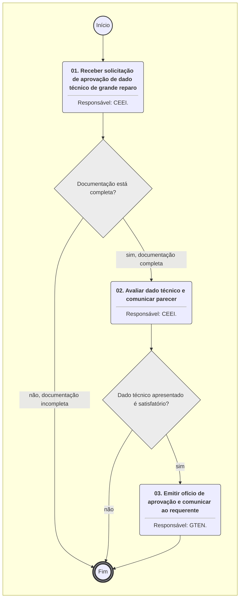

```mermaid
%%{init: {'theme': 'default'}}%%

flowchart TD
    classDef inicio stroke:#333,stroke-width:2px;
    classDef fim stroke:#333,stroke-width:4px;
    classDef tarefaBPMN stroke:#333,stroke-width:1px;
    classDef gatewayBPMN fill:#ececec,stroke:#333,stroke-width:1px;
    classDef raia fill:none,stroke:#999,stroke-width:1px,stroke-dasharray: 5 5;
    subgraph Container_ID_MPR_SAR_101_R07_5 [ ]
        direction TB
        ID_MPR_SAR_101_R07_5_Start((Início)):::inicio
        ID_MPR_SAR_101_R07_5_End(((Fim))):::fim
        ID_MPR_SAR_101_R07_5_01("<b>01. Analisar pedido</b><hr>Responsável: Grupo de Certificação Suplementar de Tipo e Aviação Geral (PST)."):::tarefaBPMN
        ID_MPR_SAR_101_R07_5_02("<b>02. Informar as pendências ao requerente</b><hr>Responsável: Grupo de Certificação Suplementar de Tipo e Aviação Geral (PST)."):::tarefaBPMN
        ID_MPR_SAR_101_R07_5_03("<b>03. Avaliar completeza das informações necessárias</b><hr>Responsável: Grupo de Certificação Suplementar de Tipo e Aviação Geral (PST)."):::tarefaBPMN
        ID_MPR_SAR_101_R07_5_04("<b>04. Solicitar envio de informações adicionais</b><hr>Responsável: Grupo de Certificação Suplementar de Tipo e Aviação Geral (PST)."):::tarefaBPMN
        ID_MPR_SAR_101_R07_5_05("<b>05. Autorizar modificação</b><hr>Responsável: Grupo de Certificação Suplementar de Tipo e Aviação Geral (PST)."):::tarefaBPMN
        ID_MPR_SAR_101_R07_5_01("<b>01. Receber solicitação de aprovação de dado técnico de grande reparo</b><hr>Responsável: CEEI."):::tarefaBPMN
        ID_MPR_SAR_101_R07_5_02("<b>02. Avaliar dado técnico e comunicar parecer</b><hr>Responsável: CEEI."):::tarefaBPMN
        ID_MPR_SAR_101_R07_5_03("<b>03. Emitir ofício de aprovação e comunicar ao requerente</b><hr>Responsável: GTEN."):::tarefaBPMN
        ID_MPR_SAR_101_R07_5_Start --> ID_MPR_SAR_101_R07_5_01
        gw_ID_MPR_SAR_101_R07_5_01{"O pedido está correto?"}:::gatewayBPMN
        ID_MPR_SAR_101_R07_5_01 --> gw_ID_MPR_SAR_101_R07_5_01
        gw_ID_MPR_SAR_101_R07_5_01 -->|"sim, o pedido está correto"| ID_MPR_SAR_101_R07_5_03
        gw_ID_MPR_SAR_101_R07_5_01 -->|"não, o pedido não está correto"| ID_MPR_SAR_101_R07_5_02
        ID_MPR_SAR_101_R07_5_02 --> ID_MPR_SAR_101_R07_5_01
        gw_ID_MPR_SAR_101_R07_5_03{"O pedido está completo?"}:::gatewayBPMN
        ID_MPR_SAR_101_R07_5_03 --> gw_ID_MPR_SAR_101_R07_5_03
        gw_ID_MPR_SAR_101_R07_5_03 -->|"não, o pedido não está completo"| ID_MPR_SAR_101_R07_5_04
        gw_ID_MPR_SAR_101_R07_5_03 -->|"sim, o pedido está completo"| ID_MPR_SAR_101_R07_5_05
        ID_MPR_SAR_101_R07_5_04 --> ID_MPR_SAR_101_R07_5_03
        ID_MPR_SAR_101_R07_5_05 --> ID_MPR_SAR_101_R07_5_End
        gw_ID_MPR_SAR_101_R07_5_01{"Documentação está completa?"}:::gatewayBPMN
        ID_MPR_SAR_101_R07_5_01 --> gw_ID_MPR_SAR_101_R07_5_01
        gw_ID_MPR_SAR_101_R07_5_01 -->|"sim, documentação completa"| ID_MPR_SAR_101_R07_5_02
        gw_ID_MPR_SAR_101_R07_5_01 -->|"não, documentação incompleta"| ID_MPR_SAR_101_R07_5_End
        gw_ID_MPR_SAR_101_R07_5_02{"Dado técnico apresentado é satisfatório?"}:::gatewayBPMN
        ID_MPR_SAR_101_R07_5_02 --> gw_ID_MPR_SAR_101_R07_5_02
        gw_ID_MPR_SAR_101_R07_5_02 -->|"sim"| ID_MPR_SAR_101_R07_5_03
        gw_ID_MPR_SAR_101_R07_5_02 -->|"não"| ID_MPR_SAR_101_R07_5_End
        ID_MPR_SAR_101_R07_5_03 --> ID_MPR_SAR_101_R07_5_End
    end
    click ID_MPR_SAR_101_R07_5_01 href "#" "O requerente deverá apresentar um pedido de modificação de projeto autorizado (F-101-50 - Formulário de Pedido de Modificação de Projeto Autorizado de RPAS). Ele deverá ser feito pelo próprio detentor da autorização do projeto afetado e deve apresentar, no mínimo, uma descrição da modificação proposta, modelo de RPAS aplicável e uma avaliação sobre o impacto em dados e demonstrações da autorização original do projeto afetado."
    click ID_MPR_SAR_101_R07_5_02 href "#" "Se durante a análise do pedido de modificação, a ANAC avaliar que o pedido não foi feito corretamente, o requerente deverá ser comunicado das pendências identificadas. Neste ponto, deverá ser enviada mensagem conforme modelo de comunicação do CCST no SEI."
    click ID_MPR_SAR_101_R07_5_03 href "#" "A GCPP examina os dados submetidos e avalia se as informações necessárias estão completas para demonstrar cumprimento com o parágrafo E94.413(b).  Em modificações mais simples, o próprio pedido da modificação pode conter todas as informações necessárias para garantir que o projeto modificado cumpre com todos os requisitos aplicáveis.  É importante notar ainda que as informações estarão completas apenas após o detentor da autorização do modelo afetado apresentar uma declaração de que o projeto modificado cumpre com todos os requisitos aplicáveis. O requerente pode optar por fornecer essa declaração junto ao próprio pedido quando este conter todas as informações necessárias para demonstrar o cumprimento dos requisitos."
    click ID_MPR_SAR_101_R07_5_04 href "#" "Caso constate a necessidade de complementação das informações necessárias para a completeza das informações necessárias para autorizar a modificação, o analista deverá emitir parecer com pendências. O requerente deverá ser informado através de mensagem enviada conforme modelo de comunicação do CCST no SEI."
    click ID_MPR_SAR_101_R07_5_05 href "#" "Ofício de autorização da modificação e, quando aplicável, atualização do DADS."
    click ID_MPR_SAR_101_R07_5_01 href "#" "O responsável deverá verificar se o requerente iniciou no SEI um Processo do Tipo “Certificação de Produto: Aprovação de Dado Técnico de Reparo” e incluiu nele os formulários F-101-31 e F-101-32, anexando os documentos referidos nos formulários. Depois dessa verificação o responsável deve atribuir o processo para o servidor da área técnica. Caso seja identificada a ausência de documentação o responsável deve encerrar sumariamente o processo e informar o requerente através de mensagem eletrônica (e-mail) do SEI."
    click ID_MPR_SAR_101_R07_5_02 href "#" "O servidor responsável deve verificar se os dados técnicos enviados são claros, completos e corretos; e se permitem a determinação de cumprimento com os requisitos aplicáveis, conforme a Lista de Verificação de Cumprimento (F-101-32).  Caso sim, o servidor deve emitir seu parecer SATISFATÓRIO no formulário F-101-16 no SEI e dar prosseguimento ao processo.  Caso não, o servidor deve emitir seu parecer INSATISFATÓRIO no formulário F-101-16 no SEI e encaminhá-lo para o requerente através de e-mail, com cópia para o CEEI e o GTEN. O requerente deve revisar os documentos aplicáveis e reenviá-los, anexando-os ao processo, no prazo máximo de 60 dias. Após o envio da mensagem ao requerente o processo deverá ser sobrestado, considerando o prazo máximo. Ultrapassado esse prazo o processo deve ser concluído. Caso o requerente decida por reenviar os documentos revisados um novo processo deverá ser aberto."
    click ID_MPR_SAR_101_R07_5_03 href "#" "O responsável deverá verificar o parecer no formulário F-101-16, emitir o Ofício de aprovação dos dados técnicos listados e encaminhá-lo para o requerente por e-mail do SEI."
```

```mermaid
%%{init: {'theme': 'default'}}%%

flowchart TD
    classDef inicio stroke:#333,stroke-width:2px;
    classDef fim stroke:#333,stroke-width:4px;
    classDef tarefaBPMN stroke:#333,stroke-width:1px;
    classDef gatewayBPMN fill:#ececec,stroke:#333,stroke-width:1px;
    classDef raia fill:none,stroke:#999,stroke-width:1px,stroke-dasharray: 5 5;
    subgraph Container_ID_MPR_SAR_101_R07_4 [ ]
        direction TB
        ID_MPR_SAR_101_R07_4_Start((Início)):::inicio
        ID_MPR_SAR_101_R07_4_End(((Fim))):::fim
        ID_MPR_SAR_101_R07_4_01("<b>01. Analisar documentação</b><hr>Responsável: Grupo de Certificação Suplementar de Tipo e Aviação Geral (PST)."):::tarefaBPMN
        ID_MPR_SAR_101_R07_4_02("<b>02. Solicitar documentação técnica</b><hr>Responsável: Grupo de Certificação Suplementar de Tipo e Aviação Geral (PST)."):::tarefaBPMN
        ID_MPR_SAR_101_R07_4_03("<b>03. Analisar documentação técnica</b><hr>Responsável: Grupo de Certificação Suplementar de Tipo e Aviação Geral (PST)."):::tarefaBPMN
        ID_MPR_SAR_101_R07_4_04("<b>04. Realizar ensaios em solo e em voo com testemunho ANAC</b><hr>Responsável: Grupo de Certificação Suplementar de Tipo e Aviação Geral (PST)."):::tarefaBPMN
        ID_MPR_SAR_101_R07_4_05("<b>05. Concluir processo</b><hr>Responsável: Grupo de Certificação Suplementar de Tipo e Aviação Geral (PST)."):::tarefaBPMN
        ID_MPR_SAR_101_R07_4_06("<b>06. Informar as pendências ao requerente</b><hr>Responsável: Grupo de Certificação Suplementar de Tipo e Aviação Geral (PST)."):::tarefaBPMN
        ID_MPR_SAR_101_R07_4_07("<b>07. Solicitar correção da documentação</b><hr>Responsável: Grupo de Certificação Suplementar de Tipo e Aviação Geral (PST)."):::tarefaBPMN
        ID_MPR_SAR_101_R07_4_01("<b>01. Analisar pedido</b><hr>Responsável: Grupo de Certificação Suplementar de Tipo e Aviação Geral (PST)."):::tarefaBPMN
        ID_MPR_SAR_101_R07_4_02("<b>02. Informar as pendências ao requerente</b><hr>Responsável: Grupo de Certificação Suplementar de Tipo e Aviação Geral (PST)."):::tarefaBPMN
        ID_MPR_SAR_101_R07_4_03("<b>03. Avaliar completeza das informações necessárias</b><hr>Responsável: Grupo de Certificação Suplementar de Tipo e Aviação Geral (PST)."):::tarefaBPMN
        ID_MPR_SAR_101_R07_4_04("<b>04. Solicitar envio de informações adicionais</b><hr>Responsável: Grupo de Certificação Suplementar de Tipo e Aviação Geral (PST)."):::tarefaBPMN
        ID_MPR_SAR_101_R07_4_05("<b>05. Autorizar modificação</b><hr>Responsável: Grupo de Certificação Suplementar de Tipo e Aviação Geral (PST)."):::tarefaBPMN
        ID_MPR_SAR_101_R07_4_01("<b>01. Receber solicitação de aprovação de dado técnico de grande reparo</b><hr>Responsável: CEEI."):::tarefaBPMN
        ID_MPR_SAR_101_R07_4_02("<b>02. Avaliar dado técnico e comunicar parecer</b><hr>Responsável: CEEI."):::tarefaBPMN
        ID_MPR_SAR_101_R07_4_03("<b>03. Emitir ofício de aprovação e comunicar ao requerente</b><hr>Responsável: GTEN."):::tarefaBPMN
        ID_MPR_SAR_101_R07_4_Start --> ID_MPR_SAR_101_R07_4_01
        gw_ID_MPR_SAR_101_R07_4_01{"Há pendências no plano de trabalho?"}:::gatewayBPMN
        ID_MPR_SAR_101_R07_4_01 --> gw_ID_MPR_SAR_101_R07_4_01
        gw_ID_MPR_SAR_101_R07_4_01 -->|"SIM, há pendências"| ID_MPR_SAR_101_R07_4_06
        gw_ID_MPR_SAR_101_R07_4_01 -->|"NÃO, não há pendências"| ID_MPR_SAR_101_R07_4_02
        ID_MPR_SAR_101_R07_4_02 --> ID_MPR_SAR_101_R07_4_03
        gw_ID_MPR_SAR_101_R07_4_03{"Documentação está adequada?"}:::gatewayBPMN
        ID_MPR_SAR_101_R07_4_03 --> gw_ID_MPR_SAR_101_R07_4_03
        gw_ID_MPR_SAR_101_R07_4_03 -->|"SIM, está adequada"| ID_MPR_SAR_101_R07_4_04
        gw_ID_MPR_SAR_101_R07_4_03 -->|"NÃO, não está adequada"| ID_MPR_SAR_101_R07_4_07
        ID_MPR_SAR_101_R07_4_04 --> ID_MPR_SAR_101_R07_4_05
        ID_MPR_SAR_101_R07_4_05 --> ID_MPR_SAR_101_R07_4_End
        ID_MPR_SAR_101_R07_4_06 --> ID_MPR_SAR_101_R07_4_01
        ID_MPR_SAR_101_R07_4_07 --> ID_MPR_SAR_101_R07_4_03
        gw_ID_MPR_SAR_101_R07_4_01{"O pedido está correto?"}:::gatewayBPMN
        ID_MPR_SAR_101_R07_4_01 --> gw_ID_MPR_SAR_101_R07_4_01
        gw_ID_MPR_SAR_101_R07_4_01 -->|"sim, o pedido está correto"| ID_MPR_SAR_101_R07_4_03
        gw_ID_MPR_SAR_101_R07_4_01 -->|"não, o pedido não está correto"| ID_MPR_SAR_101_R07_4_02
        ID_MPR_SAR_101_R07_4_02 --> ID_MPR_SAR_101_R07_4_01
        gw_ID_MPR_SAR_101_R07_4_03{"O pedido está completo?"}:::gatewayBPMN
        ID_MPR_SAR_101_R07_4_03 --> gw_ID_MPR_SAR_101_R07_4_03
        gw_ID_MPR_SAR_101_R07_4_03 -->|"não, o pedido não está completo"| ID_MPR_SAR_101_R07_4_04
        gw_ID_MPR_SAR_101_R07_4_03 -->|"sim, o pedido está completo"| ID_MPR_SAR_101_R07_4_05
        ID_MPR_SAR_101_R07_4_04 --> ID_MPR_SAR_101_R07_4_03
        ID_MPR_SAR_101_R07_4_05 --> ID_MPR_SAR_101_R07_4_End
        gw_ID_MPR_SAR_101_R07_4_01{"Documentação está completa?"}:::gatewayBPMN
        ID_MPR_SAR_101_R07_4_01 --> gw_ID_MPR_SAR_101_R07_4_01
        gw_ID_MPR_SAR_101_R07_4_01 -->|"sim, documentação completa"| ID_MPR_SAR_101_R07_4_02
        gw_ID_MPR_SAR_101_R07_4_01 -->|"não, documentação incompleta"| ID_MPR_SAR_101_R07_4_End
        gw_ID_MPR_SAR_101_R07_4_02{"Dado técnico apresentado é satisfatório?"}:::gatewayBPMN
        ID_MPR_SAR_101_R07_4_02 --> gw_ID_MPR_SAR_101_R07_4_02
        gw_ID_MPR_SAR_101_R07_4_02 -->|"sim"| ID_MPR_SAR_101_R07_4_03
        gw_ID_MPR_SAR_101_R07_4_02 -->|"não"| ID_MPR_SAR_101_R07_4_End
        ID_MPR_SAR_101_R07_4_03 --> ID_MPR_SAR_101_R07_4_End
    end
    click ID_MPR_SAR_101_R07_4_01 href "#" "O requerente deverá apresentar um plano de trabalho para o requerimento de autorização de projeto de RPAS proposto. Nele serão definidos a base de requisitos utilizada, condições especiais, níveis equivalentes de segurança, isenções, lista dos requisitos afetados, meios de cumprimento e proposta de cronograma. O Plano de Trabalho é, assim, uma provisão ou guia do processo. Ressalta-se que este documento será acordado entre as partes envolvidas e poderá ser revisado, se necessário, sempre que ocorrer alguma alteração nas premissas originalmente utilizadas.  O Plano de Trabalho deverá conter as informações previstas no Apêndice B da IS E94-001A.  O analista deverá avaliar principalmente a lista de cumprimento com os requisitos presente no Plano de Trabalho conforme SUBPARTE E do RBAC E94 e seus meios de cumprimento."
    click ID_MPR_SAR_101_R07_4_02 href "#" "Devem ser submetidos à GGCP, para revisão e aceitação, todos os dados técnicos referentes ao projeto de RPAS. Estes dados devem mostrar que o projeto de RPAS cumpre com todos os requisitos definidos no Plano de Trabalho. Por fim, enfatiza-se que é responsabilidade do requerente demonstrar o cumprimento com os regulamentos aplicáveis.  A IS E94-002A descreve como cumprir com os requisitos E94.405 e E94.407. Para os demais requisitos da Subparte E deverão ser acordados meios de cumprimentos com os requisitos."
    click ID_MPR_SAR_101_R07_4_03 href "#" "A GGCP examina os dados submetidos e analisa as propostas de ensaios e ensaios enviados pelo requerente. Enfatiza-se que é atribuição da GGCP determinar se os dados técnicos ora apresentados são suficientes ou não para demonstrar o cumprimento com os requisitos.  A IS E94-002A descreve como cumprir com os requisitos E94.405 e E94.407. Para os demais requisitos da Subparte E deverão ser avaliados meios de cumprimento com os requisitos conforme definidos no Plano de Trabalho.  Por fim, deverá ser enviada uma Declaração de Conformidade do equipamento a ser ensaiado assinada pelo Responsável Técnico – RT do projeto. Este deverá verificar a conformidade da aeronave, das peças, componentes ou sistemas instalados com os dados técnicos apresentados e com as propostas de ensaios e/ou sua representatividade para o produto final.  Ensaios de desenvolvimento: Ensaios mecânicos, estruturais, de inflamabilidade, de qualificação, de voo de desenvolvimento, para verificação de funcionamento de sistemas e equipamentos instalados, entre outros, conforme aplicável. Os respectivos relatórios de resultados, contendo laudos, conclusões, especificações técnicas etc., poderão ser aceitos pela ANAC, no âmbito do processo de autorização de projeto de RPAS.  Antes da realização dos ensaios em voo, o requerente deverá verificar a IS E94.503-001 sobre a necessidade de obtenção de um Certificado de Autorização de Voo Experimental – CAVE.  Ensaios de demonstração de cumprimento: Ensaios e testes no solo ou em voo realizados pelo requerente a fim de demonstrar o cumprimento de requisitos elencados no Plano de Trabalho. Os ensaios de demonstração de cumprimento de requisitos são de responsabilidade e execução do requerente. Após a execução de ensaios demonstração de cumprimento de requisitos, o requerente deve elaborar e encaminhar para a apreciação da ANAC os relatórios de resultados, devidamente assinados pelo RT e, caso aplicável, pelo piloto remoto que executou os ensaios."
    click ID_MPR_SAR_101_R07_4_04 href "#" "Ensaios no solo: Ensaios e testes no solo requeridos pela ANAC serão realizados pelo requerente e testemunhados pela ANAC ou profissional credenciado, a fim de verificar o cumprimento de requisitos elencados no Plano de Trabalho.  Ensaios em voo de verificação de cumprimento de requisitos: Os voos de demonstração de cumprimento de requisitos requeridos pela ANAC são de responsabilidade e execução do requerente. A ANAC testemunhará os referidos ensaios.  Após a execução dos ensaios em solo e em voo de verificação de cumprimento de requisitos, é responsabilidade da ANAC ou do profissional credenciado elaborar os relatórios de resultados, devidamente assinados por quem testemunhou os ensaios.  A preparação da aeronave para ensaios em voo, conforme previsto nas propostas de ensaio previamente acordadas, é responsabilidade do requerente e consiste, entre outras, nas seguintes atividades: instalação e calibração das instrumentações de ensaio, as quais serão verificadas pela ANAC em inspeções de conformidade e colocação da aeronave nas condições de peso e balanceamento previstas para o ensaio em voo."
    click ID_MPR_SAR_101_R07_4_05 href "#" "Após finalização de todas as atividades definidas no Plano de Trabalho, o requerente deverá apresentar uma declaração devidamente preenchida e assinada pelo RT, atestando o cumprimento de todos os requisitos aplicáveis, conforme RBAC-E 94.401(b)(3).  Após a finalização do processo, a ANAC emitirá o ofício de autorização de projeto de RPAS acompanhado da folha de especificações do RPAS."
    click ID_MPR_SAR_101_R07_4_06 href "#" "Após análise do Plano de Trabalho, a ANAC avaliará a adequabilidade do Plano de Trabalho incluindo os meios de cumprimento com os requisitos e possíveis elaborações de FCARs relacionadas à meios alternativos e emitirá mensagem informando os pontos que devem ser melhorados. Neste ponto, deverá ser enviada mensagem conforme modelo de comunicação do PST no SEI."
    click ID_MPR_SAR_101_R07_4_07 href "#" "Para cada documento entregue, o analista deverá emitir parecer com pendências ou aceitação do documento. O requerente deverá ser informado através de mensagem enviada conforme modelo de comunicação do PST no SEI."
    click ID_MPR_SAR_101_R07_4_01 href "#" "O requerente deverá apresentar um pedido de modificação de projeto autorizado (F-101-50 - Formulário de Pedido de Modificação de Projeto Autorizado de RPAS). Ele deverá ser feito pelo próprio detentor da autorização do projeto afetado e deve apresentar, no mínimo, uma descrição da modificação proposta, modelo de RPAS aplicável e uma avaliação sobre o impacto em dados e demonstrações da autorização original do projeto afetado."
    click ID_MPR_SAR_101_R07_4_02 href "#" "Se durante a análise do pedido de modificação, a ANAC avaliar que o pedido não foi feito corretamente, o requerente deverá ser comunicado das pendências identificadas. Neste ponto, deverá ser enviada mensagem conforme modelo de comunicação do CCST no SEI."
    click ID_MPR_SAR_101_R07_4_03 href "#" "A GCPP examina os dados submetidos e avalia se as informações necessárias estão completas para demonstrar cumprimento com o parágrafo E94.413(b).  Em modificações mais simples, o próprio pedido da modificação pode conter todas as informações necessárias para garantir que o projeto modificado cumpre com todos os requisitos aplicáveis.  É importante notar ainda que as informações estarão completas apenas após o detentor da autorização do modelo afetado apresentar uma declaração de que o projeto modificado cumpre com todos os requisitos aplicáveis. O requerente pode optar por fornecer essa declaração junto ao próprio pedido quando este conter todas as informações necessárias para demonstrar o cumprimento dos requisitos."
    click ID_MPR_SAR_101_R07_4_04 href "#" "Caso constate a necessidade de complementação das informações necessárias para a completeza das informações necessárias para autorizar a modificação, o analista deverá emitir parecer com pendências. O requerente deverá ser informado através de mensagem enviada conforme modelo de comunicação do CCST no SEI."
    click ID_MPR_SAR_101_R07_4_05 href "#" "Ofício de autorização da modificação e, quando aplicável, atualização do DADS."
    click ID_MPR_SAR_101_R07_4_01 href "#" "O responsável deverá verificar se o requerente iniciou no SEI um Processo do Tipo “Certificação de Produto: Aprovação de Dado Técnico de Reparo” e incluiu nele os formulários F-101-31 e F-101-32, anexando os documentos referidos nos formulários. Depois dessa verificação o responsável deve atribuir o processo para o servidor da área técnica. Caso seja identificada a ausência de documentação o responsável deve encerrar sumariamente o processo e informar o requerente através de mensagem eletrônica (e-mail) do SEI."
    click ID_MPR_SAR_101_R07_4_02 href "#" "O servidor responsável deve verificar se os dados técnicos enviados são claros, completos e corretos; e se permitem a determinação de cumprimento com os requisitos aplicáveis, conforme a Lista de Verificação de Cumprimento (F-101-32).  Caso sim, o servidor deve emitir seu parecer SATISFATÓRIO no formulário F-101-16 no SEI e dar prosseguimento ao processo.  Caso não, o servidor deve emitir seu parecer INSATISFATÓRIO no formulário F-101-16 no SEI e encaminhá-lo para o requerente através de e-mail, com cópia para o CEEI e o GTEN. O requerente deve revisar os documentos aplicáveis e reenviá-los, anexando-os ao processo, no prazo máximo de 60 dias. Após o envio da mensagem ao requerente o processo deverá ser sobrestado, considerando o prazo máximo. Ultrapassado esse prazo o processo deve ser concluído. Caso o requerente decida por reenviar os documentos revisados um novo processo deverá ser aberto."
    click ID_MPR_SAR_101_R07_4_03 href "#" "O responsável deverá verificar o parecer no formulário F-101-16, emitir o Ofício de aprovação dos dados técnicos listados e encaminhá-lo para o requerente por e-mail do SEI."
```

**MANUAL DE PROCEDIMENTO**

**MPR/SAR-101-R07**

**CERTIFICAÇÃO DE PROJETO DE PRODUTO AERONÁUTICO**

12/2024

**REVISÕES**

|  |  |  |  |  |
| --- | --- | --- | --- | --- |
| **Revisão** | **Aprovação** | **Publicação** | **Aprovado Por** | **Modificações da Última Versão** |
| R00 | Portaria Nº 2.043, de 19 de junho de 2017 | Não informado | SAR | Versão Original |
| R01 | Portaria nº 3.075 | Não informado | SAR | 1) Processo 'Planejar Processo de Certificação de Tipo' modificado.  2) Processo 'Executar o Plano e Emitir Certificado de Tipo' modificado. |
| R02 | PORTARIA Nº 2.713/SAR, DE 3 DE SETEMBRO DE 2019 | Não informado | SAR | 1) Processo 'Analisar Projeto de RPAS' inserido.  2) Processo 'Preparar o Recebimento da Solicitação de Certificação de Tipo' modificado.  3) Processo 'Planejar Processo de Certificação de Tipo' modificado.  4) Processo 'Executar o Plano e Emitir Certificado de Tipo' modificado.  5) Processo 'Validar Certificado de Tipo' modificado. |
| R03 | PORTARIA Nº 3.553, DE 14 DE NOVEMBRO DE 2019 | Não informado | SAR | 1) Processo 'Preparar o Recebimento da Solicitação de Certificação de Tipo' modificado.  2) Processo 'Planejar Processo de Certificação de Tipo' modificado.  3) Processo 'Executar o Plano e Emitir Certificado de Tipo' modificado.  4) Processo 'Validar Certificado de Tipo' modificado. |
| R04 | PORTARIA No 2.282, DE 4 DE SETEMBRO DE 2020. | Não informado | SAR | 1) Processo 'Conduzir Modificações de Projetos Autorizados de RPAS' inserido. |
| R05 | PORTARIA Nº 6.708, DE 13 DE DEZEMBRO DE 2021 | 24/12/2021 | SAR | 1) Processo 'Planejar Processo de Certificação de Tipo' removido.  2) Processo 'Executar o Plano e Emitir Certificado de Tipo' removido.  3) Processo 'Preparar o Recebimento da Solicitação de Certificação de Tipo' removido.  4) Processo 'Transferir, Suspender ou Cassar Certificado de Tipo' inserido.  5) Processo 'Realizar Avaliação Técnica' inserido.  6) Processo 'Gerenciar Certificação de Projeto Aeronáutico' inserido.  7) Processo 'Validar Certificado de Tipo' modificado. |
| R06 | PORTARIA Nº 14559, DE 09 DE MAIO DE 2024 | 17/05/2024 | SAR | 1) Processo 'Realizar Avaliação Técnica' modificado.  2) Processo 'Gerenciar Certificação de Projeto Aeronáutico' modificado. |
| R07 | PORTARIA Nº 15757, DE 31 DE OUTUBRO DE 2024 | 20/12/2024 | SAR | 1) Processo 'Aprovar Dados Técnicos para Grande Reparo ao Produto Aeronáutico' inserido. |

**ÍNDICE**

1) Disposições Preliminares, pág. 6.

1.1) Introdução, pág. 6.

1.2) Revogação, pág. 7.

1.3) Fundamentação, pág. 7.

1.4) Executores dos Processos, pág. 7.

1.5) Elaboração e Revisão, pág. 8.

1.6) Organização do Documento, pág. 8.

2) Definições, pág. 10.

2.1) Sigla, pág. 10.

3) Artefatos, Competências, Sistemas e Documentos Administrativos, pág. 12.

3.1) Artefatos, pág. 12.

3.2) Competências, pág. 13.

3.3) Sistemas, pág. 13.

3.4) Documentos e Processos Administrativos, pág. 14.

4) Procedimentos Referenciados, pág. 15.

5) Procedimentos, pág. 16.

5.1) Gerenciar Certificação de Projeto Aeronáutico, pág. 16.

5.2) Realizar Avaliação Técnica, pág. 26.

5.3) Transferir, Suspender ou Cassar Certificado de Tipo, pág. 35.

5.4) Validar Certificado de Tipo, pág. 38.

5.5) Analisar Projeto de RPAS, pág. 47.

5.6) Conduzir Modificações de Projetos Autorizados de RPAS, pág. 52.

5.7) Aprovar Dados Técnicos para Grande Reparo ao Produto Aeronáutico, pág. 56.

6) Disposições Finais, pág. 60.

**PARTICIPAÇÃO NA EXECUÇÃO DOS PROCESSOS**

**ÁREAS ORGANIZACIONAIS**

**1) Coordenadoria de Engenharia de Estruturas e Interiores**

a) Aprovar Dados Técnicos para Grande Reparo ao Produto Aeronáutico

**2) Gerência de Certificação de Projeto de Produto Aeronáutico**

a) Transferir, Suspender ou Cassar Certificado de Tipo

**3) Gerência Técnica de Engenharia de Produto**

a) Aprovar Dados Técnicos para Grande Reparo ao Produto Aeronáutico

**4) Gerência Técnica de Programas de Certificação**

a) Validar Certificado de Tipo

**GRUPOS ORGANIZACIONAIS**

**a) Engenharia - Investigação Técnica**

1) Realizar Avaliação Técnica

**b) Grupo de Certificação Suplementar de Tipo e Aviação Geral (PST)**

1) Analisar Projeto de RPAS

2) Conduzir Modificações de Projetos Autorizados de RPAS

**c) GTPR-GPC**

1) Gerenciar Certificação de Projeto Aeronáutico

2) Transferir, Suspender ou Cassar Certificado de Tipo

**d) O Gtpr**

1) Gerenciar Certificação de Projeto Aeronáutico

**1. DISPOSIÇÕES PRELIMINARES**

**1.1 INTRODUÇÃO**

Este MPR contém as informações de suporte para a realização da Certificação de Tipo de Produtos Aeronáuticos de Projeto Nacional.

Esta versão foi criada e aprovada pelo processo SEI 00058.093201/2024-62.

Alterações:

- Incluído o processo de trabalho APROVAR DADOS TÉCNICOS PARA GRANDE REPARO AO PRODUTO AERONÁUTICO.

A Portaria Nº 3.881 DE 29 DE DEZEMBRO DE 2020, delega ao Gerência de Certificação de Projeto do Produto Aeronáutico, entre outras, as seguintes competências:

I - Propor a emissão, suspensão e extinção do certificado de tipo, incluindo suas revisões;

II - Propor a emissão, suspensão e extinção de autorização de projeto de sistema de aeronave remotamente pilotada (RPAS), incluindo suas revisões;

III - Emitir e revisar especificações técnicas de certificado de tipo e autorização de projeto de RPAS;

IV - Propor a emissão, suspensão e extinção de reconhecimento de aeronave leve esportiva, em coordenação com a GTCO;

V - Emitir, suspender e extinguir certificado suplementar de tipo e certificado de produto aeronáutico aprovado, incluindo as respectivas especificações técnicas e suas revisões, como aplicável;

VI - Emitir, suspender e extinguir outros atestados, aprovações e autorizações relativas às atividades em seu âmbito de atuação;

VII - Aprovar e/ou aceitar Lista Mestra de Equipamentos Mínimos;

VIII - Aprovar Relatório de Avaliação Operacional;

IX - Decidir sobre recursos apresentados no âmbito dos processos de credenciamento em sua área de atuação; e

X - Conceder meio alternativo de demonstração de cumprimento a requisito em sua área de atuação.

O MPR estabelece, no âmbito da Superintendência de Aeronavegabilidade - SAR, os seguintes processos de trabalho:

a) Gerenciar Certificação de Projeto Aeronáutico.

b) Realizar Avaliação Técnica.

c) Transferir, Suspender ou Cassar Certificado de Tipo.

d) Validar Certificado de Tipo.

e) Analisar Projeto de RPAS.

f) Conduzir Modificações de Projetos Autorizados de RPAS.

g) Aprovar Dados Técnicos para Grande Reparo ao Produto Aeronáutico.

**1.2 REVOGAÇÃO**

MPR/SAR-101-R06, aprovado na data de 17 de maio de 2024.

**1.3 FUNDAMENTAÇÃO**

Resolução nº 381, de 14 de junho de 2016, art. 31.

**1.4 EXECUTORES DOS PROCESSOS**

Os procedimentos contidos neste documento aplicam-se aos servidores integrantes das seguintes áreas organizacionais:

|  |  |
| --- | --- |
| **Área Organizacional** | **Descrição** |
| Coordenadoria de Engenharia de Estruturas e Interiores - CEEI | Emitir parecer especializado, relacionado com a certificação de projeto de produto aeronáutico, com foco em resistência estrutural de aeronaves e em proteção do ocupante de aeronave. |
| Gerência de Certificação de Projeto de Produto Aeronáutico - GCPP | Tem como atribuições certificar projeto e produção de produtos aeronáuticos e executar atividades relacionadas a aeronavegabilidade continuada desses produtos. |
| Gerência Técnica de Engenharia de Produto - GTEN | Responsável por prover pareceres especializados em engenharia aplicada aos requisitos de aeronavegabilidade e de proteção ambiental. |
| Gerência Técnica de Programas de Certificação - GTPR | Responsável, dentro da GCPP, pela coordenação dos programas de certificação de projeto de produtos aeronáuticos e de acompanhamento da aeronavegabilidade continuada. |

|  |  |
| --- | --- |
| **Grupo Organizacional** | **Descrição** |
| Engenharia - Investigação Técnica | Grupo de engenheiros da SAR responsáveis pela investigação técnica visando a certificação de aeronaves. |
| Aviação Geral PST | Aviação Geral PST |
| GTPR-GPC | GPC |
| O GTPR | Gerente Técnico de Programas de Certificação |

**1.5 ELABORAÇÃO E REVISÃO**

O processo que resulta na aprovação ou alteração deste MPR é de responsabilidade da Superintendência de Aeronavegabilidade - SAR. Em caso de sugestões de revisão, deve-se procurá-la para que sejam iniciadas as providências cabíveis.

As revisões deste MPR serão aprovadas pelo(s) titular(es) da(s) unidade(s) responsável(is) pela execução do(s) processo(s) nele listado(s).

**1.6 ORGANIZAÇÃO DO DOCUMENTO**

O capítulo 2 apresenta as principais definições utilizadas no âmbito deste MPR, e deve ser visto integralmente antes da leitura de capítulos posteriores.

O capítulo 3 apresenta as competências, os artefatos e os sistemas envolvidos na execução dos processos deste manual, em ordem relativamente cronológica.

O capítulo 4 apresenta os processos de trabalho referenciados neste MPR. Estes processos são publicados em outros manuais que não este, mas cuja leitura é essencial para o entendimento dos processos publicados neste manual. O capítulo 4 expõe em quais manuais são localizados cada um dos processos de trabalho referenciados.

O capítulo 5 apresenta os processos de trabalho. Para encontrar um processo específico, deve-se procurar sua respectiva página no índice contido no início do documento. Os processos estão ordenados em etapas. Cada etapa é contida em uma tabela, que possui em si todas as informações necessárias para sua realização. São elas, respectivamente:

a) o título da etapa;

b) a descrição da forma de execução da etapa;

c) as competências necessárias para a execução da etapa;

d) os artefatos necessários para a execução da etapa;

e) os sistemas necessários para a execução da etapa (incluindo, bases de dados em forma de arquivo, se existente);

f) os documentos e processos administrativos que precisam ser elaborados durante a execução da etapa;

g) instruções para as próximas etapas; e

h) as áreas ou grupos organizacionais responsáveis por executar a etapa.

O capítulo 6 apresenta as disposições finais do documento, que trata das ações a serem realizadas em casos não previstos.

Por último, é importante comunicar que este documento foi gerado automaticamente. São recuperados dados sobre as etapas e sua sequência, as definições, os grupos, as áreas organizacionais, os artefatos, as competências, os sistemas, entre outros, para os processos de trabalho aqui apresentados, de forma que alguma mecanicidade na apresentação das informações pode ser percebida. O documento sempre apresenta as informações mais atualizadas de nomes e siglas de grupos, áreas, artefatos, termos, sistemas e suas definições, conforme informação disponível na base de dados, independente da data de assinatura do documento. Informações sobre etapas, seu detalhamento, a sequência entre etapas, responsáveis pelas etapas, artefatos, competências e sistemas associados a etapas, assim como seus nomes e os nomes de seus processos têm suas definições idênticas à da data de assinatura do documento.

**2. DEFINIÇÕES**

A tabela abaixo apresenta as definições necessárias para o entendimento deste Manual de Procedimento.

**2.1 Sigla**

|  |  |
| --- | --- |
| **Definição** | **Significado** |
| AC | Advisory Circular |
| AD | Airworthiness Directive |
| AFM – Aircraft Flight Manual | Significa manual de voo aprovado da aeronave. |
| AIT | Autorização de Inspeção de Tipo |
| ANAC | Agência Nacional de Aviação Civil |
| BPS | Boletim de Pessoal e Serviço |
| CAI | Certification Action Items |
| CAVE | Certificado de Autorização de Voo Experimental |
| CCST | Coordenadoria de Certificação Suplementar de Tipo |
| COP | Certificado de Organização de Produção |
| CPCT | Coordenadoria de Programas de Certificação de Tipo |
| CT | Certificado de Tipo |
| EASA | European Aviation Safety Agency |
| FAA | Federal Aviation Administration |
| FCAR | Fichas de Controle de Assuntos Relevantes |
| FTCBM | Final Type Certification Board Meeting |
| GCAC | Gerência de Certificação de Aeronavegabilidade Continuada |
| GCPP | Gerência de Certificação de Projeto de Produto Aeronáutico |
| GPC | Coordenador de Programa de Certificação |
| GTCO/SAR | Gerência Técnica de Organizações e Inspeção. |
| GTEN | Gerência Técnica de Engenharia de Produto |
| GTNI | Gerência Técnica de Normas e Inovação |
| GTPR | Gerência Técnica de Programas de Certificação |
| HT | Código utilizado na numeração/identificação de uma FCAR que trata de assunto geral relacionado à certificação de um produto aeronáutico e que está sob a responsabilidade do GPC. |
| IS | Instrução Suplementar |
| ITD | Instrução de Trabalho Detalhada |
| MMEL | Master Minimum Equipment List |
| Moc | Means of Compliance |
| MRB | Maintenance Review Board |
| PCEP | Plano de Certificação Específico para o Programa |
| PCF | Profissional Credenciado em Fabricação |
| PCM | Posto de Coordenção Movél |
| PCP | Profissional Credenciado em Projeto |
| PCR | Plano de Certificação do Requerente |
| PM | Project Manager |
| PTCBM | Preliminary Type Certification Board Meeting |
| RBAC | Regulamento Brasileiro da Aviação Civil |
| RPAS | Ssitema de Aeronave Remotamente Pilotada (Remotely Piloted Aircraft System) |
| RT | Responsável Técnico |
| SEI | Sistema Eletrônico de Informações |
| SPO | Superintendência de Padrões Operacionais |
| STPC | Solicitação de Trabalho de Profissional Credenciado |
| TCDS | Type Certificate Data Sheet |
| TFAC | Taxa de Fiscalização da Aviação Civil |
| TP | Test Proposal |

**3. ARTEFATOS, COMPETÊNCIAS, SISTEMAS E DOCUMENTOS ADMINISTRATIVOS**

Abaixo se encontram as listas dos artefatos, competências, sistemas e documentos administrativos que o executor necessita consultar, preencher, analisar ou elaborar para executar os processos deste MPR. As etapas descritas no capítulo seguinte indicam onde usar cada um deles.

As competências devem ser adquiridas por meio de capacitação ou outros instrumentos e os artefatos se encontram no módulo "Artefatos" do sistema GFT - Gerenciador de Fluxos de Trabalho.

**3.1 ARTEFATOS**

|  |  |
| --- | --- |
| **Nome** | **Descrição** |
| F-101-01 - Relatório de Testemunho de Ensaio | Artefato gerado a partir da revisão do MPR/SAR 101. Vem em substituição do F-800-01 e F-800-03. |
| F-101-12 | Ficha de Controle de Assuntos Relevantes (FCAR) |
| F-101-16 | FOLHA DE ANÁLISE DE DOCUMENTO |
| F-101-18 | F-200-18F |
| F-101-31 | SOLICITAÇÃO DE APROVAÇÃO DE DADOS TÉCNICOS DE GRANDE REPARO. |
| F-101-32 | LISTA DE VERIFICAÇÃO DE CUMPRIMENTO |
| F-101-50 - Formulário de Pedido de Modificação de Projeto Autorizado de RPAS | FORMULÁRIO DE PEDIDO DE  MODIFICAÇÃO DE PROJETO AUTORIZADO DE RPAS |
| F-200-14 - Pedido de Conformidade | Pedido de Conformidade. |
| ITD-101-01 | Tramitação e emissão final de Certificados de Tipo – CT, Certificado Suplementar de Tipo - CST, F-400-04, Folhas de Especificação de Tipo e Relatórios de Aceitação (H.10, H.11, V.33 e V.35). |
| ITD-101-02 | Base de Certificação e Controle de Assuntos Relevantes. |
| ITD-101-03 | Diretrizes para definição de Nível de Envolvimento na verificação de cumprimento com requisitos de aeronavegabilidade de produtos aeronáuticos. |
| ITD-101-04 | Elaboração da Folha de Especificação |
| ITD-101-05 | Aprovação de Grande Modificação ao Projeto de Tipo e Emenda ao CT. |
| ITD-101-06 | Escolha do Tipo de Processo de Validação de Certificado de Tipo. |
| ITD-101-07 | Validação de Certificado de Tipo de aeronaves importadas (Relatório H.10). |
| ITD-101-08 | Análise e Elaboração de Planos de Certificação. |
| ITD-101-09 | Instruções de Preparação e Emissão da Autorização de Inspeção de Tipo. |
| ITD-101-11 | Tratamento de conflitos técnicos entre requerente e ANAC. |
| ITD-101-12 - Manual do Engenheiro de Certificação de Tipo | Melhores práticas de análise de engenharia na certificação de tipo. |

**3.2 COMPETÊNCIAS**

Para que os processos de trabalho contidos neste MPR possam ser realizados com qualidade e efetividade, é importante que as pessoas que venham a executá-los possuam um determinado conjunto de competências. No capítulo 5, as competências específicas que o executor de cada etapa de cada processo de trabalho deve possuir são apresentadas. A seguir, encontra-se uma lista geral das competências contidas em todos os processos de trabalho deste MPR e a indicação de qual área ou grupo organizacional as necessitam:

|  |  |
| --- | --- |
| **Competência** | **Áreas e Grupos** |
| Acompanha ensaios e testes no solo e em voo requeridos pela ANAC. | Aviação Geral PST |
| Analisa a documentação recebida, de forma atenta e diligente, sugerindo as adequações de forma, conteúdo e mérito, tendo em vista a aderência da documentação ao previsto no plano de trabalho aceito. | Aviação Geral PST |
| Analisa a suficiência de dados (administrativos e técnicos) requeridos para o processo de validação. | GTPR |
| Conduz processo de modificação de projeto autorizado de RPAS de acordo com a regulamentação vigente. | Aviação Geral PST |
| Elabora relatório de testemunho de ensaio e testes no solo e em voo requeridos pela ANAC. | Aviação Geral PST |

**3.3 SISTEMAS**

|  |  |  |
| --- | --- | --- |
| **Nome** | **Descrição** | **Acesso** |
| Intranet da SAR | Sistema de controle de processos internos da SAR e disponibilização de informações de aeronavegabilidade e estatísticas. | http://sar.anac.gov.br |
| SEI | Sistema Eletrônico de Informação. | https://sei.anac.gov.br/sip/login.php?sigla\_orgao\_sistema=ANAC&sigla\_sistema=SEI |

**3.4 DOCUMENTOS E PROCESSOS ADMINISTRATIVOS ELABORADOS NESTE MANUAL**

Não há documentos ou processos administrativos a serem elaborados neste MPR.

**4. PROCEDIMENTOS REFERENCIADOS**

Procedimentos referenciados são processos de trabalho publicados em outro MPR que têm relação com os processos de trabalho publicados por este manual. Este MPR não possui nenhum processo de trabalho referenciado.

**5. PROCEDIMENTOS**

Este capítulo apresenta todos os processos de trabalho deste MPR. Para encontrar um processo específico, utilize o índice nas páginas iniciais deste documento. Ao final de cada etapa encontram-se descritas as orientações necessárias à continuidade da execução do processo. O presente MPR também está disponível de forma mais conveniente em versão eletrônica, onde pode(m) ser obtido(s) o(s) artefato(s) e outras informações sobre o processo.

**5.1 Gerenciar Certificação de Projeto Aeronáutico**

Gerenciar Certificação de Projeto Aeronáutico é gerenciar o progresso das atividades de certificação de um dado projeto ou de aprovação de modificação a projeto certificado. Este gerenciamento é feito por servidor designado, nominado como Gerente de Programa de Certificação (GPC).

Cabe ao GPC promover a contínua atualização do planejamento e monitorar a execução desse planejamento por ambas as partes (ANAC e requerente). O GPC controla o andamento do processo de certificação, define a priorização das atividades, gerencia eventuais riscos identificados, dentre outras atividades, através de ferramentas de gerenciamento de projeto.

A situação que inicia o processo, chamada de evento de início, é "Requerimento formal recebido". O processo é considerado concluído quando alcança seu evento de fim. O evento de fim descrito para esse processo é: "Certificado Emitido”.

A área envolvida na execução deste processo é a GTPR.

O processo contém, ao todo, 12 etapas. A situação que inicia o processo, chamada de evento de início, foi descrita como: "Requerimento Formal Recebido", portanto, este processo deve ser executado sempre que este evento acontecer. Da mesma forma, o processo é considerado concluído quando alcança seu evento de fim. O evento de fim descrito para esse processo é: "Projeto Certificado.

Os grupos envolvidos na execução deste processo são: GTPR-GPC, O GTPR.

Para que esse procedimento seja executado de forma apropriada, o executor irá necessitar dos seguintes artefatos: "F-101-18", "ITD-101-05", "ITD-101-09", "ITD-101-08", "ITD-101-04", "ITD-101-01", "ITD-101-02", "ITD-101-11".

Abaixo se encontra(m) a(s) etapa(s) a ser(em) realizada(s) na execução deste processo e o diagrama do fluxo.


### 5.1 Gerenciar Certificação de Projeto Aeronáutico




|  |
| --- |
| **01. Designar um GPC** |
| RESPONSÁVEL PELA EXECUÇÃO: O Gtpr. |
| DETALHAMENTO: O GTPR faz a designação de um Gerente de Programa de Certificação (GPC), que será o servidor que atuará como gerente de projeto. O GPC corresponde à figura do Project Manager (PM) referido na FAA Order 8110-4 e, ao Project Certification Manager (PCM) da EASA.  Atualizar a base de dados dos programas de certificação em andamento com o GPC designado.  Também são designados os responsáveis pelo Maintenance Review Board – MRB e pela Master Minimum Equipment List (MMEL), quando necessário. |
| SISTEMAS USADOS NESTA ATIVIDADE: Intranet da SAR. |
| CONTINUIDADE: deve-se seguir para a etapa "02. Analisar informações encaminhadas junto com o requerimento". |

|  |
| --- |
| **02. Analisar informações encaminhadas junto com o requerimento** |
| RESPONSÁVEL PELA EXECUÇÃO: GTPR-GPC. |
| DETALHAMENTO: Analisar o requerimento protocolado e os dados fornecidos conforme a ITD-101-01. Se necessário, informações adicionais serão solicitadas formalmente pelo GTPR-GPC ao interessado.  Idealmente, é recomendável que o interessado encaminhe um planejamento global que permita à ANAC avaliar se o interessado tem uma boa compreensão da extensão e da magnitude do programa de certificação por ele pretendido.  Reuniões podem ser necessárias para uma familiarização preliminar do projeto da aeronave e para melhor entendimento da estratégia de certificação proposta pelo interessado. |
| ARTEFATOS USADOS NESTA ATIVIDADE: ITD-101-01. |
| SISTEMAS USADOS NESTA ATIVIDADE: Intranet da SAR. |
| CONTINUIDADE: deve-se seguir para a etapa "03. Enviar ofício deferindo o requerimento". |

|  |
| --- |
| **03. Enviar ofício deferindo o requerimento** |
| RESPONSÁVEL PELA EXECUÇÃO: GTPR-GPC. |
| DETALHAMENTO: Após análise das informações preliminares e sendo estas julgadas satisfatórias, o GTPR-GPC faz a abertura do projeto (H.01 para o caso de novo projeto ou novo modelo) no sistema da Intranet SAR e prepara um ofício a ser assinado pelo GCPP, no caso de novo projeto ou modelo, ou pelo GTPR (no caso de modificação), através do qual o requerimento é deferido e são informadas as instruções de pagamento da TFAC. |
| SISTEMAS USADOS NESTA ATIVIDADE: Intranet da SAR. |
| CONTINUIDADE: deve-se seguir para a etapa "04. Receber comunicação de pagamento". |

|  |
| --- |
| **04. Receber comunicação de pagamento** |
| RESPONSÁVEL PELA EXECUÇÃO: GTPR-GPC. |
| DETALHAMENTO: Enquanto o pagamento da TFAC não ocorre, o processo será mantido na condição de sobrestado.  O GPC contata a GTDE quando ele for informado pelo interessado que houve o pagamento da TFAC. A GTDE então acusa o recebimento da TFAC, permitindo o prosseguimento do processo.  Em caso de novo modelo de aeronave, avalia-se se este é relevante sob o ponto de vista da:  - GTNI: seria um modelo cujas características possam resultar em elevada quantidade de processos de rulemaking (condições especiais, níveis equivalentes de segurança e isenções).  - SPO: seria um novo modelo usado em operações comerciais, de acordo com os RBAC 121 ou 135. |
| CONTINUIDADE: caso a resposta para a pergunta "A aeronave é relevante?" seja "não, aeronave não é relevante", deve-se seguir para a etapa "06. Conduzir análise preliminar". Caso a resposta seja "sim, aeronave relevante", deve-se seguir para a etapa "05. Comunicar GTNI e SPO". |

|  |
| --- |
| **05. Comunicar GTNI e SPO** |
| RESPONSÁVEL PELA EXECUÇÃO: GTPR-GPC. |
| DETALHAMENTO: Quando o projeto for relevante, a GTPR informará à GTNI e à SPO as seguintes informações:  (1) A aceitação e o número do processo;  (2) A base de certificação inicial (os RBAC aplicáveis e suas emendas mínimas a serem consideradas no projeto);  (3) O nome e dados de contato do GPC designado para o programa.  O envolvimento da GTNI e da SPO se dará ao longo do processo de certificação, especialmente participando da discussão dos itens relativos à publicação de itens de rulemaking, à manutenção e à operação da aeronave, respectivamente. O GPC deve convidar a GTNI e a SPO para participarem de reuniões e de outras atividades relevantes.  No caso de novo projeto de aeronave, as informações listadas acima deverão ser encaminhadas para a GTNI e SPO.  Portanto, é possível que nem todos sejam envolvidos. |
| CONTINUIDADE: deve-se seguir para a etapa "06. Conduzir análise preliminar". |

|  |
| --- |
| **06. Conduzir análise preliminar** |
| RESPONSÁVEL PELA EXECUÇÃO: GTPR-GPC. |
| DETALHAMENTO: O GPC deve conduzir uma análise preliminar antes do início das avaliações técnicas.  Essa análise preliminar é composta de 3 aspectos:  1. O GPC avalia basicamente se o nível de detalhamento da descrição do projeto/modelo ou da modificação é suficiente para o entendimento da abrangência da certificação e para a identificação prévia de itens relevantes ou críticos, tais como novas características de projeto e abordagem de certificação.  2. Com base na descrição do projeto/modelo ou da modificação, o GPC faz uma avaliação preliminar da adequabilidade da base de certificação aplicável proposta pelo requerente, principalmente em relação aos regulamentos aplicáveis e respectivas emendas.  3. No caso de modificação de projeto já certificado (podendo ser novo modelo) e com base na sua abrangência, o GPC pode ter que fazer uma avaliação inicial da aplicabilidade ou não do RBAC 21.19 e/ou do 21.101, e conforme o caso, avaliar a necessidade ou não de atualização da baseline de certificação.  As análises específicas apresentadas pelo requerente, sobre a questão de aplicabilidade destes requisitos, são avaliadas pelo GPC, com eventual suporte das áreas técnicas, caso necessário.  Casos mais simples e menos complexos dessas análises acima devem ser decididos pelo próprio GPC.  As orientações mais detalhadas estão apresentadas na ITD-101-08 para novos projetos de aeronave, ou na ITD-101-05 para novo modelo de aeronave ou grandes modificações. |
| ARTEFATOS USADOS NESTA ATIVIDADE: ITD-101-08, ITD-101-05. |
| CONTINUIDADE: deve-se seguir para a etapa "07. Acionar e acompanhar avaliações técnicas". |

|  |
| --- |
| **07. Acionar e acompanhar avaliações técnicas** |
| RESPONSÁVEL PELA EXECUÇÃO: GTPR-GPC. |
| DETALHAMENTO: Nesta etapa, o GTPR-GPC é responsável por:  1- Definir os setores pertinentes, em coordenação com os Coordenadores.  2- Distribuir as informações técnicas para os setores considerados pertinentes.  3- Conduzir a avaliação de plano de certificação de projeto ou modelo novo, ou de modificação para dar início às atividades de certificação.  4- Discutir o plano de certificação com os Coordenadores e especialistas, conforme aplicável.  5- Efetuar a análise final do plano.  6- Quanto ao nível de envolvimento institucional, receber a proposta de nível de envolvimento dos especialistas e, em coordenação com os Coordenadores, fazer uma avaliação de risco quanto à disponibilidade de recursos e eventuais conflitos de prioridades. Em caso de identificação de risco, submeter a proposta de nível de envolvimento para aceitação conjunta do GTPR, GTEN e GTEV.  7- Formalizar, conforme descrito na ITD-101-08, o nível de envolvimento institucional e as ações necessárias para correção do plano quando aplicável.  8- Definir a priorização das atividades dentro do programa.  9- Em caso de conflito de prioridades entre outros projetos, informar o Coordenador da CPCT, o qual é responsável por prover um direcionamento.  10- Gerenciar o processo de certificação de projeto ou modelo novo ou de modificação.  11- Promover contínua atualização do planejamento e monitorar a execução desse planejamento por ambas as partes (ANAC e requerente).  12- Monitorar os recursos necessários para condução adequada do processo.  13- Definir a necessidade de realização de TCBMs (Type Certification Board Meetings).  14- Definir a necessidade de realização de AIT (Autorização de Inspeção de Tipo). A ITD-101-09 traz maiores detalhes.  15- Gerenciar os riscos identificados, atuando internamente e junto ao requerente.  16- Alertar o Coordenador da CPCT e os Gerentes Técnicos da GTPR, GTEN e GTEV quando houver risco de não cumprimento com o planejamento.  17- Caso solicitado, coordenar ações junto ao requerente para complementar familiarizações.  18- Fornecer o status das ações ao requerente e, em coordenação com os Coordenadores, os prazos de acordo com a realidade dos recursos, nível de envolvimento da ANAC e demandas existentes.  19- Solicitar, eventualmente, que o Coordenador responsável reavalie o parecer do especialista. Neste caso, o Coordenador deve fazer essa reavaliação considerando, no mínimo, os aspectos de uniformização e razoabilidade.  20- Em caso de conflitos técnicos, deve-se seguir o protocolo descrito na ITD-101-11. Já em relação ao nível de envolvimento, o GTPR-GPC deve acionar o Comitê Técnico da GCPP.  Para grandes modificações há a ITD-101-05 que detalha o processo e o formulário F-101-18 deve ser preenchido. |
| ARTEFATOS USADOS NESTA ATIVIDADE: ITD-101-11, F-101-18, ITD-101-09, ITD-101-08, ITD-101-05, ITD-101-02. |
| CONTINUIDADE: deve-se seguir para a etapa "08. Coletar limitações de aeronavegabilidade e operacionais". |

|  |
| --- |
| **08. Coletar limitações de aeronavegabilidade e operacionais** |
| RESPONSÁVEL PELA EXECUÇÃO: GTPR-GPC. |
| DETALHAMENTO: Ao receber as limitações de aeronavegabilidade, o GPC é responsável por incorporar ou articular para que sejam incorporadas nos instrumentos julgados convenientes (Seção de Limitações de Aeronavegabilidade, manual de voo, especificação de tipo). |
| CONTINUIDADE: deve-se seguir para a etapa "09. Realizar consolidação final e receber declaração do requerente". |

|  |
| --- |
| **09. Realizar consolidação final e receber declaração do requerente** |
| RESPONSÁVEL PELA EXECUÇÃO: GTPR-GPC. |
| DETALHAMENTO: O objetivo desta etapa é fazer uma consolidação final, como ação preparatória para a submissão à decisão final por parte da GCPP.  Nesta etapa, de acordo com a magnitude e complexidade do processo, o GTPR-GPC pode convocar o requerente para uma reunião final, conhecida como Reunião Final do Comitê de Certificação de Tipo (FTCBM).  De qualquer maneira, ao final desta etapa, o GTPR-GPC deve ter verificado se as seguintes ações foram concluídas:  - o requerente ter submetido tanto o projeto de tipo como as informações necessárias de demonstração (21.21(b));  - o requerente ter executado todos os ensaios e inspeções necessários (21.33(b));  - o requerente ter executado todos os ensaios em voo determinados pela ANAC (21.35(b));  - o requerente ter garantido que as atividades previstas para pessoas credenciadas tenham sido concluídas;  - a ANAC ter publicado todos os requisitos da base de certificação, especialmente isenções, condições especiais e níveis equivalentes de segurança;  - a ANAC não ter identificado não cumprimento com a base de certificação (21.21(b)(1));  - a ANAC não ter identificado alguma condição insegura, no caso de aeronave (21.21(b)(2));  - o requerente ter apresentado uma declaração atestando que a base de certificação foi integralmente cumprida (21.20)  - a ANAC ter concluído suas investigações de cumprimento\*.  \* Excepcionalmente, algumas investigações de cumprimento podem não estar concluídas no momento de submeter o projeto para aprovação final. Essa lacuna deve ser avaliada pelo Comitê Técnico da GCPP, considerando pelo menos os seguintes pontos:  (1) qual o potencial de surgir uma necessidade de reprojeto;  (2) se um eventual problema pode ser mitigado/eliminado através de uma limitação operacional.  Nota: Para maiores detalhes ver ITD-101-01 e ITD-101-05. |
| ARTEFATOS USADOS NESTA ATIVIDADE: ITD-101-01, ITD-101-05. |
| CONTINUIDADE: deve-se seguir para a etapa "10. Submeter para decisão final". |

|  |
| --- |
| **10. Submeter para decisão final** |
| RESPONSÁVEL PELA EXECUÇÃO: GTPR-GPC. |
| DETALHAMENTO: O GTPR-GPC submete o processo para os trâmites finais, juntando, se pertinente, as minutas do Certificado de Tipo, da especificação de tipo, ou dos documentos pertinentes no caso de grande modificação, e de uma lista de pendências. Dependendo da magnitude e complexidade do projeto, e da relevância para operadores brasileiros, o GTPR-GPC pode solicitar uma reunião de deliberação. São oportunidades típicas onde a reunião de deliberação é recomendada:  - Aprovação de qualquer novo tipo;  - Aprovação de novo modelo, significativamente modificado em relação ao modelo base, a ser utilizado em operação 121 ou 135. Exemplo: novo modelo de um helicóptero categoria transporte a ser utilizado em operação offshore; e  - Existência de itens pendentes ainda sob investigação de cumprimento.  A decisão final consiste na aprovação institucional e se materializa na aprovação dada pelo gestor regimentalmente competente, que leva em conta:  - a declaração feita pelo requerente;  - os pareceres emitidos pelos especialistas;  - os laudos, pareceres ou relatórios emitidos por credenciados; e  - os documentos de cumprimento emitidos por COPj.  A ITD-101-01 detalha o procedimento quanto à tramitação final, inclusive quanto à composição do comitê responsável pela deliberação e a rotina da reunião.  O GPC deve preparar os seguintes documentos:  • Certificado de Tipo (vide ITD-101-04)  • Folha de Especificação de Tipo (vide ITD-101-04) |
| ARTEFATOS USADOS NESTA ATIVIDADE: ITD-101-04, ITD-101-01. |
| CONTINUIDADE: deve-se seguir para a etapa "11. Providenciar assinaturas do TC e outros documentos". |

|  |
| --- |
| **11. Providenciar assinaturas do TC e outros documentos** |
| RESPONSÁVEL PELA EXECUÇÃO: GTPR-GPC. |
| DETALHAMENTO: Com o auxílio da Secretária da GTPR, providenciar as assinaturas do CT e da Especificação de Tipo (ou dos documentos pertinentes, no caso de grandes modificações). |
| CONTINUIDADE: deve-se seguir para a etapa "12. Providenciar publicação de certificado e TCDS". |

|  |
| --- |
| **12. Providenciar publicação de certificado e TCDS** |
| RESPONSÁVEL PELA EXECUÇÃO: GTPR-GPC. |
| DETALHAMENTO: Com o auxílio da Secretária da GTPR, encerrar o processo no sistema, publicar os documentos pertinentes (CT, Especificação de Tipo, etc.) na intranet SAR/internet e, no caso de novos modelos de aeronaves, encaminhar dados do CT para secretária do SAR publicar no DOU, além de quaisquer outras rotinas previstas na ITD-101-01.  Nota: No caso de especificação de tipo consultar a ITD-101-04. |
| ARTEFATOS USADOS NESTA ATIVIDADE: ITD-101-04, ITD-101-01. |
| SISTEMAS USADOS NESTA ATIVIDADE: Intranet da SAR. |
| CONTINUIDADE: esta etapa finaliza o procedimento. |

**5.2 Realizar Avaliação Técnica**

Para um dado processo de certificação (TC novo, STC, major change, etc), é muito comum que várias investigações técnicas sejam disparadas – normalmente uma por tecnologia.

O processo contém, ao todo, 6 etapas. A situação que inicia o processo, chamada de evento de início, foi descrita como: "Investigação técnica iniciada", portanto, este processo deve ser executado sempre que este evento acontecer. Da mesma forma, o processo é considerado concluído quando alcança seu evento de fim. O evento de fim descrito para esse processo é: "Investigação técnica concluída".

O grupo envolvido na execução deste processo é: Engenharia - Investigação Técnica.

Para que esse procedimento seja executado de forma apropriada, o executor irá necessitar dos seguintes artefatos: "F-101-01 - Relatório de Testemunho de Ensaio", "ITD-101-03", "F-200-14 - Pedido de Conformidade", "ITD-101-08", "ITD-101-02", "F-101-16", "ITD-101-12 - Manual do Engenheiro de Certificação de Tipo", "F-101-12".

Abaixo se encontra(m) a(s) etapa(s) a ser(em) realizada(s) na execução deste processo e o diagrama do fluxo.


### 5.1 Gerenciar Certificação de Projeto Aeronáutico




|  |
| --- |
| **01. Familiarizar-se com o produto** |
| RESPONSÁVEL PELA EXECUÇÃO: Engenharia - Investigação Técnica. |
| DETALHAMENTO: Esta etapa marca o início de um processo contínuo onde o especialista busca se familiarizar e conhecer melhor o produto sob certificação.  O conhecimento das características relevantes do produto permite que o especialista tenha condições de se posicionar quanto aos requisitos aplicáveis, às estratégias de demonstração, a identificar pontos críticos ou itens de atenção, e a avaliar se o produto satisfaz os requisitos definidos. De acordo com o RBAC 21.21(b), o requerente deve fornecer dados técnicos e informações descritivas do projeto de tipo, suficientes para que a ANAC adquira familiaridade adequada com o produto sob análise.  Além disso, o requerente também deve informar os tipos pretendidos de operação (operação privada, transporte aéreo público, carga externa, pulverização agrícola, etc.) e o tipo de programa de manutenção ao qual o produto será submetido.  Cabe ao especialista manter seu superior e o GTPR-GPC informados quanto à necessidade de:  - atividades para complementar a compreensão do produto sob certificação;  - especialistas adicionais para atuar em áreas inicialmente não envolvidas;  - especialistas adicionais para atuar em áreas onde a ANAC não possui expertise;  - falta de recurso humano suficiente em relação ao cronograma esperado.  A ITD-101-12 - Manual do Engenheiro de Certificação de Tipo traz orientações gerais sobre as práticas utilizadas (reuniões, visitas in loco, documentos complementares, etc.) para obter um nível de conhecimento sobre o produto suficiente que permita ao especialista entregar o parecer que lhe foi solicitado. |
| ARTEFATOS USADOS NESTA ATIVIDADE: ITD-101-12 - Manual do Engenheiro de Certificação de Tipo. |
| CONTINUIDADE: deve-se seguir para a etapa "02. Definir requisitos aplicáveis". |

|  |
| --- |
| **02. Definir requisitos aplicáveis** |
| RESPONSÁVEL PELA EXECUÇÃO: Engenharia - Investigação Técnica. |
| DETALHAMENTO: É responsabilidade da ANAC definir os requisitos de aeronavegabilidade e de proteção ambiental, aplicáveis ao produto sob certificação (ver RBAC 21.17). Entretanto, é fortemente recomendado que o requerente apresente uma proposta desses requisitos no início do programa de certificação, já que isso agiliza as discussões técnicas.  A base de certificação depende das características específicas do produto e da data em que o requerimento é protocolado junto à ANAC.  O especialista analisa a proposta do requerente, avalia os requisitos aplicáveis de acordo com o RBAC 21 (seção 21.17, no caso de um novo projeto de tipo, ou 21.101, no caso de modificações) e deve confirmar sua completude (inclusive propondo eventuais condições especiais) e adequabilidade (no caso de isenções ou níveis equivalentes de segurança). A ITD-101-02 fornece maiores detalhes sobre como essa análise deve ser feita.  Se as informações que o requerente forneceu até aquele momento são consideradas insuficientes, o especialista deve informar ao GTPR-GPC, para que este articule uma solução.  Nota: Caso seja necessária a emissão de FCAR consulte ITD-101-02 e use o F-101-12. |
| ARTEFATOS USADOS NESTA ATIVIDADE: F-101-12, ITD-101-02. |
| CONTINUIDADE: deve-se seguir para a etapa "03. Acordar estratégias de demonstração de cumprimento com os requisitos aplicáveis". |

|  |
| --- |
| **03. Acordar estratégias de demonstração de cumprimento com os requisitos aplicáveis** |
| RESPONSÁVEL PELA EXECUÇÃO: Engenharia - Investigação Técnica. |
| DETALHAMENTO: De acordo com o RBAC 21.20(a), o requerente deve apresentar à ANAC os meios pelos quais o cumprimento será demonstrado. Isso geralmente ocorre através de uma lista de verificação, correlacionando os requisitos aplicáveis com os meios de cumprimento e documentos de referência.  É fortemente recomendado que o requerente se antecipe e submeta essa lista ainda no início do programa e a atualize ao longo do tempo. Normalmente, essas listas submetidas antecipadamente tem o formato de plano de certificação. Ao receber tais informações, a ANAC se posiciona quanto à adequabilidade dos meios de demonstração de cumprimento com os requisitos da base de certificação.  O executor desta etapa avalia a estratégia proposta pelo requerente para demonstração de cumprimento, buscando vislumbrar se, através dessa proposta, os dados e as análises a serem produzidas provavelmente representarão o que a ANAC consideraria como mínimo. Como resultado dessa avaliação, o especialista deve elaborar um parecer técnico em formato combinado entre ANAC e requerente. A ITD-101-08 trata de como analisar planos de certificação enquanto a ITD-101-12 - Manual do Engenheiro de Certificação de Tipo traz orientações gerais sobre como escrever nossa posição de forma clara e eficiente. |
| ARTEFATOS USADOS NESTA ATIVIDADE: ITD-101-12 - Manual do Engenheiro de Certificação de Tipo, ITD-101-08. |
| CONTINUIDADE: deve-se seguir para a etapa "04. Propor uma estratégia para envolvimento da ANAC". |

|  |
| --- |
| **04. Propor uma estratégia para envolvimento da ANAC** |
| RESPONSÁVEL PELA EXECUÇÃO: Engenharia - Investigação Técnica. |
| DETALHAMENTO: Nesta etapa, o executor deverá propor uma estratégia para envolvimento da ANAC nas atividades de produção de dados de substanciação.  A ANAC deve analisar o projeto para determinar em que aspectos o envolvimento da autoridade de aviação civil trará maiores benefícios. É preciso reconhecer a impraticabilidade de a ANAC garantir o cumprimento de todos os requisitos, pois é inviável que a ANAC conheça todos os detalhes do produto e vislumbre todas as condições operacionais a que o produto pode ser submetido, ou mesmo, antecipe o comportamento de todos os componentes frente a essas condições.  Assim, utilizando uma metodologia amostral baseada em avaliação de risco (ver ITD-101-03), o executor desta etapa, levando em conta as inovações tecnológicas envolvidas, a aplicação de novos requisitos, o uso de novos métodos de demonstração e a competência do requerente (vide ITD-101-03), propõe as atividades a serem desempenhadas pela ANAC quanto à investigação de cumprimento. Esse rol de atividades é chamado de nível de envolvimento técnico. Aqui vale esclarecer que uma atividade pode variar desde a análise de um relatório até um envolvimento pontual em parte de uma proposta de ensaios (por exemplo, envolvimento apenas na definição do critério passa-falha de um certo ponto). Um outro exemplo de atividade a ser desempenhada pela ANAC seria a realização de uma inspeção de conformidade da autoridade para um determinado ensaio. A ITD-101-12 - Manual do Engenheiro de Certificação de Tipo traz mais informações sobre como o executor poderia escolher as atividades nas quais se envolver.  Alguns requerentes podem contar com alternativas como o credenciamento do RBAC 183 (tanto pessoas físicas como jurídicas) ou uma certificação de organização de projeto conforme a Subparte J do RBAC 21. O uso de alguma dessas alternativas pode fortalecer o processo do requerente em termos de assegurar o cumprimento com o RBAC 21.20. O especialista avalia a robustez da alternativa proposta, sob o ponto de vista de sua especialidade, e pode tomar crédito dessa robustez, podendo considerar um envolvimento menor.  O especialista deve encaminhar, conforme modelo detalhado na ITD-101-03 ou de outra forma combinada com a área de coordenação de programas, a proposta inicial de nível de envolvimento técnico ao GTPR-GPC em questão, o qual submete para uma avaliação de risco quanto à falta de disponibilidade de recursos humanos e financeiros ou ao conflito de prioridades com outras atividades, resultando então na decisão institucional de nível de envolvimento da ANAC.  Caso o especialista proponha a realização de conformidade da ANAC para um ensaio, este deve informar à Coordenadoria responsável pela inspeção da ANAC, que então decidirá se ela mesma executará a inspeção ou se ficará a cargo de um credenciado. Uma vez definido como será o envolvimento da autoridade, um plano de conformidade deve ser acordado entre ANAC e requerente para aquele ensaio específico. Esse plano deve conter, por exemplo, os artigos, instrumentações e montagens (setup) que serão objeto da conformidade e os prazos acordados entre ambas as partes para as diversas etapas do processo.  O nível de envolvimento institucional pode ser revisto a qualquer tempo, durante o andamento do programa. Essa revisão deve ser coordenada pelo GTPR-GPC.  Adicionalmente, o especialista pode recomendar a participação em alguma atividade com o enfoque de manter ou aprimorar a expertise da ANAC. Essa participação é chamada de nível de envolvimento de familiarização e não deve ser misturada com o nível de envolvimento técnico.  Ao final desta etapa, o executor deve definir se a ANAC se envolverá em alguma atividade. |
| ARTEFATOS USADOS NESTA ATIVIDADE: ITD-101-12 - Manual do Engenheiro de Certificação de Tipo, ITD-101-03. |
| CONTINUIDADE: caso a resposta para a pergunta "ANAC se envolverá em alguma atividade?" seja "sim, ANAC se envolverá", deve-se seguir para a etapa "05. Executar as estratégias de envolvimento da ANAC". Caso a resposta seja "não, ANAC não se envolverá", deve-se seguir para a etapa "06. Concluir avaliação técnica". |

|  |
| --- |
| **05. Executar as estratégias de envolvimento da ANAC** |
| RESPONSÁVEL PELA EXECUÇÃO: Engenharia - Investigação Técnica. |
| DETALHAMENTO: O executor desta etapa recebe as informações fornecidas pelo requerente e procede à investigação de cumprimento, executando as atividades de acordo com o nível de envolvimento definido na etapa anterior.  De acordo com o RBAC 21.21(b), o requerente deve submeter as informações de demonstração (normalmente através de relatórios de certificação), explicando como ele entende que o produto atende os requisitos aplicáveis da base de certificação. As informações também podem ser obtidas por meio de reuniões, observações próprias (testemunhos de ensaio e/ou inspeções), e-mails e outras fontes. Cabe aqui ressaltar que, de acordo com o RBAC 21, a ANAC aprova as informações descritivas do projeto de tipo, mas não aprova as informações de demonstração.  Há diversas provisões do RBAC 21 (por exemplo, 21.33, 21.35, 21.37 e 21.53) sobre a execução de ensaios e inspeções. A Instrução Suplementar IS 21-001 oferece uma visão geral dessas provisões.  Devido ao grande volume de dados e informações, o especialista deve priorizar a avaliação com enfoque nas metodologias e premissas empregadas pelo requerente, em detrimento da verificação minuciosa de cálculos ou análises.  É importante destacar que poucos requisitos de certificação são prescritivos e, portanto, análises qualitativas (julgamento de engenharia) são muito comuns. Ou seja, normalmente a subjetividade está presente quando se tenta constatar se há cumprimento com o requisito aplicável de uma determinada característica de projeto. Assim, nem sempre análises quantitativas são possíveis ou suficientemente abrangentes. Devido à inerente subjetividade das análises, em casos de divergências, entende-se como prática recomendável a troca de experiências e de opiniões entre especialistas da ANAC ou, até mesmo, do próprio requerente. Eventualmente, dependendo do caso, a consulta a especialistas independentes pode ser cogitada (neste caso, o GTPR-GPC deve ser envolvido, pois isso pode acarretar em impactos de cronograma e financeiros, no caso dessa consulta envolver pagamentos como diárias, passagens, honorários, etc.).  A comunicação é também outro aspecto chave, devido à importância da interação com o requerente e dos desafios que as decisões qualitativas impõem. Assim, além das habilidades de boa comunicação oral e de negociação, a comunicação escrita também é fundamental para a eficiência. O especialista é responsável por manter o GTPR-GPC informado do status das atividades e eventuais ações e resultados mais significativos.  Ademais, o especialista deve buscar trabalhar junto com outros especialistas e com o requerente, usando métodos formais ou informais, a fim de identificar e resolver problemas tempestivamente, sem perder de vista o cumprimento com as metas e os prazos estabelecidos pelo programa.  Deve-se destacar que muitas vezes essas análises dependem do progresso das discussões com o requerente. Diante desse fato, é importante que o especialista saiba acionar os níveis superiores, quando uma discussão está avançando muito lentamente ou mesmo tenha estagnado.  Caso identifique algum indício de não cumprimento com um requisito, ou que algum ensaio ou inspeção tenha que ser repetida, ou ainda que haja necessidade de se realizar um novo ensaio ou inspeção, é importante que o especialista informe o requerente e o GTPR-GPC tão logo seja viável.  Sempre que o especialista tiver determinado a necessidade de inspeção de conformidade da ANAC, este deve preparar um Pedido de Inspeção de Conformidade (F-200-14 - Pedido de Conformidade) – informando os pontos relevantes para aquela conformidade específica – e encaminhá-lo à Coordenadoria responsável. A ITD-101-12 - Manual do Engenheiro de Certificação de Tipo fornece instruções mais detalhadas sobre o processo de conformidade.  Nota: em casos em que a inspeção de conformidade tem menor complexidade, é possível que esta seja feita por um especialista da engenharia, conforme diretrizes estabelecidas.  Nesta etapa, eventualmente, o especialista pode perceber que não se familiarizou o suficiente com o produto, que a base de certificação está incorreta (por exemplo, ao descobrir que um nível equivalente de segurança deveria ter sido processado), que certo meio de cumprimento não se mostrou suficiente ou que precisa se envolver em alguma atividade adicional. Ou seja, o executor pode ter que retornar às etapas anteriores, dependendo do que encontrar na investigação de cumprimento. Nestes casos, é importante comunicar o GTPR-GPC e mantê-lo informado sobre o progresso disso.  Nota: em casos em que a inspeção de conformidade tem menor complexidade, é possível que esta seja feita por um especialista da engenharia, conforme diretrizes estabelecidas.  Nesta etapa, eventualmente, o especialista pode perceber que não se familiarizou o suficiente com o produto, que a base de certificação está incorreta (por exemplo, ao descobrir que um nível equivalente de segurança deveria ter sido processado), que certo meio de cumprimento não se mostrou suficiente ou que precisa se envolver em alguma atividade adicional. Ou seja, o executor pode ter que retornar às etapas anteriores, dependendo do que encontrar na investigação de cumprimento. Nestes casos, é importante comunicar o GTPR-GPC e mantê-lo informado sobre o progresso disso.  NOTA:  Ao longo desta etapa, o executor emitirá diversos pareceres intermediários, como por exemplo, sobre uma proposta de ensaio, um relatório de análise, um relatório de testemunho de ensaio (F-101-01 - Relatório de Testemunho de Ensaio), entre outros. Tais pareceres não devem ser confundidos com uma aprovação institucional, devendo sim ser entendidos como uma indicação favorável ou desfavorável quanto a agregar valor à demonstração que está sendo construída pelo requerente. Esse esclarecimento é importante em virtude do uso ainda corriqueiro de expressões como “relatório aprovado”, que deve ser entendida como uma sinalização do especialista de que está satisfeito com o que analisou. No caso de relatórios o parecer deve ser registrado no formulário F-101-16.  Finalmente, vários dos pontos mencionados acima são tratados em detalhes na ITD-101-12 - Manual do Engenheiro de Certificação de Tipo, cuja leitura é recomendada ao executor desta etapa. |
| ARTEFATOS USADOS NESTA ATIVIDADE: F-101-01 - Relatório de Testemunho de Ensaio, ITD-101-12 - Manual do Engenheiro de Certificação de Tipo, F-200-14 - Pedido de Conformidade, F-101-16. |
| CONTINUIDADE: deve-se seguir para a etapa "06. Concluir avaliação técnica". |

|  |
| --- |
| **06. Concluir avaliação técnica** |
| RESPONSÁVEL PELA EXECUÇÃO: Engenharia - Investigação Técnica. |
| DETALHAMENTO: A evidência de conclusão da avaliação técnica do especialista se dá quando todas as estratégias de envolvimento da ANAC definidas na etapa anterior forem concluídas com seus respectivos pareceres técnicos emitidos. Além disso, caso o especialista tenha informações técnicas adicionais aos pareceres emitidos que considera relevantes para deliberação, ele deve encaminhá-las ao seu Coordenador e respectivo Gerente, que devem informar ao GTPR-GPC, conforme apropriado. Os pareceres técnicos emitidos pelos especialistas, bem como quaisquer outras informações técnicas adicionais relevantes, serão levados em conta na fase de aprovação institucional a ser feita pela ANAC.  Caso julgue necessário, Ao ao concluir a sua investigação de cumprimento, o especialista deve pode elaborar um parecer técnico final consolidado e encaminhá-lo ao à sua Gerência e ao GTPR-GPC previamente à aprovação institucional. Neste parecer, o especialista pode descrever reflete seu melhor julgamento possível dentro das condicionantes estabelecidas (própria expertise, prazo, recursos oferecidos, etc.), e informa informando se está satisfeito com a demonstração feita pelo requerente e, caso não esteja, informar o porquê. Sobre o formato desse parecer, é algo a ser combinado entre a área técnica e a área de coordenação de programas. Caso o executor esteja utilizando o Relatório de Atividades de Engenharia, tratado na ITD-101-12 - Manual do Engenheiro de Certificação de Tipo, este parecer corresponde à conclusão desse relatório.  Nesta etapa, é importante lembrar de alguns trechos do RBAC 21.  Em primeiro lugar, em cumprimento ao RBAC 21.20, o requerente deve “demonstrar o cumprimento com todos os requisitos aplicáveis e deve fornecer à ANAC os meios pelos quais o cumprimento tem sido demonstrado”, devendo também “fornecer uma declaração certificando que (...) cumpriu com os requisitos aplicáveis”.  Em segundo lugar, em cumprimento ao RBAC 21.21, “o requerente faz jus a um certificado de tipo (...), se a ANAC considerar (...) mediante exame do projeto de tipo e após completados todos os ensaios e inspeções, que o projeto de tipo e o produto satisfazem aos requisitos aplicáveis(...)  Assim, o executor desta etapa deve ter em mente que:  1) Ao requerente cabe fornecer à ANAC todas as informações e declarar que cumpriu com todos os requisitos; e  2) É a ANAC, como instituição, que examina o projeto de tipo e que, no final, emite a aprovação.  Partindo do princípio da presunção da boa-fé, a declaração do requerente é um elemento fundamental para que a ANAC possa fazer um exame institucional dos dados fornecidos, proporcional ao risco.  Assim, o “exame institucional” dos dados consiste nas investigações de cumprimento realizadas pelos especialistas, de tal forma que a soma de seus pareceres técnicos evidencia se eles estão satisfeitos – ou não – com o que viram da demonstração apresentada pelo requerente. Nestas investigações, cada especialista deve focar nas premissas e metodologias empregadas pelo requerente e, mediante necessidade ou conveniência, selecionar algumas amostras para se aprofundar na investigação de cumprimento, podendo chegar ao ponto de ele verificar o cumprimento daquele requisito para aquela determinada característica do projeto ou do produto. Neste trabalho, a ANAC não espera que o especialista realize uma conferência minuciosa da precisão e exatidão de cada dado apresentado pelo requerente, pois seria uma tarefa muitas vezes impraticável e representaria um uso ineficiente dos recursos da Agência.  Com relação à aprovação institucional, ela se materializa na aprovação dada pelo gestor regimentalmente competente, cuja decisão leva em conta:  - a declaração feita pelo requerente;  - os pareceres emitidos pelos especialistas;  - os laudos, pareceres ou relatórios emitidos por credenciados; e  - os documentos de cumprimento emitidos por COPj.  Nesta etapa, o executor deve também informar se identificou alguma limitação de aeronavegabilidade ou operacional que tenha sido utilizada como premissa para permitir o cumprimento com algum requisito da base de certificação. |
| ARTEFATOS USADOS NESTA ATIVIDADE: ITD-101-12 - Manual do Engenheiro de Certificação de Tipo. |
| CONTINUIDADE: esta etapa finaliza o procedimento. |

**5.3 Transferir, Suspender ou Cassar Certificado de Tipo**

Esse processo descreve como a GCPP executa a transferência, suspensão ou cassação de certificado de tipo, bem como ela procede em caso de devolução de tal certificado por seu detentor.

O processo contém, ao todo, 4 etapas. A situação que inicia o processo, chamada de evento de início, foi descrita como: "Recebimento da demanda: transferência, suspensão ou cassação de Certificado de Tipo", portanto, este processo deve ser executado sempre que este evento acontecer. Da mesma forma, o processo é considerado concluído quando alcança seu evento de fim. O evento de fim descrito para esse processo é: "Transferência, suspensão ou cassação do Cerificado de Tipo".

A área envolvida na execução deste processo é a GCPP. Já o grupo envolvido na execução deste processo é: GTPR-GPC.

Abaixo se encontra(m) a(s) etapa(s) a ser(em) realizada(s) na execução deste processo e o diagrama do fluxo.


### 5.1 Gerenciar Certificação de Projeto Aeronáutico




|  |
| --- |
| **01. Receber e encaminhar demanda** |
| RESPONSÁVEL PELA EXECUÇÃO: GCPP. |
| DETALHAMENTO: A GCPP recebe a demanda de transferência, suspensão ou cassação do certificado de tipo, que pode ser originada pelo detentor do certificado ou por solicitação interna.  Em seguida, a GCPP encaminha a demanda para a GTPR. |
| CONTINUIDADE: deve-se seguir para a etapa "02. Atribuir para o GPC responsável pelo projeto de tipo". |

|  |
| --- |
| **02. Atribuir para o GPC responsável pelo projeto de tipo** |
| RESPONSÁVEL PELA EXECUÇÃO: GTPR-GPC. |
| DETALHAMENTO: A GTPR recebe a demanda e atribui para o GTPR-GPC responsável pelo projeto de tipo. |
| CONTINUIDADE: deve-se seguir para a etapa "03. Analisar e articular eventuais ações necessárias". |

|  |
| --- |
| **03. Analisar e articular eventuais ações necessárias** |
| RESPONSÁVEL PELA EXECUÇÃO: GTPR-GPC. |
| DETALHAMENTO: GTPR-GPC recebe a demanda, faz uma análise à luz da IS 21-001 e dispara e coordena eventuais ações necessárias, incluindo o envolvimento de partes interessadas, internas ou externas.  Ao final, o GTPR-GPC consolida as informações e elabora uma proposta de posicionamento, que é submetida para a GCPP, através da GTPR. Dependendo da relevância, o GTPR-GPC e o GTPR decidem se uma reunião de deliberação do Comitê Técnico é necessária. |
| CONTINUIDADE: deve-se seguir para a etapa "04. Executar ações finais". |

|  |
| --- |
| **04. Executar ações finais** |
| RESPONSÁVEL PELA EXECUÇÃO: GTPR-GPC. |
| DETALHAMENTO: Havendo anuência do GTPR e do GCPP, o GTPR-GPC prepara a documentação pertinente (Certificado de Tipo, Especificação de Tipo e outros documentos necessários), obtém as assinaturas e encaminha para publicação.  Junto com a obtenção da assinatura, nos casos em que o Brasil é o País de Projeto, o GTPR-GPC elabora ofício visando notificar os Países de Registro sobre tais mudanças, em cumprimento ao Anexo 8 da ICAO. |
| CONTINUIDADE: esta etapa finaliza o procedimento. |

**5.4 Validar Certificado de Tipo**

Validar Certificado de Tipo

O processo contém, ao todo, 10 etapas. A situação que inicia o processo, chamada de evento de início, foi descrita como: "Requerimento de certificação de tipo recebida", portanto, este processo deve ser executado sempre que este evento acontecer. O solicitante deve seguir a seguinte instrução: 'O fluxograma é utilizado somente para novos modelos de aeronaves que possuam modificações (ou não) no pacote em validação Uma vez validado o modelo, as modificações ou STCs, sozinhos, seguem os processos de validação ou aceitação dos acordos bilaterais, em outros processos'.

O processo é considerado concluído quando alcança seu evento de fim. O evento de fim descrito para esse processo é: "Validação de CT concluída.

A área envolvida na execução deste processo é a GTPR.

Para que este processo seja executado de forma apropriada, é necessário que o(s) executor(es) possuam a seguinte competência: (1) Analisa a suficiência de dados (administrativos e técnicos) requeridos para o processo de validação.

Também será necessário o uso dos seguintes artefatos: "ITD-101-06", "ITD-101-07", "ITD-101-04", "ITD-101-01".

Abaixo se encontra(m) a(s) etapa(s) a ser(em) realizada(s) na execução deste processo e o diagrama do fluxo.


### 5.1 Gerenciar Certificação de Projeto Aeronáutico

```mermaid
%%{init: {'theme': 'default'}}%%

flowchart TD
    classDef inicio stroke:#333,stroke-width:2px;
    classDef fim stroke:#333,stroke-width:4px;
    classDef tarefaBPMN stroke:#333,stroke-width:1px;
    classDef gatewayBPMN fill:#ececec,stroke:#333,stroke-width:1px;
    classDef raia fill:none,stroke:#999,stroke-width:1px,stroke-dasharray: 5 5;
    subgraph Container_ID_MPR_SAR_101_R07_3 [ ]
        direction TB
        ID_MPR_SAR_101_R07_3_Start((Início)):::inicio
        ID_MPR_SAR_101_R07_3_End(((Fim))):::fim
        ID_MPR_SAR_101_R07_3_01("<b>01. Enviar comunicações de resposta</b><hr>Responsável: GTPR."):::tarefaBPMN
        ID_MPR_SAR_101_R07_3_02("<b>02. Determinar tipo de validação e designar equipe de projeto</b><hr>Responsável: GTPR."):::tarefaBPMN
        ID_MPR_SAR_101_R07_3_03("<b>03. Elaborar Plano de Trabalho (work plan)</b><hr>Responsável: GTPR."):::tarefaBPMN
        ID_MPR_SAR_101_R07_3_04("<b>04. Executar o Plano de Trabalho</b><hr>Responsável: GTPR."):::tarefaBPMN
        ID_MPR_SAR_101_R07_3_05("<b>05. Executar voos e acompanhar ensaios</b><hr>Responsável: GTPR."):::tarefaBPMN
        ID_MPR_SAR_101_R07_3_06("<b>06. Elaborar relatório de certificação</b><hr>Responsável: GTPR."):::tarefaBPMN
        ID_MPR_SAR_101_R07_3_07("<b>07. Compilar documentos técnicos recebidos</b><hr>Responsável: GTPR."):::tarefaBPMN
        ID_MPR_SAR_101_R07_3_08("<b>08. Determinar manual de voo ou suplementos para operação no Brasil</b><hr>Responsável: GTPR."):::tarefaBPMN
        ID_MPR_SAR_101_R07_3_09("<b>09. Emitir CT para importação e Folha de Especificação de Tipo</b><hr>Responsável: GTPR."):::tarefaBPMN
        ID_MPR_SAR_101_R07_3_10("<b>10. Realizar atividades após certificação</b><hr>Responsável: GTPR."):::tarefaBPMN
        ID_MPR_SAR_101_R07_3_01("<b>01. Analisar documentação</b><hr>Responsável: Grupo de Certificação Suplementar de Tipo e Aviação Geral (PST)."):::tarefaBPMN
        ID_MPR_SAR_101_R07_3_02("<b>02. Solicitar documentação técnica</b><hr>Responsável: Grupo de Certificação Suplementar de Tipo e Aviação Geral (PST)."):::tarefaBPMN
        ID_MPR_SAR_101_R07_3_03("<b>03. Analisar documentação técnica</b><hr>Responsável: Grupo de Certificação Suplementar de Tipo e Aviação Geral (PST)."):::tarefaBPMN
        ID_MPR_SAR_101_R07_3_04("<b>04. Realizar ensaios em solo e em voo com testemunho ANAC</b><hr>Responsável: Grupo de Certificação Suplementar de Tipo e Aviação Geral (PST)."):::tarefaBPMN
        ID_MPR_SAR_101_R07_3_05("<b>05. Concluir processo</b><hr>Responsável: Grupo de Certificação Suplementar de Tipo e Aviação Geral (PST)."):::tarefaBPMN
        ID_MPR_SAR_101_R07_3_06("<b>06. Informar as pendências ao requerente</b><hr>Responsável: Grupo de Certificação Suplementar de Tipo e Aviação Geral (PST)."):::tarefaBPMN
        ID_MPR_SAR_101_R07_3_07("<b>07. Solicitar correção da documentação</b><hr>Responsável: Grupo de Certificação Suplementar de Tipo e Aviação Geral (PST)."):::tarefaBPMN
        ID_MPR_SAR_101_R07_3_01("<b>01. Analisar pedido</b><hr>Responsável: Grupo de Certificação Suplementar de Tipo e Aviação Geral (PST)."):::tarefaBPMN
        ID_MPR_SAR_101_R07_3_02("<b>02. Informar as pendências ao requerente</b><hr>Responsável: Grupo de Certificação Suplementar de Tipo e Aviação Geral (PST)."):::tarefaBPMN
        ID_MPR_SAR_101_R07_3_03("<b>03. Avaliar completeza das informações necessárias</b><hr>Responsável: Grupo de Certificação Suplementar de Tipo e Aviação Geral (PST)."):::tarefaBPMN
        ID_MPR_SAR_101_R07_3_04("<b>04. Solicitar envio de informações adicionais</b><hr>Responsável: Grupo de Certificação Suplementar de Tipo e Aviação Geral (PST)."):::tarefaBPMN
        ID_MPR_SAR_101_R07_3_05("<b>05. Autorizar modificação</b><hr>Responsável: Grupo de Certificação Suplementar de Tipo e Aviação Geral (PST)."):::tarefaBPMN
        ID_MPR_SAR_101_R07_3_01("<b>01. Receber solicitação de aprovação de dado técnico de grande reparo</b><hr>Responsável: CEEI."):::tarefaBPMN
        ID_MPR_SAR_101_R07_3_02("<b>02. Avaliar dado técnico e comunicar parecer</b><hr>Responsável: CEEI."):::tarefaBPMN
        ID_MPR_SAR_101_R07_3_03("<b>03. Emitir ofício de aprovação e comunicar ao requerente</b><hr>Responsável: GTEN."):::tarefaBPMN
        ID_MPR_SAR_101_R07_3_Start --> ID_MPR_SAR_101_R07_3_01
        ID_MPR_SAR_101_R07_3_01 --> ID_MPR_SAR_101_R07_3_02
        gw_ID_MPR_SAR_101_R07_3_02{"Validação completa, simplificada ou expedita?"}:::gatewayBPMN
        ID_MPR_SAR_101_R07_3_02 --> gw_ID_MPR_SAR_101_R07_3_02
        gw_ID_MPR_SAR_101_R07_3_02 -->|"validação expedita"| ID_MPR_SAR_101_R07_3_06
        gw_ID_MPR_SAR_101_R07_3_02 -->|"validação padrão ou simplificada"| ID_MPR_SAR_101_R07_3_03
        ID_MPR_SAR_101_R07_3_03 --> ID_MPR_SAR_101_R07_3_04
        gw_ID_MPR_SAR_101_R07_3_04{"Plano de trabalho estipula acompanhamento de ensaios ou voos?"}:::gatewayBPMN
        ID_MPR_SAR_101_R07_3_04 --> gw_ID_MPR_SAR_101_R07_3_04
        gw_ID_MPR_SAR_101_R07_3_04 -->|"não"| ID_MPR_SAR_101_R07_3_06
        gw_ID_MPR_SAR_101_R07_3_04 -->|"sim"| ID_MPR_SAR_101_R07_3_05
        ID_MPR_SAR_101_R07_3_05 --> ID_MPR_SAR_101_R07_3_06
        ID_MPR_SAR_101_R07_3_06 --> ID_MPR_SAR_101_R07_3_07
        ID_MPR_SAR_101_R07_3_07 --> ID_MPR_SAR_101_R07_3_08
        ID_MPR_SAR_101_R07_3_08 --> ID_MPR_SAR_101_R07_3_09
        ID_MPR_SAR_101_R07_3_09 --> ID_MPR_SAR_101_R07_3_10
        ID_MPR_SAR_101_R07_3_10 --> ID_MPR_SAR_101_R07_3_End
        gw_ID_MPR_SAR_101_R07_3_01{"Há pendências no plano de trabalho?"}:::gatewayBPMN
        ID_MPR_SAR_101_R07_3_01 --> gw_ID_MPR_SAR_101_R07_3_01
        gw_ID_MPR_SAR_101_R07_3_01 -->|"SIM, há pendências"| ID_MPR_SAR_101_R07_3_06
        gw_ID_MPR_SAR_101_R07_3_01 -->|"NÃO, não há pendências"| ID_MPR_SAR_101_R07_3_02
        ID_MPR_SAR_101_R07_3_02 --> ID_MPR_SAR_101_R07_3_03
        gw_ID_MPR_SAR_101_R07_3_03{"Documentação está adequada?"}:::gatewayBPMN
        ID_MPR_SAR_101_R07_3_03 --> gw_ID_MPR_SAR_101_R07_3_03
        gw_ID_MPR_SAR_101_R07_3_03 -->|"SIM, está adequada"| ID_MPR_SAR_101_R07_3_04
        gw_ID_MPR_SAR_101_R07_3_03 -->|"NÃO, não está adequada"| ID_MPR_SAR_101_R07_3_07
        ID_MPR_SAR_101_R07_3_04 --> ID_MPR_SAR_101_R07_3_05
        ID_MPR_SAR_101_R07_3_05 --> ID_MPR_SAR_101_R07_3_End
        ID_MPR_SAR_101_R07_3_06 --> ID_MPR_SAR_101_R07_3_01
        ID_MPR_SAR_101_R07_3_07 --> ID_MPR_SAR_101_R07_3_03
        gw_ID_MPR_SAR_101_R07_3_01{"O pedido está correto?"}:::gatewayBPMN
        ID_MPR_SAR_101_R07_3_01 --> gw_ID_MPR_SAR_101_R07_3_01
        gw_ID_MPR_SAR_101_R07_3_01 -->|"sim, o pedido está correto"| ID_MPR_SAR_101_R07_3_03
        gw_ID_MPR_SAR_101_R07_3_01 -->|"não, o pedido não está correto"| ID_MPR_SAR_101_R07_3_02
        ID_MPR_SAR_101_R07_3_02 --> ID_MPR_SAR_101_R07_3_01
        gw_ID_MPR_SAR_101_R07_3_03{"O pedido está completo?"}:::gatewayBPMN
        ID_MPR_SAR_101_R07_3_03 --> gw_ID_MPR_SAR_101_R07_3_03
        gw_ID_MPR_SAR_101_R07_3_03 -->|"não, o pedido não está completo"| ID_MPR_SAR_101_R07_3_04
        gw_ID_MPR_SAR_101_R07_3_03 -->|"sim, o pedido está completo"| ID_MPR_SAR_101_R07_3_05
        ID_MPR_SAR_101_R07_3_04 --> ID_MPR_SAR_101_R07_3_03
        ID_MPR_SAR_101_R07_3_05 --> ID_MPR_SAR_101_R07_3_End
        gw_ID_MPR_SAR_101_R07_3_01{"Documentação está completa?"}:::gatewayBPMN
        ID_MPR_SAR_101_R07_3_01 --> gw_ID_MPR_SAR_101_R07_3_01
        gw_ID_MPR_SAR_101_R07_3_01 -->|"sim, documentação completa"| ID_MPR_SAR_101_R07_3_02
        gw_ID_MPR_SAR_101_R07_3_01 -->|"não, documentação incompleta"| ID_MPR_SAR_101_R07_3_End
        gw_ID_MPR_SAR_101_R07_3_02{"Dado técnico apresentado é satisfatório?"}:::gatewayBPMN
        ID_MPR_SAR_101_R07_3_02 --> gw_ID_MPR_SAR_101_R07_3_02
        gw_ID_MPR_SAR_101_R07_3_02 -->|"sim"| ID_MPR_SAR_101_R07_3_03
        gw_ID_MPR_SAR_101_R07_3_02 -->|"não"| ID_MPR_SAR_101_R07_3_End
        ID_MPR_SAR_101_R07_3_03 --> ID_MPR_SAR_101_R07_3_End
    end
    click ID_MPR_SAR_101_R07_3_01 href "#" "O GPC, após definições estabelecidas em análise da documentação inicial, deve preparar comunicações para o requerente com cópia para a Autoridade de Aviação Civil do Estado de Projeto.  1.1 As comunicações acima referida devem:  (1) Abordar questões para determinar o tipo de validação (consultar ITD-101-06) e apresentar os procedimentos a serem realizados, seguindo o estabelecido na IS-21-010 da GCPP, a qual deve ser compartilhada com o requerente;  (2) Informar o custo dos serviços de certificação (TFAC);  (3) Informar ao requerente que após a análise da documentação inicial será requisitada documentação técnica específica para avaliação da aeronave e do processo de certificação original, conforme disposto pela IS 21.010, tais como os documentos publicados (AFM para operação no Brasil ou suplementos para operação no Brasil, Manuais de Manutenção e Reparo, Catálogo de Peças Ilustrado, Diagramas Elétricos, Manual de Peso e Balanceamento, Boletins de Serviço, etc.) e os documentos não publicados (relatórios de engenharia, dados de ensaio em voo, desenhos, especificações do fabricante, etc) considerados necessários para substanciar a aprovação brasileira e para dar suporte à aeronavegabilidade continuada das aeronaves no Brasil;  (4) Enfocar outros assuntos em função de condições ou características particulares de cada processo; e  (5) Atender ao disposto nos itens 1.2 abaixo, conforme aplicabilidade.  1.2 Além do constante em 1.1 acima, a carta resposta ao requerente deve, se aplicável:  (1) Solicitar informações e condições para a determinação da base de certificação do projeto validado no Brasil.  (2) Informar que motor e hélice devem também ser certificados pela GCPP, e que é responsabilidade do requerente acionar os fabricantes destes produtos quanto às providências cabíveis, seguindo, neste caso o disposto no RBAC 21 e IS 21.101. Sendo esta uma condição prévia para a emissão do CT da aeronave.  (3) No caso de dirigíveis, adotar o documento P-8110-2 (Airship Design Criteria) da Federal Aviation Administration - FAA.  NOTA: Documentação adicional poderá ser solicitada durante a análise do processo. O conjunto de documentos solicitado deverá ser registrado no Relatório de Certificação com os Requisitos para Aceitação da Aeronave (H.10) conforme detalhado na ITD-101-07 e previsto no Plano de Trabalho, quando aplicável."
    click ID_MPR_SAR_101_R07_3_02 href "#" "Geralmente, junto com o pedido de certificação, o requerente envia um conjunto de documentos administrativos e técnicos os quais, posteriormente, acrescidos daqueles solicitados nas comunicações de resposta, devem ser classificados pelo GPC e colocado à disposição do Board de validação. Esta documentação deve ser analisada com vistas à preparação do plano de trabalho e familiarizações técnicas junto ao fabricante.  Para a determinação do tipo da validação e correto envolvimento da ANAC, é essencial que o GPC e coordenadores direcionem as questões técnicas o quanto antes ao requerente e à autoridade estrangeira abordando, por exemplo, as questões relevantes de certificação, complexidade ou especificidades de cooperação, novidades, modificações significantes no pacote de validação, datas de aprovação na autoridade primária, etc. Isso possibilita a adequada preparação de familiarização, que deverá estar aderente a esses pontos de interesse da ANAC. Essa etapa de pré-familiarização, é concluída através de um Board Meeting. O “Board” é composto do GPC, e coordenadores da engenharia e CPCT. Gerentes opcionais: GPTR, GTEN e GTEV.  Após essas definições da pré-familiarização, familiarizações técnicas com a participação do requerente podem ser requeridas.  A familiarização não deve ser para simples conhecimento de sistemas/características da aeronave. O GPC alocado deve coordenar a adequada preparação para a familiarização, incluindo a confecção de perguntas aderentes ao objetivo acima.  2.1 Designação da Equipe de Validação  A definição da equipe de validação deve ser de acordo com o escopo da validação, gerenciado, no mínimo, pelo nível de gerentes funcionais, GPC designado e de coordenadorias da ANAC, após uma pré-familiarização (Board Meeting) com os dados do requerimento e reuniões de familiarização, que devem ser suficientes para essa definição.  A participação de pessoas de fora da equipe original definida (por exemplo elaboração de VAIs entre outras solicitações de informações), deve ser aprovada também no nível gerencial por meio de revisão do plano de trabalho (Work Plan)."
    click ID_MPR_SAR_101_R07_3_03 href "#" "O GPC, junto à equipe de validação, deve preparar um plano de trabalho (Work Plan), conforme ITD-101-07, com o planejamento do envolvimento e atividades da validação.  O plano de trabalho deve focar, para cada especialidade, os itens de requisitos e os procedimentos de substanciação considerados mais importantes para bem caracterizar a adequabilidade ou aceitação da certificação do Estado de Projeto.  Este plano de trabalho (Work plan), uma vez acertado com os integrantes da equipe, é enviado ao requerente como sendo a proposta da GCPP de atividades de validação.  O GPC deve ser informado sempre do estabelecimento das prováveis pendências, exigências e/ou recomendações e da lista de documentos requeridos, e demais interações técnicas com o requerente. Prazos de referência para resposta das comunicações devem ser estabelecidas, para o bom gerenciamento do projeto."
    click ID_MPR_SAR_101_R07_3_04 href "#" "A execução do Plano de Trabalho compreende o envolvimento e análise das documentações e atividades de certificação estabelecidas nele.  Modificações deste plano de trabalho devem ser aprovadas no nível gerencial por meio de nova revisão do plano de trabalho (Work Plan).  Os membros da equipe de validação devem, nas discussões técnicas, seguir o roteiro pré-estabelecido, de forma a focalizar nos pontos importantes do assunto em discussão e confirmar se estão aderentes ao plano de trabalho ou se devem ensejar revisão dele.  Deve ser almejado o foco do recurso alocado da ANAC na elaboração e fechamento de itens de validação para atender as necessidades das partes interessadas.  Depois de concluída a avaliação junto ao fabricante, o GPC deve comunicar a Autoridade de Aviação Civil do Estado de Projeto sobre o seguinte:  (a) Existência de eventuais pendências técnicas que não tenham sido resolvidas durante as discussões com o fabricante;    (b) Procedimentos que devem ser seguidos pela Autoridade de Aviação Civil do Estado de Projeto por ocasião da exportação de cada aeronave, por exemplo: inspeção quanto ao cumprimento dos requisitos brasileiros; emissão do Certificado de Aeronavegabilidade para Exportação; fornecimento de Airworthiness Directive - AD; etc.  (c) Necessidade de discussão entre autoridades sobre requisitos especiais cujo cumprimento dependa da cooperação da Autoridade de Aviação Civil do Estado de Projeto, por exemplo: aprovação do Manual de Voo ou Suplemento para operação no Brasil; execução de ensaios ou inspeções adicionais, etc.  O último dia do período de avaliação deve ser reservado para reunião final com o requerente e, se possível, com a Autoridade de Aviação Civil do Estado de Projeto para apresentação dos resultados da avaliação e do relatório de avaliação preliminar."
    click ID_MPR_SAR_101_R07_3_05 href "#" "Caso exista necessidade de voos ou acompanhamento de ensaios in loco, por exigência técnica de acordos bilaterais, avaliação de características da aeronave ou projeto, isso deve estar explicitado o quanto antes, para a devida preparação das partes interessadas. Os voos deverão ser executados e os ensaios acompanhados conforme previsto no plano de trabalho e previamente coordenado entre as equipes do requerente e da GCPP."
    click ID_MPR_SAR_101_R07_3_06 href "#" "Durante a execução das atividades relacionadas ao plano de trabalho deve ser elaborado o relatório de certificação contendo os requisitos brasileiros para certificação da aeronave, bem como os principais itens discutidos durante o processo (VAI - Validation Action Items). Este relatório deve ser preparado pelo GPC em língua inglesa, após ter discutido com os membros da equipe os itens de cada especialidade.  6.1 Numeração  A numeração deste Relatório deve ser conforme segue: H.10-XXXX-YY, onde:  - H.10 designativo de aeronave (avião, helicóptero, etc.)  - XXXX designativo da numeração do processo  - YY designativo da revisão do relatório  NOTA 1: O relatório original terá YY = 00  NOTA 2: O relatório preliminar terá numeração 00 seguida de (preliminar) e será assinado pela GTPR.  NOTA 3: No cabeçalho da página, à direita, deve constar o número do Relatório e das revisões com as respectivas datas.  NOTA 4: A numeração de página é centralizada no rodapé do documento, no formato Page xx de yy.  De acordo com a numeração do relatório, serão apresentados a seguir, comentários e diretrizes para alguns tópicos do mesmo.  6.2 Base de Certificação  A base de certificação adotada para a certificação brasileira da aeronave deve ficar perfeitamente caracterizada, tanto no que se refere aos requisitos de aeronavegabilidade, como aos requisitos de ruído, condições especiais, níveis equivalentes de segurança, isenções, etc. Caso a base de certificação estrangeira tenha sido integralmente adotada, não é necessário repeti-la no relatório, basta referir ao Type Certificate - TC (Type Certificate Data Sheet - TCDS) estrangeiro e acrescentar as condições especiais brasileiras.  As condições especiais e níveis equivalentes de segurança emitidos pelo Estado de Projeto podem ser adotados integralmente, caso não contrariem o regulamento brasileiro que estaria em vigor na data do pedido de certificação da aeronave no Estado de Projeto.  Da mesma forma, as isenções emitidas pelo Estado de Projeto podem ser adotadas integralmente caso existam os requisitos, pertinentes à isenção, no regulamento brasileiro que estaria em vigor na data do pedido de certificação da aeronave no Estado de Projeto e a ANAC julgue que a segurança de voo não seria afetada pela isenção.  6.3 Manual de Voo  Como as limitações, procedimentos e demais instruções operacionais contidas no Manual de Voo, devem ser obrigatoriamente obedecidas pela tripulação (imposição dos regulamentos operacionais), é mandatório que a aeronave possua um Manual de Voo brasileiro explicitamente destinado à operação de aeronaves brasileiras. Assim, ao final do processo de validação, deve ser registrada e identificada a versão analisada do Manual de Voo.  6.4 Marcas e Placares  Deve ser registrado que, de acordo com a seção 21.41-I do RBAC 21, as marcas e placares requeridos e instalados na cabine de passageiros ou nos compartimentos de carga, bagagem ou armazenamento e no exterior da aeronave, devem ser apresentados em português ou forma bilíngue (português e inglês).  6.5 Itens de Validação (Validation Action Items - VAI)  No Relatório H.10 devem ser apresentados os itens relevantes levantados durante o processo de validação (VAI). Estes itens, divididos por área (especialidades) deverão ser incluídos no documento final para registro das discussões.  Os VAI representam os pontos levantados durante a execução do plano de trabalho da certificação estrangeira, referentes à interpretação e aos métodos de cumprimento ou não cumprimento de requisitos. A solução para eventuais divergências ou dúvidas levantadas, através de modificação de projeto, ensaios, análises ou comprovações adicionais, deve ocorrer antes da emissão do CT ou ter um planejamento de de atividades para pós-TC É importante que sejam identificadas previamente pendências (VAIs, actions items, comunicações, documentações, entre outras) que possam implicar na “não emissão do TC”.  O requerente deve responder, formalmente, aos itens levantados e estas respostas devem ser analisadas por cada especialidade envolvida. A posição final sobre as respostas e propostas do requerente deve ser discutida com o GPC e comunicada ao requerente após aprovação pela GTPR. Este procedimento é seguido até que todos os itens pendentes sejam considerados fechados.  6.6 Documentos de Certificação Requeridos (corresponde ao artigo 10 do Relatório H.10)  Neste parágrafo, são listados os relatórios técnicos, especificações de engenharia, desenhos, documentos não publicados de certificação, etc., que são solicitados para serem arquivados na GCPP e que permitem completar a avaliação e a substanciação da análise do projeto de tipo. Cada integrante da equipe deve fornecer ao coordenador GPC uma lista dos documentos de certificação que em sua opinião podem ser necessários (item 4.2 da atividade 04). Cabe ao Coordenador GPC selecionar e preparar a lista final que deve constar no relatório de validação.  Devem ainda ser listados os documentos publicados da aeronave, referidos na IS 21-010.  O relatório preparado e apresentado no fim da visita de avaliação é de caráter preliminar, refletindo o ponto de vista da equipe. Esta informação deve constar da página de rosto. A versão final do relatório é emitida e enviada ao requerente, formalmente, após o retorno da equipe e depois de revisto e aprovado pela GCPP, constituindo, assim, os requisitos formais brasileiros para certificação da aeronave. Por este motivo não se deve deixar de enviar cópias do mesmo a Autoridade de Aviação Civil do Estado de Projeto, para que ele possa verificar o cumprimento dos requisitos brasileiros por ocasião das exportações., e à GCAC, para que esta tenha condições de verificar se as aeronaves exportadas para o Brasil podem ou não receber o Certificado de Aeronavegabilidade."
    click ID_MPR_SAR_101_R07_3_07 href "#" "Todos os documentos técnicos solicitados, os manuais e a versão final do Relatório de Certificação com os Requisitos para Aceitação da Aeronave, devem ser arquivados de forma a permitir a consulta de toda a GCPP."
    click ID_MPR_SAR_101_R07_3_08 href "#" "O Manual de Voo estrangeiro da aeronave, aprovado pela Autoridade de Aviação Civil do Estado de Projeto deve ser analisado de acordo com as diretrizes adotadas pela GCPP. As modificações consideradas mandatórias e recomendadas devem ser apresentadas no Relatório de Certificação com os Requisitos para Aceitação da Aeronave (H.10), seguindo o procedimento descrito na atividade 6. Sempre que possível devem ser adotadas soluções que permitam manter o Manual de Voo para operação no Brasil similar ao Manual de Voo estrangeiro básico o que facilitará o controle futuro de revisões e diminuirá a carga de trabalho posterior à aprovação."
    click ID_MPR_SAR_101_R07_3_09 href "#" "Uma vez concluídas, satisfatoriamente, todas as etapas acima descritas do processo de certificação, deverá ser realizada uma reunião do comitê técnico da SAR para verificação final do processo e deliberação da emissão do Certificado de Tipo para Importação e correspondente TCDS em conformidade com ITD-101-01.  O TCDS, somente emitido em inglês, assinado, deve ser encaminhado, juntamente com o CT, ao requerente, à Autoridade de Aviação Civil do Estado de Projeto e disponibilizado no sítio eletrônico da ANAC."
    click ID_MPR_SAR_101_R07_3_10 href "#" "Qualquer mudança de projeto a ser incorporada nas aeronaves brasileiras deve ser aprovada pela Autoridade de Aviação Civil do Estado de Projeto. Modificações ao projeto de tipo aprovado devem seguir os processos de aceitação e/ou validações dispostos nos acordos entre autoridades.  Atividades pós-certificação, acordadas por meio de plano de trabalho pós-TC ou para emissão do TC definitivo em substituição ao TC provisório, devem ser acompanhadas almejando o completo encerramento das pendências."
    click ID_MPR_SAR_101_R07_3_01 href "#" "O requerente deverá apresentar um plano de trabalho para o requerimento de autorização de projeto de RPAS proposto. Nele serão definidos a base de requisitos utilizada, condições especiais, níveis equivalentes de segurança, isenções, lista dos requisitos afetados, meios de cumprimento e proposta de cronograma. O Plano de Trabalho é, assim, uma provisão ou guia do processo. Ressalta-se que este documento será acordado entre as partes envolvidas e poderá ser revisado, se necessário, sempre que ocorrer alguma alteração nas premissas originalmente utilizadas.  O Plano de Trabalho deverá conter as informações previstas no Apêndice B da IS E94-001A.  O analista deverá avaliar principalmente a lista de cumprimento com os requisitos presente no Plano de Trabalho conforme SUBPARTE E do RBAC E94 e seus meios de cumprimento."
    click ID_MPR_SAR_101_R07_3_02 href "#" "Devem ser submetidos à GGCP, para revisão e aceitação, todos os dados técnicos referentes ao projeto de RPAS. Estes dados devem mostrar que o projeto de RPAS cumpre com todos os requisitos definidos no Plano de Trabalho. Por fim, enfatiza-se que é responsabilidade do requerente demonstrar o cumprimento com os regulamentos aplicáveis.  A IS E94-002A descreve como cumprir com os requisitos E94.405 e E94.407. Para os demais requisitos da Subparte E deverão ser acordados meios de cumprimentos com os requisitos."
    click ID_MPR_SAR_101_R07_3_03 href "#" "A GGCP examina os dados submetidos e analisa as propostas de ensaios e ensaios enviados pelo requerente. Enfatiza-se que é atribuição da GGCP determinar se os dados técnicos ora apresentados são suficientes ou não para demonstrar o cumprimento com os requisitos.  A IS E94-002A descreve como cumprir com os requisitos E94.405 e E94.407. Para os demais requisitos da Subparte E deverão ser avaliados meios de cumprimento com os requisitos conforme definidos no Plano de Trabalho.  Por fim, deverá ser enviada uma Declaração de Conformidade do equipamento a ser ensaiado assinada pelo Responsável Técnico – RT do projeto. Este deverá verificar a conformidade da aeronave, das peças, componentes ou sistemas instalados com os dados técnicos apresentados e com as propostas de ensaios e/ou sua representatividade para o produto final.  Ensaios de desenvolvimento: Ensaios mecânicos, estruturais, de inflamabilidade, de qualificação, de voo de desenvolvimento, para verificação de funcionamento de sistemas e equipamentos instalados, entre outros, conforme aplicável. Os respectivos relatórios de resultados, contendo laudos, conclusões, especificações técnicas etc., poderão ser aceitos pela ANAC, no âmbito do processo de autorização de projeto de RPAS.  Antes da realização dos ensaios em voo, o requerente deverá verificar a IS E94.503-001 sobre a necessidade de obtenção de um Certificado de Autorização de Voo Experimental – CAVE.  Ensaios de demonstração de cumprimento: Ensaios e testes no solo ou em voo realizados pelo requerente a fim de demonstrar o cumprimento de requisitos elencados no Plano de Trabalho. Os ensaios de demonstração de cumprimento de requisitos são de responsabilidade e execução do requerente. Após a execução de ensaios demonstração de cumprimento de requisitos, o requerente deve elaborar e encaminhar para a apreciação da ANAC os relatórios de resultados, devidamente assinados pelo RT e, caso aplicável, pelo piloto remoto que executou os ensaios."
    click ID_MPR_SAR_101_R07_3_04 href "#" "Ensaios no solo: Ensaios e testes no solo requeridos pela ANAC serão realizados pelo requerente e testemunhados pela ANAC ou profissional credenciado, a fim de verificar o cumprimento de requisitos elencados no Plano de Trabalho.  Ensaios em voo de verificação de cumprimento de requisitos: Os voos de demonstração de cumprimento de requisitos requeridos pela ANAC são de responsabilidade e execução do requerente. A ANAC testemunhará os referidos ensaios.  Após a execução dos ensaios em solo e em voo de verificação de cumprimento de requisitos, é responsabilidade da ANAC ou do profissional credenciado elaborar os relatórios de resultados, devidamente assinados por quem testemunhou os ensaios.  A preparação da aeronave para ensaios em voo, conforme previsto nas propostas de ensaio previamente acordadas, é responsabilidade do requerente e consiste, entre outras, nas seguintes atividades: instalação e calibração das instrumentações de ensaio, as quais serão verificadas pela ANAC em inspeções de conformidade e colocação da aeronave nas condições de peso e balanceamento previstas para o ensaio em voo."
    click ID_MPR_SAR_101_R07_3_05 href "#" "Após finalização de todas as atividades definidas no Plano de Trabalho, o requerente deverá apresentar uma declaração devidamente preenchida e assinada pelo RT, atestando o cumprimento de todos os requisitos aplicáveis, conforme RBAC-E 94.401(b)(3).  Após a finalização do processo, a ANAC emitirá o ofício de autorização de projeto de RPAS acompanhado da folha de especificações do RPAS."
    click ID_MPR_SAR_101_R07_3_06 href "#" "Após análise do Plano de Trabalho, a ANAC avaliará a adequabilidade do Plano de Trabalho incluindo os meios de cumprimento com os requisitos e possíveis elaborações de FCARs relacionadas à meios alternativos e emitirá mensagem informando os pontos que devem ser melhorados. Neste ponto, deverá ser enviada mensagem conforme modelo de comunicação do PST no SEI."
    click ID_MPR_SAR_101_R07_3_07 href "#" "Para cada documento entregue, o analista deverá emitir parecer com pendências ou aceitação do documento. O requerente deverá ser informado através de mensagem enviada conforme modelo de comunicação do PST no SEI."
    click ID_MPR_SAR_101_R07_3_01 href "#" "O requerente deverá apresentar um pedido de modificação de projeto autorizado (F-101-50 - Formulário de Pedido de Modificação de Projeto Autorizado de RPAS). Ele deverá ser feito pelo próprio detentor da autorização do projeto afetado e deve apresentar, no mínimo, uma descrição da modificação proposta, modelo de RPAS aplicável e uma avaliação sobre o impacto em dados e demonstrações da autorização original do projeto afetado."
    click ID_MPR_SAR_101_R07_3_02 href "#" "Se durante a análise do pedido de modificação, a ANAC avaliar que o pedido não foi feito corretamente, o requerente deverá ser comunicado das pendências identificadas. Neste ponto, deverá ser enviada mensagem conforme modelo de comunicação do CCST no SEI."
    click ID_MPR_SAR_101_R07_3_03 href "#" "A GCPP examina os dados submetidos e avalia se as informações necessárias estão completas para demonstrar cumprimento com o parágrafo E94.413(b).  Em modificações mais simples, o próprio pedido da modificação pode conter todas as informações necessárias para garantir que o projeto modificado cumpre com todos os requisitos aplicáveis.  É importante notar ainda que as informações estarão completas apenas após o detentor da autorização do modelo afetado apresentar uma declaração de que o projeto modificado cumpre com todos os requisitos aplicáveis. O requerente pode optar por fornecer essa declaração junto ao próprio pedido quando este conter todas as informações necessárias para demonstrar o cumprimento dos requisitos."
    click ID_MPR_SAR_101_R07_3_04 href "#" "Caso constate a necessidade de complementação das informações necessárias para a completeza das informações necessárias para autorizar a modificação, o analista deverá emitir parecer com pendências. O requerente deverá ser informado através de mensagem enviada conforme modelo de comunicação do CCST no SEI."
    click ID_MPR_SAR_101_R07_3_05 href "#" "Ofício de autorização da modificação e, quando aplicável, atualização do DADS."
    click ID_MPR_SAR_101_R07_3_01 href "#" "O responsável deverá verificar se o requerente iniciou no SEI um Processo do Tipo “Certificação de Produto: Aprovação de Dado Técnico de Reparo” e incluiu nele os formulários F-101-31 e F-101-32, anexando os documentos referidos nos formulários. Depois dessa verificação o responsável deve atribuir o processo para o servidor da área técnica. Caso seja identificada a ausência de documentação o responsável deve encerrar sumariamente o processo e informar o requerente através de mensagem eletrônica (e-mail) do SEI."
    click ID_MPR_SAR_101_R07_3_02 href "#" "O servidor responsável deve verificar se os dados técnicos enviados são claros, completos e corretos; e se permitem a determinação de cumprimento com os requisitos aplicáveis, conforme a Lista de Verificação de Cumprimento (F-101-32).  Caso sim, o servidor deve emitir seu parecer SATISFATÓRIO no formulário F-101-16 no SEI e dar prosseguimento ao processo.  Caso não, o servidor deve emitir seu parecer INSATISFATÓRIO no formulário F-101-16 no SEI e encaminhá-lo para o requerente através de e-mail, com cópia para o CEEI e o GTEN. O requerente deve revisar os documentos aplicáveis e reenviá-los, anexando-os ao processo, no prazo máximo de 60 dias. Após o envio da mensagem ao requerente o processo deverá ser sobrestado, considerando o prazo máximo. Ultrapassado esse prazo o processo deve ser concluído. Caso o requerente decida por reenviar os documentos revisados um novo processo deverá ser aberto."
    click ID_MPR_SAR_101_R07_3_03 href "#" "O responsável deverá verificar o parecer no formulário F-101-16, emitir o Ofício de aprovação dos dados técnicos listados e encaminhá-lo para o requerente por e-mail do SEI."
```


|  |
| --- |
| **01. Enviar comunicações de resposta** |
| RESPONSÁVEL PELA EXECUÇÃO: GTPR. |
| DETALHAMENTO: O GPC, após definições estabelecidas em análise da documentação inicial, deve preparar comunicações para o requerente com cópia para a Autoridade de Aviação Civil do Estado de Projeto.  1.1 As comunicações acima referida devem:  (1) Abordar questões para determinar o tipo de validação (consultar ITD-101-06) e apresentar os procedimentos a serem realizados, seguindo o estabelecido na IS-21-010 da GCPP, a qual deve ser compartilhada com o requerente;  (2) Informar o custo dos serviços de certificação (TFAC);  (3) Informar ao requerente que após a análise da documentação inicial será requisitada documentação técnica específica para avaliação da aeronave e do processo de certificação original, conforme disposto pela IS 21.010, tais como os documentos publicados (AFM para operação no Brasil ou suplementos para operação no Brasil, Manuais de Manutenção e Reparo, Catálogo de Peças Ilustrado, Diagramas Elétricos, Manual de Peso e Balanceamento, Boletins de Serviço, etc.) e os documentos não publicados (relatórios de engenharia, dados de ensaio em voo, desenhos, especificações do fabricante, etc) considerados necessários para substanciar a aprovação brasileira e para dar suporte à aeronavegabilidade continuada das aeronaves no Brasil;  (4) Enfocar outros assuntos em função de condições ou características particulares de cada processo; e  (5) Atender ao disposto nos itens 1.2 abaixo, conforme aplicabilidade.  1.2 Além do constante em 1.1 acima, a carta resposta ao requerente deve, se aplicável:  (1) Solicitar informações e condições para a determinação da base de certificação do projeto validado no Brasil.  (2) Informar que motor e hélice devem também ser certificados pela GCPP, e que é responsabilidade do requerente acionar os fabricantes destes produtos quanto às providências cabíveis, seguindo, neste caso o disposto no RBAC 21 e IS 21.101. Sendo esta uma condição prévia para a emissão do CT da aeronave.  (3) No caso de dirigíveis, adotar o documento P-8110-2 (Airship Design Criteria) da Federal Aviation Administration - FAA.  NOTA: Documentação adicional poderá ser solicitada durante a análise do processo. O conjunto de documentos solicitado deverá ser registrado no Relatório de Certificação com os Requisitos para Aceitação da Aeronave (H.10) conforme detalhado na ITD-101-07 e previsto no Plano de Trabalho, quando aplicável. |
| ARTEFATOS USADOS NESTA ATIVIDADE: ITD-101-07, ITD-101-06. |
| CONTINUIDADE: deve-se seguir para a etapa "02. Determinar tipo de validação e designar equipe de projeto". |

|  |
| --- |
| **02. Determinar tipo de validação e designar equipe de projeto** |
| RESPONSÁVEL PELA EXECUÇÃO: GTPR. |
| DETALHAMENTO: Geralmente, junto com o pedido de certificação, o requerente envia um conjunto de documentos administrativos e técnicos os quais, posteriormente, acrescidos daqueles solicitados nas comunicações de resposta, devem ser classificados pelo GPC e colocado à disposição do Board de validação. Esta documentação deve ser analisada com vistas à preparação do plano de trabalho e familiarizações técnicas junto ao fabricante.  Para a determinação do tipo da validação e correto envolvimento da ANAC, é essencial que o GPC e coordenadores direcionem as questões técnicas o quanto antes ao requerente e à autoridade estrangeira abordando, por exemplo, as questões relevantes de certificação, complexidade ou especificidades de cooperação, novidades, modificações significantes no pacote de validação, datas de aprovação na autoridade primária, etc. Isso possibilita a adequada preparação de familiarização, que deverá estar aderente a esses pontos de interesse da ANAC. Essa etapa de pré-familiarização, é concluída através de um Board Meeting. O “Board” é composto do GPC, e coordenadores da engenharia e CPCT. Gerentes opcionais: GPTR, GTEN e GTEV.  Após essas definições da pré-familiarização, familiarizações técnicas com a participação do requerente podem ser requeridas.  A familiarização não deve ser para simples conhecimento de sistemas/características da aeronave. O GPC alocado deve coordenar a adequada preparação para a familiarização, incluindo a confecção de perguntas aderentes ao objetivo acima.  2.1 Designação da Equipe de Validação  A definição da equipe de validação deve ser de acordo com o escopo da validação, gerenciado, no mínimo, pelo nível de gerentes funcionais, GPC designado e de coordenadorias da ANAC, após uma pré-familiarização (Board Meeting) com os dados do requerimento e reuniões de familiarização, que devem ser suficientes para essa definição.  A participação de pessoas de fora da equipe original definida (por exemplo elaboração de VAIs entre outras solicitações de informações), deve ser aprovada também no nível gerencial por meio de revisão do plano de trabalho (Work Plan). |
| COMPETÊNCIAS:  - Analisa a suficiência de dados (administrativos e técnicos) requeridos para o processo de validação. |
| ARTEFATOS USADOS NESTA ATIVIDADE: ITD-101-07, ITD-101-06. |
| CONTINUIDADE: caso a resposta para a pergunta "Validação completa, simplificada ou expedita?" seja "validação expedita", deve-se seguir para a etapa "06. Elaborar relatório de certificação". Caso a resposta seja "validação padrão ou simplificada", deve-se seguir para a etapa "03. Elaborar Plano de Trabalho (work plan)". |

|  |
| --- |
| **03. Elaborar Plano de Trabalho (work plan)** |
| RESPONSÁVEL PELA EXECUÇÃO: GTPR. |
| DETALHAMENTO: O GPC, junto à equipe de validação, deve preparar um plano de trabalho (Work Plan), conforme ITD-101-07, com o planejamento do envolvimento e atividades da validação.  O plano de trabalho deve focar, para cada especialidade, os itens de requisitos e os procedimentos de substanciação considerados mais importantes para bem caracterizar a adequabilidade ou aceitação da certificação do Estado de Projeto.  Este plano de trabalho (Work plan), uma vez acertado com os integrantes da equipe, é enviado ao requerente como sendo a proposta da GCPP de atividades de validação.  O GPC deve ser informado sempre do estabelecimento das prováveis pendências, exigências e/ou recomendações e da lista de documentos requeridos, e demais interações técnicas com o requerente. Prazos de referência para resposta das comunicações devem ser estabelecidas, para o bom gerenciamento do projeto. |
| ARTEFATOS USADOS NESTA ATIVIDADE: ITD-101-07, ITD-101-06. |
| CONTINUIDADE: deve-se seguir para a etapa "04. Executar o Plano de Trabalho". |

|  |
| --- |
| **04. Executar o Plano de Trabalho** |
| RESPONSÁVEL PELA EXECUÇÃO: GTPR. |
| DETALHAMENTO: A execução do Plano de Trabalho compreende o envolvimento e análise das documentações e atividades de certificação estabelecidas nele.  Modificações deste plano de trabalho devem ser aprovadas no nível gerencial por meio de nova revisão do plano de trabalho (Work Plan).  Os membros da equipe de validação devem, nas discussões técnicas, seguir o roteiro pré-estabelecido, de forma a focalizar nos pontos importantes do assunto em discussão e confirmar se estão aderentes ao plano de trabalho ou se devem ensejar revisão dele.  Deve ser almejado o foco do recurso alocado da ANAC na elaboração e fechamento de itens de validação para atender as necessidades das partes interessadas.  Depois de concluída a avaliação junto ao fabricante, o GPC deve comunicar a Autoridade de Aviação Civil do Estado de Projeto sobre o seguinte:  (a) Existência de eventuais pendências técnicas que não tenham sido resolvidas durante as discussões com o fabricante;    (b) Procedimentos que devem ser seguidos pela Autoridade de Aviação Civil do Estado de Projeto por ocasião da exportação de cada aeronave, por exemplo: inspeção quanto ao cumprimento dos requisitos brasileiros; emissão do Certificado de Aeronavegabilidade para Exportação; fornecimento de Airworthiness Directive - AD; etc.  (c) Necessidade de discussão entre autoridades sobre requisitos especiais cujo cumprimento dependa da cooperação da Autoridade de Aviação Civil do Estado de Projeto, por exemplo: aprovação do Manual de Voo ou Suplemento para operação no Brasil; execução de ensaios ou inspeções adicionais, etc.  O último dia do período de avaliação deve ser reservado para reunião final com o requerente e, se possível, com a Autoridade de Aviação Civil do Estado de Projeto para apresentação dos resultados da avaliação e do relatório de avaliação preliminar. |
| ARTEFATOS USADOS NESTA ATIVIDADE: ITD-101-07, ITD-101-06. |
| CONTINUIDADE: caso a resposta para a pergunta "Plano de trabalho estipula acompanhamento de ensaios ou voos?" seja "não", deve-se seguir para a etapa "06. Elaborar relatório de certificação". Caso a resposta seja "sim", deve-se seguir para a etapa "05. Executar voos e acompanhar ensaios". |

|  |
| --- |
| **05. Executar voos e acompanhar ensaios** |
| RESPONSÁVEL PELA EXECUÇÃO: GTPR. |
| DETALHAMENTO: Caso exista necessidade de voos ou acompanhamento de ensaios in loco, por exigência técnica de acordos bilaterais, avaliação de características da aeronave ou projeto, isso deve estar explicitado o quanto antes, para a devida preparação das partes interessadas. Os voos deverão ser executados e os ensaios acompanhados conforme previsto no plano de trabalho e previamente coordenado entre as equipes do requerente e da GCPP. |
| CONTINUIDADE: deve-se seguir para a etapa "06. Elaborar relatório de certificação". |

|  |
| --- |
| **06. Elaborar relatório de certificação** |
| RESPONSÁVEL PELA EXECUÇÃO: GTPR. |
| DETALHAMENTO: Durante a execução das atividades relacionadas ao plano de trabalho deve ser elaborado o relatório de certificação contendo os requisitos brasileiros para certificação da aeronave, bem como os principais itens discutidos durante o processo (VAI - Validation Action Items). Este relatório deve ser preparado pelo GPC em língua inglesa, após ter discutido com os membros da equipe os itens de cada especialidade.  6.1 Numeração  A numeração deste Relatório deve ser conforme segue: H.10-XXXX-YY, onde:  - H.10 designativo de aeronave (avião, helicóptero, etc.)  - XXXX designativo da numeração do processo  - YY designativo da revisão do relatório  NOTA 1: O relatório original terá YY = 00  NOTA 2: O relatório preliminar terá numeração 00 seguida de (preliminar) e será assinado pela GTPR.  NOTA 3: No cabeçalho da página, à direita, deve constar o número do Relatório e das revisões com as respectivas datas.  NOTA 4: A numeração de página é centralizada no rodapé do documento, no formato Page xx de yy.  De acordo com a numeração do relatório, serão apresentados a seguir, comentários e diretrizes para alguns tópicos do mesmo.  6.2 Base de Certificação  A base de certificação adotada para a certificação brasileira da aeronave deve ficar perfeitamente caracterizada, tanto no que se refere aos requisitos de aeronavegabilidade, como aos requisitos de ruído, condições especiais, níveis equivalentes de segurança, isenções, etc. Caso a base de certificação estrangeira tenha sido integralmente adotada, não é necessário repeti-la no relatório, basta referir ao Type Certificate - TC (Type Certificate Data Sheet - TCDS) estrangeiro e acrescentar as condições especiais brasileiras.  As condições especiais e níveis equivalentes de segurança emitidos pelo Estado de Projeto podem ser adotados integralmente, caso não contrariem o regulamento brasileiro que estaria em vigor na data do pedido de certificação da aeronave no Estado de Projeto.  Da mesma forma, as isenções emitidas pelo Estado de Projeto podem ser adotadas integralmente caso existam os requisitos, pertinentes à isenção, no regulamento brasileiro que estaria em vigor na data do pedido de certificação da aeronave no Estado de Projeto e a ANAC julgue que a segurança de voo não seria afetada pela isenção.  6.3 Manual de Voo  Como as limitações, procedimentos e demais instruções operacionais contidas no Manual de Voo, devem ser obrigatoriamente obedecidas pela tripulação (imposição dos regulamentos operacionais), é mandatório que a aeronave possua um Manual de Voo brasileiro explicitamente destinado à operação de aeronaves brasileiras. Assim, ao final do processo de validação, deve ser registrada e identificada a versão analisada do Manual de Voo.  6.4 Marcas e Placares  Deve ser registrado que, de acordo com a seção 21.41-I do RBAC 21, as marcas e placares requeridos e instalados na cabine de passageiros ou nos compartimentos de carga, bagagem ou armazenamento e no exterior da aeronave, devem ser apresentados em português ou forma bilíngue (português e inglês).  6.5 Itens de Validação (Validation Action Items - VAI)  No Relatório H.10 devem ser apresentados os itens relevantes levantados durante o processo de validação (VAI). Estes itens, divididos por área (especialidades) deverão ser incluídos no documento final para registro das discussões.  Os VAI representam os pontos levantados durante a execução do plano de trabalho da certificação estrangeira, referentes à interpretação e aos métodos de cumprimento ou não cumprimento de requisitos. A solução para eventuais divergências ou dúvidas levantadas, através de modificação de projeto, ensaios, análises ou comprovações adicionais, deve ocorrer antes da emissão do CT ou ter um planejamento de de atividades para pós-TC É importante que sejam identificadas previamente pendências (VAIs, actions items, comunicações, documentações, entre outras) que possam implicar na “não emissão do TC”.  O requerente deve responder, formalmente, aos itens levantados e estas respostas devem ser analisadas por cada especialidade envolvida. A posição final sobre as respostas e propostas do requerente deve ser discutida com o GPC e comunicada ao requerente após aprovação pela GTPR. Este procedimento é seguido até que todos os itens pendentes sejam considerados fechados.  6.6 Documentos de Certificação Requeridos (corresponde ao artigo 10 do Relatório H.10)  Neste parágrafo, são listados os relatórios técnicos, especificações de engenharia, desenhos, documentos não publicados de certificação, etc., que são solicitados para serem arquivados na GCPP e que permitem completar a avaliação e a substanciação da análise do projeto de tipo. Cada integrante da equipe deve fornecer ao coordenador GPC uma lista dos documentos de certificação que em sua opinião podem ser necessários (item 4.2 da atividade 04). Cabe ao Coordenador GPC selecionar e preparar a lista final que deve constar no relatório de validação.  Devem ainda ser listados os documentos publicados da aeronave, referidos na IS 21-010.  O relatório preparado e apresentado no fim da visita de avaliação é de caráter preliminar, refletindo o ponto de vista da equipe. Esta informação deve constar da página de rosto. A versão final do relatório é emitida e enviada ao requerente, formalmente, após o retorno da equipe e depois de revisto e aprovado pela GCPP, constituindo, assim, os requisitos formais brasileiros para certificação da aeronave. Por este motivo não se deve deixar de enviar cópias do mesmo a Autoridade de Aviação Civil do Estado de Projeto, para que ele possa verificar o cumprimento dos requisitos brasileiros por ocasião das exportações., e à GCAC, para que esta tenha condições de verificar se as aeronaves exportadas para o Brasil podem ou não receber o Certificado de Aeronavegabilidade. |
| ARTEFATOS USADOS NESTA ATIVIDADE: ITD-101-07, ITD-101-06. |
| CONTINUIDADE: deve-se seguir para a etapa "07. Compilar documentos técnicos recebidos". |

|  |
| --- |
| **07. Compilar documentos técnicos recebidos** |
| RESPONSÁVEL PELA EXECUÇÃO: GTPR. |
| DETALHAMENTO: Todos os documentos técnicos solicitados, os manuais e a versão final do Relatório de Certificação com os Requisitos para Aceitação da Aeronave, devem ser arquivados de forma a permitir a consulta de toda a GCPP. |
| CONTINUIDADE: deve-se seguir para a etapa "08. Determinar manual de voo ou suplementos para operação no Brasil". |

|  |
| --- |
| **08. Determinar manual de voo ou suplementos para operação no Brasil** |
| RESPONSÁVEL PELA EXECUÇÃO: GTPR. |
| DETALHAMENTO: O Manual de Voo estrangeiro da aeronave, aprovado pela Autoridade de Aviação Civil do Estado de Projeto deve ser analisado de acordo com as diretrizes adotadas pela GCPP. As modificações consideradas mandatórias e recomendadas devem ser apresentadas no Relatório de Certificação com os Requisitos para Aceitação da Aeronave (H.10), seguindo o procedimento descrito na atividade 6. Sempre que possível devem ser adotadas soluções que permitam manter o Manual de Voo para operação no Brasil similar ao Manual de Voo estrangeiro básico o que facilitará o controle futuro de revisões e diminuirá a carga de trabalho posterior à aprovação. |
| ARTEFATOS USADOS NESTA ATIVIDADE: ITD-101-07, ITD-101-06. |
| CONTINUIDADE: deve-se seguir para a etapa "09. Emitir CT para importação e Folha de Especificação de Tipo". |

|  |
| --- |
| **09. Emitir CT para importação e Folha de Especificação de Tipo** |
| RESPONSÁVEL PELA EXECUÇÃO: GTPR. |
| DETALHAMENTO: Uma vez concluídas, satisfatoriamente, todas as etapas acima descritas do processo de certificação, deverá ser realizada uma reunião do comitê técnico da SAR para verificação final do processo e deliberação da emissão do Certificado de Tipo para Importação e correspondente TCDS em conformidade com ITD-101-01.  O TCDS, somente emitido em inglês, assinado, deve ser encaminhado, juntamente com o CT, ao requerente, à Autoridade de Aviação Civil do Estado de Projeto e disponibilizado no sítio eletrônico da ANAC. |
| ARTEFATOS USADOS NESTA ATIVIDADE: ITD-101-04, ITD-101-01. |
| CONTINUIDADE: deve-se seguir para a etapa "10. Realizar atividades após certificação". |

|  |
| --- |
| **10. Realizar atividades após certificação** |
| RESPONSÁVEL PELA EXECUÇÃO: GTPR. |
| DETALHAMENTO: Qualquer mudança de projeto a ser incorporada nas aeronaves brasileiras deve ser aprovada pela Autoridade de Aviação Civil do Estado de Projeto. Modificações ao projeto de tipo aprovado devem seguir os processos de aceitação e/ou validações dispostos nos acordos entre autoridades.  Atividades pós-certificação, acordadas por meio de plano de trabalho pós-TC ou para emissão do TC definitivo em substituição ao TC provisório, devem ser acompanhadas almejando o completo encerramento das pendências. |
| ARTEFATOS USADOS NESTA ATIVIDADE: ITD-101-07, ITD-101-06. |
| CONTINUIDADE: esta etapa finaliza o procedimento. |

**5.5 Analisar Projeto de RPAS**

Analisar Projeto de RPAS

O processo contém, ao todo, 7 etapas. A situação que inicia o processo, chamada de evento de início, foi descrita como: "Plano de Trabalho recebido", portanto, este processo deve ser executado sempre que este evento acontecer. O solicitante deve seguir a seguinte instrução: 'O requerente deverá apresentar um plano de trabalho para o requerimento de autorização de projeto de RPAS proposto'.

O processo é considerado concluído quando alcança seu evento de fim. O evento de fim descrito para esse processo é: "Projeto de RPAS autorizado.

O grupo envolvido na execução deste processo é: Aviação Geral PST.

Para que este processo seja executado de forma apropriada, é necessário que o(s) executor(es) possua(m) as seguintes competências: (1) Elabora relatório de testemunho de ensaio e testes no solo e em voo requeridos pela ANAC; (2) Analisa a documentação recebida, de forma atenta e diligente, sugerindo as adequações de forma, conteúdo e mérito, tendo em vista a aderência da documentação ao previsto no plano de trabalho aceito; (3) Acompanha ensaios e testes no solo e em voo requeridos pela ANAC.

Abaixo se encontra(m) a(s) etapa(s) a ser(em) realizada(s) na execução deste processo e o diagrama do fluxo.


### 5.1 Gerenciar Certificação de Projeto Aeronáutico

```mermaid
%%{init: {'theme': 'default'}}%%

flowchart TD
    classDef inicio stroke:#333,stroke-width:2px;
    classDef fim stroke:#333,stroke-width:4px;
    classDef tarefaBPMN stroke:#333,stroke-width:1px;
    classDef gatewayBPMN fill:#ececec,stroke:#333,stroke-width:1px;
    classDef raia fill:none,stroke:#999,stroke-width:1px,stroke-dasharray: 5 5;
    subgraph Container_ID_MPR_SAR_101_R07_2 [ ]
        direction TB
        ID_MPR_SAR_101_R07_2_Start((Início)):::inicio
        ID_MPR_SAR_101_R07_2_End(((Fim))):::fim
        ID_MPR_SAR_101_R07_2_01("<b>01. Receber e encaminhar demanda</b><hr>Responsável: GCPP."):::tarefaBPMN
        ID_MPR_SAR_101_R07_2_02("<b>02. Atribuir para o GPC responsável pelo projeto de tipo</b><hr>Responsável: GTPR-GPC."):::tarefaBPMN
        ID_MPR_SAR_101_R07_2_03("<b>03. Analisar e articular eventuais ações necessárias</b><hr>Responsável: GTPR-GPC."):::tarefaBPMN
        ID_MPR_SAR_101_R07_2_04("<b>04. Executar ações finais</b><hr>Responsável: GTPR-GPC."):::tarefaBPMN
        ID_MPR_SAR_101_R07_2_01("<b>01. Enviar comunicações de resposta</b><hr>Responsável: GTPR."):::tarefaBPMN
        ID_MPR_SAR_101_R07_2_02("<b>02. Determinar tipo de validação e designar equipe de projeto</b><hr>Responsável: GTPR."):::tarefaBPMN
        ID_MPR_SAR_101_R07_2_03("<b>03. Elaborar Plano de Trabalho (work plan)</b><hr>Responsável: GTPR."):::tarefaBPMN
        ID_MPR_SAR_101_R07_2_04("<b>04. Executar o Plano de Trabalho</b><hr>Responsável: GTPR."):::tarefaBPMN
        ID_MPR_SAR_101_R07_2_05("<b>05. Executar voos e acompanhar ensaios</b><hr>Responsável: GTPR."):::tarefaBPMN
        ID_MPR_SAR_101_R07_2_06("<b>06. Elaborar relatório de certificação</b><hr>Responsável: GTPR."):::tarefaBPMN
        ID_MPR_SAR_101_R07_2_07("<b>07. Compilar documentos técnicos recebidos</b><hr>Responsável: GTPR."):::tarefaBPMN
        ID_MPR_SAR_101_R07_2_08("<b>08. Determinar manual de voo ou suplementos para operação no Brasil</b><hr>Responsável: GTPR."):::tarefaBPMN
        ID_MPR_SAR_101_R07_2_09("<b>09. Emitir CT para importação e Folha de Especificação de Tipo</b><hr>Responsável: GTPR."):::tarefaBPMN
        ID_MPR_SAR_101_R07_2_10("<b>10. Realizar atividades após certificação</b><hr>Responsável: GTPR."):::tarefaBPMN
        ID_MPR_SAR_101_R07_2_01("<b>01. Analisar documentação</b><hr>Responsável: Grupo de Certificação Suplementar de Tipo e Aviação Geral (PST)."):::tarefaBPMN
        ID_MPR_SAR_101_R07_2_02("<b>02. Solicitar documentação técnica</b><hr>Responsável: Grupo de Certificação Suplementar de Tipo e Aviação Geral (PST)."):::tarefaBPMN
        ID_MPR_SAR_101_R07_2_03("<b>03. Analisar documentação técnica</b><hr>Responsável: Grupo de Certificação Suplementar de Tipo e Aviação Geral (PST)."):::tarefaBPMN
        ID_MPR_SAR_101_R07_2_04("<b>04. Realizar ensaios em solo e em voo com testemunho ANAC</b><hr>Responsável: Grupo de Certificação Suplementar de Tipo e Aviação Geral (PST)."):::tarefaBPMN
        ID_MPR_SAR_101_R07_2_05("<b>05. Concluir processo</b><hr>Responsável: Grupo de Certificação Suplementar de Tipo e Aviação Geral (PST)."):::tarefaBPMN
        ID_MPR_SAR_101_R07_2_06("<b>06. Informar as pendências ao requerente</b><hr>Responsável: Grupo de Certificação Suplementar de Tipo e Aviação Geral (PST)."):::tarefaBPMN
        ID_MPR_SAR_101_R07_2_07("<b>07. Solicitar correção da documentação</b><hr>Responsável: Grupo de Certificação Suplementar de Tipo e Aviação Geral (PST)."):::tarefaBPMN
        ID_MPR_SAR_101_R07_2_01("<b>01. Analisar pedido</b><hr>Responsável: Grupo de Certificação Suplementar de Tipo e Aviação Geral (PST)."):::tarefaBPMN
        ID_MPR_SAR_101_R07_2_02("<b>02. Informar as pendências ao requerente</b><hr>Responsável: Grupo de Certificação Suplementar de Tipo e Aviação Geral (PST)."):::tarefaBPMN
        ID_MPR_SAR_101_R07_2_03("<b>03. Avaliar completeza das informações necessárias</b><hr>Responsável: Grupo de Certificação Suplementar de Tipo e Aviação Geral (PST)."):::tarefaBPMN
        ID_MPR_SAR_101_R07_2_04("<b>04. Solicitar envio de informações adicionais</b><hr>Responsável: Grupo de Certificação Suplementar de Tipo e Aviação Geral (PST)."):::tarefaBPMN
        ID_MPR_SAR_101_R07_2_05("<b>05. Autorizar modificação</b><hr>Responsável: Grupo de Certificação Suplementar de Tipo e Aviação Geral (PST)."):::tarefaBPMN
        ID_MPR_SAR_101_R07_2_01("<b>01. Receber solicitação de aprovação de dado técnico de grande reparo</b><hr>Responsável: CEEI."):::tarefaBPMN
        ID_MPR_SAR_101_R07_2_02("<b>02. Avaliar dado técnico e comunicar parecer</b><hr>Responsável: CEEI."):::tarefaBPMN
        ID_MPR_SAR_101_R07_2_03("<b>03. Emitir ofício de aprovação e comunicar ao requerente</b><hr>Responsável: GTEN."):::tarefaBPMN
        ID_MPR_SAR_101_R07_2_Start --> ID_MPR_SAR_101_R07_2_01
        ID_MPR_SAR_101_R07_2_01 --> ID_MPR_SAR_101_R07_2_02
        ID_MPR_SAR_101_R07_2_02 --> ID_MPR_SAR_101_R07_2_03
        ID_MPR_SAR_101_R07_2_03 --> ID_MPR_SAR_101_R07_2_04
        ID_MPR_SAR_101_R07_2_04 --> ID_MPR_SAR_101_R07_2_End
        ID_MPR_SAR_101_R07_2_01 --> ID_MPR_SAR_101_R07_2_02
        gw_ID_MPR_SAR_101_R07_2_02{"Validação completa, simplificada ou expedita?"}:::gatewayBPMN
        ID_MPR_SAR_101_R07_2_02 --> gw_ID_MPR_SAR_101_R07_2_02
        gw_ID_MPR_SAR_101_R07_2_02 -->|"validação expedita"| ID_MPR_SAR_101_R07_2_06
        gw_ID_MPR_SAR_101_R07_2_02 -->|"validação padrão ou simplificada"| ID_MPR_SAR_101_R07_2_03
        ID_MPR_SAR_101_R07_2_03 --> ID_MPR_SAR_101_R07_2_04
        gw_ID_MPR_SAR_101_R07_2_04{"Plano de trabalho estipula acompanhamento de ensaios ou voos?"}:::gatewayBPMN
        ID_MPR_SAR_101_R07_2_04 --> gw_ID_MPR_SAR_101_R07_2_04
        gw_ID_MPR_SAR_101_R07_2_04 -->|"não"| ID_MPR_SAR_101_R07_2_06
        gw_ID_MPR_SAR_101_R07_2_04 -->|"sim"| ID_MPR_SAR_101_R07_2_05
        ID_MPR_SAR_101_R07_2_05 --> ID_MPR_SAR_101_R07_2_06
        ID_MPR_SAR_101_R07_2_06 --> ID_MPR_SAR_101_R07_2_07
        ID_MPR_SAR_101_R07_2_07 --> ID_MPR_SAR_101_R07_2_08
        ID_MPR_SAR_101_R07_2_08 --> ID_MPR_SAR_101_R07_2_09
        ID_MPR_SAR_101_R07_2_09 --> ID_MPR_SAR_101_R07_2_10
        ID_MPR_SAR_101_R07_2_10 --> ID_MPR_SAR_101_R07_2_End
        gw_ID_MPR_SAR_101_R07_2_01{"Há pendências no plano de trabalho?"}:::gatewayBPMN
        ID_MPR_SAR_101_R07_2_01 --> gw_ID_MPR_SAR_101_R07_2_01
        gw_ID_MPR_SAR_101_R07_2_01 -->|"SIM, há pendências"| ID_MPR_SAR_101_R07_2_06
        gw_ID_MPR_SAR_101_R07_2_01 -->|"NÃO, não há pendências"| ID_MPR_SAR_101_R07_2_02
        ID_MPR_SAR_101_R07_2_02 --> ID_MPR_SAR_101_R07_2_03
        gw_ID_MPR_SAR_101_R07_2_03{"Documentação está adequada?"}:::gatewayBPMN
        ID_MPR_SAR_101_R07_2_03 --> gw_ID_MPR_SAR_101_R07_2_03
        gw_ID_MPR_SAR_101_R07_2_03 -->|"SIM, está adequada"| ID_MPR_SAR_101_R07_2_04
        gw_ID_MPR_SAR_101_R07_2_03 -->|"NÃO, não está adequada"| ID_MPR_SAR_101_R07_2_07
        ID_MPR_SAR_101_R07_2_04 --> ID_MPR_SAR_101_R07_2_05
        ID_MPR_SAR_101_R07_2_05 --> ID_MPR_SAR_101_R07_2_End
        ID_MPR_SAR_101_R07_2_06 --> ID_MPR_SAR_101_R07_2_01
        ID_MPR_SAR_101_R07_2_07 --> ID_MPR_SAR_101_R07_2_03
        gw_ID_MPR_SAR_101_R07_2_01{"O pedido está correto?"}:::gatewayBPMN
        ID_MPR_SAR_101_R07_2_01 --> gw_ID_MPR_SAR_101_R07_2_01
        gw_ID_MPR_SAR_101_R07_2_01 -->|"sim, o pedido está correto"| ID_MPR_SAR_101_R07_2_03
        gw_ID_MPR_SAR_101_R07_2_01 -->|"não, o pedido não está correto"| ID_MPR_SAR_101_R07_2_02
        ID_MPR_SAR_101_R07_2_02 --> ID_MPR_SAR_101_R07_2_01
        gw_ID_MPR_SAR_101_R07_2_03{"O pedido está completo?"}:::gatewayBPMN
        ID_MPR_SAR_101_R07_2_03 --> gw_ID_MPR_SAR_101_R07_2_03
        gw_ID_MPR_SAR_101_R07_2_03 -->|"não, o pedido não está completo"| ID_MPR_SAR_101_R07_2_04
        gw_ID_MPR_SAR_101_R07_2_03 -->|"sim, o pedido está completo"| ID_MPR_SAR_101_R07_2_05
        ID_MPR_SAR_101_R07_2_04 --> ID_MPR_SAR_101_R07_2_03
        ID_MPR_SAR_101_R07_2_05 --> ID_MPR_SAR_101_R07_2_End
        gw_ID_MPR_SAR_101_R07_2_01{"Documentação está completa?"}:::gatewayBPMN
        ID_MPR_SAR_101_R07_2_01 --> gw_ID_MPR_SAR_101_R07_2_01
        gw_ID_MPR_SAR_101_R07_2_01 -->|"sim, documentação completa"| ID_MPR_SAR_101_R07_2_02
        gw_ID_MPR_SAR_101_R07_2_01 -->|"não, documentação incompleta"| ID_MPR_SAR_101_R07_2_End
        gw_ID_MPR_SAR_101_R07_2_02{"Dado técnico apresentado é satisfatório?"}:::gatewayBPMN
        ID_MPR_SAR_101_R07_2_02 --> gw_ID_MPR_SAR_101_R07_2_02
        gw_ID_MPR_SAR_101_R07_2_02 -->|"sim"| ID_MPR_SAR_101_R07_2_03
        gw_ID_MPR_SAR_101_R07_2_02 -->|"não"| ID_MPR_SAR_101_R07_2_End
        ID_MPR_SAR_101_R07_2_03 --> ID_MPR_SAR_101_R07_2_End
    end
    click ID_MPR_SAR_101_R07_2_01 href "#" "A GCPP recebe a demanda de transferência, suspensão ou cassação do certificado de tipo, que pode ser originada pelo detentor do certificado ou por solicitação interna.  Em seguida, a GCPP encaminha a demanda para a GTPR."
    click ID_MPR_SAR_101_R07_2_02 href "#" "A GTPR recebe a demanda e atribui para o GTPR-GPC responsável pelo projeto de tipo."
    click ID_MPR_SAR_101_R07_2_03 href "#" "GTPR-GPC recebe a demanda, faz uma análise à luz da IS 21-001 e dispara e coordena eventuais ações necessárias, incluindo o envolvimento de partes interessadas, internas ou externas.  Ao final, o GTPR-GPC consolida as informações e elabora uma proposta de posicionamento, que é submetida para a GCPP, através da GTPR. Dependendo da relevância, o GTPR-GPC e o GTPR decidem se uma reunião de deliberação do Comitê Técnico é necessária."
    click ID_MPR_SAR_101_R07_2_04 href "#" "Havendo anuência do GTPR e do GCPP, o GTPR-GPC prepara a documentação pertinente (Certificado de Tipo, Especificação de Tipo e outros documentos necessários), obtém as assinaturas e encaminha para publicação.  Junto com a obtenção da assinatura, nos casos em que o Brasil é o País de Projeto, o GTPR-GPC elabora ofício visando notificar os Países de Registro sobre tais mudanças, em cumprimento ao Anexo 8 da ICAO."
    click ID_MPR_SAR_101_R07_2_01 href "#" "O GPC, após definições estabelecidas em análise da documentação inicial, deve preparar comunicações para o requerente com cópia para a Autoridade de Aviação Civil do Estado de Projeto.  1.1 As comunicações acima referida devem:  (1) Abordar questões para determinar o tipo de validação (consultar ITD-101-06) e apresentar os procedimentos a serem realizados, seguindo o estabelecido na IS-21-010 da GCPP, a qual deve ser compartilhada com o requerente;  (2) Informar o custo dos serviços de certificação (TFAC);  (3) Informar ao requerente que após a análise da documentação inicial será requisitada documentação técnica específica para avaliação da aeronave e do processo de certificação original, conforme disposto pela IS 21.010, tais como os documentos publicados (AFM para operação no Brasil ou suplementos para operação no Brasil, Manuais de Manutenção e Reparo, Catálogo de Peças Ilustrado, Diagramas Elétricos, Manual de Peso e Balanceamento, Boletins de Serviço, etc.) e os documentos não publicados (relatórios de engenharia, dados de ensaio em voo, desenhos, especificações do fabricante, etc) considerados necessários para substanciar a aprovação brasileira e para dar suporte à aeronavegabilidade continuada das aeronaves no Brasil;  (4) Enfocar outros assuntos em função de condições ou características particulares de cada processo; e  (5) Atender ao disposto nos itens 1.2 abaixo, conforme aplicabilidade.  1.2 Além do constante em 1.1 acima, a carta resposta ao requerente deve, se aplicável:  (1) Solicitar informações e condições para a determinação da base de certificação do projeto validado no Brasil.  (2) Informar que motor e hélice devem também ser certificados pela GCPP, e que é responsabilidade do requerente acionar os fabricantes destes produtos quanto às providências cabíveis, seguindo, neste caso o disposto no RBAC 21 e IS 21.101. Sendo esta uma condição prévia para a emissão do CT da aeronave.  (3) No caso de dirigíveis, adotar o documento P-8110-2 (Airship Design Criteria) da Federal Aviation Administration - FAA.  NOTA: Documentação adicional poderá ser solicitada durante a análise do processo. O conjunto de documentos solicitado deverá ser registrado no Relatório de Certificação com os Requisitos para Aceitação da Aeronave (H.10) conforme detalhado na ITD-101-07 e previsto no Plano de Trabalho, quando aplicável."
    click ID_MPR_SAR_101_R07_2_02 href "#" "Geralmente, junto com o pedido de certificação, o requerente envia um conjunto de documentos administrativos e técnicos os quais, posteriormente, acrescidos daqueles solicitados nas comunicações de resposta, devem ser classificados pelo GPC e colocado à disposição do Board de validação. Esta documentação deve ser analisada com vistas à preparação do plano de trabalho e familiarizações técnicas junto ao fabricante.  Para a determinação do tipo da validação e correto envolvimento da ANAC, é essencial que o GPC e coordenadores direcionem as questões técnicas o quanto antes ao requerente e à autoridade estrangeira abordando, por exemplo, as questões relevantes de certificação, complexidade ou especificidades de cooperação, novidades, modificações significantes no pacote de validação, datas de aprovação na autoridade primária, etc. Isso possibilita a adequada preparação de familiarização, que deverá estar aderente a esses pontos de interesse da ANAC. Essa etapa de pré-familiarização, é concluída através de um Board Meeting. O “Board” é composto do GPC, e coordenadores da engenharia e CPCT. Gerentes opcionais: GPTR, GTEN e GTEV.  Após essas definições da pré-familiarização, familiarizações técnicas com a participação do requerente podem ser requeridas.  A familiarização não deve ser para simples conhecimento de sistemas/características da aeronave. O GPC alocado deve coordenar a adequada preparação para a familiarização, incluindo a confecção de perguntas aderentes ao objetivo acima.  2.1 Designação da Equipe de Validação  A definição da equipe de validação deve ser de acordo com o escopo da validação, gerenciado, no mínimo, pelo nível de gerentes funcionais, GPC designado e de coordenadorias da ANAC, após uma pré-familiarização (Board Meeting) com os dados do requerimento e reuniões de familiarização, que devem ser suficientes para essa definição.  A participação de pessoas de fora da equipe original definida (por exemplo elaboração de VAIs entre outras solicitações de informações), deve ser aprovada também no nível gerencial por meio de revisão do plano de trabalho (Work Plan)."
    click ID_MPR_SAR_101_R07_2_03 href "#" "O GPC, junto à equipe de validação, deve preparar um plano de trabalho (Work Plan), conforme ITD-101-07, com o planejamento do envolvimento e atividades da validação.  O plano de trabalho deve focar, para cada especialidade, os itens de requisitos e os procedimentos de substanciação considerados mais importantes para bem caracterizar a adequabilidade ou aceitação da certificação do Estado de Projeto.  Este plano de trabalho (Work plan), uma vez acertado com os integrantes da equipe, é enviado ao requerente como sendo a proposta da GCPP de atividades de validação.  O GPC deve ser informado sempre do estabelecimento das prováveis pendências, exigências e/ou recomendações e da lista de documentos requeridos, e demais interações técnicas com o requerente. Prazos de referência para resposta das comunicações devem ser estabelecidas, para o bom gerenciamento do projeto."
    click ID_MPR_SAR_101_R07_2_04 href "#" "A execução do Plano de Trabalho compreende o envolvimento e análise das documentações e atividades de certificação estabelecidas nele.  Modificações deste plano de trabalho devem ser aprovadas no nível gerencial por meio de nova revisão do plano de trabalho (Work Plan).  Os membros da equipe de validação devem, nas discussões técnicas, seguir o roteiro pré-estabelecido, de forma a focalizar nos pontos importantes do assunto em discussão e confirmar se estão aderentes ao plano de trabalho ou se devem ensejar revisão dele.  Deve ser almejado o foco do recurso alocado da ANAC na elaboração e fechamento de itens de validação para atender as necessidades das partes interessadas.  Depois de concluída a avaliação junto ao fabricante, o GPC deve comunicar a Autoridade de Aviação Civil do Estado de Projeto sobre o seguinte:  (a) Existência de eventuais pendências técnicas que não tenham sido resolvidas durante as discussões com o fabricante;    (b) Procedimentos que devem ser seguidos pela Autoridade de Aviação Civil do Estado de Projeto por ocasião da exportação de cada aeronave, por exemplo: inspeção quanto ao cumprimento dos requisitos brasileiros; emissão do Certificado de Aeronavegabilidade para Exportação; fornecimento de Airworthiness Directive - AD; etc.  (c) Necessidade de discussão entre autoridades sobre requisitos especiais cujo cumprimento dependa da cooperação da Autoridade de Aviação Civil do Estado de Projeto, por exemplo: aprovação do Manual de Voo ou Suplemento para operação no Brasil; execução de ensaios ou inspeções adicionais, etc.  O último dia do período de avaliação deve ser reservado para reunião final com o requerente e, se possível, com a Autoridade de Aviação Civil do Estado de Projeto para apresentação dos resultados da avaliação e do relatório de avaliação preliminar."
    click ID_MPR_SAR_101_R07_2_05 href "#" "Caso exista necessidade de voos ou acompanhamento de ensaios in loco, por exigência técnica de acordos bilaterais, avaliação de características da aeronave ou projeto, isso deve estar explicitado o quanto antes, para a devida preparação das partes interessadas. Os voos deverão ser executados e os ensaios acompanhados conforme previsto no plano de trabalho e previamente coordenado entre as equipes do requerente e da GCPP."
    click ID_MPR_SAR_101_R07_2_06 href "#" "Durante a execução das atividades relacionadas ao plano de trabalho deve ser elaborado o relatório de certificação contendo os requisitos brasileiros para certificação da aeronave, bem como os principais itens discutidos durante o processo (VAI - Validation Action Items). Este relatório deve ser preparado pelo GPC em língua inglesa, após ter discutido com os membros da equipe os itens de cada especialidade.  6.1 Numeração  A numeração deste Relatório deve ser conforme segue: H.10-XXXX-YY, onde:  - H.10 designativo de aeronave (avião, helicóptero, etc.)  - XXXX designativo da numeração do processo  - YY designativo da revisão do relatório  NOTA 1: O relatório original terá YY = 00  NOTA 2: O relatório preliminar terá numeração 00 seguida de (preliminar) e será assinado pela GTPR.  NOTA 3: No cabeçalho da página, à direita, deve constar o número do Relatório e das revisões com as respectivas datas.  NOTA 4: A numeração de página é centralizada no rodapé do documento, no formato Page xx de yy.  De acordo com a numeração do relatório, serão apresentados a seguir, comentários e diretrizes para alguns tópicos do mesmo.  6.2 Base de Certificação  A base de certificação adotada para a certificação brasileira da aeronave deve ficar perfeitamente caracterizada, tanto no que se refere aos requisitos de aeronavegabilidade, como aos requisitos de ruído, condições especiais, níveis equivalentes de segurança, isenções, etc. Caso a base de certificação estrangeira tenha sido integralmente adotada, não é necessário repeti-la no relatório, basta referir ao Type Certificate - TC (Type Certificate Data Sheet - TCDS) estrangeiro e acrescentar as condições especiais brasileiras.  As condições especiais e níveis equivalentes de segurança emitidos pelo Estado de Projeto podem ser adotados integralmente, caso não contrariem o regulamento brasileiro que estaria em vigor na data do pedido de certificação da aeronave no Estado de Projeto.  Da mesma forma, as isenções emitidas pelo Estado de Projeto podem ser adotadas integralmente caso existam os requisitos, pertinentes à isenção, no regulamento brasileiro que estaria em vigor na data do pedido de certificação da aeronave no Estado de Projeto e a ANAC julgue que a segurança de voo não seria afetada pela isenção.  6.3 Manual de Voo  Como as limitações, procedimentos e demais instruções operacionais contidas no Manual de Voo, devem ser obrigatoriamente obedecidas pela tripulação (imposição dos regulamentos operacionais), é mandatório que a aeronave possua um Manual de Voo brasileiro explicitamente destinado à operação de aeronaves brasileiras. Assim, ao final do processo de validação, deve ser registrada e identificada a versão analisada do Manual de Voo.  6.4 Marcas e Placares  Deve ser registrado que, de acordo com a seção 21.41-I do RBAC 21, as marcas e placares requeridos e instalados na cabine de passageiros ou nos compartimentos de carga, bagagem ou armazenamento e no exterior da aeronave, devem ser apresentados em português ou forma bilíngue (português e inglês).  6.5 Itens de Validação (Validation Action Items - VAI)  No Relatório H.10 devem ser apresentados os itens relevantes levantados durante o processo de validação (VAI). Estes itens, divididos por área (especialidades) deverão ser incluídos no documento final para registro das discussões.  Os VAI representam os pontos levantados durante a execução do plano de trabalho da certificação estrangeira, referentes à interpretação e aos métodos de cumprimento ou não cumprimento de requisitos. A solução para eventuais divergências ou dúvidas levantadas, através de modificação de projeto, ensaios, análises ou comprovações adicionais, deve ocorrer antes da emissão do CT ou ter um planejamento de de atividades para pós-TC É importante que sejam identificadas previamente pendências (VAIs, actions items, comunicações, documentações, entre outras) que possam implicar na “não emissão do TC”.  O requerente deve responder, formalmente, aos itens levantados e estas respostas devem ser analisadas por cada especialidade envolvida. A posição final sobre as respostas e propostas do requerente deve ser discutida com o GPC e comunicada ao requerente após aprovação pela GTPR. Este procedimento é seguido até que todos os itens pendentes sejam considerados fechados.  6.6 Documentos de Certificação Requeridos (corresponde ao artigo 10 do Relatório H.10)  Neste parágrafo, são listados os relatórios técnicos, especificações de engenharia, desenhos, documentos não publicados de certificação, etc., que são solicitados para serem arquivados na GCPP e que permitem completar a avaliação e a substanciação da análise do projeto de tipo. Cada integrante da equipe deve fornecer ao coordenador GPC uma lista dos documentos de certificação que em sua opinião podem ser necessários (item 4.2 da atividade 04). Cabe ao Coordenador GPC selecionar e preparar a lista final que deve constar no relatório de validação.  Devem ainda ser listados os documentos publicados da aeronave, referidos na IS 21-010.  O relatório preparado e apresentado no fim da visita de avaliação é de caráter preliminar, refletindo o ponto de vista da equipe. Esta informação deve constar da página de rosto. A versão final do relatório é emitida e enviada ao requerente, formalmente, após o retorno da equipe e depois de revisto e aprovado pela GCPP, constituindo, assim, os requisitos formais brasileiros para certificação da aeronave. Por este motivo não se deve deixar de enviar cópias do mesmo a Autoridade de Aviação Civil do Estado de Projeto, para que ele possa verificar o cumprimento dos requisitos brasileiros por ocasião das exportações., e à GCAC, para que esta tenha condições de verificar se as aeronaves exportadas para o Brasil podem ou não receber o Certificado de Aeronavegabilidade."
    click ID_MPR_SAR_101_R07_2_07 href "#" "Todos os documentos técnicos solicitados, os manuais e a versão final do Relatório de Certificação com os Requisitos para Aceitação da Aeronave, devem ser arquivados de forma a permitir a consulta de toda a GCPP."
    click ID_MPR_SAR_101_R07_2_08 href "#" "O Manual de Voo estrangeiro da aeronave, aprovado pela Autoridade de Aviação Civil do Estado de Projeto deve ser analisado de acordo com as diretrizes adotadas pela GCPP. As modificações consideradas mandatórias e recomendadas devem ser apresentadas no Relatório de Certificação com os Requisitos para Aceitação da Aeronave (H.10), seguindo o procedimento descrito na atividade 6. Sempre que possível devem ser adotadas soluções que permitam manter o Manual de Voo para operação no Brasil similar ao Manual de Voo estrangeiro básico o que facilitará o controle futuro de revisões e diminuirá a carga de trabalho posterior à aprovação."
    click ID_MPR_SAR_101_R07_2_09 href "#" "Uma vez concluídas, satisfatoriamente, todas as etapas acima descritas do processo de certificação, deverá ser realizada uma reunião do comitê técnico da SAR para verificação final do processo e deliberação da emissão do Certificado de Tipo para Importação e correspondente TCDS em conformidade com ITD-101-01.  O TCDS, somente emitido em inglês, assinado, deve ser encaminhado, juntamente com o CT, ao requerente, à Autoridade de Aviação Civil do Estado de Projeto e disponibilizado no sítio eletrônico da ANAC."
    click ID_MPR_SAR_101_R07_2_10 href "#" "Qualquer mudança de projeto a ser incorporada nas aeronaves brasileiras deve ser aprovada pela Autoridade de Aviação Civil do Estado de Projeto. Modificações ao projeto de tipo aprovado devem seguir os processos de aceitação e/ou validações dispostos nos acordos entre autoridades.  Atividades pós-certificação, acordadas por meio de plano de trabalho pós-TC ou para emissão do TC definitivo em substituição ao TC provisório, devem ser acompanhadas almejando o completo encerramento das pendências."
    click ID_MPR_SAR_101_R07_2_01 href "#" "O requerente deverá apresentar um plano de trabalho para o requerimento de autorização de projeto de RPAS proposto. Nele serão definidos a base de requisitos utilizada, condições especiais, níveis equivalentes de segurança, isenções, lista dos requisitos afetados, meios de cumprimento e proposta de cronograma. O Plano de Trabalho é, assim, uma provisão ou guia do processo. Ressalta-se que este documento será acordado entre as partes envolvidas e poderá ser revisado, se necessário, sempre que ocorrer alguma alteração nas premissas originalmente utilizadas.  O Plano de Trabalho deverá conter as informações previstas no Apêndice B da IS E94-001A.  O analista deverá avaliar principalmente a lista de cumprimento com os requisitos presente no Plano de Trabalho conforme SUBPARTE E do RBAC E94 e seus meios de cumprimento."
    click ID_MPR_SAR_101_R07_2_02 href "#" "Devem ser submetidos à GGCP, para revisão e aceitação, todos os dados técnicos referentes ao projeto de RPAS. Estes dados devem mostrar que o projeto de RPAS cumpre com todos os requisitos definidos no Plano de Trabalho. Por fim, enfatiza-se que é responsabilidade do requerente demonstrar o cumprimento com os regulamentos aplicáveis.  A IS E94-002A descreve como cumprir com os requisitos E94.405 e E94.407. Para os demais requisitos da Subparte E deverão ser acordados meios de cumprimentos com os requisitos."
    click ID_MPR_SAR_101_R07_2_03 href "#" "A GGCP examina os dados submetidos e analisa as propostas de ensaios e ensaios enviados pelo requerente. Enfatiza-se que é atribuição da GGCP determinar se os dados técnicos ora apresentados são suficientes ou não para demonstrar o cumprimento com os requisitos.  A IS E94-002A descreve como cumprir com os requisitos E94.405 e E94.407. Para os demais requisitos da Subparte E deverão ser avaliados meios de cumprimento com os requisitos conforme definidos no Plano de Trabalho.  Por fim, deverá ser enviada uma Declaração de Conformidade do equipamento a ser ensaiado assinada pelo Responsável Técnico – RT do projeto. Este deverá verificar a conformidade da aeronave, das peças, componentes ou sistemas instalados com os dados técnicos apresentados e com as propostas de ensaios e/ou sua representatividade para o produto final.  Ensaios de desenvolvimento: Ensaios mecânicos, estruturais, de inflamabilidade, de qualificação, de voo de desenvolvimento, para verificação de funcionamento de sistemas e equipamentos instalados, entre outros, conforme aplicável. Os respectivos relatórios de resultados, contendo laudos, conclusões, especificações técnicas etc., poderão ser aceitos pela ANAC, no âmbito do processo de autorização de projeto de RPAS.  Antes da realização dos ensaios em voo, o requerente deverá verificar a IS E94.503-001 sobre a necessidade de obtenção de um Certificado de Autorização de Voo Experimental – CAVE.  Ensaios de demonstração de cumprimento: Ensaios e testes no solo ou em voo realizados pelo requerente a fim de demonstrar o cumprimento de requisitos elencados no Plano de Trabalho. Os ensaios de demonstração de cumprimento de requisitos são de responsabilidade e execução do requerente. Após a execução de ensaios demonstração de cumprimento de requisitos, o requerente deve elaborar e encaminhar para a apreciação da ANAC os relatórios de resultados, devidamente assinados pelo RT e, caso aplicável, pelo piloto remoto que executou os ensaios."
    click ID_MPR_SAR_101_R07_2_04 href "#" "Ensaios no solo: Ensaios e testes no solo requeridos pela ANAC serão realizados pelo requerente e testemunhados pela ANAC ou profissional credenciado, a fim de verificar o cumprimento de requisitos elencados no Plano de Trabalho.  Ensaios em voo de verificação de cumprimento de requisitos: Os voos de demonstração de cumprimento de requisitos requeridos pela ANAC são de responsabilidade e execução do requerente. A ANAC testemunhará os referidos ensaios.  Após a execução dos ensaios em solo e em voo de verificação de cumprimento de requisitos, é responsabilidade da ANAC ou do profissional credenciado elaborar os relatórios de resultados, devidamente assinados por quem testemunhou os ensaios.  A preparação da aeronave para ensaios em voo, conforme previsto nas propostas de ensaio previamente acordadas, é responsabilidade do requerente e consiste, entre outras, nas seguintes atividades: instalação e calibração das instrumentações de ensaio, as quais serão verificadas pela ANAC em inspeções de conformidade e colocação da aeronave nas condições de peso e balanceamento previstas para o ensaio em voo."
    click ID_MPR_SAR_101_R07_2_05 href "#" "Após finalização de todas as atividades definidas no Plano de Trabalho, o requerente deverá apresentar uma declaração devidamente preenchida e assinada pelo RT, atestando o cumprimento de todos os requisitos aplicáveis, conforme RBAC-E 94.401(b)(3).  Após a finalização do processo, a ANAC emitirá o ofício de autorização de projeto de RPAS acompanhado da folha de especificações do RPAS."
    click ID_MPR_SAR_101_R07_2_06 href "#" "Após análise do Plano de Trabalho, a ANAC avaliará a adequabilidade do Plano de Trabalho incluindo os meios de cumprimento com os requisitos e possíveis elaborações de FCARs relacionadas à meios alternativos e emitirá mensagem informando os pontos que devem ser melhorados. Neste ponto, deverá ser enviada mensagem conforme modelo de comunicação do PST no SEI."
    click ID_MPR_SAR_101_R07_2_07 href "#" "Para cada documento entregue, o analista deverá emitir parecer com pendências ou aceitação do documento. O requerente deverá ser informado através de mensagem enviada conforme modelo de comunicação do PST no SEI."
    click ID_MPR_SAR_101_R07_2_01 href "#" "O requerente deverá apresentar um pedido de modificação de projeto autorizado (F-101-50 - Formulário de Pedido de Modificação de Projeto Autorizado de RPAS). Ele deverá ser feito pelo próprio detentor da autorização do projeto afetado e deve apresentar, no mínimo, uma descrição da modificação proposta, modelo de RPAS aplicável e uma avaliação sobre o impacto em dados e demonstrações da autorização original do projeto afetado."
    click ID_MPR_SAR_101_R07_2_02 href "#" "Se durante a análise do pedido de modificação, a ANAC avaliar que o pedido não foi feito corretamente, o requerente deverá ser comunicado das pendências identificadas. Neste ponto, deverá ser enviada mensagem conforme modelo de comunicação do CCST no SEI."
    click ID_MPR_SAR_101_R07_2_03 href "#" "A GCPP examina os dados submetidos e avalia se as informações necessárias estão completas para demonstrar cumprimento com o parágrafo E94.413(b).  Em modificações mais simples, o próprio pedido da modificação pode conter todas as informações necessárias para garantir que o projeto modificado cumpre com todos os requisitos aplicáveis.  É importante notar ainda que as informações estarão completas apenas após o detentor da autorização do modelo afetado apresentar uma declaração de que o projeto modificado cumpre com todos os requisitos aplicáveis. O requerente pode optar por fornecer essa declaração junto ao próprio pedido quando este conter todas as informações necessárias para demonstrar o cumprimento dos requisitos."
    click ID_MPR_SAR_101_R07_2_04 href "#" "Caso constate a necessidade de complementação das informações necessárias para a completeza das informações necessárias para autorizar a modificação, o analista deverá emitir parecer com pendências. O requerente deverá ser informado através de mensagem enviada conforme modelo de comunicação do CCST no SEI."
    click ID_MPR_SAR_101_R07_2_05 href "#" "Ofício de autorização da modificação e, quando aplicável, atualização do DADS."
    click ID_MPR_SAR_101_R07_2_01 href "#" "O responsável deverá verificar se o requerente iniciou no SEI um Processo do Tipo “Certificação de Produto: Aprovação de Dado Técnico de Reparo” e incluiu nele os formulários F-101-31 e F-101-32, anexando os documentos referidos nos formulários. Depois dessa verificação o responsável deve atribuir o processo para o servidor da área técnica. Caso seja identificada a ausência de documentação o responsável deve encerrar sumariamente o processo e informar o requerente através de mensagem eletrônica (e-mail) do SEI."
    click ID_MPR_SAR_101_R07_2_02 href "#" "O servidor responsável deve verificar se os dados técnicos enviados são claros, completos e corretos; e se permitem a determinação de cumprimento com os requisitos aplicáveis, conforme a Lista de Verificação de Cumprimento (F-101-32).  Caso sim, o servidor deve emitir seu parecer SATISFATÓRIO no formulário F-101-16 no SEI e dar prosseguimento ao processo.  Caso não, o servidor deve emitir seu parecer INSATISFATÓRIO no formulário F-101-16 no SEI e encaminhá-lo para o requerente através de e-mail, com cópia para o CEEI e o GTEN. O requerente deve revisar os documentos aplicáveis e reenviá-los, anexando-os ao processo, no prazo máximo de 60 dias. Após o envio da mensagem ao requerente o processo deverá ser sobrestado, considerando o prazo máximo. Ultrapassado esse prazo o processo deve ser concluído. Caso o requerente decida por reenviar os documentos revisados um novo processo deverá ser aberto."
    click ID_MPR_SAR_101_R07_2_03 href "#" "O responsável deverá verificar o parecer no formulário F-101-16, emitir o Ofício de aprovação dos dados técnicos listados e encaminhá-lo para o requerente por e-mail do SEI."
```


|  |
| --- |
| **01. Analisar documentação** |
| RESPONSÁVEL PELA EXECUÇÃO: Grupo de Certificação Suplementar de Tipo e Aviação Geral (PST). |
| DETALHAMENTO: O requerente deverá apresentar um plano de trabalho para o requerimento de autorização de projeto de RPAS proposto. Nele serão definidos a base de requisitos utilizada, condições especiais, níveis equivalentes de segurança, isenções, lista dos requisitos afetados, meios de cumprimento e proposta de cronograma. O Plano de Trabalho é, assim, uma provisão ou guia do processo. Ressalta-se que este documento será acordado entre as partes envolvidas e poderá ser revisado, se necessário, sempre que ocorrer alguma alteração nas premissas originalmente utilizadas.  O Plano de Trabalho deverá conter as informações previstas no Apêndice B da IS E94-001A.  O analista deverá avaliar principalmente a lista de cumprimento com os requisitos presente no Plano de Trabalho conforme SUBPARTE E do RBAC E94 e seus meios de cumprimento. |
| CONTINUIDADE: caso a resposta para a pergunta "Há pendências no plano de trabalho?" seja "SIM, há pendências", deve-se seguir para a etapa "06. Informar as pendências ao requerente". Caso a resposta seja "NÃO, não há pendências", deve-se seguir para a etapa "02. Solicitar documentação técnica". |

|  |
| --- |
| **02. Solicitar documentação técnica** |
| RESPONSÁVEL PELA EXECUÇÃO: Grupo de Certificação Suplementar de Tipo e Aviação Geral (PST). |
| DETALHAMENTO: Devem ser submetidos à GGCP, para revisão e aceitação, todos os dados técnicos referentes ao projeto de RPAS. Estes dados devem mostrar que o projeto de RPAS cumpre com todos os requisitos definidos no Plano de Trabalho. Por fim, enfatiza-se que é responsabilidade do requerente demonstrar o cumprimento com os regulamentos aplicáveis.  A IS E94-002A descreve como cumprir com os requisitos E94.405 e E94.407. Para os demais requisitos da Subparte E deverão ser acordados meios de cumprimentos com os requisitos. |
| CONTINUIDADE: deve-se seguir para a etapa "03. Analisar documentação técnica". |

|  |
| --- |
| **03. Analisar documentação técnica** |
| RESPONSÁVEL PELA EXECUÇÃO: Grupo de Certificação Suplementar de Tipo e Aviação Geral (PST). |
| DETALHAMENTO: A GGCP examina os dados submetidos e analisa as propostas de ensaios e ensaios enviados pelo requerente. Enfatiza-se que é atribuição da GGCP determinar se os dados técnicos ora apresentados são suficientes ou não para demonstrar o cumprimento com os requisitos.  A IS E94-002A descreve como cumprir com os requisitos E94.405 e E94.407. Para os demais requisitos da Subparte E deverão ser avaliados meios de cumprimento com os requisitos conforme definidos no Plano de Trabalho.  Por fim, deverá ser enviada uma Declaração de Conformidade do equipamento a ser ensaiado assinada pelo Responsável Técnico – RT do projeto. Este deverá verificar a conformidade da aeronave, das peças, componentes ou sistemas instalados com os dados técnicos apresentados e com as propostas de ensaios e/ou sua representatividade para o produto final.  Ensaios de desenvolvimento: Ensaios mecânicos, estruturais, de inflamabilidade, de qualificação, de voo de desenvolvimento, para verificação de funcionamento de sistemas e equipamentos instalados, entre outros, conforme aplicável. Os respectivos relatórios de resultados, contendo laudos, conclusões, especificações técnicas etc., poderão ser aceitos pela ANAC, no âmbito do processo de autorização de projeto de RPAS.  Antes da realização dos ensaios em voo, o requerente deverá verificar a IS E94.503-001 sobre a necessidade de obtenção de um Certificado de Autorização de Voo Experimental – CAVE.  Ensaios de demonstração de cumprimento: Ensaios e testes no solo ou em voo realizados pelo requerente a fim de demonstrar o cumprimento de requisitos elencados no Plano de Trabalho. Os ensaios de demonstração de cumprimento de requisitos são de responsabilidade e execução do requerente. Após a execução de ensaios demonstração de cumprimento de requisitos, o requerente deve elaborar e encaminhar para a apreciação da ANAC os relatórios de resultados, devidamente assinados pelo RT e, caso aplicável, pelo piloto remoto que executou os ensaios. |
| COMPETÊNCIAS:  - Analisa a documentação recebida, de forma atenta e diligente, sugerindo as adequações de forma, conteúdo e mérito, tendo em vista a aderência da documentação ao previsto no plano de trabalho aceito. |
| CONTINUIDADE: caso a resposta para a pergunta "Documentação está adequada?" seja "SIM, está adequada", deve-se seguir para a etapa "04. Realizar ensaios em solo e em voo com testemunho ANAC". Caso a resposta seja "NÃO, não está adequada", deve-se seguir para a etapa "07. Solicitar correção da documentação". |

|  |
| --- |
| **04. Realizar ensaios em solo e em voo com testemunho ANAC** |
| RESPONSÁVEL PELA EXECUÇÃO: Grupo de Certificação Suplementar de Tipo e Aviação Geral (PST). |
| DETALHAMENTO: Ensaios no solo: Ensaios e testes no solo requeridos pela ANAC serão realizados pelo requerente e testemunhados pela ANAC ou profissional credenciado, a fim de verificar o cumprimento de requisitos elencados no Plano de Trabalho.  Ensaios em voo de verificação de cumprimento de requisitos: Os voos de demonstração de cumprimento de requisitos requeridos pela ANAC são de responsabilidade e execução do requerente. A ANAC testemunhará os referidos ensaios.  Após a execução dos ensaios em solo e em voo de verificação de cumprimento de requisitos, é responsabilidade da ANAC ou do profissional credenciado elaborar os relatórios de resultados, devidamente assinados por quem testemunhou os ensaios.  A preparação da aeronave para ensaios em voo, conforme previsto nas propostas de ensaio previamente acordadas, é responsabilidade do requerente e consiste, entre outras, nas seguintes atividades: instalação e calibração das instrumentações de ensaio, as quais serão verificadas pela ANAC em inspeções de conformidade e colocação da aeronave nas condições de peso e balanceamento previstas para o ensaio em voo. |
| COMPETÊNCIAS:  - Acompanha ensaios e testes no solo e em voo requeridos pela ANAC.  - Elabora relatório de testemunho de ensaio e testes no solo e em voo requeridos pela ANAC. |
| CONTINUIDADE: deve-se seguir para a etapa "05. Concluir processo". |

|  |
| --- |
| **05. Concluir processo** |
| RESPONSÁVEL PELA EXECUÇÃO: Grupo de Certificação Suplementar de Tipo e Aviação Geral (PST). |
| DETALHAMENTO: Após finalização de todas as atividades definidas no Plano de Trabalho, o requerente deverá apresentar uma declaração devidamente preenchida e assinada pelo RT, atestando o cumprimento de todos os requisitos aplicáveis, conforme RBAC-E 94.401(b)(3).  Após a finalização do processo, a ANAC emitirá o ofício de autorização de projeto de RPAS acompanhado da folha de especificações do RPAS. |
| CONTINUIDADE: esta etapa finaliza o procedimento. |

|  |
| --- |
| **06. Informar as pendências ao requerente** |
| RESPONSÁVEL PELA EXECUÇÃO: Grupo de Certificação Suplementar de Tipo e Aviação Geral (PST). |
| DETALHAMENTO: Após análise do Plano de Trabalho, a ANAC avaliará a adequabilidade do Plano de Trabalho incluindo os meios de cumprimento com os requisitos e possíveis elaborações de FCARs relacionadas à meios alternativos e emitirá mensagem informando os pontos que devem ser melhorados. Neste ponto, deverá ser enviada mensagem conforme modelo de comunicação do PST no SEI. |
| SISTEMAS USADOS NESTA ATIVIDADE: SEI. |
| CONTINUIDADE: deve-se seguir para a etapa "01. Analisar documentação". |

|  |
| --- |
| **07. Solicitar correção da documentação** |
| RESPONSÁVEL PELA EXECUÇÃO: Grupo de Certificação Suplementar de Tipo e Aviação Geral (PST). |
| DETALHAMENTO: Para cada documento entregue, o analista deverá emitir parecer com pendências ou aceitação do documento. O requerente deverá ser informado através de mensagem enviada conforme modelo de comunicação do PST no SEI. |
| SISTEMAS USADOS NESTA ATIVIDADE: SEI. |
| CONTINUIDADE: deve-se seguir para a etapa "03. Analisar documentação técnica". |

**5.6 Conduzir Modificações de Projetos Autorizados de RPAS**

- Processo para tratamento de demandas relacionadas a modificações de projetos autorizados de RPAS para agilizar o processamento administrativo desses processos e reduzir o ônus administrativo sem perder o foco na matéria técnica e, em especial, na segurança de voo.

O processo contém, ao todo, 5 etapas. A situação que inicia o processo, chamada de evento de início, foi descrita como: "Pedido de modificação", portanto, este processo deve ser executado sempre que este evento acontecer. O solicitante deve seguir a seguinte instrução: 'O requerente deverá apresentar um pedido de modificação de projeto autorizado de RPAS'.

O processo é considerado concluído quando alcança seu evento de fim. O evento de fim descrito para esse processo é: "Processo concluído.

O grupo envolvido na execução deste processo é: Aviação Geral PST.

Para que este processo seja executado de forma apropriada, é necessário que o(s) executor(es) possuam a seguinte competência: (1) Conduz processo de modificação de projeto autorizado de RPAS de acordo com a regulamentação vigente.

Também será necessário o uso do seguinte artefato: "F-101-50 - Formulário de Pedido de Modificação de Projeto Autorizado de RPAS".

Abaixo se encontra(m) a(s) etapa(s) a ser(em) realizada(s) na execução deste processo e o diagrama do fluxo.


### 5.1 Gerenciar Certificação de Projeto Aeronáutico

```mermaid
%%{init: {'theme': 'default'}}%%

flowchart TD
    classDef inicio stroke:#333,stroke-width:2px;
    classDef fim stroke:#333,stroke-width:4px;
    classDef tarefaBPMN stroke:#333,stroke-width:1px;
    classDef gatewayBPMN fill:#ececec,stroke:#333,stroke-width:1px;
    classDef raia fill:none,stroke:#999,stroke-width:1px,stroke-dasharray: 5 5;
    subgraph Container_ID_MPR_SAR_101_R07_1 [ ]
        direction TB
        ID_MPR_SAR_101_R07_1_Start((Início)):::inicio
        ID_MPR_SAR_101_R07_1_End(((Fim))):::fim
        ID_MPR_SAR_101_R07_1_01("<b>01. Familiarizar-se com o produto</b><hr>Responsável: Engenharia - Investigação Técnica."):::tarefaBPMN
        ID_MPR_SAR_101_R07_1_02("<b>02. Definir requisitos aplicáveis</b><hr>Responsável: Engenharia - Investigação Técnica."):::tarefaBPMN
        ID_MPR_SAR_101_R07_1_03("<b>03. Acordar estratégias de demonstração de cumprimento com os requisitos aplicáveis</b><hr>Responsável: Engenharia - Investigação Técnica."):::tarefaBPMN
        ID_MPR_SAR_101_R07_1_04("<b>04. Propor uma estratégia para envolvimento da ANAC</b><hr>Responsável: Engenharia - Investigação Técnica."):::tarefaBPMN
        ID_MPR_SAR_101_R07_1_05("<b>05. Executar as estratégias de envolvimento da ANAC</b><hr>Responsável: Engenharia - Investigação Técnica."):::tarefaBPMN
        ID_MPR_SAR_101_R07_1_06("<b>06. Concluir avaliação técnica</b><hr>Responsável: Engenharia - Investigação Técnica."):::tarefaBPMN
        ID_MPR_SAR_101_R07_1_01("<b>01. Receber e encaminhar demanda</b><hr>Responsável: GCPP."):::tarefaBPMN
        ID_MPR_SAR_101_R07_1_02("<b>02. Atribuir para o GPC responsável pelo projeto de tipo</b><hr>Responsável: GTPR-GPC."):::tarefaBPMN
        ID_MPR_SAR_101_R07_1_03("<b>03. Analisar e articular eventuais ações necessárias</b><hr>Responsável: GTPR-GPC."):::tarefaBPMN
        ID_MPR_SAR_101_R07_1_04("<b>04. Executar ações finais</b><hr>Responsável: GTPR-GPC."):::tarefaBPMN
        ID_MPR_SAR_101_R07_1_01("<b>01. Enviar comunicações de resposta</b><hr>Responsável: GTPR."):::tarefaBPMN
        ID_MPR_SAR_101_R07_1_02("<b>02. Determinar tipo de validação e designar equipe de projeto</b><hr>Responsável: GTPR."):::tarefaBPMN
        ID_MPR_SAR_101_R07_1_03("<b>03. Elaborar Plano de Trabalho (work plan)</b><hr>Responsável: GTPR."):::tarefaBPMN
        ID_MPR_SAR_101_R07_1_04("<b>04. Executar o Plano de Trabalho</b><hr>Responsável: GTPR."):::tarefaBPMN
        ID_MPR_SAR_101_R07_1_05("<b>05. Executar voos e acompanhar ensaios</b><hr>Responsável: GTPR."):::tarefaBPMN
        ID_MPR_SAR_101_R07_1_06("<b>06. Elaborar relatório de certificação</b><hr>Responsável: GTPR."):::tarefaBPMN
        ID_MPR_SAR_101_R07_1_07("<b>07. Compilar documentos técnicos recebidos</b><hr>Responsável: GTPR."):::tarefaBPMN
        ID_MPR_SAR_101_R07_1_08("<b>08. Determinar manual de voo ou suplementos para operação no Brasil</b><hr>Responsável: GTPR."):::tarefaBPMN
        ID_MPR_SAR_101_R07_1_09("<b>09. Emitir CT para importação e Folha de Especificação de Tipo</b><hr>Responsável: GTPR."):::tarefaBPMN
        ID_MPR_SAR_101_R07_1_10("<b>10. Realizar atividades após certificação</b><hr>Responsável: GTPR."):::tarefaBPMN
        ID_MPR_SAR_101_R07_1_01("<b>01. Analisar documentação</b><hr>Responsável: Grupo de Certificação Suplementar de Tipo e Aviação Geral (PST)."):::tarefaBPMN
        ID_MPR_SAR_101_R07_1_02("<b>02. Solicitar documentação técnica</b><hr>Responsável: Grupo de Certificação Suplementar de Tipo e Aviação Geral (PST)."):::tarefaBPMN
        ID_MPR_SAR_101_R07_1_03("<b>03. Analisar documentação técnica</b><hr>Responsável: Grupo de Certificação Suplementar de Tipo e Aviação Geral (PST)."):::tarefaBPMN
        ID_MPR_SAR_101_R07_1_04("<b>04. Realizar ensaios em solo e em voo com testemunho ANAC</b><hr>Responsável: Grupo de Certificação Suplementar de Tipo e Aviação Geral (PST)."):::tarefaBPMN
        ID_MPR_SAR_101_R07_1_05("<b>05. Concluir processo</b><hr>Responsável: Grupo de Certificação Suplementar de Tipo e Aviação Geral (PST)."):::tarefaBPMN
        ID_MPR_SAR_101_R07_1_06("<b>06. Informar as pendências ao requerente</b><hr>Responsável: Grupo de Certificação Suplementar de Tipo e Aviação Geral (PST)."):::tarefaBPMN
        ID_MPR_SAR_101_R07_1_07("<b>07. Solicitar correção da documentação</b><hr>Responsável: Grupo de Certificação Suplementar de Tipo e Aviação Geral (PST)."):::tarefaBPMN
        ID_MPR_SAR_101_R07_1_01("<b>01. Analisar pedido</b><hr>Responsável: Grupo de Certificação Suplementar de Tipo e Aviação Geral (PST)."):::tarefaBPMN
        ID_MPR_SAR_101_R07_1_02("<b>02. Informar as pendências ao requerente</b><hr>Responsável: Grupo de Certificação Suplementar de Tipo e Aviação Geral (PST)."):::tarefaBPMN
        ID_MPR_SAR_101_R07_1_03("<b>03. Avaliar completeza das informações necessárias</b><hr>Responsável: Grupo de Certificação Suplementar de Tipo e Aviação Geral (PST)."):::tarefaBPMN
        ID_MPR_SAR_101_R07_1_04("<b>04. Solicitar envio de informações adicionais</b><hr>Responsável: Grupo de Certificação Suplementar de Tipo e Aviação Geral (PST)."):::tarefaBPMN
        ID_MPR_SAR_101_R07_1_05("<b>05. Autorizar modificação</b><hr>Responsável: Grupo de Certificação Suplementar de Tipo e Aviação Geral (PST)."):::tarefaBPMN
        ID_MPR_SAR_101_R07_1_01("<b>01. Receber solicitação de aprovação de dado técnico de grande reparo</b><hr>Responsável: CEEI."):::tarefaBPMN
        ID_MPR_SAR_101_R07_1_02("<b>02. Avaliar dado técnico e comunicar parecer</b><hr>Responsável: CEEI."):::tarefaBPMN
        ID_MPR_SAR_101_R07_1_03("<b>03. Emitir ofício de aprovação e comunicar ao requerente</b><hr>Responsável: GTEN."):::tarefaBPMN
        ID_MPR_SAR_101_R07_1_Start --> ID_MPR_SAR_101_R07_1_01
        ID_MPR_SAR_101_R07_1_01 --> ID_MPR_SAR_101_R07_1_02
        ID_MPR_SAR_101_R07_1_02 --> ID_MPR_SAR_101_R07_1_03
        ID_MPR_SAR_101_R07_1_03 --> ID_MPR_SAR_101_R07_1_04
        gw_ID_MPR_SAR_101_R07_1_04{"ANAC se envolverá em alguma atividade?"}:::gatewayBPMN
        ID_MPR_SAR_101_R07_1_04 --> gw_ID_MPR_SAR_101_R07_1_04
        gw_ID_MPR_SAR_101_R07_1_04 -->|"sim, ANAC se envolverá"| ID_MPR_SAR_101_R07_1_05
        gw_ID_MPR_SAR_101_R07_1_04 -->|"não, ANAC não se envolverá"| ID_MPR_SAR_101_R07_1_06
        ID_MPR_SAR_101_R07_1_05 --> ID_MPR_SAR_101_R07_1_06
        ID_MPR_SAR_101_R07_1_06 --> ID_MPR_SAR_101_R07_1_End
        ID_MPR_SAR_101_R07_1_01 --> ID_MPR_SAR_101_R07_1_02
        ID_MPR_SAR_101_R07_1_02 --> ID_MPR_SAR_101_R07_1_03
        ID_MPR_SAR_101_R07_1_03 --> ID_MPR_SAR_101_R07_1_04
        ID_MPR_SAR_101_R07_1_04 --> ID_MPR_SAR_101_R07_1_End
        ID_MPR_SAR_101_R07_1_01 --> ID_MPR_SAR_101_R07_1_02
        gw_ID_MPR_SAR_101_R07_1_02{"Validação completa, simplificada ou expedita?"}:::gatewayBPMN
        ID_MPR_SAR_101_R07_1_02 --> gw_ID_MPR_SAR_101_R07_1_02
        gw_ID_MPR_SAR_101_R07_1_02 -->|"validação expedita"| ID_MPR_SAR_101_R07_1_06
        gw_ID_MPR_SAR_101_R07_1_02 -->|"validação padrão ou simplificada"| ID_MPR_SAR_101_R07_1_03
        ID_MPR_SAR_101_R07_1_03 --> ID_MPR_SAR_101_R07_1_04
        gw_ID_MPR_SAR_101_R07_1_04{"Plano de trabalho estipula acompanhamento de ensaios ou voos?"}:::gatewayBPMN
        ID_MPR_SAR_101_R07_1_04 --> gw_ID_MPR_SAR_101_R07_1_04
        gw_ID_MPR_SAR_101_R07_1_04 -->|"não"| ID_MPR_SAR_101_R07_1_06
        gw_ID_MPR_SAR_101_R07_1_04 -->|"sim"| ID_MPR_SAR_101_R07_1_05
        ID_MPR_SAR_101_R07_1_05 --> ID_MPR_SAR_101_R07_1_06
        ID_MPR_SAR_101_R07_1_06 --> ID_MPR_SAR_101_R07_1_07
        ID_MPR_SAR_101_R07_1_07 --> ID_MPR_SAR_101_R07_1_08
        ID_MPR_SAR_101_R07_1_08 --> ID_MPR_SAR_101_R07_1_09
        ID_MPR_SAR_101_R07_1_09 --> ID_MPR_SAR_101_R07_1_10
        ID_MPR_SAR_101_R07_1_10 --> ID_MPR_SAR_101_R07_1_End
        gw_ID_MPR_SAR_101_R07_1_01{"Há pendências no plano de trabalho?"}:::gatewayBPMN
        ID_MPR_SAR_101_R07_1_01 --> gw_ID_MPR_SAR_101_R07_1_01
        gw_ID_MPR_SAR_101_R07_1_01 -->|"SIM, há pendências"| ID_MPR_SAR_101_R07_1_06
        gw_ID_MPR_SAR_101_R07_1_01 -->|"NÃO, não há pendências"| ID_MPR_SAR_101_R07_1_02
        ID_MPR_SAR_101_R07_1_02 --> ID_MPR_SAR_101_R07_1_03
        gw_ID_MPR_SAR_101_R07_1_03{"Documentação está adequada?"}:::gatewayBPMN
        ID_MPR_SAR_101_R07_1_03 --> gw_ID_MPR_SAR_101_R07_1_03
        gw_ID_MPR_SAR_101_R07_1_03 -->|"SIM, está adequada"| ID_MPR_SAR_101_R07_1_04
        gw_ID_MPR_SAR_101_R07_1_03 -->|"NÃO, não está adequada"| ID_MPR_SAR_101_R07_1_07
        ID_MPR_SAR_101_R07_1_04 --> ID_MPR_SAR_101_R07_1_05
        ID_MPR_SAR_101_R07_1_05 --> ID_MPR_SAR_101_R07_1_End
        ID_MPR_SAR_101_R07_1_06 --> ID_MPR_SAR_101_R07_1_01
        ID_MPR_SAR_101_R07_1_07 --> ID_MPR_SAR_101_R07_1_03
        gw_ID_MPR_SAR_101_R07_1_01{"O pedido está correto?"}:::gatewayBPMN
        ID_MPR_SAR_101_R07_1_01 --> gw_ID_MPR_SAR_101_R07_1_01
        gw_ID_MPR_SAR_101_R07_1_01 -->|"sim, o pedido está correto"| ID_MPR_SAR_101_R07_1_03
        gw_ID_MPR_SAR_101_R07_1_01 -->|"não, o pedido não está correto"| ID_MPR_SAR_101_R07_1_02
        ID_MPR_SAR_101_R07_1_02 --> ID_MPR_SAR_101_R07_1_01
        gw_ID_MPR_SAR_101_R07_1_03{"O pedido está completo?"}:::gatewayBPMN
        ID_MPR_SAR_101_R07_1_03 --> gw_ID_MPR_SAR_101_R07_1_03
        gw_ID_MPR_SAR_101_R07_1_03 -->|"não, o pedido não está completo"| ID_MPR_SAR_101_R07_1_04
        gw_ID_MPR_SAR_101_R07_1_03 -->|"sim, o pedido está completo"| ID_MPR_SAR_101_R07_1_05
        ID_MPR_SAR_101_R07_1_04 --> ID_MPR_SAR_101_R07_1_03
        ID_MPR_SAR_101_R07_1_05 --> ID_MPR_SAR_101_R07_1_End
        gw_ID_MPR_SAR_101_R07_1_01{"Documentação está completa?"}:::gatewayBPMN
        ID_MPR_SAR_101_R07_1_01 --> gw_ID_MPR_SAR_101_R07_1_01
        gw_ID_MPR_SAR_101_R07_1_01 -->|"sim, documentação completa"| ID_MPR_SAR_101_R07_1_02
        gw_ID_MPR_SAR_101_R07_1_01 -->|"não, documentação incompleta"| ID_MPR_SAR_101_R07_1_End
        gw_ID_MPR_SAR_101_R07_1_02{"Dado técnico apresentado é satisfatório?"}:::gatewayBPMN
        ID_MPR_SAR_101_R07_1_02 --> gw_ID_MPR_SAR_101_R07_1_02
        gw_ID_MPR_SAR_101_R07_1_02 -->|"sim"| ID_MPR_SAR_101_R07_1_03
        gw_ID_MPR_SAR_101_R07_1_02 -->|"não"| ID_MPR_SAR_101_R07_1_End
        ID_MPR_SAR_101_R07_1_03 --> ID_MPR_SAR_101_R07_1_End
    end
    click ID_MPR_SAR_101_R07_1_01 href "#" "Esta etapa marca o início de um processo contínuo onde o especialista busca se familiarizar e conhecer melhor o produto sob certificação.  O conhecimento das características relevantes do produto permite que o especialista tenha condições de se posicionar quanto aos requisitos aplicáveis, às estratégias de demonstração, a identificar pontos críticos ou itens de atenção, e a avaliar se o produto satisfaz os requisitos definidos. De acordo com o RBAC 21.21(b), o requerente deve fornecer dados técnicos e informações descritivas do projeto de tipo, suficientes para que a ANAC adquira familiaridade adequada com o produto sob análise.  Além disso, o requerente também deve informar os tipos pretendidos de operação (operação privada, transporte aéreo público, carga externa, pulverização agrícola, etc.) e o tipo de programa de manutenção ao qual o produto será submetido.  Cabe ao especialista manter seu superior e o GTPR-GPC informados quanto à necessidade de:  - atividades para complementar a compreensão do produto sob certificação;  - especialistas adicionais para atuar em áreas inicialmente não envolvidas;  - especialistas adicionais para atuar em áreas onde a ANAC não possui expertise;  - falta de recurso humano suficiente em relação ao cronograma esperado.  A ITD-101-12 - Manual do Engenheiro de Certificação de Tipo traz orientações gerais sobre as práticas utilizadas (reuniões, visitas in loco, documentos complementares, etc.) para obter um nível de conhecimento sobre o produto suficiente que permita ao especialista entregar o parecer que lhe foi solicitado."
    click ID_MPR_SAR_101_R07_1_02 href "#" "É responsabilidade da ANAC definir os requisitos de aeronavegabilidade e de proteção ambiental, aplicáveis ao produto sob certificação (ver RBAC 21.17). Entretanto, é fortemente recomendado que o requerente apresente uma proposta desses requisitos no início do programa de certificação, já que isso agiliza as discussões técnicas.  A base de certificação depende das características específicas do produto e da data em que o requerimento é protocolado junto à ANAC.  O especialista analisa a proposta do requerente, avalia os requisitos aplicáveis de acordo com o RBAC 21 (seção 21.17, no caso de um novo projeto de tipo, ou 21.101, no caso de modificações) e deve confirmar sua completude (inclusive propondo eventuais condições especiais) e adequabilidade (no caso de isenções ou níveis equivalentes de segurança). A ITD-101-02 fornece maiores detalhes sobre como essa análise deve ser feita.  Se as informações que o requerente forneceu até aquele momento são consideradas insuficientes, o especialista deve informar ao GTPR-GPC, para que este articule uma solução.  Nota: Caso seja necessária a emissão de FCAR consulte ITD-101-02 e use o F-101-12."
    click ID_MPR_SAR_101_R07_1_03 href "#" "De acordo com o RBAC 21.20(a), o requerente deve apresentar à ANAC os meios pelos quais o cumprimento será demonstrado. Isso geralmente ocorre através de uma lista de verificação, correlacionando os requisitos aplicáveis com os meios de cumprimento e documentos de referência.  É fortemente recomendado que o requerente se antecipe e submeta essa lista ainda no início do programa e a atualize ao longo do tempo. Normalmente, essas listas submetidas antecipadamente tem o formato de plano de certificação. Ao receber tais informações, a ANAC se posiciona quanto à adequabilidade dos meios de demonstração de cumprimento com os requisitos da base de certificação.  O executor desta etapa avalia a estratégia proposta pelo requerente para demonstração de cumprimento, buscando vislumbrar se, através dessa proposta, os dados e as análises a serem produzidas provavelmente representarão o que a ANAC consideraria como mínimo. Como resultado dessa avaliação, o especialista deve elaborar um parecer técnico em formato combinado entre ANAC e requerente. A ITD-101-08 trata de como analisar planos de certificação enquanto a ITD-101-12 - Manual do Engenheiro de Certificação de Tipo traz orientações gerais sobre como escrever nossa posição de forma clara e eficiente."
    click ID_MPR_SAR_101_R07_1_04 href "#" "Nesta etapa, o executor deverá propor uma estratégia para envolvimento da ANAC nas atividades de produção de dados de substanciação.  A ANAC deve analisar o projeto para determinar em que aspectos o envolvimento da autoridade de aviação civil trará maiores benefícios. É preciso reconhecer a impraticabilidade de a ANAC garantir o cumprimento de todos os requisitos, pois é inviável que a ANAC conheça todos os detalhes do produto e vislumbre todas as condições operacionais a que o produto pode ser submetido, ou mesmo, antecipe o comportamento de todos os componentes frente a essas condições.  Assim, utilizando uma metodologia amostral baseada em avaliação de risco (ver ITD-101-03), o executor desta etapa, levando em conta as inovações tecnológicas envolvidas, a aplicação de novos requisitos, o uso de novos métodos de demonstração e a competência do requerente (vide ITD-101-03), propõe as atividades a serem desempenhadas pela ANAC quanto à investigação de cumprimento. Esse rol de atividades é chamado de nível de envolvimento técnico. Aqui vale esclarecer que uma atividade pode variar desde a análise de um relatório até um envolvimento pontual em parte de uma proposta de ensaios (por exemplo, envolvimento apenas na definição do critério passa-falha de um certo ponto). Um outro exemplo de atividade a ser desempenhada pela ANAC seria a realização de uma inspeção de conformidade da autoridade para um determinado ensaio. A ITD-101-12 - Manual do Engenheiro de Certificação de Tipo traz mais informações sobre como o executor poderia escolher as atividades nas quais se envolver.  Alguns requerentes podem contar com alternativas como o credenciamento do RBAC 183 (tanto pessoas físicas como jurídicas) ou uma certificação de organização de projeto conforme a Subparte J do RBAC 21. O uso de alguma dessas alternativas pode fortalecer o processo do requerente em termos de assegurar o cumprimento com o RBAC 21.20. O especialista avalia a robustez da alternativa proposta, sob o ponto de vista de sua especialidade, e pode tomar crédito dessa robustez, podendo considerar um envolvimento menor.  O especialista deve encaminhar, conforme modelo detalhado na ITD-101-03 ou de outra forma combinada com a área de coordenação de programas, a proposta inicial de nível de envolvimento técnico ao GTPR-GPC em questão, o qual submete para uma avaliação de risco quanto à falta de disponibilidade de recursos humanos e financeiros ou ao conflito de prioridades com outras atividades, resultando então na decisão institucional de nível de envolvimento da ANAC.  Caso o especialista proponha a realização de conformidade da ANAC para um ensaio, este deve informar à Coordenadoria responsável pela inspeção da ANAC, que então decidirá se ela mesma executará a inspeção ou se ficará a cargo de um credenciado. Uma vez definido como será o envolvimento da autoridade, um plano de conformidade deve ser acordado entre ANAC e requerente para aquele ensaio específico. Esse plano deve conter, por exemplo, os artigos, instrumentações e montagens (setup) que serão objeto da conformidade e os prazos acordados entre ambas as partes para as diversas etapas do processo.  O nível de envolvimento institucional pode ser revisto a qualquer tempo, durante o andamento do programa. Essa revisão deve ser coordenada pelo GTPR-GPC.  Adicionalmente, o especialista pode recomendar a participação em alguma atividade com o enfoque de manter ou aprimorar a expertise da ANAC. Essa participação é chamada de nível de envolvimento de familiarização e não deve ser misturada com o nível de envolvimento técnico.  Ao final desta etapa, o executor deve definir se a ANAC se envolverá em alguma atividade."
    click ID_MPR_SAR_101_R07_1_05 href "#" "O executor desta etapa recebe as informações fornecidas pelo requerente e procede à investigação de cumprimento, executando as atividades de acordo com o nível de envolvimento definido na etapa anterior.  De acordo com o RBAC 21.21(b), o requerente deve submeter as informações de demonstração (normalmente através de relatórios de certificação), explicando como ele entende que o produto atende os requisitos aplicáveis da base de certificação. As informações também podem ser obtidas por meio de reuniões, observações próprias (testemunhos de ensaio e/ou inspeções), e-mails e outras fontes. Cabe aqui ressaltar que, de acordo com o RBAC 21, a ANAC aprova as informações descritivas do projeto de tipo, mas não aprova as informações de demonstração.  Há diversas provisões do RBAC 21 (por exemplo, 21.33, 21.35, 21.37 e 21.53) sobre a execução de ensaios e inspeções. A Instrução Suplementar IS 21-001 oferece uma visão geral dessas provisões.  Devido ao grande volume de dados e informações, o especialista deve priorizar a avaliação com enfoque nas metodologias e premissas empregadas pelo requerente, em detrimento da verificação minuciosa de cálculos ou análises.  É importante destacar que poucos requisitos de certificação são prescritivos e, portanto, análises qualitativas (julgamento de engenharia) são muito comuns. Ou seja, normalmente a subjetividade está presente quando se tenta constatar se há cumprimento com o requisito aplicável de uma determinada característica de projeto. Assim, nem sempre análises quantitativas são possíveis ou suficientemente abrangentes. Devido à inerente subjetividade das análises, em casos de divergências, entende-se como prática recomendável a troca de experiências e de opiniões entre especialistas da ANAC ou, até mesmo, do próprio requerente. Eventualmente, dependendo do caso, a consulta a especialistas independentes pode ser cogitada (neste caso, o GTPR-GPC deve ser envolvido, pois isso pode acarretar em impactos de cronograma e financeiros, no caso dessa consulta envolver pagamentos como diárias, passagens, honorários, etc.).  A comunicação é também outro aspecto chave, devido à importância da interação com o requerente e dos desafios que as decisões qualitativas impõem. Assim, além das habilidades de boa comunicação oral e de negociação, a comunicação escrita também é fundamental para a eficiência. O especialista é responsável por manter o GTPR-GPC informado do status das atividades e eventuais ações e resultados mais significativos.  Ademais, o especialista deve buscar trabalhar junto com outros especialistas e com o requerente, usando métodos formais ou informais, a fim de identificar e resolver problemas tempestivamente, sem perder de vista o cumprimento com as metas e os prazos estabelecidos pelo programa.  Deve-se destacar que muitas vezes essas análises dependem do progresso das discussões com o requerente. Diante desse fato, é importante que o especialista saiba acionar os níveis superiores, quando uma discussão está avançando muito lentamente ou mesmo tenha estagnado.  Caso identifique algum indício de não cumprimento com um requisito, ou que algum ensaio ou inspeção tenha que ser repetida, ou ainda que haja necessidade de se realizar um novo ensaio ou inspeção, é importante que o especialista informe o requerente e o GTPR-GPC tão logo seja viável.  Sempre que o especialista tiver determinado a necessidade de inspeção de conformidade da ANAC, este deve preparar um Pedido de Inspeção de Conformidade (F-200-14 - Pedido de Conformidade) – informando os pontos relevantes para aquela conformidade específica – e encaminhá-lo à Coordenadoria responsável. A ITD-101-12 - Manual do Engenheiro de Certificação de Tipo fornece instruções mais detalhadas sobre o processo de conformidade.  Nota: em casos em que a inspeção de conformidade tem menor complexidade, é possível que esta seja feita por um especialista da engenharia, conforme diretrizes estabelecidas.  Nesta etapa, eventualmente, o especialista pode perceber que não se familiarizou o suficiente com o produto, que a base de certificação está incorreta (por exemplo, ao descobrir que um nível equivalente de segurança deveria ter sido processado), que certo meio de cumprimento não se mostrou suficiente ou que precisa se envolver em alguma atividade adicional. Ou seja, o executor pode ter que retornar às etapas anteriores, dependendo do que encontrar na investigação de cumprimento. Nestes casos, é importante comunicar o GTPR-GPC e mantê-lo informado sobre o progresso disso.  Nota: em casos em que a inspeção de conformidade tem menor complexidade, é possível que esta seja feita por um especialista da engenharia, conforme diretrizes estabelecidas.  Nesta etapa, eventualmente, o especialista pode perceber que não se familiarizou o suficiente com o produto, que a base de certificação está incorreta (por exemplo, ao descobrir que um nível equivalente de segurança deveria ter sido processado), que certo meio de cumprimento não se mostrou suficiente ou que precisa se envolver em alguma atividade adicional. Ou seja, o executor pode ter que retornar às etapas anteriores, dependendo do que encontrar na investigação de cumprimento. Nestes casos, é importante comunicar o GTPR-GPC e mantê-lo informado sobre o progresso disso.  NOTA:  Ao longo desta etapa, o executor emitirá diversos pareceres intermediários, como por exemplo, sobre uma proposta de ensaio, um relatório de análise, um relatório de testemunho de ensaio (F-101-01 - Relatório de Testemunho de Ensaio), entre outros. Tais pareceres não devem ser confundidos com uma aprovação institucional, devendo sim ser entendidos como uma indicação favorável ou desfavorável quanto a agregar valor à demonstração que está sendo construída pelo requerente. Esse esclarecimento é importante em virtude do uso ainda corriqueiro de expressões como “relatório aprovado”, que deve ser entendida como uma sinalização do especialista de que está satisfeito com o que analisou. No caso de relatórios o parecer deve ser registrado no formulário F-101-16.  Finalmente, vários dos pontos mencionados acima são tratados em detalhes na ITD-101-12 - Manual do Engenheiro de Certificação de Tipo, cuja leitura é recomendada ao executor desta etapa."
    click ID_MPR_SAR_101_R07_1_06 href "#" "A evidência de conclusão da avaliação técnica do especialista se dá quando todas as estratégias de envolvimento da ANAC definidas na etapa anterior forem concluídas com seus respectivos pareceres técnicos emitidos. Além disso, caso o especialista tenha informações técnicas adicionais aos pareceres emitidos que considera relevantes para deliberação, ele deve encaminhá-las ao seu Coordenador e respectivo Gerente, que devem informar ao GTPR-GPC, conforme apropriado. Os pareceres técnicos emitidos pelos especialistas, bem como quaisquer outras informações técnicas adicionais relevantes, serão levados em conta na fase de aprovação institucional a ser feita pela ANAC.  Caso julgue necessário, Ao ao concluir a sua investigação de cumprimento, o especialista deve pode elaborar um parecer técnico final consolidado e encaminhá-lo ao à sua Gerência e ao GTPR-GPC previamente à aprovação institucional. Neste parecer, o especialista pode descrever reflete seu melhor julgamento possível dentro das condicionantes estabelecidas (própria expertise, prazo, recursos oferecidos, etc.), e informa informando se está satisfeito com a demonstração feita pelo requerente e, caso não esteja, informar o porquê. Sobre o formato desse parecer, é algo a ser combinado entre a área técnica e a área de coordenação de programas. Caso o executor esteja utilizando o Relatório de Atividades de Engenharia, tratado na ITD-101-12 - Manual do Engenheiro de Certificação de Tipo, este parecer corresponde à conclusão desse relatório.  Nesta etapa, é importante lembrar de alguns trechos do RBAC 21.  Em primeiro lugar, em cumprimento ao RBAC 21.20, o requerente deve “demonstrar o cumprimento com todos os requisitos aplicáveis e deve fornecer à ANAC os meios pelos quais o cumprimento tem sido demonstrado”, devendo também “fornecer uma declaração certificando que (...) cumpriu com os requisitos aplicáveis”.  Em segundo lugar, em cumprimento ao RBAC 21.21, “o requerente faz jus a um certificado de tipo (...), se a ANAC considerar (...) mediante exame do projeto de tipo e após completados todos os ensaios e inspeções, que o projeto de tipo e o produto satisfazem aos requisitos aplicáveis(...)  Assim, o executor desta etapa deve ter em mente que:  1) Ao requerente cabe fornecer à ANAC todas as informações e declarar que cumpriu com todos os requisitos; e  2) É a ANAC, como instituição, que examina o projeto de tipo e que, no final, emite a aprovação.  Partindo do princípio da presunção da boa-fé, a declaração do requerente é um elemento fundamental para que a ANAC possa fazer um exame institucional dos dados fornecidos, proporcional ao risco.  Assim, o “exame institucional” dos dados consiste nas investigações de cumprimento realizadas pelos especialistas, de tal forma que a soma de seus pareceres técnicos evidencia se eles estão satisfeitos – ou não – com o que viram da demonstração apresentada pelo requerente. Nestas investigações, cada especialista deve focar nas premissas e metodologias empregadas pelo requerente e, mediante necessidade ou conveniência, selecionar algumas amostras para se aprofundar na investigação de cumprimento, podendo chegar ao ponto de ele verificar o cumprimento daquele requisito para aquela determinada característica do projeto ou do produto. Neste trabalho, a ANAC não espera que o especialista realize uma conferência minuciosa da precisão e exatidão de cada dado apresentado pelo requerente, pois seria uma tarefa muitas vezes impraticável e representaria um uso ineficiente dos recursos da Agência.  Com relação à aprovação institucional, ela se materializa na aprovação dada pelo gestor regimentalmente competente, cuja decisão leva em conta:  - a declaração feita pelo requerente;  - os pareceres emitidos pelos especialistas;  - os laudos, pareceres ou relatórios emitidos por credenciados; e  - os documentos de cumprimento emitidos por COPj.  Nesta etapa, o executor deve também informar se identificou alguma limitação de aeronavegabilidade ou operacional que tenha sido utilizada como premissa para permitir o cumprimento com algum requisito da base de certificação."
    click ID_MPR_SAR_101_R07_1_01 href "#" "A GCPP recebe a demanda de transferência, suspensão ou cassação do certificado de tipo, que pode ser originada pelo detentor do certificado ou por solicitação interna.  Em seguida, a GCPP encaminha a demanda para a GTPR."
    click ID_MPR_SAR_101_R07_1_02 href "#" "A GTPR recebe a demanda e atribui para o GTPR-GPC responsável pelo projeto de tipo."
    click ID_MPR_SAR_101_R07_1_03 href "#" "GTPR-GPC recebe a demanda, faz uma análise à luz da IS 21-001 e dispara e coordena eventuais ações necessárias, incluindo o envolvimento de partes interessadas, internas ou externas.  Ao final, o GTPR-GPC consolida as informações e elabora uma proposta de posicionamento, que é submetida para a GCPP, através da GTPR. Dependendo da relevância, o GTPR-GPC e o GTPR decidem se uma reunião de deliberação do Comitê Técnico é necessária."
    click ID_MPR_SAR_101_R07_1_04 href "#" "Havendo anuência do GTPR e do GCPP, o GTPR-GPC prepara a documentação pertinente (Certificado de Tipo, Especificação de Tipo e outros documentos necessários), obtém as assinaturas e encaminha para publicação.  Junto com a obtenção da assinatura, nos casos em que o Brasil é o País de Projeto, o GTPR-GPC elabora ofício visando notificar os Países de Registro sobre tais mudanças, em cumprimento ao Anexo 8 da ICAO."
    click ID_MPR_SAR_101_R07_1_01 href "#" "O GPC, após definições estabelecidas em análise da documentação inicial, deve preparar comunicações para o requerente com cópia para a Autoridade de Aviação Civil do Estado de Projeto.  1.1 As comunicações acima referida devem:  (1) Abordar questões para determinar o tipo de validação (consultar ITD-101-06) e apresentar os procedimentos a serem realizados, seguindo o estabelecido na IS-21-010 da GCPP, a qual deve ser compartilhada com o requerente;  (2) Informar o custo dos serviços de certificação (TFAC);  (3) Informar ao requerente que após a análise da documentação inicial será requisitada documentação técnica específica para avaliação da aeronave e do processo de certificação original, conforme disposto pela IS 21.010, tais como os documentos publicados (AFM para operação no Brasil ou suplementos para operação no Brasil, Manuais de Manutenção e Reparo, Catálogo de Peças Ilustrado, Diagramas Elétricos, Manual de Peso e Balanceamento, Boletins de Serviço, etc.) e os documentos não publicados (relatórios de engenharia, dados de ensaio em voo, desenhos, especificações do fabricante, etc) considerados necessários para substanciar a aprovação brasileira e para dar suporte à aeronavegabilidade continuada das aeronaves no Brasil;  (4) Enfocar outros assuntos em função de condições ou características particulares de cada processo; e  (5) Atender ao disposto nos itens 1.2 abaixo, conforme aplicabilidade.  1.2 Além do constante em 1.1 acima, a carta resposta ao requerente deve, se aplicável:  (1) Solicitar informações e condições para a determinação da base de certificação do projeto validado no Brasil.  (2) Informar que motor e hélice devem também ser certificados pela GCPP, e que é responsabilidade do requerente acionar os fabricantes destes produtos quanto às providências cabíveis, seguindo, neste caso o disposto no RBAC 21 e IS 21.101. Sendo esta uma condição prévia para a emissão do CT da aeronave.  (3) No caso de dirigíveis, adotar o documento P-8110-2 (Airship Design Criteria) da Federal Aviation Administration - FAA.  NOTA: Documentação adicional poderá ser solicitada durante a análise do processo. O conjunto de documentos solicitado deverá ser registrado no Relatório de Certificação com os Requisitos para Aceitação da Aeronave (H.10) conforme detalhado na ITD-101-07 e previsto no Plano de Trabalho, quando aplicável."
    click ID_MPR_SAR_101_R07_1_02 href "#" "Geralmente, junto com o pedido de certificação, o requerente envia um conjunto de documentos administrativos e técnicos os quais, posteriormente, acrescidos daqueles solicitados nas comunicações de resposta, devem ser classificados pelo GPC e colocado à disposição do Board de validação. Esta documentação deve ser analisada com vistas à preparação do plano de trabalho e familiarizações técnicas junto ao fabricante.  Para a determinação do tipo da validação e correto envolvimento da ANAC, é essencial que o GPC e coordenadores direcionem as questões técnicas o quanto antes ao requerente e à autoridade estrangeira abordando, por exemplo, as questões relevantes de certificação, complexidade ou especificidades de cooperação, novidades, modificações significantes no pacote de validação, datas de aprovação na autoridade primária, etc. Isso possibilita a adequada preparação de familiarização, que deverá estar aderente a esses pontos de interesse da ANAC. Essa etapa de pré-familiarização, é concluída através de um Board Meeting. O “Board” é composto do GPC, e coordenadores da engenharia e CPCT. Gerentes opcionais: GPTR, GTEN e GTEV.  Após essas definições da pré-familiarização, familiarizações técnicas com a participação do requerente podem ser requeridas.  A familiarização não deve ser para simples conhecimento de sistemas/características da aeronave. O GPC alocado deve coordenar a adequada preparação para a familiarização, incluindo a confecção de perguntas aderentes ao objetivo acima.  2.1 Designação da Equipe de Validação  A definição da equipe de validação deve ser de acordo com o escopo da validação, gerenciado, no mínimo, pelo nível de gerentes funcionais, GPC designado e de coordenadorias da ANAC, após uma pré-familiarização (Board Meeting) com os dados do requerimento e reuniões de familiarização, que devem ser suficientes para essa definição.  A participação de pessoas de fora da equipe original definida (por exemplo elaboração de VAIs entre outras solicitações de informações), deve ser aprovada também no nível gerencial por meio de revisão do plano de trabalho (Work Plan)."
    click ID_MPR_SAR_101_R07_1_03 href "#" "O GPC, junto à equipe de validação, deve preparar um plano de trabalho (Work Plan), conforme ITD-101-07, com o planejamento do envolvimento e atividades da validação.  O plano de trabalho deve focar, para cada especialidade, os itens de requisitos e os procedimentos de substanciação considerados mais importantes para bem caracterizar a adequabilidade ou aceitação da certificação do Estado de Projeto.  Este plano de trabalho (Work plan), uma vez acertado com os integrantes da equipe, é enviado ao requerente como sendo a proposta da GCPP de atividades de validação.  O GPC deve ser informado sempre do estabelecimento das prováveis pendências, exigências e/ou recomendações e da lista de documentos requeridos, e demais interações técnicas com o requerente. Prazos de referência para resposta das comunicações devem ser estabelecidas, para o bom gerenciamento do projeto."
    click ID_MPR_SAR_101_R07_1_04 href "#" "A execução do Plano de Trabalho compreende o envolvimento e análise das documentações e atividades de certificação estabelecidas nele.  Modificações deste plano de trabalho devem ser aprovadas no nível gerencial por meio de nova revisão do plano de trabalho (Work Plan).  Os membros da equipe de validação devem, nas discussões técnicas, seguir o roteiro pré-estabelecido, de forma a focalizar nos pontos importantes do assunto em discussão e confirmar se estão aderentes ao plano de trabalho ou se devem ensejar revisão dele.  Deve ser almejado o foco do recurso alocado da ANAC na elaboração e fechamento de itens de validação para atender as necessidades das partes interessadas.  Depois de concluída a avaliação junto ao fabricante, o GPC deve comunicar a Autoridade de Aviação Civil do Estado de Projeto sobre o seguinte:  (a) Existência de eventuais pendências técnicas que não tenham sido resolvidas durante as discussões com o fabricante;    (b) Procedimentos que devem ser seguidos pela Autoridade de Aviação Civil do Estado de Projeto por ocasião da exportação de cada aeronave, por exemplo: inspeção quanto ao cumprimento dos requisitos brasileiros; emissão do Certificado de Aeronavegabilidade para Exportação; fornecimento de Airworthiness Directive - AD; etc.  (c) Necessidade de discussão entre autoridades sobre requisitos especiais cujo cumprimento dependa da cooperação da Autoridade de Aviação Civil do Estado de Projeto, por exemplo: aprovação do Manual de Voo ou Suplemento para operação no Brasil; execução de ensaios ou inspeções adicionais, etc.  O último dia do período de avaliação deve ser reservado para reunião final com o requerente e, se possível, com a Autoridade de Aviação Civil do Estado de Projeto para apresentação dos resultados da avaliação e do relatório de avaliação preliminar."
    click ID_MPR_SAR_101_R07_1_05 href "#" "Caso exista necessidade de voos ou acompanhamento de ensaios in loco, por exigência técnica de acordos bilaterais, avaliação de características da aeronave ou projeto, isso deve estar explicitado o quanto antes, para a devida preparação das partes interessadas. Os voos deverão ser executados e os ensaios acompanhados conforme previsto no plano de trabalho e previamente coordenado entre as equipes do requerente e da GCPP."
    click ID_MPR_SAR_101_R07_1_06 href "#" "Durante a execução das atividades relacionadas ao plano de trabalho deve ser elaborado o relatório de certificação contendo os requisitos brasileiros para certificação da aeronave, bem como os principais itens discutidos durante o processo (VAI - Validation Action Items). Este relatório deve ser preparado pelo GPC em língua inglesa, após ter discutido com os membros da equipe os itens de cada especialidade.  6.1 Numeração  A numeração deste Relatório deve ser conforme segue: H.10-XXXX-YY, onde:  - H.10 designativo de aeronave (avião, helicóptero, etc.)  - XXXX designativo da numeração do processo  - YY designativo da revisão do relatório  NOTA 1: O relatório original terá YY = 00  NOTA 2: O relatório preliminar terá numeração 00 seguida de (preliminar) e será assinado pela GTPR.  NOTA 3: No cabeçalho da página, à direita, deve constar o número do Relatório e das revisões com as respectivas datas.  NOTA 4: A numeração de página é centralizada no rodapé do documento, no formato Page xx de yy.  De acordo com a numeração do relatório, serão apresentados a seguir, comentários e diretrizes para alguns tópicos do mesmo.  6.2 Base de Certificação  A base de certificação adotada para a certificação brasileira da aeronave deve ficar perfeitamente caracterizada, tanto no que se refere aos requisitos de aeronavegabilidade, como aos requisitos de ruído, condições especiais, níveis equivalentes de segurança, isenções, etc. Caso a base de certificação estrangeira tenha sido integralmente adotada, não é necessário repeti-la no relatório, basta referir ao Type Certificate - TC (Type Certificate Data Sheet - TCDS) estrangeiro e acrescentar as condições especiais brasileiras.  As condições especiais e níveis equivalentes de segurança emitidos pelo Estado de Projeto podem ser adotados integralmente, caso não contrariem o regulamento brasileiro que estaria em vigor na data do pedido de certificação da aeronave no Estado de Projeto.  Da mesma forma, as isenções emitidas pelo Estado de Projeto podem ser adotadas integralmente caso existam os requisitos, pertinentes à isenção, no regulamento brasileiro que estaria em vigor na data do pedido de certificação da aeronave no Estado de Projeto e a ANAC julgue que a segurança de voo não seria afetada pela isenção.  6.3 Manual de Voo  Como as limitações, procedimentos e demais instruções operacionais contidas no Manual de Voo, devem ser obrigatoriamente obedecidas pela tripulação (imposição dos regulamentos operacionais), é mandatório que a aeronave possua um Manual de Voo brasileiro explicitamente destinado à operação de aeronaves brasileiras. Assim, ao final do processo de validação, deve ser registrada e identificada a versão analisada do Manual de Voo.  6.4 Marcas e Placares  Deve ser registrado que, de acordo com a seção 21.41-I do RBAC 21, as marcas e placares requeridos e instalados na cabine de passageiros ou nos compartimentos de carga, bagagem ou armazenamento e no exterior da aeronave, devem ser apresentados em português ou forma bilíngue (português e inglês).  6.5 Itens de Validação (Validation Action Items - VAI)  No Relatório H.10 devem ser apresentados os itens relevantes levantados durante o processo de validação (VAI). Estes itens, divididos por área (especialidades) deverão ser incluídos no documento final para registro das discussões.  Os VAI representam os pontos levantados durante a execução do plano de trabalho da certificação estrangeira, referentes à interpretação e aos métodos de cumprimento ou não cumprimento de requisitos. A solução para eventuais divergências ou dúvidas levantadas, através de modificação de projeto, ensaios, análises ou comprovações adicionais, deve ocorrer antes da emissão do CT ou ter um planejamento de de atividades para pós-TC É importante que sejam identificadas previamente pendências (VAIs, actions items, comunicações, documentações, entre outras) que possam implicar na “não emissão do TC”.  O requerente deve responder, formalmente, aos itens levantados e estas respostas devem ser analisadas por cada especialidade envolvida. A posição final sobre as respostas e propostas do requerente deve ser discutida com o GPC e comunicada ao requerente após aprovação pela GTPR. Este procedimento é seguido até que todos os itens pendentes sejam considerados fechados.  6.6 Documentos de Certificação Requeridos (corresponde ao artigo 10 do Relatório H.10)  Neste parágrafo, são listados os relatórios técnicos, especificações de engenharia, desenhos, documentos não publicados de certificação, etc., que são solicitados para serem arquivados na GCPP e que permitem completar a avaliação e a substanciação da análise do projeto de tipo. Cada integrante da equipe deve fornecer ao coordenador GPC uma lista dos documentos de certificação que em sua opinião podem ser necessários (item 4.2 da atividade 04). Cabe ao Coordenador GPC selecionar e preparar a lista final que deve constar no relatório de validação.  Devem ainda ser listados os documentos publicados da aeronave, referidos na IS 21-010.  O relatório preparado e apresentado no fim da visita de avaliação é de caráter preliminar, refletindo o ponto de vista da equipe. Esta informação deve constar da página de rosto. A versão final do relatório é emitida e enviada ao requerente, formalmente, após o retorno da equipe e depois de revisto e aprovado pela GCPP, constituindo, assim, os requisitos formais brasileiros para certificação da aeronave. Por este motivo não se deve deixar de enviar cópias do mesmo a Autoridade de Aviação Civil do Estado de Projeto, para que ele possa verificar o cumprimento dos requisitos brasileiros por ocasião das exportações., e à GCAC, para que esta tenha condições de verificar se as aeronaves exportadas para o Brasil podem ou não receber o Certificado de Aeronavegabilidade."
    click ID_MPR_SAR_101_R07_1_07 href "#" "Todos os documentos técnicos solicitados, os manuais e a versão final do Relatório de Certificação com os Requisitos para Aceitação da Aeronave, devem ser arquivados de forma a permitir a consulta de toda a GCPP."
    click ID_MPR_SAR_101_R07_1_08 href "#" "O Manual de Voo estrangeiro da aeronave, aprovado pela Autoridade de Aviação Civil do Estado de Projeto deve ser analisado de acordo com as diretrizes adotadas pela GCPP. As modificações consideradas mandatórias e recomendadas devem ser apresentadas no Relatório de Certificação com os Requisitos para Aceitação da Aeronave (H.10), seguindo o procedimento descrito na atividade 6. Sempre que possível devem ser adotadas soluções que permitam manter o Manual de Voo para operação no Brasil similar ao Manual de Voo estrangeiro básico o que facilitará o controle futuro de revisões e diminuirá a carga de trabalho posterior à aprovação."
    click ID_MPR_SAR_101_R07_1_09 href "#" "Uma vez concluídas, satisfatoriamente, todas as etapas acima descritas do processo de certificação, deverá ser realizada uma reunião do comitê técnico da SAR para verificação final do processo e deliberação da emissão do Certificado de Tipo para Importação e correspondente TCDS em conformidade com ITD-101-01.  O TCDS, somente emitido em inglês, assinado, deve ser encaminhado, juntamente com o CT, ao requerente, à Autoridade de Aviação Civil do Estado de Projeto e disponibilizado no sítio eletrônico da ANAC."
    click ID_MPR_SAR_101_R07_1_10 href "#" "Qualquer mudança de projeto a ser incorporada nas aeronaves brasileiras deve ser aprovada pela Autoridade de Aviação Civil do Estado de Projeto. Modificações ao projeto de tipo aprovado devem seguir os processos de aceitação e/ou validações dispostos nos acordos entre autoridades.  Atividades pós-certificação, acordadas por meio de plano de trabalho pós-TC ou para emissão do TC definitivo em substituição ao TC provisório, devem ser acompanhadas almejando o completo encerramento das pendências."
    click ID_MPR_SAR_101_R07_1_01 href "#" "O requerente deverá apresentar um plano de trabalho para o requerimento de autorização de projeto de RPAS proposto. Nele serão definidos a base de requisitos utilizada, condições especiais, níveis equivalentes de segurança, isenções, lista dos requisitos afetados, meios de cumprimento e proposta de cronograma. O Plano de Trabalho é, assim, uma provisão ou guia do processo. Ressalta-se que este documento será acordado entre as partes envolvidas e poderá ser revisado, se necessário, sempre que ocorrer alguma alteração nas premissas originalmente utilizadas.  O Plano de Trabalho deverá conter as informações previstas no Apêndice B da IS E94-001A.  O analista deverá avaliar principalmente a lista de cumprimento com os requisitos presente no Plano de Trabalho conforme SUBPARTE E do RBAC E94 e seus meios de cumprimento."
    click ID_MPR_SAR_101_R07_1_02 href "#" "Devem ser submetidos à GGCP, para revisão e aceitação, todos os dados técnicos referentes ao projeto de RPAS. Estes dados devem mostrar que o projeto de RPAS cumpre com todos os requisitos definidos no Plano de Trabalho. Por fim, enfatiza-se que é responsabilidade do requerente demonstrar o cumprimento com os regulamentos aplicáveis.  A IS E94-002A descreve como cumprir com os requisitos E94.405 e E94.407. Para os demais requisitos da Subparte E deverão ser acordados meios de cumprimentos com os requisitos."
    click ID_MPR_SAR_101_R07_1_03 href "#" "A GGCP examina os dados submetidos e analisa as propostas de ensaios e ensaios enviados pelo requerente. Enfatiza-se que é atribuição da GGCP determinar se os dados técnicos ora apresentados são suficientes ou não para demonstrar o cumprimento com os requisitos.  A IS E94-002A descreve como cumprir com os requisitos E94.405 e E94.407. Para os demais requisitos da Subparte E deverão ser avaliados meios de cumprimento com os requisitos conforme definidos no Plano de Trabalho.  Por fim, deverá ser enviada uma Declaração de Conformidade do equipamento a ser ensaiado assinada pelo Responsável Técnico – RT do projeto. Este deverá verificar a conformidade da aeronave, das peças, componentes ou sistemas instalados com os dados técnicos apresentados e com as propostas de ensaios e/ou sua representatividade para o produto final.  Ensaios de desenvolvimento: Ensaios mecânicos, estruturais, de inflamabilidade, de qualificação, de voo de desenvolvimento, para verificação de funcionamento de sistemas e equipamentos instalados, entre outros, conforme aplicável. Os respectivos relatórios de resultados, contendo laudos, conclusões, especificações técnicas etc., poderão ser aceitos pela ANAC, no âmbito do processo de autorização de projeto de RPAS.  Antes da realização dos ensaios em voo, o requerente deverá verificar a IS E94.503-001 sobre a necessidade de obtenção de um Certificado de Autorização de Voo Experimental – CAVE.  Ensaios de demonstração de cumprimento: Ensaios e testes no solo ou em voo realizados pelo requerente a fim de demonstrar o cumprimento de requisitos elencados no Plano de Trabalho. Os ensaios de demonstração de cumprimento de requisitos são de responsabilidade e execução do requerente. Após a execução de ensaios demonstração de cumprimento de requisitos, o requerente deve elaborar e encaminhar para a apreciação da ANAC os relatórios de resultados, devidamente assinados pelo RT e, caso aplicável, pelo piloto remoto que executou os ensaios."
    click ID_MPR_SAR_101_R07_1_04 href "#" "Ensaios no solo: Ensaios e testes no solo requeridos pela ANAC serão realizados pelo requerente e testemunhados pela ANAC ou profissional credenciado, a fim de verificar o cumprimento de requisitos elencados no Plano de Trabalho.  Ensaios em voo de verificação de cumprimento de requisitos: Os voos de demonstração de cumprimento de requisitos requeridos pela ANAC são de responsabilidade e execução do requerente. A ANAC testemunhará os referidos ensaios.  Após a execução dos ensaios em solo e em voo de verificação de cumprimento de requisitos, é responsabilidade da ANAC ou do profissional credenciado elaborar os relatórios de resultados, devidamente assinados por quem testemunhou os ensaios.  A preparação da aeronave para ensaios em voo, conforme previsto nas propostas de ensaio previamente acordadas, é responsabilidade do requerente e consiste, entre outras, nas seguintes atividades: instalação e calibração das instrumentações de ensaio, as quais serão verificadas pela ANAC em inspeções de conformidade e colocação da aeronave nas condições de peso e balanceamento previstas para o ensaio em voo."
    click ID_MPR_SAR_101_R07_1_05 href "#" "Após finalização de todas as atividades definidas no Plano de Trabalho, o requerente deverá apresentar uma declaração devidamente preenchida e assinada pelo RT, atestando o cumprimento de todos os requisitos aplicáveis, conforme RBAC-E 94.401(b)(3).  Após a finalização do processo, a ANAC emitirá o ofício de autorização de projeto de RPAS acompanhado da folha de especificações do RPAS."
    click ID_MPR_SAR_101_R07_1_06 href "#" "Após análise do Plano de Trabalho, a ANAC avaliará a adequabilidade do Plano de Trabalho incluindo os meios de cumprimento com os requisitos e possíveis elaborações de FCARs relacionadas à meios alternativos e emitirá mensagem informando os pontos que devem ser melhorados. Neste ponto, deverá ser enviada mensagem conforme modelo de comunicação do PST no SEI."
    click ID_MPR_SAR_101_R07_1_07 href "#" "Para cada documento entregue, o analista deverá emitir parecer com pendências ou aceitação do documento. O requerente deverá ser informado através de mensagem enviada conforme modelo de comunicação do PST no SEI."
    click ID_MPR_SAR_101_R07_1_01 href "#" "O requerente deverá apresentar um pedido de modificação de projeto autorizado (F-101-50 - Formulário de Pedido de Modificação de Projeto Autorizado de RPAS). Ele deverá ser feito pelo próprio detentor da autorização do projeto afetado e deve apresentar, no mínimo, uma descrição da modificação proposta, modelo de RPAS aplicável e uma avaliação sobre o impacto em dados e demonstrações da autorização original do projeto afetado."
    click ID_MPR_SAR_101_R07_1_02 href "#" "Se durante a análise do pedido de modificação, a ANAC avaliar que o pedido não foi feito corretamente, o requerente deverá ser comunicado das pendências identificadas. Neste ponto, deverá ser enviada mensagem conforme modelo de comunicação do CCST no SEI."
    click ID_MPR_SAR_101_R07_1_03 href "#" "A GCPP examina os dados submetidos e avalia se as informações necessárias estão completas para demonstrar cumprimento com o parágrafo E94.413(b).  Em modificações mais simples, o próprio pedido da modificação pode conter todas as informações necessárias para garantir que o projeto modificado cumpre com todos os requisitos aplicáveis.  É importante notar ainda que as informações estarão completas apenas após o detentor da autorização do modelo afetado apresentar uma declaração de que o projeto modificado cumpre com todos os requisitos aplicáveis. O requerente pode optar por fornecer essa declaração junto ao próprio pedido quando este conter todas as informações necessárias para demonstrar o cumprimento dos requisitos."
    click ID_MPR_SAR_101_R07_1_04 href "#" "Caso constate a necessidade de complementação das informações necessárias para a completeza das informações necessárias para autorizar a modificação, o analista deverá emitir parecer com pendências. O requerente deverá ser informado através de mensagem enviada conforme modelo de comunicação do CCST no SEI."
    click ID_MPR_SAR_101_R07_1_05 href "#" "Ofício de autorização da modificação e, quando aplicável, atualização do DADS."
    click ID_MPR_SAR_101_R07_1_01 href "#" "O responsável deverá verificar se o requerente iniciou no SEI um Processo do Tipo “Certificação de Produto: Aprovação de Dado Técnico de Reparo” e incluiu nele os formulários F-101-31 e F-101-32, anexando os documentos referidos nos formulários. Depois dessa verificação o responsável deve atribuir o processo para o servidor da área técnica. Caso seja identificada a ausência de documentação o responsável deve encerrar sumariamente o processo e informar o requerente através de mensagem eletrônica (e-mail) do SEI."
    click ID_MPR_SAR_101_R07_1_02 href "#" "O servidor responsável deve verificar se os dados técnicos enviados são claros, completos e corretos; e se permitem a determinação de cumprimento com os requisitos aplicáveis, conforme a Lista de Verificação de Cumprimento (F-101-32).  Caso sim, o servidor deve emitir seu parecer SATISFATÓRIO no formulário F-101-16 no SEI e dar prosseguimento ao processo.  Caso não, o servidor deve emitir seu parecer INSATISFATÓRIO no formulário F-101-16 no SEI e encaminhá-lo para o requerente através de e-mail, com cópia para o CEEI e o GTEN. O requerente deve revisar os documentos aplicáveis e reenviá-los, anexando-os ao processo, no prazo máximo de 60 dias. Após o envio da mensagem ao requerente o processo deverá ser sobrestado, considerando o prazo máximo. Ultrapassado esse prazo o processo deve ser concluído. Caso o requerente decida por reenviar os documentos revisados um novo processo deverá ser aberto."
    click ID_MPR_SAR_101_R07_1_03 href "#" "O responsável deverá verificar o parecer no formulário F-101-16, emitir o Ofício de aprovação dos dados técnicos listados e encaminhá-lo para o requerente por e-mail do SEI."
```


|  |
| --- |
| **01. Analisar pedido** |
| RESPONSÁVEL PELA EXECUÇÃO: Grupo de Certificação Suplementar de Tipo e Aviação Geral (PST). |
| DETALHAMENTO: O requerente deverá apresentar um pedido de modificação de projeto autorizado (F-101-50 - Formulário de Pedido de Modificação de Projeto Autorizado de RPAS). Ele deverá ser feito pelo próprio detentor da autorização do projeto afetado e deve apresentar, no mínimo, uma descrição da modificação proposta, modelo de RPAS aplicável e uma avaliação sobre o impacto em dados e demonstrações da autorização original do projeto afetado. |
| ARTEFATOS USADOS NESTA ATIVIDADE: F-101-50 - Formulário de Pedido de Modificação de Projeto Autorizado de RPAS. |
| CONTINUIDADE: caso a resposta para a pergunta "O pedido está correto?" seja "sim, o pedido está correto", deve-se seguir para a etapa "03. Avaliar completeza das informações necessárias". Caso a resposta seja "não, o pedido não está correto", deve-se seguir para a etapa "02. Informar as pendências ao requerente". |

|  |
| --- |
| **02. Informar as pendências ao requerente** |
| RESPONSÁVEL PELA EXECUÇÃO: Grupo de Certificação Suplementar de Tipo e Aviação Geral (PST). |
| DETALHAMENTO: Se durante a análise do pedido de modificação, a ANAC avaliar que o pedido não foi feito corretamente, o requerente deverá ser comunicado das pendências identificadas. Neste ponto, deverá ser enviada mensagem conforme modelo de comunicação do CCST no SEI. |
| SISTEMAS USADOS NESTA ATIVIDADE: SEI. |
| CONTINUIDADE: deve-se seguir para a etapa "01. Analisar pedido". |

|  |
| --- |
| **03. Avaliar completeza das informações necessárias** |
| RESPONSÁVEL PELA EXECUÇÃO: Grupo de Certificação Suplementar de Tipo e Aviação Geral (PST). |
| DETALHAMENTO: A GCPP examina os dados submetidos e avalia se as informações necessárias estão completas para demonstrar cumprimento com o parágrafo E94.413(b).  Em modificações mais simples, o próprio pedido da modificação pode conter todas as informações necessárias para garantir que o projeto modificado cumpre com todos os requisitos aplicáveis.  É importante notar ainda que as informações estarão completas apenas após o detentor da autorização do modelo afetado apresentar uma declaração de que o projeto modificado cumpre com todos os requisitos aplicáveis. O requerente pode optar por fornecer essa declaração junto ao próprio pedido quando este conter todas as informações necessárias para demonstrar o cumprimento dos requisitos. |
| COMPETÊNCIAS:  - Conduz processo de modificação de projeto autorizado de RPAS de acordo com a regulamentação vigente. |
| CONTINUIDADE: caso a resposta para a pergunta "O pedido está completo?" seja "não, o pedido não está completo", deve-se seguir para a etapa "04. Solicitar envio de informações adicionais". Caso a resposta seja "sim, o pedido está completo", deve-se seguir para a etapa "05. Autorizar modificação". |

|  |
| --- |
| **04. Solicitar envio de informações adicionais** |
| RESPONSÁVEL PELA EXECUÇÃO: Grupo de Certificação Suplementar de Tipo e Aviação Geral (PST). |
| DETALHAMENTO: Caso constate a necessidade de complementação das informações necessárias para a completeza das informações necessárias para autorizar a modificação, o analista deverá emitir parecer com pendências. O requerente deverá ser informado através de mensagem enviada conforme modelo de comunicação do CCST no SEI. |
| SISTEMAS USADOS NESTA ATIVIDADE: SEI. |
| CONTINUIDADE: deve-se seguir para a etapa "03. Avaliar completeza das informações necessárias". |

|  |
| --- |
| **05. Autorizar modificação** |
| RESPONSÁVEL PELA EXECUÇÃO: Grupo de Certificação Suplementar de Tipo e Aviação Geral (PST). |
| DETALHAMENTO: Ofício de autorização da modificação e, quando aplicável, atualização do DADS. |
| CONTINUIDADE: esta etapa finaliza o procedimento. |

**5.7 Aprovar Dados Técnicos para Grande Reparo ao Produto Aeronáutico**

Processo para tratamento de demandas por aprovação de dado técnico de grandes reparos estruturais em aeronaves.

O processo contém, ao todo, 3 etapas. A situação que inicia o processo, chamada de evento de início, foi descrita como: "Solicitação de grande reparo encaminhada", portanto, este processo deve ser executado sempre que este evento acontecer. O solicitante deve seguir a seguinte instrução: 'Solicitação de aprovação de dado técnico de grande reparo encaminhada para a ANAC'.

O processo é considerado concluído quando alcança seu evento de fim. O evento de fim descrito para esse processo é: "Análise comunicada ao requerente.

As áreas envolvidas na execução deste processo são: CEEI, GTEN.

Para que esse procedimento seja executado de forma apropriada, o executor irá necessitar dos seguintes artefatos: "F-101-16", "F-101-31", "F-101-32".

Abaixo se encontra(m) a(s) etapa(s) a ser(em) realizada(s) na execução deste processo e o diagrama do fluxo.


### 5.1 Gerenciar Certificação de Projeto Aeronáutico

```mermaid
%%{init: {'theme': 'default'}}%%

flowchart TD
    classDef inicio stroke:#333,stroke-width:2px;
    classDef fim stroke:#333,stroke-width:4px;
    classDef tarefaBPMN stroke:#333,stroke-width:1px;
    classDef gatewayBPMN fill:#ececec,stroke:#333,stroke-width:1px;
    classDef raia fill:none,stroke:#999,stroke-width:1px,stroke-dasharray: 5 5;
    subgraph Container_ID_MPR_SAR_101_R07_0 [ ]
        direction TB
        ID_MPR_SAR_101_R07_0_Start((Início)):::inicio
        ID_MPR_SAR_101_R07_0_End(((Fim))):::fim
        ID_MPR_SAR_101_R07_0_01("<b>01. Designar um GPC</b><hr>Responsável: O Gtpr."):::tarefaBPMN
        ID_MPR_SAR_101_R07_0_02("<b>02. Analisar informações encaminhadas junto com o requerimento</b><hr>Responsável: GTPR-GPC."):::tarefaBPMN
        ID_MPR_SAR_101_R07_0_03("<b>03. Enviar ofício deferindo o requerimento</b><hr>Responsável: GTPR-GPC."):::tarefaBPMN
        ID_MPR_SAR_101_R07_0_04("<b>04. Receber comunicação de pagamento</b><hr>Responsável: GTPR-GPC."):::tarefaBPMN
        ID_MPR_SAR_101_R07_0_05("<b>05. Comunicar GTNI e SPO</b><hr>Responsável: GTPR-GPC."):::tarefaBPMN
        ID_MPR_SAR_101_R07_0_06("<b>06. Conduzir análise preliminar</b><hr>Responsável: GTPR-GPC."):::tarefaBPMN
        ID_MPR_SAR_101_R07_0_07("<b>07. Acionar e acompanhar avaliações técnicas</b><hr>Responsável: GTPR-GPC."):::tarefaBPMN
        ID_MPR_SAR_101_R07_0_08("<b>08. Coletar limitações de aeronavegabilidade e operacionais</b><hr>Responsável: GTPR-GPC."):::tarefaBPMN
        ID_MPR_SAR_101_R07_0_09("<b>09. Realizar consolidação final e receber declaração do requerente</b><hr>Responsável: GTPR-GPC."):::tarefaBPMN
        ID_MPR_SAR_101_R07_0_10("<b>10. Submeter para decisão final</b><hr>Responsável: GTPR-GPC."):::tarefaBPMN
        ID_MPR_SAR_101_R07_0_11("<b>11. Providenciar assinaturas do TC e outros documentos</b><hr>Responsável: GTPR-GPC."):::tarefaBPMN
        ID_MPR_SAR_101_R07_0_12("<b>12. Providenciar publicação de certificado e TCDS</b><hr>Responsável: GTPR-GPC."):::tarefaBPMN
        ID_MPR_SAR_101_R07_0_01("<b>01. Familiarizar-se com o produto</b><hr>Responsável: Engenharia - Investigação Técnica."):::tarefaBPMN
        ID_MPR_SAR_101_R07_0_02("<b>02. Definir requisitos aplicáveis</b><hr>Responsável: Engenharia - Investigação Técnica."):::tarefaBPMN
        ID_MPR_SAR_101_R07_0_03("<b>03. Acordar estratégias de demonstração de cumprimento com os requisitos aplicáveis</b><hr>Responsável: Engenharia - Investigação Técnica."):::tarefaBPMN
        ID_MPR_SAR_101_R07_0_04("<b>04. Propor uma estratégia para envolvimento da ANAC</b><hr>Responsável: Engenharia - Investigação Técnica."):::tarefaBPMN
        ID_MPR_SAR_101_R07_0_05("<b>05. Executar as estratégias de envolvimento da ANAC</b><hr>Responsável: Engenharia - Investigação Técnica."):::tarefaBPMN
        ID_MPR_SAR_101_R07_0_06("<b>06. Concluir avaliação técnica</b><hr>Responsável: Engenharia - Investigação Técnica."):::tarefaBPMN
        ID_MPR_SAR_101_R07_0_01("<b>01. Receber e encaminhar demanda</b><hr>Responsável: GCPP."):::tarefaBPMN
        ID_MPR_SAR_101_R07_0_02("<b>02. Atribuir para o GPC responsável pelo projeto de tipo</b><hr>Responsável: GTPR-GPC."):::tarefaBPMN
        ID_MPR_SAR_101_R07_0_03("<b>03. Analisar e articular eventuais ações necessárias</b><hr>Responsável: GTPR-GPC."):::tarefaBPMN
        ID_MPR_SAR_101_R07_0_04("<b>04. Executar ações finais</b><hr>Responsável: GTPR-GPC."):::tarefaBPMN
        ID_MPR_SAR_101_R07_0_01("<b>01. Enviar comunicações de resposta</b><hr>Responsável: GTPR."):::tarefaBPMN
        ID_MPR_SAR_101_R07_0_02("<b>02. Determinar tipo de validação e designar equipe de projeto</b><hr>Responsável: GTPR."):::tarefaBPMN
        ID_MPR_SAR_101_R07_0_03("<b>03. Elaborar Plano de Trabalho (work plan)</b><hr>Responsável: GTPR."):::tarefaBPMN
        ID_MPR_SAR_101_R07_0_04("<b>04. Executar o Plano de Trabalho</b><hr>Responsável: GTPR."):::tarefaBPMN
        ID_MPR_SAR_101_R07_0_05("<b>05. Executar voos e acompanhar ensaios</b><hr>Responsável: GTPR."):::tarefaBPMN
        ID_MPR_SAR_101_R07_0_06("<b>06. Elaborar relatório de certificação</b><hr>Responsável: GTPR."):::tarefaBPMN
        ID_MPR_SAR_101_R07_0_07("<b>07. Compilar documentos técnicos recebidos</b><hr>Responsável: GTPR."):::tarefaBPMN
        ID_MPR_SAR_101_R07_0_08("<b>08. Determinar manual de voo ou suplementos para operação no Brasil</b><hr>Responsável: GTPR."):::tarefaBPMN
        ID_MPR_SAR_101_R07_0_09("<b>09. Emitir CT para importação e Folha de Especificação de Tipo</b><hr>Responsável: GTPR."):::tarefaBPMN
        ID_MPR_SAR_101_R07_0_10("<b>10. Realizar atividades após certificação</b><hr>Responsável: GTPR."):::tarefaBPMN
        ID_MPR_SAR_101_R07_0_01("<b>01. Analisar documentação</b><hr>Responsável: Grupo de Certificação Suplementar de Tipo e Aviação Geral (PST)."):::tarefaBPMN
        ID_MPR_SAR_101_R07_0_02("<b>02. Solicitar documentação técnica</b><hr>Responsável: Grupo de Certificação Suplementar de Tipo e Aviação Geral (PST)."):::tarefaBPMN
        ID_MPR_SAR_101_R07_0_03("<b>03. Analisar documentação técnica</b><hr>Responsável: Grupo de Certificação Suplementar de Tipo e Aviação Geral (PST)."):::tarefaBPMN
        ID_MPR_SAR_101_R07_0_04("<b>04. Realizar ensaios em solo e em voo com testemunho ANAC</b><hr>Responsável: Grupo de Certificação Suplementar de Tipo e Aviação Geral (PST)."):::tarefaBPMN
        ID_MPR_SAR_101_R07_0_05("<b>05. Concluir processo</b><hr>Responsável: Grupo de Certificação Suplementar de Tipo e Aviação Geral (PST)."):::tarefaBPMN
        ID_MPR_SAR_101_R07_0_06("<b>06. Informar as pendências ao requerente</b><hr>Responsável: Grupo de Certificação Suplementar de Tipo e Aviação Geral (PST)."):::tarefaBPMN
        ID_MPR_SAR_101_R07_0_07("<b>07. Solicitar correção da documentação</b><hr>Responsável: Grupo de Certificação Suplementar de Tipo e Aviação Geral (PST)."):::tarefaBPMN
        ID_MPR_SAR_101_R07_0_01("<b>01. Analisar pedido</b><hr>Responsável: Grupo de Certificação Suplementar de Tipo e Aviação Geral (PST)."):::tarefaBPMN
        ID_MPR_SAR_101_R07_0_02("<b>02. Informar as pendências ao requerente</b><hr>Responsável: Grupo de Certificação Suplementar de Tipo e Aviação Geral (PST)."):::tarefaBPMN
        ID_MPR_SAR_101_R07_0_03("<b>03. Avaliar completeza das informações necessárias</b><hr>Responsável: Grupo de Certificação Suplementar de Tipo e Aviação Geral (PST)."):::tarefaBPMN
        ID_MPR_SAR_101_R07_0_04("<b>04. Solicitar envio de informações adicionais</b><hr>Responsável: Grupo de Certificação Suplementar de Tipo e Aviação Geral (PST)."):::tarefaBPMN
        ID_MPR_SAR_101_R07_0_05("<b>05. Autorizar modificação</b><hr>Responsável: Grupo de Certificação Suplementar de Tipo e Aviação Geral (PST)."):::tarefaBPMN
        ID_MPR_SAR_101_R07_0_01("<b>01. Receber solicitação de aprovação de dado técnico de grande reparo</b><hr>Responsável: CEEI."):::tarefaBPMN
        ID_MPR_SAR_101_R07_0_02("<b>02. Avaliar dado técnico e comunicar parecer</b><hr>Responsável: CEEI."):::tarefaBPMN
        ID_MPR_SAR_101_R07_0_03("<b>03. Emitir ofício de aprovação e comunicar ao requerente</b><hr>Responsável: GTEN."):::tarefaBPMN
        ID_MPR_SAR_101_R07_0_Start --> ID_MPR_SAR_101_R07_0_01
        ID_MPR_SAR_101_R07_0_01 --> ID_MPR_SAR_101_R07_0_02
        ID_MPR_SAR_101_R07_0_02 --> ID_MPR_SAR_101_R07_0_03
        ID_MPR_SAR_101_R07_0_03 --> ID_MPR_SAR_101_R07_0_04
        gw_ID_MPR_SAR_101_R07_0_04{"A aeronave é relevante?"}:::gatewayBPMN
        ID_MPR_SAR_101_R07_0_04 --> gw_ID_MPR_SAR_101_R07_0_04
        gw_ID_MPR_SAR_101_R07_0_04 -->|"não, aeronave não é relevante"| ID_MPR_SAR_101_R07_0_06
        gw_ID_MPR_SAR_101_R07_0_04 -->|"sim, aeronave relevante"| ID_MPR_SAR_101_R07_0_05
        ID_MPR_SAR_101_R07_0_05 --> ID_MPR_SAR_101_R07_0_06
        ID_MPR_SAR_101_R07_0_06 --> ID_MPR_SAR_101_R07_0_07
        ID_MPR_SAR_101_R07_0_07 --> ID_MPR_SAR_101_R07_0_08
        ID_MPR_SAR_101_R07_0_08 --> ID_MPR_SAR_101_R07_0_09
        ID_MPR_SAR_101_R07_0_09 --> ID_MPR_SAR_101_R07_0_10
        ID_MPR_SAR_101_R07_0_10 --> ID_MPR_SAR_101_R07_0_11
        ID_MPR_SAR_101_R07_0_11 --> ID_MPR_SAR_101_R07_0_12
        ID_MPR_SAR_101_R07_0_12 --> ID_MPR_SAR_101_R07_0_End
        ID_MPR_SAR_101_R07_0_01 --> ID_MPR_SAR_101_R07_0_02
        ID_MPR_SAR_101_R07_0_02 --> ID_MPR_SAR_101_R07_0_03
        ID_MPR_SAR_101_R07_0_03 --> ID_MPR_SAR_101_R07_0_04
        gw_ID_MPR_SAR_101_R07_0_04{"ANAC se envolverá em alguma atividade?"}:::gatewayBPMN
        ID_MPR_SAR_101_R07_0_04 --> gw_ID_MPR_SAR_101_R07_0_04
        gw_ID_MPR_SAR_101_R07_0_04 -->|"sim, ANAC se envolverá"| ID_MPR_SAR_101_R07_0_05
        gw_ID_MPR_SAR_101_R07_0_04 -->|"não, ANAC não se envolverá"| ID_MPR_SAR_101_R07_0_06
        ID_MPR_SAR_101_R07_0_05 --> ID_MPR_SAR_101_R07_0_06
        ID_MPR_SAR_101_R07_0_06 --> ID_MPR_SAR_101_R07_0_End
        ID_MPR_SAR_101_R07_0_01 --> ID_MPR_SAR_101_R07_0_02
        ID_MPR_SAR_101_R07_0_02 --> ID_MPR_SAR_101_R07_0_03
        ID_MPR_SAR_101_R07_0_03 --> ID_MPR_SAR_101_R07_0_04
        ID_MPR_SAR_101_R07_0_04 --> ID_MPR_SAR_101_R07_0_End
        ID_MPR_SAR_101_R07_0_01 --> ID_MPR_SAR_101_R07_0_02
        gw_ID_MPR_SAR_101_R07_0_02{"Validação completa, simplificada ou expedita?"}:::gatewayBPMN
        ID_MPR_SAR_101_R07_0_02 --> gw_ID_MPR_SAR_101_R07_0_02
        gw_ID_MPR_SAR_101_R07_0_02 -->|"validação expedita"| ID_MPR_SAR_101_R07_0_06
        gw_ID_MPR_SAR_101_R07_0_02 -->|"validação padrão ou simplificada"| ID_MPR_SAR_101_R07_0_03
        ID_MPR_SAR_101_R07_0_03 --> ID_MPR_SAR_101_R07_0_04
        gw_ID_MPR_SAR_101_R07_0_04{"Plano de trabalho estipula acompanhamento de ensaios ou voos?"}:::gatewayBPMN
        ID_MPR_SAR_101_R07_0_04 --> gw_ID_MPR_SAR_101_R07_0_04
        gw_ID_MPR_SAR_101_R07_0_04 -->|"não"| ID_MPR_SAR_101_R07_0_06
        gw_ID_MPR_SAR_101_R07_0_04 -->|"sim"| ID_MPR_SAR_101_R07_0_05
        ID_MPR_SAR_101_R07_0_05 --> ID_MPR_SAR_101_R07_0_06
        ID_MPR_SAR_101_R07_0_06 --> ID_MPR_SAR_101_R07_0_07
        ID_MPR_SAR_101_R07_0_07 --> ID_MPR_SAR_101_R07_0_08
        ID_MPR_SAR_101_R07_0_08 --> ID_MPR_SAR_101_R07_0_09
        ID_MPR_SAR_101_R07_0_09 --> ID_MPR_SAR_101_R07_0_10
        ID_MPR_SAR_101_R07_0_10 --> ID_MPR_SAR_101_R07_0_End
        gw_ID_MPR_SAR_101_R07_0_01{"Há pendências no plano de trabalho?"}:::gatewayBPMN
        ID_MPR_SAR_101_R07_0_01 --> gw_ID_MPR_SAR_101_R07_0_01
        gw_ID_MPR_SAR_101_R07_0_01 -->|"SIM, há pendências"| ID_MPR_SAR_101_R07_0_06
        gw_ID_MPR_SAR_101_R07_0_01 -->|"NÃO, não há pendências"| ID_MPR_SAR_101_R07_0_02
        ID_MPR_SAR_101_R07_0_02 --> ID_MPR_SAR_101_R07_0_03
        gw_ID_MPR_SAR_101_R07_0_03{"Documentação está adequada?"}:::gatewayBPMN
        ID_MPR_SAR_101_R07_0_03 --> gw_ID_MPR_SAR_101_R07_0_03
        gw_ID_MPR_SAR_101_R07_0_03 -->|"SIM, está adequada"| ID_MPR_SAR_101_R07_0_04
        gw_ID_MPR_SAR_101_R07_0_03 -->|"NÃO, não está adequada"| ID_MPR_SAR_101_R07_0_07
        ID_MPR_SAR_101_R07_0_04 --> ID_MPR_SAR_101_R07_0_05
        ID_MPR_SAR_101_R07_0_05 --> ID_MPR_SAR_101_R07_0_End
        ID_MPR_SAR_101_R07_0_06 --> ID_MPR_SAR_101_R07_0_01
        ID_MPR_SAR_101_R07_0_07 --> ID_MPR_SAR_101_R07_0_03
        gw_ID_MPR_SAR_101_R07_0_01{"O pedido está correto?"}:::gatewayBPMN
        ID_MPR_SAR_101_R07_0_01 --> gw_ID_MPR_SAR_101_R07_0_01
        gw_ID_MPR_SAR_101_R07_0_01 -->|"sim, o pedido está correto"| ID_MPR_SAR_101_R07_0_03
        gw_ID_MPR_SAR_101_R07_0_01 -->|"não, o pedido não está correto"| ID_MPR_SAR_101_R07_0_02
        ID_MPR_SAR_101_R07_0_02 --> ID_MPR_SAR_101_R07_0_01
        gw_ID_MPR_SAR_101_R07_0_03{"O pedido está completo?"}:::gatewayBPMN
        ID_MPR_SAR_101_R07_0_03 --> gw_ID_MPR_SAR_101_R07_0_03
        gw_ID_MPR_SAR_101_R07_0_03 -->|"não, o pedido não está completo"| ID_MPR_SAR_101_R07_0_04
        gw_ID_MPR_SAR_101_R07_0_03 -->|"sim, o pedido está completo"| ID_MPR_SAR_101_R07_0_05
        ID_MPR_SAR_101_R07_0_04 --> ID_MPR_SAR_101_R07_0_03
        ID_MPR_SAR_101_R07_0_05 --> ID_MPR_SAR_101_R07_0_End
        gw_ID_MPR_SAR_101_R07_0_01{"Documentação está completa?"}:::gatewayBPMN
        ID_MPR_SAR_101_R07_0_01 --> gw_ID_MPR_SAR_101_R07_0_01
        gw_ID_MPR_SAR_101_R07_0_01 -->|"sim, documentação completa"| ID_MPR_SAR_101_R07_0_02
        gw_ID_MPR_SAR_101_R07_0_01 -->|"não, documentação incompleta"| ID_MPR_SAR_101_R07_0_End
        gw_ID_MPR_SAR_101_R07_0_02{"Dado técnico apresentado é satisfatório?"}:::gatewayBPMN
        ID_MPR_SAR_101_R07_0_02 --> gw_ID_MPR_SAR_101_R07_0_02
        gw_ID_MPR_SAR_101_R07_0_02 -->|"sim"| ID_MPR_SAR_101_R07_0_03
        gw_ID_MPR_SAR_101_R07_0_02 -->|"não"| ID_MPR_SAR_101_R07_0_End
        ID_MPR_SAR_101_R07_0_03 --> ID_MPR_SAR_101_R07_0_End
    end
    click ID_MPR_SAR_101_R07_0_01 href "#" "O GTPR faz a designação de um Gerente de Programa de Certificação (GPC), que será o servidor que atuará como gerente de projeto. O GPC corresponde à figura do Project Manager (PM) referido na FAA Order 8110-4 e, ao Project Certification Manager (PCM) da EASA.  Atualizar a base de dados dos programas de certificação em andamento com o GPC designado.  Também são designados os responsáveis pelo Maintenance Review Board – MRB e pela Master Minimum Equipment List (MMEL), quando necessário."
    click ID_MPR_SAR_101_R07_0_02 href "#" "Analisar o requerimento protocolado e os dados fornecidos conforme a ITD-101-01. Se necessário, informações adicionais serão solicitadas formalmente pelo GTPR-GPC ao interessado.  Idealmente, é recomendável que o interessado encaminhe um planejamento global que permita à ANAC avaliar se o interessado tem uma boa compreensão da extensão e da magnitude do programa de certificação por ele pretendido.  Reuniões podem ser necessárias para uma familiarização preliminar do projeto da aeronave e para melhor entendimento da estratégia de certificação proposta pelo interessado."
    click ID_MPR_SAR_101_R07_0_03 href "#" "Após análise das informações preliminares e sendo estas julgadas satisfatórias, o GTPR-GPC faz a abertura do projeto (H.01 para o caso de novo projeto ou novo modelo) no sistema da Intranet SAR e prepara um ofício a ser assinado pelo GCPP, no caso de novo projeto ou modelo, ou pelo GTPR (no caso de modificação), através do qual o requerimento é deferido e são informadas as instruções de pagamento da TFAC."
    click ID_MPR_SAR_101_R07_0_04 href "#" "Enquanto o pagamento da TFAC não ocorre, o processo será mantido na condição de sobrestado.  O GPC contata a GTDE quando ele for informado pelo interessado que houve o pagamento da TFAC. A GTDE então acusa o recebimento da TFAC, permitindo o prosseguimento do processo.  Em caso de novo modelo de aeronave, avalia-se se este é relevante sob o ponto de vista da:  - GTNI: seria um modelo cujas características possam resultar em elevada quantidade de processos de rulemaking (condições especiais, níveis equivalentes de segurança e isenções).  - SPO: seria um novo modelo usado em operações comerciais, de acordo com os RBAC 121 ou 135."
    click ID_MPR_SAR_101_R07_0_05 href "#" "Quando o projeto for relevante, a GTPR informará à GTNI e à SPO as seguintes informações:  (1) A aceitação e o número do processo;  (2) A base de certificação inicial (os RBAC aplicáveis e suas emendas mínimas a serem consideradas no projeto);  (3) O nome e dados de contato do GPC designado para o programa.  O envolvimento da GTNI e da SPO se dará ao longo do processo de certificação, especialmente participando da discussão dos itens relativos à publicação de itens de rulemaking, à manutenção e à operação da aeronave, respectivamente. O GPC deve convidar a GTNI e a SPO para participarem de reuniões e de outras atividades relevantes.  No caso de novo projeto de aeronave, as informações listadas acima deverão ser encaminhadas para a GTNI e SPO.  Portanto, é possível que nem todos sejam envolvidos."
    click ID_MPR_SAR_101_R07_0_06 href "#" "O GPC deve conduzir uma análise preliminar antes do início das avaliações técnicas.  Essa análise preliminar é composta de 3 aspectos:  1. O GPC avalia basicamente se o nível de detalhamento da descrição do projeto/modelo ou da modificação é suficiente para o entendimento da abrangência da certificação e para a identificação prévia de itens relevantes ou críticos, tais como novas características de projeto e abordagem de certificação.  2. Com base na descrição do projeto/modelo ou da modificação, o GPC faz uma avaliação preliminar da adequabilidade da base de certificação aplicável proposta pelo requerente, principalmente em relação aos regulamentos aplicáveis e respectivas emendas.  3. No caso de modificação de projeto já certificado (podendo ser novo modelo) e com base na sua abrangência, o GPC pode ter que fazer uma avaliação inicial da aplicabilidade ou não do RBAC 21.19 e/ou do 21.101, e conforme o caso, avaliar a necessidade ou não de atualização da baseline de certificação.  As análises específicas apresentadas pelo requerente, sobre a questão de aplicabilidade destes requisitos, são avaliadas pelo GPC, com eventual suporte das áreas técnicas, caso necessário.  Casos mais simples e menos complexos dessas análises acima devem ser decididos pelo próprio GPC.  As orientações mais detalhadas estão apresentadas na ITD-101-08 para novos projetos de aeronave, ou na ITD-101-05 para novo modelo de aeronave ou grandes modificações."
    click ID_MPR_SAR_101_R07_0_07 href "#" "Nesta etapa, o GTPR-GPC é responsável por:  1- Definir os setores pertinentes, em coordenação com os Coordenadores.  2- Distribuir as informações técnicas para os setores considerados pertinentes.  3- Conduzir a avaliação de plano de certificação de projeto ou modelo novo, ou de modificação para dar início às atividades de certificação.  4- Discutir o plano de certificação com os Coordenadores e especialistas, conforme aplicável.  5- Efetuar a análise final do plano.  6- Quanto ao nível de envolvimento institucional, receber a proposta de nível de envolvimento dos especialistas e, em coordenação com os Coordenadores, fazer uma avaliação de risco quanto à disponibilidade de recursos e eventuais conflitos de prioridades. Em caso de identificação de risco, submeter a proposta de nível de envolvimento para aceitação conjunta do GTPR, GTEN e GTEV.  7- Formalizar, conforme descrito na ITD-101-08, o nível de envolvimento institucional e as ações necessárias para correção do plano quando aplicável.  8- Definir a priorização das atividades dentro do programa.  9- Em caso de conflito de prioridades entre outros projetos, informar o Coordenador da CPCT, o qual é responsável por prover um direcionamento.  10- Gerenciar o processo de certificação de projeto ou modelo novo ou de modificação.  11- Promover contínua atualização do planejamento e monitorar a execução desse planejamento por ambas as partes (ANAC e requerente).  12- Monitorar os recursos necessários para condução adequada do processo.  13- Definir a necessidade de realização de TCBMs (Type Certification Board Meetings).  14- Definir a necessidade de realização de AIT (Autorização de Inspeção de Tipo). A ITD-101-09 traz maiores detalhes.  15- Gerenciar os riscos identificados, atuando internamente e junto ao requerente.  16- Alertar o Coordenador da CPCT e os Gerentes Técnicos da GTPR, GTEN e GTEV quando houver risco de não cumprimento com o planejamento.  17- Caso solicitado, coordenar ações junto ao requerente para complementar familiarizações.  18- Fornecer o status das ações ao requerente e, em coordenação com os Coordenadores, os prazos de acordo com a realidade dos recursos, nível de envolvimento da ANAC e demandas existentes.  19- Solicitar, eventualmente, que o Coordenador responsável reavalie o parecer do especialista. Neste caso, o Coordenador deve fazer essa reavaliação considerando, no mínimo, os aspectos de uniformização e razoabilidade.  20- Em caso de conflitos técnicos, deve-se seguir o protocolo descrito na ITD-101-11. Já em relação ao nível de envolvimento, o GTPR-GPC deve acionar o Comitê Técnico da GCPP.  Para grandes modificações há a ITD-101-05 que detalha o processo e o formulário F-101-18 deve ser preenchido."
    click ID_MPR_SAR_101_R07_0_08 href "#" "Ao receber as limitações de aeronavegabilidade, o GPC é responsável por incorporar ou articular para que sejam incorporadas nos instrumentos julgados convenientes (Seção de Limitações de Aeronavegabilidade, manual de voo, especificação de tipo)."
    click ID_MPR_SAR_101_R07_0_09 href "#" "O objetivo desta etapa é fazer uma consolidação final, como ação preparatória para a submissão à decisão final por parte da GCPP.  Nesta etapa, de acordo com a magnitude e complexidade do processo, o GTPR-GPC pode convocar o requerente para uma reunião final, conhecida como Reunião Final do Comitê de Certificação de Tipo (FTCBM).  De qualquer maneira, ao final desta etapa, o GTPR-GPC deve ter verificado se as seguintes ações foram concluídas:  - o requerente ter submetido tanto o projeto de tipo como as informações necessárias de demonstração (21.21(b));  - o requerente ter executado todos os ensaios e inspeções necessários (21.33(b));  - o requerente ter executado todos os ensaios em voo determinados pela ANAC (21.35(b));  - o requerente ter garantido que as atividades previstas para pessoas credenciadas tenham sido concluídas;  - a ANAC ter publicado todos os requisitos da base de certificação, especialmente isenções, condições especiais e níveis equivalentes de segurança;  - a ANAC não ter identificado não cumprimento com a base de certificação (21.21(b)(1));  - a ANAC não ter identificado alguma condição insegura, no caso de aeronave (21.21(b)(2));  - o requerente ter apresentado uma declaração atestando que a base de certificação foi integralmente cumprida (21.20)  - a ANAC ter concluído suas investigações de cumprimento\*.  \* Excepcionalmente, algumas investigações de cumprimento podem não estar concluídas no momento de submeter o projeto para aprovação final. Essa lacuna deve ser avaliada pelo Comitê Técnico da GCPP, considerando pelo menos os seguintes pontos:  (1) qual o potencial de surgir uma necessidade de reprojeto;  (2) se um eventual problema pode ser mitigado/eliminado através de uma limitação operacional.  Nota: Para maiores detalhes ver ITD-101-01 e ITD-101-05."
    click ID_MPR_SAR_101_R07_0_10 href "#" "O GTPR-GPC submete o processo para os trâmites finais, juntando, se pertinente, as minutas do Certificado de Tipo, da especificação de tipo, ou dos documentos pertinentes no caso de grande modificação, e de uma lista de pendências. Dependendo da magnitude e complexidade do projeto, e da relevância para operadores brasileiros, o GTPR-GPC pode solicitar uma reunião de deliberação. São oportunidades típicas onde a reunião de deliberação é recomendada:  - Aprovação de qualquer novo tipo;  - Aprovação de novo modelo, significativamente modificado em relação ao modelo base, a ser utilizado em operação 121 ou 135. Exemplo: novo modelo de um helicóptero categoria transporte a ser utilizado em operação offshore; e  - Existência de itens pendentes ainda sob investigação de cumprimento.  A decisão final consiste na aprovação institucional e se materializa na aprovação dada pelo gestor regimentalmente competente, que leva em conta:  - a declaração feita pelo requerente;  - os pareceres emitidos pelos especialistas;  - os laudos, pareceres ou relatórios emitidos por credenciados; e  - os documentos de cumprimento emitidos por COPj.  A ITD-101-01 detalha o procedimento quanto à tramitação final, inclusive quanto à composição do comitê responsável pela deliberação e a rotina da reunião.  O GPC deve preparar os seguintes documentos:  • Certificado de Tipo (vide ITD-101-04)  • Folha de Especificação de Tipo (vide ITD-101-04)"
    click ID_MPR_SAR_101_R07_0_11 href "#" "Com o auxílio da Secretária da GTPR, providenciar as assinaturas do CT e da Especificação de Tipo (ou dos documentos pertinentes, no caso de grandes modificações)."
    click ID_MPR_SAR_101_R07_0_12 href "#" "Com o auxílio da Secretária da GTPR, encerrar o processo no sistema, publicar os documentos pertinentes (CT, Especificação de Tipo, etc.) na intranet SAR/internet e, no caso de novos modelos de aeronaves, encaminhar dados do CT para secretária do SAR publicar no DOU, além de quaisquer outras rotinas previstas na ITD-101-01.  Nota: No caso de especificação de tipo consultar a ITD-101-04."
    click ID_MPR_SAR_101_R07_0_01 href "#" "Esta etapa marca o início de um processo contínuo onde o especialista busca se familiarizar e conhecer melhor o produto sob certificação.  O conhecimento das características relevantes do produto permite que o especialista tenha condições de se posicionar quanto aos requisitos aplicáveis, às estratégias de demonstração, a identificar pontos críticos ou itens de atenção, e a avaliar se o produto satisfaz os requisitos definidos. De acordo com o RBAC 21.21(b), o requerente deve fornecer dados técnicos e informações descritivas do projeto de tipo, suficientes para que a ANAC adquira familiaridade adequada com o produto sob análise.  Além disso, o requerente também deve informar os tipos pretendidos de operação (operação privada, transporte aéreo público, carga externa, pulverização agrícola, etc.) e o tipo de programa de manutenção ao qual o produto será submetido.  Cabe ao especialista manter seu superior e o GTPR-GPC informados quanto à necessidade de:  - atividades para complementar a compreensão do produto sob certificação;  - especialistas adicionais para atuar em áreas inicialmente não envolvidas;  - especialistas adicionais para atuar em áreas onde a ANAC não possui expertise;  - falta de recurso humano suficiente em relação ao cronograma esperado.  A ITD-101-12 - Manual do Engenheiro de Certificação de Tipo traz orientações gerais sobre as práticas utilizadas (reuniões, visitas in loco, documentos complementares, etc.) para obter um nível de conhecimento sobre o produto suficiente que permita ao especialista entregar o parecer que lhe foi solicitado."
    click ID_MPR_SAR_101_R07_0_02 href "#" "É responsabilidade da ANAC definir os requisitos de aeronavegabilidade e de proteção ambiental, aplicáveis ao produto sob certificação (ver RBAC 21.17). Entretanto, é fortemente recomendado que o requerente apresente uma proposta desses requisitos no início do programa de certificação, já que isso agiliza as discussões técnicas.  A base de certificação depende das características específicas do produto e da data em que o requerimento é protocolado junto à ANAC.  O especialista analisa a proposta do requerente, avalia os requisitos aplicáveis de acordo com o RBAC 21 (seção 21.17, no caso de um novo projeto de tipo, ou 21.101, no caso de modificações) e deve confirmar sua completude (inclusive propondo eventuais condições especiais) e adequabilidade (no caso de isenções ou níveis equivalentes de segurança). A ITD-101-02 fornece maiores detalhes sobre como essa análise deve ser feita.  Se as informações que o requerente forneceu até aquele momento são consideradas insuficientes, o especialista deve informar ao GTPR-GPC, para que este articule uma solução.  Nota: Caso seja necessária a emissão de FCAR consulte ITD-101-02 e use o F-101-12."
    click ID_MPR_SAR_101_R07_0_03 href "#" "De acordo com o RBAC 21.20(a), o requerente deve apresentar à ANAC os meios pelos quais o cumprimento será demonstrado. Isso geralmente ocorre através de uma lista de verificação, correlacionando os requisitos aplicáveis com os meios de cumprimento e documentos de referência.  É fortemente recomendado que o requerente se antecipe e submeta essa lista ainda no início do programa e a atualize ao longo do tempo. Normalmente, essas listas submetidas antecipadamente tem o formato de plano de certificação. Ao receber tais informações, a ANAC se posiciona quanto à adequabilidade dos meios de demonstração de cumprimento com os requisitos da base de certificação.  O executor desta etapa avalia a estratégia proposta pelo requerente para demonstração de cumprimento, buscando vislumbrar se, através dessa proposta, os dados e as análises a serem produzidas provavelmente representarão o que a ANAC consideraria como mínimo. Como resultado dessa avaliação, o especialista deve elaborar um parecer técnico em formato combinado entre ANAC e requerente. A ITD-101-08 trata de como analisar planos de certificação enquanto a ITD-101-12 - Manual do Engenheiro de Certificação de Tipo traz orientações gerais sobre como escrever nossa posição de forma clara e eficiente."
    click ID_MPR_SAR_101_R07_0_04 href "#" "Nesta etapa, o executor deverá propor uma estratégia para envolvimento da ANAC nas atividades de produção de dados de substanciação.  A ANAC deve analisar o projeto para determinar em que aspectos o envolvimento da autoridade de aviação civil trará maiores benefícios. É preciso reconhecer a impraticabilidade de a ANAC garantir o cumprimento de todos os requisitos, pois é inviável que a ANAC conheça todos os detalhes do produto e vislumbre todas as condições operacionais a que o produto pode ser submetido, ou mesmo, antecipe o comportamento de todos os componentes frente a essas condições.  Assim, utilizando uma metodologia amostral baseada em avaliação de risco (ver ITD-101-03), o executor desta etapa, levando em conta as inovações tecnológicas envolvidas, a aplicação de novos requisitos, o uso de novos métodos de demonstração e a competência do requerente (vide ITD-101-03), propõe as atividades a serem desempenhadas pela ANAC quanto à investigação de cumprimento. Esse rol de atividades é chamado de nível de envolvimento técnico. Aqui vale esclarecer que uma atividade pode variar desde a análise de um relatório até um envolvimento pontual em parte de uma proposta de ensaios (por exemplo, envolvimento apenas na definição do critério passa-falha de um certo ponto). Um outro exemplo de atividade a ser desempenhada pela ANAC seria a realização de uma inspeção de conformidade da autoridade para um determinado ensaio. A ITD-101-12 - Manual do Engenheiro de Certificação de Tipo traz mais informações sobre como o executor poderia escolher as atividades nas quais se envolver.  Alguns requerentes podem contar com alternativas como o credenciamento do RBAC 183 (tanto pessoas físicas como jurídicas) ou uma certificação de organização de projeto conforme a Subparte J do RBAC 21. O uso de alguma dessas alternativas pode fortalecer o processo do requerente em termos de assegurar o cumprimento com o RBAC 21.20. O especialista avalia a robustez da alternativa proposta, sob o ponto de vista de sua especialidade, e pode tomar crédito dessa robustez, podendo considerar um envolvimento menor.  O especialista deve encaminhar, conforme modelo detalhado na ITD-101-03 ou de outra forma combinada com a área de coordenação de programas, a proposta inicial de nível de envolvimento técnico ao GTPR-GPC em questão, o qual submete para uma avaliação de risco quanto à falta de disponibilidade de recursos humanos e financeiros ou ao conflito de prioridades com outras atividades, resultando então na decisão institucional de nível de envolvimento da ANAC.  Caso o especialista proponha a realização de conformidade da ANAC para um ensaio, este deve informar à Coordenadoria responsável pela inspeção da ANAC, que então decidirá se ela mesma executará a inspeção ou se ficará a cargo de um credenciado. Uma vez definido como será o envolvimento da autoridade, um plano de conformidade deve ser acordado entre ANAC e requerente para aquele ensaio específico. Esse plano deve conter, por exemplo, os artigos, instrumentações e montagens (setup) que serão objeto da conformidade e os prazos acordados entre ambas as partes para as diversas etapas do processo.  O nível de envolvimento institucional pode ser revisto a qualquer tempo, durante o andamento do programa. Essa revisão deve ser coordenada pelo GTPR-GPC.  Adicionalmente, o especialista pode recomendar a participação em alguma atividade com o enfoque de manter ou aprimorar a expertise da ANAC. Essa participação é chamada de nível de envolvimento de familiarização e não deve ser misturada com o nível de envolvimento técnico.  Ao final desta etapa, o executor deve definir se a ANAC se envolverá em alguma atividade."
    click ID_MPR_SAR_101_R07_0_05 href "#" "O executor desta etapa recebe as informações fornecidas pelo requerente e procede à investigação de cumprimento, executando as atividades de acordo com o nível de envolvimento definido na etapa anterior.  De acordo com o RBAC 21.21(b), o requerente deve submeter as informações de demonstração (normalmente através de relatórios de certificação), explicando como ele entende que o produto atende os requisitos aplicáveis da base de certificação. As informações também podem ser obtidas por meio de reuniões, observações próprias (testemunhos de ensaio e/ou inspeções), e-mails e outras fontes. Cabe aqui ressaltar que, de acordo com o RBAC 21, a ANAC aprova as informações descritivas do projeto de tipo, mas não aprova as informações de demonstração.  Há diversas provisões do RBAC 21 (por exemplo, 21.33, 21.35, 21.37 e 21.53) sobre a execução de ensaios e inspeções. A Instrução Suplementar IS 21-001 oferece uma visão geral dessas provisões.  Devido ao grande volume de dados e informações, o especialista deve priorizar a avaliação com enfoque nas metodologias e premissas empregadas pelo requerente, em detrimento da verificação minuciosa de cálculos ou análises.  É importante destacar que poucos requisitos de certificação são prescritivos e, portanto, análises qualitativas (julgamento de engenharia) são muito comuns. Ou seja, normalmente a subjetividade está presente quando se tenta constatar se há cumprimento com o requisito aplicável de uma determinada característica de projeto. Assim, nem sempre análises quantitativas são possíveis ou suficientemente abrangentes. Devido à inerente subjetividade das análises, em casos de divergências, entende-se como prática recomendável a troca de experiências e de opiniões entre especialistas da ANAC ou, até mesmo, do próprio requerente. Eventualmente, dependendo do caso, a consulta a especialistas independentes pode ser cogitada (neste caso, o GTPR-GPC deve ser envolvido, pois isso pode acarretar em impactos de cronograma e financeiros, no caso dessa consulta envolver pagamentos como diárias, passagens, honorários, etc.).  A comunicação é também outro aspecto chave, devido à importância da interação com o requerente e dos desafios que as decisões qualitativas impõem. Assim, além das habilidades de boa comunicação oral e de negociação, a comunicação escrita também é fundamental para a eficiência. O especialista é responsável por manter o GTPR-GPC informado do status das atividades e eventuais ações e resultados mais significativos.  Ademais, o especialista deve buscar trabalhar junto com outros especialistas e com o requerente, usando métodos formais ou informais, a fim de identificar e resolver problemas tempestivamente, sem perder de vista o cumprimento com as metas e os prazos estabelecidos pelo programa.  Deve-se destacar que muitas vezes essas análises dependem do progresso das discussões com o requerente. Diante desse fato, é importante que o especialista saiba acionar os níveis superiores, quando uma discussão está avançando muito lentamente ou mesmo tenha estagnado.  Caso identifique algum indício de não cumprimento com um requisito, ou que algum ensaio ou inspeção tenha que ser repetida, ou ainda que haja necessidade de se realizar um novo ensaio ou inspeção, é importante que o especialista informe o requerente e o GTPR-GPC tão logo seja viável.  Sempre que o especialista tiver determinado a necessidade de inspeção de conformidade da ANAC, este deve preparar um Pedido de Inspeção de Conformidade (F-200-14 - Pedido de Conformidade) – informando os pontos relevantes para aquela conformidade específica – e encaminhá-lo à Coordenadoria responsável. A ITD-101-12 - Manual do Engenheiro de Certificação de Tipo fornece instruções mais detalhadas sobre o processo de conformidade.  Nota: em casos em que a inspeção de conformidade tem menor complexidade, é possível que esta seja feita por um especialista da engenharia, conforme diretrizes estabelecidas.  Nesta etapa, eventualmente, o especialista pode perceber que não se familiarizou o suficiente com o produto, que a base de certificação está incorreta (por exemplo, ao descobrir que um nível equivalente de segurança deveria ter sido processado), que certo meio de cumprimento não se mostrou suficiente ou que precisa se envolver em alguma atividade adicional. Ou seja, o executor pode ter que retornar às etapas anteriores, dependendo do que encontrar na investigação de cumprimento. Nestes casos, é importante comunicar o GTPR-GPC e mantê-lo informado sobre o progresso disso.  Nota: em casos em que a inspeção de conformidade tem menor complexidade, é possível que esta seja feita por um especialista da engenharia, conforme diretrizes estabelecidas.  Nesta etapa, eventualmente, o especialista pode perceber que não se familiarizou o suficiente com o produto, que a base de certificação está incorreta (por exemplo, ao descobrir que um nível equivalente de segurança deveria ter sido processado), que certo meio de cumprimento não se mostrou suficiente ou que precisa se envolver em alguma atividade adicional. Ou seja, o executor pode ter que retornar às etapas anteriores, dependendo do que encontrar na investigação de cumprimento. Nestes casos, é importante comunicar o GTPR-GPC e mantê-lo informado sobre o progresso disso.  NOTA:  Ao longo desta etapa, o executor emitirá diversos pareceres intermediários, como por exemplo, sobre uma proposta de ensaio, um relatório de análise, um relatório de testemunho de ensaio (F-101-01 - Relatório de Testemunho de Ensaio), entre outros. Tais pareceres não devem ser confundidos com uma aprovação institucional, devendo sim ser entendidos como uma indicação favorável ou desfavorável quanto a agregar valor à demonstração que está sendo construída pelo requerente. Esse esclarecimento é importante em virtude do uso ainda corriqueiro de expressões como “relatório aprovado”, que deve ser entendida como uma sinalização do especialista de que está satisfeito com o que analisou. No caso de relatórios o parecer deve ser registrado no formulário F-101-16.  Finalmente, vários dos pontos mencionados acima são tratados em detalhes na ITD-101-12 - Manual do Engenheiro de Certificação de Tipo, cuja leitura é recomendada ao executor desta etapa."
    click ID_MPR_SAR_101_R07_0_06 href "#" "A evidência de conclusão da avaliação técnica do especialista se dá quando todas as estratégias de envolvimento da ANAC definidas na etapa anterior forem concluídas com seus respectivos pareceres técnicos emitidos. Além disso, caso o especialista tenha informações técnicas adicionais aos pareceres emitidos que considera relevantes para deliberação, ele deve encaminhá-las ao seu Coordenador e respectivo Gerente, que devem informar ao GTPR-GPC, conforme apropriado. Os pareceres técnicos emitidos pelos especialistas, bem como quaisquer outras informações técnicas adicionais relevantes, serão levados em conta na fase de aprovação institucional a ser feita pela ANAC.  Caso julgue necessário, Ao ao concluir a sua investigação de cumprimento, o especialista deve pode elaborar um parecer técnico final consolidado e encaminhá-lo ao à sua Gerência e ao GTPR-GPC previamente à aprovação institucional. Neste parecer, o especialista pode descrever reflete seu melhor julgamento possível dentro das condicionantes estabelecidas (própria expertise, prazo, recursos oferecidos, etc.), e informa informando se está satisfeito com a demonstração feita pelo requerente e, caso não esteja, informar o porquê. Sobre o formato desse parecer, é algo a ser combinado entre a área técnica e a área de coordenação de programas. Caso o executor esteja utilizando o Relatório de Atividades de Engenharia, tratado na ITD-101-12 - Manual do Engenheiro de Certificação de Tipo, este parecer corresponde à conclusão desse relatório.  Nesta etapa, é importante lembrar de alguns trechos do RBAC 21.  Em primeiro lugar, em cumprimento ao RBAC 21.20, o requerente deve “demonstrar o cumprimento com todos os requisitos aplicáveis e deve fornecer à ANAC os meios pelos quais o cumprimento tem sido demonstrado”, devendo também “fornecer uma declaração certificando que (...) cumpriu com os requisitos aplicáveis”.  Em segundo lugar, em cumprimento ao RBAC 21.21, “o requerente faz jus a um certificado de tipo (...), se a ANAC considerar (...) mediante exame do projeto de tipo e após completados todos os ensaios e inspeções, que o projeto de tipo e o produto satisfazem aos requisitos aplicáveis(...)  Assim, o executor desta etapa deve ter em mente que:  1) Ao requerente cabe fornecer à ANAC todas as informações e declarar que cumpriu com todos os requisitos; e  2) É a ANAC, como instituição, que examina o projeto de tipo e que, no final, emite a aprovação.  Partindo do princípio da presunção da boa-fé, a declaração do requerente é um elemento fundamental para que a ANAC possa fazer um exame institucional dos dados fornecidos, proporcional ao risco.  Assim, o “exame institucional” dos dados consiste nas investigações de cumprimento realizadas pelos especialistas, de tal forma que a soma de seus pareceres técnicos evidencia se eles estão satisfeitos – ou não – com o que viram da demonstração apresentada pelo requerente. Nestas investigações, cada especialista deve focar nas premissas e metodologias empregadas pelo requerente e, mediante necessidade ou conveniência, selecionar algumas amostras para se aprofundar na investigação de cumprimento, podendo chegar ao ponto de ele verificar o cumprimento daquele requisito para aquela determinada característica do projeto ou do produto. Neste trabalho, a ANAC não espera que o especialista realize uma conferência minuciosa da precisão e exatidão de cada dado apresentado pelo requerente, pois seria uma tarefa muitas vezes impraticável e representaria um uso ineficiente dos recursos da Agência.  Com relação à aprovação institucional, ela se materializa na aprovação dada pelo gestor regimentalmente competente, cuja decisão leva em conta:  - a declaração feita pelo requerente;  - os pareceres emitidos pelos especialistas;  - os laudos, pareceres ou relatórios emitidos por credenciados; e  - os documentos de cumprimento emitidos por COPj.  Nesta etapa, o executor deve também informar se identificou alguma limitação de aeronavegabilidade ou operacional que tenha sido utilizada como premissa para permitir o cumprimento com algum requisito da base de certificação."
    click ID_MPR_SAR_101_R07_0_01 href "#" "A GCPP recebe a demanda de transferência, suspensão ou cassação do certificado de tipo, que pode ser originada pelo detentor do certificado ou por solicitação interna.  Em seguida, a GCPP encaminha a demanda para a GTPR."
    click ID_MPR_SAR_101_R07_0_02 href "#" "A GTPR recebe a demanda e atribui para o GTPR-GPC responsável pelo projeto de tipo."
    click ID_MPR_SAR_101_R07_0_03 href "#" "GTPR-GPC recebe a demanda, faz uma análise à luz da IS 21-001 e dispara e coordena eventuais ações necessárias, incluindo o envolvimento de partes interessadas, internas ou externas.  Ao final, o GTPR-GPC consolida as informações e elabora uma proposta de posicionamento, que é submetida para a GCPP, através da GTPR. Dependendo da relevância, o GTPR-GPC e o GTPR decidem se uma reunião de deliberação do Comitê Técnico é necessária."
    click ID_MPR_SAR_101_R07_0_04 href "#" "Havendo anuência do GTPR e do GCPP, o GTPR-GPC prepara a documentação pertinente (Certificado de Tipo, Especificação de Tipo e outros documentos necessários), obtém as assinaturas e encaminha para publicação.  Junto com a obtenção da assinatura, nos casos em que o Brasil é o País de Projeto, o GTPR-GPC elabora ofício visando notificar os Países de Registro sobre tais mudanças, em cumprimento ao Anexo 8 da ICAO."
    click ID_MPR_SAR_101_R07_0_01 href "#" "O GPC, após definições estabelecidas em análise da documentação inicial, deve preparar comunicações para o requerente com cópia para a Autoridade de Aviação Civil do Estado de Projeto.  1.1 As comunicações acima referida devem:  (1) Abordar questões para determinar o tipo de validação (consultar ITD-101-06) e apresentar os procedimentos a serem realizados, seguindo o estabelecido na IS-21-010 da GCPP, a qual deve ser compartilhada com o requerente;  (2) Informar o custo dos serviços de certificação (TFAC);  (3) Informar ao requerente que após a análise da documentação inicial será requisitada documentação técnica específica para avaliação da aeronave e do processo de certificação original, conforme disposto pela IS 21.010, tais como os documentos publicados (AFM para operação no Brasil ou suplementos para operação no Brasil, Manuais de Manutenção e Reparo, Catálogo de Peças Ilustrado, Diagramas Elétricos, Manual de Peso e Balanceamento, Boletins de Serviço, etc.) e os documentos não publicados (relatórios de engenharia, dados de ensaio em voo, desenhos, especificações do fabricante, etc) considerados necessários para substanciar a aprovação brasileira e para dar suporte à aeronavegabilidade continuada das aeronaves no Brasil;  (4) Enfocar outros assuntos em função de condições ou características particulares de cada processo; e  (5) Atender ao disposto nos itens 1.2 abaixo, conforme aplicabilidade.  1.2 Além do constante em 1.1 acima, a carta resposta ao requerente deve, se aplicável:  (1) Solicitar informações e condições para a determinação da base de certificação do projeto validado no Brasil.  (2) Informar que motor e hélice devem também ser certificados pela GCPP, e que é responsabilidade do requerente acionar os fabricantes destes produtos quanto às providências cabíveis, seguindo, neste caso o disposto no RBAC 21 e IS 21.101. Sendo esta uma condição prévia para a emissão do CT da aeronave.  (3) No caso de dirigíveis, adotar o documento P-8110-2 (Airship Design Criteria) da Federal Aviation Administration - FAA.  NOTA: Documentação adicional poderá ser solicitada durante a análise do processo. O conjunto de documentos solicitado deverá ser registrado no Relatório de Certificação com os Requisitos para Aceitação da Aeronave (H.10) conforme detalhado na ITD-101-07 e previsto no Plano de Trabalho, quando aplicável."
    click ID_MPR_SAR_101_R07_0_02 href "#" "Geralmente, junto com o pedido de certificação, o requerente envia um conjunto de documentos administrativos e técnicos os quais, posteriormente, acrescidos daqueles solicitados nas comunicações de resposta, devem ser classificados pelo GPC e colocado à disposição do Board de validação. Esta documentação deve ser analisada com vistas à preparação do plano de trabalho e familiarizações técnicas junto ao fabricante.  Para a determinação do tipo da validação e correto envolvimento da ANAC, é essencial que o GPC e coordenadores direcionem as questões técnicas o quanto antes ao requerente e à autoridade estrangeira abordando, por exemplo, as questões relevantes de certificação, complexidade ou especificidades de cooperação, novidades, modificações significantes no pacote de validação, datas de aprovação na autoridade primária, etc. Isso possibilita a adequada preparação de familiarização, que deverá estar aderente a esses pontos de interesse da ANAC. Essa etapa de pré-familiarização, é concluída através de um Board Meeting. O “Board” é composto do GPC, e coordenadores da engenharia e CPCT. Gerentes opcionais: GPTR, GTEN e GTEV.  Após essas definições da pré-familiarização, familiarizações técnicas com a participação do requerente podem ser requeridas.  A familiarização não deve ser para simples conhecimento de sistemas/características da aeronave. O GPC alocado deve coordenar a adequada preparação para a familiarização, incluindo a confecção de perguntas aderentes ao objetivo acima.  2.1 Designação da Equipe de Validação  A definição da equipe de validação deve ser de acordo com o escopo da validação, gerenciado, no mínimo, pelo nível de gerentes funcionais, GPC designado e de coordenadorias da ANAC, após uma pré-familiarização (Board Meeting) com os dados do requerimento e reuniões de familiarização, que devem ser suficientes para essa definição.  A participação de pessoas de fora da equipe original definida (por exemplo elaboração de VAIs entre outras solicitações de informações), deve ser aprovada também no nível gerencial por meio de revisão do plano de trabalho (Work Plan)."
    click ID_MPR_SAR_101_R07_0_03 href "#" "O GPC, junto à equipe de validação, deve preparar um plano de trabalho (Work Plan), conforme ITD-101-07, com o planejamento do envolvimento e atividades da validação.  O plano de trabalho deve focar, para cada especialidade, os itens de requisitos e os procedimentos de substanciação considerados mais importantes para bem caracterizar a adequabilidade ou aceitação da certificação do Estado de Projeto.  Este plano de trabalho (Work plan), uma vez acertado com os integrantes da equipe, é enviado ao requerente como sendo a proposta da GCPP de atividades de validação.  O GPC deve ser informado sempre do estabelecimento das prováveis pendências, exigências e/ou recomendações e da lista de documentos requeridos, e demais interações técnicas com o requerente. Prazos de referência para resposta das comunicações devem ser estabelecidas, para o bom gerenciamento do projeto."
    click ID_MPR_SAR_101_R07_0_04 href "#" "A execução do Plano de Trabalho compreende o envolvimento e análise das documentações e atividades de certificação estabelecidas nele.  Modificações deste plano de trabalho devem ser aprovadas no nível gerencial por meio de nova revisão do plano de trabalho (Work Plan).  Os membros da equipe de validação devem, nas discussões técnicas, seguir o roteiro pré-estabelecido, de forma a focalizar nos pontos importantes do assunto em discussão e confirmar se estão aderentes ao plano de trabalho ou se devem ensejar revisão dele.  Deve ser almejado o foco do recurso alocado da ANAC na elaboração e fechamento de itens de validação para atender as necessidades das partes interessadas.  Depois de concluída a avaliação junto ao fabricante, o GPC deve comunicar a Autoridade de Aviação Civil do Estado de Projeto sobre o seguinte:  (a) Existência de eventuais pendências técnicas que não tenham sido resolvidas durante as discussões com o fabricante;    (b) Procedimentos que devem ser seguidos pela Autoridade de Aviação Civil do Estado de Projeto por ocasião da exportação de cada aeronave, por exemplo: inspeção quanto ao cumprimento dos requisitos brasileiros; emissão do Certificado de Aeronavegabilidade para Exportação; fornecimento de Airworthiness Directive - AD; etc.  (c) Necessidade de discussão entre autoridades sobre requisitos especiais cujo cumprimento dependa da cooperação da Autoridade de Aviação Civil do Estado de Projeto, por exemplo: aprovação do Manual de Voo ou Suplemento para operação no Brasil; execução de ensaios ou inspeções adicionais, etc.  O último dia do período de avaliação deve ser reservado para reunião final com o requerente e, se possível, com a Autoridade de Aviação Civil do Estado de Projeto para apresentação dos resultados da avaliação e do relatório de avaliação preliminar."
    click ID_MPR_SAR_101_R07_0_05 href "#" "Caso exista necessidade de voos ou acompanhamento de ensaios in loco, por exigência técnica de acordos bilaterais, avaliação de características da aeronave ou projeto, isso deve estar explicitado o quanto antes, para a devida preparação das partes interessadas. Os voos deverão ser executados e os ensaios acompanhados conforme previsto no plano de trabalho e previamente coordenado entre as equipes do requerente e da GCPP."
    click ID_MPR_SAR_101_R07_0_06 href "#" "Durante a execução das atividades relacionadas ao plano de trabalho deve ser elaborado o relatório de certificação contendo os requisitos brasileiros para certificação da aeronave, bem como os principais itens discutidos durante o processo (VAI - Validation Action Items). Este relatório deve ser preparado pelo GPC em língua inglesa, após ter discutido com os membros da equipe os itens de cada especialidade.  6.1 Numeração  A numeração deste Relatório deve ser conforme segue: H.10-XXXX-YY, onde:  - H.10 designativo de aeronave (avião, helicóptero, etc.)  - XXXX designativo da numeração do processo  - YY designativo da revisão do relatório  NOTA 1: O relatório original terá YY = 00  NOTA 2: O relatório preliminar terá numeração 00 seguida de (preliminar) e será assinado pela GTPR.  NOTA 3: No cabeçalho da página, à direita, deve constar o número do Relatório e das revisões com as respectivas datas.  NOTA 4: A numeração de página é centralizada no rodapé do documento, no formato Page xx de yy.  De acordo com a numeração do relatório, serão apresentados a seguir, comentários e diretrizes para alguns tópicos do mesmo.  6.2 Base de Certificação  A base de certificação adotada para a certificação brasileira da aeronave deve ficar perfeitamente caracterizada, tanto no que se refere aos requisitos de aeronavegabilidade, como aos requisitos de ruído, condições especiais, níveis equivalentes de segurança, isenções, etc. Caso a base de certificação estrangeira tenha sido integralmente adotada, não é necessário repeti-la no relatório, basta referir ao Type Certificate - TC (Type Certificate Data Sheet - TCDS) estrangeiro e acrescentar as condições especiais brasileiras.  As condições especiais e níveis equivalentes de segurança emitidos pelo Estado de Projeto podem ser adotados integralmente, caso não contrariem o regulamento brasileiro que estaria em vigor na data do pedido de certificação da aeronave no Estado de Projeto.  Da mesma forma, as isenções emitidas pelo Estado de Projeto podem ser adotadas integralmente caso existam os requisitos, pertinentes à isenção, no regulamento brasileiro que estaria em vigor na data do pedido de certificação da aeronave no Estado de Projeto e a ANAC julgue que a segurança de voo não seria afetada pela isenção.  6.3 Manual de Voo  Como as limitações, procedimentos e demais instruções operacionais contidas no Manual de Voo, devem ser obrigatoriamente obedecidas pela tripulação (imposição dos regulamentos operacionais), é mandatório que a aeronave possua um Manual de Voo brasileiro explicitamente destinado à operação de aeronaves brasileiras. Assim, ao final do processo de validação, deve ser registrada e identificada a versão analisada do Manual de Voo.  6.4 Marcas e Placares  Deve ser registrado que, de acordo com a seção 21.41-I do RBAC 21, as marcas e placares requeridos e instalados na cabine de passageiros ou nos compartimentos de carga, bagagem ou armazenamento e no exterior da aeronave, devem ser apresentados em português ou forma bilíngue (português e inglês).  6.5 Itens de Validação (Validation Action Items - VAI)  No Relatório H.10 devem ser apresentados os itens relevantes levantados durante o processo de validação (VAI). Estes itens, divididos por área (especialidades) deverão ser incluídos no documento final para registro das discussões.  Os VAI representam os pontos levantados durante a execução do plano de trabalho da certificação estrangeira, referentes à interpretação e aos métodos de cumprimento ou não cumprimento de requisitos. A solução para eventuais divergências ou dúvidas levantadas, através de modificação de projeto, ensaios, análises ou comprovações adicionais, deve ocorrer antes da emissão do CT ou ter um planejamento de de atividades para pós-TC É importante que sejam identificadas previamente pendências (VAIs, actions items, comunicações, documentações, entre outras) que possam implicar na “não emissão do TC”.  O requerente deve responder, formalmente, aos itens levantados e estas respostas devem ser analisadas por cada especialidade envolvida. A posição final sobre as respostas e propostas do requerente deve ser discutida com o GPC e comunicada ao requerente após aprovação pela GTPR. Este procedimento é seguido até que todos os itens pendentes sejam considerados fechados.  6.6 Documentos de Certificação Requeridos (corresponde ao artigo 10 do Relatório H.10)  Neste parágrafo, são listados os relatórios técnicos, especificações de engenharia, desenhos, documentos não publicados de certificação, etc., que são solicitados para serem arquivados na GCPP e que permitem completar a avaliação e a substanciação da análise do projeto de tipo. Cada integrante da equipe deve fornecer ao coordenador GPC uma lista dos documentos de certificação que em sua opinião podem ser necessários (item 4.2 da atividade 04). Cabe ao Coordenador GPC selecionar e preparar a lista final que deve constar no relatório de validação.  Devem ainda ser listados os documentos publicados da aeronave, referidos na IS 21-010.  O relatório preparado e apresentado no fim da visita de avaliação é de caráter preliminar, refletindo o ponto de vista da equipe. Esta informação deve constar da página de rosto. A versão final do relatório é emitida e enviada ao requerente, formalmente, após o retorno da equipe e depois de revisto e aprovado pela GCPP, constituindo, assim, os requisitos formais brasileiros para certificação da aeronave. Por este motivo não se deve deixar de enviar cópias do mesmo a Autoridade de Aviação Civil do Estado de Projeto, para que ele possa verificar o cumprimento dos requisitos brasileiros por ocasião das exportações., e à GCAC, para que esta tenha condições de verificar se as aeronaves exportadas para o Brasil podem ou não receber o Certificado de Aeronavegabilidade."
    click ID_MPR_SAR_101_R07_0_07 href "#" "Todos os documentos técnicos solicitados, os manuais e a versão final do Relatório de Certificação com os Requisitos para Aceitação da Aeronave, devem ser arquivados de forma a permitir a consulta de toda a GCPP."
    click ID_MPR_SAR_101_R07_0_08 href "#" "O Manual de Voo estrangeiro da aeronave, aprovado pela Autoridade de Aviação Civil do Estado de Projeto deve ser analisado de acordo com as diretrizes adotadas pela GCPP. As modificações consideradas mandatórias e recomendadas devem ser apresentadas no Relatório de Certificação com os Requisitos para Aceitação da Aeronave (H.10), seguindo o procedimento descrito na atividade 6. Sempre que possível devem ser adotadas soluções que permitam manter o Manual de Voo para operação no Brasil similar ao Manual de Voo estrangeiro básico o que facilitará o controle futuro de revisões e diminuirá a carga de trabalho posterior à aprovação."
    click ID_MPR_SAR_101_R07_0_09 href "#" "Uma vez concluídas, satisfatoriamente, todas as etapas acima descritas do processo de certificação, deverá ser realizada uma reunião do comitê técnico da SAR para verificação final do processo e deliberação da emissão do Certificado de Tipo para Importação e correspondente TCDS em conformidade com ITD-101-01.  O TCDS, somente emitido em inglês, assinado, deve ser encaminhado, juntamente com o CT, ao requerente, à Autoridade de Aviação Civil do Estado de Projeto e disponibilizado no sítio eletrônico da ANAC."
    click ID_MPR_SAR_101_R07_0_10 href "#" "Qualquer mudança de projeto a ser incorporada nas aeronaves brasileiras deve ser aprovada pela Autoridade de Aviação Civil do Estado de Projeto. Modificações ao projeto de tipo aprovado devem seguir os processos de aceitação e/ou validações dispostos nos acordos entre autoridades.  Atividades pós-certificação, acordadas por meio de plano de trabalho pós-TC ou para emissão do TC definitivo em substituição ao TC provisório, devem ser acompanhadas almejando o completo encerramento das pendências."
    click ID_MPR_SAR_101_R07_0_01 href "#" "O requerente deverá apresentar um plano de trabalho para o requerimento de autorização de projeto de RPAS proposto. Nele serão definidos a base de requisitos utilizada, condições especiais, níveis equivalentes de segurança, isenções, lista dos requisitos afetados, meios de cumprimento e proposta de cronograma. O Plano de Trabalho é, assim, uma provisão ou guia do processo. Ressalta-se que este documento será acordado entre as partes envolvidas e poderá ser revisado, se necessário, sempre que ocorrer alguma alteração nas premissas originalmente utilizadas.  O Plano de Trabalho deverá conter as informações previstas no Apêndice B da IS E94-001A.  O analista deverá avaliar principalmente a lista de cumprimento com os requisitos presente no Plano de Trabalho conforme SUBPARTE E do RBAC E94 e seus meios de cumprimento."
    click ID_MPR_SAR_101_R07_0_02 href "#" "Devem ser submetidos à GGCP, para revisão e aceitação, todos os dados técnicos referentes ao projeto de RPAS. Estes dados devem mostrar que o projeto de RPAS cumpre com todos os requisitos definidos no Plano de Trabalho. Por fim, enfatiza-se que é responsabilidade do requerente demonstrar o cumprimento com os regulamentos aplicáveis.  A IS E94-002A descreve como cumprir com os requisitos E94.405 e E94.407. Para os demais requisitos da Subparte E deverão ser acordados meios de cumprimentos com os requisitos."
    click ID_MPR_SAR_101_R07_0_03 href "#" "A GGCP examina os dados submetidos e analisa as propostas de ensaios e ensaios enviados pelo requerente. Enfatiza-se que é atribuição da GGCP determinar se os dados técnicos ora apresentados são suficientes ou não para demonstrar o cumprimento com os requisitos.  A IS E94-002A descreve como cumprir com os requisitos E94.405 e E94.407. Para os demais requisitos da Subparte E deverão ser avaliados meios de cumprimento com os requisitos conforme definidos no Plano de Trabalho.  Por fim, deverá ser enviada uma Declaração de Conformidade do equipamento a ser ensaiado assinada pelo Responsável Técnico – RT do projeto. Este deverá verificar a conformidade da aeronave, das peças, componentes ou sistemas instalados com os dados técnicos apresentados e com as propostas de ensaios e/ou sua representatividade para o produto final.  Ensaios de desenvolvimento: Ensaios mecânicos, estruturais, de inflamabilidade, de qualificação, de voo de desenvolvimento, para verificação de funcionamento de sistemas e equipamentos instalados, entre outros, conforme aplicável. Os respectivos relatórios de resultados, contendo laudos, conclusões, especificações técnicas etc., poderão ser aceitos pela ANAC, no âmbito do processo de autorização de projeto de RPAS.  Antes da realização dos ensaios em voo, o requerente deverá verificar a IS E94.503-001 sobre a necessidade de obtenção de um Certificado de Autorização de Voo Experimental – CAVE.  Ensaios de demonstração de cumprimento: Ensaios e testes no solo ou em voo realizados pelo requerente a fim de demonstrar o cumprimento de requisitos elencados no Plano de Trabalho. Os ensaios de demonstração de cumprimento de requisitos são de responsabilidade e execução do requerente. Após a execução de ensaios demonstração de cumprimento de requisitos, o requerente deve elaborar e encaminhar para a apreciação da ANAC os relatórios de resultados, devidamente assinados pelo RT e, caso aplicável, pelo piloto remoto que executou os ensaios."
    click ID_MPR_SAR_101_R07_0_04 href "#" "Ensaios no solo: Ensaios e testes no solo requeridos pela ANAC serão realizados pelo requerente e testemunhados pela ANAC ou profissional credenciado, a fim de verificar o cumprimento de requisitos elencados no Plano de Trabalho.  Ensaios em voo de verificação de cumprimento de requisitos: Os voos de demonstração de cumprimento de requisitos requeridos pela ANAC são de responsabilidade e execução do requerente. A ANAC testemunhará os referidos ensaios.  Após a execução dos ensaios em solo e em voo de verificação de cumprimento de requisitos, é responsabilidade da ANAC ou do profissional credenciado elaborar os relatórios de resultados, devidamente assinados por quem testemunhou os ensaios.  A preparação da aeronave para ensaios em voo, conforme previsto nas propostas de ensaio previamente acordadas, é responsabilidade do requerente e consiste, entre outras, nas seguintes atividades: instalação e calibração das instrumentações de ensaio, as quais serão verificadas pela ANAC em inspeções de conformidade e colocação da aeronave nas condições de peso e balanceamento previstas para o ensaio em voo."
    click ID_MPR_SAR_101_R07_0_05 href "#" "Após finalização de todas as atividades definidas no Plano de Trabalho, o requerente deverá apresentar uma declaração devidamente preenchida e assinada pelo RT, atestando o cumprimento de todos os requisitos aplicáveis, conforme RBAC-E 94.401(b)(3).  Após a finalização do processo, a ANAC emitirá o ofício de autorização de projeto de RPAS acompanhado da folha de especificações do RPAS."
    click ID_MPR_SAR_101_R07_0_06 href "#" "Após análise do Plano de Trabalho, a ANAC avaliará a adequabilidade do Plano de Trabalho incluindo os meios de cumprimento com os requisitos e possíveis elaborações de FCARs relacionadas à meios alternativos e emitirá mensagem informando os pontos que devem ser melhorados. Neste ponto, deverá ser enviada mensagem conforme modelo de comunicação do PST no SEI."
    click ID_MPR_SAR_101_R07_0_07 href "#" "Para cada documento entregue, o analista deverá emitir parecer com pendências ou aceitação do documento. O requerente deverá ser informado através de mensagem enviada conforme modelo de comunicação do PST no SEI."
    click ID_MPR_SAR_101_R07_0_01 href "#" "O requerente deverá apresentar um pedido de modificação de projeto autorizado (F-101-50 - Formulário de Pedido de Modificação de Projeto Autorizado de RPAS). Ele deverá ser feito pelo próprio detentor da autorização do projeto afetado e deve apresentar, no mínimo, uma descrição da modificação proposta, modelo de RPAS aplicável e uma avaliação sobre o impacto em dados e demonstrações da autorização original do projeto afetado."
    click ID_MPR_SAR_101_R07_0_02 href "#" "Se durante a análise do pedido de modificação, a ANAC avaliar que o pedido não foi feito corretamente, o requerente deverá ser comunicado das pendências identificadas. Neste ponto, deverá ser enviada mensagem conforme modelo de comunicação do CCST no SEI."
    click ID_MPR_SAR_101_R07_0_03 href "#" "A GCPP examina os dados submetidos e avalia se as informações necessárias estão completas para demonstrar cumprimento com o parágrafo E94.413(b).  Em modificações mais simples, o próprio pedido da modificação pode conter todas as informações necessárias para garantir que o projeto modificado cumpre com todos os requisitos aplicáveis.  É importante notar ainda que as informações estarão completas apenas após o detentor da autorização do modelo afetado apresentar uma declaração de que o projeto modificado cumpre com todos os requisitos aplicáveis. O requerente pode optar por fornecer essa declaração junto ao próprio pedido quando este conter todas as informações necessárias para demonstrar o cumprimento dos requisitos."
    click ID_MPR_SAR_101_R07_0_04 href "#" "Caso constate a necessidade de complementação das informações necessárias para a completeza das informações necessárias para autorizar a modificação, o analista deverá emitir parecer com pendências. O requerente deverá ser informado através de mensagem enviada conforme modelo de comunicação do CCST no SEI."
    click ID_MPR_SAR_101_R07_0_05 href "#" "Ofício de autorização da modificação e, quando aplicável, atualização do DADS."
    click ID_MPR_SAR_101_R07_0_01 href "#" "O responsável deverá verificar se o requerente iniciou no SEI um Processo do Tipo “Certificação de Produto: Aprovação de Dado Técnico de Reparo” e incluiu nele os formulários F-101-31 e F-101-32, anexando os documentos referidos nos formulários. Depois dessa verificação o responsável deve atribuir o processo para o servidor da área técnica. Caso seja identificada a ausência de documentação o responsável deve encerrar sumariamente o processo e informar o requerente através de mensagem eletrônica (e-mail) do SEI."
    click ID_MPR_SAR_101_R07_0_02 href "#" "O servidor responsável deve verificar se os dados técnicos enviados são claros, completos e corretos; e se permitem a determinação de cumprimento com os requisitos aplicáveis, conforme a Lista de Verificação de Cumprimento (F-101-32).  Caso sim, o servidor deve emitir seu parecer SATISFATÓRIO no formulário F-101-16 no SEI e dar prosseguimento ao processo.  Caso não, o servidor deve emitir seu parecer INSATISFATÓRIO no formulário F-101-16 no SEI e encaminhá-lo para o requerente através de e-mail, com cópia para o CEEI e o GTEN. O requerente deve revisar os documentos aplicáveis e reenviá-los, anexando-os ao processo, no prazo máximo de 60 dias. Após o envio da mensagem ao requerente o processo deverá ser sobrestado, considerando o prazo máximo. Ultrapassado esse prazo o processo deve ser concluído. Caso o requerente decida por reenviar os documentos revisados um novo processo deverá ser aberto."
    click ID_MPR_SAR_101_R07_0_03 href "#" "O responsável deverá verificar o parecer no formulário F-101-16, emitir o Ofício de aprovação dos dados técnicos listados e encaminhá-lo para o requerente por e-mail do SEI."
```


|  |
| --- |
| **01. Receber solicitação de aprovação de dado técnico de grande reparo** |
| RESPONSÁVEL PELA EXECUÇÃO: CEEI. |
| DETALHAMENTO: O responsável deverá verificar se o requerente iniciou no SEI um Processo do Tipo “Certificação de Produto: Aprovação de Dado Técnico de Reparo” e incluiu nele os formulários F-101-31 e F-101-32, anexando os documentos referidos nos formulários. Depois dessa verificação o responsável deve atribuir o processo para o servidor da área técnica. Caso seja identificada a ausência de documentação o responsável deve encerrar sumariamente o processo e informar o requerente através de mensagem eletrônica (e-mail) do SEI. |
| ARTEFATOS USADOS NESTA ATIVIDADE: F-101-32, F-101-31. |
| SISTEMAS USADOS NESTA ATIVIDADE: SEI. |
| CONTINUIDADE: caso a resposta para a pergunta "Documentação está completa?" seja "sim, documentação completa", deve-se seguir para a etapa "02. Avaliar dado técnico e comunicar parecer". Caso a resposta seja "não, documentação incompleta", esta etapa finaliza o procedimento. |

|  |
| --- |
| **02. Avaliar dado técnico e comunicar parecer** |
| RESPONSÁVEL PELA EXECUÇÃO: CEEI. |
| DETALHAMENTO: O servidor responsável deve verificar se os dados técnicos enviados são claros, completos e corretos; e se permitem a determinação de cumprimento com os requisitos aplicáveis, conforme a Lista de Verificação de Cumprimento (F-101-32).  Caso sim, o servidor deve emitir seu parecer SATISFATÓRIO no formulário F-101-16 no SEI e dar prosseguimento ao processo.  Caso não, o servidor deve emitir seu parecer INSATISFATÓRIO no formulário F-101-16 no SEI e encaminhá-lo para o requerente através de e-mail, com cópia para o CEEI e o GTEN. O requerente deve revisar os documentos aplicáveis e reenviá-los, anexando-os ao processo, no prazo máximo de 60 dias. Após o envio da mensagem ao requerente o processo deverá ser sobrestado, considerando o prazo máximo. Ultrapassado esse prazo o processo deve ser concluído. Caso o requerente decida por reenviar os documentos revisados um novo processo deverá ser aberto. |
| ARTEFATOS USADOS NESTA ATIVIDADE: F-101-32, F-101-16. |
| SISTEMAS USADOS NESTA ATIVIDADE: SEI. |
| CONTINUIDADE: caso a resposta para a pergunta "Dado técnico apresentado é satisfatório?" seja "sim", deve-se seguir para a etapa "03. Emitir ofício de aprovação e comunicar ao requerente". Caso a resposta seja "não", esta etapa finaliza o procedimento. |

|  |
| --- |
| **03. Emitir ofício de aprovação e comunicar ao requerente** |
| RESPONSÁVEL PELA EXECUÇÃO: GTEN. |
| DETALHAMENTO: O responsável deverá verificar o parecer no formulário F-101-16, emitir o Ofício de aprovação dos dados técnicos listados e encaminhá-lo para o requerente por e-mail do SEI. |
| ARTEFATOS USADOS NESTA ATIVIDADE: F-101-16. |
| SISTEMAS USADOS NESTA ATIVIDADE: SEI. |
| CONTINUIDADE: esta etapa finaliza o procedimento. |

**6. DISPOSIÇÕES FINAIS**

Em caso de identificação de erros e omissões neste manual pelo executor do processo, a SAR deve ser contatada. Cópias eletrônicas deste manual, do fluxo e dos artefatos usados podem ser encontradas em sistema.