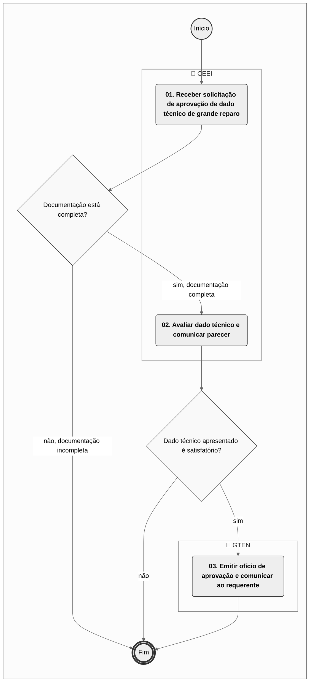

# MPR/SAR-101-R07 - CERTIFICAÇÃO DE PROJETO DE PRODUTO AERONÁUTICO

**MANUAL DE PROCEDIMENTO**

**MPR/SAR-101-R07**

**CERTIFICAÇÃO DE PROJETO DE PRODUTO AERONÁUTICO**

12/2024

**REVISÕES**

|  |  |  |  |  |
| --- | --- | --- | --- | --- |
| **Revisão** | **Aprovação** | **Publicação** | **Aprovado Por** | **Modificações da Última Versão** |
| R00 | Portaria Nº 2.043, de 19 de junho de 2017 | Não informado | SAR | Versão Original |
| R01 | Portaria nº 3.075 | Não informado | SAR | 1) Processo 'Planejar Processo de Certificação de Tipo' modificado.  2) Processo 'Executar o Plano e Emitir Certificado de Tipo' modificado. |
| R02 | PORTARIA Nº 2.713/SAR, DE 3 DE SETEMBRO DE 2019 | Não informado | SAR | 1) Processo 'Analisar Projeto de RPAS' inserido.  2) Processo 'Preparar o Recebimento da Solicitação de Certificação de Tipo' modificado.  3) Processo 'Planejar Processo de Certificação de Tipo' modificado.  4) Processo 'Executar o Plano e Emitir Certificado de Tipo' modificado.  5) Processo 'Validar Certificado de Tipo' modificado. |
| R03 | PORTARIA Nº 3.553, DE 14 DE NOVEMBRO DE 2019 | Não informado | SAR | 1) Processo 'Preparar o Recebimento da Solicitação de Certificação de Tipo' modificado.  2) Processo 'Planejar Processo de Certificação de Tipo' modificado.  3) Processo 'Executar o Plano e Emitir Certificado de Tipo' modificado.  4) Processo 'Validar Certificado de Tipo' modificado. |
| R04 | PORTARIA No 2.282, DE 4 DE SETEMBRO DE 2020. | Não informado | SAR | 1) Processo 'Conduzir Modificações de Projetos Autorizados de RPAS' inserido. |
| R05 | PORTARIA Nº 6.708, DE 13 DE DEZEMBRO DE 2021 | 24/12/2021 | SAR | 1) Processo 'Planejar Processo de Certificação de Tipo' removido.  2) Processo 'Executar o Plano e Emitir Certificado de Tipo' removido.  3) Processo 'Preparar o Recebimento da Solicitação de Certificação de Tipo' removido.  4) Processo 'Transferir, Suspender ou Cassar Certificado de Tipo' inserido.  5) Processo 'Realizar Avaliação Técnica' inserido.  6) Processo 'Gerenciar Certificação de Projeto Aeronáutico' inserido.  7) Processo 'Validar Certificado de Tipo' modificado. |
| R06 | PORTARIA Nº 14559, DE 09 DE MAIO DE 2024 | 17/05/2024 | SAR | 1) Processo 'Realizar Avaliação Técnica' modificado.  2) Processo 'Gerenciar Certificação de Projeto Aeronáutico' modificado. |
| R07 | PORTARIA Nº 15757, DE 31 DE OUTUBRO DE 2024 | 20/12/2024 | SAR | 1) Processo 'Aprovar Dados Técnicos para Grande Reparo ao Produto Aeronáutico' inserido. |

**ÍNDICE**

1) Disposições Preliminares, pág. 6.

1.1) Introdução, pág. 6.

1.2) Revogação, pág. 7.

1.3) Fundamentação, pág. 7.

1.4) Executores dos Processos, pág. 7.

1.5) Elaboração e Revisão, pág. 8.

1.6) Organização do Documento, pág. 8.

2) Definições, pág. 10.

2.1) Sigla, pág. 10.

3) Artefatos, Competências, Sistemas e Documentos Administrativos, pág. 12.

3.1) Artefatos, pág. 12.

3.2) Competências, pág. 13.

3.3) Sistemas, pág. 13.

3.4) Documentos e Processos Administrativos, pág. 14.

4) Procedimentos Referenciados, pág. 15.

5) Procedimentos, pág. 16.

5.1) Gerenciar Certificação de Projeto Aeronáutico, pág. 16.

5.2) Realizar Avaliação Técnica, pág. 26.

5.3) Transferir, Suspender ou Cassar Certificado de Tipo, pág. 35.

5.4) Validar Certificado de Tipo, pág. 38.

5.5) Analisar Projeto de RPAS, pág. 47.

5.6) Conduzir Modificações de Projetos Autorizados de RPAS, pág. 52.

5.7) Aprovar Dados Técnicos para Grande Reparo ao Produto Aeronáutico, pág. 56.

6) Disposições Finais, pág. 60.

**PARTICIPAÇÃO NA EXECUÇÃO DOS PROCESSOS**

**ÁREAS ORGANIZACIONAIS**

**1) Coordenadoria de Engenharia de Estruturas e Interiores**

a) Aprovar Dados Técnicos para Grande Reparo ao Produto Aeronáutico

**2) Gerência de Certificação de Projeto de Produto Aeronáutico**

a) Transferir, Suspender ou Cassar Certificado de Tipo

**3) Gerência Técnica de Engenharia de Produto**

a) Aprovar Dados Técnicos para Grande Reparo ao Produto Aeronáutico

**4) Gerência Técnica de Programas de Certificação**

a) Validar Certificado de Tipo

**GRUPOS ORGANIZACIONAIS**

**a) Engenharia - Investigação Técnica**

1) Realizar Avaliação Técnica

**b) Grupo de Certificação Suplementar de Tipo e Aviação Geral (PST)**

1) Analisar Projeto de RPAS

2) Conduzir Modificações de Projetos Autorizados de RPAS

**c) GTPR-GPC**

1) Gerenciar Certificação de Projeto Aeronáutico

2) Transferir, Suspender ou Cassar Certificado de Tipo

**d) O Gtpr**

1) Gerenciar Certificação de Projeto Aeronáutico

**1. DISPOSIÇÕES PRELIMINARES**

**1.1 INTRODUÇÃO**

Este MPR contém as informações de suporte para a realização da Certificação de Tipo de Produtos Aeronáuticos de Projeto Nacional.

Esta versão foi criada e aprovada pelo processo SEI 00058.093201/2024-62.

Alterações:

- Incluído o processo de trabalho APROVAR DADOS TÉCNICOS PARA GRANDE REPARO AO PRODUTO AERONÁUTICO.

A Portaria Nº 3.881 DE 29 DE DEZEMBRO DE 2020, delega ao Gerência de Certificação de Projeto do Produto Aeronáutico, entre outras, as seguintes competências:

I - Propor a emissão, suspensão e extinção do certificado de tipo, incluindo suas revisões;

II - Propor a emissão, suspensão e extinção de autorização de projeto de sistema de aeronave remotamente pilotada (RPAS), incluindo suas revisões;

III - Emitir e revisar especificações técnicas de certificado de tipo e autorização de projeto de RPAS;

IV - Propor a emissão, suspensão e extinção de reconhecimento de aeronave leve esportiva, em coordenação com a GTCO;

V - Emitir, suspender e extinguir certificado suplementar de tipo e certificado de produto aeronáutico aprovado, incluindo as respectivas especificações técnicas e suas revisões, como aplicável;

VI - Emitir, suspender e extinguir outros atestados, aprovações e autorizações relativas às atividades em seu âmbito de atuação;

VII - Aprovar e/ou aceitar Lista Mestra de Equipamentos Mínimos;

VIII - Aprovar Relatório de Avaliação Operacional;

IX - Decidir sobre recursos apresentados no âmbito dos processos de credenciamento em sua área de atuação; e

X - Conceder meio alternativo de demonstração de cumprimento a requisito em sua área de atuação.

O MPR estabelece, no âmbito da Superintendência de Aeronavegabilidade - SAR, os seguintes processos de trabalho:

a) Gerenciar Certificação de Projeto Aeronáutico.

b) Realizar Avaliação Técnica.

c) Transferir, Suspender ou Cassar Certificado de Tipo.

d) Validar Certificado de Tipo.

e) Analisar Projeto de RPAS.

f) Conduzir Modificações de Projetos Autorizados de RPAS.

g) Aprovar Dados Técnicos para Grande Reparo ao Produto Aeronáutico.

**1.2 REVOGAÇÃO**

MPR/SAR-101-R06, aprovado na data de 17 de maio de 2024.

**1.3 FUNDAMENTAÇÃO**

Resolução nº 381, de 14 de junho de 2016, art. 31.

**1.4 EXECUTORES DOS PROCESSOS**

Os procedimentos contidos neste documento aplicam-se aos servidores integrantes das seguintes áreas organizacionais:

|  |  |
| --- | --- |
| **Área Organizacional** | **Descrição** |
| Coordenadoria de Engenharia de Estruturas e Interiores - CEEI | Emitir parecer especializado, relacionado com a certificação de projeto de produto aeronáutico, com foco em resistência estrutural de aeronaves e em proteção do ocupante de aeronave. |
| Gerência de Certificação de Projeto de Produto Aeronáutico - GCPP | Tem como atribuições certificar projeto e produção de produtos aeronáuticos e executar atividades relacionadas a aeronavegabilidade continuada desses produtos. |
| Gerência Técnica de Engenharia de Produto - GTEN | Responsável por prover pareceres especializados em engenharia aplicada aos requisitos de aeronavegabilidade e de proteção ambiental. |
| Gerência Técnica de Programas de Certificação - GTPR | Responsável, dentro da GCPP, pela coordenação dos programas de certificação de projeto de produtos aeronáuticos e de acompanhamento da aeronavegabilidade continuada. |

|  |  |
| --- | --- |
| **Grupo Organizacional** | **Descrição** |
| Engenharia - Investigação Técnica | Grupo de engenheiros da SAR responsáveis pela investigação técnica visando a certificação de aeronaves. |
| Aviação Geral PST | Aviação Geral PST |
| GTPR-GPC | GPC |
| O GTPR | Gerente Técnico de Programas de Certificação |

**1.5 ELABORAÇÃO E REVISÃO**

O processo que resulta na aprovação ou alteração deste MPR é de responsabilidade da Superintendência de Aeronavegabilidade - SAR. Em caso de sugestões de revisão, deve-se procurá-la para que sejam iniciadas as providências cabíveis.

As revisões deste MPR serão aprovadas pelo(s) titular(es) da(s) unidade(s) responsável(is) pela execução do(s) processo(s) nele listado(s).

**1.6 ORGANIZAÇÃO DO DOCUMENTO**

O capítulo 2 apresenta as principais definições utilizadas no âmbito deste MPR, e deve ser visto integralmente antes da leitura de capítulos posteriores.

O capítulo 3 apresenta as competências, os artefatos e os sistemas envolvidos na execução dos processos deste manual, em ordem relativamente cronológica.

O capítulo 4 apresenta os processos de trabalho referenciados neste MPR. Estes processos são publicados em outros manuais que não este, mas cuja leitura é essencial para o entendimento dos processos publicados neste manual. O capítulo 4 expõe em quais manuais são localizados cada um dos processos de trabalho referenciados.

O capítulo 5 apresenta os processos de trabalho. Para encontrar um processo específico, deve-se procurar sua respectiva página no índice contido no início do documento. Os processos estão ordenados em etapas. Cada etapa é contida em uma tabela, que possui em si todas as informações necessárias para sua realização. São elas, respectivamente:

a) o título da etapa;

b) a descrição da forma de execução da etapa;

c) as competências necessárias para a execução da etapa;

d) os artefatos necessários para a execução da etapa;

e) os sistemas necessários para a execução da etapa (incluindo, bases de dados em forma de arquivo, se existente);

f) os documentos e processos administrativos que precisam ser elaborados durante a execução da etapa;

g) instruções para as próximas etapas; e

h) as áreas ou grupos organizacionais responsáveis por executar a etapa.

O capítulo 6 apresenta as disposições finais do documento, que trata das ações a serem realizadas em casos não previstos.

Por último, é importante comunicar que este documento foi gerado automaticamente. São recuperados dados sobre as etapas e sua sequência, as definições, os grupos, as áreas organizacionais, os artefatos, as competências, os sistemas, entre outros, para os processos de trabalho aqui apresentados, de forma que alguma mecanicidade na apresentação das informações pode ser percebida. O documento sempre apresenta as informações mais atualizadas de nomes e siglas de grupos, áreas, artefatos, termos, sistemas e suas definições, conforme informação disponível na base de dados, independente da data de assinatura do documento. Informações sobre etapas, seu detalhamento, a sequência entre etapas, responsáveis pelas etapas, artefatos, competências e sistemas associados a etapas, assim como seus nomes e os nomes de seus processos têm suas definições idênticas à da data de assinatura do documento.

**2. DEFINIÇÕES**

A tabela abaixo apresenta as definições necessárias para o entendimento deste Manual de Procedimento.

**2.1 Sigla**

|  |  |
| --- | --- |
| **Definição** | **Significado** |
| AC | Advisory Circular |
| AD | Airworthiness Directive |
| AFM – Aircraft Flight Manual | Significa manual de voo aprovado da aeronave. |
| AIT | Autorização de Inspeção de Tipo |
| ANAC | Agência Nacional de Aviação Civil |
| BPS | Boletim de Pessoal e Serviço |
| CAI | Certification Action Items |
| CAVE | Certificado de Autorização de Voo Experimental |
| CCST | Coordenadoria de Certificação Suplementar de Tipo |
| COP | Certificado de Organização de Produção |
| CPCT | Coordenadoria de Programas de Certificação de Tipo |
| CT | Certificado de Tipo |
| EASA | European Aviation Safety Agency |
| FAA | Federal Aviation Administration |
| FCAR | Fichas de Controle de Assuntos Relevantes |
| FTCBM | Final Type Certification Board Meeting |
| GCAC | Gerência de Certificação de Aeronavegabilidade Continuada |
| GCPP | Gerência de Certificação de Projeto de Produto Aeronáutico |
| GPC | Coordenador de Programa de Certificação |
| GTCO/SAR | Gerência Técnica de Organizações e Inspeção. |
| GTEN | Gerência Técnica de Engenharia de Produto |
| GTNI | Gerência Técnica de Normas e Inovação |
| GTPR | Gerência Técnica de Programas de Certificação |
| HT | Código utilizado na numeração/identificação de uma FCAR que trata de assunto geral relacionado à certificação de um produto aeronáutico e que está sob a responsabilidade do GPC. |
| IS | Instrução Suplementar |
| ITD | Instrução de Trabalho Detalhada |
| MMEL | Master Minimum Equipment List |
| Moc | Means of Compliance |
| MRB | Maintenance Review Board |
| PCEP | Plano de Certificação Específico para o Programa |
| PCF | Profissional Credenciado em Fabricação |
| PCM | Posto de Coordenção Movél |
| PCP | Profissional Credenciado em Projeto |
| PCR | Plano de Certificação do Requerente |
| PM | Project Manager |
| PTCBM | Preliminary Type Certification Board Meeting |
| RBAC | Regulamento Brasileiro da Aviação Civil |
| RPAS | Ssitema de Aeronave Remotamente Pilotada (Remotely Piloted Aircraft System) |
| RT | Responsável Técnico |
| SEI | Sistema Eletrônico de Informações |
| SPO | Superintendência de Padrões Operacionais |
| STPC | Solicitação de Trabalho de Profissional Credenciado |
| TCDS | Type Certificate Data Sheet |
| TFAC | Taxa de Fiscalização da Aviação Civil |
| TP | Test Proposal |

**3. ARTEFATOS, COMPETÊNCIAS, SISTEMAS E DOCUMENTOS ADMINISTRATIVOS**

Abaixo se encontram as listas dos artefatos, competências, sistemas e documentos administrativos que o executor necessita consultar, preencher, analisar ou elaborar para executar os processos deste MPR. As etapas descritas no capítulo seguinte indicam onde usar cada um deles.

As competências devem ser adquiridas por meio de capacitação ou outros instrumentos e os artefatos se encontram no módulo "Artefatos" do sistema GFT - Gerenciador de Fluxos de Trabalho.

**3.1 ARTEFATOS**

|  |  |
| --- | --- |
| **Nome** | **Descrição** |
| F-101-01 - Relatório de Testemunho de Ensaio | Artefato gerado a partir da revisão do MPR/SAR 101. Vem em substituição do F-800-01 e F-800-03. |
| F-101-12 | Ficha de Controle de Assuntos Relevantes (FCAR) |
| F-101-16 | FOLHA DE ANÁLISE DE DOCUMENTO |
| F-101-18 | F-200-18F |
| F-101-31 | SOLICITAÇÃO DE APROVAÇÃO DE DADOS TÉCNICOS DE GRANDE REPARO. |
| F-101-32 | LISTA DE VERIFICAÇÃO DE CUMPRIMENTO |
| F-101-50 - Formulário de Pedido de Modificação de Projeto Autorizado de RPAS | FORMULÁRIO DE PEDIDO DE  MODIFICAÇÃO DE PROJETO AUTORIZADO DE RPAS |
| F-200-14 - Pedido de Conformidade | Pedido de Conformidade. |
| ITD-101-01 | Tramitação e emissão final de Certificados de Tipo – CT, Certificado Suplementar de Tipo - CST, F-400-04, Folhas de Especificação de Tipo e Relatórios de Aceitação (H.10, H.11, V.33 e V.35). |
| ITD-101-02 | Base de Certificação e Controle de Assuntos Relevantes. |
| ITD-101-03 | Diretrizes para definição de Nível de Envolvimento na verificação de cumprimento com requisitos de aeronavegabilidade de produtos aeronáuticos. |
| ITD-101-04 | Elaboração da Folha de Especificação |
| ITD-101-05 | Aprovação de Grande Modificação ao Projeto de Tipo e Emenda ao CT. |
| ITD-101-06 | Escolha do Tipo de Processo de Validação de Certificado de Tipo. |
| ITD-101-07 | Validação de Certificado de Tipo de aeronaves importadas (Relatório H.10). |
| ITD-101-08 | Análise e Elaboração de Planos de Certificação. |
| ITD-101-09 | Instruções de Preparação e Emissão da Autorização de Inspeção de Tipo. |
| ITD-101-11 | Tratamento de conflitos técnicos entre requerente e ANAC. |
| ITD-101-12 - Manual do Engenheiro de Certificação de Tipo | Melhores práticas de análise de engenharia na certificação de tipo. |

**3.2 COMPETÊNCIAS**

Para que os processos de trabalho contidos neste MPR possam ser realizados com qualidade e efetividade, é importante que as pessoas que venham a executá-los possuam um determinado conjunto de competências. No capítulo 5, as competências específicas que o executor de cada etapa de cada processo de trabalho deve possuir são apresentadas. A seguir, encontra-se uma lista geral das competências contidas em todos os processos de trabalho deste MPR e a indicação de qual área ou grupo organizacional as necessitam:

|  |  |
| --- | --- |
| **Competência** | **Áreas e Grupos** |
| Acompanha ensaios e testes no solo e em voo requeridos pela ANAC. | Aviação Geral PST |
| Analisa a documentação recebida, de forma atenta e diligente, sugerindo as adequações de forma, conteúdo e mérito, tendo em vista a aderência da documentação ao previsto no plano de trabalho aceito. | Aviação Geral PST |
| Analisa a suficiência de dados (administrativos e técnicos) requeridos para o processo de validação. | GTPR |
| Conduz processo de modificação de projeto autorizado de RPAS de acordo com a regulamentação vigente. | Aviação Geral PST |
| Elabora relatório de testemunho de ensaio e testes no solo e em voo requeridos pela ANAC. | Aviação Geral PST |

**3.3 SISTEMAS**

|  |  |  |
| --- | --- | --- |
| **Nome** | **Descrição** | **Acesso** |
| Intranet da SAR | Sistema de controle de processos internos da SAR e disponibilização de informações de aeronavegabilidade e estatísticas. | http://sar.anac.gov.br |
| SEI | Sistema Eletrônico de Informação. | https://sei.anac.gov.br/sip/login.php?sigla\_orgao\_sistema=ANAC&sigla\_sistema=SEI |

**3.4 DOCUMENTOS E PROCESSOS ADMINISTRATIVOS ELABORADOS NESTE MANUAL**

Não há documentos ou processos administrativos a serem elaborados neste MPR.

**4. PROCEDIMENTOS REFERENCIADOS**

Procedimentos referenciados são processos de trabalho publicados em outro MPR que têm relação com os processos de trabalho publicados por este manual. Este MPR não possui nenhum processo de trabalho referenciado.

**
## 5.1 Gerenciar Certificação de Projeto Aeronáutico

```mermaid
%%{init: {"theme": "neutral", "themeVariables": {"primaryColor": "#ffffff", "edgeLabelBackground": "#ffffff", "tertiaryColor": "#f4f4f4"}}}%%
flowchart TD
    classDef inicio stroke:#333,stroke-width:2px;
    classDef fim stroke:#333,stroke-width:4px;
    classDef tarefaBPMN stroke:#333,stroke-width:1px;
    classDef gatewayBPMN fill:#f9f9f9,stroke:#333,stroke-width:1px;
    classDef raia fill:none,stroke:#999,stroke-width:1px,stroke-dasharray: 5 5;
    subgraph Container_ID_MPR_SAR_101_R07_md_0 [ ]
        direction TB
        ID_MPR_SAR_101_R07_md_0_S((Início)):::inicio
        ID_MPR_SAR_101_R07_md_0_E(((Fim))):::fim
        subgraph Raia_ID_MPR_SAR_101_R07_md_0_1 [👤 O Gtpr]
            ID_MPR_SAR_101_R07_md_0_01("<b>01. Designar um GPC</b>"):::tarefaBPMN
        end
        subgraph Raia_ID_MPR_SAR_101_R07_md_0_2 [👤 GTPR-GPC]
            ID_MPR_SAR_101_R07_md_0_02("<b>02. Analisar informações encaminhadas junto com o requerimento</b>"):::tarefaBPMN
            ID_MPR_SAR_101_R07_md_0_03("<b>03. Enviar ofício deferindo o requerimento</b>"):::tarefaBPMN
            ID_MPR_SAR_101_R07_md_0_04("<b>04. Receber comunicação de pagamento</b>"):::tarefaBPMN
            ID_MPR_SAR_101_R07_md_0_05("<b>05. Comunicar GTNI e SPO</b>"):::tarefaBPMN
            ID_MPR_SAR_101_R07_md_0_06("<b>06. Conduzir análise preliminar</b>"):::tarefaBPMN
            ID_MPR_SAR_101_R07_md_0_07("<b>07. Acionar e acompanhar avaliações técnicas</b>"):::tarefaBPMN
            ID_MPR_SAR_101_R07_md_0_08("<b>08. Coletar limitações de aeronavegabilidade e operacionais</b>"):::tarefaBPMN
            ID_MPR_SAR_101_R07_md_0_09("<b>09. Realizar consolidação final e receber declaração do requerente</b>"):::tarefaBPMN
            ID_MPR_SAR_101_R07_md_0_10("<b>10. Submeter para decisão final</b>"):::tarefaBPMN
            ID_MPR_SAR_101_R07_md_0_11("<b>11. Providenciar assinaturas do TC e outros documentos</b>"):::tarefaBPMN
            ID_MPR_SAR_101_R07_md_0_12("<b>12. Providenciar publicação de certificado e TCDS</b>"):::tarefaBPMN
            ID_MPR_SAR_101_R07_md_0_02("<b>02. Atribuir para o GPC responsável pelo projeto de tipo</b>"):::tarefaBPMN
            ID_MPR_SAR_101_R07_md_0_03("<b>03. Analisar e articular eventuais ações necessárias</b>"):::tarefaBPMN
            ID_MPR_SAR_101_R07_md_0_04("<b>04. Executar ações finais</b>"):::tarefaBPMN
        end
        subgraph Raia_ID_MPR_SAR_101_R07_md_0_3 [👤 Engenharia - Investigação Técnica]
            ID_MPR_SAR_101_R07_md_0_01("<b>01. Familiarizar-se com o produto</b>"):::tarefaBPMN
            ID_MPR_SAR_101_R07_md_0_02("<b>02. Definir requisitos aplicáveis</b>"):::tarefaBPMN
            ID_MPR_SAR_101_R07_md_0_03("<b>03. Acordar estratégias de demonstração de cumprimento com os requisitos aplicáveis</b>"):::tarefaBPMN
            ID_MPR_SAR_101_R07_md_0_04("<b>04. Propor uma estratégia para envolvimento da ANAC</b>"):::tarefaBPMN
            ID_MPR_SAR_101_R07_md_0_05("<b>05. Executar as estratégias de envolvimento da ANAC</b>"):::tarefaBPMN
            ID_MPR_SAR_101_R07_md_0_06("<b>06. Concluir avaliação técnica</b>"):::tarefaBPMN
        end
        subgraph Raia_ID_MPR_SAR_101_R07_md_0_4 [👤 GCPP]
            ID_MPR_SAR_101_R07_md_0_01("<b>01. Receber e encaminhar demanda</b>"):::tarefaBPMN
        end
        subgraph Raia_ID_MPR_SAR_101_R07_md_0_5 [👤 GTPR]
            ID_MPR_SAR_101_R07_md_0_01("<b>01. Enviar comunicações de resposta</b>"):::tarefaBPMN
            ID_MPR_SAR_101_R07_md_0_02("<b>02. Determinar tipo de validação e designar equipe de projeto</b>"):::tarefaBPMN
            ID_MPR_SAR_101_R07_md_0_03("<b>03. Elaborar Plano de Trabalho (work plan)</b>"):::tarefaBPMN
            ID_MPR_SAR_101_R07_md_0_04("<b>04. Executar o Plano de Trabalho</b>"):::tarefaBPMN
            ID_MPR_SAR_101_R07_md_0_05("<b>05. Executar voos e acompanhar ensaios</b>"):::tarefaBPMN
            ID_MPR_SAR_101_R07_md_0_06("<b>06. Elaborar relatório de certificação</b>"):::tarefaBPMN
            ID_MPR_SAR_101_R07_md_0_07("<b>07. Compilar documentos técnicos recebidos</b>"):::tarefaBPMN
            ID_MPR_SAR_101_R07_md_0_08("<b>08. Determinar manual de voo ou suplementos para operação no Brasil</b>"):::tarefaBPMN
            ID_MPR_SAR_101_R07_md_0_09("<b>09. Emitir CT para importação e Folha de Especificação de Tipo</b>"):::tarefaBPMN
            ID_MPR_SAR_101_R07_md_0_10("<b>10. Realizar atividades após certificação</b>"):::tarefaBPMN
        end
        subgraph Raia_ID_MPR_SAR_101_R07_md_0_6 [👤 Grupo de Certificação Suplementar de Tipo e Aviação Geral (PST)]
            ID_MPR_SAR_101_R07_md_0_01("<b>01. Analisar documentação</b>"):::tarefaBPMN
            ID_MPR_SAR_101_R07_md_0_02("<b>02. Solicitar documentação técnica</b>"):::tarefaBPMN
            ID_MPR_SAR_101_R07_md_0_03("<b>03. Analisar documentação técnica</b>"):::tarefaBPMN
            ID_MPR_SAR_101_R07_md_0_04("<b>04. Realizar ensaios em solo e em voo com testemunho ANAC</b>"):::tarefaBPMN
            ID_MPR_SAR_101_R07_md_0_05("<b>05. Concluir processo</b>"):::tarefaBPMN
            ID_MPR_SAR_101_R07_md_0_06("<b>06. Informar as pendências ao requerente</b>"):::tarefaBPMN
            ID_MPR_SAR_101_R07_md_0_07("<b>07. Solicitar correção da documentação</b>"):::tarefaBPMN
            ID_MPR_SAR_101_R07_md_0_01("<b>01. Analisar pedido</b>"):::tarefaBPMN
            ID_MPR_SAR_101_R07_md_0_02("<b>02. Informar as pendências ao requerente</b>"):::tarefaBPMN
            ID_MPR_SAR_101_R07_md_0_03("<b>03. Avaliar completeza das informações necessárias</b>"):::tarefaBPMN
            ID_MPR_SAR_101_R07_md_0_04("<b>04. Solicitar envio de informações adicionais</b>"):::tarefaBPMN
            ID_MPR_SAR_101_R07_md_0_05("<b>05. Autorizar modificação</b>"):::tarefaBPMN
        end
        subgraph Raia_ID_MPR_SAR_101_R07_md_0_7 [👤 CEEI]
            ID_MPR_SAR_101_R07_md_0_01("<b>01. Receber solicitação de aprovação de dado técnico de grande reparo</b>"):::tarefaBPMN
            ID_MPR_SAR_101_R07_md_0_02("<b>02. Avaliar dado técnico e comunicar parecer</b>"):::tarefaBPMN
        end
        subgraph Raia_ID_MPR_SAR_101_R07_md_0_8 [👤 GTEN]
            ID_MPR_SAR_101_R07_md_0_03("<b>03. Emitir ofício de aprovação e comunicar ao requerente</b>"):::tarefaBPMN
        end
        ID_MPR_SAR_101_R07_md_0_S --> ID_MPR_SAR_101_R07_md_0_01
        ID_MPR_SAR_101_R07_md_0_01 --> ID_MPR_SAR_101_R07_md_0_02
        ID_MPR_SAR_101_R07_md_0_02 --> ID_MPR_SAR_101_R07_md_0_03
        ID_MPR_SAR_101_R07_md_0_03 --> ID_MPR_SAR_101_R07_md_0_04
        gw_ID_MPR_SAR_101_R07_md_0_04{"A aeronave é relevante?"}:::gatewayBPMN
        ID_MPR_SAR_101_R07_md_0_04 --> gw_ID_MPR_SAR_101_R07_md_0_04
        gw_ID_MPR_SAR_101_R07_md_0_04 -->|"não, aeronave não é relevante"| ID_MPR_SAR_101_R07_md_0_06
        gw_ID_MPR_SAR_101_R07_md_0_04 -->|"sim, aeronave relevante"| ID_MPR_SAR_101_R07_md_0_05
        ID_MPR_SAR_101_R07_md_0_05 --> ID_MPR_SAR_101_R07_md_0_06
        ID_MPR_SAR_101_R07_md_0_06 --> ID_MPR_SAR_101_R07_md_0_07
        ID_MPR_SAR_101_R07_md_0_07 --> ID_MPR_SAR_101_R07_md_0_08
        ID_MPR_SAR_101_R07_md_0_08 --> ID_MPR_SAR_101_R07_md_0_09
        ID_MPR_SAR_101_R07_md_0_09 --> ID_MPR_SAR_101_R07_md_0_10
        ID_MPR_SAR_101_R07_md_0_10 --> ID_MPR_SAR_101_R07_md_0_11
        ID_MPR_SAR_101_R07_md_0_11 --> ID_MPR_SAR_101_R07_md_0_12
        ID_MPR_SAR_101_R07_md_0_12 --> ID_MPR_SAR_101_R07_md_0_E
        ID_MPR_SAR_101_R07_md_0_01 --> ID_MPR_SAR_101_R07_md_0_02
        ID_MPR_SAR_101_R07_md_0_02 --> ID_MPR_SAR_101_R07_md_0_03
        ID_MPR_SAR_101_R07_md_0_03 --> ID_MPR_SAR_101_R07_md_0_04
        gw_ID_MPR_SAR_101_R07_md_0_04{"ANAC se envolverá em alguma atividade?"}:::gatewayBPMN
        ID_MPR_SAR_101_R07_md_0_04 --> gw_ID_MPR_SAR_101_R07_md_0_04
        gw_ID_MPR_SAR_101_R07_md_0_04 -->|"sim, ANAC se envolverá"| ID_MPR_SAR_101_R07_md_0_05
        gw_ID_MPR_SAR_101_R07_md_0_04 -->|"não, ANAC não se envolverá"| ID_MPR_SAR_101_R07_md_0_06
        ID_MPR_SAR_101_R07_md_0_05 --> ID_MPR_SAR_101_R07_md_0_06
        ID_MPR_SAR_101_R07_md_0_06 --> ID_MPR_SAR_101_R07_md_0_E
        ID_MPR_SAR_101_R07_md_0_01 --> ID_MPR_SAR_101_R07_md_0_02
        ID_MPR_SAR_101_R07_md_0_02 --> ID_MPR_SAR_101_R07_md_0_03
        ID_MPR_SAR_101_R07_md_0_03 --> ID_MPR_SAR_101_R07_md_0_04
        ID_MPR_SAR_101_R07_md_0_04 --> ID_MPR_SAR_101_R07_md_0_E
        ID_MPR_SAR_101_R07_md_0_01 --> ID_MPR_SAR_101_R07_md_0_02
        gw_ID_MPR_SAR_101_R07_md_0_02{"Validação completa, simplificada ou expedita?"}:::gatewayBPMN
        ID_MPR_SAR_101_R07_md_0_02 --> gw_ID_MPR_SAR_101_R07_md_0_02
        gw_ID_MPR_SAR_101_R07_md_0_02 -->|"validação expedita"| ID_MPR_SAR_101_R07_md_0_06
        gw_ID_MPR_SAR_101_R07_md_0_02 -->|"validação padrão ou simplificada"| ID_MPR_SAR_101_R07_md_0_03
        ID_MPR_SAR_101_R07_md_0_03 --> ID_MPR_SAR_101_R07_md_0_04
        gw_ID_MPR_SAR_101_R07_md_0_04{"Plano de trabalho estipula acompanhamento de ensaios ou voos?"}:::gatewayBPMN
        ID_MPR_SAR_101_R07_md_0_04 --> gw_ID_MPR_SAR_101_R07_md_0_04
        gw_ID_MPR_SAR_101_R07_md_0_04 -->|"não"| ID_MPR_SAR_101_R07_md_0_06
        gw_ID_MPR_SAR_101_R07_md_0_04 -->|"sim"| ID_MPR_SAR_101_R07_md_0_05
        ID_MPR_SAR_101_R07_md_0_05 --> ID_MPR_SAR_101_R07_md_0_06
        ID_MPR_SAR_101_R07_md_0_06 --> ID_MPR_SAR_101_R07_md_0_07
        ID_MPR_SAR_101_R07_md_0_07 --> ID_MPR_SAR_101_R07_md_0_08
        ID_MPR_SAR_101_R07_md_0_08 --> ID_MPR_SAR_101_R07_md_0_09
        ID_MPR_SAR_101_R07_md_0_09 --> ID_MPR_SAR_101_R07_md_0_10
        ID_MPR_SAR_101_R07_md_0_10 --> ID_MPR_SAR_101_R07_md_0_E
        gw_ID_MPR_SAR_101_R07_md_0_01{"Há pendências no plano de trabalho?"}:::gatewayBPMN
        ID_MPR_SAR_101_R07_md_0_01 --> gw_ID_MPR_SAR_101_R07_md_0_01
        gw_ID_MPR_SAR_101_R07_md_0_01 -->|"SIM, há pendências"| ID_MPR_SAR_101_R07_md_0_06
        gw_ID_MPR_SAR_101_R07_md_0_01 -->|"NÃO, não há pendências"| ID_MPR_SAR_101_R07_md_0_02
        ID_MPR_SAR_101_R07_md_0_02 --> ID_MPR_SAR_101_R07_md_0_03
        gw_ID_MPR_SAR_101_R07_md_0_03{"Documentação está adequada?"}:::gatewayBPMN
        ID_MPR_SAR_101_R07_md_0_03 --> gw_ID_MPR_SAR_101_R07_md_0_03
        gw_ID_MPR_SAR_101_R07_md_0_03 -->|"SIM, está adequada"| ID_MPR_SAR_101_R07_md_0_04
        gw_ID_MPR_SAR_101_R07_md_0_03 -->|"NÃO, não está adequada"| ID_MPR_SAR_101_R07_md_0_07
        ID_MPR_SAR_101_R07_md_0_04 --> ID_MPR_SAR_101_R07_md_0_05
        ID_MPR_SAR_101_R07_md_0_05 --> ID_MPR_SAR_101_R07_md_0_E
        ID_MPR_SAR_101_R07_md_0_06 --> ID_MPR_SAR_101_R07_md_0_01
        ID_MPR_SAR_101_R07_md_0_07 --> ID_MPR_SAR_101_R07_md_0_03
        gw_ID_MPR_SAR_101_R07_md_0_01{"O pedido está correto?"}:::gatewayBPMN
        ID_MPR_SAR_101_R07_md_0_01 --> gw_ID_MPR_SAR_101_R07_md_0_01
        gw_ID_MPR_SAR_101_R07_md_0_01 -->|"sim, o pedido está correto"| ID_MPR_SAR_101_R07_md_0_03
        gw_ID_MPR_SAR_101_R07_md_0_01 -->|"não, o pedido não está correto"| ID_MPR_SAR_101_R07_md_0_02
        ID_MPR_SAR_101_R07_md_0_02 --> ID_MPR_SAR_101_R07_md_0_01
        gw_ID_MPR_SAR_101_R07_md_0_03{"O pedido está completo?"}:::gatewayBPMN
        ID_MPR_SAR_101_R07_md_0_03 --> gw_ID_MPR_SAR_101_R07_md_0_03
        gw_ID_MPR_SAR_101_R07_md_0_03 -->|"não, o pedido não está completo"| ID_MPR_SAR_101_R07_md_0_04
        gw_ID_MPR_SAR_101_R07_md_0_03 -->|"sim, o pedido está completo"| ID_MPR_SAR_101_R07_md_0_05
        ID_MPR_SAR_101_R07_md_0_04 --> ID_MPR_SAR_101_R07_md_0_03
        ID_MPR_SAR_101_R07_md_0_05 --> ID_MPR_SAR_101_R07_md_0_E
        gw_ID_MPR_SAR_101_R07_md_0_01{"Documentação está completa?"}:::gatewayBPMN
        ID_MPR_SAR_101_R07_md_0_01 --> gw_ID_MPR_SAR_101_R07_md_0_01
        gw_ID_MPR_SAR_101_R07_md_0_01 -->|"sim, documentação completa"| ID_MPR_SAR_101_R07_md_0_02
        gw_ID_MPR_SAR_101_R07_md_0_01 -->|"não, documentação incompleta"| ID_MPR_SAR_101_R07_md_0_E
        gw_ID_MPR_SAR_101_R07_md_0_02{"Dado técnico apresentado é satisfatório?"}:::gatewayBPMN
        ID_MPR_SAR_101_R07_md_0_02 --> gw_ID_MPR_SAR_101_R07_md_0_02
        gw_ID_MPR_SAR_101_R07_md_0_02 -->|"sim"| ID_MPR_SAR_101_R07_md_0_03
        gw_ID_MPR_SAR_101_R07_md_0_02 -->|"não"| ID_MPR_SAR_101_R07_md_0_E
        ID_MPR_SAR_101_R07_md_0_03 --> ID_MPR_SAR_101_R07_md_0_E
    end
    click ID_MPR_SAR_101_R07_md_0_01 "O GTPR faz a designação de um Gerente de Programa de Certificação (GPC), que será o servidor que atuará como gerente de projeto. O GPC corresponde à figura do Project Manager (PM) referido na FAA Order 8110-4 e, ao Project Certification Manager (PCM) da EASA.  Atualizar a base de dados dos programas"
    click ID_MPR_SAR_101_R07_md_0_02 "Analisar o requerimento protocolado e os dados fornecidos conforme a ITD-101-01. Se necessário, informações adicionais serão solicitadas formalmente pelo GTPR-GPC ao interessado.  Idealmente, é recomendável que o interessado encaminhe um planejamento global que permita à ANAC avaliar se o interessad"
    click ID_MPR_SAR_101_R07_md_0_03 "Após análise das informações preliminares e sendo estas julgadas satisfatórias, o GTPR-GPC faz a abertura do projeto (H.01 para o caso de novo projeto ou novo modelo) no sistema da Intranet SAR e prepara um ofício a ser assinado pelo GCPP, no caso de novo projeto ou modelo, ou pelo GTPR (no caso de "
    click ID_MPR_SAR_101_R07_md_0_04 "Enquanto o pagamento da TFAC não ocorre, o processo será mantido na condição de sobrestado.  O GPC contata a GTDE quando ele for informado pelo interessado que houve o pagamento da TFAC. A GTDE então acusa o recebimento da TFAC, permitindo o prosseguimento do processo.  Em caso de novo modelo de aer"
    click ID_MPR_SAR_101_R07_md_0_05 "Quando o projeto for relevante, a GTPR informará à GTNI e à SPO as seguintes informações:  (1) A aceitação e o número do processo;  (2) A base de certificação inicial (os RBAC aplicáveis e suas emendas mínimas a serem consideradas no projeto);  (3) O nome e dados de contato do GPC designado para o p"
    click ID_MPR_SAR_101_R07_md_0_06 "O GPC deve conduzir uma análise preliminar antes do início das avaliações técnicas.  Essa análise preliminar é composta de 3 aspectos:  1. O GPC avalia basicamente se o nível de detalhamento da descrição do projeto/modelo ou da modificação é suficiente para o entendimento da abrangência da certifica"
    click ID_MPR_SAR_101_R07_md_0_07 "Nesta etapa, o GTPR-GPC é responsável por:  1- Definir os setores pertinentes, em coordenação com os Coordenadores.  2- Distribuir as informações técnicas para os setores considerados pertinentes.  3- Conduzir a avaliação de plano de certificação de projeto ou modelo novo, ou de modificação para dar"
    click ID_MPR_SAR_101_R07_md_0_08 "Ao receber as limitações de aeronavegabilidade, o GPC é responsável por incorporar ou articular para que sejam incorporadas nos instrumentos julgados convenientes (Seção de Limitações de Aeronavegabilidade, manual de voo, especificação de tipo)."
    click ID_MPR_SAR_101_R07_md_0_09 "O objetivo desta etapa é fazer uma consolidação final, como ação preparatória para a submissão à decisão final por parte da GCPP.  Nesta etapa, de acordo com a magnitude e complexidade do processo, o GTPR-GPC pode convocar o requerente para uma reunião final, conhecida como Reunião Final do Comitê d"
    click ID_MPR_SAR_101_R07_md_0_10 "O GTPR-GPC submete o processo para os trâmites finais, juntando, se pertinente, as minutas do Certificado de Tipo, da especificação de tipo, ou dos documentos pertinentes no caso de grande modificação, e de uma lista de pendências. Dependendo da magnitude e complexidade do projeto, e da relevância p"
    click ID_MPR_SAR_101_R07_md_0_11 "Com o auxílio da Secretária da GTPR, providenciar as assinaturas do CT e da Especificação de Tipo (ou dos documentos pertinentes, no caso de grandes modificações)."
    click ID_MPR_SAR_101_R07_md_0_12 "Com o auxílio da Secretária da GTPR, encerrar o processo no sistema, publicar os documentos pertinentes (CT, Especificação de Tipo, etc.) na intranet SAR/internet e, no caso de novos modelos de aeronaves, encaminhar dados do CT para secretária do SAR publicar no DOU, além de quaisquer outras rotinas"
    click ID_MPR_SAR_101_R07_md_0_01 "Esta etapa marca o início de um processo contínuo onde o especialista busca se familiarizar e conhecer melhor o produto sob certificação.  O conhecimento das características relevantes do produto permite que o especialista tenha condições de se posicionar quanto aos requisitos aplicáveis, às estraté"
    click ID_MPR_SAR_101_R07_md_0_02 "É responsabilidade da ANAC definir os requisitos de aeronavegabilidade e de proteção ambiental, aplicáveis ao produto sob certificação (ver RBAC 21.17). Entretanto, é fortemente recomendado que o requerente apresente uma proposta desses requisitos no início do programa de certificação, já que isso a"
    click ID_MPR_SAR_101_R07_md_0_03 "De acordo com o RBAC 21.20(a), o requerente deve apresentar à ANAC os meios pelos quais o cumprimento será demonstrado. Isso geralmente ocorre através de uma lista de verificação, correlacionando os requisitos aplicáveis com os meios de cumprimento e documentos de referência.  É fortemente recomenda"
    click ID_MPR_SAR_101_R07_md_0_04 "Nesta etapa, o executor deverá propor uma estratégia para envolvimento da ANAC nas atividades de produção de dados de substanciação.  A ANAC deve analisar o projeto para determinar em que aspectos o envolvimento da autoridade de aviação civil trará maiores benefícios. É preciso reconhecer a impratic"
    click ID_MPR_SAR_101_R07_md_0_05 "O executor desta etapa recebe as informações fornecidas pelo requerente e procede à investigação de cumprimento, executando as atividades de acordo com o nível de envolvimento definido na etapa anterior.  De acordo com o RBAC 21.21(b), o requerente deve submeter as informações de demonstração (norma"
    click ID_MPR_SAR_101_R07_md_0_06 "A evidência de conclusão da avaliação técnica do especialista se dá quando todas as estratégias de envolvimento da ANAC definidas na etapa anterior forem concluídas com seus respectivos pareceres técnicos emitidos. Além disso, caso o especialista tenha informações técnicas adicionais aos pareceres e"
    click ID_MPR_SAR_101_R07_md_0_01 "A GCPP recebe a demanda de transferência, suspensão ou cassação do certificado de tipo, que pode ser originada pelo detentor do certificado ou por solicitação interna.  Em seguida, a GCPP encaminha a demanda para a GTPR."
    click ID_MPR_SAR_101_R07_md_0_02 "A GTPR recebe a demanda e atribui para o GTPR-GPC responsável pelo projeto de tipo."
    click ID_MPR_SAR_101_R07_md_0_03 "GTPR-GPC recebe a demanda, faz uma análise à luz da IS 21-001 e dispara e coordena eventuais ações necessárias, incluindo o envolvimento de partes interessadas, internas ou externas.  Ao final, o GTPR-GPC consolida as informações e elabora uma proposta de posicionamento, que é submetida para a GCPP,"
    click ID_MPR_SAR_101_R07_md_0_04 "Havendo anuência do GTPR e do GCPP, o GTPR-GPC prepara a documentação pertinente (Certificado de Tipo, Especificação de Tipo e outros documentos necessários), obtém as assinaturas e encaminha para publicação.  Junto com a obtenção da assinatura, nos casos em que o Brasil é o País de Projeto, o GTPR-"
    click ID_MPR_SAR_101_R07_md_0_01 "O GPC, após definições estabelecidas em análise da documentação inicial, deve preparar comunicações para o requerente com cópia para a Autoridade de Aviação Civil do Estado de Projeto.  1.1 As comunicações acima referida devem:  (1) Abordar questões para determinar o tipo de validação (consultar ITD"
    click ID_MPR_SAR_101_R07_md_0_02 "Geralmente, junto com o pedido de certificação, o requerente envia um conjunto de documentos administrativos e técnicos os quais, posteriormente, acrescidos daqueles solicitados nas comunicações de resposta, devem ser classificados pelo GPC e colocado à disposição do Board de validação. Esta documen"
    click ID_MPR_SAR_101_R07_md_0_03 "O GPC, junto à equipe de validação, deve preparar um plano de trabalho (Work Plan), conforme ITD-101-07, com o planejamento do envolvimento e atividades da validação.  O plano de trabalho deve focar, para cada especialidade, os itens de requisitos e os procedimentos de substanciação considerados mai"
    click ID_MPR_SAR_101_R07_md_0_04 "A execução do Plano de Trabalho compreende o envolvimento e análise das documentações e atividades de certificação estabelecidas nele.  Modificações deste plano de trabalho devem ser aprovadas no nível gerencial por meio de nova revisão do plano de trabalho (Work Plan).  Os membros da equipe de vali"
    click ID_MPR_SAR_101_R07_md_0_05 "Caso exista necessidade de voos ou acompanhamento de ensaios in loco, por exigência técnica de acordos bilaterais, avaliação de características da aeronave ou projeto, isso deve estar explicitado o quanto antes, para a devida preparação das partes interessadas. Os voos deverão ser executados e os en"
    click ID_MPR_SAR_101_R07_md_0_06 "Durante a execução das atividades relacionadas ao plano de trabalho deve ser elaborado o relatório de certificação contendo os requisitos brasileiros para certificação da aeronave, bem como os principais itens discutidos durante o processo (VAI - Validation Action Items). Este relatório deve ser pre"
    click ID_MPR_SAR_101_R07_md_0_07 "Todos os documentos técnicos solicitados, os manuais e a versão final do Relatório de Certificação com os Requisitos para Aceitação da Aeronave, devem ser arquivados de forma a permitir a consulta de toda a GCPP."
    click ID_MPR_SAR_101_R07_md_0_08 "O Manual de Voo estrangeiro da aeronave, aprovado pela Autoridade de Aviação Civil do Estado de Projeto deve ser analisado de acordo com as diretrizes adotadas pela GCPP. As modificações consideradas mandatórias e recomendadas devem ser apresentadas no Relatório de Certificação com os Requisitos par"
    click ID_MPR_SAR_101_R07_md_0_09 "Uma vez concluídas, satisfatoriamente, todas as etapas acima descritas do processo de certificação, deverá ser realizada uma reunião do comitê técnico da SAR para verificação final do processo e deliberação da emissão do Certificado de Tipo para Importação e correspondente TCDS em conformidade com I"
    click ID_MPR_SAR_101_R07_md_0_10 "Qualquer mudança de projeto a ser incorporada nas aeronaves brasileiras deve ser aprovada pela Autoridade de Aviação Civil do Estado de Projeto. Modificações ao projeto de tipo aprovado devem seguir os processos de aceitação e/ou validações dispostos nos acordos entre autoridades.  Atividades pós-ce"
    click ID_MPR_SAR_101_R07_md_0_01 "O requerente deverá apresentar um plano de trabalho para o requerimento de autorização de projeto de RPAS proposto. Nele serão definidos a base de requisitos utilizada, condições especiais, níveis equivalentes de segurança, isenções, lista dos requisitos afetados, meios de cumprimento e proposta de "
    click ID_MPR_SAR_101_R07_md_0_02 "Devem ser submetidos à GGCP, para revisão e aceitação, todos os dados técnicos referentes ao projeto de RPAS. Estes dados devem mostrar que o projeto de RPAS cumpre com todos os requisitos definidos no Plano de Trabalho. Por fim, enfatiza-se que é responsabilidade do requerente demonstrar o cumprime"
    click ID_MPR_SAR_101_R07_md_0_03 "A GGCP examina os dados submetidos e analisa as propostas de ensaios e ensaios enviados pelo requerente. Enfatiza-se que é atribuição da GGCP determinar se os dados técnicos ora apresentados são suficientes ou não para demonstrar o cumprimento com os requisitos.  A IS E94-002A descreve como cumprir "
    click ID_MPR_SAR_101_R07_md_0_04 "Ensaios no solo: Ensaios e testes no solo requeridos pela ANAC serão realizados pelo requerente e testemunhados pela ANAC ou profissional credenciado, a fim de verificar o cumprimento de requisitos elencados no Plano de Trabalho.  Ensaios em voo de verificação de cumprimento de requisitos: Os voos d"
    click ID_MPR_SAR_101_R07_md_0_05 "Após finalização de todas as atividades definidas no Plano de Trabalho, o requerente deverá apresentar uma declaração devidamente preenchida e assinada pelo RT, atestando o cumprimento de todos os requisitos aplicáveis, conforme RBAC-E 94.401(b)(3).  Após a finalização do processo, a ANAC emitirá o "
    click ID_MPR_SAR_101_R07_md_0_06 "Após análise do Plano de Trabalho, a ANAC avaliará a adequabilidade do Plano de Trabalho incluindo os meios de cumprimento com os requisitos e possíveis elaborações de FCARs relacionadas à meios alternativos e emitirá mensagem informando os pontos que devem ser melhorados. Neste ponto, deverá ser en"
    click ID_MPR_SAR_101_R07_md_0_07 "Para cada documento entregue, o analista deverá emitir parecer com pendências ou aceitação do documento. O requerente deverá ser informado através de mensagem enviada conforme modelo de comunicação do PST no SEI."
    click ID_MPR_SAR_101_R07_md_0_01 "O requerente deverá apresentar um pedido de modificação de projeto autorizado (F-101-50 - Formulário de Pedido de Modificação de Projeto Autorizado de RPAS). Ele deverá ser feito pelo próprio detentor da autorização do projeto afetado e deve apresentar, no mínimo, uma descrição da modificação propos"
    click ID_MPR_SAR_101_R07_md_0_02 "Se durante a análise do pedido de modificação, a ANAC avaliar que o pedido não foi feito corretamente, o requerente deverá ser comunicado das pendências identificadas. Neste ponto, deverá ser enviada mensagem conforme modelo de comunicação do CCST no SEI."
    click ID_MPR_SAR_101_R07_md_0_03 "A GCPP examina os dados submetidos e avalia se as informações necessárias estão completas para demonstrar cumprimento com o parágrafo E94.413(b).  Em modificações mais simples, o próprio pedido da modificação pode conter todas as informações necessárias para garantir que o projeto modificado cumpre "
    click ID_MPR_SAR_101_R07_md_0_04 "Caso constate a necessidade de complementação das informações necessárias para a completeza das informações necessárias para autorizar a modificação, o analista deverá emitir parecer com pendências. O requerente deverá ser informado através de mensagem enviada conforme modelo de comunicação do CCST "
    click ID_MPR_SAR_101_R07_md_0_05 "Ofício de autorização da modificação e, quando aplicável, atualização do DADS."
    click ID_MPR_SAR_101_R07_md_0_01 "O responsável deverá verificar se o requerente iniciou no SEI um Processo do Tipo “Certificação de Produto: Aprovação de Dado Técnico de Reparo” e incluiu nele os formulários F-101-31 e F-101-32, anexando os documentos referidos nos formulários. Depois dessa verificação o responsável deve atribuir o"
    click ID_MPR_SAR_101_R07_md_0_02 "O servidor responsável deve verificar se os dados técnicos enviados são claros, completos e corretos; e se permitem a determinação de cumprimento com os requisitos aplicáveis, conforme a Lista de Verificação de Cumprimento (F-101-32).  Caso sim, o servidor deve emitir seu parecer SATISFATÓRIO no for"
    click ID_MPR_SAR_101_R07_md_0_03 "O responsável deverá verificar o parecer no formulário F-101-16, emitir o Ofício de aprovação dos dados técnicos listados e encaminhá-lo para o requerente por e-mail do SEI."
```

## 5.1 Gerenciar Certificação de Projeto Aeronáutico

```mermaid
%%{init: {"theme": "neutral", "themeVariables": {"primaryColor": "#ffffff", "edgeLabelBackground": "#ffffff", "tertiaryColor": "#f4f4f4"}}}%%
flowchart TD
    classDef inicio stroke:#333,stroke-width:2px;
    classDef fim stroke:#333,stroke-width:4px;
    classDef tarefaBPMN stroke:#333,stroke-width:1px;
    classDef gatewayBPMN fill:#f9f9f9,stroke:#333,stroke-width:1px;
    classDef raia fill:none,stroke:#999,stroke-width:1px,stroke-dasharray: 5 5;
    subgraph Container_ID_MPR_SAR_101_R07_md_1 [ ]
        direction TB
        ID_MPR_SAR_101_R07_md_1_S((Início)):::inicio
        ID_MPR_SAR_101_R07_md_1_E(((Fim))):::fim
        subgraph Raia_ID_MPR_SAR_101_R07_md_1_1 [👤 Engenharia - Investigação Técnica]
            ID_MPR_SAR_101_R07_md_1_01("<b>01. Familiarizar-se com o produto</b>"):::tarefaBPMN
            ID_MPR_SAR_101_R07_md_1_02("<b>02. Definir requisitos aplicáveis</b>"):::tarefaBPMN
            ID_MPR_SAR_101_R07_md_1_03("<b>03. Acordar estratégias de demonstração de cumprimento com os requisitos aplicáveis</b>"):::tarefaBPMN
            ID_MPR_SAR_101_R07_md_1_04("<b>04. Propor uma estratégia para envolvimento da ANAC</b>"):::tarefaBPMN
            ID_MPR_SAR_101_R07_md_1_05("<b>05. Executar as estratégias de envolvimento da ANAC</b>"):::tarefaBPMN
            ID_MPR_SAR_101_R07_md_1_06("<b>06. Concluir avaliação técnica</b>"):::tarefaBPMN
        end
        subgraph Raia_ID_MPR_SAR_101_R07_md_1_2 [👤 GCPP]
            ID_MPR_SAR_101_R07_md_1_01("<b>01. Receber e encaminhar demanda</b>"):::tarefaBPMN
        end
        subgraph Raia_ID_MPR_SAR_101_R07_md_1_3 [👤 GTPR-GPC]
            ID_MPR_SAR_101_R07_md_1_02("<b>02. Atribuir para o GPC responsável pelo projeto de tipo</b>"):::tarefaBPMN
            ID_MPR_SAR_101_R07_md_1_03("<b>03. Analisar e articular eventuais ações necessárias</b>"):::tarefaBPMN
            ID_MPR_SAR_101_R07_md_1_04("<b>04. Executar ações finais</b>"):::tarefaBPMN
        end
        subgraph Raia_ID_MPR_SAR_101_R07_md_1_4 [👤 GTPR]
            ID_MPR_SAR_101_R07_md_1_01("<b>01. Enviar comunicações de resposta</b>"):::tarefaBPMN
            ID_MPR_SAR_101_R07_md_1_02("<b>02. Determinar tipo de validação e designar equipe de projeto</b>"):::tarefaBPMN
            ID_MPR_SAR_101_R07_md_1_03("<b>03. Elaborar Plano de Trabalho (work plan)</b>"):::tarefaBPMN
            ID_MPR_SAR_101_R07_md_1_04("<b>04. Executar o Plano de Trabalho</b>"):::tarefaBPMN
            ID_MPR_SAR_101_R07_md_1_05("<b>05. Executar voos e acompanhar ensaios</b>"):::tarefaBPMN
            ID_MPR_SAR_101_R07_md_1_06("<b>06. Elaborar relatório de certificação</b>"):::tarefaBPMN
            ID_MPR_SAR_101_R07_md_1_07("<b>07. Compilar documentos técnicos recebidos</b>"):::tarefaBPMN
            ID_MPR_SAR_101_R07_md_1_08("<b>08. Determinar manual de voo ou suplementos para operação no Brasil</b>"):::tarefaBPMN
            ID_MPR_SAR_101_R07_md_1_09("<b>09. Emitir CT para importação e Folha de Especificação de Tipo</b>"):::tarefaBPMN
            ID_MPR_SAR_101_R07_md_1_10("<b>10. Realizar atividades após certificação</b>"):::tarefaBPMN
        end
        subgraph Raia_ID_MPR_SAR_101_R07_md_1_5 [👤 Grupo de Certificação Suplementar de Tipo e Aviação Geral (PST)]
            ID_MPR_SAR_101_R07_md_1_01("<b>01. Analisar documentação</b>"):::tarefaBPMN
            ID_MPR_SAR_101_R07_md_1_02("<b>02. Solicitar documentação técnica</b>"):::tarefaBPMN
            ID_MPR_SAR_101_R07_md_1_03("<b>03. Analisar documentação técnica</b>"):::tarefaBPMN
            ID_MPR_SAR_101_R07_md_1_04("<b>04. Realizar ensaios em solo e em voo com testemunho ANAC</b>"):::tarefaBPMN
            ID_MPR_SAR_101_R07_md_1_05("<b>05. Concluir processo</b>"):::tarefaBPMN
            ID_MPR_SAR_101_R07_md_1_06("<b>06. Informar as pendências ao requerente</b>"):::tarefaBPMN
            ID_MPR_SAR_101_R07_md_1_07("<b>07. Solicitar correção da documentação</b>"):::tarefaBPMN
            ID_MPR_SAR_101_R07_md_1_01("<b>01. Analisar pedido</b>"):::tarefaBPMN
            ID_MPR_SAR_101_R07_md_1_02("<b>02. Informar as pendências ao requerente</b>"):::tarefaBPMN
            ID_MPR_SAR_101_R07_md_1_03("<b>03. Avaliar completeza das informações necessárias</b>"):::tarefaBPMN
            ID_MPR_SAR_101_R07_md_1_04("<b>04. Solicitar envio de informações adicionais</b>"):::tarefaBPMN
            ID_MPR_SAR_101_R07_md_1_05("<b>05. Autorizar modificação</b>"):::tarefaBPMN
        end
        subgraph Raia_ID_MPR_SAR_101_R07_md_1_6 [👤 CEEI]
            ID_MPR_SAR_101_R07_md_1_01("<b>01. Receber solicitação de aprovação de dado técnico de grande reparo</b>"):::tarefaBPMN
            ID_MPR_SAR_101_R07_md_1_02("<b>02. Avaliar dado técnico e comunicar parecer</b>"):::tarefaBPMN
        end
        subgraph Raia_ID_MPR_SAR_101_R07_md_1_7 [👤 GTEN]
            ID_MPR_SAR_101_R07_md_1_03("<b>03. Emitir ofício de aprovação e comunicar ao requerente</b>"):::tarefaBPMN
        end
        ID_MPR_SAR_101_R07_md_1_S --> ID_MPR_SAR_101_R07_md_1_01
        ID_MPR_SAR_101_R07_md_1_01 --> ID_MPR_SAR_101_R07_md_1_02
        ID_MPR_SAR_101_R07_md_1_02 --> ID_MPR_SAR_101_R07_md_1_03
        ID_MPR_SAR_101_R07_md_1_03 --> ID_MPR_SAR_101_R07_md_1_04
        gw_ID_MPR_SAR_101_R07_md_1_04{"ANAC se envolverá em alguma atividade?"}:::gatewayBPMN
        ID_MPR_SAR_101_R07_md_1_04 --> gw_ID_MPR_SAR_101_R07_md_1_04
        gw_ID_MPR_SAR_101_R07_md_1_04 -->|"sim, ANAC se envolverá"| ID_MPR_SAR_101_R07_md_1_05
        gw_ID_MPR_SAR_101_R07_md_1_04 -->|"não, ANAC não se envolverá"| ID_MPR_SAR_101_R07_md_1_06
        ID_MPR_SAR_101_R07_md_1_05 --> ID_MPR_SAR_101_R07_md_1_06
        ID_MPR_SAR_101_R07_md_1_06 --> ID_MPR_SAR_101_R07_md_1_E
        ID_MPR_SAR_101_R07_md_1_01 --> ID_MPR_SAR_101_R07_md_1_02
        ID_MPR_SAR_101_R07_md_1_02 --> ID_MPR_SAR_101_R07_md_1_03
        ID_MPR_SAR_101_R07_md_1_03 --> ID_MPR_SAR_101_R07_md_1_04
        ID_MPR_SAR_101_R07_md_1_04 --> ID_MPR_SAR_101_R07_md_1_E
        ID_MPR_SAR_101_R07_md_1_01 --> ID_MPR_SAR_101_R07_md_1_02
        gw_ID_MPR_SAR_101_R07_md_1_02{"Validação completa, simplificada ou expedita?"}:::gatewayBPMN
        ID_MPR_SAR_101_R07_md_1_02 --> gw_ID_MPR_SAR_101_R07_md_1_02
        gw_ID_MPR_SAR_101_R07_md_1_02 -->|"validação expedita"| ID_MPR_SAR_101_R07_md_1_06
        gw_ID_MPR_SAR_101_R07_md_1_02 -->|"validação padrão ou simplificada"| ID_MPR_SAR_101_R07_md_1_03
        ID_MPR_SAR_101_R07_md_1_03 --> ID_MPR_SAR_101_R07_md_1_04
        gw_ID_MPR_SAR_101_R07_md_1_04{"Plano de trabalho estipula acompanhamento de ensaios ou voos?"}:::gatewayBPMN
        ID_MPR_SAR_101_R07_md_1_04 --> gw_ID_MPR_SAR_101_R07_md_1_04
        gw_ID_MPR_SAR_101_R07_md_1_04 -->|"não"| ID_MPR_SAR_101_R07_md_1_06
        gw_ID_MPR_SAR_101_R07_md_1_04 -->|"sim"| ID_MPR_SAR_101_R07_md_1_05
        ID_MPR_SAR_101_R07_md_1_05 --> ID_MPR_SAR_101_R07_md_1_06
        ID_MPR_SAR_101_R07_md_1_06 --> ID_MPR_SAR_101_R07_md_1_07
        ID_MPR_SAR_101_R07_md_1_07 --> ID_MPR_SAR_101_R07_md_1_08
        ID_MPR_SAR_101_R07_md_1_08 --> ID_MPR_SAR_101_R07_md_1_09
        ID_MPR_SAR_101_R07_md_1_09 --> ID_MPR_SAR_101_R07_md_1_10
        ID_MPR_SAR_101_R07_md_1_10 --> ID_MPR_SAR_101_R07_md_1_E
        gw_ID_MPR_SAR_101_R07_md_1_01{"Há pendências no plano de trabalho?"}:::gatewayBPMN
        ID_MPR_SAR_101_R07_md_1_01 --> gw_ID_MPR_SAR_101_R07_md_1_01
        gw_ID_MPR_SAR_101_R07_md_1_01 -->|"SIM, há pendências"| ID_MPR_SAR_101_R07_md_1_06
        gw_ID_MPR_SAR_101_R07_md_1_01 -->|"NÃO, não há pendências"| ID_MPR_SAR_101_R07_md_1_02
        ID_MPR_SAR_101_R07_md_1_02 --> ID_MPR_SAR_101_R07_md_1_03
        gw_ID_MPR_SAR_101_R07_md_1_03{"Documentação está adequada?"}:::gatewayBPMN
        ID_MPR_SAR_101_R07_md_1_03 --> gw_ID_MPR_SAR_101_R07_md_1_03
        gw_ID_MPR_SAR_101_R07_md_1_03 -->|"SIM, está adequada"| ID_MPR_SAR_101_R07_md_1_04
        gw_ID_MPR_SAR_101_R07_md_1_03 -->|"NÃO, não está adequada"| ID_MPR_SAR_101_R07_md_1_07
        ID_MPR_SAR_101_R07_md_1_04 --> ID_MPR_SAR_101_R07_md_1_05
        ID_MPR_SAR_101_R07_md_1_05 --> ID_MPR_SAR_101_R07_md_1_E
        ID_MPR_SAR_101_R07_md_1_06 --> ID_MPR_SAR_101_R07_md_1_01
        ID_MPR_SAR_101_R07_md_1_07 --> ID_MPR_SAR_101_R07_md_1_03
        gw_ID_MPR_SAR_101_R07_md_1_01{"O pedido está correto?"}:::gatewayBPMN
        ID_MPR_SAR_101_R07_md_1_01 --> gw_ID_MPR_SAR_101_R07_md_1_01
        gw_ID_MPR_SAR_101_R07_md_1_01 -->|"sim, o pedido está correto"| ID_MPR_SAR_101_R07_md_1_03
        gw_ID_MPR_SAR_101_R07_md_1_01 -->|"não, o pedido não está correto"| ID_MPR_SAR_101_R07_md_1_02
        ID_MPR_SAR_101_R07_md_1_02 --> ID_MPR_SAR_101_R07_md_1_01
        gw_ID_MPR_SAR_101_R07_md_1_03{"O pedido está completo?"}:::gatewayBPMN
        ID_MPR_SAR_101_R07_md_1_03 --> gw_ID_MPR_SAR_101_R07_md_1_03
        gw_ID_MPR_SAR_101_R07_md_1_03 -->|"não, o pedido não está completo"| ID_MPR_SAR_101_R07_md_1_04
        gw_ID_MPR_SAR_101_R07_md_1_03 -->|"sim, o pedido está completo"| ID_MPR_SAR_101_R07_md_1_05
        ID_MPR_SAR_101_R07_md_1_04 --> ID_MPR_SAR_101_R07_md_1_03
        ID_MPR_SAR_101_R07_md_1_05 --> ID_MPR_SAR_101_R07_md_1_E
        gw_ID_MPR_SAR_101_R07_md_1_01{"Documentação está completa?"}:::gatewayBPMN
        ID_MPR_SAR_101_R07_md_1_01 --> gw_ID_MPR_SAR_101_R07_md_1_01
        gw_ID_MPR_SAR_101_R07_md_1_01 -->|"sim, documentação completa"| ID_MPR_SAR_101_R07_md_1_02
        gw_ID_MPR_SAR_101_R07_md_1_01 -->|"não, documentação incompleta"| ID_MPR_SAR_101_R07_md_1_E
        gw_ID_MPR_SAR_101_R07_md_1_02{"Dado técnico apresentado é satisfatório?"}:::gatewayBPMN
        ID_MPR_SAR_101_R07_md_1_02 --> gw_ID_MPR_SAR_101_R07_md_1_02
        gw_ID_MPR_SAR_101_R07_md_1_02 -->|"sim"| ID_MPR_SAR_101_R07_md_1_03
        gw_ID_MPR_SAR_101_R07_md_1_02 -->|"não"| ID_MPR_SAR_101_R07_md_1_E
        ID_MPR_SAR_101_R07_md_1_03 --> ID_MPR_SAR_101_R07_md_1_E
    end
    click ID_MPR_SAR_101_R07_md_1_01 "Esta etapa marca o início de um processo contínuo onde o especialista busca se familiarizar e conhecer melhor o produto sob certificação.  O conhecimento das características relevantes do produto permite que o especialista tenha condições de se posicionar quanto aos requisitos aplicáveis, às estraté"
    click ID_MPR_SAR_101_R07_md_1_02 "É responsabilidade da ANAC definir os requisitos de aeronavegabilidade e de proteção ambiental, aplicáveis ao produto sob certificação (ver RBAC 21.17). Entretanto, é fortemente recomendado que o requerente apresente uma proposta desses requisitos no início do programa de certificação, já que isso a"
    click ID_MPR_SAR_101_R07_md_1_03 "De acordo com o RBAC 21.20(a), o requerente deve apresentar à ANAC os meios pelos quais o cumprimento será demonstrado. Isso geralmente ocorre através de uma lista de verificação, correlacionando os requisitos aplicáveis com os meios de cumprimento e documentos de referência.  É fortemente recomenda"
    click ID_MPR_SAR_101_R07_md_1_04 "Nesta etapa, o executor deverá propor uma estratégia para envolvimento da ANAC nas atividades de produção de dados de substanciação.  A ANAC deve analisar o projeto para determinar em que aspectos o envolvimento da autoridade de aviação civil trará maiores benefícios. É preciso reconhecer a impratic"
    click ID_MPR_SAR_101_R07_md_1_05 "O executor desta etapa recebe as informações fornecidas pelo requerente e procede à investigação de cumprimento, executando as atividades de acordo com o nível de envolvimento definido na etapa anterior.  De acordo com o RBAC 21.21(b), o requerente deve submeter as informações de demonstração (norma"
    click ID_MPR_SAR_101_R07_md_1_06 "A evidência de conclusão da avaliação técnica do especialista se dá quando todas as estratégias de envolvimento da ANAC definidas na etapa anterior forem concluídas com seus respectivos pareceres técnicos emitidos. Além disso, caso o especialista tenha informações técnicas adicionais aos pareceres e"
    click ID_MPR_SAR_101_R07_md_1_01 "A GCPP recebe a demanda de transferência, suspensão ou cassação do certificado de tipo, que pode ser originada pelo detentor do certificado ou por solicitação interna.  Em seguida, a GCPP encaminha a demanda para a GTPR."
    click ID_MPR_SAR_101_R07_md_1_02 "A GTPR recebe a demanda e atribui para o GTPR-GPC responsável pelo projeto de tipo."
    click ID_MPR_SAR_101_R07_md_1_03 "GTPR-GPC recebe a demanda, faz uma análise à luz da IS 21-001 e dispara e coordena eventuais ações necessárias, incluindo o envolvimento de partes interessadas, internas ou externas.  Ao final, o GTPR-GPC consolida as informações e elabora uma proposta de posicionamento, que é submetida para a GCPP,"
    click ID_MPR_SAR_101_R07_md_1_04 "Havendo anuência do GTPR e do GCPP, o GTPR-GPC prepara a documentação pertinente (Certificado de Tipo, Especificação de Tipo e outros documentos necessários), obtém as assinaturas e encaminha para publicação.  Junto com a obtenção da assinatura, nos casos em que o Brasil é o País de Projeto, o GTPR-"
    click ID_MPR_SAR_101_R07_md_1_01 "O GPC, após definições estabelecidas em análise da documentação inicial, deve preparar comunicações para o requerente com cópia para a Autoridade de Aviação Civil do Estado de Projeto.  1.1 As comunicações acima referida devem:  (1) Abordar questões para determinar o tipo de validação (consultar ITD"
    click ID_MPR_SAR_101_R07_md_1_02 "Geralmente, junto com o pedido de certificação, o requerente envia um conjunto de documentos administrativos e técnicos os quais, posteriormente, acrescidos daqueles solicitados nas comunicações de resposta, devem ser classificados pelo GPC e colocado à disposição do Board de validação. Esta documen"
    click ID_MPR_SAR_101_R07_md_1_03 "O GPC, junto à equipe de validação, deve preparar um plano de trabalho (Work Plan), conforme ITD-101-07, com o planejamento do envolvimento e atividades da validação.  O plano de trabalho deve focar, para cada especialidade, os itens de requisitos e os procedimentos de substanciação considerados mai"
    click ID_MPR_SAR_101_R07_md_1_04 "A execução do Plano de Trabalho compreende o envolvimento e análise das documentações e atividades de certificação estabelecidas nele.  Modificações deste plano de trabalho devem ser aprovadas no nível gerencial por meio de nova revisão do plano de trabalho (Work Plan).  Os membros da equipe de vali"
    click ID_MPR_SAR_101_R07_md_1_05 "Caso exista necessidade de voos ou acompanhamento de ensaios in loco, por exigência técnica de acordos bilaterais, avaliação de características da aeronave ou projeto, isso deve estar explicitado o quanto antes, para a devida preparação das partes interessadas. Os voos deverão ser executados e os en"
    click ID_MPR_SAR_101_R07_md_1_06 "Durante a execução das atividades relacionadas ao plano de trabalho deve ser elaborado o relatório de certificação contendo os requisitos brasileiros para certificação da aeronave, bem como os principais itens discutidos durante o processo (VAI - Validation Action Items). Este relatório deve ser pre"
    click ID_MPR_SAR_101_R07_md_1_07 "Todos os documentos técnicos solicitados, os manuais e a versão final do Relatório de Certificação com os Requisitos para Aceitação da Aeronave, devem ser arquivados de forma a permitir a consulta de toda a GCPP."
    click ID_MPR_SAR_101_R07_md_1_08 "O Manual de Voo estrangeiro da aeronave, aprovado pela Autoridade de Aviação Civil do Estado de Projeto deve ser analisado de acordo com as diretrizes adotadas pela GCPP. As modificações consideradas mandatórias e recomendadas devem ser apresentadas no Relatório de Certificação com os Requisitos par"
    click ID_MPR_SAR_101_R07_md_1_09 "Uma vez concluídas, satisfatoriamente, todas as etapas acima descritas do processo de certificação, deverá ser realizada uma reunião do comitê técnico da SAR para verificação final do processo e deliberação da emissão do Certificado de Tipo para Importação e correspondente TCDS em conformidade com I"
    click ID_MPR_SAR_101_R07_md_1_10 "Qualquer mudança de projeto a ser incorporada nas aeronaves brasileiras deve ser aprovada pela Autoridade de Aviação Civil do Estado de Projeto. Modificações ao projeto de tipo aprovado devem seguir os processos de aceitação e/ou validações dispostos nos acordos entre autoridades.  Atividades pós-ce"
    click ID_MPR_SAR_101_R07_md_1_01 "O requerente deverá apresentar um plano de trabalho para o requerimento de autorização de projeto de RPAS proposto. Nele serão definidos a base de requisitos utilizada, condições especiais, níveis equivalentes de segurança, isenções, lista dos requisitos afetados, meios de cumprimento e proposta de "
    click ID_MPR_SAR_101_R07_md_1_02 "Devem ser submetidos à GGCP, para revisão e aceitação, todos os dados técnicos referentes ao projeto de RPAS. Estes dados devem mostrar que o projeto de RPAS cumpre com todos os requisitos definidos no Plano de Trabalho. Por fim, enfatiza-se que é responsabilidade do requerente demonstrar o cumprime"
    click ID_MPR_SAR_101_R07_md_1_03 "A GGCP examina os dados submetidos e analisa as propostas de ensaios e ensaios enviados pelo requerente. Enfatiza-se que é atribuição da GGCP determinar se os dados técnicos ora apresentados são suficientes ou não para demonstrar o cumprimento com os requisitos.  A IS E94-002A descreve como cumprir "
    click ID_MPR_SAR_101_R07_md_1_04 "Ensaios no solo: Ensaios e testes no solo requeridos pela ANAC serão realizados pelo requerente e testemunhados pela ANAC ou profissional credenciado, a fim de verificar o cumprimento de requisitos elencados no Plano de Trabalho.  Ensaios em voo de verificação de cumprimento de requisitos: Os voos d"
    click ID_MPR_SAR_101_R07_md_1_05 "Após finalização de todas as atividades definidas no Plano de Trabalho, o requerente deverá apresentar uma declaração devidamente preenchida e assinada pelo RT, atestando o cumprimento de todos os requisitos aplicáveis, conforme RBAC-E 94.401(b)(3).  Após a finalização do processo, a ANAC emitirá o "
    click ID_MPR_SAR_101_R07_md_1_06 "Após análise do Plano de Trabalho, a ANAC avaliará a adequabilidade do Plano de Trabalho incluindo os meios de cumprimento com os requisitos e possíveis elaborações de FCARs relacionadas à meios alternativos e emitirá mensagem informando os pontos que devem ser melhorados. Neste ponto, deverá ser en"
    click ID_MPR_SAR_101_R07_md_1_07 "Para cada documento entregue, o analista deverá emitir parecer com pendências ou aceitação do documento. O requerente deverá ser informado através de mensagem enviada conforme modelo de comunicação do PST no SEI."
    click ID_MPR_SAR_101_R07_md_1_01 "O requerente deverá apresentar um pedido de modificação de projeto autorizado (F-101-50 - Formulário de Pedido de Modificação de Projeto Autorizado de RPAS). Ele deverá ser feito pelo próprio detentor da autorização do projeto afetado e deve apresentar, no mínimo, uma descrição da modificação propos"
    click ID_MPR_SAR_101_R07_md_1_02 "Se durante a análise do pedido de modificação, a ANAC avaliar que o pedido não foi feito corretamente, o requerente deverá ser comunicado das pendências identificadas. Neste ponto, deverá ser enviada mensagem conforme modelo de comunicação do CCST no SEI."
    click ID_MPR_SAR_101_R07_md_1_03 "A GCPP examina os dados submetidos e avalia se as informações necessárias estão completas para demonstrar cumprimento com o parágrafo E94.413(b).  Em modificações mais simples, o próprio pedido da modificação pode conter todas as informações necessárias para garantir que o projeto modificado cumpre "
    click ID_MPR_SAR_101_R07_md_1_04 "Caso constate a necessidade de complementação das informações necessárias para a completeza das informações necessárias para autorizar a modificação, o analista deverá emitir parecer com pendências. O requerente deverá ser informado através de mensagem enviada conforme modelo de comunicação do CCST "
    click ID_MPR_SAR_101_R07_md_1_05 "Ofício de autorização da modificação e, quando aplicável, atualização do DADS."
    click ID_MPR_SAR_101_R07_md_1_01 "O responsável deverá verificar se o requerente iniciou no SEI um Processo do Tipo “Certificação de Produto: Aprovação de Dado Técnico de Reparo” e incluiu nele os formulários F-101-31 e F-101-32, anexando os documentos referidos nos formulários. Depois dessa verificação o responsável deve atribuir o"
    click ID_MPR_SAR_101_R07_md_1_02 "O servidor responsável deve verificar se os dados técnicos enviados são claros, completos e corretos; e se permitem a determinação de cumprimento com os requisitos aplicáveis, conforme a Lista de Verificação de Cumprimento (F-101-32).  Caso sim, o servidor deve emitir seu parecer SATISFATÓRIO no for"
    click ID_MPR_SAR_101_R07_md_1_03 "O responsável deverá verificar o parecer no formulário F-101-16, emitir o Ofício de aprovação dos dados técnicos listados e encaminhá-lo para o requerente por e-mail do SEI."
```

## 5.1 Gerenciar Certificação de Projeto Aeronáutico

```mermaid
%%{init: {"theme": "neutral", "themeVariables": {"primaryColor": "#ffffff", "edgeLabelBackground": "#ffffff", "tertiaryColor": "#f4f4f4"}}}%%
flowchart TD
    classDef inicio stroke:#333,stroke-width:2px;
    classDef fim stroke:#333,stroke-width:4px;
    classDef tarefaBPMN stroke:#333,stroke-width:1px;
    classDef gatewayBPMN fill:#f9f9f9,stroke:#333,stroke-width:1px;
    classDef raia fill:none,stroke:#999,stroke-width:1px,stroke-dasharray: 5 5;
    subgraph Container_ID_MPR_SAR_101_R07_md_2 [ ]
        direction TB
        ID_MPR_SAR_101_R07_md_2_S((Início)):::inicio
        ID_MPR_SAR_101_R07_md_2_E(((Fim))):::fim
        subgraph Raia_ID_MPR_SAR_101_R07_md_2_1 [👤 GCPP]
            ID_MPR_SAR_101_R07_md_2_01("<b>01. Receber e encaminhar demanda</b>"):::tarefaBPMN
        end
        subgraph Raia_ID_MPR_SAR_101_R07_md_2_2 [👤 GTPR-GPC]
            ID_MPR_SAR_101_R07_md_2_02("<b>02. Atribuir para o GPC responsável pelo projeto de tipo</b>"):::tarefaBPMN
            ID_MPR_SAR_101_R07_md_2_03("<b>03. Analisar e articular eventuais ações necessárias</b>"):::tarefaBPMN
            ID_MPR_SAR_101_R07_md_2_04("<b>04. Executar ações finais</b>"):::tarefaBPMN
        end
        subgraph Raia_ID_MPR_SAR_101_R07_md_2_3 [👤 GTPR]
            ID_MPR_SAR_101_R07_md_2_01("<b>01. Enviar comunicações de resposta</b>"):::tarefaBPMN
            ID_MPR_SAR_101_R07_md_2_02("<b>02. Determinar tipo de validação e designar equipe de projeto</b>"):::tarefaBPMN
            ID_MPR_SAR_101_R07_md_2_03("<b>03. Elaborar Plano de Trabalho (work plan)</b>"):::tarefaBPMN
            ID_MPR_SAR_101_R07_md_2_04("<b>04. Executar o Plano de Trabalho</b>"):::tarefaBPMN
            ID_MPR_SAR_101_R07_md_2_05("<b>05. Executar voos e acompanhar ensaios</b>"):::tarefaBPMN
            ID_MPR_SAR_101_R07_md_2_06("<b>06. Elaborar relatório de certificação</b>"):::tarefaBPMN
            ID_MPR_SAR_101_R07_md_2_07("<b>07. Compilar documentos técnicos recebidos</b>"):::tarefaBPMN
            ID_MPR_SAR_101_R07_md_2_08("<b>08. Determinar manual de voo ou suplementos para operação no Brasil</b>"):::tarefaBPMN
            ID_MPR_SAR_101_R07_md_2_09("<b>09. Emitir CT para importação e Folha de Especificação de Tipo</b>"):::tarefaBPMN
            ID_MPR_SAR_101_R07_md_2_10("<b>10. Realizar atividades após certificação</b>"):::tarefaBPMN
        end
        subgraph Raia_ID_MPR_SAR_101_R07_md_2_4 [👤 Grupo de Certificação Suplementar de Tipo e Aviação Geral (PST)]
            ID_MPR_SAR_101_R07_md_2_01("<b>01. Analisar documentação</b>"):::tarefaBPMN
            ID_MPR_SAR_101_R07_md_2_02("<b>02. Solicitar documentação técnica</b>"):::tarefaBPMN
            ID_MPR_SAR_101_R07_md_2_03("<b>03. Analisar documentação técnica</b>"):::tarefaBPMN
            ID_MPR_SAR_101_R07_md_2_04("<b>04. Realizar ensaios em solo e em voo com testemunho ANAC</b>"):::tarefaBPMN
            ID_MPR_SAR_101_R07_md_2_05("<b>05. Concluir processo</b>"):::tarefaBPMN
            ID_MPR_SAR_101_R07_md_2_06("<b>06. Informar as pendências ao requerente</b>"):::tarefaBPMN
            ID_MPR_SAR_101_R07_md_2_07("<b>07. Solicitar correção da documentação</b>"):::tarefaBPMN
            ID_MPR_SAR_101_R07_md_2_01("<b>01. Analisar pedido</b>"):::tarefaBPMN
            ID_MPR_SAR_101_R07_md_2_02("<b>02. Informar as pendências ao requerente</b>"):::tarefaBPMN
            ID_MPR_SAR_101_R07_md_2_03("<b>03. Avaliar completeza das informações necessárias</b>"):::tarefaBPMN
            ID_MPR_SAR_101_R07_md_2_04("<b>04. Solicitar envio de informações adicionais</b>"):::tarefaBPMN
            ID_MPR_SAR_101_R07_md_2_05("<b>05. Autorizar modificação</b>"):::tarefaBPMN
        end
        subgraph Raia_ID_MPR_SAR_101_R07_md_2_5 [👤 CEEI]
            ID_MPR_SAR_101_R07_md_2_01("<b>01. Receber solicitação de aprovação de dado técnico de grande reparo</b>"):::tarefaBPMN
            ID_MPR_SAR_101_R07_md_2_02("<b>02. Avaliar dado técnico e comunicar parecer</b>"):::tarefaBPMN
        end
        subgraph Raia_ID_MPR_SAR_101_R07_md_2_6 [👤 GTEN]
            ID_MPR_SAR_101_R07_md_2_03("<b>03. Emitir ofício de aprovação e comunicar ao requerente</b>"):::tarefaBPMN
        end
        ID_MPR_SAR_101_R07_md_2_S --> ID_MPR_SAR_101_R07_md_2_01
        ID_MPR_SAR_101_R07_md_2_01 --> ID_MPR_SAR_101_R07_md_2_02
        ID_MPR_SAR_101_R07_md_2_02 --> ID_MPR_SAR_101_R07_md_2_03
        ID_MPR_SAR_101_R07_md_2_03 --> ID_MPR_SAR_101_R07_md_2_04
        ID_MPR_SAR_101_R07_md_2_04 --> ID_MPR_SAR_101_R07_md_2_E
        ID_MPR_SAR_101_R07_md_2_01 --> ID_MPR_SAR_101_R07_md_2_02
        gw_ID_MPR_SAR_101_R07_md_2_02{"Validação completa, simplificada ou expedita?"}:::gatewayBPMN
        ID_MPR_SAR_101_R07_md_2_02 --> gw_ID_MPR_SAR_101_R07_md_2_02
        gw_ID_MPR_SAR_101_R07_md_2_02 -->|"validação expedita"| ID_MPR_SAR_101_R07_md_2_06
        gw_ID_MPR_SAR_101_R07_md_2_02 -->|"validação padrão ou simplificada"| ID_MPR_SAR_101_R07_md_2_03
        ID_MPR_SAR_101_R07_md_2_03 --> ID_MPR_SAR_101_R07_md_2_04
        gw_ID_MPR_SAR_101_R07_md_2_04{"Plano de trabalho estipula acompanhamento de ensaios ou voos?"}:::gatewayBPMN
        ID_MPR_SAR_101_R07_md_2_04 --> gw_ID_MPR_SAR_101_R07_md_2_04
        gw_ID_MPR_SAR_101_R07_md_2_04 -->|"não"| ID_MPR_SAR_101_R07_md_2_06
        gw_ID_MPR_SAR_101_R07_md_2_04 -->|"sim"| ID_MPR_SAR_101_R07_md_2_05
        ID_MPR_SAR_101_R07_md_2_05 --> ID_MPR_SAR_101_R07_md_2_06
        ID_MPR_SAR_101_R07_md_2_06 --> ID_MPR_SAR_101_R07_md_2_07
        ID_MPR_SAR_101_R07_md_2_07 --> ID_MPR_SAR_101_R07_md_2_08
        ID_MPR_SAR_101_R07_md_2_08 --> ID_MPR_SAR_101_R07_md_2_09
        ID_MPR_SAR_101_R07_md_2_09 --> ID_MPR_SAR_101_R07_md_2_10
        ID_MPR_SAR_101_R07_md_2_10 --> ID_MPR_SAR_101_R07_md_2_E
        gw_ID_MPR_SAR_101_R07_md_2_01{"Há pendências no plano de trabalho?"}:::gatewayBPMN
        ID_MPR_SAR_101_R07_md_2_01 --> gw_ID_MPR_SAR_101_R07_md_2_01
        gw_ID_MPR_SAR_101_R07_md_2_01 -->|"SIM, há pendências"| ID_MPR_SAR_101_R07_md_2_06
        gw_ID_MPR_SAR_101_R07_md_2_01 -->|"NÃO, não há pendências"| ID_MPR_SAR_101_R07_md_2_02
        ID_MPR_SAR_101_R07_md_2_02 --> ID_MPR_SAR_101_R07_md_2_03
        gw_ID_MPR_SAR_101_R07_md_2_03{"Documentação está adequada?"}:::gatewayBPMN
        ID_MPR_SAR_101_R07_md_2_03 --> gw_ID_MPR_SAR_101_R07_md_2_03
        gw_ID_MPR_SAR_101_R07_md_2_03 -->|"SIM, está adequada"| ID_MPR_SAR_101_R07_md_2_04
        gw_ID_MPR_SAR_101_R07_md_2_03 -->|"NÃO, não está adequada"| ID_MPR_SAR_101_R07_md_2_07
        ID_MPR_SAR_101_R07_md_2_04 --> ID_MPR_SAR_101_R07_md_2_05
        ID_MPR_SAR_101_R07_md_2_05 --> ID_MPR_SAR_101_R07_md_2_E
        ID_MPR_SAR_101_R07_md_2_06 --> ID_MPR_SAR_101_R07_md_2_01
        ID_MPR_SAR_101_R07_md_2_07 --> ID_MPR_SAR_101_R07_md_2_03
        gw_ID_MPR_SAR_101_R07_md_2_01{"O pedido está correto?"}:::gatewayBPMN
        ID_MPR_SAR_101_R07_md_2_01 --> gw_ID_MPR_SAR_101_R07_md_2_01
        gw_ID_MPR_SAR_101_R07_md_2_01 -->|"sim, o pedido está correto"| ID_MPR_SAR_101_R07_md_2_03
        gw_ID_MPR_SAR_101_R07_md_2_01 -->|"não, o pedido não está correto"| ID_MPR_SAR_101_R07_md_2_02
        ID_MPR_SAR_101_R07_md_2_02 --> ID_MPR_SAR_101_R07_md_2_01
        gw_ID_MPR_SAR_101_R07_md_2_03{"O pedido está completo?"}:::gatewayBPMN
        ID_MPR_SAR_101_R07_md_2_03 --> gw_ID_MPR_SAR_101_R07_md_2_03
        gw_ID_MPR_SAR_101_R07_md_2_03 -->|"não, o pedido não está completo"| ID_MPR_SAR_101_R07_md_2_04
        gw_ID_MPR_SAR_101_R07_md_2_03 -->|"sim, o pedido está completo"| ID_MPR_SAR_101_R07_md_2_05
        ID_MPR_SAR_101_R07_md_2_04 --> ID_MPR_SAR_101_R07_md_2_03
        ID_MPR_SAR_101_R07_md_2_05 --> ID_MPR_SAR_101_R07_md_2_E
        gw_ID_MPR_SAR_101_R07_md_2_01{"Documentação está completa?"}:::gatewayBPMN
        ID_MPR_SAR_101_R07_md_2_01 --> gw_ID_MPR_SAR_101_R07_md_2_01
        gw_ID_MPR_SAR_101_R07_md_2_01 -->|"sim, documentação completa"| ID_MPR_SAR_101_R07_md_2_02
        gw_ID_MPR_SAR_101_R07_md_2_01 -->|"não, documentação incompleta"| ID_MPR_SAR_101_R07_md_2_E
        gw_ID_MPR_SAR_101_R07_md_2_02{"Dado técnico apresentado é satisfatório?"}:::gatewayBPMN
        ID_MPR_SAR_101_R07_md_2_02 --> gw_ID_MPR_SAR_101_R07_md_2_02
        gw_ID_MPR_SAR_101_R07_md_2_02 -->|"sim"| ID_MPR_SAR_101_R07_md_2_03
        gw_ID_MPR_SAR_101_R07_md_2_02 -->|"não"| ID_MPR_SAR_101_R07_md_2_E
        ID_MPR_SAR_101_R07_md_2_03 --> ID_MPR_SAR_101_R07_md_2_E
    end
    click ID_MPR_SAR_101_R07_md_2_01 "A GCPP recebe a demanda de transferência, suspensão ou cassação do certificado de tipo, que pode ser originada pelo detentor do certificado ou por solicitação interna.  Em seguida, a GCPP encaminha a demanda para a GTPR."
    click ID_MPR_SAR_101_R07_md_2_02 "A GTPR recebe a demanda e atribui para o GTPR-GPC responsável pelo projeto de tipo."
    click ID_MPR_SAR_101_R07_md_2_03 "GTPR-GPC recebe a demanda, faz uma análise à luz da IS 21-001 e dispara e coordena eventuais ações necessárias, incluindo o envolvimento de partes interessadas, internas ou externas.  Ao final, o GTPR-GPC consolida as informações e elabora uma proposta de posicionamento, que é submetida para a GCPP,"
    click ID_MPR_SAR_101_R07_md_2_04 "Havendo anuência do GTPR e do GCPP, o GTPR-GPC prepara a documentação pertinente (Certificado de Tipo, Especificação de Tipo e outros documentos necessários), obtém as assinaturas e encaminha para publicação.  Junto com a obtenção da assinatura, nos casos em que o Brasil é o País de Projeto, o GTPR-"
    click ID_MPR_SAR_101_R07_md_2_01 "O GPC, após definições estabelecidas em análise da documentação inicial, deve preparar comunicações para o requerente com cópia para a Autoridade de Aviação Civil do Estado de Projeto.  1.1 As comunicações acima referida devem:  (1) Abordar questões para determinar o tipo de validação (consultar ITD"
    click ID_MPR_SAR_101_R07_md_2_02 "Geralmente, junto com o pedido de certificação, o requerente envia um conjunto de documentos administrativos e técnicos os quais, posteriormente, acrescidos daqueles solicitados nas comunicações de resposta, devem ser classificados pelo GPC e colocado à disposição do Board de validação. Esta documen"
    click ID_MPR_SAR_101_R07_md_2_03 "O GPC, junto à equipe de validação, deve preparar um plano de trabalho (Work Plan), conforme ITD-101-07, com o planejamento do envolvimento e atividades da validação.  O plano de trabalho deve focar, para cada especialidade, os itens de requisitos e os procedimentos de substanciação considerados mai"
    click ID_MPR_SAR_101_R07_md_2_04 "A execução do Plano de Trabalho compreende o envolvimento e análise das documentações e atividades de certificação estabelecidas nele.  Modificações deste plano de trabalho devem ser aprovadas no nível gerencial por meio de nova revisão do plano de trabalho (Work Plan).  Os membros da equipe de vali"
    click ID_MPR_SAR_101_R07_md_2_05 "Caso exista necessidade de voos ou acompanhamento de ensaios in loco, por exigência técnica de acordos bilaterais, avaliação de características da aeronave ou projeto, isso deve estar explicitado o quanto antes, para a devida preparação das partes interessadas. Os voos deverão ser executados e os en"
    click ID_MPR_SAR_101_R07_md_2_06 "Durante a execução das atividades relacionadas ao plano de trabalho deve ser elaborado o relatório de certificação contendo os requisitos brasileiros para certificação da aeronave, bem como os principais itens discutidos durante o processo (VAI - Validation Action Items). Este relatório deve ser pre"
    click ID_MPR_SAR_101_R07_md_2_07 "Todos os documentos técnicos solicitados, os manuais e a versão final do Relatório de Certificação com os Requisitos para Aceitação da Aeronave, devem ser arquivados de forma a permitir a consulta de toda a GCPP."
    click ID_MPR_SAR_101_R07_md_2_08 "O Manual de Voo estrangeiro da aeronave, aprovado pela Autoridade de Aviação Civil do Estado de Projeto deve ser analisado de acordo com as diretrizes adotadas pela GCPP. As modificações consideradas mandatórias e recomendadas devem ser apresentadas no Relatório de Certificação com os Requisitos par"
    click ID_MPR_SAR_101_R07_md_2_09 "Uma vez concluídas, satisfatoriamente, todas as etapas acima descritas do processo de certificação, deverá ser realizada uma reunião do comitê técnico da SAR para verificação final do processo e deliberação da emissão do Certificado de Tipo para Importação e correspondente TCDS em conformidade com I"
    click ID_MPR_SAR_101_R07_md_2_10 "Qualquer mudança de projeto a ser incorporada nas aeronaves brasileiras deve ser aprovada pela Autoridade de Aviação Civil do Estado de Projeto. Modificações ao projeto de tipo aprovado devem seguir os processos de aceitação e/ou validações dispostos nos acordos entre autoridades.  Atividades pós-ce"
    click ID_MPR_SAR_101_R07_md_2_01 "O requerente deverá apresentar um plano de trabalho para o requerimento de autorização de projeto de RPAS proposto. Nele serão definidos a base de requisitos utilizada, condições especiais, níveis equivalentes de segurança, isenções, lista dos requisitos afetados, meios de cumprimento e proposta de "
    click ID_MPR_SAR_101_R07_md_2_02 "Devem ser submetidos à GGCP, para revisão e aceitação, todos os dados técnicos referentes ao projeto de RPAS. Estes dados devem mostrar que o projeto de RPAS cumpre com todos os requisitos definidos no Plano de Trabalho. Por fim, enfatiza-se que é responsabilidade do requerente demonstrar o cumprime"
    click ID_MPR_SAR_101_R07_md_2_03 "A GGCP examina os dados submetidos e analisa as propostas de ensaios e ensaios enviados pelo requerente. Enfatiza-se que é atribuição da GGCP determinar se os dados técnicos ora apresentados são suficientes ou não para demonstrar o cumprimento com os requisitos.  A IS E94-002A descreve como cumprir "
    click ID_MPR_SAR_101_R07_md_2_04 "Ensaios no solo: Ensaios e testes no solo requeridos pela ANAC serão realizados pelo requerente e testemunhados pela ANAC ou profissional credenciado, a fim de verificar o cumprimento de requisitos elencados no Plano de Trabalho.  Ensaios em voo de verificação de cumprimento de requisitos: Os voos d"
    click ID_MPR_SAR_101_R07_md_2_05 "Após finalização de todas as atividades definidas no Plano de Trabalho, o requerente deverá apresentar uma declaração devidamente preenchida e assinada pelo RT, atestando o cumprimento de todos os requisitos aplicáveis, conforme RBAC-E 94.401(b)(3).  Após a finalização do processo, a ANAC emitirá o "
    click ID_MPR_SAR_101_R07_md_2_06 "Após análise do Plano de Trabalho, a ANAC avaliará a adequabilidade do Plano de Trabalho incluindo os meios de cumprimento com os requisitos e possíveis elaborações de FCARs relacionadas à meios alternativos e emitirá mensagem informando os pontos que devem ser melhorados. Neste ponto, deverá ser en"
    click ID_MPR_SAR_101_R07_md_2_07 "Para cada documento entregue, o analista deverá emitir parecer com pendências ou aceitação do documento. O requerente deverá ser informado através de mensagem enviada conforme modelo de comunicação do PST no SEI."
    click ID_MPR_SAR_101_R07_md_2_01 "O requerente deverá apresentar um pedido de modificação de projeto autorizado (F-101-50 - Formulário de Pedido de Modificação de Projeto Autorizado de RPAS). Ele deverá ser feito pelo próprio detentor da autorização do projeto afetado e deve apresentar, no mínimo, uma descrição da modificação propos"
    click ID_MPR_SAR_101_R07_md_2_02 "Se durante a análise do pedido de modificação, a ANAC avaliar que o pedido não foi feito corretamente, o requerente deverá ser comunicado das pendências identificadas. Neste ponto, deverá ser enviada mensagem conforme modelo de comunicação do CCST no SEI."
    click ID_MPR_SAR_101_R07_md_2_03 "A GCPP examina os dados submetidos e avalia se as informações necessárias estão completas para demonstrar cumprimento com o parágrafo E94.413(b).  Em modificações mais simples, o próprio pedido da modificação pode conter todas as informações necessárias para garantir que o projeto modificado cumpre "
    click ID_MPR_SAR_101_R07_md_2_04 "Caso constate a necessidade de complementação das informações necessárias para a completeza das informações necessárias para autorizar a modificação, o analista deverá emitir parecer com pendências. O requerente deverá ser informado através de mensagem enviada conforme modelo de comunicação do CCST "
    click ID_MPR_SAR_101_R07_md_2_05 "Ofício de autorização da modificação e, quando aplicável, atualização do DADS."
    click ID_MPR_SAR_101_R07_md_2_01 "O responsável deverá verificar se o requerente iniciou no SEI um Processo do Tipo “Certificação de Produto: Aprovação de Dado Técnico de Reparo” e incluiu nele os formulários F-101-31 e F-101-32, anexando os documentos referidos nos formulários. Depois dessa verificação o responsável deve atribuir o"
    click ID_MPR_SAR_101_R07_md_2_02 "O servidor responsável deve verificar se os dados técnicos enviados são claros, completos e corretos; e se permitem a determinação de cumprimento com os requisitos aplicáveis, conforme a Lista de Verificação de Cumprimento (F-101-32).  Caso sim, o servidor deve emitir seu parecer SATISFATÓRIO no for"
    click ID_MPR_SAR_101_R07_md_2_03 "O responsável deverá verificar o parecer no formulário F-101-16, emitir o Ofício de aprovação dos dados técnicos listados e encaminhá-lo para o requerente por e-mail do SEI."
```

## 5.1 Gerenciar Certificação de Projeto Aeronáutico

```mermaid
%%{init: {"theme": "neutral", "themeVariables": {"primaryColor": "#ffffff", "edgeLabelBackground": "#ffffff", "tertiaryColor": "#f4f4f4"}}}%%
flowchart TD
    classDef inicio stroke:#333,stroke-width:2px;
    classDef fim stroke:#333,stroke-width:4px;
    classDef tarefaBPMN stroke:#333,stroke-width:1px;
    classDef gatewayBPMN fill:#f9f9f9,stroke:#333,stroke-width:1px;
    classDef raia fill:none,stroke:#999,stroke-width:1px,stroke-dasharray: 5 5;
    subgraph Container_ID_MPR_SAR_101_R07_md_3 [ ]
        direction TB
        ID_MPR_SAR_101_R07_md_3_S((Início)):::inicio
        ID_MPR_SAR_101_R07_md_3_E(((Fim))):::fim
        subgraph Raia_ID_MPR_SAR_101_R07_md_3_1 [👤 GTPR]
            ID_MPR_SAR_101_R07_md_3_01("<b>01. Enviar comunicações de resposta</b>"):::tarefaBPMN
            ID_MPR_SAR_101_R07_md_3_02("<b>02. Determinar tipo de validação e designar equipe de projeto</b>"):::tarefaBPMN
            ID_MPR_SAR_101_R07_md_3_03("<b>03. Elaborar Plano de Trabalho (work plan)</b>"):::tarefaBPMN
            ID_MPR_SAR_101_R07_md_3_04("<b>04. Executar o Plano de Trabalho</b>"):::tarefaBPMN
            ID_MPR_SAR_101_R07_md_3_05("<b>05. Executar voos e acompanhar ensaios</b>"):::tarefaBPMN
            ID_MPR_SAR_101_R07_md_3_06("<b>06. Elaborar relatório de certificação</b>"):::tarefaBPMN
            ID_MPR_SAR_101_R07_md_3_07("<b>07. Compilar documentos técnicos recebidos</b>"):::tarefaBPMN
            ID_MPR_SAR_101_R07_md_3_08("<b>08. Determinar manual de voo ou suplementos para operação no Brasil</b>"):::tarefaBPMN
            ID_MPR_SAR_101_R07_md_3_09("<b>09. Emitir CT para importação e Folha de Especificação de Tipo</b>"):::tarefaBPMN
            ID_MPR_SAR_101_R07_md_3_10("<b>10. Realizar atividades após certificação</b>"):::tarefaBPMN
        end
        subgraph Raia_ID_MPR_SAR_101_R07_md_3_2 [👤 Grupo de Certificação Suplementar de Tipo e Aviação Geral (PST)]
            ID_MPR_SAR_101_R07_md_3_01("<b>01. Analisar documentação</b>"):::tarefaBPMN
            ID_MPR_SAR_101_R07_md_3_02("<b>02. Solicitar documentação técnica</b>"):::tarefaBPMN
            ID_MPR_SAR_101_R07_md_3_03("<b>03. Analisar documentação técnica</b>"):::tarefaBPMN
            ID_MPR_SAR_101_R07_md_3_04("<b>04. Realizar ensaios em solo e em voo com testemunho ANAC</b>"):::tarefaBPMN
            ID_MPR_SAR_101_R07_md_3_05("<b>05. Concluir processo</b>"):::tarefaBPMN
            ID_MPR_SAR_101_R07_md_3_06("<b>06. Informar as pendências ao requerente</b>"):::tarefaBPMN
            ID_MPR_SAR_101_R07_md_3_07("<b>07. Solicitar correção da documentação</b>"):::tarefaBPMN
            ID_MPR_SAR_101_R07_md_3_01("<b>01. Analisar pedido</b>"):::tarefaBPMN
            ID_MPR_SAR_101_R07_md_3_02("<b>02. Informar as pendências ao requerente</b>"):::tarefaBPMN
            ID_MPR_SAR_101_R07_md_3_03("<b>03. Avaliar completeza das informações necessárias</b>"):::tarefaBPMN
            ID_MPR_SAR_101_R07_md_3_04("<b>04. Solicitar envio de informações adicionais</b>"):::tarefaBPMN
            ID_MPR_SAR_101_R07_md_3_05("<b>05. Autorizar modificação</b>"):::tarefaBPMN
        end
        subgraph Raia_ID_MPR_SAR_101_R07_md_3_3 [👤 CEEI]
            ID_MPR_SAR_101_R07_md_3_01("<b>01. Receber solicitação de aprovação de dado técnico de grande reparo</b>"):::tarefaBPMN
            ID_MPR_SAR_101_R07_md_3_02("<b>02. Avaliar dado técnico e comunicar parecer</b>"):::tarefaBPMN
        end
        subgraph Raia_ID_MPR_SAR_101_R07_md_3_4 [👤 GTEN]
            ID_MPR_SAR_101_R07_md_3_03("<b>03. Emitir ofício de aprovação e comunicar ao requerente</b>"):::tarefaBPMN
        end
        ID_MPR_SAR_101_R07_md_3_S --> ID_MPR_SAR_101_R07_md_3_01
        ID_MPR_SAR_101_R07_md_3_01 --> ID_MPR_SAR_101_R07_md_3_02
        gw_ID_MPR_SAR_101_R07_md_3_02{"Validação completa, simplificada ou expedita?"}:::gatewayBPMN
        ID_MPR_SAR_101_R07_md_3_02 --> gw_ID_MPR_SAR_101_R07_md_3_02
        gw_ID_MPR_SAR_101_R07_md_3_02 -->|"validação expedita"| ID_MPR_SAR_101_R07_md_3_06
        gw_ID_MPR_SAR_101_R07_md_3_02 -->|"validação padrão ou simplificada"| ID_MPR_SAR_101_R07_md_3_03
        ID_MPR_SAR_101_R07_md_3_03 --> ID_MPR_SAR_101_R07_md_3_04
        gw_ID_MPR_SAR_101_R07_md_3_04{"Plano de trabalho estipula acompanhamento de ensaios ou voos?"}:::gatewayBPMN
        ID_MPR_SAR_101_R07_md_3_04 --> gw_ID_MPR_SAR_101_R07_md_3_04
        gw_ID_MPR_SAR_101_R07_md_3_04 -->|"não"| ID_MPR_SAR_101_R07_md_3_06
        gw_ID_MPR_SAR_101_R07_md_3_04 -->|"sim"| ID_MPR_SAR_101_R07_md_3_05
        ID_MPR_SAR_101_R07_md_3_05 --> ID_MPR_SAR_101_R07_md_3_06
        ID_MPR_SAR_101_R07_md_3_06 --> ID_MPR_SAR_101_R07_md_3_07
        ID_MPR_SAR_101_R07_md_3_07 --> ID_MPR_SAR_101_R07_md_3_08
        ID_MPR_SAR_101_R07_md_3_08 --> ID_MPR_SAR_101_R07_md_3_09
        ID_MPR_SAR_101_R07_md_3_09 --> ID_MPR_SAR_101_R07_md_3_10
        ID_MPR_SAR_101_R07_md_3_10 --> ID_MPR_SAR_101_R07_md_3_E
        gw_ID_MPR_SAR_101_R07_md_3_01{"Há pendências no plano de trabalho?"}:::gatewayBPMN
        ID_MPR_SAR_101_R07_md_3_01 --> gw_ID_MPR_SAR_101_R07_md_3_01
        gw_ID_MPR_SAR_101_R07_md_3_01 -->|"SIM, há pendências"| ID_MPR_SAR_101_R07_md_3_06
        gw_ID_MPR_SAR_101_R07_md_3_01 -->|"NÃO, não há pendências"| ID_MPR_SAR_101_R07_md_3_02
        ID_MPR_SAR_101_R07_md_3_02 --> ID_MPR_SAR_101_R07_md_3_03
        gw_ID_MPR_SAR_101_R07_md_3_03{"Documentação está adequada?"}:::gatewayBPMN
        ID_MPR_SAR_101_R07_md_3_03 --> gw_ID_MPR_SAR_101_R07_md_3_03
        gw_ID_MPR_SAR_101_R07_md_3_03 -->|"SIM, está adequada"| ID_MPR_SAR_101_R07_md_3_04
        gw_ID_MPR_SAR_101_R07_md_3_03 -->|"NÃO, não está adequada"| ID_MPR_SAR_101_R07_md_3_07
        ID_MPR_SAR_101_R07_md_3_04 --> ID_MPR_SAR_101_R07_md_3_05
        ID_MPR_SAR_101_R07_md_3_05 --> ID_MPR_SAR_101_R07_md_3_E
        ID_MPR_SAR_101_R07_md_3_06 --> ID_MPR_SAR_101_R07_md_3_01
        ID_MPR_SAR_101_R07_md_3_07 --> ID_MPR_SAR_101_R07_md_3_03
        gw_ID_MPR_SAR_101_R07_md_3_01{"O pedido está correto?"}:::gatewayBPMN
        ID_MPR_SAR_101_R07_md_3_01 --> gw_ID_MPR_SAR_101_R07_md_3_01
        gw_ID_MPR_SAR_101_R07_md_3_01 -->|"sim, o pedido está correto"| ID_MPR_SAR_101_R07_md_3_03
        gw_ID_MPR_SAR_101_R07_md_3_01 -->|"não, o pedido não está correto"| ID_MPR_SAR_101_R07_md_3_02
        ID_MPR_SAR_101_R07_md_3_02 --> ID_MPR_SAR_101_R07_md_3_01
        gw_ID_MPR_SAR_101_R07_md_3_03{"O pedido está completo?"}:::gatewayBPMN
        ID_MPR_SAR_101_R07_md_3_03 --> gw_ID_MPR_SAR_101_R07_md_3_03
        gw_ID_MPR_SAR_101_R07_md_3_03 -->|"não, o pedido não está completo"| ID_MPR_SAR_101_R07_md_3_04
        gw_ID_MPR_SAR_101_R07_md_3_03 -->|"sim, o pedido está completo"| ID_MPR_SAR_101_R07_md_3_05
        ID_MPR_SAR_101_R07_md_3_04 --> ID_MPR_SAR_101_R07_md_3_03
        ID_MPR_SAR_101_R07_md_3_05 --> ID_MPR_SAR_101_R07_md_3_E
        gw_ID_MPR_SAR_101_R07_md_3_01{"Documentação está completa?"}:::gatewayBPMN
        ID_MPR_SAR_101_R07_md_3_01 --> gw_ID_MPR_SAR_101_R07_md_3_01
        gw_ID_MPR_SAR_101_R07_md_3_01 -->|"sim, documentação completa"| ID_MPR_SAR_101_R07_md_3_02
        gw_ID_MPR_SAR_101_R07_md_3_01 -->|"não, documentação incompleta"| ID_MPR_SAR_101_R07_md_3_E
        gw_ID_MPR_SAR_101_R07_md_3_02{"Dado técnico apresentado é satisfatório?"}:::gatewayBPMN
        ID_MPR_SAR_101_R07_md_3_02 --> gw_ID_MPR_SAR_101_R07_md_3_02
        gw_ID_MPR_SAR_101_R07_md_3_02 -->|"sim"| ID_MPR_SAR_101_R07_md_3_03
        gw_ID_MPR_SAR_101_R07_md_3_02 -->|"não"| ID_MPR_SAR_101_R07_md_3_E
        ID_MPR_SAR_101_R07_md_3_03 --> ID_MPR_SAR_101_R07_md_3_E
    end
    click ID_MPR_SAR_101_R07_md_3_01 "O GPC, após definições estabelecidas em análise da documentação inicial, deve preparar comunicações para o requerente com cópia para a Autoridade de Aviação Civil do Estado de Projeto.  1.1 As comunicações acima referida devem:  (1) Abordar questões para determinar o tipo de validação (consultar ITD"
    click ID_MPR_SAR_101_R07_md_3_02 "Geralmente, junto com o pedido de certificação, o requerente envia um conjunto de documentos administrativos e técnicos os quais, posteriormente, acrescidos daqueles solicitados nas comunicações de resposta, devem ser classificados pelo GPC e colocado à disposição do Board de validação. Esta documen"
    click ID_MPR_SAR_101_R07_md_3_03 "O GPC, junto à equipe de validação, deve preparar um plano de trabalho (Work Plan), conforme ITD-101-07, com o planejamento do envolvimento e atividades da validação.  O plano de trabalho deve focar, para cada especialidade, os itens de requisitos e os procedimentos de substanciação considerados mai"
    click ID_MPR_SAR_101_R07_md_3_04 "A execução do Plano de Trabalho compreende o envolvimento e análise das documentações e atividades de certificação estabelecidas nele.  Modificações deste plano de trabalho devem ser aprovadas no nível gerencial por meio de nova revisão do plano de trabalho (Work Plan).  Os membros da equipe de vali"
    click ID_MPR_SAR_101_R07_md_3_05 "Caso exista necessidade de voos ou acompanhamento de ensaios in loco, por exigência técnica de acordos bilaterais, avaliação de características da aeronave ou projeto, isso deve estar explicitado o quanto antes, para a devida preparação das partes interessadas. Os voos deverão ser executados e os en"
    click ID_MPR_SAR_101_R07_md_3_06 "Durante a execução das atividades relacionadas ao plano de trabalho deve ser elaborado o relatório de certificação contendo os requisitos brasileiros para certificação da aeronave, bem como os principais itens discutidos durante o processo (VAI - Validation Action Items). Este relatório deve ser pre"
    click ID_MPR_SAR_101_R07_md_3_07 "Todos os documentos técnicos solicitados, os manuais e a versão final do Relatório de Certificação com os Requisitos para Aceitação da Aeronave, devem ser arquivados de forma a permitir a consulta de toda a GCPP."
    click ID_MPR_SAR_101_R07_md_3_08 "O Manual de Voo estrangeiro da aeronave, aprovado pela Autoridade de Aviação Civil do Estado de Projeto deve ser analisado de acordo com as diretrizes adotadas pela GCPP. As modificações consideradas mandatórias e recomendadas devem ser apresentadas no Relatório de Certificação com os Requisitos par"
    click ID_MPR_SAR_101_R07_md_3_09 "Uma vez concluídas, satisfatoriamente, todas as etapas acima descritas do processo de certificação, deverá ser realizada uma reunião do comitê técnico da SAR para verificação final do processo e deliberação da emissão do Certificado de Tipo para Importação e correspondente TCDS em conformidade com I"
    click ID_MPR_SAR_101_R07_md_3_10 "Qualquer mudança de projeto a ser incorporada nas aeronaves brasileiras deve ser aprovada pela Autoridade de Aviação Civil do Estado de Projeto. Modificações ao projeto de tipo aprovado devem seguir os processos de aceitação e/ou validações dispostos nos acordos entre autoridades.  Atividades pós-ce"
    click ID_MPR_SAR_101_R07_md_3_01 "O requerente deverá apresentar um plano de trabalho para o requerimento de autorização de projeto de RPAS proposto. Nele serão definidos a base de requisitos utilizada, condições especiais, níveis equivalentes de segurança, isenções, lista dos requisitos afetados, meios de cumprimento e proposta de "
    click ID_MPR_SAR_101_R07_md_3_02 "Devem ser submetidos à GGCP, para revisão e aceitação, todos os dados técnicos referentes ao projeto de RPAS. Estes dados devem mostrar que o projeto de RPAS cumpre com todos os requisitos definidos no Plano de Trabalho. Por fim, enfatiza-se que é responsabilidade do requerente demonstrar o cumprime"
    click ID_MPR_SAR_101_R07_md_3_03 "A GGCP examina os dados submetidos e analisa as propostas de ensaios e ensaios enviados pelo requerente. Enfatiza-se que é atribuição da GGCP determinar se os dados técnicos ora apresentados são suficientes ou não para demonstrar o cumprimento com os requisitos.  A IS E94-002A descreve como cumprir "
    click ID_MPR_SAR_101_R07_md_3_04 "Ensaios no solo: Ensaios e testes no solo requeridos pela ANAC serão realizados pelo requerente e testemunhados pela ANAC ou profissional credenciado, a fim de verificar o cumprimento de requisitos elencados no Plano de Trabalho.  Ensaios em voo de verificação de cumprimento de requisitos: Os voos d"
    click ID_MPR_SAR_101_R07_md_3_05 "Após finalização de todas as atividades definidas no Plano de Trabalho, o requerente deverá apresentar uma declaração devidamente preenchida e assinada pelo RT, atestando o cumprimento de todos os requisitos aplicáveis, conforme RBAC-E 94.401(b)(3).  Após a finalização do processo, a ANAC emitirá o "
    click ID_MPR_SAR_101_R07_md_3_06 "Após análise do Plano de Trabalho, a ANAC avaliará a adequabilidade do Plano de Trabalho incluindo os meios de cumprimento com os requisitos e possíveis elaborações de FCARs relacionadas à meios alternativos e emitirá mensagem informando os pontos que devem ser melhorados. Neste ponto, deverá ser en"
    click ID_MPR_SAR_101_R07_md_3_07 "Para cada documento entregue, o analista deverá emitir parecer com pendências ou aceitação do documento. O requerente deverá ser informado através de mensagem enviada conforme modelo de comunicação do PST no SEI."
    click ID_MPR_SAR_101_R07_md_3_01 "O requerente deverá apresentar um pedido de modificação de projeto autorizado (F-101-50 - Formulário de Pedido de Modificação de Projeto Autorizado de RPAS). Ele deverá ser feito pelo próprio detentor da autorização do projeto afetado e deve apresentar, no mínimo, uma descrição da modificação propos"
    click ID_MPR_SAR_101_R07_md_3_02 "Se durante a análise do pedido de modificação, a ANAC avaliar que o pedido não foi feito corretamente, o requerente deverá ser comunicado das pendências identificadas. Neste ponto, deverá ser enviada mensagem conforme modelo de comunicação do CCST no SEI."
    click ID_MPR_SAR_101_R07_md_3_03 "A GCPP examina os dados submetidos e avalia se as informações necessárias estão completas para demonstrar cumprimento com o parágrafo E94.413(b).  Em modificações mais simples, o próprio pedido da modificação pode conter todas as informações necessárias para garantir que o projeto modificado cumpre "
    click ID_MPR_SAR_101_R07_md_3_04 "Caso constate a necessidade de complementação das informações necessárias para a completeza das informações necessárias para autorizar a modificação, o analista deverá emitir parecer com pendências. O requerente deverá ser informado através de mensagem enviada conforme modelo de comunicação do CCST "
    click ID_MPR_SAR_101_R07_md_3_05 "Ofício de autorização da modificação e, quando aplicável, atualização do DADS."
    click ID_MPR_SAR_101_R07_md_3_01 "O responsável deverá verificar se o requerente iniciou no SEI um Processo do Tipo “Certificação de Produto: Aprovação de Dado Técnico de Reparo” e incluiu nele os formulários F-101-31 e F-101-32, anexando os documentos referidos nos formulários. Depois dessa verificação o responsável deve atribuir o"
    click ID_MPR_SAR_101_R07_md_3_02 "O servidor responsável deve verificar se os dados técnicos enviados são claros, completos e corretos; e se permitem a determinação de cumprimento com os requisitos aplicáveis, conforme a Lista de Verificação de Cumprimento (F-101-32).  Caso sim, o servidor deve emitir seu parecer SATISFATÓRIO no for"
    click ID_MPR_SAR_101_R07_md_3_03 "O responsável deverá verificar o parecer no formulário F-101-16, emitir o Ofício de aprovação dos dados técnicos listados e encaminhá-lo para o requerente por e-mail do SEI."
```

## 5.1 Gerenciar Certificação de Projeto Aeronáutico

```mermaid
%%{init: {"theme": "neutral", "themeVariables": {"primaryColor": "#ffffff", "edgeLabelBackground": "#ffffff", "tertiaryColor": "#f4f4f4"}}}%%
flowchart TD
    classDef inicio stroke:#333,stroke-width:2px;
    classDef fim stroke:#333,stroke-width:4px;
    classDef tarefaBPMN stroke:#333,stroke-width:1px;
    classDef gatewayBPMN fill:#f9f9f9,stroke:#333,stroke-width:1px;
    classDef raia fill:none,stroke:#999,stroke-width:1px,stroke-dasharray: 5 5;
    subgraph Container_ID_MPR_SAR_101_R07_md_4 [ ]
        direction TB
        ID_MPR_SAR_101_R07_md_4_S((Início)):::inicio
        ID_MPR_SAR_101_R07_md_4_E(((Fim))):::fim
        subgraph Raia_ID_MPR_SAR_101_R07_md_4_1 [👤 Grupo de Certificação Suplementar de Tipo e Aviação Geral (PST)]
            ID_MPR_SAR_101_R07_md_4_01("<b>01. Analisar documentação</b>"):::tarefaBPMN
            ID_MPR_SAR_101_R07_md_4_02("<b>02. Solicitar documentação técnica</b>"):::tarefaBPMN
            ID_MPR_SAR_101_R07_md_4_03("<b>03. Analisar documentação técnica</b>"):::tarefaBPMN
            ID_MPR_SAR_101_R07_md_4_04("<b>04. Realizar ensaios em solo e em voo com testemunho ANAC</b>"):::tarefaBPMN
            ID_MPR_SAR_101_R07_md_4_05("<b>05. Concluir processo</b>"):::tarefaBPMN
            ID_MPR_SAR_101_R07_md_4_06("<b>06. Informar as pendências ao requerente</b>"):::tarefaBPMN
            ID_MPR_SAR_101_R07_md_4_07("<b>07. Solicitar correção da documentação</b>"):::tarefaBPMN
            ID_MPR_SAR_101_R07_md_4_01("<b>01. Analisar pedido</b>"):::tarefaBPMN
            ID_MPR_SAR_101_R07_md_4_02("<b>02. Informar as pendências ao requerente</b>"):::tarefaBPMN
            ID_MPR_SAR_101_R07_md_4_03("<b>03. Avaliar completeza das informações necessárias</b>"):::tarefaBPMN
            ID_MPR_SAR_101_R07_md_4_04("<b>04. Solicitar envio de informações adicionais</b>"):::tarefaBPMN
            ID_MPR_SAR_101_R07_md_4_05("<b>05. Autorizar modificação</b>"):::tarefaBPMN
        end
        subgraph Raia_ID_MPR_SAR_101_R07_md_4_2 [👤 CEEI]
            ID_MPR_SAR_101_R07_md_4_01("<b>01. Receber solicitação de aprovação de dado técnico de grande reparo</b>"):::tarefaBPMN
            ID_MPR_SAR_101_R07_md_4_02("<b>02. Avaliar dado técnico e comunicar parecer</b>"):::tarefaBPMN
        end
        subgraph Raia_ID_MPR_SAR_101_R07_md_4_3 [👤 GTEN]
            ID_MPR_SAR_101_R07_md_4_03("<b>03. Emitir ofício de aprovação e comunicar ao requerente</b>"):::tarefaBPMN
        end
        ID_MPR_SAR_101_R07_md_4_S --> ID_MPR_SAR_101_R07_md_4_01
        gw_ID_MPR_SAR_101_R07_md_4_01{"Há pendências no plano de trabalho?"}:::gatewayBPMN
        ID_MPR_SAR_101_R07_md_4_01 --> gw_ID_MPR_SAR_101_R07_md_4_01
        gw_ID_MPR_SAR_101_R07_md_4_01 -->|"SIM, há pendências"| ID_MPR_SAR_101_R07_md_4_06
        gw_ID_MPR_SAR_101_R07_md_4_01 -->|"NÃO, não há pendências"| ID_MPR_SAR_101_R07_md_4_02
        ID_MPR_SAR_101_R07_md_4_02 --> ID_MPR_SAR_101_R07_md_4_03
        gw_ID_MPR_SAR_101_R07_md_4_03{"Documentação está adequada?"}:::gatewayBPMN
        ID_MPR_SAR_101_R07_md_4_03 --> gw_ID_MPR_SAR_101_R07_md_4_03
        gw_ID_MPR_SAR_101_R07_md_4_03 -->|"SIM, está adequada"| ID_MPR_SAR_101_R07_md_4_04
        gw_ID_MPR_SAR_101_R07_md_4_03 -->|"NÃO, não está adequada"| ID_MPR_SAR_101_R07_md_4_07
        ID_MPR_SAR_101_R07_md_4_04 --> ID_MPR_SAR_101_R07_md_4_05
        ID_MPR_SAR_101_R07_md_4_05 --> ID_MPR_SAR_101_R07_md_4_E
        ID_MPR_SAR_101_R07_md_4_06 --> ID_MPR_SAR_101_R07_md_4_01
        ID_MPR_SAR_101_R07_md_4_07 --> ID_MPR_SAR_101_R07_md_4_03
        gw_ID_MPR_SAR_101_R07_md_4_01{"O pedido está correto?"}:::gatewayBPMN
        ID_MPR_SAR_101_R07_md_4_01 --> gw_ID_MPR_SAR_101_R07_md_4_01
        gw_ID_MPR_SAR_101_R07_md_4_01 -->|"sim, o pedido está correto"| ID_MPR_SAR_101_R07_md_4_03
        gw_ID_MPR_SAR_101_R07_md_4_01 -->|"não, o pedido não está correto"| ID_MPR_SAR_101_R07_md_4_02
        ID_MPR_SAR_101_R07_md_4_02 --> ID_MPR_SAR_101_R07_md_4_01
        gw_ID_MPR_SAR_101_R07_md_4_03{"O pedido está completo?"}:::gatewayBPMN
        ID_MPR_SAR_101_R07_md_4_03 --> gw_ID_MPR_SAR_101_R07_md_4_03
        gw_ID_MPR_SAR_101_R07_md_4_03 -->|"não, o pedido não está completo"| ID_MPR_SAR_101_R07_md_4_04
        gw_ID_MPR_SAR_101_R07_md_4_03 -->|"sim, o pedido está completo"| ID_MPR_SAR_101_R07_md_4_05
        ID_MPR_SAR_101_R07_md_4_04 --> ID_MPR_SAR_101_R07_md_4_03
        ID_MPR_SAR_101_R07_md_4_05 --> ID_MPR_SAR_101_R07_md_4_E
        gw_ID_MPR_SAR_101_R07_md_4_01{"Documentação está completa?"}:::gatewayBPMN
        ID_MPR_SAR_101_R07_md_4_01 --> gw_ID_MPR_SAR_101_R07_md_4_01
        gw_ID_MPR_SAR_101_R07_md_4_01 -->|"sim, documentação completa"| ID_MPR_SAR_101_R07_md_4_02
        gw_ID_MPR_SAR_101_R07_md_4_01 -->|"não, documentação incompleta"| ID_MPR_SAR_101_R07_md_4_E
        gw_ID_MPR_SAR_101_R07_md_4_02{"Dado técnico apresentado é satisfatório?"}:::gatewayBPMN
        ID_MPR_SAR_101_R07_md_4_02 --> gw_ID_MPR_SAR_101_R07_md_4_02
        gw_ID_MPR_SAR_101_R07_md_4_02 -->|"sim"| ID_MPR_SAR_101_R07_md_4_03
        gw_ID_MPR_SAR_101_R07_md_4_02 -->|"não"| ID_MPR_SAR_101_R07_md_4_E
        ID_MPR_SAR_101_R07_md_4_03 --> ID_MPR_SAR_101_R07_md_4_E
    end
    click ID_MPR_SAR_101_R07_md_4_01 "O requerente deverá apresentar um plano de trabalho para o requerimento de autorização de projeto de RPAS proposto. Nele serão definidos a base de requisitos utilizada, condições especiais, níveis equivalentes de segurança, isenções, lista dos requisitos afetados, meios de cumprimento e proposta de "
    click ID_MPR_SAR_101_R07_md_4_02 "Devem ser submetidos à GGCP, para revisão e aceitação, todos os dados técnicos referentes ao projeto de RPAS. Estes dados devem mostrar que o projeto de RPAS cumpre com todos os requisitos definidos no Plano de Trabalho. Por fim, enfatiza-se que é responsabilidade do requerente demonstrar o cumprime"
    click ID_MPR_SAR_101_R07_md_4_03 "A GGCP examina os dados submetidos e analisa as propostas de ensaios e ensaios enviados pelo requerente. Enfatiza-se que é atribuição da GGCP determinar se os dados técnicos ora apresentados são suficientes ou não para demonstrar o cumprimento com os requisitos.  A IS E94-002A descreve como cumprir "
    click ID_MPR_SAR_101_R07_md_4_04 "Ensaios no solo: Ensaios e testes no solo requeridos pela ANAC serão realizados pelo requerente e testemunhados pela ANAC ou profissional credenciado, a fim de verificar o cumprimento de requisitos elencados no Plano de Trabalho.  Ensaios em voo de verificação de cumprimento de requisitos: Os voos d"
    click ID_MPR_SAR_101_R07_md_4_05 "Após finalização de todas as atividades definidas no Plano de Trabalho, o requerente deverá apresentar uma declaração devidamente preenchida e assinada pelo RT, atestando o cumprimento de todos os requisitos aplicáveis, conforme RBAC-E 94.401(b)(3).  Após a finalização do processo, a ANAC emitirá o "
    click ID_MPR_SAR_101_R07_md_4_06 "Após análise do Plano de Trabalho, a ANAC avaliará a adequabilidade do Plano de Trabalho incluindo os meios de cumprimento com os requisitos e possíveis elaborações de FCARs relacionadas à meios alternativos e emitirá mensagem informando os pontos que devem ser melhorados. Neste ponto, deverá ser en"
    click ID_MPR_SAR_101_R07_md_4_07 "Para cada documento entregue, o analista deverá emitir parecer com pendências ou aceitação do documento. O requerente deverá ser informado através de mensagem enviada conforme modelo de comunicação do PST no SEI."
    click ID_MPR_SAR_101_R07_md_4_01 "O requerente deverá apresentar um pedido de modificação de projeto autorizado (F-101-50 - Formulário de Pedido de Modificação de Projeto Autorizado de RPAS). Ele deverá ser feito pelo próprio detentor da autorização do projeto afetado e deve apresentar, no mínimo, uma descrição da modificação propos"
    click ID_MPR_SAR_101_R07_md_4_02 "Se durante a análise do pedido de modificação, a ANAC avaliar que o pedido não foi feito corretamente, o requerente deverá ser comunicado das pendências identificadas. Neste ponto, deverá ser enviada mensagem conforme modelo de comunicação do CCST no SEI."
    click ID_MPR_SAR_101_R07_md_4_03 "A GCPP examina os dados submetidos e avalia se as informações necessárias estão completas para demonstrar cumprimento com o parágrafo E94.413(b).  Em modificações mais simples, o próprio pedido da modificação pode conter todas as informações necessárias para garantir que o projeto modificado cumpre "
    click ID_MPR_SAR_101_R07_md_4_04 "Caso constate a necessidade de complementação das informações necessárias para a completeza das informações necessárias para autorizar a modificação, o analista deverá emitir parecer com pendências. O requerente deverá ser informado através de mensagem enviada conforme modelo de comunicação do CCST "
    click ID_MPR_SAR_101_R07_md_4_05 "Ofício de autorização da modificação e, quando aplicável, atualização do DADS."
    click ID_MPR_SAR_101_R07_md_4_01 "O responsável deverá verificar se o requerente iniciou no SEI um Processo do Tipo “Certificação de Produto: Aprovação de Dado Técnico de Reparo” e incluiu nele os formulários F-101-31 e F-101-32, anexando os documentos referidos nos formulários. Depois dessa verificação o responsável deve atribuir o"
    click ID_MPR_SAR_101_R07_md_4_02 "O servidor responsável deve verificar se os dados técnicos enviados são claros, completos e corretos; e se permitem a determinação de cumprimento com os requisitos aplicáveis, conforme a Lista de Verificação de Cumprimento (F-101-32).  Caso sim, o servidor deve emitir seu parecer SATISFATÓRIO no for"
    click ID_MPR_SAR_101_R07_md_4_03 "O responsável deverá verificar o parecer no formulário F-101-16, emitir o Ofício de aprovação dos dados técnicos listados e encaminhá-lo para o requerente por e-mail do SEI."
```

## 5.1 Gerenciar Certificação de Projeto Aeronáutico

```mermaid
%%{init: {"theme": "neutral", "themeVariables": {"primaryColor": "#ffffff", "edgeLabelBackground": "#ffffff", "tertiaryColor": "#f4f4f4"}}}%%
flowchart TD
    classDef inicio stroke:#333,stroke-width:2px;
    classDef fim stroke:#333,stroke-width:4px;
    classDef tarefaBPMN stroke:#333,stroke-width:1px;
    classDef gatewayBPMN fill:#f9f9f9,stroke:#333,stroke-width:1px;
    classDef raia fill:none,stroke:#999,stroke-width:1px,stroke-dasharray: 5 5;
    subgraph Container_ID_MPR_SAR_101_R07_md_5 [ ]
        direction TB
        ID_MPR_SAR_101_R07_md_5_S((Início)):::inicio
        ID_MPR_SAR_101_R07_md_5_E(((Fim))):::fim
        subgraph Raia_ID_MPR_SAR_101_R07_md_5_1 [👤 Grupo de Certificação Suplementar de Tipo e Aviação Geral (PST)]
            ID_MPR_SAR_101_R07_md_5_01("<b>01. Analisar pedido</b>"):::tarefaBPMN
            ID_MPR_SAR_101_R07_md_5_02("<b>02. Informar as pendências ao requerente</b>"):::tarefaBPMN
            ID_MPR_SAR_101_R07_md_5_03("<b>03. Avaliar completeza das informações necessárias</b>"):::tarefaBPMN
            ID_MPR_SAR_101_R07_md_5_04("<b>04. Solicitar envio de informações adicionais</b>"):::tarefaBPMN
            ID_MPR_SAR_101_R07_md_5_05("<b>05. Autorizar modificação</b>"):::tarefaBPMN
        end
        subgraph Raia_ID_MPR_SAR_101_R07_md_5_2 [👤 CEEI]
            ID_MPR_SAR_101_R07_md_5_01("<b>01. Receber solicitação de aprovação de dado técnico de grande reparo</b>"):::tarefaBPMN
            ID_MPR_SAR_101_R07_md_5_02("<b>02. Avaliar dado técnico e comunicar parecer</b>"):::tarefaBPMN
        end
        subgraph Raia_ID_MPR_SAR_101_R07_md_5_3 [👤 GTEN]
            ID_MPR_SAR_101_R07_md_5_03("<b>03. Emitir ofício de aprovação e comunicar ao requerente</b>"):::tarefaBPMN
        end
        ID_MPR_SAR_101_R07_md_5_S --> ID_MPR_SAR_101_R07_md_5_01
        gw_ID_MPR_SAR_101_R07_md_5_01{"O pedido está correto?"}:::gatewayBPMN
        ID_MPR_SAR_101_R07_md_5_01 --> gw_ID_MPR_SAR_101_R07_md_5_01
        gw_ID_MPR_SAR_101_R07_md_5_01 -->|"sim, o pedido está correto"| ID_MPR_SAR_101_R07_md_5_03
        gw_ID_MPR_SAR_101_R07_md_5_01 -->|"não, o pedido não está correto"| ID_MPR_SAR_101_R07_md_5_02
        ID_MPR_SAR_101_R07_md_5_02 --> ID_MPR_SAR_101_R07_md_5_01
        gw_ID_MPR_SAR_101_R07_md_5_03{"O pedido está completo?"}:::gatewayBPMN
        ID_MPR_SAR_101_R07_md_5_03 --> gw_ID_MPR_SAR_101_R07_md_5_03
        gw_ID_MPR_SAR_101_R07_md_5_03 -->|"não, o pedido não está completo"| ID_MPR_SAR_101_R07_md_5_04
        gw_ID_MPR_SAR_101_R07_md_5_03 -->|"sim, o pedido está completo"| ID_MPR_SAR_101_R07_md_5_05
        ID_MPR_SAR_101_R07_md_5_04 --> ID_MPR_SAR_101_R07_md_5_03
        ID_MPR_SAR_101_R07_md_5_05 --> ID_MPR_SAR_101_R07_md_5_E
        gw_ID_MPR_SAR_101_R07_md_5_01{"Documentação está completa?"}:::gatewayBPMN
        ID_MPR_SAR_101_R07_md_5_01 --> gw_ID_MPR_SAR_101_R07_md_5_01
        gw_ID_MPR_SAR_101_R07_md_5_01 -->|"sim, documentação completa"| ID_MPR_SAR_101_R07_md_5_02
        gw_ID_MPR_SAR_101_R07_md_5_01 -->|"não, documentação incompleta"| ID_MPR_SAR_101_R07_md_5_E
        gw_ID_MPR_SAR_101_R07_md_5_02{"Dado técnico apresentado é satisfatório?"}:::gatewayBPMN
        ID_MPR_SAR_101_R07_md_5_02 --> gw_ID_MPR_SAR_101_R07_md_5_02
        gw_ID_MPR_SAR_101_R07_md_5_02 -->|"sim"| ID_MPR_SAR_101_R07_md_5_03
        gw_ID_MPR_SAR_101_R07_md_5_02 -->|"não"| ID_MPR_SAR_101_R07_md_5_E
        ID_MPR_SAR_101_R07_md_5_03 --> ID_MPR_SAR_101_R07_md_5_E
    end
    click ID_MPR_SAR_101_R07_md_5_01 "O requerente deverá apresentar um pedido de modificação de projeto autorizado (F-101-50 - Formulário de Pedido de Modificação de Projeto Autorizado de RPAS). Ele deverá ser feito pelo próprio detentor da autorização do projeto afetado e deve apresentar, no mínimo, uma descrição da modificação propos"
    click ID_MPR_SAR_101_R07_md_5_02 "Se durante a análise do pedido de modificação, a ANAC avaliar que o pedido não foi feito corretamente, o requerente deverá ser comunicado das pendências identificadas. Neste ponto, deverá ser enviada mensagem conforme modelo de comunicação do CCST no SEI."
    click ID_MPR_SAR_101_R07_md_5_03 "A GCPP examina os dados submetidos e avalia se as informações necessárias estão completas para demonstrar cumprimento com o parágrafo E94.413(b).  Em modificações mais simples, o próprio pedido da modificação pode conter todas as informações necessárias para garantir que o projeto modificado cumpre "
    click ID_MPR_SAR_101_R07_md_5_04 "Caso constate a necessidade de complementação das informações necessárias para a completeza das informações necessárias para autorizar a modificação, o analista deverá emitir parecer com pendências. O requerente deverá ser informado através de mensagem enviada conforme modelo de comunicação do CCST "
    click ID_MPR_SAR_101_R07_md_5_05 "Ofício de autorização da modificação e, quando aplicável, atualização do DADS."
    click ID_MPR_SAR_101_R07_md_5_01 "O responsável deverá verificar se o requerente iniciou no SEI um Processo do Tipo “Certificação de Produto: Aprovação de Dado Técnico de Reparo” e incluiu nele os formulários F-101-31 e F-101-32, anexando os documentos referidos nos formulários. Depois dessa verificação o responsável deve atribuir o"
    click ID_MPR_SAR_101_R07_md_5_02 "O servidor responsável deve verificar se os dados técnicos enviados são claros, completos e corretos; e se permitem a determinação de cumprimento com os requisitos aplicáveis, conforme a Lista de Verificação de Cumprimento (F-101-32).  Caso sim, o servidor deve emitir seu parecer SATISFATÓRIO no for"
    click ID_MPR_SAR_101_R07_md_5_03 "O responsável deverá verificar o parecer no formulário F-101-16, emitir o Ofício de aprovação dos dados técnicos listados e encaminhá-lo para o requerente por e-mail do SEI."
```

## 5.1 Gerenciar Certificação de Projeto Aeronáutico


