# MANUAL DE PROCEDIMENTO

**MANUAL DE PROCEDIMENTO**

**MPR/SAR-102-R02**

**APROVAÇÃO SUPLEMENTAR DE TIPO**

04/2023

**REVISÕES**

|  |  |  |  |  |
| --- | --- | --- | --- | --- |
| **Revisão** | **Aprovação** | **Publicação** | **Aprovado Por** | **Modificações da Última Versão** |
| R00 | Portaria Nº 2.092, de 22 de Junho de 2017 | Não informado | SAR | Versão Original |
| R01 | PORTARIA Nº 7854, DE 26 DE ABRIL DE 2022 | 29/04/2022 | SAR | 1) Processo 'Abrir Processo de Alteração de Produto Aeronáutico na SAR' modificado.  2) Processo 'Conduzir Processo de Alteração de Aeronave na SAR' modificado.  3) Processo 'Conduzir Processo de Certificação Suplementar de Tipo na SAR' modificado.  4) Processo 'Validar Supplemental Type Certificate' modificado. |
| R02 | PORTARIA Nº 10999, DE 12 DE ABRIL DE 2023. | 14/04/2023 | SAR | 1) Processo 'Conduzir Processo de Certificação Suplementar de Tipo na SAR' modificado.  2) Processo 'Abrir Processo de Alteração de Produto Aeronáutico na SAR' modificado. |

**ÍNDICE**

1) Disposições Preliminares, pág. 5.

1.1) Introdução, pág. 5.

1.2) Revogação, pág. 5.

1.3) Fundamentação, pág. 5.

1.4) Executores dos Processos, pág. 5.

1.5) Elaboração e Revisão, pág. 6.

1.6) Organização do Documento, pág. 6.

2) Definições, pág. 8.

2.1) Expressão, pág. 8.

2.2) Sigla, pág. 8.

3) Artefatos, Competências, Sistemas e Documentos Administrativos, pág. 10.

3.1) Artefatos, pág. 10.

3.2) Competências, pág. 11.

3.3) Sistemas, pág. 11.

3.4) Documentos e Processos Administrativos, pág. 12.

4) Procedimentos Referenciados, pág. 13.

5) Procedimentos, pág. 14.

5.1) Abrir Processo de Alteração de Produto Aeronáutico na SAR, pág. 14.

5.2) Conduzir Processo de Alteração de Aeronave na SAR, pág. 20.

5.3) Conduzir Processo de Certificação Suplementar de Tipo na SAR, pág. 27.

5.4) Validar Supplemental Type Certificate, pág. 35.

6) Disposições Finais, pág. 43.

**PARTICIPAÇÃO NA EXECUÇÃO DOS PROCESSOS**

**ÁREAS ORGANIZACIONAIS**

**1) Coordenadoria de Certificação Suplementar de Tipo**

a) Abrir Processo de Alteração de Produto Aeronáutico na SAR

b) Conduzir Processo de Alteração de Aeronave na SAR

c) Conduzir Processo de Certificação Suplementar de Tipo na SAR

d) Validar Supplemental Type Certificate

**GRUPOS ORGANIZACIONAIS**

**a) O Gcpp**

1) Conduzir Processo de Certificação Suplementar de Tipo na SAR

2) Validar Supplemental Type Certificate

**b) O Gtpr**

1) Conduzir Processo de Alteração de Aeronave na SAR

2) Conduzir Processo de Certificação Suplementar de Tipo na SAR

3) Validar Supplemental Type Certificate

**c) O SAR**

1) Conduzir Processo de Certificação Suplementar de Tipo na SAR

2) Validar Supplemental Type Certificate

**1. DISPOSIÇÕES PRELIMINARES**

**1.1 INTRODUÇÃO**

Esta versão se propõe a adequar textos de intruções de trabalho. Processo SEI correspondente 00058.022187/2023-31.

O MPR estabelece, no âmbito da Superintendência de Aeronavegabilidade - SAR, os seguintes processos de trabalho:

a) Abrir Processo de Alteração de Produto Aeronáutico na SAR.

b) Conduzir Processo de Alteração de Aeronave na SAR.

c) Conduzir Processo de Certificação Suplementar de Tipo na SAR.

d) Validar Supplemental Type Certificate.

**1.2 REVOGAÇÃO**

MPR/SAR-102-R01, aprovado na data de 26 de abril de 2022.

**1.3 FUNDAMENTAÇÃO**

Resolução nº 381, de 14 de junho de 2016, art. 31.

**1.4 EXECUTORES DOS PROCESSOS**

Os procedimentos contidos neste documento aplicam-se aos servidores integrantes das seguintes áreas organizacionais:

|  |  |
| --- | --- |
| **Área Organizacional** | **Descrição** |
| Coordenadoria de Certificação Suplementar de Tipo - CCST | Coordenar e analisar processos de aprovação de grande modificação de produto aeronáutico por meio de Certificado Suplementar de Tipo – CST. |

|  |  |
| --- | --- |
| **Grupo Organizacional** | **Descrição** |
| O GCPP | Gerente de Certificação de Projeto de Produto Aeronáutico |
| O GTPR | Gerente Técnico de Programas de Certificação |
| O SAR | O Superintendente da SAR |

**1.5 ELABORAÇÃO E REVISÃO**

O processo que resulta na aprovação ou alteração deste MPR é de responsabilidade da Superintendência de Aeronavegabilidade - SAR. Em caso de sugestões de revisão, deve-se procurá-la para que sejam iniciadas as providências cabíveis.

As revisões deste MPR serão aprovadas pelo(s) titular(es) da(s) unidade(s) responsável(is) pela execução do(s) processo(s) nele listado(s).

**1.6 ORGANIZAÇÃO DO DOCUMENTO**

O capítulo 2 apresenta as principais definições utilizadas no âmbito deste MPR, e deve ser visto integralmente antes da leitura de capítulos posteriores.

O capítulo 3 apresenta as competências, os artefatos e os sistemas envolvidos na execução dos processos deste manual, em ordem relativamente cronológica.

O capítulo 4 apresenta os processos de trabalho referenciados neste MPR. Estes processos são publicados em outros manuais que não este, mas cuja leitura é essencial para o entendimento dos processos publicados neste manual. O capítulo 4 expõe em quais manuais são localizados cada um dos processos de trabalho referenciados.

O capítulo 5 apresenta os processos de trabalho. Para encontrar um processo específico, deve-se procurar sua respectiva página no índice contido no início do documento. Os processos estão ordenados em etapas. Cada etapa é contida em uma tabela, que possui em si todas as informações necessárias para sua realização. São elas, respectivamente:

a) o título da etapa;

b) a descrição da forma de execução da etapa;

c) as competências necessárias para a execução da etapa;

d) os artefatos necessários para a execução da etapa;

e) os sistemas necessários para a execução da etapa (incluindo, bases de dados em forma de arquivo, se existente);

f) os documentos e processos administrativos que precisam ser elaborados durante a execução da etapa;

g) instruções para as próximas etapas; e

h) as áreas ou grupos organizacionais responsáveis por executar a etapa.

O capítulo 6 apresenta as disposições finais do documento, que trata das ações a serem realizadas em casos não previstos.

Por último, é importante comunicar que este documento foi gerado automaticamente. São recuperados dados sobre as etapas e sua sequência, as definições, os grupos, as áreas organizacionais, os artefatos, as competências, os sistemas, entre outros, para os processos de trabalho aqui apresentados, de forma que alguma mecanicidade na apresentação das informações pode ser percebida. O documento sempre apresenta as informações mais atualizadas de nomes e siglas de grupos, áreas, artefatos, termos, sistemas e suas definições, conforme informação disponível na base de dados, independente da data de assinatura do documento. Informações sobre etapas, seu detalhamento, a sequência entre etapas, responsáveis pelas etapas, artefatos, competências e sistemas associados a etapas, assim como seus nomes e os nomes de seus processos têm suas definições idênticas à da data de assinatura do documento.

**2. DEFINIÇÕES**

As tabelas abaixo apresentam as definições necessárias para o entendimento deste Manual de Procedimento, separadas pelo tipo.

**2.1 Expressão**

|  |  |
| --- | --- |
| **Definição** | **Significado** |
| Intranet | Rede local de computadores, circunscrita aos limites internos de uma instituição, na qual são utilizados os mesmos programas e protocolos de comunicação empregados na Internet |

**2.2 Sigla**

|  |  |
| --- | --- |
| **Definição** | **Significado** |
| AC | Advisory Circular |
| ANAC | Agência Nacional de Aviação Civil |
| CCST | Coordenadoria de Certificação Suplementar de Tipo |
| CCST-SE | Subgrupo de Aprovação Suplementar de Tipo para Sistemas Eletroeletrônicos pertencente a CCST/GTPR |
| CCST-SM | Subgrupo de Aprovação Suplementar de Tipo para Sistemas Mecânicos pertencente a CCST/GTPR |
| COP | Certificado de Organização de Produção |
| CPAA | Certificado de Produto Aeronáutico Aprovado |
| CST | Certificado Suplementar de Tipo |
| FAA | Federal Aviation Administration |
| GCPP | Gerência de Certificação de Projeto de Produto Aeronáutico |
| GPC | Coordenador de Programa de Certificação |
| GTPR | Gerência Técnica de Programas de Certificação |
| IS | Instrução Suplementar |
| MPR | Manual de Procedimento – Documento de caráter disciplinador, de âmbito interno, assinado e aprovado por autoridade competente, que tem como objetivo documentar e padronizar os processos de trabalho realizados pelos agentes da ANAC. Possui informações sobre o fluxo de trabalho, detalhamento das etapas, competências necessárias, artefatos a serem utilizados, sistemas de apoio e áreas responsáveis pela execução. |
| RBAC | Regulamento Brasileiro da Aviação Civil |
| SAR | Superintendência de Aeronavegabilidade |
| SEI | Sistema Eletrônico de Informações |
| TFAC | Taxa de Fiscalização da Aviação Civil |

**3. ARTEFATOS, COMPETÊNCIAS, SISTEMAS E DOCUMENTOS ADMINISTRATIVOS**

Abaixo se encontram as listas dos artefatos, competências, sistemas e documentos administrativos que o executor necessita consultar, preencher, analisar ou elaborar para executar os processos deste MPR. As etapas descritas no capítulo seguinte indicam onde usar cada um deles.

As competências devem ser adquiridas por meio de capacitação ou outros instrumentos e os artefatos se encontram no módulo "Artefatos" do sistema GFT - Gerenciador de Fluxos de Trabalho.

**3.1 ARTEFATOS**

|  |  |
| --- | --- |
| **Nome** | **Descrição** |
| Apêndice B da IS 21-004 – Documentos Administrativos Requeridos | Apêndice B da IS 21-004 – Documentos administrativos requeridos |
| Apêndice C da IS 21-004 – Documentos Técnicos Requeridos | Apêndice C da IS 21-004 – Documentos técnicos requeridos |
| Checklist de Verificação de Status da Aeronave | Checklist de verificação de status da Aeronave. |
| Exemplo Análise Inicial \_ CST | Exemplo Análise Inicial \_ CST. |
| Exemplo Análise Inicial\_segvoo | Exemplo Análise Inicial\_SEGVOO. |
| Exemplo Lib. Inst. e Ensaios Desenv \_ CST | Exemplo Lib. Inst. e Ensaios Desenv\_CST. |
| Exemplo Lib. Inst. e Ensaios Desenv \_ SEGVOO | Exemplo Lib. Inst. e Ensaios Desenv \_ SEGVOO |
| Exemplo Lib. Inst. e PCP-SEGVOO | Exemplo Lib. Inst. e PCP-SEGVOO |
| Exemplo Resposta de Análise - CST | Exemplo Resposta de Análise - CST |
| Exemplo Resposta de Análise - SEGVOO | Exemplo Resposta de Análise - SEGVOO |
| F-101-11 - Application For Certification Works | F-300-11 |
| F-101-21 - Termo de Deliberação | F-100-21H - Termo de Deliberação |
| F-131-10 - Autorização de Atividade de Profissional Credenciado | F-131-10 - Solicitação de Trabalho de Profissional Credenciado. Substituiu o F-200-08 no processo SEI 00058.012228/2020-39 (somente alteração de nomenclatura). |
| F-200-02 – AIT | F-200-02 – AIT. |
| F-300-03 - Requerimento para Serviço de Homologação | Application for certification works. |
| F-300-10 - Relatório de Inspeção | Relatório de inspeção (F-300-10I) utilizado quando a inspeção de primeiro artigo é uma aeronave. |
| F-300-18 - Declaração de Conformidade - Statement Of Conformity | Declaração de conformidade utilizada pelo requerente para evidenciar a inspeção executada por ele, antes da ANAC |
| F-400-01 - Certificado Suplementar de Tipo | Certificado Suplementar de Tipo. |
| F-400-04 - Segvoo 001 | Registro de grande modificação/reparo (célula, motor, hélice ou parte componente) – SEGVOO 001. |
| F-800-03 - Relatório de Voo de Certificação | F-800-03. |
| Folha de Acompanhamento | FOLHA DE ACOMPANHAMENTO. |
| ITD-101-01 | Tramitação e emissão final de Certificados de Tipo – CT, Certificado Suplementar de Tipo - CST, F-400-04, Folhas de Especificação de Tipo e Relatórios de Aceitação (H.10, H.11, V.33 e V.35). |
| ITD-102-01 | Escolha do tipo de validação de Certificado Suplementar de Tipo. |
| Modelo de CST | Lista de Frases Padronizadas para o preenchimento do CST |
| Modelo Oficio\_abertura - CST | Modelo Oficio\_Abertura - CST |
| Modelo Oficio\_abertura - SEGVOO | Modelo Oficio\_Abertura - SEGVOO |

**3.2 COMPETÊNCIAS**

Para que os processos de trabalho contidos neste MPR possam ser realizados com qualidade e efetividade, é importante que as pessoas que venham a executá-los possuam um determinado conjunto de competências. No capítulo 5, as competências específicas que o executor de cada etapa de cada processo de trabalho deve possuir são apresentadas. A seguir, encontra-se uma lista geral das competências contidas em todos os processos de trabalho deste MPR e a indicação de qual área ou grupo organizacional as necessitam:

|  |  |
| --- | --- |
| **Competência** | **Áreas e Grupos** |
| Analisa a suficiência da documentação para abertura e direcionamento de processo de alteração de produto aeronáutico (SEGVOO-001 ou CST), conforme MPR/SAR -102. | CCST |
| Analisa dados técnicos para verificar o cumprimento com os requisitos de aeronavegabilidade e emissões, segundo os RBAC aplicáveis. | CCST |

**3.3 SISTEMAS**

|  |  |  |
| --- | --- | --- |
| **Nome** | **Descrição** | **Acesso** |
| Intranet da SAR | Sistema de controle de processos internos da SAR e disponibilização de informações de aeronavegabilidade e estatísticas. | http://sar.anac.gov.br |
| SEI | Sistema Eletrônico de Informação. | https://sei.anac.gov.br/sip/login.php?sigla\_orgao\_sistema=ANAC&sigla\_sistema=SEI |
| SIGEC - Sistema Integrado de Gestão de Crédito | Sistema de gestão dos créditos da Agência, inclusive os referentes a penalidades de natureza pecuniária. | http://intranet.anac.gov.br/sigec/ |
| Sistema de Gestão do Recolhimento da União - SISGRU | Consiste em uma aplicação desenvolvida em ambiente web com interação com o SIAFI Operacional, a qual permite a todos os usuários do SIAFI consultarem a arrecadação por meio de GRU de suas Unidades Gestoras, bem como estruturar suas consultas para fins gerenciais. | https://www.sisgru.tesouro.gov.br/sisgru/public/pages/login.jsf |

**3.4 DOCUMENTOS E PROCESSOS ADMINISTRATIVOS ELABORADOS NESTE MANUAL**

Não há documentos ou processos administrativos a serem elaborados neste MPR.

**4. PROCEDIMENTOS REFERENCIADOS**

Procedimentos referenciados são processos de trabalho publicados em outro MPR que têm relação com os processos de trabalho publicados por este manual. Este MPR não possui nenhum processo de trabalho referenciado.

**

## 5.1 Abrir Processo de Alteração de Produto Aeronáutico na SAR

```mermaid
%%{init: {'theme': 'default'}}%%

flowchart TD
    classDef inicio stroke:#333,stroke-width:2px;
    classDef fim stroke:#333,stroke-width:4px;
    classDef tarefaBPMN stroke:#333,stroke-width:1px;
    classDef gatewayBPMN fill:#f2f2f2,stroke:#333,stroke-width:1px;
    classDef raia fill:none,stroke:#999,stroke-width:1px,stroke-dasharray: 5 5;
    subgraph Container_ID_MPR_SAR_102_R02_0 [ ]
        direction TB
        ID_MPR_SAR_102_R02_0_Start((Início)):::inicio
        ID_MPR_SAR_102_R02_0_End(((Fim))):::fim
        subgraph Raia_ID_MPR_SAR_102_R02_0_1 [👤 CCST]
            ID_MPR_SAR_102_R02_0_01("<b>01. Realizar reunião inicial</b>"):::tarefaBPMN
            ID_MPR_SAR_102_R02_0_02("<b>02. Receber e analisar a documentação inicial</b>"):::tarefaBPMN
            ID_MPR_SAR_102_R02_0_03("<b>03. Abrir o processo de CST</b>"):::tarefaBPMN
            ID_MPR_SAR_102_R02_0_04("<b>04. Alocar emolumento pago ao processo CST</b>"):::tarefaBPMN
            ID_MPR_SAR_102_R02_0_05("<b>05. Abrir o processo de alteração de aeronave específica</b>"):::tarefaBPMN
            ID_MPR_SAR_102_R02_0_06("<b>06. Alocar emolumento pago ao processo de alteração de aeronave</b>"):::tarefaBPMN
            ID_MPR_SAR_102_R02_0_01("<b>01. Analisar dados técnicos do processo</b>"):::tarefaBPMN
            ID_MPR_SAR_102_R02_0_02("<b>02. Informar necessidades ao requerente</b>"):::tarefaBPMN
            ID_MPR_SAR_102_R02_0_03("<b>03. Liberar projeto para execução</b>"):::tarefaBPMN
            ID_MPR_SAR_102_R02_0_04("<b>04. Analisar resultados recebidos</b>"):::tarefaBPMN
            ID_MPR_SAR_102_R02_0_05("<b>05. Solicitar trabalho de profissional credenciado</b>"):::tarefaBPMN
            ID_MPR_SAR_102_R02_0_06("<b>06. Testemunhar ensaios para certificação</b>"):::tarefaBPMN
            ID_MPR_SAR_102_R02_0_07("<b>07. Analisar suplementos aos manuais</b>"):::tarefaBPMN
            ID_MPR_SAR_102_R02_0_08("<b>08. Acolher declaração de cumprimento com os requisitos</b>"):::tarefaBPMN
            ID_MPR_SAR_102_R02_0_09("<b>09. Elaborar o Termo de Deliberação e o Registro de grande modificação/reparo - SEGVOO 001</b>"):::tarefaBPMN
            ID_MPR_SAR_102_R02_0_10("<b>10. Emitir o Termo de Deliberação</b>"):::tarefaBPMN
            ID_MPR_SAR_102_R02_0_12("<b>12. Arquivar o processo</b>"):::tarefaBPMN
            ID_MPR_SAR_102_R02_0_01("<b>01. Analisar dados técnicos do processo (verif. menção ao artefato FOLHA DE ACOMPANHAMENTO)</b>"):::tarefaBPMN
            ID_MPR_SAR_102_R02_0_02("<b>02. Informar necessidades ao requerente</b>"):::tarefaBPMN
            ID_MPR_SAR_102_R02_0_03("<b>03. Liberar projeto para execução</b>"):::tarefaBPMN
            ID_MPR_SAR_102_R02_0_04("<b>04. Analisar resultados recebidos</b>"):::tarefaBPMN
            ID_MPR_SAR_102_R02_0_05("<b>05. Solicitar trabalho de profissional credenciado</b>"):::tarefaBPMN
            ID_MPR_SAR_102_R02_0_06("<b>06. Testemunhar ensaios para certificação</b>"):::tarefaBPMN
            ID_MPR_SAR_102_R02_0_07("<b>07. Analisar suplementos aos manuais</b>"):::tarefaBPMN
            ID_MPR_SAR_102_R02_0_08("<b>08. Acolher declaração de cumprimento com os requisitos</b>"):::tarefaBPMN
            ID_MPR_SAR_102_R02_0_09("<b>09. Elaborar o Termo de Deliberação e o Certificado Suplementar de Tipo</b>"):::tarefaBPMN
            ID_MPR_SAR_102_R02_0_13("<b>13. Arquivar o processo</b>"):::tarefaBPMN
            ID_MPR_SAR_102_R02_0_01("<b>01. Receber e analisar a documentação inicial</b>"):::tarefaBPMN
            ID_MPR_SAR_102_R02_0_02("<b>02. Analisar o escopo do processo de validação do STC</b>"):::tarefaBPMN
            ID_MPR_SAR_102_R02_0_03("<b>03. Abrir o processo</b>"):::tarefaBPMN
            ID_MPR_SAR_102_R02_0_04("<b>04. Alocar emolumento pago ao processo</b>"):::tarefaBPMN
            ID_MPR_SAR_102_R02_0_05("<b>05. Realizar validação expedita</b>"):::tarefaBPMN
            ID_MPR_SAR_102_R02_0_06("<b>06. Realizar validação simplificada</b>"):::tarefaBPMN
            ID_MPR_SAR_102_R02_0_07("<b>07. Realizar validação padrão</b>"):::tarefaBPMN
            ID_MPR_SAR_102_R02_0_08("<b>08. Verificar o tipo de solicitação</b>"):::tarefaBPMN
            ID_MPR_SAR_102_R02_0_09("<b>09. Elaborar o termo de deliberação e o CST de validação</b>"):::tarefaBPMN
            ID_MPR_SAR_102_R02_0_14("<b>14. Revisar a especificação e o relatório de validação</b>"):::tarefaBPMN
            ID_MPR_SAR_102_R02_0_18("<b>18. Remeter a especificação e relatório de validação revisados</b>"):::tarefaBPMN
        end
        class Raia_ID_MPR_SAR_102_R02_0_1 raia;
        subgraph Raia_ID_MPR_SAR_102_R02_0_2 [👤 O Gtpr]
            ID_MPR_SAR_102_R02_0_11("<b>11. Emitir o SEGVOO 001</b>"):::tarefaBPMN
            ID_MPR_SAR_102_R02_0_10("<b>10. Emitir o Termo de Deliberação</b>"):::tarefaBPMN
            ID_MPR_SAR_102_R02_0_10("<b>10. Emitir o termo de deliberação</b>"):::tarefaBPMN
            ID_MPR_SAR_102_R02_0_13("<b>13. Enviar ofício de encaminhamento e arquivar o processo</b>"):::tarefaBPMN
            ID_MPR_SAR_102_R02_0_15("<b>15. Avaliar o processo e emitir o relatório de validação revisado</b>"):::tarefaBPMN
            ID_MPR_SAR_102_R02_0_17("<b>17. Incorporar ao processo</b>"):::tarefaBPMN
            ID_MPR_SAR_102_R02_0_19("<b>19. Arquivar o processo</b>"):::tarefaBPMN
        end
        class Raia_ID_MPR_SAR_102_R02_0_2 raia;
        subgraph Raia_ID_MPR_SAR_102_R02_0_3 [👤 O Gcpp]
            ID_MPR_SAR_102_R02_0_11("<b>11. Aprovar o Certificado Suplementar de Tipo</b>"):::tarefaBPMN
            ID_MPR_SAR_102_R02_0_11("<b>11. Aprovar o CST de validação</b>"):::tarefaBPMN
            ID_MPR_SAR_102_R02_0_16("<b>16. Emitir a especificação</b>"):::tarefaBPMN
        end
        class Raia_ID_MPR_SAR_102_R02_0_3 raia;
        subgraph Raia_ID_MPR_SAR_102_R02_0_4 [👤 O SAR]
            ID_MPR_SAR_102_R02_0_12("<b>12. Emitir o Certificado Suplementar de Tipo</b>"):::tarefaBPMN
            ID_MPR_SAR_102_R02_0_12("<b>12. Emitir o certificado suplementar de tipo de validação</b>"):::tarefaBPMN
        end
        class Raia_ID_MPR_SAR_102_R02_0_4 raia;
        ID_MPR_SAR_102_R02_0_Start --> ID_MPR_SAR_102_R02_0_01
        ID_MPR_SAR_102_R02_0_01 --> ID_MPR_SAR_102_R02_0_02
        gw_ID_MPR_SAR_102_R02_0_02{"É processo de CST ou de Alteração?"}:::gatewayBPMN
        ID_MPR_SAR_102_R02_0_02 --> gw_ID_MPR_SAR_102_R02_0_02
        gw_ID_MPR_SAR_102_R02_0_02 -->|"É uma Certificação Suplementar de Tipo"| ID_MPR_SAR_102_R02_0_03
        gw_ID_MPR_SAR_102_R02_0_02 -->|"É uma alteração de aeronave específica"| ID_MPR_SAR_102_R02_0_05
        ID_MPR_SAR_102_R02_0_03 --> ID_MPR_SAR_102_R02_0_04
        ID_MPR_SAR_102_R02_0_04 --> ID_MPR_SAR_102_R02_0_End
        ID_MPR_SAR_102_R02_0_05 --> ID_MPR_SAR_102_R02_0_06
        ID_MPR_SAR_102_R02_0_06 --> ID_MPR_SAR_102_R02_0_End
        gw_ID_MPR_SAR_102_R02_0_01{"Dados técnicos aceitos?"}:::gatewayBPMN
        ID_MPR_SAR_102_R02_0_01 --> gw_ID_MPR_SAR_102_R02_0_01
        gw_ID_MPR_SAR_102_R02_0_01 -->|"sim, dados técnicos aceitos"| ID_MPR_SAR_102_R02_0_03
        gw_ID_MPR_SAR_102_R02_0_01 -->|"não, dados técnicos não aceitos"| ID_MPR_SAR_102_R02_0_02
        ID_MPR_SAR_102_R02_0_02 --> ID_MPR_SAR_102_R02_0_01
        ID_MPR_SAR_102_R02_0_03 --> ID_MPR_SAR_102_R02_0_04
        gw_ID_MPR_SAR_102_R02_0_04{"Há ensaios de certificação?"}:::gatewayBPMN
        ID_MPR_SAR_102_R02_0_04 --> gw_ID_MPR_SAR_102_R02_0_04
        gw_ID_MPR_SAR_102_R02_0_04 -->|"sim, há ensaios de certificação com testemunho da ANAC"| ID_MPR_SAR_102_R02_0_06
        gw_ID_MPR_SAR_102_R02_0_04 -->|"sim, há ensaios de certificação por PCP"| ID_MPR_SAR_102_R02_0_05
        gw_ID_MPR_SAR_102_R02_0_04 -->|"não há ensaios de certificação"| ID_MPR_SAR_102_R02_0_07
        ID_MPR_SAR_102_R02_0_05 --> ID_MPR_SAR_102_R02_0_07
        ID_MPR_SAR_102_R02_0_06 --> ID_MPR_SAR_102_R02_0_07
        ID_MPR_SAR_102_R02_0_07 --> ID_MPR_SAR_102_R02_0_08
        ID_MPR_SAR_102_R02_0_08 --> ID_MPR_SAR_102_R02_0_09
        ID_MPR_SAR_102_R02_0_09 --> ID_MPR_SAR_102_R02_0_10
        ID_MPR_SAR_102_R02_0_10 --> ID_MPR_SAR_102_R02_0_11
        ID_MPR_SAR_102_R02_0_11 --> ID_MPR_SAR_102_R02_0_12
        ID_MPR_SAR_102_R02_0_12 --> ID_MPR_SAR_102_R02_0_End
        gw_ID_MPR_SAR_102_R02_0_01{"Dados técnicos aceitos?"}:::gatewayBPMN
        ID_MPR_SAR_102_R02_0_01 --> gw_ID_MPR_SAR_102_R02_0_01
        gw_ID_MPR_SAR_102_R02_0_01 -->|"sim, dados técnicos aceitos"| ID_MPR_SAR_102_R02_0_03
        gw_ID_MPR_SAR_102_R02_0_01 -->|"não, dados técnicos não aceitos"| ID_MPR_SAR_102_R02_0_02
        ID_MPR_SAR_102_R02_0_02 --> ID_MPR_SAR_102_R02_0_01
        ID_MPR_SAR_102_R02_0_03 --> ID_MPR_SAR_102_R02_0_04
        gw_ID_MPR_SAR_102_R02_0_04{"Há ensaios de certificação?"}:::gatewayBPMN
        ID_MPR_SAR_102_R02_0_04 --> gw_ID_MPR_SAR_102_R02_0_04
        gw_ID_MPR_SAR_102_R02_0_04 -->|"sim, há ensaios de certificação por PCP"| ID_MPR_SAR_102_R02_0_05
        gw_ID_MPR_SAR_102_R02_0_04 -->|"sim, há ensaios de certificação com testemunho da ANAC"| ID_MPR_SAR_102_R02_0_06
        gw_ID_MPR_SAR_102_R02_0_04 -->|"não há ensaios de certificação"| ID_MPR_SAR_102_R02_0_07
        ID_MPR_SAR_102_R02_0_05 --> ID_MPR_SAR_102_R02_0_07
        ID_MPR_SAR_102_R02_0_06 --> ID_MPR_SAR_102_R02_0_07
        ID_MPR_SAR_102_R02_0_07 --> ID_MPR_SAR_102_R02_0_08
        ID_MPR_SAR_102_R02_0_08 --> ID_MPR_SAR_102_R02_0_09
        ID_MPR_SAR_102_R02_0_09 --> ID_MPR_SAR_102_R02_0_10
        ID_MPR_SAR_102_R02_0_10 --> ID_MPR_SAR_102_R02_0_11
        ID_MPR_SAR_102_R02_0_11 --> ID_MPR_SAR_102_R02_0_12
        ID_MPR_SAR_102_R02_0_12 --> ID_MPR_SAR_102_R02_0_13
        ID_MPR_SAR_102_R02_0_13 --> ID_MPR_SAR_102_R02_0_End
        ID_MPR_SAR_102_R02_0_01 --> ID_MPR_SAR_102_R02_0_02
        ID_MPR_SAR_102_R02_0_02 --> ID_MPR_SAR_102_R02_0_03
        gw_ID_MPR_SAR_102_R02_0_03{"Validação Expedita?"}:::gatewayBPMN
        ID_MPR_SAR_102_R02_0_03 --> gw_ID_MPR_SAR_102_R02_0_03
        gw_ID_MPR_SAR_102_R02_0_03 -->|"sim, validação expedita"| ID_MPR_SAR_102_R02_0_05
        gw_ID_MPR_SAR_102_R02_0_03 -->|"não, simplificada ou padrão"| ID_MPR_SAR_102_R02_0_04
        gw_ID_MPR_SAR_102_R02_0_04{"É validação simplificada ou padrão?"}:::gatewayBPMN
        ID_MPR_SAR_102_R02_0_04 --> gw_ID_MPR_SAR_102_R02_0_04
        gw_ID_MPR_SAR_102_R02_0_04 -->|"validação simplificada"| ID_MPR_SAR_102_R02_0_06
        gw_ID_MPR_SAR_102_R02_0_04 -->|"validação padrão"| ID_MPR_SAR_102_R02_0_07
        ID_MPR_SAR_102_R02_0_05 --> ID_MPR_SAR_102_R02_0_08
        ID_MPR_SAR_102_R02_0_06 --> ID_MPR_SAR_102_R02_0_08
        ID_MPR_SAR_102_R02_0_07 --> ID_MPR_SAR_102_R02_0_08
        gw_ID_MPR_SAR_102_R02_0_08{"Solicitada emissão de CST de validação?"}:::gatewayBPMN
        ID_MPR_SAR_102_R02_0_08 --> gw_ID_MPR_SAR_102_R02_0_08
        gw_ID_MPR_SAR_102_R02_0_08 -->|"não, solicitada a revisão de especificação e relatório"| ID_MPR_SAR_102_R02_0_14
        gw_ID_MPR_SAR_102_R02_0_08 -->|"sim, solicitada a emissão de CST de validação"| ID_MPR_SAR_102_R02_0_09
        ID_MPR_SAR_102_R02_0_09 --> ID_MPR_SAR_102_R02_0_10
        ID_MPR_SAR_102_R02_0_10 --> ID_MPR_SAR_102_R02_0_11
        ID_MPR_SAR_102_R02_0_11 --> ID_MPR_SAR_102_R02_0_12
        ID_MPR_SAR_102_R02_0_12 --> ID_MPR_SAR_102_R02_0_13
        ID_MPR_SAR_102_R02_0_13 --> ID_MPR_SAR_102_R02_0_End
        ID_MPR_SAR_102_R02_0_14 --> ID_MPR_SAR_102_R02_0_15
        ID_MPR_SAR_102_R02_0_15 --> ID_MPR_SAR_102_R02_0_16
        ID_MPR_SAR_102_R02_0_16 --> ID_MPR_SAR_102_R02_0_17
        ID_MPR_SAR_102_R02_0_17 --> ID_MPR_SAR_102_R02_0_18
        ID_MPR_SAR_102_R02_0_18 --> ID_MPR_SAR_102_R02_0_19
        ID_MPR_SAR_102_R02_0_19 --> ID_MPR_SAR_102_R02_0_End
    end
    click ID_MPR_SAR_102_R02_0_01 href "#" "Antes da abertura de um processo de grande alteração de produto aeronáutico uma reunião inicial pode ser solicitada pelo requerente ou pela ANAC. Nesta reunião, uma breve apresentação do projeto pode ser feita pelo requerente, e constitui uma boa oportunidade para descrever os detalhes técnicos da alteração à ANAC.  O principal propósito é familiarizar a autoridade com a proposta de projeto, sobretudo, identificar especificidades do sistema ou instalação, bem como novas tecnologias ou configurações. Além disto, nesta ocasião, pode-se informar ao requerente quanto à necessidade de se: requerer um CPAA e respectivo Certificado de Organização de Produção - COP; cumprir com requisitos adicionais, conforme AC 21.101-1 da FAA, condições especiais, meios alternativos de cumprimento etc.  O registro da Reunião Inicial é mantido para ser incorporado ao futuro processo."
    click ID_MPR_SAR_102_R02_0_02 href "#" "O requerente deverá protocolar requerimento (Para Certificação Suplementar de Tipo, os formulários F-300-03 - Requerimento para Serviço de Homologação, em português, ou F-101-11 - Application For Certification Works, em inglês) ou carta com informações equivalentes ao formulário; para a Aprovação de Grande Alteração em aeronave específica, uma carta de solicitação de abertura de processo, sem formato específico), e fornecer a documentação Administrativa e Técnica conforme indicada na IS 21-004. A data de início será a data de recebimento do requerimento pela GCPP. Caso o requerente queira fabricar e comercializar partes, peças, componentes e/ou kits relativos à modificação proposta, ele também deverá solicitar a aprovação de produção em cumprimento à seção 21.9 do RBAC 21.  Após tramitação interna, os documentos chegam à CCST, onde serão conferidos com base no indicado nos Apêndices B e C da IS 21-004. Se a documentação não estiver completa e coerente, a CCST deverá emitir e-mail ao requerente pedindo a complementação ou a regularização da documentação.  Ao conhecer o projeto, a CCST deve verificar a complexidade do mesmo e avaliar se será necessária a realização de consulta junto à Autoridade de Aviação Civil do Estado de Projeto (Autoridade do detentor do Certificado de Tipo) do produto a ser modificado. Caso a consulta se faça necessária, deverá ser feita a coordenação com a outra Autoridade, através dos canais de comunicação acordados.  Durante a pré-análise da documentação, alguns aspectos devem ser observados:  NOTA 1: O projeto de grande alteração deve ser assumido por um Responsável Técnico.  NOTA 2: De acordo com os RBAC 21.9, o requerente de um CST que pretenda fabricar e comercializar partes, peças, componentes ou kits relativos à modificação, a serem instalados por ele mesmo ou por outros, deverá requerer uma aprovação de produção (COP) e/ou o correspondente CPAA, conforme o RBAC 21.8(a), para cada parte, peça, componente ou kit. Isto implica em desenvolver e manter um sistema de controle de qualidade, para demonstrar sua capacidade de reproduzir a modificação aprovada. Deste modo, é necessário que se faça outro requerimento para obtenção de COP e/ou CPAA, conforme descrito em instruções específicas da ANAC.  NOTA 3: Para os CST que incluem a fabricação de peças simples, suportes, bandejas e outros itens que são produzidos utilizando-se práticas normais de manutenção, conforme a AC 43.13-2 da FAA, não há necessidade de obtenção de CPAA e respectivo COP.  NOTA 4: Quando a grande modificação estiver aprovada por STC (ou similar) emitido por autoridade de aviação civil estrangeira, e ainda não tiver sido validada no Brasil, a abertura do processo de validação será mediante solicitação do detentor do projeto à ANAC, através da autoridade primária (do Estado de projeto), conforme descrito no Processo de Trabalho “Validar Supplemental Type Certificate'. Cabe ao interessado acionar o detentor do STC (ou similar) para que este solicite a validação da modificação no Brasil. Em hipótese alguma a ANAC fará tal solicitação junto ao detentor do STC.  Para decidir-se se o processo a ser aberto será de Alteração de uma única aeronave, por meio de aprovação de F-400-04 - Segvoo 001; Processo H.20), ou de Certificação Suplementar de Tipo, única ou múltipla (Processo H.02), verifica-se o que foi solicitado pelo requerente e avalia-se o escopo da alteração submetida para aprovação."
    click ID_MPR_SAR_102_R02_0_03 href "#" "Quando a documentação estiver completa e regular, a CCST, registrará o processo no Controle de Processos CCST referenciando o número de processo gerado no SEI, e enviará ao requerente um Ofício (veja artefato Modelo Oficio\_abertura - CST), informando o número do processo H.02, gerado no Controle de Processos CCST, o valor do emolumento a ser pago, conforme o ato normativo vigente para a emissão de Taxa de Fiscalização de Aviação Civil-TFAC, e as instruções para a realização e envio da comprovação do pagamento.  O status do processo passa para Aguardando Pagamento."
    click ID_MPR_SAR_102_R02_0_04 href "#" "Os serviços de certificação de produto aeronáutico prestados pela GCPP, deverão ser pagos pelo requerente somente após emissão pela GCPP, do Ofício informando o valor do emolumento a ser pago e as instruções para pagamento. O processo de aprovação será iniciado somente após o recebimento de cópia do comprovante de pagamento, enviada pelo requerente.  O pagamento comprovado será alocado ao processo H.02 no Sistema de Gestão do Recolhimento da União - SISGRU.  O processo irá para uma das duas filas de processamento de Certificações H.02, dependendo se ele é predominantemente mecânico, CCST-SM, ou predominantemente eletrônico, CCST-SE.  O processo H.02 é considerado aberto (em análise), e esse status é lançado no Sistema de Controle de Processos CCST."
    click ID_MPR_SAR_102_R02_0_05 href "#" "Quando a documentação estiver completa e regular, a CCST, registrará o processo no Controle de Processos CCST referenciando o número de processo gerado no SEI, e enviará ao requerente um Ofício (artefato Modelo Oficio\_abertura - SEGVOO), informando o número do processo H.20, gerado no Controle de Processos CCST, o valor do emolumento a ser pago, conforme o ato normativo vigente para a emissão de Taxa de Fiscalização de Aviação Civil-TFAC, e as instruções para a realização e envio da comprovação do pagamento.  O status do processo passa para Aguardando Pagamento."
    click ID_MPR_SAR_102_R02_0_06 href "#" "Os serviços de certificação de produto aeronáutico prestados pela GCPP, deverão ser pagos pelo requerente somente após emissão pela GCPP, do Ofício informando o valor do emolumento a ser pago e as instruções para pagamento.  O processo de aprovação será iniciado somente após o recebimento de cópia do comprovante de pagamento, enviada pelo requerente.  O pagamento comprovado será alocado ao processo H.20 no Sistema de Controle das Guias de Recolhimento da União.  O processo irá para uma das duas filas de processamento de Aprovações H.20, dependendo se ele é predominantemente mecânico, CCST-SM, ou predominantemente eletrônico, CCST-SE.  O processo H.20 é considerado aberto (em análise), e esse status é lançado no Sistema de Controle de Processos CCST."
    click ID_MPR_SAR_102_R02_0_01 href "#" "O requerente apresentou um plano de certificação para o projeto de grande modificação proposto, conforme orientado na IS 21-021. Nele está definida a base de certificação utilizada, condições especiais, níveis equivalentes de segurança, isenções, lista dos requisitos afetados, e meios de cumprimento. Ressalta-se que este documento foi acordado entre as partes envolvidas e que poderá ser revisado, se necessário, sempre que ocorrer alguma alteração nas premissas originalmente utilizadas.  O pacote de dados, conforme definido no Apêndice C da IS 21-004, é analisado, para verificar se está completo e apropriado, podendo ser aceito, ou não, para o prosseguimento do processo."
    click ID_MPR_SAR_102_R02_0_02 href "#" "Como fruto da Atividade 01. Analisar dados técnicos do processo, foram elencadas pendências técnicas no processo. Esse elenco é organizado de forma lógica, e informado ao requerente por meio de uma Mensagem de Pendências.  O status do processo passa para Aguardando Resposta. Caso, em virtude das atividades já realizadas de interação com o requerente, seja considerado oportuno manter o processo sob a análise de um determinado analista, deve-se lançar na Capa de Processo e no Sistema de Gerenciamento Eletrônico de Documentos essa anotação.  Conforme o orientado no Item 5.7.2 da IS 21-004, o requerente terá um prazo de cinco meses para responder à Mensagem de Pendências, prorrogável uma única vez, por igual período, após o que o processo será cancelado.  Atendida a Mensagem de Pendências, o conteúdo da resposta é agregado ao processo administrativo, e o mesmo retorna à fila de processamento de Certificação H.20 à qual pertencia, podendo ser tratado por qualquer analista, conforme a ordem da fila, ou pelo analista já anotado na capa de processo e no SEI."
    click ID_MPR_SAR_102_R02_0_03 href "#" "Ao aceitar o pacote de dados apresentado pelo requerente, a CCST elabora a Mensagem de Concordância com o plano de certificação e Aprovação das propostas de ensaio, a remete ao requerente e ao responsável pelo Controle de Processos CCST. O status do processo passa para Aguardando Resposta."
    click ID_MPR_SAR_102_R02_0_04 href "#" "Conforme os termos definidos na Mensagem de Concordância com o plano de certificação e Aprovação das propostas de ensaio, o requerente, respeitado prazo definido no item 5.7.2 da IS 21-004, enviará os resultados dos ensaios constantes da proposta e a Declaração de Conformidade (F-300-18 - Declaração de Conformidade - Statement Of Conformity).  A resposta recebida é agregada ao processo e os dados constantes são avaliados pelo analista, que verificará sua aderência à proposta de ensaio aprovada, a comprovação ou negação do cumprimento dos requisitos conforme o Plano de Certificação concordado.  Caso se verifique, nos dados, que algum(ns) requisito(s) não foi(ram) cumprido(s), a CCST elabora Mensagem de Pendências, e remete ao requerente e ao responsável pelo Controle de Processos CCST, e aguarda seu atendimento. O status do processo passa para Aguardando Resposta.  Uma vez demonstrado o cumprimento de todas as pendências, a critério da CCST, poderão ser definidos ensaios de certificação a ser realizados com o testemunho da ANAC ou de um seu Profissional Credenciado, para a comprovação do cumprimento de requisitos."
    click ID_MPR_SAR_102_R02_0_05 href "#" "A solicitação é realizada seguindo as orientações constantes da Solicitação de Trabalho de Profissional Credenciado - Formulário F-131-10 - Autorização de Atividade de Profissional Credenciado, e elaborada a Mensagem de solicitação de trabalho de profissional credenciado, remetida ao Profissional Credenciado e ao responsável pelo Controle de Processos CCST, e se aguarda seu atendimento. O status do processo passa para Aguardando Resposta."
    click ID_MPR_SAR_102_R02_0_06 href "#" "Verifica-se, seguindo o Checklist de verificação de status da Aeronave, as condições para o prosseguimento do processo.  Havendo condição para o prosseguimento, a CCST monta a equipe de ensaio e solicita, caso necessário, apoio de pessoal de voo.  Montada a equipe, e verificada a disponibilidade de agenda, a CCST elabora a Mensagem de verificação de disponibilidade de aeronave para ensaio e remete ao requerente e ao responsável pelo Controle de Processos CCST, e aguarda seu atendimento. O arquivo físico é armazenado no arquivo de Processos Aguardando Resposta.  Conhecida a disponibilidade da equipe e da aeronave, a CCST elabora a Mensagem de agendamento de inspeção de engenharia e ensaios de certificação e a remete ao requerente e ao responsável pelo Controle de Processos CCST.  Caso seja considerado necessário ensaio de certificação em voo com testemunho da ANAC, a CCST elabora a F-200-02 – AIT.  Com base na proposta de ensaios aprovada, e seguindo as instruções contidas nos itens 5.5.10 a 5.5.15 da IS 21-004, a equipe da ANAC participa dos ensaios considerados necessários para que a equipe própria se certifique da adequada comprovação dos resultados obtidos.  Testemunhados os ensaios, a equipe retorna à sede e elabora o F-300-10 - Relatório de Inspeção e o F-800-03 - Relatório de Voo de Certificação, quando aplicável. Caso os resultados estejam insatisfatórios, a CCST elabora Mensagem de Pendências de Ensaio, e remete ao requerente e ao responsável pelo Controle de Processos CCST, e aguarda seu atendimento. O status do processo passa para Aguardando Resposta.  Quando os resultados estiverem satisfatórios, elabora-se (ou se revisa) o Relatório de Inspeção e o Relatório de Voo de Certificação, conforme aplicável."
    click ID_MPR_SAR_102_R02_0_07 href "#" "Não havendo pendências de etapas anteriores, analisam-se a Instrução de Instalação, o Manual de Manutenção (com foco nas Instructions for Continuous Airworthiness) e o Suplemento ao Manual de Voo (Flight Manual Supplement). Caso haja pendências, a CCST elabora Mensagem de Pendências de Manuais, e remete ao requerente e ao responsável pelo Controle de Processos CCST e aguarda seu atendimento. O status do processo passa para Aguardando Resposta.  Eliminadas todas as pendências, o Manual de Manutenção é aceito e o Suplemento ao Manual de Voo é aprovado, a CCST elabora a Mensagem de solicitação de declaração de cumprimento com os requisitos, conforme o RBAC 21.20 (b) e 21.97 (a)(3) e remete ao requerente e ao responsável pelo Controle de Processos CCST e aguarda seu atendimento. O status do processo passa para Aguardando Resposta."
    click ID_MPR_SAR_102_R02_0_08 href "#" "Recebida a declaração de cumprimento com os requisitos, verifica-se o cumprimento do RBAC 21.20 (b) e 21.97 (a)(3), e, se houver pendências, a CCST elabora Mensagem de Pendências de Declaração, e remete ao requerente e ao responsável pelo Controle de Processos CCST, e aguarda seu atendimento. O status do processo passa para Aguardando Resposta.  Não havendo pendências na declaração de cumprimento com os requisitos, incorpora-se a mesma ao processo administrativo."
    click ID_MPR_SAR_102_R02_0_09 href "#" "Eliminadas as pendências das etapas anteriores, preenche-se o Formulário F-400-04 - Segvoo 001, Registro de grande modificação/reparo (célula, motor, hélice ou parte componente), conforme apropriado ao Projeto, e preenche-se o F-101-21 - Termo de Deliberação, assinado pelo analista responsável, pelo coordenador da CCST, por um representante da CCST-SE e por outro da CCST-SM (a serem designados pelo coordenador); e pelo GTPR.  Incorporam-se o F-101-21 - Termo de Deliberação ao processo, que é remetido ao GTPR juntamente com o F-400-04 - Segvoo 001 proposto para aprovação."
    click ID_MPR_SAR_102_R02_0_10 href "#" "O GTPR, a seu critério, solicita as informações que considerar necessárias para formar sua convicção, assina e emite o F-101-21 - Termo de Deliberação."
    click ID_MPR_SAR_102_R02_0_11 href "#" "O GTPR aprova o F-400-04 - Segvoo 001 proposto.  O F-400-04 - Segvoo 001 é emitido em três vias. Duas vias são remetidas para o requerente, e uma é arquivada junto ao processo, que é retornado para a CCST."
    click ID_MPR_SAR_102_R02_0_12 href "#" "Lança-se o registro de Processo Encerrado no Sistema de Controle de Processos CCST e arquiva-se o processo no SEI."
    click ID_MPR_SAR_102_R02_0_01 href "#" "O requerente apresentou um plano de certificação para o projeto de grande modificação proposto, conforme orientado na IS 21-021. Nele está definida a base de certificação utilizada, condições especiais, níveis equivalentes de segurança, isenções, lista dos requisitos afetados, e meios de cumprimento. Ressalta-se que este documento foi acordado entre as partes envolvidas e que poderá ser revisado, se necessário, sempre que ocorrer alguma alteração nas premissas originalmente utilizadas.  O pacote de dados, conforme definido no Apêndice C da IS 21-004, é analisado, para verificar se está completo e apropriado, podendo ser aceito, ou não, para o prosseguimento do processo."
    click ID_MPR_SAR_102_R02_0_02 href "#" "Como fruto da Atividade 01. Analisar dados técnicos do processo, foram elencadas pendências técnicas no processo. Esse elenco é organizado de forma lógica, e informado ao requerente por meio de uma Mensagem de Pendências.  O status do processo passa para Aguardando Resposta. Caso, em virtude das atividades já realizadas de interação com o requerente, seja considerado oportuno manter o processo sob a análise de um determinado analista, deve-se lançar na Capa de Processo e no SEI essa anotação.  Conforme o orientado no Item 5.7.2 da IS 21-004, o requerente terá um prazo de cinco meses para responder à Mensagem de Pendências, prorrogável uma única vez, por igual período, após o que o processo será cancelado.  Atendida a Mensagem de Pendências, o conteúdo da resposta é agregado ao processo, e o mesmo retorna à fila de processamento de Certificação H.02 à qual pertencia, podendo ser tratado por qualquer analista, conforme a ordem da fila, ou pelo analista já anotado na capa de processo e no SEI."
    click ID_MPR_SAR_102_R02_0_03 href "#" "Ao aceitar o pacote de dados apresentado pelo requerente, a CCST elabora a Mensagem de Concordância com o plano de certificação e Aprovação das propostas de ensaio, remete ao requerente e ao responsável pelo Controle de Processos CCST. O status do processo passa para Aguardando Resposta."
    click ID_MPR_SAR_102_R02_0_04 href "#" "Conforme os termos definidos na Mensagem de Concordância com o plano de certificação e Aprovação das propostas de ensaio, o requerente, respeitado prazo definido no item 5.7.2 da IS 21-004, enviará os resultados dos ensaios constantes da proposta e a F-300-18 - Declaração de Conformidade - Statement Of Conformity.  A resposta recebida é agregada ao processo, e os dados constantes são avaliados pelo analista, que verificará sua aderência à proposta de ensaio aprovada, a comprovação ou negação do cumprimento dos requisitos conforme o Plano de Certificação concordado. Caso se verifique, nos dados, que algum(ns) requisito(s) não foi(ram) cumprido(s), a CCST elabora Mensagem de Pendências, e remete ao requerente e ao responsável pelo Controle de Processos CCST, e aguarda seu atendimento. O status do processo passa para Aguardando Resposta.  Uma vez demonstrado o cumprimento de todas as pendências, a critério da CCST, poderão ser definidos ensaios de certificação a serem realizados com o testemunho da ANAC ou de um seu Profissional Credenciado, para a comprovação do cumprimento de requisitos."
    click ID_MPR_SAR_102_R02_0_05 href "#" "A solicitação é realizada seguindo as orientações constantes da F-131-10 - Autorização de Atividade de Profissional Credenciado, e elaborada a Mensagem de solicitação de trabalho de profissional credenciado, remetida ao Profissional Credenciado e ao responsável pelo Controle de Processos CCST, e se aguarda seu atendimento. O status do processo passa para Aguardando Resposta."
    click ID_MPR_SAR_102_R02_0_06 href "#" "Verifica-se, segundo o Checklist de Verificação de Status da Aeronave, as condições para o prosseguimento do processo.  Havendo condição para o prosseguimento, a CCST monta a equipe de ensaio e solicita, caso necessário, apoio de pessoal de voo.  Montada a equipe, e verificada a disponibilidade de agenda, a CCST elabora a Mensagem de verificação de disponibilidade de aeronave para ensaio e remete ao requerente e ao responsável pelo Controle de Processos CCST, e aguarda seu atendimento. O status do processo passa para Aguardando Resposta.  Conhecida a disponibilidade da equipe e da aeronave, a CCST elabora a Mensagem de agendamento de inspeção de engenharia e ensaios de certificação e a remete ao requerente e ao responsável pelo Controle de Processos CCST.  Caso seja considerado necessário ensaio de certificação em voo com testemunho da ANAC, a CCST elabora a F-200-02 – AIT.  Com base na proposta de ensaios aprovada, e seguindo as instruções contidas nos itens 5.5.10 a 5.5.15 da IS 21-004, a equipe da ANAC participa dos ensaios considerados necessários para que a equipe própria se certifique da adequada comprovação dos resultados obtidos.  Testemunhados os ensaios, a equipe retorna à sede e elabora o F-300-10 - Relatório de Inspeção e o F-800-03 - Relatório de Voo de Certificação, quando aplicável. Caso os resultados estejam insatisfatórios, a CCST elabora Mensagem de Pendências de Ensaio (veja anexo Exemplo Resposta de Análise - CST), e remete ao requerente e ao responsável pelo Controle de Processos CCST, e aguarda seu atendimento. O status do processo passa para Aguardando Resposta.  Quando os resultados estiverem satisfatórios, elabora-se (ou se revisa) o F-300-10 - Relatório de Inspeção e o F-800-03 - Relatório de Voo de Certificação, conforme aplicável."
    click ID_MPR_SAR_102_R02_0_07 href "#" "Não havendo pendências de etapas anteriores, analisam-se o Manual de Instalação, o Manual de Manutenção (com foco nas Instructions for Continuous Airworthiness) e o Suplemento ao Manual de Voo (Flight Manual Supplement). Caso haja pendências, a CCST elabora Mensagem de Pendências de Manuais, e remete ao requerente e ao responsável pelo Controle de Processos a CCST, e aguarda seu atendimento. O status do processo passa para Aguardando Resposta.  Eliminadas todas as pendências, o Manual de Manutenção é aceito e o Suplemento ao Manual de Voo é aprovado, a a CCST elabora a Mensagem de solicitação de declaração de cumprimento com os requisitos, conforme o RBAC 21.20 (b) e 21.97 (a)(3) e remete ao requerente e ao responsável pelo Controle de Processos a CCST, e aguarda seu atendimento. O status do processo passa para Aguardando Resposta."
    click ID_MPR_SAR_102_R02_0_08 href "#" "Recebida a declaração de cumprimento com os requisitos, verifica-se o cumprimento do RBAC 21.20 (b) e 21.97 (a)(3), e, se houver pendências, a CCST elabora Mensagem de Pendências de Declaração, e remete ao requerente e ao responsável pelo Controle de Processos CCST, e aguarda seu atendimento. O status do processo passa para Aguardando Resposta.  Não havendo pendências na declaração de cumprimento com os requisitos, incorpora-se a mesma ao processo."
    click ID_MPR_SAR_102_R02_0_09 href "#" "Eliminadas as pendências das etapas anteriores, preenche-se o F-400-01 - Certificado Suplementar de Tipo, conforme apropriado ao Projeto, e preenche-se o F-101-21 - Termo de Deliberação, assinado pelo analista responsável, pelo coordenador da CCST, por um representante da CCST-SE e por outro da CCST-SM (a serem designados pelo coordenador); e pelo GTPR.  Incorporam-se o CST proposto e o F-101-21 - Termo de Deliberação ao processo, que é remetido ao GTPR.  NOTA: A CCST deve assegurar que o projeto a ser aprovado através de um CST seja compatível com modificações ao projeto de tipo previamente aprovadas, a fim de garantir que o produto continua em conformidade com os requisitos de Aeronavegabilidade a ele aplicáveis. A CCST assim o faz assegurando-se de que o requerente determine que as modificações previamente aprovadas ao produto são compatíveis com a modificação ao projeto. A CCST também deve garantir que o CST indique de forma inequívoca quais são os produtos elegíveis à modificação."
    click ID_MPR_SAR_102_R02_0_10 href "#" "O GTPR, a seu critério, solicita as informações que considerar necessárias para formar sua convicção, assina e emite o F-101-21 - Termo de Deliberação.  O processo é retornado para a CCST.  O Certificado Suplementar de Tipo proposto é despachado à GERÊNCIA DE CERTIFICAÇÃO DE PROJETO DE PRODUTO AERONÁUTICO- GCPP, para sua aprovação."
    click ID_MPR_SAR_102_R02_0_11 href "#" "O GCPP, a seu critério, solicita as informações que considerar necessárias para formar sua convicção, e aprova o Certificado Suplementar de Tipo proposto. O Certificado Suplementar de Tipo aprovado é despachado para a Superintendência de Aeronavegabilidade - SAR, para assinatura."
    click ID_MPR_SAR_102_R02_0_12 href "#" "O SAR, a seu critério, solicita as informações que considerar necessárias para formar sua convicção, assina o Certificado Suplementar de Tipo e ordena a publicação no Diário Oficial da União.  Remete-se o CST assinado para o requerente. A versão eletrônica do CST é arquivada no Controle de Processos do CCST."
    click ID_MPR_SAR_102_R02_0_13 href "#" "Lança-se o registro de Processo Encerrado no Sistema de Controle de Processos CCST e arquiva-se o processo no SEI."
    click ID_MPR_SAR_102_R02_0_01 href "#" "O requerente deverá protocolar requerimento, por meio do Formulário F-101-11 - Application For Certification Works ou carta com informações equivalentes ao formulário, acompanhado da Carta de Endosso da Autoridade Primária e Documentação de Apoio.  A data de solicitação que constará no CST a ser eventualmente emitido será a data de preenchimento constante do F-101-11 - Application For Certification Works.  Após tramitação interna, os documentos chegam à GTPR/CCST, onde será designado um(a) servidor(a) especialista no tipo de modificação a ser validada. Esse servidor fará a conferência do conteúdo com base nos termos do Acordo Bilateral com a Autoridade Primária, se houver, e levando em conta, como orientação, o indicado na IS 21-010. Se a documentação for considerada insuficiente para a análise apropriada da Validação, a GTPR/CCST deverá:  - Caso tenha sido recebida a Carta de Endosso: emitir mensagem eletrônica ao requerente, no endereço informado na Carta de Endosso, se houver essa indicação, ou ao signatário do F-101-11 - Application For Certification Works, com cópia para a Autoridade Primária no endereço eletrônico informado nesta mesma Carta, pedindo a complementação da documentação ou esclarecimento específico.  - Caso ainda não tenha sido recebida a Carta de Endosso: emitir mensagem eletrônica ao requerente, no endereço informado no F-101-11 - Application For Certification Works, pedindo a complementação da documentação ou esclarecimento específico.  Em virtude da grande variedade de solicitações possíveis, não há artefato, e o texto dessa mensagem será gerado caso a caso, conforme as análises iniciais do servidor designado. O processo deverá ficar aguardando a resposta do requerente."
    click ID_MPR_SAR_102_R02_0_02 href "#" "Quando a documentação for considerada suficiente, o mesmo especialista designado supracitado irá efetuar a classificação do processo para determinação da modalidade de validação aplicável ao caso, mediante a aplicação dos critérios constantes do artefato ITD-102-01. A decisão tomada será declarada no Andamento de Processo do sistema de gerenciamento eletrônico dos documentos e irá repercutir na aplicabilidade de cobrança ou não de TFAC associada ao processo, quando da abertura deste."
    click ID_MPR_SAR_102_R02_0_03 href "#" "A GTPR/CCST registrará o processo no Controle de Processos CCST da Intranet da SAR referenciando o número de processo gerado no Sistema de Gerenciamento Eletrônico de Documentos e enviará ao requerente um Ofício informando o número do processo H.02, gerado no Controle de Processos CCST, e, se aplicável, o valor do emolumento a ser pago, conforme o ato normativo vigente para a emissão de Taxa de Fiscalização de Aviação Civil - TFAC, e as instruções para a realização e envio da comprovação deste pagamento.  Se a classificação efetuada na etapa 2 resultar na modalidade expedita, não será aplicável a cobrança de TFAC ao caso, e o processo de validação será iniciado a partir daqui.  O processo H.02 é considerado aberto (aguardando análise inicial), e esse status é lançado no Sistema de Controle de Processos CCST."
    click ID_MPR_SAR_102_R02_0_04 href "#" "Com a cobrança de TFAC, os serviços de validação prestados pela ANAC/GCPP deverão ser pagos pelo requerente somente após emissão pela ANAC/GCPP do Ofício informando o valor do emolumento a ser pago e as instruções para pagamento.  Neste caso, a análise do processo de validação será iniciada somente após o recebimento de cópia do comprovante de pagamento, enviada pelo requerente e da alocação.  O pagamento comprovado será alocado ao processo H.02 no Sistema de Controle das Guias de Recolhimento da União.  O processo H.02 é considerado aberto (aguardando análise inicial), e esse status é lançado no Sistema de Controle de Processos CCST."
    click ID_MPR_SAR_102_R02_0_05 href "#" "A validação de STC expedita segue a descrição correspondente no artefato ITD-102-01."
    click ID_MPR_SAR_102_R02_0_06 href "#" "A validação de STC simplificada segue a descrição correspondente no artefato ITD-102-01."
    click ID_MPR_SAR_102_R02_0_07 href "#" "A validação de STC padrão segue a descrição correspondente no artefato ITD-102-01."
    click ID_MPR_SAR_102_R02_0_08 href "#" "A validação de STC pode gerar dois produtos diferentes, que são a Emissão de um CST de Validação ou a incorporação da Modificação à Especificação do Produto Aeronáutico e seu respectivo Relatório de Validação.  Somente quando o detentor do Type Certificate for também o detentor do STC e a modificação vier a ser realizada em um 'completion center”, esta pode ser incorporada à Especificação do Produto, em comum acordo entre a autoridade e o requerente. Porém, mesmo esse detentor pode optar por solicitar a emissão de um CST de validação, caso em que não ocorre a incorporação da modificação à Especificação do Produto.  A incorporação da Modificação à Especificação do Produto Aeronáutico e seu respectivo Relatório de Validação só se aplicam a aeronaves, excluindo, portanto, motor e hélice.  Um requerente que não seja o detentor do TC pode solicitar apenas a emissão de CST de Validação."
    click ID_MPR_SAR_102_R02_0_09 href "#" "O CST de Validação é elaborado em inglês, e contém os textos transcritos ou referidos do STC em validação, exclusivamente das partes aplicáveis aos modelos elegíveis no Brasil, incluindo eventuais limitações ou observações decorrentes das particularidades regulamentares brasileiras.  Para a elaboração do CST de Validação, utiliza-se o artefato Modelo de CST.  Preenche-se o Formulário F-400-01 - Certificado Suplementar de Tipo, e preenche-se o F-101-21 - Termo de Deliberação, assinado pelo analista responsável, pelo coordenador da CCST, por um representante da CCST-SE e por outro da CCST-SM (a serem designados pelo coordenador); e pelo GTPR.  Incorporam-se o CST proposto e o F-101-21 - Termo de Deliberação ao processo, que é remetido ao GTPR."
    click ID_MPR_SAR_102_R02_0_10 href "#" "O GTPR, a seu critério, solicita as informações que considerar necessárias para formar sua convicção, assina e emite o F-101-21 - Termo de Deliberação.  O Certificado Suplementar de Tipo proposto é despachado à GCPP, para sua aprovação."
    click ID_MPR_SAR_102_R02_0_11 href "#" "O GCPP, a seu critério, solicita as informações que considerar necessárias para formar sua convicção, e aprova o Certificado Suplementar de Tipo de Validação proposto.  O Certificado Suplementar de Tipo de Validação aprovado é despachado para a SAR, para assinatura."
    click ID_MPR_SAR_102_R02_0_12 href "#" "O SAR, a seu critério, solicita as informações que considerar necessárias para formar sua convicção, assina o Certificado Suplementar de Tipo de Validação e ordena sua publicação no Diário Oficial da União. O CST emitido é enviado para o GTPR."
    click ID_MPR_SAR_102_R02_0_13 href "#" "O GTPR assina o ofício de encaminhamento do CST de validação o qual será enviado ao requerente juntamente com o CST de Validação assinado. O CST em formato digital é cadastrado no Sistema de Controle de Processos CCST da Intranet da SAR.  Lança-se o registro de Processo Encerrado no Sistema de Controle de Processos CCST e arquiva-se o processo no SEI."
    click ID_MPR_SAR_102_R02_0_14 href "#" "A Especificação do Produto Aeronáutico e o respectivo Relatório de Validação terão suas redações modificadas pelo servidor designado para incorporar o STC em validação, e ele deve informar ao Coordenador de Programa – GPC sobre os documentos em revisão e oportunamente outras modificações poderão ser incluídas pelo GPC. Incorporam-se a Especificação e Relatório revisados ao processo, que é enviado ao GTPR para a sua avaliação e emissão do relatório de validação revisado."
    click ID_MPR_SAR_102_R02_0_15 href "#" "O GTPR, a seu critério, solicita as informações que considerar necessárias para formar sua convicção, e, quando considerar o processo apto para emissão das revisões solicitadas, emite o relatório de validação revisado, que passa a substituir para todos os fins a versão anterior, e remete a especificação de produto revisada para a assinatura da GCPP."
    click ID_MPR_SAR_102_R02_0_16 href "#" "A Especificação do Produto Aeronáutico será assinada pelo GCPP, e passa a substituir para todos os fins a versão anterior.  A Especificação emitida é enviada para o GTPR para incorporação ao processo."
    click ID_MPR_SAR_102_R02_0_17 href "#" "A Especificação de Produto Aeronáutico revisada emitida é incorporada ao processo, que é enviado ao servidor designado para a remessa de cópias das revisões ao requerente."
    click ID_MPR_SAR_102_R02_0_18 href "#" "Cópias da Especificação do Produto Aeronáutico e do respectivo Relatório de Validação emitidos são enviadas ao requerente pela CCST.  Esse ato é registrado no Sistema de Controle de Processos CCST da Intranet SAR. O processo é enviado para a GTPR para arquivamento."
    click ID_MPR_SAR_102_R02_0_19 href "#" "Lança-se o registro de Processo Encerrado no Sistema de Controle de Processos CCST da Intranet da SAR e arquiva-se o processo no SEI."
```


## 5.1 Abrir Processo de Alteração de Produto Aeronáutico na SAR

```mermaid
%%{init: {'theme': 'default'}}%%

flowchart TD
    classDef inicio stroke:#333,stroke-width:2px;
    classDef fim stroke:#333,stroke-width:4px;
    classDef tarefaBPMN stroke:#333,stroke-width:1px;
    classDef gatewayBPMN fill:#f2f2f2,stroke:#333,stroke-width:1px;
    classDef raia fill:none,stroke:#999,stroke-width:1px,stroke-dasharray: 5 5;
    subgraph Container_ID_MPR_SAR_102_R02_1 [ ]
        direction TB
        ID_MPR_SAR_102_R02_1_Start((Início)):::inicio
        ID_MPR_SAR_102_R02_1_End(((Fim))):::fim
        subgraph Raia_ID_MPR_SAR_102_R02_1_1 [👤 CCST]
            ID_MPR_SAR_102_R02_1_01("<b>01. Analisar dados técnicos do processo</b>"):::tarefaBPMN
            ID_MPR_SAR_102_R02_1_02("<b>02. Informar necessidades ao requerente</b>"):::tarefaBPMN
            ID_MPR_SAR_102_R02_1_03("<b>03. Liberar projeto para execução</b>"):::tarefaBPMN
            ID_MPR_SAR_102_R02_1_04("<b>04. Analisar resultados recebidos</b>"):::tarefaBPMN
            ID_MPR_SAR_102_R02_1_05("<b>05. Solicitar trabalho de profissional credenciado</b>"):::tarefaBPMN
            ID_MPR_SAR_102_R02_1_06("<b>06. Testemunhar ensaios para certificação</b>"):::tarefaBPMN
            ID_MPR_SAR_102_R02_1_07("<b>07. Analisar suplementos aos manuais</b>"):::tarefaBPMN
            ID_MPR_SAR_102_R02_1_08("<b>08. Acolher declaração de cumprimento com os requisitos</b>"):::tarefaBPMN
            ID_MPR_SAR_102_R02_1_09("<b>09. Elaborar o Termo de Deliberação e o Registro de grande modificação/reparo - SEGVOO 001</b>"):::tarefaBPMN
            ID_MPR_SAR_102_R02_1_10("<b>10. Emitir o Termo de Deliberação</b>"):::tarefaBPMN
            ID_MPR_SAR_102_R02_1_12("<b>12. Arquivar o processo</b>"):::tarefaBPMN
            ID_MPR_SAR_102_R02_1_01("<b>01. Analisar dados técnicos do processo (verif. menção ao artefato FOLHA DE ACOMPANHAMENTO)</b>"):::tarefaBPMN
            ID_MPR_SAR_102_R02_1_02("<b>02. Informar necessidades ao requerente</b>"):::tarefaBPMN
            ID_MPR_SAR_102_R02_1_03("<b>03. Liberar projeto para execução</b>"):::tarefaBPMN
            ID_MPR_SAR_102_R02_1_04("<b>04. Analisar resultados recebidos</b>"):::tarefaBPMN
            ID_MPR_SAR_102_R02_1_05("<b>05. Solicitar trabalho de profissional credenciado</b>"):::tarefaBPMN
            ID_MPR_SAR_102_R02_1_06("<b>06. Testemunhar ensaios para certificação</b>"):::tarefaBPMN
            ID_MPR_SAR_102_R02_1_07("<b>07. Analisar suplementos aos manuais</b>"):::tarefaBPMN
            ID_MPR_SAR_102_R02_1_08("<b>08. Acolher declaração de cumprimento com os requisitos</b>"):::tarefaBPMN
            ID_MPR_SAR_102_R02_1_09("<b>09. Elaborar o Termo de Deliberação e o Certificado Suplementar de Tipo</b>"):::tarefaBPMN
            ID_MPR_SAR_102_R02_1_13("<b>13. Arquivar o processo</b>"):::tarefaBPMN
            ID_MPR_SAR_102_R02_1_01("<b>01. Receber e analisar a documentação inicial</b>"):::tarefaBPMN
            ID_MPR_SAR_102_R02_1_02("<b>02. Analisar o escopo do processo de validação do STC</b>"):::tarefaBPMN
            ID_MPR_SAR_102_R02_1_03("<b>03. Abrir o processo</b>"):::tarefaBPMN
            ID_MPR_SAR_102_R02_1_04("<b>04. Alocar emolumento pago ao processo</b>"):::tarefaBPMN
            ID_MPR_SAR_102_R02_1_05("<b>05. Realizar validação expedita</b>"):::tarefaBPMN
            ID_MPR_SAR_102_R02_1_06("<b>06. Realizar validação simplificada</b>"):::tarefaBPMN
            ID_MPR_SAR_102_R02_1_07("<b>07. Realizar validação padrão</b>"):::tarefaBPMN
            ID_MPR_SAR_102_R02_1_08("<b>08. Verificar o tipo de solicitação</b>"):::tarefaBPMN
            ID_MPR_SAR_102_R02_1_09("<b>09. Elaborar o termo de deliberação e o CST de validação</b>"):::tarefaBPMN
            ID_MPR_SAR_102_R02_1_14("<b>14. Revisar a especificação e o relatório de validação</b>"):::tarefaBPMN
            ID_MPR_SAR_102_R02_1_18("<b>18. Remeter a especificação e relatório de validação revisados</b>"):::tarefaBPMN
        end
        class Raia_ID_MPR_SAR_102_R02_1_1 raia;
        subgraph Raia_ID_MPR_SAR_102_R02_1_2 [👤 O Gtpr]
            ID_MPR_SAR_102_R02_1_11("<b>11. Emitir o SEGVOO 001</b>"):::tarefaBPMN
            ID_MPR_SAR_102_R02_1_10("<b>10. Emitir o Termo de Deliberação</b>"):::tarefaBPMN
            ID_MPR_SAR_102_R02_1_10("<b>10. Emitir o termo de deliberação</b>"):::tarefaBPMN
            ID_MPR_SAR_102_R02_1_13("<b>13. Enviar ofício de encaminhamento e arquivar o processo</b>"):::tarefaBPMN
            ID_MPR_SAR_102_R02_1_15("<b>15. Avaliar o processo e emitir o relatório de validação revisado</b>"):::tarefaBPMN
            ID_MPR_SAR_102_R02_1_17("<b>17. Incorporar ao processo</b>"):::tarefaBPMN
            ID_MPR_SAR_102_R02_1_19("<b>19. Arquivar o processo</b>"):::tarefaBPMN
        end
        class Raia_ID_MPR_SAR_102_R02_1_2 raia;
        subgraph Raia_ID_MPR_SAR_102_R02_1_3 [👤 O Gcpp]
            ID_MPR_SAR_102_R02_1_11("<b>11. Aprovar o Certificado Suplementar de Tipo</b>"):::tarefaBPMN
            ID_MPR_SAR_102_R02_1_11("<b>11. Aprovar o CST de validação</b>"):::tarefaBPMN
            ID_MPR_SAR_102_R02_1_16("<b>16. Emitir a especificação</b>"):::tarefaBPMN
        end
        class Raia_ID_MPR_SAR_102_R02_1_3 raia;
        subgraph Raia_ID_MPR_SAR_102_R02_1_4 [👤 O SAR]
            ID_MPR_SAR_102_R02_1_12("<b>12. Emitir o Certificado Suplementar de Tipo</b>"):::tarefaBPMN
            ID_MPR_SAR_102_R02_1_12("<b>12. Emitir o certificado suplementar de tipo de validação</b>"):::tarefaBPMN
        end
        class Raia_ID_MPR_SAR_102_R02_1_4 raia;
        ID_MPR_SAR_102_R02_1_Start --> ID_MPR_SAR_102_R02_1_01
        gw_ID_MPR_SAR_102_R02_1_01{"Dados técnicos aceitos?"}:::gatewayBPMN
        ID_MPR_SAR_102_R02_1_01 --> gw_ID_MPR_SAR_102_R02_1_01
        gw_ID_MPR_SAR_102_R02_1_01 -->|"sim, dados técnicos aceitos"| ID_MPR_SAR_102_R02_1_03
        gw_ID_MPR_SAR_102_R02_1_01 -->|"não, dados técnicos não aceitos"| ID_MPR_SAR_102_R02_1_02
        ID_MPR_SAR_102_R02_1_02 --> ID_MPR_SAR_102_R02_1_01
        ID_MPR_SAR_102_R02_1_03 --> ID_MPR_SAR_102_R02_1_04
        gw_ID_MPR_SAR_102_R02_1_04{"Há ensaios de certificação?"}:::gatewayBPMN
        ID_MPR_SAR_102_R02_1_04 --> gw_ID_MPR_SAR_102_R02_1_04
        gw_ID_MPR_SAR_102_R02_1_04 -->|"sim, há ensaios de certificação com testemunho da ANAC"| ID_MPR_SAR_102_R02_1_06
        gw_ID_MPR_SAR_102_R02_1_04 -->|"sim, há ensaios de certificação por PCP"| ID_MPR_SAR_102_R02_1_05
        gw_ID_MPR_SAR_102_R02_1_04 -->|"não há ensaios de certificação"| ID_MPR_SAR_102_R02_1_07
        ID_MPR_SAR_102_R02_1_05 --> ID_MPR_SAR_102_R02_1_07
        ID_MPR_SAR_102_R02_1_06 --> ID_MPR_SAR_102_R02_1_07
        ID_MPR_SAR_102_R02_1_07 --> ID_MPR_SAR_102_R02_1_08
        ID_MPR_SAR_102_R02_1_08 --> ID_MPR_SAR_102_R02_1_09
        ID_MPR_SAR_102_R02_1_09 --> ID_MPR_SAR_102_R02_1_10
        ID_MPR_SAR_102_R02_1_10 --> ID_MPR_SAR_102_R02_1_11
        ID_MPR_SAR_102_R02_1_11 --> ID_MPR_SAR_102_R02_1_12
        ID_MPR_SAR_102_R02_1_12 --> ID_MPR_SAR_102_R02_1_End
        gw_ID_MPR_SAR_102_R02_1_01{"Dados técnicos aceitos?"}:::gatewayBPMN
        ID_MPR_SAR_102_R02_1_01 --> gw_ID_MPR_SAR_102_R02_1_01
        gw_ID_MPR_SAR_102_R02_1_01 -->|"sim, dados técnicos aceitos"| ID_MPR_SAR_102_R02_1_03
        gw_ID_MPR_SAR_102_R02_1_01 -->|"não, dados técnicos não aceitos"| ID_MPR_SAR_102_R02_1_02
        ID_MPR_SAR_102_R02_1_02 --> ID_MPR_SAR_102_R02_1_01
        ID_MPR_SAR_102_R02_1_03 --> ID_MPR_SAR_102_R02_1_04
        gw_ID_MPR_SAR_102_R02_1_04{"Há ensaios de certificação?"}:::gatewayBPMN
        ID_MPR_SAR_102_R02_1_04 --> gw_ID_MPR_SAR_102_R02_1_04
        gw_ID_MPR_SAR_102_R02_1_04 -->|"sim, há ensaios de certificação por PCP"| ID_MPR_SAR_102_R02_1_05
        gw_ID_MPR_SAR_102_R02_1_04 -->|"sim, há ensaios de certificação com testemunho da ANAC"| ID_MPR_SAR_102_R02_1_06
        gw_ID_MPR_SAR_102_R02_1_04 -->|"não há ensaios de certificação"| ID_MPR_SAR_102_R02_1_07
        ID_MPR_SAR_102_R02_1_05 --> ID_MPR_SAR_102_R02_1_07
        ID_MPR_SAR_102_R02_1_06 --> ID_MPR_SAR_102_R02_1_07
        ID_MPR_SAR_102_R02_1_07 --> ID_MPR_SAR_102_R02_1_08
        ID_MPR_SAR_102_R02_1_08 --> ID_MPR_SAR_102_R02_1_09
        ID_MPR_SAR_102_R02_1_09 --> ID_MPR_SAR_102_R02_1_10
        ID_MPR_SAR_102_R02_1_10 --> ID_MPR_SAR_102_R02_1_11
        ID_MPR_SAR_102_R02_1_11 --> ID_MPR_SAR_102_R02_1_12
        ID_MPR_SAR_102_R02_1_12 --> ID_MPR_SAR_102_R02_1_13
        ID_MPR_SAR_102_R02_1_13 --> ID_MPR_SAR_102_R02_1_End
        ID_MPR_SAR_102_R02_1_01 --> ID_MPR_SAR_102_R02_1_02
        ID_MPR_SAR_102_R02_1_02 --> ID_MPR_SAR_102_R02_1_03
        gw_ID_MPR_SAR_102_R02_1_03{"Validação Expedita?"}:::gatewayBPMN
        ID_MPR_SAR_102_R02_1_03 --> gw_ID_MPR_SAR_102_R02_1_03
        gw_ID_MPR_SAR_102_R02_1_03 -->|"sim, validação expedita"| ID_MPR_SAR_102_R02_1_05
        gw_ID_MPR_SAR_102_R02_1_03 -->|"não, simplificada ou padrão"| ID_MPR_SAR_102_R02_1_04
        gw_ID_MPR_SAR_102_R02_1_04{"É validação simplificada ou padrão?"}:::gatewayBPMN
        ID_MPR_SAR_102_R02_1_04 --> gw_ID_MPR_SAR_102_R02_1_04
        gw_ID_MPR_SAR_102_R02_1_04 -->|"validação simplificada"| ID_MPR_SAR_102_R02_1_06
        gw_ID_MPR_SAR_102_R02_1_04 -->|"validação padrão"| ID_MPR_SAR_102_R02_1_07
        ID_MPR_SAR_102_R02_1_05 --> ID_MPR_SAR_102_R02_1_08
        ID_MPR_SAR_102_R02_1_06 --> ID_MPR_SAR_102_R02_1_08
        ID_MPR_SAR_102_R02_1_07 --> ID_MPR_SAR_102_R02_1_08
        gw_ID_MPR_SAR_102_R02_1_08{"Solicitada emissão de CST de validação?"}:::gatewayBPMN
        ID_MPR_SAR_102_R02_1_08 --> gw_ID_MPR_SAR_102_R02_1_08
        gw_ID_MPR_SAR_102_R02_1_08 -->|"não, solicitada a revisão de especificação e relatório"| ID_MPR_SAR_102_R02_1_14
        gw_ID_MPR_SAR_102_R02_1_08 -->|"sim, solicitada a emissão de CST de validação"| ID_MPR_SAR_102_R02_1_09
        ID_MPR_SAR_102_R02_1_09 --> ID_MPR_SAR_102_R02_1_10
        ID_MPR_SAR_102_R02_1_10 --> ID_MPR_SAR_102_R02_1_11
        ID_MPR_SAR_102_R02_1_11 --> ID_MPR_SAR_102_R02_1_12
        ID_MPR_SAR_102_R02_1_12 --> ID_MPR_SAR_102_R02_1_13
        ID_MPR_SAR_102_R02_1_13 --> ID_MPR_SAR_102_R02_1_End
        ID_MPR_SAR_102_R02_1_14 --> ID_MPR_SAR_102_R02_1_15
        ID_MPR_SAR_102_R02_1_15 --> ID_MPR_SAR_102_R02_1_16
        ID_MPR_SAR_102_R02_1_16 --> ID_MPR_SAR_102_R02_1_17
        ID_MPR_SAR_102_R02_1_17 --> ID_MPR_SAR_102_R02_1_18
        ID_MPR_SAR_102_R02_1_18 --> ID_MPR_SAR_102_R02_1_19
        ID_MPR_SAR_102_R02_1_19 --> ID_MPR_SAR_102_R02_1_End
    end
    click ID_MPR_SAR_102_R02_1_01 href "#" "O requerente apresentou um plano de certificação para o projeto de grande modificação proposto, conforme orientado na IS 21-021. Nele está definida a base de certificação utilizada, condições especiais, níveis equivalentes de segurança, isenções, lista dos requisitos afetados, e meios de cumprimento. Ressalta-se que este documento foi acordado entre as partes envolvidas e que poderá ser revisado, se necessário, sempre que ocorrer alguma alteração nas premissas originalmente utilizadas.  O pacote de dados, conforme definido no Apêndice C da IS 21-004, é analisado, para verificar se está completo e apropriado, podendo ser aceito, ou não, para o prosseguimento do processo."
    click ID_MPR_SAR_102_R02_1_02 href "#" "Como fruto da Atividade 01. Analisar dados técnicos do processo, foram elencadas pendências técnicas no processo. Esse elenco é organizado de forma lógica, e informado ao requerente por meio de uma Mensagem de Pendências.  O status do processo passa para Aguardando Resposta. Caso, em virtude das atividades já realizadas de interação com o requerente, seja considerado oportuno manter o processo sob a análise de um determinado analista, deve-se lançar na Capa de Processo e no Sistema de Gerenciamento Eletrônico de Documentos essa anotação.  Conforme o orientado no Item 5.7.2 da IS 21-004, o requerente terá um prazo de cinco meses para responder à Mensagem de Pendências, prorrogável uma única vez, por igual período, após o que o processo será cancelado.  Atendida a Mensagem de Pendências, o conteúdo da resposta é agregado ao processo administrativo, e o mesmo retorna à fila de processamento de Certificação H.20 à qual pertencia, podendo ser tratado por qualquer analista, conforme a ordem da fila, ou pelo analista já anotado na capa de processo e no SEI."
    click ID_MPR_SAR_102_R02_1_03 href "#" "Ao aceitar o pacote de dados apresentado pelo requerente, a CCST elabora a Mensagem de Concordância com o plano de certificação e Aprovação das propostas de ensaio, a remete ao requerente e ao responsável pelo Controle de Processos CCST. O status do processo passa para Aguardando Resposta."
    click ID_MPR_SAR_102_R02_1_04 href "#" "Conforme os termos definidos na Mensagem de Concordância com o plano de certificação e Aprovação das propostas de ensaio, o requerente, respeitado prazo definido no item 5.7.2 da IS 21-004, enviará os resultados dos ensaios constantes da proposta e a Declaração de Conformidade (F-300-18 - Declaração de Conformidade - Statement Of Conformity).  A resposta recebida é agregada ao processo e os dados constantes são avaliados pelo analista, que verificará sua aderência à proposta de ensaio aprovada, a comprovação ou negação do cumprimento dos requisitos conforme o Plano de Certificação concordado.  Caso se verifique, nos dados, que algum(ns) requisito(s) não foi(ram) cumprido(s), a CCST elabora Mensagem de Pendências, e remete ao requerente e ao responsável pelo Controle de Processos CCST, e aguarda seu atendimento. O status do processo passa para Aguardando Resposta.  Uma vez demonstrado o cumprimento de todas as pendências, a critério da CCST, poderão ser definidos ensaios de certificação a ser realizados com o testemunho da ANAC ou de um seu Profissional Credenciado, para a comprovação do cumprimento de requisitos."
    click ID_MPR_SAR_102_R02_1_05 href "#" "A solicitação é realizada seguindo as orientações constantes da Solicitação de Trabalho de Profissional Credenciado - Formulário F-131-10 - Autorização de Atividade de Profissional Credenciado, e elaborada a Mensagem de solicitação de trabalho de profissional credenciado, remetida ao Profissional Credenciado e ao responsável pelo Controle de Processos CCST, e se aguarda seu atendimento. O status do processo passa para Aguardando Resposta."
    click ID_MPR_SAR_102_R02_1_06 href "#" "Verifica-se, seguindo o Checklist de verificação de status da Aeronave, as condições para o prosseguimento do processo.  Havendo condição para o prosseguimento, a CCST monta a equipe de ensaio e solicita, caso necessário, apoio de pessoal de voo.  Montada a equipe, e verificada a disponibilidade de agenda, a CCST elabora a Mensagem de verificação de disponibilidade de aeronave para ensaio e remete ao requerente e ao responsável pelo Controle de Processos CCST, e aguarda seu atendimento. O arquivo físico é armazenado no arquivo de Processos Aguardando Resposta.  Conhecida a disponibilidade da equipe e da aeronave, a CCST elabora a Mensagem de agendamento de inspeção de engenharia e ensaios de certificação e a remete ao requerente e ao responsável pelo Controle de Processos CCST.  Caso seja considerado necessário ensaio de certificação em voo com testemunho da ANAC, a CCST elabora a F-200-02 – AIT.  Com base na proposta de ensaios aprovada, e seguindo as instruções contidas nos itens 5.5.10 a 5.5.15 da IS 21-004, a equipe da ANAC participa dos ensaios considerados necessários para que a equipe própria se certifique da adequada comprovação dos resultados obtidos.  Testemunhados os ensaios, a equipe retorna à sede e elabora o F-300-10 - Relatório de Inspeção e o F-800-03 - Relatório de Voo de Certificação, quando aplicável. Caso os resultados estejam insatisfatórios, a CCST elabora Mensagem de Pendências de Ensaio, e remete ao requerente e ao responsável pelo Controle de Processos CCST, e aguarda seu atendimento. O status do processo passa para Aguardando Resposta.  Quando os resultados estiverem satisfatórios, elabora-se (ou se revisa) o Relatório de Inspeção e o Relatório de Voo de Certificação, conforme aplicável."
    click ID_MPR_SAR_102_R02_1_07 href "#" "Não havendo pendências de etapas anteriores, analisam-se a Instrução de Instalação, o Manual de Manutenção (com foco nas Instructions for Continuous Airworthiness) e o Suplemento ao Manual de Voo (Flight Manual Supplement). Caso haja pendências, a CCST elabora Mensagem de Pendências de Manuais, e remete ao requerente e ao responsável pelo Controle de Processos CCST e aguarda seu atendimento. O status do processo passa para Aguardando Resposta.  Eliminadas todas as pendências, o Manual de Manutenção é aceito e o Suplemento ao Manual de Voo é aprovado, a CCST elabora a Mensagem de solicitação de declaração de cumprimento com os requisitos, conforme o RBAC 21.20 (b) e 21.97 (a)(3) e remete ao requerente e ao responsável pelo Controle de Processos CCST e aguarda seu atendimento. O status do processo passa para Aguardando Resposta."
    click ID_MPR_SAR_102_R02_1_08 href "#" "Recebida a declaração de cumprimento com os requisitos, verifica-se o cumprimento do RBAC 21.20 (b) e 21.97 (a)(3), e, se houver pendências, a CCST elabora Mensagem de Pendências de Declaração, e remete ao requerente e ao responsável pelo Controle de Processos CCST, e aguarda seu atendimento. O status do processo passa para Aguardando Resposta.  Não havendo pendências na declaração de cumprimento com os requisitos, incorpora-se a mesma ao processo administrativo."
    click ID_MPR_SAR_102_R02_1_09 href "#" "Eliminadas as pendências das etapas anteriores, preenche-se o Formulário F-400-04 - Segvoo 001, Registro de grande modificação/reparo (célula, motor, hélice ou parte componente), conforme apropriado ao Projeto, e preenche-se o F-101-21 - Termo de Deliberação, assinado pelo analista responsável, pelo coordenador da CCST, por um representante da CCST-SE e por outro da CCST-SM (a serem designados pelo coordenador); e pelo GTPR.  Incorporam-se o F-101-21 - Termo de Deliberação ao processo, que é remetido ao GTPR juntamente com o F-400-04 - Segvoo 001 proposto para aprovação."
    click ID_MPR_SAR_102_R02_1_10 href "#" "O GTPR, a seu critério, solicita as informações que considerar necessárias para formar sua convicção, assina e emite o F-101-21 - Termo de Deliberação."
    click ID_MPR_SAR_102_R02_1_11 href "#" "O GTPR aprova o F-400-04 - Segvoo 001 proposto.  O F-400-04 - Segvoo 001 é emitido em três vias. Duas vias são remetidas para o requerente, e uma é arquivada junto ao processo, que é retornado para a CCST."
    click ID_MPR_SAR_102_R02_1_12 href "#" "Lança-se o registro de Processo Encerrado no Sistema de Controle de Processos CCST e arquiva-se o processo no SEI."
    click ID_MPR_SAR_102_R02_1_01 href "#" "O requerente apresentou um plano de certificação para o projeto de grande modificação proposto, conforme orientado na IS 21-021. Nele está definida a base de certificação utilizada, condições especiais, níveis equivalentes de segurança, isenções, lista dos requisitos afetados, e meios de cumprimento. Ressalta-se que este documento foi acordado entre as partes envolvidas e que poderá ser revisado, se necessário, sempre que ocorrer alguma alteração nas premissas originalmente utilizadas.  O pacote de dados, conforme definido no Apêndice C da IS 21-004, é analisado, para verificar se está completo e apropriado, podendo ser aceito, ou não, para o prosseguimento do processo."
    click ID_MPR_SAR_102_R02_1_02 href "#" "Como fruto da Atividade 01. Analisar dados técnicos do processo, foram elencadas pendências técnicas no processo. Esse elenco é organizado de forma lógica, e informado ao requerente por meio de uma Mensagem de Pendências.  O status do processo passa para Aguardando Resposta. Caso, em virtude das atividades já realizadas de interação com o requerente, seja considerado oportuno manter o processo sob a análise de um determinado analista, deve-se lançar na Capa de Processo e no SEI essa anotação.  Conforme o orientado no Item 5.7.2 da IS 21-004, o requerente terá um prazo de cinco meses para responder à Mensagem de Pendências, prorrogável uma única vez, por igual período, após o que o processo será cancelado.  Atendida a Mensagem de Pendências, o conteúdo da resposta é agregado ao processo, e o mesmo retorna à fila de processamento de Certificação H.02 à qual pertencia, podendo ser tratado por qualquer analista, conforme a ordem da fila, ou pelo analista já anotado na capa de processo e no SEI."
    click ID_MPR_SAR_102_R02_1_03 href "#" "Ao aceitar o pacote de dados apresentado pelo requerente, a CCST elabora a Mensagem de Concordância com o plano de certificação e Aprovação das propostas de ensaio, remete ao requerente e ao responsável pelo Controle de Processos CCST. O status do processo passa para Aguardando Resposta."
    click ID_MPR_SAR_102_R02_1_04 href "#" "Conforme os termos definidos na Mensagem de Concordância com o plano de certificação e Aprovação das propostas de ensaio, o requerente, respeitado prazo definido no item 5.7.2 da IS 21-004, enviará os resultados dos ensaios constantes da proposta e a F-300-18 - Declaração de Conformidade - Statement Of Conformity.  A resposta recebida é agregada ao processo, e os dados constantes são avaliados pelo analista, que verificará sua aderência à proposta de ensaio aprovada, a comprovação ou negação do cumprimento dos requisitos conforme o Plano de Certificação concordado. Caso se verifique, nos dados, que algum(ns) requisito(s) não foi(ram) cumprido(s), a CCST elabora Mensagem de Pendências, e remete ao requerente e ao responsável pelo Controle de Processos CCST, e aguarda seu atendimento. O status do processo passa para Aguardando Resposta.  Uma vez demonstrado o cumprimento de todas as pendências, a critério da CCST, poderão ser definidos ensaios de certificação a serem realizados com o testemunho da ANAC ou de um seu Profissional Credenciado, para a comprovação do cumprimento de requisitos."
    click ID_MPR_SAR_102_R02_1_05 href "#" "A solicitação é realizada seguindo as orientações constantes da F-131-10 - Autorização de Atividade de Profissional Credenciado, e elaborada a Mensagem de solicitação de trabalho de profissional credenciado, remetida ao Profissional Credenciado e ao responsável pelo Controle de Processos CCST, e se aguarda seu atendimento. O status do processo passa para Aguardando Resposta."
    click ID_MPR_SAR_102_R02_1_06 href "#" "Verifica-se, segundo o Checklist de Verificação de Status da Aeronave, as condições para o prosseguimento do processo.  Havendo condição para o prosseguimento, a CCST monta a equipe de ensaio e solicita, caso necessário, apoio de pessoal de voo.  Montada a equipe, e verificada a disponibilidade de agenda, a CCST elabora a Mensagem de verificação de disponibilidade de aeronave para ensaio e remete ao requerente e ao responsável pelo Controle de Processos CCST, e aguarda seu atendimento. O status do processo passa para Aguardando Resposta.  Conhecida a disponibilidade da equipe e da aeronave, a CCST elabora a Mensagem de agendamento de inspeção de engenharia e ensaios de certificação e a remete ao requerente e ao responsável pelo Controle de Processos CCST.  Caso seja considerado necessário ensaio de certificação em voo com testemunho da ANAC, a CCST elabora a F-200-02 – AIT.  Com base na proposta de ensaios aprovada, e seguindo as instruções contidas nos itens 5.5.10 a 5.5.15 da IS 21-004, a equipe da ANAC participa dos ensaios considerados necessários para que a equipe própria se certifique da adequada comprovação dos resultados obtidos.  Testemunhados os ensaios, a equipe retorna à sede e elabora o F-300-10 - Relatório de Inspeção e o F-800-03 - Relatório de Voo de Certificação, quando aplicável. Caso os resultados estejam insatisfatórios, a CCST elabora Mensagem de Pendências de Ensaio (veja anexo Exemplo Resposta de Análise - CST), e remete ao requerente e ao responsável pelo Controle de Processos CCST, e aguarda seu atendimento. O status do processo passa para Aguardando Resposta.  Quando os resultados estiverem satisfatórios, elabora-se (ou se revisa) o F-300-10 - Relatório de Inspeção e o F-800-03 - Relatório de Voo de Certificação, conforme aplicável."
    click ID_MPR_SAR_102_R02_1_07 href "#" "Não havendo pendências de etapas anteriores, analisam-se o Manual de Instalação, o Manual de Manutenção (com foco nas Instructions for Continuous Airworthiness) e o Suplemento ao Manual de Voo (Flight Manual Supplement). Caso haja pendências, a CCST elabora Mensagem de Pendências de Manuais, e remete ao requerente e ao responsável pelo Controle de Processos a CCST, e aguarda seu atendimento. O status do processo passa para Aguardando Resposta.  Eliminadas todas as pendências, o Manual de Manutenção é aceito e o Suplemento ao Manual de Voo é aprovado, a a CCST elabora a Mensagem de solicitação de declaração de cumprimento com os requisitos, conforme o RBAC 21.20 (b) e 21.97 (a)(3) e remete ao requerente e ao responsável pelo Controle de Processos a CCST, e aguarda seu atendimento. O status do processo passa para Aguardando Resposta."
    click ID_MPR_SAR_102_R02_1_08 href "#" "Recebida a declaração de cumprimento com os requisitos, verifica-se o cumprimento do RBAC 21.20 (b) e 21.97 (a)(3), e, se houver pendências, a CCST elabora Mensagem de Pendências de Declaração, e remete ao requerente e ao responsável pelo Controle de Processos CCST, e aguarda seu atendimento. O status do processo passa para Aguardando Resposta.  Não havendo pendências na declaração de cumprimento com os requisitos, incorpora-se a mesma ao processo."
    click ID_MPR_SAR_102_R02_1_09 href "#" "Eliminadas as pendências das etapas anteriores, preenche-se o F-400-01 - Certificado Suplementar de Tipo, conforme apropriado ao Projeto, e preenche-se o F-101-21 - Termo de Deliberação, assinado pelo analista responsável, pelo coordenador da CCST, por um representante da CCST-SE e por outro da CCST-SM (a serem designados pelo coordenador); e pelo GTPR.  Incorporam-se o CST proposto e o F-101-21 - Termo de Deliberação ao processo, que é remetido ao GTPR.  NOTA: A CCST deve assegurar que o projeto a ser aprovado através de um CST seja compatível com modificações ao projeto de tipo previamente aprovadas, a fim de garantir que o produto continua em conformidade com os requisitos de Aeronavegabilidade a ele aplicáveis. A CCST assim o faz assegurando-se de que o requerente determine que as modificações previamente aprovadas ao produto são compatíveis com a modificação ao projeto. A CCST também deve garantir que o CST indique de forma inequívoca quais são os produtos elegíveis à modificação."
    click ID_MPR_SAR_102_R02_1_10 href "#" "O GTPR, a seu critério, solicita as informações que considerar necessárias para formar sua convicção, assina e emite o F-101-21 - Termo de Deliberação.  O processo é retornado para a CCST.  O Certificado Suplementar de Tipo proposto é despachado à GERÊNCIA DE CERTIFICAÇÃO DE PROJETO DE PRODUTO AERONÁUTICO- GCPP, para sua aprovação."
    click ID_MPR_SAR_102_R02_1_11 href "#" "O GCPP, a seu critério, solicita as informações que considerar necessárias para formar sua convicção, e aprova o Certificado Suplementar de Tipo proposto. O Certificado Suplementar de Tipo aprovado é despachado para a Superintendência de Aeronavegabilidade - SAR, para assinatura."
    click ID_MPR_SAR_102_R02_1_12 href "#" "O SAR, a seu critério, solicita as informações que considerar necessárias para formar sua convicção, assina o Certificado Suplementar de Tipo e ordena a publicação no Diário Oficial da União.  Remete-se o CST assinado para o requerente. A versão eletrônica do CST é arquivada no Controle de Processos do CCST."
    click ID_MPR_SAR_102_R02_1_13 href "#" "Lança-se o registro de Processo Encerrado no Sistema de Controle de Processos CCST e arquiva-se o processo no SEI."
    click ID_MPR_SAR_102_R02_1_01 href "#" "O requerente deverá protocolar requerimento, por meio do Formulário F-101-11 - Application For Certification Works ou carta com informações equivalentes ao formulário, acompanhado da Carta de Endosso da Autoridade Primária e Documentação de Apoio.  A data de solicitação que constará no CST a ser eventualmente emitido será a data de preenchimento constante do F-101-11 - Application For Certification Works.  Após tramitação interna, os documentos chegam à GTPR/CCST, onde será designado um(a) servidor(a) especialista no tipo de modificação a ser validada. Esse servidor fará a conferência do conteúdo com base nos termos do Acordo Bilateral com a Autoridade Primária, se houver, e levando em conta, como orientação, o indicado na IS 21-010. Se a documentação for considerada insuficiente para a análise apropriada da Validação, a GTPR/CCST deverá:  - Caso tenha sido recebida a Carta de Endosso: emitir mensagem eletrônica ao requerente, no endereço informado na Carta de Endosso, se houver essa indicação, ou ao signatário do F-101-11 - Application For Certification Works, com cópia para a Autoridade Primária no endereço eletrônico informado nesta mesma Carta, pedindo a complementação da documentação ou esclarecimento específico.  - Caso ainda não tenha sido recebida a Carta de Endosso: emitir mensagem eletrônica ao requerente, no endereço informado no F-101-11 - Application For Certification Works, pedindo a complementação da documentação ou esclarecimento específico.  Em virtude da grande variedade de solicitações possíveis, não há artefato, e o texto dessa mensagem será gerado caso a caso, conforme as análises iniciais do servidor designado. O processo deverá ficar aguardando a resposta do requerente."
    click ID_MPR_SAR_102_R02_1_02 href "#" "Quando a documentação for considerada suficiente, o mesmo especialista designado supracitado irá efetuar a classificação do processo para determinação da modalidade de validação aplicável ao caso, mediante a aplicação dos critérios constantes do artefato ITD-102-01. A decisão tomada será declarada no Andamento de Processo do sistema de gerenciamento eletrônico dos documentos e irá repercutir na aplicabilidade de cobrança ou não de TFAC associada ao processo, quando da abertura deste."
    click ID_MPR_SAR_102_R02_1_03 href "#" "A GTPR/CCST registrará o processo no Controle de Processos CCST da Intranet da SAR referenciando o número de processo gerado no Sistema de Gerenciamento Eletrônico de Documentos e enviará ao requerente um Ofício informando o número do processo H.02, gerado no Controle de Processos CCST, e, se aplicável, o valor do emolumento a ser pago, conforme o ato normativo vigente para a emissão de Taxa de Fiscalização de Aviação Civil - TFAC, e as instruções para a realização e envio da comprovação deste pagamento.  Se a classificação efetuada na etapa 2 resultar na modalidade expedita, não será aplicável a cobrança de TFAC ao caso, e o processo de validação será iniciado a partir daqui.  O processo H.02 é considerado aberto (aguardando análise inicial), e esse status é lançado no Sistema de Controle de Processos CCST."
    click ID_MPR_SAR_102_R02_1_04 href "#" "Com a cobrança de TFAC, os serviços de validação prestados pela ANAC/GCPP deverão ser pagos pelo requerente somente após emissão pela ANAC/GCPP do Ofício informando o valor do emolumento a ser pago e as instruções para pagamento.  Neste caso, a análise do processo de validação será iniciada somente após o recebimento de cópia do comprovante de pagamento, enviada pelo requerente e da alocação.  O pagamento comprovado será alocado ao processo H.02 no Sistema de Controle das Guias de Recolhimento da União.  O processo H.02 é considerado aberto (aguardando análise inicial), e esse status é lançado no Sistema de Controle de Processos CCST."
    click ID_MPR_SAR_102_R02_1_05 href "#" "A validação de STC expedita segue a descrição correspondente no artefato ITD-102-01."
    click ID_MPR_SAR_102_R02_1_06 href "#" "A validação de STC simplificada segue a descrição correspondente no artefato ITD-102-01."
    click ID_MPR_SAR_102_R02_1_07 href "#" "A validação de STC padrão segue a descrição correspondente no artefato ITD-102-01."
    click ID_MPR_SAR_102_R02_1_08 href "#" "A validação de STC pode gerar dois produtos diferentes, que são a Emissão de um CST de Validação ou a incorporação da Modificação à Especificação do Produto Aeronáutico e seu respectivo Relatório de Validação.  Somente quando o detentor do Type Certificate for também o detentor do STC e a modificação vier a ser realizada em um 'completion center”, esta pode ser incorporada à Especificação do Produto, em comum acordo entre a autoridade e o requerente. Porém, mesmo esse detentor pode optar por solicitar a emissão de um CST de validação, caso em que não ocorre a incorporação da modificação à Especificação do Produto.  A incorporação da Modificação à Especificação do Produto Aeronáutico e seu respectivo Relatório de Validação só se aplicam a aeronaves, excluindo, portanto, motor e hélice.  Um requerente que não seja o detentor do TC pode solicitar apenas a emissão de CST de Validação."
    click ID_MPR_SAR_102_R02_1_09 href "#" "O CST de Validação é elaborado em inglês, e contém os textos transcritos ou referidos do STC em validação, exclusivamente das partes aplicáveis aos modelos elegíveis no Brasil, incluindo eventuais limitações ou observações decorrentes das particularidades regulamentares brasileiras.  Para a elaboração do CST de Validação, utiliza-se o artefato Modelo de CST.  Preenche-se o Formulário F-400-01 - Certificado Suplementar de Tipo, e preenche-se o F-101-21 - Termo de Deliberação, assinado pelo analista responsável, pelo coordenador da CCST, por um representante da CCST-SE e por outro da CCST-SM (a serem designados pelo coordenador); e pelo GTPR.  Incorporam-se o CST proposto e o F-101-21 - Termo de Deliberação ao processo, que é remetido ao GTPR."
    click ID_MPR_SAR_102_R02_1_10 href "#" "O GTPR, a seu critério, solicita as informações que considerar necessárias para formar sua convicção, assina e emite o F-101-21 - Termo de Deliberação.  O Certificado Suplementar de Tipo proposto é despachado à GCPP, para sua aprovação."
    click ID_MPR_SAR_102_R02_1_11 href "#" "O GCPP, a seu critério, solicita as informações que considerar necessárias para formar sua convicção, e aprova o Certificado Suplementar de Tipo de Validação proposto.  O Certificado Suplementar de Tipo de Validação aprovado é despachado para a SAR, para assinatura."
    click ID_MPR_SAR_102_R02_1_12 href "#" "O SAR, a seu critério, solicita as informações que considerar necessárias para formar sua convicção, assina o Certificado Suplementar de Tipo de Validação e ordena sua publicação no Diário Oficial da União. O CST emitido é enviado para o GTPR."
    click ID_MPR_SAR_102_R02_1_13 href "#" "O GTPR assina o ofício de encaminhamento do CST de validação o qual será enviado ao requerente juntamente com o CST de Validação assinado. O CST em formato digital é cadastrado no Sistema de Controle de Processos CCST da Intranet da SAR.  Lança-se o registro de Processo Encerrado no Sistema de Controle de Processos CCST e arquiva-se o processo no SEI."
    click ID_MPR_SAR_102_R02_1_14 href "#" "A Especificação do Produto Aeronáutico e o respectivo Relatório de Validação terão suas redações modificadas pelo servidor designado para incorporar o STC em validação, e ele deve informar ao Coordenador de Programa – GPC sobre os documentos em revisão e oportunamente outras modificações poderão ser incluídas pelo GPC. Incorporam-se a Especificação e Relatório revisados ao processo, que é enviado ao GTPR para a sua avaliação e emissão do relatório de validação revisado."
    click ID_MPR_SAR_102_R02_1_15 href "#" "O GTPR, a seu critério, solicita as informações que considerar necessárias para formar sua convicção, e, quando considerar o processo apto para emissão das revisões solicitadas, emite o relatório de validação revisado, que passa a substituir para todos os fins a versão anterior, e remete a especificação de produto revisada para a assinatura da GCPP."
    click ID_MPR_SAR_102_R02_1_16 href "#" "A Especificação do Produto Aeronáutico será assinada pelo GCPP, e passa a substituir para todos os fins a versão anterior.  A Especificação emitida é enviada para o GTPR para incorporação ao processo."
    click ID_MPR_SAR_102_R02_1_17 href "#" "A Especificação de Produto Aeronáutico revisada emitida é incorporada ao processo, que é enviado ao servidor designado para a remessa de cópias das revisões ao requerente."
    click ID_MPR_SAR_102_R02_1_18 href "#" "Cópias da Especificação do Produto Aeronáutico e do respectivo Relatório de Validação emitidos são enviadas ao requerente pela CCST.  Esse ato é registrado no Sistema de Controle de Processos CCST da Intranet SAR. O processo é enviado para a GTPR para arquivamento."
    click ID_MPR_SAR_102_R02_1_19 href "#" "Lança-se o registro de Processo Encerrado no Sistema de Controle de Processos CCST da Intranet da SAR e arquiva-se o processo no SEI."
```


## 5.1 Abrir Processo de Alteração de Produto Aeronáutico na SAR

```mermaid
%%{init: {'theme': 'default'}}%%

flowchart TD
    classDef inicio stroke:#333,stroke-width:2px;
    classDef fim stroke:#333,stroke-width:4px;
    classDef tarefaBPMN stroke:#333,stroke-width:1px;
    classDef gatewayBPMN fill:#f2f2f2,stroke:#333,stroke-width:1px;
    classDef raia fill:none,stroke:#999,stroke-width:1px,stroke-dasharray: 5 5;
    subgraph Container_ID_MPR_SAR_102_R02_2 [ ]
        direction TB
        ID_MPR_SAR_102_R02_2_Start((Início)):::inicio
        ID_MPR_SAR_102_R02_2_End(((Fim))):::fim
        subgraph Raia_ID_MPR_SAR_102_R02_2_1 [👤 CCST]
            ID_MPR_SAR_102_R02_2_01("<b>01. Analisar dados técnicos do processo (verif. menção ao artefato FOLHA DE ACOMPANHAMENTO)</b>"):::tarefaBPMN
            ID_MPR_SAR_102_R02_2_02("<b>02. Informar necessidades ao requerente</b>"):::tarefaBPMN
            ID_MPR_SAR_102_R02_2_03("<b>03. Liberar projeto para execução</b>"):::tarefaBPMN
            ID_MPR_SAR_102_R02_2_04("<b>04. Analisar resultados recebidos</b>"):::tarefaBPMN
            ID_MPR_SAR_102_R02_2_05("<b>05. Solicitar trabalho de profissional credenciado</b>"):::tarefaBPMN
            ID_MPR_SAR_102_R02_2_06("<b>06. Testemunhar ensaios para certificação</b>"):::tarefaBPMN
            ID_MPR_SAR_102_R02_2_07("<b>07. Analisar suplementos aos manuais</b>"):::tarefaBPMN
            ID_MPR_SAR_102_R02_2_08("<b>08. Acolher declaração de cumprimento com os requisitos</b>"):::tarefaBPMN
            ID_MPR_SAR_102_R02_2_09("<b>09. Elaborar o Termo de Deliberação e o Certificado Suplementar de Tipo</b>"):::tarefaBPMN
            ID_MPR_SAR_102_R02_2_13("<b>13. Arquivar o processo</b>"):::tarefaBPMN
            ID_MPR_SAR_102_R02_2_01("<b>01. Receber e analisar a documentação inicial</b>"):::tarefaBPMN
            ID_MPR_SAR_102_R02_2_02("<b>02. Analisar o escopo do processo de validação do STC</b>"):::tarefaBPMN
            ID_MPR_SAR_102_R02_2_03("<b>03. Abrir o processo</b>"):::tarefaBPMN
            ID_MPR_SAR_102_R02_2_04("<b>04. Alocar emolumento pago ao processo</b>"):::tarefaBPMN
            ID_MPR_SAR_102_R02_2_05("<b>05. Realizar validação expedita</b>"):::tarefaBPMN
            ID_MPR_SAR_102_R02_2_06("<b>06. Realizar validação simplificada</b>"):::tarefaBPMN
            ID_MPR_SAR_102_R02_2_07("<b>07. Realizar validação padrão</b>"):::tarefaBPMN
            ID_MPR_SAR_102_R02_2_08("<b>08. Verificar o tipo de solicitação</b>"):::tarefaBPMN
            ID_MPR_SAR_102_R02_2_09("<b>09. Elaborar o termo de deliberação e o CST de validação</b>"):::tarefaBPMN
            ID_MPR_SAR_102_R02_2_14("<b>14. Revisar a especificação e o relatório de validação</b>"):::tarefaBPMN
            ID_MPR_SAR_102_R02_2_18("<b>18. Remeter a especificação e relatório de validação revisados</b>"):::tarefaBPMN
        end
        class Raia_ID_MPR_SAR_102_R02_2_1 raia;
        subgraph Raia_ID_MPR_SAR_102_R02_2_2 [👤 O Gtpr]
            ID_MPR_SAR_102_R02_2_10("<b>10. Emitir o Termo de Deliberação</b>"):::tarefaBPMN
            ID_MPR_SAR_102_R02_2_10("<b>10. Emitir o termo de deliberação</b>"):::tarefaBPMN
            ID_MPR_SAR_102_R02_2_13("<b>13. Enviar ofício de encaminhamento e arquivar o processo</b>"):::tarefaBPMN
            ID_MPR_SAR_102_R02_2_15("<b>15. Avaliar o processo e emitir o relatório de validação revisado</b>"):::tarefaBPMN
            ID_MPR_SAR_102_R02_2_17("<b>17. Incorporar ao processo</b>"):::tarefaBPMN
            ID_MPR_SAR_102_R02_2_19("<b>19. Arquivar o processo</b>"):::tarefaBPMN
        end
        class Raia_ID_MPR_SAR_102_R02_2_2 raia;
        subgraph Raia_ID_MPR_SAR_102_R02_2_3 [👤 O Gcpp]
            ID_MPR_SAR_102_R02_2_11("<b>11. Aprovar o Certificado Suplementar de Tipo</b>"):::tarefaBPMN
            ID_MPR_SAR_102_R02_2_11("<b>11. Aprovar o CST de validação</b>"):::tarefaBPMN
            ID_MPR_SAR_102_R02_2_16("<b>16. Emitir a especificação</b>"):::tarefaBPMN
        end
        class Raia_ID_MPR_SAR_102_R02_2_3 raia;
        subgraph Raia_ID_MPR_SAR_102_R02_2_4 [👤 O SAR]
            ID_MPR_SAR_102_R02_2_12("<b>12. Emitir o Certificado Suplementar de Tipo</b>"):::tarefaBPMN
            ID_MPR_SAR_102_R02_2_12("<b>12. Emitir o certificado suplementar de tipo de validação</b>"):::tarefaBPMN
        end
        class Raia_ID_MPR_SAR_102_R02_2_4 raia;
        ID_MPR_SAR_102_R02_2_Start --> ID_MPR_SAR_102_R02_2_01
        gw_ID_MPR_SAR_102_R02_2_01{"Dados técnicos aceitos?"}:::gatewayBPMN
        ID_MPR_SAR_102_R02_2_01 --> gw_ID_MPR_SAR_102_R02_2_01
        gw_ID_MPR_SAR_102_R02_2_01 -->|"sim, dados técnicos aceitos"| ID_MPR_SAR_102_R02_2_03
        gw_ID_MPR_SAR_102_R02_2_01 -->|"não, dados técnicos não aceitos"| ID_MPR_SAR_102_R02_2_02
        ID_MPR_SAR_102_R02_2_02 --> ID_MPR_SAR_102_R02_2_01
        ID_MPR_SAR_102_R02_2_03 --> ID_MPR_SAR_102_R02_2_04
        gw_ID_MPR_SAR_102_R02_2_04{"Há ensaios de certificação?"}:::gatewayBPMN
        ID_MPR_SAR_102_R02_2_04 --> gw_ID_MPR_SAR_102_R02_2_04
        gw_ID_MPR_SAR_102_R02_2_04 -->|"sim, há ensaios de certificação por PCP"| ID_MPR_SAR_102_R02_2_05
        gw_ID_MPR_SAR_102_R02_2_04 -->|"sim, há ensaios de certificação com testemunho da ANAC"| ID_MPR_SAR_102_R02_2_06
        gw_ID_MPR_SAR_102_R02_2_04 -->|"não há ensaios de certificação"| ID_MPR_SAR_102_R02_2_07
        ID_MPR_SAR_102_R02_2_05 --> ID_MPR_SAR_102_R02_2_07
        ID_MPR_SAR_102_R02_2_06 --> ID_MPR_SAR_102_R02_2_07
        ID_MPR_SAR_102_R02_2_07 --> ID_MPR_SAR_102_R02_2_08
        ID_MPR_SAR_102_R02_2_08 --> ID_MPR_SAR_102_R02_2_09
        ID_MPR_SAR_102_R02_2_09 --> ID_MPR_SAR_102_R02_2_10
        ID_MPR_SAR_102_R02_2_10 --> ID_MPR_SAR_102_R02_2_11
        ID_MPR_SAR_102_R02_2_11 --> ID_MPR_SAR_102_R02_2_12
        ID_MPR_SAR_102_R02_2_12 --> ID_MPR_SAR_102_R02_2_13
        ID_MPR_SAR_102_R02_2_13 --> ID_MPR_SAR_102_R02_2_End
        ID_MPR_SAR_102_R02_2_01 --> ID_MPR_SAR_102_R02_2_02
        ID_MPR_SAR_102_R02_2_02 --> ID_MPR_SAR_102_R02_2_03
        gw_ID_MPR_SAR_102_R02_2_03{"Validação Expedita?"}:::gatewayBPMN
        ID_MPR_SAR_102_R02_2_03 --> gw_ID_MPR_SAR_102_R02_2_03
        gw_ID_MPR_SAR_102_R02_2_03 -->|"sim, validação expedita"| ID_MPR_SAR_102_R02_2_05
        gw_ID_MPR_SAR_102_R02_2_03 -->|"não, simplificada ou padrão"| ID_MPR_SAR_102_R02_2_04
        gw_ID_MPR_SAR_102_R02_2_04{"É validação simplificada ou padrão?"}:::gatewayBPMN
        ID_MPR_SAR_102_R02_2_04 --> gw_ID_MPR_SAR_102_R02_2_04
        gw_ID_MPR_SAR_102_R02_2_04 -->|"validação simplificada"| ID_MPR_SAR_102_R02_2_06
        gw_ID_MPR_SAR_102_R02_2_04 -->|"validação padrão"| ID_MPR_SAR_102_R02_2_07
        ID_MPR_SAR_102_R02_2_05 --> ID_MPR_SAR_102_R02_2_08
        ID_MPR_SAR_102_R02_2_06 --> ID_MPR_SAR_102_R02_2_08
        ID_MPR_SAR_102_R02_2_07 --> ID_MPR_SAR_102_R02_2_08
        gw_ID_MPR_SAR_102_R02_2_08{"Solicitada emissão de CST de validação?"}:::gatewayBPMN
        ID_MPR_SAR_102_R02_2_08 --> gw_ID_MPR_SAR_102_R02_2_08
        gw_ID_MPR_SAR_102_R02_2_08 -->|"não, solicitada a revisão de especificação e relatório"| ID_MPR_SAR_102_R02_2_14
        gw_ID_MPR_SAR_102_R02_2_08 -->|"sim, solicitada a emissão de CST de validação"| ID_MPR_SAR_102_R02_2_09
        ID_MPR_SAR_102_R02_2_09 --> ID_MPR_SAR_102_R02_2_10
        ID_MPR_SAR_102_R02_2_10 --> ID_MPR_SAR_102_R02_2_11
        ID_MPR_SAR_102_R02_2_11 --> ID_MPR_SAR_102_R02_2_12
        ID_MPR_SAR_102_R02_2_12 --> ID_MPR_SAR_102_R02_2_13
        ID_MPR_SAR_102_R02_2_13 --> ID_MPR_SAR_102_R02_2_End
        ID_MPR_SAR_102_R02_2_14 --> ID_MPR_SAR_102_R02_2_15
        ID_MPR_SAR_102_R02_2_15 --> ID_MPR_SAR_102_R02_2_16
        ID_MPR_SAR_102_R02_2_16 --> ID_MPR_SAR_102_R02_2_17
        ID_MPR_SAR_102_R02_2_17 --> ID_MPR_SAR_102_R02_2_18
        ID_MPR_SAR_102_R02_2_18 --> ID_MPR_SAR_102_R02_2_19
        ID_MPR_SAR_102_R02_2_19 --> ID_MPR_SAR_102_R02_2_End
    end
    click ID_MPR_SAR_102_R02_2_01 href "#" "O requerente apresentou um plano de certificação para o projeto de grande modificação proposto, conforme orientado na IS 21-021. Nele está definida a base de certificação utilizada, condições especiais, níveis equivalentes de segurança, isenções, lista dos requisitos afetados, e meios de cumprimento. Ressalta-se que este documento foi acordado entre as partes envolvidas e que poderá ser revisado, se necessário, sempre que ocorrer alguma alteração nas premissas originalmente utilizadas.  O pacote de dados, conforme definido no Apêndice C da IS 21-004, é analisado, para verificar se está completo e apropriado, podendo ser aceito, ou não, para o prosseguimento do processo."
    click ID_MPR_SAR_102_R02_2_02 href "#" "Como fruto da Atividade 01. Analisar dados técnicos do processo, foram elencadas pendências técnicas no processo. Esse elenco é organizado de forma lógica, e informado ao requerente por meio de uma Mensagem de Pendências.  O status do processo passa para Aguardando Resposta. Caso, em virtude das atividades já realizadas de interação com o requerente, seja considerado oportuno manter o processo sob a análise de um determinado analista, deve-se lançar na Capa de Processo e no SEI essa anotação.  Conforme o orientado no Item 5.7.2 da IS 21-004, o requerente terá um prazo de cinco meses para responder à Mensagem de Pendências, prorrogável uma única vez, por igual período, após o que o processo será cancelado.  Atendida a Mensagem de Pendências, o conteúdo da resposta é agregado ao processo, e o mesmo retorna à fila de processamento de Certificação H.02 à qual pertencia, podendo ser tratado por qualquer analista, conforme a ordem da fila, ou pelo analista já anotado na capa de processo e no SEI."
    click ID_MPR_SAR_102_R02_2_03 href "#" "Ao aceitar o pacote de dados apresentado pelo requerente, a CCST elabora a Mensagem de Concordância com o plano de certificação e Aprovação das propostas de ensaio, remete ao requerente e ao responsável pelo Controle de Processos CCST. O status do processo passa para Aguardando Resposta."
    click ID_MPR_SAR_102_R02_2_04 href "#" "Conforme os termos definidos na Mensagem de Concordância com o plano de certificação e Aprovação das propostas de ensaio, o requerente, respeitado prazo definido no item 5.7.2 da IS 21-004, enviará os resultados dos ensaios constantes da proposta e a F-300-18 - Declaração de Conformidade - Statement Of Conformity.  A resposta recebida é agregada ao processo, e os dados constantes são avaliados pelo analista, que verificará sua aderência à proposta de ensaio aprovada, a comprovação ou negação do cumprimento dos requisitos conforme o Plano de Certificação concordado. Caso se verifique, nos dados, que algum(ns) requisito(s) não foi(ram) cumprido(s), a CCST elabora Mensagem de Pendências, e remete ao requerente e ao responsável pelo Controle de Processos CCST, e aguarda seu atendimento. O status do processo passa para Aguardando Resposta.  Uma vez demonstrado o cumprimento de todas as pendências, a critério da CCST, poderão ser definidos ensaios de certificação a serem realizados com o testemunho da ANAC ou de um seu Profissional Credenciado, para a comprovação do cumprimento de requisitos."
    click ID_MPR_SAR_102_R02_2_05 href "#" "A solicitação é realizada seguindo as orientações constantes da F-131-10 - Autorização de Atividade de Profissional Credenciado, e elaborada a Mensagem de solicitação de trabalho de profissional credenciado, remetida ao Profissional Credenciado e ao responsável pelo Controle de Processos CCST, e se aguarda seu atendimento. O status do processo passa para Aguardando Resposta."
    click ID_MPR_SAR_102_R02_2_06 href "#" "Verifica-se, segundo o Checklist de Verificação de Status da Aeronave, as condições para o prosseguimento do processo.  Havendo condição para o prosseguimento, a CCST monta a equipe de ensaio e solicita, caso necessário, apoio de pessoal de voo.  Montada a equipe, e verificada a disponibilidade de agenda, a CCST elabora a Mensagem de verificação de disponibilidade de aeronave para ensaio e remete ao requerente e ao responsável pelo Controle de Processos CCST, e aguarda seu atendimento. O status do processo passa para Aguardando Resposta.  Conhecida a disponibilidade da equipe e da aeronave, a CCST elabora a Mensagem de agendamento de inspeção de engenharia e ensaios de certificação e a remete ao requerente e ao responsável pelo Controle de Processos CCST.  Caso seja considerado necessário ensaio de certificação em voo com testemunho da ANAC, a CCST elabora a F-200-02 – AIT.  Com base na proposta de ensaios aprovada, e seguindo as instruções contidas nos itens 5.5.10 a 5.5.15 da IS 21-004, a equipe da ANAC participa dos ensaios considerados necessários para que a equipe própria se certifique da adequada comprovação dos resultados obtidos.  Testemunhados os ensaios, a equipe retorna à sede e elabora o F-300-10 - Relatório de Inspeção e o F-800-03 - Relatório de Voo de Certificação, quando aplicável. Caso os resultados estejam insatisfatórios, a CCST elabora Mensagem de Pendências de Ensaio (veja anexo Exemplo Resposta de Análise - CST), e remete ao requerente e ao responsável pelo Controle de Processos CCST, e aguarda seu atendimento. O status do processo passa para Aguardando Resposta.  Quando os resultados estiverem satisfatórios, elabora-se (ou se revisa) o F-300-10 - Relatório de Inspeção e o F-800-03 - Relatório de Voo de Certificação, conforme aplicável."
    click ID_MPR_SAR_102_R02_2_07 href "#" "Não havendo pendências de etapas anteriores, analisam-se o Manual de Instalação, o Manual de Manutenção (com foco nas Instructions for Continuous Airworthiness) e o Suplemento ao Manual de Voo (Flight Manual Supplement). Caso haja pendências, a CCST elabora Mensagem de Pendências de Manuais, e remete ao requerente e ao responsável pelo Controle de Processos a CCST, e aguarda seu atendimento. O status do processo passa para Aguardando Resposta.  Eliminadas todas as pendências, o Manual de Manutenção é aceito e o Suplemento ao Manual de Voo é aprovado, a a CCST elabora a Mensagem de solicitação de declaração de cumprimento com os requisitos, conforme o RBAC 21.20 (b) e 21.97 (a)(3) e remete ao requerente e ao responsável pelo Controle de Processos a CCST, e aguarda seu atendimento. O status do processo passa para Aguardando Resposta."
    click ID_MPR_SAR_102_R02_2_08 href "#" "Recebida a declaração de cumprimento com os requisitos, verifica-se o cumprimento do RBAC 21.20 (b) e 21.97 (a)(3), e, se houver pendências, a CCST elabora Mensagem de Pendências de Declaração, e remete ao requerente e ao responsável pelo Controle de Processos CCST, e aguarda seu atendimento. O status do processo passa para Aguardando Resposta.  Não havendo pendências na declaração de cumprimento com os requisitos, incorpora-se a mesma ao processo."
    click ID_MPR_SAR_102_R02_2_09 href "#" "Eliminadas as pendências das etapas anteriores, preenche-se o F-400-01 - Certificado Suplementar de Tipo, conforme apropriado ao Projeto, e preenche-se o F-101-21 - Termo de Deliberação, assinado pelo analista responsável, pelo coordenador da CCST, por um representante da CCST-SE e por outro da CCST-SM (a serem designados pelo coordenador); e pelo GTPR.  Incorporam-se o CST proposto e o F-101-21 - Termo de Deliberação ao processo, que é remetido ao GTPR.  NOTA: A CCST deve assegurar que o projeto a ser aprovado através de um CST seja compatível com modificações ao projeto de tipo previamente aprovadas, a fim de garantir que o produto continua em conformidade com os requisitos de Aeronavegabilidade a ele aplicáveis. A CCST assim o faz assegurando-se de que o requerente determine que as modificações previamente aprovadas ao produto são compatíveis com a modificação ao projeto. A CCST também deve garantir que o CST indique de forma inequívoca quais são os produtos elegíveis à modificação."
    click ID_MPR_SAR_102_R02_2_10 href "#" "O GTPR, a seu critério, solicita as informações que considerar necessárias para formar sua convicção, assina e emite o F-101-21 - Termo de Deliberação.  O processo é retornado para a CCST.  O Certificado Suplementar de Tipo proposto é despachado à GERÊNCIA DE CERTIFICAÇÃO DE PROJETO DE PRODUTO AERONÁUTICO- GCPP, para sua aprovação."
    click ID_MPR_SAR_102_R02_2_11 href "#" "O GCPP, a seu critério, solicita as informações que considerar necessárias para formar sua convicção, e aprova o Certificado Suplementar de Tipo proposto. O Certificado Suplementar de Tipo aprovado é despachado para a Superintendência de Aeronavegabilidade - SAR, para assinatura."
    click ID_MPR_SAR_102_R02_2_12 href "#" "O SAR, a seu critério, solicita as informações que considerar necessárias para formar sua convicção, assina o Certificado Suplementar de Tipo e ordena a publicação no Diário Oficial da União.  Remete-se o CST assinado para o requerente. A versão eletrônica do CST é arquivada no Controle de Processos do CCST."
    click ID_MPR_SAR_102_R02_2_13 href "#" "Lança-se o registro de Processo Encerrado no Sistema de Controle de Processos CCST e arquiva-se o processo no SEI."
    click ID_MPR_SAR_102_R02_2_01 href "#" "O requerente deverá protocolar requerimento, por meio do Formulário F-101-11 - Application For Certification Works ou carta com informações equivalentes ao formulário, acompanhado da Carta de Endosso da Autoridade Primária e Documentação de Apoio.  A data de solicitação que constará no CST a ser eventualmente emitido será a data de preenchimento constante do F-101-11 - Application For Certification Works.  Após tramitação interna, os documentos chegam à GTPR/CCST, onde será designado um(a) servidor(a) especialista no tipo de modificação a ser validada. Esse servidor fará a conferência do conteúdo com base nos termos do Acordo Bilateral com a Autoridade Primária, se houver, e levando em conta, como orientação, o indicado na IS 21-010. Se a documentação for considerada insuficiente para a análise apropriada da Validação, a GTPR/CCST deverá:  - Caso tenha sido recebida a Carta de Endosso: emitir mensagem eletrônica ao requerente, no endereço informado na Carta de Endosso, se houver essa indicação, ou ao signatário do F-101-11 - Application For Certification Works, com cópia para a Autoridade Primária no endereço eletrônico informado nesta mesma Carta, pedindo a complementação da documentação ou esclarecimento específico.  - Caso ainda não tenha sido recebida a Carta de Endosso: emitir mensagem eletrônica ao requerente, no endereço informado no F-101-11 - Application For Certification Works, pedindo a complementação da documentação ou esclarecimento específico.  Em virtude da grande variedade de solicitações possíveis, não há artefato, e o texto dessa mensagem será gerado caso a caso, conforme as análises iniciais do servidor designado. O processo deverá ficar aguardando a resposta do requerente."
    click ID_MPR_SAR_102_R02_2_02 href "#" "Quando a documentação for considerada suficiente, o mesmo especialista designado supracitado irá efetuar a classificação do processo para determinação da modalidade de validação aplicável ao caso, mediante a aplicação dos critérios constantes do artefato ITD-102-01. A decisão tomada será declarada no Andamento de Processo do sistema de gerenciamento eletrônico dos documentos e irá repercutir na aplicabilidade de cobrança ou não de TFAC associada ao processo, quando da abertura deste."
    click ID_MPR_SAR_102_R02_2_03 href "#" "A GTPR/CCST registrará o processo no Controle de Processos CCST da Intranet da SAR referenciando o número de processo gerado no Sistema de Gerenciamento Eletrônico de Documentos e enviará ao requerente um Ofício informando o número do processo H.02, gerado no Controle de Processos CCST, e, se aplicável, o valor do emolumento a ser pago, conforme o ato normativo vigente para a emissão de Taxa de Fiscalização de Aviação Civil - TFAC, e as instruções para a realização e envio da comprovação deste pagamento.  Se a classificação efetuada na etapa 2 resultar na modalidade expedita, não será aplicável a cobrança de TFAC ao caso, e o processo de validação será iniciado a partir daqui.  O processo H.02 é considerado aberto (aguardando análise inicial), e esse status é lançado no Sistema de Controle de Processos CCST."
    click ID_MPR_SAR_102_R02_2_04 href "#" "Com a cobrança de TFAC, os serviços de validação prestados pela ANAC/GCPP deverão ser pagos pelo requerente somente após emissão pela ANAC/GCPP do Ofício informando o valor do emolumento a ser pago e as instruções para pagamento.  Neste caso, a análise do processo de validação será iniciada somente após o recebimento de cópia do comprovante de pagamento, enviada pelo requerente e da alocação.  O pagamento comprovado será alocado ao processo H.02 no Sistema de Controle das Guias de Recolhimento da União.  O processo H.02 é considerado aberto (aguardando análise inicial), e esse status é lançado no Sistema de Controle de Processos CCST."
    click ID_MPR_SAR_102_R02_2_05 href "#" "A validação de STC expedita segue a descrição correspondente no artefato ITD-102-01."
    click ID_MPR_SAR_102_R02_2_06 href "#" "A validação de STC simplificada segue a descrição correspondente no artefato ITD-102-01."
    click ID_MPR_SAR_102_R02_2_07 href "#" "A validação de STC padrão segue a descrição correspondente no artefato ITD-102-01."
    click ID_MPR_SAR_102_R02_2_08 href "#" "A validação de STC pode gerar dois produtos diferentes, que são a Emissão de um CST de Validação ou a incorporação da Modificação à Especificação do Produto Aeronáutico e seu respectivo Relatório de Validação.  Somente quando o detentor do Type Certificate for também o detentor do STC e a modificação vier a ser realizada em um 'completion center”, esta pode ser incorporada à Especificação do Produto, em comum acordo entre a autoridade e o requerente. Porém, mesmo esse detentor pode optar por solicitar a emissão de um CST de validação, caso em que não ocorre a incorporação da modificação à Especificação do Produto.  A incorporação da Modificação à Especificação do Produto Aeronáutico e seu respectivo Relatório de Validação só se aplicam a aeronaves, excluindo, portanto, motor e hélice.  Um requerente que não seja o detentor do TC pode solicitar apenas a emissão de CST de Validação."
    click ID_MPR_SAR_102_R02_2_09 href "#" "O CST de Validação é elaborado em inglês, e contém os textos transcritos ou referidos do STC em validação, exclusivamente das partes aplicáveis aos modelos elegíveis no Brasil, incluindo eventuais limitações ou observações decorrentes das particularidades regulamentares brasileiras.  Para a elaboração do CST de Validação, utiliza-se o artefato Modelo de CST.  Preenche-se o Formulário F-400-01 - Certificado Suplementar de Tipo, e preenche-se o F-101-21 - Termo de Deliberação, assinado pelo analista responsável, pelo coordenador da CCST, por um representante da CCST-SE e por outro da CCST-SM (a serem designados pelo coordenador); e pelo GTPR.  Incorporam-se o CST proposto e o F-101-21 - Termo de Deliberação ao processo, que é remetido ao GTPR."
    click ID_MPR_SAR_102_R02_2_10 href "#" "O GTPR, a seu critério, solicita as informações que considerar necessárias para formar sua convicção, assina e emite o F-101-21 - Termo de Deliberação.  O Certificado Suplementar de Tipo proposto é despachado à GCPP, para sua aprovação."
    click ID_MPR_SAR_102_R02_2_11 href "#" "O GCPP, a seu critério, solicita as informações que considerar necessárias para formar sua convicção, e aprova o Certificado Suplementar de Tipo de Validação proposto.  O Certificado Suplementar de Tipo de Validação aprovado é despachado para a SAR, para assinatura."
    click ID_MPR_SAR_102_R02_2_12 href "#" "O SAR, a seu critério, solicita as informações que considerar necessárias para formar sua convicção, assina o Certificado Suplementar de Tipo de Validação e ordena sua publicação no Diário Oficial da União. O CST emitido é enviado para o GTPR."
    click ID_MPR_SAR_102_R02_2_13 href "#" "O GTPR assina o ofício de encaminhamento do CST de validação o qual será enviado ao requerente juntamente com o CST de Validação assinado. O CST em formato digital é cadastrado no Sistema de Controle de Processos CCST da Intranet da SAR.  Lança-se o registro de Processo Encerrado no Sistema de Controle de Processos CCST e arquiva-se o processo no SEI."
    click ID_MPR_SAR_102_R02_2_14 href "#" "A Especificação do Produto Aeronáutico e o respectivo Relatório de Validação terão suas redações modificadas pelo servidor designado para incorporar o STC em validação, e ele deve informar ao Coordenador de Programa – GPC sobre os documentos em revisão e oportunamente outras modificações poderão ser incluídas pelo GPC. Incorporam-se a Especificação e Relatório revisados ao processo, que é enviado ao GTPR para a sua avaliação e emissão do relatório de validação revisado."
    click ID_MPR_SAR_102_R02_2_15 href "#" "O GTPR, a seu critério, solicita as informações que considerar necessárias para formar sua convicção, e, quando considerar o processo apto para emissão das revisões solicitadas, emite o relatório de validação revisado, que passa a substituir para todos os fins a versão anterior, e remete a especificação de produto revisada para a assinatura da GCPP."
    click ID_MPR_SAR_102_R02_2_16 href "#" "A Especificação do Produto Aeronáutico será assinada pelo GCPP, e passa a substituir para todos os fins a versão anterior.  A Especificação emitida é enviada para o GTPR para incorporação ao processo."
    click ID_MPR_SAR_102_R02_2_17 href "#" "A Especificação de Produto Aeronáutico revisada emitida é incorporada ao processo, que é enviado ao servidor designado para a remessa de cópias das revisões ao requerente."
    click ID_MPR_SAR_102_R02_2_18 href "#" "Cópias da Especificação do Produto Aeronáutico e do respectivo Relatório de Validação emitidos são enviadas ao requerente pela CCST.  Esse ato é registrado no Sistema de Controle de Processos CCST da Intranet SAR. O processo é enviado para a GTPR para arquivamento."
    click ID_MPR_SAR_102_R02_2_19 href "#" "Lança-se o registro de Processo Encerrado no Sistema de Controle de Processos CCST da Intranet da SAR e arquiva-se o processo no SEI."
```


## 5.1 Abrir Processo de Alteração de Produto Aeronáutico na SAR



```mermaid
%%{init: {'theme': 'default'}}%%

flowchart TD
    classDef inicio stroke:#333,stroke-width:2px;
    classDef fim stroke:#333,stroke-width:4px;
    classDef tarefaBPMN stroke:#333,stroke-width:1px;
    classDef gatewayBPMN fill:#f2f2f2,stroke:#333,stroke-width:1px;
    classDef raia fill:none,stroke:#999,stroke-width:1px,stroke-dasharray: 5 5;
    subgraph Container_ID_MPR_SAR_102_R02_3 [ ]
        direction TB
        ID_MPR_SAR_102_R02_3_Start((Início)):::inicio
        ID_MPR_SAR_102_R02_3_End(((Fim))):::fim
        subgraph Raia_ID_MPR_SAR_102_R02_3_1 [👤 CCST]
            ID_MPR_SAR_102_R02_3_01("<b>01. Receber e analisar a documentação inicial</b>"):::tarefaBPMN
            ID_MPR_SAR_102_R02_3_02("<b>02. Analisar o escopo do processo de validação do STC</b>"):::tarefaBPMN
            ID_MPR_SAR_102_R02_3_03("<b>03. Abrir o processo</b>"):::tarefaBPMN
            ID_MPR_SAR_102_R02_3_04("<b>04. Alocar emolumento pago ao processo</b>"):::tarefaBPMN
            ID_MPR_SAR_102_R02_3_05("<b>05. Realizar validação expedita</b>"):::tarefaBPMN
            ID_MPR_SAR_102_R02_3_06("<b>06. Realizar validação simplificada</b>"):::tarefaBPMN
            ID_MPR_SAR_102_R02_3_07("<b>07. Realizar validação padrão</b>"):::tarefaBPMN
            ID_MPR_SAR_102_R02_3_08("<b>08. Verificar o tipo de solicitação</b>"):::tarefaBPMN
            ID_MPR_SAR_102_R02_3_09("<b>09. Elaborar o termo de deliberação e o CST de validação</b>"):::tarefaBPMN
            ID_MPR_SAR_102_R02_3_14("<b>14. Revisar a especificação e o relatório de validação</b>"):::tarefaBPMN
            ID_MPR_SAR_102_R02_3_18("<b>18. Remeter a especificação e relatório de validação revisados</b>"):::tarefaBPMN
        end
        class Raia_ID_MPR_SAR_102_R02_3_1 raia;
        subgraph Raia_ID_MPR_SAR_102_R02_3_2 [👤 O Gtpr]
            ID_MPR_SAR_102_R02_3_10("<b>10. Emitir o termo de deliberação</b>"):::tarefaBPMN
            ID_MPR_SAR_102_R02_3_13("<b>13. Enviar ofício de encaminhamento e arquivar o processo</b>"):::tarefaBPMN
            ID_MPR_SAR_102_R02_3_15("<b>15. Avaliar o processo e emitir o relatório de validação revisado</b>"):::tarefaBPMN
            ID_MPR_SAR_102_R02_3_17("<b>17. Incorporar ao processo</b>"):::tarefaBPMN
            ID_MPR_SAR_102_R02_3_19("<b>19. Arquivar o processo</b>"):::tarefaBPMN
        end
        class Raia_ID_MPR_SAR_102_R02_3_2 raia;
        subgraph Raia_ID_MPR_SAR_102_R02_3_3 [👤 O Gcpp]
            ID_MPR_SAR_102_R02_3_11("<b>11. Aprovar o CST de validação</b>"):::tarefaBPMN
            ID_MPR_SAR_102_R02_3_16("<b>16. Emitir a especificação</b>"):::tarefaBPMN
        end
        class Raia_ID_MPR_SAR_102_R02_3_3 raia;
        subgraph Raia_ID_MPR_SAR_102_R02_3_4 [👤 O SAR]
            ID_MPR_SAR_102_R02_3_12("<b>12. Emitir o certificado suplementar de tipo de validação</b>"):::tarefaBPMN
        end
        class Raia_ID_MPR_SAR_102_R02_3_4 raia;
        ID_MPR_SAR_102_R02_3_Start --> ID_MPR_SAR_102_R02_3_01
        ID_MPR_SAR_102_R02_3_01 --> ID_MPR_SAR_102_R02_3_02
        ID_MPR_SAR_102_R02_3_02 --> ID_MPR_SAR_102_R02_3_03
        gw_ID_MPR_SAR_102_R02_3_03{"Validação Expedita?"}:::gatewayBPMN
        ID_MPR_SAR_102_R02_3_03 --> gw_ID_MPR_SAR_102_R02_3_03
        gw_ID_MPR_SAR_102_R02_3_03 -->|"sim, validação expedita"| ID_MPR_SAR_102_R02_3_05
        gw_ID_MPR_SAR_102_R02_3_03 -->|"não, simplificada ou padrão"| ID_MPR_SAR_102_R02_3_04
        gw_ID_MPR_SAR_102_R02_3_04{"É validação simplificada ou padrão?"}:::gatewayBPMN
        ID_MPR_SAR_102_R02_3_04 --> gw_ID_MPR_SAR_102_R02_3_04
        gw_ID_MPR_SAR_102_R02_3_04 -->|"validação simplificada"| ID_MPR_SAR_102_R02_3_06
        gw_ID_MPR_SAR_102_R02_3_04 -->|"validação padrão"| ID_MPR_SAR_102_R02_3_07
        ID_MPR_SAR_102_R02_3_05 --> ID_MPR_SAR_102_R02_3_08
        ID_MPR_SAR_102_R02_3_06 --> ID_MPR_SAR_102_R02_3_08
        ID_MPR_SAR_102_R02_3_07 --> ID_MPR_SAR_102_R02_3_08
        gw_ID_MPR_SAR_102_R02_3_08{"Solicitada emissão de CST de validação?"}:::gatewayBPMN
        ID_MPR_SAR_102_R02_3_08 --> gw_ID_MPR_SAR_102_R02_3_08
        gw_ID_MPR_SAR_102_R02_3_08 -->|"não, solicitada a revisão de especificação e relatório"| ID_MPR_SAR_102_R02_3_14
        gw_ID_MPR_SAR_102_R02_3_08 -->|"sim, solicitada a emissão de CST de validação"| ID_MPR_SAR_102_R02_3_09
        ID_MPR_SAR_102_R02_3_09 --> ID_MPR_SAR_102_R02_3_10
        ID_MPR_SAR_102_R02_3_10 --> ID_MPR_SAR_102_R02_3_11
        ID_MPR_SAR_102_R02_3_11 --> ID_MPR_SAR_102_R02_3_12
        ID_MPR_SAR_102_R02_3_12 --> ID_MPR_SAR_102_R02_3_13
        ID_MPR_SAR_102_R02_3_13 --> ID_MPR_SAR_102_R02_3_End
        ID_MPR_SAR_102_R02_3_14 --> ID_MPR_SAR_102_R02_3_15
        ID_MPR_SAR_102_R02_3_15 --> ID_MPR_SAR_102_R02_3_16
        ID_MPR_SAR_102_R02_3_16 --> ID_MPR_SAR_102_R02_3_17
        ID_MPR_SAR_102_R02_3_17 --> ID_MPR_SAR_102_R02_3_18
        ID_MPR_SAR_102_R02_3_18 --> ID_MPR_SAR_102_R02_3_19
        ID_MPR_SAR_102_R02_3_19 --> ID_MPR_SAR_102_R02_3_End
    end
    click ID_MPR_SAR_102_R02_3_01 href "#" "O requerente deverá protocolar requerimento, por meio do Formulário F-101-11 - Application For Certification Works ou carta com informações equivalentes ao formulário, acompanhado da Carta de Endosso da Autoridade Primária e Documentação de Apoio.  A data de solicitação que constará no CST a ser eventualmente emitido será a data de preenchimento constante do F-101-11 - Application For Certification Works.  Após tramitação interna, os documentos chegam à GTPR/CCST, onde será designado um(a) servidor(a) especialista no tipo de modificação a ser validada. Esse servidor fará a conferência do conteúdo com base nos termos do Acordo Bilateral com a Autoridade Primária, se houver, e levando em conta, como orientação, o indicado na IS 21-010. Se a documentação for considerada insuficiente para a análise apropriada da Validação, a GTPR/CCST deverá:  - Caso tenha sido recebida a Carta de Endosso: emitir mensagem eletrônica ao requerente, no endereço informado na Carta de Endosso, se houver essa indicação, ou ao signatário do F-101-11 - Application For Certification Works, com cópia para a Autoridade Primária no endereço eletrônico informado nesta mesma Carta, pedindo a complementação da documentação ou esclarecimento específico.  - Caso ainda não tenha sido recebida a Carta de Endosso: emitir mensagem eletrônica ao requerente, no endereço informado no F-101-11 - Application For Certification Works, pedindo a complementação da documentação ou esclarecimento específico.  Em virtude da grande variedade de solicitações possíveis, não há artefato, e o texto dessa mensagem será gerado caso a caso, conforme as análises iniciais do servidor designado. O processo deverá ficar aguardando a resposta do requerente."
    click ID_MPR_SAR_102_R02_3_02 href "#" "Quando a documentação for considerada suficiente, o mesmo especialista designado supracitado irá efetuar a classificação do processo para determinação da modalidade de validação aplicável ao caso, mediante a aplicação dos critérios constantes do artefato ITD-102-01. A decisão tomada será declarada no Andamento de Processo do sistema de gerenciamento eletrônico dos documentos e irá repercutir na aplicabilidade de cobrança ou não de TFAC associada ao processo, quando da abertura deste."
    click ID_MPR_SAR_102_R02_3_03 href "#" "A GTPR/CCST registrará o processo no Controle de Processos CCST da Intranet da SAR referenciando o número de processo gerado no Sistema de Gerenciamento Eletrônico de Documentos e enviará ao requerente um Ofício informando o número do processo H.02, gerado no Controle de Processos CCST, e, se aplicável, o valor do emolumento a ser pago, conforme o ato normativo vigente para a emissão de Taxa de Fiscalização de Aviação Civil - TFAC, e as instruções para a realização e envio da comprovação deste pagamento.  Se a classificação efetuada na etapa 2 resultar na modalidade expedita, não será aplicável a cobrança de TFAC ao caso, e o processo de validação será iniciado a partir daqui.  O processo H.02 é considerado aberto (aguardando análise inicial), e esse status é lançado no Sistema de Controle de Processos CCST."
    click ID_MPR_SAR_102_R02_3_04 href "#" "Com a cobrança de TFAC, os serviços de validação prestados pela ANAC/GCPP deverão ser pagos pelo requerente somente após emissão pela ANAC/GCPP do Ofício informando o valor do emolumento a ser pago e as instruções para pagamento.  Neste caso, a análise do processo de validação será iniciada somente após o recebimento de cópia do comprovante de pagamento, enviada pelo requerente e da alocação.  O pagamento comprovado será alocado ao processo H.02 no Sistema de Controle das Guias de Recolhimento da União.  O processo H.02 é considerado aberto (aguardando análise inicial), e esse status é lançado no Sistema de Controle de Processos CCST."
    click ID_MPR_SAR_102_R02_3_05 href "#" "A validação de STC expedita segue a descrição correspondente no artefato ITD-102-01."
    click ID_MPR_SAR_102_R02_3_06 href "#" "A validação de STC simplificada segue a descrição correspondente no artefato ITD-102-01."
    click ID_MPR_SAR_102_R02_3_07 href "#" "A validação de STC padrão segue a descrição correspondente no artefato ITD-102-01."
    click ID_MPR_SAR_102_R02_3_08 href "#" "A validação de STC pode gerar dois produtos diferentes, que são a Emissão de um CST de Validação ou a incorporação da Modificação à Especificação do Produto Aeronáutico e seu respectivo Relatório de Validação.  Somente quando o detentor do Type Certificate for também o detentor do STC e a modificação vier a ser realizada em um 'completion center”, esta pode ser incorporada à Especificação do Produto, em comum acordo entre a autoridade e o requerente. Porém, mesmo esse detentor pode optar por solicitar a emissão de um CST de validação, caso em que não ocorre a incorporação da modificação à Especificação do Produto.  A incorporação da Modificação à Especificação do Produto Aeronáutico e seu respectivo Relatório de Validação só se aplicam a aeronaves, excluindo, portanto, motor e hélice.  Um requerente que não seja o detentor do TC pode solicitar apenas a emissão de CST de Validação."
    click ID_MPR_SAR_102_R02_3_09 href "#" "O CST de Validação é elaborado em inglês, e contém os textos transcritos ou referidos do STC em validação, exclusivamente das partes aplicáveis aos modelos elegíveis no Brasil, incluindo eventuais limitações ou observações decorrentes das particularidades regulamentares brasileiras.  Para a elaboração do CST de Validação, utiliza-se o artefato Modelo de CST.  Preenche-se o Formulário F-400-01 - Certificado Suplementar de Tipo, e preenche-se o F-101-21 - Termo de Deliberação, assinado pelo analista responsável, pelo coordenador da CCST, por um representante da CCST-SE e por outro da CCST-SM (a serem designados pelo coordenador); e pelo GTPR.  Incorporam-se o CST proposto e o F-101-21 - Termo de Deliberação ao processo, que é remetido ao GTPR."
    click ID_MPR_SAR_102_R02_3_10 href "#" "O GTPR, a seu critério, solicita as informações que considerar necessárias para formar sua convicção, assina e emite o F-101-21 - Termo de Deliberação.  O Certificado Suplementar de Tipo proposto é despachado à GCPP, para sua aprovação."
    click ID_MPR_SAR_102_R02_3_11 href "#" "O GCPP, a seu critério, solicita as informações que considerar necessárias para formar sua convicção, e aprova o Certificado Suplementar de Tipo de Validação proposto.  O Certificado Suplementar de Tipo de Validação aprovado é despachado para a SAR, para assinatura."
    click ID_MPR_SAR_102_R02_3_12 href "#" "O SAR, a seu critério, solicita as informações que considerar necessárias para formar sua convicção, assina o Certificado Suplementar de Tipo de Validação e ordena sua publicação no Diário Oficial da União. O CST emitido é enviado para o GTPR."
    click ID_MPR_SAR_102_R02_3_13 href "#" "O GTPR assina o ofício de encaminhamento do CST de validação o qual será enviado ao requerente juntamente com o CST de Validação assinado. O CST em formato digital é cadastrado no Sistema de Controle de Processos CCST da Intranet da SAR.  Lança-se o registro de Processo Encerrado no Sistema de Controle de Processos CCST e arquiva-se o processo no SEI."
    click ID_MPR_SAR_102_R02_3_14 href "#" "A Especificação do Produto Aeronáutico e o respectivo Relatório de Validação terão suas redações modificadas pelo servidor designado para incorporar o STC em validação, e ele deve informar ao Coordenador de Programa – GPC sobre os documentos em revisão e oportunamente outras modificações poderão ser incluídas pelo GPC. Incorporam-se a Especificação e Relatório revisados ao processo, que é enviado ao GTPR para a sua avaliação e emissão do relatório de validação revisado."
    click ID_MPR_SAR_102_R02_3_15 href "#" "O GTPR, a seu critério, solicita as informações que considerar necessárias para formar sua convicção, e, quando considerar o processo apto para emissão das revisões solicitadas, emite o relatório de validação revisado, que passa a substituir para todos os fins a versão anterior, e remete a especificação de produto revisada para a assinatura da GCPP."
    click ID_MPR_SAR_102_R02_3_16 href "#" "A Especificação do Produto Aeronáutico será assinada pelo GCPP, e passa a substituir para todos os fins a versão anterior.  A Especificação emitida é enviada para o GTPR para incorporação ao processo."
    click ID_MPR_SAR_102_R02_3_17 href "#" "A Especificação de Produto Aeronáutico revisada emitida é incorporada ao processo, que é enviado ao servidor designado para a remessa de cópias das revisões ao requerente."
    click ID_MPR_SAR_102_R02_3_18 href "#" "Cópias da Especificação do Produto Aeronáutico e do respectivo Relatório de Validação emitidos são enviadas ao requerente pela CCST.  Esse ato é registrado no Sistema de Controle de Processos CCST da Intranet SAR. O processo é enviado para a GTPR para arquivamento."
    click ID_MPR_SAR_102_R02_3_19 href "#" "Lança-se o registro de Processo Encerrado no Sistema de Controle de Processos CCST da Intranet da SAR e arquiva-se o processo no SEI."
```

6. DISPOSIÇÕES FINAIS**

Em caso de identificação de erros e omissões neste manual pelo executor do processo, a SAR deve ser contatada. Cópias eletrônicas deste manual, do fluxo e dos artefatos usados podem ser encontradas em sistema.