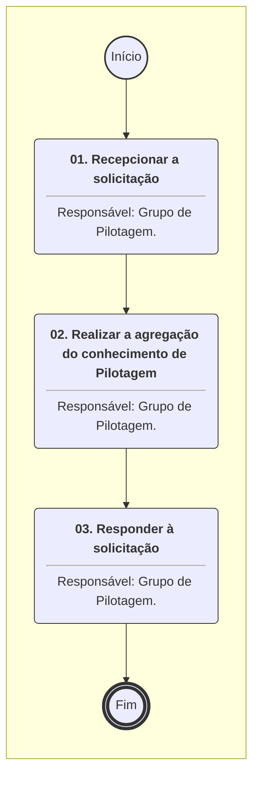

```mermaid
%%{init: {'theme': 'default'}}%%

flowchart TD
    classDef inicio stroke:#333,stroke-width:2px;
    classDef fim stroke:#333,stroke-width:4px;
    classDef tarefaBPMN stroke:#333,stroke-width:1px;
    classDef gatewayBPMN fill:#f2f2f2,stroke:#333,stroke-width:1px;
    classDef raia fill:none,stroke:#999,stroke-width:1px,stroke-dasharray: 5 5;
    subgraph Container_ID_MPR_SAR_103_R01_31 [ ]
        direction TB
        ID_MPR_SAR_103_R01_31_Start((Início)):::inicio
        ID_MPR_SAR_103_R01_31_End(((Fim))):::fim
        ID_MPR_SAR_103_R01_31_01("<b>01. Recepcionar a solicitação</b><hr>Responsável: Grupo de Sistemas Elétricos - Geração e Distribuição."):::tarefaBPMN
        ID_MPR_SAR_103_R01_31_02("<b>02. Realizar a agregação do conhecimento de Sistemas Elétricos - Geração e Distribuição</b><hr>Responsável: Grupo de Sistemas Elétricos - Geração e Distribuição."):::tarefaBPMN
        ID_MPR_SAR_103_R01_31_03("<b>03. Responder à solicitação</b><hr>Responsável: Grupo de Sistemas Elétricos - Geração e Distribuição."):::tarefaBPMN
        ID_MPR_SAR_103_R01_31_01("<b>01. Recepcionar a solicitação</b><hr>Responsável: Grupo de Sistemas Elétricos - Iluminação."):::tarefaBPMN
        ID_MPR_SAR_103_R01_31_02("<b>02. Realizar a agregação do conhecimento de Sistemas Elétricos - Iluminação</b><hr>Responsável: Grupo de Sistemas Elétricos - Iluminação."):::tarefaBPMN
        ID_MPR_SAR_103_R01_31_03("<b>03. Responder à solicitação</b><hr>Responsável: Grupo de Sistemas Elétricos - Iluminação."):::tarefaBPMN
        ID_MPR_SAR_103_R01_31_01("<b>01. Recepcionar a solicitação</b><hr>Responsável: Grupo de Sistemas Elétricos - Interiores."):::tarefaBPMN
        ID_MPR_SAR_103_R01_31_02("<b>02. Realizar a agregação do conhecimento de Sistemas Elétricos - Interiores</b><hr>Responsável: Grupo de Sistemas Elétricos - Interiores."):::tarefaBPMN
        ID_MPR_SAR_103_R01_31_03("<b>03. Responder à solicitação</b><hr>Responsável: Grupo de Sistemas Elétricos - Interiores."):::tarefaBPMN
        ID_MPR_SAR_103_R01_31_01("<b>01. Recepcionar a solicitação</b><hr>Responsável: Grupo de Sistemas Elétricos - Sistemas Interconectados de Fiação Elétrica - EWIS."):::tarefaBPMN
        ID_MPR_SAR_103_R01_31_02("<b>02. Realizar a agregação do conhecimento de Sistemas Elétricos - Sistemas Interconectados de Fiação Elétrica - EWIS</b><hr>Responsável: Grupo de Sistemas Elétricos - Sistemas Interconectados de Fiação Elétrica - EWIS."):::tarefaBPMN
        ID_MPR_SAR_103_R01_31_03("<b>03. Responder à solicitação</b><hr>Responsável: Grupo de Sistemas Elétricos - Sistemas Interconectados de Fiação Elétrica - EWIS."):::tarefaBPMN
        ID_MPR_SAR_103_R01_31_01("<b>01. Recepcionar a solicitação</b><hr>Responsável: Grupo de Sistemas Mecânicos - Comandos de Voo."):::tarefaBPMN
        ID_MPR_SAR_103_R01_31_02("<b>02. Realizar a agregação do conhecimento de Sistemas Mecânicos - Comandos de Voo</b><hr>Responsável: Grupo de Sistemas Mecânicos - Comandos de Voo."):::tarefaBPMN
        ID_MPR_SAR_103_R01_31_03("<b>03. Responder à solicitação</b><hr>Responsável: Grupo de Sistemas Mecânicos - Comandos de Voo."):::tarefaBPMN
        ID_MPR_SAR_103_R01_31_01("<b>01. Recepcionar a solicitação</b><hr>Responsável: Grupo de Sistemas Mecânicos - Hidromecânicos."):::tarefaBPMN
        ID_MPR_SAR_103_R01_31_02("<b>02. Realizar a agregação do conhecimento de Sistemas Mecânicos - Hidromecânicos</b><hr>Responsável: Grupo de Sistemas Mecânicos - Hidromecânicos."):::tarefaBPMN
        ID_MPR_SAR_103_R01_31_03("<b>03. Responder à solicitação</b><hr>Responsável: Grupo de Sistemas Mecânicos - Hidromecânicos."):::tarefaBPMN
        ID_MPR_SAR_103_R01_31_01("<b>01. Recepcionar a solicitação</b><hr>Responsável: Grupo de Software."):::tarefaBPMN
        ID_MPR_SAR_103_R01_31_02("<b>02. Realizar a agregação do conhecimento de Software</b><hr>Responsável: Grupo de Software."):::tarefaBPMN
        ID_MPR_SAR_103_R01_31_03("<b>03. Responder à solicitação</b><hr>Responsável: Grupo de Software."):::tarefaBPMN
        ID_MPR_SAR_103_R01_31_01("<b>01. Recepcionar a solicitação</b><hr>Responsável: Grupo de Pilotagem."):::tarefaBPMN
        ID_MPR_SAR_103_R01_31_02("<b>02. Realizar a agregação do conhecimento de Pilotagem</b><hr>Responsável: Grupo de Pilotagem."):::tarefaBPMN
        ID_MPR_SAR_103_R01_31_03("<b>03. Responder à solicitação</b><hr>Responsável: Grupo de Pilotagem."):::tarefaBPMN
        ID_MPR_SAR_103_R01_31_Start --> ID_MPR_SAR_103_R01_31_01
        ID_MPR_SAR_103_R01_31_01 --> ID_MPR_SAR_103_R01_31_02
        ID_MPR_SAR_103_R01_31_02 --> ID_MPR_SAR_103_R01_31_03
        ID_MPR_SAR_103_R01_31_03 --> ID_MPR_SAR_103_R01_31_End
        ID_MPR_SAR_103_R01_31_01 --> ID_MPR_SAR_103_R01_31_02
        ID_MPR_SAR_103_R01_31_02 --> ID_MPR_SAR_103_R01_31_03
        ID_MPR_SAR_103_R01_31_03 --> ID_MPR_SAR_103_R01_31_End
        ID_MPR_SAR_103_R01_31_01 --> ID_MPR_SAR_103_R01_31_02
        ID_MPR_SAR_103_R01_31_02 --> ID_MPR_SAR_103_R01_31_03
        ID_MPR_SAR_103_R01_31_03 --> ID_MPR_SAR_103_R01_31_End
        ID_MPR_SAR_103_R01_31_01 --> ID_MPR_SAR_103_R01_31_02
        ID_MPR_SAR_103_R01_31_02 --> ID_MPR_SAR_103_R01_31_03
        ID_MPR_SAR_103_R01_31_03 --> ID_MPR_SAR_103_R01_31_End
        ID_MPR_SAR_103_R01_31_01 --> ID_MPR_SAR_103_R01_31_02
        ID_MPR_SAR_103_R01_31_02 --> ID_MPR_SAR_103_R01_31_03
        ID_MPR_SAR_103_R01_31_03 --> ID_MPR_SAR_103_R01_31_End
        ID_MPR_SAR_103_R01_31_01 --> ID_MPR_SAR_103_R01_31_02
        ID_MPR_SAR_103_R01_31_02 --> ID_MPR_SAR_103_R01_31_03
        ID_MPR_SAR_103_R01_31_03 --> ID_MPR_SAR_103_R01_31_End
        ID_MPR_SAR_103_R01_31_01 --> ID_MPR_SAR_103_R01_31_02
        ID_MPR_SAR_103_R01_31_02 --> ID_MPR_SAR_103_R01_31_03
        ID_MPR_SAR_103_R01_31_03 --> ID_MPR_SAR_103_R01_31_End
        ID_MPR_SAR_103_R01_31_01 --> ID_MPR_SAR_103_R01_31_02
        ID_MPR_SAR_103_R01_31_02 --> ID_MPR_SAR_103_R01_31_03
        ID_MPR_SAR_103_R01_31_03 --> ID_MPR_SAR_103_R01_31_End
    end
    click ID_MPR_SAR_103_R01_31_01 href "#" "A solicitação de agregação de conhecimento pode ser apresentada de diferentes formas aos servidores membros dos Grupos de Especialidade, que tenham sido alocados matricialmente em programas de certificação, ou de forma isolada, a critério do líder técnico de área.  O modo de registrar a recepção da solicitação pode ser mais formal, ou menos, dependendo do formato da solicitação, sendo que as formas mais comuns são a solicitação da análise de plano de certificação, de um artefato de certificação e de avaliação de cumprimento de requisito, mas que abrangem também demandas originadas fora da GCPP (como regulamentos operacionais, de imprensa, etc.), com foco em fornecer o ponto de vista de engenharia."
    click ID_MPR_SAR_103_R01_31_02 href "#" "O modo como o conhecimento específico da especialidade é agregado ao objeto de trabalho dependerá da natureza da solicitação, sempre levando em conta as especificidades do campo de conhecimento, e os requisitos regulamentares aplicáveis."
    click ID_MPR_SAR_103_R01_31_03 href "#" "A resposta é variável (Resultado de análise, Resultado da participação em reunião, Aprovação de relatório, Reprovação de relatório, Nota Técnica et cœtera), adequada ao tipo de solicitação."
    click ID_MPR_SAR_103_R01_31_01 href "#" "A solicitação de agregação de conhecimento pode ser apresentada de diferentes formas aos servidores membros dos Grupos de Especialidade, que tenham sido alocados matricialmente em programas de certificação, ou de forma isolada, a critério do líder técnico de área.  O modo de registrar a recepção da solicitação pode ser mais formal, ou menos, dependendo do formato da solicitação, sendo que as formas mais comuns são a solicitação da análise de plano de certificação, de um artefato de certificação e de avaliação de cumprimento de requisito, mas que abrangem também demandas originadas fora da GCPP (como regulamentos operacionais, de imprensa, etc.), com foco em fornecer o ponto de vista de engenharia."
    click ID_MPR_SAR_103_R01_31_02 href "#" "O modo como o conhecimento específico da especialidade é agregado ao objeto de trabalho dependerá da natureza da solicitação, sempre levando em conta as especificidades do campo de conhecimento, e os requisitos regulamentares aplicáveis."
    click ID_MPR_SAR_103_R01_31_03 href "#" "A resposta é variável (Resultado de análise, Resultado da participação em reunião, Aprovação de relatório, Reprovação de relatório, Nota Técnica et cœtera), adequada ao tipo de solicitação."
    click ID_MPR_SAR_103_R01_31_01 href "#" "A solicitação de agregação de conhecimento pode ser apresentada de diferentes formas aos servidores membros dos Grupos de Especialidade, que tenham sido alocados matricialmente em programas de certificação, ou de forma isolada, a critério do líder técnico de área.  O modo de registrar a recepção da solicitação pode ser mais formal, ou menos, dependendo do formato da solicitação, sendo que as formas mais comuns são a solicitação da análise de plano de certificação, de um artefato de certificação e de avaliação de cumprimento de requisito, mas que abrangem também demandas originadas fora da GCPP (como regulamentos operacionais, de imprensa, etc.), com foco em fornecer o ponto de vista de engenharia."
    click ID_MPR_SAR_103_R01_31_02 href "#" "O modo como o conhecimento específico da especialidade é agregado ao objeto de trabalho dependerá da natureza da solicitação, sempre levando em conta as especificidades do campo de conhecimento, e os requisitos regulamentares aplicáveis."
    click ID_MPR_SAR_103_R01_31_03 href "#" "A resposta é variável (Resultado de análise, Resultado da participação em reunião, Aprovação de relatório, Reprovação de relatório, Nota Técnica et cœtera), adequada ao tipo de solicitação."
    click ID_MPR_SAR_103_R01_31_01 href "#" "A solicitação de agregação de conhecimento pode ser apresentada de diferentes formas aos servidores membros dos Grupos de Especialidade, que tenham sido alocados matricialmente em programas de certificação, ou de forma isolada, a critério do líder técnico de área.  O modo de registrar a recepção da solicitação pode ser mais formal, ou menos, dependendo do formato da solicitação, sendo que as formas mais comuns são a solicitação da análise de plano de certificação, de um artefato de certificação e de avaliação de cumprimento de requisito, mas que abrangem também demandas originadas fora da GCPP (como regulamentos operacionais, de imprensa, etc.), com foco em fornecer o ponto de vista de engenharia."
    click ID_MPR_SAR_103_R01_31_02 href "#" "O modo como o conhecimento específico da especialidade é agregado ao objeto de trabalho dependerá da natureza da solicitação, sempre levando em conta as especificidades do campo de conhecimento, e os requisitos regulamentares aplicáveis."
    click ID_MPR_SAR_103_R01_31_03 href "#" "A resposta é variável (Resultado de análise, Resultado da participação em reunião, Aprovação de relatório, Reprovação de relatório, Nota Técnica et cœtera), adequada ao tipo de solicitação."
    click ID_MPR_SAR_103_R01_31_01 href "#" "A solicitação de agregação de conhecimento pode ser apresentada de diferentes formas aos servidores membros dos Grupos de Especialidade, que tenham sido alocados matricialmente em programas de certificação, ou de forma isolada, a critério do líder técnico de área.  O modo de registrar a recepção da solicitação pode ser mais formal, ou menos, dependendo do formato da solicitação, sendo que as formas mais comuns são a solicitação da análise de plano de certificação, de um artefato de certificação e de avaliação de cumprimento de requisito, mas que abrangem também demandas originadas fora da GCPP (como regulamentos operacionais, de imprensa, etc.), com foco em fornecer o ponto de vista de engenharia."
    click ID_MPR_SAR_103_R01_31_02 href "#" "O modo como o conhecimento específico da especialidade é agregado ao objeto de trabalho dependerá da natureza da solicitação, sempre levando em conta as especificidades do campo de conhecimento, e os requisitos regulamentares aplicáveis."
    click ID_MPR_SAR_103_R01_31_03 href "#" "A resposta é variável (Resultado de análise, Resultado da participação em reunião, Aprovação de relatório, Reprovação de relatório, Nota Técnica et cœtera), adequada ao tipo de solicitação."
    click ID_MPR_SAR_103_R01_31_01 href "#" "A solicitação de agregação de conhecimento pode ser apresentada de diferentes formas aos servidores membros dos Grupos de Especialidade, que tenham sido alocados matricialmente em programas de certificação, ou de forma isolada, a critério do líder técnico de área.  O modo de registrar a recepção da solicitação pode ser mais formal, ou menos, dependendo do formato da solicitação, sendo que as formas mais comuns são a solicitação da análise de plano de certificação, de um artefato de certificação e de avaliação de cumprimento de requisito, mas que abrangem também demandas originadas fora da GCPP (como regulamentos operacionais, de imprensa, etc.), com foco em fornecer o ponto de vista de engenharia."
    click ID_MPR_SAR_103_R01_31_02 href "#" "O modo como o conhecimento específico da especialidade é agregado ao objeto de trabalho dependerá da natureza da solicitação, sempre levando em conta as especificidades do campo de conhecimento, e os requisitos regulamentares aplicáveis."
    click ID_MPR_SAR_103_R01_31_03 href "#" "A resposta é variável (Resultado de análise, Resultado da participação em reunião, Aprovação de relatório, Reprovação de relatório, Nota Técnica et cœtera), adequada ao tipo de solicitação."
    click ID_MPR_SAR_103_R01_31_01 href "#" "A solicitação de agregação de conhecimento pode ser apresentada de diferentes formas aos servidores membros dos Grupos de Especialidade, que tenham sido alocados matricialmente em programas de certificação, ou de forma isolada, a critério do líder técnico de área.  O modo de registrar a recepção da solicitação pode ser mais formal, ou menos, dependendo do formato da solicitação, sendo que as formas mais comuns são a solicitação da análise de plano de certificação, de um artefato de certificação e de avaliação de cumprimento de requisito, mas que abrangem também demandas originadas fora da GCPP (como regulamentos operacionais, de imprensa, etc.), com foco em fornecer o ponto de vista de engenharia."
    click ID_MPR_SAR_103_R01_31_02 href "#" "O modo como o conhecimento específico da especialidade é agregado ao objeto de trabalho dependerá da natureza da solicitação, sempre levando em conta as especificidades do campo de conhecimento, e os requisitos regulamentares aplicáveis."
    click ID_MPR_SAR_103_R01_31_03 href "#" "A resposta é variável (Resultado de análise, Resultado da participação em reunião, Aprovação de relatório, Reprovação de relatório, Nota Técnica et cœtera), adequada ao tipo de solicitação."
    click ID_MPR_SAR_103_R01_31_01 href "#" "A solicitação de agregação de conhecimento pode ser apresentada de diferentes formas aos servidores membros dos Grupos de Especialidade, que tenham sido alocados matricialmente em programas de certificação, ou de forma isolada, a critério do líder técnico de área.  O modo de registrar a recepção da solicitação pode ser mais formal, ou menos, dependendo do formato da solicitação, sendo que as formas mais comuns são a solicitação da análise de plano de certificação, de um artefato de certificação e de avaliação de cumprimento de requisito, mas que abrangem também demandas originadas fora da GCPP (como regulamentos operacionais, de imprensa, etc.), com foco em fornecer o ponto de vista de engenharia."
    click ID_MPR_SAR_103_R01_31_02 href "#" "O modo como o conhecimento específico da especialidade é agregado ao objeto de trabalho dependerá da natureza da solicitação, sempre levando em conta as especificidades do campo de conhecimento, e os requisitos regulamentares aplicáveis."
    click ID_MPR_SAR_103_R01_31_03 href "#" "A resposta é variável (Resultado de análise, Resultado da participação em reunião, Aprovação de relatório, Reprovação de relatório, Nota Técnica et cœtera), adequada ao tipo de solicitação."
```

```mermaid
%%{init: {'theme': 'default'}}%%

flowchart TD
    classDef inicio stroke:#333,stroke-width:2px;
    classDef fim stroke:#333,stroke-width:4px;
    classDef tarefaBPMN stroke:#333,stroke-width:1px;
    classDef gatewayBPMN fill:#f2f2f2,stroke:#333,stroke-width:1px;
    classDef raia fill:none,stroke:#999,stroke-width:1px,stroke-dasharray: 5 5;
    subgraph Container_ID_MPR_SAR_103_R01_32 [ ]
        direction TB
        ID_MPR_SAR_103_R01_32_Start((Início)):::inicio
        ID_MPR_SAR_103_R01_32_End(((Fim))):::fim
        ID_MPR_SAR_103_R01_32_01("<b>01. Recepcionar a solicitação</b><hr>Responsável: Grupo de Sistemas Elétricos - Iluminação."):::tarefaBPMN
        ID_MPR_SAR_103_R01_32_02("<b>02. Realizar a agregação do conhecimento de Sistemas Elétricos - Iluminação</b><hr>Responsável: Grupo de Sistemas Elétricos - Iluminação."):::tarefaBPMN
        ID_MPR_SAR_103_R01_32_03("<b>03. Responder à solicitação</b><hr>Responsável: Grupo de Sistemas Elétricos - Iluminação."):::tarefaBPMN
        ID_MPR_SAR_103_R01_32_01("<b>01. Recepcionar a solicitação</b><hr>Responsável: Grupo de Sistemas Elétricos - Interiores."):::tarefaBPMN
        ID_MPR_SAR_103_R01_32_02("<b>02. Realizar a agregação do conhecimento de Sistemas Elétricos - Interiores</b><hr>Responsável: Grupo de Sistemas Elétricos - Interiores."):::tarefaBPMN
        ID_MPR_SAR_103_R01_32_03("<b>03. Responder à solicitação</b><hr>Responsável: Grupo de Sistemas Elétricos - Interiores."):::tarefaBPMN
        ID_MPR_SAR_103_R01_32_01("<b>01. Recepcionar a solicitação</b><hr>Responsável: Grupo de Sistemas Elétricos - Sistemas Interconectados de Fiação Elétrica - EWIS."):::tarefaBPMN
        ID_MPR_SAR_103_R01_32_02("<b>02. Realizar a agregação do conhecimento de Sistemas Elétricos - Sistemas Interconectados de Fiação Elétrica - EWIS</b><hr>Responsável: Grupo de Sistemas Elétricos - Sistemas Interconectados de Fiação Elétrica - EWIS."):::tarefaBPMN
        ID_MPR_SAR_103_R01_32_03("<b>03. Responder à solicitação</b><hr>Responsável: Grupo de Sistemas Elétricos - Sistemas Interconectados de Fiação Elétrica - EWIS."):::tarefaBPMN
        ID_MPR_SAR_103_R01_32_01("<b>01. Recepcionar a solicitação</b><hr>Responsável: Grupo de Sistemas Mecânicos - Comandos de Voo."):::tarefaBPMN
        ID_MPR_SAR_103_R01_32_02("<b>02. Realizar a agregação do conhecimento de Sistemas Mecânicos - Comandos de Voo</b><hr>Responsável: Grupo de Sistemas Mecânicos - Comandos de Voo."):::tarefaBPMN
        ID_MPR_SAR_103_R01_32_03("<b>03. Responder à solicitação</b><hr>Responsável: Grupo de Sistemas Mecânicos - Comandos de Voo."):::tarefaBPMN
        ID_MPR_SAR_103_R01_32_01("<b>01. Recepcionar a solicitação</b><hr>Responsável: Grupo de Sistemas Mecânicos - Hidromecânicos."):::tarefaBPMN
        ID_MPR_SAR_103_R01_32_02("<b>02. Realizar a agregação do conhecimento de Sistemas Mecânicos - Hidromecânicos</b><hr>Responsável: Grupo de Sistemas Mecânicos - Hidromecânicos."):::tarefaBPMN
        ID_MPR_SAR_103_R01_32_03("<b>03. Responder à solicitação</b><hr>Responsável: Grupo de Sistemas Mecânicos - Hidromecânicos."):::tarefaBPMN
        ID_MPR_SAR_103_R01_32_01("<b>01. Recepcionar a solicitação</b><hr>Responsável: Grupo de Software."):::tarefaBPMN
        ID_MPR_SAR_103_R01_32_02("<b>02. Realizar a agregação do conhecimento de Software</b><hr>Responsável: Grupo de Software."):::tarefaBPMN
        ID_MPR_SAR_103_R01_32_03("<b>03. Responder à solicitação</b><hr>Responsável: Grupo de Software."):::tarefaBPMN
        ID_MPR_SAR_103_R01_32_01("<b>01. Recepcionar a solicitação</b><hr>Responsável: Grupo de Pilotagem."):::tarefaBPMN
        ID_MPR_SAR_103_R01_32_02("<b>02. Realizar a agregação do conhecimento de Pilotagem</b><hr>Responsável: Grupo de Pilotagem."):::tarefaBPMN
        ID_MPR_SAR_103_R01_32_03("<b>03. Responder à solicitação</b><hr>Responsável: Grupo de Pilotagem."):::tarefaBPMN
        ID_MPR_SAR_103_R01_32_Start --> ID_MPR_SAR_103_R01_32_01
        ID_MPR_SAR_103_R01_32_01 --> ID_MPR_SAR_103_R01_32_02
        ID_MPR_SAR_103_R01_32_02 --> ID_MPR_SAR_103_R01_32_03
        ID_MPR_SAR_103_R01_32_03 --> ID_MPR_SAR_103_R01_32_End
        ID_MPR_SAR_103_R01_32_01 --> ID_MPR_SAR_103_R01_32_02
        ID_MPR_SAR_103_R01_32_02 --> ID_MPR_SAR_103_R01_32_03
        ID_MPR_SAR_103_R01_32_03 --> ID_MPR_SAR_103_R01_32_End
        ID_MPR_SAR_103_R01_32_01 --> ID_MPR_SAR_103_R01_32_02
        ID_MPR_SAR_103_R01_32_02 --> ID_MPR_SAR_103_R01_32_03
        ID_MPR_SAR_103_R01_32_03 --> ID_MPR_SAR_103_R01_32_End
        ID_MPR_SAR_103_R01_32_01 --> ID_MPR_SAR_103_R01_32_02
        ID_MPR_SAR_103_R01_32_02 --> ID_MPR_SAR_103_R01_32_03
        ID_MPR_SAR_103_R01_32_03 --> ID_MPR_SAR_103_R01_32_End
        ID_MPR_SAR_103_R01_32_01 --> ID_MPR_SAR_103_R01_32_02
        ID_MPR_SAR_103_R01_32_02 --> ID_MPR_SAR_103_R01_32_03
        ID_MPR_SAR_103_R01_32_03 --> ID_MPR_SAR_103_R01_32_End
        ID_MPR_SAR_103_R01_32_01 --> ID_MPR_SAR_103_R01_32_02
        ID_MPR_SAR_103_R01_32_02 --> ID_MPR_SAR_103_R01_32_03
        ID_MPR_SAR_103_R01_32_03 --> ID_MPR_SAR_103_R01_32_End
        ID_MPR_SAR_103_R01_32_01 --> ID_MPR_SAR_103_R01_32_02
        ID_MPR_SAR_103_R01_32_02 --> ID_MPR_SAR_103_R01_32_03
        ID_MPR_SAR_103_R01_32_03 --> ID_MPR_SAR_103_R01_32_End
    end
    click ID_MPR_SAR_103_R01_32_01 href "#" "A solicitação de agregação de conhecimento pode ser apresentada de diferentes formas aos servidores membros dos Grupos de Especialidade, que tenham sido alocados matricialmente em programas de certificação, ou de forma isolada, a critério do líder técnico de área.  O modo de registrar a recepção da solicitação pode ser mais formal, ou menos, dependendo do formato da solicitação, sendo que as formas mais comuns são a solicitação da análise de plano de certificação, de um artefato de certificação e de avaliação de cumprimento de requisito, mas que abrangem também demandas originadas fora da GCPP (como regulamentos operacionais, de imprensa, etc.), com foco em fornecer o ponto de vista de engenharia."
    click ID_MPR_SAR_103_R01_32_02 href "#" "O modo como o conhecimento específico da especialidade é agregado ao objeto de trabalho dependerá da natureza da solicitação, sempre levando em conta as especificidades do campo de conhecimento, e os requisitos regulamentares aplicáveis."
    click ID_MPR_SAR_103_R01_32_03 href "#" "A resposta é variável (Resultado de análise, Resultado da participação em reunião, Aprovação de relatório, Reprovação de relatório, Nota Técnica et cœtera), adequada ao tipo de solicitação."
    click ID_MPR_SAR_103_R01_32_01 href "#" "A solicitação de agregação de conhecimento pode ser apresentada de diferentes formas aos servidores membros dos Grupos de Especialidade, que tenham sido alocados matricialmente em programas de certificação, ou de forma isolada, a critério do líder técnico de área.  O modo de registrar a recepção da solicitação pode ser mais formal, ou menos, dependendo do formato da solicitação, sendo que as formas mais comuns são a solicitação da análise de plano de certificação, de um artefato de certificação e de avaliação de cumprimento de requisito, mas que abrangem também demandas originadas fora da GCPP (como regulamentos operacionais, de imprensa, etc.), com foco em fornecer o ponto de vista de engenharia."
    click ID_MPR_SAR_103_R01_32_02 href "#" "O modo como o conhecimento específico da especialidade é agregado ao objeto de trabalho dependerá da natureza da solicitação, sempre levando em conta as especificidades do campo de conhecimento, e os requisitos regulamentares aplicáveis."
    click ID_MPR_SAR_103_R01_32_03 href "#" "A resposta é variável (Resultado de análise, Resultado da participação em reunião, Aprovação de relatório, Reprovação de relatório, Nota Técnica et cœtera), adequada ao tipo de solicitação."
    click ID_MPR_SAR_103_R01_32_01 href "#" "A solicitação de agregação de conhecimento pode ser apresentada de diferentes formas aos servidores membros dos Grupos de Especialidade, que tenham sido alocados matricialmente em programas de certificação, ou de forma isolada, a critério do líder técnico de área.  O modo de registrar a recepção da solicitação pode ser mais formal, ou menos, dependendo do formato da solicitação, sendo que as formas mais comuns são a solicitação da análise de plano de certificação, de um artefato de certificação e de avaliação de cumprimento de requisito, mas que abrangem também demandas originadas fora da GCPP (como regulamentos operacionais, de imprensa, etc.), com foco em fornecer o ponto de vista de engenharia."
    click ID_MPR_SAR_103_R01_32_02 href "#" "O modo como o conhecimento específico da especialidade é agregado ao objeto de trabalho dependerá da natureza da solicitação, sempre levando em conta as especificidades do campo de conhecimento, e os requisitos regulamentares aplicáveis."
    click ID_MPR_SAR_103_R01_32_03 href "#" "A resposta é variável (Resultado de análise, Resultado da participação em reunião, Aprovação de relatório, Reprovação de relatório, Nota Técnica et cœtera), adequada ao tipo de solicitação."
    click ID_MPR_SAR_103_R01_32_01 href "#" "A solicitação de agregação de conhecimento pode ser apresentada de diferentes formas aos servidores membros dos Grupos de Especialidade, que tenham sido alocados matricialmente em programas de certificação, ou de forma isolada, a critério do líder técnico de área.  O modo de registrar a recepção da solicitação pode ser mais formal, ou menos, dependendo do formato da solicitação, sendo que as formas mais comuns são a solicitação da análise de plano de certificação, de um artefato de certificação e de avaliação de cumprimento de requisito, mas que abrangem também demandas originadas fora da GCPP (como regulamentos operacionais, de imprensa, etc.), com foco em fornecer o ponto de vista de engenharia."
    click ID_MPR_SAR_103_R01_32_02 href "#" "O modo como o conhecimento específico da especialidade é agregado ao objeto de trabalho dependerá da natureza da solicitação, sempre levando em conta as especificidades do campo de conhecimento, e os requisitos regulamentares aplicáveis."
    click ID_MPR_SAR_103_R01_32_03 href "#" "A resposta é variável (Resultado de análise, Resultado da participação em reunião, Aprovação de relatório, Reprovação de relatório, Nota Técnica et cœtera), adequada ao tipo de solicitação."
    click ID_MPR_SAR_103_R01_32_01 href "#" "A solicitação de agregação de conhecimento pode ser apresentada de diferentes formas aos servidores membros dos Grupos de Especialidade, que tenham sido alocados matricialmente em programas de certificação, ou de forma isolada, a critério do líder técnico de área.  O modo de registrar a recepção da solicitação pode ser mais formal, ou menos, dependendo do formato da solicitação, sendo que as formas mais comuns são a solicitação da análise de plano de certificação, de um artefato de certificação e de avaliação de cumprimento de requisito, mas que abrangem também demandas originadas fora da GCPP (como regulamentos operacionais, de imprensa, etc.), com foco em fornecer o ponto de vista de engenharia."
    click ID_MPR_SAR_103_R01_32_02 href "#" "O modo como o conhecimento específico da especialidade é agregado ao objeto de trabalho dependerá da natureza da solicitação, sempre levando em conta as especificidades do campo de conhecimento, e os requisitos regulamentares aplicáveis."
    click ID_MPR_SAR_103_R01_32_03 href "#" "A resposta é variável (Resultado de análise, Resultado da participação em reunião, Aprovação de relatório, Reprovação de relatório, Nota Técnica et cœtera), adequada ao tipo de solicitação."
    click ID_MPR_SAR_103_R01_32_01 href "#" "A solicitação de agregação de conhecimento pode ser apresentada de diferentes formas aos servidores membros dos Grupos de Especialidade, que tenham sido alocados matricialmente em programas de certificação, ou de forma isolada, a critério do líder técnico de área.  O modo de registrar a recepção da solicitação pode ser mais formal, ou menos, dependendo do formato da solicitação, sendo que as formas mais comuns são a solicitação da análise de plano de certificação, de um artefato de certificação e de avaliação de cumprimento de requisito, mas que abrangem também demandas originadas fora da GCPP (como regulamentos operacionais, de imprensa, etc.), com foco em fornecer o ponto de vista de engenharia."
    click ID_MPR_SAR_103_R01_32_02 href "#" "O modo como o conhecimento específico da especialidade é agregado ao objeto de trabalho dependerá da natureza da solicitação, sempre levando em conta as especificidades do campo de conhecimento, e os requisitos regulamentares aplicáveis."
    click ID_MPR_SAR_103_R01_32_03 href "#" "A resposta é variável (Resultado de análise, Resultado da participação em reunião, Aprovação de relatório, Reprovação de relatório, Nota Técnica et cœtera), adequada ao tipo de solicitação."
    click ID_MPR_SAR_103_R01_32_01 href "#" "A solicitação de agregação de conhecimento pode ser apresentada de diferentes formas aos servidores membros dos Grupos de Especialidade, que tenham sido alocados matricialmente em programas de certificação, ou de forma isolada, a critério do líder técnico de área.  O modo de registrar a recepção da solicitação pode ser mais formal, ou menos, dependendo do formato da solicitação, sendo que as formas mais comuns são a solicitação da análise de plano de certificação, de um artefato de certificação e de avaliação de cumprimento de requisito, mas que abrangem também demandas originadas fora da GCPP (como regulamentos operacionais, de imprensa, etc.), com foco em fornecer o ponto de vista de engenharia."
    click ID_MPR_SAR_103_R01_32_02 href "#" "O modo como o conhecimento específico da especialidade é agregado ao objeto de trabalho dependerá da natureza da solicitação, sempre levando em conta as especificidades do campo de conhecimento, e os requisitos regulamentares aplicáveis."
    click ID_MPR_SAR_103_R01_32_03 href "#" "A resposta é variável (Resultado de análise, Resultado da participação em reunião, Aprovação de relatório, Reprovação de relatório, Nota Técnica et cœtera), adequada ao tipo de solicitação."
```

```mermaid
%%{init: {'theme': 'default'}}%%

flowchart TD
    classDef inicio stroke:#333,stroke-width:2px;
    classDef fim stroke:#333,stroke-width:4px;
    classDef tarefaBPMN stroke:#333,stroke-width:1px;
    classDef gatewayBPMN fill:#f2f2f2,stroke:#333,stroke-width:1px;
    classDef raia fill:none,stroke:#999,stroke-width:1px,stroke-dasharray: 5 5;
    subgraph Container_ID_MPR_SAR_103_R01_33 [ ]
        direction TB
        ID_MPR_SAR_103_R01_33_Start((Início)):::inicio
        ID_MPR_SAR_103_R01_33_End(((Fim))):::fim
        ID_MPR_SAR_103_R01_33_01("<b>01. Recepcionar a solicitação</b><hr>Responsável: Grupo de Sistemas Elétricos - Interiores."):::tarefaBPMN
        ID_MPR_SAR_103_R01_33_02("<b>02. Realizar a agregação do conhecimento de Sistemas Elétricos - Interiores</b><hr>Responsável: Grupo de Sistemas Elétricos - Interiores."):::tarefaBPMN
        ID_MPR_SAR_103_R01_33_03("<b>03. Responder à solicitação</b><hr>Responsável: Grupo de Sistemas Elétricos - Interiores."):::tarefaBPMN
        ID_MPR_SAR_103_R01_33_01("<b>01. Recepcionar a solicitação</b><hr>Responsável: Grupo de Sistemas Elétricos - Sistemas Interconectados de Fiação Elétrica - EWIS."):::tarefaBPMN
        ID_MPR_SAR_103_R01_33_02("<b>02. Realizar a agregação do conhecimento de Sistemas Elétricos - Sistemas Interconectados de Fiação Elétrica - EWIS</b><hr>Responsável: Grupo de Sistemas Elétricos - Sistemas Interconectados de Fiação Elétrica - EWIS."):::tarefaBPMN
        ID_MPR_SAR_103_R01_33_03("<b>03. Responder à solicitação</b><hr>Responsável: Grupo de Sistemas Elétricos - Sistemas Interconectados de Fiação Elétrica - EWIS."):::tarefaBPMN
        ID_MPR_SAR_103_R01_33_01("<b>01. Recepcionar a solicitação</b><hr>Responsável: Grupo de Sistemas Mecânicos - Comandos de Voo."):::tarefaBPMN
        ID_MPR_SAR_103_R01_33_02("<b>02. Realizar a agregação do conhecimento de Sistemas Mecânicos - Comandos de Voo</b><hr>Responsável: Grupo de Sistemas Mecânicos - Comandos de Voo."):::tarefaBPMN
        ID_MPR_SAR_103_R01_33_03("<b>03. Responder à solicitação</b><hr>Responsável: Grupo de Sistemas Mecânicos - Comandos de Voo."):::tarefaBPMN
        ID_MPR_SAR_103_R01_33_01("<b>01. Recepcionar a solicitação</b><hr>Responsável: Grupo de Sistemas Mecânicos - Hidromecânicos."):::tarefaBPMN
        ID_MPR_SAR_103_R01_33_02("<b>02. Realizar a agregação do conhecimento de Sistemas Mecânicos - Hidromecânicos</b><hr>Responsável: Grupo de Sistemas Mecânicos - Hidromecânicos."):::tarefaBPMN
        ID_MPR_SAR_103_R01_33_03("<b>03. Responder à solicitação</b><hr>Responsável: Grupo de Sistemas Mecânicos - Hidromecânicos."):::tarefaBPMN
        ID_MPR_SAR_103_R01_33_01("<b>01. Recepcionar a solicitação</b><hr>Responsável: Grupo de Software."):::tarefaBPMN
        ID_MPR_SAR_103_R01_33_02("<b>02. Realizar a agregação do conhecimento de Software</b><hr>Responsável: Grupo de Software."):::tarefaBPMN
        ID_MPR_SAR_103_R01_33_03("<b>03. Responder à solicitação</b><hr>Responsável: Grupo de Software."):::tarefaBPMN
        ID_MPR_SAR_103_R01_33_01("<b>01. Recepcionar a solicitação</b><hr>Responsável: Grupo de Pilotagem."):::tarefaBPMN
        ID_MPR_SAR_103_R01_33_02("<b>02. Realizar a agregação do conhecimento de Pilotagem</b><hr>Responsável: Grupo de Pilotagem."):::tarefaBPMN
        ID_MPR_SAR_103_R01_33_03("<b>03. Responder à solicitação</b><hr>Responsável: Grupo de Pilotagem."):::tarefaBPMN
        ID_MPR_SAR_103_R01_33_Start --> ID_MPR_SAR_103_R01_33_01
        ID_MPR_SAR_103_R01_33_01 --> ID_MPR_SAR_103_R01_33_02
        ID_MPR_SAR_103_R01_33_02 --> ID_MPR_SAR_103_R01_33_03
        ID_MPR_SAR_103_R01_33_03 --> ID_MPR_SAR_103_R01_33_End
        ID_MPR_SAR_103_R01_33_01 --> ID_MPR_SAR_103_R01_33_02
        ID_MPR_SAR_103_R01_33_02 --> ID_MPR_SAR_103_R01_33_03
        ID_MPR_SAR_103_R01_33_03 --> ID_MPR_SAR_103_R01_33_End
        ID_MPR_SAR_103_R01_33_01 --> ID_MPR_SAR_103_R01_33_02
        ID_MPR_SAR_103_R01_33_02 --> ID_MPR_SAR_103_R01_33_03
        ID_MPR_SAR_103_R01_33_03 --> ID_MPR_SAR_103_R01_33_End
        ID_MPR_SAR_103_R01_33_01 --> ID_MPR_SAR_103_R01_33_02
        ID_MPR_SAR_103_R01_33_02 --> ID_MPR_SAR_103_R01_33_03
        ID_MPR_SAR_103_R01_33_03 --> ID_MPR_SAR_103_R01_33_End
        ID_MPR_SAR_103_R01_33_01 --> ID_MPR_SAR_103_R01_33_02
        ID_MPR_SAR_103_R01_33_02 --> ID_MPR_SAR_103_R01_33_03
        ID_MPR_SAR_103_R01_33_03 --> ID_MPR_SAR_103_R01_33_End
        ID_MPR_SAR_103_R01_33_01 --> ID_MPR_SAR_103_R01_33_02
        ID_MPR_SAR_103_R01_33_02 --> ID_MPR_SAR_103_R01_33_03
        ID_MPR_SAR_103_R01_33_03 --> ID_MPR_SAR_103_R01_33_End
    end
    click ID_MPR_SAR_103_R01_33_01 href "#" "A solicitação de agregação de conhecimento pode ser apresentada de diferentes formas aos servidores membros dos Grupos de Especialidade, que tenham sido alocados matricialmente em programas de certificação, ou de forma isolada, a critério do líder técnico de área.  O modo de registrar a recepção da solicitação pode ser mais formal, ou menos, dependendo do formato da solicitação, sendo que as formas mais comuns são a solicitação da análise de plano de certificação, de um artefato de certificação e de avaliação de cumprimento de requisito, mas que abrangem também demandas originadas fora da GCPP (como regulamentos operacionais, de imprensa, etc.), com foco em fornecer o ponto de vista de engenharia."
    click ID_MPR_SAR_103_R01_33_02 href "#" "O modo como o conhecimento específico da especialidade é agregado ao objeto de trabalho dependerá da natureza da solicitação, sempre levando em conta as especificidades do campo de conhecimento, e os requisitos regulamentares aplicáveis."
    click ID_MPR_SAR_103_R01_33_03 href "#" "A resposta é variável (Resultado de análise, Resultado da participação em reunião, Aprovação de relatório, Reprovação de relatório, Nota Técnica et cœtera), adequada ao tipo de solicitação."
    click ID_MPR_SAR_103_R01_33_01 href "#" "A solicitação de agregação de conhecimento pode ser apresentada de diferentes formas aos servidores membros dos Grupos de Especialidade, que tenham sido alocados matricialmente em programas de certificação, ou de forma isolada, a critério do líder técnico de área.  O modo de registrar a recepção da solicitação pode ser mais formal, ou menos, dependendo do formato da solicitação, sendo que as formas mais comuns são a solicitação da análise de plano de certificação, de um artefato de certificação e de avaliação de cumprimento de requisito, mas que abrangem também demandas originadas fora da GCPP (como regulamentos operacionais, de imprensa, etc.), com foco em fornecer o ponto de vista de engenharia."
    click ID_MPR_SAR_103_R01_33_02 href "#" "O modo como o conhecimento específico da especialidade é agregado ao objeto de trabalho dependerá da natureza da solicitação, sempre levando em conta as especificidades do campo de conhecimento, e os requisitos regulamentares aplicáveis."
    click ID_MPR_SAR_103_R01_33_03 href "#" "A resposta é variável (Resultado de análise, Resultado da participação em reunião, Aprovação de relatório, Reprovação de relatório, Nota Técnica et cœtera), adequada ao tipo de solicitação."
    click ID_MPR_SAR_103_R01_33_01 href "#" "A solicitação de agregação de conhecimento pode ser apresentada de diferentes formas aos servidores membros dos Grupos de Especialidade, que tenham sido alocados matricialmente em programas de certificação, ou de forma isolada, a critério do líder técnico de área.  O modo de registrar a recepção da solicitação pode ser mais formal, ou menos, dependendo do formato da solicitação, sendo que as formas mais comuns são a solicitação da análise de plano de certificação, de um artefato de certificação e de avaliação de cumprimento de requisito, mas que abrangem também demandas originadas fora da GCPP (como regulamentos operacionais, de imprensa, etc.), com foco em fornecer o ponto de vista de engenharia."
    click ID_MPR_SAR_103_R01_33_02 href "#" "O modo como o conhecimento específico da especialidade é agregado ao objeto de trabalho dependerá da natureza da solicitação, sempre levando em conta as especificidades do campo de conhecimento, e os requisitos regulamentares aplicáveis."
    click ID_MPR_SAR_103_R01_33_03 href "#" "A resposta é variável (Resultado de análise, Resultado da participação em reunião, Aprovação de relatório, Reprovação de relatório, Nota Técnica et cœtera), adequada ao tipo de solicitação."
    click ID_MPR_SAR_103_R01_33_01 href "#" "A solicitação de agregação de conhecimento pode ser apresentada de diferentes formas aos servidores membros dos Grupos de Especialidade, que tenham sido alocados matricialmente em programas de certificação, ou de forma isolada, a critério do líder técnico de área.  O modo de registrar a recepção da solicitação pode ser mais formal, ou menos, dependendo do formato da solicitação, sendo que as formas mais comuns são a solicitação da análise de plano de certificação, de um artefato de certificação e de avaliação de cumprimento de requisito, mas que abrangem também demandas originadas fora da GCPP (como regulamentos operacionais, de imprensa, etc.), com foco em fornecer o ponto de vista de engenharia."
    click ID_MPR_SAR_103_R01_33_02 href "#" "O modo como o conhecimento específico da especialidade é agregado ao objeto de trabalho dependerá da natureza da solicitação, sempre levando em conta as especificidades do campo de conhecimento, e os requisitos regulamentares aplicáveis."
    click ID_MPR_SAR_103_R01_33_03 href "#" "A resposta é variável (Resultado de análise, Resultado da participação em reunião, Aprovação de relatório, Reprovação de relatório, Nota Técnica et cœtera), adequada ao tipo de solicitação."
    click ID_MPR_SAR_103_R01_33_01 href "#" "A solicitação de agregação de conhecimento pode ser apresentada de diferentes formas aos servidores membros dos Grupos de Especialidade, que tenham sido alocados matricialmente em programas de certificação, ou de forma isolada, a critério do líder técnico de área.  O modo de registrar a recepção da solicitação pode ser mais formal, ou menos, dependendo do formato da solicitação, sendo que as formas mais comuns são a solicitação da análise de plano de certificação, de um artefato de certificação e de avaliação de cumprimento de requisito, mas que abrangem também demandas originadas fora da GCPP (como regulamentos operacionais, de imprensa, etc.), com foco em fornecer o ponto de vista de engenharia."
    click ID_MPR_SAR_103_R01_33_02 href "#" "O modo como o conhecimento específico da especialidade é agregado ao objeto de trabalho dependerá da natureza da solicitação, sempre levando em conta as especificidades do campo de conhecimento, e os requisitos regulamentares aplicáveis."
    click ID_MPR_SAR_103_R01_33_03 href "#" "A resposta é variável (Resultado de análise, Resultado da participação em reunião, Aprovação de relatório, Reprovação de relatório, Nota Técnica et cœtera), adequada ao tipo de solicitação."
    click ID_MPR_SAR_103_R01_33_01 href "#" "A solicitação de agregação de conhecimento pode ser apresentada de diferentes formas aos servidores membros dos Grupos de Especialidade, que tenham sido alocados matricialmente em programas de certificação, ou de forma isolada, a critério do líder técnico de área.  O modo de registrar a recepção da solicitação pode ser mais formal, ou menos, dependendo do formato da solicitação, sendo que as formas mais comuns são a solicitação da análise de plano de certificação, de um artefato de certificação e de avaliação de cumprimento de requisito, mas que abrangem também demandas originadas fora da GCPP (como regulamentos operacionais, de imprensa, etc.), com foco em fornecer o ponto de vista de engenharia."
    click ID_MPR_SAR_103_R01_33_02 href "#" "O modo como o conhecimento específico da especialidade é agregado ao objeto de trabalho dependerá da natureza da solicitação, sempre levando em conta as especificidades do campo de conhecimento, e os requisitos regulamentares aplicáveis."
    click ID_MPR_SAR_103_R01_33_03 href "#" "A resposta é variável (Resultado de análise, Resultado da participação em reunião, Aprovação de relatório, Reprovação de relatório, Nota Técnica et cœtera), adequada ao tipo de solicitação."
```

```mermaid
%%{init: {'theme': 'default'}}%%

flowchart TD
    classDef inicio stroke:#333,stroke-width:2px;
    classDef fim stroke:#333,stroke-width:4px;
    classDef tarefaBPMN stroke:#333,stroke-width:1px;
    classDef gatewayBPMN fill:#f2f2f2,stroke:#333,stroke-width:1px;
    classDef raia fill:none,stroke:#999,stroke-width:1px,stroke-dasharray: 5 5;
    subgraph Container_ID_MPR_SAR_103_R01_34 [ ]
        direction TB
        ID_MPR_SAR_103_R01_34_Start((Início)):::inicio
        ID_MPR_SAR_103_R01_34_End(((Fim))):::fim
        ID_MPR_SAR_103_R01_34_01("<b>01. Recepcionar a solicitação</b><hr>Responsável: Grupo de Sistemas Elétricos - Sistemas Interconectados de Fiação Elétrica - EWIS."):::tarefaBPMN
        ID_MPR_SAR_103_R01_34_02("<b>02. Realizar a agregação do conhecimento de Sistemas Elétricos - Sistemas Interconectados de Fiação Elétrica - EWIS</b><hr>Responsável: Grupo de Sistemas Elétricos - Sistemas Interconectados de Fiação Elétrica - EWIS."):::tarefaBPMN
        ID_MPR_SAR_103_R01_34_03("<b>03. Responder à solicitação</b><hr>Responsável: Grupo de Sistemas Elétricos - Sistemas Interconectados de Fiação Elétrica - EWIS."):::tarefaBPMN
        ID_MPR_SAR_103_R01_34_01("<b>01. Recepcionar a solicitação</b><hr>Responsável: Grupo de Sistemas Mecânicos - Comandos de Voo."):::tarefaBPMN
        ID_MPR_SAR_103_R01_34_02("<b>02. Realizar a agregação do conhecimento de Sistemas Mecânicos - Comandos de Voo</b><hr>Responsável: Grupo de Sistemas Mecânicos - Comandos de Voo."):::tarefaBPMN
        ID_MPR_SAR_103_R01_34_03("<b>03. Responder à solicitação</b><hr>Responsável: Grupo de Sistemas Mecânicos - Comandos de Voo."):::tarefaBPMN
        ID_MPR_SAR_103_R01_34_01("<b>01. Recepcionar a solicitação</b><hr>Responsável: Grupo de Sistemas Mecânicos - Hidromecânicos."):::tarefaBPMN
        ID_MPR_SAR_103_R01_34_02("<b>02. Realizar a agregação do conhecimento de Sistemas Mecânicos - Hidromecânicos</b><hr>Responsável: Grupo de Sistemas Mecânicos - Hidromecânicos."):::tarefaBPMN
        ID_MPR_SAR_103_R01_34_03("<b>03. Responder à solicitação</b><hr>Responsável: Grupo de Sistemas Mecânicos - Hidromecânicos."):::tarefaBPMN
        ID_MPR_SAR_103_R01_34_01("<b>01. Recepcionar a solicitação</b><hr>Responsável: Grupo de Software."):::tarefaBPMN
        ID_MPR_SAR_103_R01_34_02("<b>02. Realizar a agregação do conhecimento de Software</b><hr>Responsável: Grupo de Software."):::tarefaBPMN
        ID_MPR_SAR_103_R01_34_03("<b>03. Responder à solicitação</b><hr>Responsável: Grupo de Software."):::tarefaBPMN
        ID_MPR_SAR_103_R01_34_01("<b>01. Recepcionar a solicitação</b><hr>Responsável: Grupo de Pilotagem."):::tarefaBPMN
        ID_MPR_SAR_103_R01_34_02("<b>02. Realizar a agregação do conhecimento de Pilotagem</b><hr>Responsável: Grupo de Pilotagem."):::tarefaBPMN
        ID_MPR_SAR_103_R01_34_03("<b>03. Responder à solicitação</b><hr>Responsável: Grupo de Pilotagem."):::tarefaBPMN
        ID_MPR_SAR_103_R01_34_Start --> ID_MPR_SAR_103_R01_34_01
        ID_MPR_SAR_103_R01_34_01 --> ID_MPR_SAR_103_R01_34_02
        ID_MPR_SAR_103_R01_34_02 --> ID_MPR_SAR_103_R01_34_03
        ID_MPR_SAR_103_R01_34_03 --> ID_MPR_SAR_103_R01_34_End
        ID_MPR_SAR_103_R01_34_01 --> ID_MPR_SAR_103_R01_34_02
        ID_MPR_SAR_103_R01_34_02 --> ID_MPR_SAR_103_R01_34_03
        ID_MPR_SAR_103_R01_34_03 --> ID_MPR_SAR_103_R01_34_End
        ID_MPR_SAR_103_R01_34_01 --> ID_MPR_SAR_103_R01_34_02
        ID_MPR_SAR_103_R01_34_02 --> ID_MPR_SAR_103_R01_34_03
        ID_MPR_SAR_103_R01_34_03 --> ID_MPR_SAR_103_R01_34_End
        ID_MPR_SAR_103_R01_34_01 --> ID_MPR_SAR_103_R01_34_02
        ID_MPR_SAR_103_R01_34_02 --> ID_MPR_SAR_103_R01_34_03
        ID_MPR_SAR_103_R01_34_03 --> ID_MPR_SAR_103_R01_34_End
        ID_MPR_SAR_103_R01_34_01 --> ID_MPR_SAR_103_R01_34_02
        ID_MPR_SAR_103_R01_34_02 --> ID_MPR_SAR_103_R01_34_03
        ID_MPR_SAR_103_R01_34_03 --> ID_MPR_SAR_103_R01_34_End
    end
    click ID_MPR_SAR_103_R01_34_01 href "#" "A solicitação de agregação de conhecimento pode ser apresentada de diferentes formas aos servidores membros dos Grupos de Especialidade, que tenham sido alocados matricialmente em programas de certificação, ou de forma isolada, a critério do líder técnico de área.  O modo de registrar a recepção da solicitação pode ser mais formal, ou menos, dependendo do formato da solicitação, sendo que as formas mais comuns são a solicitação da análise de plano de certificação, de um artefato de certificação e de avaliação de cumprimento de requisito, mas que abrangem também demandas originadas fora da GCPP (como regulamentos operacionais, de imprensa, etc.), com foco em fornecer o ponto de vista de engenharia."
    click ID_MPR_SAR_103_R01_34_02 href "#" "O modo como o conhecimento específico da especialidade é agregado ao objeto de trabalho dependerá da natureza da solicitação, sempre levando em conta as especificidades do campo de conhecimento, e os requisitos regulamentares aplicáveis."
    click ID_MPR_SAR_103_R01_34_03 href "#" "A resposta é variável (Resultado de análise, Resultado da participação em reunião, Aprovação de relatório, Reprovação de relatório, Nota Técnica et cœtera), adequada ao tipo de solicitação."
    click ID_MPR_SAR_103_R01_34_01 href "#" "A solicitação de agregação de conhecimento pode ser apresentada de diferentes formas aos servidores membros dos Grupos de Especialidade, que tenham sido alocados matricialmente em programas de certificação, ou de forma isolada, a critério do líder técnico de área.  O modo de registrar a recepção da solicitação pode ser mais formal, ou menos, dependendo do formato da solicitação, sendo que as formas mais comuns são a solicitação da análise de plano de certificação, de um artefato de certificação e de avaliação de cumprimento de requisito, mas que abrangem também demandas originadas fora da GCPP (como regulamentos operacionais, de imprensa, etc.), com foco em fornecer o ponto de vista de engenharia."
    click ID_MPR_SAR_103_R01_34_02 href "#" "O modo como o conhecimento específico da especialidade é agregado ao objeto de trabalho dependerá da natureza da solicitação, sempre levando em conta as especificidades do campo de conhecimento, e os requisitos regulamentares aplicáveis."
    click ID_MPR_SAR_103_R01_34_03 href "#" "A resposta é variável (Resultado de análise, Resultado da participação em reunião, Aprovação de relatório, Reprovação de relatório, Nota Técnica et cœtera), adequada ao tipo de solicitação."
    click ID_MPR_SAR_103_R01_34_01 href "#" "A solicitação de agregação de conhecimento pode ser apresentada de diferentes formas aos servidores membros dos Grupos de Especialidade, que tenham sido alocados matricialmente em programas de certificação, ou de forma isolada, a critério do líder técnico de área.  O modo de registrar a recepção da solicitação pode ser mais formal, ou menos, dependendo do formato da solicitação, sendo que as formas mais comuns são a solicitação da análise de plano de certificação, de um artefato de certificação e de avaliação de cumprimento de requisito, mas que abrangem também demandas originadas fora da GCPP (como regulamentos operacionais, de imprensa, etc.), com foco em fornecer o ponto de vista de engenharia."
    click ID_MPR_SAR_103_R01_34_02 href "#" "O modo como o conhecimento específico da especialidade é agregado ao objeto de trabalho dependerá da natureza da solicitação, sempre levando em conta as especificidades do campo de conhecimento, e os requisitos regulamentares aplicáveis."
    click ID_MPR_SAR_103_R01_34_03 href "#" "A resposta é variável (Resultado de análise, Resultado da participação em reunião, Aprovação de relatório, Reprovação de relatório, Nota Técnica et cœtera), adequada ao tipo de solicitação."
    click ID_MPR_SAR_103_R01_34_01 href "#" "A solicitação de agregação de conhecimento pode ser apresentada de diferentes formas aos servidores membros dos Grupos de Especialidade, que tenham sido alocados matricialmente em programas de certificação, ou de forma isolada, a critério do líder técnico de área.  O modo de registrar a recepção da solicitação pode ser mais formal, ou menos, dependendo do formato da solicitação, sendo que as formas mais comuns são a solicitação da análise de plano de certificação, de um artefato de certificação e de avaliação de cumprimento de requisito, mas que abrangem também demandas originadas fora da GCPP (como regulamentos operacionais, de imprensa, etc.), com foco em fornecer o ponto de vista de engenharia."
    click ID_MPR_SAR_103_R01_34_02 href "#" "O modo como o conhecimento específico da especialidade é agregado ao objeto de trabalho dependerá da natureza da solicitação, sempre levando em conta as especificidades do campo de conhecimento, e os requisitos regulamentares aplicáveis."
    click ID_MPR_SAR_103_R01_34_03 href "#" "A resposta é variável (Resultado de análise, Resultado da participação em reunião, Aprovação de relatório, Reprovação de relatório, Nota Técnica et cœtera), adequada ao tipo de solicitação."
    click ID_MPR_SAR_103_R01_34_01 href "#" "A solicitação de agregação de conhecimento pode ser apresentada de diferentes formas aos servidores membros dos Grupos de Especialidade, que tenham sido alocados matricialmente em programas de certificação, ou de forma isolada, a critério do líder técnico de área.  O modo de registrar a recepção da solicitação pode ser mais formal, ou menos, dependendo do formato da solicitação, sendo que as formas mais comuns são a solicitação da análise de plano de certificação, de um artefato de certificação e de avaliação de cumprimento de requisito, mas que abrangem também demandas originadas fora da GCPP (como regulamentos operacionais, de imprensa, etc.), com foco em fornecer o ponto de vista de engenharia."
    click ID_MPR_SAR_103_R01_34_02 href "#" "O modo como o conhecimento específico da especialidade é agregado ao objeto de trabalho dependerá da natureza da solicitação, sempre levando em conta as especificidades do campo de conhecimento, e os requisitos regulamentares aplicáveis."
    click ID_MPR_SAR_103_R01_34_03 href "#" "A resposta é variável (Resultado de análise, Resultado da participação em reunião, Aprovação de relatório, Reprovação de relatório, Nota Técnica et cœtera), adequada ao tipo de solicitação."
```

```mermaid
%%{init: {'theme': 'default'}}%%

flowchart TD
    classDef inicio stroke:#333,stroke-width:2px;
    classDef fim stroke:#333,stroke-width:4px;
    classDef tarefaBPMN stroke:#333,stroke-width:1px;
    classDef gatewayBPMN fill:#f2f2f2,stroke:#333,stroke-width:1px;
    classDef raia fill:none,stroke:#999,stroke-width:1px,stroke-dasharray: 5 5;
    subgraph Container_ID_MPR_SAR_103_R01_35 [ ]
        direction TB
        ID_MPR_SAR_103_R01_35_Start((Início)):::inicio
        ID_MPR_SAR_103_R01_35_End(((Fim))):::fim
        ID_MPR_SAR_103_R01_35_01("<b>01. Recepcionar a solicitação</b><hr>Responsável: Grupo de Sistemas Mecânicos - Comandos de Voo."):::tarefaBPMN
        ID_MPR_SAR_103_R01_35_02("<b>02. Realizar a agregação do conhecimento de Sistemas Mecânicos - Comandos de Voo</b><hr>Responsável: Grupo de Sistemas Mecânicos - Comandos de Voo."):::tarefaBPMN
        ID_MPR_SAR_103_R01_35_03("<b>03. Responder à solicitação</b><hr>Responsável: Grupo de Sistemas Mecânicos - Comandos de Voo."):::tarefaBPMN
        ID_MPR_SAR_103_R01_35_01("<b>01. Recepcionar a solicitação</b><hr>Responsável: Grupo de Sistemas Mecânicos - Hidromecânicos."):::tarefaBPMN
        ID_MPR_SAR_103_R01_35_02("<b>02. Realizar a agregação do conhecimento de Sistemas Mecânicos - Hidromecânicos</b><hr>Responsável: Grupo de Sistemas Mecânicos - Hidromecânicos."):::tarefaBPMN
        ID_MPR_SAR_103_R01_35_03("<b>03. Responder à solicitação</b><hr>Responsável: Grupo de Sistemas Mecânicos - Hidromecânicos."):::tarefaBPMN
        ID_MPR_SAR_103_R01_35_01("<b>01. Recepcionar a solicitação</b><hr>Responsável: Grupo de Software."):::tarefaBPMN
        ID_MPR_SAR_103_R01_35_02("<b>02. Realizar a agregação do conhecimento de Software</b><hr>Responsável: Grupo de Software."):::tarefaBPMN
        ID_MPR_SAR_103_R01_35_03("<b>03. Responder à solicitação</b><hr>Responsável: Grupo de Software."):::tarefaBPMN
        ID_MPR_SAR_103_R01_35_01("<b>01. Recepcionar a solicitação</b><hr>Responsável: Grupo de Pilotagem."):::tarefaBPMN
        ID_MPR_SAR_103_R01_35_02("<b>02. Realizar a agregação do conhecimento de Pilotagem</b><hr>Responsável: Grupo de Pilotagem."):::tarefaBPMN
        ID_MPR_SAR_103_R01_35_03("<b>03. Responder à solicitação</b><hr>Responsável: Grupo de Pilotagem."):::tarefaBPMN
        ID_MPR_SAR_103_R01_35_Start --> ID_MPR_SAR_103_R01_35_01
        ID_MPR_SAR_103_R01_35_01 --> ID_MPR_SAR_103_R01_35_02
        ID_MPR_SAR_103_R01_35_02 --> ID_MPR_SAR_103_R01_35_03
        ID_MPR_SAR_103_R01_35_03 --> ID_MPR_SAR_103_R01_35_End
        ID_MPR_SAR_103_R01_35_01 --> ID_MPR_SAR_103_R01_35_02
        ID_MPR_SAR_103_R01_35_02 --> ID_MPR_SAR_103_R01_35_03
        ID_MPR_SAR_103_R01_35_03 --> ID_MPR_SAR_103_R01_35_End
        ID_MPR_SAR_103_R01_35_01 --> ID_MPR_SAR_103_R01_35_02
        ID_MPR_SAR_103_R01_35_02 --> ID_MPR_SAR_103_R01_35_03
        ID_MPR_SAR_103_R01_35_03 --> ID_MPR_SAR_103_R01_35_End
        ID_MPR_SAR_103_R01_35_01 --> ID_MPR_SAR_103_R01_35_02
        ID_MPR_SAR_103_R01_35_02 --> ID_MPR_SAR_103_R01_35_03
        ID_MPR_SAR_103_R01_35_03 --> ID_MPR_SAR_103_R01_35_End
    end
    click ID_MPR_SAR_103_R01_35_01 href "#" "A solicitação de agregação de conhecimento pode ser apresentada de diferentes formas aos servidores membros dos Grupos de Especialidade, que tenham sido alocados matricialmente em programas de certificação, ou de forma isolada, a critério do líder técnico de área.  O modo de registrar a recepção da solicitação pode ser mais formal, ou menos, dependendo do formato da solicitação, sendo que as formas mais comuns são a solicitação da análise de plano de certificação, de um artefato de certificação e de avaliação de cumprimento de requisito, mas que abrangem também demandas originadas fora da GCPP (como regulamentos operacionais, de imprensa, etc.), com foco em fornecer o ponto de vista de engenharia."
    click ID_MPR_SAR_103_R01_35_02 href "#" "O modo como o conhecimento específico da especialidade é agregado ao objeto de trabalho dependerá da natureza da solicitação, sempre levando em conta as especificidades do campo de conhecimento, e os requisitos regulamentares aplicáveis."
    click ID_MPR_SAR_103_R01_35_03 href "#" "A resposta é variável (Resultado de análise, Resultado da participação em reunião, Aprovação de relatório, Reprovação de relatório, Nota Técnica et cœtera), adequada ao tipo de solicitação."
    click ID_MPR_SAR_103_R01_35_01 href "#" "A solicitação de agregação de conhecimento pode ser apresentada de diferentes formas aos servidores membros dos Grupos de Especialidade, que tenham sido alocados matricialmente em programas de certificação, ou de forma isolada, a critério do líder técnico de área.  O modo de registrar a recepção da solicitação pode ser mais formal, ou menos, dependendo do formato da solicitação, sendo que as formas mais comuns são a solicitação da análise de plano de certificação, de um artefato de certificação e de avaliação de cumprimento de requisito, mas que abrangem também demandas originadas fora da GCPP (como regulamentos operacionais, de imprensa, etc.), com foco em fornecer o ponto de vista de engenharia."
    click ID_MPR_SAR_103_R01_35_02 href "#" "O modo como o conhecimento específico da especialidade é agregado ao objeto de trabalho dependerá da natureza da solicitação, sempre levando em conta as especificidades do campo de conhecimento, e os requisitos regulamentares aplicáveis."
    click ID_MPR_SAR_103_R01_35_03 href "#" "A resposta é variável (Resultado de análise, Resultado da participação em reunião, Aprovação de relatório, Reprovação de relatório, Nota Técnica et cœtera), adequada ao tipo de solicitação."
    click ID_MPR_SAR_103_R01_35_01 href "#" "A solicitação de agregação de conhecimento pode ser apresentada de diferentes formas aos servidores membros dos Grupos de Especialidade, que tenham sido alocados matricialmente em programas de certificação, ou de forma isolada, a critério do líder técnico de área.  O modo de registrar a recepção da solicitação pode ser mais formal, ou menos, dependendo do formato da solicitação, sendo que as formas mais comuns são a solicitação da análise de plano de certificação, de um artefato de certificação e de avaliação de cumprimento de requisito, mas que abrangem também demandas originadas fora da GCPP (como regulamentos operacionais, de imprensa, etc.), com foco em fornecer o ponto de vista de engenharia."
    click ID_MPR_SAR_103_R01_35_02 href "#" "O modo como o conhecimento específico da especialidade é agregado ao objeto de trabalho dependerá da natureza da solicitação, sempre levando em conta as especificidades do campo de conhecimento, e os requisitos regulamentares aplicáveis."
    click ID_MPR_SAR_103_R01_35_03 href "#" "A resposta é variável (Resultado de análise, Resultado da participação em reunião, Aprovação de relatório, Reprovação de relatório, Nota Técnica et cœtera), adequada ao tipo de solicitação."
    click ID_MPR_SAR_103_R01_35_01 href "#" "A solicitação de agregação de conhecimento pode ser apresentada de diferentes formas aos servidores membros dos Grupos de Especialidade, que tenham sido alocados matricialmente em programas de certificação, ou de forma isolada, a critério do líder técnico de área.  O modo de registrar a recepção da solicitação pode ser mais formal, ou menos, dependendo do formato da solicitação, sendo que as formas mais comuns são a solicitação da análise de plano de certificação, de um artefato de certificação e de avaliação de cumprimento de requisito, mas que abrangem também demandas originadas fora da GCPP (como regulamentos operacionais, de imprensa, etc.), com foco em fornecer o ponto de vista de engenharia."
    click ID_MPR_SAR_103_R01_35_02 href "#" "O modo como o conhecimento específico da especialidade é agregado ao objeto de trabalho dependerá da natureza da solicitação, sempre levando em conta as especificidades do campo de conhecimento, e os requisitos regulamentares aplicáveis."
    click ID_MPR_SAR_103_R01_35_03 href "#" "A resposta é variável (Resultado de análise, Resultado da participação em reunião, Aprovação de relatório, Reprovação de relatório, Nota Técnica et cœtera), adequada ao tipo de solicitação."
```

```mermaid
%%{init: {'theme': 'default'}}%%

flowchart TD
    classDef inicio stroke:#333,stroke-width:2px;
    classDef fim stroke:#333,stroke-width:4px;
    classDef tarefaBPMN stroke:#333,stroke-width:1px;
    classDef gatewayBPMN fill:#f2f2f2,stroke:#333,stroke-width:1px;
    classDef raia fill:none,stroke:#999,stroke-width:1px,stroke-dasharray: 5 5;
    subgraph Container_ID_MPR_SAR_103_R01_36 [ ]
        direction TB
        ID_MPR_SAR_103_R01_36_Start((Início)):::inicio
        ID_MPR_SAR_103_R01_36_End(((Fim))):::fim
        ID_MPR_SAR_103_R01_36_01("<b>01. Recepcionar a solicitação</b><hr>Responsável: Grupo de Sistemas Mecânicos - Hidromecânicos."):::tarefaBPMN
        ID_MPR_SAR_103_R01_36_02("<b>02. Realizar a agregação do conhecimento de Sistemas Mecânicos - Hidromecânicos</b><hr>Responsável: Grupo de Sistemas Mecânicos - Hidromecânicos."):::tarefaBPMN
        ID_MPR_SAR_103_R01_36_03("<b>03. Responder à solicitação</b><hr>Responsável: Grupo de Sistemas Mecânicos - Hidromecânicos."):::tarefaBPMN
        ID_MPR_SAR_103_R01_36_01("<b>01. Recepcionar a solicitação</b><hr>Responsável: Grupo de Software."):::tarefaBPMN
        ID_MPR_SAR_103_R01_36_02("<b>02. Realizar a agregação do conhecimento de Software</b><hr>Responsável: Grupo de Software."):::tarefaBPMN
        ID_MPR_SAR_103_R01_36_03("<b>03. Responder à solicitação</b><hr>Responsável: Grupo de Software."):::tarefaBPMN
        ID_MPR_SAR_103_R01_36_01("<b>01. Recepcionar a solicitação</b><hr>Responsável: Grupo de Pilotagem."):::tarefaBPMN
        ID_MPR_SAR_103_R01_36_02("<b>02. Realizar a agregação do conhecimento de Pilotagem</b><hr>Responsável: Grupo de Pilotagem."):::tarefaBPMN
        ID_MPR_SAR_103_R01_36_03("<b>03. Responder à solicitação</b><hr>Responsável: Grupo de Pilotagem."):::tarefaBPMN
        ID_MPR_SAR_103_R01_36_Start --> ID_MPR_SAR_103_R01_36_01
        ID_MPR_SAR_103_R01_36_01 --> ID_MPR_SAR_103_R01_36_02
        ID_MPR_SAR_103_R01_36_02 --> ID_MPR_SAR_103_R01_36_03
        ID_MPR_SAR_103_R01_36_03 --> ID_MPR_SAR_103_R01_36_End
        ID_MPR_SAR_103_R01_36_01 --> ID_MPR_SAR_103_R01_36_02
        ID_MPR_SAR_103_R01_36_02 --> ID_MPR_SAR_103_R01_36_03
        ID_MPR_SAR_103_R01_36_03 --> ID_MPR_SAR_103_R01_36_End
        ID_MPR_SAR_103_R01_36_01 --> ID_MPR_SAR_103_R01_36_02
        ID_MPR_SAR_103_R01_36_02 --> ID_MPR_SAR_103_R01_36_03
        ID_MPR_SAR_103_R01_36_03 --> ID_MPR_SAR_103_R01_36_End
    end
    click ID_MPR_SAR_103_R01_36_01 href "#" "A solicitação de agregação de conhecimento pode ser apresentada de diferentes formas aos servidores membros dos Grupos de Especialidade, que tenham sido alocados matricialmente em programas de certificação, ou de forma isolada, a critério do líder técnico de área.  O modo de registrar a recepção da solicitação pode ser mais formal, ou menos, dependendo do formato da solicitação, sendo que as formas mais comuns são a solicitação da análise de plano de certificação, de um artefato de certificação e de avaliação de cumprimento de requisito, mas que abrangem também demandas originadas fora da GCPP (como regulamentos operacionais, de imprensa, etc.), com foco em fornecer o ponto de vista de engenharia."
    click ID_MPR_SAR_103_R01_36_02 href "#" "O modo como o conhecimento específico da especialidade é agregado ao objeto de trabalho dependerá da natureza da solicitação, sempre levando em conta as especificidades do campo de conhecimento, e os requisitos regulamentares aplicáveis."
    click ID_MPR_SAR_103_R01_36_03 href "#" "A resposta é variável (Resultado de análise, Resultado da participação em reunião, Aprovação de relatório, Reprovação de relatório, Nota Técnica et cœtera), adequada ao tipo de solicitação."
    click ID_MPR_SAR_103_R01_36_01 href "#" "A solicitação de agregação de conhecimento pode ser apresentada de diferentes formas aos servidores membros dos Grupos de Especialidade, que tenham sido alocados matricialmente em programas de certificação, ou de forma isolada, a critério do líder técnico de área.  O modo de registrar a recepção da solicitação pode ser mais formal, ou menos, dependendo do formato da solicitação, sendo que as formas mais comuns são a solicitação da análise de plano de certificação, de um artefato de certificação e de avaliação de cumprimento de requisito, mas que abrangem também demandas originadas fora da GCPP (como regulamentos operacionais, de imprensa, etc.), com foco em fornecer o ponto de vista de engenharia."
    click ID_MPR_SAR_103_R01_36_02 href "#" "O modo como o conhecimento específico da especialidade é agregado ao objeto de trabalho dependerá da natureza da solicitação, sempre levando em conta as especificidades do campo de conhecimento, e os requisitos regulamentares aplicáveis."
    click ID_MPR_SAR_103_R01_36_03 href "#" "A resposta é variável (Resultado de análise, Resultado da participação em reunião, Aprovação de relatório, Reprovação de relatório, Nota Técnica et cœtera), adequada ao tipo de solicitação."
    click ID_MPR_SAR_103_R01_36_01 href "#" "A solicitação de agregação de conhecimento pode ser apresentada de diferentes formas aos servidores membros dos Grupos de Especialidade, que tenham sido alocados matricialmente em programas de certificação, ou de forma isolada, a critério do líder técnico de área.  O modo de registrar a recepção da solicitação pode ser mais formal, ou menos, dependendo do formato da solicitação, sendo que as formas mais comuns são a solicitação da análise de plano de certificação, de um artefato de certificação e de avaliação de cumprimento de requisito, mas que abrangem também demandas originadas fora da GCPP (como regulamentos operacionais, de imprensa, etc.), com foco em fornecer o ponto de vista de engenharia."
    click ID_MPR_SAR_103_R01_36_02 href "#" "O modo como o conhecimento específico da especialidade é agregado ao objeto de trabalho dependerá da natureza da solicitação, sempre levando em conta as especificidades do campo de conhecimento, e os requisitos regulamentares aplicáveis."
    click ID_MPR_SAR_103_R01_36_03 href "#" "A resposta é variável (Resultado de análise, Resultado da participação em reunião, Aprovação de relatório, Reprovação de relatório, Nota Técnica et cœtera), adequada ao tipo de solicitação."
```

```mermaid
%%{init: {'theme': 'default'}}%%

flowchart TD
    classDef inicio stroke:#333,stroke-width:2px;
    classDef fim stroke:#333,stroke-width:4px;
    classDef tarefaBPMN stroke:#333,stroke-width:1px;
    classDef gatewayBPMN fill:#f2f2f2,stroke:#333,stroke-width:1px;
    classDef raia fill:none,stroke:#999,stroke-width:1px,stroke-dasharray: 5 5;
    subgraph Container_ID_MPR_SAR_103_R01_37 [ ]
        direction TB
        ID_MPR_SAR_103_R01_37_Start((Início)):::inicio
        ID_MPR_SAR_103_R01_37_End(((Fim))):::fim
        ID_MPR_SAR_103_R01_37_01("<b>01. Recepcionar a solicitação</b><hr>Responsável: Grupo de Software."):::tarefaBPMN
        ID_MPR_SAR_103_R01_37_02("<b>02. Realizar a agregação do conhecimento de Software</b><hr>Responsável: Grupo de Software."):::tarefaBPMN
        ID_MPR_SAR_103_R01_37_03("<b>03. Responder à solicitação</b><hr>Responsável: Grupo de Software."):::tarefaBPMN
        ID_MPR_SAR_103_R01_37_01("<b>01. Recepcionar a solicitação</b><hr>Responsável: Grupo de Pilotagem."):::tarefaBPMN
        ID_MPR_SAR_103_R01_37_02("<b>02. Realizar a agregação do conhecimento de Pilotagem</b><hr>Responsável: Grupo de Pilotagem."):::tarefaBPMN
        ID_MPR_SAR_103_R01_37_03("<b>03. Responder à solicitação</b><hr>Responsável: Grupo de Pilotagem."):::tarefaBPMN
        ID_MPR_SAR_103_R01_37_Start --> ID_MPR_SAR_103_R01_37_01
        ID_MPR_SAR_103_R01_37_01 --> ID_MPR_SAR_103_R01_37_02
        ID_MPR_SAR_103_R01_37_02 --> ID_MPR_SAR_103_R01_37_03
        ID_MPR_SAR_103_R01_37_03 --> ID_MPR_SAR_103_R01_37_End
        ID_MPR_SAR_103_R01_37_01 --> ID_MPR_SAR_103_R01_37_02
        ID_MPR_SAR_103_R01_37_02 --> ID_MPR_SAR_103_R01_37_03
        ID_MPR_SAR_103_R01_37_03 --> ID_MPR_SAR_103_R01_37_End
    end
    click ID_MPR_SAR_103_R01_37_01 href "#" "A solicitação de agregação de conhecimento pode ser apresentada de diferentes formas aos servidores membros dos Grupos de Especialidade, que tenham sido alocados matricialmente em programas de certificação, ou de forma isolada, a critério do líder técnico de área.  O modo de registrar a recepção da solicitação pode ser mais formal, ou menos, dependendo do formato da solicitação, sendo que as formas mais comuns são a solicitação da análise de plano de certificação, de um artefato de certificação e de avaliação de cumprimento de requisito, mas que abrangem também demandas originadas fora da GCPP (como regulamentos operacionais, de imprensa, etc.), com foco em fornecer o ponto de vista de engenharia."
    click ID_MPR_SAR_103_R01_37_02 href "#" "O modo como o conhecimento específico da especialidade é agregado ao objeto de trabalho dependerá da natureza da solicitação, sempre levando em conta as especificidades do campo de conhecimento, e os requisitos regulamentares aplicáveis."
    click ID_MPR_SAR_103_R01_37_03 href "#" "A resposta é variável (Resultado de análise, Resultado da participação em reunião, Aprovação de relatório, Reprovação de relatório, Nota Técnica et cœtera), adequada ao tipo de solicitação."
    click ID_MPR_SAR_103_R01_37_01 href "#" "A solicitação de agregação de conhecimento pode ser apresentada de diferentes formas aos servidores membros dos Grupos de Especialidade, que tenham sido alocados matricialmente em programas de certificação, ou de forma isolada, a critério do líder técnico de área.  O modo de registrar a recepção da solicitação pode ser mais formal, ou menos, dependendo do formato da solicitação, sendo que as formas mais comuns são a solicitação da análise de plano de certificação, de um artefato de certificação e de avaliação de cumprimento de requisito, mas que abrangem também demandas originadas fora da GCPP (como regulamentos operacionais, de imprensa, etc.), com foco em fornecer o ponto de vista de engenharia."
    click ID_MPR_SAR_103_R01_37_02 href "#" "O modo como o conhecimento específico da especialidade é agregado ao objeto de trabalho dependerá da natureza da solicitação, sempre levando em conta as especificidades do campo de conhecimento, e os requisitos regulamentares aplicáveis."
    click ID_MPR_SAR_103_R01_37_03 href "#" "A resposta é variável (Resultado de análise, Resultado da participação em reunião, Aprovação de relatório, Reprovação de relatório, Nota Técnica et cœtera), adequada ao tipo de solicitação."
```

# MANUAL DE PROCEDIMENTO

**MANUAL DE PROCEDIMENTO**

**MPR/SAR-103-R01**

**ATIVIDADES DE ENGENHARIA NA CERTIFICAÇÃO DE PRODUTO AERONÁUTICO**

01/2020

**REVISÕES**

|  |  |  |  |  |
| --- | --- | --- | --- | --- |
| **Revisão** | **Aprovação** | **Publicação** | **Aprovado Por** | **Modificações da Última Versão** |
| R00 | Portaria Nº 2.261, de 5 de Julho de 2017 | Não informado | SAR | Versão Original |
| R01 | Portaria Nº 239, de 24 de Janeiro de 2020. | Não informado | SAR | 1) Processo 'Agregar Conhecimento de Certificação de Produto com Foco em Águas Servidas e Detritos' modificado.  2) Processo 'Agregar Conhecimento de Certificação de Produto com Foco em Aviônicos - Comunicações' modificado.  3) Processo 'Agregar Conhecimento de Certificação de Produto com Foco em Aviônicos - Controle Automático de Voo' modificado.  4) Processo 'Agregar Conhecimento de Certificação de Produto com Foco em Aviônicos - Cyber Security' modificado.  5) Processo 'Agregar Conhecimento de Certificação de Produto com Foco em Aviônicos - Displays' modificado.  6) Processo 'Agregar Conhecimento de Certificação de Produto com Foco em Aviônicos - Gravadores e Sistemas de Manutenção' modificado.  7) Processo 'Agregar Conhecimento de Certificação de Produto com Foco em Aviônicos - Navegação' modificado.  8) Processo 'Agregar Conhecimento de Certificação de Produto com Foco em Aviônicos - Plataforma' modificado.  9) Processo 'Agregar Conhecimento de Certificação de Produto com Foco em Aviônicos - Sensores' modificado.  10) Processo 'Agregar Conhecimento de Certificação de Produto com Foco em Aviônicos - Surveillance' modificado.  11) Processo 'Agregar Conhecimento de Certificação de Produto com Foco em Cargas e Aeroelasticidade' modificado.  12) Processo 'Agregar Conhecimento de Certificação de Produto com Foco em Desempenho' modificado.  13) Processo 'Agregar Conhecimento de Certificação de Produto com Foco em Engenharia de Ensaio em Voo e Sistemas' modificado.  14) Processo 'Agregar Conhecimento de Certificação de Produto com Foco em Estrutura - Fadiga e Tolerância ao Dano' modificado.  15) Processo 'Agregar Conhecimento de Certificação de Produto com Foco em Estruturas - Materiais' modificado.  16) Processo 'Agregar Conhecimento de Certificação de Produto com Foco em Estruturas - Resistência Mecânica' modificado.  17) Processo 'Agregar Conhecimento de Certificação de Produto com Foco em Hardware Embarcado na Aeronave' modificado.  18) Processo 'Agregar Conhecimento de Certificação de Produto com Foco em Integração' modificado.  19) Processo 'Agregar Conhecimento de Certificação de Produto com Foco em Interiores' modificado.  20) Processo 'Agregar Conhecimento de Certificação de Produto com Foco em Oxigênio' modificado.  21) Processo 'Agregar Conhecimento de Certificação de Produto com Foco em Pilotagem' modificado.  22) Processo 'Agregar Conhecimento de Certificação de Produto com Foco em Propulsão - Instalação de GMP e APU' modificado.  23) Processo 'Agregar Conhecimento de Certificação de Produto com Foco em Propulsão - Sistemas de Combustível' modificado.  24) Processo 'Agregar Conhecimento de Certificação de Produto com Foco em Proteção Ambiental - Emissões de Gases' modificado.  25) Processo 'Agregar Conhecimento de Certificação de Produto com Foco em Proteção Ambiental - Ruído Externo' modificado.  26) Processo 'Agregar Conhecimento de Certificação de Produto com Foco em Proteção contra Fogo' modificado.  27) Processo 'Agregar Conhecimento de Certificação de Produto com Foco em Proteção contra Gelo' modificado.  28) Processo 'Agregar Conhecimento de Certificação de Produto com Foco em Publicações' modificado.  29) Processo 'Agregar Conhecimento de Certificação de Produto com Foco em Qualidade de Voo' modificado.  30) Processo 'Agregar Conhecimento de Certificação de Produto com Foco em Sistemas de Aeronaves Remotamente Pilotadas - RPAS' modificado.  31) Processo 'Agregar Conhecimento de Certificação de Produto com Foco em Sistemas de Gerenciamento de Ar - AMS' modificado.  32) Processo 'Agregar Conhecimento de Certificação de Produto com Foco em Sistemas Elétricos - Geração e Distribuição' modificado.  33) Processo 'Agregar Conhecimento de Certificação de Produto com Foco em Sistemas Elétricos - Campos Radiantes de Alta Intensidade- HIRF, Descargas Elétricas Atmosféricas- Lightning e Compatibilidade Eletromagnética - EMC' modificado.  34) Processo 'Agregar Conhecimento de Certificação de Produto com Foco em Sistemas Elétricos - Iluminação' modificado.  35) Processo 'Agregar Conhecimento de Certificação de Produto com Foco em Sistemas Elétricos - Interiores' modificado.  36) Processo 'Agregar Conhecimento de Certificação de Produto com Foco em Sistemas Elétricos - Sistemas Interconectados de Fiação Elétrica - EWIS' modificado.  37) Processo 'Agregar Conhecimento de Certificação de Produto com Foco em Sistemas Mecânicos - Comandos de Voo' modificado.  38) Processo 'Agregar Conhecimento de Certificação de Produto com Foco em Sistemas Mecânicos - Hidromecânicos' modificado.  39) Processo 'Agregar Conhecimento de Certificação de Produto com Foco em Software' modificado. |

**ÍNDICE**

1) Disposições Preliminares, pág. 14.

1.1) Introdução, pág. 14.

1.2) Revogação, pág. 19.

1.3) Fundamentação, pág. 19.

1.4) Executores dos Processos, pág. 19.

1.5) Elaboração e Revisão, pág. 21.

1.6) Organização do Documento, pág. 21.

2) Definições, pág. 23.

2.1) Expressão, pág. 23.

2.2) Sigla, pág. 23.

2.3) Tradução, pág. 23.

3) Artefatos, Competências, Sistemas e Documentos Administrativos, pág. 25.

3.1) Artefatos, pág. 25.

3.2) Competências, pág. 25.

3.3) Sistemas, pág. 31.

3.4) Documentos e Processos Administrativos, pág. 31.

4) Procedimentos Referenciados, pág. 32.

5) Procedimentos, pág. 33.

5.1) Agregar Conhecimento de Certificação de Produto com Foco em Águas Servidas e Detritos, pág. 33.

5.2) Agregar Conhecimento de Certificação de Produto com Foco em Aviônicos - Comunicações, pág. 36.

5.3) Agregar Conhecimento de Certificação de Produto com Foco em Aviônicos - Controle Automático de Voo, pág. 39.

5.4) Agregar Conhecimento de Certificação de Produto com Foco em Aviônicos - Cyber Security, pág. 42.

5.5) Agregar Conhecimento de Certificação de Produto com Foco em Aviônicos - Displays, pág. 45.

5.6) Agregar Conhecimento de Certificação de Produto com Foco em Aviônicos - Gravadores e Sistemas de Manutenção, pág. 48.

5.7) Agregar Conhecimento de Certificação de Produto com Foco em Aviônicos - Navegação, pág. 52.

5.8) Agregar Conhecimento de Certificação de Produto com Foco em Aviônicos - Plataforma, pág. 55.

5.9) Agregar Conhecimento de Certificação de Produto com Foco em Aviônicos - Sensores, pág. 58.

5.10) Agregar Conhecimento de Certificação de Produto com Foco em Aviônicos - Surveillance, pág. 61.

5.11) Agregar Conhecimento de Certificação de Produto com Foco em Cargas e Aeroelasticidade, pág. 64.

5.12) Agregar Conhecimento de Certificação de Produto com Foco em Desempenho, pág. 67.

5.13) Agregar Conhecimento de Certificação de Produto com Foco em Engenharia de Ensaio em Voo e Sistemas, pág. 70.

5.14) Agregar Conhecimento de Certificação de Produto com Foco em Estrutura - Fadiga e Tolerância ao Dano, pág. 73.

5.15) Agregar Conhecimento de Certificação de Produto com Foco em Estruturas - Materiais, pág. 76.

5.16) Agregar Conhecimento de Certificação de Produto com Foco em Estruturas - Resistência Mecânica, pág. 79.

5.17) Agregar Conhecimento de Certificação de Produto com Foco em Hardware Embarcado na Aeronave, pág. 82.

5.18) Agregar Conhecimento de Certificação de Produto com Foco em Integração, pág. 85.

5.19) Agregar Conhecimento de Certificação de Produto com Foco em Interiores, pág. 88.

5.20) Agregar Conhecimento de Certificação de Produto com Foco em Oxigênio, pág. 91.

5.21) Agregar Conhecimento de Certificação de Produto com Foco em Propulsão - Instalação de GMP e APU, pág. 94.

5.22) Agregar Conhecimento de Certificação de Produto com Foco em Propulsão - Sistemas de Combustível, pág. 97.

5.23) Agregar Conhecimento de Certificação de Produto com Foco em Proteção Ambiental - Emissões de Gases, pág. 100.

5.24) Agregar Conhecimento de Certificação de Produto com Foco em Proteção Ambiental - Ruído Externo, pág. 103.

5.25) Agregar Conhecimento de Certificação de Produto com Foco em Proteção contra Fogo, pág. 106.

5.26) Agregar Conhecimento de Certificação de Produto com Foco em Proteção contra Gelo, pág. 109.

5.27) Agregar Conhecimento de Certificação de Produto com Foco em Publicações, pág. 112.

5.28) Agregar Conhecimento de Certificação de Produto com Foco em Qualidade de Voo, pág. 115.

5.29) Agregar Conhecimento de Certificação de Produto com Foco em Sistemas de Aeronaves Remotamente Pilotadas - RPAS, pág. 118.

5.30) Agregar Conhecimento de Certificação de Produto com Foco em Sistemas de Gerenciamento de Ar - AMS, pág. 122.

5.31) Agregar Conhecimento de Certificação de Produto com Foco em Sistemas Elétricos - Campos Radiantes de Alta Intensidade- HIRF, Descargas Elétricas Atmosféricas- Lightning e Compatibilidade Eletromagnética - EMC, pág. 125.

5.32) Agregar Conhecimento de Certificação de Produto com Foco em Sistemas Elétricos - Geração e Distribuição, pág. 129.

5.33) Agregar Conhecimento de Certificação de Produto com Foco em Sistemas Elétricos - Iluminação, pág. 132.

5.34) Agregar Conhecimento de Certificação de Produto com Foco em Sistemas Elétricos - Interiores, pág. 135.

5.35) Agregar Conhecimento de Certificação de Produto com Foco em Sistemas Elétricos - Sistemas Interconectados de Fiação Elétrica - EWIS, pág. 138.

5.36) Agregar Conhecimento de Certificação de Produto com Foco em Sistemas Mecânicos - Comandos de Voo, pág. 141.

5.37) Agregar Conhecimento de Certificação de Produto com Foco em Sistemas Mecânicos - Hidromecânicos, pág. 144.

5.38) Agregar Conhecimento de Certificação de Produto com Foco em Software, pág. 147.

5.39) Agregar Conhecimento de Certificação de Produto com Foco em Pilotagem, pág. 150.

6) Disposições Finais, pág. 153.

**PARTICIPAÇÃO NA EXECUÇÃO DOS PROCESSOS**

**GRUPOS ORGANIZACIONAIS**

**a) Grupo de Águas Servidas e Detritos**

1) Agregar Conhecimento de Certificação de Produto com Foco em Águas Servidas e Detritos

**b) Grupo de Aviônicos - Comunicações**

1) Agregar Conhecimento de Certificação de Produto com Foco em Aviônicos - Comunicações

**c) Grupo de Aviônicos - Controle Automático de Voo**

1) Agregar Conhecimento de Certificação de Produto com Foco em Aviônicos - Controle Automático de Voo

**d) Grupo de Aviônicos - Cyber Security**

1) Agregar Conhecimento de Certificação de Produto com Foco em Aviônicos - Cyber Security

**e) Grupo de Aviônicos - Displays**

1) Agregar Conhecimento de Certificação de Produto com Foco em Aviônicos - Displays

**f) Grupo de Aviônicos - Gravadores e Sistemas de Manutenção**

1) Agregar Conhecimento de Certificação de Produto com Foco em Aviônicos - Gravadores e Sistemas de Manutenção

**g) Grupo de Aviônicos - Navegação**

1) Agregar Conhecimento de Certificação de Produto com Foco em Aviônicos - Navegação

**h) Grupo de Aviônicos - Plataforma**

1) Agregar Conhecimento de Certificação de Produto com Foco em Aviônicos - Plataforma

**i) Grupo de Aviônicos - Sensores**

1) Agregar Conhecimento de Certificação de Produto com Foco em Aviônicos - Sensores

**j) Grupo de Aviônicos - Surveillance**

1) Agregar Conhecimento de Certificação de Produto com Foco em Aviônicos - Surveillance

**k) Grupo de Cargas e Aeroelasticidade**

1) Agregar Conhecimento de Certificação de Produto com Foco em Cargas e Aeroelasticidade

**l) Grupo de Desempenho**

1) Agregar Conhecimento de Certificação de Produto com Foco em Desempenho

**m) Grupo de Engenharia de Ensaio em Voo e Sistemas**

1) Agregar Conhecimento de Certificação de Produto com Foco em Engenharia de Ensaio em Voo e Sistemas

**n) Grupo de Estruturas - Fadiga e Tolerância ao Dano**

1) Agregar Conhecimento de Certificação de Produto com Foco em Estrutura - Fadiga e Tolerância ao Dano

**o) Grupo de Estruturas - Materiais**

1) Agregar Conhecimento de Certificação de Produto com Foco em Estruturas - Materiais

**p) Grupo de Estruturas - Resistência Mecânica**

1) Agregar Conhecimento de Certificação de Produto com Foco em Estruturas - Resistência Mecânica

**q) Grupo de Hardware Embarcado na Aeronave**

1) Agregar Conhecimento de Certificação de Produto com Foco em Hardware Embarcado na Aeronave

**r) Grupo de Integração**

1) Agregar Conhecimento de Certificação de Produto com Foco em Integração

**s) Grupo de Interiores**

1) Agregar Conhecimento de Certificação de Produto com Foco em Interiores

**t) Grupo de Oxigênio**

1) Agregar Conhecimento de Certificação de Produto com Foco em Oxigênio

**u) Grupo de Pilotagem**

1) Agregar Conhecimento de Certificação de Produto com Foco em Pilotagem

**v) Grupo de Propulsão - Instalação de GMP e APU**

1) Agregar Conhecimento de Certificação de Produto com Foco em Propulsão - Instalação de GMP e APU

**w) Grupo de Propulsão - Sistemas de Combustível**

1) Agregar Conhecimento de Certificação de Produto com Foco em Propulsão - Sistemas de Combustível

**x) Grupo de Proteção Ambiental - Emissões de Gases**

1) Agregar Conhecimento de Certificação de Produto com Foco em Proteção Ambiental - Emissões de Gases

**y) Grupo de Proteção Ambiental - Ruído Externo**

1) Agregar Conhecimento de Certificação de Produto com Foco em Proteção Ambiental - Ruído Externo

**z) Grupo de Proteção contra Fogo**

1) Agregar Conhecimento de Certificação de Produto com Foco em Proteção contra Fogo

**aa) Grupo de Proteção contra Gelo**

1) Agregar Conhecimento de Certificação de Produto com Foco em Proteção contra Gelo

**ab) Grupo de Publicações**

1) Agregar Conhecimento de Certificação de Produto com Foco em Publicações

**ac) Grupo de Qualidade de Voo**

1) Agregar Conhecimento de Certificação de Produto com Foco em Qualidade de Voo

**ad) Grupo de Sistemas de Aeronaves Remotamente Pilotadas - RPAS**

1) Agregar Conhecimento de Certificação de Produto com Foco em Hardware Embarcado na Aeronave

2) Agregar Conhecimento de Certificação de Produto com Foco em Sistemas de Aeronaves Remotamente Pilotadas - RPAS

**ae) Grupo de Sistemas de Gerenciamento de Ar - AMS**

1) Agregar Conhecimento de Certificação de Produto com Foco em Sistemas de Gerenciamento de Ar - AMS

**af) Grupo de Sistemas Elétricos - Iluminação**

1) Agregar Conhecimento de Certificação de Produto com Foco em Sistemas Elétricos - Iluminação

**ag) Grupo de Sistemas Elétricos - Campos Radiantes de Alta Intensidade- HIRF, Descargas Elétricas Atmosféricas- Lightning e Compatibilidade Eletromagnética - EMC**

1) Agregar Conhecimento de Certificação de Produto com Foco em Sistemas Elétricos - Campos Radiantes de Alta Intensidade- HIRF, Descargas Elétricas Atmosféricas- Lightning e Compatibilidade Eletromagnética - EMC

**ah) Grupo de Sistemas Elétricos - Geração e Distribuição**

1) Agregar Conhecimento de Certificação de Produto com Foco em Sistemas Elétricos - Geração e Distribuição

**ai) Grupo de Sistemas Elétricos - Interiores**

1) Agregar Conhecimento de Certificação de Produto com Foco em Sistemas Elétricos - Interiores

**aj) Grupo de Sistemas Elétricos - Sistemas Interconectados de Fiação Elétrica - EWIS**

1) Agregar Conhecimento de Certificação de Produto com Foco em Sistemas Elétricos - Sistemas Interconectados de Fiação Elétrica - EWIS

**ak) Grupo de Sistemas Mecânicos - Comandos de Voo**

1) Agregar Conhecimento de Certificação de Produto com Foco em Sistemas Mecânicos - Comandos de Voo

**al) Grupo de Sistemas Mecânicos - Hidromecânicos**

1) Agregar Conhecimento de Certificação de Produto com Foco em Sistemas Mecânicos - Hidromecânicos

**am) Grupo de Software**

1) Agregar Conhecimento de Certificação de Produto com Foco em Software

**1. DISPOSIÇÕES PRELIMINARES**

**1.1 INTRODUÇÃO**

Este Manual visa fornecer informações sobre as competências necessárias para o exercício das especialidades dentro dos Grupos Técnicos da Gerência de Engenharia, no atendimento às solicitações dependentes dessas Competências específicas em prol da Certificação de Produtos Aeronáuticos e da participação da Agência nas atividades internacionais sobre esse tema.

Esta versão foi executada através da demanda GFT 45326 e aprovada pelo processo SEI 00058.003653/2020-37. Nela foram realizadas as seguintes alterações:

- Processo de Trabalho "Agregar Conhecimento de Certificação de Produto com Foco em Águas Servidas e Detritos - 2.0".

- Processo de Trabalho "Agregar Conhecimento de Certificação de Produto com Foco em Aviônicos - Comunicações - 2.0".

- Processo de Trabalho "Agregar Conhecimento de Certificação de Produto com Foco em Aviônicos - Controle Automático de Voo - Comunicações - 2.0".

- Processo de Trabalho "Agregar Conhecimento de Certificação de Produto com Foco em Aviônicos - Cyber Security - 2.0".

- Processo de Trabalho "Agregar Conhecimento de Certificação de Produto com Foco em Aviônicos - Displays - 2.0".

- Processo de Trabalho "Agregar Conhecimento de Certificação de Produto com Foco em Aviônicos - Gravadores e Sistemas de Manutenção - 2.0".

- Processo de Trabalho "Agregar Conhecimento de Certificação de Produto com Foco em Aviônicos - Navegação - 2.0".

- Processo de Trabalho "Agregar Conhecimento de Certificação de Produto com Foco em Aviônicos - Plataforma - 2.0".

- Processo de Trabalho "Agregar Conhecimento de Certificação de Produto com Foco em Aviônicos - Sensores - 2.0".

- Processo de Trabalho "Agregar Conhecimento de Certificação de Produto com Foco em Aviônicos - Surveillance - 2.0".

- Processo de Trabalho "Agregar Conhecimento de Certificação de Produto com Foco em Cargas e Aeroelasticidade - 2.0".

- Processo de Trabalho "Agregar Conhecimento de Certificação de Produto com Foco em Desempenho - 2.0".

- Processo de Trabalho "Agregar Conhecimento de Certificação de Produto com Foco em Engenharia de Ensaio em Voo e Sistemas - 2.0".

- Processo de Trabalho "Agregar Conhecimento de Certificação de Produto com Foco em Estrutura - Fadiga e Tolerância ao Dano - 2.0".

- Processo de Trabalho "Agregar Conhecimento de Certificação de Produto com Foco em Estruturas - Materiais - 2.0".

- Processo de Trabalho "Agregar Conhecimento de Certificação de Produto com Foco em Estruturas - Resistência Mecânica - 2.0".

- Processo de Trabalho "Agregar Conhecimento de Certificação de Produto com Foco em Hardware Embarcado na Aeronave - 2.0".

- Processo de Trabalho "Agregar Conhecimento de Certificação de Produto com Foco em Integração - 2.0".

- Processo de Trabalho "Agregar Conhecimento de Certificação de Produto com Foco em Oxigênio - 2.0".

- Processo de Trabalho "Agregar Conhecimento de Certificação de Produto com Foco em Propulsão - Instalação de GMP e APU - 2.0".

- Processo de Trabalho "Agregar Conhecimento de Certificação de Produto com Foco em Propulsão - Sistemas de Combustível - 2.0".

- Processo de Trabalho "Agregar Conhecimento de Certificação de Produto com Foco em Proteção Ambiental - Emissões de Gases - 2.0".

- Processo de Trabalho "Agregar Conhecimento de Certificação de Produto com Foco em Proteção Ambiental - Ruído Externo - 2.0".

- Processo de Trabalho "Agregar Conhecimento de Certificação de Produto com Foco em Proteção contra Fogo - 2.0".

- Processo de Trabalho "Agregar Conhecimento de Certificação de Produto com Foco em Proteção contra Gelo - 2.0".

- Processo de Trabalho "Agregar Conhecimento de Certificação de Produto com Foco em Publicações - 2.0".

- Processo de Trabalho "Agregar Conhecimento de Certificação de Produto com Foco em Qualidade de Voo - 2.0".

- Processo de Trabalho "Agregar Conhecimento de Certificação de Produto com Foco em Sistemas de Aeronaves Remotamente Pilotadas - RPAS - 2.0".

- Processo de Trabalho "Agregar Conhecimento de Certificação de Produto com Foco em Sistemas de Gerenciamento de Ar - AMS - 2.0".

- Processo de Trabalho "Agregar Conhecimento de Certificação de Produto com Foco em Sistemas Elétricos - Campos Radiantes de Alta Intensidade- HIRF, Descargas Elétricas Atmosféricas- Lightning e Compatib. Eletromag. - EMC - 2.0".

- Processo de Trabalho "Agregar Conhecimento de Certificação de Produto com Foco em Sistemas Elétricos - Geração e Distribuição - 2.0".

- Processo de Trabalho "Agregar Conhecimento de Certificação de Produto com Foco em Sistemas Elétricos - Iluminação - 2.0".

- Processo de Trabalho "Agregar Conhecimento de Certificação de Produto com Foco em Sistemas Elétricos - Sistemas Interconectados de Fiação Elétrica - EWIS - 2.0".

- Processo de Trabalho "Agregar Conhecimento de Certificação de Produto com Foco em Sistemas Mecânicos - Comandos de Voo - 2.0".

- Processo de Trabalho "Agregar Conhecimento de Certificação de Produto com Foco em Sistemas Mecânicos - Hidromecânicos - 2.0".

- Processo de Trabalho "Agregar Conhecimento de Certificação de Produto com Foco em Software - 2.0".

- Processo de Trabalho "Agregar Conhecimento de Certificação de Produto com Foco em Pilotagem - 2.0".

Artefatos incluídos:

- N/A.

Artefatos atualizados:

- N/A.

Executores do processo incluídos:

- N/A.

1.1.1 Papéis e Responsabilidades

São papéis comuns aos servidores pertencentes às Especialidades dentro dos Grupos da Gerência de Engenharia atender às solicitações de agregação de seus conhecimentos específicos e atualizados, em todos os assuntos de interesse da Agência Nacional de Aviação Civil e, em especial, no transcorrer das Certificações de Tipo, e Suplementar de Tipo, e ao longo do ciclo de vida dos produtos aeronáuticos.

É responsabilidade dos servidores da GCEN de acordo com as competências de sua Especialidade atuar nos processos descritos para garantir que todos os requisitos relativos ao âmbito de atuação tenham sido cumpridos pelo método adequado e de acordo com procedimentos aplicáveis; garantir que todos os aspectos de segurança tenham sido analisados e que os riscos tenham sido devidamente mitigados ou eliminados; analisar as modificações introduzidas no projeto; acompanhar a evolução dos requisitos, normas, avanços tecnológicos; participar de estudos e do desenvolvimento de modificações aos requisitos utilizados na certificação de produtos aeronáuticos.

1.1.2 Política e Diretrizes

Para a realização destes processos é importante atentar para os princípios da Administração Pública descrito na Constituição Federal e os princípios descritos na Lei que regula o Processo Administrativo (Lei 9.784 de 29 de janeiro de 1999), no que diz respeito a:

a) Adequação entre meios e fins, vedada a imposição de obrigações, restrições e sanções em medida superior àquelas estritamente necessárias ao atendimento do interesse público (Legalidade);

b) Atuação segundo padrões éticos de probidade, decoro e boa-fé (Moralidade);

c) Adoção de formas simples, suficientes para propiciar adequado grau de certeza, segurança e respeito aos direitos dos administrados (Eficiência); e

d) Objetividade no atendimento ao interesse público, vedada a promoção pessoal de agentes ou autoridades (Impessoalidade).

São parâmetros de controle deste processo os definidos na forma de índices de desempenho do planejamento estratégico no que tange a ampliar a eficiência e eficácia nos processos de certificação.

1.1.3 Processos

O MPR estabelece, no âmbito da Superintendência de Aeronavegabilidade - SAR, os seguintes processos de trabalho:

a) Agregar Conhecimento de Certificação de Produto com Foco em Águas Servidas e Detritos.

b) Agregar Conhecimento de Certificação de Produto com Foco em Aviônicos - Comunicações.

c) Agregar Conhecimento de Certificação de Produto com Foco em Aviônicos - Controle Automático de Voo.

d) Agregar Conhecimento de Certificação de Produto com Foco em Aviônicos - Cyber Security.

e) Agregar Conhecimento de Certificação de Produto com Foco em Aviônicos - Displays.

f) Agregar Conhecimento de Certificação de Produto com Foco em Aviônicos - Gravadores e Sistemas de Manutenção.

g) Agregar Conhecimento de Certificação de Produto com Foco em Aviônicos - Navegação.

h) Agregar Conhecimento de Certificação de Produto com Foco em Aviônicos - Plataforma.

i) Agregar Conhecimento de Certificação de Produto com Foco em Aviônicos - Sensores.

j) Agregar Conhecimento de Certificação de Produto com Foco em Aviônicos - Surveillance.

k) Agregar Conhecimento de Certificação de Produto com Foco em Cargas e Aeroelasticidade.

l) Agregar Conhecimento de Certificação de Produto com Foco em Desempenho.

m) Agregar Conhecimento de Certificação de Produto com Foco em Engenharia de Ensaio em Voo e Sistemas.

n) Agregar Conhecimento de Certificação de Produto com Foco em Estrutura - Fadiga e Tolerância ao Dano.

o) Agregar Conhecimento de Certificação de Produto com Foco em Estruturas - Materiais.

p) Agregar Conhecimento de Certificação de Produto com Foco em Estruturas - Resistência Mecânica.

q) Agregar Conhecimento de Certificação de Produto com Foco em Hardware Embarcado na Aeronave.

r) Agregar Conhecimento de Certificação de Produto com Foco em Integração.

s) Agregar Conhecimento de Certificação de Produto com Foco em Interiores.

t) Agregar Conhecimento de Certificação de Produto com Foco em Oxigênio.

u) Agregar Conhecimento de Certificação de Produto com Foco em Propulsão - Instalação de GMP e APU.

v) Agregar Conhecimento de Certificação de Produto com Foco em Propulsão - Sistemas de Combustível.

w) Agregar Conhecimento de Certificação de Produto com Foco em Proteção Ambiental - Emissões de Gases.

x) Agregar Conhecimento de Certificação de Produto com Foco em Proteção Ambiental - Ruído Externo.

y) Agregar Conhecimento de Certificação de Produto com Foco em Proteção contra Fogo.

z) Agregar Conhecimento de Certificação de Produto com Foco em Proteção contra Gelo.

aa) Agregar Conhecimento de Certificação de Produto com Foco em Publicações.

ab) Agregar Conhecimento de Certificação de Produto com Foco em Qualidade de Voo.

ac) Agregar Conhecimento de Certificação de Produto com Foco em Sistemas de Aeronaves Remotamente Pilotadas - RPAS.

ad) Agregar Conhecimento de Certificação de Produto com Foco em Sistemas de Gerenciamento de Ar - AMS.

ae) Agregar Conhecimento de Certificação de Produto com Foco em Sistemas Elétricos - Campos Radiantes de Alta Intensidade- HIRF, Descargas Elétricas Atmosféricas- Lightning e Compatibilidade Eletromagnética - EMC.

af) Agregar Conhecimento de Certificação de Produto com Foco em Sistemas Elétricos - Geração e Distribuição.

ag) Agregar Conhecimento de Certificação de Produto com Foco em Sistemas Elétricos - Iluminação.

ah) Agregar Conhecimento de Certificação de Produto com Foco em Sistemas Elétricos - Interiores.

ai) Agregar Conhecimento de Certificação de Produto com Foco em Sistemas Elétricos - Sistemas Interconectados de Fiação Elétrica - EWIS.

aj) Agregar Conhecimento de Certificação de Produto com Foco em Sistemas Mecânicos - Comandos de Voo.

ak) Agregar Conhecimento de Certificação de Produto com Foco em Sistemas Mecânicos - Hidromecânicos.

al) Agregar Conhecimento de Certificação de Produto com Foco em Software.

am) Agregar Conhecimento de Certificação de Produto com Foco em Pilotagem.

**1.2 REVOGAÇÃO**

MPR/SAR-103-R00, aprovado na data de 05 de julho de 2017.

**1.3 FUNDAMENTAÇÃO**

Resolução nº 381, de 14 de junho de 2016, Artigo 31.

**1.4 EXECUTORES DOS PROCESSOS**

Os procedimentos contidos neste documento aplicam-se aos servidores integrantes das seguintes áreas organizacionais:

|  |  |
| --- | --- |
| **Grupo Organizacional** | **Descrição** |
| Grupo de Águas Servidas e Detritos | Grupo de Águas Servidas e Detritos |
| Grupo de Aviônicos - Comunicações | Grupo de Aviônicos - Comunicações |
| Grupo de Aviônicos - Controle Automático de Voo | Grupo de Aviônicos - Controle Automático de Voo |
| Grupo de Aviônicos - Cyber Security | Grupo de Aviônicos - Cyber Security |
| Grupo de Aviônicos - Displays | Grupo de Aviônicos - Displays |
| Grupo de Aviônicos - Gravadores e Sistemas de Manutenção | Grupo de Aviônicos - Gravadores e Sistemas de Manutenção |
| Grupo de Aviônicos - Navegação | Grupo de Aviônicos - Navegação |
| Grupo de Aviônicos - Plataforma | Grupo de Aviônicos - Plataforma |
| Grupo de Aviônicos - Sensores | Grupo de Aviônicos - Sensores |
| Grupo de Aviônicos - Surveillance | Grupo de Aviônicos - Surveillance |
| Grupo de Cargas e Aeroelasticidade | Grupo de Cargas e Aero Elasticidade |
| Grupo de Desempenho | Grupo de Desempenho |
| Grupo de Engenharia de Ensaio em Voo e Sistemas | Grupo de Engenharia de Ensaio em Voo e Sistemas |
| Grupo de Estruturas - Fadiga e Tolerância ao Dano | Grupo de Estruturas - Fadiga e Tolerância |
| Grupo de Estruturas - Materiais | Grupo de Estruturas - Materiais |
| Grupo de Estruturas - Resistência Mecânica | Grupo de Estruturas - Resistência Mecânica |
| Grupo de Hardware Embarcado na Aeronave | Grupo de Hardware Embarcado na Aeronave |
| Grupo de Integração | Grupo de Integração |
| Grupo de Interiores | Grupo de Interiores |
| Grupo de Oxigênio | Grupo de Oxigênio |
| Grupo de Pilotagem | Grupo de Aviônicos - Pilotagem |
| Grupo de Propulsão - Instalação de GMP e APU | Propulsão - Instalação de GMP e APU |
| Grupo de Propulsão - Sistemas de Combustível | Grupo de Propulsão - Sistemas de Combustível |
| Grupo de Proteção Ambiental - Emissões de Gases | Grupo de Proteção Ambiental - Emissões de Gases |
| Grupo de Proteção Ambiental - Ruído Externo | Grupo de Proteção Ambiental - Ruído Externo |
| Grupo de Proteção Contra Fogo | Grupo de Proteção Contra Fogo |
| Grupo de Proteção contra Gelo | Grupo de Proteção contra Gelo |
| Grupo de Publicações | Grupo de Aviônicos -Publicações |
| Grupo de Qualidade de Voo | Grupo de Aviônicos - Qualidade de Voo |
| Grupo de Sistemas de Aeronaves Remotamente Pilotadas - RPAS | Grupo de Sistemas de Aeronaves Remotamente Pilotadas - RPAS |
| Grupo de Sistemas de Gerenciamento de Ar - AMS | Grupo de Sistemas de Gerenciamento de Ar - AMS |
| Grupo de Sistemas Elétricos - Iluminação | Grupo de Sistemas Elétricos - Iluminação |
| Grupo de Sistemas Elétricos - Campos Radiantes de Alta Intensidade- HIRF, Descargas Elétricas Atmosféricas- Lightning e Compatibilidade Eletromagnética - EMC | Grupo de Aviônicos - Sistemas Elétricos - Campos Radiantes de Alta Intensidade- HIRF, Descargas Elétricas Atmosféricas- Lightning e Compatibilidade Eletromagnética - EMC |
| Grupo de Sistemas Elétricos - Geração e Distribuição | Grupo de Sistemas Elétricos - Geração e Distribuição |
| Grupo de Sistemas Elétricos - Interiores | Grupo de Sistemas Elétricos - Interiores |
| Grupo de Sistemas Elétricos - Sistemas Interconectados de Fiação Elétrica - EWIS | Grupo de Sistemas Elétricos - Sistemas Interconectados de Fiação Elétrica - EWIS |
| Grupo de Sistemas Mecânicos - Comandos de Voo | Grupo de Sistemas Mecânicos - Comandos de Voo |
| Grupo de Sistemas Mecânicos - Hidromecânicos | Grupo de Sistemas Mecânicos - Hidromecânicos |
| Grupo de Software | Grupo de Software |

**1.5 ELABORAÇÃO E REVISÃO**

O processo que resulta na aprovação ou alteração deste MPR é de responsabilidade da Superintendência de Aeronavegabilidade - SAR. Em caso de sugestões de revisão, deve-se procurá-la para que sejam iniciadas as providências cabíveis.

As revisões deste MPR serão aprovadas pelo(s) titular(es) da(s) unidade(s) responsável(is) pela execução do(s) processo(s) nele listado(s).

**1.6 ORGANIZAÇÃO DO DOCUMENTO**

O capítulo 2 apresenta as principais definições utilizadas no âmbito deste MPR, e deve ser visto integralmente antes da leitura de capítulos posteriores.

O capítulo 3 apresenta as competências, os artefatos e os sistemas envolvidos na execução dos processos deste manual, em ordem relativamente cronológica.

O capítulo 4 apresenta os processos de trabalho referenciados neste MPR. Estes processos são publicados em outros manuais que não este, mas cuja leitura é essencial para o entendimento dos processos publicados neste manual. O capítulo 4 expõe em quais manuais são localizados cada um dos processos de trabalho referenciados.

O capítulo 5 apresenta os processos de trabalho. Para encontrar um processo específico, deve-se procurar sua respectiva página no índice contido no início do documento. Os processos estão ordenados em etapas. Cada etapa é contida em uma tabela, que possui em si todas as informações necessárias para sua realização. São elas, respectivamente:

a) o título da etapa;

b) a descrição da forma de execução da etapa;

c) as competências necessárias para a execução da etapa;

d) os artefatos necessários para a execução da etapa;

e) os sistemas necessários para a execução da etapa (incluindo, bases de dados em forma de arquivo, se existente);

f) os documentos e processos administrativos que precisam ser elaborados durante a execução da etapa;

g) instruções para as próximas etapas; e

h) as áreas ou grupos organizacionais responsáveis por executar a etapa.

O capítulo 6 apresenta as disposições finais do documento, que trata das ações a serem realizadas em casos não previstos.

Por último, é importante comunicar que este documento foi gerado automaticamente. São recuperados dados sobre as etapas e sua sequência, as definições, os grupos, as áreas organizacionais, os artefatos, as competências, os sistemas, entre outros, para os processos de trabalho aqui apresentados, de forma que alguma mecanicidade na apresentação das informações pode ser percebida. O documento sempre apresenta as informações mais atualizadas de nomes e siglas de grupos, áreas, artefatos, termos, sistemas e suas definições, conforme informação disponível na base de dados, independente da data de assinatura do documento. Informações sobre etapas, seu detalhamento, a sequência entre etapas, responsáveis pelas etapas, artefatos, competências e sistemas associados a etapas, assim como seus nomes e os nomes de seus processos têm suas definições idênticas à da data de assinatura do documento.

**2. DEFINIÇÕES**

As tabelas abaixo apresentam as definições necessárias para o entendimento deste Manual de Procedimento, separadas pelo tipo.

**2.1 Expressão**

|  |  |
| --- | --- |
| **Definição** | **Significado** |
| Competência | Conhecimentos, habilidades e atitudes necessárias para se realizar uma atividade dentro de um processo. |
| Processo de Trabalho | Conjunto de atividades com início, sequência e fim determinados que devem ser seguidos, obrigatoriamente, para o alcance de um resultado organizacional. |

**2.2 Sigla**

|  |  |
| --- | --- |
| **Definição** | **Significado** |
| AMS | Sistema de Gerenciamento de Ar - Air Managemente System |
| APU – Auxiliary Power Unit | Significa unidade auxiliar de energia. |
| EMC | Compatibilidade Eletromagnética - Electromagnetic Compatibility |
| EWIS | Sistemas Interconectados de Fiação Elétrica - Electrical Wiring Interconnect system |
| GMP | Grupo Motopropulsor |
| HIRF | High Intensity Radiated Field - Campos Radiantes de Alta Intensidade |
| RPAS | Ssitema de Aeronave Remotamente Pilotada (Remotely Piloted Aircraft System) |

**2.3 Tradução**

|  |  |
| --- | --- |
| **Definição** | **Significado** |
| Cyber Security | Segurança dos meios computacionais contra atos de interferência ilícita |
| Display | Dispositivo de exibição de informações |
| Hardware | Dispositivo físico ou conjunto de dispositivos físicos ou eletrônicos destinados ao cumprimento de uma função ou tarefa. |
| Lightning | Descargas Elétricas Atmosféricas |
| Software | Conjunto de comandos lógicos |
| Surveillance | Vigilância ou Observação |

**3. ARTEFATOS, COMPETÊNCIAS, SISTEMAS E DOCUMENTOS ADMINISTRATIVOS**

Abaixo se encontram as listas dos artefatos, competências, sistemas e documentos administrativos que o executor necessita consultar, preencher, analisar ou elaborar para executar os processos deste MPR. As etapas descritas no capítulo seguinte indicam onde usar cada um deles.

As competências devem ser adquiridas por meio de capacitação ou outros instrumentos e os artefatos se encontram no módulo "Artefatos" do sistema GFT - Gerenciador de Fluxos de Trabalho.

**3.1 ARTEFATOS**

Não há artefatos descritos para a realização deste MPR.

**3.2 COMPETÊNCIAS**

Para que os processos de trabalho contidos neste MPR possam ser realizados com qualidade e efetividade, é importante que as pessoas que venham a executá-los possuam um determinado conjunto de competências. No capítulo 5, as competências específicas que o executor de cada etapa de cada processo de trabalho deve possuir são apresentadas. A seguir, encontra-se uma lista geral das competências contidas em todos os processos de trabalho deste MPR e a indicação de qual área ou grupo organizacional as necessitam:

|  |  |
| --- | --- |
| **Competência** | **Áreas e Grupos** |
| Acompanha ensaios e testes no solo e em voo requeridos pela ANAC. | Grupo de Sistemas Elétricos - Sistemas Interconectados de Fiação Elétrica - EWIS |
| Emite parecer técnico relacionado à certificação de produto aeronáutico considerando o estado da arte do conhecimento com foco em Proteção Contra Fogo. | Grupo de Proteção Contra Fogo |
| Emite parecer técnico relacionado à certificação de produto aeronáutico considerando o estado da arte do conhecimento com foco em Proteção Contra Gelo. | Grupo de Proteção contra Gelo |
| Emite parecer técnico relacionado à certificação de produto aeronáutico considerando o Estado da Arte do conhecimento com foco em Águas Servidas e Detritos. | Grupo de Águas Servidas e Detritos |
| Emite parecer técnico relacionado à certificação de produto aeronáutico considerando o Estado da Arte do conhecimento com foco em Aviônicos - Comunicações. | Grupo de Aviônicos - Comunicações |
| Emite parecer técnico relacionado à certificação de produto aeronáutico considerando o Estado da Arte do conhecimento com foco em Aviônicos - Controle Automático de Voo. | Grupo de Aviônicos - Controle Automático de Voo |
| Emite parecer técnico relacionado à certificação de produto aeronáutico considerando o Estado da Arte do conhecimento com foco em Aviônicos - Cyber Security. | Grupo de Aviônicos - Cyber Security |
| Emite parecer técnico relacionado à certificação de produto aeronáutico considerando o Estado da Arte do conhecimento com foco em Aviônicos - Displays. | Grupo de Aviônicos - Displays |
| Emite parecer técnico relacionado à certificação de produto aeronáutico considerando o Estado da Arte do conhecimento com foco em Aviônicos - Gravadores e Sistemas de Manutenção. | Grupo de Aviônicos - Gravadores e Sistemas de Manutenção |
| Emite parecer técnico relacionado à certificação de produto aeronáutico considerando o Estado da Arte do conhecimento com foco em Aviônicos - Navegação. | Grupo de Aviônicos - Navegação |
| Emite parecer técnico relacionado à certificação de produto aeronáutico considerando o Estado da Arte do conhecimento com foco em Aviônicos - Plataforma. | Grupo de Aviônicos - Plataforma |
| Emite parecer técnico relacionado à certificação de produto aeronáutico considerando o Estado da Arte do conhecimento com foco em Aviônicos - Sensores. | Grupo de Aviônicos - Sensores |
| Emite parecer técnico relacionado à certificação de produto aeronáutico considerando o Estado da Arte do conhecimento com foco em Aviônicos - Surveillance. | Grupo de Aviônicos - Surveillance |
| Emite parecer técnico relacionado à certificação de produto aeronáutico considerando o Estado da Arte do conhecimento com foco em Cargas e Aeroelasticidade. | Grupo de Cargas e Aeroelasticidade |
| Emite parecer técnico relacionado à certificação de produto aeronáutico considerando o Estado da Arte do conhecimento com foco em Desempenho. | Grupo de Desempenho |
| Emite parecer técnico relacionado à certificação de produto aeronáutico considerando o Estado da Arte do conhecimento com foco em Engenharia de Ensaio em Voo e Sistemas. | Grupo de Engenharia de Ensaio em Voo e Sistemas |
| Emite parecer técnico relacionado à certificação de produto aeronáutico considerando o Estado da Arte do conhecimento com foco em Estruturas - Fadiga e Tolerância ao Dano. | Grupo de Estruturas - Fadiga e Tolerância ao Dano |
| Emite parecer técnico relacionado à certificação de produto aeronáutico considerando o Estado da Arte do conhecimento com foco em Estruturas - Materiais. | Grupo de Estruturas - Materiais |
| Emite parecer técnico relacionado à certificação de produto aeronáutico considerando o Estado da Arte do conhecimento com foco em Estruturas - Resistência Mecânica. | Grupo de Estruturas - Resistência Mecânica |
| Emite parecer técnico relacionado à certificação de produto aeronáutico considerando o Estado da Arte do conhecimento com foco em Hardware Embarcado na Aeronave. | Grupo de Hardware Embarcado na Aeronave |
| Emite parecer técnico relacionado à certificação de produto aeronáutico considerando o estado da arte do conhecimento com foco em Integração. | Grupo de Integração |
| Emite parecer técnico relacionado à certificação de produto aeronáutico considerando o Estado da Arte do conhecimento com foco em Interiores. | Grupo de Interiores |
| Emite parecer técnico relacionado à certificação de produto aeronáutico considerando o estado da arte do conhecimento com foco em Oxigênio. | Grupo de Oxigênio |
| Emite parecer técnico relacionado à certificação de produto aeronáutico considerando o Estado da Arte do conhecimento com foco em Pilotagem. | Grupo de Pilotagem |
| Emite parecer técnico relacionado à certificação de produto aeronáutico considerando o estado da arte do conhecimento com foco em Propulsão - Instalação de GMP e APU. | Grupo de Propulsão - Instalação de GMP e APU |
| Emite parecer técnico relacionado à certificação de produto aeronáutico considerando o estado da arte do conhecimento com foco em Propulsão - Sistemas de Combustível. | Grupo de Propulsão - Sistemas de Combustível |
| Emite parecer técnico relacionado à certificação de produto aeronáutico considerando o estado da arte do conhecimento com foco em Proteção Ambiental - Emissões de Gases. | Grupo de Proteção Ambiental - Emissões de Gases |
| Emite parecer técnico relacionado à certificação de produto aeronáutico considerando o estado da arte do conhecimento com foco em Proteção Ambiental - Ruído Externo. | Grupo de Proteção Ambiental - Ruído Externo |
| Emite parecer técnico relacionado à certificação de produto aeronáutico considerando o estado da arte do conhecimento com foco em Publicações. | Grupo de Publicações |
| Emite parecer técnico relacionado à certificação de produto aeronáutico considerando o estado da arte do conhecimento com foco em Qualidade de Voo. | Grupo de Qualidade de Voo |
| Emite parecer técnico relacionado à certificação de produto aeronáutico considerando o estado da arte do conhecimento com foco em Sistemas de Aeronaves Remotamente Pilotadas - RPAS. | Grupo de Sistemas de Aeronaves Remotamente Pilotadas - RPAS |
| Emite parecer técnico relacionado à certificação de produto aeronáutico considerando o estado da arte do conhecimento com foco em Sistemas de Gerenciamento de Ar. | Grupo de Sistemas de Gerenciamento de Ar - AMS |
| Emite parecer técnico relacionado à certificação de produto aeronáutico considerando o estado da arte do conhecimento com foco em Sistemas Elétricos - Campos Radiantes de Alta Intensidade- HIRF, Descargas Elétricas Atmosféricas- Lightning e Compatibilidade Eletromagnética - EMC. | Grupo de Sistemas Elétricos - Campos Radiantes de Alta Intensidade- HIRF, Descargas Elétricas Atmosféricas- Lightning e Compatibilidade Eletromagnética - EMC |
| Emite parecer técnico relacionado à certificação de produto aeronáutico considerando o estado da arte do conhecimento com foco em Sistemas Elétricos - Geração e Distribuição. | Grupo de Sistemas Elétricos - Geração e Distribuição |
| Emite parecer técnico relacionado à certificação de produto aeronáutico considerando o estado da arte do conhecimento com foco em Sistemas Elétricos - Iluminação. | Grupo de Sistemas Elétricos - Iluminação |
| Emite parecer técnico relacionado à certificação de produto aeronáutico considerando o estado da arte do conhecimento com foco em Sistemas Elétricos - Interiores. | Grupo de Sistemas Elétricos - Interiores |
| Emite parecer técnico relacionado à certificação de produto aeronáutico considerando o estado da arte do conhecimento com foco em Sistemas Mecânicos - Comandos de Voo. | Grupo de Sistemas Mecânicos - Comandos de Voo |
| Emite parecer técnico relacionado à certificação de produto aeronáutico considerando o estado da arte do conhecimento com foco em Sistemas Mecânicos - Hidromecânicos. | Grupo de Sistemas Mecânicos - Hidromecânicos |
| Emite parecer técnico relacionado à certificação de produto aeronáutico considerando o Estado da Arte do conhecimento com foco em Software. | Grupo de Software |
| Partilha conhecimento de certificação de produto aeronáutico com foco em Aviônicos - Comunicações atendendo aos respectivos RBAC e Instruções correlatas. | Grupo de Aviônicos - Comunicações |
| Partilha conhecimento de certificação de produto aeronáutico com foco em Aviônicos - Controle Automático de Voo atendendo aos respectivos RBAC e Instruções correlatas. | Grupo de Aviônicos - Controle Automático de Voo |
| Partilha conhecimento de certificação de produto aeronáutico com foco em Aviônicos - Cyber Security atendendo aos respectivos RBAC e Instruções correlatas. | Grupo de Aviônicos - Cyber Security |
| Partilha conhecimento de certificação de produto aeronáutico com foco em Aviônicos - Displays atendendo aos respectivos RBAC e Instruções correlatas. | Grupo de Aviônicos - Displays |
| Partilha conhecimento de certificação de produto aeronáutico com foco em Aviônicos - Gravadores e Sistemas de Manutenção atendendo aos respectivos RBAC e Instruções correlatas. | Grupo de Aviônicos - Gravadores e Sistemas de Manutenção |
| Partilha conhecimento de certificação de produto aeronáutico com foco em Aviônicos - Navegação atendendo aos respectivos RBAC e Instruções correlatas. | Grupo de Aviônicos - Navegação |
| Partilha conhecimento de certificação de produto aeronáutico com foco em Aviônicos - Plataforma atendendo aos respectivos RBAC e Instruções correlatas. | Grupo de Aviônicos - Plataforma |
| Partilha conhecimento de certificação de produto aeronáutico com foco em Aviônicos - Sensores atendendo aos respectivos RBAC e Instruções correlatas. | Grupo de Aviônicos - Sensores |
| Partilha conhecimento de certificação de produto aeronáutico com foco em Aviônicos - Surveillance atendendo aos respectivos RBAC e Instruções correlatas. | Grupo de Aviônicos - Surveillance |
| Partilha conhecimento de certificação de produto aeronáutico com foco em Cargas e Aeroelasticidade atendendo aos respectivos RBAC e Instruções correlatas. | Grupo de Cargas e Aeroelasticidade |
| Partilha conhecimento de certificação de produto aeronáutico com foco em Estruturas - Fadiga e Tolerância ao Dano atendendo aos respectivos RBAC e Instruções correlatas. | Grupo de Estruturas - Fadiga e Tolerância ao Dano |
| Partilha conhecimento de certificação de produto aeronáutico com foco em Estruturas - Materiais atendendo aos respectivos RBAC e Instruções correlatas. | Grupo de Estruturas - Materiais |
| Partilha conhecimento de certificação de produto aeronáutico com foco em Estruturas - Resistência Mecânica atendendo aos respectivos RBAC e Instruções correlatas. | Grupo de Estruturas - Resistência Mecânica |
| Partilha conhecimento de certificação de produto aeronáutico com foco em Hardware embarcado na aeronave atendendo aos respectivos RBAC e Instruções correlatas. | Grupo de Hardware Embarcado na Aeronave |
| Partilha conhecimento de certificação de produto aeronáutico com foco em Interiores atendendo aos respectivos RBAC e Instruções correlatas. | Grupo de Interiores |
| Partilha conhecimento de certificação de produto aeronáutico com foco em Sistemas de aeronaves remotamente pilotadas - RPAS atendendo aos respectivos RBAC e Instruções correlatas. | Grupo de Sistemas de Aeronaves Remotamente Pilotadas - RPAS |
| Partilha conhecimento de certificação de produto aeronáutico com foco em Sistemas elétricos - Campos radiantes de alta intensidade- HIRF, Descargas elétricas atmosféricas- Lightning e Compatibilidade eletromagnética - EMC atendendo aos respectivos RBAC e Instruções correlatas. | Grupo de Sistemas Elétricos - Campos Radiantes de Alta Intensidade- HIRF, Descargas Elétricas Atmosféricas- Lightning e Compatibilidade Eletromagnética - EMC |
| Partilha conhecimento de certificação de produto aeronáutico com foco em Sistemas elétricos - Iluminação atendendo aos respectivos RBAC e Instruções correlatas. | Grupo de Sistemas Elétricos - Iluminação |
| Partilha conhecimento de certificação de produto aeronáutico com foco em Sistemas elétricos - Interiores atendendo aos respectivos RBAC e Instruções correlatas. | Grupo de Sistemas Elétricos - Interiores |
| Partilha conhecimento de certificação de produto aeronáutico com foco em Sistemas elétricos - Sistemas Interconectados de fiação elétrica - EWIS atendendo aos respectivos RBAC e Instruções correlatas. | Grupo de Sistemas Elétricos - Sistemas Interconectados de Fiação Elétrica - EWIS |
| Partilha conhecimento de certificação de produto aeronáutico com foco em Software atendendo aos respectivos RBAC e Instruções correlatas. | Grupo de Software |

**3.3 SISTEMAS**

Não há sistemas descritos para a realização deste MPR.

**3.4 DOCUMENTOS E PROCESSOS ADMINISTRATIVOS ELABORADOS NESTE MANUAL**

Não há documentos ou processos administrativos a serem elaborados neste MPR.

**4. PROCEDIMENTOS REFERENCIADOS**

Procedimentos referenciados são processos de trabalho publicados em outro MPR que têm relação com os processos de trabalho publicados por este manual. Este MPR não possui nenhum processo de trabalho referenciado.

**

## 5.1 Agregar Conhecimento de Certificação de Produto com Foco em Águas Servidas e Detritos

```mermaid
%%{init: {'theme': 'default'}}%%

flowchart TD
    classDef inicio stroke:#333,stroke-width:2px;
    classDef fim stroke:#333,stroke-width:4px;
    classDef tarefaBPMN stroke:#333,stroke-width:1px;
    classDef gatewayBPMN fill:#f2f2f2,stroke:#333,stroke-width:1px;
    classDef raia fill:none,stroke:#999,stroke-width:1px,stroke-dasharray: 5 5;
    subgraph Container_ID_MPR_SAR_103_R01_0 [ ]
        direction TB
        ID_MPR_SAR_103_R01_0_Start((Início)):::inicio
        ID_MPR_SAR_103_R01_0_End(((Fim))):::fim
        ID_MPR_SAR_103_R01_0_01("<b>01. Recepcionar a solicitação</b><hr>Responsável: Grupo de Águas Servidas e Detritos."):::tarefaBPMN
        ID_MPR_SAR_103_R01_0_02("<b>02. Realizar agregação do conhecimento de Águas Servidas e Detritos</b><hr>Responsável: Grupo de Águas Servidas e Detritos."):::tarefaBPMN
        ID_MPR_SAR_103_R01_0_03("<b>03. Responder à solicitação</b><hr>Responsável: Grupo de Águas Servidas e Detritos."):::tarefaBPMN
        ID_MPR_SAR_103_R01_0_01("<b>01. Recepcionar a solicitação</b><hr>Responsável: Grupo de Aviônicos - Comunicações."):::tarefaBPMN
        ID_MPR_SAR_103_R01_0_02("<b>02. Realizar a agregação do conhecimento de Aviônicos - Comunicações</b><hr>Responsável: Grupo de Aviônicos - Comunicações."):::tarefaBPMN
        ID_MPR_SAR_103_R01_0_03("<b>03. Responder à solicitação</b><hr>Responsável: Grupo de Aviônicos - Comunicações."):::tarefaBPMN
        ID_MPR_SAR_103_R01_0_01("<b>01. Recepcionar a solicitação</b><hr>Responsável: Grupo de Aviônicos - Controle Automático de Voo."):::tarefaBPMN
        ID_MPR_SAR_103_R01_0_02("<b>02. Realizar a agregação do conhecimento de Aviônicos - Controle Automático de Voo</b><hr>Responsável: Grupo de Aviônicos - Controle Automático de Voo."):::tarefaBPMN
        ID_MPR_SAR_103_R01_0_03("<b>03. Responder à solicitação</b><hr>Responsável: Grupo de Aviônicos - Controle Automático de Voo."):::tarefaBPMN
        ID_MPR_SAR_103_R01_0_01("<b>01. Recepcionar a solicitação</b><hr>Responsável: Grupo de Aviônicos - Cyber Security."):::tarefaBPMN
        ID_MPR_SAR_103_R01_0_02("<b>02. Realizar a agregação do conhecimento de Aviônicos - Cyber Security</b><hr>Responsável: Grupo de Aviônicos - Cyber Security."):::tarefaBPMN
        ID_MPR_SAR_103_R01_0_03("<b>03. Responder à solicitação</b><hr>Responsável: Grupo de Aviônicos - Cyber Security."):::tarefaBPMN
        ID_MPR_SAR_103_R01_0_01("<b>01. Recepcionar a solicitação</b><hr>Responsável: Grupo de Aviônicos - Displays."):::tarefaBPMN
        ID_MPR_SAR_103_R01_0_02("<b>02. Realizar a agregação do conhecimento de Aviônicos - Displays</b><hr>Responsável: Grupo de Aviônicos - Displays."):::tarefaBPMN
        ID_MPR_SAR_103_R01_0_03("<b>03. Responder à solicitação</b><hr>Responsável: Grupo de Aviônicos - Displays."):::tarefaBPMN
        ID_MPR_SAR_103_R01_0_01("<b>01. Recepcionar a solicitação</b><hr>Responsável: Grupo de Aviônicos - Gravadores e Sistemas de Manutenção."):::tarefaBPMN
        ID_MPR_SAR_103_R01_0_02("<b>02. Realizar a agregação do conhecimento de Aviônicos - Gravadores e Sistemas de Manutenção</b><hr>Responsável: Grupo de Aviônicos - Gravadores e Sistemas de Manutenção."):::tarefaBPMN
        ID_MPR_SAR_103_R01_0_03("<b>03. Responder à solicitação</b><hr>Responsável: Grupo de Aviônicos - Gravadores e Sistemas de Manutenção."):::tarefaBPMN
        ID_MPR_SAR_103_R01_0_01("<b>01. Recepcionar a solicitação</b><hr>Responsável: Grupo de Aviônicos - Navegação."):::tarefaBPMN
        ID_MPR_SAR_103_R01_0_02("<b>02. Realizar a agregação do conhecimento de Aviônicos - Navegação</b><hr>Responsável: Grupo de Aviônicos - Navegação."):::tarefaBPMN
        ID_MPR_SAR_103_R01_0_03("<b>03. Responder à solicitação</b><hr>Responsável: Grupo de Aviônicos - Navegação."):::tarefaBPMN
        ID_MPR_SAR_103_R01_0_01("<b>01. Recepcionar a solicitação</b><hr>Responsável: Grupo de Aviônicos - Plataforma."):::tarefaBPMN
        ID_MPR_SAR_103_R01_0_02("<b>02. Realizar a agregação do conhecimento de Aviônicos - Plataforma</b><hr>Responsável: Grupo de Aviônicos - Plataforma."):::tarefaBPMN
        ID_MPR_SAR_103_R01_0_03("<b>03. Responder à solicitação</b><hr>Responsável: Grupo de Aviônicos - Plataforma."):::tarefaBPMN
        ID_MPR_SAR_103_R01_0_01("<b>01. Recepcionar a solicitação</b><hr>Responsável: Grupo de Aviônicos - Sensores."):::tarefaBPMN
        ID_MPR_SAR_103_R01_0_02("<b>02. Realizar a agregação do conhecimento de Aviônicos - Sensores</b><hr>Responsável: Grupo de Aviônicos - Sensores."):::tarefaBPMN
        ID_MPR_SAR_103_R01_0_03("<b>03. Responder à solicitação</b><hr>Responsável: Grupo de Aviônicos - Sensores."):::tarefaBPMN
        ID_MPR_SAR_103_R01_0_01("<b>01. Recepcionar a solicitação</b><hr>Responsável: Grupo de Aviônicos - Surveillance."):::tarefaBPMN
        ID_MPR_SAR_103_R01_0_02("<b>02. Realizar a agregação do conhecimento de Aviônicos - Surveillance</b><hr>Responsável: Grupo de Aviônicos - Surveillance."):::tarefaBPMN
        ID_MPR_SAR_103_R01_0_03("<b>03. Responder à solicitação</b><hr>Responsável: Grupo de Aviônicos - Surveillance."):::tarefaBPMN
        ID_MPR_SAR_103_R01_0_01("<b>01. Recepcionar a solicitação</b><hr>Responsável: Grupo de Cargas e Aeroelasticidade."):::tarefaBPMN
        ID_MPR_SAR_103_R01_0_02("<b>02. Realizar agregação do conhecimento de Cargas e Aeroelasticidade</b><hr>Responsável: Grupo de Cargas e Aeroelasticidade."):::tarefaBPMN
        ID_MPR_SAR_103_R01_0_03("<b>03. Responder à solicitação</b><hr>Responsável: Grupo de Cargas e Aeroelasticidade."):::tarefaBPMN
        ID_MPR_SAR_103_R01_0_01("<b>01. Recepcionar a solicitação</b><hr>Responsável: Grupo de Desempenho."):::tarefaBPMN
        ID_MPR_SAR_103_R01_0_02("<b>02. Realizar a agregação do conhecimento de Desempenho</b><hr>Responsável: Grupo de Desempenho."):::tarefaBPMN
        ID_MPR_SAR_103_R01_0_03("<b>03. Responder à solicitação</b><hr>Responsável: Grupo de Desempenho."):::tarefaBPMN
        ID_MPR_SAR_103_R01_0_01("<b>01. Recepcionar a solicitação</b><hr>Responsável: Grupo de Engenharia de Ensaio em Voo e Sistemas."):::tarefaBPMN
        ID_MPR_SAR_103_R01_0_02("<b>02. Realizar a agregação do conhecimento de Engenharia de Ensaio em Voo e Sistemas</b><hr>Responsável: Grupo de Engenharia de Ensaio em Voo e Sistemas."):::tarefaBPMN
        ID_MPR_SAR_103_R01_0_03("<b>03. Responder à solicitação</b><hr>Responsável: Grupo de Engenharia de Ensaio em Voo e Sistemas."):::tarefaBPMN
        ID_MPR_SAR_103_R01_0_01("<b>01. Recepcionar a solicitação</b><hr>Responsável: Grupo de Estruturas - Fadiga e Tolerância ao Dano."):::tarefaBPMN
        ID_MPR_SAR_103_R01_0_02("<b>02. Realizar a agragação do conhecimento de Grupo de Estruturas - Fadiga e Tolerância ao Dano</b><hr>Responsável: Grupo de Estruturas - Fadiga e Tolerância ao Dano."):::tarefaBPMN
        ID_MPR_SAR_103_R01_0_03("<b>03. Responder à solicitação</b><hr>Responsável: Grupo de Estruturas - Fadiga e Tolerância ao Dano."):::tarefaBPMN
        ID_MPR_SAR_103_R01_0_01("<b>01. Recepcionar a solicitação</b><hr>Responsável: Grupo de Estruturas - Materiais."):::tarefaBPMN
        ID_MPR_SAR_103_R01_0_02("<b>02. Realizar a agregação do conhecimento de Estruturas - Materiais</b><hr>Responsável: Grupo de Estruturas - Materiais."):::tarefaBPMN
        ID_MPR_SAR_103_R01_0_03("<b>03. Responder à solicitação</b><hr>Responsável: Grupo de Estruturas - Materiais."):::tarefaBPMN
        ID_MPR_SAR_103_R01_0_01("<b>01. Recepcionar a solicitação</b><hr>Responsável: Grupo de Estruturas - Resistência Mecânica."):::tarefaBPMN
        ID_MPR_SAR_103_R01_0_02("<b>02. Realizar a agregação do conhecimento de Estruturas - Resistência Mecânica</b><hr>Responsável: Grupo de Estruturas - Resistência Mecânica."):::tarefaBPMN
        ID_MPR_SAR_103_R01_0_03("<b>03. Responder à solicitação</b><hr>Responsável: Grupo de Estruturas - Resistência Mecânica."):::tarefaBPMN
        ID_MPR_SAR_103_R01_0_01("<b>01. Recepcionar a solicitação</b><hr>Responsável: Grupo de Hardware Embarcado na Aeronave."):::tarefaBPMN
        ID_MPR_SAR_103_R01_0_02("<b>02. Realizar a agregação do conhecimento de Hardware Embarcado na Aeronave</b><hr>Responsável: Grupo de Hardware Embarcado na Aeronave."):::tarefaBPMN
        ID_MPR_SAR_103_R01_0_03("<b>03. Responder à solicitação</b><hr>Responsável: Grupo de Sistemas de Aeronaves Remotamente Pilotadas - RPAS."):::tarefaBPMN
        ID_MPR_SAR_103_R01_0_01("<b>01. Recepcionar a solicitação</b><hr>Responsável: Grupo de Integração."):::tarefaBPMN
        ID_MPR_SAR_103_R01_0_02("<b>02. Realizar a agregação do conhecimento de Integração</b><hr>Responsável: Grupo de Integração."):::tarefaBPMN
        ID_MPR_SAR_103_R01_0_03("<b>03. Responder à solicitação</b><hr>Responsável: Grupo de Integração."):::tarefaBPMN
        ID_MPR_SAR_103_R01_0_01("<b>01. Recepcionar a solicitação</b><hr>Responsável: Grupo de Interiores."):::tarefaBPMN
        ID_MPR_SAR_103_R01_0_02("<b>02. Realizar a agregação do conhecimento de Interiores</b><hr>Responsável: Grupo de Interiores."):::tarefaBPMN
        ID_MPR_SAR_103_R01_0_03("<b>03. Responder à solicitação</b><hr>Responsável: Grupo de Interiores."):::tarefaBPMN
        ID_MPR_SAR_103_R01_0_01("<b>01. Recepcionar a solicitação</b><hr>Responsável: Grupo de Oxigênio."):::tarefaBPMN
        ID_MPR_SAR_103_R01_0_02("<b>02. Realizar a agregação do conhecimento de Oxigênio</b><hr>Responsável: Grupo de Oxigênio."):::tarefaBPMN
        ID_MPR_SAR_103_R01_0_03("<b>03. Responder à solicitação</b><hr>Responsável: Grupo de Oxigênio."):::tarefaBPMN
        ID_MPR_SAR_103_R01_0_01("<b>01. Recepcionar a solicitação</b><hr>Responsável: Grupo de Propulsão - Instalação de GMP e APU."):::tarefaBPMN
        ID_MPR_SAR_103_R01_0_02("<b>02. Realizar a agregação do conhecimento de Propulsão - Instalação de GMP e APU</b><hr>Responsável: Grupo de Propulsão - Instalação de GMP e APU."):::tarefaBPMN
        ID_MPR_SAR_103_R01_0_03("<b>03. Responder à solicitação</b><hr>Responsável: Grupo de Propulsão - Instalação de GMP e APU."):::tarefaBPMN
        ID_MPR_SAR_103_R01_0_01("<b>01. Recepcionar a solicitação</b><hr>Responsável: Grupo de Propulsão - Sistemas de Combustível."):::tarefaBPMN
        ID_MPR_SAR_103_R01_0_02("<b>02. Realizar a agregação do conhecimento de Propulsão - Sistemas de Combustível</b><hr>Responsável: Grupo de Propulsão - Sistemas de Combustível."):::tarefaBPMN
        ID_MPR_SAR_103_R01_0_03("<b>03. Responder à solicitação</b><hr>Responsável: Grupo de Propulsão - Sistemas de Combustível."):::tarefaBPMN
        ID_MPR_SAR_103_R01_0_01("<b>01. Recepcionar a solicitação</b><hr>Responsável: Grupo de Proteção Ambiental - Emissões de Gases."):::tarefaBPMN
        ID_MPR_SAR_103_R01_0_02("<b>02. Realizar a agregação do conhecimento de Proteção Ambiental - Emissões de Gases</b><hr>Responsável: Grupo de Proteção Ambiental - Emissões de Gases."):::tarefaBPMN
        ID_MPR_SAR_103_R01_0_03("<b>03. Responder à solicitação</b><hr>Responsável: Grupo de Proteção Ambiental - Emissões de Gases."):::tarefaBPMN
        ID_MPR_SAR_103_R01_0_01("<b>01. Recepcionar a solicitação</b><hr>Responsável: Grupo de Proteção Ambiental - Ruído Externo."):::tarefaBPMN
        ID_MPR_SAR_103_R01_0_02("<b>02. Realizar a agregação do conhecimento de Proteção Ambiental - Ruído Externo</b><hr>Responsável: Grupo de Proteção Ambiental - Ruído Externo."):::tarefaBPMN
        ID_MPR_SAR_103_R01_0_03("<b>03. Responder à solicitação</b><hr>Responsável: Grupo de Proteção Ambiental - Ruído Externo."):::tarefaBPMN
        ID_MPR_SAR_103_R01_0_01("<b>01. Recepcionar a solicitação</b><hr>Responsável: Grupo de Proteção contra Fogo."):::tarefaBPMN
        ID_MPR_SAR_103_R01_0_02("<b>02. Realizar a agregação do conhecimento Proteção Contra Fogo</b><hr>Responsável: Grupo de Proteção contra Fogo."):::tarefaBPMN
        ID_MPR_SAR_103_R01_0_03("<b>03. Responder à solicitação</b><hr>Responsável: Grupo de Proteção contra Fogo."):::tarefaBPMN
        ID_MPR_SAR_103_R01_0_01("<b>01. Recepcionar a solicitação</b><hr>Responsável: Grupo de Proteção contra Gelo."):::tarefaBPMN
        ID_MPR_SAR_103_R01_0_02("<b>02. Realizar a agregação do conhecimento de Proteção Contra Gelo</b><hr>Responsável: Grupo de Proteção contra Gelo."):::tarefaBPMN
        ID_MPR_SAR_103_R01_0_03("<b>03. Responder à solicitação</b><hr>Responsável: Grupo de Proteção contra Gelo."):::tarefaBPMN
        ID_MPR_SAR_103_R01_0_01("<b>01. Recepcionar a solicitação</b><hr>Responsável: Grupo de Publicações."):::tarefaBPMN
        ID_MPR_SAR_103_R01_0_02("<b>02. Realizar a agregação do conhecimento de Publicações</b><hr>Responsável: Grupo de Publicações."):::tarefaBPMN
        ID_MPR_SAR_103_R01_0_03("<b>03. Responder à solicitação</b><hr>Responsável: Grupo de Publicações."):::tarefaBPMN
        ID_MPR_SAR_103_R01_0_01("<b>01. Recepcionar a solicitação</b><hr>Responsável: Grupo de Qualidade de Voo."):::tarefaBPMN
        ID_MPR_SAR_103_R01_0_02("<b>02. Realizar a agregação do conhecimento de Qualidade de Voo</b><hr>Responsável: Grupo de Qualidade de Voo."):::tarefaBPMN
        ID_MPR_SAR_103_R01_0_03("<b>03. Responder à solicitação</b><hr>Responsável: Grupo de Qualidade de Voo."):::tarefaBPMN
        ID_MPR_SAR_103_R01_0_01("<b>01. Recepcionar a solicitação</b><hr>Responsável: Grupo de Sistemas de Aeronaves Remotamente Pilotadas - RPAS."):::tarefaBPMN
        ID_MPR_SAR_103_R01_0_02("<b>02. Realizar a agregação do conhecimento de Sistemas de Aeronaves Remotamente Pilotadas - RPAS</b><hr>Responsável: Grupo de Sistemas de Aeronaves Remotamente Pilotadas - RPAS."):::tarefaBPMN
        ID_MPR_SAR_103_R01_0_03("<b>03. Responder à solicitação</b><hr>Responsável: Grupo de Sistemas de Aeronaves Remotamente Pilotadas - RPAS."):::tarefaBPMN
        ID_MPR_SAR_103_R01_0_01("<b>01. Recepcionar a solicitação</b><hr>Responsável: Grupo de Sistemas de Gerenciamento de Ar - AMS."):::tarefaBPMN
        ID_MPR_SAR_103_R01_0_02("<b>02. Realizar a agregação do conhecimento de Sistemas de Gerenciamento de Ar</b><hr>Responsável: Grupo de Sistemas de Gerenciamento de Ar - AMS."):::tarefaBPMN
        ID_MPR_SAR_103_R01_0_03("<b>03. Responder à solicitação</b><hr>Responsável: Grupo de Sistemas de Gerenciamento de Ar - AMS."):::tarefaBPMN
        ID_MPR_SAR_103_R01_0_01("<b>01. Recepcionar a solicitação</b><hr>Responsável: Grupo de Sistemas Elétricos - Campos Radiantes de Alta Intensidade- HIRF, Descargas Elétricas Atmosféricas- Lightning e Compatibilidade Eletromagnética - EMC."):::tarefaBPMN
        ID_MPR_SAR_103_R01_0_02("<b>02. Realizar a agregação do conhecimento de Sistemas Elétricos - Campos Radiantes de Alta Intensidade- HIRF, Descargas Elétricas Atmosféricas- Lightning e Compatibilidade Eletromagnética - EMC</b><hr>Responsável: Grupo de Sistemas Elétricos - Campos Radiantes de Alta Intensidade- HIRF, Descargas Elétricas Atmosféricas- Lightning e Compatibilidade Eletromagnética - EMC."):::tarefaBPMN
        ID_MPR_SAR_103_R01_0_03("<b>03. Responder à solicitação</b><hr>Responsável: Grupo de Sistemas Elétricos - Campos Radiantes de Alta Intensidade- HIRF, Descargas Elétricas Atmosféricas- Lightning e Compatibilidade Eletromagnética - EMC."):::tarefaBPMN
        ID_MPR_SAR_103_R01_0_01("<b>01. Recepcionar a solicitação</b><hr>Responsável: Grupo de Sistemas Elétricos - Geração e Distribuição."):::tarefaBPMN
        ID_MPR_SAR_103_R01_0_02("<b>02. Realizar a agregação do conhecimento de Sistemas Elétricos - Geração e Distribuição</b><hr>Responsável: Grupo de Sistemas Elétricos - Geração e Distribuição."):::tarefaBPMN
        ID_MPR_SAR_103_R01_0_03("<b>03. Responder à solicitação</b><hr>Responsável: Grupo de Sistemas Elétricos - Geração e Distribuição."):::tarefaBPMN
        ID_MPR_SAR_103_R01_0_01("<b>01. Recepcionar a solicitação</b><hr>Responsável: Grupo de Sistemas Elétricos - Iluminação."):::tarefaBPMN
        ID_MPR_SAR_103_R01_0_02("<b>02. Realizar a agregação do conhecimento de Sistemas Elétricos - Iluminação</b><hr>Responsável: Grupo de Sistemas Elétricos - Iluminação."):::tarefaBPMN
        ID_MPR_SAR_103_R01_0_03("<b>03. Responder à solicitação</b><hr>Responsável: Grupo de Sistemas Elétricos - Iluminação."):::tarefaBPMN
        ID_MPR_SAR_103_R01_0_01("<b>01. Recepcionar a solicitação</b><hr>Responsável: Grupo de Sistemas Elétricos - Interiores."):::tarefaBPMN
        ID_MPR_SAR_103_R01_0_02("<b>02. Realizar a agregação do conhecimento de Sistemas Elétricos - Interiores</b><hr>Responsável: Grupo de Sistemas Elétricos - Interiores."):::tarefaBPMN
        ID_MPR_SAR_103_R01_0_03("<b>03. Responder à solicitação</b><hr>Responsável: Grupo de Sistemas Elétricos - Interiores."):::tarefaBPMN
        ID_MPR_SAR_103_R01_0_01("<b>01. Recepcionar a solicitação</b><hr>Responsável: Grupo de Sistemas Elétricos - Sistemas Interconectados de Fiação Elétrica - EWIS."):::tarefaBPMN
        ID_MPR_SAR_103_R01_0_02("<b>02. Realizar a agregação do conhecimento de Sistemas Elétricos - Sistemas Interconectados de Fiação Elétrica - EWIS</b><hr>Responsável: Grupo de Sistemas Elétricos - Sistemas Interconectados de Fiação Elétrica - EWIS."):::tarefaBPMN
        ID_MPR_SAR_103_R01_0_03("<b>03. Responder à solicitação</b><hr>Responsável: Grupo de Sistemas Elétricos - Sistemas Interconectados de Fiação Elétrica - EWIS."):::tarefaBPMN
        ID_MPR_SAR_103_R01_0_01("<b>01. Recepcionar a solicitação</b><hr>Responsável: Grupo de Sistemas Mecânicos - Comandos de Voo."):::tarefaBPMN
        ID_MPR_SAR_103_R01_0_02("<b>02. Realizar a agregação do conhecimento de Sistemas Mecânicos - Comandos de Voo</b><hr>Responsável: Grupo de Sistemas Mecânicos - Comandos de Voo."):::tarefaBPMN
        ID_MPR_SAR_103_R01_0_03("<b>03. Responder à solicitação</b><hr>Responsável: Grupo de Sistemas Mecânicos - Comandos de Voo."):::tarefaBPMN
        ID_MPR_SAR_103_R01_0_01("<b>01. Recepcionar a solicitação</b><hr>Responsável: Grupo de Sistemas Mecânicos - Hidromecânicos."):::tarefaBPMN
        ID_MPR_SAR_103_R01_0_02("<b>02. Realizar a agregação do conhecimento de Sistemas Mecânicos - Hidromecânicos</b><hr>Responsável: Grupo de Sistemas Mecânicos - Hidromecânicos."):::tarefaBPMN
        ID_MPR_SAR_103_R01_0_03("<b>03. Responder à solicitação</b><hr>Responsável: Grupo de Sistemas Mecânicos - Hidromecânicos."):::tarefaBPMN
        ID_MPR_SAR_103_R01_0_01("<b>01. Recepcionar a solicitação</b><hr>Responsável: Grupo de Software."):::tarefaBPMN
        ID_MPR_SAR_103_R01_0_02("<b>02. Realizar a agregação do conhecimento de Software</b><hr>Responsável: Grupo de Software."):::tarefaBPMN
        ID_MPR_SAR_103_R01_0_03("<b>03. Responder à solicitação</b><hr>Responsável: Grupo de Software."):::tarefaBPMN
        ID_MPR_SAR_103_R01_0_01("<b>01. Recepcionar a solicitação</b><hr>Responsável: Grupo de Pilotagem."):::tarefaBPMN
        ID_MPR_SAR_103_R01_0_02("<b>02. Realizar a agregação do conhecimento de Pilotagem</b><hr>Responsável: Grupo de Pilotagem."):::tarefaBPMN
        ID_MPR_SAR_103_R01_0_03("<b>03. Responder à solicitação</b><hr>Responsável: Grupo de Pilotagem."):::tarefaBPMN
        ID_MPR_SAR_103_R01_0_Start --> ID_MPR_SAR_103_R01_0_01
        ID_MPR_SAR_103_R01_0_01 --> ID_MPR_SAR_103_R01_0_02
        ID_MPR_SAR_103_R01_0_02 --> ID_MPR_SAR_103_R01_0_03
        ID_MPR_SAR_103_R01_0_03 --> ID_MPR_SAR_103_R01_0_End
        ID_MPR_SAR_103_R01_0_01 --> ID_MPR_SAR_103_R01_0_02
        ID_MPR_SAR_103_R01_0_02 --> ID_MPR_SAR_103_R01_0_03
        ID_MPR_SAR_103_R01_0_03 --> ID_MPR_SAR_103_R01_0_End
        ID_MPR_SAR_103_R01_0_01 --> ID_MPR_SAR_103_R01_0_02
        ID_MPR_SAR_103_R01_0_02 --> ID_MPR_SAR_103_R01_0_03
        ID_MPR_SAR_103_R01_0_03 --> ID_MPR_SAR_103_R01_0_End
        ID_MPR_SAR_103_R01_0_01 --> ID_MPR_SAR_103_R01_0_02
        ID_MPR_SAR_103_R01_0_02 --> ID_MPR_SAR_103_R01_0_03
        ID_MPR_SAR_103_R01_0_03 --> ID_MPR_SAR_103_R01_0_End
        ID_MPR_SAR_103_R01_0_01 --> ID_MPR_SAR_103_R01_0_02
        ID_MPR_SAR_103_R01_0_02 --> ID_MPR_SAR_103_R01_0_03
        ID_MPR_SAR_103_R01_0_03 --> ID_MPR_SAR_103_R01_0_End
        ID_MPR_SAR_103_R01_0_01 --> ID_MPR_SAR_103_R01_0_02
        ID_MPR_SAR_103_R01_0_02 --> ID_MPR_SAR_103_R01_0_03
        ID_MPR_SAR_103_R01_0_03 --> ID_MPR_SAR_103_R01_0_End
        ID_MPR_SAR_103_R01_0_01 --> ID_MPR_SAR_103_R01_0_02
        ID_MPR_SAR_103_R01_0_02 --> ID_MPR_SAR_103_R01_0_03
        ID_MPR_SAR_103_R01_0_03 --> ID_MPR_SAR_103_R01_0_End
        ID_MPR_SAR_103_R01_0_01 --> ID_MPR_SAR_103_R01_0_02
        ID_MPR_SAR_103_R01_0_02 --> ID_MPR_SAR_103_R01_0_03
        ID_MPR_SAR_103_R01_0_03 --> ID_MPR_SAR_103_R01_0_End
        ID_MPR_SAR_103_R01_0_01 --> ID_MPR_SAR_103_R01_0_02
        ID_MPR_SAR_103_R01_0_02 --> ID_MPR_SAR_103_R01_0_03
        ID_MPR_SAR_103_R01_0_03 --> ID_MPR_SAR_103_R01_0_End
        ID_MPR_SAR_103_R01_0_01 --> ID_MPR_SAR_103_R01_0_02
        ID_MPR_SAR_103_R01_0_02 --> ID_MPR_SAR_103_R01_0_03
        ID_MPR_SAR_103_R01_0_03 --> ID_MPR_SAR_103_R01_0_End
        ID_MPR_SAR_103_R01_0_01 --> ID_MPR_SAR_103_R01_0_02
        ID_MPR_SAR_103_R01_0_02 --> ID_MPR_SAR_103_R01_0_03
        ID_MPR_SAR_103_R01_0_03 --> ID_MPR_SAR_103_R01_0_End
        ID_MPR_SAR_103_R01_0_01 --> ID_MPR_SAR_103_R01_0_02
        ID_MPR_SAR_103_R01_0_02 --> ID_MPR_SAR_103_R01_0_03
        ID_MPR_SAR_103_R01_0_03 --> ID_MPR_SAR_103_R01_0_End
        ID_MPR_SAR_103_R01_0_01 --> ID_MPR_SAR_103_R01_0_02
        ID_MPR_SAR_103_R01_0_02 --> ID_MPR_SAR_103_R01_0_03
        ID_MPR_SAR_103_R01_0_03 --> ID_MPR_SAR_103_R01_0_End
        ID_MPR_SAR_103_R01_0_01 --> ID_MPR_SAR_103_R01_0_02
        ID_MPR_SAR_103_R01_0_02 --> ID_MPR_SAR_103_R01_0_03
        ID_MPR_SAR_103_R01_0_03 --> ID_MPR_SAR_103_R01_0_End
        ID_MPR_SAR_103_R01_0_01 --> ID_MPR_SAR_103_R01_0_02
        ID_MPR_SAR_103_R01_0_02 --> ID_MPR_SAR_103_R01_0_03
        ID_MPR_SAR_103_R01_0_03 --> ID_MPR_SAR_103_R01_0_End
        ID_MPR_SAR_103_R01_0_01 --> ID_MPR_SAR_103_R01_0_02
        ID_MPR_SAR_103_R01_0_02 --> ID_MPR_SAR_103_R01_0_03
        ID_MPR_SAR_103_R01_0_03 --> ID_MPR_SAR_103_R01_0_End
        ID_MPR_SAR_103_R01_0_01 --> ID_MPR_SAR_103_R01_0_02
        ID_MPR_SAR_103_R01_0_02 --> ID_MPR_SAR_103_R01_0_03
        ID_MPR_SAR_103_R01_0_03 --> ID_MPR_SAR_103_R01_0_End
        ID_MPR_SAR_103_R01_0_01 --> ID_MPR_SAR_103_R01_0_02
        ID_MPR_SAR_103_R01_0_02 --> ID_MPR_SAR_103_R01_0_03
        ID_MPR_SAR_103_R01_0_03 --> ID_MPR_SAR_103_R01_0_End
        ID_MPR_SAR_103_R01_0_01 --> ID_MPR_SAR_103_R01_0_02
        ID_MPR_SAR_103_R01_0_02 --> ID_MPR_SAR_103_R01_0_03
        ID_MPR_SAR_103_R01_0_03 --> ID_MPR_SAR_103_R01_0_End
        ID_MPR_SAR_103_R01_0_01 --> ID_MPR_SAR_103_R01_0_02
        ID_MPR_SAR_103_R01_0_02 --> ID_MPR_SAR_103_R01_0_03
        ID_MPR_SAR_103_R01_0_03 --> ID_MPR_SAR_103_R01_0_End
        ID_MPR_SAR_103_R01_0_01 --> ID_MPR_SAR_103_R01_0_02
        ID_MPR_SAR_103_R01_0_02 --> ID_MPR_SAR_103_R01_0_03
        ID_MPR_SAR_103_R01_0_03 --> ID_MPR_SAR_103_R01_0_End
        ID_MPR_SAR_103_R01_0_01 --> ID_MPR_SAR_103_R01_0_02
        ID_MPR_SAR_103_R01_0_02 --> ID_MPR_SAR_103_R01_0_03
        ID_MPR_SAR_103_R01_0_03 --> ID_MPR_SAR_103_R01_0_End
        ID_MPR_SAR_103_R01_0_01 --> ID_MPR_SAR_103_R01_0_02
        ID_MPR_SAR_103_R01_0_02 --> ID_MPR_SAR_103_R01_0_03
        ID_MPR_SAR_103_R01_0_03 --> ID_MPR_SAR_103_R01_0_End
        ID_MPR_SAR_103_R01_0_01 --> ID_MPR_SAR_103_R01_0_02
        ID_MPR_SAR_103_R01_0_02 --> ID_MPR_SAR_103_R01_0_03
        ID_MPR_SAR_103_R01_0_03 --> ID_MPR_SAR_103_R01_0_End
        ID_MPR_SAR_103_R01_0_01 --> ID_MPR_SAR_103_R01_0_02
        ID_MPR_SAR_103_R01_0_02 --> ID_MPR_SAR_103_R01_0_03
        ID_MPR_SAR_103_R01_0_03 --> ID_MPR_SAR_103_R01_0_End
        ID_MPR_SAR_103_R01_0_01 --> ID_MPR_SAR_103_R01_0_02
        ID_MPR_SAR_103_R01_0_02 --> ID_MPR_SAR_103_R01_0_03
        ID_MPR_SAR_103_R01_0_03 --> ID_MPR_SAR_103_R01_0_End
        ID_MPR_SAR_103_R01_0_01 --> ID_MPR_SAR_103_R01_0_02
        ID_MPR_SAR_103_R01_0_02 --> ID_MPR_SAR_103_R01_0_03
        ID_MPR_SAR_103_R01_0_03 --> ID_MPR_SAR_103_R01_0_End
        ID_MPR_SAR_103_R01_0_01 --> ID_MPR_SAR_103_R01_0_02
        ID_MPR_SAR_103_R01_0_02 --> ID_MPR_SAR_103_R01_0_03
        ID_MPR_SAR_103_R01_0_03 --> ID_MPR_SAR_103_R01_0_End
        ID_MPR_SAR_103_R01_0_01 --> ID_MPR_SAR_103_R01_0_02
        ID_MPR_SAR_103_R01_0_02 --> ID_MPR_SAR_103_R01_0_03
        ID_MPR_SAR_103_R01_0_03 --> ID_MPR_SAR_103_R01_0_End
        ID_MPR_SAR_103_R01_0_01 --> ID_MPR_SAR_103_R01_0_02
        ID_MPR_SAR_103_R01_0_02 --> ID_MPR_SAR_103_R01_0_03
        ID_MPR_SAR_103_R01_0_03 --> ID_MPR_SAR_103_R01_0_End
        ID_MPR_SAR_103_R01_0_01 --> ID_MPR_SAR_103_R01_0_02
        ID_MPR_SAR_103_R01_0_02 --> ID_MPR_SAR_103_R01_0_03
        ID_MPR_SAR_103_R01_0_03 --> ID_MPR_SAR_103_R01_0_End
        ID_MPR_SAR_103_R01_0_01 --> ID_MPR_SAR_103_R01_0_02
        ID_MPR_SAR_103_R01_0_02 --> ID_MPR_SAR_103_R01_0_03
        ID_MPR_SAR_103_R01_0_03 --> ID_MPR_SAR_103_R01_0_End
        ID_MPR_SAR_103_R01_0_01 --> ID_MPR_SAR_103_R01_0_02
        ID_MPR_SAR_103_R01_0_02 --> ID_MPR_SAR_103_R01_0_03
        ID_MPR_SAR_103_R01_0_03 --> ID_MPR_SAR_103_R01_0_End
        ID_MPR_SAR_103_R01_0_01 --> ID_MPR_SAR_103_R01_0_02
        ID_MPR_SAR_103_R01_0_02 --> ID_MPR_SAR_103_R01_0_03
        ID_MPR_SAR_103_R01_0_03 --> ID_MPR_SAR_103_R01_0_End
        ID_MPR_SAR_103_R01_0_01 --> ID_MPR_SAR_103_R01_0_02
        ID_MPR_SAR_103_R01_0_02 --> ID_MPR_SAR_103_R01_0_03
        ID_MPR_SAR_103_R01_0_03 --> ID_MPR_SAR_103_R01_0_End
        ID_MPR_SAR_103_R01_0_01 --> ID_MPR_SAR_103_R01_0_02
        ID_MPR_SAR_103_R01_0_02 --> ID_MPR_SAR_103_R01_0_03
        ID_MPR_SAR_103_R01_0_03 --> ID_MPR_SAR_103_R01_0_End
        ID_MPR_SAR_103_R01_0_01 --> ID_MPR_SAR_103_R01_0_02
        ID_MPR_SAR_103_R01_0_02 --> ID_MPR_SAR_103_R01_0_03
        ID_MPR_SAR_103_R01_0_03 --> ID_MPR_SAR_103_R01_0_End
        ID_MPR_SAR_103_R01_0_01 --> ID_MPR_SAR_103_R01_0_02
        ID_MPR_SAR_103_R01_0_02 --> ID_MPR_SAR_103_R01_0_03
        ID_MPR_SAR_103_R01_0_03 --> ID_MPR_SAR_103_R01_0_End
        ID_MPR_SAR_103_R01_0_01 --> ID_MPR_SAR_103_R01_0_02
        ID_MPR_SAR_103_R01_0_02 --> ID_MPR_SAR_103_R01_0_03
        ID_MPR_SAR_103_R01_0_03 --> ID_MPR_SAR_103_R01_0_End
    end
    click ID_MPR_SAR_103_R01_0_01 href "#" "A solicitação de agregação de conhecimento pode ser apresentada de diferentes formas aos servidores membros dos Grupos de Especialidade, que tenham sido alocados matricialmente em programas de certificação, ou de forma isolada, a critério do líder técnico de área.  O modo de registrar a recepção da solicitação pode ser mais formal, ou menos, dependendo do formato da solicitação, sendo que as formas mais comuns são a solicitação da análise de plano de certificação, de um artefato de certificação e de avaliação de cumprimento de requisito, mas que abrangem também demandas originadas fora da GCPP (como regulamentos operacionais, de imprensa, etc.), com foco em fornecer o ponto de vista de engenharia."
    click ID_MPR_SAR_103_R01_0_02 href "#" "O modo como o conhecimento específico da especialidade é agregado ao objeto de trabalho dependerá da natureza da solicitação, sempre levando em conta as especificidades do campo de conhecimento, e os requisitos regulamentares aplicáveis."
    click ID_MPR_SAR_103_R01_0_03 href "#" "A resposta é variável (Resultado de análise, Resultado da participação em reunião, Aprovação de relatório, Reprovação de relatório, Nota Técnica et cœtera), adequada ao tipo de solicitação."
    click ID_MPR_SAR_103_R01_0_01 href "#" "A solicitação de agregação de conhecimento pode ser apresentada de diferentes formas aos servidores membros dos Grupos de Especialidade, que tenham sido alocados matricialmente em programas de certificação, ou de forma isolada, a critério do líder técnico de área.  O modo de registrar a recepção da solicitação pode ser mais formal, ou menos, dependendo do formato da solicitação, sendo que as formas mais comuns são a solicitação da análise de plano de certificação, de um artefato de certificação e de avaliação de cumprimento de requisito, mas que abrangem também demandas originadas fora da GCPP (como regulamentos operacionais, de imprensa, etc.), com foco em fornecer o ponto de vista de engenharia."
    click ID_MPR_SAR_103_R01_0_02 href "#" "O modo como o conhecimento específico da especialidade é agregado ao objeto de trabalho dependerá da natureza da solicitação, sempre levando em conta as especificidades do campo de conhecimento, e os requisitos regulamentares aplicáveis."
    click ID_MPR_SAR_103_R01_0_03 href "#" "A resposta é variável (Resultado de análise, Resultado da participação em reunião, Aprovação de relatório, Reprovação de relatório, Nota Técnica et cœtera), adequada ao tipo de solicitação."
    click ID_MPR_SAR_103_R01_0_01 href "#" "A solicitação de agregação de conhecimento pode ser apresentada de diferentes formas aos servidores membros dos Grupos de Especialidade, que tenham sido alocados matricialmente em programas de certificação, ou de forma isolada, a critério do líder técnico de área.  O modo de registrar a recepção da solicitação pode ser mais formal, ou menos, dependendo do formato da solicitação, sendo que as formas mais comuns são a solicitação da análise de plano de certificação, de um artefato de certificação e de avaliação de cumprimento de requisito, mas que abrangem também demandas originadas fora da GCPP (como regulamentos operacionais, de imprensa, etc.), com foco em fornecer o ponto de vista de engenharia."
    click ID_MPR_SAR_103_R01_0_02 href "#" "O modo como o conhecimento específico da especialidade é agregado ao objeto de trabalho dependerá da natureza da solicitação, sempre levando em conta as especificidades do campo de conhecimento, e os requisitos regulamentares aplicáveis."
    click ID_MPR_SAR_103_R01_0_03 href "#" "A resposta é variável (Resultado de análise, Resultado da participação em reunião, Aprovação de relatório, Reprovação de relatório, Nota Técnica et cœtera), adequada ao tipo de solicitação."
    click ID_MPR_SAR_103_R01_0_01 href "#" "A solicitação de agregação de conhecimento pode ser apresentada de diferentes formas aos servidores membros dos Grupos de Especialidade, que tenham sido alocados matricialmente em programas de certificação, ou de forma isolada, a critério do líder técnico de área.  O modo de registrar a recepção da solicitação pode ser mais formal, ou menos, dependendo do formato da solicitação, sendo que as formas mais comuns são a solicitação da análise de plano de certificação, de um artefato de certificação e de avaliação de cumprimento de requisito, mas que abrangem também demandas originadas fora da GCPP (como regulamentos operacionais, de imprensa, etc.), com foco em fornecer o ponto de vista de engenharia."
    click ID_MPR_SAR_103_R01_0_02 href "#" "O modo como o conhecimento específico da especialidade é agregado ao objeto de trabalho dependerá da natureza da solicitação, sempre levando em conta as especificidades do campo de conhecimento, e os requisitos regulamentares aplicáveis."
    click ID_MPR_SAR_103_R01_0_03 href "#" "A resposta é variável (Resultado de análise, Resultado da participação em reunião, Aprovação de relatório, Reprovação de relatório, Nota Técnica et cœtera), adequada ao tipo de solicitação."
    click ID_MPR_SAR_103_R01_0_01 href "#" "A solicitação de agregação de conhecimento pode ser apresentada de diferentes formas aos servidores membros dos Grupos de Especialidade, que tenham sido alocados matricialmente em programas de certificação, ou de forma isolada, a critério do líder técnico de área.  O modo de registrar a recepção da solicitação pode ser mais formal, ou menos, dependendo do formato da solicitação, sendo que as formas mais comuns são a solicitação da análise de plano de certificação, de um artefato de certificação e de avaliação de cumprimento de requisito, mas que abrangem também demandas originadas fora da GCPP (como regulamentos operacionais, de imprensa, etc.), com foco em fornecer o ponto de vista de engenharia."
    click ID_MPR_SAR_103_R01_0_02 href "#" "O modo como o conhecimento específico da especialidade é agregado ao objeto de trabalho dependerá da natureza da solicitação, sempre levando em conta as especificidades do campo de conhecimento, e os requisitos regulamentares aplicáveis."
    click ID_MPR_SAR_103_R01_0_03 href "#" "A resposta é variável (Resultado de análise, Resultado da participação em reunião, Aprovação de relatório, Reprovação de relatório, Nota Técnica et cœtera), adequada ao tipo de solicitação."
    click ID_MPR_SAR_103_R01_0_01 href "#" "A solicitação de agregação de conhecimento pode ser apresentada de diferentes formas aos servidores membros dos Grupos de Especialidade, que tenham sido alocados matricialmente em programas de certificação, ou de forma isolada, a critério do líder técnico de área.  O modo de registrar a recepção da solicitação pode ser mais formal, ou menos, dependendo do formato da solicitação, sendo que as formas mais comuns são a solicitação da análise de plano de certificação, de um artefato de certificação e de avaliação de cumprimento de requisito, mas que abrangem também demandas originadas fora da GCPP (como regulamentos operacionais, de imprensa, etc.), com foco em fornecer o ponto de vista de engenharia."
    click ID_MPR_SAR_103_R01_0_02 href "#" "O modo como o conhecimento específico da especialidade é agregado ao objeto de trabalho dependerá da natureza da solicitação, sempre levando em conta as especificidades do campo de conhecimento, e os requisitos regulamentares aplicáveis."
    click ID_MPR_SAR_103_R01_0_03 href "#" "A resposta é variável (Resultado de análise, Resultado da participação em reunião, Aprovação de relatório, Reprovação de relatório, Nota Técnica et cœtera), adequada ao tipo de solicitação."
    click ID_MPR_SAR_103_R01_0_01 href "#" "A solicitação de agregação de conhecimento pode ser apresentada de diferentes formas aos servidores membros dos Grupos de Especialidade, que tenham sido alocados matricialmente em programas de certificação, ou de forma isolada, a critério do líder técnico de área.  O modo de registrar a recepção da solicitação pode ser mais formal, ou menos, dependendo do formato da solicitação, sendo que as formas mais comuns são a solicitação da análise de plano de certificação, de um artefato de certificação e de avaliação de cumprimento de requisito, mas que abrangem também demandas originadas fora da GCPP (como regulamentos operacionais, de imprensa, etc.), com foco em fornecer o ponto de vista de engenharia."
    click ID_MPR_SAR_103_R01_0_02 href "#" "O modo como o conhecimento específico da especialidade é agregado ao objeto de trabalho dependerá da natureza da solicitação, sempre levando em conta as especificidades do campo de conhecimento, e os requisitos regulamentares aplicáveis."
    click ID_MPR_SAR_103_R01_0_03 href "#" "A resposta é variável (Resultado de análise, Resultado da participação em reunião, Aprovação de relatório, Reprovação de relatório, Nota Técnica et cœtera), adequada ao tipo de solicitação."
    click ID_MPR_SAR_103_R01_0_01 href "#" "A solicitação de agregação de conhecimento pode ser apresentada de diferentes formas aos servidores membros dos Grupos de Especialidade, que tenham sido alocados matricialmente em programas de certificação, ou de forma isolada, a critério do líder técnico de área.  O modo de registrar a recepção da solicitação pode ser mais formal, ou menos, dependendo do formato da solicitação, sendo que as formas mais comuns são a solicitação da análise de plano de certificação, de um artefato de certificação e de avaliação de cumprimento de requisito, mas que abrangem também demandas originadas fora da GCPP (como regulamentos operacionais, de imprensa, etc.), com foco em fornecer o ponto de vista de engenharia."
    click ID_MPR_SAR_103_R01_0_02 href "#" "O modo como o conhecimento específico da especialidade é agregado ao objeto de trabalho dependerá da natureza da solicitação, sempre levando em conta as especificidades do campo de conhecimento, e os requisitos regulamentares aplicáveis."
    click ID_MPR_SAR_103_R01_0_03 href "#" "A resposta é variável (Resultado de análise, Resultado da participação em reunião, Aprovação de relatório, Reprovação de relatório, Nota Técnica et cœtera), adequada ao tipo de solicitação."
    click ID_MPR_SAR_103_R01_0_01 href "#" "A solicitação de agregação de conhecimento pode ser apresentada de diferentes formas aos servidores membros dos Grupos de Especialidade, que tenham sido alocados matricialmente em programas de certificação, ou de forma isolada, a critério do líder técnico de área.  O modo de registrar a recepção da solicitação pode ser mais formal, ou menos, dependendo do formato da solicitação, sendo que as formas mais comuns são a solicitação da análise de plano de certificação, de um artefato de certificação e de avaliação de cumprimento de requisito, mas que abrangem também demandas originadas fora da GCPP (como regulamentos operacionais, de imprensa, etc.), com foco em fornecer o ponto de vista de engenharia."
    click ID_MPR_SAR_103_R01_0_02 href "#" "O modo como o conhecimento específico da especialidade é agregado ao objeto de trabalho dependerá da natureza da solicitação, sempre levando em conta as especificidades do campo de conhecimento, e os requisitos regulamentares aplicáveis."
    click ID_MPR_SAR_103_R01_0_03 href "#" "A resposta é variável (Resultado de análise, Resultado da participação em reunião, Aprovação de relatório, Reprovação de relatório, Nota Técnica et cœtera), adequada ao tipo de solicitação."
    click ID_MPR_SAR_103_R01_0_01 href "#" "A solicitação de agregação de conhecimento pode ser apresentada de diferentes formas aos servidores membros dos Grupos de Especialidade, que tenham sido alocados matricialmente em programas de certificação, ou de forma isolada, a critério do líder técnico de área.  O modo de registrar a recepção da solicitação pode ser mais formal, ou menos, dependendo do formato da solicitação, sendo que as formas mais comuns são a solicitação da análise de plano de certificação, de um artefato de certificação e de avaliação de cumprimento de requisito, mas que abrangem também demandas originadas fora da GCPP (como regulamentos operacionais, de imprensa, etc.), com foco em fornecer o ponto de vista de engenharia."
    click ID_MPR_SAR_103_R01_0_02 href "#" "O modo como o conhecimento específico da especialidade é agregado ao objeto de trabalho dependerá da natureza da solicitação, sempre levando em conta as especificidades do campo de conhecimento, e os requisitos regulamentares aplicáveis."
    click ID_MPR_SAR_103_R01_0_03 href "#" "A resposta é variável (Resultado de análise, Resultado da participação em reunião, Aprovação de relatório, Reprovação de relatório, Nota Técnica et cœtera), adequada ao tipo de solicitação."
    click ID_MPR_SAR_103_R01_0_01 href "#" "A solicitação de agregação de conhecimento pode ser apresentada de diferentes formas aos servidores membros dos Grupos de Especialidade, que tenham sido alocados matricialmente em programas de certificação, ou de forma isolada, a critério do líder técnico de área.  O modo de registrar a recepção da solicitação pode ser mais formal, ou menos, dependendo do formato da solicitação, sendo que as formas mais comuns são a solicitação da análise de plano de certificação, de um artefato de certificação e de avaliação de cumprimento de requisito, mas que abrangem também demandas originadas fora da GCPP (como regulamentos operacionais, de imprensa, etc.), com foco em fornecer o ponto de vista de engenharia."
    click ID_MPR_SAR_103_R01_0_02 href "#" "O modo como o conhecimento específico da especialidade é agregado ao objeto de trabalho dependerá da natureza da solicitação, sempre levando em conta as especificidades do campo de conhecimento, e os requisitos regulamentares aplicáveis."
    click ID_MPR_SAR_103_R01_0_03 href "#" "A resposta é variável (Resultado de análise, Resultado da participação em reunião, Aprovação de relatório, Reprovação de relatório, Nota Técnica et cœtera), adequada ao tipo de solicitação."
    click ID_MPR_SAR_103_R01_0_01 href "#" "A solicitação de agregação de conhecimento pode ser apresentada de diferentes formas aos servidores membros dos Grupos de Especialidade, que tenham sido alocados matricialmente em programas de certificação, ou de forma isolada, a critério do líder técnico de área.  O modo de registrar a recepção da solicitação pode ser mais formal, ou menos, dependendo do formato da solicitação, sendo que as formas mais comuns são a solicitação da análise de plano de certificação, de um artefato de certificação e de avaliação de cumprimento de requisito, mas que abrangem também demandas originadas fora da GCPP (como regulamentos operacionais, de imprensa, etc.), com foco em fornecer o ponto de vista de engenharia."
    click ID_MPR_SAR_103_R01_0_02 href "#" "O modo como o conhecimento específico da especialidade é agregado ao objeto de trabalho dependerá da natureza da solicitação, sempre levando em conta as especificidades do campo de conhecimento, e os requisitos regulamentares aplicáveis."
    click ID_MPR_SAR_103_R01_0_03 href "#" "A resposta é variável (Resultado de análise, Resultado da participação em reunião, Aprovação de relatório, Reprovação de relatório, Nota Técnica et cœtera), adequada ao tipo de solicitação."
    click ID_MPR_SAR_103_R01_0_01 href "#" "A solicitação de agregação de conhecimento pode ser apresentada de diferentes formas aos servidores membros dos Grupos de Especialidade, que tenham sido alocados matricialmente em programas de certificação, ou de forma isolada, a critério do líder técnico de área.  O modo de registrar a recepção da solicitação pode ser mais formal, ou menos, dependendo do formato da solicitação, sendo que as formas mais comuns são a solicitação da análise de plano de certificação, de um artefato de certificação e de avaliação de cumprimento de requisito, mas que abrangem também demandas originadas fora da GCPP (como regulamentos operacionais, de imprensa, etc.), com foco em fornecer o ponto de vista de engenharia."
    click ID_MPR_SAR_103_R01_0_02 href "#" "O modo como o conhecimento específico da especialidade é agregado ao objeto de trabalho dependerá da natureza da solicitação, sempre levando em conta as especificidades do campo de conhecimento, e os requisitos regulamentares aplicáveis."
    click ID_MPR_SAR_103_R01_0_03 href "#" "A resposta é variável (Resultado de análise, Resultado da participação em reunião, Aprovação de relatório, Reprovação de relatório, Nota Técnica et cœtera), adequada ao tipo de solicitação."
    click ID_MPR_SAR_103_R01_0_01 href "#" "A solicitação de agregação de conhecimento pode ser apresentada de diferentes formas aos servidores membros dos Grupos de Especialidade, que tenham sido alocados matricialmente em programas de certificação, ou de forma isolada, a critério do líder técnico de área.  O modo de registrar a recepção da solicitação pode ser mais formal, ou menos, dependendo do formato da solicitação, sendo que as formas mais comuns são a solicitação da análise de plano de certificação, de um artefato de certificação e de avaliação de cumprimento de requisito, mas que abrangem também demandas originadas fora da GCPP (como regulamentos operacionais, de imprensa, etc.), com foco em fornecer o ponto de vista de engenharia."
    click ID_MPR_SAR_103_R01_0_02 href "#" "O modo como o conhecimento específico da especialidade é agregado ao objeto de trabalho dependerá da natureza da solicitação, sempre levando em conta as especificidades do campo de conhecimento, e os requisitos regulamentares aplicáveis."
    click ID_MPR_SAR_103_R01_0_03 href "#" "A resposta é variável (Resultado de análise, Resultado da participação em reunião, Aprovação de relatório, Reprovação de relatório, Nota Técnica et cœtera), adequada ao tipo de solicitação."
    click ID_MPR_SAR_103_R01_0_01 href "#" "A solicitação de agregação de conhecimento pode ser apresentada de diferentes formas aos servidores membros dos Grupos de Especialidade, que tenham sido alocados matricialmente em programas de certificação, ou de forma isolada, a critério do líder técnico de área.  O modo de registrar a recepção da solicitação pode ser mais formal, ou menos, dependendo do formato da solicitação, sendo que as formas mais comuns são a solicitação da análise de plano de certificação, de um artefato de certificação e de avaliação de cumprimento de requisito, mas que abrangem também demandas originadas fora da GCPP (como regulamentos operacionais, de imprensa, etc.), com foco em fornecer o ponto de vista de engenharia."
    click ID_MPR_SAR_103_R01_0_02 href "#" "O modo como o conhecimento específico da especialidade é agregado ao objeto de trabalho dependerá da natureza da solicitação, sempre levando em conta as especificidades do campo de conhecimento, e os requisitos regulamentares aplicáveis."
    click ID_MPR_SAR_103_R01_0_03 href "#" "A resposta é variável (Resultado de análise, Resultado da participação em reunião, Aprovação de relatório, Reprovação de relatório, Nota Técnica et cœtera), adequada ao tipo de solicitação."
    click ID_MPR_SAR_103_R01_0_01 href "#" "A solicitação de agregação de conhecimento pode ser apresentada de diferentes formas aos servidores membros dos Grupos de Especialidade, que tenham sido alocados matricialmente em programas de certificação, ou de forma isolada, a critério do líder técnico de área.  O modo de registrar a recepção da solicitação pode ser mais formal, ou menos, dependendo do formato da solicitação, sendo que as formas mais comuns são a solicitação da análise de plano de certificação, de um artefato de certificação e de avaliação de cumprimento de requisito, mas que abrangem também demandas originadas fora da GCPP (como regulamentos operacionais, de imprensa, etc.), com foco em fornecer o ponto de vista de engenharia."
    click ID_MPR_SAR_103_R01_0_02 href "#" "O modo como o conhecimento específico da especialidade é agregado ao objeto de trabalho dependerá da natureza da solicitação, sempre levando em conta as especificidades do campo de conhecimento, e os requisitos regulamentares aplicáveis."
    click ID_MPR_SAR_103_R01_0_03 href "#" "A resposta é variável (Resultado de análise, Resultado da participação em reunião, Aprovação de relatório, Reprovação de relatório, Nota Técnica et cœtera), adequada ao tipo de solicitação."
    click ID_MPR_SAR_103_R01_0_01 href "#" "A solicitação de agregação de conhecimento pode ser apresentada de diferentes formas aos servidores membros dos Grupos de Especialidade, que tenham sido alocados matricialmente em programas de certificação, ou de forma isolada, a critério do líder técnico de área.  O modo de registrar a recepção da solicitação pode ser mais formal, ou menos, dependendo do formato da solicitação, sendo que as formas mais comuns são a solicitação da análise de plano de certificação, de um artefato de certificação e de avaliação de cumprimento de requisito, mas que abrangem também demandas originadas fora da GCPP (como regulamentos operacionais, de imprensa, etc.), com foco em fornecer o ponto de vista de engenharia."
    click ID_MPR_SAR_103_R01_0_02 href "#" "O modo como o conhecimento específico da especialidade é agregado ao objeto de trabalho dependerá da natureza da solicitação, sempre levando em conta as especificidades do campo de conhecimento, e os requisitos regulamentares aplicáveis."
    click ID_MPR_SAR_103_R01_0_03 href "#" "A resposta é variável (Resultado de análise, Resultado da participação em reunião, Aprovação de relatório, Reprovação de relatório, Nota Técnica et cœtera), adequada ao tipo de solicitação."
    click ID_MPR_SAR_103_R01_0_01 href "#" "A solicitação de agregação de conhecimento pode ser apresentada de diferentes formas aos servidores membros dos Grupos de Especialidade, que tenham sido alocados matricialmente em programas de certificação, ou de forma isolada, a critério do líder técnico de área.  O modo de registrar a recepção da solicitação pode ser mais formal, ou menos, dependendo do formato da solicitação, sendo que as formas mais comuns são a solicitação da análise de plano de certificação, de um artefato de certificação e de avaliação de cumprimento de requisito, mas que abrangem também demandas originadas fora da GCPP (como regulamentos operacionais, de imprensa, etc.), com foco em fornecer o ponto de vista de engenharia."
    click ID_MPR_SAR_103_R01_0_02 href "#" "O modo como o conhecimento específico da especialidade é agregado ao objeto de trabalho dependerá da natureza da solicitação, sempre levando em conta as especificidades do campo de conhecimento, e os requisitos regulamentares aplicáveis."
    click ID_MPR_SAR_103_R01_0_03 href "#" "A resposta é variável (Resultado de análise, Resultado da participação em reunião, Aprovação de relatório, Reprovação de relatório, Nota Técnica et cœtera), adequada ao tipo de solicitação."
    click ID_MPR_SAR_103_R01_0_01 href "#" "A solicitação de agregação de conhecimento pode ser apresentada de diferentes formas aos servidores membros dos Grupos de Especialidade, que tenham sido alocados matricialmente em programas de certificação, ou de forma isolada, a critério do líder técnico de área.  O modo de registrar a recepção da solicitação pode ser mais formal, ou menos, dependendo do formato da solicitação, sendo que as formas mais comuns são a solicitação da análise de plano de certificação, de um artefato de certificação e de avaliação de cumprimento de requisito, mas que abrangem também demandas originadas fora da GCPP (como regulamentos operacionais, de imprensa, etc.), com foco em fornecer o ponto de vista de engenharia."
    click ID_MPR_SAR_103_R01_0_02 href "#" "O modo como o conhecimento específico da especialidade é agregado ao objeto de trabalho dependerá da natureza da solicitação, sempre levando em conta as especificidades do campo de conhecimento, e os requisitos regulamentares aplicáveis."
    click ID_MPR_SAR_103_R01_0_03 href "#" "A resposta é variável (Resultado de análise, Resultado da participação em reunião, Aprovação de relatório, Reprovação de relatório, Nota Técnica et cœtera), adequada ao tipo de solicitação."
    click ID_MPR_SAR_103_R01_0_01 href "#" "A solicitação de agregação de conhecimento pode ser apresentada de diferentes formas aos servidores membros dos Grupos de Especialidade, que tenham sido alocados matricialmente em programas de certificação, ou de forma isolada, a critério do líder técnico de área.  O modo de registrar a recepção da solicitação pode ser mais formal, ou menos, dependendo do formato da solicitação, sendo que as formas mais comuns são a solicitação da análise de plano de certificação, de um artefato de certificação e de avaliação de cumprimento de requisito, mas que abrangem também demandas originadas fora da GCPP (como regulamentos operacionais, de imprensa, etc.), com foco em fornecer o ponto de vista de engenharia."
    click ID_MPR_SAR_103_R01_0_02 href "#" "O modo como o conhecimento específico da especialidade é agregado ao objeto de trabalho dependerá da natureza da solicitação, sempre levando em conta as especificidades do campo de conhecimento, e os requisitos regulamentares aplicáveis."
    click ID_MPR_SAR_103_R01_0_03 href "#" "A resposta é variável (Resultado de análise, Resultado da participação em reunião, Aprovação de relatório, Reprovação de relatório, Nota Técnica et cœtera), adequada ao tipo de solicitação."
    click ID_MPR_SAR_103_R01_0_01 href "#" "A solicitação de agregação de conhecimento pode ser apresentada de diferentes formas aos servidores membros dos Grupos de Especialidade, que tenham sido alocados matricialmente em programas de certificação, ou de forma isolada, a critério do líder técnico de área.  O modo de registrar a recepção da solicitação pode ser mais formal, ou menos, dependendo do formato da solicitação, sendo que as formas mais comuns são a solicitação da análise de plano de certificação, de um artefato de certificação e de avaliação de cumprimento de requisito, mas que abrangem também demandas originadas fora da GCPP (como regulamentos operacionais, de imprensa, etc.), com foco em fornecer o ponto de vista de engenharia."
    click ID_MPR_SAR_103_R01_0_02 href "#" "O modo como o conhecimento específico da especialidade é agregado ao objeto de trabalho dependerá da natureza da solicitação, sempre levando em conta as especificidades do campo de conhecimento, e os requisitos regulamentares aplicáveis."
    click ID_MPR_SAR_103_R01_0_03 href "#" "A resposta é variável (Resultado de análise, Resultado da participação em reunião, Aprovação de relatório, Reprovação de relatório, Nota Técnica et cœtera), adequada ao tipo de solicitação."
    click ID_MPR_SAR_103_R01_0_01 href "#" "A solicitação de agregação de conhecimento pode ser apresentada de diferentes formas aos servidores membros dos Grupos de Especialidade, que tenham sido alocados matricialmente em programas de certificação, ou de forma isolada, a critério do líder técnico de área.  O modo de registrar a recepção da solicitação pode ser mais formal, ou menos, dependendo do formato da solicitação, sendo que as formas mais comuns são a solicitação da análise de plano de certificação, de um artefato de certificação e de avaliação de cumprimento de requisito, mas que abrangem também demandas originadas fora da GCPP (como regulamentos operacionais, de imprensa, etc.), com foco em fornecer o ponto de vista de engenharia."
    click ID_MPR_SAR_103_R01_0_02 href "#" "O modo como o conhecimento específico da especialidade é agregado ao objeto de trabalho dependerá da natureza da solicitação, sempre levando em conta as especificidades do campo de conhecimento, e os requisitos regulamentares aplicáveis."
    click ID_MPR_SAR_103_R01_0_03 href "#" "A resposta é variável (Resultado de análise, Resultado da participação em reunião, Aprovação de relatório, Reprovação de relatório, Nota Técnica et cœtera), adequada ao tipo de solicitação."
    click ID_MPR_SAR_103_R01_0_01 href "#" "A solicitação de agregação de conhecimento pode ser apresentada de diferentes formas aos servidores membros dos Grupos de Especialidade, que tenham sido alocados matricialmente em programas de certificação, ou de forma isolada, a critério do líder técnico de área.  O modo de registrar a recepção da solicitação pode ser mais formal, ou menos, dependendo do formato da solicitação, sendo que as formas mais comuns são a solicitação da análise de plano de certificação, de um artefato de certificação e de avaliação de cumprimento de requisito, mas que abrangem também demandas originadas fora da GCPP (como regulamentos operacionais, de imprensa, etc.), com foco em fornecer o ponto de vista de engenharia."
    click ID_MPR_SAR_103_R01_0_02 href "#" "O modo como o conhecimento específico da especialidade é agregado ao objeto de trabalho dependerá da natureza da solicitação, sempre levando em conta as especificidades do campo de conhecimento, e os requisitos regulamentares aplicáveis."
    click ID_MPR_SAR_103_R01_0_03 href "#" "A resposta é variável (Resultado de análise, Resultado da participação em reunião, Aprovação de relatório, Reprovação de relatório, Nota Técnica et cœtera), adequada ao tipo de solicitação."
    click ID_MPR_SAR_103_R01_0_01 href "#" "A solicitação de agregação de conhecimento pode ser apresentada de diferentes formas aos servidores membros dos Grupos de Especialidade, que tenham sido alocados matricialmente em programas de certificação, ou de forma isolada, a critério do líder técnico de área.  O modo de registrar a recepção da solicitação pode ser mais formal, ou menos, dependendo do formato da solicitação, sendo que as formas mais comuns são a solicitação da análise de plano de certificação, de um artefato de certificação e de avaliação de cumprimento de requisito, mas que abrangem também demandas originadas fora da GCPP (como regulamentos operacionais, de imprensa, etc.), com foco em fornecer o ponto de vista de engenharia."
    click ID_MPR_SAR_103_R01_0_02 href "#" "O modo como o conhecimento específico da especialidade é agregado ao objeto de trabalho dependerá da natureza da solicitação, sempre levando em conta as especificidades do campo de conhecimento, e os requisitos regulamentares aplicáveis."
    click ID_MPR_SAR_103_R01_0_03 href "#" "A resposta é variável (Resultado de análise, Resultado da participação em reunião, Aprovação de relatório, Reprovação de relatório, Nota Técnica et cœtera), adequada ao tipo de solicitação."
    click ID_MPR_SAR_103_R01_0_01 href "#" "A solicitação de agregação de conhecimento pode ser apresentada de diferentes formas aos servidores membros dos Grupos de Especialidade, que tenham sido alocados matricialmente em programas de certificação, ou de forma isolada, a critério do líder técnico de área.  O modo de registrar a recepção da solicitação pode ser mais formal, ou menos, dependendo do formato da solicitação, sendo que as formas mais comuns são a solicitação da análise de plano de certificação, de um artefato de certificação e de avaliação de cumprimento de requisito, mas que abrangem também demandas originadas fora da GCPP (como regulamentos operacionais, de imprensa, etc.), com foco em fornecer o ponto de vista de engenharia."
    click ID_MPR_SAR_103_R01_0_02 href "#" "O modo como o conhecimento específico da especialidade é agregado ao objeto de trabalho dependerá da natureza da solicitação, sempre levando em conta as especificidades do campo de conhecimento, e os requisitos regulamentares aplicáveis."
    click ID_MPR_SAR_103_R01_0_03 href "#" "A resposta é variável (Resultado de análise, Resultado da participação em reunião, Aprovação de relatório, Reprovação de relatório, Nota Técnica et cœtera), adequada ao tipo de solicitação."
    click ID_MPR_SAR_103_R01_0_01 href "#" "A solicitação de agregação de conhecimento pode ser apresentada de diferentes formas aos servidores membros dos Grupos de Especialidade, que tenham sido alocados matricialmente em programas de certificação, ou de forma isolada, a critério do líder técnico de área.  O modo de registrar a recepção da solicitação pode ser mais formal, ou menos, dependendo do formato da solicitação, sendo que as formas mais comuns são a solicitação da análise de plano de certificação, de um artefato de certificação e de avaliação de cumprimento de requisito, mas que abrangem também demandas originadas fora da GCPP (como regulamentos operacionais, de imprensa, etc.), com foco em fornecer o ponto de vista de engenharia."
    click ID_MPR_SAR_103_R01_0_02 href "#" "O modo como o conhecimento específico da especialidade é agregado ao objeto de trabalho dependerá da natureza da solicitação, sempre levando em conta as especificidades do campo de conhecimento, e os requisitos regulamentares aplicáveis."
    click ID_MPR_SAR_103_R01_0_03 href "#" "A resposta é variável (Resultado de análise, Resultado da participação em reunião, Aprovação de relatório, Reprovação de relatório, Nota Técnica et cœtera), adequada ao tipo de solicitação."
    click ID_MPR_SAR_103_R01_0_01 href "#" "A solicitação de agregação de conhecimento pode ser apresentada de diferentes formas aos servidores membros dos Grupos de Especialidade, que tenham sido alocados matricialmente em programas de certificação, ou de forma isolada, a critério do líder técnico de área.  O modo de registrar a recepção da solicitação pode ser mais formal, ou menos, dependendo do formato da solicitação, sendo que as formas mais comuns são a solicitação da análise de plano de certificação, de um artefato de certificação e de avaliação de cumprimento de requisito, mas que abrangem também demandas originadas fora da GCPP (como regulamentos operacionais, de imprensa, etc.), com foco em fornecer o ponto de vista de engenharia."
    click ID_MPR_SAR_103_R01_0_02 href "#" "O modo como o conhecimento específico da especialidade é agregado ao objeto de trabalho dependerá da natureza da solicitação, sempre levando em conta as especificidades do campo de conhecimento, e os requisitos regulamentares aplicáveis."
    click ID_MPR_SAR_103_R01_0_03 href "#" "A resposta é variável (Resultado de análise, Resultado da participação em reunião, Aprovação de relatório, Reprovação de relatório, Nota Técnica et cœtera), adequada ao tipo de solicitação."
    click ID_MPR_SAR_103_R01_0_01 href "#" "A solicitação de agregação de conhecimento pode ser apresentada de diferentes formas aos servidores membros dos Grupos de Especialidade, que tenham sido alocados matricialmente em programas de certificação, ou de forma isolada, a critério do líder técnico de área.  O modo de registrar a recepção da solicitação pode ser mais formal, ou menos, dependendo do formato da solicitação, sendo que as formas mais comuns são a solicitação da análise de plano de certificação, de um artefato de certificação e de avaliação de cumprimento de requisito, mas que abrangem também demandas originadas fora da GCPP (como regulamentos operacionais, de imprensa, etc.), com foco em fornecer o ponto de vista de engenharia."
    click ID_MPR_SAR_103_R01_0_02 href "#" "O modo como o conhecimento específico da especialidade é agregado ao objeto de trabalho dependerá da natureza da solicitação, sempre levando em conta as especificidades do campo de conhecimento, e os requisitos regulamentares aplicáveis."
    click ID_MPR_SAR_103_R01_0_03 href "#" "A resposta é variável (Resultado de análise, Resultado da participação em reunião, Aprovação de relatório, Reprovação de relatório, Nota Técnica et cœtera), adequada ao tipo de solicitação."
    click ID_MPR_SAR_103_R01_0_01 href "#" "A solicitação de agregação de conhecimento pode ser apresentada de diferentes formas aos servidores membros dos Grupos de Especialidade, que tenham sido alocados matricialmente em programas de certificação, ou de forma isolada, a critério do líder técnico de área.  O modo de registrar a recepção da solicitação pode ser mais formal, ou menos, dependendo do formato da solicitação, sendo que as formas mais comuns são a solicitação da análise de plano de certificação, de um artefato de certificação e de avaliação de cumprimento de requisito, mas que abrangem também demandas originadas fora da GCPP (como regulamentos operacionais, de imprensa, etc.), com foco em fornecer o ponto de vista de engenharia."
    click ID_MPR_SAR_103_R01_0_02 href "#" "O modo como o conhecimento específico da especialidade é agregado ao objeto de trabalho dependerá da natureza da solicitação, sempre levando em conta as especificidades do campo de conhecimento, e os requisitos regulamentares aplicáveis."
    click ID_MPR_SAR_103_R01_0_03 href "#" "A resposta é variável (Resultado de análise, Resultado da participação em reunião, Aprovação de relatório, Reprovação de relatório, Nota Técnica et cœtera), adequada ao tipo de solicitação."
    click ID_MPR_SAR_103_R01_0_01 href "#" "A solicitação de agregação de conhecimento pode ser apresentada de diferentes formas aos servidores membros dos Grupos de Especialidade, que tenham sido alocados matricialmente em programas de certificação, ou de forma isolada, a critério do líder técnico de área.  O modo de registrar a recepção da solicitação pode ser mais formal, ou menos, dependendo do formato da solicitação, sendo que as formas mais comuns são a solicitação da análise de plano de certificação, de um artefato de certificação e de avaliação de cumprimento de requisito, mas que abrangem também demandas originadas fora da GCPP (como regulamentos operacionais, de imprensa, etc.), com foco em fornecer o ponto de vista de engenharia."
    click ID_MPR_SAR_103_R01_0_02 href "#" "O modo como o conhecimento específico da especialidade é agregado ao objeto de trabalho dependerá da natureza da solicitação, sempre levando em conta as especificidades do campo de conhecimento, e os requisitos regulamentares aplicáveis."
    click ID_MPR_SAR_103_R01_0_03 href "#" "A resposta é variável (Resultado de análise, Resultado da participação em reunião, Aprovação de relatório, Reprovação de relatório, Nota Técnica et cœtera), adequada ao tipo de solicitação."
    click ID_MPR_SAR_103_R01_0_01 href "#" "A solicitação de agregação de conhecimento pode ser apresentada de diferentes formas aos servidores membros dos Grupos de Especialidade, que tenham sido alocados matricialmente em programas de certificação, ou de forma isolada, a critério do líder técnico de área.  O modo de registrar a recepção da solicitação pode ser mais formal, ou menos, dependendo do formato da solicitação, sendo que as formas mais comuns são a solicitação da análise de plano de certificação, de um artefato de certificação e de avaliação de cumprimento de requisito, mas que abrangem também demandas originadas fora da GCPP (como regulamentos operacionais, de imprensa, etc.), com foco em fornecer o ponto de vista de engenharia."
    click ID_MPR_SAR_103_R01_0_02 href "#" "O modo como o conhecimento específico da especialidade é agregado ao objeto de trabalho dependerá da natureza da solicitação, sempre levando em conta as especificidades do campo de conhecimento, e os requisitos regulamentares aplicáveis."
    click ID_MPR_SAR_103_R01_0_03 href "#" "A resposta é variável (Resultado de análise, Resultado da participação em reunião, Aprovação de relatório, Reprovação de relatório, Nota Técnica et cœtera), adequada ao tipo de solicitação."
    click ID_MPR_SAR_103_R01_0_01 href "#" "A solicitação de agregação de conhecimento pode ser apresentada de diferentes formas aos servidores membros dos Grupos de Especialidade, que tenham sido alocados matricialmente em programas de certificação, ou de forma isolada, a critério do líder técnico de área.  O modo de registrar a recepção da solicitação pode ser mais formal, ou menos, dependendo do formato da solicitação, sendo que as formas mais comuns são a solicitação da análise de plano de certificação, de um artefato de certificação e de avaliação de cumprimento de requisito, mas que abrangem também demandas originadas fora da GCPP (como regulamentos operacionais, de imprensa, etc.), com foco em fornecer o ponto de vista de engenharia."
    click ID_MPR_SAR_103_R01_0_02 href "#" "O modo como o conhecimento específico da especialidade é agregado ao objeto de trabalho dependerá da natureza da solicitação, sempre levando em conta as especificidades do campo de conhecimento, e os requisitos regulamentares aplicáveis."
    click ID_MPR_SAR_103_R01_0_03 href "#" "A resposta é variável (Resultado de análise, Resultado da participação em reunião, Aprovação de relatório, Reprovação de relatório, Nota Técnica et cœtera), adequada ao tipo de solicitação."
    click ID_MPR_SAR_103_R01_0_01 href "#" "A solicitação de agregação de conhecimento pode ser apresentada de diferentes formas aos servidores membros dos Grupos de Especialidade, que tenham sido alocados matricialmente em programas de certificação, ou de forma isolada, a critério do líder técnico de área.  O modo de registrar a recepção da solicitação pode ser mais formal, ou menos, dependendo do formato da solicitação, sendo que as formas mais comuns são a solicitação da análise de plano de certificação, de um artefato de certificação e de avaliação de cumprimento de requisito, mas que abrangem também demandas originadas fora da GCPP (como regulamentos operacionais, de imprensa, etc.), com foco em fornecer o ponto de vista de engenharia."
    click ID_MPR_SAR_103_R01_0_02 href "#" "O modo como o conhecimento específico da especialidade é agregado ao objeto de trabalho dependerá da natureza da solicitação, sempre levando em conta as especificidades do campo de conhecimento, e os requisitos regulamentares aplicáveis."
    click ID_MPR_SAR_103_R01_0_03 href "#" "A resposta é variável (Resultado de análise, Resultado da participação em reunião, Aprovação de relatório, Reprovação de relatório, Nota Técnica et cœtera), adequada ao tipo de solicitação."
    click ID_MPR_SAR_103_R01_0_01 href "#" "A solicitação de agregação de conhecimento pode ser apresentada de diferentes formas aos servidores membros dos Grupos de Especialidade, que tenham sido alocados matricialmente em programas de certificação, ou de forma isolada, a critério do líder técnico de área.  O modo de registrar a recepção da solicitação pode ser mais formal, ou menos, dependendo do formato da solicitação, sendo que as formas mais comuns são a solicitação da análise de plano de certificação, de um artefato de certificação e de avaliação de cumprimento de requisito, mas que abrangem também demandas originadas fora da GCPP (como regulamentos operacionais, de imprensa, etc.), com foco em fornecer o ponto de vista de engenharia."
    click ID_MPR_SAR_103_R01_0_02 href "#" "O modo como o conhecimento específico da especialidade é agregado ao objeto de trabalho dependerá da natureza da solicitação, sempre levando em conta as especificidades do campo de conhecimento, e os requisitos regulamentares aplicáveis."
    click ID_MPR_SAR_103_R01_0_03 href "#" "A resposta é variável (Resultado de análise, Resultado da participação em reunião, Aprovação de relatório, Reprovação de relatório, Nota Técnica et cœtera), adequada ao tipo de solicitação."
    click ID_MPR_SAR_103_R01_0_01 href "#" "A solicitação de agregação de conhecimento pode ser apresentada de diferentes formas aos servidores membros dos Grupos de Especialidade, que tenham sido alocados matricialmente em programas de certificação, ou de forma isolada, a critério do líder técnico de área.  O modo de registrar a recepção da solicitação pode ser mais formal, ou menos, dependendo do formato da solicitação, sendo que as formas mais comuns são a solicitação da análise de plano de certificação, de um artefato de certificação e de avaliação de cumprimento de requisito, mas que abrangem também demandas originadas fora da GCPP (como regulamentos operacionais, de imprensa, etc.), com foco em fornecer o ponto de vista de engenharia."
    click ID_MPR_SAR_103_R01_0_02 href "#" "O modo como o conhecimento específico da especialidade é agregado ao objeto de trabalho dependerá da natureza da solicitação, sempre levando em conta as especificidades do campo de conhecimento, e os requisitos regulamentares aplicáveis."
    click ID_MPR_SAR_103_R01_0_03 href "#" "A resposta é variável (Resultado de análise, Resultado da participação em reunião, Aprovação de relatório, Reprovação de relatório, Nota Técnica et cœtera), adequada ao tipo de solicitação."
    click ID_MPR_SAR_103_R01_0_01 href "#" "A solicitação de agregação de conhecimento pode ser apresentada de diferentes formas aos servidores membros dos Grupos de Especialidade, que tenham sido alocados matricialmente em programas de certificação, ou de forma isolada, a critério do líder técnico de área.  O modo de registrar a recepção da solicitação pode ser mais formal, ou menos, dependendo do formato da solicitação, sendo que as formas mais comuns são a solicitação da análise de plano de certificação, de um artefato de certificação e de avaliação de cumprimento de requisito, mas que abrangem também demandas originadas fora da GCPP (como regulamentos operacionais, de imprensa, etc.), com foco em fornecer o ponto de vista de engenharia."
    click ID_MPR_SAR_103_R01_0_02 href "#" "O modo como o conhecimento específico da especialidade é agregado ao objeto de trabalho dependerá da natureza da solicitação, sempre levando em conta as especificidades do campo de conhecimento, e os requisitos regulamentares aplicáveis."
    click ID_MPR_SAR_103_R01_0_03 href "#" "A resposta é variável (Resultado de análise, Resultado da participação em reunião, Aprovação de relatório, Reprovação de relatório, Nota Técnica et cœtera), adequada ao tipo de solicitação."
    click ID_MPR_SAR_103_R01_0_01 href "#" "A solicitação de agregação de conhecimento pode ser apresentada de diferentes formas aos servidores membros dos Grupos de Especialidade, que tenham sido alocados matricialmente em programas de certificação, ou de forma isolada, a critério do líder técnico de área.  O modo de registrar a recepção da solicitação pode ser mais formal, ou menos, dependendo do formato da solicitação, sendo que as formas mais comuns são a solicitação da análise de plano de certificação, de um artefato de certificação e de avaliação de cumprimento de requisito, mas que abrangem também demandas originadas fora da GCPP (como regulamentos operacionais, de imprensa, etc.), com foco em fornecer o ponto de vista de engenharia."
    click ID_MPR_SAR_103_R01_0_02 href "#" "O modo como o conhecimento específico da especialidade é agregado ao objeto de trabalho dependerá da natureza da solicitação, sempre levando em conta as especificidades do campo de conhecimento, e os requisitos regulamentares aplicáveis."
    click ID_MPR_SAR_103_R01_0_03 href "#" "A resposta é variável (Resultado de análise, Resultado da participação em reunião, Aprovação de relatório, Reprovação de relatório, Nota Técnica et cœtera), adequada ao tipo de solicitação."
    click ID_MPR_SAR_103_R01_0_01 href "#" "A solicitação de agregação de conhecimento pode ser apresentada de diferentes formas aos servidores membros dos Grupos de Especialidade, que tenham sido alocados matricialmente em programas de certificação, ou de forma isolada, a critério do líder técnico de área.  O modo de registrar a recepção da solicitação pode ser mais formal, ou menos, dependendo do formato da solicitação, sendo que as formas mais comuns são a solicitação da análise de plano de certificação, de um artefato de certificação e de avaliação de cumprimento de requisito, mas que abrangem também demandas originadas fora da GCPP (como regulamentos operacionais, de imprensa, etc.), com foco em fornecer o ponto de vista de engenharia."
    click ID_MPR_SAR_103_R01_0_02 href "#" "O modo como o conhecimento específico da especialidade é agregado ao objeto de trabalho dependerá da natureza da solicitação, sempre levando em conta as especificidades do campo de conhecimento, e os requisitos regulamentares aplicáveis."
    click ID_MPR_SAR_103_R01_0_03 href "#" "A resposta é variável (Resultado de análise, Resultado da participação em reunião, Aprovação de relatório, Reprovação de relatório, Nota Técnica et cœtera), adequada ao tipo de solicitação."
    click ID_MPR_SAR_103_R01_0_01 href "#" "A solicitação de agregação de conhecimento pode ser apresentada de diferentes formas aos servidores membros dos Grupos de Especialidade, que tenham sido alocados matricialmente em programas de certificação, ou de forma isolada, a critério do líder técnico de área.  O modo de registrar a recepção da solicitação pode ser mais formal, ou menos, dependendo do formato da solicitação, sendo que as formas mais comuns são a solicitação da análise de plano de certificação, de um artefato de certificação e de avaliação de cumprimento de requisito, mas que abrangem também demandas originadas fora da GCPP (como regulamentos operacionais, de imprensa, etc.), com foco em fornecer o ponto de vista de engenharia."
    click ID_MPR_SAR_103_R01_0_02 href "#" "O modo como o conhecimento específico da especialidade é agregado ao objeto de trabalho dependerá da natureza da solicitação, sempre levando em conta as especificidades do campo de conhecimento, e os requisitos regulamentares aplicáveis."
    click ID_MPR_SAR_103_R01_0_03 href "#" "A resposta é variável (Resultado de análise, Resultado da participação em reunião, Aprovação de relatório, Reprovação de relatório, Nota Técnica et cœtera), adequada ao tipo de solicitação."
```


## 5.1 Agregar Conhecimento de Certificação de Produto com Foco em Águas Servidas e Detritos

```mermaid
%%{init: {'theme': 'default'}}%%

flowchart TD
    classDef inicio stroke:#333,stroke-width:2px;
    classDef fim stroke:#333,stroke-width:4px;
    classDef tarefaBPMN stroke:#333,stroke-width:1px;
    classDef gatewayBPMN fill:#f2f2f2,stroke:#333,stroke-width:1px;
    classDef raia fill:none,stroke:#999,stroke-width:1px,stroke-dasharray: 5 5;
    subgraph Container_ID_MPR_SAR_103_R01_1 [ ]
        direction TB
        ID_MPR_SAR_103_R01_1_Start((Início)):::inicio
        ID_MPR_SAR_103_R01_1_End(((Fim))):::fim
        ID_MPR_SAR_103_R01_1_01("<b>01. Recepcionar a solicitação</b><hr>Responsável: Grupo de Aviônicos - Comunicações."):::tarefaBPMN
        ID_MPR_SAR_103_R01_1_02("<b>02. Realizar a agregação do conhecimento de Aviônicos - Comunicações</b><hr>Responsável: Grupo de Aviônicos - Comunicações."):::tarefaBPMN
        ID_MPR_SAR_103_R01_1_03("<b>03. Responder à solicitação</b><hr>Responsável: Grupo de Aviônicos - Comunicações."):::tarefaBPMN
        ID_MPR_SAR_103_R01_1_01("<b>01. Recepcionar a solicitação</b><hr>Responsável: Grupo de Aviônicos - Controle Automático de Voo."):::tarefaBPMN
        ID_MPR_SAR_103_R01_1_02("<b>02. Realizar a agregação do conhecimento de Aviônicos - Controle Automático de Voo</b><hr>Responsável: Grupo de Aviônicos - Controle Automático de Voo."):::tarefaBPMN
        ID_MPR_SAR_103_R01_1_03("<b>03. Responder à solicitação</b><hr>Responsável: Grupo de Aviônicos - Controle Automático de Voo."):::tarefaBPMN
        ID_MPR_SAR_103_R01_1_01("<b>01. Recepcionar a solicitação</b><hr>Responsável: Grupo de Aviônicos - Cyber Security."):::tarefaBPMN
        ID_MPR_SAR_103_R01_1_02("<b>02. Realizar a agregação do conhecimento de Aviônicos - Cyber Security</b><hr>Responsável: Grupo de Aviônicos - Cyber Security."):::tarefaBPMN
        ID_MPR_SAR_103_R01_1_03("<b>03. Responder à solicitação</b><hr>Responsável: Grupo de Aviônicos - Cyber Security."):::tarefaBPMN
        ID_MPR_SAR_103_R01_1_01("<b>01. Recepcionar a solicitação</b><hr>Responsável: Grupo de Aviônicos - Displays."):::tarefaBPMN
        ID_MPR_SAR_103_R01_1_02("<b>02. Realizar a agregação do conhecimento de Aviônicos - Displays</b><hr>Responsável: Grupo de Aviônicos - Displays."):::tarefaBPMN
        ID_MPR_SAR_103_R01_1_03("<b>03. Responder à solicitação</b><hr>Responsável: Grupo de Aviônicos - Displays."):::tarefaBPMN
        ID_MPR_SAR_103_R01_1_01("<b>01. Recepcionar a solicitação</b><hr>Responsável: Grupo de Aviônicos - Gravadores e Sistemas de Manutenção."):::tarefaBPMN
        ID_MPR_SAR_103_R01_1_02("<b>02. Realizar a agregação do conhecimento de Aviônicos - Gravadores e Sistemas de Manutenção</b><hr>Responsável: Grupo de Aviônicos - Gravadores e Sistemas de Manutenção."):::tarefaBPMN
        ID_MPR_SAR_103_R01_1_03("<b>03. Responder à solicitação</b><hr>Responsável: Grupo de Aviônicos - Gravadores e Sistemas de Manutenção."):::tarefaBPMN
        ID_MPR_SAR_103_R01_1_01("<b>01. Recepcionar a solicitação</b><hr>Responsável: Grupo de Aviônicos - Navegação."):::tarefaBPMN
        ID_MPR_SAR_103_R01_1_02("<b>02. Realizar a agregação do conhecimento de Aviônicos - Navegação</b><hr>Responsável: Grupo de Aviônicos - Navegação."):::tarefaBPMN
        ID_MPR_SAR_103_R01_1_03("<b>03. Responder à solicitação</b><hr>Responsável: Grupo de Aviônicos - Navegação."):::tarefaBPMN
        ID_MPR_SAR_103_R01_1_01("<b>01. Recepcionar a solicitação</b><hr>Responsável: Grupo de Aviônicos - Plataforma."):::tarefaBPMN
        ID_MPR_SAR_103_R01_1_02("<b>02. Realizar a agregação do conhecimento de Aviônicos - Plataforma</b><hr>Responsável: Grupo de Aviônicos - Plataforma."):::tarefaBPMN
        ID_MPR_SAR_103_R01_1_03("<b>03. Responder à solicitação</b><hr>Responsável: Grupo de Aviônicos - Plataforma."):::tarefaBPMN
        ID_MPR_SAR_103_R01_1_01("<b>01. Recepcionar a solicitação</b><hr>Responsável: Grupo de Aviônicos - Sensores."):::tarefaBPMN
        ID_MPR_SAR_103_R01_1_02("<b>02. Realizar a agregação do conhecimento de Aviônicos - Sensores</b><hr>Responsável: Grupo de Aviônicos - Sensores."):::tarefaBPMN
        ID_MPR_SAR_103_R01_1_03("<b>03. Responder à solicitação</b><hr>Responsável: Grupo de Aviônicos - Sensores."):::tarefaBPMN
        ID_MPR_SAR_103_R01_1_01("<b>01. Recepcionar a solicitação</b><hr>Responsável: Grupo de Aviônicos - Surveillance."):::tarefaBPMN
        ID_MPR_SAR_103_R01_1_02("<b>02. Realizar a agregação do conhecimento de Aviônicos - Surveillance</b><hr>Responsável: Grupo de Aviônicos - Surveillance."):::tarefaBPMN
        ID_MPR_SAR_103_R01_1_03("<b>03. Responder à solicitação</b><hr>Responsável: Grupo de Aviônicos - Surveillance."):::tarefaBPMN
        ID_MPR_SAR_103_R01_1_01("<b>01. Recepcionar a solicitação</b><hr>Responsável: Grupo de Cargas e Aeroelasticidade."):::tarefaBPMN
        ID_MPR_SAR_103_R01_1_02("<b>02. Realizar agregação do conhecimento de Cargas e Aeroelasticidade</b><hr>Responsável: Grupo de Cargas e Aeroelasticidade."):::tarefaBPMN
        ID_MPR_SAR_103_R01_1_03("<b>03. Responder à solicitação</b><hr>Responsável: Grupo de Cargas e Aeroelasticidade."):::tarefaBPMN
        ID_MPR_SAR_103_R01_1_01("<b>01. Recepcionar a solicitação</b><hr>Responsável: Grupo de Desempenho."):::tarefaBPMN
        ID_MPR_SAR_103_R01_1_02("<b>02. Realizar a agregação do conhecimento de Desempenho</b><hr>Responsável: Grupo de Desempenho."):::tarefaBPMN
        ID_MPR_SAR_103_R01_1_03("<b>03. Responder à solicitação</b><hr>Responsável: Grupo de Desempenho."):::tarefaBPMN
        ID_MPR_SAR_103_R01_1_01("<b>01. Recepcionar a solicitação</b><hr>Responsável: Grupo de Engenharia de Ensaio em Voo e Sistemas."):::tarefaBPMN
        ID_MPR_SAR_103_R01_1_02("<b>02. Realizar a agregação do conhecimento de Engenharia de Ensaio em Voo e Sistemas</b><hr>Responsável: Grupo de Engenharia de Ensaio em Voo e Sistemas."):::tarefaBPMN
        ID_MPR_SAR_103_R01_1_03("<b>03. Responder à solicitação</b><hr>Responsável: Grupo de Engenharia de Ensaio em Voo e Sistemas."):::tarefaBPMN
        ID_MPR_SAR_103_R01_1_01("<b>01. Recepcionar a solicitação</b><hr>Responsável: Grupo de Estruturas - Fadiga e Tolerância ao Dano."):::tarefaBPMN
        ID_MPR_SAR_103_R01_1_02("<b>02. Realizar a agragação do conhecimento de Grupo de Estruturas - Fadiga e Tolerância ao Dano</b><hr>Responsável: Grupo de Estruturas - Fadiga e Tolerância ao Dano."):::tarefaBPMN
        ID_MPR_SAR_103_R01_1_03("<b>03. Responder à solicitação</b><hr>Responsável: Grupo de Estruturas - Fadiga e Tolerância ao Dano."):::tarefaBPMN
        ID_MPR_SAR_103_R01_1_01("<b>01. Recepcionar a solicitação</b><hr>Responsável: Grupo de Estruturas - Materiais."):::tarefaBPMN
        ID_MPR_SAR_103_R01_1_02("<b>02. Realizar a agregação do conhecimento de Estruturas - Materiais</b><hr>Responsável: Grupo de Estruturas - Materiais."):::tarefaBPMN
        ID_MPR_SAR_103_R01_1_03("<b>03. Responder à solicitação</b><hr>Responsável: Grupo de Estruturas - Materiais."):::tarefaBPMN
        ID_MPR_SAR_103_R01_1_01("<b>01. Recepcionar a solicitação</b><hr>Responsável: Grupo de Estruturas - Resistência Mecânica."):::tarefaBPMN
        ID_MPR_SAR_103_R01_1_02("<b>02. Realizar a agregação do conhecimento de Estruturas - Resistência Mecânica</b><hr>Responsável: Grupo de Estruturas - Resistência Mecânica."):::tarefaBPMN
        ID_MPR_SAR_103_R01_1_03("<b>03. Responder à solicitação</b><hr>Responsável: Grupo de Estruturas - Resistência Mecânica."):::tarefaBPMN
        ID_MPR_SAR_103_R01_1_01("<b>01. Recepcionar a solicitação</b><hr>Responsável: Grupo de Hardware Embarcado na Aeronave."):::tarefaBPMN
        ID_MPR_SAR_103_R01_1_02("<b>02. Realizar a agregação do conhecimento de Hardware Embarcado na Aeronave</b><hr>Responsável: Grupo de Hardware Embarcado na Aeronave."):::tarefaBPMN
        ID_MPR_SAR_103_R01_1_03("<b>03. Responder à solicitação</b><hr>Responsável: Grupo de Sistemas de Aeronaves Remotamente Pilotadas - RPAS."):::tarefaBPMN
        ID_MPR_SAR_103_R01_1_01("<b>01. Recepcionar a solicitação</b><hr>Responsável: Grupo de Integração."):::tarefaBPMN
        ID_MPR_SAR_103_R01_1_02("<b>02. Realizar a agregação do conhecimento de Integração</b><hr>Responsável: Grupo de Integração."):::tarefaBPMN
        ID_MPR_SAR_103_R01_1_03("<b>03. Responder à solicitação</b><hr>Responsável: Grupo de Integração."):::tarefaBPMN
        ID_MPR_SAR_103_R01_1_01("<b>01. Recepcionar a solicitação</b><hr>Responsável: Grupo de Interiores."):::tarefaBPMN
        ID_MPR_SAR_103_R01_1_02("<b>02. Realizar a agregação do conhecimento de Interiores</b><hr>Responsável: Grupo de Interiores."):::tarefaBPMN
        ID_MPR_SAR_103_R01_1_03("<b>03. Responder à solicitação</b><hr>Responsável: Grupo de Interiores."):::tarefaBPMN
        ID_MPR_SAR_103_R01_1_01("<b>01. Recepcionar a solicitação</b><hr>Responsável: Grupo de Oxigênio."):::tarefaBPMN
        ID_MPR_SAR_103_R01_1_02("<b>02. Realizar a agregação do conhecimento de Oxigênio</b><hr>Responsável: Grupo de Oxigênio."):::tarefaBPMN
        ID_MPR_SAR_103_R01_1_03("<b>03. Responder à solicitação</b><hr>Responsável: Grupo de Oxigênio."):::tarefaBPMN
        ID_MPR_SAR_103_R01_1_01("<b>01. Recepcionar a solicitação</b><hr>Responsável: Grupo de Propulsão - Instalação de GMP e APU."):::tarefaBPMN
        ID_MPR_SAR_103_R01_1_02("<b>02. Realizar a agregação do conhecimento de Propulsão - Instalação de GMP e APU</b><hr>Responsável: Grupo de Propulsão - Instalação de GMP e APU."):::tarefaBPMN
        ID_MPR_SAR_103_R01_1_03("<b>03. Responder à solicitação</b><hr>Responsável: Grupo de Propulsão - Instalação de GMP e APU."):::tarefaBPMN
        ID_MPR_SAR_103_R01_1_01("<b>01. Recepcionar a solicitação</b><hr>Responsável: Grupo de Propulsão - Sistemas de Combustível."):::tarefaBPMN
        ID_MPR_SAR_103_R01_1_02("<b>02. Realizar a agregação do conhecimento de Propulsão - Sistemas de Combustível</b><hr>Responsável: Grupo de Propulsão - Sistemas de Combustível."):::tarefaBPMN
        ID_MPR_SAR_103_R01_1_03("<b>03. Responder à solicitação</b><hr>Responsável: Grupo de Propulsão - Sistemas de Combustível."):::tarefaBPMN
        ID_MPR_SAR_103_R01_1_01("<b>01. Recepcionar a solicitação</b><hr>Responsável: Grupo de Proteção Ambiental - Emissões de Gases."):::tarefaBPMN
        ID_MPR_SAR_103_R01_1_02("<b>02. Realizar a agregação do conhecimento de Proteção Ambiental - Emissões de Gases</b><hr>Responsável: Grupo de Proteção Ambiental - Emissões de Gases."):::tarefaBPMN
        ID_MPR_SAR_103_R01_1_03("<b>03. Responder à solicitação</b><hr>Responsável: Grupo de Proteção Ambiental - Emissões de Gases."):::tarefaBPMN
        ID_MPR_SAR_103_R01_1_01("<b>01. Recepcionar a solicitação</b><hr>Responsável: Grupo de Proteção Ambiental - Ruído Externo."):::tarefaBPMN
        ID_MPR_SAR_103_R01_1_02("<b>02. Realizar a agregação do conhecimento de Proteção Ambiental - Ruído Externo</b><hr>Responsável: Grupo de Proteção Ambiental - Ruído Externo."):::tarefaBPMN
        ID_MPR_SAR_103_R01_1_03("<b>03. Responder à solicitação</b><hr>Responsável: Grupo de Proteção Ambiental - Ruído Externo."):::tarefaBPMN
        ID_MPR_SAR_103_R01_1_01("<b>01. Recepcionar a solicitação</b><hr>Responsável: Grupo de Proteção contra Fogo."):::tarefaBPMN
        ID_MPR_SAR_103_R01_1_02("<b>02. Realizar a agregação do conhecimento Proteção Contra Fogo</b><hr>Responsável: Grupo de Proteção contra Fogo."):::tarefaBPMN
        ID_MPR_SAR_103_R01_1_03("<b>03. Responder à solicitação</b><hr>Responsável: Grupo de Proteção contra Fogo."):::tarefaBPMN
        ID_MPR_SAR_103_R01_1_01("<b>01. Recepcionar a solicitação</b><hr>Responsável: Grupo de Proteção contra Gelo."):::tarefaBPMN
        ID_MPR_SAR_103_R01_1_02("<b>02. Realizar a agregação do conhecimento de Proteção Contra Gelo</b><hr>Responsável: Grupo de Proteção contra Gelo."):::tarefaBPMN
        ID_MPR_SAR_103_R01_1_03("<b>03. Responder à solicitação</b><hr>Responsável: Grupo de Proteção contra Gelo."):::tarefaBPMN
        ID_MPR_SAR_103_R01_1_01("<b>01. Recepcionar a solicitação</b><hr>Responsável: Grupo de Publicações."):::tarefaBPMN
        ID_MPR_SAR_103_R01_1_02("<b>02. Realizar a agregação do conhecimento de Publicações</b><hr>Responsável: Grupo de Publicações."):::tarefaBPMN
        ID_MPR_SAR_103_R01_1_03("<b>03. Responder à solicitação</b><hr>Responsável: Grupo de Publicações."):::tarefaBPMN
        ID_MPR_SAR_103_R01_1_01("<b>01. Recepcionar a solicitação</b><hr>Responsável: Grupo de Qualidade de Voo."):::tarefaBPMN
        ID_MPR_SAR_103_R01_1_02("<b>02. Realizar a agregação do conhecimento de Qualidade de Voo</b><hr>Responsável: Grupo de Qualidade de Voo."):::tarefaBPMN
        ID_MPR_SAR_103_R01_1_03("<b>03. Responder à solicitação</b><hr>Responsável: Grupo de Qualidade de Voo."):::tarefaBPMN
        ID_MPR_SAR_103_R01_1_01("<b>01. Recepcionar a solicitação</b><hr>Responsável: Grupo de Sistemas de Aeronaves Remotamente Pilotadas - RPAS."):::tarefaBPMN
        ID_MPR_SAR_103_R01_1_02("<b>02. Realizar a agregação do conhecimento de Sistemas de Aeronaves Remotamente Pilotadas - RPAS</b><hr>Responsável: Grupo de Sistemas de Aeronaves Remotamente Pilotadas - RPAS."):::tarefaBPMN
        ID_MPR_SAR_103_R01_1_03("<b>03. Responder à solicitação</b><hr>Responsável: Grupo de Sistemas de Aeronaves Remotamente Pilotadas - RPAS."):::tarefaBPMN
        ID_MPR_SAR_103_R01_1_01("<b>01. Recepcionar a solicitação</b><hr>Responsável: Grupo de Sistemas de Gerenciamento de Ar - AMS."):::tarefaBPMN
        ID_MPR_SAR_103_R01_1_02("<b>02. Realizar a agregação do conhecimento de Sistemas de Gerenciamento de Ar</b><hr>Responsável: Grupo de Sistemas de Gerenciamento de Ar - AMS."):::tarefaBPMN
        ID_MPR_SAR_103_R01_1_03("<b>03. Responder à solicitação</b><hr>Responsável: Grupo de Sistemas de Gerenciamento de Ar - AMS."):::tarefaBPMN
        ID_MPR_SAR_103_R01_1_01("<b>01. Recepcionar a solicitação</b><hr>Responsável: Grupo de Sistemas Elétricos - Campos Radiantes de Alta Intensidade- HIRF, Descargas Elétricas Atmosféricas- Lightning e Compatibilidade Eletromagnética - EMC."):::tarefaBPMN
        ID_MPR_SAR_103_R01_1_02("<b>02. Realizar a agregação do conhecimento de Sistemas Elétricos - Campos Radiantes de Alta Intensidade- HIRF, Descargas Elétricas Atmosféricas- Lightning e Compatibilidade Eletromagnética - EMC</b><hr>Responsável: Grupo de Sistemas Elétricos - Campos Radiantes de Alta Intensidade- HIRF, Descargas Elétricas Atmosféricas- Lightning e Compatibilidade Eletromagnética - EMC."):::tarefaBPMN
        ID_MPR_SAR_103_R01_1_03("<b>03. Responder à solicitação</b><hr>Responsável: Grupo de Sistemas Elétricos - Campos Radiantes de Alta Intensidade- HIRF, Descargas Elétricas Atmosféricas- Lightning e Compatibilidade Eletromagnética - EMC."):::tarefaBPMN
        ID_MPR_SAR_103_R01_1_01("<b>01. Recepcionar a solicitação</b><hr>Responsável: Grupo de Sistemas Elétricos - Geração e Distribuição."):::tarefaBPMN
        ID_MPR_SAR_103_R01_1_02("<b>02. Realizar a agregação do conhecimento de Sistemas Elétricos - Geração e Distribuição</b><hr>Responsável: Grupo de Sistemas Elétricos - Geração e Distribuição."):::tarefaBPMN
        ID_MPR_SAR_103_R01_1_03("<b>03. Responder à solicitação</b><hr>Responsável: Grupo de Sistemas Elétricos - Geração e Distribuição."):::tarefaBPMN
        ID_MPR_SAR_103_R01_1_01("<b>01. Recepcionar a solicitação</b><hr>Responsável: Grupo de Sistemas Elétricos - Iluminação."):::tarefaBPMN
        ID_MPR_SAR_103_R01_1_02("<b>02. Realizar a agregação do conhecimento de Sistemas Elétricos - Iluminação</b><hr>Responsável: Grupo de Sistemas Elétricos - Iluminação."):::tarefaBPMN
        ID_MPR_SAR_103_R01_1_03("<b>03. Responder à solicitação</b><hr>Responsável: Grupo de Sistemas Elétricos - Iluminação."):::tarefaBPMN
        ID_MPR_SAR_103_R01_1_01("<b>01. Recepcionar a solicitação</b><hr>Responsável: Grupo de Sistemas Elétricos - Interiores."):::tarefaBPMN
        ID_MPR_SAR_103_R01_1_02("<b>02. Realizar a agregação do conhecimento de Sistemas Elétricos - Interiores</b><hr>Responsável: Grupo de Sistemas Elétricos - Interiores."):::tarefaBPMN
        ID_MPR_SAR_103_R01_1_03("<b>03. Responder à solicitação</b><hr>Responsável: Grupo de Sistemas Elétricos - Interiores."):::tarefaBPMN
        ID_MPR_SAR_103_R01_1_01("<b>01. Recepcionar a solicitação</b><hr>Responsável: Grupo de Sistemas Elétricos - Sistemas Interconectados de Fiação Elétrica - EWIS."):::tarefaBPMN
        ID_MPR_SAR_103_R01_1_02("<b>02. Realizar a agregação do conhecimento de Sistemas Elétricos - Sistemas Interconectados de Fiação Elétrica - EWIS</b><hr>Responsável: Grupo de Sistemas Elétricos - Sistemas Interconectados de Fiação Elétrica - EWIS."):::tarefaBPMN
        ID_MPR_SAR_103_R01_1_03("<b>03. Responder à solicitação</b><hr>Responsável: Grupo de Sistemas Elétricos - Sistemas Interconectados de Fiação Elétrica - EWIS."):::tarefaBPMN
        ID_MPR_SAR_103_R01_1_01("<b>01. Recepcionar a solicitação</b><hr>Responsável: Grupo de Sistemas Mecânicos - Comandos de Voo."):::tarefaBPMN
        ID_MPR_SAR_103_R01_1_02("<b>02. Realizar a agregação do conhecimento de Sistemas Mecânicos - Comandos de Voo</b><hr>Responsável: Grupo de Sistemas Mecânicos - Comandos de Voo."):::tarefaBPMN
        ID_MPR_SAR_103_R01_1_03("<b>03. Responder à solicitação</b><hr>Responsável: Grupo de Sistemas Mecânicos - Comandos de Voo."):::tarefaBPMN
        ID_MPR_SAR_103_R01_1_01("<b>01. Recepcionar a solicitação</b><hr>Responsável: Grupo de Sistemas Mecânicos - Hidromecânicos."):::tarefaBPMN
        ID_MPR_SAR_103_R01_1_02("<b>02. Realizar a agregação do conhecimento de Sistemas Mecânicos - Hidromecânicos</b><hr>Responsável: Grupo de Sistemas Mecânicos - Hidromecânicos."):::tarefaBPMN
        ID_MPR_SAR_103_R01_1_03("<b>03. Responder à solicitação</b><hr>Responsável: Grupo de Sistemas Mecânicos - Hidromecânicos."):::tarefaBPMN
        ID_MPR_SAR_103_R01_1_01("<b>01. Recepcionar a solicitação</b><hr>Responsável: Grupo de Software."):::tarefaBPMN
        ID_MPR_SAR_103_R01_1_02("<b>02. Realizar a agregação do conhecimento de Software</b><hr>Responsável: Grupo de Software."):::tarefaBPMN
        ID_MPR_SAR_103_R01_1_03("<b>03. Responder à solicitação</b><hr>Responsável: Grupo de Software."):::tarefaBPMN
        ID_MPR_SAR_103_R01_1_01("<b>01. Recepcionar a solicitação</b><hr>Responsável: Grupo de Pilotagem."):::tarefaBPMN
        ID_MPR_SAR_103_R01_1_02("<b>02. Realizar a agregação do conhecimento de Pilotagem</b><hr>Responsável: Grupo de Pilotagem."):::tarefaBPMN
        ID_MPR_SAR_103_R01_1_03("<b>03. Responder à solicitação</b><hr>Responsável: Grupo de Pilotagem."):::tarefaBPMN
        ID_MPR_SAR_103_R01_1_Start --> ID_MPR_SAR_103_R01_1_01
        ID_MPR_SAR_103_R01_1_01 --> ID_MPR_SAR_103_R01_1_02
        ID_MPR_SAR_103_R01_1_02 --> ID_MPR_SAR_103_R01_1_03
        ID_MPR_SAR_103_R01_1_03 --> ID_MPR_SAR_103_R01_1_End
        ID_MPR_SAR_103_R01_1_01 --> ID_MPR_SAR_103_R01_1_02
        ID_MPR_SAR_103_R01_1_02 --> ID_MPR_SAR_103_R01_1_03
        ID_MPR_SAR_103_R01_1_03 --> ID_MPR_SAR_103_R01_1_End
        ID_MPR_SAR_103_R01_1_01 --> ID_MPR_SAR_103_R01_1_02
        ID_MPR_SAR_103_R01_1_02 --> ID_MPR_SAR_103_R01_1_03
        ID_MPR_SAR_103_R01_1_03 --> ID_MPR_SAR_103_R01_1_End
        ID_MPR_SAR_103_R01_1_01 --> ID_MPR_SAR_103_R01_1_02
        ID_MPR_SAR_103_R01_1_02 --> ID_MPR_SAR_103_R01_1_03
        ID_MPR_SAR_103_R01_1_03 --> ID_MPR_SAR_103_R01_1_End
        ID_MPR_SAR_103_R01_1_01 --> ID_MPR_SAR_103_R01_1_02
        ID_MPR_SAR_103_R01_1_02 --> ID_MPR_SAR_103_R01_1_03
        ID_MPR_SAR_103_R01_1_03 --> ID_MPR_SAR_103_R01_1_End
        ID_MPR_SAR_103_R01_1_01 --> ID_MPR_SAR_103_R01_1_02
        ID_MPR_SAR_103_R01_1_02 --> ID_MPR_SAR_103_R01_1_03
        ID_MPR_SAR_103_R01_1_03 --> ID_MPR_SAR_103_R01_1_End
        ID_MPR_SAR_103_R01_1_01 --> ID_MPR_SAR_103_R01_1_02
        ID_MPR_SAR_103_R01_1_02 --> ID_MPR_SAR_103_R01_1_03
        ID_MPR_SAR_103_R01_1_03 --> ID_MPR_SAR_103_R01_1_End
        ID_MPR_SAR_103_R01_1_01 --> ID_MPR_SAR_103_R01_1_02
        ID_MPR_SAR_103_R01_1_02 --> ID_MPR_SAR_103_R01_1_03
        ID_MPR_SAR_103_R01_1_03 --> ID_MPR_SAR_103_R01_1_End
        ID_MPR_SAR_103_R01_1_01 --> ID_MPR_SAR_103_R01_1_02
        ID_MPR_SAR_103_R01_1_02 --> ID_MPR_SAR_103_R01_1_03
        ID_MPR_SAR_103_R01_1_03 --> ID_MPR_SAR_103_R01_1_End
        ID_MPR_SAR_103_R01_1_01 --> ID_MPR_SAR_103_R01_1_02
        ID_MPR_SAR_103_R01_1_02 --> ID_MPR_SAR_103_R01_1_03
        ID_MPR_SAR_103_R01_1_03 --> ID_MPR_SAR_103_R01_1_End
        ID_MPR_SAR_103_R01_1_01 --> ID_MPR_SAR_103_R01_1_02
        ID_MPR_SAR_103_R01_1_02 --> ID_MPR_SAR_103_R01_1_03
        ID_MPR_SAR_103_R01_1_03 --> ID_MPR_SAR_103_R01_1_End
        ID_MPR_SAR_103_R01_1_01 --> ID_MPR_SAR_103_R01_1_02
        ID_MPR_SAR_103_R01_1_02 --> ID_MPR_SAR_103_R01_1_03
        ID_MPR_SAR_103_R01_1_03 --> ID_MPR_SAR_103_R01_1_End
        ID_MPR_SAR_103_R01_1_01 --> ID_MPR_SAR_103_R01_1_02
        ID_MPR_SAR_103_R01_1_02 --> ID_MPR_SAR_103_R01_1_03
        ID_MPR_SAR_103_R01_1_03 --> ID_MPR_SAR_103_R01_1_End
        ID_MPR_SAR_103_R01_1_01 --> ID_MPR_SAR_103_R01_1_02
        ID_MPR_SAR_103_R01_1_02 --> ID_MPR_SAR_103_R01_1_03
        ID_MPR_SAR_103_R01_1_03 --> ID_MPR_SAR_103_R01_1_End
        ID_MPR_SAR_103_R01_1_01 --> ID_MPR_SAR_103_R01_1_02
        ID_MPR_SAR_103_R01_1_02 --> ID_MPR_SAR_103_R01_1_03
        ID_MPR_SAR_103_R01_1_03 --> ID_MPR_SAR_103_R01_1_End
        ID_MPR_SAR_103_R01_1_01 --> ID_MPR_SAR_103_R01_1_02
        ID_MPR_SAR_103_R01_1_02 --> ID_MPR_SAR_103_R01_1_03
        ID_MPR_SAR_103_R01_1_03 --> ID_MPR_SAR_103_R01_1_End
        ID_MPR_SAR_103_R01_1_01 --> ID_MPR_SAR_103_R01_1_02
        ID_MPR_SAR_103_R01_1_02 --> ID_MPR_SAR_103_R01_1_03
        ID_MPR_SAR_103_R01_1_03 --> ID_MPR_SAR_103_R01_1_End
        ID_MPR_SAR_103_R01_1_01 --> ID_MPR_SAR_103_R01_1_02
        ID_MPR_SAR_103_R01_1_02 --> ID_MPR_SAR_103_R01_1_03
        ID_MPR_SAR_103_R01_1_03 --> ID_MPR_SAR_103_R01_1_End
        ID_MPR_SAR_103_R01_1_01 --> ID_MPR_SAR_103_R01_1_02
        ID_MPR_SAR_103_R01_1_02 --> ID_MPR_SAR_103_R01_1_03
        ID_MPR_SAR_103_R01_1_03 --> ID_MPR_SAR_103_R01_1_End
        ID_MPR_SAR_103_R01_1_01 --> ID_MPR_SAR_103_R01_1_02
        ID_MPR_SAR_103_R01_1_02 --> ID_MPR_SAR_103_R01_1_03
        ID_MPR_SAR_103_R01_1_03 --> ID_MPR_SAR_103_R01_1_End
        ID_MPR_SAR_103_R01_1_01 --> ID_MPR_SAR_103_R01_1_02
        ID_MPR_SAR_103_R01_1_02 --> ID_MPR_SAR_103_R01_1_03
        ID_MPR_SAR_103_R01_1_03 --> ID_MPR_SAR_103_R01_1_End
        ID_MPR_SAR_103_R01_1_01 --> ID_MPR_SAR_103_R01_1_02
        ID_MPR_SAR_103_R01_1_02 --> ID_MPR_SAR_103_R01_1_03
        ID_MPR_SAR_103_R01_1_03 --> ID_MPR_SAR_103_R01_1_End
        ID_MPR_SAR_103_R01_1_01 --> ID_MPR_SAR_103_R01_1_02
        ID_MPR_SAR_103_R01_1_02 --> ID_MPR_SAR_103_R01_1_03
        ID_MPR_SAR_103_R01_1_03 --> ID_MPR_SAR_103_R01_1_End
        ID_MPR_SAR_103_R01_1_01 --> ID_MPR_SAR_103_R01_1_02
        ID_MPR_SAR_103_R01_1_02 --> ID_MPR_SAR_103_R01_1_03
        ID_MPR_SAR_103_R01_1_03 --> ID_MPR_SAR_103_R01_1_End
        ID_MPR_SAR_103_R01_1_01 --> ID_MPR_SAR_103_R01_1_02
        ID_MPR_SAR_103_R01_1_02 --> ID_MPR_SAR_103_R01_1_03
        ID_MPR_SAR_103_R01_1_03 --> ID_MPR_SAR_103_R01_1_End
        ID_MPR_SAR_103_R01_1_01 --> ID_MPR_SAR_103_R01_1_02
        ID_MPR_SAR_103_R01_1_02 --> ID_MPR_SAR_103_R01_1_03
        ID_MPR_SAR_103_R01_1_03 --> ID_MPR_SAR_103_R01_1_End
        ID_MPR_SAR_103_R01_1_01 --> ID_MPR_SAR_103_R01_1_02
        ID_MPR_SAR_103_R01_1_02 --> ID_MPR_SAR_103_R01_1_03
        ID_MPR_SAR_103_R01_1_03 --> ID_MPR_SAR_103_R01_1_End
        ID_MPR_SAR_103_R01_1_01 --> ID_MPR_SAR_103_R01_1_02
        ID_MPR_SAR_103_R01_1_02 --> ID_MPR_SAR_103_R01_1_03
        ID_MPR_SAR_103_R01_1_03 --> ID_MPR_SAR_103_R01_1_End
        ID_MPR_SAR_103_R01_1_01 --> ID_MPR_SAR_103_R01_1_02
        ID_MPR_SAR_103_R01_1_02 --> ID_MPR_SAR_103_R01_1_03
        ID_MPR_SAR_103_R01_1_03 --> ID_MPR_SAR_103_R01_1_End
        ID_MPR_SAR_103_R01_1_01 --> ID_MPR_SAR_103_R01_1_02
        ID_MPR_SAR_103_R01_1_02 --> ID_MPR_SAR_103_R01_1_03
        ID_MPR_SAR_103_R01_1_03 --> ID_MPR_SAR_103_R01_1_End
        ID_MPR_SAR_103_R01_1_01 --> ID_MPR_SAR_103_R01_1_02
        ID_MPR_SAR_103_R01_1_02 --> ID_MPR_SAR_103_R01_1_03
        ID_MPR_SAR_103_R01_1_03 --> ID_MPR_SAR_103_R01_1_End
        ID_MPR_SAR_103_R01_1_01 --> ID_MPR_SAR_103_R01_1_02
        ID_MPR_SAR_103_R01_1_02 --> ID_MPR_SAR_103_R01_1_03
        ID_MPR_SAR_103_R01_1_03 --> ID_MPR_SAR_103_R01_1_End
        ID_MPR_SAR_103_R01_1_01 --> ID_MPR_SAR_103_R01_1_02
        ID_MPR_SAR_103_R01_1_02 --> ID_MPR_SAR_103_R01_1_03
        ID_MPR_SAR_103_R01_1_03 --> ID_MPR_SAR_103_R01_1_End
        ID_MPR_SAR_103_R01_1_01 --> ID_MPR_SAR_103_R01_1_02
        ID_MPR_SAR_103_R01_1_02 --> ID_MPR_SAR_103_R01_1_03
        ID_MPR_SAR_103_R01_1_03 --> ID_MPR_SAR_103_R01_1_End
        ID_MPR_SAR_103_R01_1_01 --> ID_MPR_SAR_103_R01_1_02
        ID_MPR_SAR_103_R01_1_02 --> ID_MPR_SAR_103_R01_1_03
        ID_MPR_SAR_103_R01_1_03 --> ID_MPR_SAR_103_R01_1_End
        ID_MPR_SAR_103_R01_1_01 --> ID_MPR_SAR_103_R01_1_02
        ID_MPR_SAR_103_R01_1_02 --> ID_MPR_SAR_103_R01_1_03
        ID_MPR_SAR_103_R01_1_03 --> ID_MPR_SAR_103_R01_1_End
        ID_MPR_SAR_103_R01_1_01 --> ID_MPR_SAR_103_R01_1_02
        ID_MPR_SAR_103_R01_1_02 --> ID_MPR_SAR_103_R01_1_03
        ID_MPR_SAR_103_R01_1_03 --> ID_MPR_SAR_103_R01_1_End
        ID_MPR_SAR_103_R01_1_01 --> ID_MPR_SAR_103_R01_1_02
        ID_MPR_SAR_103_R01_1_02 --> ID_MPR_SAR_103_R01_1_03
        ID_MPR_SAR_103_R01_1_03 --> ID_MPR_SAR_103_R01_1_End
    end
    click ID_MPR_SAR_103_R01_1_01 href "#" "A solicitação de agregação de conhecimento pode ser apresentada de diferentes formas aos servidores membros dos Grupos de Especialidade, que tenham sido alocados matricialmente em programas de certificação, ou de forma isolada, a critério do líder técnico de área.  O modo de registrar a recepção da solicitação pode ser mais formal, ou menos, dependendo do formato da solicitação, sendo que as formas mais comuns são a solicitação da análise de plano de certificação, de um artefato de certificação e de avaliação de cumprimento de requisito, mas que abrangem também demandas originadas fora da GCPP (como regulamentos operacionais, de imprensa, etc.), com foco em fornecer o ponto de vista de engenharia."
    click ID_MPR_SAR_103_R01_1_02 href "#" "O modo como o conhecimento específico da especialidade é agregado ao objeto de trabalho dependerá da natureza da solicitação, sempre levando em conta as especificidades do campo de conhecimento, e os requisitos regulamentares aplicáveis."
    click ID_MPR_SAR_103_R01_1_03 href "#" "A resposta é variável (Resultado de análise, Resultado da participação em reunião, Aprovação de relatório, Reprovação de relatório, Nota Técnica et cœtera), adequada ao tipo de solicitação."
    click ID_MPR_SAR_103_R01_1_01 href "#" "A solicitação de agregação de conhecimento pode ser apresentada de diferentes formas aos servidores membros dos Grupos de Especialidade, que tenham sido alocados matricialmente em programas de certificação, ou de forma isolada, a critério do líder técnico de área.  O modo de registrar a recepção da solicitação pode ser mais formal, ou menos, dependendo do formato da solicitação, sendo que as formas mais comuns são a solicitação da análise de plano de certificação, de um artefato de certificação e de avaliação de cumprimento de requisito, mas que abrangem também demandas originadas fora da GCPP (como regulamentos operacionais, de imprensa, etc.), com foco em fornecer o ponto de vista de engenharia."
    click ID_MPR_SAR_103_R01_1_02 href "#" "O modo como o conhecimento específico da especialidade é agregado ao objeto de trabalho dependerá da natureza da solicitação, sempre levando em conta as especificidades do campo de conhecimento, e os requisitos regulamentares aplicáveis."
    click ID_MPR_SAR_103_R01_1_03 href "#" "A resposta é variável (Resultado de análise, Resultado da participação em reunião, Aprovação de relatório, Reprovação de relatório, Nota Técnica et cœtera), adequada ao tipo de solicitação."
    click ID_MPR_SAR_103_R01_1_01 href "#" "A solicitação de agregação de conhecimento pode ser apresentada de diferentes formas aos servidores membros dos Grupos de Especialidade, que tenham sido alocados matricialmente em programas de certificação, ou de forma isolada, a critério do líder técnico de área.  O modo de registrar a recepção da solicitação pode ser mais formal, ou menos, dependendo do formato da solicitação, sendo que as formas mais comuns são a solicitação da análise de plano de certificação, de um artefato de certificação e de avaliação de cumprimento de requisito, mas que abrangem também demandas originadas fora da GCPP (como regulamentos operacionais, de imprensa, etc.), com foco em fornecer o ponto de vista de engenharia."
    click ID_MPR_SAR_103_R01_1_02 href "#" "O modo como o conhecimento específico da especialidade é agregado ao objeto de trabalho dependerá da natureza da solicitação, sempre levando em conta as especificidades do campo de conhecimento, e os requisitos regulamentares aplicáveis."
    click ID_MPR_SAR_103_R01_1_03 href "#" "A resposta é variável (Resultado de análise, Resultado da participação em reunião, Aprovação de relatório, Reprovação de relatório, Nota Técnica et cœtera), adequada ao tipo de solicitação."
    click ID_MPR_SAR_103_R01_1_01 href "#" "A solicitação de agregação de conhecimento pode ser apresentada de diferentes formas aos servidores membros dos Grupos de Especialidade, que tenham sido alocados matricialmente em programas de certificação, ou de forma isolada, a critério do líder técnico de área.  O modo de registrar a recepção da solicitação pode ser mais formal, ou menos, dependendo do formato da solicitação, sendo que as formas mais comuns são a solicitação da análise de plano de certificação, de um artefato de certificação e de avaliação de cumprimento de requisito, mas que abrangem também demandas originadas fora da GCPP (como regulamentos operacionais, de imprensa, etc.), com foco em fornecer o ponto de vista de engenharia."
    click ID_MPR_SAR_103_R01_1_02 href "#" "O modo como o conhecimento específico da especialidade é agregado ao objeto de trabalho dependerá da natureza da solicitação, sempre levando em conta as especificidades do campo de conhecimento, e os requisitos regulamentares aplicáveis."
    click ID_MPR_SAR_103_R01_1_03 href "#" "A resposta é variável (Resultado de análise, Resultado da participação em reunião, Aprovação de relatório, Reprovação de relatório, Nota Técnica et cœtera), adequada ao tipo de solicitação."
    click ID_MPR_SAR_103_R01_1_01 href "#" "A solicitação de agregação de conhecimento pode ser apresentada de diferentes formas aos servidores membros dos Grupos de Especialidade, que tenham sido alocados matricialmente em programas de certificação, ou de forma isolada, a critério do líder técnico de área.  O modo de registrar a recepção da solicitação pode ser mais formal, ou menos, dependendo do formato da solicitação, sendo que as formas mais comuns são a solicitação da análise de plano de certificação, de um artefato de certificação e de avaliação de cumprimento de requisito, mas que abrangem também demandas originadas fora da GCPP (como regulamentos operacionais, de imprensa, etc.), com foco em fornecer o ponto de vista de engenharia."
    click ID_MPR_SAR_103_R01_1_02 href "#" "O modo como o conhecimento específico da especialidade é agregado ao objeto de trabalho dependerá da natureza da solicitação, sempre levando em conta as especificidades do campo de conhecimento, e os requisitos regulamentares aplicáveis."
    click ID_MPR_SAR_103_R01_1_03 href "#" "A resposta é variável (Resultado de análise, Resultado da participação em reunião, Aprovação de relatório, Reprovação de relatório, Nota Técnica et cœtera), adequada ao tipo de solicitação."
    click ID_MPR_SAR_103_R01_1_01 href "#" "A solicitação de agregação de conhecimento pode ser apresentada de diferentes formas aos servidores membros dos Grupos de Especialidade, que tenham sido alocados matricialmente em programas de certificação, ou de forma isolada, a critério do líder técnico de área.  O modo de registrar a recepção da solicitação pode ser mais formal, ou menos, dependendo do formato da solicitação, sendo que as formas mais comuns são a solicitação da análise de plano de certificação, de um artefato de certificação e de avaliação de cumprimento de requisito, mas que abrangem também demandas originadas fora da GCPP (como regulamentos operacionais, de imprensa, etc.), com foco em fornecer o ponto de vista de engenharia."
    click ID_MPR_SAR_103_R01_1_02 href "#" "O modo como o conhecimento específico da especialidade é agregado ao objeto de trabalho dependerá da natureza da solicitação, sempre levando em conta as especificidades do campo de conhecimento, e os requisitos regulamentares aplicáveis."
    click ID_MPR_SAR_103_R01_1_03 href "#" "A resposta é variável (Resultado de análise, Resultado da participação em reunião, Aprovação de relatório, Reprovação de relatório, Nota Técnica et cœtera), adequada ao tipo de solicitação."
    click ID_MPR_SAR_103_R01_1_01 href "#" "A solicitação de agregação de conhecimento pode ser apresentada de diferentes formas aos servidores membros dos Grupos de Especialidade, que tenham sido alocados matricialmente em programas de certificação, ou de forma isolada, a critério do líder técnico de área.  O modo de registrar a recepção da solicitação pode ser mais formal, ou menos, dependendo do formato da solicitação, sendo que as formas mais comuns são a solicitação da análise de plano de certificação, de um artefato de certificação e de avaliação de cumprimento de requisito, mas que abrangem também demandas originadas fora da GCPP (como regulamentos operacionais, de imprensa, etc.), com foco em fornecer o ponto de vista de engenharia."
    click ID_MPR_SAR_103_R01_1_02 href "#" "O modo como o conhecimento específico da especialidade é agregado ao objeto de trabalho dependerá da natureza da solicitação, sempre levando em conta as especificidades do campo de conhecimento, e os requisitos regulamentares aplicáveis."
    click ID_MPR_SAR_103_R01_1_03 href "#" "A resposta é variável (Resultado de análise, Resultado da participação em reunião, Aprovação de relatório, Reprovação de relatório, Nota Técnica et cœtera), adequada ao tipo de solicitação."
    click ID_MPR_SAR_103_R01_1_01 href "#" "A solicitação de agregação de conhecimento pode ser apresentada de diferentes formas aos servidores membros dos Grupos de Especialidade, que tenham sido alocados matricialmente em programas de certificação, ou de forma isolada, a critério do líder técnico de área.  O modo de registrar a recepção da solicitação pode ser mais formal, ou menos, dependendo do formato da solicitação, sendo que as formas mais comuns são a solicitação da análise de plano de certificação, de um artefato de certificação e de avaliação de cumprimento de requisito, mas que abrangem também demandas originadas fora da GCPP (como regulamentos operacionais, de imprensa, etc.), com foco em fornecer o ponto de vista de engenharia."
    click ID_MPR_SAR_103_R01_1_02 href "#" "O modo como o conhecimento específico da especialidade é agregado ao objeto de trabalho dependerá da natureza da solicitação, sempre levando em conta as especificidades do campo de conhecimento, e os requisitos regulamentares aplicáveis."
    click ID_MPR_SAR_103_R01_1_03 href "#" "A resposta é variável (Resultado de análise, Resultado da participação em reunião, Aprovação de relatório, Reprovação de relatório, Nota Técnica et cœtera), adequada ao tipo de solicitação."
    click ID_MPR_SAR_103_R01_1_01 href "#" "A solicitação de agregação de conhecimento pode ser apresentada de diferentes formas aos servidores membros dos Grupos de Especialidade, que tenham sido alocados matricialmente em programas de certificação, ou de forma isolada, a critério do líder técnico de área.  O modo de registrar a recepção da solicitação pode ser mais formal, ou menos, dependendo do formato da solicitação, sendo que as formas mais comuns são a solicitação da análise de plano de certificação, de um artefato de certificação e de avaliação de cumprimento de requisito, mas que abrangem também demandas originadas fora da GCPP (como regulamentos operacionais, de imprensa, etc.), com foco em fornecer o ponto de vista de engenharia."
    click ID_MPR_SAR_103_R01_1_02 href "#" "O modo como o conhecimento específico da especialidade é agregado ao objeto de trabalho dependerá da natureza da solicitação, sempre levando em conta as especificidades do campo de conhecimento, e os requisitos regulamentares aplicáveis."
    click ID_MPR_SAR_103_R01_1_03 href "#" "A resposta é variável (Resultado de análise, Resultado da participação em reunião, Aprovação de relatório, Reprovação de relatório, Nota Técnica et cœtera), adequada ao tipo de solicitação."
    click ID_MPR_SAR_103_R01_1_01 href "#" "A solicitação de agregação de conhecimento pode ser apresentada de diferentes formas aos servidores membros dos Grupos de Especialidade, que tenham sido alocados matricialmente em programas de certificação, ou de forma isolada, a critério do líder técnico de área.  O modo de registrar a recepção da solicitação pode ser mais formal, ou menos, dependendo do formato da solicitação, sendo que as formas mais comuns são a solicitação da análise de plano de certificação, de um artefato de certificação e de avaliação de cumprimento de requisito, mas que abrangem também demandas originadas fora da GCPP (como regulamentos operacionais, de imprensa, etc.), com foco em fornecer o ponto de vista de engenharia."
    click ID_MPR_SAR_103_R01_1_02 href "#" "O modo como o conhecimento específico da especialidade é agregado ao objeto de trabalho dependerá da natureza da solicitação, sempre levando em conta as especificidades do campo de conhecimento, e os requisitos regulamentares aplicáveis."
    click ID_MPR_SAR_103_R01_1_03 href "#" "A resposta é variável (Resultado de análise, Resultado da participação em reunião, Aprovação de relatório, Reprovação de relatório, Nota Técnica et cœtera), adequada ao tipo de solicitação."
    click ID_MPR_SAR_103_R01_1_01 href "#" "A solicitação de agregação de conhecimento pode ser apresentada de diferentes formas aos servidores membros dos Grupos de Especialidade, que tenham sido alocados matricialmente em programas de certificação, ou de forma isolada, a critério do líder técnico de área.  O modo de registrar a recepção da solicitação pode ser mais formal, ou menos, dependendo do formato da solicitação, sendo que as formas mais comuns são a solicitação da análise de plano de certificação, de um artefato de certificação e de avaliação de cumprimento de requisito, mas que abrangem também demandas originadas fora da GCPP (como regulamentos operacionais, de imprensa, etc.), com foco em fornecer o ponto de vista de engenharia."
    click ID_MPR_SAR_103_R01_1_02 href "#" "O modo como o conhecimento específico da especialidade é agregado ao objeto de trabalho dependerá da natureza da solicitação, sempre levando em conta as especificidades do campo de conhecimento, e os requisitos regulamentares aplicáveis."
    click ID_MPR_SAR_103_R01_1_03 href "#" "A resposta é variável (Resultado de análise, Resultado da participação em reunião, Aprovação de relatório, Reprovação de relatório, Nota Técnica et cœtera), adequada ao tipo de solicitação."
    click ID_MPR_SAR_103_R01_1_01 href "#" "A solicitação de agregação de conhecimento pode ser apresentada de diferentes formas aos servidores membros dos Grupos de Especialidade, que tenham sido alocados matricialmente em programas de certificação, ou de forma isolada, a critério do líder técnico de área.  O modo de registrar a recepção da solicitação pode ser mais formal, ou menos, dependendo do formato da solicitação, sendo que as formas mais comuns são a solicitação da análise de plano de certificação, de um artefato de certificação e de avaliação de cumprimento de requisito, mas que abrangem também demandas originadas fora da GCPP (como regulamentos operacionais, de imprensa, etc.), com foco em fornecer o ponto de vista de engenharia."
    click ID_MPR_SAR_103_R01_1_02 href "#" "O modo como o conhecimento específico da especialidade é agregado ao objeto de trabalho dependerá da natureza da solicitação, sempre levando em conta as especificidades do campo de conhecimento, e os requisitos regulamentares aplicáveis."
    click ID_MPR_SAR_103_R01_1_03 href "#" "A resposta é variável (Resultado de análise, Resultado da participação em reunião, Aprovação de relatório, Reprovação de relatório, Nota Técnica et cœtera), adequada ao tipo de solicitação."
    click ID_MPR_SAR_103_R01_1_01 href "#" "A solicitação de agregação de conhecimento pode ser apresentada de diferentes formas aos servidores membros dos Grupos de Especialidade, que tenham sido alocados matricialmente em programas de certificação, ou de forma isolada, a critério do líder técnico de área.  O modo de registrar a recepção da solicitação pode ser mais formal, ou menos, dependendo do formato da solicitação, sendo que as formas mais comuns são a solicitação da análise de plano de certificação, de um artefato de certificação e de avaliação de cumprimento de requisito, mas que abrangem também demandas originadas fora da GCPP (como regulamentos operacionais, de imprensa, etc.), com foco em fornecer o ponto de vista de engenharia."
    click ID_MPR_SAR_103_R01_1_02 href "#" "O modo como o conhecimento específico da especialidade é agregado ao objeto de trabalho dependerá da natureza da solicitação, sempre levando em conta as especificidades do campo de conhecimento, e os requisitos regulamentares aplicáveis."
    click ID_MPR_SAR_103_R01_1_03 href "#" "A resposta é variável (Resultado de análise, Resultado da participação em reunião, Aprovação de relatório, Reprovação de relatório, Nota Técnica et cœtera), adequada ao tipo de solicitação."
    click ID_MPR_SAR_103_R01_1_01 href "#" "A solicitação de agregação de conhecimento pode ser apresentada de diferentes formas aos servidores membros dos Grupos de Especialidade, que tenham sido alocados matricialmente em programas de certificação, ou de forma isolada, a critério do líder técnico de área.  O modo de registrar a recepção da solicitação pode ser mais formal, ou menos, dependendo do formato da solicitação, sendo que as formas mais comuns são a solicitação da análise de plano de certificação, de um artefato de certificação e de avaliação de cumprimento de requisito, mas que abrangem também demandas originadas fora da GCPP (como regulamentos operacionais, de imprensa, etc.), com foco em fornecer o ponto de vista de engenharia."
    click ID_MPR_SAR_103_R01_1_02 href "#" "O modo como o conhecimento específico da especialidade é agregado ao objeto de trabalho dependerá da natureza da solicitação, sempre levando em conta as especificidades do campo de conhecimento, e os requisitos regulamentares aplicáveis."
    click ID_MPR_SAR_103_R01_1_03 href "#" "A resposta é variável (Resultado de análise, Resultado da participação em reunião, Aprovação de relatório, Reprovação de relatório, Nota Técnica et cœtera), adequada ao tipo de solicitação."
    click ID_MPR_SAR_103_R01_1_01 href "#" "A solicitação de agregação de conhecimento pode ser apresentada de diferentes formas aos servidores membros dos Grupos de Especialidade, que tenham sido alocados matricialmente em programas de certificação, ou de forma isolada, a critério do líder técnico de área.  O modo de registrar a recepção da solicitação pode ser mais formal, ou menos, dependendo do formato da solicitação, sendo que as formas mais comuns são a solicitação da análise de plano de certificação, de um artefato de certificação e de avaliação de cumprimento de requisito, mas que abrangem também demandas originadas fora da GCPP (como regulamentos operacionais, de imprensa, etc.), com foco em fornecer o ponto de vista de engenharia."
    click ID_MPR_SAR_103_R01_1_02 href "#" "O modo como o conhecimento específico da especialidade é agregado ao objeto de trabalho dependerá da natureza da solicitação, sempre levando em conta as especificidades do campo de conhecimento, e os requisitos regulamentares aplicáveis."
    click ID_MPR_SAR_103_R01_1_03 href "#" "A resposta é variável (Resultado de análise, Resultado da participação em reunião, Aprovação de relatório, Reprovação de relatório, Nota Técnica et cœtera), adequada ao tipo de solicitação."
    click ID_MPR_SAR_103_R01_1_01 href "#" "A solicitação de agregação de conhecimento pode ser apresentada de diferentes formas aos servidores membros dos Grupos de Especialidade, que tenham sido alocados matricialmente em programas de certificação, ou de forma isolada, a critério do líder técnico de área.  O modo de registrar a recepção da solicitação pode ser mais formal, ou menos, dependendo do formato da solicitação, sendo que as formas mais comuns são a solicitação da análise de plano de certificação, de um artefato de certificação e de avaliação de cumprimento de requisito, mas que abrangem também demandas originadas fora da GCPP (como regulamentos operacionais, de imprensa, etc.), com foco em fornecer o ponto de vista de engenharia."
    click ID_MPR_SAR_103_R01_1_02 href "#" "O modo como o conhecimento específico da especialidade é agregado ao objeto de trabalho dependerá da natureza da solicitação, sempre levando em conta as especificidades do campo de conhecimento, e os requisitos regulamentares aplicáveis."
    click ID_MPR_SAR_103_R01_1_03 href "#" "A resposta é variável (Resultado de análise, Resultado da participação em reunião, Aprovação de relatório, Reprovação de relatório, Nota Técnica et cœtera), adequada ao tipo de solicitação."
    click ID_MPR_SAR_103_R01_1_01 href "#" "A solicitação de agregação de conhecimento pode ser apresentada de diferentes formas aos servidores membros dos Grupos de Especialidade, que tenham sido alocados matricialmente em programas de certificação, ou de forma isolada, a critério do líder técnico de área.  O modo de registrar a recepção da solicitação pode ser mais formal, ou menos, dependendo do formato da solicitação, sendo que as formas mais comuns são a solicitação da análise de plano de certificação, de um artefato de certificação e de avaliação de cumprimento de requisito, mas que abrangem também demandas originadas fora da GCPP (como regulamentos operacionais, de imprensa, etc.), com foco em fornecer o ponto de vista de engenharia."
    click ID_MPR_SAR_103_R01_1_02 href "#" "O modo como o conhecimento específico da especialidade é agregado ao objeto de trabalho dependerá da natureza da solicitação, sempre levando em conta as especificidades do campo de conhecimento, e os requisitos regulamentares aplicáveis."
    click ID_MPR_SAR_103_R01_1_03 href "#" "A resposta é variável (Resultado de análise, Resultado da participação em reunião, Aprovação de relatório, Reprovação de relatório, Nota Técnica et cœtera), adequada ao tipo de solicitação."
    click ID_MPR_SAR_103_R01_1_01 href "#" "A solicitação de agregação de conhecimento pode ser apresentada de diferentes formas aos servidores membros dos Grupos de Especialidade, que tenham sido alocados matricialmente em programas de certificação, ou de forma isolada, a critério do líder técnico de área.  O modo de registrar a recepção da solicitação pode ser mais formal, ou menos, dependendo do formato da solicitação, sendo que as formas mais comuns são a solicitação da análise de plano de certificação, de um artefato de certificação e de avaliação de cumprimento de requisito, mas que abrangem também demandas originadas fora da GCPP (como regulamentos operacionais, de imprensa, etc.), com foco em fornecer o ponto de vista de engenharia."
    click ID_MPR_SAR_103_R01_1_02 href "#" "O modo como o conhecimento específico da especialidade é agregado ao objeto de trabalho dependerá da natureza da solicitação, sempre levando em conta as especificidades do campo de conhecimento, e os requisitos regulamentares aplicáveis."
    click ID_MPR_SAR_103_R01_1_03 href "#" "A resposta é variável (Resultado de análise, Resultado da participação em reunião, Aprovação de relatório, Reprovação de relatório, Nota Técnica et cœtera), adequada ao tipo de solicitação."
    click ID_MPR_SAR_103_R01_1_01 href "#" "A solicitação de agregação de conhecimento pode ser apresentada de diferentes formas aos servidores membros dos Grupos de Especialidade, que tenham sido alocados matricialmente em programas de certificação, ou de forma isolada, a critério do líder técnico de área.  O modo de registrar a recepção da solicitação pode ser mais formal, ou menos, dependendo do formato da solicitação, sendo que as formas mais comuns são a solicitação da análise de plano de certificação, de um artefato de certificação e de avaliação de cumprimento de requisito, mas que abrangem também demandas originadas fora da GCPP (como regulamentos operacionais, de imprensa, etc.), com foco em fornecer o ponto de vista de engenharia."
    click ID_MPR_SAR_103_R01_1_02 href "#" "O modo como o conhecimento específico da especialidade é agregado ao objeto de trabalho dependerá da natureza da solicitação, sempre levando em conta as especificidades do campo de conhecimento, e os requisitos regulamentares aplicáveis."
    click ID_MPR_SAR_103_R01_1_03 href "#" "A resposta é variável (Resultado de análise, Resultado da participação em reunião, Aprovação de relatório, Reprovação de relatório, Nota Técnica et cœtera), adequada ao tipo de solicitação."
    click ID_MPR_SAR_103_R01_1_01 href "#" "A solicitação de agregação de conhecimento pode ser apresentada de diferentes formas aos servidores membros dos Grupos de Especialidade, que tenham sido alocados matricialmente em programas de certificação, ou de forma isolada, a critério do líder técnico de área.  O modo de registrar a recepção da solicitação pode ser mais formal, ou menos, dependendo do formato da solicitação, sendo que as formas mais comuns são a solicitação da análise de plano de certificação, de um artefato de certificação e de avaliação de cumprimento de requisito, mas que abrangem também demandas originadas fora da GCPP (como regulamentos operacionais, de imprensa, etc.), com foco em fornecer o ponto de vista de engenharia."
    click ID_MPR_SAR_103_R01_1_02 href "#" "O modo como o conhecimento específico da especialidade é agregado ao objeto de trabalho dependerá da natureza da solicitação, sempre levando em conta as especificidades do campo de conhecimento, e os requisitos regulamentares aplicáveis."
    click ID_MPR_SAR_103_R01_1_03 href "#" "A resposta é variável (Resultado de análise, Resultado da participação em reunião, Aprovação de relatório, Reprovação de relatório, Nota Técnica et cœtera), adequada ao tipo de solicitação."
    click ID_MPR_SAR_103_R01_1_01 href "#" "A solicitação de agregação de conhecimento pode ser apresentada de diferentes formas aos servidores membros dos Grupos de Especialidade, que tenham sido alocados matricialmente em programas de certificação, ou de forma isolada, a critério do líder técnico de área.  O modo de registrar a recepção da solicitação pode ser mais formal, ou menos, dependendo do formato da solicitação, sendo que as formas mais comuns são a solicitação da análise de plano de certificação, de um artefato de certificação e de avaliação de cumprimento de requisito, mas que abrangem também demandas originadas fora da GCPP (como regulamentos operacionais, de imprensa, etc.), com foco em fornecer o ponto de vista de engenharia."
    click ID_MPR_SAR_103_R01_1_02 href "#" "O modo como o conhecimento específico da especialidade é agregado ao objeto de trabalho dependerá da natureza da solicitação, sempre levando em conta as especificidades do campo de conhecimento, e os requisitos regulamentares aplicáveis."
    click ID_MPR_SAR_103_R01_1_03 href "#" "A resposta é variável (Resultado de análise, Resultado da participação em reunião, Aprovação de relatório, Reprovação de relatório, Nota Técnica et cœtera), adequada ao tipo de solicitação."
    click ID_MPR_SAR_103_R01_1_01 href "#" "A solicitação de agregação de conhecimento pode ser apresentada de diferentes formas aos servidores membros dos Grupos de Especialidade, que tenham sido alocados matricialmente em programas de certificação, ou de forma isolada, a critério do líder técnico de área.  O modo de registrar a recepção da solicitação pode ser mais formal, ou menos, dependendo do formato da solicitação, sendo que as formas mais comuns são a solicitação da análise de plano de certificação, de um artefato de certificação e de avaliação de cumprimento de requisito, mas que abrangem também demandas originadas fora da GCPP (como regulamentos operacionais, de imprensa, etc.), com foco em fornecer o ponto de vista de engenharia."
    click ID_MPR_SAR_103_R01_1_02 href "#" "O modo como o conhecimento específico da especialidade é agregado ao objeto de trabalho dependerá da natureza da solicitação, sempre levando em conta as especificidades do campo de conhecimento, e os requisitos regulamentares aplicáveis."
    click ID_MPR_SAR_103_R01_1_03 href "#" "A resposta é variável (Resultado de análise, Resultado da participação em reunião, Aprovação de relatório, Reprovação de relatório, Nota Técnica et cœtera), adequada ao tipo de solicitação."
    click ID_MPR_SAR_103_R01_1_01 href "#" "A solicitação de agregação de conhecimento pode ser apresentada de diferentes formas aos servidores membros dos Grupos de Especialidade, que tenham sido alocados matricialmente em programas de certificação, ou de forma isolada, a critério do líder técnico de área.  O modo de registrar a recepção da solicitação pode ser mais formal, ou menos, dependendo do formato da solicitação, sendo que as formas mais comuns são a solicitação da análise de plano de certificação, de um artefato de certificação e de avaliação de cumprimento de requisito, mas que abrangem também demandas originadas fora da GCPP (como regulamentos operacionais, de imprensa, etc.), com foco em fornecer o ponto de vista de engenharia."
    click ID_MPR_SAR_103_R01_1_02 href "#" "O modo como o conhecimento específico da especialidade é agregado ao objeto de trabalho dependerá da natureza da solicitação, sempre levando em conta as especificidades do campo de conhecimento, e os requisitos regulamentares aplicáveis."
    click ID_MPR_SAR_103_R01_1_03 href "#" "A resposta é variável (Resultado de análise, Resultado da participação em reunião, Aprovação de relatório, Reprovação de relatório, Nota Técnica et cœtera), adequada ao tipo de solicitação."
    click ID_MPR_SAR_103_R01_1_01 href "#" "A solicitação de agregação de conhecimento pode ser apresentada de diferentes formas aos servidores membros dos Grupos de Especialidade, que tenham sido alocados matricialmente em programas de certificação, ou de forma isolada, a critério do líder técnico de área.  O modo de registrar a recepção da solicitação pode ser mais formal, ou menos, dependendo do formato da solicitação, sendo que as formas mais comuns são a solicitação da análise de plano de certificação, de um artefato de certificação e de avaliação de cumprimento de requisito, mas que abrangem também demandas originadas fora da GCPP (como regulamentos operacionais, de imprensa, etc.), com foco em fornecer o ponto de vista de engenharia."
    click ID_MPR_SAR_103_R01_1_02 href "#" "O modo como o conhecimento específico da especialidade é agregado ao objeto de trabalho dependerá da natureza da solicitação, sempre levando em conta as especificidades do campo de conhecimento, e os requisitos regulamentares aplicáveis."
    click ID_MPR_SAR_103_R01_1_03 href "#" "A resposta é variável (Resultado de análise, Resultado da participação em reunião, Aprovação de relatório, Reprovação de relatório, Nota Técnica et cœtera), adequada ao tipo de solicitação."
    click ID_MPR_SAR_103_R01_1_01 href "#" "A solicitação de agregação de conhecimento pode ser apresentada de diferentes formas aos servidores membros dos Grupos de Especialidade, que tenham sido alocados matricialmente em programas de certificação, ou de forma isolada, a critério do líder técnico de área.  O modo de registrar a recepção da solicitação pode ser mais formal, ou menos, dependendo do formato da solicitação, sendo que as formas mais comuns são a solicitação da análise de plano de certificação, de um artefato de certificação e de avaliação de cumprimento de requisito, mas que abrangem também demandas originadas fora da GCPP (como regulamentos operacionais, de imprensa, etc.), com foco em fornecer o ponto de vista de engenharia."
    click ID_MPR_SAR_103_R01_1_02 href "#" "O modo como o conhecimento específico da especialidade é agregado ao objeto de trabalho dependerá da natureza da solicitação, sempre levando em conta as especificidades do campo de conhecimento, e os requisitos regulamentares aplicáveis."
    click ID_MPR_SAR_103_R01_1_03 href "#" "A resposta é variável (Resultado de análise, Resultado da participação em reunião, Aprovação de relatório, Reprovação de relatório, Nota Técnica et cœtera), adequada ao tipo de solicitação."
    click ID_MPR_SAR_103_R01_1_01 href "#" "A solicitação de agregação de conhecimento pode ser apresentada de diferentes formas aos servidores membros dos Grupos de Especialidade, que tenham sido alocados matricialmente em programas de certificação, ou de forma isolada, a critério do líder técnico de área.  O modo de registrar a recepção da solicitação pode ser mais formal, ou menos, dependendo do formato da solicitação, sendo que as formas mais comuns são a solicitação da análise de plano de certificação, de um artefato de certificação e de avaliação de cumprimento de requisito, mas que abrangem também demandas originadas fora da GCPP (como regulamentos operacionais, de imprensa, etc.), com foco em fornecer o ponto de vista de engenharia."
    click ID_MPR_SAR_103_R01_1_02 href "#" "O modo como o conhecimento específico da especialidade é agregado ao objeto de trabalho dependerá da natureza da solicitação, sempre levando em conta as especificidades do campo de conhecimento, e os requisitos regulamentares aplicáveis."
    click ID_MPR_SAR_103_R01_1_03 href "#" "A resposta é variável (Resultado de análise, Resultado da participação em reunião, Aprovação de relatório, Reprovação de relatório, Nota Técnica et cœtera), adequada ao tipo de solicitação."
    click ID_MPR_SAR_103_R01_1_01 href "#" "A solicitação de agregação de conhecimento pode ser apresentada de diferentes formas aos servidores membros dos Grupos de Especialidade, que tenham sido alocados matricialmente em programas de certificação, ou de forma isolada, a critério do líder técnico de área.  O modo de registrar a recepção da solicitação pode ser mais formal, ou menos, dependendo do formato da solicitação, sendo que as formas mais comuns são a solicitação da análise de plano de certificação, de um artefato de certificação e de avaliação de cumprimento de requisito, mas que abrangem também demandas originadas fora da GCPP (como regulamentos operacionais, de imprensa, etc.), com foco em fornecer o ponto de vista de engenharia."
    click ID_MPR_SAR_103_R01_1_02 href "#" "O modo como o conhecimento específico da especialidade é agregado ao objeto de trabalho dependerá da natureza da solicitação, sempre levando em conta as especificidades do campo de conhecimento, e os requisitos regulamentares aplicáveis."
    click ID_MPR_SAR_103_R01_1_03 href "#" "A resposta é variável (Resultado de análise, Resultado da participação em reunião, Aprovação de relatório, Reprovação de relatório, Nota Técnica et cœtera), adequada ao tipo de solicitação."
    click ID_MPR_SAR_103_R01_1_01 href "#" "A solicitação de agregação de conhecimento pode ser apresentada de diferentes formas aos servidores membros dos Grupos de Especialidade, que tenham sido alocados matricialmente em programas de certificação, ou de forma isolada, a critério do líder técnico de área.  O modo de registrar a recepção da solicitação pode ser mais formal, ou menos, dependendo do formato da solicitação, sendo que as formas mais comuns são a solicitação da análise de plano de certificação, de um artefato de certificação e de avaliação de cumprimento de requisito, mas que abrangem também demandas originadas fora da GCPP (como regulamentos operacionais, de imprensa, etc.), com foco em fornecer o ponto de vista de engenharia."
    click ID_MPR_SAR_103_R01_1_02 href "#" "O modo como o conhecimento específico da especialidade é agregado ao objeto de trabalho dependerá da natureza da solicitação, sempre levando em conta as especificidades do campo de conhecimento, e os requisitos regulamentares aplicáveis."
    click ID_MPR_SAR_103_R01_1_03 href "#" "A resposta é variável (Resultado de análise, Resultado da participação em reunião, Aprovação de relatório, Reprovação de relatório, Nota Técnica et cœtera), adequada ao tipo de solicitação."
    click ID_MPR_SAR_103_R01_1_01 href "#" "A solicitação de agregação de conhecimento pode ser apresentada de diferentes formas aos servidores membros dos Grupos de Especialidade, que tenham sido alocados matricialmente em programas de certificação, ou de forma isolada, a critério do líder técnico de área.  O modo de registrar a recepção da solicitação pode ser mais formal, ou menos, dependendo do formato da solicitação, sendo que as formas mais comuns são a solicitação da análise de plano de certificação, de um artefato de certificação e de avaliação de cumprimento de requisito, mas que abrangem também demandas originadas fora da GCPP (como regulamentos operacionais, de imprensa, etc.), com foco em fornecer o ponto de vista de engenharia."
    click ID_MPR_SAR_103_R01_1_02 href "#" "O modo como o conhecimento específico da especialidade é agregado ao objeto de trabalho dependerá da natureza da solicitação, sempre levando em conta as especificidades do campo de conhecimento, e os requisitos regulamentares aplicáveis."
    click ID_MPR_SAR_103_R01_1_03 href "#" "A resposta é variável (Resultado de análise, Resultado da participação em reunião, Aprovação de relatório, Reprovação de relatório, Nota Técnica et cœtera), adequada ao tipo de solicitação."
    click ID_MPR_SAR_103_R01_1_01 href "#" "A solicitação de agregação de conhecimento pode ser apresentada de diferentes formas aos servidores membros dos Grupos de Especialidade, que tenham sido alocados matricialmente em programas de certificação, ou de forma isolada, a critério do líder técnico de área.  O modo de registrar a recepção da solicitação pode ser mais formal, ou menos, dependendo do formato da solicitação, sendo que as formas mais comuns são a solicitação da análise de plano de certificação, de um artefato de certificação e de avaliação de cumprimento de requisito, mas que abrangem também demandas originadas fora da GCPP (como regulamentos operacionais, de imprensa, etc.), com foco em fornecer o ponto de vista de engenharia."
    click ID_MPR_SAR_103_R01_1_02 href "#" "O modo como o conhecimento específico da especialidade é agregado ao objeto de trabalho dependerá da natureza da solicitação, sempre levando em conta as especificidades do campo de conhecimento, e os requisitos regulamentares aplicáveis."
    click ID_MPR_SAR_103_R01_1_03 href "#" "A resposta é variável (Resultado de análise, Resultado da participação em reunião, Aprovação de relatório, Reprovação de relatório, Nota Técnica et cœtera), adequada ao tipo de solicitação."
    click ID_MPR_SAR_103_R01_1_01 href "#" "A solicitação de agregação de conhecimento pode ser apresentada de diferentes formas aos servidores membros dos Grupos de Especialidade, que tenham sido alocados matricialmente em programas de certificação, ou de forma isolada, a critério do líder técnico de área.  O modo de registrar a recepção da solicitação pode ser mais formal, ou menos, dependendo do formato da solicitação, sendo que as formas mais comuns são a solicitação da análise de plano de certificação, de um artefato de certificação e de avaliação de cumprimento de requisito, mas que abrangem também demandas originadas fora da GCPP (como regulamentos operacionais, de imprensa, etc.), com foco em fornecer o ponto de vista de engenharia."
    click ID_MPR_SAR_103_R01_1_02 href "#" "O modo como o conhecimento específico da especialidade é agregado ao objeto de trabalho dependerá da natureza da solicitação, sempre levando em conta as especificidades do campo de conhecimento, e os requisitos regulamentares aplicáveis."
    click ID_MPR_SAR_103_R01_1_03 href "#" "A resposta é variável (Resultado de análise, Resultado da participação em reunião, Aprovação de relatório, Reprovação de relatório, Nota Técnica et cœtera), adequada ao tipo de solicitação."
    click ID_MPR_SAR_103_R01_1_01 href "#" "A solicitação de agregação de conhecimento pode ser apresentada de diferentes formas aos servidores membros dos Grupos de Especialidade, que tenham sido alocados matricialmente em programas de certificação, ou de forma isolada, a critério do líder técnico de área.  O modo de registrar a recepção da solicitação pode ser mais formal, ou menos, dependendo do formato da solicitação, sendo que as formas mais comuns são a solicitação da análise de plano de certificação, de um artefato de certificação e de avaliação de cumprimento de requisito, mas que abrangem também demandas originadas fora da GCPP (como regulamentos operacionais, de imprensa, etc.), com foco em fornecer o ponto de vista de engenharia."
    click ID_MPR_SAR_103_R01_1_02 href "#" "O modo como o conhecimento específico da especialidade é agregado ao objeto de trabalho dependerá da natureza da solicitação, sempre levando em conta as especificidades do campo de conhecimento, e os requisitos regulamentares aplicáveis."
    click ID_MPR_SAR_103_R01_1_03 href "#" "A resposta é variável (Resultado de análise, Resultado da participação em reunião, Aprovação de relatório, Reprovação de relatório, Nota Técnica et cœtera), adequada ao tipo de solicitação."
    click ID_MPR_SAR_103_R01_1_01 href "#" "A solicitação de agregação de conhecimento pode ser apresentada de diferentes formas aos servidores membros dos Grupos de Especialidade, que tenham sido alocados matricialmente em programas de certificação, ou de forma isolada, a critério do líder técnico de área.  O modo de registrar a recepção da solicitação pode ser mais formal, ou menos, dependendo do formato da solicitação, sendo que as formas mais comuns são a solicitação da análise de plano de certificação, de um artefato de certificação e de avaliação de cumprimento de requisito, mas que abrangem também demandas originadas fora da GCPP (como regulamentos operacionais, de imprensa, etc.), com foco em fornecer o ponto de vista de engenharia."
    click ID_MPR_SAR_103_R01_1_02 href "#" "O modo como o conhecimento específico da especialidade é agregado ao objeto de trabalho dependerá da natureza da solicitação, sempre levando em conta as especificidades do campo de conhecimento, e os requisitos regulamentares aplicáveis."
    click ID_MPR_SAR_103_R01_1_03 href "#" "A resposta é variável (Resultado de análise, Resultado da participação em reunião, Aprovação de relatório, Reprovação de relatório, Nota Técnica et cœtera), adequada ao tipo de solicitação."
    click ID_MPR_SAR_103_R01_1_01 href "#" "A solicitação de agregação de conhecimento pode ser apresentada de diferentes formas aos servidores membros dos Grupos de Especialidade, que tenham sido alocados matricialmente em programas de certificação, ou de forma isolada, a critério do líder técnico de área.  O modo de registrar a recepção da solicitação pode ser mais formal, ou menos, dependendo do formato da solicitação, sendo que as formas mais comuns são a solicitação da análise de plano de certificação, de um artefato de certificação e de avaliação de cumprimento de requisito, mas que abrangem também demandas originadas fora da GCPP (como regulamentos operacionais, de imprensa, etc.), com foco em fornecer o ponto de vista de engenharia."
    click ID_MPR_SAR_103_R01_1_02 href "#" "O modo como o conhecimento específico da especialidade é agregado ao objeto de trabalho dependerá da natureza da solicitação, sempre levando em conta as especificidades do campo de conhecimento, e os requisitos regulamentares aplicáveis."
    click ID_MPR_SAR_103_R01_1_03 href "#" "A resposta é variável (Resultado de análise, Resultado da participação em reunião, Aprovação de relatório, Reprovação de relatório, Nota Técnica et cœtera), adequada ao tipo de solicitação."
    click ID_MPR_SAR_103_R01_1_01 href "#" "A solicitação de agregação de conhecimento pode ser apresentada de diferentes formas aos servidores membros dos Grupos de Especialidade, que tenham sido alocados matricialmente em programas de certificação, ou de forma isolada, a critério do líder técnico de área.  O modo de registrar a recepção da solicitação pode ser mais formal, ou menos, dependendo do formato da solicitação, sendo que as formas mais comuns são a solicitação da análise de plano de certificação, de um artefato de certificação e de avaliação de cumprimento de requisito, mas que abrangem também demandas originadas fora da GCPP (como regulamentos operacionais, de imprensa, etc.), com foco em fornecer o ponto de vista de engenharia."
    click ID_MPR_SAR_103_R01_1_02 href "#" "O modo como o conhecimento específico da especialidade é agregado ao objeto de trabalho dependerá da natureza da solicitação, sempre levando em conta as especificidades do campo de conhecimento, e os requisitos regulamentares aplicáveis."
    click ID_MPR_SAR_103_R01_1_03 href "#" "A resposta é variável (Resultado de análise, Resultado da participação em reunião, Aprovação de relatório, Reprovação de relatório, Nota Técnica et cœtera), adequada ao tipo de solicitação."
    click ID_MPR_SAR_103_R01_1_01 href "#" "A solicitação de agregação de conhecimento pode ser apresentada de diferentes formas aos servidores membros dos Grupos de Especialidade, que tenham sido alocados matricialmente em programas de certificação, ou de forma isolada, a critério do líder técnico de área.  O modo de registrar a recepção da solicitação pode ser mais formal, ou menos, dependendo do formato da solicitação, sendo que as formas mais comuns são a solicitação da análise de plano de certificação, de um artefato de certificação e de avaliação de cumprimento de requisito, mas que abrangem também demandas originadas fora da GCPP (como regulamentos operacionais, de imprensa, etc.), com foco em fornecer o ponto de vista de engenharia."
    click ID_MPR_SAR_103_R01_1_02 href "#" "O modo como o conhecimento específico da especialidade é agregado ao objeto de trabalho dependerá da natureza da solicitação, sempre levando em conta as especificidades do campo de conhecimento, e os requisitos regulamentares aplicáveis."
    click ID_MPR_SAR_103_R01_1_03 href "#" "A resposta é variável (Resultado de análise, Resultado da participação em reunião, Aprovação de relatório, Reprovação de relatório, Nota Técnica et cœtera), adequada ao tipo de solicitação."
    click ID_MPR_SAR_103_R01_1_01 href "#" "A solicitação de agregação de conhecimento pode ser apresentada de diferentes formas aos servidores membros dos Grupos de Especialidade, que tenham sido alocados matricialmente em programas de certificação, ou de forma isolada, a critério do líder técnico de área.  O modo de registrar a recepção da solicitação pode ser mais formal, ou menos, dependendo do formato da solicitação, sendo que as formas mais comuns são a solicitação da análise de plano de certificação, de um artefato de certificação e de avaliação de cumprimento de requisito, mas que abrangem também demandas originadas fora da GCPP (como regulamentos operacionais, de imprensa, etc.), com foco em fornecer o ponto de vista de engenharia."
    click ID_MPR_SAR_103_R01_1_02 href "#" "O modo como o conhecimento específico da especialidade é agregado ao objeto de trabalho dependerá da natureza da solicitação, sempre levando em conta as especificidades do campo de conhecimento, e os requisitos regulamentares aplicáveis."
    click ID_MPR_SAR_103_R01_1_03 href "#" "A resposta é variável (Resultado de análise, Resultado da participação em reunião, Aprovação de relatório, Reprovação de relatório, Nota Técnica et cœtera), adequada ao tipo de solicitação."
    click ID_MPR_SAR_103_R01_1_01 href "#" "A solicitação de agregação de conhecimento pode ser apresentada de diferentes formas aos servidores membros dos Grupos de Especialidade, que tenham sido alocados matricialmente em programas de certificação, ou de forma isolada, a critério do líder técnico de área.  O modo de registrar a recepção da solicitação pode ser mais formal, ou menos, dependendo do formato da solicitação, sendo que as formas mais comuns são a solicitação da análise de plano de certificação, de um artefato de certificação e de avaliação de cumprimento de requisito, mas que abrangem também demandas originadas fora da GCPP (como regulamentos operacionais, de imprensa, etc.), com foco em fornecer o ponto de vista de engenharia."
    click ID_MPR_SAR_103_R01_1_02 href "#" "O modo como o conhecimento específico da especialidade é agregado ao objeto de trabalho dependerá da natureza da solicitação, sempre levando em conta as especificidades do campo de conhecimento, e os requisitos regulamentares aplicáveis."
    click ID_MPR_SAR_103_R01_1_03 href "#" "A resposta é variável (Resultado de análise, Resultado da participação em reunião, Aprovação de relatório, Reprovação de relatório, Nota Técnica et cœtera), adequada ao tipo de solicitação."
```


## 5.1 Agregar Conhecimento de Certificação de Produto com Foco em Águas Servidas e Detritos

```mermaid
%%{init: {'theme': 'default'}}%%

flowchart TD
    classDef inicio stroke:#333,stroke-width:2px;
    classDef fim stroke:#333,stroke-width:4px;
    classDef tarefaBPMN stroke:#333,stroke-width:1px;
    classDef gatewayBPMN fill:#f2f2f2,stroke:#333,stroke-width:1px;
    classDef raia fill:none,stroke:#999,stroke-width:1px,stroke-dasharray: 5 5;
    subgraph Container_ID_MPR_SAR_103_R01_2 [ ]
        direction TB
        ID_MPR_SAR_103_R01_2_Start((Início)):::inicio
        ID_MPR_SAR_103_R01_2_End(((Fim))):::fim
        ID_MPR_SAR_103_R01_2_01("<b>01. Recepcionar a solicitação</b><hr>Responsável: Grupo de Aviônicos - Controle Automático de Voo."):::tarefaBPMN
        ID_MPR_SAR_103_R01_2_02("<b>02. Realizar a agregação do conhecimento de Aviônicos - Controle Automático de Voo</b><hr>Responsável: Grupo de Aviônicos - Controle Automático de Voo."):::tarefaBPMN
        ID_MPR_SAR_103_R01_2_03("<b>03. Responder à solicitação</b><hr>Responsável: Grupo de Aviônicos - Controle Automático de Voo."):::tarefaBPMN
        ID_MPR_SAR_103_R01_2_01("<b>01. Recepcionar a solicitação</b><hr>Responsável: Grupo de Aviônicos - Cyber Security."):::tarefaBPMN
        ID_MPR_SAR_103_R01_2_02("<b>02. Realizar a agregação do conhecimento de Aviônicos - Cyber Security</b><hr>Responsável: Grupo de Aviônicos - Cyber Security."):::tarefaBPMN
        ID_MPR_SAR_103_R01_2_03("<b>03. Responder à solicitação</b><hr>Responsável: Grupo de Aviônicos - Cyber Security."):::tarefaBPMN
        ID_MPR_SAR_103_R01_2_01("<b>01. Recepcionar a solicitação</b><hr>Responsável: Grupo de Aviônicos - Displays."):::tarefaBPMN
        ID_MPR_SAR_103_R01_2_02("<b>02. Realizar a agregação do conhecimento de Aviônicos - Displays</b><hr>Responsável: Grupo de Aviônicos - Displays."):::tarefaBPMN
        ID_MPR_SAR_103_R01_2_03("<b>03. Responder à solicitação</b><hr>Responsável: Grupo de Aviônicos - Displays."):::tarefaBPMN
        ID_MPR_SAR_103_R01_2_01("<b>01. Recepcionar a solicitação</b><hr>Responsável: Grupo de Aviônicos - Gravadores e Sistemas de Manutenção."):::tarefaBPMN
        ID_MPR_SAR_103_R01_2_02("<b>02. Realizar a agregação do conhecimento de Aviônicos - Gravadores e Sistemas de Manutenção</b><hr>Responsável: Grupo de Aviônicos - Gravadores e Sistemas de Manutenção."):::tarefaBPMN
        ID_MPR_SAR_103_R01_2_03("<b>03. Responder à solicitação</b><hr>Responsável: Grupo de Aviônicos - Gravadores e Sistemas de Manutenção."):::tarefaBPMN
        ID_MPR_SAR_103_R01_2_01("<b>01. Recepcionar a solicitação</b><hr>Responsável: Grupo de Aviônicos - Navegação."):::tarefaBPMN
        ID_MPR_SAR_103_R01_2_02("<b>02. Realizar a agregação do conhecimento de Aviônicos - Navegação</b><hr>Responsável: Grupo de Aviônicos - Navegação."):::tarefaBPMN
        ID_MPR_SAR_103_R01_2_03("<b>03. Responder à solicitação</b><hr>Responsável: Grupo de Aviônicos - Navegação."):::tarefaBPMN
        ID_MPR_SAR_103_R01_2_01("<b>01. Recepcionar a solicitação</b><hr>Responsável: Grupo de Aviônicos - Plataforma."):::tarefaBPMN
        ID_MPR_SAR_103_R01_2_02("<b>02. Realizar a agregação do conhecimento de Aviônicos - Plataforma</b><hr>Responsável: Grupo de Aviônicos - Plataforma."):::tarefaBPMN
        ID_MPR_SAR_103_R01_2_03("<b>03. Responder à solicitação</b><hr>Responsável: Grupo de Aviônicos - Plataforma."):::tarefaBPMN
        ID_MPR_SAR_103_R01_2_01("<b>01. Recepcionar a solicitação</b><hr>Responsável: Grupo de Aviônicos - Sensores."):::tarefaBPMN
        ID_MPR_SAR_103_R01_2_02("<b>02. Realizar a agregação do conhecimento de Aviônicos - Sensores</b><hr>Responsável: Grupo de Aviônicos - Sensores."):::tarefaBPMN
        ID_MPR_SAR_103_R01_2_03("<b>03. Responder à solicitação</b><hr>Responsável: Grupo de Aviônicos - Sensores."):::tarefaBPMN
        ID_MPR_SAR_103_R01_2_01("<b>01. Recepcionar a solicitação</b><hr>Responsável: Grupo de Aviônicos - Surveillance."):::tarefaBPMN
        ID_MPR_SAR_103_R01_2_02("<b>02. Realizar a agregação do conhecimento de Aviônicos - Surveillance</b><hr>Responsável: Grupo de Aviônicos - Surveillance."):::tarefaBPMN
        ID_MPR_SAR_103_R01_2_03("<b>03. Responder à solicitação</b><hr>Responsável: Grupo de Aviônicos - Surveillance."):::tarefaBPMN
        ID_MPR_SAR_103_R01_2_01("<b>01. Recepcionar a solicitação</b><hr>Responsável: Grupo de Cargas e Aeroelasticidade."):::tarefaBPMN
        ID_MPR_SAR_103_R01_2_02("<b>02. Realizar agregação do conhecimento de Cargas e Aeroelasticidade</b><hr>Responsável: Grupo de Cargas e Aeroelasticidade."):::tarefaBPMN
        ID_MPR_SAR_103_R01_2_03("<b>03. Responder à solicitação</b><hr>Responsável: Grupo de Cargas e Aeroelasticidade."):::tarefaBPMN
        ID_MPR_SAR_103_R01_2_01("<b>01. Recepcionar a solicitação</b><hr>Responsável: Grupo de Desempenho."):::tarefaBPMN
        ID_MPR_SAR_103_R01_2_02("<b>02. Realizar a agregação do conhecimento de Desempenho</b><hr>Responsável: Grupo de Desempenho."):::tarefaBPMN
        ID_MPR_SAR_103_R01_2_03("<b>03. Responder à solicitação</b><hr>Responsável: Grupo de Desempenho."):::tarefaBPMN
        ID_MPR_SAR_103_R01_2_01("<b>01. Recepcionar a solicitação</b><hr>Responsável: Grupo de Engenharia de Ensaio em Voo e Sistemas."):::tarefaBPMN
        ID_MPR_SAR_103_R01_2_02("<b>02. Realizar a agregação do conhecimento de Engenharia de Ensaio em Voo e Sistemas</b><hr>Responsável: Grupo de Engenharia de Ensaio em Voo e Sistemas."):::tarefaBPMN
        ID_MPR_SAR_103_R01_2_03("<b>03. Responder à solicitação</b><hr>Responsável: Grupo de Engenharia de Ensaio em Voo e Sistemas."):::tarefaBPMN
        ID_MPR_SAR_103_R01_2_01("<b>01. Recepcionar a solicitação</b><hr>Responsável: Grupo de Estruturas - Fadiga e Tolerância ao Dano."):::tarefaBPMN
        ID_MPR_SAR_103_R01_2_02("<b>02. Realizar a agragação do conhecimento de Grupo de Estruturas - Fadiga e Tolerância ao Dano</b><hr>Responsável: Grupo de Estruturas - Fadiga e Tolerância ao Dano."):::tarefaBPMN
        ID_MPR_SAR_103_R01_2_03("<b>03. Responder à solicitação</b><hr>Responsável: Grupo de Estruturas - Fadiga e Tolerância ao Dano."):::tarefaBPMN
        ID_MPR_SAR_103_R01_2_01("<b>01. Recepcionar a solicitação</b><hr>Responsável: Grupo de Estruturas - Materiais."):::tarefaBPMN
        ID_MPR_SAR_103_R01_2_02("<b>02. Realizar a agregação do conhecimento de Estruturas - Materiais</b><hr>Responsável: Grupo de Estruturas - Materiais."):::tarefaBPMN
        ID_MPR_SAR_103_R01_2_03("<b>03. Responder à solicitação</b><hr>Responsável: Grupo de Estruturas - Materiais."):::tarefaBPMN
        ID_MPR_SAR_103_R01_2_01("<b>01. Recepcionar a solicitação</b><hr>Responsável: Grupo de Estruturas - Resistência Mecânica."):::tarefaBPMN
        ID_MPR_SAR_103_R01_2_02("<b>02. Realizar a agregação do conhecimento de Estruturas - Resistência Mecânica</b><hr>Responsável: Grupo de Estruturas - Resistência Mecânica."):::tarefaBPMN
        ID_MPR_SAR_103_R01_2_03("<b>03. Responder à solicitação</b><hr>Responsável: Grupo de Estruturas - Resistência Mecânica."):::tarefaBPMN
        ID_MPR_SAR_103_R01_2_01("<b>01. Recepcionar a solicitação</b><hr>Responsável: Grupo de Hardware Embarcado na Aeronave."):::tarefaBPMN
        ID_MPR_SAR_103_R01_2_02("<b>02. Realizar a agregação do conhecimento de Hardware Embarcado na Aeronave</b><hr>Responsável: Grupo de Hardware Embarcado na Aeronave."):::tarefaBPMN
        ID_MPR_SAR_103_R01_2_03("<b>03. Responder à solicitação</b><hr>Responsável: Grupo de Sistemas de Aeronaves Remotamente Pilotadas - RPAS."):::tarefaBPMN
        ID_MPR_SAR_103_R01_2_01("<b>01. Recepcionar a solicitação</b><hr>Responsável: Grupo de Integração."):::tarefaBPMN
        ID_MPR_SAR_103_R01_2_02("<b>02. Realizar a agregação do conhecimento de Integração</b><hr>Responsável: Grupo de Integração."):::tarefaBPMN
        ID_MPR_SAR_103_R01_2_03("<b>03. Responder à solicitação</b><hr>Responsável: Grupo de Integração."):::tarefaBPMN
        ID_MPR_SAR_103_R01_2_01("<b>01. Recepcionar a solicitação</b><hr>Responsável: Grupo de Interiores."):::tarefaBPMN
        ID_MPR_SAR_103_R01_2_02("<b>02. Realizar a agregação do conhecimento de Interiores</b><hr>Responsável: Grupo de Interiores."):::tarefaBPMN
        ID_MPR_SAR_103_R01_2_03("<b>03. Responder à solicitação</b><hr>Responsável: Grupo de Interiores."):::tarefaBPMN
        ID_MPR_SAR_103_R01_2_01("<b>01. Recepcionar a solicitação</b><hr>Responsável: Grupo de Oxigênio."):::tarefaBPMN
        ID_MPR_SAR_103_R01_2_02("<b>02. Realizar a agregação do conhecimento de Oxigênio</b><hr>Responsável: Grupo de Oxigênio."):::tarefaBPMN
        ID_MPR_SAR_103_R01_2_03("<b>03. Responder à solicitação</b><hr>Responsável: Grupo de Oxigênio."):::tarefaBPMN
        ID_MPR_SAR_103_R01_2_01("<b>01. Recepcionar a solicitação</b><hr>Responsável: Grupo de Propulsão - Instalação de GMP e APU."):::tarefaBPMN
        ID_MPR_SAR_103_R01_2_02("<b>02. Realizar a agregação do conhecimento de Propulsão - Instalação de GMP e APU</b><hr>Responsável: Grupo de Propulsão - Instalação de GMP e APU."):::tarefaBPMN
        ID_MPR_SAR_103_R01_2_03("<b>03. Responder à solicitação</b><hr>Responsável: Grupo de Propulsão - Instalação de GMP e APU."):::tarefaBPMN
        ID_MPR_SAR_103_R01_2_01("<b>01. Recepcionar a solicitação</b><hr>Responsável: Grupo de Propulsão - Sistemas de Combustível."):::tarefaBPMN
        ID_MPR_SAR_103_R01_2_02("<b>02. Realizar a agregação do conhecimento de Propulsão - Sistemas de Combustível</b><hr>Responsável: Grupo de Propulsão - Sistemas de Combustível."):::tarefaBPMN
        ID_MPR_SAR_103_R01_2_03("<b>03. Responder à solicitação</b><hr>Responsável: Grupo de Propulsão - Sistemas de Combustível."):::tarefaBPMN
        ID_MPR_SAR_103_R01_2_01("<b>01. Recepcionar a solicitação</b><hr>Responsável: Grupo de Proteção Ambiental - Emissões de Gases."):::tarefaBPMN
        ID_MPR_SAR_103_R01_2_02("<b>02. Realizar a agregação do conhecimento de Proteção Ambiental - Emissões de Gases</b><hr>Responsável: Grupo de Proteção Ambiental - Emissões de Gases."):::tarefaBPMN
        ID_MPR_SAR_103_R01_2_03("<b>03. Responder à solicitação</b><hr>Responsável: Grupo de Proteção Ambiental - Emissões de Gases."):::tarefaBPMN
        ID_MPR_SAR_103_R01_2_01("<b>01. Recepcionar a solicitação</b><hr>Responsável: Grupo de Proteção Ambiental - Ruído Externo."):::tarefaBPMN
        ID_MPR_SAR_103_R01_2_02("<b>02. Realizar a agregação do conhecimento de Proteção Ambiental - Ruído Externo</b><hr>Responsável: Grupo de Proteção Ambiental - Ruído Externo."):::tarefaBPMN
        ID_MPR_SAR_103_R01_2_03("<b>03. Responder à solicitação</b><hr>Responsável: Grupo de Proteção Ambiental - Ruído Externo."):::tarefaBPMN
        ID_MPR_SAR_103_R01_2_01("<b>01. Recepcionar a solicitação</b><hr>Responsável: Grupo de Proteção contra Fogo."):::tarefaBPMN
        ID_MPR_SAR_103_R01_2_02("<b>02. Realizar a agregação do conhecimento Proteção Contra Fogo</b><hr>Responsável: Grupo de Proteção contra Fogo."):::tarefaBPMN
        ID_MPR_SAR_103_R01_2_03("<b>03. Responder à solicitação</b><hr>Responsável: Grupo de Proteção contra Fogo."):::tarefaBPMN
        ID_MPR_SAR_103_R01_2_01("<b>01. Recepcionar a solicitação</b><hr>Responsável: Grupo de Proteção contra Gelo."):::tarefaBPMN
        ID_MPR_SAR_103_R01_2_02("<b>02. Realizar a agregação do conhecimento de Proteção Contra Gelo</b><hr>Responsável: Grupo de Proteção contra Gelo."):::tarefaBPMN
        ID_MPR_SAR_103_R01_2_03("<b>03. Responder à solicitação</b><hr>Responsável: Grupo de Proteção contra Gelo."):::tarefaBPMN
        ID_MPR_SAR_103_R01_2_01("<b>01. Recepcionar a solicitação</b><hr>Responsável: Grupo de Publicações."):::tarefaBPMN
        ID_MPR_SAR_103_R01_2_02("<b>02. Realizar a agregação do conhecimento de Publicações</b><hr>Responsável: Grupo de Publicações."):::tarefaBPMN
        ID_MPR_SAR_103_R01_2_03("<b>03. Responder à solicitação</b><hr>Responsável: Grupo de Publicações."):::tarefaBPMN
        ID_MPR_SAR_103_R01_2_01("<b>01. Recepcionar a solicitação</b><hr>Responsável: Grupo de Qualidade de Voo."):::tarefaBPMN
        ID_MPR_SAR_103_R01_2_02("<b>02. Realizar a agregação do conhecimento de Qualidade de Voo</b><hr>Responsável: Grupo de Qualidade de Voo."):::tarefaBPMN
        ID_MPR_SAR_103_R01_2_03("<b>03. Responder à solicitação</b><hr>Responsável: Grupo de Qualidade de Voo."):::tarefaBPMN
        ID_MPR_SAR_103_R01_2_01("<b>01. Recepcionar a solicitação</b><hr>Responsável: Grupo de Sistemas de Aeronaves Remotamente Pilotadas - RPAS."):::tarefaBPMN
        ID_MPR_SAR_103_R01_2_02("<b>02. Realizar a agregação do conhecimento de Sistemas de Aeronaves Remotamente Pilotadas - RPAS</b><hr>Responsável: Grupo de Sistemas de Aeronaves Remotamente Pilotadas - RPAS."):::tarefaBPMN
        ID_MPR_SAR_103_R01_2_03("<b>03. Responder à solicitação</b><hr>Responsável: Grupo de Sistemas de Aeronaves Remotamente Pilotadas - RPAS."):::tarefaBPMN
        ID_MPR_SAR_103_R01_2_01("<b>01. Recepcionar a solicitação</b><hr>Responsável: Grupo de Sistemas de Gerenciamento de Ar - AMS."):::tarefaBPMN
        ID_MPR_SAR_103_R01_2_02("<b>02. Realizar a agregação do conhecimento de Sistemas de Gerenciamento de Ar</b><hr>Responsável: Grupo de Sistemas de Gerenciamento de Ar - AMS."):::tarefaBPMN
        ID_MPR_SAR_103_R01_2_03("<b>03. Responder à solicitação</b><hr>Responsável: Grupo de Sistemas de Gerenciamento de Ar - AMS."):::tarefaBPMN
        ID_MPR_SAR_103_R01_2_01("<b>01. Recepcionar a solicitação</b><hr>Responsável: Grupo de Sistemas Elétricos - Campos Radiantes de Alta Intensidade- HIRF, Descargas Elétricas Atmosféricas- Lightning e Compatibilidade Eletromagnética - EMC."):::tarefaBPMN
        ID_MPR_SAR_103_R01_2_02("<b>02. Realizar a agregação do conhecimento de Sistemas Elétricos - Campos Radiantes de Alta Intensidade- HIRF, Descargas Elétricas Atmosféricas- Lightning e Compatibilidade Eletromagnética - EMC</b><hr>Responsável: Grupo de Sistemas Elétricos - Campos Radiantes de Alta Intensidade- HIRF, Descargas Elétricas Atmosféricas- Lightning e Compatibilidade Eletromagnética - EMC."):::tarefaBPMN
        ID_MPR_SAR_103_R01_2_03("<b>03. Responder à solicitação</b><hr>Responsável: Grupo de Sistemas Elétricos - Campos Radiantes de Alta Intensidade- HIRF, Descargas Elétricas Atmosféricas- Lightning e Compatibilidade Eletromagnética - EMC."):::tarefaBPMN
        ID_MPR_SAR_103_R01_2_01("<b>01. Recepcionar a solicitação</b><hr>Responsável: Grupo de Sistemas Elétricos - Geração e Distribuição."):::tarefaBPMN
        ID_MPR_SAR_103_R01_2_02("<b>02. Realizar a agregação do conhecimento de Sistemas Elétricos - Geração e Distribuição</b><hr>Responsável: Grupo de Sistemas Elétricos - Geração e Distribuição."):::tarefaBPMN
        ID_MPR_SAR_103_R01_2_03("<b>03. Responder à solicitação</b><hr>Responsável: Grupo de Sistemas Elétricos - Geração e Distribuição."):::tarefaBPMN
        ID_MPR_SAR_103_R01_2_01("<b>01. Recepcionar a solicitação</b><hr>Responsável: Grupo de Sistemas Elétricos - Iluminação."):::tarefaBPMN
        ID_MPR_SAR_103_R01_2_02("<b>02. Realizar a agregação do conhecimento de Sistemas Elétricos - Iluminação</b><hr>Responsável: Grupo de Sistemas Elétricos - Iluminação."):::tarefaBPMN
        ID_MPR_SAR_103_R01_2_03("<b>03. Responder à solicitação</b><hr>Responsável: Grupo de Sistemas Elétricos - Iluminação."):::tarefaBPMN
        ID_MPR_SAR_103_R01_2_01("<b>01. Recepcionar a solicitação</b><hr>Responsável: Grupo de Sistemas Elétricos - Interiores."):::tarefaBPMN
        ID_MPR_SAR_103_R01_2_02("<b>02. Realizar a agregação do conhecimento de Sistemas Elétricos - Interiores</b><hr>Responsável: Grupo de Sistemas Elétricos - Interiores."):::tarefaBPMN
        ID_MPR_SAR_103_R01_2_03("<b>03. Responder à solicitação</b><hr>Responsável: Grupo de Sistemas Elétricos - Interiores."):::tarefaBPMN
        ID_MPR_SAR_103_R01_2_01("<b>01. Recepcionar a solicitação</b><hr>Responsável: Grupo de Sistemas Elétricos - Sistemas Interconectados de Fiação Elétrica - EWIS."):::tarefaBPMN
        ID_MPR_SAR_103_R01_2_02("<b>02. Realizar a agregação do conhecimento de Sistemas Elétricos - Sistemas Interconectados de Fiação Elétrica - EWIS</b><hr>Responsável: Grupo de Sistemas Elétricos - Sistemas Interconectados de Fiação Elétrica - EWIS."):::tarefaBPMN
        ID_MPR_SAR_103_R01_2_03("<b>03. Responder à solicitação</b><hr>Responsável: Grupo de Sistemas Elétricos - Sistemas Interconectados de Fiação Elétrica - EWIS."):::tarefaBPMN
        ID_MPR_SAR_103_R01_2_01("<b>01. Recepcionar a solicitação</b><hr>Responsável: Grupo de Sistemas Mecânicos - Comandos de Voo."):::tarefaBPMN
        ID_MPR_SAR_103_R01_2_02("<b>02. Realizar a agregação do conhecimento de Sistemas Mecânicos - Comandos de Voo</b><hr>Responsável: Grupo de Sistemas Mecânicos - Comandos de Voo."):::tarefaBPMN
        ID_MPR_SAR_103_R01_2_03("<b>03. Responder à solicitação</b><hr>Responsável: Grupo de Sistemas Mecânicos - Comandos de Voo."):::tarefaBPMN
        ID_MPR_SAR_103_R01_2_01("<b>01. Recepcionar a solicitação</b><hr>Responsável: Grupo de Sistemas Mecânicos - Hidromecânicos."):::tarefaBPMN
        ID_MPR_SAR_103_R01_2_02("<b>02. Realizar a agregação do conhecimento de Sistemas Mecânicos - Hidromecânicos</b><hr>Responsável: Grupo de Sistemas Mecânicos - Hidromecânicos."):::tarefaBPMN
        ID_MPR_SAR_103_R01_2_03("<b>03. Responder à solicitação</b><hr>Responsável: Grupo de Sistemas Mecânicos - Hidromecânicos."):::tarefaBPMN
        ID_MPR_SAR_103_R01_2_01("<b>01. Recepcionar a solicitação</b><hr>Responsável: Grupo de Software."):::tarefaBPMN
        ID_MPR_SAR_103_R01_2_02("<b>02. Realizar a agregação do conhecimento de Software</b><hr>Responsável: Grupo de Software."):::tarefaBPMN
        ID_MPR_SAR_103_R01_2_03("<b>03. Responder à solicitação</b><hr>Responsável: Grupo de Software."):::tarefaBPMN
        ID_MPR_SAR_103_R01_2_01("<b>01. Recepcionar a solicitação</b><hr>Responsável: Grupo de Pilotagem."):::tarefaBPMN
        ID_MPR_SAR_103_R01_2_02("<b>02. Realizar a agregação do conhecimento de Pilotagem</b><hr>Responsável: Grupo de Pilotagem."):::tarefaBPMN
        ID_MPR_SAR_103_R01_2_03("<b>03. Responder à solicitação</b><hr>Responsável: Grupo de Pilotagem."):::tarefaBPMN
        ID_MPR_SAR_103_R01_2_Start --> ID_MPR_SAR_103_R01_2_01
        ID_MPR_SAR_103_R01_2_01 --> ID_MPR_SAR_103_R01_2_02
        ID_MPR_SAR_103_R01_2_02 --> ID_MPR_SAR_103_R01_2_03
        ID_MPR_SAR_103_R01_2_03 --> ID_MPR_SAR_103_R01_2_End
        ID_MPR_SAR_103_R01_2_01 --> ID_MPR_SAR_103_R01_2_02
        ID_MPR_SAR_103_R01_2_02 --> ID_MPR_SAR_103_R01_2_03
        ID_MPR_SAR_103_R01_2_03 --> ID_MPR_SAR_103_R01_2_End
        ID_MPR_SAR_103_R01_2_01 --> ID_MPR_SAR_103_R01_2_02
        ID_MPR_SAR_103_R01_2_02 --> ID_MPR_SAR_103_R01_2_03
        ID_MPR_SAR_103_R01_2_03 --> ID_MPR_SAR_103_R01_2_End
        ID_MPR_SAR_103_R01_2_01 --> ID_MPR_SAR_103_R01_2_02
        ID_MPR_SAR_103_R01_2_02 --> ID_MPR_SAR_103_R01_2_03
        ID_MPR_SAR_103_R01_2_03 --> ID_MPR_SAR_103_R01_2_End
        ID_MPR_SAR_103_R01_2_01 --> ID_MPR_SAR_103_R01_2_02
        ID_MPR_SAR_103_R01_2_02 --> ID_MPR_SAR_103_R01_2_03
        ID_MPR_SAR_103_R01_2_03 --> ID_MPR_SAR_103_R01_2_End
        ID_MPR_SAR_103_R01_2_01 --> ID_MPR_SAR_103_R01_2_02
        ID_MPR_SAR_103_R01_2_02 --> ID_MPR_SAR_103_R01_2_03
        ID_MPR_SAR_103_R01_2_03 --> ID_MPR_SAR_103_R01_2_End
        ID_MPR_SAR_103_R01_2_01 --> ID_MPR_SAR_103_R01_2_02
        ID_MPR_SAR_103_R01_2_02 --> ID_MPR_SAR_103_R01_2_03
        ID_MPR_SAR_103_R01_2_03 --> ID_MPR_SAR_103_R01_2_End
        ID_MPR_SAR_103_R01_2_01 --> ID_MPR_SAR_103_R01_2_02
        ID_MPR_SAR_103_R01_2_02 --> ID_MPR_SAR_103_R01_2_03
        ID_MPR_SAR_103_R01_2_03 --> ID_MPR_SAR_103_R01_2_End
        ID_MPR_SAR_103_R01_2_01 --> ID_MPR_SAR_103_R01_2_02
        ID_MPR_SAR_103_R01_2_02 --> ID_MPR_SAR_103_R01_2_03
        ID_MPR_SAR_103_R01_2_03 --> ID_MPR_SAR_103_R01_2_End
        ID_MPR_SAR_103_R01_2_01 --> ID_MPR_SAR_103_R01_2_02
        ID_MPR_SAR_103_R01_2_02 --> ID_MPR_SAR_103_R01_2_03
        ID_MPR_SAR_103_R01_2_03 --> ID_MPR_SAR_103_R01_2_End
        ID_MPR_SAR_103_R01_2_01 --> ID_MPR_SAR_103_R01_2_02
        ID_MPR_SAR_103_R01_2_02 --> ID_MPR_SAR_103_R01_2_03
        ID_MPR_SAR_103_R01_2_03 --> ID_MPR_SAR_103_R01_2_End
        ID_MPR_SAR_103_R01_2_01 --> ID_MPR_SAR_103_R01_2_02
        ID_MPR_SAR_103_R01_2_02 --> ID_MPR_SAR_103_R01_2_03
        ID_MPR_SAR_103_R01_2_03 --> ID_MPR_SAR_103_R01_2_End
        ID_MPR_SAR_103_R01_2_01 --> ID_MPR_SAR_103_R01_2_02
        ID_MPR_SAR_103_R01_2_02 --> ID_MPR_SAR_103_R01_2_03
        ID_MPR_SAR_103_R01_2_03 --> ID_MPR_SAR_103_R01_2_End
        ID_MPR_SAR_103_R01_2_01 --> ID_MPR_SAR_103_R01_2_02
        ID_MPR_SAR_103_R01_2_02 --> ID_MPR_SAR_103_R01_2_03
        ID_MPR_SAR_103_R01_2_03 --> ID_MPR_SAR_103_R01_2_End
        ID_MPR_SAR_103_R01_2_01 --> ID_MPR_SAR_103_R01_2_02
        ID_MPR_SAR_103_R01_2_02 --> ID_MPR_SAR_103_R01_2_03
        ID_MPR_SAR_103_R01_2_03 --> ID_MPR_SAR_103_R01_2_End
        ID_MPR_SAR_103_R01_2_01 --> ID_MPR_SAR_103_R01_2_02
        ID_MPR_SAR_103_R01_2_02 --> ID_MPR_SAR_103_R01_2_03
        ID_MPR_SAR_103_R01_2_03 --> ID_MPR_SAR_103_R01_2_End
        ID_MPR_SAR_103_R01_2_01 --> ID_MPR_SAR_103_R01_2_02
        ID_MPR_SAR_103_R01_2_02 --> ID_MPR_SAR_103_R01_2_03
        ID_MPR_SAR_103_R01_2_03 --> ID_MPR_SAR_103_R01_2_End
        ID_MPR_SAR_103_R01_2_01 --> ID_MPR_SAR_103_R01_2_02
        ID_MPR_SAR_103_R01_2_02 --> ID_MPR_SAR_103_R01_2_03
        ID_MPR_SAR_103_R01_2_03 --> ID_MPR_SAR_103_R01_2_End
        ID_MPR_SAR_103_R01_2_01 --> ID_MPR_SAR_103_R01_2_02
        ID_MPR_SAR_103_R01_2_02 --> ID_MPR_SAR_103_R01_2_03
        ID_MPR_SAR_103_R01_2_03 --> ID_MPR_SAR_103_R01_2_End
        ID_MPR_SAR_103_R01_2_01 --> ID_MPR_SAR_103_R01_2_02
        ID_MPR_SAR_103_R01_2_02 --> ID_MPR_SAR_103_R01_2_03
        ID_MPR_SAR_103_R01_2_03 --> ID_MPR_SAR_103_R01_2_End
        ID_MPR_SAR_103_R01_2_01 --> ID_MPR_SAR_103_R01_2_02
        ID_MPR_SAR_103_R01_2_02 --> ID_MPR_SAR_103_R01_2_03
        ID_MPR_SAR_103_R01_2_03 --> ID_MPR_SAR_103_R01_2_End
        ID_MPR_SAR_103_R01_2_01 --> ID_MPR_SAR_103_R01_2_02
        ID_MPR_SAR_103_R01_2_02 --> ID_MPR_SAR_103_R01_2_03
        ID_MPR_SAR_103_R01_2_03 --> ID_MPR_SAR_103_R01_2_End
        ID_MPR_SAR_103_R01_2_01 --> ID_MPR_SAR_103_R01_2_02
        ID_MPR_SAR_103_R01_2_02 --> ID_MPR_SAR_103_R01_2_03
        ID_MPR_SAR_103_R01_2_03 --> ID_MPR_SAR_103_R01_2_End
        ID_MPR_SAR_103_R01_2_01 --> ID_MPR_SAR_103_R01_2_02
        ID_MPR_SAR_103_R01_2_02 --> ID_MPR_SAR_103_R01_2_03
        ID_MPR_SAR_103_R01_2_03 --> ID_MPR_SAR_103_R01_2_End
        ID_MPR_SAR_103_R01_2_01 --> ID_MPR_SAR_103_R01_2_02
        ID_MPR_SAR_103_R01_2_02 --> ID_MPR_SAR_103_R01_2_03
        ID_MPR_SAR_103_R01_2_03 --> ID_MPR_SAR_103_R01_2_End
        ID_MPR_SAR_103_R01_2_01 --> ID_MPR_SAR_103_R01_2_02
        ID_MPR_SAR_103_R01_2_02 --> ID_MPR_SAR_103_R01_2_03
        ID_MPR_SAR_103_R01_2_03 --> ID_MPR_SAR_103_R01_2_End
        ID_MPR_SAR_103_R01_2_01 --> ID_MPR_SAR_103_R01_2_02
        ID_MPR_SAR_103_R01_2_02 --> ID_MPR_SAR_103_R01_2_03
        ID_MPR_SAR_103_R01_2_03 --> ID_MPR_SAR_103_R01_2_End
        ID_MPR_SAR_103_R01_2_01 --> ID_MPR_SAR_103_R01_2_02
        ID_MPR_SAR_103_R01_2_02 --> ID_MPR_SAR_103_R01_2_03
        ID_MPR_SAR_103_R01_2_03 --> ID_MPR_SAR_103_R01_2_End
        ID_MPR_SAR_103_R01_2_01 --> ID_MPR_SAR_103_R01_2_02
        ID_MPR_SAR_103_R01_2_02 --> ID_MPR_SAR_103_R01_2_03
        ID_MPR_SAR_103_R01_2_03 --> ID_MPR_SAR_103_R01_2_End
        ID_MPR_SAR_103_R01_2_01 --> ID_MPR_SAR_103_R01_2_02
        ID_MPR_SAR_103_R01_2_02 --> ID_MPR_SAR_103_R01_2_03
        ID_MPR_SAR_103_R01_2_03 --> ID_MPR_SAR_103_R01_2_End
        ID_MPR_SAR_103_R01_2_01 --> ID_MPR_SAR_103_R01_2_02
        ID_MPR_SAR_103_R01_2_02 --> ID_MPR_SAR_103_R01_2_03
        ID_MPR_SAR_103_R01_2_03 --> ID_MPR_SAR_103_R01_2_End
        ID_MPR_SAR_103_R01_2_01 --> ID_MPR_SAR_103_R01_2_02
        ID_MPR_SAR_103_R01_2_02 --> ID_MPR_SAR_103_R01_2_03
        ID_MPR_SAR_103_R01_2_03 --> ID_MPR_SAR_103_R01_2_End
        ID_MPR_SAR_103_R01_2_01 --> ID_MPR_SAR_103_R01_2_02
        ID_MPR_SAR_103_R01_2_02 --> ID_MPR_SAR_103_R01_2_03
        ID_MPR_SAR_103_R01_2_03 --> ID_MPR_SAR_103_R01_2_End
        ID_MPR_SAR_103_R01_2_01 --> ID_MPR_SAR_103_R01_2_02
        ID_MPR_SAR_103_R01_2_02 --> ID_MPR_SAR_103_R01_2_03
        ID_MPR_SAR_103_R01_2_03 --> ID_MPR_SAR_103_R01_2_End
        ID_MPR_SAR_103_R01_2_01 --> ID_MPR_SAR_103_R01_2_02
        ID_MPR_SAR_103_R01_2_02 --> ID_MPR_SAR_103_R01_2_03
        ID_MPR_SAR_103_R01_2_03 --> ID_MPR_SAR_103_R01_2_End
        ID_MPR_SAR_103_R01_2_01 --> ID_MPR_SAR_103_R01_2_02
        ID_MPR_SAR_103_R01_2_02 --> ID_MPR_SAR_103_R01_2_03
        ID_MPR_SAR_103_R01_2_03 --> ID_MPR_SAR_103_R01_2_End
        ID_MPR_SAR_103_R01_2_01 --> ID_MPR_SAR_103_R01_2_02
        ID_MPR_SAR_103_R01_2_02 --> ID_MPR_SAR_103_R01_2_03
        ID_MPR_SAR_103_R01_2_03 --> ID_MPR_SAR_103_R01_2_End
    end
    click ID_MPR_SAR_103_R01_2_01 href "#" "A solicitação de agregação de conhecimento pode ser apresentada de diferentes formas aos servidores membros dos Grupos de Especialidade, que tenham sido alocados matricialmente em programas de certificação, ou de forma isolada, a critério do líder técnico de área.  O modo de registrar a recepção da solicitação pode ser mais formal, ou menos, dependendo do formato da solicitação, sendo que as formas mais comuns são a solicitação da análise de plano de certificação, de um artefato de certificação e de avaliação de cumprimento de requisito, mas que abrangem também demandas originadas fora da GCPP (como regulamentos operacionais, de imprensa, etc.), com foco em fornecer o ponto de vista de engenharia."
    click ID_MPR_SAR_103_R01_2_02 href "#" "O modo como o conhecimento específico da especialidade é agregado ao objeto de trabalho dependerá da natureza da solicitação, sempre levando em conta as especificidades do campo de conhecimento, e os requisitos regulamentares aplicáveis."
    click ID_MPR_SAR_103_R01_2_03 href "#" "A resposta é variável (Resultado de análise, Resultado da participação em reunião, Aprovação de relatório, Reprovação de relatório, Nota Técnica et cœtera), adequada ao tipo de solicitação."
    click ID_MPR_SAR_103_R01_2_01 href "#" "A solicitação de agregação de conhecimento pode ser apresentada de diferentes formas aos servidores membros dos Grupos de Especialidade, que tenham sido alocados matricialmente em programas de certificação, ou de forma isolada, a critério do líder técnico de área.  O modo de registrar a recepção da solicitação pode ser mais formal, ou menos, dependendo do formato da solicitação, sendo que as formas mais comuns são a solicitação da análise de plano de certificação, de um artefato de certificação e de avaliação de cumprimento de requisito, mas que abrangem também demandas originadas fora da GCPP (como regulamentos operacionais, de imprensa, etc.), com foco em fornecer o ponto de vista de engenharia."
    click ID_MPR_SAR_103_R01_2_02 href "#" "O modo como o conhecimento específico da especialidade é agregado ao objeto de trabalho dependerá da natureza da solicitação, sempre levando em conta as especificidades do campo de conhecimento, e os requisitos regulamentares aplicáveis."
    click ID_MPR_SAR_103_R01_2_03 href "#" "A resposta é variável (Resultado de análise, Resultado da participação em reunião, Aprovação de relatório, Reprovação de relatório, Nota Técnica et cœtera), adequada ao tipo de solicitação."
    click ID_MPR_SAR_103_R01_2_01 href "#" "A solicitação de agregação de conhecimento pode ser apresentada de diferentes formas aos servidores membros dos Grupos de Especialidade, que tenham sido alocados matricialmente em programas de certificação, ou de forma isolada, a critério do líder técnico de área.  O modo de registrar a recepção da solicitação pode ser mais formal, ou menos, dependendo do formato da solicitação, sendo que as formas mais comuns são a solicitação da análise de plano de certificação, de um artefato de certificação e de avaliação de cumprimento de requisito, mas que abrangem também demandas originadas fora da GCPP (como regulamentos operacionais, de imprensa, etc.), com foco em fornecer o ponto de vista de engenharia."
    click ID_MPR_SAR_103_R01_2_02 href "#" "O modo como o conhecimento específico da especialidade é agregado ao objeto de trabalho dependerá da natureza da solicitação, sempre levando em conta as especificidades do campo de conhecimento, e os requisitos regulamentares aplicáveis."
    click ID_MPR_SAR_103_R01_2_03 href "#" "A resposta é variável (Resultado de análise, Resultado da participação em reunião, Aprovação de relatório, Reprovação de relatório, Nota Técnica et cœtera), adequada ao tipo de solicitação."
    click ID_MPR_SAR_103_R01_2_01 href "#" "A solicitação de agregação de conhecimento pode ser apresentada de diferentes formas aos servidores membros dos Grupos de Especialidade, que tenham sido alocados matricialmente em programas de certificação, ou de forma isolada, a critério do líder técnico de área.  O modo de registrar a recepção da solicitação pode ser mais formal, ou menos, dependendo do formato da solicitação, sendo que as formas mais comuns são a solicitação da análise de plano de certificação, de um artefato de certificação e de avaliação de cumprimento de requisito, mas que abrangem também demandas originadas fora da GCPP (como regulamentos operacionais, de imprensa, etc.), com foco em fornecer o ponto de vista de engenharia."
    click ID_MPR_SAR_103_R01_2_02 href "#" "O modo como o conhecimento específico da especialidade é agregado ao objeto de trabalho dependerá da natureza da solicitação, sempre levando em conta as especificidades do campo de conhecimento, e os requisitos regulamentares aplicáveis."
    click ID_MPR_SAR_103_R01_2_03 href "#" "A resposta é variável (Resultado de análise, Resultado da participação em reunião, Aprovação de relatório, Reprovação de relatório, Nota Técnica et cœtera), adequada ao tipo de solicitação."
    click ID_MPR_SAR_103_R01_2_01 href "#" "A solicitação de agregação de conhecimento pode ser apresentada de diferentes formas aos servidores membros dos Grupos de Especialidade, que tenham sido alocados matricialmente em programas de certificação, ou de forma isolada, a critério do líder técnico de área.  O modo de registrar a recepção da solicitação pode ser mais formal, ou menos, dependendo do formato da solicitação, sendo que as formas mais comuns são a solicitação da análise de plano de certificação, de um artefato de certificação e de avaliação de cumprimento de requisito, mas que abrangem também demandas originadas fora da GCPP (como regulamentos operacionais, de imprensa, etc.), com foco em fornecer o ponto de vista de engenharia."
    click ID_MPR_SAR_103_R01_2_02 href "#" "O modo como o conhecimento específico da especialidade é agregado ao objeto de trabalho dependerá da natureza da solicitação, sempre levando em conta as especificidades do campo de conhecimento, e os requisitos regulamentares aplicáveis."
    click ID_MPR_SAR_103_R01_2_03 href "#" "A resposta é variável (Resultado de análise, Resultado da participação em reunião, Aprovação de relatório, Reprovação de relatório, Nota Técnica et cœtera), adequada ao tipo de solicitação."
    click ID_MPR_SAR_103_R01_2_01 href "#" "A solicitação de agregação de conhecimento pode ser apresentada de diferentes formas aos servidores membros dos Grupos de Especialidade, que tenham sido alocados matricialmente em programas de certificação, ou de forma isolada, a critério do líder técnico de área.  O modo de registrar a recepção da solicitação pode ser mais formal, ou menos, dependendo do formato da solicitação, sendo que as formas mais comuns são a solicitação da análise de plano de certificação, de um artefato de certificação e de avaliação de cumprimento de requisito, mas que abrangem também demandas originadas fora da GCPP (como regulamentos operacionais, de imprensa, etc.), com foco em fornecer o ponto de vista de engenharia."
    click ID_MPR_SAR_103_R01_2_02 href "#" "O modo como o conhecimento específico da especialidade é agregado ao objeto de trabalho dependerá da natureza da solicitação, sempre levando em conta as especificidades do campo de conhecimento, e os requisitos regulamentares aplicáveis."
    click ID_MPR_SAR_103_R01_2_03 href "#" "A resposta é variável (Resultado de análise, Resultado da participação em reunião, Aprovação de relatório, Reprovação de relatório, Nota Técnica et cœtera), adequada ao tipo de solicitação."
    click ID_MPR_SAR_103_R01_2_01 href "#" "A solicitação de agregação de conhecimento pode ser apresentada de diferentes formas aos servidores membros dos Grupos de Especialidade, que tenham sido alocados matricialmente em programas de certificação, ou de forma isolada, a critério do líder técnico de área.  O modo de registrar a recepção da solicitação pode ser mais formal, ou menos, dependendo do formato da solicitação, sendo que as formas mais comuns são a solicitação da análise de plano de certificação, de um artefato de certificação e de avaliação de cumprimento de requisito, mas que abrangem também demandas originadas fora da GCPP (como regulamentos operacionais, de imprensa, etc.), com foco em fornecer o ponto de vista de engenharia."
    click ID_MPR_SAR_103_R01_2_02 href "#" "O modo como o conhecimento específico da especialidade é agregado ao objeto de trabalho dependerá da natureza da solicitação, sempre levando em conta as especificidades do campo de conhecimento, e os requisitos regulamentares aplicáveis."
    click ID_MPR_SAR_103_R01_2_03 href "#" "A resposta é variável (Resultado de análise, Resultado da participação em reunião, Aprovação de relatório, Reprovação de relatório, Nota Técnica et cœtera), adequada ao tipo de solicitação."
    click ID_MPR_SAR_103_R01_2_01 href "#" "A solicitação de agregação de conhecimento pode ser apresentada de diferentes formas aos servidores membros dos Grupos de Especialidade, que tenham sido alocados matricialmente em programas de certificação, ou de forma isolada, a critério do líder técnico de área.  O modo de registrar a recepção da solicitação pode ser mais formal, ou menos, dependendo do formato da solicitação, sendo que as formas mais comuns são a solicitação da análise de plano de certificação, de um artefato de certificação e de avaliação de cumprimento de requisito, mas que abrangem também demandas originadas fora da GCPP (como regulamentos operacionais, de imprensa, etc.), com foco em fornecer o ponto de vista de engenharia."
    click ID_MPR_SAR_103_R01_2_02 href "#" "O modo como o conhecimento específico da especialidade é agregado ao objeto de trabalho dependerá da natureza da solicitação, sempre levando em conta as especificidades do campo de conhecimento, e os requisitos regulamentares aplicáveis."
    click ID_MPR_SAR_103_R01_2_03 href "#" "A resposta é variável (Resultado de análise, Resultado da participação em reunião, Aprovação de relatório, Reprovação de relatório, Nota Técnica et cœtera), adequada ao tipo de solicitação."
    click ID_MPR_SAR_103_R01_2_01 href "#" "A solicitação de agregação de conhecimento pode ser apresentada de diferentes formas aos servidores membros dos Grupos de Especialidade, que tenham sido alocados matricialmente em programas de certificação, ou de forma isolada, a critério do líder técnico de área.  O modo de registrar a recepção da solicitação pode ser mais formal, ou menos, dependendo do formato da solicitação, sendo que as formas mais comuns são a solicitação da análise de plano de certificação, de um artefato de certificação e de avaliação de cumprimento de requisito, mas que abrangem também demandas originadas fora da GCPP (como regulamentos operacionais, de imprensa, etc.), com foco em fornecer o ponto de vista de engenharia."
    click ID_MPR_SAR_103_R01_2_02 href "#" "O modo como o conhecimento específico da especialidade é agregado ao objeto de trabalho dependerá da natureza da solicitação, sempre levando em conta as especificidades do campo de conhecimento, e os requisitos regulamentares aplicáveis."
    click ID_MPR_SAR_103_R01_2_03 href "#" "A resposta é variável (Resultado de análise, Resultado da participação em reunião, Aprovação de relatório, Reprovação de relatório, Nota Técnica et cœtera), adequada ao tipo de solicitação."
    click ID_MPR_SAR_103_R01_2_01 href "#" "A solicitação de agregação de conhecimento pode ser apresentada de diferentes formas aos servidores membros dos Grupos de Especialidade, que tenham sido alocados matricialmente em programas de certificação, ou de forma isolada, a critério do líder técnico de área.  O modo de registrar a recepção da solicitação pode ser mais formal, ou menos, dependendo do formato da solicitação, sendo que as formas mais comuns são a solicitação da análise de plano de certificação, de um artefato de certificação e de avaliação de cumprimento de requisito, mas que abrangem também demandas originadas fora da GCPP (como regulamentos operacionais, de imprensa, etc.), com foco em fornecer o ponto de vista de engenharia."
    click ID_MPR_SAR_103_R01_2_02 href "#" "O modo como o conhecimento específico da especialidade é agregado ao objeto de trabalho dependerá da natureza da solicitação, sempre levando em conta as especificidades do campo de conhecimento, e os requisitos regulamentares aplicáveis."
    click ID_MPR_SAR_103_R01_2_03 href "#" "A resposta é variável (Resultado de análise, Resultado da participação em reunião, Aprovação de relatório, Reprovação de relatório, Nota Técnica et cœtera), adequada ao tipo de solicitação."
    click ID_MPR_SAR_103_R01_2_01 href "#" "A solicitação de agregação de conhecimento pode ser apresentada de diferentes formas aos servidores membros dos Grupos de Especialidade, que tenham sido alocados matricialmente em programas de certificação, ou de forma isolada, a critério do líder técnico de área.  O modo de registrar a recepção da solicitação pode ser mais formal, ou menos, dependendo do formato da solicitação, sendo que as formas mais comuns são a solicitação da análise de plano de certificação, de um artefato de certificação e de avaliação de cumprimento de requisito, mas que abrangem também demandas originadas fora da GCPP (como regulamentos operacionais, de imprensa, etc.), com foco em fornecer o ponto de vista de engenharia."
    click ID_MPR_SAR_103_R01_2_02 href "#" "O modo como o conhecimento específico da especialidade é agregado ao objeto de trabalho dependerá da natureza da solicitação, sempre levando em conta as especificidades do campo de conhecimento, e os requisitos regulamentares aplicáveis."
    click ID_MPR_SAR_103_R01_2_03 href "#" "A resposta é variável (Resultado de análise, Resultado da participação em reunião, Aprovação de relatório, Reprovação de relatório, Nota Técnica et cœtera), adequada ao tipo de solicitação."
    click ID_MPR_SAR_103_R01_2_01 href "#" "A solicitação de agregação de conhecimento pode ser apresentada de diferentes formas aos servidores membros dos Grupos de Especialidade, que tenham sido alocados matricialmente em programas de certificação, ou de forma isolada, a critério do líder técnico de área.  O modo de registrar a recepção da solicitação pode ser mais formal, ou menos, dependendo do formato da solicitação, sendo que as formas mais comuns são a solicitação da análise de plano de certificação, de um artefato de certificação e de avaliação de cumprimento de requisito, mas que abrangem também demandas originadas fora da GCPP (como regulamentos operacionais, de imprensa, etc.), com foco em fornecer o ponto de vista de engenharia."
    click ID_MPR_SAR_103_R01_2_02 href "#" "O modo como o conhecimento específico da especialidade é agregado ao objeto de trabalho dependerá da natureza da solicitação, sempre levando em conta as especificidades do campo de conhecimento, e os requisitos regulamentares aplicáveis."
    click ID_MPR_SAR_103_R01_2_03 href "#" "A resposta é variável (Resultado de análise, Resultado da participação em reunião, Aprovação de relatório, Reprovação de relatório, Nota Técnica et cœtera), adequada ao tipo de solicitação."
    click ID_MPR_SAR_103_R01_2_01 href "#" "A solicitação de agregação de conhecimento pode ser apresentada de diferentes formas aos servidores membros dos Grupos de Especialidade, que tenham sido alocados matricialmente em programas de certificação, ou de forma isolada, a critério do líder técnico de área.  O modo de registrar a recepção da solicitação pode ser mais formal, ou menos, dependendo do formato da solicitação, sendo que as formas mais comuns são a solicitação da análise de plano de certificação, de um artefato de certificação e de avaliação de cumprimento de requisito, mas que abrangem também demandas originadas fora da GCPP (como regulamentos operacionais, de imprensa, etc.), com foco em fornecer o ponto de vista de engenharia."
    click ID_MPR_SAR_103_R01_2_02 href "#" "O modo como o conhecimento específico da especialidade é agregado ao objeto de trabalho dependerá da natureza da solicitação, sempre levando em conta as especificidades do campo de conhecimento, e os requisitos regulamentares aplicáveis."
    click ID_MPR_SAR_103_R01_2_03 href "#" "A resposta é variável (Resultado de análise, Resultado da participação em reunião, Aprovação de relatório, Reprovação de relatório, Nota Técnica et cœtera), adequada ao tipo de solicitação."
    click ID_MPR_SAR_103_R01_2_01 href "#" "A solicitação de agregação de conhecimento pode ser apresentada de diferentes formas aos servidores membros dos Grupos de Especialidade, que tenham sido alocados matricialmente em programas de certificação, ou de forma isolada, a critério do líder técnico de área.  O modo de registrar a recepção da solicitação pode ser mais formal, ou menos, dependendo do formato da solicitação, sendo que as formas mais comuns são a solicitação da análise de plano de certificação, de um artefato de certificação e de avaliação de cumprimento de requisito, mas que abrangem também demandas originadas fora da GCPP (como regulamentos operacionais, de imprensa, etc.), com foco em fornecer o ponto de vista de engenharia."
    click ID_MPR_SAR_103_R01_2_02 href "#" "O modo como o conhecimento específico da especialidade é agregado ao objeto de trabalho dependerá da natureza da solicitação, sempre levando em conta as especificidades do campo de conhecimento, e os requisitos regulamentares aplicáveis."
    click ID_MPR_SAR_103_R01_2_03 href "#" "A resposta é variável (Resultado de análise, Resultado da participação em reunião, Aprovação de relatório, Reprovação de relatório, Nota Técnica et cœtera), adequada ao tipo de solicitação."
    click ID_MPR_SAR_103_R01_2_01 href "#" "A solicitação de agregação de conhecimento pode ser apresentada de diferentes formas aos servidores membros dos Grupos de Especialidade, que tenham sido alocados matricialmente em programas de certificação, ou de forma isolada, a critério do líder técnico de área.  O modo de registrar a recepção da solicitação pode ser mais formal, ou menos, dependendo do formato da solicitação, sendo que as formas mais comuns são a solicitação da análise de plano de certificação, de um artefato de certificação e de avaliação de cumprimento de requisito, mas que abrangem também demandas originadas fora da GCPP (como regulamentos operacionais, de imprensa, etc.), com foco em fornecer o ponto de vista de engenharia."
    click ID_MPR_SAR_103_R01_2_02 href "#" "O modo como o conhecimento específico da especialidade é agregado ao objeto de trabalho dependerá da natureza da solicitação, sempre levando em conta as especificidades do campo de conhecimento, e os requisitos regulamentares aplicáveis."
    click ID_MPR_SAR_103_R01_2_03 href "#" "A resposta é variável (Resultado de análise, Resultado da participação em reunião, Aprovação de relatório, Reprovação de relatório, Nota Técnica et cœtera), adequada ao tipo de solicitação."
    click ID_MPR_SAR_103_R01_2_01 href "#" "A solicitação de agregação de conhecimento pode ser apresentada de diferentes formas aos servidores membros dos Grupos de Especialidade, que tenham sido alocados matricialmente em programas de certificação, ou de forma isolada, a critério do líder técnico de área.  O modo de registrar a recepção da solicitação pode ser mais formal, ou menos, dependendo do formato da solicitação, sendo que as formas mais comuns são a solicitação da análise de plano de certificação, de um artefato de certificação e de avaliação de cumprimento de requisito, mas que abrangem também demandas originadas fora da GCPP (como regulamentos operacionais, de imprensa, etc.), com foco em fornecer o ponto de vista de engenharia."
    click ID_MPR_SAR_103_R01_2_02 href "#" "O modo como o conhecimento específico da especialidade é agregado ao objeto de trabalho dependerá da natureza da solicitação, sempre levando em conta as especificidades do campo de conhecimento, e os requisitos regulamentares aplicáveis."
    click ID_MPR_SAR_103_R01_2_03 href "#" "A resposta é variável (Resultado de análise, Resultado da participação em reunião, Aprovação de relatório, Reprovação de relatório, Nota Técnica et cœtera), adequada ao tipo de solicitação."
    click ID_MPR_SAR_103_R01_2_01 href "#" "A solicitação de agregação de conhecimento pode ser apresentada de diferentes formas aos servidores membros dos Grupos de Especialidade, que tenham sido alocados matricialmente em programas de certificação, ou de forma isolada, a critério do líder técnico de área.  O modo de registrar a recepção da solicitação pode ser mais formal, ou menos, dependendo do formato da solicitação, sendo que as formas mais comuns são a solicitação da análise de plano de certificação, de um artefato de certificação e de avaliação de cumprimento de requisito, mas que abrangem também demandas originadas fora da GCPP (como regulamentos operacionais, de imprensa, etc.), com foco em fornecer o ponto de vista de engenharia."
    click ID_MPR_SAR_103_R01_2_02 href "#" "O modo como o conhecimento específico da especialidade é agregado ao objeto de trabalho dependerá da natureza da solicitação, sempre levando em conta as especificidades do campo de conhecimento, e os requisitos regulamentares aplicáveis."
    click ID_MPR_SAR_103_R01_2_03 href "#" "A resposta é variável (Resultado de análise, Resultado da participação em reunião, Aprovação de relatório, Reprovação de relatório, Nota Técnica et cœtera), adequada ao tipo de solicitação."
    click ID_MPR_SAR_103_R01_2_01 href "#" "A solicitação de agregação de conhecimento pode ser apresentada de diferentes formas aos servidores membros dos Grupos de Especialidade, que tenham sido alocados matricialmente em programas de certificação, ou de forma isolada, a critério do líder técnico de área.  O modo de registrar a recepção da solicitação pode ser mais formal, ou menos, dependendo do formato da solicitação, sendo que as formas mais comuns são a solicitação da análise de plano de certificação, de um artefato de certificação e de avaliação de cumprimento de requisito, mas que abrangem também demandas originadas fora da GCPP (como regulamentos operacionais, de imprensa, etc.), com foco em fornecer o ponto de vista de engenharia."
    click ID_MPR_SAR_103_R01_2_02 href "#" "O modo como o conhecimento específico da especialidade é agregado ao objeto de trabalho dependerá da natureza da solicitação, sempre levando em conta as especificidades do campo de conhecimento, e os requisitos regulamentares aplicáveis."
    click ID_MPR_SAR_103_R01_2_03 href "#" "A resposta é variável (Resultado de análise, Resultado da participação em reunião, Aprovação de relatório, Reprovação de relatório, Nota Técnica et cœtera), adequada ao tipo de solicitação."
    click ID_MPR_SAR_103_R01_2_01 href "#" "A solicitação de agregação de conhecimento pode ser apresentada de diferentes formas aos servidores membros dos Grupos de Especialidade, que tenham sido alocados matricialmente em programas de certificação, ou de forma isolada, a critério do líder técnico de área.  O modo de registrar a recepção da solicitação pode ser mais formal, ou menos, dependendo do formato da solicitação, sendo que as formas mais comuns são a solicitação da análise de plano de certificação, de um artefato de certificação e de avaliação de cumprimento de requisito, mas que abrangem também demandas originadas fora da GCPP (como regulamentos operacionais, de imprensa, etc.), com foco em fornecer o ponto de vista de engenharia."
    click ID_MPR_SAR_103_R01_2_02 href "#" "O modo como o conhecimento específico da especialidade é agregado ao objeto de trabalho dependerá da natureza da solicitação, sempre levando em conta as especificidades do campo de conhecimento, e os requisitos regulamentares aplicáveis."
    click ID_MPR_SAR_103_R01_2_03 href "#" "A resposta é variável (Resultado de análise, Resultado da participação em reunião, Aprovação de relatório, Reprovação de relatório, Nota Técnica et cœtera), adequada ao tipo de solicitação."
    click ID_MPR_SAR_103_R01_2_01 href "#" "A solicitação de agregação de conhecimento pode ser apresentada de diferentes formas aos servidores membros dos Grupos de Especialidade, que tenham sido alocados matricialmente em programas de certificação, ou de forma isolada, a critério do líder técnico de área.  O modo de registrar a recepção da solicitação pode ser mais formal, ou menos, dependendo do formato da solicitação, sendo que as formas mais comuns são a solicitação da análise de plano de certificação, de um artefato de certificação e de avaliação de cumprimento de requisito, mas que abrangem também demandas originadas fora da GCPP (como regulamentos operacionais, de imprensa, etc.), com foco em fornecer o ponto de vista de engenharia."
    click ID_MPR_SAR_103_R01_2_02 href "#" "O modo como o conhecimento específico da especialidade é agregado ao objeto de trabalho dependerá da natureza da solicitação, sempre levando em conta as especificidades do campo de conhecimento, e os requisitos regulamentares aplicáveis."
    click ID_MPR_SAR_103_R01_2_03 href "#" "A resposta é variável (Resultado de análise, Resultado da participação em reunião, Aprovação de relatório, Reprovação de relatório, Nota Técnica et cœtera), adequada ao tipo de solicitação."
    click ID_MPR_SAR_103_R01_2_01 href "#" "A solicitação de agregação de conhecimento pode ser apresentada de diferentes formas aos servidores membros dos Grupos de Especialidade, que tenham sido alocados matricialmente em programas de certificação, ou de forma isolada, a critério do líder técnico de área.  O modo de registrar a recepção da solicitação pode ser mais formal, ou menos, dependendo do formato da solicitação, sendo que as formas mais comuns são a solicitação da análise de plano de certificação, de um artefato de certificação e de avaliação de cumprimento de requisito, mas que abrangem também demandas originadas fora da GCPP (como regulamentos operacionais, de imprensa, etc.), com foco em fornecer o ponto de vista de engenharia."
    click ID_MPR_SAR_103_R01_2_02 href "#" "O modo como o conhecimento específico da especialidade é agregado ao objeto de trabalho dependerá da natureza da solicitação, sempre levando em conta as especificidades do campo de conhecimento, e os requisitos regulamentares aplicáveis."
    click ID_MPR_SAR_103_R01_2_03 href "#" "A resposta é variável (Resultado de análise, Resultado da participação em reunião, Aprovação de relatório, Reprovação de relatório, Nota Técnica et cœtera), adequada ao tipo de solicitação."
    click ID_MPR_SAR_103_R01_2_01 href "#" "A solicitação de agregação de conhecimento pode ser apresentada de diferentes formas aos servidores membros dos Grupos de Especialidade, que tenham sido alocados matricialmente em programas de certificação, ou de forma isolada, a critério do líder técnico de área.  O modo de registrar a recepção da solicitação pode ser mais formal, ou menos, dependendo do formato da solicitação, sendo que as formas mais comuns são a solicitação da análise de plano de certificação, de um artefato de certificação e de avaliação de cumprimento de requisito, mas que abrangem também demandas originadas fora da GCPP (como regulamentos operacionais, de imprensa, etc.), com foco em fornecer o ponto de vista de engenharia."
    click ID_MPR_SAR_103_R01_2_02 href "#" "O modo como o conhecimento específico da especialidade é agregado ao objeto de trabalho dependerá da natureza da solicitação, sempre levando em conta as especificidades do campo de conhecimento, e os requisitos regulamentares aplicáveis."
    click ID_MPR_SAR_103_R01_2_03 href "#" "A resposta é variável (Resultado de análise, Resultado da participação em reunião, Aprovação de relatório, Reprovação de relatório, Nota Técnica et cœtera), adequada ao tipo de solicitação."
    click ID_MPR_SAR_103_R01_2_01 href "#" "A solicitação de agregação de conhecimento pode ser apresentada de diferentes formas aos servidores membros dos Grupos de Especialidade, que tenham sido alocados matricialmente em programas de certificação, ou de forma isolada, a critério do líder técnico de área.  O modo de registrar a recepção da solicitação pode ser mais formal, ou menos, dependendo do formato da solicitação, sendo que as formas mais comuns são a solicitação da análise de plano de certificação, de um artefato de certificação e de avaliação de cumprimento de requisito, mas que abrangem também demandas originadas fora da GCPP (como regulamentos operacionais, de imprensa, etc.), com foco em fornecer o ponto de vista de engenharia."
    click ID_MPR_SAR_103_R01_2_02 href "#" "O modo como o conhecimento específico da especialidade é agregado ao objeto de trabalho dependerá da natureza da solicitação, sempre levando em conta as especificidades do campo de conhecimento, e os requisitos regulamentares aplicáveis."
    click ID_MPR_SAR_103_R01_2_03 href "#" "A resposta é variável (Resultado de análise, Resultado da participação em reunião, Aprovação de relatório, Reprovação de relatório, Nota Técnica et cœtera), adequada ao tipo de solicitação."
    click ID_MPR_SAR_103_R01_2_01 href "#" "A solicitação de agregação de conhecimento pode ser apresentada de diferentes formas aos servidores membros dos Grupos de Especialidade, que tenham sido alocados matricialmente em programas de certificação, ou de forma isolada, a critério do líder técnico de área.  O modo de registrar a recepção da solicitação pode ser mais formal, ou menos, dependendo do formato da solicitação, sendo que as formas mais comuns são a solicitação da análise de plano de certificação, de um artefato de certificação e de avaliação de cumprimento de requisito, mas que abrangem também demandas originadas fora da GCPP (como regulamentos operacionais, de imprensa, etc.), com foco em fornecer o ponto de vista de engenharia."
    click ID_MPR_SAR_103_R01_2_02 href "#" "O modo como o conhecimento específico da especialidade é agregado ao objeto de trabalho dependerá da natureza da solicitação, sempre levando em conta as especificidades do campo de conhecimento, e os requisitos regulamentares aplicáveis."
    click ID_MPR_SAR_103_R01_2_03 href "#" "A resposta é variável (Resultado de análise, Resultado da participação em reunião, Aprovação de relatório, Reprovação de relatório, Nota Técnica et cœtera), adequada ao tipo de solicitação."
    click ID_MPR_SAR_103_R01_2_01 href "#" "A solicitação de agregação de conhecimento pode ser apresentada de diferentes formas aos servidores membros dos Grupos de Especialidade, que tenham sido alocados matricialmente em programas de certificação, ou de forma isolada, a critério do líder técnico de área.  O modo de registrar a recepção da solicitação pode ser mais formal, ou menos, dependendo do formato da solicitação, sendo que as formas mais comuns são a solicitação da análise de plano de certificação, de um artefato de certificação e de avaliação de cumprimento de requisito, mas que abrangem também demandas originadas fora da GCPP (como regulamentos operacionais, de imprensa, etc.), com foco em fornecer o ponto de vista de engenharia."
    click ID_MPR_SAR_103_R01_2_02 href "#" "O modo como o conhecimento específico da especialidade é agregado ao objeto de trabalho dependerá da natureza da solicitação, sempre levando em conta as especificidades do campo de conhecimento, e os requisitos regulamentares aplicáveis."
    click ID_MPR_SAR_103_R01_2_03 href "#" "A resposta é variável (Resultado de análise, Resultado da participação em reunião, Aprovação de relatório, Reprovação de relatório, Nota Técnica et cœtera), adequada ao tipo de solicitação."
    click ID_MPR_SAR_103_R01_2_01 href "#" "A solicitação de agregação de conhecimento pode ser apresentada de diferentes formas aos servidores membros dos Grupos de Especialidade, que tenham sido alocados matricialmente em programas de certificação, ou de forma isolada, a critério do líder técnico de área.  O modo de registrar a recepção da solicitação pode ser mais formal, ou menos, dependendo do formato da solicitação, sendo que as formas mais comuns são a solicitação da análise de plano de certificação, de um artefato de certificação e de avaliação de cumprimento de requisito, mas que abrangem também demandas originadas fora da GCPP (como regulamentos operacionais, de imprensa, etc.), com foco em fornecer o ponto de vista de engenharia."
    click ID_MPR_SAR_103_R01_2_02 href "#" "O modo como o conhecimento específico da especialidade é agregado ao objeto de trabalho dependerá da natureza da solicitação, sempre levando em conta as especificidades do campo de conhecimento, e os requisitos regulamentares aplicáveis."
    click ID_MPR_SAR_103_R01_2_03 href "#" "A resposta é variável (Resultado de análise, Resultado da participação em reunião, Aprovação de relatório, Reprovação de relatório, Nota Técnica et cœtera), adequada ao tipo de solicitação."
    click ID_MPR_SAR_103_R01_2_01 href "#" "A solicitação de agregação de conhecimento pode ser apresentada de diferentes formas aos servidores membros dos Grupos de Especialidade, que tenham sido alocados matricialmente em programas de certificação, ou de forma isolada, a critério do líder técnico de área.  O modo de registrar a recepção da solicitação pode ser mais formal, ou menos, dependendo do formato da solicitação, sendo que as formas mais comuns são a solicitação da análise de plano de certificação, de um artefato de certificação e de avaliação de cumprimento de requisito, mas que abrangem também demandas originadas fora da GCPP (como regulamentos operacionais, de imprensa, etc.), com foco em fornecer o ponto de vista de engenharia."
    click ID_MPR_SAR_103_R01_2_02 href "#" "O modo como o conhecimento específico da especialidade é agregado ao objeto de trabalho dependerá da natureza da solicitação, sempre levando em conta as especificidades do campo de conhecimento, e os requisitos regulamentares aplicáveis."
    click ID_MPR_SAR_103_R01_2_03 href "#" "A resposta é variável (Resultado de análise, Resultado da participação em reunião, Aprovação de relatório, Reprovação de relatório, Nota Técnica et cœtera), adequada ao tipo de solicitação."
    click ID_MPR_SAR_103_R01_2_01 href "#" "A solicitação de agregação de conhecimento pode ser apresentada de diferentes formas aos servidores membros dos Grupos de Especialidade, que tenham sido alocados matricialmente em programas de certificação, ou de forma isolada, a critério do líder técnico de área.  O modo de registrar a recepção da solicitação pode ser mais formal, ou menos, dependendo do formato da solicitação, sendo que as formas mais comuns são a solicitação da análise de plano de certificação, de um artefato de certificação e de avaliação de cumprimento de requisito, mas que abrangem também demandas originadas fora da GCPP (como regulamentos operacionais, de imprensa, etc.), com foco em fornecer o ponto de vista de engenharia."
    click ID_MPR_SAR_103_R01_2_02 href "#" "O modo como o conhecimento específico da especialidade é agregado ao objeto de trabalho dependerá da natureza da solicitação, sempre levando em conta as especificidades do campo de conhecimento, e os requisitos regulamentares aplicáveis."
    click ID_MPR_SAR_103_R01_2_03 href "#" "A resposta é variável (Resultado de análise, Resultado da participação em reunião, Aprovação de relatório, Reprovação de relatório, Nota Técnica et cœtera), adequada ao tipo de solicitação."
    click ID_MPR_SAR_103_R01_2_01 href "#" "A solicitação de agregação de conhecimento pode ser apresentada de diferentes formas aos servidores membros dos Grupos de Especialidade, que tenham sido alocados matricialmente em programas de certificação, ou de forma isolada, a critério do líder técnico de área.  O modo de registrar a recepção da solicitação pode ser mais formal, ou menos, dependendo do formato da solicitação, sendo que as formas mais comuns são a solicitação da análise de plano de certificação, de um artefato de certificação e de avaliação de cumprimento de requisito, mas que abrangem também demandas originadas fora da GCPP (como regulamentos operacionais, de imprensa, etc.), com foco em fornecer o ponto de vista de engenharia."
    click ID_MPR_SAR_103_R01_2_02 href "#" "O modo como o conhecimento específico da especialidade é agregado ao objeto de trabalho dependerá da natureza da solicitação, sempre levando em conta as especificidades do campo de conhecimento, e os requisitos regulamentares aplicáveis."
    click ID_MPR_SAR_103_R01_2_03 href "#" "A resposta é variável (Resultado de análise, Resultado da participação em reunião, Aprovação de relatório, Reprovação de relatório, Nota Técnica et cœtera), adequada ao tipo de solicitação."
    click ID_MPR_SAR_103_R01_2_01 href "#" "A solicitação de agregação de conhecimento pode ser apresentada de diferentes formas aos servidores membros dos Grupos de Especialidade, que tenham sido alocados matricialmente em programas de certificação, ou de forma isolada, a critério do líder técnico de área.  O modo de registrar a recepção da solicitação pode ser mais formal, ou menos, dependendo do formato da solicitação, sendo que as formas mais comuns são a solicitação da análise de plano de certificação, de um artefato de certificação e de avaliação de cumprimento de requisito, mas que abrangem também demandas originadas fora da GCPP (como regulamentos operacionais, de imprensa, etc.), com foco em fornecer o ponto de vista de engenharia."
    click ID_MPR_SAR_103_R01_2_02 href "#" "O modo como o conhecimento específico da especialidade é agregado ao objeto de trabalho dependerá da natureza da solicitação, sempre levando em conta as especificidades do campo de conhecimento, e os requisitos regulamentares aplicáveis."
    click ID_MPR_SAR_103_R01_2_03 href "#" "A resposta é variável (Resultado de análise, Resultado da participação em reunião, Aprovação de relatório, Reprovação de relatório, Nota Técnica et cœtera), adequada ao tipo de solicitação."
    click ID_MPR_SAR_103_R01_2_01 href "#" "A solicitação de agregação de conhecimento pode ser apresentada de diferentes formas aos servidores membros dos Grupos de Especialidade, que tenham sido alocados matricialmente em programas de certificação, ou de forma isolada, a critério do líder técnico de área.  O modo de registrar a recepção da solicitação pode ser mais formal, ou menos, dependendo do formato da solicitação, sendo que as formas mais comuns são a solicitação da análise de plano de certificação, de um artefato de certificação e de avaliação de cumprimento de requisito, mas que abrangem também demandas originadas fora da GCPP (como regulamentos operacionais, de imprensa, etc.), com foco em fornecer o ponto de vista de engenharia."
    click ID_MPR_SAR_103_R01_2_02 href "#" "O modo como o conhecimento específico da especialidade é agregado ao objeto de trabalho dependerá da natureza da solicitação, sempre levando em conta as especificidades do campo de conhecimento, e os requisitos regulamentares aplicáveis."
    click ID_MPR_SAR_103_R01_2_03 href "#" "A resposta é variável (Resultado de análise, Resultado da participação em reunião, Aprovação de relatório, Reprovação de relatório, Nota Técnica et cœtera), adequada ao tipo de solicitação."
    click ID_MPR_SAR_103_R01_2_01 href "#" "A solicitação de agregação de conhecimento pode ser apresentada de diferentes formas aos servidores membros dos Grupos de Especialidade, que tenham sido alocados matricialmente em programas de certificação, ou de forma isolada, a critério do líder técnico de área.  O modo de registrar a recepção da solicitação pode ser mais formal, ou menos, dependendo do formato da solicitação, sendo que as formas mais comuns são a solicitação da análise de plano de certificação, de um artefato de certificação e de avaliação de cumprimento de requisito, mas que abrangem também demandas originadas fora da GCPP (como regulamentos operacionais, de imprensa, etc.), com foco em fornecer o ponto de vista de engenharia."
    click ID_MPR_SAR_103_R01_2_02 href "#" "O modo como o conhecimento específico da especialidade é agregado ao objeto de trabalho dependerá da natureza da solicitação, sempre levando em conta as especificidades do campo de conhecimento, e os requisitos regulamentares aplicáveis."
    click ID_MPR_SAR_103_R01_2_03 href "#" "A resposta é variável (Resultado de análise, Resultado da participação em reunião, Aprovação de relatório, Reprovação de relatório, Nota Técnica et cœtera), adequada ao tipo de solicitação."
    click ID_MPR_SAR_103_R01_2_01 href "#" "A solicitação de agregação de conhecimento pode ser apresentada de diferentes formas aos servidores membros dos Grupos de Especialidade, que tenham sido alocados matricialmente em programas de certificação, ou de forma isolada, a critério do líder técnico de área.  O modo de registrar a recepção da solicitação pode ser mais formal, ou menos, dependendo do formato da solicitação, sendo que as formas mais comuns são a solicitação da análise de plano de certificação, de um artefato de certificação e de avaliação de cumprimento de requisito, mas que abrangem também demandas originadas fora da GCPP (como regulamentos operacionais, de imprensa, etc.), com foco em fornecer o ponto de vista de engenharia."
    click ID_MPR_SAR_103_R01_2_02 href "#" "O modo como o conhecimento específico da especialidade é agregado ao objeto de trabalho dependerá da natureza da solicitação, sempre levando em conta as especificidades do campo de conhecimento, e os requisitos regulamentares aplicáveis."
    click ID_MPR_SAR_103_R01_2_03 href "#" "A resposta é variável (Resultado de análise, Resultado da participação em reunião, Aprovação de relatório, Reprovação de relatório, Nota Técnica et cœtera), adequada ao tipo de solicitação."
    click ID_MPR_SAR_103_R01_2_01 href "#" "A solicitação de agregação de conhecimento pode ser apresentada de diferentes formas aos servidores membros dos Grupos de Especialidade, que tenham sido alocados matricialmente em programas de certificação, ou de forma isolada, a critério do líder técnico de área.  O modo de registrar a recepção da solicitação pode ser mais formal, ou menos, dependendo do formato da solicitação, sendo que as formas mais comuns são a solicitação da análise de plano de certificação, de um artefato de certificação e de avaliação de cumprimento de requisito, mas que abrangem também demandas originadas fora da GCPP (como regulamentos operacionais, de imprensa, etc.), com foco em fornecer o ponto de vista de engenharia."
    click ID_MPR_SAR_103_R01_2_02 href "#" "O modo como o conhecimento específico da especialidade é agregado ao objeto de trabalho dependerá da natureza da solicitação, sempre levando em conta as especificidades do campo de conhecimento, e os requisitos regulamentares aplicáveis."
    click ID_MPR_SAR_103_R01_2_03 href "#" "A resposta é variável (Resultado de análise, Resultado da participação em reunião, Aprovação de relatório, Reprovação de relatório, Nota Técnica et cœtera), adequada ao tipo de solicitação."
    click ID_MPR_SAR_103_R01_2_01 href "#" "A solicitação de agregação de conhecimento pode ser apresentada de diferentes formas aos servidores membros dos Grupos de Especialidade, que tenham sido alocados matricialmente em programas de certificação, ou de forma isolada, a critério do líder técnico de área.  O modo de registrar a recepção da solicitação pode ser mais formal, ou menos, dependendo do formato da solicitação, sendo que as formas mais comuns são a solicitação da análise de plano de certificação, de um artefato de certificação e de avaliação de cumprimento de requisito, mas que abrangem também demandas originadas fora da GCPP (como regulamentos operacionais, de imprensa, etc.), com foco em fornecer o ponto de vista de engenharia."
    click ID_MPR_SAR_103_R01_2_02 href "#" "O modo como o conhecimento específico da especialidade é agregado ao objeto de trabalho dependerá da natureza da solicitação, sempre levando em conta as especificidades do campo de conhecimento, e os requisitos regulamentares aplicáveis."
    click ID_MPR_SAR_103_R01_2_03 href "#" "A resposta é variável (Resultado de análise, Resultado da participação em reunião, Aprovação de relatório, Reprovação de relatório, Nota Técnica et cœtera), adequada ao tipo de solicitação."
    click ID_MPR_SAR_103_R01_2_01 href "#" "A solicitação de agregação de conhecimento pode ser apresentada de diferentes formas aos servidores membros dos Grupos de Especialidade, que tenham sido alocados matricialmente em programas de certificação, ou de forma isolada, a critério do líder técnico de área.  O modo de registrar a recepção da solicitação pode ser mais formal, ou menos, dependendo do formato da solicitação, sendo que as formas mais comuns são a solicitação da análise de plano de certificação, de um artefato de certificação e de avaliação de cumprimento de requisito, mas que abrangem também demandas originadas fora da GCPP (como regulamentos operacionais, de imprensa, etc.), com foco em fornecer o ponto de vista de engenharia."
    click ID_MPR_SAR_103_R01_2_02 href "#" "O modo como o conhecimento específico da especialidade é agregado ao objeto de trabalho dependerá da natureza da solicitação, sempre levando em conta as especificidades do campo de conhecimento, e os requisitos regulamentares aplicáveis."
    click ID_MPR_SAR_103_R01_2_03 href "#" "A resposta é variável (Resultado de análise, Resultado da participação em reunião, Aprovação de relatório, Reprovação de relatório, Nota Técnica et cœtera), adequada ao tipo de solicitação."
    click ID_MPR_SAR_103_R01_2_01 href "#" "A solicitação de agregação de conhecimento pode ser apresentada de diferentes formas aos servidores membros dos Grupos de Especialidade, que tenham sido alocados matricialmente em programas de certificação, ou de forma isolada, a critério do líder técnico de área.  O modo de registrar a recepção da solicitação pode ser mais formal, ou menos, dependendo do formato da solicitação, sendo que as formas mais comuns são a solicitação da análise de plano de certificação, de um artefato de certificação e de avaliação de cumprimento de requisito, mas que abrangem também demandas originadas fora da GCPP (como regulamentos operacionais, de imprensa, etc.), com foco em fornecer o ponto de vista de engenharia."
    click ID_MPR_SAR_103_R01_2_02 href "#" "O modo como o conhecimento específico da especialidade é agregado ao objeto de trabalho dependerá da natureza da solicitação, sempre levando em conta as especificidades do campo de conhecimento, e os requisitos regulamentares aplicáveis."
    click ID_MPR_SAR_103_R01_2_03 href "#" "A resposta é variável (Resultado de análise, Resultado da participação em reunião, Aprovação de relatório, Reprovação de relatório, Nota Técnica et cœtera), adequada ao tipo de solicitação."
```


## 5.1 Agregar Conhecimento de Certificação de Produto com Foco em Águas Servidas e Detritos

```mermaid
%%{init: {'theme': 'default'}}%%

flowchart TD
    classDef inicio stroke:#333,stroke-width:2px;
    classDef fim stroke:#333,stroke-width:4px;
    classDef tarefaBPMN stroke:#333,stroke-width:1px;
    classDef gatewayBPMN fill:#f2f2f2,stroke:#333,stroke-width:1px;
    classDef raia fill:none,stroke:#999,stroke-width:1px,stroke-dasharray: 5 5;
    subgraph Container_ID_MPR_SAR_103_R01_3 [ ]
        direction TB
        ID_MPR_SAR_103_R01_3_Start((Início)):::inicio
        ID_MPR_SAR_103_R01_3_End(((Fim))):::fim
        ID_MPR_SAR_103_R01_3_01("<b>01. Recepcionar a solicitação</b><hr>Responsável: Grupo de Aviônicos - Cyber Security."):::tarefaBPMN
        ID_MPR_SAR_103_R01_3_02("<b>02. Realizar a agregação do conhecimento de Aviônicos - Cyber Security</b><hr>Responsável: Grupo de Aviônicos - Cyber Security."):::tarefaBPMN
        ID_MPR_SAR_103_R01_3_03("<b>03. Responder à solicitação</b><hr>Responsável: Grupo de Aviônicos - Cyber Security."):::tarefaBPMN
        ID_MPR_SAR_103_R01_3_01("<b>01. Recepcionar a solicitação</b><hr>Responsável: Grupo de Aviônicos - Displays."):::tarefaBPMN
        ID_MPR_SAR_103_R01_3_02("<b>02. Realizar a agregação do conhecimento de Aviônicos - Displays</b><hr>Responsável: Grupo de Aviônicos - Displays."):::tarefaBPMN
        ID_MPR_SAR_103_R01_3_03("<b>03. Responder à solicitação</b><hr>Responsável: Grupo de Aviônicos - Displays."):::tarefaBPMN
        ID_MPR_SAR_103_R01_3_01("<b>01. Recepcionar a solicitação</b><hr>Responsável: Grupo de Aviônicos - Gravadores e Sistemas de Manutenção."):::tarefaBPMN
        ID_MPR_SAR_103_R01_3_02("<b>02. Realizar a agregação do conhecimento de Aviônicos - Gravadores e Sistemas de Manutenção</b><hr>Responsável: Grupo de Aviônicos - Gravadores e Sistemas de Manutenção."):::tarefaBPMN
        ID_MPR_SAR_103_R01_3_03("<b>03. Responder à solicitação</b><hr>Responsável: Grupo de Aviônicos - Gravadores e Sistemas de Manutenção."):::tarefaBPMN
        ID_MPR_SAR_103_R01_3_01("<b>01. Recepcionar a solicitação</b><hr>Responsável: Grupo de Aviônicos - Navegação."):::tarefaBPMN
        ID_MPR_SAR_103_R01_3_02("<b>02. Realizar a agregação do conhecimento de Aviônicos - Navegação</b><hr>Responsável: Grupo de Aviônicos - Navegação."):::tarefaBPMN
        ID_MPR_SAR_103_R01_3_03("<b>03. Responder à solicitação</b><hr>Responsável: Grupo de Aviônicos - Navegação."):::tarefaBPMN
        ID_MPR_SAR_103_R01_3_01("<b>01. Recepcionar a solicitação</b><hr>Responsável: Grupo de Aviônicos - Plataforma."):::tarefaBPMN
        ID_MPR_SAR_103_R01_3_02("<b>02. Realizar a agregação do conhecimento de Aviônicos - Plataforma</b><hr>Responsável: Grupo de Aviônicos - Plataforma."):::tarefaBPMN
        ID_MPR_SAR_103_R01_3_03("<b>03. Responder à solicitação</b><hr>Responsável: Grupo de Aviônicos - Plataforma."):::tarefaBPMN
        ID_MPR_SAR_103_R01_3_01("<b>01. Recepcionar a solicitação</b><hr>Responsável: Grupo de Aviônicos - Sensores."):::tarefaBPMN
        ID_MPR_SAR_103_R01_3_02("<b>02. Realizar a agregação do conhecimento de Aviônicos - Sensores</b><hr>Responsável: Grupo de Aviônicos - Sensores."):::tarefaBPMN
        ID_MPR_SAR_103_R01_3_03("<b>03. Responder à solicitação</b><hr>Responsável: Grupo de Aviônicos - Sensores."):::tarefaBPMN
        ID_MPR_SAR_103_R01_3_01("<b>01. Recepcionar a solicitação</b><hr>Responsável: Grupo de Aviônicos - Surveillance."):::tarefaBPMN
        ID_MPR_SAR_103_R01_3_02("<b>02. Realizar a agregação do conhecimento de Aviônicos - Surveillance</b><hr>Responsável: Grupo de Aviônicos - Surveillance."):::tarefaBPMN
        ID_MPR_SAR_103_R01_3_03("<b>03. Responder à solicitação</b><hr>Responsável: Grupo de Aviônicos - Surveillance."):::tarefaBPMN
        ID_MPR_SAR_103_R01_3_01("<b>01. Recepcionar a solicitação</b><hr>Responsável: Grupo de Cargas e Aeroelasticidade."):::tarefaBPMN
        ID_MPR_SAR_103_R01_3_02("<b>02. Realizar agregação do conhecimento de Cargas e Aeroelasticidade</b><hr>Responsável: Grupo de Cargas e Aeroelasticidade."):::tarefaBPMN
        ID_MPR_SAR_103_R01_3_03("<b>03. Responder à solicitação</b><hr>Responsável: Grupo de Cargas e Aeroelasticidade."):::tarefaBPMN
        ID_MPR_SAR_103_R01_3_01("<b>01. Recepcionar a solicitação</b><hr>Responsável: Grupo de Desempenho."):::tarefaBPMN
        ID_MPR_SAR_103_R01_3_02("<b>02. Realizar a agregação do conhecimento de Desempenho</b><hr>Responsável: Grupo de Desempenho."):::tarefaBPMN
        ID_MPR_SAR_103_R01_3_03("<b>03. Responder à solicitação</b><hr>Responsável: Grupo de Desempenho."):::tarefaBPMN
        ID_MPR_SAR_103_R01_3_01("<b>01. Recepcionar a solicitação</b><hr>Responsável: Grupo de Engenharia de Ensaio em Voo e Sistemas."):::tarefaBPMN
        ID_MPR_SAR_103_R01_3_02("<b>02. Realizar a agregação do conhecimento de Engenharia de Ensaio em Voo e Sistemas</b><hr>Responsável: Grupo de Engenharia de Ensaio em Voo e Sistemas."):::tarefaBPMN
        ID_MPR_SAR_103_R01_3_03("<b>03. Responder à solicitação</b><hr>Responsável: Grupo de Engenharia de Ensaio em Voo e Sistemas."):::tarefaBPMN
        ID_MPR_SAR_103_R01_3_01("<b>01. Recepcionar a solicitação</b><hr>Responsável: Grupo de Estruturas - Fadiga e Tolerância ao Dano."):::tarefaBPMN
        ID_MPR_SAR_103_R01_3_02("<b>02. Realizar a agragação do conhecimento de Grupo de Estruturas - Fadiga e Tolerância ao Dano</b><hr>Responsável: Grupo de Estruturas - Fadiga e Tolerância ao Dano."):::tarefaBPMN
        ID_MPR_SAR_103_R01_3_03("<b>03. Responder à solicitação</b><hr>Responsável: Grupo de Estruturas - Fadiga e Tolerância ao Dano."):::tarefaBPMN
        ID_MPR_SAR_103_R01_3_01("<b>01. Recepcionar a solicitação</b><hr>Responsável: Grupo de Estruturas - Materiais."):::tarefaBPMN
        ID_MPR_SAR_103_R01_3_02("<b>02. Realizar a agregação do conhecimento de Estruturas - Materiais</b><hr>Responsável: Grupo de Estruturas - Materiais."):::tarefaBPMN
        ID_MPR_SAR_103_R01_3_03("<b>03. Responder à solicitação</b><hr>Responsável: Grupo de Estruturas - Materiais."):::tarefaBPMN
        ID_MPR_SAR_103_R01_3_01("<b>01. Recepcionar a solicitação</b><hr>Responsável: Grupo de Estruturas - Resistência Mecânica."):::tarefaBPMN
        ID_MPR_SAR_103_R01_3_02("<b>02. Realizar a agregação do conhecimento de Estruturas - Resistência Mecânica</b><hr>Responsável: Grupo de Estruturas - Resistência Mecânica."):::tarefaBPMN
        ID_MPR_SAR_103_R01_3_03("<b>03. Responder à solicitação</b><hr>Responsável: Grupo de Estruturas - Resistência Mecânica."):::tarefaBPMN
        ID_MPR_SAR_103_R01_3_01("<b>01. Recepcionar a solicitação</b><hr>Responsável: Grupo de Hardware Embarcado na Aeronave."):::tarefaBPMN
        ID_MPR_SAR_103_R01_3_02("<b>02. Realizar a agregação do conhecimento de Hardware Embarcado na Aeronave</b><hr>Responsável: Grupo de Hardware Embarcado na Aeronave."):::tarefaBPMN
        ID_MPR_SAR_103_R01_3_03("<b>03. Responder à solicitação</b><hr>Responsável: Grupo de Sistemas de Aeronaves Remotamente Pilotadas - RPAS."):::tarefaBPMN
        ID_MPR_SAR_103_R01_3_01("<b>01. Recepcionar a solicitação</b><hr>Responsável: Grupo de Integração."):::tarefaBPMN
        ID_MPR_SAR_103_R01_3_02("<b>02. Realizar a agregação do conhecimento de Integração</b><hr>Responsável: Grupo de Integração."):::tarefaBPMN
        ID_MPR_SAR_103_R01_3_03("<b>03. Responder à solicitação</b><hr>Responsável: Grupo de Integração."):::tarefaBPMN
        ID_MPR_SAR_103_R01_3_01("<b>01. Recepcionar a solicitação</b><hr>Responsável: Grupo de Interiores."):::tarefaBPMN
        ID_MPR_SAR_103_R01_3_02("<b>02. Realizar a agregação do conhecimento de Interiores</b><hr>Responsável: Grupo de Interiores."):::tarefaBPMN
        ID_MPR_SAR_103_R01_3_03("<b>03. Responder à solicitação</b><hr>Responsável: Grupo de Interiores."):::tarefaBPMN
        ID_MPR_SAR_103_R01_3_01("<b>01. Recepcionar a solicitação</b><hr>Responsável: Grupo de Oxigênio."):::tarefaBPMN
        ID_MPR_SAR_103_R01_3_02("<b>02. Realizar a agregação do conhecimento de Oxigênio</b><hr>Responsável: Grupo de Oxigênio."):::tarefaBPMN
        ID_MPR_SAR_103_R01_3_03("<b>03. Responder à solicitação</b><hr>Responsável: Grupo de Oxigênio."):::tarefaBPMN
        ID_MPR_SAR_103_R01_3_01("<b>01. Recepcionar a solicitação</b><hr>Responsável: Grupo de Propulsão - Instalação de GMP e APU."):::tarefaBPMN
        ID_MPR_SAR_103_R01_3_02("<b>02. Realizar a agregação do conhecimento de Propulsão - Instalação de GMP e APU</b><hr>Responsável: Grupo de Propulsão - Instalação de GMP e APU."):::tarefaBPMN
        ID_MPR_SAR_103_R01_3_03("<b>03. Responder à solicitação</b><hr>Responsável: Grupo de Propulsão - Instalação de GMP e APU."):::tarefaBPMN
        ID_MPR_SAR_103_R01_3_01("<b>01. Recepcionar a solicitação</b><hr>Responsável: Grupo de Propulsão - Sistemas de Combustível."):::tarefaBPMN
        ID_MPR_SAR_103_R01_3_02("<b>02. Realizar a agregação do conhecimento de Propulsão - Sistemas de Combustível</b><hr>Responsável: Grupo de Propulsão - Sistemas de Combustível."):::tarefaBPMN
        ID_MPR_SAR_103_R01_3_03("<b>03. Responder à solicitação</b><hr>Responsável: Grupo de Propulsão - Sistemas de Combustível."):::tarefaBPMN
        ID_MPR_SAR_103_R01_3_01("<b>01. Recepcionar a solicitação</b><hr>Responsável: Grupo de Proteção Ambiental - Emissões de Gases."):::tarefaBPMN
        ID_MPR_SAR_103_R01_3_02("<b>02. Realizar a agregação do conhecimento de Proteção Ambiental - Emissões de Gases</b><hr>Responsável: Grupo de Proteção Ambiental - Emissões de Gases."):::tarefaBPMN
        ID_MPR_SAR_103_R01_3_03("<b>03. Responder à solicitação</b><hr>Responsável: Grupo de Proteção Ambiental - Emissões de Gases."):::tarefaBPMN
        ID_MPR_SAR_103_R01_3_01("<b>01. Recepcionar a solicitação</b><hr>Responsável: Grupo de Proteção Ambiental - Ruído Externo."):::tarefaBPMN
        ID_MPR_SAR_103_R01_3_02("<b>02. Realizar a agregação do conhecimento de Proteção Ambiental - Ruído Externo</b><hr>Responsável: Grupo de Proteção Ambiental - Ruído Externo."):::tarefaBPMN
        ID_MPR_SAR_103_R01_3_03("<b>03. Responder à solicitação</b><hr>Responsável: Grupo de Proteção Ambiental - Ruído Externo."):::tarefaBPMN
        ID_MPR_SAR_103_R01_3_01("<b>01. Recepcionar a solicitação</b><hr>Responsável: Grupo de Proteção contra Fogo."):::tarefaBPMN
        ID_MPR_SAR_103_R01_3_02("<b>02. Realizar a agregação do conhecimento Proteção Contra Fogo</b><hr>Responsável: Grupo de Proteção contra Fogo."):::tarefaBPMN
        ID_MPR_SAR_103_R01_3_03("<b>03. Responder à solicitação</b><hr>Responsável: Grupo de Proteção contra Fogo."):::tarefaBPMN
        ID_MPR_SAR_103_R01_3_01("<b>01. Recepcionar a solicitação</b><hr>Responsável: Grupo de Proteção contra Gelo."):::tarefaBPMN
        ID_MPR_SAR_103_R01_3_02("<b>02. Realizar a agregação do conhecimento de Proteção Contra Gelo</b><hr>Responsável: Grupo de Proteção contra Gelo."):::tarefaBPMN
        ID_MPR_SAR_103_R01_3_03("<b>03. Responder à solicitação</b><hr>Responsável: Grupo de Proteção contra Gelo."):::tarefaBPMN
        ID_MPR_SAR_103_R01_3_01("<b>01. Recepcionar a solicitação</b><hr>Responsável: Grupo de Publicações."):::tarefaBPMN
        ID_MPR_SAR_103_R01_3_02("<b>02. Realizar a agregação do conhecimento de Publicações</b><hr>Responsável: Grupo de Publicações."):::tarefaBPMN
        ID_MPR_SAR_103_R01_3_03("<b>03. Responder à solicitação</b><hr>Responsável: Grupo de Publicações."):::tarefaBPMN
        ID_MPR_SAR_103_R01_3_01("<b>01. Recepcionar a solicitação</b><hr>Responsável: Grupo de Qualidade de Voo."):::tarefaBPMN
        ID_MPR_SAR_103_R01_3_02("<b>02. Realizar a agregação do conhecimento de Qualidade de Voo</b><hr>Responsável: Grupo de Qualidade de Voo."):::tarefaBPMN
        ID_MPR_SAR_103_R01_3_03("<b>03. Responder à solicitação</b><hr>Responsável: Grupo de Qualidade de Voo."):::tarefaBPMN
        ID_MPR_SAR_103_R01_3_01("<b>01. Recepcionar a solicitação</b><hr>Responsável: Grupo de Sistemas de Aeronaves Remotamente Pilotadas - RPAS."):::tarefaBPMN
        ID_MPR_SAR_103_R01_3_02("<b>02. Realizar a agregação do conhecimento de Sistemas de Aeronaves Remotamente Pilotadas - RPAS</b><hr>Responsável: Grupo de Sistemas de Aeronaves Remotamente Pilotadas - RPAS."):::tarefaBPMN
        ID_MPR_SAR_103_R01_3_03("<b>03. Responder à solicitação</b><hr>Responsável: Grupo de Sistemas de Aeronaves Remotamente Pilotadas - RPAS."):::tarefaBPMN
        ID_MPR_SAR_103_R01_3_01("<b>01. Recepcionar a solicitação</b><hr>Responsável: Grupo de Sistemas de Gerenciamento de Ar - AMS."):::tarefaBPMN
        ID_MPR_SAR_103_R01_3_02("<b>02. Realizar a agregação do conhecimento de Sistemas de Gerenciamento de Ar</b><hr>Responsável: Grupo de Sistemas de Gerenciamento de Ar - AMS."):::tarefaBPMN
        ID_MPR_SAR_103_R01_3_03("<b>03. Responder à solicitação</b><hr>Responsável: Grupo de Sistemas de Gerenciamento de Ar - AMS."):::tarefaBPMN
        ID_MPR_SAR_103_R01_3_01("<b>01. Recepcionar a solicitação</b><hr>Responsável: Grupo de Sistemas Elétricos - Campos Radiantes de Alta Intensidade- HIRF, Descargas Elétricas Atmosféricas- Lightning e Compatibilidade Eletromagnética - EMC."):::tarefaBPMN
        ID_MPR_SAR_103_R01_3_02("<b>02. Realizar a agregação do conhecimento de Sistemas Elétricos - Campos Radiantes de Alta Intensidade- HIRF, Descargas Elétricas Atmosféricas- Lightning e Compatibilidade Eletromagnética - EMC</b><hr>Responsável: Grupo de Sistemas Elétricos - Campos Radiantes de Alta Intensidade- HIRF, Descargas Elétricas Atmosféricas- Lightning e Compatibilidade Eletromagnética - EMC."):::tarefaBPMN
        ID_MPR_SAR_103_R01_3_03("<b>03. Responder à solicitação</b><hr>Responsável: Grupo de Sistemas Elétricos - Campos Radiantes de Alta Intensidade- HIRF, Descargas Elétricas Atmosféricas- Lightning e Compatibilidade Eletromagnética - EMC."):::tarefaBPMN
        ID_MPR_SAR_103_R01_3_01("<b>01. Recepcionar a solicitação</b><hr>Responsável: Grupo de Sistemas Elétricos - Geração e Distribuição."):::tarefaBPMN
        ID_MPR_SAR_103_R01_3_02("<b>02. Realizar a agregação do conhecimento de Sistemas Elétricos - Geração e Distribuição</b><hr>Responsável: Grupo de Sistemas Elétricos - Geração e Distribuição."):::tarefaBPMN
        ID_MPR_SAR_103_R01_3_03("<b>03. Responder à solicitação</b><hr>Responsável: Grupo de Sistemas Elétricos - Geração e Distribuição."):::tarefaBPMN
        ID_MPR_SAR_103_R01_3_01("<b>01. Recepcionar a solicitação</b><hr>Responsável: Grupo de Sistemas Elétricos - Iluminação."):::tarefaBPMN
        ID_MPR_SAR_103_R01_3_02("<b>02. Realizar a agregação do conhecimento de Sistemas Elétricos - Iluminação</b><hr>Responsável: Grupo de Sistemas Elétricos - Iluminação."):::tarefaBPMN
        ID_MPR_SAR_103_R01_3_03("<b>03. Responder à solicitação</b><hr>Responsável: Grupo de Sistemas Elétricos - Iluminação."):::tarefaBPMN
        ID_MPR_SAR_103_R01_3_01("<b>01. Recepcionar a solicitação</b><hr>Responsável: Grupo de Sistemas Elétricos - Interiores."):::tarefaBPMN
        ID_MPR_SAR_103_R01_3_02("<b>02. Realizar a agregação do conhecimento de Sistemas Elétricos - Interiores</b><hr>Responsável: Grupo de Sistemas Elétricos - Interiores."):::tarefaBPMN
        ID_MPR_SAR_103_R01_3_03("<b>03. Responder à solicitação</b><hr>Responsável: Grupo de Sistemas Elétricos - Interiores."):::tarefaBPMN
        ID_MPR_SAR_103_R01_3_01("<b>01. Recepcionar a solicitação</b><hr>Responsável: Grupo de Sistemas Elétricos - Sistemas Interconectados de Fiação Elétrica - EWIS."):::tarefaBPMN
        ID_MPR_SAR_103_R01_3_02("<b>02. Realizar a agregação do conhecimento de Sistemas Elétricos - Sistemas Interconectados de Fiação Elétrica - EWIS</b><hr>Responsável: Grupo de Sistemas Elétricos - Sistemas Interconectados de Fiação Elétrica - EWIS."):::tarefaBPMN
        ID_MPR_SAR_103_R01_3_03("<b>03. Responder à solicitação</b><hr>Responsável: Grupo de Sistemas Elétricos - Sistemas Interconectados de Fiação Elétrica - EWIS."):::tarefaBPMN
        ID_MPR_SAR_103_R01_3_01("<b>01. Recepcionar a solicitação</b><hr>Responsável: Grupo de Sistemas Mecânicos - Comandos de Voo."):::tarefaBPMN
        ID_MPR_SAR_103_R01_3_02("<b>02. Realizar a agregação do conhecimento de Sistemas Mecânicos - Comandos de Voo</b><hr>Responsável: Grupo de Sistemas Mecânicos - Comandos de Voo."):::tarefaBPMN
        ID_MPR_SAR_103_R01_3_03("<b>03. Responder à solicitação</b><hr>Responsável: Grupo de Sistemas Mecânicos - Comandos de Voo."):::tarefaBPMN
        ID_MPR_SAR_103_R01_3_01("<b>01. Recepcionar a solicitação</b><hr>Responsável: Grupo de Sistemas Mecânicos - Hidromecânicos."):::tarefaBPMN
        ID_MPR_SAR_103_R01_3_02("<b>02. Realizar a agregação do conhecimento de Sistemas Mecânicos - Hidromecânicos</b><hr>Responsável: Grupo de Sistemas Mecânicos - Hidromecânicos."):::tarefaBPMN
        ID_MPR_SAR_103_R01_3_03("<b>03. Responder à solicitação</b><hr>Responsável: Grupo de Sistemas Mecânicos - Hidromecânicos."):::tarefaBPMN
        ID_MPR_SAR_103_R01_3_01("<b>01. Recepcionar a solicitação</b><hr>Responsável: Grupo de Software."):::tarefaBPMN
        ID_MPR_SAR_103_R01_3_02("<b>02. Realizar a agregação do conhecimento de Software</b><hr>Responsável: Grupo de Software."):::tarefaBPMN
        ID_MPR_SAR_103_R01_3_03("<b>03. Responder à solicitação</b><hr>Responsável: Grupo de Software."):::tarefaBPMN
        ID_MPR_SAR_103_R01_3_01("<b>01. Recepcionar a solicitação</b><hr>Responsável: Grupo de Pilotagem."):::tarefaBPMN
        ID_MPR_SAR_103_R01_3_02("<b>02. Realizar a agregação do conhecimento de Pilotagem</b><hr>Responsável: Grupo de Pilotagem."):::tarefaBPMN
        ID_MPR_SAR_103_R01_3_03("<b>03. Responder à solicitação</b><hr>Responsável: Grupo de Pilotagem."):::tarefaBPMN
        ID_MPR_SAR_103_R01_3_Start --> ID_MPR_SAR_103_R01_3_01
        ID_MPR_SAR_103_R01_3_01 --> ID_MPR_SAR_103_R01_3_02
        ID_MPR_SAR_103_R01_3_02 --> ID_MPR_SAR_103_R01_3_03
        ID_MPR_SAR_103_R01_3_03 --> ID_MPR_SAR_103_R01_3_End
        ID_MPR_SAR_103_R01_3_01 --> ID_MPR_SAR_103_R01_3_02
        ID_MPR_SAR_103_R01_3_02 --> ID_MPR_SAR_103_R01_3_03
        ID_MPR_SAR_103_R01_3_03 --> ID_MPR_SAR_103_R01_3_End
        ID_MPR_SAR_103_R01_3_01 --> ID_MPR_SAR_103_R01_3_02
        ID_MPR_SAR_103_R01_3_02 --> ID_MPR_SAR_103_R01_3_03
        ID_MPR_SAR_103_R01_3_03 --> ID_MPR_SAR_103_R01_3_End
        ID_MPR_SAR_103_R01_3_01 --> ID_MPR_SAR_103_R01_3_02
        ID_MPR_SAR_103_R01_3_02 --> ID_MPR_SAR_103_R01_3_03
        ID_MPR_SAR_103_R01_3_03 --> ID_MPR_SAR_103_R01_3_End
        ID_MPR_SAR_103_R01_3_01 --> ID_MPR_SAR_103_R01_3_02
        ID_MPR_SAR_103_R01_3_02 --> ID_MPR_SAR_103_R01_3_03
        ID_MPR_SAR_103_R01_3_03 --> ID_MPR_SAR_103_R01_3_End
        ID_MPR_SAR_103_R01_3_01 --> ID_MPR_SAR_103_R01_3_02
        ID_MPR_SAR_103_R01_3_02 --> ID_MPR_SAR_103_R01_3_03
        ID_MPR_SAR_103_R01_3_03 --> ID_MPR_SAR_103_R01_3_End
        ID_MPR_SAR_103_R01_3_01 --> ID_MPR_SAR_103_R01_3_02
        ID_MPR_SAR_103_R01_3_02 --> ID_MPR_SAR_103_R01_3_03
        ID_MPR_SAR_103_R01_3_03 --> ID_MPR_SAR_103_R01_3_End
        ID_MPR_SAR_103_R01_3_01 --> ID_MPR_SAR_103_R01_3_02
        ID_MPR_SAR_103_R01_3_02 --> ID_MPR_SAR_103_R01_3_03
        ID_MPR_SAR_103_R01_3_03 --> ID_MPR_SAR_103_R01_3_End
        ID_MPR_SAR_103_R01_3_01 --> ID_MPR_SAR_103_R01_3_02
        ID_MPR_SAR_103_R01_3_02 --> ID_MPR_SAR_103_R01_3_03
        ID_MPR_SAR_103_R01_3_03 --> ID_MPR_SAR_103_R01_3_End
        ID_MPR_SAR_103_R01_3_01 --> ID_MPR_SAR_103_R01_3_02
        ID_MPR_SAR_103_R01_3_02 --> ID_MPR_SAR_103_R01_3_03
        ID_MPR_SAR_103_R01_3_03 --> ID_MPR_SAR_103_R01_3_End
        ID_MPR_SAR_103_R01_3_01 --> ID_MPR_SAR_103_R01_3_02
        ID_MPR_SAR_103_R01_3_02 --> ID_MPR_SAR_103_R01_3_03
        ID_MPR_SAR_103_R01_3_03 --> ID_MPR_SAR_103_R01_3_End
        ID_MPR_SAR_103_R01_3_01 --> ID_MPR_SAR_103_R01_3_02
        ID_MPR_SAR_103_R01_3_02 --> ID_MPR_SAR_103_R01_3_03
        ID_MPR_SAR_103_R01_3_03 --> ID_MPR_SAR_103_R01_3_End
        ID_MPR_SAR_103_R01_3_01 --> ID_MPR_SAR_103_R01_3_02
        ID_MPR_SAR_103_R01_3_02 --> ID_MPR_SAR_103_R01_3_03
        ID_MPR_SAR_103_R01_3_03 --> ID_MPR_SAR_103_R01_3_End
        ID_MPR_SAR_103_R01_3_01 --> ID_MPR_SAR_103_R01_3_02
        ID_MPR_SAR_103_R01_3_02 --> ID_MPR_SAR_103_R01_3_03
        ID_MPR_SAR_103_R01_3_03 --> ID_MPR_SAR_103_R01_3_End
        ID_MPR_SAR_103_R01_3_01 --> ID_MPR_SAR_103_R01_3_02
        ID_MPR_SAR_103_R01_3_02 --> ID_MPR_SAR_103_R01_3_03
        ID_MPR_SAR_103_R01_3_03 --> ID_MPR_SAR_103_R01_3_End
        ID_MPR_SAR_103_R01_3_01 --> ID_MPR_SAR_103_R01_3_02
        ID_MPR_SAR_103_R01_3_02 --> ID_MPR_SAR_103_R01_3_03
        ID_MPR_SAR_103_R01_3_03 --> ID_MPR_SAR_103_R01_3_End
        ID_MPR_SAR_103_R01_3_01 --> ID_MPR_SAR_103_R01_3_02
        ID_MPR_SAR_103_R01_3_02 --> ID_MPR_SAR_103_R01_3_03
        ID_MPR_SAR_103_R01_3_03 --> ID_MPR_SAR_103_R01_3_End
        ID_MPR_SAR_103_R01_3_01 --> ID_MPR_SAR_103_R01_3_02
        ID_MPR_SAR_103_R01_3_02 --> ID_MPR_SAR_103_R01_3_03
        ID_MPR_SAR_103_R01_3_03 --> ID_MPR_SAR_103_R01_3_End
        ID_MPR_SAR_103_R01_3_01 --> ID_MPR_SAR_103_R01_3_02
        ID_MPR_SAR_103_R01_3_02 --> ID_MPR_SAR_103_R01_3_03
        ID_MPR_SAR_103_R01_3_03 --> ID_MPR_SAR_103_R01_3_End
        ID_MPR_SAR_103_R01_3_01 --> ID_MPR_SAR_103_R01_3_02
        ID_MPR_SAR_103_R01_3_02 --> ID_MPR_SAR_103_R01_3_03
        ID_MPR_SAR_103_R01_3_03 --> ID_MPR_SAR_103_R01_3_End
        ID_MPR_SAR_103_R01_3_01 --> ID_MPR_SAR_103_R01_3_02
        ID_MPR_SAR_103_R01_3_02 --> ID_MPR_SAR_103_R01_3_03
        ID_MPR_SAR_103_R01_3_03 --> ID_MPR_SAR_103_R01_3_End
        ID_MPR_SAR_103_R01_3_01 --> ID_MPR_SAR_103_R01_3_02
        ID_MPR_SAR_103_R01_3_02 --> ID_MPR_SAR_103_R01_3_03
        ID_MPR_SAR_103_R01_3_03 --> ID_MPR_SAR_103_R01_3_End
        ID_MPR_SAR_103_R01_3_01 --> ID_MPR_SAR_103_R01_3_02
        ID_MPR_SAR_103_R01_3_02 --> ID_MPR_SAR_103_R01_3_03
        ID_MPR_SAR_103_R01_3_03 --> ID_MPR_SAR_103_R01_3_End
        ID_MPR_SAR_103_R01_3_01 --> ID_MPR_SAR_103_R01_3_02
        ID_MPR_SAR_103_R01_3_02 --> ID_MPR_SAR_103_R01_3_03
        ID_MPR_SAR_103_R01_3_03 --> ID_MPR_SAR_103_R01_3_End
        ID_MPR_SAR_103_R01_3_01 --> ID_MPR_SAR_103_R01_3_02
        ID_MPR_SAR_103_R01_3_02 --> ID_MPR_SAR_103_R01_3_03
        ID_MPR_SAR_103_R01_3_03 --> ID_MPR_SAR_103_R01_3_End
        ID_MPR_SAR_103_R01_3_01 --> ID_MPR_SAR_103_R01_3_02
        ID_MPR_SAR_103_R01_3_02 --> ID_MPR_SAR_103_R01_3_03
        ID_MPR_SAR_103_R01_3_03 --> ID_MPR_SAR_103_R01_3_End
        ID_MPR_SAR_103_R01_3_01 --> ID_MPR_SAR_103_R01_3_02
        ID_MPR_SAR_103_R01_3_02 --> ID_MPR_SAR_103_R01_3_03
        ID_MPR_SAR_103_R01_3_03 --> ID_MPR_SAR_103_R01_3_End
        ID_MPR_SAR_103_R01_3_01 --> ID_MPR_SAR_103_R01_3_02
        ID_MPR_SAR_103_R01_3_02 --> ID_MPR_SAR_103_R01_3_03
        ID_MPR_SAR_103_R01_3_03 --> ID_MPR_SAR_103_R01_3_End
        ID_MPR_SAR_103_R01_3_01 --> ID_MPR_SAR_103_R01_3_02
        ID_MPR_SAR_103_R01_3_02 --> ID_MPR_SAR_103_R01_3_03
        ID_MPR_SAR_103_R01_3_03 --> ID_MPR_SAR_103_R01_3_End
        ID_MPR_SAR_103_R01_3_01 --> ID_MPR_SAR_103_R01_3_02
        ID_MPR_SAR_103_R01_3_02 --> ID_MPR_SAR_103_R01_3_03
        ID_MPR_SAR_103_R01_3_03 --> ID_MPR_SAR_103_R01_3_End
        ID_MPR_SAR_103_R01_3_01 --> ID_MPR_SAR_103_R01_3_02
        ID_MPR_SAR_103_R01_3_02 --> ID_MPR_SAR_103_R01_3_03
        ID_MPR_SAR_103_R01_3_03 --> ID_MPR_SAR_103_R01_3_End
        ID_MPR_SAR_103_R01_3_01 --> ID_MPR_SAR_103_R01_3_02
        ID_MPR_SAR_103_R01_3_02 --> ID_MPR_SAR_103_R01_3_03
        ID_MPR_SAR_103_R01_3_03 --> ID_MPR_SAR_103_R01_3_End
        ID_MPR_SAR_103_R01_3_01 --> ID_MPR_SAR_103_R01_3_02
        ID_MPR_SAR_103_R01_3_02 --> ID_MPR_SAR_103_R01_3_03
        ID_MPR_SAR_103_R01_3_03 --> ID_MPR_SAR_103_R01_3_End
        ID_MPR_SAR_103_R01_3_01 --> ID_MPR_SAR_103_R01_3_02
        ID_MPR_SAR_103_R01_3_02 --> ID_MPR_SAR_103_R01_3_03
        ID_MPR_SAR_103_R01_3_03 --> ID_MPR_SAR_103_R01_3_End
        ID_MPR_SAR_103_R01_3_01 --> ID_MPR_SAR_103_R01_3_02
        ID_MPR_SAR_103_R01_3_02 --> ID_MPR_SAR_103_R01_3_03
        ID_MPR_SAR_103_R01_3_03 --> ID_MPR_SAR_103_R01_3_End
        ID_MPR_SAR_103_R01_3_01 --> ID_MPR_SAR_103_R01_3_02
        ID_MPR_SAR_103_R01_3_02 --> ID_MPR_SAR_103_R01_3_03
        ID_MPR_SAR_103_R01_3_03 --> ID_MPR_SAR_103_R01_3_End
    end
    click ID_MPR_SAR_103_R01_3_01 href "#" "A solicitação de agregação de conhecimento pode ser apresentada de diferentes formas aos servidores membros dos Grupos de Especialidade, que tenham sido alocados matricialmente em programas de certificação, ou de forma isolada, a critério do líder técnico de área.  O modo de registrar a recepção da solicitação pode ser mais formal, ou menos, dependendo do formato da solicitação, sendo que as formas mais comuns são a solicitação da análise de plano de certificação, de um artefato de certificação e de avaliação de cumprimento de requisito, mas que abrangem também demandas originadas fora da GCPP (como regulamentos operacionais, de imprensa, etc.), com foco em fornecer o ponto de vista de engenharia."
    click ID_MPR_SAR_103_R01_3_02 href "#" "O modo como o conhecimento específico da especialidade é agregado ao objeto de trabalho dependerá da natureza da solicitação, sempre levando em conta as especificidades do campo de conhecimento, e os requisitos regulamentares aplicáveis."
    click ID_MPR_SAR_103_R01_3_03 href "#" "A resposta é variável (Resultado de análise, Resultado da participação em reunião, Aprovação de relatório, Reprovação de relatório, Nota Técnica et cœtera), adequada ao tipo de solicitação."
    click ID_MPR_SAR_103_R01_3_01 href "#" "A solicitação de agregação de conhecimento pode ser apresentada de diferentes formas aos servidores membros dos Grupos de Especialidade, que tenham sido alocados matricialmente em programas de certificação, ou de forma isolada, a critério do líder técnico de área.  O modo de registrar a recepção da solicitação pode ser mais formal, ou menos, dependendo do formato da solicitação, sendo que as formas mais comuns são a solicitação da análise de plano de certificação, de um artefato de certificação e de avaliação de cumprimento de requisito, mas que abrangem também demandas originadas fora da GCPP (como regulamentos operacionais, de imprensa, etc.), com foco em fornecer o ponto de vista de engenharia."
    click ID_MPR_SAR_103_R01_3_02 href "#" "O modo como o conhecimento específico da especialidade é agregado ao objeto de trabalho dependerá da natureza da solicitação, sempre levando em conta as especificidades do campo de conhecimento, e os requisitos regulamentares aplicáveis."
    click ID_MPR_SAR_103_R01_3_03 href "#" "A resposta é variável (Resultado de análise, Resultado da participação em reunião, Aprovação de relatório, Reprovação de relatório, Nota Técnica et cœtera), adequada ao tipo de solicitação."
    click ID_MPR_SAR_103_R01_3_01 href "#" "A solicitação de agregação de conhecimento pode ser apresentada de diferentes formas aos servidores membros dos Grupos de Especialidade, que tenham sido alocados matricialmente em programas de certificação, ou de forma isolada, a critério do líder técnico de área.  O modo de registrar a recepção da solicitação pode ser mais formal, ou menos, dependendo do formato da solicitação, sendo que as formas mais comuns são a solicitação da análise de plano de certificação, de um artefato de certificação e de avaliação de cumprimento de requisito, mas que abrangem também demandas originadas fora da GCPP (como regulamentos operacionais, de imprensa, etc.), com foco em fornecer o ponto de vista de engenharia."
    click ID_MPR_SAR_103_R01_3_02 href "#" "O modo como o conhecimento específico da especialidade é agregado ao objeto de trabalho dependerá da natureza da solicitação, sempre levando em conta as especificidades do campo de conhecimento, e os requisitos regulamentares aplicáveis."
    click ID_MPR_SAR_103_R01_3_03 href "#" "A resposta é variável (Resultado de análise, Resultado da participação em reunião, Aprovação de relatório, Reprovação de relatório, Nota Técnica et cœtera), adequada ao tipo de solicitação."
    click ID_MPR_SAR_103_R01_3_01 href "#" "A solicitação de agregação de conhecimento pode ser apresentada de diferentes formas aos servidores membros dos Grupos de Especialidade, que tenham sido alocados matricialmente em programas de certificação, ou de forma isolada, a critério do líder técnico de área.  O modo de registrar a recepção da solicitação pode ser mais formal, ou menos, dependendo do formato da solicitação, sendo que as formas mais comuns são a solicitação da análise de plano de certificação, de um artefato de certificação e de avaliação de cumprimento de requisito, mas que abrangem também demandas originadas fora da GCPP (como regulamentos operacionais, de imprensa, etc.), com foco em fornecer o ponto de vista de engenharia."
    click ID_MPR_SAR_103_R01_3_02 href "#" "O modo como o conhecimento específico da especialidade é agregado ao objeto de trabalho dependerá da natureza da solicitação, sempre levando em conta as especificidades do campo de conhecimento, e os requisitos regulamentares aplicáveis."
    click ID_MPR_SAR_103_R01_3_03 href "#" "A resposta é variável (Resultado de análise, Resultado da participação em reunião, Aprovação de relatório, Reprovação de relatório, Nota Técnica et cœtera), adequada ao tipo de solicitação."
    click ID_MPR_SAR_103_R01_3_01 href "#" "A solicitação de agregação de conhecimento pode ser apresentada de diferentes formas aos servidores membros dos Grupos de Especialidade, que tenham sido alocados matricialmente em programas de certificação, ou de forma isolada, a critério do líder técnico de área.  O modo de registrar a recepção da solicitação pode ser mais formal, ou menos, dependendo do formato da solicitação, sendo que as formas mais comuns são a solicitação da análise de plano de certificação, de um artefato de certificação e de avaliação de cumprimento de requisito, mas que abrangem também demandas originadas fora da GCPP (como regulamentos operacionais, de imprensa, etc.), com foco em fornecer o ponto de vista de engenharia."
    click ID_MPR_SAR_103_R01_3_02 href "#" "O modo como o conhecimento específico da especialidade é agregado ao objeto de trabalho dependerá da natureza da solicitação, sempre levando em conta as especificidades do campo de conhecimento, e os requisitos regulamentares aplicáveis."
    click ID_MPR_SAR_103_R01_3_03 href "#" "A resposta é variável (Resultado de análise, Resultado da participação em reunião, Aprovação de relatório, Reprovação de relatório, Nota Técnica et cœtera), adequada ao tipo de solicitação."
    click ID_MPR_SAR_103_R01_3_01 href "#" "A solicitação de agregação de conhecimento pode ser apresentada de diferentes formas aos servidores membros dos Grupos de Especialidade, que tenham sido alocados matricialmente em programas de certificação, ou de forma isolada, a critério do líder técnico de área.  O modo de registrar a recepção da solicitação pode ser mais formal, ou menos, dependendo do formato da solicitação, sendo que as formas mais comuns são a solicitação da análise de plano de certificação, de um artefato de certificação e de avaliação de cumprimento de requisito, mas que abrangem também demandas originadas fora da GCPP (como regulamentos operacionais, de imprensa, etc.), com foco em fornecer o ponto de vista de engenharia."
    click ID_MPR_SAR_103_R01_3_02 href "#" "O modo como o conhecimento específico da especialidade é agregado ao objeto de trabalho dependerá da natureza da solicitação, sempre levando em conta as especificidades do campo de conhecimento, e os requisitos regulamentares aplicáveis."
    click ID_MPR_SAR_103_R01_3_03 href "#" "A resposta é variável (Resultado de análise, Resultado da participação em reunião, Aprovação de relatório, Reprovação de relatório, Nota Técnica et cœtera), adequada ao tipo de solicitação."
    click ID_MPR_SAR_103_R01_3_01 href "#" "A solicitação de agregação de conhecimento pode ser apresentada de diferentes formas aos servidores membros dos Grupos de Especialidade, que tenham sido alocados matricialmente em programas de certificação, ou de forma isolada, a critério do líder técnico de área.  O modo de registrar a recepção da solicitação pode ser mais formal, ou menos, dependendo do formato da solicitação, sendo que as formas mais comuns são a solicitação da análise de plano de certificação, de um artefato de certificação e de avaliação de cumprimento de requisito, mas que abrangem também demandas originadas fora da GCPP (como regulamentos operacionais, de imprensa, etc.), com foco em fornecer o ponto de vista de engenharia."
    click ID_MPR_SAR_103_R01_3_02 href "#" "O modo como o conhecimento específico da especialidade é agregado ao objeto de trabalho dependerá da natureza da solicitação, sempre levando em conta as especificidades do campo de conhecimento, e os requisitos regulamentares aplicáveis."
    click ID_MPR_SAR_103_R01_3_03 href "#" "A resposta é variável (Resultado de análise, Resultado da participação em reunião, Aprovação de relatório, Reprovação de relatório, Nota Técnica et cœtera), adequada ao tipo de solicitação."
    click ID_MPR_SAR_103_R01_3_01 href "#" "A solicitação de agregação de conhecimento pode ser apresentada de diferentes formas aos servidores membros dos Grupos de Especialidade, que tenham sido alocados matricialmente em programas de certificação, ou de forma isolada, a critério do líder técnico de área.  O modo de registrar a recepção da solicitação pode ser mais formal, ou menos, dependendo do formato da solicitação, sendo que as formas mais comuns são a solicitação da análise de plano de certificação, de um artefato de certificação e de avaliação de cumprimento de requisito, mas que abrangem também demandas originadas fora da GCPP (como regulamentos operacionais, de imprensa, etc.), com foco em fornecer o ponto de vista de engenharia."
    click ID_MPR_SAR_103_R01_3_02 href "#" "O modo como o conhecimento específico da especialidade é agregado ao objeto de trabalho dependerá da natureza da solicitação, sempre levando em conta as especificidades do campo de conhecimento, e os requisitos regulamentares aplicáveis."
    click ID_MPR_SAR_103_R01_3_03 href "#" "A resposta é variável (Resultado de análise, Resultado da participação em reunião, Aprovação de relatório, Reprovação de relatório, Nota Técnica et cœtera), adequada ao tipo de solicitação."
    click ID_MPR_SAR_103_R01_3_01 href "#" "A solicitação de agregação de conhecimento pode ser apresentada de diferentes formas aos servidores membros dos Grupos de Especialidade, que tenham sido alocados matricialmente em programas de certificação, ou de forma isolada, a critério do líder técnico de área.  O modo de registrar a recepção da solicitação pode ser mais formal, ou menos, dependendo do formato da solicitação, sendo que as formas mais comuns são a solicitação da análise de plano de certificação, de um artefato de certificação e de avaliação de cumprimento de requisito, mas que abrangem também demandas originadas fora da GCPP (como regulamentos operacionais, de imprensa, etc.), com foco em fornecer o ponto de vista de engenharia."
    click ID_MPR_SAR_103_R01_3_02 href "#" "O modo como o conhecimento específico da especialidade é agregado ao objeto de trabalho dependerá da natureza da solicitação, sempre levando em conta as especificidades do campo de conhecimento, e os requisitos regulamentares aplicáveis."
    click ID_MPR_SAR_103_R01_3_03 href "#" "A resposta é variável (Resultado de análise, Resultado da participação em reunião, Aprovação de relatório, Reprovação de relatório, Nota Técnica et cœtera), adequada ao tipo de solicitação."
    click ID_MPR_SAR_103_R01_3_01 href "#" "A solicitação de agregação de conhecimento pode ser apresentada de diferentes formas aos servidores membros dos Grupos de Especialidade, que tenham sido alocados matricialmente em programas de certificação, ou de forma isolada, a critério do líder técnico de área.  O modo de registrar a recepção da solicitação pode ser mais formal, ou menos, dependendo do formato da solicitação, sendo que as formas mais comuns são a solicitação da análise de plano de certificação, de um artefato de certificação e de avaliação de cumprimento de requisito, mas que abrangem também demandas originadas fora da GCPP (como regulamentos operacionais, de imprensa, etc.), com foco em fornecer o ponto de vista de engenharia."
    click ID_MPR_SAR_103_R01_3_02 href "#" "O modo como o conhecimento específico da especialidade é agregado ao objeto de trabalho dependerá da natureza da solicitação, sempre levando em conta as especificidades do campo de conhecimento, e os requisitos regulamentares aplicáveis."
    click ID_MPR_SAR_103_R01_3_03 href "#" "A resposta é variável (Resultado de análise, Resultado da participação em reunião, Aprovação de relatório, Reprovação de relatório, Nota Técnica et cœtera), adequada ao tipo de solicitação."
    click ID_MPR_SAR_103_R01_3_01 href "#" "A solicitação de agregação de conhecimento pode ser apresentada de diferentes formas aos servidores membros dos Grupos de Especialidade, que tenham sido alocados matricialmente em programas de certificação, ou de forma isolada, a critério do líder técnico de área.  O modo de registrar a recepção da solicitação pode ser mais formal, ou menos, dependendo do formato da solicitação, sendo que as formas mais comuns são a solicitação da análise de plano de certificação, de um artefato de certificação e de avaliação de cumprimento de requisito, mas que abrangem também demandas originadas fora da GCPP (como regulamentos operacionais, de imprensa, etc.), com foco em fornecer o ponto de vista de engenharia."
    click ID_MPR_SAR_103_R01_3_02 href "#" "O modo como o conhecimento específico da especialidade é agregado ao objeto de trabalho dependerá da natureza da solicitação, sempre levando em conta as especificidades do campo de conhecimento, e os requisitos regulamentares aplicáveis."
    click ID_MPR_SAR_103_R01_3_03 href "#" "A resposta é variável (Resultado de análise, Resultado da participação em reunião, Aprovação de relatório, Reprovação de relatório, Nota Técnica et cœtera), adequada ao tipo de solicitação."
    click ID_MPR_SAR_103_R01_3_01 href "#" "A solicitação de agregação de conhecimento pode ser apresentada de diferentes formas aos servidores membros dos Grupos de Especialidade, que tenham sido alocados matricialmente em programas de certificação, ou de forma isolada, a critério do líder técnico de área.  O modo de registrar a recepção da solicitação pode ser mais formal, ou menos, dependendo do formato da solicitação, sendo que as formas mais comuns são a solicitação da análise de plano de certificação, de um artefato de certificação e de avaliação de cumprimento de requisito, mas que abrangem também demandas originadas fora da GCPP (como regulamentos operacionais, de imprensa, etc.), com foco em fornecer o ponto de vista de engenharia."
    click ID_MPR_SAR_103_R01_3_02 href "#" "O modo como o conhecimento específico da especialidade é agregado ao objeto de trabalho dependerá da natureza da solicitação, sempre levando em conta as especificidades do campo de conhecimento, e os requisitos regulamentares aplicáveis."
    click ID_MPR_SAR_103_R01_3_03 href "#" "A resposta é variável (Resultado de análise, Resultado da participação em reunião, Aprovação de relatório, Reprovação de relatório, Nota Técnica et cœtera), adequada ao tipo de solicitação."
    click ID_MPR_SAR_103_R01_3_01 href "#" "A solicitação de agregação de conhecimento pode ser apresentada de diferentes formas aos servidores membros dos Grupos de Especialidade, que tenham sido alocados matricialmente em programas de certificação, ou de forma isolada, a critério do líder técnico de área.  O modo de registrar a recepção da solicitação pode ser mais formal, ou menos, dependendo do formato da solicitação, sendo que as formas mais comuns são a solicitação da análise de plano de certificação, de um artefato de certificação e de avaliação de cumprimento de requisito, mas que abrangem também demandas originadas fora da GCPP (como regulamentos operacionais, de imprensa, etc.), com foco em fornecer o ponto de vista de engenharia."
    click ID_MPR_SAR_103_R01_3_02 href "#" "O modo como o conhecimento específico da especialidade é agregado ao objeto de trabalho dependerá da natureza da solicitação, sempre levando em conta as especificidades do campo de conhecimento, e os requisitos regulamentares aplicáveis."
    click ID_MPR_SAR_103_R01_3_03 href "#" "A resposta é variável (Resultado de análise, Resultado da participação em reunião, Aprovação de relatório, Reprovação de relatório, Nota Técnica et cœtera), adequada ao tipo de solicitação."
    click ID_MPR_SAR_103_R01_3_01 href "#" "A solicitação de agregação de conhecimento pode ser apresentada de diferentes formas aos servidores membros dos Grupos de Especialidade, que tenham sido alocados matricialmente em programas de certificação, ou de forma isolada, a critério do líder técnico de área.  O modo de registrar a recepção da solicitação pode ser mais formal, ou menos, dependendo do formato da solicitação, sendo que as formas mais comuns são a solicitação da análise de plano de certificação, de um artefato de certificação e de avaliação de cumprimento de requisito, mas que abrangem também demandas originadas fora da GCPP (como regulamentos operacionais, de imprensa, etc.), com foco em fornecer o ponto de vista de engenharia."
    click ID_MPR_SAR_103_R01_3_02 href "#" "O modo como o conhecimento específico da especialidade é agregado ao objeto de trabalho dependerá da natureza da solicitação, sempre levando em conta as especificidades do campo de conhecimento, e os requisitos regulamentares aplicáveis."
    click ID_MPR_SAR_103_R01_3_03 href "#" "A resposta é variável (Resultado de análise, Resultado da participação em reunião, Aprovação de relatório, Reprovação de relatório, Nota Técnica et cœtera), adequada ao tipo de solicitação."
    click ID_MPR_SAR_103_R01_3_01 href "#" "A solicitação de agregação de conhecimento pode ser apresentada de diferentes formas aos servidores membros dos Grupos de Especialidade, que tenham sido alocados matricialmente em programas de certificação, ou de forma isolada, a critério do líder técnico de área.  O modo de registrar a recepção da solicitação pode ser mais formal, ou menos, dependendo do formato da solicitação, sendo que as formas mais comuns são a solicitação da análise de plano de certificação, de um artefato de certificação e de avaliação de cumprimento de requisito, mas que abrangem também demandas originadas fora da GCPP (como regulamentos operacionais, de imprensa, etc.), com foco em fornecer o ponto de vista de engenharia."
    click ID_MPR_SAR_103_R01_3_02 href "#" "O modo como o conhecimento específico da especialidade é agregado ao objeto de trabalho dependerá da natureza da solicitação, sempre levando em conta as especificidades do campo de conhecimento, e os requisitos regulamentares aplicáveis."
    click ID_MPR_SAR_103_R01_3_03 href "#" "A resposta é variável (Resultado de análise, Resultado da participação em reunião, Aprovação de relatório, Reprovação de relatório, Nota Técnica et cœtera), adequada ao tipo de solicitação."
    click ID_MPR_SAR_103_R01_3_01 href "#" "A solicitação de agregação de conhecimento pode ser apresentada de diferentes formas aos servidores membros dos Grupos de Especialidade, que tenham sido alocados matricialmente em programas de certificação, ou de forma isolada, a critério do líder técnico de área.  O modo de registrar a recepção da solicitação pode ser mais formal, ou menos, dependendo do formato da solicitação, sendo que as formas mais comuns são a solicitação da análise de plano de certificação, de um artefato de certificação e de avaliação de cumprimento de requisito, mas que abrangem também demandas originadas fora da GCPP (como regulamentos operacionais, de imprensa, etc.), com foco em fornecer o ponto de vista de engenharia."
    click ID_MPR_SAR_103_R01_3_02 href "#" "O modo como o conhecimento específico da especialidade é agregado ao objeto de trabalho dependerá da natureza da solicitação, sempre levando em conta as especificidades do campo de conhecimento, e os requisitos regulamentares aplicáveis."
    click ID_MPR_SAR_103_R01_3_03 href "#" "A resposta é variável (Resultado de análise, Resultado da participação em reunião, Aprovação de relatório, Reprovação de relatório, Nota Técnica et cœtera), adequada ao tipo de solicitação."
    click ID_MPR_SAR_103_R01_3_01 href "#" "A solicitação de agregação de conhecimento pode ser apresentada de diferentes formas aos servidores membros dos Grupos de Especialidade, que tenham sido alocados matricialmente em programas de certificação, ou de forma isolada, a critério do líder técnico de área.  O modo de registrar a recepção da solicitação pode ser mais formal, ou menos, dependendo do formato da solicitação, sendo que as formas mais comuns são a solicitação da análise de plano de certificação, de um artefato de certificação e de avaliação de cumprimento de requisito, mas que abrangem também demandas originadas fora da GCPP (como regulamentos operacionais, de imprensa, etc.), com foco em fornecer o ponto de vista de engenharia."
    click ID_MPR_SAR_103_R01_3_02 href "#" "O modo como o conhecimento específico da especialidade é agregado ao objeto de trabalho dependerá da natureza da solicitação, sempre levando em conta as especificidades do campo de conhecimento, e os requisitos regulamentares aplicáveis."
    click ID_MPR_SAR_103_R01_3_03 href "#" "A resposta é variável (Resultado de análise, Resultado da participação em reunião, Aprovação de relatório, Reprovação de relatório, Nota Técnica et cœtera), adequada ao tipo de solicitação."
    click ID_MPR_SAR_103_R01_3_01 href "#" "A solicitação de agregação de conhecimento pode ser apresentada de diferentes formas aos servidores membros dos Grupos de Especialidade, que tenham sido alocados matricialmente em programas de certificação, ou de forma isolada, a critério do líder técnico de área.  O modo de registrar a recepção da solicitação pode ser mais formal, ou menos, dependendo do formato da solicitação, sendo que as formas mais comuns são a solicitação da análise de plano de certificação, de um artefato de certificação e de avaliação de cumprimento de requisito, mas que abrangem também demandas originadas fora da GCPP (como regulamentos operacionais, de imprensa, etc.), com foco em fornecer o ponto de vista de engenharia."
    click ID_MPR_SAR_103_R01_3_02 href "#" "O modo como o conhecimento específico da especialidade é agregado ao objeto de trabalho dependerá da natureza da solicitação, sempre levando em conta as especificidades do campo de conhecimento, e os requisitos regulamentares aplicáveis."
    click ID_MPR_SAR_103_R01_3_03 href "#" "A resposta é variável (Resultado de análise, Resultado da participação em reunião, Aprovação de relatório, Reprovação de relatório, Nota Técnica et cœtera), adequada ao tipo de solicitação."
    click ID_MPR_SAR_103_R01_3_01 href "#" "A solicitação de agregação de conhecimento pode ser apresentada de diferentes formas aos servidores membros dos Grupos de Especialidade, que tenham sido alocados matricialmente em programas de certificação, ou de forma isolada, a critério do líder técnico de área.  O modo de registrar a recepção da solicitação pode ser mais formal, ou menos, dependendo do formato da solicitação, sendo que as formas mais comuns são a solicitação da análise de plano de certificação, de um artefato de certificação e de avaliação de cumprimento de requisito, mas que abrangem também demandas originadas fora da GCPP (como regulamentos operacionais, de imprensa, etc.), com foco em fornecer o ponto de vista de engenharia."
    click ID_MPR_SAR_103_R01_3_02 href "#" "O modo como o conhecimento específico da especialidade é agregado ao objeto de trabalho dependerá da natureza da solicitação, sempre levando em conta as especificidades do campo de conhecimento, e os requisitos regulamentares aplicáveis."
    click ID_MPR_SAR_103_R01_3_03 href "#" "A resposta é variável (Resultado de análise, Resultado da participação em reunião, Aprovação de relatório, Reprovação de relatório, Nota Técnica et cœtera), adequada ao tipo de solicitação."
    click ID_MPR_SAR_103_R01_3_01 href "#" "A solicitação de agregação de conhecimento pode ser apresentada de diferentes formas aos servidores membros dos Grupos de Especialidade, que tenham sido alocados matricialmente em programas de certificação, ou de forma isolada, a critério do líder técnico de área.  O modo de registrar a recepção da solicitação pode ser mais formal, ou menos, dependendo do formato da solicitação, sendo que as formas mais comuns são a solicitação da análise de plano de certificação, de um artefato de certificação e de avaliação de cumprimento de requisito, mas que abrangem também demandas originadas fora da GCPP (como regulamentos operacionais, de imprensa, etc.), com foco em fornecer o ponto de vista de engenharia."
    click ID_MPR_SAR_103_R01_3_02 href "#" "O modo como o conhecimento específico da especialidade é agregado ao objeto de trabalho dependerá da natureza da solicitação, sempre levando em conta as especificidades do campo de conhecimento, e os requisitos regulamentares aplicáveis."
    click ID_MPR_SAR_103_R01_3_03 href "#" "A resposta é variável (Resultado de análise, Resultado da participação em reunião, Aprovação de relatório, Reprovação de relatório, Nota Técnica et cœtera), adequada ao tipo de solicitação."
    click ID_MPR_SAR_103_R01_3_01 href "#" "A solicitação de agregação de conhecimento pode ser apresentada de diferentes formas aos servidores membros dos Grupos de Especialidade, que tenham sido alocados matricialmente em programas de certificação, ou de forma isolada, a critério do líder técnico de área.  O modo de registrar a recepção da solicitação pode ser mais formal, ou menos, dependendo do formato da solicitação, sendo que as formas mais comuns são a solicitação da análise de plano de certificação, de um artefato de certificação e de avaliação de cumprimento de requisito, mas que abrangem também demandas originadas fora da GCPP (como regulamentos operacionais, de imprensa, etc.), com foco em fornecer o ponto de vista de engenharia."
    click ID_MPR_SAR_103_R01_3_02 href "#" "O modo como o conhecimento específico da especialidade é agregado ao objeto de trabalho dependerá da natureza da solicitação, sempre levando em conta as especificidades do campo de conhecimento, e os requisitos regulamentares aplicáveis."
    click ID_MPR_SAR_103_R01_3_03 href "#" "A resposta é variável (Resultado de análise, Resultado da participação em reunião, Aprovação de relatório, Reprovação de relatório, Nota Técnica et cœtera), adequada ao tipo de solicitação."
    click ID_MPR_SAR_103_R01_3_01 href "#" "A solicitação de agregação de conhecimento pode ser apresentada de diferentes formas aos servidores membros dos Grupos de Especialidade, que tenham sido alocados matricialmente em programas de certificação, ou de forma isolada, a critério do líder técnico de área.  O modo de registrar a recepção da solicitação pode ser mais formal, ou menos, dependendo do formato da solicitação, sendo que as formas mais comuns são a solicitação da análise de plano de certificação, de um artefato de certificação e de avaliação de cumprimento de requisito, mas que abrangem também demandas originadas fora da GCPP (como regulamentos operacionais, de imprensa, etc.), com foco em fornecer o ponto de vista de engenharia."
    click ID_MPR_SAR_103_R01_3_02 href "#" "O modo como o conhecimento específico da especialidade é agregado ao objeto de trabalho dependerá da natureza da solicitação, sempre levando em conta as especificidades do campo de conhecimento, e os requisitos regulamentares aplicáveis."
    click ID_MPR_SAR_103_R01_3_03 href "#" "A resposta é variável (Resultado de análise, Resultado da participação em reunião, Aprovação de relatório, Reprovação de relatório, Nota Técnica et cœtera), adequada ao tipo de solicitação."
    click ID_MPR_SAR_103_R01_3_01 href "#" "A solicitação de agregação de conhecimento pode ser apresentada de diferentes formas aos servidores membros dos Grupos de Especialidade, que tenham sido alocados matricialmente em programas de certificação, ou de forma isolada, a critério do líder técnico de área.  O modo de registrar a recepção da solicitação pode ser mais formal, ou menos, dependendo do formato da solicitação, sendo que as formas mais comuns são a solicitação da análise de plano de certificação, de um artefato de certificação e de avaliação de cumprimento de requisito, mas que abrangem também demandas originadas fora da GCPP (como regulamentos operacionais, de imprensa, etc.), com foco em fornecer o ponto de vista de engenharia."
    click ID_MPR_SAR_103_R01_3_02 href "#" "O modo como o conhecimento específico da especialidade é agregado ao objeto de trabalho dependerá da natureza da solicitação, sempre levando em conta as especificidades do campo de conhecimento, e os requisitos regulamentares aplicáveis."
    click ID_MPR_SAR_103_R01_3_03 href "#" "A resposta é variável (Resultado de análise, Resultado da participação em reunião, Aprovação de relatório, Reprovação de relatório, Nota Técnica et cœtera), adequada ao tipo de solicitação."
    click ID_MPR_SAR_103_R01_3_01 href "#" "A solicitação de agregação de conhecimento pode ser apresentada de diferentes formas aos servidores membros dos Grupos de Especialidade, que tenham sido alocados matricialmente em programas de certificação, ou de forma isolada, a critério do líder técnico de área.  O modo de registrar a recepção da solicitação pode ser mais formal, ou menos, dependendo do formato da solicitação, sendo que as formas mais comuns são a solicitação da análise de plano de certificação, de um artefato de certificação e de avaliação de cumprimento de requisito, mas que abrangem também demandas originadas fora da GCPP (como regulamentos operacionais, de imprensa, etc.), com foco em fornecer o ponto de vista de engenharia."
    click ID_MPR_SAR_103_R01_3_02 href "#" "O modo como o conhecimento específico da especialidade é agregado ao objeto de trabalho dependerá da natureza da solicitação, sempre levando em conta as especificidades do campo de conhecimento, e os requisitos regulamentares aplicáveis."
    click ID_MPR_SAR_103_R01_3_03 href "#" "A resposta é variável (Resultado de análise, Resultado da participação em reunião, Aprovação de relatório, Reprovação de relatório, Nota Técnica et cœtera), adequada ao tipo de solicitação."
    click ID_MPR_SAR_103_R01_3_01 href "#" "A solicitação de agregação de conhecimento pode ser apresentada de diferentes formas aos servidores membros dos Grupos de Especialidade, que tenham sido alocados matricialmente em programas de certificação, ou de forma isolada, a critério do líder técnico de área.  O modo de registrar a recepção da solicitação pode ser mais formal, ou menos, dependendo do formato da solicitação, sendo que as formas mais comuns são a solicitação da análise de plano de certificação, de um artefato de certificação e de avaliação de cumprimento de requisito, mas que abrangem também demandas originadas fora da GCPP (como regulamentos operacionais, de imprensa, etc.), com foco em fornecer o ponto de vista de engenharia."
    click ID_MPR_SAR_103_R01_3_02 href "#" "O modo como o conhecimento específico da especialidade é agregado ao objeto de trabalho dependerá da natureza da solicitação, sempre levando em conta as especificidades do campo de conhecimento, e os requisitos regulamentares aplicáveis."
    click ID_MPR_SAR_103_R01_3_03 href "#" "A resposta é variável (Resultado de análise, Resultado da participação em reunião, Aprovação de relatório, Reprovação de relatório, Nota Técnica et cœtera), adequada ao tipo de solicitação."
    click ID_MPR_SAR_103_R01_3_01 href "#" "A solicitação de agregação de conhecimento pode ser apresentada de diferentes formas aos servidores membros dos Grupos de Especialidade, que tenham sido alocados matricialmente em programas de certificação, ou de forma isolada, a critério do líder técnico de área.  O modo de registrar a recepção da solicitação pode ser mais formal, ou menos, dependendo do formato da solicitação, sendo que as formas mais comuns são a solicitação da análise de plano de certificação, de um artefato de certificação e de avaliação de cumprimento de requisito, mas que abrangem também demandas originadas fora da GCPP (como regulamentos operacionais, de imprensa, etc.), com foco em fornecer o ponto de vista de engenharia."
    click ID_MPR_SAR_103_R01_3_02 href "#" "O modo como o conhecimento específico da especialidade é agregado ao objeto de trabalho dependerá da natureza da solicitação, sempre levando em conta as especificidades do campo de conhecimento, e os requisitos regulamentares aplicáveis."
    click ID_MPR_SAR_103_R01_3_03 href "#" "A resposta é variável (Resultado de análise, Resultado da participação em reunião, Aprovação de relatório, Reprovação de relatório, Nota Técnica et cœtera), adequada ao tipo de solicitação."
    click ID_MPR_SAR_103_R01_3_01 href "#" "A solicitação de agregação de conhecimento pode ser apresentada de diferentes formas aos servidores membros dos Grupos de Especialidade, que tenham sido alocados matricialmente em programas de certificação, ou de forma isolada, a critério do líder técnico de área.  O modo de registrar a recepção da solicitação pode ser mais formal, ou menos, dependendo do formato da solicitação, sendo que as formas mais comuns são a solicitação da análise de plano de certificação, de um artefato de certificação e de avaliação de cumprimento de requisito, mas que abrangem também demandas originadas fora da GCPP (como regulamentos operacionais, de imprensa, etc.), com foco em fornecer o ponto de vista de engenharia."
    click ID_MPR_SAR_103_R01_3_02 href "#" "O modo como o conhecimento específico da especialidade é agregado ao objeto de trabalho dependerá da natureza da solicitação, sempre levando em conta as especificidades do campo de conhecimento, e os requisitos regulamentares aplicáveis."
    click ID_MPR_SAR_103_R01_3_03 href "#" "A resposta é variável (Resultado de análise, Resultado da participação em reunião, Aprovação de relatório, Reprovação de relatório, Nota Técnica et cœtera), adequada ao tipo de solicitação."
    click ID_MPR_SAR_103_R01_3_01 href "#" "A solicitação de agregação de conhecimento pode ser apresentada de diferentes formas aos servidores membros dos Grupos de Especialidade, que tenham sido alocados matricialmente em programas de certificação, ou de forma isolada, a critério do líder técnico de área.  O modo de registrar a recepção da solicitação pode ser mais formal, ou menos, dependendo do formato da solicitação, sendo que as formas mais comuns são a solicitação da análise de plano de certificação, de um artefato de certificação e de avaliação de cumprimento de requisito, mas que abrangem também demandas originadas fora da GCPP (como regulamentos operacionais, de imprensa, etc.), com foco em fornecer o ponto de vista de engenharia."
    click ID_MPR_SAR_103_R01_3_02 href "#" "O modo como o conhecimento específico da especialidade é agregado ao objeto de trabalho dependerá da natureza da solicitação, sempre levando em conta as especificidades do campo de conhecimento, e os requisitos regulamentares aplicáveis."
    click ID_MPR_SAR_103_R01_3_03 href "#" "A resposta é variável (Resultado de análise, Resultado da participação em reunião, Aprovação de relatório, Reprovação de relatório, Nota Técnica et cœtera), adequada ao tipo de solicitação."
    click ID_MPR_SAR_103_R01_3_01 href "#" "A solicitação de agregação de conhecimento pode ser apresentada de diferentes formas aos servidores membros dos Grupos de Especialidade, que tenham sido alocados matricialmente em programas de certificação, ou de forma isolada, a critério do líder técnico de área.  O modo de registrar a recepção da solicitação pode ser mais formal, ou menos, dependendo do formato da solicitação, sendo que as formas mais comuns são a solicitação da análise de plano de certificação, de um artefato de certificação e de avaliação de cumprimento de requisito, mas que abrangem também demandas originadas fora da GCPP (como regulamentos operacionais, de imprensa, etc.), com foco em fornecer o ponto de vista de engenharia."
    click ID_MPR_SAR_103_R01_3_02 href "#" "O modo como o conhecimento específico da especialidade é agregado ao objeto de trabalho dependerá da natureza da solicitação, sempre levando em conta as especificidades do campo de conhecimento, e os requisitos regulamentares aplicáveis."
    click ID_MPR_SAR_103_R01_3_03 href "#" "A resposta é variável (Resultado de análise, Resultado da participação em reunião, Aprovação de relatório, Reprovação de relatório, Nota Técnica et cœtera), adequada ao tipo de solicitação."
    click ID_MPR_SAR_103_R01_3_01 href "#" "A solicitação de agregação de conhecimento pode ser apresentada de diferentes formas aos servidores membros dos Grupos de Especialidade, que tenham sido alocados matricialmente em programas de certificação, ou de forma isolada, a critério do líder técnico de área.  O modo de registrar a recepção da solicitação pode ser mais formal, ou menos, dependendo do formato da solicitação, sendo que as formas mais comuns são a solicitação da análise de plano de certificação, de um artefato de certificação e de avaliação de cumprimento de requisito, mas que abrangem também demandas originadas fora da GCPP (como regulamentos operacionais, de imprensa, etc.), com foco em fornecer o ponto de vista de engenharia."
    click ID_MPR_SAR_103_R01_3_02 href "#" "O modo como o conhecimento específico da especialidade é agregado ao objeto de trabalho dependerá da natureza da solicitação, sempre levando em conta as especificidades do campo de conhecimento, e os requisitos regulamentares aplicáveis."
    click ID_MPR_SAR_103_R01_3_03 href "#" "A resposta é variável (Resultado de análise, Resultado da participação em reunião, Aprovação de relatório, Reprovação de relatório, Nota Técnica et cœtera), adequada ao tipo de solicitação."
    click ID_MPR_SAR_103_R01_3_01 href "#" "A solicitação de agregação de conhecimento pode ser apresentada de diferentes formas aos servidores membros dos Grupos de Especialidade, que tenham sido alocados matricialmente em programas de certificação, ou de forma isolada, a critério do líder técnico de área.  O modo de registrar a recepção da solicitação pode ser mais formal, ou menos, dependendo do formato da solicitação, sendo que as formas mais comuns são a solicitação da análise de plano de certificação, de um artefato de certificação e de avaliação de cumprimento de requisito, mas que abrangem também demandas originadas fora da GCPP (como regulamentos operacionais, de imprensa, etc.), com foco em fornecer o ponto de vista de engenharia."
    click ID_MPR_SAR_103_R01_3_02 href "#" "O modo como o conhecimento específico da especialidade é agregado ao objeto de trabalho dependerá da natureza da solicitação, sempre levando em conta as especificidades do campo de conhecimento, e os requisitos regulamentares aplicáveis."
    click ID_MPR_SAR_103_R01_3_03 href "#" "A resposta é variável (Resultado de análise, Resultado da participação em reunião, Aprovação de relatório, Reprovação de relatório, Nota Técnica et cœtera), adequada ao tipo de solicitação."
    click ID_MPR_SAR_103_R01_3_01 href "#" "A solicitação de agregação de conhecimento pode ser apresentada de diferentes formas aos servidores membros dos Grupos de Especialidade, que tenham sido alocados matricialmente em programas de certificação, ou de forma isolada, a critério do líder técnico de área.  O modo de registrar a recepção da solicitação pode ser mais formal, ou menos, dependendo do formato da solicitação, sendo que as formas mais comuns são a solicitação da análise de plano de certificação, de um artefato de certificação e de avaliação de cumprimento de requisito, mas que abrangem também demandas originadas fora da GCPP (como regulamentos operacionais, de imprensa, etc.), com foco em fornecer o ponto de vista de engenharia."
    click ID_MPR_SAR_103_R01_3_02 href "#" "O modo como o conhecimento específico da especialidade é agregado ao objeto de trabalho dependerá da natureza da solicitação, sempre levando em conta as especificidades do campo de conhecimento, e os requisitos regulamentares aplicáveis."
    click ID_MPR_SAR_103_R01_3_03 href "#" "A resposta é variável (Resultado de análise, Resultado da participação em reunião, Aprovação de relatório, Reprovação de relatório, Nota Técnica et cœtera), adequada ao tipo de solicitação."
    click ID_MPR_SAR_103_R01_3_01 href "#" "A solicitação de agregação de conhecimento pode ser apresentada de diferentes formas aos servidores membros dos Grupos de Especialidade, que tenham sido alocados matricialmente em programas de certificação, ou de forma isolada, a critério do líder técnico de área.  O modo de registrar a recepção da solicitação pode ser mais formal, ou menos, dependendo do formato da solicitação, sendo que as formas mais comuns são a solicitação da análise de plano de certificação, de um artefato de certificação e de avaliação de cumprimento de requisito, mas que abrangem também demandas originadas fora da GCPP (como regulamentos operacionais, de imprensa, etc.), com foco em fornecer o ponto de vista de engenharia."
    click ID_MPR_SAR_103_R01_3_02 href "#" "O modo como o conhecimento específico da especialidade é agregado ao objeto de trabalho dependerá da natureza da solicitação, sempre levando em conta as especificidades do campo de conhecimento, e os requisitos regulamentares aplicáveis."
    click ID_MPR_SAR_103_R01_3_03 href "#" "A resposta é variável (Resultado de análise, Resultado da participação em reunião, Aprovação de relatório, Reprovação de relatório, Nota Técnica et cœtera), adequada ao tipo de solicitação."
    click ID_MPR_SAR_103_R01_3_01 href "#" "A solicitação de agregação de conhecimento pode ser apresentada de diferentes formas aos servidores membros dos Grupos de Especialidade, que tenham sido alocados matricialmente em programas de certificação, ou de forma isolada, a critério do líder técnico de área.  O modo de registrar a recepção da solicitação pode ser mais formal, ou menos, dependendo do formato da solicitação, sendo que as formas mais comuns são a solicitação da análise de plano de certificação, de um artefato de certificação e de avaliação de cumprimento de requisito, mas que abrangem também demandas originadas fora da GCPP (como regulamentos operacionais, de imprensa, etc.), com foco em fornecer o ponto de vista de engenharia."
    click ID_MPR_SAR_103_R01_3_02 href "#" "O modo como o conhecimento específico da especialidade é agregado ao objeto de trabalho dependerá da natureza da solicitação, sempre levando em conta as especificidades do campo de conhecimento, e os requisitos regulamentares aplicáveis."
    click ID_MPR_SAR_103_R01_3_03 href "#" "A resposta é variável (Resultado de análise, Resultado da participação em reunião, Aprovação de relatório, Reprovação de relatório, Nota Técnica et cœtera), adequada ao tipo de solicitação."
    click ID_MPR_SAR_103_R01_3_01 href "#" "A solicitação de agregação de conhecimento pode ser apresentada de diferentes formas aos servidores membros dos Grupos de Especialidade, que tenham sido alocados matricialmente em programas de certificação, ou de forma isolada, a critério do líder técnico de área.  O modo de registrar a recepção da solicitação pode ser mais formal, ou menos, dependendo do formato da solicitação, sendo que as formas mais comuns são a solicitação da análise de plano de certificação, de um artefato de certificação e de avaliação de cumprimento de requisito, mas que abrangem também demandas originadas fora da GCPP (como regulamentos operacionais, de imprensa, etc.), com foco em fornecer o ponto de vista de engenharia."
    click ID_MPR_SAR_103_R01_3_02 href "#" "O modo como o conhecimento específico da especialidade é agregado ao objeto de trabalho dependerá da natureza da solicitação, sempre levando em conta as especificidades do campo de conhecimento, e os requisitos regulamentares aplicáveis."
    click ID_MPR_SAR_103_R01_3_03 href "#" "A resposta é variável (Resultado de análise, Resultado da participação em reunião, Aprovação de relatório, Reprovação de relatório, Nota Técnica et cœtera), adequada ao tipo de solicitação."
    click ID_MPR_SAR_103_R01_3_01 href "#" "A solicitação de agregação de conhecimento pode ser apresentada de diferentes formas aos servidores membros dos Grupos de Especialidade, que tenham sido alocados matricialmente em programas de certificação, ou de forma isolada, a critério do líder técnico de área.  O modo de registrar a recepção da solicitação pode ser mais formal, ou menos, dependendo do formato da solicitação, sendo que as formas mais comuns são a solicitação da análise de plano de certificação, de um artefato de certificação e de avaliação de cumprimento de requisito, mas que abrangem também demandas originadas fora da GCPP (como regulamentos operacionais, de imprensa, etc.), com foco em fornecer o ponto de vista de engenharia."
    click ID_MPR_SAR_103_R01_3_02 href "#" "O modo como o conhecimento específico da especialidade é agregado ao objeto de trabalho dependerá da natureza da solicitação, sempre levando em conta as especificidades do campo de conhecimento, e os requisitos regulamentares aplicáveis."
    click ID_MPR_SAR_103_R01_3_03 href "#" "A resposta é variável (Resultado de análise, Resultado da participação em reunião, Aprovação de relatório, Reprovação de relatório, Nota Técnica et cœtera), adequada ao tipo de solicitação."
```


## 5.1 Agregar Conhecimento de Certificação de Produto com Foco em Águas Servidas e Detritos

```mermaid
%%{init: {'theme': 'default'}}%%

flowchart TD
    classDef inicio stroke:#333,stroke-width:2px;
    classDef fim stroke:#333,stroke-width:4px;
    classDef tarefaBPMN stroke:#333,stroke-width:1px;
    classDef gatewayBPMN fill:#f2f2f2,stroke:#333,stroke-width:1px;
    classDef raia fill:none,stroke:#999,stroke-width:1px,stroke-dasharray: 5 5;
    subgraph Container_ID_MPR_SAR_103_R01_4 [ ]
        direction TB
        ID_MPR_SAR_103_R01_4_Start((Início)):::inicio
        ID_MPR_SAR_103_R01_4_End(((Fim))):::fim
        ID_MPR_SAR_103_R01_4_01("<b>01. Recepcionar a solicitação</b><hr>Responsável: Grupo de Aviônicos - Displays."):::tarefaBPMN
        ID_MPR_SAR_103_R01_4_02("<b>02. Realizar a agregação do conhecimento de Aviônicos - Displays</b><hr>Responsável: Grupo de Aviônicos - Displays."):::tarefaBPMN
        ID_MPR_SAR_103_R01_4_03("<b>03. Responder à solicitação</b><hr>Responsável: Grupo de Aviônicos - Displays."):::tarefaBPMN
        ID_MPR_SAR_103_R01_4_01("<b>01. Recepcionar a solicitação</b><hr>Responsável: Grupo de Aviônicos - Gravadores e Sistemas de Manutenção."):::tarefaBPMN
        ID_MPR_SAR_103_R01_4_02("<b>02. Realizar a agregação do conhecimento de Aviônicos - Gravadores e Sistemas de Manutenção</b><hr>Responsável: Grupo de Aviônicos - Gravadores e Sistemas de Manutenção."):::tarefaBPMN
        ID_MPR_SAR_103_R01_4_03("<b>03. Responder à solicitação</b><hr>Responsável: Grupo de Aviônicos - Gravadores e Sistemas de Manutenção."):::tarefaBPMN
        ID_MPR_SAR_103_R01_4_01("<b>01. Recepcionar a solicitação</b><hr>Responsável: Grupo de Aviônicos - Navegação."):::tarefaBPMN
        ID_MPR_SAR_103_R01_4_02("<b>02. Realizar a agregação do conhecimento de Aviônicos - Navegação</b><hr>Responsável: Grupo de Aviônicos - Navegação."):::tarefaBPMN
        ID_MPR_SAR_103_R01_4_03("<b>03. Responder à solicitação</b><hr>Responsável: Grupo de Aviônicos - Navegação."):::tarefaBPMN
        ID_MPR_SAR_103_R01_4_01("<b>01. Recepcionar a solicitação</b><hr>Responsável: Grupo de Aviônicos - Plataforma."):::tarefaBPMN
        ID_MPR_SAR_103_R01_4_02("<b>02. Realizar a agregação do conhecimento de Aviônicos - Plataforma</b><hr>Responsável: Grupo de Aviônicos - Plataforma."):::tarefaBPMN
        ID_MPR_SAR_103_R01_4_03("<b>03. Responder à solicitação</b><hr>Responsável: Grupo de Aviônicos - Plataforma."):::tarefaBPMN
        ID_MPR_SAR_103_R01_4_01("<b>01. Recepcionar a solicitação</b><hr>Responsável: Grupo de Aviônicos - Sensores."):::tarefaBPMN
        ID_MPR_SAR_103_R01_4_02("<b>02. Realizar a agregação do conhecimento de Aviônicos - Sensores</b><hr>Responsável: Grupo de Aviônicos - Sensores."):::tarefaBPMN
        ID_MPR_SAR_103_R01_4_03("<b>03. Responder à solicitação</b><hr>Responsável: Grupo de Aviônicos - Sensores."):::tarefaBPMN
        ID_MPR_SAR_103_R01_4_01("<b>01. Recepcionar a solicitação</b><hr>Responsável: Grupo de Aviônicos - Surveillance."):::tarefaBPMN
        ID_MPR_SAR_103_R01_4_02("<b>02. Realizar a agregação do conhecimento de Aviônicos - Surveillance</b><hr>Responsável: Grupo de Aviônicos - Surveillance."):::tarefaBPMN
        ID_MPR_SAR_103_R01_4_03("<b>03. Responder à solicitação</b><hr>Responsável: Grupo de Aviônicos - Surveillance."):::tarefaBPMN
        ID_MPR_SAR_103_R01_4_01("<b>01. Recepcionar a solicitação</b><hr>Responsável: Grupo de Cargas e Aeroelasticidade."):::tarefaBPMN
        ID_MPR_SAR_103_R01_4_02("<b>02. Realizar agregação do conhecimento de Cargas e Aeroelasticidade</b><hr>Responsável: Grupo de Cargas e Aeroelasticidade."):::tarefaBPMN
        ID_MPR_SAR_103_R01_4_03("<b>03. Responder à solicitação</b><hr>Responsável: Grupo de Cargas e Aeroelasticidade."):::tarefaBPMN
        ID_MPR_SAR_103_R01_4_01("<b>01. Recepcionar a solicitação</b><hr>Responsável: Grupo de Desempenho."):::tarefaBPMN
        ID_MPR_SAR_103_R01_4_02("<b>02. Realizar a agregação do conhecimento de Desempenho</b><hr>Responsável: Grupo de Desempenho."):::tarefaBPMN
        ID_MPR_SAR_103_R01_4_03("<b>03. Responder à solicitação</b><hr>Responsável: Grupo de Desempenho."):::tarefaBPMN
        ID_MPR_SAR_103_R01_4_01("<b>01. Recepcionar a solicitação</b><hr>Responsável: Grupo de Engenharia de Ensaio em Voo e Sistemas."):::tarefaBPMN
        ID_MPR_SAR_103_R01_4_02("<b>02. Realizar a agregação do conhecimento de Engenharia de Ensaio em Voo e Sistemas</b><hr>Responsável: Grupo de Engenharia de Ensaio em Voo e Sistemas."):::tarefaBPMN
        ID_MPR_SAR_103_R01_4_03("<b>03. Responder à solicitação</b><hr>Responsável: Grupo de Engenharia de Ensaio em Voo e Sistemas."):::tarefaBPMN
        ID_MPR_SAR_103_R01_4_01("<b>01. Recepcionar a solicitação</b><hr>Responsável: Grupo de Estruturas - Fadiga e Tolerância ao Dano."):::tarefaBPMN
        ID_MPR_SAR_103_R01_4_02("<b>02. Realizar a agragação do conhecimento de Grupo de Estruturas - Fadiga e Tolerância ao Dano</b><hr>Responsável: Grupo de Estruturas - Fadiga e Tolerância ao Dano."):::tarefaBPMN
        ID_MPR_SAR_103_R01_4_03("<b>03. Responder à solicitação</b><hr>Responsável: Grupo de Estruturas - Fadiga e Tolerância ao Dano."):::tarefaBPMN
        ID_MPR_SAR_103_R01_4_01("<b>01. Recepcionar a solicitação</b><hr>Responsável: Grupo de Estruturas - Materiais."):::tarefaBPMN
        ID_MPR_SAR_103_R01_4_02("<b>02. Realizar a agregação do conhecimento de Estruturas - Materiais</b><hr>Responsável: Grupo de Estruturas - Materiais."):::tarefaBPMN
        ID_MPR_SAR_103_R01_4_03("<b>03. Responder à solicitação</b><hr>Responsável: Grupo de Estruturas - Materiais."):::tarefaBPMN
        ID_MPR_SAR_103_R01_4_01("<b>01. Recepcionar a solicitação</b><hr>Responsável: Grupo de Estruturas - Resistência Mecânica."):::tarefaBPMN
        ID_MPR_SAR_103_R01_4_02("<b>02. Realizar a agregação do conhecimento de Estruturas - Resistência Mecânica</b><hr>Responsável: Grupo de Estruturas - Resistência Mecânica."):::tarefaBPMN
        ID_MPR_SAR_103_R01_4_03("<b>03. Responder à solicitação</b><hr>Responsável: Grupo de Estruturas - Resistência Mecânica."):::tarefaBPMN
        ID_MPR_SAR_103_R01_4_01("<b>01. Recepcionar a solicitação</b><hr>Responsável: Grupo de Hardware Embarcado na Aeronave."):::tarefaBPMN
        ID_MPR_SAR_103_R01_4_02("<b>02. Realizar a agregação do conhecimento de Hardware Embarcado na Aeronave</b><hr>Responsável: Grupo de Hardware Embarcado na Aeronave."):::tarefaBPMN
        ID_MPR_SAR_103_R01_4_03("<b>03. Responder à solicitação</b><hr>Responsável: Grupo de Sistemas de Aeronaves Remotamente Pilotadas - RPAS."):::tarefaBPMN
        ID_MPR_SAR_103_R01_4_01("<b>01. Recepcionar a solicitação</b><hr>Responsável: Grupo de Integração."):::tarefaBPMN
        ID_MPR_SAR_103_R01_4_02("<b>02. Realizar a agregação do conhecimento de Integração</b><hr>Responsável: Grupo de Integração."):::tarefaBPMN
        ID_MPR_SAR_103_R01_4_03("<b>03. Responder à solicitação</b><hr>Responsável: Grupo de Integração."):::tarefaBPMN
        ID_MPR_SAR_103_R01_4_01("<b>01. Recepcionar a solicitação</b><hr>Responsável: Grupo de Interiores."):::tarefaBPMN
        ID_MPR_SAR_103_R01_4_02("<b>02. Realizar a agregação do conhecimento de Interiores</b><hr>Responsável: Grupo de Interiores."):::tarefaBPMN
        ID_MPR_SAR_103_R01_4_03("<b>03. Responder à solicitação</b><hr>Responsável: Grupo de Interiores."):::tarefaBPMN
        ID_MPR_SAR_103_R01_4_01("<b>01. Recepcionar a solicitação</b><hr>Responsável: Grupo de Oxigênio."):::tarefaBPMN
        ID_MPR_SAR_103_R01_4_02("<b>02. Realizar a agregação do conhecimento de Oxigênio</b><hr>Responsável: Grupo de Oxigênio."):::tarefaBPMN
        ID_MPR_SAR_103_R01_4_03("<b>03. Responder à solicitação</b><hr>Responsável: Grupo de Oxigênio."):::tarefaBPMN
        ID_MPR_SAR_103_R01_4_01("<b>01. Recepcionar a solicitação</b><hr>Responsável: Grupo de Propulsão - Instalação de GMP e APU."):::tarefaBPMN
        ID_MPR_SAR_103_R01_4_02("<b>02. Realizar a agregação do conhecimento de Propulsão - Instalação de GMP e APU</b><hr>Responsável: Grupo de Propulsão - Instalação de GMP e APU."):::tarefaBPMN
        ID_MPR_SAR_103_R01_4_03("<b>03. Responder à solicitação</b><hr>Responsável: Grupo de Propulsão - Instalação de GMP e APU."):::tarefaBPMN
        ID_MPR_SAR_103_R01_4_01("<b>01. Recepcionar a solicitação</b><hr>Responsável: Grupo de Propulsão - Sistemas de Combustível."):::tarefaBPMN
        ID_MPR_SAR_103_R01_4_02("<b>02. Realizar a agregação do conhecimento de Propulsão - Sistemas de Combustível</b><hr>Responsável: Grupo de Propulsão - Sistemas de Combustível."):::tarefaBPMN
        ID_MPR_SAR_103_R01_4_03("<b>03. Responder à solicitação</b><hr>Responsável: Grupo de Propulsão - Sistemas de Combustível."):::tarefaBPMN
        ID_MPR_SAR_103_R01_4_01("<b>01. Recepcionar a solicitação</b><hr>Responsável: Grupo de Proteção Ambiental - Emissões de Gases."):::tarefaBPMN
        ID_MPR_SAR_103_R01_4_02("<b>02. Realizar a agregação do conhecimento de Proteção Ambiental - Emissões de Gases</b><hr>Responsável: Grupo de Proteção Ambiental - Emissões de Gases."):::tarefaBPMN
        ID_MPR_SAR_103_R01_4_03("<b>03. Responder à solicitação</b><hr>Responsável: Grupo de Proteção Ambiental - Emissões de Gases."):::tarefaBPMN
        ID_MPR_SAR_103_R01_4_01("<b>01. Recepcionar a solicitação</b><hr>Responsável: Grupo de Proteção Ambiental - Ruído Externo."):::tarefaBPMN
        ID_MPR_SAR_103_R01_4_02("<b>02. Realizar a agregação do conhecimento de Proteção Ambiental - Ruído Externo</b><hr>Responsável: Grupo de Proteção Ambiental - Ruído Externo."):::tarefaBPMN
        ID_MPR_SAR_103_R01_4_03("<b>03. Responder à solicitação</b><hr>Responsável: Grupo de Proteção Ambiental - Ruído Externo."):::tarefaBPMN
        ID_MPR_SAR_103_R01_4_01("<b>01. Recepcionar a solicitação</b><hr>Responsável: Grupo de Proteção contra Fogo."):::tarefaBPMN
        ID_MPR_SAR_103_R01_4_02("<b>02. Realizar a agregação do conhecimento Proteção Contra Fogo</b><hr>Responsável: Grupo de Proteção contra Fogo."):::tarefaBPMN
        ID_MPR_SAR_103_R01_4_03("<b>03. Responder à solicitação</b><hr>Responsável: Grupo de Proteção contra Fogo."):::tarefaBPMN
        ID_MPR_SAR_103_R01_4_01("<b>01. Recepcionar a solicitação</b><hr>Responsável: Grupo de Proteção contra Gelo."):::tarefaBPMN
        ID_MPR_SAR_103_R01_4_02("<b>02. Realizar a agregação do conhecimento de Proteção Contra Gelo</b><hr>Responsável: Grupo de Proteção contra Gelo."):::tarefaBPMN
        ID_MPR_SAR_103_R01_4_03("<b>03. Responder à solicitação</b><hr>Responsável: Grupo de Proteção contra Gelo."):::tarefaBPMN
        ID_MPR_SAR_103_R01_4_01("<b>01. Recepcionar a solicitação</b><hr>Responsável: Grupo de Publicações."):::tarefaBPMN
        ID_MPR_SAR_103_R01_4_02("<b>02. Realizar a agregação do conhecimento de Publicações</b><hr>Responsável: Grupo de Publicações."):::tarefaBPMN
        ID_MPR_SAR_103_R01_4_03("<b>03. Responder à solicitação</b><hr>Responsável: Grupo de Publicações."):::tarefaBPMN
        ID_MPR_SAR_103_R01_4_01("<b>01. Recepcionar a solicitação</b><hr>Responsável: Grupo de Qualidade de Voo."):::tarefaBPMN
        ID_MPR_SAR_103_R01_4_02("<b>02. Realizar a agregação do conhecimento de Qualidade de Voo</b><hr>Responsável: Grupo de Qualidade de Voo."):::tarefaBPMN
        ID_MPR_SAR_103_R01_4_03("<b>03. Responder à solicitação</b><hr>Responsável: Grupo de Qualidade de Voo."):::tarefaBPMN
        ID_MPR_SAR_103_R01_4_01("<b>01. Recepcionar a solicitação</b><hr>Responsável: Grupo de Sistemas de Aeronaves Remotamente Pilotadas - RPAS."):::tarefaBPMN
        ID_MPR_SAR_103_R01_4_02("<b>02. Realizar a agregação do conhecimento de Sistemas de Aeronaves Remotamente Pilotadas - RPAS</b><hr>Responsável: Grupo de Sistemas de Aeronaves Remotamente Pilotadas - RPAS."):::tarefaBPMN
        ID_MPR_SAR_103_R01_4_03("<b>03. Responder à solicitação</b><hr>Responsável: Grupo de Sistemas de Aeronaves Remotamente Pilotadas - RPAS."):::tarefaBPMN
        ID_MPR_SAR_103_R01_4_01("<b>01. Recepcionar a solicitação</b><hr>Responsável: Grupo de Sistemas de Gerenciamento de Ar - AMS."):::tarefaBPMN
        ID_MPR_SAR_103_R01_4_02("<b>02. Realizar a agregação do conhecimento de Sistemas de Gerenciamento de Ar</b><hr>Responsável: Grupo de Sistemas de Gerenciamento de Ar - AMS."):::tarefaBPMN
        ID_MPR_SAR_103_R01_4_03("<b>03. Responder à solicitação</b><hr>Responsável: Grupo de Sistemas de Gerenciamento de Ar - AMS."):::tarefaBPMN
        ID_MPR_SAR_103_R01_4_01("<b>01. Recepcionar a solicitação</b><hr>Responsável: Grupo de Sistemas Elétricos - Campos Radiantes de Alta Intensidade- HIRF, Descargas Elétricas Atmosféricas- Lightning e Compatibilidade Eletromagnética - EMC."):::tarefaBPMN
        ID_MPR_SAR_103_R01_4_02("<b>02. Realizar a agregação do conhecimento de Sistemas Elétricos - Campos Radiantes de Alta Intensidade- HIRF, Descargas Elétricas Atmosféricas- Lightning e Compatibilidade Eletromagnética - EMC</b><hr>Responsável: Grupo de Sistemas Elétricos - Campos Radiantes de Alta Intensidade- HIRF, Descargas Elétricas Atmosféricas- Lightning e Compatibilidade Eletromagnética - EMC."):::tarefaBPMN
        ID_MPR_SAR_103_R01_4_03("<b>03. Responder à solicitação</b><hr>Responsável: Grupo de Sistemas Elétricos - Campos Radiantes de Alta Intensidade- HIRF, Descargas Elétricas Atmosféricas- Lightning e Compatibilidade Eletromagnética - EMC."):::tarefaBPMN
        ID_MPR_SAR_103_R01_4_01("<b>01. Recepcionar a solicitação</b><hr>Responsável: Grupo de Sistemas Elétricos - Geração e Distribuição."):::tarefaBPMN
        ID_MPR_SAR_103_R01_4_02("<b>02. Realizar a agregação do conhecimento de Sistemas Elétricos - Geração e Distribuição</b><hr>Responsável: Grupo de Sistemas Elétricos - Geração e Distribuição."):::tarefaBPMN
        ID_MPR_SAR_103_R01_4_03("<b>03. Responder à solicitação</b><hr>Responsável: Grupo de Sistemas Elétricos - Geração e Distribuição."):::tarefaBPMN
        ID_MPR_SAR_103_R01_4_01("<b>01. Recepcionar a solicitação</b><hr>Responsável: Grupo de Sistemas Elétricos - Iluminação."):::tarefaBPMN
        ID_MPR_SAR_103_R01_4_02("<b>02. Realizar a agregação do conhecimento de Sistemas Elétricos - Iluminação</b><hr>Responsável: Grupo de Sistemas Elétricos - Iluminação."):::tarefaBPMN
        ID_MPR_SAR_103_R01_4_03("<b>03. Responder à solicitação</b><hr>Responsável: Grupo de Sistemas Elétricos - Iluminação."):::tarefaBPMN
        ID_MPR_SAR_103_R01_4_01("<b>01. Recepcionar a solicitação</b><hr>Responsável: Grupo de Sistemas Elétricos - Interiores."):::tarefaBPMN
        ID_MPR_SAR_103_R01_4_02("<b>02. Realizar a agregação do conhecimento de Sistemas Elétricos - Interiores</b><hr>Responsável: Grupo de Sistemas Elétricos - Interiores."):::tarefaBPMN
        ID_MPR_SAR_103_R01_4_03("<b>03. Responder à solicitação</b><hr>Responsável: Grupo de Sistemas Elétricos - Interiores."):::tarefaBPMN
        ID_MPR_SAR_103_R01_4_01("<b>01. Recepcionar a solicitação</b><hr>Responsável: Grupo de Sistemas Elétricos - Sistemas Interconectados de Fiação Elétrica - EWIS."):::tarefaBPMN
        ID_MPR_SAR_103_R01_4_02("<b>02. Realizar a agregação do conhecimento de Sistemas Elétricos - Sistemas Interconectados de Fiação Elétrica - EWIS</b><hr>Responsável: Grupo de Sistemas Elétricos - Sistemas Interconectados de Fiação Elétrica - EWIS."):::tarefaBPMN
        ID_MPR_SAR_103_R01_4_03("<b>03. Responder à solicitação</b><hr>Responsável: Grupo de Sistemas Elétricos - Sistemas Interconectados de Fiação Elétrica - EWIS."):::tarefaBPMN
        ID_MPR_SAR_103_R01_4_01("<b>01. Recepcionar a solicitação</b><hr>Responsável: Grupo de Sistemas Mecânicos - Comandos de Voo."):::tarefaBPMN
        ID_MPR_SAR_103_R01_4_02("<b>02. Realizar a agregação do conhecimento de Sistemas Mecânicos - Comandos de Voo</b><hr>Responsável: Grupo de Sistemas Mecânicos - Comandos de Voo."):::tarefaBPMN
        ID_MPR_SAR_103_R01_4_03("<b>03. Responder à solicitação</b><hr>Responsável: Grupo de Sistemas Mecânicos - Comandos de Voo."):::tarefaBPMN
        ID_MPR_SAR_103_R01_4_01("<b>01. Recepcionar a solicitação</b><hr>Responsável: Grupo de Sistemas Mecânicos - Hidromecânicos."):::tarefaBPMN
        ID_MPR_SAR_103_R01_4_02("<b>02. Realizar a agregação do conhecimento de Sistemas Mecânicos - Hidromecânicos</b><hr>Responsável: Grupo de Sistemas Mecânicos - Hidromecânicos."):::tarefaBPMN
        ID_MPR_SAR_103_R01_4_03("<b>03. Responder à solicitação</b><hr>Responsável: Grupo de Sistemas Mecânicos - Hidromecânicos."):::tarefaBPMN
        ID_MPR_SAR_103_R01_4_01("<b>01. Recepcionar a solicitação</b><hr>Responsável: Grupo de Software."):::tarefaBPMN
        ID_MPR_SAR_103_R01_4_02("<b>02. Realizar a agregação do conhecimento de Software</b><hr>Responsável: Grupo de Software."):::tarefaBPMN
        ID_MPR_SAR_103_R01_4_03("<b>03. Responder à solicitação</b><hr>Responsável: Grupo de Software."):::tarefaBPMN
        ID_MPR_SAR_103_R01_4_01("<b>01. Recepcionar a solicitação</b><hr>Responsável: Grupo de Pilotagem."):::tarefaBPMN
        ID_MPR_SAR_103_R01_4_02("<b>02. Realizar a agregação do conhecimento de Pilotagem</b><hr>Responsável: Grupo de Pilotagem."):::tarefaBPMN
        ID_MPR_SAR_103_R01_4_03("<b>03. Responder à solicitação</b><hr>Responsável: Grupo de Pilotagem."):::tarefaBPMN
        ID_MPR_SAR_103_R01_4_Start --> ID_MPR_SAR_103_R01_4_01
        ID_MPR_SAR_103_R01_4_01 --> ID_MPR_SAR_103_R01_4_02
        ID_MPR_SAR_103_R01_4_02 --> ID_MPR_SAR_103_R01_4_03
        ID_MPR_SAR_103_R01_4_03 --> ID_MPR_SAR_103_R01_4_End
        ID_MPR_SAR_103_R01_4_01 --> ID_MPR_SAR_103_R01_4_02
        ID_MPR_SAR_103_R01_4_02 --> ID_MPR_SAR_103_R01_4_03
        ID_MPR_SAR_103_R01_4_03 --> ID_MPR_SAR_103_R01_4_End
        ID_MPR_SAR_103_R01_4_01 --> ID_MPR_SAR_103_R01_4_02
        ID_MPR_SAR_103_R01_4_02 --> ID_MPR_SAR_103_R01_4_03
        ID_MPR_SAR_103_R01_4_03 --> ID_MPR_SAR_103_R01_4_End
        ID_MPR_SAR_103_R01_4_01 --> ID_MPR_SAR_103_R01_4_02
        ID_MPR_SAR_103_R01_4_02 --> ID_MPR_SAR_103_R01_4_03
        ID_MPR_SAR_103_R01_4_03 --> ID_MPR_SAR_103_R01_4_End
        ID_MPR_SAR_103_R01_4_01 --> ID_MPR_SAR_103_R01_4_02
        ID_MPR_SAR_103_R01_4_02 --> ID_MPR_SAR_103_R01_4_03
        ID_MPR_SAR_103_R01_4_03 --> ID_MPR_SAR_103_R01_4_End
        ID_MPR_SAR_103_R01_4_01 --> ID_MPR_SAR_103_R01_4_02
        ID_MPR_SAR_103_R01_4_02 --> ID_MPR_SAR_103_R01_4_03
        ID_MPR_SAR_103_R01_4_03 --> ID_MPR_SAR_103_R01_4_End
        ID_MPR_SAR_103_R01_4_01 --> ID_MPR_SAR_103_R01_4_02
        ID_MPR_SAR_103_R01_4_02 --> ID_MPR_SAR_103_R01_4_03
        ID_MPR_SAR_103_R01_4_03 --> ID_MPR_SAR_103_R01_4_End
        ID_MPR_SAR_103_R01_4_01 --> ID_MPR_SAR_103_R01_4_02
        ID_MPR_SAR_103_R01_4_02 --> ID_MPR_SAR_103_R01_4_03
        ID_MPR_SAR_103_R01_4_03 --> ID_MPR_SAR_103_R01_4_End
        ID_MPR_SAR_103_R01_4_01 --> ID_MPR_SAR_103_R01_4_02
        ID_MPR_SAR_103_R01_4_02 --> ID_MPR_SAR_103_R01_4_03
        ID_MPR_SAR_103_R01_4_03 --> ID_MPR_SAR_103_R01_4_End
        ID_MPR_SAR_103_R01_4_01 --> ID_MPR_SAR_103_R01_4_02
        ID_MPR_SAR_103_R01_4_02 --> ID_MPR_SAR_103_R01_4_03
        ID_MPR_SAR_103_R01_4_03 --> ID_MPR_SAR_103_R01_4_End
        ID_MPR_SAR_103_R01_4_01 --> ID_MPR_SAR_103_R01_4_02
        ID_MPR_SAR_103_R01_4_02 --> ID_MPR_SAR_103_R01_4_03
        ID_MPR_SAR_103_R01_4_03 --> ID_MPR_SAR_103_R01_4_End
        ID_MPR_SAR_103_R01_4_01 --> ID_MPR_SAR_103_R01_4_02
        ID_MPR_SAR_103_R01_4_02 --> ID_MPR_SAR_103_R01_4_03
        ID_MPR_SAR_103_R01_4_03 --> ID_MPR_SAR_103_R01_4_End
        ID_MPR_SAR_103_R01_4_01 --> ID_MPR_SAR_103_R01_4_02
        ID_MPR_SAR_103_R01_4_02 --> ID_MPR_SAR_103_R01_4_03
        ID_MPR_SAR_103_R01_4_03 --> ID_MPR_SAR_103_R01_4_End
        ID_MPR_SAR_103_R01_4_01 --> ID_MPR_SAR_103_R01_4_02
        ID_MPR_SAR_103_R01_4_02 --> ID_MPR_SAR_103_R01_4_03
        ID_MPR_SAR_103_R01_4_03 --> ID_MPR_SAR_103_R01_4_End
        ID_MPR_SAR_103_R01_4_01 --> ID_MPR_SAR_103_R01_4_02
        ID_MPR_SAR_103_R01_4_02 --> ID_MPR_SAR_103_R01_4_03
        ID_MPR_SAR_103_R01_4_03 --> ID_MPR_SAR_103_R01_4_End
        ID_MPR_SAR_103_R01_4_01 --> ID_MPR_SAR_103_R01_4_02
        ID_MPR_SAR_103_R01_4_02 --> ID_MPR_SAR_103_R01_4_03
        ID_MPR_SAR_103_R01_4_03 --> ID_MPR_SAR_103_R01_4_End
        ID_MPR_SAR_103_R01_4_01 --> ID_MPR_SAR_103_R01_4_02
        ID_MPR_SAR_103_R01_4_02 --> ID_MPR_SAR_103_R01_4_03
        ID_MPR_SAR_103_R01_4_03 --> ID_MPR_SAR_103_R01_4_End
        ID_MPR_SAR_103_R01_4_01 --> ID_MPR_SAR_103_R01_4_02
        ID_MPR_SAR_103_R01_4_02 --> ID_MPR_SAR_103_R01_4_03
        ID_MPR_SAR_103_R01_4_03 --> ID_MPR_SAR_103_R01_4_End
        ID_MPR_SAR_103_R01_4_01 --> ID_MPR_SAR_103_R01_4_02
        ID_MPR_SAR_103_R01_4_02 --> ID_MPR_SAR_103_R01_4_03
        ID_MPR_SAR_103_R01_4_03 --> ID_MPR_SAR_103_R01_4_End
        ID_MPR_SAR_103_R01_4_01 --> ID_MPR_SAR_103_R01_4_02
        ID_MPR_SAR_103_R01_4_02 --> ID_MPR_SAR_103_R01_4_03
        ID_MPR_SAR_103_R01_4_03 --> ID_MPR_SAR_103_R01_4_End
        ID_MPR_SAR_103_R01_4_01 --> ID_MPR_SAR_103_R01_4_02
        ID_MPR_SAR_103_R01_4_02 --> ID_MPR_SAR_103_R01_4_03
        ID_MPR_SAR_103_R01_4_03 --> ID_MPR_SAR_103_R01_4_End
        ID_MPR_SAR_103_R01_4_01 --> ID_MPR_SAR_103_R01_4_02
        ID_MPR_SAR_103_R01_4_02 --> ID_MPR_SAR_103_R01_4_03
        ID_MPR_SAR_103_R01_4_03 --> ID_MPR_SAR_103_R01_4_End
        ID_MPR_SAR_103_R01_4_01 --> ID_MPR_SAR_103_R01_4_02
        ID_MPR_SAR_103_R01_4_02 --> ID_MPR_SAR_103_R01_4_03
        ID_MPR_SAR_103_R01_4_03 --> ID_MPR_SAR_103_R01_4_End
        ID_MPR_SAR_103_R01_4_01 --> ID_MPR_SAR_103_R01_4_02
        ID_MPR_SAR_103_R01_4_02 --> ID_MPR_SAR_103_R01_4_03
        ID_MPR_SAR_103_R01_4_03 --> ID_MPR_SAR_103_R01_4_End
        ID_MPR_SAR_103_R01_4_01 --> ID_MPR_SAR_103_R01_4_02
        ID_MPR_SAR_103_R01_4_02 --> ID_MPR_SAR_103_R01_4_03
        ID_MPR_SAR_103_R01_4_03 --> ID_MPR_SAR_103_R01_4_End
        ID_MPR_SAR_103_R01_4_01 --> ID_MPR_SAR_103_R01_4_02
        ID_MPR_SAR_103_R01_4_02 --> ID_MPR_SAR_103_R01_4_03
        ID_MPR_SAR_103_R01_4_03 --> ID_MPR_SAR_103_R01_4_End
        ID_MPR_SAR_103_R01_4_01 --> ID_MPR_SAR_103_R01_4_02
        ID_MPR_SAR_103_R01_4_02 --> ID_MPR_SAR_103_R01_4_03
        ID_MPR_SAR_103_R01_4_03 --> ID_MPR_SAR_103_R01_4_End
        ID_MPR_SAR_103_R01_4_01 --> ID_MPR_SAR_103_R01_4_02
        ID_MPR_SAR_103_R01_4_02 --> ID_MPR_SAR_103_R01_4_03
        ID_MPR_SAR_103_R01_4_03 --> ID_MPR_SAR_103_R01_4_End
        ID_MPR_SAR_103_R01_4_01 --> ID_MPR_SAR_103_R01_4_02
        ID_MPR_SAR_103_R01_4_02 --> ID_MPR_SAR_103_R01_4_03
        ID_MPR_SAR_103_R01_4_03 --> ID_MPR_SAR_103_R01_4_End
        ID_MPR_SAR_103_R01_4_01 --> ID_MPR_SAR_103_R01_4_02
        ID_MPR_SAR_103_R01_4_02 --> ID_MPR_SAR_103_R01_4_03
        ID_MPR_SAR_103_R01_4_03 --> ID_MPR_SAR_103_R01_4_End
        ID_MPR_SAR_103_R01_4_01 --> ID_MPR_SAR_103_R01_4_02
        ID_MPR_SAR_103_R01_4_02 --> ID_MPR_SAR_103_R01_4_03
        ID_MPR_SAR_103_R01_4_03 --> ID_MPR_SAR_103_R01_4_End
        ID_MPR_SAR_103_R01_4_01 --> ID_MPR_SAR_103_R01_4_02
        ID_MPR_SAR_103_R01_4_02 --> ID_MPR_SAR_103_R01_4_03
        ID_MPR_SAR_103_R01_4_03 --> ID_MPR_SAR_103_R01_4_End
        ID_MPR_SAR_103_R01_4_01 --> ID_MPR_SAR_103_R01_4_02
        ID_MPR_SAR_103_R01_4_02 --> ID_MPR_SAR_103_R01_4_03
        ID_MPR_SAR_103_R01_4_03 --> ID_MPR_SAR_103_R01_4_End
        ID_MPR_SAR_103_R01_4_01 --> ID_MPR_SAR_103_R01_4_02
        ID_MPR_SAR_103_R01_4_02 --> ID_MPR_SAR_103_R01_4_03
        ID_MPR_SAR_103_R01_4_03 --> ID_MPR_SAR_103_R01_4_End
        ID_MPR_SAR_103_R01_4_01 --> ID_MPR_SAR_103_R01_4_02
        ID_MPR_SAR_103_R01_4_02 --> ID_MPR_SAR_103_R01_4_03
        ID_MPR_SAR_103_R01_4_03 --> ID_MPR_SAR_103_R01_4_End
    end
    click ID_MPR_SAR_103_R01_4_01 href "#" "A solicitação de agregação de conhecimento pode ser apresentada de diferentes formas aos servidores membros dos Grupos de Especialidade, que tenham sido alocados matricialmente em programas de certificação, ou de forma isolada, a critério do líder técnico de área.  O modo de registrar a recepção da solicitação pode ser mais formal, ou menos, dependendo do formato da solicitação, sendo que as formas mais comuns são a solicitação da análise de plano de certificação, de um artefato de certificação e de avaliação de cumprimento de requisito, mas que abrangem também demandas originadas fora da GCPP (como regulamentos operacionais, de imprensa, etc.), com foco em fornecer o ponto de vista de engenharia."
    click ID_MPR_SAR_103_R01_4_02 href "#" "O modo como o conhecimento específico da especialidade é agregado ao objeto de trabalho dependerá da natureza da solicitação, sempre levando em conta as especificidades do campo de conhecimento, e os requisitos regulamentares aplicáveis."
    click ID_MPR_SAR_103_R01_4_03 href "#" "A resposta é variável (Resultado de análise, Resultado da participação em reunião, Aprovação de relatório, Reprovação de relatório, Nota Técnica et cœtera), adequada ao tipo de solicitação."
    click ID_MPR_SAR_103_R01_4_01 href "#" "A solicitação de agregação de conhecimento pode ser apresentada de diferentes formas aos servidores membros dos Grupos de Especialidade, que tenham sido alocados matricialmente em programas de certificação, ou de forma isolada, a critério do líder técnico de área.  O modo de registrar a recepção da solicitação pode ser mais formal, ou menos, dependendo do formato da solicitação, sendo que as formas mais comuns são a solicitação da análise de plano de certificação, de um artefato de certificação e de avaliação de cumprimento de requisito, mas que abrangem também demandas originadas fora da GCPP (como regulamentos operacionais, de imprensa, etc.), com foco em fornecer o ponto de vista de engenharia."
    click ID_MPR_SAR_103_R01_4_02 href "#" "O modo como o conhecimento específico da especialidade é agregado ao objeto de trabalho dependerá da natureza da solicitação, sempre levando em conta as especificidades do campo de conhecimento, e os requisitos regulamentares aplicáveis."
    click ID_MPR_SAR_103_R01_4_03 href "#" "A resposta é variável (Resultado de análise, Resultado da participação em reunião, Aprovação de relatório, Reprovação de relatório, Nota Técnica et cœtera), adequada ao tipo de solicitação."
    click ID_MPR_SAR_103_R01_4_01 href "#" "A solicitação de agregação de conhecimento pode ser apresentada de diferentes formas aos servidores membros dos Grupos de Especialidade, que tenham sido alocados matricialmente em programas de certificação, ou de forma isolada, a critério do líder técnico de área.  O modo de registrar a recepção da solicitação pode ser mais formal, ou menos, dependendo do formato da solicitação, sendo que as formas mais comuns são a solicitação da análise de plano de certificação, de um artefato de certificação e de avaliação de cumprimento de requisito, mas que abrangem também demandas originadas fora da GCPP (como regulamentos operacionais, de imprensa, etc.), com foco em fornecer o ponto de vista de engenharia."
    click ID_MPR_SAR_103_R01_4_02 href "#" "O modo como o conhecimento específico da especialidade é agregado ao objeto de trabalho dependerá da natureza da solicitação, sempre levando em conta as especificidades do campo de conhecimento, e os requisitos regulamentares aplicáveis."
    click ID_MPR_SAR_103_R01_4_03 href "#" "A resposta é variável (Resultado de análise, Resultado da participação em reunião, Aprovação de relatório, Reprovação de relatório, Nota Técnica et cœtera), adequada ao tipo de solicitação."
    click ID_MPR_SAR_103_R01_4_01 href "#" "A solicitação de agregação de conhecimento pode ser apresentada de diferentes formas aos servidores membros dos Grupos de Especialidade, que tenham sido alocados matricialmente em programas de certificação, ou de forma isolada, a critério do líder técnico de área.  O modo de registrar a recepção da solicitação pode ser mais formal, ou menos, dependendo do formato da solicitação, sendo que as formas mais comuns são a solicitação da análise de plano de certificação, de um artefato de certificação e de avaliação de cumprimento de requisito, mas que abrangem também demandas originadas fora da GCPP (como regulamentos operacionais, de imprensa, etc.), com foco em fornecer o ponto de vista de engenharia."
    click ID_MPR_SAR_103_R01_4_02 href "#" "O modo como o conhecimento específico da especialidade é agregado ao objeto de trabalho dependerá da natureza da solicitação, sempre levando em conta as especificidades do campo de conhecimento, e os requisitos regulamentares aplicáveis."
    click ID_MPR_SAR_103_R01_4_03 href "#" "A resposta é variável (Resultado de análise, Resultado da participação em reunião, Aprovação de relatório, Reprovação de relatório, Nota Técnica et cœtera), adequada ao tipo de solicitação."
    click ID_MPR_SAR_103_R01_4_01 href "#" "A solicitação de agregação de conhecimento pode ser apresentada de diferentes formas aos servidores membros dos Grupos de Especialidade, que tenham sido alocados matricialmente em programas de certificação, ou de forma isolada, a critério do líder técnico de área.  O modo de registrar a recepção da solicitação pode ser mais formal, ou menos, dependendo do formato da solicitação, sendo que as formas mais comuns são a solicitação da análise de plano de certificação, de um artefato de certificação e de avaliação de cumprimento de requisito, mas que abrangem também demandas originadas fora da GCPP (como regulamentos operacionais, de imprensa, etc.), com foco em fornecer o ponto de vista de engenharia."
    click ID_MPR_SAR_103_R01_4_02 href "#" "O modo como o conhecimento específico da especialidade é agregado ao objeto de trabalho dependerá da natureza da solicitação, sempre levando em conta as especificidades do campo de conhecimento, e os requisitos regulamentares aplicáveis."
    click ID_MPR_SAR_103_R01_4_03 href "#" "A resposta é variável (Resultado de análise, Resultado da participação em reunião, Aprovação de relatório, Reprovação de relatório, Nota Técnica et cœtera), adequada ao tipo de solicitação."
    click ID_MPR_SAR_103_R01_4_01 href "#" "A solicitação de agregação de conhecimento pode ser apresentada de diferentes formas aos servidores membros dos Grupos de Especialidade, que tenham sido alocados matricialmente em programas de certificação, ou de forma isolada, a critério do líder técnico de área.  O modo de registrar a recepção da solicitação pode ser mais formal, ou menos, dependendo do formato da solicitação, sendo que as formas mais comuns são a solicitação da análise de plano de certificação, de um artefato de certificação e de avaliação de cumprimento de requisito, mas que abrangem também demandas originadas fora da GCPP (como regulamentos operacionais, de imprensa, etc.), com foco em fornecer o ponto de vista de engenharia."
    click ID_MPR_SAR_103_R01_4_02 href "#" "O modo como o conhecimento específico da especialidade é agregado ao objeto de trabalho dependerá da natureza da solicitação, sempre levando em conta as especificidades do campo de conhecimento, e os requisitos regulamentares aplicáveis."
    click ID_MPR_SAR_103_R01_4_03 href "#" "A resposta é variável (Resultado de análise, Resultado da participação em reunião, Aprovação de relatório, Reprovação de relatório, Nota Técnica et cœtera), adequada ao tipo de solicitação."
    click ID_MPR_SAR_103_R01_4_01 href "#" "A solicitação de agregação de conhecimento pode ser apresentada de diferentes formas aos servidores membros dos Grupos de Especialidade, que tenham sido alocados matricialmente em programas de certificação, ou de forma isolada, a critério do líder técnico de área.  O modo de registrar a recepção da solicitação pode ser mais formal, ou menos, dependendo do formato da solicitação, sendo que as formas mais comuns são a solicitação da análise de plano de certificação, de um artefato de certificação e de avaliação de cumprimento de requisito, mas que abrangem também demandas originadas fora da GCPP (como regulamentos operacionais, de imprensa, etc.), com foco em fornecer o ponto de vista de engenharia."
    click ID_MPR_SAR_103_R01_4_02 href "#" "O modo como o conhecimento específico da especialidade é agregado ao objeto de trabalho dependerá da natureza da solicitação, sempre levando em conta as especificidades do campo de conhecimento, e os requisitos regulamentares aplicáveis."
    click ID_MPR_SAR_103_R01_4_03 href "#" "A resposta é variável (Resultado de análise, Resultado da participação em reunião, Aprovação de relatório, Reprovação de relatório, Nota Técnica et cœtera), adequada ao tipo de solicitação."
    click ID_MPR_SAR_103_R01_4_01 href "#" "A solicitação de agregação de conhecimento pode ser apresentada de diferentes formas aos servidores membros dos Grupos de Especialidade, que tenham sido alocados matricialmente em programas de certificação, ou de forma isolada, a critério do líder técnico de área.  O modo de registrar a recepção da solicitação pode ser mais formal, ou menos, dependendo do formato da solicitação, sendo que as formas mais comuns são a solicitação da análise de plano de certificação, de um artefato de certificação e de avaliação de cumprimento de requisito, mas que abrangem também demandas originadas fora da GCPP (como regulamentos operacionais, de imprensa, etc.), com foco em fornecer o ponto de vista de engenharia."
    click ID_MPR_SAR_103_R01_4_02 href "#" "O modo como o conhecimento específico da especialidade é agregado ao objeto de trabalho dependerá da natureza da solicitação, sempre levando em conta as especificidades do campo de conhecimento, e os requisitos regulamentares aplicáveis."
    click ID_MPR_SAR_103_R01_4_03 href "#" "A resposta é variável (Resultado de análise, Resultado da participação em reunião, Aprovação de relatório, Reprovação de relatório, Nota Técnica et cœtera), adequada ao tipo de solicitação."
    click ID_MPR_SAR_103_R01_4_01 href "#" "A solicitação de agregação de conhecimento pode ser apresentada de diferentes formas aos servidores membros dos Grupos de Especialidade, que tenham sido alocados matricialmente em programas de certificação, ou de forma isolada, a critério do líder técnico de área.  O modo de registrar a recepção da solicitação pode ser mais formal, ou menos, dependendo do formato da solicitação, sendo que as formas mais comuns são a solicitação da análise de plano de certificação, de um artefato de certificação e de avaliação de cumprimento de requisito, mas que abrangem também demandas originadas fora da GCPP (como regulamentos operacionais, de imprensa, etc.), com foco em fornecer o ponto de vista de engenharia."
    click ID_MPR_SAR_103_R01_4_02 href "#" "O modo como o conhecimento específico da especialidade é agregado ao objeto de trabalho dependerá da natureza da solicitação, sempre levando em conta as especificidades do campo de conhecimento, e os requisitos regulamentares aplicáveis."
    click ID_MPR_SAR_103_R01_4_03 href "#" "A resposta é variável (Resultado de análise, Resultado da participação em reunião, Aprovação de relatório, Reprovação de relatório, Nota Técnica et cœtera), adequada ao tipo de solicitação."
    click ID_MPR_SAR_103_R01_4_01 href "#" "A solicitação de agregação de conhecimento pode ser apresentada de diferentes formas aos servidores membros dos Grupos de Especialidade, que tenham sido alocados matricialmente em programas de certificação, ou de forma isolada, a critério do líder técnico de área.  O modo de registrar a recepção da solicitação pode ser mais formal, ou menos, dependendo do formato da solicitação, sendo que as formas mais comuns são a solicitação da análise de plano de certificação, de um artefato de certificação e de avaliação de cumprimento de requisito, mas que abrangem também demandas originadas fora da GCPP (como regulamentos operacionais, de imprensa, etc.), com foco em fornecer o ponto de vista de engenharia."
    click ID_MPR_SAR_103_R01_4_02 href "#" "O modo como o conhecimento específico da especialidade é agregado ao objeto de trabalho dependerá da natureza da solicitação, sempre levando em conta as especificidades do campo de conhecimento, e os requisitos regulamentares aplicáveis."
    click ID_MPR_SAR_103_R01_4_03 href "#" "A resposta é variável (Resultado de análise, Resultado da participação em reunião, Aprovação de relatório, Reprovação de relatório, Nota Técnica et cœtera), adequada ao tipo de solicitação."
    click ID_MPR_SAR_103_R01_4_01 href "#" "A solicitação de agregação de conhecimento pode ser apresentada de diferentes formas aos servidores membros dos Grupos de Especialidade, que tenham sido alocados matricialmente em programas de certificação, ou de forma isolada, a critério do líder técnico de área.  O modo de registrar a recepção da solicitação pode ser mais formal, ou menos, dependendo do formato da solicitação, sendo que as formas mais comuns são a solicitação da análise de plano de certificação, de um artefato de certificação e de avaliação de cumprimento de requisito, mas que abrangem também demandas originadas fora da GCPP (como regulamentos operacionais, de imprensa, etc.), com foco em fornecer o ponto de vista de engenharia."
    click ID_MPR_SAR_103_R01_4_02 href "#" "O modo como o conhecimento específico da especialidade é agregado ao objeto de trabalho dependerá da natureza da solicitação, sempre levando em conta as especificidades do campo de conhecimento, e os requisitos regulamentares aplicáveis."
    click ID_MPR_SAR_103_R01_4_03 href "#" "A resposta é variável (Resultado de análise, Resultado da participação em reunião, Aprovação de relatório, Reprovação de relatório, Nota Técnica et cœtera), adequada ao tipo de solicitação."
    click ID_MPR_SAR_103_R01_4_01 href "#" "A solicitação de agregação de conhecimento pode ser apresentada de diferentes formas aos servidores membros dos Grupos de Especialidade, que tenham sido alocados matricialmente em programas de certificação, ou de forma isolada, a critério do líder técnico de área.  O modo de registrar a recepção da solicitação pode ser mais formal, ou menos, dependendo do formato da solicitação, sendo que as formas mais comuns são a solicitação da análise de plano de certificação, de um artefato de certificação e de avaliação de cumprimento de requisito, mas que abrangem também demandas originadas fora da GCPP (como regulamentos operacionais, de imprensa, etc.), com foco em fornecer o ponto de vista de engenharia."
    click ID_MPR_SAR_103_R01_4_02 href "#" "O modo como o conhecimento específico da especialidade é agregado ao objeto de trabalho dependerá da natureza da solicitação, sempre levando em conta as especificidades do campo de conhecimento, e os requisitos regulamentares aplicáveis."
    click ID_MPR_SAR_103_R01_4_03 href "#" "A resposta é variável (Resultado de análise, Resultado da participação em reunião, Aprovação de relatório, Reprovação de relatório, Nota Técnica et cœtera), adequada ao tipo de solicitação."
    click ID_MPR_SAR_103_R01_4_01 href "#" "A solicitação de agregação de conhecimento pode ser apresentada de diferentes formas aos servidores membros dos Grupos de Especialidade, que tenham sido alocados matricialmente em programas de certificação, ou de forma isolada, a critério do líder técnico de área.  O modo de registrar a recepção da solicitação pode ser mais formal, ou menos, dependendo do formato da solicitação, sendo que as formas mais comuns são a solicitação da análise de plano de certificação, de um artefato de certificação e de avaliação de cumprimento de requisito, mas que abrangem também demandas originadas fora da GCPP (como regulamentos operacionais, de imprensa, etc.), com foco em fornecer o ponto de vista de engenharia."
    click ID_MPR_SAR_103_R01_4_02 href "#" "O modo como o conhecimento específico da especialidade é agregado ao objeto de trabalho dependerá da natureza da solicitação, sempre levando em conta as especificidades do campo de conhecimento, e os requisitos regulamentares aplicáveis."
    click ID_MPR_SAR_103_R01_4_03 href "#" "A resposta é variável (Resultado de análise, Resultado da participação em reunião, Aprovação de relatório, Reprovação de relatório, Nota Técnica et cœtera), adequada ao tipo de solicitação."
    click ID_MPR_SAR_103_R01_4_01 href "#" "A solicitação de agregação de conhecimento pode ser apresentada de diferentes formas aos servidores membros dos Grupos de Especialidade, que tenham sido alocados matricialmente em programas de certificação, ou de forma isolada, a critério do líder técnico de área.  O modo de registrar a recepção da solicitação pode ser mais formal, ou menos, dependendo do formato da solicitação, sendo que as formas mais comuns são a solicitação da análise de plano de certificação, de um artefato de certificação e de avaliação de cumprimento de requisito, mas que abrangem também demandas originadas fora da GCPP (como regulamentos operacionais, de imprensa, etc.), com foco em fornecer o ponto de vista de engenharia."
    click ID_MPR_SAR_103_R01_4_02 href "#" "O modo como o conhecimento específico da especialidade é agregado ao objeto de trabalho dependerá da natureza da solicitação, sempre levando em conta as especificidades do campo de conhecimento, e os requisitos regulamentares aplicáveis."
    click ID_MPR_SAR_103_R01_4_03 href "#" "A resposta é variável (Resultado de análise, Resultado da participação em reunião, Aprovação de relatório, Reprovação de relatório, Nota Técnica et cœtera), adequada ao tipo de solicitação."
    click ID_MPR_SAR_103_R01_4_01 href "#" "A solicitação de agregação de conhecimento pode ser apresentada de diferentes formas aos servidores membros dos Grupos de Especialidade, que tenham sido alocados matricialmente em programas de certificação, ou de forma isolada, a critério do líder técnico de área.  O modo de registrar a recepção da solicitação pode ser mais formal, ou menos, dependendo do formato da solicitação, sendo que as formas mais comuns são a solicitação da análise de plano de certificação, de um artefato de certificação e de avaliação de cumprimento de requisito, mas que abrangem também demandas originadas fora da GCPP (como regulamentos operacionais, de imprensa, etc.), com foco em fornecer o ponto de vista de engenharia."
    click ID_MPR_SAR_103_R01_4_02 href "#" "O modo como o conhecimento específico da especialidade é agregado ao objeto de trabalho dependerá da natureza da solicitação, sempre levando em conta as especificidades do campo de conhecimento, e os requisitos regulamentares aplicáveis."
    click ID_MPR_SAR_103_R01_4_03 href "#" "A resposta é variável (Resultado de análise, Resultado da participação em reunião, Aprovação de relatório, Reprovação de relatório, Nota Técnica et cœtera), adequada ao tipo de solicitação."
    click ID_MPR_SAR_103_R01_4_01 href "#" "A solicitação de agregação de conhecimento pode ser apresentada de diferentes formas aos servidores membros dos Grupos de Especialidade, que tenham sido alocados matricialmente em programas de certificação, ou de forma isolada, a critério do líder técnico de área.  O modo de registrar a recepção da solicitação pode ser mais formal, ou menos, dependendo do formato da solicitação, sendo que as formas mais comuns são a solicitação da análise de plano de certificação, de um artefato de certificação e de avaliação de cumprimento de requisito, mas que abrangem também demandas originadas fora da GCPP (como regulamentos operacionais, de imprensa, etc.), com foco em fornecer o ponto de vista de engenharia."
    click ID_MPR_SAR_103_R01_4_02 href "#" "O modo como o conhecimento específico da especialidade é agregado ao objeto de trabalho dependerá da natureza da solicitação, sempre levando em conta as especificidades do campo de conhecimento, e os requisitos regulamentares aplicáveis."
    click ID_MPR_SAR_103_R01_4_03 href "#" "A resposta é variável (Resultado de análise, Resultado da participação em reunião, Aprovação de relatório, Reprovação de relatório, Nota Técnica et cœtera), adequada ao tipo de solicitação."
    click ID_MPR_SAR_103_R01_4_01 href "#" "A solicitação de agregação de conhecimento pode ser apresentada de diferentes formas aos servidores membros dos Grupos de Especialidade, que tenham sido alocados matricialmente em programas de certificação, ou de forma isolada, a critério do líder técnico de área.  O modo de registrar a recepção da solicitação pode ser mais formal, ou menos, dependendo do formato da solicitação, sendo que as formas mais comuns são a solicitação da análise de plano de certificação, de um artefato de certificação e de avaliação de cumprimento de requisito, mas que abrangem também demandas originadas fora da GCPP (como regulamentos operacionais, de imprensa, etc.), com foco em fornecer o ponto de vista de engenharia."
    click ID_MPR_SAR_103_R01_4_02 href "#" "O modo como o conhecimento específico da especialidade é agregado ao objeto de trabalho dependerá da natureza da solicitação, sempre levando em conta as especificidades do campo de conhecimento, e os requisitos regulamentares aplicáveis."
    click ID_MPR_SAR_103_R01_4_03 href "#" "A resposta é variável (Resultado de análise, Resultado da participação em reunião, Aprovação de relatório, Reprovação de relatório, Nota Técnica et cœtera), adequada ao tipo de solicitação."
    click ID_MPR_SAR_103_R01_4_01 href "#" "A solicitação de agregação de conhecimento pode ser apresentada de diferentes formas aos servidores membros dos Grupos de Especialidade, que tenham sido alocados matricialmente em programas de certificação, ou de forma isolada, a critério do líder técnico de área.  O modo de registrar a recepção da solicitação pode ser mais formal, ou menos, dependendo do formato da solicitação, sendo que as formas mais comuns são a solicitação da análise de plano de certificação, de um artefato de certificação e de avaliação de cumprimento de requisito, mas que abrangem também demandas originadas fora da GCPP (como regulamentos operacionais, de imprensa, etc.), com foco em fornecer o ponto de vista de engenharia."
    click ID_MPR_SAR_103_R01_4_02 href "#" "O modo como o conhecimento específico da especialidade é agregado ao objeto de trabalho dependerá da natureza da solicitação, sempre levando em conta as especificidades do campo de conhecimento, e os requisitos regulamentares aplicáveis."
    click ID_MPR_SAR_103_R01_4_03 href "#" "A resposta é variável (Resultado de análise, Resultado da participação em reunião, Aprovação de relatório, Reprovação de relatório, Nota Técnica et cœtera), adequada ao tipo de solicitação."
    click ID_MPR_SAR_103_R01_4_01 href "#" "A solicitação de agregação de conhecimento pode ser apresentada de diferentes formas aos servidores membros dos Grupos de Especialidade, que tenham sido alocados matricialmente em programas de certificação, ou de forma isolada, a critério do líder técnico de área.  O modo de registrar a recepção da solicitação pode ser mais formal, ou menos, dependendo do formato da solicitação, sendo que as formas mais comuns são a solicitação da análise de plano de certificação, de um artefato de certificação e de avaliação de cumprimento de requisito, mas que abrangem também demandas originadas fora da GCPP (como regulamentos operacionais, de imprensa, etc.), com foco em fornecer o ponto de vista de engenharia."
    click ID_MPR_SAR_103_R01_4_02 href "#" "O modo como o conhecimento específico da especialidade é agregado ao objeto de trabalho dependerá da natureza da solicitação, sempre levando em conta as especificidades do campo de conhecimento, e os requisitos regulamentares aplicáveis."
    click ID_MPR_SAR_103_R01_4_03 href "#" "A resposta é variável (Resultado de análise, Resultado da participação em reunião, Aprovação de relatório, Reprovação de relatório, Nota Técnica et cœtera), adequada ao tipo de solicitação."
    click ID_MPR_SAR_103_R01_4_01 href "#" "A solicitação de agregação de conhecimento pode ser apresentada de diferentes formas aos servidores membros dos Grupos de Especialidade, que tenham sido alocados matricialmente em programas de certificação, ou de forma isolada, a critério do líder técnico de área.  O modo de registrar a recepção da solicitação pode ser mais formal, ou menos, dependendo do formato da solicitação, sendo que as formas mais comuns são a solicitação da análise de plano de certificação, de um artefato de certificação e de avaliação de cumprimento de requisito, mas que abrangem também demandas originadas fora da GCPP (como regulamentos operacionais, de imprensa, etc.), com foco em fornecer o ponto de vista de engenharia."
    click ID_MPR_SAR_103_R01_4_02 href "#" "O modo como o conhecimento específico da especialidade é agregado ao objeto de trabalho dependerá da natureza da solicitação, sempre levando em conta as especificidades do campo de conhecimento, e os requisitos regulamentares aplicáveis."
    click ID_MPR_SAR_103_R01_4_03 href "#" "A resposta é variável (Resultado de análise, Resultado da participação em reunião, Aprovação de relatório, Reprovação de relatório, Nota Técnica et cœtera), adequada ao tipo de solicitação."
    click ID_MPR_SAR_103_R01_4_01 href "#" "A solicitação de agregação de conhecimento pode ser apresentada de diferentes formas aos servidores membros dos Grupos de Especialidade, que tenham sido alocados matricialmente em programas de certificação, ou de forma isolada, a critério do líder técnico de área.  O modo de registrar a recepção da solicitação pode ser mais formal, ou menos, dependendo do formato da solicitação, sendo que as formas mais comuns são a solicitação da análise de plano de certificação, de um artefato de certificação e de avaliação de cumprimento de requisito, mas que abrangem também demandas originadas fora da GCPP (como regulamentos operacionais, de imprensa, etc.), com foco em fornecer o ponto de vista de engenharia."
    click ID_MPR_SAR_103_R01_4_02 href "#" "O modo como o conhecimento específico da especialidade é agregado ao objeto de trabalho dependerá da natureza da solicitação, sempre levando em conta as especificidades do campo de conhecimento, e os requisitos regulamentares aplicáveis."
    click ID_MPR_SAR_103_R01_4_03 href "#" "A resposta é variável (Resultado de análise, Resultado da participação em reunião, Aprovação de relatório, Reprovação de relatório, Nota Técnica et cœtera), adequada ao tipo de solicitação."
    click ID_MPR_SAR_103_R01_4_01 href "#" "A solicitação de agregação de conhecimento pode ser apresentada de diferentes formas aos servidores membros dos Grupos de Especialidade, que tenham sido alocados matricialmente em programas de certificação, ou de forma isolada, a critério do líder técnico de área.  O modo de registrar a recepção da solicitação pode ser mais formal, ou menos, dependendo do formato da solicitação, sendo que as formas mais comuns são a solicitação da análise de plano de certificação, de um artefato de certificação e de avaliação de cumprimento de requisito, mas que abrangem também demandas originadas fora da GCPP (como regulamentos operacionais, de imprensa, etc.), com foco em fornecer o ponto de vista de engenharia."
    click ID_MPR_SAR_103_R01_4_02 href "#" "O modo como o conhecimento específico da especialidade é agregado ao objeto de trabalho dependerá da natureza da solicitação, sempre levando em conta as especificidades do campo de conhecimento, e os requisitos regulamentares aplicáveis."
    click ID_MPR_SAR_103_R01_4_03 href "#" "A resposta é variável (Resultado de análise, Resultado da participação em reunião, Aprovação de relatório, Reprovação de relatório, Nota Técnica et cœtera), adequada ao tipo de solicitação."
    click ID_MPR_SAR_103_R01_4_01 href "#" "A solicitação de agregação de conhecimento pode ser apresentada de diferentes formas aos servidores membros dos Grupos de Especialidade, que tenham sido alocados matricialmente em programas de certificação, ou de forma isolada, a critério do líder técnico de área.  O modo de registrar a recepção da solicitação pode ser mais formal, ou menos, dependendo do formato da solicitação, sendo que as formas mais comuns são a solicitação da análise de plano de certificação, de um artefato de certificação e de avaliação de cumprimento de requisito, mas que abrangem também demandas originadas fora da GCPP (como regulamentos operacionais, de imprensa, etc.), com foco em fornecer o ponto de vista de engenharia."
    click ID_MPR_SAR_103_R01_4_02 href "#" "O modo como o conhecimento específico da especialidade é agregado ao objeto de trabalho dependerá da natureza da solicitação, sempre levando em conta as especificidades do campo de conhecimento, e os requisitos regulamentares aplicáveis."
    click ID_MPR_SAR_103_R01_4_03 href "#" "A resposta é variável (Resultado de análise, Resultado da participação em reunião, Aprovação de relatório, Reprovação de relatório, Nota Técnica et cœtera), adequada ao tipo de solicitação."
    click ID_MPR_SAR_103_R01_4_01 href "#" "A solicitação de agregação de conhecimento pode ser apresentada de diferentes formas aos servidores membros dos Grupos de Especialidade, que tenham sido alocados matricialmente em programas de certificação, ou de forma isolada, a critério do líder técnico de área.  O modo de registrar a recepção da solicitação pode ser mais formal, ou menos, dependendo do formato da solicitação, sendo que as formas mais comuns são a solicitação da análise de plano de certificação, de um artefato de certificação e de avaliação de cumprimento de requisito, mas que abrangem também demandas originadas fora da GCPP (como regulamentos operacionais, de imprensa, etc.), com foco em fornecer o ponto de vista de engenharia."
    click ID_MPR_SAR_103_R01_4_02 href "#" "O modo como o conhecimento específico da especialidade é agregado ao objeto de trabalho dependerá da natureza da solicitação, sempre levando em conta as especificidades do campo de conhecimento, e os requisitos regulamentares aplicáveis."
    click ID_MPR_SAR_103_R01_4_03 href "#" "A resposta é variável (Resultado de análise, Resultado da participação em reunião, Aprovação de relatório, Reprovação de relatório, Nota Técnica et cœtera), adequada ao tipo de solicitação."
    click ID_MPR_SAR_103_R01_4_01 href "#" "A solicitação de agregação de conhecimento pode ser apresentada de diferentes formas aos servidores membros dos Grupos de Especialidade, que tenham sido alocados matricialmente em programas de certificação, ou de forma isolada, a critério do líder técnico de área.  O modo de registrar a recepção da solicitação pode ser mais formal, ou menos, dependendo do formato da solicitação, sendo que as formas mais comuns são a solicitação da análise de plano de certificação, de um artefato de certificação e de avaliação de cumprimento de requisito, mas que abrangem também demandas originadas fora da GCPP (como regulamentos operacionais, de imprensa, etc.), com foco em fornecer o ponto de vista de engenharia."
    click ID_MPR_SAR_103_R01_4_02 href "#" "O modo como o conhecimento específico da especialidade é agregado ao objeto de trabalho dependerá da natureza da solicitação, sempre levando em conta as especificidades do campo de conhecimento, e os requisitos regulamentares aplicáveis."
    click ID_MPR_SAR_103_R01_4_03 href "#" "A resposta é variável (Resultado de análise, Resultado da participação em reunião, Aprovação de relatório, Reprovação de relatório, Nota Técnica et cœtera), adequada ao tipo de solicitação."
    click ID_MPR_SAR_103_R01_4_01 href "#" "A solicitação de agregação de conhecimento pode ser apresentada de diferentes formas aos servidores membros dos Grupos de Especialidade, que tenham sido alocados matricialmente em programas de certificação, ou de forma isolada, a critério do líder técnico de área.  O modo de registrar a recepção da solicitação pode ser mais formal, ou menos, dependendo do formato da solicitação, sendo que as formas mais comuns são a solicitação da análise de plano de certificação, de um artefato de certificação e de avaliação de cumprimento de requisito, mas que abrangem também demandas originadas fora da GCPP (como regulamentos operacionais, de imprensa, etc.), com foco em fornecer o ponto de vista de engenharia."
    click ID_MPR_SAR_103_R01_4_02 href "#" "O modo como o conhecimento específico da especialidade é agregado ao objeto de trabalho dependerá da natureza da solicitação, sempre levando em conta as especificidades do campo de conhecimento, e os requisitos regulamentares aplicáveis."
    click ID_MPR_SAR_103_R01_4_03 href "#" "A resposta é variável (Resultado de análise, Resultado da participação em reunião, Aprovação de relatório, Reprovação de relatório, Nota Técnica et cœtera), adequada ao tipo de solicitação."
    click ID_MPR_SAR_103_R01_4_01 href "#" "A solicitação de agregação de conhecimento pode ser apresentada de diferentes formas aos servidores membros dos Grupos de Especialidade, que tenham sido alocados matricialmente em programas de certificação, ou de forma isolada, a critério do líder técnico de área.  O modo de registrar a recepção da solicitação pode ser mais formal, ou menos, dependendo do formato da solicitação, sendo que as formas mais comuns são a solicitação da análise de plano de certificação, de um artefato de certificação e de avaliação de cumprimento de requisito, mas que abrangem também demandas originadas fora da GCPP (como regulamentos operacionais, de imprensa, etc.), com foco em fornecer o ponto de vista de engenharia."
    click ID_MPR_SAR_103_R01_4_02 href "#" "O modo como o conhecimento específico da especialidade é agregado ao objeto de trabalho dependerá da natureza da solicitação, sempre levando em conta as especificidades do campo de conhecimento, e os requisitos regulamentares aplicáveis."
    click ID_MPR_SAR_103_R01_4_03 href "#" "A resposta é variável (Resultado de análise, Resultado da participação em reunião, Aprovação de relatório, Reprovação de relatório, Nota Técnica et cœtera), adequada ao tipo de solicitação."
    click ID_MPR_SAR_103_R01_4_01 href "#" "A solicitação de agregação de conhecimento pode ser apresentada de diferentes formas aos servidores membros dos Grupos de Especialidade, que tenham sido alocados matricialmente em programas de certificação, ou de forma isolada, a critério do líder técnico de área.  O modo de registrar a recepção da solicitação pode ser mais formal, ou menos, dependendo do formato da solicitação, sendo que as formas mais comuns são a solicitação da análise de plano de certificação, de um artefato de certificação e de avaliação de cumprimento de requisito, mas que abrangem também demandas originadas fora da GCPP (como regulamentos operacionais, de imprensa, etc.), com foco em fornecer o ponto de vista de engenharia."
    click ID_MPR_SAR_103_R01_4_02 href "#" "O modo como o conhecimento específico da especialidade é agregado ao objeto de trabalho dependerá da natureza da solicitação, sempre levando em conta as especificidades do campo de conhecimento, e os requisitos regulamentares aplicáveis."
    click ID_MPR_SAR_103_R01_4_03 href "#" "A resposta é variável (Resultado de análise, Resultado da participação em reunião, Aprovação de relatório, Reprovação de relatório, Nota Técnica et cœtera), adequada ao tipo de solicitação."
    click ID_MPR_SAR_103_R01_4_01 href "#" "A solicitação de agregação de conhecimento pode ser apresentada de diferentes formas aos servidores membros dos Grupos de Especialidade, que tenham sido alocados matricialmente em programas de certificação, ou de forma isolada, a critério do líder técnico de área.  O modo de registrar a recepção da solicitação pode ser mais formal, ou menos, dependendo do formato da solicitação, sendo que as formas mais comuns são a solicitação da análise de plano de certificação, de um artefato de certificação e de avaliação de cumprimento de requisito, mas que abrangem também demandas originadas fora da GCPP (como regulamentos operacionais, de imprensa, etc.), com foco em fornecer o ponto de vista de engenharia."
    click ID_MPR_SAR_103_R01_4_02 href "#" "O modo como o conhecimento específico da especialidade é agregado ao objeto de trabalho dependerá da natureza da solicitação, sempre levando em conta as especificidades do campo de conhecimento, e os requisitos regulamentares aplicáveis."
    click ID_MPR_SAR_103_R01_4_03 href "#" "A resposta é variável (Resultado de análise, Resultado da participação em reunião, Aprovação de relatório, Reprovação de relatório, Nota Técnica et cœtera), adequada ao tipo de solicitação."
    click ID_MPR_SAR_103_R01_4_01 href "#" "A solicitação de agregação de conhecimento pode ser apresentada de diferentes formas aos servidores membros dos Grupos de Especialidade, que tenham sido alocados matricialmente em programas de certificação, ou de forma isolada, a critério do líder técnico de área.  O modo de registrar a recepção da solicitação pode ser mais formal, ou menos, dependendo do formato da solicitação, sendo que as formas mais comuns são a solicitação da análise de plano de certificação, de um artefato de certificação e de avaliação de cumprimento de requisito, mas que abrangem também demandas originadas fora da GCPP (como regulamentos operacionais, de imprensa, etc.), com foco em fornecer o ponto de vista de engenharia."
    click ID_MPR_SAR_103_R01_4_02 href "#" "O modo como o conhecimento específico da especialidade é agregado ao objeto de trabalho dependerá da natureza da solicitação, sempre levando em conta as especificidades do campo de conhecimento, e os requisitos regulamentares aplicáveis."
    click ID_MPR_SAR_103_R01_4_03 href "#" "A resposta é variável (Resultado de análise, Resultado da participação em reunião, Aprovação de relatório, Reprovação de relatório, Nota Técnica et cœtera), adequada ao tipo de solicitação."
    click ID_MPR_SAR_103_R01_4_01 href "#" "A solicitação de agregação de conhecimento pode ser apresentada de diferentes formas aos servidores membros dos Grupos de Especialidade, que tenham sido alocados matricialmente em programas de certificação, ou de forma isolada, a critério do líder técnico de área.  O modo de registrar a recepção da solicitação pode ser mais formal, ou menos, dependendo do formato da solicitação, sendo que as formas mais comuns são a solicitação da análise de plano de certificação, de um artefato de certificação e de avaliação de cumprimento de requisito, mas que abrangem também demandas originadas fora da GCPP (como regulamentos operacionais, de imprensa, etc.), com foco em fornecer o ponto de vista de engenharia."
    click ID_MPR_SAR_103_R01_4_02 href "#" "O modo como o conhecimento específico da especialidade é agregado ao objeto de trabalho dependerá da natureza da solicitação, sempre levando em conta as especificidades do campo de conhecimento, e os requisitos regulamentares aplicáveis."
    click ID_MPR_SAR_103_R01_4_03 href "#" "A resposta é variável (Resultado de análise, Resultado da participação em reunião, Aprovação de relatório, Reprovação de relatório, Nota Técnica et cœtera), adequada ao tipo de solicitação."
    click ID_MPR_SAR_103_R01_4_01 href "#" "A solicitação de agregação de conhecimento pode ser apresentada de diferentes formas aos servidores membros dos Grupos de Especialidade, que tenham sido alocados matricialmente em programas de certificação, ou de forma isolada, a critério do líder técnico de área.  O modo de registrar a recepção da solicitação pode ser mais formal, ou menos, dependendo do formato da solicitação, sendo que as formas mais comuns são a solicitação da análise de plano de certificação, de um artefato de certificação e de avaliação de cumprimento de requisito, mas que abrangem também demandas originadas fora da GCPP (como regulamentos operacionais, de imprensa, etc.), com foco em fornecer o ponto de vista de engenharia."
    click ID_MPR_SAR_103_R01_4_02 href "#" "O modo como o conhecimento específico da especialidade é agregado ao objeto de trabalho dependerá da natureza da solicitação, sempre levando em conta as especificidades do campo de conhecimento, e os requisitos regulamentares aplicáveis."
    click ID_MPR_SAR_103_R01_4_03 href "#" "A resposta é variável (Resultado de análise, Resultado da participação em reunião, Aprovação de relatório, Reprovação de relatório, Nota Técnica et cœtera), adequada ao tipo de solicitação."
    click ID_MPR_SAR_103_R01_4_01 href "#" "A solicitação de agregação de conhecimento pode ser apresentada de diferentes formas aos servidores membros dos Grupos de Especialidade, que tenham sido alocados matricialmente em programas de certificação, ou de forma isolada, a critério do líder técnico de área.  O modo de registrar a recepção da solicitação pode ser mais formal, ou menos, dependendo do formato da solicitação, sendo que as formas mais comuns são a solicitação da análise de plano de certificação, de um artefato de certificação e de avaliação de cumprimento de requisito, mas que abrangem também demandas originadas fora da GCPP (como regulamentos operacionais, de imprensa, etc.), com foco em fornecer o ponto de vista de engenharia."
    click ID_MPR_SAR_103_R01_4_02 href "#" "O modo como o conhecimento específico da especialidade é agregado ao objeto de trabalho dependerá da natureza da solicitação, sempre levando em conta as especificidades do campo de conhecimento, e os requisitos regulamentares aplicáveis."
    click ID_MPR_SAR_103_R01_4_03 href "#" "A resposta é variável (Resultado de análise, Resultado da participação em reunião, Aprovação de relatório, Reprovação de relatório, Nota Técnica et cœtera), adequada ao tipo de solicitação."
    click ID_MPR_SAR_103_R01_4_01 href "#" "A solicitação de agregação de conhecimento pode ser apresentada de diferentes formas aos servidores membros dos Grupos de Especialidade, que tenham sido alocados matricialmente em programas de certificação, ou de forma isolada, a critério do líder técnico de área.  O modo de registrar a recepção da solicitação pode ser mais formal, ou menos, dependendo do formato da solicitação, sendo que as formas mais comuns são a solicitação da análise de plano de certificação, de um artefato de certificação e de avaliação de cumprimento de requisito, mas que abrangem também demandas originadas fora da GCPP (como regulamentos operacionais, de imprensa, etc.), com foco em fornecer o ponto de vista de engenharia."
    click ID_MPR_SAR_103_R01_4_02 href "#" "O modo como o conhecimento específico da especialidade é agregado ao objeto de trabalho dependerá da natureza da solicitação, sempre levando em conta as especificidades do campo de conhecimento, e os requisitos regulamentares aplicáveis."
    click ID_MPR_SAR_103_R01_4_03 href "#" "A resposta é variável (Resultado de análise, Resultado da participação em reunião, Aprovação de relatório, Reprovação de relatório, Nota Técnica et cœtera), adequada ao tipo de solicitação."
    click ID_MPR_SAR_103_R01_4_01 href "#" "A solicitação de agregação de conhecimento pode ser apresentada de diferentes formas aos servidores membros dos Grupos de Especialidade, que tenham sido alocados matricialmente em programas de certificação, ou de forma isolada, a critério do líder técnico de área.  O modo de registrar a recepção da solicitação pode ser mais formal, ou menos, dependendo do formato da solicitação, sendo que as formas mais comuns são a solicitação da análise de plano de certificação, de um artefato de certificação e de avaliação de cumprimento de requisito, mas que abrangem também demandas originadas fora da GCPP (como regulamentos operacionais, de imprensa, etc.), com foco em fornecer o ponto de vista de engenharia."
    click ID_MPR_SAR_103_R01_4_02 href "#" "O modo como o conhecimento específico da especialidade é agregado ao objeto de trabalho dependerá da natureza da solicitação, sempre levando em conta as especificidades do campo de conhecimento, e os requisitos regulamentares aplicáveis."
    click ID_MPR_SAR_103_R01_4_03 href "#" "A resposta é variável (Resultado de análise, Resultado da participação em reunião, Aprovação de relatório, Reprovação de relatório, Nota Técnica et cœtera), adequada ao tipo de solicitação."
```


## 5.1 Agregar Conhecimento de Certificação de Produto com Foco em Águas Servidas e Detritos

```mermaid
%%{init: {'theme': 'default'}}%%

flowchart TD
    classDef inicio stroke:#333,stroke-width:2px;
    classDef fim stroke:#333,stroke-width:4px;
    classDef tarefaBPMN stroke:#333,stroke-width:1px;
    classDef gatewayBPMN fill:#f2f2f2,stroke:#333,stroke-width:1px;
    classDef raia fill:none,stroke:#999,stroke-width:1px,stroke-dasharray: 5 5;
    subgraph Container_ID_MPR_SAR_103_R01_5 [ ]
        direction TB
        ID_MPR_SAR_103_R01_5_Start((Início)):::inicio
        ID_MPR_SAR_103_R01_5_End(((Fim))):::fim
        ID_MPR_SAR_103_R01_5_01("<b>01. Recepcionar a solicitação</b><hr>Responsável: Grupo de Aviônicos - Gravadores e Sistemas de Manutenção."):::tarefaBPMN
        ID_MPR_SAR_103_R01_5_02("<b>02. Realizar a agregação do conhecimento de Aviônicos - Gravadores e Sistemas de Manutenção</b><hr>Responsável: Grupo de Aviônicos - Gravadores e Sistemas de Manutenção."):::tarefaBPMN
        ID_MPR_SAR_103_R01_5_03("<b>03. Responder à solicitação</b><hr>Responsável: Grupo de Aviônicos - Gravadores e Sistemas de Manutenção."):::tarefaBPMN
        ID_MPR_SAR_103_R01_5_01("<b>01. Recepcionar a solicitação</b><hr>Responsável: Grupo de Aviônicos - Navegação."):::tarefaBPMN
        ID_MPR_SAR_103_R01_5_02("<b>02. Realizar a agregação do conhecimento de Aviônicos - Navegação</b><hr>Responsável: Grupo de Aviônicos - Navegação."):::tarefaBPMN
        ID_MPR_SAR_103_R01_5_03("<b>03. Responder à solicitação</b><hr>Responsável: Grupo de Aviônicos - Navegação."):::tarefaBPMN
        ID_MPR_SAR_103_R01_5_01("<b>01. Recepcionar a solicitação</b><hr>Responsável: Grupo de Aviônicos - Plataforma."):::tarefaBPMN
        ID_MPR_SAR_103_R01_5_02("<b>02. Realizar a agregação do conhecimento de Aviônicos - Plataforma</b><hr>Responsável: Grupo de Aviônicos - Plataforma."):::tarefaBPMN
        ID_MPR_SAR_103_R01_5_03("<b>03. Responder à solicitação</b><hr>Responsável: Grupo de Aviônicos - Plataforma."):::tarefaBPMN
        ID_MPR_SAR_103_R01_5_01("<b>01. Recepcionar a solicitação</b><hr>Responsável: Grupo de Aviônicos - Sensores."):::tarefaBPMN
        ID_MPR_SAR_103_R01_5_02("<b>02. Realizar a agregação do conhecimento de Aviônicos - Sensores</b><hr>Responsável: Grupo de Aviônicos - Sensores."):::tarefaBPMN
        ID_MPR_SAR_103_R01_5_03("<b>03. Responder à solicitação</b><hr>Responsável: Grupo de Aviônicos - Sensores."):::tarefaBPMN
        ID_MPR_SAR_103_R01_5_01("<b>01. Recepcionar a solicitação</b><hr>Responsável: Grupo de Aviônicos - Surveillance."):::tarefaBPMN
        ID_MPR_SAR_103_R01_5_02("<b>02. Realizar a agregação do conhecimento de Aviônicos - Surveillance</b><hr>Responsável: Grupo de Aviônicos - Surveillance."):::tarefaBPMN
        ID_MPR_SAR_103_R01_5_03("<b>03. Responder à solicitação</b><hr>Responsável: Grupo de Aviônicos - Surveillance."):::tarefaBPMN
        ID_MPR_SAR_103_R01_5_01("<b>01. Recepcionar a solicitação</b><hr>Responsável: Grupo de Cargas e Aeroelasticidade."):::tarefaBPMN
        ID_MPR_SAR_103_R01_5_02("<b>02. Realizar agregação do conhecimento de Cargas e Aeroelasticidade</b><hr>Responsável: Grupo de Cargas e Aeroelasticidade."):::tarefaBPMN
        ID_MPR_SAR_103_R01_5_03("<b>03. Responder à solicitação</b><hr>Responsável: Grupo de Cargas e Aeroelasticidade."):::tarefaBPMN
        ID_MPR_SAR_103_R01_5_01("<b>01. Recepcionar a solicitação</b><hr>Responsável: Grupo de Desempenho."):::tarefaBPMN
        ID_MPR_SAR_103_R01_5_02("<b>02. Realizar a agregação do conhecimento de Desempenho</b><hr>Responsável: Grupo de Desempenho."):::tarefaBPMN
        ID_MPR_SAR_103_R01_5_03("<b>03. Responder à solicitação</b><hr>Responsável: Grupo de Desempenho."):::tarefaBPMN
        ID_MPR_SAR_103_R01_5_01("<b>01. Recepcionar a solicitação</b><hr>Responsável: Grupo de Engenharia de Ensaio em Voo e Sistemas."):::tarefaBPMN
        ID_MPR_SAR_103_R01_5_02("<b>02. Realizar a agregação do conhecimento de Engenharia de Ensaio em Voo e Sistemas</b><hr>Responsável: Grupo de Engenharia de Ensaio em Voo e Sistemas."):::tarefaBPMN
        ID_MPR_SAR_103_R01_5_03("<b>03. Responder à solicitação</b><hr>Responsável: Grupo de Engenharia de Ensaio em Voo e Sistemas."):::tarefaBPMN
        ID_MPR_SAR_103_R01_5_01("<b>01. Recepcionar a solicitação</b><hr>Responsável: Grupo de Estruturas - Fadiga e Tolerância ao Dano."):::tarefaBPMN
        ID_MPR_SAR_103_R01_5_02("<b>02. Realizar a agragação do conhecimento de Grupo de Estruturas - Fadiga e Tolerância ao Dano</b><hr>Responsável: Grupo de Estruturas - Fadiga e Tolerância ao Dano."):::tarefaBPMN
        ID_MPR_SAR_103_R01_5_03("<b>03. Responder à solicitação</b><hr>Responsável: Grupo de Estruturas - Fadiga e Tolerância ao Dano."):::tarefaBPMN
        ID_MPR_SAR_103_R01_5_01("<b>01. Recepcionar a solicitação</b><hr>Responsável: Grupo de Estruturas - Materiais."):::tarefaBPMN
        ID_MPR_SAR_103_R01_5_02("<b>02. Realizar a agregação do conhecimento de Estruturas - Materiais</b><hr>Responsável: Grupo de Estruturas - Materiais."):::tarefaBPMN
        ID_MPR_SAR_103_R01_5_03("<b>03. Responder à solicitação</b><hr>Responsável: Grupo de Estruturas - Materiais."):::tarefaBPMN
        ID_MPR_SAR_103_R01_5_01("<b>01. Recepcionar a solicitação</b><hr>Responsável: Grupo de Estruturas - Resistência Mecânica."):::tarefaBPMN
        ID_MPR_SAR_103_R01_5_02("<b>02. Realizar a agregação do conhecimento de Estruturas - Resistência Mecânica</b><hr>Responsável: Grupo de Estruturas - Resistência Mecânica."):::tarefaBPMN
        ID_MPR_SAR_103_R01_5_03("<b>03. Responder à solicitação</b><hr>Responsável: Grupo de Estruturas - Resistência Mecânica."):::tarefaBPMN
        ID_MPR_SAR_103_R01_5_01("<b>01. Recepcionar a solicitação</b><hr>Responsável: Grupo de Hardware Embarcado na Aeronave."):::tarefaBPMN
        ID_MPR_SAR_103_R01_5_02("<b>02. Realizar a agregação do conhecimento de Hardware Embarcado na Aeronave</b><hr>Responsável: Grupo de Hardware Embarcado na Aeronave."):::tarefaBPMN
        ID_MPR_SAR_103_R01_5_03("<b>03. Responder à solicitação</b><hr>Responsável: Grupo de Sistemas de Aeronaves Remotamente Pilotadas - RPAS."):::tarefaBPMN
        ID_MPR_SAR_103_R01_5_01("<b>01. Recepcionar a solicitação</b><hr>Responsável: Grupo de Integração."):::tarefaBPMN
        ID_MPR_SAR_103_R01_5_02("<b>02. Realizar a agregação do conhecimento de Integração</b><hr>Responsável: Grupo de Integração."):::tarefaBPMN
        ID_MPR_SAR_103_R01_5_03("<b>03. Responder à solicitação</b><hr>Responsável: Grupo de Integração."):::tarefaBPMN
        ID_MPR_SAR_103_R01_5_01("<b>01. Recepcionar a solicitação</b><hr>Responsável: Grupo de Interiores."):::tarefaBPMN
        ID_MPR_SAR_103_R01_5_02("<b>02. Realizar a agregação do conhecimento de Interiores</b><hr>Responsável: Grupo de Interiores."):::tarefaBPMN
        ID_MPR_SAR_103_R01_5_03("<b>03. Responder à solicitação</b><hr>Responsável: Grupo de Interiores."):::tarefaBPMN
        ID_MPR_SAR_103_R01_5_01("<b>01. Recepcionar a solicitação</b><hr>Responsável: Grupo de Oxigênio."):::tarefaBPMN
        ID_MPR_SAR_103_R01_5_02("<b>02. Realizar a agregação do conhecimento de Oxigênio</b><hr>Responsável: Grupo de Oxigênio."):::tarefaBPMN
        ID_MPR_SAR_103_R01_5_03("<b>03. Responder à solicitação</b><hr>Responsável: Grupo de Oxigênio."):::tarefaBPMN
        ID_MPR_SAR_103_R01_5_01("<b>01. Recepcionar a solicitação</b><hr>Responsável: Grupo de Propulsão - Instalação de GMP e APU."):::tarefaBPMN
        ID_MPR_SAR_103_R01_5_02("<b>02. Realizar a agregação do conhecimento de Propulsão - Instalação de GMP e APU</b><hr>Responsável: Grupo de Propulsão - Instalação de GMP e APU."):::tarefaBPMN
        ID_MPR_SAR_103_R01_5_03("<b>03. Responder à solicitação</b><hr>Responsável: Grupo de Propulsão - Instalação de GMP e APU."):::tarefaBPMN
        ID_MPR_SAR_103_R01_5_01("<b>01. Recepcionar a solicitação</b><hr>Responsável: Grupo de Propulsão - Sistemas de Combustível."):::tarefaBPMN
        ID_MPR_SAR_103_R01_5_02("<b>02. Realizar a agregação do conhecimento de Propulsão - Sistemas de Combustível</b><hr>Responsável: Grupo de Propulsão - Sistemas de Combustível."):::tarefaBPMN
        ID_MPR_SAR_103_R01_5_03("<b>03. Responder à solicitação</b><hr>Responsável: Grupo de Propulsão - Sistemas de Combustível."):::tarefaBPMN
        ID_MPR_SAR_103_R01_5_01("<b>01. Recepcionar a solicitação</b><hr>Responsável: Grupo de Proteção Ambiental - Emissões de Gases."):::tarefaBPMN
        ID_MPR_SAR_103_R01_5_02("<b>02. Realizar a agregação do conhecimento de Proteção Ambiental - Emissões de Gases</b><hr>Responsável: Grupo de Proteção Ambiental - Emissões de Gases."):::tarefaBPMN
        ID_MPR_SAR_103_R01_5_03("<b>03. Responder à solicitação</b><hr>Responsável: Grupo de Proteção Ambiental - Emissões de Gases."):::tarefaBPMN
        ID_MPR_SAR_103_R01_5_01("<b>01. Recepcionar a solicitação</b><hr>Responsável: Grupo de Proteção Ambiental - Ruído Externo."):::tarefaBPMN
        ID_MPR_SAR_103_R01_5_02("<b>02. Realizar a agregação do conhecimento de Proteção Ambiental - Ruído Externo</b><hr>Responsável: Grupo de Proteção Ambiental - Ruído Externo."):::tarefaBPMN
        ID_MPR_SAR_103_R01_5_03("<b>03. Responder à solicitação</b><hr>Responsável: Grupo de Proteção Ambiental - Ruído Externo."):::tarefaBPMN
        ID_MPR_SAR_103_R01_5_01("<b>01. Recepcionar a solicitação</b><hr>Responsável: Grupo de Proteção contra Fogo."):::tarefaBPMN
        ID_MPR_SAR_103_R01_5_02("<b>02. Realizar a agregação do conhecimento Proteção Contra Fogo</b><hr>Responsável: Grupo de Proteção contra Fogo."):::tarefaBPMN
        ID_MPR_SAR_103_R01_5_03("<b>03. Responder à solicitação</b><hr>Responsável: Grupo de Proteção contra Fogo."):::tarefaBPMN
        ID_MPR_SAR_103_R01_5_01("<b>01. Recepcionar a solicitação</b><hr>Responsável: Grupo de Proteção contra Gelo."):::tarefaBPMN
        ID_MPR_SAR_103_R01_5_02("<b>02. Realizar a agregação do conhecimento de Proteção Contra Gelo</b><hr>Responsável: Grupo de Proteção contra Gelo."):::tarefaBPMN
        ID_MPR_SAR_103_R01_5_03("<b>03. Responder à solicitação</b><hr>Responsável: Grupo de Proteção contra Gelo."):::tarefaBPMN
        ID_MPR_SAR_103_R01_5_01("<b>01. Recepcionar a solicitação</b><hr>Responsável: Grupo de Publicações."):::tarefaBPMN
        ID_MPR_SAR_103_R01_5_02("<b>02. Realizar a agregação do conhecimento de Publicações</b><hr>Responsável: Grupo de Publicações."):::tarefaBPMN
        ID_MPR_SAR_103_R01_5_03("<b>03. Responder à solicitação</b><hr>Responsável: Grupo de Publicações."):::tarefaBPMN
        ID_MPR_SAR_103_R01_5_01("<b>01. Recepcionar a solicitação</b><hr>Responsável: Grupo de Qualidade de Voo."):::tarefaBPMN
        ID_MPR_SAR_103_R01_5_02("<b>02. Realizar a agregação do conhecimento de Qualidade de Voo</b><hr>Responsável: Grupo de Qualidade de Voo."):::tarefaBPMN
        ID_MPR_SAR_103_R01_5_03("<b>03. Responder à solicitação</b><hr>Responsável: Grupo de Qualidade de Voo."):::tarefaBPMN
        ID_MPR_SAR_103_R01_5_01("<b>01. Recepcionar a solicitação</b><hr>Responsável: Grupo de Sistemas de Aeronaves Remotamente Pilotadas - RPAS."):::tarefaBPMN
        ID_MPR_SAR_103_R01_5_02("<b>02. Realizar a agregação do conhecimento de Sistemas de Aeronaves Remotamente Pilotadas - RPAS</b><hr>Responsável: Grupo de Sistemas de Aeronaves Remotamente Pilotadas - RPAS."):::tarefaBPMN
        ID_MPR_SAR_103_R01_5_03("<b>03. Responder à solicitação</b><hr>Responsável: Grupo de Sistemas de Aeronaves Remotamente Pilotadas - RPAS."):::tarefaBPMN
        ID_MPR_SAR_103_R01_5_01("<b>01. Recepcionar a solicitação</b><hr>Responsável: Grupo de Sistemas de Gerenciamento de Ar - AMS."):::tarefaBPMN
        ID_MPR_SAR_103_R01_5_02("<b>02. Realizar a agregação do conhecimento de Sistemas de Gerenciamento de Ar</b><hr>Responsável: Grupo de Sistemas de Gerenciamento de Ar - AMS."):::tarefaBPMN
        ID_MPR_SAR_103_R01_5_03("<b>03. Responder à solicitação</b><hr>Responsável: Grupo de Sistemas de Gerenciamento de Ar - AMS."):::tarefaBPMN
        ID_MPR_SAR_103_R01_5_01("<b>01. Recepcionar a solicitação</b><hr>Responsável: Grupo de Sistemas Elétricos - Campos Radiantes de Alta Intensidade- HIRF, Descargas Elétricas Atmosféricas- Lightning e Compatibilidade Eletromagnética - EMC."):::tarefaBPMN
        ID_MPR_SAR_103_R01_5_02("<b>02. Realizar a agregação do conhecimento de Sistemas Elétricos - Campos Radiantes de Alta Intensidade- HIRF, Descargas Elétricas Atmosféricas- Lightning e Compatibilidade Eletromagnética - EMC</b><hr>Responsável: Grupo de Sistemas Elétricos - Campos Radiantes de Alta Intensidade- HIRF, Descargas Elétricas Atmosféricas- Lightning e Compatibilidade Eletromagnética - EMC."):::tarefaBPMN
        ID_MPR_SAR_103_R01_5_03("<b>03. Responder à solicitação</b><hr>Responsável: Grupo de Sistemas Elétricos - Campos Radiantes de Alta Intensidade- HIRF, Descargas Elétricas Atmosféricas- Lightning e Compatibilidade Eletromagnética - EMC."):::tarefaBPMN
        ID_MPR_SAR_103_R01_5_01("<b>01. Recepcionar a solicitação</b><hr>Responsável: Grupo de Sistemas Elétricos - Geração e Distribuição."):::tarefaBPMN
        ID_MPR_SAR_103_R01_5_02("<b>02. Realizar a agregação do conhecimento de Sistemas Elétricos - Geração e Distribuição</b><hr>Responsável: Grupo de Sistemas Elétricos - Geração e Distribuição."):::tarefaBPMN
        ID_MPR_SAR_103_R01_5_03("<b>03. Responder à solicitação</b><hr>Responsável: Grupo de Sistemas Elétricos - Geração e Distribuição."):::tarefaBPMN
        ID_MPR_SAR_103_R01_5_01("<b>01. Recepcionar a solicitação</b><hr>Responsável: Grupo de Sistemas Elétricos - Iluminação."):::tarefaBPMN
        ID_MPR_SAR_103_R01_5_02("<b>02. Realizar a agregação do conhecimento de Sistemas Elétricos - Iluminação</b><hr>Responsável: Grupo de Sistemas Elétricos - Iluminação."):::tarefaBPMN
        ID_MPR_SAR_103_R01_5_03("<b>03. Responder à solicitação</b><hr>Responsável: Grupo de Sistemas Elétricos - Iluminação."):::tarefaBPMN
        ID_MPR_SAR_103_R01_5_01("<b>01. Recepcionar a solicitação</b><hr>Responsável: Grupo de Sistemas Elétricos - Interiores."):::tarefaBPMN
        ID_MPR_SAR_103_R01_5_02("<b>02. Realizar a agregação do conhecimento de Sistemas Elétricos - Interiores</b><hr>Responsável: Grupo de Sistemas Elétricos - Interiores."):::tarefaBPMN
        ID_MPR_SAR_103_R01_5_03("<b>03. Responder à solicitação</b><hr>Responsável: Grupo de Sistemas Elétricos - Interiores."):::tarefaBPMN
        ID_MPR_SAR_103_R01_5_01("<b>01. Recepcionar a solicitação</b><hr>Responsável: Grupo de Sistemas Elétricos - Sistemas Interconectados de Fiação Elétrica - EWIS."):::tarefaBPMN
        ID_MPR_SAR_103_R01_5_02("<b>02. Realizar a agregação do conhecimento de Sistemas Elétricos - Sistemas Interconectados de Fiação Elétrica - EWIS</b><hr>Responsável: Grupo de Sistemas Elétricos - Sistemas Interconectados de Fiação Elétrica - EWIS."):::tarefaBPMN
        ID_MPR_SAR_103_R01_5_03("<b>03. Responder à solicitação</b><hr>Responsável: Grupo de Sistemas Elétricos - Sistemas Interconectados de Fiação Elétrica - EWIS."):::tarefaBPMN
        ID_MPR_SAR_103_R01_5_01("<b>01. Recepcionar a solicitação</b><hr>Responsável: Grupo de Sistemas Mecânicos - Comandos de Voo."):::tarefaBPMN
        ID_MPR_SAR_103_R01_5_02("<b>02. Realizar a agregação do conhecimento de Sistemas Mecânicos - Comandos de Voo</b><hr>Responsável: Grupo de Sistemas Mecânicos - Comandos de Voo."):::tarefaBPMN
        ID_MPR_SAR_103_R01_5_03("<b>03. Responder à solicitação</b><hr>Responsável: Grupo de Sistemas Mecânicos - Comandos de Voo."):::tarefaBPMN
        ID_MPR_SAR_103_R01_5_01("<b>01. Recepcionar a solicitação</b><hr>Responsável: Grupo de Sistemas Mecânicos - Hidromecânicos."):::tarefaBPMN
        ID_MPR_SAR_103_R01_5_02("<b>02. Realizar a agregação do conhecimento de Sistemas Mecânicos - Hidromecânicos</b><hr>Responsável: Grupo de Sistemas Mecânicos - Hidromecânicos."):::tarefaBPMN
        ID_MPR_SAR_103_R01_5_03("<b>03. Responder à solicitação</b><hr>Responsável: Grupo de Sistemas Mecânicos - Hidromecânicos."):::tarefaBPMN
        ID_MPR_SAR_103_R01_5_01("<b>01. Recepcionar a solicitação</b><hr>Responsável: Grupo de Software."):::tarefaBPMN
        ID_MPR_SAR_103_R01_5_02("<b>02. Realizar a agregação do conhecimento de Software</b><hr>Responsável: Grupo de Software."):::tarefaBPMN
        ID_MPR_SAR_103_R01_5_03("<b>03. Responder à solicitação</b><hr>Responsável: Grupo de Software."):::tarefaBPMN
        ID_MPR_SAR_103_R01_5_01("<b>01. Recepcionar a solicitação</b><hr>Responsável: Grupo de Pilotagem."):::tarefaBPMN
        ID_MPR_SAR_103_R01_5_02("<b>02. Realizar a agregação do conhecimento de Pilotagem</b><hr>Responsável: Grupo de Pilotagem."):::tarefaBPMN
        ID_MPR_SAR_103_R01_5_03("<b>03. Responder à solicitação</b><hr>Responsável: Grupo de Pilotagem."):::tarefaBPMN
        ID_MPR_SAR_103_R01_5_Start --> ID_MPR_SAR_103_R01_5_01
        ID_MPR_SAR_103_R01_5_01 --> ID_MPR_SAR_103_R01_5_02
        ID_MPR_SAR_103_R01_5_02 --> ID_MPR_SAR_103_R01_5_03
        ID_MPR_SAR_103_R01_5_03 --> ID_MPR_SAR_103_R01_5_End
        ID_MPR_SAR_103_R01_5_01 --> ID_MPR_SAR_103_R01_5_02
        ID_MPR_SAR_103_R01_5_02 --> ID_MPR_SAR_103_R01_5_03
        ID_MPR_SAR_103_R01_5_03 --> ID_MPR_SAR_103_R01_5_End
        ID_MPR_SAR_103_R01_5_01 --> ID_MPR_SAR_103_R01_5_02
        ID_MPR_SAR_103_R01_5_02 --> ID_MPR_SAR_103_R01_5_03
        ID_MPR_SAR_103_R01_5_03 --> ID_MPR_SAR_103_R01_5_End
        ID_MPR_SAR_103_R01_5_01 --> ID_MPR_SAR_103_R01_5_02
        ID_MPR_SAR_103_R01_5_02 --> ID_MPR_SAR_103_R01_5_03
        ID_MPR_SAR_103_R01_5_03 --> ID_MPR_SAR_103_R01_5_End
        ID_MPR_SAR_103_R01_5_01 --> ID_MPR_SAR_103_R01_5_02
        ID_MPR_SAR_103_R01_5_02 --> ID_MPR_SAR_103_R01_5_03
        ID_MPR_SAR_103_R01_5_03 --> ID_MPR_SAR_103_R01_5_End
        ID_MPR_SAR_103_R01_5_01 --> ID_MPR_SAR_103_R01_5_02
        ID_MPR_SAR_103_R01_5_02 --> ID_MPR_SAR_103_R01_5_03
        ID_MPR_SAR_103_R01_5_03 --> ID_MPR_SAR_103_R01_5_End
        ID_MPR_SAR_103_R01_5_01 --> ID_MPR_SAR_103_R01_5_02
        ID_MPR_SAR_103_R01_5_02 --> ID_MPR_SAR_103_R01_5_03
        ID_MPR_SAR_103_R01_5_03 --> ID_MPR_SAR_103_R01_5_End
        ID_MPR_SAR_103_R01_5_01 --> ID_MPR_SAR_103_R01_5_02
        ID_MPR_SAR_103_R01_5_02 --> ID_MPR_SAR_103_R01_5_03
        ID_MPR_SAR_103_R01_5_03 --> ID_MPR_SAR_103_R01_5_End
        ID_MPR_SAR_103_R01_5_01 --> ID_MPR_SAR_103_R01_5_02
        ID_MPR_SAR_103_R01_5_02 --> ID_MPR_SAR_103_R01_5_03
        ID_MPR_SAR_103_R01_5_03 --> ID_MPR_SAR_103_R01_5_End
        ID_MPR_SAR_103_R01_5_01 --> ID_MPR_SAR_103_R01_5_02
        ID_MPR_SAR_103_R01_5_02 --> ID_MPR_SAR_103_R01_5_03
        ID_MPR_SAR_103_R01_5_03 --> ID_MPR_SAR_103_R01_5_End
        ID_MPR_SAR_103_R01_5_01 --> ID_MPR_SAR_103_R01_5_02
        ID_MPR_SAR_103_R01_5_02 --> ID_MPR_SAR_103_R01_5_03
        ID_MPR_SAR_103_R01_5_03 --> ID_MPR_SAR_103_R01_5_End
        ID_MPR_SAR_103_R01_5_01 --> ID_MPR_SAR_103_R01_5_02
        ID_MPR_SAR_103_R01_5_02 --> ID_MPR_SAR_103_R01_5_03
        ID_MPR_SAR_103_R01_5_03 --> ID_MPR_SAR_103_R01_5_End
        ID_MPR_SAR_103_R01_5_01 --> ID_MPR_SAR_103_R01_5_02
        ID_MPR_SAR_103_R01_5_02 --> ID_MPR_SAR_103_R01_5_03
        ID_MPR_SAR_103_R01_5_03 --> ID_MPR_SAR_103_R01_5_End
        ID_MPR_SAR_103_R01_5_01 --> ID_MPR_SAR_103_R01_5_02
        ID_MPR_SAR_103_R01_5_02 --> ID_MPR_SAR_103_R01_5_03
        ID_MPR_SAR_103_R01_5_03 --> ID_MPR_SAR_103_R01_5_End
        ID_MPR_SAR_103_R01_5_01 --> ID_MPR_SAR_103_R01_5_02
        ID_MPR_SAR_103_R01_5_02 --> ID_MPR_SAR_103_R01_5_03
        ID_MPR_SAR_103_R01_5_03 --> ID_MPR_SAR_103_R01_5_End
        ID_MPR_SAR_103_R01_5_01 --> ID_MPR_SAR_103_R01_5_02
        ID_MPR_SAR_103_R01_5_02 --> ID_MPR_SAR_103_R01_5_03
        ID_MPR_SAR_103_R01_5_03 --> ID_MPR_SAR_103_R01_5_End
        ID_MPR_SAR_103_R01_5_01 --> ID_MPR_SAR_103_R01_5_02
        ID_MPR_SAR_103_R01_5_02 --> ID_MPR_SAR_103_R01_5_03
        ID_MPR_SAR_103_R01_5_03 --> ID_MPR_SAR_103_R01_5_End
        ID_MPR_SAR_103_R01_5_01 --> ID_MPR_SAR_103_R01_5_02
        ID_MPR_SAR_103_R01_5_02 --> ID_MPR_SAR_103_R01_5_03
        ID_MPR_SAR_103_R01_5_03 --> ID_MPR_SAR_103_R01_5_End
        ID_MPR_SAR_103_R01_5_01 --> ID_MPR_SAR_103_R01_5_02
        ID_MPR_SAR_103_R01_5_02 --> ID_MPR_SAR_103_R01_5_03
        ID_MPR_SAR_103_R01_5_03 --> ID_MPR_SAR_103_R01_5_End
        ID_MPR_SAR_103_R01_5_01 --> ID_MPR_SAR_103_R01_5_02
        ID_MPR_SAR_103_R01_5_02 --> ID_MPR_SAR_103_R01_5_03
        ID_MPR_SAR_103_R01_5_03 --> ID_MPR_SAR_103_R01_5_End
        ID_MPR_SAR_103_R01_5_01 --> ID_MPR_SAR_103_R01_5_02
        ID_MPR_SAR_103_R01_5_02 --> ID_MPR_SAR_103_R01_5_03
        ID_MPR_SAR_103_R01_5_03 --> ID_MPR_SAR_103_R01_5_End
        ID_MPR_SAR_103_R01_5_01 --> ID_MPR_SAR_103_R01_5_02
        ID_MPR_SAR_103_R01_5_02 --> ID_MPR_SAR_103_R01_5_03
        ID_MPR_SAR_103_R01_5_03 --> ID_MPR_SAR_103_R01_5_End
        ID_MPR_SAR_103_R01_5_01 --> ID_MPR_SAR_103_R01_5_02
        ID_MPR_SAR_103_R01_5_02 --> ID_MPR_SAR_103_R01_5_03
        ID_MPR_SAR_103_R01_5_03 --> ID_MPR_SAR_103_R01_5_End
        ID_MPR_SAR_103_R01_5_01 --> ID_MPR_SAR_103_R01_5_02
        ID_MPR_SAR_103_R01_5_02 --> ID_MPR_SAR_103_R01_5_03
        ID_MPR_SAR_103_R01_5_03 --> ID_MPR_SAR_103_R01_5_End
        ID_MPR_SAR_103_R01_5_01 --> ID_MPR_SAR_103_R01_5_02
        ID_MPR_SAR_103_R01_5_02 --> ID_MPR_SAR_103_R01_5_03
        ID_MPR_SAR_103_R01_5_03 --> ID_MPR_SAR_103_R01_5_End
        ID_MPR_SAR_103_R01_5_01 --> ID_MPR_SAR_103_R01_5_02
        ID_MPR_SAR_103_R01_5_02 --> ID_MPR_SAR_103_R01_5_03
        ID_MPR_SAR_103_R01_5_03 --> ID_MPR_SAR_103_R01_5_End
        ID_MPR_SAR_103_R01_5_01 --> ID_MPR_SAR_103_R01_5_02
        ID_MPR_SAR_103_R01_5_02 --> ID_MPR_SAR_103_R01_5_03
        ID_MPR_SAR_103_R01_5_03 --> ID_MPR_SAR_103_R01_5_End
        ID_MPR_SAR_103_R01_5_01 --> ID_MPR_SAR_103_R01_5_02
        ID_MPR_SAR_103_R01_5_02 --> ID_MPR_SAR_103_R01_5_03
        ID_MPR_SAR_103_R01_5_03 --> ID_MPR_SAR_103_R01_5_End
        ID_MPR_SAR_103_R01_5_01 --> ID_MPR_SAR_103_R01_5_02
        ID_MPR_SAR_103_R01_5_02 --> ID_MPR_SAR_103_R01_5_03
        ID_MPR_SAR_103_R01_5_03 --> ID_MPR_SAR_103_R01_5_End
        ID_MPR_SAR_103_R01_5_01 --> ID_MPR_SAR_103_R01_5_02
        ID_MPR_SAR_103_R01_5_02 --> ID_MPR_SAR_103_R01_5_03
        ID_MPR_SAR_103_R01_5_03 --> ID_MPR_SAR_103_R01_5_End
        ID_MPR_SAR_103_R01_5_01 --> ID_MPR_SAR_103_R01_5_02
        ID_MPR_SAR_103_R01_5_02 --> ID_MPR_SAR_103_R01_5_03
        ID_MPR_SAR_103_R01_5_03 --> ID_MPR_SAR_103_R01_5_End
        ID_MPR_SAR_103_R01_5_01 --> ID_MPR_SAR_103_R01_5_02
        ID_MPR_SAR_103_R01_5_02 --> ID_MPR_SAR_103_R01_5_03
        ID_MPR_SAR_103_R01_5_03 --> ID_MPR_SAR_103_R01_5_End
        ID_MPR_SAR_103_R01_5_01 --> ID_MPR_SAR_103_R01_5_02
        ID_MPR_SAR_103_R01_5_02 --> ID_MPR_SAR_103_R01_5_03
        ID_MPR_SAR_103_R01_5_03 --> ID_MPR_SAR_103_R01_5_End
        ID_MPR_SAR_103_R01_5_01 --> ID_MPR_SAR_103_R01_5_02
        ID_MPR_SAR_103_R01_5_02 --> ID_MPR_SAR_103_R01_5_03
        ID_MPR_SAR_103_R01_5_03 --> ID_MPR_SAR_103_R01_5_End
    end
    click ID_MPR_SAR_103_R01_5_01 href "#" "A solicitação de agregação de conhecimento pode ser apresentada de diferentes formas aos servidores membros dos Grupos de Especialidade, que tenham sido alocados matricialmente em programas de certificação, ou de forma isolada, a critério do líder técnico de área.  O modo de registrar a recepção da solicitação pode ser mais formal, ou menos, dependendo do formato da solicitação, sendo que as formas mais comuns são a solicitação da análise de plano de certificação, de um artefato de certificação e de avaliação de cumprimento de requisito, mas que abrangem também demandas originadas fora da GCPP (como regulamentos operacionais, de imprensa, etc.), com foco em fornecer o ponto de vista de engenharia."
    click ID_MPR_SAR_103_R01_5_02 href "#" "O modo como o conhecimento específico da especialidade é agregado ao objeto de trabalho dependerá da natureza da solicitação, sempre levando em conta as especificidades do campo de conhecimento, e os requisitos regulamentares aplicáveis."
    click ID_MPR_SAR_103_R01_5_03 href "#" "A resposta é variável (Resultado de análise, Resultado da participação em reunião, Aprovação de relatório, Reprovação de relatório, Nota Técnica et cœtera), adequada ao tipo de solicitação."
    click ID_MPR_SAR_103_R01_5_01 href "#" "A solicitação de agregação de conhecimento pode ser apresentada de diferentes formas aos servidores membros dos Grupos de Especialidade, que tenham sido alocados matricialmente em programas de certificação, ou de forma isolada, a critério do líder técnico de área.  O modo de registrar a recepção da solicitação pode ser mais formal, ou menos, dependendo do formato da solicitação, sendo que as formas mais comuns são a solicitação da análise de plano de certificação, de um artefato de certificação e de avaliação de cumprimento de requisito, mas que abrangem também demandas originadas fora da GCPP (como regulamentos operacionais, de imprensa, etc.), com foco em fornecer o ponto de vista de engenharia."
    click ID_MPR_SAR_103_R01_5_02 href "#" "O modo como o conhecimento específico da especialidade é agregado ao objeto de trabalho dependerá da natureza da solicitação, sempre levando em conta as especificidades do campo de conhecimento, e os requisitos regulamentares aplicáveis."
    click ID_MPR_SAR_103_R01_5_03 href "#" "A resposta é variável (Resultado de análise, Resultado da participação em reunião, Aprovação de relatório, Reprovação de relatório, Nota Técnica et cœtera), adequada ao tipo de solicitação."
    click ID_MPR_SAR_103_R01_5_01 href "#" "A solicitação de agregação de conhecimento pode ser apresentada de diferentes formas aos servidores membros dos Grupos de Especialidade, que tenham sido alocados matricialmente em programas de certificação, ou de forma isolada, a critério do líder técnico de área.  O modo de registrar a recepção da solicitação pode ser mais formal, ou menos, dependendo do formato da solicitação, sendo que as formas mais comuns são a solicitação da análise de plano de certificação, de um artefato de certificação e de avaliação de cumprimento de requisito, mas que abrangem também demandas originadas fora da GCPP (como regulamentos operacionais, de imprensa, etc.), com foco em fornecer o ponto de vista de engenharia."
    click ID_MPR_SAR_103_R01_5_02 href "#" "O modo como o conhecimento específico da especialidade é agregado ao objeto de trabalho dependerá da natureza da solicitação, sempre levando em conta as especificidades do campo de conhecimento, e os requisitos regulamentares aplicáveis."
    click ID_MPR_SAR_103_R01_5_03 href "#" "A resposta é variável (Resultado de análise, Resultado da participação em reunião, Aprovação de relatório, Reprovação de relatório, Nota Técnica et cœtera), adequada ao tipo de solicitação."
    click ID_MPR_SAR_103_R01_5_01 href "#" "A solicitação de agregação de conhecimento pode ser apresentada de diferentes formas aos servidores membros dos Grupos de Especialidade, que tenham sido alocados matricialmente em programas de certificação, ou de forma isolada, a critério do líder técnico de área.  O modo de registrar a recepção da solicitação pode ser mais formal, ou menos, dependendo do formato da solicitação, sendo que as formas mais comuns são a solicitação da análise de plano de certificação, de um artefato de certificação e de avaliação de cumprimento de requisito, mas que abrangem também demandas originadas fora da GCPP (como regulamentos operacionais, de imprensa, etc.), com foco em fornecer o ponto de vista de engenharia."
    click ID_MPR_SAR_103_R01_5_02 href "#" "O modo como o conhecimento específico da especialidade é agregado ao objeto de trabalho dependerá da natureza da solicitação, sempre levando em conta as especificidades do campo de conhecimento, e os requisitos regulamentares aplicáveis."
    click ID_MPR_SAR_103_R01_5_03 href "#" "A resposta é variável (Resultado de análise, Resultado da participação em reunião, Aprovação de relatório, Reprovação de relatório, Nota Técnica et cœtera), adequada ao tipo de solicitação."
    click ID_MPR_SAR_103_R01_5_01 href "#" "A solicitação de agregação de conhecimento pode ser apresentada de diferentes formas aos servidores membros dos Grupos de Especialidade, que tenham sido alocados matricialmente em programas de certificação, ou de forma isolada, a critério do líder técnico de área.  O modo de registrar a recepção da solicitação pode ser mais formal, ou menos, dependendo do formato da solicitação, sendo que as formas mais comuns são a solicitação da análise de plano de certificação, de um artefato de certificação e de avaliação de cumprimento de requisito, mas que abrangem também demandas originadas fora da GCPP (como regulamentos operacionais, de imprensa, etc.), com foco em fornecer o ponto de vista de engenharia."
    click ID_MPR_SAR_103_R01_5_02 href "#" "O modo como o conhecimento específico da especialidade é agregado ao objeto de trabalho dependerá da natureza da solicitação, sempre levando em conta as especificidades do campo de conhecimento, e os requisitos regulamentares aplicáveis."
    click ID_MPR_SAR_103_R01_5_03 href "#" "A resposta é variável (Resultado de análise, Resultado da participação em reunião, Aprovação de relatório, Reprovação de relatório, Nota Técnica et cœtera), adequada ao tipo de solicitação."
    click ID_MPR_SAR_103_R01_5_01 href "#" "A solicitação de agregação de conhecimento pode ser apresentada de diferentes formas aos servidores membros dos Grupos de Especialidade, que tenham sido alocados matricialmente em programas de certificação, ou de forma isolada, a critério do líder técnico de área.  O modo de registrar a recepção da solicitação pode ser mais formal, ou menos, dependendo do formato da solicitação, sendo que as formas mais comuns são a solicitação da análise de plano de certificação, de um artefato de certificação e de avaliação de cumprimento de requisito, mas que abrangem também demandas originadas fora da GCPP (como regulamentos operacionais, de imprensa, etc.), com foco em fornecer o ponto de vista de engenharia."
    click ID_MPR_SAR_103_R01_5_02 href "#" "O modo como o conhecimento específico da especialidade é agregado ao objeto de trabalho dependerá da natureza da solicitação, sempre levando em conta as especificidades do campo de conhecimento, e os requisitos regulamentares aplicáveis."
    click ID_MPR_SAR_103_R01_5_03 href "#" "A resposta é variável (Resultado de análise, Resultado da participação em reunião, Aprovação de relatório, Reprovação de relatório, Nota Técnica et cœtera), adequada ao tipo de solicitação."
    click ID_MPR_SAR_103_R01_5_01 href "#" "A solicitação de agregação de conhecimento pode ser apresentada de diferentes formas aos servidores membros dos Grupos de Especialidade, que tenham sido alocados matricialmente em programas de certificação, ou de forma isolada, a critério do líder técnico de área.  O modo de registrar a recepção da solicitação pode ser mais formal, ou menos, dependendo do formato da solicitação, sendo que as formas mais comuns são a solicitação da análise de plano de certificação, de um artefato de certificação e de avaliação de cumprimento de requisito, mas que abrangem também demandas originadas fora da GCPP (como regulamentos operacionais, de imprensa, etc.), com foco em fornecer o ponto de vista de engenharia."
    click ID_MPR_SAR_103_R01_5_02 href "#" "O modo como o conhecimento específico da especialidade é agregado ao objeto de trabalho dependerá da natureza da solicitação, sempre levando em conta as especificidades do campo de conhecimento, e os requisitos regulamentares aplicáveis."
    click ID_MPR_SAR_103_R01_5_03 href "#" "A resposta é variável (Resultado de análise, Resultado da participação em reunião, Aprovação de relatório, Reprovação de relatório, Nota Técnica et cœtera), adequada ao tipo de solicitação."
    click ID_MPR_SAR_103_R01_5_01 href "#" "A solicitação de agregação de conhecimento pode ser apresentada de diferentes formas aos servidores membros dos Grupos de Especialidade, que tenham sido alocados matricialmente em programas de certificação, ou de forma isolada, a critério do líder técnico de área.  O modo de registrar a recepção da solicitação pode ser mais formal, ou menos, dependendo do formato da solicitação, sendo que as formas mais comuns são a solicitação da análise de plano de certificação, de um artefato de certificação e de avaliação de cumprimento de requisito, mas que abrangem também demandas originadas fora da GCPP (como regulamentos operacionais, de imprensa, etc.), com foco em fornecer o ponto de vista de engenharia."
    click ID_MPR_SAR_103_R01_5_02 href "#" "O modo como o conhecimento específico da especialidade é agregado ao objeto de trabalho dependerá da natureza da solicitação, sempre levando em conta as especificidades do campo de conhecimento, e os requisitos regulamentares aplicáveis."
    click ID_MPR_SAR_103_R01_5_03 href "#" "A resposta é variável (Resultado de análise, Resultado da participação em reunião, Aprovação de relatório, Reprovação de relatório, Nota Técnica et cœtera), adequada ao tipo de solicitação."
    click ID_MPR_SAR_103_R01_5_01 href "#" "A solicitação de agregação de conhecimento pode ser apresentada de diferentes formas aos servidores membros dos Grupos de Especialidade, que tenham sido alocados matricialmente em programas de certificação, ou de forma isolada, a critério do líder técnico de área.  O modo de registrar a recepção da solicitação pode ser mais formal, ou menos, dependendo do formato da solicitação, sendo que as formas mais comuns são a solicitação da análise de plano de certificação, de um artefato de certificação e de avaliação de cumprimento de requisito, mas que abrangem também demandas originadas fora da GCPP (como regulamentos operacionais, de imprensa, etc.), com foco em fornecer o ponto de vista de engenharia."
    click ID_MPR_SAR_103_R01_5_02 href "#" "O modo como o conhecimento específico da especialidade é agregado ao objeto de trabalho dependerá da natureza da solicitação, sempre levando em conta as especificidades do campo de conhecimento, e os requisitos regulamentares aplicáveis."
    click ID_MPR_SAR_103_R01_5_03 href "#" "A resposta é variável (Resultado de análise, Resultado da participação em reunião, Aprovação de relatório, Reprovação de relatório, Nota Técnica et cœtera), adequada ao tipo de solicitação."
    click ID_MPR_SAR_103_R01_5_01 href "#" "A solicitação de agregação de conhecimento pode ser apresentada de diferentes formas aos servidores membros dos Grupos de Especialidade, que tenham sido alocados matricialmente em programas de certificação, ou de forma isolada, a critério do líder técnico de área.  O modo de registrar a recepção da solicitação pode ser mais formal, ou menos, dependendo do formato da solicitação, sendo que as formas mais comuns são a solicitação da análise de plano de certificação, de um artefato de certificação e de avaliação de cumprimento de requisito, mas que abrangem também demandas originadas fora da GCPP (como regulamentos operacionais, de imprensa, etc.), com foco em fornecer o ponto de vista de engenharia."
    click ID_MPR_SAR_103_R01_5_02 href "#" "O modo como o conhecimento específico da especialidade é agregado ao objeto de trabalho dependerá da natureza da solicitação, sempre levando em conta as especificidades do campo de conhecimento, e os requisitos regulamentares aplicáveis."
    click ID_MPR_SAR_103_R01_5_03 href "#" "A resposta é variável (Resultado de análise, Resultado da participação em reunião, Aprovação de relatório, Reprovação de relatório, Nota Técnica et cœtera), adequada ao tipo de solicitação."
    click ID_MPR_SAR_103_R01_5_01 href "#" "A solicitação de agregação de conhecimento pode ser apresentada de diferentes formas aos servidores membros dos Grupos de Especialidade, que tenham sido alocados matricialmente em programas de certificação, ou de forma isolada, a critério do líder técnico de área.  O modo de registrar a recepção da solicitação pode ser mais formal, ou menos, dependendo do formato da solicitação, sendo que as formas mais comuns são a solicitação da análise de plano de certificação, de um artefato de certificação e de avaliação de cumprimento de requisito, mas que abrangem também demandas originadas fora da GCPP (como regulamentos operacionais, de imprensa, etc.), com foco em fornecer o ponto de vista de engenharia."
    click ID_MPR_SAR_103_R01_5_02 href "#" "O modo como o conhecimento específico da especialidade é agregado ao objeto de trabalho dependerá da natureza da solicitação, sempre levando em conta as especificidades do campo de conhecimento, e os requisitos regulamentares aplicáveis."
    click ID_MPR_SAR_103_R01_5_03 href "#" "A resposta é variável (Resultado de análise, Resultado da participação em reunião, Aprovação de relatório, Reprovação de relatório, Nota Técnica et cœtera), adequada ao tipo de solicitação."
    click ID_MPR_SAR_103_R01_5_01 href "#" "A solicitação de agregação de conhecimento pode ser apresentada de diferentes formas aos servidores membros dos Grupos de Especialidade, que tenham sido alocados matricialmente em programas de certificação, ou de forma isolada, a critério do líder técnico de área.  O modo de registrar a recepção da solicitação pode ser mais formal, ou menos, dependendo do formato da solicitação, sendo que as formas mais comuns são a solicitação da análise de plano de certificação, de um artefato de certificação e de avaliação de cumprimento de requisito, mas que abrangem também demandas originadas fora da GCPP (como regulamentos operacionais, de imprensa, etc.), com foco em fornecer o ponto de vista de engenharia."
    click ID_MPR_SAR_103_R01_5_02 href "#" "O modo como o conhecimento específico da especialidade é agregado ao objeto de trabalho dependerá da natureza da solicitação, sempre levando em conta as especificidades do campo de conhecimento, e os requisitos regulamentares aplicáveis."
    click ID_MPR_SAR_103_R01_5_03 href "#" "A resposta é variável (Resultado de análise, Resultado da participação em reunião, Aprovação de relatório, Reprovação de relatório, Nota Técnica et cœtera), adequada ao tipo de solicitação."
    click ID_MPR_SAR_103_R01_5_01 href "#" "A solicitação de agregação de conhecimento pode ser apresentada de diferentes formas aos servidores membros dos Grupos de Especialidade, que tenham sido alocados matricialmente em programas de certificação, ou de forma isolada, a critério do líder técnico de área.  O modo de registrar a recepção da solicitação pode ser mais formal, ou menos, dependendo do formato da solicitação, sendo que as formas mais comuns são a solicitação da análise de plano de certificação, de um artefato de certificação e de avaliação de cumprimento de requisito, mas que abrangem também demandas originadas fora da GCPP (como regulamentos operacionais, de imprensa, etc.), com foco em fornecer o ponto de vista de engenharia."
    click ID_MPR_SAR_103_R01_5_02 href "#" "O modo como o conhecimento específico da especialidade é agregado ao objeto de trabalho dependerá da natureza da solicitação, sempre levando em conta as especificidades do campo de conhecimento, e os requisitos regulamentares aplicáveis."
    click ID_MPR_SAR_103_R01_5_03 href "#" "A resposta é variável (Resultado de análise, Resultado da participação em reunião, Aprovação de relatório, Reprovação de relatório, Nota Técnica et cœtera), adequada ao tipo de solicitação."
    click ID_MPR_SAR_103_R01_5_01 href "#" "A solicitação de agregação de conhecimento pode ser apresentada de diferentes formas aos servidores membros dos Grupos de Especialidade, que tenham sido alocados matricialmente em programas de certificação, ou de forma isolada, a critério do líder técnico de área.  O modo de registrar a recepção da solicitação pode ser mais formal, ou menos, dependendo do formato da solicitação, sendo que as formas mais comuns são a solicitação da análise de plano de certificação, de um artefato de certificação e de avaliação de cumprimento de requisito, mas que abrangem também demandas originadas fora da GCPP (como regulamentos operacionais, de imprensa, etc.), com foco em fornecer o ponto de vista de engenharia."
    click ID_MPR_SAR_103_R01_5_02 href "#" "O modo como o conhecimento específico da especialidade é agregado ao objeto de trabalho dependerá da natureza da solicitação, sempre levando em conta as especificidades do campo de conhecimento, e os requisitos regulamentares aplicáveis."
    click ID_MPR_SAR_103_R01_5_03 href "#" "A resposta é variável (Resultado de análise, Resultado da participação em reunião, Aprovação de relatório, Reprovação de relatório, Nota Técnica et cœtera), adequada ao tipo de solicitação."
    click ID_MPR_SAR_103_R01_5_01 href "#" "A solicitação de agregação de conhecimento pode ser apresentada de diferentes formas aos servidores membros dos Grupos de Especialidade, que tenham sido alocados matricialmente em programas de certificação, ou de forma isolada, a critério do líder técnico de área.  O modo de registrar a recepção da solicitação pode ser mais formal, ou menos, dependendo do formato da solicitação, sendo que as formas mais comuns são a solicitação da análise de plano de certificação, de um artefato de certificação e de avaliação de cumprimento de requisito, mas que abrangem também demandas originadas fora da GCPP (como regulamentos operacionais, de imprensa, etc.), com foco em fornecer o ponto de vista de engenharia."
    click ID_MPR_SAR_103_R01_5_02 href "#" "O modo como o conhecimento específico da especialidade é agregado ao objeto de trabalho dependerá da natureza da solicitação, sempre levando em conta as especificidades do campo de conhecimento, e os requisitos regulamentares aplicáveis."
    click ID_MPR_SAR_103_R01_5_03 href "#" "A resposta é variável (Resultado de análise, Resultado da participação em reunião, Aprovação de relatório, Reprovação de relatório, Nota Técnica et cœtera), adequada ao tipo de solicitação."
    click ID_MPR_SAR_103_R01_5_01 href "#" "A solicitação de agregação de conhecimento pode ser apresentada de diferentes formas aos servidores membros dos Grupos de Especialidade, que tenham sido alocados matricialmente em programas de certificação, ou de forma isolada, a critério do líder técnico de área.  O modo de registrar a recepção da solicitação pode ser mais formal, ou menos, dependendo do formato da solicitação, sendo que as formas mais comuns são a solicitação da análise de plano de certificação, de um artefato de certificação e de avaliação de cumprimento de requisito, mas que abrangem também demandas originadas fora da GCPP (como regulamentos operacionais, de imprensa, etc.), com foco em fornecer o ponto de vista de engenharia."
    click ID_MPR_SAR_103_R01_5_02 href "#" "O modo como o conhecimento específico da especialidade é agregado ao objeto de trabalho dependerá da natureza da solicitação, sempre levando em conta as especificidades do campo de conhecimento, e os requisitos regulamentares aplicáveis."
    click ID_MPR_SAR_103_R01_5_03 href "#" "A resposta é variável (Resultado de análise, Resultado da participação em reunião, Aprovação de relatório, Reprovação de relatório, Nota Técnica et cœtera), adequada ao tipo de solicitação."
    click ID_MPR_SAR_103_R01_5_01 href "#" "A solicitação de agregação de conhecimento pode ser apresentada de diferentes formas aos servidores membros dos Grupos de Especialidade, que tenham sido alocados matricialmente em programas de certificação, ou de forma isolada, a critério do líder técnico de área.  O modo de registrar a recepção da solicitação pode ser mais formal, ou menos, dependendo do formato da solicitação, sendo que as formas mais comuns são a solicitação da análise de plano de certificação, de um artefato de certificação e de avaliação de cumprimento de requisito, mas que abrangem também demandas originadas fora da GCPP (como regulamentos operacionais, de imprensa, etc.), com foco em fornecer o ponto de vista de engenharia."
    click ID_MPR_SAR_103_R01_5_02 href "#" "O modo como o conhecimento específico da especialidade é agregado ao objeto de trabalho dependerá da natureza da solicitação, sempre levando em conta as especificidades do campo de conhecimento, e os requisitos regulamentares aplicáveis."
    click ID_MPR_SAR_103_R01_5_03 href "#" "A resposta é variável (Resultado de análise, Resultado da participação em reunião, Aprovação de relatório, Reprovação de relatório, Nota Técnica et cœtera), adequada ao tipo de solicitação."
    click ID_MPR_SAR_103_R01_5_01 href "#" "A solicitação de agregação de conhecimento pode ser apresentada de diferentes formas aos servidores membros dos Grupos de Especialidade, que tenham sido alocados matricialmente em programas de certificação, ou de forma isolada, a critério do líder técnico de área.  O modo de registrar a recepção da solicitação pode ser mais formal, ou menos, dependendo do formato da solicitação, sendo que as formas mais comuns são a solicitação da análise de plano de certificação, de um artefato de certificação e de avaliação de cumprimento de requisito, mas que abrangem também demandas originadas fora da GCPP (como regulamentos operacionais, de imprensa, etc.), com foco em fornecer o ponto de vista de engenharia."
    click ID_MPR_SAR_103_R01_5_02 href "#" "O modo como o conhecimento específico da especialidade é agregado ao objeto de trabalho dependerá da natureza da solicitação, sempre levando em conta as especificidades do campo de conhecimento, e os requisitos regulamentares aplicáveis."
    click ID_MPR_SAR_103_R01_5_03 href "#" "A resposta é variável (Resultado de análise, Resultado da participação em reunião, Aprovação de relatório, Reprovação de relatório, Nota Técnica et cœtera), adequada ao tipo de solicitação."
    click ID_MPR_SAR_103_R01_5_01 href "#" "A solicitação de agregação de conhecimento pode ser apresentada de diferentes formas aos servidores membros dos Grupos de Especialidade, que tenham sido alocados matricialmente em programas de certificação, ou de forma isolada, a critério do líder técnico de área.  O modo de registrar a recepção da solicitação pode ser mais formal, ou menos, dependendo do formato da solicitação, sendo que as formas mais comuns são a solicitação da análise de plano de certificação, de um artefato de certificação e de avaliação de cumprimento de requisito, mas que abrangem também demandas originadas fora da GCPP (como regulamentos operacionais, de imprensa, etc.), com foco em fornecer o ponto de vista de engenharia."
    click ID_MPR_SAR_103_R01_5_02 href "#" "O modo como o conhecimento específico da especialidade é agregado ao objeto de trabalho dependerá da natureza da solicitação, sempre levando em conta as especificidades do campo de conhecimento, e os requisitos regulamentares aplicáveis."
    click ID_MPR_SAR_103_R01_5_03 href "#" "A resposta é variável (Resultado de análise, Resultado da participação em reunião, Aprovação de relatório, Reprovação de relatório, Nota Técnica et cœtera), adequada ao tipo de solicitação."
    click ID_MPR_SAR_103_R01_5_01 href "#" "A solicitação de agregação de conhecimento pode ser apresentada de diferentes formas aos servidores membros dos Grupos de Especialidade, que tenham sido alocados matricialmente em programas de certificação, ou de forma isolada, a critério do líder técnico de área.  O modo de registrar a recepção da solicitação pode ser mais formal, ou menos, dependendo do formato da solicitação, sendo que as formas mais comuns são a solicitação da análise de plano de certificação, de um artefato de certificação e de avaliação de cumprimento de requisito, mas que abrangem também demandas originadas fora da GCPP (como regulamentos operacionais, de imprensa, etc.), com foco em fornecer o ponto de vista de engenharia."
    click ID_MPR_SAR_103_R01_5_02 href "#" "O modo como o conhecimento específico da especialidade é agregado ao objeto de trabalho dependerá da natureza da solicitação, sempre levando em conta as especificidades do campo de conhecimento, e os requisitos regulamentares aplicáveis."
    click ID_MPR_SAR_103_R01_5_03 href "#" "A resposta é variável (Resultado de análise, Resultado da participação em reunião, Aprovação de relatório, Reprovação de relatório, Nota Técnica et cœtera), adequada ao tipo de solicitação."
    click ID_MPR_SAR_103_R01_5_01 href "#" "A solicitação de agregação de conhecimento pode ser apresentada de diferentes formas aos servidores membros dos Grupos de Especialidade, que tenham sido alocados matricialmente em programas de certificação, ou de forma isolada, a critério do líder técnico de área.  O modo de registrar a recepção da solicitação pode ser mais formal, ou menos, dependendo do formato da solicitação, sendo que as formas mais comuns são a solicitação da análise de plano de certificação, de um artefato de certificação e de avaliação de cumprimento de requisito, mas que abrangem também demandas originadas fora da GCPP (como regulamentos operacionais, de imprensa, etc.), com foco em fornecer o ponto de vista de engenharia."
    click ID_MPR_SAR_103_R01_5_02 href "#" "O modo como o conhecimento específico da especialidade é agregado ao objeto de trabalho dependerá da natureza da solicitação, sempre levando em conta as especificidades do campo de conhecimento, e os requisitos regulamentares aplicáveis."
    click ID_MPR_SAR_103_R01_5_03 href "#" "A resposta é variável (Resultado de análise, Resultado da participação em reunião, Aprovação de relatório, Reprovação de relatório, Nota Técnica et cœtera), adequada ao tipo de solicitação."
    click ID_MPR_SAR_103_R01_5_01 href "#" "A solicitação de agregação de conhecimento pode ser apresentada de diferentes formas aos servidores membros dos Grupos de Especialidade, que tenham sido alocados matricialmente em programas de certificação, ou de forma isolada, a critério do líder técnico de área.  O modo de registrar a recepção da solicitação pode ser mais formal, ou menos, dependendo do formato da solicitação, sendo que as formas mais comuns são a solicitação da análise de plano de certificação, de um artefato de certificação e de avaliação de cumprimento de requisito, mas que abrangem também demandas originadas fora da GCPP (como regulamentos operacionais, de imprensa, etc.), com foco em fornecer o ponto de vista de engenharia."
    click ID_MPR_SAR_103_R01_5_02 href "#" "O modo como o conhecimento específico da especialidade é agregado ao objeto de trabalho dependerá da natureza da solicitação, sempre levando em conta as especificidades do campo de conhecimento, e os requisitos regulamentares aplicáveis."
    click ID_MPR_SAR_103_R01_5_03 href "#" "A resposta é variável (Resultado de análise, Resultado da participação em reunião, Aprovação de relatório, Reprovação de relatório, Nota Técnica et cœtera), adequada ao tipo de solicitação."
    click ID_MPR_SAR_103_R01_5_01 href "#" "A solicitação de agregação de conhecimento pode ser apresentada de diferentes formas aos servidores membros dos Grupos de Especialidade, que tenham sido alocados matricialmente em programas de certificação, ou de forma isolada, a critério do líder técnico de área.  O modo de registrar a recepção da solicitação pode ser mais formal, ou menos, dependendo do formato da solicitação, sendo que as formas mais comuns são a solicitação da análise de plano de certificação, de um artefato de certificação e de avaliação de cumprimento de requisito, mas que abrangem também demandas originadas fora da GCPP (como regulamentos operacionais, de imprensa, etc.), com foco em fornecer o ponto de vista de engenharia."
    click ID_MPR_SAR_103_R01_5_02 href "#" "O modo como o conhecimento específico da especialidade é agregado ao objeto de trabalho dependerá da natureza da solicitação, sempre levando em conta as especificidades do campo de conhecimento, e os requisitos regulamentares aplicáveis."
    click ID_MPR_SAR_103_R01_5_03 href "#" "A resposta é variável (Resultado de análise, Resultado da participação em reunião, Aprovação de relatório, Reprovação de relatório, Nota Técnica et cœtera), adequada ao tipo de solicitação."
    click ID_MPR_SAR_103_R01_5_01 href "#" "A solicitação de agregação de conhecimento pode ser apresentada de diferentes formas aos servidores membros dos Grupos de Especialidade, que tenham sido alocados matricialmente em programas de certificação, ou de forma isolada, a critério do líder técnico de área.  O modo de registrar a recepção da solicitação pode ser mais formal, ou menos, dependendo do formato da solicitação, sendo que as formas mais comuns são a solicitação da análise de plano de certificação, de um artefato de certificação e de avaliação de cumprimento de requisito, mas que abrangem também demandas originadas fora da GCPP (como regulamentos operacionais, de imprensa, etc.), com foco em fornecer o ponto de vista de engenharia."
    click ID_MPR_SAR_103_R01_5_02 href "#" "O modo como o conhecimento específico da especialidade é agregado ao objeto de trabalho dependerá da natureza da solicitação, sempre levando em conta as especificidades do campo de conhecimento, e os requisitos regulamentares aplicáveis."
    click ID_MPR_SAR_103_R01_5_03 href "#" "A resposta é variável (Resultado de análise, Resultado da participação em reunião, Aprovação de relatório, Reprovação de relatório, Nota Técnica et cœtera), adequada ao tipo de solicitação."
    click ID_MPR_SAR_103_R01_5_01 href "#" "A solicitação de agregação de conhecimento pode ser apresentada de diferentes formas aos servidores membros dos Grupos de Especialidade, que tenham sido alocados matricialmente em programas de certificação, ou de forma isolada, a critério do líder técnico de área.  O modo de registrar a recepção da solicitação pode ser mais formal, ou menos, dependendo do formato da solicitação, sendo que as formas mais comuns são a solicitação da análise de plano de certificação, de um artefato de certificação e de avaliação de cumprimento de requisito, mas que abrangem também demandas originadas fora da GCPP (como regulamentos operacionais, de imprensa, etc.), com foco em fornecer o ponto de vista de engenharia."
    click ID_MPR_SAR_103_R01_5_02 href "#" "O modo como o conhecimento específico da especialidade é agregado ao objeto de trabalho dependerá da natureza da solicitação, sempre levando em conta as especificidades do campo de conhecimento, e os requisitos regulamentares aplicáveis."
    click ID_MPR_SAR_103_R01_5_03 href "#" "A resposta é variável (Resultado de análise, Resultado da participação em reunião, Aprovação de relatório, Reprovação de relatório, Nota Técnica et cœtera), adequada ao tipo de solicitação."
    click ID_MPR_SAR_103_R01_5_01 href "#" "A solicitação de agregação de conhecimento pode ser apresentada de diferentes formas aos servidores membros dos Grupos de Especialidade, que tenham sido alocados matricialmente em programas de certificação, ou de forma isolada, a critério do líder técnico de área.  O modo de registrar a recepção da solicitação pode ser mais formal, ou menos, dependendo do formato da solicitação, sendo que as formas mais comuns são a solicitação da análise de plano de certificação, de um artefato de certificação e de avaliação de cumprimento de requisito, mas que abrangem também demandas originadas fora da GCPP (como regulamentos operacionais, de imprensa, etc.), com foco em fornecer o ponto de vista de engenharia."
    click ID_MPR_SAR_103_R01_5_02 href "#" "O modo como o conhecimento específico da especialidade é agregado ao objeto de trabalho dependerá da natureza da solicitação, sempre levando em conta as especificidades do campo de conhecimento, e os requisitos regulamentares aplicáveis."
    click ID_MPR_SAR_103_R01_5_03 href "#" "A resposta é variável (Resultado de análise, Resultado da participação em reunião, Aprovação de relatório, Reprovação de relatório, Nota Técnica et cœtera), adequada ao tipo de solicitação."
    click ID_MPR_SAR_103_R01_5_01 href "#" "A solicitação de agregação de conhecimento pode ser apresentada de diferentes formas aos servidores membros dos Grupos de Especialidade, que tenham sido alocados matricialmente em programas de certificação, ou de forma isolada, a critério do líder técnico de área.  O modo de registrar a recepção da solicitação pode ser mais formal, ou menos, dependendo do formato da solicitação, sendo que as formas mais comuns são a solicitação da análise de plano de certificação, de um artefato de certificação e de avaliação de cumprimento de requisito, mas que abrangem também demandas originadas fora da GCPP (como regulamentos operacionais, de imprensa, etc.), com foco em fornecer o ponto de vista de engenharia."
    click ID_MPR_SAR_103_R01_5_02 href "#" "O modo como o conhecimento específico da especialidade é agregado ao objeto de trabalho dependerá da natureza da solicitação, sempre levando em conta as especificidades do campo de conhecimento, e os requisitos regulamentares aplicáveis."
    click ID_MPR_SAR_103_R01_5_03 href "#" "A resposta é variável (Resultado de análise, Resultado da participação em reunião, Aprovação de relatório, Reprovação de relatório, Nota Técnica et cœtera), adequada ao tipo de solicitação."
    click ID_MPR_SAR_103_R01_5_01 href "#" "A solicitação de agregação de conhecimento pode ser apresentada de diferentes formas aos servidores membros dos Grupos de Especialidade, que tenham sido alocados matricialmente em programas de certificação, ou de forma isolada, a critério do líder técnico de área.  O modo de registrar a recepção da solicitação pode ser mais formal, ou menos, dependendo do formato da solicitação, sendo que as formas mais comuns são a solicitação da análise de plano de certificação, de um artefato de certificação e de avaliação de cumprimento de requisito, mas que abrangem também demandas originadas fora da GCPP (como regulamentos operacionais, de imprensa, etc.), com foco em fornecer o ponto de vista de engenharia."
    click ID_MPR_SAR_103_R01_5_02 href "#" "O modo como o conhecimento específico da especialidade é agregado ao objeto de trabalho dependerá da natureza da solicitação, sempre levando em conta as especificidades do campo de conhecimento, e os requisitos regulamentares aplicáveis."
    click ID_MPR_SAR_103_R01_5_03 href "#" "A resposta é variável (Resultado de análise, Resultado da participação em reunião, Aprovação de relatório, Reprovação de relatório, Nota Técnica et cœtera), adequada ao tipo de solicitação."
    click ID_MPR_SAR_103_R01_5_01 href "#" "A solicitação de agregação de conhecimento pode ser apresentada de diferentes formas aos servidores membros dos Grupos de Especialidade, que tenham sido alocados matricialmente em programas de certificação, ou de forma isolada, a critério do líder técnico de área.  O modo de registrar a recepção da solicitação pode ser mais formal, ou menos, dependendo do formato da solicitação, sendo que as formas mais comuns são a solicitação da análise de plano de certificação, de um artefato de certificação e de avaliação de cumprimento de requisito, mas que abrangem também demandas originadas fora da GCPP (como regulamentos operacionais, de imprensa, etc.), com foco em fornecer o ponto de vista de engenharia."
    click ID_MPR_SAR_103_R01_5_02 href "#" "O modo como o conhecimento específico da especialidade é agregado ao objeto de trabalho dependerá da natureza da solicitação, sempre levando em conta as especificidades do campo de conhecimento, e os requisitos regulamentares aplicáveis."
    click ID_MPR_SAR_103_R01_5_03 href "#" "A resposta é variável (Resultado de análise, Resultado da participação em reunião, Aprovação de relatório, Reprovação de relatório, Nota Técnica et cœtera), adequada ao tipo de solicitação."
    click ID_MPR_SAR_103_R01_5_01 href "#" "A solicitação de agregação de conhecimento pode ser apresentada de diferentes formas aos servidores membros dos Grupos de Especialidade, que tenham sido alocados matricialmente em programas de certificação, ou de forma isolada, a critério do líder técnico de área.  O modo de registrar a recepção da solicitação pode ser mais formal, ou menos, dependendo do formato da solicitação, sendo que as formas mais comuns são a solicitação da análise de plano de certificação, de um artefato de certificação e de avaliação de cumprimento de requisito, mas que abrangem também demandas originadas fora da GCPP (como regulamentos operacionais, de imprensa, etc.), com foco em fornecer o ponto de vista de engenharia."
    click ID_MPR_SAR_103_R01_5_02 href "#" "O modo como o conhecimento específico da especialidade é agregado ao objeto de trabalho dependerá da natureza da solicitação, sempre levando em conta as especificidades do campo de conhecimento, e os requisitos regulamentares aplicáveis."
    click ID_MPR_SAR_103_R01_5_03 href "#" "A resposta é variável (Resultado de análise, Resultado da participação em reunião, Aprovação de relatório, Reprovação de relatório, Nota Técnica et cœtera), adequada ao tipo de solicitação."
    click ID_MPR_SAR_103_R01_5_01 href "#" "A solicitação de agregação de conhecimento pode ser apresentada de diferentes formas aos servidores membros dos Grupos de Especialidade, que tenham sido alocados matricialmente em programas de certificação, ou de forma isolada, a critério do líder técnico de área.  O modo de registrar a recepção da solicitação pode ser mais formal, ou menos, dependendo do formato da solicitação, sendo que as formas mais comuns são a solicitação da análise de plano de certificação, de um artefato de certificação e de avaliação de cumprimento de requisito, mas que abrangem também demandas originadas fora da GCPP (como regulamentos operacionais, de imprensa, etc.), com foco em fornecer o ponto de vista de engenharia."
    click ID_MPR_SAR_103_R01_5_02 href "#" "O modo como o conhecimento específico da especialidade é agregado ao objeto de trabalho dependerá da natureza da solicitação, sempre levando em conta as especificidades do campo de conhecimento, e os requisitos regulamentares aplicáveis."
    click ID_MPR_SAR_103_R01_5_03 href "#" "A resposta é variável (Resultado de análise, Resultado da participação em reunião, Aprovação de relatório, Reprovação de relatório, Nota Técnica et cœtera), adequada ao tipo de solicitação."
    click ID_MPR_SAR_103_R01_5_01 href "#" "A solicitação de agregação de conhecimento pode ser apresentada de diferentes formas aos servidores membros dos Grupos de Especialidade, que tenham sido alocados matricialmente em programas de certificação, ou de forma isolada, a critério do líder técnico de área.  O modo de registrar a recepção da solicitação pode ser mais formal, ou menos, dependendo do formato da solicitação, sendo que as formas mais comuns são a solicitação da análise de plano de certificação, de um artefato de certificação e de avaliação de cumprimento de requisito, mas que abrangem também demandas originadas fora da GCPP (como regulamentos operacionais, de imprensa, etc.), com foco em fornecer o ponto de vista de engenharia."
    click ID_MPR_SAR_103_R01_5_02 href "#" "O modo como o conhecimento específico da especialidade é agregado ao objeto de trabalho dependerá da natureza da solicitação, sempre levando em conta as especificidades do campo de conhecimento, e os requisitos regulamentares aplicáveis."
    click ID_MPR_SAR_103_R01_5_03 href "#" "A resposta é variável (Resultado de análise, Resultado da participação em reunião, Aprovação de relatório, Reprovação de relatório, Nota Técnica et cœtera), adequada ao tipo de solicitação."
    click ID_MPR_SAR_103_R01_5_01 href "#" "A solicitação de agregação de conhecimento pode ser apresentada de diferentes formas aos servidores membros dos Grupos de Especialidade, que tenham sido alocados matricialmente em programas de certificação, ou de forma isolada, a critério do líder técnico de área.  O modo de registrar a recepção da solicitação pode ser mais formal, ou menos, dependendo do formato da solicitação, sendo que as formas mais comuns são a solicitação da análise de plano de certificação, de um artefato de certificação e de avaliação de cumprimento de requisito, mas que abrangem também demandas originadas fora da GCPP (como regulamentos operacionais, de imprensa, etc.), com foco em fornecer o ponto de vista de engenharia."
    click ID_MPR_SAR_103_R01_5_02 href "#" "O modo como o conhecimento específico da especialidade é agregado ao objeto de trabalho dependerá da natureza da solicitação, sempre levando em conta as especificidades do campo de conhecimento, e os requisitos regulamentares aplicáveis."
    click ID_MPR_SAR_103_R01_5_03 href "#" "A resposta é variável (Resultado de análise, Resultado da participação em reunião, Aprovação de relatório, Reprovação de relatório, Nota Técnica et cœtera), adequada ao tipo de solicitação."
    click ID_MPR_SAR_103_R01_5_01 href "#" "A solicitação de agregação de conhecimento pode ser apresentada de diferentes formas aos servidores membros dos Grupos de Especialidade, que tenham sido alocados matricialmente em programas de certificação, ou de forma isolada, a critério do líder técnico de área.  O modo de registrar a recepção da solicitação pode ser mais formal, ou menos, dependendo do formato da solicitação, sendo que as formas mais comuns são a solicitação da análise de plano de certificação, de um artefato de certificação e de avaliação de cumprimento de requisito, mas que abrangem também demandas originadas fora da GCPP (como regulamentos operacionais, de imprensa, etc.), com foco em fornecer o ponto de vista de engenharia."
    click ID_MPR_SAR_103_R01_5_02 href "#" "O modo como o conhecimento específico da especialidade é agregado ao objeto de trabalho dependerá da natureza da solicitação, sempre levando em conta as especificidades do campo de conhecimento, e os requisitos regulamentares aplicáveis."
    click ID_MPR_SAR_103_R01_5_03 href "#" "A resposta é variável (Resultado de análise, Resultado da participação em reunião, Aprovação de relatório, Reprovação de relatório, Nota Técnica et cœtera), adequada ao tipo de solicitação."
```


## 5.1 Agregar Conhecimento de Certificação de Produto com Foco em Águas Servidas e Detritos

```mermaid
%%{init: {'theme': 'default'}}%%

flowchart TD
    classDef inicio stroke:#333,stroke-width:2px;
    classDef fim stroke:#333,stroke-width:4px;
    classDef tarefaBPMN stroke:#333,stroke-width:1px;
    classDef gatewayBPMN fill:#f2f2f2,stroke:#333,stroke-width:1px;
    classDef raia fill:none,stroke:#999,stroke-width:1px,stroke-dasharray: 5 5;
    subgraph Container_ID_MPR_SAR_103_R01_6 [ ]
        direction TB
        ID_MPR_SAR_103_R01_6_Start((Início)):::inicio
        ID_MPR_SAR_103_R01_6_End(((Fim))):::fim
        ID_MPR_SAR_103_R01_6_01("<b>01. Recepcionar a solicitação</b><hr>Responsável: Grupo de Aviônicos - Navegação."):::tarefaBPMN
        ID_MPR_SAR_103_R01_6_02("<b>02. Realizar a agregação do conhecimento de Aviônicos - Navegação</b><hr>Responsável: Grupo de Aviônicos - Navegação."):::tarefaBPMN
        ID_MPR_SAR_103_R01_6_03("<b>03. Responder à solicitação</b><hr>Responsável: Grupo de Aviônicos - Navegação."):::tarefaBPMN
        ID_MPR_SAR_103_R01_6_01("<b>01. Recepcionar a solicitação</b><hr>Responsável: Grupo de Aviônicos - Plataforma."):::tarefaBPMN
        ID_MPR_SAR_103_R01_6_02("<b>02. Realizar a agregação do conhecimento de Aviônicos - Plataforma</b><hr>Responsável: Grupo de Aviônicos - Plataforma."):::tarefaBPMN
        ID_MPR_SAR_103_R01_6_03("<b>03. Responder à solicitação</b><hr>Responsável: Grupo de Aviônicos - Plataforma."):::tarefaBPMN
        ID_MPR_SAR_103_R01_6_01("<b>01. Recepcionar a solicitação</b><hr>Responsável: Grupo de Aviônicos - Sensores."):::tarefaBPMN
        ID_MPR_SAR_103_R01_6_02("<b>02. Realizar a agregação do conhecimento de Aviônicos - Sensores</b><hr>Responsável: Grupo de Aviônicos - Sensores."):::tarefaBPMN
        ID_MPR_SAR_103_R01_6_03("<b>03. Responder à solicitação</b><hr>Responsável: Grupo de Aviônicos - Sensores."):::tarefaBPMN
        ID_MPR_SAR_103_R01_6_01("<b>01. Recepcionar a solicitação</b><hr>Responsável: Grupo de Aviônicos - Surveillance."):::tarefaBPMN
        ID_MPR_SAR_103_R01_6_02("<b>02. Realizar a agregação do conhecimento de Aviônicos - Surveillance</b><hr>Responsável: Grupo de Aviônicos - Surveillance."):::tarefaBPMN
        ID_MPR_SAR_103_R01_6_03("<b>03. Responder à solicitação</b><hr>Responsável: Grupo de Aviônicos - Surveillance."):::tarefaBPMN
        ID_MPR_SAR_103_R01_6_01("<b>01. Recepcionar a solicitação</b><hr>Responsável: Grupo de Cargas e Aeroelasticidade."):::tarefaBPMN
        ID_MPR_SAR_103_R01_6_02("<b>02. Realizar agregação do conhecimento de Cargas e Aeroelasticidade</b><hr>Responsável: Grupo de Cargas e Aeroelasticidade."):::tarefaBPMN
        ID_MPR_SAR_103_R01_6_03("<b>03. Responder à solicitação</b><hr>Responsável: Grupo de Cargas e Aeroelasticidade."):::tarefaBPMN
        ID_MPR_SAR_103_R01_6_01("<b>01. Recepcionar a solicitação</b><hr>Responsável: Grupo de Desempenho."):::tarefaBPMN
        ID_MPR_SAR_103_R01_6_02("<b>02. Realizar a agregação do conhecimento de Desempenho</b><hr>Responsável: Grupo de Desempenho."):::tarefaBPMN
        ID_MPR_SAR_103_R01_6_03("<b>03. Responder à solicitação</b><hr>Responsável: Grupo de Desempenho."):::tarefaBPMN
        ID_MPR_SAR_103_R01_6_01("<b>01. Recepcionar a solicitação</b><hr>Responsável: Grupo de Engenharia de Ensaio em Voo e Sistemas."):::tarefaBPMN
        ID_MPR_SAR_103_R01_6_02("<b>02. Realizar a agregação do conhecimento de Engenharia de Ensaio em Voo e Sistemas</b><hr>Responsável: Grupo de Engenharia de Ensaio em Voo e Sistemas."):::tarefaBPMN
        ID_MPR_SAR_103_R01_6_03("<b>03. Responder à solicitação</b><hr>Responsável: Grupo de Engenharia de Ensaio em Voo e Sistemas."):::tarefaBPMN
        ID_MPR_SAR_103_R01_6_01("<b>01. Recepcionar a solicitação</b><hr>Responsável: Grupo de Estruturas - Fadiga e Tolerância ao Dano."):::tarefaBPMN
        ID_MPR_SAR_103_R01_6_02("<b>02. Realizar a agragação do conhecimento de Grupo de Estruturas - Fadiga e Tolerância ao Dano</b><hr>Responsável: Grupo de Estruturas - Fadiga e Tolerância ao Dano."):::tarefaBPMN
        ID_MPR_SAR_103_R01_6_03("<b>03. Responder à solicitação</b><hr>Responsável: Grupo de Estruturas - Fadiga e Tolerância ao Dano."):::tarefaBPMN
        ID_MPR_SAR_103_R01_6_01("<b>01. Recepcionar a solicitação</b><hr>Responsável: Grupo de Estruturas - Materiais."):::tarefaBPMN
        ID_MPR_SAR_103_R01_6_02("<b>02. Realizar a agregação do conhecimento de Estruturas - Materiais</b><hr>Responsável: Grupo de Estruturas - Materiais."):::tarefaBPMN
        ID_MPR_SAR_103_R01_6_03("<b>03. Responder à solicitação</b><hr>Responsável: Grupo de Estruturas - Materiais."):::tarefaBPMN
        ID_MPR_SAR_103_R01_6_01("<b>01. Recepcionar a solicitação</b><hr>Responsável: Grupo de Estruturas - Resistência Mecânica."):::tarefaBPMN
        ID_MPR_SAR_103_R01_6_02("<b>02. Realizar a agregação do conhecimento de Estruturas - Resistência Mecânica</b><hr>Responsável: Grupo de Estruturas - Resistência Mecânica."):::tarefaBPMN
        ID_MPR_SAR_103_R01_6_03("<b>03. Responder à solicitação</b><hr>Responsável: Grupo de Estruturas - Resistência Mecânica."):::tarefaBPMN
        ID_MPR_SAR_103_R01_6_01("<b>01. Recepcionar a solicitação</b><hr>Responsável: Grupo de Hardware Embarcado na Aeronave."):::tarefaBPMN
        ID_MPR_SAR_103_R01_6_02("<b>02. Realizar a agregação do conhecimento de Hardware Embarcado na Aeronave</b><hr>Responsável: Grupo de Hardware Embarcado na Aeronave."):::tarefaBPMN
        ID_MPR_SAR_103_R01_6_03("<b>03. Responder à solicitação</b><hr>Responsável: Grupo de Sistemas de Aeronaves Remotamente Pilotadas - RPAS."):::tarefaBPMN
        ID_MPR_SAR_103_R01_6_01("<b>01. Recepcionar a solicitação</b><hr>Responsável: Grupo de Integração."):::tarefaBPMN
        ID_MPR_SAR_103_R01_6_02("<b>02. Realizar a agregação do conhecimento de Integração</b><hr>Responsável: Grupo de Integração."):::tarefaBPMN
        ID_MPR_SAR_103_R01_6_03("<b>03. Responder à solicitação</b><hr>Responsável: Grupo de Integração."):::tarefaBPMN
        ID_MPR_SAR_103_R01_6_01("<b>01. Recepcionar a solicitação</b><hr>Responsável: Grupo de Interiores."):::tarefaBPMN
        ID_MPR_SAR_103_R01_6_02("<b>02. Realizar a agregação do conhecimento de Interiores</b><hr>Responsável: Grupo de Interiores."):::tarefaBPMN
        ID_MPR_SAR_103_R01_6_03("<b>03. Responder à solicitação</b><hr>Responsável: Grupo de Interiores."):::tarefaBPMN
        ID_MPR_SAR_103_R01_6_01("<b>01. Recepcionar a solicitação</b><hr>Responsável: Grupo de Oxigênio."):::tarefaBPMN
        ID_MPR_SAR_103_R01_6_02("<b>02. Realizar a agregação do conhecimento de Oxigênio</b><hr>Responsável: Grupo de Oxigênio."):::tarefaBPMN
        ID_MPR_SAR_103_R01_6_03("<b>03. Responder à solicitação</b><hr>Responsável: Grupo de Oxigênio."):::tarefaBPMN
        ID_MPR_SAR_103_R01_6_01("<b>01. Recepcionar a solicitação</b><hr>Responsável: Grupo de Propulsão - Instalação de GMP e APU."):::tarefaBPMN
        ID_MPR_SAR_103_R01_6_02("<b>02. Realizar a agregação do conhecimento de Propulsão - Instalação de GMP e APU</b><hr>Responsável: Grupo de Propulsão - Instalação de GMP e APU."):::tarefaBPMN
        ID_MPR_SAR_103_R01_6_03("<b>03. Responder à solicitação</b><hr>Responsável: Grupo de Propulsão - Instalação de GMP e APU."):::tarefaBPMN
        ID_MPR_SAR_103_R01_6_01("<b>01. Recepcionar a solicitação</b><hr>Responsável: Grupo de Propulsão - Sistemas de Combustível."):::tarefaBPMN
        ID_MPR_SAR_103_R01_6_02("<b>02. Realizar a agregação do conhecimento de Propulsão - Sistemas de Combustível</b><hr>Responsável: Grupo de Propulsão - Sistemas de Combustível."):::tarefaBPMN
        ID_MPR_SAR_103_R01_6_03("<b>03. Responder à solicitação</b><hr>Responsável: Grupo de Propulsão - Sistemas de Combustível."):::tarefaBPMN
        ID_MPR_SAR_103_R01_6_01("<b>01. Recepcionar a solicitação</b><hr>Responsável: Grupo de Proteção Ambiental - Emissões de Gases."):::tarefaBPMN
        ID_MPR_SAR_103_R01_6_02("<b>02. Realizar a agregação do conhecimento de Proteção Ambiental - Emissões de Gases</b><hr>Responsável: Grupo de Proteção Ambiental - Emissões de Gases."):::tarefaBPMN
        ID_MPR_SAR_103_R01_6_03("<b>03. Responder à solicitação</b><hr>Responsável: Grupo de Proteção Ambiental - Emissões de Gases."):::tarefaBPMN
        ID_MPR_SAR_103_R01_6_01("<b>01. Recepcionar a solicitação</b><hr>Responsável: Grupo de Proteção Ambiental - Ruído Externo."):::tarefaBPMN
        ID_MPR_SAR_103_R01_6_02("<b>02. Realizar a agregação do conhecimento de Proteção Ambiental - Ruído Externo</b><hr>Responsável: Grupo de Proteção Ambiental - Ruído Externo."):::tarefaBPMN
        ID_MPR_SAR_103_R01_6_03("<b>03. Responder à solicitação</b><hr>Responsável: Grupo de Proteção Ambiental - Ruído Externo."):::tarefaBPMN
        ID_MPR_SAR_103_R01_6_01("<b>01. Recepcionar a solicitação</b><hr>Responsável: Grupo de Proteção contra Fogo."):::tarefaBPMN
        ID_MPR_SAR_103_R01_6_02("<b>02. Realizar a agregação do conhecimento Proteção Contra Fogo</b><hr>Responsável: Grupo de Proteção contra Fogo."):::tarefaBPMN
        ID_MPR_SAR_103_R01_6_03("<b>03. Responder à solicitação</b><hr>Responsável: Grupo de Proteção contra Fogo."):::tarefaBPMN
        ID_MPR_SAR_103_R01_6_01("<b>01. Recepcionar a solicitação</b><hr>Responsável: Grupo de Proteção contra Gelo."):::tarefaBPMN
        ID_MPR_SAR_103_R01_6_02("<b>02. Realizar a agregação do conhecimento de Proteção Contra Gelo</b><hr>Responsável: Grupo de Proteção contra Gelo."):::tarefaBPMN
        ID_MPR_SAR_103_R01_6_03("<b>03. Responder à solicitação</b><hr>Responsável: Grupo de Proteção contra Gelo."):::tarefaBPMN
        ID_MPR_SAR_103_R01_6_01("<b>01. Recepcionar a solicitação</b><hr>Responsável: Grupo de Publicações."):::tarefaBPMN
        ID_MPR_SAR_103_R01_6_02("<b>02. Realizar a agregação do conhecimento de Publicações</b><hr>Responsável: Grupo de Publicações."):::tarefaBPMN
        ID_MPR_SAR_103_R01_6_03("<b>03. Responder à solicitação</b><hr>Responsável: Grupo de Publicações."):::tarefaBPMN
        ID_MPR_SAR_103_R01_6_01("<b>01. Recepcionar a solicitação</b><hr>Responsável: Grupo de Qualidade de Voo."):::tarefaBPMN
        ID_MPR_SAR_103_R01_6_02("<b>02. Realizar a agregação do conhecimento de Qualidade de Voo</b><hr>Responsável: Grupo de Qualidade de Voo."):::tarefaBPMN
        ID_MPR_SAR_103_R01_6_03("<b>03. Responder à solicitação</b><hr>Responsável: Grupo de Qualidade de Voo."):::tarefaBPMN
        ID_MPR_SAR_103_R01_6_01("<b>01. Recepcionar a solicitação</b><hr>Responsável: Grupo de Sistemas de Aeronaves Remotamente Pilotadas - RPAS."):::tarefaBPMN
        ID_MPR_SAR_103_R01_6_02("<b>02. Realizar a agregação do conhecimento de Sistemas de Aeronaves Remotamente Pilotadas - RPAS</b><hr>Responsável: Grupo de Sistemas de Aeronaves Remotamente Pilotadas - RPAS."):::tarefaBPMN
        ID_MPR_SAR_103_R01_6_03("<b>03. Responder à solicitação</b><hr>Responsável: Grupo de Sistemas de Aeronaves Remotamente Pilotadas - RPAS."):::tarefaBPMN
        ID_MPR_SAR_103_R01_6_01("<b>01. Recepcionar a solicitação</b><hr>Responsável: Grupo de Sistemas de Gerenciamento de Ar - AMS."):::tarefaBPMN
        ID_MPR_SAR_103_R01_6_02("<b>02. Realizar a agregação do conhecimento de Sistemas de Gerenciamento de Ar</b><hr>Responsável: Grupo de Sistemas de Gerenciamento de Ar - AMS."):::tarefaBPMN
        ID_MPR_SAR_103_R01_6_03("<b>03. Responder à solicitação</b><hr>Responsável: Grupo de Sistemas de Gerenciamento de Ar - AMS."):::tarefaBPMN
        ID_MPR_SAR_103_R01_6_01("<b>01. Recepcionar a solicitação</b><hr>Responsável: Grupo de Sistemas Elétricos - Campos Radiantes de Alta Intensidade- HIRF, Descargas Elétricas Atmosféricas- Lightning e Compatibilidade Eletromagnética - EMC."):::tarefaBPMN
        ID_MPR_SAR_103_R01_6_02("<b>02. Realizar a agregação do conhecimento de Sistemas Elétricos - Campos Radiantes de Alta Intensidade- HIRF, Descargas Elétricas Atmosféricas- Lightning e Compatibilidade Eletromagnética - EMC</b><hr>Responsável: Grupo de Sistemas Elétricos - Campos Radiantes de Alta Intensidade- HIRF, Descargas Elétricas Atmosféricas- Lightning e Compatibilidade Eletromagnética - EMC."):::tarefaBPMN
        ID_MPR_SAR_103_R01_6_03("<b>03. Responder à solicitação</b><hr>Responsável: Grupo de Sistemas Elétricos - Campos Radiantes de Alta Intensidade- HIRF, Descargas Elétricas Atmosféricas- Lightning e Compatibilidade Eletromagnética - EMC."):::tarefaBPMN
        ID_MPR_SAR_103_R01_6_01("<b>01. Recepcionar a solicitação</b><hr>Responsável: Grupo de Sistemas Elétricos - Geração e Distribuição."):::tarefaBPMN
        ID_MPR_SAR_103_R01_6_02("<b>02. Realizar a agregação do conhecimento de Sistemas Elétricos - Geração e Distribuição</b><hr>Responsável: Grupo de Sistemas Elétricos - Geração e Distribuição."):::tarefaBPMN
        ID_MPR_SAR_103_R01_6_03("<b>03. Responder à solicitação</b><hr>Responsável: Grupo de Sistemas Elétricos - Geração e Distribuição."):::tarefaBPMN
        ID_MPR_SAR_103_R01_6_01("<b>01. Recepcionar a solicitação</b><hr>Responsável: Grupo de Sistemas Elétricos - Iluminação."):::tarefaBPMN
        ID_MPR_SAR_103_R01_6_02("<b>02. Realizar a agregação do conhecimento de Sistemas Elétricos - Iluminação</b><hr>Responsável: Grupo de Sistemas Elétricos - Iluminação."):::tarefaBPMN
        ID_MPR_SAR_103_R01_6_03("<b>03. Responder à solicitação</b><hr>Responsável: Grupo de Sistemas Elétricos - Iluminação."):::tarefaBPMN
        ID_MPR_SAR_103_R01_6_01("<b>01. Recepcionar a solicitação</b><hr>Responsável: Grupo de Sistemas Elétricos - Interiores."):::tarefaBPMN
        ID_MPR_SAR_103_R01_6_02("<b>02. Realizar a agregação do conhecimento de Sistemas Elétricos - Interiores</b><hr>Responsável: Grupo de Sistemas Elétricos - Interiores."):::tarefaBPMN
        ID_MPR_SAR_103_R01_6_03("<b>03. Responder à solicitação</b><hr>Responsável: Grupo de Sistemas Elétricos - Interiores."):::tarefaBPMN
        ID_MPR_SAR_103_R01_6_01("<b>01. Recepcionar a solicitação</b><hr>Responsável: Grupo de Sistemas Elétricos - Sistemas Interconectados de Fiação Elétrica - EWIS."):::tarefaBPMN
        ID_MPR_SAR_103_R01_6_02("<b>02. Realizar a agregação do conhecimento de Sistemas Elétricos - Sistemas Interconectados de Fiação Elétrica - EWIS</b><hr>Responsável: Grupo de Sistemas Elétricos - Sistemas Interconectados de Fiação Elétrica - EWIS."):::tarefaBPMN
        ID_MPR_SAR_103_R01_6_03("<b>03. Responder à solicitação</b><hr>Responsável: Grupo de Sistemas Elétricos - Sistemas Interconectados de Fiação Elétrica - EWIS."):::tarefaBPMN
        ID_MPR_SAR_103_R01_6_01("<b>01. Recepcionar a solicitação</b><hr>Responsável: Grupo de Sistemas Mecânicos - Comandos de Voo."):::tarefaBPMN
        ID_MPR_SAR_103_R01_6_02("<b>02. Realizar a agregação do conhecimento de Sistemas Mecânicos - Comandos de Voo</b><hr>Responsável: Grupo de Sistemas Mecânicos - Comandos de Voo."):::tarefaBPMN
        ID_MPR_SAR_103_R01_6_03("<b>03. Responder à solicitação</b><hr>Responsável: Grupo de Sistemas Mecânicos - Comandos de Voo."):::tarefaBPMN
        ID_MPR_SAR_103_R01_6_01("<b>01. Recepcionar a solicitação</b><hr>Responsável: Grupo de Sistemas Mecânicos - Hidromecânicos."):::tarefaBPMN
        ID_MPR_SAR_103_R01_6_02("<b>02. Realizar a agregação do conhecimento de Sistemas Mecânicos - Hidromecânicos</b><hr>Responsável: Grupo de Sistemas Mecânicos - Hidromecânicos."):::tarefaBPMN
        ID_MPR_SAR_103_R01_6_03("<b>03. Responder à solicitação</b><hr>Responsável: Grupo de Sistemas Mecânicos - Hidromecânicos."):::tarefaBPMN
        ID_MPR_SAR_103_R01_6_01("<b>01. Recepcionar a solicitação</b><hr>Responsável: Grupo de Software."):::tarefaBPMN
        ID_MPR_SAR_103_R01_6_02("<b>02. Realizar a agregação do conhecimento de Software</b><hr>Responsável: Grupo de Software."):::tarefaBPMN
        ID_MPR_SAR_103_R01_6_03("<b>03. Responder à solicitação</b><hr>Responsável: Grupo de Software."):::tarefaBPMN
        ID_MPR_SAR_103_R01_6_01("<b>01. Recepcionar a solicitação</b><hr>Responsável: Grupo de Pilotagem."):::tarefaBPMN
        ID_MPR_SAR_103_R01_6_02("<b>02. Realizar a agregação do conhecimento de Pilotagem</b><hr>Responsável: Grupo de Pilotagem."):::tarefaBPMN
        ID_MPR_SAR_103_R01_6_03("<b>03. Responder à solicitação</b><hr>Responsável: Grupo de Pilotagem."):::tarefaBPMN
        ID_MPR_SAR_103_R01_6_Start --> ID_MPR_SAR_103_R01_6_01
        ID_MPR_SAR_103_R01_6_01 --> ID_MPR_SAR_103_R01_6_02
        ID_MPR_SAR_103_R01_6_02 --> ID_MPR_SAR_103_R01_6_03
        ID_MPR_SAR_103_R01_6_03 --> ID_MPR_SAR_103_R01_6_End
        ID_MPR_SAR_103_R01_6_01 --> ID_MPR_SAR_103_R01_6_02
        ID_MPR_SAR_103_R01_6_02 --> ID_MPR_SAR_103_R01_6_03
        ID_MPR_SAR_103_R01_6_03 --> ID_MPR_SAR_103_R01_6_End
        ID_MPR_SAR_103_R01_6_01 --> ID_MPR_SAR_103_R01_6_02
        ID_MPR_SAR_103_R01_6_02 --> ID_MPR_SAR_103_R01_6_03
        ID_MPR_SAR_103_R01_6_03 --> ID_MPR_SAR_103_R01_6_End
        ID_MPR_SAR_103_R01_6_01 --> ID_MPR_SAR_103_R01_6_02
        ID_MPR_SAR_103_R01_6_02 --> ID_MPR_SAR_103_R01_6_03
        ID_MPR_SAR_103_R01_6_03 --> ID_MPR_SAR_103_R01_6_End
        ID_MPR_SAR_103_R01_6_01 --> ID_MPR_SAR_103_R01_6_02
        ID_MPR_SAR_103_R01_6_02 --> ID_MPR_SAR_103_R01_6_03
        ID_MPR_SAR_103_R01_6_03 --> ID_MPR_SAR_103_R01_6_End
        ID_MPR_SAR_103_R01_6_01 --> ID_MPR_SAR_103_R01_6_02
        ID_MPR_SAR_103_R01_6_02 --> ID_MPR_SAR_103_R01_6_03
        ID_MPR_SAR_103_R01_6_03 --> ID_MPR_SAR_103_R01_6_End
        ID_MPR_SAR_103_R01_6_01 --> ID_MPR_SAR_103_R01_6_02
        ID_MPR_SAR_103_R01_6_02 --> ID_MPR_SAR_103_R01_6_03
        ID_MPR_SAR_103_R01_6_03 --> ID_MPR_SAR_103_R01_6_End
        ID_MPR_SAR_103_R01_6_01 --> ID_MPR_SAR_103_R01_6_02
        ID_MPR_SAR_103_R01_6_02 --> ID_MPR_SAR_103_R01_6_03
        ID_MPR_SAR_103_R01_6_03 --> ID_MPR_SAR_103_R01_6_End
        ID_MPR_SAR_103_R01_6_01 --> ID_MPR_SAR_103_R01_6_02
        ID_MPR_SAR_103_R01_6_02 --> ID_MPR_SAR_103_R01_6_03
        ID_MPR_SAR_103_R01_6_03 --> ID_MPR_SAR_103_R01_6_End
        ID_MPR_SAR_103_R01_6_01 --> ID_MPR_SAR_103_R01_6_02
        ID_MPR_SAR_103_R01_6_02 --> ID_MPR_SAR_103_R01_6_03
        ID_MPR_SAR_103_R01_6_03 --> ID_MPR_SAR_103_R01_6_End
        ID_MPR_SAR_103_R01_6_01 --> ID_MPR_SAR_103_R01_6_02
        ID_MPR_SAR_103_R01_6_02 --> ID_MPR_SAR_103_R01_6_03
        ID_MPR_SAR_103_R01_6_03 --> ID_MPR_SAR_103_R01_6_End
        ID_MPR_SAR_103_R01_6_01 --> ID_MPR_SAR_103_R01_6_02
        ID_MPR_SAR_103_R01_6_02 --> ID_MPR_SAR_103_R01_6_03
        ID_MPR_SAR_103_R01_6_03 --> ID_MPR_SAR_103_R01_6_End
        ID_MPR_SAR_103_R01_6_01 --> ID_MPR_SAR_103_R01_6_02
        ID_MPR_SAR_103_R01_6_02 --> ID_MPR_SAR_103_R01_6_03
        ID_MPR_SAR_103_R01_6_03 --> ID_MPR_SAR_103_R01_6_End
        ID_MPR_SAR_103_R01_6_01 --> ID_MPR_SAR_103_R01_6_02
        ID_MPR_SAR_103_R01_6_02 --> ID_MPR_SAR_103_R01_6_03
        ID_MPR_SAR_103_R01_6_03 --> ID_MPR_SAR_103_R01_6_End
        ID_MPR_SAR_103_R01_6_01 --> ID_MPR_SAR_103_R01_6_02
        ID_MPR_SAR_103_R01_6_02 --> ID_MPR_SAR_103_R01_6_03
        ID_MPR_SAR_103_R01_6_03 --> ID_MPR_SAR_103_R01_6_End
        ID_MPR_SAR_103_R01_6_01 --> ID_MPR_SAR_103_R01_6_02
        ID_MPR_SAR_103_R01_6_02 --> ID_MPR_SAR_103_R01_6_03
        ID_MPR_SAR_103_R01_6_03 --> ID_MPR_SAR_103_R01_6_End
        ID_MPR_SAR_103_R01_6_01 --> ID_MPR_SAR_103_R01_6_02
        ID_MPR_SAR_103_R01_6_02 --> ID_MPR_SAR_103_R01_6_03
        ID_MPR_SAR_103_R01_6_03 --> ID_MPR_SAR_103_R01_6_End
        ID_MPR_SAR_103_R01_6_01 --> ID_MPR_SAR_103_R01_6_02
        ID_MPR_SAR_103_R01_6_02 --> ID_MPR_SAR_103_R01_6_03
        ID_MPR_SAR_103_R01_6_03 --> ID_MPR_SAR_103_R01_6_End
        ID_MPR_SAR_103_R01_6_01 --> ID_MPR_SAR_103_R01_6_02
        ID_MPR_SAR_103_R01_6_02 --> ID_MPR_SAR_103_R01_6_03
        ID_MPR_SAR_103_R01_6_03 --> ID_MPR_SAR_103_R01_6_End
        ID_MPR_SAR_103_R01_6_01 --> ID_MPR_SAR_103_R01_6_02
        ID_MPR_SAR_103_R01_6_02 --> ID_MPR_SAR_103_R01_6_03
        ID_MPR_SAR_103_R01_6_03 --> ID_MPR_SAR_103_R01_6_End
        ID_MPR_SAR_103_R01_6_01 --> ID_MPR_SAR_103_R01_6_02
        ID_MPR_SAR_103_R01_6_02 --> ID_MPR_SAR_103_R01_6_03
        ID_MPR_SAR_103_R01_6_03 --> ID_MPR_SAR_103_R01_6_End
        ID_MPR_SAR_103_R01_6_01 --> ID_MPR_SAR_103_R01_6_02
        ID_MPR_SAR_103_R01_6_02 --> ID_MPR_SAR_103_R01_6_03
        ID_MPR_SAR_103_R01_6_03 --> ID_MPR_SAR_103_R01_6_End
        ID_MPR_SAR_103_R01_6_01 --> ID_MPR_SAR_103_R01_6_02
        ID_MPR_SAR_103_R01_6_02 --> ID_MPR_SAR_103_R01_6_03
        ID_MPR_SAR_103_R01_6_03 --> ID_MPR_SAR_103_R01_6_End
        ID_MPR_SAR_103_R01_6_01 --> ID_MPR_SAR_103_R01_6_02
        ID_MPR_SAR_103_R01_6_02 --> ID_MPR_SAR_103_R01_6_03
        ID_MPR_SAR_103_R01_6_03 --> ID_MPR_SAR_103_R01_6_End
        ID_MPR_SAR_103_R01_6_01 --> ID_MPR_SAR_103_R01_6_02
        ID_MPR_SAR_103_R01_6_02 --> ID_MPR_SAR_103_R01_6_03
        ID_MPR_SAR_103_R01_6_03 --> ID_MPR_SAR_103_R01_6_End
        ID_MPR_SAR_103_R01_6_01 --> ID_MPR_SAR_103_R01_6_02
        ID_MPR_SAR_103_R01_6_02 --> ID_MPR_SAR_103_R01_6_03
        ID_MPR_SAR_103_R01_6_03 --> ID_MPR_SAR_103_R01_6_End
        ID_MPR_SAR_103_R01_6_01 --> ID_MPR_SAR_103_R01_6_02
        ID_MPR_SAR_103_R01_6_02 --> ID_MPR_SAR_103_R01_6_03
        ID_MPR_SAR_103_R01_6_03 --> ID_MPR_SAR_103_R01_6_End
        ID_MPR_SAR_103_R01_6_01 --> ID_MPR_SAR_103_R01_6_02
        ID_MPR_SAR_103_R01_6_02 --> ID_MPR_SAR_103_R01_6_03
        ID_MPR_SAR_103_R01_6_03 --> ID_MPR_SAR_103_R01_6_End
        ID_MPR_SAR_103_R01_6_01 --> ID_MPR_SAR_103_R01_6_02
        ID_MPR_SAR_103_R01_6_02 --> ID_MPR_SAR_103_R01_6_03
        ID_MPR_SAR_103_R01_6_03 --> ID_MPR_SAR_103_R01_6_End
        ID_MPR_SAR_103_R01_6_01 --> ID_MPR_SAR_103_R01_6_02
        ID_MPR_SAR_103_R01_6_02 --> ID_MPR_SAR_103_R01_6_03
        ID_MPR_SAR_103_R01_6_03 --> ID_MPR_SAR_103_R01_6_End
        ID_MPR_SAR_103_R01_6_01 --> ID_MPR_SAR_103_R01_6_02
        ID_MPR_SAR_103_R01_6_02 --> ID_MPR_SAR_103_R01_6_03
        ID_MPR_SAR_103_R01_6_03 --> ID_MPR_SAR_103_R01_6_End
        ID_MPR_SAR_103_R01_6_01 --> ID_MPR_SAR_103_R01_6_02
        ID_MPR_SAR_103_R01_6_02 --> ID_MPR_SAR_103_R01_6_03
        ID_MPR_SAR_103_R01_6_03 --> ID_MPR_SAR_103_R01_6_End
        ID_MPR_SAR_103_R01_6_01 --> ID_MPR_SAR_103_R01_6_02
        ID_MPR_SAR_103_R01_6_02 --> ID_MPR_SAR_103_R01_6_03
        ID_MPR_SAR_103_R01_6_03 --> ID_MPR_SAR_103_R01_6_End
    end
    click ID_MPR_SAR_103_R01_6_01 href "#" "A solicitação de agregação de conhecimento pode ser apresentada de diferentes formas aos servidores membros dos Grupos de Especialidade, que tenham sido alocados matricialmente em programas de certificação, ou de forma isolada, a critério do líder técnico de área.  O modo de registrar a recepção da solicitação pode ser mais formal, ou menos, dependendo do formato da solicitação, sendo que as formas mais comuns são a solicitação da análise de plano de certificação, de um artefato de certificação e de avaliação de cumprimento de requisito, mas que abrangem também demandas originadas fora da GCPP (como regulamentos operacionais, de imprensa, etc.), com foco em fornecer o ponto de vista de engenharia."
    click ID_MPR_SAR_103_R01_6_02 href "#" "O modo como o conhecimento específico da especialidade é agregado ao objeto de trabalho dependerá da natureza da solicitação, sempre levando em conta as especificidades do campo de conhecimento, e os requisitos regulamentares aplicáveis."
    click ID_MPR_SAR_103_R01_6_03 href "#" "A resposta é variável (Resultado de análise, Resultado da participação em reunião, Aprovação de relatório, Reprovação de relatório, Nota Técnica et cœtera), adequada ao tipo de solicitação."
    click ID_MPR_SAR_103_R01_6_01 href "#" "A solicitação de agregação de conhecimento pode ser apresentada de diferentes formas aos servidores membros dos Grupos de Especialidade, que tenham sido alocados matricialmente em programas de certificação, ou de forma isolada, a critério do líder técnico de área.  O modo de registrar a recepção da solicitação pode ser mais formal, ou menos, dependendo do formato da solicitação, sendo que as formas mais comuns são a solicitação da análise de plano de certificação, de um artefato de certificação e de avaliação de cumprimento de requisito, mas que abrangem também demandas originadas fora da GCPP (como regulamentos operacionais, de imprensa, etc.), com foco em fornecer o ponto de vista de engenharia."
    click ID_MPR_SAR_103_R01_6_02 href "#" "O modo como o conhecimento específico da especialidade é agregado ao objeto de trabalho dependerá da natureza da solicitação, sempre levando em conta as especificidades do campo de conhecimento, e os requisitos regulamentares aplicáveis."
    click ID_MPR_SAR_103_R01_6_03 href "#" "A resposta é variável (Resultado de análise, Resultado da participação em reunião, Aprovação de relatório, Reprovação de relatório, Nota Técnica et cœtera), adequada ao tipo de solicitação."
    click ID_MPR_SAR_103_R01_6_01 href "#" "A solicitação de agregação de conhecimento pode ser apresentada de diferentes formas aos servidores membros dos Grupos de Especialidade, que tenham sido alocados matricialmente em programas de certificação, ou de forma isolada, a critério do líder técnico de área.  O modo de registrar a recepção da solicitação pode ser mais formal, ou menos, dependendo do formato da solicitação, sendo que as formas mais comuns são a solicitação da análise de plano de certificação, de um artefato de certificação e de avaliação de cumprimento de requisito, mas que abrangem também demandas originadas fora da GCPP (como regulamentos operacionais, de imprensa, etc.), com foco em fornecer o ponto de vista de engenharia."
    click ID_MPR_SAR_103_R01_6_02 href "#" "O modo como o conhecimento específico da especialidade é agregado ao objeto de trabalho dependerá da natureza da solicitação, sempre levando em conta as especificidades do campo de conhecimento, e os requisitos regulamentares aplicáveis."
    click ID_MPR_SAR_103_R01_6_03 href "#" "A resposta é variável (Resultado de análise, Resultado da participação em reunião, Aprovação de relatório, Reprovação de relatório, Nota Técnica et cœtera), adequada ao tipo de solicitação."
    click ID_MPR_SAR_103_R01_6_01 href "#" "A solicitação de agregação de conhecimento pode ser apresentada de diferentes formas aos servidores membros dos Grupos de Especialidade, que tenham sido alocados matricialmente em programas de certificação, ou de forma isolada, a critério do líder técnico de área.  O modo de registrar a recepção da solicitação pode ser mais formal, ou menos, dependendo do formato da solicitação, sendo que as formas mais comuns são a solicitação da análise de plano de certificação, de um artefato de certificação e de avaliação de cumprimento de requisito, mas que abrangem também demandas originadas fora da GCPP (como regulamentos operacionais, de imprensa, etc.), com foco em fornecer o ponto de vista de engenharia."
    click ID_MPR_SAR_103_R01_6_02 href "#" "O modo como o conhecimento específico da especialidade é agregado ao objeto de trabalho dependerá da natureza da solicitação, sempre levando em conta as especificidades do campo de conhecimento, e os requisitos regulamentares aplicáveis."
    click ID_MPR_SAR_103_R01_6_03 href "#" "A resposta é variável (Resultado de análise, Resultado da participação em reunião, Aprovação de relatório, Reprovação de relatório, Nota Técnica et cœtera), adequada ao tipo de solicitação."
    click ID_MPR_SAR_103_R01_6_01 href "#" "A solicitação de agregação de conhecimento pode ser apresentada de diferentes formas aos servidores membros dos Grupos de Especialidade, que tenham sido alocados matricialmente em programas de certificação, ou de forma isolada, a critério do líder técnico de área.  O modo de registrar a recepção da solicitação pode ser mais formal, ou menos, dependendo do formato da solicitação, sendo que as formas mais comuns são a solicitação da análise de plano de certificação, de um artefato de certificação e de avaliação de cumprimento de requisito, mas que abrangem também demandas originadas fora da GCPP (como regulamentos operacionais, de imprensa, etc.), com foco em fornecer o ponto de vista de engenharia."
    click ID_MPR_SAR_103_R01_6_02 href "#" "O modo como o conhecimento específico da especialidade é agregado ao objeto de trabalho dependerá da natureza da solicitação, sempre levando em conta as especificidades do campo de conhecimento, e os requisitos regulamentares aplicáveis."
    click ID_MPR_SAR_103_R01_6_03 href "#" "A resposta é variável (Resultado de análise, Resultado da participação em reunião, Aprovação de relatório, Reprovação de relatório, Nota Técnica et cœtera), adequada ao tipo de solicitação."
    click ID_MPR_SAR_103_R01_6_01 href "#" "A solicitação de agregação de conhecimento pode ser apresentada de diferentes formas aos servidores membros dos Grupos de Especialidade, que tenham sido alocados matricialmente em programas de certificação, ou de forma isolada, a critério do líder técnico de área.  O modo de registrar a recepção da solicitação pode ser mais formal, ou menos, dependendo do formato da solicitação, sendo que as formas mais comuns são a solicitação da análise de plano de certificação, de um artefato de certificação e de avaliação de cumprimento de requisito, mas que abrangem também demandas originadas fora da GCPP (como regulamentos operacionais, de imprensa, etc.), com foco em fornecer o ponto de vista de engenharia."
    click ID_MPR_SAR_103_R01_6_02 href "#" "O modo como o conhecimento específico da especialidade é agregado ao objeto de trabalho dependerá da natureza da solicitação, sempre levando em conta as especificidades do campo de conhecimento, e os requisitos regulamentares aplicáveis."
    click ID_MPR_SAR_103_R01_6_03 href "#" "A resposta é variável (Resultado de análise, Resultado da participação em reunião, Aprovação de relatório, Reprovação de relatório, Nota Técnica et cœtera), adequada ao tipo de solicitação."
    click ID_MPR_SAR_103_R01_6_01 href "#" "A solicitação de agregação de conhecimento pode ser apresentada de diferentes formas aos servidores membros dos Grupos de Especialidade, que tenham sido alocados matricialmente em programas de certificação, ou de forma isolada, a critério do líder técnico de área.  O modo de registrar a recepção da solicitação pode ser mais formal, ou menos, dependendo do formato da solicitação, sendo que as formas mais comuns são a solicitação da análise de plano de certificação, de um artefato de certificação e de avaliação de cumprimento de requisito, mas que abrangem também demandas originadas fora da GCPP (como regulamentos operacionais, de imprensa, etc.), com foco em fornecer o ponto de vista de engenharia."
    click ID_MPR_SAR_103_R01_6_02 href "#" "O modo como o conhecimento específico da especialidade é agregado ao objeto de trabalho dependerá da natureza da solicitação, sempre levando em conta as especificidades do campo de conhecimento, e os requisitos regulamentares aplicáveis."
    click ID_MPR_SAR_103_R01_6_03 href "#" "A resposta é variável (Resultado de análise, Resultado da participação em reunião, Aprovação de relatório, Reprovação de relatório, Nota Técnica et cœtera), adequada ao tipo de solicitação."
    click ID_MPR_SAR_103_R01_6_01 href "#" "A solicitação de agregação de conhecimento pode ser apresentada de diferentes formas aos servidores membros dos Grupos de Especialidade, que tenham sido alocados matricialmente em programas de certificação, ou de forma isolada, a critério do líder técnico de área.  O modo de registrar a recepção da solicitação pode ser mais formal, ou menos, dependendo do formato da solicitação, sendo que as formas mais comuns são a solicitação da análise de plano de certificação, de um artefato de certificação e de avaliação de cumprimento de requisito, mas que abrangem também demandas originadas fora da GCPP (como regulamentos operacionais, de imprensa, etc.), com foco em fornecer o ponto de vista de engenharia."
    click ID_MPR_SAR_103_R01_6_02 href "#" "O modo como o conhecimento específico da especialidade é agregado ao objeto de trabalho dependerá da natureza da solicitação, sempre levando em conta as especificidades do campo de conhecimento, e os requisitos regulamentares aplicáveis."
    click ID_MPR_SAR_103_R01_6_03 href "#" "A resposta é variável (Resultado de análise, Resultado da participação em reunião, Aprovação de relatório, Reprovação de relatório, Nota Técnica et cœtera), adequada ao tipo de solicitação."
    click ID_MPR_SAR_103_R01_6_01 href "#" "A solicitação de agregação de conhecimento pode ser apresentada de diferentes formas aos servidores membros dos Grupos de Especialidade, que tenham sido alocados matricialmente em programas de certificação, ou de forma isolada, a critério do líder técnico de área.  O modo de registrar a recepção da solicitação pode ser mais formal, ou menos, dependendo do formato da solicitação, sendo que as formas mais comuns são a solicitação da análise de plano de certificação, de um artefato de certificação e de avaliação de cumprimento de requisito, mas que abrangem também demandas originadas fora da GCPP (como regulamentos operacionais, de imprensa, etc.), com foco em fornecer o ponto de vista de engenharia."
    click ID_MPR_SAR_103_R01_6_02 href "#" "O modo como o conhecimento específico da especialidade é agregado ao objeto de trabalho dependerá da natureza da solicitação, sempre levando em conta as especificidades do campo de conhecimento, e os requisitos regulamentares aplicáveis."
    click ID_MPR_SAR_103_R01_6_03 href "#" "A resposta é variável (Resultado de análise, Resultado da participação em reunião, Aprovação de relatório, Reprovação de relatório, Nota Técnica et cœtera), adequada ao tipo de solicitação."
    click ID_MPR_SAR_103_R01_6_01 href "#" "A solicitação de agregação de conhecimento pode ser apresentada de diferentes formas aos servidores membros dos Grupos de Especialidade, que tenham sido alocados matricialmente em programas de certificação, ou de forma isolada, a critério do líder técnico de área.  O modo de registrar a recepção da solicitação pode ser mais formal, ou menos, dependendo do formato da solicitação, sendo que as formas mais comuns são a solicitação da análise de plano de certificação, de um artefato de certificação e de avaliação de cumprimento de requisito, mas que abrangem também demandas originadas fora da GCPP (como regulamentos operacionais, de imprensa, etc.), com foco em fornecer o ponto de vista de engenharia."
    click ID_MPR_SAR_103_R01_6_02 href "#" "O modo como o conhecimento específico da especialidade é agregado ao objeto de trabalho dependerá da natureza da solicitação, sempre levando em conta as especificidades do campo de conhecimento, e os requisitos regulamentares aplicáveis."
    click ID_MPR_SAR_103_R01_6_03 href "#" "A resposta é variável (Resultado de análise, Resultado da participação em reunião, Aprovação de relatório, Reprovação de relatório, Nota Técnica et cœtera), adequada ao tipo de solicitação."
    click ID_MPR_SAR_103_R01_6_01 href "#" "A solicitação de agregação de conhecimento pode ser apresentada de diferentes formas aos servidores membros dos Grupos de Especialidade, que tenham sido alocados matricialmente em programas de certificação, ou de forma isolada, a critério do líder técnico de área.  O modo de registrar a recepção da solicitação pode ser mais formal, ou menos, dependendo do formato da solicitação, sendo que as formas mais comuns são a solicitação da análise de plano de certificação, de um artefato de certificação e de avaliação de cumprimento de requisito, mas que abrangem também demandas originadas fora da GCPP (como regulamentos operacionais, de imprensa, etc.), com foco em fornecer o ponto de vista de engenharia."
    click ID_MPR_SAR_103_R01_6_02 href "#" "O modo como o conhecimento específico da especialidade é agregado ao objeto de trabalho dependerá da natureza da solicitação, sempre levando em conta as especificidades do campo de conhecimento, e os requisitos regulamentares aplicáveis."
    click ID_MPR_SAR_103_R01_6_03 href "#" "A resposta é variável (Resultado de análise, Resultado da participação em reunião, Aprovação de relatório, Reprovação de relatório, Nota Técnica et cœtera), adequada ao tipo de solicitação."
    click ID_MPR_SAR_103_R01_6_01 href "#" "A solicitação de agregação de conhecimento pode ser apresentada de diferentes formas aos servidores membros dos Grupos de Especialidade, que tenham sido alocados matricialmente em programas de certificação, ou de forma isolada, a critério do líder técnico de área.  O modo de registrar a recepção da solicitação pode ser mais formal, ou menos, dependendo do formato da solicitação, sendo que as formas mais comuns são a solicitação da análise de plano de certificação, de um artefato de certificação e de avaliação de cumprimento de requisito, mas que abrangem também demandas originadas fora da GCPP (como regulamentos operacionais, de imprensa, etc.), com foco em fornecer o ponto de vista de engenharia."
    click ID_MPR_SAR_103_R01_6_02 href "#" "O modo como o conhecimento específico da especialidade é agregado ao objeto de trabalho dependerá da natureza da solicitação, sempre levando em conta as especificidades do campo de conhecimento, e os requisitos regulamentares aplicáveis."
    click ID_MPR_SAR_103_R01_6_03 href "#" "A resposta é variável (Resultado de análise, Resultado da participação em reunião, Aprovação de relatório, Reprovação de relatório, Nota Técnica et cœtera), adequada ao tipo de solicitação."
    click ID_MPR_SAR_103_R01_6_01 href "#" "A solicitação de agregação de conhecimento pode ser apresentada de diferentes formas aos servidores membros dos Grupos de Especialidade, que tenham sido alocados matricialmente em programas de certificação, ou de forma isolada, a critério do líder técnico de área.  O modo de registrar a recepção da solicitação pode ser mais formal, ou menos, dependendo do formato da solicitação, sendo que as formas mais comuns são a solicitação da análise de plano de certificação, de um artefato de certificação e de avaliação de cumprimento de requisito, mas que abrangem também demandas originadas fora da GCPP (como regulamentos operacionais, de imprensa, etc.), com foco em fornecer o ponto de vista de engenharia."
    click ID_MPR_SAR_103_R01_6_02 href "#" "O modo como o conhecimento específico da especialidade é agregado ao objeto de trabalho dependerá da natureza da solicitação, sempre levando em conta as especificidades do campo de conhecimento, e os requisitos regulamentares aplicáveis."
    click ID_MPR_SAR_103_R01_6_03 href "#" "A resposta é variável (Resultado de análise, Resultado da participação em reunião, Aprovação de relatório, Reprovação de relatório, Nota Técnica et cœtera), adequada ao tipo de solicitação."
    click ID_MPR_SAR_103_R01_6_01 href "#" "A solicitação de agregação de conhecimento pode ser apresentada de diferentes formas aos servidores membros dos Grupos de Especialidade, que tenham sido alocados matricialmente em programas de certificação, ou de forma isolada, a critério do líder técnico de área.  O modo de registrar a recepção da solicitação pode ser mais formal, ou menos, dependendo do formato da solicitação, sendo que as formas mais comuns são a solicitação da análise de plano de certificação, de um artefato de certificação e de avaliação de cumprimento de requisito, mas que abrangem também demandas originadas fora da GCPP (como regulamentos operacionais, de imprensa, etc.), com foco em fornecer o ponto de vista de engenharia."
    click ID_MPR_SAR_103_R01_6_02 href "#" "O modo como o conhecimento específico da especialidade é agregado ao objeto de trabalho dependerá da natureza da solicitação, sempre levando em conta as especificidades do campo de conhecimento, e os requisitos regulamentares aplicáveis."
    click ID_MPR_SAR_103_R01_6_03 href "#" "A resposta é variável (Resultado de análise, Resultado da participação em reunião, Aprovação de relatório, Reprovação de relatório, Nota Técnica et cœtera), adequada ao tipo de solicitação."
    click ID_MPR_SAR_103_R01_6_01 href "#" "A solicitação de agregação de conhecimento pode ser apresentada de diferentes formas aos servidores membros dos Grupos de Especialidade, que tenham sido alocados matricialmente em programas de certificação, ou de forma isolada, a critério do líder técnico de área.  O modo de registrar a recepção da solicitação pode ser mais formal, ou menos, dependendo do formato da solicitação, sendo que as formas mais comuns são a solicitação da análise de plano de certificação, de um artefato de certificação e de avaliação de cumprimento de requisito, mas que abrangem também demandas originadas fora da GCPP (como regulamentos operacionais, de imprensa, etc.), com foco em fornecer o ponto de vista de engenharia."
    click ID_MPR_SAR_103_R01_6_02 href "#" "O modo como o conhecimento específico da especialidade é agregado ao objeto de trabalho dependerá da natureza da solicitação, sempre levando em conta as especificidades do campo de conhecimento, e os requisitos regulamentares aplicáveis."
    click ID_MPR_SAR_103_R01_6_03 href "#" "A resposta é variável (Resultado de análise, Resultado da participação em reunião, Aprovação de relatório, Reprovação de relatório, Nota Técnica et cœtera), adequada ao tipo de solicitação."
    click ID_MPR_SAR_103_R01_6_01 href "#" "A solicitação de agregação de conhecimento pode ser apresentada de diferentes formas aos servidores membros dos Grupos de Especialidade, que tenham sido alocados matricialmente em programas de certificação, ou de forma isolada, a critério do líder técnico de área.  O modo de registrar a recepção da solicitação pode ser mais formal, ou menos, dependendo do formato da solicitação, sendo que as formas mais comuns são a solicitação da análise de plano de certificação, de um artefato de certificação e de avaliação de cumprimento de requisito, mas que abrangem também demandas originadas fora da GCPP (como regulamentos operacionais, de imprensa, etc.), com foco em fornecer o ponto de vista de engenharia."
    click ID_MPR_SAR_103_R01_6_02 href "#" "O modo como o conhecimento específico da especialidade é agregado ao objeto de trabalho dependerá da natureza da solicitação, sempre levando em conta as especificidades do campo de conhecimento, e os requisitos regulamentares aplicáveis."
    click ID_MPR_SAR_103_R01_6_03 href "#" "A resposta é variável (Resultado de análise, Resultado da participação em reunião, Aprovação de relatório, Reprovação de relatório, Nota Técnica et cœtera), adequada ao tipo de solicitação."
    click ID_MPR_SAR_103_R01_6_01 href "#" "A solicitação de agregação de conhecimento pode ser apresentada de diferentes formas aos servidores membros dos Grupos de Especialidade, que tenham sido alocados matricialmente em programas de certificação, ou de forma isolada, a critério do líder técnico de área.  O modo de registrar a recepção da solicitação pode ser mais formal, ou menos, dependendo do formato da solicitação, sendo que as formas mais comuns são a solicitação da análise de plano de certificação, de um artefato de certificação e de avaliação de cumprimento de requisito, mas que abrangem também demandas originadas fora da GCPP (como regulamentos operacionais, de imprensa, etc.), com foco em fornecer o ponto de vista de engenharia."
    click ID_MPR_SAR_103_R01_6_02 href "#" "O modo como o conhecimento específico da especialidade é agregado ao objeto de trabalho dependerá da natureza da solicitação, sempre levando em conta as especificidades do campo de conhecimento, e os requisitos regulamentares aplicáveis."
    click ID_MPR_SAR_103_R01_6_03 href "#" "A resposta é variável (Resultado de análise, Resultado da participação em reunião, Aprovação de relatório, Reprovação de relatório, Nota Técnica et cœtera), adequada ao tipo de solicitação."
    click ID_MPR_SAR_103_R01_6_01 href "#" "A solicitação de agregação de conhecimento pode ser apresentada de diferentes formas aos servidores membros dos Grupos de Especialidade, que tenham sido alocados matricialmente em programas de certificação, ou de forma isolada, a critério do líder técnico de área.  O modo de registrar a recepção da solicitação pode ser mais formal, ou menos, dependendo do formato da solicitação, sendo que as formas mais comuns são a solicitação da análise de plano de certificação, de um artefato de certificação e de avaliação de cumprimento de requisito, mas que abrangem também demandas originadas fora da GCPP (como regulamentos operacionais, de imprensa, etc.), com foco em fornecer o ponto de vista de engenharia."
    click ID_MPR_SAR_103_R01_6_02 href "#" "O modo como o conhecimento específico da especialidade é agregado ao objeto de trabalho dependerá da natureza da solicitação, sempre levando em conta as especificidades do campo de conhecimento, e os requisitos regulamentares aplicáveis."
    click ID_MPR_SAR_103_R01_6_03 href "#" "A resposta é variável (Resultado de análise, Resultado da participação em reunião, Aprovação de relatório, Reprovação de relatório, Nota Técnica et cœtera), adequada ao tipo de solicitação."
    click ID_MPR_SAR_103_R01_6_01 href "#" "A solicitação de agregação de conhecimento pode ser apresentada de diferentes formas aos servidores membros dos Grupos de Especialidade, que tenham sido alocados matricialmente em programas de certificação, ou de forma isolada, a critério do líder técnico de área.  O modo de registrar a recepção da solicitação pode ser mais formal, ou menos, dependendo do formato da solicitação, sendo que as formas mais comuns são a solicitação da análise de plano de certificação, de um artefato de certificação e de avaliação de cumprimento de requisito, mas que abrangem também demandas originadas fora da GCPP (como regulamentos operacionais, de imprensa, etc.), com foco em fornecer o ponto de vista de engenharia."
    click ID_MPR_SAR_103_R01_6_02 href "#" "O modo como o conhecimento específico da especialidade é agregado ao objeto de trabalho dependerá da natureza da solicitação, sempre levando em conta as especificidades do campo de conhecimento, e os requisitos regulamentares aplicáveis."
    click ID_MPR_SAR_103_R01_6_03 href "#" "A resposta é variável (Resultado de análise, Resultado da participação em reunião, Aprovação de relatório, Reprovação de relatório, Nota Técnica et cœtera), adequada ao tipo de solicitação."
    click ID_MPR_SAR_103_R01_6_01 href "#" "A solicitação de agregação de conhecimento pode ser apresentada de diferentes formas aos servidores membros dos Grupos de Especialidade, que tenham sido alocados matricialmente em programas de certificação, ou de forma isolada, a critério do líder técnico de área.  O modo de registrar a recepção da solicitação pode ser mais formal, ou menos, dependendo do formato da solicitação, sendo que as formas mais comuns são a solicitação da análise de plano de certificação, de um artefato de certificação e de avaliação de cumprimento de requisito, mas que abrangem também demandas originadas fora da GCPP (como regulamentos operacionais, de imprensa, etc.), com foco em fornecer o ponto de vista de engenharia."
    click ID_MPR_SAR_103_R01_6_02 href "#" "O modo como o conhecimento específico da especialidade é agregado ao objeto de trabalho dependerá da natureza da solicitação, sempre levando em conta as especificidades do campo de conhecimento, e os requisitos regulamentares aplicáveis."
    click ID_MPR_SAR_103_R01_6_03 href "#" "A resposta é variável (Resultado de análise, Resultado da participação em reunião, Aprovação de relatório, Reprovação de relatório, Nota Técnica et cœtera), adequada ao tipo de solicitação."
    click ID_MPR_SAR_103_R01_6_01 href "#" "A solicitação de agregação de conhecimento pode ser apresentada de diferentes formas aos servidores membros dos Grupos de Especialidade, que tenham sido alocados matricialmente em programas de certificação, ou de forma isolada, a critério do líder técnico de área.  O modo de registrar a recepção da solicitação pode ser mais formal, ou menos, dependendo do formato da solicitação, sendo que as formas mais comuns são a solicitação da análise de plano de certificação, de um artefato de certificação e de avaliação de cumprimento de requisito, mas que abrangem também demandas originadas fora da GCPP (como regulamentos operacionais, de imprensa, etc.), com foco em fornecer o ponto de vista de engenharia."
    click ID_MPR_SAR_103_R01_6_02 href "#" "O modo como o conhecimento específico da especialidade é agregado ao objeto de trabalho dependerá da natureza da solicitação, sempre levando em conta as especificidades do campo de conhecimento, e os requisitos regulamentares aplicáveis."
    click ID_MPR_SAR_103_R01_6_03 href "#" "A resposta é variável (Resultado de análise, Resultado da participação em reunião, Aprovação de relatório, Reprovação de relatório, Nota Técnica et cœtera), adequada ao tipo de solicitação."
    click ID_MPR_SAR_103_R01_6_01 href "#" "A solicitação de agregação de conhecimento pode ser apresentada de diferentes formas aos servidores membros dos Grupos de Especialidade, que tenham sido alocados matricialmente em programas de certificação, ou de forma isolada, a critério do líder técnico de área.  O modo de registrar a recepção da solicitação pode ser mais formal, ou menos, dependendo do formato da solicitação, sendo que as formas mais comuns são a solicitação da análise de plano de certificação, de um artefato de certificação e de avaliação de cumprimento de requisito, mas que abrangem também demandas originadas fora da GCPP (como regulamentos operacionais, de imprensa, etc.), com foco em fornecer o ponto de vista de engenharia."
    click ID_MPR_SAR_103_R01_6_02 href "#" "O modo como o conhecimento específico da especialidade é agregado ao objeto de trabalho dependerá da natureza da solicitação, sempre levando em conta as especificidades do campo de conhecimento, e os requisitos regulamentares aplicáveis."
    click ID_MPR_SAR_103_R01_6_03 href "#" "A resposta é variável (Resultado de análise, Resultado da participação em reunião, Aprovação de relatório, Reprovação de relatório, Nota Técnica et cœtera), adequada ao tipo de solicitação."
    click ID_MPR_SAR_103_R01_6_01 href "#" "A solicitação de agregação de conhecimento pode ser apresentada de diferentes formas aos servidores membros dos Grupos de Especialidade, que tenham sido alocados matricialmente em programas de certificação, ou de forma isolada, a critério do líder técnico de área.  O modo de registrar a recepção da solicitação pode ser mais formal, ou menos, dependendo do formato da solicitação, sendo que as formas mais comuns são a solicitação da análise de plano de certificação, de um artefato de certificação e de avaliação de cumprimento de requisito, mas que abrangem também demandas originadas fora da GCPP (como regulamentos operacionais, de imprensa, etc.), com foco em fornecer o ponto de vista de engenharia."
    click ID_MPR_SAR_103_R01_6_02 href "#" "O modo como o conhecimento específico da especialidade é agregado ao objeto de trabalho dependerá da natureza da solicitação, sempre levando em conta as especificidades do campo de conhecimento, e os requisitos regulamentares aplicáveis."
    click ID_MPR_SAR_103_R01_6_03 href "#" "A resposta é variável (Resultado de análise, Resultado da participação em reunião, Aprovação de relatório, Reprovação de relatório, Nota Técnica et cœtera), adequada ao tipo de solicitação."
    click ID_MPR_SAR_103_R01_6_01 href "#" "A solicitação de agregação de conhecimento pode ser apresentada de diferentes formas aos servidores membros dos Grupos de Especialidade, que tenham sido alocados matricialmente em programas de certificação, ou de forma isolada, a critério do líder técnico de área.  O modo de registrar a recepção da solicitação pode ser mais formal, ou menos, dependendo do formato da solicitação, sendo que as formas mais comuns são a solicitação da análise de plano de certificação, de um artefato de certificação e de avaliação de cumprimento de requisito, mas que abrangem também demandas originadas fora da GCPP (como regulamentos operacionais, de imprensa, etc.), com foco em fornecer o ponto de vista de engenharia."
    click ID_MPR_SAR_103_R01_6_02 href "#" "O modo como o conhecimento específico da especialidade é agregado ao objeto de trabalho dependerá da natureza da solicitação, sempre levando em conta as especificidades do campo de conhecimento, e os requisitos regulamentares aplicáveis."
    click ID_MPR_SAR_103_R01_6_03 href "#" "A resposta é variável (Resultado de análise, Resultado da participação em reunião, Aprovação de relatório, Reprovação de relatório, Nota Técnica et cœtera), adequada ao tipo de solicitação."
    click ID_MPR_SAR_103_R01_6_01 href "#" "A solicitação de agregação de conhecimento pode ser apresentada de diferentes formas aos servidores membros dos Grupos de Especialidade, que tenham sido alocados matricialmente em programas de certificação, ou de forma isolada, a critério do líder técnico de área.  O modo de registrar a recepção da solicitação pode ser mais formal, ou menos, dependendo do formato da solicitação, sendo que as formas mais comuns são a solicitação da análise de plano de certificação, de um artefato de certificação e de avaliação de cumprimento de requisito, mas que abrangem também demandas originadas fora da GCPP (como regulamentos operacionais, de imprensa, etc.), com foco em fornecer o ponto de vista de engenharia."
    click ID_MPR_SAR_103_R01_6_02 href "#" "O modo como o conhecimento específico da especialidade é agregado ao objeto de trabalho dependerá da natureza da solicitação, sempre levando em conta as especificidades do campo de conhecimento, e os requisitos regulamentares aplicáveis."
    click ID_MPR_SAR_103_R01_6_03 href "#" "A resposta é variável (Resultado de análise, Resultado da participação em reunião, Aprovação de relatório, Reprovação de relatório, Nota Técnica et cœtera), adequada ao tipo de solicitação."
    click ID_MPR_SAR_103_R01_6_01 href "#" "A solicitação de agregação de conhecimento pode ser apresentada de diferentes formas aos servidores membros dos Grupos de Especialidade, que tenham sido alocados matricialmente em programas de certificação, ou de forma isolada, a critério do líder técnico de área.  O modo de registrar a recepção da solicitação pode ser mais formal, ou menos, dependendo do formato da solicitação, sendo que as formas mais comuns são a solicitação da análise de plano de certificação, de um artefato de certificação e de avaliação de cumprimento de requisito, mas que abrangem também demandas originadas fora da GCPP (como regulamentos operacionais, de imprensa, etc.), com foco em fornecer o ponto de vista de engenharia."
    click ID_MPR_SAR_103_R01_6_02 href "#" "O modo como o conhecimento específico da especialidade é agregado ao objeto de trabalho dependerá da natureza da solicitação, sempre levando em conta as especificidades do campo de conhecimento, e os requisitos regulamentares aplicáveis."
    click ID_MPR_SAR_103_R01_6_03 href "#" "A resposta é variável (Resultado de análise, Resultado da participação em reunião, Aprovação de relatório, Reprovação de relatório, Nota Técnica et cœtera), adequada ao tipo de solicitação."
    click ID_MPR_SAR_103_R01_6_01 href "#" "A solicitação de agregação de conhecimento pode ser apresentada de diferentes formas aos servidores membros dos Grupos de Especialidade, que tenham sido alocados matricialmente em programas de certificação, ou de forma isolada, a critério do líder técnico de área.  O modo de registrar a recepção da solicitação pode ser mais formal, ou menos, dependendo do formato da solicitação, sendo que as formas mais comuns são a solicitação da análise de plano de certificação, de um artefato de certificação e de avaliação de cumprimento de requisito, mas que abrangem também demandas originadas fora da GCPP (como regulamentos operacionais, de imprensa, etc.), com foco em fornecer o ponto de vista de engenharia."
    click ID_MPR_SAR_103_R01_6_02 href "#" "O modo como o conhecimento específico da especialidade é agregado ao objeto de trabalho dependerá da natureza da solicitação, sempre levando em conta as especificidades do campo de conhecimento, e os requisitos regulamentares aplicáveis."
    click ID_MPR_SAR_103_R01_6_03 href "#" "A resposta é variável (Resultado de análise, Resultado da participação em reunião, Aprovação de relatório, Reprovação de relatório, Nota Técnica et cœtera), adequada ao tipo de solicitação."
    click ID_MPR_SAR_103_R01_6_01 href "#" "A solicitação de agregação de conhecimento pode ser apresentada de diferentes formas aos servidores membros dos Grupos de Especialidade, que tenham sido alocados matricialmente em programas de certificação, ou de forma isolada, a critério do líder técnico de área.  O modo de registrar a recepção da solicitação pode ser mais formal, ou menos, dependendo do formato da solicitação, sendo que as formas mais comuns são a solicitação da análise de plano de certificação, de um artefato de certificação e de avaliação de cumprimento de requisito, mas que abrangem também demandas originadas fora da GCPP (como regulamentos operacionais, de imprensa, etc.), com foco em fornecer o ponto de vista de engenharia."
    click ID_MPR_SAR_103_R01_6_02 href "#" "O modo como o conhecimento específico da especialidade é agregado ao objeto de trabalho dependerá da natureza da solicitação, sempre levando em conta as especificidades do campo de conhecimento, e os requisitos regulamentares aplicáveis."
    click ID_MPR_SAR_103_R01_6_03 href "#" "A resposta é variável (Resultado de análise, Resultado da participação em reunião, Aprovação de relatório, Reprovação de relatório, Nota Técnica et cœtera), adequada ao tipo de solicitação."
    click ID_MPR_SAR_103_R01_6_01 href "#" "A solicitação de agregação de conhecimento pode ser apresentada de diferentes formas aos servidores membros dos Grupos de Especialidade, que tenham sido alocados matricialmente em programas de certificação, ou de forma isolada, a critério do líder técnico de área.  O modo de registrar a recepção da solicitação pode ser mais formal, ou menos, dependendo do formato da solicitação, sendo que as formas mais comuns são a solicitação da análise de plano de certificação, de um artefato de certificação e de avaliação de cumprimento de requisito, mas que abrangem também demandas originadas fora da GCPP (como regulamentos operacionais, de imprensa, etc.), com foco em fornecer o ponto de vista de engenharia."
    click ID_MPR_SAR_103_R01_6_02 href "#" "O modo como o conhecimento específico da especialidade é agregado ao objeto de trabalho dependerá da natureza da solicitação, sempre levando em conta as especificidades do campo de conhecimento, e os requisitos regulamentares aplicáveis."
    click ID_MPR_SAR_103_R01_6_03 href "#" "A resposta é variável (Resultado de análise, Resultado da participação em reunião, Aprovação de relatório, Reprovação de relatório, Nota Técnica et cœtera), adequada ao tipo de solicitação."
    click ID_MPR_SAR_103_R01_6_01 href "#" "A solicitação de agregação de conhecimento pode ser apresentada de diferentes formas aos servidores membros dos Grupos de Especialidade, que tenham sido alocados matricialmente em programas de certificação, ou de forma isolada, a critério do líder técnico de área.  O modo de registrar a recepção da solicitação pode ser mais formal, ou menos, dependendo do formato da solicitação, sendo que as formas mais comuns são a solicitação da análise de plano de certificação, de um artefato de certificação e de avaliação de cumprimento de requisito, mas que abrangem também demandas originadas fora da GCPP (como regulamentos operacionais, de imprensa, etc.), com foco em fornecer o ponto de vista de engenharia."
    click ID_MPR_SAR_103_R01_6_02 href "#" "O modo como o conhecimento específico da especialidade é agregado ao objeto de trabalho dependerá da natureza da solicitação, sempre levando em conta as especificidades do campo de conhecimento, e os requisitos regulamentares aplicáveis."
    click ID_MPR_SAR_103_R01_6_03 href "#" "A resposta é variável (Resultado de análise, Resultado da participação em reunião, Aprovação de relatório, Reprovação de relatório, Nota Técnica et cœtera), adequada ao tipo de solicitação."
    click ID_MPR_SAR_103_R01_6_01 href "#" "A solicitação de agregação de conhecimento pode ser apresentada de diferentes formas aos servidores membros dos Grupos de Especialidade, que tenham sido alocados matricialmente em programas de certificação, ou de forma isolada, a critério do líder técnico de área.  O modo de registrar a recepção da solicitação pode ser mais formal, ou menos, dependendo do formato da solicitação, sendo que as formas mais comuns são a solicitação da análise de plano de certificação, de um artefato de certificação e de avaliação de cumprimento de requisito, mas que abrangem também demandas originadas fora da GCPP (como regulamentos operacionais, de imprensa, etc.), com foco em fornecer o ponto de vista de engenharia."
    click ID_MPR_SAR_103_R01_6_02 href "#" "O modo como o conhecimento específico da especialidade é agregado ao objeto de trabalho dependerá da natureza da solicitação, sempre levando em conta as especificidades do campo de conhecimento, e os requisitos regulamentares aplicáveis."
    click ID_MPR_SAR_103_R01_6_03 href "#" "A resposta é variável (Resultado de análise, Resultado da participação em reunião, Aprovação de relatório, Reprovação de relatório, Nota Técnica et cœtera), adequada ao tipo de solicitação."
    click ID_MPR_SAR_103_R01_6_01 href "#" "A solicitação de agregação de conhecimento pode ser apresentada de diferentes formas aos servidores membros dos Grupos de Especialidade, que tenham sido alocados matricialmente em programas de certificação, ou de forma isolada, a critério do líder técnico de área.  O modo de registrar a recepção da solicitação pode ser mais formal, ou menos, dependendo do formato da solicitação, sendo que as formas mais comuns são a solicitação da análise de plano de certificação, de um artefato de certificação e de avaliação de cumprimento de requisito, mas que abrangem também demandas originadas fora da GCPP (como regulamentos operacionais, de imprensa, etc.), com foco em fornecer o ponto de vista de engenharia."
    click ID_MPR_SAR_103_R01_6_02 href "#" "O modo como o conhecimento específico da especialidade é agregado ao objeto de trabalho dependerá da natureza da solicitação, sempre levando em conta as especificidades do campo de conhecimento, e os requisitos regulamentares aplicáveis."
    click ID_MPR_SAR_103_R01_6_03 href "#" "A resposta é variável (Resultado de análise, Resultado da participação em reunião, Aprovação de relatório, Reprovação de relatório, Nota Técnica et cœtera), adequada ao tipo de solicitação."
    click ID_MPR_SAR_103_R01_6_01 href "#" "A solicitação de agregação de conhecimento pode ser apresentada de diferentes formas aos servidores membros dos Grupos de Especialidade, que tenham sido alocados matricialmente em programas de certificação, ou de forma isolada, a critério do líder técnico de área.  O modo de registrar a recepção da solicitação pode ser mais formal, ou menos, dependendo do formato da solicitação, sendo que as formas mais comuns são a solicitação da análise de plano de certificação, de um artefato de certificação e de avaliação de cumprimento de requisito, mas que abrangem também demandas originadas fora da GCPP (como regulamentos operacionais, de imprensa, etc.), com foco em fornecer o ponto de vista de engenharia."
    click ID_MPR_SAR_103_R01_6_02 href "#" "O modo como o conhecimento específico da especialidade é agregado ao objeto de trabalho dependerá da natureza da solicitação, sempre levando em conta as especificidades do campo de conhecimento, e os requisitos regulamentares aplicáveis."
    click ID_MPR_SAR_103_R01_6_03 href "#" "A resposta é variável (Resultado de análise, Resultado da participação em reunião, Aprovação de relatório, Reprovação de relatório, Nota Técnica et cœtera), adequada ao tipo de solicitação."
```


## 5.1 Agregar Conhecimento de Certificação de Produto com Foco em Águas Servidas e Detritos

```mermaid
%%{init: {'theme': 'default'}}%%

flowchart TD
    classDef inicio stroke:#333,stroke-width:2px;
    classDef fim stroke:#333,stroke-width:4px;
    classDef tarefaBPMN stroke:#333,stroke-width:1px;
    classDef gatewayBPMN fill:#f2f2f2,stroke:#333,stroke-width:1px;
    classDef raia fill:none,stroke:#999,stroke-width:1px,stroke-dasharray: 5 5;
    subgraph Container_ID_MPR_SAR_103_R01_7 [ ]
        direction TB
        ID_MPR_SAR_103_R01_7_Start((Início)):::inicio
        ID_MPR_SAR_103_R01_7_End(((Fim))):::fim
        ID_MPR_SAR_103_R01_7_01("<b>01. Recepcionar a solicitação</b><hr>Responsável: Grupo de Aviônicos - Plataforma."):::tarefaBPMN
        ID_MPR_SAR_103_R01_7_02("<b>02. Realizar a agregação do conhecimento de Aviônicos - Plataforma</b><hr>Responsável: Grupo de Aviônicos - Plataforma."):::tarefaBPMN
        ID_MPR_SAR_103_R01_7_03("<b>03. Responder à solicitação</b><hr>Responsável: Grupo de Aviônicos - Plataforma."):::tarefaBPMN
        ID_MPR_SAR_103_R01_7_01("<b>01. Recepcionar a solicitação</b><hr>Responsável: Grupo de Aviônicos - Sensores."):::tarefaBPMN
        ID_MPR_SAR_103_R01_7_02("<b>02. Realizar a agregação do conhecimento de Aviônicos - Sensores</b><hr>Responsável: Grupo de Aviônicos - Sensores."):::tarefaBPMN
        ID_MPR_SAR_103_R01_7_03("<b>03. Responder à solicitação</b><hr>Responsável: Grupo de Aviônicos - Sensores."):::tarefaBPMN
        ID_MPR_SAR_103_R01_7_01("<b>01. Recepcionar a solicitação</b><hr>Responsável: Grupo de Aviônicos - Surveillance."):::tarefaBPMN
        ID_MPR_SAR_103_R01_7_02("<b>02. Realizar a agregação do conhecimento de Aviônicos - Surveillance</b><hr>Responsável: Grupo de Aviônicos - Surveillance."):::tarefaBPMN
        ID_MPR_SAR_103_R01_7_03("<b>03. Responder à solicitação</b><hr>Responsável: Grupo de Aviônicos - Surveillance."):::tarefaBPMN
        ID_MPR_SAR_103_R01_7_01("<b>01. Recepcionar a solicitação</b><hr>Responsável: Grupo de Cargas e Aeroelasticidade."):::tarefaBPMN
        ID_MPR_SAR_103_R01_7_02("<b>02. Realizar agregação do conhecimento de Cargas e Aeroelasticidade</b><hr>Responsável: Grupo de Cargas e Aeroelasticidade."):::tarefaBPMN
        ID_MPR_SAR_103_R01_7_03("<b>03. Responder à solicitação</b><hr>Responsável: Grupo de Cargas e Aeroelasticidade."):::tarefaBPMN
        ID_MPR_SAR_103_R01_7_01("<b>01. Recepcionar a solicitação</b><hr>Responsável: Grupo de Desempenho."):::tarefaBPMN
        ID_MPR_SAR_103_R01_7_02("<b>02. Realizar a agregação do conhecimento de Desempenho</b><hr>Responsável: Grupo de Desempenho."):::tarefaBPMN
        ID_MPR_SAR_103_R01_7_03("<b>03. Responder à solicitação</b><hr>Responsável: Grupo de Desempenho."):::tarefaBPMN
        ID_MPR_SAR_103_R01_7_01("<b>01. Recepcionar a solicitação</b><hr>Responsável: Grupo de Engenharia de Ensaio em Voo e Sistemas."):::tarefaBPMN
        ID_MPR_SAR_103_R01_7_02("<b>02. Realizar a agregação do conhecimento de Engenharia de Ensaio em Voo e Sistemas</b><hr>Responsável: Grupo de Engenharia de Ensaio em Voo e Sistemas."):::tarefaBPMN
        ID_MPR_SAR_103_R01_7_03("<b>03. Responder à solicitação</b><hr>Responsável: Grupo de Engenharia de Ensaio em Voo e Sistemas."):::tarefaBPMN
        ID_MPR_SAR_103_R01_7_01("<b>01. Recepcionar a solicitação</b><hr>Responsável: Grupo de Estruturas - Fadiga e Tolerância ao Dano."):::tarefaBPMN
        ID_MPR_SAR_103_R01_7_02("<b>02. Realizar a agragação do conhecimento de Grupo de Estruturas - Fadiga e Tolerância ao Dano</b><hr>Responsável: Grupo de Estruturas - Fadiga e Tolerância ao Dano."):::tarefaBPMN
        ID_MPR_SAR_103_R01_7_03("<b>03. Responder à solicitação</b><hr>Responsável: Grupo de Estruturas - Fadiga e Tolerância ao Dano."):::tarefaBPMN
        ID_MPR_SAR_103_R01_7_01("<b>01. Recepcionar a solicitação</b><hr>Responsável: Grupo de Estruturas - Materiais."):::tarefaBPMN
        ID_MPR_SAR_103_R01_7_02("<b>02. Realizar a agregação do conhecimento de Estruturas - Materiais</b><hr>Responsável: Grupo de Estruturas - Materiais."):::tarefaBPMN
        ID_MPR_SAR_103_R01_7_03("<b>03. Responder à solicitação</b><hr>Responsável: Grupo de Estruturas - Materiais."):::tarefaBPMN
        ID_MPR_SAR_103_R01_7_01("<b>01. Recepcionar a solicitação</b><hr>Responsável: Grupo de Estruturas - Resistência Mecânica."):::tarefaBPMN
        ID_MPR_SAR_103_R01_7_02("<b>02. Realizar a agregação do conhecimento de Estruturas - Resistência Mecânica</b><hr>Responsável: Grupo de Estruturas - Resistência Mecânica."):::tarefaBPMN
        ID_MPR_SAR_103_R01_7_03("<b>03. Responder à solicitação</b><hr>Responsável: Grupo de Estruturas - Resistência Mecânica."):::tarefaBPMN
        ID_MPR_SAR_103_R01_7_01("<b>01. Recepcionar a solicitação</b><hr>Responsável: Grupo de Hardware Embarcado na Aeronave."):::tarefaBPMN
        ID_MPR_SAR_103_R01_7_02("<b>02. Realizar a agregação do conhecimento de Hardware Embarcado na Aeronave</b><hr>Responsável: Grupo de Hardware Embarcado na Aeronave."):::tarefaBPMN
        ID_MPR_SAR_103_R01_7_03("<b>03. Responder à solicitação</b><hr>Responsável: Grupo de Sistemas de Aeronaves Remotamente Pilotadas - RPAS."):::tarefaBPMN
        ID_MPR_SAR_103_R01_7_01("<b>01. Recepcionar a solicitação</b><hr>Responsável: Grupo de Integração."):::tarefaBPMN
        ID_MPR_SAR_103_R01_7_02("<b>02. Realizar a agregação do conhecimento de Integração</b><hr>Responsável: Grupo de Integração."):::tarefaBPMN
        ID_MPR_SAR_103_R01_7_03("<b>03. Responder à solicitação</b><hr>Responsável: Grupo de Integração."):::tarefaBPMN
        ID_MPR_SAR_103_R01_7_01("<b>01. Recepcionar a solicitação</b><hr>Responsável: Grupo de Interiores."):::tarefaBPMN
        ID_MPR_SAR_103_R01_7_02("<b>02. Realizar a agregação do conhecimento de Interiores</b><hr>Responsável: Grupo de Interiores."):::tarefaBPMN
        ID_MPR_SAR_103_R01_7_03("<b>03. Responder à solicitação</b><hr>Responsável: Grupo de Interiores."):::tarefaBPMN
        ID_MPR_SAR_103_R01_7_01("<b>01. Recepcionar a solicitação</b><hr>Responsável: Grupo de Oxigênio."):::tarefaBPMN
        ID_MPR_SAR_103_R01_7_02("<b>02. Realizar a agregação do conhecimento de Oxigênio</b><hr>Responsável: Grupo de Oxigênio."):::tarefaBPMN
        ID_MPR_SAR_103_R01_7_03("<b>03. Responder à solicitação</b><hr>Responsável: Grupo de Oxigênio."):::tarefaBPMN
        ID_MPR_SAR_103_R01_7_01("<b>01. Recepcionar a solicitação</b><hr>Responsável: Grupo de Propulsão - Instalação de GMP e APU."):::tarefaBPMN
        ID_MPR_SAR_103_R01_7_02("<b>02. Realizar a agregação do conhecimento de Propulsão - Instalação de GMP e APU</b><hr>Responsável: Grupo de Propulsão - Instalação de GMP e APU."):::tarefaBPMN
        ID_MPR_SAR_103_R01_7_03("<b>03. Responder à solicitação</b><hr>Responsável: Grupo de Propulsão - Instalação de GMP e APU."):::tarefaBPMN
        ID_MPR_SAR_103_R01_7_01("<b>01. Recepcionar a solicitação</b><hr>Responsável: Grupo de Propulsão - Sistemas de Combustível."):::tarefaBPMN
        ID_MPR_SAR_103_R01_7_02("<b>02. Realizar a agregação do conhecimento de Propulsão - Sistemas de Combustível</b><hr>Responsável: Grupo de Propulsão - Sistemas de Combustível."):::tarefaBPMN
        ID_MPR_SAR_103_R01_7_03("<b>03. Responder à solicitação</b><hr>Responsável: Grupo de Propulsão - Sistemas de Combustível."):::tarefaBPMN
        ID_MPR_SAR_103_R01_7_01("<b>01. Recepcionar a solicitação</b><hr>Responsável: Grupo de Proteção Ambiental - Emissões de Gases."):::tarefaBPMN
        ID_MPR_SAR_103_R01_7_02("<b>02. Realizar a agregação do conhecimento de Proteção Ambiental - Emissões de Gases</b><hr>Responsável: Grupo de Proteção Ambiental - Emissões de Gases."):::tarefaBPMN
        ID_MPR_SAR_103_R01_7_03("<b>03. Responder à solicitação</b><hr>Responsável: Grupo de Proteção Ambiental - Emissões de Gases."):::tarefaBPMN
        ID_MPR_SAR_103_R01_7_01("<b>01. Recepcionar a solicitação</b><hr>Responsável: Grupo de Proteção Ambiental - Ruído Externo."):::tarefaBPMN
        ID_MPR_SAR_103_R01_7_02("<b>02. Realizar a agregação do conhecimento de Proteção Ambiental - Ruído Externo</b><hr>Responsável: Grupo de Proteção Ambiental - Ruído Externo."):::tarefaBPMN
        ID_MPR_SAR_103_R01_7_03("<b>03. Responder à solicitação</b><hr>Responsável: Grupo de Proteção Ambiental - Ruído Externo."):::tarefaBPMN
        ID_MPR_SAR_103_R01_7_01("<b>01. Recepcionar a solicitação</b><hr>Responsável: Grupo de Proteção contra Fogo."):::tarefaBPMN
        ID_MPR_SAR_103_R01_7_02("<b>02. Realizar a agregação do conhecimento Proteção Contra Fogo</b><hr>Responsável: Grupo de Proteção contra Fogo."):::tarefaBPMN
        ID_MPR_SAR_103_R01_7_03("<b>03. Responder à solicitação</b><hr>Responsável: Grupo de Proteção contra Fogo."):::tarefaBPMN
        ID_MPR_SAR_103_R01_7_01("<b>01. Recepcionar a solicitação</b><hr>Responsável: Grupo de Proteção contra Gelo."):::tarefaBPMN
        ID_MPR_SAR_103_R01_7_02("<b>02. Realizar a agregação do conhecimento de Proteção Contra Gelo</b><hr>Responsável: Grupo de Proteção contra Gelo."):::tarefaBPMN
        ID_MPR_SAR_103_R01_7_03("<b>03. Responder à solicitação</b><hr>Responsável: Grupo de Proteção contra Gelo."):::tarefaBPMN
        ID_MPR_SAR_103_R01_7_01("<b>01. Recepcionar a solicitação</b><hr>Responsável: Grupo de Publicações."):::tarefaBPMN
        ID_MPR_SAR_103_R01_7_02("<b>02. Realizar a agregação do conhecimento de Publicações</b><hr>Responsável: Grupo de Publicações."):::tarefaBPMN
        ID_MPR_SAR_103_R01_7_03("<b>03. Responder à solicitação</b><hr>Responsável: Grupo de Publicações."):::tarefaBPMN
        ID_MPR_SAR_103_R01_7_01("<b>01. Recepcionar a solicitação</b><hr>Responsável: Grupo de Qualidade de Voo."):::tarefaBPMN
        ID_MPR_SAR_103_R01_7_02("<b>02. Realizar a agregação do conhecimento de Qualidade de Voo</b><hr>Responsável: Grupo de Qualidade de Voo."):::tarefaBPMN
        ID_MPR_SAR_103_R01_7_03("<b>03. Responder à solicitação</b><hr>Responsável: Grupo de Qualidade de Voo."):::tarefaBPMN
        ID_MPR_SAR_103_R01_7_01("<b>01. Recepcionar a solicitação</b><hr>Responsável: Grupo de Sistemas de Aeronaves Remotamente Pilotadas - RPAS."):::tarefaBPMN
        ID_MPR_SAR_103_R01_7_02("<b>02. Realizar a agregação do conhecimento de Sistemas de Aeronaves Remotamente Pilotadas - RPAS</b><hr>Responsável: Grupo de Sistemas de Aeronaves Remotamente Pilotadas - RPAS."):::tarefaBPMN
        ID_MPR_SAR_103_R01_7_03("<b>03. Responder à solicitação</b><hr>Responsável: Grupo de Sistemas de Aeronaves Remotamente Pilotadas - RPAS."):::tarefaBPMN
        ID_MPR_SAR_103_R01_7_01("<b>01. Recepcionar a solicitação</b><hr>Responsável: Grupo de Sistemas de Gerenciamento de Ar - AMS."):::tarefaBPMN
        ID_MPR_SAR_103_R01_7_02("<b>02. Realizar a agregação do conhecimento de Sistemas de Gerenciamento de Ar</b><hr>Responsável: Grupo de Sistemas de Gerenciamento de Ar - AMS."):::tarefaBPMN
        ID_MPR_SAR_103_R01_7_03("<b>03. Responder à solicitação</b><hr>Responsável: Grupo de Sistemas de Gerenciamento de Ar - AMS."):::tarefaBPMN
        ID_MPR_SAR_103_R01_7_01("<b>01. Recepcionar a solicitação</b><hr>Responsável: Grupo de Sistemas Elétricos - Campos Radiantes de Alta Intensidade- HIRF, Descargas Elétricas Atmosféricas- Lightning e Compatibilidade Eletromagnética - EMC."):::tarefaBPMN
        ID_MPR_SAR_103_R01_7_02("<b>02. Realizar a agregação do conhecimento de Sistemas Elétricos - Campos Radiantes de Alta Intensidade- HIRF, Descargas Elétricas Atmosféricas- Lightning e Compatibilidade Eletromagnética - EMC</b><hr>Responsável: Grupo de Sistemas Elétricos - Campos Radiantes de Alta Intensidade- HIRF, Descargas Elétricas Atmosféricas- Lightning e Compatibilidade Eletromagnética - EMC."):::tarefaBPMN
        ID_MPR_SAR_103_R01_7_03("<b>03. Responder à solicitação</b><hr>Responsável: Grupo de Sistemas Elétricos - Campos Radiantes de Alta Intensidade- HIRF, Descargas Elétricas Atmosféricas- Lightning e Compatibilidade Eletromagnética - EMC."):::tarefaBPMN
        ID_MPR_SAR_103_R01_7_01("<b>01. Recepcionar a solicitação</b><hr>Responsável: Grupo de Sistemas Elétricos - Geração e Distribuição."):::tarefaBPMN
        ID_MPR_SAR_103_R01_7_02("<b>02. Realizar a agregação do conhecimento de Sistemas Elétricos - Geração e Distribuição</b><hr>Responsável: Grupo de Sistemas Elétricos - Geração e Distribuição."):::tarefaBPMN
        ID_MPR_SAR_103_R01_7_03("<b>03. Responder à solicitação</b><hr>Responsável: Grupo de Sistemas Elétricos - Geração e Distribuição."):::tarefaBPMN
        ID_MPR_SAR_103_R01_7_01("<b>01. Recepcionar a solicitação</b><hr>Responsável: Grupo de Sistemas Elétricos - Iluminação."):::tarefaBPMN
        ID_MPR_SAR_103_R01_7_02("<b>02. Realizar a agregação do conhecimento de Sistemas Elétricos - Iluminação</b><hr>Responsável: Grupo de Sistemas Elétricos - Iluminação."):::tarefaBPMN
        ID_MPR_SAR_103_R01_7_03("<b>03. Responder à solicitação</b><hr>Responsável: Grupo de Sistemas Elétricos - Iluminação."):::tarefaBPMN
        ID_MPR_SAR_103_R01_7_01("<b>01. Recepcionar a solicitação</b><hr>Responsável: Grupo de Sistemas Elétricos - Interiores."):::tarefaBPMN
        ID_MPR_SAR_103_R01_7_02("<b>02. Realizar a agregação do conhecimento de Sistemas Elétricos - Interiores</b><hr>Responsável: Grupo de Sistemas Elétricos - Interiores."):::tarefaBPMN
        ID_MPR_SAR_103_R01_7_03("<b>03. Responder à solicitação</b><hr>Responsável: Grupo de Sistemas Elétricos - Interiores."):::tarefaBPMN
        ID_MPR_SAR_103_R01_7_01("<b>01. Recepcionar a solicitação</b><hr>Responsável: Grupo de Sistemas Elétricos - Sistemas Interconectados de Fiação Elétrica - EWIS."):::tarefaBPMN
        ID_MPR_SAR_103_R01_7_02("<b>02. Realizar a agregação do conhecimento de Sistemas Elétricos - Sistemas Interconectados de Fiação Elétrica - EWIS</b><hr>Responsável: Grupo de Sistemas Elétricos - Sistemas Interconectados de Fiação Elétrica - EWIS."):::tarefaBPMN
        ID_MPR_SAR_103_R01_7_03("<b>03. Responder à solicitação</b><hr>Responsável: Grupo de Sistemas Elétricos - Sistemas Interconectados de Fiação Elétrica - EWIS."):::tarefaBPMN
        ID_MPR_SAR_103_R01_7_01("<b>01. Recepcionar a solicitação</b><hr>Responsável: Grupo de Sistemas Mecânicos - Comandos de Voo."):::tarefaBPMN
        ID_MPR_SAR_103_R01_7_02("<b>02. Realizar a agregação do conhecimento de Sistemas Mecânicos - Comandos de Voo</b><hr>Responsável: Grupo de Sistemas Mecânicos - Comandos de Voo."):::tarefaBPMN
        ID_MPR_SAR_103_R01_7_03("<b>03. Responder à solicitação</b><hr>Responsável: Grupo de Sistemas Mecânicos - Comandos de Voo."):::tarefaBPMN
        ID_MPR_SAR_103_R01_7_01("<b>01. Recepcionar a solicitação</b><hr>Responsável: Grupo de Sistemas Mecânicos - Hidromecânicos."):::tarefaBPMN
        ID_MPR_SAR_103_R01_7_02("<b>02. Realizar a agregação do conhecimento de Sistemas Mecânicos - Hidromecânicos</b><hr>Responsável: Grupo de Sistemas Mecânicos - Hidromecânicos."):::tarefaBPMN
        ID_MPR_SAR_103_R01_7_03("<b>03. Responder à solicitação</b><hr>Responsável: Grupo de Sistemas Mecânicos - Hidromecânicos."):::tarefaBPMN
        ID_MPR_SAR_103_R01_7_01("<b>01. Recepcionar a solicitação</b><hr>Responsável: Grupo de Software."):::tarefaBPMN
        ID_MPR_SAR_103_R01_7_02("<b>02. Realizar a agregação do conhecimento de Software</b><hr>Responsável: Grupo de Software."):::tarefaBPMN
        ID_MPR_SAR_103_R01_7_03("<b>03. Responder à solicitação</b><hr>Responsável: Grupo de Software."):::tarefaBPMN
        ID_MPR_SAR_103_R01_7_01("<b>01. Recepcionar a solicitação</b><hr>Responsável: Grupo de Pilotagem."):::tarefaBPMN
        ID_MPR_SAR_103_R01_7_02("<b>02. Realizar a agregação do conhecimento de Pilotagem</b><hr>Responsável: Grupo de Pilotagem."):::tarefaBPMN
        ID_MPR_SAR_103_R01_7_03("<b>03. Responder à solicitação</b><hr>Responsável: Grupo de Pilotagem."):::tarefaBPMN
        ID_MPR_SAR_103_R01_7_Start --> ID_MPR_SAR_103_R01_7_01
        ID_MPR_SAR_103_R01_7_01 --> ID_MPR_SAR_103_R01_7_02
        ID_MPR_SAR_103_R01_7_02 --> ID_MPR_SAR_103_R01_7_03
        ID_MPR_SAR_103_R01_7_03 --> ID_MPR_SAR_103_R01_7_End
        ID_MPR_SAR_103_R01_7_01 --> ID_MPR_SAR_103_R01_7_02
        ID_MPR_SAR_103_R01_7_02 --> ID_MPR_SAR_103_R01_7_03
        ID_MPR_SAR_103_R01_7_03 --> ID_MPR_SAR_103_R01_7_End
        ID_MPR_SAR_103_R01_7_01 --> ID_MPR_SAR_103_R01_7_02
        ID_MPR_SAR_103_R01_7_02 --> ID_MPR_SAR_103_R01_7_03
        ID_MPR_SAR_103_R01_7_03 --> ID_MPR_SAR_103_R01_7_End
        ID_MPR_SAR_103_R01_7_01 --> ID_MPR_SAR_103_R01_7_02
        ID_MPR_SAR_103_R01_7_02 --> ID_MPR_SAR_103_R01_7_03
        ID_MPR_SAR_103_R01_7_03 --> ID_MPR_SAR_103_R01_7_End
        ID_MPR_SAR_103_R01_7_01 --> ID_MPR_SAR_103_R01_7_02
        ID_MPR_SAR_103_R01_7_02 --> ID_MPR_SAR_103_R01_7_03
        ID_MPR_SAR_103_R01_7_03 --> ID_MPR_SAR_103_R01_7_End
        ID_MPR_SAR_103_R01_7_01 --> ID_MPR_SAR_103_R01_7_02
        ID_MPR_SAR_103_R01_7_02 --> ID_MPR_SAR_103_R01_7_03
        ID_MPR_SAR_103_R01_7_03 --> ID_MPR_SAR_103_R01_7_End
        ID_MPR_SAR_103_R01_7_01 --> ID_MPR_SAR_103_R01_7_02
        ID_MPR_SAR_103_R01_7_02 --> ID_MPR_SAR_103_R01_7_03
        ID_MPR_SAR_103_R01_7_03 --> ID_MPR_SAR_103_R01_7_End
        ID_MPR_SAR_103_R01_7_01 --> ID_MPR_SAR_103_R01_7_02
        ID_MPR_SAR_103_R01_7_02 --> ID_MPR_SAR_103_R01_7_03
        ID_MPR_SAR_103_R01_7_03 --> ID_MPR_SAR_103_R01_7_End
        ID_MPR_SAR_103_R01_7_01 --> ID_MPR_SAR_103_R01_7_02
        ID_MPR_SAR_103_R01_7_02 --> ID_MPR_SAR_103_R01_7_03
        ID_MPR_SAR_103_R01_7_03 --> ID_MPR_SAR_103_R01_7_End
        ID_MPR_SAR_103_R01_7_01 --> ID_MPR_SAR_103_R01_7_02
        ID_MPR_SAR_103_R01_7_02 --> ID_MPR_SAR_103_R01_7_03
        ID_MPR_SAR_103_R01_7_03 --> ID_MPR_SAR_103_R01_7_End
        ID_MPR_SAR_103_R01_7_01 --> ID_MPR_SAR_103_R01_7_02
        ID_MPR_SAR_103_R01_7_02 --> ID_MPR_SAR_103_R01_7_03
        ID_MPR_SAR_103_R01_7_03 --> ID_MPR_SAR_103_R01_7_End
        ID_MPR_SAR_103_R01_7_01 --> ID_MPR_SAR_103_R01_7_02
        ID_MPR_SAR_103_R01_7_02 --> ID_MPR_SAR_103_R01_7_03
        ID_MPR_SAR_103_R01_7_03 --> ID_MPR_SAR_103_R01_7_End
        ID_MPR_SAR_103_R01_7_01 --> ID_MPR_SAR_103_R01_7_02
        ID_MPR_SAR_103_R01_7_02 --> ID_MPR_SAR_103_R01_7_03
        ID_MPR_SAR_103_R01_7_03 --> ID_MPR_SAR_103_R01_7_End
        ID_MPR_SAR_103_R01_7_01 --> ID_MPR_SAR_103_R01_7_02
        ID_MPR_SAR_103_R01_7_02 --> ID_MPR_SAR_103_R01_7_03
        ID_MPR_SAR_103_R01_7_03 --> ID_MPR_SAR_103_R01_7_End
        ID_MPR_SAR_103_R01_7_01 --> ID_MPR_SAR_103_R01_7_02
        ID_MPR_SAR_103_R01_7_02 --> ID_MPR_SAR_103_R01_7_03
        ID_MPR_SAR_103_R01_7_03 --> ID_MPR_SAR_103_R01_7_End
        ID_MPR_SAR_103_R01_7_01 --> ID_MPR_SAR_103_R01_7_02
        ID_MPR_SAR_103_R01_7_02 --> ID_MPR_SAR_103_R01_7_03
        ID_MPR_SAR_103_R01_7_03 --> ID_MPR_SAR_103_R01_7_End
        ID_MPR_SAR_103_R01_7_01 --> ID_MPR_SAR_103_R01_7_02
        ID_MPR_SAR_103_R01_7_02 --> ID_MPR_SAR_103_R01_7_03
        ID_MPR_SAR_103_R01_7_03 --> ID_MPR_SAR_103_R01_7_End
        ID_MPR_SAR_103_R01_7_01 --> ID_MPR_SAR_103_R01_7_02
        ID_MPR_SAR_103_R01_7_02 --> ID_MPR_SAR_103_R01_7_03
        ID_MPR_SAR_103_R01_7_03 --> ID_MPR_SAR_103_R01_7_End
        ID_MPR_SAR_103_R01_7_01 --> ID_MPR_SAR_103_R01_7_02
        ID_MPR_SAR_103_R01_7_02 --> ID_MPR_SAR_103_R01_7_03
        ID_MPR_SAR_103_R01_7_03 --> ID_MPR_SAR_103_R01_7_End
        ID_MPR_SAR_103_R01_7_01 --> ID_MPR_SAR_103_R01_7_02
        ID_MPR_SAR_103_R01_7_02 --> ID_MPR_SAR_103_R01_7_03
        ID_MPR_SAR_103_R01_7_03 --> ID_MPR_SAR_103_R01_7_End
        ID_MPR_SAR_103_R01_7_01 --> ID_MPR_SAR_103_R01_7_02
        ID_MPR_SAR_103_R01_7_02 --> ID_MPR_SAR_103_R01_7_03
        ID_MPR_SAR_103_R01_7_03 --> ID_MPR_SAR_103_R01_7_End
        ID_MPR_SAR_103_R01_7_01 --> ID_MPR_SAR_103_R01_7_02
        ID_MPR_SAR_103_R01_7_02 --> ID_MPR_SAR_103_R01_7_03
        ID_MPR_SAR_103_R01_7_03 --> ID_MPR_SAR_103_R01_7_End
        ID_MPR_SAR_103_R01_7_01 --> ID_MPR_SAR_103_R01_7_02
        ID_MPR_SAR_103_R01_7_02 --> ID_MPR_SAR_103_R01_7_03
        ID_MPR_SAR_103_R01_7_03 --> ID_MPR_SAR_103_R01_7_End
        ID_MPR_SAR_103_R01_7_01 --> ID_MPR_SAR_103_R01_7_02
        ID_MPR_SAR_103_R01_7_02 --> ID_MPR_SAR_103_R01_7_03
        ID_MPR_SAR_103_R01_7_03 --> ID_MPR_SAR_103_R01_7_End
        ID_MPR_SAR_103_R01_7_01 --> ID_MPR_SAR_103_R01_7_02
        ID_MPR_SAR_103_R01_7_02 --> ID_MPR_SAR_103_R01_7_03
        ID_MPR_SAR_103_R01_7_03 --> ID_MPR_SAR_103_R01_7_End
        ID_MPR_SAR_103_R01_7_01 --> ID_MPR_SAR_103_R01_7_02
        ID_MPR_SAR_103_R01_7_02 --> ID_MPR_SAR_103_R01_7_03
        ID_MPR_SAR_103_R01_7_03 --> ID_MPR_SAR_103_R01_7_End
        ID_MPR_SAR_103_R01_7_01 --> ID_MPR_SAR_103_R01_7_02
        ID_MPR_SAR_103_R01_7_02 --> ID_MPR_SAR_103_R01_7_03
        ID_MPR_SAR_103_R01_7_03 --> ID_MPR_SAR_103_R01_7_End
        ID_MPR_SAR_103_R01_7_01 --> ID_MPR_SAR_103_R01_7_02
        ID_MPR_SAR_103_R01_7_02 --> ID_MPR_SAR_103_R01_7_03
        ID_MPR_SAR_103_R01_7_03 --> ID_MPR_SAR_103_R01_7_End
        ID_MPR_SAR_103_R01_7_01 --> ID_MPR_SAR_103_R01_7_02
        ID_MPR_SAR_103_R01_7_02 --> ID_MPR_SAR_103_R01_7_03
        ID_MPR_SAR_103_R01_7_03 --> ID_MPR_SAR_103_R01_7_End
        ID_MPR_SAR_103_R01_7_01 --> ID_MPR_SAR_103_R01_7_02
        ID_MPR_SAR_103_R01_7_02 --> ID_MPR_SAR_103_R01_7_03
        ID_MPR_SAR_103_R01_7_03 --> ID_MPR_SAR_103_R01_7_End
        ID_MPR_SAR_103_R01_7_01 --> ID_MPR_SAR_103_R01_7_02
        ID_MPR_SAR_103_R01_7_02 --> ID_MPR_SAR_103_R01_7_03
        ID_MPR_SAR_103_R01_7_03 --> ID_MPR_SAR_103_R01_7_End
        ID_MPR_SAR_103_R01_7_01 --> ID_MPR_SAR_103_R01_7_02
        ID_MPR_SAR_103_R01_7_02 --> ID_MPR_SAR_103_R01_7_03
        ID_MPR_SAR_103_R01_7_03 --> ID_MPR_SAR_103_R01_7_End
    end
    click ID_MPR_SAR_103_R01_7_01 href "#" "A solicitação de agregação de conhecimento pode ser apresentada de diferentes formas aos servidores membros dos Grupos de Especialidade, que tenham sido alocados matricialmente em programas de certificação, ou de forma isolada, a critério do líder técnico de área.  O modo de registrar a recepção da solicitação pode ser mais formal, ou menos, dependendo do formato da solicitação, sendo que as formas mais comuns são a solicitação da análise de plano de certificação, de um artefato de certificação e de avaliação de cumprimento de requisito, mas que abrangem também demandas originadas fora da GCPP (como regulamentos operacionais, de imprensa, etc.), com foco em fornecer o ponto de vista de engenharia."
    click ID_MPR_SAR_103_R01_7_02 href "#" "O modo como o conhecimento específico da especialidade é agregado ao objeto de trabalho dependerá da natureza da solicitação, sempre levando em conta as especificidades do campo de conhecimento, e os requisitos regulamentares aplicáveis."
    click ID_MPR_SAR_103_R01_7_03 href "#" "A resposta é variável (Resultado de análise, Resultado da participação em reunião, Aprovação de relatório, Reprovação de relatório, Nota Técnica et cœtera), adequada ao tipo de solicitação."
    click ID_MPR_SAR_103_R01_7_01 href "#" "A solicitação de agregação de conhecimento pode ser apresentada de diferentes formas aos servidores membros dos Grupos de Especialidade, que tenham sido alocados matricialmente em programas de certificação, ou de forma isolada, a critério do líder técnico de área.  O modo de registrar a recepção da solicitação pode ser mais formal, ou menos, dependendo do formato da solicitação, sendo que as formas mais comuns são a solicitação da análise de plano de certificação, de um artefato de certificação e de avaliação de cumprimento de requisito, mas que abrangem também demandas originadas fora da GCPP (como regulamentos operacionais, de imprensa, etc.), com foco em fornecer o ponto de vista de engenharia."
    click ID_MPR_SAR_103_R01_7_02 href "#" "O modo como o conhecimento específico da especialidade é agregado ao objeto de trabalho dependerá da natureza da solicitação, sempre levando em conta as especificidades do campo de conhecimento, e os requisitos regulamentares aplicáveis."
    click ID_MPR_SAR_103_R01_7_03 href "#" "A resposta é variável (Resultado de análise, Resultado da participação em reunião, Aprovação de relatório, Reprovação de relatório, Nota Técnica et cœtera), adequada ao tipo de solicitação."
    click ID_MPR_SAR_103_R01_7_01 href "#" "A solicitação de agregação de conhecimento pode ser apresentada de diferentes formas aos servidores membros dos Grupos de Especialidade, que tenham sido alocados matricialmente em programas de certificação, ou de forma isolada, a critério do líder técnico de área.  O modo de registrar a recepção da solicitação pode ser mais formal, ou menos, dependendo do formato da solicitação, sendo que as formas mais comuns são a solicitação da análise de plano de certificação, de um artefato de certificação e de avaliação de cumprimento de requisito, mas que abrangem também demandas originadas fora da GCPP (como regulamentos operacionais, de imprensa, etc.), com foco em fornecer o ponto de vista de engenharia."
    click ID_MPR_SAR_103_R01_7_02 href "#" "O modo como o conhecimento específico da especialidade é agregado ao objeto de trabalho dependerá da natureza da solicitação, sempre levando em conta as especificidades do campo de conhecimento, e os requisitos regulamentares aplicáveis."
    click ID_MPR_SAR_103_R01_7_03 href "#" "A resposta é variável (Resultado de análise, Resultado da participação em reunião, Aprovação de relatório, Reprovação de relatório, Nota Técnica et cœtera), adequada ao tipo de solicitação."
    click ID_MPR_SAR_103_R01_7_01 href "#" "A solicitação de agregação de conhecimento pode ser apresentada de diferentes formas aos servidores membros dos Grupos de Especialidade, que tenham sido alocados matricialmente em programas de certificação, ou de forma isolada, a critério do líder técnico de área.  O modo de registrar a recepção da solicitação pode ser mais formal, ou menos, dependendo do formato da solicitação, sendo que as formas mais comuns são a solicitação da análise de plano de certificação, de um artefato de certificação e de avaliação de cumprimento de requisito, mas que abrangem também demandas originadas fora da GCPP (como regulamentos operacionais, de imprensa, etc.), com foco em fornecer o ponto de vista de engenharia."
    click ID_MPR_SAR_103_R01_7_02 href "#" "O modo como o conhecimento específico da especialidade é agregado ao objeto de trabalho dependerá da natureza da solicitação, sempre levando em conta as especificidades do campo de conhecimento, e os requisitos regulamentares aplicáveis."
    click ID_MPR_SAR_103_R01_7_03 href "#" "A resposta é variável (Resultado de análise, Resultado da participação em reunião, Aprovação de relatório, Reprovação de relatório, Nota Técnica et cœtera), adequada ao tipo de solicitação."
    click ID_MPR_SAR_103_R01_7_01 href "#" "A solicitação de agregação de conhecimento pode ser apresentada de diferentes formas aos servidores membros dos Grupos de Especialidade, que tenham sido alocados matricialmente em programas de certificação, ou de forma isolada, a critério do líder técnico de área.  O modo de registrar a recepção da solicitação pode ser mais formal, ou menos, dependendo do formato da solicitação, sendo que as formas mais comuns são a solicitação da análise de plano de certificação, de um artefato de certificação e de avaliação de cumprimento de requisito, mas que abrangem também demandas originadas fora da GCPP (como regulamentos operacionais, de imprensa, etc.), com foco em fornecer o ponto de vista de engenharia."
    click ID_MPR_SAR_103_R01_7_02 href "#" "O modo como o conhecimento específico da especialidade é agregado ao objeto de trabalho dependerá da natureza da solicitação, sempre levando em conta as especificidades do campo de conhecimento, e os requisitos regulamentares aplicáveis."
    click ID_MPR_SAR_103_R01_7_03 href "#" "A resposta é variável (Resultado de análise, Resultado da participação em reunião, Aprovação de relatório, Reprovação de relatório, Nota Técnica et cœtera), adequada ao tipo de solicitação."
    click ID_MPR_SAR_103_R01_7_01 href "#" "A solicitação de agregação de conhecimento pode ser apresentada de diferentes formas aos servidores membros dos Grupos de Especialidade, que tenham sido alocados matricialmente em programas de certificação, ou de forma isolada, a critério do líder técnico de área.  O modo de registrar a recepção da solicitação pode ser mais formal, ou menos, dependendo do formato da solicitação, sendo que as formas mais comuns são a solicitação da análise de plano de certificação, de um artefato de certificação e de avaliação de cumprimento de requisito, mas que abrangem também demandas originadas fora da GCPP (como regulamentos operacionais, de imprensa, etc.), com foco em fornecer o ponto de vista de engenharia."
    click ID_MPR_SAR_103_R01_7_02 href "#" "O modo como o conhecimento específico da especialidade é agregado ao objeto de trabalho dependerá da natureza da solicitação, sempre levando em conta as especificidades do campo de conhecimento, e os requisitos regulamentares aplicáveis."
    click ID_MPR_SAR_103_R01_7_03 href "#" "A resposta é variável (Resultado de análise, Resultado da participação em reunião, Aprovação de relatório, Reprovação de relatório, Nota Técnica et cœtera), adequada ao tipo de solicitação."
    click ID_MPR_SAR_103_R01_7_01 href "#" "A solicitação de agregação de conhecimento pode ser apresentada de diferentes formas aos servidores membros dos Grupos de Especialidade, que tenham sido alocados matricialmente em programas de certificação, ou de forma isolada, a critério do líder técnico de área.  O modo de registrar a recepção da solicitação pode ser mais formal, ou menos, dependendo do formato da solicitação, sendo que as formas mais comuns são a solicitação da análise de plano de certificação, de um artefato de certificação e de avaliação de cumprimento de requisito, mas que abrangem também demandas originadas fora da GCPP (como regulamentos operacionais, de imprensa, etc.), com foco em fornecer o ponto de vista de engenharia."
    click ID_MPR_SAR_103_R01_7_02 href "#" "O modo como o conhecimento específico da especialidade é agregado ao objeto de trabalho dependerá da natureza da solicitação, sempre levando em conta as especificidades do campo de conhecimento, e os requisitos regulamentares aplicáveis."
    click ID_MPR_SAR_103_R01_7_03 href "#" "A resposta é variável (Resultado de análise, Resultado da participação em reunião, Aprovação de relatório, Reprovação de relatório, Nota Técnica et cœtera), adequada ao tipo de solicitação."
    click ID_MPR_SAR_103_R01_7_01 href "#" "A solicitação de agregação de conhecimento pode ser apresentada de diferentes formas aos servidores membros dos Grupos de Especialidade, que tenham sido alocados matricialmente em programas de certificação, ou de forma isolada, a critério do líder técnico de área.  O modo de registrar a recepção da solicitação pode ser mais formal, ou menos, dependendo do formato da solicitação, sendo que as formas mais comuns são a solicitação da análise de plano de certificação, de um artefato de certificação e de avaliação de cumprimento de requisito, mas que abrangem também demandas originadas fora da GCPP (como regulamentos operacionais, de imprensa, etc.), com foco em fornecer o ponto de vista de engenharia."
    click ID_MPR_SAR_103_R01_7_02 href "#" "O modo como o conhecimento específico da especialidade é agregado ao objeto de trabalho dependerá da natureza da solicitação, sempre levando em conta as especificidades do campo de conhecimento, e os requisitos regulamentares aplicáveis."
    click ID_MPR_SAR_103_R01_7_03 href "#" "A resposta é variável (Resultado de análise, Resultado da participação em reunião, Aprovação de relatório, Reprovação de relatório, Nota Técnica et cœtera), adequada ao tipo de solicitação."
    click ID_MPR_SAR_103_R01_7_01 href "#" "A solicitação de agregação de conhecimento pode ser apresentada de diferentes formas aos servidores membros dos Grupos de Especialidade, que tenham sido alocados matricialmente em programas de certificação, ou de forma isolada, a critério do líder técnico de área.  O modo de registrar a recepção da solicitação pode ser mais formal, ou menos, dependendo do formato da solicitação, sendo que as formas mais comuns são a solicitação da análise de plano de certificação, de um artefato de certificação e de avaliação de cumprimento de requisito, mas que abrangem também demandas originadas fora da GCPP (como regulamentos operacionais, de imprensa, etc.), com foco em fornecer o ponto de vista de engenharia."
    click ID_MPR_SAR_103_R01_7_02 href "#" "O modo como o conhecimento específico da especialidade é agregado ao objeto de trabalho dependerá da natureza da solicitação, sempre levando em conta as especificidades do campo de conhecimento, e os requisitos regulamentares aplicáveis."
    click ID_MPR_SAR_103_R01_7_03 href "#" "A resposta é variável (Resultado de análise, Resultado da participação em reunião, Aprovação de relatório, Reprovação de relatório, Nota Técnica et cœtera), adequada ao tipo de solicitação."
    click ID_MPR_SAR_103_R01_7_01 href "#" "A solicitação de agregação de conhecimento pode ser apresentada de diferentes formas aos servidores membros dos Grupos de Especialidade, que tenham sido alocados matricialmente em programas de certificação, ou de forma isolada, a critério do líder técnico de área.  O modo de registrar a recepção da solicitação pode ser mais formal, ou menos, dependendo do formato da solicitação, sendo que as formas mais comuns são a solicitação da análise de plano de certificação, de um artefato de certificação e de avaliação de cumprimento de requisito, mas que abrangem também demandas originadas fora da GCPP (como regulamentos operacionais, de imprensa, etc.), com foco em fornecer o ponto de vista de engenharia."
    click ID_MPR_SAR_103_R01_7_02 href "#" "O modo como o conhecimento específico da especialidade é agregado ao objeto de trabalho dependerá da natureza da solicitação, sempre levando em conta as especificidades do campo de conhecimento, e os requisitos regulamentares aplicáveis."
    click ID_MPR_SAR_103_R01_7_03 href "#" "A resposta é variável (Resultado de análise, Resultado da participação em reunião, Aprovação de relatório, Reprovação de relatório, Nota Técnica et cœtera), adequada ao tipo de solicitação."
    click ID_MPR_SAR_103_R01_7_01 href "#" "A solicitação de agregação de conhecimento pode ser apresentada de diferentes formas aos servidores membros dos Grupos de Especialidade, que tenham sido alocados matricialmente em programas de certificação, ou de forma isolada, a critério do líder técnico de área.  O modo de registrar a recepção da solicitação pode ser mais formal, ou menos, dependendo do formato da solicitação, sendo que as formas mais comuns são a solicitação da análise de plano de certificação, de um artefato de certificação e de avaliação de cumprimento de requisito, mas que abrangem também demandas originadas fora da GCPP (como regulamentos operacionais, de imprensa, etc.), com foco em fornecer o ponto de vista de engenharia."
    click ID_MPR_SAR_103_R01_7_02 href "#" "O modo como o conhecimento específico da especialidade é agregado ao objeto de trabalho dependerá da natureza da solicitação, sempre levando em conta as especificidades do campo de conhecimento, e os requisitos regulamentares aplicáveis."
    click ID_MPR_SAR_103_R01_7_03 href "#" "A resposta é variável (Resultado de análise, Resultado da participação em reunião, Aprovação de relatório, Reprovação de relatório, Nota Técnica et cœtera), adequada ao tipo de solicitação."
    click ID_MPR_SAR_103_R01_7_01 href "#" "A solicitação de agregação de conhecimento pode ser apresentada de diferentes formas aos servidores membros dos Grupos de Especialidade, que tenham sido alocados matricialmente em programas de certificação, ou de forma isolada, a critério do líder técnico de área.  O modo de registrar a recepção da solicitação pode ser mais formal, ou menos, dependendo do formato da solicitação, sendo que as formas mais comuns são a solicitação da análise de plano de certificação, de um artefato de certificação e de avaliação de cumprimento de requisito, mas que abrangem também demandas originadas fora da GCPP (como regulamentos operacionais, de imprensa, etc.), com foco em fornecer o ponto de vista de engenharia."
    click ID_MPR_SAR_103_R01_7_02 href "#" "O modo como o conhecimento específico da especialidade é agregado ao objeto de trabalho dependerá da natureza da solicitação, sempre levando em conta as especificidades do campo de conhecimento, e os requisitos regulamentares aplicáveis."
    click ID_MPR_SAR_103_R01_7_03 href "#" "A resposta é variável (Resultado de análise, Resultado da participação em reunião, Aprovação de relatório, Reprovação de relatório, Nota Técnica et cœtera), adequada ao tipo de solicitação."
    click ID_MPR_SAR_103_R01_7_01 href "#" "A solicitação de agregação de conhecimento pode ser apresentada de diferentes formas aos servidores membros dos Grupos de Especialidade, que tenham sido alocados matricialmente em programas de certificação, ou de forma isolada, a critério do líder técnico de área.  O modo de registrar a recepção da solicitação pode ser mais formal, ou menos, dependendo do formato da solicitação, sendo que as formas mais comuns são a solicitação da análise de plano de certificação, de um artefato de certificação e de avaliação de cumprimento de requisito, mas que abrangem também demandas originadas fora da GCPP (como regulamentos operacionais, de imprensa, etc.), com foco em fornecer o ponto de vista de engenharia."
    click ID_MPR_SAR_103_R01_7_02 href "#" "O modo como o conhecimento específico da especialidade é agregado ao objeto de trabalho dependerá da natureza da solicitação, sempre levando em conta as especificidades do campo de conhecimento, e os requisitos regulamentares aplicáveis."
    click ID_MPR_SAR_103_R01_7_03 href "#" "A resposta é variável (Resultado de análise, Resultado da participação em reunião, Aprovação de relatório, Reprovação de relatório, Nota Técnica et cœtera), adequada ao tipo de solicitação."
    click ID_MPR_SAR_103_R01_7_01 href "#" "A solicitação de agregação de conhecimento pode ser apresentada de diferentes formas aos servidores membros dos Grupos de Especialidade, que tenham sido alocados matricialmente em programas de certificação, ou de forma isolada, a critério do líder técnico de área.  O modo de registrar a recepção da solicitação pode ser mais formal, ou menos, dependendo do formato da solicitação, sendo que as formas mais comuns são a solicitação da análise de plano de certificação, de um artefato de certificação e de avaliação de cumprimento de requisito, mas que abrangem também demandas originadas fora da GCPP (como regulamentos operacionais, de imprensa, etc.), com foco em fornecer o ponto de vista de engenharia."
    click ID_MPR_SAR_103_R01_7_02 href "#" "O modo como o conhecimento específico da especialidade é agregado ao objeto de trabalho dependerá da natureza da solicitação, sempre levando em conta as especificidades do campo de conhecimento, e os requisitos regulamentares aplicáveis."
    click ID_MPR_SAR_103_R01_7_03 href "#" "A resposta é variável (Resultado de análise, Resultado da participação em reunião, Aprovação de relatório, Reprovação de relatório, Nota Técnica et cœtera), adequada ao tipo de solicitação."
    click ID_MPR_SAR_103_R01_7_01 href "#" "A solicitação de agregação de conhecimento pode ser apresentada de diferentes formas aos servidores membros dos Grupos de Especialidade, que tenham sido alocados matricialmente em programas de certificação, ou de forma isolada, a critério do líder técnico de área.  O modo de registrar a recepção da solicitação pode ser mais formal, ou menos, dependendo do formato da solicitação, sendo que as formas mais comuns são a solicitação da análise de plano de certificação, de um artefato de certificação e de avaliação de cumprimento de requisito, mas que abrangem também demandas originadas fora da GCPP (como regulamentos operacionais, de imprensa, etc.), com foco em fornecer o ponto de vista de engenharia."
    click ID_MPR_SAR_103_R01_7_02 href "#" "O modo como o conhecimento específico da especialidade é agregado ao objeto de trabalho dependerá da natureza da solicitação, sempre levando em conta as especificidades do campo de conhecimento, e os requisitos regulamentares aplicáveis."
    click ID_MPR_SAR_103_R01_7_03 href "#" "A resposta é variável (Resultado de análise, Resultado da participação em reunião, Aprovação de relatório, Reprovação de relatório, Nota Técnica et cœtera), adequada ao tipo de solicitação."
    click ID_MPR_SAR_103_R01_7_01 href "#" "A solicitação de agregação de conhecimento pode ser apresentada de diferentes formas aos servidores membros dos Grupos de Especialidade, que tenham sido alocados matricialmente em programas de certificação, ou de forma isolada, a critério do líder técnico de área.  O modo de registrar a recepção da solicitação pode ser mais formal, ou menos, dependendo do formato da solicitação, sendo que as formas mais comuns são a solicitação da análise de plano de certificação, de um artefato de certificação e de avaliação de cumprimento de requisito, mas que abrangem também demandas originadas fora da GCPP (como regulamentos operacionais, de imprensa, etc.), com foco em fornecer o ponto de vista de engenharia."
    click ID_MPR_SAR_103_R01_7_02 href "#" "O modo como o conhecimento específico da especialidade é agregado ao objeto de trabalho dependerá da natureza da solicitação, sempre levando em conta as especificidades do campo de conhecimento, e os requisitos regulamentares aplicáveis."
    click ID_MPR_SAR_103_R01_7_03 href "#" "A resposta é variável (Resultado de análise, Resultado da participação em reunião, Aprovação de relatório, Reprovação de relatório, Nota Técnica et cœtera), adequada ao tipo de solicitação."
    click ID_MPR_SAR_103_R01_7_01 href "#" "A solicitação de agregação de conhecimento pode ser apresentada de diferentes formas aos servidores membros dos Grupos de Especialidade, que tenham sido alocados matricialmente em programas de certificação, ou de forma isolada, a critério do líder técnico de área.  O modo de registrar a recepção da solicitação pode ser mais formal, ou menos, dependendo do formato da solicitação, sendo que as formas mais comuns são a solicitação da análise de plano de certificação, de um artefato de certificação e de avaliação de cumprimento de requisito, mas que abrangem também demandas originadas fora da GCPP (como regulamentos operacionais, de imprensa, etc.), com foco em fornecer o ponto de vista de engenharia."
    click ID_MPR_SAR_103_R01_7_02 href "#" "O modo como o conhecimento específico da especialidade é agregado ao objeto de trabalho dependerá da natureza da solicitação, sempre levando em conta as especificidades do campo de conhecimento, e os requisitos regulamentares aplicáveis."
    click ID_MPR_SAR_103_R01_7_03 href "#" "A resposta é variável (Resultado de análise, Resultado da participação em reunião, Aprovação de relatório, Reprovação de relatório, Nota Técnica et cœtera), adequada ao tipo de solicitação."
    click ID_MPR_SAR_103_R01_7_01 href "#" "A solicitação de agregação de conhecimento pode ser apresentada de diferentes formas aos servidores membros dos Grupos de Especialidade, que tenham sido alocados matricialmente em programas de certificação, ou de forma isolada, a critério do líder técnico de área.  O modo de registrar a recepção da solicitação pode ser mais formal, ou menos, dependendo do formato da solicitação, sendo que as formas mais comuns são a solicitação da análise de plano de certificação, de um artefato de certificação e de avaliação de cumprimento de requisito, mas que abrangem também demandas originadas fora da GCPP (como regulamentos operacionais, de imprensa, etc.), com foco em fornecer o ponto de vista de engenharia."
    click ID_MPR_SAR_103_R01_7_02 href "#" "O modo como o conhecimento específico da especialidade é agregado ao objeto de trabalho dependerá da natureza da solicitação, sempre levando em conta as especificidades do campo de conhecimento, e os requisitos regulamentares aplicáveis."
    click ID_MPR_SAR_103_R01_7_03 href "#" "A resposta é variável (Resultado de análise, Resultado da participação em reunião, Aprovação de relatório, Reprovação de relatório, Nota Técnica et cœtera), adequada ao tipo de solicitação."
    click ID_MPR_SAR_103_R01_7_01 href "#" "A solicitação de agregação de conhecimento pode ser apresentada de diferentes formas aos servidores membros dos Grupos de Especialidade, que tenham sido alocados matricialmente em programas de certificação, ou de forma isolada, a critério do líder técnico de área.  O modo de registrar a recepção da solicitação pode ser mais formal, ou menos, dependendo do formato da solicitação, sendo que as formas mais comuns são a solicitação da análise de plano de certificação, de um artefato de certificação e de avaliação de cumprimento de requisito, mas que abrangem também demandas originadas fora da GCPP (como regulamentos operacionais, de imprensa, etc.), com foco em fornecer o ponto de vista de engenharia."
    click ID_MPR_SAR_103_R01_7_02 href "#" "O modo como o conhecimento específico da especialidade é agregado ao objeto de trabalho dependerá da natureza da solicitação, sempre levando em conta as especificidades do campo de conhecimento, e os requisitos regulamentares aplicáveis."
    click ID_MPR_SAR_103_R01_7_03 href "#" "A resposta é variável (Resultado de análise, Resultado da participação em reunião, Aprovação de relatório, Reprovação de relatório, Nota Técnica et cœtera), adequada ao tipo de solicitação."
    click ID_MPR_SAR_103_R01_7_01 href "#" "A solicitação de agregação de conhecimento pode ser apresentada de diferentes formas aos servidores membros dos Grupos de Especialidade, que tenham sido alocados matricialmente em programas de certificação, ou de forma isolada, a critério do líder técnico de área.  O modo de registrar a recepção da solicitação pode ser mais formal, ou menos, dependendo do formato da solicitação, sendo que as formas mais comuns são a solicitação da análise de plano de certificação, de um artefato de certificação e de avaliação de cumprimento de requisito, mas que abrangem também demandas originadas fora da GCPP (como regulamentos operacionais, de imprensa, etc.), com foco em fornecer o ponto de vista de engenharia."
    click ID_MPR_SAR_103_R01_7_02 href "#" "O modo como o conhecimento específico da especialidade é agregado ao objeto de trabalho dependerá da natureza da solicitação, sempre levando em conta as especificidades do campo de conhecimento, e os requisitos regulamentares aplicáveis."
    click ID_MPR_SAR_103_R01_7_03 href "#" "A resposta é variável (Resultado de análise, Resultado da participação em reunião, Aprovação de relatório, Reprovação de relatório, Nota Técnica et cœtera), adequada ao tipo de solicitação."
    click ID_MPR_SAR_103_R01_7_01 href "#" "A solicitação de agregação de conhecimento pode ser apresentada de diferentes formas aos servidores membros dos Grupos de Especialidade, que tenham sido alocados matricialmente em programas de certificação, ou de forma isolada, a critério do líder técnico de área.  O modo de registrar a recepção da solicitação pode ser mais formal, ou menos, dependendo do formato da solicitação, sendo que as formas mais comuns são a solicitação da análise de plano de certificação, de um artefato de certificação e de avaliação de cumprimento de requisito, mas que abrangem também demandas originadas fora da GCPP (como regulamentos operacionais, de imprensa, etc.), com foco em fornecer o ponto de vista de engenharia."
    click ID_MPR_SAR_103_R01_7_02 href "#" "O modo como o conhecimento específico da especialidade é agregado ao objeto de trabalho dependerá da natureza da solicitação, sempre levando em conta as especificidades do campo de conhecimento, e os requisitos regulamentares aplicáveis."
    click ID_MPR_SAR_103_R01_7_03 href "#" "A resposta é variável (Resultado de análise, Resultado da participação em reunião, Aprovação de relatório, Reprovação de relatório, Nota Técnica et cœtera), adequada ao tipo de solicitação."
    click ID_MPR_SAR_103_R01_7_01 href "#" "A solicitação de agregação de conhecimento pode ser apresentada de diferentes formas aos servidores membros dos Grupos de Especialidade, que tenham sido alocados matricialmente em programas de certificação, ou de forma isolada, a critério do líder técnico de área.  O modo de registrar a recepção da solicitação pode ser mais formal, ou menos, dependendo do formato da solicitação, sendo que as formas mais comuns são a solicitação da análise de plano de certificação, de um artefato de certificação e de avaliação de cumprimento de requisito, mas que abrangem também demandas originadas fora da GCPP (como regulamentos operacionais, de imprensa, etc.), com foco em fornecer o ponto de vista de engenharia."
    click ID_MPR_SAR_103_R01_7_02 href "#" "O modo como o conhecimento específico da especialidade é agregado ao objeto de trabalho dependerá da natureza da solicitação, sempre levando em conta as especificidades do campo de conhecimento, e os requisitos regulamentares aplicáveis."
    click ID_MPR_SAR_103_R01_7_03 href "#" "A resposta é variável (Resultado de análise, Resultado da participação em reunião, Aprovação de relatório, Reprovação de relatório, Nota Técnica et cœtera), adequada ao tipo de solicitação."
    click ID_MPR_SAR_103_R01_7_01 href "#" "A solicitação de agregação de conhecimento pode ser apresentada de diferentes formas aos servidores membros dos Grupos de Especialidade, que tenham sido alocados matricialmente em programas de certificação, ou de forma isolada, a critério do líder técnico de área.  O modo de registrar a recepção da solicitação pode ser mais formal, ou menos, dependendo do formato da solicitação, sendo que as formas mais comuns são a solicitação da análise de plano de certificação, de um artefato de certificação e de avaliação de cumprimento de requisito, mas que abrangem também demandas originadas fora da GCPP (como regulamentos operacionais, de imprensa, etc.), com foco em fornecer o ponto de vista de engenharia."
    click ID_MPR_SAR_103_R01_7_02 href "#" "O modo como o conhecimento específico da especialidade é agregado ao objeto de trabalho dependerá da natureza da solicitação, sempre levando em conta as especificidades do campo de conhecimento, e os requisitos regulamentares aplicáveis."
    click ID_MPR_SAR_103_R01_7_03 href "#" "A resposta é variável (Resultado de análise, Resultado da participação em reunião, Aprovação de relatório, Reprovação de relatório, Nota Técnica et cœtera), adequada ao tipo de solicitação."
    click ID_MPR_SAR_103_R01_7_01 href "#" "A solicitação de agregação de conhecimento pode ser apresentada de diferentes formas aos servidores membros dos Grupos de Especialidade, que tenham sido alocados matricialmente em programas de certificação, ou de forma isolada, a critério do líder técnico de área.  O modo de registrar a recepção da solicitação pode ser mais formal, ou menos, dependendo do formato da solicitação, sendo que as formas mais comuns são a solicitação da análise de plano de certificação, de um artefato de certificação e de avaliação de cumprimento de requisito, mas que abrangem também demandas originadas fora da GCPP (como regulamentos operacionais, de imprensa, etc.), com foco em fornecer o ponto de vista de engenharia."
    click ID_MPR_SAR_103_R01_7_02 href "#" "O modo como o conhecimento específico da especialidade é agregado ao objeto de trabalho dependerá da natureza da solicitação, sempre levando em conta as especificidades do campo de conhecimento, e os requisitos regulamentares aplicáveis."
    click ID_MPR_SAR_103_R01_7_03 href "#" "A resposta é variável (Resultado de análise, Resultado da participação em reunião, Aprovação de relatório, Reprovação de relatório, Nota Técnica et cœtera), adequada ao tipo de solicitação."
    click ID_MPR_SAR_103_R01_7_01 href "#" "A solicitação de agregação de conhecimento pode ser apresentada de diferentes formas aos servidores membros dos Grupos de Especialidade, que tenham sido alocados matricialmente em programas de certificação, ou de forma isolada, a critério do líder técnico de área.  O modo de registrar a recepção da solicitação pode ser mais formal, ou menos, dependendo do formato da solicitação, sendo que as formas mais comuns são a solicitação da análise de plano de certificação, de um artefato de certificação e de avaliação de cumprimento de requisito, mas que abrangem também demandas originadas fora da GCPP (como regulamentos operacionais, de imprensa, etc.), com foco em fornecer o ponto de vista de engenharia."
    click ID_MPR_SAR_103_R01_7_02 href "#" "O modo como o conhecimento específico da especialidade é agregado ao objeto de trabalho dependerá da natureza da solicitação, sempre levando em conta as especificidades do campo de conhecimento, e os requisitos regulamentares aplicáveis."
    click ID_MPR_SAR_103_R01_7_03 href "#" "A resposta é variável (Resultado de análise, Resultado da participação em reunião, Aprovação de relatório, Reprovação de relatório, Nota Técnica et cœtera), adequada ao tipo de solicitação."
    click ID_MPR_SAR_103_R01_7_01 href "#" "A solicitação de agregação de conhecimento pode ser apresentada de diferentes formas aos servidores membros dos Grupos de Especialidade, que tenham sido alocados matricialmente em programas de certificação, ou de forma isolada, a critério do líder técnico de área.  O modo de registrar a recepção da solicitação pode ser mais formal, ou menos, dependendo do formato da solicitação, sendo que as formas mais comuns são a solicitação da análise de plano de certificação, de um artefato de certificação e de avaliação de cumprimento de requisito, mas que abrangem também demandas originadas fora da GCPP (como regulamentos operacionais, de imprensa, etc.), com foco em fornecer o ponto de vista de engenharia."
    click ID_MPR_SAR_103_R01_7_02 href "#" "O modo como o conhecimento específico da especialidade é agregado ao objeto de trabalho dependerá da natureza da solicitação, sempre levando em conta as especificidades do campo de conhecimento, e os requisitos regulamentares aplicáveis."
    click ID_MPR_SAR_103_R01_7_03 href "#" "A resposta é variável (Resultado de análise, Resultado da participação em reunião, Aprovação de relatório, Reprovação de relatório, Nota Técnica et cœtera), adequada ao tipo de solicitação."
    click ID_MPR_SAR_103_R01_7_01 href "#" "A solicitação de agregação de conhecimento pode ser apresentada de diferentes formas aos servidores membros dos Grupos de Especialidade, que tenham sido alocados matricialmente em programas de certificação, ou de forma isolada, a critério do líder técnico de área.  O modo de registrar a recepção da solicitação pode ser mais formal, ou menos, dependendo do formato da solicitação, sendo que as formas mais comuns são a solicitação da análise de plano de certificação, de um artefato de certificação e de avaliação de cumprimento de requisito, mas que abrangem também demandas originadas fora da GCPP (como regulamentos operacionais, de imprensa, etc.), com foco em fornecer o ponto de vista de engenharia."
    click ID_MPR_SAR_103_R01_7_02 href "#" "O modo como o conhecimento específico da especialidade é agregado ao objeto de trabalho dependerá da natureza da solicitação, sempre levando em conta as especificidades do campo de conhecimento, e os requisitos regulamentares aplicáveis."
    click ID_MPR_SAR_103_R01_7_03 href "#" "A resposta é variável (Resultado de análise, Resultado da participação em reunião, Aprovação de relatório, Reprovação de relatório, Nota Técnica et cœtera), adequada ao tipo de solicitação."
    click ID_MPR_SAR_103_R01_7_01 href "#" "A solicitação de agregação de conhecimento pode ser apresentada de diferentes formas aos servidores membros dos Grupos de Especialidade, que tenham sido alocados matricialmente em programas de certificação, ou de forma isolada, a critério do líder técnico de área.  O modo de registrar a recepção da solicitação pode ser mais formal, ou menos, dependendo do formato da solicitação, sendo que as formas mais comuns são a solicitação da análise de plano de certificação, de um artefato de certificação e de avaliação de cumprimento de requisito, mas que abrangem também demandas originadas fora da GCPP (como regulamentos operacionais, de imprensa, etc.), com foco em fornecer o ponto de vista de engenharia."
    click ID_MPR_SAR_103_R01_7_02 href "#" "O modo como o conhecimento específico da especialidade é agregado ao objeto de trabalho dependerá da natureza da solicitação, sempre levando em conta as especificidades do campo de conhecimento, e os requisitos regulamentares aplicáveis."
    click ID_MPR_SAR_103_R01_7_03 href "#" "A resposta é variável (Resultado de análise, Resultado da participação em reunião, Aprovação de relatório, Reprovação de relatório, Nota Técnica et cœtera), adequada ao tipo de solicitação."
    click ID_MPR_SAR_103_R01_7_01 href "#" "A solicitação de agregação de conhecimento pode ser apresentada de diferentes formas aos servidores membros dos Grupos de Especialidade, que tenham sido alocados matricialmente em programas de certificação, ou de forma isolada, a critério do líder técnico de área.  O modo de registrar a recepção da solicitação pode ser mais formal, ou menos, dependendo do formato da solicitação, sendo que as formas mais comuns são a solicitação da análise de plano de certificação, de um artefato de certificação e de avaliação de cumprimento de requisito, mas que abrangem também demandas originadas fora da GCPP (como regulamentos operacionais, de imprensa, etc.), com foco em fornecer o ponto de vista de engenharia."
    click ID_MPR_SAR_103_R01_7_02 href "#" "O modo como o conhecimento específico da especialidade é agregado ao objeto de trabalho dependerá da natureza da solicitação, sempre levando em conta as especificidades do campo de conhecimento, e os requisitos regulamentares aplicáveis."
    click ID_MPR_SAR_103_R01_7_03 href "#" "A resposta é variável (Resultado de análise, Resultado da participação em reunião, Aprovação de relatório, Reprovação de relatório, Nota Técnica et cœtera), adequada ao tipo de solicitação."
    click ID_MPR_SAR_103_R01_7_01 href "#" "A solicitação de agregação de conhecimento pode ser apresentada de diferentes formas aos servidores membros dos Grupos de Especialidade, que tenham sido alocados matricialmente em programas de certificação, ou de forma isolada, a critério do líder técnico de área.  O modo de registrar a recepção da solicitação pode ser mais formal, ou menos, dependendo do formato da solicitação, sendo que as formas mais comuns são a solicitação da análise de plano de certificação, de um artefato de certificação e de avaliação de cumprimento de requisito, mas que abrangem também demandas originadas fora da GCPP (como regulamentos operacionais, de imprensa, etc.), com foco em fornecer o ponto de vista de engenharia."
    click ID_MPR_SAR_103_R01_7_02 href "#" "O modo como o conhecimento específico da especialidade é agregado ao objeto de trabalho dependerá da natureza da solicitação, sempre levando em conta as especificidades do campo de conhecimento, e os requisitos regulamentares aplicáveis."
    click ID_MPR_SAR_103_R01_7_03 href "#" "A resposta é variável (Resultado de análise, Resultado da participação em reunião, Aprovação de relatório, Reprovação de relatório, Nota Técnica et cœtera), adequada ao tipo de solicitação."
    click ID_MPR_SAR_103_R01_7_01 href "#" "A solicitação de agregação de conhecimento pode ser apresentada de diferentes formas aos servidores membros dos Grupos de Especialidade, que tenham sido alocados matricialmente em programas de certificação, ou de forma isolada, a critério do líder técnico de área.  O modo de registrar a recepção da solicitação pode ser mais formal, ou menos, dependendo do formato da solicitação, sendo que as formas mais comuns são a solicitação da análise de plano de certificação, de um artefato de certificação e de avaliação de cumprimento de requisito, mas que abrangem também demandas originadas fora da GCPP (como regulamentos operacionais, de imprensa, etc.), com foco em fornecer o ponto de vista de engenharia."
    click ID_MPR_SAR_103_R01_7_02 href "#" "O modo como o conhecimento específico da especialidade é agregado ao objeto de trabalho dependerá da natureza da solicitação, sempre levando em conta as especificidades do campo de conhecimento, e os requisitos regulamentares aplicáveis."
    click ID_MPR_SAR_103_R01_7_03 href "#" "A resposta é variável (Resultado de análise, Resultado da participação em reunião, Aprovação de relatório, Reprovação de relatório, Nota Técnica et cœtera), adequada ao tipo de solicitação."
    click ID_MPR_SAR_103_R01_7_01 href "#" "A solicitação de agregação de conhecimento pode ser apresentada de diferentes formas aos servidores membros dos Grupos de Especialidade, que tenham sido alocados matricialmente em programas de certificação, ou de forma isolada, a critério do líder técnico de área.  O modo de registrar a recepção da solicitação pode ser mais formal, ou menos, dependendo do formato da solicitação, sendo que as formas mais comuns são a solicitação da análise de plano de certificação, de um artefato de certificação e de avaliação de cumprimento de requisito, mas que abrangem também demandas originadas fora da GCPP (como regulamentos operacionais, de imprensa, etc.), com foco em fornecer o ponto de vista de engenharia."
    click ID_MPR_SAR_103_R01_7_02 href "#" "O modo como o conhecimento específico da especialidade é agregado ao objeto de trabalho dependerá da natureza da solicitação, sempre levando em conta as especificidades do campo de conhecimento, e os requisitos regulamentares aplicáveis."
    click ID_MPR_SAR_103_R01_7_03 href "#" "A resposta é variável (Resultado de análise, Resultado da participação em reunião, Aprovação de relatório, Reprovação de relatório, Nota Técnica et cœtera), adequada ao tipo de solicitação."
```


## 5.1 Agregar Conhecimento de Certificação de Produto com Foco em Águas Servidas e Detritos

```mermaid
%%{init: {'theme': 'default'}}%%

flowchart TD
    classDef inicio stroke:#333,stroke-width:2px;
    classDef fim stroke:#333,stroke-width:4px;
    classDef tarefaBPMN stroke:#333,stroke-width:1px;
    classDef gatewayBPMN fill:#f2f2f2,stroke:#333,stroke-width:1px;
    classDef raia fill:none,stroke:#999,stroke-width:1px,stroke-dasharray: 5 5;
    subgraph Container_ID_MPR_SAR_103_R01_8 [ ]
        direction TB
        ID_MPR_SAR_103_R01_8_Start((Início)):::inicio
        ID_MPR_SAR_103_R01_8_End(((Fim))):::fim
        ID_MPR_SAR_103_R01_8_01("<b>01. Recepcionar a solicitação</b><hr>Responsável: Grupo de Aviônicos - Sensores."):::tarefaBPMN
        ID_MPR_SAR_103_R01_8_02("<b>02. Realizar a agregação do conhecimento de Aviônicos - Sensores</b><hr>Responsável: Grupo de Aviônicos - Sensores."):::tarefaBPMN
        ID_MPR_SAR_103_R01_8_03("<b>03. Responder à solicitação</b><hr>Responsável: Grupo de Aviônicos - Sensores."):::tarefaBPMN
        ID_MPR_SAR_103_R01_8_01("<b>01. Recepcionar a solicitação</b><hr>Responsável: Grupo de Aviônicos - Surveillance."):::tarefaBPMN
        ID_MPR_SAR_103_R01_8_02("<b>02. Realizar a agregação do conhecimento de Aviônicos - Surveillance</b><hr>Responsável: Grupo de Aviônicos - Surveillance."):::tarefaBPMN
        ID_MPR_SAR_103_R01_8_03("<b>03. Responder à solicitação</b><hr>Responsável: Grupo de Aviônicos - Surveillance."):::tarefaBPMN
        ID_MPR_SAR_103_R01_8_01("<b>01. Recepcionar a solicitação</b><hr>Responsável: Grupo de Cargas e Aeroelasticidade."):::tarefaBPMN
        ID_MPR_SAR_103_R01_8_02("<b>02. Realizar agregação do conhecimento de Cargas e Aeroelasticidade</b><hr>Responsável: Grupo de Cargas e Aeroelasticidade."):::tarefaBPMN
        ID_MPR_SAR_103_R01_8_03("<b>03. Responder à solicitação</b><hr>Responsável: Grupo de Cargas e Aeroelasticidade."):::tarefaBPMN
        ID_MPR_SAR_103_R01_8_01("<b>01. Recepcionar a solicitação</b><hr>Responsável: Grupo de Desempenho."):::tarefaBPMN
        ID_MPR_SAR_103_R01_8_02("<b>02. Realizar a agregação do conhecimento de Desempenho</b><hr>Responsável: Grupo de Desempenho."):::tarefaBPMN
        ID_MPR_SAR_103_R01_8_03("<b>03. Responder à solicitação</b><hr>Responsável: Grupo de Desempenho."):::tarefaBPMN
        ID_MPR_SAR_103_R01_8_01("<b>01. Recepcionar a solicitação</b><hr>Responsável: Grupo de Engenharia de Ensaio em Voo e Sistemas."):::tarefaBPMN
        ID_MPR_SAR_103_R01_8_02("<b>02. Realizar a agregação do conhecimento de Engenharia de Ensaio em Voo e Sistemas</b><hr>Responsável: Grupo de Engenharia de Ensaio em Voo e Sistemas."):::tarefaBPMN
        ID_MPR_SAR_103_R01_8_03("<b>03. Responder à solicitação</b><hr>Responsável: Grupo de Engenharia de Ensaio em Voo e Sistemas."):::tarefaBPMN
        ID_MPR_SAR_103_R01_8_01("<b>01. Recepcionar a solicitação</b><hr>Responsável: Grupo de Estruturas - Fadiga e Tolerância ao Dano."):::tarefaBPMN
        ID_MPR_SAR_103_R01_8_02("<b>02. Realizar a agragação do conhecimento de Grupo de Estruturas - Fadiga e Tolerância ao Dano</b><hr>Responsável: Grupo de Estruturas - Fadiga e Tolerância ao Dano."):::tarefaBPMN
        ID_MPR_SAR_103_R01_8_03("<b>03. Responder à solicitação</b><hr>Responsável: Grupo de Estruturas - Fadiga e Tolerância ao Dano."):::tarefaBPMN
        ID_MPR_SAR_103_R01_8_01("<b>01. Recepcionar a solicitação</b><hr>Responsável: Grupo de Estruturas - Materiais."):::tarefaBPMN
        ID_MPR_SAR_103_R01_8_02("<b>02. Realizar a agregação do conhecimento de Estruturas - Materiais</b><hr>Responsável: Grupo de Estruturas - Materiais."):::tarefaBPMN
        ID_MPR_SAR_103_R01_8_03("<b>03. Responder à solicitação</b><hr>Responsável: Grupo de Estruturas - Materiais."):::tarefaBPMN
        ID_MPR_SAR_103_R01_8_01("<b>01. Recepcionar a solicitação</b><hr>Responsável: Grupo de Estruturas - Resistência Mecânica."):::tarefaBPMN
        ID_MPR_SAR_103_R01_8_02("<b>02. Realizar a agregação do conhecimento de Estruturas - Resistência Mecânica</b><hr>Responsável: Grupo de Estruturas - Resistência Mecânica."):::tarefaBPMN
        ID_MPR_SAR_103_R01_8_03("<b>03. Responder à solicitação</b><hr>Responsável: Grupo de Estruturas - Resistência Mecânica."):::tarefaBPMN
        ID_MPR_SAR_103_R01_8_01("<b>01. Recepcionar a solicitação</b><hr>Responsável: Grupo de Hardware Embarcado na Aeronave."):::tarefaBPMN
        ID_MPR_SAR_103_R01_8_02("<b>02. Realizar a agregação do conhecimento de Hardware Embarcado na Aeronave</b><hr>Responsável: Grupo de Hardware Embarcado na Aeronave."):::tarefaBPMN
        ID_MPR_SAR_103_R01_8_03("<b>03. Responder à solicitação</b><hr>Responsável: Grupo de Sistemas de Aeronaves Remotamente Pilotadas - RPAS."):::tarefaBPMN
        ID_MPR_SAR_103_R01_8_01("<b>01. Recepcionar a solicitação</b><hr>Responsável: Grupo de Integração."):::tarefaBPMN
        ID_MPR_SAR_103_R01_8_02("<b>02. Realizar a agregação do conhecimento de Integração</b><hr>Responsável: Grupo de Integração."):::tarefaBPMN
        ID_MPR_SAR_103_R01_8_03("<b>03. Responder à solicitação</b><hr>Responsável: Grupo de Integração."):::tarefaBPMN
        ID_MPR_SAR_103_R01_8_01("<b>01. Recepcionar a solicitação</b><hr>Responsável: Grupo de Interiores."):::tarefaBPMN
        ID_MPR_SAR_103_R01_8_02("<b>02. Realizar a agregação do conhecimento de Interiores</b><hr>Responsável: Grupo de Interiores."):::tarefaBPMN
        ID_MPR_SAR_103_R01_8_03("<b>03. Responder à solicitação</b><hr>Responsável: Grupo de Interiores."):::tarefaBPMN
        ID_MPR_SAR_103_R01_8_01("<b>01. Recepcionar a solicitação</b><hr>Responsável: Grupo de Oxigênio."):::tarefaBPMN
        ID_MPR_SAR_103_R01_8_02("<b>02. Realizar a agregação do conhecimento de Oxigênio</b><hr>Responsável: Grupo de Oxigênio."):::tarefaBPMN
        ID_MPR_SAR_103_R01_8_03("<b>03. Responder à solicitação</b><hr>Responsável: Grupo de Oxigênio."):::tarefaBPMN
        ID_MPR_SAR_103_R01_8_01("<b>01. Recepcionar a solicitação</b><hr>Responsável: Grupo de Propulsão - Instalação de GMP e APU."):::tarefaBPMN
        ID_MPR_SAR_103_R01_8_02("<b>02. Realizar a agregação do conhecimento de Propulsão - Instalação de GMP e APU</b><hr>Responsável: Grupo de Propulsão - Instalação de GMP e APU."):::tarefaBPMN
        ID_MPR_SAR_103_R01_8_03("<b>03. Responder à solicitação</b><hr>Responsável: Grupo de Propulsão - Instalação de GMP e APU."):::tarefaBPMN
        ID_MPR_SAR_103_R01_8_01("<b>01. Recepcionar a solicitação</b><hr>Responsável: Grupo de Propulsão - Sistemas de Combustível."):::tarefaBPMN
        ID_MPR_SAR_103_R01_8_02("<b>02. Realizar a agregação do conhecimento de Propulsão - Sistemas de Combustível</b><hr>Responsável: Grupo de Propulsão - Sistemas de Combustível."):::tarefaBPMN
        ID_MPR_SAR_103_R01_8_03("<b>03. Responder à solicitação</b><hr>Responsável: Grupo de Propulsão - Sistemas de Combustível."):::tarefaBPMN
        ID_MPR_SAR_103_R01_8_01("<b>01. Recepcionar a solicitação</b><hr>Responsável: Grupo de Proteção Ambiental - Emissões de Gases."):::tarefaBPMN
        ID_MPR_SAR_103_R01_8_02("<b>02. Realizar a agregação do conhecimento de Proteção Ambiental - Emissões de Gases</b><hr>Responsável: Grupo de Proteção Ambiental - Emissões de Gases."):::tarefaBPMN
        ID_MPR_SAR_103_R01_8_03("<b>03. Responder à solicitação</b><hr>Responsável: Grupo de Proteção Ambiental - Emissões de Gases."):::tarefaBPMN
        ID_MPR_SAR_103_R01_8_01("<b>01. Recepcionar a solicitação</b><hr>Responsável: Grupo de Proteção Ambiental - Ruído Externo."):::tarefaBPMN
        ID_MPR_SAR_103_R01_8_02("<b>02. Realizar a agregação do conhecimento de Proteção Ambiental - Ruído Externo</b><hr>Responsável: Grupo de Proteção Ambiental - Ruído Externo."):::tarefaBPMN
        ID_MPR_SAR_103_R01_8_03("<b>03. Responder à solicitação</b><hr>Responsável: Grupo de Proteção Ambiental - Ruído Externo."):::tarefaBPMN
        ID_MPR_SAR_103_R01_8_01("<b>01. Recepcionar a solicitação</b><hr>Responsável: Grupo de Proteção contra Fogo."):::tarefaBPMN
        ID_MPR_SAR_103_R01_8_02("<b>02. Realizar a agregação do conhecimento Proteção Contra Fogo</b><hr>Responsável: Grupo de Proteção contra Fogo."):::tarefaBPMN
        ID_MPR_SAR_103_R01_8_03("<b>03. Responder à solicitação</b><hr>Responsável: Grupo de Proteção contra Fogo."):::tarefaBPMN
        ID_MPR_SAR_103_R01_8_01("<b>01. Recepcionar a solicitação</b><hr>Responsável: Grupo de Proteção contra Gelo."):::tarefaBPMN
        ID_MPR_SAR_103_R01_8_02("<b>02. Realizar a agregação do conhecimento de Proteção Contra Gelo</b><hr>Responsável: Grupo de Proteção contra Gelo."):::tarefaBPMN
        ID_MPR_SAR_103_R01_8_03("<b>03. Responder à solicitação</b><hr>Responsável: Grupo de Proteção contra Gelo."):::tarefaBPMN
        ID_MPR_SAR_103_R01_8_01("<b>01. Recepcionar a solicitação</b><hr>Responsável: Grupo de Publicações."):::tarefaBPMN
        ID_MPR_SAR_103_R01_8_02("<b>02. Realizar a agregação do conhecimento de Publicações</b><hr>Responsável: Grupo de Publicações."):::tarefaBPMN
        ID_MPR_SAR_103_R01_8_03("<b>03. Responder à solicitação</b><hr>Responsável: Grupo de Publicações."):::tarefaBPMN
        ID_MPR_SAR_103_R01_8_01("<b>01. Recepcionar a solicitação</b><hr>Responsável: Grupo de Qualidade de Voo."):::tarefaBPMN
        ID_MPR_SAR_103_R01_8_02("<b>02. Realizar a agregação do conhecimento de Qualidade de Voo</b><hr>Responsável: Grupo de Qualidade de Voo."):::tarefaBPMN
        ID_MPR_SAR_103_R01_8_03("<b>03. Responder à solicitação</b><hr>Responsável: Grupo de Qualidade de Voo."):::tarefaBPMN
        ID_MPR_SAR_103_R01_8_01("<b>01. Recepcionar a solicitação</b><hr>Responsável: Grupo de Sistemas de Aeronaves Remotamente Pilotadas - RPAS."):::tarefaBPMN
        ID_MPR_SAR_103_R01_8_02("<b>02. Realizar a agregação do conhecimento de Sistemas de Aeronaves Remotamente Pilotadas - RPAS</b><hr>Responsável: Grupo de Sistemas de Aeronaves Remotamente Pilotadas - RPAS."):::tarefaBPMN
        ID_MPR_SAR_103_R01_8_03("<b>03. Responder à solicitação</b><hr>Responsável: Grupo de Sistemas de Aeronaves Remotamente Pilotadas - RPAS."):::tarefaBPMN
        ID_MPR_SAR_103_R01_8_01("<b>01. Recepcionar a solicitação</b><hr>Responsável: Grupo de Sistemas de Gerenciamento de Ar - AMS."):::tarefaBPMN
        ID_MPR_SAR_103_R01_8_02("<b>02. Realizar a agregação do conhecimento de Sistemas de Gerenciamento de Ar</b><hr>Responsável: Grupo de Sistemas de Gerenciamento de Ar - AMS."):::tarefaBPMN
        ID_MPR_SAR_103_R01_8_03("<b>03. Responder à solicitação</b><hr>Responsável: Grupo de Sistemas de Gerenciamento de Ar - AMS."):::tarefaBPMN
        ID_MPR_SAR_103_R01_8_01("<b>01. Recepcionar a solicitação</b><hr>Responsável: Grupo de Sistemas Elétricos - Campos Radiantes de Alta Intensidade- HIRF, Descargas Elétricas Atmosféricas- Lightning e Compatibilidade Eletromagnética - EMC."):::tarefaBPMN
        ID_MPR_SAR_103_R01_8_02("<b>02. Realizar a agregação do conhecimento de Sistemas Elétricos - Campos Radiantes de Alta Intensidade- HIRF, Descargas Elétricas Atmosféricas- Lightning e Compatibilidade Eletromagnética - EMC</b><hr>Responsável: Grupo de Sistemas Elétricos - Campos Radiantes de Alta Intensidade- HIRF, Descargas Elétricas Atmosféricas- Lightning e Compatibilidade Eletromagnética - EMC."):::tarefaBPMN
        ID_MPR_SAR_103_R01_8_03("<b>03. Responder à solicitação</b><hr>Responsável: Grupo de Sistemas Elétricos - Campos Radiantes de Alta Intensidade- HIRF, Descargas Elétricas Atmosféricas- Lightning e Compatibilidade Eletromagnética - EMC."):::tarefaBPMN
        ID_MPR_SAR_103_R01_8_01("<b>01. Recepcionar a solicitação</b><hr>Responsável: Grupo de Sistemas Elétricos - Geração e Distribuição."):::tarefaBPMN
        ID_MPR_SAR_103_R01_8_02("<b>02. Realizar a agregação do conhecimento de Sistemas Elétricos - Geração e Distribuição</b><hr>Responsável: Grupo de Sistemas Elétricos - Geração e Distribuição."):::tarefaBPMN
        ID_MPR_SAR_103_R01_8_03("<b>03. Responder à solicitação</b><hr>Responsável: Grupo de Sistemas Elétricos - Geração e Distribuição."):::tarefaBPMN
        ID_MPR_SAR_103_R01_8_01("<b>01. Recepcionar a solicitação</b><hr>Responsável: Grupo de Sistemas Elétricos - Iluminação."):::tarefaBPMN
        ID_MPR_SAR_103_R01_8_02("<b>02. Realizar a agregação do conhecimento de Sistemas Elétricos - Iluminação</b><hr>Responsável: Grupo de Sistemas Elétricos - Iluminação."):::tarefaBPMN
        ID_MPR_SAR_103_R01_8_03("<b>03. Responder à solicitação</b><hr>Responsável: Grupo de Sistemas Elétricos - Iluminação."):::tarefaBPMN
        ID_MPR_SAR_103_R01_8_01("<b>01. Recepcionar a solicitação</b><hr>Responsável: Grupo de Sistemas Elétricos - Interiores."):::tarefaBPMN
        ID_MPR_SAR_103_R01_8_02("<b>02. Realizar a agregação do conhecimento de Sistemas Elétricos - Interiores</b><hr>Responsável: Grupo de Sistemas Elétricos - Interiores."):::tarefaBPMN
        ID_MPR_SAR_103_R01_8_03("<b>03. Responder à solicitação</b><hr>Responsável: Grupo de Sistemas Elétricos - Interiores."):::tarefaBPMN
        ID_MPR_SAR_103_R01_8_01("<b>01. Recepcionar a solicitação</b><hr>Responsável: Grupo de Sistemas Elétricos - Sistemas Interconectados de Fiação Elétrica - EWIS."):::tarefaBPMN
        ID_MPR_SAR_103_R01_8_02("<b>02. Realizar a agregação do conhecimento de Sistemas Elétricos - Sistemas Interconectados de Fiação Elétrica - EWIS</b><hr>Responsável: Grupo de Sistemas Elétricos - Sistemas Interconectados de Fiação Elétrica - EWIS."):::tarefaBPMN
        ID_MPR_SAR_103_R01_8_03("<b>03. Responder à solicitação</b><hr>Responsável: Grupo de Sistemas Elétricos - Sistemas Interconectados de Fiação Elétrica - EWIS."):::tarefaBPMN
        ID_MPR_SAR_103_R01_8_01("<b>01. Recepcionar a solicitação</b><hr>Responsável: Grupo de Sistemas Mecânicos - Comandos de Voo."):::tarefaBPMN
        ID_MPR_SAR_103_R01_8_02("<b>02. Realizar a agregação do conhecimento de Sistemas Mecânicos - Comandos de Voo</b><hr>Responsável: Grupo de Sistemas Mecânicos - Comandos de Voo."):::tarefaBPMN
        ID_MPR_SAR_103_R01_8_03("<b>03. Responder à solicitação</b><hr>Responsável: Grupo de Sistemas Mecânicos - Comandos de Voo."):::tarefaBPMN
        ID_MPR_SAR_103_R01_8_01("<b>01. Recepcionar a solicitação</b><hr>Responsável: Grupo de Sistemas Mecânicos - Hidromecânicos."):::tarefaBPMN
        ID_MPR_SAR_103_R01_8_02("<b>02. Realizar a agregação do conhecimento de Sistemas Mecânicos - Hidromecânicos</b><hr>Responsável: Grupo de Sistemas Mecânicos - Hidromecânicos."):::tarefaBPMN
        ID_MPR_SAR_103_R01_8_03("<b>03. Responder à solicitação</b><hr>Responsável: Grupo de Sistemas Mecânicos - Hidromecânicos."):::tarefaBPMN
        ID_MPR_SAR_103_R01_8_01("<b>01. Recepcionar a solicitação</b><hr>Responsável: Grupo de Software."):::tarefaBPMN
        ID_MPR_SAR_103_R01_8_02("<b>02. Realizar a agregação do conhecimento de Software</b><hr>Responsável: Grupo de Software."):::tarefaBPMN
        ID_MPR_SAR_103_R01_8_03("<b>03. Responder à solicitação</b><hr>Responsável: Grupo de Software."):::tarefaBPMN
        ID_MPR_SAR_103_R01_8_01("<b>01. Recepcionar a solicitação</b><hr>Responsável: Grupo de Pilotagem."):::tarefaBPMN
        ID_MPR_SAR_103_R01_8_02("<b>02. Realizar a agregação do conhecimento de Pilotagem</b><hr>Responsável: Grupo de Pilotagem."):::tarefaBPMN
        ID_MPR_SAR_103_R01_8_03("<b>03. Responder à solicitação</b><hr>Responsável: Grupo de Pilotagem."):::tarefaBPMN
        ID_MPR_SAR_103_R01_8_Start --> ID_MPR_SAR_103_R01_8_01
        ID_MPR_SAR_103_R01_8_01 --> ID_MPR_SAR_103_R01_8_02
        ID_MPR_SAR_103_R01_8_02 --> ID_MPR_SAR_103_R01_8_03
        ID_MPR_SAR_103_R01_8_03 --> ID_MPR_SAR_103_R01_8_End
        ID_MPR_SAR_103_R01_8_01 --> ID_MPR_SAR_103_R01_8_02
        ID_MPR_SAR_103_R01_8_02 --> ID_MPR_SAR_103_R01_8_03
        ID_MPR_SAR_103_R01_8_03 --> ID_MPR_SAR_103_R01_8_End
        ID_MPR_SAR_103_R01_8_01 --> ID_MPR_SAR_103_R01_8_02
        ID_MPR_SAR_103_R01_8_02 --> ID_MPR_SAR_103_R01_8_03
        ID_MPR_SAR_103_R01_8_03 --> ID_MPR_SAR_103_R01_8_End
        ID_MPR_SAR_103_R01_8_01 --> ID_MPR_SAR_103_R01_8_02
        ID_MPR_SAR_103_R01_8_02 --> ID_MPR_SAR_103_R01_8_03
        ID_MPR_SAR_103_R01_8_03 --> ID_MPR_SAR_103_R01_8_End
        ID_MPR_SAR_103_R01_8_01 --> ID_MPR_SAR_103_R01_8_02
        ID_MPR_SAR_103_R01_8_02 --> ID_MPR_SAR_103_R01_8_03
        ID_MPR_SAR_103_R01_8_03 --> ID_MPR_SAR_103_R01_8_End
        ID_MPR_SAR_103_R01_8_01 --> ID_MPR_SAR_103_R01_8_02
        ID_MPR_SAR_103_R01_8_02 --> ID_MPR_SAR_103_R01_8_03
        ID_MPR_SAR_103_R01_8_03 --> ID_MPR_SAR_103_R01_8_End
        ID_MPR_SAR_103_R01_8_01 --> ID_MPR_SAR_103_R01_8_02
        ID_MPR_SAR_103_R01_8_02 --> ID_MPR_SAR_103_R01_8_03
        ID_MPR_SAR_103_R01_8_03 --> ID_MPR_SAR_103_R01_8_End
        ID_MPR_SAR_103_R01_8_01 --> ID_MPR_SAR_103_R01_8_02
        ID_MPR_SAR_103_R01_8_02 --> ID_MPR_SAR_103_R01_8_03
        ID_MPR_SAR_103_R01_8_03 --> ID_MPR_SAR_103_R01_8_End
        ID_MPR_SAR_103_R01_8_01 --> ID_MPR_SAR_103_R01_8_02
        ID_MPR_SAR_103_R01_8_02 --> ID_MPR_SAR_103_R01_8_03
        ID_MPR_SAR_103_R01_8_03 --> ID_MPR_SAR_103_R01_8_End
        ID_MPR_SAR_103_R01_8_01 --> ID_MPR_SAR_103_R01_8_02
        ID_MPR_SAR_103_R01_8_02 --> ID_MPR_SAR_103_R01_8_03
        ID_MPR_SAR_103_R01_8_03 --> ID_MPR_SAR_103_R01_8_End
        ID_MPR_SAR_103_R01_8_01 --> ID_MPR_SAR_103_R01_8_02
        ID_MPR_SAR_103_R01_8_02 --> ID_MPR_SAR_103_R01_8_03
        ID_MPR_SAR_103_R01_8_03 --> ID_MPR_SAR_103_R01_8_End
        ID_MPR_SAR_103_R01_8_01 --> ID_MPR_SAR_103_R01_8_02
        ID_MPR_SAR_103_R01_8_02 --> ID_MPR_SAR_103_R01_8_03
        ID_MPR_SAR_103_R01_8_03 --> ID_MPR_SAR_103_R01_8_End
        ID_MPR_SAR_103_R01_8_01 --> ID_MPR_SAR_103_R01_8_02
        ID_MPR_SAR_103_R01_8_02 --> ID_MPR_SAR_103_R01_8_03
        ID_MPR_SAR_103_R01_8_03 --> ID_MPR_SAR_103_R01_8_End
        ID_MPR_SAR_103_R01_8_01 --> ID_MPR_SAR_103_R01_8_02
        ID_MPR_SAR_103_R01_8_02 --> ID_MPR_SAR_103_R01_8_03
        ID_MPR_SAR_103_R01_8_03 --> ID_MPR_SAR_103_R01_8_End
        ID_MPR_SAR_103_R01_8_01 --> ID_MPR_SAR_103_R01_8_02
        ID_MPR_SAR_103_R01_8_02 --> ID_MPR_SAR_103_R01_8_03
        ID_MPR_SAR_103_R01_8_03 --> ID_MPR_SAR_103_R01_8_End
        ID_MPR_SAR_103_R01_8_01 --> ID_MPR_SAR_103_R01_8_02
        ID_MPR_SAR_103_R01_8_02 --> ID_MPR_SAR_103_R01_8_03
        ID_MPR_SAR_103_R01_8_03 --> ID_MPR_SAR_103_R01_8_End
        ID_MPR_SAR_103_R01_8_01 --> ID_MPR_SAR_103_R01_8_02
        ID_MPR_SAR_103_R01_8_02 --> ID_MPR_SAR_103_R01_8_03
        ID_MPR_SAR_103_R01_8_03 --> ID_MPR_SAR_103_R01_8_End
        ID_MPR_SAR_103_R01_8_01 --> ID_MPR_SAR_103_R01_8_02
        ID_MPR_SAR_103_R01_8_02 --> ID_MPR_SAR_103_R01_8_03
        ID_MPR_SAR_103_R01_8_03 --> ID_MPR_SAR_103_R01_8_End
        ID_MPR_SAR_103_R01_8_01 --> ID_MPR_SAR_103_R01_8_02
        ID_MPR_SAR_103_R01_8_02 --> ID_MPR_SAR_103_R01_8_03
        ID_MPR_SAR_103_R01_8_03 --> ID_MPR_SAR_103_R01_8_End
        ID_MPR_SAR_103_R01_8_01 --> ID_MPR_SAR_103_R01_8_02
        ID_MPR_SAR_103_R01_8_02 --> ID_MPR_SAR_103_R01_8_03
        ID_MPR_SAR_103_R01_8_03 --> ID_MPR_SAR_103_R01_8_End
        ID_MPR_SAR_103_R01_8_01 --> ID_MPR_SAR_103_R01_8_02
        ID_MPR_SAR_103_R01_8_02 --> ID_MPR_SAR_103_R01_8_03
        ID_MPR_SAR_103_R01_8_03 --> ID_MPR_SAR_103_R01_8_End
        ID_MPR_SAR_103_R01_8_01 --> ID_MPR_SAR_103_R01_8_02
        ID_MPR_SAR_103_R01_8_02 --> ID_MPR_SAR_103_R01_8_03
        ID_MPR_SAR_103_R01_8_03 --> ID_MPR_SAR_103_R01_8_End
        ID_MPR_SAR_103_R01_8_01 --> ID_MPR_SAR_103_R01_8_02
        ID_MPR_SAR_103_R01_8_02 --> ID_MPR_SAR_103_R01_8_03
        ID_MPR_SAR_103_R01_8_03 --> ID_MPR_SAR_103_R01_8_End
        ID_MPR_SAR_103_R01_8_01 --> ID_MPR_SAR_103_R01_8_02
        ID_MPR_SAR_103_R01_8_02 --> ID_MPR_SAR_103_R01_8_03
        ID_MPR_SAR_103_R01_8_03 --> ID_MPR_SAR_103_R01_8_End
        ID_MPR_SAR_103_R01_8_01 --> ID_MPR_SAR_103_R01_8_02
        ID_MPR_SAR_103_R01_8_02 --> ID_MPR_SAR_103_R01_8_03
        ID_MPR_SAR_103_R01_8_03 --> ID_MPR_SAR_103_R01_8_End
        ID_MPR_SAR_103_R01_8_01 --> ID_MPR_SAR_103_R01_8_02
        ID_MPR_SAR_103_R01_8_02 --> ID_MPR_SAR_103_R01_8_03
        ID_MPR_SAR_103_R01_8_03 --> ID_MPR_SAR_103_R01_8_End
        ID_MPR_SAR_103_R01_8_01 --> ID_MPR_SAR_103_R01_8_02
        ID_MPR_SAR_103_R01_8_02 --> ID_MPR_SAR_103_R01_8_03
        ID_MPR_SAR_103_R01_8_03 --> ID_MPR_SAR_103_R01_8_End
        ID_MPR_SAR_103_R01_8_01 --> ID_MPR_SAR_103_R01_8_02
        ID_MPR_SAR_103_R01_8_02 --> ID_MPR_SAR_103_R01_8_03
        ID_MPR_SAR_103_R01_8_03 --> ID_MPR_SAR_103_R01_8_End
        ID_MPR_SAR_103_R01_8_01 --> ID_MPR_SAR_103_R01_8_02
        ID_MPR_SAR_103_R01_8_02 --> ID_MPR_SAR_103_R01_8_03
        ID_MPR_SAR_103_R01_8_03 --> ID_MPR_SAR_103_R01_8_End
        ID_MPR_SAR_103_R01_8_01 --> ID_MPR_SAR_103_R01_8_02
        ID_MPR_SAR_103_R01_8_02 --> ID_MPR_SAR_103_R01_8_03
        ID_MPR_SAR_103_R01_8_03 --> ID_MPR_SAR_103_R01_8_End
        ID_MPR_SAR_103_R01_8_01 --> ID_MPR_SAR_103_R01_8_02
        ID_MPR_SAR_103_R01_8_02 --> ID_MPR_SAR_103_R01_8_03
        ID_MPR_SAR_103_R01_8_03 --> ID_MPR_SAR_103_R01_8_End
    end
    click ID_MPR_SAR_103_R01_8_01 href "#" "A solicitação de agregação de conhecimento pode ser apresentada de diferentes formas aos servidores membros dos Grupos de Especialidade, que tenham sido alocados matricialmente em programas de certificação, ou de forma isolada, a critério do líder técnico de área.  O modo de registrar a recepção da solicitação pode ser mais formal, ou menos, dependendo do formato da solicitação, sendo que as formas mais comuns são a solicitação da análise de plano de certificação, de um artefato de certificação e de avaliação de cumprimento de requisito, mas que abrangem também demandas originadas fora da GCPP (como regulamentos operacionais, de imprensa, etc.), com foco em fornecer o ponto de vista de engenharia."
    click ID_MPR_SAR_103_R01_8_02 href "#" "O modo como o conhecimento específico da especialidade é agregado ao objeto de trabalho dependerá da natureza da solicitação, sempre levando em conta as especificidades do campo de conhecimento, e os requisitos regulamentares aplicáveis."
    click ID_MPR_SAR_103_R01_8_03 href "#" "A resposta é variável (Resultado de análise, Resultado da participação em reunião, Aprovação de relatório, Reprovação de relatório, Nota Técnica et cœtera), adequada ao tipo de solicitação."
    click ID_MPR_SAR_103_R01_8_01 href "#" "A solicitação de agregação de conhecimento pode ser apresentada de diferentes formas aos servidores membros dos Grupos de Especialidade, que tenham sido alocados matricialmente em programas de certificação, ou de forma isolada, a critério do líder técnico de área.  O modo de registrar a recepção da solicitação pode ser mais formal, ou menos, dependendo do formato da solicitação, sendo que as formas mais comuns são a solicitação da análise de plano de certificação, de um artefato de certificação e de avaliação de cumprimento de requisito, mas que abrangem também demandas originadas fora da GCPP (como regulamentos operacionais, de imprensa, etc.), com foco em fornecer o ponto de vista de engenharia."
    click ID_MPR_SAR_103_R01_8_02 href "#" "O modo como o conhecimento específico da especialidade é agregado ao objeto de trabalho dependerá da natureza da solicitação, sempre levando em conta as especificidades do campo de conhecimento, e os requisitos regulamentares aplicáveis."
    click ID_MPR_SAR_103_R01_8_03 href "#" "A resposta é variável (Resultado de análise, Resultado da participação em reunião, Aprovação de relatório, Reprovação de relatório, Nota Técnica et cœtera), adequada ao tipo de solicitação."
    click ID_MPR_SAR_103_R01_8_01 href "#" "A solicitação de agregação de conhecimento pode ser apresentada de diferentes formas aos servidores membros dos Grupos de Especialidade, que tenham sido alocados matricialmente em programas de certificação, ou de forma isolada, a critério do líder técnico de área.  O modo de registrar a recepção da solicitação pode ser mais formal, ou menos, dependendo do formato da solicitação, sendo que as formas mais comuns são a solicitação da análise de plano de certificação, de um artefato de certificação e de avaliação de cumprimento de requisito, mas que abrangem também demandas originadas fora da GCPP (como regulamentos operacionais, de imprensa, etc.), com foco em fornecer o ponto de vista de engenharia."
    click ID_MPR_SAR_103_R01_8_02 href "#" "O modo como o conhecimento específico da especialidade é agregado ao objeto de trabalho dependerá da natureza da solicitação, sempre levando em conta as especificidades do campo de conhecimento, e os requisitos regulamentares aplicáveis."
    click ID_MPR_SAR_103_R01_8_03 href "#" "A resposta é variável (Resultado de análise, Resultado da participação em reunião, Aprovação de relatório, Reprovação de relatório, Nota Técnica et cœtera), adequada ao tipo de solicitação."
    click ID_MPR_SAR_103_R01_8_01 href "#" "A solicitação de agregação de conhecimento pode ser apresentada de diferentes formas aos servidores membros dos Grupos de Especialidade, que tenham sido alocados matricialmente em programas de certificação, ou de forma isolada, a critério do líder técnico de área.  O modo de registrar a recepção da solicitação pode ser mais formal, ou menos, dependendo do formato da solicitação, sendo que as formas mais comuns são a solicitação da análise de plano de certificação, de um artefato de certificação e de avaliação de cumprimento de requisito, mas que abrangem também demandas originadas fora da GCPP (como regulamentos operacionais, de imprensa, etc.), com foco em fornecer o ponto de vista de engenharia."
    click ID_MPR_SAR_103_R01_8_02 href "#" "O modo como o conhecimento específico da especialidade é agregado ao objeto de trabalho dependerá da natureza da solicitação, sempre levando em conta as especificidades do campo de conhecimento, e os requisitos regulamentares aplicáveis."
    click ID_MPR_SAR_103_R01_8_03 href "#" "A resposta é variável (Resultado de análise, Resultado da participação em reunião, Aprovação de relatório, Reprovação de relatório, Nota Técnica et cœtera), adequada ao tipo de solicitação."
    click ID_MPR_SAR_103_R01_8_01 href "#" "A solicitação de agregação de conhecimento pode ser apresentada de diferentes formas aos servidores membros dos Grupos de Especialidade, que tenham sido alocados matricialmente em programas de certificação, ou de forma isolada, a critério do líder técnico de área.  O modo de registrar a recepção da solicitação pode ser mais formal, ou menos, dependendo do formato da solicitação, sendo que as formas mais comuns são a solicitação da análise de plano de certificação, de um artefato de certificação e de avaliação de cumprimento de requisito, mas que abrangem também demandas originadas fora da GCPP (como regulamentos operacionais, de imprensa, etc.), com foco em fornecer o ponto de vista de engenharia."
    click ID_MPR_SAR_103_R01_8_02 href "#" "O modo como o conhecimento específico da especialidade é agregado ao objeto de trabalho dependerá da natureza da solicitação, sempre levando em conta as especificidades do campo de conhecimento, e os requisitos regulamentares aplicáveis."
    click ID_MPR_SAR_103_R01_8_03 href "#" "A resposta é variável (Resultado de análise, Resultado da participação em reunião, Aprovação de relatório, Reprovação de relatório, Nota Técnica et cœtera), adequada ao tipo de solicitação."
    click ID_MPR_SAR_103_R01_8_01 href "#" "A solicitação de agregação de conhecimento pode ser apresentada de diferentes formas aos servidores membros dos Grupos de Especialidade, que tenham sido alocados matricialmente em programas de certificação, ou de forma isolada, a critério do líder técnico de área.  O modo de registrar a recepção da solicitação pode ser mais formal, ou menos, dependendo do formato da solicitação, sendo que as formas mais comuns são a solicitação da análise de plano de certificação, de um artefato de certificação e de avaliação de cumprimento de requisito, mas que abrangem também demandas originadas fora da GCPP (como regulamentos operacionais, de imprensa, etc.), com foco em fornecer o ponto de vista de engenharia."
    click ID_MPR_SAR_103_R01_8_02 href "#" "O modo como o conhecimento específico da especialidade é agregado ao objeto de trabalho dependerá da natureza da solicitação, sempre levando em conta as especificidades do campo de conhecimento, e os requisitos regulamentares aplicáveis."
    click ID_MPR_SAR_103_R01_8_03 href "#" "A resposta é variável (Resultado de análise, Resultado da participação em reunião, Aprovação de relatório, Reprovação de relatório, Nota Técnica et cœtera), adequada ao tipo de solicitação."
    click ID_MPR_SAR_103_R01_8_01 href "#" "A solicitação de agregação de conhecimento pode ser apresentada de diferentes formas aos servidores membros dos Grupos de Especialidade, que tenham sido alocados matricialmente em programas de certificação, ou de forma isolada, a critério do líder técnico de área.  O modo de registrar a recepção da solicitação pode ser mais formal, ou menos, dependendo do formato da solicitação, sendo que as formas mais comuns são a solicitação da análise de plano de certificação, de um artefato de certificação e de avaliação de cumprimento de requisito, mas que abrangem também demandas originadas fora da GCPP (como regulamentos operacionais, de imprensa, etc.), com foco em fornecer o ponto de vista de engenharia."
    click ID_MPR_SAR_103_R01_8_02 href "#" "O modo como o conhecimento específico da especialidade é agregado ao objeto de trabalho dependerá da natureza da solicitação, sempre levando em conta as especificidades do campo de conhecimento, e os requisitos regulamentares aplicáveis."
    click ID_MPR_SAR_103_R01_8_03 href "#" "A resposta é variável (Resultado de análise, Resultado da participação em reunião, Aprovação de relatório, Reprovação de relatório, Nota Técnica et cœtera), adequada ao tipo de solicitação."
    click ID_MPR_SAR_103_R01_8_01 href "#" "A solicitação de agregação de conhecimento pode ser apresentada de diferentes formas aos servidores membros dos Grupos de Especialidade, que tenham sido alocados matricialmente em programas de certificação, ou de forma isolada, a critério do líder técnico de área.  O modo de registrar a recepção da solicitação pode ser mais formal, ou menos, dependendo do formato da solicitação, sendo que as formas mais comuns são a solicitação da análise de plano de certificação, de um artefato de certificação e de avaliação de cumprimento de requisito, mas que abrangem também demandas originadas fora da GCPP (como regulamentos operacionais, de imprensa, etc.), com foco em fornecer o ponto de vista de engenharia."
    click ID_MPR_SAR_103_R01_8_02 href "#" "O modo como o conhecimento específico da especialidade é agregado ao objeto de trabalho dependerá da natureza da solicitação, sempre levando em conta as especificidades do campo de conhecimento, e os requisitos regulamentares aplicáveis."
    click ID_MPR_SAR_103_R01_8_03 href "#" "A resposta é variável (Resultado de análise, Resultado da participação em reunião, Aprovação de relatório, Reprovação de relatório, Nota Técnica et cœtera), adequada ao tipo de solicitação."
    click ID_MPR_SAR_103_R01_8_01 href "#" "A solicitação de agregação de conhecimento pode ser apresentada de diferentes formas aos servidores membros dos Grupos de Especialidade, que tenham sido alocados matricialmente em programas de certificação, ou de forma isolada, a critério do líder técnico de área.  O modo de registrar a recepção da solicitação pode ser mais formal, ou menos, dependendo do formato da solicitação, sendo que as formas mais comuns são a solicitação da análise de plano de certificação, de um artefato de certificação e de avaliação de cumprimento de requisito, mas que abrangem também demandas originadas fora da GCPP (como regulamentos operacionais, de imprensa, etc.), com foco em fornecer o ponto de vista de engenharia."
    click ID_MPR_SAR_103_R01_8_02 href "#" "O modo como o conhecimento específico da especialidade é agregado ao objeto de trabalho dependerá da natureza da solicitação, sempre levando em conta as especificidades do campo de conhecimento, e os requisitos regulamentares aplicáveis."
    click ID_MPR_SAR_103_R01_8_03 href "#" "A resposta é variável (Resultado de análise, Resultado da participação em reunião, Aprovação de relatório, Reprovação de relatório, Nota Técnica et cœtera), adequada ao tipo de solicitação."
    click ID_MPR_SAR_103_R01_8_01 href "#" "A solicitação de agregação de conhecimento pode ser apresentada de diferentes formas aos servidores membros dos Grupos de Especialidade, que tenham sido alocados matricialmente em programas de certificação, ou de forma isolada, a critério do líder técnico de área.  O modo de registrar a recepção da solicitação pode ser mais formal, ou menos, dependendo do formato da solicitação, sendo que as formas mais comuns são a solicitação da análise de plano de certificação, de um artefato de certificação e de avaliação de cumprimento de requisito, mas que abrangem também demandas originadas fora da GCPP (como regulamentos operacionais, de imprensa, etc.), com foco em fornecer o ponto de vista de engenharia."
    click ID_MPR_SAR_103_R01_8_02 href "#" "O modo como o conhecimento específico da especialidade é agregado ao objeto de trabalho dependerá da natureza da solicitação, sempre levando em conta as especificidades do campo de conhecimento, e os requisitos regulamentares aplicáveis."
    click ID_MPR_SAR_103_R01_8_03 href "#" "A resposta é variável (Resultado de análise, Resultado da participação em reunião, Aprovação de relatório, Reprovação de relatório, Nota Técnica et cœtera), adequada ao tipo de solicitação."
    click ID_MPR_SAR_103_R01_8_01 href "#" "A solicitação de agregação de conhecimento pode ser apresentada de diferentes formas aos servidores membros dos Grupos de Especialidade, que tenham sido alocados matricialmente em programas de certificação, ou de forma isolada, a critério do líder técnico de área.  O modo de registrar a recepção da solicitação pode ser mais formal, ou menos, dependendo do formato da solicitação, sendo que as formas mais comuns são a solicitação da análise de plano de certificação, de um artefato de certificação e de avaliação de cumprimento de requisito, mas que abrangem também demandas originadas fora da GCPP (como regulamentos operacionais, de imprensa, etc.), com foco em fornecer o ponto de vista de engenharia."
    click ID_MPR_SAR_103_R01_8_02 href "#" "O modo como o conhecimento específico da especialidade é agregado ao objeto de trabalho dependerá da natureza da solicitação, sempre levando em conta as especificidades do campo de conhecimento, e os requisitos regulamentares aplicáveis."
    click ID_MPR_SAR_103_R01_8_03 href "#" "A resposta é variável (Resultado de análise, Resultado da participação em reunião, Aprovação de relatório, Reprovação de relatório, Nota Técnica et cœtera), adequada ao tipo de solicitação."
    click ID_MPR_SAR_103_R01_8_01 href "#" "A solicitação de agregação de conhecimento pode ser apresentada de diferentes formas aos servidores membros dos Grupos de Especialidade, que tenham sido alocados matricialmente em programas de certificação, ou de forma isolada, a critério do líder técnico de área.  O modo de registrar a recepção da solicitação pode ser mais formal, ou menos, dependendo do formato da solicitação, sendo que as formas mais comuns são a solicitação da análise de plano de certificação, de um artefato de certificação e de avaliação de cumprimento de requisito, mas que abrangem também demandas originadas fora da GCPP (como regulamentos operacionais, de imprensa, etc.), com foco em fornecer o ponto de vista de engenharia."
    click ID_MPR_SAR_103_R01_8_02 href "#" "O modo como o conhecimento específico da especialidade é agregado ao objeto de trabalho dependerá da natureza da solicitação, sempre levando em conta as especificidades do campo de conhecimento, e os requisitos regulamentares aplicáveis."
    click ID_MPR_SAR_103_R01_8_03 href "#" "A resposta é variável (Resultado de análise, Resultado da participação em reunião, Aprovação de relatório, Reprovação de relatório, Nota Técnica et cœtera), adequada ao tipo de solicitação."
    click ID_MPR_SAR_103_R01_8_01 href "#" "A solicitação de agregação de conhecimento pode ser apresentada de diferentes formas aos servidores membros dos Grupos de Especialidade, que tenham sido alocados matricialmente em programas de certificação, ou de forma isolada, a critério do líder técnico de área.  O modo de registrar a recepção da solicitação pode ser mais formal, ou menos, dependendo do formato da solicitação, sendo que as formas mais comuns são a solicitação da análise de plano de certificação, de um artefato de certificação e de avaliação de cumprimento de requisito, mas que abrangem também demandas originadas fora da GCPP (como regulamentos operacionais, de imprensa, etc.), com foco em fornecer o ponto de vista de engenharia."
    click ID_MPR_SAR_103_R01_8_02 href "#" "O modo como o conhecimento específico da especialidade é agregado ao objeto de trabalho dependerá da natureza da solicitação, sempre levando em conta as especificidades do campo de conhecimento, e os requisitos regulamentares aplicáveis."
    click ID_MPR_SAR_103_R01_8_03 href "#" "A resposta é variável (Resultado de análise, Resultado da participação em reunião, Aprovação de relatório, Reprovação de relatório, Nota Técnica et cœtera), adequada ao tipo de solicitação."
    click ID_MPR_SAR_103_R01_8_01 href "#" "A solicitação de agregação de conhecimento pode ser apresentada de diferentes formas aos servidores membros dos Grupos de Especialidade, que tenham sido alocados matricialmente em programas de certificação, ou de forma isolada, a critério do líder técnico de área.  O modo de registrar a recepção da solicitação pode ser mais formal, ou menos, dependendo do formato da solicitação, sendo que as formas mais comuns são a solicitação da análise de plano de certificação, de um artefato de certificação e de avaliação de cumprimento de requisito, mas que abrangem também demandas originadas fora da GCPP (como regulamentos operacionais, de imprensa, etc.), com foco em fornecer o ponto de vista de engenharia."
    click ID_MPR_SAR_103_R01_8_02 href "#" "O modo como o conhecimento específico da especialidade é agregado ao objeto de trabalho dependerá da natureza da solicitação, sempre levando em conta as especificidades do campo de conhecimento, e os requisitos regulamentares aplicáveis."
    click ID_MPR_SAR_103_R01_8_03 href "#" "A resposta é variável (Resultado de análise, Resultado da participação em reunião, Aprovação de relatório, Reprovação de relatório, Nota Técnica et cœtera), adequada ao tipo de solicitação."
    click ID_MPR_SAR_103_R01_8_01 href "#" "A solicitação de agregação de conhecimento pode ser apresentada de diferentes formas aos servidores membros dos Grupos de Especialidade, que tenham sido alocados matricialmente em programas de certificação, ou de forma isolada, a critério do líder técnico de área.  O modo de registrar a recepção da solicitação pode ser mais formal, ou menos, dependendo do formato da solicitação, sendo que as formas mais comuns são a solicitação da análise de plano de certificação, de um artefato de certificação e de avaliação de cumprimento de requisito, mas que abrangem também demandas originadas fora da GCPP (como regulamentos operacionais, de imprensa, etc.), com foco em fornecer o ponto de vista de engenharia."
    click ID_MPR_SAR_103_R01_8_02 href "#" "O modo como o conhecimento específico da especialidade é agregado ao objeto de trabalho dependerá da natureza da solicitação, sempre levando em conta as especificidades do campo de conhecimento, e os requisitos regulamentares aplicáveis."
    click ID_MPR_SAR_103_R01_8_03 href "#" "A resposta é variável (Resultado de análise, Resultado da participação em reunião, Aprovação de relatório, Reprovação de relatório, Nota Técnica et cœtera), adequada ao tipo de solicitação."
    click ID_MPR_SAR_103_R01_8_01 href "#" "A solicitação de agregação de conhecimento pode ser apresentada de diferentes formas aos servidores membros dos Grupos de Especialidade, que tenham sido alocados matricialmente em programas de certificação, ou de forma isolada, a critério do líder técnico de área.  O modo de registrar a recepção da solicitação pode ser mais formal, ou menos, dependendo do formato da solicitação, sendo que as formas mais comuns são a solicitação da análise de plano de certificação, de um artefato de certificação e de avaliação de cumprimento de requisito, mas que abrangem também demandas originadas fora da GCPP (como regulamentos operacionais, de imprensa, etc.), com foco em fornecer o ponto de vista de engenharia."
    click ID_MPR_SAR_103_R01_8_02 href "#" "O modo como o conhecimento específico da especialidade é agregado ao objeto de trabalho dependerá da natureza da solicitação, sempre levando em conta as especificidades do campo de conhecimento, e os requisitos regulamentares aplicáveis."
    click ID_MPR_SAR_103_R01_8_03 href "#" "A resposta é variável (Resultado de análise, Resultado da participação em reunião, Aprovação de relatório, Reprovação de relatório, Nota Técnica et cœtera), adequada ao tipo de solicitação."
    click ID_MPR_SAR_103_R01_8_01 href "#" "A solicitação de agregação de conhecimento pode ser apresentada de diferentes formas aos servidores membros dos Grupos de Especialidade, que tenham sido alocados matricialmente em programas de certificação, ou de forma isolada, a critério do líder técnico de área.  O modo de registrar a recepção da solicitação pode ser mais formal, ou menos, dependendo do formato da solicitação, sendo que as formas mais comuns são a solicitação da análise de plano de certificação, de um artefato de certificação e de avaliação de cumprimento de requisito, mas que abrangem também demandas originadas fora da GCPP (como regulamentos operacionais, de imprensa, etc.), com foco em fornecer o ponto de vista de engenharia."
    click ID_MPR_SAR_103_R01_8_02 href "#" "O modo como o conhecimento específico da especialidade é agregado ao objeto de trabalho dependerá da natureza da solicitação, sempre levando em conta as especificidades do campo de conhecimento, e os requisitos regulamentares aplicáveis."
    click ID_MPR_SAR_103_R01_8_03 href "#" "A resposta é variável (Resultado de análise, Resultado da participação em reunião, Aprovação de relatório, Reprovação de relatório, Nota Técnica et cœtera), adequada ao tipo de solicitação."
    click ID_MPR_SAR_103_R01_8_01 href "#" "A solicitação de agregação de conhecimento pode ser apresentada de diferentes formas aos servidores membros dos Grupos de Especialidade, que tenham sido alocados matricialmente em programas de certificação, ou de forma isolada, a critério do líder técnico de área.  O modo de registrar a recepção da solicitação pode ser mais formal, ou menos, dependendo do formato da solicitação, sendo que as formas mais comuns são a solicitação da análise de plano de certificação, de um artefato de certificação e de avaliação de cumprimento de requisito, mas que abrangem também demandas originadas fora da GCPP (como regulamentos operacionais, de imprensa, etc.), com foco em fornecer o ponto de vista de engenharia."
    click ID_MPR_SAR_103_R01_8_02 href "#" "O modo como o conhecimento específico da especialidade é agregado ao objeto de trabalho dependerá da natureza da solicitação, sempre levando em conta as especificidades do campo de conhecimento, e os requisitos regulamentares aplicáveis."
    click ID_MPR_SAR_103_R01_8_03 href "#" "A resposta é variável (Resultado de análise, Resultado da participação em reunião, Aprovação de relatório, Reprovação de relatório, Nota Técnica et cœtera), adequada ao tipo de solicitação."
    click ID_MPR_SAR_103_R01_8_01 href "#" "A solicitação de agregação de conhecimento pode ser apresentada de diferentes formas aos servidores membros dos Grupos de Especialidade, que tenham sido alocados matricialmente em programas de certificação, ou de forma isolada, a critério do líder técnico de área.  O modo de registrar a recepção da solicitação pode ser mais formal, ou menos, dependendo do formato da solicitação, sendo que as formas mais comuns são a solicitação da análise de plano de certificação, de um artefato de certificação e de avaliação de cumprimento de requisito, mas que abrangem também demandas originadas fora da GCPP (como regulamentos operacionais, de imprensa, etc.), com foco em fornecer o ponto de vista de engenharia."
    click ID_MPR_SAR_103_R01_8_02 href "#" "O modo como o conhecimento específico da especialidade é agregado ao objeto de trabalho dependerá da natureza da solicitação, sempre levando em conta as especificidades do campo de conhecimento, e os requisitos regulamentares aplicáveis."
    click ID_MPR_SAR_103_R01_8_03 href "#" "A resposta é variável (Resultado de análise, Resultado da participação em reunião, Aprovação de relatório, Reprovação de relatório, Nota Técnica et cœtera), adequada ao tipo de solicitação."
    click ID_MPR_SAR_103_R01_8_01 href "#" "A solicitação de agregação de conhecimento pode ser apresentada de diferentes formas aos servidores membros dos Grupos de Especialidade, que tenham sido alocados matricialmente em programas de certificação, ou de forma isolada, a critério do líder técnico de área.  O modo de registrar a recepção da solicitação pode ser mais formal, ou menos, dependendo do formato da solicitação, sendo que as formas mais comuns são a solicitação da análise de plano de certificação, de um artefato de certificação e de avaliação de cumprimento de requisito, mas que abrangem também demandas originadas fora da GCPP (como regulamentos operacionais, de imprensa, etc.), com foco em fornecer o ponto de vista de engenharia."
    click ID_MPR_SAR_103_R01_8_02 href "#" "O modo como o conhecimento específico da especialidade é agregado ao objeto de trabalho dependerá da natureza da solicitação, sempre levando em conta as especificidades do campo de conhecimento, e os requisitos regulamentares aplicáveis."
    click ID_MPR_SAR_103_R01_8_03 href "#" "A resposta é variável (Resultado de análise, Resultado da participação em reunião, Aprovação de relatório, Reprovação de relatório, Nota Técnica et cœtera), adequada ao tipo de solicitação."
    click ID_MPR_SAR_103_R01_8_01 href "#" "A solicitação de agregação de conhecimento pode ser apresentada de diferentes formas aos servidores membros dos Grupos de Especialidade, que tenham sido alocados matricialmente em programas de certificação, ou de forma isolada, a critério do líder técnico de área.  O modo de registrar a recepção da solicitação pode ser mais formal, ou menos, dependendo do formato da solicitação, sendo que as formas mais comuns são a solicitação da análise de plano de certificação, de um artefato de certificação e de avaliação de cumprimento de requisito, mas que abrangem também demandas originadas fora da GCPP (como regulamentos operacionais, de imprensa, etc.), com foco em fornecer o ponto de vista de engenharia."
    click ID_MPR_SAR_103_R01_8_02 href "#" "O modo como o conhecimento específico da especialidade é agregado ao objeto de trabalho dependerá da natureza da solicitação, sempre levando em conta as especificidades do campo de conhecimento, e os requisitos regulamentares aplicáveis."
    click ID_MPR_SAR_103_R01_8_03 href "#" "A resposta é variável (Resultado de análise, Resultado da participação em reunião, Aprovação de relatório, Reprovação de relatório, Nota Técnica et cœtera), adequada ao tipo de solicitação."
    click ID_MPR_SAR_103_R01_8_01 href "#" "A solicitação de agregação de conhecimento pode ser apresentada de diferentes formas aos servidores membros dos Grupos de Especialidade, que tenham sido alocados matricialmente em programas de certificação, ou de forma isolada, a critério do líder técnico de área.  O modo de registrar a recepção da solicitação pode ser mais formal, ou menos, dependendo do formato da solicitação, sendo que as formas mais comuns são a solicitação da análise de plano de certificação, de um artefato de certificação e de avaliação de cumprimento de requisito, mas que abrangem também demandas originadas fora da GCPP (como regulamentos operacionais, de imprensa, etc.), com foco em fornecer o ponto de vista de engenharia."
    click ID_MPR_SAR_103_R01_8_02 href "#" "O modo como o conhecimento específico da especialidade é agregado ao objeto de trabalho dependerá da natureza da solicitação, sempre levando em conta as especificidades do campo de conhecimento, e os requisitos regulamentares aplicáveis."
    click ID_MPR_SAR_103_R01_8_03 href "#" "A resposta é variável (Resultado de análise, Resultado da participação em reunião, Aprovação de relatório, Reprovação de relatório, Nota Técnica et cœtera), adequada ao tipo de solicitação."
    click ID_MPR_SAR_103_R01_8_01 href "#" "A solicitação de agregação de conhecimento pode ser apresentada de diferentes formas aos servidores membros dos Grupos de Especialidade, que tenham sido alocados matricialmente em programas de certificação, ou de forma isolada, a critério do líder técnico de área.  O modo de registrar a recepção da solicitação pode ser mais formal, ou menos, dependendo do formato da solicitação, sendo que as formas mais comuns são a solicitação da análise de plano de certificação, de um artefato de certificação e de avaliação de cumprimento de requisito, mas que abrangem também demandas originadas fora da GCPP (como regulamentos operacionais, de imprensa, etc.), com foco em fornecer o ponto de vista de engenharia."
    click ID_MPR_SAR_103_R01_8_02 href "#" "O modo como o conhecimento específico da especialidade é agregado ao objeto de trabalho dependerá da natureza da solicitação, sempre levando em conta as especificidades do campo de conhecimento, e os requisitos regulamentares aplicáveis."
    click ID_MPR_SAR_103_R01_8_03 href "#" "A resposta é variável (Resultado de análise, Resultado da participação em reunião, Aprovação de relatório, Reprovação de relatório, Nota Técnica et cœtera), adequada ao tipo de solicitação."
    click ID_MPR_SAR_103_R01_8_01 href "#" "A solicitação de agregação de conhecimento pode ser apresentada de diferentes formas aos servidores membros dos Grupos de Especialidade, que tenham sido alocados matricialmente em programas de certificação, ou de forma isolada, a critério do líder técnico de área.  O modo de registrar a recepção da solicitação pode ser mais formal, ou menos, dependendo do formato da solicitação, sendo que as formas mais comuns são a solicitação da análise de plano de certificação, de um artefato de certificação e de avaliação de cumprimento de requisito, mas que abrangem também demandas originadas fora da GCPP (como regulamentos operacionais, de imprensa, etc.), com foco em fornecer o ponto de vista de engenharia."
    click ID_MPR_SAR_103_R01_8_02 href "#" "O modo como o conhecimento específico da especialidade é agregado ao objeto de trabalho dependerá da natureza da solicitação, sempre levando em conta as especificidades do campo de conhecimento, e os requisitos regulamentares aplicáveis."
    click ID_MPR_SAR_103_R01_8_03 href "#" "A resposta é variável (Resultado de análise, Resultado da participação em reunião, Aprovação de relatório, Reprovação de relatório, Nota Técnica et cœtera), adequada ao tipo de solicitação."
    click ID_MPR_SAR_103_R01_8_01 href "#" "A solicitação de agregação de conhecimento pode ser apresentada de diferentes formas aos servidores membros dos Grupos de Especialidade, que tenham sido alocados matricialmente em programas de certificação, ou de forma isolada, a critério do líder técnico de área.  O modo de registrar a recepção da solicitação pode ser mais formal, ou menos, dependendo do formato da solicitação, sendo que as formas mais comuns são a solicitação da análise de plano de certificação, de um artefato de certificação e de avaliação de cumprimento de requisito, mas que abrangem também demandas originadas fora da GCPP (como regulamentos operacionais, de imprensa, etc.), com foco em fornecer o ponto de vista de engenharia."
    click ID_MPR_SAR_103_R01_8_02 href "#" "O modo como o conhecimento específico da especialidade é agregado ao objeto de trabalho dependerá da natureza da solicitação, sempre levando em conta as especificidades do campo de conhecimento, e os requisitos regulamentares aplicáveis."
    click ID_MPR_SAR_103_R01_8_03 href "#" "A resposta é variável (Resultado de análise, Resultado da participação em reunião, Aprovação de relatório, Reprovação de relatório, Nota Técnica et cœtera), adequada ao tipo de solicitação."
    click ID_MPR_SAR_103_R01_8_01 href "#" "A solicitação de agregação de conhecimento pode ser apresentada de diferentes formas aos servidores membros dos Grupos de Especialidade, que tenham sido alocados matricialmente em programas de certificação, ou de forma isolada, a critério do líder técnico de área.  O modo de registrar a recepção da solicitação pode ser mais formal, ou menos, dependendo do formato da solicitação, sendo que as formas mais comuns são a solicitação da análise de plano de certificação, de um artefato de certificação e de avaliação de cumprimento de requisito, mas que abrangem também demandas originadas fora da GCPP (como regulamentos operacionais, de imprensa, etc.), com foco em fornecer o ponto de vista de engenharia."
    click ID_MPR_SAR_103_R01_8_02 href "#" "O modo como o conhecimento específico da especialidade é agregado ao objeto de trabalho dependerá da natureza da solicitação, sempre levando em conta as especificidades do campo de conhecimento, e os requisitos regulamentares aplicáveis."
    click ID_MPR_SAR_103_R01_8_03 href "#" "A resposta é variável (Resultado de análise, Resultado da participação em reunião, Aprovação de relatório, Reprovação de relatório, Nota Técnica et cœtera), adequada ao tipo de solicitação."
    click ID_MPR_SAR_103_R01_8_01 href "#" "A solicitação de agregação de conhecimento pode ser apresentada de diferentes formas aos servidores membros dos Grupos de Especialidade, que tenham sido alocados matricialmente em programas de certificação, ou de forma isolada, a critério do líder técnico de área.  O modo de registrar a recepção da solicitação pode ser mais formal, ou menos, dependendo do formato da solicitação, sendo que as formas mais comuns são a solicitação da análise de plano de certificação, de um artefato de certificação e de avaliação de cumprimento de requisito, mas que abrangem também demandas originadas fora da GCPP (como regulamentos operacionais, de imprensa, etc.), com foco em fornecer o ponto de vista de engenharia."
    click ID_MPR_SAR_103_R01_8_02 href "#" "O modo como o conhecimento específico da especialidade é agregado ao objeto de trabalho dependerá da natureza da solicitação, sempre levando em conta as especificidades do campo de conhecimento, e os requisitos regulamentares aplicáveis."
    click ID_MPR_SAR_103_R01_8_03 href "#" "A resposta é variável (Resultado de análise, Resultado da participação em reunião, Aprovação de relatório, Reprovação de relatório, Nota Técnica et cœtera), adequada ao tipo de solicitação."
    click ID_MPR_SAR_103_R01_8_01 href "#" "A solicitação de agregação de conhecimento pode ser apresentada de diferentes formas aos servidores membros dos Grupos de Especialidade, que tenham sido alocados matricialmente em programas de certificação, ou de forma isolada, a critério do líder técnico de área.  O modo de registrar a recepção da solicitação pode ser mais formal, ou menos, dependendo do formato da solicitação, sendo que as formas mais comuns são a solicitação da análise de plano de certificação, de um artefato de certificação e de avaliação de cumprimento de requisito, mas que abrangem também demandas originadas fora da GCPP (como regulamentos operacionais, de imprensa, etc.), com foco em fornecer o ponto de vista de engenharia."
    click ID_MPR_SAR_103_R01_8_02 href "#" "O modo como o conhecimento específico da especialidade é agregado ao objeto de trabalho dependerá da natureza da solicitação, sempre levando em conta as especificidades do campo de conhecimento, e os requisitos regulamentares aplicáveis."
    click ID_MPR_SAR_103_R01_8_03 href "#" "A resposta é variável (Resultado de análise, Resultado da participação em reunião, Aprovação de relatório, Reprovação de relatório, Nota Técnica et cœtera), adequada ao tipo de solicitação."
    click ID_MPR_SAR_103_R01_8_01 href "#" "A solicitação de agregação de conhecimento pode ser apresentada de diferentes formas aos servidores membros dos Grupos de Especialidade, que tenham sido alocados matricialmente em programas de certificação, ou de forma isolada, a critério do líder técnico de área.  O modo de registrar a recepção da solicitação pode ser mais formal, ou menos, dependendo do formato da solicitação, sendo que as formas mais comuns são a solicitação da análise de plano de certificação, de um artefato de certificação e de avaliação de cumprimento de requisito, mas que abrangem também demandas originadas fora da GCPP (como regulamentos operacionais, de imprensa, etc.), com foco em fornecer o ponto de vista de engenharia."
    click ID_MPR_SAR_103_R01_8_02 href "#" "O modo como o conhecimento específico da especialidade é agregado ao objeto de trabalho dependerá da natureza da solicitação, sempre levando em conta as especificidades do campo de conhecimento, e os requisitos regulamentares aplicáveis."
    click ID_MPR_SAR_103_R01_8_03 href "#" "A resposta é variável (Resultado de análise, Resultado da participação em reunião, Aprovação de relatório, Reprovação de relatório, Nota Técnica et cœtera), adequada ao tipo de solicitação."
    click ID_MPR_SAR_103_R01_8_01 href "#" "A solicitação de agregação de conhecimento pode ser apresentada de diferentes formas aos servidores membros dos Grupos de Especialidade, que tenham sido alocados matricialmente em programas de certificação, ou de forma isolada, a critério do líder técnico de área.  O modo de registrar a recepção da solicitação pode ser mais formal, ou menos, dependendo do formato da solicitação, sendo que as formas mais comuns são a solicitação da análise de plano de certificação, de um artefato de certificação e de avaliação de cumprimento de requisito, mas que abrangem também demandas originadas fora da GCPP (como regulamentos operacionais, de imprensa, etc.), com foco em fornecer o ponto de vista de engenharia."
    click ID_MPR_SAR_103_R01_8_02 href "#" "O modo como o conhecimento específico da especialidade é agregado ao objeto de trabalho dependerá da natureza da solicitação, sempre levando em conta as especificidades do campo de conhecimento, e os requisitos regulamentares aplicáveis."
    click ID_MPR_SAR_103_R01_8_03 href "#" "A resposta é variável (Resultado de análise, Resultado da participação em reunião, Aprovação de relatório, Reprovação de relatório, Nota Técnica et cœtera), adequada ao tipo de solicitação."
    click ID_MPR_SAR_103_R01_8_01 href "#" "A solicitação de agregação de conhecimento pode ser apresentada de diferentes formas aos servidores membros dos Grupos de Especialidade, que tenham sido alocados matricialmente em programas de certificação, ou de forma isolada, a critério do líder técnico de área.  O modo de registrar a recepção da solicitação pode ser mais formal, ou menos, dependendo do formato da solicitação, sendo que as formas mais comuns são a solicitação da análise de plano de certificação, de um artefato de certificação e de avaliação de cumprimento de requisito, mas que abrangem também demandas originadas fora da GCPP (como regulamentos operacionais, de imprensa, etc.), com foco em fornecer o ponto de vista de engenharia."
    click ID_MPR_SAR_103_R01_8_02 href "#" "O modo como o conhecimento específico da especialidade é agregado ao objeto de trabalho dependerá da natureza da solicitação, sempre levando em conta as especificidades do campo de conhecimento, e os requisitos regulamentares aplicáveis."
    click ID_MPR_SAR_103_R01_8_03 href "#" "A resposta é variável (Resultado de análise, Resultado da participação em reunião, Aprovação de relatório, Reprovação de relatório, Nota Técnica et cœtera), adequada ao tipo de solicitação."
```


## 5.1 Agregar Conhecimento de Certificação de Produto com Foco em Águas Servidas e Detritos

```mermaid
%%{init: {'theme': 'default'}}%%

flowchart TD
    classDef inicio stroke:#333,stroke-width:2px;
    classDef fim stroke:#333,stroke-width:4px;
    classDef tarefaBPMN stroke:#333,stroke-width:1px;
    classDef gatewayBPMN fill:#f2f2f2,stroke:#333,stroke-width:1px;
    classDef raia fill:none,stroke:#999,stroke-width:1px,stroke-dasharray: 5 5;
    subgraph Container_ID_MPR_SAR_103_R01_9 [ ]
        direction TB
        ID_MPR_SAR_103_R01_9_Start((Início)):::inicio
        ID_MPR_SAR_103_R01_9_End(((Fim))):::fim
        ID_MPR_SAR_103_R01_9_01("<b>01. Recepcionar a solicitação</b><hr>Responsável: Grupo de Aviônicos - Surveillance."):::tarefaBPMN
        ID_MPR_SAR_103_R01_9_02("<b>02. Realizar a agregação do conhecimento de Aviônicos - Surveillance</b><hr>Responsável: Grupo de Aviônicos - Surveillance."):::tarefaBPMN
        ID_MPR_SAR_103_R01_9_03("<b>03. Responder à solicitação</b><hr>Responsável: Grupo de Aviônicos - Surveillance."):::tarefaBPMN
        ID_MPR_SAR_103_R01_9_01("<b>01. Recepcionar a solicitação</b><hr>Responsável: Grupo de Cargas e Aeroelasticidade."):::tarefaBPMN
        ID_MPR_SAR_103_R01_9_02("<b>02. Realizar agregação do conhecimento de Cargas e Aeroelasticidade</b><hr>Responsável: Grupo de Cargas e Aeroelasticidade."):::tarefaBPMN
        ID_MPR_SAR_103_R01_9_03("<b>03. Responder à solicitação</b><hr>Responsável: Grupo de Cargas e Aeroelasticidade."):::tarefaBPMN
        ID_MPR_SAR_103_R01_9_01("<b>01. Recepcionar a solicitação</b><hr>Responsável: Grupo de Desempenho."):::tarefaBPMN
        ID_MPR_SAR_103_R01_9_02("<b>02. Realizar a agregação do conhecimento de Desempenho</b><hr>Responsável: Grupo de Desempenho."):::tarefaBPMN
        ID_MPR_SAR_103_R01_9_03("<b>03. Responder à solicitação</b><hr>Responsável: Grupo de Desempenho."):::tarefaBPMN
        ID_MPR_SAR_103_R01_9_01("<b>01. Recepcionar a solicitação</b><hr>Responsável: Grupo de Engenharia de Ensaio em Voo e Sistemas."):::tarefaBPMN
        ID_MPR_SAR_103_R01_9_02("<b>02. Realizar a agregação do conhecimento de Engenharia de Ensaio em Voo e Sistemas</b><hr>Responsável: Grupo de Engenharia de Ensaio em Voo e Sistemas."):::tarefaBPMN
        ID_MPR_SAR_103_R01_9_03("<b>03. Responder à solicitação</b><hr>Responsável: Grupo de Engenharia de Ensaio em Voo e Sistemas."):::tarefaBPMN
        ID_MPR_SAR_103_R01_9_01("<b>01. Recepcionar a solicitação</b><hr>Responsável: Grupo de Estruturas - Fadiga e Tolerância ao Dano."):::tarefaBPMN
        ID_MPR_SAR_103_R01_9_02("<b>02. Realizar a agragação do conhecimento de Grupo de Estruturas - Fadiga e Tolerância ao Dano</b><hr>Responsável: Grupo de Estruturas - Fadiga e Tolerância ao Dano."):::tarefaBPMN
        ID_MPR_SAR_103_R01_9_03("<b>03. Responder à solicitação</b><hr>Responsável: Grupo de Estruturas - Fadiga e Tolerância ao Dano."):::tarefaBPMN
        ID_MPR_SAR_103_R01_9_01("<b>01. Recepcionar a solicitação</b><hr>Responsável: Grupo de Estruturas - Materiais."):::tarefaBPMN
        ID_MPR_SAR_103_R01_9_02("<b>02. Realizar a agregação do conhecimento de Estruturas - Materiais</b><hr>Responsável: Grupo de Estruturas - Materiais."):::tarefaBPMN
        ID_MPR_SAR_103_R01_9_03("<b>03. Responder à solicitação</b><hr>Responsável: Grupo de Estruturas - Materiais."):::tarefaBPMN
        ID_MPR_SAR_103_R01_9_01("<b>01. Recepcionar a solicitação</b><hr>Responsável: Grupo de Estruturas - Resistência Mecânica."):::tarefaBPMN
        ID_MPR_SAR_103_R01_9_02("<b>02. Realizar a agregação do conhecimento de Estruturas - Resistência Mecânica</b><hr>Responsável: Grupo de Estruturas - Resistência Mecânica."):::tarefaBPMN
        ID_MPR_SAR_103_R01_9_03("<b>03. Responder à solicitação</b><hr>Responsável: Grupo de Estruturas - Resistência Mecânica."):::tarefaBPMN
        ID_MPR_SAR_103_R01_9_01("<b>01. Recepcionar a solicitação</b><hr>Responsável: Grupo de Hardware Embarcado na Aeronave."):::tarefaBPMN
        ID_MPR_SAR_103_R01_9_02("<b>02. Realizar a agregação do conhecimento de Hardware Embarcado na Aeronave</b><hr>Responsável: Grupo de Hardware Embarcado na Aeronave."):::tarefaBPMN
        ID_MPR_SAR_103_R01_9_03("<b>03. Responder à solicitação</b><hr>Responsável: Grupo de Sistemas de Aeronaves Remotamente Pilotadas - RPAS."):::tarefaBPMN
        ID_MPR_SAR_103_R01_9_01("<b>01. Recepcionar a solicitação</b><hr>Responsável: Grupo de Integração."):::tarefaBPMN
        ID_MPR_SAR_103_R01_9_02("<b>02. Realizar a agregação do conhecimento de Integração</b><hr>Responsável: Grupo de Integração."):::tarefaBPMN
        ID_MPR_SAR_103_R01_9_03("<b>03. Responder à solicitação</b><hr>Responsável: Grupo de Integração."):::tarefaBPMN
        ID_MPR_SAR_103_R01_9_01("<b>01. Recepcionar a solicitação</b><hr>Responsável: Grupo de Interiores."):::tarefaBPMN
        ID_MPR_SAR_103_R01_9_02("<b>02. Realizar a agregação do conhecimento de Interiores</b><hr>Responsável: Grupo de Interiores."):::tarefaBPMN
        ID_MPR_SAR_103_R01_9_03("<b>03. Responder à solicitação</b><hr>Responsável: Grupo de Interiores."):::tarefaBPMN
        ID_MPR_SAR_103_R01_9_01("<b>01. Recepcionar a solicitação</b><hr>Responsável: Grupo de Oxigênio."):::tarefaBPMN
        ID_MPR_SAR_103_R01_9_02("<b>02. Realizar a agregação do conhecimento de Oxigênio</b><hr>Responsável: Grupo de Oxigênio."):::tarefaBPMN
        ID_MPR_SAR_103_R01_9_03("<b>03. Responder à solicitação</b><hr>Responsável: Grupo de Oxigênio."):::tarefaBPMN
        ID_MPR_SAR_103_R01_9_01("<b>01. Recepcionar a solicitação</b><hr>Responsável: Grupo de Propulsão - Instalação de GMP e APU."):::tarefaBPMN
        ID_MPR_SAR_103_R01_9_02("<b>02. Realizar a agregação do conhecimento de Propulsão - Instalação de GMP e APU</b><hr>Responsável: Grupo de Propulsão - Instalação de GMP e APU."):::tarefaBPMN
        ID_MPR_SAR_103_R01_9_03("<b>03. Responder à solicitação</b><hr>Responsável: Grupo de Propulsão - Instalação de GMP e APU."):::tarefaBPMN
        ID_MPR_SAR_103_R01_9_01("<b>01. Recepcionar a solicitação</b><hr>Responsável: Grupo de Propulsão - Sistemas de Combustível."):::tarefaBPMN
        ID_MPR_SAR_103_R01_9_02("<b>02. Realizar a agregação do conhecimento de Propulsão - Sistemas de Combustível</b><hr>Responsável: Grupo de Propulsão - Sistemas de Combustível."):::tarefaBPMN
        ID_MPR_SAR_103_R01_9_03("<b>03. Responder à solicitação</b><hr>Responsável: Grupo de Propulsão - Sistemas de Combustível."):::tarefaBPMN
        ID_MPR_SAR_103_R01_9_01("<b>01. Recepcionar a solicitação</b><hr>Responsável: Grupo de Proteção Ambiental - Emissões de Gases."):::tarefaBPMN
        ID_MPR_SAR_103_R01_9_02("<b>02. Realizar a agregação do conhecimento de Proteção Ambiental - Emissões de Gases</b><hr>Responsável: Grupo de Proteção Ambiental - Emissões de Gases."):::tarefaBPMN
        ID_MPR_SAR_103_R01_9_03("<b>03. Responder à solicitação</b><hr>Responsável: Grupo de Proteção Ambiental - Emissões de Gases."):::tarefaBPMN
        ID_MPR_SAR_103_R01_9_01("<b>01. Recepcionar a solicitação</b><hr>Responsável: Grupo de Proteção Ambiental - Ruído Externo."):::tarefaBPMN
        ID_MPR_SAR_103_R01_9_02("<b>02. Realizar a agregação do conhecimento de Proteção Ambiental - Ruído Externo</b><hr>Responsável: Grupo de Proteção Ambiental - Ruído Externo."):::tarefaBPMN
        ID_MPR_SAR_103_R01_9_03("<b>03. Responder à solicitação</b><hr>Responsável: Grupo de Proteção Ambiental - Ruído Externo."):::tarefaBPMN
        ID_MPR_SAR_103_R01_9_01("<b>01. Recepcionar a solicitação</b><hr>Responsável: Grupo de Proteção contra Fogo."):::tarefaBPMN
        ID_MPR_SAR_103_R01_9_02("<b>02. Realizar a agregação do conhecimento Proteção Contra Fogo</b><hr>Responsável: Grupo de Proteção contra Fogo."):::tarefaBPMN
        ID_MPR_SAR_103_R01_9_03("<b>03. Responder à solicitação</b><hr>Responsável: Grupo de Proteção contra Fogo."):::tarefaBPMN
        ID_MPR_SAR_103_R01_9_01("<b>01. Recepcionar a solicitação</b><hr>Responsável: Grupo de Proteção contra Gelo."):::tarefaBPMN
        ID_MPR_SAR_103_R01_9_02("<b>02. Realizar a agregação do conhecimento de Proteção Contra Gelo</b><hr>Responsável: Grupo de Proteção contra Gelo."):::tarefaBPMN
        ID_MPR_SAR_103_R01_9_03("<b>03. Responder à solicitação</b><hr>Responsável: Grupo de Proteção contra Gelo."):::tarefaBPMN
        ID_MPR_SAR_103_R01_9_01("<b>01. Recepcionar a solicitação</b><hr>Responsável: Grupo de Publicações."):::tarefaBPMN
        ID_MPR_SAR_103_R01_9_02("<b>02. Realizar a agregação do conhecimento de Publicações</b><hr>Responsável: Grupo de Publicações."):::tarefaBPMN
        ID_MPR_SAR_103_R01_9_03("<b>03. Responder à solicitação</b><hr>Responsável: Grupo de Publicações."):::tarefaBPMN
        ID_MPR_SAR_103_R01_9_01("<b>01. Recepcionar a solicitação</b><hr>Responsável: Grupo de Qualidade de Voo."):::tarefaBPMN
        ID_MPR_SAR_103_R01_9_02("<b>02. Realizar a agregação do conhecimento de Qualidade de Voo</b><hr>Responsável: Grupo de Qualidade de Voo."):::tarefaBPMN
        ID_MPR_SAR_103_R01_9_03("<b>03. Responder à solicitação</b><hr>Responsável: Grupo de Qualidade de Voo."):::tarefaBPMN
        ID_MPR_SAR_103_R01_9_01("<b>01. Recepcionar a solicitação</b><hr>Responsável: Grupo de Sistemas de Aeronaves Remotamente Pilotadas - RPAS."):::tarefaBPMN
        ID_MPR_SAR_103_R01_9_02("<b>02. Realizar a agregação do conhecimento de Sistemas de Aeronaves Remotamente Pilotadas - RPAS</b><hr>Responsável: Grupo de Sistemas de Aeronaves Remotamente Pilotadas - RPAS."):::tarefaBPMN
        ID_MPR_SAR_103_R01_9_03("<b>03. Responder à solicitação</b><hr>Responsável: Grupo de Sistemas de Aeronaves Remotamente Pilotadas - RPAS."):::tarefaBPMN
        ID_MPR_SAR_103_R01_9_01("<b>01. Recepcionar a solicitação</b><hr>Responsável: Grupo de Sistemas de Gerenciamento de Ar - AMS."):::tarefaBPMN
        ID_MPR_SAR_103_R01_9_02("<b>02. Realizar a agregação do conhecimento de Sistemas de Gerenciamento de Ar</b><hr>Responsável: Grupo de Sistemas de Gerenciamento de Ar - AMS."):::tarefaBPMN
        ID_MPR_SAR_103_R01_9_03("<b>03. Responder à solicitação</b><hr>Responsável: Grupo de Sistemas de Gerenciamento de Ar - AMS."):::tarefaBPMN
        ID_MPR_SAR_103_R01_9_01("<b>01. Recepcionar a solicitação</b><hr>Responsável: Grupo de Sistemas Elétricos - Campos Radiantes de Alta Intensidade- HIRF, Descargas Elétricas Atmosféricas- Lightning e Compatibilidade Eletromagnética - EMC."):::tarefaBPMN
        ID_MPR_SAR_103_R01_9_02("<b>02. Realizar a agregação do conhecimento de Sistemas Elétricos - Campos Radiantes de Alta Intensidade- HIRF, Descargas Elétricas Atmosféricas- Lightning e Compatibilidade Eletromagnética - EMC</b><hr>Responsável: Grupo de Sistemas Elétricos - Campos Radiantes de Alta Intensidade- HIRF, Descargas Elétricas Atmosféricas- Lightning e Compatibilidade Eletromagnética - EMC."):::tarefaBPMN
        ID_MPR_SAR_103_R01_9_03("<b>03. Responder à solicitação</b><hr>Responsável: Grupo de Sistemas Elétricos - Campos Radiantes de Alta Intensidade- HIRF, Descargas Elétricas Atmosféricas- Lightning e Compatibilidade Eletromagnética - EMC."):::tarefaBPMN
        ID_MPR_SAR_103_R01_9_01("<b>01. Recepcionar a solicitação</b><hr>Responsável: Grupo de Sistemas Elétricos - Geração e Distribuição."):::tarefaBPMN
        ID_MPR_SAR_103_R01_9_02("<b>02. Realizar a agregação do conhecimento de Sistemas Elétricos - Geração e Distribuição</b><hr>Responsável: Grupo de Sistemas Elétricos - Geração e Distribuição."):::tarefaBPMN
        ID_MPR_SAR_103_R01_9_03("<b>03. Responder à solicitação</b><hr>Responsável: Grupo de Sistemas Elétricos - Geração e Distribuição."):::tarefaBPMN
        ID_MPR_SAR_103_R01_9_01("<b>01. Recepcionar a solicitação</b><hr>Responsável: Grupo de Sistemas Elétricos - Iluminação."):::tarefaBPMN
        ID_MPR_SAR_103_R01_9_02("<b>02. Realizar a agregação do conhecimento de Sistemas Elétricos - Iluminação</b><hr>Responsável: Grupo de Sistemas Elétricos - Iluminação."):::tarefaBPMN
        ID_MPR_SAR_103_R01_9_03("<b>03. Responder à solicitação</b><hr>Responsável: Grupo de Sistemas Elétricos - Iluminação."):::tarefaBPMN
        ID_MPR_SAR_103_R01_9_01("<b>01. Recepcionar a solicitação</b><hr>Responsável: Grupo de Sistemas Elétricos - Interiores."):::tarefaBPMN
        ID_MPR_SAR_103_R01_9_02("<b>02. Realizar a agregação do conhecimento de Sistemas Elétricos - Interiores</b><hr>Responsável: Grupo de Sistemas Elétricos - Interiores."):::tarefaBPMN
        ID_MPR_SAR_103_R01_9_03("<b>03. Responder à solicitação</b><hr>Responsável: Grupo de Sistemas Elétricos - Interiores."):::tarefaBPMN
        ID_MPR_SAR_103_R01_9_01("<b>01. Recepcionar a solicitação</b><hr>Responsável: Grupo de Sistemas Elétricos - Sistemas Interconectados de Fiação Elétrica - EWIS."):::tarefaBPMN
        ID_MPR_SAR_103_R01_9_02("<b>02. Realizar a agregação do conhecimento de Sistemas Elétricos - Sistemas Interconectados de Fiação Elétrica - EWIS</b><hr>Responsável: Grupo de Sistemas Elétricos - Sistemas Interconectados de Fiação Elétrica - EWIS."):::tarefaBPMN
        ID_MPR_SAR_103_R01_9_03("<b>03. Responder à solicitação</b><hr>Responsável: Grupo de Sistemas Elétricos - Sistemas Interconectados de Fiação Elétrica - EWIS."):::tarefaBPMN
        ID_MPR_SAR_103_R01_9_01("<b>01. Recepcionar a solicitação</b><hr>Responsável: Grupo de Sistemas Mecânicos - Comandos de Voo."):::tarefaBPMN
        ID_MPR_SAR_103_R01_9_02("<b>02. Realizar a agregação do conhecimento de Sistemas Mecânicos - Comandos de Voo</b><hr>Responsável: Grupo de Sistemas Mecânicos - Comandos de Voo."):::tarefaBPMN
        ID_MPR_SAR_103_R01_9_03("<b>03. Responder à solicitação</b><hr>Responsável: Grupo de Sistemas Mecânicos - Comandos de Voo."):::tarefaBPMN
        ID_MPR_SAR_103_R01_9_01("<b>01. Recepcionar a solicitação</b><hr>Responsável: Grupo de Sistemas Mecânicos - Hidromecânicos."):::tarefaBPMN
        ID_MPR_SAR_103_R01_9_02("<b>02. Realizar a agregação do conhecimento de Sistemas Mecânicos - Hidromecânicos</b><hr>Responsável: Grupo de Sistemas Mecânicos - Hidromecânicos."):::tarefaBPMN
        ID_MPR_SAR_103_R01_9_03("<b>03. Responder à solicitação</b><hr>Responsável: Grupo de Sistemas Mecânicos - Hidromecânicos."):::tarefaBPMN
        ID_MPR_SAR_103_R01_9_01("<b>01. Recepcionar a solicitação</b><hr>Responsável: Grupo de Software."):::tarefaBPMN
        ID_MPR_SAR_103_R01_9_02("<b>02. Realizar a agregação do conhecimento de Software</b><hr>Responsável: Grupo de Software."):::tarefaBPMN
        ID_MPR_SAR_103_R01_9_03("<b>03. Responder à solicitação</b><hr>Responsável: Grupo de Software."):::tarefaBPMN
        ID_MPR_SAR_103_R01_9_01("<b>01. Recepcionar a solicitação</b><hr>Responsável: Grupo de Pilotagem."):::tarefaBPMN
        ID_MPR_SAR_103_R01_9_02("<b>02. Realizar a agregação do conhecimento de Pilotagem</b><hr>Responsável: Grupo de Pilotagem."):::tarefaBPMN
        ID_MPR_SAR_103_R01_9_03("<b>03. Responder à solicitação</b><hr>Responsável: Grupo de Pilotagem."):::tarefaBPMN
        ID_MPR_SAR_103_R01_9_Start --> ID_MPR_SAR_103_R01_9_01
        ID_MPR_SAR_103_R01_9_01 --> ID_MPR_SAR_103_R01_9_02
        ID_MPR_SAR_103_R01_9_02 --> ID_MPR_SAR_103_R01_9_03
        ID_MPR_SAR_103_R01_9_03 --> ID_MPR_SAR_103_R01_9_End
        ID_MPR_SAR_103_R01_9_01 --> ID_MPR_SAR_103_R01_9_02
        ID_MPR_SAR_103_R01_9_02 --> ID_MPR_SAR_103_R01_9_03
        ID_MPR_SAR_103_R01_9_03 --> ID_MPR_SAR_103_R01_9_End
        ID_MPR_SAR_103_R01_9_01 --> ID_MPR_SAR_103_R01_9_02
        ID_MPR_SAR_103_R01_9_02 --> ID_MPR_SAR_103_R01_9_03
        ID_MPR_SAR_103_R01_9_03 --> ID_MPR_SAR_103_R01_9_End
        ID_MPR_SAR_103_R01_9_01 --> ID_MPR_SAR_103_R01_9_02
        ID_MPR_SAR_103_R01_9_02 --> ID_MPR_SAR_103_R01_9_03
        ID_MPR_SAR_103_R01_9_03 --> ID_MPR_SAR_103_R01_9_End
        ID_MPR_SAR_103_R01_9_01 --> ID_MPR_SAR_103_R01_9_02
        ID_MPR_SAR_103_R01_9_02 --> ID_MPR_SAR_103_R01_9_03
        ID_MPR_SAR_103_R01_9_03 --> ID_MPR_SAR_103_R01_9_End
        ID_MPR_SAR_103_R01_9_01 --> ID_MPR_SAR_103_R01_9_02
        ID_MPR_SAR_103_R01_9_02 --> ID_MPR_SAR_103_R01_9_03
        ID_MPR_SAR_103_R01_9_03 --> ID_MPR_SAR_103_R01_9_End
        ID_MPR_SAR_103_R01_9_01 --> ID_MPR_SAR_103_R01_9_02
        ID_MPR_SAR_103_R01_9_02 --> ID_MPR_SAR_103_R01_9_03
        ID_MPR_SAR_103_R01_9_03 --> ID_MPR_SAR_103_R01_9_End
        ID_MPR_SAR_103_R01_9_01 --> ID_MPR_SAR_103_R01_9_02
        ID_MPR_SAR_103_R01_9_02 --> ID_MPR_SAR_103_R01_9_03
        ID_MPR_SAR_103_R01_9_03 --> ID_MPR_SAR_103_R01_9_End
        ID_MPR_SAR_103_R01_9_01 --> ID_MPR_SAR_103_R01_9_02
        ID_MPR_SAR_103_R01_9_02 --> ID_MPR_SAR_103_R01_9_03
        ID_MPR_SAR_103_R01_9_03 --> ID_MPR_SAR_103_R01_9_End
        ID_MPR_SAR_103_R01_9_01 --> ID_MPR_SAR_103_R01_9_02
        ID_MPR_SAR_103_R01_9_02 --> ID_MPR_SAR_103_R01_9_03
        ID_MPR_SAR_103_R01_9_03 --> ID_MPR_SAR_103_R01_9_End
        ID_MPR_SAR_103_R01_9_01 --> ID_MPR_SAR_103_R01_9_02
        ID_MPR_SAR_103_R01_9_02 --> ID_MPR_SAR_103_R01_9_03
        ID_MPR_SAR_103_R01_9_03 --> ID_MPR_SAR_103_R01_9_End
        ID_MPR_SAR_103_R01_9_01 --> ID_MPR_SAR_103_R01_9_02
        ID_MPR_SAR_103_R01_9_02 --> ID_MPR_SAR_103_R01_9_03
        ID_MPR_SAR_103_R01_9_03 --> ID_MPR_SAR_103_R01_9_End
        ID_MPR_SAR_103_R01_9_01 --> ID_MPR_SAR_103_R01_9_02
        ID_MPR_SAR_103_R01_9_02 --> ID_MPR_SAR_103_R01_9_03
        ID_MPR_SAR_103_R01_9_03 --> ID_MPR_SAR_103_R01_9_End
        ID_MPR_SAR_103_R01_9_01 --> ID_MPR_SAR_103_R01_9_02
        ID_MPR_SAR_103_R01_9_02 --> ID_MPR_SAR_103_R01_9_03
        ID_MPR_SAR_103_R01_9_03 --> ID_MPR_SAR_103_R01_9_End
        ID_MPR_SAR_103_R01_9_01 --> ID_MPR_SAR_103_R01_9_02
        ID_MPR_SAR_103_R01_9_02 --> ID_MPR_SAR_103_R01_9_03
        ID_MPR_SAR_103_R01_9_03 --> ID_MPR_SAR_103_R01_9_End
        ID_MPR_SAR_103_R01_9_01 --> ID_MPR_SAR_103_R01_9_02
        ID_MPR_SAR_103_R01_9_02 --> ID_MPR_SAR_103_R01_9_03
        ID_MPR_SAR_103_R01_9_03 --> ID_MPR_SAR_103_R01_9_End
        ID_MPR_SAR_103_R01_9_01 --> ID_MPR_SAR_103_R01_9_02
        ID_MPR_SAR_103_R01_9_02 --> ID_MPR_SAR_103_R01_9_03
        ID_MPR_SAR_103_R01_9_03 --> ID_MPR_SAR_103_R01_9_End
        ID_MPR_SAR_103_R01_9_01 --> ID_MPR_SAR_103_R01_9_02
        ID_MPR_SAR_103_R01_9_02 --> ID_MPR_SAR_103_R01_9_03
        ID_MPR_SAR_103_R01_9_03 --> ID_MPR_SAR_103_R01_9_End
        ID_MPR_SAR_103_R01_9_01 --> ID_MPR_SAR_103_R01_9_02
        ID_MPR_SAR_103_R01_9_02 --> ID_MPR_SAR_103_R01_9_03
        ID_MPR_SAR_103_R01_9_03 --> ID_MPR_SAR_103_R01_9_End
        ID_MPR_SAR_103_R01_9_01 --> ID_MPR_SAR_103_R01_9_02
        ID_MPR_SAR_103_R01_9_02 --> ID_MPR_SAR_103_R01_9_03
        ID_MPR_SAR_103_R01_9_03 --> ID_MPR_SAR_103_R01_9_End
        ID_MPR_SAR_103_R01_9_01 --> ID_MPR_SAR_103_R01_9_02
        ID_MPR_SAR_103_R01_9_02 --> ID_MPR_SAR_103_R01_9_03
        ID_MPR_SAR_103_R01_9_03 --> ID_MPR_SAR_103_R01_9_End
        ID_MPR_SAR_103_R01_9_01 --> ID_MPR_SAR_103_R01_9_02
        ID_MPR_SAR_103_R01_9_02 --> ID_MPR_SAR_103_R01_9_03
        ID_MPR_SAR_103_R01_9_03 --> ID_MPR_SAR_103_R01_9_End
        ID_MPR_SAR_103_R01_9_01 --> ID_MPR_SAR_103_R01_9_02
        ID_MPR_SAR_103_R01_9_02 --> ID_MPR_SAR_103_R01_9_03
        ID_MPR_SAR_103_R01_9_03 --> ID_MPR_SAR_103_R01_9_End
        ID_MPR_SAR_103_R01_9_01 --> ID_MPR_SAR_103_R01_9_02
        ID_MPR_SAR_103_R01_9_02 --> ID_MPR_SAR_103_R01_9_03
        ID_MPR_SAR_103_R01_9_03 --> ID_MPR_SAR_103_R01_9_End
        ID_MPR_SAR_103_R01_9_01 --> ID_MPR_SAR_103_R01_9_02
        ID_MPR_SAR_103_R01_9_02 --> ID_MPR_SAR_103_R01_9_03
        ID_MPR_SAR_103_R01_9_03 --> ID_MPR_SAR_103_R01_9_End
        ID_MPR_SAR_103_R01_9_01 --> ID_MPR_SAR_103_R01_9_02
        ID_MPR_SAR_103_R01_9_02 --> ID_MPR_SAR_103_R01_9_03
        ID_MPR_SAR_103_R01_9_03 --> ID_MPR_SAR_103_R01_9_End
        ID_MPR_SAR_103_R01_9_01 --> ID_MPR_SAR_103_R01_9_02
        ID_MPR_SAR_103_R01_9_02 --> ID_MPR_SAR_103_R01_9_03
        ID_MPR_SAR_103_R01_9_03 --> ID_MPR_SAR_103_R01_9_End
        ID_MPR_SAR_103_R01_9_01 --> ID_MPR_SAR_103_R01_9_02
        ID_MPR_SAR_103_R01_9_02 --> ID_MPR_SAR_103_R01_9_03
        ID_MPR_SAR_103_R01_9_03 --> ID_MPR_SAR_103_R01_9_End
        ID_MPR_SAR_103_R01_9_01 --> ID_MPR_SAR_103_R01_9_02
        ID_MPR_SAR_103_R01_9_02 --> ID_MPR_SAR_103_R01_9_03
        ID_MPR_SAR_103_R01_9_03 --> ID_MPR_SAR_103_R01_9_End
        ID_MPR_SAR_103_R01_9_01 --> ID_MPR_SAR_103_R01_9_02
        ID_MPR_SAR_103_R01_9_02 --> ID_MPR_SAR_103_R01_9_03
        ID_MPR_SAR_103_R01_9_03 --> ID_MPR_SAR_103_R01_9_End
    end
    click ID_MPR_SAR_103_R01_9_01 href "#" "A solicitação de agregação de conhecimento pode ser apresentada de diferentes formas aos servidores membros dos Grupos de Especialidade, que tenham sido alocados matricialmente em programas de certificação, ou de forma isolada, a critério do líder técnico de área.  O modo de registrar a recepção da solicitação pode ser mais formal, ou menos, dependendo do formato da solicitação, sendo que as formas mais comuns são a solicitação da análise de plano de certificação, de um artefato de certificação e de avaliação de cumprimento de requisito, mas que abrangem também demandas originadas fora da GCPP (como regulamentos operacionais, de imprensa, etc.), com foco em fornecer o ponto de vista de engenharia."
    click ID_MPR_SAR_103_R01_9_02 href "#" "O modo como o conhecimento específico da especialidade é agregado ao objeto de trabalho dependerá da natureza da solicitação, sempre levando em conta as especificidades do campo de conhecimento, e os requisitos regulamentares aplicáveis."
    click ID_MPR_SAR_103_R01_9_03 href "#" "A resposta é variável (Resultado de análise, Resultado da participação em reunião, Aprovação de relatório, Reprovação de relatório, Nota Técnica et cœtera), adequada ao tipo de solicitação."
    click ID_MPR_SAR_103_R01_9_01 href "#" "A solicitação de agregação de conhecimento pode ser apresentada de diferentes formas aos servidores membros dos Grupos de Especialidade, que tenham sido alocados matricialmente em programas de certificação, ou de forma isolada, a critério do líder técnico de área.  O modo de registrar a recepção da solicitação pode ser mais formal, ou menos, dependendo do formato da solicitação, sendo que as formas mais comuns são a solicitação da análise de plano de certificação, de um artefato de certificação e de avaliação de cumprimento de requisito, mas que abrangem também demandas originadas fora da GCPP (como regulamentos operacionais, de imprensa, etc.), com foco em fornecer o ponto de vista de engenharia."
    click ID_MPR_SAR_103_R01_9_02 href "#" "O modo como o conhecimento específico da especialidade é agregado ao objeto de trabalho dependerá da natureza da solicitação, sempre levando em conta as especificidades do campo de conhecimento, e os requisitos regulamentares aplicáveis."
    click ID_MPR_SAR_103_R01_9_03 href "#" "A resposta é variável (Resultado de análise, Resultado da participação em reunião, Aprovação de relatório, Reprovação de relatório, Nota Técnica et cœtera), adequada ao tipo de solicitação."
    click ID_MPR_SAR_103_R01_9_01 href "#" "A solicitação de agregação de conhecimento pode ser apresentada de diferentes formas aos servidores membros dos Grupos de Especialidade, que tenham sido alocados matricialmente em programas de certificação, ou de forma isolada, a critério do líder técnico de área.  O modo de registrar a recepção da solicitação pode ser mais formal, ou menos, dependendo do formato da solicitação, sendo que as formas mais comuns são a solicitação da análise de plano de certificação, de um artefato de certificação e de avaliação de cumprimento de requisito, mas que abrangem também demandas originadas fora da GCPP (como regulamentos operacionais, de imprensa, etc.), com foco em fornecer o ponto de vista de engenharia."
    click ID_MPR_SAR_103_R01_9_02 href "#" "O modo como o conhecimento específico da especialidade é agregado ao objeto de trabalho dependerá da natureza da solicitação, sempre levando em conta as especificidades do campo de conhecimento, e os requisitos regulamentares aplicáveis."
    click ID_MPR_SAR_103_R01_9_03 href "#" "A resposta é variável (Resultado de análise, Resultado da participação em reunião, Aprovação de relatório, Reprovação de relatório, Nota Técnica et cœtera), adequada ao tipo de solicitação."
    click ID_MPR_SAR_103_R01_9_01 href "#" "A solicitação de agregação de conhecimento pode ser apresentada de diferentes formas aos servidores membros dos Grupos de Especialidade, que tenham sido alocados matricialmente em programas de certificação, ou de forma isolada, a critério do líder técnico de área.  O modo de registrar a recepção da solicitação pode ser mais formal, ou menos, dependendo do formato da solicitação, sendo que as formas mais comuns são a solicitação da análise de plano de certificação, de um artefato de certificação e de avaliação de cumprimento de requisito, mas que abrangem também demandas originadas fora da GCPP (como regulamentos operacionais, de imprensa, etc.), com foco em fornecer o ponto de vista de engenharia."
    click ID_MPR_SAR_103_R01_9_02 href "#" "O modo como o conhecimento específico da especialidade é agregado ao objeto de trabalho dependerá da natureza da solicitação, sempre levando em conta as especificidades do campo de conhecimento, e os requisitos regulamentares aplicáveis."
    click ID_MPR_SAR_103_R01_9_03 href "#" "A resposta é variável (Resultado de análise, Resultado da participação em reunião, Aprovação de relatório, Reprovação de relatório, Nota Técnica et cœtera), adequada ao tipo de solicitação."
    click ID_MPR_SAR_103_R01_9_01 href "#" "A solicitação de agregação de conhecimento pode ser apresentada de diferentes formas aos servidores membros dos Grupos de Especialidade, que tenham sido alocados matricialmente em programas de certificação, ou de forma isolada, a critério do líder técnico de área.  O modo de registrar a recepção da solicitação pode ser mais formal, ou menos, dependendo do formato da solicitação, sendo que as formas mais comuns são a solicitação da análise de plano de certificação, de um artefato de certificação e de avaliação de cumprimento de requisito, mas que abrangem também demandas originadas fora da GCPP (como regulamentos operacionais, de imprensa, etc.), com foco em fornecer o ponto de vista de engenharia."
    click ID_MPR_SAR_103_R01_9_02 href "#" "O modo como o conhecimento específico da especialidade é agregado ao objeto de trabalho dependerá da natureza da solicitação, sempre levando em conta as especificidades do campo de conhecimento, e os requisitos regulamentares aplicáveis."
    click ID_MPR_SAR_103_R01_9_03 href "#" "A resposta é variável (Resultado de análise, Resultado da participação em reunião, Aprovação de relatório, Reprovação de relatório, Nota Técnica et cœtera), adequada ao tipo de solicitação."
    click ID_MPR_SAR_103_R01_9_01 href "#" "A solicitação de agregação de conhecimento pode ser apresentada de diferentes formas aos servidores membros dos Grupos de Especialidade, que tenham sido alocados matricialmente em programas de certificação, ou de forma isolada, a critério do líder técnico de área.  O modo de registrar a recepção da solicitação pode ser mais formal, ou menos, dependendo do formato da solicitação, sendo que as formas mais comuns são a solicitação da análise de plano de certificação, de um artefato de certificação e de avaliação de cumprimento de requisito, mas que abrangem também demandas originadas fora da GCPP (como regulamentos operacionais, de imprensa, etc.), com foco em fornecer o ponto de vista de engenharia."
    click ID_MPR_SAR_103_R01_9_02 href "#" "O modo como o conhecimento específico da especialidade é agregado ao objeto de trabalho dependerá da natureza da solicitação, sempre levando em conta as especificidades do campo de conhecimento, e os requisitos regulamentares aplicáveis."
    click ID_MPR_SAR_103_R01_9_03 href "#" "A resposta é variável (Resultado de análise, Resultado da participação em reunião, Aprovação de relatório, Reprovação de relatório, Nota Técnica et cœtera), adequada ao tipo de solicitação."
    click ID_MPR_SAR_103_R01_9_01 href "#" "A solicitação de agregação de conhecimento pode ser apresentada de diferentes formas aos servidores membros dos Grupos de Especialidade, que tenham sido alocados matricialmente em programas de certificação, ou de forma isolada, a critério do líder técnico de área.  O modo de registrar a recepção da solicitação pode ser mais formal, ou menos, dependendo do formato da solicitação, sendo que as formas mais comuns são a solicitação da análise de plano de certificação, de um artefato de certificação e de avaliação de cumprimento de requisito, mas que abrangem também demandas originadas fora da GCPP (como regulamentos operacionais, de imprensa, etc.), com foco em fornecer o ponto de vista de engenharia."
    click ID_MPR_SAR_103_R01_9_02 href "#" "O modo como o conhecimento específico da especialidade é agregado ao objeto de trabalho dependerá da natureza da solicitação, sempre levando em conta as especificidades do campo de conhecimento, e os requisitos regulamentares aplicáveis."
    click ID_MPR_SAR_103_R01_9_03 href "#" "A resposta é variável (Resultado de análise, Resultado da participação em reunião, Aprovação de relatório, Reprovação de relatório, Nota Técnica et cœtera), adequada ao tipo de solicitação."
    click ID_MPR_SAR_103_R01_9_01 href "#" "A solicitação de agregação de conhecimento pode ser apresentada de diferentes formas aos servidores membros dos Grupos de Especialidade, que tenham sido alocados matricialmente em programas de certificação, ou de forma isolada, a critério do líder técnico de área.  O modo de registrar a recepção da solicitação pode ser mais formal, ou menos, dependendo do formato da solicitação, sendo que as formas mais comuns são a solicitação da análise de plano de certificação, de um artefato de certificação e de avaliação de cumprimento de requisito, mas que abrangem também demandas originadas fora da GCPP (como regulamentos operacionais, de imprensa, etc.), com foco em fornecer o ponto de vista de engenharia."
    click ID_MPR_SAR_103_R01_9_02 href "#" "O modo como o conhecimento específico da especialidade é agregado ao objeto de trabalho dependerá da natureza da solicitação, sempre levando em conta as especificidades do campo de conhecimento, e os requisitos regulamentares aplicáveis."
    click ID_MPR_SAR_103_R01_9_03 href "#" "A resposta é variável (Resultado de análise, Resultado da participação em reunião, Aprovação de relatório, Reprovação de relatório, Nota Técnica et cœtera), adequada ao tipo de solicitação."
    click ID_MPR_SAR_103_R01_9_01 href "#" "A solicitação de agregação de conhecimento pode ser apresentada de diferentes formas aos servidores membros dos Grupos de Especialidade, que tenham sido alocados matricialmente em programas de certificação, ou de forma isolada, a critério do líder técnico de área.  O modo de registrar a recepção da solicitação pode ser mais formal, ou menos, dependendo do formato da solicitação, sendo que as formas mais comuns são a solicitação da análise de plano de certificação, de um artefato de certificação e de avaliação de cumprimento de requisito, mas que abrangem também demandas originadas fora da GCPP (como regulamentos operacionais, de imprensa, etc.), com foco em fornecer o ponto de vista de engenharia."
    click ID_MPR_SAR_103_R01_9_02 href "#" "O modo como o conhecimento específico da especialidade é agregado ao objeto de trabalho dependerá da natureza da solicitação, sempre levando em conta as especificidades do campo de conhecimento, e os requisitos regulamentares aplicáveis."
    click ID_MPR_SAR_103_R01_9_03 href "#" "A resposta é variável (Resultado de análise, Resultado da participação em reunião, Aprovação de relatório, Reprovação de relatório, Nota Técnica et cœtera), adequada ao tipo de solicitação."
    click ID_MPR_SAR_103_R01_9_01 href "#" "A solicitação de agregação de conhecimento pode ser apresentada de diferentes formas aos servidores membros dos Grupos de Especialidade, que tenham sido alocados matricialmente em programas de certificação, ou de forma isolada, a critério do líder técnico de área.  O modo de registrar a recepção da solicitação pode ser mais formal, ou menos, dependendo do formato da solicitação, sendo que as formas mais comuns são a solicitação da análise de plano de certificação, de um artefato de certificação e de avaliação de cumprimento de requisito, mas que abrangem também demandas originadas fora da GCPP (como regulamentos operacionais, de imprensa, etc.), com foco em fornecer o ponto de vista de engenharia."
    click ID_MPR_SAR_103_R01_9_02 href "#" "O modo como o conhecimento específico da especialidade é agregado ao objeto de trabalho dependerá da natureza da solicitação, sempre levando em conta as especificidades do campo de conhecimento, e os requisitos regulamentares aplicáveis."
    click ID_MPR_SAR_103_R01_9_03 href "#" "A resposta é variável (Resultado de análise, Resultado da participação em reunião, Aprovação de relatório, Reprovação de relatório, Nota Técnica et cœtera), adequada ao tipo de solicitação."
    click ID_MPR_SAR_103_R01_9_01 href "#" "A solicitação de agregação de conhecimento pode ser apresentada de diferentes formas aos servidores membros dos Grupos de Especialidade, que tenham sido alocados matricialmente em programas de certificação, ou de forma isolada, a critério do líder técnico de área.  O modo de registrar a recepção da solicitação pode ser mais formal, ou menos, dependendo do formato da solicitação, sendo que as formas mais comuns são a solicitação da análise de plano de certificação, de um artefato de certificação e de avaliação de cumprimento de requisito, mas que abrangem também demandas originadas fora da GCPP (como regulamentos operacionais, de imprensa, etc.), com foco em fornecer o ponto de vista de engenharia."
    click ID_MPR_SAR_103_R01_9_02 href "#" "O modo como o conhecimento específico da especialidade é agregado ao objeto de trabalho dependerá da natureza da solicitação, sempre levando em conta as especificidades do campo de conhecimento, e os requisitos regulamentares aplicáveis."
    click ID_MPR_SAR_103_R01_9_03 href "#" "A resposta é variável (Resultado de análise, Resultado da participação em reunião, Aprovação de relatório, Reprovação de relatório, Nota Técnica et cœtera), adequada ao tipo de solicitação."
    click ID_MPR_SAR_103_R01_9_01 href "#" "A solicitação de agregação de conhecimento pode ser apresentada de diferentes formas aos servidores membros dos Grupos de Especialidade, que tenham sido alocados matricialmente em programas de certificação, ou de forma isolada, a critério do líder técnico de área.  O modo de registrar a recepção da solicitação pode ser mais formal, ou menos, dependendo do formato da solicitação, sendo que as formas mais comuns são a solicitação da análise de plano de certificação, de um artefato de certificação e de avaliação de cumprimento de requisito, mas que abrangem também demandas originadas fora da GCPP (como regulamentos operacionais, de imprensa, etc.), com foco em fornecer o ponto de vista de engenharia."
    click ID_MPR_SAR_103_R01_9_02 href "#" "O modo como o conhecimento específico da especialidade é agregado ao objeto de trabalho dependerá da natureza da solicitação, sempre levando em conta as especificidades do campo de conhecimento, e os requisitos regulamentares aplicáveis."
    click ID_MPR_SAR_103_R01_9_03 href "#" "A resposta é variável (Resultado de análise, Resultado da participação em reunião, Aprovação de relatório, Reprovação de relatório, Nota Técnica et cœtera), adequada ao tipo de solicitação."
    click ID_MPR_SAR_103_R01_9_01 href "#" "A solicitação de agregação de conhecimento pode ser apresentada de diferentes formas aos servidores membros dos Grupos de Especialidade, que tenham sido alocados matricialmente em programas de certificação, ou de forma isolada, a critério do líder técnico de área.  O modo de registrar a recepção da solicitação pode ser mais formal, ou menos, dependendo do formato da solicitação, sendo que as formas mais comuns são a solicitação da análise de plano de certificação, de um artefato de certificação e de avaliação de cumprimento de requisito, mas que abrangem também demandas originadas fora da GCPP (como regulamentos operacionais, de imprensa, etc.), com foco em fornecer o ponto de vista de engenharia."
    click ID_MPR_SAR_103_R01_9_02 href "#" "O modo como o conhecimento específico da especialidade é agregado ao objeto de trabalho dependerá da natureza da solicitação, sempre levando em conta as especificidades do campo de conhecimento, e os requisitos regulamentares aplicáveis."
    click ID_MPR_SAR_103_R01_9_03 href "#" "A resposta é variável (Resultado de análise, Resultado da participação em reunião, Aprovação de relatório, Reprovação de relatório, Nota Técnica et cœtera), adequada ao tipo de solicitação."
    click ID_MPR_SAR_103_R01_9_01 href "#" "A solicitação de agregação de conhecimento pode ser apresentada de diferentes formas aos servidores membros dos Grupos de Especialidade, que tenham sido alocados matricialmente em programas de certificação, ou de forma isolada, a critério do líder técnico de área.  O modo de registrar a recepção da solicitação pode ser mais formal, ou menos, dependendo do formato da solicitação, sendo que as formas mais comuns são a solicitação da análise de plano de certificação, de um artefato de certificação e de avaliação de cumprimento de requisito, mas que abrangem também demandas originadas fora da GCPP (como regulamentos operacionais, de imprensa, etc.), com foco em fornecer o ponto de vista de engenharia."
    click ID_MPR_SAR_103_R01_9_02 href "#" "O modo como o conhecimento específico da especialidade é agregado ao objeto de trabalho dependerá da natureza da solicitação, sempre levando em conta as especificidades do campo de conhecimento, e os requisitos regulamentares aplicáveis."
    click ID_MPR_SAR_103_R01_9_03 href "#" "A resposta é variável (Resultado de análise, Resultado da participação em reunião, Aprovação de relatório, Reprovação de relatório, Nota Técnica et cœtera), adequada ao tipo de solicitação."
    click ID_MPR_SAR_103_R01_9_01 href "#" "A solicitação de agregação de conhecimento pode ser apresentada de diferentes formas aos servidores membros dos Grupos de Especialidade, que tenham sido alocados matricialmente em programas de certificação, ou de forma isolada, a critério do líder técnico de área.  O modo de registrar a recepção da solicitação pode ser mais formal, ou menos, dependendo do formato da solicitação, sendo que as formas mais comuns são a solicitação da análise de plano de certificação, de um artefato de certificação e de avaliação de cumprimento de requisito, mas que abrangem também demandas originadas fora da GCPP (como regulamentos operacionais, de imprensa, etc.), com foco em fornecer o ponto de vista de engenharia."
    click ID_MPR_SAR_103_R01_9_02 href "#" "O modo como o conhecimento específico da especialidade é agregado ao objeto de trabalho dependerá da natureza da solicitação, sempre levando em conta as especificidades do campo de conhecimento, e os requisitos regulamentares aplicáveis."
    click ID_MPR_SAR_103_R01_9_03 href "#" "A resposta é variável (Resultado de análise, Resultado da participação em reunião, Aprovação de relatório, Reprovação de relatório, Nota Técnica et cœtera), adequada ao tipo de solicitação."
    click ID_MPR_SAR_103_R01_9_01 href "#" "A solicitação de agregação de conhecimento pode ser apresentada de diferentes formas aos servidores membros dos Grupos de Especialidade, que tenham sido alocados matricialmente em programas de certificação, ou de forma isolada, a critério do líder técnico de área.  O modo de registrar a recepção da solicitação pode ser mais formal, ou menos, dependendo do formato da solicitação, sendo que as formas mais comuns são a solicitação da análise de plano de certificação, de um artefato de certificação e de avaliação de cumprimento de requisito, mas que abrangem também demandas originadas fora da GCPP (como regulamentos operacionais, de imprensa, etc.), com foco em fornecer o ponto de vista de engenharia."
    click ID_MPR_SAR_103_R01_9_02 href "#" "O modo como o conhecimento específico da especialidade é agregado ao objeto de trabalho dependerá da natureza da solicitação, sempre levando em conta as especificidades do campo de conhecimento, e os requisitos regulamentares aplicáveis."
    click ID_MPR_SAR_103_R01_9_03 href "#" "A resposta é variável (Resultado de análise, Resultado da participação em reunião, Aprovação de relatório, Reprovação de relatório, Nota Técnica et cœtera), adequada ao tipo de solicitação."
    click ID_MPR_SAR_103_R01_9_01 href "#" "A solicitação de agregação de conhecimento pode ser apresentada de diferentes formas aos servidores membros dos Grupos de Especialidade, que tenham sido alocados matricialmente em programas de certificação, ou de forma isolada, a critério do líder técnico de área.  O modo de registrar a recepção da solicitação pode ser mais formal, ou menos, dependendo do formato da solicitação, sendo que as formas mais comuns são a solicitação da análise de plano de certificação, de um artefato de certificação e de avaliação de cumprimento de requisito, mas que abrangem também demandas originadas fora da GCPP (como regulamentos operacionais, de imprensa, etc.), com foco em fornecer o ponto de vista de engenharia."
    click ID_MPR_SAR_103_R01_9_02 href "#" "O modo como o conhecimento específico da especialidade é agregado ao objeto de trabalho dependerá da natureza da solicitação, sempre levando em conta as especificidades do campo de conhecimento, e os requisitos regulamentares aplicáveis."
    click ID_MPR_SAR_103_R01_9_03 href "#" "A resposta é variável (Resultado de análise, Resultado da participação em reunião, Aprovação de relatório, Reprovação de relatório, Nota Técnica et cœtera), adequada ao tipo de solicitação."
    click ID_MPR_SAR_103_R01_9_01 href "#" "A solicitação de agregação de conhecimento pode ser apresentada de diferentes formas aos servidores membros dos Grupos de Especialidade, que tenham sido alocados matricialmente em programas de certificação, ou de forma isolada, a critério do líder técnico de área.  O modo de registrar a recepção da solicitação pode ser mais formal, ou menos, dependendo do formato da solicitação, sendo que as formas mais comuns são a solicitação da análise de plano de certificação, de um artefato de certificação e de avaliação de cumprimento de requisito, mas que abrangem também demandas originadas fora da GCPP (como regulamentos operacionais, de imprensa, etc.), com foco em fornecer o ponto de vista de engenharia."
    click ID_MPR_SAR_103_R01_9_02 href "#" "O modo como o conhecimento específico da especialidade é agregado ao objeto de trabalho dependerá da natureza da solicitação, sempre levando em conta as especificidades do campo de conhecimento, e os requisitos regulamentares aplicáveis."
    click ID_MPR_SAR_103_R01_9_03 href "#" "A resposta é variável (Resultado de análise, Resultado da participação em reunião, Aprovação de relatório, Reprovação de relatório, Nota Técnica et cœtera), adequada ao tipo de solicitação."
    click ID_MPR_SAR_103_R01_9_01 href "#" "A solicitação de agregação de conhecimento pode ser apresentada de diferentes formas aos servidores membros dos Grupos de Especialidade, que tenham sido alocados matricialmente em programas de certificação, ou de forma isolada, a critério do líder técnico de área.  O modo de registrar a recepção da solicitação pode ser mais formal, ou menos, dependendo do formato da solicitação, sendo que as formas mais comuns são a solicitação da análise de plano de certificação, de um artefato de certificação e de avaliação de cumprimento de requisito, mas que abrangem também demandas originadas fora da GCPP (como regulamentos operacionais, de imprensa, etc.), com foco em fornecer o ponto de vista de engenharia."
    click ID_MPR_SAR_103_R01_9_02 href "#" "O modo como o conhecimento específico da especialidade é agregado ao objeto de trabalho dependerá da natureza da solicitação, sempre levando em conta as especificidades do campo de conhecimento, e os requisitos regulamentares aplicáveis."
    click ID_MPR_SAR_103_R01_9_03 href "#" "A resposta é variável (Resultado de análise, Resultado da participação em reunião, Aprovação de relatório, Reprovação de relatório, Nota Técnica et cœtera), adequada ao tipo de solicitação."
    click ID_MPR_SAR_103_R01_9_01 href "#" "A solicitação de agregação de conhecimento pode ser apresentada de diferentes formas aos servidores membros dos Grupos de Especialidade, que tenham sido alocados matricialmente em programas de certificação, ou de forma isolada, a critério do líder técnico de área.  O modo de registrar a recepção da solicitação pode ser mais formal, ou menos, dependendo do formato da solicitação, sendo que as formas mais comuns são a solicitação da análise de plano de certificação, de um artefato de certificação e de avaliação de cumprimento de requisito, mas que abrangem também demandas originadas fora da GCPP (como regulamentos operacionais, de imprensa, etc.), com foco em fornecer o ponto de vista de engenharia."
    click ID_MPR_SAR_103_R01_9_02 href "#" "O modo como o conhecimento específico da especialidade é agregado ao objeto de trabalho dependerá da natureza da solicitação, sempre levando em conta as especificidades do campo de conhecimento, e os requisitos regulamentares aplicáveis."
    click ID_MPR_SAR_103_R01_9_03 href "#" "A resposta é variável (Resultado de análise, Resultado da participação em reunião, Aprovação de relatório, Reprovação de relatório, Nota Técnica et cœtera), adequada ao tipo de solicitação."
    click ID_MPR_SAR_103_R01_9_01 href "#" "A solicitação de agregação de conhecimento pode ser apresentada de diferentes formas aos servidores membros dos Grupos de Especialidade, que tenham sido alocados matricialmente em programas de certificação, ou de forma isolada, a critério do líder técnico de área.  O modo de registrar a recepção da solicitação pode ser mais formal, ou menos, dependendo do formato da solicitação, sendo que as formas mais comuns são a solicitação da análise de plano de certificação, de um artefato de certificação e de avaliação de cumprimento de requisito, mas que abrangem também demandas originadas fora da GCPP (como regulamentos operacionais, de imprensa, etc.), com foco em fornecer o ponto de vista de engenharia."
    click ID_MPR_SAR_103_R01_9_02 href "#" "O modo como o conhecimento específico da especialidade é agregado ao objeto de trabalho dependerá da natureza da solicitação, sempre levando em conta as especificidades do campo de conhecimento, e os requisitos regulamentares aplicáveis."
    click ID_MPR_SAR_103_R01_9_03 href "#" "A resposta é variável (Resultado de análise, Resultado da participação em reunião, Aprovação de relatório, Reprovação de relatório, Nota Técnica et cœtera), adequada ao tipo de solicitação."
    click ID_MPR_SAR_103_R01_9_01 href "#" "A solicitação de agregação de conhecimento pode ser apresentada de diferentes formas aos servidores membros dos Grupos de Especialidade, que tenham sido alocados matricialmente em programas de certificação, ou de forma isolada, a critério do líder técnico de área.  O modo de registrar a recepção da solicitação pode ser mais formal, ou menos, dependendo do formato da solicitação, sendo que as formas mais comuns são a solicitação da análise de plano de certificação, de um artefato de certificação e de avaliação de cumprimento de requisito, mas que abrangem também demandas originadas fora da GCPP (como regulamentos operacionais, de imprensa, etc.), com foco em fornecer o ponto de vista de engenharia."
    click ID_MPR_SAR_103_R01_9_02 href "#" "O modo como o conhecimento específico da especialidade é agregado ao objeto de trabalho dependerá da natureza da solicitação, sempre levando em conta as especificidades do campo de conhecimento, e os requisitos regulamentares aplicáveis."
    click ID_MPR_SAR_103_R01_9_03 href "#" "A resposta é variável (Resultado de análise, Resultado da participação em reunião, Aprovação de relatório, Reprovação de relatório, Nota Técnica et cœtera), adequada ao tipo de solicitação."
    click ID_MPR_SAR_103_R01_9_01 href "#" "A solicitação de agregação de conhecimento pode ser apresentada de diferentes formas aos servidores membros dos Grupos de Especialidade, que tenham sido alocados matricialmente em programas de certificação, ou de forma isolada, a critério do líder técnico de área.  O modo de registrar a recepção da solicitação pode ser mais formal, ou menos, dependendo do formato da solicitação, sendo que as formas mais comuns são a solicitação da análise de plano de certificação, de um artefato de certificação e de avaliação de cumprimento de requisito, mas que abrangem também demandas originadas fora da GCPP (como regulamentos operacionais, de imprensa, etc.), com foco em fornecer o ponto de vista de engenharia."
    click ID_MPR_SAR_103_R01_9_02 href "#" "O modo como o conhecimento específico da especialidade é agregado ao objeto de trabalho dependerá da natureza da solicitação, sempre levando em conta as especificidades do campo de conhecimento, e os requisitos regulamentares aplicáveis."
    click ID_MPR_SAR_103_R01_9_03 href "#" "A resposta é variável (Resultado de análise, Resultado da participação em reunião, Aprovação de relatório, Reprovação de relatório, Nota Técnica et cœtera), adequada ao tipo de solicitação."
    click ID_MPR_SAR_103_R01_9_01 href "#" "A solicitação de agregação de conhecimento pode ser apresentada de diferentes formas aos servidores membros dos Grupos de Especialidade, que tenham sido alocados matricialmente em programas de certificação, ou de forma isolada, a critério do líder técnico de área.  O modo de registrar a recepção da solicitação pode ser mais formal, ou menos, dependendo do formato da solicitação, sendo que as formas mais comuns são a solicitação da análise de plano de certificação, de um artefato de certificação e de avaliação de cumprimento de requisito, mas que abrangem também demandas originadas fora da GCPP (como regulamentos operacionais, de imprensa, etc.), com foco em fornecer o ponto de vista de engenharia."
    click ID_MPR_SAR_103_R01_9_02 href "#" "O modo como o conhecimento específico da especialidade é agregado ao objeto de trabalho dependerá da natureza da solicitação, sempre levando em conta as especificidades do campo de conhecimento, e os requisitos regulamentares aplicáveis."
    click ID_MPR_SAR_103_R01_9_03 href "#" "A resposta é variável (Resultado de análise, Resultado da participação em reunião, Aprovação de relatório, Reprovação de relatório, Nota Técnica et cœtera), adequada ao tipo de solicitação."
    click ID_MPR_SAR_103_R01_9_01 href "#" "A solicitação de agregação de conhecimento pode ser apresentada de diferentes formas aos servidores membros dos Grupos de Especialidade, que tenham sido alocados matricialmente em programas de certificação, ou de forma isolada, a critério do líder técnico de área.  O modo de registrar a recepção da solicitação pode ser mais formal, ou menos, dependendo do formato da solicitação, sendo que as formas mais comuns são a solicitação da análise de plano de certificação, de um artefato de certificação e de avaliação de cumprimento de requisito, mas que abrangem também demandas originadas fora da GCPP (como regulamentos operacionais, de imprensa, etc.), com foco em fornecer o ponto de vista de engenharia."
    click ID_MPR_SAR_103_R01_9_02 href "#" "O modo como o conhecimento específico da especialidade é agregado ao objeto de trabalho dependerá da natureza da solicitação, sempre levando em conta as especificidades do campo de conhecimento, e os requisitos regulamentares aplicáveis."
    click ID_MPR_SAR_103_R01_9_03 href "#" "A resposta é variável (Resultado de análise, Resultado da participação em reunião, Aprovação de relatório, Reprovação de relatório, Nota Técnica et cœtera), adequada ao tipo de solicitação."
    click ID_MPR_SAR_103_R01_9_01 href "#" "A solicitação de agregação de conhecimento pode ser apresentada de diferentes formas aos servidores membros dos Grupos de Especialidade, que tenham sido alocados matricialmente em programas de certificação, ou de forma isolada, a critério do líder técnico de área.  O modo de registrar a recepção da solicitação pode ser mais formal, ou menos, dependendo do formato da solicitação, sendo que as formas mais comuns são a solicitação da análise de plano de certificação, de um artefato de certificação e de avaliação de cumprimento de requisito, mas que abrangem também demandas originadas fora da GCPP (como regulamentos operacionais, de imprensa, etc.), com foco em fornecer o ponto de vista de engenharia."
    click ID_MPR_SAR_103_R01_9_02 href "#" "O modo como o conhecimento específico da especialidade é agregado ao objeto de trabalho dependerá da natureza da solicitação, sempre levando em conta as especificidades do campo de conhecimento, e os requisitos regulamentares aplicáveis."
    click ID_MPR_SAR_103_R01_9_03 href "#" "A resposta é variável (Resultado de análise, Resultado da participação em reunião, Aprovação de relatório, Reprovação de relatório, Nota Técnica et cœtera), adequada ao tipo de solicitação."
    click ID_MPR_SAR_103_R01_9_01 href "#" "A solicitação de agregação de conhecimento pode ser apresentada de diferentes formas aos servidores membros dos Grupos de Especialidade, que tenham sido alocados matricialmente em programas de certificação, ou de forma isolada, a critério do líder técnico de área.  O modo de registrar a recepção da solicitação pode ser mais formal, ou menos, dependendo do formato da solicitação, sendo que as formas mais comuns são a solicitação da análise de plano de certificação, de um artefato de certificação e de avaliação de cumprimento de requisito, mas que abrangem também demandas originadas fora da GCPP (como regulamentos operacionais, de imprensa, etc.), com foco em fornecer o ponto de vista de engenharia."
    click ID_MPR_SAR_103_R01_9_02 href "#" "O modo como o conhecimento específico da especialidade é agregado ao objeto de trabalho dependerá da natureza da solicitação, sempre levando em conta as especificidades do campo de conhecimento, e os requisitos regulamentares aplicáveis."
    click ID_MPR_SAR_103_R01_9_03 href "#" "A resposta é variável (Resultado de análise, Resultado da participação em reunião, Aprovação de relatório, Reprovação de relatório, Nota Técnica et cœtera), adequada ao tipo de solicitação."
    click ID_MPR_SAR_103_R01_9_01 href "#" "A solicitação de agregação de conhecimento pode ser apresentada de diferentes formas aos servidores membros dos Grupos de Especialidade, que tenham sido alocados matricialmente em programas de certificação, ou de forma isolada, a critério do líder técnico de área.  O modo de registrar a recepção da solicitação pode ser mais formal, ou menos, dependendo do formato da solicitação, sendo que as formas mais comuns são a solicitação da análise de plano de certificação, de um artefato de certificação e de avaliação de cumprimento de requisito, mas que abrangem também demandas originadas fora da GCPP (como regulamentos operacionais, de imprensa, etc.), com foco em fornecer o ponto de vista de engenharia."
    click ID_MPR_SAR_103_R01_9_02 href "#" "O modo como o conhecimento específico da especialidade é agregado ao objeto de trabalho dependerá da natureza da solicitação, sempre levando em conta as especificidades do campo de conhecimento, e os requisitos regulamentares aplicáveis."
    click ID_MPR_SAR_103_R01_9_03 href "#" "A resposta é variável (Resultado de análise, Resultado da participação em reunião, Aprovação de relatório, Reprovação de relatório, Nota Técnica et cœtera), adequada ao tipo de solicitação."
    click ID_MPR_SAR_103_R01_9_01 href "#" "A solicitação de agregação de conhecimento pode ser apresentada de diferentes formas aos servidores membros dos Grupos de Especialidade, que tenham sido alocados matricialmente em programas de certificação, ou de forma isolada, a critério do líder técnico de área.  O modo de registrar a recepção da solicitação pode ser mais formal, ou menos, dependendo do formato da solicitação, sendo que as formas mais comuns são a solicitação da análise de plano de certificação, de um artefato de certificação e de avaliação de cumprimento de requisito, mas que abrangem também demandas originadas fora da GCPP (como regulamentos operacionais, de imprensa, etc.), com foco em fornecer o ponto de vista de engenharia."
    click ID_MPR_SAR_103_R01_9_02 href "#" "O modo como o conhecimento específico da especialidade é agregado ao objeto de trabalho dependerá da natureza da solicitação, sempre levando em conta as especificidades do campo de conhecimento, e os requisitos regulamentares aplicáveis."
    click ID_MPR_SAR_103_R01_9_03 href "#" "A resposta é variável (Resultado de análise, Resultado da participação em reunião, Aprovação de relatório, Reprovação de relatório, Nota Técnica et cœtera), adequada ao tipo de solicitação."
    click ID_MPR_SAR_103_R01_9_01 href "#" "A solicitação de agregação de conhecimento pode ser apresentada de diferentes formas aos servidores membros dos Grupos de Especialidade, que tenham sido alocados matricialmente em programas de certificação, ou de forma isolada, a critério do líder técnico de área.  O modo de registrar a recepção da solicitação pode ser mais formal, ou menos, dependendo do formato da solicitação, sendo que as formas mais comuns são a solicitação da análise de plano de certificação, de um artefato de certificação e de avaliação de cumprimento de requisito, mas que abrangem também demandas originadas fora da GCPP (como regulamentos operacionais, de imprensa, etc.), com foco em fornecer o ponto de vista de engenharia."
    click ID_MPR_SAR_103_R01_9_02 href "#" "O modo como o conhecimento específico da especialidade é agregado ao objeto de trabalho dependerá da natureza da solicitação, sempre levando em conta as especificidades do campo de conhecimento, e os requisitos regulamentares aplicáveis."
    click ID_MPR_SAR_103_R01_9_03 href "#" "A resposta é variável (Resultado de análise, Resultado da participação em reunião, Aprovação de relatório, Reprovação de relatório, Nota Técnica et cœtera), adequada ao tipo de solicitação."
```


## 5.1 Agregar Conhecimento de Certificação de Produto com Foco em Águas Servidas e Detritos

```mermaid
%%{init: {'theme': 'default'}}%%

flowchart TD
    classDef inicio stroke:#333,stroke-width:2px;
    classDef fim stroke:#333,stroke-width:4px;
    classDef tarefaBPMN stroke:#333,stroke-width:1px;
    classDef gatewayBPMN fill:#f2f2f2,stroke:#333,stroke-width:1px;
    classDef raia fill:none,stroke:#999,stroke-width:1px,stroke-dasharray: 5 5;
    subgraph Container_ID_MPR_SAR_103_R01_10 [ ]
        direction TB
        ID_MPR_SAR_103_R01_10_Start((Início)):::inicio
        ID_MPR_SAR_103_R01_10_End(((Fim))):::fim
        ID_MPR_SAR_103_R01_10_01("<b>01. Recepcionar a solicitação</b><hr>Responsável: Grupo de Cargas e Aeroelasticidade."):::tarefaBPMN
        ID_MPR_SAR_103_R01_10_02("<b>02. Realizar agregação do conhecimento de Cargas e Aeroelasticidade</b><hr>Responsável: Grupo de Cargas e Aeroelasticidade."):::tarefaBPMN
        ID_MPR_SAR_103_R01_10_03("<b>03. Responder à solicitação</b><hr>Responsável: Grupo de Cargas e Aeroelasticidade."):::tarefaBPMN
        ID_MPR_SAR_103_R01_10_01("<b>01. Recepcionar a solicitação</b><hr>Responsável: Grupo de Desempenho."):::tarefaBPMN
        ID_MPR_SAR_103_R01_10_02("<b>02. Realizar a agregação do conhecimento de Desempenho</b><hr>Responsável: Grupo de Desempenho."):::tarefaBPMN
        ID_MPR_SAR_103_R01_10_03("<b>03. Responder à solicitação</b><hr>Responsável: Grupo de Desempenho."):::tarefaBPMN
        ID_MPR_SAR_103_R01_10_01("<b>01. Recepcionar a solicitação</b><hr>Responsável: Grupo de Engenharia de Ensaio em Voo e Sistemas."):::tarefaBPMN
        ID_MPR_SAR_103_R01_10_02("<b>02. Realizar a agregação do conhecimento de Engenharia de Ensaio em Voo e Sistemas</b><hr>Responsável: Grupo de Engenharia de Ensaio em Voo e Sistemas."):::tarefaBPMN
        ID_MPR_SAR_103_R01_10_03("<b>03. Responder à solicitação</b><hr>Responsável: Grupo de Engenharia de Ensaio em Voo e Sistemas."):::tarefaBPMN
        ID_MPR_SAR_103_R01_10_01("<b>01. Recepcionar a solicitação</b><hr>Responsável: Grupo de Estruturas - Fadiga e Tolerância ao Dano."):::tarefaBPMN
        ID_MPR_SAR_103_R01_10_02("<b>02. Realizar a agragação do conhecimento de Grupo de Estruturas - Fadiga e Tolerância ao Dano</b><hr>Responsável: Grupo de Estruturas - Fadiga e Tolerância ao Dano."):::tarefaBPMN
        ID_MPR_SAR_103_R01_10_03("<b>03. Responder à solicitação</b><hr>Responsável: Grupo de Estruturas - Fadiga e Tolerância ao Dano."):::tarefaBPMN
        ID_MPR_SAR_103_R01_10_01("<b>01. Recepcionar a solicitação</b><hr>Responsável: Grupo de Estruturas - Materiais."):::tarefaBPMN
        ID_MPR_SAR_103_R01_10_02("<b>02. Realizar a agregação do conhecimento de Estruturas - Materiais</b><hr>Responsável: Grupo de Estruturas - Materiais."):::tarefaBPMN
        ID_MPR_SAR_103_R01_10_03("<b>03. Responder à solicitação</b><hr>Responsável: Grupo de Estruturas - Materiais."):::tarefaBPMN
        ID_MPR_SAR_103_R01_10_01("<b>01. Recepcionar a solicitação</b><hr>Responsável: Grupo de Estruturas - Resistência Mecânica."):::tarefaBPMN
        ID_MPR_SAR_103_R01_10_02("<b>02. Realizar a agregação do conhecimento de Estruturas - Resistência Mecânica</b><hr>Responsável: Grupo de Estruturas - Resistência Mecânica."):::tarefaBPMN
        ID_MPR_SAR_103_R01_10_03("<b>03. Responder à solicitação</b><hr>Responsável: Grupo de Estruturas - Resistência Mecânica."):::tarefaBPMN
        ID_MPR_SAR_103_R01_10_01("<b>01. Recepcionar a solicitação</b><hr>Responsável: Grupo de Hardware Embarcado na Aeronave."):::tarefaBPMN
        ID_MPR_SAR_103_R01_10_02("<b>02. Realizar a agregação do conhecimento de Hardware Embarcado na Aeronave</b><hr>Responsável: Grupo de Hardware Embarcado na Aeronave."):::tarefaBPMN
        ID_MPR_SAR_103_R01_10_03("<b>03. Responder à solicitação</b><hr>Responsável: Grupo de Sistemas de Aeronaves Remotamente Pilotadas - RPAS."):::tarefaBPMN
        ID_MPR_SAR_103_R01_10_01("<b>01. Recepcionar a solicitação</b><hr>Responsável: Grupo de Integração."):::tarefaBPMN
        ID_MPR_SAR_103_R01_10_02("<b>02. Realizar a agregação do conhecimento de Integração</b><hr>Responsável: Grupo de Integração."):::tarefaBPMN
        ID_MPR_SAR_103_R01_10_03("<b>03. Responder à solicitação</b><hr>Responsável: Grupo de Integração."):::tarefaBPMN
        ID_MPR_SAR_103_R01_10_01("<b>01. Recepcionar a solicitação</b><hr>Responsável: Grupo de Interiores."):::tarefaBPMN
        ID_MPR_SAR_103_R01_10_02("<b>02. Realizar a agregação do conhecimento de Interiores</b><hr>Responsável: Grupo de Interiores."):::tarefaBPMN
        ID_MPR_SAR_103_R01_10_03("<b>03. Responder à solicitação</b><hr>Responsável: Grupo de Interiores."):::tarefaBPMN
        ID_MPR_SAR_103_R01_10_01("<b>01. Recepcionar a solicitação</b><hr>Responsável: Grupo de Oxigênio."):::tarefaBPMN
        ID_MPR_SAR_103_R01_10_02("<b>02. Realizar a agregação do conhecimento de Oxigênio</b><hr>Responsável: Grupo de Oxigênio."):::tarefaBPMN
        ID_MPR_SAR_103_R01_10_03("<b>03. Responder à solicitação</b><hr>Responsável: Grupo de Oxigênio."):::tarefaBPMN
        ID_MPR_SAR_103_R01_10_01("<b>01. Recepcionar a solicitação</b><hr>Responsável: Grupo de Propulsão - Instalação de GMP e APU."):::tarefaBPMN
        ID_MPR_SAR_103_R01_10_02("<b>02. Realizar a agregação do conhecimento de Propulsão - Instalação de GMP e APU</b><hr>Responsável: Grupo de Propulsão - Instalação de GMP e APU."):::tarefaBPMN
        ID_MPR_SAR_103_R01_10_03("<b>03. Responder à solicitação</b><hr>Responsável: Grupo de Propulsão - Instalação de GMP e APU."):::tarefaBPMN
        ID_MPR_SAR_103_R01_10_01("<b>01. Recepcionar a solicitação</b><hr>Responsável: Grupo de Propulsão - Sistemas de Combustível."):::tarefaBPMN
        ID_MPR_SAR_103_R01_10_02("<b>02. Realizar a agregação do conhecimento de Propulsão - Sistemas de Combustível</b><hr>Responsável: Grupo de Propulsão - Sistemas de Combustível."):::tarefaBPMN
        ID_MPR_SAR_103_R01_10_03("<b>03. Responder à solicitação</b><hr>Responsável: Grupo de Propulsão - Sistemas de Combustível."):::tarefaBPMN
        ID_MPR_SAR_103_R01_10_01("<b>01. Recepcionar a solicitação</b><hr>Responsável: Grupo de Proteção Ambiental - Emissões de Gases."):::tarefaBPMN
        ID_MPR_SAR_103_R01_10_02("<b>02. Realizar a agregação do conhecimento de Proteção Ambiental - Emissões de Gases</b><hr>Responsável: Grupo de Proteção Ambiental - Emissões de Gases."):::tarefaBPMN
        ID_MPR_SAR_103_R01_10_03("<b>03. Responder à solicitação</b><hr>Responsável: Grupo de Proteção Ambiental - Emissões de Gases."):::tarefaBPMN
        ID_MPR_SAR_103_R01_10_01("<b>01. Recepcionar a solicitação</b><hr>Responsável: Grupo de Proteção Ambiental - Ruído Externo."):::tarefaBPMN
        ID_MPR_SAR_103_R01_10_02("<b>02. Realizar a agregação do conhecimento de Proteção Ambiental - Ruído Externo</b><hr>Responsável: Grupo de Proteção Ambiental - Ruído Externo."):::tarefaBPMN
        ID_MPR_SAR_103_R01_10_03("<b>03. Responder à solicitação</b><hr>Responsável: Grupo de Proteção Ambiental - Ruído Externo."):::tarefaBPMN
        ID_MPR_SAR_103_R01_10_01("<b>01. Recepcionar a solicitação</b><hr>Responsável: Grupo de Proteção contra Fogo."):::tarefaBPMN
        ID_MPR_SAR_103_R01_10_02("<b>02. Realizar a agregação do conhecimento Proteção Contra Fogo</b><hr>Responsável: Grupo de Proteção contra Fogo."):::tarefaBPMN
        ID_MPR_SAR_103_R01_10_03("<b>03. Responder à solicitação</b><hr>Responsável: Grupo de Proteção contra Fogo."):::tarefaBPMN
        ID_MPR_SAR_103_R01_10_01("<b>01. Recepcionar a solicitação</b><hr>Responsável: Grupo de Proteção contra Gelo."):::tarefaBPMN
        ID_MPR_SAR_103_R01_10_02("<b>02. Realizar a agregação do conhecimento de Proteção Contra Gelo</b><hr>Responsável: Grupo de Proteção contra Gelo."):::tarefaBPMN
        ID_MPR_SAR_103_R01_10_03("<b>03. Responder à solicitação</b><hr>Responsável: Grupo de Proteção contra Gelo."):::tarefaBPMN
        ID_MPR_SAR_103_R01_10_01("<b>01. Recepcionar a solicitação</b><hr>Responsável: Grupo de Publicações."):::tarefaBPMN
        ID_MPR_SAR_103_R01_10_02("<b>02. Realizar a agregação do conhecimento de Publicações</b><hr>Responsável: Grupo de Publicações."):::tarefaBPMN
        ID_MPR_SAR_103_R01_10_03("<b>03. Responder à solicitação</b><hr>Responsável: Grupo de Publicações."):::tarefaBPMN
        ID_MPR_SAR_103_R01_10_01("<b>01. Recepcionar a solicitação</b><hr>Responsável: Grupo de Qualidade de Voo."):::tarefaBPMN
        ID_MPR_SAR_103_R01_10_02("<b>02. Realizar a agregação do conhecimento de Qualidade de Voo</b><hr>Responsável: Grupo de Qualidade de Voo."):::tarefaBPMN
        ID_MPR_SAR_103_R01_10_03("<b>03. Responder à solicitação</b><hr>Responsável: Grupo de Qualidade de Voo."):::tarefaBPMN
        ID_MPR_SAR_103_R01_10_01("<b>01. Recepcionar a solicitação</b><hr>Responsável: Grupo de Sistemas de Aeronaves Remotamente Pilotadas - RPAS."):::tarefaBPMN
        ID_MPR_SAR_103_R01_10_02("<b>02. Realizar a agregação do conhecimento de Sistemas de Aeronaves Remotamente Pilotadas - RPAS</b><hr>Responsável: Grupo de Sistemas de Aeronaves Remotamente Pilotadas - RPAS."):::tarefaBPMN
        ID_MPR_SAR_103_R01_10_03("<b>03. Responder à solicitação</b><hr>Responsável: Grupo de Sistemas de Aeronaves Remotamente Pilotadas - RPAS."):::tarefaBPMN
        ID_MPR_SAR_103_R01_10_01("<b>01. Recepcionar a solicitação</b><hr>Responsável: Grupo de Sistemas de Gerenciamento de Ar - AMS."):::tarefaBPMN
        ID_MPR_SAR_103_R01_10_02("<b>02. Realizar a agregação do conhecimento de Sistemas de Gerenciamento de Ar</b><hr>Responsável: Grupo de Sistemas de Gerenciamento de Ar - AMS."):::tarefaBPMN
        ID_MPR_SAR_103_R01_10_03("<b>03. Responder à solicitação</b><hr>Responsável: Grupo de Sistemas de Gerenciamento de Ar - AMS."):::tarefaBPMN
        ID_MPR_SAR_103_R01_10_01("<b>01. Recepcionar a solicitação</b><hr>Responsável: Grupo de Sistemas Elétricos - Campos Radiantes de Alta Intensidade- HIRF, Descargas Elétricas Atmosféricas- Lightning e Compatibilidade Eletromagnética - EMC."):::tarefaBPMN
        ID_MPR_SAR_103_R01_10_02("<b>02. Realizar a agregação do conhecimento de Sistemas Elétricos - Campos Radiantes de Alta Intensidade- HIRF, Descargas Elétricas Atmosféricas- Lightning e Compatibilidade Eletromagnética - EMC</b><hr>Responsável: Grupo de Sistemas Elétricos - Campos Radiantes de Alta Intensidade- HIRF, Descargas Elétricas Atmosféricas- Lightning e Compatibilidade Eletromagnética - EMC."):::tarefaBPMN
        ID_MPR_SAR_103_R01_10_03("<b>03. Responder à solicitação</b><hr>Responsável: Grupo de Sistemas Elétricos - Campos Radiantes de Alta Intensidade- HIRF, Descargas Elétricas Atmosféricas- Lightning e Compatibilidade Eletromagnética - EMC."):::tarefaBPMN
        ID_MPR_SAR_103_R01_10_01("<b>01. Recepcionar a solicitação</b><hr>Responsável: Grupo de Sistemas Elétricos - Geração e Distribuição."):::tarefaBPMN
        ID_MPR_SAR_103_R01_10_02("<b>02. Realizar a agregação do conhecimento de Sistemas Elétricos - Geração e Distribuição</b><hr>Responsável: Grupo de Sistemas Elétricos - Geração e Distribuição."):::tarefaBPMN
        ID_MPR_SAR_103_R01_10_03("<b>03. Responder à solicitação</b><hr>Responsável: Grupo de Sistemas Elétricos - Geração e Distribuição."):::tarefaBPMN
        ID_MPR_SAR_103_R01_10_01("<b>01. Recepcionar a solicitação</b><hr>Responsável: Grupo de Sistemas Elétricos - Iluminação."):::tarefaBPMN
        ID_MPR_SAR_103_R01_10_02("<b>02. Realizar a agregação do conhecimento de Sistemas Elétricos - Iluminação</b><hr>Responsável: Grupo de Sistemas Elétricos - Iluminação."):::tarefaBPMN
        ID_MPR_SAR_103_R01_10_03("<b>03. Responder à solicitação</b><hr>Responsável: Grupo de Sistemas Elétricos - Iluminação."):::tarefaBPMN
        ID_MPR_SAR_103_R01_10_01("<b>01. Recepcionar a solicitação</b><hr>Responsável: Grupo de Sistemas Elétricos - Interiores."):::tarefaBPMN
        ID_MPR_SAR_103_R01_10_02("<b>02. Realizar a agregação do conhecimento de Sistemas Elétricos - Interiores</b><hr>Responsável: Grupo de Sistemas Elétricos - Interiores."):::tarefaBPMN
        ID_MPR_SAR_103_R01_10_03("<b>03. Responder à solicitação</b><hr>Responsável: Grupo de Sistemas Elétricos - Interiores."):::tarefaBPMN
        ID_MPR_SAR_103_R01_10_01("<b>01. Recepcionar a solicitação</b><hr>Responsável: Grupo de Sistemas Elétricos - Sistemas Interconectados de Fiação Elétrica - EWIS."):::tarefaBPMN
        ID_MPR_SAR_103_R01_10_02("<b>02. Realizar a agregação do conhecimento de Sistemas Elétricos - Sistemas Interconectados de Fiação Elétrica - EWIS</b><hr>Responsável: Grupo de Sistemas Elétricos - Sistemas Interconectados de Fiação Elétrica - EWIS."):::tarefaBPMN
        ID_MPR_SAR_103_R01_10_03("<b>03. Responder à solicitação</b><hr>Responsável: Grupo de Sistemas Elétricos - Sistemas Interconectados de Fiação Elétrica - EWIS."):::tarefaBPMN
        ID_MPR_SAR_103_R01_10_01("<b>01. Recepcionar a solicitação</b><hr>Responsável: Grupo de Sistemas Mecânicos - Comandos de Voo."):::tarefaBPMN
        ID_MPR_SAR_103_R01_10_02("<b>02. Realizar a agregação do conhecimento de Sistemas Mecânicos - Comandos de Voo</b><hr>Responsável: Grupo de Sistemas Mecânicos - Comandos de Voo."):::tarefaBPMN
        ID_MPR_SAR_103_R01_10_03("<b>03. Responder à solicitação</b><hr>Responsável: Grupo de Sistemas Mecânicos - Comandos de Voo."):::tarefaBPMN
        ID_MPR_SAR_103_R01_10_01("<b>01. Recepcionar a solicitação</b><hr>Responsável: Grupo de Sistemas Mecânicos - Hidromecânicos."):::tarefaBPMN
        ID_MPR_SAR_103_R01_10_02("<b>02. Realizar a agregação do conhecimento de Sistemas Mecânicos - Hidromecânicos</b><hr>Responsável: Grupo de Sistemas Mecânicos - Hidromecânicos."):::tarefaBPMN
        ID_MPR_SAR_103_R01_10_03("<b>03. Responder à solicitação</b><hr>Responsável: Grupo de Sistemas Mecânicos - Hidromecânicos."):::tarefaBPMN
        ID_MPR_SAR_103_R01_10_01("<b>01. Recepcionar a solicitação</b><hr>Responsável: Grupo de Software."):::tarefaBPMN
        ID_MPR_SAR_103_R01_10_02("<b>02. Realizar a agregação do conhecimento de Software</b><hr>Responsável: Grupo de Software."):::tarefaBPMN
        ID_MPR_SAR_103_R01_10_03("<b>03. Responder à solicitação</b><hr>Responsável: Grupo de Software."):::tarefaBPMN
        ID_MPR_SAR_103_R01_10_01("<b>01. Recepcionar a solicitação</b><hr>Responsável: Grupo de Pilotagem."):::tarefaBPMN
        ID_MPR_SAR_103_R01_10_02("<b>02. Realizar a agregação do conhecimento de Pilotagem</b><hr>Responsável: Grupo de Pilotagem."):::tarefaBPMN
        ID_MPR_SAR_103_R01_10_03("<b>03. Responder à solicitação</b><hr>Responsável: Grupo de Pilotagem."):::tarefaBPMN
        ID_MPR_SAR_103_R01_10_Start --> ID_MPR_SAR_103_R01_10_01
        ID_MPR_SAR_103_R01_10_01 --> ID_MPR_SAR_103_R01_10_02
        ID_MPR_SAR_103_R01_10_02 --> ID_MPR_SAR_103_R01_10_03
        ID_MPR_SAR_103_R01_10_03 --> ID_MPR_SAR_103_R01_10_End
        ID_MPR_SAR_103_R01_10_01 --> ID_MPR_SAR_103_R01_10_02
        ID_MPR_SAR_103_R01_10_02 --> ID_MPR_SAR_103_R01_10_03
        ID_MPR_SAR_103_R01_10_03 --> ID_MPR_SAR_103_R01_10_End
        ID_MPR_SAR_103_R01_10_01 --> ID_MPR_SAR_103_R01_10_02
        ID_MPR_SAR_103_R01_10_02 --> ID_MPR_SAR_103_R01_10_03
        ID_MPR_SAR_103_R01_10_03 --> ID_MPR_SAR_103_R01_10_End
        ID_MPR_SAR_103_R01_10_01 --> ID_MPR_SAR_103_R01_10_02
        ID_MPR_SAR_103_R01_10_02 --> ID_MPR_SAR_103_R01_10_03
        ID_MPR_SAR_103_R01_10_03 --> ID_MPR_SAR_103_R01_10_End
        ID_MPR_SAR_103_R01_10_01 --> ID_MPR_SAR_103_R01_10_02
        ID_MPR_SAR_103_R01_10_02 --> ID_MPR_SAR_103_R01_10_03
        ID_MPR_SAR_103_R01_10_03 --> ID_MPR_SAR_103_R01_10_End
        ID_MPR_SAR_103_R01_10_01 --> ID_MPR_SAR_103_R01_10_02
        ID_MPR_SAR_103_R01_10_02 --> ID_MPR_SAR_103_R01_10_03
        ID_MPR_SAR_103_R01_10_03 --> ID_MPR_SAR_103_R01_10_End
        ID_MPR_SAR_103_R01_10_01 --> ID_MPR_SAR_103_R01_10_02
        ID_MPR_SAR_103_R01_10_02 --> ID_MPR_SAR_103_R01_10_03
        ID_MPR_SAR_103_R01_10_03 --> ID_MPR_SAR_103_R01_10_End
        ID_MPR_SAR_103_R01_10_01 --> ID_MPR_SAR_103_R01_10_02
        ID_MPR_SAR_103_R01_10_02 --> ID_MPR_SAR_103_R01_10_03
        ID_MPR_SAR_103_R01_10_03 --> ID_MPR_SAR_103_R01_10_End
        ID_MPR_SAR_103_R01_10_01 --> ID_MPR_SAR_103_R01_10_02
        ID_MPR_SAR_103_R01_10_02 --> ID_MPR_SAR_103_R01_10_03
        ID_MPR_SAR_103_R01_10_03 --> ID_MPR_SAR_103_R01_10_End
        ID_MPR_SAR_103_R01_10_01 --> ID_MPR_SAR_103_R01_10_02
        ID_MPR_SAR_103_R01_10_02 --> ID_MPR_SAR_103_R01_10_03
        ID_MPR_SAR_103_R01_10_03 --> ID_MPR_SAR_103_R01_10_End
        ID_MPR_SAR_103_R01_10_01 --> ID_MPR_SAR_103_R01_10_02
        ID_MPR_SAR_103_R01_10_02 --> ID_MPR_SAR_103_R01_10_03
        ID_MPR_SAR_103_R01_10_03 --> ID_MPR_SAR_103_R01_10_End
        ID_MPR_SAR_103_R01_10_01 --> ID_MPR_SAR_103_R01_10_02
        ID_MPR_SAR_103_R01_10_02 --> ID_MPR_SAR_103_R01_10_03
        ID_MPR_SAR_103_R01_10_03 --> ID_MPR_SAR_103_R01_10_End
        ID_MPR_SAR_103_R01_10_01 --> ID_MPR_SAR_103_R01_10_02
        ID_MPR_SAR_103_R01_10_02 --> ID_MPR_SAR_103_R01_10_03
        ID_MPR_SAR_103_R01_10_03 --> ID_MPR_SAR_103_R01_10_End
        ID_MPR_SAR_103_R01_10_01 --> ID_MPR_SAR_103_R01_10_02
        ID_MPR_SAR_103_R01_10_02 --> ID_MPR_SAR_103_R01_10_03
        ID_MPR_SAR_103_R01_10_03 --> ID_MPR_SAR_103_R01_10_End
        ID_MPR_SAR_103_R01_10_01 --> ID_MPR_SAR_103_R01_10_02
        ID_MPR_SAR_103_R01_10_02 --> ID_MPR_SAR_103_R01_10_03
        ID_MPR_SAR_103_R01_10_03 --> ID_MPR_SAR_103_R01_10_End
        ID_MPR_SAR_103_R01_10_01 --> ID_MPR_SAR_103_R01_10_02
        ID_MPR_SAR_103_R01_10_02 --> ID_MPR_SAR_103_R01_10_03
        ID_MPR_SAR_103_R01_10_03 --> ID_MPR_SAR_103_R01_10_End
        ID_MPR_SAR_103_R01_10_01 --> ID_MPR_SAR_103_R01_10_02
        ID_MPR_SAR_103_R01_10_02 --> ID_MPR_SAR_103_R01_10_03
        ID_MPR_SAR_103_R01_10_03 --> ID_MPR_SAR_103_R01_10_End
        ID_MPR_SAR_103_R01_10_01 --> ID_MPR_SAR_103_R01_10_02
        ID_MPR_SAR_103_R01_10_02 --> ID_MPR_SAR_103_R01_10_03
        ID_MPR_SAR_103_R01_10_03 --> ID_MPR_SAR_103_R01_10_End
        ID_MPR_SAR_103_R01_10_01 --> ID_MPR_SAR_103_R01_10_02
        ID_MPR_SAR_103_R01_10_02 --> ID_MPR_SAR_103_R01_10_03
        ID_MPR_SAR_103_R01_10_03 --> ID_MPR_SAR_103_R01_10_End
        ID_MPR_SAR_103_R01_10_01 --> ID_MPR_SAR_103_R01_10_02
        ID_MPR_SAR_103_R01_10_02 --> ID_MPR_SAR_103_R01_10_03
        ID_MPR_SAR_103_R01_10_03 --> ID_MPR_SAR_103_R01_10_End
        ID_MPR_SAR_103_R01_10_01 --> ID_MPR_SAR_103_R01_10_02
        ID_MPR_SAR_103_R01_10_02 --> ID_MPR_SAR_103_R01_10_03
        ID_MPR_SAR_103_R01_10_03 --> ID_MPR_SAR_103_R01_10_End
        ID_MPR_SAR_103_R01_10_01 --> ID_MPR_SAR_103_R01_10_02
        ID_MPR_SAR_103_R01_10_02 --> ID_MPR_SAR_103_R01_10_03
        ID_MPR_SAR_103_R01_10_03 --> ID_MPR_SAR_103_R01_10_End
        ID_MPR_SAR_103_R01_10_01 --> ID_MPR_SAR_103_R01_10_02
        ID_MPR_SAR_103_R01_10_02 --> ID_MPR_SAR_103_R01_10_03
        ID_MPR_SAR_103_R01_10_03 --> ID_MPR_SAR_103_R01_10_End
        ID_MPR_SAR_103_R01_10_01 --> ID_MPR_SAR_103_R01_10_02
        ID_MPR_SAR_103_R01_10_02 --> ID_MPR_SAR_103_R01_10_03
        ID_MPR_SAR_103_R01_10_03 --> ID_MPR_SAR_103_R01_10_End
        ID_MPR_SAR_103_R01_10_01 --> ID_MPR_SAR_103_R01_10_02
        ID_MPR_SAR_103_R01_10_02 --> ID_MPR_SAR_103_R01_10_03
        ID_MPR_SAR_103_R01_10_03 --> ID_MPR_SAR_103_R01_10_End
        ID_MPR_SAR_103_R01_10_01 --> ID_MPR_SAR_103_R01_10_02
        ID_MPR_SAR_103_R01_10_02 --> ID_MPR_SAR_103_R01_10_03
        ID_MPR_SAR_103_R01_10_03 --> ID_MPR_SAR_103_R01_10_End
        ID_MPR_SAR_103_R01_10_01 --> ID_MPR_SAR_103_R01_10_02
        ID_MPR_SAR_103_R01_10_02 --> ID_MPR_SAR_103_R01_10_03
        ID_MPR_SAR_103_R01_10_03 --> ID_MPR_SAR_103_R01_10_End
        ID_MPR_SAR_103_R01_10_01 --> ID_MPR_SAR_103_R01_10_02
        ID_MPR_SAR_103_R01_10_02 --> ID_MPR_SAR_103_R01_10_03
        ID_MPR_SAR_103_R01_10_03 --> ID_MPR_SAR_103_R01_10_End
        ID_MPR_SAR_103_R01_10_01 --> ID_MPR_SAR_103_R01_10_02
        ID_MPR_SAR_103_R01_10_02 --> ID_MPR_SAR_103_R01_10_03
        ID_MPR_SAR_103_R01_10_03 --> ID_MPR_SAR_103_R01_10_End
    end
    click ID_MPR_SAR_103_R01_10_01 href "#" "A solicitação de agregação de conhecimento pode ser apresentada de diferentes formas aos servidores membros dos Grupos de Especialidade, que tenham sido alocados matricialmente em programas de certificação, ou de forma isolada, a critério do líder técnico de área.  O modo de registrar a recepção da solicitação pode ser mais formal, ou menos, dependendo do formato da solicitação, sendo que as formas mais comuns são a solicitação da análise de plano de certificação, de um artefato de certificação e de avaliação de cumprimento de requisito, mas que abrangem também demandas originadas fora da GCPP (como regulamentos operacionais, de imprensa, etc.), com foco em fornecer o ponto de vista de engenharia."
    click ID_MPR_SAR_103_R01_10_02 href "#" "O modo como o conhecimento específico da especialidade é agregado ao objeto de trabalho dependerá da natureza da solicitação, sempre levando em conta as especificidades do campo de conhecimento, e os requisitos regulamentares aplicáveis."
    click ID_MPR_SAR_103_R01_10_03 href "#" "A resposta é variável (Resultado de análise, Resultado da participação em reunião, Aprovação de relatório, Reprovação de relatório, Nota Técnica et cœtera), adequada ao tipo de solicitação."
    click ID_MPR_SAR_103_R01_10_01 href "#" "A solicitação de agregação de conhecimento pode ser apresentada de diferentes formas aos servidores membros dos Grupos de Especialidade, que tenham sido alocados matricialmente em programas de certificação, ou de forma isolada, a critério do líder técnico de área.  O modo de registrar a recepção da solicitação pode ser mais formal, ou menos, dependendo do formato da solicitação, sendo que as formas mais comuns são a solicitação da análise de plano de certificação, de um artefato de certificação e de avaliação de cumprimento de requisito, mas que abrangem também demandas originadas fora da GCPP (como regulamentos operacionais, de imprensa, etc.), com foco em fornecer o ponto de vista de engenharia."
    click ID_MPR_SAR_103_R01_10_02 href "#" "O modo como o conhecimento específico da especialidade é agregado ao objeto de trabalho dependerá da natureza da solicitação, sempre levando em conta as especificidades do campo de conhecimento, e os requisitos regulamentares aplicáveis."
    click ID_MPR_SAR_103_R01_10_03 href "#" "A resposta é variável (Resultado de análise, Resultado da participação em reunião, Aprovação de relatório, Reprovação de relatório, Nota Técnica et cœtera), adequada ao tipo de solicitação."
    click ID_MPR_SAR_103_R01_10_01 href "#" "A solicitação de agregação de conhecimento pode ser apresentada de diferentes formas aos servidores membros dos Grupos de Especialidade, que tenham sido alocados matricialmente em programas de certificação, ou de forma isolada, a critério do líder técnico de área.  O modo de registrar a recepção da solicitação pode ser mais formal, ou menos, dependendo do formato da solicitação, sendo que as formas mais comuns são a solicitação da análise de plano de certificação, de um artefato de certificação e de avaliação de cumprimento de requisito, mas que abrangem também demandas originadas fora da GCPP (como regulamentos operacionais, de imprensa, etc.), com foco em fornecer o ponto de vista de engenharia."
    click ID_MPR_SAR_103_R01_10_02 href "#" "O modo como o conhecimento específico da especialidade é agregado ao objeto de trabalho dependerá da natureza da solicitação, sempre levando em conta as especificidades do campo de conhecimento, e os requisitos regulamentares aplicáveis."
    click ID_MPR_SAR_103_R01_10_03 href "#" "A resposta é variável (Resultado de análise, Resultado da participação em reunião, Aprovação de relatório, Reprovação de relatório, Nota Técnica et cœtera), adequada ao tipo de solicitação."
    click ID_MPR_SAR_103_R01_10_01 href "#" "A solicitação de agregação de conhecimento pode ser apresentada de diferentes formas aos servidores membros dos Grupos de Especialidade, que tenham sido alocados matricialmente em programas de certificação, ou de forma isolada, a critério do líder técnico de área.  O modo de registrar a recepção da solicitação pode ser mais formal, ou menos, dependendo do formato da solicitação, sendo que as formas mais comuns são a solicitação da análise de plano de certificação, de um artefato de certificação e de avaliação de cumprimento de requisito, mas que abrangem também demandas originadas fora da GCPP (como regulamentos operacionais, de imprensa, etc.), com foco em fornecer o ponto de vista de engenharia."
    click ID_MPR_SAR_103_R01_10_02 href "#" "O modo como o conhecimento específico da especialidade é agregado ao objeto de trabalho dependerá da natureza da solicitação, sempre levando em conta as especificidades do campo de conhecimento, e os requisitos regulamentares aplicáveis."
    click ID_MPR_SAR_103_R01_10_03 href "#" "A resposta é variável (Resultado de análise, Resultado da participação em reunião, Aprovação de relatório, Reprovação de relatório, Nota Técnica et cœtera), adequada ao tipo de solicitação."
    click ID_MPR_SAR_103_R01_10_01 href "#" "A solicitação de agregação de conhecimento pode ser apresentada de diferentes formas aos servidores membros dos Grupos de Especialidade, que tenham sido alocados matricialmente em programas de certificação, ou de forma isolada, a critério do líder técnico de área.  O modo de registrar a recepção da solicitação pode ser mais formal, ou menos, dependendo do formato da solicitação, sendo que as formas mais comuns são a solicitação da análise de plano de certificação, de um artefato de certificação e de avaliação de cumprimento de requisito, mas que abrangem também demandas originadas fora da GCPP (como regulamentos operacionais, de imprensa, etc.), com foco em fornecer o ponto de vista de engenharia."
    click ID_MPR_SAR_103_R01_10_02 href "#" "O modo como o conhecimento específico da especialidade é agregado ao objeto de trabalho dependerá da natureza da solicitação, sempre levando em conta as especificidades do campo de conhecimento, e os requisitos regulamentares aplicáveis."
    click ID_MPR_SAR_103_R01_10_03 href "#" "A resposta é variável (Resultado de análise, Resultado da participação em reunião, Aprovação de relatório, Reprovação de relatório, Nota Técnica et cœtera), adequada ao tipo de solicitação."
    click ID_MPR_SAR_103_R01_10_01 href "#" "A solicitação de agregação de conhecimento pode ser apresentada de diferentes formas aos servidores membros dos Grupos de Especialidade, que tenham sido alocados matricialmente em programas de certificação, ou de forma isolada, a critério do líder técnico de área.  O modo de registrar a recepção da solicitação pode ser mais formal, ou menos, dependendo do formato da solicitação, sendo que as formas mais comuns são a solicitação da análise de plano de certificação, de um artefato de certificação e de avaliação de cumprimento de requisito, mas que abrangem também demandas originadas fora da GCPP (como regulamentos operacionais, de imprensa, etc.), com foco em fornecer o ponto de vista de engenharia."
    click ID_MPR_SAR_103_R01_10_02 href "#" "O modo como o conhecimento específico da especialidade é agregado ao objeto de trabalho dependerá da natureza da solicitação, sempre levando em conta as especificidades do campo de conhecimento, e os requisitos regulamentares aplicáveis."
    click ID_MPR_SAR_103_R01_10_03 href "#" "A resposta é variável (Resultado de análise, Resultado da participação em reunião, Aprovação de relatório, Reprovação de relatório, Nota Técnica et cœtera), adequada ao tipo de solicitação."
    click ID_MPR_SAR_103_R01_10_01 href "#" "A solicitação de agregação de conhecimento pode ser apresentada de diferentes formas aos servidores membros dos Grupos de Especialidade, que tenham sido alocados matricialmente em programas de certificação, ou de forma isolada, a critério do líder técnico de área.  O modo de registrar a recepção da solicitação pode ser mais formal, ou menos, dependendo do formato da solicitação, sendo que as formas mais comuns são a solicitação da análise de plano de certificação, de um artefato de certificação e de avaliação de cumprimento de requisito, mas que abrangem também demandas originadas fora da GCPP (como regulamentos operacionais, de imprensa, etc.), com foco em fornecer o ponto de vista de engenharia."
    click ID_MPR_SAR_103_R01_10_02 href "#" "O modo como o conhecimento específico da especialidade é agregado ao objeto de trabalho dependerá da natureza da solicitação, sempre levando em conta as especificidades do campo de conhecimento, e os requisitos regulamentares aplicáveis."
    click ID_MPR_SAR_103_R01_10_03 href "#" "A resposta é variável (Resultado de análise, Resultado da participação em reunião, Aprovação de relatório, Reprovação de relatório, Nota Técnica et cœtera), adequada ao tipo de solicitação."
    click ID_MPR_SAR_103_R01_10_01 href "#" "A solicitação de agregação de conhecimento pode ser apresentada de diferentes formas aos servidores membros dos Grupos de Especialidade, que tenham sido alocados matricialmente em programas de certificação, ou de forma isolada, a critério do líder técnico de área.  O modo de registrar a recepção da solicitação pode ser mais formal, ou menos, dependendo do formato da solicitação, sendo que as formas mais comuns são a solicitação da análise de plano de certificação, de um artefato de certificação e de avaliação de cumprimento de requisito, mas que abrangem também demandas originadas fora da GCPP (como regulamentos operacionais, de imprensa, etc.), com foco em fornecer o ponto de vista de engenharia."
    click ID_MPR_SAR_103_R01_10_02 href "#" "O modo como o conhecimento específico da especialidade é agregado ao objeto de trabalho dependerá da natureza da solicitação, sempre levando em conta as especificidades do campo de conhecimento, e os requisitos regulamentares aplicáveis."
    click ID_MPR_SAR_103_R01_10_03 href "#" "A resposta é variável (Resultado de análise, Resultado da participação em reunião, Aprovação de relatório, Reprovação de relatório, Nota Técnica et cœtera), adequada ao tipo de solicitação."
    click ID_MPR_SAR_103_R01_10_01 href "#" "A solicitação de agregação de conhecimento pode ser apresentada de diferentes formas aos servidores membros dos Grupos de Especialidade, que tenham sido alocados matricialmente em programas de certificação, ou de forma isolada, a critério do líder técnico de área.  O modo de registrar a recepção da solicitação pode ser mais formal, ou menos, dependendo do formato da solicitação, sendo que as formas mais comuns são a solicitação da análise de plano de certificação, de um artefato de certificação e de avaliação de cumprimento de requisito, mas que abrangem também demandas originadas fora da GCPP (como regulamentos operacionais, de imprensa, etc.), com foco em fornecer o ponto de vista de engenharia."
    click ID_MPR_SAR_103_R01_10_02 href "#" "O modo como o conhecimento específico da especialidade é agregado ao objeto de trabalho dependerá da natureza da solicitação, sempre levando em conta as especificidades do campo de conhecimento, e os requisitos regulamentares aplicáveis."
    click ID_MPR_SAR_103_R01_10_03 href "#" "A resposta é variável (Resultado de análise, Resultado da participação em reunião, Aprovação de relatório, Reprovação de relatório, Nota Técnica et cœtera), adequada ao tipo de solicitação."
    click ID_MPR_SAR_103_R01_10_01 href "#" "A solicitação de agregação de conhecimento pode ser apresentada de diferentes formas aos servidores membros dos Grupos de Especialidade, que tenham sido alocados matricialmente em programas de certificação, ou de forma isolada, a critério do líder técnico de área.  O modo de registrar a recepção da solicitação pode ser mais formal, ou menos, dependendo do formato da solicitação, sendo que as formas mais comuns são a solicitação da análise de plano de certificação, de um artefato de certificação e de avaliação de cumprimento de requisito, mas que abrangem também demandas originadas fora da GCPP (como regulamentos operacionais, de imprensa, etc.), com foco em fornecer o ponto de vista de engenharia."
    click ID_MPR_SAR_103_R01_10_02 href "#" "O modo como o conhecimento específico da especialidade é agregado ao objeto de trabalho dependerá da natureza da solicitação, sempre levando em conta as especificidades do campo de conhecimento, e os requisitos regulamentares aplicáveis."
    click ID_MPR_SAR_103_R01_10_03 href "#" "A resposta é variável (Resultado de análise, Resultado da participação em reunião, Aprovação de relatório, Reprovação de relatório, Nota Técnica et cœtera), adequada ao tipo de solicitação."
    click ID_MPR_SAR_103_R01_10_01 href "#" "A solicitação de agregação de conhecimento pode ser apresentada de diferentes formas aos servidores membros dos Grupos de Especialidade, que tenham sido alocados matricialmente em programas de certificação, ou de forma isolada, a critério do líder técnico de área.  O modo de registrar a recepção da solicitação pode ser mais formal, ou menos, dependendo do formato da solicitação, sendo que as formas mais comuns são a solicitação da análise de plano de certificação, de um artefato de certificação e de avaliação de cumprimento de requisito, mas que abrangem também demandas originadas fora da GCPP (como regulamentos operacionais, de imprensa, etc.), com foco em fornecer o ponto de vista de engenharia."
    click ID_MPR_SAR_103_R01_10_02 href "#" "O modo como o conhecimento específico da especialidade é agregado ao objeto de trabalho dependerá da natureza da solicitação, sempre levando em conta as especificidades do campo de conhecimento, e os requisitos regulamentares aplicáveis."
    click ID_MPR_SAR_103_R01_10_03 href "#" "A resposta é variável (Resultado de análise, Resultado da participação em reunião, Aprovação de relatório, Reprovação de relatório, Nota Técnica et cœtera), adequada ao tipo de solicitação."
    click ID_MPR_SAR_103_R01_10_01 href "#" "A solicitação de agregação de conhecimento pode ser apresentada de diferentes formas aos servidores membros dos Grupos de Especialidade, que tenham sido alocados matricialmente em programas de certificação, ou de forma isolada, a critério do líder técnico de área.  O modo de registrar a recepção da solicitação pode ser mais formal, ou menos, dependendo do formato da solicitação, sendo que as formas mais comuns são a solicitação da análise de plano de certificação, de um artefato de certificação e de avaliação de cumprimento de requisito, mas que abrangem também demandas originadas fora da GCPP (como regulamentos operacionais, de imprensa, etc.), com foco em fornecer o ponto de vista de engenharia."
    click ID_MPR_SAR_103_R01_10_02 href "#" "O modo como o conhecimento específico da especialidade é agregado ao objeto de trabalho dependerá da natureza da solicitação, sempre levando em conta as especificidades do campo de conhecimento, e os requisitos regulamentares aplicáveis."
    click ID_MPR_SAR_103_R01_10_03 href "#" "A resposta é variável (Resultado de análise, Resultado da participação em reunião, Aprovação de relatório, Reprovação de relatório, Nota Técnica et cœtera), adequada ao tipo de solicitação."
    click ID_MPR_SAR_103_R01_10_01 href "#" "A solicitação de agregação de conhecimento pode ser apresentada de diferentes formas aos servidores membros dos Grupos de Especialidade, que tenham sido alocados matricialmente em programas de certificação, ou de forma isolada, a critério do líder técnico de área.  O modo de registrar a recepção da solicitação pode ser mais formal, ou menos, dependendo do formato da solicitação, sendo que as formas mais comuns são a solicitação da análise de plano de certificação, de um artefato de certificação e de avaliação de cumprimento de requisito, mas que abrangem também demandas originadas fora da GCPP (como regulamentos operacionais, de imprensa, etc.), com foco em fornecer o ponto de vista de engenharia."
    click ID_MPR_SAR_103_R01_10_02 href "#" "O modo como o conhecimento específico da especialidade é agregado ao objeto de trabalho dependerá da natureza da solicitação, sempre levando em conta as especificidades do campo de conhecimento, e os requisitos regulamentares aplicáveis."
    click ID_MPR_SAR_103_R01_10_03 href "#" "A resposta é variável (Resultado de análise, Resultado da participação em reunião, Aprovação de relatório, Reprovação de relatório, Nota Técnica et cœtera), adequada ao tipo de solicitação."
    click ID_MPR_SAR_103_R01_10_01 href "#" "A solicitação de agregação de conhecimento pode ser apresentada de diferentes formas aos servidores membros dos Grupos de Especialidade, que tenham sido alocados matricialmente em programas de certificação, ou de forma isolada, a critério do líder técnico de área.  O modo de registrar a recepção da solicitação pode ser mais formal, ou menos, dependendo do formato da solicitação, sendo que as formas mais comuns são a solicitação da análise de plano de certificação, de um artefato de certificação e de avaliação de cumprimento de requisito, mas que abrangem também demandas originadas fora da GCPP (como regulamentos operacionais, de imprensa, etc.), com foco em fornecer o ponto de vista de engenharia."
    click ID_MPR_SAR_103_R01_10_02 href "#" "O modo como o conhecimento específico da especialidade é agregado ao objeto de trabalho dependerá da natureza da solicitação, sempre levando em conta as especificidades do campo de conhecimento, e os requisitos regulamentares aplicáveis."
    click ID_MPR_SAR_103_R01_10_03 href "#" "A resposta é variável (Resultado de análise, Resultado da participação em reunião, Aprovação de relatório, Reprovação de relatório, Nota Técnica et cœtera), adequada ao tipo de solicitação."
    click ID_MPR_SAR_103_R01_10_01 href "#" "A solicitação de agregação de conhecimento pode ser apresentada de diferentes formas aos servidores membros dos Grupos de Especialidade, que tenham sido alocados matricialmente em programas de certificação, ou de forma isolada, a critério do líder técnico de área.  O modo de registrar a recepção da solicitação pode ser mais formal, ou menos, dependendo do formato da solicitação, sendo que as formas mais comuns são a solicitação da análise de plano de certificação, de um artefato de certificação e de avaliação de cumprimento de requisito, mas que abrangem também demandas originadas fora da GCPP (como regulamentos operacionais, de imprensa, etc.), com foco em fornecer o ponto de vista de engenharia."
    click ID_MPR_SAR_103_R01_10_02 href "#" "O modo como o conhecimento específico da especialidade é agregado ao objeto de trabalho dependerá da natureza da solicitação, sempre levando em conta as especificidades do campo de conhecimento, e os requisitos regulamentares aplicáveis."
    click ID_MPR_SAR_103_R01_10_03 href "#" "A resposta é variável (Resultado de análise, Resultado da participação em reunião, Aprovação de relatório, Reprovação de relatório, Nota Técnica et cœtera), adequada ao tipo de solicitação."
    click ID_MPR_SAR_103_R01_10_01 href "#" "A solicitação de agregação de conhecimento pode ser apresentada de diferentes formas aos servidores membros dos Grupos de Especialidade, que tenham sido alocados matricialmente em programas de certificação, ou de forma isolada, a critério do líder técnico de área.  O modo de registrar a recepção da solicitação pode ser mais formal, ou menos, dependendo do formato da solicitação, sendo que as formas mais comuns são a solicitação da análise de plano de certificação, de um artefato de certificação e de avaliação de cumprimento de requisito, mas que abrangem também demandas originadas fora da GCPP (como regulamentos operacionais, de imprensa, etc.), com foco em fornecer o ponto de vista de engenharia."
    click ID_MPR_SAR_103_R01_10_02 href "#" "O modo como o conhecimento específico da especialidade é agregado ao objeto de trabalho dependerá da natureza da solicitação, sempre levando em conta as especificidades do campo de conhecimento, e os requisitos regulamentares aplicáveis."
    click ID_MPR_SAR_103_R01_10_03 href "#" "A resposta é variável (Resultado de análise, Resultado da participação em reunião, Aprovação de relatório, Reprovação de relatório, Nota Técnica et cœtera), adequada ao tipo de solicitação."
    click ID_MPR_SAR_103_R01_10_01 href "#" "A solicitação de agregação de conhecimento pode ser apresentada de diferentes formas aos servidores membros dos Grupos de Especialidade, que tenham sido alocados matricialmente em programas de certificação, ou de forma isolada, a critério do líder técnico de área.  O modo de registrar a recepção da solicitação pode ser mais formal, ou menos, dependendo do formato da solicitação, sendo que as formas mais comuns são a solicitação da análise de plano de certificação, de um artefato de certificação e de avaliação de cumprimento de requisito, mas que abrangem também demandas originadas fora da GCPP (como regulamentos operacionais, de imprensa, etc.), com foco em fornecer o ponto de vista de engenharia."
    click ID_MPR_SAR_103_R01_10_02 href "#" "O modo como o conhecimento específico da especialidade é agregado ao objeto de trabalho dependerá da natureza da solicitação, sempre levando em conta as especificidades do campo de conhecimento, e os requisitos regulamentares aplicáveis."
    click ID_MPR_SAR_103_R01_10_03 href "#" "A resposta é variável (Resultado de análise, Resultado da participação em reunião, Aprovação de relatório, Reprovação de relatório, Nota Técnica et cœtera), adequada ao tipo de solicitação."
    click ID_MPR_SAR_103_R01_10_01 href "#" "A solicitação de agregação de conhecimento pode ser apresentada de diferentes formas aos servidores membros dos Grupos de Especialidade, que tenham sido alocados matricialmente em programas de certificação, ou de forma isolada, a critério do líder técnico de área.  O modo de registrar a recepção da solicitação pode ser mais formal, ou menos, dependendo do formato da solicitação, sendo que as formas mais comuns são a solicitação da análise de plano de certificação, de um artefato de certificação e de avaliação de cumprimento de requisito, mas que abrangem também demandas originadas fora da GCPP (como regulamentos operacionais, de imprensa, etc.), com foco em fornecer o ponto de vista de engenharia."
    click ID_MPR_SAR_103_R01_10_02 href "#" "O modo como o conhecimento específico da especialidade é agregado ao objeto de trabalho dependerá da natureza da solicitação, sempre levando em conta as especificidades do campo de conhecimento, e os requisitos regulamentares aplicáveis."
    click ID_MPR_SAR_103_R01_10_03 href "#" "A resposta é variável (Resultado de análise, Resultado da participação em reunião, Aprovação de relatório, Reprovação de relatório, Nota Técnica et cœtera), adequada ao tipo de solicitação."
    click ID_MPR_SAR_103_R01_10_01 href "#" "A solicitação de agregação de conhecimento pode ser apresentada de diferentes formas aos servidores membros dos Grupos de Especialidade, que tenham sido alocados matricialmente em programas de certificação, ou de forma isolada, a critério do líder técnico de área.  O modo de registrar a recepção da solicitação pode ser mais formal, ou menos, dependendo do formato da solicitação, sendo que as formas mais comuns são a solicitação da análise de plano de certificação, de um artefato de certificação e de avaliação de cumprimento de requisito, mas que abrangem também demandas originadas fora da GCPP (como regulamentos operacionais, de imprensa, etc.), com foco em fornecer o ponto de vista de engenharia."
    click ID_MPR_SAR_103_R01_10_02 href "#" "O modo como o conhecimento específico da especialidade é agregado ao objeto de trabalho dependerá da natureza da solicitação, sempre levando em conta as especificidades do campo de conhecimento, e os requisitos regulamentares aplicáveis."
    click ID_MPR_SAR_103_R01_10_03 href "#" "A resposta é variável (Resultado de análise, Resultado da participação em reunião, Aprovação de relatório, Reprovação de relatório, Nota Técnica et cœtera), adequada ao tipo de solicitação."
    click ID_MPR_SAR_103_R01_10_01 href "#" "A solicitação de agregação de conhecimento pode ser apresentada de diferentes formas aos servidores membros dos Grupos de Especialidade, que tenham sido alocados matricialmente em programas de certificação, ou de forma isolada, a critério do líder técnico de área.  O modo de registrar a recepção da solicitação pode ser mais formal, ou menos, dependendo do formato da solicitação, sendo que as formas mais comuns são a solicitação da análise de plano de certificação, de um artefato de certificação e de avaliação de cumprimento de requisito, mas que abrangem também demandas originadas fora da GCPP (como regulamentos operacionais, de imprensa, etc.), com foco em fornecer o ponto de vista de engenharia."
    click ID_MPR_SAR_103_R01_10_02 href "#" "O modo como o conhecimento específico da especialidade é agregado ao objeto de trabalho dependerá da natureza da solicitação, sempre levando em conta as especificidades do campo de conhecimento, e os requisitos regulamentares aplicáveis."
    click ID_MPR_SAR_103_R01_10_03 href "#" "A resposta é variável (Resultado de análise, Resultado da participação em reunião, Aprovação de relatório, Reprovação de relatório, Nota Técnica et cœtera), adequada ao tipo de solicitação."
    click ID_MPR_SAR_103_R01_10_01 href "#" "A solicitação de agregação de conhecimento pode ser apresentada de diferentes formas aos servidores membros dos Grupos de Especialidade, que tenham sido alocados matricialmente em programas de certificação, ou de forma isolada, a critério do líder técnico de área.  O modo de registrar a recepção da solicitação pode ser mais formal, ou menos, dependendo do formato da solicitação, sendo que as formas mais comuns são a solicitação da análise de plano de certificação, de um artefato de certificação e de avaliação de cumprimento de requisito, mas que abrangem também demandas originadas fora da GCPP (como regulamentos operacionais, de imprensa, etc.), com foco em fornecer o ponto de vista de engenharia."
    click ID_MPR_SAR_103_R01_10_02 href "#" "O modo como o conhecimento específico da especialidade é agregado ao objeto de trabalho dependerá da natureza da solicitação, sempre levando em conta as especificidades do campo de conhecimento, e os requisitos regulamentares aplicáveis."
    click ID_MPR_SAR_103_R01_10_03 href "#" "A resposta é variável (Resultado de análise, Resultado da participação em reunião, Aprovação de relatório, Reprovação de relatório, Nota Técnica et cœtera), adequada ao tipo de solicitação."
    click ID_MPR_SAR_103_R01_10_01 href "#" "A solicitação de agregação de conhecimento pode ser apresentada de diferentes formas aos servidores membros dos Grupos de Especialidade, que tenham sido alocados matricialmente em programas de certificação, ou de forma isolada, a critério do líder técnico de área.  O modo de registrar a recepção da solicitação pode ser mais formal, ou menos, dependendo do formato da solicitação, sendo que as formas mais comuns são a solicitação da análise de plano de certificação, de um artefato de certificação e de avaliação de cumprimento de requisito, mas que abrangem também demandas originadas fora da GCPP (como regulamentos operacionais, de imprensa, etc.), com foco em fornecer o ponto de vista de engenharia."
    click ID_MPR_SAR_103_R01_10_02 href "#" "O modo como o conhecimento específico da especialidade é agregado ao objeto de trabalho dependerá da natureza da solicitação, sempre levando em conta as especificidades do campo de conhecimento, e os requisitos regulamentares aplicáveis."
    click ID_MPR_SAR_103_R01_10_03 href "#" "A resposta é variável (Resultado de análise, Resultado da participação em reunião, Aprovação de relatório, Reprovação de relatório, Nota Técnica et cœtera), adequada ao tipo de solicitação."
    click ID_MPR_SAR_103_R01_10_01 href "#" "A solicitação de agregação de conhecimento pode ser apresentada de diferentes formas aos servidores membros dos Grupos de Especialidade, que tenham sido alocados matricialmente em programas de certificação, ou de forma isolada, a critério do líder técnico de área.  O modo de registrar a recepção da solicitação pode ser mais formal, ou menos, dependendo do formato da solicitação, sendo que as formas mais comuns são a solicitação da análise de plano de certificação, de um artefato de certificação e de avaliação de cumprimento de requisito, mas que abrangem também demandas originadas fora da GCPP (como regulamentos operacionais, de imprensa, etc.), com foco em fornecer o ponto de vista de engenharia."
    click ID_MPR_SAR_103_R01_10_02 href "#" "O modo como o conhecimento específico da especialidade é agregado ao objeto de trabalho dependerá da natureza da solicitação, sempre levando em conta as especificidades do campo de conhecimento, e os requisitos regulamentares aplicáveis."
    click ID_MPR_SAR_103_R01_10_03 href "#" "A resposta é variável (Resultado de análise, Resultado da participação em reunião, Aprovação de relatório, Reprovação de relatório, Nota Técnica et cœtera), adequada ao tipo de solicitação."
    click ID_MPR_SAR_103_R01_10_01 href "#" "A solicitação de agregação de conhecimento pode ser apresentada de diferentes formas aos servidores membros dos Grupos de Especialidade, que tenham sido alocados matricialmente em programas de certificação, ou de forma isolada, a critério do líder técnico de área.  O modo de registrar a recepção da solicitação pode ser mais formal, ou menos, dependendo do formato da solicitação, sendo que as formas mais comuns são a solicitação da análise de plano de certificação, de um artefato de certificação e de avaliação de cumprimento de requisito, mas que abrangem também demandas originadas fora da GCPP (como regulamentos operacionais, de imprensa, etc.), com foco em fornecer o ponto de vista de engenharia."
    click ID_MPR_SAR_103_R01_10_02 href "#" "O modo como o conhecimento específico da especialidade é agregado ao objeto de trabalho dependerá da natureza da solicitação, sempre levando em conta as especificidades do campo de conhecimento, e os requisitos regulamentares aplicáveis."
    click ID_MPR_SAR_103_R01_10_03 href "#" "A resposta é variável (Resultado de análise, Resultado da participação em reunião, Aprovação de relatório, Reprovação de relatório, Nota Técnica et cœtera), adequada ao tipo de solicitação."
    click ID_MPR_SAR_103_R01_10_01 href "#" "A solicitação de agregação de conhecimento pode ser apresentada de diferentes formas aos servidores membros dos Grupos de Especialidade, que tenham sido alocados matricialmente em programas de certificação, ou de forma isolada, a critério do líder técnico de área.  O modo de registrar a recepção da solicitação pode ser mais formal, ou menos, dependendo do formato da solicitação, sendo que as formas mais comuns são a solicitação da análise de plano de certificação, de um artefato de certificação e de avaliação de cumprimento de requisito, mas que abrangem também demandas originadas fora da GCPP (como regulamentos operacionais, de imprensa, etc.), com foco em fornecer o ponto de vista de engenharia."
    click ID_MPR_SAR_103_R01_10_02 href "#" "O modo como o conhecimento específico da especialidade é agregado ao objeto de trabalho dependerá da natureza da solicitação, sempre levando em conta as especificidades do campo de conhecimento, e os requisitos regulamentares aplicáveis."
    click ID_MPR_SAR_103_R01_10_03 href "#" "A resposta é variável (Resultado de análise, Resultado da participação em reunião, Aprovação de relatório, Reprovação de relatório, Nota Técnica et cœtera), adequada ao tipo de solicitação."
    click ID_MPR_SAR_103_R01_10_01 href "#" "A solicitação de agregação de conhecimento pode ser apresentada de diferentes formas aos servidores membros dos Grupos de Especialidade, que tenham sido alocados matricialmente em programas de certificação, ou de forma isolada, a critério do líder técnico de área.  O modo de registrar a recepção da solicitação pode ser mais formal, ou menos, dependendo do formato da solicitação, sendo que as formas mais comuns são a solicitação da análise de plano de certificação, de um artefato de certificação e de avaliação de cumprimento de requisito, mas que abrangem também demandas originadas fora da GCPP (como regulamentos operacionais, de imprensa, etc.), com foco em fornecer o ponto de vista de engenharia."
    click ID_MPR_SAR_103_R01_10_02 href "#" "O modo como o conhecimento específico da especialidade é agregado ao objeto de trabalho dependerá da natureza da solicitação, sempre levando em conta as especificidades do campo de conhecimento, e os requisitos regulamentares aplicáveis."
    click ID_MPR_SAR_103_R01_10_03 href "#" "A resposta é variável (Resultado de análise, Resultado da participação em reunião, Aprovação de relatório, Reprovação de relatório, Nota Técnica et cœtera), adequada ao tipo de solicitação."
    click ID_MPR_SAR_103_R01_10_01 href "#" "A solicitação de agregação de conhecimento pode ser apresentada de diferentes formas aos servidores membros dos Grupos de Especialidade, que tenham sido alocados matricialmente em programas de certificação, ou de forma isolada, a critério do líder técnico de área.  O modo de registrar a recepção da solicitação pode ser mais formal, ou menos, dependendo do formato da solicitação, sendo que as formas mais comuns são a solicitação da análise de plano de certificação, de um artefato de certificação e de avaliação de cumprimento de requisito, mas que abrangem também demandas originadas fora da GCPP (como regulamentos operacionais, de imprensa, etc.), com foco em fornecer o ponto de vista de engenharia."
    click ID_MPR_SAR_103_R01_10_02 href "#" "O modo como o conhecimento específico da especialidade é agregado ao objeto de trabalho dependerá da natureza da solicitação, sempre levando em conta as especificidades do campo de conhecimento, e os requisitos regulamentares aplicáveis."
    click ID_MPR_SAR_103_R01_10_03 href "#" "A resposta é variável (Resultado de análise, Resultado da participação em reunião, Aprovação de relatório, Reprovação de relatório, Nota Técnica et cœtera), adequada ao tipo de solicitação."
    click ID_MPR_SAR_103_R01_10_01 href "#" "A solicitação de agregação de conhecimento pode ser apresentada de diferentes formas aos servidores membros dos Grupos de Especialidade, que tenham sido alocados matricialmente em programas de certificação, ou de forma isolada, a critério do líder técnico de área.  O modo de registrar a recepção da solicitação pode ser mais formal, ou menos, dependendo do formato da solicitação, sendo que as formas mais comuns são a solicitação da análise de plano de certificação, de um artefato de certificação e de avaliação de cumprimento de requisito, mas que abrangem também demandas originadas fora da GCPP (como regulamentos operacionais, de imprensa, etc.), com foco em fornecer o ponto de vista de engenharia."
    click ID_MPR_SAR_103_R01_10_02 href "#" "O modo como o conhecimento específico da especialidade é agregado ao objeto de trabalho dependerá da natureza da solicitação, sempre levando em conta as especificidades do campo de conhecimento, e os requisitos regulamentares aplicáveis."
    click ID_MPR_SAR_103_R01_10_03 href "#" "A resposta é variável (Resultado de análise, Resultado da participação em reunião, Aprovação de relatório, Reprovação de relatório, Nota Técnica et cœtera), adequada ao tipo de solicitação."
    click ID_MPR_SAR_103_R01_10_01 href "#" "A solicitação de agregação de conhecimento pode ser apresentada de diferentes formas aos servidores membros dos Grupos de Especialidade, que tenham sido alocados matricialmente em programas de certificação, ou de forma isolada, a critério do líder técnico de área.  O modo de registrar a recepção da solicitação pode ser mais formal, ou menos, dependendo do formato da solicitação, sendo que as formas mais comuns são a solicitação da análise de plano de certificação, de um artefato de certificação e de avaliação de cumprimento de requisito, mas que abrangem também demandas originadas fora da GCPP (como regulamentos operacionais, de imprensa, etc.), com foco em fornecer o ponto de vista de engenharia."
    click ID_MPR_SAR_103_R01_10_02 href "#" "O modo como o conhecimento específico da especialidade é agregado ao objeto de trabalho dependerá da natureza da solicitação, sempre levando em conta as especificidades do campo de conhecimento, e os requisitos regulamentares aplicáveis."
    click ID_MPR_SAR_103_R01_10_03 href "#" "A resposta é variável (Resultado de análise, Resultado da participação em reunião, Aprovação de relatório, Reprovação de relatório, Nota Técnica et cœtera), adequada ao tipo de solicitação."
```


## 5.1 Agregar Conhecimento de Certificação de Produto com Foco em Águas Servidas e Detritos

```mermaid
%%{init: {'theme': 'default'}}%%

flowchart TD
    classDef inicio stroke:#333,stroke-width:2px;
    classDef fim stroke:#333,stroke-width:4px;
    classDef tarefaBPMN stroke:#333,stroke-width:1px;
    classDef gatewayBPMN fill:#f2f2f2,stroke:#333,stroke-width:1px;
    classDef raia fill:none,stroke:#999,stroke-width:1px,stroke-dasharray: 5 5;
    subgraph Container_ID_MPR_SAR_103_R01_11 [ ]
        direction TB
        ID_MPR_SAR_103_R01_11_Start((Início)):::inicio
        ID_MPR_SAR_103_R01_11_End(((Fim))):::fim
        ID_MPR_SAR_103_R01_11_01("<b>01. Recepcionar a solicitação</b><hr>Responsável: Grupo de Desempenho."):::tarefaBPMN
        ID_MPR_SAR_103_R01_11_02("<b>02. Realizar a agregação do conhecimento de Desempenho</b><hr>Responsável: Grupo de Desempenho."):::tarefaBPMN
        ID_MPR_SAR_103_R01_11_03("<b>03. Responder à solicitação</b><hr>Responsável: Grupo de Desempenho."):::tarefaBPMN
        ID_MPR_SAR_103_R01_11_01("<b>01. Recepcionar a solicitação</b><hr>Responsável: Grupo de Engenharia de Ensaio em Voo e Sistemas."):::tarefaBPMN
        ID_MPR_SAR_103_R01_11_02("<b>02. Realizar a agregação do conhecimento de Engenharia de Ensaio em Voo e Sistemas</b><hr>Responsável: Grupo de Engenharia de Ensaio em Voo e Sistemas."):::tarefaBPMN
        ID_MPR_SAR_103_R01_11_03("<b>03. Responder à solicitação</b><hr>Responsável: Grupo de Engenharia de Ensaio em Voo e Sistemas."):::tarefaBPMN
        ID_MPR_SAR_103_R01_11_01("<b>01. Recepcionar a solicitação</b><hr>Responsável: Grupo de Estruturas - Fadiga e Tolerância ao Dano."):::tarefaBPMN
        ID_MPR_SAR_103_R01_11_02("<b>02. Realizar a agragação do conhecimento de Grupo de Estruturas - Fadiga e Tolerância ao Dano</b><hr>Responsável: Grupo de Estruturas - Fadiga e Tolerância ao Dano."):::tarefaBPMN
        ID_MPR_SAR_103_R01_11_03("<b>03. Responder à solicitação</b><hr>Responsável: Grupo de Estruturas - Fadiga e Tolerância ao Dano."):::tarefaBPMN
        ID_MPR_SAR_103_R01_11_01("<b>01. Recepcionar a solicitação</b><hr>Responsável: Grupo de Estruturas - Materiais."):::tarefaBPMN
        ID_MPR_SAR_103_R01_11_02("<b>02. Realizar a agregação do conhecimento de Estruturas - Materiais</b><hr>Responsável: Grupo de Estruturas - Materiais."):::tarefaBPMN
        ID_MPR_SAR_103_R01_11_03("<b>03. Responder à solicitação</b><hr>Responsável: Grupo de Estruturas - Materiais."):::tarefaBPMN
        ID_MPR_SAR_103_R01_11_01("<b>01. Recepcionar a solicitação</b><hr>Responsável: Grupo de Estruturas - Resistência Mecânica."):::tarefaBPMN
        ID_MPR_SAR_103_R01_11_02("<b>02. Realizar a agregação do conhecimento de Estruturas - Resistência Mecânica</b><hr>Responsável: Grupo de Estruturas - Resistência Mecânica."):::tarefaBPMN
        ID_MPR_SAR_103_R01_11_03("<b>03. Responder à solicitação</b><hr>Responsável: Grupo de Estruturas - Resistência Mecânica."):::tarefaBPMN
        ID_MPR_SAR_103_R01_11_01("<b>01. Recepcionar a solicitação</b><hr>Responsável: Grupo de Hardware Embarcado na Aeronave."):::tarefaBPMN
        ID_MPR_SAR_103_R01_11_02("<b>02. Realizar a agregação do conhecimento de Hardware Embarcado na Aeronave</b><hr>Responsável: Grupo de Hardware Embarcado na Aeronave."):::tarefaBPMN
        ID_MPR_SAR_103_R01_11_03("<b>03. Responder à solicitação</b><hr>Responsável: Grupo de Sistemas de Aeronaves Remotamente Pilotadas - RPAS."):::tarefaBPMN
        ID_MPR_SAR_103_R01_11_01("<b>01. Recepcionar a solicitação</b><hr>Responsável: Grupo de Integração."):::tarefaBPMN
        ID_MPR_SAR_103_R01_11_02("<b>02. Realizar a agregação do conhecimento de Integração</b><hr>Responsável: Grupo de Integração."):::tarefaBPMN
        ID_MPR_SAR_103_R01_11_03("<b>03. Responder à solicitação</b><hr>Responsável: Grupo de Integração."):::tarefaBPMN
        ID_MPR_SAR_103_R01_11_01("<b>01. Recepcionar a solicitação</b><hr>Responsável: Grupo de Interiores."):::tarefaBPMN
        ID_MPR_SAR_103_R01_11_02("<b>02. Realizar a agregação do conhecimento de Interiores</b><hr>Responsável: Grupo de Interiores."):::tarefaBPMN
        ID_MPR_SAR_103_R01_11_03("<b>03. Responder à solicitação</b><hr>Responsável: Grupo de Interiores."):::tarefaBPMN
        ID_MPR_SAR_103_R01_11_01("<b>01. Recepcionar a solicitação</b><hr>Responsável: Grupo de Oxigênio."):::tarefaBPMN
        ID_MPR_SAR_103_R01_11_02("<b>02. Realizar a agregação do conhecimento de Oxigênio</b><hr>Responsável: Grupo de Oxigênio."):::tarefaBPMN
        ID_MPR_SAR_103_R01_11_03("<b>03. Responder à solicitação</b><hr>Responsável: Grupo de Oxigênio."):::tarefaBPMN
        ID_MPR_SAR_103_R01_11_01("<b>01. Recepcionar a solicitação</b><hr>Responsável: Grupo de Propulsão - Instalação de GMP e APU."):::tarefaBPMN
        ID_MPR_SAR_103_R01_11_02("<b>02. Realizar a agregação do conhecimento de Propulsão - Instalação de GMP e APU</b><hr>Responsável: Grupo de Propulsão - Instalação de GMP e APU."):::tarefaBPMN
        ID_MPR_SAR_103_R01_11_03("<b>03. Responder à solicitação</b><hr>Responsável: Grupo de Propulsão - Instalação de GMP e APU."):::tarefaBPMN
        ID_MPR_SAR_103_R01_11_01("<b>01. Recepcionar a solicitação</b><hr>Responsável: Grupo de Propulsão - Sistemas de Combustível."):::tarefaBPMN
        ID_MPR_SAR_103_R01_11_02("<b>02. Realizar a agregação do conhecimento de Propulsão - Sistemas de Combustível</b><hr>Responsável: Grupo de Propulsão - Sistemas de Combustível."):::tarefaBPMN
        ID_MPR_SAR_103_R01_11_03("<b>03. Responder à solicitação</b><hr>Responsável: Grupo de Propulsão - Sistemas de Combustível."):::tarefaBPMN
        ID_MPR_SAR_103_R01_11_01("<b>01. Recepcionar a solicitação</b><hr>Responsável: Grupo de Proteção Ambiental - Emissões de Gases."):::tarefaBPMN
        ID_MPR_SAR_103_R01_11_02("<b>02. Realizar a agregação do conhecimento de Proteção Ambiental - Emissões de Gases</b><hr>Responsável: Grupo de Proteção Ambiental - Emissões de Gases."):::tarefaBPMN
        ID_MPR_SAR_103_R01_11_03("<b>03. Responder à solicitação</b><hr>Responsável: Grupo de Proteção Ambiental - Emissões de Gases."):::tarefaBPMN
        ID_MPR_SAR_103_R01_11_01("<b>01. Recepcionar a solicitação</b><hr>Responsável: Grupo de Proteção Ambiental - Ruído Externo."):::tarefaBPMN
        ID_MPR_SAR_103_R01_11_02("<b>02. Realizar a agregação do conhecimento de Proteção Ambiental - Ruído Externo</b><hr>Responsável: Grupo de Proteção Ambiental - Ruído Externo."):::tarefaBPMN
        ID_MPR_SAR_103_R01_11_03("<b>03. Responder à solicitação</b><hr>Responsável: Grupo de Proteção Ambiental - Ruído Externo."):::tarefaBPMN
        ID_MPR_SAR_103_R01_11_01("<b>01. Recepcionar a solicitação</b><hr>Responsável: Grupo de Proteção contra Fogo."):::tarefaBPMN
        ID_MPR_SAR_103_R01_11_02("<b>02. Realizar a agregação do conhecimento Proteção Contra Fogo</b><hr>Responsável: Grupo de Proteção contra Fogo."):::tarefaBPMN
        ID_MPR_SAR_103_R01_11_03("<b>03. Responder à solicitação</b><hr>Responsável: Grupo de Proteção contra Fogo."):::tarefaBPMN
        ID_MPR_SAR_103_R01_11_01("<b>01. Recepcionar a solicitação</b><hr>Responsável: Grupo de Proteção contra Gelo."):::tarefaBPMN
        ID_MPR_SAR_103_R01_11_02("<b>02. Realizar a agregação do conhecimento de Proteção Contra Gelo</b><hr>Responsável: Grupo de Proteção contra Gelo."):::tarefaBPMN
        ID_MPR_SAR_103_R01_11_03("<b>03. Responder à solicitação</b><hr>Responsável: Grupo de Proteção contra Gelo."):::tarefaBPMN
        ID_MPR_SAR_103_R01_11_01("<b>01. Recepcionar a solicitação</b><hr>Responsável: Grupo de Publicações."):::tarefaBPMN
        ID_MPR_SAR_103_R01_11_02("<b>02. Realizar a agregação do conhecimento de Publicações</b><hr>Responsável: Grupo de Publicações."):::tarefaBPMN
        ID_MPR_SAR_103_R01_11_03("<b>03. Responder à solicitação</b><hr>Responsável: Grupo de Publicações."):::tarefaBPMN
        ID_MPR_SAR_103_R01_11_01("<b>01. Recepcionar a solicitação</b><hr>Responsável: Grupo de Qualidade de Voo."):::tarefaBPMN
        ID_MPR_SAR_103_R01_11_02("<b>02. Realizar a agregação do conhecimento de Qualidade de Voo</b><hr>Responsável: Grupo de Qualidade de Voo."):::tarefaBPMN
        ID_MPR_SAR_103_R01_11_03("<b>03. Responder à solicitação</b><hr>Responsável: Grupo de Qualidade de Voo."):::tarefaBPMN
        ID_MPR_SAR_103_R01_11_01("<b>01. Recepcionar a solicitação</b><hr>Responsável: Grupo de Sistemas de Aeronaves Remotamente Pilotadas - RPAS."):::tarefaBPMN
        ID_MPR_SAR_103_R01_11_02("<b>02. Realizar a agregação do conhecimento de Sistemas de Aeronaves Remotamente Pilotadas - RPAS</b><hr>Responsável: Grupo de Sistemas de Aeronaves Remotamente Pilotadas - RPAS."):::tarefaBPMN
        ID_MPR_SAR_103_R01_11_03("<b>03. Responder à solicitação</b><hr>Responsável: Grupo de Sistemas de Aeronaves Remotamente Pilotadas - RPAS."):::tarefaBPMN
        ID_MPR_SAR_103_R01_11_01("<b>01. Recepcionar a solicitação</b><hr>Responsável: Grupo de Sistemas de Gerenciamento de Ar - AMS."):::tarefaBPMN
        ID_MPR_SAR_103_R01_11_02("<b>02. Realizar a agregação do conhecimento de Sistemas de Gerenciamento de Ar</b><hr>Responsável: Grupo de Sistemas de Gerenciamento de Ar - AMS."):::tarefaBPMN
        ID_MPR_SAR_103_R01_11_03("<b>03. Responder à solicitação</b><hr>Responsável: Grupo de Sistemas de Gerenciamento de Ar - AMS."):::tarefaBPMN
        ID_MPR_SAR_103_R01_11_01("<b>01. Recepcionar a solicitação</b><hr>Responsável: Grupo de Sistemas Elétricos - Campos Radiantes de Alta Intensidade- HIRF, Descargas Elétricas Atmosféricas- Lightning e Compatibilidade Eletromagnética - EMC."):::tarefaBPMN
        ID_MPR_SAR_103_R01_11_02("<b>02. Realizar a agregação do conhecimento de Sistemas Elétricos - Campos Radiantes de Alta Intensidade- HIRF, Descargas Elétricas Atmosféricas- Lightning e Compatibilidade Eletromagnética - EMC</b><hr>Responsável: Grupo de Sistemas Elétricos - Campos Radiantes de Alta Intensidade- HIRF, Descargas Elétricas Atmosféricas- Lightning e Compatibilidade Eletromagnética - EMC."):::tarefaBPMN
        ID_MPR_SAR_103_R01_11_03("<b>03. Responder à solicitação</b><hr>Responsável: Grupo de Sistemas Elétricos - Campos Radiantes de Alta Intensidade- HIRF, Descargas Elétricas Atmosféricas- Lightning e Compatibilidade Eletromagnética - EMC."):::tarefaBPMN
        ID_MPR_SAR_103_R01_11_01("<b>01. Recepcionar a solicitação</b><hr>Responsável: Grupo de Sistemas Elétricos - Geração e Distribuição."):::tarefaBPMN
        ID_MPR_SAR_103_R01_11_02("<b>02. Realizar a agregação do conhecimento de Sistemas Elétricos - Geração e Distribuição</b><hr>Responsável: Grupo de Sistemas Elétricos - Geração e Distribuição."):::tarefaBPMN
        ID_MPR_SAR_103_R01_11_03("<b>03. Responder à solicitação</b><hr>Responsável: Grupo de Sistemas Elétricos - Geração e Distribuição."):::tarefaBPMN
        ID_MPR_SAR_103_R01_11_01("<b>01. Recepcionar a solicitação</b><hr>Responsável: Grupo de Sistemas Elétricos - Iluminação."):::tarefaBPMN
        ID_MPR_SAR_103_R01_11_02("<b>02. Realizar a agregação do conhecimento de Sistemas Elétricos - Iluminação</b><hr>Responsável: Grupo de Sistemas Elétricos - Iluminação."):::tarefaBPMN
        ID_MPR_SAR_103_R01_11_03("<b>03. Responder à solicitação</b><hr>Responsável: Grupo de Sistemas Elétricos - Iluminação."):::tarefaBPMN
        ID_MPR_SAR_103_R01_11_01("<b>01. Recepcionar a solicitação</b><hr>Responsável: Grupo de Sistemas Elétricos - Interiores."):::tarefaBPMN
        ID_MPR_SAR_103_R01_11_02("<b>02. Realizar a agregação do conhecimento de Sistemas Elétricos - Interiores</b><hr>Responsável: Grupo de Sistemas Elétricos - Interiores."):::tarefaBPMN
        ID_MPR_SAR_103_R01_11_03("<b>03. Responder à solicitação</b><hr>Responsável: Grupo de Sistemas Elétricos - Interiores."):::tarefaBPMN
        ID_MPR_SAR_103_R01_11_01("<b>01. Recepcionar a solicitação</b><hr>Responsável: Grupo de Sistemas Elétricos - Sistemas Interconectados de Fiação Elétrica - EWIS."):::tarefaBPMN
        ID_MPR_SAR_103_R01_11_02("<b>02. Realizar a agregação do conhecimento de Sistemas Elétricos - Sistemas Interconectados de Fiação Elétrica - EWIS</b><hr>Responsável: Grupo de Sistemas Elétricos - Sistemas Interconectados de Fiação Elétrica - EWIS."):::tarefaBPMN
        ID_MPR_SAR_103_R01_11_03("<b>03. Responder à solicitação</b><hr>Responsável: Grupo de Sistemas Elétricos - Sistemas Interconectados de Fiação Elétrica - EWIS."):::tarefaBPMN
        ID_MPR_SAR_103_R01_11_01("<b>01. Recepcionar a solicitação</b><hr>Responsável: Grupo de Sistemas Mecânicos - Comandos de Voo."):::tarefaBPMN
        ID_MPR_SAR_103_R01_11_02("<b>02. Realizar a agregação do conhecimento de Sistemas Mecânicos - Comandos de Voo</b><hr>Responsável: Grupo de Sistemas Mecânicos - Comandos de Voo."):::tarefaBPMN
        ID_MPR_SAR_103_R01_11_03("<b>03. Responder à solicitação</b><hr>Responsável: Grupo de Sistemas Mecânicos - Comandos de Voo."):::tarefaBPMN
        ID_MPR_SAR_103_R01_11_01("<b>01. Recepcionar a solicitação</b><hr>Responsável: Grupo de Sistemas Mecânicos - Hidromecânicos."):::tarefaBPMN
        ID_MPR_SAR_103_R01_11_02("<b>02. Realizar a agregação do conhecimento de Sistemas Mecânicos - Hidromecânicos</b><hr>Responsável: Grupo de Sistemas Mecânicos - Hidromecânicos."):::tarefaBPMN
        ID_MPR_SAR_103_R01_11_03("<b>03. Responder à solicitação</b><hr>Responsável: Grupo de Sistemas Mecânicos - Hidromecânicos."):::tarefaBPMN
        ID_MPR_SAR_103_R01_11_01("<b>01. Recepcionar a solicitação</b><hr>Responsável: Grupo de Software."):::tarefaBPMN
        ID_MPR_SAR_103_R01_11_02("<b>02. Realizar a agregação do conhecimento de Software</b><hr>Responsável: Grupo de Software."):::tarefaBPMN
        ID_MPR_SAR_103_R01_11_03("<b>03. Responder à solicitação</b><hr>Responsável: Grupo de Software."):::tarefaBPMN
        ID_MPR_SAR_103_R01_11_01("<b>01. Recepcionar a solicitação</b><hr>Responsável: Grupo de Pilotagem."):::tarefaBPMN
        ID_MPR_SAR_103_R01_11_02("<b>02. Realizar a agregação do conhecimento de Pilotagem</b><hr>Responsável: Grupo de Pilotagem."):::tarefaBPMN
        ID_MPR_SAR_103_R01_11_03("<b>03. Responder à solicitação</b><hr>Responsável: Grupo de Pilotagem."):::tarefaBPMN
        ID_MPR_SAR_103_R01_11_Start --> ID_MPR_SAR_103_R01_11_01
        ID_MPR_SAR_103_R01_11_01 --> ID_MPR_SAR_103_R01_11_02
        ID_MPR_SAR_103_R01_11_02 --> ID_MPR_SAR_103_R01_11_03
        ID_MPR_SAR_103_R01_11_03 --> ID_MPR_SAR_103_R01_11_End
        ID_MPR_SAR_103_R01_11_01 --> ID_MPR_SAR_103_R01_11_02
        ID_MPR_SAR_103_R01_11_02 --> ID_MPR_SAR_103_R01_11_03
        ID_MPR_SAR_103_R01_11_03 --> ID_MPR_SAR_103_R01_11_End
        ID_MPR_SAR_103_R01_11_01 --> ID_MPR_SAR_103_R01_11_02
        ID_MPR_SAR_103_R01_11_02 --> ID_MPR_SAR_103_R01_11_03
        ID_MPR_SAR_103_R01_11_03 --> ID_MPR_SAR_103_R01_11_End
        ID_MPR_SAR_103_R01_11_01 --> ID_MPR_SAR_103_R01_11_02
        ID_MPR_SAR_103_R01_11_02 --> ID_MPR_SAR_103_R01_11_03
        ID_MPR_SAR_103_R01_11_03 --> ID_MPR_SAR_103_R01_11_End
        ID_MPR_SAR_103_R01_11_01 --> ID_MPR_SAR_103_R01_11_02
        ID_MPR_SAR_103_R01_11_02 --> ID_MPR_SAR_103_R01_11_03
        ID_MPR_SAR_103_R01_11_03 --> ID_MPR_SAR_103_R01_11_End
        ID_MPR_SAR_103_R01_11_01 --> ID_MPR_SAR_103_R01_11_02
        ID_MPR_SAR_103_R01_11_02 --> ID_MPR_SAR_103_R01_11_03
        ID_MPR_SAR_103_R01_11_03 --> ID_MPR_SAR_103_R01_11_End
        ID_MPR_SAR_103_R01_11_01 --> ID_MPR_SAR_103_R01_11_02
        ID_MPR_SAR_103_R01_11_02 --> ID_MPR_SAR_103_R01_11_03
        ID_MPR_SAR_103_R01_11_03 --> ID_MPR_SAR_103_R01_11_End
        ID_MPR_SAR_103_R01_11_01 --> ID_MPR_SAR_103_R01_11_02
        ID_MPR_SAR_103_R01_11_02 --> ID_MPR_SAR_103_R01_11_03
        ID_MPR_SAR_103_R01_11_03 --> ID_MPR_SAR_103_R01_11_End
        ID_MPR_SAR_103_R01_11_01 --> ID_MPR_SAR_103_R01_11_02
        ID_MPR_SAR_103_R01_11_02 --> ID_MPR_SAR_103_R01_11_03
        ID_MPR_SAR_103_R01_11_03 --> ID_MPR_SAR_103_R01_11_End
        ID_MPR_SAR_103_R01_11_01 --> ID_MPR_SAR_103_R01_11_02
        ID_MPR_SAR_103_R01_11_02 --> ID_MPR_SAR_103_R01_11_03
        ID_MPR_SAR_103_R01_11_03 --> ID_MPR_SAR_103_R01_11_End
        ID_MPR_SAR_103_R01_11_01 --> ID_MPR_SAR_103_R01_11_02
        ID_MPR_SAR_103_R01_11_02 --> ID_MPR_SAR_103_R01_11_03
        ID_MPR_SAR_103_R01_11_03 --> ID_MPR_SAR_103_R01_11_End
        ID_MPR_SAR_103_R01_11_01 --> ID_MPR_SAR_103_R01_11_02
        ID_MPR_SAR_103_R01_11_02 --> ID_MPR_SAR_103_R01_11_03
        ID_MPR_SAR_103_R01_11_03 --> ID_MPR_SAR_103_R01_11_End
        ID_MPR_SAR_103_R01_11_01 --> ID_MPR_SAR_103_R01_11_02
        ID_MPR_SAR_103_R01_11_02 --> ID_MPR_SAR_103_R01_11_03
        ID_MPR_SAR_103_R01_11_03 --> ID_MPR_SAR_103_R01_11_End
        ID_MPR_SAR_103_R01_11_01 --> ID_MPR_SAR_103_R01_11_02
        ID_MPR_SAR_103_R01_11_02 --> ID_MPR_SAR_103_R01_11_03
        ID_MPR_SAR_103_R01_11_03 --> ID_MPR_SAR_103_R01_11_End
        ID_MPR_SAR_103_R01_11_01 --> ID_MPR_SAR_103_R01_11_02
        ID_MPR_SAR_103_R01_11_02 --> ID_MPR_SAR_103_R01_11_03
        ID_MPR_SAR_103_R01_11_03 --> ID_MPR_SAR_103_R01_11_End
        ID_MPR_SAR_103_R01_11_01 --> ID_MPR_SAR_103_R01_11_02
        ID_MPR_SAR_103_R01_11_02 --> ID_MPR_SAR_103_R01_11_03
        ID_MPR_SAR_103_R01_11_03 --> ID_MPR_SAR_103_R01_11_End
        ID_MPR_SAR_103_R01_11_01 --> ID_MPR_SAR_103_R01_11_02
        ID_MPR_SAR_103_R01_11_02 --> ID_MPR_SAR_103_R01_11_03
        ID_MPR_SAR_103_R01_11_03 --> ID_MPR_SAR_103_R01_11_End
        ID_MPR_SAR_103_R01_11_01 --> ID_MPR_SAR_103_R01_11_02
        ID_MPR_SAR_103_R01_11_02 --> ID_MPR_SAR_103_R01_11_03
        ID_MPR_SAR_103_R01_11_03 --> ID_MPR_SAR_103_R01_11_End
        ID_MPR_SAR_103_R01_11_01 --> ID_MPR_SAR_103_R01_11_02
        ID_MPR_SAR_103_R01_11_02 --> ID_MPR_SAR_103_R01_11_03
        ID_MPR_SAR_103_R01_11_03 --> ID_MPR_SAR_103_R01_11_End
        ID_MPR_SAR_103_R01_11_01 --> ID_MPR_SAR_103_R01_11_02
        ID_MPR_SAR_103_R01_11_02 --> ID_MPR_SAR_103_R01_11_03
        ID_MPR_SAR_103_R01_11_03 --> ID_MPR_SAR_103_R01_11_End
        ID_MPR_SAR_103_R01_11_01 --> ID_MPR_SAR_103_R01_11_02
        ID_MPR_SAR_103_R01_11_02 --> ID_MPR_SAR_103_R01_11_03
        ID_MPR_SAR_103_R01_11_03 --> ID_MPR_SAR_103_R01_11_End
        ID_MPR_SAR_103_R01_11_01 --> ID_MPR_SAR_103_R01_11_02
        ID_MPR_SAR_103_R01_11_02 --> ID_MPR_SAR_103_R01_11_03
        ID_MPR_SAR_103_R01_11_03 --> ID_MPR_SAR_103_R01_11_End
        ID_MPR_SAR_103_R01_11_01 --> ID_MPR_SAR_103_R01_11_02
        ID_MPR_SAR_103_R01_11_02 --> ID_MPR_SAR_103_R01_11_03
        ID_MPR_SAR_103_R01_11_03 --> ID_MPR_SAR_103_R01_11_End
        ID_MPR_SAR_103_R01_11_01 --> ID_MPR_SAR_103_R01_11_02
        ID_MPR_SAR_103_R01_11_02 --> ID_MPR_SAR_103_R01_11_03
        ID_MPR_SAR_103_R01_11_03 --> ID_MPR_SAR_103_R01_11_End
        ID_MPR_SAR_103_R01_11_01 --> ID_MPR_SAR_103_R01_11_02
        ID_MPR_SAR_103_R01_11_02 --> ID_MPR_SAR_103_R01_11_03
        ID_MPR_SAR_103_R01_11_03 --> ID_MPR_SAR_103_R01_11_End
        ID_MPR_SAR_103_R01_11_01 --> ID_MPR_SAR_103_R01_11_02
        ID_MPR_SAR_103_R01_11_02 --> ID_MPR_SAR_103_R01_11_03
        ID_MPR_SAR_103_R01_11_03 --> ID_MPR_SAR_103_R01_11_End
        ID_MPR_SAR_103_R01_11_01 --> ID_MPR_SAR_103_R01_11_02
        ID_MPR_SAR_103_R01_11_02 --> ID_MPR_SAR_103_R01_11_03
        ID_MPR_SAR_103_R01_11_03 --> ID_MPR_SAR_103_R01_11_End
        ID_MPR_SAR_103_R01_11_01 --> ID_MPR_SAR_103_R01_11_02
        ID_MPR_SAR_103_R01_11_02 --> ID_MPR_SAR_103_R01_11_03
        ID_MPR_SAR_103_R01_11_03 --> ID_MPR_SAR_103_R01_11_End
    end
    click ID_MPR_SAR_103_R01_11_01 href "#" "A solicitação de agregação de conhecimento pode ser apresentada de diferentes formas aos servidores membros dos Grupos de Especialidade, que tenham sido alocados matricialmente em programas de certificação, ou de forma isolada, a critério do líder técnico de área.  O modo de registrar a recepção da solicitação pode ser mais formal, ou menos, dependendo do formato da solicitação, sendo que as formas mais comuns são a solicitação da análise de plano de certificação, de um artefato de certificação e de avaliação de cumprimento de requisito, mas que abrangem também demandas originadas fora da GCPP (como regulamentos operacionais, de imprensa, etc.), com foco em fornecer o ponto de vista de engenharia."
    click ID_MPR_SAR_103_R01_11_02 href "#" "O modo como o conhecimento específico da especialidade é agregado ao objeto de trabalho dependerá da natureza da solicitação, sempre levando em conta as especificidades do campo de conhecimento, e os requisitos regulamentares aplicáveis."
    click ID_MPR_SAR_103_R01_11_03 href "#" "A resposta é variável (Resultado de análise, Resultado da participação em reunião, Aprovação de relatório, Reprovação de relatório, Nota Técnica et cœtera), adequada ao tipo de solicitação."
    click ID_MPR_SAR_103_R01_11_01 href "#" "A solicitação de agregação de conhecimento pode ser apresentada de diferentes formas aos servidores membros dos Grupos de Especialidade, que tenham sido alocados matricialmente em programas de certificação, ou de forma isolada, a critério do líder técnico de área.  O modo de registrar a recepção da solicitação pode ser mais formal, ou menos, dependendo do formato da solicitação, sendo que as formas mais comuns são a solicitação da análise de plano de certificação, de um artefato de certificação e de avaliação de cumprimento de requisito, mas que abrangem também demandas originadas fora da GCPP (como regulamentos operacionais, de imprensa, etc.), com foco em fornecer o ponto de vista de engenharia."
    click ID_MPR_SAR_103_R01_11_02 href "#" "O modo como o conhecimento específico da especialidade é agregado ao objeto de trabalho dependerá da natureza da solicitação, sempre levando em conta as especificidades do campo de conhecimento, e os requisitos regulamentares aplicáveis."
    click ID_MPR_SAR_103_R01_11_03 href "#" "A resposta é variável (Resultado de análise, Resultado da participação em reunião, Aprovação de relatório, Reprovação de relatório, Nota Técnica et cœtera), adequada ao tipo de solicitação."
    click ID_MPR_SAR_103_R01_11_01 href "#" "A solicitação de agregação de conhecimento pode ser apresentada de diferentes formas aos servidores membros dos Grupos de Especialidade, que tenham sido alocados matricialmente em programas de certificação, ou de forma isolada, a critério do líder técnico de área.  O modo de registrar a recepção da solicitação pode ser mais formal, ou menos, dependendo do formato da solicitação, sendo que as formas mais comuns são a solicitação da análise de plano de certificação, de um artefato de certificação e de avaliação de cumprimento de requisito, mas que abrangem também demandas originadas fora da GCPP (como regulamentos operacionais, de imprensa, etc.), com foco em fornecer o ponto de vista de engenharia."
    click ID_MPR_SAR_103_R01_11_02 href "#" "O modo como o conhecimento específico da especialidade é agregado ao objeto de trabalho dependerá da natureza da solicitação, sempre levando em conta as especificidades do campo de conhecimento, e os requisitos regulamentares aplicáveis."
    click ID_MPR_SAR_103_R01_11_03 href "#" "A resposta é variável (Resultado de análise, Resultado da participação em reunião, Aprovação de relatório, Reprovação de relatório, Nota Técnica et cœtera), adequada ao tipo de solicitação."
    click ID_MPR_SAR_103_R01_11_01 href "#" "A solicitação de agregação de conhecimento pode ser apresentada de diferentes formas aos servidores membros dos Grupos de Especialidade, que tenham sido alocados matricialmente em programas de certificação, ou de forma isolada, a critério do líder técnico de área.  O modo de registrar a recepção da solicitação pode ser mais formal, ou menos, dependendo do formato da solicitação, sendo que as formas mais comuns são a solicitação da análise de plano de certificação, de um artefato de certificação e de avaliação de cumprimento de requisito, mas que abrangem também demandas originadas fora da GCPP (como regulamentos operacionais, de imprensa, etc.), com foco em fornecer o ponto de vista de engenharia."
    click ID_MPR_SAR_103_R01_11_02 href "#" "O modo como o conhecimento específico da especialidade é agregado ao objeto de trabalho dependerá da natureza da solicitação, sempre levando em conta as especificidades do campo de conhecimento, e os requisitos regulamentares aplicáveis."
    click ID_MPR_SAR_103_R01_11_03 href "#" "A resposta é variável (Resultado de análise, Resultado da participação em reunião, Aprovação de relatório, Reprovação de relatório, Nota Técnica et cœtera), adequada ao tipo de solicitação."
    click ID_MPR_SAR_103_R01_11_01 href "#" "A solicitação de agregação de conhecimento pode ser apresentada de diferentes formas aos servidores membros dos Grupos de Especialidade, que tenham sido alocados matricialmente em programas de certificação, ou de forma isolada, a critério do líder técnico de área.  O modo de registrar a recepção da solicitação pode ser mais formal, ou menos, dependendo do formato da solicitação, sendo que as formas mais comuns são a solicitação da análise de plano de certificação, de um artefato de certificação e de avaliação de cumprimento de requisito, mas que abrangem também demandas originadas fora da GCPP (como regulamentos operacionais, de imprensa, etc.), com foco em fornecer o ponto de vista de engenharia."
    click ID_MPR_SAR_103_R01_11_02 href "#" "O modo como o conhecimento específico da especialidade é agregado ao objeto de trabalho dependerá da natureza da solicitação, sempre levando em conta as especificidades do campo de conhecimento, e os requisitos regulamentares aplicáveis."
    click ID_MPR_SAR_103_R01_11_03 href "#" "A resposta é variável (Resultado de análise, Resultado da participação em reunião, Aprovação de relatório, Reprovação de relatório, Nota Técnica et cœtera), adequada ao tipo de solicitação."
    click ID_MPR_SAR_103_R01_11_01 href "#" "A solicitação de agregação de conhecimento pode ser apresentada de diferentes formas aos servidores membros dos Grupos de Especialidade, que tenham sido alocados matricialmente em programas de certificação, ou de forma isolada, a critério do líder técnico de área.  O modo de registrar a recepção da solicitação pode ser mais formal, ou menos, dependendo do formato da solicitação, sendo que as formas mais comuns são a solicitação da análise de plano de certificação, de um artefato de certificação e de avaliação de cumprimento de requisito, mas que abrangem também demandas originadas fora da GCPP (como regulamentos operacionais, de imprensa, etc.), com foco em fornecer o ponto de vista de engenharia."
    click ID_MPR_SAR_103_R01_11_02 href "#" "O modo como o conhecimento específico da especialidade é agregado ao objeto de trabalho dependerá da natureza da solicitação, sempre levando em conta as especificidades do campo de conhecimento, e os requisitos regulamentares aplicáveis."
    click ID_MPR_SAR_103_R01_11_03 href "#" "A resposta é variável (Resultado de análise, Resultado da participação em reunião, Aprovação de relatório, Reprovação de relatório, Nota Técnica et cœtera), adequada ao tipo de solicitação."
    click ID_MPR_SAR_103_R01_11_01 href "#" "A solicitação de agregação de conhecimento pode ser apresentada de diferentes formas aos servidores membros dos Grupos de Especialidade, que tenham sido alocados matricialmente em programas de certificação, ou de forma isolada, a critério do líder técnico de área.  O modo de registrar a recepção da solicitação pode ser mais formal, ou menos, dependendo do formato da solicitação, sendo que as formas mais comuns são a solicitação da análise de plano de certificação, de um artefato de certificação e de avaliação de cumprimento de requisito, mas que abrangem também demandas originadas fora da GCPP (como regulamentos operacionais, de imprensa, etc.), com foco em fornecer o ponto de vista de engenharia."
    click ID_MPR_SAR_103_R01_11_02 href "#" "O modo como o conhecimento específico da especialidade é agregado ao objeto de trabalho dependerá da natureza da solicitação, sempre levando em conta as especificidades do campo de conhecimento, e os requisitos regulamentares aplicáveis."
    click ID_MPR_SAR_103_R01_11_03 href "#" "A resposta é variável (Resultado de análise, Resultado da participação em reunião, Aprovação de relatório, Reprovação de relatório, Nota Técnica et cœtera), adequada ao tipo de solicitação."
    click ID_MPR_SAR_103_R01_11_01 href "#" "A solicitação de agregação de conhecimento pode ser apresentada de diferentes formas aos servidores membros dos Grupos de Especialidade, que tenham sido alocados matricialmente em programas de certificação, ou de forma isolada, a critério do líder técnico de área.  O modo de registrar a recepção da solicitação pode ser mais formal, ou menos, dependendo do formato da solicitação, sendo que as formas mais comuns são a solicitação da análise de plano de certificação, de um artefato de certificação e de avaliação de cumprimento de requisito, mas que abrangem também demandas originadas fora da GCPP (como regulamentos operacionais, de imprensa, etc.), com foco em fornecer o ponto de vista de engenharia."
    click ID_MPR_SAR_103_R01_11_02 href "#" "O modo como o conhecimento específico da especialidade é agregado ao objeto de trabalho dependerá da natureza da solicitação, sempre levando em conta as especificidades do campo de conhecimento, e os requisitos regulamentares aplicáveis."
    click ID_MPR_SAR_103_R01_11_03 href "#" "A resposta é variável (Resultado de análise, Resultado da participação em reunião, Aprovação de relatório, Reprovação de relatório, Nota Técnica et cœtera), adequada ao tipo de solicitação."
    click ID_MPR_SAR_103_R01_11_01 href "#" "A solicitação de agregação de conhecimento pode ser apresentada de diferentes formas aos servidores membros dos Grupos de Especialidade, que tenham sido alocados matricialmente em programas de certificação, ou de forma isolada, a critério do líder técnico de área.  O modo de registrar a recepção da solicitação pode ser mais formal, ou menos, dependendo do formato da solicitação, sendo que as formas mais comuns são a solicitação da análise de plano de certificação, de um artefato de certificação e de avaliação de cumprimento de requisito, mas que abrangem também demandas originadas fora da GCPP (como regulamentos operacionais, de imprensa, etc.), com foco em fornecer o ponto de vista de engenharia."
    click ID_MPR_SAR_103_R01_11_02 href "#" "O modo como o conhecimento específico da especialidade é agregado ao objeto de trabalho dependerá da natureza da solicitação, sempre levando em conta as especificidades do campo de conhecimento, e os requisitos regulamentares aplicáveis."
    click ID_MPR_SAR_103_R01_11_03 href "#" "A resposta é variável (Resultado de análise, Resultado da participação em reunião, Aprovação de relatório, Reprovação de relatório, Nota Técnica et cœtera), adequada ao tipo de solicitação."
    click ID_MPR_SAR_103_R01_11_01 href "#" "A solicitação de agregação de conhecimento pode ser apresentada de diferentes formas aos servidores membros dos Grupos de Especialidade, que tenham sido alocados matricialmente em programas de certificação, ou de forma isolada, a critério do líder técnico de área.  O modo de registrar a recepção da solicitação pode ser mais formal, ou menos, dependendo do formato da solicitação, sendo que as formas mais comuns são a solicitação da análise de plano de certificação, de um artefato de certificação e de avaliação de cumprimento de requisito, mas que abrangem também demandas originadas fora da GCPP (como regulamentos operacionais, de imprensa, etc.), com foco em fornecer o ponto de vista de engenharia."
    click ID_MPR_SAR_103_R01_11_02 href "#" "O modo como o conhecimento específico da especialidade é agregado ao objeto de trabalho dependerá da natureza da solicitação, sempre levando em conta as especificidades do campo de conhecimento, e os requisitos regulamentares aplicáveis."
    click ID_MPR_SAR_103_R01_11_03 href "#" "A resposta é variável (Resultado de análise, Resultado da participação em reunião, Aprovação de relatório, Reprovação de relatório, Nota Técnica et cœtera), adequada ao tipo de solicitação."
    click ID_MPR_SAR_103_R01_11_01 href "#" "A solicitação de agregação de conhecimento pode ser apresentada de diferentes formas aos servidores membros dos Grupos de Especialidade, que tenham sido alocados matricialmente em programas de certificação, ou de forma isolada, a critério do líder técnico de área.  O modo de registrar a recepção da solicitação pode ser mais formal, ou menos, dependendo do formato da solicitação, sendo que as formas mais comuns são a solicitação da análise de plano de certificação, de um artefato de certificação e de avaliação de cumprimento de requisito, mas que abrangem também demandas originadas fora da GCPP (como regulamentos operacionais, de imprensa, etc.), com foco em fornecer o ponto de vista de engenharia."
    click ID_MPR_SAR_103_R01_11_02 href "#" "O modo como o conhecimento específico da especialidade é agregado ao objeto de trabalho dependerá da natureza da solicitação, sempre levando em conta as especificidades do campo de conhecimento, e os requisitos regulamentares aplicáveis."
    click ID_MPR_SAR_103_R01_11_03 href "#" "A resposta é variável (Resultado de análise, Resultado da participação em reunião, Aprovação de relatório, Reprovação de relatório, Nota Técnica et cœtera), adequada ao tipo de solicitação."
    click ID_MPR_SAR_103_R01_11_01 href "#" "A solicitação de agregação de conhecimento pode ser apresentada de diferentes formas aos servidores membros dos Grupos de Especialidade, que tenham sido alocados matricialmente em programas de certificação, ou de forma isolada, a critério do líder técnico de área.  O modo de registrar a recepção da solicitação pode ser mais formal, ou menos, dependendo do formato da solicitação, sendo que as formas mais comuns são a solicitação da análise de plano de certificação, de um artefato de certificação e de avaliação de cumprimento de requisito, mas que abrangem também demandas originadas fora da GCPP (como regulamentos operacionais, de imprensa, etc.), com foco em fornecer o ponto de vista de engenharia."
    click ID_MPR_SAR_103_R01_11_02 href "#" "O modo como o conhecimento específico da especialidade é agregado ao objeto de trabalho dependerá da natureza da solicitação, sempre levando em conta as especificidades do campo de conhecimento, e os requisitos regulamentares aplicáveis."
    click ID_MPR_SAR_103_R01_11_03 href "#" "A resposta é variável (Resultado de análise, Resultado da participação em reunião, Aprovação de relatório, Reprovação de relatório, Nota Técnica et cœtera), adequada ao tipo de solicitação."
    click ID_MPR_SAR_103_R01_11_01 href "#" "A solicitação de agregação de conhecimento pode ser apresentada de diferentes formas aos servidores membros dos Grupos de Especialidade, que tenham sido alocados matricialmente em programas de certificação, ou de forma isolada, a critério do líder técnico de área.  O modo de registrar a recepção da solicitação pode ser mais formal, ou menos, dependendo do formato da solicitação, sendo que as formas mais comuns são a solicitação da análise de plano de certificação, de um artefato de certificação e de avaliação de cumprimento de requisito, mas que abrangem também demandas originadas fora da GCPP (como regulamentos operacionais, de imprensa, etc.), com foco em fornecer o ponto de vista de engenharia."
    click ID_MPR_SAR_103_R01_11_02 href "#" "O modo como o conhecimento específico da especialidade é agregado ao objeto de trabalho dependerá da natureza da solicitação, sempre levando em conta as especificidades do campo de conhecimento, e os requisitos regulamentares aplicáveis."
    click ID_MPR_SAR_103_R01_11_03 href "#" "A resposta é variável (Resultado de análise, Resultado da participação em reunião, Aprovação de relatório, Reprovação de relatório, Nota Técnica et cœtera), adequada ao tipo de solicitação."
    click ID_MPR_SAR_103_R01_11_01 href "#" "A solicitação de agregação de conhecimento pode ser apresentada de diferentes formas aos servidores membros dos Grupos de Especialidade, que tenham sido alocados matricialmente em programas de certificação, ou de forma isolada, a critério do líder técnico de área.  O modo de registrar a recepção da solicitação pode ser mais formal, ou menos, dependendo do formato da solicitação, sendo que as formas mais comuns são a solicitação da análise de plano de certificação, de um artefato de certificação e de avaliação de cumprimento de requisito, mas que abrangem também demandas originadas fora da GCPP (como regulamentos operacionais, de imprensa, etc.), com foco em fornecer o ponto de vista de engenharia."
    click ID_MPR_SAR_103_R01_11_02 href "#" "O modo como o conhecimento específico da especialidade é agregado ao objeto de trabalho dependerá da natureza da solicitação, sempre levando em conta as especificidades do campo de conhecimento, e os requisitos regulamentares aplicáveis."
    click ID_MPR_SAR_103_R01_11_03 href "#" "A resposta é variável (Resultado de análise, Resultado da participação em reunião, Aprovação de relatório, Reprovação de relatório, Nota Técnica et cœtera), adequada ao tipo de solicitação."
    click ID_MPR_SAR_103_R01_11_01 href "#" "A solicitação de agregação de conhecimento pode ser apresentada de diferentes formas aos servidores membros dos Grupos de Especialidade, que tenham sido alocados matricialmente em programas de certificação, ou de forma isolada, a critério do líder técnico de área.  O modo de registrar a recepção da solicitação pode ser mais formal, ou menos, dependendo do formato da solicitação, sendo que as formas mais comuns são a solicitação da análise de plano de certificação, de um artefato de certificação e de avaliação de cumprimento de requisito, mas que abrangem também demandas originadas fora da GCPP (como regulamentos operacionais, de imprensa, etc.), com foco em fornecer o ponto de vista de engenharia."
    click ID_MPR_SAR_103_R01_11_02 href "#" "O modo como o conhecimento específico da especialidade é agregado ao objeto de trabalho dependerá da natureza da solicitação, sempre levando em conta as especificidades do campo de conhecimento, e os requisitos regulamentares aplicáveis."
    click ID_MPR_SAR_103_R01_11_03 href "#" "A resposta é variável (Resultado de análise, Resultado da participação em reunião, Aprovação de relatório, Reprovação de relatório, Nota Técnica et cœtera), adequada ao tipo de solicitação."
    click ID_MPR_SAR_103_R01_11_01 href "#" "A solicitação de agregação de conhecimento pode ser apresentada de diferentes formas aos servidores membros dos Grupos de Especialidade, que tenham sido alocados matricialmente em programas de certificação, ou de forma isolada, a critério do líder técnico de área.  O modo de registrar a recepção da solicitação pode ser mais formal, ou menos, dependendo do formato da solicitação, sendo que as formas mais comuns são a solicitação da análise de plano de certificação, de um artefato de certificação e de avaliação de cumprimento de requisito, mas que abrangem também demandas originadas fora da GCPP (como regulamentos operacionais, de imprensa, etc.), com foco em fornecer o ponto de vista de engenharia."
    click ID_MPR_SAR_103_R01_11_02 href "#" "O modo como o conhecimento específico da especialidade é agregado ao objeto de trabalho dependerá da natureza da solicitação, sempre levando em conta as especificidades do campo de conhecimento, e os requisitos regulamentares aplicáveis."
    click ID_MPR_SAR_103_R01_11_03 href "#" "A resposta é variável (Resultado de análise, Resultado da participação em reunião, Aprovação de relatório, Reprovação de relatório, Nota Técnica et cœtera), adequada ao tipo de solicitação."
    click ID_MPR_SAR_103_R01_11_01 href "#" "A solicitação de agregação de conhecimento pode ser apresentada de diferentes formas aos servidores membros dos Grupos de Especialidade, que tenham sido alocados matricialmente em programas de certificação, ou de forma isolada, a critério do líder técnico de área.  O modo de registrar a recepção da solicitação pode ser mais formal, ou menos, dependendo do formato da solicitação, sendo que as formas mais comuns são a solicitação da análise de plano de certificação, de um artefato de certificação e de avaliação de cumprimento de requisito, mas que abrangem também demandas originadas fora da GCPP (como regulamentos operacionais, de imprensa, etc.), com foco em fornecer o ponto de vista de engenharia."
    click ID_MPR_SAR_103_R01_11_02 href "#" "O modo como o conhecimento específico da especialidade é agregado ao objeto de trabalho dependerá da natureza da solicitação, sempre levando em conta as especificidades do campo de conhecimento, e os requisitos regulamentares aplicáveis."
    click ID_MPR_SAR_103_R01_11_03 href "#" "A resposta é variável (Resultado de análise, Resultado da participação em reunião, Aprovação de relatório, Reprovação de relatório, Nota Técnica et cœtera), adequada ao tipo de solicitação."
    click ID_MPR_SAR_103_R01_11_01 href "#" "A solicitação de agregação de conhecimento pode ser apresentada de diferentes formas aos servidores membros dos Grupos de Especialidade, que tenham sido alocados matricialmente em programas de certificação, ou de forma isolada, a critério do líder técnico de área.  O modo de registrar a recepção da solicitação pode ser mais formal, ou menos, dependendo do formato da solicitação, sendo que as formas mais comuns são a solicitação da análise de plano de certificação, de um artefato de certificação e de avaliação de cumprimento de requisito, mas que abrangem também demandas originadas fora da GCPP (como regulamentos operacionais, de imprensa, etc.), com foco em fornecer o ponto de vista de engenharia."
    click ID_MPR_SAR_103_R01_11_02 href "#" "O modo como o conhecimento específico da especialidade é agregado ao objeto de trabalho dependerá da natureza da solicitação, sempre levando em conta as especificidades do campo de conhecimento, e os requisitos regulamentares aplicáveis."
    click ID_MPR_SAR_103_R01_11_03 href "#" "A resposta é variável (Resultado de análise, Resultado da participação em reunião, Aprovação de relatório, Reprovação de relatório, Nota Técnica et cœtera), adequada ao tipo de solicitação."
    click ID_MPR_SAR_103_R01_11_01 href "#" "A solicitação de agregação de conhecimento pode ser apresentada de diferentes formas aos servidores membros dos Grupos de Especialidade, que tenham sido alocados matricialmente em programas de certificação, ou de forma isolada, a critério do líder técnico de área.  O modo de registrar a recepção da solicitação pode ser mais formal, ou menos, dependendo do formato da solicitação, sendo que as formas mais comuns são a solicitação da análise de plano de certificação, de um artefato de certificação e de avaliação de cumprimento de requisito, mas que abrangem também demandas originadas fora da GCPP (como regulamentos operacionais, de imprensa, etc.), com foco em fornecer o ponto de vista de engenharia."
    click ID_MPR_SAR_103_R01_11_02 href "#" "O modo como o conhecimento específico da especialidade é agregado ao objeto de trabalho dependerá da natureza da solicitação, sempre levando em conta as especificidades do campo de conhecimento, e os requisitos regulamentares aplicáveis."
    click ID_MPR_SAR_103_R01_11_03 href "#" "A resposta é variável (Resultado de análise, Resultado da participação em reunião, Aprovação de relatório, Reprovação de relatório, Nota Técnica et cœtera), adequada ao tipo de solicitação."
    click ID_MPR_SAR_103_R01_11_01 href "#" "A solicitação de agregação de conhecimento pode ser apresentada de diferentes formas aos servidores membros dos Grupos de Especialidade, que tenham sido alocados matricialmente em programas de certificação, ou de forma isolada, a critério do líder técnico de área.  O modo de registrar a recepção da solicitação pode ser mais formal, ou menos, dependendo do formato da solicitação, sendo que as formas mais comuns são a solicitação da análise de plano de certificação, de um artefato de certificação e de avaliação de cumprimento de requisito, mas que abrangem também demandas originadas fora da GCPP (como regulamentos operacionais, de imprensa, etc.), com foco em fornecer o ponto de vista de engenharia."
    click ID_MPR_SAR_103_R01_11_02 href "#" "O modo como o conhecimento específico da especialidade é agregado ao objeto de trabalho dependerá da natureza da solicitação, sempre levando em conta as especificidades do campo de conhecimento, e os requisitos regulamentares aplicáveis."
    click ID_MPR_SAR_103_R01_11_03 href "#" "A resposta é variável (Resultado de análise, Resultado da participação em reunião, Aprovação de relatório, Reprovação de relatório, Nota Técnica et cœtera), adequada ao tipo de solicitação."
    click ID_MPR_SAR_103_R01_11_01 href "#" "A solicitação de agregação de conhecimento pode ser apresentada de diferentes formas aos servidores membros dos Grupos de Especialidade, que tenham sido alocados matricialmente em programas de certificação, ou de forma isolada, a critério do líder técnico de área.  O modo de registrar a recepção da solicitação pode ser mais formal, ou menos, dependendo do formato da solicitação, sendo que as formas mais comuns são a solicitação da análise de plano de certificação, de um artefato de certificação e de avaliação de cumprimento de requisito, mas que abrangem também demandas originadas fora da GCPP (como regulamentos operacionais, de imprensa, etc.), com foco em fornecer o ponto de vista de engenharia."
    click ID_MPR_SAR_103_R01_11_02 href "#" "O modo como o conhecimento específico da especialidade é agregado ao objeto de trabalho dependerá da natureza da solicitação, sempre levando em conta as especificidades do campo de conhecimento, e os requisitos regulamentares aplicáveis."
    click ID_MPR_SAR_103_R01_11_03 href "#" "A resposta é variável (Resultado de análise, Resultado da participação em reunião, Aprovação de relatório, Reprovação de relatório, Nota Técnica et cœtera), adequada ao tipo de solicitação."
    click ID_MPR_SAR_103_R01_11_01 href "#" "A solicitação de agregação de conhecimento pode ser apresentada de diferentes formas aos servidores membros dos Grupos de Especialidade, que tenham sido alocados matricialmente em programas de certificação, ou de forma isolada, a critério do líder técnico de área.  O modo de registrar a recepção da solicitação pode ser mais formal, ou menos, dependendo do formato da solicitação, sendo que as formas mais comuns são a solicitação da análise de plano de certificação, de um artefato de certificação e de avaliação de cumprimento de requisito, mas que abrangem também demandas originadas fora da GCPP (como regulamentos operacionais, de imprensa, etc.), com foco em fornecer o ponto de vista de engenharia."
    click ID_MPR_SAR_103_R01_11_02 href "#" "O modo como o conhecimento específico da especialidade é agregado ao objeto de trabalho dependerá da natureza da solicitação, sempre levando em conta as especificidades do campo de conhecimento, e os requisitos regulamentares aplicáveis."
    click ID_MPR_SAR_103_R01_11_03 href "#" "A resposta é variável (Resultado de análise, Resultado da participação em reunião, Aprovação de relatório, Reprovação de relatório, Nota Técnica et cœtera), adequada ao tipo de solicitação."
    click ID_MPR_SAR_103_R01_11_01 href "#" "A solicitação de agregação de conhecimento pode ser apresentada de diferentes formas aos servidores membros dos Grupos de Especialidade, que tenham sido alocados matricialmente em programas de certificação, ou de forma isolada, a critério do líder técnico de área.  O modo de registrar a recepção da solicitação pode ser mais formal, ou menos, dependendo do formato da solicitação, sendo que as formas mais comuns são a solicitação da análise de plano de certificação, de um artefato de certificação e de avaliação de cumprimento de requisito, mas que abrangem também demandas originadas fora da GCPP (como regulamentos operacionais, de imprensa, etc.), com foco em fornecer o ponto de vista de engenharia."
    click ID_MPR_SAR_103_R01_11_02 href "#" "O modo como o conhecimento específico da especialidade é agregado ao objeto de trabalho dependerá da natureza da solicitação, sempre levando em conta as especificidades do campo de conhecimento, e os requisitos regulamentares aplicáveis."
    click ID_MPR_SAR_103_R01_11_03 href "#" "A resposta é variável (Resultado de análise, Resultado da participação em reunião, Aprovação de relatório, Reprovação de relatório, Nota Técnica et cœtera), adequada ao tipo de solicitação."
    click ID_MPR_SAR_103_R01_11_01 href "#" "A solicitação de agregação de conhecimento pode ser apresentada de diferentes formas aos servidores membros dos Grupos de Especialidade, que tenham sido alocados matricialmente em programas de certificação, ou de forma isolada, a critério do líder técnico de área.  O modo de registrar a recepção da solicitação pode ser mais formal, ou menos, dependendo do formato da solicitação, sendo que as formas mais comuns são a solicitação da análise de plano de certificação, de um artefato de certificação e de avaliação de cumprimento de requisito, mas que abrangem também demandas originadas fora da GCPP (como regulamentos operacionais, de imprensa, etc.), com foco em fornecer o ponto de vista de engenharia."
    click ID_MPR_SAR_103_R01_11_02 href "#" "O modo como o conhecimento específico da especialidade é agregado ao objeto de trabalho dependerá da natureza da solicitação, sempre levando em conta as especificidades do campo de conhecimento, e os requisitos regulamentares aplicáveis."
    click ID_MPR_SAR_103_R01_11_03 href "#" "A resposta é variável (Resultado de análise, Resultado da participação em reunião, Aprovação de relatório, Reprovação de relatório, Nota Técnica et cœtera), adequada ao tipo de solicitação."
    click ID_MPR_SAR_103_R01_11_01 href "#" "A solicitação de agregação de conhecimento pode ser apresentada de diferentes formas aos servidores membros dos Grupos de Especialidade, que tenham sido alocados matricialmente em programas de certificação, ou de forma isolada, a critério do líder técnico de área.  O modo de registrar a recepção da solicitação pode ser mais formal, ou menos, dependendo do formato da solicitação, sendo que as formas mais comuns são a solicitação da análise de plano de certificação, de um artefato de certificação e de avaliação de cumprimento de requisito, mas que abrangem também demandas originadas fora da GCPP (como regulamentos operacionais, de imprensa, etc.), com foco em fornecer o ponto de vista de engenharia."
    click ID_MPR_SAR_103_R01_11_02 href "#" "O modo como o conhecimento específico da especialidade é agregado ao objeto de trabalho dependerá da natureza da solicitação, sempre levando em conta as especificidades do campo de conhecimento, e os requisitos regulamentares aplicáveis."
    click ID_MPR_SAR_103_R01_11_03 href "#" "A resposta é variável (Resultado de análise, Resultado da participação em reunião, Aprovação de relatório, Reprovação de relatório, Nota Técnica et cœtera), adequada ao tipo de solicitação."
    click ID_MPR_SAR_103_R01_11_01 href "#" "A solicitação de agregação de conhecimento pode ser apresentada de diferentes formas aos servidores membros dos Grupos de Especialidade, que tenham sido alocados matricialmente em programas de certificação, ou de forma isolada, a critério do líder técnico de área.  O modo de registrar a recepção da solicitação pode ser mais formal, ou menos, dependendo do formato da solicitação, sendo que as formas mais comuns são a solicitação da análise de plano de certificação, de um artefato de certificação e de avaliação de cumprimento de requisito, mas que abrangem também demandas originadas fora da GCPP (como regulamentos operacionais, de imprensa, etc.), com foco em fornecer o ponto de vista de engenharia."
    click ID_MPR_SAR_103_R01_11_02 href "#" "O modo como o conhecimento específico da especialidade é agregado ao objeto de trabalho dependerá da natureza da solicitação, sempre levando em conta as especificidades do campo de conhecimento, e os requisitos regulamentares aplicáveis."
    click ID_MPR_SAR_103_R01_11_03 href "#" "A resposta é variável (Resultado de análise, Resultado da participação em reunião, Aprovação de relatório, Reprovação de relatório, Nota Técnica et cœtera), adequada ao tipo de solicitação."
    click ID_MPR_SAR_103_R01_11_01 href "#" "A solicitação de agregação de conhecimento pode ser apresentada de diferentes formas aos servidores membros dos Grupos de Especialidade, que tenham sido alocados matricialmente em programas de certificação, ou de forma isolada, a critério do líder técnico de área.  O modo de registrar a recepção da solicitação pode ser mais formal, ou menos, dependendo do formato da solicitação, sendo que as formas mais comuns são a solicitação da análise de plano de certificação, de um artefato de certificação e de avaliação de cumprimento de requisito, mas que abrangem também demandas originadas fora da GCPP (como regulamentos operacionais, de imprensa, etc.), com foco em fornecer o ponto de vista de engenharia."
    click ID_MPR_SAR_103_R01_11_02 href "#" "O modo como o conhecimento específico da especialidade é agregado ao objeto de trabalho dependerá da natureza da solicitação, sempre levando em conta as especificidades do campo de conhecimento, e os requisitos regulamentares aplicáveis."
    click ID_MPR_SAR_103_R01_11_03 href "#" "A resposta é variável (Resultado de análise, Resultado da participação em reunião, Aprovação de relatório, Reprovação de relatório, Nota Técnica et cœtera), adequada ao tipo de solicitação."
    click ID_MPR_SAR_103_R01_11_01 href "#" "A solicitação de agregação de conhecimento pode ser apresentada de diferentes formas aos servidores membros dos Grupos de Especialidade, que tenham sido alocados matricialmente em programas de certificação, ou de forma isolada, a critério do líder técnico de área.  O modo de registrar a recepção da solicitação pode ser mais formal, ou menos, dependendo do formato da solicitação, sendo que as formas mais comuns são a solicitação da análise de plano de certificação, de um artefato de certificação e de avaliação de cumprimento de requisito, mas que abrangem também demandas originadas fora da GCPP (como regulamentos operacionais, de imprensa, etc.), com foco em fornecer o ponto de vista de engenharia."
    click ID_MPR_SAR_103_R01_11_02 href "#" "O modo como o conhecimento específico da especialidade é agregado ao objeto de trabalho dependerá da natureza da solicitação, sempre levando em conta as especificidades do campo de conhecimento, e os requisitos regulamentares aplicáveis."
    click ID_MPR_SAR_103_R01_11_03 href "#" "A resposta é variável (Resultado de análise, Resultado da participação em reunião, Aprovação de relatório, Reprovação de relatório, Nota Técnica et cœtera), adequada ao tipo de solicitação."
```


## 5.1 Agregar Conhecimento de Certificação de Produto com Foco em Águas Servidas e Detritos

```mermaid
%%{init: {'theme': 'default'}}%%

flowchart TD
    classDef inicio stroke:#333,stroke-width:2px;
    classDef fim stroke:#333,stroke-width:4px;
    classDef tarefaBPMN stroke:#333,stroke-width:1px;
    classDef gatewayBPMN fill:#f2f2f2,stroke:#333,stroke-width:1px;
    classDef raia fill:none,stroke:#999,stroke-width:1px,stroke-dasharray: 5 5;
    subgraph Container_ID_MPR_SAR_103_R01_12 [ ]
        direction TB
        ID_MPR_SAR_103_R01_12_Start((Início)):::inicio
        ID_MPR_SAR_103_R01_12_End(((Fim))):::fim
        ID_MPR_SAR_103_R01_12_01("<b>01. Recepcionar a solicitação</b><hr>Responsável: Grupo de Engenharia de Ensaio em Voo e Sistemas."):::tarefaBPMN
        ID_MPR_SAR_103_R01_12_02("<b>02. Realizar a agregação do conhecimento de Engenharia de Ensaio em Voo e Sistemas</b><hr>Responsável: Grupo de Engenharia de Ensaio em Voo e Sistemas."):::tarefaBPMN
        ID_MPR_SAR_103_R01_12_03("<b>03. Responder à solicitação</b><hr>Responsável: Grupo de Engenharia de Ensaio em Voo e Sistemas."):::tarefaBPMN
        ID_MPR_SAR_103_R01_12_01("<b>01. Recepcionar a solicitação</b><hr>Responsável: Grupo de Estruturas - Fadiga e Tolerância ao Dano."):::tarefaBPMN
        ID_MPR_SAR_103_R01_12_02("<b>02. Realizar a agragação do conhecimento de Grupo de Estruturas - Fadiga e Tolerância ao Dano</b><hr>Responsável: Grupo de Estruturas - Fadiga e Tolerância ao Dano."):::tarefaBPMN
        ID_MPR_SAR_103_R01_12_03("<b>03. Responder à solicitação</b><hr>Responsável: Grupo de Estruturas - Fadiga e Tolerância ao Dano."):::tarefaBPMN
        ID_MPR_SAR_103_R01_12_01("<b>01. Recepcionar a solicitação</b><hr>Responsável: Grupo de Estruturas - Materiais."):::tarefaBPMN
        ID_MPR_SAR_103_R01_12_02("<b>02. Realizar a agregação do conhecimento de Estruturas - Materiais</b><hr>Responsável: Grupo de Estruturas - Materiais."):::tarefaBPMN
        ID_MPR_SAR_103_R01_12_03("<b>03. Responder à solicitação</b><hr>Responsável: Grupo de Estruturas - Materiais."):::tarefaBPMN
        ID_MPR_SAR_103_R01_12_01("<b>01. Recepcionar a solicitação</b><hr>Responsável: Grupo de Estruturas - Resistência Mecânica."):::tarefaBPMN
        ID_MPR_SAR_103_R01_12_02("<b>02. Realizar a agregação do conhecimento de Estruturas - Resistência Mecânica</b><hr>Responsável: Grupo de Estruturas - Resistência Mecânica."):::tarefaBPMN
        ID_MPR_SAR_103_R01_12_03("<b>03. Responder à solicitação</b><hr>Responsável: Grupo de Estruturas - Resistência Mecânica."):::tarefaBPMN
        ID_MPR_SAR_103_R01_12_01("<b>01. Recepcionar a solicitação</b><hr>Responsável: Grupo de Hardware Embarcado na Aeronave."):::tarefaBPMN
        ID_MPR_SAR_103_R01_12_02("<b>02. Realizar a agregação do conhecimento de Hardware Embarcado na Aeronave</b><hr>Responsável: Grupo de Hardware Embarcado na Aeronave."):::tarefaBPMN
        ID_MPR_SAR_103_R01_12_03("<b>03. Responder à solicitação</b><hr>Responsável: Grupo de Sistemas de Aeronaves Remotamente Pilotadas - RPAS."):::tarefaBPMN
        ID_MPR_SAR_103_R01_12_01("<b>01. Recepcionar a solicitação</b><hr>Responsável: Grupo de Integração."):::tarefaBPMN
        ID_MPR_SAR_103_R01_12_02("<b>02. Realizar a agregação do conhecimento de Integração</b><hr>Responsável: Grupo de Integração."):::tarefaBPMN
        ID_MPR_SAR_103_R01_12_03("<b>03. Responder à solicitação</b><hr>Responsável: Grupo de Integração."):::tarefaBPMN
        ID_MPR_SAR_103_R01_12_01("<b>01. Recepcionar a solicitação</b><hr>Responsável: Grupo de Interiores."):::tarefaBPMN
        ID_MPR_SAR_103_R01_12_02("<b>02. Realizar a agregação do conhecimento de Interiores</b><hr>Responsável: Grupo de Interiores."):::tarefaBPMN
        ID_MPR_SAR_103_R01_12_03("<b>03. Responder à solicitação</b><hr>Responsável: Grupo de Interiores."):::tarefaBPMN
        ID_MPR_SAR_103_R01_12_01("<b>01. Recepcionar a solicitação</b><hr>Responsável: Grupo de Oxigênio."):::tarefaBPMN
        ID_MPR_SAR_103_R01_12_02("<b>02. Realizar a agregação do conhecimento de Oxigênio</b><hr>Responsável: Grupo de Oxigênio."):::tarefaBPMN
        ID_MPR_SAR_103_R01_12_03("<b>03. Responder à solicitação</b><hr>Responsável: Grupo de Oxigênio."):::tarefaBPMN
        ID_MPR_SAR_103_R01_12_01("<b>01. Recepcionar a solicitação</b><hr>Responsável: Grupo de Propulsão - Instalação de GMP e APU."):::tarefaBPMN
        ID_MPR_SAR_103_R01_12_02("<b>02. Realizar a agregação do conhecimento de Propulsão - Instalação de GMP e APU</b><hr>Responsável: Grupo de Propulsão - Instalação de GMP e APU."):::tarefaBPMN
        ID_MPR_SAR_103_R01_12_03("<b>03. Responder à solicitação</b><hr>Responsável: Grupo de Propulsão - Instalação de GMP e APU."):::tarefaBPMN
        ID_MPR_SAR_103_R01_12_01("<b>01. Recepcionar a solicitação</b><hr>Responsável: Grupo de Propulsão - Sistemas de Combustível."):::tarefaBPMN
        ID_MPR_SAR_103_R01_12_02("<b>02. Realizar a agregação do conhecimento de Propulsão - Sistemas de Combustível</b><hr>Responsável: Grupo de Propulsão - Sistemas de Combustível."):::tarefaBPMN
        ID_MPR_SAR_103_R01_12_03("<b>03. Responder à solicitação</b><hr>Responsável: Grupo de Propulsão - Sistemas de Combustível."):::tarefaBPMN
        ID_MPR_SAR_103_R01_12_01("<b>01. Recepcionar a solicitação</b><hr>Responsável: Grupo de Proteção Ambiental - Emissões de Gases."):::tarefaBPMN
        ID_MPR_SAR_103_R01_12_02("<b>02. Realizar a agregação do conhecimento de Proteção Ambiental - Emissões de Gases</b><hr>Responsável: Grupo de Proteção Ambiental - Emissões de Gases."):::tarefaBPMN
        ID_MPR_SAR_103_R01_12_03("<b>03. Responder à solicitação</b><hr>Responsável: Grupo de Proteção Ambiental - Emissões de Gases."):::tarefaBPMN
        ID_MPR_SAR_103_R01_12_01("<b>01. Recepcionar a solicitação</b><hr>Responsável: Grupo de Proteção Ambiental - Ruído Externo."):::tarefaBPMN
        ID_MPR_SAR_103_R01_12_02("<b>02. Realizar a agregação do conhecimento de Proteção Ambiental - Ruído Externo</b><hr>Responsável: Grupo de Proteção Ambiental - Ruído Externo."):::tarefaBPMN
        ID_MPR_SAR_103_R01_12_03("<b>03. Responder à solicitação</b><hr>Responsável: Grupo de Proteção Ambiental - Ruído Externo."):::tarefaBPMN
        ID_MPR_SAR_103_R01_12_01("<b>01. Recepcionar a solicitação</b><hr>Responsável: Grupo de Proteção contra Fogo."):::tarefaBPMN
        ID_MPR_SAR_103_R01_12_02("<b>02. Realizar a agregação do conhecimento Proteção Contra Fogo</b><hr>Responsável: Grupo de Proteção contra Fogo."):::tarefaBPMN
        ID_MPR_SAR_103_R01_12_03("<b>03. Responder à solicitação</b><hr>Responsável: Grupo de Proteção contra Fogo."):::tarefaBPMN
        ID_MPR_SAR_103_R01_12_01("<b>01. Recepcionar a solicitação</b><hr>Responsável: Grupo de Proteção contra Gelo."):::tarefaBPMN
        ID_MPR_SAR_103_R01_12_02("<b>02. Realizar a agregação do conhecimento de Proteção Contra Gelo</b><hr>Responsável: Grupo de Proteção contra Gelo."):::tarefaBPMN
        ID_MPR_SAR_103_R01_12_03("<b>03. Responder à solicitação</b><hr>Responsável: Grupo de Proteção contra Gelo."):::tarefaBPMN
        ID_MPR_SAR_103_R01_12_01("<b>01. Recepcionar a solicitação</b><hr>Responsável: Grupo de Publicações."):::tarefaBPMN
        ID_MPR_SAR_103_R01_12_02("<b>02. Realizar a agregação do conhecimento de Publicações</b><hr>Responsável: Grupo de Publicações."):::tarefaBPMN
        ID_MPR_SAR_103_R01_12_03("<b>03. Responder à solicitação</b><hr>Responsável: Grupo de Publicações."):::tarefaBPMN
        ID_MPR_SAR_103_R01_12_01("<b>01. Recepcionar a solicitação</b><hr>Responsável: Grupo de Qualidade de Voo."):::tarefaBPMN
        ID_MPR_SAR_103_R01_12_02("<b>02. Realizar a agregação do conhecimento de Qualidade de Voo</b><hr>Responsável: Grupo de Qualidade de Voo."):::tarefaBPMN
        ID_MPR_SAR_103_R01_12_03("<b>03. Responder à solicitação</b><hr>Responsável: Grupo de Qualidade de Voo."):::tarefaBPMN
        ID_MPR_SAR_103_R01_12_01("<b>01. Recepcionar a solicitação</b><hr>Responsável: Grupo de Sistemas de Aeronaves Remotamente Pilotadas - RPAS."):::tarefaBPMN
        ID_MPR_SAR_103_R01_12_02("<b>02. Realizar a agregação do conhecimento de Sistemas de Aeronaves Remotamente Pilotadas - RPAS</b><hr>Responsável: Grupo de Sistemas de Aeronaves Remotamente Pilotadas - RPAS."):::tarefaBPMN
        ID_MPR_SAR_103_R01_12_03("<b>03. Responder à solicitação</b><hr>Responsável: Grupo de Sistemas de Aeronaves Remotamente Pilotadas - RPAS."):::tarefaBPMN
        ID_MPR_SAR_103_R01_12_01("<b>01. Recepcionar a solicitação</b><hr>Responsável: Grupo de Sistemas de Gerenciamento de Ar - AMS."):::tarefaBPMN
        ID_MPR_SAR_103_R01_12_02("<b>02. Realizar a agregação do conhecimento de Sistemas de Gerenciamento de Ar</b><hr>Responsável: Grupo de Sistemas de Gerenciamento de Ar - AMS."):::tarefaBPMN
        ID_MPR_SAR_103_R01_12_03("<b>03. Responder à solicitação</b><hr>Responsável: Grupo de Sistemas de Gerenciamento de Ar - AMS."):::tarefaBPMN
        ID_MPR_SAR_103_R01_12_01("<b>01. Recepcionar a solicitação</b><hr>Responsável: Grupo de Sistemas Elétricos - Campos Radiantes de Alta Intensidade- HIRF, Descargas Elétricas Atmosféricas- Lightning e Compatibilidade Eletromagnética - EMC."):::tarefaBPMN
        ID_MPR_SAR_103_R01_12_02("<b>02. Realizar a agregação do conhecimento de Sistemas Elétricos - Campos Radiantes de Alta Intensidade- HIRF, Descargas Elétricas Atmosféricas- Lightning e Compatibilidade Eletromagnética - EMC</b><hr>Responsável: Grupo de Sistemas Elétricos - Campos Radiantes de Alta Intensidade- HIRF, Descargas Elétricas Atmosféricas- Lightning e Compatibilidade Eletromagnética - EMC."):::tarefaBPMN
        ID_MPR_SAR_103_R01_12_03("<b>03. Responder à solicitação</b><hr>Responsável: Grupo de Sistemas Elétricos - Campos Radiantes de Alta Intensidade- HIRF, Descargas Elétricas Atmosféricas- Lightning e Compatibilidade Eletromagnética - EMC."):::tarefaBPMN
        ID_MPR_SAR_103_R01_12_01("<b>01. Recepcionar a solicitação</b><hr>Responsável: Grupo de Sistemas Elétricos - Geração e Distribuição."):::tarefaBPMN
        ID_MPR_SAR_103_R01_12_02("<b>02. Realizar a agregação do conhecimento de Sistemas Elétricos - Geração e Distribuição</b><hr>Responsável: Grupo de Sistemas Elétricos - Geração e Distribuição."):::tarefaBPMN
        ID_MPR_SAR_103_R01_12_03("<b>03. Responder à solicitação</b><hr>Responsável: Grupo de Sistemas Elétricos - Geração e Distribuição."):::tarefaBPMN
        ID_MPR_SAR_103_R01_12_01("<b>01. Recepcionar a solicitação</b><hr>Responsável: Grupo de Sistemas Elétricos - Iluminação."):::tarefaBPMN
        ID_MPR_SAR_103_R01_12_02("<b>02. Realizar a agregação do conhecimento de Sistemas Elétricos - Iluminação</b><hr>Responsável: Grupo de Sistemas Elétricos - Iluminação."):::tarefaBPMN
        ID_MPR_SAR_103_R01_12_03("<b>03. Responder à solicitação</b><hr>Responsável: Grupo de Sistemas Elétricos - Iluminação."):::tarefaBPMN
        ID_MPR_SAR_103_R01_12_01("<b>01. Recepcionar a solicitação</b><hr>Responsável: Grupo de Sistemas Elétricos - Interiores."):::tarefaBPMN
        ID_MPR_SAR_103_R01_12_02("<b>02. Realizar a agregação do conhecimento de Sistemas Elétricos - Interiores</b><hr>Responsável: Grupo de Sistemas Elétricos - Interiores."):::tarefaBPMN
        ID_MPR_SAR_103_R01_12_03("<b>03. Responder à solicitação</b><hr>Responsável: Grupo de Sistemas Elétricos - Interiores."):::tarefaBPMN
        ID_MPR_SAR_103_R01_12_01("<b>01. Recepcionar a solicitação</b><hr>Responsável: Grupo de Sistemas Elétricos - Sistemas Interconectados de Fiação Elétrica - EWIS."):::tarefaBPMN
        ID_MPR_SAR_103_R01_12_02("<b>02. Realizar a agregação do conhecimento de Sistemas Elétricos - Sistemas Interconectados de Fiação Elétrica - EWIS</b><hr>Responsável: Grupo de Sistemas Elétricos - Sistemas Interconectados de Fiação Elétrica - EWIS."):::tarefaBPMN
        ID_MPR_SAR_103_R01_12_03("<b>03. Responder à solicitação</b><hr>Responsável: Grupo de Sistemas Elétricos - Sistemas Interconectados de Fiação Elétrica - EWIS."):::tarefaBPMN
        ID_MPR_SAR_103_R01_12_01("<b>01. Recepcionar a solicitação</b><hr>Responsável: Grupo de Sistemas Mecânicos - Comandos de Voo."):::tarefaBPMN
        ID_MPR_SAR_103_R01_12_02("<b>02. Realizar a agregação do conhecimento de Sistemas Mecânicos - Comandos de Voo</b><hr>Responsável: Grupo de Sistemas Mecânicos - Comandos de Voo."):::tarefaBPMN
        ID_MPR_SAR_103_R01_12_03("<b>03. Responder à solicitação</b><hr>Responsável: Grupo de Sistemas Mecânicos - Comandos de Voo."):::tarefaBPMN
        ID_MPR_SAR_103_R01_12_01("<b>01. Recepcionar a solicitação</b><hr>Responsável: Grupo de Sistemas Mecânicos - Hidromecânicos."):::tarefaBPMN
        ID_MPR_SAR_103_R01_12_02("<b>02. Realizar a agregação do conhecimento de Sistemas Mecânicos - Hidromecânicos</b><hr>Responsável: Grupo de Sistemas Mecânicos - Hidromecânicos."):::tarefaBPMN
        ID_MPR_SAR_103_R01_12_03("<b>03. Responder à solicitação</b><hr>Responsável: Grupo de Sistemas Mecânicos - Hidromecânicos."):::tarefaBPMN
        ID_MPR_SAR_103_R01_12_01("<b>01. Recepcionar a solicitação</b><hr>Responsável: Grupo de Software."):::tarefaBPMN
        ID_MPR_SAR_103_R01_12_02("<b>02. Realizar a agregação do conhecimento de Software</b><hr>Responsável: Grupo de Software."):::tarefaBPMN
        ID_MPR_SAR_103_R01_12_03("<b>03. Responder à solicitação</b><hr>Responsável: Grupo de Software."):::tarefaBPMN
        ID_MPR_SAR_103_R01_12_01("<b>01. Recepcionar a solicitação</b><hr>Responsável: Grupo de Pilotagem."):::tarefaBPMN
        ID_MPR_SAR_103_R01_12_02("<b>02. Realizar a agregação do conhecimento de Pilotagem</b><hr>Responsável: Grupo de Pilotagem."):::tarefaBPMN
        ID_MPR_SAR_103_R01_12_03("<b>03. Responder à solicitação</b><hr>Responsável: Grupo de Pilotagem."):::tarefaBPMN
        ID_MPR_SAR_103_R01_12_Start --> ID_MPR_SAR_103_R01_12_01
        ID_MPR_SAR_103_R01_12_01 --> ID_MPR_SAR_103_R01_12_02
        ID_MPR_SAR_103_R01_12_02 --> ID_MPR_SAR_103_R01_12_03
        ID_MPR_SAR_103_R01_12_03 --> ID_MPR_SAR_103_R01_12_End
        ID_MPR_SAR_103_R01_12_01 --> ID_MPR_SAR_103_R01_12_02
        ID_MPR_SAR_103_R01_12_02 --> ID_MPR_SAR_103_R01_12_03
        ID_MPR_SAR_103_R01_12_03 --> ID_MPR_SAR_103_R01_12_End
        ID_MPR_SAR_103_R01_12_01 --> ID_MPR_SAR_103_R01_12_02
        ID_MPR_SAR_103_R01_12_02 --> ID_MPR_SAR_103_R01_12_03
        ID_MPR_SAR_103_R01_12_03 --> ID_MPR_SAR_103_R01_12_End
        ID_MPR_SAR_103_R01_12_01 --> ID_MPR_SAR_103_R01_12_02
        ID_MPR_SAR_103_R01_12_02 --> ID_MPR_SAR_103_R01_12_03
        ID_MPR_SAR_103_R01_12_03 --> ID_MPR_SAR_103_R01_12_End
        ID_MPR_SAR_103_R01_12_01 --> ID_MPR_SAR_103_R01_12_02
        ID_MPR_SAR_103_R01_12_02 --> ID_MPR_SAR_103_R01_12_03
        ID_MPR_SAR_103_R01_12_03 --> ID_MPR_SAR_103_R01_12_End
        ID_MPR_SAR_103_R01_12_01 --> ID_MPR_SAR_103_R01_12_02
        ID_MPR_SAR_103_R01_12_02 --> ID_MPR_SAR_103_R01_12_03
        ID_MPR_SAR_103_R01_12_03 --> ID_MPR_SAR_103_R01_12_End
        ID_MPR_SAR_103_R01_12_01 --> ID_MPR_SAR_103_R01_12_02
        ID_MPR_SAR_103_R01_12_02 --> ID_MPR_SAR_103_R01_12_03
        ID_MPR_SAR_103_R01_12_03 --> ID_MPR_SAR_103_R01_12_End
        ID_MPR_SAR_103_R01_12_01 --> ID_MPR_SAR_103_R01_12_02
        ID_MPR_SAR_103_R01_12_02 --> ID_MPR_SAR_103_R01_12_03
        ID_MPR_SAR_103_R01_12_03 --> ID_MPR_SAR_103_R01_12_End
        ID_MPR_SAR_103_R01_12_01 --> ID_MPR_SAR_103_R01_12_02
        ID_MPR_SAR_103_R01_12_02 --> ID_MPR_SAR_103_R01_12_03
        ID_MPR_SAR_103_R01_12_03 --> ID_MPR_SAR_103_R01_12_End
        ID_MPR_SAR_103_R01_12_01 --> ID_MPR_SAR_103_R01_12_02
        ID_MPR_SAR_103_R01_12_02 --> ID_MPR_SAR_103_R01_12_03
        ID_MPR_SAR_103_R01_12_03 --> ID_MPR_SAR_103_R01_12_End
        ID_MPR_SAR_103_R01_12_01 --> ID_MPR_SAR_103_R01_12_02
        ID_MPR_SAR_103_R01_12_02 --> ID_MPR_SAR_103_R01_12_03
        ID_MPR_SAR_103_R01_12_03 --> ID_MPR_SAR_103_R01_12_End
        ID_MPR_SAR_103_R01_12_01 --> ID_MPR_SAR_103_R01_12_02
        ID_MPR_SAR_103_R01_12_02 --> ID_MPR_SAR_103_R01_12_03
        ID_MPR_SAR_103_R01_12_03 --> ID_MPR_SAR_103_R01_12_End
        ID_MPR_SAR_103_R01_12_01 --> ID_MPR_SAR_103_R01_12_02
        ID_MPR_SAR_103_R01_12_02 --> ID_MPR_SAR_103_R01_12_03
        ID_MPR_SAR_103_R01_12_03 --> ID_MPR_SAR_103_R01_12_End
        ID_MPR_SAR_103_R01_12_01 --> ID_MPR_SAR_103_R01_12_02
        ID_MPR_SAR_103_R01_12_02 --> ID_MPR_SAR_103_R01_12_03
        ID_MPR_SAR_103_R01_12_03 --> ID_MPR_SAR_103_R01_12_End
        ID_MPR_SAR_103_R01_12_01 --> ID_MPR_SAR_103_R01_12_02
        ID_MPR_SAR_103_R01_12_02 --> ID_MPR_SAR_103_R01_12_03
        ID_MPR_SAR_103_R01_12_03 --> ID_MPR_SAR_103_R01_12_End
        ID_MPR_SAR_103_R01_12_01 --> ID_MPR_SAR_103_R01_12_02
        ID_MPR_SAR_103_R01_12_02 --> ID_MPR_SAR_103_R01_12_03
        ID_MPR_SAR_103_R01_12_03 --> ID_MPR_SAR_103_R01_12_End
        ID_MPR_SAR_103_R01_12_01 --> ID_MPR_SAR_103_R01_12_02
        ID_MPR_SAR_103_R01_12_02 --> ID_MPR_SAR_103_R01_12_03
        ID_MPR_SAR_103_R01_12_03 --> ID_MPR_SAR_103_R01_12_End
        ID_MPR_SAR_103_R01_12_01 --> ID_MPR_SAR_103_R01_12_02
        ID_MPR_SAR_103_R01_12_02 --> ID_MPR_SAR_103_R01_12_03
        ID_MPR_SAR_103_R01_12_03 --> ID_MPR_SAR_103_R01_12_End
        ID_MPR_SAR_103_R01_12_01 --> ID_MPR_SAR_103_R01_12_02
        ID_MPR_SAR_103_R01_12_02 --> ID_MPR_SAR_103_R01_12_03
        ID_MPR_SAR_103_R01_12_03 --> ID_MPR_SAR_103_R01_12_End
        ID_MPR_SAR_103_R01_12_01 --> ID_MPR_SAR_103_R01_12_02
        ID_MPR_SAR_103_R01_12_02 --> ID_MPR_SAR_103_R01_12_03
        ID_MPR_SAR_103_R01_12_03 --> ID_MPR_SAR_103_R01_12_End
        ID_MPR_SAR_103_R01_12_01 --> ID_MPR_SAR_103_R01_12_02
        ID_MPR_SAR_103_R01_12_02 --> ID_MPR_SAR_103_R01_12_03
        ID_MPR_SAR_103_R01_12_03 --> ID_MPR_SAR_103_R01_12_End
        ID_MPR_SAR_103_R01_12_01 --> ID_MPR_SAR_103_R01_12_02
        ID_MPR_SAR_103_R01_12_02 --> ID_MPR_SAR_103_R01_12_03
        ID_MPR_SAR_103_R01_12_03 --> ID_MPR_SAR_103_R01_12_End
        ID_MPR_SAR_103_R01_12_01 --> ID_MPR_SAR_103_R01_12_02
        ID_MPR_SAR_103_R01_12_02 --> ID_MPR_SAR_103_R01_12_03
        ID_MPR_SAR_103_R01_12_03 --> ID_MPR_SAR_103_R01_12_End
        ID_MPR_SAR_103_R01_12_01 --> ID_MPR_SAR_103_R01_12_02
        ID_MPR_SAR_103_R01_12_02 --> ID_MPR_SAR_103_R01_12_03
        ID_MPR_SAR_103_R01_12_03 --> ID_MPR_SAR_103_R01_12_End
        ID_MPR_SAR_103_R01_12_01 --> ID_MPR_SAR_103_R01_12_02
        ID_MPR_SAR_103_R01_12_02 --> ID_MPR_SAR_103_R01_12_03
        ID_MPR_SAR_103_R01_12_03 --> ID_MPR_SAR_103_R01_12_End
        ID_MPR_SAR_103_R01_12_01 --> ID_MPR_SAR_103_R01_12_02
        ID_MPR_SAR_103_R01_12_02 --> ID_MPR_SAR_103_R01_12_03
        ID_MPR_SAR_103_R01_12_03 --> ID_MPR_SAR_103_R01_12_End
        ID_MPR_SAR_103_R01_12_01 --> ID_MPR_SAR_103_R01_12_02
        ID_MPR_SAR_103_R01_12_02 --> ID_MPR_SAR_103_R01_12_03
        ID_MPR_SAR_103_R01_12_03 --> ID_MPR_SAR_103_R01_12_End
    end
    click ID_MPR_SAR_103_R01_12_01 href "#" "A solicitação de agregação de conhecimento pode ser apresentada de diferentes formas aos servidores membros dos Grupos de Especialidade, que tenham sido alocados matricialmente em programas de certificação, ou de forma isolada, a critério do líder técnico de área.  O modo de registrar a recepção da solicitação pode ser mais formal, ou menos, dependendo do formato da solicitação, sendo que as formas mais comuns são a solicitação da análise de plano de certificação, de um artefato de certificação e de avaliação de cumprimento de requisito, mas que abrangem também demandas originadas fora da GCPP (como regulamentos operacionais, de imprensa, etc.), com foco em fornecer o ponto de vista de engenharia."
    click ID_MPR_SAR_103_R01_12_02 href "#" "O modo como o conhecimento específico da especialidade é agregado ao objeto de trabalho dependerá da natureza da solicitação, sempre levando em conta as especificidades do campo de conhecimento, e os requisitos regulamentares aplicáveis."
    click ID_MPR_SAR_103_R01_12_03 href "#" "A resposta é variável (Resultado de análise, Resultado da participação em reunião, Aprovação de relatório, Reprovação de relatório, Nota Técnica et cœtera), adequada ao tipo de solicitação."
    click ID_MPR_SAR_103_R01_12_01 href "#" "A solicitação de agregação de conhecimento pode ser apresentada de diferentes formas aos servidores membros dos Grupos de Especialidade, que tenham sido alocados matricialmente em programas de certificação, ou de forma isolada, a critério do líder técnico de área.  O modo de registrar a recepção da solicitação pode ser mais formal, ou menos, dependendo do formato da solicitação, sendo que as formas mais comuns são a solicitação da análise de plano de certificação, de um artefato de certificação e de avaliação de cumprimento de requisito, mas que abrangem também demandas originadas fora da GCPP (como regulamentos operacionais, de imprensa, etc.), com foco em fornecer o ponto de vista de engenharia."
    click ID_MPR_SAR_103_R01_12_02 href "#" "O modo como o conhecimento específico da especialidade é agregado ao objeto de trabalho dependerá da natureza da solicitação, sempre levando em conta as especificidades do campo de conhecimento, e os requisitos regulamentares aplicáveis."
    click ID_MPR_SAR_103_R01_12_03 href "#" "A resposta é variável (Resultado de análise, Resultado da participação em reunião, Aprovação de relatório, Reprovação de relatório, Nota Técnica et cœtera), adequada ao tipo de solicitação."
    click ID_MPR_SAR_103_R01_12_01 href "#" "A solicitação de agregação de conhecimento pode ser apresentada de diferentes formas aos servidores membros dos Grupos de Especialidade, que tenham sido alocados matricialmente em programas de certificação, ou de forma isolada, a critério do líder técnico de área.  O modo de registrar a recepção da solicitação pode ser mais formal, ou menos, dependendo do formato da solicitação, sendo que as formas mais comuns são a solicitação da análise de plano de certificação, de um artefato de certificação e de avaliação de cumprimento de requisito, mas que abrangem também demandas originadas fora da GCPP (como regulamentos operacionais, de imprensa, etc.), com foco em fornecer o ponto de vista de engenharia."
    click ID_MPR_SAR_103_R01_12_02 href "#" "O modo como o conhecimento específico da especialidade é agregado ao objeto de trabalho dependerá da natureza da solicitação, sempre levando em conta as especificidades do campo de conhecimento, e os requisitos regulamentares aplicáveis."
    click ID_MPR_SAR_103_R01_12_03 href "#" "A resposta é variável (Resultado de análise, Resultado da participação em reunião, Aprovação de relatório, Reprovação de relatório, Nota Técnica et cœtera), adequada ao tipo de solicitação."
    click ID_MPR_SAR_103_R01_12_01 href "#" "A solicitação de agregação de conhecimento pode ser apresentada de diferentes formas aos servidores membros dos Grupos de Especialidade, que tenham sido alocados matricialmente em programas de certificação, ou de forma isolada, a critério do líder técnico de área.  O modo de registrar a recepção da solicitação pode ser mais formal, ou menos, dependendo do formato da solicitação, sendo que as formas mais comuns são a solicitação da análise de plano de certificação, de um artefato de certificação e de avaliação de cumprimento de requisito, mas que abrangem também demandas originadas fora da GCPP (como regulamentos operacionais, de imprensa, etc.), com foco em fornecer o ponto de vista de engenharia."
    click ID_MPR_SAR_103_R01_12_02 href "#" "O modo como o conhecimento específico da especialidade é agregado ao objeto de trabalho dependerá da natureza da solicitação, sempre levando em conta as especificidades do campo de conhecimento, e os requisitos regulamentares aplicáveis."
    click ID_MPR_SAR_103_R01_12_03 href "#" "A resposta é variável (Resultado de análise, Resultado da participação em reunião, Aprovação de relatório, Reprovação de relatório, Nota Técnica et cœtera), adequada ao tipo de solicitação."
    click ID_MPR_SAR_103_R01_12_01 href "#" "A solicitação de agregação de conhecimento pode ser apresentada de diferentes formas aos servidores membros dos Grupos de Especialidade, que tenham sido alocados matricialmente em programas de certificação, ou de forma isolada, a critério do líder técnico de área.  O modo de registrar a recepção da solicitação pode ser mais formal, ou menos, dependendo do formato da solicitação, sendo que as formas mais comuns são a solicitação da análise de plano de certificação, de um artefato de certificação e de avaliação de cumprimento de requisito, mas que abrangem também demandas originadas fora da GCPP (como regulamentos operacionais, de imprensa, etc.), com foco em fornecer o ponto de vista de engenharia."
    click ID_MPR_SAR_103_R01_12_02 href "#" "O modo como o conhecimento específico da especialidade é agregado ao objeto de trabalho dependerá da natureza da solicitação, sempre levando em conta as especificidades do campo de conhecimento, e os requisitos regulamentares aplicáveis."
    click ID_MPR_SAR_103_R01_12_03 href "#" "A resposta é variável (Resultado de análise, Resultado da participação em reunião, Aprovação de relatório, Reprovação de relatório, Nota Técnica et cœtera), adequada ao tipo de solicitação."
    click ID_MPR_SAR_103_R01_12_01 href "#" "A solicitação de agregação de conhecimento pode ser apresentada de diferentes formas aos servidores membros dos Grupos de Especialidade, que tenham sido alocados matricialmente em programas de certificação, ou de forma isolada, a critério do líder técnico de área.  O modo de registrar a recepção da solicitação pode ser mais formal, ou menos, dependendo do formato da solicitação, sendo que as formas mais comuns são a solicitação da análise de plano de certificação, de um artefato de certificação e de avaliação de cumprimento de requisito, mas que abrangem também demandas originadas fora da GCPP (como regulamentos operacionais, de imprensa, etc.), com foco em fornecer o ponto de vista de engenharia."
    click ID_MPR_SAR_103_R01_12_02 href "#" "O modo como o conhecimento específico da especialidade é agregado ao objeto de trabalho dependerá da natureza da solicitação, sempre levando em conta as especificidades do campo de conhecimento, e os requisitos regulamentares aplicáveis."
    click ID_MPR_SAR_103_R01_12_03 href "#" "A resposta é variável (Resultado de análise, Resultado da participação em reunião, Aprovação de relatório, Reprovação de relatório, Nota Técnica et cœtera), adequada ao tipo de solicitação."
    click ID_MPR_SAR_103_R01_12_01 href "#" "A solicitação de agregação de conhecimento pode ser apresentada de diferentes formas aos servidores membros dos Grupos de Especialidade, que tenham sido alocados matricialmente em programas de certificação, ou de forma isolada, a critério do líder técnico de área.  O modo de registrar a recepção da solicitação pode ser mais formal, ou menos, dependendo do formato da solicitação, sendo que as formas mais comuns são a solicitação da análise de plano de certificação, de um artefato de certificação e de avaliação de cumprimento de requisito, mas que abrangem também demandas originadas fora da GCPP (como regulamentos operacionais, de imprensa, etc.), com foco em fornecer o ponto de vista de engenharia."
    click ID_MPR_SAR_103_R01_12_02 href "#" "O modo como o conhecimento específico da especialidade é agregado ao objeto de trabalho dependerá da natureza da solicitação, sempre levando em conta as especificidades do campo de conhecimento, e os requisitos regulamentares aplicáveis."
    click ID_MPR_SAR_103_R01_12_03 href "#" "A resposta é variável (Resultado de análise, Resultado da participação em reunião, Aprovação de relatório, Reprovação de relatório, Nota Técnica et cœtera), adequada ao tipo de solicitação."
    click ID_MPR_SAR_103_R01_12_01 href "#" "A solicitação de agregação de conhecimento pode ser apresentada de diferentes formas aos servidores membros dos Grupos de Especialidade, que tenham sido alocados matricialmente em programas de certificação, ou de forma isolada, a critério do líder técnico de área.  O modo de registrar a recepção da solicitação pode ser mais formal, ou menos, dependendo do formato da solicitação, sendo que as formas mais comuns são a solicitação da análise de plano de certificação, de um artefato de certificação e de avaliação de cumprimento de requisito, mas que abrangem também demandas originadas fora da GCPP (como regulamentos operacionais, de imprensa, etc.), com foco em fornecer o ponto de vista de engenharia."
    click ID_MPR_SAR_103_R01_12_02 href "#" "O modo como o conhecimento específico da especialidade é agregado ao objeto de trabalho dependerá da natureza da solicitação, sempre levando em conta as especificidades do campo de conhecimento, e os requisitos regulamentares aplicáveis."
    click ID_MPR_SAR_103_R01_12_03 href "#" "A resposta é variável (Resultado de análise, Resultado da participação em reunião, Aprovação de relatório, Reprovação de relatório, Nota Técnica et cœtera), adequada ao tipo de solicitação."
    click ID_MPR_SAR_103_R01_12_01 href "#" "A solicitação de agregação de conhecimento pode ser apresentada de diferentes formas aos servidores membros dos Grupos de Especialidade, que tenham sido alocados matricialmente em programas de certificação, ou de forma isolada, a critério do líder técnico de área.  O modo de registrar a recepção da solicitação pode ser mais formal, ou menos, dependendo do formato da solicitação, sendo que as formas mais comuns são a solicitação da análise de plano de certificação, de um artefato de certificação e de avaliação de cumprimento de requisito, mas que abrangem também demandas originadas fora da GCPP (como regulamentos operacionais, de imprensa, etc.), com foco em fornecer o ponto de vista de engenharia."
    click ID_MPR_SAR_103_R01_12_02 href "#" "O modo como o conhecimento específico da especialidade é agregado ao objeto de trabalho dependerá da natureza da solicitação, sempre levando em conta as especificidades do campo de conhecimento, e os requisitos regulamentares aplicáveis."
    click ID_MPR_SAR_103_R01_12_03 href "#" "A resposta é variável (Resultado de análise, Resultado da participação em reunião, Aprovação de relatório, Reprovação de relatório, Nota Técnica et cœtera), adequada ao tipo de solicitação."
    click ID_MPR_SAR_103_R01_12_01 href "#" "A solicitação de agregação de conhecimento pode ser apresentada de diferentes formas aos servidores membros dos Grupos de Especialidade, que tenham sido alocados matricialmente em programas de certificação, ou de forma isolada, a critério do líder técnico de área.  O modo de registrar a recepção da solicitação pode ser mais formal, ou menos, dependendo do formato da solicitação, sendo que as formas mais comuns são a solicitação da análise de plano de certificação, de um artefato de certificação e de avaliação de cumprimento de requisito, mas que abrangem também demandas originadas fora da GCPP (como regulamentos operacionais, de imprensa, etc.), com foco em fornecer o ponto de vista de engenharia."
    click ID_MPR_SAR_103_R01_12_02 href "#" "O modo como o conhecimento específico da especialidade é agregado ao objeto de trabalho dependerá da natureza da solicitação, sempre levando em conta as especificidades do campo de conhecimento, e os requisitos regulamentares aplicáveis."
    click ID_MPR_SAR_103_R01_12_03 href "#" "A resposta é variável (Resultado de análise, Resultado da participação em reunião, Aprovação de relatório, Reprovação de relatório, Nota Técnica et cœtera), adequada ao tipo de solicitação."
    click ID_MPR_SAR_103_R01_12_01 href "#" "A solicitação de agregação de conhecimento pode ser apresentada de diferentes formas aos servidores membros dos Grupos de Especialidade, que tenham sido alocados matricialmente em programas de certificação, ou de forma isolada, a critério do líder técnico de área.  O modo de registrar a recepção da solicitação pode ser mais formal, ou menos, dependendo do formato da solicitação, sendo que as formas mais comuns são a solicitação da análise de plano de certificação, de um artefato de certificação e de avaliação de cumprimento de requisito, mas que abrangem também demandas originadas fora da GCPP (como regulamentos operacionais, de imprensa, etc.), com foco em fornecer o ponto de vista de engenharia."
    click ID_MPR_SAR_103_R01_12_02 href "#" "O modo como o conhecimento específico da especialidade é agregado ao objeto de trabalho dependerá da natureza da solicitação, sempre levando em conta as especificidades do campo de conhecimento, e os requisitos regulamentares aplicáveis."
    click ID_MPR_SAR_103_R01_12_03 href "#" "A resposta é variável (Resultado de análise, Resultado da participação em reunião, Aprovação de relatório, Reprovação de relatório, Nota Técnica et cœtera), adequada ao tipo de solicitação."
    click ID_MPR_SAR_103_R01_12_01 href "#" "A solicitação de agregação de conhecimento pode ser apresentada de diferentes formas aos servidores membros dos Grupos de Especialidade, que tenham sido alocados matricialmente em programas de certificação, ou de forma isolada, a critério do líder técnico de área.  O modo de registrar a recepção da solicitação pode ser mais formal, ou menos, dependendo do formato da solicitação, sendo que as formas mais comuns são a solicitação da análise de plano de certificação, de um artefato de certificação e de avaliação de cumprimento de requisito, mas que abrangem também demandas originadas fora da GCPP (como regulamentos operacionais, de imprensa, etc.), com foco em fornecer o ponto de vista de engenharia."
    click ID_MPR_SAR_103_R01_12_02 href "#" "O modo como o conhecimento específico da especialidade é agregado ao objeto de trabalho dependerá da natureza da solicitação, sempre levando em conta as especificidades do campo de conhecimento, e os requisitos regulamentares aplicáveis."
    click ID_MPR_SAR_103_R01_12_03 href "#" "A resposta é variável (Resultado de análise, Resultado da participação em reunião, Aprovação de relatório, Reprovação de relatório, Nota Técnica et cœtera), adequada ao tipo de solicitação."
    click ID_MPR_SAR_103_R01_12_01 href "#" "A solicitação de agregação de conhecimento pode ser apresentada de diferentes formas aos servidores membros dos Grupos de Especialidade, que tenham sido alocados matricialmente em programas de certificação, ou de forma isolada, a critério do líder técnico de área.  O modo de registrar a recepção da solicitação pode ser mais formal, ou menos, dependendo do formato da solicitação, sendo que as formas mais comuns são a solicitação da análise de plano de certificação, de um artefato de certificação e de avaliação de cumprimento de requisito, mas que abrangem também demandas originadas fora da GCPP (como regulamentos operacionais, de imprensa, etc.), com foco em fornecer o ponto de vista de engenharia."
    click ID_MPR_SAR_103_R01_12_02 href "#" "O modo como o conhecimento específico da especialidade é agregado ao objeto de trabalho dependerá da natureza da solicitação, sempre levando em conta as especificidades do campo de conhecimento, e os requisitos regulamentares aplicáveis."
    click ID_MPR_SAR_103_R01_12_03 href "#" "A resposta é variável (Resultado de análise, Resultado da participação em reunião, Aprovação de relatório, Reprovação de relatório, Nota Técnica et cœtera), adequada ao tipo de solicitação."
    click ID_MPR_SAR_103_R01_12_01 href "#" "A solicitação de agregação de conhecimento pode ser apresentada de diferentes formas aos servidores membros dos Grupos de Especialidade, que tenham sido alocados matricialmente em programas de certificação, ou de forma isolada, a critério do líder técnico de área.  O modo de registrar a recepção da solicitação pode ser mais formal, ou menos, dependendo do formato da solicitação, sendo que as formas mais comuns são a solicitação da análise de plano de certificação, de um artefato de certificação e de avaliação de cumprimento de requisito, mas que abrangem também demandas originadas fora da GCPP (como regulamentos operacionais, de imprensa, etc.), com foco em fornecer o ponto de vista de engenharia."
    click ID_MPR_SAR_103_R01_12_02 href "#" "O modo como o conhecimento específico da especialidade é agregado ao objeto de trabalho dependerá da natureza da solicitação, sempre levando em conta as especificidades do campo de conhecimento, e os requisitos regulamentares aplicáveis."
    click ID_MPR_SAR_103_R01_12_03 href "#" "A resposta é variável (Resultado de análise, Resultado da participação em reunião, Aprovação de relatório, Reprovação de relatório, Nota Técnica et cœtera), adequada ao tipo de solicitação."
    click ID_MPR_SAR_103_R01_12_01 href "#" "A solicitação de agregação de conhecimento pode ser apresentada de diferentes formas aos servidores membros dos Grupos de Especialidade, que tenham sido alocados matricialmente em programas de certificação, ou de forma isolada, a critério do líder técnico de área.  O modo de registrar a recepção da solicitação pode ser mais formal, ou menos, dependendo do formato da solicitação, sendo que as formas mais comuns são a solicitação da análise de plano de certificação, de um artefato de certificação e de avaliação de cumprimento de requisito, mas que abrangem também demandas originadas fora da GCPP (como regulamentos operacionais, de imprensa, etc.), com foco em fornecer o ponto de vista de engenharia."
    click ID_MPR_SAR_103_R01_12_02 href "#" "O modo como o conhecimento específico da especialidade é agregado ao objeto de trabalho dependerá da natureza da solicitação, sempre levando em conta as especificidades do campo de conhecimento, e os requisitos regulamentares aplicáveis."
    click ID_MPR_SAR_103_R01_12_03 href "#" "A resposta é variável (Resultado de análise, Resultado da participação em reunião, Aprovação de relatório, Reprovação de relatório, Nota Técnica et cœtera), adequada ao tipo de solicitação."
    click ID_MPR_SAR_103_R01_12_01 href "#" "A solicitação de agregação de conhecimento pode ser apresentada de diferentes formas aos servidores membros dos Grupos de Especialidade, que tenham sido alocados matricialmente em programas de certificação, ou de forma isolada, a critério do líder técnico de área.  O modo de registrar a recepção da solicitação pode ser mais formal, ou menos, dependendo do formato da solicitação, sendo que as formas mais comuns são a solicitação da análise de plano de certificação, de um artefato de certificação e de avaliação de cumprimento de requisito, mas que abrangem também demandas originadas fora da GCPP (como regulamentos operacionais, de imprensa, etc.), com foco em fornecer o ponto de vista de engenharia."
    click ID_MPR_SAR_103_R01_12_02 href "#" "O modo como o conhecimento específico da especialidade é agregado ao objeto de trabalho dependerá da natureza da solicitação, sempre levando em conta as especificidades do campo de conhecimento, e os requisitos regulamentares aplicáveis."
    click ID_MPR_SAR_103_R01_12_03 href "#" "A resposta é variável (Resultado de análise, Resultado da participação em reunião, Aprovação de relatório, Reprovação de relatório, Nota Técnica et cœtera), adequada ao tipo de solicitação."
    click ID_MPR_SAR_103_R01_12_01 href "#" "A solicitação de agregação de conhecimento pode ser apresentada de diferentes formas aos servidores membros dos Grupos de Especialidade, que tenham sido alocados matricialmente em programas de certificação, ou de forma isolada, a critério do líder técnico de área.  O modo de registrar a recepção da solicitação pode ser mais formal, ou menos, dependendo do formato da solicitação, sendo que as formas mais comuns são a solicitação da análise de plano de certificação, de um artefato de certificação e de avaliação de cumprimento de requisito, mas que abrangem também demandas originadas fora da GCPP (como regulamentos operacionais, de imprensa, etc.), com foco em fornecer o ponto de vista de engenharia."
    click ID_MPR_SAR_103_R01_12_02 href "#" "O modo como o conhecimento específico da especialidade é agregado ao objeto de trabalho dependerá da natureza da solicitação, sempre levando em conta as especificidades do campo de conhecimento, e os requisitos regulamentares aplicáveis."
    click ID_MPR_SAR_103_R01_12_03 href "#" "A resposta é variável (Resultado de análise, Resultado da participação em reunião, Aprovação de relatório, Reprovação de relatório, Nota Técnica et cœtera), adequada ao tipo de solicitação."
    click ID_MPR_SAR_103_R01_12_01 href "#" "A solicitação de agregação de conhecimento pode ser apresentada de diferentes formas aos servidores membros dos Grupos de Especialidade, que tenham sido alocados matricialmente em programas de certificação, ou de forma isolada, a critério do líder técnico de área.  O modo de registrar a recepção da solicitação pode ser mais formal, ou menos, dependendo do formato da solicitação, sendo que as formas mais comuns são a solicitação da análise de plano de certificação, de um artefato de certificação e de avaliação de cumprimento de requisito, mas que abrangem também demandas originadas fora da GCPP (como regulamentos operacionais, de imprensa, etc.), com foco em fornecer o ponto de vista de engenharia."
    click ID_MPR_SAR_103_R01_12_02 href "#" "O modo como o conhecimento específico da especialidade é agregado ao objeto de trabalho dependerá da natureza da solicitação, sempre levando em conta as especificidades do campo de conhecimento, e os requisitos regulamentares aplicáveis."
    click ID_MPR_SAR_103_R01_12_03 href "#" "A resposta é variável (Resultado de análise, Resultado da participação em reunião, Aprovação de relatório, Reprovação de relatório, Nota Técnica et cœtera), adequada ao tipo de solicitação."
    click ID_MPR_SAR_103_R01_12_01 href "#" "A solicitação de agregação de conhecimento pode ser apresentada de diferentes formas aos servidores membros dos Grupos de Especialidade, que tenham sido alocados matricialmente em programas de certificação, ou de forma isolada, a critério do líder técnico de área.  O modo de registrar a recepção da solicitação pode ser mais formal, ou menos, dependendo do formato da solicitação, sendo que as formas mais comuns são a solicitação da análise de plano de certificação, de um artefato de certificação e de avaliação de cumprimento de requisito, mas que abrangem também demandas originadas fora da GCPP (como regulamentos operacionais, de imprensa, etc.), com foco em fornecer o ponto de vista de engenharia."
    click ID_MPR_SAR_103_R01_12_02 href "#" "O modo como o conhecimento específico da especialidade é agregado ao objeto de trabalho dependerá da natureza da solicitação, sempre levando em conta as especificidades do campo de conhecimento, e os requisitos regulamentares aplicáveis."
    click ID_MPR_SAR_103_R01_12_03 href "#" "A resposta é variável (Resultado de análise, Resultado da participação em reunião, Aprovação de relatório, Reprovação de relatório, Nota Técnica et cœtera), adequada ao tipo de solicitação."
    click ID_MPR_SAR_103_R01_12_01 href "#" "A solicitação de agregação de conhecimento pode ser apresentada de diferentes formas aos servidores membros dos Grupos de Especialidade, que tenham sido alocados matricialmente em programas de certificação, ou de forma isolada, a critério do líder técnico de área.  O modo de registrar a recepção da solicitação pode ser mais formal, ou menos, dependendo do formato da solicitação, sendo que as formas mais comuns são a solicitação da análise de plano de certificação, de um artefato de certificação e de avaliação de cumprimento de requisito, mas que abrangem também demandas originadas fora da GCPP (como regulamentos operacionais, de imprensa, etc.), com foco em fornecer o ponto de vista de engenharia."
    click ID_MPR_SAR_103_R01_12_02 href "#" "O modo como o conhecimento específico da especialidade é agregado ao objeto de trabalho dependerá da natureza da solicitação, sempre levando em conta as especificidades do campo de conhecimento, e os requisitos regulamentares aplicáveis."
    click ID_MPR_SAR_103_R01_12_03 href "#" "A resposta é variável (Resultado de análise, Resultado da participação em reunião, Aprovação de relatório, Reprovação de relatório, Nota Técnica et cœtera), adequada ao tipo de solicitação."
    click ID_MPR_SAR_103_R01_12_01 href "#" "A solicitação de agregação de conhecimento pode ser apresentada de diferentes formas aos servidores membros dos Grupos de Especialidade, que tenham sido alocados matricialmente em programas de certificação, ou de forma isolada, a critério do líder técnico de área.  O modo de registrar a recepção da solicitação pode ser mais formal, ou menos, dependendo do formato da solicitação, sendo que as formas mais comuns são a solicitação da análise de plano de certificação, de um artefato de certificação e de avaliação de cumprimento de requisito, mas que abrangem também demandas originadas fora da GCPP (como regulamentos operacionais, de imprensa, etc.), com foco em fornecer o ponto de vista de engenharia."
    click ID_MPR_SAR_103_R01_12_02 href "#" "O modo como o conhecimento específico da especialidade é agregado ao objeto de trabalho dependerá da natureza da solicitação, sempre levando em conta as especificidades do campo de conhecimento, e os requisitos regulamentares aplicáveis."
    click ID_MPR_SAR_103_R01_12_03 href "#" "A resposta é variável (Resultado de análise, Resultado da participação em reunião, Aprovação de relatório, Reprovação de relatório, Nota Técnica et cœtera), adequada ao tipo de solicitação."
    click ID_MPR_SAR_103_R01_12_01 href "#" "A solicitação de agregação de conhecimento pode ser apresentada de diferentes formas aos servidores membros dos Grupos de Especialidade, que tenham sido alocados matricialmente em programas de certificação, ou de forma isolada, a critério do líder técnico de área.  O modo de registrar a recepção da solicitação pode ser mais formal, ou menos, dependendo do formato da solicitação, sendo que as formas mais comuns são a solicitação da análise de plano de certificação, de um artefato de certificação e de avaliação de cumprimento de requisito, mas que abrangem também demandas originadas fora da GCPP (como regulamentos operacionais, de imprensa, etc.), com foco em fornecer o ponto de vista de engenharia."
    click ID_MPR_SAR_103_R01_12_02 href "#" "O modo como o conhecimento específico da especialidade é agregado ao objeto de trabalho dependerá da natureza da solicitação, sempre levando em conta as especificidades do campo de conhecimento, e os requisitos regulamentares aplicáveis."
    click ID_MPR_SAR_103_R01_12_03 href "#" "A resposta é variável (Resultado de análise, Resultado da participação em reunião, Aprovação de relatório, Reprovação de relatório, Nota Técnica et cœtera), adequada ao tipo de solicitação."
    click ID_MPR_SAR_103_R01_12_01 href "#" "A solicitação de agregação de conhecimento pode ser apresentada de diferentes formas aos servidores membros dos Grupos de Especialidade, que tenham sido alocados matricialmente em programas de certificação, ou de forma isolada, a critério do líder técnico de área.  O modo de registrar a recepção da solicitação pode ser mais formal, ou menos, dependendo do formato da solicitação, sendo que as formas mais comuns são a solicitação da análise de plano de certificação, de um artefato de certificação e de avaliação de cumprimento de requisito, mas que abrangem também demandas originadas fora da GCPP (como regulamentos operacionais, de imprensa, etc.), com foco em fornecer o ponto de vista de engenharia."
    click ID_MPR_SAR_103_R01_12_02 href "#" "O modo como o conhecimento específico da especialidade é agregado ao objeto de trabalho dependerá da natureza da solicitação, sempre levando em conta as especificidades do campo de conhecimento, e os requisitos regulamentares aplicáveis."
    click ID_MPR_SAR_103_R01_12_03 href "#" "A resposta é variável (Resultado de análise, Resultado da participação em reunião, Aprovação de relatório, Reprovação de relatório, Nota Técnica et cœtera), adequada ao tipo de solicitação."
    click ID_MPR_SAR_103_R01_12_01 href "#" "A solicitação de agregação de conhecimento pode ser apresentada de diferentes formas aos servidores membros dos Grupos de Especialidade, que tenham sido alocados matricialmente em programas de certificação, ou de forma isolada, a critério do líder técnico de área.  O modo de registrar a recepção da solicitação pode ser mais formal, ou menos, dependendo do formato da solicitação, sendo que as formas mais comuns são a solicitação da análise de plano de certificação, de um artefato de certificação e de avaliação de cumprimento de requisito, mas que abrangem também demandas originadas fora da GCPP (como regulamentos operacionais, de imprensa, etc.), com foco em fornecer o ponto de vista de engenharia."
    click ID_MPR_SAR_103_R01_12_02 href "#" "O modo como o conhecimento específico da especialidade é agregado ao objeto de trabalho dependerá da natureza da solicitação, sempre levando em conta as especificidades do campo de conhecimento, e os requisitos regulamentares aplicáveis."
    click ID_MPR_SAR_103_R01_12_03 href "#" "A resposta é variável (Resultado de análise, Resultado da participação em reunião, Aprovação de relatório, Reprovação de relatório, Nota Técnica et cœtera), adequada ao tipo de solicitação."
    click ID_MPR_SAR_103_R01_12_01 href "#" "A solicitação de agregação de conhecimento pode ser apresentada de diferentes formas aos servidores membros dos Grupos de Especialidade, que tenham sido alocados matricialmente em programas de certificação, ou de forma isolada, a critério do líder técnico de área.  O modo de registrar a recepção da solicitação pode ser mais formal, ou menos, dependendo do formato da solicitação, sendo que as formas mais comuns são a solicitação da análise de plano de certificação, de um artefato de certificação e de avaliação de cumprimento de requisito, mas que abrangem também demandas originadas fora da GCPP (como regulamentos operacionais, de imprensa, etc.), com foco em fornecer o ponto de vista de engenharia."
    click ID_MPR_SAR_103_R01_12_02 href "#" "O modo como o conhecimento específico da especialidade é agregado ao objeto de trabalho dependerá da natureza da solicitação, sempre levando em conta as especificidades do campo de conhecimento, e os requisitos regulamentares aplicáveis."
    click ID_MPR_SAR_103_R01_12_03 href "#" "A resposta é variável (Resultado de análise, Resultado da participação em reunião, Aprovação de relatório, Reprovação de relatório, Nota Técnica et cœtera), adequada ao tipo de solicitação."
    click ID_MPR_SAR_103_R01_12_01 href "#" "A solicitação de agregação de conhecimento pode ser apresentada de diferentes formas aos servidores membros dos Grupos de Especialidade, que tenham sido alocados matricialmente em programas de certificação, ou de forma isolada, a critério do líder técnico de área.  O modo de registrar a recepção da solicitação pode ser mais formal, ou menos, dependendo do formato da solicitação, sendo que as formas mais comuns são a solicitação da análise de plano de certificação, de um artefato de certificação e de avaliação de cumprimento de requisito, mas que abrangem também demandas originadas fora da GCPP (como regulamentos operacionais, de imprensa, etc.), com foco em fornecer o ponto de vista de engenharia."
    click ID_MPR_SAR_103_R01_12_02 href "#" "O modo como o conhecimento específico da especialidade é agregado ao objeto de trabalho dependerá da natureza da solicitação, sempre levando em conta as especificidades do campo de conhecimento, e os requisitos regulamentares aplicáveis."
    click ID_MPR_SAR_103_R01_12_03 href "#" "A resposta é variável (Resultado de análise, Resultado da participação em reunião, Aprovação de relatório, Reprovação de relatório, Nota Técnica et cœtera), adequada ao tipo de solicitação."
    click ID_MPR_SAR_103_R01_12_01 href "#" "A solicitação de agregação de conhecimento pode ser apresentada de diferentes formas aos servidores membros dos Grupos de Especialidade, que tenham sido alocados matricialmente em programas de certificação, ou de forma isolada, a critério do líder técnico de área.  O modo de registrar a recepção da solicitação pode ser mais formal, ou menos, dependendo do formato da solicitação, sendo que as formas mais comuns são a solicitação da análise de plano de certificação, de um artefato de certificação e de avaliação de cumprimento de requisito, mas que abrangem também demandas originadas fora da GCPP (como regulamentos operacionais, de imprensa, etc.), com foco em fornecer o ponto de vista de engenharia."
    click ID_MPR_SAR_103_R01_12_02 href "#" "O modo como o conhecimento específico da especialidade é agregado ao objeto de trabalho dependerá da natureza da solicitação, sempre levando em conta as especificidades do campo de conhecimento, e os requisitos regulamentares aplicáveis."
    click ID_MPR_SAR_103_R01_12_03 href "#" "A resposta é variável (Resultado de análise, Resultado da participação em reunião, Aprovação de relatório, Reprovação de relatório, Nota Técnica et cœtera), adequada ao tipo de solicitação."
```


## 5.1 Agregar Conhecimento de Certificação de Produto com Foco em Águas Servidas e Detritos

```mermaid
%%{init: {'theme': 'default'}}%%

flowchart TD
    classDef inicio stroke:#333,stroke-width:2px;
    classDef fim stroke:#333,stroke-width:4px;
    classDef tarefaBPMN stroke:#333,stroke-width:1px;
    classDef gatewayBPMN fill:#f2f2f2,stroke:#333,stroke-width:1px;
    classDef raia fill:none,stroke:#999,stroke-width:1px,stroke-dasharray: 5 5;
    subgraph Container_ID_MPR_SAR_103_R01_13 [ ]
        direction TB
        ID_MPR_SAR_103_R01_13_Start((Início)):::inicio
        ID_MPR_SAR_103_R01_13_End(((Fim))):::fim
        ID_MPR_SAR_103_R01_13_01("<b>01. Recepcionar a solicitação</b><hr>Responsável: Grupo de Estruturas - Fadiga e Tolerância ao Dano."):::tarefaBPMN
        ID_MPR_SAR_103_R01_13_02("<b>02. Realizar a agragação do conhecimento de Grupo de Estruturas - Fadiga e Tolerância ao Dano</b><hr>Responsável: Grupo de Estruturas - Fadiga e Tolerância ao Dano."):::tarefaBPMN
        ID_MPR_SAR_103_R01_13_03("<b>03. Responder à solicitação</b><hr>Responsável: Grupo de Estruturas - Fadiga e Tolerância ao Dano."):::tarefaBPMN
        ID_MPR_SAR_103_R01_13_01("<b>01. Recepcionar a solicitação</b><hr>Responsável: Grupo de Estruturas - Materiais."):::tarefaBPMN
        ID_MPR_SAR_103_R01_13_02("<b>02. Realizar a agregação do conhecimento de Estruturas - Materiais</b><hr>Responsável: Grupo de Estruturas - Materiais."):::tarefaBPMN
        ID_MPR_SAR_103_R01_13_03("<b>03. Responder à solicitação</b><hr>Responsável: Grupo de Estruturas - Materiais."):::tarefaBPMN
        ID_MPR_SAR_103_R01_13_01("<b>01. Recepcionar a solicitação</b><hr>Responsável: Grupo de Estruturas - Resistência Mecânica."):::tarefaBPMN
        ID_MPR_SAR_103_R01_13_02("<b>02. Realizar a agregação do conhecimento de Estruturas - Resistência Mecânica</b><hr>Responsável: Grupo de Estruturas - Resistência Mecânica."):::tarefaBPMN
        ID_MPR_SAR_103_R01_13_03("<b>03. Responder à solicitação</b><hr>Responsável: Grupo de Estruturas - Resistência Mecânica."):::tarefaBPMN
        ID_MPR_SAR_103_R01_13_01("<b>01. Recepcionar a solicitação</b><hr>Responsável: Grupo de Hardware Embarcado na Aeronave."):::tarefaBPMN
        ID_MPR_SAR_103_R01_13_02("<b>02. Realizar a agregação do conhecimento de Hardware Embarcado na Aeronave</b><hr>Responsável: Grupo de Hardware Embarcado na Aeronave."):::tarefaBPMN
        ID_MPR_SAR_103_R01_13_03("<b>03. Responder à solicitação</b><hr>Responsável: Grupo de Sistemas de Aeronaves Remotamente Pilotadas - RPAS."):::tarefaBPMN
        ID_MPR_SAR_103_R01_13_01("<b>01. Recepcionar a solicitação</b><hr>Responsável: Grupo de Integração."):::tarefaBPMN
        ID_MPR_SAR_103_R01_13_02("<b>02. Realizar a agregação do conhecimento de Integração</b><hr>Responsável: Grupo de Integração."):::tarefaBPMN
        ID_MPR_SAR_103_R01_13_03("<b>03. Responder à solicitação</b><hr>Responsável: Grupo de Integração."):::tarefaBPMN
        ID_MPR_SAR_103_R01_13_01("<b>01. Recepcionar a solicitação</b><hr>Responsável: Grupo de Interiores."):::tarefaBPMN
        ID_MPR_SAR_103_R01_13_02("<b>02. Realizar a agregação do conhecimento de Interiores</b><hr>Responsável: Grupo de Interiores."):::tarefaBPMN
        ID_MPR_SAR_103_R01_13_03("<b>03. Responder à solicitação</b><hr>Responsável: Grupo de Interiores."):::tarefaBPMN
        ID_MPR_SAR_103_R01_13_01("<b>01. Recepcionar a solicitação</b><hr>Responsável: Grupo de Oxigênio."):::tarefaBPMN
        ID_MPR_SAR_103_R01_13_02("<b>02. Realizar a agregação do conhecimento de Oxigênio</b><hr>Responsável: Grupo de Oxigênio."):::tarefaBPMN
        ID_MPR_SAR_103_R01_13_03("<b>03. Responder à solicitação</b><hr>Responsável: Grupo de Oxigênio."):::tarefaBPMN
        ID_MPR_SAR_103_R01_13_01("<b>01. Recepcionar a solicitação</b><hr>Responsável: Grupo de Propulsão - Instalação de GMP e APU."):::tarefaBPMN
        ID_MPR_SAR_103_R01_13_02("<b>02. Realizar a agregação do conhecimento de Propulsão - Instalação de GMP e APU</b><hr>Responsável: Grupo de Propulsão - Instalação de GMP e APU."):::tarefaBPMN
        ID_MPR_SAR_103_R01_13_03("<b>03. Responder à solicitação</b><hr>Responsável: Grupo de Propulsão - Instalação de GMP e APU."):::tarefaBPMN
        ID_MPR_SAR_103_R01_13_01("<b>01. Recepcionar a solicitação</b><hr>Responsável: Grupo de Propulsão - Sistemas de Combustível."):::tarefaBPMN
        ID_MPR_SAR_103_R01_13_02("<b>02. Realizar a agregação do conhecimento de Propulsão - Sistemas de Combustível</b><hr>Responsável: Grupo de Propulsão - Sistemas de Combustível."):::tarefaBPMN
        ID_MPR_SAR_103_R01_13_03("<b>03. Responder à solicitação</b><hr>Responsável: Grupo de Propulsão - Sistemas de Combustível."):::tarefaBPMN
        ID_MPR_SAR_103_R01_13_01("<b>01. Recepcionar a solicitação</b><hr>Responsável: Grupo de Proteção Ambiental - Emissões de Gases."):::tarefaBPMN
        ID_MPR_SAR_103_R01_13_02("<b>02. Realizar a agregação do conhecimento de Proteção Ambiental - Emissões de Gases</b><hr>Responsável: Grupo de Proteção Ambiental - Emissões de Gases."):::tarefaBPMN
        ID_MPR_SAR_103_R01_13_03("<b>03. Responder à solicitação</b><hr>Responsável: Grupo de Proteção Ambiental - Emissões de Gases."):::tarefaBPMN
        ID_MPR_SAR_103_R01_13_01("<b>01. Recepcionar a solicitação</b><hr>Responsável: Grupo de Proteção Ambiental - Ruído Externo."):::tarefaBPMN
        ID_MPR_SAR_103_R01_13_02("<b>02. Realizar a agregação do conhecimento de Proteção Ambiental - Ruído Externo</b><hr>Responsável: Grupo de Proteção Ambiental - Ruído Externo."):::tarefaBPMN
        ID_MPR_SAR_103_R01_13_03("<b>03. Responder à solicitação</b><hr>Responsável: Grupo de Proteção Ambiental - Ruído Externo."):::tarefaBPMN
        ID_MPR_SAR_103_R01_13_01("<b>01. Recepcionar a solicitação</b><hr>Responsável: Grupo de Proteção contra Fogo."):::tarefaBPMN
        ID_MPR_SAR_103_R01_13_02("<b>02. Realizar a agregação do conhecimento Proteção Contra Fogo</b><hr>Responsável: Grupo de Proteção contra Fogo."):::tarefaBPMN
        ID_MPR_SAR_103_R01_13_03("<b>03. Responder à solicitação</b><hr>Responsável: Grupo de Proteção contra Fogo."):::tarefaBPMN
        ID_MPR_SAR_103_R01_13_01("<b>01. Recepcionar a solicitação</b><hr>Responsável: Grupo de Proteção contra Gelo."):::tarefaBPMN
        ID_MPR_SAR_103_R01_13_02("<b>02. Realizar a agregação do conhecimento de Proteção Contra Gelo</b><hr>Responsável: Grupo de Proteção contra Gelo."):::tarefaBPMN
        ID_MPR_SAR_103_R01_13_03("<b>03. Responder à solicitação</b><hr>Responsável: Grupo de Proteção contra Gelo."):::tarefaBPMN
        ID_MPR_SAR_103_R01_13_01("<b>01. Recepcionar a solicitação</b><hr>Responsável: Grupo de Publicações."):::tarefaBPMN
        ID_MPR_SAR_103_R01_13_02("<b>02. Realizar a agregação do conhecimento de Publicações</b><hr>Responsável: Grupo de Publicações."):::tarefaBPMN
        ID_MPR_SAR_103_R01_13_03("<b>03. Responder à solicitação</b><hr>Responsável: Grupo de Publicações."):::tarefaBPMN
        ID_MPR_SAR_103_R01_13_01("<b>01. Recepcionar a solicitação</b><hr>Responsável: Grupo de Qualidade de Voo."):::tarefaBPMN
        ID_MPR_SAR_103_R01_13_02("<b>02. Realizar a agregação do conhecimento de Qualidade de Voo</b><hr>Responsável: Grupo de Qualidade de Voo."):::tarefaBPMN
        ID_MPR_SAR_103_R01_13_03("<b>03. Responder à solicitação</b><hr>Responsável: Grupo de Qualidade de Voo."):::tarefaBPMN
        ID_MPR_SAR_103_R01_13_01("<b>01. Recepcionar a solicitação</b><hr>Responsável: Grupo de Sistemas de Aeronaves Remotamente Pilotadas - RPAS."):::tarefaBPMN
        ID_MPR_SAR_103_R01_13_02("<b>02. Realizar a agregação do conhecimento de Sistemas de Aeronaves Remotamente Pilotadas - RPAS</b><hr>Responsável: Grupo de Sistemas de Aeronaves Remotamente Pilotadas - RPAS."):::tarefaBPMN
        ID_MPR_SAR_103_R01_13_03("<b>03. Responder à solicitação</b><hr>Responsável: Grupo de Sistemas de Aeronaves Remotamente Pilotadas - RPAS."):::tarefaBPMN
        ID_MPR_SAR_103_R01_13_01("<b>01. Recepcionar a solicitação</b><hr>Responsável: Grupo de Sistemas de Gerenciamento de Ar - AMS."):::tarefaBPMN
        ID_MPR_SAR_103_R01_13_02("<b>02. Realizar a agregação do conhecimento de Sistemas de Gerenciamento de Ar</b><hr>Responsável: Grupo de Sistemas de Gerenciamento de Ar - AMS."):::tarefaBPMN
        ID_MPR_SAR_103_R01_13_03("<b>03. Responder à solicitação</b><hr>Responsável: Grupo de Sistemas de Gerenciamento de Ar - AMS."):::tarefaBPMN
        ID_MPR_SAR_103_R01_13_01("<b>01. Recepcionar a solicitação</b><hr>Responsável: Grupo de Sistemas Elétricos - Campos Radiantes de Alta Intensidade- HIRF, Descargas Elétricas Atmosféricas- Lightning e Compatibilidade Eletromagnética - EMC."):::tarefaBPMN
        ID_MPR_SAR_103_R01_13_02("<b>02. Realizar a agregação do conhecimento de Sistemas Elétricos - Campos Radiantes de Alta Intensidade- HIRF, Descargas Elétricas Atmosféricas- Lightning e Compatibilidade Eletromagnética - EMC</b><hr>Responsável: Grupo de Sistemas Elétricos - Campos Radiantes de Alta Intensidade- HIRF, Descargas Elétricas Atmosféricas- Lightning e Compatibilidade Eletromagnética - EMC."):::tarefaBPMN
        ID_MPR_SAR_103_R01_13_03("<b>03. Responder à solicitação</b><hr>Responsável: Grupo de Sistemas Elétricos - Campos Radiantes de Alta Intensidade- HIRF, Descargas Elétricas Atmosféricas- Lightning e Compatibilidade Eletromagnética - EMC."):::tarefaBPMN
        ID_MPR_SAR_103_R01_13_01("<b>01. Recepcionar a solicitação</b><hr>Responsável: Grupo de Sistemas Elétricos - Geração e Distribuição."):::tarefaBPMN
        ID_MPR_SAR_103_R01_13_02("<b>02. Realizar a agregação do conhecimento de Sistemas Elétricos - Geração e Distribuição</b><hr>Responsável: Grupo de Sistemas Elétricos - Geração e Distribuição."):::tarefaBPMN
        ID_MPR_SAR_103_R01_13_03("<b>03. Responder à solicitação</b><hr>Responsável: Grupo de Sistemas Elétricos - Geração e Distribuição."):::tarefaBPMN
        ID_MPR_SAR_103_R01_13_01("<b>01. Recepcionar a solicitação</b><hr>Responsável: Grupo de Sistemas Elétricos - Iluminação."):::tarefaBPMN
        ID_MPR_SAR_103_R01_13_02("<b>02. Realizar a agregação do conhecimento de Sistemas Elétricos - Iluminação</b><hr>Responsável: Grupo de Sistemas Elétricos - Iluminação."):::tarefaBPMN
        ID_MPR_SAR_103_R01_13_03("<b>03. Responder à solicitação</b><hr>Responsável: Grupo de Sistemas Elétricos - Iluminação."):::tarefaBPMN
        ID_MPR_SAR_103_R01_13_01("<b>01. Recepcionar a solicitação</b><hr>Responsável: Grupo de Sistemas Elétricos - Interiores."):::tarefaBPMN
        ID_MPR_SAR_103_R01_13_02("<b>02. Realizar a agregação do conhecimento de Sistemas Elétricos - Interiores</b><hr>Responsável: Grupo de Sistemas Elétricos - Interiores."):::tarefaBPMN
        ID_MPR_SAR_103_R01_13_03("<b>03. Responder à solicitação</b><hr>Responsável: Grupo de Sistemas Elétricos - Interiores."):::tarefaBPMN
        ID_MPR_SAR_103_R01_13_01("<b>01. Recepcionar a solicitação</b><hr>Responsável: Grupo de Sistemas Elétricos - Sistemas Interconectados de Fiação Elétrica - EWIS."):::tarefaBPMN
        ID_MPR_SAR_103_R01_13_02("<b>02. Realizar a agregação do conhecimento de Sistemas Elétricos - Sistemas Interconectados de Fiação Elétrica - EWIS</b><hr>Responsável: Grupo de Sistemas Elétricos - Sistemas Interconectados de Fiação Elétrica - EWIS."):::tarefaBPMN
        ID_MPR_SAR_103_R01_13_03("<b>03. Responder à solicitação</b><hr>Responsável: Grupo de Sistemas Elétricos - Sistemas Interconectados de Fiação Elétrica - EWIS."):::tarefaBPMN
        ID_MPR_SAR_103_R01_13_01("<b>01. Recepcionar a solicitação</b><hr>Responsável: Grupo de Sistemas Mecânicos - Comandos de Voo."):::tarefaBPMN
        ID_MPR_SAR_103_R01_13_02("<b>02. Realizar a agregação do conhecimento de Sistemas Mecânicos - Comandos de Voo</b><hr>Responsável: Grupo de Sistemas Mecânicos - Comandos de Voo."):::tarefaBPMN
        ID_MPR_SAR_103_R01_13_03("<b>03. Responder à solicitação</b><hr>Responsável: Grupo de Sistemas Mecânicos - Comandos de Voo."):::tarefaBPMN
        ID_MPR_SAR_103_R01_13_01("<b>01. Recepcionar a solicitação</b><hr>Responsável: Grupo de Sistemas Mecânicos - Hidromecânicos."):::tarefaBPMN
        ID_MPR_SAR_103_R01_13_02("<b>02. Realizar a agregação do conhecimento de Sistemas Mecânicos - Hidromecânicos</b><hr>Responsável: Grupo de Sistemas Mecânicos - Hidromecânicos."):::tarefaBPMN
        ID_MPR_SAR_103_R01_13_03("<b>03. Responder à solicitação</b><hr>Responsável: Grupo de Sistemas Mecânicos - Hidromecânicos."):::tarefaBPMN
        ID_MPR_SAR_103_R01_13_01("<b>01. Recepcionar a solicitação</b><hr>Responsável: Grupo de Software."):::tarefaBPMN
        ID_MPR_SAR_103_R01_13_02("<b>02. Realizar a agregação do conhecimento de Software</b><hr>Responsável: Grupo de Software."):::tarefaBPMN
        ID_MPR_SAR_103_R01_13_03("<b>03. Responder à solicitação</b><hr>Responsável: Grupo de Software."):::tarefaBPMN
        ID_MPR_SAR_103_R01_13_01("<b>01. Recepcionar a solicitação</b><hr>Responsável: Grupo de Pilotagem."):::tarefaBPMN
        ID_MPR_SAR_103_R01_13_02("<b>02. Realizar a agregação do conhecimento de Pilotagem</b><hr>Responsável: Grupo de Pilotagem."):::tarefaBPMN
        ID_MPR_SAR_103_R01_13_03("<b>03. Responder à solicitação</b><hr>Responsável: Grupo de Pilotagem."):::tarefaBPMN
        ID_MPR_SAR_103_R01_13_Start --> ID_MPR_SAR_103_R01_13_01
        ID_MPR_SAR_103_R01_13_01 --> ID_MPR_SAR_103_R01_13_02
        ID_MPR_SAR_103_R01_13_02 --> ID_MPR_SAR_103_R01_13_03
        ID_MPR_SAR_103_R01_13_03 --> ID_MPR_SAR_103_R01_13_End
        ID_MPR_SAR_103_R01_13_01 --> ID_MPR_SAR_103_R01_13_02
        ID_MPR_SAR_103_R01_13_02 --> ID_MPR_SAR_103_R01_13_03
        ID_MPR_SAR_103_R01_13_03 --> ID_MPR_SAR_103_R01_13_End
        ID_MPR_SAR_103_R01_13_01 --> ID_MPR_SAR_103_R01_13_02
        ID_MPR_SAR_103_R01_13_02 --> ID_MPR_SAR_103_R01_13_03
        ID_MPR_SAR_103_R01_13_03 --> ID_MPR_SAR_103_R01_13_End
        ID_MPR_SAR_103_R01_13_01 --> ID_MPR_SAR_103_R01_13_02
        ID_MPR_SAR_103_R01_13_02 --> ID_MPR_SAR_103_R01_13_03
        ID_MPR_SAR_103_R01_13_03 --> ID_MPR_SAR_103_R01_13_End
        ID_MPR_SAR_103_R01_13_01 --> ID_MPR_SAR_103_R01_13_02
        ID_MPR_SAR_103_R01_13_02 --> ID_MPR_SAR_103_R01_13_03
        ID_MPR_SAR_103_R01_13_03 --> ID_MPR_SAR_103_R01_13_End
        ID_MPR_SAR_103_R01_13_01 --> ID_MPR_SAR_103_R01_13_02
        ID_MPR_SAR_103_R01_13_02 --> ID_MPR_SAR_103_R01_13_03
        ID_MPR_SAR_103_R01_13_03 --> ID_MPR_SAR_103_R01_13_End
        ID_MPR_SAR_103_R01_13_01 --> ID_MPR_SAR_103_R01_13_02
        ID_MPR_SAR_103_R01_13_02 --> ID_MPR_SAR_103_R01_13_03
        ID_MPR_SAR_103_R01_13_03 --> ID_MPR_SAR_103_R01_13_End
        ID_MPR_SAR_103_R01_13_01 --> ID_MPR_SAR_103_R01_13_02
        ID_MPR_SAR_103_R01_13_02 --> ID_MPR_SAR_103_R01_13_03
        ID_MPR_SAR_103_R01_13_03 --> ID_MPR_SAR_103_R01_13_End
        ID_MPR_SAR_103_R01_13_01 --> ID_MPR_SAR_103_R01_13_02
        ID_MPR_SAR_103_R01_13_02 --> ID_MPR_SAR_103_R01_13_03
        ID_MPR_SAR_103_R01_13_03 --> ID_MPR_SAR_103_R01_13_End
        ID_MPR_SAR_103_R01_13_01 --> ID_MPR_SAR_103_R01_13_02
        ID_MPR_SAR_103_R01_13_02 --> ID_MPR_SAR_103_R01_13_03
        ID_MPR_SAR_103_R01_13_03 --> ID_MPR_SAR_103_R01_13_End
        ID_MPR_SAR_103_R01_13_01 --> ID_MPR_SAR_103_R01_13_02
        ID_MPR_SAR_103_R01_13_02 --> ID_MPR_SAR_103_R01_13_03
        ID_MPR_SAR_103_R01_13_03 --> ID_MPR_SAR_103_R01_13_End
        ID_MPR_SAR_103_R01_13_01 --> ID_MPR_SAR_103_R01_13_02
        ID_MPR_SAR_103_R01_13_02 --> ID_MPR_SAR_103_R01_13_03
        ID_MPR_SAR_103_R01_13_03 --> ID_MPR_SAR_103_R01_13_End
        ID_MPR_SAR_103_R01_13_01 --> ID_MPR_SAR_103_R01_13_02
        ID_MPR_SAR_103_R01_13_02 --> ID_MPR_SAR_103_R01_13_03
        ID_MPR_SAR_103_R01_13_03 --> ID_MPR_SAR_103_R01_13_End
        ID_MPR_SAR_103_R01_13_01 --> ID_MPR_SAR_103_R01_13_02
        ID_MPR_SAR_103_R01_13_02 --> ID_MPR_SAR_103_R01_13_03
        ID_MPR_SAR_103_R01_13_03 --> ID_MPR_SAR_103_R01_13_End
        ID_MPR_SAR_103_R01_13_01 --> ID_MPR_SAR_103_R01_13_02
        ID_MPR_SAR_103_R01_13_02 --> ID_MPR_SAR_103_R01_13_03
        ID_MPR_SAR_103_R01_13_03 --> ID_MPR_SAR_103_R01_13_End
        ID_MPR_SAR_103_R01_13_01 --> ID_MPR_SAR_103_R01_13_02
        ID_MPR_SAR_103_R01_13_02 --> ID_MPR_SAR_103_R01_13_03
        ID_MPR_SAR_103_R01_13_03 --> ID_MPR_SAR_103_R01_13_End
        ID_MPR_SAR_103_R01_13_01 --> ID_MPR_SAR_103_R01_13_02
        ID_MPR_SAR_103_R01_13_02 --> ID_MPR_SAR_103_R01_13_03
        ID_MPR_SAR_103_R01_13_03 --> ID_MPR_SAR_103_R01_13_End
        ID_MPR_SAR_103_R01_13_01 --> ID_MPR_SAR_103_R01_13_02
        ID_MPR_SAR_103_R01_13_02 --> ID_MPR_SAR_103_R01_13_03
        ID_MPR_SAR_103_R01_13_03 --> ID_MPR_SAR_103_R01_13_End
        ID_MPR_SAR_103_R01_13_01 --> ID_MPR_SAR_103_R01_13_02
        ID_MPR_SAR_103_R01_13_02 --> ID_MPR_SAR_103_R01_13_03
        ID_MPR_SAR_103_R01_13_03 --> ID_MPR_SAR_103_R01_13_End
        ID_MPR_SAR_103_R01_13_01 --> ID_MPR_SAR_103_R01_13_02
        ID_MPR_SAR_103_R01_13_02 --> ID_MPR_SAR_103_R01_13_03
        ID_MPR_SAR_103_R01_13_03 --> ID_MPR_SAR_103_R01_13_End
        ID_MPR_SAR_103_R01_13_01 --> ID_MPR_SAR_103_R01_13_02
        ID_MPR_SAR_103_R01_13_02 --> ID_MPR_SAR_103_R01_13_03
        ID_MPR_SAR_103_R01_13_03 --> ID_MPR_SAR_103_R01_13_End
        ID_MPR_SAR_103_R01_13_01 --> ID_MPR_SAR_103_R01_13_02
        ID_MPR_SAR_103_R01_13_02 --> ID_MPR_SAR_103_R01_13_03
        ID_MPR_SAR_103_R01_13_03 --> ID_MPR_SAR_103_R01_13_End
        ID_MPR_SAR_103_R01_13_01 --> ID_MPR_SAR_103_R01_13_02
        ID_MPR_SAR_103_R01_13_02 --> ID_MPR_SAR_103_R01_13_03
        ID_MPR_SAR_103_R01_13_03 --> ID_MPR_SAR_103_R01_13_End
        ID_MPR_SAR_103_R01_13_01 --> ID_MPR_SAR_103_R01_13_02
        ID_MPR_SAR_103_R01_13_02 --> ID_MPR_SAR_103_R01_13_03
        ID_MPR_SAR_103_R01_13_03 --> ID_MPR_SAR_103_R01_13_End
        ID_MPR_SAR_103_R01_13_01 --> ID_MPR_SAR_103_R01_13_02
        ID_MPR_SAR_103_R01_13_02 --> ID_MPR_SAR_103_R01_13_03
        ID_MPR_SAR_103_R01_13_03 --> ID_MPR_SAR_103_R01_13_End
        ID_MPR_SAR_103_R01_13_01 --> ID_MPR_SAR_103_R01_13_02
        ID_MPR_SAR_103_R01_13_02 --> ID_MPR_SAR_103_R01_13_03
        ID_MPR_SAR_103_R01_13_03 --> ID_MPR_SAR_103_R01_13_End
    end
    click ID_MPR_SAR_103_R01_13_01 href "#" "A solicitação de agregação de conhecimento pode ser apresentada de diferentes formas aos servidores membros dos Grupos de Especialidade, que tenham sido alocados matricialmente em programas de certificação, ou de forma isolada, a critério do líder técnico de área.  O modo de registrar a recepção da solicitação pode ser mais formal, ou menos, dependendo do formato da solicitação, sendo que as formas mais comuns são a solicitação da análise de plano de certificação, de um artefato de certificação e de avaliação de cumprimento de requisito, mas que abrangem também demandas originadas fora da GCPP (como regulamentos operacionais, de imprensa, etc.), com foco em fornecer o ponto de vista de engenharia."
    click ID_MPR_SAR_103_R01_13_02 href "#" "O modo como o conhecimento específico da especialidade é agregado ao objeto de trabalho dependerá da natureza da solicitação, sempre levando em conta as especificidades do campo de conhecimento, e os requisitos regulamentares aplicáveis."
    click ID_MPR_SAR_103_R01_13_03 href "#" "A resposta é variável (Resultado de análise, Resultado da participação em reunião, Aprovação de relatório, Reprovação de relatório, Nota Técnica et cœtera), adequada ao tipo de solicitação."
    click ID_MPR_SAR_103_R01_13_01 href "#" "A solicitação de agregação de conhecimento pode ser apresentada de diferentes formas aos servidores membros dos Grupos de Especialidade, que tenham sido alocados matricialmente em programas de certificação, ou de forma isolada, a critério do líder técnico de área.  O modo de registrar a recepção da solicitação pode ser mais formal, ou menos, dependendo do formato da solicitação, sendo que as formas mais comuns são a solicitação da análise de plano de certificação, de um artefato de certificação e de avaliação de cumprimento de requisito, mas que abrangem também demandas originadas fora da GCPP (como regulamentos operacionais, de imprensa, etc.), com foco em fornecer o ponto de vista de engenharia."
    click ID_MPR_SAR_103_R01_13_02 href "#" "O modo como o conhecimento específico da especialidade é agregado ao objeto de trabalho dependerá da natureza da solicitação, sempre levando em conta as especificidades do campo de conhecimento, e os requisitos regulamentares aplicáveis."
    click ID_MPR_SAR_103_R01_13_03 href "#" "A resposta é variável (Resultado de análise, Resultado da participação em reunião, Aprovação de relatório, Reprovação de relatório, Nota Técnica et cœtera), adequada ao tipo de solicitação."
    click ID_MPR_SAR_103_R01_13_01 href "#" "A solicitação de agregação de conhecimento pode ser apresentada de diferentes formas aos servidores membros dos Grupos de Especialidade, que tenham sido alocados matricialmente em programas de certificação, ou de forma isolada, a critério do líder técnico de área.  O modo de registrar a recepção da solicitação pode ser mais formal, ou menos, dependendo do formato da solicitação, sendo que as formas mais comuns são a solicitação da análise de plano de certificação, de um artefato de certificação e de avaliação de cumprimento de requisito, mas que abrangem também demandas originadas fora da GCPP (como regulamentos operacionais, de imprensa, etc.), com foco em fornecer o ponto de vista de engenharia."
    click ID_MPR_SAR_103_R01_13_02 href "#" "O modo como o conhecimento específico da especialidade é agregado ao objeto de trabalho dependerá da natureza da solicitação, sempre levando em conta as especificidades do campo de conhecimento, e os requisitos regulamentares aplicáveis."
    click ID_MPR_SAR_103_R01_13_03 href "#" "A resposta é variável (Resultado de análise, Resultado da participação em reunião, Aprovação de relatório, Reprovação de relatório, Nota Técnica et cœtera), adequada ao tipo de solicitação."
    click ID_MPR_SAR_103_R01_13_01 href "#" "A solicitação de agregação de conhecimento pode ser apresentada de diferentes formas aos servidores membros dos Grupos de Especialidade, que tenham sido alocados matricialmente em programas de certificação, ou de forma isolada, a critério do líder técnico de área.  O modo de registrar a recepção da solicitação pode ser mais formal, ou menos, dependendo do formato da solicitação, sendo que as formas mais comuns são a solicitação da análise de plano de certificação, de um artefato de certificação e de avaliação de cumprimento de requisito, mas que abrangem também demandas originadas fora da GCPP (como regulamentos operacionais, de imprensa, etc.), com foco em fornecer o ponto de vista de engenharia."
    click ID_MPR_SAR_103_R01_13_02 href "#" "O modo como o conhecimento específico da especialidade é agregado ao objeto de trabalho dependerá da natureza da solicitação, sempre levando em conta as especificidades do campo de conhecimento, e os requisitos regulamentares aplicáveis."
    click ID_MPR_SAR_103_R01_13_03 href "#" "A resposta é variável (Resultado de análise, Resultado da participação em reunião, Aprovação de relatório, Reprovação de relatório, Nota Técnica et cœtera), adequada ao tipo de solicitação."
    click ID_MPR_SAR_103_R01_13_01 href "#" "A solicitação de agregação de conhecimento pode ser apresentada de diferentes formas aos servidores membros dos Grupos de Especialidade, que tenham sido alocados matricialmente em programas de certificação, ou de forma isolada, a critério do líder técnico de área.  O modo de registrar a recepção da solicitação pode ser mais formal, ou menos, dependendo do formato da solicitação, sendo que as formas mais comuns são a solicitação da análise de plano de certificação, de um artefato de certificação e de avaliação de cumprimento de requisito, mas que abrangem também demandas originadas fora da GCPP (como regulamentos operacionais, de imprensa, etc.), com foco em fornecer o ponto de vista de engenharia."
    click ID_MPR_SAR_103_R01_13_02 href "#" "O modo como o conhecimento específico da especialidade é agregado ao objeto de trabalho dependerá da natureza da solicitação, sempre levando em conta as especificidades do campo de conhecimento, e os requisitos regulamentares aplicáveis."
    click ID_MPR_SAR_103_R01_13_03 href "#" "A resposta é variável (Resultado de análise, Resultado da participação em reunião, Aprovação de relatório, Reprovação de relatório, Nota Técnica et cœtera), adequada ao tipo de solicitação."
    click ID_MPR_SAR_103_R01_13_01 href "#" "A solicitação de agregação de conhecimento pode ser apresentada de diferentes formas aos servidores membros dos Grupos de Especialidade, que tenham sido alocados matricialmente em programas de certificação, ou de forma isolada, a critério do líder técnico de área.  O modo de registrar a recepção da solicitação pode ser mais formal, ou menos, dependendo do formato da solicitação, sendo que as formas mais comuns são a solicitação da análise de plano de certificação, de um artefato de certificação e de avaliação de cumprimento de requisito, mas que abrangem também demandas originadas fora da GCPP (como regulamentos operacionais, de imprensa, etc.), com foco em fornecer o ponto de vista de engenharia."
    click ID_MPR_SAR_103_R01_13_02 href "#" "O modo como o conhecimento específico da especialidade é agregado ao objeto de trabalho dependerá da natureza da solicitação, sempre levando em conta as especificidades do campo de conhecimento, e os requisitos regulamentares aplicáveis."
    click ID_MPR_SAR_103_R01_13_03 href "#" "A resposta é variável (Resultado de análise, Resultado da participação em reunião, Aprovação de relatório, Reprovação de relatório, Nota Técnica et cœtera), adequada ao tipo de solicitação."
    click ID_MPR_SAR_103_R01_13_01 href "#" "A solicitação de agregação de conhecimento pode ser apresentada de diferentes formas aos servidores membros dos Grupos de Especialidade, que tenham sido alocados matricialmente em programas de certificação, ou de forma isolada, a critério do líder técnico de área.  O modo de registrar a recepção da solicitação pode ser mais formal, ou menos, dependendo do formato da solicitação, sendo que as formas mais comuns são a solicitação da análise de plano de certificação, de um artefato de certificação e de avaliação de cumprimento de requisito, mas que abrangem também demandas originadas fora da GCPP (como regulamentos operacionais, de imprensa, etc.), com foco em fornecer o ponto de vista de engenharia."
    click ID_MPR_SAR_103_R01_13_02 href "#" "O modo como o conhecimento específico da especialidade é agregado ao objeto de trabalho dependerá da natureza da solicitação, sempre levando em conta as especificidades do campo de conhecimento, e os requisitos regulamentares aplicáveis."
    click ID_MPR_SAR_103_R01_13_03 href "#" "A resposta é variável (Resultado de análise, Resultado da participação em reunião, Aprovação de relatório, Reprovação de relatório, Nota Técnica et cœtera), adequada ao tipo de solicitação."
    click ID_MPR_SAR_103_R01_13_01 href "#" "A solicitação de agregação de conhecimento pode ser apresentada de diferentes formas aos servidores membros dos Grupos de Especialidade, que tenham sido alocados matricialmente em programas de certificação, ou de forma isolada, a critério do líder técnico de área.  O modo de registrar a recepção da solicitação pode ser mais formal, ou menos, dependendo do formato da solicitação, sendo que as formas mais comuns são a solicitação da análise de plano de certificação, de um artefato de certificação e de avaliação de cumprimento de requisito, mas que abrangem também demandas originadas fora da GCPP (como regulamentos operacionais, de imprensa, etc.), com foco em fornecer o ponto de vista de engenharia."
    click ID_MPR_SAR_103_R01_13_02 href "#" "O modo como o conhecimento específico da especialidade é agregado ao objeto de trabalho dependerá da natureza da solicitação, sempre levando em conta as especificidades do campo de conhecimento, e os requisitos regulamentares aplicáveis."
    click ID_MPR_SAR_103_R01_13_03 href "#" "A resposta é variável (Resultado de análise, Resultado da participação em reunião, Aprovação de relatório, Reprovação de relatório, Nota Técnica et cœtera), adequada ao tipo de solicitação."
    click ID_MPR_SAR_103_R01_13_01 href "#" "A solicitação de agregação de conhecimento pode ser apresentada de diferentes formas aos servidores membros dos Grupos de Especialidade, que tenham sido alocados matricialmente em programas de certificação, ou de forma isolada, a critério do líder técnico de área.  O modo de registrar a recepção da solicitação pode ser mais formal, ou menos, dependendo do formato da solicitação, sendo que as formas mais comuns são a solicitação da análise de plano de certificação, de um artefato de certificação e de avaliação de cumprimento de requisito, mas que abrangem também demandas originadas fora da GCPP (como regulamentos operacionais, de imprensa, etc.), com foco em fornecer o ponto de vista de engenharia."
    click ID_MPR_SAR_103_R01_13_02 href "#" "O modo como o conhecimento específico da especialidade é agregado ao objeto de trabalho dependerá da natureza da solicitação, sempre levando em conta as especificidades do campo de conhecimento, e os requisitos regulamentares aplicáveis."
    click ID_MPR_SAR_103_R01_13_03 href "#" "A resposta é variável (Resultado de análise, Resultado da participação em reunião, Aprovação de relatório, Reprovação de relatório, Nota Técnica et cœtera), adequada ao tipo de solicitação."
    click ID_MPR_SAR_103_R01_13_01 href "#" "A solicitação de agregação de conhecimento pode ser apresentada de diferentes formas aos servidores membros dos Grupos de Especialidade, que tenham sido alocados matricialmente em programas de certificação, ou de forma isolada, a critério do líder técnico de área.  O modo de registrar a recepção da solicitação pode ser mais formal, ou menos, dependendo do formato da solicitação, sendo que as formas mais comuns são a solicitação da análise de plano de certificação, de um artefato de certificação e de avaliação de cumprimento de requisito, mas que abrangem também demandas originadas fora da GCPP (como regulamentos operacionais, de imprensa, etc.), com foco em fornecer o ponto de vista de engenharia."
    click ID_MPR_SAR_103_R01_13_02 href "#" "O modo como o conhecimento específico da especialidade é agregado ao objeto de trabalho dependerá da natureza da solicitação, sempre levando em conta as especificidades do campo de conhecimento, e os requisitos regulamentares aplicáveis."
    click ID_MPR_SAR_103_R01_13_03 href "#" "A resposta é variável (Resultado de análise, Resultado da participação em reunião, Aprovação de relatório, Reprovação de relatório, Nota Técnica et cœtera), adequada ao tipo de solicitação."
    click ID_MPR_SAR_103_R01_13_01 href "#" "A solicitação de agregação de conhecimento pode ser apresentada de diferentes formas aos servidores membros dos Grupos de Especialidade, que tenham sido alocados matricialmente em programas de certificação, ou de forma isolada, a critério do líder técnico de área.  O modo de registrar a recepção da solicitação pode ser mais formal, ou menos, dependendo do formato da solicitação, sendo que as formas mais comuns são a solicitação da análise de plano de certificação, de um artefato de certificação e de avaliação de cumprimento de requisito, mas que abrangem também demandas originadas fora da GCPP (como regulamentos operacionais, de imprensa, etc.), com foco em fornecer o ponto de vista de engenharia."
    click ID_MPR_SAR_103_R01_13_02 href "#" "O modo como o conhecimento específico da especialidade é agregado ao objeto de trabalho dependerá da natureza da solicitação, sempre levando em conta as especificidades do campo de conhecimento, e os requisitos regulamentares aplicáveis."
    click ID_MPR_SAR_103_R01_13_03 href "#" "A resposta é variável (Resultado de análise, Resultado da participação em reunião, Aprovação de relatório, Reprovação de relatório, Nota Técnica et cœtera), adequada ao tipo de solicitação."
    click ID_MPR_SAR_103_R01_13_01 href "#" "A solicitação de agregação de conhecimento pode ser apresentada de diferentes formas aos servidores membros dos Grupos de Especialidade, que tenham sido alocados matricialmente em programas de certificação, ou de forma isolada, a critério do líder técnico de área.  O modo de registrar a recepção da solicitação pode ser mais formal, ou menos, dependendo do formato da solicitação, sendo que as formas mais comuns são a solicitação da análise de plano de certificação, de um artefato de certificação e de avaliação de cumprimento de requisito, mas que abrangem também demandas originadas fora da GCPP (como regulamentos operacionais, de imprensa, etc.), com foco em fornecer o ponto de vista de engenharia."
    click ID_MPR_SAR_103_R01_13_02 href "#" "O modo como o conhecimento específico da especialidade é agregado ao objeto de trabalho dependerá da natureza da solicitação, sempre levando em conta as especificidades do campo de conhecimento, e os requisitos regulamentares aplicáveis."
    click ID_MPR_SAR_103_R01_13_03 href "#" "A resposta é variável (Resultado de análise, Resultado da participação em reunião, Aprovação de relatório, Reprovação de relatório, Nota Técnica et cœtera), adequada ao tipo de solicitação."
    click ID_MPR_SAR_103_R01_13_01 href "#" "A solicitação de agregação de conhecimento pode ser apresentada de diferentes formas aos servidores membros dos Grupos de Especialidade, que tenham sido alocados matricialmente em programas de certificação, ou de forma isolada, a critério do líder técnico de área.  O modo de registrar a recepção da solicitação pode ser mais formal, ou menos, dependendo do formato da solicitação, sendo que as formas mais comuns são a solicitação da análise de plano de certificação, de um artefato de certificação e de avaliação de cumprimento de requisito, mas que abrangem também demandas originadas fora da GCPP (como regulamentos operacionais, de imprensa, etc.), com foco em fornecer o ponto de vista de engenharia."
    click ID_MPR_SAR_103_R01_13_02 href "#" "O modo como o conhecimento específico da especialidade é agregado ao objeto de trabalho dependerá da natureza da solicitação, sempre levando em conta as especificidades do campo de conhecimento, e os requisitos regulamentares aplicáveis."
    click ID_MPR_SAR_103_R01_13_03 href "#" "A resposta é variável (Resultado de análise, Resultado da participação em reunião, Aprovação de relatório, Reprovação de relatório, Nota Técnica et cœtera), adequada ao tipo de solicitação."
    click ID_MPR_SAR_103_R01_13_01 href "#" "A solicitação de agregação de conhecimento pode ser apresentada de diferentes formas aos servidores membros dos Grupos de Especialidade, que tenham sido alocados matricialmente em programas de certificação, ou de forma isolada, a critério do líder técnico de área.  O modo de registrar a recepção da solicitação pode ser mais formal, ou menos, dependendo do formato da solicitação, sendo que as formas mais comuns são a solicitação da análise de plano de certificação, de um artefato de certificação e de avaliação de cumprimento de requisito, mas que abrangem também demandas originadas fora da GCPP (como regulamentos operacionais, de imprensa, etc.), com foco em fornecer o ponto de vista de engenharia."
    click ID_MPR_SAR_103_R01_13_02 href "#" "O modo como o conhecimento específico da especialidade é agregado ao objeto de trabalho dependerá da natureza da solicitação, sempre levando em conta as especificidades do campo de conhecimento, e os requisitos regulamentares aplicáveis."
    click ID_MPR_SAR_103_R01_13_03 href "#" "A resposta é variável (Resultado de análise, Resultado da participação em reunião, Aprovação de relatório, Reprovação de relatório, Nota Técnica et cœtera), adequada ao tipo de solicitação."
    click ID_MPR_SAR_103_R01_13_01 href "#" "A solicitação de agregação de conhecimento pode ser apresentada de diferentes formas aos servidores membros dos Grupos de Especialidade, que tenham sido alocados matricialmente em programas de certificação, ou de forma isolada, a critério do líder técnico de área.  O modo de registrar a recepção da solicitação pode ser mais formal, ou menos, dependendo do formato da solicitação, sendo que as formas mais comuns são a solicitação da análise de plano de certificação, de um artefato de certificação e de avaliação de cumprimento de requisito, mas que abrangem também demandas originadas fora da GCPP (como regulamentos operacionais, de imprensa, etc.), com foco em fornecer o ponto de vista de engenharia."
    click ID_MPR_SAR_103_R01_13_02 href "#" "O modo como o conhecimento específico da especialidade é agregado ao objeto de trabalho dependerá da natureza da solicitação, sempre levando em conta as especificidades do campo de conhecimento, e os requisitos regulamentares aplicáveis."
    click ID_MPR_SAR_103_R01_13_03 href "#" "A resposta é variável (Resultado de análise, Resultado da participação em reunião, Aprovação de relatório, Reprovação de relatório, Nota Técnica et cœtera), adequada ao tipo de solicitação."
    click ID_MPR_SAR_103_R01_13_01 href "#" "A solicitação de agregação de conhecimento pode ser apresentada de diferentes formas aos servidores membros dos Grupos de Especialidade, que tenham sido alocados matricialmente em programas de certificação, ou de forma isolada, a critério do líder técnico de área.  O modo de registrar a recepção da solicitação pode ser mais formal, ou menos, dependendo do formato da solicitação, sendo que as formas mais comuns são a solicitação da análise de plano de certificação, de um artefato de certificação e de avaliação de cumprimento de requisito, mas que abrangem também demandas originadas fora da GCPP (como regulamentos operacionais, de imprensa, etc.), com foco em fornecer o ponto de vista de engenharia."
    click ID_MPR_SAR_103_R01_13_02 href "#" "O modo como o conhecimento específico da especialidade é agregado ao objeto de trabalho dependerá da natureza da solicitação, sempre levando em conta as especificidades do campo de conhecimento, e os requisitos regulamentares aplicáveis."
    click ID_MPR_SAR_103_R01_13_03 href "#" "A resposta é variável (Resultado de análise, Resultado da participação em reunião, Aprovação de relatório, Reprovação de relatório, Nota Técnica et cœtera), adequada ao tipo de solicitação."
    click ID_MPR_SAR_103_R01_13_01 href "#" "A solicitação de agregação de conhecimento pode ser apresentada de diferentes formas aos servidores membros dos Grupos de Especialidade, que tenham sido alocados matricialmente em programas de certificação, ou de forma isolada, a critério do líder técnico de área.  O modo de registrar a recepção da solicitação pode ser mais formal, ou menos, dependendo do formato da solicitação, sendo que as formas mais comuns são a solicitação da análise de plano de certificação, de um artefato de certificação e de avaliação de cumprimento de requisito, mas que abrangem também demandas originadas fora da GCPP (como regulamentos operacionais, de imprensa, etc.), com foco em fornecer o ponto de vista de engenharia."
    click ID_MPR_SAR_103_R01_13_02 href "#" "O modo como o conhecimento específico da especialidade é agregado ao objeto de trabalho dependerá da natureza da solicitação, sempre levando em conta as especificidades do campo de conhecimento, e os requisitos regulamentares aplicáveis."
    click ID_MPR_SAR_103_R01_13_03 href "#" "A resposta é variável (Resultado de análise, Resultado da participação em reunião, Aprovação de relatório, Reprovação de relatório, Nota Técnica et cœtera), adequada ao tipo de solicitação."
    click ID_MPR_SAR_103_R01_13_01 href "#" "A solicitação de agregação de conhecimento pode ser apresentada de diferentes formas aos servidores membros dos Grupos de Especialidade, que tenham sido alocados matricialmente em programas de certificação, ou de forma isolada, a critério do líder técnico de área.  O modo de registrar a recepção da solicitação pode ser mais formal, ou menos, dependendo do formato da solicitação, sendo que as formas mais comuns são a solicitação da análise de plano de certificação, de um artefato de certificação e de avaliação de cumprimento de requisito, mas que abrangem também demandas originadas fora da GCPP (como regulamentos operacionais, de imprensa, etc.), com foco em fornecer o ponto de vista de engenharia."
    click ID_MPR_SAR_103_R01_13_02 href "#" "O modo como o conhecimento específico da especialidade é agregado ao objeto de trabalho dependerá da natureza da solicitação, sempre levando em conta as especificidades do campo de conhecimento, e os requisitos regulamentares aplicáveis."
    click ID_MPR_SAR_103_R01_13_03 href "#" "A resposta é variável (Resultado de análise, Resultado da participação em reunião, Aprovação de relatório, Reprovação de relatório, Nota Técnica et cœtera), adequada ao tipo de solicitação."
    click ID_MPR_SAR_103_R01_13_01 href "#" "A solicitação de agregação de conhecimento pode ser apresentada de diferentes formas aos servidores membros dos Grupos de Especialidade, que tenham sido alocados matricialmente em programas de certificação, ou de forma isolada, a critério do líder técnico de área.  O modo de registrar a recepção da solicitação pode ser mais formal, ou menos, dependendo do formato da solicitação, sendo que as formas mais comuns são a solicitação da análise de plano de certificação, de um artefato de certificação e de avaliação de cumprimento de requisito, mas que abrangem também demandas originadas fora da GCPP (como regulamentos operacionais, de imprensa, etc.), com foco em fornecer o ponto de vista de engenharia."
    click ID_MPR_SAR_103_R01_13_02 href "#" "O modo como o conhecimento específico da especialidade é agregado ao objeto de trabalho dependerá da natureza da solicitação, sempre levando em conta as especificidades do campo de conhecimento, e os requisitos regulamentares aplicáveis."
    click ID_MPR_SAR_103_R01_13_03 href "#" "A resposta é variável (Resultado de análise, Resultado da participação em reunião, Aprovação de relatório, Reprovação de relatório, Nota Técnica et cœtera), adequada ao tipo de solicitação."
    click ID_MPR_SAR_103_R01_13_01 href "#" "A solicitação de agregação de conhecimento pode ser apresentada de diferentes formas aos servidores membros dos Grupos de Especialidade, que tenham sido alocados matricialmente em programas de certificação, ou de forma isolada, a critério do líder técnico de área.  O modo de registrar a recepção da solicitação pode ser mais formal, ou menos, dependendo do formato da solicitação, sendo que as formas mais comuns são a solicitação da análise de plano de certificação, de um artefato de certificação e de avaliação de cumprimento de requisito, mas que abrangem também demandas originadas fora da GCPP (como regulamentos operacionais, de imprensa, etc.), com foco em fornecer o ponto de vista de engenharia."
    click ID_MPR_SAR_103_R01_13_02 href "#" "O modo como o conhecimento específico da especialidade é agregado ao objeto de trabalho dependerá da natureza da solicitação, sempre levando em conta as especificidades do campo de conhecimento, e os requisitos regulamentares aplicáveis."
    click ID_MPR_SAR_103_R01_13_03 href "#" "A resposta é variável (Resultado de análise, Resultado da participação em reunião, Aprovação de relatório, Reprovação de relatório, Nota Técnica et cœtera), adequada ao tipo de solicitação."
    click ID_MPR_SAR_103_R01_13_01 href "#" "A solicitação de agregação de conhecimento pode ser apresentada de diferentes formas aos servidores membros dos Grupos de Especialidade, que tenham sido alocados matricialmente em programas de certificação, ou de forma isolada, a critério do líder técnico de área.  O modo de registrar a recepção da solicitação pode ser mais formal, ou menos, dependendo do formato da solicitação, sendo que as formas mais comuns são a solicitação da análise de plano de certificação, de um artefato de certificação e de avaliação de cumprimento de requisito, mas que abrangem também demandas originadas fora da GCPP (como regulamentos operacionais, de imprensa, etc.), com foco em fornecer o ponto de vista de engenharia."
    click ID_MPR_SAR_103_R01_13_02 href "#" "O modo como o conhecimento específico da especialidade é agregado ao objeto de trabalho dependerá da natureza da solicitação, sempre levando em conta as especificidades do campo de conhecimento, e os requisitos regulamentares aplicáveis."
    click ID_MPR_SAR_103_R01_13_03 href "#" "A resposta é variável (Resultado de análise, Resultado da participação em reunião, Aprovação de relatório, Reprovação de relatório, Nota Técnica et cœtera), adequada ao tipo de solicitação."
    click ID_MPR_SAR_103_R01_13_01 href "#" "A solicitação de agregação de conhecimento pode ser apresentada de diferentes formas aos servidores membros dos Grupos de Especialidade, que tenham sido alocados matricialmente em programas de certificação, ou de forma isolada, a critério do líder técnico de área.  O modo de registrar a recepção da solicitação pode ser mais formal, ou menos, dependendo do formato da solicitação, sendo que as formas mais comuns são a solicitação da análise de plano de certificação, de um artefato de certificação e de avaliação de cumprimento de requisito, mas que abrangem também demandas originadas fora da GCPP (como regulamentos operacionais, de imprensa, etc.), com foco em fornecer o ponto de vista de engenharia."
    click ID_MPR_SAR_103_R01_13_02 href "#" "O modo como o conhecimento específico da especialidade é agregado ao objeto de trabalho dependerá da natureza da solicitação, sempre levando em conta as especificidades do campo de conhecimento, e os requisitos regulamentares aplicáveis."
    click ID_MPR_SAR_103_R01_13_03 href "#" "A resposta é variável (Resultado de análise, Resultado da participação em reunião, Aprovação de relatório, Reprovação de relatório, Nota Técnica et cœtera), adequada ao tipo de solicitação."
    click ID_MPR_SAR_103_R01_13_01 href "#" "A solicitação de agregação de conhecimento pode ser apresentada de diferentes formas aos servidores membros dos Grupos de Especialidade, que tenham sido alocados matricialmente em programas de certificação, ou de forma isolada, a critério do líder técnico de área.  O modo de registrar a recepção da solicitação pode ser mais formal, ou menos, dependendo do formato da solicitação, sendo que as formas mais comuns são a solicitação da análise de plano de certificação, de um artefato de certificação e de avaliação de cumprimento de requisito, mas que abrangem também demandas originadas fora da GCPP (como regulamentos operacionais, de imprensa, etc.), com foco em fornecer o ponto de vista de engenharia."
    click ID_MPR_SAR_103_R01_13_02 href "#" "O modo como o conhecimento específico da especialidade é agregado ao objeto de trabalho dependerá da natureza da solicitação, sempre levando em conta as especificidades do campo de conhecimento, e os requisitos regulamentares aplicáveis."
    click ID_MPR_SAR_103_R01_13_03 href "#" "A resposta é variável (Resultado de análise, Resultado da participação em reunião, Aprovação de relatório, Reprovação de relatório, Nota Técnica et cœtera), adequada ao tipo de solicitação."
    click ID_MPR_SAR_103_R01_13_01 href "#" "A solicitação de agregação de conhecimento pode ser apresentada de diferentes formas aos servidores membros dos Grupos de Especialidade, que tenham sido alocados matricialmente em programas de certificação, ou de forma isolada, a critério do líder técnico de área.  O modo de registrar a recepção da solicitação pode ser mais formal, ou menos, dependendo do formato da solicitação, sendo que as formas mais comuns são a solicitação da análise de plano de certificação, de um artefato de certificação e de avaliação de cumprimento de requisito, mas que abrangem também demandas originadas fora da GCPP (como regulamentos operacionais, de imprensa, etc.), com foco em fornecer o ponto de vista de engenharia."
    click ID_MPR_SAR_103_R01_13_02 href "#" "O modo como o conhecimento específico da especialidade é agregado ao objeto de trabalho dependerá da natureza da solicitação, sempre levando em conta as especificidades do campo de conhecimento, e os requisitos regulamentares aplicáveis."
    click ID_MPR_SAR_103_R01_13_03 href "#" "A resposta é variável (Resultado de análise, Resultado da participação em reunião, Aprovação de relatório, Reprovação de relatório, Nota Técnica et cœtera), adequada ao tipo de solicitação."
    click ID_MPR_SAR_103_R01_13_01 href "#" "A solicitação de agregação de conhecimento pode ser apresentada de diferentes formas aos servidores membros dos Grupos de Especialidade, que tenham sido alocados matricialmente em programas de certificação, ou de forma isolada, a critério do líder técnico de área.  O modo de registrar a recepção da solicitação pode ser mais formal, ou menos, dependendo do formato da solicitação, sendo que as formas mais comuns são a solicitação da análise de plano de certificação, de um artefato de certificação e de avaliação de cumprimento de requisito, mas que abrangem também demandas originadas fora da GCPP (como regulamentos operacionais, de imprensa, etc.), com foco em fornecer o ponto de vista de engenharia."
    click ID_MPR_SAR_103_R01_13_02 href "#" "O modo como o conhecimento específico da especialidade é agregado ao objeto de trabalho dependerá da natureza da solicitação, sempre levando em conta as especificidades do campo de conhecimento, e os requisitos regulamentares aplicáveis."
    click ID_MPR_SAR_103_R01_13_03 href "#" "A resposta é variável (Resultado de análise, Resultado da participação em reunião, Aprovação de relatório, Reprovação de relatório, Nota Técnica et cœtera), adequada ao tipo de solicitação."
    click ID_MPR_SAR_103_R01_13_01 href "#" "A solicitação de agregação de conhecimento pode ser apresentada de diferentes formas aos servidores membros dos Grupos de Especialidade, que tenham sido alocados matricialmente em programas de certificação, ou de forma isolada, a critério do líder técnico de área.  O modo de registrar a recepção da solicitação pode ser mais formal, ou menos, dependendo do formato da solicitação, sendo que as formas mais comuns são a solicitação da análise de plano de certificação, de um artefato de certificação e de avaliação de cumprimento de requisito, mas que abrangem também demandas originadas fora da GCPP (como regulamentos operacionais, de imprensa, etc.), com foco em fornecer o ponto de vista de engenharia."
    click ID_MPR_SAR_103_R01_13_02 href "#" "O modo como o conhecimento específico da especialidade é agregado ao objeto de trabalho dependerá da natureza da solicitação, sempre levando em conta as especificidades do campo de conhecimento, e os requisitos regulamentares aplicáveis."
    click ID_MPR_SAR_103_R01_13_03 href "#" "A resposta é variável (Resultado de análise, Resultado da participação em reunião, Aprovação de relatório, Reprovação de relatório, Nota Técnica et cœtera), adequada ao tipo de solicitação."
```


## 5.1 Agregar Conhecimento de Certificação de Produto com Foco em Águas Servidas e Detritos

```mermaid
%%{init: {'theme': 'default'}}%%

flowchart TD
    classDef inicio stroke:#333,stroke-width:2px;
    classDef fim stroke:#333,stroke-width:4px;
    classDef tarefaBPMN stroke:#333,stroke-width:1px;
    classDef gatewayBPMN fill:#f2f2f2,stroke:#333,stroke-width:1px;
    classDef raia fill:none,stroke:#999,stroke-width:1px,stroke-dasharray: 5 5;
    subgraph Container_ID_MPR_SAR_103_R01_14 [ ]
        direction TB
        ID_MPR_SAR_103_R01_14_Start((Início)):::inicio
        ID_MPR_SAR_103_R01_14_End(((Fim))):::fim
        ID_MPR_SAR_103_R01_14_01("<b>01. Recepcionar a solicitação</b><hr>Responsável: Grupo de Estruturas - Materiais."):::tarefaBPMN
        ID_MPR_SAR_103_R01_14_02("<b>02. Realizar a agregação do conhecimento de Estruturas - Materiais</b><hr>Responsável: Grupo de Estruturas - Materiais."):::tarefaBPMN
        ID_MPR_SAR_103_R01_14_03("<b>03. Responder à solicitação</b><hr>Responsável: Grupo de Estruturas - Materiais."):::tarefaBPMN
        ID_MPR_SAR_103_R01_14_01("<b>01. Recepcionar a solicitação</b><hr>Responsável: Grupo de Estruturas - Resistência Mecânica."):::tarefaBPMN
        ID_MPR_SAR_103_R01_14_02("<b>02. Realizar a agregação do conhecimento de Estruturas - Resistência Mecânica</b><hr>Responsável: Grupo de Estruturas - Resistência Mecânica."):::tarefaBPMN
        ID_MPR_SAR_103_R01_14_03("<b>03. Responder à solicitação</b><hr>Responsável: Grupo de Estruturas - Resistência Mecânica."):::tarefaBPMN
        ID_MPR_SAR_103_R01_14_01("<b>01. Recepcionar a solicitação</b><hr>Responsável: Grupo de Hardware Embarcado na Aeronave."):::tarefaBPMN
        ID_MPR_SAR_103_R01_14_02("<b>02. Realizar a agregação do conhecimento de Hardware Embarcado na Aeronave</b><hr>Responsável: Grupo de Hardware Embarcado na Aeronave."):::tarefaBPMN
        ID_MPR_SAR_103_R01_14_03("<b>03. Responder à solicitação</b><hr>Responsável: Grupo de Sistemas de Aeronaves Remotamente Pilotadas - RPAS."):::tarefaBPMN
        ID_MPR_SAR_103_R01_14_01("<b>01. Recepcionar a solicitação</b><hr>Responsável: Grupo de Integração."):::tarefaBPMN
        ID_MPR_SAR_103_R01_14_02("<b>02. Realizar a agregação do conhecimento de Integração</b><hr>Responsável: Grupo de Integração."):::tarefaBPMN
        ID_MPR_SAR_103_R01_14_03("<b>03. Responder à solicitação</b><hr>Responsável: Grupo de Integração."):::tarefaBPMN
        ID_MPR_SAR_103_R01_14_01("<b>01. Recepcionar a solicitação</b><hr>Responsável: Grupo de Interiores."):::tarefaBPMN
        ID_MPR_SAR_103_R01_14_02("<b>02. Realizar a agregação do conhecimento de Interiores</b><hr>Responsável: Grupo de Interiores."):::tarefaBPMN
        ID_MPR_SAR_103_R01_14_03("<b>03. Responder à solicitação</b><hr>Responsável: Grupo de Interiores."):::tarefaBPMN
        ID_MPR_SAR_103_R01_14_01("<b>01. Recepcionar a solicitação</b><hr>Responsável: Grupo de Oxigênio."):::tarefaBPMN
        ID_MPR_SAR_103_R01_14_02("<b>02. Realizar a agregação do conhecimento de Oxigênio</b><hr>Responsável: Grupo de Oxigênio."):::tarefaBPMN
        ID_MPR_SAR_103_R01_14_03("<b>03. Responder à solicitação</b><hr>Responsável: Grupo de Oxigênio."):::tarefaBPMN
        ID_MPR_SAR_103_R01_14_01("<b>01. Recepcionar a solicitação</b><hr>Responsável: Grupo de Propulsão - Instalação de GMP e APU."):::tarefaBPMN
        ID_MPR_SAR_103_R01_14_02("<b>02. Realizar a agregação do conhecimento de Propulsão - Instalação de GMP e APU</b><hr>Responsável: Grupo de Propulsão - Instalação de GMP e APU."):::tarefaBPMN
        ID_MPR_SAR_103_R01_14_03("<b>03. Responder à solicitação</b><hr>Responsável: Grupo de Propulsão - Instalação de GMP e APU."):::tarefaBPMN
        ID_MPR_SAR_103_R01_14_01("<b>01. Recepcionar a solicitação</b><hr>Responsável: Grupo de Propulsão - Sistemas de Combustível."):::tarefaBPMN
        ID_MPR_SAR_103_R01_14_02("<b>02. Realizar a agregação do conhecimento de Propulsão - Sistemas de Combustível</b><hr>Responsável: Grupo de Propulsão - Sistemas de Combustível."):::tarefaBPMN
        ID_MPR_SAR_103_R01_14_03("<b>03. Responder à solicitação</b><hr>Responsável: Grupo de Propulsão - Sistemas de Combustível."):::tarefaBPMN
        ID_MPR_SAR_103_R01_14_01("<b>01. Recepcionar a solicitação</b><hr>Responsável: Grupo de Proteção Ambiental - Emissões de Gases."):::tarefaBPMN
        ID_MPR_SAR_103_R01_14_02("<b>02. Realizar a agregação do conhecimento de Proteção Ambiental - Emissões de Gases</b><hr>Responsável: Grupo de Proteção Ambiental - Emissões de Gases."):::tarefaBPMN
        ID_MPR_SAR_103_R01_14_03("<b>03. Responder à solicitação</b><hr>Responsável: Grupo de Proteção Ambiental - Emissões de Gases."):::tarefaBPMN
        ID_MPR_SAR_103_R01_14_01("<b>01. Recepcionar a solicitação</b><hr>Responsável: Grupo de Proteção Ambiental - Ruído Externo."):::tarefaBPMN
        ID_MPR_SAR_103_R01_14_02("<b>02. Realizar a agregação do conhecimento de Proteção Ambiental - Ruído Externo</b><hr>Responsável: Grupo de Proteção Ambiental - Ruído Externo."):::tarefaBPMN
        ID_MPR_SAR_103_R01_14_03("<b>03. Responder à solicitação</b><hr>Responsável: Grupo de Proteção Ambiental - Ruído Externo."):::tarefaBPMN
        ID_MPR_SAR_103_R01_14_01("<b>01. Recepcionar a solicitação</b><hr>Responsável: Grupo de Proteção contra Fogo."):::tarefaBPMN
        ID_MPR_SAR_103_R01_14_02("<b>02. Realizar a agregação do conhecimento Proteção Contra Fogo</b><hr>Responsável: Grupo de Proteção contra Fogo."):::tarefaBPMN
        ID_MPR_SAR_103_R01_14_03("<b>03. Responder à solicitação</b><hr>Responsável: Grupo de Proteção contra Fogo."):::tarefaBPMN
        ID_MPR_SAR_103_R01_14_01("<b>01. Recepcionar a solicitação</b><hr>Responsável: Grupo de Proteção contra Gelo."):::tarefaBPMN
        ID_MPR_SAR_103_R01_14_02("<b>02. Realizar a agregação do conhecimento de Proteção Contra Gelo</b><hr>Responsável: Grupo de Proteção contra Gelo."):::tarefaBPMN
        ID_MPR_SAR_103_R01_14_03("<b>03. Responder à solicitação</b><hr>Responsável: Grupo de Proteção contra Gelo."):::tarefaBPMN
        ID_MPR_SAR_103_R01_14_01("<b>01. Recepcionar a solicitação</b><hr>Responsável: Grupo de Publicações."):::tarefaBPMN
        ID_MPR_SAR_103_R01_14_02("<b>02. Realizar a agregação do conhecimento de Publicações</b><hr>Responsável: Grupo de Publicações."):::tarefaBPMN
        ID_MPR_SAR_103_R01_14_03("<b>03. Responder à solicitação</b><hr>Responsável: Grupo de Publicações."):::tarefaBPMN
        ID_MPR_SAR_103_R01_14_01("<b>01. Recepcionar a solicitação</b><hr>Responsável: Grupo de Qualidade de Voo."):::tarefaBPMN
        ID_MPR_SAR_103_R01_14_02("<b>02. Realizar a agregação do conhecimento de Qualidade de Voo</b><hr>Responsável: Grupo de Qualidade de Voo."):::tarefaBPMN
        ID_MPR_SAR_103_R01_14_03("<b>03. Responder à solicitação</b><hr>Responsável: Grupo de Qualidade de Voo."):::tarefaBPMN
        ID_MPR_SAR_103_R01_14_01("<b>01. Recepcionar a solicitação</b><hr>Responsável: Grupo de Sistemas de Aeronaves Remotamente Pilotadas - RPAS."):::tarefaBPMN
        ID_MPR_SAR_103_R01_14_02("<b>02. Realizar a agregação do conhecimento de Sistemas de Aeronaves Remotamente Pilotadas - RPAS</b><hr>Responsável: Grupo de Sistemas de Aeronaves Remotamente Pilotadas - RPAS."):::tarefaBPMN
        ID_MPR_SAR_103_R01_14_03("<b>03. Responder à solicitação</b><hr>Responsável: Grupo de Sistemas de Aeronaves Remotamente Pilotadas - RPAS."):::tarefaBPMN
        ID_MPR_SAR_103_R01_14_01("<b>01. Recepcionar a solicitação</b><hr>Responsável: Grupo de Sistemas de Gerenciamento de Ar - AMS."):::tarefaBPMN
        ID_MPR_SAR_103_R01_14_02("<b>02. Realizar a agregação do conhecimento de Sistemas de Gerenciamento de Ar</b><hr>Responsável: Grupo de Sistemas de Gerenciamento de Ar - AMS."):::tarefaBPMN
        ID_MPR_SAR_103_R01_14_03("<b>03. Responder à solicitação</b><hr>Responsável: Grupo de Sistemas de Gerenciamento de Ar - AMS."):::tarefaBPMN
        ID_MPR_SAR_103_R01_14_01("<b>01. Recepcionar a solicitação</b><hr>Responsável: Grupo de Sistemas Elétricos - Campos Radiantes de Alta Intensidade- HIRF, Descargas Elétricas Atmosféricas- Lightning e Compatibilidade Eletromagnética - EMC."):::tarefaBPMN
        ID_MPR_SAR_103_R01_14_02("<b>02. Realizar a agregação do conhecimento de Sistemas Elétricos - Campos Radiantes de Alta Intensidade- HIRF, Descargas Elétricas Atmosféricas- Lightning e Compatibilidade Eletromagnética - EMC</b><hr>Responsável: Grupo de Sistemas Elétricos - Campos Radiantes de Alta Intensidade- HIRF, Descargas Elétricas Atmosféricas- Lightning e Compatibilidade Eletromagnética - EMC."):::tarefaBPMN
        ID_MPR_SAR_103_R01_14_03("<b>03. Responder à solicitação</b><hr>Responsável: Grupo de Sistemas Elétricos - Campos Radiantes de Alta Intensidade- HIRF, Descargas Elétricas Atmosféricas- Lightning e Compatibilidade Eletromagnética - EMC."):::tarefaBPMN
        ID_MPR_SAR_103_R01_14_01("<b>01. Recepcionar a solicitação</b><hr>Responsável: Grupo de Sistemas Elétricos - Geração e Distribuição."):::tarefaBPMN
        ID_MPR_SAR_103_R01_14_02("<b>02. Realizar a agregação do conhecimento de Sistemas Elétricos - Geração e Distribuição</b><hr>Responsável: Grupo de Sistemas Elétricos - Geração e Distribuição."):::tarefaBPMN
        ID_MPR_SAR_103_R01_14_03("<b>03. Responder à solicitação</b><hr>Responsável: Grupo de Sistemas Elétricos - Geração e Distribuição."):::tarefaBPMN
        ID_MPR_SAR_103_R01_14_01("<b>01. Recepcionar a solicitação</b><hr>Responsável: Grupo de Sistemas Elétricos - Iluminação."):::tarefaBPMN
        ID_MPR_SAR_103_R01_14_02("<b>02. Realizar a agregação do conhecimento de Sistemas Elétricos - Iluminação</b><hr>Responsável: Grupo de Sistemas Elétricos - Iluminação."):::tarefaBPMN
        ID_MPR_SAR_103_R01_14_03("<b>03. Responder à solicitação</b><hr>Responsável: Grupo de Sistemas Elétricos - Iluminação."):::tarefaBPMN
        ID_MPR_SAR_103_R01_14_01("<b>01. Recepcionar a solicitação</b><hr>Responsável: Grupo de Sistemas Elétricos - Interiores."):::tarefaBPMN
        ID_MPR_SAR_103_R01_14_02("<b>02. Realizar a agregação do conhecimento de Sistemas Elétricos - Interiores</b><hr>Responsável: Grupo de Sistemas Elétricos - Interiores."):::tarefaBPMN
        ID_MPR_SAR_103_R01_14_03("<b>03. Responder à solicitação</b><hr>Responsável: Grupo de Sistemas Elétricos - Interiores."):::tarefaBPMN
        ID_MPR_SAR_103_R01_14_01("<b>01. Recepcionar a solicitação</b><hr>Responsável: Grupo de Sistemas Elétricos - Sistemas Interconectados de Fiação Elétrica - EWIS."):::tarefaBPMN
        ID_MPR_SAR_103_R01_14_02("<b>02. Realizar a agregação do conhecimento de Sistemas Elétricos - Sistemas Interconectados de Fiação Elétrica - EWIS</b><hr>Responsável: Grupo de Sistemas Elétricos - Sistemas Interconectados de Fiação Elétrica - EWIS."):::tarefaBPMN
        ID_MPR_SAR_103_R01_14_03("<b>03. Responder à solicitação</b><hr>Responsável: Grupo de Sistemas Elétricos - Sistemas Interconectados de Fiação Elétrica - EWIS."):::tarefaBPMN
        ID_MPR_SAR_103_R01_14_01("<b>01. Recepcionar a solicitação</b><hr>Responsável: Grupo de Sistemas Mecânicos - Comandos de Voo."):::tarefaBPMN
        ID_MPR_SAR_103_R01_14_02("<b>02. Realizar a agregação do conhecimento de Sistemas Mecânicos - Comandos de Voo</b><hr>Responsável: Grupo de Sistemas Mecânicos - Comandos de Voo."):::tarefaBPMN
        ID_MPR_SAR_103_R01_14_03("<b>03. Responder à solicitação</b><hr>Responsável: Grupo de Sistemas Mecânicos - Comandos de Voo."):::tarefaBPMN
        ID_MPR_SAR_103_R01_14_01("<b>01. Recepcionar a solicitação</b><hr>Responsável: Grupo de Sistemas Mecânicos - Hidromecânicos."):::tarefaBPMN
        ID_MPR_SAR_103_R01_14_02("<b>02. Realizar a agregação do conhecimento de Sistemas Mecânicos - Hidromecânicos</b><hr>Responsável: Grupo de Sistemas Mecânicos - Hidromecânicos."):::tarefaBPMN
        ID_MPR_SAR_103_R01_14_03("<b>03. Responder à solicitação</b><hr>Responsável: Grupo de Sistemas Mecânicos - Hidromecânicos."):::tarefaBPMN
        ID_MPR_SAR_103_R01_14_01("<b>01. Recepcionar a solicitação</b><hr>Responsável: Grupo de Software."):::tarefaBPMN
        ID_MPR_SAR_103_R01_14_02("<b>02. Realizar a agregação do conhecimento de Software</b><hr>Responsável: Grupo de Software."):::tarefaBPMN
        ID_MPR_SAR_103_R01_14_03("<b>03. Responder à solicitação</b><hr>Responsável: Grupo de Software."):::tarefaBPMN
        ID_MPR_SAR_103_R01_14_01("<b>01. Recepcionar a solicitação</b><hr>Responsável: Grupo de Pilotagem."):::tarefaBPMN
        ID_MPR_SAR_103_R01_14_02("<b>02. Realizar a agregação do conhecimento de Pilotagem</b><hr>Responsável: Grupo de Pilotagem."):::tarefaBPMN
        ID_MPR_SAR_103_R01_14_03("<b>03. Responder à solicitação</b><hr>Responsável: Grupo de Pilotagem."):::tarefaBPMN
        ID_MPR_SAR_103_R01_14_Start --> ID_MPR_SAR_103_R01_14_01
        ID_MPR_SAR_103_R01_14_01 --> ID_MPR_SAR_103_R01_14_02
        ID_MPR_SAR_103_R01_14_02 --> ID_MPR_SAR_103_R01_14_03
        ID_MPR_SAR_103_R01_14_03 --> ID_MPR_SAR_103_R01_14_End
        ID_MPR_SAR_103_R01_14_01 --> ID_MPR_SAR_103_R01_14_02
        ID_MPR_SAR_103_R01_14_02 --> ID_MPR_SAR_103_R01_14_03
        ID_MPR_SAR_103_R01_14_03 --> ID_MPR_SAR_103_R01_14_End
        ID_MPR_SAR_103_R01_14_01 --> ID_MPR_SAR_103_R01_14_02
        ID_MPR_SAR_103_R01_14_02 --> ID_MPR_SAR_103_R01_14_03
        ID_MPR_SAR_103_R01_14_03 --> ID_MPR_SAR_103_R01_14_End
        ID_MPR_SAR_103_R01_14_01 --> ID_MPR_SAR_103_R01_14_02
        ID_MPR_SAR_103_R01_14_02 --> ID_MPR_SAR_103_R01_14_03
        ID_MPR_SAR_103_R01_14_03 --> ID_MPR_SAR_103_R01_14_End
        ID_MPR_SAR_103_R01_14_01 --> ID_MPR_SAR_103_R01_14_02
        ID_MPR_SAR_103_R01_14_02 --> ID_MPR_SAR_103_R01_14_03
        ID_MPR_SAR_103_R01_14_03 --> ID_MPR_SAR_103_R01_14_End
        ID_MPR_SAR_103_R01_14_01 --> ID_MPR_SAR_103_R01_14_02
        ID_MPR_SAR_103_R01_14_02 --> ID_MPR_SAR_103_R01_14_03
        ID_MPR_SAR_103_R01_14_03 --> ID_MPR_SAR_103_R01_14_End
        ID_MPR_SAR_103_R01_14_01 --> ID_MPR_SAR_103_R01_14_02
        ID_MPR_SAR_103_R01_14_02 --> ID_MPR_SAR_103_R01_14_03
        ID_MPR_SAR_103_R01_14_03 --> ID_MPR_SAR_103_R01_14_End
        ID_MPR_SAR_103_R01_14_01 --> ID_MPR_SAR_103_R01_14_02
        ID_MPR_SAR_103_R01_14_02 --> ID_MPR_SAR_103_R01_14_03
        ID_MPR_SAR_103_R01_14_03 --> ID_MPR_SAR_103_R01_14_End
        ID_MPR_SAR_103_R01_14_01 --> ID_MPR_SAR_103_R01_14_02
        ID_MPR_SAR_103_R01_14_02 --> ID_MPR_SAR_103_R01_14_03
        ID_MPR_SAR_103_R01_14_03 --> ID_MPR_SAR_103_R01_14_End
        ID_MPR_SAR_103_R01_14_01 --> ID_MPR_SAR_103_R01_14_02
        ID_MPR_SAR_103_R01_14_02 --> ID_MPR_SAR_103_R01_14_03
        ID_MPR_SAR_103_R01_14_03 --> ID_MPR_SAR_103_R01_14_End
        ID_MPR_SAR_103_R01_14_01 --> ID_MPR_SAR_103_R01_14_02
        ID_MPR_SAR_103_R01_14_02 --> ID_MPR_SAR_103_R01_14_03
        ID_MPR_SAR_103_R01_14_03 --> ID_MPR_SAR_103_R01_14_End
        ID_MPR_SAR_103_R01_14_01 --> ID_MPR_SAR_103_R01_14_02
        ID_MPR_SAR_103_R01_14_02 --> ID_MPR_SAR_103_R01_14_03
        ID_MPR_SAR_103_R01_14_03 --> ID_MPR_SAR_103_R01_14_End
        ID_MPR_SAR_103_R01_14_01 --> ID_MPR_SAR_103_R01_14_02
        ID_MPR_SAR_103_R01_14_02 --> ID_MPR_SAR_103_R01_14_03
        ID_MPR_SAR_103_R01_14_03 --> ID_MPR_SAR_103_R01_14_End
        ID_MPR_SAR_103_R01_14_01 --> ID_MPR_SAR_103_R01_14_02
        ID_MPR_SAR_103_R01_14_02 --> ID_MPR_SAR_103_R01_14_03
        ID_MPR_SAR_103_R01_14_03 --> ID_MPR_SAR_103_R01_14_End
        ID_MPR_SAR_103_R01_14_01 --> ID_MPR_SAR_103_R01_14_02
        ID_MPR_SAR_103_R01_14_02 --> ID_MPR_SAR_103_R01_14_03
        ID_MPR_SAR_103_R01_14_03 --> ID_MPR_SAR_103_R01_14_End
        ID_MPR_SAR_103_R01_14_01 --> ID_MPR_SAR_103_R01_14_02
        ID_MPR_SAR_103_R01_14_02 --> ID_MPR_SAR_103_R01_14_03
        ID_MPR_SAR_103_R01_14_03 --> ID_MPR_SAR_103_R01_14_End
        ID_MPR_SAR_103_R01_14_01 --> ID_MPR_SAR_103_R01_14_02
        ID_MPR_SAR_103_R01_14_02 --> ID_MPR_SAR_103_R01_14_03
        ID_MPR_SAR_103_R01_14_03 --> ID_MPR_SAR_103_R01_14_End
        ID_MPR_SAR_103_R01_14_01 --> ID_MPR_SAR_103_R01_14_02
        ID_MPR_SAR_103_R01_14_02 --> ID_MPR_SAR_103_R01_14_03
        ID_MPR_SAR_103_R01_14_03 --> ID_MPR_SAR_103_R01_14_End
        ID_MPR_SAR_103_R01_14_01 --> ID_MPR_SAR_103_R01_14_02
        ID_MPR_SAR_103_R01_14_02 --> ID_MPR_SAR_103_R01_14_03
        ID_MPR_SAR_103_R01_14_03 --> ID_MPR_SAR_103_R01_14_End
        ID_MPR_SAR_103_R01_14_01 --> ID_MPR_SAR_103_R01_14_02
        ID_MPR_SAR_103_R01_14_02 --> ID_MPR_SAR_103_R01_14_03
        ID_MPR_SAR_103_R01_14_03 --> ID_MPR_SAR_103_R01_14_End
        ID_MPR_SAR_103_R01_14_01 --> ID_MPR_SAR_103_R01_14_02
        ID_MPR_SAR_103_R01_14_02 --> ID_MPR_SAR_103_R01_14_03
        ID_MPR_SAR_103_R01_14_03 --> ID_MPR_SAR_103_R01_14_End
        ID_MPR_SAR_103_R01_14_01 --> ID_MPR_SAR_103_R01_14_02
        ID_MPR_SAR_103_R01_14_02 --> ID_MPR_SAR_103_R01_14_03
        ID_MPR_SAR_103_R01_14_03 --> ID_MPR_SAR_103_R01_14_End
        ID_MPR_SAR_103_R01_14_01 --> ID_MPR_SAR_103_R01_14_02
        ID_MPR_SAR_103_R01_14_02 --> ID_MPR_SAR_103_R01_14_03
        ID_MPR_SAR_103_R01_14_03 --> ID_MPR_SAR_103_R01_14_End
        ID_MPR_SAR_103_R01_14_01 --> ID_MPR_SAR_103_R01_14_02
        ID_MPR_SAR_103_R01_14_02 --> ID_MPR_SAR_103_R01_14_03
        ID_MPR_SAR_103_R01_14_03 --> ID_MPR_SAR_103_R01_14_End
        ID_MPR_SAR_103_R01_14_01 --> ID_MPR_SAR_103_R01_14_02
        ID_MPR_SAR_103_R01_14_02 --> ID_MPR_SAR_103_R01_14_03
        ID_MPR_SAR_103_R01_14_03 --> ID_MPR_SAR_103_R01_14_End
    end
    click ID_MPR_SAR_103_R01_14_01 href "#" "A solicitação de agregação de conhecimento pode ser apresentada de diferentes formas aos servidores membros dos Grupos de Especialidade, que tenham sido alocados matricialmente em programas de certificação, ou de forma isolada, a critério do líder técnico de área.  O modo de registrar a recepção da solicitação pode ser mais formal, ou menos, dependendo do formato da solicitação, sendo que as formas mais comuns são a solicitação da análise de plano de certificação, de um artefato de certificação e de avaliação de cumprimento de requisito, mas que abrangem também demandas originadas fora da GCPP (como regulamentos operacionais, de imprensa, etc.), com foco em fornecer o ponto de vista de engenharia."
    click ID_MPR_SAR_103_R01_14_02 href "#" "O modo como o conhecimento específico da especialidade é agregado ao objeto de trabalho dependerá da natureza da solicitação, sempre levando em conta as especificidades do campo de conhecimento, e os requisitos regulamentares aplicáveis."
    click ID_MPR_SAR_103_R01_14_03 href "#" "A resposta é variável (Resultado de análise, Resultado da participação em reunião, Aprovação de relatório, Reprovação de relatório, Nota Técnica et cœtera), adequada ao tipo de solicitação."
    click ID_MPR_SAR_103_R01_14_01 href "#" "A solicitação de agregação de conhecimento pode ser apresentada de diferentes formas aos servidores membros dos Grupos de Especialidade, que tenham sido alocados matricialmente em programas de certificação, ou de forma isolada, a critério do líder técnico de área.  O modo de registrar a recepção da solicitação pode ser mais formal, ou menos, dependendo do formato da solicitação, sendo que as formas mais comuns são a solicitação da análise de plano de certificação, de um artefato de certificação e de avaliação de cumprimento de requisito, mas que abrangem também demandas originadas fora da GCPP (como regulamentos operacionais, de imprensa, etc.), com foco em fornecer o ponto de vista de engenharia."
    click ID_MPR_SAR_103_R01_14_02 href "#" "O modo como o conhecimento específico da especialidade é agregado ao objeto de trabalho dependerá da natureza da solicitação, sempre levando em conta as especificidades do campo de conhecimento, e os requisitos regulamentares aplicáveis."
    click ID_MPR_SAR_103_R01_14_03 href "#" "A resposta é variável (Resultado de análise, Resultado da participação em reunião, Aprovação de relatório, Reprovação de relatório, Nota Técnica et cœtera), adequada ao tipo de solicitação."
    click ID_MPR_SAR_103_R01_14_01 href "#" "A solicitação de agregação de conhecimento pode ser apresentada de diferentes formas aos servidores membros dos Grupos de Especialidade, que tenham sido alocados matricialmente em programas de certificação, ou de forma isolada, a critério do líder técnico de área.  O modo de registrar a recepção da solicitação pode ser mais formal, ou menos, dependendo do formato da solicitação, sendo que as formas mais comuns são a solicitação da análise de plano de certificação, de um artefato de certificação e de avaliação de cumprimento de requisito, mas que abrangem também demandas originadas fora da GCPP (como regulamentos operacionais, de imprensa, etc.), com foco em fornecer o ponto de vista de engenharia."
    click ID_MPR_SAR_103_R01_14_02 href "#" "O modo como o conhecimento específico da especialidade é agregado ao objeto de trabalho dependerá da natureza da solicitação, sempre levando em conta as especificidades do campo de conhecimento, e os requisitos regulamentares aplicáveis."
    click ID_MPR_SAR_103_R01_14_03 href "#" "A resposta é variável (Resultado de análise, Resultado da participação em reunião, Aprovação de relatório, Reprovação de relatório, Nota Técnica et cœtera), adequada ao tipo de solicitação."
    click ID_MPR_SAR_103_R01_14_01 href "#" "A solicitação de agregação de conhecimento pode ser apresentada de diferentes formas aos servidores membros dos Grupos de Especialidade, que tenham sido alocados matricialmente em programas de certificação, ou de forma isolada, a critério do líder técnico de área.  O modo de registrar a recepção da solicitação pode ser mais formal, ou menos, dependendo do formato da solicitação, sendo que as formas mais comuns são a solicitação da análise de plano de certificação, de um artefato de certificação e de avaliação de cumprimento de requisito, mas que abrangem também demandas originadas fora da GCPP (como regulamentos operacionais, de imprensa, etc.), com foco em fornecer o ponto de vista de engenharia."
    click ID_MPR_SAR_103_R01_14_02 href "#" "O modo como o conhecimento específico da especialidade é agregado ao objeto de trabalho dependerá da natureza da solicitação, sempre levando em conta as especificidades do campo de conhecimento, e os requisitos regulamentares aplicáveis."
    click ID_MPR_SAR_103_R01_14_03 href "#" "A resposta é variável (Resultado de análise, Resultado da participação em reunião, Aprovação de relatório, Reprovação de relatório, Nota Técnica et cœtera), adequada ao tipo de solicitação."
    click ID_MPR_SAR_103_R01_14_01 href "#" "A solicitação de agregação de conhecimento pode ser apresentada de diferentes formas aos servidores membros dos Grupos de Especialidade, que tenham sido alocados matricialmente em programas de certificação, ou de forma isolada, a critério do líder técnico de área.  O modo de registrar a recepção da solicitação pode ser mais formal, ou menos, dependendo do formato da solicitação, sendo que as formas mais comuns são a solicitação da análise de plano de certificação, de um artefato de certificação e de avaliação de cumprimento de requisito, mas que abrangem também demandas originadas fora da GCPP (como regulamentos operacionais, de imprensa, etc.), com foco em fornecer o ponto de vista de engenharia."
    click ID_MPR_SAR_103_R01_14_02 href "#" "O modo como o conhecimento específico da especialidade é agregado ao objeto de trabalho dependerá da natureza da solicitação, sempre levando em conta as especificidades do campo de conhecimento, e os requisitos regulamentares aplicáveis."
    click ID_MPR_SAR_103_R01_14_03 href "#" "A resposta é variável (Resultado de análise, Resultado da participação em reunião, Aprovação de relatório, Reprovação de relatório, Nota Técnica et cœtera), adequada ao tipo de solicitação."
    click ID_MPR_SAR_103_R01_14_01 href "#" "A solicitação de agregação de conhecimento pode ser apresentada de diferentes formas aos servidores membros dos Grupos de Especialidade, que tenham sido alocados matricialmente em programas de certificação, ou de forma isolada, a critério do líder técnico de área.  O modo de registrar a recepção da solicitação pode ser mais formal, ou menos, dependendo do formato da solicitação, sendo que as formas mais comuns são a solicitação da análise de plano de certificação, de um artefato de certificação e de avaliação de cumprimento de requisito, mas que abrangem também demandas originadas fora da GCPP (como regulamentos operacionais, de imprensa, etc.), com foco em fornecer o ponto de vista de engenharia."
    click ID_MPR_SAR_103_R01_14_02 href "#" "O modo como o conhecimento específico da especialidade é agregado ao objeto de trabalho dependerá da natureza da solicitação, sempre levando em conta as especificidades do campo de conhecimento, e os requisitos regulamentares aplicáveis."
    click ID_MPR_SAR_103_R01_14_03 href "#" "A resposta é variável (Resultado de análise, Resultado da participação em reunião, Aprovação de relatório, Reprovação de relatório, Nota Técnica et cœtera), adequada ao tipo de solicitação."
    click ID_MPR_SAR_103_R01_14_01 href "#" "A solicitação de agregação de conhecimento pode ser apresentada de diferentes formas aos servidores membros dos Grupos de Especialidade, que tenham sido alocados matricialmente em programas de certificação, ou de forma isolada, a critério do líder técnico de área.  O modo de registrar a recepção da solicitação pode ser mais formal, ou menos, dependendo do formato da solicitação, sendo que as formas mais comuns são a solicitação da análise de plano de certificação, de um artefato de certificação e de avaliação de cumprimento de requisito, mas que abrangem também demandas originadas fora da GCPP (como regulamentos operacionais, de imprensa, etc.), com foco em fornecer o ponto de vista de engenharia."
    click ID_MPR_SAR_103_R01_14_02 href "#" "O modo como o conhecimento específico da especialidade é agregado ao objeto de trabalho dependerá da natureza da solicitação, sempre levando em conta as especificidades do campo de conhecimento, e os requisitos regulamentares aplicáveis."
    click ID_MPR_SAR_103_R01_14_03 href "#" "A resposta é variável (Resultado de análise, Resultado da participação em reunião, Aprovação de relatório, Reprovação de relatório, Nota Técnica et cœtera), adequada ao tipo de solicitação."
    click ID_MPR_SAR_103_R01_14_01 href "#" "A solicitação de agregação de conhecimento pode ser apresentada de diferentes formas aos servidores membros dos Grupos de Especialidade, que tenham sido alocados matricialmente em programas de certificação, ou de forma isolada, a critério do líder técnico de área.  O modo de registrar a recepção da solicitação pode ser mais formal, ou menos, dependendo do formato da solicitação, sendo que as formas mais comuns são a solicitação da análise de plano de certificação, de um artefato de certificação e de avaliação de cumprimento de requisito, mas que abrangem também demandas originadas fora da GCPP (como regulamentos operacionais, de imprensa, etc.), com foco em fornecer o ponto de vista de engenharia."
    click ID_MPR_SAR_103_R01_14_02 href "#" "O modo como o conhecimento específico da especialidade é agregado ao objeto de trabalho dependerá da natureza da solicitação, sempre levando em conta as especificidades do campo de conhecimento, e os requisitos regulamentares aplicáveis."
    click ID_MPR_SAR_103_R01_14_03 href "#" "A resposta é variável (Resultado de análise, Resultado da participação em reunião, Aprovação de relatório, Reprovação de relatório, Nota Técnica et cœtera), adequada ao tipo de solicitação."
    click ID_MPR_SAR_103_R01_14_01 href "#" "A solicitação de agregação de conhecimento pode ser apresentada de diferentes formas aos servidores membros dos Grupos de Especialidade, que tenham sido alocados matricialmente em programas de certificação, ou de forma isolada, a critério do líder técnico de área.  O modo de registrar a recepção da solicitação pode ser mais formal, ou menos, dependendo do formato da solicitação, sendo que as formas mais comuns são a solicitação da análise de plano de certificação, de um artefato de certificação e de avaliação de cumprimento de requisito, mas que abrangem também demandas originadas fora da GCPP (como regulamentos operacionais, de imprensa, etc.), com foco em fornecer o ponto de vista de engenharia."
    click ID_MPR_SAR_103_R01_14_02 href "#" "O modo como o conhecimento específico da especialidade é agregado ao objeto de trabalho dependerá da natureza da solicitação, sempre levando em conta as especificidades do campo de conhecimento, e os requisitos regulamentares aplicáveis."
    click ID_MPR_SAR_103_R01_14_03 href "#" "A resposta é variável (Resultado de análise, Resultado da participação em reunião, Aprovação de relatório, Reprovação de relatório, Nota Técnica et cœtera), adequada ao tipo de solicitação."
    click ID_MPR_SAR_103_R01_14_01 href "#" "A solicitação de agregação de conhecimento pode ser apresentada de diferentes formas aos servidores membros dos Grupos de Especialidade, que tenham sido alocados matricialmente em programas de certificação, ou de forma isolada, a critério do líder técnico de área.  O modo de registrar a recepção da solicitação pode ser mais formal, ou menos, dependendo do formato da solicitação, sendo que as formas mais comuns são a solicitação da análise de plano de certificação, de um artefato de certificação e de avaliação de cumprimento de requisito, mas que abrangem também demandas originadas fora da GCPP (como regulamentos operacionais, de imprensa, etc.), com foco em fornecer o ponto de vista de engenharia."
    click ID_MPR_SAR_103_R01_14_02 href "#" "O modo como o conhecimento específico da especialidade é agregado ao objeto de trabalho dependerá da natureza da solicitação, sempre levando em conta as especificidades do campo de conhecimento, e os requisitos regulamentares aplicáveis."
    click ID_MPR_SAR_103_R01_14_03 href "#" "A resposta é variável (Resultado de análise, Resultado da participação em reunião, Aprovação de relatório, Reprovação de relatório, Nota Técnica et cœtera), adequada ao tipo de solicitação."
    click ID_MPR_SAR_103_R01_14_01 href "#" "A solicitação de agregação de conhecimento pode ser apresentada de diferentes formas aos servidores membros dos Grupos de Especialidade, que tenham sido alocados matricialmente em programas de certificação, ou de forma isolada, a critério do líder técnico de área.  O modo de registrar a recepção da solicitação pode ser mais formal, ou menos, dependendo do formato da solicitação, sendo que as formas mais comuns são a solicitação da análise de plano de certificação, de um artefato de certificação e de avaliação de cumprimento de requisito, mas que abrangem também demandas originadas fora da GCPP (como regulamentos operacionais, de imprensa, etc.), com foco em fornecer o ponto de vista de engenharia."
    click ID_MPR_SAR_103_R01_14_02 href "#" "O modo como o conhecimento específico da especialidade é agregado ao objeto de trabalho dependerá da natureza da solicitação, sempre levando em conta as especificidades do campo de conhecimento, e os requisitos regulamentares aplicáveis."
    click ID_MPR_SAR_103_R01_14_03 href "#" "A resposta é variável (Resultado de análise, Resultado da participação em reunião, Aprovação de relatório, Reprovação de relatório, Nota Técnica et cœtera), adequada ao tipo de solicitação."
    click ID_MPR_SAR_103_R01_14_01 href "#" "A solicitação de agregação de conhecimento pode ser apresentada de diferentes formas aos servidores membros dos Grupos de Especialidade, que tenham sido alocados matricialmente em programas de certificação, ou de forma isolada, a critério do líder técnico de área.  O modo de registrar a recepção da solicitação pode ser mais formal, ou menos, dependendo do formato da solicitação, sendo que as formas mais comuns são a solicitação da análise de plano de certificação, de um artefato de certificação e de avaliação de cumprimento de requisito, mas que abrangem também demandas originadas fora da GCPP (como regulamentos operacionais, de imprensa, etc.), com foco em fornecer o ponto de vista de engenharia."
    click ID_MPR_SAR_103_R01_14_02 href "#" "O modo como o conhecimento específico da especialidade é agregado ao objeto de trabalho dependerá da natureza da solicitação, sempre levando em conta as especificidades do campo de conhecimento, e os requisitos regulamentares aplicáveis."
    click ID_MPR_SAR_103_R01_14_03 href "#" "A resposta é variável (Resultado de análise, Resultado da participação em reunião, Aprovação de relatório, Reprovação de relatório, Nota Técnica et cœtera), adequada ao tipo de solicitação."
    click ID_MPR_SAR_103_R01_14_01 href "#" "A solicitação de agregação de conhecimento pode ser apresentada de diferentes formas aos servidores membros dos Grupos de Especialidade, que tenham sido alocados matricialmente em programas de certificação, ou de forma isolada, a critério do líder técnico de área.  O modo de registrar a recepção da solicitação pode ser mais formal, ou menos, dependendo do formato da solicitação, sendo que as formas mais comuns são a solicitação da análise de plano de certificação, de um artefato de certificação e de avaliação de cumprimento de requisito, mas que abrangem também demandas originadas fora da GCPP (como regulamentos operacionais, de imprensa, etc.), com foco em fornecer o ponto de vista de engenharia."
    click ID_MPR_SAR_103_R01_14_02 href "#" "O modo como o conhecimento específico da especialidade é agregado ao objeto de trabalho dependerá da natureza da solicitação, sempre levando em conta as especificidades do campo de conhecimento, e os requisitos regulamentares aplicáveis."
    click ID_MPR_SAR_103_R01_14_03 href "#" "A resposta é variável (Resultado de análise, Resultado da participação em reunião, Aprovação de relatório, Reprovação de relatório, Nota Técnica et cœtera), adequada ao tipo de solicitação."
    click ID_MPR_SAR_103_R01_14_01 href "#" "A solicitação de agregação de conhecimento pode ser apresentada de diferentes formas aos servidores membros dos Grupos de Especialidade, que tenham sido alocados matricialmente em programas de certificação, ou de forma isolada, a critério do líder técnico de área.  O modo de registrar a recepção da solicitação pode ser mais formal, ou menos, dependendo do formato da solicitação, sendo que as formas mais comuns são a solicitação da análise de plano de certificação, de um artefato de certificação e de avaliação de cumprimento de requisito, mas que abrangem também demandas originadas fora da GCPP (como regulamentos operacionais, de imprensa, etc.), com foco em fornecer o ponto de vista de engenharia."
    click ID_MPR_SAR_103_R01_14_02 href "#" "O modo como o conhecimento específico da especialidade é agregado ao objeto de trabalho dependerá da natureza da solicitação, sempre levando em conta as especificidades do campo de conhecimento, e os requisitos regulamentares aplicáveis."
    click ID_MPR_SAR_103_R01_14_03 href "#" "A resposta é variável (Resultado de análise, Resultado da participação em reunião, Aprovação de relatório, Reprovação de relatório, Nota Técnica et cœtera), adequada ao tipo de solicitação."
    click ID_MPR_SAR_103_R01_14_01 href "#" "A solicitação de agregação de conhecimento pode ser apresentada de diferentes formas aos servidores membros dos Grupos de Especialidade, que tenham sido alocados matricialmente em programas de certificação, ou de forma isolada, a critério do líder técnico de área.  O modo de registrar a recepção da solicitação pode ser mais formal, ou menos, dependendo do formato da solicitação, sendo que as formas mais comuns são a solicitação da análise de plano de certificação, de um artefato de certificação e de avaliação de cumprimento de requisito, mas que abrangem também demandas originadas fora da GCPP (como regulamentos operacionais, de imprensa, etc.), com foco em fornecer o ponto de vista de engenharia."
    click ID_MPR_SAR_103_R01_14_02 href "#" "O modo como o conhecimento específico da especialidade é agregado ao objeto de trabalho dependerá da natureza da solicitação, sempre levando em conta as especificidades do campo de conhecimento, e os requisitos regulamentares aplicáveis."
    click ID_MPR_SAR_103_R01_14_03 href "#" "A resposta é variável (Resultado de análise, Resultado da participação em reunião, Aprovação de relatório, Reprovação de relatório, Nota Técnica et cœtera), adequada ao tipo de solicitação."
    click ID_MPR_SAR_103_R01_14_01 href "#" "A solicitação de agregação de conhecimento pode ser apresentada de diferentes formas aos servidores membros dos Grupos de Especialidade, que tenham sido alocados matricialmente em programas de certificação, ou de forma isolada, a critério do líder técnico de área.  O modo de registrar a recepção da solicitação pode ser mais formal, ou menos, dependendo do formato da solicitação, sendo que as formas mais comuns são a solicitação da análise de plano de certificação, de um artefato de certificação e de avaliação de cumprimento de requisito, mas que abrangem também demandas originadas fora da GCPP (como regulamentos operacionais, de imprensa, etc.), com foco em fornecer o ponto de vista de engenharia."
    click ID_MPR_SAR_103_R01_14_02 href "#" "O modo como o conhecimento específico da especialidade é agregado ao objeto de trabalho dependerá da natureza da solicitação, sempre levando em conta as especificidades do campo de conhecimento, e os requisitos regulamentares aplicáveis."
    click ID_MPR_SAR_103_R01_14_03 href "#" "A resposta é variável (Resultado de análise, Resultado da participação em reunião, Aprovação de relatório, Reprovação de relatório, Nota Técnica et cœtera), adequada ao tipo de solicitação."
    click ID_MPR_SAR_103_R01_14_01 href "#" "A solicitação de agregação de conhecimento pode ser apresentada de diferentes formas aos servidores membros dos Grupos de Especialidade, que tenham sido alocados matricialmente em programas de certificação, ou de forma isolada, a critério do líder técnico de área.  O modo de registrar a recepção da solicitação pode ser mais formal, ou menos, dependendo do formato da solicitação, sendo que as formas mais comuns são a solicitação da análise de plano de certificação, de um artefato de certificação e de avaliação de cumprimento de requisito, mas que abrangem também demandas originadas fora da GCPP (como regulamentos operacionais, de imprensa, etc.), com foco em fornecer o ponto de vista de engenharia."
    click ID_MPR_SAR_103_R01_14_02 href "#" "O modo como o conhecimento específico da especialidade é agregado ao objeto de trabalho dependerá da natureza da solicitação, sempre levando em conta as especificidades do campo de conhecimento, e os requisitos regulamentares aplicáveis."
    click ID_MPR_SAR_103_R01_14_03 href "#" "A resposta é variável (Resultado de análise, Resultado da participação em reunião, Aprovação de relatório, Reprovação de relatório, Nota Técnica et cœtera), adequada ao tipo de solicitação."
    click ID_MPR_SAR_103_R01_14_01 href "#" "A solicitação de agregação de conhecimento pode ser apresentada de diferentes formas aos servidores membros dos Grupos de Especialidade, que tenham sido alocados matricialmente em programas de certificação, ou de forma isolada, a critério do líder técnico de área.  O modo de registrar a recepção da solicitação pode ser mais formal, ou menos, dependendo do formato da solicitação, sendo que as formas mais comuns são a solicitação da análise de plano de certificação, de um artefato de certificação e de avaliação de cumprimento de requisito, mas que abrangem também demandas originadas fora da GCPP (como regulamentos operacionais, de imprensa, etc.), com foco em fornecer o ponto de vista de engenharia."
    click ID_MPR_SAR_103_R01_14_02 href "#" "O modo como o conhecimento específico da especialidade é agregado ao objeto de trabalho dependerá da natureza da solicitação, sempre levando em conta as especificidades do campo de conhecimento, e os requisitos regulamentares aplicáveis."
    click ID_MPR_SAR_103_R01_14_03 href "#" "A resposta é variável (Resultado de análise, Resultado da participação em reunião, Aprovação de relatório, Reprovação de relatório, Nota Técnica et cœtera), adequada ao tipo de solicitação."
    click ID_MPR_SAR_103_R01_14_01 href "#" "A solicitação de agregação de conhecimento pode ser apresentada de diferentes formas aos servidores membros dos Grupos de Especialidade, que tenham sido alocados matricialmente em programas de certificação, ou de forma isolada, a critério do líder técnico de área.  O modo de registrar a recepção da solicitação pode ser mais formal, ou menos, dependendo do formato da solicitação, sendo que as formas mais comuns são a solicitação da análise de plano de certificação, de um artefato de certificação e de avaliação de cumprimento de requisito, mas que abrangem também demandas originadas fora da GCPP (como regulamentos operacionais, de imprensa, etc.), com foco em fornecer o ponto de vista de engenharia."
    click ID_MPR_SAR_103_R01_14_02 href "#" "O modo como o conhecimento específico da especialidade é agregado ao objeto de trabalho dependerá da natureza da solicitação, sempre levando em conta as especificidades do campo de conhecimento, e os requisitos regulamentares aplicáveis."
    click ID_MPR_SAR_103_R01_14_03 href "#" "A resposta é variável (Resultado de análise, Resultado da participação em reunião, Aprovação de relatório, Reprovação de relatório, Nota Técnica et cœtera), adequada ao tipo de solicitação."
    click ID_MPR_SAR_103_R01_14_01 href "#" "A solicitação de agregação de conhecimento pode ser apresentada de diferentes formas aos servidores membros dos Grupos de Especialidade, que tenham sido alocados matricialmente em programas de certificação, ou de forma isolada, a critério do líder técnico de área.  O modo de registrar a recepção da solicitação pode ser mais formal, ou menos, dependendo do formato da solicitação, sendo que as formas mais comuns são a solicitação da análise de plano de certificação, de um artefato de certificação e de avaliação de cumprimento de requisito, mas que abrangem também demandas originadas fora da GCPP (como regulamentos operacionais, de imprensa, etc.), com foco em fornecer o ponto de vista de engenharia."
    click ID_MPR_SAR_103_R01_14_02 href "#" "O modo como o conhecimento específico da especialidade é agregado ao objeto de trabalho dependerá da natureza da solicitação, sempre levando em conta as especificidades do campo de conhecimento, e os requisitos regulamentares aplicáveis."
    click ID_MPR_SAR_103_R01_14_03 href "#" "A resposta é variável (Resultado de análise, Resultado da participação em reunião, Aprovação de relatório, Reprovação de relatório, Nota Técnica et cœtera), adequada ao tipo de solicitação."
    click ID_MPR_SAR_103_R01_14_01 href "#" "A solicitação de agregação de conhecimento pode ser apresentada de diferentes formas aos servidores membros dos Grupos de Especialidade, que tenham sido alocados matricialmente em programas de certificação, ou de forma isolada, a critério do líder técnico de área.  O modo de registrar a recepção da solicitação pode ser mais formal, ou menos, dependendo do formato da solicitação, sendo que as formas mais comuns são a solicitação da análise de plano de certificação, de um artefato de certificação e de avaliação de cumprimento de requisito, mas que abrangem também demandas originadas fora da GCPP (como regulamentos operacionais, de imprensa, etc.), com foco em fornecer o ponto de vista de engenharia."
    click ID_MPR_SAR_103_R01_14_02 href "#" "O modo como o conhecimento específico da especialidade é agregado ao objeto de trabalho dependerá da natureza da solicitação, sempre levando em conta as especificidades do campo de conhecimento, e os requisitos regulamentares aplicáveis."
    click ID_MPR_SAR_103_R01_14_03 href "#" "A resposta é variável (Resultado de análise, Resultado da participação em reunião, Aprovação de relatório, Reprovação de relatório, Nota Técnica et cœtera), adequada ao tipo de solicitação."
    click ID_MPR_SAR_103_R01_14_01 href "#" "A solicitação de agregação de conhecimento pode ser apresentada de diferentes formas aos servidores membros dos Grupos de Especialidade, que tenham sido alocados matricialmente em programas de certificação, ou de forma isolada, a critério do líder técnico de área.  O modo de registrar a recepção da solicitação pode ser mais formal, ou menos, dependendo do formato da solicitação, sendo que as formas mais comuns são a solicitação da análise de plano de certificação, de um artefato de certificação e de avaliação de cumprimento de requisito, mas que abrangem também demandas originadas fora da GCPP (como regulamentos operacionais, de imprensa, etc.), com foco em fornecer o ponto de vista de engenharia."
    click ID_MPR_SAR_103_R01_14_02 href "#" "O modo como o conhecimento específico da especialidade é agregado ao objeto de trabalho dependerá da natureza da solicitação, sempre levando em conta as especificidades do campo de conhecimento, e os requisitos regulamentares aplicáveis."
    click ID_MPR_SAR_103_R01_14_03 href "#" "A resposta é variável (Resultado de análise, Resultado da participação em reunião, Aprovação de relatório, Reprovação de relatório, Nota Técnica et cœtera), adequada ao tipo de solicitação."
    click ID_MPR_SAR_103_R01_14_01 href "#" "A solicitação de agregação de conhecimento pode ser apresentada de diferentes formas aos servidores membros dos Grupos de Especialidade, que tenham sido alocados matricialmente em programas de certificação, ou de forma isolada, a critério do líder técnico de área.  O modo de registrar a recepção da solicitação pode ser mais formal, ou menos, dependendo do formato da solicitação, sendo que as formas mais comuns são a solicitação da análise de plano de certificação, de um artefato de certificação e de avaliação de cumprimento de requisito, mas que abrangem também demandas originadas fora da GCPP (como regulamentos operacionais, de imprensa, etc.), com foco em fornecer o ponto de vista de engenharia."
    click ID_MPR_SAR_103_R01_14_02 href "#" "O modo como o conhecimento específico da especialidade é agregado ao objeto de trabalho dependerá da natureza da solicitação, sempre levando em conta as especificidades do campo de conhecimento, e os requisitos regulamentares aplicáveis."
    click ID_MPR_SAR_103_R01_14_03 href "#" "A resposta é variável (Resultado de análise, Resultado da participação em reunião, Aprovação de relatório, Reprovação de relatório, Nota Técnica et cœtera), adequada ao tipo de solicitação."
    click ID_MPR_SAR_103_R01_14_01 href "#" "A solicitação de agregação de conhecimento pode ser apresentada de diferentes formas aos servidores membros dos Grupos de Especialidade, que tenham sido alocados matricialmente em programas de certificação, ou de forma isolada, a critério do líder técnico de área.  O modo de registrar a recepção da solicitação pode ser mais formal, ou menos, dependendo do formato da solicitação, sendo que as formas mais comuns são a solicitação da análise de plano de certificação, de um artefato de certificação e de avaliação de cumprimento de requisito, mas que abrangem também demandas originadas fora da GCPP (como regulamentos operacionais, de imprensa, etc.), com foco em fornecer o ponto de vista de engenharia."
    click ID_MPR_SAR_103_R01_14_02 href "#" "O modo como o conhecimento específico da especialidade é agregado ao objeto de trabalho dependerá da natureza da solicitação, sempre levando em conta as especificidades do campo de conhecimento, e os requisitos regulamentares aplicáveis."
    click ID_MPR_SAR_103_R01_14_03 href "#" "A resposta é variável (Resultado de análise, Resultado da participação em reunião, Aprovação de relatório, Reprovação de relatório, Nota Técnica et cœtera), adequada ao tipo de solicitação."
    click ID_MPR_SAR_103_R01_14_01 href "#" "A solicitação de agregação de conhecimento pode ser apresentada de diferentes formas aos servidores membros dos Grupos de Especialidade, que tenham sido alocados matricialmente em programas de certificação, ou de forma isolada, a critério do líder técnico de área.  O modo de registrar a recepção da solicitação pode ser mais formal, ou menos, dependendo do formato da solicitação, sendo que as formas mais comuns são a solicitação da análise de plano de certificação, de um artefato de certificação e de avaliação de cumprimento de requisito, mas que abrangem também demandas originadas fora da GCPP (como regulamentos operacionais, de imprensa, etc.), com foco em fornecer o ponto de vista de engenharia."
    click ID_MPR_SAR_103_R01_14_02 href "#" "O modo como o conhecimento específico da especialidade é agregado ao objeto de trabalho dependerá da natureza da solicitação, sempre levando em conta as especificidades do campo de conhecimento, e os requisitos regulamentares aplicáveis."
    click ID_MPR_SAR_103_R01_14_03 href "#" "A resposta é variável (Resultado de análise, Resultado da participação em reunião, Aprovação de relatório, Reprovação de relatório, Nota Técnica et cœtera), adequada ao tipo de solicitação."
```


## 5.1 Agregar Conhecimento de Certificação de Produto com Foco em Águas Servidas e Detritos

```mermaid
%%{init: {'theme': 'default'}}%%

flowchart TD
    classDef inicio stroke:#333,stroke-width:2px;
    classDef fim stroke:#333,stroke-width:4px;
    classDef tarefaBPMN stroke:#333,stroke-width:1px;
    classDef gatewayBPMN fill:#f2f2f2,stroke:#333,stroke-width:1px;
    classDef raia fill:none,stroke:#999,stroke-width:1px,stroke-dasharray: 5 5;
    subgraph Container_ID_MPR_SAR_103_R01_15 [ ]
        direction TB
        ID_MPR_SAR_103_R01_15_Start((Início)):::inicio
        ID_MPR_SAR_103_R01_15_End(((Fim))):::fim
        ID_MPR_SAR_103_R01_15_01("<b>01. Recepcionar a solicitação</b><hr>Responsável: Grupo de Estruturas - Resistência Mecânica."):::tarefaBPMN
        ID_MPR_SAR_103_R01_15_02("<b>02. Realizar a agregação do conhecimento de Estruturas - Resistência Mecânica</b><hr>Responsável: Grupo de Estruturas - Resistência Mecânica."):::tarefaBPMN
        ID_MPR_SAR_103_R01_15_03("<b>03. Responder à solicitação</b><hr>Responsável: Grupo de Estruturas - Resistência Mecânica."):::tarefaBPMN
        ID_MPR_SAR_103_R01_15_01("<b>01. Recepcionar a solicitação</b><hr>Responsável: Grupo de Hardware Embarcado na Aeronave."):::tarefaBPMN
        ID_MPR_SAR_103_R01_15_02("<b>02. Realizar a agregação do conhecimento de Hardware Embarcado na Aeronave</b><hr>Responsável: Grupo de Hardware Embarcado na Aeronave."):::tarefaBPMN
        ID_MPR_SAR_103_R01_15_03("<b>03. Responder à solicitação</b><hr>Responsável: Grupo de Sistemas de Aeronaves Remotamente Pilotadas - RPAS."):::tarefaBPMN
        ID_MPR_SAR_103_R01_15_01("<b>01. Recepcionar a solicitação</b><hr>Responsável: Grupo de Integração."):::tarefaBPMN
        ID_MPR_SAR_103_R01_15_02("<b>02. Realizar a agregação do conhecimento de Integração</b><hr>Responsável: Grupo de Integração."):::tarefaBPMN
        ID_MPR_SAR_103_R01_15_03("<b>03. Responder à solicitação</b><hr>Responsável: Grupo de Integração."):::tarefaBPMN
        ID_MPR_SAR_103_R01_15_01("<b>01. Recepcionar a solicitação</b><hr>Responsável: Grupo de Interiores."):::tarefaBPMN
        ID_MPR_SAR_103_R01_15_02("<b>02. Realizar a agregação do conhecimento de Interiores</b><hr>Responsável: Grupo de Interiores."):::tarefaBPMN
        ID_MPR_SAR_103_R01_15_03("<b>03. Responder à solicitação</b><hr>Responsável: Grupo de Interiores."):::tarefaBPMN
        ID_MPR_SAR_103_R01_15_01("<b>01. Recepcionar a solicitação</b><hr>Responsável: Grupo de Oxigênio."):::tarefaBPMN
        ID_MPR_SAR_103_R01_15_02("<b>02. Realizar a agregação do conhecimento de Oxigênio</b><hr>Responsável: Grupo de Oxigênio."):::tarefaBPMN
        ID_MPR_SAR_103_R01_15_03("<b>03. Responder à solicitação</b><hr>Responsável: Grupo de Oxigênio."):::tarefaBPMN
        ID_MPR_SAR_103_R01_15_01("<b>01. Recepcionar a solicitação</b><hr>Responsável: Grupo de Propulsão - Instalação de GMP e APU."):::tarefaBPMN
        ID_MPR_SAR_103_R01_15_02("<b>02. Realizar a agregação do conhecimento de Propulsão - Instalação de GMP e APU</b><hr>Responsável: Grupo de Propulsão - Instalação de GMP e APU."):::tarefaBPMN
        ID_MPR_SAR_103_R01_15_03("<b>03. Responder à solicitação</b><hr>Responsável: Grupo de Propulsão - Instalação de GMP e APU."):::tarefaBPMN
        ID_MPR_SAR_103_R01_15_01("<b>01. Recepcionar a solicitação</b><hr>Responsável: Grupo de Propulsão - Sistemas de Combustível."):::tarefaBPMN
        ID_MPR_SAR_103_R01_15_02("<b>02. Realizar a agregação do conhecimento de Propulsão - Sistemas de Combustível</b><hr>Responsável: Grupo de Propulsão - Sistemas de Combustível."):::tarefaBPMN
        ID_MPR_SAR_103_R01_15_03("<b>03. Responder à solicitação</b><hr>Responsável: Grupo de Propulsão - Sistemas de Combustível."):::tarefaBPMN
        ID_MPR_SAR_103_R01_15_01("<b>01. Recepcionar a solicitação</b><hr>Responsável: Grupo de Proteção Ambiental - Emissões de Gases."):::tarefaBPMN
        ID_MPR_SAR_103_R01_15_02("<b>02. Realizar a agregação do conhecimento de Proteção Ambiental - Emissões de Gases</b><hr>Responsável: Grupo de Proteção Ambiental - Emissões de Gases."):::tarefaBPMN
        ID_MPR_SAR_103_R01_15_03("<b>03. Responder à solicitação</b><hr>Responsável: Grupo de Proteção Ambiental - Emissões de Gases."):::tarefaBPMN
        ID_MPR_SAR_103_R01_15_01("<b>01. Recepcionar a solicitação</b><hr>Responsável: Grupo de Proteção Ambiental - Ruído Externo."):::tarefaBPMN
        ID_MPR_SAR_103_R01_15_02("<b>02. Realizar a agregação do conhecimento de Proteção Ambiental - Ruído Externo</b><hr>Responsável: Grupo de Proteção Ambiental - Ruído Externo."):::tarefaBPMN
        ID_MPR_SAR_103_R01_15_03("<b>03. Responder à solicitação</b><hr>Responsável: Grupo de Proteção Ambiental - Ruído Externo."):::tarefaBPMN
        ID_MPR_SAR_103_R01_15_01("<b>01. Recepcionar a solicitação</b><hr>Responsável: Grupo de Proteção contra Fogo."):::tarefaBPMN
        ID_MPR_SAR_103_R01_15_02("<b>02. Realizar a agregação do conhecimento Proteção Contra Fogo</b><hr>Responsável: Grupo de Proteção contra Fogo."):::tarefaBPMN
        ID_MPR_SAR_103_R01_15_03("<b>03. Responder à solicitação</b><hr>Responsável: Grupo de Proteção contra Fogo."):::tarefaBPMN
        ID_MPR_SAR_103_R01_15_01("<b>01. Recepcionar a solicitação</b><hr>Responsável: Grupo de Proteção contra Gelo."):::tarefaBPMN
        ID_MPR_SAR_103_R01_15_02("<b>02. Realizar a agregação do conhecimento de Proteção Contra Gelo</b><hr>Responsável: Grupo de Proteção contra Gelo."):::tarefaBPMN
        ID_MPR_SAR_103_R01_15_03("<b>03. Responder à solicitação</b><hr>Responsável: Grupo de Proteção contra Gelo."):::tarefaBPMN
        ID_MPR_SAR_103_R01_15_01("<b>01. Recepcionar a solicitação</b><hr>Responsável: Grupo de Publicações."):::tarefaBPMN
        ID_MPR_SAR_103_R01_15_02("<b>02. Realizar a agregação do conhecimento de Publicações</b><hr>Responsável: Grupo de Publicações."):::tarefaBPMN
        ID_MPR_SAR_103_R01_15_03("<b>03. Responder à solicitação</b><hr>Responsável: Grupo de Publicações."):::tarefaBPMN
        ID_MPR_SAR_103_R01_15_01("<b>01. Recepcionar a solicitação</b><hr>Responsável: Grupo de Qualidade de Voo."):::tarefaBPMN
        ID_MPR_SAR_103_R01_15_02("<b>02. Realizar a agregação do conhecimento de Qualidade de Voo</b><hr>Responsável: Grupo de Qualidade de Voo."):::tarefaBPMN
        ID_MPR_SAR_103_R01_15_03("<b>03. Responder à solicitação</b><hr>Responsável: Grupo de Qualidade de Voo."):::tarefaBPMN
        ID_MPR_SAR_103_R01_15_01("<b>01. Recepcionar a solicitação</b><hr>Responsável: Grupo de Sistemas de Aeronaves Remotamente Pilotadas - RPAS."):::tarefaBPMN
        ID_MPR_SAR_103_R01_15_02("<b>02. Realizar a agregação do conhecimento de Sistemas de Aeronaves Remotamente Pilotadas - RPAS</b><hr>Responsável: Grupo de Sistemas de Aeronaves Remotamente Pilotadas - RPAS."):::tarefaBPMN
        ID_MPR_SAR_103_R01_15_03("<b>03. Responder à solicitação</b><hr>Responsável: Grupo de Sistemas de Aeronaves Remotamente Pilotadas - RPAS."):::tarefaBPMN
        ID_MPR_SAR_103_R01_15_01("<b>01. Recepcionar a solicitação</b><hr>Responsável: Grupo de Sistemas de Gerenciamento de Ar - AMS."):::tarefaBPMN
        ID_MPR_SAR_103_R01_15_02("<b>02. Realizar a agregação do conhecimento de Sistemas de Gerenciamento de Ar</b><hr>Responsável: Grupo de Sistemas de Gerenciamento de Ar - AMS."):::tarefaBPMN
        ID_MPR_SAR_103_R01_15_03("<b>03. Responder à solicitação</b><hr>Responsável: Grupo de Sistemas de Gerenciamento de Ar - AMS."):::tarefaBPMN
        ID_MPR_SAR_103_R01_15_01("<b>01. Recepcionar a solicitação</b><hr>Responsável: Grupo de Sistemas Elétricos - Campos Radiantes de Alta Intensidade- HIRF, Descargas Elétricas Atmosféricas- Lightning e Compatibilidade Eletromagnética - EMC."):::tarefaBPMN
        ID_MPR_SAR_103_R01_15_02("<b>02. Realizar a agregação do conhecimento de Sistemas Elétricos - Campos Radiantes de Alta Intensidade- HIRF, Descargas Elétricas Atmosféricas- Lightning e Compatibilidade Eletromagnética - EMC</b><hr>Responsável: Grupo de Sistemas Elétricos - Campos Radiantes de Alta Intensidade- HIRF, Descargas Elétricas Atmosféricas- Lightning e Compatibilidade Eletromagnética - EMC."):::tarefaBPMN
        ID_MPR_SAR_103_R01_15_03("<b>03. Responder à solicitação</b><hr>Responsável: Grupo de Sistemas Elétricos - Campos Radiantes de Alta Intensidade- HIRF, Descargas Elétricas Atmosféricas- Lightning e Compatibilidade Eletromagnética - EMC."):::tarefaBPMN
        ID_MPR_SAR_103_R01_15_01("<b>01. Recepcionar a solicitação</b><hr>Responsável: Grupo de Sistemas Elétricos - Geração e Distribuição."):::tarefaBPMN
        ID_MPR_SAR_103_R01_15_02("<b>02. Realizar a agregação do conhecimento de Sistemas Elétricos - Geração e Distribuição</b><hr>Responsável: Grupo de Sistemas Elétricos - Geração e Distribuição."):::tarefaBPMN
        ID_MPR_SAR_103_R01_15_03("<b>03. Responder à solicitação</b><hr>Responsável: Grupo de Sistemas Elétricos - Geração e Distribuição."):::tarefaBPMN
        ID_MPR_SAR_103_R01_15_01("<b>01. Recepcionar a solicitação</b><hr>Responsável: Grupo de Sistemas Elétricos - Iluminação."):::tarefaBPMN
        ID_MPR_SAR_103_R01_15_02("<b>02. Realizar a agregação do conhecimento de Sistemas Elétricos - Iluminação</b><hr>Responsável: Grupo de Sistemas Elétricos - Iluminação."):::tarefaBPMN
        ID_MPR_SAR_103_R01_15_03("<b>03. Responder à solicitação</b><hr>Responsável: Grupo de Sistemas Elétricos - Iluminação."):::tarefaBPMN
        ID_MPR_SAR_103_R01_15_01("<b>01. Recepcionar a solicitação</b><hr>Responsável: Grupo de Sistemas Elétricos - Interiores."):::tarefaBPMN
        ID_MPR_SAR_103_R01_15_02("<b>02. Realizar a agregação do conhecimento de Sistemas Elétricos - Interiores</b><hr>Responsável: Grupo de Sistemas Elétricos - Interiores."):::tarefaBPMN
        ID_MPR_SAR_103_R01_15_03("<b>03. Responder à solicitação</b><hr>Responsável: Grupo de Sistemas Elétricos - Interiores."):::tarefaBPMN
        ID_MPR_SAR_103_R01_15_01("<b>01. Recepcionar a solicitação</b><hr>Responsável: Grupo de Sistemas Elétricos - Sistemas Interconectados de Fiação Elétrica - EWIS."):::tarefaBPMN
        ID_MPR_SAR_103_R01_15_02("<b>02. Realizar a agregação do conhecimento de Sistemas Elétricos - Sistemas Interconectados de Fiação Elétrica - EWIS</b><hr>Responsável: Grupo de Sistemas Elétricos - Sistemas Interconectados de Fiação Elétrica - EWIS."):::tarefaBPMN
        ID_MPR_SAR_103_R01_15_03("<b>03. Responder à solicitação</b><hr>Responsável: Grupo de Sistemas Elétricos - Sistemas Interconectados de Fiação Elétrica - EWIS."):::tarefaBPMN
        ID_MPR_SAR_103_R01_15_01("<b>01. Recepcionar a solicitação</b><hr>Responsável: Grupo de Sistemas Mecânicos - Comandos de Voo."):::tarefaBPMN
        ID_MPR_SAR_103_R01_15_02("<b>02. Realizar a agregação do conhecimento de Sistemas Mecânicos - Comandos de Voo</b><hr>Responsável: Grupo de Sistemas Mecânicos - Comandos de Voo."):::tarefaBPMN
        ID_MPR_SAR_103_R01_15_03("<b>03. Responder à solicitação</b><hr>Responsável: Grupo de Sistemas Mecânicos - Comandos de Voo."):::tarefaBPMN
        ID_MPR_SAR_103_R01_15_01("<b>01. Recepcionar a solicitação</b><hr>Responsável: Grupo de Sistemas Mecânicos - Hidromecânicos."):::tarefaBPMN
        ID_MPR_SAR_103_R01_15_02("<b>02. Realizar a agregação do conhecimento de Sistemas Mecânicos - Hidromecânicos</b><hr>Responsável: Grupo de Sistemas Mecânicos - Hidromecânicos."):::tarefaBPMN
        ID_MPR_SAR_103_R01_15_03("<b>03. Responder à solicitação</b><hr>Responsável: Grupo de Sistemas Mecânicos - Hidromecânicos."):::tarefaBPMN
        ID_MPR_SAR_103_R01_15_01("<b>01. Recepcionar a solicitação</b><hr>Responsável: Grupo de Software."):::tarefaBPMN
        ID_MPR_SAR_103_R01_15_02("<b>02. Realizar a agregação do conhecimento de Software</b><hr>Responsável: Grupo de Software."):::tarefaBPMN
        ID_MPR_SAR_103_R01_15_03("<b>03. Responder à solicitação</b><hr>Responsável: Grupo de Software."):::tarefaBPMN
        ID_MPR_SAR_103_R01_15_01("<b>01. Recepcionar a solicitação</b><hr>Responsável: Grupo de Pilotagem."):::tarefaBPMN
        ID_MPR_SAR_103_R01_15_02("<b>02. Realizar a agregação do conhecimento de Pilotagem</b><hr>Responsável: Grupo de Pilotagem."):::tarefaBPMN
        ID_MPR_SAR_103_R01_15_03("<b>03. Responder à solicitação</b><hr>Responsável: Grupo de Pilotagem."):::tarefaBPMN
        ID_MPR_SAR_103_R01_15_Start --> ID_MPR_SAR_103_R01_15_01
        ID_MPR_SAR_103_R01_15_01 --> ID_MPR_SAR_103_R01_15_02
        ID_MPR_SAR_103_R01_15_02 --> ID_MPR_SAR_103_R01_15_03
        ID_MPR_SAR_103_R01_15_03 --> ID_MPR_SAR_103_R01_15_End
        ID_MPR_SAR_103_R01_15_01 --> ID_MPR_SAR_103_R01_15_02
        ID_MPR_SAR_103_R01_15_02 --> ID_MPR_SAR_103_R01_15_03
        ID_MPR_SAR_103_R01_15_03 --> ID_MPR_SAR_103_R01_15_End
        ID_MPR_SAR_103_R01_15_01 --> ID_MPR_SAR_103_R01_15_02
        ID_MPR_SAR_103_R01_15_02 --> ID_MPR_SAR_103_R01_15_03
        ID_MPR_SAR_103_R01_15_03 --> ID_MPR_SAR_103_R01_15_End
        ID_MPR_SAR_103_R01_15_01 --> ID_MPR_SAR_103_R01_15_02
        ID_MPR_SAR_103_R01_15_02 --> ID_MPR_SAR_103_R01_15_03
        ID_MPR_SAR_103_R01_15_03 --> ID_MPR_SAR_103_R01_15_End
        ID_MPR_SAR_103_R01_15_01 --> ID_MPR_SAR_103_R01_15_02
        ID_MPR_SAR_103_R01_15_02 --> ID_MPR_SAR_103_R01_15_03
        ID_MPR_SAR_103_R01_15_03 --> ID_MPR_SAR_103_R01_15_End
        ID_MPR_SAR_103_R01_15_01 --> ID_MPR_SAR_103_R01_15_02
        ID_MPR_SAR_103_R01_15_02 --> ID_MPR_SAR_103_R01_15_03
        ID_MPR_SAR_103_R01_15_03 --> ID_MPR_SAR_103_R01_15_End
        ID_MPR_SAR_103_R01_15_01 --> ID_MPR_SAR_103_R01_15_02
        ID_MPR_SAR_103_R01_15_02 --> ID_MPR_SAR_103_R01_15_03
        ID_MPR_SAR_103_R01_15_03 --> ID_MPR_SAR_103_R01_15_End
        ID_MPR_SAR_103_R01_15_01 --> ID_MPR_SAR_103_R01_15_02
        ID_MPR_SAR_103_R01_15_02 --> ID_MPR_SAR_103_R01_15_03
        ID_MPR_SAR_103_R01_15_03 --> ID_MPR_SAR_103_R01_15_End
        ID_MPR_SAR_103_R01_15_01 --> ID_MPR_SAR_103_R01_15_02
        ID_MPR_SAR_103_R01_15_02 --> ID_MPR_SAR_103_R01_15_03
        ID_MPR_SAR_103_R01_15_03 --> ID_MPR_SAR_103_R01_15_End
        ID_MPR_SAR_103_R01_15_01 --> ID_MPR_SAR_103_R01_15_02
        ID_MPR_SAR_103_R01_15_02 --> ID_MPR_SAR_103_R01_15_03
        ID_MPR_SAR_103_R01_15_03 --> ID_MPR_SAR_103_R01_15_End
        ID_MPR_SAR_103_R01_15_01 --> ID_MPR_SAR_103_R01_15_02
        ID_MPR_SAR_103_R01_15_02 --> ID_MPR_SAR_103_R01_15_03
        ID_MPR_SAR_103_R01_15_03 --> ID_MPR_SAR_103_R01_15_End
        ID_MPR_SAR_103_R01_15_01 --> ID_MPR_SAR_103_R01_15_02
        ID_MPR_SAR_103_R01_15_02 --> ID_MPR_SAR_103_R01_15_03
        ID_MPR_SAR_103_R01_15_03 --> ID_MPR_SAR_103_R01_15_End
        ID_MPR_SAR_103_R01_15_01 --> ID_MPR_SAR_103_R01_15_02
        ID_MPR_SAR_103_R01_15_02 --> ID_MPR_SAR_103_R01_15_03
        ID_MPR_SAR_103_R01_15_03 --> ID_MPR_SAR_103_R01_15_End
        ID_MPR_SAR_103_R01_15_01 --> ID_MPR_SAR_103_R01_15_02
        ID_MPR_SAR_103_R01_15_02 --> ID_MPR_SAR_103_R01_15_03
        ID_MPR_SAR_103_R01_15_03 --> ID_MPR_SAR_103_R01_15_End
        ID_MPR_SAR_103_R01_15_01 --> ID_MPR_SAR_103_R01_15_02
        ID_MPR_SAR_103_R01_15_02 --> ID_MPR_SAR_103_R01_15_03
        ID_MPR_SAR_103_R01_15_03 --> ID_MPR_SAR_103_R01_15_End
        ID_MPR_SAR_103_R01_15_01 --> ID_MPR_SAR_103_R01_15_02
        ID_MPR_SAR_103_R01_15_02 --> ID_MPR_SAR_103_R01_15_03
        ID_MPR_SAR_103_R01_15_03 --> ID_MPR_SAR_103_R01_15_End
        ID_MPR_SAR_103_R01_15_01 --> ID_MPR_SAR_103_R01_15_02
        ID_MPR_SAR_103_R01_15_02 --> ID_MPR_SAR_103_R01_15_03
        ID_MPR_SAR_103_R01_15_03 --> ID_MPR_SAR_103_R01_15_End
        ID_MPR_SAR_103_R01_15_01 --> ID_MPR_SAR_103_R01_15_02
        ID_MPR_SAR_103_R01_15_02 --> ID_MPR_SAR_103_R01_15_03
        ID_MPR_SAR_103_R01_15_03 --> ID_MPR_SAR_103_R01_15_End
        ID_MPR_SAR_103_R01_15_01 --> ID_MPR_SAR_103_R01_15_02
        ID_MPR_SAR_103_R01_15_02 --> ID_MPR_SAR_103_R01_15_03
        ID_MPR_SAR_103_R01_15_03 --> ID_MPR_SAR_103_R01_15_End
        ID_MPR_SAR_103_R01_15_01 --> ID_MPR_SAR_103_R01_15_02
        ID_MPR_SAR_103_R01_15_02 --> ID_MPR_SAR_103_R01_15_03
        ID_MPR_SAR_103_R01_15_03 --> ID_MPR_SAR_103_R01_15_End
        ID_MPR_SAR_103_R01_15_01 --> ID_MPR_SAR_103_R01_15_02
        ID_MPR_SAR_103_R01_15_02 --> ID_MPR_SAR_103_R01_15_03
        ID_MPR_SAR_103_R01_15_03 --> ID_MPR_SAR_103_R01_15_End
        ID_MPR_SAR_103_R01_15_01 --> ID_MPR_SAR_103_R01_15_02
        ID_MPR_SAR_103_R01_15_02 --> ID_MPR_SAR_103_R01_15_03
        ID_MPR_SAR_103_R01_15_03 --> ID_MPR_SAR_103_R01_15_End
        ID_MPR_SAR_103_R01_15_01 --> ID_MPR_SAR_103_R01_15_02
        ID_MPR_SAR_103_R01_15_02 --> ID_MPR_SAR_103_R01_15_03
        ID_MPR_SAR_103_R01_15_03 --> ID_MPR_SAR_103_R01_15_End
        ID_MPR_SAR_103_R01_15_01 --> ID_MPR_SAR_103_R01_15_02
        ID_MPR_SAR_103_R01_15_02 --> ID_MPR_SAR_103_R01_15_03
        ID_MPR_SAR_103_R01_15_03 --> ID_MPR_SAR_103_R01_15_End
    end
    click ID_MPR_SAR_103_R01_15_01 href "#" "A solicitação de agregação de conhecimento pode ser apresentada de diferentes formas aos servidores membros dos Grupos de Especialidade, que tenham sido alocados matricialmente em programas de certificação, ou de forma isolada, a critério do líder técnico de área.  O modo de registrar a recepção da solicitação pode ser mais formal, ou menos, dependendo do formato da solicitação, sendo que as formas mais comuns são a solicitação da análise de plano de certificação, de um artefato de certificação e de avaliação de cumprimento de requisito, mas que abrangem também demandas originadas fora da GCPP (como regulamentos operacionais, de imprensa, etc.), com foco em fornecer o ponto de vista de engenharia."
    click ID_MPR_SAR_103_R01_15_02 href "#" "O modo como o conhecimento específico da especialidade é agregado ao objeto de trabalho dependerá da natureza da solicitação, sempre levando em conta as especificidades do campo de conhecimento, e os requisitos regulamentares aplicáveis."
    click ID_MPR_SAR_103_R01_15_03 href "#" "A resposta é variável (Resultado de análise, Resultado da participação em reunião, Aprovação de relatório, Reprovação de relatório, Nota Técnica et cœtera), adequada ao tipo de solicitação."
    click ID_MPR_SAR_103_R01_15_01 href "#" "A solicitação de agregação de conhecimento pode ser apresentada de diferentes formas aos servidores membros dos Grupos de Especialidade, que tenham sido alocados matricialmente em programas de certificação, ou de forma isolada, a critério do líder técnico de área.  O modo de registrar a recepção da solicitação pode ser mais formal, ou menos, dependendo do formato da solicitação, sendo que as formas mais comuns são a solicitação da análise de plano de certificação, de um artefato de certificação e de avaliação de cumprimento de requisito, mas que abrangem também demandas originadas fora da GCPP (como regulamentos operacionais, de imprensa, etc.), com foco em fornecer o ponto de vista de engenharia."
    click ID_MPR_SAR_103_R01_15_02 href "#" "O modo como o conhecimento específico da especialidade é agregado ao objeto de trabalho dependerá da natureza da solicitação, sempre levando em conta as especificidades do campo de conhecimento, e os requisitos regulamentares aplicáveis."
    click ID_MPR_SAR_103_R01_15_03 href "#" "A resposta é variável (Resultado de análise, Resultado da participação em reunião, Aprovação de relatório, Reprovação de relatório, Nota Técnica et cœtera), adequada ao tipo de solicitação."
    click ID_MPR_SAR_103_R01_15_01 href "#" "A solicitação de agregação de conhecimento pode ser apresentada de diferentes formas aos servidores membros dos Grupos de Especialidade, que tenham sido alocados matricialmente em programas de certificação, ou de forma isolada, a critério do líder técnico de área.  O modo de registrar a recepção da solicitação pode ser mais formal, ou menos, dependendo do formato da solicitação, sendo que as formas mais comuns são a solicitação da análise de plano de certificação, de um artefato de certificação e de avaliação de cumprimento de requisito, mas que abrangem também demandas originadas fora da GCPP (como regulamentos operacionais, de imprensa, etc.), com foco em fornecer o ponto de vista de engenharia."
    click ID_MPR_SAR_103_R01_15_02 href "#" "O modo como o conhecimento específico da especialidade é agregado ao objeto de trabalho dependerá da natureza da solicitação, sempre levando em conta as especificidades do campo de conhecimento, e os requisitos regulamentares aplicáveis."
    click ID_MPR_SAR_103_R01_15_03 href "#" "A resposta é variável (Resultado de análise, Resultado da participação em reunião, Aprovação de relatório, Reprovação de relatório, Nota Técnica et cœtera), adequada ao tipo de solicitação."
    click ID_MPR_SAR_103_R01_15_01 href "#" "A solicitação de agregação de conhecimento pode ser apresentada de diferentes formas aos servidores membros dos Grupos de Especialidade, que tenham sido alocados matricialmente em programas de certificação, ou de forma isolada, a critério do líder técnico de área.  O modo de registrar a recepção da solicitação pode ser mais formal, ou menos, dependendo do formato da solicitação, sendo que as formas mais comuns são a solicitação da análise de plano de certificação, de um artefato de certificação e de avaliação de cumprimento de requisito, mas que abrangem também demandas originadas fora da GCPP (como regulamentos operacionais, de imprensa, etc.), com foco em fornecer o ponto de vista de engenharia."
    click ID_MPR_SAR_103_R01_15_02 href "#" "O modo como o conhecimento específico da especialidade é agregado ao objeto de trabalho dependerá da natureza da solicitação, sempre levando em conta as especificidades do campo de conhecimento, e os requisitos regulamentares aplicáveis."
    click ID_MPR_SAR_103_R01_15_03 href "#" "A resposta é variável (Resultado de análise, Resultado da participação em reunião, Aprovação de relatório, Reprovação de relatório, Nota Técnica et cœtera), adequada ao tipo de solicitação."
    click ID_MPR_SAR_103_R01_15_01 href "#" "A solicitação de agregação de conhecimento pode ser apresentada de diferentes formas aos servidores membros dos Grupos de Especialidade, que tenham sido alocados matricialmente em programas de certificação, ou de forma isolada, a critério do líder técnico de área.  O modo de registrar a recepção da solicitação pode ser mais formal, ou menos, dependendo do formato da solicitação, sendo que as formas mais comuns são a solicitação da análise de plano de certificação, de um artefato de certificação e de avaliação de cumprimento de requisito, mas que abrangem também demandas originadas fora da GCPP (como regulamentos operacionais, de imprensa, etc.), com foco em fornecer o ponto de vista de engenharia."
    click ID_MPR_SAR_103_R01_15_02 href "#" "O modo como o conhecimento específico da especialidade é agregado ao objeto de trabalho dependerá da natureza da solicitação, sempre levando em conta as especificidades do campo de conhecimento, e os requisitos regulamentares aplicáveis."
    click ID_MPR_SAR_103_R01_15_03 href "#" "A resposta é variável (Resultado de análise, Resultado da participação em reunião, Aprovação de relatório, Reprovação de relatório, Nota Técnica et cœtera), adequada ao tipo de solicitação."
    click ID_MPR_SAR_103_R01_15_01 href "#" "A solicitação de agregação de conhecimento pode ser apresentada de diferentes formas aos servidores membros dos Grupos de Especialidade, que tenham sido alocados matricialmente em programas de certificação, ou de forma isolada, a critério do líder técnico de área.  O modo de registrar a recepção da solicitação pode ser mais formal, ou menos, dependendo do formato da solicitação, sendo que as formas mais comuns são a solicitação da análise de plano de certificação, de um artefato de certificação e de avaliação de cumprimento de requisito, mas que abrangem também demandas originadas fora da GCPP (como regulamentos operacionais, de imprensa, etc.), com foco em fornecer o ponto de vista de engenharia."
    click ID_MPR_SAR_103_R01_15_02 href "#" "O modo como o conhecimento específico da especialidade é agregado ao objeto de trabalho dependerá da natureza da solicitação, sempre levando em conta as especificidades do campo de conhecimento, e os requisitos regulamentares aplicáveis."
    click ID_MPR_SAR_103_R01_15_03 href "#" "A resposta é variável (Resultado de análise, Resultado da participação em reunião, Aprovação de relatório, Reprovação de relatório, Nota Técnica et cœtera), adequada ao tipo de solicitação."
    click ID_MPR_SAR_103_R01_15_01 href "#" "A solicitação de agregação de conhecimento pode ser apresentada de diferentes formas aos servidores membros dos Grupos de Especialidade, que tenham sido alocados matricialmente em programas de certificação, ou de forma isolada, a critério do líder técnico de área.  O modo de registrar a recepção da solicitação pode ser mais formal, ou menos, dependendo do formato da solicitação, sendo que as formas mais comuns são a solicitação da análise de plano de certificação, de um artefato de certificação e de avaliação de cumprimento de requisito, mas que abrangem também demandas originadas fora da GCPP (como regulamentos operacionais, de imprensa, etc.), com foco em fornecer o ponto de vista de engenharia."
    click ID_MPR_SAR_103_R01_15_02 href "#" "O modo como o conhecimento específico da especialidade é agregado ao objeto de trabalho dependerá da natureza da solicitação, sempre levando em conta as especificidades do campo de conhecimento, e os requisitos regulamentares aplicáveis."
    click ID_MPR_SAR_103_R01_15_03 href "#" "A resposta é variável (Resultado de análise, Resultado da participação em reunião, Aprovação de relatório, Reprovação de relatório, Nota Técnica et cœtera), adequada ao tipo de solicitação."
    click ID_MPR_SAR_103_R01_15_01 href "#" "A solicitação de agregação de conhecimento pode ser apresentada de diferentes formas aos servidores membros dos Grupos de Especialidade, que tenham sido alocados matricialmente em programas de certificação, ou de forma isolada, a critério do líder técnico de área.  O modo de registrar a recepção da solicitação pode ser mais formal, ou menos, dependendo do formato da solicitação, sendo que as formas mais comuns são a solicitação da análise de plano de certificação, de um artefato de certificação e de avaliação de cumprimento de requisito, mas que abrangem também demandas originadas fora da GCPP (como regulamentos operacionais, de imprensa, etc.), com foco em fornecer o ponto de vista de engenharia."
    click ID_MPR_SAR_103_R01_15_02 href "#" "O modo como o conhecimento específico da especialidade é agregado ao objeto de trabalho dependerá da natureza da solicitação, sempre levando em conta as especificidades do campo de conhecimento, e os requisitos regulamentares aplicáveis."
    click ID_MPR_SAR_103_R01_15_03 href "#" "A resposta é variável (Resultado de análise, Resultado da participação em reunião, Aprovação de relatório, Reprovação de relatório, Nota Técnica et cœtera), adequada ao tipo de solicitação."
    click ID_MPR_SAR_103_R01_15_01 href "#" "A solicitação de agregação de conhecimento pode ser apresentada de diferentes formas aos servidores membros dos Grupos de Especialidade, que tenham sido alocados matricialmente em programas de certificação, ou de forma isolada, a critério do líder técnico de área.  O modo de registrar a recepção da solicitação pode ser mais formal, ou menos, dependendo do formato da solicitação, sendo que as formas mais comuns são a solicitação da análise de plano de certificação, de um artefato de certificação e de avaliação de cumprimento de requisito, mas que abrangem também demandas originadas fora da GCPP (como regulamentos operacionais, de imprensa, etc.), com foco em fornecer o ponto de vista de engenharia."
    click ID_MPR_SAR_103_R01_15_02 href "#" "O modo como o conhecimento específico da especialidade é agregado ao objeto de trabalho dependerá da natureza da solicitação, sempre levando em conta as especificidades do campo de conhecimento, e os requisitos regulamentares aplicáveis."
    click ID_MPR_SAR_103_R01_15_03 href "#" "A resposta é variável (Resultado de análise, Resultado da participação em reunião, Aprovação de relatório, Reprovação de relatório, Nota Técnica et cœtera), adequada ao tipo de solicitação."
    click ID_MPR_SAR_103_R01_15_01 href "#" "A solicitação de agregação de conhecimento pode ser apresentada de diferentes formas aos servidores membros dos Grupos de Especialidade, que tenham sido alocados matricialmente em programas de certificação, ou de forma isolada, a critério do líder técnico de área.  O modo de registrar a recepção da solicitação pode ser mais formal, ou menos, dependendo do formato da solicitação, sendo que as formas mais comuns são a solicitação da análise de plano de certificação, de um artefato de certificação e de avaliação de cumprimento de requisito, mas que abrangem também demandas originadas fora da GCPP (como regulamentos operacionais, de imprensa, etc.), com foco em fornecer o ponto de vista de engenharia."
    click ID_MPR_SAR_103_R01_15_02 href "#" "O modo como o conhecimento específico da especialidade é agregado ao objeto de trabalho dependerá da natureza da solicitação, sempre levando em conta as especificidades do campo de conhecimento, e os requisitos regulamentares aplicáveis."
    click ID_MPR_SAR_103_R01_15_03 href "#" "A resposta é variável (Resultado de análise, Resultado da participação em reunião, Aprovação de relatório, Reprovação de relatório, Nota Técnica et cœtera), adequada ao tipo de solicitação."
    click ID_MPR_SAR_103_R01_15_01 href "#" "A solicitação de agregação de conhecimento pode ser apresentada de diferentes formas aos servidores membros dos Grupos de Especialidade, que tenham sido alocados matricialmente em programas de certificação, ou de forma isolada, a critério do líder técnico de área.  O modo de registrar a recepção da solicitação pode ser mais formal, ou menos, dependendo do formato da solicitação, sendo que as formas mais comuns são a solicitação da análise de plano de certificação, de um artefato de certificação e de avaliação de cumprimento de requisito, mas que abrangem também demandas originadas fora da GCPP (como regulamentos operacionais, de imprensa, etc.), com foco em fornecer o ponto de vista de engenharia."
    click ID_MPR_SAR_103_R01_15_02 href "#" "O modo como o conhecimento específico da especialidade é agregado ao objeto de trabalho dependerá da natureza da solicitação, sempre levando em conta as especificidades do campo de conhecimento, e os requisitos regulamentares aplicáveis."
    click ID_MPR_SAR_103_R01_15_03 href "#" "A resposta é variável (Resultado de análise, Resultado da participação em reunião, Aprovação de relatório, Reprovação de relatório, Nota Técnica et cœtera), adequada ao tipo de solicitação."
    click ID_MPR_SAR_103_R01_15_01 href "#" "A solicitação de agregação de conhecimento pode ser apresentada de diferentes formas aos servidores membros dos Grupos de Especialidade, que tenham sido alocados matricialmente em programas de certificação, ou de forma isolada, a critério do líder técnico de área.  O modo de registrar a recepção da solicitação pode ser mais formal, ou menos, dependendo do formato da solicitação, sendo que as formas mais comuns são a solicitação da análise de plano de certificação, de um artefato de certificação e de avaliação de cumprimento de requisito, mas que abrangem também demandas originadas fora da GCPP (como regulamentos operacionais, de imprensa, etc.), com foco em fornecer o ponto de vista de engenharia."
    click ID_MPR_SAR_103_R01_15_02 href "#" "O modo como o conhecimento específico da especialidade é agregado ao objeto de trabalho dependerá da natureza da solicitação, sempre levando em conta as especificidades do campo de conhecimento, e os requisitos regulamentares aplicáveis."
    click ID_MPR_SAR_103_R01_15_03 href "#" "A resposta é variável (Resultado de análise, Resultado da participação em reunião, Aprovação de relatório, Reprovação de relatório, Nota Técnica et cœtera), adequada ao tipo de solicitação."
    click ID_MPR_SAR_103_R01_15_01 href "#" "A solicitação de agregação de conhecimento pode ser apresentada de diferentes formas aos servidores membros dos Grupos de Especialidade, que tenham sido alocados matricialmente em programas de certificação, ou de forma isolada, a critério do líder técnico de área.  O modo de registrar a recepção da solicitação pode ser mais formal, ou menos, dependendo do formato da solicitação, sendo que as formas mais comuns são a solicitação da análise de plano de certificação, de um artefato de certificação e de avaliação de cumprimento de requisito, mas que abrangem também demandas originadas fora da GCPP (como regulamentos operacionais, de imprensa, etc.), com foco em fornecer o ponto de vista de engenharia."
    click ID_MPR_SAR_103_R01_15_02 href "#" "O modo como o conhecimento específico da especialidade é agregado ao objeto de trabalho dependerá da natureza da solicitação, sempre levando em conta as especificidades do campo de conhecimento, e os requisitos regulamentares aplicáveis."
    click ID_MPR_SAR_103_R01_15_03 href "#" "A resposta é variável (Resultado de análise, Resultado da participação em reunião, Aprovação de relatório, Reprovação de relatório, Nota Técnica et cœtera), adequada ao tipo de solicitação."
    click ID_MPR_SAR_103_R01_15_01 href "#" "A solicitação de agregação de conhecimento pode ser apresentada de diferentes formas aos servidores membros dos Grupos de Especialidade, que tenham sido alocados matricialmente em programas de certificação, ou de forma isolada, a critério do líder técnico de área.  O modo de registrar a recepção da solicitação pode ser mais formal, ou menos, dependendo do formato da solicitação, sendo que as formas mais comuns são a solicitação da análise de plano de certificação, de um artefato de certificação e de avaliação de cumprimento de requisito, mas que abrangem também demandas originadas fora da GCPP (como regulamentos operacionais, de imprensa, etc.), com foco em fornecer o ponto de vista de engenharia."
    click ID_MPR_SAR_103_R01_15_02 href "#" "O modo como o conhecimento específico da especialidade é agregado ao objeto de trabalho dependerá da natureza da solicitação, sempre levando em conta as especificidades do campo de conhecimento, e os requisitos regulamentares aplicáveis."
    click ID_MPR_SAR_103_R01_15_03 href "#" "A resposta é variável (Resultado de análise, Resultado da participação em reunião, Aprovação de relatório, Reprovação de relatório, Nota Técnica et cœtera), adequada ao tipo de solicitação."
    click ID_MPR_SAR_103_R01_15_01 href "#" "A solicitação de agregação de conhecimento pode ser apresentada de diferentes formas aos servidores membros dos Grupos de Especialidade, que tenham sido alocados matricialmente em programas de certificação, ou de forma isolada, a critério do líder técnico de área.  O modo de registrar a recepção da solicitação pode ser mais formal, ou menos, dependendo do formato da solicitação, sendo que as formas mais comuns são a solicitação da análise de plano de certificação, de um artefato de certificação e de avaliação de cumprimento de requisito, mas que abrangem também demandas originadas fora da GCPP (como regulamentos operacionais, de imprensa, etc.), com foco em fornecer o ponto de vista de engenharia."
    click ID_MPR_SAR_103_R01_15_02 href "#" "O modo como o conhecimento específico da especialidade é agregado ao objeto de trabalho dependerá da natureza da solicitação, sempre levando em conta as especificidades do campo de conhecimento, e os requisitos regulamentares aplicáveis."
    click ID_MPR_SAR_103_R01_15_03 href "#" "A resposta é variável (Resultado de análise, Resultado da participação em reunião, Aprovação de relatório, Reprovação de relatório, Nota Técnica et cœtera), adequada ao tipo de solicitação."
    click ID_MPR_SAR_103_R01_15_01 href "#" "A solicitação de agregação de conhecimento pode ser apresentada de diferentes formas aos servidores membros dos Grupos de Especialidade, que tenham sido alocados matricialmente em programas de certificação, ou de forma isolada, a critério do líder técnico de área.  O modo de registrar a recepção da solicitação pode ser mais formal, ou menos, dependendo do formato da solicitação, sendo que as formas mais comuns são a solicitação da análise de plano de certificação, de um artefato de certificação e de avaliação de cumprimento de requisito, mas que abrangem também demandas originadas fora da GCPP (como regulamentos operacionais, de imprensa, etc.), com foco em fornecer o ponto de vista de engenharia."
    click ID_MPR_SAR_103_R01_15_02 href "#" "O modo como o conhecimento específico da especialidade é agregado ao objeto de trabalho dependerá da natureza da solicitação, sempre levando em conta as especificidades do campo de conhecimento, e os requisitos regulamentares aplicáveis."
    click ID_MPR_SAR_103_R01_15_03 href "#" "A resposta é variável (Resultado de análise, Resultado da participação em reunião, Aprovação de relatório, Reprovação de relatório, Nota Técnica et cœtera), adequada ao tipo de solicitação."
    click ID_MPR_SAR_103_R01_15_01 href "#" "A solicitação de agregação de conhecimento pode ser apresentada de diferentes formas aos servidores membros dos Grupos de Especialidade, que tenham sido alocados matricialmente em programas de certificação, ou de forma isolada, a critério do líder técnico de área.  O modo de registrar a recepção da solicitação pode ser mais formal, ou menos, dependendo do formato da solicitação, sendo que as formas mais comuns são a solicitação da análise de plano de certificação, de um artefato de certificação e de avaliação de cumprimento de requisito, mas que abrangem também demandas originadas fora da GCPP (como regulamentos operacionais, de imprensa, etc.), com foco em fornecer o ponto de vista de engenharia."
    click ID_MPR_SAR_103_R01_15_02 href "#" "O modo como o conhecimento específico da especialidade é agregado ao objeto de trabalho dependerá da natureza da solicitação, sempre levando em conta as especificidades do campo de conhecimento, e os requisitos regulamentares aplicáveis."
    click ID_MPR_SAR_103_R01_15_03 href "#" "A resposta é variável (Resultado de análise, Resultado da participação em reunião, Aprovação de relatório, Reprovação de relatório, Nota Técnica et cœtera), adequada ao tipo de solicitação."
    click ID_MPR_SAR_103_R01_15_01 href "#" "A solicitação de agregação de conhecimento pode ser apresentada de diferentes formas aos servidores membros dos Grupos de Especialidade, que tenham sido alocados matricialmente em programas de certificação, ou de forma isolada, a critério do líder técnico de área.  O modo de registrar a recepção da solicitação pode ser mais formal, ou menos, dependendo do formato da solicitação, sendo que as formas mais comuns são a solicitação da análise de plano de certificação, de um artefato de certificação e de avaliação de cumprimento de requisito, mas que abrangem também demandas originadas fora da GCPP (como regulamentos operacionais, de imprensa, etc.), com foco em fornecer o ponto de vista de engenharia."
    click ID_MPR_SAR_103_R01_15_02 href "#" "O modo como o conhecimento específico da especialidade é agregado ao objeto de trabalho dependerá da natureza da solicitação, sempre levando em conta as especificidades do campo de conhecimento, e os requisitos regulamentares aplicáveis."
    click ID_MPR_SAR_103_R01_15_03 href "#" "A resposta é variável (Resultado de análise, Resultado da participação em reunião, Aprovação de relatório, Reprovação de relatório, Nota Técnica et cœtera), adequada ao tipo de solicitação."
    click ID_MPR_SAR_103_R01_15_01 href "#" "A solicitação de agregação de conhecimento pode ser apresentada de diferentes formas aos servidores membros dos Grupos de Especialidade, que tenham sido alocados matricialmente em programas de certificação, ou de forma isolada, a critério do líder técnico de área.  O modo de registrar a recepção da solicitação pode ser mais formal, ou menos, dependendo do formato da solicitação, sendo que as formas mais comuns são a solicitação da análise de plano de certificação, de um artefato de certificação e de avaliação de cumprimento de requisito, mas que abrangem também demandas originadas fora da GCPP (como regulamentos operacionais, de imprensa, etc.), com foco em fornecer o ponto de vista de engenharia."
    click ID_MPR_SAR_103_R01_15_02 href "#" "O modo como o conhecimento específico da especialidade é agregado ao objeto de trabalho dependerá da natureza da solicitação, sempre levando em conta as especificidades do campo de conhecimento, e os requisitos regulamentares aplicáveis."
    click ID_MPR_SAR_103_R01_15_03 href "#" "A resposta é variável (Resultado de análise, Resultado da participação em reunião, Aprovação de relatório, Reprovação de relatório, Nota Técnica et cœtera), adequada ao tipo de solicitação."
    click ID_MPR_SAR_103_R01_15_01 href "#" "A solicitação de agregação de conhecimento pode ser apresentada de diferentes formas aos servidores membros dos Grupos de Especialidade, que tenham sido alocados matricialmente em programas de certificação, ou de forma isolada, a critério do líder técnico de área.  O modo de registrar a recepção da solicitação pode ser mais formal, ou menos, dependendo do formato da solicitação, sendo que as formas mais comuns são a solicitação da análise de plano de certificação, de um artefato de certificação e de avaliação de cumprimento de requisito, mas que abrangem também demandas originadas fora da GCPP (como regulamentos operacionais, de imprensa, etc.), com foco em fornecer o ponto de vista de engenharia."
    click ID_MPR_SAR_103_R01_15_02 href "#" "O modo como o conhecimento específico da especialidade é agregado ao objeto de trabalho dependerá da natureza da solicitação, sempre levando em conta as especificidades do campo de conhecimento, e os requisitos regulamentares aplicáveis."
    click ID_MPR_SAR_103_R01_15_03 href "#" "A resposta é variável (Resultado de análise, Resultado da participação em reunião, Aprovação de relatório, Reprovação de relatório, Nota Técnica et cœtera), adequada ao tipo de solicitação."
    click ID_MPR_SAR_103_R01_15_01 href "#" "A solicitação de agregação de conhecimento pode ser apresentada de diferentes formas aos servidores membros dos Grupos de Especialidade, que tenham sido alocados matricialmente em programas de certificação, ou de forma isolada, a critério do líder técnico de área.  O modo de registrar a recepção da solicitação pode ser mais formal, ou menos, dependendo do formato da solicitação, sendo que as formas mais comuns são a solicitação da análise de plano de certificação, de um artefato de certificação e de avaliação de cumprimento de requisito, mas que abrangem também demandas originadas fora da GCPP (como regulamentos operacionais, de imprensa, etc.), com foco em fornecer o ponto de vista de engenharia."
    click ID_MPR_SAR_103_R01_15_02 href "#" "O modo como o conhecimento específico da especialidade é agregado ao objeto de trabalho dependerá da natureza da solicitação, sempre levando em conta as especificidades do campo de conhecimento, e os requisitos regulamentares aplicáveis."
    click ID_MPR_SAR_103_R01_15_03 href "#" "A resposta é variável (Resultado de análise, Resultado da participação em reunião, Aprovação de relatório, Reprovação de relatório, Nota Técnica et cœtera), adequada ao tipo de solicitação."
    click ID_MPR_SAR_103_R01_15_01 href "#" "A solicitação de agregação de conhecimento pode ser apresentada de diferentes formas aos servidores membros dos Grupos de Especialidade, que tenham sido alocados matricialmente em programas de certificação, ou de forma isolada, a critério do líder técnico de área.  O modo de registrar a recepção da solicitação pode ser mais formal, ou menos, dependendo do formato da solicitação, sendo que as formas mais comuns são a solicitação da análise de plano de certificação, de um artefato de certificação e de avaliação de cumprimento de requisito, mas que abrangem também demandas originadas fora da GCPP (como regulamentos operacionais, de imprensa, etc.), com foco em fornecer o ponto de vista de engenharia."
    click ID_MPR_SAR_103_R01_15_02 href "#" "O modo como o conhecimento específico da especialidade é agregado ao objeto de trabalho dependerá da natureza da solicitação, sempre levando em conta as especificidades do campo de conhecimento, e os requisitos regulamentares aplicáveis."
    click ID_MPR_SAR_103_R01_15_03 href "#" "A resposta é variável (Resultado de análise, Resultado da participação em reunião, Aprovação de relatório, Reprovação de relatório, Nota Técnica et cœtera), adequada ao tipo de solicitação."
    click ID_MPR_SAR_103_R01_15_01 href "#" "A solicitação de agregação de conhecimento pode ser apresentada de diferentes formas aos servidores membros dos Grupos de Especialidade, que tenham sido alocados matricialmente em programas de certificação, ou de forma isolada, a critério do líder técnico de área.  O modo de registrar a recepção da solicitação pode ser mais formal, ou menos, dependendo do formato da solicitação, sendo que as formas mais comuns são a solicitação da análise de plano de certificação, de um artefato de certificação e de avaliação de cumprimento de requisito, mas que abrangem também demandas originadas fora da GCPP (como regulamentos operacionais, de imprensa, etc.), com foco em fornecer o ponto de vista de engenharia."
    click ID_MPR_SAR_103_R01_15_02 href "#" "O modo como o conhecimento específico da especialidade é agregado ao objeto de trabalho dependerá da natureza da solicitação, sempre levando em conta as especificidades do campo de conhecimento, e os requisitos regulamentares aplicáveis."
    click ID_MPR_SAR_103_R01_15_03 href "#" "A resposta é variável (Resultado de análise, Resultado da participação em reunião, Aprovação de relatório, Reprovação de relatório, Nota Técnica et cœtera), adequada ao tipo de solicitação."
    click ID_MPR_SAR_103_R01_15_01 href "#" "A solicitação de agregação de conhecimento pode ser apresentada de diferentes formas aos servidores membros dos Grupos de Especialidade, que tenham sido alocados matricialmente em programas de certificação, ou de forma isolada, a critério do líder técnico de área.  O modo de registrar a recepção da solicitação pode ser mais formal, ou menos, dependendo do formato da solicitação, sendo que as formas mais comuns são a solicitação da análise de plano de certificação, de um artefato de certificação e de avaliação de cumprimento de requisito, mas que abrangem também demandas originadas fora da GCPP (como regulamentos operacionais, de imprensa, etc.), com foco em fornecer o ponto de vista de engenharia."
    click ID_MPR_SAR_103_R01_15_02 href "#" "O modo como o conhecimento específico da especialidade é agregado ao objeto de trabalho dependerá da natureza da solicitação, sempre levando em conta as especificidades do campo de conhecimento, e os requisitos regulamentares aplicáveis."
    click ID_MPR_SAR_103_R01_15_03 href "#" "A resposta é variável (Resultado de análise, Resultado da participação em reunião, Aprovação de relatório, Reprovação de relatório, Nota Técnica et cœtera), adequada ao tipo de solicitação."
```


## 5.1 Agregar Conhecimento de Certificação de Produto com Foco em Águas Servidas e Detritos

```mermaid
%%{init: {'theme': 'default'}}%%

flowchart TD
    classDef inicio stroke:#333,stroke-width:2px;
    classDef fim stroke:#333,stroke-width:4px;
    classDef tarefaBPMN stroke:#333,stroke-width:1px;
    classDef gatewayBPMN fill:#f2f2f2,stroke:#333,stroke-width:1px;
    classDef raia fill:none,stroke:#999,stroke-width:1px,stroke-dasharray: 5 5;
    subgraph Container_ID_MPR_SAR_103_R01_16 [ ]
        direction TB
        ID_MPR_SAR_103_R01_16_Start((Início)):::inicio
        ID_MPR_SAR_103_R01_16_End(((Fim))):::fim
        ID_MPR_SAR_103_R01_16_01("<b>01. Recepcionar a solicitação</b><hr>Responsável: Grupo de Hardware Embarcado na Aeronave."):::tarefaBPMN
        ID_MPR_SAR_103_R01_16_02("<b>02. Realizar a agregação do conhecimento de Hardware Embarcado na Aeronave</b><hr>Responsável: Grupo de Hardware Embarcado na Aeronave."):::tarefaBPMN
        ID_MPR_SAR_103_R01_16_03("<b>03. Responder à solicitação</b><hr>Responsável: Grupo de Sistemas de Aeronaves Remotamente Pilotadas - RPAS."):::tarefaBPMN
        ID_MPR_SAR_103_R01_16_01("<b>01. Recepcionar a solicitação</b><hr>Responsável: Grupo de Integração."):::tarefaBPMN
        ID_MPR_SAR_103_R01_16_02("<b>02. Realizar a agregação do conhecimento de Integração</b><hr>Responsável: Grupo de Integração."):::tarefaBPMN
        ID_MPR_SAR_103_R01_16_03("<b>03. Responder à solicitação</b><hr>Responsável: Grupo de Integração."):::tarefaBPMN
        ID_MPR_SAR_103_R01_16_01("<b>01. Recepcionar a solicitação</b><hr>Responsável: Grupo de Interiores."):::tarefaBPMN
        ID_MPR_SAR_103_R01_16_02("<b>02. Realizar a agregação do conhecimento de Interiores</b><hr>Responsável: Grupo de Interiores."):::tarefaBPMN
        ID_MPR_SAR_103_R01_16_03("<b>03. Responder à solicitação</b><hr>Responsável: Grupo de Interiores."):::tarefaBPMN
        ID_MPR_SAR_103_R01_16_01("<b>01. Recepcionar a solicitação</b><hr>Responsável: Grupo de Oxigênio."):::tarefaBPMN
        ID_MPR_SAR_103_R01_16_02("<b>02. Realizar a agregação do conhecimento de Oxigênio</b><hr>Responsável: Grupo de Oxigênio."):::tarefaBPMN
        ID_MPR_SAR_103_R01_16_03("<b>03. Responder à solicitação</b><hr>Responsável: Grupo de Oxigênio."):::tarefaBPMN
        ID_MPR_SAR_103_R01_16_01("<b>01. Recepcionar a solicitação</b><hr>Responsável: Grupo de Propulsão - Instalação de GMP e APU."):::tarefaBPMN
        ID_MPR_SAR_103_R01_16_02("<b>02. Realizar a agregação do conhecimento de Propulsão - Instalação de GMP e APU</b><hr>Responsável: Grupo de Propulsão - Instalação de GMP e APU."):::tarefaBPMN
        ID_MPR_SAR_103_R01_16_03("<b>03. Responder à solicitação</b><hr>Responsável: Grupo de Propulsão - Instalação de GMP e APU."):::tarefaBPMN
        ID_MPR_SAR_103_R01_16_01("<b>01. Recepcionar a solicitação</b><hr>Responsável: Grupo de Propulsão - Sistemas de Combustível."):::tarefaBPMN
        ID_MPR_SAR_103_R01_16_02("<b>02. Realizar a agregação do conhecimento de Propulsão - Sistemas de Combustível</b><hr>Responsável: Grupo de Propulsão - Sistemas de Combustível."):::tarefaBPMN
        ID_MPR_SAR_103_R01_16_03("<b>03. Responder à solicitação</b><hr>Responsável: Grupo de Propulsão - Sistemas de Combustível."):::tarefaBPMN
        ID_MPR_SAR_103_R01_16_01("<b>01. Recepcionar a solicitação</b><hr>Responsável: Grupo de Proteção Ambiental - Emissões de Gases."):::tarefaBPMN
        ID_MPR_SAR_103_R01_16_02("<b>02. Realizar a agregação do conhecimento de Proteção Ambiental - Emissões de Gases</b><hr>Responsável: Grupo de Proteção Ambiental - Emissões de Gases."):::tarefaBPMN
        ID_MPR_SAR_103_R01_16_03("<b>03. Responder à solicitação</b><hr>Responsável: Grupo de Proteção Ambiental - Emissões de Gases."):::tarefaBPMN
        ID_MPR_SAR_103_R01_16_01("<b>01. Recepcionar a solicitação</b><hr>Responsável: Grupo de Proteção Ambiental - Ruído Externo."):::tarefaBPMN
        ID_MPR_SAR_103_R01_16_02("<b>02. Realizar a agregação do conhecimento de Proteção Ambiental - Ruído Externo</b><hr>Responsável: Grupo de Proteção Ambiental - Ruído Externo."):::tarefaBPMN
        ID_MPR_SAR_103_R01_16_03("<b>03. Responder à solicitação</b><hr>Responsável: Grupo de Proteção Ambiental - Ruído Externo."):::tarefaBPMN
        ID_MPR_SAR_103_R01_16_01("<b>01. Recepcionar a solicitação</b><hr>Responsável: Grupo de Proteção contra Fogo."):::tarefaBPMN
        ID_MPR_SAR_103_R01_16_02("<b>02. Realizar a agregação do conhecimento Proteção Contra Fogo</b><hr>Responsável: Grupo de Proteção contra Fogo."):::tarefaBPMN
        ID_MPR_SAR_103_R01_16_03("<b>03. Responder à solicitação</b><hr>Responsável: Grupo de Proteção contra Fogo."):::tarefaBPMN
        ID_MPR_SAR_103_R01_16_01("<b>01. Recepcionar a solicitação</b><hr>Responsável: Grupo de Proteção contra Gelo."):::tarefaBPMN
        ID_MPR_SAR_103_R01_16_02("<b>02. Realizar a agregação do conhecimento de Proteção Contra Gelo</b><hr>Responsável: Grupo de Proteção contra Gelo."):::tarefaBPMN
        ID_MPR_SAR_103_R01_16_03("<b>03. Responder à solicitação</b><hr>Responsável: Grupo de Proteção contra Gelo."):::tarefaBPMN
        ID_MPR_SAR_103_R01_16_01("<b>01. Recepcionar a solicitação</b><hr>Responsável: Grupo de Publicações."):::tarefaBPMN
        ID_MPR_SAR_103_R01_16_02("<b>02. Realizar a agregação do conhecimento de Publicações</b><hr>Responsável: Grupo de Publicações."):::tarefaBPMN
        ID_MPR_SAR_103_R01_16_03("<b>03. Responder à solicitação</b><hr>Responsável: Grupo de Publicações."):::tarefaBPMN
        ID_MPR_SAR_103_R01_16_01("<b>01. Recepcionar a solicitação</b><hr>Responsável: Grupo de Qualidade de Voo."):::tarefaBPMN
        ID_MPR_SAR_103_R01_16_02("<b>02. Realizar a agregação do conhecimento de Qualidade de Voo</b><hr>Responsável: Grupo de Qualidade de Voo."):::tarefaBPMN
        ID_MPR_SAR_103_R01_16_03("<b>03. Responder à solicitação</b><hr>Responsável: Grupo de Qualidade de Voo."):::tarefaBPMN
        ID_MPR_SAR_103_R01_16_01("<b>01. Recepcionar a solicitação</b><hr>Responsável: Grupo de Sistemas de Aeronaves Remotamente Pilotadas - RPAS."):::tarefaBPMN
        ID_MPR_SAR_103_R01_16_02("<b>02. Realizar a agregação do conhecimento de Sistemas de Aeronaves Remotamente Pilotadas - RPAS</b><hr>Responsável: Grupo de Sistemas de Aeronaves Remotamente Pilotadas - RPAS."):::tarefaBPMN
        ID_MPR_SAR_103_R01_16_03("<b>03. Responder à solicitação</b><hr>Responsável: Grupo de Sistemas de Aeronaves Remotamente Pilotadas - RPAS."):::tarefaBPMN
        ID_MPR_SAR_103_R01_16_01("<b>01. Recepcionar a solicitação</b><hr>Responsável: Grupo de Sistemas de Gerenciamento de Ar - AMS."):::tarefaBPMN
        ID_MPR_SAR_103_R01_16_02("<b>02. Realizar a agregação do conhecimento de Sistemas de Gerenciamento de Ar</b><hr>Responsável: Grupo de Sistemas de Gerenciamento de Ar - AMS."):::tarefaBPMN
        ID_MPR_SAR_103_R01_16_03("<b>03. Responder à solicitação</b><hr>Responsável: Grupo de Sistemas de Gerenciamento de Ar - AMS."):::tarefaBPMN
        ID_MPR_SAR_103_R01_16_01("<b>01. Recepcionar a solicitação</b><hr>Responsável: Grupo de Sistemas Elétricos - Campos Radiantes de Alta Intensidade- HIRF, Descargas Elétricas Atmosféricas- Lightning e Compatibilidade Eletromagnética - EMC."):::tarefaBPMN
        ID_MPR_SAR_103_R01_16_02("<b>02. Realizar a agregação do conhecimento de Sistemas Elétricos - Campos Radiantes de Alta Intensidade- HIRF, Descargas Elétricas Atmosféricas- Lightning e Compatibilidade Eletromagnética - EMC</b><hr>Responsável: Grupo de Sistemas Elétricos - Campos Radiantes de Alta Intensidade- HIRF, Descargas Elétricas Atmosféricas- Lightning e Compatibilidade Eletromagnética - EMC."):::tarefaBPMN
        ID_MPR_SAR_103_R01_16_03("<b>03. Responder à solicitação</b><hr>Responsável: Grupo de Sistemas Elétricos - Campos Radiantes de Alta Intensidade- HIRF, Descargas Elétricas Atmosféricas- Lightning e Compatibilidade Eletromagnética - EMC."):::tarefaBPMN
        ID_MPR_SAR_103_R01_16_01("<b>01. Recepcionar a solicitação</b><hr>Responsável: Grupo de Sistemas Elétricos - Geração e Distribuição."):::tarefaBPMN
        ID_MPR_SAR_103_R01_16_02("<b>02. Realizar a agregação do conhecimento de Sistemas Elétricos - Geração e Distribuição</b><hr>Responsável: Grupo de Sistemas Elétricos - Geração e Distribuição."):::tarefaBPMN
        ID_MPR_SAR_103_R01_16_03("<b>03. Responder à solicitação</b><hr>Responsável: Grupo de Sistemas Elétricos - Geração e Distribuição."):::tarefaBPMN
        ID_MPR_SAR_103_R01_16_01("<b>01. Recepcionar a solicitação</b><hr>Responsável: Grupo de Sistemas Elétricos - Iluminação."):::tarefaBPMN
        ID_MPR_SAR_103_R01_16_02("<b>02. Realizar a agregação do conhecimento de Sistemas Elétricos - Iluminação</b><hr>Responsável: Grupo de Sistemas Elétricos - Iluminação."):::tarefaBPMN
        ID_MPR_SAR_103_R01_16_03("<b>03. Responder à solicitação</b><hr>Responsável: Grupo de Sistemas Elétricos - Iluminação."):::tarefaBPMN
        ID_MPR_SAR_103_R01_16_01("<b>01. Recepcionar a solicitação</b><hr>Responsável: Grupo de Sistemas Elétricos - Interiores."):::tarefaBPMN
        ID_MPR_SAR_103_R01_16_02("<b>02. Realizar a agregação do conhecimento de Sistemas Elétricos - Interiores</b><hr>Responsável: Grupo de Sistemas Elétricos - Interiores."):::tarefaBPMN
        ID_MPR_SAR_103_R01_16_03("<b>03. Responder à solicitação</b><hr>Responsável: Grupo de Sistemas Elétricos - Interiores."):::tarefaBPMN
        ID_MPR_SAR_103_R01_16_01("<b>01. Recepcionar a solicitação</b><hr>Responsável: Grupo de Sistemas Elétricos - Sistemas Interconectados de Fiação Elétrica - EWIS."):::tarefaBPMN
        ID_MPR_SAR_103_R01_16_02("<b>02. Realizar a agregação do conhecimento de Sistemas Elétricos - Sistemas Interconectados de Fiação Elétrica - EWIS</b><hr>Responsável: Grupo de Sistemas Elétricos - Sistemas Interconectados de Fiação Elétrica - EWIS."):::tarefaBPMN
        ID_MPR_SAR_103_R01_16_03("<b>03. Responder à solicitação</b><hr>Responsável: Grupo de Sistemas Elétricos - Sistemas Interconectados de Fiação Elétrica - EWIS."):::tarefaBPMN
        ID_MPR_SAR_103_R01_16_01("<b>01. Recepcionar a solicitação</b><hr>Responsável: Grupo de Sistemas Mecânicos - Comandos de Voo."):::tarefaBPMN
        ID_MPR_SAR_103_R01_16_02("<b>02. Realizar a agregação do conhecimento de Sistemas Mecânicos - Comandos de Voo</b><hr>Responsável: Grupo de Sistemas Mecânicos - Comandos de Voo."):::tarefaBPMN
        ID_MPR_SAR_103_R01_16_03("<b>03. Responder à solicitação</b><hr>Responsável: Grupo de Sistemas Mecânicos - Comandos de Voo."):::tarefaBPMN
        ID_MPR_SAR_103_R01_16_01("<b>01. Recepcionar a solicitação</b><hr>Responsável: Grupo de Sistemas Mecânicos - Hidromecânicos."):::tarefaBPMN
        ID_MPR_SAR_103_R01_16_02("<b>02. Realizar a agregação do conhecimento de Sistemas Mecânicos - Hidromecânicos</b><hr>Responsável: Grupo de Sistemas Mecânicos - Hidromecânicos."):::tarefaBPMN
        ID_MPR_SAR_103_R01_16_03("<b>03. Responder à solicitação</b><hr>Responsável: Grupo de Sistemas Mecânicos - Hidromecânicos."):::tarefaBPMN
        ID_MPR_SAR_103_R01_16_01("<b>01. Recepcionar a solicitação</b><hr>Responsável: Grupo de Software."):::tarefaBPMN
        ID_MPR_SAR_103_R01_16_02("<b>02. Realizar a agregação do conhecimento de Software</b><hr>Responsável: Grupo de Software."):::tarefaBPMN
        ID_MPR_SAR_103_R01_16_03("<b>03. Responder à solicitação</b><hr>Responsável: Grupo de Software."):::tarefaBPMN
        ID_MPR_SAR_103_R01_16_01("<b>01. Recepcionar a solicitação</b><hr>Responsável: Grupo de Pilotagem."):::tarefaBPMN
        ID_MPR_SAR_103_R01_16_02("<b>02. Realizar a agregação do conhecimento de Pilotagem</b><hr>Responsável: Grupo de Pilotagem."):::tarefaBPMN
        ID_MPR_SAR_103_R01_16_03("<b>03. Responder à solicitação</b><hr>Responsável: Grupo de Pilotagem."):::tarefaBPMN
        ID_MPR_SAR_103_R01_16_Start --> ID_MPR_SAR_103_R01_16_01
        ID_MPR_SAR_103_R01_16_01 --> ID_MPR_SAR_103_R01_16_02
        ID_MPR_SAR_103_R01_16_02 --> ID_MPR_SAR_103_R01_16_03
        ID_MPR_SAR_103_R01_16_03 --> ID_MPR_SAR_103_R01_16_End
        ID_MPR_SAR_103_R01_16_01 --> ID_MPR_SAR_103_R01_16_02
        ID_MPR_SAR_103_R01_16_02 --> ID_MPR_SAR_103_R01_16_03
        ID_MPR_SAR_103_R01_16_03 --> ID_MPR_SAR_103_R01_16_End
        ID_MPR_SAR_103_R01_16_01 --> ID_MPR_SAR_103_R01_16_02
        ID_MPR_SAR_103_R01_16_02 --> ID_MPR_SAR_103_R01_16_03
        ID_MPR_SAR_103_R01_16_03 --> ID_MPR_SAR_103_R01_16_End
        ID_MPR_SAR_103_R01_16_01 --> ID_MPR_SAR_103_R01_16_02
        ID_MPR_SAR_103_R01_16_02 --> ID_MPR_SAR_103_R01_16_03
        ID_MPR_SAR_103_R01_16_03 --> ID_MPR_SAR_103_R01_16_End
        ID_MPR_SAR_103_R01_16_01 --> ID_MPR_SAR_103_R01_16_02
        ID_MPR_SAR_103_R01_16_02 --> ID_MPR_SAR_103_R01_16_03
        ID_MPR_SAR_103_R01_16_03 --> ID_MPR_SAR_103_R01_16_End
        ID_MPR_SAR_103_R01_16_01 --> ID_MPR_SAR_103_R01_16_02
        ID_MPR_SAR_103_R01_16_02 --> ID_MPR_SAR_103_R01_16_03
        ID_MPR_SAR_103_R01_16_03 --> ID_MPR_SAR_103_R01_16_End
        ID_MPR_SAR_103_R01_16_01 --> ID_MPR_SAR_103_R01_16_02
        ID_MPR_SAR_103_R01_16_02 --> ID_MPR_SAR_103_R01_16_03
        ID_MPR_SAR_103_R01_16_03 --> ID_MPR_SAR_103_R01_16_End
        ID_MPR_SAR_103_R01_16_01 --> ID_MPR_SAR_103_R01_16_02
        ID_MPR_SAR_103_R01_16_02 --> ID_MPR_SAR_103_R01_16_03
        ID_MPR_SAR_103_R01_16_03 --> ID_MPR_SAR_103_R01_16_End
        ID_MPR_SAR_103_R01_16_01 --> ID_MPR_SAR_103_R01_16_02
        ID_MPR_SAR_103_R01_16_02 --> ID_MPR_SAR_103_R01_16_03
        ID_MPR_SAR_103_R01_16_03 --> ID_MPR_SAR_103_R01_16_End
        ID_MPR_SAR_103_R01_16_01 --> ID_MPR_SAR_103_R01_16_02
        ID_MPR_SAR_103_R01_16_02 --> ID_MPR_SAR_103_R01_16_03
        ID_MPR_SAR_103_R01_16_03 --> ID_MPR_SAR_103_R01_16_End
        ID_MPR_SAR_103_R01_16_01 --> ID_MPR_SAR_103_R01_16_02
        ID_MPR_SAR_103_R01_16_02 --> ID_MPR_SAR_103_R01_16_03
        ID_MPR_SAR_103_R01_16_03 --> ID_MPR_SAR_103_R01_16_End
        ID_MPR_SAR_103_R01_16_01 --> ID_MPR_SAR_103_R01_16_02
        ID_MPR_SAR_103_R01_16_02 --> ID_MPR_SAR_103_R01_16_03
        ID_MPR_SAR_103_R01_16_03 --> ID_MPR_SAR_103_R01_16_End
        ID_MPR_SAR_103_R01_16_01 --> ID_MPR_SAR_103_R01_16_02
        ID_MPR_SAR_103_R01_16_02 --> ID_MPR_SAR_103_R01_16_03
        ID_MPR_SAR_103_R01_16_03 --> ID_MPR_SAR_103_R01_16_End
        ID_MPR_SAR_103_R01_16_01 --> ID_MPR_SAR_103_R01_16_02
        ID_MPR_SAR_103_R01_16_02 --> ID_MPR_SAR_103_R01_16_03
        ID_MPR_SAR_103_R01_16_03 --> ID_MPR_SAR_103_R01_16_End
        ID_MPR_SAR_103_R01_16_01 --> ID_MPR_SAR_103_R01_16_02
        ID_MPR_SAR_103_R01_16_02 --> ID_MPR_SAR_103_R01_16_03
        ID_MPR_SAR_103_R01_16_03 --> ID_MPR_SAR_103_R01_16_End
        ID_MPR_SAR_103_R01_16_01 --> ID_MPR_SAR_103_R01_16_02
        ID_MPR_SAR_103_R01_16_02 --> ID_MPR_SAR_103_R01_16_03
        ID_MPR_SAR_103_R01_16_03 --> ID_MPR_SAR_103_R01_16_End
        ID_MPR_SAR_103_R01_16_01 --> ID_MPR_SAR_103_R01_16_02
        ID_MPR_SAR_103_R01_16_02 --> ID_MPR_SAR_103_R01_16_03
        ID_MPR_SAR_103_R01_16_03 --> ID_MPR_SAR_103_R01_16_End
        ID_MPR_SAR_103_R01_16_01 --> ID_MPR_SAR_103_R01_16_02
        ID_MPR_SAR_103_R01_16_02 --> ID_MPR_SAR_103_R01_16_03
        ID_MPR_SAR_103_R01_16_03 --> ID_MPR_SAR_103_R01_16_End
        ID_MPR_SAR_103_R01_16_01 --> ID_MPR_SAR_103_R01_16_02
        ID_MPR_SAR_103_R01_16_02 --> ID_MPR_SAR_103_R01_16_03
        ID_MPR_SAR_103_R01_16_03 --> ID_MPR_SAR_103_R01_16_End
        ID_MPR_SAR_103_R01_16_01 --> ID_MPR_SAR_103_R01_16_02
        ID_MPR_SAR_103_R01_16_02 --> ID_MPR_SAR_103_R01_16_03
        ID_MPR_SAR_103_R01_16_03 --> ID_MPR_SAR_103_R01_16_End
        ID_MPR_SAR_103_R01_16_01 --> ID_MPR_SAR_103_R01_16_02
        ID_MPR_SAR_103_R01_16_02 --> ID_MPR_SAR_103_R01_16_03
        ID_MPR_SAR_103_R01_16_03 --> ID_MPR_SAR_103_R01_16_End
        ID_MPR_SAR_103_R01_16_01 --> ID_MPR_SAR_103_R01_16_02
        ID_MPR_SAR_103_R01_16_02 --> ID_MPR_SAR_103_R01_16_03
        ID_MPR_SAR_103_R01_16_03 --> ID_MPR_SAR_103_R01_16_End
        ID_MPR_SAR_103_R01_16_01 --> ID_MPR_SAR_103_R01_16_02
        ID_MPR_SAR_103_R01_16_02 --> ID_MPR_SAR_103_R01_16_03
        ID_MPR_SAR_103_R01_16_03 --> ID_MPR_SAR_103_R01_16_End
    end
    click ID_MPR_SAR_103_R01_16_01 href "#" "A solicitação de agregação de conhecimento pode ser apresentada de diferentes formas aos servidores membros dos Grupos de Especialidade, que tenham sido alocados matricialmente em programas de certificação, ou de forma isolada, a critério do líder técnico de área.  O modo de registrar a recepção da solicitação pode ser mais formal, ou menos, dependendo do formato da solicitação, sendo que as formas mais comuns são a solicitação da análise de plano de certificação, de um artefato de certificação e de avaliação de cumprimento de requisito, mas que abrangem também demandas originadas fora da GCPP (como regulamentos operacionais, de imprensa, etc.), com foco em fornecer o ponto de vista de engenharia."
    click ID_MPR_SAR_103_R01_16_02 href "#" "O modo como o conhecimento específico da especialidade é agregado ao objeto de trabalho dependerá da natureza da solicitação, sempre levando em conta as especificidades do campo de conhecimento, e os requisitos regulamentares aplicáveis."
    click ID_MPR_SAR_103_R01_16_03 href "#" "A resposta é variável (Resultado de análise, Resultado da participação em reunião, Aprovação de relatório, Reprovação de relatório, Nota Técnica et cœtera), adequada ao tipo de solicitação."
    click ID_MPR_SAR_103_R01_16_01 href "#" "A solicitação de agregação de conhecimento pode ser apresentada de diferentes formas aos servidores membros dos Grupos de Especialidade, que tenham sido alocados matricialmente em programas de certificação, ou de forma isolada, a critério do líder técnico de área.  O modo de registrar a recepção da solicitação pode ser mais formal, ou menos, dependendo do formato da solicitação, sendo que as formas mais comuns são a solicitação da análise de plano de certificação, de um artefato de certificação e de avaliação de cumprimento de requisito, mas que abrangem também demandas originadas fora da GCPP (como regulamentos operacionais, de imprensa, etc.), com foco em fornecer o ponto de vista de engenharia."
    click ID_MPR_SAR_103_R01_16_02 href "#" "O modo como o conhecimento específico da especialidade é agregado ao objeto de trabalho dependerá da natureza da solicitação, sempre levando em conta as especificidades do campo de conhecimento, e os requisitos regulamentares aplicáveis."
    click ID_MPR_SAR_103_R01_16_03 href "#" "A resposta é variável (Resultado de análise, Resultado da participação em reunião, Aprovação de relatório, Reprovação de relatório, Nota Técnica et cœtera), adequada ao tipo de solicitação."
    click ID_MPR_SAR_103_R01_16_01 href "#" "A solicitação de agregação de conhecimento pode ser apresentada de diferentes formas aos servidores membros dos Grupos de Especialidade, que tenham sido alocados matricialmente em programas de certificação, ou de forma isolada, a critério do líder técnico de área.  O modo de registrar a recepção da solicitação pode ser mais formal, ou menos, dependendo do formato da solicitação, sendo que as formas mais comuns são a solicitação da análise de plano de certificação, de um artefato de certificação e de avaliação de cumprimento de requisito, mas que abrangem também demandas originadas fora da GCPP (como regulamentos operacionais, de imprensa, etc.), com foco em fornecer o ponto de vista de engenharia."
    click ID_MPR_SAR_103_R01_16_02 href "#" "O modo como o conhecimento específico da especialidade é agregado ao objeto de trabalho dependerá da natureza da solicitação, sempre levando em conta as especificidades do campo de conhecimento, e os requisitos regulamentares aplicáveis."
    click ID_MPR_SAR_103_R01_16_03 href "#" "A resposta é variável (Resultado de análise, Resultado da participação em reunião, Aprovação de relatório, Reprovação de relatório, Nota Técnica et cœtera), adequada ao tipo de solicitação."
    click ID_MPR_SAR_103_R01_16_01 href "#" "A solicitação de agregação de conhecimento pode ser apresentada de diferentes formas aos servidores membros dos Grupos de Especialidade, que tenham sido alocados matricialmente em programas de certificação, ou de forma isolada, a critério do líder técnico de área.  O modo de registrar a recepção da solicitação pode ser mais formal, ou menos, dependendo do formato da solicitação, sendo que as formas mais comuns são a solicitação da análise de plano de certificação, de um artefato de certificação e de avaliação de cumprimento de requisito, mas que abrangem também demandas originadas fora da GCPP (como regulamentos operacionais, de imprensa, etc.), com foco em fornecer o ponto de vista de engenharia."
    click ID_MPR_SAR_103_R01_16_02 href "#" "O modo como o conhecimento específico da especialidade é agregado ao objeto de trabalho dependerá da natureza da solicitação, sempre levando em conta as especificidades do campo de conhecimento, e os requisitos regulamentares aplicáveis."
    click ID_MPR_SAR_103_R01_16_03 href "#" "A resposta é variável (Resultado de análise, Resultado da participação em reunião, Aprovação de relatório, Reprovação de relatório, Nota Técnica et cœtera), adequada ao tipo de solicitação."
    click ID_MPR_SAR_103_R01_16_01 href "#" "A solicitação de agregação de conhecimento pode ser apresentada de diferentes formas aos servidores membros dos Grupos de Especialidade, que tenham sido alocados matricialmente em programas de certificação, ou de forma isolada, a critério do líder técnico de área.  O modo de registrar a recepção da solicitação pode ser mais formal, ou menos, dependendo do formato da solicitação, sendo que as formas mais comuns são a solicitação da análise de plano de certificação, de um artefato de certificação e de avaliação de cumprimento de requisito, mas que abrangem também demandas originadas fora da GCPP (como regulamentos operacionais, de imprensa, etc.), com foco em fornecer o ponto de vista de engenharia."
    click ID_MPR_SAR_103_R01_16_02 href "#" "O modo como o conhecimento específico da especialidade é agregado ao objeto de trabalho dependerá da natureza da solicitação, sempre levando em conta as especificidades do campo de conhecimento, e os requisitos regulamentares aplicáveis."
    click ID_MPR_SAR_103_R01_16_03 href "#" "A resposta é variável (Resultado de análise, Resultado da participação em reunião, Aprovação de relatório, Reprovação de relatório, Nota Técnica et cœtera), adequada ao tipo de solicitação."
    click ID_MPR_SAR_103_R01_16_01 href "#" "A solicitação de agregação de conhecimento pode ser apresentada de diferentes formas aos servidores membros dos Grupos de Especialidade, que tenham sido alocados matricialmente em programas de certificação, ou de forma isolada, a critério do líder técnico de área.  O modo de registrar a recepção da solicitação pode ser mais formal, ou menos, dependendo do formato da solicitação, sendo que as formas mais comuns são a solicitação da análise de plano de certificação, de um artefato de certificação e de avaliação de cumprimento de requisito, mas que abrangem também demandas originadas fora da GCPP (como regulamentos operacionais, de imprensa, etc.), com foco em fornecer o ponto de vista de engenharia."
    click ID_MPR_SAR_103_R01_16_02 href "#" "O modo como o conhecimento específico da especialidade é agregado ao objeto de trabalho dependerá da natureza da solicitação, sempre levando em conta as especificidades do campo de conhecimento, e os requisitos regulamentares aplicáveis."
    click ID_MPR_SAR_103_R01_16_03 href "#" "A resposta é variável (Resultado de análise, Resultado da participação em reunião, Aprovação de relatório, Reprovação de relatório, Nota Técnica et cœtera), adequada ao tipo de solicitação."
    click ID_MPR_SAR_103_R01_16_01 href "#" "A solicitação de agregação de conhecimento pode ser apresentada de diferentes formas aos servidores membros dos Grupos de Especialidade, que tenham sido alocados matricialmente em programas de certificação, ou de forma isolada, a critério do líder técnico de área.  O modo de registrar a recepção da solicitação pode ser mais formal, ou menos, dependendo do formato da solicitação, sendo que as formas mais comuns são a solicitação da análise de plano de certificação, de um artefato de certificação e de avaliação de cumprimento de requisito, mas que abrangem também demandas originadas fora da GCPP (como regulamentos operacionais, de imprensa, etc.), com foco em fornecer o ponto de vista de engenharia."
    click ID_MPR_SAR_103_R01_16_02 href "#" "O modo como o conhecimento específico da especialidade é agregado ao objeto de trabalho dependerá da natureza da solicitação, sempre levando em conta as especificidades do campo de conhecimento, e os requisitos regulamentares aplicáveis."
    click ID_MPR_SAR_103_R01_16_03 href "#" "A resposta é variável (Resultado de análise, Resultado da participação em reunião, Aprovação de relatório, Reprovação de relatório, Nota Técnica et cœtera), adequada ao tipo de solicitação."
    click ID_MPR_SAR_103_R01_16_01 href "#" "A solicitação de agregação de conhecimento pode ser apresentada de diferentes formas aos servidores membros dos Grupos de Especialidade, que tenham sido alocados matricialmente em programas de certificação, ou de forma isolada, a critério do líder técnico de área.  O modo de registrar a recepção da solicitação pode ser mais formal, ou menos, dependendo do formato da solicitação, sendo que as formas mais comuns são a solicitação da análise de plano de certificação, de um artefato de certificação e de avaliação de cumprimento de requisito, mas que abrangem também demandas originadas fora da GCPP (como regulamentos operacionais, de imprensa, etc.), com foco em fornecer o ponto de vista de engenharia."
    click ID_MPR_SAR_103_R01_16_02 href "#" "O modo como o conhecimento específico da especialidade é agregado ao objeto de trabalho dependerá da natureza da solicitação, sempre levando em conta as especificidades do campo de conhecimento, e os requisitos regulamentares aplicáveis."
    click ID_MPR_SAR_103_R01_16_03 href "#" "A resposta é variável (Resultado de análise, Resultado da participação em reunião, Aprovação de relatório, Reprovação de relatório, Nota Técnica et cœtera), adequada ao tipo de solicitação."
    click ID_MPR_SAR_103_R01_16_01 href "#" "A solicitação de agregação de conhecimento pode ser apresentada de diferentes formas aos servidores membros dos Grupos de Especialidade, que tenham sido alocados matricialmente em programas de certificação, ou de forma isolada, a critério do líder técnico de área.  O modo de registrar a recepção da solicitação pode ser mais formal, ou menos, dependendo do formato da solicitação, sendo que as formas mais comuns são a solicitação da análise de plano de certificação, de um artefato de certificação e de avaliação de cumprimento de requisito, mas que abrangem também demandas originadas fora da GCPP (como regulamentos operacionais, de imprensa, etc.), com foco em fornecer o ponto de vista de engenharia."
    click ID_MPR_SAR_103_R01_16_02 href "#" "O modo como o conhecimento específico da especialidade é agregado ao objeto de trabalho dependerá da natureza da solicitação, sempre levando em conta as especificidades do campo de conhecimento, e os requisitos regulamentares aplicáveis."
    click ID_MPR_SAR_103_R01_16_03 href "#" "A resposta é variável (Resultado de análise, Resultado da participação em reunião, Aprovação de relatório, Reprovação de relatório, Nota Técnica et cœtera), adequada ao tipo de solicitação."
    click ID_MPR_SAR_103_R01_16_01 href "#" "A solicitação de agregação de conhecimento pode ser apresentada de diferentes formas aos servidores membros dos Grupos de Especialidade, que tenham sido alocados matricialmente em programas de certificação, ou de forma isolada, a critério do líder técnico de área.  O modo de registrar a recepção da solicitação pode ser mais formal, ou menos, dependendo do formato da solicitação, sendo que as formas mais comuns são a solicitação da análise de plano de certificação, de um artefato de certificação e de avaliação de cumprimento de requisito, mas que abrangem também demandas originadas fora da GCPP (como regulamentos operacionais, de imprensa, etc.), com foco em fornecer o ponto de vista de engenharia."
    click ID_MPR_SAR_103_R01_16_02 href "#" "O modo como o conhecimento específico da especialidade é agregado ao objeto de trabalho dependerá da natureza da solicitação, sempre levando em conta as especificidades do campo de conhecimento, e os requisitos regulamentares aplicáveis."
    click ID_MPR_SAR_103_R01_16_03 href "#" "A resposta é variável (Resultado de análise, Resultado da participação em reunião, Aprovação de relatório, Reprovação de relatório, Nota Técnica et cœtera), adequada ao tipo de solicitação."
    click ID_MPR_SAR_103_R01_16_01 href "#" "A solicitação de agregação de conhecimento pode ser apresentada de diferentes formas aos servidores membros dos Grupos de Especialidade, que tenham sido alocados matricialmente em programas de certificação, ou de forma isolada, a critério do líder técnico de área.  O modo de registrar a recepção da solicitação pode ser mais formal, ou menos, dependendo do formato da solicitação, sendo que as formas mais comuns são a solicitação da análise de plano de certificação, de um artefato de certificação e de avaliação de cumprimento de requisito, mas que abrangem também demandas originadas fora da GCPP (como regulamentos operacionais, de imprensa, etc.), com foco em fornecer o ponto de vista de engenharia."
    click ID_MPR_SAR_103_R01_16_02 href "#" "O modo como o conhecimento específico da especialidade é agregado ao objeto de trabalho dependerá da natureza da solicitação, sempre levando em conta as especificidades do campo de conhecimento, e os requisitos regulamentares aplicáveis."
    click ID_MPR_SAR_103_R01_16_03 href "#" "A resposta é variável (Resultado de análise, Resultado da participação em reunião, Aprovação de relatório, Reprovação de relatório, Nota Técnica et cœtera), adequada ao tipo de solicitação."
    click ID_MPR_SAR_103_R01_16_01 href "#" "A solicitação de agregação de conhecimento pode ser apresentada de diferentes formas aos servidores membros dos Grupos de Especialidade, que tenham sido alocados matricialmente em programas de certificação, ou de forma isolada, a critério do líder técnico de área.  O modo de registrar a recepção da solicitação pode ser mais formal, ou menos, dependendo do formato da solicitação, sendo que as formas mais comuns são a solicitação da análise de plano de certificação, de um artefato de certificação e de avaliação de cumprimento de requisito, mas que abrangem também demandas originadas fora da GCPP (como regulamentos operacionais, de imprensa, etc.), com foco em fornecer o ponto de vista de engenharia."
    click ID_MPR_SAR_103_R01_16_02 href "#" "O modo como o conhecimento específico da especialidade é agregado ao objeto de trabalho dependerá da natureza da solicitação, sempre levando em conta as especificidades do campo de conhecimento, e os requisitos regulamentares aplicáveis."
    click ID_MPR_SAR_103_R01_16_03 href "#" "A resposta é variável (Resultado de análise, Resultado da participação em reunião, Aprovação de relatório, Reprovação de relatório, Nota Técnica et cœtera), adequada ao tipo de solicitação."
    click ID_MPR_SAR_103_R01_16_01 href "#" "A solicitação de agregação de conhecimento pode ser apresentada de diferentes formas aos servidores membros dos Grupos de Especialidade, que tenham sido alocados matricialmente em programas de certificação, ou de forma isolada, a critério do líder técnico de área.  O modo de registrar a recepção da solicitação pode ser mais formal, ou menos, dependendo do formato da solicitação, sendo que as formas mais comuns são a solicitação da análise de plano de certificação, de um artefato de certificação e de avaliação de cumprimento de requisito, mas que abrangem também demandas originadas fora da GCPP (como regulamentos operacionais, de imprensa, etc.), com foco em fornecer o ponto de vista de engenharia."
    click ID_MPR_SAR_103_R01_16_02 href "#" "O modo como o conhecimento específico da especialidade é agregado ao objeto de trabalho dependerá da natureza da solicitação, sempre levando em conta as especificidades do campo de conhecimento, e os requisitos regulamentares aplicáveis."
    click ID_MPR_SAR_103_R01_16_03 href "#" "A resposta é variável (Resultado de análise, Resultado da participação em reunião, Aprovação de relatório, Reprovação de relatório, Nota Técnica et cœtera), adequada ao tipo de solicitação."
    click ID_MPR_SAR_103_R01_16_01 href "#" "A solicitação de agregação de conhecimento pode ser apresentada de diferentes formas aos servidores membros dos Grupos de Especialidade, que tenham sido alocados matricialmente em programas de certificação, ou de forma isolada, a critério do líder técnico de área.  O modo de registrar a recepção da solicitação pode ser mais formal, ou menos, dependendo do formato da solicitação, sendo que as formas mais comuns são a solicitação da análise de plano de certificação, de um artefato de certificação e de avaliação de cumprimento de requisito, mas que abrangem também demandas originadas fora da GCPP (como regulamentos operacionais, de imprensa, etc.), com foco em fornecer o ponto de vista de engenharia."
    click ID_MPR_SAR_103_R01_16_02 href "#" "O modo como o conhecimento específico da especialidade é agregado ao objeto de trabalho dependerá da natureza da solicitação, sempre levando em conta as especificidades do campo de conhecimento, e os requisitos regulamentares aplicáveis."
    click ID_MPR_SAR_103_R01_16_03 href "#" "A resposta é variável (Resultado de análise, Resultado da participação em reunião, Aprovação de relatório, Reprovação de relatório, Nota Técnica et cœtera), adequada ao tipo de solicitação."
    click ID_MPR_SAR_103_R01_16_01 href "#" "A solicitação de agregação de conhecimento pode ser apresentada de diferentes formas aos servidores membros dos Grupos de Especialidade, que tenham sido alocados matricialmente em programas de certificação, ou de forma isolada, a critério do líder técnico de área.  O modo de registrar a recepção da solicitação pode ser mais formal, ou menos, dependendo do formato da solicitação, sendo que as formas mais comuns são a solicitação da análise de plano de certificação, de um artefato de certificação e de avaliação de cumprimento de requisito, mas que abrangem também demandas originadas fora da GCPP (como regulamentos operacionais, de imprensa, etc.), com foco em fornecer o ponto de vista de engenharia."
    click ID_MPR_SAR_103_R01_16_02 href "#" "O modo como o conhecimento específico da especialidade é agregado ao objeto de trabalho dependerá da natureza da solicitação, sempre levando em conta as especificidades do campo de conhecimento, e os requisitos regulamentares aplicáveis."
    click ID_MPR_SAR_103_R01_16_03 href "#" "A resposta é variável (Resultado de análise, Resultado da participação em reunião, Aprovação de relatório, Reprovação de relatório, Nota Técnica et cœtera), adequada ao tipo de solicitação."
    click ID_MPR_SAR_103_R01_16_01 href "#" "A solicitação de agregação de conhecimento pode ser apresentada de diferentes formas aos servidores membros dos Grupos de Especialidade, que tenham sido alocados matricialmente em programas de certificação, ou de forma isolada, a critério do líder técnico de área.  O modo de registrar a recepção da solicitação pode ser mais formal, ou menos, dependendo do formato da solicitação, sendo que as formas mais comuns são a solicitação da análise de plano de certificação, de um artefato de certificação e de avaliação de cumprimento de requisito, mas que abrangem também demandas originadas fora da GCPP (como regulamentos operacionais, de imprensa, etc.), com foco em fornecer o ponto de vista de engenharia."
    click ID_MPR_SAR_103_R01_16_02 href "#" "O modo como o conhecimento específico da especialidade é agregado ao objeto de trabalho dependerá da natureza da solicitação, sempre levando em conta as especificidades do campo de conhecimento, e os requisitos regulamentares aplicáveis."
    click ID_MPR_SAR_103_R01_16_03 href "#" "A resposta é variável (Resultado de análise, Resultado da participação em reunião, Aprovação de relatório, Reprovação de relatório, Nota Técnica et cœtera), adequada ao tipo de solicitação."
    click ID_MPR_SAR_103_R01_16_01 href "#" "A solicitação de agregação de conhecimento pode ser apresentada de diferentes formas aos servidores membros dos Grupos de Especialidade, que tenham sido alocados matricialmente em programas de certificação, ou de forma isolada, a critério do líder técnico de área.  O modo de registrar a recepção da solicitação pode ser mais formal, ou menos, dependendo do formato da solicitação, sendo que as formas mais comuns são a solicitação da análise de plano de certificação, de um artefato de certificação e de avaliação de cumprimento de requisito, mas que abrangem também demandas originadas fora da GCPP (como regulamentos operacionais, de imprensa, etc.), com foco em fornecer o ponto de vista de engenharia."
    click ID_MPR_SAR_103_R01_16_02 href "#" "O modo como o conhecimento específico da especialidade é agregado ao objeto de trabalho dependerá da natureza da solicitação, sempre levando em conta as especificidades do campo de conhecimento, e os requisitos regulamentares aplicáveis."
    click ID_MPR_SAR_103_R01_16_03 href "#" "A resposta é variável (Resultado de análise, Resultado da participação em reunião, Aprovação de relatório, Reprovação de relatório, Nota Técnica et cœtera), adequada ao tipo de solicitação."
    click ID_MPR_SAR_103_R01_16_01 href "#" "A solicitação de agregação de conhecimento pode ser apresentada de diferentes formas aos servidores membros dos Grupos de Especialidade, que tenham sido alocados matricialmente em programas de certificação, ou de forma isolada, a critério do líder técnico de área.  O modo de registrar a recepção da solicitação pode ser mais formal, ou menos, dependendo do formato da solicitação, sendo que as formas mais comuns são a solicitação da análise de plano de certificação, de um artefato de certificação e de avaliação de cumprimento de requisito, mas que abrangem também demandas originadas fora da GCPP (como regulamentos operacionais, de imprensa, etc.), com foco em fornecer o ponto de vista de engenharia."
    click ID_MPR_SAR_103_R01_16_02 href "#" "O modo como o conhecimento específico da especialidade é agregado ao objeto de trabalho dependerá da natureza da solicitação, sempre levando em conta as especificidades do campo de conhecimento, e os requisitos regulamentares aplicáveis."
    click ID_MPR_SAR_103_R01_16_03 href "#" "A resposta é variável (Resultado de análise, Resultado da participação em reunião, Aprovação de relatório, Reprovação de relatório, Nota Técnica et cœtera), adequada ao tipo de solicitação."
    click ID_MPR_SAR_103_R01_16_01 href "#" "A solicitação de agregação de conhecimento pode ser apresentada de diferentes formas aos servidores membros dos Grupos de Especialidade, que tenham sido alocados matricialmente em programas de certificação, ou de forma isolada, a critério do líder técnico de área.  O modo de registrar a recepção da solicitação pode ser mais formal, ou menos, dependendo do formato da solicitação, sendo que as formas mais comuns são a solicitação da análise de plano de certificação, de um artefato de certificação e de avaliação de cumprimento de requisito, mas que abrangem também demandas originadas fora da GCPP (como regulamentos operacionais, de imprensa, etc.), com foco em fornecer o ponto de vista de engenharia."
    click ID_MPR_SAR_103_R01_16_02 href "#" "O modo como o conhecimento específico da especialidade é agregado ao objeto de trabalho dependerá da natureza da solicitação, sempre levando em conta as especificidades do campo de conhecimento, e os requisitos regulamentares aplicáveis."
    click ID_MPR_SAR_103_R01_16_03 href "#" "A resposta é variável (Resultado de análise, Resultado da participação em reunião, Aprovação de relatório, Reprovação de relatório, Nota Técnica et cœtera), adequada ao tipo de solicitação."
    click ID_MPR_SAR_103_R01_16_01 href "#" "A solicitação de agregação de conhecimento pode ser apresentada de diferentes formas aos servidores membros dos Grupos de Especialidade, que tenham sido alocados matricialmente em programas de certificação, ou de forma isolada, a critério do líder técnico de área.  O modo de registrar a recepção da solicitação pode ser mais formal, ou menos, dependendo do formato da solicitação, sendo que as formas mais comuns são a solicitação da análise de plano de certificação, de um artefato de certificação e de avaliação de cumprimento de requisito, mas que abrangem também demandas originadas fora da GCPP (como regulamentos operacionais, de imprensa, etc.), com foco em fornecer o ponto de vista de engenharia."
    click ID_MPR_SAR_103_R01_16_02 href "#" "O modo como o conhecimento específico da especialidade é agregado ao objeto de trabalho dependerá da natureza da solicitação, sempre levando em conta as especificidades do campo de conhecimento, e os requisitos regulamentares aplicáveis."
    click ID_MPR_SAR_103_R01_16_03 href "#" "A resposta é variável (Resultado de análise, Resultado da participação em reunião, Aprovação de relatório, Reprovação de relatório, Nota Técnica et cœtera), adequada ao tipo de solicitação."
    click ID_MPR_SAR_103_R01_16_01 href "#" "A solicitação de agregação de conhecimento pode ser apresentada de diferentes formas aos servidores membros dos Grupos de Especialidade, que tenham sido alocados matricialmente em programas de certificação, ou de forma isolada, a critério do líder técnico de área.  O modo de registrar a recepção da solicitação pode ser mais formal, ou menos, dependendo do formato da solicitação, sendo que as formas mais comuns são a solicitação da análise de plano de certificação, de um artefato de certificação e de avaliação de cumprimento de requisito, mas que abrangem também demandas originadas fora da GCPP (como regulamentos operacionais, de imprensa, etc.), com foco em fornecer o ponto de vista de engenharia."
    click ID_MPR_SAR_103_R01_16_02 href "#" "O modo como o conhecimento específico da especialidade é agregado ao objeto de trabalho dependerá da natureza da solicitação, sempre levando em conta as especificidades do campo de conhecimento, e os requisitos regulamentares aplicáveis."
    click ID_MPR_SAR_103_R01_16_03 href "#" "A resposta é variável (Resultado de análise, Resultado da participação em reunião, Aprovação de relatório, Reprovação de relatório, Nota Técnica et cœtera), adequada ao tipo de solicitação."
    click ID_MPR_SAR_103_R01_16_01 href "#" "A solicitação de agregação de conhecimento pode ser apresentada de diferentes formas aos servidores membros dos Grupos de Especialidade, que tenham sido alocados matricialmente em programas de certificação, ou de forma isolada, a critério do líder técnico de área.  O modo de registrar a recepção da solicitação pode ser mais formal, ou menos, dependendo do formato da solicitação, sendo que as formas mais comuns são a solicitação da análise de plano de certificação, de um artefato de certificação e de avaliação de cumprimento de requisito, mas que abrangem também demandas originadas fora da GCPP (como regulamentos operacionais, de imprensa, etc.), com foco em fornecer o ponto de vista de engenharia."
    click ID_MPR_SAR_103_R01_16_02 href "#" "O modo como o conhecimento específico da especialidade é agregado ao objeto de trabalho dependerá da natureza da solicitação, sempre levando em conta as especificidades do campo de conhecimento, e os requisitos regulamentares aplicáveis."
    click ID_MPR_SAR_103_R01_16_03 href "#" "A resposta é variável (Resultado de análise, Resultado da participação em reunião, Aprovação de relatório, Reprovação de relatório, Nota Técnica et cœtera), adequada ao tipo de solicitação."
    click ID_MPR_SAR_103_R01_16_01 href "#" "A solicitação de agregação de conhecimento pode ser apresentada de diferentes formas aos servidores membros dos Grupos de Especialidade, que tenham sido alocados matricialmente em programas de certificação, ou de forma isolada, a critério do líder técnico de área.  O modo de registrar a recepção da solicitação pode ser mais formal, ou menos, dependendo do formato da solicitação, sendo que as formas mais comuns são a solicitação da análise de plano de certificação, de um artefato de certificação e de avaliação de cumprimento de requisito, mas que abrangem também demandas originadas fora da GCPP (como regulamentos operacionais, de imprensa, etc.), com foco em fornecer o ponto de vista de engenharia."
    click ID_MPR_SAR_103_R01_16_02 href "#" "O modo como o conhecimento específico da especialidade é agregado ao objeto de trabalho dependerá da natureza da solicitação, sempre levando em conta as especificidades do campo de conhecimento, e os requisitos regulamentares aplicáveis."
    click ID_MPR_SAR_103_R01_16_03 href "#" "A resposta é variável (Resultado de análise, Resultado da participação em reunião, Aprovação de relatório, Reprovação de relatório, Nota Técnica et cœtera), adequada ao tipo de solicitação."
```


## 5.1 Agregar Conhecimento de Certificação de Produto com Foco em Águas Servidas e Detritos

```mermaid
%%{init: {'theme': 'default'}}%%

flowchart TD
    classDef inicio stroke:#333,stroke-width:2px;
    classDef fim stroke:#333,stroke-width:4px;
    classDef tarefaBPMN stroke:#333,stroke-width:1px;
    classDef gatewayBPMN fill:#f2f2f2,stroke:#333,stroke-width:1px;
    classDef raia fill:none,stroke:#999,stroke-width:1px,stroke-dasharray: 5 5;
    subgraph Container_ID_MPR_SAR_103_R01_17 [ ]
        direction TB
        ID_MPR_SAR_103_R01_17_Start((Início)):::inicio
        ID_MPR_SAR_103_R01_17_End(((Fim))):::fim
        ID_MPR_SAR_103_R01_17_01("<b>01. Recepcionar a solicitação</b><hr>Responsável: Grupo de Integração."):::tarefaBPMN
        ID_MPR_SAR_103_R01_17_02("<b>02. Realizar a agregação do conhecimento de Integração</b><hr>Responsável: Grupo de Integração."):::tarefaBPMN
        ID_MPR_SAR_103_R01_17_03("<b>03. Responder à solicitação</b><hr>Responsável: Grupo de Integração."):::tarefaBPMN
        ID_MPR_SAR_103_R01_17_01("<b>01. Recepcionar a solicitação</b><hr>Responsável: Grupo de Interiores."):::tarefaBPMN
        ID_MPR_SAR_103_R01_17_02("<b>02. Realizar a agregação do conhecimento de Interiores</b><hr>Responsável: Grupo de Interiores."):::tarefaBPMN
        ID_MPR_SAR_103_R01_17_03("<b>03. Responder à solicitação</b><hr>Responsável: Grupo de Interiores."):::tarefaBPMN
        ID_MPR_SAR_103_R01_17_01("<b>01. Recepcionar a solicitação</b><hr>Responsável: Grupo de Oxigênio."):::tarefaBPMN
        ID_MPR_SAR_103_R01_17_02("<b>02. Realizar a agregação do conhecimento de Oxigênio</b><hr>Responsável: Grupo de Oxigênio."):::tarefaBPMN
        ID_MPR_SAR_103_R01_17_03("<b>03. Responder à solicitação</b><hr>Responsável: Grupo de Oxigênio."):::tarefaBPMN
        ID_MPR_SAR_103_R01_17_01("<b>01. Recepcionar a solicitação</b><hr>Responsável: Grupo de Propulsão - Instalação de GMP e APU."):::tarefaBPMN
        ID_MPR_SAR_103_R01_17_02("<b>02. Realizar a agregação do conhecimento de Propulsão - Instalação de GMP e APU</b><hr>Responsável: Grupo de Propulsão - Instalação de GMP e APU."):::tarefaBPMN
        ID_MPR_SAR_103_R01_17_03("<b>03. Responder à solicitação</b><hr>Responsável: Grupo de Propulsão - Instalação de GMP e APU."):::tarefaBPMN
        ID_MPR_SAR_103_R01_17_01("<b>01. Recepcionar a solicitação</b><hr>Responsável: Grupo de Propulsão - Sistemas de Combustível."):::tarefaBPMN
        ID_MPR_SAR_103_R01_17_02("<b>02. Realizar a agregação do conhecimento de Propulsão - Sistemas de Combustível</b><hr>Responsável: Grupo de Propulsão - Sistemas de Combustível."):::tarefaBPMN
        ID_MPR_SAR_103_R01_17_03("<b>03. Responder à solicitação</b><hr>Responsável: Grupo de Propulsão - Sistemas de Combustível."):::tarefaBPMN
        ID_MPR_SAR_103_R01_17_01("<b>01. Recepcionar a solicitação</b><hr>Responsável: Grupo de Proteção Ambiental - Emissões de Gases."):::tarefaBPMN
        ID_MPR_SAR_103_R01_17_02("<b>02. Realizar a agregação do conhecimento de Proteção Ambiental - Emissões de Gases</b><hr>Responsável: Grupo de Proteção Ambiental - Emissões de Gases."):::tarefaBPMN
        ID_MPR_SAR_103_R01_17_03("<b>03. Responder à solicitação</b><hr>Responsável: Grupo de Proteção Ambiental - Emissões de Gases."):::tarefaBPMN
        ID_MPR_SAR_103_R01_17_01("<b>01. Recepcionar a solicitação</b><hr>Responsável: Grupo de Proteção Ambiental - Ruído Externo."):::tarefaBPMN
        ID_MPR_SAR_103_R01_17_02("<b>02. Realizar a agregação do conhecimento de Proteção Ambiental - Ruído Externo</b><hr>Responsável: Grupo de Proteção Ambiental - Ruído Externo."):::tarefaBPMN
        ID_MPR_SAR_103_R01_17_03("<b>03. Responder à solicitação</b><hr>Responsável: Grupo de Proteção Ambiental - Ruído Externo."):::tarefaBPMN
        ID_MPR_SAR_103_R01_17_01("<b>01. Recepcionar a solicitação</b><hr>Responsável: Grupo de Proteção contra Fogo."):::tarefaBPMN
        ID_MPR_SAR_103_R01_17_02("<b>02. Realizar a agregação do conhecimento Proteção Contra Fogo</b><hr>Responsável: Grupo de Proteção contra Fogo."):::tarefaBPMN
        ID_MPR_SAR_103_R01_17_03("<b>03. Responder à solicitação</b><hr>Responsável: Grupo de Proteção contra Fogo."):::tarefaBPMN
        ID_MPR_SAR_103_R01_17_01("<b>01. Recepcionar a solicitação</b><hr>Responsável: Grupo de Proteção contra Gelo."):::tarefaBPMN
        ID_MPR_SAR_103_R01_17_02("<b>02. Realizar a agregação do conhecimento de Proteção Contra Gelo</b><hr>Responsável: Grupo de Proteção contra Gelo."):::tarefaBPMN
        ID_MPR_SAR_103_R01_17_03("<b>03. Responder à solicitação</b><hr>Responsável: Grupo de Proteção contra Gelo."):::tarefaBPMN
        ID_MPR_SAR_103_R01_17_01("<b>01. Recepcionar a solicitação</b><hr>Responsável: Grupo de Publicações."):::tarefaBPMN
        ID_MPR_SAR_103_R01_17_02("<b>02. Realizar a agregação do conhecimento de Publicações</b><hr>Responsável: Grupo de Publicações."):::tarefaBPMN
        ID_MPR_SAR_103_R01_17_03("<b>03. Responder à solicitação</b><hr>Responsável: Grupo de Publicações."):::tarefaBPMN
        ID_MPR_SAR_103_R01_17_01("<b>01. Recepcionar a solicitação</b><hr>Responsável: Grupo de Qualidade de Voo."):::tarefaBPMN
        ID_MPR_SAR_103_R01_17_02("<b>02. Realizar a agregação do conhecimento de Qualidade de Voo</b><hr>Responsável: Grupo de Qualidade de Voo."):::tarefaBPMN
        ID_MPR_SAR_103_R01_17_03("<b>03. Responder à solicitação</b><hr>Responsável: Grupo de Qualidade de Voo."):::tarefaBPMN
        ID_MPR_SAR_103_R01_17_01("<b>01. Recepcionar a solicitação</b><hr>Responsável: Grupo de Sistemas de Aeronaves Remotamente Pilotadas - RPAS."):::tarefaBPMN
        ID_MPR_SAR_103_R01_17_02("<b>02. Realizar a agregação do conhecimento de Sistemas de Aeronaves Remotamente Pilotadas - RPAS</b><hr>Responsável: Grupo de Sistemas de Aeronaves Remotamente Pilotadas - RPAS."):::tarefaBPMN
        ID_MPR_SAR_103_R01_17_03("<b>03. Responder à solicitação</b><hr>Responsável: Grupo de Sistemas de Aeronaves Remotamente Pilotadas - RPAS."):::tarefaBPMN
        ID_MPR_SAR_103_R01_17_01("<b>01. Recepcionar a solicitação</b><hr>Responsável: Grupo de Sistemas de Gerenciamento de Ar - AMS."):::tarefaBPMN
        ID_MPR_SAR_103_R01_17_02("<b>02. Realizar a agregação do conhecimento de Sistemas de Gerenciamento de Ar</b><hr>Responsável: Grupo de Sistemas de Gerenciamento de Ar - AMS."):::tarefaBPMN
        ID_MPR_SAR_103_R01_17_03("<b>03. Responder à solicitação</b><hr>Responsável: Grupo de Sistemas de Gerenciamento de Ar - AMS."):::tarefaBPMN
        ID_MPR_SAR_103_R01_17_01("<b>01. Recepcionar a solicitação</b><hr>Responsável: Grupo de Sistemas Elétricos - Campos Radiantes de Alta Intensidade- HIRF, Descargas Elétricas Atmosféricas- Lightning e Compatibilidade Eletromagnética - EMC."):::tarefaBPMN
        ID_MPR_SAR_103_R01_17_02("<b>02. Realizar a agregação do conhecimento de Sistemas Elétricos - Campos Radiantes de Alta Intensidade- HIRF, Descargas Elétricas Atmosféricas- Lightning e Compatibilidade Eletromagnética - EMC</b><hr>Responsável: Grupo de Sistemas Elétricos - Campos Radiantes de Alta Intensidade- HIRF, Descargas Elétricas Atmosféricas- Lightning e Compatibilidade Eletromagnética - EMC."):::tarefaBPMN
        ID_MPR_SAR_103_R01_17_03("<b>03. Responder à solicitação</b><hr>Responsável: Grupo de Sistemas Elétricos - Campos Radiantes de Alta Intensidade- HIRF, Descargas Elétricas Atmosféricas- Lightning e Compatibilidade Eletromagnética - EMC."):::tarefaBPMN
        ID_MPR_SAR_103_R01_17_01("<b>01. Recepcionar a solicitação</b><hr>Responsável: Grupo de Sistemas Elétricos - Geração e Distribuição."):::tarefaBPMN
        ID_MPR_SAR_103_R01_17_02("<b>02. Realizar a agregação do conhecimento de Sistemas Elétricos - Geração e Distribuição</b><hr>Responsável: Grupo de Sistemas Elétricos - Geração e Distribuição."):::tarefaBPMN
        ID_MPR_SAR_103_R01_17_03("<b>03. Responder à solicitação</b><hr>Responsável: Grupo de Sistemas Elétricos - Geração e Distribuição."):::tarefaBPMN
        ID_MPR_SAR_103_R01_17_01("<b>01. Recepcionar a solicitação</b><hr>Responsável: Grupo de Sistemas Elétricos - Iluminação."):::tarefaBPMN
        ID_MPR_SAR_103_R01_17_02("<b>02. Realizar a agregação do conhecimento de Sistemas Elétricos - Iluminação</b><hr>Responsável: Grupo de Sistemas Elétricos - Iluminação."):::tarefaBPMN
        ID_MPR_SAR_103_R01_17_03("<b>03. Responder à solicitação</b><hr>Responsável: Grupo de Sistemas Elétricos - Iluminação."):::tarefaBPMN
        ID_MPR_SAR_103_R01_17_01("<b>01. Recepcionar a solicitação</b><hr>Responsável: Grupo de Sistemas Elétricos - Interiores."):::tarefaBPMN
        ID_MPR_SAR_103_R01_17_02("<b>02. Realizar a agregação do conhecimento de Sistemas Elétricos - Interiores</b><hr>Responsável: Grupo de Sistemas Elétricos - Interiores."):::tarefaBPMN
        ID_MPR_SAR_103_R01_17_03("<b>03. Responder à solicitação</b><hr>Responsável: Grupo de Sistemas Elétricos - Interiores."):::tarefaBPMN
        ID_MPR_SAR_103_R01_17_01("<b>01. Recepcionar a solicitação</b><hr>Responsável: Grupo de Sistemas Elétricos - Sistemas Interconectados de Fiação Elétrica - EWIS."):::tarefaBPMN
        ID_MPR_SAR_103_R01_17_02("<b>02. Realizar a agregação do conhecimento de Sistemas Elétricos - Sistemas Interconectados de Fiação Elétrica - EWIS</b><hr>Responsável: Grupo de Sistemas Elétricos - Sistemas Interconectados de Fiação Elétrica - EWIS."):::tarefaBPMN
        ID_MPR_SAR_103_R01_17_03("<b>03. Responder à solicitação</b><hr>Responsável: Grupo de Sistemas Elétricos - Sistemas Interconectados de Fiação Elétrica - EWIS."):::tarefaBPMN
        ID_MPR_SAR_103_R01_17_01("<b>01. Recepcionar a solicitação</b><hr>Responsável: Grupo de Sistemas Mecânicos - Comandos de Voo."):::tarefaBPMN
        ID_MPR_SAR_103_R01_17_02("<b>02. Realizar a agregação do conhecimento de Sistemas Mecânicos - Comandos de Voo</b><hr>Responsável: Grupo de Sistemas Mecânicos - Comandos de Voo."):::tarefaBPMN
        ID_MPR_SAR_103_R01_17_03("<b>03. Responder à solicitação</b><hr>Responsável: Grupo de Sistemas Mecânicos - Comandos de Voo."):::tarefaBPMN
        ID_MPR_SAR_103_R01_17_01("<b>01. Recepcionar a solicitação</b><hr>Responsável: Grupo de Sistemas Mecânicos - Hidromecânicos."):::tarefaBPMN
        ID_MPR_SAR_103_R01_17_02("<b>02. Realizar a agregação do conhecimento de Sistemas Mecânicos - Hidromecânicos</b><hr>Responsável: Grupo de Sistemas Mecânicos - Hidromecânicos."):::tarefaBPMN
        ID_MPR_SAR_103_R01_17_03("<b>03. Responder à solicitação</b><hr>Responsável: Grupo de Sistemas Mecânicos - Hidromecânicos."):::tarefaBPMN
        ID_MPR_SAR_103_R01_17_01("<b>01. Recepcionar a solicitação</b><hr>Responsável: Grupo de Software."):::tarefaBPMN
        ID_MPR_SAR_103_R01_17_02("<b>02. Realizar a agregação do conhecimento de Software</b><hr>Responsável: Grupo de Software."):::tarefaBPMN
        ID_MPR_SAR_103_R01_17_03("<b>03. Responder à solicitação</b><hr>Responsável: Grupo de Software."):::tarefaBPMN
        ID_MPR_SAR_103_R01_17_01("<b>01. Recepcionar a solicitação</b><hr>Responsável: Grupo de Pilotagem."):::tarefaBPMN
        ID_MPR_SAR_103_R01_17_02("<b>02. Realizar a agregação do conhecimento de Pilotagem</b><hr>Responsável: Grupo de Pilotagem."):::tarefaBPMN
        ID_MPR_SAR_103_R01_17_03("<b>03. Responder à solicitação</b><hr>Responsável: Grupo de Pilotagem."):::tarefaBPMN
        ID_MPR_SAR_103_R01_17_Start --> ID_MPR_SAR_103_R01_17_01
        ID_MPR_SAR_103_R01_17_01 --> ID_MPR_SAR_103_R01_17_02
        ID_MPR_SAR_103_R01_17_02 --> ID_MPR_SAR_103_R01_17_03
        ID_MPR_SAR_103_R01_17_03 --> ID_MPR_SAR_103_R01_17_End
        ID_MPR_SAR_103_R01_17_01 --> ID_MPR_SAR_103_R01_17_02
        ID_MPR_SAR_103_R01_17_02 --> ID_MPR_SAR_103_R01_17_03
        ID_MPR_SAR_103_R01_17_03 --> ID_MPR_SAR_103_R01_17_End
        ID_MPR_SAR_103_R01_17_01 --> ID_MPR_SAR_103_R01_17_02
        ID_MPR_SAR_103_R01_17_02 --> ID_MPR_SAR_103_R01_17_03
        ID_MPR_SAR_103_R01_17_03 --> ID_MPR_SAR_103_R01_17_End
        ID_MPR_SAR_103_R01_17_01 --> ID_MPR_SAR_103_R01_17_02
        ID_MPR_SAR_103_R01_17_02 --> ID_MPR_SAR_103_R01_17_03
        ID_MPR_SAR_103_R01_17_03 --> ID_MPR_SAR_103_R01_17_End
        ID_MPR_SAR_103_R01_17_01 --> ID_MPR_SAR_103_R01_17_02
        ID_MPR_SAR_103_R01_17_02 --> ID_MPR_SAR_103_R01_17_03
        ID_MPR_SAR_103_R01_17_03 --> ID_MPR_SAR_103_R01_17_End
        ID_MPR_SAR_103_R01_17_01 --> ID_MPR_SAR_103_R01_17_02
        ID_MPR_SAR_103_R01_17_02 --> ID_MPR_SAR_103_R01_17_03
        ID_MPR_SAR_103_R01_17_03 --> ID_MPR_SAR_103_R01_17_End
        ID_MPR_SAR_103_R01_17_01 --> ID_MPR_SAR_103_R01_17_02
        ID_MPR_SAR_103_R01_17_02 --> ID_MPR_SAR_103_R01_17_03
        ID_MPR_SAR_103_R01_17_03 --> ID_MPR_SAR_103_R01_17_End
        ID_MPR_SAR_103_R01_17_01 --> ID_MPR_SAR_103_R01_17_02
        ID_MPR_SAR_103_R01_17_02 --> ID_MPR_SAR_103_R01_17_03
        ID_MPR_SAR_103_R01_17_03 --> ID_MPR_SAR_103_R01_17_End
        ID_MPR_SAR_103_R01_17_01 --> ID_MPR_SAR_103_R01_17_02
        ID_MPR_SAR_103_R01_17_02 --> ID_MPR_SAR_103_R01_17_03
        ID_MPR_SAR_103_R01_17_03 --> ID_MPR_SAR_103_R01_17_End
        ID_MPR_SAR_103_R01_17_01 --> ID_MPR_SAR_103_R01_17_02
        ID_MPR_SAR_103_R01_17_02 --> ID_MPR_SAR_103_R01_17_03
        ID_MPR_SAR_103_R01_17_03 --> ID_MPR_SAR_103_R01_17_End
        ID_MPR_SAR_103_R01_17_01 --> ID_MPR_SAR_103_R01_17_02
        ID_MPR_SAR_103_R01_17_02 --> ID_MPR_SAR_103_R01_17_03
        ID_MPR_SAR_103_R01_17_03 --> ID_MPR_SAR_103_R01_17_End
        ID_MPR_SAR_103_R01_17_01 --> ID_MPR_SAR_103_R01_17_02
        ID_MPR_SAR_103_R01_17_02 --> ID_MPR_SAR_103_R01_17_03
        ID_MPR_SAR_103_R01_17_03 --> ID_MPR_SAR_103_R01_17_End
        ID_MPR_SAR_103_R01_17_01 --> ID_MPR_SAR_103_R01_17_02
        ID_MPR_SAR_103_R01_17_02 --> ID_MPR_SAR_103_R01_17_03
        ID_MPR_SAR_103_R01_17_03 --> ID_MPR_SAR_103_R01_17_End
        ID_MPR_SAR_103_R01_17_01 --> ID_MPR_SAR_103_R01_17_02
        ID_MPR_SAR_103_R01_17_02 --> ID_MPR_SAR_103_R01_17_03
        ID_MPR_SAR_103_R01_17_03 --> ID_MPR_SAR_103_R01_17_End
        ID_MPR_SAR_103_R01_17_01 --> ID_MPR_SAR_103_R01_17_02
        ID_MPR_SAR_103_R01_17_02 --> ID_MPR_SAR_103_R01_17_03
        ID_MPR_SAR_103_R01_17_03 --> ID_MPR_SAR_103_R01_17_End
        ID_MPR_SAR_103_R01_17_01 --> ID_MPR_SAR_103_R01_17_02
        ID_MPR_SAR_103_R01_17_02 --> ID_MPR_SAR_103_R01_17_03
        ID_MPR_SAR_103_R01_17_03 --> ID_MPR_SAR_103_R01_17_End
        ID_MPR_SAR_103_R01_17_01 --> ID_MPR_SAR_103_R01_17_02
        ID_MPR_SAR_103_R01_17_02 --> ID_MPR_SAR_103_R01_17_03
        ID_MPR_SAR_103_R01_17_03 --> ID_MPR_SAR_103_R01_17_End
        ID_MPR_SAR_103_R01_17_01 --> ID_MPR_SAR_103_R01_17_02
        ID_MPR_SAR_103_R01_17_02 --> ID_MPR_SAR_103_R01_17_03
        ID_MPR_SAR_103_R01_17_03 --> ID_MPR_SAR_103_R01_17_End
        ID_MPR_SAR_103_R01_17_01 --> ID_MPR_SAR_103_R01_17_02
        ID_MPR_SAR_103_R01_17_02 --> ID_MPR_SAR_103_R01_17_03
        ID_MPR_SAR_103_R01_17_03 --> ID_MPR_SAR_103_R01_17_End
        ID_MPR_SAR_103_R01_17_01 --> ID_MPR_SAR_103_R01_17_02
        ID_MPR_SAR_103_R01_17_02 --> ID_MPR_SAR_103_R01_17_03
        ID_MPR_SAR_103_R01_17_03 --> ID_MPR_SAR_103_R01_17_End
        ID_MPR_SAR_103_R01_17_01 --> ID_MPR_SAR_103_R01_17_02
        ID_MPR_SAR_103_R01_17_02 --> ID_MPR_SAR_103_R01_17_03
        ID_MPR_SAR_103_R01_17_03 --> ID_MPR_SAR_103_R01_17_End
        ID_MPR_SAR_103_R01_17_01 --> ID_MPR_SAR_103_R01_17_02
        ID_MPR_SAR_103_R01_17_02 --> ID_MPR_SAR_103_R01_17_03
        ID_MPR_SAR_103_R01_17_03 --> ID_MPR_SAR_103_R01_17_End
    end
    click ID_MPR_SAR_103_R01_17_01 href "#" "A solicitação de agregação de conhecimento pode ser apresentada de diferentes formas aos servidores membros dos Grupos de Especialidade, que tenham sido alocados matricialmente em programas de certificação, ou de forma isolada, a critério do líder técnico de área.  O modo de registrar a recepção da solicitação pode ser mais formal, ou menos, dependendo do formato da solicitação, sendo que as formas mais comuns são a solicitação da análise de plano de certificação, de um artefato de certificação e de avaliação de cumprimento de requisito, mas que abrangem também demandas originadas fora da GCPP (como regulamentos operacionais, de imprensa, etc.), com foco em fornecer o ponto de vista de engenharia."
    click ID_MPR_SAR_103_R01_17_02 href "#" "O modo como o conhecimento específico da especialidade é agregado ao objeto de trabalho dependerá da natureza da solicitação, sempre levando em conta as especificidades do campo de conhecimento, e os requisitos regulamentares aplicáveis."
    click ID_MPR_SAR_103_R01_17_03 href "#" "A resposta é variável (Resultado de análise, Resultado da participação em reunião, Aprovação de relatório, Reprovação de relatório, Nota Técnica et cœtera), adequada ao tipo de solicitação."
    click ID_MPR_SAR_103_R01_17_01 href "#" "A solicitação de agregação de conhecimento pode ser apresentada de diferentes formas aos servidores membros dos Grupos de Especialidade, que tenham sido alocados matricialmente em programas de certificação, ou de forma isolada, a critério do líder técnico de área.  O modo de registrar a recepção da solicitação pode ser mais formal, ou menos, dependendo do formato da solicitação, sendo que as formas mais comuns são a solicitação da análise de plano de certificação, de um artefato de certificação e de avaliação de cumprimento de requisito, mas que abrangem também demandas originadas fora da GCPP (como regulamentos operacionais, de imprensa, etc.), com foco em fornecer o ponto de vista de engenharia."
    click ID_MPR_SAR_103_R01_17_02 href "#" "O modo como o conhecimento específico da especialidade é agregado ao objeto de trabalho dependerá da natureza da solicitação, sempre levando em conta as especificidades do campo de conhecimento, e os requisitos regulamentares aplicáveis."
    click ID_MPR_SAR_103_R01_17_03 href "#" "A resposta é variável (Resultado de análise, Resultado da participação em reunião, Aprovação de relatório, Reprovação de relatório, Nota Técnica et cœtera), adequada ao tipo de solicitação."
    click ID_MPR_SAR_103_R01_17_01 href "#" "A solicitação de agregação de conhecimento pode ser apresentada de diferentes formas aos servidores membros dos Grupos de Especialidade, que tenham sido alocados matricialmente em programas de certificação, ou de forma isolada, a critério do líder técnico de área.  O modo de registrar a recepção da solicitação pode ser mais formal, ou menos, dependendo do formato da solicitação, sendo que as formas mais comuns são a solicitação da análise de plano de certificação, de um artefato de certificação e de avaliação de cumprimento de requisito, mas que abrangem também demandas originadas fora da GCPP (como regulamentos operacionais, de imprensa, etc.), com foco em fornecer o ponto de vista de engenharia."
    click ID_MPR_SAR_103_R01_17_02 href "#" "O modo como o conhecimento específico da especialidade é agregado ao objeto de trabalho dependerá da natureza da solicitação, sempre levando em conta as especificidades do campo de conhecimento, e os requisitos regulamentares aplicáveis."
    click ID_MPR_SAR_103_R01_17_03 href "#" "A resposta é variável (Resultado de análise, Resultado da participação em reunião, Aprovação de relatório, Reprovação de relatório, Nota Técnica et cœtera), adequada ao tipo de solicitação."
    click ID_MPR_SAR_103_R01_17_01 href "#" "A solicitação de agregação de conhecimento pode ser apresentada de diferentes formas aos servidores membros dos Grupos de Especialidade, que tenham sido alocados matricialmente em programas de certificação, ou de forma isolada, a critério do líder técnico de área.  O modo de registrar a recepção da solicitação pode ser mais formal, ou menos, dependendo do formato da solicitação, sendo que as formas mais comuns são a solicitação da análise de plano de certificação, de um artefato de certificação e de avaliação de cumprimento de requisito, mas que abrangem também demandas originadas fora da GCPP (como regulamentos operacionais, de imprensa, etc.), com foco em fornecer o ponto de vista de engenharia."
    click ID_MPR_SAR_103_R01_17_02 href "#" "O modo como o conhecimento específico da especialidade é agregado ao objeto de trabalho dependerá da natureza da solicitação, sempre levando em conta as especificidades do campo de conhecimento, e os requisitos regulamentares aplicáveis."
    click ID_MPR_SAR_103_R01_17_03 href "#" "A resposta é variável (Resultado de análise, Resultado da participação em reunião, Aprovação de relatório, Reprovação de relatório, Nota Técnica et cœtera), adequada ao tipo de solicitação."
    click ID_MPR_SAR_103_R01_17_01 href "#" "A solicitação de agregação de conhecimento pode ser apresentada de diferentes formas aos servidores membros dos Grupos de Especialidade, que tenham sido alocados matricialmente em programas de certificação, ou de forma isolada, a critério do líder técnico de área.  O modo de registrar a recepção da solicitação pode ser mais formal, ou menos, dependendo do formato da solicitação, sendo que as formas mais comuns são a solicitação da análise de plano de certificação, de um artefato de certificação e de avaliação de cumprimento de requisito, mas que abrangem também demandas originadas fora da GCPP (como regulamentos operacionais, de imprensa, etc.), com foco em fornecer o ponto de vista de engenharia."
    click ID_MPR_SAR_103_R01_17_02 href "#" "O modo como o conhecimento específico da especialidade é agregado ao objeto de trabalho dependerá da natureza da solicitação, sempre levando em conta as especificidades do campo de conhecimento, e os requisitos regulamentares aplicáveis."
    click ID_MPR_SAR_103_R01_17_03 href "#" "A resposta é variável (Resultado de análise, Resultado da participação em reunião, Aprovação de relatório, Reprovação de relatório, Nota Técnica et cœtera), adequada ao tipo de solicitação."
    click ID_MPR_SAR_103_R01_17_01 href "#" "A solicitação de agregação de conhecimento pode ser apresentada de diferentes formas aos servidores membros dos Grupos de Especialidade, que tenham sido alocados matricialmente em programas de certificação, ou de forma isolada, a critério do líder técnico de área.  O modo de registrar a recepção da solicitação pode ser mais formal, ou menos, dependendo do formato da solicitação, sendo que as formas mais comuns são a solicitação da análise de plano de certificação, de um artefato de certificação e de avaliação de cumprimento de requisito, mas que abrangem também demandas originadas fora da GCPP (como regulamentos operacionais, de imprensa, etc.), com foco em fornecer o ponto de vista de engenharia."
    click ID_MPR_SAR_103_R01_17_02 href "#" "O modo como o conhecimento específico da especialidade é agregado ao objeto de trabalho dependerá da natureza da solicitação, sempre levando em conta as especificidades do campo de conhecimento, e os requisitos regulamentares aplicáveis."
    click ID_MPR_SAR_103_R01_17_03 href "#" "A resposta é variável (Resultado de análise, Resultado da participação em reunião, Aprovação de relatório, Reprovação de relatório, Nota Técnica et cœtera), adequada ao tipo de solicitação."
    click ID_MPR_SAR_103_R01_17_01 href "#" "A solicitação de agregação de conhecimento pode ser apresentada de diferentes formas aos servidores membros dos Grupos de Especialidade, que tenham sido alocados matricialmente em programas de certificação, ou de forma isolada, a critério do líder técnico de área.  O modo de registrar a recepção da solicitação pode ser mais formal, ou menos, dependendo do formato da solicitação, sendo que as formas mais comuns são a solicitação da análise de plano de certificação, de um artefato de certificação e de avaliação de cumprimento de requisito, mas que abrangem também demandas originadas fora da GCPP (como regulamentos operacionais, de imprensa, etc.), com foco em fornecer o ponto de vista de engenharia."
    click ID_MPR_SAR_103_R01_17_02 href "#" "O modo como o conhecimento específico da especialidade é agregado ao objeto de trabalho dependerá da natureza da solicitação, sempre levando em conta as especificidades do campo de conhecimento, e os requisitos regulamentares aplicáveis."
    click ID_MPR_SAR_103_R01_17_03 href "#" "A resposta é variável (Resultado de análise, Resultado da participação em reunião, Aprovação de relatório, Reprovação de relatório, Nota Técnica et cœtera), adequada ao tipo de solicitação."
    click ID_MPR_SAR_103_R01_17_01 href "#" "A solicitação de agregação de conhecimento pode ser apresentada de diferentes formas aos servidores membros dos Grupos de Especialidade, que tenham sido alocados matricialmente em programas de certificação, ou de forma isolada, a critério do líder técnico de área.  O modo de registrar a recepção da solicitação pode ser mais formal, ou menos, dependendo do formato da solicitação, sendo que as formas mais comuns são a solicitação da análise de plano de certificação, de um artefato de certificação e de avaliação de cumprimento de requisito, mas que abrangem também demandas originadas fora da GCPP (como regulamentos operacionais, de imprensa, etc.), com foco em fornecer o ponto de vista de engenharia."
    click ID_MPR_SAR_103_R01_17_02 href "#" "O modo como o conhecimento específico da especialidade é agregado ao objeto de trabalho dependerá da natureza da solicitação, sempre levando em conta as especificidades do campo de conhecimento, e os requisitos regulamentares aplicáveis."
    click ID_MPR_SAR_103_R01_17_03 href "#" "A resposta é variável (Resultado de análise, Resultado da participação em reunião, Aprovação de relatório, Reprovação de relatório, Nota Técnica et cœtera), adequada ao tipo de solicitação."
    click ID_MPR_SAR_103_R01_17_01 href "#" "A solicitação de agregação de conhecimento pode ser apresentada de diferentes formas aos servidores membros dos Grupos de Especialidade, que tenham sido alocados matricialmente em programas de certificação, ou de forma isolada, a critério do líder técnico de área.  O modo de registrar a recepção da solicitação pode ser mais formal, ou menos, dependendo do formato da solicitação, sendo que as formas mais comuns são a solicitação da análise de plano de certificação, de um artefato de certificação e de avaliação de cumprimento de requisito, mas que abrangem também demandas originadas fora da GCPP (como regulamentos operacionais, de imprensa, etc.), com foco em fornecer o ponto de vista de engenharia."
    click ID_MPR_SAR_103_R01_17_02 href "#" "O modo como o conhecimento específico da especialidade é agregado ao objeto de trabalho dependerá da natureza da solicitação, sempre levando em conta as especificidades do campo de conhecimento, e os requisitos regulamentares aplicáveis."
    click ID_MPR_SAR_103_R01_17_03 href "#" "A resposta é variável (Resultado de análise, Resultado da participação em reunião, Aprovação de relatório, Reprovação de relatório, Nota Técnica et cœtera), adequada ao tipo de solicitação."
    click ID_MPR_SAR_103_R01_17_01 href "#" "A solicitação de agregação de conhecimento pode ser apresentada de diferentes formas aos servidores membros dos Grupos de Especialidade, que tenham sido alocados matricialmente em programas de certificação, ou de forma isolada, a critério do líder técnico de área.  O modo de registrar a recepção da solicitação pode ser mais formal, ou menos, dependendo do formato da solicitação, sendo que as formas mais comuns são a solicitação da análise de plano de certificação, de um artefato de certificação e de avaliação de cumprimento de requisito, mas que abrangem também demandas originadas fora da GCPP (como regulamentos operacionais, de imprensa, etc.), com foco em fornecer o ponto de vista de engenharia."
    click ID_MPR_SAR_103_R01_17_02 href "#" "O modo como o conhecimento específico da especialidade é agregado ao objeto de trabalho dependerá da natureza da solicitação, sempre levando em conta as especificidades do campo de conhecimento, e os requisitos regulamentares aplicáveis."
    click ID_MPR_SAR_103_R01_17_03 href "#" "A resposta é variável (Resultado de análise, Resultado da participação em reunião, Aprovação de relatório, Reprovação de relatório, Nota Técnica et cœtera), adequada ao tipo de solicitação."
    click ID_MPR_SAR_103_R01_17_01 href "#" "A solicitação de agregação de conhecimento pode ser apresentada de diferentes formas aos servidores membros dos Grupos de Especialidade, que tenham sido alocados matricialmente em programas de certificação, ou de forma isolada, a critério do líder técnico de área.  O modo de registrar a recepção da solicitação pode ser mais formal, ou menos, dependendo do formato da solicitação, sendo que as formas mais comuns são a solicitação da análise de plano de certificação, de um artefato de certificação e de avaliação de cumprimento de requisito, mas que abrangem também demandas originadas fora da GCPP (como regulamentos operacionais, de imprensa, etc.), com foco em fornecer o ponto de vista de engenharia."
    click ID_MPR_SAR_103_R01_17_02 href "#" "O modo como o conhecimento específico da especialidade é agregado ao objeto de trabalho dependerá da natureza da solicitação, sempre levando em conta as especificidades do campo de conhecimento, e os requisitos regulamentares aplicáveis."
    click ID_MPR_SAR_103_R01_17_03 href "#" "A resposta é variável (Resultado de análise, Resultado da participação em reunião, Aprovação de relatório, Reprovação de relatório, Nota Técnica et cœtera), adequada ao tipo de solicitação."
    click ID_MPR_SAR_103_R01_17_01 href "#" "A solicitação de agregação de conhecimento pode ser apresentada de diferentes formas aos servidores membros dos Grupos de Especialidade, que tenham sido alocados matricialmente em programas de certificação, ou de forma isolada, a critério do líder técnico de área.  O modo de registrar a recepção da solicitação pode ser mais formal, ou menos, dependendo do formato da solicitação, sendo que as formas mais comuns são a solicitação da análise de plano de certificação, de um artefato de certificação e de avaliação de cumprimento de requisito, mas que abrangem também demandas originadas fora da GCPP (como regulamentos operacionais, de imprensa, etc.), com foco em fornecer o ponto de vista de engenharia."
    click ID_MPR_SAR_103_R01_17_02 href "#" "O modo como o conhecimento específico da especialidade é agregado ao objeto de trabalho dependerá da natureza da solicitação, sempre levando em conta as especificidades do campo de conhecimento, e os requisitos regulamentares aplicáveis."
    click ID_MPR_SAR_103_R01_17_03 href "#" "A resposta é variável (Resultado de análise, Resultado da participação em reunião, Aprovação de relatório, Reprovação de relatório, Nota Técnica et cœtera), adequada ao tipo de solicitação."
    click ID_MPR_SAR_103_R01_17_01 href "#" "A solicitação de agregação de conhecimento pode ser apresentada de diferentes formas aos servidores membros dos Grupos de Especialidade, que tenham sido alocados matricialmente em programas de certificação, ou de forma isolada, a critério do líder técnico de área.  O modo de registrar a recepção da solicitação pode ser mais formal, ou menos, dependendo do formato da solicitação, sendo que as formas mais comuns são a solicitação da análise de plano de certificação, de um artefato de certificação e de avaliação de cumprimento de requisito, mas que abrangem também demandas originadas fora da GCPP (como regulamentos operacionais, de imprensa, etc.), com foco em fornecer o ponto de vista de engenharia."
    click ID_MPR_SAR_103_R01_17_02 href "#" "O modo como o conhecimento específico da especialidade é agregado ao objeto de trabalho dependerá da natureza da solicitação, sempre levando em conta as especificidades do campo de conhecimento, e os requisitos regulamentares aplicáveis."
    click ID_MPR_SAR_103_R01_17_03 href "#" "A resposta é variável (Resultado de análise, Resultado da participação em reunião, Aprovação de relatório, Reprovação de relatório, Nota Técnica et cœtera), adequada ao tipo de solicitação."
    click ID_MPR_SAR_103_R01_17_01 href "#" "A solicitação de agregação de conhecimento pode ser apresentada de diferentes formas aos servidores membros dos Grupos de Especialidade, que tenham sido alocados matricialmente em programas de certificação, ou de forma isolada, a critério do líder técnico de área.  O modo de registrar a recepção da solicitação pode ser mais formal, ou menos, dependendo do formato da solicitação, sendo que as formas mais comuns são a solicitação da análise de plano de certificação, de um artefato de certificação e de avaliação de cumprimento de requisito, mas que abrangem também demandas originadas fora da GCPP (como regulamentos operacionais, de imprensa, etc.), com foco em fornecer o ponto de vista de engenharia."
    click ID_MPR_SAR_103_R01_17_02 href "#" "O modo como o conhecimento específico da especialidade é agregado ao objeto de trabalho dependerá da natureza da solicitação, sempre levando em conta as especificidades do campo de conhecimento, e os requisitos regulamentares aplicáveis."
    click ID_MPR_SAR_103_R01_17_03 href "#" "A resposta é variável (Resultado de análise, Resultado da participação em reunião, Aprovação de relatório, Reprovação de relatório, Nota Técnica et cœtera), adequada ao tipo de solicitação."
    click ID_MPR_SAR_103_R01_17_01 href "#" "A solicitação de agregação de conhecimento pode ser apresentada de diferentes formas aos servidores membros dos Grupos de Especialidade, que tenham sido alocados matricialmente em programas de certificação, ou de forma isolada, a critério do líder técnico de área.  O modo de registrar a recepção da solicitação pode ser mais formal, ou menos, dependendo do formato da solicitação, sendo que as formas mais comuns são a solicitação da análise de plano de certificação, de um artefato de certificação e de avaliação de cumprimento de requisito, mas que abrangem também demandas originadas fora da GCPP (como regulamentos operacionais, de imprensa, etc.), com foco em fornecer o ponto de vista de engenharia."
    click ID_MPR_SAR_103_R01_17_02 href "#" "O modo como o conhecimento específico da especialidade é agregado ao objeto de trabalho dependerá da natureza da solicitação, sempre levando em conta as especificidades do campo de conhecimento, e os requisitos regulamentares aplicáveis."
    click ID_MPR_SAR_103_R01_17_03 href "#" "A resposta é variável (Resultado de análise, Resultado da participação em reunião, Aprovação de relatório, Reprovação de relatório, Nota Técnica et cœtera), adequada ao tipo de solicitação."
    click ID_MPR_SAR_103_R01_17_01 href "#" "A solicitação de agregação de conhecimento pode ser apresentada de diferentes formas aos servidores membros dos Grupos de Especialidade, que tenham sido alocados matricialmente em programas de certificação, ou de forma isolada, a critério do líder técnico de área.  O modo de registrar a recepção da solicitação pode ser mais formal, ou menos, dependendo do formato da solicitação, sendo que as formas mais comuns são a solicitação da análise de plano de certificação, de um artefato de certificação e de avaliação de cumprimento de requisito, mas que abrangem também demandas originadas fora da GCPP (como regulamentos operacionais, de imprensa, etc.), com foco em fornecer o ponto de vista de engenharia."
    click ID_MPR_SAR_103_R01_17_02 href "#" "O modo como o conhecimento específico da especialidade é agregado ao objeto de trabalho dependerá da natureza da solicitação, sempre levando em conta as especificidades do campo de conhecimento, e os requisitos regulamentares aplicáveis."
    click ID_MPR_SAR_103_R01_17_03 href "#" "A resposta é variável (Resultado de análise, Resultado da participação em reunião, Aprovação de relatório, Reprovação de relatório, Nota Técnica et cœtera), adequada ao tipo de solicitação."
    click ID_MPR_SAR_103_R01_17_01 href "#" "A solicitação de agregação de conhecimento pode ser apresentada de diferentes formas aos servidores membros dos Grupos de Especialidade, que tenham sido alocados matricialmente em programas de certificação, ou de forma isolada, a critério do líder técnico de área.  O modo de registrar a recepção da solicitação pode ser mais formal, ou menos, dependendo do formato da solicitação, sendo que as formas mais comuns são a solicitação da análise de plano de certificação, de um artefato de certificação e de avaliação de cumprimento de requisito, mas que abrangem também demandas originadas fora da GCPP (como regulamentos operacionais, de imprensa, etc.), com foco em fornecer o ponto de vista de engenharia."
    click ID_MPR_SAR_103_R01_17_02 href "#" "O modo como o conhecimento específico da especialidade é agregado ao objeto de trabalho dependerá da natureza da solicitação, sempre levando em conta as especificidades do campo de conhecimento, e os requisitos regulamentares aplicáveis."
    click ID_MPR_SAR_103_R01_17_03 href "#" "A resposta é variável (Resultado de análise, Resultado da participação em reunião, Aprovação de relatório, Reprovação de relatório, Nota Técnica et cœtera), adequada ao tipo de solicitação."
    click ID_MPR_SAR_103_R01_17_01 href "#" "A solicitação de agregação de conhecimento pode ser apresentada de diferentes formas aos servidores membros dos Grupos de Especialidade, que tenham sido alocados matricialmente em programas de certificação, ou de forma isolada, a critério do líder técnico de área.  O modo de registrar a recepção da solicitação pode ser mais formal, ou menos, dependendo do formato da solicitação, sendo que as formas mais comuns são a solicitação da análise de plano de certificação, de um artefato de certificação e de avaliação de cumprimento de requisito, mas que abrangem também demandas originadas fora da GCPP (como regulamentos operacionais, de imprensa, etc.), com foco em fornecer o ponto de vista de engenharia."
    click ID_MPR_SAR_103_R01_17_02 href "#" "O modo como o conhecimento específico da especialidade é agregado ao objeto de trabalho dependerá da natureza da solicitação, sempre levando em conta as especificidades do campo de conhecimento, e os requisitos regulamentares aplicáveis."
    click ID_MPR_SAR_103_R01_17_03 href "#" "A resposta é variável (Resultado de análise, Resultado da participação em reunião, Aprovação de relatório, Reprovação de relatório, Nota Técnica et cœtera), adequada ao tipo de solicitação."
    click ID_MPR_SAR_103_R01_17_01 href "#" "A solicitação de agregação de conhecimento pode ser apresentada de diferentes formas aos servidores membros dos Grupos de Especialidade, que tenham sido alocados matricialmente em programas de certificação, ou de forma isolada, a critério do líder técnico de área.  O modo de registrar a recepção da solicitação pode ser mais formal, ou menos, dependendo do formato da solicitação, sendo que as formas mais comuns são a solicitação da análise de plano de certificação, de um artefato de certificação e de avaliação de cumprimento de requisito, mas que abrangem também demandas originadas fora da GCPP (como regulamentos operacionais, de imprensa, etc.), com foco em fornecer o ponto de vista de engenharia."
    click ID_MPR_SAR_103_R01_17_02 href "#" "O modo como o conhecimento específico da especialidade é agregado ao objeto de trabalho dependerá da natureza da solicitação, sempre levando em conta as especificidades do campo de conhecimento, e os requisitos regulamentares aplicáveis."
    click ID_MPR_SAR_103_R01_17_03 href "#" "A resposta é variável (Resultado de análise, Resultado da participação em reunião, Aprovação de relatório, Reprovação de relatório, Nota Técnica et cœtera), adequada ao tipo de solicitação."
    click ID_MPR_SAR_103_R01_17_01 href "#" "A solicitação de agregação de conhecimento pode ser apresentada de diferentes formas aos servidores membros dos Grupos de Especialidade, que tenham sido alocados matricialmente em programas de certificação, ou de forma isolada, a critério do líder técnico de área.  O modo de registrar a recepção da solicitação pode ser mais formal, ou menos, dependendo do formato da solicitação, sendo que as formas mais comuns são a solicitação da análise de plano de certificação, de um artefato de certificação e de avaliação de cumprimento de requisito, mas que abrangem também demandas originadas fora da GCPP (como regulamentos operacionais, de imprensa, etc.), com foco em fornecer o ponto de vista de engenharia."
    click ID_MPR_SAR_103_R01_17_02 href "#" "O modo como o conhecimento específico da especialidade é agregado ao objeto de trabalho dependerá da natureza da solicitação, sempre levando em conta as especificidades do campo de conhecimento, e os requisitos regulamentares aplicáveis."
    click ID_MPR_SAR_103_R01_17_03 href "#" "A resposta é variável (Resultado de análise, Resultado da participação em reunião, Aprovação de relatório, Reprovação de relatório, Nota Técnica et cœtera), adequada ao tipo de solicitação."
    click ID_MPR_SAR_103_R01_17_01 href "#" "A solicitação de agregação de conhecimento pode ser apresentada de diferentes formas aos servidores membros dos Grupos de Especialidade, que tenham sido alocados matricialmente em programas de certificação, ou de forma isolada, a critério do líder técnico de área.  O modo de registrar a recepção da solicitação pode ser mais formal, ou menos, dependendo do formato da solicitação, sendo que as formas mais comuns são a solicitação da análise de plano de certificação, de um artefato de certificação e de avaliação de cumprimento de requisito, mas que abrangem também demandas originadas fora da GCPP (como regulamentos operacionais, de imprensa, etc.), com foco em fornecer o ponto de vista de engenharia."
    click ID_MPR_SAR_103_R01_17_02 href "#" "O modo como o conhecimento específico da especialidade é agregado ao objeto de trabalho dependerá da natureza da solicitação, sempre levando em conta as especificidades do campo de conhecimento, e os requisitos regulamentares aplicáveis."
    click ID_MPR_SAR_103_R01_17_03 href "#" "A resposta é variável (Resultado de análise, Resultado da participação em reunião, Aprovação de relatório, Reprovação de relatório, Nota Técnica et cœtera), adequada ao tipo de solicitação."
    click ID_MPR_SAR_103_R01_17_01 href "#" "A solicitação de agregação de conhecimento pode ser apresentada de diferentes formas aos servidores membros dos Grupos de Especialidade, que tenham sido alocados matricialmente em programas de certificação, ou de forma isolada, a critério do líder técnico de área.  O modo de registrar a recepção da solicitação pode ser mais formal, ou menos, dependendo do formato da solicitação, sendo que as formas mais comuns são a solicitação da análise de plano de certificação, de um artefato de certificação e de avaliação de cumprimento de requisito, mas que abrangem também demandas originadas fora da GCPP (como regulamentos operacionais, de imprensa, etc.), com foco em fornecer o ponto de vista de engenharia."
    click ID_MPR_SAR_103_R01_17_02 href "#" "O modo como o conhecimento específico da especialidade é agregado ao objeto de trabalho dependerá da natureza da solicitação, sempre levando em conta as especificidades do campo de conhecimento, e os requisitos regulamentares aplicáveis."
    click ID_MPR_SAR_103_R01_17_03 href "#" "A resposta é variável (Resultado de análise, Resultado da participação em reunião, Aprovação de relatório, Reprovação de relatório, Nota Técnica et cœtera), adequada ao tipo de solicitação."
```


## 5.1 Agregar Conhecimento de Certificação de Produto com Foco em Águas Servidas e Detritos

```mermaid
%%{init: {'theme': 'default'}}%%

flowchart TD
    classDef inicio stroke:#333,stroke-width:2px;
    classDef fim stroke:#333,stroke-width:4px;
    classDef tarefaBPMN stroke:#333,stroke-width:1px;
    classDef gatewayBPMN fill:#f2f2f2,stroke:#333,stroke-width:1px;
    classDef raia fill:none,stroke:#999,stroke-width:1px,stroke-dasharray: 5 5;
    subgraph Container_ID_MPR_SAR_103_R01_18 [ ]
        direction TB
        ID_MPR_SAR_103_R01_18_Start((Início)):::inicio
        ID_MPR_SAR_103_R01_18_End(((Fim))):::fim
        ID_MPR_SAR_103_R01_18_01("<b>01. Recepcionar a solicitação</b><hr>Responsável: Grupo de Interiores."):::tarefaBPMN
        ID_MPR_SAR_103_R01_18_02("<b>02. Realizar a agregação do conhecimento de Interiores</b><hr>Responsável: Grupo de Interiores."):::tarefaBPMN
        ID_MPR_SAR_103_R01_18_03("<b>03. Responder à solicitação</b><hr>Responsável: Grupo de Interiores."):::tarefaBPMN
        ID_MPR_SAR_103_R01_18_01("<b>01. Recepcionar a solicitação</b><hr>Responsável: Grupo de Oxigênio."):::tarefaBPMN
        ID_MPR_SAR_103_R01_18_02("<b>02. Realizar a agregação do conhecimento de Oxigênio</b><hr>Responsável: Grupo de Oxigênio."):::tarefaBPMN
        ID_MPR_SAR_103_R01_18_03("<b>03. Responder à solicitação</b><hr>Responsável: Grupo de Oxigênio."):::tarefaBPMN
        ID_MPR_SAR_103_R01_18_01("<b>01. Recepcionar a solicitação</b><hr>Responsável: Grupo de Propulsão - Instalação de GMP e APU."):::tarefaBPMN
        ID_MPR_SAR_103_R01_18_02("<b>02. Realizar a agregação do conhecimento de Propulsão - Instalação de GMP e APU</b><hr>Responsável: Grupo de Propulsão - Instalação de GMP e APU."):::tarefaBPMN
        ID_MPR_SAR_103_R01_18_03("<b>03. Responder à solicitação</b><hr>Responsável: Grupo de Propulsão - Instalação de GMP e APU."):::tarefaBPMN
        ID_MPR_SAR_103_R01_18_01("<b>01. Recepcionar a solicitação</b><hr>Responsável: Grupo de Propulsão - Sistemas de Combustível."):::tarefaBPMN
        ID_MPR_SAR_103_R01_18_02("<b>02. Realizar a agregação do conhecimento de Propulsão - Sistemas de Combustível</b><hr>Responsável: Grupo de Propulsão - Sistemas de Combustível."):::tarefaBPMN
        ID_MPR_SAR_103_R01_18_03("<b>03. Responder à solicitação</b><hr>Responsável: Grupo de Propulsão - Sistemas de Combustível."):::tarefaBPMN
        ID_MPR_SAR_103_R01_18_01("<b>01. Recepcionar a solicitação</b><hr>Responsável: Grupo de Proteção Ambiental - Emissões de Gases."):::tarefaBPMN
        ID_MPR_SAR_103_R01_18_02("<b>02. Realizar a agregação do conhecimento de Proteção Ambiental - Emissões de Gases</b><hr>Responsável: Grupo de Proteção Ambiental - Emissões de Gases."):::tarefaBPMN
        ID_MPR_SAR_103_R01_18_03("<b>03. Responder à solicitação</b><hr>Responsável: Grupo de Proteção Ambiental - Emissões de Gases."):::tarefaBPMN
        ID_MPR_SAR_103_R01_18_01("<b>01. Recepcionar a solicitação</b><hr>Responsável: Grupo de Proteção Ambiental - Ruído Externo."):::tarefaBPMN
        ID_MPR_SAR_103_R01_18_02("<b>02. Realizar a agregação do conhecimento de Proteção Ambiental - Ruído Externo</b><hr>Responsável: Grupo de Proteção Ambiental - Ruído Externo."):::tarefaBPMN
        ID_MPR_SAR_103_R01_18_03("<b>03. Responder à solicitação</b><hr>Responsável: Grupo de Proteção Ambiental - Ruído Externo."):::tarefaBPMN
        ID_MPR_SAR_103_R01_18_01("<b>01. Recepcionar a solicitação</b><hr>Responsável: Grupo de Proteção contra Fogo."):::tarefaBPMN
        ID_MPR_SAR_103_R01_18_02("<b>02. Realizar a agregação do conhecimento Proteção Contra Fogo</b><hr>Responsável: Grupo de Proteção contra Fogo."):::tarefaBPMN
        ID_MPR_SAR_103_R01_18_03("<b>03. Responder à solicitação</b><hr>Responsável: Grupo de Proteção contra Fogo."):::tarefaBPMN
        ID_MPR_SAR_103_R01_18_01("<b>01. Recepcionar a solicitação</b><hr>Responsável: Grupo de Proteção contra Gelo."):::tarefaBPMN
        ID_MPR_SAR_103_R01_18_02("<b>02. Realizar a agregação do conhecimento de Proteção Contra Gelo</b><hr>Responsável: Grupo de Proteção contra Gelo."):::tarefaBPMN
        ID_MPR_SAR_103_R01_18_03("<b>03. Responder à solicitação</b><hr>Responsável: Grupo de Proteção contra Gelo."):::tarefaBPMN
        ID_MPR_SAR_103_R01_18_01("<b>01. Recepcionar a solicitação</b><hr>Responsável: Grupo de Publicações."):::tarefaBPMN
        ID_MPR_SAR_103_R01_18_02("<b>02. Realizar a agregação do conhecimento de Publicações</b><hr>Responsável: Grupo de Publicações."):::tarefaBPMN
        ID_MPR_SAR_103_R01_18_03("<b>03. Responder à solicitação</b><hr>Responsável: Grupo de Publicações."):::tarefaBPMN
        ID_MPR_SAR_103_R01_18_01("<b>01. Recepcionar a solicitação</b><hr>Responsável: Grupo de Qualidade de Voo."):::tarefaBPMN
        ID_MPR_SAR_103_R01_18_02("<b>02. Realizar a agregação do conhecimento de Qualidade de Voo</b><hr>Responsável: Grupo de Qualidade de Voo."):::tarefaBPMN
        ID_MPR_SAR_103_R01_18_03("<b>03. Responder à solicitação</b><hr>Responsável: Grupo de Qualidade de Voo."):::tarefaBPMN
        ID_MPR_SAR_103_R01_18_01("<b>01. Recepcionar a solicitação</b><hr>Responsável: Grupo de Sistemas de Aeronaves Remotamente Pilotadas - RPAS."):::tarefaBPMN
        ID_MPR_SAR_103_R01_18_02("<b>02. Realizar a agregação do conhecimento de Sistemas de Aeronaves Remotamente Pilotadas - RPAS</b><hr>Responsável: Grupo de Sistemas de Aeronaves Remotamente Pilotadas - RPAS."):::tarefaBPMN
        ID_MPR_SAR_103_R01_18_03("<b>03. Responder à solicitação</b><hr>Responsável: Grupo de Sistemas de Aeronaves Remotamente Pilotadas - RPAS."):::tarefaBPMN
        ID_MPR_SAR_103_R01_18_01("<b>01. Recepcionar a solicitação</b><hr>Responsável: Grupo de Sistemas de Gerenciamento de Ar - AMS."):::tarefaBPMN
        ID_MPR_SAR_103_R01_18_02("<b>02. Realizar a agregação do conhecimento de Sistemas de Gerenciamento de Ar</b><hr>Responsável: Grupo de Sistemas de Gerenciamento de Ar - AMS."):::tarefaBPMN
        ID_MPR_SAR_103_R01_18_03("<b>03. Responder à solicitação</b><hr>Responsável: Grupo de Sistemas de Gerenciamento de Ar - AMS."):::tarefaBPMN
        ID_MPR_SAR_103_R01_18_01("<b>01. Recepcionar a solicitação</b><hr>Responsável: Grupo de Sistemas Elétricos - Campos Radiantes de Alta Intensidade- HIRF, Descargas Elétricas Atmosféricas- Lightning e Compatibilidade Eletromagnética - EMC."):::tarefaBPMN
        ID_MPR_SAR_103_R01_18_02("<b>02. Realizar a agregação do conhecimento de Sistemas Elétricos - Campos Radiantes de Alta Intensidade- HIRF, Descargas Elétricas Atmosféricas- Lightning e Compatibilidade Eletromagnética - EMC</b><hr>Responsável: Grupo de Sistemas Elétricos - Campos Radiantes de Alta Intensidade- HIRF, Descargas Elétricas Atmosféricas- Lightning e Compatibilidade Eletromagnética - EMC."):::tarefaBPMN
        ID_MPR_SAR_103_R01_18_03("<b>03. Responder à solicitação</b><hr>Responsável: Grupo de Sistemas Elétricos - Campos Radiantes de Alta Intensidade- HIRF, Descargas Elétricas Atmosféricas- Lightning e Compatibilidade Eletromagnética - EMC."):::tarefaBPMN
        ID_MPR_SAR_103_R01_18_01("<b>01. Recepcionar a solicitação</b><hr>Responsável: Grupo de Sistemas Elétricos - Geração e Distribuição."):::tarefaBPMN
        ID_MPR_SAR_103_R01_18_02("<b>02. Realizar a agregação do conhecimento de Sistemas Elétricos - Geração e Distribuição</b><hr>Responsável: Grupo de Sistemas Elétricos - Geração e Distribuição."):::tarefaBPMN
        ID_MPR_SAR_103_R01_18_03("<b>03. Responder à solicitação</b><hr>Responsável: Grupo de Sistemas Elétricos - Geração e Distribuição."):::tarefaBPMN
        ID_MPR_SAR_103_R01_18_01("<b>01. Recepcionar a solicitação</b><hr>Responsável: Grupo de Sistemas Elétricos - Iluminação."):::tarefaBPMN
        ID_MPR_SAR_103_R01_18_02("<b>02. Realizar a agregação do conhecimento de Sistemas Elétricos - Iluminação</b><hr>Responsável: Grupo de Sistemas Elétricos - Iluminação."):::tarefaBPMN
        ID_MPR_SAR_103_R01_18_03("<b>03. Responder à solicitação</b><hr>Responsável: Grupo de Sistemas Elétricos - Iluminação."):::tarefaBPMN
        ID_MPR_SAR_103_R01_18_01("<b>01. Recepcionar a solicitação</b><hr>Responsável: Grupo de Sistemas Elétricos - Interiores."):::tarefaBPMN
        ID_MPR_SAR_103_R01_18_02("<b>02. Realizar a agregação do conhecimento de Sistemas Elétricos - Interiores</b><hr>Responsável: Grupo de Sistemas Elétricos - Interiores."):::tarefaBPMN
        ID_MPR_SAR_103_R01_18_03("<b>03. Responder à solicitação</b><hr>Responsável: Grupo de Sistemas Elétricos - Interiores."):::tarefaBPMN
        ID_MPR_SAR_103_R01_18_01("<b>01. Recepcionar a solicitação</b><hr>Responsável: Grupo de Sistemas Elétricos - Sistemas Interconectados de Fiação Elétrica - EWIS."):::tarefaBPMN
        ID_MPR_SAR_103_R01_18_02("<b>02. Realizar a agregação do conhecimento de Sistemas Elétricos - Sistemas Interconectados de Fiação Elétrica - EWIS</b><hr>Responsável: Grupo de Sistemas Elétricos - Sistemas Interconectados de Fiação Elétrica - EWIS."):::tarefaBPMN
        ID_MPR_SAR_103_R01_18_03("<b>03. Responder à solicitação</b><hr>Responsável: Grupo de Sistemas Elétricos - Sistemas Interconectados de Fiação Elétrica - EWIS."):::tarefaBPMN
        ID_MPR_SAR_103_R01_18_01("<b>01. Recepcionar a solicitação</b><hr>Responsável: Grupo de Sistemas Mecânicos - Comandos de Voo."):::tarefaBPMN
        ID_MPR_SAR_103_R01_18_02("<b>02. Realizar a agregação do conhecimento de Sistemas Mecânicos - Comandos de Voo</b><hr>Responsável: Grupo de Sistemas Mecânicos - Comandos de Voo."):::tarefaBPMN
        ID_MPR_SAR_103_R01_18_03("<b>03. Responder à solicitação</b><hr>Responsável: Grupo de Sistemas Mecânicos - Comandos de Voo."):::tarefaBPMN
        ID_MPR_SAR_103_R01_18_01("<b>01. Recepcionar a solicitação</b><hr>Responsável: Grupo de Sistemas Mecânicos - Hidromecânicos."):::tarefaBPMN
        ID_MPR_SAR_103_R01_18_02("<b>02. Realizar a agregação do conhecimento de Sistemas Mecânicos - Hidromecânicos</b><hr>Responsável: Grupo de Sistemas Mecânicos - Hidromecânicos."):::tarefaBPMN
        ID_MPR_SAR_103_R01_18_03("<b>03. Responder à solicitação</b><hr>Responsável: Grupo de Sistemas Mecânicos - Hidromecânicos."):::tarefaBPMN
        ID_MPR_SAR_103_R01_18_01("<b>01. Recepcionar a solicitação</b><hr>Responsável: Grupo de Software."):::tarefaBPMN
        ID_MPR_SAR_103_R01_18_02("<b>02. Realizar a agregação do conhecimento de Software</b><hr>Responsável: Grupo de Software."):::tarefaBPMN
        ID_MPR_SAR_103_R01_18_03("<b>03. Responder à solicitação</b><hr>Responsável: Grupo de Software."):::tarefaBPMN
        ID_MPR_SAR_103_R01_18_01("<b>01. Recepcionar a solicitação</b><hr>Responsável: Grupo de Pilotagem."):::tarefaBPMN
        ID_MPR_SAR_103_R01_18_02("<b>02. Realizar a agregação do conhecimento de Pilotagem</b><hr>Responsável: Grupo de Pilotagem."):::tarefaBPMN
        ID_MPR_SAR_103_R01_18_03("<b>03. Responder à solicitação</b><hr>Responsável: Grupo de Pilotagem."):::tarefaBPMN
        ID_MPR_SAR_103_R01_18_Start --> ID_MPR_SAR_103_R01_18_01
        ID_MPR_SAR_103_R01_18_01 --> ID_MPR_SAR_103_R01_18_02
        ID_MPR_SAR_103_R01_18_02 --> ID_MPR_SAR_103_R01_18_03
        ID_MPR_SAR_103_R01_18_03 --> ID_MPR_SAR_103_R01_18_End
        ID_MPR_SAR_103_R01_18_01 --> ID_MPR_SAR_103_R01_18_02
        ID_MPR_SAR_103_R01_18_02 --> ID_MPR_SAR_103_R01_18_03
        ID_MPR_SAR_103_R01_18_03 --> ID_MPR_SAR_103_R01_18_End
        ID_MPR_SAR_103_R01_18_01 --> ID_MPR_SAR_103_R01_18_02
        ID_MPR_SAR_103_R01_18_02 --> ID_MPR_SAR_103_R01_18_03
        ID_MPR_SAR_103_R01_18_03 --> ID_MPR_SAR_103_R01_18_End
        ID_MPR_SAR_103_R01_18_01 --> ID_MPR_SAR_103_R01_18_02
        ID_MPR_SAR_103_R01_18_02 --> ID_MPR_SAR_103_R01_18_03
        ID_MPR_SAR_103_R01_18_03 --> ID_MPR_SAR_103_R01_18_End
        ID_MPR_SAR_103_R01_18_01 --> ID_MPR_SAR_103_R01_18_02
        ID_MPR_SAR_103_R01_18_02 --> ID_MPR_SAR_103_R01_18_03
        ID_MPR_SAR_103_R01_18_03 --> ID_MPR_SAR_103_R01_18_End
        ID_MPR_SAR_103_R01_18_01 --> ID_MPR_SAR_103_R01_18_02
        ID_MPR_SAR_103_R01_18_02 --> ID_MPR_SAR_103_R01_18_03
        ID_MPR_SAR_103_R01_18_03 --> ID_MPR_SAR_103_R01_18_End
        ID_MPR_SAR_103_R01_18_01 --> ID_MPR_SAR_103_R01_18_02
        ID_MPR_SAR_103_R01_18_02 --> ID_MPR_SAR_103_R01_18_03
        ID_MPR_SAR_103_R01_18_03 --> ID_MPR_SAR_103_R01_18_End
        ID_MPR_SAR_103_R01_18_01 --> ID_MPR_SAR_103_R01_18_02
        ID_MPR_SAR_103_R01_18_02 --> ID_MPR_SAR_103_R01_18_03
        ID_MPR_SAR_103_R01_18_03 --> ID_MPR_SAR_103_R01_18_End
        ID_MPR_SAR_103_R01_18_01 --> ID_MPR_SAR_103_R01_18_02
        ID_MPR_SAR_103_R01_18_02 --> ID_MPR_SAR_103_R01_18_03
        ID_MPR_SAR_103_R01_18_03 --> ID_MPR_SAR_103_R01_18_End
        ID_MPR_SAR_103_R01_18_01 --> ID_MPR_SAR_103_R01_18_02
        ID_MPR_SAR_103_R01_18_02 --> ID_MPR_SAR_103_R01_18_03
        ID_MPR_SAR_103_R01_18_03 --> ID_MPR_SAR_103_R01_18_End
        ID_MPR_SAR_103_R01_18_01 --> ID_MPR_SAR_103_R01_18_02
        ID_MPR_SAR_103_R01_18_02 --> ID_MPR_SAR_103_R01_18_03
        ID_MPR_SAR_103_R01_18_03 --> ID_MPR_SAR_103_R01_18_End
        ID_MPR_SAR_103_R01_18_01 --> ID_MPR_SAR_103_R01_18_02
        ID_MPR_SAR_103_R01_18_02 --> ID_MPR_SAR_103_R01_18_03
        ID_MPR_SAR_103_R01_18_03 --> ID_MPR_SAR_103_R01_18_End
        ID_MPR_SAR_103_R01_18_01 --> ID_MPR_SAR_103_R01_18_02
        ID_MPR_SAR_103_R01_18_02 --> ID_MPR_SAR_103_R01_18_03
        ID_MPR_SAR_103_R01_18_03 --> ID_MPR_SAR_103_R01_18_End
        ID_MPR_SAR_103_R01_18_01 --> ID_MPR_SAR_103_R01_18_02
        ID_MPR_SAR_103_R01_18_02 --> ID_MPR_SAR_103_R01_18_03
        ID_MPR_SAR_103_R01_18_03 --> ID_MPR_SAR_103_R01_18_End
        ID_MPR_SAR_103_R01_18_01 --> ID_MPR_SAR_103_R01_18_02
        ID_MPR_SAR_103_R01_18_02 --> ID_MPR_SAR_103_R01_18_03
        ID_MPR_SAR_103_R01_18_03 --> ID_MPR_SAR_103_R01_18_End
        ID_MPR_SAR_103_R01_18_01 --> ID_MPR_SAR_103_R01_18_02
        ID_MPR_SAR_103_R01_18_02 --> ID_MPR_SAR_103_R01_18_03
        ID_MPR_SAR_103_R01_18_03 --> ID_MPR_SAR_103_R01_18_End
        ID_MPR_SAR_103_R01_18_01 --> ID_MPR_SAR_103_R01_18_02
        ID_MPR_SAR_103_R01_18_02 --> ID_MPR_SAR_103_R01_18_03
        ID_MPR_SAR_103_R01_18_03 --> ID_MPR_SAR_103_R01_18_End
        ID_MPR_SAR_103_R01_18_01 --> ID_MPR_SAR_103_R01_18_02
        ID_MPR_SAR_103_R01_18_02 --> ID_MPR_SAR_103_R01_18_03
        ID_MPR_SAR_103_R01_18_03 --> ID_MPR_SAR_103_R01_18_End
        ID_MPR_SAR_103_R01_18_01 --> ID_MPR_SAR_103_R01_18_02
        ID_MPR_SAR_103_R01_18_02 --> ID_MPR_SAR_103_R01_18_03
        ID_MPR_SAR_103_R01_18_03 --> ID_MPR_SAR_103_R01_18_End
        ID_MPR_SAR_103_R01_18_01 --> ID_MPR_SAR_103_R01_18_02
        ID_MPR_SAR_103_R01_18_02 --> ID_MPR_SAR_103_R01_18_03
        ID_MPR_SAR_103_R01_18_03 --> ID_MPR_SAR_103_R01_18_End
        ID_MPR_SAR_103_R01_18_01 --> ID_MPR_SAR_103_R01_18_02
        ID_MPR_SAR_103_R01_18_02 --> ID_MPR_SAR_103_R01_18_03
        ID_MPR_SAR_103_R01_18_03 --> ID_MPR_SAR_103_R01_18_End
    end
    click ID_MPR_SAR_103_R01_18_01 href "#" "A solicitação de agregação de conhecimento pode ser apresentada de diferentes formas aos servidores membros dos Grupos de Especialidade, que tenham sido alocados matricialmente em programas de certificação, ou de forma isolada, a critério do líder técnico de área.  O modo de registrar a recepção da solicitação pode ser mais formal, ou menos, dependendo do formato da solicitação, sendo que as formas mais comuns são a solicitação da análise de plano de certificação, de um artefato de certificação e de avaliação de cumprimento de requisito, mas que abrangem também demandas originadas fora da GCPP (como regulamentos operacionais, de imprensa, etc.), com foco em fornecer o ponto de vista de engenharia."
    click ID_MPR_SAR_103_R01_18_02 href "#" "O modo como o conhecimento específico da especialidade é agregado ao objeto de trabalho dependerá da natureza da solicitação, sempre levando em conta as especificidades do campo de conhecimento, e os requisitos regulamentares aplicáveis."
    click ID_MPR_SAR_103_R01_18_03 href "#" "A resposta é variável (Resultado de análise, Resultado da participação em reunião, Aprovação de relatório, Reprovação de relatório, Nota Técnica et cœtera), adequada ao tipo de solicitação."
    click ID_MPR_SAR_103_R01_18_01 href "#" "A solicitação de agregação de conhecimento pode ser apresentada de diferentes formas aos servidores membros dos Grupos de Especialidade, que tenham sido alocados matricialmente em programas de certificação, ou de forma isolada, a critério do líder técnico de área.  O modo de registrar a recepção da solicitação pode ser mais formal, ou menos, dependendo do formato da solicitação, sendo que as formas mais comuns são a solicitação da análise de plano de certificação, de um artefato de certificação e de avaliação de cumprimento de requisito, mas que abrangem também demandas originadas fora da GCPP (como regulamentos operacionais, de imprensa, etc.), com foco em fornecer o ponto de vista de engenharia."
    click ID_MPR_SAR_103_R01_18_02 href "#" "O modo como o conhecimento específico da especialidade é agregado ao objeto de trabalho dependerá da natureza da solicitação, sempre levando em conta as especificidades do campo de conhecimento, e os requisitos regulamentares aplicáveis."
    click ID_MPR_SAR_103_R01_18_03 href "#" "A resposta é variável (Resultado de análise, Resultado da participação em reunião, Aprovação de relatório, Reprovação de relatório, Nota Técnica et cœtera), adequada ao tipo de solicitação."
    click ID_MPR_SAR_103_R01_18_01 href "#" "A solicitação de agregação de conhecimento pode ser apresentada de diferentes formas aos servidores membros dos Grupos de Especialidade, que tenham sido alocados matricialmente em programas de certificação, ou de forma isolada, a critério do líder técnico de área.  O modo de registrar a recepção da solicitação pode ser mais formal, ou menos, dependendo do formato da solicitação, sendo que as formas mais comuns são a solicitação da análise de plano de certificação, de um artefato de certificação e de avaliação de cumprimento de requisito, mas que abrangem também demandas originadas fora da GCPP (como regulamentos operacionais, de imprensa, etc.), com foco em fornecer o ponto de vista de engenharia."
    click ID_MPR_SAR_103_R01_18_02 href "#" "O modo como o conhecimento específico da especialidade é agregado ao objeto de trabalho dependerá da natureza da solicitação, sempre levando em conta as especificidades do campo de conhecimento, e os requisitos regulamentares aplicáveis."
    click ID_MPR_SAR_103_R01_18_03 href "#" "A resposta é variável (Resultado de análise, Resultado da participação em reunião, Aprovação de relatório, Reprovação de relatório, Nota Técnica et cœtera), adequada ao tipo de solicitação."
    click ID_MPR_SAR_103_R01_18_01 href "#" "A solicitação de agregação de conhecimento pode ser apresentada de diferentes formas aos servidores membros dos Grupos de Especialidade, que tenham sido alocados matricialmente em programas de certificação, ou de forma isolada, a critério do líder técnico de área.  O modo de registrar a recepção da solicitação pode ser mais formal, ou menos, dependendo do formato da solicitação, sendo que as formas mais comuns são a solicitação da análise de plano de certificação, de um artefato de certificação e de avaliação de cumprimento de requisito, mas que abrangem também demandas originadas fora da GCPP (como regulamentos operacionais, de imprensa, etc.), com foco em fornecer o ponto de vista de engenharia."
    click ID_MPR_SAR_103_R01_18_02 href "#" "O modo como o conhecimento específico da especialidade é agregado ao objeto de trabalho dependerá da natureza da solicitação, sempre levando em conta as especificidades do campo de conhecimento, e os requisitos regulamentares aplicáveis."
    click ID_MPR_SAR_103_R01_18_03 href "#" "A resposta é variável (Resultado de análise, Resultado da participação em reunião, Aprovação de relatório, Reprovação de relatório, Nota Técnica et cœtera), adequada ao tipo de solicitação."
    click ID_MPR_SAR_103_R01_18_01 href "#" "A solicitação de agregação de conhecimento pode ser apresentada de diferentes formas aos servidores membros dos Grupos de Especialidade, que tenham sido alocados matricialmente em programas de certificação, ou de forma isolada, a critério do líder técnico de área.  O modo de registrar a recepção da solicitação pode ser mais formal, ou menos, dependendo do formato da solicitação, sendo que as formas mais comuns são a solicitação da análise de plano de certificação, de um artefato de certificação e de avaliação de cumprimento de requisito, mas que abrangem também demandas originadas fora da GCPP (como regulamentos operacionais, de imprensa, etc.), com foco em fornecer o ponto de vista de engenharia."
    click ID_MPR_SAR_103_R01_18_02 href "#" "O modo como o conhecimento específico da especialidade é agregado ao objeto de trabalho dependerá da natureza da solicitação, sempre levando em conta as especificidades do campo de conhecimento, e os requisitos regulamentares aplicáveis."
    click ID_MPR_SAR_103_R01_18_03 href "#" "A resposta é variável (Resultado de análise, Resultado da participação em reunião, Aprovação de relatório, Reprovação de relatório, Nota Técnica et cœtera), adequada ao tipo de solicitação."
    click ID_MPR_SAR_103_R01_18_01 href "#" "A solicitação de agregação de conhecimento pode ser apresentada de diferentes formas aos servidores membros dos Grupos de Especialidade, que tenham sido alocados matricialmente em programas de certificação, ou de forma isolada, a critério do líder técnico de área.  O modo de registrar a recepção da solicitação pode ser mais formal, ou menos, dependendo do formato da solicitação, sendo que as formas mais comuns são a solicitação da análise de plano de certificação, de um artefato de certificação e de avaliação de cumprimento de requisito, mas que abrangem também demandas originadas fora da GCPP (como regulamentos operacionais, de imprensa, etc.), com foco em fornecer o ponto de vista de engenharia."
    click ID_MPR_SAR_103_R01_18_02 href "#" "O modo como o conhecimento específico da especialidade é agregado ao objeto de trabalho dependerá da natureza da solicitação, sempre levando em conta as especificidades do campo de conhecimento, e os requisitos regulamentares aplicáveis."
    click ID_MPR_SAR_103_R01_18_03 href "#" "A resposta é variável (Resultado de análise, Resultado da participação em reunião, Aprovação de relatório, Reprovação de relatório, Nota Técnica et cœtera), adequada ao tipo de solicitação."
    click ID_MPR_SAR_103_R01_18_01 href "#" "A solicitação de agregação de conhecimento pode ser apresentada de diferentes formas aos servidores membros dos Grupos de Especialidade, que tenham sido alocados matricialmente em programas de certificação, ou de forma isolada, a critério do líder técnico de área.  O modo de registrar a recepção da solicitação pode ser mais formal, ou menos, dependendo do formato da solicitação, sendo que as formas mais comuns são a solicitação da análise de plano de certificação, de um artefato de certificação e de avaliação de cumprimento de requisito, mas que abrangem também demandas originadas fora da GCPP (como regulamentos operacionais, de imprensa, etc.), com foco em fornecer o ponto de vista de engenharia."
    click ID_MPR_SAR_103_R01_18_02 href "#" "O modo como o conhecimento específico da especialidade é agregado ao objeto de trabalho dependerá da natureza da solicitação, sempre levando em conta as especificidades do campo de conhecimento, e os requisitos regulamentares aplicáveis."
    click ID_MPR_SAR_103_R01_18_03 href "#" "A resposta é variável (Resultado de análise, Resultado da participação em reunião, Aprovação de relatório, Reprovação de relatório, Nota Técnica et cœtera), adequada ao tipo de solicitação."
    click ID_MPR_SAR_103_R01_18_01 href "#" "A solicitação de agregação de conhecimento pode ser apresentada de diferentes formas aos servidores membros dos Grupos de Especialidade, que tenham sido alocados matricialmente em programas de certificação, ou de forma isolada, a critério do líder técnico de área.  O modo de registrar a recepção da solicitação pode ser mais formal, ou menos, dependendo do formato da solicitação, sendo que as formas mais comuns são a solicitação da análise de plano de certificação, de um artefato de certificação e de avaliação de cumprimento de requisito, mas que abrangem também demandas originadas fora da GCPP (como regulamentos operacionais, de imprensa, etc.), com foco em fornecer o ponto de vista de engenharia."
    click ID_MPR_SAR_103_R01_18_02 href "#" "O modo como o conhecimento específico da especialidade é agregado ao objeto de trabalho dependerá da natureza da solicitação, sempre levando em conta as especificidades do campo de conhecimento, e os requisitos regulamentares aplicáveis."
    click ID_MPR_SAR_103_R01_18_03 href "#" "A resposta é variável (Resultado de análise, Resultado da participação em reunião, Aprovação de relatório, Reprovação de relatório, Nota Técnica et cœtera), adequada ao tipo de solicitação."
    click ID_MPR_SAR_103_R01_18_01 href "#" "A solicitação de agregação de conhecimento pode ser apresentada de diferentes formas aos servidores membros dos Grupos de Especialidade, que tenham sido alocados matricialmente em programas de certificação, ou de forma isolada, a critério do líder técnico de área.  O modo de registrar a recepção da solicitação pode ser mais formal, ou menos, dependendo do formato da solicitação, sendo que as formas mais comuns são a solicitação da análise de plano de certificação, de um artefato de certificação e de avaliação de cumprimento de requisito, mas que abrangem também demandas originadas fora da GCPP (como regulamentos operacionais, de imprensa, etc.), com foco em fornecer o ponto de vista de engenharia."
    click ID_MPR_SAR_103_R01_18_02 href "#" "O modo como o conhecimento específico da especialidade é agregado ao objeto de trabalho dependerá da natureza da solicitação, sempre levando em conta as especificidades do campo de conhecimento, e os requisitos regulamentares aplicáveis."
    click ID_MPR_SAR_103_R01_18_03 href "#" "A resposta é variável (Resultado de análise, Resultado da participação em reunião, Aprovação de relatório, Reprovação de relatório, Nota Técnica et cœtera), adequada ao tipo de solicitação."
    click ID_MPR_SAR_103_R01_18_01 href "#" "A solicitação de agregação de conhecimento pode ser apresentada de diferentes formas aos servidores membros dos Grupos de Especialidade, que tenham sido alocados matricialmente em programas de certificação, ou de forma isolada, a critério do líder técnico de área.  O modo de registrar a recepção da solicitação pode ser mais formal, ou menos, dependendo do formato da solicitação, sendo que as formas mais comuns são a solicitação da análise de plano de certificação, de um artefato de certificação e de avaliação de cumprimento de requisito, mas que abrangem também demandas originadas fora da GCPP (como regulamentos operacionais, de imprensa, etc.), com foco em fornecer o ponto de vista de engenharia."
    click ID_MPR_SAR_103_R01_18_02 href "#" "O modo como o conhecimento específico da especialidade é agregado ao objeto de trabalho dependerá da natureza da solicitação, sempre levando em conta as especificidades do campo de conhecimento, e os requisitos regulamentares aplicáveis."
    click ID_MPR_SAR_103_R01_18_03 href "#" "A resposta é variável (Resultado de análise, Resultado da participação em reunião, Aprovação de relatório, Reprovação de relatório, Nota Técnica et cœtera), adequada ao tipo de solicitação."
    click ID_MPR_SAR_103_R01_18_01 href "#" "A solicitação de agregação de conhecimento pode ser apresentada de diferentes formas aos servidores membros dos Grupos de Especialidade, que tenham sido alocados matricialmente em programas de certificação, ou de forma isolada, a critério do líder técnico de área.  O modo de registrar a recepção da solicitação pode ser mais formal, ou menos, dependendo do formato da solicitação, sendo que as formas mais comuns são a solicitação da análise de plano de certificação, de um artefato de certificação e de avaliação de cumprimento de requisito, mas que abrangem também demandas originadas fora da GCPP (como regulamentos operacionais, de imprensa, etc.), com foco em fornecer o ponto de vista de engenharia."
    click ID_MPR_SAR_103_R01_18_02 href "#" "O modo como o conhecimento específico da especialidade é agregado ao objeto de trabalho dependerá da natureza da solicitação, sempre levando em conta as especificidades do campo de conhecimento, e os requisitos regulamentares aplicáveis."
    click ID_MPR_SAR_103_R01_18_03 href "#" "A resposta é variável (Resultado de análise, Resultado da participação em reunião, Aprovação de relatório, Reprovação de relatório, Nota Técnica et cœtera), adequada ao tipo de solicitação."
    click ID_MPR_SAR_103_R01_18_01 href "#" "A solicitação de agregação de conhecimento pode ser apresentada de diferentes formas aos servidores membros dos Grupos de Especialidade, que tenham sido alocados matricialmente em programas de certificação, ou de forma isolada, a critério do líder técnico de área.  O modo de registrar a recepção da solicitação pode ser mais formal, ou menos, dependendo do formato da solicitação, sendo que as formas mais comuns são a solicitação da análise de plano de certificação, de um artefato de certificação e de avaliação de cumprimento de requisito, mas que abrangem também demandas originadas fora da GCPP (como regulamentos operacionais, de imprensa, etc.), com foco em fornecer o ponto de vista de engenharia."
    click ID_MPR_SAR_103_R01_18_02 href "#" "O modo como o conhecimento específico da especialidade é agregado ao objeto de trabalho dependerá da natureza da solicitação, sempre levando em conta as especificidades do campo de conhecimento, e os requisitos regulamentares aplicáveis."
    click ID_MPR_SAR_103_R01_18_03 href "#" "A resposta é variável (Resultado de análise, Resultado da participação em reunião, Aprovação de relatório, Reprovação de relatório, Nota Técnica et cœtera), adequada ao tipo de solicitação."
    click ID_MPR_SAR_103_R01_18_01 href "#" "A solicitação de agregação de conhecimento pode ser apresentada de diferentes formas aos servidores membros dos Grupos de Especialidade, que tenham sido alocados matricialmente em programas de certificação, ou de forma isolada, a critério do líder técnico de área.  O modo de registrar a recepção da solicitação pode ser mais formal, ou menos, dependendo do formato da solicitação, sendo que as formas mais comuns são a solicitação da análise de plano de certificação, de um artefato de certificação e de avaliação de cumprimento de requisito, mas que abrangem também demandas originadas fora da GCPP (como regulamentos operacionais, de imprensa, etc.), com foco em fornecer o ponto de vista de engenharia."
    click ID_MPR_SAR_103_R01_18_02 href "#" "O modo como o conhecimento específico da especialidade é agregado ao objeto de trabalho dependerá da natureza da solicitação, sempre levando em conta as especificidades do campo de conhecimento, e os requisitos regulamentares aplicáveis."
    click ID_MPR_SAR_103_R01_18_03 href "#" "A resposta é variável (Resultado de análise, Resultado da participação em reunião, Aprovação de relatório, Reprovação de relatório, Nota Técnica et cœtera), adequada ao tipo de solicitação."
    click ID_MPR_SAR_103_R01_18_01 href "#" "A solicitação de agregação de conhecimento pode ser apresentada de diferentes formas aos servidores membros dos Grupos de Especialidade, que tenham sido alocados matricialmente em programas de certificação, ou de forma isolada, a critério do líder técnico de área.  O modo de registrar a recepção da solicitação pode ser mais formal, ou menos, dependendo do formato da solicitação, sendo que as formas mais comuns são a solicitação da análise de plano de certificação, de um artefato de certificação e de avaliação de cumprimento de requisito, mas que abrangem também demandas originadas fora da GCPP (como regulamentos operacionais, de imprensa, etc.), com foco em fornecer o ponto de vista de engenharia."
    click ID_MPR_SAR_103_R01_18_02 href "#" "O modo como o conhecimento específico da especialidade é agregado ao objeto de trabalho dependerá da natureza da solicitação, sempre levando em conta as especificidades do campo de conhecimento, e os requisitos regulamentares aplicáveis."
    click ID_MPR_SAR_103_R01_18_03 href "#" "A resposta é variável (Resultado de análise, Resultado da participação em reunião, Aprovação de relatório, Reprovação de relatório, Nota Técnica et cœtera), adequada ao tipo de solicitação."
    click ID_MPR_SAR_103_R01_18_01 href "#" "A solicitação de agregação de conhecimento pode ser apresentada de diferentes formas aos servidores membros dos Grupos de Especialidade, que tenham sido alocados matricialmente em programas de certificação, ou de forma isolada, a critério do líder técnico de área.  O modo de registrar a recepção da solicitação pode ser mais formal, ou menos, dependendo do formato da solicitação, sendo que as formas mais comuns são a solicitação da análise de plano de certificação, de um artefato de certificação e de avaliação de cumprimento de requisito, mas que abrangem também demandas originadas fora da GCPP (como regulamentos operacionais, de imprensa, etc.), com foco em fornecer o ponto de vista de engenharia."
    click ID_MPR_SAR_103_R01_18_02 href "#" "O modo como o conhecimento específico da especialidade é agregado ao objeto de trabalho dependerá da natureza da solicitação, sempre levando em conta as especificidades do campo de conhecimento, e os requisitos regulamentares aplicáveis."
    click ID_MPR_SAR_103_R01_18_03 href "#" "A resposta é variável (Resultado de análise, Resultado da participação em reunião, Aprovação de relatório, Reprovação de relatório, Nota Técnica et cœtera), adequada ao tipo de solicitação."
    click ID_MPR_SAR_103_R01_18_01 href "#" "A solicitação de agregação de conhecimento pode ser apresentada de diferentes formas aos servidores membros dos Grupos de Especialidade, que tenham sido alocados matricialmente em programas de certificação, ou de forma isolada, a critério do líder técnico de área.  O modo de registrar a recepção da solicitação pode ser mais formal, ou menos, dependendo do formato da solicitação, sendo que as formas mais comuns são a solicitação da análise de plano de certificação, de um artefato de certificação e de avaliação de cumprimento de requisito, mas que abrangem também demandas originadas fora da GCPP (como regulamentos operacionais, de imprensa, etc.), com foco em fornecer o ponto de vista de engenharia."
    click ID_MPR_SAR_103_R01_18_02 href "#" "O modo como o conhecimento específico da especialidade é agregado ao objeto de trabalho dependerá da natureza da solicitação, sempre levando em conta as especificidades do campo de conhecimento, e os requisitos regulamentares aplicáveis."
    click ID_MPR_SAR_103_R01_18_03 href "#" "A resposta é variável (Resultado de análise, Resultado da participação em reunião, Aprovação de relatório, Reprovação de relatório, Nota Técnica et cœtera), adequada ao tipo de solicitação."
    click ID_MPR_SAR_103_R01_18_01 href "#" "A solicitação de agregação de conhecimento pode ser apresentada de diferentes formas aos servidores membros dos Grupos de Especialidade, que tenham sido alocados matricialmente em programas de certificação, ou de forma isolada, a critério do líder técnico de área.  O modo de registrar a recepção da solicitação pode ser mais formal, ou menos, dependendo do formato da solicitação, sendo que as formas mais comuns são a solicitação da análise de plano de certificação, de um artefato de certificação e de avaliação de cumprimento de requisito, mas que abrangem também demandas originadas fora da GCPP (como regulamentos operacionais, de imprensa, etc.), com foco em fornecer o ponto de vista de engenharia."
    click ID_MPR_SAR_103_R01_18_02 href "#" "O modo como o conhecimento específico da especialidade é agregado ao objeto de trabalho dependerá da natureza da solicitação, sempre levando em conta as especificidades do campo de conhecimento, e os requisitos regulamentares aplicáveis."
    click ID_MPR_SAR_103_R01_18_03 href "#" "A resposta é variável (Resultado de análise, Resultado da participação em reunião, Aprovação de relatório, Reprovação de relatório, Nota Técnica et cœtera), adequada ao tipo de solicitação."
    click ID_MPR_SAR_103_R01_18_01 href "#" "A solicitação de agregação de conhecimento pode ser apresentada de diferentes formas aos servidores membros dos Grupos de Especialidade, que tenham sido alocados matricialmente em programas de certificação, ou de forma isolada, a critério do líder técnico de área.  O modo de registrar a recepção da solicitação pode ser mais formal, ou menos, dependendo do formato da solicitação, sendo que as formas mais comuns são a solicitação da análise de plano de certificação, de um artefato de certificação e de avaliação de cumprimento de requisito, mas que abrangem também demandas originadas fora da GCPP (como regulamentos operacionais, de imprensa, etc.), com foco em fornecer o ponto de vista de engenharia."
    click ID_MPR_SAR_103_R01_18_02 href "#" "O modo como o conhecimento específico da especialidade é agregado ao objeto de trabalho dependerá da natureza da solicitação, sempre levando em conta as especificidades do campo de conhecimento, e os requisitos regulamentares aplicáveis."
    click ID_MPR_SAR_103_R01_18_03 href "#" "A resposta é variável (Resultado de análise, Resultado da participação em reunião, Aprovação de relatório, Reprovação de relatório, Nota Técnica et cœtera), adequada ao tipo de solicitação."
    click ID_MPR_SAR_103_R01_18_01 href "#" "A solicitação de agregação de conhecimento pode ser apresentada de diferentes formas aos servidores membros dos Grupos de Especialidade, que tenham sido alocados matricialmente em programas de certificação, ou de forma isolada, a critério do líder técnico de área.  O modo de registrar a recepção da solicitação pode ser mais formal, ou menos, dependendo do formato da solicitação, sendo que as formas mais comuns são a solicitação da análise de plano de certificação, de um artefato de certificação e de avaliação de cumprimento de requisito, mas que abrangem também demandas originadas fora da GCPP (como regulamentos operacionais, de imprensa, etc.), com foco em fornecer o ponto de vista de engenharia."
    click ID_MPR_SAR_103_R01_18_02 href "#" "O modo como o conhecimento específico da especialidade é agregado ao objeto de trabalho dependerá da natureza da solicitação, sempre levando em conta as especificidades do campo de conhecimento, e os requisitos regulamentares aplicáveis."
    click ID_MPR_SAR_103_R01_18_03 href "#" "A resposta é variável (Resultado de análise, Resultado da participação em reunião, Aprovação de relatório, Reprovação de relatório, Nota Técnica et cœtera), adequada ao tipo de solicitação."
    click ID_MPR_SAR_103_R01_18_01 href "#" "A solicitação de agregação de conhecimento pode ser apresentada de diferentes formas aos servidores membros dos Grupos de Especialidade, que tenham sido alocados matricialmente em programas de certificação, ou de forma isolada, a critério do líder técnico de área.  O modo de registrar a recepção da solicitação pode ser mais formal, ou menos, dependendo do formato da solicitação, sendo que as formas mais comuns são a solicitação da análise de plano de certificação, de um artefato de certificação e de avaliação de cumprimento de requisito, mas que abrangem também demandas originadas fora da GCPP (como regulamentos operacionais, de imprensa, etc.), com foco em fornecer o ponto de vista de engenharia."
    click ID_MPR_SAR_103_R01_18_02 href "#" "O modo como o conhecimento específico da especialidade é agregado ao objeto de trabalho dependerá da natureza da solicitação, sempre levando em conta as especificidades do campo de conhecimento, e os requisitos regulamentares aplicáveis."
    click ID_MPR_SAR_103_R01_18_03 href "#" "A resposta é variável (Resultado de análise, Resultado da participação em reunião, Aprovação de relatório, Reprovação de relatório, Nota Técnica et cœtera), adequada ao tipo de solicitação."
    click ID_MPR_SAR_103_R01_18_01 href "#" "A solicitação de agregação de conhecimento pode ser apresentada de diferentes formas aos servidores membros dos Grupos de Especialidade, que tenham sido alocados matricialmente em programas de certificação, ou de forma isolada, a critério do líder técnico de área.  O modo de registrar a recepção da solicitação pode ser mais formal, ou menos, dependendo do formato da solicitação, sendo que as formas mais comuns são a solicitação da análise de plano de certificação, de um artefato de certificação e de avaliação de cumprimento de requisito, mas que abrangem também demandas originadas fora da GCPP (como regulamentos operacionais, de imprensa, etc.), com foco em fornecer o ponto de vista de engenharia."
    click ID_MPR_SAR_103_R01_18_02 href "#" "O modo como o conhecimento específico da especialidade é agregado ao objeto de trabalho dependerá da natureza da solicitação, sempre levando em conta as especificidades do campo de conhecimento, e os requisitos regulamentares aplicáveis."
    click ID_MPR_SAR_103_R01_18_03 href "#" "A resposta é variável (Resultado de análise, Resultado da participação em reunião, Aprovação de relatório, Reprovação de relatório, Nota Técnica et cœtera), adequada ao tipo de solicitação."
```


## 5.1 Agregar Conhecimento de Certificação de Produto com Foco em Águas Servidas e Detritos

```mermaid
%%{init: {'theme': 'default'}}%%

flowchart TD
    classDef inicio stroke:#333,stroke-width:2px;
    classDef fim stroke:#333,stroke-width:4px;
    classDef tarefaBPMN stroke:#333,stroke-width:1px;
    classDef gatewayBPMN fill:#f2f2f2,stroke:#333,stroke-width:1px;
    classDef raia fill:none,stroke:#999,stroke-width:1px,stroke-dasharray: 5 5;
    subgraph Container_ID_MPR_SAR_103_R01_19 [ ]
        direction TB
        ID_MPR_SAR_103_R01_19_Start((Início)):::inicio
        ID_MPR_SAR_103_R01_19_End(((Fim))):::fim
        ID_MPR_SAR_103_R01_19_01("<b>01. Recepcionar a solicitação</b><hr>Responsável: Grupo de Oxigênio."):::tarefaBPMN
        ID_MPR_SAR_103_R01_19_02("<b>02. Realizar a agregação do conhecimento de Oxigênio</b><hr>Responsável: Grupo de Oxigênio."):::tarefaBPMN
        ID_MPR_SAR_103_R01_19_03("<b>03. Responder à solicitação</b><hr>Responsável: Grupo de Oxigênio."):::tarefaBPMN
        ID_MPR_SAR_103_R01_19_01("<b>01. Recepcionar a solicitação</b><hr>Responsável: Grupo de Propulsão - Instalação de GMP e APU."):::tarefaBPMN
        ID_MPR_SAR_103_R01_19_02("<b>02. Realizar a agregação do conhecimento de Propulsão - Instalação de GMP e APU</b><hr>Responsável: Grupo de Propulsão - Instalação de GMP e APU."):::tarefaBPMN
        ID_MPR_SAR_103_R01_19_03("<b>03. Responder à solicitação</b><hr>Responsável: Grupo de Propulsão - Instalação de GMP e APU."):::tarefaBPMN
        ID_MPR_SAR_103_R01_19_01("<b>01. Recepcionar a solicitação</b><hr>Responsável: Grupo de Propulsão - Sistemas de Combustível."):::tarefaBPMN
        ID_MPR_SAR_103_R01_19_02("<b>02. Realizar a agregação do conhecimento de Propulsão - Sistemas de Combustível</b><hr>Responsável: Grupo de Propulsão - Sistemas de Combustível."):::tarefaBPMN
        ID_MPR_SAR_103_R01_19_03("<b>03. Responder à solicitação</b><hr>Responsável: Grupo de Propulsão - Sistemas de Combustível."):::tarefaBPMN
        ID_MPR_SAR_103_R01_19_01("<b>01. Recepcionar a solicitação</b><hr>Responsável: Grupo de Proteção Ambiental - Emissões de Gases."):::tarefaBPMN
        ID_MPR_SAR_103_R01_19_02("<b>02. Realizar a agregação do conhecimento de Proteção Ambiental - Emissões de Gases</b><hr>Responsável: Grupo de Proteção Ambiental - Emissões de Gases."):::tarefaBPMN
        ID_MPR_SAR_103_R01_19_03("<b>03. Responder à solicitação</b><hr>Responsável: Grupo de Proteção Ambiental - Emissões de Gases."):::tarefaBPMN
        ID_MPR_SAR_103_R01_19_01("<b>01. Recepcionar a solicitação</b><hr>Responsável: Grupo de Proteção Ambiental - Ruído Externo."):::tarefaBPMN
        ID_MPR_SAR_103_R01_19_02("<b>02. Realizar a agregação do conhecimento de Proteção Ambiental - Ruído Externo</b><hr>Responsável: Grupo de Proteção Ambiental - Ruído Externo."):::tarefaBPMN
        ID_MPR_SAR_103_R01_19_03("<b>03. Responder à solicitação</b><hr>Responsável: Grupo de Proteção Ambiental - Ruído Externo."):::tarefaBPMN
        ID_MPR_SAR_103_R01_19_01("<b>01. Recepcionar a solicitação</b><hr>Responsável: Grupo de Proteção contra Fogo."):::tarefaBPMN
        ID_MPR_SAR_103_R01_19_02("<b>02. Realizar a agregação do conhecimento Proteção Contra Fogo</b><hr>Responsável: Grupo de Proteção contra Fogo."):::tarefaBPMN
        ID_MPR_SAR_103_R01_19_03("<b>03. Responder à solicitação</b><hr>Responsável: Grupo de Proteção contra Fogo."):::tarefaBPMN
        ID_MPR_SAR_103_R01_19_01("<b>01. Recepcionar a solicitação</b><hr>Responsável: Grupo de Proteção contra Gelo."):::tarefaBPMN
        ID_MPR_SAR_103_R01_19_02("<b>02. Realizar a agregação do conhecimento de Proteção Contra Gelo</b><hr>Responsável: Grupo de Proteção contra Gelo."):::tarefaBPMN
        ID_MPR_SAR_103_R01_19_03("<b>03. Responder à solicitação</b><hr>Responsável: Grupo de Proteção contra Gelo."):::tarefaBPMN
        ID_MPR_SAR_103_R01_19_01("<b>01. Recepcionar a solicitação</b><hr>Responsável: Grupo de Publicações."):::tarefaBPMN
        ID_MPR_SAR_103_R01_19_02("<b>02. Realizar a agregação do conhecimento de Publicações</b><hr>Responsável: Grupo de Publicações."):::tarefaBPMN
        ID_MPR_SAR_103_R01_19_03("<b>03. Responder à solicitação</b><hr>Responsável: Grupo de Publicações."):::tarefaBPMN
        ID_MPR_SAR_103_R01_19_01("<b>01. Recepcionar a solicitação</b><hr>Responsável: Grupo de Qualidade de Voo."):::tarefaBPMN
        ID_MPR_SAR_103_R01_19_02("<b>02. Realizar a agregação do conhecimento de Qualidade de Voo</b><hr>Responsável: Grupo de Qualidade de Voo."):::tarefaBPMN
        ID_MPR_SAR_103_R01_19_03("<b>03. Responder à solicitação</b><hr>Responsável: Grupo de Qualidade de Voo."):::tarefaBPMN
        ID_MPR_SAR_103_R01_19_01("<b>01. Recepcionar a solicitação</b><hr>Responsável: Grupo de Sistemas de Aeronaves Remotamente Pilotadas - RPAS."):::tarefaBPMN
        ID_MPR_SAR_103_R01_19_02("<b>02. Realizar a agregação do conhecimento de Sistemas de Aeronaves Remotamente Pilotadas - RPAS</b><hr>Responsável: Grupo de Sistemas de Aeronaves Remotamente Pilotadas - RPAS."):::tarefaBPMN
        ID_MPR_SAR_103_R01_19_03("<b>03. Responder à solicitação</b><hr>Responsável: Grupo de Sistemas de Aeronaves Remotamente Pilotadas - RPAS."):::tarefaBPMN
        ID_MPR_SAR_103_R01_19_01("<b>01. Recepcionar a solicitação</b><hr>Responsável: Grupo de Sistemas de Gerenciamento de Ar - AMS."):::tarefaBPMN
        ID_MPR_SAR_103_R01_19_02("<b>02. Realizar a agregação do conhecimento de Sistemas de Gerenciamento de Ar</b><hr>Responsável: Grupo de Sistemas de Gerenciamento de Ar - AMS."):::tarefaBPMN
        ID_MPR_SAR_103_R01_19_03("<b>03. Responder à solicitação</b><hr>Responsável: Grupo de Sistemas de Gerenciamento de Ar - AMS."):::tarefaBPMN
        ID_MPR_SAR_103_R01_19_01("<b>01. Recepcionar a solicitação</b><hr>Responsável: Grupo de Sistemas Elétricos - Campos Radiantes de Alta Intensidade- HIRF, Descargas Elétricas Atmosféricas- Lightning e Compatibilidade Eletromagnética - EMC."):::tarefaBPMN
        ID_MPR_SAR_103_R01_19_02("<b>02. Realizar a agregação do conhecimento de Sistemas Elétricos - Campos Radiantes de Alta Intensidade- HIRF, Descargas Elétricas Atmosféricas- Lightning e Compatibilidade Eletromagnética - EMC</b><hr>Responsável: Grupo de Sistemas Elétricos - Campos Radiantes de Alta Intensidade- HIRF, Descargas Elétricas Atmosféricas- Lightning e Compatibilidade Eletromagnética - EMC."):::tarefaBPMN
        ID_MPR_SAR_103_R01_19_03("<b>03. Responder à solicitação</b><hr>Responsável: Grupo de Sistemas Elétricos - Campos Radiantes de Alta Intensidade- HIRF, Descargas Elétricas Atmosféricas- Lightning e Compatibilidade Eletromagnética - EMC."):::tarefaBPMN
        ID_MPR_SAR_103_R01_19_01("<b>01. Recepcionar a solicitação</b><hr>Responsável: Grupo de Sistemas Elétricos - Geração e Distribuição."):::tarefaBPMN
        ID_MPR_SAR_103_R01_19_02("<b>02. Realizar a agregação do conhecimento de Sistemas Elétricos - Geração e Distribuição</b><hr>Responsável: Grupo de Sistemas Elétricos - Geração e Distribuição."):::tarefaBPMN
        ID_MPR_SAR_103_R01_19_03("<b>03. Responder à solicitação</b><hr>Responsável: Grupo de Sistemas Elétricos - Geração e Distribuição."):::tarefaBPMN
        ID_MPR_SAR_103_R01_19_01("<b>01. Recepcionar a solicitação</b><hr>Responsável: Grupo de Sistemas Elétricos - Iluminação."):::tarefaBPMN
        ID_MPR_SAR_103_R01_19_02("<b>02. Realizar a agregação do conhecimento de Sistemas Elétricos - Iluminação</b><hr>Responsável: Grupo de Sistemas Elétricos - Iluminação."):::tarefaBPMN
        ID_MPR_SAR_103_R01_19_03("<b>03. Responder à solicitação</b><hr>Responsável: Grupo de Sistemas Elétricos - Iluminação."):::tarefaBPMN
        ID_MPR_SAR_103_R01_19_01("<b>01. Recepcionar a solicitação</b><hr>Responsável: Grupo de Sistemas Elétricos - Interiores."):::tarefaBPMN
        ID_MPR_SAR_103_R01_19_02("<b>02. Realizar a agregação do conhecimento de Sistemas Elétricos - Interiores</b><hr>Responsável: Grupo de Sistemas Elétricos - Interiores."):::tarefaBPMN
        ID_MPR_SAR_103_R01_19_03("<b>03. Responder à solicitação</b><hr>Responsável: Grupo de Sistemas Elétricos - Interiores."):::tarefaBPMN
        ID_MPR_SAR_103_R01_19_01("<b>01. Recepcionar a solicitação</b><hr>Responsável: Grupo de Sistemas Elétricos - Sistemas Interconectados de Fiação Elétrica - EWIS."):::tarefaBPMN
        ID_MPR_SAR_103_R01_19_02("<b>02. Realizar a agregação do conhecimento de Sistemas Elétricos - Sistemas Interconectados de Fiação Elétrica - EWIS</b><hr>Responsável: Grupo de Sistemas Elétricos - Sistemas Interconectados de Fiação Elétrica - EWIS."):::tarefaBPMN
        ID_MPR_SAR_103_R01_19_03("<b>03. Responder à solicitação</b><hr>Responsável: Grupo de Sistemas Elétricos - Sistemas Interconectados de Fiação Elétrica - EWIS."):::tarefaBPMN
        ID_MPR_SAR_103_R01_19_01("<b>01. Recepcionar a solicitação</b><hr>Responsável: Grupo de Sistemas Mecânicos - Comandos de Voo."):::tarefaBPMN
        ID_MPR_SAR_103_R01_19_02("<b>02. Realizar a agregação do conhecimento de Sistemas Mecânicos - Comandos de Voo</b><hr>Responsável: Grupo de Sistemas Mecânicos - Comandos de Voo."):::tarefaBPMN
        ID_MPR_SAR_103_R01_19_03("<b>03. Responder à solicitação</b><hr>Responsável: Grupo de Sistemas Mecânicos - Comandos de Voo."):::tarefaBPMN
        ID_MPR_SAR_103_R01_19_01("<b>01. Recepcionar a solicitação</b><hr>Responsável: Grupo de Sistemas Mecânicos - Hidromecânicos."):::tarefaBPMN
        ID_MPR_SAR_103_R01_19_02("<b>02. Realizar a agregação do conhecimento de Sistemas Mecânicos - Hidromecânicos</b><hr>Responsável: Grupo de Sistemas Mecânicos - Hidromecânicos."):::tarefaBPMN
        ID_MPR_SAR_103_R01_19_03("<b>03. Responder à solicitação</b><hr>Responsável: Grupo de Sistemas Mecânicos - Hidromecânicos."):::tarefaBPMN
        ID_MPR_SAR_103_R01_19_01("<b>01. Recepcionar a solicitação</b><hr>Responsável: Grupo de Software."):::tarefaBPMN
        ID_MPR_SAR_103_R01_19_02("<b>02. Realizar a agregação do conhecimento de Software</b><hr>Responsável: Grupo de Software."):::tarefaBPMN
        ID_MPR_SAR_103_R01_19_03("<b>03. Responder à solicitação</b><hr>Responsável: Grupo de Software."):::tarefaBPMN
        ID_MPR_SAR_103_R01_19_01("<b>01. Recepcionar a solicitação</b><hr>Responsável: Grupo de Pilotagem."):::tarefaBPMN
        ID_MPR_SAR_103_R01_19_02("<b>02. Realizar a agregação do conhecimento de Pilotagem</b><hr>Responsável: Grupo de Pilotagem."):::tarefaBPMN
        ID_MPR_SAR_103_R01_19_03("<b>03. Responder à solicitação</b><hr>Responsável: Grupo de Pilotagem."):::tarefaBPMN
        ID_MPR_SAR_103_R01_19_Start --> ID_MPR_SAR_103_R01_19_01
        ID_MPR_SAR_103_R01_19_01 --> ID_MPR_SAR_103_R01_19_02
        ID_MPR_SAR_103_R01_19_02 --> ID_MPR_SAR_103_R01_19_03
        ID_MPR_SAR_103_R01_19_03 --> ID_MPR_SAR_103_R01_19_End
        ID_MPR_SAR_103_R01_19_01 --> ID_MPR_SAR_103_R01_19_02
        ID_MPR_SAR_103_R01_19_02 --> ID_MPR_SAR_103_R01_19_03
        ID_MPR_SAR_103_R01_19_03 --> ID_MPR_SAR_103_R01_19_End
        ID_MPR_SAR_103_R01_19_01 --> ID_MPR_SAR_103_R01_19_02
        ID_MPR_SAR_103_R01_19_02 --> ID_MPR_SAR_103_R01_19_03
        ID_MPR_SAR_103_R01_19_03 --> ID_MPR_SAR_103_R01_19_End
        ID_MPR_SAR_103_R01_19_01 --> ID_MPR_SAR_103_R01_19_02
        ID_MPR_SAR_103_R01_19_02 --> ID_MPR_SAR_103_R01_19_03
        ID_MPR_SAR_103_R01_19_03 --> ID_MPR_SAR_103_R01_19_End
        ID_MPR_SAR_103_R01_19_01 --> ID_MPR_SAR_103_R01_19_02
        ID_MPR_SAR_103_R01_19_02 --> ID_MPR_SAR_103_R01_19_03
        ID_MPR_SAR_103_R01_19_03 --> ID_MPR_SAR_103_R01_19_End
        ID_MPR_SAR_103_R01_19_01 --> ID_MPR_SAR_103_R01_19_02
        ID_MPR_SAR_103_R01_19_02 --> ID_MPR_SAR_103_R01_19_03
        ID_MPR_SAR_103_R01_19_03 --> ID_MPR_SAR_103_R01_19_End
        ID_MPR_SAR_103_R01_19_01 --> ID_MPR_SAR_103_R01_19_02
        ID_MPR_SAR_103_R01_19_02 --> ID_MPR_SAR_103_R01_19_03
        ID_MPR_SAR_103_R01_19_03 --> ID_MPR_SAR_103_R01_19_End
        ID_MPR_SAR_103_R01_19_01 --> ID_MPR_SAR_103_R01_19_02
        ID_MPR_SAR_103_R01_19_02 --> ID_MPR_SAR_103_R01_19_03
        ID_MPR_SAR_103_R01_19_03 --> ID_MPR_SAR_103_R01_19_End
        ID_MPR_SAR_103_R01_19_01 --> ID_MPR_SAR_103_R01_19_02
        ID_MPR_SAR_103_R01_19_02 --> ID_MPR_SAR_103_R01_19_03
        ID_MPR_SAR_103_R01_19_03 --> ID_MPR_SAR_103_R01_19_End
        ID_MPR_SAR_103_R01_19_01 --> ID_MPR_SAR_103_R01_19_02
        ID_MPR_SAR_103_R01_19_02 --> ID_MPR_SAR_103_R01_19_03
        ID_MPR_SAR_103_R01_19_03 --> ID_MPR_SAR_103_R01_19_End
        ID_MPR_SAR_103_R01_19_01 --> ID_MPR_SAR_103_R01_19_02
        ID_MPR_SAR_103_R01_19_02 --> ID_MPR_SAR_103_R01_19_03
        ID_MPR_SAR_103_R01_19_03 --> ID_MPR_SAR_103_R01_19_End
        ID_MPR_SAR_103_R01_19_01 --> ID_MPR_SAR_103_R01_19_02
        ID_MPR_SAR_103_R01_19_02 --> ID_MPR_SAR_103_R01_19_03
        ID_MPR_SAR_103_R01_19_03 --> ID_MPR_SAR_103_R01_19_End
        ID_MPR_SAR_103_R01_19_01 --> ID_MPR_SAR_103_R01_19_02
        ID_MPR_SAR_103_R01_19_02 --> ID_MPR_SAR_103_R01_19_03
        ID_MPR_SAR_103_R01_19_03 --> ID_MPR_SAR_103_R01_19_End
        ID_MPR_SAR_103_R01_19_01 --> ID_MPR_SAR_103_R01_19_02
        ID_MPR_SAR_103_R01_19_02 --> ID_MPR_SAR_103_R01_19_03
        ID_MPR_SAR_103_R01_19_03 --> ID_MPR_SAR_103_R01_19_End
        ID_MPR_SAR_103_R01_19_01 --> ID_MPR_SAR_103_R01_19_02
        ID_MPR_SAR_103_R01_19_02 --> ID_MPR_SAR_103_R01_19_03
        ID_MPR_SAR_103_R01_19_03 --> ID_MPR_SAR_103_R01_19_End
        ID_MPR_SAR_103_R01_19_01 --> ID_MPR_SAR_103_R01_19_02
        ID_MPR_SAR_103_R01_19_02 --> ID_MPR_SAR_103_R01_19_03
        ID_MPR_SAR_103_R01_19_03 --> ID_MPR_SAR_103_R01_19_End
        ID_MPR_SAR_103_R01_19_01 --> ID_MPR_SAR_103_R01_19_02
        ID_MPR_SAR_103_R01_19_02 --> ID_MPR_SAR_103_R01_19_03
        ID_MPR_SAR_103_R01_19_03 --> ID_MPR_SAR_103_R01_19_End
        ID_MPR_SAR_103_R01_19_01 --> ID_MPR_SAR_103_R01_19_02
        ID_MPR_SAR_103_R01_19_02 --> ID_MPR_SAR_103_R01_19_03
        ID_MPR_SAR_103_R01_19_03 --> ID_MPR_SAR_103_R01_19_End
        ID_MPR_SAR_103_R01_19_01 --> ID_MPR_SAR_103_R01_19_02
        ID_MPR_SAR_103_R01_19_02 --> ID_MPR_SAR_103_R01_19_03
        ID_MPR_SAR_103_R01_19_03 --> ID_MPR_SAR_103_R01_19_End
        ID_MPR_SAR_103_R01_19_01 --> ID_MPR_SAR_103_R01_19_02
        ID_MPR_SAR_103_R01_19_02 --> ID_MPR_SAR_103_R01_19_03
        ID_MPR_SAR_103_R01_19_03 --> ID_MPR_SAR_103_R01_19_End
    end
    click ID_MPR_SAR_103_R01_19_01 href "#" "A solicitação de agregação de conhecimento pode ser apresentada de diferentes formas aos servidores membros dos Grupos de Especialidade, que tenham sido alocados matricialmente em programas de certificação, ou de forma isolada, a critério do líder técnico de área.  O modo de registrar a recepção da solicitação pode ser mais formal, ou menos, dependendo do formato da solicitação, sendo que as formas mais comuns são a solicitação da análise de plano de certificação, de um artefato de certificação e de avaliação de cumprimento de requisito, mas que abrangem também demandas originadas fora da GCPP (como regulamentos operacionais, de imprensa, etc.), com foco em fornecer o ponto de vista de engenharia."
    click ID_MPR_SAR_103_R01_19_02 href "#" "O modo como o conhecimento específico da especialidade é agregado ao objeto de trabalho dependerá da natureza da solicitação, sempre levando em conta as especificidades do campo de conhecimento, e os requisitos regulamentares aplicáveis."
    click ID_MPR_SAR_103_R01_19_03 href "#" "A resposta é variável (Resultado de análise, Resultado da participação em reunião, Aprovação de relatório, Reprovação de relatório, Nota Técnica et cœtera), adequada ao tipo de solicitação."
    click ID_MPR_SAR_103_R01_19_01 href "#" "A solicitação de agregação de conhecimento pode ser apresentada de diferentes formas aos servidores membros dos Grupos de Especialidade, que tenham sido alocados matricialmente em programas de certificação, ou de forma isolada, a critério do líder técnico de área.  O modo de registrar a recepção da solicitação pode ser mais formal, ou menos, dependendo do formato da solicitação, sendo que as formas mais comuns são a solicitação da análise de plano de certificação, de um artefato de certificação e de avaliação de cumprimento de requisito, mas que abrangem também demandas originadas fora da GCPP (como regulamentos operacionais, de imprensa, etc.), com foco em fornecer o ponto de vista de engenharia."
    click ID_MPR_SAR_103_R01_19_02 href "#" "O modo como o conhecimento específico da especialidade é agregado ao objeto de trabalho dependerá da natureza da solicitação, sempre levando em conta as especificidades do campo de conhecimento, e os requisitos regulamentares aplicáveis."
    click ID_MPR_SAR_103_R01_19_03 href "#" "A resposta é variável (Resultado de análise, Resultado da participação em reunião, Aprovação de relatório, Reprovação de relatório, Nota Técnica et cœtera), adequada ao tipo de solicitação."
    click ID_MPR_SAR_103_R01_19_01 href "#" "A solicitação de agregação de conhecimento pode ser apresentada de diferentes formas aos servidores membros dos Grupos de Especialidade, que tenham sido alocados matricialmente em programas de certificação, ou de forma isolada, a critério do líder técnico de área.  O modo de registrar a recepção da solicitação pode ser mais formal, ou menos, dependendo do formato da solicitação, sendo que as formas mais comuns são a solicitação da análise de plano de certificação, de um artefato de certificação e de avaliação de cumprimento de requisito, mas que abrangem também demandas originadas fora da GCPP (como regulamentos operacionais, de imprensa, etc.), com foco em fornecer o ponto de vista de engenharia."
    click ID_MPR_SAR_103_R01_19_02 href "#" "O modo como o conhecimento específico da especialidade é agregado ao objeto de trabalho dependerá da natureza da solicitação, sempre levando em conta as especificidades do campo de conhecimento, e os requisitos regulamentares aplicáveis."
    click ID_MPR_SAR_103_R01_19_03 href "#" "A resposta é variável (Resultado de análise, Resultado da participação em reunião, Aprovação de relatório, Reprovação de relatório, Nota Técnica et cœtera), adequada ao tipo de solicitação."
    click ID_MPR_SAR_103_R01_19_01 href "#" "A solicitação de agregação de conhecimento pode ser apresentada de diferentes formas aos servidores membros dos Grupos de Especialidade, que tenham sido alocados matricialmente em programas de certificação, ou de forma isolada, a critério do líder técnico de área.  O modo de registrar a recepção da solicitação pode ser mais formal, ou menos, dependendo do formato da solicitação, sendo que as formas mais comuns são a solicitação da análise de plano de certificação, de um artefato de certificação e de avaliação de cumprimento de requisito, mas que abrangem também demandas originadas fora da GCPP (como regulamentos operacionais, de imprensa, etc.), com foco em fornecer o ponto de vista de engenharia."
    click ID_MPR_SAR_103_R01_19_02 href "#" "O modo como o conhecimento específico da especialidade é agregado ao objeto de trabalho dependerá da natureza da solicitação, sempre levando em conta as especificidades do campo de conhecimento, e os requisitos regulamentares aplicáveis."
    click ID_MPR_SAR_103_R01_19_03 href "#" "A resposta é variável (Resultado de análise, Resultado da participação em reunião, Aprovação de relatório, Reprovação de relatório, Nota Técnica et cœtera), adequada ao tipo de solicitação."
    click ID_MPR_SAR_103_R01_19_01 href "#" "A solicitação de agregação de conhecimento pode ser apresentada de diferentes formas aos servidores membros dos Grupos de Especialidade, que tenham sido alocados matricialmente em programas de certificação, ou de forma isolada, a critério do líder técnico de área.  O modo de registrar a recepção da solicitação pode ser mais formal, ou menos, dependendo do formato da solicitação, sendo que as formas mais comuns são a solicitação da análise de plano de certificação, de um artefato de certificação e de avaliação de cumprimento de requisito, mas que abrangem também demandas originadas fora da GCPP (como regulamentos operacionais, de imprensa, etc.), com foco em fornecer o ponto de vista de engenharia."
    click ID_MPR_SAR_103_R01_19_02 href "#" "O modo como o conhecimento específico da especialidade é agregado ao objeto de trabalho dependerá da natureza da solicitação, sempre levando em conta as especificidades do campo de conhecimento, e os requisitos regulamentares aplicáveis."
    click ID_MPR_SAR_103_R01_19_03 href "#" "A resposta é variável (Resultado de análise, Resultado da participação em reunião, Aprovação de relatório, Reprovação de relatório, Nota Técnica et cœtera), adequada ao tipo de solicitação."
    click ID_MPR_SAR_103_R01_19_01 href "#" "A solicitação de agregação de conhecimento pode ser apresentada de diferentes formas aos servidores membros dos Grupos de Especialidade, que tenham sido alocados matricialmente em programas de certificação, ou de forma isolada, a critério do líder técnico de área.  O modo de registrar a recepção da solicitação pode ser mais formal, ou menos, dependendo do formato da solicitação, sendo que as formas mais comuns são a solicitação da análise de plano de certificação, de um artefato de certificação e de avaliação de cumprimento de requisito, mas que abrangem também demandas originadas fora da GCPP (como regulamentos operacionais, de imprensa, etc.), com foco em fornecer o ponto de vista de engenharia."
    click ID_MPR_SAR_103_R01_19_02 href "#" "O modo como o conhecimento específico da especialidade é agregado ao objeto de trabalho dependerá da natureza da solicitação, sempre levando em conta as especificidades do campo de conhecimento, e os requisitos regulamentares aplicáveis."
    click ID_MPR_SAR_103_R01_19_03 href "#" "A resposta é variável (Resultado de análise, Resultado da participação em reunião, Aprovação de relatório, Reprovação de relatório, Nota Técnica et cœtera), adequada ao tipo de solicitação."
    click ID_MPR_SAR_103_R01_19_01 href "#" "A solicitação de agregação de conhecimento pode ser apresentada de diferentes formas aos servidores membros dos Grupos de Especialidade, que tenham sido alocados matricialmente em programas de certificação, ou de forma isolada, a critério do líder técnico de área.  O modo de registrar a recepção da solicitação pode ser mais formal, ou menos, dependendo do formato da solicitação, sendo que as formas mais comuns são a solicitação da análise de plano de certificação, de um artefato de certificação e de avaliação de cumprimento de requisito, mas que abrangem também demandas originadas fora da GCPP (como regulamentos operacionais, de imprensa, etc.), com foco em fornecer o ponto de vista de engenharia."
    click ID_MPR_SAR_103_R01_19_02 href "#" "O modo como o conhecimento específico da especialidade é agregado ao objeto de trabalho dependerá da natureza da solicitação, sempre levando em conta as especificidades do campo de conhecimento, e os requisitos regulamentares aplicáveis."
    click ID_MPR_SAR_103_R01_19_03 href "#" "A resposta é variável (Resultado de análise, Resultado da participação em reunião, Aprovação de relatório, Reprovação de relatório, Nota Técnica et cœtera), adequada ao tipo de solicitação."
    click ID_MPR_SAR_103_R01_19_01 href "#" "A solicitação de agregação de conhecimento pode ser apresentada de diferentes formas aos servidores membros dos Grupos de Especialidade, que tenham sido alocados matricialmente em programas de certificação, ou de forma isolada, a critério do líder técnico de área.  O modo de registrar a recepção da solicitação pode ser mais formal, ou menos, dependendo do formato da solicitação, sendo que as formas mais comuns são a solicitação da análise de plano de certificação, de um artefato de certificação e de avaliação de cumprimento de requisito, mas que abrangem também demandas originadas fora da GCPP (como regulamentos operacionais, de imprensa, etc.), com foco em fornecer o ponto de vista de engenharia."
    click ID_MPR_SAR_103_R01_19_02 href "#" "O modo como o conhecimento específico da especialidade é agregado ao objeto de trabalho dependerá da natureza da solicitação, sempre levando em conta as especificidades do campo de conhecimento, e os requisitos regulamentares aplicáveis."
    click ID_MPR_SAR_103_R01_19_03 href "#" "A resposta é variável (Resultado de análise, Resultado da participação em reunião, Aprovação de relatório, Reprovação de relatório, Nota Técnica et cœtera), adequada ao tipo de solicitação."
    click ID_MPR_SAR_103_R01_19_01 href "#" "A solicitação de agregação de conhecimento pode ser apresentada de diferentes formas aos servidores membros dos Grupos de Especialidade, que tenham sido alocados matricialmente em programas de certificação, ou de forma isolada, a critério do líder técnico de área.  O modo de registrar a recepção da solicitação pode ser mais formal, ou menos, dependendo do formato da solicitação, sendo que as formas mais comuns são a solicitação da análise de plano de certificação, de um artefato de certificação e de avaliação de cumprimento de requisito, mas que abrangem também demandas originadas fora da GCPP (como regulamentos operacionais, de imprensa, etc.), com foco em fornecer o ponto de vista de engenharia."
    click ID_MPR_SAR_103_R01_19_02 href "#" "O modo como o conhecimento específico da especialidade é agregado ao objeto de trabalho dependerá da natureza da solicitação, sempre levando em conta as especificidades do campo de conhecimento, e os requisitos regulamentares aplicáveis."
    click ID_MPR_SAR_103_R01_19_03 href "#" "A resposta é variável (Resultado de análise, Resultado da participação em reunião, Aprovação de relatório, Reprovação de relatório, Nota Técnica et cœtera), adequada ao tipo de solicitação."
    click ID_MPR_SAR_103_R01_19_01 href "#" "A solicitação de agregação de conhecimento pode ser apresentada de diferentes formas aos servidores membros dos Grupos de Especialidade, que tenham sido alocados matricialmente em programas de certificação, ou de forma isolada, a critério do líder técnico de área.  O modo de registrar a recepção da solicitação pode ser mais formal, ou menos, dependendo do formato da solicitação, sendo que as formas mais comuns são a solicitação da análise de plano de certificação, de um artefato de certificação e de avaliação de cumprimento de requisito, mas que abrangem também demandas originadas fora da GCPP (como regulamentos operacionais, de imprensa, etc.), com foco em fornecer o ponto de vista de engenharia."
    click ID_MPR_SAR_103_R01_19_02 href "#" "O modo como o conhecimento específico da especialidade é agregado ao objeto de trabalho dependerá da natureza da solicitação, sempre levando em conta as especificidades do campo de conhecimento, e os requisitos regulamentares aplicáveis."
    click ID_MPR_SAR_103_R01_19_03 href "#" "A resposta é variável (Resultado de análise, Resultado da participação em reunião, Aprovação de relatório, Reprovação de relatório, Nota Técnica et cœtera), adequada ao tipo de solicitação."
    click ID_MPR_SAR_103_R01_19_01 href "#" "A solicitação de agregação de conhecimento pode ser apresentada de diferentes formas aos servidores membros dos Grupos de Especialidade, que tenham sido alocados matricialmente em programas de certificação, ou de forma isolada, a critério do líder técnico de área.  O modo de registrar a recepção da solicitação pode ser mais formal, ou menos, dependendo do formato da solicitação, sendo que as formas mais comuns são a solicitação da análise de plano de certificação, de um artefato de certificação e de avaliação de cumprimento de requisito, mas que abrangem também demandas originadas fora da GCPP (como regulamentos operacionais, de imprensa, etc.), com foco em fornecer o ponto de vista de engenharia."
    click ID_MPR_SAR_103_R01_19_02 href "#" "O modo como o conhecimento específico da especialidade é agregado ao objeto de trabalho dependerá da natureza da solicitação, sempre levando em conta as especificidades do campo de conhecimento, e os requisitos regulamentares aplicáveis."
    click ID_MPR_SAR_103_R01_19_03 href "#" "A resposta é variável (Resultado de análise, Resultado da participação em reunião, Aprovação de relatório, Reprovação de relatório, Nota Técnica et cœtera), adequada ao tipo de solicitação."
    click ID_MPR_SAR_103_R01_19_01 href "#" "A solicitação de agregação de conhecimento pode ser apresentada de diferentes formas aos servidores membros dos Grupos de Especialidade, que tenham sido alocados matricialmente em programas de certificação, ou de forma isolada, a critério do líder técnico de área.  O modo de registrar a recepção da solicitação pode ser mais formal, ou menos, dependendo do formato da solicitação, sendo que as formas mais comuns são a solicitação da análise de plano de certificação, de um artefato de certificação e de avaliação de cumprimento de requisito, mas que abrangem também demandas originadas fora da GCPP (como regulamentos operacionais, de imprensa, etc.), com foco em fornecer o ponto de vista de engenharia."
    click ID_MPR_SAR_103_R01_19_02 href "#" "O modo como o conhecimento específico da especialidade é agregado ao objeto de trabalho dependerá da natureza da solicitação, sempre levando em conta as especificidades do campo de conhecimento, e os requisitos regulamentares aplicáveis."
    click ID_MPR_SAR_103_R01_19_03 href "#" "A resposta é variável (Resultado de análise, Resultado da participação em reunião, Aprovação de relatório, Reprovação de relatório, Nota Técnica et cœtera), adequada ao tipo de solicitação."
    click ID_MPR_SAR_103_R01_19_01 href "#" "A solicitação de agregação de conhecimento pode ser apresentada de diferentes formas aos servidores membros dos Grupos de Especialidade, que tenham sido alocados matricialmente em programas de certificação, ou de forma isolada, a critério do líder técnico de área.  O modo de registrar a recepção da solicitação pode ser mais formal, ou menos, dependendo do formato da solicitação, sendo que as formas mais comuns são a solicitação da análise de plano de certificação, de um artefato de certificação e de avaliação de cumprimento de requisito, mas que abrangem também demandas originadas fora da GCPP (como regulamentos operacionais, de imprensa, etc.), com foco em fornecer o ponto de vista de engenharia."
    click ID_MPR_SAR_103_R01_19_02 href "#" "O modo como o conhecimento específico da especialidade é agregado ao objeto de trabalho dependerá da natureza da solicitação, sempre levando em conta as especificidades do campo de conhecimento, e os requisitos regulamentares aplicáveis."
    click ID_MPR_SAR_103_R01_19_03 href "#" "A resposta é variável (Resultado de análise, Resultado da participação em reunião, Aprovação de relatório, Reprovação de relatório, Nota Técnica et cœtera), adequada ao tipo de solicitação."
    click ID_MPR_SAR_103_R01_19_01 href "#" "A solicitação de agregação de conhecimento pode ser apresentada de diferentes formas aos servidores membros dos Grupos de Especialidade, que tenham sido alocados matricialmente em programas de certificação, ou de forma isolada, a critério do líder técnico de área.  O modo de registrar a recepção da solicitação pode ser mais formal, ou menos, dependendo do formato da solicitação, sendo que as formas mais comuns são a solicitação da análise de plano de certificação, de um artefato de certificação e de avaliação de cumprimento de requisito, mas que abrangem também demandas originadas fora da GCPP (como regulamentos operacionais, de imprensa, etc.), com foco em fornecer o ponto de vista de engenharia."
    click ID_MPR_SAR_103_R01_19_02 href "#" "O modo como o conhecimento específico da especialidade é agregado ao objeto de trabalho dependerá da natureza da solicitação, sempre levando em conta as especificidades do campo de conhecimento, e os requisitos regulamentares aplicáveis."
    click ID_MPR_SAR_103_R01_19_03 href "#" "A resposta é variável (Resultado de análise, Resultado da participação em reunião, Aprovação de relatório, Reprovação de relatório, Nota Técnica et cœtera), adequada ao tipo de solicitação."
    click ID_MPR_SAR_103_R01_19_01 href "#" "A solicitação de agregação de conhecimento pode ser apresentada de diferentes formas aos servidores membros dos Grupos de Especialidade, que tenham sido alocados matricialmente em programas de certificação, ou de forma isolada, a critério do líder técnico de área.  O modo de registrar a recepção da solicitação pode ser mais formal, ou menos, dependendo do formato da solicitação, sendo que as formas mais comuns são a solicitação da análise de plano de certificação, de um artefato de certificação e de avaliação de cumprimento de requisito, mas que abrangem também demandas originadas fora da GCPP (como regulamentos operacionais, de imprensa, etc.), com foco em fornecer o ponto de vista de engenharia."
    click ID_MPR_SAR_103_R01_19_02 href "#" "O modo como o conhecimento específico da especialidade é agregado ao objeto de trabalho dependerá da natureza da solicitação, sempre levando em conta as especificidades do campo de conhecimento, e os requisitos regulamentares aplicáveis."
    click ID_MPR_SAR_103_R01_19_03 href "#" "A resposta é variável (Resultado de análise, Resultado da participação em reunião, Aprovação de relatório, Reprovação de relatório, Nota Técnica et cœtera), adequada ao tipo de solicitação."
    click ID_MPR_SAR_103_R01_19_01 href "#" "A solicitação de agregação de conhecimento pode ser apresentada de diferentes formas aos servidores membros dos Grupos de Especialidade, que tenham sido alocados matricialmente em programas de certificação, ou de forma isolada, a critério do líder técnico de área.  O modo de registrar a recepção da solicitação pode ser mais formal, ou menos, dependendo do formato da solicitação, sendo que as formas mais comuns são a solicitação da análise de plano de certificação, de um artefato de certificação e de avaliação de cumprimento de requisito, mas que abrangem também demandas originadas fora da GCPP (como regulamentos operacionais, de imprensa, etc.), com foco em fornecer o ponto de vista de engenharia."
    click ID_MPR_SAR_103_R01_19_02 href "#" "O modo como o conhecimento específico da especialidade é agregado ao objeto de trabalho dependerá da natureza da solicitação, sempre levando em conta as especificidades do campo de conhecimento, e os requisitos regulamentares aplicáveis."
    click ID_MPR_SAR_103_R01_19_03 href "#" "A resposta é variável (Resultado de análise, Resultado da participação em reunião, Aprovação de relatório, Reprovação de relatório, Nota Técnica et cœtera), adequada ao tipo de solicitação."
    click ID_MPR_SAR_103_R01_19_01 href "#" "A solicitação de agregação de conhecimento pode ser apresentada de diferentes formas aos servidores membros dos Grupos de Especialidade, que tenham sido alocados matricialmente em programas de certificação, ou de forma isolada, a critério do líder técnico de área.  O modo de registrar a recepção da solicitação pode ser mais formal, ou menos, dependendo do formato da solicitação, sendo que as formas mais comuns são a solicitação da análise de plano de certificação, de um artefato de certificação e de avaliação de cumprimento de requisito, mas que abrangem também demandas originadas fora da GCPP (como regulamentos operacionais, de imprensa, etc.), com foco em fornecer o ponto de vista de engenharia."
    click ID_MPR_SAR_103_R01_19_02 href "#" "O modo como o conhecimento específico da especialidade é agregado ao objeto de trabalho dependerá da natureza da solicitação, sempre levando em conta as especificidades do campo de conhecimento, e os requisitos regulamentares aplicáveis."
    click ID_MPR_SAR_103_R01_19_03 href "#" "A resposta é variável (Resultado de análise, Resultado da participação em reunião, Aprovação de relatório, Reprovação de relatório, Nota Técnica et cœtera), adequada ao tipo de solicitação."
    click ID_MPR_SAR_103_R01_19_01 href "#" "A solicitação de agregação de conhecimento pode ser apresentada de diferentes formas aos servidores membros dos Grupos de Especialidade, que tenham sido alocados matricialmente em programas de certificação, ou de forma isolada, a critério do líder técnico de área.  O modo de registrar a recepção da solicitação pode ser mais formal, ou menos, dependendo do formato da solicitação, sendo que as formas mais comuns são a solicitação da análise de plano de certificação, de um artefato de certificação e de avaliação de cumprimento de requisito, mas que abrangem também demandas originadas fora da GCPP (como regulamentos operacionais, de imprensa, etc.), com foco em fornecer o ponto de vista de engenharia."
    click ID_MPR_SAR_103_R01_19_02 href "#" "O modo como o conhecimento específico da especialidade é agregado ao objeto de trabalho dependerá da natureza da solicitação, sempre levando em conta as especificidades do campo de conhecimento, e os requisitos regulamentares aplicáveis."
    click ID_MPR_SAR_103_R01_19_03 href "#" "A resposta é variável (Resultado de análise, Resultado da participação em reunião, Aprovação de relatório, Reprovação de relatório, Nota Técnica et cœtera), adequada ao tipo de solicitação."
    click ID_MPR_SAR_103_R01_19_01 href "#" "A solicitação de agregação de conhecimento pode ser apresentada de diferentes formas aos servidores membros dos Grupos de Especialidade, que tenham sido alocados matricialmente em programas de certificação, ou de forma isolada, a critério do líder técnico de área.  O modo de registrar a recepção da solicitação pode ser mais formal, ou menos, dependendo do formato da solicitação, sendo que as formas mais comuns são a solicitação da análise de plano de certificação, de um artefato de certificação e de avaliação de cumprimento de requisito, mas que abrangem também demandas originadas fora da GCPP (como regulamentos operacionais, de imprensa, etc.), com foco em fornecer o ponto de vista de engenharia."
    click ID_MPR_SAR_103_R01_19_02 href "#" "O modo como o conhecimento específico da especialidade é agregado ao objeto de trabalho dependerá da natureza da solicitação, sempre levando em conta as especificidades do campo de conhecimento, e os requisitos regulamentares aplicáveis."
    click ID_MPR_SAR_103_R01_19_03 href "#" "A resposta é variável (Resultado de análise, Resultado da participação em reunião, Aprovação de relatório, Reprovação de relatório, Nota Técnica et cœtera), adequada ao tipo de solicitação."
    click ID_MPR_SAR_103_R01_19_01 href "#" "A solicitação de agregação de conhecimento pode ser apresentada de diferentes formas aos servidores membros dos Grupos de Especialidade, que tenham sido alocados matricialmente em programas de certificação, ou de forma isolada, a critério do líder técnico de área.  O modo de registrar a recepção da solicitação pode ser mais formal, ou menos, dependendo do formato da solicitação, sendo que as formas mais comuns são a solicitação da análise de plano de certificação, de um artefato de certificação e de avaliação de cumprimento de requisito, mas que abrangem também demandas originadas fora da GCPP (como regulamentos operacionais, de imprensa, etc.), com foco em fornecer o ponto de vista de engenharia."
    click ID_MPR_SAR_103_R01_19_02 href "#" "O modo como o conhecimento específico da especialidade é agregado ao objeto de trabalho dependerá da natureza da solicitação, sempre levando em conta as especificidades do campo de conhecimento, e os requisitos regulamentares aplicáveis."
    click ID_MPR_SAR_103_R01_19_03 href "#" "A resposta é variável (Resultado de análise, Resultado da participação em reunião, Aprovação de relatório, Reprovação de relatório, Nota Técnica et cœtera), adequada ao tipo de solicitação."
```


## 5.1 Agregar Conhecimento de Certificação de Produto com Foco em Águas Servidas e Detritos

```mermaid
%%{init: {'theme': 'default'}}%%

flowchart TD
    classDef inicio stroke:#333,stroke-width:2px;
    classDef fim stroke:#333,stroke-width:4px;
    classDef tarefaBPMN stroke:#333,stroke-width:1px;
    classDef gatewayBPMN fill:#f2f2f2,stroke:#333,stroke-width:1px;
    classDef raia fill:none,stroke:#999,stroke-width:1px,stroke-dasharray: 5 5;
    subgraph Container_ID_MPR_SAR_103_R01_20 [ ]
        direction TB
        ID_MPR_SAR_103_R01_20_Start((Início)):::inicio
        ID_MPR_SAR_103_R01_20_End(((Fim))):::fim
        ID_MPR_SAR_103_R01_20_01("<b>01. Recepcionar a solicitação</b><hr>Responsável: Grupo de Propulsão - Instalação de GMP e APU."):::tarefaBPMN
        ID_MPR_SAR_103_R01_20_02("<b>02. Realizar a agregação do conhecimento de Propulsão - Instalação de GMP e APU</b><hr>Responsável: Grupo de Propulsão - Instalação de GMP e APU."):::tarefaBPMN
        ID_MPR_SAR_103_R01_20_03("<b>03. Responder à solicitação</b><hr>Responsável: Grupo de Propulsão - Instalação de GMP e APU."):::tarefaBPMN
        ID_MPR_SAR_103_R01_20_01("<b>01. Recepcionar a solicitação</b><hr>Responsável: Grupo de Propulsão - Sistemas de Combustível."):::tarefaBPMN
        ID_MPR_SAR_103_R01_20_02("<b>02. Realizar a agregação do conhecimento de Propulsão - Sistemas de Combustível</b><hr>Responsável: Grupo de Propulsão - Sistemas de Combustível."):::tarefaBPMN
        ID_MPR_SAR_103_R01_20_03("<b>03. Responder à solicitação</b><hr>Responsável: Grupo de Propulsão - Sistemas de Combustível."):::tarefaBPMN
        ID_MPR_SAR_103_R01_20_01("<b>01. Recepcionar a solicitação</b><hr>Responsável: Grupo de Proteção Ambiental - Emissões de Gases."):::tarefaBPMN
        ID_MPR_SAR_103_R01_20_02("<b>02. Realizar a agregação do conhecimento de Proteção Ambiental - Emissões de Gases</b><hr>Responsável: Grupo de Proteção Ambiental - Emissões de Gases."):::tarefaBPMN
        ID_MPR_SAR_103_R01_20_03("<b>03. Responder à solicitação</b><hr>Responsável: Grupo de Proteção Ambiental - Emissões de Gases."):::tarefaBPMN
        ID_MPR_SAR_103_R01_20_01("<b>01. Recepcionar a solicitação</b><hr>Responsável: Grupo de Proteção Ambiental - Ruído Externo."):::tarefaBPMN
        ID_MPR_SAR_103_R01_20_02("<b>02. Realizar a agregação do conhecimento de Proteção Ambiental - Ruído Externo</b><hr>Responsável: Grupo de Proteção Ambiental - Ruído Externo."):::tarefaBPMN
        ID_MPR_SAR_103_R01_20_03("<b>03. Responder à solicitação</b><hr>Responsável: Grupo de Proteção Ambiental - Ruído Externo."):::tarefaBPMN
        ID_MPR_SAR_103_R01_20_01("<b>01. Recepcionar a solicitação</b><hr>Responsável: Grupo de Proteção contra Fogo."):::tarefaBPMN
        ID_MPR_SAR_103_R01_20_02("<b>02. Realizar a agregação do conhecimento Proteção Contra Fogo</b><hr>Responsável: Grupo de Proteção contra Fogo."):::tarefaBPMN
        ID_MPR_SAR_103_R01_20_03("<b>03. Responder à solicitação</b><hr>Responsável: Grupo de Proteção contra Fogo."):::tarefaBPMN
        ID_MPR_SAR_103_R01_20_01("<b>01. Recepcionar a solicitação</b><hr>Responsável: Grupo de Proteção contra Gelo."):::tarefaBPMN
        ID_MPR_SAR_103_R01_20_02("<b>02. Realizar a agregação do conhecimento de Proteção Contra Gelo</b><hr>Responsável: Grupo de Proteção contra Gelo."):::tarefaBPMN
        ID_MPR_SAR_103_R01_20_03("<b>03. Responder à solicitação</b><hr>Responsável: Grupo de Proteção contra Gelo."):::tarefaBPMN
        ID_MPR_SAR_103_R01_20_01("<b>01. Recepcionar a solicitação</b><hr>Responsável: Grupo de Publicações."):::tarefaBPMN
        ID_MPR_SAR_103_R01_20_02("<b>02. Realizar a agregação do conhecimento de Publicações</b><hr>Responsável: Grupo de Publicações."):::tarefaBPMN
        ID_MPR_SAR_103_R01_20_03("<b>03. Responder à solicitação</b><hr>Responsável: Grupo de Publicações."):::tarefaBPMN
        ID_MPR_SAR_103_R01_20_01("<b>01. Recepcionar a solicitação</b><hr>Responsável: Grupo de Qualidade de Voo."):::tarefaBPMN
        ID_MPR_SAR_103_R01_20_02("<b>02. Realizar a agregação do conhecimento de Qualidade de Voo</b><hr>Responsável: Grupo de Qualidade de Voo."):::tarefaBPMN
        ID_MPR_SAR_103_R01_20_03("<b>03. Responder à solicitação</b><hr>Responsável: Grupo de Qualidade de Voo."):::tarefaBPMN
        ID_MPR_SAR_103_R01_20_01("<b>01. Recepcionar a solicitação</b><hr>Responsável: Grupo de Sistemas de Aeronaves Remotamente Pilotadas - RPAS."):::tarefaBPMN
        ID_MPR_SAR_103_R01_20_02("<b>02. Realizar a agregação do conhecimento de Sistemas de Aeronaves Remotamente Pilotadas - RPAS</b><hr>Responsável: Grupo de Sistemas de Aeronaves Remotamente Pilotadas - RPAS."):::tarefaBPMN
        ID_MPR_SAR_103_R01_20_03("<b>03. Responder à solicitação</b><hr>Responsável: Grupo de Sistemas de Aeronaves Remotamente Pilotadas - RPAS."):::tarefaBPMN
        ID_MPR_SAR_103_R01_20_01("<b>01. Recepcionar a solicitação</b><hr>Responsável: Grupo de Sistemas de Gerenciamento de Ar - AMS."):::tarefaBPMN
        ID_MPR_SAR_103_R01_20_02("<b>02. Realizar a agregação do conhecimento de Sistemas de Gerenciamento de Ar</b><hr>Responsável: Grupo de Sistemas de Gerenciamento de Ar - AMS."):::tarefaBPMN
        ID_MPR_SAR_103_R01_20_03("<b>03. Responder à solicitação</b><hr>Responsável: Grupo de Sistemas de Gerenciamento de Ar - AMS."):::tarefaBPMN
        ID_MPR_SAR_103_R01_20_01("<b>01. Recepcionar a solicitação</b><hr>Responsável: Grupo de Sistemas Elétricos - Campos Radiantes de Alta Intensidade- HIRF, Descargas Elétricas Atmosféricas- Lightning e Compatibilidade Eletromagnética - EMC."):::tarefaBPMN
        ID_MPR_SAR_103_R01_20_02("<b>02. Realizar a agregação do conhecimento de Sistemas Elétricos - Campos Radiantes de Alta Intensidade- HIRF, Descargas Elétricas Atmosféricas- Lightning e Compatibilidade Eletromagnética - EMC</b><hr>Responsável: Grupo de Sistemas Elétricos - Campos Radiantes de Alta Intensidade- HIRF, Descargas Elétricas Atmosféricas- Lightning e Compatibilidade Eletromagnética - EMC."):::tarefaBPMN
        ID_MPR_SAR_103_R01_20_03("<b>03. Responder à solicitação</b><hr>Responsável: Grupo de Sistemas Elétricos - Campos Radiantes de Alta Intensidade- HIRF, Descargas Elétricas Atmosféricas- Lightning e Compatibilidade Eletromagnética - EMC."):::tarefaBPMN
        ID_MPR_SAR_103_R01_20_01("<b>01. Recepcionar a solicitação</b><hr>Responsável: Grupo de Sistemas Elétricos - Geração e Distribuição."):::tarefaBPMN
        ID_MPR_SAR_103_R01_20_02("<b>02. Realizar a agregação do conhecimento de Sistemas Elétricos - Geração e Distribuição</b><hr>Responsável: Grupo de Sistemas Elétricos - Geração e Distribuição."):::tarefaBPMN
        ID_MPR_SAR_103_R01_20_03("<b>03. Responder à solicitação</b><hr>Responsável: Grupo de Sistemas Elétricos - Geração e Distribuição."):::tarefaBPMN
        ID_MPR_SAR_103_R01_20_01("<b>01. Recepcionar a solicitação</b><hr>Responsável: Grupo de Sistemas Elétricos - Iluminação."):::tarefaBPMN
        ID_MPR_SAR_103_R01_20_02("<b>02. Realizar a agregação do conhecimento de Sistemas Elétricos - Iluminação</b><hr>Responsável: Grupo de Sistemas Elétricos - Iluminação."):::tarefaBPMN
        ID_MPR_SAR_103_R01_20_03("<b>03. Responder à solicitação</b><hr>Responsável: Grupo de Sistemas Elétricos - Iluminação."):::tarefaBPMN
        ID_MPR_SAR_103_R01_20_01("<b>01. Recepcionar a solicitação</b><hr>Responsável: Grupo de Sistemas Elétricos - Interiores."):::tarefaBPMN
        ID_MPR_SAR_103_R01_20_02("<b>02. Realizar a agregação do conhecimento de Sistemas Elétricos - Interiores</b><hr>Responsável: Grupo de Sistemas Elétricos - Interiores."):::tarefaBPMN
        ID_MPR_SAR_103_R01_20_03("<b>03. Responder à solicitação</b><hr>Responsável: Grupo de Sistemas Elétricos - Interiores."):::tarefaBPMN
        ID_MPR_SAR_103_R01_20_01("<b>01. Recepcionar a solicitação</b><hr>Responsável: Grupo de Sistemas Elétricos - Sistemas Interconectados de Fiação Elétrica - EWIS."):::tarefaBPMN
        ID_MPR_SAR_103_R01_20_02("<b>02. Realizar a agregação do conhecimento de Sistemas Elétricos - Sistemas Interconectados de Fiação Elétrica - EWIS</b><hr>Responsável: Grupo de Sistemas Elétricos - Sistemas Interconectados de Fiação Elétrica - EWIS."):::tarefaBPMN
        ID_MPR_SAR_103_R01_20_03("<b>03. Responder à solicitação</b><hr>Responsável: Grupo de Sistemas Elétricos - Sistemas Interconectados de Fiação Elétrica - EWIS."):::tarefaBPMN
        ID_MPR_SAR_103_R01_20_01("<b>01. Recepcionar a solicitação</b><hr>Responsável: Grupo de Sistemas Mecânicos - Comandos de Voo."):::tarefaBPMN
        ID_MPR_SAR_103_R01_20_02("<b>02. Realizar a agregação do conhecimento de Sistemas Mecânicos - Comandos de Voo</b><hr>Responsável: Grupo de Sistemas Mecânicos - Comandos de Voo."):::tarefaBPMN
        ID_MPR_SAR_103_R01_20_03("<b>03. Responder à solicitação</b><hr>Responsável: Grupo de Sistemas Mecânicos - Comandos de Voo."):::tarefaBPMN
        ID_MPR_SAR_103_R01_20_01("<b>01. Recepcionar a solicitação</b><hr>Responsável: Grupo de Sistemas Mecânicos - Hidromecânicos."):::tarefaBPMN
        ID_MPR_SAR_103_R01_20_02("<b>02. Realizar a agregação do conhecimento de Sistemas Mecânicos - Hidromecânicos</b><hr>Responsável: Grupo de Sistemas Mecânicos - Hidromecânicos."):::tarefaBPMN
        ID_MPR_SAR_103_R01_20_03("<b>03. Responder à solicitação</b><hr>Responsável: Grupo de Sistemas Mecânicos - Hidromecânicos."):::tarefaBPMN
        ID_MPR_SAR_103_R01_20_01("<b>01. Recepcionar a solicitação</b><hr>Responsável: Grupo de Software."):::tarefaBPMN
        ID_MPR_SAR_103_R01_20_02("<b>02. Realizar a agregação do conhecimento de Software</b><hr>Responsável: Grupo de Software."):::tarefaBPMN
        ID_MPR_SAR_103_R01_20_03("<b>03. Responder à solicitação</b><hr>Responsável: Grupo de Software."):::tarefaBPMN
        ID_MPR_SAR_103_R01_20_01("<b>01. Recepcionar a solicitação</b><hr>Responsável: Grupo de Pilotagem."):::tarefaBPMN
        ID_MPR_SAR_103_R01_20_02("<b>02. Realizar a agregação do conhecimento de Pilotagem</b><hr>Responsável: Grupo de Pilotagem."):::tarefaBPMN
        ID_MPR_SAR_103_R01_20_03("<b>03. Responder à solicitação</b><hr>Responsável: Grupo de Pilotagem."):::tarefaBPMN
        ID_MPR_SAR_103_R01_20_Start --> ID_MPR_SAR_103_R01_20_01
        ID_MPR_SAR_103_R01_20_01 --> ID_MPR_SAR_103_R01_20_02
        ID_MPR_SAR_103_R01_20_02 --> ID_MPR_SAR_103_R01_20_03
        ID_MPR_SAR_103_R01_20_03 --> ID_MPR_SAR_103_R01_20_End
        ID_MPR_SAR_103_R01_20_01 --> ID_MPR_SAR_103_R01_20_02
        ID_MPR_SAR_103_R01_20_02 --> ID_MPR_SAR_103_R01_20_03
        ID_MPR_SAR_103_R01_20_03 --> ID_MPR_SAR_103_R01_20_End
        ID_MPR_SAR_103_R01_20_01 --> ID_MPR_SAR_103_R01_20_02
        ID_MPR_SAR_103_R01_20_02 --> ID_MPR_SAR_103_R01_20_03
        ID_MPR_SAR_103_R01_20_03 --> ID_MPR_SAR_103_R01_20_End
        ID_MPR_SAR_103_R01_20_01 --> ID_MPR_SAR_103_R01_20_02
        ID_MPR_SAR_103_R01_20_02 --> ID_MPR_SAR_103_R01_20_03
        ID_MPR_SAR_103_R01_20_03 --> ID_MPR_SAR_103_R01_20_End
        ID_MPR_SAR_103_R01_20_01 --> ID_MPR_SAR_103_R01_20_02
        ID_MPR_SAR_103_R01_20_02 --> ID_MPR_SAR_103_R01_20_03
        ID_MPR_SAR_103_R01_20_03 --> ID_MPR_SAR_103_R01_20_End
        ID_MPR_SAR_103_R01_20_01 --> ID_MPR_SAR_103_R01_20_02
        ID_MPR_SAR_103_R01_20_02 --> ID_MPR_SAR_103_R01_20_03
        ID_MPR_SAR_103_R01_20_03 --> ID_MPR_SAR_103_R01_20_End
        ID_MPR_SAR_103_R01_20_01 --> ID_MPR_SAR_103_R01_20_02
        ID_MPR_SAR_103_R01_20_02 --> ID_MPR_SAR_103_R01_20_03
        ID_MPR_SAR_103_R01_20_03 --> ID_MPR_SAR_103_R01_20_End
        ID_MPR_SAR_103_R01_20_01 --> ID_MPR_SAR_103_R01_20_02
        ID_MPR_SAR_103_R01_20_02 --> ID_MPR_SAR_103_R01_20_03
        ID_MPR_SAR_103_R01_20_03 --> ID_MPR_SAR_103_R01_20_End
        ID_MPR_SAR_103_R01_20_01 --> ID_MPR_SAR_103_R01_20_02
        ID_MPR_SAR_103_R01_20_02 --> ID_MPR_SAR_103_R01_20_03
        ID_MPR_SAR_103_R01_20_03 --> ID_MPR_SAR_103_R01_20_End
        ID_MPR_SAR_103_R01_20_01 --> ID_MPR_SAR_103_R01_20_02
        ID_MPR_SAR_103_R01_20_02 --> ID_MPR_SAR_103_R01_20_03
        ID_MPR_SAR_103_R01_20_03 --> ID_MPR_SAR_103_R01_20_End
        ID_MPR_SAR_103_R01_20_01 --> ID_MPR_SAR_103_R01_20_02
        ID_MPR_SAR_103_R01_20_02 --> ID_MPR_SAR_103_R01_20_03
        ID_MPR_SAR_103_R01_20_03 --> ID_MPR_SAR_103_R01_20_End
        ID_MPR_SAR_103_R01_20_01 --> ID_MPR_SAR_103_R01_20_02
        ID_MPR_SAR_103_R01_20_02 --> ID_MPR_SAR_103_R01_20_03
        ID_MPR_SAR_103_R01_20_03 --> ID_MPR_SAR_103_R01_20_End
        ID_MPR_SAR_103_R01_20_01 --> ID_MPR_SAR_103_R01_20_02
        ID_MPR_SAR_103_R01_20_02 --> ID_MPR_SAR_103_R01_20_03
        ID_MPR_SAR_103_R01_20_03 --> ID_MPR_SAR_103_R01_20_End
        ID_MPR_SAR_103_R01_20_01 --> ID_MPR_SAR_103_R01_20_02
        ID_MPR_SAR_103_R01_20_02 --> ID_MPR_SAR_103_R01_20_03
        ID_MPR_SAR_103_R01_20_03 --> ID_MPR_SAR_103_R01_20_End
        ID_MPR_SAR_103_R01_20_01 --> ID_MPR_SAR_103_R01_20_02
        ID_MPR_SAR_103_R01_20_02 --> ID_MPR_SAR_103_R01_20_03
        ID_MPR_SAR_103_R01_20_03 --> ID_MPR_SAR_103_R01_20_End
        ID_MPR_SAR_103_R01_20_01 --> ID_MPR_SAR_103_R01_20_02
        ID_MPR_SAR_103_R01_20_02 --> ID_MPR_SAR_103_R01_20_03
        ID_MPR_SAR_103_R01_20_03 --> ID_MPR_SAR_103_R01_20_End
        ID_MPR_SAR_103_R01_20_01 --> ID_MPR_SAR_103_R01_20_02
        ID_MPR_SAR_103_R01_20_02 --> ID_MPR_SAR_103_R01_20_03
        ID_MPR_SAR_103_R01_20_03 --> ID_MPR_SAR_103_R01_20_End
        ID_MPR_SAR_103_R01_20_01 --> ID_MPR_SAR_103_R01_20_02
        ID_MPR_SAR_103_R01_20_02 --> ID_MPR_SAR_103_R01_20_03
        ID_MPR_SAR_103_R01_20_03 --> ID_MPR_SAR_103_R01_20_End
        ID_MPR_SAR_103_R01_20_01 --> ID_MPR_SAR_103_R01_20_02
        ID_MPR_SAR_103_R01_20_02 --> ID_MPR_SAR_103_R01_20_03
        ID_MPR_SAR_103_R01_20_03 --> ID_MPR_SAR_103_R01_20_End
    end
    click ID_MPR_SAR_103_R01_20_01 href "#" "A solicitação de agregação de conhecimento pode ser apresentada de diferentes formas aos servidores membros dos Grupos de Especialidade, que tenham sido alocados matricialmente em programas de certificação, ou de forma isolada, a critério do líder técnico de área.  O modo de registrar a recepção da solicitação pode ser mais formal, ou menos, dependendo do formato da solicitação, sendo que as formas mais comuns são a solicitação da análise de plano de certificação, de um artefato de certificação e de avaliação de cumprimento de requisito, mas que abrangem também demandas originadas fora da GCPP (como regulamentos operacionais, de imprensa, etc.), com foco em fornecer o ponto de vista de engenharia."
    click ID_MPR_SAR_103_R01_20_02 href "#" "O modo como o conhecimento específico da especialidade é agregado ao objeto de trabalho dependerá da natureza da solicitação, sempre levando em conta as especificidades do campo de conhecimento, e os requisitos regulamentares aplicáveis."
    click ID_MPR_SAR_103_R01_20_03 href "#" "A resposta é variável (Resultado de análise, Resultado da participação em reunião, Aprovação de relatório, Reprovação de relatório, Nota Técnica et cœtera), adequada ao tipo de solicitação."
    click ID_MPR_SAR_103_R01_20_01 href "#" "A solicitação de agregação de conhecimento pode ser apresentada de diferentes formas aos servidores membros dos Grupos de Especialidade, que tenham sido alocados matricialmente em programas de certificação, ou de forma isolada, a critério do líder técnico de área.  O modo de registrar a recepção da solicitação pode ser mais formal, ou menos, dependendo do formato da solicitação, sendo que as formas mais comuns são a solicitação da análise de plano de certificação, de um artefato de certificação e de avaliação de cumprimento de requisito, mas que abrangem também demandas originadas fora da GCPP (como regulamentos operacionais, de imprensa, etc.), com foco em fornecer o ponto de vista de engenharia."
    click ID_MPR_SAR_103_R01_20_02 href "#" "O modo como o conhecimento específico da especialidade é agregado ao objeto de trabalho dependerá da natureza da solicitação, sempre levando em conta as especificidades do campo de conhecimento, e os requisitos regulamentares aplicáveis."
    click ID_MPR_SAR_103_R01_20_03 href "#" "A resposta é variável (Resultado de análise, Resultado da participação em reunião, Aprovação de relatório, Reprovação de relatório, Nota Técnica et cœtera), adequada ao tipo de solicitação."
    click ID_MPR_SAR_103_R01_20_01 href "#" "A solicitação de agregação de conhecimento pode ser apresentada de diferentes formas aos servidores membros dos Grupos de Especialidade, que tenham sido alocados matricialmente em programas de certificação, ou de forma isolada, a critério do líder técnico de área.  O modo de registrar a recepção da solicitação pode ser mais formal, ou menos, dependendo do formato da solicitação, sendo que as formas mais comuns são a solicitação da análise de plano de certificação, de um artefato de certificação e de avaliação de cumprimento de requisito, mas que abrangem também demandas originadas fora da GCPP (como regulamentos operacionais, de imprensa, etc.), com foco em fornecer o ponto de vista de engenharia."
    click ID_MPR_SAR_103_R01_20_02 href "#" "O modo como o conhecimento específico da especialidade é agregado ao objeto de trabalho dependerá da natureza da solicitação, sempre levando em conta as especificidades do campo de conhecimento, e os requisitos regulamentares aplicáveis."
    click ID_MPR_SAR_103_R01_20_03 href "#" "A resposta é variável (Resultado de análise, Resultado da participação em reunião, Aprovação de relatório, Reprovação de relatório, Nota Técnica et cœtera), adequada ao tipo de solicitação."
    click ID_MPR_SAR_103_R01_20_01 href "#" "A solicitação de agregação de conhecimento pode ser apresentada de diferentes formas aos servidores membros dos Grupos de Especialidade, que tenham sido alocados matricialmente em programas de certificação, ou de forma isolada, a critério do líder técnico de área.  O modo de registrar a recepção da solicitação pode ser mais formal, ou menos, dependendo do formato da solicitação, sendo que as formas mais comuns são a solicitação da análise de plano de certificação, de um artefato de certificação e de avaliação de cumprimento de requisito, mas que abrangem também demandas originadas fora da GCPP (como regulamentos operacionais, de imprensa, etc.), com foco em fornecer o ponto de vista de engenharia."
    click ID_MPR_SAR_103_R01_20_02 href "#" "O modo como o conhecimento específico da especialidade é agregado ao objeto de trabalho dependerá da natureza da solicitação, sempre levando em conta as especificidades do campo de conhecimento, e os requisitos regulamentares aplicáveis."
    click ID_MPR_SAR_103_R01_20_03 href "#" "A resposta é variável (Resultado de análise, Resultado da participação em reunião, Aprovação de relatório, Reprovação de relatório, Nota Técnica et cœtera), adequada ao tipo de solicitação."
    click ID_MPR_SAR_103_R01_20_01 href "#" "A solicitação de agregação de conhecimento pode ser apresentada de diferentes formas aos servidores membros dos Grupos de Especialidade, que tenham sido alocados matricialmente em programas de certificação, ou de forma isolada, a critério do líder técnico de área.  O modo de registrar a recepção da solicitação pode ser mais formal, ou menos, dependendo do formato da solicitação, sendo que as formas mais comuns são a solicitação da análise de plano de certificação, de um artefato de certificação e de avaliação de cumprimento de requisito, mas que abrangem também demandas originadas fora da GCPP (como regulamentos operacionais, de imprensa, etc.), com foco em fornecer o ponto de vista de engenharia."
    click ID_MPR_SAR_103_R01_20_02 href "#" "O modo como o conhecimento específico da especialidade é agregado ao objeto de trabalho dependerá da natureza da solicitação, sempre levando em conta as especificidades do campo de conhecimento, e os requisitos regulamentares aplicáveis."
    click ID_MPR_SAR_103_R01_20_03 href "#" "A resposta é variável (Resultado de análise, Resultado da participação em reunião, Aprovação de relatório, Reprovação de relatório, Nota Técnica et cœtera), adequada ao tipo de solicitação."
    click ID_MPR_SAR_103_R01_20_01 href "#" "A solicitação de agregação de conhecimento pode ser apresentada de diferentes formas aos servidores membros dos Grupos de Especialidade, que tenham sido alocados matricialmente em programas de certificação, ou de forma isolada, a critério do líder técnico de área.  O modo de registrar a recepção da solicitação pode ser mais formal, ou menos, dependendo do formato da solicitação, sendo que as formas mais comuns são a solicitação da análise de plano de certificação, de um artefato de certificação e de avaliação de cumprimento de requisito, mas que abrangem também demandas originadas fora da GCPP (como regulamentos operacionais, de imprensa, etc.), com foco em fornecer o ponto de vista de engenharia."
    click ID_MPR_SAR_103_R01_20_02 href "#" "O modo como o conhecimento específico da especialidade é agregado ao objeto de trabalho dependerá da natureza da solicitação, sempre levando em conta as especificidades do campo de conhecimento, e os requisitos regulamentares aplicáveis."
    click ID_MPR_SAR_103_R01_20_03 href "#" "A resposta é variável (Resultado de análise, Resultado da participação em reunião, Aprovação de relatório, Reprovação de relatório, Nota Técnica et cœtera), adequada ao tipo de solicitação."
    click ID_MPR_SAR_103_R01_20_01 href "#" "A solicitação de agregação de conhecimento pode ser apresentada de diferentes formas aos servidores membros dos Grupos de Especialidade, que tenham sido alocados matricialmente em programas de certificação, ou de forma isolada, a critério do líder técnico de área.  O modo de registrar a recepção da solicitação pode ser mais formal, ou menos, dependendo do formato da solicitação, sendo que as formas mais comuns são a solicitação da análise de plano de certificação, de um artefato de certificação e de avaliação de cumprimento de requisito, mas que abrangem também demandas originadas fora da GCPP (como regulamentos operacionais, de imprensa, etc.), com foco em fornecer o ponto de vista de engenharia."
    click ID_MPR_SAR_103_R01_20_02 href "#" "O modo como o conhecimento específico da especialidade é agregado ao objeto de trabalho dependerá da natureza da solicitação, sempre levando em conta as especificidades do campo de conhecimento, e os requisitos regulamentares aplicáveis."
    click ID_MPR_SAR_103_R01_20_03 href "#" "A resposta é variável (Resultado de análise, Resultado da participação em reunião, Aprovação de relatório, Reprovação de relatório, Nota Técnica et cœtera), adequada ao tipo de solicitação."
    click ID_MPR_SAR_103_R01_20_01 href "#" "A solicitação de agregação de conhecimento pode ser apresentada de diferentes formas aos servidores membros dos Grupos de Especialidade, que tenham sido alocados matricialmente em programas de certificação, ou de forma isolada, a critério do líder técnico de área.  O modo de registrar a recepção da solicitação pode ser mais formal, ou menos, dependendo do formato da solicitação, sendo que as formas mais comuns são a solicitação da análise de plano de certificação, de um artefato de certificação e de avaliação de cumprimento de requisito, mas que abrangem também demandas originadas fora da GCPP (como regulamentos operacionais, de imprensa, etc.), com foco em fornecer o ponto de vista de engenharia."
    click ID_MPR_SAR_103_R01_20_02 href "#" "O modo como o conhecimento específico da especialidade é agregado ao objeto de trabalho dependerá da natureza da solicitação, sempre levando em conta as especificidades do campo de conhecimento, e os requisitos regulamentares aplicáveis."
    click ID_MPR_SAR_103_R01_20_03 href "#" "A resposta é variável (Resultado de análise, Resultado da participação em reunião, Aprovação de relatório, Reprovação de relatório, Nota Técnica et cœtera), adequada ao tipo de solicitação."
    click ID_MPR_SAR_103_R01_20_01 href "#" "A solicitação de agregação de conhecimento pode ser apresentada de diferentes formas aos servidores membros dos Grupos de Especialidade, que tenham sido alocados matricialmente em programas de certificação, ou de forma isolada, a critério do líder técnico de área.  O modo de registrar a recepção da solicitação pode ser mais formal, ou menos, dependendo do formato da solicitação, sendo que as formas mais comuns são a solicitação da análise de plano de certificação, de um artefato de certificação e de avaliação de cumprimento de requisito, mas que abrangem também demandas originadas fora da GCPP (como regulamentos operacionais, de imprensa, etc.), com foco em fornecer o ponto de vista de engenharia."
    click ID_MPR_SAR_103_R01_20_02 href "#" "O modo como o conhecimento específico da especialidade é agregado ao objeto de trabalho dependerá da natureza da solicitação, sempre levando em conta as especificidades do campo de conhecimento, e os requisitos regulamentares aplicáveis."
    click ID_MPR_SAR_103_R01_20_03 href "#" "A resposta é variável (Resultado de análise, Resultado da participação em reunião, Aprovação de relatório, Reprovação de relatório, Nota Técnica et cœtera), adequada ao tipo de solicitação."
    click ID_MPR_SAR_103_R01_20_01 href "#" "A solicitação de agregação de conhecimento pode ser apresentada de diferentes formas aos servidores membros dos Grupos de Especialidade, que tenham sido alocados matricialmente em programas de certificação, ou de forma isolada, a critério do líder técnico de área.  O modo de registrar a recepção da solicitação pode ser mais formal, ou menos, dependendo do formato da solicitação, sendo que as formas mais comuns são a solicitação da análise de plano de certificação, de um artefato de certificação e de avaliação de cumprimento de requisito, mas que abrangem também demandas originadas fora da GCPP (como regulamentos operacionais, de imprensa, etc.), com foco em fornecer o ponto de vista de engenharia."
    click ID_MPR_SAR_103_R01_20_02 href "#" "O modo como o conhecimento específico da especialidade é agregado ao objeto de trabalho dependerá da natureza da solicitação, sempre levando em conta as especificidades do campo de conhecimento, e os requisitos regulamentares aplicáveis."
    click ID_MPR_SAR_103_R01_20_03 href "#" "A resposta é variável (Resultado de análise, Resultado da participação em reunião, Aprovação de relatório, Reprovação de relatório, Nota Técnica et cœtera), adequada ao tipo de solicitação."
    click ID_MPR_SAR_103_R01_20_01 href "#" "A solicitação de agregação de conhecimento pode ser apresentada de diferentes formas aos servidores membros dos Grupos de Especialidade, que tenham sido alocados matricialmente em programas de certificação, ou de forma isolada, a critério do líder técnico de área.  O modo de registrar a recepção da solicitação pode ser mais formal, ou menos, dependendo do formato da solicitação, sendo que as formas mais comuns são a solicitação da análise de plano de certificação, de um artefato de certificação e de avaliação de cumprimento de requisito, mas que abrangem também demandas originadas fora da GCPP (como regulamentos operacionais, de imprensa, etc.), com foco em fornecer o ponto de vista de engenharia."
    click ID_MPR_SAR_103_R01_20_02 href "#" "O modo como o conhecimento específico da especialidade é agregado ao objeto de trabalho dependerá da natureza da solicitação, sempre levando em conta as especificidades do campo de conhecimento, e os requisitos regulamentares aplicáveis."
    click ID_MPR_SAR_103_R01_20_03 href "#" "A resposta é variável (Resultado de análise, Resultado da participação em reunião, Aprovação de relatório, Reprovação de relatório, Nota Técnica et cœtera), adequada ao tipo de solicitação."
    click ID_MPR_SAR_103_R01_20_01 href "#" "A solicitação de agregação de conhecimento pode ser apresentada de diferentes formas aos servidores membros dos Grupos de Especialidade, que tenham sido alocados matricialmente em programas de certificação, ou de forma isolada, a critério do líder técnico de área.  O modo de registrar a recepção da solicitação pode ser mais formal, ou menos, dependendo do formato da solicitação, sendo que as formas mais comuns são a solicitação da análise de plano de certificação, de um artefato de certificação e de avaliação de cumprimento de requisito, mas que abrangem também demandas originadas fora da GCPP (como regulamentos operacionais, de imprensa, etc.), com foco em fornecer o ponto de vista de engenharia."
    click ID_MPR_SAR_103_R01_20_02 href "#" "O modo como o conhecimento específico da especialidade é agregado ao objeto de trabalho dependerá da natureza da solicitação, sempre levando em conta as especificidades do campo de conhecimento, e os requisitos regulamentares aplicáveis."
    click ID_MPR_SAR_103_R01_20_03 href "#" "A resposta é variável (Resultado de análise, Resultado da participação em reunião, Aprovação de relatório, Reprovação de relatório, Nota Técnica et cœtera), adequada ao tipo de solicitação."
    click ID_MPR_SAR_103_R01_20_01 href "#" "A solicitação de agregação de conhecimento pode ser apresentada de diferentes formas aos servidores membros dos Grupos de Especialidade, que tenham sido alocados matricialmente em programas de certificação, ou de forma isolada, a critério do líder técnico de área.  O modo de registrar a recepção da solicitação pode ser mais formal, ou menos, dependendo do formato da solicitação, sendo que as formas mais comuns são a solicitação da análise de plano de certificação, de um artefato de certificação e de avaliação de cumprimento de requisito, mas que abrangem também demandas originadas fora da GCPP (como regulamentos operacionais, de imprensa, etc.), com foco em fornecer o ponto de vista de engenharia."
    click ID_MPR_SAR_103_R01_20_02 href "#" "O modo como o conhecimento específico da especialidade é agregado ao objeto de trabalho dependerá da natureza da solicitação, sempre levando em conta as especificidades do campo de conhecimento, e os requisitos regulamentares aplicáveis."
    click ID_MPR_SAR_103_R01_20_03 href "#" "A resposta é variável (Resultado de análise, Resultado da participação em reunião, Aprovação de relatório, Reprovação de relatório, Nota Técnica et cœtera), adequada ao tipo de solicitação."
    click ID_MPR_SAR_103_R01_20_01 href "#" "A solicitação de agregação de conhecimento pode ser apresentada de diferentes formas aos servidores membros dos Grupos de Especialidade, que tenham sido alocados matricialmente em programas de certificação, ou de forma isolada, a critério do líder técnico de área.  O modo de registrar a recepção da solicitação pode ser mais formal, ou menos, dependendo do formato da solicitação, sendo que as formas mais comuns são a solicitação da análise de plano de certificação, de um artefato de certificação e de avaliação de cumprimento de requisito, mas que abrangem também demandas originadas fora da GCPP (como regulamentos operacionais, de imprensa, etc.), com foco em fornecer o ponto de vista de engenharia."
    click ID_MPR_SAR_103_R01_20_02 href "#" "O modo como o conhecimento específico da especialidade é agregado ao objeto de trabalho dependerá da natureza da solicitação, sempre levando em conta as especificidades do campo de conhecimento, e os requisitos regulamentares aplicáveis."
    click ID_MPR_SAR_103_R01_20_03 href "#" "A resposta é variável (Resultado de análise, Resultado da participação em reunião, Aprovação de relatório, Reprovação de relatório, Nota Técnica et cœtera), adequada ao tipo de solicitação."
    click ID_MPR_SAR_103_R01_20_01 href "#" "A solicitação de agregação de conhecimento pode ser apresentada de diferentes formas aos servidores membros dos Grupos de Especialidade, que tenham sido alocados matricialmente em programas de certificação, ou de forma isolada, a critério do líder técnico de área.  O modo de registrar a recepção da solicitação pode ser mais formal, ou menos, dependendo do formato da solicitação, sendo que as formas mais comuns são a solicitação da análise de plano de certificação, de um artefato de certificação e de avaliação de cumprimento de requisito, mas que abrangem também demandas originadas fora da GCPP (como regulamentos operacionais, de imprensa, etc.), com foco em fornecer o ponto de vista de engenharia."
    click ID_MPR_SAR_103_R01_20_02 href "#" "O modo como o conhecimento específico da especialidade é agregado ao objeto de trabalho dependerá da natureza da solicitação, sempre levando em conta as especificidades do campo de conhecimento, e os requisitos regulamentares aplicáveis."
    click ID_MPR_SAR_103_R01_20_03 href "#" "A resposta é variável (Resultado de análise, Resultado da participação em reunião, Aprovação de relatório, Reprovação de relatório, Nota Técnica et cœtera), adequada ao tipo de solicitação."
    click ID_MPR_SAR_103_R01_20_01 href "#" "A solicitação de agregação de conhecimento pode ser apresentada de diferentes formas aos servidores membros dos Grupos de Especialidade, que tenham sido alocados matricialmente em programas de certificação, ou de forma isolada, a critério do líder técnico de área.  O modo de registrar a recepção da solicitação pode ser mais formal, ou menos, dependendo do formato da solicitação, sendo que as formas mais comuns são a solicitação da análise de plano de certificação, de um artefato de certificação e de avaliação de cumprimento de requisito, mas que abrangem também demandas originadas fora da GCPP (como regulamentos operacionais, de imprensa, etc.), com foco em fornecer o ponto de vista de engenharia."
    click ID_MPR_SAR_103_R01_20_02 href "#" "O modo como o conhecimento específico da especialidade é agregado ao objeto de trabalho dependerá da natureza da solicitação, sempre levando em conta as especificidades do campo de conhecimento, e os requisitos regulamentares aplicáveis."
    click ID_MPR_SAR_103_R01_20_03 href "#" "A resposta é variável (Resultado de análise, Resultado da participação em reunião, Aprovação de relatório, Reprovação de relatório, Nota Técnica et cœtera), adequada ao tipo de solicitação."
    click ID_MPR_SAR_103_R01_20_01 href "#" "A solicitação de agregação de conhecimento pode ser apresentada de diferentes formas aos servidores membros dos Grupos de Especialidade, que tenham sido alocados matricialmente em programas de certificação, ou de forma isolada, a critério do líder técnico de área.  O modo de registrar a recepção da solicitação pode ser mais formal, ou menos, dependendo do formato da solicitação, sendo que as formas mais comuns são a solicitação da análise de plano de certificação, de um artefato de certificação e de avaliação de cumprimento de requisito, mas que abrangem também demandas originadas fora da GCPP (como regulamentos operacionais, de imprensa, etc.), com foco em fornecer o ponto de vista de engenharia."
    click ID_MPR_SAR_103_R01_20_02 href "#" "O modo como o conhecimento específico da especialidade é agregado ao objeto de trabalho dependerá da natureza da solicitação, sempre levando em conta as especificidades do campo de conhecimento, e os requisitos regulamentares aplicáveis."
    click ID_MPR_SAR_103_R01_20_03 href "#" "A resposta é variável (Resultado de análise, Resultado da participação em reunião, Aprovação de relatório, Reprovação de relatório, Nota Técnica et cœtera), adequada ao tipo de solicitação."
    click ID_MPR_SAR_103_R01_20_01 href "#" "A solicitação de agregação de conhecimento pode ser apresentada de diferentes formas aos servidores membros dos Grupos de Especialidade, que tenham sido alocados matricialmente em programas de certificação, ou de forma isolada, a critério do líder técnico de área.  O modo de registrar a recepção da solicitação pode ser mais formal, ou menos, dependendo do formato da solicitação, sendo que as formas mais comuns são a solicitação da análise de plano de certificação, de um artefato de certificação e de avaliação de cumprimento de requisito, mas que abrangem também demandas originadas fora da GCPP (como regulamentos operacionais, de imprensa, etc.), com foco em fornecer o ponto de vista de engenharia."
    click ID_MPR_SAR_103_R01_20_02 href "#" "O modo como o conhecimento específico da especialidade é agregado ao objeto de trabalho dependerá da natureza da solicitação, sempre levando em conta as especificidades do campo de conhecimento, e os requisitos regulamentares aplicáveis."
    click ID_MPR_SAR_103_R01_20_03 href "#" "A resposta é variável (Resultado de análise, Resultado da participação em reunião, Aprovação de relatório, Reprovação de relatório, Nota Técnica et cœtera), adequada ao tipo de solicitação."
    click ID_MPR_SAR_103_R01_20_01 href "#" "A solicitação de agregação de conhecimento pode ser apresentada de diferentes formas aos servidores membros dos Grupos de Especialidade, que tenham sido alocados matricialmente em programas de certificação, ou de forma isolada, a critério do líder técnico de área.  O modo de registrar a recepção da solicitação pode ser mais formal, ou menos, dependendo do formato da solicitação, sendo que as formas mais comuns são a solicitação da análise de plano de certificação, de um artefato de certificação e de avaliação de cumprimento de requisito, mas que abrangem também demandas originadas fora da GCPP (como regulamentos operacionais, de imprensa, etc.), com foco em fornecer o ponto de vista de engenharia."
    click ID_MPR_SAR_103_R01_20_02 href "#" "O modo como o conhecimento específico da especialidade é agregado ao objeto de trabalho dependerá da natureza da solicitação, sempre levando em conta as especificidades do campo de conhecimento, e os requisitos regulamentares aplicáveis."
    click ID_MPR_SAR_103_R01_20_03 href "#" "A resposta é variável (Resultado de análise, Resultado da participação em reunião, Aprovação de relatório, Reprovação de relatório, Nota Técnica et cœtera), adequada ao tipo de solicitação."
```


## 5.1 Agregar Conhecimento de Certificação de Produto com Foco em Águas Servidas e Detritos

```mermaid
%%{init: {'theme': 'default'}}%%

flowchart TD
    classDef inicio stroke:#333,stroke-width:2px;
    classDef fim stroke:#333,stroke-width:4px;
    classDef tarefaBPMN stroke:#333,stroke-width:1px;
    classDef gatewayBPMN fill:#f2f2f2,stroke:#333,stroke-width:1px;
    classDef raia fill:none,stroke:#999,stroke-width:1px,stroke-dasharray: 5 5;
    subgraph Container_ID_MPR_SAR_103_R01_21 [ ]
        direction TB
        ID_MPR_SAR_103_R01_21_Start((Início)):::inicio
        ID_MPR_SAR_103_R01_21_End(((Fim))):::fim
        ID_MPR_SAR_103_R01_21_01("<b>01. Recepcionar a solicitação</b><hr>Responsável: Grupo de Propulsão - Sistemas de Combustível."):::tarefaBPMN
        ID_MPR_SAR_103_R01_21_02("<b>02. Realizar a agregação do conhecimento de Propulsão - Sistemas de Combustível</b><hr>Responsável: Grupo de Propulsão - Sistemas de Combustível."):::tarefaBPMN
        ID_MPR_SAR_103_R01_21_03("<b>03. Responder à solicitação</b><hr>Responsável: Grupo de Propulsão - Sistemas de Combustível."):::tarefaBPMN
        ID_MPR_SAR_103_R01_21_01("<b>01. Recepcionar a solicitação</b><hr>Responsável: Grupo de Proteção Ambiental - Emissões de Gases."):::tarefaBPMN
        ID_MPR_SAR_103_R01_21_02("<b>02. Realizar a agregação do conhecimento de Proteção Ambiental - Emissões de Gases</b><hr>Responsável: Grupo de Proteção Ambiental - Emissões de Gases."):::tarefaBPMN
        ID_MPR_SAR_103_R01_21_03("<b>03. Responder à solicitação</b><hr>Responsável: Grupo de Proteção Ambiental - Emissões de Gases."):::tarefaBPMN
        ID_MPR_SAR_103_R01_21_01("<b>01. Recepcionar a solicitação</b><hr>Responsável: Grupo de Proteção Ambiental - Ruído Externo."):::tarefaBPMN
        ID_MPR_SAR_103_R01_21_02("<b>02. Realizar a agregação do conhecimento de Proteção Ambiental - Ruído Externo</b><hr>Responsável: Grupo de Proteção Ambiental - Ruído Externo."):::tarefaBPMN
        ID_MPR_SAR_103_R01_21_03("<b>03. Responder à solicitação</b><hr>Responsável: Grupo de Proteção Ambiental - Ruído Externo."):::tarefaBPMN
        ID_MPR_SAR_103_R01_21_01("<b>01. Recepcionar a solicitação</b><hr>Responsável: Grupo de Proteção contra Fogo."):::tarefaBPMN
        ID_MPR_SAR_103_R01_21_02("<b>02. Realizar a agregação do conhecimento Proteção Contra Fogo</b><hr>Responsável: Grupo de Proteção contra Fogo."):::tarefaBPMN
        ID_MPR_SAR_103_R01_21_03("<b>03. Responder à solicitação</b><hr>Responsável: Grupo de Proteção contra Fogo."):::tarefaBPMN
        ID_MPR_SAR_103_R01_21_01("<b>01. Recepcionar a solicitação</b><hr>Responsável: Grupo de Proteção contra Gelo."):::tarefaBPMN
        ID_MPR_SAR_103_R01_21_02("<b>02. Realizar a agregação do conhecimento de Proteção Contra Gelo</b><hr>Responsável: Grupo de Proteção contra Gelo."):::tarefaBPMN
        ID_MPR_SAR_103_R01_21_03("<b>03. Responder à solicitação</b><hr>Responsável: Grupo de Proteção contra Gelo."):::tarefaBPMN
        ID_MPR_SAR_103_R01_21_01("<b>01. Recepcionar a solicitação</b><hr>Responsável: Grupo de Publicações."):::tarefaBPMN
        ID_MPR_SAR_103_R01_21_02("<b>02. Realizar a agregação do conhecimento de Publicações</b><hr>Responsável: Grupo de Publicações."):::tarefaBPMN
        ID_MPR_SAR_103_R01_21_03("<b>03. Responder à solicitação</b><hr>Responsável: Grupo de Publicações."):::tarefaBPMN
        ID_MPR_SAR_103_R01_21_01("<b>01. Recepcionar a solicitação</b><hr>Responsável: Grupo de Qualidade de Voo."):::tarefaBPMN
        ID_MPR_SAR_103_R01_21_02("<b>02. Realizar a agregação do conhecimento de Qualidade de Voo</b><hr>Responsável: Grupo de Qualidade de Voo."):::tarefaBPMN
        ID_MPR_SAR_103_R01_21_03("<b>03. Responder à solicitação</b><hr>Responsável: Grupo de Qualidade de Voo."):::tarefaBPMN
        ID_MPR_SAR_103_R01_21_01("<b>01. Recepcionar a solicitação</b><hr>Responsável: Grupo de Sistemas de Aeronaves Remotamente Pilotadas - RPAS."):::tarefaBPMN
        ID_MPR_SAR_103_R01_21_02("<b>02. Realizar a agregação do conhecimento de Sistemas de Aeronaves Remotamente Pilotadas - RPAS</b><hr>Responsável: Grupo de Sistemas de Aeronaves Remotamente Pilotadas - RPAS."):::tarefaBPMN
        ID_MPR_SAR_103_R01_21_03("<b>03. Responder à solicitação</b><hr>Responsável: Grupo de Sistemas de Aeronaves Remotamente Pilotadas - RPAS."):::tarefaBPMN
        ID_MPR_SAR_103_R01_21_01("<b>01. Recepcionar a solicitação</b><hr>Responsável: Grupo de Sistemas de Gerenciamento de Ar - AMS."):::tarefaBPMN
        ID_MPR_SAR_103_R01_21_02("<b>02. Realizar a agregação do conhecimento de Sistemas de Gerenciamento de Ar</b><hr>Responsável: Grupo de Sistemas de Gerenciamento de Ar - AMS."):::tarefaBPMN
        ID_MPR_SAR_103_R01_21_03("<b>03. Responder à solicitação</b><hr>Responsável: Grupo de Sistemas de Gerenciamento de Ar - AMS."):::tarefaBPMN
        ID_MPR_SAR_103_R01_21_01("<b>01. Recepcionar a solicitação</b><hr>Responsável: Grupo de Sistemas Elétricos - Campos Radiantes de Alta Intensidade- HIRF, Descargas Elétricas Atmosféricas- Lightning e Compatibilidade Eletromagnética - EMC."):::tarefaBPMN
        ID_MPR_SAR_103_R01_21_02("<b>02. Realizar a agregação do conhecimento de Sistemas Elétricos - Campos Radiantes de Alta Intensidade- HIRF, Descargas Elétricas Atmosféricas- Lightning e Compatibilidade Eletromagnética - EMC</b><hr>Responsável: Grupo de Sistemas Elétricos - Campos Radiantes de Alta Intensidade- HIRF, Descargas Elétricas Atmosféricas- Lightning e Compatibilidade Eletromagnética - EMC."):::tarefaBPMN
        ID_MPR_SAR_103_R01_21_03("<b>03. Responder à solicitação</b><hr>Responsável: Grupo de Sistemas Elétricos - Campos Radiantes de Alta Intensidade- HIRF, Descargas Elétricas Atmosféricas- Lightning e Compatibilidade Eletromagnética - EMC."):::tarefaBPMN
        ID_MPR_SAR_103_R01_21_01("<b>01. Recepcionar a solicitação</b><hr>Responsável: Grupo de Sistemas Elétricos - Geração e Distribuição."):::tarefaBPMN
        ID_MPR_SAR_103_R01_21_02("<b>02. Realizar a agregação do conhecimento de Sistemas Elétricos - Geração e Distribuição</b><hr>Responsável: Grupo de Sistemas Elétricos - Geração e Distribuição."):::tarefaBPMN
        ID_MPR_SAR_103_R01_21_03("<b>03. Responder à solicitação</b><hr>Responsável: Grupo de Sistemas Elétricos - Geração e Distribuição."):::tarefaBPMN
        ID_MPR_SAR_103_R01_21_01("<b>01. Recepcionar a solicitação</b><hr>Responsável: Grupo de Sistemas Elétricos - Iluminação."):::tarefaBPMN
        ID_MPR_SAR_103_R01_21_02("<b>02. Realizar a agregação do conhecimento de Sistemas Elétricos - Iluminação</b><hr>Responsável: Grupo de Sistemas Elétricos - Iluminação."):::tarefaBPMN
        ID_MPR_SAR_103_R01_21_03("<b>03. Responder à solicitação</b><hr>Responsável: Grupo de Sistemas Elétricos - Iluminação."):::tarefaBPMN
        ID_MPR_SAR_103_R01_21_01("<b>01. Recepcionar a solicitação</b><hr>Responsável: Grupo de Sistemas Elétricos - Interiores."):::tarefaBPMN
        ID_MPR_SAR_103_R01_21_02("<b>02. Realizar a agregação do conhecimento de Sistemas Elétricos - Interiores</b><hr>Responsável: Grupo de Sistemas Elétricos - Interiores."):::tarefaBPMN
        ID_MPR_SAR_103_R01_21_03("<b>03. Responder à solicitação</b><hr>Responsável: Grupo de Sistemas Elétricos - Interiores."):::tarefaBPMN
        ID_MPR_SAR_103_R01_21_01("<b>01. Recepcionar a solicitação</b><hr>Responsável: Grupo de Sistemas Elétricos - Sistemas Interconectados de Fiação Elétrica - EWIS."):::tarefaBPMN
        ID_MPR_SAR_103_R01_21_02("<b>02. Realizar a agregação do conhecimento de Sistemas Elétricos - Sistemas Interconectados de Fiação Elétrica - EWIS</b><hr>Responsável: Grupo de Sistemas Elétricos - Sistemas Interconectados de Fiação Elétrica - EWIS."):::tarefaBPMN
        ID_MPR_SAR_103_R01_21_03("<b>03. Responder à solicitação</b><hr>Responsável: Grupo de Sistemas Elétricos - Sistemas Interconectados de Fiação Elétrica - EWIS."):::tarefaBPMN
        ID_MPR_SAR_103_R01_21_01("<b>01. Recepcionar a solicitação</b><hr>Responsável: Grupo de Sistemas Mecânicos - Comandos de Voo."):::tarefaBPMN
        ID_MPR_SAR_103_R01_21_02("<b>02. Realizar a agregação do conhecimento de Sistemas Mecânicos - Comandos de Voo</b><hr>Responsável: Grupo de Sistemas Mecânicos - Comandos de Voo."):::tarefaBPMN
        ID_MPR_SAR_103_R01_21_03("<b>03. Responder à solicitação</b><hr>Responsável: Grupo de Sistemas Mecânicos - Comandos de Voo."):::tarefaBPMN
        ID_MPR_SAR_103_R01_21_01("<b>01. Recepcionar a solicitação</b><hr>Responsável: Grupo de Sistemas Mecânicos - Hidromecânicos."):::tarefaBPMN
        ID_MPR_SAR_103_R01_21_02("<b>02. Realizar a agregação do conhecimento de Sistemas Mecânicos - Hidromecânicos</b><hr>Responsável: Grupo de Sistemas Mecânicos - Hidromecânicos."):::tarefaBPMN
        ID_MPR_SAR_103_R01_21_03("<b>03. Responder à solicitação</b><hr>Responsável: Grupo de Sistemas Mecânicos - Hidromecânicos."):::tarefaBPMN
        ID_MPR_SAR_103_R01_21_01("<b>01. Recepcionar a solicitação</b><hr>Responsável: Grupo de Software."):::tarefaBPMN
        ID_MPR_SAR_103_R01_21_02("<b>02. Realizar a agregação do conhecimento de Software</b><hr>Responsável: Grupo de Software."):::tarefaBPMN
        ID_MPR_SAR_103_R01_21_03("<b>03. Responder à solicitação</b><hr>Responsável: Grupo de Software."):::tarefaBPMN
        ID_MPR_SAR_103_R01_21_01("<b>01. Recepcionar a solicitação</b><hr>Responsável: Grupo de Pilotagem."):::tarefaBPMN
        ID_MPR_SAR_103_R01_21_02("<b>02. Realizar a agregação do conhecimento de Pilotagem</b><hr>Responsável: Grupo de Pilotagem."):::tarefaBPMN
        ID_MPR_SAR_103_R01_21_03("<b>03. Responder à solicitação</b><hr>Responsável: Grupo de Pilotagem."):::tarefaBPMN
        ID_MPR_SAR_103_R01_21_Start --> ID_MPR_SAR_103_R01_21_01
        ID_MPR_SAR_103_R01_21_01 --> ID_MPR_SAR_103_R01_21_02
        ID_MPR_SAR_103_R01_21_02 --> ID_MPR_SAR_103_R01_21_03
        ID_MPR_SAR_103_R01_21_03 --> ID_MPR_SAR_103_R01_21_End
        ID_MPR_SAR_103_R01_21_01 --> ID_MPR_SAR_103_R01_21_02
        ID_MPR_SAR_103_R01_21_02 --> ID_MPR_SAR_103_R01_21_03
        ID_MPR_SAR_103_R01_21_03 --> ID_MPR_SAR_103_R01_21_End
        ID_MPR_SAR_103_R01_21_01 --> ID_MPR_SAR_103_R01_21_02
        ID_MPR_SAR_103_R01_21_02 --> ID_MPR_SAR_103_R01_21_03
        ID_MPR_SAR_103_R01_21_03 --> ID_MPR_SAR_103_R01_21_End
        ID_MPR_SAR_103_R01_21_01 --> ID_MPR_SAR_103_R01_21_02
        ID_MPR_SAR_103_R01_21_02 --> ID_MPR_SAR_103_R01_21_03
        ID_MPR_SAR_103_R01_21_03 --> ID_MPR_SAR_103_R01_21_End
        ID_MPR_SAR_103_R01_21_01 --> ID_MPR_SAR_103_R01_21_02
        ID_MPR_SAR_103_R01_21_02 --> ID_MPR_SAR_103_R01_21_03
        ID_MPR_SAR_103_R01_21_03 --> ID_MPR_SAR_103_R01_21_End
        ID_MPR_SAR_103_R01_21_01 --> ID_MPR_SAR_103_R01_21_02
        ID_MPR_SAR_103_R01_21_02 --> ID_MPR_SAR_103_R01_21_03
        ID_MPR_SAR_103_R01_21_03 --> ID_MPR_SAR_103_R01_21_End
        ID_MPR_SAR_103_R01_21_01 --> ID_MPR_SAR_103_R01_21_02
        ID_MPR_SAR_103_R01_21_02 --> ID_MPR_SAR_103_R01_21_03
        ID_MPR_SAR_103_R01_21_03 --> ID_MPR_SAR_103_R01_21_End
        ID_MPR_SAR_103_R01_21_01 --> ID_MPR_SAR_103_R01_21_02
        ID_MPR_SAR_103_R01_21_02 --> ID_MPR_SAR_103_R01_21_03
        ID_MPR_SAR_103_R01_21_03 --> ID_MPR_SAR_103_R01_21_End
        ID_MPR_SAR_103_R01_21_01 --> ID_MPR_SAR_103_R01_21_02
        ID_MPR_SAR_103_R01_21_02 --> ID_MPR_SAR_103_R01_21_03
        ID_MPR_SAR_103_R01_21_03 --> ID_MPR_SAR_103_R01_21_End
        ID_MPR_SAR_103_R01_21_01 --> ID_MPR_SAR_103_R01_21_02
        ID_MPR_SAR_103_R01_21_02 --> ID_MPR_SAR_103_R01_21_03
        ID_MPR_SAR_103_R01_21_03 --> ID_MPR_SAR_103_R01_21_End
        ID_MPR_SAR_103_R01_21_01 --> ID_MPR_SAR_103_R01_21_02
        ID_MPR_SAR_103_R01_21_02 --> ID_MPR_SAR_103_R01_21_03
        ID_MPR_SAR_103_R01_21_03 --> ID_MPR_SAR_103_R01_21_End
        ID_MPR_SAR_103_R01_21_01 --> ID_MPR_SAR_103_R01_21_02
        ID_MPR_SAR_103_R01_21_02 --> ID_MPR_SAR_103_R01_21_03
        ID_MPR_SAR_103_R01_21_03 --> ID_MPR_SAR_103_R01_21_End
        ID_MPR_SAR_103_R01_21_01 --> ID_MPR_SAR_103_R01_21_02
        ID_MPR_SAR_103_R01_21_02 --> ID_MPR_SAR_103_R01_21_03
        ID_MPR_SAR_103_R01_21_03 --> ID_MPR_SAR_103_R01_21_End
        ID_MPR_SAR_103_R01_21_01 --> ID_MPR_SAR_103_R01_21_02
        ID_MPR_SAR_103_R01_21_02 --> ID_MPR_SAR_103_R01_21_03
        ID_MPR_SAR_103_R01_21_03 --> ID_MPR_SAR_103_R01_21_End
        ID_MPR_SAR_103_R01_21_01 --> ID_MPR_SAR_103_R01_21_02
        ID_MPR_SAR_103_R01_21_02 --> ID_MPR_SAR_103_R01_21_03
        ID_MPR_SAR_103_R01_21_03 --> ID_MPR_SAR_103_R01_21_End
        ID_MPR_SAR_103_R01_21_01 --> ID_MPR_SAR_103_R01_21_02
        ID_MPR_SAR_103_R01_21_02 --> ID_MPR_SAR_103_R01_21_03
        ID_MPR_SAR_103_R01_21_03 --> ID_MPR_SAR_103_R01_21_End
        ID_MPR_SAR_103_R01_21_01 --> ID_MPR_SAR_103_R01_21_02
        ID_MPR_SAR_103_R01_21_02 --> ID_MPR_SAR_103_R01_21_03
        ID_MPR_SAR_103_R01_21_03 --> ID_MPR_SAR_103_R01_21_End
        ID_MPR_SAR_103_R01_21_01 --> ID_MPR_SAR_103_R01_21_02
        ID_MPR_SAR_103_R01_21_02 --> ID_MPR_SAR_103_R01_21_03
        ID_MPR_SAR_103_R01_21_03 --> ID_MPR_SAR_103_R01_21_End
    end
    click ID_MPR_SAR_103_R01_21_01 href "#" "A solicitação de agregação de conhecimento pode ser apresentada de diferentes formas aos servidores membros dos Grupos de Especialidade, que tenham sido alocados matricialmente em programas de certificação, ou de forma isolada, a critério do líder técnico de área.  O modo de registrar a recepção da solicitação pode ser mais formal, ou menos, dependendo do formato da solicitação, sendo que as formas mais comuns são a solicitação da análise de plano de certificação, de um artefato de certificação e de avaliação de cumprimento de requisito, mas que abrangem também demandas originadas fora da GCPP (como regulamentos operacionais, de imprensa, etc.), com foco em fornecer o ponto de vista de engenharia."
    click ID_MPR_SAR_103_R01_21_02 href "#" "O modo como o conhecimento específico da especialidade é agregado ao objeto de trabalho dependerá da natureza da solicitação, sempre levando em conta as especificidades do campo de conhecimento, e os requisitos regulamentares aplicáveis."
    click ID_MPR_SAR_103_R01_21_03 href "#" "A resposta é variável (Resultado de análise, Resultado da participação em reunião, Aprovação de relatório, Reprovação de relatório, Nota Técnica et cœtera), adequada ao tipo de solicitação."
    click ID_MPR_SAR_103_R01_21_01 href "#" "A solicitação de agregação de conhecimento pode ser apresentada de diferentes formas aos servidores membros dos Grupos de Especialidade, que tenham sido alocados matricialmente em programas de certificação, ou de forma isolada, a critério do líder técnico de área.  O modo de registrar a recepção da solicitação pode ser mais formal, ou menos, dependendo do formato da solicitação, sendo que as formas mais comuns são a solicitação da análise de plano de certificação, de um artefato de certificação e de avaliação de cumprimento de requisito, mas que abrangem também demandas originadas fora da GCPP (como regulamentos operacionais, de imprensa, etc.), com foco em fornecer o ponto de vista de engenharia."
    click ID_MPR_SAR_103_R01_21_02 href "#" "O modo como o conhecimento específico da especialidade é agregado ao objeto de trabalho dependerá da natureza da solicitação, sempre levando em conta as especificidades do campo de conhecimento, e os requisitos regulamentares aplicáveis."
    click ID_MPR_SAR_103_R01_21_03 href "#" "A resposta é variável (Resultado de análise, Resultado da participação em reunião, Aprovação de relatório, Reprovação de relatório, Nota Técnica et cœtera), adequada ao tipo de solicitação."
    click ID_MPR_SAR_103_R01_21_01 href "#" "A solicitação de agregação de conhecimento pode ser apresentada de diferentes formas aos servidores membros dos Grupos de Especialidade, que tenham sido alocados matricialmente em programas de certificação, ou de forma isolada, a critério do líder técnico de área.  O modo de registrar a recepção da solicitação pode ser mais formal, ou menos, dependendo do formato da solicitação, sendo que as formas mais comuns são a solicitação da análise de plano de certificação, de um artefato de certificação e de avaliação de cumprimento de requisito, mas que abrangem também demandas originadas fora da GCPP (como regulamentos operacionais, de imprensa, etc.), com foco em fornecer o ponto de vista de engenharia."
    click ID_MPR_SAR_103_R01_21_02 href "#" "O modo como o conhecimento específico da especialidade é agregado ao objeto de trabalho dependerá da natureza da solicitação, sempre levando em conta as especificidades do campo de conhecimento, e os requisitos regulamentares aplicáveis."
    click ID_MPR_SAR_103_R01_21_03 href "#" "A resposta é variável (Resultado de análise, Resultado da participação em reunião, Aprovação de relatório, Reprovação de relatório, Nota Técnica et cœtera), adequada ao tipo de solicitação."
    click ID_MPR_SAR_103_R01_21_01 href "#" "A solicitação de agregação de conhecimento pode ser apresentada de diferentes formas aos servidores membros dos Grupos de Especialidade, que tenham sido alocados matricialmente em programas de certificação, ou de forma isolada, a critério do líder técnico de área.  O modo de registrar a recepção da solicitação pode ser mais formal, ou menos, dependendo do formato da solicitação, sendo que as formas mais comuns são a solicitação da análise de plano de certificação, de um artefato de certificação e de avaliação de cumprimento de requisito, mas que abrangem também demandas originadas fora da GCPP (como regulamentos operacionais, de imprensa, etc.), com foco em fornecer o ponto de vista de engenharia."
    click ID_MPR_SAR_103_R01_21_02 href "#" "O modo como o conhecimento específico da especialidade é agregado ao objeto de trabalho dependerá da natureza da solicitação, sempre levando em conta as especificidades do campo de conhecimento, e os requisitos regulamentares aplicáveis."
    click ID_MPR_SAR_103_R01_21_03 href "#" "A resposta é variável (Resultado de análise, Resultado da participação em reunião, Aprovação de relatório, Reprovação de relatório, Nota Técnica et cœtera), adequada ao tipo de solicitação."
    click ID_MPR_SAR_103_R01_21_01 href "#" "A solicitação de agregação de conhecimento pode ser apresentada de diferentes formas aos servidores membros dos Grupos de Especialidade, que tenham sido alocados matricialmente em programas de certificação, ou de forma isolada, a critério do líder técnico de área.  O modo de registrar a recepção da solicitação pode ser mais formal, ou menos, dependendo do formato da solicitação, sendo que as formas mais comuns são a solicitação da análise de plano de certificação, de um artefato de certificação e de avaliação de cumprimento de requisito, mas que abrangem também demandas originadas fora da GCPP (como regulamentos operacionais, de imprensa, etc.), com foco em fornecer o ponto de vista de engenharia."
    click ID_MPR_SAR_103_R01_21_02 href "#" "O modo como o conhecimento específico da especialidade é agregado ao objeto de trabalho dependerá da natureza da solicitação, sempre levando em conta as especificidades do campo de conhecimento, e os requisitos regulamentares aplicáveis."
    click ID_MPR_SAR_103_R01_21_03 href "#" "A resposta é variável (Resultado de análise, Resultado da participação em reunião, Aprovação de relatório, Reprovação de relatório, Nota Técnica et cœtera), adequada ao tipo de solicitação."
    click ID_MPR_SAR_103_R01_21_01 href "#" "A solicitação de agregação de conhecimento pode ser apresentada de diferentes formas aos servidores membros dos Grupos de Especialidade, que tenham sido alocados matricialmente em programas de certificação, ou de forma isolada, a critério do líder técnico de área.  O modo de registrar a recepção da solicitação pode ser mais formal, ou menos, dependendo do formato da solicitação, sendo que as formas mais comuns são a solicitação da análise de plano de certificação, de um artefato de certificação e de avaliação de cumprimento de requisito, mas que abrangem também demandas originadas fora da GCPP (como regulamentos operacionais, de imprensa, etc.), com foco em fornecer o ponto de vista de engenharia."
    click ID_MPR_SAR_103_R01_21_02 href "#" "O modo como o conhecimento específico da especialidade é agregado ao objeto de trabalho dependerá da natureza da solicitação, sempre levando em conta as especificidades do campo de conhecimento, e os requisitos regulamentares aplicáveis."
    click ID_MPR_SAR_103_R01_21_03 href "#" "A resposta é variável (Resultado de análise, Resultado da participação em reunião, Aprovação de relatório, Reprovação de relatório, Nota Técnica et cœtera), adequada ao tipo de solicitação."
    click ID_MPR_SAR_103_R01_21_01 href "#" "A solicitação de agregação de conhecimento pode ser apresentada de diferentes formas aos servidores membros dos Grupos de Especialidade, que tenham sido alocados matricialmente em programas de certificação, ou de forma isolada, a critério do líder técnico de área.  O modo de registrar a recepção da solicitação pode ser mais formal, ou menos, dependendo do formato da solicitação, sendo que as formas mais comuns são a solicitação da análise de plano de certificação, de um artefato de certificação e de avaliação de cumprimento de requisito, mas que abrangem também demandas originadas fora da GCPP (como regulamentos operacionais, de imprensa, etc.), com foco em fornecer o ponto de vista de engenharia."
    click ID_MPR_SAR_103_R01_21_02 href "#" "O modo como o conhecimento específico da especialidade é agregado ao objeto de trabalho dependerá da natureza da solicitação, sempre levando em conta as especificidades do campo de conhecimento, e os requisitos regulamentares aplicáveis."
    click ID_MPR_SAR_103_R01_21_03 href "#" "A resposta é variável (Resultado de análise, Resultado da participação em reunião, Aprovação de relatório, Reprovação de relatório, Nota Técnica et cœtera), adequada ao tipo de solicitação."
    click ID_MPR_SAR_103_R01_21_01 href "#" "A solicitação de agregação de conhecimento pode ser apresentada de diferentes formas aos servidores membros dos Grupos de Especialidade, que tenham sido alocados matricialmente em programas de certificação, ou de forma isolada, a critério do líder técnico de área.  O modo de registrar a recepção da solicitação pode ser mais formal, ou menos, dependendo do formato da solicitação, sendo que as formas mais comuns são a solicitação da análise de plano de certificação, de um artefato de certificação e de avaliação de cumprimento de requisito, mas que abrangem também demandas originadas fora da GCPP (como regulamentos operacionais, de imprensa, etc.), com foco em fornecer o ponto de vista de engenharia."
    click ID_MPR_SAR_103_R01_21_02 href "#" "O modo como o conhecimento específico da especialidade é agregado ao objeto de trabalho dependerá da natureza da solicitação, sempre levando em conta as especificidades do campo de conhecimento, e os requisitos regulamentares aplicáveis."
    click ID_MPR_SAR_103_R01_21_03 href "#" "A resposta é variável (Resultado de análise, Resultado da participação em reunião, Aprovação de relatório, Reprovação de relatório, Nota Técnica et cœtera), adequada ao tipo de solicitação."
    click ID_MPR_SAR_103_R01_21_01 href "#" "A solicitação de agregação de conhecimento pode ser apresentada de diferentes formas aos servidores membros dos Grupos de Especialidade, que tenham sido alocados matricialmente em programas de certificação, ou de forma isolada, a critério do líder técnico de área.  O modo de registrar a recepção da solicitação pode ser mais formal, ou menos, dependendo do formato da solicitação, sendo que as formas mais comuns são a solicitação da análise de plano de certificação, de um artefato de certificação e de avaliação de cumprimento de requisito, mas que abrangem também demandas originadas fora da GCPP (como regulamentos operacionais, de imprensa, etc.), com foco em fornecer o ponto de vista de engenharia."
    click ID_MPR_SAR_103_R01_21_02 href "#" "O modo como o conhecimento específico da especialidade é agregado ao objeto de trabalho dependerá da natureza da solicitação, sempre levando em conta as especificidades do campo de conhecimento, e os requisitos regulamentares aplicáveis."
    click ID_MPR_SAR_103_R01_21_03 href "#" "A resposta é variável (Resultado de análise, Resultado da participação em reunião, Aprovação de relatório, Reprovação de relatório, Nota Técnica et cœtera), adequada ao tipo de solicitação."
    click ID_MPR_SAR_103_R01_21_01 href "#" "A solicitação de agregação de conhecimento pode ser apresentada de diferentes formas aos servidores membros dos Grupos de Especialidade, que tenham sido alocados matricialmente em programas de certificação, ou de forma isolada, a critério do líder técnico de área.  O modo de registrar a recepção da solicitação pode ser mais formal, ou menos, dependendo do formato da solicitação, sendo que as formas mais comuns são a solicitação da análise de plano de certificação, de um artefato de certificação e de avaliação de cumprimento de requisito, mas que abrangem também demandas originadas fora da GCPP (como regulamentos operacionais, de imprensa, etc.), com foco em fornecer o ponto de vista de engenharia."
    click ID_MPR_SAR_103_R01_21_02 href "#" "O modo como o conhecimento específico da especialidade é agregado ao objeto de trabalho dependerá da natureza da solicitação, sempre levando em conta as especificidades do campo de conhecimento, e os requisitos regulamentares aplicáveis."
    click ID_MPR_SAR_103_R01_21_03 href "#" "A resposta é variável (Resultado de análise, Resultado da participação em reunião, Aprovação de relatório, Reprovação de relatório, Nota Técnica et cœtera), adequada ao tipo de solicitação."
    click ID_MPR_SAR_103_R01_21_01 href "#" "A solicitação de agregação de conhecimento pode ser apresentada de diferentes formas aos servidores membros dos Grupos de Especialidade, que tenham sido alocados matricialmente em programas de certificação, ou de forma isolada, a critério do líder técnico de área.  O modo de registrar a recepção da solicitação pode ser mais formal, ou menos, dependendo do formato da solicitação, sendo que as formas mais comuns são a solicitação da análise de plano de certificação, de um artefato de certificação e de avaliação de cumprimento de requisito, mas que abrangem também demandas originadas fora da GCPP (como regulamentos operacionais, de imprensa, etc.), com foco em fornecer o ponto de vista de engenharia."
    click ID_MPR_SAR_103_R01_21_02 href "#" "O modo como o conhecimento específico da especialidade é agregado ao objeto de trabalho dependerá da natureza da solicitação, sempre levando em conta as especificidades do campo de conhecimento, e os requisitos regulamentares aplicáveis."
    click ID_MPR_SAR_103_R01_21_03 href "#" "A resposta é variável (Resultado de análise, Resultado da participação em reunião, Aprovação de relatório, Reprovação de relatório, Nota Técnica et cœtera), adequada ao tipo de solicitação."
    click ID_MPR_SAR_103_R01_21_01 href "#" "A solicitação de agregação de conhecimento pode ser apresentada de diferentes formas aos servidores membros dos Grupos de Especialidade, que tenham sido alocados matricialmente em programas de certificação, ou de forma isolada, a critério do líder técnico de área.  O modo de registrar a recepção da solicitação pode ser mais formal, ou menos, dependendo do formato da solicitação, sendo que as formas mais comuns são a solicitação da análise de plano de certificação, de um artefato de certificação e de avaliação de cumprimento de requisito, mas que abrangem também demandas originadas fora da GCPP (como regulamentos operacionais, de imprensa, etc.), com foco em fornecer o ponto de vista de engenharia."
    click ID_MPR_SAR_103_R01_21_02 href "#" "O modo como o conhecimento específico da especialidade é agregado ao objeto de trabalho dependerá da natureza da solicitação, sempre levando em conta as especificidades do campo de conhecimento, e os requisitos regulamentares aplicáveis."
    click ID_MPR_SAR_103_R01_21_03 href "#" "A resposta é variável (Resultado de análise, Resultado da participação em reunião, Aprovação de relatório, Reprovação de relatório, Nota Técnica et cœtera), adequada ao tipo de solicitação."
    click ID_MPR_SAR_103_R01_21_01 href "#" "A solicitação de agregação de conhecimento pode ser apresentada de diferentes formas aos servidores membros dos Grupos de Especialidade, que tenham sido alocados matricialmente em programas de certificação, ou de forma isolada, a critério do líder técnico de área.  O modo de registrar a recepção da solicitação pode ser mais formal, ou menos, dependendo do formato da solicitação, sendo que as formas mais comuns são a solicitação da análise de plano de certificação, de um artefato de certificação e de avaliação de cumprimento de requisito, mas que abrangem também demandas originadas fora da GCPP (como regulamentos operacionais, de imprensa, etc.), com foco em fornecer o ponto de vista de engenharia."
    click ID_MPR_SAR_103_R01_21_02 href "#" "O modo como o conhecimento específico da especialidade é agregado ao objeto de trabalho dependerá da natureza da solicitação, sempre levando em conta as especificidades do campo de conhecimento, e os requisitos regulamentares aplicáveis."
    click ID_MPR_SAR_103_R01_21_03 href "#" "A resposta é variável (Resultado de análise, Resultado da participação em reunião, Aprovação de relatório, Reprovação de relatório, Nota Técnica et cœtera), adequada ao tipo de solicitação."
    click ID_MPR_SAR_103_R01_21_01 href "#" "A solicitação de agregação de conhecimento pode ser apresentada de diferentes formas aos servidores membros dos Grupos de Especialidade, que tenham sido alocados matricialmente em programas de certificação, ou de forma isolada, a critério do líder técnico de área.  O modo de registrar a recepção da solicitação pode ser mais formal, ou menos, dependendo do formato da solicitação, sendo que as formas mais comuns são a solicitação da análise de plano de certificação, de um artefato de certificação e de avaliação de cumprimento de requisito, mas que abrangem também demandas originadas fora da GCPP (como regulamentos operacionais, de imprensa, etc.), com foco em fornecer o ponto de vista de engenharia."
    click ID_MPR_SAR_103_R01_21_02 href "#" "O modo como o conhecimento específico da especialidade é agregado ao objeto de trabalho dependerá da natureza da solicitação, sempre levando em conta as especificidades do campo de conhecimento, e os requisitos regulamentares aplicáveis."
    click ID_MPR_SAR_103_R01_21_03 href "#" "A resposta é variável (Resultado de análise, Resultado da participação em reunião, Aprovação de relatório, Reprovação de relatório, Nota Técnica et cœtera), adequada ao tipo de solicitação."
    click ID_MPR_SAR_103_R01_21_01 href "#" "A solicitação de agregação de conhecimento pode ser apresentada de diferentes formas aos servidores membros dos Grupos de Especialidade, que tenham sido alocados matricialmente em programas de certificação, ou de forma isolada, a critério do líder técnico de área.  O modo de registrar a recepção da solicitação pode ser mais formal, ou menos, dependendo do formato da solicitação, sendo que as formas mais comuns são a solicitação da análise de plano de certificação, de um artefato de certificação e de avaliação de cumprimento de requisito, mas que abrangem também demandas originadas fora da GCPP (como regulamentos operacionais, de imprensa, etc.), com foco em fornecer o ponto de vista de engenharia."
    click ID_MPR_SAR_103_R01_21_02 href "#" "O modo como o conhecimento específico da especialidade é agregado ao objeto de trabalho dependerá da natureza da solicitação, sempre levando em conta as especificidades do campo de conhecimento, e os requisitos regulamentares aplicáveis."
    click ID_MPR_SAR_103_R01_21_03 href "#" "A resposta é variável (Resultado de análise, Resultado da participação em reunião, Aprovação de relatório, Reprovação de relatório, Nota Técnica et cœtera), adequada ao tipo de solicitação."
    click ID_MPR_SAR_103_R01_21_01 href "#" "A solicitação de agregação de conhecimento pode ser apresentada de diferentes formas aos servidores membros dos Grupos de Especialidade, que tenham sido alocados matricialmente em programas de certificação, ou de forma isolada, a critério do líder técnico de área.  O modo de registrar a recepção da solicitação pode ser mais formal, ou menos, dependendo do formato da solicitação, sendo que as formas mais comuns são a solicitação da análise de plano de certificação, de um artefato de certificação e de avaliação de cumprimento de requisito, mas que abrangem também demandas originadas fora da GCPP (como regulamentos operacionais, de imprensa, etc.), com foco em fornecer o ponto de vista de engenharia."
    click ID_MPR_SAR_103_R01_21_02 href "#" "O modo como o conhecimento específico da especialidade é agregado ao objeto de trabalho dependerá da natureza da solicitação, sempre levando em conta as especificidades do campo de conhecimento, e os requisitos regulamentares aplicáveis."
    click ID_MPR_SAR_103_R01_21_03 href "#" "A resposta é variável (Resultado de análise, Resultado da participação em reunião, Aprovação de relatório, Reprovação de relatório, Nota Técnica et cœtera), adequada ao tipo de solicitação."
    click ID_MPR_SAR_103_R01_21_01 href "#" "A solicitação de agregação de conhecimento pode ser apresentada de diferentes formas aos servidores membros dos Grupos de Especialidade, que tenham sido alocados matricialmente em programas de certificação, ou de forma isolada, a critério do líder técnico de área.  O modo de registrar a recepção da solicitação pode ser mais formal, ou menos, dependendo do formato da solicitação, sendo que as formas mais comuns são a solicitação da análise de plano de certificação, de um artefato de certificação e de avaliação de cumprimento de requisito, mas que abrangem também demandas originadas fora da GCPP (como regulamentos operacionais, de imprensa, etc.), com foco em fornecer o ponto de vista de engenharia."
    click ID_MPR_SAR_103_R01_21_02 href "#" "O modo como o conhecimento específico da especialidade é agregado ao objeto de trabalho dependerá da natureza da solicitação, sempre levando em conta as especificidades do campo de conhecimento, e os requisitos regulamentares aplicáveis."
    click ID_MPR_SAR_103_R01_21_03 href "#" "A resposta é variável (Resultado de análise, Resultado da participação em reunião, Aprovação de relatório, Reprovação de relatório, Nota Técnica et cœtera), adequada ao tipo de solicitação."
    click ID_MPR_SAR_103_R01_21_01 href "#" "A solicitação de agregação de conhecimento pode ser apresentada de diferentes formas aos servidores membros dos Grupos de Especialidade, que tenham sido alocados matricialmente em programas de certificação, ou de forma isolada, a critério do líder técnico de área.  O modo de registrar a recepção da solicitação pode ser mais formal, ou menos, dependendo do formato da solicitação, sendo que as formas mais comuns são a solicitação da análise de plano de certificação, de um artefato de certificação e de avaliação de cumprimento de requisito, mas que abrangem também demandas originadas fora da GCPP (como regulamentos operacionais, de imprensa, etc.), com foco em fornecer o ponto de vista de engenharia."
    click ID_MPR_SAR_103_R01_21_02 href "#" "O modo como o conhecimento específico da especialidade é agregado ao objeto de trabalho dependerá da natureza da solicitação, sempre levando em conta as especificidades do campo de conhecimento, e os requisitos regulamentares aplicáveis."
    click ID_MPR_SAR_103_R01_21_03 href "#" "A resposta é variável (Resultado de análise, Resultado da participação em reunião, Aprovação de relatório, Reprovação de relatório, Nota Técnica et cœtera), adequada ao tipo de solicitação."
```


## 5.1 Agregar Conhecimento de Certificação de Produto com Foco em Águas Servidas e Detritos

```mermaid
%%{init: {'theme': 'default'}}%%

flowchart TD
    classDef inicio stroke:#333,stroke-width:2px;
    classDef fim stroke:#333,stroke-width:4px;
    classDef tarefaBPMN stroke:#333,stroke-width:1px;
    classDef gatewayBPMN fill:#f2f2f2,stroke:#333,stroke-width:1px;
    classDef raia fill:none,stroke:#999,stroke-width:1px,stroke-dasharray: 5 5;
    subgraph Container_ID_MPR_SAR_103_R01_22 [ ]
        direction TB
        ID_MPR_SAR_103_R01_22_Start((Início)):::inicio
        ID_MPR_SAR_103_R01_22_End(((Fim))):::fim
        ID_MPR_SAR_103_R01_22_01("<b>01. Recepcionar a solicitação</b><hr>Responsável: Grupo de Proteção Ambiental - Emissões de Gases."):::tarefaBPMN
        ID_MPR_SAR_103_R01_22_02("<b>02. Realizar a agregação do conhecimento de Proteção Ambiental - Emissões de Gases</b><hr>Responsável: Grupo de Proteção Ambiental - Emissões de Gases."):::tarefaBPMN
        ID_MPR_SAR_103_R01_22_03("<b>03. Responder à solicitação</b><hr>Responsável: Grupo de Proteção Ambiental - Emissões de Gases."):::tarefaBPMN
        ID_MPR_SAR_103_R01_22_01("<b>01. Recepcionar a solicitação</b><hr>Responsável: Grupo de Proteção Ambiental - Ruído Externo."):::tarefaBPMN
        ID_MPR_SAR_103_R01_22_02("<b>02. Realizar a agregação do conhecimento de Proteção Ambiental - Ruído Externo</b><hr>Responsável: Grupo de Proteção Ambiental - Ruído Externo."):::tarefaBPMN
        ID_MPR_SAR_103_R01_22_03("<b>03. Responder à solicitação</b><hr>Responsável: Grupo de Proteção Ambiental - Ruído Externo."):::tarefaBPMN
        ID_MPR_SAR_103_R01_22_01("<b>01. Recepcionar a solicitação</b><hr>Responsável: Grupo de Proteção contra Fogo."):::tarefaBPMN
        ID_MPR_SAR_103_R01_22_02("<b>02. Realizar a agregação do conhecimento Proteção Contra Fogo</b><hr>Responsável: Grupo de Proteção contra Fogo."):::tarefaBPMN
        ID_MPR_SAR_103_R01_22_03("<b>03. Responder à solicitação</b><hr>Responsável: Grupo de Proteção contra Fogo."):::tarefaBPMN
        ID_MPR_SAR_103_R01_22_01("<b>01. Recepcionar a solicitação</b><hr>Responsável: Grupo de Proteção contra Gelo."):::tarefaBPMN
        ID_MPR_SAR_103_R01_22_02("<b>02. Realizar a agregação do conhecimento de Proteção Contra Gelo</b><hr>Responsável: Grupo de Proteção contra Gelo."):::tarefaBPMN
        ID_MPR_SAR_103_R01_22_03("<b>03. Responder à solicitação</b><hr>Responsável: Grupo de Proteção contra Gelo."):::tarefaBPMN
        ID_MPR_SAR_103_R01_22_01("<b>01. Recepcionar a solicitação</b><hr>Responsável: Grupo de Publicações."):::tarefaBPMN
        ID_MPR_SAR_103_R01_22_02("<b>02. Realizar a agregação do conhecimento de Publicações</b><hr>Responsável: Grupo de Publicações."):::tarefaBPMN
        ID_MPR_SAR_103_R01_22_03("<b>03. Responder à solicitação</b><hr>Responsável: Grupo de Publicações."):::tarefaBPMN
        ID_MPR_SAR_103_R01_22_01("<b>01. Recepcionar a solicitação</b><hr>Responsável: Grupo de Qualidade de Voo."):::tarefaBPMN
        ID_MPR_SAR_103_R01_22_02("<b>02. Realizar a agregação do conhecimento de Qualidade de Voo</b><hr>Responsável: Grupo de Qualidade de Voo."):::tarefaBPMN
        ID_MPR_SAR_103_R01_22_03("<b>03. Responder à solicitação</b><hr>Responsável: Grupo de Qualidade de Voo."):::tarefaBPMN
        ID_MPR_SAR_103_R01_22_01("<b>01. Recepcionar a solicitação</b><hr>Responsável: Grupo de Sistemas de Aeronaves Remotamente Pilotadas - RPAS."):::tarefaBPMN
        ID_MPR_SAR_103_R01_22_02("<b>02. Realizar a agregação do conhecimento de Sistemas de Aeronaves Remotamente Pilotadas - RPAS</b><hr>Responsável: Grupo de Sistemas de Aeronaves Remotamente Pilotadas - RPAS."):::tarefaBPMN
        ID_MPR_SAR_103_R01_22_03("<b>03. Responder à solicitação</b><hr>Responsável: Grupo de Sistemas de Aeronaves Remotamente Pilotadas - RPAS."):::tarefaBPMN
        ID_MPR_SAR_103_R01_22_01("<b>01. Recepcionar a solicitação</b><hr>Responsável: Grupo de Sistemas de Gerenciamento de Ar - AMS."):::tarefaBPMN
        ID_MPR_SAR_103_R01_22_02("<b>02. Realizar a agregação do conhecimento de Sistemas de Gerenciamento de Ar</b><hr>Responsável: Grupo de Sistemas de Gerenciamento de Ar - AMS."):::tarefaBPMN
        ID_MPR_SAR_103_R01_22_03("<b>03. Responder à solicitação</b><hr>Responsável: Grupo de Sistemas de Gerenciamento de Ar - AMS."):::tarefaBPMN
        ID_MPR_SAR_103_R01_22_01("<b>01. Recepcionar a solicitação</b><hr>Responsável: Grupo de Sistemas Elétricos - Campos Radiantes de Alta Intensidade- HIRF, Descargas Elétricas Atmosféricas- Lightning e Compatibilidade Eletromagnética - EMC."):::tarefaBPMN
        ID_MPR_SAR_103_R01_22_02("<b>02. Realizar a agregação do conhecimento de Sistemas Elétricos - Campos Radiantes de Alta Intensidade- HIRF, Descargas Elétricas Atmosféricas- Lightning e Compatibilidade Eletromagnética - EMC</b><hr>Responsável: Grupo de Sistemas Elétricos - Campos Radiantes de Alta Intensidade- HIRF, Descargas Elétricas Atmosféricas- Lightning e Compatibilidade Eletromagnética - EMC."):::tarefaBPMN
        ID_MPR_SAR_103_R01_22_03("<b>03. Responder à solicitação</b><hr>Responsável: Grupo de Sistemas Elétricos - Campos Radiantes de Alta Intensidade- HIRF, Descargas Elétricas Atmosféricas- Lightning e Compatibilidade Eletromagnética - EMC."):::tarefaBPMN
        ID_MPR_SAR_103_R01_22_01("<b>01. Recepcionar a solicitação</b><hr>Responsável: Grupo de Sistemas Elétricos - Geração e Distribuição."):::tarefaBPMN
        ID_MPR_SAR_103_R01_22_02("<b>02. Realizar a agregação do conhecimento de Sistemas Elétricos - Geração e Distribuição</b><hr>Responsável: Grupo de Sistemas Elétricos - Geração e Distribuição."):::tarefaBPMN
        ID_MPR_SAR_103_R01_22_03("<b>03. Responder à solicitação</b><hr>Responsável: Grupo de Sistemas Elétricos - Geração e Distribuição."):::tarefaBPMN
        ID_MPR_SAR_103_R01_22_01("<b>01. Recepcionar a solicitação</b><hr>Responsável: Grupo de Sistemas Elétricos - Iluminação."):::tarefaBPMN
        ID_MPR_SAR_103_R01_22_02("<b>02. Realizar a agregação do conhecimento de Sistemas Elétricos - Iluminação</b><hr>Responsável: Grupo de Sistemas Elétricos - Iluminação."):::tarefaBPMN
        ID_MPR_SAR_103_R01_22_03("<b>03. Responder à solicitação</b><hr>Responsável: Grupo de Sistemas Elétricos - Iluminação."):::tarefaBPMN
        ID_MPR_SAR_103_R01_22_01("<b>01. Recepcionar a solicitação</b><hr>Responsável: Grupo de Sistemas Elétricos - Interiores."):::tarefaBPMN
        ID_MPR_SAR_103_R01_22_02("<b>02. Realizar a agregação do conhecimento de Sistemas Elétricos - Interiores</b><hr>Responsável: Grupo de Sistemas Elétricos - Interiores."):::tarefaBPMN
        ID_MPR_SAR_103_R01_22_03("<b>03. Responder à solicitação</b><hr>Responsável: Grupo de Sistemas Elétricos - Interiores."):::tarefaBPMN
        ID_MPR_SAR_103_R01_22_01("<b>01. Recepcionar a solicitação</b><hr>Responsável: Grupo de Sistemas Elétricos - Sistemas Interconectados de Fiação Elétrica - EWIS."):::tarefaBPMN
        ID_MPR_SAR_103_R01_22_02("<b>02. Realizar a agregação do conhecimento de Sistemas Elétricos - Sistemas Interconectados de Fiação Elétrica - EWIS</b><hr>Responsável: Grupo de Sistemas Elétricos - Sistemas Interconectados de Fiação Elétrica - EWIS."):::tarefaBPMN
        ID_MPR_SAR_103_R01_22_03("<b>03. Responder à solicitação</b><hr>Responsável: Grupo de Sistemas Elétricos - Sistemas Interconectados de Fiação Elétrica - EWIS."):::tarefaBPMN
        ID_MPR_SAR_103_R01_22_01("<b>01. Recepcionar a solicitação</b><hr>Responsável: Grupo de Sistemas Mecânicos - Comandos de Voo."):::tarefaBPMN
        ID_MPR_SAR_103_R01_22_02("<b>02. Realizar a agregação do conhecimento de Sistemas Mecânicos - Comandos de Voo</b><hr>Responsável: Grupo de Sistemas Mecânicos - Comandos de Voo."):::tarefaBPMN
        ID_MPR_SAR_103_R01_22_03("<b>03. Responder à solicitação</b><hr>Responsável: Grupo de Sistemas Mecânicos - Comandos de Voo."):::tarefaBPMN
        ID_MPR_SAR_103_R01_22_01("<b>01. Recepcionar a solicitação</b><hr>Responsável: Grupo de Sistemas Mecânicos - Hidromecânicos."):::tarefaBPMN
        ID_MPR_SAR_103_R01_22_02("<b>02. Realizar a agregação do conhecimento de Sistemas Mecânicos - Hidromecânicos</b><hr>Responsável: Grupo de Sistemas Mecânicos - Hidromecânicos."):::tarefaBPMN
        ID_MPR_SAR_103_R01_22_03("<b>03. Responder à solicitação</b><hr>Responsável: Grupo de Sistemas Mecânicos - Hidromecânicos."):::tarefaBPMN
        ID_MPR_SAR_103_R01_22_01("<b>01. Recepcionar a solicitação</b><hr>Responsável: Grupo de Software."):::tarefaBPMN
        ID_MPR_SAR_103_R01_22_02("<b>02. Realizar a agregação do conhecimento de Software</b><hr>Responsável: Grupo de Software."):::tarefaBPMN
        ID_MPR_SAR_103_R01_22_03("<b>03. Responder à solicitação</b><hr>Responsável: Grupo de Software."):::tarefaBPMN
        ID_MPR_SAR_103_R01_22_01("<b>01. Recepcionar a solicitação</b><hr>Responsável: Grupo de Pilotagem."):::tarefaBPMN
        ID_MPR_SAR_103_R01_22_02("<b>02. Realizar a agregação do conhecimento de Pilotagem</b><hr>Responsável: Grupo de Pilotagem."):::tarefaBPMN
        ID_MPR_SAR_103_R01_22_03("<b>03. Responder à solicitação</b><hr>Responsável: Grupo de Pilotagem."):::tarefaBPMN
        ID_MPR_SAR_103_R01_22_Start --> ID_MPR_SAR_103_R01_22_01
        ID_MPR_SAR_103_R01_22_01 --> ID_MPR_SAR_103_R01_22_02
        ID_MPR_SAR_103_R01_22_02 --> ID_MPR_SAR_103_R01_22_03
        ID_MPR_SAR_103_R01_22_03 --> ID_MPR_SAR_103_R01_22_End
        ID_MPR_SAR_103_R01_22_01 --> ID_MPR_SAR_103_R01_22_02
        ID_MPR_SAR_103_R01_22_02 --> ID_MPR_SAR_103_R01_22_03
        ID_MPR_SAR_103_R01_22_03 --> ID_MPR_SAR_103_R01_22_End
        ID_MPR_SAR_103_R01_22_01 --> ID_MPR_SAR_103_R01_22_02
        ID_MPR_SAR_103_R01_22_02 --> ID_MPR_SAR_103_R01_22_03
        ID_MPR_SAR_103_R01_22_03 --> ID_MPR_SAR_103_R01_22_End
        ID_MPR_SAR_103_R01_22_01 --> ID_MPR_SAR_103_R01_22_02
        ID_MPR_SAR_103_R01_22_02 --> ID_MPR_SAR_103_R01_22_03
        ID_MPR_SAR_103_R01_22_03 --> ID_MPR_SAR_103_R01_22_End
        ID_MPR_SAR_103_R01_22_01 --> ID_MPR_SAR_103_R01_22_02
        ID_MPR_SAR_103_R01_22_02 --> ID_MPR_SAR_103_R01_22_03
        ID_MPR_SAR_103_R01_22_03 --> ID_MPR_SAR_103_R01_22_End
        ID_MPR_SAR_103_R01_22_01 --> ID_MPR_SAR_103_R01_22_02
        ID_MPR_SAR_103_R01_22_02 --> ID_MPR_SAR_103_R01_22_03
        ID_MPR_SAR_103_R01_22_03 --> ID_MPR_SAR_103_R01_22_End
        ID_MPR_SAR_103_R01_22_01 --> ID_MPR_SAR_103_R01_22_02
        ID_MPR_SAR_103_R01_22_02 --> ID_MPR_SAR_103_R01_22_03
        ID_MPR_SAR_103_R01_22_03 --> ID_MPR_SAR_103_R01_22_End
        ID_MPR_SAR_103_R01_22_01 --> ID_MPR_SAR_103_R01_22_02
        ID_MPR_SAR_103_R01_22_02 --> ID_MPR_SAR_103_R01_22_03
        ID_MPR_SAR_103_R01_22_03 --> ID_MPR_SAR_103_R01_22_End
        ID_MPR_SAR_103_R01_22_01 --> ID_MPR_SAR_103_R01_22_02
        ID_MPR_SAR_103_R01_22_02 --> ID_MPR_SAR_103_R01_22_03
        ID_MPR_SAR_103_R01_22_03 --> ID_MPR_SAR_103_R01_22_End
        ID_MPR_SAR_103_R01_22_01 --> ID_MPR_SAR_103_R01_22_02
        ID_MPR_SAR_103_R01_22_02 --> ID_MPR_SAR_103_R01_22_03
        ID_MPR_SAR_103_R01_22_03 --> ID_MPR_SAR_103_R01_22_End
        ID_MPR_SAR_103_R01_22_01 --> ID_MPR_SAR_103_R01_22_02
        ID_MPR_SAR_103_R01_22_02 --> ID_MPR_SAR_103_R01_22_03
        ID_MPR_SAR_103_R01_22_03 --> ID_MPR_SAR_103_R01_22_End
        ID_MPR_SAR_103_R01_22_01 --> ID_MPR_SAR_103_R01_22_02
        ID_MPR_SAR_103_R01_22_02 --> ID_MPR_SAR_103_R01_22_03
        ID_MPR_SAR_103_R01_22_03 --> ID_MPR_SAR_103_R01_22_End
        ID_MPR_SAR_103_R01_22_01 --> ID_MPR_SAR_103_R01_22_02
        ID_MPR_SAR_103_R01_22_02 --> ID_MPR_SAR_103_R01_22_03
        ID_MPR_SAR_103_R01_22_03 --> ID_MPR_SAR_103_R01_22_End
        ID_MPR_SAR_103_R01_22_01 --> ID_MPR_SAR_103_R01_22_02
        ID_MPR_SAR_103_R01_22_02 --> ID_MPR_SAR_103_R01_22_03
        ID_MPR_SAR_103_R01_22_03 --> ID_MPR_SAR_103_R01_22_End
        ID_MPR_SAR_103_R01_22_01 --> ID_MPR_SAR_103_R01_22_02
        ID_MPR_SAR_103_R01_22_02 --> ID_MPR_SAR_103_R01_22_03
        ID_MPR_SAR_103_R01_22_03 --> ID_MPR_SAR_103_R01_22_End
        ID_MPR_SAR_103_R01_22_01 --> ID_MPR_SAR_103_R01_22_02
        ID_MPR_SAR_103_R01_22_02 --> ID_MPR_SAR_103_R01_22_03
        ID_MPR_SAR_103_R01_22_03 --> ID_MPR_SAR_103_R01_22_End
        ID_MPR_SAR_103_R01_22_01 --> ID_MPR_SAR_103_R01_22_02
        ID_MPR_SAR_103_R01_22_02 --> ID_MPR_SAR_103_R01_22_03
        ID_MPR_SAR_103_R01_22_03 --> ID_MPR_SAR_103_R01_22_End
    end
    click ID_MPR_SAR_103_R01_22_01 href "#" "A solicitação de agregação de conhecimento pode ser apresentada de diferentes formas aos servidores membros dos Grupos de Especialidade, que tenham sido alocados matricialmente em programas de certificação, ou de forma isolada, a critério do líder técnico de área.  O modo de registrar a recepção da solicitação pode ser mais formal, ou menos, dependendo do formato da solicitação, sendo que as formas mais comuns são a solicitação da análise de plano de certificação, de um artefato de certificação e de avaliação de cumprimento de requisito, mas que abrangem também demandas originadas fora da GCPP (como regulamentos operacionais, de imprensa, etc.), com foco em fornecer o ponto de vista de engenharia."
    click ID_MPR_SAR_103_R01_22_02 href "#" "O modo como o conhecimento específico da especialidade é agregado ao objeto de trabalho dependerá da natureza da solicitação, sempre levando em conta as especificidades do campo de conhecimento, e os requisitos regulamentares aplicáveis."
    click ID_MPR_SAR_103_R01_22_03 href "#" "A resposta é variável (Resultado de análise, Resultado da participação em reunião, Aprovação de relatório, Reprovação de relatório, Nota Técnica et cœtera), adequada ao tipo de solicitação."
    click ID_MPR_SAR_103_R01_22_01 href "#" "A solicitação de agregação de conhecimento pode ser apresentada de diferentes formas aos servidores membros dos Grupos de Especialidade, que tenham sido alocados matricialmente em programas de certificação, ou de forma isolada, a critério do líder técnico de área.  O modo de registrar a recepção da solicitação pode ser mais formal, ou menos, dependendo do formato da solicitação, sendo que as formas mais comuns são a solicitação da análise de plano de certificação, de um artefato de certificação e de avaliação de cumprimento de requisito, mas que abrangem também demandas originadas fora da GCPP (como regulamentos operacionais, de imprensa, etc.), com foco em fornecer o ponto de vista de engenharia."
    click ID_MPR_SAR_103_R01_22_02 href "#" "O modo como o conhecimento específico da especialidade é agregado ao objeto de trabalho dependerá da natureza da solicitação, sempre levando em conta as especificidades do campo de conhecimento, e os requisitos regulamentares aplicáveis."
    click ID_MPR_SAR_103_R01_22_03 href "#" "A resposta é variável (Resultado de análise, Resultado da participação em reunião, Aprovação de relatório, Reprovação de relatório, Nota Técnica et cœtera), adequada ao tipo de solicitação."
    click ID_MPR_SAR_103_R01_22_01 href "#" "A solicitação de agregação de conhecimento pode ser apresentada de diferentes formas aos servidores membros dos Grupos de Especialidade, que tenham sido alocados matricialmente em programas de certificação, ou de forma isolada, a critério do líder técnico de área.  O modo de registrar a recepção da solicitação pode ser mais formal, ou menos, dependendo do formato da solicitação, sendo que as formas mais comuns são a solicitação da análise de plano de certificação, de um artefato de certificação e de avaliação de cumprimento de requisito, mas que abrangem também demandas originadas fora da GCPP (como regulamentos operacionais, de imprensa, etc.), com foco em fornecer o ponto de vista de engenharia."
    click ID_MPR_SAR_103_R01_22_02 href "#" "O modo como o conhecimento específico da especialidade é agregado ao objeto de trabalho dependerá da natureza da solicitação, sempre levando em conta as especificidades do campo de conhecimento, e os requisitos regulamentares aplicáveis."
    click ID_MPR_SAR_103_R01_22_03 href "#" "A resposta é variável (Resultado de análise, Resultado da participação em reunião, Aprovação de relatório, Reprovação de relatório, Nota Técnica et cœtera), adequada ao tipo de solicitação."
    click ID_MPR_SAR_103_R01_22_01 href "#" "A solicitação de agregação de conhecimento pode ser apresentada de diferentes formas aos servidores membros dos Grupos de Especialidade, que tenham sido alocados matricialmente em programas de certificação, ou de forma isolada, a critério do líder técnico de área.  O modo de registrar a recepção da solicitação pode ser mais formal, ou menos, dependendo do formato da solicitação, sendo que as formas mais comuns são a solicitação da análise de plano de certificação, de um artefato de certificação e de avaliação de cumprimento de requisito, mas que abrangem também demandas originadas fora da GCPP (como regulamentos operacionais, de imprensa, etc.), com foco em fornecer o ponto de vista de engenharia."
    click ID_MPR_SAR_103_R01_22_02 href "#" "O modo como o conhecimento específico da especialidade é agregado ao objeto de trabalho dependerá da natureza da solicitação, sempre levando em conta as especificidades do campo de conhecimento, e os requisitos regulamentares aplicáveis."
    click ID_MPR_SAR_103_R01_22_03 href "#" "A resposta é variável (Resultado de análise, Resultado da participação em reunião, Aprovação de relatório, Reprovação de relatório, Nota Técnica et cœtera), adequada ao tipo de solicitação."
    click ID_MPR_SAR_103_R01_22_01 href "#" "A solicitação de agregação de conhecimento pode ser apresentada de diferentes formas aos servidores membros dos Grupos de Especialidade, que tenham sido alocados matricialmente em programas de certificação, ou de forma isolada, a critério do líder técnico de área.  O modo de registrar a recepção da solicitação pode ser mais formal, ou menos, dependendo do formato da solicitação, sendo que as formas mais comuns são a solicitação da análise de plano de certificação, de um artefato de certificação e de avaliação de cumprimento de requisito, mas que abrangem também demandas originadas fora da GCPP (como regulamentos operacionais, de imprensa, etc.), com foco em fornecer o ponto de vista de engenharia."
    click ID_MPR_SAR_103_R01_22_02 href "#" "O modo como o conhecimento específico da especialidade é agregado ao objeto de trabalho dependerá da natureza da solicitação, sempre levando em conta as especificidades do campo de conhecimento, e os requisitos regulamentares aplicáveis."
    click ID_MPR_SAR_103_R01_22_03 href "#" "A resposta é variável (Resultado de análise, Resultado da participação em reunião, Aprovação de relatório, Reprovação de relatório, Nota Técnica et cœtera), adequada ao tipo de solicitação."
    click ID_MPR_SAR_103_R01_22_01 href "#" "A solicitação de agregação de conhecimento pode ser apresentada de diferentes formas aos servidores membros dos Grupos de Especialidade, que tenham sido alocados matricialmente em programas de certificação, ou de forma isolada, a critério do líder técnico de área.  O modo de registrar a recepção da solicitação pode ser mais formal, ou menos, dependendo do formato da solicitação, sendo que as formas mais comuns são a solicitação da análise de plano de certificação, de um artefato de certificação e de avaliação de cumprimento de requisito, mas que abrangem também demandas originadas fora da GCPP (como regulamentos operacionais, de imprensa, etc.), com foco em fornecer o ponto de vista de engenharia."
    click ID_MPR_SAR_103_R01_22_02 href "#" "O modo como o conhecimento específico da especialidade é agregado ao objeto de trabalho dependerá da natureza da solicitação, sempre levando em conta as especificidades do campo de conhecimento, e os requisitos regulamentares aplicáveis."
    click ID_MPR_SAR_103_R01_22_03 href "#" "A resposta é variável (Resultado de análise, Resultado da participação em reunião, Aprovação de relatório, Reprovação de relatório, Nota Técnica et cœtera), adequada ao tipo de solicitação."
    click ID_MPR_SAR_103_R01_22_01 href "#" "A solicitação de agregação de conhecimento pode ser apresentada de diferentes formas aos servidores membros dos Grupos de Especialidade, que tenham sido alocados matricialmente em programas de certificação, ou de forma isolada, a critério do líder técnico de área.  O modo de registrar a recepção da solicitação pode ser mais formal, ou menos, dependendo do formato da solicitação, sendo que as formas mais comuns são a solicitação da análise de plano de certificação, de um artefato de certificação e de avaliação de cumprimento de requisito, mas que abrangem também demandas originadas fora da GCPP (como regulamentos operacionais, de imprensa, etc.), com foco em fornecer o ponto de vista de engenharia."
    click ID_MPR_SAR_103_R01_22_02 href "#" "O modo como o conhecimento específico da especialidade é agregado ao objeto de trabalho dependerá da natureza da solicitação, sempre levando em conta as especificidades do campo de conhecimento, e os requisitos regulamentares aplicáveis."
    click ID_MPR_SAR_103_R01_22_03 href "#" "A resposta é variável (Resultado de análise, Resultado da participação em reunião, Aprovação de relatório, Reprovação de relatório, Nota Técnica et cœtera), adequada ao tipo de solicitação."
    click ID_MPR_SAR_103_R01_22_01 href "#" "A solicitação de agregação de conhecimento pode ser apresentada de diferentes formas aos servidores membros dos Grupos de Especialidade, que tenham sido alocados matricialmente em programas de certificação, ou de forma isolada, a critério do líder técnico de área.  O modo de registrar a recepção da solicitação pode ser mais formal, ou menos, dependendo do formato da solicitação, sendo que as formas mais comuns são a solicitação da análise de plano de certificação, de um artefato de certificação e de avaliação de cumprimento de requisito, mas que abrangem também demandas originadas fora da GCPP (como regulamentos operacionais, de imprensa, etc.), com foco em fornecer o ponto de vista de engenharia."
    click ID_MPR_SAR_103_R01_22_02 href "#" "O modo como o conhecimento específico da especialidade é agregado ao objeto de trabalho dependerá da natureza da solicitação, sempre levando em conta as especificidades do campo de conhecimento, e os requisitos regulamentares aplicáveis."
    click ID_MPR_SAR_103_R01_22_03 href "#" "A resposta é variável (Resultado de análise, Resultado da participação em reunião, Aprovação de relatório, Reprovação de relatório, Nota Técnica et cœtera), adequada ao tipo de solicitação."
    click ID_MPR_SAR_103_R01_22_01 href "#" "A solicitação de agregação de conhecimento pode ser apresentada de diferentes formas aos servidores membros dos Grupos de Especialidade, que tenham sido alocados matricialmente em programas de certificação, ou de forma isolada, a critério do líder técnico de área.  O modo de registrar a recepção da solicitação pode ser mais formal, ou menos, dependendo do formato da solicitação, sendo que as formas mais comuns são a solicitação da análise de plano de certificação, de um artefato de certificação e de avaliação de cumprimento de requisito, mas que abrangem também demandas originadas fora da GCPP (como regulamentos operacionais, de imprensa, etc.), com foco em fornecer o ponto de vista de engenharia."
    click ID_MPR_SAR_103_R01_22_02 href "#" "O modo como o conhecimento específico da especialidade é agregado ao objeto de trabalho dependerá da natureza da solicitação, sempre levando em conta as especificidades do campo de conhecimento, e os requisitos regulamentares aplicáveis."
    click ID_MPR_SAR_103_R01_22_03 href "#" "A resposta é variável (Resultado de análise, Resultado da participação em reunião, Aprovação de relatório, Reprovação de relatório, Nota Técnica et cœtera), adequada ao tipo de solicitação."
    click ID_MPR_SAR_103_R01_22_01 href "#" "A solicitação de agregação de conhecimento pode ser apresentada de diferentes formas aos servidores membros dos Grupos de Especialidade, que tenham sido alocados matricialmente em programas de certificação, ou de forma isolada, a critério do líder técnico de área.  O modo de registrar a recepção da solicitação pode ser mais formal, ou menos, dependendo do formato da solicitação, sendo que as formas mais comuns são a solicitação da análise de plano de certificação, de um artefato de certificação e de avaliação de cumprimento de requisito, mas que abrangem também demandas originadas fora da GCPP (como regulamentos operacionais, de imprensa, etc.), com foco em fornecer o ponto de vista de engenharia."
    click ID_MPR_SAR_103_R01_22_02 href "#" "O modo como o conhecimento específico da especialidade é agregado ao objeto de trabalho dependerá da natureza da solicitação, sempre levando em conta as especificidades do campo de conhecimento, e os requisitos regulamentares aplicáveis."
    click ID_MPR_SAR_103_R01_22_03 href "#" "A resposta é variável (Resultado de análise, Resultado da participação em reunião, Aprovação de relatório, Reprovação de relatório, Nota Técnica et cœtera), adequada ao tipo de solicitação."
    click ID_MPR_SAR_103_R01_22_01 href "#" "A solicitação de agregação de conhecimento pode ser apresentada de diferentes formas aos servidores membros dos Grupos de Especialidade, que tenham sido alocados matricialmente em programas de certificação, ou de forma isolada, a critério do líder técnico de área.  O modo de registrar a recepção da solicitação pode ser mais formal, ou menos, dependendo do formato da solicitação, sendo que as formas mais comuns são a solicitação da análise de plano de certificação, de um artefato de certificação e de avaliação de cumprimento de requisito, mas que abrangem também demandas originadas fora da GCPP (como regulamentos operacionais, de imprensa, etc.), com foco em fornecer o ponto de vista de engenharia."
    click ID_MPR_SAR_103_R01_22_02 href "#" "O modo como o conhecimento específico da especialidade é agregado ao objeto de trabalho dependerá da natureza da solicitação, sempre levando em conta as especificidades do campo de conhecimento, e os requisitos regulamentares aplicáveis."
    click ID_MPR_SAR_103_R01_22_03 href "#" "A resposta é variável (Resultado de análise, Resultado da participação em reunião, Aprovação de relatório, Reprovação de relatório, Nota Técnica et cœtera), adequada ao tipo de solicitação."
    click ID_MPR_SAR_103_R01_22_01 href "#" "A solicitação de agregação de conhecimento pode ser apresentada de diferentes formas aos servidores membros dos Grupos de Especialidade, que tenham sido alocados matricialmente em programas de certificação, ou de forma isolada, a critério do líder técnico de área.  O modo de registrar a recepção da solicitação pode ser mais formal, ou menos, dependendo do formato da solicitação, sendo que as formas mais comuns são a solicitação da análise de plano de certificação, de um artefato de certificação e de avaliação de cumprimento de requisito, mas que abrangem também demandas originadas fora da GCPP (como regulamentos operacionais, de imprensa, etc.), com foco em fornecer o ponto de vista de engenharia."
    click ID_MPR_SAR_103_R01_22_02 href "#" "O modo como o conhecimento específico da especialidade é agregado ao objeto de trabalho dependerá da natureza da solicitação, sempre levando em conta as especificidades do campo de conhecimento, e os requisitos regulamentares aplicáveis."
    click ID_MPR_SAR_103_R01_22_03 href "#" "A resposta é variável (Resultado de análise, Resultado da participação em reunião, Aprovação de relatório, Reprovação de relatório, Nota Técnica et cœtera), adequada ao tipo de solicitação."
    click ID_MPR_SAR_103_R01_22_01 href "#" "A solicitação de agregação de conhecimento pode ser apresentada de diferentes formas aos servidores membros dos Grupos de Especialidade, que tenham sido alocados matricialmente em programas de certificação, ou de forma isolada, a critério do líder técnico de área.  O modo de registrar a recepção da solicitação pode ser mais formal, ou menos, dependendo do formato da solicitação, sendo que as formas mais comuns são a solicitação da análise de plano de certificação, de um artefato de certificação e de avaliação de cumprimento de requisito, mas que abrangem também demandas originadas fora da GCPP (como regulamentos operacionais, de imprensa, etc.), com foco em fornecer o ponto de vista de engenharia."
    click ID_MPR_SAR_103_R01_22_02 href "#" "O modo como o conhecimento específico da especialidade é agregado ao objeto de trabalho dependerá da natureza da solicitação, sempre levando em conta as especificidades do campo de conhecimento, e os requisitos regulamentares aplicáveis."
    click ID_MPR_SAR_103_R01_22_03 href "#" "A resposta é variável (Resultado de análise, Resultado da participação em reunião, Aprovação de relatório, Reprovação de relatório, Nota Técnica et cœtera), adequada ao tipo de solicitação."
    click ID_MPR_SAR_103_R01_22_01 href "#" "A solicitação de agregação de conhecimento pode ser apresentada de diferentes formas aos servidores membros dos Grupos de Especialidade, que tenham sido alocados matricialmente em programas de certificação, ou de forma isolada, a critério do líder técnico de área.  O modo de registrar a recepção da solicitação pode ser mais formal, ou menos, dependendo do formato da solicitação, sendo que as formas mais comuns são a solicitação da análise de plano de certificação, de um artefato de certificação e de avaliação de cumprimento de requisito, mas que abrangem também demandas originadas fora da GCPP (como regulamentos operacionais, de imprensa, etc.), com foco em fornecer o ponto de vista de engenharia."
    click ID_MPR_SAR_103_R01_22_02 href "#" "O modo como o conhecimento específico da especialidade é agregado ao objeto de trabalho dependerá da natureza da solicitação, sempre levando em conta as especificidades do campo de conhecimento, e os requisitos regulamentares aplicáveis."
    click ID_MPR_SAR_103_R01_22_03 href "#" "A resposta é variável (Resultado de análise, Resultado da participação em reunião, Aprovação de relatório, Reprovação de relatório, Nota Técnica et cœtera), adequada ao tipo de solicitação."
    click ID_MPR_SAR_103_R01_22_01 href "#" "A solicitação de agregação de conhecimento pode ser apresentada de diferentes formas aos servidores membros dos Grupos de Especialidade, que tenham sido alocados matricialmente em programas de certificação, ou de forma isolada, a critério do líder técnico de área.  O modo de registrar a recepção da solicitação pode ser mais formal, ou menos, dependendo do formato da solicitação, sendo que as formas mais comuns são a solicitação da análise de plano de certificação, de um artefato de certificação e de avaliação de cumprimento de requisito, mas que abrangem também demandas originadas fora da GCPP (como regulamentos operacionais, de imprensa, etc.), com foco em fornecer o ponto de vista de engenharia."
    click ID_MPR_SAR_103_R01_22_02 href "#" "O modo como o conhecimento específico da especialidade é agregado ao objeto de trabalho dependerá da natureza da solicitação, sempre levando em conta as especificidades do campo de conhecimento, e os requisitos regulamentares aplicáveis."
    click ID_MPR_SAR_103_R01_22_03 href "#" "A resposta é variável (Resultado de análise, Resultado da participação em reunião, Aprovação de relatório, Reprovação de relatório, Nota Técnica et cœtera), adequada ao tipo de solicitação."
    click ID_MPR_SAR_103_R01_22_01 href "#" "A solicitação de agregação de conhecimento pode ser apresentada de diferentes formas aos servidores membros dos Grupos de Especialidade, que tenham sido alocados matricialmente em programas de certificação, ou de forma isolada, a critério do líder técnico de área.  O modo de registrar a recepção da solicitação pode ser mais formal, ou menos, dependendo do formato da solicitação, sendo que as formas mais comuns são a solicitação da análise de plano de certificação, de um artefato de certificação e de avaliação de cumprimento de requisito, mas que abrangem também demandas originadas fora da GCPP (como regulamentos operacionais, de imprensa, etc.), com foco em fornecer o ponto de vista de engenharia."
    click ID_MPR_SAR_103_R01_22_02 href "#" "O modo como o conhecimento específico da especialidade é agregado ao objeto de trabalho dependerá da natureza da solicitação, sempre levando em conta as especificidades do campo de conhecimento, e os requisitos regulamentares aplicáveis."
    click ID_MPR_SAR_103_R01_22_03 href "#" "A resposta é variável (Resultado de análise, Resultado da participação em reunião, Aprovação de relatório, Reprovação de relatório, Nota Técnica et cœtera), adequada ao tipo de solicitação."
    click ID_MPR_SAR_103_R01_22_01 href "#" "A solicitação de agregação de conhecimento pode ser apresentada de diferentes formas aos servidores membros dos Grupos de Especialidade, que tenham sido alocados matricialmente em programas de certificação, ou de forma isolada, a critério do líder técnico de área.  O modo de registrar a recepção da solicitação pode ser mais formal, ou menos, dependendo do formato da solicitação, sendo que as formas mais comuns são a solicitação da análise de plano de certificação, de um artefato de certificação e de avaliação de cumprimento de requisito, mas que abrangem também demandas originadas fora da GCPP (como regulamentos operacionais, de imprensa, etc.), com foco em fornecer o ponto de vista de engenharia."
    click ID_MPR_SAR_103_R01_22_02 href "#" "O modo como o conhecimento específico da especialidade é agregado ao objeto de trabalho dependerá da natureza da solicitação, sempre levando em conta as especificidades do campo de conhecimento, e os requisitos regulamentares aplicáveis."
    click ID_MPR_SAR_103_R01_22_03 href "#" "A resposta é variável (Resultado de análise, Resultado da participação em reunião, Aprovação de relatório, Reprovação de relatório, Nota Técnica et cœtera), adequada ao tipo de solicitação."
```


## 5.1 Agregar Conhecimento de Certificação de Produto com Foco em Águas Servidas e Detritos

```mermaid
%%{init: {'theme': 'default'}}%%

flowchart TD
    classDef inicio stroke:#333,stroke-width:2px;
    classDef fim stroke:#333,stroke-width:4px;
    classDef tarefaBPMN stroke:#333,stroke-width:1px;
    classDef gatewayBPMN fill:#f2f2f2,stroke:#333,stroke-width:1px;
    classDef raia fill:none,stroke:#999,stroke-width:1px,stroke-dasharray: 5 5;
    subgraph Container_ID_MPR_SAR_103_R01_23 [ ]
        direction TB
        ID_MPR_SAR_103_R01_23_Start((Início)):::inicio
        ID_MPR_SAR_103_R01_23_End(((Fim))):::fim
        ID_MPR_SAR_103_R01_23_01("<b>01. Recepcionar a solicitação</b><hr>Responsável: Grupo de Proteção Ambiental - Ruído Externo."):::tarefaBPMN
        ID_MPR_SAR_103_R01_23_02("<b>02. Realizar a agregação do conhecimento de Proteção Ambiental - Ruído Externo</b><hr>Responsável: Grupo de Proteção Ambiental - Ruído Externo."):::tarefaBPMN
        ID_MPR_SAR_103_R01_23_03("<b>03. Responder à solicitação</b><hr>Responsável: Grupo de Proteção Ambiental - Ruído Externo."):::tarefaBPMN
        ID_MPR_SAR_103_R01_23_01("<b>01. Recepcionar a solicitação</b><hr>Responsável: Grupo de Proteção contra Fogo."):::tarefaBPMN
        ID_MPR_SAR_103_R01_23_02("<b>02. Realizar a agregação do conhecimento Proteção Contra Fogo</b><hr>Responsável: Grupo de Proteção contra Fogo."):::tarefaBPMN
        ID_MPR_SAR_103_R01_23_03("<b>03. Responder à solicitação</b><hr>Responsável: Grupo de Proteção contra Fogo."):::tarefaBPMN
        ID_MPR_SAR_103_R01_23_01("<b>01. Recepcionar a solicitação</b><hr>Responsável: Grupo de Proteção contra Gelo."):::tarefaBPMN
        ID_MPR_SAR_103_R01_23_02("<b>02. Realizar a agregação do conhecimento de Proteção Contra Gelo</b><hr>Responsável: Grupo de Proteção contra Gelo."):::tarefaBPMN
        ID_MPR_SAR_103_R01_23_03("<b>03. Responder à solicitação</b><hr>Responsável: Grupo de Proteção contra Gelo."):::tarefaBPMN
        ID_MPR_SAR_103_R01_23_01("<b>01. Recepcionar a solicitação</b><hr>Responsável: Grupo de Publicações."):::tarefaBPMN
        ID_MPR_SAR_103_R01_23_02("<b>02. Realizar a agregação do conhecimento de Publicações</b><hr>Responsável: Grupo de Publicações."):::tarefaBPMN
        ID_MPR_SAR_103_R01_23_03("<b>03. Responder à solicitação</b><hr>Responsável: Grupo de Publicações."):::tarefaBPMN
        ID_MPR_SAR_103_R01_23_01("<b>01. Recepcionar a solicitação</b><hr>Responsável: Grupo de Qualidade de Voo."):::tarefaBPMN
        ID_MPR_SAR_103_R01_23_02("<b>02. Realizar a agregação do conhecimento de Qualidade de Voo</b><hr>Responsável: Grupo de Qualidade de Voo."):::tarefaBPMN
        ID_MPR_SAR_103_R01_23_03("<b>03. Responder à solicitação</b><hr>Responsável: Grupo de Qualidade de Voo."):::tarefaBPMN
        ID_MPR_SAR_103_R01_23_01("<b>01. Recepcionar a solicitação</b><hr>Responsável: Grupo de Sistemas de Aeronaves Remotamente Pilotadas - RPAS."):::tarefaBPMN
        ID_MPR_SAR_103_R01_23_02("<b>02. Realizar a agregação do conhecimento de Sistemas de Aeronaves Remotamente Pilotadas - RPAS</b><hr>Responsável: Grupo de Sistemas de Aeronaves Remotamente Pilotadas - RPAS."):::tarefaBPMN
        ID_MPR_SAR_103_R01_23_03("<b>03. Responder à solicitação</b><hr>Responsável: Grupo de Sistemas de Aeronaves Remotamente Pilotadas - RPAS."):::tarefaBPMN
        ID_MPR_SAR_103_R01_23_01("<b>01. Recepcionar a solicitação</b><hr>Responsável: Grupo de Sistemas de Gerenciamento de Ar - AMS."):::tarefaBPMN
        ID_MPR_SAR_103_R01_23_02("<b>02. Realizar a agregação do conhecimento de Sistemas de Gerenciamento de Ar</b><hr>Responsável: Grupo de Sistemas de Gerenciamento de Ar - AMS."):::tarefaBPMN
        ID_MPR_SAR_103_R01_23_03("<b>03. Responder à solicitação</b><hr>Responsável: Grupo de Sistemas de Gerenciamento de Ar - AMS."):::tarefaBPMN
        ID_MPR_SAR_103_R01_23_01("<b>01. Recepcionar a solicitação</b><hr>Responsável: Grupo de Sistemas Elétricos - Campos Radiantes de Alta Intensidade- HIRF, Descargas Elétricas Atmosféricas- Lightning e Compatibilidade Eletromagnética - EMC."):::tarefaBPMN
        ID_MPR_SAR_103_R01_23_02("<b>02. Realizar a agregação do conhecimento de Sistemas Elétricos - Campos Radiantes de Alta Intensidade- HIRF, Descargas Elétricas Atmosféricas- Lightning e Compatibilidade Eletromagnética - EMC</b><hr>Responsável: Grupo de Sistemas Elétricos - Campos Radiantes de Alta Intensidade- HIRF, Descargas Elétricas Atmosféricas- Lightning e Compatibilidade Eletromagnética - EMC."):::tarefaBPMN
        ID_MPR_SAR_103_R01_23_03("<b>03. Responder à solicitação</b><hr>Responsável: Grupo de Sistemas Elétricos - Campos Radiantes de Alta Intensidade- HIRF, Descargas Elétricas Atmosféricas- Lightning e Compatibilidade Eletromagnética - EMC."):::tarefaBPMN
        ID_MPR_SAR_103_R01_23_01("<b>01. Recepcionar a solicitação</b><hr>Responsável: Grupo de Sistemas Elétricos - Geração e Distribuição."):::tarefaBPMN
        ID_MPR_SAR_103_R01_23_02("<b>02. Realizar a agregação do conhecimento de Sistemas Elétricos - Geração e Distribuição</b><hr>Responsável: Grupo de Sistemas Elétricos - Geração e Distribuição."):::tarefaBPMN
        ID_MPR_SAR_103_R01_23_03("<b>03. Responder à solicitação</b><hr>Responsável: Grupo de Sistemas Elétricos - Geração e Distribuição."):::tarefaBPMN
        ID_MPR_SAR_103_R01_23_01("<b>01. Recepcionar a solicitação</b><hr>Responsável: Grupo de Sistemas Elétricos - Iluminação."):::tarefaBPMN
        ID_MPR_SAR_103_R01_23_02("<b>02. Realizar a agregação do conhecimento de Sistemas Elétricos - Iluminação</b><hr>Responsável: Grupo de Sistemas Elétricos - Iluminação."):::tarefaBPMN
        ID_MPR_SAR_103_R01_23_03("<b>03. Responder à solicitação</b><hr>Responsável: Grupo de Sistemas Elétricos - Iluminação."):::tarefaBPMN
        ID_MPR_SAR_103_R01_23_01("<b>01. Recepcionar a solicitação</b><hr>Responsável: Grupo de Sistemas Elétricos - Interiores."):::tarefaBPMN
        ID_MPR_SAR_103_R01_23_02("<b>02. Realizar a agregação do conhecimento de Sistemas Elétricos - Interiores</b><hr>Responsável: Grupo de Sistemas Elétricos - Interiores."):::tarefaBPMN
        ID_MPR_SAR_103_R01_23_03("<b>03. Responder à solicitação</b><hr>Responsável: Grupo de Sistemas Elétricos - Interiores."):::tarefaBPMN
        ID_MPR_SAR_103_R01_23_01("<b>01. Recepcionar a solicitação</b><hr>Responsável: Grupo de Sistemas Elétricos - Sistemas Interconectados de Fiação Elétrica - EWIS."):::tarefaBPMN
        ID_MPR_SAR_103_R01_23_02("<b>02. Realizar a agregação do conhecimento de Sistemas Elétricos - Sistemas Interconectados de Fiação Elétrica - EWIS</b><hr>Responsável: Grupo de Sistemas Elétricos - Sistemas Interconectados de Fiação Elétrica - EWIS."):::tarefaBPMN
        ID_MPR_SAR_103_R01_23_03("<b>03. Responder à solicitação</b><hr>Responsável: Grupo de Sistemas Elétricos - Sistemas Interconectados de Fiação Elétrica - EWIS."):::tarefaBPMN
        ID_MPR_SAR_103_R01_23_01("<b>01. Recepcionar a solicitação</b><hr>Responsável: Grupo de Sistemas Mecânicos - Comandos de Voo."):::tarefaBPMN
        ID_MPR_SAR_103_R01_23_02("<b>02. Realizar a agregação do conhecimento de Sistemas Mecânicos - Comandos de Voo</b><hr>Responsável: Grupo de Sistemas Mecânicos - Comandos de Voo."):::tarefaBPMN
        ID_MPR_SAR_103_R01_23_03("<b>03. Responder à solicitação</b><hr>Responsável: Grupo de Sistemas Mecânicos - Comandos de Voo."):::tarefaBPMN
        ID_MPR_SAR_103_R01_23_01("<b>01. Recepcionar a solicitação</b><hr>Responsável: Grupo de Sistemas Mecânicos - Hidromecânicos."):::tarefaBPMN
        ID_MPR_SAR_103_R01_23_02("<b>02. Realizar a agregação do conhecimento de Sistemas Mecânicos - Hidromecânicos</b><hr>Responsável: Grupo de Sistemas Mecânicos - Hidromecânicos."):::tarefaBPMN
        ID_MPR_SAR_103_R01_23_03("<b>03. Responder à solicitação</b><hr>Responsável: Grupo de Sistemas Mecânicos - Hidromecânicos."):::tarefaBPMN
        ID_MPR_SAR_103_R01_23_01("<b>01. Recepcionar a solicitação</b><hr>Responsável: Grupo de Software."):::tarefaBPMN
        ID_MPR_SAR_103_R01_23_02("<b>02. Realizar a agregação do conhecimento de Software</b><hr>Responsável: Grupo de Software."):::tarefaBPMN
        ID_MPR_SAR_103_R01_23_03("<b>03. Responder à solicitação</b><hr>Responsável: Grupo de Software."):::tarefaBPMN
        ID_MPR_SAR_103_R01_23_01("<b>01. Recepcionar a solicitação</b><hr>Responsável: Grupo de Pilotagem."):::tarefaBPMN
        ID_MPR_SAR_103_R01_23_02("<b>02. Realizar a agregação do conhecimento de Pilotagem</b><hr>Responsável: Grupo de Pilotagem."):::tarefaBPMN
        ID_MPR_SAR_103_R01_23_03("<b>03. Responder à solicitação</b><hr>Responsável: Grupo de Pilotagem."):::tarefaBPMN
        ID_MPR_SAR_103_R01_23_Start --> ID_MPR_SAR_103_R01_23_01
        ID_MPR_SAR_103_R01_23_01 --> ID_MPR_SAR_103_R01_23_02
        ID_MPR_SAR_103_R01_23_02 --> ID_MPR_SAR_103_R01_23_03
        ID_MPR_SAR_103_R01_23_03 --> ID_MPR_SAR_103_R01_23_End
        ID_MPR_SAR_103_R01_23_01 --> ID_MPR_SAR_103_R01_23_02
        ID_MPR_SAR_103_R01_23_02 --> ID_MPR_SAR_103_R01_23_03
        ID_MPR_SAR_103_R01_23_03 --> ID_MPR_SAR_103_R01_23_End
        ID_MPR_SAR_103_R01_23_01 --> ID_MPR_SAR_103_R01_23_02
        ID_MPR_SAR_103_R01_23_02 --> ID_MPR_SAR_103_R01_23_03
        ID_MPR_SAR_103_R01_23_03 --> ID_MPR_SAR_103_R01_23_End
        ID_MPR_SAR_103_R01_23_01 --> ID_MPR_SAR_103_R01_23_02
        ID_MPR_SAR_103_R01_23_02 --> ID_MPR_SAR_103_R01_23_03
        ID_MPR_SAR_103_R01_23_03 --> ID_MPR_SAR_103_R01_23_End
        ID_MPR_SAR_103_R01_23_01 --> ID_MPR_SAR_103_R01_23_02
        ID_MPR_SAR_103_R01_23_02 --> ID_MPR_SAR_103_R01_23_03
        ID_MPR_SAR_103_R01_23_03 --> ID_MPR_SAR_103_R01_23_End
        ID_MPR_SAR_103_R01_23_01 --> ID_MPR_SAR_103_R01_23_02
        ID_MPR_SAR_103_R01_23_02 --> ID_MPR_SAR_103_R01_23_03
        ID_MPR_SAR_103_R01_23_03 --> ID_MPR_SAR_103_R01_23_End
        ID_MPR_SAR_103_R01_23_01 --> ID_MPR_SAR_103_R01_23_02
        ID_MPR_SAR_103_R01_23_02 --> ID_MPR_SAR_103_R01_23_03
        ID_MPR_SAR_103_R01_23_03 --> ID_MPR_SAR_103_R01_23_End
        ID_MPR_SAR_103_R01_23_01 --> ID_MPR_SAR_103_R01_23_02
        ID_MPR_SAR_103_R01_23_02 --> ID_MPR_SAR_103_R01_23_03
        ID_MPR_SAR_103_R01_23_03 --> ID_MPR_SAR_103_R01_23_End
        ID_MPR_SAR_103_R01_23_01 --> ID_MPR_SAR_103_R01_23_02
        ID_MPR_SAR_103_R01_23_02 --> ID_MPR_SAR_103_R01_23_03
        ID_MPR_SAR_103_R01_23_03 --> ID_MPR_SAR_103_R01_23_End
        ID_MPR_SAR_103_R01_23_01 --> ID_MPR_SAR_103_R01_23_02
        ID_MPR_SAR_103_R01_23_02 --> ID_MPR_SAR_103_R01_23_03
        ID_MPR_SAR_103_R01_23_03 --> ID_MPR_SAR_103_R01_23_End
        ID_MPR_SAR_103_R01_23_01 --> ID_MPR_SAR_103_R01_23_02
        ID_MPR_SAR_103_R01_23_02 --> ID_MPR_SAR_103_R01_23_03
        ID_MPR_SAR_103_R01_23_03 --> ID_MPR_SAR_103_R01_23_End
        ID_MPR_SAR_103_R01_23_01 --> ID_MPR_SAR_103_R01_23_02
        ID_MPR_SAR_103_R01_23_02 --> ID_MPR_SAR_103_R01_23_03
        ID_MPR_SAR_103_R01_23_03 --> ID_MPR_SAR_103_R01_23_End
        ID_MPR_SAR_103_R01_23_01 --> ID_MPR_SAR_103_R01_23_02
        ID_MPR_SAR_103_R01_23_02 --> ID_MPR_SAR_103_R01_23_03
        ID_MPR_SAR_103_R01_23_03 --> ID_MPR_SAR_103_R01_23_End
        ID_MPR_SAR_103_R01_23_01 --> ID_MPR_SAR_103_R01_23_02
        ID_MPR_SAR_103_R01_23_02 --> ID_MPR_SAR_103_R01_23_03
        ID_MPR_SAR_103_R01_23_03 --> ID_MPR_SAR_103_R01_23_End
        ID_MPR_SAR_103_R01_23_01 --> ID_MPR_SAR_103_R01_23_02
        ID_MPR_SAR_103_R01_23_02 --> ID_MPR_SAR_103_R01_23_03
        ID_MPR_SAR_103_R01_23_03 --> ID_MPR_SAR_103_R01_23_End
        ID_MPR_SAR_103_R01_23_01 --> ID_MPR_SAR_103_R01_23_02
        ID_MPR_SAR_103_R01_23_02 --> ID_MPR_SAR_103_R01_23_03
        ID_MPR_SAR_103_R01_23_03 --> ID_MPR_SAR_103_R01_23_End
    end
    click ID_MPR_SAR_103_R01_23_01 href "#" "A solicitação de agregação de conhecimento pode ser apresentada de diferentes formas aos servidores membros dos Grupos de Especialidade, que tenham sido alocados matricialmente em programas de certificação, ou de forma isolada, a critério do líder técnico de área.  O modo de registrar a recepção da solicitação pode ser mais formal, ou menos, dependendo do formato da solicitação, sendo que as formas mais comuns são a solicitação da análise de plano de certificação, de um artefato de certificação e de avaliação de cumprimento de requisito, mas que abrangem também demandas originadas fora da GCPP (como regulamentos operacionais, de imprensa, etc.), com foco em fornecer o ponto de vista de engenharia."
    click ID_MPR_SAR_103_R01_23_02 href "#" "O modo como o conhecimento específico da especialidade é agregado ao objeto de trabalho dependerá da natureza da solicitação, sempre levando em conta as especificidades do campo de conhecimento, e os requisitos regulamentares aplicáveis."
    click ID_MPR_SAR_103_R01_23_03 href "#" "A resposta é variável (Resultado de análise, Resultado da participação em reunião, Aprovação de relatório, Reprovação de relatório, Nota Técnica et cœtera), adequada ao tipo de solicitação."
    click ID_MPR_SAR_103_R01_23_01 href "#" "A solicitação de agregação de conhecimento pode ser apresentada de diferentes formas aos servidores membros dos Grupos de Especialidade, que tenham sido alocados matricialmente em programas de certificação, ou de forma isolada, a critério do líder técnico de área.  O modo de registrar a recepção da solicitação pode ser mais formal, ou menos, dependendo do formato da solicitação, sendo que as formas mais comuns são a solicitação da análise de plano de certificação, de um artefato de certificação e de avaliação de cumprimento de requisito, mas que abrangem também demandas originadas fora da GCPP (como regulamentos operacionais, de imprensa, etc.), com foco em fornecer o ponto de vista de engenharia."
    click ID_MPR_SAR_103_R01_23_02 href "#" "O modo como o conhecimento específico da especialidade é agregado ao objeto de trabalho dependerá da natureza da solicitação, sempre levando em conta as especificidades do campo de conhecimento, e os requisitos regulamentares aplicáveis."
    click ID_MPR_SAR_103_R01_23_03 href "#" "A resposta é variável (Resultado de análise, Resultado da participação em reunião, Aprovação de relatório, Reprovação de relatório, Nota Técnica et cœtera), adequada ao tipo de solicitação."
    click ID_MPR_SAR_103_R01_23_01 href "#" "A solicitação de agregação de conhecimento pode ser apresentada de diferentes formas aos servidores membros dos Grupos de Especialidade, que tenham sido alocados matricialmente em programas de certificação, ou de forma isolada, a critério do líder técnico de área.  O modo de registrar a recepção da solicitação pode ser mais formal, ou menos, dependendo do formato da solicitação, sendo que as formas mais comuns são a solicitação da análise de plano de certificação, de um artefato de certificação e de avaliação de cumprimento de requisito, mas que abrangem também demandas originadas fora da GCPP (como regulamentos operacionais, de imprensa, etc.), com foco em fornecer o ponto de vista de engenharia."
    click ID_MPR_SAR_103_R01_23_02 href "#" "O modo como o conhecimento específico da especialidade é agregado ao objeto de trabalho dependerá da natureza da solicitação, sempre levando em conta as especificidades do campo de conhecimento, e os requisitos regulamentares aplicáveis."
    click ID_MPR_SAR_103_R01_23_03 href "#" "A resposta é variável (Resultado de análise, Resultado da participação em reunião, Aprovação de relatório, Reprovação de relatório, Nota Técnica et cœtera), adequada ao tipo de solicitação."
    click ID_MPR_SAR_103_R01_23_01 href "#" "A solicitação de agregação de conhecimento pode ser apresentada de diferentes formas aos servidores membros dos Grupos de Especialidade, que tenham sido alocados matricialmente em programas de certificação, ou de forma isolada, a critério do líder técnico de área.  O modo de registrar a recepção da solicitação pode ser mais formal, ou menos, dependendo do formato da solicitação, sendo que as formas mais comuns são a solicitação da análise de plano de certificação, de um artefato de certificação e de avaliação de cumprimento de requisito, mas que abrangem também demandas originadas fora da GCPP (como regulamentos operacionais, de imprensa, etc.), com foco em fornecer o ponto de vista de engenharia."
    click ID_MPR_SAR_103_R01_23_02 href "#" "O modo como o conhecimento específico da especialidade é agregado ao objeto de trabalho dependerá da natureza da solicitação, sempre levando em conta as especificidades do campo de conhecimento, e os requisitos regulamentares aplicáveis."
    click ID_MPR_SAR_103_R01_23_03 href "#" "A resposta é variável (Resultado de análise, Resultado da participação em reunião, Aprovação de relatório, Reprovação de relatório, Nota Técnica et cœtera), adequada ao tipo de solicitação."
    click ID_MPR_SAR_103_R01_23_01 href "#" "A solicitação de agregação de conhecimento pode ser apresentada de diferentes formas aos servidores membros dos Grupos de Especialidade, que tenham sido alocados matricialmente em programas de certificação, ou de forma isolada, a critério do líder técnico de área.  O modo de registrar a recepção da solicitação pode ser mais formal, ou menos, dependendo do formato da solicitação, sendo que as formas mais comuns são a solicitação da análise de plano de certificação, de um artefato de certificação e de avaliação de cumprimento de requisito, mas que abrangem também demandas originadas fora da GCPP (como regulamentos operacionais, de imprensa, etc.), com foco em fornecer o ponto de vista de engenharia."
    click ID_MPR_SAR_103_R01_23_02 href "#" "O modo como o conhecimento específico da especialidade é agregado ao objeto de trabalho dependerá da natureza da solicitação, sempre levando em conta as especificidades do campo de conhecimento, e os requisitos regulamentares aplicáveis."
    click ID_MPR_SAR_103_R01_23_03 href "#" "A resposta é variável (Resultado de análise, Resultado da participação em reunião, Aprovação de relatório, Reprovação de relatório, Nota Técnica et cœtera), adequada ao tipo de solicitação."
    click ID_MPR_SAR_103_R01_23_01 href "#" "A solicitação de agregação de conhecimento pode ser apresentada de diferentes formas aos servidores membros dos Grupos de Especialidade, que tenham sido alocados matricialmente em programas de certificação, ou de forma isolada, a critério do líder técnico de área.  O modo de registrar a recepção da solicitação pode ser mais formal, ou menos, dependendo do formato da solicitação, sendo que as formas mais comuns são a solicitação da análise de plano de certificação, de um artefato de certificação e de avaliação de cumprimento de requisito, mas que abrangem também demandas originadas fora da GCPP (como regulamentos operacionais, de imprensa, etc.), com foco em fornecer o ponto de vista de engenharia."
    click ID_MPR_SAR_103_R01_23_02 href "#" "O modo como o conhecimento específico da especialidade é agregado ao objeto de trabalho dependerá da natureza da solicitação, sempre levando em conta as especificidades do campo de conhecimento, e os requisitos regulamentares aplicáveis."
    click ID_MPR_SAR_103_R01_23_03 href "#" "A resposta é variável (Resultado de análise, Resultado da participação em reunião, Aprovação de relatório, Reprovação de relatório, Nota Técnica et cœtera), adequada ao tipo de solicitação."
    click ID_MPR_SAR_103_R01_23_01 href "#" "A solicitação de agregação de conhecimento pode ser apresentada de diferentes formas aos servidores membros dos Grupos de Especialidade, que tenham sido alocados matricialmente em programas de certificação, ou de forma isolada, a critério do líder técnico de área.  O modo de registrar a recepção da solicitação pode ser mais formal, ou menos, dependendo do formato da solicitação, sendo que as formas mais comuns são a solicitação da análise de plano de certificação, de um artefato de certificação e de avaliação de cumprimento de requisito, mas que abrangem também demandas originadas fora da GCPP (como regulamentos operacionais, de imprensa, etc.), com foco em fornecer o ponto de vista de engenharia."
    click ID_MPR_SAR_103_R01_23_02 href "#" "O modo como o conhecimento específico da especialidade é agregado ao objeto de trabalho dependerá da natureza da solicitação, sempre levando em conta as especificidades do campo de conhecimento, e os requisitos regulamentares aplicáveis."
    click ID_MPR_SAR_103_R01_23_03 href "#" "A resposta é variável (Resultado de análise, Resultado da participação em reunião, Aprovação de relatório, Reprovação de relatório, Nota Técnica et cœtera), adequada ao tipo de solicitação."
    click ID_MPR_SAR_103_R01_23_01 href "#" "A solicitação de agregação de conhecimento pode ser apresentada de diferentes formas aos servidores membros dos Grupos de Especialidade, que tenham sido alocados matricialmente em programas de certificação, ou de forma isolada, a critério do líder técnico de área.  O modo de registrar a recepção da solicitação pode ser mais formal, ou menos, dependendo do formato da solicitação, sendo que as formas mais comuns são a solicitação da análise de plano de certificação, de um artefato de certificação e de avaliação de cumprimento de requisito, mas que abrangem também demandas originadas fora da GCPP (como regulamentos operacionais, de imprensa, etc.), com foco em fornecer o ponto de vista de engenharia."
    click ID_MPR_SAR_103_R01_23_02 href "#" "O modo como o conhecimento específico da especialidade é agregado ao objeto de trabalho dependerá da natureza da solicitação, sempre levando em conta as especificidades do campo de conhecimento, e os requisitos regulamentares aplicáveis."
    click ID_MPR_SAR_103_R01_23_03 href "#" "A resposta é variável (Resultado de análise, Resultado da participação em reunião, Aprovação de relatório, Reprovação de relatório, Nota Técnica et cœtera), adequada ao tipo de solicitação."
    click ID_MPR_SAR_103_R01_23_01 href "#" "A solicitação de agregação de conhecimento pode ser apresentada de diferentes formas aos servidores membros dos Grupos de Especialidade, que tenham sido alocados matricialmente em programas de certificação, ou de forma isolada, a critério do líder técnico de área.  O modo de registrar a recepção da solicitação pode ser mais formal, ou menos, dependendo do formato da solicitação, sendo que as formas mais comuns são a solicitação da análise de plano de certificação, de um artefato de certificação e de avaliação de cumprimento de requisito, mas que abrangem também demandas originadas fora da GCPP (como regulamentos operacionais, de imprensa, etc.), com foco em fornecer o ponto de vista de engenharia."
    click ID_MPR_SAR_103_R01_23_02 href "#" "O modo como o conhecimento específico da especialidade é agregado ao objeto de trabalho dependerá da natureza da solicitação, sempre levando em conta as especificidades do campo de conhecimento, e os requisitos regulamentares aplicáveis."
    click ID_MPR_SAR_103_R01_23_03 href "#" "A resposta é variável (Resultado de análise, Resultado da participação em reunião, Aprovação de relatório, Reprovação de relatório, Nota Técnica et cœtera), adequada ao tipo de solicitação."
    click ID_MPR_SAR_103_R01_23_01 href "#" "A solicitação de agregação de conhecimento pode ser apresentada de diferentes formas aos servidores membros dos Grupos de Especialidade, que tenham sido alocados matricialmente em programas de certificação, ou de forma isolada, a critério do líder técnico de área.  O modo de registrar a recepção da solicitação pode ser mais formal, ou menos, dependendo do formato da solicitação, sendo que as formas mais comuns são a solicitação da análise de plano de certificação, de um artefato de certificação e de avaliação de cumprimento de requisito, mas que abrangem também demandas originadas fora da GCPP (como regulamentos operacionais, de imprensa, etc.), com foco em fornecer o ponto de vista de engenharia."
    click ID_MPR_SAR_103_R01_23_02 href "#" "O modo como o conhecimento específico da especialidade é agregado ao objeto de trabalho dependerá da natureza da solicitação, sempre levando em conta as especificidades do campo de conhecimento, e os requisitos regulamentares aplicáveis."
    click ID_MPR_SAR_103_R01_23_03 href "#" "A resposta é variável (Resultado de análise, Resultado da participação em reunião, Aprovação de relatório, Reprovação de relatório, Nota Técnica et cœtera), adequada ao tipo de solicitação."
    click ID_MPR_SAR_103_R01_23_01 href "#" "A solicitação de agregação de conhecimento pode ser apresentada de diferentes formas aos servidores membros dos Grupos de Especialidade, que tenham sido alocados matricialmente em programas de certificação, ou de forma isolada, a critério do líder técnico de área.  O modo de registrar a recepção da solicitação pode ser mais formal, ou menos, dependendo do formato da solicitação, sendo que as formas mais comuns são a solicitação da análise de plano de certificação, de um artefato de certificação e de avaliação de cumprimento de requisito, mas que abrangem também demandas originadas fora da GCPP (como regulamentos operacionais, de imprensa, etc.), com foco em fornecer o ponto de vista de engenharia."
    click ID_MPR_SAR_103_R01_23_02 href "#" "O modo como o conhecimento específico da especialidade é agregado ao objeto de trabalho dependerá da natureza da solicitação, sempre levando em conta as especificidades do campo de conhecimento, e os requisitos regulamentares aplicáveis."
    click ID_MPR_SAR_103_R01_23_03 href "#" "A resposta é variável (Resultado de análise, Resultado da participação em reunião, Aprovação de relatório, Reprovação de relatório, Nota Técnica et cœtera), adequada ao tipo de solicitação."
    click ID_MPR_SAR_103_R01_23_01 href "#" "A solicitação de agregação de conhecimento pode ser apresentada de diferentes formas aos servidores membros dos Grupos de Especialidade, que tenham sido alocados matricialmente em programas de certificação, ou de forma isolada, a critério do líder técnico de área.  O modo de registrar a recepção da solicitação pode ser mais formal, ou menos, dependendo do formato da solicitação, sendo que as formas mais comuns são a solicitação da análise de plano de certificação, de um artefato de certificação e de avaliação de cumprimento de requisito, mas que abrangem também demandas originadas fora da GCPP (como regulamentos operacionais, de imprensa, etc.), com foco em fornecer o ponto de vista de engenharia."
    click ID_MPR_SAR_103_R01_23_02 href "#" "O modo como o conhecimento específico da especialidade é agregado ao objeto de trabalho dependerá da natureza da solicitação, sempre levando em conta as especificidades do campo de conhecimento, e os requisitos regulamentares aplicáveis."
    click ID_MPR_SAR_103_R01_23_03 href "#" "A resposta é variável (Resultado de análise, Resultado da participação em reunião, Aprovação de relatório, Reprovação de relatório, Nota Técnica et cœtera), adequada ao tipo de solicitação."
    click ID_MPR_SAR_103_R01_23_01 href "#" "A solicitação de agregação de conhecimento pode ser apresentada de diferentes formas aos servidores membros dos Grupos de Especialidade, que tenham sido alocados matricialmente em programas de certificação, ou de forma isolada, a critério do líder técnico de área.  O modo de registrar a recepção da solicitação pode ser mais formal, ou menos, dependendo do formato da solicitação, sendo que as formas mais comuns são a solicitação da análise de plano de certificação, de um artefato de certificação e de avaliação de cumprimento de requisito, mas que abrangem também demandas originadas fora da GCPP (como regulamentos operacionais, de imprensa, etc.), com foco em fornecer o ponto de vista de engenharia."
    click ID_MPR_SAR_103_R01_23_02 href "#" "O modo como o conhecimento específico da especialidade é agregado ao objeto de trabalho dependerá da natureza da solicitação, sempre levando em conta as especificidades do campo de conhecimento, e os requisitos regulamentares aplicáveis."
    click ID_MPR_SAR_103_R01_23_03 href "#" "A resposta é variável (Resultado de análise, Resultado da participação em reunião, Aprovação de relatório, Reprovação de relatório, Nota Técnica et cœtera), adequada ao tipo de solicitação."
    click ID_MPR_SAR_103_R01_23_01 href "#" "A solicitação de agregação de conhecimento pode ser apresentada de diferentes formas aos servidores membros dos Grupos de Especialidade, que tenham sido alocados matricialmente em programas de certificação, ou de forma isolada, a critério do líder técnico de área.  O modo de registrar a recepção da solicitação pode ser mais formal, ou menos, dependendo do formato da solicitação, sendo que as formas mais comuns são a solicitação da análise de plano de certificação, de um artefato de certificação e de avaliação de cumprimento de requisito, mas que abrangem também demandas originadas fora da GCPP (como regulamentos operacionais, de imprensa, etc.), com foco em fornecer o ponto de vista de engenharia."
    click ID_MPR_SAR_103_R01_23_02 href "#" "O modo como o conhecimento específico da especialidade é agregado ao objeto de trabalho dependerá da natureza da solicitação, sempre levando em conta as especificidades do campo de conhecimento, e os requisitos regulamentares aplicáveis."
    click ID_MPR_SAR_103_R01_23_03 href "#" "A resposta é variável (Resultado de análise, Resultado da participação em reunião, Aprovação de relatório, Reprovação de relatório, Nota Técnica et cœtera), adequada ao tipo de solicitação."
    click ID_MPR_SAR_103_R01_23_01 href "#" "A solicitação de agregação de conhecimento pode ser apresentada de diferentes formas aos servidores membros dos Grupos de Especialidade, que tenham sido alocados matricialmente em programas de certificação, ou de forma isolada, a critério do líder técnico de área.  O modo de registrar a recepção da solicitação pode ser mais formal, ou menos, dependendo do formato da solicitação, sendo que as formas mais comuns são a solicitação da análise de plano de certificação, de um artefato de certificação e de avaliação de cumprimento de requisito, mas que abrangem também demandas originadas fora da GCPP (como regulamentos operacionais, de imprensa, etc.), com foco em fornecer o ponto de vista de engenharia."
    click ID_MPR_SAR_103_R01_23_02 href "#" "O modo como o conhecimento específico da especialidade é agregado ao objeto de trabalho dependerá da natureza da solicitação, sempre levando em conta as especificidades do campo de conhecimento, e os requisitos regulamentares aplicáveis."
    click ID_MPR_SAR_103_R01_23_03 href "#" "A resposta é variável (Resultado de análise, Resultado da participação em reunião, Aprovação de relatório, Reprovação de relatório, Nota Técnica et cœtera), adequada ao tipo de solicitação."
    click ID_MPR_SAR_103_R01_23_01 href "#" "A solicitação de agregação de conhecimento pode ser apresentada de diferentes formas aos servidores membros dos Grupos de Especialidade, que tenham sido alocados matricialmente em programas de certificação, ou de forma isolada, a critério do líder técnico de área.  O modo de registrar a recepção da solicitação pode ser mais formal, ou menos, dependendo do formato da solicitação, sendo que as formas mais comuns são a solicitação da análise de plano de certificação, de um artefato de certificação e de avaliação de cumprimento de requisito, mas que abrangem também demandas originadas fora da GCPP (como regulamentos operacionais, de imprensa, etc.), com foco em fornecer o ponto de vista de engenharia."
    click ID_MPR_SAR_103_R01_23_02 href "#" "O modo como o conhecimento específico da especialidade é agregado ao objeto de trabalho dependerá da natureza da solicitação, sempre levando em conta as especificidades do campo de conhecimento, e os requisitos regulamentares aplicáveis."
    click ID_MPR_SAR_103_R01_23_03 href "#" "A resposta é variável (Resultado de análise, Resultado da participação em reunião, Aprovação de relatório, Reprovação de relatório, Nota Técnica et cœtera), adequada ao tipo de solicitação."
```


## 5.1 Agregar Conhecimento de Certificação de Produto com Foco em Águas Servidas e Detritos

```mermaid
%%{init: {'theme': 'default'}}%%

flowchart TD
    classDef inicio stroke:#333,stroke-width:2px;
    classDef fim stroke:#333,stroke-width:4px;
    classDef tarefaBPMN stroke:#333,stroke-width:1px;
    classDef gatewayBPMN fill:#f2f2f2,stroke:#333,stroke-width:1px;
    classDef raia fill:none,stroke:#999,stroke-width:1px,stroke-dasharray: 5 5;
    subgraph Container_ID_MPR_SAR_103_R01_24 [ ]
        direction TB
        ID_MPR_SAR_103_R01_24_Start((Início)):::inicio
        ID_MPR_SAR_103_R01_24_End(((Fim))):::fim
        ID_MPR_SAR_103_R01_24_01("<b>01. Recepcionar a solicitação</b><hr>Responsável: Grupo de Proteção contra Fogo."):::tarefaBPMN
        ID_MPR_SAR_103_R01_24_02("<b>02. Realizar a agregação do conhecimento Proteção Contra Fogo</b><hr>Responsável: Grupo de Proteção contra Fogo."):::tarefaBPMN
        ID_MPR_SAR_103_R01_24_03("<b>03. Responder à solicitação</b><hr>Responsável: Grupo de Proteção contra Fogo."):::tarefaBPMN
        ID_MPR_SAR_103_R01_24_01("<b>01. Recepcionar a solicitação</b><hr>Responsável: Grupo de Proteção contra Gelo."):::tarefaBPMN
        ID_MPR_SAR_103_R01_24_02("<b>02. Realizar a agregação do conhecimento de Proteção Contra Gelo</b><hr>Responsável: Grupo de Proteção contra Gelo."):::tarefaBPMN
        ID_MPR_SAR_103_R01_24_03("<b>03. Responder à solicitação</b><hr>Responsável: Grupo de Proteção contra Gelo."):::tarefaBPMN
        ID_MPR_SAR_103_R01_24_01("<b>01. Recepcionar a solicitação</b><hr>Responsável: Grupo de Publicações."):::tarefaBPMN
        ID_MPR_SAR_103_R01_24_02("<b>02. Realizar a agregação do conhecimento de Publicações</b><hr>Responsável: Grupo de Publicações."):::tarefaBPMN
        ID_MPR_SAR_103_R01_24_03("<b>03. Responder à solicitação</b><hr>Responsável: Grupo de Publicações."):::tarefaBPMN
        ID_MPR_SAR_103_R01_24_01("<b>01. Recepcionar a solicitação</b><hr>Responsável: Grupo de Qualidade de Voo."):::tarefaBPMN
        ID_MPR_SAR_103_R01_24_02("<b>02. Realizar a agregação do conhecimento de Qualidade de Voo</b><hr>Responsável: Grupo de Qualidade de Voo."):::tarefaBPMN
        ID_MPR_SAR_103_R01_24_03("<b>03. Responder à solicitação</b><hr>Responsável: Grupo de Qualidade de Voo."):::tarefaBPMN
        ID_MPR_SAR_103_R01_24_01("<b>01. Recepcionar a solicitação</b><hr>Responsável: Grupo de Sistemas de Aeronaves Remotamente Pilotadas - RPAS."):::tarefaBPMN
        ID_MPR_SAR_103_R01_24_02("<b>02. Realizar a agregação do conhecimento de Sistemas de Aeronaves Remotamente Pilotadas - RPAS</b><hr>Responsável: Grupo de Sistemas de Aeronaves Remotamente Pilotadas - RPAS."):::tarefaBPMN
        ID_MPR_SAR_103_R01_24_03("<b>03. Responder à solicitação</b><hr>Responsável: Grupo de Sistemas de Aeronaves Remotamente Pilotadas - RPAS."):::tarefaBPMN
        ID_MPR_SAR_103_R01_24_01("<b>01. Recepcionar a solicitação</b><hr>Responsável: Grupo de Sistemas de Gerenciamento de Ar - AMS."):::tarefaBPMN
        ID_MPR_SAR_103_R01_24_02("<b>02. Realizar a agregação do conhecimento de Sistemas de Gerenciamento de Ar</b><hr>Responsável: Grupo de Sistemas de Gerenciamento de Ar - AMS."):::tarefaBPMN
        ID_MPR_SAR_103_R01_24_03("<b>03. Responder à solicitação</b><hr>Responsável: Grupo de Sistemas de Gerenciamento de Ar - AMS."):::tarefaBPMN
        ID_MPR_SAR_103_R01_24_01("<b>01. Recepcionar a solicitação</b><hr>Responsável: Grupo de Sistemas Elétricos - Campos Radiantes de Alta Intensidade- HIRF, Descargas Elétricas Atmosféricas- Lightning e Compatibilidade Eletromagnética - EMC."):::tarefaBPMN
        ID_MPR_SAR_103_R01_24_02("<b>02. Realizar a agregação do conhecimento de Sistemas Elétricos - Campos Radiantes de Alta Intensidade- HIRF, Descargas Elétricas Atmosféricas- Lightning e Compatibilidade Eletromagnética - EMC</b><hr>Responsável: Grupo de Sistemas Elétricos - Campos Radiantes de Alta Intensidade- HIRF, Descargas Elétricas Atmosféricas- Lightning e Compatibilidade Eletromagnética - EMC."):::tarefaBPMN
        ID_MPR_SAR_103_R01_24_03("<b>03. Responder à solicitação</b><hr>Responsável: Grupo de Sistemas Elétricos - Campos Radiantes de Alta Intensidade- HIRF, Descargas Elétricas Atmosféricas- Lightning e Compatibilidade Eletromagnética - EMC."):::tarefaBPMN
        ID_MPR_SAR_103_R01_24_01("<b>01. Recepcionar a solicitação</b><hr>Responsável: Grupo de Sistemas Elétricos - Geração e Distribuição."):::tarefaBPMN
        ID_MPR_SAR_103_R01_24_02("<b>02. Realizar a agregação do conhecimento de Sistemas Elétricos - Geração e Distribuição</b><hr>Responsável: Grupo de Sistemas Elétricos - Geração e Distribuição."):::tarefaBPMN
        ID_MPR_SAR_103_R01_24_03("<b>03. Responder à solicitação</b><hr>Responsável: Grupo de Sistemas Elétricos - Geração e Distribuição."):::tarefaBPMN
        ID_MPR_SAR_103_R01_24_01("<b>01. Recepcionar a solicitação</b><hr>Responsável: Grupo de Sistemas Elétricos - Iluminação."):::tarefaBPMN
        ID_MPR_SAR_103_R01_24_02("<b>02. Realizar a agregação do conhecimento de Sistemas Elétricos - Iluminação</b><hr>Responsável: Grupo de Sistemas Elétricos - Iluminação."):::tarefaBPMN
        ID_MPR_SAR_103_R01_24_03("<b>03. Responder à solicitação</b><hr>Responsável: Grupo de Sistemas Elétricos - Iluminação."):::tarefaBPMN
        ID_MPR_SAR_103_R01_24_01("<b>01. Recepcionar a solicitação</b><hr>Responsável: Grupo de Sistemas Elétricos - Interiores."):::tarefaBPMN
        ID_MPR_SAR_103_R01_24_02("<b>02. Realizar a agregação do conhecimento de Sistemas Elétricos - Interiores</b><hr>Responsável: Grupo de Sistemas Elétricos - Interiores."):::tarefaBPMN
        ID_MPR_SAR_103_R01_24_03("<b>03. Responder à solicitação</b><hr>Responsável: Grupo de Sistemas Elétricos - Interiores."):::tarefaBPMN
        ID_MPR_SAR_103_R01_24_01("<b>01. Recepcionar a solicitação</b><hr>Responsável: Grupo de Sistemas Elétricos - Sistemas Interconectados de Fiação Elétrica - EWIS."):::tarefaBPMN
        ID_MPR_SAR_103_R01_24_02("<b>02. Realizar a agregação do conhecimento de Sistemas Elétricos - Sistemas Interconectados de Fiação Elétrica - EWIS</b><hr>Responsável: Grupo de Sistemas Elétricos - Sistemas Interconectados de Fiação Elétrica - EWIS."):::tarefaBPMN
        ID_MPR_SAR_103_R01_24_03("<b>03. Responder à solicitação</b><hr>Responsável: Grupo de Sistemas Elétricos - Sistemas Interconectados de Fiação Elétrica - EWIS."):::tarefaBPMN
        ID_MPR_SAR_103_R01_24_01("<b>01. Recepcionar a solicitação</b><hr>Responsável: Grupo de Sistemas Mecânicos - Comandos de Voo."):::tarefaBPMN
        ID_MPR_SAR_103_R01_24_02("<b>02. Realizar a agregação do conhecimento de Sistemas Mecânicos - Comandos de Voo</b><hr>Responsável: Grupo de Sistemas Mecânicos - Comandos de Voo."):::tarefaBPMN
        ID_MPR_SAR_103_R01_24_03("<b>03. Responder à solicitação</b><hr>Responsável: Grupo de Sistemas Mecânicos - Comandos de Voo."):::tarefaBPMN
        ID_MPR_SAR_103_R01_24_01("<b>01. Recepcionar a solicitação</b><hr>Responsável: Grupo de Sistemas Mecânicos - Hidromecânicos."):::tarefaBPMN
        ID_MPR_SAR_103_R01_24_02("<b>02. Realizar a agregação do conhecimento de Sistemas Mecânicos - Hidromecânicos</b><hr>Responsável: Grupo de Sistemas Mecânicos - Hidromecânicos."):::tarefaBPMN
        ID_MPR_SAR_103_R01_24_03("<b>03. Responder à solicitação</b><hr>Responsável: Grupo de Sistemas Mecânicos - Hidromecânicos."):::tarefaBPMN
        ID_MPR_SAR_103_R01_24_01("<b>01. Recepcionar a solicitação</b><hr>Responsável: Grupo de Software."):::tarefaBPMN
        ID_MPR_SAR_103_R01_24_02("<b>02. Realizar a agregação do conhecimento de Software</b><hr>Responsável: Grupo de Software."):::tarefaBPMN
        ID_MPR_SAR_103_R01_24_03("<b>03. Responder à solicitação</b><hr>Responsável: Grupo de Software."):::tarefaBPMN
        ID_MPR_SAR_103_R01_24_01("<b>01. Recepcionar a solicitação</b><hr>Responsável: Grupo de Pilotagem."):::tarefaBPMN
        ID_MPR_SAR_103_R01_24_02("<b>02. Realizar a agregação do conhecimento de Pilotagem</b><hr>Responsável: Grupo de Pilotagem."):::tarefaBPMN
        ID_MPR_SAR_103_R01_24_03("<b>03. Responder à solicitação</b><hr>Responsável: Grupo de Pilotagem."):::tarefaBPMN
        ID_MPR_SAR_103_R01_24_Start --> ID_MPR_SAR_103_R01_24_01
        ID_MPR_SAR_103_R01_24_01 --> ID_MPR_SAR_103_R01_24_02
        ID_MPR_SAR_103_R01_24_02 --> ID_MPR_SAR_103_R01_24_03
        ID_MPR_SAR_103_R01_24_03 --> ID_MPR_SAR_103_R01_24_End
        ID_MPR_SAR_103_R01_24_01 --> ID_MPR_SAR_103_R01_24_02
        ID_MPR_SAR_103_R01_24_02 --> ID_MPR_SAR_103_R01_24_03
        ID_MPR_SAR_103_R01_24_03 --> ID_MPR_SAR_103_R01_24_End
        ID_MPR_SAR_103_R01_24_01 --> ID_MPR_SAR_103_R01_24_02
        ID_MPR_SAR_103_R01_24_02 --> ID_MPR_SAR_103_R01_24_03
        ID_MPR_SAR_103_R01_24_03 --> ID_MPR_SAR_103_R01_24_End
        ID_MPR_SAR_103_R01_24_01 --> ID_MPR_SAR_103_R01_24_02
        ID_MPR_SAR_103_R01_24_02 --> ID_MPR_SAR_103_R01_24_03
        ID_MPR_SAR_103_R01_24_03 --> ID_MPR_SAR_103_R01_24_End
        ID_MPR_SAR_103_R01_24_01 --> ID_MPR_SAR_103_R01_24_02
        ID_MPR_SAR_103_R01_24_02 --> ID_MPR_SAR_103_R01_24_03
        ID_MPR_SAR_103_R01_24_03 --> ID_MPR_SAR_103_R01_24_End
        ID_MPR_SAR_103_R01_24_01 --> ID_MPR_SAR_103_R01_24_02
        ID_MPR_SAR_103_R01_24_02 --> ID_MPR_SAR_103_R01_24_03
        ID_MPR_SAR_103_R01_24_03 --> ID_MPR_SAR_103_R01_24_End
        ID_MPR_SAR_103_R01_24_01 --> ID_MPR_SAR_103_R01_24_02
        ID_MPR_SAR_103_R01_24_02 --> ID_MPR_SAR_103_R01_24_03
        ID_MPR_SAR_103_R01_24_03 --> ID_MPR_SAR_103_R01_24_End
        ID_MPR_SAR_103_R01_24_01 --> ID_MPR_SAR_103_R01_24_02
        ID_MPR_SAR_103_R01_24_02 --> ID_MPR_SAR_103_R01_24_03
        ID_MPR_SAR_103_R01_24_03 --> ID_MPR_SAR_103_R01_24_End
        ID_MPR_SAR_103_R01_24_01 --> ID_MPR_SAR_103_R01_24_02
        ID_MPR_SAR_103_R01_24_02 --> ID_MPR_SAR_103_R01_24_03
        ID_MPR_SAR_103_R01_24_03 --> ID_MPR_SAR_103_R01_24_End
        ID_MPR_SAR_103_R01_24_01 --> ID_MPR_SAR_103_R01_24_02
        ID_MPR_SAR_103_R01_24_02 --> ID_MPR_SAR_103_R01_24_03
        ID_MPR_SAR_103_R01_24_03 --> ID_MPR_SAR_103_R01_24_End
        ID_MPR_SAR_103_R01_24_01 --> ID_MPR_SAR_103_R01_24_02
        ID_MPR_SAR_103_R01_24_02 --> ID_MPR_SAR_103_R01_24_03
        ID_MPR_SAR_103_R01_24_03 --> ID_MPR_SAR_103_R01_24_End
        ID_MPR_SAR_103_R01_24_01 --> ID_MPR_SAR_103_R01_24_02
        ID_MPR_SAR_103_R01_24_02 --> ID_MPR_SAR_103_R01_24_03
        ID_MPR_SAR_103_R01_24_03 --> ID_MPR_SAR_103_R01_24_End
        ID_MPR_SAR_103_R01_24_01 --> ID_MPR_SAR_103_R01_24_02
        ID_MPR_SAR_103_R01_24_02 --> ID_MPR_SAR_103_R01_24_03
        ID_MPR_SAR_103_R01_24_03 --> ID_MPR_SAR_103_R01_24_End
        ID_MPR_SAR_103_R01_24_01 --> ID_MPR_SAR_103_R01_24_02
        ID_MPR_SAR_103_R01_24_02 --> ID_MPR_SAR_103_R01_24_03
        ID_MPR_SAR_103_R01_24_03 --> ID_MPR_SAR_103_R01_24_End
        ID_MPR_SAR_103_R01_24_01 --> ID_MPR_SAR_103_R01_24_02
        ID_MPR_SAR_103_R01_24_02 --> ID_MPR_SAR_103_R01_24_03
        ID_MPR_SAR_103_R01_24_03 --> ID_MPR_SAR_103_R01_24_End
    end
    click ID_MPR_SAR_103_R01_24_01 href "#" "A solicitação de agregação de conhecimento pode ser apresentada de diferentes formas aos servidores membros dos Grupos de Especialidade, que tenham sido alocados matricialmente em programas de certificação, ou de forma isolada, a critério do líder técnico de área.  O modo de registrar a recepção da solicitação pode ser mais formal, ou menos, dependendo do formato da solicitação, sendo que as formas mais comuns são a solicitação da análise de plano de certificação, de um artefato de certificação e de avaliação de cumprimento de requisito, mas que abrangem também demandas originadas fora da GCPP (como regulamentos operacionais, de imprensa, etc.), com foco em fornecer o ponto de vista de engenharia."
    click ID_MPR_SAR_103_R01_24_02 href "#" "O modo como o conhecimento específico da especialidade é agregado ao objeto de trabalho dependerá da natureza da solicitação, sempre levando em conta as especificidades do campo de conhecimento, e os requisitos regulamentares aplicáveis."
    click ID_MPR_SAR_103_R01_24_03 href "#" "A resposta é variável (Resultado de análise, Resultado da participação em reunião, Aprovação de relatório, Reprovação de relatório, Nota Técnica et cœtera), adequada ao tipo de solicitação."
    click ID_MPR_SAR_103_R01_24_01 href "#" "A solicitação de agregação de conhecimento pode ser apresentada de diferentes formas aos servidores membros dos Grupos de Especialidade, que tenham sido alocados matricialmente em programas de certificação, ou de forma isolada, a critério do líder técnico de área.  O modo de registrar a recepção da solicitação pode ser mais formal, ou menos, dependendo do formato da solicitação, sendo que as formas mais comuns são a solicitação da análise de plano de certificação, de um artefato de certificação e de avaliação de cumprimento de requisito, mas que abrangem também demandas originadas fora da GCPP (como regulamentos operacionais, de imprensa, etc.), com foco em fornecer o ponto de vista de engenharia."
    click ID_MPR_SAR_103_R01_24_02 href "#" "O modo como o conhecimento específico da especialidade é agregado ao objeto de trabalho dependerá da natureza da solicitação, sempre levando em conta as especificidades do campo de conhecimento, e os requisitos regulamentares aplicáveis."
    click ID_MPR_SAR_103_R01_24_03 href "#" "A resposta é variável (Resultado de análise, Resultado da participação em reunião, Aprovação de relatório, Reprovação de relatório, Nota Técnica et cœtera), adequada ao tipo de solicitação."
    click ID_MPR_SAR_103_R01_24_01 href "#" "A solicitação de agregação de conhecimento pode ser apresentada de diferentes formas aos servidores membros dos Grupos de Especialidade, que tenham sido alocados matricialmente em programas de certificação, ou de forma isolada, a critério do líder técnico de área.  O modo de registrar a recepção da solicitação pode ser mais formal, ou menos, dependendo do formato da solicitação, sendo que as formas mais comuns são a solicitação da análise de plano de certificação, de um artefato de certificação e de avaliação de cumprimento de requisito, mas que abrangem também demandas originadas fora da GCPP (como regulamentos operacionais, de imprensa, etc.), com foco em fornecer o ponto de vista de engenharia."
    click ID_MPR_SAR_103_R01_24_02 href "#" "O modo como o conhecimento específico da especialidade é agregado ao objeto de trabalho dependerá da natureza da solicitação, sempre levando em conta as especificidades do campo de conhecimento, e os requisitos regulamentares aplicáveis."
    click ID_MPR_SAR_103_R01_24_03 href "#" "A resposta é variável (Resultado de análise, Resultado da participação em reunião, Aprovação de relatório, Reprovação de relatório, Nota Técnica et cœtera), adequada ao tipo de solicitação."
    click ID_MPR_SAR_103_R01_24_01 href "#" "A solicitação de agregação de conhecimento pode ser apresentada de diferentes formas aos servidores membros dos Grupos de Especialidade, que tenham sido alocados matricialmente em programas de certificação, ou de forma isolada, a critério do líder técnico de área.  O modo de registrar a recepção da solicitação pode ser mais formal, ou menos, dependendo do formato da solicitação, sendo que as formas mais comuns são a solicitação da análise de plano de certificação, de um artefato de certificação e de avaliação de cumprimento de requisito, mas que abrangem também demandas originadas fora da GCPP (como regulamentos operacionais, de imprensa, etc.), com foco em fornecer o ponto de vista de engenharia."
    click ID_MPR_SAR_103_R01_24_02 href "#" "O modo como o conhecimento específico da especialidade é agregado ao objeto de trabalho dependerá da natureza da solicitação, sempre levando em conta as especificidades do campo de conhecimento, e os requisitos regulamentares aplicáveis."
    click ID_MPR_SAR_103_R01_24_03 href "#" "A resposta é variável (Resultado de análise, Resultado da participação em reunião, Aprovação de relatório, Reprovação de relatório, Nota Técnica et cœtera), adequada ao tipo de solicitação."
    click ID_MPR_SAR_103_R01_24_01 href "#" "A solicitação de agregação de conhecimento pode ser apresentada de diferentes formas aos servidores membros dos Grupos de Especialidade, que tenham sido alocados matricialmente em programas de certificação, ou de forma isolada, a critério do líder técnico de área.  O modo de registrar a recepção da solicitação pode ser mais formal, ou menos, dependendo do formato da solicitação, sendo que as formas mais comuns são a solicitação da análise de plano de certificação, de um artefato de certificação e de avaliação de cumprimento de requisito, mas que abrangem também demandas originadas fora da GCPP (como regulamentos operacionais, de imprensa, etc.), com foco em fornecer o ponto de vista de engenharia."
    click ID_MPR_SAR_103_R01_24_02 href "#" "O modo como o conhecimento específico da especialidade é agregado ao objeto de trabalho dependerá da natureza da solicitação, sempre levando em conta as especificidades do campo de conhecimento, e os requisitos regulamentares aplicáveis."
    click ID_MPR_SAR_103_R01_24_03 href "#" "A resposta é variável (Resultado de análise, Resultado da participação em reunião, Aprovação de relatório, Reprovação de relatório, Nota Técnica et cœtera), adequada ao tipo de solicitação."
    click ID_MPR_SAR_103_R01_24_01 href "#" "A solicitação de agregação de conhecimento pode ser apresentada de diferentes formas aos servidores membros dos Grupos de Especialidade, que tenham sido alocados matricialmente em programas de certificação, ou de forma isolada, a critério do líder técnico de área.  O modo de registrar a recepção da solicitação pode ser mais formal, ou menos, dependendo do formato da solicitação, sendo que as formas mais comuns são a solicitação da análise de plano de certificação, de um artefato de certificação e de avaliação de cumprimento de requisito, mas que abrangem também demandas originadas fora da GCPP (como regulamentos operacionais, de imprensa, etc.), com foco em fornecer o ponto de vista de engenharia."
    click ID_MPR_SAR_103_R01_24_02 href "#" "O modo como o conhecimento específico da especialidade é agregado ao objeto de trabalho dependerá da natureza da solicitação, sempre levando em conta as especificidades do campo de conhecimento, e os requisitos regulamentares aplicáveis."
    click ID_MPR_SAR_103_R01_24_03 href "#" "A resposta é variável (Resultado de análise, Resultado da participação em reunião, Aprovação de relatório, Reprovação de relatório, Nota Técnica et cœtera), adequada ao tipo de solicitação."
    click ID_MPR_SAR_103_R01_24_01 href "#" "A solicitação de agregação de conhecimento pode ser apresentada de diferentes formas aos servidores membros dos Grupos de Especialidade, que tenham sido alocados matricialmente em programas de certificação, ou de forma isolada, a critério do líder técnico de área.  O modo de registrar a recepção da solicitação pode ser mais formal, ou menos, dependendo do formato da solicitação, sendo que as formas mais comuns são a solicitação da análise de plano de certificação, de um artefato de certificação e de avaliação de cumprimento de requisito, mas que abrangem também demandas originadas fora da GCPP (como regulamentos operacionais, de imprensa, etc.), com foco em fornecer o ponto de vista de engenharia."
    click ID_MPR_SAR_103_R01_24_02 href "#" "O modo como o conhecimento específico da especialidade é agregado ao objeto de trabalho dependerá da natureza da solicitação, sempre levando em conta as especificidades do campo de conhecimento, e os requisitos regulamentares aplicáveis."
    click ID_MPR_SAR_103_R01_24_03 href "#" "A resposta é variável (Resultado de análise, Resultado da participação em reunião, Aprovação de relatório, Reprovação de relatório, Nota Técnica et cœtera), adequada ao tipo de solicitação."
    click ID_MPR_SAR_103_R01_24_01 href "#" "A solicitação de agregação de conhecimento pode ser apresentada de diferentes formas aos servidores membros dos Grupos de Especialidade, que tenham sido alocados matricialmente em programas de certificação, ou de forma isolada, a critério do líder técnico de área.  O modo de registrar a recepção da solicitação pode ser mais formal, ou menos, dependendo do formato da solicitação, sendo que as formas mais comuns são a solicitação da análise de plano de certificação, de um artefato de certificação e de avaliação de cumprimento de requisito, mas que abrangem também demandas originadas fora da GCPP (como regulamentos operacionais, de imprensa, etc.), com foco em fornecer o ponto de vista de engenharia."
    click ID_MPR_SAR_103_R01_24_02 href "#" "O modo como o conhecimento específico da especialidade é agregado ao objeto de trabalho dependerá da natureza da solicitação, sempre levando em conta as especificidades do campo de conhecimento, e os requisitos regulamentares aplicáveis."
    click ID_MPR_SAR_103_R01_24_03 href "#" "A resposta é variável (Resultado de análise, Resultado da participação em reunião, Aprovação de relatório, Reprovação de relatório, Nota Técnica et cœtera), adequada ao tipo de solicitação."
    click ID_MPR_SAR_103_R01_24_01 href "#" "A solicitação de agregação de conhecimento pode ser apresentada de diferentes formas aos servidores membros dos Grupos de Especialidade, que tenham sido alocados matricialmente em programas de certificação, ou de forma isolada, a critério do líder técnico de área.  O modo de registrar a recepção da solicitação pode ser mais formal, ou menos, dependendo do formato da solicitação, sendo que as formas mais comuns são a solicitação da análise de plano de certificação, de um artefato de certificação e de avaliação de cumprimento de requisito, mas que abrangem também demandas originadas fora da GCPP (como regulamentos operacionais, de imprensa, etc.), com foco em fornecer o ponto de vista de engenharia."
    click ID_MPR_SAR_103_R01_24_02 href "#" "O modo como o conhecimento específico da especialidade é agregado ao objeto de trabalho dependerá da natureza da solicitação, sempre levando em conta as especificidades do campo de conhecimento, e os requisitos regulamentares aplicáveis."
    click ID_MPR_SAR_103_R01_24_03 href "#" "A resposta é variável (Resultado de análise, Resultado da participação em reunião, Aprovação de relatório, Reprovação de relatório, Nota Técnica et cœtera), adequada ao tipo de solicitação."
    click ID_MPR_SAR_103_R01_24_01 href "#" "A solicitação de agregação de conhecimento pode ser apresentada de diferentes formas aos servidores membros dos Grupos de Especialidade, que tenham sido alocados matricialmente em programas de certificação, ou de forma isolada, a critério do líder técnico de área.  O modo de registrar a recepção da solicitação pode ser mais formal, ou menos, dependendo do formato da solicitação, sendo que as formas mais comuns são a solicitação da análise de plano de certificação, de um artefato de certificação e de avaliação de cumprimento de requisito, mas que abrangem também demandas originadas fora da GCPP (como regulamentos operacionais, de imprensa, etc.), com foco em fornecer o ponto de vista de engenharia."
    click ID_MPR_SAR_103_R01_24_02 href "#" "O modo como o conhecimento específico da especialidade é agregado ao objeto de trabalho dependerá da natureza da solicitação, sempre levando em conta as especificidades do campo de conhecimento, e os requisitos regulamentares aplicáveis."
    click ID_MPR_SAR_103_R01_24_03 href "#" "A resposta é variável (Resultado de análise, Resultado da participação em reunião, Aprovação de relatório, Reprovação de relatório, Nota Técnica et cœtera), adequada ao tipo de solicitação."
    click ID_MPR_SAR_103_R01_24_01 href "#" "A solicitação de agregação de conhecimento pode ser apresentada de diferentes formas aos servidores membros dos Grupos de Especialidade, que tenham sido alocados matricialmente em programas de certificação, ou de forma isolada, a critério do líder técnico de área.  O modo de registrar a recepção da solicitação pode ser mais formal, ou menos, dependendo do formato da solicitação, sendo que as formas mais comuns são a solicitação da análise de plano de certificação, de um artefato de certificação e de avaliação de cumprimento de requisito, mas que abrangem também demandas originadas fora da GCPP (como regulamentos operacionais, de imprensa, etc.), com foco em fornecer o ponto de vista de engenharia."
    click ID_MPR_SAR_103_R01_24_02 href "#" "O modo como o conhecimento específico da especialidade é agregado ao objeto de trabalho dependerá da natureza da solicitação, sempre levando em conta as especificidades do campo de conhecimento, e os requisitos regulamentares aplicáveis."
    click ID_MPR_SAR_103_R01_24_03 href "#" "A resposta é variável (Resultado de análise, Resultado da participação em reunião, Aprovação de relatório, Reprovação de relatório, Nota Técnica et cœtera), adequada ao tipo de solicitação."
    click ID_MPR_SAR_103_R01_24_01 href "#" "A solicitação de agregação de conhecimento pode ser apresentada de diferentes formas aos servidores membros dos Grupos de Especialidade, que tenham sido alocados matricialmente em programas de certificação, ou de forma isolada, a critério do líder técnico de área.  O modo de registrar a recepção da solicitação pode ser mais formal, ou menos, dependendo do formato da solicitação, sendo que as formas mais comuns são a solicitação da análise de plano de certificação, de um artefato de certificação e de avaliação de cumprimento de requisito, mas que abrangem também demandas originadas fora da GCPP (como regulamentos operacionais, de imprensa, etc.), com foco em fornecer o ponto de vista de engenharia."
    click ID_MPR_SAR_103_R01_24_02 href "#" "O modo como o conhecimento específico da especialidade é agregado ao objeto de trabalho dependerá da natureza da solicitação, sempre levando em conta as especificidades do campo de conhecimento, e os requisitos regulamentares aplicáveis."
    click ID_MPR_SAR_103_R01_24_03 href "#" "A resposta é variável (Resultado de análise, Resultado da participação em reunião, Aprovação de relatório, Reprovação de relatório, Nota Técnica et cœtera), adequada ao tipo de solicitação."
    click ID_MPR_SAR_103_R01_24_01 href "#" "A solicitação de agregação de conhecimento pode ser apresentada de diferentes formas aos servidores membros dos Grupos de Especialidade, que tenham sido alocados matricialmente em programas de certificação, ou de forma isolada, a critério do líder técnico de área.  O modo de registrar a recepção da solicitação pode ser mais formal, ou menos, dependendo do formato da solicitação, sendo que as formas mais comuns são a solicitação da análise de plano de certificação, de um artefato de certificação e de avaliação de cumprimento de requisito, mas que abrangem também demandas originadas fora da GCPP (como regulamentos operacionais, de imprensa, etc.), com foco em fornecer o ponto de vista de engenharia."
    click ID_MPR_SAR_103_R01_24_02 href "#" "O modo como o conhecimento específico da especialidade é agregado ao objeto de trabalho dependerá da natureza da solicitação, sempre levando em conta as especificidades do campo de conhecimento, e os requisitos regulamentares aplicáveis."
    click ID_MPR_SAR_103_R01_24_03 href "#" "A resposta é variável (Resultado de análise, Resultado da participação em reunião, Aprovação de relatório, Reprovação de relatório, Nota Técnica et cœtera), adequada ao tipo de solicitação."
    click ID_MPR_SAR_103_R01_24_01 href "#" "A solicitação de agregação de conhecimento pode ser apresentada de diferentes formas aos servidores membros dos Grupos de Especialidade, que tenham sido alocados matricialmente em programas de certificação, ou de forma isolada, a critério do líder técnico de área.  O modo de registrar a recepção da solicitação pode ser mais formal, ou menos, dependendo do formato da solicitação, sendo que as formas mais comuns são a solicitação da análise de plano de certificação, de um artefato de certificação e de avaliação de cumprimento de requisito, mas que abrangem também demandas originadas fora da GCPP (como regulamentos operacionais, de imprensa, etc.), com foco em fornecer o ponto de vista de engenharia."
    click ID_MPR_SAR_103_R01_24_02 href "#" "O modo como o conhecimento específico da especialidade é agregado ao objeto de trabalho dependerá da natureza da solicitação, sempre levando em conta as especificidades do campo de conhecimento, e os requisitos regulamentares aplicáveis."
    click ID_MPR_SAR_103_R01_24_03 href "#" "A resposta é variável (Resultado de análise, Resultado da participação em reunião, Aprovação de relatório, Reprovação de relatório, Nota Técnica et cœtera), adequada ao tipo de solicitação."
    click ID_MPR_SAR_103_R01_24_01 href "#" "A solicitação de agregação de conhecimento pode ser apresentada de diferentes formas aos servidores membros dos Grupos de Especialidade, que tenham sido alocados matricialmente em programas de certificação, ou de forma isolada, a critério do líder técnico de área.  O modo de registrar a recepção da solicitação pode ser mais formal, ou menos, dependendo do formato da solicitação, sendo que as formas mais comuns são a solicitação da análise de plano de certificação, de um artefato de certificação e de avaliação de cumprimento de requisito, mas que abrangem também demandas originadas fora da GCPP (como regulamentos operacionais, de imprensa, etc.), com foco em fornecer o ponto de vista de engenharia."
    click ID_MPR_SAR_103_R01_24_02 href "#" "O modo como o conhecimento específico da especialidade é agregado ao objeto de trabalho dependerá da natureza da solicitação, sempre levando em conta as especificidades do campo de conhecimento, e os requisitos regulamentares aplicáveis."
    click ID_MPR_SAR_103_R01_24_03 href "#" "A resposta é variável (Resultado de análise, Resultado da participação em reunião, Aprovação de relatório, Reprovação de relatório, Nota Técnica et cœtera), adequada ao tipo de solicitação."
```


## 5.1 Agregar Conhecimento de Certificação de Produto com Foco em Águas Servidas e Detritos

```mermaid
%%{init: {'theme': 'default'}}%%

flowchart TD
    classDef inicio stroke:#333,stroke-width:2px;
    classDef fim stroke:#333,stroke-width:4px;
    classDef tarefaBPMN stroke:#333,stroke-width:1px;
    classDef gatewayBPMN fill:#f2f2f2,stroke:#333,stroke-width:1px;
    classDef raia fill:none,stroke:#999,stroke-width:1px,stroke-dasharray: 5 5;
    subgraph Container_ID_MPR_SAR_103_R01_25 [ ]
        direction TB
        ID_MPR_SAR_103_R01_25_Start((Início)):::inicio
        ID_MPR_SAR_103_R01_25_End(((Fim))):::fim
        ID_MPR_SAR_103_R01_25_01("<b>01. Recepcionar a solicitação</b><hr>Responsável: Grupo de Proteção contra Gelo."):::tarefaBPMN
        ID_MPR_SAR_103_R01_25_02("<b>02. Realizar a agregação do conhecimento de Proteção Contra Gelo</b><hr>Responsável: Grupo de Proteção contra Gelo."):::tarefaBPMN
        ID_MPR_SAR_103_R01_25_03("<b>03. Responder à solicitação</b><hr>Responsável: Grupo de Proteção contra Gelo."):::tarefaBPMN
        ID_MPR_SAR_103_R01_25_01("<b>01. Recepcionar a solicitação</b><hr>Responsável: Grupo de Publicações."):::tarefaBPMN
        ID_MPR_SAR_103_R01_25_02("<b>02. Realizar a agregação do conhecimento de Publicações</b><hr>Responsável: Grupo de Publicações."):::tarefaBPMN
        ID_MPR_SAR_103_R01_25_03("<b>03. Responder à solicitação</b><hr>Responsável: Grupo de Publicações."):::tarefaBPMN
        ID_MPR_SAR_103_R01_25_01("<b>01. Recepcionar a solicitação</b><hr>Responsável: Grupo de Qualidade de Voo."):::tarefaBPMN
        ID_MPR_SAR_103_R01_25_02("<b>02. Realizar a agregação do conhecimento de Qualidade de Voo</b><hr>Responsável: Grupo de Qualidade de Voo."):::tarefaBPMN
        ID_MPR_SAR_103_R01_25_03("<b>03. Responder à solicitação</b><hr>Responsável: Grupo de Qualidade de Voo."):::tarefaBPMN
        ID_MPR_SAR_103_R01_25_01("<b>01. Recepcionar a solicitação</b><hr>Responsável: Grupo de Sistemas de Aeronaves Remotamente Pilotadas - RPAS."):::tarefaBPMN
        ID_MPR_SAR_103_R01_25_02("<b>02. Realizar a agregação do conhecimento de Sistemas de Aeronaves Remotamente Pilotadas - RPAS</b><hr>Responsável: Grupo de Sistemas de Aeronaves Remotamente Pilotadas - RPAS."):::tarefaBPMN
        ID_MPR_SAR_103_R01_25_03("<b>03. Responder à solicitação</b><hr>Responsável: Grupo de Sistemas de Aeronaves Remotamente Pilotadas - RPAS."):::tarefaBPMN
        ID_MPR_SAR_103_R01_25_01("<b>01. Recepcionar a solicitação</b><hr>Responsável: Grupo de Sistemas de Gerenciamento de Ar - AMS."):::tarefaBPMN
        ID_MPR_SAR_103_R01_25_02("<b>02. Realizar a agregação do conhecimento de Sistemas de Gerenciamento de Ar</b><hr>Responsável: Grupo de Sistemas de Gerenciamento de Ar - AMS."):::tarefaBPMN
        ID_MPR_SAR_103_R01_25_03("<b>03. Responder à solicitação</b><hr>Responsável: Grupo de Sistemas de Gerenciamento de Ar - AMS."):::tarefaBPMN
        ID_MPR_SAR_103_R01_25_01("<b>01. Recepcionar a solicitação</b><hr>Responsável: Grupo de Sistemas Elétricos - Campos Radiantes de Alta Intensidade- HIRF, Descargas Elétricas Atmosféricas- Lightning e Compatibilidade Eletromagnética - EMC."):::tarefaBPMN
        ID_MPR_SAR_103_R01_25_02("<b>02. Realizar a agregação do conhecimento de Sistemas Elétricos - Campos Radiantes de Alta Intensidade- HIRF, Descargas Elétricas Atmosféricas- Lightning e Compatibilidade Eletromagnética - EMC</b><hr>Responsável: Grupo de Sistemas Elétricos - Campos Radiantes de Alta Intensidade- HIRF, Descargas Elétricas Atmosféricas- Lightning e Compatibilidade Eletromagnética - EMC."):::tarefaBPMN
        ID_MPR_SAR_103_R01_25_03("<b>03. Responder à solicitação</b><hr>Responsável: Grupo de Sistemas Elétricos - Campos Radiantes de Alta Intensidade- HIRF, Descargas Elétricas Atmosféricas- Lightning e Compatibilidade Eletromagnética - EMC."):::tarefaBPMN
        ID_MPR_SAR_103_R01_25_01("<b>01. Recepcionar a solicitação</b><hr>Responsável: Grupo de Sistemas Elétricos - Geração e Distribuição."):::tarefaBPMN
        ID_MPR_SAR_103_R01_25_02("<b>02. Realizar a agregação do conhecimento de Sistemas Elétricos - Geração e Distribuição</b><hr>Responsável: Grupo de Sistemas Elétricos - Geração e Distribuição."):::tarefaBPMN
        ID_MPR_SAR_103_R01_25_03("<b>03. Responder à solicitação</b><hr>Responsável: Grupo de Sistemas Elétricos - Geração e Distribuição."):::tarefaBPMN
        ID_MPR_SAR_103_R01_25_01("<b>01. Recepcionar a solicitação</b><hr>Responsável: Grupo de Sistemas Elétricos - Iluminação."):::tarefaBPMN
        ID_MPR_SAR_103_R01_25_02("<b>02. Realizar a agregação do conhecimento de Sistemas Elétricos - Iluminação</b><hr>Responsável: Grupo de Sistemas Elétricos - Iluminação."):::tarefaBPMN
        ID_MPR_SAR_103_R01_25_03("<b>03. Responder à solicitação</b><hr>Responsável: Grupo de Sistemas Elétricos - Iluminação."):::tarefaBPMN
        ID_MPR_SAR_103_R01_25_01("<b>01. Recepcionar a solicitação</b><hr>Responsável: Grupo de Sistemas Elétricos - Interiores."):::tarefaBPMN
        ID_MPR_SAR_103_R01_25_02("<b>02. Realizar a agregação do conhecimento de Sistemas Elétricos - Interiores</b><hr>Responsável: Grupo de Sistemas Elétricos - Interiores."):::tarefaBPMN
        ID_MPR_SAR_103_R01_25_03("<b>03. Responder à solicitação</b><hr>Responsável: Grupo de Sistemas Elétricos - Interiores."):::tarefaBPMN
        ID_MPR_SAR_103_R01_25_01("<b>01. Recepcionar a solicitação</b><hr>Responsável: Grupo de Sistemas Elétricos - Sistemas Interconectados de Fiação Elétrica - EWIS."):::tarefaBPMN
        ID_MPR_SAR_103_R01_25_02("<b>02. Realizar a agregação do conhecimento de Sistemas Elétricos - Sistemas Interconectados de Fiação Elétrica - EWIS</b><hr>Responsável: Grupo de Sistemas Elétricos - Sistemas Interconectados de Fiação Elétrica - EWIS."):::tarefaBPMN
        ID_MPR_SAR_103_R01_25_03("<b>03. Responder à solicitação</b><hr>Responsável: Grupo de Sistemas Elétricos - Sistemas Interconectados de Fiação Elétrica - EWIS."):::tarefaBPMN
        ID_MPR_SAR_103_R01_25_01("<b>01. Recepcionar a solicitação</b><hr>Responsável: Grupo de Sistemas Mecânicos - Comandos de Voo."):::tarefaBPMN
        ID_MPR_SAR_103_R01_25_02("<b>02. Realizar a agregação do conhecimento de Sistemas Mecânicos - Comandos de Voo</b><hr>Responsável: Grupo de Sistemas Mecânicos - Comandos de Voo."):::tarefaBPMN
        ID_MPR_SAR_103_R01_25_03("<b>03. Responder à solicitação</b><hr>Responsável: Grupo de Sistemas Mecânicos - Comandos de Voo."):::tarefaBPMN
        ID_MPR_SAR_103_R01_25_01("<b>01. Recepcionar a solicitação</b><hr>Responsável: Grupo de Sistemas Mecânicos - Hidromecânicos."):::tarefaBPMN
        ID_MPR_SAR_103_R01_25_02("<b>02. Realizar a agregação do conhecimento de Sistemas Mecânicos - Hidromecânicos</b><hr>Responsável: Grupo de Sistemas Mecânicos - Hidromecânicos."):::tarefaBPMN
        ID_MPR_SAR_103_R01_25_03("<b>03. Responder à solicitação</b><hr>Responsável: Grupo de Sistemas Mecânicos - Hidromecânicos."):::tarefaBPMN
        ID_MPR_SAR_103_R01_25_01("<b>01. Recepcionar a solicitação</b><hr>Responsável: Grupo de Software."):::tarefaBPMN
        ID_MPR_SAR_103_R01_25_02("<b>02. Realizar a agregação do conhecimento de Software</b><hr>Responsável: Grupo de Software."):::tarefaBPMN
        ID_MPR_SAR_103_R01_25_03("<b>03. Responder à solicitação</b><hr>Responsável: Grupo de Software."):::tarefaBPMN
        ID_MPR_SAR_103_R01_25_01("<b>01. Recepcionar a solicitação</b><hr>Responsável: Grupo de Pilotagem."):::tarefaBPMN
        ID_MPR_SAR_103_R01_25_02("<b>02. Realizar a agregação do conhecimento de Pilotagem</b><hr>Responsável: Grupo de Pilotagem."):::tarefaBPMN
        ID_MPR_SAR_103_R01_25_03("<b>03. Responder à solicitação</b><hr>Responsável: Grupo de Pilotagem."):::tarefaBPMN
        ID_MPR_SAR_103_R01_25_Start --> ID_MPR_SAR_103_R01_25_01
        ID_MPR_SAR_103_R01_25_01 --> ID_MPR_SAR_103_R01_25_02
        ID_MPR_SAR_103_R01_25_02 --> ID_MPR_SAR_103_R01_25_03
        ID_MPR_SAR_103_R01_25_03 --> ID_MPR_SAR_103_R01_25_End
        ID_MPR_SAR_103_R01_25_01 --> ID_MPR_SAR_103_R01_25_02
        ID_MPR_SAR_103_R01_25_02 --> ID_MPR_SAR_103_R01_25_03
        ID_MPR_SAR_103_R01_25_03 --> ID_MPR_SAR_103_R01_25_End
        ID_MPR_SAR_103_R01_25_01 --> ID_MPR_SAR_103_R01_25_02
        ID_MPR_SAR_103_R01_25_02 --> ID_MPR_SAR_103_R01_25_03
        ID_MPR_SAR_103_R01_25_03 --> ID_MPR_SAR_103_R01_25_End
        ID_MPR_SAR_103_R01_25_01 --> ID_MPR_SAR_103_R01_25_02
        ID_MPR_SAR_103_R01_25_02 --> ID_MPR_SAR_103_R01_25_03
        ID_MPR_SAR_103_R01_25_03 --> ID_MPR_SAR_103_R01_25_End
        ID_MPR_SAR_103_R01_25_01 --> ID_MPR_SAR_103_R01_25_02
        ID_MPR_SAR_103_R01_25_02 --> ID_MPR_SAR_103_R01_25_03
        ID_MPR_SAR_103_R01_25_03 --> ID_MPR_SAR_103_R01_25_End
        ID_MPR_SAR_103_R01_25_01 --> ID_MPR_SAR_103_R01_25_02
        ID_MPR_SAR_103_R01_25_02 --> ID_MPR_SAR_103_R01_25_03
        ID_MPR_SAR_103_R01_25_03 --> ID_MPR_SAR_103_R01_25_End
        ID_MPR_SAR_103_R01_25_01 --> ID_MPR_SAR_103_R01_25_02
        ID_MPR_SAR_103_R01_25_02 --> ID_MPR_SAR_103_R01_25_03
        ID_MPR_SAR_103_R01_25_03 --> ID_MPR_SAR_103_R01_25_End
        ID_MPR_SAR_103_R01_25_01 --> ID_MPR_SAR_103_R01_25_02
        ID_MPR_SAR_103_R01_25_02 --> ID_MPR_SAR_103_R01_25_03
        ID_MPR_SAR_103_R01_25_03 --> ID_MPR_SAR_103_R01_25_End
        ID_MPR_SAR_103_R01_25_01 --> ID_MPR_SAR_103_R01_25_02
        ID_MPR_SAR_103_R01_25_02 --> ID_MPR_SAR_103_R01_25_03
        ID_MPR_SAR_103_R01_25_03 --> ID_MPR_SAR_103_R01_25_End
        ID_MPR_SAR_103_R01_25_01 --> ID_MPR_SAR_103_R01_25_02
        ID_MPR_SAR_103_R01_25_02 --> ID_MPR_SAR_103_R01_25_03
        ID_MPR_SAR_103_R01_25_03 --> ID_MPR_SAR_103_R01_25_End
        ID_MPR_SAR_103_R01_25_01 --> ID_MPR_SAR_103_R01_25_02
        ID_MPR_SAR_103_R01_25_02 --> ID_MPR_SAR_103_R01_25_03
        ID_MPR_SAR_103_R01_25_03 --> ID_MPR_SAR_103_R01_25_End
        ID_MPR_SAR_103_R01_25_01 --> ID_MPR_SAR_103_R01_25_02
        ID_MPR_SAR_103_R01_25_02 --> ID_MPR_SAR_103_R01_25_03
        ID_MPR_SAR_103_R01_25_03 --> ID_MPR_SAR_103_R01_25_End
        ID_MPR_SAR_103_R01_25_01 --> ID_MPR_SAR_103_R01_25_02
        ID_MPR_SAR_103_R01_25_02 --> ID_MPR_SAR_103_R01_25_03
        ID_MPR_SAR_103_R01_25_03 --> ID_MPR_SAR_103_R01_25_End
        ID_MPR_SAR_103_R01_25_01 --> ID_MPR_SAR_103_R01_25_02
        ID_MPR_SAR_103_R01_25_02 --> ID_MPR_SAR_103_R01_25_03
        ID_MPR_SAR_103_R01_25_03 --> ID_MPR_SAR_103_R01_25_End
    end
    click ID_MPR_SAR_103_R01_25_01 href "#" "A solicitação de agregação de conhecimento pode ser apresentada de diferentes formas aos servidores membros dos Grupos de Especialidade, que tenham sido alocados matricialmente em programas de certificação, ou de forma isolada, a critério do líder técnico de área.  O modo de registrar a recepção da solicitação pode ser mais formal, ou menos, dependendo do formato da solicitação, sendo que as formas mais comuns são a solicitação da análise de plano de certificação, de um artefato de certificação e de avaliação de cumprimento de requisito, mas que abrangem também demandas originadas fora da GCPP (como regulamentos operacionais, de imprensa, etc.), com foco em fornecer o ponto de vista de engenharia."
    click ID_MPR_SAR_103_R01_25_02 href "#" "O modo como o conhecimento específico da especialidade é agregado ao objeto de trabalho dependerá da natureza da solicitação, sempre levando em conta as especificidades do campo de conhecimento, e os requisitos regulamentares aplicáveis."
    click ID_MPR_SAR_103_R01_25_03 href "#" "A resposta é variável (Resultado de análise, Resultado da participação em reunião, Aprovação de relatório, Reprovação de relatório, Nota Técnica et cœtera), adequada ao tipo de solicitação."
    click ID_MPR_SAR_103_R01_25_01 href "#" "A solicitação de agregação de conhecimento pode ser apresentada de diferentes formas aos servidores membros dos Grupos de Especialidade, que tenham sido alocados matricialmente em programas de certificação, ou de forma isolada, a critério do líder técnico de área.  O modo de registrar a recepção da solicitação pode ser mais formal, ou menos, dependendo do formato da solicitação, sendo que as formas mais comuns são a solicitação da análise de plano de certificação, de um artefato de certificação e de avaliação de cumprimento de requisito, mas que abrangem também demandas originadas fora da GCPP (como regulamentos operacionais, de imprensa, etc.), com foco em fornecer o ponto de vista de engenharia."
    click ID_MPR_SAR_103_R01_25_02 href "#" "O modo como o conhecimento específico da especialidade é agregado ao objeto de trabalho dependerá da natureza da solicitação, sempre levando em conta as especificidades do campo de conhecimento, e os requisitos regulamentares aplicáveis."
    click ID_MPR_SAR_103_R01_25_03 href "#" "A resposta é variável (Resultado de análise, Resultado da participação em reunião, Aprovação de relatório, Reprovação de relatório, Nota Técnica et cœtera), adequada ao tipo de solicitação."
    click ID_MPR_SAR_103_R01_25_01 href "#" "A solicitação de agregação de conhecimento pode ser apresentada de diferentes formas aos servidores membros dos Grupos de Especialidade, que tenham sido alocados matricialmente em programas de certificação, ou de forma isolada, a critério do líder técnico de área.  O modo de registrar a recepção da solicitação pode ser mais formal, ou menos, dependendo do formato da solicitação, sendo que as formas mais comuns são a solicitação da análise de plano de certificação, de um artefato de certificação e de avaliação de cumprimento de requisito, mas que abrangem também demandas originadas fora da GCPP (como regulamentos operacionais, de imprensa, etc.), com foco em fornecer o ponto de vista de engenharia."
    click ID_MPR_SAR_103_R01_25_02 href "#" "O modo como o conhecimento específico da especialidade é agregado ao objeto de trabalho dependerá da natureza da solicitação, sempre levando em conta as especificidades do campo de conhecimento, e os requisitos regulamentares aplicáveis."
    click ID_MPR_SAR_103_R01_25_03 href "#" "A resposta é variável (Resultado de análise, Resultado da participação em reunião, Aprovação de relatório, Reprovação de relatório, Nota Técnica et cœtera), adequada ao tipo de solicitação."
    click ID_MPR_SAR_103_R01_25_01 href "#" "A solicitação de agregação de conhecimento pode ser apresentada de diferentes formas aos servidores membros dos Grupos de Especialidade, que tenham sido alocados matricialmente em programas de certificação, ou de forma isolada, a critério do líder técnico de área.  O modo de registrar a recepção da solicitação pode ser mais formal, ou menos, dependendo do formato da solicitação, sendo que as formas mais comuns são a solicitação da análise de plano de certificação, de um artefato de certificação e de avaliação de cumprimento de requisito, mas que abrangem também demandas originadas fora da GCPP (como regulamentos operacionais, de imprensa, etc.), com foco em fornecer o ponto de vista de engenharia."
    click ID_MPR_SAR_103_R01_25_02 href "#" "O modo como o conhecimento específico da especialidade é agregado ao objeto de trabalho dependerá da natureza da solicitação, sempre levando em conta as especificidades do campo de conhecimento, e os requisitos regulamentares aplicáveis."
    click ID_MPR_SAR_103_R01_25_03 href "#" "A resposta é variável (Resultado de análise, Resultado da participação em reunião, Aprovação de relatório, Reprovação de relatório, Nota Técnica et cœtera), adequada ao tipo de solicitação."
    click ID_MPR_SAR_103_R01_25_01 href "#" "A solicitação de agregação de conhecimento pode ser apresentada de diferentes formas aos servidores membros dos Grupos de Especialidade, que tenham sido alocados matricialmente em programas de certificação, ou de forma isolada, a critério do líder técnico de área.  O modo de registrar a recepção da solicitação pode ser mais formal, ou menos, dependendo do formato da solicitação, sendo que as formas mais comuns são a solicitação da análise de plano de certificação, de um artefato de certificação e de avaliação de cumprimento de requisito, mas que abrangem também demandas originadas fora da GCPP (como regulamentos operacionais, de imprensa, etc.), com foco em fornecer o ponto de vista de engenharia."
    click ID_MPR_SAR_103_R01_25_02 href "#" "O modo como o conhecimento específico da especialidade é agregado ao objeto de trabalho dependerá da natureza da solicitação, sempre levando em conta as especificidades do campo de conhecimento, e os requisitos regulamentares aplicáveis."
    click ID_MPR_SAR_103_R01_25_03 href "#" "A resposta é variável (Resultado de análise, Resultado da participação em reunião, Aprovação de relatório, Reprovação de relatório, Nota Técnica et cœtera), adequada ao tipo de solicitação."
    click ID_MPR_SAR_103_R01_25_01 href "#" "A solicitação de agregação de conhecimento pode ser apresentada de diferentes formas aos servidores membros dos Grupos de Especialidade, que tenham sido alocados matricialmente em programas de certificação, ou de forma isolada, a critério do líder técnico de área.  O modo de registrar a recepção da solicitação pode ser mais formal, ou menos, dependendo do formato da solicitação, sendo que as formas mais comuns são a solicitação da análise de plano de certificação, de um artefato de certificação e de avaliação de cumprimento de requisito, mas que abrangem também demandas originadas fora da GCPP (como regulamentos operacionais, de imprensa, etc.), com foco em fornecer o ponto de vista de engenharia."
    click ID_MPR_SAR_103_R01_25_02 href "#" "O modo como o conhecimento específico da especialidade é agregado ao objeto de trabalho dependerá da natureza da solicitação, sempre levando em conta as especificidades do campo de conhecimento, e os requisitos regulamentares aplicáveis."
    click ID_MPR_SAR_103_R01_25_03 href "#" "A resposta é variável (Resultado de análise, Resultado da participação em reunião, Aprovação de relatório, Reprovação de relatório, Nota Técnica et cœtera), adequada ao tipo de solicitação."
    click ID_MPR_SAR_103_R01_25_01 href "#" "A solicitação de agregação de conhecimento pode ser apresentada de diferentes formas aos servidores membros dos Grupos de Especialidade, que tenham sido alocados matricialmente em programas de certificação, ou de forma isolada, a critério do líder técnico de área.  O modo de registrar a recepção da solicitação pode ser mais formal, ou menos, dependendo do formato da solicitação, sendo que as formas mais comuns são a solicitação da análise de plano de certificação, de um artefato de certificação e de avaliação de cumprimento de requisito, mas que abrangem também demandas originadas fora da GCPP (como regulamentos operacionais, de imprensa, etc.), com foco em fornecer o ponto de vista de engenharia."
    click ID_MPR_SAR_103_R01_25_02 href "#" "O modo como o conhecimento específico da especialidade é agregado ao objeto de trabalho dependerá da natureza da solicitação, sempre levando em conta as especificidades do campo de conhecimento, e os requisitos regulamentares aplicáveis."
    click ID_MPR_SAR_103_R01_25_03 href "#" "A resposta é variável (Resultado de análise, Resultado da participação em reunião, Aprovação de relatório, Reprovação de relatório, Nota Técnica et cœtera), adequada ao tipo de solicitação."
    click ID_MPR_SAR_103_R01_25_01 href "#" "A solicitação de agregação de conhecimento pode ser apresentada de diferentes formas aos servidores membros dos Grupos de Especialidade, que tenham sido alocados matricialmente em programas de certificação, ou de forma isolada, a critério do líder técnico de área.  O modo de registrar a recepção da solicitação pode ser mais formal, ou menos, dependendo do formato da solicitação, sendo que as formas mais comuns são a solicitação da análise de plano de certificação, de um artefato de certificação e de avaliação de cumprimento de requisito, mas que abrangem também demandas originadas fora da GCPP (como regulamentos operacionais, de imprensa, etc.), com foco em fornecer o ponto de vista de engenharia."
    click ID_MPR_SAR_103_R01_25_02 href "#" "O modo como o conhecimento específico da especialidade é agregado ao objeto de trabalho dependerá da natureza da solicitação, sempre levando em conta as especificidades do campo de conhecimento, e os requisitos regulamentares aplicáveis."
    click ID_MPR_SAR_103_R01_25_03 href "#" "A resposta é variável (Resultado de análise, Resultado da participação em reunião, Aprovação de relatório, Reprovação de relatório, Nota Técnica et cœtera), adequada ao tipo de solicitação."
    click ID_MPR_SAR_103_R01_25_01 href "#" "A solicitação de agregação de conhecimento pode ser apresentada de diferentes formas aos servidores membros dos Grupos de Especialidade, que tenham sido alocados matricialmente em programas de certificação, ou de forma isolada, a critério do líder técnico de área.  O modo de registrar a recepção da solicitação pode ser mais formal, ou menos, dependendo do formato da solicitação, sendo que as formas mais comuns são a solicitação da análise de plano de certificação, de um artefato de certificação e de avaliação de cumprimento de requisito, mas que abrangem também demandas originadas fora da GCPP (como regulamentos operacionais, de imprensa, etc.), com foco em fornecer o ponto de vista de engenharia."
    click ID_MPR_SAR_103_R01_25_02 href "#" "O modo como o conhecimento específico da especialidade é agregado ao objeto de trabalho dependerá da natureza da solicitação, sempre levando em conta as especificidades do campo de conhecimento, e os requisitos regulamentares aplicáveis."
    click ID_MPR_SAR_103_R01_25_03 href "#" "A resposta é variável (Resultado de análise, Resultado da participação em reunião, Aprovação de relatório, Reprovação de relatório, Nota Técnica et cœtera), adequada ao tipo de solicitação."
    click ID_MPR_SAR_103_R01_25_01 href "#" "A solicitação de agregação de conhecimento pode ser apresentada de diferentes formas aos servidores membros dos Grupos de Especialidade, que tenham sido alocados matricialmente em programas de certificação, ou de forma isolada, a critério do líder técnico de área.  O modo de registrar a recepção da solicitação pode ser mais formal, ou menos, dependendo do formato da solicitação, sendo que as formas mais comuns são a solicitação da análise de plano de certificação, de um artefato de certificação e de avaliação de cumprimento de requisito, mas que abrangem também demandas originadas fora da GCPP (como regulamentos operacionais, de imprensa, etc.), com foco em fornecer o ponto de vista de engenharia."
    click ID_MPR_SAR_103_R01_25_02 href "#" "O modo como o conhecimento específico da especialidade é agregado ao objeto de trabalho dependerá da natureza da solicitação, sempre levando em conta as especificidades do campo de conhecimento, e os requisitos regulamentares aplicáveis."
    click ID_MPR_SAR_103_R01_25_03 href "#" "A resposta é variável (Resultado de análise, Resultado da participação em reunião, Aprovação de relatório, Reprovação de relatório, Nota Técnica et cœtera), adequada ao tipo de solicitação."
    click ID_MPR_SAR_103_R01_25_01 href "#" "A solicitação de agregação de conhecimento pode ser apresentada de diferentes formas aos servidores membros dos Grupos de Especialidade, que tenham sido alocados matricialmente em programas de certificação, ou de forma isolada, a critério do líder técnico de área.  O modo de registrar a recepção da solicitação pode ser mais formal, ou menos, dependendo do formato da solicitação, sendo que as formas mais comuns são a solicitação da análise de plano de certificação, de um artefato de certificação e de avaliação de cumprimento de requisito, mas que abrangem também demandas originadas fora da GCPP (como regulamentos operacionais, de imprensa, etc.), com foco em fornecer o ponto de vista de engenharia."
    click ID_MPR_SAR_103_R01_25_02 href "#" "O modo como o conhecimento específico da especialidade é agregado ao objeto de trabalho dependerá da natureza da solicitação, sempre levando em conta as especificidades do campo de conhecimento, e os requisitos regulamentares aplicáveis."
    click ID_MPR_SAR_103_R01_25_03 href "#" "A resposta é variável (Resultado de análise, Resultado da participação em reunião, Aprovação de relatório, Reprovação de relatório, Nota Técnica et cœtera), adequada ao tipo de solicitação."
    click ID_MPR_SAR_103_R01_25_01 href "#" "A solicitação de agregação de conhecimento pode ser apresentada de diferentes formas aos servidores membros dos Grupos de Especialidade, que tenham sido alocados matricialmente em programas de certificação, ou de forma isolada, a critério do líder técnico de área.  O modo de registrar a recepção da solicitação pode ser mais formal, ou menos, dependendo do formato da solicitação, sendo que as formas mais comuns são a solicitação da análise de plano de certificação, de um artefato de certificação e de avaliação de cumprimento de requisito, mas que abrangem também demandas originadas fora da GCPP (como regulamentos operacionais, de imprensa, etc.), com foco em fornecer o ponto de vista de engenharia."
    click ID_MPR_SAR_103_R01_25_02 href "#" "O modo como o conhecimento específico da especialidade é agregado ao objeto de trabalho dependerá da natureza da solicitação, sempre levando em conta as especificidades do campo de conhecimento, e os requisitos regulamentares aplicáveis."
    click ID_MPR_SAR_103_R01_25_03 href "#" "A resposta é variável (Resultado de análise, Resultado da participação em reunião, Aprovação de relatório, Reprovação de relatório, Nota Técnica et cœtera), adequada ao tipo de solicitação."
    click ID_MPR_SAR_103_R01_25_01 href "#" "A solicitação de agregação de conhecimento pode ser apresentada de diferentes formas aos servidores membros dos Grupos de Especialidade, que tenham sido alocados matricialmente em programas de certificação, ou de forma isolada, a critério do líder técnico de área.  O modo de registrar a recepção da solicitação pode ser mais formal, ou menos, dependendo do formato da solicitação, sendo que as formas mais comuns são a solicitação da análise de plano de certificação, de um artefato de certificação e de avaliação de cumprimento de requisito, mas que abrangem também demandas originadas fora da GCPP (como regulamentos operacionais, de imprensa, etc.), com foco em fornecer o ponto de vista de engenharia."
    click ID_MPR_SAR_103_R01_25_02 href "#" "O modo como o conhecimento específico da especialidade é agregado ao objeto de trabalho dependerá da natureza da solicitação, sempre levando em conta as especificidades do campo de conhecimento, e os requisitos regulamentares aplicáveis."
    click ID_MPR_SAR_103_R01_25_03 href "#" "A resposta é variável (Resultado de análise, Resultado da participação em reunião, Aprovação de relatório, Reprovação de relatório, Nota Técnica et cœtera), adequada ao tipo de solicitação."
    click ID_MPR_SAR_103_R01_25_01 href "#" "A solicitação de agregação de conhecimento pode ser apresentada de diferentes formas aos servidores membros dos Grupos de Especialidade, que tenham sido alocados matricialmente em programas de certificação, ou de forma isolada, a critério do líder técnico de área.  O modo de registrar a recepção da solicitação pode ser mais formal, ou menos, dependendo do formato da solicitação, sendo que as formas mais comuns são a solicitação da análise de plano de certificação, de um artefato de certificação e de avaliação de cumprimento de requisito, mas que abrangem também demandas originadas fora da GCPP (como regulamentos operacionais, de imprensa, etc.), com foco em fornecer o ponto de vista de engenharia."
    click ID_MPR_SAR_103_R01_25_02 href "#" "O modo como o conhecimento específico da especialidade é agregado ao objeto de trabalho dependerá da natureza da solicitação, sempre levando em conta as especificidades do campo de conhecimento, e os requisitos regulamentares aplicáveis."
    click ID_MPR_SAR_103_R01_25_03 href "#" "A resposta é variável (Resultado de análise, Resultado da participação em reunião, Aprovação de relatório, Reprovação de relatório, Nota Técnica et cœtera), adequada ao tipo de solicitação."
```


## 5.1 Agregar Conhecimento de Certificação de Produto com Foco em Águas Servidas e Detritos

```mermaid
%%{init: {'theme': 'default'}}%%

flowchart TD
    classDef inicio stroke:#333,stroke-width:2px;
    classDef fim stroke:#333,stroke-width:4px;
    classDef tarefaBPMN stroke:#333,stroke-width:1px;
    classDef gatewayBPMN fill:#f2f2f2,stroke:#333,stroke-width:1px;
    classDef raia fill:none,stroke:#999,stroke-width:1px,stroke-dasharray: 5 5;
    subgraph Container_ID_MPR_SAR_103_R01_26 [ ]
        direction TB
        ID_MPR_SAR_103_R01_26_Start((Início)):::inicio
        ID_MPR_SAR_103_R01_26_End(((Fim))):::fim
        ID_MPR_SAR_103_R01_26_01("<b>01. Recepcionar a solicitação</b><hr>Responsável: Grupo de Publicações."):::tarefaBPMN
        ID_MPR_SAR_103_R01_26_02("<b>02. Realizar a agregação do conhecimento de Publicações</b><hr>Responsável: Grupo de Publicações."):::tarefaBPMN
        ID_MPR_SAR_103_R01_26_03("<b>03. Responder à solicitação</b><hr>Responsável: Grupo de Publicações."):::tarefaBPMN
        ID_MPR_SAR_103_R01_26_01("<b>01. Recepcionar a solicitação</b><hr>Responsável: Grupo de Qualidade de Voo."):::tarefaBPMN
        ID_MPR_SAR_103_R01_26_02("<b>02. Realizar a agregação do conhecimento de Qualidade de Voo</b><hr>Responsável: Grupo de Qualidade de Voo."):::tarefaBPMN
        ID_MPR_SAR_103_R01_26_03("<b>03. Responder à solicitação</b><hr>Responsável: Grupo de Qualidade de Voo."):::tarefaBPMN
        ID_MPR_SAR_103_R01_26_01("<b>01. Recepcionar a solicitação</b><hr>Responsável: Grupo de Sistemas de Aeronaves Remotamente Pilotadas - RPAS."):::tarefaBPMN
        ID_MPR_SAR_103_R01_26_02("<b>02. Realizar a agregação do conhecimento de Sistemas de Aeronaves Remotamente Pilotadas - RPAS</b><hr>Responsável: Grupo de Sistemas de Aeronaves Remotamente Pilotadas - RPAS."):::tarefaBPMN
        ID_MPR_SAR_103_R01_26_03("<b>03. Responder à solicitação</b><hr>Responsável: Grupo de Sistemas de Aeronaves Remotamente Pilotadas - RPAS."):::tarefaBPMN
        ID_MPR_SAR_103_R01_26_01("<b>01. Recepcionar a solicitação</b><hr>Responsável: Grupo de Sistemas de Gerenciamento de Ar - AMS."):::tarefaBPMN
        ID_MPR_SAR_103_R01_26_02("<b>02. Realizar a agregação do conhecimento de Sistemas de Gerenciamento de Ar</b><hr>Responsável: Grupo de Sistemas de Gerenciamento de Ar - AMS."):::tarefaBPMN
        ID_MPR_SAR_103_R01_26_03("<b>03. Responder à solicitação</b><hr>Responsável: Grupo de Sistemas de Gerenciamento de Ar - AMS."):::tarefaBPMN
        ID_MPR_SAR_103_R01_26_01("<b>01. Recepcionar a solicitação</b><hr>Responsável: Grupo de Sistemas Elétricos - Campos Radiantes de Alta Intensidade- HIRF, Descargas Elétricas Atmosféricas- Lightning e Compatibilidade Eletromagnética - EMC."):::tarefaBPMN
        ID_MPR_SAR_103_R01_26_02("<b>02. Realizar a agregação do conhecimento de Sistemas Elétricos - Campos Radiantes de Alta Intensidade- HIRF, Descargas Elétricas Atmosféricas- Lightning e Compatibilidade Eletromagnética - EMC</b><hr>Responsável: Grupo de Sistemas Elétricos - Campos Radiantes de Alta Intensidade- HIRF, Descargas Elétricas Atmosféricas- Lightning e Compatibilidade Eletromagnética - EMC."):::tarefaBPMN
        ID_MPR_SAR_103_R01_26_03("<b>03. Responder à solicitação</b><hr>Responsável: Grupo de Sistemas Elétricos - Campos Radiantes de Alta Intensidade- HIRF, Descargas Elétricas Atmosféricas- Lightning e Compatibilidade Eletromagnética - EMC."):::tarefaBPMN
        ID_MPR_SAR_103_R01_26_01("<b>01. Recepcionar a solicitação</b><hr>Responsável: Grupo de Sistemas Elétricos - Geração e Distribuição."):::tarefaBPMN
        ID_MPR_SAR_103_R01_26_02("<b>02. Realizar a agregação do conhecimento de Sistemas Elétricos - Geração e Distribuição</b><hr>Responsável: Grupo de Sistemas Elétricos - Geração e Distribuição."):::tarefaBPMN
        ID_MPR_SAR_103_R01_26_03("<b>03. Responder à solicitação</b><hr>Responsável: Grupo de Sistemas Elétricos - Geração e Distribuição."):::tarefaBPMN
        ID_MPR_SAR_103_R01_26_01("<b>01. Recepcionar a solicitação</b><hr>Responsável: Grupo de Sistemas Elétricos - Iluminação."):::tarefaBPMN
        ID_MPR_SAR_103_R01_26_02("<b>02. Realizar a agregação do conhecimento de Sistemas Elétricos - Iluminação</b><hr>Responsável: Grupo de Sistemas Elétricos - Iluminação."):::tarefaBPMN
        ID_MPR_SAR_103_R01_26_03("<b>03. Responder à solicitação</b><hr>Responsável: Grupo de Sistemas Elétricos - Iluminação."):::tarefaBPMN
        ID_MPR_SAR_103_R01_26_01("<b>01. Recepcionar a solicitação</b><hr>Responsável: Grupo de Sistemas Elétricos - Interiores."):::tarefaBPMN
        ID_MPR_SAR_103_R01_26_02("<b>02. Realizar a agregação do conhecimento de Sistemas Elétricos - Interiores</b><hr>Responsável: Grupo de Sistemas Elétricos - Interiores."):::tarefaBPMN
        ID_MPR_SAR_103_R01_26_03("<b>03. Responder à solicitação</b><hr>Responsável: Grupo de Sistemas Elétricos - Interiores."):::tarefaBPMN
        ID_MPR_SAR_103_R01_26_01("<b>01. Recepcionar a solicitação</b><hr>Responsável: Grupo de Sistemas Elétricos - Sistemas Interconectados de Fiação Elétrica - EWIS."):::tarefaBPMN
        ID_MPR_SAR_103_R01_26_02("<b>02. Realizar a agregação do conhecimento de Sistemas Elétricos - Sistemas Interconectados de Fiação Elétrica - EWIS</b><hr>Responsável: Grupo de Sistemas Elétricos - Sistemas Interconectados de Fiação Elétrica - EWIS."):::tarefaBPMN
        ID_MPR_SAR_103_R01_26_03("<b>03. Responder à solicitação</b><hr>Responsável: Grupo de Sistemas Elétricos - Sistemas Interconectados de Fiação Elétrica - EWIS."):::tarefaBPMN
        ID_MPR_SAR_103_R01_26_01("<b>01. Recepcionar a solicitação</b><hr>Responsável: Grupo de Sistemas Mecânicos - Comandos de Voo."):::tarefaBPMN
        ID_MPR_SAR_103_R01_26_02("<b>02. Realizar a agregação do conhecimento de Sistemas Mecânicos - Comandos de Voo</b><hr>Responsável: Grupo de Sistemas Mecânicos - Comandos de Voo."):::tarefaBPMN
        ID_MPR_SAR_103_R01_26_03("<b>03. Responder à solicitação</b><hr>Responsável: Grupo de Sistemas Mecânicos - Comandos de Voo."):::tarefaBPMN
        ID_MPR_SAR_103_R01_26_01("<b>01. Recepcionar a solicitação</b><hr>Responsável: Grupo de Sistemas Mecânicos - Hidromecânicos."):::tarefaBPMN
        ID_MPR_SAR_103_R01_26_02("<b>02. Realizar a agregação do conhecimento de Sistemas Mecânicos - Hidromecânicos</b><hr>Responsável: Grupo de Sistemas Mecânicos - Hidromecânicos."):::tarefaBPMN
        ID_MPR_SAR_103_R01_26_03("<b>03. Responder à solicitação</b><hr>Responsável: Grupo de Sistemas Mecânicos - Hidromecânicos."):::tarefaBPMN
        ID_MPR_SAR_103_R01_26_01("<b>01. Recepcionar a solicitação</b><hr>Responsável: Grupo de Software."):::tarefaBPMN
        ID_MPR_SAR_103_R01_26_02("<b>02. Realizar a agregação do conhecimento de Software</b><hr>Responsável: Grupo de Software."):::tarefaBPMN
        ID_MPR_SAR_103_R01_26_03("<b>03. Responder à solicitação</b><hr>Responsável: Grupo de Software."):::tarefaBPMN
        ID_MPR_SAR_103_R01_26_01("<b>01. Recepcionar a solicitação</b><hr>Responsável: Grupo de Pilotagem."):::tarefaBPMN
        ID_MPR_SAR_103_R01_26_02("<b>02. Realizar a agregação do conhecimento de Pilotagem</b><hr>Responsável: Grupo de Pilotagem."):::tarefaBPMN
        ID_MPR_SAR_103_R01_26_03("<b>03. Responder à solicitação</b><hr>Responsável: Grupo de Pilotagem."):::tarefaBPMN
        ID_MPR_SAR_103_R01_26_Start --> ID_MPR_SAR_103_R01_26_01
        ID_MPR_SAR_103_R01_26_01 --> ID_MPR_SAR_103_R01_26_02
        ID_MPR_SAR_103_R01_26_02 --> ID_MPR_SAR_103_R01_26_03
        ID_MPR_SAR_103_R01_26_03 --> ID_MPR_SAR_103_R01_26_End
        ID_MPR_SAR_103_R01_26_01 --> ID_MPR_SAR_103_R01_26_02
        ID_MPR_SAR_103_R01_26_02 --> ID_MPR_SAR_103_R01_26_03
        ID_MPR_SAR_103_R01_26_03 --> ID_MPR_SAR_103_R01_26_End
        ID_MPR_SAR_103_R01_26_01 --> ID_MPR_SAR_103_R01_26_02
        ID_MPR_SAR_103_R01_26_02 --> ID_MPR_SAR_103_R01_26_03
        ID_MPR_SAR_103_R01_26_03 --> ID_MPR_SAR_103_R01_26_End
        ID_MPR_SAR_103_R01_26_01 --> ID_MPR_SAR_103_R01_26_02
        ID_MPR_SAR_103_R01_26_02 --> ID_MPR_SAR_103_R01_26_03
        ID_MPR_SAR_103_R01_26_03 --> ID_MPR_SAR_103_R01_26_End
        ID_MPR_SAR_103_R01_26_01 --> ID_MPR_SAR_103_R01_26_02
        ID_MPR_SAR_103_R01_26_02 --> ID_MPR_SAR_103_R01_26_03
        ID_MPR_SAR_103_R01_26_03 --> ID_MPR_SAR_103_R01_26_End
        ID_MPR_SAR_103_R01_26_01 --> ID_MPR_SAR_103_R01_26_02
        ID_MPR_SAR_103_R01_26_02 --> ID_MPR_SAR_103_R01_26_03
        ID_MPR_SAR_103_R01_26_03 --> ID_MPR_SAR_103_R01_26_End
        ID_MPR_SAR_103_R01_26_01 --> ID_MPR_SAR_103_R01_26_02
        ID_MPR_SAR_103_R01_26_02 --> ID_MPR_SAR_103_R01_26_03
        ID_MPR_SAR_103_R01_26_03 --> ID_MPR_SAR_103_R01_26_End
        ID_MPR_SAR_103_R01_26_01 --> ID_MPR_SAR_103_R01_26_02
        ID_MPR_SAR_103_R01_26_02 --> ID_MPR_SAR_103_R01_26_03
        ID_MPR_SAR_103_R01_26_03 --> ID_MPR_SAR_103_R01_26_End
        ID_MPR_SAR_103_R01_26_01 --> ID_MPR_SAR_103_R01_26_02
        ID_MPR_SAR_103_R01_26_02 --> ID_MPR_SAR_103_R01_26_03
        ID_MPR_SAR_103_R01_26_03 --> ID_MPR_SAR_103_R01_26_End
        ID_MPR_SAR_103_R01_26_01 --> ID_MPR_SAR_103_R01_26_02
        ID_MPR_SAR_103_R01_26_02 --> ID_MPR_SAR_103_R01_26_03
        ID_MPR_SAR_103_R01_26_03 --> ID_MPR_SAR_103_R01_26_End
        ID_MPR_SAR_103_R01_26_01 --> ID_MPR_SAR_103_R01_26_02
        ID_MPR_SAR_103_R01_26_02 --> ID_MPR_SAR_103_R01_26_03
        ID_MPR_SAR_103_R01_26_03 --> ID_MPR_SAR_103_R01_26_End
        ID_MPR_SAR_103_R01_26_01 --> ID_MPR_SAR_103_R01_26_02
        ID_MPR_SAR_103_R01_26_02 --> ID_MPR_SAR_103_R01_26_03
        ID_MPR_SAR_103_R01_26_03 --> ID_MPR_SAR_103_R01_26_End
        ID_MPR_SAR_103_R01_26_01 --> ID_MPR_SAR_103_R01_26_02
        ID_MPR_SAR_103_R01_26_02 --> ID_MPR_SAR_103_R01_26_03
        ID_MPR_SAR_103_R01_26_03 --> ID_MPR_SAR_103_R01_26_End
    end
    click ID_MPR_SAR_103_R01_26_01 href "#" "A solicitação de agregação de conhecimento pode ser apresentada de diferentes formas aos servidores membros dos Grupos de Especialidade, que tenham sido alocados matricialmente em programas de certificação, ou de forma isolada, a critério do líder técnico de área.  O modo de registrar a recepção da solicitação pode ser mais formal, ou menos, dependendo do formato da solicitação, sendo que as formas mais comuns são a solicitação da análise de plano de certificação, de um artefato de certificação e de avaliação de cumprimento de requisito, mas que abrangem também demandas originadas fora da GCPP (como regulamentos operacionais, de imprensa, etc.), com foco em fornecer o ponto de vista de engenharia."
    click ID_MPR_SAR_103_R01_26_02 href "#" "O modo como o conhecimento específico da especialidade é agregado ao objeto de trabalho dependerá da natureza da solicitação, sempre levando em conta as especificidades do campo de conhecimento, e os requisitos regulamentares aplicáveis."
    click ID_MPR_SAR_103_R01_26_03 href "#" "A resposta é variável (Resultado de análise, Resultado da participação em reunião, Aprovação de relatório, Reprovação de relatório, Nota Técnica et cœtera), adequada ao tipo de solicitação."
    click ID_MPR_SAR_103_R01_26_01 href "#" "A solicitação de agregação de conhecimento pode ser apresentada de diferentes formas aos servidores membros dos Grupos de Especialidade, que tenham sido alocados matricialmente em programas de certificação, ou de forma isolada, a critério do líder técnico de área.  O modo de registrar a recepção da solicitação pode ser mais formal, ou menos, dependendo do formato da solicitação, sendo que as formas mais comuns são a solicitação da análise de plano de certificação, de um artefato de certificação e de avaliação de cumprimento de requisito, mas que abrangem também demandas originadas fora da GCPP (como regulamentos operacionais, de imprensa, etc.), com foco em fornecer o ponto de vista de engenharia."
    click ID_MPR_SAR_103_R01_26_02 href "#" "O modo como o conhecimento específico da especialidade é agregado ao objeto de trabalho dependerá da natureza da solicitação, sempre levando em conta as especificidades do campo de conhecimento, e os requisitos regulamentares aplicáveis."
    click ID_MPR_SAR_103_R01_26_03 href "#" "A resposta é variável (Resultado de análise, Resultado da participação em reunião, Aprovação de relatório, Reprovação de relatório, Nota Técnica et cœtera), adequada ao tipo de solicitação."
    click ID_MPR_SAR_103_R01_26_01 href "#" "A solicitação de agregação de conhecimento pode ser apresentada de diferentes formas aos servidores membros dos Grupos de Especialidade, que tenham sido alocados matricialmente em programas de certificação, ou de forma isolada, a critério do líder técnico de área.  O modo de registrar a recepção da solicitação pode ser mais formal, ou menos, dependendo do formato da solicitação, sendo que as formas mais comuns são a solicitação da análise de plano de certificação, de um artefato de certificação e de avaliação de cumprimento de requisito, mas que abrangem também demandas originadas fora da GCPP (como regulamentos operacionais, de imprensa, etc.), com foco em fornecer o ponto de vista de engenharia."
    click ID_MPR_SAR_103_R01_26_02 href "#" "O modo como o conhecimento específico da especialidade é agregado ao objeto de trabalho dependerá da natureza da solicitação, sempre levando em conta as especificidades do campo de conhecimento, e os requisitos regulamentares aplicáveis."
    click ID_MPR_SAR_103_R01_26_03 href "#" "A resposta é variável (Resultado de análise, Resultado da participação em reunião, Aprovação de relatório, Reprovação de relatório, Nota Técnica et cœtera), adequada ao tipo de solicitação."
    click ID_MPR_SAR_103_R01_26_01 href "#" "A solicitação de agregação de conhecimento pode ser apresentada de diferentes formas aos servidores membros dos Grupos de Especialidade, que tenham sido alocados matricialmente em programas de certificação, ou de forma isolada, a critério do líder técnico de área.  O modo de registrar a recepção da solicitação pode ser mais formal, ou menos, dependendo do formato da solicitação, sendo que as formas mais comuns são a solicitação da análise de plano de certificação, de um artefato de certificação e de avaliação de cumprimento de requisito, mas que abrangem também demandas originadas fora da GCPP (como regulamentos operacionais, de imprensa, etc.), com foco em fornecer o ponto de vista de engenharia."
    click ID_MPR_SAR_103_R01_26_02 href "#" "O modo como o conhecimento específico da especialidade é agregado ao objeto de trabalho dependerá da natureza da solicitação, sempre levando em conta as especificidades do campo de conhecimento, e os requisitos regulamentares aplicáveis."
    click ID_MPR_SAR_103_R01_26_03 href "#" "A resposta é variável (Resultado de análise, Resultado da participação em reunião, Aprovação de relatório, Reprovação de relatório, Nota Técnica et cœtera), adequada ao tipo de solicitação."
    click ID_MPR_SAR_103_R01_26_01 href "#" "A solicitação de agregação de conhecimento pode ser apresentada de diferentes formas aos servidores membros dos Grupos de Especialidade, que tenham sido alocados matricialmente em programas de certificação, ou de forma isolada, a critério do líder técnico de área.  O modo de registrar a recepção da solicitação pode ser mais formal, ou menos, dependendo do formato da solicitação, sendo que as formas mais comuns são a solicitação da análise de plano de certificação, de um artefato de certificação e de avaliação de cumprimento de requisito, mas que abrangem também demandas originadas fora da GCPP (como regulamentos operacionais, de imprensa, etc.), com foco em fornecer o ponto de vista de engenharia."
    click ID_MPR_SAR_103_R01_26_02 href "#" "O modo como o conhecimento específico da especialidade é agregado ao objeto de trabalho dependerá da natureza da solicitação, sempre levando em conta as especificidades do campo de conhecimento, e os requisitos regulamentares aplicáveis."
    click ID_MPR_SAR_103_R01_26_03 href "#" "A resposta é variável (Resultado de análise, Resultado da participação em reunião, Aprovação de relatório, Reprovação de relatório, Nota Técnica et cœtera), adequada ao tipo de solicitação."
    click ID_MPR_SAR_103_R01_26_01 href "#" "A solicitação de agregação de conhecimento pode ser apresentada de diferentes formas aos servidores membros dos Grupos de Especialidade, que tenham sido alocados matricialmente em programas de certificação, ou de forma isolada, a critério do líder técnico de área.  O modo de registrar a recepção da solicitação pode ser mais formal, ou menos, dependendo do formato da solicitação, sendo que as formas mais comuns são a solicitação da análise de plano de certificação, de um artefato de certificação e de avaliação de cumprimento de requisito, mas que abrangem também demandas originadas fora da GCPP (como regulamentos operacionais, de imprensa, etc.), com foco em fornecer o ponto de vista de engenharia."
    click ID_MPR_SAR_103_R01_26_02 href "#" "O modo como o conhecimento específico da especialidade é agregado ao objeto de trabalho dependerá da natureza da solicitação, sempre levando em conta as especificidades do campo de conhecimento, e os requisitos regulamentares aplicáveis."
    click ID_MPR_SAR_103_R01_26_03 href "#" "A resposta é variável (Resultado de análise, Resultado da participação em reunião, Aprovação de relatório, Reprovação de relatório, Nota Técnica et cœtera), adequada ao tipo de solicitação."
    click ID_MPR_SAR_103_R01_26_01 href "#" "A solicitação de agregação de conhecimento pode ser apresentada de diferentes formas aos servidores membros dos Grupos de Especialidade, que tenham sido alocados matricialmente em programas de certificação, ou de forma isolada, a critério do líder técnico de área.  O modo de registrar a recepção da solicitação pode ser mais formal, ou menos, dependendo do formato da solicitação, sendo que as formas mais comuns são a solicitação da análise de plano de certificação, de um artefato de certificação e de avaliação de cumprimento de requisito, mas que abrangem também demandas originadas fora da GCPP (como regulamentos operacionais, de imprensa, etc.), com foco em fornecer o ponto de vista de engenharia."
    click ID_MPR_SAR_103_R01_26_02 href "#" "O modo como o conhecimento específico da especialidade é agregado ao objeto de trabalho dependerá da natureza da solicitação, sempre levando em conta as especificidades do campo de conhecimento, e os requisitos regulamentares aplicáveis."
    click ID_MPR_SAR_103_R01_26_03 href "#" "A resposta é variável (Resultado de análise, Resultado da participação em reunião, Aprovação de relatório, Reprovação de relatório, Nota Técnica et cœtera), adequada ao tipo de solicitação."
    click ID_MPR_SAR_103_R01_26_01 href "#" "A solicitação de agregação de conhecimento pode ser apresentada de diferentes formas aos servidores membros dos Grupos de Especialidade, que tenham sido alocados matricialmente em programas de certificação, ou de forma isolada, a critério do líder técnico de área.  O modo de registrar a recepção da solicitação pode ser mais formal, ou menos, dependendo do formato da solicitação, sendo que as formas mais comuns são a solicitação da análise de plano de certificação, de um artefato de certificação e de avaliação de cumprimento de requisito, mas que abrangem também demandas originadas fora da GCPP (como regulamentos operacionais, de imprensa, etc.), com foco em fornecer o ponto de vista de engenharia."
    click ID_MPR_SAR_103_R01_26_02 href "#" "O modo como o conhecimento específico da especialidade é agregado ao objeto de trabalho dependerá da natureza da solicitação, sempre levando em conta as especificidades do campo de conhecimento, e os requisitos regulamentares aplicáveis."
    click ID_MPR_SAR_103_R01_26_03 href "#" "A resposta é variável (Resultado de análise, Resultado da participação em reunião, Aprovação de relatório, Reprovação de relatório, Nota Técnica et cœtera), adequada ao tipo de solicitação."
    click ID_MPR_SAR_103_R01_26_01 href "#" "A solicitação de agregação de conhecimento pode ser apresentada de diferentes formas aos servidores membros dos Grupos de Especialidade, que tenham sido alocados matricialmente em programas de certificação, ou de forma isolada, a critério do líder técnico de área.  O modo de registrar a recepção da solicitação pode ser mais formal, ou menos, dependendo do formato da solicitação, sendo que as formas mais comuns são a solicitação da análise de plano de certificação, de um artefato de certificação e de avaliação de cumprimento de requisito, mas que abrangem também demandas originadas fora da GCPP (como regulamentos operacionais, de imprensa, etc.), com foco em fornecer o ponto de vista de engenharia."
    click ID_MPR_SAR_103_R01_26_02 href "#" "O modo como o conhecimento específico da especialidade é agregado ao objeto de trabalho dependerá da natureza da solicitação, sempre levando em conta as especificidades do campo de conhecimento, e os requisitos regulamentares aplicáveis."
    click ID_MPR_SAR_103_R01_26_03 href "#" "A resposta é variável (Resultado de análise, Resultado da participação em reunião, Aprovação de relatório, Reprovação de relatório, Nota Técnica et cœtera), adequada ao tipo de solicitação."
    click ID_MPR_SAR_103_R01_26_01 href "#" "A solicitação de agregação de conhecimento pode ser apresentada de diferentes formas aos servidores membros dos Grupos de Especialidade, que tenham sido alocados matricialmente em programas de certificação, ou de forma isolada, a critério do líder técnico de área.  O modo de registrar a recepção da solicitação pode ser mais formal, ou menos, dependendo do formato da solicitação, sendo que as formas mais comuns são a solicitação da análise de plano de certificação, de um artefato de certificação e de avaliação de cumprimento de requisito, mas que abrangem também demandas originadas fora da GCPP (como regulamentos operacionais, de imprensa, etc.), com foco em fornecer o ponto de vista de engenharia."
    click ID_MPR_SAR_103_R01_26_02 href "#" "O modo como o conhecimento específico da especialidade é agregado ao objeto de trabalho dependerá da natureza da solicitação, sempre levando em conta as especificidades do campo de conhecimento, e os requisitos regulamentares aplicáveis."
    click ID_MPR_SAR_103_R01_26_03 href "#" "A resposta é variável (Resultado de análise, Resultado da participação em reunião, Aprovação de relatório, Reprovação de relatório, Nota Técnica et cœtera), adequada ao tipo de solicitação."
    click ID_MPR_SAR_103_R01_26_01 href "#" "A solicitação de agregação de conhecimento pode ser apresentada de diferentes formas aos servidores membros dos Grupos de Especialidade, que tenham sido alocados matricialmente em programas de certificação, ou de forma isolada, a critério do líder técnico de área.  O modo de registrar a recepção da solicitação pode ser mais formal, ou menos, dependendo do formato da solicitação, sendo que as formas mais comuns são a solicitação da análise de plano de certificação, de um artefato de certificação e de avaliação de cumprimento de requisito, mas que abrangem também demandas originadas fora da GCPP (como regulamentos operacionais, de imprensa, etc.), com foco em fornecer o ponto de vista de engenharia."
    click ID_MPR_SAR_103_R01_26_02 href "#" "O modo como o conhecimento específico da especialidade é agregado ao objeto de trabalho dependerá da natureza da solicitação, sempre levando em conta as especificidades do campo de conhecimento, e os requisitos regulamentares aplicáveis."
    click ID_MPR_SAR_103_R01_26_03 href "#" "A resposta é variável (Resultado de análise, Resultado da participação em reunião, Aprovação de relatório, Reprovação de relatório, Nota Técnica et cœtera), adequada ao tipo de solicitação."
    click ID_MPR_SAR_103_R01_26_01 href "#" "A solicitação de agregação de conhecimento pode ser apresentada de diferentes formas aos servidores membros dos Grupos de Especialidade, que tenham sido alocados matricialmente em programas de certificação, ou de forma isolada, a critério do líder técnico de área.  O modo de registrar a recepção da solicitação pode ser mais formal, ou menos, dependendo do formato da solicitação, sendo que as formas mais comuns são a solicitação da análise de plano de certificação, de um artefato de certificação e de avaliação de cumprimento de requisito, mas que abrangem também demandas originadas fora da GCPP (como regulamentos operacionais, de imprensa, etc.), com foco em fornecer o ponto de vista de engenharia."
    click ID_MPR_SAR_103_R01_26_02 href "#" "O modo como o conhecimento específico da especialidade é agregado ao objeto de trabalho dependerá da natureza da solicitação, sempre levando em conta as especificidades do campo de conhecimento, e os requisitos regulamentares aplicáveis."
    click ID_MPR_SAR_103_R01_26_03 href "#" "A resposta é variável (Resultado de análise, Resultado da participação em reunião, Aprovação de relatório, Reprovação de relatório, Nota Técnica et cœtera), adequada ao tipo de solicitação."
    click ID_MPR_SAR_103_R01_26_01 href "#" "A solicitação de agregação de conhecimento pode ser apresentada de diferentes formas aos servidores membros dos Grupos de Especialidade, que tenham sido alocados matricialmente em programas de certificação, ou de forma isolada, a critério do líder técnico de área.  O modo de registrar a recepção da solicitação pode ser mais formal, ou menos, dependendo do formato da solicitação, sendo que as formas mais comuns são a solicitação da análise de plano de certificação, de um artefato de certificação e de avaliação de cumprimento de requisito, mas que abrangem também demandas originadas fora da GCPP (como regulamentos operacionais, de imprensa, etc.), com foco em fornecer o ponto de vista de engenharia."
    click ID_MPR_SAR_103_R01_26_02 href "#" "O modo como o conhecimento específico da especialidade é agregado ao objeto de trabalho dependerá da natureza da solicitação, sempre levando em conta as especificidades do campo de conhecimento, e os requisitos regulamentares aplicáveis."
    click ID_MPR_SAR_103_R01_26_03 href "#" "A resposta é variável (Resultado de análise, Resultado da participação em reunião, Aprovação de relatório, Reprovação de relatório, Nota Técnica et cœtera), adequada ao tipo de solicitação."
```


## 5.1 Agregar Conhecimento de Certificação de Produto com Foco em Águas Servidas e Detritos

```mermaid
%%{init: {'theme': 'default'}}%%

flowchart TD
    classDef inicio stroke:#333,stroke-width:2px;
    classDef fim stroke:#333,stroke-width:4px;
    classDef tarefaBPMN stroke:#333,stroke-width:1px;
    classDef gatewayBPMN fill:#f2f2f2,stroke:#333,stroke-width:1px;
    classDef raia fill:none,stroke:#999,stroke-width:1px,stroke-dasharray: 5 5;
    subgraph Container_ID_MPR_SAR_103_R01_27 [ ]
        direction TB
        ID_MPR_SAR_103_R01_27_Start((Início)):::inicio
        ID_MPR_SAR_103_R01_27_End(((Fim))):::fim
        ID_MPR_SAR_103_R01_27_01("<b>01. Recepcionar a solicitação</b><hr>Responsável: Grupo de Qualidade de Voo."):::tarefaBPMN
        ID_MPR_SAR_103_R01_27_02("<b>02. Realizar a agregação do conhecimento de Qualidade de Voo</b><hr>Responsável: Grupo de Qualidade de Voo."):::tarefaBPMN
        ID_MPR_SAR_103_R01_27_03("<b>03. Responder à solicitação</b><hr>Responsável: Grupo de Qualidade de Voo."):::tarefaBPMN
        ID_MPR_SAR_103_R01_27_01("<b>01. Recepcionar a solicitação</b><hr>Responsável: Grupo de Sistemas de Aeronaves Remotamente Pilotadas - RPAS."):::tarefaBPMN
        ID_MPR_SAR_103_R01_27_02("<b>02. Realizar a agregação do conhecimento de Sistemas de Aeronaves Remotamente Pilotadas - RPAS</b><hr>Responsável: Grupo de Sistemas de Aeronaves Remotamente Pilotadas - RPAS."):::tarefaBPMN
        ID_MPR_SAR_103_R01_27_03("<b>03. Responder à solicitação</b><hr>Responsável: Grupo de Sistemas de Aeronaves Remotamente Pilotadas - RPAS."):::tarefaBPMN
        ID_MPR_SAR_103_R01_27_01("<b>01. Recepcionar a solicitação</b><hr>Responsável: Grupo de Sistemas de Gerenciamento de Ar - AMS."):::tarefaBPMN
        ID_MPR_SAR_103_R01_27_02("<b>02. Realizar a agregação do conhecimento de Sistemas de Gerenciamento de Ar</b><hr>Responsável: Grupo de Sistemas de Gerenciamento de Ar - AMS."):::tarefaBPMN
        ID_MPR_SAR_103_R01_27_03("<b>03. Responder à solicitação</b><hr>Responsável: Grupo de Sistemas de Gerenciamento de Ar - AMS."):::tarefaBPMN
        ID_MPR_SAR_103_R01_27_01("<b>01. Recepcionar a solicitação</b><hr>Responsável: Grupo de Sistemas Elétricos - Campos Radiantes de Alta Intensidade- HIRF, Descargas Elétricas Atmosféricas- Lightning e Compatibilidade Eletromagnética - EMC."):::tarefaBPMN
        ID_MPR_SAR_103_R01_27_02("<b>02. Realizar a agregação do conhecimento de Sistemas Elétricos - Campos Radiantes de Alta Intensidade- HIRF, Descargas Elétricas Atmosféricas- Lightning e Compatibilidade Eletromagnética - EMC</b><hr>Responsável: Grupo de Sistemas Elétricos - Campos Radiantes de Alta Intensidade- HIRF, Descargas Elétricas Atmosféricas- Lightning e Compatibilidade Eletromagnética - EMC."):::tarefaBPMN
        ID_MPR_SAR_103_R01_27_03("<b>03. Responder à solicitação</b><hr>Responsável: Grupo de Sistemas Elétricos - Campos Radiantes de Alta Intensidade- HIRF, Descargas Elétricas Atmosféricas- Lightning e Compatibilidade Eletromagnética - EMC."):::tarefaBPMN
        ID_MPR_SAR_103_R01_27_01("<b>01. Recepcionar a solicitação</b><hr>Responsável: Grupo de Sistemas Elétricos - Geração e Distribuição."):::tarefaBPMN
        ID_MPR_SAR_103_R01_27_02("<b>02. Realizar a agregação do conhecimento de Sistemas Elétricos - Geração e Distribuição</b><hr>Responsável: Grupo de Sistemas Elétricos - Geração e Distribuição."):::tarefaBPMN
        ID_MPR_SAR_103_R01_27_03("<b>03. Responder à solicitação</b><hr>Responsável: Grupo de Sistemas Elétricos - Geração e Distribuição."):::tarefaBPMN
        ID_MPR_SAR_103_R01_27_01("<b>01. Recepcionar a solicitação</b><hr>Responsável: Grupo de Sistemas Elétricos - Iluminação."):::tarefaBPMN
        ID_MPR_SAR_103_R01_27_02("<b>02. Realizar a agregação do conhecimento de Sistemas Elétricos - Iluminação</b><hr>Responsável: Grupo de Sistemas Elétricos - Iluminação."):::tarefaBPMN
        ID_MPR_SAR_103_R01_27_03("<b>03. Responder à solicitação</b><hr>Responsável: Grupo de Sistemas Elétricos - Iluminação."):::tarefaBPMN
        ID_MPR_SAR_103_R01_27_01("<b>01. Recepcionar a solicitação</b><hr>Responsável: Grupo de Sistemas Elétricos - Interiores."):::tarefaBPMN
        ID_MPR_SAR_103_R01_27_02("<b>02. Realizar a agregação do conhecimento de Sistemas Elétricos - Interiores</b><hr>Responsável: Grupo de Sistemas Elétricos - Interiores."):::tarefaBPMN
        ID_MPR_SAR_103_R01_27_03("<b>03. Responder à solicitação</b><hr>Responsável: Grupo de Sistemas Elétricos - Interiores."):::tarefaBPMN
        ID_MPR_SAR_103_R01_27_01("<b>01. Recepcionar a solicitação</b><hr>Responsável: Grupo de Sistemas Elétricos - Sistemas Interconectados de Fiação Elétrica - EWIS."):::tarefaBPMN
        ID_MPR_SAR_103_R01_27_02("<b>02. Realizar a agregação do conhecimento de Sistemas Elétricos - Sistemas Interconectados de Fiação Elétrica - EWIS</b><hr>Responsável: Grupo de Sistemas Elétricos - Sistemas Interconectados de Fiação Elétrica - EWIS."):::tarefaBPMN
        ID_MPR_SAR_103_R01_27_03("<b>03. Responder à solicitação</b><hr>Responsável: Grupo de Sistemas Elétricos - Sistemas Interconectados de Fiação Elétrica - EWIS."):::tarefaBPMN
        ID_MPR_SAR_103_R01_27_01("<b>01. Recepcionar a solicitação</b><hr>Responsável: Grupo de Sistemas Mecânicos - Comandos de Voo."):::tarefaBPMN
        ID_MPR_SAR_103_R01_27_02("<b>02. Realizar a agregação do conhecimento de Sistemas Mecânicos - Comandos de Voo</b><hr>Responsável: Grupo de Sistemas Mecânicos - Comandos de Voo."):::tarefaBPMN
        ID_MPR_SAR_103_R01_27_03("<b>03. Responder à solicitação</b><hr>Responsável: Grupo de Sistemas Mecânicos - Comandos de Voo."):::tarefaBPMN
        ID_MPR_SAR_103_R01_27_01("<b>01. Recepcionar a solicitação</b><hr>Responsável: Grupo de Sistemas Mecânicos - Hidromecânicos."):::tarefaBPMN
        ID_MPR_SAR_103_R01_27_02("<b>02. Realizar a agregação do conhecimento de Sistemas Mecânicos - Hidromecânicos</b><hr>Responsável: Grupo de Sistemas Mecânicos - Hidromecânicos."):::tarefaBPMN
        ID_MPR_SAR_103_R01_27_03("<b>03. Responder à solicitação</b><hr>Responsável: Grupo de Sistemas Mecânicos - Hidromecânicos."):::tarefaBPMN
        ID_MPR_SAR_103_R01_27_01("<b>01. Recepcionar a solicitação</b><hr>Responsável: Grupo de Software."):::tarefaBPMN
        ID_MPR_SAR_103_R01_27_02("<b>02. Realizar a agregação do conhecimento de Software</b><hr>Responsável: Grupo de Software."):::tarefaBPMN
        ID_MPR_SAR_103_R01_27_03("<b>03. Responder à solicitação</b><hr>Responsável: Grupo de Software."):::tarefaBPMN
        ID_MPR_SAR_103_R01_27_01("<b>01. Recepcionar a solicitação</b><hr>Responsável: Grupo de Pilotagem."):::tarefaBPMN
        ID_MPR_SAR_103_R01_27_02("<b>02. Realizar a agregação do conhecimento de Pilotagem</b><hr>Responsável: Grupo de Pilotagem."):::tarefaBPMN
        ID_MPR_SAR_103_R01_27_03("<b>03. Responder à solicitação</b><hr>Responsável: Grupo de Pilotagem."):::tarefaBPMN
        ID_MPR_SAR_103_R01_27_Start --> ID_MPR_SAR_103_R01_27_01
        ID_MPR_SAR_103_R01_27_01 --> ID_MPR_SAR_103_R01_27_02
        ID_MPR_SAR_103_R01_27_02 --> ID_MPR_SAR_103_R01_27_03
        ID_MPR_SAR_103_R01_27_03 --> ID_MPR_SAR_103_R01_27_End
        ID_MPR_SAR_103_R01_27_01 --> ID_MPR_SAR_103_R01_27_02
        ID_MPR_SAR_103_R01_27_02 --> ID_MPR_SAR_103_R01_27_03
        ID_MPR_SAR_103_R01_27_03 --> ID_MPR_SAR_103_R01_27_End
        ID_MPR_SAR_103_R01_27_01 --> ID_MPR_SAR_103_R01_27_02
        ID_MPR_SAR_103_R01_27_02 --> ID_MPR_SAR_103_R01_27_03
        ID_MPR_SAR_103_R01_27_03 --> ID_MPR_SAR_103_R01_27_End
        ID_MPR_SAR_103_R01_27_01 --> ID_MPR_SAR_103_R01_27_02
        ID_MPR_SAR_103_R01_27_02 --> ID_MPR_SAR_103_R01_27_03
        ID_MPR_SAR_103_R01_27_03 --> ID_MPR_SAR_103_R01_27_End
        ID_MPR_SAR_103_R01_27_01 --> ID_MPR_SAR_103_R01_27_02
        ID_MPR_SAR_103_R01_27_02 --> ID_MPR_SAR_103_R01_27_03
        ID_MPR_SAR_103_R01_27_03 --> ID_MPR_SAR_103_R01_27_End
        ID_MPR_SAR_103_R01_27_01 --> ID_MPR_SAR_103_R01_27_02
        ID_MPR_SAR_103_R01_27_02 --> ID_MPR_SAR_103_R01_27_03
        ID_MPR_SAR_103_R01_27_03 --> ID_MPR_SAR_103_R01_27_End
        ID_MPR_SAR_103_R01_27_01 --> ID_MPR_SAR_103_R01_27_02
        ID_MPR_SAR_103_R01_27_02 --> ID_MPR_SAR_103_R01_27_03
        ID_MPR_SAR_103_R01_27_03 --> ID_MPR_SAR_103_R01_27_End
        ID_MPR_SAR_103_R01_27_01 --> ID_MPR_SAR_103_R01_27_02
        ID_MPR_SAR_103_R01_27_02 --> ID_MPR_SAR_103_R01_27_03
        ID_MPR_SAR_103_R01_27_03 --> ID_MPR_SAR_103_R01_27_End
        ID_MPR_SAR_103_R01_27_01 --> ID_MPR_SAR_103_R01_27_02
        ID_MPR_SAR_103_R01_27_02 --> ID_MPR_SAR_103_R01_27_03
        ID_MPR_SAR_103_R01_27_03 --> ID_MPR_SAR_103_R01_27_End
        ID_MPR_SAR_103_R01_27_01 --> ID_MPR_SAR_103_R01_27_02
        ID_MPR_SAR_103_R01_27_02 --> ID_MPR_SAR_103_R01_27_03
        ID_MPR_SAR_103_R01_27_03 --> ID_MPR_SAR_103_R01_27_End
        ID_MPR_SAR_103_R01_27_01 --> ID_MPR_SAR_103_R01_27_02
        ID_MPR_SAR_103_R01_27_02 --> ID_MPR_SAR_103_R01_27_03
        ID_MPR_SAR_103_R01_27_03 --> ID_MPR_SAR_103_R01_27_End
        ID_MPR_SAR_103_R01_27_01 --> ID_MPR_SAR_103_R01_27_02
        ID_MPR_SAR_103_R01_27_02 --> ID_MPR_SAR_103_R01_27_03
        ID_MPR_SAR_103_R01_27_03 --> ID_MPR_SAR_103_R01_27_End
    end
    click ID_MPR_SAR_103_R01_27_01 href "#" "A solicitação de agregação de conhecimento pode ser apresentada de diferentes formas aos servidores membros dos Grupos de Especialidade, que tenham sido alocados matricialmente em programas de certificação, ou de forma isolada, a critério do líder técnico de área.  O modo de registrar a recepção da solicitação pode ser mais formal, ou menos, dependendo do formato da solicitação, sendo que as formas mais comuns são a solicitação da análise de plano de certificação, de um artefato de certificação e de avaliação de cumprimento de requisito, mas que abrangem também demandas originadas fora da GCPP (como regulamentos operacionais, de imprensa, etc.), com foco em fornecer o ponto de vista de engenharia."
    click ID_MPR_SAR_103_R01_27_02 href "#" "O modo como o conhecimento específico da especialidade é agregado ao objeto de trabalho dependerá da natureza da solicitação, sempre levando em conta as especificidades do campo de conhecimento, e os requisitos regulamentares aplicáveis."
    click ID_MPR_SAR_103_R01_27_03 href "#" "A resposta é variável (Resultado de análise, Resultado da participação em reunião, Aprovação de relatório, Reprovação de relatório, Nota Técnica et cœtera), adequada ao tipo de solicitação."
    click ID_MPR_SAR_103_R01_27_01 href "#" "A solicitação de agregação de conhecimento pode ser apresentada de diferentes formas aos servidores membros dos Grupos de Especialidade, que tenham sido alocados matricialmente em programas de certificação, ou de forma isolada, a critério do líder técnico de área.  O modo de registrar a recepção da solicitação pode ser mais formal, ou menos, dependendo do formato da solicitação, sendo que as formas mais comuns são a solicitação da análise de plano de certificação, de um artefato de certificação e de avaliação de cumprimento de requisito, mas que abrangem também demandas originadas fora da GCPP (como regulamentos operacionais, de imprensa, etc.), com foco em fornecer o ponto de vista de engenharia."
    click ID_MPR_SAR_103_R01_27_02 href "#" "O modo como o conhecimento específico da especialidade é agregado ao objeto de trabalho dependerá da natureza da solicitação, sempre levando em conta as especificidades do campo de conhecimento, e os requisitos regulamentares aplicáveis."
    click ID_MPR_SAR_103_R01_27_03 href "#" "A resposta é variável (Resultado de análise, Resultado da participação em reunião, Aprovação de relatório, Reprovação de relatório, Nota Técnica et cœtera), adequada ao tipo de solicitação."
    click ID_MPR_SAR_103_R01_27_01 href "#" "A solicitação de agregação de conhecimento pode ser apresentada de diferentes formas aos servidores membros dos Grupos de Especialidade, que tenham sido alocados matricialmente em programas de certificação, ou de forma isolada, a critério do líder técnico de área.  O modo de registrar a recepção da solicitação pode ser mais formal, ou menos, dependendo do formato da solicitação, sendo que as formas mais comuns são a solicitação da análise de plano de certificação, de um artefato de certificação e de avaliação de cumprimento de requisito, mas que abrangem também demandas originadas fora da GCPP (como regulamentos operacionais, de imprensa, etc.), com foco em fornecer o ponto de vista de engenharia."
    click ID_MPR_SAR_103_R01_27_02 href "#" "O modo como o conhecimento específico da especialidade é agregado ao objeto de trabalho dependerá da natureza da solicitação, sempre levando em conta as especificidades do campo de conhecimento, e os requisitos regulamentares aplicáveis."
    click ID_MPR_SAR_103_R01_27_03 href "#" "A resposta é variável (Resultado de análise, Resultado da participação em reunião, Aprovação de relatório, Reprovação de relatório, Nota Técnica et cœtera), adequada ao tipo de solicitação."
    click ID_MPR_SAR_103_R01_27_01 href "#" "A solicitação de agregação de conhecimento pode ser apresentada de diferentes formas aos servidores membros dos Grupos de Especialidade, que tenham sido alocados matricialmente em programas de certificação, ou de forma isolada, a critério do líder técnico de área.  O modo de registrar a recepção da solicitação pode ser mais formal, ou menos, dependendo do formato da solicitação, sendo que as formas mais comuns são a solicitação da análise de plano de certificação, de um artefato de certificação e de avaliação de cumprimento de requisito, mas que abrangem também demandas originadas fora da GCPP (como regulamentos operacionais, de imprensa, etc.), com foco em fornecer o ponto de vista de engenharia."
    click ID_MPR_SAR_103_R01_27_02 href "#" "O modo como o conhecimento específico da especialidade é agregado ao objeto de trabalho dependerá da natureza da solicitação, sempre levando em conta as especificidades do campo de conhecimento, e os requisitos regulamentares aplicáveis."
    click ID_MPR_SAR_103_R01_27_03 href "#" "A resposta é variável (Resultado de análise, Resultado da participação em reunião, Aprovação de relatório, Reprovação de relatório, Nota Técnica et cœtera), adequada ao tipo de solicitação."
    click ID_MPR_SAR_103_R01_27_01 href "#" "A solicitação de agregação de conhecimento pode ser apresentada de diferentes formas aos servidores membros dos Grupos de Especialidade, que tenham sido alocados matricialmente em programas de certificação, ou de forma isolada, a critério do líder técnico de área.  O modo de registrar a recepção da solicitação pode ser mais formal, ou menos, dependendo do formato da solicitação, sendo que as formas mais comuns são a solicitação da análise de plano de certificação, de um artefato de certificação e de avaliação de cumprimento de requisito, mas que abrangem também demandas originadas fora da GCPP (como regulamentos operacionais, de imprensa, etc.), com foco em fornecer o ponto de vista de engenharia."
    click ID_MPR_SAR_103_R01_27_02 href "#" "O modo como o conhecimento específico da especialidade é agregado ao objeto de trabalho dependerá da natureza da solicitação, sempre levando em conta as especificidades do campo de conhecimento, e os requisitos regulamentares aplicáveis."
    click ID_MPR_SAR_103_R01_27_03 href "#" "A resposta é variável (Resultado de análise, Resultado da participação em reunião, Aprovação de relatório, Reprovação de relatório, Nota Técnica et cœtera), adequada ao tipo de solicitação."
    click ID_MPR_SAR_103_R01_27_01 href "#" "A solicitação de agregação de conhecimento pode ser apresentada de diferentes formas aos servidores membros dos Grupos de Especialidade, que tenham sido alocados matricialmente em programas de certificação, ou de forma isolada, a critério do líder técnico de área.  O modo de registrar a recepção da solicitação pode ser mais formal, ou menos, dependendo do formato da solicitação, sendo que as formas mais comuns são a solicitação da análise de plano de certificação, de um artefato de certificação e de avaliação de cumprimento de requisito, mas que abrangem também demandas originadas fora da GCPP (como regulamentos operacionais, de imprensa, etc.), com foco em fornecer o ponto de vista de engenharia."
    click ID_MPR_SAR_103_R01_27_02 href "#" "O modo como o conhecimento específico da especialidade é agregado ao objeto de trabalho dependerá da natureza da solicitação, sempre levando em conta as especificidades do campo de conhecimento, e os requisitos regulamentares aplicáveis."
    click ID_MPR_SAR_103_R01_27_03 href "#" "A resposta é variável (Resultado de análise, Resultado da participação em reunião, Aprovação de relatório, Reprovação de relatório, Nota Técnica et cœtera), adequada ao tipo de solicitação."
    click ID_MPR_SAR_103_R01_27_01 href "#" "A solicitação de agregação de conhecimento pode ser apresentada de diferentes formas aos servidores membros dos Grupos de Especialidade, que tenham sido alocados matricialmente em programas de certificação, ou de forma isolada, a critério do líder técnico de área.  O modo de registrar a recepção da solicitação pode ser mais formal, ou menos, dependendo do formato da solicitação, sendo que as formas mais comuns são a solicitação da análise de plano de certificação, de um artefato de certificação e de avaliação de cumprimento de requisito, mas que abrangem também demandas originadas fora da GCPP (como regulamentos operacionais, de imprensa, etc.), com foco em fornecer o ponto de vista de engenharia."
    click ID_MPR_SAR_103_R01_27_02 href "#" "O modo como o conhecimento específico da especialidade é agregado ao objeto de trabalho dependerá da natureza da solicitação, sempre levando em conta as especificidades do campo de conhecimento, e os requisitos regulamentares aplicáveis."
    click ID_MPR_SAR_103_R01_27_03 href "#" "A resposta é variável (Resultado de análise, Resultado da participação em reunião, Aprovação de relatório, Reprovação de relatório, Nota Técnica et cœtera), adequada ao tipo de solicitação."
    click ID_MPR_SAR_103_R01_27_01 href "#" "A solicitação de agregação de conhecimento pode ser apresentada de diferentes formas aos servidores membros dos Grupos de Especialidade, que tenham sido alocados matricialmente em programas de certificação, ou de forma isolada, a critério do líder técnico de área.  O modo de registrar a recepção da solicitação pode ser mais formal, ou menos, dependendo do formato da solicitação, sendo que as formas mais comuns são a solicitação da análise de plano de certificação, de um artefato de certificação e de avaliação de cumprimento de requisito, mas que abrangem também demandas originadas fora da GCPP (como regulamentos operacionais, de imprensa, etc.), com foco em fornecer o ponto de vista de engenharia."
    click ID_MPR_SAR_103_R01_27_02 href "#" "O modo como o conhecimento específico da especialidade é agregado ao objeto de trabalho dependerá da natureza da solicitação, sempre levando em conta as especificidades do campo de conhecimento, e os requisitos regulamentares aplicáveis."
    click ID_MPR_SAR_103_R01_27_03 href "#" "A resposta é variável (Resultado de análise, Resultado da participação em reunião, Aprovação de relatório, Reprovação de relatório, Nota Técnica et cœtera), adequada ao tipo de solicitação."
    click ID_MPR_SAR_103_R01_27_01 href "#" "A solicitação de agregação de conhecimento pode ser apresentada de diferentes formas aos servidores membros dos Grupos de Especialidade, que tenham sido alocados matricialmente em programas de certificação, ou de forma isolada, a critério do líder técnico de área.  O modo de registrar a recepção da solicitação pode ser mais formal, ou menos, dependendo do formato da solicitação, sendo que as formas mais comuns são a solicitação da análise de plano de certificação, de um artefato de certificação e de avaliação de cumprimento de requisito, mas que abrangem também demandas originadas fora da GCPP (como regulamentos operacionais, de imprensa, etc.), com foco em fornecer o ponto de vista de engenharia."
    click ID_MPR_SAR_103_R01_27_02 href "#" "O modo como o conhecimento específico da especialidade é agregado ao objeto de trabalho dependerá da natureza da solicitação, sempre levando em conta as especificidades do campo de conhecimento, e os requisitos regulamentares aplicáveis."
    click ID_MPR_SAR_103_R01_27_03 href "#" "A resposta é variável (Resultado de análise, Resultado da participação em reunião, Aprovação de relatório, Reprovação de relatório, Nota Técnica et cœtera), adequada ao tipo de solicitação."
    click ID_MPR_SAR_103_R01_27_01 href "#" "A solicitação de agregação de conhecimento pode ser apresentada de diferentes formas aos servidores membros dos Grupos de Especialidade, que tenham sido alocados matricialmente em programas de certificação, ou de forma isolada, a critério do líder técnico de área.  O modo de registrar a recepção da solicitação pode ser mais formal, ou menos, dependendo do formato da solicitação, sendo que as formas mais comuns são a solicitação da análise de plano de certificação, de um artefato de certificação e de avaliação de cumprimento de requisito, mas que abrangem também demandas originadas fora da GCPP (como regulamentos operacionais, de imprensa, etc.), com foco em fornecer o ponto de vista de engenharia."
    click ID_MPR_SAR_103_R01_27_02 href "#" "O modo como o conhecimento específico da especialidade é agregado ao objeto de trabalho dependerá da natureza da solicitação, sempre levando em conta as especificidades do campo de conhecimento, e os requisitos regulamentares aplicáveis."
    click ID_MPR_SAR_103_R01_27_03 href "#" "A resposta é variável (Resultado de análise, Resultado da participação em reunião, Aprovação de relatório, Reprovação de relatório, Nota Técnica et cœtera), adequada ao tipo de solicitação."
    click ID_MPR_SAR_103_R01_27_01 href "#" "A solicitação de agregação de conhecimento pode ser apresentada de diferentes formas aos servidores membros dos Grupos de Especialidade, que tenham sido alocados matricialmente em programas de certificação, ou de forma isolada, a critério do líder técnico de área.  O modo de registrar a recepção da solicitação pode ser mais formal, ou menos, dependendo do formato da solicitação, sendo que as formas mais comuns são a solicitação da análise de plano de certificação, de um artefato de certificação e de avaliação de cumprimento de requisito, mas que abrangem também demandas originadas fora da GCPP (como regulamentos operacionais, de imprensa, etc.), com foco em fornecer o ponto de vista de engenharia."
    click ID_MPR_SAR_103_R01_27_02 href "#" "O modo como o conhecimento específico da especialidade é agregado ao objeto de trabalho dependerá da natureza da solicitação, sempre levando em conta as especificidades do campo de conhecimento, e os requisitos regulamentares aplicáveis."
    click ID_MPR_SAR_103_R01_27_03 href "#" "A resposta é variável (Resultado de análise, Resultado da participação em reunião, Aprovação de relatório, Reprovação de relatório, Nota Técnica et cœtera), adequada ao tipo de solicitação."
    click ID_MPR_SAR_103_R01_27_01 href "#" "A solicitação de agregação de conhecimento pode ser apresentada de diferentes formas aos servidores membros dos Grupos de Especialidade, que tenham sido alocados matricialmente em programas de certificação, ou de forma isolada, a critério do líder técnico de área.  O modo de registrar a recepção da solicitação pode ser mais formal, ou menos, dependendo do formato da solicitação, sendo que as formas mais comuns são a solicitação da análise de plano de certificação, de um artefato de certificação e de avaliação de cumprimento de requisito, mas que abrangem também demandas originadas fora da GCPP (como regulamentos operacionais, de imprensa, etc.), com foco em fornecer o ponto de vista de engenharia."
    click ID_MPR_SAR_103_R01_27_02 href "#" "O modo como o conhecimento específico da especialidade é agregado ao objeto de trabalho dependerá da natureza da solicitação, sempre levando em conta as especificidades do campo de conhecimento, e os requisitos regulamentares aplicáveis."
    click ID_MPR_SAR_103_R01_27_03 href "#" "A resposta é variável (Resultado de análise, Resultado da participação em reunião, Aprovação de relatório, Reprovação de relatório, Nota Técnica et cœtera), adequada ao tipo de solicitação."
```


## 5.1 Agregar Conhecimento de Certificação de Produto com Foco em Águas Servidas e Detritos

```mermaid
%%{init: {'theme': 'default'}}%%

flowchart TD
    classDef inicio stroke:#333,stroke-width:2px;
    classDef fim stroke:#333,stroke-width:4px;
    classDef tarefaBPMN stroke:#333,stroke-width:1px;
    classDef gatewayBPMN fill:#f2f2f2,stroke:#333,stroke-width:1px;
    classDef raia fill:none,stroke:#999,stroke-width:1px,stroke-dasharray: 5 5;
    subgraph Container_ID_MPR_SAR_103_R01_28 [ ]
        direction TB
        ID_MPR_SAR_103_R01_28_Start((Início)):::inicio
        ID_MPR_SAR_103_R01_28_End(((Fim))):::fim
        ID_MPR_SAR_103_R01_28_01("<b>01. Recepcionar a solicitação</b><hr>Responsável: Grupo de Sistemas de Aeronaves Remotamente Pilotadas - RPAS."):::tarefaBPMN
        ID_MPR_SAR_103_R01_28_02("<b>02. Realizar a agregação do conhecimento de Sistemas de Aeronaves Remotamente Pilotadas - RPAS</b><hr>Responsável: Grupo de Sistemas de Aeronaves Remotamente Pilotadas - RPAS."):::tarefaBPMN
        ID_MPR_SAR_103_R01_28_03("<b>03. Responder à solicitação</b><hr>Responsável: Grupo de Sistemas de Aeronaves Remotamente Pilotadas - RPAS."):::tarefaBPMN
        ID_MPR_SAR_103_R01_28_01("<b>01. Recepcionar a solicitação</b><hr>Responsável: Grupo de Sistemas de Gerenciamento de Ar - AMS."):::tarefaBPMN
        ID_MPR_SAR_103_R01_28_02("<b>02. Realizar a agregação do conhecimento de Sistemas de Gerenciamento de Ar</b><hr>Responsável: Grupo de Sistemas de Gerenciamento de Ar - AMS."):::tarefaBPMN
        ID_MPR_SAR_103_R01_28_03("<b>03. Responder à solicitação</b><hr>Responsável: Grupo de Sistemas de Gerenciamento de Ar - AMS."):::tarefaBPMN
        ID_MPR_SAR_103_R01_28_01("<b>01. Recepcionar a solicitação</b><hr>Responsável: Grupo de Sistemas Elétricos - Campos Radiantes de Alta Intensidade- HIRF, Descargas Elétricas Atmosféricas- Lightning e Compatibilidade Eletromagnética - EMC."):::tarefaBPMN
        ID_MPR_SAR_103_R01_28_02("<b>02. Realizar a agregação do conhecimento de Sistemas Elétricos - Campos Radiantes de Alta Intensidade- HIRF, Descargas Elétricas Atmosféricas- Lightning e Compatibilidade Eletromagnética - EMC</b><hr>Responsável: Grupo de Sistemas Elétricos - Campos Radiantes de Alta Intensidade- HIRF, Descargas Elétricas Atmosféricas- Lightning e Compatibilidade Eletromagnética - EMC."):::tarefaBPMN
        ID_MPR_SAR_103_R01_28_03("<b>03. Responder à solicitação</b><hr>Responsável: Grupo de Sistemas Elétricos - Campos Radiantes de Alta Intensidade- HIRF, Descargas Elétricas Atmosféricas- Lightning e Compatibilidade Eletromagnética - EMC."):::tarefaBPMN
        ID_MPR_SAR_103_R01_28_01("<b>01. Recepcionar a solicitação</b><hr>Responsável: Grupo de Sistemas Elétricos - Geração e Distribuição."):::tarefaBPMN
        ID_MPR_SAR_103_R01_28_02("<b>02. Realizar a agregação do conhecimento de Sistemas Elétricos - Geração e Distribuição</b><hr>Responsável: Grupo de Sistemas Elétricos - Geração e Distribuição."):::tarefaBPMN
        ID_MPR_SAR_103_R01_28_03("<b>03. Responder à solicitação</b><hr>Responsável: Grupo de Sistemas Elétricos - Geração e Distribuição."):::tarefaBPMN
        ID_MPR_SAR_103_R01_28_01("<b>01. Recepcionar a solicitação</b><hr>Responsável: Grupo de Sistemas Elétricos - Iluminação."):::tarefaBPMN
        ID_MPR_SAR_103_R01_28_02("<b>02. Realizar a agregação do conhecimento de Sistemas Elétricos - Iluminação</b><hr>Responsável: Grupo de Sistemas Elétricos - Iluminação."):::tarefaBPMN
        ID_MPR_SAR_103_R01_28_03("<b>03. Responder à solicitação</b><hr>Responsável: Grupo de Sistemas Elétricos - Iluminação."):::tarefaBPMN
        ID_MPR_SAR_103_R01_28_01("<b>01. Recepcionar a solicitação</b><hr>Responsável: Grupo de Sistemas Elétricos - Interiores."):::tarefaBPMN
        ID_MPR_SAR_103_R01_28_02("<b>02. Realizar a agregação do conhecimento de Sistemas Elétricos - Interiores</b><hr>Responsável: Grupo de Sistemas Elétricos - Interiores."):::tarefaBPMN
        ID_MPR_SAR_103_R01_28_03("<b>03. Responder à solicitação</b><hr>Responsável: Grupo de Sistemas Elétricos - Interiores."):::tarefaBPMN
        ID_MPR_SAR_103_R01_28_01("<b>01. Recepcionar a solicitação</b><hr>Responsável: Grupo de Sistemas Elétricos - Sistemas Interconectados de Fiação Elétrica - EWIS."):::tarefaBPMN
        ID_MPR_SAR_103_R01_28_02("<b>02. Realizar a agregação do conhecimento de Sistemas Elétricos - Sistemas Interconectados de Fiação Elétrica - EWIS</b><hr>Responsável: Grupo de Sistemas Elétricos - Sistemas Interconectados de Fiação Elétrica - EWIS."):::tarefaBPMN
        ID_MPR_SAR_103_R01_28_03("<b>03. Responder à solicitação</b><hr>Responsável: Grupo de Sistemas Elétricos - Sistemas Interconectados de Fiação Elétrica - EWIS."):::tarefaBPMN
        ID_MPR_SAR_103_R01_28_01("<b>01. Recepcionar a solicitação</b><hr>Responsável: Grupo de Sistemas Mecânicos - Comandos de Voo."):::tarefaBPMN
        ID_MPR_SAR_103_R01_28_02("<b>02. Realizar a agregação do conhecimento de Sistemas Mecânicos - Comandos de Voo</b><hr>Responsável: Grupo de Sistemas Mecânicos - Comandos de Voo."):::tarefaBPMN
        ID_MPR_SAR_103_R01_28_03("<b>03. Responder à solicitação</b><hr>Responsável: Grupo de Sistemas Mecânicos - Comandos de Voo."):::tarefaBPMN
        ID_MPR_SAR_103_R01_28_01("<b>01. Recepcionar a solicitação</b><hr>Responsável: Grupo de Sistemas Mecânicos - Hidromecânicos."):::tarefaBPMN
        ID_MPR_SAR_103_R01_28_02("<b>02. Realizar a agregação do conhecimento de Sistemas Mecânicos - Hidromecânicos</b><hr>Responsável: Grupo de Sistemas Mecânicos - Hidromecânicos."):::tarefaBPMN
        ID_MPR_SAR_103_R01_28_03("<b>03. Responder à solicitação</b><hr>Responsável: Grupo de Sistemas Mecânicos - Hidromecânicos."):::tarefaBPMN
        ID_MPR_SAR_103_R01_28_01("<b>01. Recepcionar a solicitação</b><hr>Responsável: Grupo de Software."):::tarefaBPMN
        ID_MPR_SAR_103_R01_28_02("<b>02. Realizar a agregação do conhecimento de Software</b><hr>Responsável: Grupo de Software."):::tarefaBPMN
        ID_MPR_SAR_103_R01_28_03("<b>03. Responder à solicitação</b><hr>Responsável: Grupo de Software."):::tarefaBPMN
        ID_MPR_SAR_103_R01_28_01("<b>01. Recepcionar a solicitação</b><hr>Responsável: Grupo de Pilotagem."):::tarefaBPMN
        ID_MPR_SAR_103_R01_28_02("<b>02. Realizar a agregação do conhecimento de Pilotagem</b><hr>Responsável: Grupo de Pilotagem."):::tarefaBPMN
        ID_MPR_SAR_103_R01_28_03("<b>03. Responder à solicitação</b><hr>Responsável: Grupo de Pilotagem."):::tarefaBPMN
        ID_MPR_SAR_103_R01_28_Start --> ID_MPR_SAR_103_R01_28_01
        ID_MPR_SAR_103_R01_28_01 --> ID_MPR_SAR_103_R01_28_02
        ID_MPR_SAR_103_R01_28_02 --> ID_MPR_SAR_103_R01_28_03
        ID_MPR_SAR_103_R01_28_03 --> ID_MPR_SAR_103_R01_28_End
        ID_MPR_SAR_103_R01_28_01 --> ID_MPR_SAR_103_R01_28_02
        ID_MPR_SAR_103_R01_28_02 --> ID_MPR_SAR_103_R01_28_03
        ID_MPR_SAR_103_R01_28_03 --> ID_MPR_SAR_103_R01_28_End
        ID_MPR_SAR_103_R01_28_01 --> ID_MPR_SAR_103_R01_28_02
        ID_MPR_SAR_103_R01_28_02 --> ID_MPR_SAR_103_R01_28_03
        ID_MPR_SAR_103_R01_28_03 --> ID_MPR_SAR_103_R01_28_End
        ID_MPR_SAR_103_R01_28_01 --> ID_MPR_SAR_103_R01_28_02
        ID_MPR_SAR_103_R01_28_02 --> ID_MPR_SAR_103_R01_28_03
        ID_MPR_SAR_103_R01_28_03 --> ID_MPR_SAR_103_R01_28_End
        ID_MPR_SAR_103_R01_28_01 --> ID_MPR_SAR_103_R01_28_02
        ID_MPR_SAR_103_R01_28_02 --> ID_MPR_SAR_103_R01_28_03
        ID_MPR_SAR_103_R01_28_03 --> ID_MPR_SAR_103_R01_28_End
        ID_MPR_SAR_103_R01_28_01 --> ID_MPR_SAR_103_R01_28_02
        ID_MPR_SAR_103_R01_28_02 --> ID_MPR_SAR_103_R01_28_03
        ID_MPR_SAR_103_R01_28_03 --> ID_MPR_SAR_103_R01_28_End
        ID_MPR_SAR_103_R01_28_01 --> ID_MPR_SAR_103_R01_28_02
        ID_MPR_SAR_103_R01_28_02 --> ID_MPR_SAR_103_R01_28_03
        ID_MPR_SAR_103_R01_28_03 --> ID_MPR_SAR_103_R01_28_End
        ID_MPR_SAR_103_R01_28_01 --> ID_MPR_SAR_103_R01_28_02
        ID_MPR_SAR_103_R01_28_02 --> ID_MPR_SAR_103_R01_28_03
        ID_MPR_SAR_103_R01_28_03 --> ID_MPR_SAR_103_R01_28_End
        ID_MPR_SAR_103_R01_28_01 --> ID_MPR_SAR_103_R01_28_02
        ID_MPR_SAR_103_R01_28_02 --> ID_MPR_SAR_103_R01_28_03
        ID_MPR_SAR_103_R01_28_03 --> ID_MPR_SAR_103_R01_28_End
        ID_MPR_SAR_103_R01_28_01 --> ID_MPR_SAR_103_R01_28_02
        ID_MPR_SAR_103_R01_28_02 --> ID_MPR_SAR_103_R01_28_03
        ID_MPR_SAR_103_R01_28_03 --> ID_MPR_SAR_103_R01_28_End
        ID_MPR_SAR_103_R01_28_01 --> ID_MPR_SAR_103_R01_28_02
        ID_MPR_SAR_103_R01_28_02 --> ID_MPR_SAR_103_R01_28_03
        ID_MPR_SAR_103_R01_28_03 --> ID_MPR_SAR_103_R01_28_End
    end
    click ID_MPR_SAR_103_R01_28_01 href "#" "A solicitação de agregação de conhecimento pode ser apresentada de diferentes formas aos servidores membros dos Grupos de Especialidade, que tenham sido alocados matricialmente em programas de certificação, ou de forma isolada, a critério do líder técnico de área.  O modo de registrar a recepção da solicitação pode ser mais formal, ou menos, dependendo do formato da solicitação, sendo que as formas mais comuns são a solicitação da análise de plano de certificação, de um artefato de certificação e de avaliação de cumprimento de requisito, mas que abrangem também demandas originadas fora da GCPP (como regulamentos operacionais, de imprensa, etc.), com foco em fornecer o ponto de vista de engenharia."
    click ID_MPR_SAR_103_R01_28_02 href "#" "O modo como o conhecimento específico da especialidade é agregado ao objeto de trabalho dependerá da natureza da solicitação, sempre levando em conta as especificidades do campo de conhecimento, e os requisitos regulamentares aplicáveis."
    click ID_MPR_SAR_103_R01_28_03 href "#" "A resposta é variável (Resultado de análise, Resultado da participação em reunião, Aprovação de relatório, Reprovação de relatório, Nota Técnica et cœtera), adequada ao tipo de solicitação."
    click ID_MPR_SAR_103_R01_28_01 href "#" "A solicitação de agregação de conhecimento pode ser apresentada de diferentes formas aos servidores membros dos Grupos de Especialidade, que tenham sido alocados matricialmente em programas de certificação, ou de forma isolada, a critério do líder técnico de área.  O modo de registrar a recepção da solicitação pode ser mais formal, ou menos, dependendo do formato da solicitação, sendo que as formas mais comuns são a solicitação da análise de plano de certificação, de um artefato de certificação e de avaliação de cumprimento de requisito, mas que abrangem também demandas originadas fora da GCPP (como regulamentos operacionais, de imprensa, etc.), com foco em fornecer o ponto de vista de engenharia."
    click ID_MPR_SAR_103_R01_28_02 href "#" "O modo como o conhecimento específico da especialidade é agregado ao objeto de trabalho dependerá da natureza da solicitação, sempre levando em conta as especificidades do campo de conhecimento, e os requisitos regulamentares aplicáveis."
    click ID_MPR_SAR_103_R01_28_03 href "#" "A resposta é variável (Resultado de análise, Resultado da participação em reunião, Aprovação de relatório, Reprovação de relatório, Nota Técnica et cœtera), adequada ao tipo de solicitação."
    click ID_MPR_SAR_103_R01_28_01 href "#" "A solicitação de agregação de conhecimento pode ser apresentada de diferentes formas aos servidores membros dos Grupos de Especialidade, que tenham sido alocados matricialmente em programas de certificação, ou de forma isolada, a critério do líder técnico de área.  O modo de registrar a recepção da solicitação pode ser mais formal, ou menos, dependendo do formato da solicitação, sendo que as formas mais comuns são a solicitação da análise de plano de certificação, de um artefato de certificação e de avaliação de cumprimento de requisito, mas que abrangem também demandas originadas fora da GCPP (como regulamentos operacionais, de imprensa, etc.), com foco em fornecer o ponto de vista de engenharia."
    click ID_MPR_SAR_103_R01_28_02 href "#" "O modo como o conhecimento específico da especialidade é agregado ao objeto de trabalho dependerá da natureza da solicitação, sempre levando em conta as especificidades do campo de conhecimento, e os requisitos regulamentares aplicáveis."
    click ID_MPR_SAR_103_R01_28_03 href "#" "A resposta é variável (Resultado de análise, Resultado da participação em reunião, Aprovação de relatório, Reprovação de relatório, Nota Técnica et cœtera), adequada ao tipo de solicitação."
    click ID_MPR_SAR_103_R01_28_01 href "#" "A solicitação de agregação de conhecimento pode ser apresentada de diferentes formas aos servidores membros dos Grupos de Especialidade, que tenham sido alocados matricialmente em programas de certificação, ou de forma isolada, a critério do líder técnico de área.  O modo de registrar a recepção da solicitação pode ser mais formal, ou menos, dependendo do formato da solicitação, sendo que as formas mais comuns são a solicitação da análise de plano de certificação, de um artefato de certificação e de avaliação de cumprimento de requisito, mas que abrangem também demandas originadas fora da GCPP (como regulamentos operacionais, de imprensa, etc.), com foco em fornecer o ponto de vista de engenharia."
    click ID_MPR_SAR_103_R01_28_02 href "#" "O modo como o conhecimento específico da especialidade é agregado ao objeto de trabalho dependerá da natureza da solicitação, sempre levando em conta as especificidades do campo de conhecimento, e os requisitos regulamentares aplicáveis."
    click ID_MPR_SAR_103_R01_28_03 href "#" "A resposta é variável (Resultado de análise, Resultado da participação em reunião, Aprovação de relatório, Reprovação de relatório, Nota Técnica et cœtera), adequada ao tipo de solicitação."
    click ID_MPR_SAR_103_R01_28_01 href "#" "A solicitação de agregação de conhecimento pode ser apresentada de diferentes formas aos servidores membros dos Grupos de Especialidade, que tenham sido alocados matricialmente em programas de certificação, ou de forma isolada, a critério do líder técnico de área.  O modo de registrar a recepção da solicitação pode ser mais formal, ou menos, dependendo do formato da solicitação, sendo que as formas mais comuns são a solicitação da análise de plano de certificação, de um artefato de certificação e de avaliação de cumprimento de requisito, mas que abrangem também demandas originadas fora da GCPP (como regulamentos operacionais, de imprensa, etc.), com foco em fornecer o ponto de vista de engenharia."
    click ID_MPR_SAR_103_R01_28_02 href "#" "O modo como o conhecimento específico da especialidade é agregado ao objeto de trabalho dependerá da natureza da solicitação, sempre levando em conta as especificidades do campo de conhecimento, e os requisitos regulamentares aplicáveis."
    click ID_MPR_SAR_103_R01_28_03 href "#" "A resposta é variável (Resultado de análise, Resultado da participação em reunião, Aprovação de relatório, Reprovação de relatório, Nota Técnica et cœtera), adequada ao tipo de solicitação."
    click ID_MPR_SAR_103_R01_28_01 href "#" "A solicitação de agregação de conhecimento pode ser apresentada de diferentes formas aos servidores membros dos Grupos de Especialidade, que tenham sido alocados matricialmente em programas de certificação, ou de forma isolada, a critério do líder técnico de área.  O modo de registrar a recepção da solicitação pode ser mais formal, ou menos, dependendo do formato da solicitação, sendo que as formas mais comuns são a solicitação da análise de plano de certificação, de um artefato de certificação e de avaliação de cumprimento de requisito, mas que abrangem também demandas originadas fora da GCPP (como regulamentos operacionais, de imprensa, etc.), com foco em fornecer o ponto de vista de engenharia."
    click ID_MPR_SAR_103_R01_28_02 href "#" "O modo como o conhecimento específico da especialidade é agregado ao objeto de trabalho dependerá da natureza da solicitação, sempre levando em conta as especificidades do campo de conhecimento, e os requisitos regulamentares aplicáveis."
    click ID_MPR_SAR_103_R01_28_03 href "#" "A resposta é variável (Resultado de análise, Resultado da participação em reunião, Aprovação de relatório, Reprovação de relatório, Nota Técnica et cœtera), adequada ao tipo de solicitação."
    click ID_MPR_SAR_103_R01_28_01 href "#" "A solicitação de agregação de conhecimento pode ser apresentada de diferentes formas aos servidores membros dos Grupos de Especialidade, que tenham sido alocados matricialmente em programas de certificação, ou de forma isolada, a critério do líder técnico de área.  O modo de registrar a recepção da solicitação pode ser mais formal, ou menos, dependendo do formato da solicitação, sendo que as formas mais comuns são a solicitação da análise de plano de certificação, de um artefato de certificação e de avaliação de cumprimento de requisito, mas que abrangem também demandas originadas fora da GCPP (como regulamentos operacionais, de imprensa, etc.), com foco em fornecer o ponto de vista de engenharia."
    click ID_MPR_SAR_103_R01_28_02 href "#" "O modo como o conhecimento específico da especialidade é agregado ao objeto de trabalho dependerá da natureza da solicitação, sempre levando em conta as especificidades do campo de conhecimento, e os requisitos regulamentares aplicáveis."
    click ID_MPR_SAR_103_R01_28_03 href "#" "A resposta é variável (Resultado de análise, Resultado da participação em reunião, Aprovação de relatório, Reprovação de relatório, Nota Técnica et cœtera), adequada ao tipo de solicitação."
    click ID_MPR_SAR_103_R01_28_01 href "#" "A solicitação de agregação de conhecimento pode ser apresentada de diferentes formas aos servidores membros dos Grupos de Especialidade, que tenham sido alocados matricialmente em programas de certificação, ou de forma isolada, a critério do líder técnico de área.  O modo de registrar a recepção da solicitação pode ser mais formal, ou menos, dependendo do formato da solicitação, sendo que as formas mais comuns são a solicitação da análise de plano de certificação, de um artefato de certificação e de avaliação de cumprimento de requisito, mas que abrangem também demandas originadas fora da GCPP (como regulamentos operacionais, de imprensa, etc.), com foco em fornecer o ponto de vista de engenharia."
    click ID_MPR_SAR_103_R01_28_02 href "#" "O modo como o conhecimento específico da especialidade é agregado ao objeto de trabalho dependerá da natureza da solicitação, sempre levando em conta as especificidades do campo de conhecimento, e os requisitos regulamentares aplicáveis."
    click ID_MPR_SAR_103_R01_28_03 href "#" "A resposta é variável (Resultado de análise, Resultado da participação em reunião, Aprovação de relatório, Reprovação de relatório, Nota Técnica et cœtera), adequada ao tipo de solicitação."
    click ID_MPR_SAR_103_R01_28_01 href "#" "A solicitação de agregação de conhecimento pode ser apresentada de diferentes formas aos servidores membros dos Grupos de Especialidade, que tenham sido alocados matricialmente em programas de certificação, ou de forma isolada, a critério do líder técnico de área.  O modo de registrar a recepção da solicitação pode ser mais formal, ou menos, dependendo do formato da solicitação, sendo que as formas mais comuns são a solicitação da análise de plano de certificação, de um artefato de certificação e de avaliação de cumprimento de requisito, mas que abrangem também demandas originadas fora da GCPP (como regulamentos operacionais, de imprensa, etc.), com foco em fornecer o ponto de vista de engenharia."
    click ID_MPR_SAR_103_R01_28_02 href "#" "O modo como o conhecimento específico da especialidade é agregado ao objeto de trabalho dependerá da natureza da solicitação, sempre levando em conta as especificidades do campo de conhecimento, e os requisitos regulamentares aplicáveis."
    click ID_MPR_SAR_103_R01_28_03 href "#" "A resposta é variável (Resultado de análise, Resultado da participação em reunião, Aprovação de relatório, Reprovação de relatório, Nota Técnica et cœtera), adequada ao tipo de solicitação."
    click ID_MPR_SAR_103_R01_28_01 href "#" "A solicitação de agregação de conhecimento pode ser apresentada de diferentes formas aos servidores membros dos Grupos de Especialidade, que tenham sido alocados matricialmente em programas de certificação, ou de forma isolada, a critério do líder técnico de área.  O modo de registrar a recepção da solicitação pode ser mais formal, ou menos, dependendo do formato da solicitação, sendo que as formas mais comuns são a solicitação da análise de plano de certificação, de um artefato de certificação e de avaliação de cumprimento de requisito, mas que abrangem também demandas originadas fora da GCPP (como regulamentos operacionais, de imprensa, etc.), com foco em fornecer o ponto de vista de engenharia."
    click ID_MPR_SAR_103_R01_28_02 href "#" "O modo como o conhecimento específico da especialidade é agregado ao objeto de trabalho dependerá da natureza da solicitação, sempre levando em conta as especificidades do campo de conhecimento, e os requisitos regulamentares aplicáveis."
    click ID_MPR_SAR_103_R01_28_03 href "#" "A resposta é variável (Resultado de análise, Resultado da participação em reunião, Aprovação de relatório, Reprovação de relatório, Nota Técnica et cœtera), adequada ao tipo de solicitação."
    click ID_MPR_SAR_103_R01_28_01 href "#" "A solicitação de agregação de conhecimento pode ser apresentada de diferentes formas aos servidores membros dos Grupos de Especialidade, que tenham sido alocados matricialmente em programas de certificação, ou de forma isolada, a critério do líder técnico de área.  O modo de registrar a recepção da solicitação pode ser mais formal, ou menos, dependendo do formato da solicitação, sendo que as formas mais comuns são a solicitação da análise de plano de certificação, de um artefato de certificação e de avaliação de cumprimento de requisito, mas que abrangem também demandas originadas fora da GCPP (como regulamentos operacionais, de imprensa, etc.), com foco em fornecer o ponto de vista de engenharia."
    click ID_MPR_SAR_103_R01_28_02 href "#" "O modo como o conhecimento específico da especialidade é agregado ao objeto de trabalho dependerá da natureza da solicitação, sempre levando em conta as especificidades do campo de conhecimento, e os requisitos regulamentares aplicáveis."
    click ID_MPR_SAR_103_R01_28_03 href "#" "A resposta é variável (Resultado de análise, Resultado da participação em reunião, Aprovação de relatório, Reprovação de relatório, Nota Técnica et cœtera), adequada ao tipo de solicitação."
```


## 5.1 Agregar Conhecimento de Certificação de Produto com Foco em Águas Servidas e Detritos

```mermaid
%%{init: {'theme': 'default'}}%%

flowchart TD
    classDef inicio stroke:#333,stroke-width:2px;
    classDef fim stroke:#333,stroke-width:4px;
    classDef tarefaBPMN stroke:#333,stroke-width:1px;
    classDef gatewayBPMN fill:#f2f2f2,stroke:#333,stroke-width:1px;
    classDef raia fill:none,stroke:#999,stroke-width:1px,stroke-dasharray: 5 5;
    subgraph Container_ID_MPR_SAR_103_R01_29 [ ]
        direction TB
        ID_MPR_SAR_103_R01_29_Start((Início)):::inicio
        ID_MPR_SAR_103_R01_29_End(((Fim))):::fim
        ID_MPR_SAR_103_R01_29_01("<b>01. Recepcionar a solicitação</b><hr>Responsável: Grupo de Sistemas de Gerenciamento de Ar - AMS."):::tarefaBPMN
        ID_MPR_SAR_103_R01_29_02("<b>02. Realizar a agregação do conhecimento de Sistemas de Gerenciamento de Ar</b><hr>Responsável: Grupo de Sistemas de Gerenciamento de Ar - AMS."):::tarefaBPMN
        ID_MPR_SAR_103_R01_29_03("<b>03. Responder à solicitação</b><hr>Responsável: Grupo de Sistemas de Gerenciamento de Ar - AMS."):::tarefaBPMN
        ID_MPR_SAR_103_R01_29_01("<b>01. Recepcionar a solicitação</b><hr>Responsável: Grupo de Sistemas Elétricos - Campos Radiantes de Alta Intensidade- HIRF, Descargas Elétricas Atmosféricas- Lightning e Compatibilidade Eletromagnética - EMC."):::tarefaBPMN
        ID_MPR_SAR_103_R01_29_02("<b>02. Realizar a agregação do conhecimento de Sistemas Elétricos - Campos Radiantes de Alta Intensidade- HIRF, Descargas Elétricas Atmosféricas- Lightning e Compatibilidade Eletromagnética - EMC</b><hr>Responsável: Grupo de Sistemas Elétricos - Campos Radiantes de Alta Intensidade- HIRF, Descargas Elétricas Atmosféricas- Lightning e Compatibilidade Eletromagnética - EMC."):::tarefaBPMN
        ID_MPR_SAR_103_R01_29_03("<b>03. Responder à solicitação</b><hr>Responsável: Grupo de Sistemas Elétricos - Campos Radiantes de Alta Intensidade- HIRF, Descargas Elétricas Atmosféricas- Lightning e Compatibilidade Eletromagnética - EMC."):::tarefaBPMN
        ID_MPR_SAR_103_R01_29_01("<b>01. Recepcionar a solicitação</b><hr>Responsável: Grupo de Sistemas Elétricos - Geração e Distribuição."):::tarefaBPMN
        ID_MPR_SAR_103_R01_29_02("<b>02. Realizar a agregação do conhecimento de Sistemas Elétricos - Geração e Distribuição</b><hr>Responsável: Grupo de Sistemas Elétricos - Geração e Distribuição."):::tarefaBPMN
        ID_MPR_SAR_103_R01_29_03("<b>03. Responder à solicitação</b><hr>Responsável: Grupo de Sistemas Elétricos - Geração e Distribuição."):::tarefaBPMN
        ID_MPR_SAR_103_R01_29_01("<b>01. Recepcionar a solicitação</b><hr>Responsável: Grupo de Sistemas Elétricos - Iluminação."):::tarefaBPMN
        ID_MPR_SAR_103_R01_29_02("<b>02. Realizar a agregação do conhecimento de Sistemas Elétricos - Iluminação</b><hr>Responsável: Grupo de Sistemas Elétricos - Iluminação."):::tarefaBPMN
        ID_MPR_SAR_103_R01_29_03("<b>03. Responder à solicitação</b><hr>Responsável: Grupo de Sistemas Elétricos - Iluminação."):::tarefaBPMN
        ID_MPR_SAR_103_R01_29_01("<b>01. Recepcionar a solicitação</b><hr>Responsável: Grupo de Sistemas Elétricos - Interiores."):::tarefaBPMN
        ID_MPR_SAR_103_R01_29_02("<b>02. Realizar a agregação do conhecimento de Sistemas Elétricos - Interiores</b><hr>Responsável: Grupo de Sistemas Elétricos - Interiores."):::tarefaBPMN
        ID_MPR_SAR_103_R01_29_03("<b>03. Responder à solicitação</b><hr>Responsável: Grupo de Sistemas Elétricos - Interiores."):::tarefaBPMN
        ID_MPR_SAR_103_R01_29_01("<b>01. Recepcionar a solicitação</b><hr>Responsável: Grupo de Sistemas Elétricos - Sistemas Interconectados de Fiação Elétrica - EWIS."):::tarefaBPMN
        ID_MPR_SAR_103_R01_29_02("<b>02. Realizar a agregação do conhecimento de Sistemas Elétricos - Sistemas Interconectados de Fiação Elétrica - EWIS</b><hr>Responsável: Grupo de Sistemas Elétricos - Sistemas Interconectados de Fiação Elétrica - EWIS."):::tarefaBPMN
        ID_MPR_SAR_103_R01_29_03("<b>03. Responder à solicitação</b><hr>Responsável: Grupo de Sistemas Elétricos - Sistemas Interconectados de Fiação Elétrica - EWIS."):::tarefaBPMN
        ID_MPR_SAR_103_R01_29_01("<b>01. Recepcionar a solicitação</b><hr>Responsável: Grupo de Sistemas Mecânicos - Comandos de Voo."):::tarefaBPMN
        ID_MPR_SAR_103_R01_29_02("<b>02. Realizar a agregação do conhecimento de Sistemas Mecânicos - Comandos de Voo</b><hr>Responsável: Grupo de Sistemas Mecânicos - Comandos de Voo."):::tarefaBPMN
        ID_MPR_SAR_103_R01_29_03("<b>03. Responder à solicitação</b><hr>Responsável: Grupo de Sistemas Mecânicos - Comandos de Voo."):::tarefaBPMN
        ID_MPR_SAR_103_R01_29_01("<b>01. Recepcionar a solicitação</b><hr>Responsável: Grupo de Sistemas Mecânicos - Hidromecânicos."):::tarefaBPMN
        ID_MPR_SAR_103_R01_29_02("<b>02. Realizar a agregação do conhecimento de Sistemas Mecânicos - Hidromecânicos</b><hr>Responsável: Grupo de Sistemas Mecânicos - Hidromecânicos."):::tarefaBPMN
        ID_MPR_SAR_103_R01_29_03("<b>03. Responder à solicitação</b><hr>Responsável: Grupo de Sistemas Mecânicos - Hidromecânicos."):::tarefaBPMN
        ID_MPR_SAR_103_R01_29_01("<b>01. Recepcionar a solicitação</b><hr>Responsável: Grupo de Software."):::tarefaBPMN
        ID_MPR_SAR_103_R01_29_02("<b>02. Realizar a agregação do conhecimento de Software</b><hr>Responsável: Grupo de Software."):::tarefaBPMN
        ID_MPR_SAR_103_R01_29_03("<b>03. Responder à solicitação</b><hr>Responsável: Grupo de Software."):::tarefaBPMN
        ID_MPR_SAR_103_R01_29_01("<b>01. Recepcionar a solicitação</b><hr>Responsável: Grupo de Pilotagem."):::tarefaBPMN
        ID_MPR_SAR_103_R01_29_02("<b>02. Realizar a agregação do conhecimento de Pilotagem</b><hr>Responsável: Grupo de Pilotagem."):::tarefaBPMN
        ID_MPR_SAR_103_R01_29_03("<b>03. Responder à solicitação</b><hr>Responsável: Grupo de Pilotagem."):::tarefaBPMN
        ID_MPR_SAR_103_R01_29_Start --> ID_MPR_SAR_103_R01_29_01
        ID_MPR_SAR_103_R01_29_01 --> ID_MPR_SAR_103_R01_29_02
        ID_MPR_SAR_103_R01_29_02 --> ID_MPR_SAR_103_R01_29_03
        ID_MPR_SAR_103_R01_29_03 --> ID_MPR_SAR_103_R01_29_End
        ID_MPR_SAR_103_R01_29_01 --> ID_MPR_SAR_103_R01_29_02
        ID_MPR_SAR_103_R01_29_02 --> ID_MPR_SAR_103_R01_29_03
        ID_MPR_SAR_103_R01_29_03 --> ID_MPR_SAR_103_R01_29_End
        ID_MPR_SAR_103_R01_29_01 --> ID_MPR_SAR_103_R01_29_02
        ID_MPR_SAR_103_R01_29_02 --> ID_MPR_SAR_103_R01_29_03
        ID_MPR_SAR_103_R01_29_03 --> ID_MPR_SAR_103_R01_29_End
        ID_MPR_SAR_103_R01_29_01 --> ID_MPR_SAR_103_R01_29_02
        ID_MPR_SAR_103_R01_29_02 --> ID_MPR_SAR_103_R01_29_03
        ID_MPR_SAR_103_R01_29_03 --> ID_MPR_SAR_103_R01_29_End
        ID_MPR_SAR_103_R01_29_01 --> ID_MPR_SAR_103_R01_29_02
        ID_MPR_SAR_103_R01_29_02 --> ID_MPR_SAR_103_R01_29_03
        ID_MPR_SAR_103_R01_29_03 --> ID_MPR_SAR_103_R01_29_End
        ID_MPR_SAR_103_R01_29_01 --> ID_MPR_SAR_103_R01_29_02
        ID_MPR_SAR_103_R01_29_02 --> ID_MPR_SAR_103_R01_29_03
        ID_MPR_SAR_103_R01_29_03 --> ID_MPR_SAR_103_R01_29_End
        ID_MPR_SAR_103_R01_29_01 --> ID_MPR_SAR_103_R01_29_02
        ID_MPR_SAR_103_R01_29_02 --> ID_MPR_SAR_103_R01_29_03
        ID_MPR_SAR_103_R01_29_03 --> ID_MPR_SAR_103_R01_29_End
        ID_MPR_SAR_103_R01_29_01 --> ID_MPR_SAR_103_R01_29_02
        ID_MPR_SAR_103_R01_29_02 --> ID_MPR_SAR_103_R01_29_03
        ID_MPR_SAR_103_R01_29_03 --> ID_MPR_SAR_103_R01_29_End
        ID_MPR_SAR_103_R01_29_01 --> ID_MPR_SAR_103_R01_29_02
        ID_MPR_SAR_103_R01_29_02 --> ID_MPR_SAR_103_R01_29_03
        ID_MPR_SAR_103_R01_29_03 --> ID_MPR_SAR_103_R01_29_End
        ID_MPR_SAR_103_R01_29_01 --> ID_MPR_SAR_103_R01_29_02
        ID_MPR_SAR_103_R01_29_02 --> ID_MPR_SAR_103_R01_29_03
        ID_MPR_SAR_103_R01_29_03 --> ID_MPR_SAR_103_R01_29_End
    end
    click ID_MPR_SAR_103_R01_29_01 href "#" "A solicitação de agregação de conhecimento pode ser apresentada de diferentes formas aos servidores membros dos Grupos de Especialidade, que tenham sido alocados matricialmente em programas de certificação, ou de forma isolada, a critério do líder técnico de área.  O modo de registrar a recepção da solicitação pode ser mais formal, ou menos, dependendo do formato da solicitação, sendo que as formas mais comuns são a solicitação da análise de plano de certificação, de um artefato de certificação e de avaliação de cumprimento de requisito, mas que abrangem também demandas originadas fora da GCPP (como regulamentos operacionais, de imprensa, etc.), com foco em fornecer o ponto de vista de engenharia."
    click ID_MPR_SAR_103_R01_29_02 href "#" "O modo como o conhecimento específico da especialidade é agregado ao objeto de trabalho dependerá da natureza da solicitação, sempre levando em conta as especificidades do campo de conhecimento, e os requisitos regulamentares aplicáveis."
    click ID_MPR_SAR_103_R01_29_03 href "#" "A resposta é variável (Resultado de análise, Resultado da participação em reunião, Aprovação de relatório, Reprovação de relatório, Nota Técnica et cœtera), adequada ao tipo de solicitação."
    click ID_MPR_SAR_103_R01_29_01 href "#" "A solicitação de agregação de conhecimento pode ser apresentada de diferentes formas aos servidores membros dos Grupos de Especialidade, que tenham sido alocados matricialmente em programas de certificação, ou de forma isolada, a critério do líder técnico de área.  O modo de registrar a recepção da solicitação pode ser mais formal, ou menos, dependendo do formato da solicitação, sendo que as formas mais comuns são a solicitação da análise de plano de certificação, de um artefato de certificação e de avaliação de cumprimento de requisito, mas que abrangem também demandas originadas fora da GCPP (como regulamentos operacionais, de imprensa, etc.), com foco em fornecer o ponto de vista de engenharia."
    click ID_MPR_SAR_103_R01_29_02 href "#" "O modo como o conhecimento específico da especialidade é agregado ao objeto de trabalho dependerá da natureza da solicitação, sempre levando em conta as especificidades do campo de conhecimento, e os requisitos regulamentares aplicáveis."
    click ID_MPR_SAR_103_R01_29_03 href "#" "A resposta é variável (Resultado de análise, Resultado da participação em reunião, Aprovação de relatório, Reprovação de relatório, Nota Técnica et cœtera), adequada ao tipo de solicitação."
    click ID_MPR_SAR_103_R01_29_01 href "#" "A solicitação de agregação de conhecimento pode ser apresentada de diferentes formas aos servidores membros dos Grupos de Especialidade, que tenham sido alocados matricialmente em programas de certificação, ou de forma isolada, a critério do líder técnico de área.  O modo de registrar a recepção da solicitação pode ser mais formal, ou menos, dependendo do formato da solicitação, sendo que as formas mais comuns são a solicitação da análise de plano de certificação, de um artefato de certificação e de avaliação de cumprimento de requisito, mas que abrangem também demandas originadas fora da GCPP (como regulamentos operacionais, de imprensa, etc.), com foco em fornecer o ponto de vista de engenharia."
    click ID_MPR_SAR_103_R01_29_02 href "#" "O modo como o conhecimento específico da especialidade é agregado ao objeto de trabalho dependerá da natureza da solicitação, sempre levando em conta as especificidades do campo de conhecimento, e os requisitos regulamentares aplicáveis."
    click ID_MPR_SAR_103_R01_29_03 href "#" "A resposta é variável (Resultado de análise, Resultado da participação em reunião, Aprovação de relatório, Reprovação de relatório, Nota Técnica et cœtera), adequada ao tipo de solicitação."
    click ID_MPR_SAR_103_R01_29_01 href "#" "A solicitação de agregação de conhecimento pode ser apresentada de diferentes formas aos servidores membros dos Grupos de Especialidade, que tenham sido alocados matricialmente em programas de certificação, ou de forma isolada, a critério do líder técnico de área.  O modo de registrar a recepção da solicitação pode ser mais formal, ou menos, dependendo do formato da solicitação, sendo que as formas mais comuns são a solicitação da análise de plano de certificação, de um artefato de certificação e de avaliação de cumprimento de requisito, mas que abrangem também demandas originadas fora da GCPP (como regulamentos operacionais, de imprensa, etc.), com foco em fornecer o ponto de vista de engenharia."
    click ID_MPR_SAR_103_R01_29_02 href "#" "O modo como o conhecimento específico da especialidade é agregado ao objeto de trabalho dependerá da natureza da solicitação, sempre levando em conta as especificidades do campo de conhecimento, e os requisitos regulamentares aplicáveis."
    click ID_MPR_SAR_103_R01_29_03 href "#" "A resposta é variável (Resultado de análise, Resultado da participação em reunião, Aprovação de relatório, Reprovação de relatório, Nota Técnica et cœtera), adequada ao tipo de solicitação."
    click ID_MPR_SAR_103_R01_29_01 href "#" "A solicitação de agregação de conhecimento pode ser apresentada de diferentes formas aos servidores membros dos Grupos de Especialidade, que tenham sido alocados matricialmente em programas de certificação, ou de forma isolada, a critério do líder técnico de área.  O modo de registrar a recepção da solicitação pode ser mais formal, ou menos, dependendo do formato da solicitação, sendo que as formas mais comuns são a solicitação da análise de plano de certificação, de um artefato de certificação e de avaliação de cumprimento de requisito, mas que abrangem também demandas originadas fora da GCPP (como regulamentos operacionais, de imprensa, etc.), com foco em fornecer o ponto de vista de engenharia."
    click ID_MPR_SAR_103_R01_29_02 href "#" "O modo como o conhecimento específico da especialidade é agregado ao objeto de trabalho dependerá da natureza da solicitação, sempre levando em conta as especificidades do campo de conhecimento, e os requisitos regulamentares aplicáveis."
    click ID_MPR_SAR_103_R01_29_03 href "#" "A resposta é variável (Resultado de análise, Resultado da participação em reunião, Aprovação de relatório, Reprovação de relatório, Nota Técnica et cœtera), adequada ao tipo de solicitação."
    click ID_MPR_SAR_103_R01_29_01 href "#" "A solicitação de agregação de conhecimento pode ser apresentada de diferentes formas aos servidores membros dos Grupos de Especialidade, que tenham sido alocados matricialmente em programas de certificação, ou de forma isolada, a critério do líder técnico de área.  O modo de registrar a recepção da solicitação pode ser mais formal, ou menos, dependendo do formato da solicitação, sendo que as formas mais comuns são a solicitação da análise de plano de certificação, de um artefato de certificação e de avaliação de cumprimento de requisito, mas que abrangem também demandas originadas fora da GCPP (como regulamentos operacionais, de imprensa, etc.), com foco em fornecer o ponto de vista de engenharia."
    click ID_MPR_SAR_103_R01_29_02 href "#" "O modo como o conhecimento específico da especialidade é agregado ao objeto de trabalho dependerá da natureza da solicitação, sempre levando em conta as especificidades do campo de conhecimento, e os requisitos regulamentares aplicáveis."
    click ID_MPR_SAR_103_R01_29_03 href "#" "A resposta é variável (Resultado de análise, Resultado da participação em reunião, Aprovação de relatório, Reprovação de relatório, Nota Técnica et cœtera), adequada ao tipo de solicitação."
    click ID_MPR_SAR_103_R01_29_01 href "#" "A solicitação de agregação de conhecimento pode ser apresentada de diferentes formas aos servidores membros dos Grupos de Especialidade, que tenham sido alocados matricialmente em programas de certificação, ou de forma isolada, a critério do líder técnico de área.  O modo de registrar a recepção da solicitação pode ser mais formal, ou menos, dependendo do formato da solicitação, sendo que as formas mais comuns são a solicitação da análise de plano de certificação, de um artefato de certificação e de avaliação de cumprimento de requisito, mas que abrangem também demandas originadas fora da GCPP (como regulamentos operacionais, de imprensa, etc.), com foco em fornecer o ponto de vista de engenharia."
    click ID_MPR_SAR_103_R01_29_02 href "#" "O modo como o conhecimento específico da especialidade é agregado ao objeto de trabalho dependerá da natureza da solicitação, sempre levando em conta as especificidades do campo de conhecimento, e os requisitos regulamentares aplicáveis."
    click ID_MPR_SAR_103_R01_29_03 href "#" "A resposta é variável (Resultado de análise, Resultado da participação em reunião, Aprovação de relatório, Reprovação de relatório, Nota Técnica et cœtera), adequada ao tipo de solicitação."
    click ID_MPR_SAR_103_R01_29_01 href "#" "A solicitação de agregação de conhecimento pode ser apresentada de diferentes formas aos servidores membros dos Grupos de Especialidade, que tenham sido alocados matricialmente em programas de certificação, ou de forma isolada, a critério do líder técnico de área.  O modo de registrar a recepção da solicitação pode ser mais formal, ou menos, dependendo do formato da solicitação, sendo que as formas mais comuns são a solicitação da análise de plano de certificação, de um artefato de certificação e de avaliação de cumprimento de requisito, mas que abrangem também demandas originadas fora da GCPP (como regulamentos operacionais, de imprensa, etc.), com foco em fornecer o ponto de vista de engenharia."
    click ID_MPR_SAR_103_R01_29_02 href "#" "O modo como o conhecimento específico da especialidade é agregado ao objeto de trabalho dependerá da natureza da solicitação, sempre levando em conta as especificidades do campo de conhecimento, e os requisitos regulamentares aplicáveis."
    click ID_MPR_SAR_103_R01_29_03 href "#" "A resposta é variável (Resultado de análise, Resultado da participação em reunião, Aprovação de relatório, Reprovação de relatório, Nota Técnica et cœtera), adequada ao tipo de solicitação."
    click ID_MPR_SAR_103_R01_29_01 href "#" "A solicitação de agregação de conhecimento pode ser apresentada de diferentes formas aos servidores membros dos Grupos de Especialidade, que tenham sido alocados matricialmente em programas de certificação, ou de forma isolada, a critério do líder técnico de área.  O modo de registrar a recepção da solicitação pode ser mais formal, ou menos, dependendo do formato da solicitação, sendo que as formas mais comuns são a solicitação da análise de plano de certificação, de um artefato de certificação e de avaliação de cumprimento de requisito, mas que abrangem também demandas originadas fora da GCPP (como regulamentos operacionais, de imprensa, etc.), com foco em fornecer o ponto de vista de engenharia."
    click ID_MPR_SAR_103_R01_29_02 href "#" "O modo como o conhecimento específico da especialidade é agregado ao objeto de trabalho dependerá da natureza da solicitação, sempre levando em conta as especificidades do campo de conhecimento, e os requisitos regulamentares aplicáveis."
    click ID_MPR_SAR_103_R01_29_03 href "#" "A resposta é variável (Resultado de análise, Resultado da participação em reunião, Aprovação de relatório, Reprovação de relatório, Nota Técnica et cœtera), adequada ao tipo de solicitação."
    click ID_MPR_SAR_103_R01_29_01 href "#" "A solicitação de agregação de conhecimento pode ser apresentada de diferentes formas aos servidores membros dos Grupos de Especialidade, que tenham sido alocados matricialmente em programas de certificação, ou de forma isolada, a critério do líder técnico de área.  O modo de registrar a recepção da solicitação pode ser mais formal, ou menos, dependendo do formato da solicitação, sendo que as formas mais comuns são a solicitação da análise de plano de certificação, de um artefato de certificação e de avaliação de cumprimento de requisito, mas que abrangem também demandas originadas fora da GCPP (como regulamentos operacionais, de imprensa, etc.), com foco em fornecer o ponto de vista de engenharia."
    click ID_MPR_SAR_103_R01_29_02 href "#" "O modo como o conhecimento específico da especialidade é agregado ao objeto de trabalho dependerá da natureza da solicitação, sempre levando em conta as especificidades do campo de conhecimento, e os requisitos regulamentares aplicáveis."
    click ID_MPR_SAR_103_R01_29_03 href "#" "A resposta é variável (Resultado de análise, Resultado da participação em reunião, Aprovação de relatório, Reprovação de relatório, Nota Técnica et cœtera), adequada ao tipo de solicitação."
```


## 5.1 Agregar Conhecimento de Certificação de Produto com Foco em Águas Servidas e Detritos

```mermaid
%%{init: {'theme': 'default'}}%%

flowchart TD
    classDef inicio stroke:#333,stroke-width:2px;
    classDef fim stroke:#333,stroke-width:4px;
    classDef tarefaBPMN stroke:#333,stroke-width:1px;
    classDef gatewayBPMN fill:#f2f2f2,stroke:#333,stroke-width:1px;
    classDef raia fill:none,stroke:#999,stroke-width:1px,stroke-dasharray: 5 5;
    subgraph Container_ID_MPR_SAR_103_R01_30 [ ]
        direction TB
        ID_MPR_SAR_103_R01_30_Start((Início)):::inicio
        ID_MPR_SAR_103_R01_30_End(((Fim))):::fim
        ID_MPR_SAR_103_R01_30_01("<b>01. Recepcionar a solicitação</b><hr>Responsável: Grupo de Sistemas Elétricos - Campos Radiantes de Alta Intensidade- HIRF, Descargas Elétricas Atmosféricas- Lightning e Compatibilidade Eletromagnética - EMC."):::tarefaBPMN
        ID_MPR_SAR_103_R01_30_02("<b>02. Realizar a agregação do conhecimento de Sistemas Elétricos - Campos Radiantes de Alta Intensidade- HIRF, Descargas Elétricas Atmosféricas- Lightning e Compatibilidade Eletromagnética - EMC</b><hr>Responsável: Grupo de Sistemas Elétricos - Campos Radiantes de Alta Intensidade- HIRF, Descargas Elétricas Atmosféricas- Lightning e Compatibilidade Eletromagnética - EMC."):::tarefaBPMN
        ID_MPR_SAR_103_R01_30_03("<b>03. Responder à solicitação</b><hr>Responsável: Grupo de Sistemas Elétricos - Campos Radiantes de Alta Intensidade- HIRF, Descargas Elétricas Atmosféricas- Lightning e Compatibilidade Eletromagnética - EMC."):::tarefaBPMN
        ID_MPR_SAR_103_R01_30_01("<b>01. Recepcionar a solicitação</b><hr>Responsável: Grupo de Sistemas Elétricos - Geração e Distribuição."):::tarefaBPMN
        ID_MPR_SAR_103_R01_30_02("<b>02. Realizar a agregação do conhecimento de Sistemas Elétricos - Geração e Distribuição</b><hr>Responsável: Grupo de Sistemas Elétricos - Geração e Distribuição."):::tarefaBPMN
        ID_MPR_SAR_103_R01_30_03("<b>03. Responder à solicitação</b><hr>Responsável: Grupo de Sistemas Elétricos - Geração e Distribuição."):::tarefaBPMN
        ID_MPR_SAR_103_R01_30_01("<b>01. Recepcionar a solicitação</b><hr>Responsável: Grupo de Sistemas Elétricos - Iluminação."):::tarefaBPMN
        ID_MPR_SAR_103_R01_30_02("<b>02. Realizar a agregação do conhecimento de Sistemas Elétricos - Iluminação</b><hr>Responsável: Grupo de Sistemas Elétricos - Iluminação."):::tarefaBPMN
        ID_MPR_SAR_103_R01_30_03("<b>03. Responder à solicitação</b><hr>Responsável: Grupo de Sistemas Elétricos - Iluminação."):::tarefaBPMN
        ID_MPR_SAR_103_R01_30_01("<b>01. Recepcionar a solicitação</b><hr>Responsável: Grupo de Sistemas Elétricos - Interiores."):::tarefaBPMN
        ID_MPR_SAR_103_R01_30_02("<b>02. Realizar a agregação do conhecimento de Sistemas Elétricos - Interiores</b><hr>Responsável: Grupo de Sistemas Elétricos - Interiores."):::tarefaBPMN
        ID_MPR_SAR_103_R01_30_03("<b>03. Responder à solicitação</b><hr>Responsável: Grupo de Sistemas Elétricos - Interiores."):::tarefaBPMN
        ID_MPR_SAR_103_R01_30_01("<b>01. Recepcionar a solicitação</b><hr>Responsável: Grupo de Sistemas Elétricos - Sistemas Interconectados de Fiação Elétrica - EWIS."):::tarefaBPMN
        ID_MPR_SAR_103_R01_30_02("<b>02. Realizar a agregação do conhecimento de Sistemas Elétricos - Sistemas Interconectados de Fiação Elétrica - EWIS</b><hr>Responsável: Grupo de Sistemas Elétricos - Sistemas Interconectados de Fiação Elétrica - EWIS."):::tarefaBPMN
        ID_MPR_SAR_103_R01_30_03("<b>03. Responder à solicitação</b><hr>Responsável: Grupo de Sistemas Elétricos - Sistemas Interconectados de Fiação Elétrica - EWIS."):::tarefaBPMN
        ID_MPR_SAR_103_R01_30_01("<b>01. Recepcionar a solicitação</b><hr>Responsável: Grupo de Sistemas Mecânicos - Comandos de Voo."):::tarefaBPMN
        ID_MPR_SAR_103_R01_30_02("<b>02. Realizar a agregação do conhecimento de Sistemas Mecânicos - Comandos de Voo</b><hr>Responsável: Grupo de Sistemas Mecânicos - Comandos de Voo."):::tarefaBPMN
        ID_MPR_SAR_103_R01_30_03("<b>03. Responder à solicitação</b><hr>Responsável: Grupo de Sistemas Mecânicos - Comandos de Voo."):::tarefaBPMN
        ID_MPR_SAR_103_R01_30_01("<b>01. Recepcionar a solicitação</b><hr>Responsável: Grupo de Sistemas Mecânicos - Hidromecânicos."):::tarefaBPMN
        ID_MPR_SAR_103_R01_30_02("<b>02. Realizar a agregação do conhecimento de Sistemas Mecânicos - Hidromecânicos</b><hr>Responsável: Grupo de Sistemas Mecânicos - Hidromecânicos."):::tarefaBPMN
        ID_MPR_SAR_103_R01_30_03("<b>03. Responder à solicitação</b><hr>Responsável: Grupo de Sistemas Mecânicos - Hidromecânicos."):::tarefaBPMN
        ID_MPR_SAR_103_R01_30_01("<b>01. Recepcionar a solicitação</b><hr>Responsável: Grupo de Software."):::tarefaBPMN
        ID_MPR_SAR_103_R01_30_02("<b>02. Realizar a agregação do conhecimento de Software</b><hr>Responsável: Grupo de Software."):::tarefaBPMN
        ID_MPR_SAR_103_R01_30_03("<b>03. Responder à solicitação</b><hr>Responsável: Grupo de Software."):::tarefaBPMN
        ID_MPR_SAR_103_R01_30_01("<b>01. Recepcionar a solicitação</b><hr>Responsável: Grupo de Pilotagem."):::tarefaBPMN
        ID_MPR_SAR_103_R01_30_02("<b>02. Realizar a agregação do conhecimento de Pilotagem</b><hr>Responsável: Grupo de Pilotagem."):::tarefaBPMN
        ID_MPR_SAR_103_R01_30_03("<b>03. Responder à solicitação</b><hr>Responsável: Grupo de Pilotagem."):::tarefaBPMN
        ID_MPR_SAR_103_R01_30_Start --> ID_MPR_SAR_103_R01_30_01
        ID_MPR_SAR_103_R01_30_01 --> ID_MPR_SAR_103_R01_30_02
        ID_MPR_SAR_103_R01_30_02 --> ID_MPR_SAR_103_R01_30_03
        ID_MPR_SAR_103_R01_30_03 --> ID_MPR_SAR_103_R01_30_End
        ID_MPR_SAR_103_R01_30_01 --> ID_MPR_SAR_103_R01_30_02
        ID_MPR_SAR_103_R01_30_02 --> ID_MPR_SAR_103_R01_30_03
        ID_MPR_SAR_103_R01_30_03 --> ID_MPR_SAR_103_R01_30_End
        ID_MPR_SAR_103_R01_30_01 --> ID_MPR_SAR_103_R01_30_02
        ID_MPR_SAR_103_R01_30_02 --> ID_MPR_SAR_103_R01_30_03
        ID_MPR_SAR_103_R01_30_03 --> ID_MPR_SAR_103_R01_30_End
        ID_MPR_SAR_103_R01_30_01 --> ID_MPR_SAR_103_R01_30_02
        ID_MPR_SAR_103_R01_30_02 --> ID_MPR_SAR_103_R01_30_03
        ID_MPR_SAR_103_R01_30_03 --> ID_MPR_SAR_103_R01_30_End
        ID_MPR_SAR_103_R01_30_01 --> ID_MPR_SAR_103_R01_30_02
        ID_MPR_SAR_103_R01_30_02 --> ID_MPR_SAR_103_R01_30_03
        ID_MPR_SAR_103_R01_30_03 --> ID_MPR_SAR_103_R01_30_End
        ID_MPR_SAR_103_R01_30_01 --> ID_MPR_SAR_103_R01_30_02
        ID_MPR_SAR_103_R01_30_02 --> ID_MPR_SAR_103_R01_30_03
        ID_MPR_SAR_103_R01_30_03 --> ID_MPR_SAR_103_R01_30_End
        ID_MPR_SAR_103_R01_30_01 --> ID_MPR_SAR_103_R01_30_02
        ID_MPR_SAR_103_R01_30_02 --> ID_MPR_SAR_103_R01_30_03
        ID_MPR_SAR_103_R01_30_03 --> ID_MPR_SAR_103_R01_30_End
        ID_MPR_SAR_103_R01_30_01 --> ID_MPR_SAR_103_R01_30_02
        ID_MPR_SAR_103_R01_30_02 --> ID_MPR_SAR_103_R01_30_03
        ID_MPR_SAR_103_R01_30_03 --> ID_MPR_SAR_103_R01_30_End
        ID_MPR_SAR_103_R01_30_01 --> ID_MPR_SAR_103_R01_30_02
        ID_MPR_SAR_103_R01_30_02 --> ID_MPR_SAR_103_R01_30_03
        ID_MPR_SAR_103_R01_30_03 --> ID_MPR_SAR_103_R01_30_End
    end
    click ID_MPR_SAR_103_R01_30_01 href "#" "A solicitação de agregação de conhecimento pode ser apresentada de diferentes formas aos servidores membros dos Grupos de Especialidade, que tenham sido alocados matricialmente em programas de certificação, ou de forma isolada, a critério do líder técnico de área.  O modo de registrar a recepção da solicitação pode ser mais formal, ou menos, dependendo do formato da solicitação, sendo que as formas mais comuns são a solicitação da análise de plano de certificação, de um artefato de certificação e de avaliação de cumprimento de requisito, mas que abrangem também demandas originadas fora da GCPP (como regulamentos operacionais, de imprensa, etc.), com foco em fornecer o ponto de vista de engenharia."
    click ID_MPR_SAR_103_R01_30_02 href "#" "O modo como o conhecimento específico da especialidade é agregado ao objeto de trabalho dependerá da natureza da solicitação, sempre levando em conta as especificidades do campo de conhecimento, e os requisitos regulamentares aplicáveis."
    click ID_MPR_SAR_103_R01_30_03 href "#" "A resposta é variável (Resultado de análise, Resultado da participação em reunião, Aprovação de relatório, Reprovação de relatório, Nota Técnica et cœtera), adequada ao tipo de solicitação."
    click ID_MPR_SAR_103_R01_30_01 href "#" "A solicitação de agregação de conhecimento pode ser apresentada de diferentes formas aos servidores membros dos Grupos de Especialidade, que tenham sido alocados matricialmente em programas de certificação, ou de forma isolada, a critério do líder técnico de área.  O modo de registrar a recepção da solicitação pode ser mais formal, ou menos, dependendo do formato da solicitação, sendo que as formas mais comuns são a solicitação da análise de plano de certificação, de um artefato de certificação e de avaliação de cumprimento de requisito, mas que abrangem também demandas originadas fora da GCPP (como regulamentos operacionais, de imprensa, etc.), com foco em fornecer o ponto de vista de engenharia."
    click ID_MPR_SAR_103_R01_30_02 href "#" "O modo como o conhecimento específico da especialidade é agregado ao objeto de trabalho dependerá da natureza da solicitação, sempre levando em conta as especificidades do campo de conhecimento, e os requisitos regulamentares aplicáveis."
    click ID_MPR_SAR_103_R01_30_03 href "#" "A resposta é variável (Resultado de análise, Resultado da participação em reunião, Aprovação de relatório, Reprovação de relatório, Nota Técnica et cœtera), adequada ao tipo de solicitação."
    click ID_MPR_SAR_103_R01_30_01 href "#" "A solicitação de agregação de conhecimento pode ser apresentada de diferentes formas aos servidores membros dos Grupos de Especialidade, que tenham sido alocados matricialmente em programas de certificação, ou de forma isolada, a critério do líder técnico de área.  O modo de registrar a recepção da solicitação pode ser mais formal, ou menos, dependendo do formato da solicitação, sendo que as formas mais comuns são a solicitação da análise de plano de certificação, de um artefato de certificação e de avaliação de cumprimento de requisito, mas que abrangem também demandas originadas fora da GCPP (como regulamentos operacionais, de imprensa, etc.), com foco em fornecer o ponto de vista de engenharia."
    click ID_MPR_SAR_103_R01_30_02 href "#" "O modo como o conhecimento específico da especialidade é agregado ao objeto de trabalho dependerá da natureza da solicitação, sempre levando em conta as especificidades do campo de conhecimento, e os requisitos regulamentares aplicáveis."
    click ID_MPR_SAR_103_R01_30_03 href "#" "A resposta é variável (Resultado de análise, Resultado da participação em reunião, Aprovação de relatório, Reprovação de relatório, Nota Técnica et cœtera), adequada ao tipo de solicitação."
    click ID_MPR_SAR_103_R01_30_01 href "#" "A solicitação de agregação de conhecimento pode ser apresentada de diferentes formas aos servidores membros dos Grupos de Especialidade, que tenham sido alocados matricialmente em programas de certificação, ou de forma isolada, a critério do líder técnico de área.  O modo de registrar a recepção da solicitação pode ser mais formal, ou menos, dependendo do formato da solicitação, sendo que as formas mais comuns são a solicitação da análise de plano de certificação, de um artefato de certificação e de avaliação de cumprimento de requisito, mas que abrangem também demandas originadas fora da GCPP (como regulamentos operacionais, de imprensa, etc.), com foco em fornecer o ponto de vista de engenharia."
    click ID_MPR_SAR_103_R01_30_02 href "#" "O modo como o conhecimento específico da especialidade é agregado ao objeto de trabalho dependerá da natureza da solicitação, sempre levando em conta as especificidades do campo de conhecimento, e os requisitos regulamentares aplicáveis."
    click ID_MPR_SAR_103_R01_30_03 href "#" "A resposta é variável (Resultado de análise, Resultado da participação em reunião, Aprovação de relatório, Reprovação de relatório, Nota Técnica et cœtera), adequada ao tipo de solicitação."
    click ID_MPR_SAR_103_R01_30_01 href "#" "A solicitação de agregação de conhecimento pode ser apresentada de diferentes formas aos servidores membros dos Grupos de Especialidade, que tenham sido alocados matricialmente em programas de certificação, ou de forma isolada, a critério do líder técnico de área.  O modo de registrar a recepção da solicitação pode ser mais formal, ou menos, dependendo do formato da solicitação, sendo que as formas mais comuns são a solicitação da análise de plano de certificação, de um artefato de certificação e de avaliação de cumprimento de requisito, mas que abrangem também demandas originadas fora da GCPP (como regulamentos operacionais, de imprensa, etc.), com foco em fornecer o ponto de vista de engenharia."
    click ID_MPR_SAR_103_R01_30_02 href "#" "O modo como o conhecimento específico da especialidade é agregado ao objeto de trabalho dependerá da natureza da solicitação, sempre levando em conta as especificidades do campo de conhecimento, e os requisitos regulamentares aplicáveis."
    click ID_MPR_SAR_103_R01_30_03 href "#" "A resposta é variável (Resultado de análise, Resultado da participação em reunião, Aprovação de relatório, Reprovação de relatório, Nota Técnica et cœtera), adequada ao tipo de solicitação."
    click ID_MPR_SAR_103_R01_30_01 href "#" "A solicitação de agregação de conhecimento pode ser apresentada de diferentes formas aos servidores membros dos Grupos de Especialidade, que tenham sido alocados matricialmente em programas de certificação, ou de forma isolada, a critério do líder técnico de área.  O modo de registrar a recepção da solicitação pode ser mais formal, ou menos, dependendo do formato da solicitação, sendo que as formas mais comuns são a solicitação da análise de plano de certificação, de um artefato de certificação e de avaliação de cumprimento de requisito, mas que abrangem também demandas originadas fora da GCPP (como regulamentos operacionais, de imprensa, etc.), com foco em fornecer o ponto de vista de engenharia."
    click ID_MPR_SAR_103_R01_30_02 href "#" "O modo como o conhecimento específico da especialidade é agregado ao objeto de trabalho dependerá da natureza da solicitação, sempre levando em conta as especificidades do campo de conhecimento, e os requisitos regulamentares aplicáveis."
    click ID_MPR_SAR_103_R01_30_03 href "#" "A resposta é variável (Resultado de análise, Resultado da participação em reunião, Aprovação de relatório, Reprovação de relatório, Nota Técnica et cœtera), adequada ao tipo de solicitação."
    click ID_MPR_SAR_103_R01_30_01 href "#" "A solicitação de agregação de conhecimento pode ser apresentada de diferentes formas aos servidores membros dos Grupos de Especialidade, que tenham sido alocados matricialmente em programas de certificação, ou de forma isolada, a critério do líder técnico de área.  O modo de registrar a recepção da solicitação pode ser mais formal, ou menos, dependendo do formato da solicitação, sendo que as formas mais comuns são a solicitação da análise de plano de certificação, de um artefato de certificação e de avaliação de cumprimento de requisito, mas que abrangem também demandas originadas fora da GCPP (como regulamentos operacionais, de imprensa, etc.), com foco em fornecer o ponto de vista de engenharia."
    click ID_MPR_SAR_103_R01_30_02 href "#" "O modo como o conhecimento específico da especialidade é agregado ao objeto de trabalho dependerá da natureza da solicitação, sempre levando em conta as especificidades do campo de conhecimento, e os requisitos regulamentares aplicáveis."
    click ID_MPR_SAR_103_R01_30_03 href "#" "A resposta é variável (Resultado de análise, Resultado da participação em reunião, Aprovação de relatório, Reprovação de relatório, Nota Técnica et cœtera), adequada ao tipo de solicitação."
    click ID_MPR_SAR_103_R01_30_01 href "#" "A solicitação de agregação de conhecimento pode ser apresentada de diferentes formas aos servidores membros dos Grupos de Especialidade, que tenham sido alocados matricialmente em programas de certificação, ou de forma isolada, a critério do líder técnico de área.  O modo de registrar a recepção da solicitação pode ser mais formal, ou menos, dependendo do formato da solicitação, sendo que as formas mais comuns são a solicitação da análise de plano de certificação, de um artefato de certificação e de avaliação de cumprimento de requisito, mas que abrangem também demandas originadas fora da GCPP (como regulamentos operacionais, de imprensa, etc.), com foco em fornecer o ponto de vista de engenharia."
    click ID_MPR_SAR_103_R01_30_02 href "#" "O modo como o conhecimento específico da especialidade é agregado ao objeto de trabalho dependerá da natureza da solicitação, sempre levando em conta as especificidades do campo de conhecimento, e os requisitos regulamentares aplicáveis."
    click ID_MPR_SAR_103_R01_30_03 href "#" "A resposta é variável (Resultado de análise, Resultado da participação em reunião, Aprovação de relatório, Reprovação de relatório, Nota Técnica et cœtera), adequada ao tipo de solicitação."
    click ID_MPR_SAR_103_R01_30_01 href "#" "A solicitação de agregação de conhecimento pode ser apresentada de diferentes formas aos servidores membros dos Grupos de Especialidade, que tenham sido alocados matricialmente em programas de certificação, ou de forma isolada, a critério do líder técnico de área.  O modo de registrar a recepção da solicitação pode ser mais formal, ou menos, dependendo do formato da solicitação, sendo que as formas mais comuns são a solicitação da análise de plano de certificação, de um artefato de certificação e de avaliação de cumprimento de requisito, mas que abrangem também demandas originadas fora da GCPP (como regulamentos operacionais, de imprensa, etc.), com foco em fornecer o ponto de vista de engenharia."
    click ID_MPR_SAR_103_R01_30_02 href "#" "O modo como o conhecimento específico da especialidade é agregado ao objeto de trabalho dependerá da natureza da solicitação, sempre levando em conta as especificidades do campo de conhecimento, e os requisitos regulamentares aplicáveis."
    click ID_MPR_SAR_103_R01_30_03 href "#" "A resposta é variável (Resultado de análise, Resultado da participação em reunião, Aprovação de relatório, Reprovação de relatório, Nota Técnica et cœtera), adequada ao tipo de solicitação."
```


## 5.1 Agregar Conhecimento de Certificação de Produto com Foco em Águas Servidas e Detritos




## 5.1 Agregar Conhecimento de Certificação de Produto com Foco em Águas Servidas e Detritos




## 5.1 Agregar Conhecimento de Certificação de Produto com Foco em Águas Servidas e Detritos




## 5.1 Agregar Conhecimento de Certificação de Produto com Foco em Águas Servidas e Detritos




## 5.1 Agregar Conhecimento de Certificação de Produto com Foco em Águas Servidas e Detritos




## 5.1 Agregar Conhecimento de Certificação de Produto com Foco em Águas Servidas e Detritos




## 5.1 Agregar Conhecimento de Certificação de Produto com Foco em Águas Servidas e Detritos




## 5.1 Agregar Conhecimento de Certificação de Produto com Foco em Águas Servidas e Detritos



6. DISPOSIÇÕES FINAIS**

Em caso de identificação de erros e omissões neste manual pelo executor do processo, a SAR deve ser contatada. Cópias eletrônicas deste manual, do fluxo e dos artefatos usados podem ser encontradas em sistema.