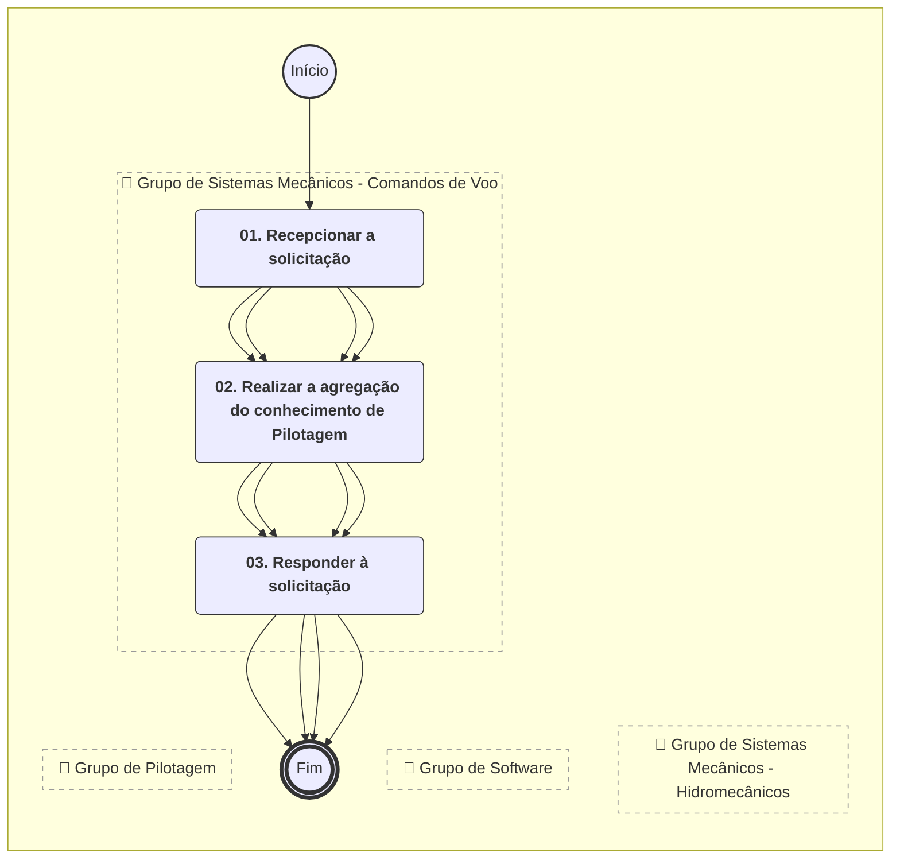
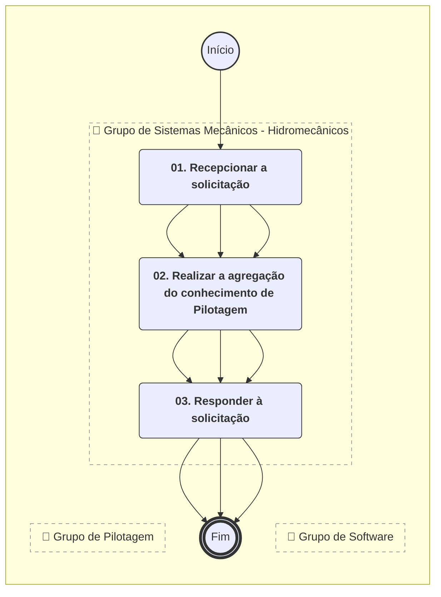
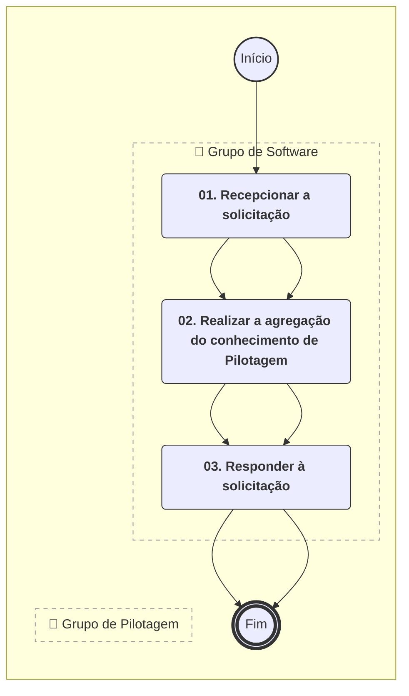
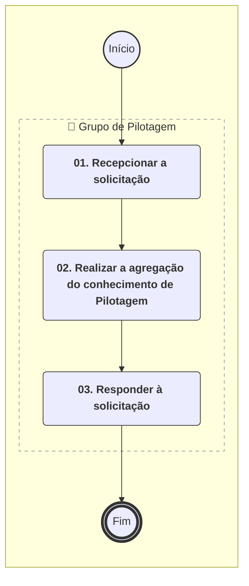

```mermaid
%%{init: {'theme': 'default'}}%%

flowchart TD
    classDef inicio stroke:#333,stroke-width:2px;
    classDef fim stroke:#333,stroke-width:4px;
    classDef tarefaBPMN stroke:#333,stroke-width:1px;
    classDef gatewayBPMN fill:#f2f2f2,stroke:#333,stroke-width:1px;
    classDef raia fill:none,stroke:#999,stroke-width:1px,stroke-dasharray: 5 5;
    subgraph Container_ID_MPR_SAR_103_R01_31 [ ]
        direction TB
        ID_MPR_SAR_103_R01_31_Start((Início)):::inicio
        ID_MPR_SAR_103_R01_31_End(((Fim))):::fim
        subgraph Raia_ID_MPR_SAR_103_R01_31_1 [👤 Grupo de Sistemas Elétricos - Geração e Distribuição]
            ID_MPR_SAR_103_R01_31_01("<b>01. Recepcionar a solicitação</b>"):::tarefaBPMN
            ID_MPR_SAR_103_R01_31_02("<b>02. Realizar a agregação do conhecimento de Sistemas Elétricos - Geração e Distribuição</b>"):::tarefaBPMN
            ID_MPR_SAR_103_R01_31_03("<b>03. Responder à solicitação</b>"):::tarefaBPMN
        end
        class Raia_ID_MPR_SAR_103_R01_31_1 raia;
        subgraph Raia_ID_MPR_SAR_103_R01_31_2 [👤 Grupo de Sistemas Elétricos - Iluminação]
            ID_MPR_SAR_103_R01_31_01("<b>01. Recepcionar a solicitação</b>"):::tarefaBPMN
            ID_MPR_SAR_103_R01_31_02("<b>02. Realizar a agregação do conhecimento de Sistemas Elétricos - Iluminação</b>"):::tarefaBPMN
            ID_MPR_SAR_103_R01_31_03("<b>03. Responder à solicitação</b>"):::tarefaBPMN
        end
        class Raia_ID_MPR_SAR_103_R01_31_2 raia;
        subgraph Raia_ID_MPR_SAR_103_R01_31_3 [👤 Grupo de Sistemas Elétricos - Interiores]
            ID_MPR_SAR_103_R01_31_01("<b>01. Recepcionar a solicitação</b>"):::tarefaBPMN
            ID_MPR_SAR_103_R01_31_02("<b>02. Realizar a agregação do conhecimento de Sistemas Elétricos - Interiores</b>"):::tarefaBPMN
            ID_MPR_SAR_103_R01_31_03("<b>03. Responder à solicitação</b>"):::tarefaBPMN
        end
        class Raia_ID_MPR_SAR_103_R01_31_3 raia;
        subgraph Raia_ID_MPR_SAR_103_R01_31_4 [👤 Grupo de Sistemas Elétricos - Sistemas Interconectados de Fiação Elétrica - EWIS]
            ID_MPR_SAR_103_R01_31_01("<b>01. Recepcionar a solicitação</b>"):::tarefaBPMN
            ID_MPR_SAR_103_R01_31_02("<b>02. Realizar a agregação do conhecimento de Sistemas Elétricos - Sistemas Interconectados de Fiação Elétrica - EWIS</b>"):::tarefaBPMN
            ID_MPR_SAR_103_R01_31_03("<b>03. Responder à solicitação</b>"):::tarefaBPMN
        end
        class Raia_ID_MPR_SAR_103_R01_31_4 raia;
        subgraph Raia_ID_MPR_SAR_103_R01_31_5 [👤 Grupo de Sistemas Mecânicos - Comandos de Voo]
            ID_MPR_SAR_103_R01_31_01("<b>01. Recepcionar a solicitação</b>"):::tarefaBPMN
            ID_MPR_SAR_103_R01_31_02("<b>02. Realizar a agregação do conhecimento de Sistemas Mecânicos - Comandos de Voo</b>"):::tarefaBPMN
            ID_MPR_SAR_103_R01_31_03("<b>03. Responder à solicitação</b>"):::tarefaBPMN
        end
        class Raia_ID_MPR_SAR_103_R01_31_5 raia;
        subgraph Raia_ID_MPR_SAR_103_R01_31_6 [👤 Grupo de Sistemas Mecânicos - Hidromecânicos]
            ID_MPR_SAR_103_R01_31_01("<b>01. Recepcionar a solicitação</b>"):::tarefaBPMN
            ID_MPR_SAR_103_R01_31_02("<b>02. Realizar a agregação do conhecimento de Sistemas Mecânicos - Hidromecânicos</b>"):::tarefaBPMN
            ID_MPR_SAR_103_R01_31_03("<b>03. Responder à solicitação</b>"):::tarefaBPMN
        end
        class Raia_ID_MPR_SAR_103_R01_31_6 raia;
        subgraph Raia_ID_MPR_SAR_103_R01_31_7 [👤 Grupo de Software]
            ID_MPR_SAR_103_R01_31_01("<b>01. Recepcionar a solicitação</b>"):::tarefaBPMN
            ID_MPR_SAR_103_R01_31_02("<b>02. Realizar a agregação do conhecimento de Software</b>"):::tarefaBPMN
            ID_MPR_SAR_103_R01_31_03("<b>03. Responder à solicitação</b>"):::tarefaBPMN
        end
        class Raia_ID_MPR_SAR_103_R01_31_7 raia;
        subgraph Raia_ID_MPR_SAR_103_R01_31_8 [👤 Grupo de Pilotagem]
            ID_MPR_SAR_103_R01_31_01("<b>01. Recepcionar a solicitação</b>"):::tarefaBPMN
            ID_MPR_SAR_103_R01_31_02("<b>02. Realizar a agregação do conhecimento de Pilotagem</b>"):::tarefaBPMN
            ID_MPR_SAR_103_R01_31_03("<b>03. Responder à solicitação</b>"):::tarefaBPMN
        end
        class Raia_ID_MPR_SAR_103_R01_31_8 raia;
        ID_MPR_SAR_103_R01_31_Start --> ID_MPR_SAR_103_R01_31_01
        ID_MPR_SAR_103_R01_31_01 --> ID_MPR_SAR_103_R01_31_02
        ID_MPR_SAR_103_R01_31_02 --> ID_MPR_SAR_103_R01_31_03
        ID_MPR_SAR_103_R01_31_03 --> ID_MPR_SAR_103_R01_31_End
        ID_MPR_SAR_103_R01_31_01 --> ID_MPR_SAR_103_R01_31_02
        ID_MPR_SAR_103_R01_31_02 --> ID_MPR_SAR_103_R01_31_03
        ID_MPR_SAR_103_R01_31_03 --> ID_MPR_SAR_103_R01_31_End
        ID_MPR_SAR_103_R01_31_01 --> ID_MPR_SAR_103_R01_31_02
        ID_MPR_SAR_103_R01_31_02 --> ID_MPR_SAR_103_R01_31_03
        ID_MPR_SAR_103_R01_31_03 --> ID_MPR_SAR_103_R01_31_End
        ID_MPR_SAR_103_R01_31_01 --> ID_MPR_SAR_103_R01_31_02
        ID_MPR_SAR_103_R01_31_02 --> ID_MPR_SAR_103_R01_31_03
        ID_MPR_SAR_103_R01_31_03 --> ID_MPR_SAR_103_R01_31_End
        ID_MPR_SAR_103_R01_31_01 --> ID_MPR_SAR_103_R01_31_02
        ID_MPR_SAR_103_R01_31_02 --> ID_MPR_SAR_103_R01_31_03
        ID_MPR_SAR_103_R01_31_03 --> ID_MPR_SAR_103_R01_31_End
        ID_MPR_SAR_103_R01_31_01 --> ID_MPR_SAR_103_R01_31_02
        ID_MPR_SAR_103_R01_31_02 --> ID_MPR_SAR_103_R01_31_03
        ID_MPR_SAR_103_R01_31_03 --> ID_MPR_SAR_103_R01_31_End
        ID_MPR_SAR_103_R01_31_01 --> ID_MPR_SAR_103_R01_31_02
        ID_MPR_SAR_103_R01_31_02 --> ID_MPR_SAR_103_R01_31_03
        ID_MPR_SAR_103_R01_31_03 --> ID_MPR_SAR_103_R01_31_End
        ID_MPR_SAR_103_R01_31_01 --> ID_MPR_SAR_103_R01_31_02
        ID_MPR_SAR_103_R01_31_02 --> ID_MPR_SAR_103_R01_31_03
        ID_MPR_SAR_103_R01_31_03 --> ID_MPR_SAR_103_R01_31_End
    end
    click ID_MPR_SAR_103_R01_31_01 href "#" "A solicitação de agregação de conhecimento pode ser apresentada de diferentes formas aos servidores membros dos Grupos de Especialidade, que tenham sido alocados matricialmente em programas de certificação, ou de forma isolada, a critério do líder técnico de área.  O modo de registrar a recepção da solicitação pode ser mais formal, ou menos, dependendo do formato da solicitação, sendo que as formas mais comuns são a solicitação da análise de plano de certificação, de um artefato de certificação e de avaliação de cumprimento de requisito, mas que abrangem também demandas originadas fora da GCPP (como regulamentos operacionais, de imprensa, etc.), com foco em fornecer o ponto de vista de engenharia."
    click ID_MPR_SAR_103_R01_31_02 href "#" "O modo como o conhecimento específico da especialidade é agregado ao objeto de trabalho dependerá da natureza da solicitação, sempre levando em conta as especificidades do campo de conhecimento, e os requisitos regulamentares aplicáveis."
    click ID_MPR_SAR_103_R01_31_03 href "#" "A resposta é variável (Resultado de análise, Resultado da participação em reunião, Aprovação de relatório, Reprovação de relatório, Nota Técnica et cœtera), adequada ao tipo de solicitação."
    click ID_MPR_SAR_103_R01_31_01 href "#" "A solicitação de agregação de conhecimento pode ser apresentada de diferentes formas aos servidores membros dos Grupos de Especialidade, que tenham sido alocados matricialmente em programas de certificação, ou de forma isolada, a critério do líder técnico de área.  O modo de registrar a recepção da solicitação pode ser mais formal, ou menos, dependendo do formato da solicitação, sendo que as formas mais comuns são a solicitação da análise de plano de certificação, de um artefato de certificação e de avaliação de cumprimento de requisito, mas que abrangem também demandas originadas fora da GCPP (como regulamentos operacionais, de imprensa, etc.), com foco em fornecer o ponto de vista de engenharia."
    click ID_MPR_SAR_103_R01_31_02 href "#" "O modo como o conhecimento específico da especialidade é agregado ao objeto de trabalho dependerá da natureza da solicitação, sempre levando em conta as especificidades do campo de conhecimento, e os requisitos regulamentares aplicáveis."
    click ID_MPR_SAR_103_R01_31_03 href "#" "A resposta é variável (Resultado de análise, Resultado da participação em reunião, Aprovação de relatório, Reprovação de relatório, Nota Técnica et cœtera), adequada ao tipo de solicitação."
    click ID_MPR_SAR_103_R01_31_01 href "#" "A solicitação de agregação de conhecimento pode ser apresentada de diferentes formas aos servidores membros dos Grupos de Especialidade, que tenham sido alocados matricialmente em programas de certificação, ou de forma isolada, a critério do líder técnico de área.  O modo de registrar a recepção da solicitação pode ser mais formal, ou menos, dependendo do formato da solicitação, sendo que as formas mais comuns são a solicitação da análise de plano de certificação, de um artefato de certificação e de avaliação de cumprimento de requisito, mas que abrangem também demandas originadas fora da GCPP (como regulamentos operacionais, de imprensa, etc.), com foco em fornecer o ponto de vista de engenharia."
    click ID_MPR_SAR_103_R01_31_02 href "#" "O modo como o conhecimento específico da especialidade é agregado ao objeto de trabalho dependerá da natureza da solicitação, sempre levando em conta as especificidades do campo de conhecimento, e os requisitos regulamentares aplicáveis."
    click ID_MPR_SAR_103_R01_31_03 href "#" "A resposta é variável (Resultado de análise, Resultado da participação em reunião, Aprovação de relatório, Reprovação de relatório, Nota Técnica et cœtera), adequada ao tipo de solicitação."
    click ID_MPR_SAR_103_R01_31_01 href "#" "A solicitação de agregação de conhecimento pode ser apresentada de diferentes formas aos servidores membros dos Grupos de Especialidade, que tenham sido alocados matricialmente em programas de certificação, ou de forma isolada, a critério do líder técnico de área.  O modo de registrar a recepção da solicitação pode ser mais formal, ou menos, dependendo do formato da solicitação, sendo que as formas mais comuns são a solicitação da análise de plano de certificação, de um artefato de certificação e de avaliação de cumprimento de requisito, mas que abrangem também demandas originadas fora da GCPP (como regulamentos operacionais, de imprensa, etc.), com foco em fornecer o ponto de vista de engenharia."
    click ID_MPR_SAR_103_R01_31_02 href "#" "O modo como o conhecimento específico da especialidade é agregado ao objeto de trabalho dependerá da natureza da solicitação, sempre levando em conta as especificidades do campo de conhecimento, e os requisitos regulamentares aplicáveis."
    click ID_MPR_SAR_103_R01_31_03 href "#" "A resposta é variável (Resultado de análise, Resultado da participação em reunião, Aprovação de relatório, Reprovação de relatório, Nota Técnica et cœtera), adequada ao tipo de solicitação."
    click ID_MPR_SAR_103_R01_31_01 href "#" "A solicitação de agregação de conhecimento pode ser apresentada de diferentes formas aos servidores membros dos Grupos de Especialidade, que tenham sido alocados matricialmente em programas de certificação, ou de forma isolada, a critério do líder técnico de área.  O modo de registrar a recepção da solicitação pode ser mais formal, ou menos, dependendo do formato da solicitação, sendo que as formas mais comuns são a solicitação da análise de plano de certificação, de um artefato de certificação e de avaliação de cumprimento de requisito, mas que abrangem também demandas originadas fora da GCPP (como regulamentos operacionais, de imprensa, etc.), com foco em fornecer o ponto de vista de engenharia."
    click ID_MPR_SAR_103_R01_31_02 href "#" "O modo como o conhecimento específico da especialidade é agregado ao objeto de trabalho dependerá da natureza da solicitação, sempre levando em conta as especificidades do campo de conhecimento, e os requisitos regulamentares aplicáveis."
    click ID_MPR_SAR_103_R01_31_03 href "#" "A resposta é variável (Resultado de análise, Resultado da participação em reunião, Aprovação de relatório, Reprovação de relatório, Nota Técnica et cœtera), adequada ao tipo de solicitação."
    click ID_MPR_SAR_103_R01_31_01 href "#" "A solicitação de agregação de conhecimento pode ser apresentada de diferentes formas aos servidores membros dos Grupos de Especialidade, que tenham sido alocados matricialmente em programas de certificação, ou de forma isolada, a critério do líder técnico de área.  O modo de registrar a recepção da solicitação pode ser mais formal, ou menos, dependendo do formato da solicitação, sendo que as formas mais comuns são a solicitação da análise de plano de certificação, de um artefato de certificação e de avaliação de cumprimento de requisito, mas que abrangem também demandas originadas fora da GCPP (como regulamentos operacionais, de imprensa, etc.), com foco em fornecer o ponto de vista de engenharia."
    click ID_MPR_SAR_103_R01_31_02 href "#" "O modo como o conhecimento específico da especialidade é agregado ao objeto de trabalho dependerá da natureza da solicitação, sempre levando em conta as especificidades do campo de conhecimento, e os requisitos regulamentares aplicáveis."
    click ID_MPR_SAR_103_R01_31_03 href "#" "A resposta é variável (Resultado de análise, Resultado da participação em reunião, Aprovação de relatório, Reprovação de relatório, Nota Técnica et cœtera), adequada ao tipo de solicitação."
    click ID_MPR_SAR_103_R01_31_01 href "#" "A solicitação de agregação de conhecimento pode ser apresentada de diferentes formas aos servidores membros dos Grupos de Especialidade, que tenham sido alocados matricialmente em programas de certificação, ou de forma isolada, a critério do líder técnico de área.  O modo de registrar a recepção da solicitação pode ser mais formal, ou menos, dependendo do formato da solicitação, sendo que as formas mais comuns são a solicitação da análise de plano de certificação, de um artefato de certificação e de avaliação de cumprimento de requisito, mas que abrangem também demandas originadas fora da GCPP (como regulamentos operacionais, de imprensa, etc.), com foco em fornecer o ponto de vista de engenharia."
    click ID_MPR_SAR_103_R01_31_02 href "#" "O modo como o conhecimento específico da especialidade é agregado ao objeto de trabalho dependerá da natureza da solicitação, sempre levando em conta as especificidades do campo de conhecimento, e os requisitos regulamentares aplicáveis."
    click ID_MPR_SAR_103_R01_31_03 href "#" "A resposta é variável (Resultado de análise, Resultado da participação em reunião, Aprovação de relatório, Reprovação de relatório, Nota Técnica et cœtera), adequada ao tipo de solicitação."
    click ID_MPR_SAR_103_R01_31_01 href "#" "A solicitação de agregação de conhecimento pode ser apresentada de diferentes formas aos servidores membros dos Grupos de Especialidade, que tenham sido alocados matricialmente em programas de certificação, ou de forma isolada, a critério do líder técnico de área.  O modo de registrar a recepção da solicitação pode ser mais formal, ou menos, dependendo do formato da solicitação, sendo que as formas mais comuns são a solicitação da análise de plano de certificação, de um artefato de certificação e de avaliação de cumprimento de requisito, mas que abrangem também demandas originadas fora da GCPP (como regulamentos operacionais, de imprensa, etc.), com foco em fornecer o ponto de vista de engenharia."
    click ID_MPR_SAR_103_R01_31_02 href "#" "O modo como o conhecimento específico da especialidade é agregado ao objeto de trabalho dependerá da natureza da solicitação, sempre levando em conta as especificidades do campo de conhecimento, e os requisitos regulamentares aplicáveis."
    click ID_MPR_SAR_103_R01_31_03 href "#" "A resposta é variável (Resultado de análise, Resultado da participação em reunião, Aprovação de relatório, Reprovação de relatório, Nota Técnica et cœtera), adequada ao tipo de solicitação."
```

```mermaid
%%{init: {'theme': 'default'}}%%

flowchart TD
    classDef inicio stroke:#333,stroke-width:2px;
    classDef fim stroke:#333,stroke-width:4px;
    classDef tarefaBPMN stroke:#333,stroke-width:1px;
    classDef gatewayBPMN fill:#f2f2f2,stroke:#333,stroke-width:1px;
    classDef raia fill:none,stroke:#999,stroke-width:1px,stroke-dasharray: 5 5;
    subgraph Container_ID_MPR_SAR_103_R01_32 [ ]
        direction TB
        ID_MPR_SAR_103_R01_32_Start((Início)):::inicio
        ID_MPR_SAR_103_R01_32_End(((Fim))):::fim
        subgraph Raia_ID_MPR_SAR_103_R01_32_1 [👤 Grupo de Sistemas Elétricos - Iluminação]
            ID_MPR_SAR_103_R01_32_01("<b>01. Recepcionar a solicitação</b>"):::tarefaBPMN
            ID_MPR_SAR_103_R01_32_02("<b>02. Realizar a agregação do conhecimento de Sistemas Elétricos - Iluminação</b>"):::tarefaBPMN
            ID_MPR_SAR_103_R01_32_03("<b>03. Responder à solicitação</b>"):::tarefaBPMN
        end
        class Raia_ID_MPR_SAR_103_R01_32_1 raia;
        subgraph Raia_ID_MPR_SAR_103_R01_32_2 [👤 Grupo de Sistemas Elétricos - Interiores]
            ID_MPR_SAR_103_R01_32_01("<b>01. Recepcionar a solicitação</b>"):::tarefaBPMN
            ID_MPR_SAR_103_R01_32_02("<b>02. Realizar a agregação do conhecimento de Sistemas Elétricos - Interiores</b>"):::tarefaBPMN
            ID_MPR_SAR_103_R01_32_03("<b>03. Responder à solicitação</b>"):::tarefaBPMN
        end
        class Raia_ID_MPR_SAR_103_R01_32_2 raia;
        subgraph Raia_ID_MPR_SAR_103_R01_32_3 [👤 Grupo de Sistemas Elétricos - Sistemas Interconectados de Fiação Elétrica - EWIS]
            ID_MPR_SAR_103_R01_32_01("<b>01. Recepcionar a solicitação</b>"):::tarefaBPMN
            ID_MPR_SAR_103_R01_32_02("<b>02. Realizar a agregação do conhecimento de Sistemas Elétricos - Sistemas Interconectados de Fiação Elétrica - EWIS</b>"):::tarefaBPMN
            ID_MPR_SAR_103_R01_32_03("<b>03. Responder à solicitação</b>"):::tarefaBPMN
        end
        class Raia_ID_MPR_SAR_103_R01_32_3 raia;
        subgraph Raia_ID_MPR_SAR_103_R01_32_4 [👤 Grupo de Sistemas Mecânicos - Comandos de Voo]
            ID_MPR_SAR_103_R01_32_01("<b>01. Recepcionar a solicitação</b>"):::tarefaBPMN
            ID_MPR_SAR_103_R01_32_02("<b>02. Realizar a agregação do conhecimento de Sistemas Mecânicos - Comandos de Voo</b>"):::tarefaBPMN
            ID_MPR_SAR_103_R01_32_03("<b>03. Responder à solicitação</b>"):::tarefaBPMN
        end
        class Raia_ID_MPR_SAR_103_R01_32_4 raia;
        subgraph Raia_ID_MPR_SAR_103_R01_32_5 [👤 Grupo de Sistemas Mecânicos - Hidromecânicos]
            ID_MPR_SAR_103_R01_32_01("<b>01. Recepcionar a solicitação</b>"):::tarefaBPMN
            ID_MPR_SAR_103_R01_32_02("<b>02. Realizar a agregação do conhecimento de Sistemas Mecânicos - Hidromecânicos</b>"):::tarefaBPMN
            ID_MPR_SAR_103_R01_32_03("<b>03. Responder à solicitação</b>"):::tarefaBPMN
        end
        class Raia_ID_MPR_SAR_103_R01_32_5 raia;
        subgraph Raia_ID_MPR_SAR_103_R01_32_6 [👤 Grupo de Software]
            ID_MPR_SAR_103_R01_32_01("<b>01. Recepcionar a solicitação</b>"):::tarefaBPMN
            ID_MPR_SAR_103_R01_32_02("<b>02. Realizar a agregação do conhecimento de Software</b>"):::tarefaBPMN
            ID_MPR_SAR_103_R01_32_03("<b>03. Responder à solicitação</b>"):::tarefaBPMN
        end
        class Raia_ID_MPR_SAR_103_R01_32_6 raia;
        subgraph Raia_ID_MPR_SAR_103_R01_32_7 [👤 Grupo de Pilotagem]
            ID_MPR_SAR_103_R01_32_01("<b>01. Recepcionar a solicitação</b>"):::tarefaBPMN
            ID_MPR_SAR_103_R01_32_02("<b>02. Realizar a agregação do conhecimento de Pilotagem</b>"):::tarefaBPMN
            ID_MPR_SAR_103_R01_32_03("<b>03. Responder à solicitação</b>"):::tarefaBPMN
        end
        class Raia_ID_MPR_SAR_103_R01_32_7 raia;
        ID_MPR_SAR_103_R01_32_Start --> ID_MPR_SAR_103_R01_32_01
        ID_MPR_SAR_103_R01_32_01 --> ID_MPR_SAR_103_R01_32_02
        ID_MPR_SAR_103_R01_32_02 --> ID_MPR_SAR_103_R01_32_03
        ID_MPR_SAR_103_R01_32_03 --> ID_MPR_SAR_103_R01_32_End
        ID_MPR_SAR_103_R01_32_01 --> ID_MPR_SAR_103_R01_32_02
        ID_MPR_SAR_103_R01_32_02 --> ID_MPR_SAR_103_R01_32_03
        ID_MPR_SAR_103_R01_32_03 --> ID_MPR_SAR_103_R01_32_End
        ID_MPR_SAR_103_R01_32_01 --> ID_MPR_SAR_103_R01_32_02
        ID_MPR_SAR_103_R01_32_02 --> ID_MPR_SAR_103_R01_32_03
        ID_MPR_SAR_103_R01_32_03 --> ID_MPR_SAR_103_R01_32_End
        ID_MPR_SAR_103_R01_32_01 --> ID_MPR_SAR_103_R01_32_02
        ID_MPR_SAR_103_R01_32_02 --> ID_MPR_SAR_103_R01_32_03
        ID_MPR_SAR_103_R01_32_03 --> ID_MPR_SAR_103_R01_32_End
        ID_MPR_SAR_103_R01_32_01 --> ID_MPR_SAR_103_R01_32_02
        ID_MPR_SAR_103_R01_32_02 --> ID_MPR_SAR_103_R01_32_03
        ID_MPR_SAR_103_R01_32_03 --> ID_MPR_SAR_103_R01_32_End
        ID_MPR_SAR_103_R01_32_01 --> ID_MPR_SAR_103_R01_32_02
        ID_MPR_SAR_103_R01_32_02 --> ID_MPR_SAR_103_R01_32_03
        ID_MPR_SAR_103_R01_32_03 --> ID_MPR_SAR_103_R01_32_End
        ID_MPR_SAR_103_R01_32_01 --> ID_MPR_SAR_103_R01_32_02
        ID_MPR_SAR_103_R01_32_02 --> ID_MPR_SAR_103_R01_32_03
        ID_MPR_SAR_103_R01_32_03 --> ID_MPR_SAR_103_R01_32_End
    end
    click ID_MPR_SAR_103_R01_32_01 href "#" "A solicitação de agregação de conhecimento pode ser apresentada de diferentes formas aos servidores membros dos Grupos de Especialidade, que tenham sido alocados matricialmente em programas de certificação, ou de forma isolada, a critério do líder técnico de área.  O modo de registrar a recepção da solicitação pode ser mais formal, ou menos, dependendo do formato da solicitação, sendo que as formas mais comuns são a solicitação da análise de plano de certificação, de um artefato de certificação e de avaliação de cumprimento de requisito, mas que abrangem também demandas originadas fora da GCPP (como regulamentos operacionais, de imprensa, etc.), com foco em fornecer o ponto de vista de engenharia."
    click ID_MPR_SAR_103_R01_32_02 href "#" "O modo como o conhecimento específico da especialidade é agregado ao objeto de trabalho dependerá da natureza da solicitação, sempre levando em conta as especificidades do campo de conhecimento, e os requisitos regulamentares aplicáveis."
    click ID_MPR_SAR_103_R01_32_03 href "#" "A resposta é variável (Resultado de análise, Resultado da participação em reunião, Aprovação de relatório, Reprovação de relatório, Nota Técnica et cœtera), adequada ao tipo de solicitação."
    click ID_MPR_SAR_103_R01_32_01 href "#" "A solicitação de agregação de conhecimento pode ser apresentada de diferentes formas aos servidores membros dos Grupos de Especialidade, que tenham sido alocados matricialmente em programas de certificação, ou de forma isolada, a critério do líder técnico de área.  O modo de registrar a recepção da solicitação pode ser mais formal, ou menos, dependendo do formato da solicitação, sendo que as formas mais comuns são a solicitação da análise de plano de certificação, de um artefato de certificação e de avaliação de cumprimento de requisito, mas que abrangem também demandas originadas fora da GCPP (como regulamentos operacionais, de imprensa, etc.), com foco em fornecer o ponto de vista de engenharia."
    click ID_MPR_SAR_103_R01_32_02 href "#" "O modo como o conhecimento específico da especialidade é agregado ao objeto de trabalho dependerá da natureza da solicitação, sempre levando em conta as especificidades do campo de conhecimento, e os requisitos regulamentares aplicáveis."
    click ID_MPR_SAR_103_R01_32_03 href "#" "A resposta é variável (Resultado de análise, Resultado da participação em reunião, Aprovação de relatório, Reprovação de relatório, Nota Técnica et cœtera), adequada ao tipo de solicitação."
    click ID_MPR_SAR_103_R01_32_01 href "#" "A solicitação de agregação de conhecimento pode ser apresentada de diferentes formas aos servidores membros dos Grupos de Especialidade, que tenham sido alocados matricialmente em programas de certificação, ou de forma isolada, a critério do líder técnico de área.  O modo de registrar a recepção da solicitação pode ser mais formal, ou menos, dependendo do formato da solicitação, sendo que as formas mais comuns são a solicitação da análise de plano de certificação, de um artefato de certificação e de avaliação de cumprimento de requisito, mas que abrangem também demandas originadas fora da GCPP (como regulamentos operacionais, de imprensa, etc.), com foco em fornecer o ponto de vista de engenharia."
    click ID_MPR_SAR_103_R01_32_02 href "#" "O modo como o conhecimento específico da especialidade é agregado ao objeto de trabalho dependerá da natureza da solicitação, sempre levando em conta as especificidades do campo de conhecimento, e os requisitos regulamentares aplicáveis."
    click ID_MPR_SAR_103_R01_32_03 href "#" "A resposta é variável (Resultado de análise, Resultado da participação em reunião, Aprovação de relatório, Reprovação de relatório, Nota Técnica et cœtera), adequada ao tipo de solicitação."
    click ID_MPR_SAR_103_R01_32_01 href "#" "A solicitação de agregação de conhecimento pode ser apresentada de diferentes formas aos servidores membros dos Grupos de Especialidade, que tenham sido alocados matricialmente em programas de certificação, ou de forma isolada, a critério do líder técnico de área.  O modo de registrar a recepção da solicitação pode ser mais formal, ou menos, dependendo do formato da solicitação, sendo que as formas mais comuns são a solicitação da análise de plano de certificação, de um artefato de certificação e de avaliação de cumprimento de requisito, mas que abrangem também demandas originadas fora da GCPP (como regulamentos operacionais, de imprensa, etc.), com foco em fornecer o ponto de vista de engenharia."
    click ID_MPR_SAR_103_R01_32_02 href "#" "O modo como o conhecimento específico da especialidade é agregado ao objeto de trabalho dependerá da natureza da solicitação, sempre levando em conta as especificidades do campo de conhecimento, e os requisitos regulamentares aplicáveis."
    click ID_MPR_SAR_103_R01_32_03 href "#" "A resposta é variável (Resultado de análise, Resultado da participação em reunião, Aprovação de relatório, Reprovação de relatório, Nota Técnica et cœtera), adequada ao tipo de solicitação."
    click ID_MPR_SAR_103_R01_32_01 href "#" "A solicitação de agregação de conhecimento pode ser apresentada de diferentes formas aos servidores membros dos Grupos de Especialidade, que tenham sido alocados matricialmente em programas de certificação, ou de forma isolada, a critério do líder técnico de área.  O modo de registrar a recepção da solicitação pode ser mais formal, ou menos, dependendo do formato da solicitação, sendo que as formas mais comuns são a solicitação da análise de plano de certificação, de um artefato de certificação e de avaliação de cumprimento de requisito, mas que abrangem também demandas originadas fora da GCPP (como regulamentos operacionais, de imprensa, etc.), com foco em fornecer o ponto de vista de engenharia."
    click ID_MPR_SAR_103_R01_32_02 href "#" "O modo como o conhecimento específico da especialidade é agregado ao objeto de trabalho dependerá da natureza da solicitação, sempre levando em conta as especificidades do campo de conhecimento, e os requisitos regulamentares aplicáveis."
    click ID_MPR_SAR_103_R01_32_03 href "#" "A resposta é variável (Resultado de análise, Resultado da participação em reunião, Aprovação de relatório, Reprovação de relatório, Nota Técnica et cœtera), adequada ao tipo de solicitação."
    click ID_MPR_SAR_103_R01_32_01 href "#" "A solicitação de agregação de conhecimento pode ser apresentada de diferentes formas aos servidores membros dos Grupos de Especialidade, que tenham sido alocados matricialmente em programas de certificação, ou de forma isolada, a critério do líder técnico de área.  O modo de registrar a recepção da solicitação pode ser mais formal, ou menos, dependendo do formato da solicitação, sendo que as formas mais comuns são a solicitação da análise de plano de certificação, de um artefato de certificação e de avaliação de cumprimento de requisito, mas que abrangem também demandas originadas fora da GCPP (como regulamentos operacionais, de imprensa, etc.), com foco em fornecer o ponto de vista de engenharia."
    click ID_MPR_SAR_103_R01_32_02 href "#" "O modo como o conhecimento específico da especialidade é agregado ao objeto de trabalho dependerá da natureza da solicitação, sempre levando em conta as especificidades do campo de conhecimento, e os requisitos regulamentares aplicáveis."
    click ID_MPR_SAR_103_R01_32_03 href "#" "A resposta é variável (Resultado de análise, Resultado da participação em reunião, Aprovação de relatório, Reprovação de relatório, Nota Técnica et cœtera), adequada ao tipo de solicitação."
    click ID_MPR_SAR_103_R01_32_01 href "#" "A solicitação de agregação de conhecimento pode ser apresentada de diferentes formas aos servidores membros dos Grupos de Especialidade, que tenham sido alocados matricialmente em programas de certificação, ou de forma isolada, a critério do líder técnico de área.  O modo de registrar a recepção da solicitação pode ser mais formal, ou menos, dependendo do formato da solicitação, sendo que as formas mais comuns são a solicitação da análise de plano de certificação, de um artefato de certificação e de avaliação de cumprimento de requisito, mas que abrangem também demandas originadas fora da GCPP (como regulamentos operacionais, de imprensa, etc.), com foco em fornecer o ponto de vista de engenharia."
    click ID_MPR_SAR_103_R01_32_02 href "#" "O modo como o conhecimento específico da especialidade é agregado ao objeto de trabalho dependerá da natureza da solicitação, sempre levando em conta as especificidades do campo de conhecimento, e os requisitos regulamentares aplicáveis."
    click ID_MPR_SAR_103_R01_32_03 href "#" "A resposta é variável (Resultado de análise, Resultado da participação em reunião, Aprovação de relatório, Reprovação de relatório, Nota Técnica et cœtera), adequada ao tipo de solicitação."
```

```mermaid
%%{init: {'theme': 'default'}}%%

flowchart TD
    classDef inicio stroke:#333,stroke-width:2px;
    classDef fim stroke:#333,stroke-width:4px;
    classDef tarefaBPMN stroke:#333,stroke-width:1px;
    classDef gatewayBPMN fill:#f2f2f2,stroke:#333,stroke-width:1px;
    classDef raia fill:none,stroke:#999,stroke-width:1px,stroke-dasharray: 5 5;
    subgraph Container_ID_MPR_SAR_103_R01_33 [ ]
        direction TB
        ID_MPR_SAR_103_R01_33_Start((Início)):::inicio
        ID_MPR_SAR_103_R01_33_End(((Fim))):::fim
        subgraph Raia_ID_MPR_SAR_103_R01_33_1 [👤 Grupo de Sistemas Elétricos - Interiores]
            ID_MPR_SAR_103_R01_33_01("<b>01. Recepcionar a solicitação</b>"):::tarefaBPMN
            ID_MPR_SAR_103_R01_33_02("<b>02. Realizar a agregação do conhecimento de Sistemas Elétricos - Interiores</b>"):::tarefaBPMN
            ID_MPR_SAR_103_R01_33_03("<b>03. Responder à solicitação</b>"):::tarefaBPMN
        end
        class Raia_ID_MPR_SAR_103_R01_33_1 raia;
        subgraph Raia_ID_MPR_SAR_103_R01_33_2 [👤 Grupo de Sistemas Elétricos - Sistemas Interconectados de Fiação Elétrica - EWIS]
            ID_MPR_SAR_103_R01_33_01("<b>01. Recepcionar a solicitação</b>"):::tarefaBPMN
            ID_MPR_SAR_103_R01_33_02("<b>02. Realizar a agregação do conhecimento de Sistemas Elétricos - Sistemas Interconectados de Fiação Elétrica - EWIS</b>"):::tarefaBPMN
            ID_MPR_SAR_103_R01_33_03("<b>03. Responder à solicitação</b>"):::tarefaBPMN
        end
        class Raia_ID_MPR_SAR_103_R01_33_2 raia;
        subgraph Raia_ID_MPR_SAR_103_R01_33_3 [👤 Grupo de Sistemas Mecânicos - Comandos de Voo]
            ID_MPR_SAR_103_R01_33_01("<b>01. Recepcionar a solicitação</b>"):::tarefaBPMN
            ID_MPR_SAR_103_R01_33_02("<b>02. Realizar a agregação do conhecimento de Sistemas Mecânicos - Comandos de Voo</b>"):::tarefaBPMN
            ID_MPR_SAR_103_R01_33_03("<b>03. Responder à solicitação</b>"):::tarefaBPMN
        end
        class Raia_ID_MPR_SAR_103_R01_33_3 raia;
        subgraph Raia_ID_MPR_SAR_103_R01_33_4 [👤 Grupo de Sistemas Mecânicos - Hidromecânicos]
            ID_MPR_SAR_103_R01_33_01("<b>01. Recepcionar a solicitação</b>"):::tarefaBPMN
            ID_MPR_SAR_103_R01_33_02("<b>02. Realizar a agregação do conhecimento de Sistemas Mecânicos - Hidromecânicos</b>"):::tarefaBPMN
            ID_MPR_SAR_103_R01_33_03("<b>03. Responder à solicitação</b>"):::tarefaBPMN
        end
        class Raia_ID_MPR_SAR_103_R01_33_4 raia;
        subgraph Raia_ID_MPR_SAR_103_R01_33_5 [👤 Grupo de Software]
            ID_MPR_SAR_103_R01_33_01("<b>01. Recepcionar a solicitação</b>"):::tarefaBPMN
            ID_MPR_SAR_103_R01_33_02("<b>02. Realizar a agregação do conhecimento de Software</b>"):::tarefaBPMN
            ID_MPR_SAR_103_R01_33_03("<b>03. Responder à solicitação</b>"):::tarefaBPMN
        end
        class Raia_ID_MPR_SAR_103_R01_33_5 raia;
        subgraph Raia_ID_MPR_SAR_103_R01_33_6 [👤 Grupo de Pilotagem]
            ID_MPR_SAR_103_R01_33_01("<b>01. Recepcionar a solicitação</b>"):::tarefaBPMN
            ID_MPR_SAR_103_R01_33_02("<b>02. Realizar a agregação do conhecimento de Pilotagem</b>"):::tarefaBPMN
            ID_MPR_SAR_103_R01_33_03("<b>03. Responder à solicitação</b>"):::tarefaBPMN
        end
        class Raia_ID_MPR_SAR_103_R01_33_6 raia;
        ID_MPR_SAR_103_R01_33_Start --> ID_MPR_SAR_103_R01_33_01
        ID_MPR_SAR_103_R01_33_01 --> ID_MPR_SAR_103_R01_33_02
        ID_MPR_SAR_103_R01_33_02 --> ID_MPR_SAR_103_R01_33_03
        ID_MPR_SAR_103_R01_33_03 --> ID_MPR_SAR_103_R01_33_End
        ID_MPR_SAR_103_R01_33_01 --> ID_MPR_SAR_103_R01_33_02
        ID_MPR_SAR_103_R01_33_02 --> ID_MPR_SAR_103_R01_33_03
        ID_MPR_SAR_103_R01_33_03 --> ID_MPR_SAR_103_R01_33_End
        ID_MPR_SAR_103_R01_33_01 --> ID_MPR_SAR_103_R01_33_02
        ID_MPR_SAR_103_R01_33_02 --> ID_MPR_SAR_103_R01_33_03
        ID_MPR_SAR_103_R01_33_03 --> ID_MPR_SAR_103_R01_33_End
        ID_MPR_SAR_103_R01_33_01 --> ID_MPR_SAR_103_R01_33_02
        ID_MPR_SAR_103_R01_33_02 --> ID_MPR_SAR_103_R01_33_03
        ID_MPR_SAR_103_R01_33_03 --> ID_MPR_SAR_103_R01_33_End
        ID_MPR_SAR_103_R01_33_01 --> ID_MPR_SAR_103_R01_33_02
        ID_MPR_SAR_103_R01_33_02 --> ID_MPR_SAR_103_R01_33_03
        ID_MPR_SAR_103_R01_33_03 --> ID_MPR_SAR_103_R01_33_End
        ID_MPR_SAR_103_R01_33_01 --> ID_MPR_SAR_103_R01_33_02
        ID_MPR_SAR_103_R01_33_02 --> ID_MPR_SAR_103_R01_33_03
        ID_MPR_SAR_103_R01_33_03 --> ID_MPR_SAR_103_R01_33_End
    end
    click ID_MPR_SAR_103_R01_33_01 href "#" "A solicitação de agregação de conhecimento pode ser apresentada de diferentes formas aos servidores membros dos Grupos de Especialidade, que tenham sido alocados matricialmente em programas de certificação, ou de forma isolada, a critério do líder técnico de área.  O modo de registrar a recepção da solicitação pode ser mais formal, ou menos, dependendo do formato da solicitação, sendo que as formas mais comuns são a solicitação da análise de plano de certificação, de um artefato de certificação e de avaliação de cumprimento de requisito, mas que abrangem também demandas originadas fora da GCPP (como regulamentos operacionais, de imprensa, etc.), com foco em fornecer o ponto de vista de engenharia."
    click ID_MPR_SAR_103_R01_33_02 href "#" "O modo como o conhecimento específico da especialidade é agregado ao objeto de trabalho dependerá da natureza da solicitação, sempre levando em conta as especificidades do campo de conhecimento, e os requisitos regulamentares aplicáveis."
    click ID_MPR_SAR_103_R01_33_03 href "#" "A resposta é variável (Resultado de análise, Resultado da participação em reunião, Aprovação de relatório, Reprovação de relatório, Nota Técnica et cœtera), adequada ao tipo de solicitação."
    click ID_MPR_SAR_103_R01_33_01 href "#" "A solicitação de agregação de conhecimento pode ser apresentada de diferentes formas aos servidores membros dos Grupos de Especialidade, que tenham sido alocados matricialmente em programas de certificação, ou de forma isolada, a critério do líder técnico de área.  O modo de registrar a recepção da solicitação pode ser mais formal, ou menos, dependendo do formato da solicitação, sendo que as formas mais comuns são a solicitação da análise de plano de certificação, de um artefato de certificação e de avaliação de cumprimento de requisito, mas que abrangem também demandas originadas fora da GCPP (como regulamentos operacionais, de imprensa, etc.), com foco em fornecer o ponto de vista de engenharia."
    click ID_MPR_SAR_103_R01_33_02 href "#" "O modo como o conhecimento específico da especialidade é agregado ao objeto de trabalho dependerá da natureza da solicitação, sempre levando em conta as especificidades do campo de conhecimento, e os requisitos regulamentares aplicáveis."
    click ID_MPR_SAR_103_R01_33_03 href "#" "A resposta é variável (Resultado de análise, Resultado da participação em reunião, Aprovação de relatório, Reprovação de relatório, Nota Técnica et cœtera), adequada ao tipo de solicitação."
    click ID_MPR_SAR_103_R01_33_01 href "#" "A solicitação de agregação de conhecimento pode ser apresentada de diferentes formas aos servidores membros dos Grupos de Especialidade, que tenham sido alocados matricialmente em programas de certificação, ou de forma isolada, a critério do líder técnico de área.  O modo de registrar a recepção da solicitação pode ser mais formal, ou menos, dependendo do formato da solicitação, sendo que as formas mais comuns são a solicitação da análise de plano de certificação, de um artefato de certificação e de avaliação de cumprimento de requisito, mas que abrangem também demandas originadas fora da GCPP (como regulamentos operacionais, de imprensa, etc.), com foco em fornecer o ponto de vista de engenharia."
    click ID_MPR_SAR_103_R01_33_02 href "#" "O modo como o conhecimento específico da especialidade é agregado ao objeto de trabalho dependerá da natureza da solicitação, sempre levando em conta as especificidades do campo de conhecimento, e os requisitos regulamentares aplicáveis."
    click ID_MPR_SAR_103_R01_33_03 href "#" "A resposta é variável (Resultado de análise, Resultado da participação em reunião, Aprovação de relatório, Reprovação de relatório, Nota Técnica et cœtera), adequada ao tipo de solicitação."
    click ID_MPR_SAR_103_R01_33_01 href "#" "A solicitação de agregação de conhecimento pode ser apresentada de diferentes formas aos servidores membros dos Grupos de Especialidade, que tenham sido alocados matricialmente em programas de certificação, ou de forma isolada, a critério do líder técnico de área.  O modo de registrar a recepção da solicitação pode ser mais formal, ou menos, dependendo do formato da solicitação, sendo que as formas mais comuns são a solicitação da análise de plano de certificação, de um artefato de certificação e de avaliação de cumprimento de requisito, mas que abrangem também demandas originadas fora da GCPP (como regulamentos operacionais, de imprensa, etc.), com foco em fornecer o ponto de vista de engenharia."
    click ID_MPR_SAR_103_R01_33_02 href "#" "O modo como o conhecimento específico da especialidade é agregado ao objeto de trabalho dependerá da natureza da solicitação, sempre levando em conta as especificidades do campo de conhecimento, e os requisitos regulamentares aplicáveis."
    click ID_MPR_SAR_103_R01_33_03 href "#" "A resposta é variável (Resultado de análise, Resultado da participação em reunião, Aprovação de relatório, Reprovação de relatório, Nota Técnica et cœtera), adequada ao tipo de solicitação."
    click ID_MPR_SAR_103_R01_33_01 href "#" "A solicitação de agregação de conhecimento pode ser apresentada de diferentes formas aos servidores membros dos Grupos de Especialidade, que tenham sido alocados matricialmente em programas de certificação, ou de forma isolada, a critério do líder técnico de área.  O modo de registrar a recepção da solicitação pode ser mais formal, ou menos, dependendo do formato da solicitação, sendo que as formas mais comuns são a solicitação da análise de plano de certificação, de um artefato de certificação e de avaliação de cumprimento de requisito, mas que abrangem também demandas originadas fora da GCPP (como regulamentos operacionais, de imprensa, etc.), com foco em fornecer o ponto de vista de engenharia."
    click ID_MPR_SAR_103_R01_33_02 href "#" "O modo como o conhecimento específico da especialidade é agregado ao objeto de trabalho dependerá da natureza da solicitação, sempre levando em conta as especificidades do campo de conhecimento, e os requisitos regulamentares aplicáveis."
    click ID_MPR_SAR_103_R01_33_03 href "#" "A resposta é variável (Resultado de análise, Resultado da participação em reunião, Aprovação de relatório, Reprovação de relatório, Nota Técnica et cœtera), adequada ao tipo de solicitação."
    click ID_MPR_SAR_103_R01_33_01 href "#" "A solicitação de agregação de conhecimento pode ser apresentada de diferentes formas aos servidores membros dos Grupos de Especialidade, que tenham sido alocados matricialmente em programas de certificação, ou de forma isolada, a critério do líder técnico de área.  O modo de registrar a recepção da solicitação pode ser mais formal, ou menos, dependendo do formato da solicitação, sendo que as formas mais comuns são a solicitação da análise de plano de certificação, de um artefato de certificação e de avaliação de cumprimento de requisito, mas que abrangem também demandas originadas fora da GCPP (como regulamentos operacionais, de imprensa, etc.), com foco em fornecer o ponto de vista de engenharia."
    click ID_MPR_SAR_103_R01_33_02 href "#" "O modo como o conhecimento específico da especialidade é agregado ao objeto de trabalho dependerá da natureza da solicitação, sempre levando em conta as especificidades do campo de conhecimento, e os requisitos regulamentares aplicáveis."
    click ID_MPR_SAR_103_R01_33_03 href "#" "A resposta é variável (Resultado de análise, Resultado da participação em reunião, Aprovação de relatório, Reprovação de relatório, Nota Técnica et cœtera), adequada ao tipo de solicitação."
```

```mermaid
%%{init: {'theme': 'default'}}%%

flowchart TD
    classDef inicio stroke:#333,stroke-width:2px;
    classDef fim stroke:#333,stroke-width:4px;
    classDef tarefaBPMN stroke:#333,stroke-width:1px;
    classDef gatewayBPMN fill:#f2f2f2,stroke:#333,stroke-width:1px;
    classDef raia fill:none,stroke:#999,stroke-width:1px,stroke-dasharray: 5 5;
    subgraph Container_ID_MPR_SAR_103_R01_34 [ ]
        direction TB
        ID_MPR_SAR_103_R01_34_Start((Início)):::inicio
        ID_MPR_SAR_103_R01_34_End(((Fim))):::fim
        subgraph Raia_ID_MPR_SAR_103_R01_34_1 [👤 Grupo de Sistemas Elétricos - Sistemas Interconectados de Fiação Elétrica - EWIS]
            ID_MPR_SAR_103_R01_34_01("<b>01. Recepcionar a solicitação</b>"):::tarefaBPMN
            ID_MPR_SAR_103_R01_34_02("<b>02. Realizar a agregação do conhecimento de Sistemas Elétricos - Sistemas Interconectados de Fiação Elétrica - EWIS</b>"):::tarefaBPMN
            ID_MPR_SAR_103_R01_34_03("<b>03. Responder à solicitação</b>"):::tarefaBPMN
        end
        class Raia_ID_MPR_SAR_103_R01_34_1 raia;
        subgraph Raia_ID_MPR_SAR_103_R01_34_2 [👤 Grupo de Sistemas Mecânicos - Comandos de Voo]
            ID_MPR_SAR_103_R01_34_01("<b>01. Recepcionar a solicitação</b>"):::tarefaBPMN
            ID_MPR_SAR_103_R01_34_02("<b>02. Realizar a agregação do conhecimento de Sistemas Mecânicos - Comandos de Voo</b>"):::tarefaBPMN
            ID_MPR_SAR_103_R01_34_03("<b>03. Responder à solicitação</b>"):::tarefaBPMN
        end
        class Raia_ID_MPR_SAR_103_R01_34_2 raia;
        subgraph Raia_ID_MPR_SAR_103_R01_34_3 [👤 Grupo de Sistemas Mecânicos - Hidromecânicos]
            ID_MPR_SAR_103_R01_34_01("<b>01. Recepcionar a solicitação</b>"):::tarefaBPMN
            ID_MPR_SAR_103_R01_34_02("<b>02. Realizar a agregação do conhecimento de Sistemas Mecânicos - Hidromecânicos</b>"):::tarefaBPMN
            ID_MPR_SAR_103_R01_34_03("<b>03. Responder à solicitação</b>"):::tarefaBPMN
        end
        class Raia_ID_MPR_SAR_103_R01_34_3 raia;
        subgraph Raia_ID_MPR_SAR_103_R01_34_4 [👤 Grupo de Software]
            ID_MPR_SAR_103_R01_34_01("<b>01. Recepcionar a solicitação</b>"):::tarefaBPMN
            ID_MPR_SAR_103_R01_34_02("<b>02. Realizar a agregação do conhecimento de Software</b>"):::tarefaBPMN
            ID_MPR_SAR_103_R01_34_03("<b>03. Responder à solicitação</b>"):::tarefaBPMN
        end
        class Raia_ID_MPR_SAR_103_R01_34_4 raia;
        subgraph Raia_ID_MPR_SAR_103_R01_34_5 [👤 Grupo de Pilotagem]
            ID_MPR_SAR_103_R01_34_01("<b>01. Recepcionar a solicitação</b>"):::tarefaBPMN
            ID_MPR_SAR_103_R01_34_02("<b>02. Realizar a agregação do conhecimento de Pilotagem</b>"):::tarefaBPMN
            ID_MPR_SAR_103_R01_34_03("<b>03. Responder à solicitação</b>"):::tarefaBPMN
        end
        class Raia_ID_MPR_SAR_103_R01_34_5 raia;
        ID_MPR_SAR_103_R01_34_Start --> ID_MPR_SAR_103_R01_34_01
        ID_MPR_SAR_103_R01_34_01 --> ID_MPR_SAR_103_R01_34_02
        ID_MPR_SAR_103_R01_34_02 --> ID_MPR_SAR_103_R01_34_03
        ID_MPR_SAR_103_R01_34_03 --> ID_MPR_SAR_103_R01_34_End
        ID_MPR_SAR_103_R01_34_01 --> ID_MPR_SAR_103_R01_34_02
        ID_MPR_SAR_103_R01_34_02 --> ID_MPR_SAR_103_R01_34_03
        ID_MPR_SAR_103_R01_34_03 --> ID_MPR_SAR_103_R01_34_End
        ID_MPR_SAR_103_R01_34_01 --> ID_MPR_SAR_103_R01_34_02
        ID_MPR_SAR_103_R01_34_02 --> ID_MPR_SAR_103_R01_34_03
        ID_MPR_SAR_103_R01_34_03 --> ID_MPR_SAR_103_R01_34_End
        ID_MPR_SAR_103_R01_34_01 --> ID_MPR_SAR_103_R01_34_02
        ID_MPR_SAR_103_R01_34_02 --> ID_MPR_SAR_103_R01_34_03
        ID_MPR_SAR_103_R01_34_03 --> ID_MPR_SAR_103_R01_34_End
        ID_MPR_SAR_103_R01_34_01 --> ID_MPR_SAR_103_R01_34_02
        ID_MPR_SAR_103_R01_34_02 --> ID_MPR_SAR_103_R01_34_03
        ID_MPR_SAR_103_R01_34_03 --> ID_MPR_SAR_103_R01_34_End
    end
    click ID_MPR_SAR_103_R01_34_01 href "#" "A solicitação de agregação de conhecimento pode ser apresentada de diferentes formas aos servidores membros dos Grupos de Especialidade, que tenham sido alocados matricialmente em programas de certificação, ou de forma isolada, a critério do líder técnico de área.  O modo de registrar a recepção da solicitação pode ser mais formal, ou menos, dependendo do formato da solicitação, sendo que as formas mais comuns são a solicitação da análise de plano de certificação, de um artefato de certificação e de avaliação de cumprimento de requisito, mas que abrangem também demandas originadas fora da GCPP (como regulamentos operacionais, de imprensa, etc.), com foco em fornecer o ponto de vista de engenharia."
    click ID_MPR_SAR_103_R01_34_02 href "#" "O modo como o conhecimento específico da especialidade é agregado ao objeto de trabalho dependerá da natureza da solicitação, sempre levando em conta as especificidades do campo de conhecimento, e os requisitos regulamentares aplicáveis."
    click ID_MPR_SAR_103_R01_34_03 href "#" "A resposta é variável (Resultado de análise, Resultado da participação em reunião, Aprovação de relatório, Reprovação de relatório, Nota Técnica et cœtera), adequada ao tipo de solicitação."
    click ID_MPR_SAR_103_R01_34_01 href "#" "A solicitação de agregação de conhecimento pode ser apresentada de diferentes formas aos servidores membros dos Grupos de Especialidade, que tenham sido alocados matricialmente em programas de certificação, ou de forma isolada, a critério do líder técnico de área.  O modo de registrar a recepção da solicitação pode ser mais formal, ou menos, dependendo do formato da solicitação, sendo que as formas mais comuns são a solicitação da análise de plano de certificação, de um artefato de certificação e de avaliação de cumprimento de requisito, mas que abrangem também demandas originadas fora da GCPP (como regulamentos operacionais, de imprensa, etc.), com foco em fornecer o ponto de vista de engenharia."
    click ID_MPR_SAR_103_R01_34_02 href "#" "O modo como o conhecimento específico da especialidade é agregado ao objeto de trabalho dependerá da natureza da solicitação, sempre levando em conta as especificidades do campo de conhecimento, e os requisitos regulamentares aplicáveis."
    click ID_MPR_SAR_103_R01_34_03 href "#" "A resposta é variável (Resultado de análise, Resultado da participação em reunião, Aprovação de relatório, Reprovação de relatório, Nota Técnica et cœtera), adequada ao tipo de solicitação."
    click ID_MPR_SAR_103_R01_34_01 href "#" "A solicitação de agregação de conhecimento pode ser apresentada de diferentes formas aos servidores membros dos Grupos de Especialidade, que tenham sido alocados matricialmente em programas de certificação, ou de forma isolada, a critério do líder técnico de área.  O modo de registrar a recepção da solicitação pode ser mais formal, ou menos, dependendo do formato da solicitação, sendo que as formas mais comuns são a solicitação da análise de plano de certificação, de um artefato de certificação e de avaliação de cumprimento de requisito, mas que abrangem também demandas originadas fora da GCPP (como regulamentos operacionais, de imprensa, etc.), com foco em fornecer o ponto de vista de engenharia."
    click ID_MPR_SAR_103_R01_34_02 href "#" "O modo como o conhecimento específico da especialidade é agregado ao objeto de trabalho dependerá da natureza da solicitação, sempre levando em conta as especificidades do campo de conhecimento, e os requisitos regulamentares aplicáveis."
    click ID_MPR_SAR_103_R01_34_03 href "#" "A resposta é variável (Resultado de análise, Resultado da participação em reunião, Aprovação de relatório, Reprovação de relatório, Nota Técnica et cœtera), adequada ao tipo de solicitação."
    click ID_MPR_SAR_103_R01_34_01 href "#" "A solicitação de agregação de conhecimento pode ser apresentada de diferentes formas aos servidores membros dos Grupos de Especialidade, que tenham sido alocados matricialmente em programas de certificação, ou de forma isolada, a critério do líder técnico de área.  O modo de registrar a recepção da solicitação pode ser mais formal, ou menos, dependendo do formato da solicitação, sendo que as formas mais comuns são a solicitação da análise de plano de certificação, de um artefato de certificação e de avaliação de cumprimento de requisito, mas que abrangem também demandas originadas fora da GCPP (como regulamentos operacionais, de imprensa, etc.), com foco em fornecer o ponto de vista de engenharia."
    click ID_MPR_SAR_103_R01_34_02 href "#" "O modo como o conhecimento específico da especialidade é agregado ao objeto de trabalho dependerá da natureza da solicitação, sempre levando em conta as especificidades do campo de conhecimento, e os requisitos regulamentares aplicáveis."
    click ID_MPR_SAR_103_R01_34_03 href "#" "A resposta é variável (Resultado de análise, Resultado da participação em reunião, Aprovação de relatório, Reprovação de relatório, Nota Técnica et cœtera), adequada ao tipo de solicitação."
    click ID_MPR_SAR_103_R01_34_01 href "#" "A solicitação de agregação de conhecimento pode ser apresentada de diferentes formas aos servidores membros dos Grupos de Especialidade, que tenham sido alocados matricialmente em programas de certificação, ou de forma isolada, a critério do líder técnico de área.  O modo de registrar a recepção da solicitação pode ser mais formal, ou menos, dependendo do formato da solicitação, sendo que as formas mais comuns são a solicitação da análise de plano de certificação, de um artefato de certificação e de avaliação de cumprimento de requisito, mas que abrangem também demandas originadas fora da GCPP (como regulamentos operacionais, de imprensa, etc.), com foco em fornecer o ponto de vista de engenharia."
    click ID_MPR_SAR_103_R01_34_02 href "#" "O modo como o conhecimento específico da especialidade é agregado ao objeto de trabalho dependerá da natureza da solicitação, sempre levando em conta as especificidades do campo de conhecimento, e os requisitos regulamentares aplicáveis."
    click ID_MPR_SAR_103_R01_34_03 href "#" "A resposta é variável (Resultado de análise, Resultado da participação em reunião, Aprovação de relatório, Reprovação de relatório, Nota Técnica et cœtera), adequada ao tipo de solicitação."
```

# MANUAL DE PROCEDIMENTO

**MANUAL DE PROCEDIMENTO**

**MPR/SAR-103-R01**

**ATIVIDADES DE ENGENHARIA NA CERTIFICAÇÃO DE PRODUTO AERONÁUTICO**

01/2020

**REVISÕES**

|  |  |  |  |  |
| --- | --- | --- | --- | --- |
| **Revisão** | **Aprovação** | **Publicação** | **Aprovado Por** | **Modificações da Última Versão** |
| R00 | Portaria Nº 2.261, de 5 de Julho de 2017 | Não informado | SAR | Versão Original |
| R01 | Portaria Nº 239, de 24 de Janeiro de 2020. | Não informado | SAR | 1) Processo 'Agregar Conhecimento de Certificação de Produto com Foco em Águas Servidas e Detritos' modificado.  2) Processo 'Agregar Conhecimento de Certificação de Produto com Foco em Aviônicos - Comunicações' modificado.  3) Processo 'Agregar Conhecimento de Certificação de Produto com Foco em Aviônicos - Controle Automático de Voo' modificado.  4) Processo 'Agregar Conhecimento de Certificação de Produto com Foco em Aviônicos - Cyber Security' modificado.  5) Processo 'Agregar Conhecimento de Certificação de Produto com Foco em Aviônicos - Displays' modificado.  6) Processo 'Agregar Conhecimento de Certificação de Produto com Foco em Aviônicos - Gravadores e Sistemas de Manutenção' modificado.  7) Processo 'Agregar Conhecimento de Certificação de Produto com Foco em Aviônicos - Navegação' modificado.  8) Processo 'Agregar Conhecimento de Certificação de Produto com Foco em Aviônicos - Plataforma' modificado.  9) Processo 'Agregar Conhecimento de Certificação de Produto com Foco em Aviônicos - Sensores' modificado.  10) Processo 'Agregar Conhecimento de Certificação de Produto com Foco em Aviônicos - Surveillance' modificado.  11) Processo 'Agregar Conhecimento de Certificação de Produto com Foco em Cargas e Aeroelasticidade' modificado.  12) Processo 'Agregar Conhecimento de Certificação de Produto com Foco em Desempenho' modificado.  13) Processo 'Agregar Conhecimento de Certificação de Produto com Foco em Engenharia de Ensaio em Voo e Sistemas' modificado.  14) Processo 'Agregar Conhecimento de Certificação de Produto com Foco em Estrutura - Fadiga e Tolerância ao Dano' modificado.  15) Processo 'Agregar Conhecimento de Certificação de Produto com Foco em Estruturas - Materiais' modificado.  16) Processo 'Agregar Conhecimento de Certificação de Produto com Foco em Estruturas - Resistência Mecânica' modificado.  17) Processo 'Agregar Conhecimento de Certificação de Produto com Foco em Hardware Embarcado na Aeronave' modificado.  18) Processo 'Agregar Conhecimento de Certificação de Produto com Foco em Integração' modificado.  19) Processo 'Agregar Conhecimento de Certificação de Produto com Foco em Interiores' modificado.  20) Processo 'Agregar Conhecimento de Certificação de Produto com Foco em Oxigênio' modificado.  21) Processo 'Agregar Conhecimento de Certificação de Produto com Foco em Pilotagem' modificado.  22) Processo 'Agregar Conhecimento de Certificação de Produto com Foco em Propulsão - Instalação de GMP e APU' modificado.  23) Processo 'Agregar Conhecimento de Certificação de Produto com Foco em Propulsão - Sistemas de Combustível' modificado.  24) Processo 'Agregar Conhecimento de Certificação de Produto com Foco em Proteção Ambiental - Emissões de Gases' modificado.  25) Processo 'Agregar Conhecimento de Certificação de Produto com Foco em Proteção Ambiental - Ruído Externo' modificado.  26) Processo 'Agregar Conhecimento de Certificação de Produto com Foco em Proteção contra Fogo' modificado.  27) Processo 'Agregar Conhecimento de Certificação de Produto com Foco em Proteção contra Gelo' modificado.  28) Processo 'Agregar Conhecimento de Certificação de Produto com Foco em Publicações' modificado.  29) Processo 'Agregar Conhecimento de Certificação de Produto com Foco em Qualidade de Voo' modificado.  30) Processo 'Agregar Conhecimento de Certificação de Produto com Foco em Sistemas de Aeronaves Remotamente Pilotadas - RPAS' modificado.  31) Processo 'Agregar Conhecimento de Certificação de Produto com Foco em Sistemas de Gerenciamento de Ar - AMS' modificado.  32) Processo 'Agregar Conhecimento de Certificação de Produto com Foco em Sistemas Elétricos - Geração e Distribuição' modificado.  33) Processo 'Agregar Conhecimento de Certificação de Produto com Foco em Sistemas Elétricos - Campos Radiantes de Alta Intensidade- HIRF, Descargas Elétricas Atmosféricas- Lightning e Compatibilidade Eletromagnética - EMC' modificado.  34) Processo 'Agregar Conhecimento de Certificação de Produto com Foco em Sistemas Elétricos - Iluminação' modificado.  35) Processo 'Agregar Conhecimento de Certificação de Produto com Foco em Sistemas Elétricos - Interiores' modificado.  36) Processo 'Agregar Conhecimento de Certificação de Produto com Foco em Sistemas Elétricos - Sistemas Interconectados de Fiação Elétrica - EWIS' modificado.  37) Processo 'Agregar Conhecimento de Certificação de Produto com Foco em Sistemas Mecânicos - Comandos de Voo' modificado.  38) Processo 'Agregar Conhecimento de Certificação de Produto com Foco em Sistemas Mecânicos - Hidromecânicos' modificado.  39) Processo 'Agregar Conhecimento de Certificação de Produto com Foco em Software' modificado. |

**ÍNDICE**

1) Disposições Preliminares, pág. 14.

1.1) Introdução, pág. 14.

1.2) Revogação, pág. 19.

1.3) Fundamentação, pág. 19.

1.4) Executores dos Processos, pág. 19.

1.5) Elaboração e Revisão, pág. 21.

1.6) Organização do Documento, pág. 21.

2) Definições, pág. 23.

2.1) Expressão, pág. 23.

2.2) Sigla, pág. 23.

2.3) Tradução, pág. 23.

3) Artefatos, Competências, Sistemas e Documentos Administrativos, pág. 25.

3.1) Artefatos, pág. 25.

3.2) Competências, pág. 25.

3.3) Sistemas, pág. 31.

3.4) Documentos e Processos Administrativos, pág. 31.

4) Procedimentos Referenciados, pág. 32.

5) Procedimentos, pág. 33.

5.1) Agregar Conhecimento de Certificação de Produto com Foco em Águas Servidas e Detritos, pág. 33.

5.2) Agregar Conhecimento de Certificação de Produto com Foco em Aviônicos - Comunicações, pág. 36.

5.3) Agregar Conhecimento de Certificação de Produto com Foco em Aviônicos - Controle Automático de Voo, pág. 39.

5.4) Agregar Conhecimento de Certificação de Produto com Foco em Aviônicos - Cyber Security, pág. 42.

5.5) Agregar Conhecimento de Certificação de Produto com Foco em Aviônicos - Displays, pág. 45.

5.6) Agregar Conhecimento de Certificação de Produto com Foco em Aviônicos - Gravadores e Sistemas de Manutenção, pág. 48.

5.7) Agregar Conhecimento de Certificação de Produto com Foco em Aviônicos - Navegação, pág. 52.

5.8) Agregar Conhecimento de Certificação de Produto com Foco em Aviônicos - Plataforma, pág. 55.

5.9) Agregar Conhecimento de Certificação de Produto com Foco em Aviônicos - Sensores, pág. 58.

5.10) Agregar Conhecimento de Certificação de Produto com Foco em Aviônicos - Surveillance, pág. 61.

5.11) Agregar Conhecimento de Certificação de Produto com Foco em Cargas e Aeroelasticidade, pág. 64.

5.12) Agregar Conhecimento de Certificação de Produto com Foco em Desempenho, pág. 67.

5.13) Agregar Conhecimento de Certificação de Produto com Foco em Engenharia de Ensaio em Voo e Sistemas, pág. 70.

5.14) Agregar Conhecimento de Certificação de Produto com Foco em Estrutura - Fadiga e Tolerância ao Dano, pág. 73.

5.15) Agregar Conhecimento de Certificação de Produto com Foco em Estruturas - Materiais, pág. 76.

5.16) Agregar Conhecimento de Certificação de Produto com Foco em Estruturas - Resistência Mecânica, pág. 79.

5.17) Agregar Conhecimento de Certificação de Produto com Foco em Hardware Embarcado na Aeronave, pág. 82.

5.18) Agregar Conhecimento de Certificação de Produto com Foco em Integração, pág. 85.

5.19) Agregar Conhecimento de Certificação de Produto com Foco em Interiores, pág. 88.

5.20) Agregar Conhecimento de Certificação de Produto com Foco em Oxigênio, pág. 91.

5.21) Agregar Conhecimento de Certificação de Produto com Foco em Propulsão - Instalação de GMP e APU, pág. 94.

5.22) Agregar Conhecimento de Certificação de Produto com Foco em Propulsão - Sistemas de Combustível, pág. 97.

5.23) Agregar Conhecimento de Certificação de Produto com Foco em Proteção Ambiental - Emissões de Gases, pág. 100.

5.24) Agregar Conhecimento de Certificação de Produto com Foco em Proteção Ambiental - Ruído Externo, pág. 103.

5.25) Agregar Conhecimento de Certificação de Produto com Foco em Proteção contra Fogo, pág. 106.

5.26) Agregar Conhecimento de Certificação de Produto com Foco em Proteção contra Gelo, pág. 109.

5.27) Agregar Conhecimento de Certificação de Produto com Foco em Publicações, pág. 112.

5.28) Agregar Conhecimento de Certificação de Produto com Foco em Qualidade de Voo, pág. 115.

5.29) Agregar Conhecimento de Certificação de Produto com Foco em Sistemas de Aeronaves Remotamente Pilotadas - RPAS, pág. 118.

5.30) Agregar Conhecimento de Certificação de Produto com Foco em Sistemas de Gerenciamento de Ar - AMS, pág. 122.

5.31) Agregar Conhecimento de Certificação de Produto com Foco em Sistemas Elétricos - Campos Radiantes de Alta Intensidade- HIRF, Descargas Elétricas Atmosféricas- Lightning e Compatibilidade Eletromagnética - EMC, pág. 125.

5.32) Agregar Conhecimento de Certificação de Produto com Foco em Sistemas Elétricos - Geração e Distribuição, pág. 129.

5.33) Agregar Conhecimento de Certificação de Produto com Foco em Sistemas Elétricos - Iluminação, pág. 132.

5.34) Agregar Conhecimento de Certificação de Produto com Foco em Sistemas Elétricos - Interiores, pág. 135.

5.35) Agregar Conhecimento de Certificação de Produto com Foco em Sistemas Elétricos - Sistemas Interconectados de Fiação Elétrica - EWIS, pág. 138.

5.36) Agregar Conhecimento de Certificação de Produto com Foco em Sistemas Mecânicos - Comandos de Voo, pág. 141.

5.37) Agregar Conhecimento de Certificação de Produto com Foco em Sistemas Mecânicos - Hidromecânicos, pág. 144.

5.38) Agregar Conhecimento de Certificação de Produto com Foco em Software, pág. 147.

5.39) Agregar Conhecimento de Certificação de Produto com Foco em Pilotagem, pág. 150.

6) Disposições Finais, pág. 153.

**PARTICIPAÇÃO NA EXECUÇÃO DOS PROCESSOS**

**GRUPOS ORGANIZACIONAIS**

**a) Grupo de Águas Servidas e Detritos**

1) Agregar Conhecimento de Certificação de Produto com Foco em Águas Servidas e Detritos

**b) Grupo de Aviônicos - Comunicações**

1) Agregar Conhecimento de Certificação de Produto com Foco em Aviônicos - Comunicações

**c) Grupo de Aviônicos - Controle Automático de Voo**

1) Agregar Conhecimento de Certificação de Produto com Foco em Aviônicos - Controle Automático de Voo

**d) Grupo de Aviônicos - Cyber Security**

1) Agregar Conhecimento de Certificação de Produto com Foco em Aviônicos - Cyber Security

**e) Grupo de Aviônicos - Displays**

1) Agregar Conhecimento de Certificação de Produto com Foco em Aviônicos - Displays

**f) Grupo de Aviônicos - Gravadores e Sistemas de Manutenção**

1) Agregar Conhecimento de Certificação de Produto com Foco em Aviônicos - Gravadores e Sistemas de Manutenção

**g) Grupo de Aviônicos - Navegação**

1) Agregar Conhecimento de Certificação de Produto com Foco em Aviônicos - Navegação

**h) Grupo de Aviônicos - Plataforma**

1) Agregar Conhecimento de Certificação de Produto com Foco em Aviônicos - Plataforma

**i) Grupo de Aviônicos - Sensores**

1) Agregar Conhecimento de Certificação de Produto com Foco em Aviônicos - Sensores

**j) Grupo de Aviônicos - Surveillance**

1) Agregar Conhecimento de Certificação de Produto com Foco em Aviônicos - Surveillance

**k) Grupo de Cargas e Aeroelasticidade**

1) Agregar Conhecimento de Certificação de Produto com Foco em Cargas e Aeroelasticidade

**l) Grupo de Desempenho**

1) Agregar Conhecimento de Certificação de Produto com Foco em Desempenho

**m) Grupo de Engenharia de Ensaio em Voo e Sistemas**

1) Agregar Conhecimento de Certificação de Produto com Foco em Engenharia de Ensaio em Voo e Sistemas

**n) Grupo de Estruturas - Fadiga e Tolerância ao Dano**

1) Agregar Conhecimento de Certificação de Produto com Foco em Estrutura - Fadiga e Tolerância ao Dano

**o) Grupo de Estruturas - Materiais**

1) Agregar Conhecimento de Certificação de Produto com Foco em Estruturas - Materiais

**p) Grupo de Estruturas - Resistência Mecânica**

1) Agregar Conhecimento de Certificação de Produto com Foco em Estruturas - Resistência Mecânica

**q) Grupo de Hardware Embarcado na Aeronave**

1) Agregar Conhecimento de Certificação de Produto com Foco em Hardware Embarcado na Aeronave

**r) Grupo de Integração**

1) Agregar Conhecimento de Certificação de Produto com Foco em Integração

**s) Grupo de Interiores**

1) Agregar Conhecimento de Certificação de Produto com Foco em Interiores

**t) Grupo de Oxigênio**

1) Agregar Conhecimento de Certificação de Produto com Foco em Oxigênio

**u) Grupo de Pilotagem**

1) Agregar Conhecimento de Certificação de Produto com Foco em Pilotagem

**v) Grupo de Propulsão - Instalação de GMP e APU**

1) Agregar Conhecimento de Certificação de Produto com Foco em Propulsão - Instalação de GMP e APU

**w) Grupo de Propulsão - Sistemas de Combustível**

1) Agregar Conhecimento de Certificação de Produto com Foco em Propulsão - Sistemas de Combustível

**x) Grupo de Proteção Ambiental - Emissões de Gases**

1) Agregar Conhecimento de Certificação de Produto com Foco em Proteção Ambiental - Emissões de Gases

**y) Grupo de Proteção Ambiental - Ruído Externo**

1) Agregar Conhecimento de Certificação de Produto com Foco em Proteção Ambiental - Ruído Externo

**z) Grupo de Proteção contra Fogo**

1) Agregar Conhecimento de Certificação de Produto com Foco em Proteção contra Fogo

**aa) Grupo de Proteção contra Gelo**

1) Agregar Conhecimento de Certificação de Produto com Foco em Proteção contra Gelo

**ab) Grupo de Publicações**

1) Agregar Conhecimento de Certificação de Produto com Foco em Publicações

**ac) Grupo de Qualidade de Voo**

1) Agregar Conhecimento de Certificação de Produto com Foco em Qualidade de Voo

**ad) Grupo de Sistemas de Aeronaves Remotamente Pilotadas - RPAS**

1) Agregar Conhecimento de Certificação de Produto com Foco em Hardware Embarcado na Aeronave

2) Agregar Conhecimento de Certificação de Produto com Foco em Sistemas de Aeronaves Remotamente Pilotadas - RPAS

**ae) Grupo de Sistemas de Gerenciamento de Ar - AMS**

1) Agregar Conhecimento de Certificação de Produto com Foco em Sistemas de Gerenciamento de Ar - AMS

**af) Grupo de Sistemas Elétricos - Iluminação**

1) Agregar Conhecimento de Certificação de Produto com Foco em Sistemas Elétricos - Iluminação

**ag) Grupo de Sistemas Elétricos - Campos Radiantes de Alta Intensidade- HIRF, Descargas Elétricas Atmosféricas- Lightning e Compatibilidade Eletromagnética - EMC**

1) Agregar Conhecimento de Certificação de Produto com Foco em Sistemas Elétricos - Campos Radiantes de Alta Intensidade- HIRF, Descargas Elétricas Atmosféricas- Lightning e Compatibilidade Eletromagnética - EMC

**ah) Grupo de Sistemas Elétricos - Geração e Distribuição**

1) Agregar Conhecimento de Certificação de Produto com Foco em Sistemas Elétricos - Geração e Distribuição

**ai) Grupo de Sistemas Elétricos - Interiores**

1) Agregar Conhecimento de Certificação de Produto com Foco em Sistemas Elétricos - Interiores

**aj) Grupo de Sistemas Elétricos - Sistemas Interconectados de Fiação Elétrica - EWIS**

1) Agregar Conhecimento de Certificação de Produto com Foco em Sistemas Elétricos - Sistemas Interconectados de Fiação Elétrica - EWIS

**ak) Grupo de Sistemas Mecânicos - Comandos de Voo**

1) Agregar Conhecimento de Certificação de Produto com Foco em Sistemas Mecânicos - Comandos de Voo

**al) Grupo de Sistemas Mecânicos - Hidromecânicos**

1) Agregar Conhecimento de Certificação de Produto com Foco em Sistemas Mecânicos - Hidromecânicos

**am) Grupo de Software**

1) Agregar Conhecimento de Certificação de Produto com Foco em Software

**1. DISPOSIÇÕES PRELIMINARES**

**1.1 INTRODUÇÃO**

Este Manual visa fornecer informações sobre as competências necessárias para o exercício das especialidades dentro dos Grupos Técnicos da Gerência de Engenharia, no atendimento às solicitações dependentes dessas Competências específicas em prol da Certificação de Produtos Aeronáuticos e da participação da Agência nas atividades internacionais sobre esse tema.

Esta versão foi executada através da demanda GFT 45326 e aprovada pelo processo SEI 00058.003653/2020-37. Nela foram realizadas as seguintes alterações:

- Processo de Trabalho "Agregar Conhecimento de Certificação de Produto com Foco em Águas Servidas e Detritos - 2.0".

- Processo de Trabalho "Agregar Conhecimento de Certificação de Produto com Foco em Aviônicos - Comunicações - 2.0".

- Processo de Trabalho "Agregar Conhecimento de Certificação de Produto com Foco em Aviônicos - Controle Automático de Voo - Comunicações - 2.0".

- Processo de Trabalho "Agregar Conhecimento de Certificação de Produto com Foco em Aviônicos - Cyber Security - 2.0".

- Processo de Trabalho "Agregar Conhecimento de Certificação de Produto com Foco em Aviônicos - Displays - 2.0".

- Processo de Trabalho "Agregar Conhecimento de Certificação de Produto com Foco em Aviônicos - Gravadores e Sistemas de Manutenção - 2.0".

- Processo de Trabalho "Agregar Conhecimento de Certificação de Produto com Foco em Aviônicos - Navegação - 2.0".

- Processo de Trabalho "Agregar Conhecimento de Certificação de Produto com Foco em Aviônicos - Plataforma - 2.0".

- Processo de Trabalho "Agregar Conhecimento de Certificação de Produto com Foco em Aviônicos - Sensores - 2.0".

- Processo de Trabalho "Agregar Conhecimento de Certificação de Produto com Foco em Aviônicos - Surveillance - 2.0".

- Processo de Trabalho "Agregar Conhecimento de Certificação de Produto com Foco em Cargas e Aeroelasticidade - 2.0".

- Processo de Trabalho "Agregar Conhecimento de Certificação de Produto com Foco em Desempenho - 2.0".

- Processo de Trabalho "Agregar Conhecimento de Certificação de Produto com Foco em Engenharia de Ensaio em Voo e Sistemas - 2.0".

- Processo de Trabalho "Agregar Conhecimento de Certificação de Produto com Foco em Estrutura - Fadiga e Tolerância ao Dano - 2.0".

- Processo de Trabalho "Agregar Conhecimento de Certificação de Produto com Foco em Estruturas - Materiais - 2.0".

- Processo de Trabalho "Agregar Conhecimento de Certificação de Produto com Foco em Estruturas - Resistência Mecânica - 2.0".

- Processo de Trabalho "Agregar Conhecimento de Certificação de Produto com Foco em Hardware Embarcado na Aeronave - 2.0".

- Processo de Trabalho "Agregar Conhecimento de Certificação de Produto com Foco em Integração - 2.0".

- Processo de Trabalho "Agregar Conhecimento de Certificação de Produto com Foco em Oxigênio - 2.0".

- Processo de Trabalho "Agregar Conhecimento de Certificação de Produto com Foco em Propulsão - Instalação de GMP e APU - 2.0".

- Processo de Trabalho "Agregar Conhecimento de Certificação de Produto com Foco em Propulsão - Sistemas de Combustível - 2.0".

- Processo de Trabalho "Agregar Conhecimento de Certificação de Produto com Foco em Proteção Ambiental - Emissões de Gases - 2.0".

- Processo de Trabalho "Agregar Conhecimento de Certificação de Produto com Foco em Proteção Ambiental - Ruído Externo - 2.0".

- Processo de Trabalho "Agregar Conhecimento de Certificação de Produto com Foco em Proteção contra Fogo - 2.0".

- Processo de Trabalho "Agregar Conhecimento de Certificação de Produto com Foco em Proteção contra Gelo - 2.0".

- Processo de Trabalho "Agregar Conhecimento de Certificação de Produto com Foco em Publicações - 2.0".

- Processo de Trabalho "Agregar Conhecimento de Certificação de Produto com Foco em Qualidade de Voo - 2.0".

- Processo de Trabalho "Agregar Conhecimento de Certificação de Produto com Foco em Sistemas de Aeronaves Remotamente Pilotadas - RPAS - 2.0".

- Processo de Trabalho "Agregar Conhecimento de Certificação de Produto com Foco em Sistemas de Gerenciamento de Ar - AMS - 2.0".

- Processo de Trabalho "Agregar Conhecimento de Certificação de Produto com Foco em Sistemas Elétricos - Campos Radiantes de Alta Intensidade- HIRF, Descargas Elétricas Atmosféricas- Lightning e Compatib. Eletromag. - EMC - 2.0".

- Processo de Trabalho "Agregar Conhecimento de Certificação de Produto com Foco em Sistemas Elétricos - Geração e Distribuição - 2.0".

- Processo de Trabalho "Agregar Conhecimento de Certificação de Produto com Foco em Sistemas Elétricos - Iluminação - 2.0".

- Processo de Trabalho "Agregar Conhecimento de Certificação de Produto com Foco em Sistemas Elétricos - Sistemas Interconectados de Fiação Elétrica - EWIS - 2.0".

- Processo de Trabalho "Agregar Conhecimento de Certificação de Produto com Foco em Sistemas Mecânicos - Comandos de Voo - 2.0".

- Processo de Trabalho "Agregar Conhecimento de Certificação de Produto com Foco em Sistemas Mecânicos - Hidromecânicos - 2.0".

- Processo de Trabalho "Agregar Conhecimento de Certificação de Produto com Foco em Software - 2.0".

- Processo de Trabalho "Agregar Conhecimento de Certificação de Produto com Foco em Pilotagem - 2.0".

Artefatos incluídos:

- N/A.

Artefatos atualizados:

- N/A.

Executores do processo incluídos:

- N/A.

1.1.1 Papéis e Responsabilidades

São papéis comuns aos servidores pertencentes às Especialidades dentro dos Grupos da Gerência de Engenharia atender às solicitações de agregação de seus conhecimentos específicos e atualizados, em todos os assuntos de interesse da Agência Nacional de Aviação Civil e, em especial, no transcorrer das Certificações de Tipo, e Suplementar de Tipo, e ao longo do ciclo de vida dos produtos aeronáuticos.

É responsabilidade dos servidores da GCEN de acordo com as competências de sua Especialidade atuar nos processos descritos para garantir que todos os requisitos relativos ao âmbito de atuação tenham sido cumpridos pelo método adequado e de acordo com procedimentos aplicáveis; garantir que todos os aspectos de segurança tenham sido analisados e que os riscos tenham sido devidamente mitigados ou eliminados; analisar as modificações introduzidas no projeto; acompanhar a evolução dos requisitos, normas, avanços tecnológicos; participar de estudos e do desenvolvimento de modificações aos requisitos utilizados na certificação de produtos aeronáuticos.

1.1.2 Política e Diretrizes

Para a realização destes processos é importante atentar para os princípios da Administração Pública descrito na Constituição Federal e os princípios descritos na Lei que regula o Processo Administrativo (Lei 9.784 de 29 de janeiro de 1999), no que diz respeito a:

a) Adequação entre meios e fins, vedada a imposição de obrigações, restrições e sanções em medida superior àquelas estritamente necessárias ao atendimento do interesse público (Legalidade);

b) Atuação segundo padrões éticos de probidade, decoro e boa-fé (Moralidade);

c) Adoção de formas simples, suficientes para propiciar adequado grau de certeza, segurança e respeito aos direitos dos administrados (Eficiência); e

d) Objetividade no atendimento ao interesse público, vedada a promoção pessoal de agentes ou autoridades (Impessoalidade).

São parâmetros de controle deste processo os definidos na forma de índices de desempenho do planejamento estratégico no que tange a ampliar a eficiência e eficácia nos processos de certificação.

1.1.3 Processos

O MPR estabelece, no âmbito da Superintendência de Aeronavegabilidade - SAR, os seguintes processos de trabalho:

a) Agregar Conhecimento de Certificação de Produto com Foco em Águas Servidas e Detritos.

b) Agregar Conhecimento de Certificação de Produto com Foco em Aviônicos - Comunicações.

c) Agregar Conhecimento de Certificação de Produto com Foco em Aviônicos - Controle Automático de Voo.

d) Agregar Conhecimento de Certificação de Produto com Foco em Aviônicos - Cyber Security.

e) Agregar Conhecimento de Certificação de Produto com Foco em Aviônicos - Displays.

f) Agregar Conhecimento de Certificação de Produto com Foco em Aviônicos - Gravadores e Sistemas de Manutenção.

g) Agregar Conhecimento de Certificação de Produto com Foco em Aviônicos - Navegação.

h) Agregar Conhecimento de Certificação de Produto com Foco em Aviônicos - Plataforma.

i) Agregar Conhecimento de Certificação de Produto com Foco em Aviônicos - Sensores.

j) Agregar Conhecimento de Certificação de Produto com Foco em Aviônicos - Surveillance.

k) Agregar Conhecimento de Certificação de Produto com Foco em Cargas e Aeroelasticidade.

l) Agregar Conhecimento de Certificação de Produto com Foco em Desempenho.

m) Agregar Conhecimento de Certificação de Produto com Foco em Engenharia de Ensaio em Voo e Sistemas.

n) Agregar Conhecimento de Certificação de Produto com Foco em Estrutura - Fadiga e Tolerância ao Dano.

o) Agregar Conhecimento de Certificação de Produto com Foco em Estruturas - Materiais.

p) Agregar Conhecimento de Certificação de Produto com Foco em Estruturas - Resistência Mecânica.

q) Agregar Conhecimento de Certificação de Produto com Foco em Hardware Embarcado na Aeronave.

r) Agregar Conhecimento de Certificação de Produto com Foco em Integração.

s) Agregar Conhecimento de Certificação de Produto com Foco em Interiores.

t) Agregar Conhecimento de Certificação de Produto com Foco em Oxigênio.

u) Agregar Conhecimento de Certificação de Produto com Foco em Propulsão - Instalação de GMP e APU.

v) Agregar Conhecimento de Certificação de Produto com Foco em Propulsão - Sistemas de Combustível.

w) Agregar Conhecimento de Certificação de Produto com Foco em Proteção Ambiental - Emissões de Gases.

x) Agregar Conhecimento de Certificação de Produto com Foco em Proteção Ambiental - Ruído Externo.

y) Agregar Conhecimento de Certificação de Produto com Foco em Proteção contra Fogo.

z) Agregar Conhecimento de Certificação de Produto com Foco em Proteção contra Gelo.

aa) Agregar Conhecimento de Certificação de Produto com Foco em Publicações.

ab) Agregar Conhecimento de Certificação de Produto com Foco em Qualidade de Voo.

ac) Agregar Conhecimento de Certificação de Produto com Foco em Sistemas de Aeronaves Remotamente Pilotadas - RPAS.

ad) Agregar Conhecimento de Certificação de Produto com Foco em Sistemas de Gerenciamento de Ar - AMS.

ae) Agregar Conhecimento de Certificação de Produto com Foco em Sistemas Elétricos - Campos Radiantes de Alta Intensidade- HIRF, Descargas Elétricas Atmosféricas- Lightning e Compatibilidade Eletromagnética - EMC.

af) Agregar Conhecimento de Certificação de Produto com Foco em Sistemas Elétricos - Geração e Distribuição.

ag) Agregar Conhecimento de Certificação de Produto com Foco em Sistemas Elétricos - Iluminação.

ah) Agregar Conhecimento de Certificação de Produto com Foco em Sistemas Elétricos - Interiores.

ai) Agregar Conhecimento de Certificação de Produto com Foco em Sistemas Elétricos - Sistemas Interconectados de Fiação Elétrica - EWIS.

aj) Agregar Conhecimento de Certificação de Produto com Foco em Sistemas Mecânicos - Comandos de Voo.

ak) Agregar Conhecimento de Certificação de Produto com Foco em Sistemas Mecânicos - Hidromecânicos.

al) Agregar Conhecimento de Certificação de Produto com Foco em Software.

am) Agregar Conhecimento de Certificação de Produto com Foco em Pilotagem.

**1.2 REVOGAÇÃO**

MPR/SAR-103-R00, aprovado na data de 05 de julho de 2017.

**1.3 FUNDAMENTAÇÃO**

Resolução nº 381, de 14 de junho de 2016, Artigo 31.

**1.4 EXECUTORES DOS PROCESSOS**

Os procedimentos contidos neste documento aplicam-se aos servidores integrantes das seguintes áreas organizacionais:

|  |  |
| --- | --- |
| **Grupo Organizacional** | **Descrição** |
| Grupo de Águas Servidas e Detritos | Grupo de Águas Servidas e Detritos |
| Grupo de Aviônicos - Comunicações | Grupo de Aviônicos - Comunicações |
| Grupo de Aviônicos - Controle Automático de Voo | Grupo de Aviônicos - Controle Automático de Voo |
| Grupo de Aviônicos - Cyber Security | Grupo de Aviônicos - Cyber Security |
| Grupo de Aviônicos - Displays | Grupo de Aviônicos - Displays |
| Grupo de Aviônicos - Gravadores e Sistemas de Manutenção | Grupo de Aviônicos - Gravadores e Sistemas de Manutenção |
| Grupo de Aviônicos - Navegação | Grupo de Aviônicos - Navegação |
| Grupo de Aviônicos - Plataforma | Grupo de Aviônicos - Plataforma |
| Grupo de Aviônicos - Sensores | Grupo de Aviônicos - Sensores |
| Grupo de Aviônicos - Surveillance | Grupo de Aviônicos - Surveillance |
| Grupo de Cargas e Aeroelasticidade | Grupo de Cargas e Aero Elasticidade |
| Grupo de Desempenho | Grupo de Desempenho |
| Grupo de Engenharia de Ensaio em Voo e Sistemas | Grupo de Engenharia de Ensaio em Voo e Sistemas |
| Grupo de Estruturas - Fadiga e Tolerância ao Dano | Grupo de Estruturas - Fadiga e Tolerância |
| Grupo de Estruturas - Materiais | Grupo de Estruturas - Materiais |
| Grupo de Estruturas - Resistência Mecânica | Grupo de Estruturas - Resistência Mecânica |
| Grupo de Hardware Embarcado na Aeronave | Grupo de Hardware Embarcado na Aeronave |
| Grupo de Integração | Grupo de Integração |
| Grupo de Interiores | Grupo de Interiores |
| Grupo de Oxigênio | Grupo de Oxigênio |
| Grupo de Pilotagem | Grupo de Aviônicos - Pilotagem |
| Grupo de Propulsão - Instalação de GMP e APU | Propulsão - Instalação de GMP e APU |
| Grupo de Propulsão - Sistemas de Combustível | Grupo de Propulsão - Sistemas de Combustível |
| Grupo de Proteção Ambiental - Emissões de Gases | Grupo de Proteção Ambiental - Emissões de Gases |
| Grupo de Proteção Ambiental - Ruído Externo | Grupo de Proteção Ambiental - Ruído Externo |
| Grupo de Proteção Contra Fogo | Grupo de Proteção Contra Fogo |
| Grupo de Proteção contra Gelo | Grupo de Proteção contra Gelo |
| Grupo de Publicações | Grupo de Aviônicos -Publicações |
| Grupo de Qualidade de Voo | Grupo de Aviônicos - Qualidade de Voo |
| Grupo de Sistemas de Aeronaves Remotamente Pilotadas - RPAS | Grupo de Sistemas de Aeronaves Remotamente Pilotadas - RPAS |
| Grupo de Sistemas de Gerenciamento de Ar - AMS | Grupo de Sistemas de Gerenciamento de Ar - AMS |
| Grupo de Sistemas Elétricos - Iluminação | Grupo de Sistemas Elétricos - Iluminação |
| Grupo de Sistemas Elétricos - Campos Radiantes de Alta Intensidade- HIRF, Descargas Elétricas Atmosféricas- Lightning e Compatibilidade Eletromagnética - EMC | Grupo de Aviônicos - Sistemas Elétricos - Campos Radiantes de Alta Intensidade- HIRF, Descargas Elétricas Atmosféricas- Lightning e Compatibilidade Eletromagnética - EMC |
| Grupo de Sistemas Elétricos - Geração e Distribuição | Grupo de Sistemas Elétricos - Geração e Distribuição |
| Grupo de Sistemas Elétricos - Interiores | Grupo de Sistemas Elétricos - Interiores |
| Grupo de Sistemas Elétricos - Sistemas Interconectados de Fiação Elétrica - EWIS | Grupo de Sistemas Elétricos - Sistemas Interconectados de Fiação Elétrica - EWIS |
| Grupo de Sistemas Mecânicos - Comandos de Voo | Grupo de Sistemas Mecânicos - Comandos de Voo |
| Grupo de Sistemas Mecânicos - Hidromecânicos | Grupo de Sistemas Mecânicos - Hidromecânicos |
| Grupo de Software | Grupo de Software |

**1.5 ELABORAÇÃO E REVISÃO**

O processo que resulta na aprovação ou alteração deste MPR é de responsabilidade da Superintendência de Aeronavegabilidade - SAR. Em caso de sugestões de revisão, deve-se procurá-la para que sejam iniciadas as providências cabíveis.

As revisões deste MPR serão aprovadas pelo(s) titular(es) da(s) unidade(s) responsável(is) pela execução do(s) processo(s) nele listado(s).

**1.6 ORGANIZAÇÃO DO DOCUMENTO**

O capítulo 2 apresenta as principais definições utilizadas no âmbito deste MPR, e deve ser visto integralmente antes da leitura de capítulos posteriores.

O capítulo 3 apresenta as competências, os artefatos e os sistemas envolvidos na execução dos processos deste manual, em ordem relativamente cronológica.

O capítulo 4 apresenta os processos de trabalho referenciados neste MPR. Estes processos são publicados em outros manuais que não este, mas cuja leitura é essencial para o entendimento dos processos publicados neste manual. O capítulo 4 expõe em quais manuais são localizados cada um dos processos de trabalho referenciados.

O capítulo 5 apresenta os processos de trabalho. Para encontrar um processo específico, deve-se procurar sua respectiva página no índice contido no início do documento. Os processos estão ordenados em etapas. Cada etapa é contida em uma tabela, que possui em si todas as informações necessárias para sua realização. São elas, respectivamente:

a) o título da etapa;

b) a descrição da forma de execução da etapa;

c) as competências necessárias para a execução da etapa;

d) os artefatos necessários para a execução da etapa;

e) os sistemas necessários para a execução da etapa (incluindo, bases de dados em forma de arquivo, se existente);

f) os documentos e processos administrativos que precisam ser elaborados durante a execução da etapa;

g) instruções para as próximas etapas; e

h) as áreas ou grupos organizacionais responsáveis por executar a etapa.

O capítulo 6 apresenta as disposições finais do documento, que trata das ações a serem realizadas em casos não previstos.

Por último, é importante comunicar que este documento foi gerado automaticamente. São recuperados dados sobre as etapas e sua sequência, as definições, os grupos, as áreas organizacionais, os artefatos, as competências, os sistemas, entre outros, para os processos de trabalho aqui apresentados, de forma que alguma mecanicidade na apresentação das informações pode ser percebida. O documento sempre apresenta as informações mais atualizadas de nomes e siglas de grupos, áreas, artefatos, termos, sistemas e suas definições, conforme informação disponível na base de dados, independente da data de assinatura do documento. Informações sobre etapas, seu detalhamento, a sequência entre etapas, responsáveis pelas etapas, artefatos, competências e sistemas associados a etapas, assim como seus nomes e os nomes de seus processos têm suas definições idênticas à da data de assinatura do documento.

**2. DEFINIÇÕES**

As tabelas abaixo apresentam as definições necessárias para o entendimento deste Manual de Procedimento, separadas pelo tipo.

**2.1 Expressão**

|  |  |
| --- | --- |
| **Definição** | **Significado** |
| Competência | Conhecimentos, habilidades e atitudes necessárias para se realizar uma atividade dentro de um processo. |
| Processo de Trabalho | Conjunto de atividades com início, sequência e fim determinados que devem ser seguidos, obrigatoriamente, para o alcance de um resultado organizacional. |

**2.2 Sigla**

|  |  |
| --- | --- |
| **Definição** | **Significado** |
| AMS | Sistema de Gerenciamento de Ar - Air Managemente System |
| APU – Auxiliary Power Unit | Significa unidade auxiliar de energia. |
| EMC | Compatibilidade Eletromagnética - Electromagnetic Compatibility |
| EWIS | Sistemas Interconectados de Fiação Elétrica - Electrical Wiring Interconnect system |
| GMP | Grupo Motopropulsor |
| HIRF | High Intensity Radiated Field - Campos Radiantes de Alta Intensidade |
| RPAS | Ssitema de Aeronave Remotamente Pilotada (Remotely Piloted Aircraft System) |

**2.3 Tradução**

|  |  |
| --- | --- |
| **Definição** | **Significado** |
| Cyber Security | Segurança dos meios computacionais contra atos de interferência ilícita |
| Display | Dispositivo de exibição de informações |
| Hardware | Dispositivo físico ou conjunto de dispositivos físicos ou eletrônicos destinados ao cumprimento de uma função ou tarefa. |
| Lightning | Descargas Elétricas Atmosféricas |
| Software | Conjunto de comandos lógicos |
| Surveillance | Vigilância ou Observação |

**3. ARTEFATOS, COMPETÊNCIAS, SISTEMAS E DOCUMENTOS ADMINISTRATIVOS**

Abaixo se encontram as listas dos artefatos, competências, sistemas e documentos administrativos que o executor necessita consultar, preencher, analisar ou elaborar para executar os processos deste MPR. As etapas descritas no capítulo seguinte indicam onde usar cada um deles.

As competências devem ser adquiridas por meio de capacitação ou outros instrumentos e os artefatos se encontram no módulo "Artefatos" do sistema GFT - Gerenciador de Fluxos de Trabalho.

**3.1 ARTEFATOS**

Não há artefatos descritos para a realização deste MPR.

**3.2 COMPETÊNCIAS**

Para que os processos de trabalho contidos neste MPR possam ser realizados com qualidade e efetividade, é importante que as pessoas que venham a executá-los possuam um determinado conjunto de competências. No capítulo 5, as competências específicas que o executor de cada etapa de cada processo de trabalho deve possuir são apresentadas. A seguir, encontra-se uma lista geral das competências contidas em todos os processos de trabalho deste MPR e a indicação de qual área ou grupo organizacional as necessitam:

|  |  |
| --- | --- |
| **Competência** | **Áreas e Grupos** |
| Acompanha ensaios e testes no solo e em voo requeridos pela ANAC. | Grupo de Sistemas Elétricos - Sistemas Interconectados de Fiação Elétrica - EWIS |
| Emite parecer técnico relacionado à certificação de produto aeronáutico considerando o estado da arte do conhecimento com foco em Proteção Contra Fogo. | Grupo de Proteção Contra Fogo |
| Emite parecer técnico relacionado à certificação de produto aeronáutico considerando o estado da arte do conhecimento com foco em Proteção Contra Gelo. | Grupo de Proteção contra Gelo |
| Emite parecer técnico relacionado à certificação de produto aeronáutico considerando o Estado da Arte do conhecimento com foco em Águas Servidas e Detritos. | Grupo de Águas Servidas e Detritos |
| Emite parecer técnico relacionado à certificação de produto aeronáutico considerando o Estado da Arte do conhecimento com foco em Aviônicos - Comunicações. | Grupo de Aviônicos - Comunicações |
| Emite parecer técnico relacionado à certificação de produto aeronáutico considerando o Estado da Arte do conhecimento com foco em Aviônicos - Controle Automático de Voo. | Grupo de Aviônicos - Controle Automático de Voo |
| Emite parecer técnico relacionado à certificação de produto aeronáutico considerando o Estado da Arte do conhecimento com foco em Aviônicos - Cyber Security. | Grupo de Aviônicos - Cyber Security |
| Emite parecer técnico relacionado à certificação de produto aeronáutico considerando o Estado da Arte do conhecimento com foco em Aviônicos - Displays. | Grupo de Aviônicos - Displays |
| Emite parecer técnico relacionado à certificação de produto aeronáutico considerando o Estado da Arte do conhecimento com foco em Aviônicos - Gravadores e Sistemas de Manutenção. | Grupo de Aviônicos - Gravadores e Sistemas de Manutenção |
| Emite parecer técnico relacionado à certificação de produto aeronáutico considerando o Estado da Arte do conhecimento com foco em Aviônicos - Navegação. | Grupo de Aviônicos - Navegação |
| Emite parecer técnico relacionado à certificação de produto aeronáutico considerando o Estado da Arte do conhecimento com foco em Aviônicos - Plataforma. | Grupo de Aviônicos - Plataforma |
| Emite parecer técnico relacionado à certificação de produto aeronáutico considerando o Estado da Arte do conhecimento com foco em Aviônicos - Sensores. | Grupo de Aviônicos - Sensores |
| Emite parecer técnico relacionado à certificação de produto aeronáutico considerando o Estado da Arte do conhecimento com foco em Aviônicos - Surveillance. | Grupo de Aviônicos - Surveillance |
| Emite parecer técnico relacionado à certificação de produto aeronáutico considerando o Estado da Arte do conhecimento com foco em Cargas e Aeroelasticidade. | Grupo de Cargas e Aeroelasticidade |
| Emite parecer técnico relacionado à certificação de produto aeronáutico considerando o Estado da Arte do conhecimento com foco em Desempenho. | Grupo de Desempenho |
| Emite parecer técnico relacionado à certificação de produto aeronáutico considerando o Estado da Arte do conhecimento com foco em Engenharia de Ensaio em Voo e Sistemas. | Grupo de Engenharia de Ensaio em Voo e Sistemas |
| Emite parecer técnico relacionado à certificação de produto aeronáutico considerando o Estado da Arte do conhecimento com foco em Estruturas - Fadiga e Tolerância ao Dano. | Grupo de Estruturas - Fadiga e Tolerância ao Dano |
| Emite parecer técnico relacionado à certificação de produto aeronáutico considerando o Estado da Arte do conhecimento com foco em Estruturas - Materiais. | Grupo de Estruturas - Materiais |
| Emite parecer técnico relacionado à certificação de produto aeronáutico considerando o Estado da Arte do conhecimento com foco em Estruturas - Resistência Mecânica. | Grupo de Estruturas - Resistência Mecânica |
| Emite parecer técnico relacionado à certificação de produto aeronáutico considerando o Estado da Arte do conhecimento com foco em Hardware Embarcado na Aeronave. | Grupo de Hardware Embarcado na Aeronave |
| Emite parecer técnico relacionado à certificação de produto aeronáutico considerando o estado da arte do conhecimento com foco em Integração. | Grupo de Integração |
| Emite parecer técnico relacionado à certificação de produto aeronáutico considerando o Estado da Arte do conhecimento com foco em Interiores. | Grupo de Interiores |
| Emite parecer técnico relacionado à certificação de produto aeronáutico considerando o estado da arte do conhecimento com foco em Oxigênio. | Grupo de Oxigênio |
| Emite parecer técnico relacionado à certificação de produto aeronáutico considerando o Estado da Arte do conhecimento com foco em Pilotagem. | Grupo de Pilotagem |
| Emite parecer técnico relacionado à certificação de produto aeronáutico considerando o estado da arte do conhecimento com foco em Propulsão - Instalação de GMP e APU. | Grupo de Propulsão - Instalação de GMP e APU |
| Emite parecer técnico relacionado à certificação de produto aeronáutico considerando o estado da arte do conhecimento com foco em Propulsão - Sistemas de Combustível. | Grupo de Propulsão - Sistemas de Combustível |
| Emite parecer técnico relacionado à certificação de produto aeronáutico considerando o estado da arte do conhecimento com foco em Proteção Ambiental - Emissões de Gases. | Grupo de Proteção Ambiental - Emissões de Gases |
| Emite parecer técnico relacionado à certificação de produto aeronáutico considerando o estado da arte do conhecimento com foco em Proteção Ambiental - Ruído Externo. | Grupo de Proteção Ambiental - Ruído Externo |
| Emite parecer técnico relacionado à certificação de produto aeronáutico considerando o estado da arte do conhecimento com foco em Publicações. | Grupo de Publicações |
| Emite parecer técnico relacionado à certificação de produto aeronáutico considerando o estado da arte do conhecimento com foco em Qualidade de Voo. | Grupo de Qualidade de Voo |
| Emite parecer técnico relacionado à certificação de produto aeronáutico considerando o estado da arte do conhecimento com foco em Sistemas de Aeronaves Remotamente Pilotadas - RPAS. | Grupo de Sistemas de Aeronaves Remotamente Pilotadas - RPAS |
| Emite parecer técnico relacionado à certificação de produto aeronáutico considerando o estado da arte do conhecimento com foco em Sistemas de Gerenciamento de Ar. | Grupo de Sistemas de Gerenciamento de Ar - AMS |
| Emite parecer técnico relacionado à certificação de produto aeronáutico considerando o estado da arte do conhecimento com foco em Sistemas Elétricos - Campos Radiantes de Alta Intensidade- HIRF, Descargas Elétricas Atmosféricas- Lightning e Compatibilidade Eletromagnética - EMC. | Grupo de Sistemas Elétricos - Campos Radiantes de Alta Intensidade- HIRF, Descargas Elétricas Atmosféricas- Lightning e Compatibilidade Eletromagnética - EMC |
| Emite parecer técnico relacionado à certificação de produto aeronáutico considerando o estado da arte do conhecimento com foco em Sistemas Elétricos - Geração e Distribuição. | Grupo de Sistemas Elétricos - Geração e Distribuição |
| Emite parecer técnico relacionado à certificação de produto aeronáutico considerando o estado da arte do conhecimento com foco em Sistemas Elétricos - Iluminação. | Grupo de Sistemas Elétricos - Iluminação |
| Emite parecer técnico relacionado à certificação de produto aeronáutico considerando o estado da arte do conhecimento com foco em Sistemas Elétricos - Interiores. | Grupo de Sistemas Elétricos - Interiores |
| Emite parecer técnico relacionado à certificação de produto aeronáutico considerando o estado da arte do conhecimento com foco em Sistemas Mecânicos - Comandos de Voo. | Grupo de Sistemas Mecânicos - Comandos de Voo |
| Emite parecer técnico relacionado à certificação de produto aeronáutico considerando o estado da arte do conhecimento com foco em Sistemas Mecânicos - Hidromecânicos. | Grupo de Sistemas Mecânicos - Hidromecânicos |
| Emite parecer técnico relacionado à certificação de produto aeronáutico considerando o Estado da Arte do conhecimento com foco em Software. | Grupo de Software |
| Partilha conhecimento de certificação de produto aeronáutico com foco em Aviônicos - Comunicações atendendo aos respectivos RBAC e Instruções correlatas. | Grupo de Aviônicos - Comunicações |
| Partilha conhecimento de certificação de produto aeronáutico com foco em Aviônicos - Controle Automático de Voo atendendo aos respectivos RBAC e Instruções correlatas. | Grupo de Aviônicos - Controle Automático de Voo |
| Partilha conhecimento de certificação de produto aeronáutico com foco em Aviônicos - Cyber Security atendendo aos respectivos RBAC e Instruções correlatas. | Grupo de Aviônicos - Cyber Security |
| Partilha conhecimento de certificação de produto aeronáutico com foco em Aviônicos - Displays atendendo aos respectivos RBAC e Instruções correlatas. | Grupo de Aviônicos - Displays |
| Partilha conhecimento de certificação de produto aeronáutico com foco em Aviônicos - Gravadores e Sistemas de Manutenção atendendo aos respectivos RBAC e Instruções correlatas. | Grupo de Aviônicos - Gravadores e Sistemas de Manutenção |
| Partilha conhecimento de certificação de produto aeronáutico com foco em Aviônicos - Navegação atendendo aos respectivos RBAC e Instruções correlatas. | Grupo de Aviônicos - Navegação |
| Partilha conhecimento de certificação de produto aeronáutico com foco em Aviônicos - Plataforma atendendo aos respectivos RBAC e Instruções correlatas. | Grupo de Aviônicos - Plataforma |
| Partilha conhecimento de certificação de produto aeronáutico com foco em Aviônicos - Sensores atendendo aos respectivos RBAC e Instruções correlatas. | Grupo de Aviônicos - Sensores |
| Partilha conhecimento de certificação de produto aeronáutico com foco em Aviônicos - Surveillance atendendo aos respectivos RBAC e Instruções correlatas. | Grupo de Aviônicos - Surveillance |
| Partilha conhecimento de certificação de produto aeronáutico com foco em Cargas e Aeroelasticidade atendendo aos respectivos RBAC e Instruções correlatas. | Grupo de Cargas e Aeroelasticidade |
| Partilha conhecimento de certificação de produto aeronáutico com foco em Estruturas - Fadiga e Tolerância ao Dano atendendo aos respectivos RBAC e Instruções correlatas. | Grupo de Estruturas - Fadiga e Tolerância ao Dano |
| Partilha conhecimento de certificação de produto aeronáutico com foco em Estruturas - Materiais atendendo aos respectivos RBAC e Instruções correlatas. | Grupo de Estruturas - Materiais |
| Partilha conhecimento de certificação de produto aeronáutico com foco em Estruturas - Resistência Mecânica atendendo aos respectivos RBAC e Instruções correlatas. | Grupo de Estruturas - Resistência Mecânica |
| Partilha conhecimento de certificação de produto aeronáutico com foco em Hardware embarcado na aeronave atendendo aos respectivos RBAC e Instruções correlatas. | Grupo de Hardware Embarcado na Aeronave |
| Partilha conhecimento de certificação de produto aeronáutico com foco em Interiores atendendo aos respectivos RBAC e Instruções correlatas. | Grupo de Interiores |
| Partilha conhecimento de certificação de produto aeronáutico com foco em Sistemas de aeronaves remotamente pilotadas - RPAS atendendo aos respectivos RBAC e Instruções correlatas. | Grupo de Sistemas de Aeronaves Remotamente Pilotadas - RPAS |
| Partilha conhecimento de certificação de produto aeronáutico com foco em Sistemas elétricos - Campos radiantes de alta intensidade- HIRF, Descargas elétricas atmosféricas- Lightning e Compatibilidade eletromagnética - EMC atendendo aos respectivos RBAC e Instruções correlatas. | Grupo de Sistemas Elétricos - Campos Radiantes de Alta Intensidade- HIRF, Descargas Elétricas Atmosféricas- Lightning e Compatibilidade Eletromagnética - EMC |
| Partilha conhecimento de certificação de produto aeronáutico com foco em Sistemas elétricos - Iluminação atendendo aos respectivos RBAC e Instruções correlatas. | Grupo de Sistemas Elétricos - Iluminação |
| Partilha conhecimento de certificação de produto aeronáutico com foco em Sistemas elétricos - Interiores atendendo aos respectivos RBAC e Instruções correlatas. | Grupo de Sistemas Elétricos - Interiores |
| Partilha conhecimento de certificação de produto aeronáutico com foco em Sistemas elétricos - Sistemas Interconectados de fiação elétrica - EWIS atendendo aos respectivos RBAC e Instruções correlatas. | Grupo de Sistemas Elétricos - Sistemas Interconectados de Fiação Elétrica - EWIS |
| Partilha conhecimento de certificação de produto aeronáutico com foco em Software atendendo aos respectivos RBAC e Instruções correlatas. | Grupo de Software |

**3.3 SISTEMAS**

Não há sistemas descritos para a realização deste MPR.

**3.4 DOCUMENTOS E PROCESSOS ADMINISTRATIVOS ELABORADOS NESTE MANUAL**

Não há documentos ou processos administrativos a serem elaborados neste MPR.

**4. PROCEDIMENTOS REFERENCIADOS**

Procedimentos referenciados são processos de trabalho publicados em outro MPR que têm relação com os processos de trabalho publicados por este manual. Este MPR não possui nenhum processo de trabalho referenciado.

**

## 5.1 Agregar Conhecimento de Certificação de Produto com Foco em Águas Servidas e Detritos

```mermaid
%%{init: {'theme': 'default'}}%%

flowchart TD
    classDef inicio stroke:#333,stroke-width:2px;
    classDef fim stroke:#333,stroke-width:4px;
    classDef tarefaBPMN stroke:#333,stroke-width:1px;
    classDef gatewayBPMN fill:#f2f2f2,stroke:#333,stroke-width:1px;
    classDef raia fill:none,stroke:#999,stroke-width:1px,stroke-dasharray: 5 5;
    subgraph Container_ID_MPR_SAR_103_R01_0 [ ]
        direction TB
        ID_MPR_SAR_103_R01_0_Start((Início)):::inicio
        ID_MPR_SAR_103_R01_0_End(((Fim))):::fim
        subgraph Raia_ID_MPR_SAR_103_R01_0_1 [👤 Grupo de Águas Servidas e Detritos]
            ID_MPR_SAR_103_R01_0_01("<b>01. Recepcionar a solicitação</b>"):::tarefaBPMN
            ID_MPR_SAR_103_R01_0_02("<b>02. Realizar agregação do conhecimento de Águas Servidas e Detritos</b>"):::tarefaBPMN
            ID_MPR_SAR_103_R01_0_03("<b>03. Responder à solicitação</b>"):::tarefaBPMN
        end
        class Raia_ID_MPR_SAR_103_R01_0_1 raia;
        subgraph Raia_ID_MPR_SAR_103_R01_0_2 [👤 Grupo de Aviônicos - Comunicações]
            ID_MPR_SAR_103_R01_0_01("<b>01. Recepcionar a solicitação</b>"):::tarefaBPMN
            ID_MPR_SAR_103_R01_0_02("<b>02. Realizar a agregação do conhecimento de Aviônicos - Comunicações</b>"):::tarefaBPMN
            ID_MPR_SAR_103_R01_0_03("<b>03. Responder à solicitação</b>"):::tarefaBPMN
        end
        class Raia_ID_MPR_SAR_103_R01_0_2 raia;
        subgraph Raia_ID_MPR_SAR_103_R01_0_3 [👤 Grupo de Aviônicos - Controle Automático de Voo]
            ID_MPR_SAR_103_R01_0_01("<b>01. Recepcionar a solicitação</b>"):::tarefaBPMN
            ID_MPR_SAR_103_R01_0_02("<b>02. Realizar a agregação do conhecimento de Aviônicos - Controle Automático de Voo</b>"):::tarefaBPMN
            ID_MPR_SAR_103_R01_0_03("<b>03. Responder à solicitação</b>"):::tarefaBPMN
        end
        class Raia_ID_MPR_SAR_103_R01_0_3 raia;
        subgraph Raia_ID_MPR_SAR_103_R01_0_4 [👤 Grupo de Aviônicos - Cyber Security]
            ID_MPR_SAR_103_R01_0_01("<b>01. Recepcionar a solicitação</b>"):::tarefaBPMN
            ID_MPR_SAR_103_R01_0_02("<b>02. Realizar a agregação do conhecimento de Aviônicos - Cyber Security</b>"):::tarefaBPMN
            ID_MPR_SAR_103_R01_0_03("<b>03. Responder à solicitação</b>"):::tarefaBPMN
        end
        class Raia_ID_MPR_SAR_103_R01_0_4 raia;
        subgraph Raia_ID_MPR_SAR_103_R01_0_5 [👤 Grupo de Aviônicos - Displays]
            ID_MPR_SAR_103_R01_0_01("<b>01. Recepcionar a solicitação</b>"):::tarefaBPMN
            ID_MPR_SAR_103_R01_0_02("<b>02. Realizar a agregação do conhecimento de Aviônicos - Displays</b>"):::tarefaBPMN
            ID_MPR_SAR_103_R01_0_03("<b>03. Responder à solicitação</b>"):::tarefaBPMN
        end
        class Raia_ID_MPR_SAR_103_R01_0_5 raia;
        subgraph Raia_ID_MPR_SAR_103_R01_0_6 [👤 Grupo de Aviônicos - Gravadores e Sistemas de Manutenção]
            ID_MPR_SAR_103_R01_0_01("<b>01. Recepcionar a solicitação</b>"):::tarefaBPMN
            ID_MPR_SAR_103_R01_0_02("<b>02. Realizar a agregação do conhecimento de Aviônicos - Gravadores e Sistemas de Manutenção</b>"):::tarefaBPMN
            ID_MPR_SAR_103_R01_0_03("<b>03. Responder à solicitação</b>"):::tarefaBPMN
        end
        class Raia_ID_MPR_SAR_103_R01_0_6 raia;
        subgraph Raia_ID_MPR_SAR_103_R01_0_7 [👤 Grupo de Aviônicos - Navegação]
            ID_MPR_SAR_103_R01_0_01("<b>01. Recepcionar a solicitação</b>"):::tarefaBPMN
            ID_MPR_SAR_103_R01_0_02("<b>02. Realizar a agregação do conhecimento de Aviônicos - Navegação</b>"):::tarefaBPMN
            ID_MPR_SAR_103_R01_0_03("<b>03. Responder à solicitação</b>"):::tarefaBPMN
        end
        class Raia_ID_MPR_SAR_103_R01_0_7 raia;
        subgraph Raia_ID_MPR_SAR_103_R01_0_8 [👤 Grupo de Aviônicos - Plataforma]
            ID_MPR_SAR_103_R01_0_01("<b>01. Recepcionar a solicitação</b>"):::tarefaBPMN
            ID_MPR_SAR_103_R01_0_02("<b>02. Realizar a agregação do conhecimento de Aviônicos - Plataforma</b>"):::tarefaBPMN
            ID_MPR_SAR_103_R01_0_03("<b>03. Responder à solicitação</b>"):::tarefaBPMN
        end
        class Raia_ID_MPR_SAR_103_R01_0_8 raia;
        subgraph Raia_ID_MPR_SAR_103_R01_0_9 [👤 Grupo de Aviônicos - Sensores]
            ID_MPR_SAR_103_R01_0_01("<b>01. Recepcionar a solicitação</b>"):::tarefaBPMN
            ID_MPR_SAR_103_R01_0_02("<b>02. Realizar a agregação do conhecimento de Aviônicos - Sensores</b>"):::tarefaBPMN
            ID_MPR_SAR_103_R01_0_03("<b>03. Responder à solicitação</b>"):::tarefaBPMN
        end
        class Raia_ID_MPR_SAR_103_R01_0_9 raia;
        subgraph Raia_ID_MPR_SAR_103_R01_0_10 [👤 Grupo de Aviônicos - Surveillance]
            ID_MPR_SAR_103_R01_0_01("<b>01. Recepcionar a solicitação</b>"):::tarefaBPMN
            ID_MPR_SAR_103_R01_0_02("<b>02. Realizar a agregação do conhecimento de Aviônicos - Surveillance</b>"):::tarefaBPMN
            ID_MPR_SAR_103_R01_0_03("<b>03. Responder à solicitação</b>"):::tarefaBPMN
        end
        class Raia_ID_MPR_SAR_103_R01_0_10 raia;
        subgraph Raia_ID_MPR_SAR_103_R01_0_11 [👤 Grupo de Cargas e Aeroelasticidade]
            ID_MPR_SAR_103_R01_0_01("<b>01. Recepcionar a solicitação</b>"):::tarefaBPMN
            ID_MPR_SAR_103_R01_0_02("<b>02. Realizar agregação do conhecimento de Cargas e Aeroelasticidade</b>"):::tarefaBPMN
            ID_MPR_SAR_103_R01_0_03("<b>03. Responder à solicitação</b>"):::tarefaBPMN
        end
        class Raia_ID_MPR_SAR_103_R01_0_11 raia;
        subgraph Raia_ID_MPR_SAR_103_R01_0_12 [👤 Grupo de Desempenho]
            ID_MPR_SAR_103_R01_0_01("<b>01. Recepcionar a solicitação</b>"):::tarefaBPMN
            ID_MPR_SAR_103_R01_0_02("<b>02. Realizar a agregação do conhecimento de Desempenho</b>"):::tarefaBPMN
            ID_MPR_SAR_103_R01_0_03("<b>03. Responder à solicitação</b>"):::tarefaBPMN
        end
        class Raia_ID_MPR_SAR_103_R01_0_12 raia;
        subgraph Raia_ID_MPR_SAR_103_R01_0_13 [👤 Grupo de Engenharia de Ensaio em Voo e Sistemas]
            ID_MPR_SAR_103_R01_0_01("<b>01. Recepcionar a solicitação</b>"):::tarefaBPMN
            ID_MPR_SAR_103_R01_0_02("<b>02. Realizar a agregação do conhecimento de Engenharia de Ensaio em Voo e Sistemas</b>"):::tarefaBPMN
            ID_MPR_SAR_103_R01_0_03("<b>03. Responder à solicitação</b>"):::tarefaBPMN
        end
        class Raia_ID_MPR_SAR_103_R01_0_13 raia;
        subgraph Raia_ID_MPR_SAR_103_R01_0_14 [👤 Grupo de Estruturas - Fadiga e Tolerância ao Dano]
            ID_MPR_SAR_103_R01_0_01("<b>01. Recepcionar a solicitação</b>"):::tarefaBPMN
            ID_MPR_SAR_103_R01_0_02("<b>02. Realizar a agragação do conhecimento de Grupo de Estruturas - Fadiga e Tolerância ao Dano</b>"):::tarefaBPMN
            ID_MPR_SAR_103_R01_0_03("<b>03. Responder à solicitação</b>"):::tarefaBPMN
        end
        class Raia_ID_MPR_SAR_103_R01_0_14 raia;
        subgraph Raia_ID_MPR_SAR_103_R01_0_15 [👤 Grupo de Estruturas - Materiais]
            ID_MPR_SAR_103_R01_0_01("<b>01. Recepcionar a solicitação</b>"):::tarefaBPMN
            ID_MPR_SAR_103_R01_0_02("<b>02. Realizar a agregação do conhecimento de Estruturas - Materiais</b>"):::tarefaBPMN
            ID_MPR_SAR_103_R01_0_03("<b>03. Responder à solicitação</b>"):::tarefaBPMN
        end
        class Raia_ID_MPR_SAR_103_R01_0_15 raia;
        subgraph Raia_ID_MPR_SAR_103_R01_0_16 [👤 Grupo de Estruturas - Resistência Mecânica]
            ID_MPR_SAR_103_R01_0_01("<b>01. Recepcionar a solicitação</b>"):::tarefaBPMN
            ID_MPR_SAR_103_R01_0_02("<b>02. Realizar a agregação do conhecimento de Estruturas - Resistência Mecânica</b>"):::tarefaBPMN
            ID_MPR_SAR_103_R01_0_03("<b>03. Responder à solicitação</b>"):::tarefaBPMN
        end
        class Raia_ID_MPR_SAR_103_R01_0_16 raia;
        subgraph Raia_ID_MPR_SAR_103_R01_0_17 [👤 Grupo de Hardware Embarcado na Aeronave]
            ID_MPR_SAR_103_R01_0_01("<b>01. Recepcionar a solicitação</b>"):::tarefaBPMN
            ID_MPR_SAR_103_R01_0_02("<b>02. Realizar a agregação do conhecimento de Hardware Embarcado na Aeronave</b>"):::tarefaBPMN
        end
        class Raia_ID_MPR_SAR_103_R01_0_17 raia;
        subgraph Raia_ID_MPR_SAR_103_R01_0_18 [👤 Grupo de Sistemas de Aeronaves Remotamente Pilotadas - RPAS]
            ID_MPR_SAR_103_R01_0_03("<b>03. Responder à solicitação</b>"):::tarefaBPMN
            ID_MPR_SAR_103_R01_0_01("<b>01. Recepcionar a solicitação</b>"):::tarefaBPMN
            ID_MPR_SAR_103_R01_0_02("<b>02. Realizar a agregação do conhecimento de Sistemas de Aeronaves Remotamente Pilotadas - RPAS</b>"):::tarefaBPMN
            ID_MPR_SAR_103_R01_0_03("<b>03. Responder à solicitação</b>"):::tarefaBPMN
        end
        class Raia_ID_MPR_SAR_103_R01_0_18 raia;
        subgraph Raia_ID_MPR_SAR_103_R01_0_19 [👤 Grupo de Integração]
            ID_MPR_SAR_103_R01_0_01("<b>01. Recepcionar a solicitação</b>"):::tarefaBPMN
            ID_MPR_SAR_103_R01_0_02("<b>02. Realizar a agregação do conhecimento de Integração</b>"):::tarefaBPMN
            ID_MPR_SAR_103_R01_0_03("<b>03. Responder à solicitação</b>"):::tarefaBPMN
        end
        class Raia_ID_MPR_SAR_103_R01_0_19 raia;
        subgraph Raia_ID_MPR_SAR_103_R01_0_20 [👤 Grupo de Interiores]
            ID_MPR_SAR_103_R01_0_01("<b>01. Recepcionar a solicitação</b>"):::tarefaBPMN
            ID_MPR_SAR_103_R01_0_02("<b>02. Realizar a agregação do conhecimento de Interiores</b>"):::tarefaBPMN
            ID_MPR_SAR_103_R01_0_03("<b>03. Responder à solicitação</b>"):::tarefaBPMN
        end
        class Raia_ID_MPR_SAR_103_R01_0_20 raia;
        subgraph Raia_ID_MPR_SAR_103_R01_0_21 [👤 Grupo de Oxigênio]
            ID_MPR_SAR_103_R01_0_01("<b>01. Recepcionar a solicitação</b>"):::tarefaBPMN
            ID_MPR_SAR_103_R01_0_02("<b>02. Realizar a agregação do conhecimento de Oxigênio</b>"):::tarefaBPMN
            ID_MPR_SAR_103_R01_0_03("<b>03. Responder à solicitação</b>"):::tarefaBPMN
        end
        class Raia_ID_MPR_SAR_103_R01_0_21 raia;
        subgraph Raia_ID_MPR_SAR_103_R01_0_22 [👤 Grupo de Propulsão - Instalação de GMP e APU]
            ID_MPR_SAR_103_R01_0_01("<b>01. Recepcionar a solicitação</b>"):::tarefaBPMN
            ID_MPR_SAR_103_R01_0_02("<b>02. Realizar a agregação do conhecimento de Propulsão - Instalação de GMP e APU</b>"):::tarefaBPMN
            ID_MPR_SAR_103_R01_0_03("<b>03. Responder à solicitação</b>"):::tarefaBPMN
        end
        class Raia_ID_MPR_SAR_103_R01_0_22 raia;
        subgraph Raia_ID_MPR_SAR_103_R01_0_23 [👤 Grupo de Propulsão - Sistemas de Combustível]
            ID_MPR_SAR_103_R01_0_01("<b>01. Recepcionar a solicitação</b>"):::tarefaBPMN
            ID_MPR_SAR_103_R01_0_02("<b>02. Realizar a agregação do conhecimento de Propulsão - Sistemas de Combustível</b>"):::tarefaBPMN
            ID_MPR_SAR_103_R01_0_03("<b>03. Responder à solicitação</b>"):::tarefaBPMN
        end
        class Raia_ID_MPR_SAR_103_R01_0_23 raia;
        subgraph Raia_ID_MPR_SAR_103_R01_0_24 [👤 Grupo de Proteção Ambiental - Emissões de Gases]
            ID_MPR_SAR_103_R01_0_01("<b>01. Recepcionar a solicitação</b>"):::tarefaBPMN
            ID_MPR_SAR_103_R01_0_02("<b>02. Realizar a agregação do conhecimento de Proteção Ambiental - Emissões de Gases</b>"):::tarefaBPMN
            ID_MPR_SAR_103_R01_0_03("<b>03. Responder à solicitação</b>"):::tarefaBPMN
        end
        class Raia_ID_MPR_SAR_103_R01_0_24 raia;
        subgraph Raia_ID_MPR_SAR_103_R01_0_25 [👤 Grupo de Proteção Ambiental - Ruído Externo]
            ID_MPR_SAR_103_R01_0_01("<b>01. Recepcionar a solicitação</b>"):::tarefaBPMN
            ID_MPR_SAR_103_R01_0_02("<b>02. Realizar a agregação do conhecimento de Proteção Ambiental - Ruído Externo</b>"):::tarefaBPMN
            ID_MPR_SAR_103_R01_0_03("<b>03. Responder à solicitação</b>"):::tarefaBPMN
        end
        class Raia_ID_MPR_SAR_103_R01_0_25 raia;
        subgraph Raia_ID_MPR_SAR_103_R01_0_26 [👤 Grupo de Proteção contra Fogo]
            ID_MPR_SAR_103_R01_0_01("<b>01. Recepcionar a solicitação</b>"):::tarefaBPMN
            ID_MPR_SAR_103_R01_0_02("<b>02. Realizar a agregação do conhecimento Proteção Contra Fogo</b>"):::tarefaBPMN
            ID_MPR_SAR_103_R01_0_03("<b>03. Responder à solicitação</b>"):::tarefaBPMN
        end
        class Raia_ID_MPR_SAR_103_R01_0_26 raia;
        subgraph Raia_ID_MPR_SAR_103_R01_0_27 [👤 Grupo de Proteção contra Gelo]
            ID_MPR_SAR_103_R01_0_01("<b>01. Recepcionar a solicitação</b>"):::tarefaBPMN
            ID_MPR_SAR_103_R01_0_02("<b>02. Realizar a agregação do conhecimento de Proteção Contra Gelo</b>"):::tarefaBPMN
            ID_MPR_SAR_103_R01_0_03("<b>03. Responder à solicitação</b>"):::tarefaBPMN
        end
        class Raia_ID_MPR_SAR_103_R01_0_27 raia;
        subgraph Raia_ID_MPR_SAR_103_R01_0_28 [👤 Grupo de Publicações]
            ID_MPR_SAR_103_R01_0_01("<b>01. Recepcionar a solicitação</b>"):::tarefaBPMN
            ID_MPR_SAR_103_R01_0_02("<b>02. Realizar a agregação do conhecimento de Publicações</b>"):::tarefaBPMN
            ID_MPR_SAR_103_R01_0_03("<b>03. Responder à solicitação</b>"):::tarefaBPMN
        end
        class Raia_ID_MPR_SAR_103_R01_0_28 raia;
        subgraph Raia_ID_MPR_SAR_103_R01_0_29 [👤 Grupo de Qualidade de Voo]
            ID_MPR_SAR_103_R01_0_01("<b>01. Recepcionar a solicitação</b>"):::tarefaBPMN
            ID_MPR_SAR_103_R01_0_02("<b>02. Realizar a agregação do conhecimento de Qualidade de Voo</b>"):::tarefaBPMN
            ID_MPR_SAR_103_R01_0_03("<b>03. Responder à solicitação</b>"):::tarefaBPMN
        end
        class Raia_ID_MPR_SAR_103_R01_0_29 raia;
        subgraph Raia_ID_MPR_SAR_103_R01_0_30 [👤 Grupo de Sistemas de Gerenciamento de Ar - AMS]
            ID_MPR_SAR_103_R01_0_01("<b>01. Recepcionar a solicitação</b>"):::tarefaBPMN
            ID_MPR_SAR_103_R01_0_02("<b>02. Realizar a agregação do conhecimento de Sistemas de Gerenciamento de Ar</b>"):::tarefaBPMN
            ID_MPR_SAR_103_R01_0_03("<b>03. Responder à solicitação</b>"):::tarefaBPMN
        end
        class Raia_ID_MPR_SAR_103_R01_0_30 raia;
        subgraph Raia_ID_MPR_SAR_103_R01_0_31 [👤 Grupo de Sistemas Elétricos - Campos Radiantes de Alta Intensidade- HIRF, Descargas Elétricas Atmosféricas- Lightning e Compatibilidade Eletromagnética - EMC]
            ID_MPR_SAR_103_R01_0_01("<b>01. Recepcionar a solicitação</b>"):::tarefaBPMN
            ID_MPR_SAR_103_R01_0_02("<b>02. Realizar a agregação do conhecimento de Sistemas Elétricos - Campos Radiantes de Alta Intensidade- HIRF, Descargas Elétricas Atmosféricas- Lightning e Compatibilidade Eletromagnética - EMC</b>"):::tarefaBPMN
            ID_MPR_SAR_103_R01_0_03("<b>03. Responder à solicitação</b>"):::tarefaBPMN
        end
        class Raia_ID_MPR_SAR_103_R01_0_31 raia;
        subgraph Raia_ID_MPR_SAR_103_R01_0_32 [👤 Grupo de Sistemas Elétricos - Geração e Distribuição]
            ID_MPR_SAR_103_R01_0_01("<b>01. Recepcionar a solicitação</b>"):::tarefaBPMN
            ID_MPR_SAR_103_R01_0_02("<b>02. Realizar a agregação do conhecimento de Sistemas Elétricos - Geração e Distribuição</b>"):::tarefaBPMN
            ID_MPR_SAR_103_R01_0_03("<b>03. Responder à solicitação</b>"):::tarefaBPMN
        end
        class Raia_ID_MPR_SAR_103_R01_0_32 raia;
        subgraph Raia_ID_MPR_SAR_103_R01_0_33 [👤 Grupo de Sistemas Elétricos - Iluminação]
            ID_MPR_SAR_103_R01_0_01("<b>01. Recepcionar a solicitação</b>"):::tarefaBPMN
            ID_MPR_SAR_103_R01_0_02("<b>02. Realizar a agregação do conhecimento de Sistemas Elétricos - Iluminação</b>"):::tarefaBPMN
            ID_MPR_SAR_103_R01_0_03("<b>03. Responder à solicitação</b>"):::tarefaBPMN
        end
        class Raia_ID_MPR_SAR_103_R01_0_33 raia;
        subgraph Raia_ID_MPR_SAR_103_R01_0_34 [👤 Grupo de Sistemas Elétricos - Interiores]
            ID_MPR_SAR_103_R01_0_01("<b>01. Recepcionar a solicitação</b>"):::tarefaBPMN
            ID_MPR_SAR_103_R01_0_02("<b>02. Realizar a agregação do conhecimento de Sistemas Elétricos - Interiores</b>"):::tarefaBPMN
            ID_MPR_SAR_103_R01_0_03("<b>03. Responder à solicitação</b>"):::tarefaBPMN
        end
        class Raia_ID_MPR_SAR_103_R01_0_34 raia;
        subgraph Raia_ID_MPR_SAR_103_R01_0_35 [👤 Grupo de Sistemas Elétricos - Sistemas Interconectados de Fiação Elétrica - EWIS]
            ID_MPR_SAR_103_R01_0_01("<b>01. Recepcionar a solicitação</b>"):::tarefaBPMN
            ID_MPR_SAR_103_R01_0_02("<b>02. Realizar a agregação do conhecimento de Sistemas Elétricos - Sistemas Interconectados de Fiação Elétrica - EWIS</b>"):::tarefaBPMN
            ID_MPR_SAR_103_R01_0_03("<b>03. Responder à solicitação</b>"):::tarefaBPMN
        end
        class Raia_ID_MPR_SAR_103_R01_0_35 raia;
        subgraph Raia_ID_MPR_SAR_103_R01_0_36 [👤 Grupo de Sistemas Mecânicos - Comandos de Voo]
            ID_MPR_SAR_103_R01_0_01("<b>01. Recepcionar a solicitação</b>"):::tarefaBPMN
            ID_MPR_SAR_103_R01_0_02("<b>02. Realizar a agregação do conhecimento de Sistemas Mecânicos - Comandos de Voo</b>"):::tarefaBPMN
            ID_MPR_SAR_103_R01_0_03("<b>03. Responder à solicitação</b>"):::tarefaBPMN
        end
        class Raia_ID_MPR_SAR_103_R01_0_36 raia;
        subgraph Raia_ID_MPR_SAR_103_R01_0_37 [👤 Grupo de Sistemas Mecânicos - Hidromecânicos]
            ID_MPR_SAR_103_R01_0_01("<b>01. Recepcionar a solicitação</b>"):::tarefaBPMN
            ID_MPR_SAR_103_R01_0_02("<b>02. Realizar a agregação do conhecimento de Sistemas Mecânicos - Hidromecânicos</b>"):::tarefaBPMN
            ID_MPR_SAR_103_R01_0_03("<b>03. Responder à solicitação</b>"):::tarefaBPMN
        end
        class Raia_ID_MPR_SAR_103_R01_0_37 raia;
        subgraph Raia_ID_MPR_SAR_103_R01_0_38 [👤 Grupo de Software]
            ID_MPR_SAR_103_R01_0_01("<b>01. Recepcionar a solicitação</b>"):::tarefaBPMN
            ID_MPR_SAR_103_R01_0_02("<b>02. Realizar a agregação do conhecimento de Software</b>"):::tarefaBPMN
            ID_MPR_SAR_103_R01_0_03("<b>03. Responder à solicitação</b>"):::tarefaBPMN
        end
        class Raia_ID_MPR_SAR_103_R01_0_38 raia;
        subgraph Raia_ID_MPR_SAR_103_R01_0_39 [👤 Grupo de Pilotagem]
            ID_MPR_SAR_103_R01_0_01("<b>01. Recepcionar a solicitação</b>"):::tarefaBPMN
            ID_MPR_SAR_103_R01_0_02("<b>02. Realizar a agregação do conhecimento de Pilotagem</b>"):::tarefaBPMN
            ID_MPR_SAR_103_R01_0_03("<b>03. Responder à solicitação</b>"):::tarefaBPMN
        end
        class Raia_ID_MPR_SAR_103_R01_0_39 raia;
        ID_MPR_SAR_103_R01_0_Start --> ID_MPR_SAR_103_R01_0_01
        ID_MPR_SAR_103_R01_0_01 --> ID_MPR_SAR_103_R01_0_02
        ID_MPR_SAR_103_R01_0_02 --> ID_MPR_SAR_103_R01_0_03
        ID_MPR_SAR_103_R01_0_03 --> ID_MPR_SAR_103_R01_0_End
        ID_MPR_SAR_103_R01_0_01 --> ID_MPR_SAR_103_R01_0_02
        ID_MPR_SAR_103_R01_0_02 --> ID_MPR_SAR_103_R01_0_03
        ID_MPR_SAR_103_R01_0_03 --> ID_MPR_SAR_103_R01_0_End
        ID_MPR_SAR_103_R01_0_01 --> ID_MPR_SAR_103_R01_0_02
        ID_MPR_SAR_103_R01_0_02 --> ID_MPR_SAR_103_R01_0_03
        ID_MPR_SAR_103_R01_0_03 --> ID_MPR_SAR_103_R01_0_End
        ID_MPR_SAR_103_R01_0_01 --> ID_MPR_SAR_103_R01_0_02
        ID_MPR_SAR_103_R01_0_02 --> ID_MPR_SAR_103_R01_0_03
        ID_MPR_SAR_103_R01_0_03 --> ID_MPR_SAR_103_R01_0_End
        ID_MPR_SAR_103_R01_0_01 --> ID_MPR_SAR_103_R01_0_02
        ID_MPR_SAR_103_R01_0_02 --> ID_MPR_SAR_103_R01_0_03
        ID_MPR_SAR_103_R01_0_03 --> ID_MPR_SAR_103_R01_0_End
        ID_MPR_SAR_103_R01_0_01 --> ID_MPR_SAR_103_R01_0_02
        ID_MPR_SAR_103_R01_0_02 --> ID_MPR_SAR_103_R01_0_03
        ID_MPR_SAR_103_R01_0_03 --> ID_MPR_SAR_103_R01_0_End
        ID_MPR_SAR_103_R01_0_01 --> ID_MPR_SAR_103_R01_0_02
        ID_MPR_SAR_103_R01_0_02 --> ID_MPR_SAR_103_R01_0_03
        ID_MPR_SAR_103_R01_0_03 --> ID_MPR_SAR_103_R01_0_End
        ID_MPR_SAR_103_R01_0_01 --> ID_MPR_SAR_103_R01_0_02
        ID_MPR_SAR_103_R01_0_02 --> ID_MPR_SAR_103_R01_0_03
        ID_MPR_SAR_103_R01_0_03 --> ID_MPR_SAR_103_R01_0_End
        ID_MPR_SAR_103_R01_0_01 --> ID_MPR_SAR_103_R01_0_02
        ID_MPR_SAR_103_R01_0_02 --> ID_MPR_SAR_103_R01_0_03
        ID_MPR_SAR_103_R01_0_03 --> ID_MPR_SAR_103_R01_0_End
        ID_MPR_SAR_103_R01_0_01 --> ID_MPR_SAR_103_R01_0_02
        ID_MPR_SAR_103_R01_0_02 --> ID_MPR_SAR_103_R01_0_03
        ID_MPR_SAR_103_R01_0_03 --> ID_MPR_SAR_103_R01_0_End
        ID_MPR_SAR_103_R01_0_01 --> ID_MPR_SAR_103_R01_0_02
        ID_MPR_SAR_103_R01_0_02 --> ID_MPR_SAR_103_R01_0_03
        ID_MPR_SAR_103_R01_0_03 --> ID_MPR_SAR_103_R01_0_End
        ID_MPR_SAR_103_R01_0_01 --> ID_MPR_SAR_103_R01_0_02
        ID_MPR_SAR_103_R01_0_02 --> ID_MPR_SAR_103_R01_0_03
        ID_MPR_SAR_103_R01_0_03 --> ID_MPR_SAR_103_R01_0_End
        ID_MPR_SAR_103_R01_0_01 --> ID_MPR_SAR_103_R01_0_02
        ID_MPR_SAR_103_R01_0_02 --> ID_MPR_SAR_103_R01_0_03
        ID_MPR_SAR_103_R01_0_03 --> ID_MPR_SAR_103_R01_0_End
        ID_MPR_SAR_103_R01_0_01 --> ID_MPR_SAR_103_R01_0_02
        ID_MPR_SAR_103_R01_0_02 --> ID_MPR_SAR_103_R01_0_03
        ID_MPR_SAR_103_R01_0_03 --> ID_MPR_SAR_103_R01_0_End
        ID_MPR_SAR_103_R01_0_01 --> ID_MPR_SAR_103_R01_0_02
        ID_MPR_SAR_103_R01_0_02 --> ID_MPR_SAR_103_R01_0_03
        ID_MPR_SAR_103_R01_0_03 --> ID_MPR_SAR_103_R01_0_End
        ID_MPR_SAR_103_R01_0_01 --> ID_MPR_SAR_103_R01_0_02
        ID_MPR_SAR_103_R01_0_02 --> ID_MPR_SAR_103_R01_0_03
        ID_MPR_SAR_103_R01_0_03 --> ID_MPR_SAR_103_R01_0_End
        ID_MPR_SAR_103_R01_0_01 --> ID_MPR_SAR_103_R01_0_02
        ID_MPR_SAR_103_R01_0_02 --> ID_MPR_SAR_103_R01_0_03
        ID_MPR_SAR_103_R01_0_03 --> ID_MPR_SAR_103_R01_0_End
        ID_MPR_SAR_103_R01_0_01 --> ID_MPR_SAR_103_R01_0_02
        ID_MPR_SAR_103_R01_0_02 --> ID_MPR_SAR_103_R01_0_03
        ID_MPR_SAR_103_R01_0_03 --> ID_MPR_SAR_103_R01_0_End
        ID_MPR_SAR_103_R01_0_01 --> ID_MPR_SAR_103_R01_0_02
        ID_MPR_SAR_103_R01_0_02 --> ID_MPR_SAR_103_R01_0_03
        ID_MPR_SAR_103_R01_0_03 --> ID_MPR_SAR_103_R01_0_End
        ID_MPR_SAR_103_R01_0_01 --> ID_MPR_SAR_103_R01_0_02
        ID_MPR_SAR_103_R01_0_02 --> ID_MPR_SAR_103_R01_0_03
        ID_MPR_SAR_103_R01_0_03 --> ID_MPR_SAR_103_R01_0_End
        ID_MPR_SAR_103_R01_0_01 --> ID_MPR_SAR_103_R01_0_02
        ID_MPR_SAR_103_R01_0_02 --> ID_MPR_SAR_103_R01_0_03
        ID_MPR_SAR_103_R01_0_03 --> ID_MPR_SAR_103_R01_0_End
        ID_MPR_SAR_103_R01_0_01 --> ID_MPR_SAR_103_R01_0_02
        ID_MPR_SAR_103_R01_0_02 --> ID_MPR_SAR_103_R01_0_03
        ID_MPR_SAR_103_R01_0_03 --> ID_MPR_SAR_103_R01_0_End
        ID_MPR_SAR_103_R01_0_01 --> ID_MPR_SAR_103_R01_0_02
        ID_MPR_SAR_103_R01_0_02 --> ID_MPR_SAR_103_R01_0_03
        ID_MPR_SAR_103_R01_0_03 --> ID_MPR_SAR_103_R01_0_End
        ID_MPR_SAR_103_R01_0_01 --> ID_MPR_SAR_103_R01_0_02
        ID_MPR_SAR_103_R01_0_02 --> ID_MPR_SAR_103_R01_0_03
        ID_MPR_SAR_103_R01_0_03 --> ID_MPR_SAR_103_R01_0_End
        ID_MPR_SAR_103_R01_0_01 --> ID_MPR_SAR_103_R01_0_02
        ID_MPR_SAR_103_R01_0_02 --> ID_MPR_SAR_103_R01_0_03
        ID_MPR_SAR_103_R01_0_03 --> ID_MPR_SAR_103_R01_0_End
        ID_MPR_SAR_103_R01_0_01 --> ID_MPR_SAR_103_R01_0_02
        ID_MPR_SAR_103_R01_0_02 --> ID_MPR_SAR_103_R01_0_03
        ID_MPR_SAR_103_R01_0_03 --> ID_MPR_SAR_103_R01_0_End
        ID_MPR_SAR_103_R01_0_01 --> ID_MPR_SAR_103_R01_0_02
        ID_MPR_SAR_103_R01_0_02 --> ID_MPR_SAR_103_R01_0_03
        ID_MPR_SAR_103_R01_0_03 --> ID_MPR_SAR_103_R01_0_End
        ID_MPR_SAR_103_R01_0_01 --> ID_MPR_SAR_103_R01_0_02
        ID_MPR_SAR_103_R01_0_02 --> ID_MPR_SAR_103_R01_0_03
        ID_MPR_SAR_103_R01_0_03 --> ID_MPR_SAR_103_R01_0_End
        ID_MPR_SAR_103_R01_0_01 --> ID_MPR_SAR_103_R01_0_02
        ID_MPR_SAR_103_R01_0_02 --> ID_MPR_SAR_103_R01_0_03
        ID_MPR_SAR_103_R01_0_03 --> ID_MPR_SAR_103_R01_0_End
        ID_MPR_SAR_103_R01_0_01 --> ID_MPR_SAR_103_R01_0_02
        ID_MPR_SAR_103_R01_0_02 --> ID_MPR_SAR_103_R01_0_03
        ID_MPR_SAR_103_R01_0_03 --> ID_MPR_SAR_103_R01_0_End
        ID_MPR_SAR_103_R01_0_01 --> ID_MPR_SAR_103_R01_0_02
        ID_MPR_SAR_103_R01_0_02 --> ID_MPR_SAR_103_R01_0_03
        ID_MPR_SAR_103_R01_0_03 --> ID_MPR_SAR_103_R01_0_End
        ID_MPR_SAR_103_R01_0_01 --> ID_MPR_SAR_103_R01_0_02
        ID_MPR_SAR_103_R01_0_02 --> ID_MPR_SAR_103_R01_0_03
        ID_MPR_SAR_103_R01_0_03 --> ID_MPR_SAR_103_R01_0_End
        ID_MPR_SAR_103_R01_0_01 --> ID_MPR_SAR_103_R01_0_02
        ID_MPR_SAR_103_R01_0_02 --> ID_MPR_SAR_103_R01_0_03
        ID_MPR_SAR_103_R01_0_03 --> ID_MPR_SAR_103_R01_0_End
        ID_MPR_SAR_103_R01_0_01 --> ID_MPR_SAR_103_R01_0_02
        ID_MPR_SAR_103_R01_0_02 --> ID_MPR_SAR_103_R01_0_03
        ID_MPR_SAR_103_R01_0_03 --> ID_MPR_SAR_103_R01_0_End
        ID_MPR_SAR_103_R01_0_01 --> ID_MPR_SAR_103_R01_0_02
        ID_MPR_SAR_103_R01_0_02 --> ID_MPR_SAR_103_R01_0_03
        ID_MPR_SAR_103_R01_0_03 --> ID_MPR_SAR_103_R01_0_End
        ID_MPR_SAR_103_R01_0_01 --> ID_MPR_SAR_103_R01_0_02
        ID_MPR_SAR_103_R01_0_02 --> ID_MPR_SAR_103_R01_0_03
        ID_MPR_SAR_103_R01_0_03 --> ID_MPR_SAR_103_R01_0_End
        ID_MPR_SAR_103_R01_0_01 --> ID_MPR_SAR_103_R01_0_02
        ID_MPR_SAR_103_R01_0_02 --> ID_MPR_SAR_103_R01_0_03
        ID_MPR_SAR_103_R01_0_03 --> ID_MPR_SAR_103_R01_0_End
        ID_MPR_SAR_103_R01_0_01 --> ID_MPR_SAR_103_R01_0_02
        ID_MPR_SAR_103_R01_0_02 --> ID_MPR_SAR_103_R01_0_03
        ID_MPR_SAR_103_R01_0_03 --> ID_MPR_SAR_103_R01_0_End
        ID_MPR_SAR_103_R01_0_01 --> ID_MPR_SAR_103_R01_0_02
        ID_MPR_SAR_103_R01_0_02 --> ID_MPR_SAR_103_R01_0_03
        ID_MPR_SAR_103_R01_0_03 --> ID_MPR_SAR_103_R01_0_End
    end
    click ID_MPR_SAR_103_R01_0_01 href "#" "A solicitação de agregação de conhecimento pode ser apresentada de diferentes formas aos servidores membros dos Grupos de Especialidade, que tenham sido alocados matricialmente em programas de certificação, ou de forma isolada, a critério do líder técnico de área.  O modo de registrar a recepção da solicitação pode ser mais formal, ou menos, dependendo do formato da solicitação, sendo que as formas mais comuns são a solicitação da análise de plano de certificação, de um artefato de certificação e de avaliação de cumprimento de requisito, mas que abrangem também demandas originadas fora da GCPP (como regulamentos operacionais, de imprensa, etc.), com foco em fornecer o ponto de vista de engenharia."
    click ID_MPR_SAR_103_R01_0_02 href "#" "O modo como o conhecimento específico da especialidade é agregado ao objeto de trabalho dependerá da natureza da solicitação, sempre levando em conta as especificidades do campo de conhecimento, e os requisitos regulamentares aplicáveis."
    click ID_MPR_SAR_103_R01_0_03 href "#" "A resposta é variável (Resultado de análise, Resultado da participação em reunião, Aprovação de relatório, Reprovação de relatório, Nota Técnica et cœtera), adequada ao tipo de solicitação."
    click ID_MPR_SAR_103_R01_0_01 href "#" "A solicitação de agregação de conhecimento pode ser apresentada de diferentes formas aos servidores membros dos Grupos de Especialidade, que tenham sido alocados matricialmente em programas de certificação, ou de forma isolada, a critério do líder técnico de área.  O modo de registrar a recepção da solicitação pode ser mais formal, ou menos, dependendo do formato da solicitação, sendo que as formas mais comuns são a solicitação da análise de plano de certificação, de um artefato de certificação e de avaliação de cumprimento de requisito, mas que abrangem também demandas originadas fora da GCPP (como regulamentos operacionais, de imprensa, etc.), com foco em fornecer o ponto de vista de engenharia."
    click ID_MPR_SAR_103_R01_0_02 href "#" "O modo como o conhecimento específico da especialidade é agregado ao objeto de trabalho dependerá da natureza da solicitação, sempre levando em conta as especificidades do campo de conhecimento, e os requisitos regulamentares aplicáveis."
    click ID_MPR_SAR_103_R01_0_03 href "#" "A resposta é variável (Resultado de análise, Resultado da participação em reunião, Aprovação de relatório, Reprovação de relatório, Nota Técnica et cœtera), adequada ao tipo de solicitação."
    click ID_MPR_SAR_103_R01_0_01 href "#" "A solicitação de agregação de conhecimento pode ser apresentada de diferentes formas aos servidores membros dos Grupos de Especialidade, que tenham sido alocados matricialmente em programas de certificação, ou de forma isolada, a critério do líder técnico de área.  O modo de registrar a recepção da solicitação pode ser mais formal, ou menos, dependendo do formato da solicitação, sendo que as formas mais comuns são a solicitação da análise de plano de certificação, de um artefato de certificação e de avaliação de cumprimento de requisito, mas que abrangem também demandas originadas fora da GCPP (como regulamentos operacionais, de imprensa, etc.), com foco em fornecer o ponto de vista de engenharia."
    click ID_MPR_SAR_103_R01_0_02 href "#" "O modo como o conhecimento específico da especialidade é agregado ao objeto de trabalho dependerá da natureza da solicitação, sempre levando em conta as especificidades do campo de conhecimento, e os requisitos regulamentares aplicáveis."
    click ID_MPR_SAR_103_R01_0_03 href "#" "A resposta é variável (Resultado de análise, Resultado da participação em reunião, Aprovação de relatório, Reprovação de relatório, Nota Técnica et cœtera), adequada ao tipo de solicitação."
    click ID_MPR_SAR_103_R01_0_01 href "#" "A solicitação de agregação de conhecimento pode ser apresentada de diferentes formas aos servidores membros dos Grupos de Especialidade, que tenham sido alocados matricialmente em programas de certificação, ou de forma isolada, a critério do líder técnico de área.  O modo de registrar a recepção da solicitação pode ser mais formal, ou menos, dependendo do formato da solicitação, sendo que as formas mais comuns são a solicitação da análise de plano de certificação, de um artefato de certificação e de avaliação de cumprimento de requisito, mas que abrangem também demandas originadas fora da GCPP (como regulamentos operacionais, de imprensa, etc.), com foco em fornecer o ponto de vista de engenharia."
    click ID_MPR_SAR_103_R01_0_02 href "#" "O modo como o conhecimento específico da especialidade é agregado ao objeto de trabalho dependerá da natureza da solicitação, sempre levando em conta as especificidades do campo de conhecimento, e os requisitos regulamentares aplicáveis."
    click ID_MPR_SAR_103_R01_0_03 href "#" "A resposta é variável (Resultado de análise, Resultado da participação em reunião, Aprovação de relatório, Reprovação de relatório, Nota Técnica et cœtera), adequada ao tipo de solicitação."
    click ID_MPR_SAR_103_R01_0_01 href "#" "A solicitação de agregação de conhecimento pode ser apresentada de diferentes formas aos servidores membros dos Grupos de Especialidade, que tenham sido alocados matricialmente em programas de certificação, ou de forma isolada, a critério do líder técnico de área.  O modo de registrar a recepção da solicitação pode ser mais formal, ou menos, dependendo do formato da solicitação, sendo que as formas mais comuns são a solicitação da análise de plano de certificação, de um artefato de certificação e de avaliação de cumprimento de requisito, mas que abrangem também demandas originadas fora da GCPP (como regulamentos operacionais, de imprensa, etc.), com foco em fornecer o ponto de vista de engenharia."
    click ID_MPR_SAR_103_R01_0_02 href "#" "O modo como o conhecimento específico da especialidade é agregado ao objeto de trabalho dependerá da natureza da solicitação, sempre levando em conta as especificidades do campo de conhecimento, e os requisitos regulamentares aplicáveis."
    click ID_MPR_SAR_103_R01_0_03 href "#" "A resposta é variável (Resultado de análise, Resultado da participação em reunião, Aprovação de relatório, Reprovação de relatório, Nota Técnica et cœtera), adequada ao tipo de solicitação."
    click ID_MPR_SAR_103_R01_0_01 href "#" "A solicitação de agregação de conhecimento pode ser apresentada de diferentes formas aos servidores membros dos Grupos de Especialidade, que tenham sido alocados matricialmente em programas de certificação, ou de forma isolada, a critério do líder técnico de área.  O modo de registrar a recepção da solicitação pode ser mais formal, ou menos, dependendo do formato da solicitação, sendo que as formas mais comuns são a solicitação da análise de plano de certificação, de um artefato de certificação e de avaliação de cumprimento de requisito, mas que abrangem também demandas originadas fora da GCPP (como regulamentos operacionais, de imprensa, etc.), com foco em fornecer o ponto de vista de engenharia."
    click ID_MPR_SAR_103_R01_0_02 href "#" "O modo como o conhecimento específico da especialidade é agregado ao objeto de trabalho dependerá da natureza da solicitação, sempre levando em conta as especificidades do campo de conhecimento, e os requisitos regulamentares aplicáveis."
    click ID_MPR_SAR_103_R01_0_03 href "#" "A resposta é variável (Resultado de análise, Resultado da participação em reunião, Aprovação de relatório, Reprovação de relatório, Nota Técnica et cœtera), adequada ao tipo de solicitação."
    click ID_MPR_SAR_103_R01_0_01 href "#" "A solicitação de agregação de conhecimento pode ser apresentada de diferentes formas aos servidores membros dos Grupos de Especialidade, que tenham sido alocados matricialmente em programas de certificação, ou de forma isolada, a critério do líder técnico de área.  O modo de registrar a recepção da solicitação pode ser mais formal, ou menos, dependendo do formato da solicitação, sendo que as formas mais comuns são a solicitação da análise de plano de certificação, de um artefato de certificação e de avaliação de cumprimento de requisito, mas que abrangem também demandas originadas fora da GCPP (como regulamentos operacionais, de imprensa, etc.), com foco em fornecer o ponto de vista de engenharia."
    click ID_MPR_SAR_103_R01_0_02 href "#" "O modo como o conhecimento específico da especialidade é agregado ao objeto de trabalho dependerá da natureza da solicitação, sempre levando em conta as especificidades do campo de conhecimento, e os requisitos regulamentares aplicáveis."
    click ID_MPR_SAR_103_R01_0_03 href "#" "A resposta é variável (Resultado de análise, Resultado da participação em reunião, Aprovação de relatório, Reprovação de relatório, Nota Técnica et cœtera), adequada ao tipo de solicitação."
    click ID_MPR_SAR_103_R01_0_01 href "#" "A solicitação de agregação de conhecimento pode ser apresentada de diferentes formas aos servidores membros dos Grupos de Especialidade, que tenham sido alocados matricialmente em programas de certificação, ou de forma isolada, a critério do líder técnico de área.  O modo de registrar a recepção da solicitação pode ser mais formal, ou menos, dependendo do formato da solicitação, sendo que as formas mais comuns são a solicitação da análise de plano de certificação, de um artefato de certificação e de avaliação de cumprimento de requisito, mas que abrangem também demandas originadas fora da GCPP (como regulamentos operacionais, de imprensa, etc.), com foco em fornecer o ponto de vista de engenharia."
    click ID_MPR_SAR_103_R01_0_02 href "#" "O modo como o conhecimento específico da especialidade é agregado ao objeto de trabalho dependerá da natureza da solicitação, sempre levando em conta as especificidades do campo de conhecimento, e os requisitos regulamentares aplicáveis."
    click ID_MPR_SAR_103_R01_0_03 href "#" "A resposta é variável (Resultado de análise, Resultado da participação em reunião, Aprovação de relatório, Reprovação de relatório, Nota Técnica et cœtera), adequada ao tipo de solicitação."
    click ID_MPR_SAR_103_R01_0_01 href "#" "A solicitação de agregação de conhecimento pode ser apresentada de diferentes formas aos servidores membros dos Grupos de Especialidade, que tenham sido alocados matricialmente em programas de certificação, ou de forma isolada, a critério do líder técnico de área.  O modo de registrar a recepção da solicitação pode ser mais formal, ou menos, dependendo do formato da solicitação, sendo que as formas mais comuns são a solicitação da análise de plano de certificação, de um artefato de certificação e de avaliação de cumprimento de requisito, mas que abrangem também demandas originadas fora da GCPP (como regulamentos operacionais, de imprensa, etc.), com foco em fornecer o ponto de vista de engenharia."
    click ID_MPR_SAR_103_R01_0_02 href "#" "O modo como o conhecimento específico da especialidade é agregado ao objeto de trabalho dependerá da natureza da solicitação, sempre levando em conta as especificidades do campo de conhecimento, e os requisitos regulamentares aplicáveis."
    click ID_MPR_SAR_103_R01_0_03 href "#" "A resposta é variável (Resultado de análise, Resultado da participação em reunião, Aprovação de relatório, Reprovação de relatório, Nota Técnica et cœtera), adequada ao tipo de solicitação."
    click ID_MPR_SAR_103_R01_0_01 href "#" "A solicitação de agregação de conhecimento pode ser apresentada de diferentes formas aos servidores membros dos Grupos de Especialidade, que tenham sido alocados matricialmente em programas de certificação, ou de forma isolada, a critério do líder técnico de área.  O modo de registrar a recepção da solicitação pode ser mais formal, ou menos, dependendo do formato da solicitação, sendo que as formas mais comuns são a solicitação da análise de plano de certificação, de um artefato de certificação e de avaliação de cumprimento de requisito, mas que abrangem também demandas originadas fora da GCPP (como regulamentos operacionais, de imprensa, etc.), com foco em fornecer o ponto de vista de engenharia."
    click ID_MPR_SAR_103_R01_0_02 href "#" "O modo como o conhecimento específico da especialidade é agregado ao objeto de trabalho dependerá da natureza da solicitação, sempre levando em conta as especificidades do campo de conhecimento, e os requisitos regulamentares aplicáveis."
    click ID_MPR_SAR_103_R01_0_03 href "#" "A resposta é variável (Resultado de análise, Resultado da participação em reunião, Aprovação de relatório, Reprovação de relatório, Nota Técnica et cœtera), adequada ao tipo de solicitação."
    click ID_MPR_SAR_103_R01_0_01 href "#" "A solicitação de agregação de conhecimento pode ser apresentada de diferentes formas aos servidores membros dos Grupos de Especialidade, que tenham sido alocados matricialmente em programas de certificação, ou de forma isolada, a critério do líder técnico de área.  O modo de registrar a recepção da solicitação pode ser mais formal, ou menos, dependendo do formato da solicitação, sendo que as formas mais comuns são a solicitação da análise de plano de certificação, de um artefato de certificação e de avaliação de cumprimento de requisito, mas que abrangem também demandas originadas fora da GCPP (como regulamentos operacionais, de imprensa, etc.), com foco em fornecer o ponto de vista de engenharia."
    click ID_MPR_SAR_103_R01_0_02 href "#" "O modo como o conhecimento específico da especialidade é agregado ao objeto de trabalho dependerá da natureza da solicitação, sempre levando em conta as especificidades do campo de conhecimento, e os requisitos regulamentares aplicáveis."
    click ID_MPR_SAR_103_R01_0_03 href "#" "A resposta é variável (Resultado de análise, Resultado da participação em reunião, Aprovação de relatório, Reprovação de relatório, Nota Técnica et cœtera), adequada ao tipo de solicitação."
    click ID_MPR_SAR_103_R01_0_01 href "#" "A solicitação de agregação de conhecimento pode ser apresentada de diferentes formas aos servidores membros dos Grupos de Especialidade, que tenham sido alocados matricialmente em programas de certificação, ou de forma isolada, a critério do líder técnico de área.  O modo de registrar a recepção da solicitação pode ser mais formal, ou menos, dependendo do formato da solicitação, sendo que as formas mais comuns são a solicitação da análise de plano de certificação, de um artefato de certificação e de avaliação de cumprimento de requisito, mas que abrangem também demandas originadas fora da GCPP (como regulamentos operacionais, de imprensa, etc.), com foco em fornecer o ponto de vista de engenharia."
    click ID_MPR_SAR_103_R01_0_02 href "#" "O modo como o conhecimento específico da especialidade é agregado ao objeto de trabalho dependerá da natureza da solicitação, sempre levando em conta as especificidades do campo de conhecimento, e os requisitos regulamentares aplicáveis."
    click ID_MPR_SAR_103_R01_0_03 href "#" "A resposta é variável (Resultado de análise, Resultado da participação em reunião, Aprovação de relatório, Reprovação de relatório, Nota Técnica et cœtera), adequada ao tipo de solicitação."
    click ID_MPR_SAR_103_R01_0_01 href "#" "A solicitação de agregação de conhecimento pode ser apresentada de diferentes formas aos servidores membros dos Grupos de Especialidade, que tenham sido alocados matricialmente em programas de certificação, ou de forma isolada, a critério do líder técnico de área.  O modo de registrar a recepção da solicitação pode ser mais formal, ou menos, dependendo do formato da solicitação, sendo que as formas mais comuns são a solicitação da análise de plano de certificação, de um artefato de certificação e de avaliação de cumprimento de requisito, mas que abrangem também demandas originadas fora da GCPP (como regulamentos operacionais, de imprensa, etc.), com foco em fornecer o ponto de vista de engenharia."
    click ID_MPR_SAR_103_R01_0_02 href "#" "O modo como o conhecimento específico da especialidade é agregado ao objeto de trabalho dependerá da natureza da solicitação, sempre levando em conta as especificidades do campo de conhecimento, e os requisitos regulamentares aplicáveis."
    click ID_MPR_SAR_103_R01_0_03 href "#" "A resposta é variável (Resultado de análise, Resultado da participação em reunião, Aprovação de relatório, Reprovação de relatório, Nota Técnica et cœtera), adequada ao tipo de solicitação."
    click ID_MPR_SAR_103_R01_0_01 href "#" "A solicitação de agregação de conhecimento pode ser apresentada de diferentes formas aos servidores membros dos Grupos de Especialidade, que tenham sido alocados matricialmente em programas de certificação, ou de forma isolada, a critério do líder técnico de área.  O modo de registrar a recepção da solicitação pode ser mais formal, ou menos, dependendo do formato da solicitação, sendo que as formas mais comuns são a solicitação da análise de plano de certificação, de um artefato de certificação e de avaliação de cumprimento de requisito, mas que abrangem também demandas originadas fora da GCPP (como regulamentos operacionais, de imprensa, etc.), com foco em fornecer o ponto de vista de engenharia."
    click ID_MPR_SAR_103_R01_0_02 href "#" "O modo como o conhecimento específico da especialidade é agregado ao objeto de trabalho dependerá da natureza da solicitação, sempre levando em conta as especificidades do campo de conhecimento, e os requisitos regulamentares aplicáveis."
    click ID_MPR_SAR_103_R01_0_03 href "#" "A resposta é variável (Resultado de análise, Resultado da participação em reunião, Aprovação de relatório, Reprovação de relatório, Nota Técnica et cœtera), adequada ao tipo de solicitação."
    click ID_MPR_SAR_103_R01_0_01 href "#" "A solicitação de agregação de conhecimento pode ser apresentada de diferentes formas aos servidores membros dos Grupos de Especialidade, que tenham sido alocados matricialmente em programas de certificação, ou de forma isolada, a critério do líder técnico de área.  O modo de registrar a recepção da solicitação pode ser mais formal, ou menos, dependendo do formato da solicitação, sendo que as formas mais comuns são a solicitação da análise de plano de certificação, de um artefato de certificação e de avaliação de cumprimento de requisito, mas que abrangem também demandas originadas fora da GCPP (como regulamentos operacionais, de imprensa, etc.), com foco em fornecer o ponto de vista de engenharia."
    click ID_MPR_SAR_103_R01_0_02 href "#" "O modo como o conhecimento específico da especialidade é agregado ao objeto de trabalho dependerá da natureza da solicitação, sempre levando em conta as especificidades do campo de conhecimento, e os requisitos regulamentares aplicáveis."
    click ID_MPR_SAR_103_R01_0_03 href "#" "A resposta é variável (Resultado de análise, Resultado da participação em reunião, Aprovação de relatório, Reprovação de relatório, Nota Técnica et cœtera), adequada ao tipo de solicitação."
    click ID_MPR_SAR_103_R01_0_01 href "#" "A solicitação de agregação de conhecimento pode ser apresentada de diferentes formas aos servidores membros dos Grupos de Especialidade, que tenham sido alocados matricialmente em programas de certificação, ou de forma isolada, a critério do líder técnico de área.  O modo de registrar a recepção da solicitação pode ser mais formal, ou menos, dependendo do formato da solicitação, sendo que as formas mais comuns são a solicitação da análise de plano de certificação, de um artefato de certificação e de avaliação de cumprimento de requisito, mas que abrangem também demandas originadas fora da GCPP (como regulamentos operacionais, de imprensa, etc.), com foco em fornecer o ponto de vista de engenharia."
    click ID_MPR_SAR_103_R01_0_02 href "#" "O modo como o conhecimento específico da especialidade é agregado ao objeto de trabalho dependerá da natureza da solicitação, sempre levando em conta as especificidades do campo de conhecimento, e os requisitos regulamentares aplicáveis."
    click ID_MPR_SAR_103_R01_0_03 href "#" "A resposta é variável (Resultado de análise, Resultado da participação em reunião, Aprovação de relatório, Reprovação de relatório, Nota Técnica et cœtera), adequada ao tipo de solicitação."
    click ID_MPR_SAR_103_R01_0_01 href "#" "A solicitação de agregação de conhecimento pode ser apresentada de diferentes formas aos servidores membros dos Grupos de Especialidade, que tenham sido alocados matricialmente em programas de certificação, ou de forma isolada, a critério do líder técnico de área.  O modo de registrar a recepção da solicitação pode ser mais formal, ou menos, dependendo do formato da solicitação, sendo que as formas mais comuns são a solicitação da análise de plano de certificação, de um artefato de certificação e de avaliação de cumprimento de requisito, mas que abrangem também demandas originadas fora da GCPP (como regulamentos operacionais, de imprensa, etc.), com foco em fornecer o ponto de vista de engenharia."
    click ID_MPR_SAR_103_R01_0_02 href "#" "O modo como o conhecimento específico da especialidade é agregado ao objeto de trabalho dependerá da natureza da solicitação, sempre levando em conta as especificidades do campo de conhecimento, e os requisitos regulamentares aplicáveis."
    click ID_MPR_SAR_103_R01_0_03 href "#" "A resposta é variável (Resultado de análise, Resultado da participação em reunião, Aprovação de relatório, Reprovação de relatório, Nota Técnica et cœtera), adequada ao tipo de solicitação."
    click ID_MPR_SAR_103_R01_0_01 href "#" "A solicitação de agregação de conhecimento pode ser apresentada de diferentes formas aos servidores membros dos Grupos de Especialidade, que tenham sido alocados matricialmente em programas de certificação, ou de forma isolada, a critério do líder técnico de área.  O modo de registrar a recepção da solicitação pode ser mais formal, ou menos, dependendo do formato da solicitação, sendo que as formas mais comuns são a solicitação da análise de plano de certificação, de um artefato de certificação e de avaliação de cumprimento de requisito, mas que abrangem também demandas originadas fora da GCPP (como regulamentos operacionais, de imprensa, etc.), com foco em fornecer o ponto de vista de engenharia."
    click ID_MPR_SAR_103_R01_0_02 href "#" "O modo como o conhecimento específico da especialidade é agregado ao objeto de trabalho dependerá da natureza da solicitação, sempre levando em conta as especificidades do campo de conhecimento, e os requisitos regulamentares aplicáveis."
    click ID_MPR_SAR_103_R01_0_03 href "#" "A resposta é variável (Resultado de análise, Resultado da participação em reunião, Aprovação de relatório, Reprovação de relatório, Nota Técnica et cœtera), adequada ao tipo de solicitação."
    click ID_MPR_SAR_103_R01_0_01 href "#" "A solicitação de agregação de conhecimento pode ser apresentada de diferentes formas aos servidores membros dos Grupos de Especialidade, que tenham sido alocados matricialmente em programas de certificação, ou de forma isolada, a critério do líder técnico de área.  O modo de registrar a recepção da solicitação pode ser mais formal, ou menos, dependendo do formato da solicitação, sendo que as formas mais comuns são a solicitação da análise de plano de certificação, de um artefato de certificação e de avaliação de cumprimento de requisito, mas que abrangem também demandas originadas fora da GCPP (como regulamentos operacionais, de imprensa, etc.), com foco em fornecer o ponto de vista de engenharia."
    click ID_MPR_SAR_103_R01_0_02 href "#" "O modo como o conhecimento específico da especialidade é agregado ao objeto de trabalho dependerá da natureza da solicitação, sempre levando em conta as especificidades do campo de conhecimento, e os requisitos regulamentares aplicáveis."
    click ID_MPR_SAR_103_R01_0_03 href "#" "A resposta é variável (Resultado de análise, Resultado da participação em reunião, Aprovação de relatório, Reprovação de relatório, Nota Técnica et cœtera), adequada ao tipo de solicitação."
    click ID_MPR_SAR_103_R01_0_01 href "#" "A solicitação de agregação de conhecimento pode ser apresentada de diferentes formas aos servidores membros dos Grupos de Especialidade, que tenham sido alocados matricialmente em programas de certificação, ou de forma isolada, a critério do líder técnico de área.  O modo de registrar a recepção da solicitação pode ser mais formal, ou menos, dependendo do formato da solicitação, sendo que as formas mais comuns são a solicitação da análise de plano de certificação, de um artefato de certificação e de avaliação de cumprimento de requisito, mas que abrangem também demandas originadas fora da GCPP (como regulamentos operacionais, de imprensa, etc.), com foco em fornecer o ponto de vista de engenharia."
    click ID_MPR_SAR_103_R01_0_02 href "#" "O modo como o conhecimento específico da especialidade é agregado ao objeto de trabalho dependerá da natureza da solicitação, sempre levando em conta as especificidades do campo de conhecimento, e os requisitos regulamentares aplicáveis."
    click ID_MPR_SAR_103_R01_0_03 href "#" "A resposta é variável (Resultado de análise, Resultado da participação em reunião, Aprovação de relatório, Reprovação de relatório, Nota Técnica et cœtera), adequada ao tipo de solicitação."
    click ID_MPR_SAR_103_R01_0_01 href "#" "A solicitação de agregação de conhecimento pode ser apresentada de diferentes formas aos servidores membros dos Grupos de Especialidade, que tenham sido alocados matricialmente em programas de certificação, ou de forma isolada, a critério do líder técnico de área.  O modo de registrar a recepção da solicitação pode ser mais formal, ou menos, dependendo do formato da solicitação, sendo que as formas mais comuns são a solicitação da análise de plano de certificação, de um artefato de certificação e de avaliação de cumprimento de requisito, mas que abrangem também demandas originadas fora da GCPP (como regulamentos operacionais, de imprensa, etc.), com foco em fornecer o ponto de vista de engenharia."
    click ID_MPR_SAR_103_R01_0_02 href "#" "O modo como o conhecimento específico da especialidade é agregado ao objeto de trabalho dependerá da natureza da solicitação, sempre levando em conta as especificidades do campo de conhecimento, e os requisitos regulamentares aplicáveis."
    click ID_MPR_SAR_103_R01_0_03 href "#" "A resposta é variável (Resultado de análise, Resultado da participação em reunião, Aprovação de relatório, Reprovação de relatório, Nota Técnica et cœtera), adequada ao tipo de solicitação."
    click ID_MPR_SAR_103_R01_0_01 href "#" "A solicitação de agregação de conhecimento pode ser apresentada de diferentes formas aos servidores membros dos Grupos de Especialidade, que tenham sido alocados matricialmente em programas de certificação, ou de forma isolada, a critério do líder técnico de área.  O modo de registrar a recepção da solicitação pode ser mais formal, ou menos, dependendo do formato da solicitação, sendo que as formas mais comuns são a solicitação da análise de plano de certificação, de um artefato de certificação e de avaliação de cumprimento de requisito, mas que abrangem também demandas originadas fora da GCPP (como regulamentos operacionais, de imprensa, etc.), com foco em fornecer o ponto de vista de engenharia."
    click ID_MPR_SAR_103_R01_0_02 href "#" "O modo como o conhecimento específico da especialidade é agregado ao objeto de trabalho dependerá da natureza da solicitação, sempre levando em conta as especificidades do campo de conhecimento, e os requisitos regulamentares aplicáveis."
    click ID_MPR_SAR_103_R01_0_03 href "#" "A resposta é variável (Resultado de análise, Resultado da participação em reunião, Aprovação de relatório, Reprovação de relatório, Nota Técnica et cœtera), adequada ao tipo de solicitação."
    click ID_MPR_SAR_103_R01_0_01 href "#" "A solicitação de agregação de conhecimento pode ser apresentada de diferentes formas aos servidores membros dos Grupos de Especialidade, que tenham sido alocados matricialmente em programas de certificação, ou de forma isolada, a critério do líder técnico de área.  O modo de registrar a recepção da solicitação pode ser mais formal, ou menos, dependendo do formato da solicitação, sendo que as formas mais comuns são a solicitação da análise de plano de certificação, de um artefato de certificação e de avaliação de cumprimento de requisito, mas que abrangem também demandas originadas fora da GCPP (como regulamentos operacionais, de imprensa, etc.), com foco em fornecer o ponto de vista de engenharia."
    click ID_MPR_SAR_103_R01_0_02 href "#" "O modo como o conhecimento específico da especialidade é agregado ao objeto de trabalho dependerá da natureza da solicitação, sempre levando em conta as especificidades do campo de conhecimento, e os requisitos regulamentares aplicáveis."
    click ID_MPR_SAR_103_R01_0_03 href "#" "A resposta é variável (Resultado de análise, Resultado da participação em reunião, Aprovação de relatório, Reprovação de relatório, Nota Técnica et cœtera), adequada ao tipo de solicitação."
    click ID_MPR_SAR_103_R01_0_01 href "#" "A solicitação de agregação de conhecimento pode ser apresentada de diferentes formas aos servidores membros dos Grupos de Especialidade, que tenham sido alocados matricialmente em programas de certificação, ou de forma isolada, a critério do líder técnico de área.  O modo de registrar a recepção da solicitação pode ser mais formal, ou menos, dependendo do formato da solicitação, sendo que as formas mais comuns são a solicitação da análise de plano de certificação, de um artefato de certificação e de avaliação de cumprimento de requisito, mas que abrangem também demandas originadas fora da GCPP (como regulamentos operacionais, de imprensa, etc.), com foco em fornecer o ponto de vista de engenharia."
    click ID_MPR_SAR_103_R01_0_02 href "#" "O modo como o conhecimento específico da especialidade é agregado ao objeto de trabalho dependerá da natureza da solicitação, sempre levando em conta as especificidades do campo de conhecimento, e os requisitos regulamentares aplicáveis."
    click ID_MPR_SAR_103_R01_0_03 href "#" "A resposta é variável (Resultado de análise, Resultado da participação em reunião, Aprovação de relatório, Reprovação de relatório, Nota Técnica et cœtera), adequada ao tipo de solicitação."
    click ID_MPR_SAR_103_R01_0_01 href "#" "A solicitação de agregação de conhecimento pode ser apresentada de diferentes formas aos servidores membros dos Grupos de Especialidade, que tenham sido alocados matricialmente em programas de certificação, ou de forma isolada, a critério do líder técnico de área.  O modo de registrar a recepção da solicitação pode ser mais formal, ou menos, dependendo do formato da solicitação, sendo que as formas mais comuns são a solicitação da análise de plano de certificação, de um artefato de certificação e de avaliação de cumprimento de requisito, mas que abrangem também demandas originadas fora da GCPP (como regulamentos operacionais, de imprensa, etc.), com foco em fornecer o ponto de vista de engenharia."
    click ID_MPR_SAR_103_R01_0_02 href "#" "O modo como o conhecimento específico da especialidade é agregado ao objeto de trabalho dependerá da natureza da solicitação, sempre levando em conta as especificidades do campo de conhecimento, e os requisitos regulamentares aplicáveis."
    click ID_MPR_SAR_103_R01_0_03 href "#" "A resposta é variável (Resultado de análise, Resultado da participação em reunião, Aprovação de relatório, Reprovação de relatório, Nota Técnica et cœtera), adequada ao tipo de solicitação."
    click ID_MPR_SAR_103_R01_0_01 href "#" "A solicitação de agregação de conhecimento pode ser apresentada de diferentes formas aos servidores membros dos Grupos de Especialidade, que tenham sido alocados matricialmente em programas de certificação, ou de forma isolada, a critério do líder técnico de área.  O modo de registrar a recepção da solicitação pode ser mais formal, ou menos, dependendo do formato da solicitação, sendo que as formas mais comuns são a solicitação da análise de plano de certificação, de um artefato de certificação e de avaliação de cumprimento de requisito, mas que abrangem também demandas originadas fora da GCPP (como regulamentos operacionais, de imprensa, etc.), com foco em fornecer o ponto de vista de engenharia."
    click ID_MPR_SAR_103_R01_0_02 href "#" "O modo como o conhecimento específico da especialidade é agregado ao objeto de trabalho dependerá da natureza da solicitação, sempre levando em conta as especificidades do campo de conhecimento, e os requisitos regulamentares aplicáveis."
    click ID_MPR_SAR_103_R01_0_03 href "#" "A resposta é variável (Resultado de análise, Resultado da participação em reunião, Aprovação de relatório, Reprovação de relatório, Nota Técnica et cœtera), adequada ao tipo de solicitação."
    click ID_MPR_SAR_103_R01_0_01 href "#" "A solicitação de agregação de conhecimento pode ser apresentada de diferentes formas aos servidores membros dos Grupos de Especialidade, que tenham sido alocados matricialmente em programas de certificação, ou de forma isolada, a critério do líder técnico de área.  O modo de registrar a recepção da solicitação pode ser mais formal, ou menos, dependendo do formato da solicitação, sendo que as formas mais comuns são a solicitação da análise de plano de certificação, de um artefato de certificação e de avaliação de cumprimento de requisito, mas que abrangem também demandas originadas fora da GCPP (como regulamentos operacionais, de imprensa, etc.), com foco em fornecer o ponto de vista de engenharia."
    click ID_MPR_SAR_103_R01_0_02 href "#" "O modo como o conhecimento específico da especialidade é agregado ao objeto de trabalho dependerá da natureza da solicitação, sempre levando em conta as especificidades do campo de conhecimento, e os requisitos regulamentares aplicáveis."
    click ID_MPR_SAR_103_R01_0_03 href "#" "A resposta é variável (Resultado de análise, Resultado da participação em reunião, Aprovação de relatório, Reprovação de relatório, Nota Técnica et cœtera), adequada ao tipo de solicitação."
    click ID_MPR_SAR_103_R01_0_01 href "#" "A solicitação de agregação de conhecimento pode ser apresentada de diferentes formas aos servidores membros dos Grupos de Especialidade, que tenham sido alocados matricialmente em programas de certificação, ou de forma isolada, a critério do líder técnico de área.  O modo de registrar a recepção da solicitação pode ser mais formal, ou menos, dependendo do formato da solicitação, sendo que as formas mais comuns são a solicitação da análise de plano de certificação, de um artefato de certificação e de avaliação de cumprimento de requisito, mas que abrangem também demandas originadas fora da GCPP (como regulamentos operacionais, de imprensa, etc.), com foco em fornecer o ponto de vista de engenharia."
    click ID_MPR_SAR_103_R01_0_02 href "#" "O modo como o conhecimento específico da especialidade é agregado ao objeto de trabalho dependerá da natureza da solicitação, sempre levando em conta as especificidades do campo de conhecimento, e os requisitos regulamentares aplicáveis."
    click ID_MPR_SAR_103_R01_0_03 href "#" "A resposta é variável (Resultado de análise, Resultado da participação em reunião, Aprovação de relatório, Reprovação de relatório, Nota Técnica et cœtera), adequada ao tipo de solicitação."
    click ID_MPR_SAR_103_R01_0_01 href "#" "A solicitação de agregação de conhecimento pode ser apresentada de diferentes formas aos servidores membros dos Grupos de Especialidade, que tenham sido alocados matricialmente em programas de certificação, ou de forma isolada, a critério do líder técnico de área.  O modo de registrar a recepção da solicitação pode ser mais formal, ou menos, dependendo do formato da solicitação, sendo que as formas mais comuns são a solicitação da análise de plano de certificação, de um artefato de certificação e de avaliação de cumprimento de requisito, mas que abrangem também demandas originadas fora da GCPP (como regulamentos operacionais, de imprensa, etc.), com foco em fornecer o ponto de vista de engenharia."
    click ID_MPR_SAR_103_R01_0_02 href "#" "O modo como o conhecimento específico da especialidade é agregado ao objeto de trabalho dependerá da natureza da solicitação, sempre levando em conta as especificidades do campo de conhecimento, e os requisitos regulamentares aplicáveis."
    click ID_MPR_SAR_103_R01_0_03 href "#" "A resposta é variável (Resultado de análise, Resultado da participação em reunião, Aprovação de relatório, Reprovação de relatório, Nota Técnica et cœtera), adequada ao tipo de solicitação."
    click ID_MPR_SAR_103_R01_0_01 href "#" "A solicitação de agregação de conhecimento pode ser apresentada de diferentes formas aos servidores membros dos Grupos de Especialidade, que tenham sido alocados matricialmente em programas de certificação, ou de forma isolada, a critério do líder técnico de área.  O modo de registrar a recepção da solicitação pode ser mais formal, ou menos, dependendo do formato da solicitação, sendo que as formas mais comuns são a solicitação da análise de plano de certificação, de um artefato de certificação e de avaliação de cumprimento de requisito, mas que abrangem também demandas originadas fora da GCPP (como regulamentos operacionais, de imprensa, etc.), com foco em fornecer o ponto de vista de engenharia."
    click ID_MPR_SAR_103_R01_0_02 href "#" "O modo como o conhecimento específico da especialidade é agregado ao objeto de trabalho dependerá da natureza da solicitação, sempre levando em conta as especificidades do campo de conhecimento, e os requisitos regulamentares aplicáveis."
    click ID_MPR_SAR_103_R01_0_03 href "#" "A resposta é variável (Resultado de análise, Resultado da participação em reunião, Aprovação de relatório, Reprovação de relatório, Nota Técnica et cœtera), adequada ao tipo de solicitação."
    click ID_MPR_SAR_103_R01_0_01 href "#" "A solicitação de agregação de conhecimento pode ser apresentada de diferentes formas aos servidores membros dos Grupos de Especialidade, que tenham sido alocados matricialmente em programas de certificação, ou de forma isolada, a critério do líder técnico de área.  O modo de registrar a recepção da solicitação pode ser mais formal, ou menos, dependendo do formato da solicitação, sendo que as formas mais comuns são a solicitação da análise de plano de certificação, de um artefato de certificação e de avaliação de cumprimento de requisito, mas que abrangem também demandas originadas fora da GCPP (como regulamentos operacionais, de imprensa, etc.), com foco em fornecer o ponto de vista de engenharia."
    click ID_MPR_SAR_103_R01_0_02 href "#" "O modo como o conhecimento específico da especialidade é agregado ao objeto de trabalho dependerá da natureza da solicitação, sempre levando em conta as especificidades do campo de conhecimento, e os requisitos regulamentares aplicáveis."
    click ID_MPR_SAR_103_R01_0_03 href "#" "A resposta é variável (Resultado de análise, Resultado da participação em reunião, Aprovação de relatório, Reprovação de relatório, Nota Técnica et cœtera), adequada ao tipo de solicitação."
    click ID_MPR_SAR_103_R01_0_01 href "#" "A solicitação de agregação de conhecimento pode ser apresentada de diferentes formas aos servidores membros dos Grupos de Especialidade, que tenham sido alocados matricialmente em programas de certificação, ou de forma isolada, a critério do líder técnico de área.  O modo de registrar a recepção da solicitação pode ser mais formal, ou menos, dependendo do formato da solicitação, sendo que as formas mais comuns são a solicitação da análise de plano de certificação, de um artefato de certificação e de avaliação de cumprimento de requisito, mas que abrangem também demandas originadas fora da GCPP (como regulamentos operacionais, de imprensa, etc.), com foco em fornecer o ponto de vista de engenharia."
    click ID_MPR_SAR_103_R01_0_02 href "#" "O modo como o conhecimento específico da especialidade é agregado ao objeto de trabalho dependerá da natureza da solicitação, sempre levando em conta as especificidades do campo de conhecimento, e os requisitos regulamentares aplicáveis."
    click ID_MPR_SAR_103_R01_0_03 href "#" "A resposta é variável (Resultado de análise, Resultado da participação em reunião, Aprovação de relatório, Reprovação de relatório, Nota Técnica et cœtera), adequada ao tipo de solicitação."
    click ID_MPR_SAR_103_R01_0_01 href "#" "A solicitação de agregação de conhecimento pode ser apresentada de diferentes formas aos servidores membros dos Grupos de Especialidade, que tenham sido alocados matricialmente em programas de certificação, ou de forma isolada, a critério do líder técnico de área.  O modo de registrar a recepção da solicitação pode ser mais formal, ou menos, dependendo do formato da solicitação, sendo que as formas mais comuns são a solicitação da análise de plano de certificação, de um artefato de certificação e de avaliação de cumprimento de requisito, mas que abrangem também demandas originadas fora da GCPP (como regulamentos operacionais, de imprensa, etc.), com foco em fornecer o ponto de vista de engenharia."
    click ID_MPR_SAR_103_R01_0_02 href "#" "O modo como o conhecimento específico da especialidade é agregado ao objeto de trabalho dependerá da natureza da solicitação, sempre levando em conta as especificidades do campo de conhecimento, e os requisitos regulamentares aplicáveis."
    click ID_MPR_SAR_103_R01_0_03 href "#" "A resposta é variável (Resultado de análise, Resultado da participação em reunião, Aprovação de relatório, Reprovação de relatório, Nota Técnica et cœtera), adequada ao tipo de solicitação."
    click ID_MPR_SAR_103_R01_0_01 href "#" "A solicitação de agregação de conhecimento pode ser apresentada de diferentes formas aos servidores membros dos Grupos de Especialidade, que tenham sido alocados matricialmente em programas de certificação, ou de forma isolada, a critério do líder técnico de área.  O modo de registrar a recepção da solicitação pode ser mais formal, ou menos, dependendo do formato da solicitação, sendo que as formas mais comuns são a solicitação da análise de plano de certificação, de um artefato de certificação e de avaliação de cumprimento de requisito, mas que abrangem também demandas originadas fora da GCPP (como regulamentos operacionais, de imprensa, etc.), com foco em fornecer o ponto de vista de engenharia."
    click ID_MPR_SAR_103_R01_0_02 href "#" "O modo como o conhecimento específico da especialidade é agregado ao objeto de trabalho dependerá da natureza da solicitação, sempre levando em conta as especificidades do campo de conhecimento, e os requisitos regulamentares aplicáveis."
    click ID_MPR_SAR_103_R01_0_03 href "#" "A resposta é variável (Resultado de análise, Resultado da participação em reunião, Aprovação de relatório, Reprovação de relatório, Nota Técnica et cœtera), adequada ao tipo de solicitação."
    click ID_MPR_SAR_103_R01_0_01 href "#" "A solicitação de agregação de conhecimento pode ser apresentada de diferentes formas aos servidores membros dos Grupos de Especialidade, que tenham sido alocados matricialmente em programas de certificação, ou de forma isolada, a critério do líder técnico de área.  O modo de registrar a recepção da solicitação pode ser mais formal, ou menos, dependendo do formato da solicitação, sendo que as formas mais comuns são a solicitação da análise de plano de certificação, de um artefato de certificação e de avaliação de cumprimento de requisito, mas que abrangem também demandas originadas fora da GCPP (como regulamentos operacionais, de imprensa, etc.), com foco em fornecer o ponto de vista de engenharia."
    click ID_MPR_SAR_103_R01_0_02 href "#" "O modo como o conhecimento específico da especialidade é agregado ao objeto de trabalho dependerá da natureza da solicitação, sempre levando em conta as especificidades do campo de conhecimento, e os requisitos regulamentares aplicáveis."
    click ID_MPR_SAR_103_R01_0_03 href "#" "A resposta é variável (Resultado de análise, Resultado da participação em reunião, Aprovação de relatório, Reprovação de relatório, Nota Técnica et cœtera), adequada ao tipo de solicitação."
    click ID_MPR_SAR_103_R01_0_01 href "#" "A solicitação de agregação de conhecimento pode ser apresentada de diferentes formas aos servidores membros dos Grupos de Especialidade, que tenham sido alocados matricialmente em programas de certificação, ou de forma isolada, a critério do líder técnico de área.  O modo de registrar a recepção da solicitação pode ser mais formal, ou menos, dependendo do formato da solicitação, sendo que as formas mais comuns são a solicitação da análise de plano de certificação, de um artefato de certificação e de avaliação de cumprimento de requisito, mas que abrangem também demandas originadas fora da GCPP (como regulamentos operacionais, de imprensa, etc.), com foco em fornecer o ponto de vista de engenharia."
    click ID_MPR_SAR_103_R01_0_02 href "#" "O modo como o conhecimento específico da especialidade é agregado ao objeto de trabalho dependerá da natureza da solicitação, sempre levando em conta as especificidades do campo de conhecimento, e os requisitos regulamentares aplicáveis."
    click ID_MPR_SAR_103_R01_0_03 href "#" "A resposta é variável (Resultado de análise, Resultado da participação em reunião, Aprovação de relatório, Reprovação de relatório, Nota Técnica et cœtera), adequada ao tipo de solicitação."
    click ID_MPR_SAR_103_R01_0_01 href "#" "A solicitação de agregação de conhecimento pode ser apresentada de diferentes formas aos servidores membros dos Grupos de Especialidade, que tenham sido alocados matricialmente em programas de certificação, ou de forma isolada, a critério do líder técnico de área.  O modo de registrar a recepção da solicitação pode ser mais formal, ou menos, dependendo do formato da solicitação, sendo que as formas mais comuns são a solicitação da análise de plano de certificação, de um artefato de certificação e de avaliação de cumprimento de requisito, mas que abrangem também demandas originadas fora da GCPP (como regulamentos operacionais, de imprensa, etc.), com foco em fornecer o ponto de vista de engenharia."
    click ID_MPR_SAR_103_R01_0_02 href "#" "O modo como o conhecimento específico da especialidade é agregado ao objeto de trabalho dependerá da natureza da solicitação, sempre levando em conta as especificidades do campo de conhecimento, e os requisitos regulamentares aplicáveis."
    click ID_MPR_SAR_103_R01_0_03 href "#" "A resposta é variável (Resultado de análise, Resultado da participação em reunião, Aprovação de relatório, Reprovação de relatório, Nota Técnica et cœtera), adequada ao tipo de solicitação."
    click ID_MPR_SAR_103_R01_0_01 href "#" "A solicitação de agregação de conhecimento pode ser apresentada de diferentes formas aos servidores membros dos Grupos de Especialidade, que tenham sido alocados matricialmente em programas de certificação, ou de forma isolada, a critério do líder técnico de área.  O modo de registrar a recepção da solicitação pode ser mais formal, ou menos, dependendo do formato da solicitação, sendo que as formas mais comuns são a solicitação da análise de plano de certificação, de um artefato de certificação e de avaliação de cumprimento de requisito, mas que abrangem também demandas originadas fora da GCPP (como regulamentos operacionais, de imprensa, etc.), com foco em fornecer o ponto de vista de engenharia."
    click ID_MPR_SAR_103_R01_0_02 href "#" "O modo como o conhecimento específico da especialidade é agregado ao objeto de trabalho dependerá da natureza da solicitação, sempre levando em conta as especificidades do campo de conhecimento, e os requisitos regulamentares aplicáveis."
    click ID_MPR_SAR_103_R01_0_03 href "#" "A resposta é variável (Resultado de análise, Resultado da participação em reunião, Aprovação de relatório, Reprovação de relatório, Nota Técnica et cœtera), adequada ao tipo de solicitação."
    click ID_MPR_SAR_103_R01_0_01 href "#" "A solicitação de agregação de conhecimento pode ser apresentada de diferentes formas aos servidores membros dos Grupos de Especialidade, que tenham sido alocados matricialmente em programas de certificação, ou de forma isolada, a critério do líder técnico de área.  O modo de registrar a recepção da solicitação pode ser mais formal, ou menos, dependendo do formato da solicitação, sendo que as formas mais comuns são a solicitação da análise de plano de certificação, de um artefato de certificação e de avaliação de cumprimento de requisito, mas que abrangem também demandas originadas fora da GCPP (como regulamentos operacionais, de imprensa, etc.), com foco em fornecer o ponto de vista de engenharia."
    click ID_MPR_SAR_103_R01_0_02 href "#" "O modo como o conhecimento específico da especialidade é agregado ao objeto de trabalho dependerá da natureza da solicitação, sempre levando em conta as especificidades do campo de conhecimento, e os requisitos regulamentares aplicáveis."
    click ID_MPR_SAR_103_R01_0_03 href "#" "A resposta é variável (Resultado de análise, Resultado da participação em reunião, Aprovação de relatório, Reprovação de relatório, Nota Técnica et cœtera), adequada ao tipo de solicitação."
```


## 5.1 Agregar Conhecimento de Certificação de Produto com Foco em Águas Servidas e Detritos

```mermaid
%%{init: {'theme': 'default'}}%%

flowchart TD
    classDef inicio stroke:#333,stroke-width:2px;
    classDef fim stroke:#333,stroke-width:4px;
    classDef tarefaBPMN stroke:#333,stroke-width:1px;
    classDef gatewayBPMN fill:#f2f2f2,stroke:#333,stroke-width:1px;
    classDef raia fill:none,stroke:#999,stroke-width:1px,stroke-dasharray: 5 5;
    subgraph Container_ID_MPR_SAR_103_R01_1 [ ]
        direction TB
        ID_MPR_SAR_103_R01_1_Start((Início)):::inicio
        ID_MPR_SAR_103_R01_1_End(((Fim))):::fim
        subgraph Raia_ID_MPR_SAR_103_R01_1_1 [👤 Grupo de Aviônicos - Comunicações]
            ID_MPR_SAR_103_R01_1_01("<b>01. Recepcionar a solicitação</b>"):::tarefaBPMN
            ID_MPR_SAR_103_R01_1_02("<b>02. Realizar a agregação do conhecimento de Aviônicos - Comunicações</b>"):::tarefaBPMN
            ID_MPR_SAR_103_R01_1_03("<b>03. Responder à solicitação</b>"):::tarefaBPMN
        end
        class Raia_ID_MPR_SAR_103_R01_1_1 raia;
        subgraph Raia_ID_MPR_SAR_103_R01_1_2 [👤 Grupo de Aviônicos - Controle Automático de Voo]
            ID_MPR_SAR_103_R01_1_01("<b>01. Recepcionar a solicitação</b>"):::tarefaBPMN
            ID_MPR_SAR_103_R01_1_02("<b>02. Realizar a agregação do conhecimento de Aviônicos - Controle Automático de Voo</b>"):::tarefaBPMN
            ID_MPR_SAR_103_R01_1_03("<b>03. Responder à solicitação</b>"):::tarefaBPMN
        end
        class Raia_ID_MPR_SAR_103_R01_1_2 raia;
        subgraph Raia_ID_MPR_SAR_103_R01_1_3 [👤 Grupo de Aviônicos - Cyber Security]
            ID_MPR_SAR_103_R01_1_01("<b>01. Recepcionar a solicitação</b>"):::tarefaBPMN
            ID_MPR_SAR_103_R01_1_02("<b>02. Realizar a agregação do conhecimento de Aviônicos - Cyber Security</b>"):::tarefaBPMN
            ID_MPR_SAR_103_R01_1_03("<b>03. Responder à solicitação</b>"):::tarefaBPMN
        end
        class Raia_ID_MPR_SAR_103_R01_1_3 raia;
        subgraph Raia_ID_MPR_SAR_103_R01_1_4 [👤 Grupo de Aviônicos - Displays]
            ID_MPR_SAR_103_R01_1_01("<b>01. Recepcionar a solicitação</b>"):::tarefaBPMN
            ID_MPR_SAR_103_R01_1_02("<b>02. Realizar a agregação do conhecimento de Aviônicos - Displays</b>"):::tarefaBPMN
            ID_MPR_SAR_103_R01_1_03("<b>03. Responder à solicitação</b>"):::tarefaBPMN
        end
        class Raia_ID_MPR_SAR_103_R01_1_4 raia;
        subgraph Raia_ID_MPR_SAR_103_R01_1_5 [👤 Grupo de Aviônicos - Gravadores e Sistemas de Manutenção]
            ID_MPR_SAR_103_R01_1_01("<b>01. Recepcionar a solicitação</b>"):::tarefaBPMN
            ID_MPR_SAR_103_R01_1_02("<b>02. Realizar a agregação do conhecimento de Aviônicos - Gravadores e Sistemas de Manutenção</b>"):::tarefaBPMN
            ID_MPR_SAR_103_R01_1_03("<b>03. Responder à solicitação</b>"):::tarefaBPMN
        end
        class Raia_ID_MPR_SAR_103_R01_1_5 raia;
        subgraph Raia_ID_MPR_SAR_103_R01_1_6 [👤 Grupo de Aviônicos - Navegação]
            ID_MPR_SAR_103_R01_1_01("<b>01. Recepcionar a solicitação</b>"):::tarefaBPMN
            ID_MPR_SAR_103_R01_1_02("<b>02. Realizar a agregação do conhecimento de Aviônicos - Navegação</b>"):::tarefaBPMN
            ID_MPR_SAR_103_R01_1_03("<b>03. Responder à solicitação</b>"):::tarefaBPMN
        end
        class Raia_ID_MPR_SAR_103_R01_1_6 raia;
        subgraph Raia_ID_MPR_SAR_103_R01_1_7 [👤 Grupo de Aviônicos - Plataforma]
            ID_MPR_SAR_103_R01_1_01("<b>01. Recepcionar a solicitação</b>"):::tarefaBPMN
            ID_MPR_SAR_103_R01_1_02("<b>02. Realizar a agregação do conhecimento de Aviônicos - Plataforma</b>"):::tarefaBPMN
            ID_MPR_SAR_103_R01_1_03("<b>03. Responder à solicitação</b>"):::tarefaBPMN
        end
        class Raia_ID_MPR_SAR_103_R01_1_7 raia;
        subgraph Raia_ID_MPR_SAR_103_R01_1_8 [👤 Grupo de Aviônicos - Sensores]
            ID_MPR_SAR_103_R01_1_01("<b>01. Recepcionar a solicitação</b>"):::tarefaBPMN
            ID_MPR_SAR_103_R01_1_02("<b>02. Realizar a agregação do conhecimento de Aviônicos - Sensores</b>"):::tarefaBPMN
            ID_MPR_SAR_103_R01_1_03("<b>03. Responder à solicitação</b>"):::tarefaBPMN
        end
        class Raia_ID_MPR_SAR_103_R01_1_8 raia;
        subgraph Raia_ID_MPR_SAR_103_R01_1_9 [👤 Grupo de Aviônicos - Surveillance]
            ID_MPR_SAR_103_R01_1_01("<b>01. Recepcionar a solicitação</b>"):::tarefaBPMN
            ID_MPR_SAR_103_R01_1_02("<b>02. Realizar a agregação do conhecimento de Aviônicos - Surveillance</b>"):::tarefaBPMN
            ID_MPR_SAR_103_R01_1_03("<b>03. Responder à solicitação</b>"):::tarefaBPMN
        end
        class Raia_ID_MPR_SAR_103_R01_1_9 raia;
        subgraph Raia_ID_MPR_SAR_103_R01_1_10 [👤 Grupo de Cargas e Aeroelasticidade]
            ID_MPR_SAR_103_R01_1_01("<b>01. Recepcionar a solicitação</b>"):::tarefaBPMN
            ID_MPR_SAR_103_R01_1_02("<b>02. Realizar agregação do conhecimento de Cargas e Aeroelasticidade</b>"):::tarefaBPMN
            ID_MPR_SAR_103_R01_1_03("<b>03. Responder à solicitação</b>"):::tarefaBPMN
        end
        class Raia_ID_MPR_SAR_103_R01_1_10 raia;
        subgraph Raia_ID_MPR_SAR_103_R01_1_11 [👤 Grupo de Desempenho]
            ID_MPR_SAR_103_R01_1_01("<b>01. Recepcionar a solicitação</b>"):::tarefaBPMN
            ID_MPR_SAR_103_R01_1_02("<b>02. Realizar a agregação do conhecimento de Desempenho</b>"):::tarefaBPMN
            ID_MPR_SAR_103_R01_1_03("<b>03. Responder à solicitação</b>"):::tarefaBPMN
        end
        class Raia_ID_MPR_SAR_103_R01_1_11 raia;
        subgraph Raia_ID_MPR_SAR_103_R01_1_12 [👤 Grupo de Engenharia de Ensaio em Voo e Sistemas]
            ID_MPR_SAR_103_R01_1_01("<b>01. Recepcionar a solicitação</b>"):::tarefaBPMN
            ID_MPR_SAR_103_R01_1_02("<b>02. Realizar a agregação do conhecimento de Engenharia de Ensaio em Voo e Sistemas</b>"):::tarefaBPMN
            ID_MPR_SAR_103_R01_1_03("<b>03. Responder à solicitação</b>"):::tarefaBPMN
        end
        class Raia_ID_MPR_SAR_103_R01_1_12 raia;
        subgraph Raia_ID_MPR_SAR_103_R01_1_13 [👤 Grupo de Estruturas - Fadiga e Tolerância ao Dano]
            ID_MPR_SAR_103_R01_1_01("<b>01. Recepcionar a solicitação</b>"):::tarefaBPMN
            ID_MPR_SAR_103_R01_1_02("<b>02. Realizar a agragação do conhecimento de Grupo de Estruturas - Fadiga e Tolerância ao Dano</b>"):::tarefaBPMN
            ID_MPR_SAR_103_R01_1_03("<b>03. Responder à solicitação</b>"):::tarefaBPMN
        end
        class Raia_ID_MPR_SAR_103_R01_1_13 raia;
        subgraph Raia_ID_MPR_SAR_103_R01_1_14 [👤 Grupo de Estruturas - Materiais]
            ID_MPR_SAR_103_R01_1_01("<b>01. Recepcionar a solicitação</b>"):::tarefaBPMN
            ID_MPR_SAR_103_R01_1_02("<b>02. Realizar a agregação do conhecimento de Estruturas - Materiais</b>"):::tarefaBPMN
            ID_MPR_SAR_103_R01_1_03("<b>03. Responder à solicitação</b>"):::tarefaBPMN
        end
        class Raia_ID_MPR_SAR_103_R01_1_14 raia;
        subgraph Raia_ID_MPR_SAR_103_R01_1_15 [👤 Grupo de Estruturas - Resistência Mecânica]
            ID_MPR_SAR_103_R01_1_01("<b>01. Recepcionar a solicitação</b>"):::tarefaBPMN
            ID_MPR_SAR_103_R01_1_02("<b>02. Realizar a agregação do conhecimento de Estruturas - Resistência Mecânica</b>"):::tarefaBPMN
            ID_MPR_SAR_103_R01_1_03("<b>03. Responder à solicitação</b>"):::tarefaBPMN
        end
        class Raia_ID_MPR_SAR_103_R01_1_15 raia;
        subgraph Raia_ID_MPR_SAR_103_R01_1_16 [👤 Grupo de Hardware Embarcado na Aeronave]
            ID_MPR_SAR_103_R01_1_01("<b>01. Recepcionar a solicitação</b>"):::tarefaBPMN
            ID_MPR_SAR_103_R01_1_02("<b>02. Realizar a agregação do conhecimento de Hardware Embarcado na Aeronave</b>"):::tarefaBPMN
        end
        class Raia_ID_MPR_SAR_103_R01_1_16 raia;
        subgraph Raia_ID_MPR_SAR_103_R01_1_17 [👤 Grupo de Sistemas de Aeronaves Remotamente Pilotadas - RPAS]
            ID_MPR_SAR_103_R01_1_03("<b>03. Responder à solicitação</b>"):::tarefaBPMN
            ID_MPR_SAR_103_R01_1_01("<b>01. Recepcionar a solicitação</b>"):::tarefaBPMN
            ID_MPR_SAR_103_R01_1_02("<b>02. Realizar a agregação do conhecimento de Sistemas de Aeronaves Remotamente Pilotadas - RPAS</b>"):::tarefaBPMN
            ID_MPR_SAR_103_R01_1_03("<b>03. Responder à solicitação</b>"):::tarefaBPMN
        end
        class Raia_ID_MPR_SAR_103_R01_1_17 raia;
        subgraph Raia_ID_MPR_SAR_103_R01_1_18 [👤 Grupo de Integração]
            ID_MPR_SAR_103_R01_1_01("<b>01. Recepcionar a solicitação</b>"):::tarefaBPMN
            ID_MPR_SAR_103_R01_1_02("<b>02. Realizar a agregação do conhecimento de Integração</b>"):::tarefaBPMN
            ID_MPR_SAR_103_R01_1_03("<b>03. Responder à solicitação</b>"):::tarefaBPMN
        end
        class Raia_ID_MPR_SAR_103_R01_1_18 raia;
        subgraph Raia_ID_MPR_SAR_103_R01_1_19 [👤 Grupo de Interiores]
            ID_MPR_SAR_103_R01_1_01("<b>01. Recepcionar a solicitação</b>"):::tarefaBPMN
            ID_MPR_SAR_103_R01_1_02("<b>02. Realizar a agregação do conhecimento de Interiores</b>"):::tarefaBPMN
            ID_MPR_SAR_103_R01_1_03("<b>03. Responder à solicitação</b>"):::tarefaBPMN
        end
        class Raia_ID_MPR_SAR_103_R01_1_19 raia;
        subgraph Raia_ID_MPR_SAR_103_R01_1_20 [👤 Grupo de Oxigênio]
            ID_MPR_SAR_103_R01_1_01("<b>01. Recepcionar a solicitação</b>"):::tarefaBPMN
            ID_MPR_SAR_103_R01_1_02("<b>02. Realizar a agregação do conhecimento de Oxigênio</b>"):::tarefaBPMN
            ID_MPR_SAR_103_R01_1_03("<b>03. Responder à solicitação</b>"):::tarefaBPMN
        end
        class Raia_ID_MPR_SAR_103_R01_1_20 raia;
        subgraph Raia_ID_MPR_SAR_103_R01_1_21 [👤 Grupo de Propulsão - Instalação de GMP e APU]
            ID_MPR_SAR_103_R01_1_01("<b>01. Recepcionar a solicitação</b>"):::tarefaBPMN
            ID_MPR_SAR_103_R01_1_02("<b>02. Realizar a agregação do conhecimento de Propulsão - Instalação de GMP e APU</b>"):::tarefaBPMN
            ID_MPR_SAR_103_R01_1_03("<b>03. Responder à solicitação</b>"):::tarefaBPMN
        end
        class Raia_ID_MPR_SAR_103_R01_1_21 raia;
        subgraph Raia_ID_MPR_SAR_103_R01_1_22 [👤 Grupo de Propulsão - Sistemas de Combustível]
            ID_MPR_SAR_103_R01_1_01("<b>01. Recepcionar a solicitação</b>"):::tarefaBPMN
            ID_MPR_SAR_103_R01_1_02("<b>02. Realizar a agregação do conhecimento de Propulsão - Sistemas de Combustível</b>"):::tarefaBPMN
            ID_MPR_SAR_103_R01_1_03("<b>03. Responder à solicitação</b>"):::tarefaBPMN
        end
        class Raia_ID_MPR_SAR_103_R01_1_22 raia;
        subgraph Raia_ID_MPR_SAR_103_R01_1_23 [👤 Grupo de Proteção Ambiental - Emissões de Gases]
            ID_MPR_SAR_103_R01_1_01("<b>01. Recepcionar a solicitação</b>"):::tarefaBPMN
            ID_MPR_SAR_103_R01_1_02("<b>02. Realizar a agregação do conhecimento de Proteção Ambiental - Emissões de Gases</b>"):::tarefaBPMN
            ID_MPR_SAR_103_R01_1_03("<b>03. Responder à solicitação</b>"):::tarefaBPMN
        end
        class Raia_ID_MPR_SAR_103_R01_1_23 raia;
        subgraph Raia_ID_MPR_SAR_103_R01_1_24 [👤 Grupo de Proteção Ambiental - Ruído Externo]
            ID_MPR_SAR_103_R01_1_01("<b>01. Recepcionar a solicitação</b>"):::tarefaBPMN
            ID_MPR_SAR_103_R01_1_02("<b>02. Realizar a agregação do conhecimento de Proteção Ambiental - Ruído Externo</b>"):::tarefaBPMN
            ID_MPR_SAR_103_R01_1_03("<b>03. Responder à solicitação</b>"):::tarefaBPMN
        end
        class Raia_ID_MPR_SAR_103_R01_1_24 raia;
        subgraph Raia_ID_MPR_SAR_103_R01_1_25 [👤 Grupo de Proteção contra Fogo]
            ID_MPR_SAR_103_R01_1_01("<b>01. Recepcionar a solicitação</b>"):::tarefaBPMN
            ID_MPR_SAR_103_R01_1_02("<b>02. Realizar a agregação do conhecimento Proteção Contra Fogo</b>"):::tarefaBPMN
            ID_MPR_SAR_103_R01_1_03("<b>03. Responder à solicitação</b>"):::tarefaBPMN
        end
        class Raia_ID_MPR_SAR_103_R01_1_25 raia;
        subgraph Raia_ID_MPR_SAR_103_R01_1_26 [👤 Grupo de Proteção contra Gelo]
            ID_MPR_SAR_103_R01_1_01("<b>01. Recepcionar a solicitação</b>"):::tarefaBPMN
            ID_MPR_SAR_103_R01_1_02("<b>02. Realizar a agregação do conhecimento de Proteção Contra Gelo</b>"):::tarefaBPMN
            ID_MPR_SAR_103_R01_1_03("<b>03. Responder à solicitação</b>"):::tarefaBPMN
        end
        class Raia_ID_MPR_SAR_103_R01_1_26 raia;
        subgraph Raia_ID_MPR_SAR_103_R01_1_27 [👤 Grupo de Publicações]
            ID_MPR_SAR_103_R01_1_01("<b>01. Recepcionar a solicitação</b>"):::tarefaBPMN
            ID_MPR_SAR_103_R01_1_02("<b>02. Realizar a agregação do conhecimento de Publicações</b>"):::tarefaBPMN
            ID_MPR_SAR_103_R01_1_03("<b>03. Responder à solicitação</b>"):::tarefaBPMN
        end
        class Raia_ID_MPR_SAR_103_R01_1_27 raia;
        subgraph Raia_ID_MPR_SAR_103_R01_1_28 [👤 Grupo de Qualidade de Voo]
            ID_MPR_SAR_103_R01_1_01("<b>01. Recepcionar a solicitação</b>"):::tarefaBPMN
            ID_MPR_SAR_103_R01_1_02("<b>02. Realizar a agregação do conhecimento de Qualidade de Voo</b>"):::tarefaBPMN
            ID_MPR_SAR_103_R01_1_03("<b>03. Responder à solicitação</b>"):::tarefaBPMN
        end
        class Raia_ID_MPR_SAR_103_R01_1_28 raia;
        subgraph Raia_ID_MPR_SAR_103_R01_1_29 [👤 Grupo de Sistemas de Gerenciamento de Ar - AMS]
            ID_MPR_SAR_103_R01_1_01("<b>01. Recepcionar a solicitação</b>"):::tarefaBPMN
            ID_MPR_SAR_103_R01_1_02("<b>02. Realizar a agregação do conhecimento de Sistemas de Gerenciamento de Ar</b>"):::tarefaBPMN
            ID_MPR_SAR_103_R01_1_03("<b>03. Responder à solicitação</b>"):::tarefaBPMN
        end
        class Raia_ID_MPR_SAR_103_R01_1_29 raia;
        subgraph Raia_ID_MPR_SAR_103_R01_1_30 [👤 Grupo de Sistemas Elétricos - Campos Radiantes de Alta Intensidade- HIRF, Descargas Elétricas Atmosféricas- Lightning e Compatibilidade Eletromagnética - EMC]
            ID_MPR_SAR_103_R01_1_01("<b>01. Recepcionar a solicitação</b>"):::tarefaBPMN
            ID_MPR_SAR_103_R01_1_02("<b>02. Realizar a agregação do conhecimento de Sistemas Elétricos - Campos Radiantes de Alta Intensidade- HIRF, Descargas Elétricas Atmosféricas- Lightning e Compatibilidade Eletromagnética - EMC</b>"):::tarefaBPMN
            ID_MPR_SAR_103_R01_1_03("<b>03. Responder à solicitação</b>"):::tarefaBPMN
        end
        class Raia_ID_MPR_SAR_103_R01_1_30 raia;
        subgraph Raia_ID_MPR_SAR_103_R01_1_31 [👤 Grupo de Sistemas Elétricos - Geração e Distribuição]
            ID_MPR_SAR_103_R01_1_01("<b>01. Recepcionar a solicitação</b>"):::tarefaBPMN
            ID_MPR_SAR_103_R01_1_02("<b>02. Realizar a agregação do conhecimento de Sistemas Elétricos - Geração e Distribuição</b>"):::tarefaBPMN
            ID_MPR_SAR_103_R01_1_03("<b>03. Responder à solicitação</b>"):::tarefaBPMN
        end
        class Raia_ID_MPR_SAR_103_R01_1_31 raia;
        subgraph Raia_ID_MPR_SAR_103_R01_1_32 [👤 Grupo de Sistemas Elétricos - Iluminação]
            ID_MPR_SAR_103_R01_1_01("<b>01. Recepcionar a solicitação</b>"):::tarefaBPMN
            ID_MPR_SAR_103_R01_1_02("<b>02. Realizar a agregação do conhecimento de Sistemas Elétricos - Iluminação</b>"):::tarefaBPMN
            ID_MPR_SAR_103_R01_1_03("<b>03. Responder à solicitação</b>"):::tarefaBPMN
        end
        class Raia_ID_MPR_SAR_103_R01_1_32 raia;
        subgraph Raia_ID_MPR_SAR_103_R01_1_33 [👤 Grupo de Sistemas Elétricos - Interiores]
            ID_MPR_SAR_103_R01_1_01("<b>01. Recepcionar a solicitação</b>"):::tarefaBPMN
            ID_MPR_SAR_103_R01_1_02("<b>02. Realizar a agregação do conhecimento de Sistemas Elétricos - Interiores</b>"):::tarefaBPMN
            ID_MPR_SAR_103_R01_1_03("<b>03. Responder à solicitação</b>"):::tarefaBPMN
        end
        class Raia_ID_MPR_SAR_103_R01_1_33 raia;
        subgraph Raia_ID_MPR_SAR_103_R01_1_34 [👤 Grupo de Sistemas Elétricos - Sistemas Interconectados de Fiação Elétrica - EWIS]
            ID_MPR_SAR_103_R01_1_01("<b>01. Recepcionar a solicitação</b>"):::tarefaBPMN
            ID_MPR_SAR_103_R01_1_02("<b>02. Realizar a agregação do conhecimento de Sistemas Elétricos - Sistemas Interconectados de Fiação Elétrica - EWIS</b>"):::tarefaBPMN
            ID_MPR_SAR_103_R01_1_03("<b>03. Responder à solicitação</b>"):::tarefaBPMN
        end
        class Raia_ID_MPR_SAR_103_R01_1_34 raia;
        subgraph Raia_ID_MPR_SAR_103_R01_1_35 [👤 Grupo de Sistemas Mecânicos - Comandos de Voo]
            ID_MPR_SAR_103_R01_1_01("<b>01. Recepcionar a solicitação</b>"):::tarefaBPMN
            ID_MPR_SAR_103_R01_1_02("<b>02. Realizar a agregação do conhecimento de Sistemas Mecânicos - Comandos de Voo</b>"):::tarefaBPMN
            ID_MPR_SAR_103_R01_1_03("<b>03. Responder à solicitação</b>"):::tarefaBPMN
        end
        class Raia_ID_MPR_SAR_103_R01_1_35 raia;
        subgraph Raia_ID_MPR_SAR_103_R01_1_36 [👤 Grupo de Sistemas Mecânicos - Hidromecânicos]
            ID_MPR_SAR_103_R01_1_01("<b>01. Recepcionar a solicitação</b>"):::tarefaBPMN
            ID_MPR_SAR_103_R01_1_02("<b>02. Realizar a agregação do conhecimento de Sistemas Mecânicos - Hidromecânicos</b>"):::tarefaBPMN
            ID_MPR_SAR_103_R01_1_03("<b>03. Responder à solicitação</b>"):::tarefaBPMN
        end
        class Raia_ID_MPR_SAR_103_R01_1_36 raia;
        subgraph Raia_ID_MPR_SAR_103_R01_1_37 [👤 Grupo de Software]
            ID_MPR_SAR_103_R01_1_01("<b>01. Recepcionar a solicitação</b>"):::tarefaBPMN
            ID_MPR_SAR_103_R01_1_02("<b>02. Realizar a agregação do conhecimento de Software</b>"):::tarefaBPMN
            ID_MPR_SAR_103_R01_1_03("<b>03. Responder à solicitação</b>"):::tarefaBPMN
        end
        class Raia_ID_MPR_SAR_103_R01_1_37 raia;
        subgraph Raia_ID_MPR_SAR_103_R01_1_38 [👤 Grupo de Pilotagem]
            ID_MPR_SAR_103_R01_1_01("<b>01. Recepcionar a solicitação</b>"):::tarefaBPMN
            ID_MPR_SAR_103_R01_1_02("<b>02. Realizar a agregação do conhecimento de Pilotagem</b>"):::tarefaBPMN
            ID_MPR_SAR_103_R01_1_03("<b>03. Responder à solicitação</b>"):::tarefaBPMN
        end
        class Raia_ID_MPR_SAR_103_R01_1_38 raia;
        ID_MPR_SAR_103_R01_1_Start --> ID_MPR_SAR_103_R01_1_01
        ID_MPR_SAR_103_R01_1_01 --> ID_MPR_SAR_103_R01_1_02
        ID_MPR_SAR_103_R01_1_02 --> ID_MPR_SAR_103_R01_1_03
        ID_MPR_SAR_103_R01_1_03 --> ID_MPR_SAR_103_R01_1_End
        ID_MPR_SAR_103_R01_1_01 --> ID_MPR_SAR_103_R01_1_02
        ID_MPR_SAR_103_R01_1_02 --> ID_MPR_SAR_103_R01_1_03
        ID_MPR_SAR_103_R01_1_03 --> ID_MPR_SAR_103_R01_1_End
        ID_MPR_SAR_103_R01_1_01 --> ID_MPR_SAR_103_R01_1_02
        ID_MPR_SAR_103_R01_1_02 --> ID_MPR_SAR_103_R01_1_03
        ID_MPR_SAR_103_R01_1_03 --> ID_MPR_SAR_103_R01_1_End
        ID_MPR_SAR_103_R01_1_01 --> ID_MPR_SAR_103_R01_1_02
        ID_MPR_SAR_103_R01_1_02 --> ID_MPR_SAR_103_R01_1_03
        ID_MPR_SAR_103_R01_1_03 --> ID_MPR_SAR_103_R01_1_End
        ID_MPR_SAR_103_R01_1_01 --> ID_MPR_SAR_103_R01_1_02
        ID_MPR_SAR_103_R01_1_02 --> ID_MPR_SAR_103_R01_1_03
        ID_MPR_SAR_103_R01_1_03 --> ID_MPR_SAR_103_R01_1_End
        ID_MPR_SAR_103_R01_1_01 --> ID_MPR_SAR_103_R01_1_02
        ID_MPR_SAR_103_R01_1_02 --> ID_MPR_SAR_103_R01_1_03
        ID_MPR_SAR_103_R01_1_03 --> ID_MPR_SAR_103_R01_1_End
        ID_MPR_SAR_103_R01_1_01 --> ID_MPR_SAR_103_R01_1_02
        ID_MPR_SAR_103_R01_1_02 --> ID_MPR_SAR_103_R01_1_03
        ID_MPR_SAR_103_R01_1_03 --> ID_MPR_SAR_103_R01_1_End
        ID_MPR_SAR_103_R01_1_01 --> ID_MPR_SAR_103_R01_1_02
        ID_MPR_SAR_103_R01_1_02 --> ID_MPR_SAR_103_R01_1_03
        ID_MPR_SAR_103_R01_1_03 --> ID_MPR_SAR_103_R01_1_End
        ID_MPR_SAR_103_R01_1_01 --> ID_MPR_SAR_103_R01_1_02
        ID_MPR_SAR_103_R01_1_02 --> ID_MPR_SAR_103_R01_1_03
        ID_MPR_SAR_103_R01_1_03 --> ID_MPR_SAR_103_R01_1_End
        ID_MPR_SAR_103_R01_1_01 --> ID_MPR_SAR_103_R01_1_02
        ID_MPR_SAR_103_R01_1_02 --> ID_MPR_SAR_103_R01_1_03
        ID_MPR_SAR_103_R01_1_03 --> ID_MPR_SAR_103_R01_1_End
        ID_MPR_SAR_103_R01_1_01 --> ID_MPR_SAR_103_R01_1_02
        ID_MPR_SAR_103_R01_1_02 --> ID_MPR_SAR_103_R01_1_03
        ID_MPR_SAR_103_R01_1_03 --> ID_MPR_SAR_103_R01_1_End
        ID_MPR_SAR_103_R01_1_01 --> ID_MPR_SAR_103_R01_1_02
        ID_MPR_SAR_103_R01_1_02 --> ID_MPR_SAR_103_R01_1_03
        ID_MPR_SAR_103_R01_1_03 --> ID_MPR_SAR_103_R01_1_End
        ID_MPR_SAR_103_R01_1_01 --> ID_MPR_SAR_103_R01_1_02
        ID_MPR_SAR_103_R01_1_02 --> ID_MPR_SAR_103_R01_1_03
        ID_MPR_SAR_103_R01_1_03 --> ID_MPR_SAR_103_R01_1_End
        ID_MPR_SAR_103_R01_1_01 --> ID_MPR_SAR_103_R01_1_02
        ID_MPR_SAR_103_R01_1_02 --> ID_MPR_SAR_103_R01_1_03
        ID_MPR_SAR_103_R01_1_03 --> ID_MPR_SAR_103_R01_1_End
        ID_MPR_SAR_103_R01_1_01 --> ID_MPR_SAR_103_R01_1_02
        ID_MPR_SAR_103_R01_1_02 --> ID_MPR_SAR_103_R01_1_03
        ID_MPR_SAR_103_R01_1_03 --> ID_MPR_SAR_103_R01_1_End
        ID_MPR_SAR_103_R01_1_01 --> ID_MPR_SAR_103_R01_1_02
        ID_MPR_SAR_103_R01_1_02 --> ID_MPR_SAR_103_R01_1_03
        ID_MPR_SAR_103_R01_1_03 --> ID_MPR_SAR_103_R01_1_End
        ID_MPR_SAR_103_R01_1_01 --> ID_MPR_SAR_103_R01_1_02
        ID_MPR_SAR_103_R01_1_02 --> ID_MPR_SAR_103_R01_1_03
        ID_MPR_SAR_103_R01_1_03 --> ID_MPR_SAR_103_R01_1_End
        ID_MPR_SAR_103_R01_1_01 --> ID_MPR_SAR_103_R01_1_02
        ID_MPR_SAR_103_R01_1_02 --> ID_MPR_SAR_103_R01_1_03
        ID_MPR_SAR_103_R01_1_03 --> ID_MPR_SAR_103_R01_1_End
        ID_MPR_SAR_103_R01_1_01 --> ID_MPR_SAR_103_R01_1_02
        ID_MPR_SAR_103_R01_1_02 --> ID_MPR_SAR_103_R01_1_03
        ID_MPR_SAR_103_R01_1_03 --> ID_MPR_SAR_103_R01_1_End
        ID_MPR_SAR_103_R01_1_01 --> ID_MPR_SAR_103_R01_1_02
        ID_MPR_SAR_103_R01_1_02 --> ID_MPR_SAR_103_R01_1_03
        ID_MPR_SAR_103_R01_1_03 --> ID_MPR_SAR_103_R01_1_End
        ID_MPR_SAR_103_R01_1_01 --> ID_MPR_SAR_103_R01_1_02
        ID_MPR_SAR_103_R01_1_02 --> ID_MPR_SAR_103_R01_1_03
        ID_MPR_SAR_103_R01_1_03 --> ID_MPR_SAR_103_R01_1_End
        ID_MPR_SAR_103_R01_1_01 --> ID_MPR_SAR_103_R01_1_02
        ID_MPR_SAR_103_R01_1_02 --> ID_MPR_SAR_103_R01_1_03
        ID_MPR_SAR_103_R01_1_03 --> ID_MPR_SAR_103_R01_1_End
        ID_MPR_SAR_103_R01_1_01 --> ID_MPR_SAR_103_R01_1_02
        ID_MPR_SAR_103_R01_1_02 --> ID_MPR_SAR_103_R01_1_03
        ID_MPR_SAR_103_R01_1_03 --> ID_MPR_SAR_103_R01_1_End
        ID_MPR_SAR_103_R01_1_01 --> ID_MPR_SAR_103_R01_1_02
        ID_MPR_SAR_103_R01_1_02 --> ID_MPR_SAR_103_R01_1_03
        ID_MPR_SAR_103_R01_1_03 --> ID_MPR_SAR_103_R01_1_End
        ID_MPR_SAR_103_R01_1_01 --> ID_MPR_SAR_103_R01_1_02
        ID_MPR_SAR_103_R01_1_02 --> ID_MPR_SAR_103_R01_1_03
        ID_MPR_SAR_103_R01_1_03 --> ID_MPR_SAR_103_R01_1_End
        ID_MPR_SAR_103_R01_1_01 --> ID_MPR_SAR_103_R01_1_02
        ID_MPR_SAR_103_R01_1_02 --> ID_MPR_SAR_103_R01_1_03
        ID_MPR_SAR_103_R01_1_03 --> ID_MPR_SAR_103_R01_1_End
        ID_MPR_SAR_103_R01_1_01 --> ID_MPR_SAR_103_R01_1_02
        ID_MPR_SAR_103_R01_1_02 --> ID_MPR_SAR_103_R01_1_03
        ID_MPR_SAR_103_R01_1_03 --> ID_MPR_SAR_103_R01_1_End
        ID_MPR_SAR_103_R01_1_01 --> ID_MPR_SAR_103_R01_1_02
        ID_MPR_SAR_103_R01_1_02 --> ID_MPR_SAR_103_R01_1_03
        ID_MPR_SAR_103_R01_1_03 --> ID_MPR_SAR_103_R01_1_End
        ID_MPR_SAR_103_R01_1_01 --> ID_MPR_SAR_103_R01_1_02
        ID_MPR_SAR_103_R01_1_02 --> ID_MPR_SAR_103_R01_1_03
        ID_MPR_SAR_103_R01_1_03 --> ID_MPR_SAR_103_R01_1_End
        ID_MPR_SAR_103_R01_1_01 --> ID_MPR_SAR_103_R01_1_02
        ID_MPR_SAR_103_R01_1_02 --> ID_MPR_SAR_103_R01_1_03
        ID_MPR_SAR_103_R01_1_03 --> ID_MPR_SAR_103_R01_1_End
        ID_MPR_SAR_103_R01_1_01 --> ID_MPR_SAR_103_R01_1_02
        ID_MPR_SAR_103_R01_1_02 --> ID_MPR_SAR_103_R01_1_03
        ID_MPR_SAR_103_R01_1_03 --> ID_MPR_SAR_103_R01_1_End
        ID_MPR_SAR_103_R01_1_01 --> ID_MPR_SAR_103_R01_1_02
        ID_MPR_SAR_103_R01_1_02 --> ID_MPR_SAR_103_R01_1_03
        ID_MPR_SAR_103_R01_1_03 --> ID_MPR_SAR_103_R01_1_End
        ID_MPR_SAR_103_R01_1_01 --> ID_MPR_SAR_103_R01_1_02
        ID_MPR_SAR_103_R01_1_02 --> ID_MPR_SAR_103_R01_1_03
        ID_MPR_SAR_103_R01_1_03 --> ID_MPR_SAR_103_R01_1_End
        ID_MPR_SAR_103_R01_1_01 --> ID_MPR_SAR_103_R01_1_02
        ID_MPR_SAR_103_R01_1_02 --> ID_MPR_SAR_103_R01_1_03
        ID_MPR_SAR_103_R01_1_03 --> ID_MPR_SAR_103_R01_1_End
        ID_MPR_SAR_103_R01_1_01 --> ID_MPR_SAR_103_R01_1_02
        ID_MPR_SAR_103_R01_1_02 --> ID_MPR_SAR_103_R01_1_03
        ID_MPR_SAR_103_R01_1_03 --> ID_MPR_SAR_103_R01_1_End
        ID_MPR_SAR_103_R01_1_01 --> ID_MPR_SAR_103_R01_1_02
        ID_MPR_SAR_103_R01_1_02 --> ID_MPR_SAR_103_R01_1_03
        ID_MPR_SAR_103_R01_1_03 --> ID_MPR_SAR_103_R01_1_End
        ID_MPR_SAR_103_R01_1_01 --> ID_MPR_SAR_103_R01_1_02
        ID_MPR_SAR_103_R01_1_02 --> ID_MPR_SAR_103_R01_1_03
        ID_MPR_SAR_103_R01_1_03 --> ID_MPR_SAR_103_R01_1_End
        ID_MPR_SAR_103_R01_1_01 --> ID_MPR_SAR_103_R01_1_02
        ID_MPR_SAR_103_R01_1_02 --> ID_MPR_SAR_103_R01_1_03
        ID_MPR_SAR_103_R01_1_03 --> ID_MPR_SAR_103_R01_1_End
    end
    click ID_MPR_SAR_103_R01_1_01 href "#" "A solicitação de agregação de conhecimento pode ser apresentada de diferentes formas aos servidores membros dos Grupos de Especialidade, que tenham sido alocados matricialmente em programas de certificação, ou de forma isolada, a critério do líder técnico de área.  O modo de registrar a recepção da solicitação pode ser mais formal, ou menos, dependendo do formato da solicitação, sendo que as formas mais comuns são a solicitação da análise de plano de certificação, de um artefato de certificação e de avaliação de cumprimento de requisito, mas que abrangem também demandas originadas fora da GCPP (como regulamentos operacionais, de imprensa, etc.), com foco em fornecer o ponto de vista de engenharia."
    click ID_MPR_SAR_103_R01_1_02 href "#" "O modo como o conhecimento específico da especialidade é agregado ao objeto de trabalho dependerá da natureza da solicitação, sempre levando em conta as especificidades do campo de conhecimento, e os requisitos regulamentares aplicáveis."
    click ID_MPR_SAR_103_R01_1_03 href "#" "A resposta é variável (Resultado de análise, Resultado da participação em reunião, Aprovação de relatório, Reprovação de relatório, Nota Técnica et cœtera), adequada ao tipo de solicitação."
    click ID_MPR_SAR_103_R01_1_01 href "#" "A solicitação de agregação de conhecimento pode ser apresentada de diferentes formas aos servidores membros dos Grupos de Especialidade, que tenham sido alocados matricialmente em programas de certificação, ou de forma isolada, a critério do líder técnico de área.  O modo de registrar a recepção da solicitação pode ser mais formal, ou menos, dependendo do formato da solicitação, sendo que as formas mais comuns são a solicitação da análise de plano de certificação, de um artefato de certificação e de avaliação de cumprimento de requisito, mas que abrangem também demandas originadas fora da GCPP (como regulamentos operacionais, de imprensa, etc.), com foco em fornecer o ponto de vista de engenharia."
    click ID_MPR_SAR_103_R01_1_02 href "#" "O modo como o conhecimento específico da especialidade é agregado ao objeto de trabalho dependerá da natureza da solicitação, sempre levando em conta as especificidades do campo de conhecimento, e os requisitos regulamentares aplicáveis."
    click ID_MPR_SAR_103_R01_1_03 href "#" "A resposta é variável (Resultado de análise, Resultado da participação em reunião, Aprovação de relatório, Reprovação de relatório, Nota Técnica et cœtera), adequada ao tipo de solicitação."
    click ID_MPR_SAR_103_R01_1_01 href "#" "A solicitação de agregação de conhecimento pode ser apresentada de diferentes formas aos servidores membros dos Grupos de Especialidade, que tenham sido alocados matricialmente em programas de certificação, ou de forma isolada, a critério do líder técnico de área.  O modo de registrar a recepção da solicitação pode ser mais formal, ou menos, dependendo do formato da solicitação, sendo que as formas mais comuns são a solicitação da análise de plano de certificação, de um artefato de certificação e de avaliação de cumprimento de requisito, mas que abrangem também demandas originadas fora da GCPP (como regulamentos operacionais, de imprensa, etc.), com foco em fornecer o ponto de vista de engenharia."
    click ID_MPR_SAR_103_R01_1_02 href "#" "O modo como o conhecimento específico da especialidade é agregado ao objeto de trabalho dependerá da natureza da solicitação, sempre levando em conta as especificidades do campo de conhecimento, e os requisitos regulamentares aplicáveis."
    click ID_MPR_SAR_103_R01_1_03 href "#" "A resposta é variável (Resultado de análise, Resultado da participação em reunião, Aprovação de relatório, Reprovação de relatório, Nota Técnica et cœtera), adequada ao tipo de solicitação."
    click ID_MPR_SAR_103_R01_1_01 href "#" "A solicitação de agregação de conhecimento pode ser apresentada de diferentes formas aos servidores membros dos Grupos de Especialidade, que tenham sido alocados matricialmente em programas de certificação, ou de forma isolada, a critério do líder técnico de área.  O modo de registrar a recepção da solicitação pode ser mais formal, ou menos, dependendo do formato da solicitação, sendo que as formas mais comuns são a solicitação da análise de plano de certificação, de um artefato de certificação e de avaliação de cumprimento de requisito, mas que abrangem também demandas originadas fora da GCPP (como regulamentos operacionais, de imprensa, etc.), com foco em fornecer o ponto de vista de engenharia."
    click ID_MPR_SAR_103_R01_1_02 href "#" "O modo como o conhecimento específico da especialidade é agregado ao objeto de trabalho dependerá da natureza da solicitação, sempre levando em conta as especificidades do campo de conhecimento, e os requisitos regulamentares aplicáveis."
    click ID_MPR_SAR_103_R01_1_03 href "#" "A resposta é variável (Resultado de análise, Resultado da participação em reunião, Aprovação de relatório, Reprovação de relatório, Nota Técnica et cœtera), adequada ao tipo de solicitação."
    click ID_MPR_SAR_103_R01_1_01 href "#" "A solicitação de agregação de conhecimento pode ser apresentada de diferentes formas aos servidores membros dos Grupos de Especialidade, que tenham sido alocados matricialmente em programas de certificação, ou de forma isolada, a critério do líder técnico de área.  O modo de registrar a recepção da solicitação pode ser mais formal, ou menos, dependendo do formato da solicitação, sendo que as formas mais comuns são a solicitação da análise de plano de certificação, de um artefato de certificação e de avaliação de cumprimento de requisito, mas que abrangem também demandas originadas fora da GCPP (como regulamentos operacionais, de imprensa, etc.), com foco em fornecer o ponto de vista de engenharia."
    click ID_MPR_SAR_103_R01_1_02 href "#" "O modo como o conhecimento específico da especialidade é agregado ao objeto de trabalho dependerá da natureza da solicitação, sempre levando em conta as especificidades do campo de conhecimento, e os requisitos regulamentares aplicáveis."
    click ID_MPR_SAR_103_R01_1_03 href "#" "A resposta é variável (Resultado de análise, Resultado da participação em reunião, Aprovação de relatório, Reprovação de relatório, Nota Técnica et cœtera), adequada ao tipo de solicitação."
    click ID_MPR_SAR_103_R01_1_01 href "#" "A solicitação de agregação de conhecimento pode ser apresentada de diferentes formas aos servidores membros dos Grupos de Especialidade, que tenham sido alocados matricialmente em programas de certificação, ou de forma isolada, a critério do líder técnico de área.  O modo de registrar a recepção da solicitação pode ser mais formal, ou menos, dependendo do formato da solicitação, sendo que as formas mais comuns são a solicitação da análise de plano de certificação, de um artefato de certificação e de avaliação de cumprimento de requisito, mas que abrangem também demandas originadas fora da GCPP (como regulamentos operacionais, de imprensa, etc.), com foco em fornecer o ponto de vista de engenharia."
    click ID_MPR_SAR_103_R01_1_02 href "#" "O modo como o conhecimento específico da especialidade é agregado ao objeto de trabalho dependerá da natureza da solicitação, sempre levando em conta as especificidades do campo de conhecimento, e os requisitos regulamentares aplicáveis."
    click ID_MPR_SAR_103_R01_1_03 href "#" "A resposta é variável (Resultado de análise, Resultado da participação em reunião, Aprovação de relatório, Reprovação de relatório, Nota Técnica et cœtera), adequada ao tipo de solicitação."
    click ID_MPR_SAR_103_R01_1_01 href "#" "A solicitação de agregação de conhecimento pode ser apresentada de diferentes formas aos servidores membros dos Grupos de Especialidade, que tenham sido alocados matricialmente em programas de certificação, ou de forma isolada, a critério do líder técnico de área.  O modo de registrar a recepção da solicitação pode ser mais formal, ou menos, dependendo do formato da solicitação, sendo que as formas mais comuns são a solicitação da análise de plano de certificação, de um artefato de certificação e de avaliação de cumprimento de requisito, mas que abrangem também demandas originadas fora da GCPP (como regulamentos operacionais, de imprensa, etc.), com foco em fornecer o ponto de vista de engenharia."
    click ID_MPR_SAR_103_R01_1_02 href "#" "O modo como o conhecimento específico da especialidade é agregado ao objeto de trabalho dependerá da natureza da solicitação, sempre levando em conta as especificidades do campo de conhecimento, e os requisitos regulamentares aplicáveis."
    click ID_MPR_SAR_103_R01_1_03 href "#" "A resposta é variável (Resultado de análise, Resultado da participação em reunião, Aprovação de relatório, Reprovação de relatório, Nota Técnica et cœtera), adequada ao tipo de solicitação."
    click ID_MPR_SAR_103_R01_1_01 href "#" "A solicitação de agregação de conhecimento pode ser apresentada de diferentes formas aos servidores membros dos Grupos de Especialidade, que tenham sido alocados matricialmente em programas de certificação, ou de forma isolada, a critério do líder técnico de área.  O modo de registrar a recepção da solicitação pode ser mais formal, ou menos, dependendo do formato da solicitação, sendo que as formas mais comuns são a solicitação da análise de plano de certificação, de um artefato de certificação e de avaliação de cumprimento de requisito, mas que abrangem também demandas originadas fora da GCPP (como regulamentos operacionais, de imprensa, etc.), com foco em fornecer o ponto de vista de engenharia."
    click ID_MPR_SAR_103_R01_1_02 href "#" "O modo como o conhecimento específico da especialidade é agregado ao objeto de trabalho dependerá da natureza da solicitação, sempre levando em conta as especificidades do campo de conhecimento, e os requisitos regulamentares aplicáveis."
    click ID_MPR_SAR_103_R01_1_03 href "#" "A resposta é variável (Resultado de análise, Resultado da participação em reunião, Aprovação de relatório, Reprovação de relatório, Nota Técnica et cœtera), adequada ao tipo de solicitação."
    click ID_MPR_SAR_103_R01_1_01 href "#" "A solicitação de agregação de conhecimento pode ser apresentada de diferentes formas aos servidores membros dos Grupos de Especialidade, que tenham sido alocados matricialmente em programas de certificação, ou de forma isolada, a critério do líder técnico de área.  O modo de registrar a recepção da solicitação pode ser mais formal, ou menos, dependendo do formato da solicitação, sendo que as formas mais comuns são a solicitação da análise de plano de certificação, de um artefato de certificação e de avaliação de cumprimento de requisito, mas que abrangem também demandas originadas fora da GCPP (como regulamentos operacionais, de imprensa, etc.), com foco em fornecer o ponto de vista de engenharia."
    click ID_MPR_SAR_103_R01_1_02 href "#" "O modo como o conhecimento específico da especialidade é agregado ao objeto de trabalho dependerá da natureza da solicitação, sempre levando em conta as especificidades do campo de conhecimento, e os requisitos regulamentares aplicáveis."
    click ID_MPR_SAR_103_R01_1_03 href "#" "A resposta é variável (Resultado de análise, Resultado da participação em reunião, Aprovação de relatório, Reprovação de relatório, Nota Técnica et cœtera), adequada ao tipo de solicitação."
    click ID_MPR_SAR_103_R01_1_01 href "#" "A solicitação de agregação de conhecimento pode ser apresentada de diferentes formas aos servidores membros dos Grupos de Especialidade, que tenham sido alocados matricialmente em programas de certificação, ou de forma isolada, a critério do líder técnico de área.  O modo de registrar a recepção da solicitação pode ser mais formal, ou menos, dependendo do formato da solicitação, sendo que as formas mais comuns são a solicitação da análise de plano de certificação, de um artefato de certificação e de avaliação de cumprimento de requisito, mas que abrangem também demandas originadas fora da GCPP (como regulamentos operacionais, de imprensa, etc.), com foco em fornecer o ponto de vista de engenharia."
    click ID_MPR_SAR_103_R01_1_02 href "#" "O modo como o conhecimento específico da especialidade é agregado ao objeto de trabalho dependerá da natureza da solicitação, sempre levando em conta as especificidades do campo de conhecimento, e os requisitos regulamentares aplicáveis."
    click ID_MPR_SAR_103_R01_1_03 href "#" "A resposta é variável (Resultado de análise, Resultado da participação em reunião, Aprovação de relatório, Reprovação de relatório, Nota Técnica et cœtera), adequada ao tipo de solicitação."
    click ID_MPR_SAR_103_R01_1_01 href "#" "A solicitação de agregação de conhecimento pode ser apresentada de diferentes formas aos servidores membros dos Grupos de Especialidade, que tenham sido alocados matricialmente em programas de certificação, ou de forma isolada, a critério do líder técnico de área.  O modo de registrar a recepção da solicitação pode ser mais formal, ou menos, dependendo do formato da solicitação, sendo que as formas mais comuns são a solicitação da análise de plano de certificação, de um artefato de certificação e de avaliação de cumprimento de requisito, mas que abrangem também demandas originadas fora da GCPP (como regulamentos operacionais, de imprensa, etc.), com foco em fornecer o ponto de vista de engenharia."
    click ID_MPR_SAR_103_R01_1_02 href "#" "O modo como o conhecimento específico da especialidade é agregado ao objeto de trabalho dependerá da natureza da solicitação, sempre levando em conta as especificidades do campo de conhecimento, e os requisitos regulamentares aplicáveis."
    click ID_MPR_SAR_103_R01_1_03 href "#" "A resposta é variável (Resultado de análise, Resultado da participação em reunião, Aprovação de relatório, Reprovação de relatório, Nota Técnica et cœtera), adequada ao tipo de solicitação."
    click ID_MPR_SAR_103_R01_1_01 href "#" "A solicitação de agregação de conhecimento pode ser apresentada de diferentes formas aos servidores membros dos Grupos de Especialidade, que tenham sido alocados matricialmente em programas de certificação, ou de forma isolada, a critério do líder técnico de área.  O modo de registrar a recepção da solicitação pode ser mais formal, ou menos, dependendo do formato da solicitação, sendo que as formas mais comuns são a solicitação da análise de plano de certificação, de um artefato de certificação e de avaliação de cumprimento de requisito, mas que abrangem também demandas originadas fora da GCPP (como regulamentos operacionais, de imprensa, etc.), com foco em fornecer o ponto de vista de engenharia."
    click ID_MPR_SAR_103_R01_1_02 href "#" "O modo como o conhecimento específico da especialidade é agregado ao objeto de trabalho dependerá da natureza da solicitação, sempre levando em conta as especificidades do campo de conhecimento, e os requisitos regulamentares aplicáveis."
    click ID_MPR_SAR_103_R01_1_03 href "#" "A resposta é variável (Resultado de análise, Resultado da participação em reunião, Aprovação de relatório, Reprovação de relatório, Nota Técnica et cœtera), adequada ao tipo de solicitação."
    click ID_MPR_SAR_103_R01_1_01 href "#" "A solicitação de agregação de conhecimento pode ser apresentada de diferentes formas aos servidores membros dos Grupos de Especialidade, que tenham sido alocados matricialmente em programas de certificação, ou de forma isolada, a critério do líder técnico de área.  O modo de registrar a recepção da solicitação pode ser mais formal, ou menos, dependendo do formato da solicitação, sendo que as formas mais comuns são a solicitação da análise de plano de certificação, de um artefato de certificação e de avaliação de cumprimento de requisito, mas que abrangem também demandas originadas fora da GCPP (como regulamentos operacionais, de imprensa, etc.), com foco em fornecer o ponto de vista de engenharia."
    click ID_MPR_SAR_103_R01_1_02 href "#" "O modo como o conhecimento específico da especialidade é agregado ao objeto de trabalho dependerá da natureza da solicitação, sempre levando em conta as especificidades do campo de conhecimento, e os requisitos regulamentares aplicáveis."
    click ID_MPR_SAR_103_R01_1_03 href "#" "A resposta é variável (Resultado de análise, Resultado da participação em reunião, Aprovação de relatório, Reprovação de relatório, Nota Técnica et cœtera), adequada ao tipo de solicitação."
    click ID_MPR_SAR_103_R01_1_01 href "#" "A solicitação de agregação de conhecimento pode ser apresentada de diferentes formas aos servidores membros dos Grupos de Especialidade, que tenham sido alocados matricialmente em programas de certificação, ou de forma isolada, a critério do líder técnico de área.  O modo de registrar a recepção da solicitação pode ser mais formal, ou menos, dependendo do formato da solicitação, sendo que as formas mais comuns são a solicitação da análise de plano de certificação, de um artefato de certificação e de avaliação de cumprimento de requisito, mas que abrangem também demandas originadas fora da GCPP (como regulamentos operacionais, de imprensa, etc.), com foco em fornecer o ponto de vista de engenharia."
    click ID_MPR_SAR_103_R01_1_02 href "#" "O modo como o conhecimento específico da especialidade é agregado ao objeto de trabalho dependerá da natureza da solicitação, sempre levando em conta as especificidades do campo de conhecimento, e os requisitos regulamentares aplicáveis."
    click ID_MPR_SAR_103_R01_1_03 href "#" "A resposta é variável (Resultado de análise, Resultado da participação em reunião, Aprovação de relatório, Reprovação de relatório, Nota Técnica et cœtera), adequada ao tipo de solicitação."
    click ID_MPR_SAR_103_R01_1_01 href "#" "A solicitação de agregação de conhecimento pode ser apresentada de diferentes formas aos servidores membros dos Grupos de Especialidade, que tenham sido alocados matricialmente em programas de certificação, ou de forma isolada, a critério do líder técnico de área.  O modo de registrar a recepção da solicitação pode ser mais formal, ou menos, dependendo do formato da solicitação, sendo que as formas mais comuns são a solicitação da análise de plano de certificação, de um artefato de certificação e de avaliação de cumprimento de requisito, mas que abrangem também demandas originadas fora da GCPP (como regulamentos operacionais, de imprensa, etc.), com foco em fornecer o ponto de vista de engenharia."
    click ID_MPR_SAR_103_R01_1_02 href "#" "O modo como o conhecimento específico da especialidade é agregado ao objeto de trabalho dependerá da natureza da solicitação, sempre levando em conta as especificidades do campo de conhecimento, e os requisitos regulamentares aplicáveis."
    click ID_MPR_SAR_103_R01_1_03 href "#" "A resposta é variável (Resultado de análise, Resultado da participação em reunião, Aprovação de relatório, Reprovação de relatório, Nota Técnica et cœtera), adequada ao tipo de solicitação."
    click ID_MPR_SAR_103_R01_1_01 href "#" "A solicitação de agregação de conhecimento pode ser apresentada de diferentes formas aos servidores membros dos Grupos de Especialidade, que tenham sido alocados matricialmente em programas de certificação, ou de forma isolada, a critério do líder técnico de área.  O modo de registrar a recepção da solicitação pode ser mais formal, ou menos, dependendo do formato da solicitação, sendo que as formas mais comuns são a solicitação da análise de plano de certificação, de um artefato de certificação e de avaliação de cumprimento de requisito, mas que abrangem também demandas originadas fora da GCPP (como regulamentos operacionais, de imprensa, etc.), com foco em fornecer o ponto de vista de engenharia."
    click ID_MPR_SAR_103_R01_1_02 href "#" "O modo como o conhecimento específico da especialidade é agregado ao objeto de trabalho dependerá da natureza da solicitação, sempre levando em conta as especificidades do campo de conhecimento, e os requisitos regulamentares aplicáveis."
    click ID_MPR_SAR_103_R01_1_03 href "#" "A resposta é variável (Resultado de análise, Resultado da participação em reunião, Aprovação de relatório, Reprovação de relatório, Nota Técnica et cœtera), adequada ao tipo de solicitação."
    click ID_MPR_SAR_103_R01_1_01 href "#" "A solicitação de agregação de conhecimento pode ser apresentada de diferentes formas aos servidores membros dos Grupos de Especialidade, que tenham sido alocados matricialmente em programas de certificação, ou de forma isolada, a critério do líder técnico de área.  O modo de registrar a recepção da solicitação pode ser mais formal, ou menos, dependendo do formato da solicitação, sendo que as formas mais comuns são a solicitação da análise de plano de certificação, de um artefato de certificação e de avaliação de cumprimento de requisito, mas que abrangem também demandas originadas fora da GCPP (como regulamentos operacionais, de imprensa, etc.), com foco em fornecer o ponto de vista de engenharia."
    click ID_MPR_SAR_103_R01_1_02 href "#" "O modo como o conhecimento específico da especialidade é agregado ao objeto de trabalho dependerá da natureza da solicitação, sempre levando em conta as especificidades do campo de conhecimento, e os requisitos regulamentares aplicáveis."
    click ID_MPR_SAR_103_R01_1_03 href "#" "A resposta é variável (Resultado de análise, Resultado da participação em reunião, Aprovação de relatório, Reprovação de relatório, Nota Técnica et cœtera), adequada ao tipo de solicitação."
    click ID_MPR_SAR_103_R01_1_01 href "#" "A solicitação de agregação de conhecimento pode ser apresentada de diferentes formas aos servidores membros dos Grupos de Especialidade, que tenham sido alocados matricialmente em programas de certificação, ou de forma isolada, a critério do líder técnico de área.  O modo de registrar a recepção da solicitação pode ser mais formal, ou menos, dependendo do formato da solicitação, sendo que as formas mais comuns são a solicitação da análise de plano de certificação, de um artefato de certificação e de avaliação de cumprimento de requisito, mas que abrangem também demandas originadas fora da GCPP (como regulamentos operacionais, de imprensa, etc.), com foco em fornecer o ponto de vista de engenharia."
    click ID_MPR_SAR_103_R01_1_02 href "#" "O modo como o conhecimento específico da especialidade é agregado ao objeto de trabalho dependerá da natureza da solicitação, sempre levando em conta as especificidades do campo de conhecimento, e os requisitos regulamentares aplicáveis."
    click ID_MPR_SAR_103_R01_1_03 href "#" "A resposta é variável (Resultado de análise, Resultado da participação em reunião, Aprovação de relatório, Reprovação de relatório, Nota Técnica et cœtera), adequada ao tipo de solicitação."
    click ID_MPR_SAR_103_R01_1_01 href "#" "A solicitação de agregação de conhecimento pode ser apresentada de diferentes formas aos servidores membros dos Grupos de Especialidade, que tenham sido alocados matricialmente em programas de certificação, ou de forma isolada, a critério do líder técnico de área.  O modo de registrar a recepção da solicitação pode ser mais formal, ou menos, dependendo do formato da solicitação, sendo que as formas mais comuns são a solicitação da análise de plano de certificação, de um artefato de certificação e de avaliação de cumprimento de requisito, mas que abrangem também demandas originadas fora da GCPP (como regulamentos operacionais, de imprensa, etc.), com foco em fornecer o ponto de vista de engenharia."
    click ID_MPR_SAR_103_R01_1_02 href "#" "O modo como o conhecimento específico da especialidade é agregado ao objeto de trabalho dependerá da natureza da solicitação, sempre levando em conta as especificidades do campo de conhecimento, e os requisitos regulamentares aplicáveis."
    click ID_MPR_SAR_103_R01_1_03 href "#" "A resposta é variável (Resultado de análise, Resultado da participação em reunião, Aprovação de relatório, Reprovação de relatório, Nota Técnica et cœtera), adequada ao tipo de solicitação."
    click ID_MPR_SAR_103_R01_1_01 href "#" "A solicitação de agregação de conhecimento pode ser apresentada de diferentes formas aos servidores membros dos Grupos de Especialidade, que tenham sido alocados matricialmente em programas de certificação, ou de forma isolada, a critério do líder técnico de área.  O modo de registrar a recepção da solicitação pode ser mais formal, ou menos, dependendo do formato da solicitação, sendo que as formas mais comuns são a solicitação da análise de plano de certificação, de um artefato de certificação e de avaliação de cumprimento de requisito, mas que abrangem também demandas originadas fora da GCPP (como regulamentos operacionais, de imprensa, etc.), com foco em fornecer o ponto de vista de engenharia."
    click ID_MPR_SAR_103_R01_1_02 href "#" "O modo como o conhecimento específico da especialidade é agregado ao objeto de trabalho dependerá da natureza da solicitação, sempre levando em conta as especificidades do campo de conhecimento, e os requisitos regulamentares aplicáveis."
    click ID_MPR_SAR_103_R01_1_03 href "#" "A resposta é variável (Resultado de análise, Resultado da participação em reunião, Aprovação de relatório, Reprovação de relatório, Nota Técnica et cœtera), adequada ao tipo de solicitação."
    click ID_MPR_SAR_103_R01_1_01 href "#" "A solicitação de agregação de conhecimento pode ser apresentada de diferentes formas aos servidores membros dos Grupos de Especialidade, que tenham sido alocados matricialmente em programas de certificação, ou de forma isolada, a critério do líder técnico de área.  O modo de registrar a recepção da solicitação pode ser mais formal, ou menos, dependendo do formato da solicitação, sendo que as formas mais comuns são a solicitação da análise de plano de certificação, de um artefato de certificação e de avaliação de cumprimento de requisito, mas que abrangem também demandas originadas fora da GCPP (como regulamentos operacionais, de imprensa, etc.), com foco em fornecer o ponto de vista de engenharia."
    click ID_MPR_SAR_103_R01_1_02 href "#" "O modo como o conhecimento específico da especialidade é agregado ao objeto de trabalho dependerá da natureza da solicitação, sempre levando em conta as especificidades do campo de conhecimento, e os requisitos regulamentares aplicáveis."
    click ID_MPR_SAR_103_R01_1_03 href "#" "A resposta é variável (Resultado de análise, Resultado da participação em reunião, Aprovação de relatório, Reprovação de relatório, Nota Técnica et cœtera), adequada ao tipo de solicitação."
    click ID_MPR_SAR_103_R01_1_01 href "#" "A solicitação de agregação de conhecimento pode ser apresentada de diferentes formas aos servidores membros dos Grupos de Especialidade, que tenham sido alocados matricialmente em programas de certificação, ou de forma isolada, a critério do líder técnico de área.  O modo de registrar a recepção da solicitação pode ser mais formal, ou menos, dependendo do formato da solicitação, sendo que as formas mais comuns são a solicitação da análise de plano de certificação, de um artefato de certificação e de avaliação de cumprimento de requisito, mas que abrangem também demandas originadas fora da GCPP (como regulamentos operacionais, de imprensa, etc.), com foco em fornecer o ponto de vista de engenharia."
    click ID_MPR_SAR_103_R01_1_02 href "#" "O modo como o conhecimento específico da especialidade é agregado ao objeto de trabalho dependerá da natureza da solicitação, sempre levando em conta as especificidades do campo de conhecimento, e os requisitos regulamentares aplicáveis."
    click ID_MPR_SAR_103_R01_1_03 href "#" "A resposta é variável (Resultado de análise, Resultado da participação em reunião, Aprovação de relatório, Reprovação de relatório, Nota Técnica et cœtera), adequada ao tipo de solicitação."
    click ID_MPR_SAR_103_R01_1_01 href "#" "A solicitação de agregação de conhecimento pode ser apresentada de diferentes formas aos servidores membros dos Grupos de Especialidade, que tenham sido alocados matricialmente em programas de certificação, ou de forma isolada, a critério do líder técnico de área.  O modo de registrar a recepção da solicitação pode ser mais formal, ou menos, dependendo do formato da solicitação, sendo que as formas mais comuns são a solicitação da análise de plano de certificação, de um artefato de certificação e de avaliação de cumprimento de requisito, mas que abrangem também demandas originadas fora da GCPP (como regulamentos operacionais, de imprensa, etc.), com foco em fornecer o ponto de vista de engenharia."
    click ID_MPR_SAR_103_R01_1_02 href "#" "O modo como o conhecimento específico da especialidade é agregado ao objeto de trabalho dependerá da natureza da solicitação, sempre levando em conta as especificidades do campo de conhecimento, e os requisitos regulamentares aplicáveis."
    click ID_MPR_SAR_103_R01_1_03 href "#" "A resposta é variável (Resultado de análise, Resultado da participação em reunião, Aprovação de relatório, Reprovação de relatório, Nota Técnica et cœtera), adequada ao tipo de solicitação."
    click ID_MPR_SAR_103_R01_1_01 href "#" "A solicitação de agregação de conhecimento pode ser apresentada de diferentes formas aos servidores membros dos Grupos de Especialidade, que tenham sido alocados matricialmente em programas de certificação, ou de forma isolada, a critério do líder técnico de área.  O modo de registrar a recepção da solicitação pode ser mais formal, ou menos, dependendo do formato da solicitação, sendo que as formas mais comuns são a solicitação da análise de plano de certificação, de um artefato de certificação e de avaliação de cumprimento de requisito, mas que abrangem também demandas originadas fora da GCPP (como regulamentos operacionais, de imprensa, etc.), com foco em fornecer o ponto de vista de engenharia."
    click ID_MPR_SAR_103_R01_1_02 href "#" "O modo como o conhecimento específico da especialidade é agregado ao objeto de trabalho dependerá da natureza da solicitação, sempre levando em conta as especificidades do campo de conhecimento, e os requisitos regulamentares aplicáveis."
    click ID_MPR_SAR_103_R01_1_03 href "#" "A resposta é variável (Resultado de análise, Resultado da participação em reunião, Aprovação de relatório, Reprovação de relatório, Nota Técnica et cœtera), adequada ao tipo de solicitação."
    click ID_MPR_SAR_103_R01_1_01 href "#" "A solicitação de agregação de conhecimento pode ser apresentada de diferentes formas aos servidores membros dos Grupos de Especialidade, que tenham sido alocados matricialmente em programas de certificação, ou de forma isolada, a critério do líder técnico de área.  O modo de registrar a recepção da solicitação pode ser mais formal, ou menos, dependendo do formato da solicitação, sendo que as formas mais comuns são a solicitação da análise de plano de certificação, de um artefato de certificação e de avaliação de cumprimento de requisito, mas que abrangem também demandas originadas fora da GCPP (como regulamentos operacionais, de imprensa, etc.), com foco em fornecer o ponto de vista de engenharia."
    click ID_MPR_SAR_103_R01_1_02 href "#" "O modo como o conhecimento específico da especialidade é agregado ao objeto de trabalho dependerá da natureza da solicitação, sempre levando em conta as especificidades do campo de conhecimento, e os requisitos regulamentares aplicáveis."
    click ID_MPR_SAR_103_R01_1_03 href "#" "A resposta é variável (Resultado de análise, Resultado da participação em reunião, Aprovação de relatório, Reprovação de relatório, Nota Técnica et cœtera), adequada ao tipo de solicitação."
    click ID_MPR_SAR_103_R01_1_01 href "#" "A solicitação de agregação de conhecimento pode ser apresentada de diferentes formas aos servidores membros dos Grupos de Especialidade, que tenham sido alocados matricialmente em programas de certificação, ou de forma isolada, a critério do líder técnico de área.  O modo de registrar a recepção da solicitação pode ser mais formal, ou menos, dependendo do formato da solicitação, sendo que as formas mais comuns são a solicitação da análise de plano de certificação, de um artefato de certificação e de avaliação de cumprimento de requisito, mas que abrangem também demandas originadas fora da GCPP (como regulamentos operacionais, de imprensa, etc.), com foco em fornecer o ponto de vista de engenharia."
    click ID_MPR_SAR_103_R01_1_02 href "#" "O modo como o conhecimento específico da especialidade é agregado ao objeto de trabalho dependerá da natureza da solicitação, sempre levando em conta as especificidades do campo de conhecimento, e os requisitos regulamentares aplicáveis."
    click ID_MPR_SAR_103_R01_1_03 href "#" "A resposta é variável (Resultado de análise, Resultado da participação em reunião, Aprovação de relatório, Reprovação de relatório, Nota Técnica et cœtera), adequada ao tipo de solicitação."
    click ID_MPR_SAR_103_R01_1_01 href "#" "A solicitação de agregação de conhecimento pode ser apresentada de diferentes formas aos servidores membros dos Grupos de Especialidade, que tenham sido alocados matricialmente em programas de certificação, ou de forma isolada, a critério do líder técnico de área.  O modo de registrar a recepção da solicitação pode ser mais formal, ou menos, dependendo do formato da solicitação, sendo que as formas mais comuns são a solicitação da análise de plano de certificação, de um artefato de certificação e de avaliação de cumprimento de requisito, mas que abrangem também demandas originadas fora da GCPP (como regulamentos operacionais, de imprensa, etc.), com foco em fornecer o ponto de vista de engenharia."
    click ID_MPR_SAR_103_R01_1_02 href "#" "O modo como o conhecimento específico da especialidade é agregado ao objeto de trabalho dependerá da natureza da solicitação, sempre levando em conta as especificidades do campo de conhecimento, e os requisitos regulamentares aplicáveis."
    click ID_MPR_SAR_103_R01_1_03 href "#" "A resposta é variável (Resultado de análise, Resultado da participação em reunião, Aprovação de relatório, Reprovação de relatório, Nota Técnica et cœtera), adequada ao tipo de solicitação."
    click ID_MPR_SAR_103_R01_1_01 href "#" "A solicitação de agregação de conhecimento pode ser apresentada de diferentes formas aos servidores membros dos Grupos de Especialidade, que tenham sido alocados matricialmente em programas de certificação, ou de forma isolada, a critério do líder técnico de área.  O modo de registrar a recepção da solicitação pode ser mais formal, ou menos, dependendo do formato da solicitação, sendo que as formas mais comuns são a solicitação da análise de plano de certificação, de um artefato de certificação e de avaliação de cumprimento de requisito, mas que abrangem também demandas originadas fora da GCPP (como regulamentos operacionais, de imprensa, etc.), com foco em fornecer o ponto de vista de engenharia."
    click ID_MPR_SAR_103_R01_1_02 href "#" "O modo como o conhecimento específico da especialidade é agregado ao objeto de trabalho dependerá da natureza da solicitação, sempre levando em conta as especificidades do campo de conhecimento, e os requisitos regulamentares aplicáveis."
    click ID_MPR_SAR_103_R01_1_03 href "#" "A resposta é variável (Resultado de análise, Resultado da participação em reunião, Aprovação de relatório, Reprovação de relatório, Nota Técnica et cœtera), adequada ao tipo de solicitação."
    click ID_MPR_SAR_103_R01_1_01 href "#" "A solicitação de agregação de conhecimento pode ser apresentada de diferentes formas aos servidores membros dos Grupos de Especialidade, que tenham sido alocados matricialmente em programas de certificação, ou de forma isolada, a critério do líder técnico de área.  O modo de registrar a recepção da solicitação pode ser mais formal, ou menos, dependendo do formato da solicitação, sendo que as formas mais comuns são a solicitação da análise de plano de certificação, de um artefato de certificação e de avaliação de cumprimento de requisito, mas que abrangem também demandas originadas fora da GCPP (como regulamentos operacionais, de imprensa, etc.), com foco em fornecer o ponto de vista de engenharia."
    click ID_MPR_SAR_103_R01_1_02 href "#" "O modo como o conhecimento específico da especialidade é agregado ao objeto de trabalho dependerá da natureza da solicitação, sempre levando em conta as especificidades do campo de conhecimento, e os requisitos regulamentares aplicáveis."
    click ID_MPR_SAR_103_R01_1_03 href "#" "A resposta é variável (Resultado de análise, Resultado da participação em reunião, Aprovação de relatório, Reprovação de relatório, Nota Técnica et cœtera), adequada ao tipo de solicitação."
    click ID_MPR_SAR_103_R01_1_01 href "#" "A solicitação de agregação de conhecimento pode ser apresentada de diferentes formas aos servidores membros dos Grupos de Especialidade, que tenham sido alocados matricialmente em programas de certificação, ou de forma isolada, a critério do líder técnico de área.  O modo de registrar a recepção da solicitação pode ser mais formal, ou menos, dependendo do formato da solicitação, sendo que as formas mais comuns são a solicitação da análise de plano de certificação, de um artefato de certificação e de avaliação de cumprimento de requisito, mas que abrangem também demandas originadas fora da GCPP (como regulamentos operacionais, de imprensa, etc.), com foco em fornecer o ponto de vista de engenharia."
    click ID_MPR_SAR_103_R01_1_02 href "#" "O modo como o conhecimento específico da especialidade é agregado ao objeto de trabalho dependerá da natureza da solicitação, sempre levando em conta as especificidades do campo de conhecimento, e os requisitos regulamentares aplicáveis."
    click ID_MPR_SAR_103_R01_1_03 href "#" "A resposta é variável (Resultado de análise, Resultado da participação em reunião, Aprovação de relatório, Reprovação de relatório, Nota Técnica et cœtera), adequada ao tipo de solicitação."
    click ID_MPR_SAR_103_R01_1_01 href "#" "A solicitação de agregação de conhecimento pode ser apresentada de diferentes formas aos servidores membros dos Grupos de Especialidade, que tenham sido alocados matricialmente em programas de certificação, ou de forma isolada, a critério do líder técnico de área.  O modo de registrar a recepção da solicitação pode ser mais formal, ou menos, dependendo do formato da solicitação, sendo que as formas mais comuns são a solicitação da análise de plano de certificação, de um artefato de certificação e de avaliação de cumprimento de requisito, mas que abrangem também demandas originadas fora da GCPP (como regulamentos operacionais, de imprensa, etc.), com foco em fornecer o ponto de vista de engenharia."
    click ID_MPR_SAR_103_R01_1_02 href "#" "O modo como o conhecimento específico da especialidade é agregado ao objeto de trabalho dependerá da natureza da solicitação, sempre levando em conta as especificidades do campo de conhecimento, e os requisitos regulamentares aplicáveis."
    click ID_MPR_SAR_103_R01_1_03 href "#" "A resposta é variável (Resultado de análise, Resultado da participação em reunião, Aprovação de relatório, Reprovação de relatório, Nota Técnica et cœtera), adequada ao tipo de solicitação."
    click ID_MPR_SAR_103_R01_1_01 href "#" "A solicitação de agregação de conhecimento pode ser apresentada de diferentes formas aos servidores membros dos Grupos de Especialidade, que tenham sido alocados matricialmente em programas de certificação, ou de forma isolada, a critério do líder técnico de área.  O modo de registrar a recepção da solicitação pode ser mais formal, ou menos, dependendo do formato da solicitação, sendo que as formas mais comuns são a solicitação da análise de plano de certificação, de um artefato de certificação e de avaliação de cumprimento de requisito, mas que abrangem também demandas originadas fora da GCPP (como regulamentos operacionais, de imprensa, etc.), com foco em fornecer o ponto de vista de engenharia."
    click ID_MPR_SAR_103_R01_1_02 href "#" "O modo como o conhecimento específico da especialidade é agregado ao objeto de trabalho dependerá da natureza da solicitação, sempre levando em conta as especificidades do campo de conhecimento, e os requisitos regulamentares aplicáveis."
    click ID_MPR_SAR_103_R01_1_03 href "#" "A resposta é variável (Resultado de análise, Resultado da participação em reunião, Aprovação de relatório, Reprovação de relatório, Nota Técnica et cœtera), adequada ao tipo de solicitação."
    click ID_MPR_SAR_103_R01_1_01 href "#" "A solicitação de agregação de conhecimento pode ser apresentada de diferentes formas aos servidores membros dos Grupos de Especialidade, que tenham sido alocados matricialmente em programas de certificação, ou de forma isolada, a critério do líder técnico de área.  O modo de registrar a recepção da solicitação pode ser mais formal, ou menos, dependendo do formato da solicitação, sendo que as formas mais comuns são a solicitação da análise de plano de certificação, de um artefato de certificação e de avaliação de cumprimento de requisito, mas que abrangem também demandas originadas fora da GCPP (como regulamentos operacionais, de imprensa, etc.), com foco em fornecer o ponto de vista de engenharia."
    click ID_MPR_SAR_103_R01_1_02 href "#" "O modo como o conhecimento específico da especialidade é agregado ao objeto de trabalho dependerá da natureza da solicitação, sempre levando em conta as especificidades do campo de conhecimento, e os requisitos regulamentares aplicáveis."
    click ID_MPR_SAR_103_R01_1_03 href "#" "A resposta é variável (Resultado de análise, Resultado da participação em reunião, Aprovação de relatório, Reprovação de relatório, Nota Técnica et cœtera), adequada ao tipo de solicitação."
    click ID_MPR_SAR_103_R01_1_01 href "#" "A solicitação de agregação de conhecimento pode ser apresentada de diferentes formas aos servidores membros dos Grupos de Especialidade, que tenham sido alocados matricialmente em programas de certificação, ou de forma isolada, a critério do líder técnico de área.  O modo de registrar a recepção da solicitação pode ser mais formal, ou menos, dependendo do formato da solicitação, sendo que as formas mais comuns são a solicitação da análise de plano de certificação, de um artefato de certificação e de avaliação de cumprimento de requisito, mas que abrangem também demandas originadas fora da GCPP (como regulamentos operacionais, de imprensa, etc.), com foco em fornecer o ponto de vista de engenharia."
    click ID_MPR_SAR_103_R01_1_02 href "#" "O modo como o conhecimento específico da especialidade é agregado ao objeto de trabalho dependerá da natureza da solicitação, sempre levando em conta as especificidades do campo de conhecimento, e os requisitos regulamentares aplicáveis."
    click ID_MPR_SAR_103_R01_1_03 href "#" "A resposta é variável (Resultado de análise, Resultado da participação em reunião, Aprovação de relatório, Reprovação de relatório, Nota Técnica et cœtera), adequada ao tipo de solicitação."
    click ID_MPR_SAR_103_R01_1_01 href "#" "A solicitação de agregação de conhecimento pode ser apresentada de diferentes formas aos servidores membros dos Grupos de Especialidade, que tenham sido alocados matricialmente em programas de certificação, ou de forma isolada, a critério do líder técnico de área.  O modo de registrar a recepção da solicitação pode ser mais formal, ou menos, dependendo do formato da solicitação, sendo que as formas mais comuns são a solicitação da análise de plano de certificação, de um artefato de certificação e de avaliação de cumprimento de requisito, mas que abrangem também demandas originadas fora da GCPP (como regulamentos operacionais, de imprensa, etc.), com foco em fornecer o ponto de vista de engenharia."
    click ID_MPR_SAR_103_R01_1_02 href "#" "O modo como o conhecimento específico da especialidade é agregado ao objeto de trabalho dependerá da natureza da solicitação, sempre levando em conta as especificidades do campo de conhecimento, e os requisitos regulamentares aplicáveis."
    click ID_MPR_SAR_103_R01_1_03 href "#" "A resposta é variável (Resultado de análise, Resultado da participação em reunião, Aprovação de relatório, Reprovação de relatório, Nota Técnica et cœtera), adequada ao tipo de solicitação."
    click ID_MPR_SAR_103_R01_1_01 href "#" "A solicitação de agregação de conhecimento pode ser apresentada de diferentes formas aos servidores membros dos Grupos de Especialidade, que tenham sido alocados matricialmente em programas de certificação, ou de forma isolada, a critério do líder técnico de área.  O modo de registrar a recepção da solicitação pode ser mais formal, ou menos, dependendo do formato da solicitação, sendo que as formas mais comuns são a solicitação da análise de plano de certificação, de um artefato de certificação e de avaliação de cumprimento de requisito, mas que abrangem também demandas originadas fora da GCPP (como regulamentos operacionais, de imprensa, etc.), com foco em fornecer o ponto de vista de engenharia."
    click ID_MPR_SAR_103_R01_1_02 href "#" "O modo como o conhecimento específico da especialidade é agregado ao objeto de trabalho dependerá da natureza da solicitação, sempre levando em conta as especificidades do campo de conhecimento, e os requisitos regulamentares aplicáveis."
    click ID_MPR_SAR_103_R01_1_03 href "#" "A resposta é variável (Resultado de análise, Resultado da participação em reunião, Aprovação de relatório, Reprovação de relatório, Nota Técnica et cœtera), adequada ao tipo de solicitação."
    click ID_MPR_SAR_103_R01_1_01 href "#" "A solicitação de agregação de conhecimento pode ser apresentada de diferentes formas aos servidores membros dos Grupos de Especialidade, que tenham sido alocados matricialmente em programas de certificação, ou de forma isolada, a critério do líder técnico de área.  O modo de registrar a recepção da solicitação pode ser mais formal, ou menos, dependendo do formato da solicitação, sendo que as formas mais comuns são a solicitação da análise de plano de certificação, de um artefato de certificação e de avaliação de cumprimento de requisito, mas que abrangem também demandas originadas fora da GCPP (como regulamentos operacionais, de imprensa, etc.), com foco em fornecer o ponto de vista de engenharia."
    click ID_MPR_SAR_103_R01_1_02 href "#" "O modo como o conhecimento específico da especialidade é agregado ao objeto de trabalho dependerá da natureza da solicitação, sempre levando em conta as especificidades do campo de conhecimento, e os requisitos regulamentares aplicáveis."
    click ID_MPR_SAR_103_R01_1_03 href "#" "A resposta é variável (Resultado de análise, Resultado da participação em reunião, Aprovação de relatório, Reprovação de relatório, Nota Técnica et cœtera), adequada ao tipo de solicitação."
    click ID_MPR_SAR_103_R01_1_01 href "#" "A solicitação de agregação de conhecimento pode ser apresentada de diferentes formas aos servidores membros dos Grupos de Especialidade, que tenham sido alocados matricialmente em programas de certificação, ou de forma isolada, a critério do líder técnico de área.  O modo de registrar a recepção da solicitação pode ser mais formal, ou menos, dependendo do formato da solicitação, sendo que as formas mais comuns são a solicitação da análise de plano de certificação, de um artefato de certificação e de avaliação de cumprimento de requisito, mas que abrangem também demandas originadas fora da GCPP (como regulamentos operacionais, de imprensa, etc.), com foco em fornecer o ponto de vista de engenharia."
    click ID_MPR_SAR_103_R01_1_02 href "#" "O modo como o conhecimento específico da especialidade é agregado ao objeto de trabalho dependerá da natureza da solicitação, sempre levando em conta as especificidades do campo de conhecimento, e os requisitos regulamentares aplicáveis."
    click ID_MPR_SAR_103_R01_1_03 href "#" "A resposta é variável (Resultado de análise, Resultado da participação em reunião, Aprovação de relatório, Reprovação de relatório, Nota Técnica et cœtera), adequada ao tipo de solicitação."
```


## 5.1 Agregar Conhecimento de Certificação de Produto com Foco em Águas Servidas e Detritos

```mermaid
%%{init: {'theme': 'default'}}%%

flowchart TD
    classDef inicio stroke:#333,stroke-width:2px;
    classDef fim stroke:#333,stroke-width:4px;
    classDef tarefaBPMN stroke:#333,stroke-width:1px;
    classDef gatewayBPMN fill:#f2f2f2,stroke:#333,stroke-width:1px;
    classDef raia fill:none,stroke:#999,stroke-width:1px,stroke-dasharray: 5 5;
    subgraph Container_ID_MPR_SAR_103_R01_2 [ ]
        direction TB
        ID_MPR_SAR_103_R01_2_Start((Início)):::inicio
        ID_MPR_SAR_103_R01_2_End(((Fim))):::fim
        subgraph Raia_ID_MPR_SAR_103_R01_2_1 [👤 Grupo de Aviônicos - Controle Automático de Voo]
            ID_MPR_SAR_103_R01_2_01("<b>01. Recepcionar a solicitação</b>"):::tarefaBPMN
            ID_MPR_SAR_103_R01_2_02("<b>02. Realizar a agregação do conhecimento de Aviônicos - Controle Automático de Voo</b>"):::tarefaBPMN
            ID_MPR_SAR_103_R01_2_03("<b>03. Responder à solicitação</b>"):::tarefaBPMN
        end
        class Raia_ID_MPR_SAR_103_R01_2_1 raia;
        subgraph Raia_ID_MPR_SAR_103_R01_2_2 [👤 Grupo de Aviônicos - Cyber Security]
            ID_MPR_SAR_103_R01_2_01("<b>01. Recepcionar a solicitação</b>"):::tarefaBPMN
            ID_MPR_SAR_103_R01_2_02("<b>02. Realizar a agregação do conhecimento de Aviônicos - Cyber Security</b>"):::tarefaBPMN
            ID_MPR_SAR_103_R01_2_03("<b>03. Responder à solicitação</b>"):::tarefaBPMN
        end
        class Raia_ID_MPR_SAR_103_R01_2_2 raia;
        subgraph Raia_ID_MPR_SAR_103_R01_2_3 [👤 Grupo de Aviônicos - Displays]
            ID_MPR_SAR_103_R01_2_01("<b>01. Recepcionar a solicitação</b>"):::tarefaBPMN
            ID_MPR_SAR_103_R01_2_02("<b>02. Realizar a agregação do conhecimento de Aviônicos - Displays</b>"):::tarefaBPMN
            ID_MPR_SAR_103_R01_2_03("<b>03. Responder à solicitação</b>"):::tarefaBPMN
        end
        class Raia_ID_MPR_SAR_103_R01_2_3 raia;
        subgraph Raia_ID_MPR_SAR_103_R01_2_4 [👤 Grupo de Aviônicos - Gravadores e Sistemas de Manutenção]
            ID_MPR_SAR_103_R01_2_01("<b>01. Recepcionar a solicitação</b>"):::tarefaBPMN
            ID_MPR_SAR_103_R01_2_02("<b>02. Realizar a agregação do conhecimento de Aviônicos - Gravadores e Sistemas de Manutenção</b>"):::tarefaBPMN
            ID_MPR_SAR_103_R01_2_03("<b>03. Responder à solicitação</b>"):::tarefaBPMN
        end
        class Raia_ID_MPR_SAR_103_R01_2_4 raia;
        subgraph Raia_ID_MPR_SAR_103_R01_2_5 [👤 Grupo de Aviônicos - Navegação]
            ID_MPR_SAR_103_R01_2_01("<b>01. Recepcionar a solicitação</b>"):::tarefaBPMN
            ID_MPR_SAR_103_R01_2_02("<b>02. Realizar a agregação do conhecimento de Aviônicos - Navegação</b>"):::tarefaBPMN
            ID_MPR_SAR_103_R01_2_03("<b>03. Responder à solicitação</b>"):::tarefaBPMN
        end
        class Raia_ID_MPR_SAR_103_R01_2_5 raia;
        subgraph Raia_ID_MPR_SAR_103_R01_2_6 [👤 Grupo de Aviônicos - Plataforma]
            ID_MPR_SAR_103_R01_2_01("<b>01. Recepcionar a solicitação</b>"):::tarefaBPMN
            ID_MPR_SAR_103_R01_2_02("<b>02. Realizar a agregação do conhecimento de Aviônicos - Plataforma</b>"):::tarefaBPMN
            ID_MPR_SAR_103_R01_2_03("<b>03. Responder à solicitação</b>"):::tarefaBPMN
        end
        class Raia_ID_MPR_SAR_103_R01_2_6 raia;
        subgraph Raia_ID_MPR_SAR_103_R01_2_7 [👤 Grupo de Aviônicos - Sensores]
            ID_MPR_SAR_103_R01_2_01("<b>01. Recepcionar a solicitação</b>"):::tarefaBPMN
            ID_MPR_SAR_103_R01_2_02("<b>02. Realizar a agregação do conhecimento de Aviônicos - Sensores</b>"):::tarefaBPMN
            ID_MPR_SAR_103_R01_2_03("<b>03. Responder à solicitação</b>"):::tarefaBPMN
        end
        class Raia_ID_MPR_SAR_103_R01_2_7 raia;
        subgraph Raia_ID_MPR_SAR_103_R01_2_8 [👤 Grupo de Aviônicos - Surveillance]
            ID_MPR_SAR_103_R01_2_01("<b>01. Recepcionar a solicitação</b>"):::tarefaBPMN
            ID_MPR_SAR_103_R01_2_02("<b>02. Realizar a agregação do conhecimento de Aviônicos - Surveillance</b>"):::tarefaBPMN
            ID_MPR_SAR_103_R01_2_03("<b>03. Responder à solicitação</b>"):::tarefaBPMN
        end
        class Raia_ID_MPR_SAR_103_R01_2_8 raia;
        subgraph Raia_ID_MPR_SAR_103_R01_2_9 [👤 Grupo de Cargas e Aeroelasticidade]
            ID_MPR_SAR_103_R01_2_01("<b>01. Recepcionar a solicitação</b>"):::tarefaBPMN
            ID_MPR_SAR_103_R01_2_02("<b>02. Realizar agregação do conhecimento de Cargas e Aeroelasticidade</b>"):::tarefaBPMN
            ID_MPR_SAR_103_R01_2_03("<b>03. Responder à solicitação</b>"):::tarefaBPMN
        end
        class Raia_ID_MPR_SAR_103_R01_2_9 raia;
        subgraph Raia_ID_MPR_SAR_103_R01_2_10 [👤 Grupo de Desempenho]
            ID_MPR_SAR_103_R01_2_01("<b>01. Recepcionar a solicitação</b>"):::tarefaBPMN
            ID_MPR_SAR_103_R01_2_02("<b>02. Realizar a agregação do conhecimento de Desempenho</b>"):::tarefaBPMN
            ID_MPR_SAR_103_R01_2_03("<b>03. Responder à solicitação</b>"):::tarefaBPMN
        end
        class Raia_ID_MPR_SAR_103_R01_2_10 raia;
        subgraph Raia_ID_MPR_SAR_103_R01_2_11 [👤 Grupo de Engenharia de Ensaio em Voo e Sistemas]
            ID_MPR_SAR_103_R01_2_01("<b>01. Recepcionar a solicitação</b>"):::tarefaBPMN
            ID_MPR_SAR_103_R01_2_02("<b>02. Realizar a agregação do conhecimento de Engenharia de Ensaio em Voo e Sistemas</b>"):::tarefaBPMN
            ID_MPR_SAR_103_R01_2_03("<b>03. Responder à solicitação</b>"):::tarefaBPMN
        end
        class Raia_ID_MPR_SAR_103_R01_2_11 raia;
        subgraph Raia_ID_MPR_SAR_103_R01_2_12 [👤 Grupo de Estruturas - Fadiga e Tolerância ao Dano]
            ID_MPR_SAR_103_R01_2_01("<b>01. Recepcionar a solicitação</b>"):::tarefaBPMN
            ID_MPR_SAR_103_R01_2_02("<b>02. Realizar a agragação do conhecimento de Grupo de Estruturas - Fadiga e Tolerância ao Dano</b>"):::tarefaBPMN
            ID_MPR_SAR_103_R01_2_03("<b>03. Responder à solicitação</b>"):::tarefaBPMN
        end
        class Raia_ID_MPR_SAR_103_R01_2_12 raia;
        subgraph Raia_ID_MPR_SAR_103_R01_2_13 [👤 Grupo de Estruturas - Materiais]
            ID_MPR_SAR_103_R01_2_01("<b>01. Recepcionar a solicitação</b>"):::tarefaBPMN
            ID_MPR_SAR_103_R01_2_02("<b>02. Realizar a agregação do conhecimento de Estruturas - Materiais</b>"):::tarefaBPMN
            ID_MPR_SAR_103_R01_2_03("<b>03. Responder à solicitação</b>"):::tarefaBPMN
        end
        class Raia_ID_MPR_SAR_103_R01_2_13 raia;
        subgraph Raia_ID_MPR_SAR_103_R01_2_14 [👤 Grupo de Estruturas - Resistência Mecânica]
            ID_MPR_SAR_103_R01_2_01("<b>01. Recepcionar a solicitação</b>"):::tarefaBPMN
            ID_MPR_SAR_103_R01_2_02("<b>02. Realizar a agregação do conhecimento de Estruturas - Resistência Mecânica</b>"):::tarefaBPMN
            ID_MPR_SAR_103_R01_2_03("<b>03. Responder à solicitação</b>"):::tarefaBPMN
        end
        class Raia_ID_MPR_SAR_103_R01_2_14 raia;
        subgraph Raia_ID_MPR_SAR_103_R01_2_15 [👤 Grupo de Hardware Embarcado na Aeronave]
            ID_MPR_SAR_103_R01_2_01("<b>01. Recepcionar a solicitação</b>"):::tarefaBPMN
            ID_MPR_SAR_103_R01_2_02("<b>02. Realizar a agregação do conhecimento de Hardware Embarcado na Aeronave</b>"):::tarefaBPMN
        end
        class Raia_ID_MPR_SAR_103_R01_2_15 raia;
        subgraph Raia_ID_MPR_SAR_103_R01_2_16 [👤 Grupo de Sistemas de Aeronaves Remotamente Pilotadas - RPAS]
            ID_MPR_SAR_103_R01_2_03("<b>03. Responder à solicitação</b>"):::tarefaBPMN
            ID_MPR_SAR_103_R01_2_01("<b>01. Recepcionar a solicitação</b>"):::tarefaBPMN
            ID_MPR_SAR_103_R01_2_02("<b>02. Realizar a agregação do conhecimento de Sistemas de Aeronaves Remotamente Pilotadas - RPAS</b>"):::tarefaBPMN
            ID_MPR_SAR_103_R01_2_03("<b>03. Responder à solicitação</b>"):::tarefaBPMN
        end
        class Raia_ID_MPR_SAR_103_R01_2_16 raia;
        subgraph Raia_ID_MPR_SAR_103_R01_2_17 [👤 Grupo de Integração]
            ID_MPR_SAR_103_R01_2_01("<b>01. Recepcionar a solicitação</b>"):::tarefaBPMN
            ID_MPR_SAR_103_R01_2_02("<b>02. Realizar a agregação do conhecimento de Integração</b>"):::tarefaBPMN
            ID_MPR_SAR_103_R01_2_03("<b>03. Responder à solicitação</b>"):::tarefaBPMN
        end
        class Raia_ID_MPR_SAR_103_R01_2_17 raia;
        subgraph Raia_ID_MPR_SAR_103_R01_2_18 [👤 Grupo de Interiores]
            ID_MPR_SAR_103_R01_2_01("<b>01. Recepcionar a solicitação</b>"):::tarefaBPMN
            ID_MPR_SAR_103_R01_2_02("<b>02. Realizar a agregação do conhecimento de Interiores</b>"):::tarefaBPMN
            ID_MPR_SAR_103_R01_2_03("<b>03. Responder à solicitação</b>"):::tarefaBPMN
        end
        class Raia_ID_MPR_SAR_103_R01_2_18 raia;
        subgraph Raia_ID_MPR_SAR_103_R01_2_19 [👤 Grupo de Oxigênio]
            ID_MPR_SAR_103_R01_2_01("<b>01. Recepcionar a solicitação</b>"):::tarefaBPMN
            ID_MPR_SAR_103_R01_2_02("<b>02. Realizar a agregação do conhecimento de Oxigênio</b>"):::tarefaBPMN
            ID_MPR_SAR_103_R01_2_03("<b>03. Responder à solicitação</b>"):::tarefaBPMN
        end
        class Raia_ID_MPR_SAR_103_R01_2_19 raia;
        subgraph Raia_ID_MPR_SAR_103_R01_2_20 [👤 Grupo de Propulsão - Instalação de GMP e APU]
            ID_MPR_SAR_103_R01_2_01("<b>01. Recepcionar a solicitação</b>"):::tarefaBPMN
            ID_MPR_SAR_103_R01_2_02("<b>02. Realizar a agregação do conhecimento de Propulsão - Instalação de GMP e APU</b>"):::tarefaBPMN
            ID_MPR_SAR_103_R01_2_03("<b>03. Responder à solicitação</b>"):::tarefaBPMN
        end
        class Raia_ID_MPR_SAR_103_R01_2_20 raia;
        subgraph Raia_ID_MPR_SAR_103_R01_2_21 [👤 Grupo de Propulsão - Sistemas de Combustível]
            ID_MPR_SAR_103_R01_2_01("<b>01. Recepcionar a solicitação</b>"):::tarefaBPMN
            ID_MPR_SAR_103_R01_2_02("<b>02. Realizar a agregação do conhecimento de Propulsão - Sistemas de Combustível</b>"):::tarefaBPMN
            ID_MPR_SAR_103_R01_2_03("<b>03. Responder à solicitação</b>"):::tarefaBPMN
        end
        class Raia_ID_MPR_SAR_103_R01_2_21 raia;
        subgraph Raia_ID_MPR_SAR_103_R01_2_22 [👤 Grupo de Proteção Ambiental - Emissões de Gases]
            ID_MPR_SAR_103_R01_2_01("<b>01. Recepcionar a solicitação</b>"):::tarefaBPMN
            ID_MPR_SAR_103_R01_2_02("<b>02. Realizar a agregação do conhecimento de Proteção Ambiental - Emissões de Gases</b>"):::tarefaBPMN
            ID_MPR_SAR_103_R01_2_03("<b>03. Responder à solicitação</b>"):::tarefaBPMN
        end
        class Raia_ID_MPR_SAR_103_R01_2_22 raia;
        subgraph Raia_ID_MPR_SAR_103_R01_2_23 [👤 Grupo de Proteção Ambiental - Ruído Externo]
            ID_MPR_SAR_103_R01_2_01("<b>01. Recepcionar a solicitação</b>"):::tarefaBPMN
            ID_MPR_SAR_103_R01_2_02("<b>02. Realizar a agregação do conhecimento de Proteção Ambiental - Ruído Externo</b>"):::tarefaBPMN
            ID_MPR_SAR_103_R01_2_03("<b>03. Responder à solicitação</b>"):::tarefaBPMN
        end
        class Raia_ID_MPR_SAR_103_R01_2_23 raia;
        subgraph Raia_ID_MPR_SAR_103_R01_2_24 [👤 Grupo de Proteção contra Fogo]
            ID_MPR_SAR_103_R01_2_01("<b>01. Recepcionar a solicitação</b>"):::tarefaBPMN
            ID_MPR_SAR_103_R01_2_02("<b>02. Realizar a agregação do conhecimento Proteção Contra Fogo</b>"):::tarefaBPMN
            ID_MPR_SAR_103_R01_2_03("<b>03. Responder à solicitação</b>"):::tarefaBPMN
        end
        class Raia_ID_MPR_SAR_103_R01_2_24 raia;
        subgraph Raia_ID_MPR_SAR_103_R01_2_25 [👤 Grupo de Proteção contra Gelo]
            ID_MPR_SAR_103_R01_2_01("<b>01. Recepcionar a solicitação</b>"):::tarefaBPMN
            ID_MPR_SAR_103_R01_2_02("<b>02. Realizar a agregação do conhecimento de Proteção Contra Gelo</b>"):::tarefaBPMN
            ID_MPR_SAR_103_R01_2_03("<b>03. Responder à solicitação</b>"):::tarefaBPMN
        end
        class Raia_ID_MPR_SAR_103_R01_2_25 raia;
        subgraph Raia_ID_MPR_SAR_103_R01_2_26 [👤 Grupo de Publicações]
            ID_MPR_SAR_103_R01_2_01("<b>01. Recepcionar a solicitação</b>"):::tarefaBPMN
            ID_MPR_SAR_103_R01_2_02("<b>02. Realizar a agregação do conhecimento de Publicações</b>"):::tarefaBPMN
            ID_MPR_SAR_103_R01_2_03("<b>03. Responder à solicitação</b>"):::tarefaBPMN
        end
        class Raia_ID_MPR_SAR_103_R01_2_26 raia;
        subgraph Raia_ID_MPR_SAR_103_R01_2_27 [👤 Grupo de Qualidade de Voo]
            ID_MPR_SAR_103_R01_2_01("<b>01. Recepcionar a solicitação</b>"):::tarefaBPMN
            ID_MPR_SAR_103_R01_2_02("<b>02. Realizar a agregação do conhecimento de Qualidade de Voo</b>"):::tarefaBPMN
            ID_MPR_SAR_103_R01_2_03("<b>03. Responder à solicitação</b>"):::tarefaBPMN
        end
        class Raia_ID_MPR_SAR_103_R01_2_27 raia;
        subgraph Raia_ID_MPR_SAR_103_R01_2_28 [👤 Grupo de Sistemas de Gerenciamento de Ar - AMS]
            ID_MPR_SAR_103_R01_2_01("<b>01. Recepcionar a solicitação</b>"):::tarefaBPMN
            ID_MPR_SAR_103_R01_2_02("<b>02. Realizar a agregação do conhecimento de Sistemas de Gerenciamento de Ar</b>"):::tarefaBPMN
            ID_MPR_SAR_103_R01_2_03("<b>03. Responder à solicitação</b>"):::tarefaBPMN
        end
        class Raia_ID_MPR_SAR_103_R01_2_28 raia;
        subgraph Raia_ID_MPR_SAR_103_R01_2_29 [👤 Grupo de Sistemas Elétricos - Campos Radiantes de Alta Intensidade- HIRF, Descargas Elétricas Atmosféricas- Lightning e Compatibilidade Eletromagnética - EMC]
            ID_MPR_SAR_103_R01_2_01("<b>01. Recepcionar a solicitação</b>"):::tarefaBPMN
            ID_MPR_SAR_103_R01_2_02("<b>02. Realizar a agregação do conhecimento de Sistemas Elétricos - Campos Radiantes de Alta Intensidade- HIRF, Descargas Elétricas Atmosféricas- Lightning e Compatibilidade Eletromagnética - EMC</b>"):::tarefaBPMN
            ID_MPR_SAR_103_R01_2_03("<b>03. Responder à solicitação</b>"):::tarefaBPMN
        end
        class Raia_ID_MPR_SAR_103_R01_2_29 raia;
        subgraph Raia_ID_MPR_SAR_103_R01_2_30 [👤 Grupo de Sistemas Elétricos - Geração e Distribuição]
            ID_MPR_SAR_103_R01_2_01("<b>01. Recepcionar a solicitação</b>"):::tarefaBPMN
            ID_MPR_SAR_103_R01_2_02("<b>02. Realizar a agregação do conhecimento de Sistemas Elétricos - Geração e Distribuição</b>"):::tarefaBPMN
            ID_MPR_SAR_103_R01_2_03("<b>03. Responder à solicitação</b>"):::tarefaBPMN
        end
        class Raia_ID_MPR_SAR_103_R01_2_30 raia;
        subgraph Raia_ID_MPR_SAR_103_R01_2_31 [👤 Grupo de Sistemas Elétricos - Iluminação]
            ID_MPR_SAR_103_R01_2_01("<b>01. Recepcionar a solicitação</b>"):::tarefaBPMN
            ID_MPR_SAR_103_R01_2_02("<b>02. Realizar a agregação do conhecimento de Sistemas Elétricos - Iluminação</b>"):::tarefaBPMN
            ID_MPR_SAR_103_R01_2_03("<b>03. Responder à solicitação</b>"):::tarefaBPMN
        end
        class Raia_ID_MPR_SAR_103_R01_2_31 raia;
        subgraph Raia_ID_MPR_SAR_103_R01_2_32 [👤 Grupo de Sistemas Elétricos - Interiores]
            ID_MPR_SAR_103_R01_2_01("<b>01. Recepcionar a solicitação</b>"):::tarefaBPMN
            ID_MPR_SAR_103_R01_2_02("<b>02. Realizar a agregação do conhecimento de Sistemas Elétricos - Interiores</b>"):::tarefaBPMN
            ID_MPR_SAR_103_R01_2_03("<b>03. Responder à solicitação</b>"):::tarefaBPMN
        end
        class Raia_ID_MPR_SAR_103_R01_2_32 raia;
        subgraph Raia_ID_MPR_SAR_103_R01_2_33 [👤 Grupo de Sistemas Elétricos - Sistemas Interconectados de Fiação Elétrica - EWIS]
            ID_MPR_SAR_103_R01_2_01("<b>01. Recepcionar a solicitação</b>"):::tarefaBPMN
            ID_MPR_SAR_103_R01_2_02("<b>02. Realizar a agregação do conhecimento de Sistemas Elétricos - Sistemas Interconectados de Fiação Elétrica - EWIS</b>"):::tarefaBPMN
            ID_MPR_SAR_103_R01_2_03("<b>03. Responder à solicitação</b>"):::tarefaBPMN
        end
        class Raia_ID_MPR_SAR_103_R01_2_33 raia;
        subgraph Raia_ID_MPR_SAR_103_R01_2_34 [👤 Grupo de Sistemas Mecânicos - Comandos de Voo]
            ID_MPR_SAR_103_R01_2_01("<b>01. Recepcionar a solicitação</b>"):::tarefaBPMN
            ID_MPR_SAR_103_R01_2_02("<b>02. Realizar a agregação do conhecimento de Sistemas Mecânicos - Comandos de Voo</b>"):::tarefaBPMN
            ID_MPR_SAR_103_R01_2_03("<b>03. Responder à solicitação</b>"):::tarefaBPMN
        end
        class Raia_ID_MPR_SAR_103_R01_2_34 raia;
        subgraph Raia_ID_MPR_SAR_103_R01_2_35 [👤 Grupo de Sistemas Mecânicos - Hidromecânicos]
            ID_MPR_SAR_103_R01_2_01("<b>01. Recepcionar a solicitação</b>"):::tarefaBPMN
            ID_MPR_SAR_103_R01_2_02("<b>02. Realizar a agregação do conhecimento de Sistemas Mecânicos - Hidromecânicos</b>"):::tarefaBPMN
            ID_MPR_SAR_103_R01_2_03("<b>03. Responder à solicitação</b>"):::tarefaBPMN
        end
        class Raia_ID_MPR_SAR_103_R01_2_35 raia;
        subgraph Raia_ID_MPR_SAR_103_R01_2_36 [👤 Grupo de Software]
            ID_MPR_SAR_103_R01_2_01("<b>01. Recepcionar a solicitação</b>"):::tarefaBPMN
            ID_MPR_SAR_103_R01_2_02("<b>02. Realizar a agregação do conhecimento de Software</b>"):::tarefaBPMN
            ID_MPR_SAR_103_R01_2_03("<b>03. Responder à solicitação</b>"):::tarefaBPMN
        end
        class Raia_ID_MPR_SAR_103_R01_2_36 raia;
        subgraph Raia_ID_MPR_SAR_103_R01_2_37 [👤 Grupo de Pilotagem]
            ID_MPR_SAR_103_R01_2_01("<b>01. Recepcionar a solicitação</b>"):::tarefaBPMN
            ID_MPR_SAR_103_R01_2_02("<b>02. Realizar a agregação do conhecimento de Pilotagem</b>"):::tarefaBPMN
            ID_MPR_SAR_103_R01_2_03("<b>03. Responder à solicitação</b>"):::tarefaBPMN
        end
        class Raia_ID_MPR_SAR_103_R01_2_37 raia;
        ID_MPR_SAR_103_R01_2_Start --> ID_MPR_SAR_103_R01_2_01
        ID_MPR_SAR_103_R01_2_01 --> ID_MPR_SAR_103_R01_2_02
        ID_MPR_SAR_103_R01_2_02 --> ID_MPR_SAR_103_R01_2_03
        ID_MPR_SAR_103_R01_2_03 --> ID_MPR_SAR_103_R01_2_End
        ID_MPR_SAR_103_R01_2_01 --> ID_MPR_SAR_103_R01_2_02
        ID_MPR_SAR_103_R01_2_02 --> ID_MPR_SAR_103_R01_2_03
        ID_MPR_SAR_103_R01_2_03 --> ID_MPR_SAR_103_R01_2_End
        ID_MPR_SAR_103_R01_2_01 --> ID_MPR_SAR_103_R01_2_02
        ID_MPR_SAR_103_R01_2_02 --> ID_MPR_SAR_103_R01_2_03
        ID_MPR_SAR_103_R01_2_03 --> ID_MPR_SAR_103_R01_2_End
        ID_MPR_SAR_103_R01_2_01 --> ID_MPR_SAR_103_R01_2_02
        ID_MPR_SAR_103_R01_2_02 --> ID_MPR_SAR_103_R01_2_03
        ID_MPR_SAR_103_R01_2_03 --> ID_MPR_SAR_103_R01_2_End
        ID_MPR_SAR_103_R01_2_01 --> ID_MPR_SAR_103_R01_2_02
        ID_MPR_SAR_103_R01_2_02 --> ID_MPR_SAR_103_R01_2_03
        ID_MPR_SAR_103_R01_2_03 --> ID_MPR_SAR_103_R01_2_End
        ID_MPR_SAR_103_R01_2_01 --> ID_MPR_SAR_103_R01_2_02
        ID_MPR_SAR_103_R01_2_02 --> ID_MPR_SAR_103_R01_2_03
        ID_MPR_SAR_103_R01_2_03 --> ID_MPR_SAR_103_R01_2_End
        ID_MPR_SAR_103_R01_2_01 --> ID_MPR_SAR_103_R01_2_02
        ID_MPR_SAR_103_R01_2_02 --> ID_MPR_SAR_103_R01_2_03
        ID_MPR_SAR_103_R01_2_03 --> ID_MPR_SAR_103_R01_2_End
        ID_MPR_SAR_103_R01_2_01 --> ID_MPR_SAR_103_R01_2_02
        ID_MPR_SAR_103_R01_2_02 --> ID_MPR_SAR_103_R01_2_03
        ID_MPR_SAR_103_R01_2_03 --> ID_MPR_SAR_103_R01_2_End
        ID_MPR_SAR_103_R01_2_01 --> ID_MPR_SAR_103_R01_2_02
        ID_MPR_SAR_103_R01_2_02 --> ID_MPR_SAR_103_R01_2_03
        ID_MPR_SAR_103_R01_2_03 --> ID_MPR_SAR_103_R01_2_End
        ID_MPR_SAR_103_R01_2_01 --> ID_MPR_SAR_103_R01_2_02
        ID_MPR_SAR_103_R01_2_02 --> ID_MPR_SAR_103_R01_2_03
        ID_MPR_SAR_103_R01_2_03 --> ID_MPR_SAR_103_R01_2_End
        ID_MPR_SAR_103_R01_2_01 --> ID_MPR_SAR_103_R01_2_02
        ID_MPR_SAR_103_R01_2_02 --> ID_MPR_SAR_103_R01_2_03
        ID_MPR_SAR_103_R01_2_03 --> ID_MPR_SAR_103_R01_2_End
        ID_MPR_SAR_103_R01_2_01 --> ID_MPR_SAR_103_R01_2_02
        ID_MPR_SAR_103_R01_2_02 --> ID_MPR_SAR_103_R01_2_03
        ID_MPR_SAR_103_R01_2_03 --> ID_MPR_SAR_103_R01_2_End
        ID_MPR_SAR_103_R01_2_01 --> ID_MPR_SAR_103_R01_2_02
        ID_MPR_SAR_103_R01_2_02 --> ID_MPR_SAR_103_R01_2_03
        ID_MPR_SAR_103_R01_2_03 --> ID_MPR_SAR_103_R01_2_End
        ID_MPR_SAR_103_R01_2_01 --> ID_MPR_SAR_103_R01_2_02
        ID_MPR_SAR_103_R01_2_02 --> ID_MPR_SAR_103_R01_2_03
        ID_MPR_SAR_103_R01_2_03 --> ID_MPR_SAR_103_R01_2_End
        ID_MPR_SAR_103_R01_2_01 --> ID_MPR_SAR_103_R01_2_02
        ID_MPR_SAR_103_R01_2_02 --> ID_MPR_SAR_103_R01_2_03
        ID_MPR_SAR_103_R01_2_03 --> ID_MPR_SAR_103_R01_2_End
        ID_MPR_SAR_103_R01_2_01 --> ID_MPR_SAR_103_R01_2_02
        ID_MPR_SAR_103_R01_2_02 --> ID_MPR_SAR_103_R01_2_03
        ID_MPR_SAR_103_R01_2_03 --> ID_MPR_SAR_103_R01_2_End
        ID_MPR_SAR_103_R01_2_01 --> ID_MPR_SAR_103_R01_2_02
        ID_MPR_SAR_103_R01_2_02 --> ID_MPR_SAR_103_R01_2_03
        ID_MPR_SAR_103_R01_2_03 --> ID_MPR_SAR_103_R01_2_End
        ID_MPR_SAR_103_R01_2_01 --> ID_MPR_SAR_103_R01_2_02
        ID_MPR_SAR_103_R01_2_02 --> ID_MPR_SAR_103_R01_2_03
        ID_MPR_SAR_103_R01_2_03 --> ID_MPR_SAR_103_R01_2_End
        ID_MPR_SAR_103_R01_2_01 --> ID_MPR_SAR_103_R01_2_02
        ID_MPR_SAR_103_R01_2_02 --> ID_MPR_SAR_103_R01_2_03
        ID_MPR_SAR_103_R01_2_03 --> ID_MPR_SAR_103_R01_2_End
        ID_MPR_SAR_103_R01_2_01 --> ID_MPR_SAR_103_R01_2_02
        ID_MPR_SAR_103_R01_2_02 --> ID_MPR_SAR_103_R01_2_03
        ID_MPR_SAR_103_R01_2_03 --> ID_MPR_SAR_103_R01_2_End
        ID_MPR_SAR_103_R01_2_01 --> ID_MPR_SAR_103_R01_2_02
        ID_MPR_SAR_103_R01_2_02 --> ID_MPR_SAR_103_R01_2_03
        ID_MPR_SAR_103_R01_2_03 --> ID_MPR_SAR_103_R01_2_End
        ID_MPR_SAR_103_R01_2_01 --> ID_MPR_SAR_103_R01_2_02
        ID_MPR_SAR_103_R01_2_02 --> ID_MPR_SAR_103_R01_2_03
        ID_MPR_SAR_103_R01_2_03 --> ID_MPR_SAR_103_R01_2_End
        ID_MPR_SAR_103_R01_2_01 --> ID_MPR_SAR_103_R01_2_02
        ID_MPR_SAR_103_R01_2_02 --> ID_MPR_SAR_103_R01_2_03
        ID_MPR_SAR_103_R01_2_03 --> ID_MPR_SAR_103_R01_2_End
        ID_MPR_SAR_103_R01_2_01 --> ID_MPR_SAR_103_R01_2_02
        ID_MPR_SAR_103_R01_2_02 --> ID_MPR_SAR_103_R01_2_03
        ID_MPR_SAR_103_R01_2_03 --> ID_MPR_SAR_103_R01_2_End
        ID_MPR_SAR_103_R01_2_01 --> ID_MPR_SAR_103_R01_2_02
        ID_MPR_SAR_103_R01_2_02 --> ID_MPR_SAR_103_R01_2_03
        ID_MPR_SAR_103_R01_2_03 --> ID_MPR_SAR_103_R01_2_End
        ID_MPR_SAR_103_R01_2_01 --> ID_MPR_SAR_103_R01_2_02
        ID_MPR_SAR_103_R01_2_02 --> ID_MPR_SAR_103_R01_2_03
        ID_MPR_SAR_103_R01_2_03 --> ID_MPR_SAR_103_R01_2_End
        ID_MPR_SAR_103_R01_2_01 --> ID_MPR_SAR_103_R01_2_02
        ID_MPR_SAR_103_R01_2_02 --> ID_MPR_SAR_103_R01_2_03
        ID_MPR_SAR_103_R01_2_03 --> ID_MPR_SAR_103_R01_2_End
        ID_MPR_SAR_103_R01_2_01 --> ID_MPR_SAR_103_R01_2_02
        ID_MPR_SAR_103_R01_2_02 --> ID_MPR_SAR_103_R01_2_03
        ID_MPR_SAR_103_R01_2_03 --> ID_MPR_SAR_103_R01_2_End
        ID_MPR_SAR_103_R01_2_01 --> ID_MPR_SAR_103_R01_2_02
        ID_MPR_SAR_103_R01_2_02 --> ID_MPR_SAR_103_R01_2_03
        ID_MPR_SAR_103_R01_2_03 --> ID_MPR_SAR_103_R01_2_End
        ID_MPR_SAR_103_R01_2_01 --> ID_MPR_SAR_103_R01_2_02
        ID_MPR_SAR_103_R01_2_02 --> ID_MPR_SAR_103_R01_2_03
        ID_MPR_SAR_103_R01_2_03 --> ID_MPR_SAR_103_R01_2_End
        ID_MPR_SAR_103_R01_2_01 --> ID_MPR_SAR_103_R01_2_02
        ID_MPR_SAR_103_R01_2_02 --> ID_MPR_SAR_103_R01_2_03
        ID_MPR_SAR_103_R01_2_03 --> ID_MPR_SAR_103_R01_2_End
        ID_MPR_SAR_103_R01_2_01 --> ID_MPR_SAR_103_R01_2_02
        ID_MPR_SAR_103_R01_2_02 --> ID_MPR_SAR_103_R01_2_03
        ID_MPR_SAR_103_R01_2_03 --> ID_MPR_SAR_103_R01_2_End
        ID_MPR_SAR_103_R01_2_01 --> ID_MPR_SAR_103_R01_2_02
        ID_MPR_SAR_103_R01_2_02 --> ID_MPR_SAR_103_R01_2_03
        ID_MPR_SAR_103_R01_2_03 --> ID_MPR_SAR_103_R01_2_End
        ID_MPR_SAR_103_R01_2_01 --> ID_MPR_SAR_103_R01_2_02
        ID_MPR_SAR_103_R01_2_02 --> ID_MPR_SAR_103_R01_2_03
        ID_MPR_SAR_103_R01_2_03 --> ID_MPR_SAR_103_R01_2_End
        ID_MPR_SAR_103_R01_2_01 --> ID_MPR_SAR_103_R01_2_02
        ID_MPR_SAR_103_R01_2_02 --> ID_MPR_SAR_103_R01_2_03
        ID_MPR_SAR_103_R01_2_03 --> ID_MPR_SAR_103_R01_2_End
        ID_MPR_SAR_103_R01_2_01 --> ID_MPR_SAR_103_R01_2_02
        ID_MPR_SAR_103_R01_2_02 --> ID_MPR_SAR_103_R01_2_03
        ID_MPR_SAR_103_R01_2_03 --> ID_MPR_SAR_103_R01_2_End
        ID_MPR_SAR_103_R01_2_01 --> ID_MPR_SAR_103_R01_2_02
        ID_MPR_SAR_103_R01_2_02 --> ID_MPR_SAR_103_R01_2_03
        ID_MPR_SAR_103_R01_2_03 --> ID_MPR_SAR_103_R01_2_End
    end
    click ID_MPR_SAR_103_R01_2_01 href "#" "A solicitação de agregação de conhecimento pode ser apresentada de diferentes formas aos servidores membros dos Grupos de Especialidade, que tenham sido alocados matricialmente em programas de certificação, ou de forma isolada, a critério do líder técnico de área.  O modo de registrar a recepção da solicitação pode ser mais formal, ou menos, dependendo do formato da solicitação, sendo que as formas mais comuns são a solicitação da análise de plano de certificação, de um artefato de certificação e de avaliação de cumprimento de requisito, mas que abrangem também demandas originadas fora da GCPP (como regulamentos operacionais, de imprensa, etc.), com foco em fornecer o ponto de vista de engenharia."
    click ID_MPR_SAR_103_R01_2_02 href "#" "O modo como o conhecimento específico da especialidade é agregado ao objeto de trabalho dependerá da natureza da solicitação, sempre levando em conta as especificidades do campo de conhecimento, e os requisitos regulamentares aplicáveis."
    click ID_MPR_SAR_103_R01_2_03 href "#" "A resposta é variável (Resultado de análise, Resultado da participação em reunião, Aprovação de relatório, Reprovação de relatório, Nota Técnica et cœtera), adequada ao tipo de solicitação."
    click ID_MPR_SAR_103_R01_2_01 href "#" "A solicitação de agregação de conhecimento pode ser apresentada de diferentes formas aos servidores membros dos Grupos de Especialidade, que tenham sido alocados matricialmente em programas de certificação, ou de forma isolada, a critério do líder técnico de área.  O modo de registrar a recepção da solicitação pode ser mais formal, ou menos, dependendo do formato da solicitação, sendo que as formas mais comuns são a solicitação da análise de plano de certificação, de um artefato de certificação e de avaliação de cumprimento de requisito, mas que abrangem também demandas originadas fora da GCPP (como regulamentos operacionais, de imprensa, etc.), com foco em fornecer o ponto de vista de engenharia."
    click ID_MPR_SAR_103_R01_2_02 href "#" "O modo como o conhecimento específico da especialidade é agregado ao objeto de trabalho dependerá da natureza da solicitação, sempre levando em conta as especificidades do campo de conhecimento, e os requisitos regulamentares aplicáveis."
    click ID_MPR_SAR_103_R01_2_03 href "#" "A resposta é variável (Resultado de análise, Resultado da participação em reunião, Aprovação de relatório, Reprovação de relatório, Nota Técnica et cœtera), adequada ao tipo de solicitação."
    click ID_MPR_SAR_103_R01_2_01 href "#" "A solicitação de agregação de conhecimento pode ser apresentada de diferentes formas aos servidores membros dos Grupos de Especialidade, que tenham sido alocados matricialmente em programas de certificação, ou de forma isolada, a critério do líder técnico de área.  O modo de registrar a recepção da solicitação pode ser mais formal, ou menos, dependendo do formato da solicitação, sendo que as formas mais comuns são a solicitação da análise de plano de certificação, de um artefato de certificação e de avaliação de cumprimento de requisito, mas que abrangem também demandas originadas fora da GCPP (como regulamentos operacionais, de imprensa, etc.), com foco em fornecer o ponto de vista de engenharia."
    click ID_MPR_SAR_103_R01_2_02 href "#" "O modo como o conhecimento específico da especialidade é agregado ao objeto de trabalho dependerá da natureza da solicitação, sempre levando em conta as especificidades do campo de conhecimento, e os requisitos regulamentares aplicáveis."
    click ID_MPR_SAR_103_R01_2_03 href "#" "A resposta é variável (Resultado de análise, Resultado da participação em reunião, Aprovação de relatório, Reprovação de relatório, Nota Técnica et cœtera), adequada ao tipo de solicitação."
    click ID_MPR_SAR_103_R01_2_01 href "#" "A solicitação de agregação de conhecimento pode ser apresentada de diferentes formas aos servidores membros dos Grupos de Especialidade, que tenham sido alocados matricialmente em programas de certificação, ou de forma isolada, a critério do líder técnico de área.  O modo de registrar a recepção da solicitação pode ser mais formal, ou menos, dependendo do formato da solicitação, sendo que as formas mais comuns são a solicitação da análise de plano de certificação, de um artefato de certificação e de avaliação de cumprimento de requisito, mas que abrangem também demandas originadas fora da GCPP (como regulamentos operacionais, de imprensa, etc.), com foco em fornecer o ponto de vista de engenharia."
    click ID_MPR_SAR_103_R01_2_02 href "#" "O modo como o conhecimento específico da especialidade é agregado ao objeto de trabalho dependerá da natureza da solicitação, sempre levando em conta as especificidades do campo de conhecimento, e os requisitos regulamentares aplicáveis."
    click ID_MPR_SAR_103_R01_2_03 href "#" "A resposta é variável (Resultado de análise, Resultado da participação em reunião, Aprovação de relatório, Reprovação de relatório, Nota Técnica et cœtera), adequada ao tipo de solicitação."
    click ID_MPR_SAR_103_R01_2_01 href "#" "A solicitação de agregação de conhecimento pode ser apresentada de diferentes formas aos servidores membros dos Grupos de Especialidade, que tenham sido alocados matricialmente em programas de certificação, ou de forma isolada, a critério do líder técnico de área.  O modo de registrar a recepção da solicitação pode ser mais formal, ou menos, dependendo do formato da solicitação, sendo que as formas mais comuns são a solicitação da análise de plano de certificação, de um artefato de certificação e de avaliação de cumprimento de requisito, mas que abrangem também demandas originadas fora da GCPP (como regulamentos operacionais, de imprensa, etc.), com foco em fornecer o ponto de vista de engenharia."
    click ID_MPR_SAR_103_R01_2_02 href "#" "O modo como o conhecimento específico da especialidade é agregado ao objeto de trabalho dependerá da natureza da solicitação, sempre levando em conta as especificidades do campo de conhecimento, e os requisitos regulamentares aplicáveis."
    click ID_MPR_SAR_103_R01_2_03 href "#" "A resposta é variável (Resultado de análise, Resultado da participação em reunião, Aprovação de relatório, Reprovação de relatório, Nota Técnica et cœtera), adequada ao tipo de solicitação."
    click ID_MPR_SAR_103_R01_2_01 href "#" "A solicitação de agregação de conhecimento pode ser apresentada de diferentes formas aos servidores membros dos Grupos de Especialidade, que tenham sido alocados matricialmente em programas de certificação, ou de forma isolada, a critério do líder técnico de área.  O modo de registrar a recepção da solicitação pode ser mais formal, ou menos, dependendo do formato da solicitação, sendo que as formas mais comuns são a solicitação da análise de plano de certificação, de um artefato de certificação e de avaliação de cumprimento de requisito, mas que abrangem também demandas originadas fora da GCPP (como regulamentos operacionais, de imprensa, etc.), com foco em fornecer o ponto de vista de engenharia."
    click ID_MPR_SAR_103_R01_2_02 href "#" "O modo como o conhecimento específico da especialidade é agregado ao objeto de trabalho dependerá da natureza da solicitação, sempre levando em conta as especificidades do campo de conhecimento, e os requisitos regulamentares aplicáveis."
    click ID_MPR_SAR_103_R01_2_03 href "#" "A resposta é variável (Resultado de análise, Resultado da participação em reunião, Aprovação de relatório, Reprovação de relatório, Nota Técnica et cœtera), adequada ao tipo de solicitação."
    click ID_MPR_SAR_103_R01_2_01 href "#" "A solicitação de agregação de conhecimento pode ser apresentada de diferentes formas aos servidores membros dos Grupos de Especialidade, que tenham sido alocados matricialmente em programas de certificação, ou de forma isolada, a critério do líder técnico de área.  O modo de registrar a recepção da solicitação pode ser mais formal, ou menos, dependendo do formato da solicitação, sendo que as formas mais comuns são a solicitação da análise de plano de certificação, de um artefato de certificação e de avaliação de cumprimento de requisito, mas que abrangem também demandas originadas fora da GCPP (como regulamentos operacionais, de imprensa, etc.), com foco em fornecer o ponto de vista de engenharia."
    click ID_MPR_SAR_103_R01_2_02 href "#" "O modo como o conhecimento específico da especialidade é agregado ao objeto de trabalho dependerá da natureza da solicitação, sempre levando em conta as especificidades do campo de conhecimento, e os requisitos regulamentares aplicáveis."
    click ID_MPR_SAR_103_R01_2_03 href "#" "A resposta é variável (Resultado de análise, Resultado da participação em reunião, Aprovação de relatório, Reprovação de relatório, Nota Técnica et cœtera), adequada ao tipo de solicitação."
    click ID_MPR_SAR_103_R01_2_01 href "#" "A solicitação de agregação de conhecimento pode ser apresentada de diferentes formas aos servidores membros dos Grupos de Especialidade, que tenham sido alocados matricialmente em programas de certificação, ou de forma isolada, a critério do líder técnico de área.  O modo de registrar a recepção da solicitação pode ser mais formal, ou menos, dependendo do formato da solicitação, sendo que as formas mais comuns são a solicitação da análise de plano de certificação, de um artefato de certificação e de avaliação de cumprimento de requisito, mas que abrangem também demandas originadas fora da GCPP (como regulamentos operacionais, de imprensa, etc.), com foco em fornecer o ponto de vista de engenharia."
    click ID_MPR_SAR_103_R01_2_02 href "#" "O modo como o conhecimento específico da especialidade é agregado ao objeto de trabalho dependerá da natureza da solicitação, sempre levando em conta as especificidades do campo de conhecimento, e os requisitos regulamentares aplicáveis."
    click ID_MPR_SAR_103_R01_2_03 href "#" "A resposta é variável (Resultado de análise, Resultado da participação em reunião, Aprovação de relatório, Reprovação de relatório, Nota Técnica et cœtera), adequada ao tipo de solicitação."
    click ID_MPR_SAR_103_R01_2_01 href "#" "A solicitação de agregação de conhecimento pode ser apresentada de diferentes formas aos servidores membros dos Grupos de Especialidade, que tenham sido alocados matricialmente em programas de certificação, ou de forma isolada, a critério do líder técnico de área.  O modo de registrar a recepção da solicitação pode ser mais formal, ou menos, dependendo do formato da solicitação, sendo que as formas mais comuns são a solicitação da análise de plano de certificação, de um artefato de certificação e de avaliação de cumprimento de requisito, mas que abrangem também demandas originadas fora da GCPP (como regulamentos operacionais, de imprensa, etc.), com foco em fornecer o ponto de vista de engenharia."
    click ID_MPR_SAR_103_R01_2_02 href "#" "O modo como o conhecimento específico da especialidade é agregado ao objeto de trabalho dependerá da natureza da solicitação, sempre levando em conta as especificidades do campo de conhecimento, e os requisitos regulamentares aplicáveis."
    click ID_MPR_SAR_103_R01_2_03 href "#" "A resposta é variável (Resultado de análise, Resultado da participação em reunião, Aprovação de relatório, Reprovação de relatório, Nota Técnica et cœtera), adequada ao tipo de solicitação."
    click ID_MPR_SAR_103_R01_2_01 href "#" "A solicitação de agregação de conhecimento pode ser apresentada de diferentes formas aos servidores membros dos Grupos de Especialidade, que tenham sido alocados matricialmente em programas de certificação, ou de forma isolada, a critério do líder técnico de área.  O modo de registrar a recepção da solicitação pode ser mais formal, ou menos, dependendo do formato da solicitação, sendo que as formas mais comuns são a solicitação da análise de plano de certificação, de um artefato de certificação e de avaliação de cumprimento de requisito, mas que abrangem também demandas originadas fora da GCPP (como regulamentos operacionais, de imprensa, etc.), com foco em fornecer o ponto de vista de engenharia."
    click ID_MPR_SAR_103_R01_2_02 href "#" "O modo como o conhecimento específico da especialidade é agregado ao objeto de trabalho dependerá da natureza da solicitação, sempre levando em conta as especificidades do campo de conhecimento, e os requisitos regulamentares aplicáveis."
    click ID_MPR_SAR_103_R01_2_03 href "#" "A resposta é variável (Resultado de análise, Resultado da participação em reunião, Aprovação de relatório, Reprovação de relatório, Nota Técnica et cœtera), adequada ao tipo de solicitação."
    click ID_MPR_SAR_103_R01_2_01 href "#" "A solicitação de agregação de conhecimento pode ser apresentada de diferentes formas aos servidores membros dos Grupos de Especialidade, que tenham sido alocados matricialmente em programas de certificação, ou de forma isolada, a critério do líder técnico de área.  O modo de registrar a recepção da solicitação pode ser mais formal, ou menos, dependendo do formato da solicitação, sendo que as formas mais comuns são a solicitação da análise de plano de certificação, de um artefato de certificação e de avaliação de cumprimento de requisito, mas que abrangem também demandas originadas fora da GCPP (como regulamentos operacionais, de imprensa, etc.), com foco em fornecer o ponto de vista de engenharia."
    click ID_MPR_SAR_103_R01_2_02 href "#" "O modo como o conhecimento específico da especialidade é agregado ao objeto de trabalho dependerá da natureza da solicitação, sempre levando em conta as especificidades do campo de conhecimento, e os requisitos regulamentares aplicáveis."
    click ID_MPR_SAR_103_R01_2_03 href "#" "A resposta é variável (Resultado de análise, Resultado da participação em reunião, Aprovação de relatório, Reprovação de relatório, Nota Técnica et cœtera), adequada ao tipo de solicitação."
    click ID_MPR_SAR_103_R01_2_01 href "#" "A solicitação de agregação de conhecimento pode ser apresentada de diferentes formas aos servidores membros dos Grupos de Especialidade, que tenham sido alocados matricialmente em programas de certificação, ou de forma isolada, a critério do líder técnico de área.  O modo de registrar a recepção da solicitação pode ser mais formal, ou menos, dependendo do formato da solicitação, sendo que as formas mais comuns são a solicitação da análise de plano de certificação, de um artefato de certificação e de avaliação de cumprimento de requisito, mas que abrangem também demandas originadas fora da GCPP (como regulamentos operacionais, de imprensa, etc.), com foco em fornecer o ponto de vista de engenharia."
    click ID_MPR_SAR_103_R01_2_02 href "#" "O modo como o conhecimento específico da especialidade é agregado ao objeto de trabalho dependerá da natureza da solicitação, sempre levando em conta as especificidades do campo de conhecimento, e os requisitos regulamentares aplicáveis."
    click ID_MPR_SAR_103_R01_2_03 href "#" "A resposta é variável (Resultado de análise, Resultado da participação em reunião, Aprovação de relatório, Reprovação de relatório, Nota Técnica et cœtera), adequada ao tipo de solicitação."
    click ID_MPR_SAR_103_R01_2_01 href "#" "A solicitação de agregação de conhecimento pode ser apresentada de diferentes formas aos servidores membros dos Grupos de Especialidade, que tenham sido alocados matricialmente em programas de certificação, ou de forma isolada, a critério do líder técnico de área.  O modo de registrar a recepção da solicitação pode ser mais formal, ou menos, dependendo do formato da solicitação, sendo que as formas mais comuns são a solicitação da análise de plano de certificação, de um artefato de certificação e de avaliação de cumprimento de requisito, mas que abrangem também demandas originadas fora da GCPP (como regulamentos operacionais, de imprensa, etc.), com foco em fornecer o ponto de vista de engenharia."
    click ID_MPR_SAR_103_R01_2_02 href "#" "O modo como o conhecimento específico da especialidade é agregado ao objeto de trabalho dependerá da natureza da solicitação, sempre levando em conta as especificidades do campo de conhecimento, e os requisitos regulamentares aplicáveis."
    click ID_MPR_SAR_103_R01_2_03 href "#" "A resposta é variável (Resultado de análise, Resultado da participação em reunião, Aprovação de relatório, Reprovação de relatório, Nota Técnica et cœtera), adequada ao tipo de solicitação."
    click ID_MPR_SAR_103_R01_2_01 href "#" "A solicitação de agregação de conhecimento pode ser apresentada de diferentes formas aos servidores membros dos Grupos de Especialidade, que tenham sido alocados matricialmente em programas de certificação, ou de forma isolada, a critério do líder técnico de área.  O modo de registrar a recepção da solicitação pode ser mais formal, ou menos, dependendo do formato da solicitação, sendo que as formas mais comuns são a solicitação da análise de plano de certificação, de um artefato de certificação e de avaliação de cumprimento de requisito, mas que abrangem também demandas originadas fora da GCPP (como regulamentos operacionais, de imprensa, etc.), com foco em fornecer o ponto de vista de engenharia."
    click ID_MPR_SAR_103_R01_2_02 href "#" "O modo como o conhecimento específico da especialidade é agregado ao objeto de trabalho dependerá da natureza da solicitação, sempre levando em conta as especificidades do campo de conhecimento, e os requisitos regulamentares aplicáveis."
    click ID_MPR_SAR_103_R01_2_03 href "#" "A resposta é variável (Resultado de análise, Resultado da participação em reunião, Aprovação de relatório, Reprovação de relatório, Nota Técnica et cœtera), adequada ao tipo de solicitação."
    click ID_MPR_SAR_103_R01_2_01 href "#" "A solicitação de agregação de conhecimento pode ser apresentada de diferentes formas aos servidores membros dos Grupos de Especialidade, que tenham sido alocados matricialmente em programas de certificação, ou de forma isolada, a critério do líder técnico de área.  O modo de registrar a recepção da solicitação pode ser mais formal, ou menos, dependendo do formato da solicitação, sendo que as formas mais comuns são a solicitação da análise de plano de certificação, de um artefato de certificação e de avaliação de cumprimento de requisito, mas que abrangem também demandas originadas fora da GCPP (como regulamentos operacionais, de imprensa, etc.), com foco em fornecer o ponto de vista de engenharia."
    click ID_MPR_SAR_103_R01_2_02 href "#" "O modo como o conhecimento específico da especialidade é agregado ao objeto de trabalho dependerá da natureza da solicitação, sempre levando em conta as especificidades do campo de conhecimento, e os requisitos regulamentares aplicáveis."
    click ID_MPR_SAR_103_R01_2_03 href "#" "A resposta é variável (Resultado de análise, Resultado da participação em reunião, Aprovação de relatório, Reprovação de relatório, Nota Técnica et cœtera), adequada ao tipo de solicitação."
    click ID_MPR_SAR_103_R01_2_01 href "#" "A solicitação de agregação de conhecimento pode ser apresentada de diferentes formas aos servidores membros dos Grupos de Especialidade, que tenham sido alocados matricialmente em programas de certificação, ou de forma isolada, a critério do líder técnico de área.  O modo de registrar a recepção da solicitação pode ser mais formal, ou menos, dependendo do formato da solicitação, sendo que as formas mais comuns são a solicitação da análise de plano de certificação, de um artefato de certificação e de avaliação de cumprimento de requisito, mas que abrangem também demandas originadas fora da GCPP (como regulamentos operacionais, de imprensa, etc.), com foco em fornecer o ponto de vista de engenharia."
    click ID_MPR_SAR_103_R01_2_02 href "#" "O modo como o conhecimento específico da especialidade é agregado ao objeto de trabalho dependerá da natureza da solicitação, sempre levando em conta as especificidades do campo de conhecimento, e os requisitos regulamentares aplicáveis."
    click ID_MPR_SAR_103_R01_2_03 href "#" "A resposta é variável (Resultado de análise, Resultado da participação em reunião, Aprovação de relatório, Reprovação de relatório, Nota Técnica et cœtera), adequada ao tipo de solicitação."
    click ID_MPR_SAR_103_R01_2_01 href "#" "A solicitação de agregação de conhecimento pode ser apresentada de diferentes formas aos servidores membros dos Grupos de Especialidade, que tenham sido alocados matricialmente em programas de certificação, ou de forma isolada, a critério do líder técnico de área.  O modo de registrar a recepção da solicitação pode ser mais formal, ou menos, dependendo do formato da solicitação, sendo que as formas mais comuns são a solicitação da análise de plano de certificação, de um artefato de certificação e de avaliação de cumprimento de requisito, mas que abrangem também demandas originadas fora da GCPP (como regulamentos operacionais, de imprensa, etc.), com foco em fornecer o ponto de vista de engenharia."
    click ID_MPR_SAR_103_R01_2_02 href "#" "O modo como o conhecimento específico da especialidade é agregado ao objeto de trabalho dependerá da natureza da solicitação, sempre levando em conta as especificidades do campo de conhecimento, e os requisitos regulamentares aplicáveis."
    click ID_MPR_SAR_103_R01_2_03 href "#" "A resposta é variável (Resultado de análise, Resultado da participação em reunião, Aprovação de relatório, Reprovação de relatório, Nota Técnica et cœtera), adequada ao tipo de solicitação."
    click ID_MPR_SAR_103_R01_2_01 href "#" "A solicitação de agregação de conhecimento pode ser apresentada de diferentes formas aos servidores membros dos Grupos de Especialidade, que tenham sido alocados matricialmente em programas de certificação, ou de forma isolada, a critério do líder técnico de área.  O modo de registrar a recepção da solicitação pode ser mais formal, ou menos, dependendo do formato da solicitação, sendo que as formas mais comuns são a solicitação da análise de plano de certificação, de um artefato de certificação e de avaliação de cumprimento de requisito, mas que abrangem também demandas originadas fora da GCPP (como regulamentos operacionais, de imprensa, etc.), com foco em fornecer o ponto de vista de engenharia."
    click ID_MPR_SAR_103_R01_2_02 href "#" "O modo como o conhecimento específico da especialidade é agregado ao objeto de trabalho dependerá da natureza da solicitação, sempre levando em conta as especificidades do campo de conhecimento, e os requisitos regulamentares aplicáveis."
    click ID_MPR_SAR_103_R01_2_03 href "#" "A resposta é variável (Resultado de análise, Resultado da participação em reunião, Aprovação de relatório, Reprovação de relatório, Nota Técnica et cœtera), adequada ao tipo de solicitação."
    click ID_MPR_SAR_103_R01_2_01 href "#" "A solicitação de agregação de conhecimento pode ser apresentada de diferentes formas aos servidores membros dos Grupos de Especialidade, que tenham sido alocados matricialmente em programas de certificação, ou de forma isolada, a critério do líder técnico de área.  O modo de registrar a recepção da solicitação pode ser mais formal, ou menos, dependendo do formato da solicitação, sendo que as formas mais comuns são a solicitação da análise de plano de certificação, de um artefato de certificação e de avaliação de cumprimento de requisito, mas que abrangem também demandas originadas fora da GCPP (como regulamentos operacionais, de imprensa, etc.), com foco em fornecer o ponto de vista de engenharia."
    click ID_MPR_SAR_103_R01_2_02 href "#" "O modo como o conhecimento específico da especialidade é agregado ao objeto de trabalho dependerá da natureza da solicitação, sempre levando em conta as especificidades do campo de conhecimento, e os requisitos regulamentares aplicáveis."
    click ID_MPR_SAR_103_R01_2_03 href "#" "A resposta é variável (Resultado de análise, Resultado da participação em reunião, Aprovação de relatório, Reprovação de relatório, Nota Técnica et cœtera), adequada ao tipo de solicitação."
    click ID_MPR_SAR_103_R01_2_01 href "#" "A solicitação de agregação de conhecimento pode ser apresentada de diferentes formas aos servidores membros dos Grupos de Especialidade, que tenham sido alocados matricialmente em programas de certificação, ou de forma isolada, a critério do líder técnico de área.  O modo de registrar a recepção da solicitação pode ser mais formal, ou menos, dependendo do formato da solicitação, sendo que as formas mais comuns são a solicitação da análise de plano de certificação, de um artefato de certificação e de avaliação de cumprimento de requisito, mas que abrangem também demandas originadas fora da GCPP (como regulamentos operacionais, de imprensa, etc.), com foco em fornecer o ponto de vista de engenharia."
    click ID_MPR_SAR_103_R01_2_02 href "#" "O modo como o conhecimento específico da especialidade é agregado ao objeto de trabalho dependerá da natureza da solicitação, sempre levando em conta as especificidades do campo de conhecimento, e os requisitos regulamentares aplicáveis."
    click ID_MPR_SAR_103_R01_2_03 href "#" "A resposta é variável (Resultado de análise, Resultado da participação em reunião, Aprovação de relatório, Reprovação de relatório, Nota Técnica et cœtera), adequada ao tipo de solicitação."
    click ID_MPR_SAR_103_R01_2_01 href "#" "A solicitação de agregação de conhecimento pode ser apresentada de diferentes formas aos servidores membros dos Grupos de Especialidade, que tenham sido alocados matricialmente em programas de certificação, ou de forma isolada, a critério do líder técnico de área.  O modo de registrar a recepção da solicitação pode ser mais formal, ou menos, dependendo do formato da solicitação, sendo que as formas mais comuns são a solicitação da análise de plano de certificação, de um artefato de certificação e de avaliação de cumprimento de requisito, mas que abrangem também demandas originadas fora da GCPP (como regulamentos operacionais, de imprensa, etc.), com foco em fornecer o ponto de vista de engenharia."
    click ID_MPR_SAR_103_R01_2_02 href "#" "O modo como o conhecimento específico da especialidade é agregado ao objeto de trabalho dependerá da natureza da solicitação, sempre levando em conta as especificidades do campo de conhecimento, e os requisitos regulamentares aplicáveis."
    click ID_MPR_SAR_103_R01_2_03 href "#" "A resposta é variável (Resultado de análise, Resultado da participação em reunião, Aprovação de relatório, Reprovação de relatório, Nota Técnica et cœtera), adequada ao tipo de solicitação."
    click ID_MPR_SAR_103_R01_2_01 href "#" "A solicitação de agregação de conhecimento pode ser apresentada de diferentes formas aos servidores membros dos Grupos de Especialidade, que tenham sido alocados matricialmente em programas de certificação, ou de forma isolada, a critério do líder técnico de área.  O modo de registrar a recepção da solicitação pode ser mais formal, ou menos, dependendo do formato da solicitação, sendo que as formas mais comuns são a solicitação da análise de plano de certificação, de um artefato de certificação e de avaliação de cumprimento de requisito, mas que abrangem também demandas originadas fora da GCPP (como regulamentos operacionais, de imprensa, etc.), com foco em fornecer o ponto de vista de engenharia."
    click ID_MPR_SAR_103_R01_2_02 href "#" "O modo como o conhecimento específico da especialidade é agregado ao objeto de trabalho dependerá da natureza da solicitação, sempre levando em conta as especificidades do campo de conhecimento, e os requisitos regulamentares aplicáveis."
    click ID_MPR_SAR_103_R01_2_03 href "#" "A resposta é variável (Resultado de análise, Resultado da participação em reunião, Aprovação de relatório, Reprovação de relatório, Nota Técnica et cœtera), adequada ao tipo de solicitação."
    click ID_MPR_SAR_103_R01_2_01 href "#" "A solicitação de agregação de conhecimento pode ser apresentada de diferentes formas aos servidores membros dos Grupos de Especialidade, que tenham sido alocados matricialmente em programas de certificação, ou de forma isolada, a critério do líder técnico de área.  O modo de registrar a recepção da solicitação pode ser mais formal, ou menos, dependendo do formato da solicitação, sendo que as formas mais comuns são a solicitação da análise de plano de certificação, de um artefato de certificação e de avaliação de cumprimento de requisito, mas que abrangem também demandas originadas fora da GCPP (como regulamentos operacionais, de imprensa, etc.), com foco em fornecer o ponto de vista de engenharia."
    click ID_MPR_SAR_103_R01_2_02 href "#" "O modo como o conhecimento específico da especialidade é agregado ao objeto de trabalho dependerá da natureza da solicitação, sempre levando em conta as especificidades do campo de conhecimento, e os requisitos regulamentares aplicáveis."
    click ID_MPR_SAR_103_R01_2_03 href "#" "A resposta é variável (Resultado de análise, Resultado da participação em reunião, Aprovação de relatório, Reprovação de relatório, Nota Técnica et cœtera), adequada ao tipo de solicitação."
    click ID_MPR_SAR_103_R01_2_01 href "#" "A solicitação de agregação de conhecimento pode ser apresentada de diferentes formas aos servidores membros dos Grupos de Especialidade, que tenham sido alocados matricialmente em programas de certificação, ou de forma isolada, a critério do líder técnico de área.  O modo de registrar a recepção da solicitação pode ser mais formal, ou menos, dependendo do formato da solicitação, sendo que as formas mais comuns são a solicitação da análise de plano de certificação, de um artefato de certificação e de avaliação de cumprimento de requisito, mas que abrangem também demandas originadas fora da GCPP (como regulamentos operacionais, de imprensa, etc.), com foco em fornecer o ponto de vista de engenharia."
    click ID_MPR_SAR_103_R01_2_02 href "#" "O modo como o conhecimento específico da especialidade é agregado ao objeto de trabalho dependerá da natureza da solicitação, sempre levando em conta as especificidades do campo de conhecimento, e os requisitos regulamentares aplicáveis."
    click ID_MPR_SAR_103_R01_2_03 href "#" "A resposta é variável (Resultado de análise, Resultado da participação em reunião, Aprovação de relatório, Reprovação de relatório, Nota Técnica et cœtera), adequada ao tipo de solicitação."
    click ID_MPR_SAR_103_R01_2_01 href "#" "A solicitação de agregação de conhecimento pode ser apresentada de diferentes formas aos servidores membros dos Grupos de Especialidade, que tenham sido alocados matricialmente em programas de certificação, ou de forma isolada, a critério do líder técnico de área.  O modo de registrar a recepção da solicitação pode ser mais formal, ou menos, dependendo do formato da solicitação, sendo que as formas mais comuns são a solicitação da análise de plano de certificação, de um artefato de certificação e de avaliação de cumprimento de requisito, mas que abrangem também demandas originadas fora da GCPP (como regulamentos operacionais, de imprensa, etc.), com foco em fornecer o ponto de vista de engenharia."
    click ID_MPR_SAR_103_R01_2_02 href "#" "O modo como o conhecimento específico da especialidade é agregado ao objeto de trabalho dependerá da natureza da solicitação, sempre levando em conta as especificidades do campo de conhecimento, e os requisitos regulamentares aplicáveis."
    click ID_MPR_SAR_103_R01_2_03 href "#" "A resposta é variável (Resultado de análise, Resultado da participação em reunião, Aprovação de relatório, Reprovação de relatório, Nota Técnica et cœtera), adequada ao tipo de solicitação."
    click ID_MPR_SAR_103_R01_2_01 href "#" "A solicitação de agregação de conhecimento pode ser apresentada de diferentes formas aos servidores membros dos Grupos de Especialidade, que tenham sido alocados matricialmente em programas de certificação, ou de forma isolada, a critério do líder técnico de área.  O modo de registrar a recepção da solicitação pode ser mais formal, ou menos, dependendo do formato da solicitação, sendo que as formas mais comuns são a solicitação da análise de plano de certificação, de um artefato de certificação e de avaliação de cumprimento de requisito, mas que abrangem também demandas originadas fora da GCPP (como regulamentos operacionais, de imprensa, etc.), com foco em fornecer o ponto de vista de engenharia."
    click ID_MPR_SAR_103_R01_2_02 href "#" "O modo como o conhecimento específico da especialidade é agregado ao objeto de trabalho dependerá da natureza da solicitação, sempre levando em conta as especificidades do campo de conhecimento, e os requisitos regulamentares aplicáveis."
    click ID_MPR_SAR_103_R01_2_03 href "#" "A resposta é variável (Resultado de análise, Resultado da participação em reunião, Aprovação de relatório, Reprovação de relatório, Nota Técnica et cœtera), adequada ao tipo de solicitação."
    click ID_MPR_SAR_103_R01_2_01 href "#" "A solicitação de agregação de conhecimento pode ser apresentada de diferentes formas aos servidores membros dos Grupos de Especialidade, que tenham sido alocados matricialmente em programas de certificação, ou de forma isolada, a critério do líder técnico de área.  O modo de registrar a recepção da solicitação pode ser mais formal, ou menos, dependendo do formato da solicitação, sendo que as formas mais comuns são a solicitação da análise de plano de certificação, de um artefato de certificação e de avaliação de cumprimento de requisito, mas que abrangem também demandas originadas fora da GCPP (como regulamentos operacionais, de imprensa, etc.), com foco em fornecer o ponto de vista de engenharia."
    click ID_MPR_SAR_103_R01_2_02 href "#" "O modo como o conhecimento específico da especialidade é agregado ao objeto de trabalho dependerá da natureza da solicitação, sempre levando em conta as especificidades do campo de conhecimento, e os requisitos regulamentares aplicáveis."
    click ID_MPR_SAR_103_R01_2_03 href "#" "A resposta é variável (Resultado de análise, Resultado da participação em reunião, Aprovação de relatório, Reprovação de relatório, Nota Técnica et cœtera), adequada ao tipo de solicitação."
    click ID_MPR_SAR_103_R01_2_01 href "#" "A solicitação de agregação de conhecimento pode ser apresentada de diferentes formas aos servidores membros dos Grupos de Especialidade, que tenham sido alocados matricialmente em programas de certificação, ou de forma isolada, a critério do líder técnico de área.  O modo de registrar a recepção da solicitação pode ser mais formal, ou menos, dependendo do formato da solicitação, sendo que as formas mais comuns são a solicitação da análise de plano de certificação, de um artefato de certificação e de avaliação de cumprimento de requisito, mas que abrangem também demandas originadas fora da GCPP (como regulamentos operacionais, de imprensa, etc.), com foco em fornecer o ponto de vista de engenharia."
    click ID_MPR_SAR_103_R01_2_02 href "#" "O modo como o conhecimento específico da especialidade é agregado ao objeto de trabalho dependerá da natureza da solicitação, sempre levando em conta as especificidades do campo de conhecimento, e os requisitos regulamentares aplicáveis."
    click ID_MPR_SAR_103_R01_2_03 href "#" "A resposta é variável (Resultado de análise, Resultado da participação em reunião, Aprovação de relatório, Reprovação de relatório, Nota Técnica et cœtera), adequada ao tipo de solicitação."
    click ID_MPR_SAR_103_R01_2_01 href "#" "A solicitação de agregação de conhecimento pode ser apresentada de diferentes formas aos servidores membros dos Grupos de Especialidade, que tenham sido alocados matricialmente em programas de certificação, ou de forma isolada, a critério do líder técnico de área.  O modo de registrar a recepção da solicitação pode ser mais formal, ou menos, dependendo do formato da solicitação, sendo que as formas mais comuns são a solicitação da análise de plano de certificação, de um artefato de certificação e de avaliação de cumprimento de requisito, mas que abrangem também demandas originadas fora da GCPP (como regulamentos operacionais, de imprensa, etc.), com foco em fornecer o ponto de vista de engenharia."
    click ID_MPR_SAR_103_R01_2_02 href "#" "O modo como o conhecimento específico da especialidade é agregado ao objeto de trabalho dependerá da natureza da solicitação, sempre levando em conta as especificidades do campo de conhecimento, e os requisitos regulamentares aplicáveis."
    click ID_MPR_SAR_103_R01_2_03 href "#" "A resposta é variável (Resultado de análise, Resultado da participação em reunião, Aprovação de relatório, Reprovação de relatório, Nota Técnica et cœtera), adequada ao tipo de solicitação."
    click ID_MPR_SAR_103_R01_2_01 href "#" "A solicitação de agregação de conhecimento pode ser apresentada de diferentes formas aos servidores membros dos Grupos de Especialidade, que tenham sido alocados matricialmente em programas de certificação, ou de forma isolada, a critério do líder técnico de área.  O modo de registrar a recepção da solicitação pode ser mais formal, ou menos, dependendo do formato da solicitação, sendo que as formas mais comuns são a solicitação da análise de plano de certificação, de um artefato de certificação e de avaliação de cumprimento de requisito, mas que abrangem também demandas originadas fora da GCPP (como regulamentos operacionais, de imprensa, etc.), com foco em fornecer o ponto de vista de engenharia."
    click ID_MPR_SAR_103_R01_2_02 href "#" "O modo como o conhecimento específico da especialidade é agregado ao objeto de trabalho dependerá da natureza da solicitação, sempre levando em conta as especificidades do campo de conhecimento, e os requisitos regulamentares aplicáveis."
    click ID_MPR_SAR_103_R01_2_03 href "#" "A resposta é variável (Resultado de análise, Resultado da participação em reunião, Aprovação de relatório, Reprovação de relatório, Nota Técnica et cœtera), adequada ao tipo de solicitação."
    click ID_MPR_SAR_103_R01_2_01 href "#" "A solicitação de agregação de conhecimento pode ser apresentada de diferentes formas aos servidores membros dos Grupos de Especialidade, que tenham sido alocados matricialmente em programas de certificação, ou de forma isolada, a critério do líder técnico de área.  O modo de registrar a recepção da solicitação pode ser mais formal, ou menos, dependendo do formato da solicitação, sendo que as formas mais comuns são a solicitação da análise de plano de certificação, de um artefato de certificação e de avaliação de cumprimento de requisito, mas que abrangem também demandas originadas fora da GCPP (como regulamentos operacionais, de imprensa, etc.), com foco em fornecer o ponto de vista de engenharia."
    click ID_MPR_SAR_103_R01_2_02 href "#" "O modo como o conhecimento específico da especialidade é agregado ao objeto de trabalho dependerá da natureza da solicitação, sempre levando em conta as especificidades do campo de conhecimento, e os requisitos regulamentares aplicáveis."
    click ID_MPR_SAR_103_R01_2_03 href "#" "A resposta é variável (Resultado de análise, Resultado da participação em reunião, Aprovação de relatório, Reprovação de relatório, Nota Técnica et cœtera), adequada ao tipo de solicitação."
    click ID_MPR_SAR_103_R01_2_01 href "#" "A solicitação de agregação de conhecimento pode ser apresentada de diferentes formas aos servidores membros dos Grupos de Especialidade, que tenham sido alocados matricialmente em programas de certificação, ou de forma isolada, a critério do líder técnico de área.  O modo de registrar a recepção da solicitação pode ser mais formal, ou menos, dependendo do formato da solicitação, sendo que as formas mais comuns são a solicitação da análise de plano de certificação, de um artefato de certificação e de avaliação de cumprimento de requisito, mas que abrangem também demandas originadas fora da GCPP (como regulamentos operacionais, de imprensa, etc.), com foco em fornecer o ponto de vista de engenharia."
    click ID_MPR_SAR_103_R01_2_02 href "#" "O modo como o conhecimento específico da especialidade é agregado ao objeto de trabalho dependerá da natureza da solicitação, sempre levando em conta as especificidades do campo de conhecimento, e os requisitos regulamentares aplicáveis."
    click ID_MPR_SAR_103_R01_2_03 href "#" "A resposta é variável (Resultado de análise, Resultado da participação em reunião, Aprovação de relatório, Reprovação de relatório, Nota Técnica et cœtera), adequada ao tipo de solicitação."
    click ID_MPR_SAR_103_R01_2_01 href "#" "A solicitação de agregação de conhecimento pode ser apresentada de diferentes formas aos servidores membros dos Grupos de Especialidade, que tenham sido alocados matricialmente em programas de certificação, ou de forma isolada, a critério do líder técnico de área.  O modo de registrar a recepção da solicitação pode ser mais formal, ou menos, dependendo do formato da solicitação, sendo que as formas mais comuns são a solicitação da análise de plano de certificação, de um artefato de certificação e de avaliação de cumprimento de requisito, mas que abrangem também demandas originadas fora da GCPP (como regulamentos operacionais, de imprensa, etc.), com foco em fornecer o ponto de vista de engenharia."
    click ID_MPR_SAR_103_R01_2_02 href "#" "O modo como o conhecimento específico da especialidade é agregado ao objeto de trabalho dependerá da natureza da solicitação, sempre levando em conta as especificidades do campo de conhecimento, e os requisitos regulamentares aplicáveis."
    click ID_MPR_SAR_103_R01_2_03 href "#" "A resposta é variável (Resultado de análise, Resultado da participação em reunião, Aprovação de relatório, Reprovação de relatório, Nota Técnica et cœtera), adequada ao tipo de solicitação."
    click ID_MPR_SAR_103_R01_2_01 href "#" "A solicitação de agregação de conhecimento pode ser apresentada de diferentes formas aos servidores membros dos Grupos de Especialidade, que tenham sido alocados matricialmente em programas de certificação, ou de forma isolada, a critério do líder técnico de área.  O modo de registrar a recepção da solicitação pode ser mais formal, ou menos, dependendo do formato da solicitação, sendo que as formas mais comuns são a solicitação da análise de plano de certificação, de um artefato de certificação e de avaliação de cumprimento de requisito, mas que abrangem também demandas originadas fora da GCPP (como regulamentos operacionais, de imprensa, etc.), com foco em fornecer o ponto de vista de engenharia."
    click ID_MPR_SAR_103_R01_2_02 href "#" "O modo como o conhecimento específico da especialidade é agregado ao objeto de trabalho dependerá da natureza da solicitação, sempre levando em conta as especificidades do campo de conhecimento, e os requisitos regulamentares aplicáveis."
    click ID_MPR_SAR_103_R01_2_03 href "#" "A resposta é variável (Resultado de análise, Resultado da participação em reunião, Aprovação de relatório, Reprovação de relatório, Nota Técnica et cœtera), adequada ao tipo de solicitação."
    click ID_MPR_SAR_103_R01_2_01 href "#" "A solicitação de agregação de conhecimento pode ser apresentada de diferentes formas aos servidores membros dos Grupos de Especialidade, que tenham sido alocados matricialmente em programas de certificação, ou de forma isolada, a critério do líder técnico de área.  O modo de registrar a recepção da solicitação pode ser mais formal, ou menos, dependendo do formato da solicitação, sendo que as formas mais comuns são a solicitação da análise de plano de certificação, de um artefato de certificação e de avaliação de cumprimento de requisito, mas que abrangem também demandas originadas fora da GCPP (como regulamentos operacionais, de imprensa, etc.), com foco em fornecer o ponto de vista de engenharia."
    click ID_MPR_SAR_103_R01_2_02 href "#" "O modo como o conhecimento específico da especialidade é agregado ao objeto de trabalho dependerá da natureza da solicitação, sempre levando em conta as especificidades do campo de conhecimento, e os requisitos regulamentares aplicáveis."
    click ID_MPR_SAR_103_R01_2_03 href "#" "A resposta é variável (Resultado de análise, Resultado da participação em reunião, Aprovação de relatório, Reprovação de relatório, Nota Técnica et cœtera), adequada ao tipo de solicitação."
    click ID_MPR_SAR_103_R01_2_01 href "#" "A solicitação de agregação de conhecimento pode ser apresentada de diferentes formas aos servidores membros dos Grupos de Especialidade, que tenham sido alocados matricialmente em programas de certificação, ou de forma isolada, a critério do líder técnico de área.  O modo de registrar a recepção da solicitação pode ser mais formal, ou menos, dependendo do formato da solicitação, sendo que as formas mais comuns são a solicitação da análise de plano de certificação, de um artefato de certificação e de avaliação de cumprimento de requisito, mas que abrangem também demandas originadas fora da GCPP (como regulamentos operacionais, de imprensa, etc.), com foco em fornecer o ponto de vista de engenharia."
    click ID_MPR_SAR_103_R01_2_02 href "#" "O modo como o conhecimento específico da especialidade é agregado ao objeto de trabalho dependerá da natureza da solicitação, sempre levando em conta as especificidades do campo de conhecimento, e os requisitos regulamentares aplicáveis."
    click ID_MPR_SAR_103_R01_2_03 href "#" "A resposta é variável (Resultado de análise, Resultado da participação em reunião, Aprovação de relatório, Reprovação de relatório, Nota Técnica et cœtera), adequada ao tipo de solicitação."
    click ID_MPR_SAR_103_R01_2_01 href "#" "A solicitação de agregação de conhecimento pode ser apresentada de diferentes formas aos servidores membros dos Grupos de Especialidade, que tenham sido alocados matricialmente em programas de certificação, ou de forma isolada, a critério do líder técnico de área.  O modo de registrar a recepção da solicitação pode ser mais formal, ou menos, dependendo do formato da solicitação, sendo que as formas mais comuns são a solicitação da análise de plano de certificação, de um artefato de certificação e de avaliação de cumprimento de requisito, mas que abrangem também demandas originadas fora da GCPP (como regulamentos operacionais, de imprensa, etc.), com foco em fornecer o ponto de vista de engenharia."
    click ID_MPR_SAR_103_R01_2_02 href "#" "O modo como o conhecimento específico da especialidade é agregado ao objeto de trabalho dependerá da natureza da solicitação, sempre levando em conta as especificidades do campo de conhecimento, e os requisitos regulamentares aplicáveis."
    click ID_MPR_SAR_103_R01_2_03 href "#" "A resposta é variável (Resultado de análise, Resultado da participação em reunião, Aprovação de relatório, Reprovação de relatório, Nota Técnica et cœtera), adequada ao tipo de solicitação."
```


## 5.1 Agregar Conhecimento de Certificação de Produto com Foco em Águas Servidas e Detritos

```mermaid
%%{init: {'theme': 'default'}}%%

flowchart TD
    classDef inicio stroke:#333,stroke-width:2px;
    classDef fim stroke:#333,stroke-width:4px;
    classDef tarefaBPMN stroke:#333,stroke-width:1px;
    classDef gatewayBPMN fill:#f2f2f2,stroke:#333,stroke-width:1px;
    classDef raia fill:none,stroke:#999,stroke-width:1px,stroke-dasharray: 5 5;
    subgraph Container_ID_MPR_SAR_103_R01_3 [ ]
        direction TB
        ID_MPR_SAR_103_R01_3_Start((Início)):::inicio
        ID_MPR_SAR_103_R01_3_End(((Fim))):::fim
        subgraph Raia_ID_MPR_SAR_103_R01_3_1 [👤 Grupo de Aviônicos - Cyber Security]
            ID_MPR_SAR_103_R01_3_01("<b>01. Recepcionar a solicitação</b>"):::tarefaBPMN
            ID_MPR_SAR_103_R01_3_02("<b>02. Realizar a agregação do conhecimento de Aviônicos - Cyber Security</b>"):::tarefaBPMN
            ID_MPR_SAR_103_R01_3_03("<b>03. Responder à solicitação</b>"):::tarefaBPMN
        end
        class Raia_ID_MPR_SAR_103_R01_3_1 raia;
        subgraph Raia_ID_MPR_SAR_103_R01_3_2 [👤 Grupo de Aviônicos - Displays]
            ID_MPR_SAR_103_R01_3_01("<b>01. Recepcionar a solicitação</b>"):::tarefaBPMN
            ID_MPR_SAR_103_R01_3_02("<b>02. Realizar a agregação do conhecimento de Aviônicos - Displays</b>"):::tarefaBPMN
            ID_MPR_SAR_103_R01_3_03("<b>03. Responder à solicitação</b>"):::tarefaBPMN
        end
        class Raia_ID_MPR_SAR_103_R01_3_2 raia;
        subgraph Raia_ID_MPR_SAR_103_R01_3_3 [👤 Grupo de Aviônicos - Gravadores e Sistemas de Manutenção]
            ID_MPR_SAR_103_R01_3_01("<b>01. Recepcionar a solicitação</b>"):::tarefaBPMN
            ID_MPR_SAR_103_R01_3_02("<b>02. Realizar a agregação do conhecimento de Aviônicos - Gravadores e Sistemas de Manutenção</b>"):::tarefaBPMN
            ID_MPR_SAR_103_R01_3_03("<b>03. Responder à solicitação</b>"):::tarefaBPMN
        end
        class Raia_ID_MPR_SAR_103_R01_3_3 raia;
        subgraph Raia_ID_MPR_SAR_103_R01_3_4 [👤 Grupo de Aviônicos - Navegação]
            ID_MPR_SAR_103_R01_3_01("<b>01. Recepcionar a solicitação</b>"):::tarefaBPMN
            ID_MPR_SAR_103_R01_3_02("<b>02. Realizar a agregação do conhecimento de Aviônicos - Navegação</b>"):::tarefaBPMN
            ID_MPR_SAR_103_R01_3_03("<b>03. Responder à solicitação</b>"):::tarefaBPMN
        end
        class Raia_ID_MPR_SAR_103_R01_3_4 raia;
        subgraph Raia_ID_MPR_SAR_103_R01_3_5 [👤 Grupo de Aviônicos - Plataforma]
            ID_MPR_SAR_103_R01_3_01("<b>01. Recepcionar a solicitação</b>"):::tarefaBPMN
            ID_MPR_SAR_103_R01_3_02("<b>02. Realizar a agregação do conhecimento de Aviônicos - Plataforma</b>"):::tarefaBPMN
            ID_MPR_SAR_103_R01_3_03("<b>03. Responder à solicitação</b>"):::tarefaBPMN
        end
        class Raia_ID_MPR_SAR_103_R01_3_5 raia;
        subgraph Raia_ID_MPR_SAR_103_R01_3_6 [👤 Grupo de Aviônicos - Sensores]
            ID_MPR_SAR_103_R01_3_01("<b>01. Recepcionar a solicitação</b>"):::tarefaBPMN
            ID_MPR_SAR_103_R01_3_02("<b>02. Realizar a agregação do conhecimento de Aviônicos - Sensores</b>"):::tarefaBPMN
            ID_MPR_SAR_103_R01_3_03("<b>03. Responder à solicitação</b>"):::tarefaBPMN
        end
        class Raia_ID_MPR_SAR_103_R01_3_6 raia;
        subgraph Raia_ID_MPR_SAR_103_R01_3_7 [👤 Grupo de Aviônicos - Surveillance]
            ID_MPR_SAR_103_R01_3_01("<b>01. Recepcionar a solicitação</b>"):::tarefaBPMN
            ID_MPR_SAR_103_R01_3_02("<b>02. Realizar a agregação do conhecimento de Aviônicos - Surveillance</b>"):::tarefaBPMN
            ID_MPR_SAR_103_R01_3_03("<b>03. Responder à solicitação</b>"):::tarefaBPMN
        end
        class Raia_ID_MPR_SAR_103_R01_3_7 raia;
        subgraph Raia_ID_MPR_SAR_103_R01_3_8 [👤 Grupo de Cargas e Aeroelasticidade]
            ID_MPR_SAR_103_R01_3_01("<b>01. Recepcionar a solicitação</b>"):::tarefaBPMN
            ID_MPR_SAR_103_R01_3_02("<b>02. Realizar agregação do conhecimento de Cargas e Aeroelasticidade</b>"):::tarefaBPMN
            ID_MPR_SAR_103_R01_3_03("<b>03. Responder à solicitação</b>"):::tarefaBPMN
        end
        class Raia_ID_MPR_SAR_103_R01_3_8 raia;
        subgraph Raia_ID_MPR_SAR_103_R01_3_9 [👤 Grupo de Desempenho]
            ID_MPR_SAR_103_R01_3_01("<b>01. Recepcionar a solicitação</b>"):::tarefaBPMN
            ID_MPR_SAR_103_R01_3_02("<b>02. Realizar a agregação do conhecimento de Desempenho</b>"):::tarefaBPMN
            ID_MPR_SAR_103_R01_3_03("<b>03. Responder à solicitação</b>"):::tarefaBPMN
        end
        class Raia_ID_MPR_SAR_103_R01_3_9 raia;
        subgraph Raia_ID_MPR_SAR_103_R01_3_10 [👤 Grupo de Engenharia de Ensaio em Voo e Sistemas]
            ID_MPR_SAR_103_R01_3_01("<b>01. Recepcionar a solicitação</b>"):::tarefaBPMN
            ID_MPR_SAR_103_R01_3_02("<b>02. Realizar a agregação do conhecimento de Engenharia de Ensaio em Voo e Sistemas</b>"):::tarefaBPMN
            ID_MPR_SAR_103_R01_3_03("<b>03. Responder à solicitação</b>"):::tarefaBPMN
        end
        class Raia_ID_MPR_SAR_103_R01_3_10 raia;
        subgraph Raia_ID_MPR_SAR_103_R01_3_11 [👤 Grupo de Estruturas - Fadiga e Tolerância ao Dano]
            ID_MPR_SAR_103_R01_3_01("<b>01. Recepcionar a solicitação</b>"):::tarefaBPMN
            ID_MPR_SAR_103_R01_3_02("<b>02. Realizar a agragação do conhecimento de Grupo de Estruturas - Fadiga e Tolerância ao Dano</b>"):::tarefaBPMN
            ID_MPR_SAR_103_R01_3_03("<b>03. Responder à solicitação</b>"):::tarefaBPMN
        end
        class Raia_ID_MPR_SAR_103_R01_3_11 raia;
        subgraph Raia_ID_MPR_SAR_103_R01_3_12 [👤 Grupo de Estruturas - Materiais]
            ID_MPR_SAR_103_R01_3_01("<b>01. Recepcionar a solicitação</b>"):::tarefaBPMN
            ID_MPR_SAR_103_R01_3_02("<b>02. Realizar a agregação do conhecimento de Estruturas - Materiais</b>"):::tarefaBPMN
            ID_MPR_SAR_103_R01_3_03("<b>03. Responder à solicitação</b>"):::tarefaBPMN
        end
        class Raia_ID_MPR_SAR_103_R01_3_12 raia;
        subgraph Raia_ID_MPR_SAR_103_R01_3_13 [👤 Grupo de Estruturas - Resistência Mecânica]
            ID_MPR_SAR_103_R01_3_01("<b>01. Recepcionar a solicitação</b>"):::tarefaBPMN
            ID_MPR_SAR_103_R01_3_02("<b>02. Realizar a agregação do conhecimento de Estruturas - Resistência Mecânica</b>"):::tarefaBPMN
            ID_MPR_SAR_103_R01_3_03("<b>03. Responder à solicitação</b>"):::tarefaBPMN
        end
        class Raia_ID_MPR_SAR_103_R01_3_13 raia;
        subgraph Raia_ID_MPR_SAR_103_R01_3_14 [👤 Grupo de Hardware Embarcado na Aeronave]
            ID_MPR_SAR_103_R01_3_01("<b>01. Recepcionar a solicitação</b>"):::tarefaBPMN
            ID_MPR_SAR_103_R01_3_02("<b>02. Realizar a agregação do conhecimento de Hardware Embarcado na Aeronave</b>"):::tarefaBPMN
        end
        class Raia_ID_MPR_SAR_103_R01_3_14 raia;
        subgraph Raia_ID_MPR_SAR_103_R01_3_15 [👤 Grupo de Sistemas de Aeronaves Remotamente Pilotadas - RPAS]
            ID_MPR_SAR_103_R01_3_03("<b>03. Responder à solicitação</b>"):::tarefaBPMN
            ID_MPR_SAR_103_R01_3_01("<b>01. Recepcionar a solicitação</b>"):::tarefaBPMN
            ID_MPR_SAR_103_R01_3_02("<b>02. Realizar a agregação do conhecimento de Sistemas de Aeronaves Remotamente Pilotadas - RPAS</b>"):::tarefaBPMN
            ID_MPR_SAR_103_R01_3_03("<b>03. Responder à solicitação</b>"):::tarefaBPMN
        end
        class Raia_ID_MPR_SAR_103_R01_3_15 raia;
        subgraph Raia_ID_MPR_SAR_103_R01_3_16 [👤 Grupo de Integração]
            ID_MPR_SAR_103_R01_3_01("<b>01. Recepcionar a solicitação</b>"):::tarefaBPMN
            ID_MPR_SAR_103_R01_3_02("<b>02. Realizar a agregação do conhecimento de Integração</b>"):::tarefaBPMN
            ID_MPR_SAR_103_R01_3_03("<b>03. Responder à solicitação</b>"):::tarefaBPMN
        end
        class Raia_ID_MPR_SAR_103_R01_3_16 raia;
        subgraph Raia_ID_MPR_SAR_103_R01_3_17 [👤 Grupo de Interiores]
            ID_MPR_SAR_103_R01_3_01("<b>01. Recepcionar a solicitação</b>"):::tarefaBPMN
            ID_MPR_SAR_103_R01_3_02("<b>02. Realizar a agregação do conhecimento de Interiores</b>"):::tarefaBPMN
            ID_MPR_SAR_103_R01_3_03("<b>03. Responder à solicitação</b>"):::tarefaBPMN
        end
        class Raia_ID_MPR_SAR_103_R01_3_17 raia;
        subgraph Raia_ID_MPR_SAR_103_R01_3_18 [👤 Grupo de Oxigênio]
            ID_MPR_SAR_103_R01_3_01("<b>01. Recepcionar a solicitação</b>"):::tarefaBPMN
            ID_MPR_SAR_103_R01_3_02("<b>02. Realizar a agregação do conhecimento de Oxigênio</b>"):::tarefaBPMN
            ID_MPR_SAR_103_R01_3_03("<b>03. Responder à solicitação</b>"):::tarefaBPMN
        end
        class Raia_ID_MPR_SAR_103_R01_3_18 raia;
        subgraph Raia_ID_MPR_SAR_103_R01_3_19 [👤 Grupo de Propulsão - Instalação de GMP e APU]
            ID_MPR_SAR_103_R01_3_01("<b>01. Recepcionar a solicitação</b>"):::tarefaBPMN
            ID_MPR_SAR_103_R01_3_02("<b>02. Realizar a agregação do conhecimento de Propulsão - Instalação de GMP e APU</b>"):::tarefaBPMN
            ID_MPR_SAR_103_R01_3_03("<b>03. Responder à solicitação</b>"):::tarefaBPMN
        end
        class Raia_ID_MPR_SAR_103_R01_3_19 raia;
        subgraph Raia_ID_MPR_SAR_103_R01_3_20 [👤 Grupo de Propulsão - Sistemas de Combustível]
            ID_MPR_SAR_103_R01_3_01("<b>01. Recepcionar a solicitação</b>"):::tarefaBPMN
            ID_MPR_SAR_103_R01_3_02("<b>02. Realizar a agregação do conhecimento de Propulsão - Sistemas de Combustível</b>"):::tarefaBPMN
            ID_MPR_SAR_103_R01_3_03("<b>03. Responder à solicitação</b>"):::tarefaBPMN
        end
        class Raia_ID_MPR_SAR_103_R01_3_20 raia;
        subgraph Raia_ID_MPR_SAR_103_R01_3_21 [👤 Grupo de Proteção Ambiental - Emissões de Gases]
            ID_MPR_SAR_103_R01_3_01("<b>01. Recepcionar a solicitação</b>"):::tarefaBPMN
            ID_MPR_SAR_103_R01_3_02("<b>02. Realizar a agregação do conhecimento de Proteção Ambiental - Emissões de Gases</b>"):::tarefaBPMN
            ID_MPR_SAR_103_R01_3_03("<b>03. Responder à solicitação</b>"):::tarefaBPMN
        end
        class Raia_ID_MPR_SAR_103_R01_3_21 raia;
        subgraph Raia_ID_MPR_SAR_103_R01_3_22 [👤 Grupo de Proteção Ambiental - Ruído Externo]
            ID_MPR_SAR_103_R01_3_01("<b>01. Recepcionar a solicitação</b>"):::tarefaBPMN
            ID_MPR_SAR_103_R01_3_02("<b>02. Realizar a agregação do conhecimento de Proteção Ambiental - Ruído Externo</b>"):::tarefaBPMN
            ID_MPR_SAR_103_R01_3_03("<b>03. Responder à solicitação</b>"):::tarefaBPMN
        end
        class Raia_ID_MPR_SAR_103_R01_3_22 raia;
        subgraph Raia_ID_MPR_SAR_103_R01_3_23 [👤 Grupo de Proteção contra Fogo]
            ID_MPR_SAR_103_R01_3_01("<b>01. Recepcionar a solicitação</b>"):::tarefaBPMN
            ID_MPR_SAR_103_R01_3_02("<b>02. Realizar a agregação do conhecimento Proteção Contra Fogo</b>"):::tarefaBPMN
            ID_MPR_SAR_103_R01_3_03("<b>03. Responder à solicitação</b>"):::tarefaBPMN
        end
        class Raia_ID_MPR_SAR_103_R01_3_23 raia;
        subgraph Raia_ID_MPR_SAR_103_R01_3_24 [👤 Grupo de Proteção contra Gelo]
            ID_MPR_SAR_103_R01_3_01("<b>01. Recepcionar a solicitação</b>"):::tarefaBPMN
            ID_MPR_SAR_103_R01_3_02("<b>02. Realizar a agregação do conhecimento de Proteção Contra Gelo</b>"):::tarefaBPMN
            ID_MPR_SAR_103_R01_3_03("<b>03. Responder à solicitação</b>"):::tarefaBPMN
        end
        class Raia_ID_MPR_SAR_103_R01_3_24 raia;
        subgraph Raia_ID_MPR_SAR_103_R01_3_25 [👤 Grupo de Publicações]
            ID_MPR_SAR_103_R01_3_01("<b>01. Recepcionar a solicitação</b>"):::tarefaBPMN
            ID_MPR_SAR_103_R01_3_02("<b>02. Realizar a agregação do conhecimento de Publicações</b>"):::tarefaBPMN
            ID_MPR_SAR_103_R01_3_03("<b>03. Responder à solicitação</b>"):::tarefaBPMN
        end
        class Raia_ID_MPR_SAR_103_R01_3_25 raia;
        subgraph Raia_ID_MPR_SAR_103_R01_3_26 [👤 Grupo de Qualidade de Voo]
            ID_MPR_SAR_103_R01_3_01("<b>01. Recepcionar a solicitação</b>"):::tarefaBPMN
            ID_MPR_SAR_103_R01_3_02("<b>02. Realizar a agregação do conhecimento de Qualidade de Voo</b>"):::tarefaBPMN
            ID_MPR_SAR_103_R01_3_03("<b>03. Responder à solicitação</b>"):::tarefaBPMN
        end
        class Raia_ID_MPR_SAR_103_R01_3_26 raia;
        subgraph Raia_ID_MPR_SAR_103_R01_3_27 [👤 Grupo de Sistemas de Gerenciamento de Ar - AMS]
            ID_MPR_SAR_103_R01_3_01("<b>01. Recepcionar a solicitação</b>"):::tarefaBPMN
            ID_MPR_SAR_103_R01_3_02("<b>02. Realizar a agregação do conhecimento de Sistemas de Gerenciamento de Ar</b>"):::tarefaBPMN
            ID_MPR_SAR_103_R01_3_03("<b>03. Responder à solicitação</b>"):::tarefaBPMN
        end
        class Raia_ID_MPR_SAR_103_R01_3_27 raia;
        subgraph Raia_ID_MPR_SAR_103_R01_3_28 [👤 Grupo de Sistemas Elétricos - Campos Radiantes de Alta Intensidade- HIRF, Descargas Elétricas Atmosféricas- Lightning e Compatibilidade Eletromagnética - EMC]
            ID_MPR_SAR_103_R01_3_01("<b>01. Recepcionar a solicitação</b>"):::tarefaBPMN
            ID_MPR_SAR_103_R01_3_02("<b>02. Realizar a agregação do conhecimento de Sistemas Elétricos - Campos Radiantes de Alta Intensidade- HIRF, Descargas Elétricas Atmosféricas- Lightning e Compatibilidade Eletromagnética - EMC</b>"):::tarefaBPMN
            ID_MPR_SAR_103_R01_3_03("<b>03. Responder à solicitação</b>"):::tarefaBPMN
        end
        class Raia_ID_MPR_SAR_103_R01_3_28 raia;
        subgraph Raia_ID_MPR_SAR_103_R01_3_29 [👤 Grupo de Sistemas Elétricos - Geração e Distribuição]
            ID_MPR_SAR_103_R01_3_01("<b>01. Recepcionar a solicitação</b>"):::tarefaBPMN
            ID_MPR_SAR_103_R01_3_02("<b>02. Realizar a agregação do conhecimento de Sistemas Elétricos - Geração e Distribuição</b>"):::tarefaBPMN
            ID_MPR_SAR_103_R01_3_03("<b>03. Responder à solicitação</b>"):::tarefaBPMN
        end
        class Raia_ID_MPR_SAR_103_R01_3_29 raia;
        subgraph Raia_ID_MPR_SAR_103_R01_3_30 [👤 Grupo de Sistemas Elétricos - Iluminação]
            ID_MPR_SAR_103_R01_3_01("<b>01. Recepcionar a solicitação</b>"):::tarefaBPMN
            ID_MPR_SAR_103_R01_3_02("<b>02. Realizar a agregação do conhecimento de Sistemas Elétricos - Iluminação</b>"):::tarefaBPMN
            ID_MPR_SAR_103_R01_3_03("<b>03. Responder à solicitação</b>"):::tarefaBPMN
        end
        class Raia_ID_MPR_SAR_103_R01_3_30 raia;
        subgraph Raia_ID_MPR_SAR_103_R01_3_31 [👤 Grupo de Sistemas Elétricos - Interiores]
            ID_MPR_SAR_103_R01_3_01("<b>01. Recepcionar a solicitação</b>"):::tarefaBPMN
            ID_MPR_SAR_103_R01_3_02("<b>02. Realizar a agregação do conhecimento de Sistemas Elétricos - Interiores</b>"):::tarefaBPMN
            ID_MPR_SAR_103_R01_3_03("<b>03. Responder à solicitação</b>"):::tarefaBPMN
        end
        class Raia_ID_MPR_SAR_103_R01_3_31 raia;
        subgraph Raia_ID_MPR_SAR_103_R01_3_32 [👤 Grupo de Sistemas Elétricos - Sistemas Interconectados de Fiação Elétrica - EWIS]
            ID_MPR_SAR_103_R01_3_01("<b>01. Recepcionar a solicitação</b>"):::tarefaBPMN
            ID_MPR_SAR_103_R01_3_02("<b>02. Realizar a agregação do conhecimento de Sistemas Elétricos - Sistemas Interconectados de Fiação Elétrica - EWIS</b>"):::tarefaBPMN
            ID_MPR_SAR_103_R01_3_03("<b>03. Responder à solicitação</b>"):::tarefaBPMN
        end
        class Raia_ID_MPR_SAR_103_R01_3_32 raia;
        subgraph Raia_ID_MPR_SAR_103_R01_3_33 [👤 Grupo de Sistemas Mecânicos - Comandos de Voo]
            ID_MPR_SAR_103_R01_3_01("<b>01. Recepcionar a solicitação</b>"):::tarefaBPMN
            ID_MPR_SAR_103_R01_3_02("<b>02. Realizar a agregação do conhecimento de Sistemas Mecânicos - Comandos de Voo</b>"):::tarefaBPMN
            ID_MPR_SAR_103_R01_3_03("<b>03. Responder à solicitação</b>"):::tarefaBPMN
        end
        class Raia_ID_MPR_SAR_103_R01_3_33 raia;
        subgraph Raia_ID_MPR_SAR_103_R01_3_34 [👤 Grupo de Sistemas Mecânicos - Hidromecânicos]
            ID_MPR_SAR_103_R01_3_01("<b>01. Recepcionar a solicitação</b>"):::tarefaBPMN
            ID_MPR_SAR_103_R01_3_02("<b>02. Realizar a agregação do conhecimento de Sistemas Mecânicos - Hidromecânicos</b>"):::tarefaBPMN
            ID_MPR_SAR_103_R01_3_03("<b>03. Responder à solicitação</b>"):::tarefaBPMN
        end
        class Raia_ID_MPR_SAR_103_R01_3_34 raia;
        subgraph Raia_ID_MPR_SAR_103_R01_3_35 [👤 Grupo de Software]
            ID_MPR_SAR_103_R01_3_01("<b>01. Recepcionar a solicitação</b>"):::tarefaBPMN
            ID_MPR_SAR_103_R01_3_02("<b>02. Realizar a agregação do conhecimento de Software</b>"):::tarefaBPMN
            ID_MPR_SAR_103_R01_3_03("<b>03. Responder à solicitação</b>"):::tarefaBPMN
        end
        class Raia_ID_MPR_SAR_103_R01_3_35 raia;
        subgraph Raia_ID_MPR_SAR_103_R01_3_36 [👤 Grupo de Pilotagem]
            ID_MPR_SAR_103_R01_3_01("<b>01. Recepcionar a solicitação</b>"):::tarefaBPMN
            ID_MPR_SAR_103_R01_3_02("<b>02. Realizar a agregação do conhecimento de Pilotagem</b>"):::tarefaBPMN
            ID_MPR_SAR_103_R01_3_03("<b>03. Responder à solicitação</b>"):::tarefaBPMN
        end
        class Raia_ID_MPR_SAR_103_R01_3_36 raia;
        ID_MPR_SAR_103_R01_3_Start --> ID_MPR_SAR_103_R01_3_01
        ID_MPR_SAR_103_R01_3_01 --> ID_MPR_SAR_103_R01_3_02
        ID_MPR_SAR_103_R01_3_02 --> ID_MPR_SAR_103_R01_3_03
        ID_MPR_SAR_103_R01_3_03 --> ID_MPR_SAR_103_R01_3_End
        ID_MPR_SAR_103_R01_3_01 --> ID_MPR_SAR_103_R01_3_02
        ID_MPR_SAR_103_R01_3_02 --> ID_MPR_SAR_103_R01_3_03
        ID_MPR_SAR_103_R01_3_03 --> ID_MPR_SAR_103_R01_3_End
        ID_MPR_SAR_103_R01_3_01 --> ID_MPR_SAR_103_R01_3_02
        ID_MPR_SAR_103_R01_3_02 --> ID_MPR_SAR_103_R01_3_03
        ID_MPR_SAR_103_R01_3_03 --> ID_MPR_SAR_103_R01_3_End
        ID_MPR_SAR_103_R01_3_01 --> ID_MPR_SAR_103_R01_3_02
        ID_MPR_SAR_103_R01_3_02 --> ID_MPR_SAR_103_R01_3_03
        ID_MPR_SAR_103_R01_3_03 --> ID_MPR_SAR_103_R01_3_End
        ID_MPR_SAR_103_R01_3_01 --> ID_MPR_SAR_103_R01_3_02
        ID_MPR_SAR_103_R01_3_02 --> ID_MPR_SAR_103_R01_3_03
        ID_MPR_SAR_103_R01_3_03 --> ID_MPR_SAR_103_R01_3_End
        ID_MPR_SAR_103_R01_3_01 --> ID_MPR_SAR_103_R01_3_02
        ID_MPR_SAR_103_R01_3_02 --> ID_MPR_SAR_103_R01_3_03
        ID_MPR_SAR_103_R01_3_03 --> ID_MPR_SAR_103_R01_3_End
        ID_MPR_SAR_103_R01_3_01 --> ID_MPR_SAR_103_R01_3_02
        ID_MPR_SAR_103_R01_3_02 --> ID_MPR_SAR_103_R01_3_03
        ID_MPR_SAR_103_R01_3_03 --> ID_MPR_SAR_103_R01_3_End
        ID_MPR_SAR_103_R01_3_01 --> ID_MPR_SAR_103_R01_3_02
        ID_MPR_SAR_103_R01_3_02 --> ID_MPR_SAR_103_R01_3_03
        ID_MPR_SAR_103_R01_3_03 --> ID_MPR_SAR_103_R01_3_End
        ID_MPR_SAR_103_R01_3_01 --> ID_MPR_SAR_103_R01_3_02
        ID_MPR_SAR_103_R01_3_02 --> ID_MPR_SAR_103_R01_3_03
        ID_MPR_SAR_103_R01_3_03 --> ID_MPR_SAR_103_R01_3_End
        ID_MPR_SAR_103_R01_3_01 --> ID_MPR_SAR_103_R01_3_02
        ID_MPR_SAR_103_R01_3_02 --> ID_MPR_SAR_103_R01_3_03
        ID_MPR_SAR_103_R01_3_03 --> ID_MPR_SAR_103_R01_3_End
        ID_MPR_SAR_103_R01_3_01 --> ID_MPR_SAR_103_R01_3_02
        ID_MPR_SAR_103_R01_3_02 --> ID_MPR_SAR_103_R01_3_03
        ID_MPR_SAR_103_R01_3_03 --> ID_MPR_SAR_103_R01_3_End
        ID_MPR_SAR_103_R01_3_01 --> ID_MPR_SAR_103_R01_3_02
        ID_MPR_SAR_103_R01_3_02 --> ID_MPR_SAR_103_R01_3_03
        ID_MPR_SAR_103_R01_3_03 --> ID_MPR_SAR_103_R01_3_End
        ID_MPR_SAR_103_R01_3_01 --> ID_MPR_SAR_103_R01_3_02
        ID_MPR_SAR_103_R01_3_02 --> ID_MPR_SAR_103_R01_3_03
        ID_MPR_SAR_103_R01_3_03 --> ID_MPR_SAR_103_R01_3_End
        ID_MPR_SAR_103_R01_3_01 --> ID_MPR_SAR_103_R01_3_02
        ID_MPR_SAR_103_R01_3_02 --> ID_MPR_SAR_103_R01_3_03
        ID_MPR_SAR_103_R01_3_03 --> ID_MPR_SAR_103_R01_3_End
        ID_MPR_SAR_103_R01_3_01 --> ID_MPR_SAR_103_R01_3_02
        ID_MPR_SAR_103_R01_3_02 --> ID_MPR_SAR_103_R01_3_03
        ID_MPR_SAR_103_R01_3_03 --> ID_MPR_SAR_103_R01_3_End
        ID_MPR_SAR_103_R01_3_01 --> ID_MPR_SAR_103_R01_3_02
        ID_MPR_SAR_103_R01_3_02 --> ID_MPR_SAR_103_R01_3_03
        ID_MPR_SAR_103_R01_3_03 --> ID_MPR_SAR_103_R01_3_End
        ID_MPR_SAR_103_R01_3_01 --> ID_MPR_SAR_103_R01_3_02
        ID_MPR_SAR_103_R01_3_02 --> ID_MPR_SAR_103_R01_3_03
        ID_MPR_SAR_103_R01_3_03 --> ID_MPR_SAR_103_R01_3_End
        ID_MPR_SAR_103_R01_3_01 --> ID_MPR_SAR_103_R01_3_02
        ID_MPR_SAR_103_R01_3_02 --> ID_MPR_SAR_103_R01_3_03
        ID_MPR_SAR_103_R01_3_03 --> ID_MPR_SAR_103_R01_3_End
        ID_MPR_SAR_103_R01_3_01 --> ID_MPR_SAR_103_R01_3_02
        ID_MPR_SAR_103_R01_3_02 --> ID_MPR_SAR_103_R01_3_03
        ID_MPR_SAR_103_R01_3_03 --> ID_MPR_SAR_103_R01_3_End
        ID_MPR_SAR_103_R01_3_01 --> ID_MPR_SAR_103_R01_3_02
        ID_MPR_SAR_103_R01_3_02 --> ID_MPR_SAR_103_R01_3_03
        ID_MPR_SAR_103_R01_3_03 --> ID_MPR_SAR_103_R01_3_End
        ID_MPR_SAR_103_R01_3_01 --> ID_MPR_SAR_103_R01_3_02
        ID_MPR_SAR_103_R01_3_02 --> ID_MPR_SAR_103_R01_3_03
        ID_MPR_SAR_103_R01_3_03 --> ID_MPR_SAR_103_R01_3_End
        ID_MPR_SAR_103_R01_3_01 --> ID_MPR_SAR_103_R01_3_02
        ID_MPR_SAR_103_R01_3_02 --> ID_MPR_SAR_103_R01_3_03
        ID_MPR_SAR_103_R01_3_03 --> ID_MPR_SAR_103_R01_3_End
        ID_MPR_SAR_103_R01_3_01 --> ID_MPR_SAR_103_R01_3_02
        ID_MPR_SAR_103_R01_3_02 --> ID_MPR_SAR_103_R01_3_03
        ID_MPR_SAR_103_R01_3_03 --> ID_MPR_SAR_103_R01_3_End
        ID_MPR_SAR_103_R01_3_01 --> ID_MPR_SAR_103_R01_3_02
        ID_MPR_SAR_103_R01_3_02 --> ID_MPR_SAR_103_R01_3_03
        ID_MPR_SAR_103_R01_3_03 --> ID_MPR_SAR_103_R01_3_End
        ID_MPR_SAR_103_R01_3_01 --> ID_MPR_SAR_103_R01_3_02
        ID_MPR_SAR_103_R01_3_02 --> ID_MPR_SAR_103_R01_3_03
        ID_MPR_SAR_103_R01_3_03 --> ID_MPR_SAR_103_R01_3_End
        ID_MPR_SAR_103_R01_3_01 --> ID_MPR_SAR_103_R01_3_02
        ID_MPR_SAR_103_R01_3_02 --> ID_MPR_SAR_103_R01_3_03
        ID_MPR_SAR_103_R01_3_03 --> ID_MPR_SAR_103_R01_3_End
        ID_MPR_SAR_103_R01_3_01 --> ID_MPR_SAR_103_R01_3_02
        ID_MPR_SAR_103_R01_3_02 --> ID_MPR_SAR_103_R01_3_03
        ID_MPR_SAR_103_R01_3_03 --> ID_MPR_SAR_103_R01_3_End
        ID_MPR_SAR_103_R01_3_01 --> ID_MPR_SAR_103_R01_3_02
        ID_MPR_SAR_103_R01_3_02 --> ID_MPR_SAR_103_R01_3_03
        ID_MPR_SAR_103_R01_3_03 --> ID_MPR_SAR_103_R01_3_End
        ID_MPR_SAR_103_R01_3_01 --> ID_MPR_SAR_103_R01_3_02
        ID_MPR_SAR_103_R01_3_02 --> ID_MPR_SAR_103_R01_3_03
        ID_MPR_SAR_103_R01_3_03 --> ID_MPR_SAR_103_R01_3_End
        ID_MPR_SAR_103_R01_3_01 --> ID_MPR_SAR_103_R01_3_02
        ID_MPR_SAR_103_R01_3_02 --> ID_MPR_SAR_103_R01_3_03
        ID_MPR_SAR_103_R01_3_03 --> ID_MPR_SAR_103_R01_3_End
        ID_MPR_SAR_103_R01_3_01 --> ID_MPR_SAR_103_R01_3_02
        ID_MPR_SAR_103_R01_3_02 --> ID_MPR_SAR_103_R01_3_03
        ID_MPR_SAR_103_R01_3_03 --> ID_MPR_SAR_103_R01_3_End
        ID_MPR_SAR_103_R01_3_01 --> ID_MPR_SAR_103_R01_3_02
        ID_MPR_SAR_103_R01_3_02 --> ID_MPR_SAR_103_R01_3_03
        ID_MPR_SAR_103_R01_3_03 --> ID_MPR_SAR_103_R01_3_End
        ID_MPR_SAR_103_R01_3_01 --> ID_MPR_SAR_103_R01_3_02
        ID_MPR_SAR_103_R01_3_02 --> ID_MPR_SAR_103_R01_3_03
        ID_MPR_SAR_103_R01_3_03 --> ID_MPR_SAR_103_R01_3_End
        ID_MPR_SAR_103_R01_3_01 --> ID_MPR_SAR_103_R01_3_02
        ID_MPR_SAR_103_R01_3_02 --> ID_MPR_SAR_103_R01_3_03
        ID_MPR_SAR_103_R01_3_03 --> ID_MPR_SAR_103_R01_3_End
        ID_MPR_SAR_103_R01_3_01 --> ID_MPR_SAR_103_R01_3_02
        ID_MPR_SAR_103_R01_3_02 --> ID_MPR_SAR_103_R01_3_03
        ID_MPR_SAR_103_R01_3_03 --> ID_MPR_SAR_103_R01_3_End
        ID_MPR_SAR_103_R01_3_01 --> ID_MPR_SAR_103_R01_3_02
        ID_MPR_SAR_103_R01_3_02 --> ID_MPR_SAR_103_R01_3_03
        ID_MPR_SAR_103_R01_3_03 --> ID_MPR_SAR_103_R01_3_End
    end
    click ID_MPR_SAR_103_R01_3_01 href "#" "A solicitação de agregação de conhecimento pode ser apresentada de diferentes formas aos servidores membros dos Grupos de Especialidade, que tenham sido alocados matricialmente em programas de certificação, ou de forma isolada, a critério do líder técnico de área.  O modo de registrar a recepção da solicitação pode ser mais formal, ou menos, dependendo do formato da solicitação, sendo que as formas mais comuns são a solicitação da análise de plano de certificação, de um artefato de certificação e de avaliação de cumprimento de requisito, mas que abrangem também demandas originadas fora da GCPP (como regulamentos operacionais, de imprensa, etc.), com foco em fornecer o ponto de vista de engenharia."
    click ID_MPR_SAR_103_R01_3_02 href "#" "O modo como o conhecimento específico da especialidade é agregado ao objeto de trabalho dependerá da natureza da solicitação, sempre levando em conta as especificidades do campo de conhecimento, e os requisitos regulamentares aplicáveis."
    click ID_MPR_SAR_103_R01_3_03 href "#" "A resposta é variável (Resultado de análise, Resultado da participação em reunião, Aprovação de relatório, Reprovação de relatório, Nota Técnica et cœtera), adequada ao tipo de solicitação."
    click ID_MPR_SAR_103_R01_3_01 href "#" "A solicitação de agregação de conhecimento pode ser apresentada de diferentes formas aos servidores membros dos Grupos de Especialidade, que tenham sido alocados matricialmente em programas de certificação, ou de forma isolada, a critério do líder técnico de área.  O modo de registrar a recepção da solicitação pode ser mais formal, ou menos, dependendo do formato da solicitação, sendo que as formas mais comuns são a solicitação da análise de plano de certificação, de um artefato de certificação e de avaliação de cumprimento de requisito, mas que abrangem também demandas originadas fora da GCPP (como regulamentos operacionais, de imprensa, etc.), com foco em fornecer o ponto de vista de engenharia."
    click ID_MPR_SAR_103_R01_3_02 href "#" "O modo como o conhecimento específico da especialidade é agregado ao objeto de trabalho dependerá da natureza da solicitação, sempre levando em conta as especificidades do campo de conhecimento, e os requisitos regulamentares aplicáveis."
    click ID_MPR_SAR_103_R01_3_03 href "#" "A resposta é variável (Resultado de análise, Resultado da participação em reunião, Aprovação de relatório, Reprovação de relatório, Nota Técnica et cœtera), adequada ao tipo de solicitação."
    click ID_MPR_SAR_103_R01_3_01 href "#" "A solicitação de agregação de conhecimento pode ser apresentada de diferentes formas aos servidores membros dos Grupos de Especialidade, que tenham sido alocados matricialmente em programas de certificação, ou de forma isolada, a critério do líder técnico de área.  O modo de registrar a recepção da solicitação pode ser mais formal, ou menos, dependendo do formato da solicitação, sendo que as formas mais comuns são a solicitação da análise de plano de certificação, de um artefato de certificação e de avaliação de cumprimento de requisito, mas que abrangem também demandas originadas fora da GCPP (como regulamentos operacionais, de imprensa, etc.), com foco em fornecer o ponto de vista de engenharia."
    click ID_MPR_SAR_103_R01_3_02 href "#" "O modo como o conhecimento específico da especialidade é agregado ao objeto de trabalho dependerá da natureza da solicitação, sempre levando em conta as especificidades do campo de conhecimento, e os requisitos regulamentares aplicáveis."
    click ID_MPR_SAR_103_R01_3_03 href "#" "A resposta é variável (Resultado de análise, Resultado da participação em reunião, Aprovação de relatório, Reprovação de relatório, Nota Técnica et cœtera), adequada ao tipo de solicitação."
    click ID_MPR_SAR_103_R01_3_01 href "#" "A solicitação de agregação de conhecimento pode ser apresentada de diferentes formas aos servidores membros dos Grupos de Especialidade, que tenham sido alocados matricialmente em programas de certificação, ou de forma isolada, a critério do líder técnico de área.  O modo de registrar a recepção da solicitação pode ser mais formal, ou menos, dependendo do formato da solicitação, sendo que as formas mais comuns são a solicitação da análise de plano de certificação, de um artefato de certificação e de avaliação de cumprimento de requisito, mas que abrangem também demandas originadas fora da GCPP (como regulamentos operacionais, de imprensa, etc.), com foco em fornecer o ponto de vista de engenharia."
    click ID_MPR_SAR_103_R01_3_02 href "#" "O modo como o conhecimento específico da especialidade é agregado ao objeto de trabalho dependerá da natureza da solicitação, sempre levando em conta as especificidades do campo de conhecimento, e os requisitos regulamentares aplicáveis."
    click ID_MPR_SAR_103_R01_3_03 href "#" "A resposta é variável (Resultado de análise, Resultado da participação em reunião, Aprovação de relatório, Reprovação de relatório, Nota Técnica et cœtera), adequada ao tipo de solicitação."
    click ID_MPR_SAR_103_R01_3_01 href "#" "A solicitação de agregação de conhecimento pode ser apresentada de diferentes formas aos servidores membros dos Grupos de Especialidade, que tenham sido alocados matricialmente em programas de certificação, ou de forma isolada, a critério do líder técnico de área.  O modo de registrar a recepção da solicitação pode ser mais formal, ou menos, dependendo do formato da solicitação, sendo que as formas mais comuns são a solicitação da análise de plano de certificação, de um artefato de certificação e de avaliação de cumprimento de requisito, mas que abrangem também demandas originadas fora da GCPP (como regulamentos operacionais, de imprensa, etc.), com foco em fornecer o ponto de vista de engenharia."
    click ID_MPR_SAR_103_R01_3_02 href "#" "O modo como o conhecimento específico da especialidade é agregado ao objeto de trabalho dependerá da natureza da solicitação, sempre levando em conta as especificidades do campo de conhecimento, e os requisitos regulamentares aplicáveis."
    click ID_MPR_SAR_103_R01_3_03 href "#" "A resposta é variável (Resultado de análise, Resultado da participação em reunião, Aprovação de relatório, Reprovação de relatório, Nota Técnica et cœtera), adequada ao tipo de solicitação."
    click ID_MPR_SAR_103_R01_3_01 href "#" "A solicitação de agregação de conhecimento pode ser apresentada de diferentes formas aos servidores membros dos Grupos de Especialidade, que tenham sido alocados matricialmente em programas de certificação, ou de forma isolada, a critério do líder técnico de área.  O modo de registrar a recepção da solicitação pode ser mais formal, ou menos, dependendo do formato da solicitação, sendo que as formas mais comuns são a solicitação da análise de plano de certificação, de um artefato de certificação e de avaliação de cumprimento de requisito, mas que abrangem também demandas originadas fora da GCPP (como regulamentos operacionais, de imprensa, etc.), com foco em fornecer o ponto de vista de engenharia."
    click ID_MPR_SAR_103_R01_3_02 href "#" "O modo como o conhecimento específico da especialidade é agregado ao objeto de trabalho dependerá da natureza da solicitação, sempre levando em conta as especificidades do campo de conhecimento, e os requisitos regulamentares aplicáveis."
    click ID_MPR_SAR_103_R01_3_03 href "#" "A resposta é variável (Resultado de análise, Resultado da participação em reunião, Aprovação de relatório, Reprovação de relatório, Nota Técnica et cœtera), adequada ao tipo de solicitação."
    click ID_MPR_SAR_103_R01_3_01 href "#" "A solicitação de agregação de conhecimento pode ser apresentada de diferentes formas aos servidores membros dos Grupos de Especialidade, que tenham sido alocados matricialmente em programas de certificação, ou de forma isolada, a critério do líder técnico de área.  O modo de registrar a recepção da solicitação pode ser mais formal, ou menos, dependendo do formato da solicitação, sendo que as formas mais comuns são a solicitação da análise de plano de certificação, de um artefato de certificação e de avaliação de cumprimento de requisito, mas que abrangem também demandas originadas fora da GCPP (como regulamentos operacionais, de imprensa, etc.), com foco em fornecer o ponto de vista de engenharia."
    click ID_MPR_SAR_103_R01_3_02 href "#" "O modo como o conhecimento específico da especialidade é agregado ao objeto de trabalho dependerá da natureza da solicitação, sempre levando em conta as especificidades do campo de conhecimento, e os requisitos regulamentares aplicáveis."
    click ID_MPR_SAR_103_R01_3_03 href "#" "A resposta é variável (Resultado de análise, Resultado da participação em reunião, Aprovação de relatório, Reprovação de relatório, Nota Técnica et cœtera), adequada ao tipo de solicitação."
    click ID_MPR_SAR_103_R01_3_01 href "#" "A solicitação de agregação de conhecimento pode ser apresentada de diferentes formas aos servidores membros dos Grupos de Especialidade, que tenham sido alocados matricialmente em programas de certificação, ou de forma isolada, a critério do líder técnico de área.  O modo de registrar a recepção da solicitação pode ser mais formal, ou menos, dependendo do formato da solicitação, sendo que as formas mais comuns são a solicitação da análise de plano de certificação, de um artefato de certificação e de avaliação de cumprimento de requisito, mas que abrangem também demandas originadas fora da GCPP (como regulamentos operacionais, de imprensa, etc.), com foco em fornecer o ponto de vista de engenharia."
    click ID_MPR_SAR_103_R01_3_02 href "#" "O modo como o conhecimento específico da especialidade é agregado ao objeto de trabalho dependerá da natureza da solicitação, sempre levando em conta as especificidades do campo de conhecimento, e os requisitos regulamentares aplicáveis."
    click ID_MPR_SAR_103_R01_3_03 href "#" "A resposta é variável (Resultado de análise, Resultado da participação em reunião, Aprovação de relatório, Reprovação de relatório, Nota Técnica et cœtera), adequada ao tipo de solicitação."
    click ID_MPR_SAR_103_R01_3_01 href "#" "A solicitação de agregação de conhecimento pode ser apresentada de diferentes formas aos servidores membros dos Grupos de Especialidade, que tenham sido alocados matricialmente em programas de certificação, ou de forma isolada, a critério do líder técnico de área.  O modo de registrar a recepção da solicitação pode ser mais formal, ou menos, dependendo do formato da solicitação, sendo que as formas mais comuns são a solicitação da análise de plano de certificação, de um artefato de certificação e de avaliação de cumprimento de requisito, mas que abrangem também demandas originadas fora da GCPP (como regulamentos operacionais, de imprensa, etc.), com foco em fornecer o ponto de vista de engenharia."
    click ID_MPR_SAR_103_R01_3_02 href "#" "O modo como o conhecimento específico da especialidade é agregado ao objeto de trabalho dependerá da natureza da solicitação, sempre levando em conta as especificidades do campo de conhecimento, e os requisitos regulamentares aplicáveis."
    click ID_MPR_SAR_103_R01_3_03 href "#" "A resposta é variável (Resultado de análise, Resultado da participação em reunião, Aprovação de relatório, Reprovação de relatório, Nota Técnica et cœtera), adequada ao tipo de solicitação."
    click ID_MPR_SAR_103_R01_3_01 href "#" "A solicitação de agregação de conhecimento pode ser apresentada de diferentes formas aos servidores membros dos Grupos de Especialidade, que tenham sido alocados matricialmente em programas de certificação, ou de forma isolada, a critério do líder técnico de área.  O modo de registrar a recepção da solicitação pode ser mais formal, ou menos, dependendo do formato da solicitação, sendo que as formas mais comuns são a solicitação da análise de plano de certificação, de um artefato de certificação e de avaliação de cumprimento de requisito, mas que abrangem também demandas originadas fora da GCPP (como regulamentos operacionais, de imprensa, etc.), com foco em fornecer o ponto de vista de engenharia."
    click ID_MPR_SAR_103_R01_3_02 href "#" "O modo como o conhecimento específico da especialidade é agregado ao objeto de trabalho dependerá da natureza da solicitação, sempre levando em conta as especificidades do campo de conhecimento, e os requisitos regulamentares aplicáveis."
    click ID_MPR_SAR_103_R01_3_03 href "#" "A resposta é variável (Resultado de análise, Resultado da participação em reunião, Aprovação de relatório, Reprovação de relatório, Nota Técnica et cœtera), adequada ao tipo de solicitação."
    click ID_MPR_SAR_103_R01_3_01 href "#" "A solicitação de agregação de conhecimento pode ser apresentada de diferentes formas aos servidores membros dos Grupos de Especialidade, que tenham sido alocados matricialmente em programas de certificação, ou de forma isolada, a critério do líder técnico de área.  O modo de registrar a recepção da solicitação pode ser mais formal, ou menos, dependendo do formato da solicitação, sendo que as formas mais comuns são a solicitação da análise de plano de certificação, de um artefato de certificação e de avaliação de cumprimento de requisito, mas que abrangem também demandas originadas fora da GCPP (como regulamentos operacionais, de imprensa, etc.), com foco em fornecer o ponto de vista de engenharia."
    click ID_MPR_SAR_103_R01_3_02 href "#" "O modo como o conhecimento específico da especialidade é agregado ao objeto de trabalho dependerá da natureza da solicitação, sempre levando em conta as especificidades do campo de conhecimento, e os requisitos regulamentares aplicáveis."
    click ID_MPR_SAR_103_R01_3_03 href "#" "A resposta é variável (Resultado de análise, Resultado da participação em reunião, Aprovação de relatório, Reprovação de relatório, Nota Técnica et cœtera), adequada ao tipo de solicitação."
    click ID_MPR_SAR_103_R01_3_01 href "#" "A solicitação de agregação de conhecimento pode ser apresentada de diferentes formas aos servidores membros dos Grupos de Especialidade, que tenham sido alocados matricialmente em programas de certificação, ou de forma isolada, a critério do líder técnico de área.  O modo de registrar a recepção da solicitação pode ser mais formal, ou menos, dependendo do formato da solicitação, sendo que as formas mais comuns são a solicitação da análise de plano de certificação, de um artefato de certificação e de avaliação de cumprimento de requisito, mas que abrangem também demandas originadas fora da GCPP (como regulamentos operacionais, de imprensa, etc.), com foco em fornecer o ponto de vista de engenharia."
    click ID_MPR_SAR_103_R01_3_02 href "#" "O modo como o conhecimento específico da especialidade é agregado ao objeto de trabalho dependerá da natureza da solicitação, sempre levando em conta as especificidades do campo de conhecimento, e os requisitos regulamentares aplicáveis."
    click ID_MPR_SAR_103_R01_3_03 href "#" "A resposta é variável (Resultado de análise, Resultado da participação em reunião, Aprovação de relatório, Reprovação de relatório, Nota Técnica et cœtera), adequada ao tipo de solicitação."
    click ID_MPR_SAR_103_R01_3_01 href "#" "A solicitação de agregação de conhecimento pode ser apresentada de diferentes formas aos servidores membros dos Grupos de Especialidade, que tenham sido alocados matricialmente em programas de certificação, ou de forma isolada, a critério do líder técnico de área.  O modo de registrar a recepção da solicitação pode ser mais formal, ou menos, dependendo do formato da solicitação, sendo que as formas mais comuns são a solicitação da análise de plano de certificação, de um artefato de certificação e de avaliação de cumprimento de requisito, mas que abrangem também demandas originadas fora da GCPP (como regulamentos operacionais, de imprensa, etc.), com foco em fornecer o ponto de vista de engenharia."
    click ID_MPR_SAR_103_R01_3_02 href "#" "O modo como o conhecimento específico da especialidade é agregado ao objeto de trabalho dependerá da natureza da solicitação, sempre levando em conta as especificidades do campo de conhecimento, e os requisitos regulamentares aplicáveis."
    click ID_MPR_SAR_103_R01_3_03 href "#" "A resposta é variável (Resultado de análise, Resultado da participação em reunião, Aprovação de relatório, Reprovação de relatório, Nota Técnica et cœtera), adequada ao tipo de solicitação."
    click ID_MPR_SAR_103_R01_3_01 href "#" "A solicitação de agregação de conhecimento pode ser apresentada de diferentes formas aos servidores membros dos Grupos de Especialidade, que tenham sido alocados matricialmente em programas de certificação, ou de forma isolada, a critério do líder técnico de área.  O modo de registrar a recepção da solicitação pode ser mais formal, ou menos, dependendo do formato da solicitação, sendo que as formas mais comuns são a solicitação da análise de plano de certificação, de um artefato de certificação e de avaliação de cumprimento de requisito, mas que abrangem também demandas originadas fora da GCPP (como regulamentos operacionais, de imprensa, etc.), com foco em fornecer o ponto de vista de engenharia."
    click ID_MPR_SAR_103_R01_3_02 href "#" "O modo como o conhecimento específico da especialidade é agregado ao objeto de trabalho dependerá da natureza da solicitação, sempre levando em conta as especificidades do campo de conhecimento, e os requisitos regulamentares aplicáveis."
    click ID_MPR_SAR_103_R01_3_03 href "#" "A resposta é variável (Resultado de análise, Resultado da participação em reunião, Aprovação de relatório, Reprovação de relatório, Nota Técnica et cœtera), adequada ao tipo de solicitação."
    click ID_MPR_SAR_103_R01_3_01 href "#" "A solicitação de agregação de conhecimento pode ser apresentada de diferentes formas aos servidores membros dos Grupos de Especialidade, que tenham sido alocados matricialmente em programas de certificação, ou de forma isolada, a critério do líder técnico de área.  O modo de registrar a recepção da solicitação pode ser mais formal, ou menos, dependendo do formato da solicitação, sendo que as formas mais comuns são a solicitação da análise de plano de certificação, de um artefato de certificação e de avaliação de cumprimento de requisito, mas que abrangem também demandas originadas fora da GCPP (como regulamentos operacionais, de imprensa, etc.), com foco em fornecer o ponto de vista de engenharia."
    click ID_MPR_SAR_103_R01_3_02 href "#" "O modo como o conhecimento específico da especialidade é agregado ao objeto de trabalho dependerá da natureza da solicitação, sempre levando em conta as especificidades do campo de conhecimento, e os requisitos regulamentares aplicáveis."
    click ID_MPR_SAR_103_R01_3_03 href "#" "A resposta é variável (Resultado de análise, Resultado da participação em reunião, Aprovação de relatório, Reprovação de relatório, Nota Técnica et cœtera), adequada ao tipo de solicitação."
    click ID_MPR_SAR_103_R01_3_01 href "#" "A solicitação de agregação de conhecimento pode ser apresentada de diferentes formas aos servidores membros dos Grupos de Especialidade, que tenham sido alocados matricialmente em programas de certificação, ou de forma isolada, a critério do líder técnico de área.  O modo de registrar a recepção da solicitação pode ser mais formal, ou menos, dependendo do formato da solicitação, sendo que as formas mais comuns são a solicitação da análise de plano de certificação, de um artefato de certificação e de avaliação de cumprimento de requisito, mas que abrangem também demandas originadas fora da GCPP (como regulamentos operacionais, de imprensa, etc.), com foco em fornecer o ponto de vista de engenharia."
    click ID_MPR_SAR_103_R01_3_02 href "#" "O modo como o conhecimento específico da especialidade é agregado ao objeto de trabalho dependerá da natureza da solicitação, sempre levando em conta as especificidades do campo de conhecimento, e os requisitos regulamentares aplicáveis."
    click ID_MPR_SAR_103_R01_3_03 href "#" "A resposta é variável (Resultado de análise, Resultado da participação em reunião, Aprovação de relatório, Reprovação de relatório, Nota Técnica et cœtera), adequada ao tipo de solicitação."
    click ID_MPR_SAR_103_R01_3_01 href "#" "A solicitação de agregação de conhecimento pode ser apresentada de diferentes formas aos servidores membros dos Grupos de Especialidade, que tenham sido alocados matricialmente em programas de certificação, ou de forma isolada, a critério do líder técnico de área.  O modo de registrar a recepção da solicitação pode ser mais formal, ou menos, dependendo do formato da solicitação, sendo que as formas mais comuns são a solicitação da análise de plano de certificação, de um artefato de certificação e de avaliação de cumprimento de requisito, mas que abrangem também demandas originadas fora da GCPP (como regulamentos operacionais, de imprensa, etc.), com foco em fornecer o ponto de vista de engenharia."
    click ID_MPR_SAR_103_R01_3_02 href "#" "O modo como o conhecimento específico da especialidade é agregado ao objeto de trabalho dependerá da natureza da solicitação, sempre levando em conta as especificidades do campo de conhecimento, e os requisitos regulamentares aplicáveis."
    click ID_MPR_SAR_103_R01_3_03 href "#" "A resposta é variável (Resultado de análise, Resultado da participação em reunião, Aprovação de relatório, Reprovação de relatório, Nota Técnica et cœtera), adequada ao tipo de solicitação."
    click ID_MPR_SAR_103_R01_3_01 href "#" "A solicitação de agregação de conhecimento pode ser apresentada de diferentes formas aos servidores membros dos Grupos de Especialidade, que tenham sido alocados matricialmente em programas de certificação, ou de forma isolada, a critério do líder técnico de área.  O modo de registrar a recepção da solicitação pode ser mais formal, ou menos, dependendo do formato da solicitação, sendo que as formas mais comuns são a solicitação da análise de plano de certificação, de um artefato de certificação e de avaliação de cumprimento de requisito, mas que abrangem também demandas originadas fora da GCPP (como regulamentos operacionais, de imprensa, etc.), com foco em fornecer o ponto de vista de engenharia."
    click ID_MPR_SAR_103_R01_3_02 href "#" "O modo como o conhecimento específico da especialidade é agregado ao objeto de trabalho dependerá da natureza da solicitação, sempre levando em conta as especificidades do campo de conhecimento, e os requisitos regulamentares aplicáveis."
    click ID_MPR_SAR_103_R01_3_03 href "#" "A resposta é variável (Resultado de análise, Resultado da participação em reunião, Aprovação de relatório, Reprovação de relatório, Nota Técnica et cœtera), adequada ao tipo de solicitação."
    click ID_MPR_SAR_103_R01_3_01 href "#" "A solicitação de agregação de conhecimento pode ser apresentada de diferentes formas aos servidores membros dos Grupos de Especialidade, que tenham sido alocados matricialmente em programas de certificação, ou de forma isolada, a critério do líder técnico de área.  O modo de registrar a recepção da solicitação pode ser mais formal, ou menos, dependendo do formato da solicitação, sendo que as formas mais comuns são a solicitação da análise de plano de certificação, de um artefato de certificação e de avaliação de cumprimento de requisito, mas que abrangem também demandas originadas fora da GCPP (como regulamentos operacionais, de imprensa, etc.), com foco em fornecer o ponto de vista de engenharia."
    click ID_MPR_SAR_103_R01_3_02 href "#" "O modo como o conhecimento específico da especialidade é agregado ao objeto de trabalho dependerá da natureza da solicitação, sempre levando em conta as especificidades do campo de conhecimento, e os requisitos regulamentares aplicáveis."
    click ID_MPR_SAR_103_R01_3_03 href "#" "A resposta é variável (Resultado de análise, Resultado da participação em reunião, Aprovação de relatório, Reprovação de relatório, Nota Técnica et cœtera), adequada ao tipo de solicitação."
    click ID_MPR_SAR_103_R01_3_01 href "#" "A solicitação de agregação de conhecimento pode ser apresentada de diferentes formas aos servidores membros dos Grupos de Especialidade, que tenham sido alocados matricialmente em programas de certificação, ou de forma isolada, a critério do líder técnico de área.  O modo de registrar a recepção da solicitação pode ser mais formal, ou menos, dependendo do formato da solicitação, sendo que as formas mais comuns são a solicitação da análise de plano de certificação, de um artefato de certificação e de avaliação de cumprimento de requisito, mas que abrangem também demandas originadas fora da GCPP (como regulamentos operacionais, de imprensa, etc.), com foco em fornecer o ponto de vista de engenharia."
    click ID_MPR_SAR_103_R01_3_02 href "#" "O modo como o conhecimento específico da especialidade é agregado ao objeto de trabalho dependerá da natureza da solicitação, sempre levando em conta as especificidades do campo de conhecimento, e os requisitos regulamentares aplicáveis."
    click ID_MPR_SAR_103_R01_3_03 href "#" "A resposta é variável (Resultado de análise, Resultado da participação em reunião, Aprovação de relatório, Reprovação de relatório, Nota Técnica et cœtera), adequada ao tipo de solicitação."
    click ID_MPR_SAR_103_R01_3_01 href "#" "A solicitação de agregação de conhecimento pode ser apresentada de diferentes formas aos servidores membros dos Grupos de Especialidade, que tenham sido alocados matricialmente em programas de certificação, ou de forma isolada, a critério do líder técnico de área.  O modo de registrar a recepção da solicitação pode ser mais formal, ou menos, dependendo do formato da solicitação, sendo que as formas mais comuns são a solicitação da análise de plano de certificação, de um artefato de certificação e de avaliação de cumprimento de requisito, mas que abrangem também demandas originadas fora da GCPP (como regulamentos operacionais, de imprensa, etc.), com foco em fornecer o ponto de vista de engenharia."
    click ID_MPR_SAR_103_R01_3_02 href "#" "O modo como o conhecimento específico da especialidade é agregado ao objeto de trabalho dependerá da natureza da solicitação, sempre levando em conta as especificidades do campo de conhecimento, e os requisitos regulamentares aplicáveis."
    click ID_MPR_SAR_103_R01_3_03 href "#" "A resposta é variável (Resultado de análise, Resultado da participação em reunião, Aprovação de relatório, Reprovação de relatório, Nota Técnica et cœtera), adequada ao tipo de solicitação."
    click ID_MPR_SAR_103_R01_3_01 href "#" "A solicitação de agregação de conhecimento pode ser apresentada de diferentes formas aos servidores membros dos Grupos de Especialidade, que tenham sido alocados matricialmente em programas de certificação, ou de forma isolada, a critério do líder técnico de área.  O modo de registrar a recepção da solicitação pode ser mais formal, ou menos, dependendo do formato da solicitação, sendo que as formas mais comuns são a solicitação da análise de plano de certificação, de um artefato de certificação e de avaliação de cumprimento de requisito, mas que abrangem também demandas originadas fora da GCPP (como regulamentos operacionais, de imprensa, etc.), com foco em fornecer o ponto de vista de engenharia."
    click ID_MPR_SAR_103_R01_3_02 href "#" "O modo como o conhecimento específico da especialidade é agregado ao objeto de trabalho dependerá da natureza da solicitação, sempre levando em conta as especificidades do campo de conhecimento, e os requisitos regulamentares aplicáveis."
    click ID_MPR_SAR_103_R01_3_03 href "#" "A resposta é variável (Resultado de análise, Resultado da participação em reunião, Aprovação de relatório, Reprovação de relatório, Nota Técnica et cœtera), adequada ao tipo de solicitação."
    click ID_MPR_SAR_103_R01_3_01 href "#" "A solicitação de agregação de conhecimento pode ser apresentada de diferentes formas aos servidores membros dos Grupos de Especialidade, que tenham sido alocados matricialmente em programas de certificação, ou de forma isolada, a critério do líder técnico de área.  O modo de registrar a recepção da solicitação pode ser mais formal, ou menos, dependendo do formato da solicitação, sendo que as formas mais comuns são a solicitação da análise de plano de certificação, de um artefato de certificação e de avaliação de cumprimento de requisito, mas que abrangem também demandas originadas fora da GCPP (como regulamentos operacionais, de imprensa, etc.), com foco em fornecer o ponto de vista de engenharia."
    click ID_MPR_SAR_103_R01_3_02 href "#" "O modo como o conhecimento específico da especialidade é agregado ao objeto de trabalho dependerá da natureza da solicitação, sempre levando em conta as especificidades do campo de conhecimento, e os requisitos regulamentares aplicáveis."
    click ID_MPR_SAR_103_R01_3_03 href "#" "A resposta é variável (Resultado de análise, Resultado da participação em reunião, Aprovação de relatório, Reprovação de relatório, Nota Técnica et cœtera), adequada ao tipo de solicitação."
    click ID_MPR_SAR_103_R01_3_01 href "#" "A solicitação de agregação de conhecimento pode ser apresentada de diferentes formas aos servidores membros dos Grupos de Especialidade, que tenham sido alocados matricialmente em programas de certificação, ou de forma isolada, a critério do líder técnico de área.  O modo de registrar a recepção da solicitação pode ser mais formal, ou menos, dependendo do formato da solicitação, sendo que as formas mais comuns são a solicitação da análise de plano de certificação, de um artefato de certificação e de avaliação de cumprimento de requisito, mas que abrangem também demandas originadas fora da GCPP (como regulamentos operacionais, de imprensa, etc.), com foco em fornecer o ponto de vista de engenharia."
    click ID_MPR_SAR_103_R01_3_02 href "#" "O modo como o conhecimento específico da especialidade é agregado ao objeto de trabalho dependerá da natureza da solicitação, sempre levando em conta as especificidades do campo de conhecimento, e os requisitos regulamentares aplicáveis."
    click ID_MPR_SAR_103_R01_3_03 href "#" "A resposta é variável (Resultado de análise, Resultado da participação em reunião, Aprovação de relatório, Reprovação de relatório, Nota Técnica et cœtera), adequada ao tipo de solicitação."
    click ID_MPR_SAR_103_R01_3_01 href "#" "A solicitação de agregação de conhecimento pode ser apresentada de diferentes formas aos servidores membros dos Grupos de Especialidade, que tenham sido alocados matricialmente em programas de certificação, ou de forma isolada, a critério do líder técnico de área.  O modo de registrar a recepção da solicitação pode ser mais formal, ou menos, dependendo do formato da solicitação, sendo que as formas mais comuns são a solicitação da análise de plano de certificação, de um artefato de certificação e de avaliação de cumprimento de requisito, mas que abrangem também demandas originadas fora da GCPP (como regulamentos operacionais, de imprensa, etc.), com foco em fornecer o ponto de vista de engenharia."
    click ID_MPR_SAR_103_R01_3_02 href "#" "O modo como o conhecimento específico da especialidade é agregado ao objeto de trabalho dependerá da natureza da solicitação, sempre levando em conta as especificidades do campo de conhecimento, e os requisitos regulamentares aplicáveis."
    click ID_MPR_SAR_103_R01_3_03 href "#" "A resposta é variável (Resultado de análise, Resultado da participação em reunião, Aprovação de relatório, Reprovação de relatório, Nota Técnica et cœtera), adequada ao tipo de solicitação."
    click ID_MPR_SAR_103_R01_3_01 href "#" "A solicitação de agregação de conhecimento pode ser apresentada de diferentes formas aos servidores membros dos Grupos de Especialidade, que tenham sido alocados matricialmente em programas de certificação, ou de forma isolada, a critério do líder técnico de área.  O modo de registrar a recepção da solicitação pode ser mais formal, ou menos, dependendo do formato da solicitação, sendo que as formas mais comuns são a solicitação da análise de plano de certificação, de um artefato de certificação e de avaliação de cumprimento de requisito, mas que abrangem também demandas originadas fora da GCPP (como regulamentos operacionais, de imprensa, etc.), com foco em fornecer o ponto de vista de engenharia."
    click ID_MPR_SAR_103_R01_3_02 href "#" "O modo como o conhecimento específico da especialidade é agregado ao objeto de trabalho dependerá da natureza da solicitação, sempre levando em conta as especificidades do campo de conhecimento, e os requisitos regulamentares aplicáveis."
    click ID_MPR_SAR_103_R01_3_03 href "#" "A resposta é variável (Resultado de análise, Resultado da participação em reunião, Aprovação de relatório, Reprovação de relatório, Nota Técnica et cœtera), adequada ao tipo de solicitação."
    click ID_MPR_SAR_103_R01_3_01 href "#" "A solicitação de agregação de conhecimento pode ser apresentada de diferentes formas aos servidores membros dos Grupos de Especialidade, que tenham sido alocados matricialmente em programas de certificação, ou de forma isolada, a critério do líder técnico de área.  O modo de registrar a recepção da solicitação pode ser mais formal, ou menos, dependendo do formato da solicitação, sendo que as formas mais comuns são a solicitação da análise de plano de certificação, de um artefato de certificação e de avaliação de cumprimento de requisito, mas que abrangem também demandas originadas fora da GCPP (como regulamentos operacionais, de imprensa, etc.), com foco em fornecer o ponto de vista de engenharia."
    click ID_MPR_SAR_103_R01_3_02 href "#" "O modo como o conhecimento específico da especialidade é agregado ao objeto de trabalho dependerá da natureza da solicitação, sempre levando em conta as especificidades do campo de conhecimento, e os requisitos regulamentares aplicáveis."
    click ID_MPR_SAR_103_R01_3_03 href "#" "A resposta é variável (Resultado de análise, Resultado da participação em reunião, Aprovação de relatório, Reprovação de relatório, Nota Técnica et cœtera), adequada ao tipo de solicitação."
    click ID_MPR_SAR_103_R01_3_01 href "#" "A solicitação de agregação de conhecimento pode ser apresentada de diferentes formas aos servidores membros dos Grupos de Especialidade, que tenham sido alocados matricialmente em programas de certificação, ou de forma isolada, a critério do líder técnico de área.  O modo de registrar a recepção da solicitação pode ser mais formal, ou menos, dependendo do formato da solicitação, sendo que as formas mais comuns são a solicitação da análise de plano de certificação, de um artefato de certificação e de avaliação de cumprimento de requisito, mas que abrangem também demandas originadas fora da GCPP (como regulamentos operacionais, de imprensa, etc.), com foco em fornecer o ponto de vista de engenharia."
    click ID_MPR_SAR_103_R01_3_02 href "#" "O modo como o conhecimento específico da especialidade é agregado ao objeto de trabalho dependerá da natureza da solicitação, sempre levando em conta as especificidades do campo de conhecimento, e os requisitos regulamentares aplicáveis."
    click ID_MPR_SAR_103_R01_3_03 href "#" "A resposta é variável (Resultado de análise, Resultado da participação em reunião, Aprovação de relatório, Reprovação de relatório, Nota Técnica et cœtera), adequada ao tipo de solicitação."
    click ID_MPR_SAR_103_R01_3_01 href "#" "A solicitação de agregação de conhecimento pode ser apresentada de diferentes formas aos servidores membros dos Grupos de Especialidade, que tenham sido alocados matricialmente em programas de certificação, ou de forma isolada, a critério do líder técnico de área.  O modo de registrar a recepção da solicitação pode ser mais formal, ou menos, dependendo do formato da solicitação, sendo que as formas mais comuns são a solicitação da análise de plano de certificação, de um artefato de certificação e de avaliação de cumprimento de requisito, mas que abrangem também demandas originadas fora da GCPP (como regulamentos operacionais, de imprensa, etc.), com foco em fornecer o ponto de vista de engenharia."
    click ID_MPR_SAR_103_R01_3_02 href "#" "O modo como o conhecimento específico da especialidade é agregado ao objeto de trabalho dependerá da natureza da solicitação, sempre levando em conta as especificidades do campo de conhecimento, e os requisitos regulamentares aplicáveis."
    click ID_MPR_SAR_103_R01_3_03 href "#" "A resposta é variável (Resultado de análise, Resultado da participação em reunião, Aprovação de relatório, Reprovação de relatório, Nota Técnica et cœtera), adequada ao tipo de solicitação."
    click ID_MPR_SAR_103_R01_3_01 href "#" "A solicitação de agregação de conhecimento pode ser apresentada de diferentes formas aos servidores membros dos Grupos de Especialidade, que tenham sido alocados matricialmente em programas de certificação, ou de forma isolada, a critério do líder técnico de área.  O modo de registrar a recepção da solicitação pode ser mais formal, ou menos, dependendo do formato da solicitação, sendo que as formas mais comuns são a solicitação da análise de plano de certificação, de um artefato de certificação e de avaliação de cumprimento de requisito, mas que abrangem também demandas originadas fora da GCPP (como regulamentos operacionais, de imprensa, etc.), com foco em fornecer o ponto de vista de engenharia."
    click ID_MPR_SAR_103_R01_3_02 href "#" "O modo como o conhecimento específico da especialidade é agregado ao objeto de trabalho dependerá da natureza da solicitação, sempre levando em conta as especificidades do campo de conhecimento, e os requisitos regulamentares aplicáveis."
    click ID_MPR_SAR_103_R01_3_03 href "#" "A resposta é variável (Resultado de análise, Resultado da participação em reunião, Aprovação de relatório, Reprovação de relatório, Nota Técnica et cœtera), adequada ao tipo de solicitação."
    click ID_MPR_SAR_103_R01_3_01 href "#" "A solicitação de agregação de conhecimento pode ser apresentada de diferentes formas aos servidores membros dos Grupos de Especialidade, que tenham sido alocados matricialmente em programas de certificação, ou de forma isolada, a critério do líder técnico de área.  O modo de registrar a recepção da solicitação pode ser mais formal, ou menos, dependendo do formato da solicitação, sendo que as formas mais comuns são a solicitação da análise de plano de certificação, de um artefato de certificação e de avaliação de cumprimento de requisito, mas que abrangem também demandas originadas fora da GCPP (como regulamentos operacionais, de imprensa, etc.), com foco em fornecer o ponto de vista de engenharia."
    click ID_MPR_SAR_103_R01_3_02 href "#" "O modo como o conhecimento específico da especialidade é agregado ao objeto de trabalho dependerá da natureza da solicitação, sempre levando em conta as especificidades do campo de conhecimento, e os requisitos regulamentares aplicáveis."
    click ID_MPR_SAR_103_R01_3_03 href "#" "A resposta é variável (Resultado de análise, Resultado da participação em reunião, Aprovação de relatório, Reprovação de relatório, Nota Técnica et cœtera), adequada ao tipo de solicitação."
    click ID_MPR_SAR_103_R01_3_01 href "#" "A solicitação de agregação de conhecimento pode ser apresentada de diferentes formas aos servidores membros dos Grupos de Especialidade, que tenham sido alocados matricialmente em programas de certificação, ou de forma isolada, a critério do líder técnico de área.  O modo de registrar a recepção da solicitação pode ser mais formal, ou menos, dependendo do formato da solicitação, sendo que as formas mais comuns são a solicitação da análise de plano de certificação, de um artefato de certificação e de avaliação de cumprimento de requisito, mas que abrangem também demandas originadas fora da GCPP (como regulamentos operacionais, de imprensa, etc.), com foco em fornecer o ponto de vista de engenharia."
    click ID_MPR_SAR_103_R01_3_02 href "#" "O modo como o conhecimento específico da especialidade é agregado ao objeto de trabalho dependerá da natureza da solicitação, sempre levando em conta as especificidades do campo de conhecimento, e os requisitos regulamentares aplicáveis."
    click ID_MPR_SAR_103_R01_3_03 href "#" "A resposta é variável (Resultado de análise, Resultado da participação em reunião, Aprovação de relatório, Reprovação de relatório, Nota Técnica et cœtera), adequada ao tipo de solicitação."
    click ID_MPR_SAR_103_R01_3_01 href "#" "A solicitação de agregação de conhecimento pode ser apresentada de diferentes formas aos servidores membros dos Grupos de Especialidade, que tenham sido alocados matricialmente em programas de certificação, ou de forma isolada, a critério do líder técnico de área.  O modo de registrar a recepção da solicitação pode ser mais formal, ou menos, dependendo do formato da solicitação, sendo que as formas mais comuns são a solicitação da análise de plano de certificação, de um artefato de certificação e de avaliação de cumprimento de requisito, mas que abrangem também demandas originadas fora da GCPP (como regulamentos operacionais, de imprensa, etc.), com foco em fornecer o ponto de vista de engenharia."
    click ID_MPR_SAR_103_R01_3_02 href "#" "O modo como o conhecimento específico da especialidade é agregado ao objeto de trabalho dependerá da natureza da solicitação, sempre levando em conta as especificidades do campo de conhecimento, e os requisitos regulamentares aplicáveis."
    click ID_MPR_SAR_103_R01_3_03 href "#" "A resposta é variável (Resultado de análise, Resultado da participação em reunião, Aprovação de relatório, Reprovação de relatório, Nota Técnica et cœtera), adequada ao tipo de solicitação."
    click ID_MPR_SAR_103_R01_3_01 href "#" "A solicitação de agregação de conhecimento pode ser apresentada de diferentes formas aos servidores membros dos Grupos de Especialidade, que tenham sido alocados matricialmente em programas de certificação, ou de forma isolada, a critério do líder técnico de área.  O modo de registrar a recepção da solicitação pode ser mais formal, ou menos, dependendo do formato da solicitação, sendo que as formas mais comuns são a solicitação da análise de plano de certificação, de um artefato de certificação e de avaliação de cumprimento de requisito, mas que abrangem também demandas originadas fora da GCPP (como regulamentos operacionais, de imprensa, etc.), com foco em fornecer o ponto de vista de engenharia."
    click ID_MPR_SAR_103_R01_3_02 href "#" "O modo como o conhecimento específico da especialidade é agregado ao objeto de trabalho dependerá da natureza da solicitação, sempre levando em conta as especificidades do campo de conhecimento, e os requisitos regulamentares aplicáveis."
    click ID_MPR_SAR_103_R01_3_03 href "#" "A resposta é variável (Resultado de análise, Resultado da participação em reunião, Aprovação de relatório, Reprovação de relatório, Nota Técnica et cœtera), adequada ao tipo de solicitação."
    click ID_MPR_SAR_103_R01_3_01 href "#" "A solicitação de agregação de conhecimento pode ser apresentada de diferentes formas aos servidores membros dos Grupos de Especialidade, que tenham sido alocados matricialmente em programas de certificação, ou de forma isolada, a critério do líder técnico de área.  O modo de registrar a recepção da solicitação pode ser mais formal, ou menos, dependendo do formato da solicitação, sendo que as formas mais comuns são a solicitação da análise de plano de certificação, de um artefato de certificação e de avaliação de cumprimento de requisito, mas que abrangem também demandas originadas fora da GCPP (como regulamentos operacionais, de imprensa, etc.), com foco em fornecer o ponto de vista de engenharia."
    click ID_MPR_SAR_103_R01_3_02 href "#" "O modo como o conhecimento específico da especialidade é agregado ao objeto de trabalho dependerá da natureza da solicitação, sempre levando em conta as especificidades do campo de conhecimento, e os requisitos regulamentares aplicáveis."
    click ID_MPR_SAR_103_R01_3_03 href "#" "A resposta é variável (Resultado de análise, Resultado da participação em reunião, Aprovação de relatório, Reprovação de relatório, Nota Técnica et cœtera), adequada ao tipo de solicitação."
    click ID_MPR_SAR_103_R01_3_01 href "#" "A solicitação de agregação de conhecimento pode ser apresentada de diferentes formas aos servidores membros dos Grupos de Especialidade, que tenham sido alocados matricialmente em programas de certificação, ou de forma isolada, a critério do líder técnico de área.  O modo de registrar a recepção da solicitação pode ser mais formal, ou menos, dependendo do formato da solicitação, sendo que as formas mais comuns são a solicitação da análise de plano de certificação, de um artefato de certificação e de avaliação de cumprimento de requisito, mas que abrangem também demandas originadas fora da GCPP (como regulamentos operacionais, de imprensa, etc.), com foco em fornecer o ponto de vista de engenharia."
    click ID_MPR_SAR_103_R01_3_02 href "#" "O modo como o conhecimento específico da especialidade é agregado ao objeto de trabalho dependerá da natureza da solicitação, sempre levando em conta as especificidades do campo de conhecimento, e os requisitos regulamentares aplicáveis."
    click ID_MPR_SAR_103_R01_3_03 href "#" "A resposta é variável (Resultado de análise, Resultado da participação em reunião, Aprovação de relatório, Reprovação de relatório, Nota Técnica et cœtera), adequada ao tipo de solicitação."
```


## 5.1 Agregar Conhecimento de Certificação de Produto com Foco em Águas Servidas e Detritos

```mermaid
%%{init: {'theme': 'default'}}%%

flowchart TD
    classDef inicio stroke:#333,stroke-width:2px;
    classDef fim stroke:#333,stroke-width:4px;
    classDef tarefaBPMN stroke:#333,stroke-width:1px;
    classDef gatewayBPMN fill:#f2f2f2,stroke:#333,stroke-width:1px;
    classDef raia fill:none,stroke:#999,stroke-width:1px,stroke-dasharray: 5 5;
    subgraph Container_ID_MPR_SAR_103_R01_4 [ ]
        direction TB
        ID_MPR_SAR_103_R01_4_Start((Início)):::inicio
        ID_MPR_SAR_103_R01_4_End(((Fim))):::fim
        subgraph Raia_ID_MPR_SAR_103_R01_4_1 [👤 Grupo de Aviônicos - Displays]
            ID_MPR_SAR_103_R01_4_01("<b>01. Recepcionar a solicitação</b>"):::tarefaBPMN
            ID_MPR_SAR_103_R01_4_02("<b>02. Realizar a agregação do conhecimento de Aviônicos - Displays</b>"):::tarefaBPMN
            ID_MPR_SAR_103_R01_4_03("<b>03. Responder à solicitação</b>"):::tarefaBPMN
        end
        class Raia_ID_MPR_SAR_103_R01_4_1 raia;
        subgraph Raia_ID_MPR_SAR_103_R01_4_2 [👤 Grupo de Aviônicos - Gravadores e Sistemas de Manutenção]
            ID_MPR_SAR_103_R01_4_01("<b>01. Recepcionar a solicitação</b>"):::tarefaBPMN
            ID_MPR_SAR_103_R01_4_02("<b>02. Realizar a agregação do conhecimento de Aviônicos - Gravadores e Sistemas de Manutenção</b>"):::tarefaBPMN
            ID_MPR_SAR_103_R01_4_03("<b>03. Responder à solicitação</b>"):::tarefaBPMN
        end
        class Raia_ID_MPR_SAR_103_R01_4_2 raia;
        subgraph Raia_ID_MPR_SAR_103_R01_4_3 [👤 Grupo de Aviônicos - Navegação]
            ID_MPR_SAR_103_R01_4_01("<b>01. Recepcionar a solicitação</b>"):::tarefaBPMN
            ID_MPR_SAR_103_R01_4_02("<b>02. Realizar a agregação do conhecimento de Aviônicos - Navegação</b>"):::tarefaBPMN
            ID_MPR_SAR_103_R01_4_03("<b>03. Responder à solicitação</b>"):::tarefaBPMN
        end
        class Raia_ID_MPR_SAR_103_R01_4_3 raia;
        subgraph Raia_ID_MPR_SAR_103_R01_4_4 [👤 Grupo de Aviônicos - Plataforma]
            ID_MPR_SAR_103_R01_4_01("<b>01. Recepcionar a solicitação</b>"):::tarefaBPMN
            ID_MPR_SAR_103_R01_4_02("<b>02. Realizar a agregação do conhecimento de Aviônicos - Plataforma</b>"):::tarefaBPMN
            ID_MPR_SAR_103_R01_4_03("<b>03. Responder à solicitação</b>"):::tarefaBPMN
        end
        class Raia_ID_MPR_SAR_103_R01_4_4 raia;
        subgraph Raia_ID_MPR_SAR_103_R01_4_5 [👤 Grupo de Aviônicos - Sensores]
            ID_MPR_SAR_103_R01_4_01("<b>01. Recepcionar a solicitação</b>"):::tarefaBPMN
            ID_MPR_SAR_103_R01_4_02("<b>02. Realizar a agregação do conhecimento de Aviônicos - Sensores</b>"):::tarefaBPMN
            ID_MPR_SAR_103_R01_4_03("<b>03. Responder à solicitação</b>"):::tarefaBPMN
        end
        class Raia_ID_MPR_SAR_103_R01_4_5 raia;
        subgraph Raia_ID_MPR_SAR_103_R01_4_6 [👤 Grupo de Aviônicos - Surveillance]
            ID_MPR_SAR_103_R01_4_01("<b>01. Recepcionar a solicitação</b>"):::tarefaBPMN
            ID_MPR_SAR_103_R01_4_02("<b>02. Realizar a agregação do conhecimento de Aviônicos - Surveillance</b>"):::tarefaBPMN
            ID_MPR_SAR_103_R01_4_03("<b>03. Responder à solicitação</b>"):::tarefaBPMN
        end
        class Raia_ID_MPR_SAR_103_R01_4_6 raia;
        subgraph Raia_ID_MPR_SAR_103_R01_4_7 [👤 Grupo de Cargas e Aeroelasticidade]
            ID_MPR_SAR_103_R01_4_01("<b>01. Recepcionar a solicitação</b>"):::tarefaBPMN
            ID_MPR_SAR_103_R01_4_02("<b>02. Realizar agregação do conhecimento de Cargas e Aeroelasticidade</b>"):::tarefaBPMN
            ID_MPR_SAR_103_R01_4_03("<b>03. Responder à solicitação</b>"):::tarefaBPMN
        end
        class Raia_ID_MPR_SAR_103_R01_4_7 raia;
        subgraph Raia_ID_MPR_SAR_103_R01_4_8 [👤 Grupo de Desempenho]
            ID_MPR_SAR_103_R01_4_01("<b>01. Recepcionar a solicitação</b>"):::tarefaBPMN
            ID_MPR_SAR_103_R01_4_02("<b>02. Realizar a agregação do conhecimento de Desempenho</b>"):::tarefaBPMN
            ID_MPR_SAR_103_R01_4_03("<b>03. Responder à solicitação</b>"):::tarefaBPMN
        end
        class Raia_ID_MPR_SAR_103_R01_4_8 raia;
        subgraph Raia_ID_MPR_SAR_103_R01_4_9 [👤 Grupo de Engenharia de Ensaio em Voo e Sistemas]
            ID_MPR_SAR_103_R01_4_01("<b>01. Recepcionar a solicitação</b>"):::tarefaBPMN
            ID_MPR_SAR_103_R01_4_02("<b>02. Realizar a agregação do conhecimento de Engenharia de Ensaio em Voo e Sistemas</b>"):::tarefaBPMN
            ID_MPR_SAR_103_R01_4_03("<b>03. Responder à solicitação</b>"):::tarefaBPMN
        end
        class Raia_ID_MPR_SAR_103_R01_4_9 raia;
        subgraph Raia_ID_MPR_SAR_103_R01_4_10 [👤 Grupo de Estruturas - Fadiga e Tolerância ao Dano]
            ID_MPR_SAR_103_R01_4_01("<b>01. Recepcionar a solicitação</b>"):::tarefaBPMN
            ID_MPR_SAR_103_R01_4_02("<b>02. Realizar a agragação do conhecimento de Grupo de Estruturas - Fadiga e Tolerância ao Dano</b>"):::tarefaBPMN
            ID_MPR_SAR_103_R01_4_03("<b>03. Responder à solicitação</b>"):::tarefaBPMN
        end
        class Raia_ID_MPR_SAR_103_R01_4_10 raia;
        subgraph Raia_ID_MPR_SAR_103_R01_4_11 [👤 Grupo de Estruturas - Materiais]
            ID_MPR_SAR_103_R01_4_01("<b>01. Recepcionar a solicitação</b>"):::tarefaBPMN
            ID_MPR_SAR_103_R01_4_02("<b>02. Realizar a agregação do conhecimento de Estruturas - Materiais</b>"):::tarefaBPMN
            ID_MPR_SAR_103_R01_4_03("<b>03. Responder à solicitação</b>"):::tarefaBPMN
        end
        class Raia_ID_MPR_SAR_103_R01_4_11 raia;
        subgraph Raia_ID_MPR_SAR_103_R01_4_12 [👤 Grupo de Estruturas - Resistência Mecânica]
            ID_MPR_SAR_103_R01_4_01("<b>01. Recepcionar a solicitação</b>"):::tarefaBPMN
            ID_MPR_SAR_103_R01_4_02("<b>02. Realizar a agregação do conhecimento de Estruturas - Resistência Mecânica</b>"):::tarefaBPMN
            ID_MPR_SAR_103_R01_4_03("<b>03. Responder à solicitação</b>"):::tarefaBPMN
        end
        class Raia_ID_MPR_SAR_103_R01_4_12 raia;
        subgraph Raia_ID_MPR_SAR_103_R01_4_13 [👤 Grupo de Hardware Embarcado na Aeronave]
            ID_MPR_SAR_103_R01_4_01("<b>01. Recepcionar a solicitação</b>"):::tarefaBPMN
            ID_MPR_SAR_103_R01_4_02("<b>02. Realizar a agregação do conhecimento de Hardware Embarcado na Aeronave</b>"):::tarefaBPMN
        end
        class Raia_ID_MPR_SAR_103_R01_4_13 raia;
        subgraph Raia_ID_MPR_SAR_103_R01_4_14 [👤 Grupo de Sistemas de Aeronaves Remotamente Pilotadas - RPAS]
            ID_MPR_SAR_103_R01_4_03("<b>03. Responder à solicitação</b>"):::tarefaBPMN
            ID_MPR_SAR_103_R01_4_01("<b>01. Recepcionar a solicitação</b>"):::tarefaBPMN
            ID_MPR_SAR_103_R01_4_02("<b>02. Realizar a agregação do conhecimento de Sistemas de Aeronaves Remotamente Pilotadas - RPAS</b>"):::tarefaBPMN
            ID_MPR_SAR_103_R01_4_03("<b>03. Responder à solicitação</b>"):::tarefaBPMN
        end
        class Raia_ID_MPR_SAR_103_R01_4_14 raia;
        subgraph Raia_ID_MPR_SAR_103_R01_4_15 [👤 Grupo de Integração]
            ID_MPR_SAR_103_R01_4_01("<b>01. Recepcionar a solicitação</b>"):::tarefaBPMN
            ID_MPR_SAR_103_R01_4_02("<b>02. Realizar a agregação do conhecimento de Integração</b>"):::tarefaBPMN
            ID_MPR_SAR_103_R01_4_03("<b>03. Responder à solicitação</b>"):::tarefaBPMN
        end
        class Raia_ID_MPR_SAR_103_R01_4_15 raia;
        subgraph Raia_ID_MPR_SAR_103_R01_4_16 [👤 Grupo de Interiores]
            ID_MPR_SAR_103_R01_4_01("<b>01. Recepcionar a solicitação</b>"):::tarefaBPMN
            ID_MPR_SAR_103_R01_4_02("<b>02. Realizar a agregação do conhecimento de Interiores</b>"):::tarefaBPMN
            ID_MPR_SAR_103_R01_4_03("<b>03. Responder à solicitação</b>"):::tarefaBPMN
        end
        class Raia_ID_MPR_SAR_103_R01_4_16 raia;
        subgraph Raia_ID_MPR_SAR_103_R01_4_17 [👤 Grupo de Oxigênio]
            ID_MPR_SAR_103_R01_4_01("<b>01. Recepcionar a solicitação</b>"):::tarefaBPMN
            ID_MPR_SAR_103_R01_4_02("<b>02. Realizar a agregação do conhecimento de Oxigênio</b>"):::tarefaBPMN
            ID_MPR_SAR_103_R01_4_03("<b>03. Responder à solicitação</b>"):::tarefaBPMN
        end
        class Raia_ID_MPR_SAR_103_R01_4_17 raia;
        subgraph Raia_ID_MPR_SAR_103_R01_4_18 [👤 Grupo de Propulsão - Instalação de GMP e APU]
            ID_MPR_SAR_103_R01_4_01("<b>01. Recepcionar a solicitação</b>"):::tarefaBPMN
            ID_MPR_SAR_103_R01_4_02("<b>02. Realizar a agregação do conhecimento de Propulsão - Instalação de GMP e APU</b>"):::tarefaBPMN
            ID_MPR_SAR_103_R01_4_03("<b>03. Responder à solicitação</b>"):::tarefaBPMN
        end
        class Raia_ID_MPR_SAR_103_R01_4_18 raia;
        subgraph Raia_ID_MPR_SAR_103_R01_4_19 [👤 Grupo de Propulsão - Sistemas de Combustível]
            ID_MPR_SAR_103_R01_4_01("<b>01. Recepcionar a solicitação</b>"):::tarefaBPMN
            ID_MPR_SAR_103_R01_4_02("<b>02. Realizar a agregação do conhecimento de Propulsão - Sistemas de Combustível</b>"):::tarefaBPMN
            ID_MPR_SAR_103_R01_4_03("<b>03. Responder à solicitação</b>"):::tarefaBPMN
        end
        class Raia_ID_MPR_SAR_103_R01_4_19 raia;
        subgraph Raia_ID_MPR_SAR_103_R01_4_20 [👤 Grupo de Proteção Ambiental - Emissões de Gases]
            ID_MPR_SAR_103_R01_4_01("<b>01. Recepcionar a solicitação</b>"):::tarefaBPMN
            ID_MPR_SAR_103_R01_4_02("<b>02. Realizar a agregação do conhecimento de Proteção Ambiental - Emissões de Gases</b>"):::tarefaBPMN
            ID_MPR_SAR_103_R01_4_03("<b>03. Responder à solicitação</b>"):::tarefaBPMN
        end
        class Raia_ID_MPR_SAR_103_R01_4_20 raia;
        subgraph Raia_ID_MPR_SAR_103_R01_4_21 [👤 Grupo de Proteção Ambiental - Ruído Externo]
            ID_MPR_SAR_103_R01_4_01("<b>01. Recepcionar a solicitação</b>"):::tarefaBPMN
            ID_MPR_SAR_103_R01_4_02("<b>02. Realizar a agregação do conhecimento de Proteção Ambiental - Ruído Externo</b>"):::tarefaBPMN
            ID_MPR_SAR_103_R01_4_03("<b>03. Responder à solicitação</b>"):::tarefaBPMN
        end
        class Raia_ID_MPR_SAR_103_R01_4_21 raia;
        subgraph Raia_ID_MPR_SAR_103_R01_4_22 [👤 Grupo de Proteção contra Fogo]
            ID_MPR_SAR_103_R01_4_01("<b>01. Recepcionar a solicitação</b>"):::tarefaBPMN
            ID_MPR_SAR_103_R01_4_02("<b>02. Realizar a agregação do conhecimento Proteção Contra Fogo</b>"):::tarefaBPMN
            ID_MPR_SAR_103_R01_4_03("<b>03. Responder à solicitação</b>"):::tarefaBPMN
        end
        class Raia_ID_MPR_SAR_103_R01_4_22 raia;
        subgraph Raia_ID_MPR_SAR_103_R01_4_23 [👤 Grupo de Proteção contra Gelo]
            ID_MPR_SAR_103_R01_4_01("<b>01. Recepcionar a solicitação</b>"):::tarefaBPMN
            ID_MPR_SAR_103_R01_4_02("<b>02. Realizar a agregação do conhecimento de Proteção Contra Gelo</b>"):::tarefaBPMN
            ID_MPR_SAR_103_R01_4_03("<b>03. Responder à solicitação</b>"):::tarefaBPMN
        end
        class Raia_ID_MPR_SAR_103_R01_4_23 raia;
        subgraph Raia_ID_MPR_SAR_103_R01_4_24 [👤 Grupo de Publicações]
            ID_MPR_SAR_103_R01_4_01("<b>01. Recepcionar a solicitação</b>"):::tarefaBPMN
            ID_MPR_SAR_103_R01_4_02("<b>02. Realizar a agregação do conhecimento de Publicações</b>"):::tarefaBPMN
            ID_MPR_SAR_103_R01_4_03("<b>03. Responder à solicitação</b>"):::tarefaBPMN
        end
        class Raia_ID_MPR_SAR_103_R01_4_24 raia;
        subgraph Raia_ID_MPR_SAR_103_R01_4_25 [👤 Grupo de Qualidade de Voo]
            ID_MPR_SAR_103_R01_4_01("<b>01. Recepcionar a solicitação</b>"):::tarefaBPMN
            ID_MPR_SAR_103_R01_4_02("<b>02. Realizar a agregação do conhecimento de Qualidade de Voo</b>"):::tarefaBPMN
            ID_MPR_SAR_103_R01_4_03("<b>03. Responder à solicitação</b>"):::tarefaBPMN
        end
        class Raia_ID_MPR_SAR_103_R01_4_25 raia;
        subgraph Raia_ID_MPR_SAR_103_R01_4_26 [👤 Grupo de Sistemas de Gerenciamento de Ar - AMS]
            ID_MPR_SAR_103_R01_4_01("<b>01. Recepcionar a solicitação</b>"):::tarefaBPMN
            ID_MPR_SAR_103_R01_4_02("<b>02. Realizar a agregação do conhecimento de Sistemas de Gerenciamento de Ar</b>"):::tarefaBPMN
            ID_MPR_SAR_103_R01_4_03("<b>03. Responder à solicitação</b>"):::tarefaBPMN
        end
        class Raia_ID_MPR_SAR_103_R01_4_26 raia;
        subgraph Raia_ID_MPR_SAR_103_R01_4_27 [👤 Grupo de Sistemas Elétricos - Campos Radiantes de Alta Intensidade- HIRF, Descargas Elétricas Atmosféricas- Lightning e Compatibilidade Eletromagnética - EMC]
            ID_MPR_SAR_103_R01_4_01("<b>01. Recepcionar a solicitação</b>"):::tarefaBPMN
            ID_MPR_SAR_103_R01_4_02("<b>02. Realizar a agregação do conhecimento de Sistemas Elétricos - Campos Radiantes de Alta Intensidade- HIRF, Descargas Elétricas Atmosféricas- Lightning e Compatibilidade Eletromagnética - EMC</b>"):::tarefaBPMN
            ID_MPR_SAR_103_R01_4_03("<b>03. Responder à solicitação</b>"):::tarefaBPMN
        end
        class Raia_ID_MPR_SAR_103_R01_4_27 raia;
        subgraph Raia_ID_MPR_SAR_103_R01_4_28 [👤 Grupo de Sistemas Elétricos - Geração e Distribuição]
            ID_MPR_SAR_103_R01_4_01("<b>01. Recepcionar a solicitação</b>"):::tarefaBPMN
            ID_MPR_SAR_103_R01_4_02("<b>02. Realizar a agregação do conhecimento de Sistemas Elétricos - Geração e Distribuição</b>"):::tarefaBPMN
            ID_MPR_SAR_103_R01_4_03("<b>03. Responder à solicitação</b>"):::tarefaBPMN
        end
        class Raia_ID_MPR_SAR_103_R01_4_28 raia;
        subgraph Raia_ID_MPR_SAR_103_R01_4_29 [👤 Grupo de Sistemas Elétricos - Iluminação]
            ID_MPR_SAR_103_R01_4_01("<b>01. Recepcionar a solicitação</b>"):::tarefaBPMN
            ID_MPR_SAR_103_R01_4_02("<b>02. Realizar a agregação do conhecimento de Sistemas Elétricos - Iluminação</b>"):::tarefaBPMN
            ID_MPR_SAR_103_R01_4_03("<b>03. Responder à solicitação</b>"):::tarefaBPMN
        end
        class Raia_ID_MPR_SAR_103_R01_4_29 raia;
        subgraph Raia_ID_MPR_SAR_103_R01_4_30 [👤 Grupo de Sistemas Elétricos - Interiores]
            ID_MPR_SAR_103_R01_4_01("<b>01. Recepcionar a solicitação</b>"):::tarefaBPMN
            ID_MPR_SAR_103_R01_4_02("<b>02. Realizar a agregação do conhecimento de Sistemas Elétricos - Interiores</b>"):::tarefaBPMN
            ID_MPR_SAR_103_R01_4_03("<b>03. Responder à solicitação</b>"):::tarefaBPMN
        end
        class Raia_ID_MPR_SAR_103_R01_4_30 raia;
        subgraph Raia_ID_MPR_SAR_103_R01_4_31 [👤 Grupo de Sistemas Elétricos - Sistemas Interconectados de Fiação Elétrica - EWIS]
            ID_MPR_SAR_103_R01_4_01("<b>01. Recepcionar a solicitação</b>"):::tarefaBPMN
            ID_MPR_SAR_103_R01_4_02("<b>02. Realizar a agregação do conhecimento de Sistemas Elétricos - Sistemas Interconectados de Fiação Elétrica - EWIS</b>"):::tarefaBPMN
            ID_MPR_SAR_103_R01_4_03("<b>03. Responder à solicitação</b>"):::tarefaBPMN
        end
        class Raia_ID_MPR_SAR_103_R01_4_31 raia;
        subgraph Raia_ID_MPR_SAR_103_R01_4_32 [👤 Grupo de Sistemas Mecânicos - Comandos de Voo]
            ID_MPR_SAR_103_R01_4_01("<b>01. Recepcionar a solicitação</b>"):::tarefaBPMN
            ID_MPR_SAR_103_R01_4_02("<b>02. Realizar a agregação do conhecimento de Sistemas Mecânicos - Comandos de Voo</b>"):::tarefaBPMN
            ID_MPR_SAR_103_R01_4_03("<b>03. Responder à solicitação</b>"):::tarefaBPMN
        end
        class Raia_ID_MPR_SAR_103_R01_4_32 raia;
        subgraph Raia_ID_MPR_SAR_103_R01_4_33 [👤 Grupo de Sistemas Mecânicos - Hidromecânicos]
            ID_MPR_SAR_103_R01_4_01("<b>01. Recepcionar a solicitação</b>"):::tarefaBPMN
            ID_MPR_SAR_103_R01_4_02("<b>02. Realizar a agregação do conhecimento de Sistemas Mecânicos - Hidromecânicos</b>"):::tarefaBPMN
            ID_MPR_SAR_103_R01_4_03("<b>03. Responder à solicitação</b>"):::tarefaBPMN
        end
        class Raia_ID_MPR_SAR_103_R01_4_33 raia;
        subgraph Raia_ID_MPR_SAR_103_R01_4_34 [👤 Grupo de Software]
            ID_MPR_SAR_103_R01_4_01("<b>01. Recepcionar a solicitação</b>"):::tarefaBPMN
            ID_MPR_SAR_103_R01_4_02("<b>02. Realizar a agregação do conhecimento de Software</b>"):::tarefaBPMN
            ID_MPR_SAR_103_R01_4_03("<b>03. Responder à solicitação</b>"):::tarefaBPMN
        end
        class Raia_ID_MPR_SAR_103_R01_4_34 raia;
        subgraph Raia_ID_MPR_SAR_103_R01_4_35 [👤 Grupo de Pilotagem]
            ID_MPR_SAR_103_R01_4_01("<b>01. Recepcionar a solicitação</b>"):::tarefaBPMN
            ID_MPR_SAR_103_R01_4_02("<b>02. Realizar a agregação do conhecimento de Pilotagem</b>"):::tarefaBPMN
            ID_MPR_SAR_103_R01_4_03("<b>03. Responder à solicitação</b>"):::tarefaBPMN
        end
        class Raia_ID_MPR_SAR_103_R01_4_35 raia;
        ID_MPR_SAR_103_R01_4_Start --> ID_MPR_SAR_103_R01_4_01
        ID_MPR_SAR_103_R01_4_01 --> ID_MPR_SAR_103_R01_4_02
        ID_MPR_SAR_103_R01_4_02 --> ID_MPR_SAR_103_R01_4_03
        ID_MPR_SAR_103_R01_4_03 --> ID_MPR_SAR_103_R01_4_End
        ID_MPR_SAR_103_R01_4_01 --> ID_MPR_SAR_103_R01_4_02
        ID_MPR_SAR_103_R01_4_02 --> ID_MPR_SAR_103_R01_4_03
        ID_MPR_SAR_103_R01_4_03 --> ID_MPR_SAR_103_R01_4_End
        ID_MPR_SAR_103_R01_4_01 --> ID_MPR_SAR_103_R01_4_02
        ID_MPR_SAR_103_R01_4_02 --> ID_MPR_SAR_103_R01_4_03
        ID_MPR_SAR_103_R01_4_03 --> ID_MPR_SAR_103_R01_4_End
        ID_MPR_SAR_103_R01_4_01 --> ID_MPR_SAR_103_R01_4_02
        ID_MPR_SAR_103_R01_4_02 --> ID_MPR_SAR_103_R01_4_03
        ID_MPR_SAR_103_R01_4_03 --> ID_MPR_SAR_103_R01_4_End
        ID_MPR_SAR_103_R01_4_01 --> ID_MPR_SAR_103_R01_4_02
        ID_MPR_SAR_103_R01_4_02 --> ID_MPR_SAR_103_R01_4_03
        ID_MPR_SAR_103_R01_4_03 --> ID_MPR_SAR_103_R01_4_End
        ID_MPR_SAR_103_R01_4_01 --> ID_MPR_SAR_103_R01_4_02
        ID_MPR_SAR_103_R01_4_02 --> ID_MPR_SAR_103_R01_4_03
        ID_MPR_SAR_103_R01_4_03 --> ID_MPR_SAR_103_R01_4_End
        ID_MPR_SAR_103_R01_4_01 --> ID_MPR_SAR_103_R01_4_02
        ID_MPR_SAR_103_R01_4_02 --> ID_MPR_SAR_103_R01_4_03
        ID_MPR_SAR_103_R01_4_03 --> ID_MPR_SAR_103_R01_4_End
        ID_MPR_SAR_103_R01_4_01 --> ID_MPR_SAR_103_R01_4_02
        ID_MPR_SAR_103_R01_4_02 --> ID_MPR_SAR_103_R01_4_03
        ID_MPR_SAR_103_R01_4_03 --> ID_MPR_SAR_103_R01_4_End
        ID_MPR_SAR_103_R01_4_01 --> ID_MPR_SAR_103_R01_4_02
        ID_MPR_SAR_103_R01_4_02 --> ID_MPR_SAR_103_R01_4_03
        ID_MPR_SAR_103_R01_4_03 --> ID_MPR_SAR_103_R01_4_End
        ID_MPR_SAR_103_R01_4_01 --> ID_MPR_SAR_103_R01_4_02
        ID_MPR_SAR_103_R01_4_02 --> ID_MPR_SAR_103_R01_4_03
        ID_MPR_SAR_103_R01_4_03 --> ID_MPR_SAR_103_R01_4_End
        ID_MPR_SAR_103_R01_4_01 --> ID_MPR_SAR_103_R01_4_02
        ID_MPR_SAR_103_R01_4_02 --> ID_MPR_SAR_103_R01_4_03
        ID_MPR_SAR_103_R01_4_03 --> ID_MPR_SAR_103_R01_4_End
        ID_MPR_SAR_103_R01_4_01 --> ID_MPR_SAR_103_R01_4_02
        ID_MPR_SAR_103_R01_4_02 --> ID_MPR_SAR_103_R01_4_03
        ID_MPR_SAR_103_R01_4_03 --> ID_MPR_SAR_103_R01_4_End
        ID_MPR_SAR_103_R01_4_01 --> ID_MPR_SAR_103_R01_4_02
        ID_MPR_SAR_103_R01_4_02 --> ID_MPR_SAR_103_R01_4_03
        ID_MPR_SAR_103_R01_4_03 --> ID_MPR_SAR_103_R01_4_End
        ID_MPR_SAR_103_R01_4_01 --> ID_MPR_SAR_103_R01_4_02
        ID_MPR_SAR_103_R01_4_02 --> ID_MPR_SAR_103_R01_4_03
        ID_MPR_SAR_103_R01_4_03 --> ID_MPR_SAR_103_R01_4_End
        ID_MPR_SAR_103_R01_4_01 --> ID_MPR_SAR_103_R01_4_02
        ID_MPR_SAR_103_R01_4_02 --> ID_MPR_SAR_103_R01_4_03
        ID_MPR_SAR_103_R01_4_03 --> ID_MPR_SAR_103_R01_4_End
        ID_MPR_SAR_103_R01_4_01 --> ID_MPR_SAR_103_R01_4_02
        ID_MPR_SAR_103_R01_4_02 --> ID_MPR_SAR_103_R01_4_03
        ID_MPR_SAR_103_R01_4_03 --> ID_MPR_SAR_103_R01_4_End
        ID_MPR_SAR_103_R01_4_01 --> ID_MPR_SAR_103_R01_4_02
        ID_MPR_SAR_103_R01_4_02 --> ID_MPR_SAR_103_R01_4_03
        ID_MPR_SAR_103_R01_4_03 --> ID_MPR_SAR_103_R01_4_End
        ID_MPR_SAR_103_R01_4_01 --> ID_MPR_SAR_103_R01_4_02
        ID_MPR_SAR_103_R01_4_02 --> ID_MPR_SAR_103_R01_4_03
        ID_MPR_SAR_103_R01_4_03 --> ID_MPR_SAR_103_R01_4_End
        ID_MPR_SAR_103_R01_4_01 --> ID_MPR_SAR_103_R01_4_02
        ID_MPR_SAR_103_R01_4_02 --> ID_MPR_SAR_103_R01_4_03
        ID_MPR_SAR_103_R01_4_03 --> ID_MPR_SAR_103_R01_4_End
        ID_MPR_SAR_103_R01_4_01 --> ID_MPR_SAR_103_R01_4_02
        ID_MPR_SAR_103_R01_4_02 --> ID_MPR_SAR_103_R01_4_03
        ID_MPR_SAR_103_R01_4_03 --> ID_MPR_SAR_103_R01_4_End
        ID_MPR_SAR_103_R01_4_01 --> ID_MPR_SAR_103_R01_4_02
        ID_MPR_SAR_103_R01_4_02 --> ID_MPR_SAR_103_R01_4_03
        ID_MPR_SAR_103_R01_4_03 --> ID_MPR_SAR_103_R01_4_End
        ID_MPR_SAR_103_R01_4_01 --> ID_MPR_SAR_103_R01_4_02
        ID_MPR_SAR_103_R01_4_02 --> ID_MPR_SAR_103_R01_4_03
        ID_MPR_SAR_103_R01_4_03 --> ID_MPR_SAR_103_R01_4_End
        ID_MPR_SAR_103_R01_4_01 --> ID_MPR_SAR_103_R01_4_02
        ID_MPR_SAR_103_R01_4_02 --> ID_MPR_SAR_103_R01_4_03
        ID_MPR_SAR_103_R01_4_03 --> ID_MPR_SAR_103_R01_4_End
        ID_MPR_SAR_103_R01_4_01 --> ID_MPR_SAR_103_R01_4_02
        ID_MPR_SAR_103_R01_4_02 --> ID_MPR_SAR_103_R01_4_03
        ID_MPR_SAR_103_R01_4_03 --> ID_MPR_SAR_103_R01_4_End
        ID_MPR_SAR_103_R01_4_01 --> ID_MPR_SAR_103_R01_4_02
        ID_MPR_SAR_103_R01_4_02 --> ID_MPR_SAR_103_R01_4_03
        ID_MPR_SAR_103_R01_4_03 --> ID_MPR_SAR_103_R01_4_End
        ID_MPR_SAR_103_R01_4_01 --> ID_MPR_SAR_103_R01_4_02
        ID_MPR_SAR_103_R01_4_02 --> ID_MPR_SAR_103_R01_4_03
        ID_MPR_SAR_103_R01_4_03 --> ID_MPR_SAR_103_R01_4_End
        ID_MPR_SAR_103_R01_4_01 --> ID_MPR_SAR_103_R01_4_02
        ID_MPR_SAR_103_R01_4_02 --> ID_MPR_SAR_103_R01_4_03
        ID_MPR_SAR_103_R01_4_03 --> ID_MPR_SAR_103_R01_4_End
        ID_MPR_SAR_103_R01_4_01 --> ID_MPR_SAR_103_R01_4_02
        ID_MPR_SAR_103_R01_4_02 --> ID_MPR_SAR_103_R01_4_03
        ID_MPR_SAR_103_R01_4_03 --> ID_MPR_SAR_103_R01_4_End
        ID_MPR_SAR_103_R01_4_01 --> ID_MPR_SAR_103_R01_4_02
        ID_MPR_SAR_103_R01_4_02 --> ID_MPR_SAR_103_R01_4_03
        ID_MPR_SAR_103_R01_4_03 --> ID_MPR_SAR_103_R01_4_End
        ID_MPR_SAR_103_R01_4_01 --> ID_MPR_SAR_103_R01_4_02
        ID_MPR_SAR_103_R01_4_02 --> ID_MPR_SAR_103_R01_4_03
        ID_MPR_SAR_103_R01_4_03 --> ID_MPR_SAR_103_R01_4_End
        ID_MPR_SAR_103_R01_4_01 --> ID_MPR_SAR_103_R01_4_02
        ID_MPR_SAR_103_R01_4_02 --> ID_MPR_SAR_103_R01_4_03
        ID_MPR_SAR_103_R01_4_03 --> ID_MPR_SAR_103_R01_4_End
        ID_MPR_SAR_103_R01_4_01 --> ID_MPR_SAR_103_R01_4_02
        ID_MPR_SAR_103_R01_4_02 --> ID_MPR_SAR_103_R01_4_03
        ID_MPR_SAR_103_R01_4_03 --> ID_MPR_SAR_103_R01_4_End
        ID_MPR_SAR_103_R01_4_01 --> ID_MPR_SAR_103_R01_4_02
        ID_MPR_SAR_103_R01_4_02 --> ID_MPR_SAR_103_R01_4_03
        ID_MPR_SAR_103_R01_4_03 --> ID_MPR_SAR_103_R01_4_End
        ID_MPR_SAR_103_R01_4_01 --> ID_MPR_SAR_103_R01_4_02
        ID_MPR_SAR_103_R01_4_02 --> ID_MPR_SAR_103_R01_4_03
        ID_MPR_SAR_103_R01_4_03 --> ID_MPR_SAR_103_R01_4_End
        ID_MPR_SAR_103_R01_4_01 --> ID_MPR_SAR_103_R01_4_02
        ID_MPR_SAR_103_R01_4_02 --> ID_MPR_SAR_103_R01_4_03
        ID_MPR_SAR_103_R01_4_03 --> ID_MPR_SAR_103_R01_4_End
    end
    click ID_MPR_SAR_103_R01_4_01 href "#" "A solicitação de agregação de conhecimento pode ser apresentada de diferentes formas aos servidores membros dos Grupos de Especialidade, que tenham sido alocados matricialmente em programas de certificação, ou de forma isolada, a critério do líder técnico de área.  O modo de registrar a recepção da solicitação pode ser mais formal, ou menos, dependendo do formato da solicitação, sendo que as formas mais comuns são a solicitação da análise de plano de certificação, de um artefato de certificação e de avaliação de cumprimento de requisito, mas que abrangem também demandas originadas fora da GCPP (como regulamentos operacionais, de imprensa, etc.), com foco em fornecer o ponto de vista de engenharia."
    click ID_MPR_SAR_103_R01_4_02 href "#" "O modo como o conhecimento específico da especialidade é agregado ao objeto de trabalho dependerá da natureza da solicitação, sempre levando em conta as especificidades do campo de conhecimento, e os requisitos regulamentares aplicáveis."
    click ID_MPR_SAR_103_R01_4_03 href "#" "A resposta é variável (Resultado de análise, Resultado da participação em reunião, Aprovação de relatório, Reprovação de relatório, Nota Técnica et cœtera), adequada ao tipo de solicitação."
    click ID_MPR_SAR_103_R01_4_01 href "#" "A solicitação de agregação de conhecimento pode ser apresentada de diferentes formas aos servidores membros dos Grupos de Especialidade, que tenham sido alocados matricialmente em programas de certificação, ou de forma isolada, a critério do líder técnico de área.  O modo de registrar a recepção da solicitação pode ser mais formal, ou menos, dependendo do formato da solicitação, sendo que as formas mais comuns são a solicitação da análise de plano de certificação, de um artefato de certificação e de avaliação de cumprimento de requisito, mas que abrangem também demandas originadas fora da GCPP (como regulamentos operacionais, de imprensa, etc.), com foco em fornecer o ponto de vista de engenharia."
    click ID_MPR_SAR_103_R01_4_02 href "#" "O modo como o conhecimento específico da especialidade é agregado ao objeto de trabalho dependerá da natureza da solicitação, sempre levando em conta as especificidades do campo de conhecimento, e os requisitos regulamentares aplicáveis."
    click ID_MPR_SAR_103_R01_4_03 href "#" "A resposta é variável (Resultado de análise, Resultado da participação em reunião, Aprovação de relatório, Reprovação de relatório, Nota Técnica et cœtera), adequada ao tipo de solicitação."
    click ID_MPR_SAR_103_R01_4_01 href "#" "A solicitação de agregação de conhecimento pode ser apresentada de diferentes formas aos servidores membros dos Grupos de Especialidade, que tenham sido alocados matricialmente em programas de certificação, ou de forma isolada, a critério do líder técnico de área.  O modo de registrar a recepção da solicitação pode ser mais formal, ou menos, dependendo do formato da solicitação, sendo que as formas mais comuns são a solicitação da análise de plano de certificação, de um artefato de certificação e de avaliação de cumprimento de requisito, mas que abrangem também demandas originadas fora da GCPP (como regulamentos operacionais, de imprensa, etc.), com foco em fornecer o ponto de vista de engenharia."
    click ID_MPR_SAR_103_R01_4_02 href "#" "O modo como o conhecimento específico da especialidade é agregado ao objeto de trabalho dependerá da natureza da solicitação, sempre levando em conta as especificidades do campo de conhecimento, e os requisitos regulamentares aplicáveis."
    click ID_MPR_SAR_103_R01_4_03 href "#" "A resposta é variável (Resultado de análise, Resultado da participação em reunião, Aprovação de relatório, Reprovação de relatório, Nota Técnica et cœtera), adequada ao tipo de solicitação."
    click ID_MPR_SAR_103_R01_4_01 href "#" "A solicitação de agregação de conhecimento pode ser apresentada de diferentes formas aos servidores membros dos Grupos de Especialidade, que tenham sido alocados matricialmente em programas de certificação, ou de forma isolada, a critério do líder técnico de área.  O modo de registrar a recepção da solicitação pode ser mais formal, ou menos, dependendo do formato da solicitação, sendo que as formas mais comuns são a solicitação da análise de plano de certificação, de um artefato de certificação e de avaliação de cumprimento de requisito, mas que abrangem também demandas originadas fora da GCPP (como regulamentos operacionais, de imprensa, etc.), com foco em fornecer o ponto de vista de engenharia."
    click ID_MPR_SAR_103_R01_4_02 href "#" "O modo como o conhecimento específico da especialidade é agregado ao objeto de trabalho dependerá da natureza da solicitação, sempre levando em conta as especificidades do campo de conhecimento, e os requisitos regulamentares aplicáveis."
    click ID_MPR_SAR_103_R01_4_03 href "#" "A resposta é variável (Resultado de análise, Resultado da participação em reunião, Aprovação de relatório, Reprovação de relatório, Nota Técnica et cœtera), adequada ao tipo de solicitação."
    click ID_MPR_SAR_103_R01_4_01 href "#" "A solicitação de agregação de conhecimento pode ser apresentada de diferentes formas aos servidores membros dos Grupos de Especialidade, que tenham sido alocados matricialmente em programas de certificação, ou de forma isolada, a critério do líder técnico de área.  O modo de registrar a recepção da solicitação pode ser mais formal, ou menos, dependendo do formato da solicitação, sendo que as formas mais comuns são a solicitação da análise de plano de certificação, de um artefato de certificação e de avaliação de cumprimento de requisito, mas que abrangem também demandas originadas fora da GCPP (como regulamentos operacionais, de imprensa, etc.), com foco em fornecer o ponto de vista de engenharia."
    click ID_MPR_SAR_103_R01_4_02 href "#" "O modo como o conhecimento específico da especialidade é agregado ao objeto de trabalho dependerá da natureza da solicitação, sempre levando em conta as especificidades do campo de conhecimento, e os requisitos regulamentares aplicáveis."
    click ID_MPR_SAR_103_R01_4_03 href "#" "A resposta é variável (Resultado de análise, Resultado da participação em reunião, Aprovação de relatório, Reprovação de relatório, Nota Técnica et cœtera), adequada ao tipo de solicitação."
    click ID_MPR_SAR_103_R01_4_01 href "#" "A solicitação de agregação de conhecimento pode ser apresentada de diferentes formas aos servidores membros dos Grupos de Especialidade, que tenham sido alocados matricialmente em programas de certificação, ou de forma isolada, a critério do líder técnico de área.  O modo de registrar a recepção da solicitação pode ser mais formal, ou menos, dependendo do formato da solicitação, sendo que as formas mais comuns são a solicitação da análise de plano de certificação, de um artefato de certificação e de avaliação de cumprimento de requisito, mas que abrangem também demandas originadas fora da GCPP (como regulamentos operacionais, de imprensa, etc.), com foco em fornecer o ponto de vista de engenharia."
    click ID_MPR_SAR_103_R01_4_02 href "#" "O modo como o conhecimento específico da especialidade é agregado ao objeto de trabalho dependerá da natureza da solicitação, sempre levando em conta as especificidades do campo de conhecimento, e os requisitos regulamentares aplicáveis."
    click ID_MPR_SAR_103_R01_4_03 href "#" "A resposta é variável (Resultado de análise, Resultado da participação em reunião, Aprovação de relatório, Reprovação de relatório, Nota Técnica et cœtera), adequada ao tipo de solicitação."
    click ID_MPR_SAR_103_R01_4_01 href "#" "A solicitação de agregação de conhecimento pode ser apresentada de diferentes formas aos servidores membros dos Grupos de Especialidade, que tenham sido alocados matricialmente em programas de certificação, ou de forma isolada, a critério do líder técnico de área.  O modo de registrar a recepção da solicitação pode ser mais formal, ou menos, dependendo do formato da solicitação, sendo que as formas mais comuns são a solicitação da análise de plano de certificação, de um artefato de certificação e de avaliação de cumprimento de requisito, mas que abrangem também demandas originadas fora da GCPP (como regulamentos operacionais, de imprensa, etc.), com foco em fornecer o ponto de vista de engenharia."
    click ID_MPR_SAR_103_R01_4_02 href "#" "O modo como o conhecimento específico da especialidade é agregado ao objeto de trabalho dependerá da natureza da solicitação, sempre levando em conta as especificidades do campo de conhecimento, e os requisitos regulamentares aplicáveis."
    click ID_MPR_SAR_103_R01_4_03 href "#" "A resposta é variável (Resultado de análise, Resultado da participação em reunião, Aprovação de relatório, Reprovação de relatório, Nota Técnica et cœtera), adequada ao tipo de solicitação."
    click ID_MPR_SAR_103_R01_4_01 href "#" "A solicitação de agregação de conhecimento pode ser apresentada de diferentes formas aos servidores membros dos Grupos de Especialidade, que tenham sido alocados matricialmente em programas de certificação, ou de forma isolada, a critério do líder técnico de área.  O modo de registrar a recepção da solicitação pode ser mais formal, ou menos, dependendo do formato da solicitação, sendo que as formas mais comuns são a solicitação da análise de plano de certificação, de um artefato de certificação e de avaliação de cumprimento de requisito, mas que abrangem também demandas originadas fora da GCPP (como regulamentos operacionais, de imprensa, etc.), com foco em fornecer o ponto de vista de engenharia."
    click ID_MPR_SAR_103_R01_4_02 href "#" "O modo como o conhecimento específico da especialidade é agregado ao objeto de trabalho dependerá da natureza da solicitação, sempre levando em conta as especificidades do campo de conhecimento, e os requisitos regulamentares aplicáveis."
    click ID_MPR_SAR_103_R01_4_03 href "#" "A resposta é variável (Resultado de análise, Resultado da participação em reunião, Aprovação de relatório, Reprovação de relatório, Nota Técnica et cœtera), adequada ao tipo de solicitação."
    click ID_MPR_SAR_103_R01_4_01 href "#" "A solicitação de agregação de conhecimento pode ser apresentada de diferentes formas aos servidores membros dos Grupos de Especialidade, que tenham sido alocados matricialmente em programas de certificação, ou de forma isolada, a critério do líder técnico de área.  O modo de registrar a recepção da solicitação pode ser mais formal, ou menos, dependendo do formato da solicitação, sendo que as formas mais comuns são a solicitação da análise de plano de certificação, de um artefato de certificação e de avaliação de cumprimento de requisito, mas que abrangem também demandas originadas fora da GCPP (como regulamentos operacionais, de imprensa, etc.), com foco em fornecer o ponto de vista de engenharia."
    click ID_MPR_SAR_103_R01_4_02 href "#" "O modo como o conhecimento específico da especialidade é agregado ao objeto de trabalho dependerá da natureza da solicitação, sempre levando em conta as especificidades do campo de conhecimento, e os requisitos regulamentares aplicáveis."
    click ID_MPR_SAR_103_R01_4_03 href "#" "A resposta é variável (Resultado de análise, Resultado da participação em reunião, Aprovação de relatório, Reprovação de relatório, Nota Técnica et cœtera), adequada ao tipo de solicitação."
    click ID_MPR_SAR_103_R01_4_01 href "#" "A solicitação de agregação de conhecimento pode ser apresentada de diferentes formas aos servidores membros dos Grupos de Especialidade, que tenham sido alocados matricialmente em programas de certificação, ou de forma isolada, a critério do líder técnico de área.  O modo de registrar a recepção da solicitação pode ser mais formal, ou menos, dependendo do formato da solicitação, sendo que as formas mais comuns são a solicitação da análise de plano de certificação, de um artefato de certificação e de avaliação de cumprimento de requisito, mas que abrangem também demandas originadas fora da GCPP (como regulamentos operacionais, de imprensa, etc.), com foco em fornecer o ponto de vista de engenharia."
    click ID_MPR_SAR_103_R01_4_02 href "#" "O modo como o conhecimento específico da especialidade é agregado ao objeto de trabalho dependerá da natureza da solicitação, sempre levando em conta as especificidades do campo de conhecimento, e os requisitos regulamentares aplicáveis."
    click ID_MPR_SAR_103_R01_4_03 href "#" "A resposta é variável (Resultado de análise, Resultado da participação em reunião, Aprovação de relatório, Reprovação de relatório, Nota Técnica et cœtera), adequada ao tipo de solicitação."
    click ID_MPR_SAR_103_R01_4_01 href "#" "A solicitação de agregação de conhecimento pode ser apresentada de diferentes formas aos servidores membros dos Grupos de Especialidade, que tenham sido alocados matricialmente em programas de certificação, ou de forma isolada, a critério do líder técnico de área.  O modo de registrar a recepção da solicitação pode ser mais formal, ou menos, dependendo do formato da solicitação, sendo que as formas mais comuns são a solicitação da análise de plano de certificação, de um artefato de certificação e de avaliação de cumprimento de requisito, mas que abrangem também demandas originadas fora da GCPP (como regulamentos operacionais, de imprensa, etc.), com foco em fornecer o ponto de vista de engenharia."
    click ID_MPR_SAR_103_R01_4_02 href "#" "O modo como o conhecimento específico da especialidade é agregado ao objeto de trabalho dependerá da natureza da solicitação, sempre levando em conta as especificidades do campo de conhecimento, e os requisitos regulamentares aplicáveis."
    click ID_MPR_SAR_103_R01_4_03 href "#" "A resposta é variável (Resultado de análise, Resultado da participação em reunião, Aprovação de relatório, Reprovação de relatório, Nota Técnica et cœtera), adequada ao tipo de solicitação."
    click ID_MPR_SAR_103_R01_4_01 href "#" "A solicitação de agregação de conhecimento pode ser apresentada de diferentes formas aos servidores membros dos Grupos de Especialidade, que tenham sido alocados matricialmente em programas de certificação, ou de forma isolada, a critério do líder técnico de área.  O modo de registrar a recepção da solicitação pode ser mais formal, ou menos, dependendo do formato da solicitação, sendo que as formas mais comuns são a solicitação da análise de plano de certificação, de um artefato de certificação e de avaliação de cumprimento de requisito, mas que abrangem também demandas originadas fora da GCPP (como regulamentos operacionais, de imprensa, etc.), com foco em fornecer o ponto de vista de engenharia."
    click ID_MPR_SAR_103_R01_4_02 href "#" "O modo como o conhecimento específico da especialidade é agregado ao objeto de trabalho dependerá da natureza da solicitação, sempre levando em conta as especificidades do campo de conhecimento, e os requisitos regulamentares aplicáveis."
    click ID_MPR_SAR_103_R01_4_03 href "#" "A resposta é variável (Resultado de análise, Resultado da participação em reunião, Aprovação de relatório, Reprovação de relatório, Nota Técnica et cœtera), adequada ao tipo de solicitação."
    click ID_MPR_SAR_103_R01_4_01 href "#" "A solicitação de agregação de conhecimento pode ser apresentada de diferentes formas aos servidores membros dos Grupos de Especialidade, que tenham sido alocados matricialmente em programas de certificação, ou de forma isolada, a critério do líder técnico de área.  O modo de registrar a recepção da solicitação pode ser mais formal, ou menos, dependendo do formato da solicitação, sendo que as formas mais comuns são a solicitação da análise de plano de certificação, de um artefato de certificação e de avaliação de cumprimento de requisito, mas que abrangem também demandas originadas fora da GCPP (como regulamentos operacionais, de imprensa, etc.), com foco em fornecer o ponto de vista de engenharia."
    click ID_MPR_SAR_103_R01_4_02 href "#" "O modo como o conhecimento específico da especialidade é agregado ao objeto de trabalho dependerá da natureza da solicitação, sempre levando em conta as especificidades do campo de conhecimento, e os requisitos regulamentares aplicáveis."
    click ID_MPR_SAR_103_R01_4_03 href "#" "A resposta é variável (Resultado de análise, Resultado da participação em reunião, Aprovação de relatório, Reprovação de relatório, Nota Técnica et cœtera), adequada ao tipo de solicitação."
    click ID_MPR_SAR_103_R01_4_01 href "#" "A solicitação de agregação de conhecimento pode ser apresentada de diferentes formas aos servidores membros dos Grupos de Especialidade, que tenham sido alocados matricialmente em programas de certificação, ou de forma isolada, a critério do líder técnico de área.  O modo de registrar a recepção da solicitação pode ser mais formal, ou menos, dependendo do formato da solicitação, sendo que as formas mais comuns são a solicitação da análise de plano de certificação, de um artefato de certificação e de avaliação de cumprimento de requisito, mas que abrangem também demandas originadas fora da GCPP (como regulamentos operacionais, de imprensa, etc.), com foco em fornecer o ponto de vista de engenharia."
    click ID_MPR_SAR_103_R01_4_02 href "#" "O modo como o conhecimento específico da especialidade é agregado ao objeto de trabalho dependerá da natureza da solicitação, sempre levando em conta as especificidades do campo de conhecimento, e os requisitos regulamentares aplicáveis."
    click ID_MPR_SAR_103_R01_4_03 href "#" "A resposta é variável (Resultado de análise, Resultado da participação em reunião, Aprovação de relatório, Reprovação de relatório, Nota Técnica et cœtera), adequada ao tipo de solicitação."
    click ID_MPR_SAR_103_R01_4_01 href "#" "A solicitação de agregação de conhecimento pode ser apresentada de diferentes formas aos servidores membros dos Grupos de Especialidade, que tenham sido alocados matricialmente em programas de certificação, ou de forma isolada, a critério do líder técnico de área.  O modo de registrar a recepção da solicitação pode ser mais formal, ou menos, dependendo do formato da solicitação, sendo que as formas mais comuns são a solicitação da análise de plano de certificação, de um artefato de certificação e de avaliação de cumprimento de requisito, mas que abrangem também demandas originadas fora da GCPP (como regulamentos operacionais, de imprensa, etc.), com foco em fornecer o ponto de vista de engenharia."
    click ID_MPR_SAR_103_R01_4_02 href "#" "O modo como o conhecimento específico da especialidade é agregado ao objeto de trabalho dependerá da natureza da solicitação, sempre levando em conta as especificidades do campo de conhecimento, e os requisitos regulamentares aplicáveis."
    click ID_MPR_SAR_103_R01_4_03 href "#" "A resposta é variável (Resultado de análise, Resultado da participação em reunião, Aprovação de relatório, Reprovação de relatório, Nota Técnica et cœtera), adequada ao tipo de solicitação."
    click ID_MPR_SAR_103_R01_4_01 href "#" "A solicitação de agregação de conhecimento pode ser apresentada de diferentes formas aos servidores membros dos Grupos de Especialidade, que tenham sido alocados matricialmente em programas de certificação, ou de forma isolada, a critério do líder técnico de área.  O modo de registrar a recepção da solicitação pode ser mais formal, ou menos, dependendo do formato da solicitação, sendo que as formas mais comuns são a solicitação da análise de plano de certificação, de um artefato de certificação e de avaliação de cumprimento de requisito, mas que abrangem também demandas originadas fora da GCPP (como regulamentos operacionais, de imprensa, etc.), com foco em fornecer o ponto de vista de engenharia."
    click ID_MPR_SAR_103_R01_4_02 href "#" "O modo como o conhecimento específico da especialidade é agregado ao objeto de trabalho dependerá da natureza da solicitação, sempre levando em conta as especificidades do campo de conhecimento, e os requisitos regulamentares aplicáveis."
    click ID_MPR_SAR_103_R01_4_03 href "#" "A resposta é variável (Resultado de análise, Resultado da participação em reunião, Aprovação de relatório, Reprovação de relatório, Nota Técnica et cœtera), adequada ao tipo de solicitação."
    click ID_MPR_SAR_103_R01_4_01 href "#" "A solicitação de agregação de conhecimento pode ser apresentada de diferentes formas aos servidores membros dos Grupos de Especialidade, que tenham sido alocados matricialmente em programas de certificação, ou de forma isolada, a critério do líder técnico de área.  O modo de registrar a recepção da solicitação pode ser mais formal, ou menos, dependendo do formato da solicitação, sendo que as formas mais comuns são a solicitação da análise de plano de certificação, de um artefato de certificação e de avaliação de cumprimento de requisito, mas que abrangem também demandas originadas fora da GCPP (como regulamentos operacionais, de imprensa, etc.), com foco em fornecer o ponto de vista de engenharia."
    click ID_MPR_SAR_103_R01_4_02 href "#" "O modo como o conhecimento específico da especialidade é agregado ao objeto de trabalho dependerá da natureza da solicitação, sempre levando em conta as especificidades do campo de conhecimento, e os requisitos regulamentares aplicáveis."
    click ID_MPR_SAR_103_R01_4_03 href "#" "A resposta é variável (Resultado de análise, Resultado da participação em reunião, Aprovação de relatório, Reprovação de relatório, Nota Técnica et cœtera), adequada ao tipo de solicitação."
    click ID_MPR_SAR_103_R01_4_01 href "#" "A solicitação de agregação de conhecimento pode ser apresentada de diferentes formas aos servidores membros dos Grupos de Especialidade, que tenham sido alocados matricialmente em programas de certificação, ou de forma isolada, a critério do líder técnico de área.  O modo de registrar a recepção da solicitação pode ser mais formal, ou menos, dependendo do formato da solicitação, sendo que as formas mais comuns são a solicitação da análise de plano de certificação, de um artefato de certificação e de avaliação de cumprimento de requisito, mas que abrangem também demandas originadas fora da GCPP (como regulamentos operacionais, de imprensa, etc.), com foco em fornecer o ponto de vista de engenharia."
    click ID_MPR_SAR_103_R01_4_02 href "#" "O modo como o conhecimento específico da especialidade é agregado ao objeto de trabalho dependerá da natureza da solicitação, sempre levando em conta as especificidades do campo de conhecimento, e os requisitos regulamentares aplicáveis."
    click ID_MPR_SAR_103_R01_4_03 href "#" "A resposta é variável (Resultado de análise, Resultado da participação em reunião, Aprovação de relatório, Reprovação de relatório, Nota Técnica et cœtera), adequada ao tipo de solicitação."
    click ID_MPR_SAR_103_R01_4_01 href "#" "A solicitação de agregação de conhecimento pode ser apresentada de diferentes formas aos servidores membros dos Grupos de Especialidade, que tenham sido alocados matricialmente em programas de certificação, ou de forma isolada, a critério do líder técnico de área.  O modo de registrar a recepção da solicitação pode ser mais formal, ou menos, dependendo do formato da solicitação, sendo que as formas mais comuns são a solicitação da análise de plano de certificação, de um artefato de certificação e de avaliação de cumprimento de requisito, mas que abrangem também demandas originadas fora da GCPP (como regulamentos operacionais, de imprensa, etc.), com foco em fornecer o ponto de vista de engenharia."
    click ID_MPR_SAR_103_R01_4_02 href "#" "O modo como o conhecimento específico da especialidade é agregado ao objeto de trabalho dependerá da natureza da solicitação, sempre levando em conta as especificidades do campo de conhecimento, e os requisitos regulamentares aplicáveis."
    click ID_MPR_SAR_103_R01_4_03 href "#" "A resposta é variável (Resultado de análise, Resultado da participação em reunião, Aprovação de relatório, Reprovação de relatório, Nota Técnica et cœtera), adequada ao tipo de solicitação."
    click ID_MPR_SAR_103_R01_4_01 href "#" "A solicitação de agregação de conhecimento pode ser apresentada de diferentes formas aos servidores membros dos Grupos de Especialidade, que tenham sido alocados matricialmente em programas de certificação, ou de forma isolada, a critério do líder técnico de área.  O modo de registrar a recepção da solicitação pode ser mais formal, ou menos, dependendo do formato da solicitação, sendo que as formas mais comuns são a solicitação da análise de plano de certificação, de um artefato de certificação e de avaliação de cumprimento de requisito, mas que abrangem também demandas originadas fora da GCPP (como regulamentos operacionais, de imprensa, etc.), com foco em fornecer o ponto de vista de engenharia."
    click ID_MPR_SAR_103_R01_4_02 href "#" "O modo como o conhecimento específico da especialidade é agregado ao objeto de trabalho dependerá da natureza da solicitação, sempre levando em conta as especificidades do campo de conhecimento, e os requisitos regulamentares aplicáveis."
    click ID_MPR_SAR_103_R01_4_03 href "#" "A resposta é variável (Resultado de análise, Resultado da participação em reunião, Aprovação de relatório, Reprovação de relatório, Nota Técnica et cœtera), adequada ao tipo de solicitação."
    click ID_MPR_SAR_103_R01_4_01 href "#" "A solicitação de agregação de conhecimento pode ser apresentada de diferentes formas aos servidores membros dos Grupos de Especialidade, que tenham sido alocados matricialmente em programas de certificação, ou de forma isolada, a critério do líder técnico de área.  O modo de registrar a recepção da solicitação pode ser mais formal, ou menos, dependendo do formato da solicitação, sendo que as formas mais comuns são a solicitação da análise de plano de certificação, de um artefato de certificação e de avaliação de cumprimento de requisito, mas que abrangem também demandas originadas fora da GCPP (como regulamentos operacionais, de imprensa, etc.), com foco em fornecer o ponto de vista de engenharia."
    click ID_MPR_SAR_103_R01_4_02 href "#" "O modo como o conhecimento específico da especialidade é agregado ao objeto de trabalho dependerá da natureza da solicitação, sempre levando em conta as especificidades do campo de conhecimento, e os requisitos regulamentares aplicáveis."
    click ID_MPR_SAR_103_R01_4_03 href "#" "A resposta é variável (Resultado de análise, Resultado da participação em reunião, Aprovação de relatório, Reprovação de relatório, Nota Técnica et cœtera), adequada ao tipo de solicitação."
    click ID_MPR_SAR_103_R01_4_01 href "#" "A solicitação de agregação de conhecimento pode ser apresentada de diferentes formas aos servidores membros dos Grupos de Especialidade, que tenham sido alocados matricialmente em programas de certificação, ou de forma isolada, a critério do líder técnico de área.  O modo de registrar a recepção da solicitação pode ser mais formal, ou menos, dependendo do formato da solicitação, sendo que as formas mais comuns são a solicitação da análise de plano de certificação, de um artefato de certificação e de avaliação de cumprimento de requisito, mas que abrangem também demandas originadas fora da GCPP (como regulamentos operacionais, de imprensa, etc.), com foco em fornecer o ponto de vista de engenharia."
    click ID_MPR_SAR_103_R01_4_02 href "#" "O modo como o conhecimento específico da especialidade é agregado ao objeto de trabalho dependerá da natureza da solicitação, sempre levando em conta as especificidades do campo de conhecimento, e os requisitos regulamentares aplicáveis."
    click ID_MPR_SAR_103_R01_4_03 href "#" "A resposta é variável (Resultado de análise, Resultado da participação em reunião, Aprovação de relatório, Reprovação de relatório, Nota Técnica et cœtera), adequada ao tipo de solicitação."
    click ID_MPR_SAR_103_R01_4_01 href "#" "A solicitação de agregação de conhecimento pode ser apresentada de diferentes formas aos servidores membros dos Grupos de Especialidade, que tenham sido alocados matricialmente em programas de certificação, ou de forma isolada, a critério do líder técnico de área.  O modo de registrar a recepção da solicitação pode ser mais formal, ou menos, dependendo do formato da solicitação, sendo que as formas mais comuns são a solicitação da análise de plano de certificação, de um artefato de certificação e de avaliação de cumprimento de requisito, mas que abrangem também demandas originadas fora da GCPP (como regulamentos operacionais, de imprensa, etc.), com foco em fornecer o ponto de vista de engenharia."
    click ID_MPR_SAR_103_R01_4_02 href "#" "O modo como o conhecimento específico da especialidade é agregado ao objeto de trabalho dependerá da natureza da solicitação, sempre levando em conta as especificidades do campo de conhecimento, e os requisitos regulamentares aplicáveis."
    click ID_MPR_SAR_103_R01_4_03 href "#" "A resposta é variável (Resultado de análise, Resultado da participação em reunião, Aprovação de relatório, Reprovação de relatório, Nota Técnica et cœtera), adequada ao tipo de solicitação."
    click ID_MPR_SAR_103_R01_4_01 href "#" "A solicitação de agregação de conhecimento pode ser apresentada de diferentes formas aos servidores membros dos Grupos de Especialidade, que tenham sido alocados matricialmente em programas de certificação, ou de forma isolada, a critério do líder técnico de área.  O modo de registrar a recepção da solicitação pode ser mais formal, ou menos, dependendo do formato da solicitação, sendo que as formas mais comuns são a solicitação da análise de plano de certificação, de um artefato de certificação e de avaliação de cumprimento de requisito, mas que abrangem também demandas originadas fora da GCPP (como regulamentos operacionais, de imprensa, etc.), com foco em fornecer o ponto de vista de engenharia."
    click ID_MPR_SAR_103_R01_4_02 href "#" "O modo como o conhecimento específico da especialidade é agregado ao objeto de trabalho dependerá da natureza da solicitação, sempre levando em conta as especificidades do campo de conhecimento, e os requisitos regulamentares aplicáveis."
    click ID_MPR_SAR_103_R01_4_03 href "#" "A resposta é variável (Resultado de análise, Resultado da participação em reunião, Aprovação de relatório, Reprovação de relatório, Nota Técnica et cœtera), adequada ao tipo de solicitação."
    click ID_MPR_SAR_103_R01_4_01 href "#" "A solicitação de agregação de conhecimento pode ser apresentada de diferentes formas aos servidores membros dos Grupos de Especialidade, que tenham sido alocados matricialmente em programas de certificação, ou de forma isolada, a critério do líder técnico de área.  O modo de registrar a recepção da solicitação pode ser mais formal, ou menos, dependendo do formato da solicitação, sendo que as formas mais comuns são a solicitação da análise de plano de certificação, de um artefato de certificação e de avaliação de cumprimento de requisito, mas que abrangem também demandas originadas fora da GCPP (como regulamentos operacionais, de imprensa, etc.), com foco em fornecer o ponto de vista de engenharia."
    click ID_MPR_SAR_103_R01_4_02 href "#" "O modo como o conhecimento específico da especialidade é agregado ao objeto de trabalho dependerá da natureza da solicitação, sempre levando em conta as especificidades do campo de conhecimento, e os requisitos regulamentares aplicáveis."
    click ID_MPR_SAR_103_R01_4_03 href "#" "A resposta é variável (Resultado de análise, Resultado da participação em reunião, Aprovação de relatório, Reprovação de relatório, Nota Técnica et cœtera), adequada ao tipo de solicitação."
    click ID_MPR_SAR_103_R01_4_01 href "#" "A solicitação de agregação de conhecimento pode ser apresentada de diferentes formas aos servidores membros dos Grupos de Especialidade, que tenham sido alocados matricialmente em programas de certificação, ou de forma isolada, a critério do líder técnico de área.  O modo de registrar a recepção da solicitação pode ser mais formal, ou menos, dependendo do formato da solicitação, sendo que as formas mais comuns são a solicitação da análise de plano de certificação, de um artefato de certificação e de avaliação de cumprimento de requisito, mas que abrangem também demandas originadas fora da GCPP (como regulamentos operacionais, de imprensa, etc.), com foco em fornecer o ponto de vista de engenharia."
    click ID_MPR_SAR_103_R01_4_02 href "#" "O modo como o conhecimento específico da especialidade é agregado ao objeto de trabalho dependerá da natureza da solicitação, sempre levando em conta as especificidades do campo de conhecimento, e os requisitos regulamentares aplicáveis."
    click ID_MPR_SAR_103_R01_4_03 href "#" "A resposta é variável (Resultado de análise, Resultado da participação em reunião, Aprovação de relatório, Reprovação de relatório, Nota Técnica et cœtera), adequada ao tipo de solicitação."
    click ID_MPR_SAR_103_R01_4_01 href "#" "A solicitação de agregação de conhecimento pode ser apresentada de diferentes formas aos servidores membros dos Grupos de Especialidade, que tenham sido alocados matricialmente em programas de certificação, ou de forma isolada, a critério do líder técnico de área.  O modo de registrar a recepção da solicitação pode ser mais formal, ou menos, dependendo do formato da solicitação, sendo que as formas mais comuns são a solicitação da análise de plano de certificação, de um artefato de certificação e de avaliação de cumprimento de requisito, mas que abrangem também demandas originadas fora da GCPP (como regulamentos operacionais, de imprensa, etc.), com foco em fornecer o ponto de vista de engenharia."
    click ID_MPR_SAR_103_R01_4_02 href "#" "O modo como o conhecimento específico da especialidade é agregado ao objeto de trabalho dependerá da natureza da solicitação, sempre levando em conta as especificidades do campo de conhecimento, e os requisitos regulamentares aplicáveis."
    click ID_MPR_SAR_103_R01_4_03 href "#" "A resposta é variável (Resultado de análise, Resultado da participação em reunião, Aprovação de relatório, Reprovação de relatório, Nota Técnica et cœtera), adequada ao tipo de solicitação."
    click ID_MPR_SAR_103_R01_4_01 href "#" "A solicitação de agregação de conhecimento pode ser apresentada de diferentes formas aos servidores membros dos Grupos de Especialidade, que tenham sido alocados matricialmente em programas de certificação, ou de forma isolada, a critério do líder técnico de área.  O modo de registrar a recepção da solicitação pode ser mais formal, ou menos, dependendo do formato da solicitação, sendo que as formas mais comuns são a solicitação da análise de plano de certificação, de um artefato de certificação e de avaliação de cumprimento de requisito, mas que abrangem também demandas originadas fora da GCPP (como regulamentos operacionais, de imprensa, etc.), com foco em fornecer o ponto de vista de engenharia."
    click ID_MPR_SAR_103_R01_4_02 href "#" "O modo como o conhecimento específico da especialidade é agregado ao objeto de trabalho dependerá da natureza da solicitação, sempre levando em conta as especificidades do campo de conhecimento, e os requisitos regulamentares aplicáveis."
    click ID_MPR_SAR_103_R01_4_03 href "#" "A resposta é variável (Resultado de análise, Resultado da participação em reunião, Aprovação de relatório, Reprovação de relatório, Nota Técnica et cœtera), adequada ao tipo de solicitação."
    click ID_MPR_SAR_103_R01_4_01 href "#" "A solicitação de agregação de conhecimento pode ser apresentada de diferentes formas aos servidores membros dos Grupos de Especialidade, que tenham sido alocados matricialmente em programas de certificação, ou de forma isolada, a critério do líder técnico de área.  O modo de registrar a recepção da solicitação pode ser mais formal, ou menos, dependendo do formato da solicitação, sendo que as formas mais comuns são a solicitação da análise de plano de certificação, de um artefato de certificação e de avaliação de cumprimento de requisito, mas que abrangem também demandas originadas fora da GCPP (como regulamentos operacionais, de imprensa, etc.), com foco em fornecer o ponto de vista de engenharia."
    click ID_MPR_SAR_103_R01_4_02 href "#" "O modo como o conhecimento específico da especialidade é agregado ao objeto de trabalho dependerá da natureza da solicitação, sempre levando em conta as especificidades do campo de conhecimento, e os requisitos regulamentares aplicáveis."
    click ID_MPR_SAR_103_R01_4_03 href "#" "A resposta é variável (Resultado de análise, Resultado da participação em reunião, Aprovação de relatório, Reprovação de relatório, Nota Técnica et cœtera), adequada ao tipo de solicitação."
    click ID_MPR_SAR_103_R01_4_01 href "#" "A solicitação de agregação de conhecimento pode ser apresentada de diferentes formas aos servidores membros dos Grupos de Especialidade, que tenham sido alocados matricialmente em programas de certificação, ou de forma isolada, a critério do líder técnico de área.  O modo de registrar a recepção da solicitação pode ser mais formal, ou menos, dependendo do formato da solicitação, sendo que as formas mais comuns são a solicitação da análise de plano de certificação, de um artefato de certificação e de avaliação de cumprimento de requisito, mas que abrangem também demandas originadas fora da GCPP (como regulamentos operacionais, de imprensa, etc.), com foco em fornecer o ponto de vista de engenharia."
    click ID_MPR_SAR_103_R01_4_02 href "#" "O modo como o conhecimento específico da especialidade é agregado ao objeto de trabalho dependerá da natureza da solicitação, sempre levando em conta as especificidades do campo de conhecimento, e os requisitos regulamentares aplicáveis."
    click ID_MPR_SAR_103_R01_4_03 href "#" "A resposta é variável (Resultado de análise, Resultado da participação em reunião, Aprovação de relatório, Reprovação de relatório, Nota Técnica et cœtera), adequada ao tipo de solicitação."
    click ID_MPR_SAR_103_R01_4_01 href "#" "A solicitação de agregação de conhecimento pode ser apresentada de diferentes formas aos servidores membros dos Grupos de Especialidade, que tenham sido alocados matricialmente em programas de certificação, ou de forma isolada, a critério do líder técnico de área.  O modo de registrar a recepção da solicitação pode ser mais formal, ou menos, dependendo do formato da solicitação, sendo que as formas mais comuns são a solicitação da análise de plano de certificação, de um artefato de certificação e de avaliação de cumprimento de requisito, mas que abrangem também demandas originadas fora da GCPP (como regulamentos operacionais, de imprensa, etc.), com foco em fornecer o ponto de vista de engenharia."
    click ID_MPR_SAR_103_R01_4_02 href "#" "O modo como o conhecimento específico da especialidade é agregado ao objeto de trabalho dependerá da natureza da solicitação, sempre levando em conta as especificidades do campo de conhecimento, e os requisitos regulamentares aplicáveis."
    click ID_MPR_SAR_103_R01_4_03 href "#" "A resposta é variável (Resultado de análise, Resultado da participação em reunião, Aprovação de relatório, Reprovação de relatório, Nota Técnica et cœtera), adequada ao tipo de solicitação."
    click ID_MPR_SAR_103_R01_4_01 href "#" "A solicitação de agregação de conhecimento pode ser apresentada de diferentes formas aos servidores membros dos Grupos de Especialidade, que tenham sido alocados matricialmente em programas de certificação, ou de forma isolada, a critério do líder técnico de área.  O modo de registrar a recepção da solicitação pode ser mais formal, ou menos, dependendo do formato da solicitação, sendo que as formas mais comuns são a solicitação da análise de plano de certificação, de um artefato de certificação e de avaliação de cumprimento de requisito, mas que abrangem também demandas originadas fora da GCPP (como regulamentos operacionais, de imprensa, etc.), com foco em fornecer o ponto de vista de engenharia."
    click ID_MPR_SAR_103_R01_4_02 href "#" "O modo como o conhecimento específico da especialidade é agregado ao objeto de trabalho dependerá da natureza da solicitação, sempre levando em conta as especificidades do campo de conhecimento, e os requisitos regulamentares aplicáveis."
    click ID_MPR_SAR_103_R01_4_03 href "#" "A resposta é variável (Resultado de análise, Resultado da participação em reunião, Aprovação de relatório, Reprovação de relatório, Nota Técnica et cœtera), adequada ao tipo de solicitação."
    click ID_MPR_SAR_103_R01_4_01 href "#" "A solicitação de agregação de conhecimento pode ser apresentada de diferentes formas aos servidores membros dos Grupos de Especialidade, que tenham sido alocados matricialmente em programas de certificação, ou de forma isolada, a critério do líder técnico de área.  O modo de registrar a recepção da solicitação pode ser mais formal, ou menos, dependendo do formato da solicitação, sendo que as formas mais comuns são a solicitação da análise de plano de certificação, de um artefato de certificação e de avaliação de cumprimento de requisito, mas que abrangem também demandas originadas fora da GCPP (como regulamentos operacionais, de imprensa, etc.), com foco em fornecer o ponto de vista de engenharia."
    click ID_MPR_SAR_103_R01_4_02 href "#" "O modo como o conhecimento específico da especialidade é agregado ao objeto de trabalho dependerá da natureza da solicitação, sempre levando em conta as especificidades do campo de conhecimento, e os requisitos regulamentares aplicáveis."
    click ID_MPR_SAR_103_R01_4_03 href "#" "A resposta é variável (Resultado de análise, Resultado da participação em reunião, Aprovação de relatório, Reprovação de relatório, Nota Técnica et cœtera), adequada ao tipo de solicitação."
    click ID_MPR_SAR_103_R01_4_01 href "#" "A solicitação de agregação de conhecimento pode ser apresentada de diferentes formas aos servidores membros dos Grupos de Especialidade, que tenham sido alocados matricialmente em programas de certificação, ou de forma isolada, a critério do líder técnico de área.  O modo de registrar a recepção da solicitação pode ser mais formal, ou menos, dependendo do formato da solicitação, sendo que as formas mais comuns são a solicitação da análise de plano de certificação, de um artefato de certificação e de avaliação de cumprimento de requisito, mas que abrangem também demandas originadas fora da GCPP (como regulamentos operacionais, de imprensa, etc.), com foco em fornecer o ponto de vista de engenharia."
    click ID_MPR_SAR_103_R01_4_02 href "#" "O modo como o conhecimento específico da especialidade é agregado ao objeto de trabalho dependerá da natureza da solicitação, sempre levando em conta as especificidades do campo de conhecimento, e os requisitos regulamentares aplicáveis."
    click ID_MPR_SAR_103_R01_4_03 href "#" "A resposta é variável (Resultado de análise, Resultado da participação em reunião, Aprovação de relatório, Reprovação de relatório, Nota Técnica et cœtera), adequada ao tipo de solicitação."
    click ID_MPR_SAR_103_R01_4_01 href "#" "A solicitação de agregação de conhecimento pode ser apresentada de diferentes formas aos servidores membros dos Grupos de Especialidade, que tenham sido alocados matricialmente em programas de certificação, ou de forma isolada, a critério do líder técnico de área.  O modo de registrar a recepção da solicitação pode ser mais formal, ou menos, dependendo do formato da solicitação, sendo que as formas mais comuns são a solicitação da análise de plano de certificação, de um artefato de certificação e de avaliação de cumprimento de requisito, mas que abrangem também demandas originadas fora da GCPP (como regulamentos operacionais, de imprensa, etc.), com foco em fornecer o ponto de vista de engenharia."
    click ID_MPR_SAR_103_R01_4_02 href "#" "O modo como o conhecimento específico da especialidade é agregado ao objeto de trabalho dependerá da natureza da solicitação, sempre levando em conta as especificidades do campo de conhecimento, e os requisitos regulamentares aplicáveis."
    click ID_MPR_SAR_103_R01_4_03 href "#" "A resposta é variável (Resultado de análise, Resultado da participação em reunião, Aprovação de relatório, Reprovação de relatório, Nota Técnica et cœtera), adequada ao tipo de solicitação."
```


## 5.1 Agregar Conhecimento de Certificação de Produto com Foco em Águas Servidas e Detritos

```mermaid
%%{init: {'theme': 'default'}}%%

flowchart TD
    classDef inicio stroke:#333,stroke-width:2px;
    classDef fim stroke:#333,stroke-width:4px;
    classDef tarefaBPMN stroke:#333,stroke-width:1px;
    classDef gatewayBPMN fill:#f2f2f2,stroke:#333,stroke-width:1px;
    classDef raia fill:none,stroke:#999,stroke-width:1px,stroke-dasharray: 5 5;
    subgraph Container_ID_MPR_SAR_103_R01_5 [ ]
        direction TB
        ID_MPR_SAR_103_R01_5_Start((Início)):::inicio
        ID_MPR_SAR_103_R01_5_End(((Fim))):::fim
        subgraph Raia_ID_MPR_SAR_103_R01_5_1 [👤 Grupo de Aviônicos - Gravadores e Sistemas de Manutenção]
            ID_MPR_SAR_103_R01_5_01("<b>01. Recepcionar a solicitação</b>"):::tarefaBPMN
            ID_MPR_SAR_103_R01_5_02("<b>02. Realizar a agregação do conhecimento de Aviônicos - Gravadores e Sistemas de Manutenção</b>"):::tarefaBPMN
            ID_MPR_SAR_103_R01_5_03("<b>03. Responder à solicitação</b>"):::tarefaBPMN
        end
        class Raia_ID_MPR_SAR_103_R01_5_1 raia;
        subgraph Raia_ID_MPR_SAR_103_R01_5_2 [👤 Grupo de Aviônicos - Navegação]
            ID_MPR_SAR_103_R01_5_01("<b>01. Recepcionar a solicitação</b>"):::tarefaBPMN
            ID_MPR_SAR_103_R01_5_02("<b>02. Realizar a agregação do conhecimento de Aviônicos - Navegação</b>"):::tarefaBPMN
            ID_MPR_SAR_103_R01_5_03("<b>03. Responder à solicitação</b>"):::tarefaBPMN
        end
        class Raia_ID_MPR_SAR_103_R01_5_2 raia;
        subgraph Raia_ID_MPR_SAR_103_R01_5_3 [👤 Grupo de Aviônicos - Plataforma]
            ID_MPR_SAR_103_R01_5_01("<b>01. Recepcionar a solicitação</b>"):::tarefaBPMN
            ID_MPR_SAR_103_R01_5_02("<b>02. Realizar a agregação do conhecimento de Aviônicos - Plataforma</b>"):::tarefaBPMN
            ID_MPR_SAR_103_R01_5_03("<b>03. Responder à solicitação</b>"):::tarefaBPMN
        end
        class Raia_ID_MPR_SAR_103_R01_5_3 raia;
        subgraph Raia_ID_MPR_SAR_103_R01_5_4 [👤 Grupo de Aviônicos - Sensores]
            ID_MPR_SAR_103_R01_5_01("<b>01. Recepcionar a solicitação</b>"):::tarefaBPMN
            ID_MPR_SAR_103_R01_5_02("<b>02. Realizar a agregação do conhecimento de Aviônicos - Sensores</b>"):::tarefaBPMN
            ID_MPR_SAR_103_R01_5_03("<b>03. Responder à solicitação</b>"):::tarefaBPMN
        end
        class Raia_ID_MPR_SAR_103_R01_5_4 raia;
        subgraph Raia_ID_MPR_SAR_103_R01_5_5 [👤 Grupo de Aviônicos - Surveillance]
            ID_MPR_SAR_103_R01_5_01("<b>01. Recepcionar a solicitação</b>"):::tarefaBPMN
            ID_MPR_SAR_103_R01_5_02("<b>02. Realizar a agregação do conhecimento de Aviônicos - Surveillance</b>"):::tarefaBPMN
            ID_MPR_SAR_103_R01_5_03("<b>03. Responder à solicitação</b>"):::tarefaBPMN
        end
        class Raia_ID_MPR_SAR_103_R01_5_5 raia;
        subgraph Raia_ID_MPR_SAR_103_R01_5_6 [👤 Grupo de Cargas e Aeroelasticidade]
            ID_MPR_SAR_103_R01_5_01("<b>01. Recepcionar a solicitação</b>"):::tarefaBPMN
            ID_MPR_SAR_103_R01_5_02("<b>02. Realizar agregação do conhecimento de Cargas e Aeroelasticidade</b>"):::tarefaBPMN
            ID_MPR_SAR_103_R01_5_03("<b>03. Responder à solicitação</b>"):::tarefaBPMN
        end
        class Raia_ID_MPR_SAR_103_R01_5_6 raia;
        subgraph Raia_ID_MPR_SAR_103_R01_5_7 [👤 Grupo de Desempenho]
            ID_MPR_SAR_103_R01_5_01("<b>01. Recepcionar a solicitação</b>"):::tarefaBPMN
            ID_MPR_SAR_103_R01_5_02("<b>02. Realizar a agregação do conhecimento de Desempenho</b>"):::tarefaBPMN
            ID_MPR_SAR_103_R01_5_03("<b>03. Responder à solicitação</b>"):::tarefaBPMN
        end
        class Raia_ID_MPR_SAR_103_R01_5_7 raia;
        subgraph Raia_ID_MPR_SAR_103_R01_5_8 [👤 Grupo de Engenharia de Ensaio em Voo e Sistemas]
            ID_MPR_SAR_103_R01_5_01("<b>01. Recepcionar a solicitação</b>"):::tarefaBPMN
            ID_MPR_SAR_103_R01_5_02("<b>02. Realizar a agregação do conhecimento de Engenharia de Ensaio em Voo e Sistemas</b>"):::tarefaBPMN
            ID_MPR_SAR_103_R01_5_03("<b>03. Responder à solicitação</b>"):::tarefaBPMN
        end
        class Raia_ID_MPR_SAR_103_R01_5_8 raia;
        subgraph Raia_ID_MPR_SAR_103_R01_5_9 [👤 Grupo de Estruturas - Fadiga e Tolerância ao Dano]
            ID_MPR_SAR_103_R01_5_01("<b>01. Recepcionar a solicitação</b>"):::tarefaBPMN
            ID_MPR_SAR_103_R01_5_02("<b>02. Realizar a agragação do conhecimento de Grupo de Estruturas - Fadiga e Tolerância ao Dano</b>"):::tarefaBPMN
            ID_MPR_SAR_103_R01_5_03("<b>03. Responder à solicitação</b>"):::tarefaBPMN
        end
        class Raia_ID_MPR_SAR_103_R01_5_9 raia;
        subgraph Raia_ID_MPR_SAR_103_R01_5_10 [👤 Grupo de Estruturas - Materiais]
            ID_MPR_SAR_103_R01_5_01("<b>01. Recepcionar a solicitação</b>"):::tarefaBPMN
            ID_MPR_SAR_103_R01_5_02("<b>02. Realizar a agregação do conhecimento de Estruturas - Materiais</b>"):::tarefaBPMN
            ID_MPR_SAR_103_R01_5_03("<b>03. Responder à solicitação</b>"):::tarefaBPMN
        end
        class Raia_ID_MPR_SAR_103_R01_5_10 raia;
        subgraph Raia_ID_MPR_SAR_103_R01_5_11 [👤 Grupo de Estruturas - Resistência Mecânica]
            ID_MPR_SAR_103_R01_5_01("<b>01. Recepcionar a solicitação</b>"):::tarefaBPMN
            ID_MPR_SAR_103_R01_5_02("<b>02. Realizar a agregação do conhecimento de Estruturas - Resistência Mecânica</b>"):::tarefaBPMN
            ID_MPR_SAR_103_R01_5_03("<b>03. Responder à solicitação</b>"):::tarefaBPMN
        end
        class Raia_ID_MPR_SAR_103_R01_5_11 raia;
        subgraph Raia_ID_MPR_SAR_103_R01_5_12 [👤 Grupo de Hardware Embarcado na Aeronave]
            ID_MPR_SAR_103_R01_5_01("<b>01. Recepcionar a solicitação</b>"):::tarefaBPMN
            ID_MPR_SAR_103_R01_5_02("<b>02. Realizar a agregação do conhecimento de Hardware Embarcado na Aeronave</b>"):::tarefaBPMN
        end
        class Raia_ID_MPR_SAR_103_R01_5_12 raia;
        subgraph Raia_ID_MPR_SAR_103_R01_5_13 [👤 Grupo de Sistemas de Aeronaves Remotamente Pilotadas - RPAS]
            ID_MPR_SAR_103_R01_5_03("<b>03. Responder à solicitação</b>"):::tarefaBPMN
            ID_MPR_SAR_103_R01_5_01("<b>01. Recepcionar a solicitação</b>"):::tarefaBPMN
            ID_MPR_SAR_103_R01_5_02("<b>02. Realizar a agregação do conhecimento de Sistemas de Aeronaves Remotamente Pilotadas - RPAS</b>"):::tarefaBPMN
            ID_MPR_SAR_103_R01_5_03("<b>03. Responder à solicitação</b>"):::tarefaBPMN
        end
        class Raia_ID_MPR_SAR_103_R01_5_13 raia;
        subgraph Raia_ID_MPR_SAR_103_R01_5_14 [👤 Grupo de Integração]
            ID_MPR_SAR_103_R01_5_01("<b>01. Recepcionar a solicitação</b>"):::tarefaBPMN
            ID_MPR_SAR_103_R01_5_02("<b>02. Realizar a agregação do conhecimento de Integração</b>"):::tarefaBPMN
            ID_MPR_SAR_103_R01_5_03("<b>03. Responder à solicitação</b>"):::tarefaBPMN
        end
        class Raia_ID_MPR_SAR_103_R01_5_14 raia;
        subgraph Raia_ID_MPR_SAR_103_R01_5_15 [👤 Grupo de Interiores]
            ID_MPR_SAR_103_R01_5_01("<b>01. Recepcionar a solicitação</b>"):::tarefaBPMN
            ID_MPR_SAR_103_R01_5_02("<b>02. Realizar a agregação do conhecimento de Interiores</b>"):::tarefaBPMN
            ID_MPR_SAR_103_R01_5_03("<b>03. Responder à solicitação</b>"):::tarefaBPMN
        end
        class Raia_ID_MPR_SAR_103_R01_5_15 raia;
        subgraph Raia_ID_MPR_SAR_103_R01_5_16 [👤 Grupo de Oxigênio]
            ID_MPR_SAR_103_R01_5_01("<b>01. Recepcionar a solicitação</b>"):::tarefaBPMN
            ID_MPR_SAR_103_R01_5_02("<b>02. Realizar a agregação do conhecimento de Oxigênio</b>"):::tarefaBPMN
            ID_MPR_SAR_103_R01_5_03("<b>03. Responder à solicitação</b>"):::tarefaBPMN
        end
        class Raia_ID_MPR_SAR_103_R01_5_16 raia;
        subgraph Raia_ID_MPR_SAR_103_R01_5_17 [👤 Grupo de Propulsão - Instalação de GMP e APU]
            ID_MPR_SAR_103_R01_5_01("<b>01. Recepcionar a solicitação</b>"):::tarefaBPMN
            ID_MPR_SAR_103_R01_5_02("<b>02. Realizar a agregação do conhecimento de Propulsão - Instalação de GMP e APU</b>"):::tarefaBPMN
            ID_MPR_SAR_103_R01_5_03("<b>03. Responder à solicitação</b>"):::tarefaBPMN
        end
        class Raia_ID_MPR_SAR_103_R01_5_17 raia;
        subgraph Raia_ID_MPR_SAR_103_R01_5_18 [👤 Grupo de Propulsão - Sistemas de Combustível]
            ID_MPR_SAR_103_R01_5_01("<b>01. Recepcionar a solicitação</b>"):::tarefaBPMN
            ID_MPR_SAR_103_R01_5_02("<b>02. Realizar a agregação do conhecimento de Propulsão - Sistemas de Combustível</b>"):::tarefaBPMN
            ID_MPR_SAR_103_R01_5_03("<b>03. Responder à solicitação</b>"):::tarefaBPMN
        end
        class Raia_ID_MPR_SAR_103_R01_5_18 raia;
        subgraph Raia_ID_MPR_SAR_103_R01_5_19 [👤 Grupo de Proteção Ambiental - Emissões de Gases]
            ID_MPR_SAR_103_R01_5_01("<b>01. Recepcionar a solicitação</b>"):::tarefaBPMN
            ID_MPR_SAR_103_R01_5_02("<b>02. Realizar a agregação do conhecimento de Proteção Ambiental - Emissões de Gases</b>"):::tarefaBPMN
            ID_MPR_SAR_103_R01_5_03("<b>03. Responder à solicitação</b>"):::tarefaBPMN
        end
        class Raia_ID_MPR_SAR_103_R01_5_19 raia;
        subgraph Raia_ID_MPR_SAR_103_R01_5_20 [👤 Grupo de Proteção Ambiental - Ruído Externo]
            ID_MPR_SAR_103_R01_5_01("<b>01. Recepcionar a solicitação</b>"):::tarefaBPMN
            ID_MPR_SAR_103_R01_5_02("<b>02. Realizar a agregação do conhecimento de Proteção Ambiental - Ruído Externo</b>"):::tarefaBPMN
            ID_MPR_SAR_103_R01_5_03("<b>03. Responder à solicitação</b>"):::tarefaBPMN
        end
        class Raia_ID_MPR_SAR_103_R01_5_20 raia;
        subgraph Raia_ID_MPR_SAR_103_R01_5_21 [👤 Grupo de Proteção contra Fogo]
            ID_MPR_SAR_103_R01_5_01("<b>01. Recepcionar a solicitação</b>"):::tarefaBPMN
            ID_MPR_SAR_103_R01_5_02("<b>02. Realizar a agregação do conhecimento Proteção Contra Fogo</b>"):::tarefaBPMN
            ID_MPR_SAR_103_R01_5_03("<b>03. Responder à solicitação</b>"):::tarefaBPMN
        end
        class Raia_ID_MPR_SAR_103_R01_5_21 raia;
        subgraph Raia_ID_MPR_SAR_103_R01_5_22 [👤 Grupo de Proteção contra Gelo]
            ID_MPR_SAR_103_R01_5_01("<b>01. Recepcionar a solicitação</b>"):::tarefaBPMN
            ID_MPR_SAR_103_R01_5_02("<b>02. Realizar a agregação do conhecimento de Proteção Contra Gelo</b>"):::tarefaBPMN
            ID_MPR_SAR_103_R01_5_03("<b>03. Responder à solicitação</b>"):::tarefaBPMN
        end
        class Raia_ID_MPR_SAR_103_R01_5_22 raia;
        subgraph Raia_ID_MPR_SAR_103_R01_5_23 [👤 Grupo de Publicações]
            ID_MPR_SAR_103_R01_5_01("<b>01. Recepcionar a solicitação</b>"):::tarefaBPMN
            ID_MPR_SAR_103_R01_5_02("<b>02. Realizar a agregação do conhecimento de Publicações</b>"):::tarefaBPMN
            ID_MPR_SAR_103_R01_5_03("<b>03. Responder à solicitação</b>"):::tarefaBPMN
        end
        class Raia_ID_MPR_SAR_103_R01_5_23 raia;
        subgraph Raia_ID_MPR_SAR_103_R01_5_24 [👤 Grupo de Qualidade de Voo]
            ID_MPR_SAR_103_R01_5_01("<b>01. Recepcionar a solicitação</b>"):::tarefaBPMN
            ID_MPR_SAR_103_R01_5_02("<b>02. Realizar a agregação do conhecimento de Qualidade de Voo</b>"):::tarefaBPMN
            ID_MPR_SAR_103_R01_5_03("<b>03. Responder à solicitação</b>"):::tarefaBPMN
        end
        class Raia_ID_MPR_SAR_103_R01_5_24 raia;
        subgraph Raia_ID_MPR_SAR_103_R01_5_25 [👤 Grupo de Sistemas de Gerenciamento de Ar - AMS]
            ID_MPR_SAR_103_R01_5_01("<b>01. Recepcionar a solicitação</b>"):::tarefaBPMN
            ID_MPR_SAR_103_R01_5_02("<b>02. Realizar a agregação do conhecimento de Sistemas de Gerenciamento de Ar</b>"):::tarefaBPMN
            ID_MPR_SAR_103_R01_5_03("<b>03. Responder à solicitação</b>"):::tarefaBPMN
        end
        class Raia_ID_MPR_SAR_103_R01_5_25 raia;
        subgraph Raia_ID_MPR_SAR_103_R01_5_26 [👤 Grupo de Sistemas Elétricos - Campos Radiantes de Alta Intensidade- HIRF, Descargas Elétricas Atmosféricas- Lightning e Compatibilidade Eletromagnética - EMC]
            ID_MPR_SAR_103_R01_5_01("<b>01. Recepcionar a solicitação</b>"):::tarefaBPMN
            ID_MPR_SAR_103_R01_5_02("<b>02. Realizar a agregação do conhecimento de Sistemas Elétricos - Campos Radiantes de Alta Intensidade- HIRF, Descargas Elétricas Atmosféricas- Lightning e Compatibilidade Eletromagnética - EMC</b>"):::tarefaBPMN
            ID_MPR_SAR_103_R01_5_03("<b>03. Responder à solicitação</b>"):::tarefaBPMN
        end
        class Raia_ID_MPR_SAR_103_R01_5_26 raia;
        subgraph Raia_ID_MPR_SAR_103_R01_5_27 [👤 Grupo de Sistemas Elétricos - Geração e Distribuição]
            ID_MPR_SAR_103_R01_5_01("<b>01. Recepcionar a solicitação</b>"):::tarefaBPMN
            ID_MPR_SAR_103_R01_5_02("<b>02. Realizar a agregação do conhecimento de Sistemas Elétricos - Geração e Distribuição</b>"):::tarefaBPMN
            ID_MPR_SAR_103_R01_5_03("<b>03. Responder à solicitação</b>"):::tarefaBPMN
        end
        class Raia_ID_MPR_SAR_103_R01_5_27 raia;
        subgraph Raia_ID_MPR_SAR_103_R01_5_28 [👤 Grupo de Sistemas Elétricos - Iluminação]
            ID_MPR_SAR_103_R01_5_01("<b>01. Recepcionar a solicitação</b>"):::tarefaBPMN
            ID_MPR_SAR_103_R01_5_02("<b>02. Realizar a agregação do conhecimento de Sistemas Elétricos - Iluminação</b>"):::tarefaBPMN
            ID_MPR_SAR_103_R01_5_03("<b>03. Responder à solicitação</b>"):::tarefaBPMN
        end
        class Raia_ID_MPR_SAR_103_R01_5_28 raia;
        subgraph Raia_ID_MPR_SAR_103_R01_5_29 [👤 Grupo de Sistemas Elétricos - Interiores]
            ID_MPR_SAR_103_R01_5_01("<b>01. Recepcionar a solicitação</b>"):::tarefaBPMN
            ID_MPR_SAR_103_R01_5_02("<b>02. Realizar a agregação do conhecimento de Sistemas Elétricos - Interiores</b>"):::tarefaBPMN
            ID_MPR_SAR_103_R01_5_03("<b>03. Responder à solicitação</b>"):::tarefaBPMN
        end
        class Raia_ID_MPR_SAR_103_R01_5_29 raia;
        subgraph Raia_ID_MPR_SAR_103_R01_5_30 [👤 Grupo de Sistemas Elétricos - Sistemas Interconectados de Fiação Elétrica - EWIS]
            ID_MPR_SAR_103_R01_5_01("<b>01. Recepcionar a solicitação</b>"):::tarefaBPMN
            ID_MPR_SAR_103_R01_5_02("<b>02. Realizar a agregação do conhecimento de Sistemas Elétricos - Sistemas Interconectados de Fiação Elétrica - EWIS</b>"):::tarefaBPMN
            ID_MPR_SAR_103_R01_5_03("<b>03. Responder à solicitação</b>"):::tarefaBPMN
        end
        class Raia_ID_MPR_SAR_103_R01_5_30 raia;
        subgraph Raia_ID_MPR_SAR_103_R01_5_31 [👤 Grupo de Sistemas Mecânicos - Comandos de Voo]
            ID_MPR_SAR_103_R01_5_01("<b>01. Recepcionar a solicitação</b>"):::tarefaBPMN
            ID_MPR_SAR_103_R01_5_02("<b>02. Realizar a agregação do conhecimento de Sistemas Mecânicos - Comandos de Voo</b>"):::tarefaBPMN
            ID_MPR_SAR_103_R01_5_03("<b>03. Responder à solicitação</b>"):::tarefaBPMN
        end
        class Raia_ID_MPR_SAR_103_R01_5_31 raia;
        subgraph Raia_ID_MPR_SAR_103_R01_5_32 [👤 Grupo de Sistemas Mecânicos - Hidromecânicos]
            ID_MPR_SAR_103_R01_5_01("<b>01. Recepcionar a solicitação</b>"):::tarefaBPMN
            ID_MPR_SAR_103_R01_5_02("<b>02. Realizar a agregação do conhecimento de Sistemas Mecânicos - Hidromecânicos</b>"):::tarefaBPMN
            ID_MPR_SAR_103_R01_5_03("<b>03. Responder à solicitação</b>"):::tarefaBPMN
        end
        class Raia_ID_MPR_SAR_103_R01_5_32 raia;
        subgraph Raia_ID_MPR_SAR_103_R01_5_33 [👤 Grupo de Software]
            ID_MPR_SAR_103_R01_5_01("<b>01. Recepcionar a solicitação</b>"):::tarefaBPMN
            ID_MPR_SAR_103_R01_5_02("<b>02. Realizar a agregação do conhecimento de Software</b>"):::tarefaBPMN
            ID_MPR_SAR_103_R01_5_03("<b>03. Responder à solicitação</b>"):::tarefaBPMN
        end
        class Raia_ID_MPR_SAR_103_R01_5_33 raia;
        subgraph Raia_ID_MPR_SAR_103_R01_5_34 [👤 Grupo de Pilotagem]
            ID_MPR_SAR_103_R01_5_01("<b>01. Recepcionar a solicitação</b>"):::tarefaBPMN
            ID_MPR_SAR_103_R01_5_02("<b>02. Realizar a agregação do conhecimento de Pilotagem</b>"):::tarefaBPMN
            ID_MPR_SAR_103_R01_5_03("<b>03. Responder à solicitação</b>"):::tarefaBPMN
        end
        class Raia_ID_MPR_SAR_103_R01_5_34 raia;
        ID_MPR_SAR_103_R01_5_Start --> ID_MPR_SAR_103_R01_5_01
        ID_MPR_SAR_103_R01_5_01 --> ID_MPR_SAR_103_R01_5_02
        ID_MPR_SAR_103_R01_5_02 --> ID_MPR_SAR_103_R01_5_03
        ID_MPR_SAR_103_R01_5_03 --> ID_MPR_SAR_103_R01_5_End
        ID_MPR_SAR_103_R01_5_01 --> ID_MPR_SAR_103_R01_5_02
        ID_MPR_SAR_103_R01_5_02 --> ID_MPR_SAR_103_R01_5_03
        ID_MPR_SAR_103_R01_5_03 --> ID_MPR_SAR_103_R01_5_End
        ID_MPR_SAR_103_R01_5_01 --> ID_MPR_SAR_103_R01_5_02
        ID_MPR_SAR_103_R01_5_02 --> ID_MPR_SAR_103_R01_5_03
        ID_MPR_SAR_103_R01_5_03 --> ID_MPR_SAR_103_R01_5_End
        ID_MPR_SAR_103_R01_5_01 --> ID_MPR_SAR_103_R01_5_02
        ID_MPR_SAR_103_R01_5_02 --> ID_MPR_SAR_103_R01_5_03
        ID_MPR_SAR_103_R01_5_03 --> ID_MPR_SAR_103_R01_5_End
        ID_MPR_SAR_103_R01_5_01 --> ID_MPR_SAR_103_R01_5_02
        ID_MPR_SAR_103_R01_5_02 --> ID_MPR_SAR_103_R01_5_03
        ID_MPR_SAR_103_R01_5_03 --> ID_MPR_SAR_103_R01_5_End
        ID_MPR_SAR_103_R01_5_01 --> ID_MPR_SAR_103_R01_5_02
        ID_MPR_SAR_103_R01_5_02 --> ID_MPR_SAR_103_R01_5_03
        ID_MPR_SAR_103_R01_5_03 --> ID_MPR_SAR_103_R01_5_End
        ID_MPR_SAR_103_R01_5_01 --> ID_MPR_SAR_103_R01_5_02
        ID_MPR_SAR_103_R01_5_02 --> ID_MPR_SAR_103_R01_5_03
        ID_MPR_SAR_103_R01_5_03 --> ID_MPR_SAR_103_R01_5_End
        ID_MPR_SAR_103_R01_5_01 --> ID_MPR_SAR_103_R01_5_02
        ID_MPR_SAR_103_R01_5_02 --> ID_MPR_SAR_103_R01_5_03
        ID_MPR_SAR_103_R01_5_03 --> ID_MPR_SAR_103_R01_5_End
        ID_MPR_SAR_103_R01_5_01 --> ID_MPR_SAR_103_R01_5_02
        ID_MPR_SAR_103_R01_5_02 --> ID_MPR_SAR_103_R01_5_03
        ID_MPR_SAR_103_R01_5_03 --> ID_MPR_SAR_103_R01_5_End
        ID_MPR_SAR_103_R01_5_01 --> ID_MPR_SAR_103_R01_5_02
        ID_MPR_SAR_103_R01_5_02 --> ID_MPR_SAR_103_R01_5_03
        ID_MPR_SAR_103_R01_5_03 --> ID_MPR_SAR_103_R01_5_End
        ID_MPR_SAR_103_R01_5_01 --> ID_MPR_SAR_103_R01_5_02
        ID_MPR_SAR_103_R01_5_02 --> ID_MPR_SAR_103_R01_5_03
        ID_MPR_SAR_103_R01_5_03 --> ID_MPR_SAR_103_R01_5_End
        ID_MPR_SAR_103_R01_5_01 --> ID_MPR_SAR_103_R01_5_02
        ID_MPR_SAR_103_R01_5_02 --> ID_MPR_SAR_103_R01_5_03
        ID_MPR_SAR_103_R01_5_03 --> ID_MPR_SAR_103_R01_5_End
        ID_MPR_SAR_103_R01_5_01 --> ID_MPR_SAR_103_R01_5_02
        ID_MPR_SAR_103_R01_5_02 --> ID_MPR_SAR_103_R01_5_03
        ID_MPR_SAR_103_R01_5_03 --> ID_MPR_SAR_103_R01_5_End
        ID_MPR_SAR_103_R01_5_01 --> ID_MPR_SAR_103_R01_5_02
        ID_MPR_SAR_103_R01_5_02 --> ID_MPR_SAR_103_R01_5_03
        ID_MPR_SAR_103_R01_5_03 --> ID_MPR_SAR_103_R01_5_End
        ID_MPR_SAR_103_R01_5_01 --> ID_MPR_SAR_103_R01_5_02
        ID_MPR_SAR_103_R01_5_02 --> ID_MPR_SAR_103_R01_5_03
        ID_MPR_SAR_103_R01_5_03 --> ID_MPR_SAR_103_R01_5_End
        ID_MPR_SAR_103_R01_5_01 --> ID_MPR_SAR_103_R01_5_02
        ID_MPR_SAR_103_R01_5_02 --> ID_MPR_SAR_103_R01_5_03
        ID_MPR_SAR_103_R01_5_03 --> ID_MPR_SAR_103_R01_5_End
        ID_MPR_SAR_103_R01_5_01 --> ID_MPR_SAR_103_R01_5_02
        ID_MPR_SAR_103_R01_5_02 --> ID_MPR_SAR_103_R01_5_03
        ID_MPR_SAR_103_R01_5_03 --> ID_MPR_SAR_103_R01_5_End
        ID_MPR_SAR_103_R01_5_01 --> ID_MPR_SAR_103_R01_5_02
        ID_MPR_SAR_103_R01_5_02 --> ID_MPR_SAR_103_R01_5_03
        ID_MPR_SAR_103_R01_5_03 --> ID_MPR_SAR_103_R01_5_End
        ID_MPR_SAR_103_R01_5_01 --> ID_MPR_SAR_103_R01_5_02
        ID_MPR_SAR_103_R01_5_02 --> ID_MPR_SAR_103_R01_5_03
        ID_MPR_SAR_103_R01_5_03 --> ID_MPR_SAR_103_R01_5_End
        ID_MPR_SAR_103_R01_5_01 --> ID_MPR_SAR_103_R01_5_02
        ID_MPR_SAR_103_R01_5_02 --> ID_MPR_SAR_103_R01_5_03
        ID_MPR_SAR_103_R01_5_03 --> ID_MPR_SAR_103_R01_5_End
        ID_MPR_SAR_103_R01_5_01 --> ID_MPR_SAR_103_R01_5_02
        ID_MPR_SAR_103_R01_5_02 --> ID_MPR_SAR_103_R01_5_03
        ID_MPR_SAR_103_R01_5_03 --> ID_MPR_SAR_103_R01_5_End
        ID_MPR_SAR_103_R01_5_01 --> ID_MPR_SAR_103_R01_5_02
        ID_MPR_SAR_103_R01_5_02 --> ID_MPR_SAR_103_R01_5_03
        ID_MPR_SAR_103_R01_5_03 --> ID_MPR_SAR_103_R01_5_End
        ID_MPR_SAR_103_R01_5_01 --> ID_MPR_SAR_103_R01_5_02
        ID_MPR_SAR_103_R01_5_02 --> ID_MPR_SAR_103_R01_5_03
        ID_MPR_SAR_103_R01_5_03 --> ID_MPR_SAR_103_R01_5_End
        ID_MPR_SAR_103_R01_5_01 --> ID_MPR_SAR_103_R01_5_02
        ID_MPR_SAR_103_R01_5_02 --> ID_MPR_SAR_103_R01_5_03
        ID_MPR_SAR_103_R01_5_03 --> ID_MPR_SAR_103_R01_5_End
        ID_MPR_SAR_103_R01_5_01 --> ID_MPR_SAR_103_R01_5_02
        ID_MPR_SAR_103_R01_5_02 --> ID_MPR_SAR_103_R01_5_03
        ID_MPR_SAR_103_R01_5_03 --> ID_MPR_SAR_103_R01_5_End
        ID_MPR_SAR_103_R01_5_01 --> ID_MPR_SAR_103_R01_5_02
        ID_MPR_SAR_103_R01_5_02 --> ID_MPR_SAR_103_R01_5_03
        ID_MPR_SAR_103_R01_5_03 --> ID_MPR_SAR_103_R01_5_End
        ID_MPR_SAR_103_R01_5_01 --> ID_MPR_SAR_103_R01_5_02
        ID_MPR_SAR_103_R01_5_02 --> ID_MPR_SAR_103_R01_5_03
        ID_MPR_SAR_103_R01_5_03 --> ID_MPR_SAR_103_R01_5_End
        ID_MPR_SAR_103_R01_5_01 --> ID_MPR_SAR_103_R01_5_02
        ID_MPR_SAR_103_R01_5_02 --> ID_MPR_SAR_103_R01_5_03
        ID_MPR_SAR_103_R01_5_03 --> ID_MPR_SAR_103_R01_5_End
        ID_MPR_SAR_103_R01_5_01 --> ID_MPR_SAR_103_R01_5_02
        ID_MPR_SAR_103_R01_5_02 --> ID_MPR_SAR_103_R01_5_03
        ID_MPR_SAR_103_R01_5_03 --> ID_MPR_SAR_103_R01_5_End
        ID_MPR_SAR_103_R01_5_01 --> ID_MPR_SAR_103_R01_5_02
        ID_MPR_SAR_103_R01_5_02 --> ID_MPR_SAR_103_R01_5_03
        ID_MPR_SAR_103_R01_5_03 --> ID_MPR_SAR_103_R01_5_End
        ID_MPR_SAR_103_R01_5_01 --> ID_MPR_SAR_103_R01_5_02
        ID_MPR_SAR_103_R01_5_02 --> ID_MPR_SAR_103_R01_5_03
        ID_MPR_SAR_103_R01_5_03 --> ID_MPR_SAR_103_R01_5_End
        ID_MPR_SAR_103_R01_5_01 --> ID_MPR_SAR_103_R01_5_02
        ID_MPR_SAR_103_R01_5_02 --> ID_MPR_SAR_103_R01_5_03
        ID_MPR_SAR_103_R01_5_03 --> ID_MPR_SAR_103_R01_5_End
        ID_MPR_SAR_103_R01_5_01 --> ID_MPR_SAR_103_R01_5_02
        ID_MPR_SAR_103_R01_5_02 --> ID_MPR_SAR_103_R01_5_03
        ID_MPR_SAR_103_R01_5_03 --> ID_MPR_SAR_103_R01_5_End
        ID_MPR_SAR_103_R01_5_01 --> ID_MPR_SAR_103_R01_5_02
        ID_MPR_SAR_103_R01_5_02 --> ID_MPR_SAR_103_R01_5_03
        ID_MPR_SAR_103_R01_5_03 --> ID_MPR_SAR_103_R01_5_End
    end
    click ID_MPR_SAR_103_R01_5_01 href "#" "A solicitação de agregação de conhecimento pode ser apresentada de diferentes formas aos servidores membros dos Grupos de Especialidade, que tenham sido alocados matricialmente em programas de certificação, ou de forma isolada, a critério do líder técnico de área.  O modo de registrar a recepção da solicitação pode ser mais formal, ou menos, dependendo do formato da solicitação, sendo que as formas mais comuns são a solicitação da análise de plano de certificação, de um artefato de certificação e de avaliação de cumprimento de requisito, mas que abrangem também demandas originadas fora da GCPP (como regulamentos operacionais, de imprensa, etc.), com foco em fornecer o ponto de vista de engenharia."
    click ID_MPR_SAR_103_R01_5_02 href "#" "O modo como o conhecimento específico da especialidade é agregado ao objeto de trabalho dependerá da natureza da solicitação, sempre levando em conta as especificidades do campo de conhecimento, e os requisitos regulamentares aplicáveis."
    click ID_MPR_SAR_103_R01_5_03 href "#" "A resposta é variável (Resultado de análise, Resultado da participação em reunião, Aprovação de relatório, Reprovação de relatório, Nota Técnica et cœtera), adequada ao tipo de solicitação."
    click ID_MPR_SAR_103_R01_5_01 href "#" "A solicitação de agregação de conhecimento pode ser apresentada de diferentes formas aos servidores membros dos Grupos de Especialidade, que tenham sido alocados matricialmente em programas de certificação, ou de forma isolada, a critério do líder técnico de área.  O modo de registrar a recepção da solicitação pode ser mais formal, ou menos, dependendo do formato da solicitação, sendo que as formas mais comuns são a solicitação da análise de plano de certificação, de um artefato de certificação e de avaliação de cumprimento de requisito, mas que abrangem também demandas originadas fora da GCPP (como regulamentos operacionais, de imprensa, etc.), com foco em fornecer o ponto de vista de engenharia."
    click ID_MPR_SAR_103_R01_5_02 href "#" "O modo como o conhecimento específico da especialidade é agregado ao objeto de trabalho dependerá da natureza da solicitação, sempre levando em conta as especificidades do campo de conhecimento, e os requisitos regulamentares aplicáveis."
    click ID_MPR_SAR_103_R01_5_03 href "#" "A resposta é variável (Resultado de análise, Resultado da participação em reunião, Aprovação de relatório, Reprovação de relatório, Nota Técnica et cœtera), adequada ao tipo de solicitação."
    click ID_MPR_SAR_103_R01_5_01 href "#" "A solicitação de agregação de conhecimento pode ser apresentada de diferentes formas aos servidores membros dos Grupos de Especialidade, que tenham sido alocados matricialmente em programas de certificação, ou de forma isolada, a critério do líder técnico de área.  O modo de registrar a recepção da solicitação pode ser mais formal, ou menos, dependendo do formato da solicitação, sendo que as formas mais comuns são a solicitação da análise de plano de certificação, de um artefato de certificação e de avaliação de cumprimento de requisito, mas que abrangem também demandas originadas fora da GCPP (como regulamentos operacionais, de imprensa, etc.), com foco em fornecer o ponto de vista de engenharia."
    click ID_MPR_SAR_103_R01_5_02 href "#" "O modo como o conhecimento específico da especialidade é agregado ao objeto de trabalho dependerá da natureza da solicitação, sempre levando em conta as especificidades do campo de conhecimento, e os requisitos regulamentares aplicáveis."
    click ID_MPR_SAR_103_R01_5_03 href "#" "A resposta é variável (Resultado de análise, Resultado da participação em reunião, Aprovação de relatório, Reprovação de relatório, Nota Técnica et cœtera), adequada ao tipo de solicitação."
    click ID_MPR_SAR_103_R01_5_01 href "#" "A solicitação de agregação de conhecimento pode ser apresentada de diferentes formas aos servidores membros dos Grupos de Especialidade, que tenham sido alocados matricialmente em programas de certificação, ou de forma isolada, a critério do líder técnico de área.  O modo de registrar a recepção da solicitação pode ser mais formal, ou menos, dependendo do formato da solicitação, sendo que as formas mais comuns são a solicitação da análise de plano de certificação, de um artefato de certificação e de avaliação de cumprimento de requisito, mas que abrangem também demandas originadas fora da GCPP (como regulamentos operacionais, de imprensa, etc.), com foco em fornecer o ponto de vista de engenharia."
    click ID_MPR_SAR_103_R01_5_02 href "#" "O modo como o conhecimento específico da especialidade é agregado ao objeto de trabalho dependerá da natureza da solicitação, sempre levando em conta as especificidades do campo de conhecimento, e os requisitos regulamentares aplicáveis."
    click ID_MPR_SAR_103_R01_5_03 href "#" "A resposta é variável (Resultado de análise, Resultado da participação em reunião, Aprovação de relatório, Reprovação de relatório, Nota Técnica et cœtera), adequada ao tipo de solicitação."
    click ID_MPR_SAR_103_R01_5_01 href "#" "A solicitação de agregação de conhecimento pode ser apresentada de diferentes formas aos servidores membros dos Grupos de Especialidade, que tenham sido alocados matricialmente em programas de certificação, ou de forma isolada, a critério do líder técnico de área.  O modo de registrar a recepção da solicitação pode ser mais formal, ou menos, dependendo do formato da solicitação, sendo que as formas mais comuns são a solicitação da análise de plano de certificação, de um artefato de certificação e de avaliação de cumprimento de requisito, mas que abrangem também demandas originadas fora da GCPP (como regulamentos operacionais, de imprensa, etc.), com foco em fornecer o ponto de vista de engenharia."
    click ID_MPR_SAR_103_R01_5_02 href "#" "O modo como o conhecimento específico da especialidade é agregado ao objeto de trabalho dependerá da natureza da solicitação, sempre levando em conta as especificidades do campo de conhecimento, e os requisitos regulamentares aplicáveis."
    click ID_MPR_SAR_103_R01_5_03 href "#" "A resposta é variável (Resultado de análise, Resultado da participação em reunião, Aprovação de relatório, Reprovação de relatório, Nota Técnica et cœtera), adequada ao tipo de solicitação."
    click ID_MPR_SAR_103_R01_5_01 href "#" "A solicitação de agregação de conhecimento pode ser apresentada de diferentes formas aos servidores membros dos Grupos de Especialidade, que tenham sido alocados matricialmente em programas de certificação, ou de forma isolada, a critério do líder técnico de área.  O modo de registrar a recepção da solicitação pode ser mais formal, ou menos, dependendo do formato da solicitação, sendo que as formas mais comuns são a solicitação da análise de plano de certificação, de um artefato de certificação e de avaliação de cumprimento de requisito, mas que abrangem também demandas originadas fora da GCPP (como regulamentos operacionais, de imprensa, etc.), com foco em fornecer o ponto de vista de engenharia."
    click ID_MPR_SAR_103_R01_5_02 href "#" "O modo como o conhecimento específico da especialidade é agregado ao objeto de trabalho dependerá da natureza da solicitação, sempre levando em conta as especificidades do campo de conhecimento, e os requisitos regulamentares aplicáveis."
    click ID_MPR_SAR_103_R01_5_03 href "#" "A resposta é variável (Resultado de análise, Resultado da participação em reunião, Aprovação de relatório, Reprovação de relatório, Nota Técnica et cœtera), adequada ao tipo de solicitação."
    click ID_MPR_SAR_103_R01_5_01 href "#" "A solicitação de agregação de conhecimento pode ser apresentada de diferentes formas aos servidores membros dos Grupos de Especialidade, que tenham sido alocados matricialmente em programas de certificação, ou de forma isolada, a critério do líder técnico de área.  O modo de registrar a recepção da solicitação pode ser mais formal, ou menos, dependendo do formato da solicitação, sendo que as formas mais comuns são a solicitação da análise de plano de certificação, de um artefato de certificação e de avaliação de cumprimento de requisito, mas que abrangem também demandas originadas fora da GCPP (como regulamentos operacionais, de imprensa, etc.), com foco em fornecer o ponto de vista de engenharia."
    click ID_MPR_SAR_103_R01_5_02 href "#" "O modo como o conhecimento específico da especialidade é agregado ao objeto de trabalho dependerá da natureza da solicitação, sempre levando em conta as especificidades do campo de conhecimento, e os requisitos regulamentares aplicáveis."
    click ID_MPR_SAR_103_R01_5_03 href "#" "A resposta é variável (Resultado de análise, Resultado da participação em reunião, Aprovação de relatório, Reprovação de relatório, Nota Técnica et cœtera), adequada ao tipo de solicitação."
    click ID_MPR_SAR_103_R01_5_01 href "#" "A solicitação de agregação de conhecimento pode ser apresentada de diferentes formas aos servidores membros dos Grupos de Especialidade, que tenham sido alocados matricialmente em programas de certificação, ou de forma isolada, a critério do líder técnico de área.  O modo de registrar a recepção da solicitação pode ser mais formal, ou menos, dependendo do formato da solicitação, sendo que as formas mais comuns são a solicitação da análise de plano de certificação, de um artefato de certificação e de avaliação de cumprimento de requisito, mas que abrangem também demandas originadas fora da GCPP (como regulamentos operacionais, de imprensa, etc.), com foco em fornecer o ponto de vista de engenharia."
    click ID_MPR_SAR_103_R01_5_02 href "#" "O modo como o conhecimento específico da especialidade é agregado ao objeto de trabalho dependerá da natureza da solicitação, sempre levando em conta as especificidades do campo de conhecimento, e os requisitos regulamentares aplicáveis."
    click ID_MPR_SAR_103_R01_5_03 href "#" "A resposta é variável (Resultado de análise, Resultado da participação em reunião, Aprovação de relatório, Reprovação de relatório, Nota Técnica et cœtera), adequada ao tipo de solicitação."
    click ID_MPR_SAR_103_R01_5_01 href "#" "A solicitação de agregação de conhecimento pode ser apresentada de diferentes formas aos servidores membros dos Grupos de Especialidade, que tenham sido alocados matricialmente em programas de certificação, ou de forma isolada, a critério do líder técnico de área.  O modo de registrar a recepção da solicitação pode ser mais formal, ou menos, dependendo do formato da solicitação, sendo que as formas mais comuns são a solicitação da análise de plano de certificação, de um artefato de certificação e de avaliação de cumprimento de requisito, mas que abrangem também demandas originadas fora da GCPP (como regulamentos operacionais, de imprensa, etc.), com foco em fornecer o ponto de vista de engenharia."
    click ID_MPR_SAR_103_R01_5_02 href "#" "O modo como o conhecimento específico da especialidade é agregado ao objeto de trabalho dependerá da natureza da solicitação, sempre levando em conta as especificidades do campo de conhecimento, e os requisitos regulamentares aplicáveis."
    click ID_MPR_SAR_103_R01_5_03 href "#" "A resposta é variável (Resultado de análise, Resultado da participação em reunião, Aprovação de relatório, Reprovação de relatório, Nota Técnica et cœtera), adequada ao tipo de solicitação."
    click ID_MPR_SAR_103_R01_5_01 href "#" "A solicitação de agregação de conhecimento pode ser apresentada de diferentes formas aos servidores membros dos Grupos de Especialidade, que tenham sido alocados matricialmente em programas de certificação, ou de forma isolada, a critério do líder técnico de área.  O modo de registrar a recepção da solicitação pode ser mais formal, ou menos, dependendo do formato da solicitação, sendo que as formas mais comuns são a solicitação da análise de plano de certificação, de um artefato de certificação e de avaliação de cumprimento de requisito, mas que abrangem também demandas originadas fora da GCPP (como regulamentos operacionais, de imprensa, etc.), com foco em fornecer o ponto de vista de engenharia."
    click ID_MPR_SAR_103_R01_5_02 href "#" "O modo como o conhecimento específico da especialidade é agregado ao objeto de trabalho dependerá da natureza da solicitação, sempre levando em conta as especificidades do campo de conhecimento, e os requisitos regulamentares aplicáveis."
    click ID_MPR_SAR_103_R01_5_03 href "#" "A resposta é variável (Resultado de análise, Resultado da participação em reunião, Aprovação de relatório, Reprovação de relatório, Nota Técnica et cœtera), adequada ao tipo de solicitação."
    click ID_MPR_SAR_103_R01_5_01 href "#" "A solicitação de agregação de conhecimento pode ser apresentada de diferentes formas aos servidores membros dos Grupos de Especialidade, que tenham sido alocados matricialmente em programas de certificação, ou de forma isolada, a critério do líder técnico de área.  O modo de registrar a recepção da solicitação pode ser mais formal, ou menos, dependendo do formato da solicitação, sendo que as formas mais comuns são a solicitação da análise de plano de certificação, de um artefato de certificação e de avaliação de cumprimento de requisito, mas que abrangem também demandas originadas fora da GCPP (como regulamentos operacionais, de imprensa, etc.), com foco em fornecer o ponto de vista de engenharia."
    click ID_MPR_SAR_103_R01_5_02 href "#" "O modo como o conhecimento específico da especialidade é agregado ao objeto de trabalho dependerá da natureza da solicitação, sempre levando em conta as especificidades do campo de conhecimento, e os requisitos regulamentares aplicáveis."
    click ID_MPR_SAR_103_R01_5_03 href "#" "A resposta é variável (Resultado de análise, Resultado da participação em reunião, Aprovação de relatório, Reprovação de relatório, Nota Técnica et cœtera), adequada ao tipo de solicitação."
    click ID_MPR_SAR_103_R01_5_01 href "#" "A solicitação de agregação de conhecimento pode ser apresentada de diferentes formas aos servidores membros dos Grupos de Especialidade, que tenham sido alocados matricialmente em programas de certificação, ou de forma isolada, a critério do líder técnico de área.  O modo de registrar a recepção da solicitação pode ser mais formal, ou menos, dependendo do formato da solicitação, sendo que as formas mais comuns são a solicitação da análise de plano de certificação, de um artefato de certificação e de avaliação de cumprimento de requisito, mas que abrangem também demandas originadas fora da GCPP (como regulamentos operacionais, de imprensa, etc.), com foco em fornecer o ponto de vista de engenharia."
    click ID_MPR_SAR_103_R01_5_02 href "#" "O modo como o conhecimento específico da especialidade é agregado ao objeto de trabalho dependerá da natureza da solicitação, sempre levando em conta as especificidades do campo de conhecimento, e os requisitos regulamentares aplicáveis."
    click ID_MPR_SAR_103_R01_5_03 href "#" "A resposta é variável (Resultado de análise, Resultado da participação em reunião, Aprovação de relatório, Reprovação de relatório, Nota Técnica et cœtera), adequada ao tipo de solicitação."
    click ID_MPR_SAR_103_R01_5_01 href "#" "A solicitação de agregação de conhecimento pode ser apresentada de diferentes formas aos servidores membros dos Grupos de Especialidade, que tenham sido alocados matricialmente em programas de certificação, ou de forma isolada, a critério do líder técnico de área.  O modo de registrar a recepção da solicitação pode ser mais formal, ou menos, dependendo do formato da solicitação, sendo que as formas mais comuns são a solicitação da análise de plano de certificação, de um artefato de certificação e de avaliação de cumprimento de requisito, mas que abrangem também demandas originadas fora da GCPP (como regulamentos operacionais, de imprensa, etc.), com foco em fornecer o ponto de vista de engenharia."
    click ID_MPR_SAR_103_R01_5_02 href "#" "O modo como o conhecimento específico da especialidade é agregado ao objeto de trabalho dependerá da natureza da solicitação, sempre levando em conta as especificidades do campo de conhecimento, e os requisitos regulamentares aplicáveis."
    click ID_MPR_SAR_103_R01_5_03 href "#" "A resposta é variável (Resultado de análise, Resultado da participação em reunião, Aprovação de relatório, Reprovação de relatório, Nota Técnica et cœtera), adequada ao tipo de solicitação."
    click ID_MPR_SAR_103_R01_5_01 href "#" "A solicitação de agregação de conhecimento pode ser apresentada de diferentes formas aos servidores membros dos Grupos de Especialidade, que tenham sido alocados matricialmente em programas de certificação, ou de forma isolada, a critério do líder técnico de área.  O modo de registrar a recepção da solicitação pode ser mais formal, ou menos, dependendo do formato da solicitação, sendo que as formas mais comuns são a solicitação da análise de plano de certificação, de um artefato de certificação e de avaliação de cumprimento de requisito, mas que abrangem também demandas originadas fora da GCPP (como regulamentos operacionais, de imprensa, etc.), com foco em fornecer o ponto de vista de engenharia."
    click ID_MPR_SAR_103_R01_5_02 href "#" "O modo como o conhecimento específico da especialidade é agregado ao objeto de trabalho dependerá da natureza da solicitação, sempre levando em conta as especificidades do campo de conhecimento, e os requisitos regulamentares aplicáveis."
    click ID_MPR_SAR_103_R01_5_03 href "#" "A resposta é variável (Resultado de análise, Resultado da participação em reunião, Aprovação de relatório, Reprovação de relatório, Nota Técnica et cœtera), adequada ao tipo de solicitação."
    click ID_MPR_SAR_103_R01_5_01 href "#" "A solicitação de agregação de conhecimento pode ser apresentada de diferentes formas aos servidores membros dos Grupos de Especialidade, que tenham sido alocados matricialmente em programas de certificação, ou de forma isolada, a critério do líder técnico de área.  O modo de registrar a recepção da solicitação pode ser mais formal, ou menos, dependendo do formato da solicitação, sendo que as formas mais comuns são a solicitação da análise de plano de certificação, de um artefato de certificação e de avaliação de cumprimento de requisito, mas que abrangem também demandas originadas fora da GCPP (como regulamentos operacionais, de imprensa, etc.), com foco em fornecer o ponto de vista de engenharia."
    click ID_MPR_SAR_103_R01_5_02 href "#" "O modo como o conhecimento específico da especialidade é agregado ao objeto de trabalho dependerá da natureza da solicitação, sempre levando em conta as especificidades do campo de conhecimento, e os requisitos regulamentares aplicáveis."
    click ID_MPR_SAR_103_R01_5_03 href "#" "A resposta é variável (Resultado de análise, Resultado da participação em reunião, Aprovação de relatório, Reprovação de relatório, Nota Técnica et cœtera), adequada ao tipo de solicitação."
    click ID_MPR_SAR_103_R01_5_01 href "#" "A solicitação de agregação de conhecimento pode ser apresentada de diferentes formas aos servidores membros dos Grupos de Especialidade, que tenham sido alocados matricialmente em programas de certificação, ou de forma isolada, a critério do líder técnico de área.  O modo de registrar a recepção da solicitação pode ser mais formal, ou menos, dependendo do formato da solicitação, sendo que as formas mais comuns são a solicitação da análise de plano de certificação, de um artefato de certificação e de avaliação de cumprimento de requisito, mas que abrangem também demandas originadas fora da GCPP (como regulamentos operacionais, de imprensa, etc.), com foco em fornecer o ponto de vista de engenharia."
    click ID_MPR_SAR_103_R01_5_02 href "#" "O modo como o conhecimento específico da especialidade é agregado ao objeto de trabalho dependerá da natureza da solicitação, sempre levando em conta as especificidades do campo de conhecimento, e os requisitos regulamentares aplicáveis."
    click ID_MPR_SAR_103_R01_5_03 href "#" "A resposta é variável (Resultado de análise, Resultado da participação em reunião, Aprovação de relatório, Reprovação de relatório, Nota Técnica et cœtera), adequada ao tipo de solicitação."
    click ID_MPR_SAR_103_R01_5_01 href "#" "A solicitação de agregação de conhecimento pode ser apresentada de diferentes formas aos servidores membros dos Grupos de Especialidade, que tenham sido alocados matricialmente em programas de certificação, ou de forma isolada, a critério do líder técnico de área.  O modo de registrar a recepção da solicitação pode ser mais formal, ou menos, dependendo do formato da solicitação, sendo que as formas mais comuns são a solicitação da análise de plano de certificação, de um artefato de certificação e de avaliação de cumprimento de requisito, mas que abrangem também demandas originadas fora da GCPP (como regulamentos operacionais, de imprensa, etc.), com foco em fornecer o ponto de vista de engenharia."
    click ID_MPR_SAR_103_R01_5_02 href "#" "O modo como o conhecimento específico da especialidade é agregado ao objeto de trabalho dependerá da natureza da solicitação, sempre levando em conta as especificidades do campo de conhecimento, e os requisitos regulamentares aplicáveis."
    click ID_MPR_SAR_103_R01_5_03 href "#" "A resposta é variável (Resultado de análise, Resultado da participação em reunião, Aprovação de relatório, Reprovação de relatório, Nota Técnica et cœtera), adequada ao tipo de solicitação."
    click ID_MPR_SAR_103_R01_5_01 href "#" "A solicitação de agregação de conhecimento pode ser apresentada de diferentes formas aos servidores membros dos Grupos de Especialidade, que tenham sido alocados matricialmente em programas de certificação, ou de forma isolada, a critério do líder técnico de área.  O modo de registrar a recepção da solicitação pode ser mais formal, ou menos, dependendo do formato da solicitação, sendo que as formas mais comuns são a solicitação da análise de plano de certificação, de um artefato de certificação e de avaliação de cumprimento de requisito, mas que abrangem também demandas originadas fora da GCPP (como regulamentos operacionais, de imprensa, etc.), com foco em fornecer o ponto de vista de engenharia."
    click ID_MPR_SAR_103_R01_5_02 href "#" "O modo como o conhecimento específico da especialidade é agregado ao objeto de trabalho dependerá da natureza da solicitação, sempre levando em conta as especificidades do campo de conhecimento, e os requisitos regulamentares aplicáveis."
    click ID_MPR_SAR_103_R01_5_03 href "#" "A resposta é variável (Resultado de análise, Resultado da participação em reunião, Aprovação de relatório, Reprovação de relatório, Nota Técnica et cœtera), adequada ao tipo de solicitação."
    click ID_MPR_SAR_103_R01_5_01 href "#" "A solicitação de agregação de conhecimento pode ser apresentada de diferentes formas aos servidores membros dos Grupos de Especialidade, que tenham sido alocados matricialmente em programas de certificação, ou de forma isolada, a critério do líder técnico de área.  O modo de registrar a recepção da solicitação pode ser mais formal, ou menos, dependendo do formato da solicitação, sendo que as formas mais comuns são a solicitação da análise de plano de certificação, de um artefato de certificação e de avaliação de cumprimento de requisito, mas que abrangem também demandas originadas fora da GCPP (como regulamentos operacionais, de imprensa, etc.), com foco em fornecer o ponto de vista de engenharia."
    click ID_MPR_SAR_103_R01_5_02 href "#" "O modo como o conhecimento específico da especialidade é agregado ao objeto de trabalho dependerá da natureza da solicitação, sempre levando em conta as especificidades do campo de conhecimento, e os requisitos regulamentares aplicáveis."
    click ID_MPR_SAR_103_R01_5_03 href "#" "A resposta é variável (Resultado de análise, Resultado da participação em reunião, Aprovação de relatório, Reprovação de relatório, Nota Técnica et cœtera), adequada ao tipo de solicitação."
    click ID_MPR_SAR_103_R01_5_01 href "#" "A solicitação de agregação de conhecimento pode ser apresentada de diferentes formas aos servidores membros dos Grupos de Especialidade, que tenham sido alocados matricialmente em programas de certificação, ou de forma isolada, a critério do líder técnico de área.  O modo de registrar a recepção da solicitação pode ser mais formal, ou menos, dependendo do formato da solicitação, sendo que as formas mais comuns são a solicitação da análise de plano de certificação, de um artefato de certificação e de avaliação de cumprimento de requisito, mas que abrangem também demandas originadas fora da GCPP (como regulamentos operacionais, de imprensa, etc.), com foco em fornecer o ponto de vista de engenharia."
    click ID_MPR_SAR_103_R01_5_02 href "#" "O modo como o conhecimento específico da especialidade é agregado ao objeto de trabalho dependerá da natureza da solicitação, sempre levando em conta as especificidades do campo de conhecimento, e os requisitos regulamentares aplicáveis."
    click ID_MPR_SAR_103_R01_5_03 href "#" "A resposta é variável (Resultado de análise, Resultado da participação em reunião, Aprovação de relatório, Reprovação de relatório, Nota Técnica et cœtera), adequada ao tipo de solicitação."
    click ID_MPR_SAR_103_R01_5_01 href "#" "A solicitação de agregação de conhecimento pode ser apresentada de diferentes formas aos servidores membros dos Grupos de Especialidade, que tenham sido alocados matricialmente em programas de certificação, ou de forma isolada, a critério do líder técnico de área.  O modo de registrar a recepção da solicitação pode ser mais formal, ou menos, dependendo do formato da solicitação, sendo que as formas mais comuns são a solicitação da análise de plano de certificação, de um artefato de certificação e de avaliação de cumprimento de requisito, mas que abrangem também demandas originadas fora da GCPP (como regulamentos operacionais, de imprensa, etc.), com foco em fornecer o ponto de vista de engenharia."
    click ID_MPR_SAR_103_R01_5_02 href "#" "O modo como o conhecimento específico da especialidade é agregado ao objeto de trabalho dependerá da natureza da solicitação, sempre levando em conta as especificidades do campo de conhecimento, e os requisitos regulamentares aplicáveis."
    click ID_MPR_SAR_103_R01_5_03 href "#" "A resposta é variável (Resultado de análise, Resultado da participação em reunião, Aprovação de relatório, Reprovação de relatório, Nota Técnica et cœtera), adequada ao tipo de solicitação."
    click ID_MPR_SAR_103_R01_5_01 href "#" "A solicitação de agregação de conhecimento pode ser apresentada de diferentes formas aos servidores membros dos Grupos de Especialidade, que tenham sido alocados matricialmente em programas de certificação, ou de forma isolada, a critério do líder técnico de área.  O modo de registrar a recepção da solicitação pode ser mais formal, ou menos, dependendo do formato da solicitação, sendo que as formas mais comuns são a solicitação da análise de plano de certificação, de um artefato de certificação e de avaliação de cumprimento de requisito, mas que abrangem também demandas originadas fora da GCPP (como regulamentos operacionais, de imprensa, etc.), com foco em fornecer o ponto de vista de engenharia."
    click ID_MPR_SAR_103_R01_5_02 href "#" "O modo como o conhecimento específico da especialidade é agregado ao objeto de trabalho dependerá da natureza da solicitação, sempre levando em conta as especificidades do campo de conhecimento, e os requisitos regulamentares aplicáveis."
    click ID_MPR_SAR_103_R01_5_03 href "#" "A resposta é variável (Resultado de análise, Resultado da participação em reunião, Aprovação de relatório, Reprovação de relatório, Nota Técnica et cœtera), adequada ao tipo de solicitação."
    click ID_MPR_SAR_103_R01_5_01 href "#" "A solicitação de agregação de conhecimento pode ser apresentada de diferentes formas aos servidores membros dos Grupos de Especialidade, que tenham sido alocados matricialmente em programas de certificação, ou de forma isolada, a critério do líder técnico de área.  O modo de registrar a recepção da solicitação pode ser mais formal, ou menos, dependendo do formato da solicitação, sendo que as formas mais comuns são a solicitação da análise de plano de certificação, de um artefato de certificação e de avaliação de cumprimento de requisito, mas que abrangem também demandas originadas fora da GCPP (como regulamentos operacionais, de imprensa, etc.), com foco em fornecer o ponto de vista de engenharia."
    click ID_MPR_SAR_103_R01_5_02 href "#" "O modo como o conhecimento específico da especialidade é agregado ao objeto de trabalho dependerá da natureza da solicitação, sempre levando em conta as especificidades do campo de conhecimento, e os requisitos regulamentares aplicáveis."
    click ID_MPR_SAR_103_R01_5_03 href "#" "A resposta é variável (Resultado de análise, Resultado da participação em reunião, Aprovação de relatório, Reprovação de relatório, Nota Técnica et cœtera), adequada ao tipo de solicitação."
    click ID_MPR_SAR_103_R01_5_01 href "#" "A solicitação de agregação de conhecimento pode ser apresentada de diferentes formas aos servidores membros dos Grupos de Especialidade, que tenham sido alocados matricialmente em programas de certificação, ou de forma isolada, a critério do líder técnico de área.  O modo de registrar a recepção da solicitação pode ser mais formal, ou menos, dependendo do formato da solicitação, sendo que as formas mais comuns são a solicitação da análise de plano de certificação, de um artefato de certificação e de avaliação de cumprimento de requisito, mas que abrangem também demandas originadas fora da GCPP (como regulamentos operacionais, de imprensa, etc.), com foco em fornecer o ponto de vista de engenharia."
    click ID_MPR_SAR_103_R01_5_02 href "#" "O modo como o conhecimento específico da especialidade é agregado ao objeto de trabalho dependerá da natureza da solicitação, sempre levando em conta as especificidades do campo de conhecimento, e os requisitos regulamentares aplicáveis."
    click ID_MPR_SAR_103_R01_5_03 href "#" "A resposta é variável (Resultado de análise, Resultado da participação em reunião, Aprovação de relatório, Reprovação de relatório, Nota Técnica et cœtera), adequada ao tipo de solicitação."
    click ID_MPR_SAR_103_R01_5_01 href "#" "A solicitação de agregação de conhecimento pode ser apresentada de diferentes formas aos servidores membros dos Grupos de Especialidade, que tenham sido alocados matricialmente em programas de certificação, ou de forma isolada, a critério do líder técnico de área.  O modo de registrar a recepção da solicitação pode ser mais formal, ou menos, dependendo do formato da solicitação, sendo que as formas mais comuns são a solicitação da análise de plano de certificação, de um artefato de certificação e de avaliação de cumprimento de requisito, mas que abrangem também demandas originadas fora da GCPP (como regulamentos operacionais, de imprensa, etc.), com foco em fornecer o ponto de vista de engenharia."
    click ID_MPR_SAR_103_R01_5_02 href "#" "O modo como o conhecimento específico da especialidade é agregado ao objeto de trabalho dependerá da natureza da solicitação, sempre levando em conta as especificidades do campo de conhecimento, e os requisitos regulamentares aplicáveis."
    click ID_MPR_SAR_103_R01_5_03 href "#" "A resposta é variável (Resultado de análise, Resultado da participação em reunião, Aprovação de relatório, Reprovação de relatório, Nota Técnica et cœtera), adequada ao tipo de solicitação."
    click ID_MPR_SAR_103_R01_5_01 href "#" "A solicitação de agregação de conhecimento pode ser apresentada de diferentes formas aos servidores membros dos Grupos de Especialidade, que tenham sido alocados matricialmente em programas de certificação, ou de forma isolada, a critério do líder técnico de área.  O modo de registrar a recepção da solicitação pode ser mais formal, ou menos, dependendo do formato da solicitação, sendo que as formas mais comuns são a solicitação da análise de plano de certificação, de um artefato de certificação e de avaliação de cumprimento de requisito, mas que abrangem também demandas originadas fora da GCPP (como regulamentos operacionais, de imprensa, etc.), com foco em fornecer o ponto de vista de engenharia."
    click ID_MPR_SAR_103_R01_5_02 href "#" "O modo como o conhecimento específico da especialidade é agregado ao objeto de trabalho dependerá da natureza da solicitação, sempre levando em conta as especificidades do campo de conhecimento, e os requisitos regulamentares aplicáveis."
    click ID_MPR_SAR_103_R01_5_03 href "#" "A resposta é variável (Resultado de análise, Resultado da participação em reunião, Aprovação de relatório, Reprovação de relatório, Nota Técnica et cœtera), adequada ao tipo de solicitação."
    click ID_MPR_SAR_103_R01_5_01 href "#" "A solicitação de agregação de conhecimento pode ser apresentada de diferentes formas aos servidores membros dos Grupos de Especialidade, que tenham sido alocados matricialmente em programas de certificação, ou de forma isolada, a critério do líder técnico de área.  O modo de registrar a recepção da solicitação pode ser mais formal, ou menos, dependendo do formato da solicitação, sendo que as formas mais comuns são a solicitação da análise de plano de certificação, de um artefato de certificação e de avaliação de cumprimento de requisito, mas que abrangem também demandas originadas fora da GCPP (como regulamentos operacionais, de imprensa, etc.), com foco em fornecer o ponto de vista de engenharia."
    click ID_MPR_SAR_103_R01_5_02 href "#" "O modo como o conhecimento específico da especialidade é agregado ao objeto de trabalho dependerá da natureza da solicitação, sempre levando em conta as especificidades do campo de conhecimento, e os requisitos regulamentares aplicáveis."
    click ID_MPR_SAR_103_R01_5_03 href "#" "A resposta é variável (Resultado de análise, Resultado da participação em reunião, Aprovação de relatório, Reprovação de relatório, Nota Técnica et cœtera), adequada ao tipo de solicitação."
    click ID_MPR_SAR_103_R01_5_01 href "#" "A solicitação de agregação de conhecimento pode ser apresentada de diferentes formas aos servidores membros dos Grupos de Especialidade, que tenham sido alocados matricialmente em programas de certificação, ou de forma isolada, a critério do líder técnico de área.  O modo de registrar a recepção da solicitação pode ser mais formal, ou menos, dependendo do formato da solicitação, sendo que as formas mais comuns são a solicitação da análise de plano de certificação, de um artefato de certificação e de avaliação de cumprimento de requisito, mas que abrangem também demandas originadas fora da GCPP (como regulamentos operacionais, de imprensa, etc.), com foco em fornecer o ponto de vista de engenharia."
    click ID_MPR_SAR_103_R01_5_02 href "#" "O modo como o conhecimento específico da especialidade é agregado ao objeto de trabalho dependerá da natureza da solicitação, sempre levando em conta as especificidades do campo de conhecimento, e os requisitos regulamentares aplicáveis."
    click ID_MPR_SAR_103_R01_5_03 href "#" "A resposta é variável (Resultado de análise, Resultado da participação em reunião, Aprovação de relatório, Reprovação de relatório, Nota Técnica et cœtera), adequada ao tipo de solicitação."
    click ID_MPR_SAR_103_R01_5_01 href "#" "A solicitação de agregação de conhecimento pode ser apresentada de diferentes formas aos servidores membros dos Grupos de Especialidade, que tenham sido alocados matricialmente em programas de certificação, ou de forma isolada, a critério do líder técnico de área.  O modo de registrar a recepção da solicitação pode ser mais formal, ou menos, dependendo do formato da solicitação, sendo que as formas mais comuns são a solicitação da análise de plano de certificação, de um artefato de certificação e de avaliação de cumprimento de requisito, mas que abrangem também demandas originadas fora da GCPP (como regulamentos operacionais, de imprensa, etc.), com foco em fornecer o ponto de vista de engenharia."
    click ID_MPR_SAR_103_R01_5_02 href "#" "O modo como o conhecimento específico da especialidade é agregado ao objeto de trabalho dependerá da natureza da solicitação, sempre levando em conta as especificidades do campo de conhecimento, e os requisitos regulamentares aplicáveis."
    click ID_MPR_SAR_103_R01_5_03 href "#" "A resposta é variável (Resultado de análise, Resultado da participação em reunião, Aprovação de relatório, Reprovação de relatório, Nota Técnica et cœtera), adequada ao tipo de solicitação."
    click ID_MPR_SAR_103_R01_5_01 href "#" "A solicitação de agregação de conhecimento pode ser apresentada de diferentes formas aos servidores membros dos Grupos de Especialidade, que tenham sido alocados matricialmente em programas de certificação, ou de forma isolada, a critério do líder técnico de área.  O modo de registrar a recepção da solicitação pode ser mais formal, ou menos, dependendo do formato da solicitação, sendo que as formas mais comuns são a solicitação da análise de plano de certificação, de um artefato de certificação e de avaliação de cumprimento de requisito, mas que abrangem também demandas originadas fora da GCPP (como regulamentos operacionais, de imprensa, etc.), com foco em fornecer o ponto de vista de engenharia."
    click ID_MPR_SAR_103_R01_5_02 href "#" "O modo como o conhecimento específico da especialidade é agregado ao objeto de trabalho dependerá da natureza da solicitação, sempre levando em conta as especificidades do campo de conhecimento, e os requisitos regulamentares aplicáveis."
    click ID_MPR_SAR_103_R01_5_03 href "#" "A resposta é variável (Resultado de análise, Resultado da participação em reunião, Aprovação de relatório, Reprovação de relatório, Nota Técnica et cœtera), adequada ao tipo de solicitação."
    click ID_MPR_SAR_103_R01_5_01 href "#" "A solicitação de agregação de conhecimento pode ser apresentada de diferentes formas aos servidores membros dos Grupos de Especialidade, que tenham sido alocados matricialmente em programas de certificação, ou de forma isolada, a critério do líder técnico de área.  O modo de registrar a recepção da solicitação pode ser mais formal, ou menos, dependendo do formato da solicitação, sendo que as formas mais comuns são a solicitação da análise de plano de certificação, de um artefato de certificação e de avaliação de cumprimento de requisito, mas que abrangem também demandas originadas fora da GCPP (como regulamentos operacionais, de imprensa, etc.), com foco em fornecer o ponto de vista de engenharia."
    click ID_MPR_SAR_103_R01_5_02 href "#" "O modo como o conhecimento específico da especialidade é agregado ao objeto de trabalho dependerá da natureza da solicitação, sempre levando em conta as especificidades do campo de conhecimento, e os requisitos regulamentares aplicáveis."
    click ID_MPR_SAR_103_R01_5_03 href "#" "A resposta é variável (Resultado de análise, Resultado da participação em reunião, Aprovação de relatório, Reprovação de relatório, Nota Técnica et cœtera), adequada ao tipo de solicitação."
    click ID_MPR_SAR_103_R01_5_01 href "#" "A solicitação de agregação de conhecimento pode ser apresentada de diferentes formas aos servidores membros dos Grupos de Especialidade, que tenham sido alocados matricialmente em programas de certificação, ou de forma isolada, a critério do líder técnico de área.  O modo de registrar a recepção da solicitação pode ser mais formal, ou menos, dependendo do formato da solicitação, sendo que as formas mais comuns são a solicitação da análise de plano de certificação, de um artefato de certificação e de avaliação de cumprimento de requisito, mas que abrangem também demandas originadas fora da GCPP (como regulamentos operacionais, de imprensa, etc.), com foco em fornecer o ponto de vista de engenharia."
    click ID_MPR_SAR_103_R01_5_02 href "#" "O modo como o conhecimento específico da especialidade é agregado ao objeto de trabalho dependerá da natureza da solicitação, sempre levando em conta as especificidades do campo de conhecimento, e os requisitos regulamentares aplicáveis."
    click ID_MPR_SAR_103_R01_5_03 href "#" "A resposta é variável (Resultado de análise, Resultado da participação em reunião, Aprovação de relatório, Reprovação de relatório, Nota Técnica et cœtera), adequada ao tipo de solicitação."
    click ID_MPR_SAR_103_R01_5_01 href "#" "A solicitação de agregação de conhecimento pode ser apresentada de diferentes formas aos servidores membros dos Grupos de Especialidade, que tenham sido alocados matricialmente em programas de certificação, ou de forma isolada, a critério do líder técnico de área.  O modo de registrar a recepção da solicitação pode ser mais formal, ou menos, dependendo do formato da solicitação, sendo que as formas mais comuns são a solicitação da análise de plano de certificação, de um artefato de certificação e de avaliação de cumprimento de requisito, mas que abrangem também demandas originadas fora da GCPP (como regulamentos operacionais, de imprensa, etc.), com foco em fornecer o ponto de vista de engenharia."
    click ID_MPR_SAR_103_R01_5_02 href "#" "O modo como o conhecimento específico da especialidade é agregado ao objeto de trabalho dependerá da natureza da solicitação, sempre levando em conta as especificidades do campo de conhecimento, e os requisitos regulamentares aplicáveis."
    click ID_MPR_SAR_103_R01_5_03 href "#" "A resposta é variável (Resultado de análise, Resultado da participação em reunião, Aprovação de relatório, Reprovação de relatório, Nota Técnica et cœtera), adequada ao tipo de solicitação."
    click ID_MPR_SAR_103_R01_5_01 href "#" "A solicitação de agregação de conhecimento pode ser apresentada de diferentes formas aos servidores membros dos Grupos de Especialidade, que tenham sido alocados matricialmente em programas de certificação, ou de forma isolada, a critério do líder técnico de área.  O modo de registrar a recepção da solicitação pode ser mais formal, ou menos, dependendo do formato da solicitação, sendo que as formas mais comuns são a solicitação da análise de plano de certificação, de um artefato de certificação e de avaliação de cumprimento de requisito, mas que abrangem também demandas originadas fora da GCPP (como regulamentos operacionais, de imprensa, etc.), com foco em fornecer o ponto de vista de engenharia."
    click ID_MPR_SAR_103_R01_5_02 href "#" "O modo como o conhecimento específico da especialidade é agregado ao objeto de trabalho dependerá da natureza da solicitação, sempre levando em conta as especificidades do campo de conhecimento, e os requisitos regulamentares aplicáveis."
    click ID_MPR_SAR_103_R01_5_03 href "#" "A resposta é variável (Resultado de análise, Resultado da participação em reunião, Aprovação de relatório, Reprovação de relatório, Nota Técnica et cœtera), adequada ao tipo de solicitação."
```


## 5.1 Agregar Conhecimento de Certificação de Produto com Foco em Águas Servidas e Detritos

```mermaid
%%{init: {'theme': 'default'}}%%

flowchart TD
    classDef inicio stroke:#333,stroke-width:2px;
    classDef fim stroke:#333,stroke-width:4px;
    classDef tarefaBPMN stroke:#333,stroke-width:1px;
    classDef gatewayBPMN fill:#f2f2f2,stroke:#333,stroke-width:1px;
    classDef raia fill:none,stroke:#999,stroke-width:1px,stroke-dasharray: 5 5;
    subgraph Container_ID_MPR_SAR_103_R01_6 [ ]
        direction TB
        ID_MPR_SAR_103_R01_6_Start((Início)):::inicio
        ID_MPR_SAR_103_R01_6_End(((Fim))):::fim
        subgraph Raia_ID_MPR_SAR_103_R01_6_1 [👤 Grupo de Aviônicos - Navegação]
            ID_MPR_SAR_103_R01_6_01("<b>01. Recepcionar a solicitação</b>"):::tarefaBPMN
            ID_MPR_SAR_103_R01_6_02("<b>02. Realizar a agregação do conhecimento de Aviônicos - Navegação</b>"):::tarefaBPMN
            ID_MPR_SAR_103_R01_6_03("<b>03. Responder à solicitação</b>"):::tarefaBPMN
        end
        class Raia_ID_MPR_SAR_103_R01_6_1 raia;
        subgraph Raia_ID_MPR_SAR_103_R01_6_2 [👤 Grupo de Aviônicos - Plataforma]
            ID_MPR_SAR_103_R01_6_01("<b>01. Recepcionar a solicitação</b>"):::tarefaBPMN
            ID_MPR_SAR_103_R01_6_02("<b>02. Realizar a agregação do conhecimento de Aviônicos - Plataforma</b>"):::tarefaBPMN
            ID_MPR_SAR_103_R01_6_03("<b>03. Responder à solicitação</b>"):::tarefaBPMN
        end
        class Raia_ID_MPR_SAR_103_R01_6_2 raia;
        subgraph Raia_ID_MPR_SAR_103_R01_6_3 [👤 Grupo de Aviônicos - Sensores]
            ID_MPR_SAR_103_R01_6_01("<b>01. Recepcionar a solicitação</b>"):::tarefaBPMN
            ID_MPR_SAR_103_R01_6_02("<b>02. Realizar a agregação do conhecimento de Aviônicos - Sensores</b>"):::tarefaBPMN
            ID_MPR_SAR_103_R01_6_03("<b>03. Responder à solicitação</b>"):::tarefaBPMN
        end
        class Raia_ID_MPR_SAR_103_R01_6_3 raia;
        subgraph Raia_ID_MPR_SAR_103_R01_6_4 [👤 Grupo de Aviônicos - Surveillance]
            ID_MPR_SAR_103_R01_6_01("<b>01. Recepcionar a solicitação</b>"):::tarefaBPMN
            ID_MPR_SAR_103_R01_6_02("<b>02. Realizar a agregação do conhecimento de Aviônicos - Surveillance</b>"):::tarefaBPMN
            ID_MPR_SAR_103_R01_6_03("<b>03. Responder à solicitação</b>"):::tarefaBPMN
        end
        class Raia_ID_MPR_SAR_103_R01_6_4 raia;
        subgraph Raia_ID_MPR_SAR_103_R01_6_5 [👤 Grupo de Cargas e Aeroelasticidade]
            ID_MPR_SAR_103_R01_6_01("<b>01. Recepcionar a solicitação</b>"):::tarefaBPMN
            ID_MPR_SAR_103_R01_6_02("<b>02. Realizar agregação do conhecimento de Cargas e Aeroelasticidade</b>"):::tarefaBPMN
            ID_MPR_SAR_103_R01_6_03("<b>03. Responder à solicitação</b>"):::tarefaBPMN
        end
        class Raia_ID_MPR_SAR_103_R01_6_5 raia;
        subgraph Raia_ID_MPR_SAR_103_R01_6_6 [👤 Grupo de Desempenho]
            ID_MPR_SAR_103_R01_6_01("<b>01. Recepcionar a solicitação</b>"):::tarefaBPMN
            ID_MPR_SAR_103_R01_6_02("<b>02. Realizar a agregação do conhecimento de Desempenho</b>"):::tarefaBPMN
            ID_MPR_SAR_103_R01_6_03("<b>03. Responder à solicitação</b>"):::tarefaBPMN
        end
        class Raia_ID_MPR_SAR_103_R01_6_6 raia;
        subgraph Raia_ID_MPR_SAR_103_R01_6_7 [👤 Grupo de Engenharia de Ensaio em Voo e Sistemas]
            ID_MPR_SAR_103_R01_6_01("<b>01. Recepcionar a solicitação</b>"):::tarefaBPMN
            ID_MPR_SAR_103_R01_6_02("<b>02. Realizar a agregação do conhecimento de Engenharia de Ensaio em Voo e Sistemas</b>"):::tarefaBPMN
            ID_MPR_SAR_103_R01_6_03("<b>03. Responder à solicitação</b>"):::tarefaBPMN
        end
        class Raia_ID_MPR_SAR_103_R01_6_7 raia;
        subgraph Raia_ID_MPR_SAR_103_R01_6_8 [👤 Grupo de Estruturas - Fadiga e Tolerância ao Dano]
            ID_MPR_SAR_103_R01_6_01("<b>01. Recepcionar a solicitação</b>"):::tarefaBPMN
            ID_MPR_SAR_103_R01_6_02("<b>02. Realizar a agragação do conhecimento de Grupo de Estruturas - Fadiga e Tolerância ao Dano</b>"):::tarefaBPMN
            ID_MPR_SAR_103_R01_6_03("<b>03. Responder à solicitação</b>"):::tarefaBPMN
        end
        class Raia_ID_MPR_SAR_103_R01_6_8 raia;
        subgraph Raia_ID_MPR_SAR_103_R01_6_9 [👤 Grupo de Estruturas - Materiais]
            ID_MPR_SAR_103_R01_6_01("<b>01. Recepcionar a solicitação</b>"):::tarefaBPMN
            ID_MPR_SAR_103_R01_6_02("<b>02. Realizar a agregação do conhecimento de Estruturas - Materiais</b>"):::tarefaBPMN
            ID_MPR_SAR_103_R01_6_03("<b>03. Responder à solicitação</b>"):::tarefaBPMN
        end
        class Raia_ID_MPR_SAR_103_R01_6_9 raia;
        subgraph Raia_ID_MPR_SAR_103_R01_6_10 [👤 Grupo de Estruturas - Resistência Mecânica]
            ID_MPR_SAR_103_R01_6_01("<b>01. Recepcionar a solicitação</b>"):::tarefaBPMN
            ID_MPR_SAR_103_R01_6_02("<b>02. Realizar a agregação do conhecimento de Estruturas - Resistência Mecânica</b>"):::tarefaBPMN
            ID_MPR_SAR_103_R01_6_03("<b>03. Responder à solicitação</b>"):::tarefaBPMN
        end
        class Raia_ID_MPR_SAR_103_R01_6_10 raia;
        subgraph Raia_ID_MPR_SAR_103_R01_6_11 [👤 Grupo de Hardware Embarcado na Aeronave]
            ID_MPR_SAR_103_R01_6_01("<b>01. Recepcionar a solicitação</b>"):::tarefaBPMN
            ID_MPR_SAR_103_R01_6_02("<b>02. Realizar a agregação do conhecimento de Hardware Embarcado na Aeronave</b>"):::tarefaBPMN
        end
        class Raia_ID_MPR_SAR_103_R01_6_11 raia;
        subgraph Raia_ID_MPR_SAR_103_R01_6_12 [👤 Grupo de Sistemas de Aeronaves Remotamente Pilotadas - RPAS]
            ID_MPR_SAR_103_R01_6_03("<b>03. Responder à solicitação</b>"):::tarefaBPMN
            ID_MPR_SAR_103_R01_6_01("<b>01. Recepcionar a solicitação</b>"):::tarefaBPMN
            ID_MPR_SAR_103_R01_6_02("<b>02. Realizar a agregação do conhecimento de Sistemas de Aeronaves Remotamente Pilotadas - RPAS</b>"):::tarefaBPMN
            ID_MPR_SAR_103_R01_6_03("<b>03. Responder à solicitação</b>"):::tarefaBPMN
        end
        class Raia_ID_MPR_SAR_103_R01_6_12 raia;
        subgraph Raia_ID_MPR_SAR_103_R01_6_13 [👤 Grupo de Integração]
            ID_MPR_SAR_103_R01_6_01("<b>01. Recepcionar a solicitação</b>"):::tarefaBPMN
            ID_MPR_SAR_103_R01_6_02("<b>02. Realizar a agregação do conhecimento de Integração</b>"):::tarefaBPMN
            ID_MPR_SAR_103_R01_6_03("<b>03. Responder à solicitação</b>"):::tarefaBPMN
        end
        class Raia_ID_MPR_SAR_103_R01_6_13 raia;
        subgraph Raia_ID_MPR_SAR_103_R01_6_14 [👤 Grupo de Interiores]
            ID_MPR_SAR_103_R01_6_01("<b>01. Recepcionar a solicitação</b>"):::tarefaBPMN
            ID_MPR_SAR_103_R01_6_02("<b>02. Realizar a agregação do conhecimento de Interiores</b>"):::tarefaBPMN
            ID_MPR_SAR_103_R01_6_03("<b>03. Responder à solicitação</b>"):::tarefaBPMN
        end
        class Raia_ID_MPR_SAR_103_R01_6_14 raia;
        subgraph Raia_ID_MPR_SAR_103_R01_6_15 [👤 Grupo de Oxigênio]
            ID_MPR_SAR_103_R01_6_01("<b>01. Recepcionar a solicitação</b>"):::tarefaBPMN
            ID_MPR_SAR_103_R01_6_02("<b>02. Realizar a agregação do conhecimento de Oxigênio</b>"):::tarefaBPMN
            ID_MPR_SAR_103_R01_6_03("<b>03. Responder à solicitação</b>"):::tarefaBPMN
        end
        class Raia_ID_MPR_SAR_103_R01_6_15 raia;
        subgraph Raia_ID_MPR_SAR_103_R01_6_16 [👤 Grupo de Propulsão - Instalação de GMP e APU]
            ID_MPR_SAR_103_R01_6_01("<b>01. Recepcionar a solicitação</b>"):::tarefaBPMN
            ID_MPR_SAR_103_R01_6_02("<b>02. Realizar a agregação do conhecimento de Propulsão - Instalação de GMP e APU</b>"):::tarefaBPMN
            ID_MPR_SAR_103_R01_6_03("<b>03. Responder à solicitação</b>"):::tarefaBPMN
        end
        class Raia_ID_MPR_SAR_103_R01_6_16 raia;
        subgraph Raia_ID_MPR_SAR_103_R01_6_17 [👤 Grupo de Propulsão - Sistemas de Combustível]
            ID_MPR_SAR_103_R01_6_01("<b>01. Recepcionar a solicitação</b>"):::tarefaBPMN
            ID_MPR_SAR_103_R01_6_02("<b>02. Realizar a agregação do conhecimento de Propulsão - Sistemas de Combustível</b>"):::tarefaBPMN
            ID_MPR_SAR_103_R01_6_03("<b>03. Responder à solicitação</b>"):::tarefaBPMN
        end
        class Raia_ID_MPR_SAR_103_R01_6_17 raia;
        subgraph Raia_ID_MPR_SAR_103_R01_6_18 [👤 Grupo de Proteção Ambiental - Emissões de Gases]
            ID_MPR_SAR_103_R01_6_01("<b>01. Recepcionar a solicitação</b>"):::tarefaBPMN
            ID_MPR_SAR_103_R01_6_02("<b>02. Realizar a agregação do conhecimento de Proteção Ambiental - Emissões de Gases</b>"):::tarefaBPMN
            ID_MPR_SAR_103_R01_6_03("<b>03. Responder à solicitação</b>"):::tarefaBPMN
        end
        class Raia_ID_MPR_SAR_103_R01_6_18 raia;
        subgraph Raia_ID_MPR_SAR_103_R01_6_19 [👤 Grupo de Proteção Ambiental - Ruído Externo]
            ID_MPR_SAR_103_R01_6_01("<b>01. Recepcionar a solicitação</b>"):::tarefaBPMN
            ID_MPR_SAR_103_R01_6_02("<b>02. Realizar a agregação do conhecimento de Proteção Ambiental - Ruído Externo</b>"):::tarefaBPMN
            ID_MPR_SAR_103_R01_6_03("<b>03. Responder à solicitação</b>"):::tarefaBPMN
        end
        class Raia_ID_MPR_SAR_103_R01_6_19 raia;
        subgraph Raia_ID_MPR_SAR_103_R01_6_20 [👤 Grupo de Proteção contra Fogo]
            ID_MPR_SAR_103_R01_6_01("<b>01. Recepcionar a solicitação</b>"):::tarefaBPMN
            ID_MPR_SAR_103_R01_6_02("<b>02. Realizar a agregação do conhecimento Proteção Contra Fogo</b>"):::tarefaBPMN
            ID_MPR_SAR_103_R01_6_03("<b>03. Responder à solicitação</b>"):::tarefaBPMN
        end
        class Raia_ID_MPR_SAR_103_R01_6_20 raia;
        subgraph Raia_ID_MPR_SAR_103_R01_6_21 [👤 Grupo de Proteção contra Gelo]
            ID_MPR_SAR_103_R01_6_01("<b>01. Recepcionar a solicitação</b>"):::tarefaBPMN
            ID_MPR_SAR_103_R01_6_02("<b>02. Realizar a agregação do conhecimento de Proteção Contra Gelo</b>"):::tarefaBPMN
            ID_MPR_SAR_103_R01_6_03("<b>03. Responder à solicitação</b>"):::tarefaBPMN
        end
        class Raia_ID_MPR_SAR_103_R01_6_21 raia;
        subgraph Raia_ID_MPR_SAR_103_R01_6_22 [👤 Grupo de Publicações]
            ID_MPR_SAR_103_R01_6_01("<b>01. Recepcionar a solicitação</b>"):::tarefaBPMN
            ID_MPR_SAR_103_R01_6_02("<b>02. Realizar a agregação do conhecimento de Publicações</b>"):::tarefaBPMN
            ID_MPR_SAR_103_R01_6_03("<b>03. Responder à solicitação</b>"):::tarefaBPMN
        end
        class Raia_ID_MPR_SAR_103_R01_6_22 raia;
        subgraph Raia_ID_MPR_SAR_103_R01_6_23 [👤 Grupo de Qualidade de Voo]
            ID_MPR_SAR_103_R01_6_01("<b>01. Recepcionar a solicitação</b>"):::tarefaBPMN
            ID_MPR_SAR_103_R01_6_02("<b>02. Realizar a agregação do conhecimento de Qualidade de Voo</b>"):::tarefaBPMN
            ID_MPR_SAR_103_R01_6_03("<b>03. Responder à solicitação</b>"):::tarefaBPMN
        end
        class Raia_ID_MPR_SAR_103_R01_6_23 raia;
        subgraph Raia_ID_MPR_SAR_103_R01_6_24 [👤 Grupo de Sistemas de Gerenciamento de Ar - AMS]
            ID_MPR_SAR_103_R01_6_01("<b>01. Recepcionar a solicitação</b>"):::tarefaBPMN
            ID_MPR_SAR_103_R01_6_02("<b>02. Realizar a agregação do conhecimento de Sistemas de Gerenciamento de Ar</b>"):::tarefaBPMN
            ID_MPR_SAR_103_R01_6_03("<b>03. Responder à solicitação</b>"):::tarefaBPMN
        end
        class Raia_ID_MPR_SAR_103_R01_6_24 raia;
        subgraph Raia_ID_MPR_SAR_103_R01_6_25 [👤 Grupo de Sistemas Elétricos - Campos Radiantes de Alta Intensidade- HIRF, Descargas Elétricas Atmosféricas- Lightning e Compatibilidade Eletromagnética - EMC]
            ID_MPR_SAR_103_R01_6_01("<b>01. Recepcionar a solicitação</b>"):::tarefaBPMN
            ID_MPR_SAR_103_R01_6_02("<b>02. Realizar a agregação do conhecimento de Sistemas Elétricos - Campos Radiantes de Alta Intensidade- HIRF, Descargas Elétricas Atmosféricas- Lightning e Compatibilidade Eletromagnética - EMC</b>"):::tarefaBPMN
            ID_MPR_SAR_103_R01_6_03("<b>03. Responder à solicitação</b>"):::tarefaBPMN
        end
        class Raia_ID_MPR_SAR_103_R01_6_25 raia;
        subgraph Raia_ID_MPR_SAR_103_R01_6_26 [👤 Grupo de Sistemas Elétricos - Geração e Distribuição]
            ID_MPR_SAR_103_R01_6_01("<b>01. Recepcionar a solicitação</b>"):::tarefaBPMN
            ID_MPR_SAR_103_R01_6_02("<b>02. Realizar a agregação do conhecimento de Sistemas Elétricos - Geração e Distribuição</b>"):::tarefaBPMN
            ID_MPR_SAR_103_R01_6_03("<b>03. Responder à solicitação</b>"):::tarefaBPMN
        end
        class Raia_ID_MPR_SAR_103_R01_6_26 raia;
        subgraph Raia_ID_MPR_SAR_103_R01_6_27 [👤 Grupo de Sistemas Elétricos - Iluminação]
            ID_MPR_SAR_103_R01_6_01("<b>01. Recepcionar a solicitação</b>"):::tarefaBPMN
            ID_MPR_SAR_103_R01_6_02("<b>02. Realizar a agregação do conhecimento de Sistemas Elétricos - Iluminação</b>"):::tarefaBPMN
            ID_MPR_SAR_103_R01_6_03("<b>03. Responder à solicitação</b>"):::tarefaBPMN
        end
        class Raia_ID_MPR_SAR_103_R01_6_27 raia;
        subgraph Raia_ID_MPR_SAR_103_R01_6_28 [👤 Grupo de Sistemas Elétricos - Interiores]
            ID_MPR_SAR_103_R01_6_01("<b>01. Recepcionar a solicitação</b>"):::tarefaBPMN
            ID_MPR_SAR_103_R01_6_02("<b>02. Realizar a agregação do conhecimento de Sistemas Elétricos - Interiores</b>"):::tarefaBPMN
            ID_MPR_SAR_103_R01_6_03("<b>03. Responder à solicitação</b>"):::tarefaBPMN
        end
        class Raia_ID_MPR_SAR_103_R01_6_28 raia;
        subgraph Raia_ID_MPR_SAR_103_R01_6_29 [👤 Grupo de Sistemas Elétricos - Sistemas Interconectados de Fiação Elétrica - EWIS]
            ID_MPR_SAR_103_R01_6_01("<b>01. Recepcionar a solicitação</b>"):::tarefaBPMN
            ID_MPR_SAR_103_R01_6_02("<b>02. Realizar a agregação do conhecimento de Sistemas Elétricos - Sistemas Interconectados de Fiação Elétrica - EWIS</b>"):::tarefaBPMN
            ID_MPR_SAR_103_R01_6_03("<b>03. Responder à solicitação</b>"):::tarefaBPMN
        end
        class Raia_ID_MPR_SAR_103_R01_6_29 raia;
        subgraph Raia_ID_MPR_SAR_103_R01_6_30 [👤 Grupo de Sistemas Mecânicos - Comandos de Voo]
            ID_MPR_SAR_103_R01_6_01("<b>01. Recepcionar a solicitação</b>"):::tarefaBPMN
            ID_MPR_SAR_103_R01_6_02("<b>02. Realizar a agregação do conhecimento de Sistemas Mecânicos - Comandos de Voo</b>"):::tarefaBPMN
            ID_MPR_SAR_103_R01_6_03("<b>03. Responder à solicitação</b>"):::tarefaBPMN
        end
        class Raia_ID_MPR_SAR_103_R01_6_30 raia;
        subgraph Raia_ID_MPR_SAR_103_R01_6_31 [👤 Grupo de Sistemas Mecânicos - Hidromecânicos]
            ID_MPR_SAR_103_R01_6_01("<b>01. Recepcionar a solicitação</b>"):::tarefaBPMN
            ID_MPR_SAR_103_R01_6_02("<b>02. Realizar a agregação do conhecimento de Sistemas Mecânicos - Hidromecânicos</b>"):::tarefaBPMN
            ID_MPR_SAR_103_R01_6_03("<b>03. Responder à solicitação</b>"):::tarefaBPMN
        end
        class Raia_ID_MPR_SAR_103_R01_6_31 raia;
        subgraph Raia_ID_MPR_SAR_103_R01_6_32 [👤 Grupo de Software]
            ID_MPR_SAR_103_R01_6_01("<b>01. Recepcionar a solicitação</b>"):::tarefaBPMN
            ID_MPR_SAR_103_R01_6_02("<b>02. Realizar a agregação do conhecimento de Software</b>"):::tarefaBPMN
            ID_MPR_SAR_103_R01_6_03("<b>03. Responder à solicitação</b>"):::tarefaBPMN
        end
        class Raia_ID_MPR_SAR_103_R01_6_32 raia;
        subgraph Raia_ID_MPR_SAR_103_R01_6_33 [👤 Grupo de Pilotagem]
            ID_MPR_SAR_103_R01_6_01("<b>01. Recepcionar a solicitação</b>"):::tarefaBPMN
            ID_MPR_SAR_103_R01_6_02("<b>02. Realizar a agregação do conhecimento de Pilotagem</b>"):::tarefaBPMN
            ID_MPR_SAR_103_R01_6_03("<b>03. Responder à solicitação</b>"):::tarefaBPMN
        end
        class Raia_ID_MPR_SAR_103_R01_6_33 raia;
        ID_MPR_SAR_103_R01_6_Start --> ID_MPR_SAR_103_R01_6_01
        ID_MPR_SAR_103_R01_6_01 --> ID_MPR_SAR_103_R01_6_02
        ID_MPR_SAR_103_R01_6_02 --> ID_MPR_SAR_103_R01_6_03
        ID_MPR_SAR_103_R01_6_03 --> ID_MPR_SAR_103_R01_6_End
        ID_MPR_SAR_103_R01_6_01 --> ID_MPR_SAR_103_R01_6_02
        ID_MPR_SAR_103_R01_6_02 --> ID_MPR_SAR_103_R01_6_03
        ID_MPR_SAR_103_R01_6_03 --> ID_MPR_SAR_103_R01_6_End
        ID_MPR_SAR_103_R01_6_01 --> ID_MPR_SAR_103_R01_6_02
        ID_MPR_SAR_103_R01_6_02 --> ID_MPR_SAR_103_R01_6_03
        ID_MPR_SAR_103_R01_6_03 --> ID_MPR_SAR_103_R01_6_End
        ID_MPR_SAR_103_R01_6_01 --> ID_MPR_SAR_103_R01_6_02
        ID_MPR_SAR_103_R01_6_02 --> ID_MPR_SAR_103_R01_6_03
        ID_MPR_SAR_103_R01_6_03 --> ID_MPR_SAR_103_R01_6_End
        ID_MPR_SAR_103_R01_6_01 --> ID_MPR_SAR_103_R01_6_02
        ID_MPR_SAR_103_R01_6_02 --> ID_MPR_SAR_103_R01_6_03
        ID_MPR_SAR_103_R01_6_03 --> ID_MPR_SAR_103_R01_6_End
        ID_MPR_SAR_103_R01_6_01 --> ID_MPR_SAR_103_R01_6_02
        ID_MPR_SAR_103_R01_6_02 --> ID_MPR_SAR_103_R01_6_03
        ID_MPR_SAR_103_R01_6_03 --> ID_MPR_SAR_103_R01_6_End
        ID_MPR_SAR_103_R01_6_01 --> ID_MPR_SAR_103_R01_6_02
        ID_MPR_SAR_103_R01_6_02 --> ID_MPR_SAR_103_R01_6_03
        ID_MPR_SAR_103_R01_6_03 --> ID_MPR_SAR_103_R01_6_End
        ID_MPR_SAR_103_R01_6_01 --> ID_MPR_SAR_103_R01_6_02
        ID_MPR_SAR_103_R01_6_02 --> ID_MPR_SAR_103_R01_6_03
        ID_MPR_SAR_103_R01_6_03 --> ID_MPR_SAR_103_R01_6_End
        ID_MPR_SAR_103_R01_6_01 --> ID_MPR_SAR_103_R01_6_02
        ID_MPR_SAR_103_R01_6_02 --> ID_MPR_SAR_103_R01_6_03
        ID_MPR_SAR_103_R01_6_03 --> ID_MPR_SAR_103_R01_6_End
        ID_MPR_SAR_103_R01_6_01 --> ID_MPR_SAR_103_R01_6_02
        ID_MPR_SAR_103_R01_6_02 --> ID_MPR_SAR_103_R01_6_03
        ID_MPR_SAR_103_R01_6_03 --> ID_MPR_SAR_103_R01_6_End
        ID_MPR_SAR_103_R01_6_01 --> ID_MPR_SAR_103_R01_6_02
        ID_MPR_SAR_103_R01_6_02 --> ID_MPR_SAR_103_R01_6_03
        ID_MPR_SAR_103_R01_6_03 --> ID_MPR_SAR_103_R01_6_End
        ID_MPR_SAR_103_R01_6_01 --> ID_MPR_SAR_103_R01_6_02
        ID_MPR_SAR_103_R01_6_02 --> ID_MPR_SAR_103_R01_6_03
        ID_MPR_SAR_103_R01_6_03 --> ID_MPR_SAR_103_R01_6_End
        ID_MPR_SAR_103_R01_6_01 --> ID_MPR_SAR_103_R01_6_02
        ID_MPR_SAR_103_R01_6_02 --> ID_MPR_SAR_103_R01_6_03
        ID_MPR_SAR_103_R01_6_03 --> ID_MPR_SAR_103_R01_6_End
        ID_MPR_SAR_103_R01_6_01 --> ID_MPR_SAR_103_R01_6_02
        ID_MPR_SAR_103_R01_6_02 --> ID_MPR_SAR_103_R01_6_03
        ID_MPR_SAR_103_R01_6_03 --> ID_MPR_SAR_103_R01_6_End
        ID_MPR_SAR_103_R01_6_01 --> ID_MPR_SAR_103_R01_6_02
        ID_MPR_SAR_103_R01_6_02 --> ID_MPR_SAR_103_R01_6_03
        ID_MPR_SAR_103_R01_6_03 --> ID_MPR_SAR_103_R01_6_End
        ID_MPR_SAR_103_R01_6_01 --> ID_MPR_SAR_103_R01_6_02
        ID_MPR_SAR_103_R01_6_02 --> ID_MPR_SAR_103_R01_6_03
        ID_MPR_SAR_103_R01_6_03 --> ID_MPR_SAR_103_R01_6_End
        ID_MPR_SAR_103_R01_6_01 --> ID_MPR_SAR_103_R01_6_02
        ID_MPR_SAR_103_R01_6_02 --> ID_MPR_SAR_103_R01_6_03
        ID_MPR_SAR_103_R01_6_03 --> ID_MPR_SAR_103_R01_6_End
        ID_MPR_SAR_103_R01_6_01 --> ID_MPR_SAR_103_R01_6_02
        ID_MPR_SAR_103_R01_6_02 --> ID_MPR_SAR_103_R01_6_03
        ID_MPR_SAR_103_R01_6_03 --> ID_MPR_SAR_103_R01_6_End
        ID_MPR_SAR_103_R01_6_01 --> ID_MPR_SAR_103_R01_6_02
        ID_MPR_SAR_103_R01_6_02 --> ID_MPR_SAR_103_R01_6_03
        ID_MPR_SAR_103_R01_6_03 --> ID_MPR_SAR_103_R01_6_End
        ID_MPR_SAR_103_R01_6_01 --> ID_MPR_SAR_103_R01_6_02
        ID_MPR_SAR_103_R01_6_02 --> ID_MPR_SAR_103_R01_6_03
        ID_MPR_SAR_103_R01_6_03 --> ID_MPR_SAR_103_R01_6_End
        ID_MPR_SAR_103_R01_6_01 --> ID_MPR_SAR_103_R01_6_02
        ID_MPR_SAR_103_R01_6_02 --> ID_MPR_SAR_103_R01_6_03
        ID_MPR_SAR_103_R01_6_03 --> ID_MPR_SAR_103_R01_6_End
        ID_MPR_SAR_103_R01_6_01 --> ID_MPR_SAR_103_R01_6_02
        ID_MPR_SAR_103_R01_6_02 --> ID_MPR_SAR_103_R01_6_03
        ID_MPR_SAR_103_R01_6_03 --> ID_MPR_SAR_103_R01_6_End
        ID_MPR_SAR_103_R01_6_01 --> ID_MPR_SAR_103_R01_6_02
        ID_MPR_SAR_103_R01_6_02 --> ID_MPR_SAR_103_R01_6_03
        ID_MPR_SAR_103_R01_6_03 --> ID_MPR_SAR_103_R01_6_End
        ID_MPR_SAR_103_R01_6_01 --> ID_MPR_SAR_103_R01_6_02
        ID_MPR_SAR_103_R01_6_02 --> ID_MPR_SAR_103_R01_6_03
        ID_MPR_SAR_103_R01_6_03 --> ID_MPR_SAR_103_R01_6_End
        ID_MPR_SAR_103_R01_6_01 --> ID_MPR_SAR_103_R01_6_02
        ID_MPR_SAR_103_R01_6_02 --> ID_MPR_SAR_103_R01_6_03
        ID_MPR_SAR_103_R01_6_03 --> ID_MPR_SAR_103_R01_6_End
        ID_MPR_SAR_103_R01_6_01 --> ID_MPR_SAR_103_R01_6_02
        ID_MPR_SAR_103_R01_6_02 --> ID_MPR_SAR_103_R01_6_03
        ID_MPR_SAR_103_R01_6_03 --> ID_MPR_SAR_103_R01_6_End
        ID_MPR_SAR_103_R01_6_01 --> ID_MPR_SAR_103_R01_6_02
        ID_MPR_SAR_103_R01_6_02 --> ID_MPR_SAR_103_R01_6_03
        ID_MPR_SAR_103_R01_6_03 --> ID_MPR_SAR_103_R01_6_End
        ID_MPR_SAR_103_R01_6_01 --> ID_MPR_SAR_103_R01_6_02
        ID_MPR_SAR_103_R01_6_02 --> ID_MPR_SAR_103_R01_6_03
        ID_MPR_SAR_103_R01_6_03 --> ID_MPR_SAR_103_R01_6_End
        ID_MPR_SAR_103_R01_6_01 --> ID_MPR_SAR_103_R01_6_02
        ID_MPR_SAR_103_R01_6_02 --> ID_MPR_SAR_103_R01_6_03
        ID_MPR_SAR_103_R01_6_03 --> ID_MPR_SAR_103_R01_6_End
        ID_MPR_SAR_103_R01_6_01 --> ID_MPR_SAR_103_R01_6_02
        ID_MPR_SAR_103_R01_6_02 --> ID_MPR_SAR_103_R01_6_03
        ID_MPR_SAR_103_R01_6_03 --> ID_MPR_SAR_103_R01_6_End
        ID_MPR_SAR_103_R01_6_01 --> ID_MPR_SAR_103_R01_6_02
        ID_MPR_SAR_103_R01_6_02 --> ID_MPR_SAR_103_R01_6_03
        ID_MPR_SAR_103_R01_6_03 --> ID_MPR_SAR_103_R01_6_End
        ID_MPR_SAR_103_R01_6_01 --> ID_MPR_SAR_103_R01_6_02
        ID_MPR_SAR_103_R01_6_02 --> ID_MPR_SAR_103_R01_6_03
        ID_MPR_SAR_103_R01_6_03 --> ID_MPR_SAR_103_R01_6_End
        ID_MPR_SAR_103_R01_6_01 --> ID_MPR_SAR_103_R01_6_02
        ID_MPR_SAR_103_R01_6_02 --> ID_MPR_SAR_103_R01_6_03
        ID_MPR_SAR_103_R01_6_03 --> ID_MPR_SAR_103_R01_6_End
    end
    click ID_MPR_SAR_103_R01_6_01 href "#" "A solicitação de agregação de conhecimento pode ser apresentada de diferentes formas aos servidores membros dos Grupos de Especialidade, que tenham sido alocados matricialmente em programas de certificação, ou de forma isolada, a critério do líder técnico de área.  O modo de registrar a recepção da solicitação pode ser mais formal, ou menos, dependendo do formato da solicitação, sendo que as formas mais comuns são a solicitação da análise de plano de certificação, de um artefato de certificação e de avaliação de cumprimento de requisito, mas que abrangem também demandas originadas fora da GCPP (como regulamentos operacionais, de imprensa, etc.), com foco em fornecer o ponto de vista de engenharia."
    click ID_MPR_SAR_103_R01_6_02 href "#" "O modo como o conhecimento específico da especialidade é agregado ao objeto de trabalho dependerá da natureza da solicitação, sempre levando em conta as especificidades do campo de conhecimento, e os requisitos regulamentares aplicáveis."
    click ID_MPR_SAR_103_R01_6_03 href "#" "A resposta é variável (Resultado de análise, Resultado da participação em reunião, Aprovação de relatório, Reprovação de relatório, Nota Técnica et cœtera), adequada ao tipo de solicitação."
    click ID_MPR_SAR_103_R01_6_01 href "#" "A solicitação de agregação de conhecimento pode ser apresentada de diferentes formas aos servidores membros dos Grupos de Especialidade, que tenham sido alocados matricialmente em programas de certificação, ou de forma isolada, a critério do líder técnico de área.  O modo de registrar a recepção da solicitação pode ser mais formal, ou menos, dependendo do formato da solicitação, sendo que as formas mais comuns são a solicitação da análise de plano de certificação, de um artefato de certificação e de avaliação de cumprimento de requisito, mas que abrangem também demandas originadas fora da GCPP (como regulamentos operacionais, de imprensa, etc.), com foco em fornecer o ponto de vista de engenharia."
    click ID_MPR_SAR_103_R01_6_02 href "#" "O modo como o conhecimento específico da especialidade é agregado ao objeto de trabalho dependerá da natureza da solicitação, sempre levando em conta as especificidades do campo de conhecimento, e os requisitos regulamentares aplicáveis."
    click ID_MPR_SAR_103_R01_6_03 href "#" "A resposta é variável (Resultado de análise, Resultado da participação em reunião, Aprovação de relatório, Reprovação de relatório, Nota Técnica et cœtera), adequada ao tipo de solicitação."
    click ID_MPR_SAR_103_R01_6_01 href "#" "A solicitação de agregação de conhecimento pode ser apresentada de diferentes formas aos servidores membros dos Grupos de Especialidade, que tenham sido alocados matricialmente em programas de certificação, ou de forma isolada, a critério do líder técnico de área.  O modo de registrar a recepção da solicitação pode ser mais formal, ou menos, dependendo do formato da solicitação, sendo que as formas mais comuns são a solicitação da análise de plano de certificação, de um artefato de certificação e de avaliação de cumprimento de requisito, mas que abrangem também demandas originadas fora da GCPP (como regulamentos operacionais, de imprensa, etc.), com foco em fornecer o ponto de vista de engenharia."
    click ID_MPR_SAR_103_R01_6_02 href "#" "O modo como o conhecimento específico da especialidade é agregado ao objeto de trabalho dependerá da natureza da solicitação, sempre levando em conta as especificidades do campo de conhecimento, e os requisitos regulamentares aplicáveis."
    click ID_MPR_SAR_103_R01_6_03 href "#" "A resposta é variável (Resultado de análise, Resultado da participação em reunião, Aprovação de relatório, Reprovação de relatório, Nota Técnica et cœtera), adequada ao tipo de solicitação."
    click ID_MPR_SAR_103_R01_6_01 href "#" "A solicitação de agregação de conhecimento pode ser apresentada de diferentes formas aos servidores membros dos Grupos de Especialidade, que tenham sido alocados matricialmente em programas de certificação, ou de forma isolada, a critério do líder técnico de área.  O modo de registrar a recepção da solicitação pode ser mais formal, ou menos, dependendo do formato da solicitação, sendo que as formas mais comuns são a solicitação da análise de plano de certificação, de um artefato de certificação e de avaliação de cumprimento de requisito, mas que abrangem também demandas originadas fora da GCPP (como regulamentos operacionais, de imprensa, etc.), com foco em fornecer o ponto de vista de engenharia."
    click ID_MPR_SAR_103_R01_6_02 href "#" "O modo como o conhecimento específico da especialidade é agregado ao objeto de trabalho dependerá da natureza da solicitação, sempre levando em conta as especificidades do campo de conhecimento, e os requisitos regulamentares aplicáveis."
    click ID_MPR_SAR_103_R01_6_03 href "#" "A resposta é variável (Resultado de análise, Resultado da participação em reunião, Aprovação de relatório, Reprovação de relatório, Nota Técnica et cœtera), adequada ao tipo de solicitação."
    click ID_MPR_SAR_103_R01_6_01 href "#" "A solicitação de agregação de conhecimento pode ser apresentada de diferentes formas aos servidores membros dos Grupos de Especialidade, que tenham sido alocados matricialmente em programas de certificação, ou de forma isolada, a critério do líder técnico de área.  O modo de registrar a recepção da solicitação pode ser mais formal, ou menos, dependendo do formato da solicitação, sendo que as formas mais comuns são a solicitação da análise de plano de certificação, de um artefato de certificação e de avaliação de cumprimento de requisito, mas que abrangem também demandas originadas fora da GCPP (como regulamentos operacionais, de imprensa, etc.), com foco em fornecer o ponto de vista de engenharia."
    click ID_MPR_SAR_103_R01_6_02 href "#" "O modo como o conhecimento específico da especialidade é agregado ao objeto de trabalho dependerá da natureza da solicitação, sempre levando em conta as especificidades do campo de conhecimento, e os requisitos regulamentares aplicáveis."
    click ID_MPR_SAR_103_R01_6_03 href "#" "A resposta é variável (Resultado de análise, Resultado da participação em reunião, Aprovação de relatório, Reprovação de relatório, Nota Técnica et cœtera), adequada ao tipo de solicitação."
    click ID_MPR_SAR_103_R01_6_01 href "#" "A solicitação de agregação de conhecimento pode ser apresentada de diferentes formas aos servidores membros dos Grupos de Especialidade, que tenham sido alocados matricialmente em programas de certificação, ou de forma isolada, a critério do líder técnico de área.  O modo de registrar a recepção da solicitação pode ser mais formal, ou menos, dependendo do formato da solicitação, sendo que as formas mais comuns são a solicitação da análise de plano de certificação, de um artefato de certificação e de avaliação de cumprimento de requisito, mas que abrangem também demandas originadas fora da GCPP (como regulamentos operacionais, de imprensa, etc.), com foco em fornecer o ponto de vista de engenharia."
    click ID_MPR_SAR_103_R01_6_02 href "#" "O modo como o conhecimento específico da especialidade é agregado ao objeto de trabalho dependerá da natureza da solicitação, sempre levando em conta as especificidades do campo de conhecimento, e os requisitos regulamentares aplicáveis."
    click ID_MPR_SAR_103_R01_6_03 href "#" "A resposta é variável (Resultado de análise, Resultado da participação em reunião, Aprovação de relatório, Reprovação de relatório, Nota Técnica et cœtera), adequada ao tipo de solicitação."
    click ID_MPR_SAR_103_R01_6_01 href "#" "A solicitação de agregação de conhecimento pode ser apresentada de diferentes formas aos servidores membros dos Grupos de Especialidade, que tenham sido alocados matricialmente em programas de certificação, ou de forma isolada, a critério do líder técnico de área.  O modo de registrar a recepção da solicitação pode ser mais formal, ou menos, dependendo do formato da solicitação, sendo que as formas mais comuns são a solicitação da análise de plano de certificação, de um artefato de certificação e de avaliação de cumprimento de requisito, mas que abrangem também demandas originadas fora da GCPP (como regulamentos operacionais, de imprensa, etc.), com foco em fornecer o ponto de vista de engenharia."
    click ID_MPR_SAR_103_R01_6_02 href "#" "O modo como o conhecimento específico da especialidade é agregado ao objeto de trabalho dependerá da natureza da solicitação, sempre levando em conta as especificidades do campo de conhecimento, e os requisitos regulamentares aplicáveis."
    click ID_MPR_SAR_103_R01_6_03 href "#" "A resposta é variável (Resultado de análise, Resultado da participação em reunião, Aprovação de relatório, Reprovação de relatório, Nota Técnica et cœtera), adequada ao tipo de solicitação."
    click ID_MPR_SAR_103_R01_6_01 href "#" "A solicitação de agregação de conhecimento pode ser apresentada de diferentes formas aos servidores membros dos Grupos de Especialidade, que tenham sido alocados matricialmente em programas de certificação, ou de forma isolada, a critério do líder técnico de área.  O modo de registrar a recepção da solicitação pode ser mais formal, ou menos, dependendo do formato da solicitação, sendo que as formas mais comuns são a solicitação da análise de plano de certificação, de um artefato de certificação e de avaliação de cumprimento de requisito, mas que abrangem também demandas originadas fora da GCPP (como regulamentos operacionais, de imprensa, etc.), com foco em fornecer o ponto de vista de engenharia."
    click ID_MPR_SAR_103_R01_6_02 href "#" "O modo como o conhecimento específico da especialidade é agregado ao objeto de trabalho dependerá da natureza da solicitação, sempre levando em conta as especificidades do campo de conhecimento, e os requisitos regulamentares aplicáveis."
    click ID_MPR_SAR_103_R01_6_03 href "#" "A resposta é variável (Resultado de análise, Resultado da participação em reunião, Aprovação de relatório, Reprovação de relatório, Nota Técnica et cœtera), adequada ao tipo de solicitação."
    click ID_MPR_SAR_103_R01_6_01 href "#" "A solicitação de agregação de conhecimento pode ser apresentada de diferentes formas aos servidores membros dos Grupos de Especialidade, que tenham sido alocados matricialmente em programas de certificação, ou de forma isolada, a critério do líder técnico de área.  O modo de registrar a recepção da solicitação pode ser mais formal, ou menos, dependendo do formato da solicitação, sendo que as formas mais comuns são a solicitação da análise de plano de certificação, de um artefato de certificação e de avaliação de cumprimento de requisito, mas que abrangem também demandas originadas fora da GCPP (como regulamentos operacionais, de imprensa, etc.), com foco em fornecer o ponto de vista de engenharia."
    click ID_MPR_SAR_103_R01_6_02 href "#" "O modo como o conhecimento específico da especialidade é agregado ao objeto de trabalho dependerá da natureza da solicitação, sempre levando em conta as especificidades do campo de conhecimento, e os requisitos regulamentares aplicáveis."
    click ID_MPR_SAR_103_R01_6_03 href "#" "A resposta é variável (Resultado de análise, Resultado da participação em reunião, Aprovação de relatório, Reprovação de relatório, Nota Técnica et cœtera), adequada ao tipo de solicitação."
    click ID_MPR_SAR_103_R01_6_01 href "#" "A solicitação de agregação de conhecimento pode ser apresentada de diferentes formas aos servidores membros dos Grupos de Especialidade, que tenham sido alocados matricialmente em programas de certificação, ou de forma isolada, a critério do líder técnico de área.  O modo de registrar a recepção da solicitação pode ser mais formal, ou menos, dependendo do formato da solicitação, sendo que as formas mais comuns são a solicitação da análise de plano de certificação, de um artefato de certificação e de avaliação de cumprimento de requisito, mas que abrangem também demandas originadas fora da GCPP (como regulamentos operacionais, de imprensa, etc.), com foco em fornecer o ponto de vista de engenharia."
    click ID_MPR_SAR_103_R01_6_02 href "#" "O modo como o conhecimento específico da especialidade é agregado ao objeto de trabalho dependerá da natureza da solicitação, sempre levando em conta as especificidades do campo de conhecimento, e os requisitos regulamentares aplicáveis."
    click ID_MPR_SAR_103_R01_6_03 href "#" "A resposta é variável (Resultado de análise, Resultado da participação em reunião, Aprovação de relatório, Reprovação de relatório, Nota Técnica et cœtera), adequada ao tipo de solicitação."
    click ID_MPR_SAR_103_R01_6_01 href "#" "A solicitação de agregação de conhecimento pode ser apresentada de diferentes formas aos servidores membros dos Grupos de Especialidade, que tenham sido alocados matricialmente em programas de certificação, ou de forma isolada, a critério do líder técnico de área.  O modo de registrar a recepção da solicitação pode ser mais formal, ou menos, dependendo do formato da solicitação, sendo que as formas mais comuns são a solicitação da análise de plano de certificação, de um artefato de certificação e de avaliação de cumprimento de requisito, mas que abrangem também demandas originadas fora da GCPP (como regulamentos operacionais, de imprensa, etc.), com foco em fornecer o ponto de vista de engenharia."
    click ID_MPR_SAR_103_R01_6_02 href "#" "O modo como o conhecimento específico da especialidade é agregado ao objeto de trabalho dependerá da natureza da solicitação, sempre levando em conta as especificidades do campo de conhecimento, e os requisitos regulamentares aplicáveis."
    click ID_MPR_SAR_103_R01_6_03 href "#" "A resposta é variável (Resultado de análise, Resultado da participação em reunião, Aprovação de relatório, Reprovação de relatório, Nota Técnica et cœtera), adequada ao tipo de solicitação."
    click ID_MPR_SAR_103_R01_6_01 href "#" "A solicitação de agregação de conhecimento pode ser apresentada de diferentes formas aos servidores membros dos Grupos de Especialidade, que tenham sido alocados matricialmente em programas de certificação, ou de forma isolada, a critério do líder técnico de área.  O modo de registrar a recepção da solicitação pode ser mais formal, ou menos, dependendo do formato da solicitação, sendo que as formas mais comuns são a solicitação da análise de plano de certificação, de um artefato de certificação e de avaliação de cumprimento de requisito, mas que abrangem também demandas originadas fora da GCPP (como regulamentos operacionais, de imprensa, etc.), com foco em fornecer o ponto de vista de engenharia."
    click ID_MPR_SAR_103_R01_6_02 href "#" "O modo como o conhecimento específico da especialidade é agregado ao objeto de trabalho dependerá da natureza da solicitação, sempre levando em conta as especificidades do campo de conhecimento, e os requisitos regulamentares aplicáveis."
    click ID_MPR_SAR_103_R01_6_03 href "#" "A resposta é variável (Resultado de análise, Resultado da participação em reunião, Aprovação de relatório, Reprovação de relatório, Nota Técnica et cœtera), adequada ao tipo de solicitação."
    click ID_MPR_SAR_103_R01_6_01 href "#" "A solicitação de agregação de conhecimento pode ser apresentada de diferentes formas aos servidores membros dos Grupos de Especialidade, que tenham sido alocados matricialmente em programas de certificação, ou de forma isolada, a critério do líder técnico de área.  O modo de registrar a recepção da solicitação pode ser mais formal, ou menos, dependendo do formato da solicitação, sendo que as formas mais comuns são a solicitação da análise de plano de certificação, de um artefato de certificação e de avaliação de cumprimento de requisito, mas que abrangem também demandas originadas fora da GCPP (como regulamentos operacionais, de imprensa, etc.), com foco em fornecer o ponto de vista de engenharia."
    click ID_MPR_SAR_103_R01_6_02 href "#" "O modo como o conhecimento específico da especialidade é agregado ao objeto de trabalho dependerá da natureza da solicitação, sempre levando em conta as especificidades do campo de conhecimento, e os requisitos regulamentares aplicáveis."
    click ID_MPR_SAR_103_R01_6_03 href "#" "A resposta é variável (Resultado de análise, Resultado da participação em reunião, Aprovação de relatório, Reprovação de relatório, Nota Técnica et cœtera), adequada ao tipo de solicitação."
    click ID_MPR_SAR_103_R01_6_01 href "#" "A solicitação de agregação de conhecimento pode ser apresentada de diferentes formas aos servidores membros dos Grupos de Especialidade, que tenham sido alocados matricialmente em programas de certificação, ou de forma isolada, a critério do líder técnico de área.  O modo de registrar a recepção da solicitação pode ser mais formal, ou menos, dependendo do formato da solicitação, sendo que as formas mais comuns são a solicitação da análise de plano de certificação, de um artefato de certificação e de avaliação de cumprimento de requisito, mas que abrangem também demandas originadas fora da GCPP (como regulamentos operacionais, de imprensa, etc.), com foco em fornecer o ponto de vista de engenharia."
    click ID_MPR_SAR_103_R01_6_02 href "#" "O modo como o conhecimento específico da especialidade é agregado ao objeto de trabalho dependerá da natureza da solicitação, sempre levando em conta as especificidades do campo de conhecimento, e os requisitos regulamentares aplicáveis."
    click ID_MPR_SAR_103_R01_6_03 href "#" "A resposta é variável (Resultado de análise, Resultado da participação em reunião, Aprovação de relatório, Reprovação de relatório, Nota Técnica et cœtera), adequada ao tipo de solicitação."
    click ID_MPR_SAR_103_R01_6_01 href "#" "A solicitação de agregação de conhecimento pode ser apresentada de diferentes formas aos servidores membros dos Grupos de Especialidade, que tenham sido alocados matricialmente em programas de certificação, ou de forma isolada, a critério do líder técnico de área.  O modo de registrar a recepção da solicitação pode ser mais formal, ou menos, dependendo do formato da solicitação, sendo que as formas mais comuns são a solicitação da análise de plano de certificação, de um artefato de certificação e de avaliação de cumprimento de requisito, mas que abrangem também demandas originadas fora da GCPP (como regulamentos operacionais, de imprensa, etc.), com foco em fornecer o ponto de vista de engenharia."
    click ID_MPR_SAR_103_R01_6_02 href "#" "O modo como o conhecimento específico da especialidade é agregado ao objeto de trabalho dependerá da natureza da solicitação, sempre levando em conta as especificidades do campo de conhecimento, e os requisitos regulamentares aplicáveis."
    click ID_MPR_SAR_103_R01_6_03 href "#" "A resposta é variável (Resultado de análise, Resultado da participação em reunião, Aprovação de relatório, Reprovação de relatório, Nota Técnica et cœtera), adequada ao tipo de solicitação."
    click ID_MPR_SAR_103_R01_6_01 href "#" "A solicitação de agregação de conhecimento pode ser apresentada de diferentes formas aos servidores membros dos Grupos de Especialidade, que tenham sido alocados matricialmente em programas de certificação, ou de forma isolada, a critério do líder técnico de área.  O modo de registrar a recepção da solicitação pode ser mais formal, ou menos, dependendo do formato da solicitação, sendo que as formas mais comuns são a solicitação da análise de plano de certificação, de um artefato de certificação e de avaliação de cumprimento de requisito, mas que abrangem também demandas originadas fora da GCPP (como regulamentos operacionais, de imprensa, etc.), com foco em fornecer o ponto de vista de engenharia."
    click ID_MPR_SAR_103_R01_6_02 href "#" "O modo como o conhecimento específico da especialidade é agregado ao objeto de trabalho dependerá da natureza da solicitação, sempre levando em conta as especificidades do campo de conhecimento, e os requisitos regulamentares aplicáveis."
    click ID_MPR_SAR_103_R01_6_03 href "#" "A resposta é variável (Resultado de análise, Resultado da participação em reunião, Aprovação de relatório, Reprovação de relatório, Nota Técnica et cœtera), adequada ao tipo de solicitação."
    click ID_MPR_SAR_103_R01_6_01 href "#" "A solicitação de agregação de conhecimento pode ser apresentada de diferentes formas aos servidores membros dos Grupos de Especialidade, que tenham sido alocados matricialmente em programas de certificação, ou de forma isolada, a critério do líder técnico de área.  O modo de registrar a recepção da solicitação pode ser mais formal, ou menos, dependendo do formato da solicitação, sendo que as formas mais comuns são a solicitação da análise de plano de certificação, de um artefato de certificação e de avaliação de cumprimento de requisito, mas que abrangem também demandas originadas fora da GCPP (como regulamentos operacionais, de imprensa, etc.), com foco em fornecer o ponto de vista de engenharia."
    click ID_MPR_SAR_103_R01_6_02 href "#" "O modo como o conhecimento específico da especialidade é agregado ao objeto de trabalho dependerá da natureza da solicitação, sempre levando em conta as especificidades do campo de conhecimento, e os requisitos regulamentares aplicáveis."
    click ID_MPR_SAR_103_R01_6_03 href "#" "A resposta é variável (Resultado de análise, Resultado da participação em reunião, Aprovação de relatório, Reprovação de relatório, Nota Técnica et cœtera), adequada ao tipo de solicitação."
    click ID_MPR_SAR_103_R01_6_01 href "#" "A solicitação de agregação de conhecimento pode ser apresentada de diferentes formas aos servidores membros dos Grupos de Especialidade, que tenham sido alocados matricialmente em programas de certificação, ou de forma isolada, a critério do líder técnico de área.  O modo de registrar a recepção da solicitação pode ser mais formal, ou menos, dependendo do formato da solicitação, sendo que as formas mais comuns são a solicitação da análise de plano de certificação, de um artefato de certificação e de avaliação de cumprimento de requisito, mas que abrangem também demandas originadas fora da GCPP (como regulamentos operacionais, de imprensa, etc.), com foco em fornecer o ponto de vista de engenharia."
    click ID_MPR_SAR_103_R01_6_02 href "#" "O modo como o conhecimento específico da especialidade é agregado ao objeto de trabalho dependerá da natureza da solicitação, sempre levando em conta as especificidades do campo de conhecimento, e os requisitos regulamentares aplicáveis."
    click ID_MPR_SAR_103_R01_6_03 href "#" "A resposta é variável (Resultado de análise, Resultado da participação em reunião, Aprovação de relatório, Reprovação de relatório, Nota Técnica et cœtera), adequada ao tipo de solicitação."
    click ID_MPR_SAR_103_R01_6_01 href "#" "A solicitação de agregação de conhecimento pode ser apresentada de diferentes formas aos servidores membros dos Grupos de Especialidade, que tenham sido alocados matricialmente em programas de certificação, ou de forma isolada, a critério do líder técnico de área.  O modo de registrar a recepção da solicitação pode ser mais formal, ou menos, dependendo do formato da solicitação, sendo que as formas mais comuns são a solicitação da análise de plano de certificação, de um artefato de certificação e de avaliação de cumprimento de requisito, mas que abrangem também demandas originadas fora da GCPP (como regulamentos operacionais, de imprensa, etc.), com foco em fornecer o ponto de vista de engenharia."
    click ID_MPR_SAR_103_R01_6_02 href "#" "O modo como o conhecimento específico da especialidade é agregado ao objeto de trabalho dependerá da natureza da solicitação, sempre levando em conta as especificidades do campo de conhecimento, e os requisitos regulamentares aplicáveis."
    click ID_MPR_SAR_103_R01_6_03 href "#" "A resposta é variável (Resultado de análise, Resultado da participação em reunião, Aprovação de relatório, Reprovação de relatório, Nota Técnica et cœtera), adequada ao tipo de solicitação."
    click ID_MPR_SAR_103_R01_6_01 href "#" "A solicitação de agregação de conhecimento pode ser apresentada de diferentes formas aos servidores membros dos Grupos de Especialidade, que tenham sido alocados matricialmente em programas de certificação, ou de forma isolada, a critério do líder técnico de área.  O modo de registrar a recepção da solicitação pode ser mais formal, ou menos, dependendo do formato da solicitação, sendo que as formas mais comuns são a solicitação da análise de plano de certificação, de um artefato de certificação e de avaliação de cumprimento de requisito, mas que abrangem também demandas originadas fora da GCPP (como regulamentos operacionais, de imprensa, etc.), com foco em fornecer o ponto de vista de engenharia."
    click ID_MPR_SAR_103_R01_6_02 href "#" "O modo como o conhecimento específico da especialidade é agregado ao objeto de trabalho dependerá da natureza da solicitação, sempre levando em conta as especificidades do campo de conhecimento, e os requisitos regulamentares aplicáveis."
    click ID_MPR_SAR_103_R01_6_03 href "#" "A resposta é variável (Resultado de análise, Resultado da participação em reunião, Aprovação de relatório, Reprovação de relatório, Nota Técnica et cœtera), adequada ao tipo de solicitação."
    click ID_MPR_SAR_103_R01_6_01 href "#" "A solicitação de agregação de conhecimento pode ser apresentada de diferentes formas aos servidores membros dos Grupos de Especialidade, que tenham sido alocados matricialmente em programas de certificação, ou de forma isolada, a critério do líder técnico de área.  O modo de registrar a recepção da solicitação pode ser mais formal, ou menos, dependendo do formato da solicitação, sendo que as formas mais comuns são a solicitação da análise de plano de certificação, de um artefato de certificação e de avaliação de cumprimento de requisito, mas que abrangem também demandas originadas fora da GCPP (como regulamentos operacionais, de imprensa, etc.), com foco em fornecer o ponto de vista de engenharia."
    click ID_MPR_SAR_103_R01_6_02 href "#" "O modo como o conhecimento específico da especialidade é agregado ao objeto de trabalho dependerá da natureza da solicitação, sempre levando em conta as especificidades do campo de conhecimento, e os requisitos regulamentares aplicáveis."
    click ID_MPR_SAR_103_R01_6_03 href "#" "A resposta é variável (Resultado de análise, Resultado da participação em reunião, Aprovação de relatório, Reprovação de relatório, Nota Técnica et cœtera), adequada ao tipo de solicitação."
    click ID_MPR_SAR_103_R01_6_01 href "#" "A solicitação de agregação de conhecimento pode ser apresentada de diferentes formas aos servidores membros dos Grupos de Especialidade, que tenham sido alocados matricialmente em programas de certificação, ou de forma isolada, a critério do líder técnico de área.  O modo de registrar a recepção da solicitação pode ser mais formal, ou menos, dependendo do formato da solicitação, sendo que as formas mais comuns são a solicitação da análise de plano de certificação, de um artefato de certificação e de avaliação de cumprimento de requisito, mas que abrangem também demandas originadas fora da GCPP (como regulamentos operacionais, de imprensa, etc.), com foco em fornecer o ponto de vista de engenharia."
    click ID_MPR_SAR_103_R01_6_02 href "#" "O modo como o conhecimento específico da especialidade é agregado ao objeto de trabalho dependerá da natureza da solicitação, sempre levando em conta as especificidades do campo de conhecimento, e os requisitos regulamentares aplicáveis."
    click ID_MPR_SAR_103_R01_6_03 href "#" "A resposta é variável (Resultado de análise, Resultado da participação em reunião, Aprovação de relatório, Reprovação de relatório, Nota Técnica et cœtera), adequada ao tipo de solicitação."
    click ID_MPR_SAR_103_R01_6_01 href "#" "A solicitação de agregação de conhecimento pode ser apresentada de diferentes formas aos servidores membros dos Grupos de Especialidade, que tenham sido alocados matricialmente em programas de certificação, ou de forma isolada, a critério do líder técnico de área.  O modo de registrar a recepção da solicitação pode ser mais formal, ou menos, dependendo do formato da solicitação, sendo que as formas mais comuns são a solicitação da análise de plano de certificação, de um artefato de certificação e de avaliação de cumprimento de requisito, mas que abrangem também demandas originadas fora da GCPP (como regulamentos operacionais, de imprensa, etc.), com foco em fornecer o ponto de vista de engenharia."
    click ID_MPR_SAR_103_R01_6_02 href "#" "O modo como o conhecimento específico da especialidade é agregado ao objeto de trabalho dependerá da natureza da solicitação, sempre levando em conta as especificidades do campo de conhecimento, e os requisitos regulamentares aplicáveis."
    click ID_MPR_SAR_103_R01_6_03 href "#" "A resposta é variável (Resultado de análise, Resultado da participação em reunião, Aprovação de relatório, Reprovação de relatório, Nota Técnica et cœtera), adequada ao tipo de solicitação."
    click ID_MPR_SAR_103_R01_6_01 href "#" "A solicitação de agregação de conhecimento pode ser apresentada de diferentes formas aos servidores membros dos Grupos de Especialidade, que tenham sido alocados matricialmente em programas de certificação, ou de forma isolada, a critério do líder técnico de área.  O modo de registrar a recepção da solicitação pode ser mais formal, ou menos, dependendo do formato da solicitação, sendo que as formas mais comuns são a solicitação da análise de plano de certificação, de um artefato de certificação e de avaliação de cumprimento de requisito, mas que abrangem também demandas originadas fora da GCPP (como regulamentos operacionais, de imprensa, etc.), com foco em fornecer o ponto de vista de engenharia."
    click ID_MPR_SAR_103_R01_6_02 href "#" "O modo como o conhecimento específico da especialidade é agregado ao objeto de trabalho dependerá da natureza da solicitação, sempre levando em conta as especificidades do campo de conhecimento, e os requisitos regulamentares aplicáveis."
    click ID_MPR_SAR_103_R01_6_03 href "#" "A resposta é variável (Resultado de análise, Resultado da participação em reunião, Aprovação de relatório, Reprovação de relatório, Nota Técnica et cœtera), adequada ao tipo de solicitação."
    click ID_MPR_SAR_103_R01_6_01 href "#" "A solicitação de agregação de conhecimento pode ser apresentada de diferentes formas aos servidores membros dos Grupos de Especialidade, que tenham sido alocados matricialmente em programas de certificação, ou de forma isolada, a critério do líder técnico de área.  O modo de registrar a recepção da solicitação pode ser mais formal, ou menos, dependendo do formato da solicitação, sendo que as formas mais comuns são a solicitação da análise de plano de certificação, de um artefato de certificação e de avaliação de cumprimento de requisito, mas que abrangem também demandas originadas fora da GCPP (como regulamentos operacionais, de imprensa, etc.), com foco em fornecer o ponto de vista de engenharia."
    click ID_MPR_SAR_103_R01_6_02 href "#" "O modo como o conhecimento específico da especialidade é agregado ao objeto de trabalho dependerá da natureza da solicitação, sempre levando em conta as especificidades do campo de conhecimento, e os requisitos regulamentares aplicáveis."
    click ID_MPR_SAR_103_R01_6_03 href "#" "A resposta é variável (Resultado de análise, Resultado da participação em reunião, Aprovação de relatório, Reprovação de relatório, Nota Técnica et cœtera), adequada ao tipo de solicitação."
    click ID_MPR_SAR_103_R01_6_01 href "#" "A solicitação de agregação de conhecimento pode ser apresentada de diferentes formas aos servidores membros dos Grupos de Especialidade, que tenham sido alocados matricialmente em programas de certificação, ou de forma isolada, a critério do líder técnico de área.  O modo de registrar a recepção da solicitação pode ser mais formal, ou menos, dependendo do formato da solicitação, sendo que as formas mais comuns são a solicitação da análise de plano de certificação, de um artefato de certificação e de avaliação de cumprimento de requisito, mas que abrangem também demandas originadas fora da GCPP (como regulamentos operacionais, de imprensa, etc.), com foco em fornecer o ponto de vista de engenharia."
    click ID_MPR_SAR_103_R01_6_02 href "#" "O modo como o conhecimento específico da especialidade é agregado ao objeto de trabalho dependerá da natureza da solicitação, sempre levando em conta as especificidades do campo de conhecimento, e os requisitos regulamentares aplicáveis."
    click ID_MPR_SAR_103_R01_6_03 href "#" "A resposta é variável (Resultado de análise, Resultado da participação em reunião, Aprovação de relatório, Reprovação de relatório, Nota Técnica et cœtera), adequada ao tipo de solicitação."
    click ID_MPR_SAR_103_R01_6_01 href "#" "A solicitação de agregação de conhecimento pode ser apresentada de diferentes formas aos servidores membros dos Grupos de Especialidade, que tenham sido alocados matricialmente em programas de certificação, ou de forma isolada, a critério do líder técnico de área.  O modo de registrar a recepção da solicitação pode ser mais formal, ou menos, dependendo do formato da solicitação, sendo que as formas mais comuns são a solicitação da análise de plano de certificação, de um artefato de certificação e de avaliação de cumprimento de requisito, mas que abrangem também demandas originadas fora da GCPP (como regulamentos operacionais, de imprensa, etc.), com foco em fornecer o ponto de vista de engenharia."
    click ID_MPR_SAR_103_R01_6_02 href "#" "O modo como o conhecimento específico da especialidade é agregado ao objeto de trabalho dependerá da natureza da solicitação, sempre levando em conta as especificidades do campo de conhecimento, e os requisitos regulamentares aplicáveis."
    click ID_MPR_SAR_103_R01_6_03 href "#" "A resposta é variável (Resultado de análise, Resultado da participação em reunião, Aprovação de relatório, Reprovação de relatório, Nota Técnica et cœtera), adequada ao tipo de solicitação."
    click ID_MPR_SAR_103_R01_6_01 href "#" "A solicitação de agregação de conhecimento pode ser apresentada de diferentes formas aos servidores membros dos Grupos de Especialidade, que tenham sido alocados matricialmente em programas de certificação, ou de forma isolada, a critério do líder técnico de área.  O modo de registrar a recepção da solicitação pode ser mais formal, ou menos, dependendo do formato da solicitação, sendo que as formas mais comuns são a solicitação da análise de plano de certificação, de um artefato de certificação e de avaliação de cumprimento de requisito, mas que abrangem também demandas originadas fora da GCPP (como regulamentos operacionais, de imprensa, etc.), com foco em fornecer o ponto de vista de engenharia."
    click ID_MPR_SAR_103_R01_6_02 href "#" "O modo como o conhecimento específico da especialidade é agregado ao objeto de trabalho dependerá da natureza da solicitação, sempre levando em conta as especificidades do campo de conhecimento, e os requisitos regulamentares aplicáveis."
    click ID_MPR_SAR_103_R01_6_03 href "#" "A resposta é variável (Resultado de análise, Resultado da participação em reunião, Aprovação de relatório, Reprovação de relatório, Nota Técnica et cœtera), adequada ao tipo de solicitação."
    click ID_MPR_SAR_103_R01_6_01 href "#" "A solicitação de agregação de conhecimento pode ser apresentada de diferentes formas aos servidores membros dos Grupos de Especialidade, que tenham sido alocados matricialmente em programas de certificação, ou de forma isolada, a critério do líder técnico de área.  O modo de registrar a recepção da solicitação pode ser mais formal, ou menos, dependendo do formato da solicitação, sendo que as formas mais comuns são a solicitação da análise de plano de certificação, de um artefato de certificação e de avaliação de cumprimento de requisito, mas que abrangem também demandas originadas fora da GCPP (como regulamentos operacionais, de imprensa, etc.), com foco em fornecer o ponto de vista de engenharia."
    click ID_MPR_SAR_103_R01_6_02 href "#" "O modo como o conhecimento específico da especialidade é agregado ao objeto de trabalho dependerá da natureza da solicitação, sempre levando em conta as especificidades do campo de conhecimento, e os requisitos regulamentares aplicáveis."
    click ID_MPR_SAR_103_R01_6_03 href "#" "A resposta é variável (Resultado de análise, Resultado da participação em reunião, Aprovação de relatório, Reprovação de relatório, Nota Técnica et cœtera), adequada ao tipo de solicitação."
    click ID_MPR_SAR_103_R01_6_01 href "#" "A solicitação de agregação de conhecimento pode ser apresentada de diferentes formas aos servidores membros dos Grupos de Especialidade, que tenham sido alocados matricialmente em programas de certificação, ou de forma isolada, a critério do líder técnico de área.  O modo de registrar a recepção da solicitação pode ser mais formal, ou menos, dependendo do formato da solicitação, sendo que as formas mais comuns são a solicitação da análise de plano de certificação, de um artefato de certificação e de avaliação de cumprimento de requisito, mas que abrangem também demandas originadas fora da GCPP (como regulamentos operacionais, de imprensa, etc.), com foco em fornecer o ponto de vista de engenharia."
    click ID_MPR_SAR_103_R01_6_02 href "#" "O modo como o conhecimento específico da especialidade é agregado ao objeto de trabalho dependerá da natureza da solicitação, sempre levando em conta as especificidades do campo de conhecimento, e os requisitos regulamentares aplicáveis."
    click ID_MPR_SAR_103_R01_6_03 href "#" "A resposta é variável (Resultado de análise, Resultado da participação em reunião, Aprovação de relatório, Reprovação de relatório, Nota Técnica et cœtera), adequada ao tipo de solicitação."
    click ID_MPR_SAR_103_R01_6_01 href "#" "A solicitação de agregação de conhecimento pode ser apresentada de diferentes formas aos servidores membros dos Grupos de Especialidade, que tenham sido alocados matricialmente em programas de certificação, ou de forma isolada, a critério do líder técnico de área.  O modo de registrar a recepção da solicitação pode ser mais formal, ou menos, dependendo do formato da solicitação, sendo que as formas mais comuns são a solicitação da análise de plano de certificação, de um artefato de certificação e de avaliação de cumprimento de requisito, mas que abrangem também demandas originadas fora da GCPP (como regulamentos operacionais, de imprensa, etc.), com foco em fornecer o ponto de vista de engenharia."
    click ID_MPR_SAR_103_R01_6_02 href "#" "O modo como o conhecimento específico da especialidade é agregado ao objeto de trabalho dependerá da natureza da solicitação, sempre levando em conta as especificidades do campo de conhecimento, e os requisitos regulamentares aplicáveis."
    click ID_MPR_SAR_103_R01_6_03 href "#" "A resposta é variável (Resultado de análise, Resultado da participação em reunião, Aprovação de relatório, Reprovação de relatório, Nota Técnica et cœtera), adequada ao tipo de solicitação."
    click ID_MPR_SAR_103_R01_6_01 href "#" "A solicitação de agregação de conhecimento pode ser apresentada de diferentes formas aos servidores membros dos Grupos de Especialidade, que tenham sido alocados matricialmente em programas de certificação, ou de forma isolada, a critério do líder técnico de área.  O modo de registrar a recepção da solicitação pode ser mais formal, ou menos, dependendo do formato da solicitação, sendo que as formas mais comuns são a solicitação da análise de plano de certificação, de um artefato de certificação e de avaliação de cumprimento de requisito, mas que abrangem também demandas originadas fora da GCPP (como regulamentos operacionais, de imprensa, etc.), com foco em fornecer o ponto de vista de engenharia."
    click ID_MPR_SAR_103_R01_6_02 href "#" "O modo como o conhecimento específico da especialidade é agregado ao objeto de trabalho dependerá da natureza da solicitação, sempre levando em conta as especificidades do campo de conhecimento, e os requisitos regulamentares aplicáveis."
    click ID_MPR_SAR_103_R01_6_03 href "#" "A resposta é variável (Resultado de análise, Resultado da participação em reunião, Aprovação de relatório, Reprovação de relatório, Nota Técnica et cœtera), adequada ao tipo de solicitação."
    click ID_MPR_SAR_103_R01_6_01 href "#" "A solicitação de agregação de conhecimento pode ser apresentada de diferentes formas aos servidores membros dos Grupos de Especialidade, que tenham sido alocados matricialmente em programas de certificação, ou de forma isolada, a critério do líder técnico de área.  O modo de registrar a recepção da solicitação pode ser mais formal, ou menos, dependendo do formato da solicitação, sendo que as formas mais comuns são a solicitação da análise de plano de certificação, de um artefato de certificação e de avaliação de cumprimento de requisito, mas que abrangem também demandas originadas fora da GCPP (como regulamentos operacionais, de imprensa, etc.), com foco em fornecer o ponto de vista de engenharia."
    click ID_MPR_SAR_103_R01_6_02 href "#" "O modo como o conhecimento específico da especialidade é agregado ao objeto de trabalho dependerá da natureza da solicitação, sempre levando em conta as especificidades do campo de conhecimento, e os requisitos regulamentares aplicáveis."
    click ID_MPR_SAR_103_R01_6_03 href "#" "A resposta é variável (Resultado de análise, Resultado da participação em reunião, Aprovação de relatório, Reprovação de relatório, Nota Técnica et cœtera), adequada ao tipo de solicitação."
```


## 5.1 Agregar Conhecimento de Certificação de Produto com Foco em Águas Servidas e Detritos

```mermaid
%%{init: {'theme': 'default'}}%%

flowchart TD
    classDef inicio stroke:#333,stroke-width:2px;
    classDef fim stroke:#333,stroke-width:4px;
    classDef tarefaBPMN stroke:#333,stroke-width:1px;
    classDef gatewayBPMN fill:#f2f2f2,stroke:#333,stroke-width:1px;
    classDef raia fill:none,stroke:#999,stroke-width:1px,stroke-dasharray: 5 5;
    subgraph Container_ID_MPR_SAR_103_R01_7 [ ]
        direction TB
        ID_MPR_SAR_103_R01_7_Start((Início)):::inicio
        ID_MPR_SAR_103_R01_7_End(((Fim))):::fim
        subgraph Raia_ID_MPR_SAR_103_R01_7_1 [👤 Grupo de Aviônicos - Plataforma]
            ID_MPR_SAR_103_R01_7_01("<b>01. Recepcionar a solicitação</b>"):::tarefaBPMN
            ID_MPR_SAR_103_R01_7_02("<b>02. Realizar a agregação do conhecimento de Aviônicos - Plataforma</b>"):::tarefaBPMN
            ID_MPR_SAR_103_R01_7_03("<b>03. Responder à solicitação</b>"):::tarefaBPMN
        end
        class Raia_ID_MPR_SAR_103_R01_7_1 raia;
        subgraph Raia_ID_MPR_SAR_103_R01_7_2 [👤 Grupo de Aviônicos - Sensores]
            ID_MPR_SAR_103_R01_7_01("<b>01. Recepcionar a solicitação</b>"):::tarefaBPMN
            ID_MPR_SAR_103_R01_7_02("<b>02. Realizar a agregação do conhecimento de Aviônicos - Sensores</b>"):::tarefaBPMN
            ID_MPR_SAR_103_R01_7_03("<b>03. Responder à solicitação</b>"):::tarefaBPMN
        end
        class Raia_ID_MPR_SAR_103_R01_7_2 raia;
        subgraph Raia_ID_MPR_SAR_103_R01_7_3 [👤 Grupo de Aviônicos - Surveillance]
            ID_MPR_SAR_103_R01_7_01("<b>01. Recepcionar a solicitação</b>"):::tarefaBPMN
            ID_MPR_SAR_103_R01_7_02("<b>02. Realizar a agregação do conhecimento de Aviônicos - Surveillance</b>"):::tarefaBPMN
            ID_MPR_SAR_103_R01_7_03("<b>03. Responder à solicitação</b>"):::tarefaBPMN
        end
        class Raia_ID_MPR_SAR_103_R01_7_3 raia;
        subgraph Raia_ID_MPR_SAR_103_R01_7_4 [👤 Grupo de Cargas e Aeroelasticidade]
            ID_MPR_SAR_103_R01_7_01("<b>01. Recepcionar a solicitação</b>"):::tarefaBPMN
            ID_MPR_SAR_103_R01_7_02("<b>02. Realizar agregação do conhecimento de Cargas e Aeroelasticidade</b>"):::tarefaBPMN
            ID_MPR_SAR_103_R01_7_03("<b>03. Responder à solicitação</b>"):::tarefaBPMN
        end
        class Raia_ID_MPR_SAR_103_R01_7_4 raia;
        subgraph Raia_ID_MPR_SAR_103_R01_7_5 [👤 Grupo de Desempenho]
            ID_MPR_SAR_103_R01_7_01("<b>01. Recepcionar a solicitação</b>"):::tarefaBPMN
            ID_MPR_SAR_103_R01_7_02("<b>02. Realizar a agregação do conhecimento de Desempenho</b>"):::tarefaBPMN
            ID_MPR_SAR_103_R01_7_03("<b>03. Responder à solicitação</b>"):::tarefaBPMN
        end
        class Raia_ID_MPR_SAR_103_R01_7_5 raia;
        subgraph Raia_ID_MPR_SAR_103_R01_7_6 [👤 Grupo de Engenharia de Ensaio em Voo e Sistemas]
            ID_MPR_SAR_103_R01_7_01("<b>01. Recepcionar a solicitação</b>"):::tarefaBPMN
            ID_MPR_SAR_103_R01_7_02("<b>02. Realizar a agregação do conhecimento de Engenharia de Ensaio em Voo e Sistemas</b>"):::tarefaBPMN
            ID_MPR_SAR_103_R01_7_03("<b>03. Responder à solicitação</b>"):::tarefaBPMN
        end
        class Raia_ID_MPR_SAR_103_R01_7_6 raia;
        subgraph Raia_ID_MPR_SAR_103_R01_7_7 [👤 Grupo de Estruturas - Fadiga e Tolerância ao Dano]
            ID_MPR_SAR_103_R01_7_01("<b>01. Recepcionar a solicitação</b>"):::tarefaBPMN
            ID_MPR_SAR_103_R01_7_02("<b>02. Realizar a agragação do conhecimento de Grupo de Estruturas - Fadiga e Tolerância ao Dano</b>"):::tarefaBPMN
            ID_MPR_SAR_103_R01_7_03("<b>03. Responder à solicitação</b>"):::tarefaBPMN
        end
        class Raia_ID_MPR_SAR_103_R01_7_7 raia;
        subgraph Raia_ID_MPR_SAR_103_R01_7_8 [👤 Grupo de Estruturas - Materiais]
            ID_MPR_SAR_103_R01_7_01("<b>01. Recepcionar a solicitação</b>"):::tarefaBPMN
            ID_MPR_SAR_103_R01_7_02("<b>02. Realizar a agregação do conhecimento de Estruturas - Materiais</b>"):::tarefaBPMN
            ID_MPR_SAR_103_R01_7_03("<b>03. Responder à solicitação</b>"):::tarefaBPMN
        end
        class Raia_ID_MPR_SAR_103_R01_7_8 raia;
        subgraph Raia_ID_MPR_SAR_103_R01_7_9 [👤 Grupo de Estruturas - Resistência Mecânica]
            ID_MPR_SAR_103_R01_7_01("<b>01. Recepcionar a solicitação</b>"):::tarefaBPMN
            ID_MPR_SAR_103_R01_7_02("<b>02. Realizar a agregação do conhecimento de Estruturas - Resistência Mecânica</b>"):::tarefaBPMN
            ID_MPR_SAR_103_R01_7_03("<b>03. Responder à solicitação</b>"):::tarefaBPMN
        end
        class Raia_ID_MPR_SAR_103_R01_7_9 raia;
        subgraph Raia_ID_MPR_SAR_103_R01_7_10 [👤 Grupo de Hardware Embarcado na Aeronave]
            ID_MPR_SAR_103_R01_7_01("<b>01. Recepcionar a solicitação</b>"):::tarefaBPMN
            ID_MPR_SAR_103_R01_7_02("<b>02. Realizar a agregação do conhecimento de Hardware Embarcado na Aeronave</b>"):::tarefaBPMN
        end
        class Raia_ID_MPR_SAR_103_R01_7_10 raia;
        subgraph Raia_ID_MPR_SAR_103_R01_7_11 [👤 Grupo de Sistemas de Aeronaves Remotamente Pilotadas - RPAS]
            ID_MPR_SAR_103_R01_7_03("<b>03. Responder à solicitação</b>"):::tarefaBPMN
            ID_MPR_SAR_103_R01_7_01("<b>01. Recepcionar a solicitação</b>"):::tarefaBPMN
            ID_MPR_SAR_103_R01_7_02("<b>02. Realizar a agregação do conhecimento de Sistemas de Aeronaves Remotamente Pilotadas - RPAS</b>"):::tarefaBPMN
            ID_MPR_SAR_103_R01_7_03("<b>03. Responder à solicitação</b>"):::tarefaBPMN
        end
        class Raia_ID_MPR_SAR_103_R01_7_11 raia;
        subgraph Raia_ID_MPR_SAR_103_R01_7_12 [👤 Grupo de Integração]
            ID_MPR_SAR_103_R01_7_01("<b>01. Recepcionar a solicitação</b>"):::tarefaBPMN
            ID_MPR_SAR_103_R01_7_02("<b>02. Realizar a agregação do conhecimento de Integração</b>"):::tarefaBPMN
            ID_MPR_SAR_103_R01_7_03("<b>03. Responder à solicitação</b>"):::tarefaBPMN
        end
        class Raia_ID_MPR_SAR_103_R01_7_12 raia;
        subgraph Raia_ID_MPR_SAR_103_R01_7_13 [👤 Grupo de Interiores]
            ID_MPR_SAR_103_R01_7_01("<b>01. Recepcionar a solicitação</b>"):::tarefaBPMN
            ID_MPR_SAR_103_R01_7_02("<b>02. Realizar a agregação do conhecimento de Interiores</b>"):::tarefaBPMN
            ID_MPR_SAR_103_R01_7_03("<b>03. Responder à solicitação</b>"):::tarefaBPMN
        end
        class Raia_ID_MPR_SAR_103_R01_7_13 raia;
        subgraph Raia_ID_MPR_SAR_103_R01_7_14 [👤 Grupo de Oxigênio]
            ID_MPR_SAR_103_R01_7_01("<b>01. Recepcionar a solicitação</b>"):::tarefaBPMN
            ID_MPR_SAR_103_R01_7_02("<b>02. Realizar a agregação do conhecimento de Oxigênio</b>"):::tarefaBPMN
            ID_MPR_SAR_103_R01_7_03("<b>03. Responder à solicitação</b>"):::tarefaBPMN
        end
        class Raia_ID_MPR_SAR_103_R01_7_14 raia;
        subgraph Raia_ID_MPR_SAR_103_R01_7_15 [👤 Grupo de Propulsão - Instalação de GMP e APU]
            ID_MPR_SAR_103_R01_7_01("<b>01. Recepcionar a solicitação</b>"):::tarefaBPMN
            ID_MPR_SAR_103_R01_7_02("<b>02. Realizar a agregação do conhecimento de Propulsão - Instalação de GMP e APU</b>"):::tarefaBPMN
            ID_MPR_SAR_103_R01_7_03("<b>03. Responder à solicitação</b>"):::tarefaBPMN
        end
        class Raia_ID_MPR_SAR_103_R01_7_15 raia;
        subgraph Raia_ID_MPR_SAR_103_R01_7_16 [👤 Grupo de Propulsão - Sistemas de Combustível]
            ID_MPR_SAR_103_R01_7_01("<b>01. Recepcionar a solicitação</b>"):::tarefaBPMN
            ID_MPR_SAR_103_R01_7_02("<b>02. Realizar a agregação do conhecimento de Propulsão - Sistemas de Combustível</b>"):::tarefaBPMN
            ID_MPR_SAR_103_R01_7_03("<b>03. Responder à solicitação</b>"):::tarefaBPMN
        end
        class Raia_ID_MPR_SAR_103_R01_7_16 raia;
        subgraph Raia_ID_MPR_SAR_103_R01_7_17 [👤 Grupo de Proteção Ambiental - Emissões de Gases]
            ID_MPR_SAR_103_R01_7_01("<b>01. Recepcionar a solicitação</b>"):::tarefaBPMN
            ID_MPR_SAR_103_R01_7_02("<b>02. Realizar a agregação do conhecimento de Proteção Ambiental - Emissões de Gases</b>"):::tarefaBPMN
            ID_MPR_SAR_103_R01_7_03("<b>03. Responder à solicitação</b>"):::tarefaBPMN
        end
        class Raia_ID_MPR_SAR_103_R01_7_17 raia;
        subgraph Raia_ID_MPR_SAR_103_R01_7_18 [👤 Grupo de Proteção Ambiental - Ruído Externo]
            ID_MPR_SAR_103_R01_7_01("<b>01. Recepcionar a solicitação</b>"):::tarefaBPMN
            ID_MPR_SAR_103_R01_7_02("<b>02. Realizar a agregação do conhecimento de Proteção Ambiental - Ruído Externo</b>"):::tarefaBPMN
            ID_MPR_SAR_103_R01_7_03("<b>03. Responder à solicitação</b>"):::tarefaBPMN
        end
        class Raia_ID_MPR_SAR_103_R01_7_18 raia;
        subgraph Raia_ID_MPR_SAR_103_R01_7_19 [👤 Grupo de Proteção contra Fogo]
            ID_MPR_SAR_103_R01_7_01("<b>01. Recepcionar a solicitação</b>"):::tarefaBPMN
            ID_MPR_SAR_103_R01_7_02("<b>02. Realizar a agregação do conhecimento Proteção Contra Fogo</b>"):::tarefaBPMN
            ID_MPR_SAR_103_R01_7_03("<b>03. Responder à solicitação</b>"):::tarefaBPMN
        end
        class Raia_ID_MPR_SAR_103_R01_7_19 raia;
        subgraph Raia_ID_MPR_SAR_103_R01_7_20 [👤 Grupo de Proteção contra Gelo]
            ID_MPR_SAR_103_R01_7_01("<b>01. Recepcionar a solicitação</b>"):::tarefaBPMN
            ID_MPR_SAR_103_R01_7_02("<b>02. Realizar a agregação do conhecimento de Proteção Contra Gelo</b>"):::tarefaBPMN
            ID_MPR_SAR_103_R01_7_03("<b>03. Responder à solicitação</b>"):::tarefaBPMN
        end
        class Raia_ID_MPR_SAR_103_R01_7_20 raia;
        subgraph Raia_ID_MPR_SAR_103_R01_7_21 [👤 Grupo de Publicações]
            ID_MPR_SAR_103_R01_7_01("<b>01. Recepcionar a solicitação</b>"):::tarefaBPMN
            ID_MPR_SAR_103_R01_7_02("<b>02. Realizar a agregação do conhecimento de Publicações</b>"):::tarefaBPMN
            ID_MPR_SAR_103_R01_7_03("<b>03. Responder à solicitação</b>"):::tarefaBPMN
        end
        class Raia_ID_MPR_SAR_103_R01_7_21 raia;
        subgraph Raia_ID_MPR_SAR_103_R01_7_22 [👤 Grupo de Qualidade de Voo]
            ID_MPR_SAR_103_R01_7_01("<b>01. Recepcionar a solicitação</b>"):::tarefaBPMN
            ID_MPR_SAR_103_R01_7_02("<b>02. Realizar a agregação do conhecimento de Qualidade de Voo</b>"):::tarefaBPMN
            ID_MPR_SAR_103_R01_7_03("<b>03. Responder à solicitação</b>"):::tarefaBPMN
        end
        class Raia_ID_MPR_SAR_103_R01_7_22 raia;
        subgraph Raia_ID_MPR_SAR_103_R01_7_23 [👤 Grupo de Sistemas de Gerenciamento de Ar - AMS]
            ID_MPR_SAR_103_R01_7_01("<b>01. Recepcionar a solicitação</b>"):::tarefaBPMN
            ID_MPR_SAR_103_R01_7_02("<b>02. Realizar a agregação do conhecimento de Sistemas de Gerenciamento de Ar</b>"):::tarefaBPMN
            ID_MPR_SAR_103_R01_7_03("<b>03. Responder à solicitação</b>"):::tarefaBPMN
        end
        class Raia_ID_MPR_SAR_103_R01_7_23 raia;
        subgraph Raia_ID_MPR_SAR_103_R01_7_24 [👤 Grupo de Sistemas Elétricos - Campos Radiantes de Alta Intensidade- HIRF, Descargas Elétricas Atmosféricas- Lightning e Compatibilidade Eletromagnética - EMC]
            ID_MPR_SAR_103_R01_7_01("<b>01. Recepcionar a solicitação</b>"):::tarefaBPMN
            ID_MPR_SAR_103_R01_7_02("<b>02. Realizar a agregação do conhecimento de Sistemas Elétricos - Campos Radiantes de Alta Intensidade- HIRF, Descargas Elétricas Atmosféricas- Lightning e Compatibilidade Eletromagnética - EMC</b>"):::tarefaBPMN
            ID_MPR_SAR_103_R01_7_03("<b>03. Responder à solicitação</b>"):::tarefaBPMN
        end
        class Raia_ID_MPR_SAR_103_R01_7_24 raia;
        subgraph Raia_ID_MPR_SAR_103_R01_7_25 [👤 Grupo de Sistemas Elétricos - Geração e Distribuição]
            ID_MPR_SAR_103_R01_7_01("<b>01. Recepcionar a solicitação</b>"):::tarefaBPMN
            ID_MPR_SAR_103_R01_7_02("<b>02. Realizar a agregação do conhecimento de Sistemas Elétricos - Geração e Distribuição</b>"):::tarefaBPMN
            ID_MPR_SAR_103_R01_7_03("<b>03. Responder à solicitação</b>"):::tarefaBPMN
        end
        class Raia_ID_MPR_SAR_103_R01_7_25 raia;
        subgraph Raia_ID_MPR_SAR_103_R01_7_26 [👤 Grupo de Sistemas Elétricos - Iluminação]
            ID_MPR_SAR_103_R01_7_01("<b>01. Recepcionar a solicitação</b>"):::tarefaBPMN
            ID_MPR_SAR_103_R01_7_02("<b>02. Realizar a agregação do conhecimento de Sistemas Elétricos - Iluminação</b>"):::tarefaBPMN
            ID_MPR_SAR_103_R01_7_03("<b>03. Responder à solicitação</b>"):::tarefaBPMN
        end
        class Raia_ID_MPR_SAR_103_R01_7_26 raia;
        subgraph Raia_ID_MPR_SAR_103_R01_7_27 [👤 Grupo de Sistemas Elétricos - Interiores]
            ID_MPR_SAR_103_R01_7_01("<b>01. Recepcionar a solicitação</b>"):::tarefaBPMN
            ID_MPR_SAR_103_R01_7_02("<b>02. Realizar a agregação do conhecimento de Sistemas Elétricos - Interiores</b>"):::tarefaBPMN
            ID_MPR_SAR_103_R01_7_03("<b>03. Responder à solicitação</b>"):::tarefaBPMN
        end
        class Raia_ID_MPR_SAR_103_R01_7_27 raia;
        subgraph Raia_ID_MPR_SAR_103_R01_7_28 [👤 Grupo de Sistemas Elétricos - Sistemas Interconectados de Fiação Elétrica - EWIS]
            ID_MPR_SAR_103_R01_7_01("<b>01. Recepcionar a solicitação</b>"):::tarefaBPMN
            ID_MPR_SAR_103_R01_7_02("<b>02. Realizar a agregação do conhecimento de Sistemas Elétricos - Sistemas Interconectados de Fiação Elétrica - EWIS</b>"):::tarefaBPMN
            ID_MPR_SAR_103_R01_7_03("<b>03. Responder à solicitação</b>"):::tarefaBPMN
        end
        class Raia_ID_MPR_SAR_103_R01_7_28 raia;
        subgraph Raia_ID_MPR_SAR_103_R01_7_29 [👤 Grupo de Sistemas Mecânicos - Comandos de Voo]
            ID_MPR_SAR_103_R01_7_01("<b>01. Recepcionar a solicitação</b>"):::tarefaBPMN
            ID_MPR_SAR_103_R01_7_02("<b>02. Realizar a agregação do conhecimento de Sistemas Mecânicos - Comandos de Voo</b>"):::tarefaBPMN
            ID_MPR_SAR_103_R01_7_03("<b>03. Responder à solicitação</b>"):::tarefaBPMN
        end
        class Raia_ID_MPR_SAR_103_R01_7_29 raia;
        subgraph Raia_ID_MPR_SAR_103_R01_7_30 [👤 Grupo de Sistemas Mecânicos - Hidromecânicos]
            ID_MPR_SAR_103_R01_7_01("<b>01. Recepcionar a solicitação</b>"):::tarefaBPMN
            ID_MPR_SAR_103_R01_7_02("<b>02. Realizar a agregação do conhecimento de Sistemas Mecânicos - Hidromecânicos</b>"):::tarefaBPMN
            ID_MPR_SAR_103_R01_7_03("<b>03. Responder à solicitação</b>"):::tarefaBPMN
        end
        class Raia_ID_MPR_SAR_103_R01_7_30 raia;
        subgraph Raia_ID_MPR_SAR_103_R01_7_31 [👤 Grupo de Software]
            ID_MPR_SAR_103_R01_7_01("<b>01. Recepcionar a solicitação</b>"):::tarefaBPMN
            ID_MPR_SAR_103_R01_7_02("<b>02. Realizar a agregação do conhecimento de Software</b>"):::tarefaBPMN
            ID_MPR_SAR_103_R01_7_03("<b>03. Responder à solicitação</b>"):::tarefaBPMN
        end
        class Raia_ID_MPR_SAR_103_R01_7_31 raia;
        subgraph Raia_ID_MPR_SAR_103_R01_7_32 [👤 Grupo de Pilotagem]
            ID_MPR_SAR_103_R01_7_01("<b>01. Recepcionar a solicitação</b>"):::tarefaBPMN
            ID_MPR_SAR_103_R01_7_02("<b>02. Realizar a agregação do conhecimento de Pilotagem</b>"):::tarefaBPMN
            ID_MPR_SAR_103_R01_7_03("<b>03. Responder à solicitação</b>"):::tarefaBPMN
        end
        class Raia_ID_MPR_SAR_103_R01_7_32 raia;
        ID_MPR_SAR_103_R01_7_Start --> ID_MPR_SAR_103_R01_7_01
        ID_MPR_SAR_103_R01_7_01 --> ID_MPR_SAR_103_R01_7_02
        ID_MPR_SAR_103_R01_7_02 --> ID_MPR_SAR_103_R01_7_03
        ID_MPR_SAR_103_R01_7_03 --> ID_MPR_SAR_103_R01_7_End
        ID_MPR_SAR_103_R01_7_01 --> ID_MPR_SAR_103_R01_7_02
        ID_MPR_SAR_103_R01_7_02 --> ID_MPR_SAR_103_R01_7_03
        ID_MPR_SAR_103_R01_7_03 --> ID_MPR_SAR_103_R01_7_End
        ID_MPR_SAR_103_R01_7_01 --> ID_MPR_SAR_103_R01_7_02
        ID_MPR_SAR_103_R01_7_02 --> ID_MPR_SAR_103_R01_7_03
        ID_MPR_SAR_103_R01_7_03 --> ID_MPR_SAR_103_R01_7_End
        ID_MPR_SAR_103_R01_7_01 --> ID_MPR_SAR_103_R01_7_02
        ID_MPR_SAR_103_R01_7_02 --> ID_MPR_SAR_103_R01_7_03
        ID_MPR_SAR_103_R01_7_03 --> ID_MPR_SAR_103_R01_7_End
        ID_MPR_SAR_103_R01_7_01 --> ID_MPR_SAR_103_R01_7_02
        ID_MPR_SAR_103_R01_7_02 --> ID_MPR_SAR_103_R01_7_03
        ID_MPR_SAR_103_R01_7_03 --> ID_MPR_SAR_103_R01_7_End
        ID_MPR_SAR_103_R01_7_01 --> ID_MPR_SAR_103_R01_7_02
        ID_MPR_SAR_103_R01_7_02 --> ID_MPR_SAR_103_R01_7_03
        ID_MPR_SAR_103_R01_7_03 --> ID_MPR_SAR_103_R01_7_End
        ID_MPR_SAR_103_R01_7_01 --> ID_MPR_SAR_103_R01_7_02
        ID_MPR_SAR_103_R01_7_02 --> ID_MPR_SAR_103_R01_7_03
        ID_MPR_SAR_103_R01_7_03 --> ID_MPR_SAR_103_R01_7_End
        ID_MPR_SAR_103_R01_7_01 --> ID_MPR_SAR_103_R01_7_02
        ID_MPR_SAR_103_R01_7_02 --> ID_MPR_SAR_103_R01_7_03
        ID_MPR_SAR_103_R01_7_03 --> ID_MPR_SAR_103_R01_7_End
        ID_MPR_SAR_103_R01_7_01 --> ID_MPR_SAR_103_R01_7_02
        ID_MPR_SAR_103_R01_7_02 --> ID_MPR_SAR_103_R01_7_03
        ID_MPR_SAR_103_R01_7_03 --> ID_MPR_SAR_103_R01_7_End
        ID_MPR_SAR_103_R01_7_01 --> ID_MPR_SAR_103_R01_7_02
        ID_MPR_SAR_103_R01_7_02 --> ID_MPR_SAR_103_R01_7_03
        ID_MPR_SAR_103_R01_7_03 --> ID_MPR_SAR_103_R01_7_End
        ID_MPR_SAR_103_R01_7_01 --> ID_MPR_SAR_103_R01_7_02
        ID_MPR_SAR_103_R01_7_02 --> ID_MPR_SAR_103_R01_7_03
        ID_MPR_SAR_103_R01_7_03 --> ID_MPR_SAR_103_R01_7_End
        ID_MPR_SAR_103_R01_7_01 --> ID_MPR_SAR_103_R01_7_02
        ID_MPR_SAR_103_R01_7_02 --> ID_MPR_SAR_103_R01_7_03
        ID_MPR_SAR_103_R01_7_03 --> ID_MPR_SAR_103_R01_7_End
        ID_MPR_SAR_103_R01_7_01 --> ID_MPR_SAR_103_R01_7_02
        ID_MPR_SAR_103_R01_7_02 --> ID_MPR_SAR_103_R01_7_03
        ID_MPR_SAR_103_R01_7_03 --> ID_MPR_SAR_103_R01_7_End
        ID_MPR_SAR_103_R01_7_01 --> ID_MPR_SAR_103_R01_7_02
        ID_MPR_SAR_103_R01_7_02 --> ID_MPR_SAR_103_R01_7_03
        ID_MPR_SAR_103_R01_7_03 --> ID_MPR_SAR_103_R01_7_End
        ID_MPR_SAR_103_R01_7_01 --> ID_MPR_SAR_103_R01_7_02
        ID_MPR_SAR_103_R01_7_02 --> ID_MPR_SAR_103_R01_7_03
        ID_MPR_SAR_103_R01_7_03 --> ID_MPR_SAR_103_R01_7_End
        ID_MPR_SAR_103_R01_7_01 --> ID_MPR_SAR_103_R01_7_02
        ID_MPR_SAR_103_R01_7_02 --> ID_MPR_SAR_103_R01_7_03
        ID_MPR_SAR_103_R01_7_03 --> ID_MPR_SAR_103_R01_7_End
        ID_MPR_SAR_103_R01_7_01 --> ID_MPR_SAR_103_R01_7_02
        ID_MPR_SAR_103_R01_7_02 --> ID_MPR_SAR_103_R01_7_03
        ID_MPR_SAR_103_R01_7_03 --> ID_MPR_SAR_103_R01_7_End
        ID_MPR_SAR_103_R01_7_01 --> ID_MPR_SAR_103_R01_7_02
        ID_MPR_SAR_103_R01_7_02 --> ID_MPR_SAR_103_R01_7_03
        ID_MPR_SAR_103_R01_7_03 --> ID_MPR_SAR_103_R01_7_End
        ID_MPR_SAR_103_R01_7_01 --> ID_MPR_SAR_103_R01_7_02
        ID_MPR_SAR_103_R01_7_02 --> ID_MPR_SAR_103_R01_7_03
        ID_MPR_SAR_103_R01_7_03 --> ID_MPR_SAR_103_R01_7_End
        ID_MPR_SAR_103_R01_7_01 --> ID_MPR_SAR_103_R01_7_02
        ID_MPR_SAR_103_R01_7_02 --> ID_MPR_SAR_103_R01_7_03
        ID_MPR_SAR_103_R01_7_03 --> ID_MPR_SAR_103_R01_7_End
        ID_MPR_SAR_103_R01_7_01 --> ID_MPR_SAR_103_R01_7_02
        ID_MPR_SAR_103_R01_7_02 --> ID_MPR_SAR_103_R01_7_03
        ID_MPR_SAR_103_R01_7_03 --> ID_MPR_SAR_103_R01_7_End
        ID_MPR_SAR_103_R01_7_01 --> ID_MPR_SAR_103_R01_7_02
        ID_MPR_SAR_103_R01_7_02 --> ID_MPR_SAR_103_R01_7_03
        ID_MPR_SAR_103_R01_7_03 --> ID_MPR_SAR_103_R01_7_End
        ID_MPR_SAR_103_R01_7_01 --> ID_MPR_SAR_103_R01_7_02
        ID_MPR_SAR_103_R01_7_02 --> ID_MPR_SAR_103_R01_7_03
        ID_MPR_SAR_103_R01_7_03 --> ID_MPR_SAR_103_R01_7_End
        ID_MPR_SAR_103_R01_7_01 --> ID_MPR_SAR_103_R01_7_02
        ID_MPR_SAR_103_R01_7_02 --> ID_MPR_SAR_103_R01_7_03
        ID_MPR_SAR_103_R01_7_03 --> ID_MPR_SAR_103_R01_7_End
        ID_MPR_SAR_103_R01_7_01 --> ID_MPR_SAR_103_R01_7_02
        ID_MPR_SAR_103_R01_7_02 --> ID_MPR_SAR_103_R01_7_03
        ID_MPR_SAR_103_R01_7_03 --> ID_MPR_SAR_103_R01_7_End
        ID_MPR_SAR_103_R01_7_01 --> ID_MPR_SAR_103_R01_7_02
        ID_MPR_SAR_103_R01_7_02 --> ID_MPR_SAR_103_R01_7_03
        ID_MPR_SAR_103_R01_7_03 --> ID_MPR_SAR_103_R01_7_End
        ID_MPR_SAR_103_R01_7_01 --> ID_MPR_SAR_103_R01_7_02
        ID_MPR_SAR_103_R01_7_02 --> ID_MPR_SAR_103_R01_7_03
        ID_MPR_SAR_103_R01_7_03 --> ID_MPR_SAR_103_R01_7_End
        ID_MPR_SAR_103_R01_7_01 --> ID_MPR_SAR_103_R01_7_02
        ID_MPR_SAR_103_R01_7_02 --> ID_MPR_SAR_103_R01_7_03
        ID_MPR_SAR_103_R01_7_03 --> ID_MPR_SAR_103_R01_7_End
        ID_MPR_SAR_103_R01_7_01 --> ID_MPR_SAR_103_R01_7_02
        ID_MPR_SAR_103_R01_7_02 --> ID_MPR_SAR_103_R01_7_03
        ID_MPR_SAR_103_R01_7_03 --> ID_MPR_SAR_103_R01_7_End
        ID_MPR_SAR_103_R01_7_01 --> ID_MPR_SAR_103_R01_7_02
        ID_MPR_SAR_103_R01_7_02 --> ID_MPR_SAR_103_R01_7_03
        ID_MPR_SAR_103_R01_7_03 --> ID_MPR_SAR_103_R01_7_End
        ID_MPR_SAR_103_R01_7_01 --> ID_MPR_SAR_103_R01_7_02
        ID_MPR_SAR_103_R01_7_02 --> ID_MPR_SAR_103_R01_7_03
        ID_MPR_SAR_103_R01_7_03 --> ID_MPR_SAR_103_R01_7_End
        ID_MPR_SAR_103_R01_7_01 --> ID_MPR_SAR_103_R01_7_02
        ID_MPR_SAR_103_R01_7_02 --> ID_MPR_SAR_103_R01_7_03
        ID_MPR_SAR_103_R01_7_03 --> ID_MPR_SAR_103_R01_7_End
    end
    click ID_MPR_SAR_103_R01_7_01 href "#" "A solicitação de agregação de conhecimento pode ser apresentada de diferentes formas aos servidores membros dos Grupos de Especialidade, que tenham sido alocados matricialmente em programas de certificação, ou de forma isolada, a critério do líder técnico de área.  O modo de registrar a recepção da solicitação pode ser mais formal, ou menos, dependendo do formato da solicitação, sendo que as formas mais comuns são a solicitação da análise de plano de certificação, de um artefato de certificação e de avaliação de cumprimento de requisito, mas que abrangem também demandas originadas fora da GCPP (como regulamentos operacionais, de imprensa, etc.), com foco em fornecer o ponto de vista de engenharia."
    click ID_MPR_SAR_103_R01_7_02 href "#" "O modo como o conhecimento específico da especialidade é agregado ao objeto de trabalho dependerá da natureza da solicitação, sempre levando em conta as especificidades do campo de conhecimento, e os requisitos regulamentares aplicáveis."
    click ID_MPR_SAR_103_R01_7_03 href "#" "A resposta é variável (Resultado de análise, Resultado da participação em reunião, Aprovação de relatório, Reprovação de relatório, Nota Técnica et cœtera), adequada ao tipo de solicitação."
    click ID_MPR_SAR_103_R01_7_01 href "#" "A solicitação de agregação de conhecimento pode ser apresentada de diferentes formas aos servidores membros dos Grupos de Especialidade, que tenham sido alocados matricialmente em programas de certificação, ou de forma isolada, a critério do líder técnico de área.  O modo de registrar a recepção da solicitação pode ser mais formal, ou menos, dependendo do formato da solicitação, sendo que as formas mais comuns são a solicitação da análise de plano de certificação, de um artefato de certificação e de avaliação de cumprimento de requisito, mas que abrangem também demandas originadas fora da GCPP (como regulamentos operacionais, de imprensa, etc.), com foco em fornecer o ponto de vista de engenharia."
    click ID_MPR_SAR_103_R01_7_02 href "#" "O modo como o conhecimento específico da especialidade é agregado ao objeto de trabalho dependerá da natureza da solicitação, sempre levando em conta as especificidades do campo de conhecimento, e os requisitos regulamentares aplicáveis."
    click ID_MPR_SAR_103_R01_7_03 href "#" "A resposta é variável (Resultado de análise, Resultado da participação em reunião, Aprovação de relatório, Reprovação de relatório, Nota Técnica et cœtera), adequada ao tipo de solicitação."
    click ID_MPR_SAR_103_R01_7_01 href "#" "A solicitação de agregação de conhecimento pode ser apresentada de diferentes formas aos servidores membros dos Grupos de Especialidade, que tenham sido alocados matricialmente em programas de certificação, ou de forma isolada, a critério do líder técnico de área.  O modo de registrar a recepção da solicitação pode ser mais formal, ou menos, dependendo do formato da solicitação, sendo que as formas mais comuns são a solicitação da análise de plano de certificação, de um artefato de certificação e de avaliação de cumprimento de requisito, mas que abrangem também demandas originadas fora da GCPP (como regulamentos operacionais, de imprensa, etc.), com foco em fornecer o ponto de vista de engenharia."
    click ID_MPR_SAR_103_R01_7_02 href "#" "O modo como o conhecimento específico da especialidade é agregado ao objeto de trabalho dependerá da natureza da solicitação, sempre levando em conta as especificidades do campo de conhecimento, e os requisitos regulamentares aplicáveis."
    click ID_MPR_SAR_103_R01_7_03 href "#" "A resposta é variável (Resultado de análise, Resultado da participação em reunião, Aprovação de relatório, Reprovação de relatório, Nota Técnica et cœtera), adequada ao tipo de solicitação."
    click ID_MPR_SAR_103_R01_7_01 href "#" "A solicitação de agregação de conhecimento pode ser apresentada de diferentes formas aos servidores membros dos Grupos de Especialidade, que tenham sido alocados matricialmente em programas de certificação, ou de forma isolada, a critério do líder técnico de área.  O modo de registrar a recepção da solicitação pode ser mais formal, ou menos, dependendo do formato da solicitação, sendo que as formas mais comuns são a solicitação da análise de plano de certificação, de um artefato de certificação e de avaliação de cumprimento de requisito, mas que abrangem também demandas originadas fora da GCPP (como regulamentos operacionais, de imprensa, etc.), com foco em fornecer o ponto de vista de engenharia."
    click ID_MPR_SAR_103_R01_7_02 href "#" "O modo como o conhecimento específico da especialidade é agregado ao objeto de trabalho dependerá da natureza da solicitação, sempre levando em conta as especificidades do campo de conhecimento, e os requisitos regulamentares aplicáveis."
    click ID_MPR_SAR_103_R01_7_03 href "#" "A resposta é variável (Resultado de análise, Resultado da participação em reunião, Aprovação de relatório, Reprovação de relatório, Nota Técnica et cœtera), adequada ao tipo de solicitação."
    click ID_MPR_SAR_103_R01_7_01 href "#" "A solicitação de agregação de conhecimento pode ser apresentada de diferentes formas aos servidores membros dos Grupos de Especialidade, que tenham sido alocados matricialmente em programas de certificação, ou de forma isolada, a critério do líder técnico de área.  O modo de registrar a recepção da solicitação pode ser mais formal, ou menos, dependendo do formato da solicitação, sendo que as formas mais comuns são a solicitação da análise de plano de certificação, de um artefato de certificação e de avaliação de cumprimento de requisito, mas que abrangem também demandas originadas fora da GCPP (como regulamentos operacionais, de imprensa, etc.), com foco em fornecer o ponto de vista de engenharia."
    click ID_MPR_SAR_103_R01_7_02 href "#" "O modo como o conhecimento específico da especialidade é agregado ao objeto de trabalho dependerá da natureza da solicitação, sempre levando em conta as especificidades do campo de conhecimento, e os requisitos regulamentares aplicáveis."
    click ID_MPR_SAR_103_R01_7_03 href "#" "A resposta é variável (Resultado de análise, Resultado da participação em reunião, Aprovação de relatório, Reprovação de relatório, Nota Técnica et cœtera), adequada ao tipo de solicitação."
    click ID_MPR_SAR_103_R01_7_01 href "#" "A solicitação de agregação de conhecimento pode ser apresentada de diferentes formas aos servidores membros dos Grupos de Especialidade, que tenham sido alocados matricialmente em programas de certificação, ou de forma isolada, a critério do líder técnico de área.  O modo de registrar a recepção da solicitação pode ser mais formal, ou menos, dependendo do formato da solicitação, sendo que as formas mais comuns são a solicitação da análise de plano de certificação, de um artefato de certificação e de avaliação de cumprimento de requisito, mas que abrangem também demandas originadas fora da GCPP (como regulamentos operacionais, de imprensa, etc.), com foco em fornecer o ponto de vista de engenharia."
    click ID_MPR_SAR_103_R01_7_02 href "#" "O modo como o conhecimento específico da especialidade é agregado ao objeto de trabalho dependerá da natureza da solicitação, sempre levando em conta as especificidades do campo de conhecimento, e os requisitos regulamentares aplicáveis."
    click ID_MPR_SAR_103_R01_7_03 href "#" "A resposta é variável (Resultado de análise, Resultado da participação em reunião, Aprovação de relatório, Reprovação de relatório, Nota Técnica et cœtera), adequada ao tipo de solicitação."
    click ID_MPR_SAR_103_R01_7_01 href "#" "A solicitação de agregação de conhecimento pode ser apresentada de diferentes formas aos servidores membros dos Grupos de Especialidade, que tenham sido alocados matricialmente em programas de certificação, ou de forma isolada, a critério do líder técnico de área.  O modo de registrar a recepção da solicitação pode ser mais formal, ou menos, dependendo do formato da solicitação, sendo que as formas mais comuns são a solicitação da análise de plano de certificação, de um artefato de certificação e de avaliação de cumprimento de requisito, mas que abrangem também demandas originadas fora da GCPP (como regulamentos operacionais, de imprensa, etc.), com foco em fornecer o ponto de vista de engenharia."
    click ID_MPR_SAR_103_R01_7_02 href "#" "O modo como o conhecimento específico da especialidade é agregado ao objeto de trabalho dependerá da natureza da solicitação, sempre levando em conta as especificidades do campo de conhecimento, e os requisitos regulamentares aplicáveis."
    click ID_MPR_SAR_103_R01_7_03 href "#" "A resposta é variável (Resultado de análise, Resultado da participação em reunião, Aprovação de relatório, Reprovação de relatório, Nota Técnica et cœtera), adequada ao tipo de solicitação."
    click ID_MPR_SAR_103_R01_7_01 href "#" "A solicitação de agregação de conhecimento pode ser apresentada de diferentes formas aos servidores membros dos Grupos de Especialidade, que tenham sido alocados matricialmente em programas de certificação, ou de forma isolada, a critério do líder técnico de área.  O modo de registrar a recepção da solicitação pode ser mais formal, ou menos, dependendo do formato da solicitação, sendo que as formas mais comuns são a solicitação da análise de plano de certificação, de um artefato de certificação e de avaliação de cumprimento de requisito, mas que abrangem também demandas originadas fora da GCPP (como regulamentos operacionais, de imprensa, etc.), com foco em fornecer o ponto de vista de engenharia."
    click ID_MPR_SAR_103_R01_7_02 href "#" "O modo como o conhecimento específico da especialidade é agregado ao objeto de trabalho dependerá da natureza da solicitação, sempre levando em conta as especificidades do campo de conhecimento, e os requisitos regulamentares aplicáveis."
    click ID_MPR_SAR_103_R01_7_03 href "#" "A resposta é variável (Resultado de análise, Resultado da participação em reunião, Aprovação de relatório, Reprovação de relatório, Nota Técnica et cœtera), adequada ao tipo de solicitação."
    click ID_MPR_SAR_103_R01_7_01 href "#" "A solicitação de agregação de conhecimento pode ser apresentada de diferentes formas aos servidores membros dos Grupos de Especialidade, que tenham sido alocados matricialmente em programas de certificação, ou de forma isolada, a critério do líder técnico de área.  O modo de registrar a recepção da solicitação pode ser mais formal, ou menos, dependendo do formato da solicitação, sendo que as formas mais comuns são a solicitação da análise de plano de certificação, de um artefato de certificação e de avaliação de cumprimento de requisito, mas que abrangem também demandas originadas fora da GCPP (como regulamentos operacionais, de imprensa, etc.), com foco em fornecer o ponto de vista de engenharia."
    click ID_MPR_SAR_103_R01_7_02 href "#" "O modo como o conhecimento específico da especialidade é agregado ao objeto de trabalho dependerá da natureza da solicitação, sempre levando em conta as especificidades do campo de conhecimento, e os requisitos regulamentares aplicáveis."
    click ID_MPR_SAR_103_R01_7_03 href "#" "A resposta é variável (Resultado de análise, Resultado da participação em reunião, Aprovação de relatório, Reprovação de relatório, Nota Técnica et cœtera), adequada ao tipo de solicitação."
    click ID_MPR_SAR_103_R01_7_01 href "#" "A solicitação de agregação de conhecimento pode ser apresentada de diferentes formas aos servidores membros dos Grupos de Especialidade, que tenham sido alocados matricialmente em programas de certificação, ou de forma isolada, a critério do líder técnico de área.  O modo de registrar a recepção da solicitação pode ser mais formal, ou menos, dependendo do formato da solicitação, sendo que as formas mais comuns são a solicitação da análise de plano de certificação, de um artefato de certificação e de avaliação de cumprimento de requisito, mas que abrangem também demandas originadas fora da GCPP (como regulamentos operacionais, de imprensa, etc.), com foco em fornecer o ponto de vista de engenharia."
    click ID_MPR_SAR_103_R01_7_02 href "#" "O modo como o conhecimento específico da especialidade é agregado ao objeto de trabalho dependerá da natureza da solicitação, sempre levando em conta as especificidades do campo de conhecimento, e os requisitos regulamentares aplicáveis."
    click ID_MPR_SAR_103_R01_7_03 href "#" "A resposta é variável (Resultado de análise, Resultado da participação em reunião, Aprovação de relatório, Reprovação de relatório, Nota Técnica et cœtera), adequada ao tipo de solicitação."
    click ID_MPR_SAR_103_R01_7_01 href "#" "A solicitação de agregação de conhecimento pode ser apresentada de diferentes formas aos servidores membros dos Grupos de Especialidade, que tenham sido alocados matricialmente em programas de certificação, ou de forma isolada, a critério do líder técnico de área.  O modo de registrar a recepção da solicitação pode ser mais formal, ou menos, dependendo do formato da solicitação, sendo que as formas mais comuns são a solicitação da análise de plano de certificação, de um artefato de certificação e de avaliação de cumprimento de requisito, mas que abrangem também demandas originadas fora da GCPP (como regulamentos operacionais, de imprensa, etc.), com foco em fornecer o ponto de vista de engenharia."
    click ID_MPR_SAR_103_R01_7_02 href "#" "O modo como o conhecimento específico da especialidade é agregado ao objeto de trabalho dependerá da natureza da solicitação, sempre levando em conta as especificidades do campo de conhecimento, e os requisitos regulamentares aplicáveis."
    click ID_MPR_SAR_103_R01_7_03 href "#" "A resposta é variável (Resultado de análise, Resultado da participação em reunião, Aprovação de relatório, Reprovação de relatório, Nota Técnica et cœtera), adequada ao tipo de solicitação."
    click ID_MPR_SAR_103_R01_7_01 href "#" "A solicitação de agregação de conhecimento pode ser apresentada de diferentes formas aos servidores membros dos Grupos de Especialidade, que tenham sido alocados matricialmente em programas de certificação, ou de forma isolada, a critério do líder técnico de área.  O modo de registrar a recepção da solicitação pode ser mais formal, ou menos, dependendo do formato da solicitação, sendo que as formas mais comuns são a solicitação da análise de plano de certificação, de um artefato de certificação e de avaliação de cumprimento de requisito, mas que abrangem também demandas originadas fora da GCPP (como regulamentos operacionais, de imprensa, etc.), com foco em fornecer o ponto de vista de engenharia."
    click ID_MPR_SAR_103_R01_7_02 href "#" "O modo como o conhecimento específico da especialidade é agregado ao objeto de trabalho dependerá da natureza da solicitação, sempre levando em conta as especificidades do campo de conhecimento, e os requisitos regulamentares aplicáveis."
    click ID_MPR_SAR_103_R01_7_03 href "#" "A resposta é variável (Resultado de análise, Resultado da participação em reunião, Aprovação de relatório, Reprovação de relatório, Nota Técnica et cœtera), adequada ao tipo de solicitação."
    click ID_MPR_SAR_103_R01_7_01 href "#" "A solicitação de agregação de conhecimento pode ser apresentada de diferentes formas aos servidores membros dos Grupos de Especialidade, que tenham sido alocados matricialmente em programas de certificação, ou de forma isolada, a critério do líder técnico de área.  O modo de registrar a recepção da solicitação pode ser mais formal, ou menos, dependendo do formato da solicitação, sendo que as formas mais comuns são a solicitação da análise de plano de certificação, de um artefato de certificação e de avaliação de cumprimento de requisito, mas que abrangem também demandas originadas fora da GCPP (como regulamentos operacionais, de imprensa, etc.), com foco em fornecer o ponto de vista de engenharia."
    click ID_MPR_SAR_103_R01_7_02 href "#" "O modo como o conhecimento específico da especialidade é agregado ao objeto de trabalho dependerá da natureza da solicitação, sempre levando em conta as especificidades do campo de conhecimento, e os requisitos regulamentares aplicáveis."
    click ID_MPR_SAR_103_R01_7_03 href "#" "A resposta é variável (Resultado de análise, Resultado da participação em reunião, Aprovação de relatório, Reprovação de relatório, Nota Técnica et cœtera), adequada ao tipo de solicitação."
    click ID_MPR_SAR_103_R01_7_01 href "#" "A solicitação de agregação de conhecimento pode ser apresentada de diferentes formas aos servidores membros dos Grupos de Especialidade, que tenham sido alocados matricialmente em programas de certificação, ou de forma isolada, a critério do líder técnico de área.  O modo de registrar a recepção da solicitação pode ser mais formal, ou menos, dependendo do formato da solicitação, sendo que as formas mais comuns são a solicitação da análise de plano de certificação, de um artefato de certificação e de avaliação de cumprimento de requisito, mas que abrangem também demandas originadas fora da GCPP (como regulamentos operacionais, de imprensa, etc.), com foco em fornecer o ponto de vista de engenharia."
    click ID_MPR_SAR_103_R01_7_02 href "#" "O modo como o conhecimento específico da especialidade é agregado ao objeto de trabalho dependerá da natureza da solicitação, sempre levando em conta as especificidades do campo de conhecimento, e os requisitos regulamentares aplicáveis."
    click ID_MPR_SAR_103_R01_7_03 href "#" "A resposta é variável (Resultado de análise, Resultado da participação em reunião, Aprovação de relatório, Reprovação de relatório, Nota Técnica et cœtera), adequada ao tipo de solicitação."
    click ID_MPR_SAR_103_R01_7_01 href "#" "A solicitação de agregação de conhecimento pode ser apresentada de diferentes formas aos servidores membros dos Grupos de Especialidade, que tenham sido alocados matricialmente em programas de certificação, ou de forma isolada, a critério do líder técnico de área.  O modo de registrar a recepção da solicitação pode ser mais formal, ou menos, dependendo do formato da solicitação, sendo que as formas mais comuns são a solicitação da análise de plano de certificação, de um artefato de certificação e de avaliação de cumprimento de requisito, mas que abrangem também demandas originadas fora da GCPP (como regulamentos operacionais, de imprensa, etc.), com foco em fornecer o ponto de vista de engenharia."
    click ID_MPR_SAR_103_R01_7_02 href "#" "O modo como o conhecimento específico da especialidade é agregado ao objeto de trabalho dependerá da natureza da solicitação, sempre levando em conta as especificidades do campo de conhecimento, e os requisitos regulamentares aplicáveis."
    click ID_MPR_SAR_103_R01_7_03 href "#" "A resposta é variável (Resultado de análise, Resultado da participação em reunião, Aprovação de relatório, Reprovação de relatório, Nota Técnica et cœtera), adequada ao tipo de solicitação."
    click ID_MPR_SAR_103_R01_7_01 href "#" "A solicitação de agregação de conhecimento pode ser apresentada de diferentes formas aos servidores membros dos Grupos de Especialidade, que tenham sido alocados matricialmente em programas de certificação, ou de forma isolada, a critério do líder técnico de área.  O modo de registrar a recepção da solicitação pode ser mais formal, ou menos, dependendo do formato da solicitação, sendo que as formas mais comuns são a solicitação da análise de plano de certificação, de um artefato de certificação e de avaliação de cumprimento de requisito, mas que abrangem também demandas originadas fora da GCPP (como regulamentos operacionais, de imprensa, etc.), com foco em fornecer o ponto de vista de engenharia."
    click ID_MPR_SAR_103_R01_7_02 href "#" "O modo como o conhecimento específico da especialidade é agregado ao objeto de trabalho dependerá da natureza da solicitação, sempre levando em conta as especificidades do campo de conhecimento, e os requisitos regulamentares aplicáveis."
    click ID_MPR_SAR_103_R01_7_03 href "#" "A resposta é variável (Resultado de análise, Resultado da participação em reunião, Aprovação de relatório, Reprovação de relatório, Nota Técnica et cœtera), adequada ao tipo de solicitação."
    click ID_MPR_SAR_103_R01_7_01 href "#" "A solicitação de agregação de conhecimento pode ser apresentada de diferentes formas aos servidores membros dos Grupos de Especialidade, que tenham sido alocados matricialmente em programas de certificação, ou de forma isolada, a critério do líder técnico de área.  O modo de registrar a recepção da solicitação pode ser mais formal, ou menos, dependendo do formato da solicitação, sendo que as formas mais comuns são a solicitação da análise de plano de certificação, de um artefato de certificação e de avaliação de cumprimento de requisito, mas que abrangem também demandas originadas fora da GCPP (como regulamentos operacionais, de imprensa, etc.), com foco em fornecer o ponto de vista de engenharia."
    click ID_MPR_SAR_103_R01_7_02 href "#" "O modo como o conhecimento específico da especialidade é agregado ao objeto de trabalho dependerá da natureza da solicitação, sempre levando em conta as especificidades do campo de conhecimento, e os requisitos regulamentares aplicáveis."
    click ID_MPR_SAR_103_R01_7_03 href "#" "A resposta é variável (Resultado de análise, Resultado da participação em reunião, Aprovação de relatório, Reprovação de relatório, Nota Técnica et cœtera), adequada ao tipo de solicitação."
    click ID_MPR_SAR_103_R01_7_01 href "#" "A solicitação de agregação de conhecimento pode ser apresentada de diferentes formas aos servidores membros dos Grupos de Especialidade, que tenham sido alocados matricialmente em programas de certificação, ou de forma isolada, a critério do líder técnico de área.  O modo de registrar a recepção da solicitação pode ser mais formal, ou menos, dependendo do formato da solicitação, sendo que as formas mais comuns são a solicitação da análise de plano de certificação, de um artefato de certificação e de avaliação de cumprimento de requisito, mas que abrangem também demandas originadas fora da GCPP (como regulamentos operacionais, de imprensa, etc.), com foco em fornecer o ponto de vista de engenharia."
    click ID_MPR_SAR_103_R01_7_02 href "#" "O modo como o conhecimento específico da especialidade é agregado ao objeto de trabalho dependerá da natureza da solicitação, sempre levando em conta as especificidades do campo de conhecimento, e os requisitos regulamentares aplicáveis."
    click ID_MPR_SAR_103_R01_7_03 href "#" "A resposta é variável (Resultado de análise, Resultado da participação em reunião, Aprovação de relatório, Reprovação de relatório, Nota Técnica et cœtera), adequada ao tipo de solicitação."
    click ID_MPR_SAR_103_R01_7_01 href "#" "A solicitação de agregação de conhecimento pode ser apresentada de diferentes formas aos servidores membros dos Grupos de Especialidade, que tenham sido alocados matricialmente em programas de certificação, ou de forma isolada, a critério do líder técnico de área.  O modo de registrar a recepção da solicitação pode ser mais formal, ou menos, dependendo do formato da solicitação, sendo que as formas mais comuns são a solicitação da análise de plano de certificação, de um artefato de certificação e de avaliação de cumprimento de requisito, mas que abrangem também demandas originadas fora da GCPP (como regulamentos operacionais, de imprensa, etc.), com foco em fornecer o ponto de vista de engenharia."
    click ID_MPR_SAR_103_R01_7_02 href "#" "O modo como o conhecimento específico da especialidade é agregado ao objeto de trabalho dependerá da natureza da solicitação, sempre levando em conta as especificidades do campo de conhecimento, e os requisitos regulamentares aplicáveis."
    click ID_MPR_SAR_103_R01_7_03 href "#" "A resposta é variável (Resultado de análise, Resultado da participação em reunião, Aprovação de relatório, Reprovação de relatório, Nota Técnica et cœtera), adequada ao tipo de solicitação."
    click ID_MPR_SAR_103_R01_7_01 href "#" "A solicitação de agregação de conhecimento pode ser apresentada de diferentes formas aos servidores membros dos Grupos de Especialidade, que tenham sido alocados matricialmente em programas de certificação, ou de forma isolada, a critério do líder técnico de área.  O modo de registrar a recepção da solicitação pode ser mais formal, ou menos, dependendo do formato da solicitação, sendo que as formas mais comuns são a solicitação da análise de plano de certificação, de um artefato de certificação e de avaliação de cumprimento de requisito, mas que abrangem também demandas originadas fora da GCPP (como regulamentos operacionais, de imprensa, etc.), com foco em fornecer o ponto de vista de engenharia."
    click ID_MPR_SAR_103_R01_7_02 href "#" "O modo como o conhecimento específico da especialidade é agregado ao objeto de trabalho dependerá da natureza da solicitação, sempre levando em conta as especificidades do campo de conhecimento, e os requisitos regulamentares aplicáveis."
    click ID_MPR_SAR_103_R01_7_03 href "#" "A resposta é variável (Resultado de análise, Resultado da participação em reunião, Aprovação de relatório, Reprovação de relatório, Nota Técnica et cœtera), adequada ao tipo de solicitação."
    click ID_MPR_SAR_103_R01_7_01 href "#" "A solicitação de agregação de conhecimento pode ser apresentada de diferentes formas aos servidores membros dos Grupos de Especialidade, que tenham sido alocados matricialmente em programas de certificação, ou de forma isolada, a critério do líder técnico de área.  O modo de registrar a recepção da solicitação pode ser mais formal, ou menos, dependendo do formato da solicitação, sendo que as formas mais comuns são a solicitação da análise de plano de certificação, de um artefato de certificação e de avaliação de cumprimento de requisito, mas que abrangem também demandas originadas fora da GCPP (como regulamentos operacionais, de imprensa, etc.), com foco em fornecer o ponto de vista de engenharia."
    click ID_MPR_SAR_103_R01_7_02 href "#" "O modo como o conhecimento específico da especialidade é agregado ao objeto de trabalho dependerá da natureza da solicitação, sempre levando em conta as especificidades do campo de conhecimento, e os requisitos regulamentares aplicáveis."
    click ID_MPR_SAR_103_R01_7_03 href "#" "A resposta é variável (Resultado de análise, Resultado da participação em reunião, Aprovação de relatório, Reprovação de relatório, Nota Técnica et cœtera), adequada ao tipo de solicitação."
    click ID_MPR_SAR_103_R01_7_01 href "#" "A solicitação de agregação de conhecimento pode ser apresentada de diferentes formas aos servidores membros dos Grupos de Especialidade, que tenham sido alocados matricialmente em programas de certificação, ou de forma isolada, a critério do líder técnico de área.  O modo de registrar a recepção da solicitação pode ser mais formal, ou menos, dependendo do formato da solicitação, sendo que as formas mais comuns são a solicitação da análise de plano de certificação, de um artefato de certificação e de avaliação de cumprimento de requisito, mas que abrangem também demandas originadas fora da GCPP (como regulamentos operacionais, de imprensa, etc.), com foco em fornecer o ponto de vista de engenharia."
    click ID_MPR_SAR_103_R01_7_02 href "#" "O modo como o conhecimento específico da especialidade é agregado ao objeto de trabalho dependerá da natureza da solicitação, sempre levando em conta as especificidades do campo de conhecimento, e os requisitos regulamentares aplicáveis."
    click ID_MPR_SAR_103_R01_7_03 href "#" "A resposta é variável (Resultado de análise, Resultado da participação em reunião, Aprovação de relatório, Reprovação de relatório, Nota Técnica et cœtera), adequada ao tipo de solicitação."
    click ID_MPR_SAR_103_R01_7_01 href "#" "A solicitação de agregação de conhecimento pode ser apresentada de diferentes formas aos servidores membros dos Grupos de Especialidade, que tenham sido alocados matricialmente em programas de certificação, ou de forma isolada, a critério do líder técnico de área.  O modo de registrar a recepção da solicitação pode ser mais formal, ou menos, dependendo do formato da solicitação, sendo que as formas mais comuns são a solicitação da análise de plano de certificação, de um artefato de certificação e de avaliação de cumprimento de requisito, mas que abrangem também demandas originadas fora da GCPP (como regulamentos operacionais, de imprensa, etc.), com foco em fornecer o ponto de vista de engenharia."
    click ID_MPR_SAR_103_R01_7_02 href "#" "O modo como o conhecimento específico da especialidade é agregado ao objeto de trabalho dependerá da natureza da solicitação, sempre levando em conta as especificidades do campo de conhecimento, e os requisitos regulamentares aplicáveis."
    click ID_MPR_SAR_103_R01_7_03 href "#" "A resposta é variável (Resultado de análise, Resultado da participação em reunião, Aprovação de relatório, Reprovação de relatório, Nota Técnica et cœtera), adequada ao tipo de solicitação."
    click ID_MPR_SAR_103_R01_7_01 href "#" "A solicitação de agregação de conhecimento pode ser apresentada de diferentes formas aos servidores membros dos Grupos de Especialidade, que tenham sido alocados matricialmente em programas de certificação, ou de forma isolada, a critério do líder técnico de área.  O modo de registrar a recepção da solicitação pode ser mais formal, ou menos, dependendo do formato da solicitação, sendo que as formas mais comuns são a solicitação da análise de plano de certificação, de um artefato de certificação e de avaliação de cumprimento de requisito, mas que abrangem também demandas originadas fora da GCPP (como regulamentos operacionais, de imprensa, etc.), com foco em fornecer o ponto de vista de engenharia."
    click ID_MPR_SAR_103_R01_7_02 href "#" "O modo como o conhecimento específico da especialidade é agregado ao objeto de trabalho dependerá da natureza da solicitação, sempre levando em conta as especificidades do campo de conhecimento, e os requisitos regulamentares aplicáveis."
    click ID_MPR_SAR_103_R01_7_03 href "#" "A resposta é variável (Resultado de análise, Resultado da participação em reunião, Aprovação de relatório, Reprovação de relatório, Nota Técnica et cœtera), adequada ao tipo de solicitação."
    click ID_MPR_SAR_103_R01_7_01 href "#" "A solicitação de agregação de conhecimento pode ser apresentada de diferentes formas aos servidores membros dos Grupos de Especialidade, que tenham sido alocados matricialmente em programas de certificação, ou de forma isolada, a critério do líder técnico de área.  O modo de registrar a recepção da solicitação pode ser mais formal, ou menos, dependendo do formato da solicitação, sendo que as formas mais comuns são a solicitação da análise de plano de certificação, de um artefato de certificação e de avaliação de cumprimento de requisito, mas que abrangem também demandas originadas fora da GCPP (como regulamentos operacionais, de imprensa, etc.), com foco em fornecer o ponto de vista de engenharia."
    click ID_MPR_SAR_103_R01_7_02 href "#" "O modo como o conhecimento específico da especialidade é agregado ao objeto de trabalho dependerá da natureza da solicitação, sempre levando em conta as especificidades do campo de conhecimento, e os requisitos regulamentares aplicáveis."
    click ID_MPR_SAR_103_R01_7_03 href "#" "A resposta é variável (Resultado de análise, Resultado da participação em reunião, Aprovação de relatório, Reprovação de relatório, Nota Técnica et cœtera), adequada ao tipo de solicitação."
    click ID_MPR_SAR_103_R01_7_01 href "#" "A solicitação de agregação de conhecimento pode ser apresentada de diferentes formas aos servidores membros dos Grupos de Especialidade, que tenham sido alocados matricialmente em programas de certificação, ou de forma isolada, a critério do líder técnico de área.  O modo de registrar a recepção da solicitação pode ser mais formal, ou menos, dependendo do formato da solicitação, sendo que as formas mais comuns são a solicitação da análise de plano de certificação, de um artefato de certificação e de avaliação de cumprimento de requisito, mas que abrangem também demandas originadas fora da GCPP (como regulamentos operacionais, de imprensa, etc.), com foco em fornecer o ponto de vista de engenharia."
    click ID_MPR_SAR_103_R01_7_02 href "#" "O modo como o conhecimento específico da especialidade é agregado ao objeto de trabalho dependerá da natureza da solicitação, sempre levando em conta as especificidades do campo de conhecimento, e os requisitos regulamentares aplicáveis."
    click ID_MPR_SAR_103_R01_7_03 href "#" "A resposta é variável (Resultado de análise, Resultado da participação em reunião, Aprovação de relatório, Reprovação de relatório, Nota Técnica et cœtera), adequada ao tipo de solicitação."
    click ID_MPR_SAR_103_R01_7_01 href "#" "A solicitação de agregação de conhecimento pode ser apresentada de diferentes formas aos servidores membros dos Grupos de Especialidade, que tenham sido alocados matricialmente em programas de certificação, ou de forma isolada, a critério do líder técnico de área.  O modo de registrar a recepção da solicitação pode ser mais formal, ou menos, dependendo do formato da solicitação, sendo que as formas mais comuns são a solicitação da análise de plano de certificação, de um artefato de certificação e de avaliação de cumprimento de requisito, mas que abrangem também demandas originadas fora da GCPP (como regulamentos operacionais, de imprensa, etc.), com foco em fornecer o ponto de vista de engenharia."
    click ID_MPR_SAR_103_R01_7_02 href "#" "O modo como o conhecimento específico da especialidade é agregado ao objeto de trabalho dependerá da natureza da solicitação, sempre levando em conta as especificidades do campo de conhecimento, e os requisitos regulamentares aplicáveis."
    click ID_MPR_SAR_103_R01_7_03 href "#" "A resposta é variável (Resultado de análise, Resultado da participação em reunião, Aprovação de relatório, Reprovação de relatório, Nota Técnica et cœtera), adequada ao tipo de solicitação."
    click ID_MPR_SAR_103_R01_7_01 href "#" "A solicitação de agregação de conhecimento pode ser apresentada de diferentes formas aos servidores membros dos Grupos de Especialidade, que tenham sido alocados matricialmente em programas de certificação, ou de forma isolada, a critério do líder técnico de área.  O modo de registrar a recepção da solicitação pode ser mais formal, ou menos, dependendo do formato da solicitação, sendo que as formas mais comuns são a solicitação da análise de plano de certificação, de um artefato de certificação e de avaliação de cumprimento de requisito, mas que abrangem também demandas originadas fora da GCPP (como regulamentos operacionais, de imprensa, etc.), com foco em fornecer o ponto de vista de engenharia."
    click ID_MPR_SAR_103_R01_7_02 href "#" "O modo como o conhecimento específico da especialidade é agregado ao objeto de trabalho dependerá da natureza da solicitação, sempre levando em conta as especificidades do campo de conhecimento, e os requisitos regulamentares aplicáveis."
    click ID_MPR_SAR_103_R01_7_03 href "#" "A resposta é variável (Resultado de análise, Resultado da participação em reunião, Aprovação de relatório, Reprovação de relatório, Nota Técnica et cœtera), adequada ao tipo de solicitação."
    click ID_MPR_SAR_103_R01_7_01 href "#" "A solicitação de agregação de conhecimento pode ser apresentada de diferentes formas aos servidores membros dos Grupos de Especialidade, que tenham sido alocados matricialmente em programas de certificação, ou de forma isolada, a critério do líder técnico de área.  O modo de registrar a recepção da solicitação pode ser mais formal, ou menos, dependendo do formato da solicitação, sendo que as formas mais comuns são a solicitação da análise de plano de certificação, de um artefato de certificação e de avaliação de cumprimento de requisito, mas que abrangem também demandas originadas fora da GCPP (como regulamentos operacionais, de imprensa, etc.), com foco em fornecer o ponto de vista de engenharia."
    click ID_MPR_SAR_103_R01_7_02 href "#" "O modo como o conhecimento específico da especialidade é agregado ao objeto de trabalho dependerá da natureza da solicitação, sempre levando em conta as especificidades do campo de conhecimento, e os requisitos regulamentares aplicáveis."
    click ID_MPR_SAR_103_R01_7_03 href "#" "A resposta é variável (Resultado de análise, Resultado da participação em reunião, Aprovação de relatório, Reprovação de relatório, Nota Técnica et cœtera), adequada ao tipo de solicitação."
    click ID_MPR_SAR_103_R01_7_01 href "#" "A solicitação de agregação de conhecimento pode ser apresentada de diferentes formas aos servidores membros dos Grupos de Especialidade, que tenham sido alocados matricialmente em programas de certificação, ou de forma isolada, a critério do líder técnico de área.  O modo de registrar a recepção da solicitação pode ser mais formal, ou menos, dependendo do formato da solicitação, sendo que as formas mais comuns são a solicitação da análise de plano de certificação, de um artefato de certificação e de avaliação de cumprimento de requisito, mas que abrangem também demandas originadas fora da GCPP (como regulamentos operacionais, de imprensa, etc.), com foco em fornecer o ponto de vista de engenharia."
    click ID_MPR_SAR_103_R01_7_02 href "#" "O modo como o conhecimento específico da especialidade é agregado ao objeto de trabalho dependerá da natureza da solicitação, sempre levando em conta as especificidades do campo de conhecimento, e os requisitos regulamentares aplicáveis."
    click ID_MPR_SAR_103_R01_7_03 href "#" "A resposta é variável (Resultado de análise, Resultado da participação em reunião, Aprovação de relatório, Reprovação de relatório, Nota Técnica et cœtera), adequada ao tipo de solicitação."
    click ID_MPR_SAR_103_R01_7_01 href "#" "A solicitação de agregação de conhecimento pode ser apresentada de diferentes formas aos servidores membros dos Grupos de Especialidade, que tenham sido alocados matricialmente em programas de certificação, ou de forma isolada, a critério do líder técnico de área.  O modo de registrar a recepção da solicitação pode ser mais formal, ou menos, dependendo do formato da solicitação, sendo que as formas mais comuns são a solicitação da análise de plano de certificação, de um artefato de certificação e de avaliação de cumprimento de requisito, mas que abrangem também demandas originadas fora da GCPP (como regulamentos operacionais, de imprensa, etc.), com foco em fornecer o ponto de vista de engenharia."
    click ID_MPR_SAR_103_R01_7_02 href "#" "O modo como o conhecimento específico da especialidade é agregado ao objeto de trabalho dependerá da natureza da solicitação, sempre levando em conta as especificidades do campo de conhecimento, e os requisitos regulamentares aplicáveis."
    click ID_MPR_SAR_103_R01_7_03 href "#" "A resposta é variável (Resultado de análise, Resultado da participação em reunião, Aprovação de relatório, Reprovação de relatório, Nota Técnica et cœtera), adequada ao tipo de solicitação."
    click ID_MPR_SAR_103_R01_7_01 href "#" "A solicitação de agregação de conhecimento pode ser apresentada de diferentes formas aos servidores membros dos Grupos de Especialidade, que tenham sido alocados matricialmente em programas de certificação, ou de forma isolada, a critério do líder técnico de área.  O modo de registrar a recepção da solicitação pode ser mais formal, ou menos, dependendo do formato da solicitação, sendo que as formas mais comuns são a solicitação da análise de plano de certificação, de um artefato de certificação e de avaliação de cumprimento de requisito, mas que abrangem também demandas originadas fora da GCPP (como regulamentos operacionais, de imprensa, etc.), com foco em fornecer o ponto de vista de engenharia."
    click ID_MPR_SAR_103_R01_7_02 href "#" "O modo como o conhecimento específico da especialidade é agregado ao objeto de trabalho dependerá da natureza da solicitação, sempre levando em conta as especificidades do campo de conhecimento, e os requisitos regulamentares aplicáveis."
    click ID_MPR_SAR_103_R01_7_03 href "#" "A resposta é variável (Resultado de análise, Resultado da participação em reunião, Aprovação de relatório, Reprovação de relatório, Nota Técnica et cœtera), adequada ao tipo de solicitação."
```


## 5.1 Agregar Conhecimento de Certificação de Produto com Foco em Águas Servidas e Detritos

```mermaid
%%{init: {'theme': 'default'}}%%

flowchart TD
    classDef inicio stroke:#333,stroke-width:2px;
    classDef fim stroke:#333,stroke-width:4px;
    classDef tarefaBPMN stroke:#333,stroke-width:1px;
    classDef gatewayBPMN fill:#f2f2f2,stroke:#333,stroke-width:1px;
    classDef raia fill:none,stroke:#999,stroke-width:1px,stroke-dasharray: 5 5;
    subgraph Container_ID_MPR_SAR_103_R01_8 [ ]
        direction TB
        ID_MPR_SAR_103_R01_8_Start((Início)):::inicio
        ID_MPR_SAR_103_R01_8_End(((Fim))):::fim
        subgraph Raia_ID_MPR_SAR_103_R01_8_1 [👤 Grupo de Aviônicos - Sensores]
            ID_MPR_SAR_103_R01_8_01("<b>01. Recepcionar a solicitação</b>"):::tarefaBPMN
            ID_MPR_SAR_103_R01_8_02("<b>02. Realizar a agregação do conhecimento de Aviônicos - Sensores</b>"):::tarefaBPMN
            ID_MPR_SAR_103_R01_8_03("<b>03. Responder à solicitação</b>"):::tarefaBPMN
        end
        class Raia_ID_MPR_SAR_103_R01_8_1 raia;
        subgraph Raia_ID_MPR_SAR_103_R01_8_2 [👤 Grupo de Aviônicos - Surveillance]
            ID_MPR_SAR_103_R01_8_01("<b>01. Recepcionar a solicitação</b>"):::tarefaBPMN
            ID_MPR_SAR_103_R01_8_02("<b>02. Realizar a agregação do conhecimento de Aviônicos - Surveillance</b>"):::tarefaBPMN
            ID_MPR_SAR_103_R01_8_03("<b>03. Responder à solicitação</b>"):::tarefaBPMN
        end
        class Raia_ID_MPR_SAR_103_R01_8_2 raia;
        subgraph Raia_ID_MPR_SAR_103_R01_8_3 [👤 Grupo de Cargas e Aeroelasticidade]
            ID_MPR_SAR_103_R01_8_01("<b>01. Recepcionar a solicitação</b>"):::tarefaBPMN
            ID_MPR_SAR_103_R01_8_02("<b>02. Realizar agregação do conhecimento de Cargas e Aeroelasticidade</b>"):::tarefaBPMN
            ID_MPR_SAR_103_R01_8_03("<b>03. Responder à solicitação</b>"):::tarefaBPMN
        end
        class Raia_ID_MPR_SAR_103_R01_8_3 raia;
        subgraph Raia_ID_MPR_SAR_103_R01_8_4 [👤 Grupo de Desempenho]
            ID_MPR_SAR_103_R01_8_01("<b>01. Recepcionar a solicitação</b>"):::tarefaBPMN
            ID_MPR_SAR_103_R01_8_02("<b>02. Realizar a agregação do conhecimento de Desempenho</b>"):::tarefaBPMN
            ID_MPR_SAR_103_R01_8_03("<b>03. Responder à solicitação</b>"):::tarefaBPMN
        end
        class Raia_ID_MPR_SAR_103_R01_8_4 raia;
        subgraph Raia_ID_MPR_SAR_103_R01_8_5 [👤 Grupo de Engenharia de Ensaio em Voo e Sistemas]
            ID_MPR_SAR_103_R01_8_01("<b>01. Recepcionar a solicitação</b>"):::tarefaBPMN
            ID_MPR_SAR_103_R01_8_02("<b>02. Realizar a agregação do conhecimento de Engenharia de Ensaio em Voo e Sistemas</b>"):::tarefaBPMN
            ID_MPR_SAR_103_R01_8_03("<b>03. Responder à solicitação</b>"):::tarefaBPMN
        end
        class Raia_ID_MPR_SAR_103_R01_8_5 raia;
        subgraph Raia_ID_MPR_SAR_103_R01_8_6 [👤 Grupo de Estruturas - Fadiga e Tolerância ao Dano]
            ID_MPR_SAR_103_R01_8_01("<b>01. Recepcionar a solicitação</b>"):::tarefaBPMN
            ID_MPR_SAR_103_R01_8_02("<b>02. Realizar a agragação do conhecimento de Grupo de Estruturas - Fadiga e Tolerância ao Dano</b>"):::tarefaBPMN
            ID_MPR_SAR_103_R01_8_03("<b>03. Responder à solicitação</b>"):::tarefaBPMN
        end
        class Raia_ID_MPR_SAR_103_R01_8_6 raia;
        subgraph Raia_ID_MPR_SAR_103_R01_8_7 [👤 Grupo de Estruturas - Materiais]
            ID_MPR_SAR_103_R01_8_01("<b>01. Recepcionar a solicitação</b>"):::tarefaBPMN
            ID_MPR_SAR_103_R01_8_02("<b>02. Realizar a agregação do conhecimento de Estruturas - Materiais</b>"):::tarefaBPMN
            ID_MPR_SAR_103_R01_8_03("<b>03. Responder à solicitação</b>"):::tarefaBPMN
        end
        class Raia_ID_MPR_SAR_103_R01_8_7 raia;
        subgraph Raia_ID_MPR_SAR_103_R01_8_8 [👤 Grupo de Estruturas - Resistência Mecânica]
            ID_MPR_SAR_103_R01_8_01("<b>01. Recepcionar a solicitação</b>"):::tarefaBPMN
            ID_MPR_SAR_103_R01_8_02("<b>02. Realizar a agregação do conhecimento de Estruturas - Resistência Mecânica</b>"):::tarefaBPMN
            ID_MPR_SAR_103_R01_8_03("<b>03. Responder à solicitação</b>"):::tarefaBPMN
        end
        class Raia_ID_MPR_SAR_103_R01_8_8 raia;
        subgraph Raia_ID_MPR_SAR_103_R01_8_9 [👤 Grupo de Hardware Embarcado na Aeronave]
            ID_MPR_SAR_103_R01_8_01("<b>01. Recepcionar a solicitação</b>"):::tarefaBPMN
            ID_MPR_SAR_103_R01_8_02("<b>02. Realizar a agregação do conhecimento de Hardware Embarcado na Aeronave</b>"):::tarefaBPMN
        end
        class Raia_ID_MPR_SAR_103_R01_8_9 raia;
        subgraph Raia_ID_MPR_SAR_103_R01_8_10 [👤 Grupo de Sistemas de Aeronaves Remotamente Pilotadas - RPAS]
            ID_MPR_SAR_103_R01_8_03("<b>03. Responder à solicitação</b>"):::tarefaBPMN
            ID_MPR_SAR_103_R01_8_01("<b>01. Recepcionar a solicitação</b>"):::tarefaBPMN
            ID_MPR_SAR_103_R01_8_02("<b>02. Realizar a agregação do conhecimento de Sistemas de Aeronaves Remotamente Pilotadas - RPAS</b>"):::tarefaBPMN
            ID_MPR_SAR_103_R01_8_03("<b>03. Responder à solicitação</b>"):::tarefaBPMN
        end
        class Raia_ID_MPR_SAR_103_R01_8_10 raia;
        subgraph Raia_ID_MPR_SAR_103_R01_8_11 [👤 Grupo de Integração]
            ID_MPR_SAR_103_R01_8_01("<b>01. Recepcionar a solicitação</b>"):::tarefaBPMN
            ID_MPR_SAR_103_R01_8_02("<b>02. Realizar a agregação do conhecimento de Integração</b>"):::tarefaBPMN
            ID_MPR_SAR_103_R01_8_03("<b>03. Responder à solicitação</b>"):::tarefaBPMN
        end
        class Raia_ID_MPR_SAR_103_R01_8_11 raia;
        subgraph Raia_ID_MPR_SAR_103_R01_8_12 [👤 Grupo de Interiores]
            ID_MPR_SAR_103_R01_8_01("<b>01. Recepcionar a solicitação</b>"):::tarefaBPMN
            ID_MPR_SAR_103_R01_8_02("<b>02. Realizar a agregação do conhecimento de Interiores</b>"):::tarefaBPMN
            ID_MPR_SAR_103_R01_8_03("<b>03. Responder à solicitação</b>"):::tarefaBPMN
        end
        class Raia_ID_MPR_SAR_103_R01_8_12 raia;
        subgraph Raia_ID_MPR_SAR_103_R01_8_13 [👤 Grupo de Oxigênio]
            ID_MPR_SAR_103_R01_8_01("<b>01. Recepcionar a solicitação</b>"):::tarefaBPMN
            ID_MPR_SAR_103_R01_8_02("<b>02. Realizar a agregação do conhecimento de Oxigênio</b>"):::tarefaBPMN
            ID_MPR_SAR_103_R01_8_03("<b>03. Responder à solicitação</b>"):::tarefaBPMN
        end
        class Raia_ID_MPR_SAR_103_R01_8_13 raia;
        subgraph Raia_ID_MPR_SAR_103_R01_8_14 [👤 Grupo de Propulsão - Instalação de GMP e APU]
            ID_MPR_SAR_103_R01_8_01("<b>01. Recepcionar a solicitação</b>"):::tarefaBPMN
            ID_MPR_SAR_103_R01_8_02("<b>02. Realizar a agregação do conhecimento de Propulsão - Instalação de GMP e APU</b>"):::tarefaBPMN
            ID_MPR_SAR_103_R01_8_03("<b>03. Responder à solicitação</b>"):::tarefaBPMN
        end
        class Raia_ID_MPR_SAR_103_R01_8_14 raia;
        subgraph Raia_ID_MPR_SAR_103_R01_8_15 [👤 Grupo de Propulsão - Sistemas de Combustível]
            ID_MPR_SAR_103_R01_8_01("<b>01. Recepcionar a solicitação</b>"):::tarefaBPMN
            ID_MPR_SAR_103_R01_8_02("<b>02. Realizar a agregação do conhecimento de Propulsão - Sistemas de Combustível</b>"):::tarefaBPMN
            ID_MPR_SAR_103_R01_8_03("<b>03. Responder à solicitação</b>"):::tarefaBPMN
        end
        class Raia_ID_MPR_SAR_103_R01_8_15 raia;
        subgraph Raia_ID_MPR_SAR_103_R01_8_16 [👤 Grupo de Proteção Ambiental - Emissões de Gases]
            ID_MPR_SAR_103_R01_8_01("<b>01. Recepcionar a solicitação</b>"):::tarefaBPMN
            ID_MPR_SAR_103_R01_8_02("<b>02. Realizar a agregação do conhecimento de Proteção Ambiental - Emissões de Gases</b>"):::tarefaBPMN
            ID_MPR_SAR_103_R01_8_03("<b>03. Responder à solicitação</b>"):::tarefaBPMN
        end
        class Raia_ID_MPR_SAR_103_R01_8_16 raia;
        subgraph Raia_ID_MPR_SAR_103_R01_8_17 [👤 Grupo de Proteção Ambiental - Ruído Externo]
            ID_MPR_SAR_103_R01_8_01("<b>01. Recepcionar a solicitação</b>"):::tarefaBPMN
            ID_MPR_SAR_103_R01_8_02("<b>02. Realizar a agregação do conhecimento de Proteção Ambiental - Ruído Externo</b>"):::tarefaBPMN
            ID_MPR_SAR_103_R01_8_03("<b>03. Responder à solicitação</b>"):::tarefaBPMN
        end
        class Raia_ID_MPR_SAR_103_R01_8_17 raia;
        subgraph Raia_ID_MPR_SAR_103_R01_8_18 [👤 Grupo de Proteção contra Fogo]
            ID_MPR_SAR_103_R01_8_01("<b>01. Recepcionar a solicitação</b>"):::tarefaBPMN
            ID_MPR_SAR_103_R01_8_02("<b>02. Realizar a agregação do conhecimento Proteção Contra Fogo</b>"):::tarefaBPMN
            ID_MPR_SAR_103_R01_8_03("<b>03. Responder à solicitação</b>"):::tarefaBPMN
        end
        class Raia_ID_MPR_SAR_103_R01_8_18 raia;
        subgraph Raia_ID_MPR_SAR_103_R01_8_19 [👤 Grupo de Proteção contra Gelo]
            ID_MPR_SAR_103_R01_8_01("<b>01. Recepcionar a solicitação</b>"):::tarefaBPMN
            ID_MPR_SAR_103_R01_8_02("<b>02. Realizar a agregação do conhecimento de Proteção Contra Gelo</b>"):::tarefaBPMN
            ID_MPR_SAR_103_R01_8_03("<b>03. Responder à solicitação</b>"):::tarefaBPMN
        end
        class Raia_ID_MPR_SAR_103_R01_8_19 raia;
        subgraph Raia_ID_MPR_SAR_103_R01_8_20 [👤 Grupo de Publicações]
            ID_MPR_SAR_103_R01_8_01("<b>01. Recepcionar a solicitação</b>"):::tarefaBPMN
            ID_MPR_SAR_103_R01_8_02("<b>02. Realizar a agregação do conhecimento de Publicações</b>"):::tarefaBPMN
            ID_MPR_SAR_103_R01_8_03("<b>03. Responder à solicitação</b>"):::tarefaBPMN
        end
        class Raia_ID_MPR_SAR_103_R01_8_20 raia;
        subgraph Raia_ID_MPR_SAR_103_R01_8_21 [👤 Grupo de Qualidade de Voo]
            ID_MPR_SAR_103_R01_8_01("<b>01. Recepcionar a solicitação</b>"):::tarefaBPMN
            ID_MPR_SAR_103_R01_8_02("<b>02. Realizar a agregação do conhecimento de Qualidade de Voo</b>"):::tarefaBPMN
            ID_MPR_SAR_103_R01_8_03("<b>03. Responder à solicitação</b>"):::tarefaBPMN
        end
        class Raia_ID_MPR_SAR_103_R01_8_21 raia;
        subgraph Raia_ID_MPR_SAR_103_R01_8_22 [👤 Grupo de Sistemas de Gerenciamento de Ar - AMS]
            ID_MPR_SAR_103_R01_8_01("<b>01. Recepcionar a solicitação</b>"):::tarefaBPMN
            ID_MPR_SAR_103_R01_8_02("<b>02. Realizar a agregação do conhecimento de Sistemas de Gerenciamento de Ar</b>"):::tarefaBPMN
            ID_MPR_SAR_103_R01_8_03("<b>03. Responder à solicitação</b>"):::tarefaBPMN
        end
        class Raia_ID_MPR_SAR_103_R01_8_22 raia;
        subgraph Raia_ID_MPR_SAR_103_R01_8_23 [👤 Grupo de Sistemas Elétricos - Campos Radiantes de Alta Intensidade- HIRF, Descargas Elétricas Atmosféricas- Lightning e Compatibilidade Eletromagnética - EMC]
            ID_MPR_SAR_103_R01_8_01("<b>01. Recepcionar a solicitação</b>"):::tarefaBPMN
            ID_MPR_SAR_103_R01_8_02("<b>02. Realizar a agregação do conhecimento de Sistemas Elétricos - Campos Radiantes de Alta Intensidade- HIRF, Descargas Elétricas Atmosféricas- Lightning e Compatibilidade Eletromagnética - EMC</b>"):::tarefaBPMN
            ID_MPR_SAR_103_R01_8_03("<b>03. Responder à solicitação</b>"):::tarefaBPMN
        end
        class Raia_ID_MPR_SAR_103_R01_8_23 raia;
        subgraph Raia_ID_MPR_SAR_103_R01_8_24 [👤 Grupo de Sistemas Elétricos - Geração e Distribuição]
            ID_MPR_SAR_103_R01_8_01("<b>01. Recepcionar a solicitação</b>"):::tarefaBPMN
            ID_MPR_SAR_103_R01_8_02("<b>02. Realizar a agregação do conhecimento de Sistemas Elétricos - Geração e Distribuição</b>"):::tarefaBPMN
            ID_MPR_SAR_103_R01_8_03("<b>03. Responder à solicitação</b>"):::tarefaBPMN
        end
        class Raia_ID_MPR_SAR_103_R01_8_24 raia;
        subgraph Raia_ID_MPR_SAR_103_R01_8_25 [👤 Grupo de Sistemas Elétricos - Iluminação]
            ID_MPR_SAR_103_R01_8_01("<b>01. Recepcionar a solicitação</b>"):::tarefaBPMN
            ID_MPR_SAR_103_R01_8_02("<b>02. Realizar a agregação do conhecimento de Sistemas Elétricos - Iluminação</b>"):::tarefaBPMN
            ID_MPR_SAR_103_R01_8_03("<b>03. Responder à solicitação</b>"):::tarefaBPMN
        end
        class Raia_ID_MPR_SAR_103_R01_8_25 raia;
        subgraph Raia_ID_MPR_SAR_103_R01_8_26 [👤 Grupo de Sistemas Elétricos - Interiores]
            ID_MPR_SAR_103_R01_8_01("<b>01. Recepcionar a solicitação</b>"):::tarefaBPMN
            ID_MPR_SAR_103_R01_8_02("<b>02. Realizar a agregação do conhecimento de Sistemas Elétricos - Interiores</b>"):::tarefaBPMN
            ID_MPR_SAR_103_R01_8_03("<b>03. Responder à solicitação</b>"):::tarefaBPMN
        end
        class Raia_ID_MPR_SAR_103_R01_8_26 raia;
        subgraph Raia_ID_MPR_SAR_103_R01_8_27 [👤 Grupo de Sistemas Elétricos - Sistemas Interconectados de Fiação Elétrica - EWIS]
            ID_MPR_SAR_103_R01_8_01("<b>01. Recepcionar a solicitação</b>"):::tarefaBPMN
            ID_MPR_SAR_103_R01_8_02("<b>02. Realizar a agregação do conhecimento de Sistemas Elétricos - Sistemas Interconectados de Fiação Elétrica - EWIS</b>"):::tarefaBPMN
            ID_MPR_SAR_103_R01_8_03("<b>03. Responder à solicitação</b>"):::tarefaBPMN
        end
        class Raia_ID_MPR_SAR_103_R01_8_27 raia;
        subgraph Raia_ID_MPR_SAR_103_R01_8_28 [👤 Grupo de Sistemas Mecânicos - Comandos de Voo]
            ID_MPR_SAR_103_R01_8_01("<b>01. Recepcionar a solicitação</b>"):::tarefaBPMN
            ID_MPR_SAR_103_R01_8_02("<b>02. Realizar a agregação do conhecimento de Sistemas Mecânicos - Comandos de Voo</b>"):::tarefaBPMN
            ID_MPR_SAR_103_R01_8_03("<b>03. Responder à solicitação</b>"):::tarefaBPMN
        end
        class Raia_ID_MPR_SAR_103_R01_8_28 raia;
        subgraph Raia_ID_MPR_SAR_103_R01_8_29 [👤 Grupo de Sistemas Mecânicos - Hidromecânicos]
            ID_MPR_SAR_103_R01_8_01("<b>01. Recepcionar a solicitação</b>"):::tarefaBPMN
            ID_MPR_SAR_103_R01_8_02("<b>02. Realizar a agregação do conhecimento de Sistemas Mecânicos - Hidromecânicos</b>"):::tarefaBPMN
            ID_MPR_SAR_103_R01_8_03("<b>03. Responder à solicitação</b>"):::tarefaBPMN
        end
        class Raia_ID_MPR_SAR_103_R01_8_29 raia;
        subgraph Raia_ID_MPR_SAR_103_R01_8_30 [👤 Grupo de Software]
            ID_MPR_SAR_103_R01_8_01("<b>01. Recepcionar a solicitação</b>"):::tarefaBPMN
            ID_MPR_SAR_103_R01_8_02("<b>02. Realizar a agregação do conhecimento de Software</b>"):::tarefaBPMN
            ID_MPR_SAR_103_R01_8_03("<b>03. Responder à solicitação</b>"):::tarefaBPMN
        end
        class Raia_ID_MPR_SAR_103_R01_8_30 raia;
        subgraph Raia_ID_MPR_SAR_103_R01_8_31 [👤 Grupo de Pilotagem]
            ID_MPR_SAR_103_R01_8_01("<b>01. Recepcionar a solicitação</b>"):::tarefaBPMN
            ID_MPR_SAR_103_R01_8_02("<b>02. Realizar a agregação do conhecimento de Pilotagem</b>"):::tarefaBPMN
            ID_MPR_SAR_103_R01_8_03("<b>03. Responder à solicitação</b>"):::tarefaBPMN
        end
        class Raia_ID_MPR_SAR_103_R01_8_31 raia;
        ID_MPR_SAR_103_R01_8_Start --> ID_MPR_SAR_103_R01_8_01
        ID_MPR_SAR_103_R01_8_01 --> ID_MPR_SAR_103_R01_8_02
        ID_MPR_SAR_103_R01_8_02 --> ID_MPR_SAR_103_R01_8_03
        ID_MPR_SAR_103_R01_8_03 --> ID_MPR_SAR_103_R01_8_End
        ID_MPR_SAR_103_R01_8_01 --> ID_MPR_SAR_103_R01_8_02
        ID_MPR_SAR_103_R01_8_02 --> ID_MPR_SAR_103_R01_8_03
        ID_MPR_SAR_103_R01_8_03 --> ID_MPR_SAR_103_R01_8_End
        ID_MPR_SAR_103_R01_8_01 --> ID_MPR_SAR_103_R01_8_02
        ID_MPR_SAR_103_R01_8_02 --> ID_MPR_SAR_103_R01_8_03
        ID_MPR_SAR_103_R01_8_03 --> ID_MPR_SAR_103_R01_8_End
        ID_MPR_SAR_103_R01_8_01 --> ID_MPR_SAR_103_R01_8_02
        ID_MPR_SAR_103_R01_8_02 --> ID_MPR_SAR_103_R01_8_03
        ID_MPR_SAR_103_R01_8_03 --> ID_MPR_SAR_103_R01_8_End
        ID_MPR_SAR_103_R01_8_01 --> ID_MPR_SAR_103_R01_8_02
        ID_MPR_SAR_103_R01_8_02 --> ID_MPR_SAR_103_R01_8_03
        ID_MPR_SAR_103_R01_8_03 --> ID_MPR_SAR_103_R01_8_End
        ID_MPR_SAR_103_R01_8_01 --> ID_MPR_SAR_103_R01_8_02
        ID_MPR_SAR_103_R01_8_02 --> ID_MPR_SAR_103_R01_8_03
        ID_MPR_SAR_103_R01_8_03 --> ID_MPR_SAR_103_R01_8_End
        ID_MPR_SAR_103_R01_8_01 --> ID_MPR_SAR_103_R01_8_02
        ID_MPR_SAR_103_R01_8_02 --> ID_MPR_SAR_103_R01_8_03
        ID_MPR_SAR_103_R01_8_03 --> ID_MPR_SAR_103_R01_8_End
        ID_MPR_SAR_103_R01_8_01 --> ID_MPR_SAR_103_R01_8_02
        ID_MPR_SAR_103_R01_8_02 --> ID_MPR_SAR_103_R01_8_03
        ID_MPR_SAR_103_R01_8_03 --> ID_MPR_SAR_103_R01_8_End
        ID_MPR_SAR_103_R01_8_01 --> ID_MPR_SAR_103_R01_8_02
        ID_MPR_SAR_103_R01_8_02 --> ID_MPR_SAR_103_R01_8_03
        ID_MPR_SAR_103_R01_8_03 --> ID_MPR_SAR_103_R01_8_End
        ID_MPR_SAR_103_R01_8_01 --> ID_MPR_SAR_103_R01_8_02
        ID_MPR_SAR_103_R01_8_02 --> ID_MPR_SAR_103_R01_8_03
        ID_MPR_SAR_103_R01_8_03 --> ID_MPR_SAR_103_R01_8_End
        ID_MPR_SAR_103_R01_8_01 --> ID_MPR_SAR_103_R01_8_02
        ID_MPR_SAR_103_R01_8_02 --> ID_MPR_SAR_103_R01_8_03
        ID_MPR_SAR_103_R01_8_03 --> ID_MPR_SAR_103_R01_8_End
        ID_MPR_SAR_103_R01_8_01 --> ID_MPR_SAR_103_R01_8_02
        ID_MPR_SAR_103_R01_8_02 --> ID_MPR_SAR_103_R01_8_03
        ID_MPR_SAR_103_R01_8_03 --> ID_MPR_SAR_103_R01_8_End
        ID_MPR_SAR_103_R01_8_01 --> ID_MPR_SAR_103_R01_8_02
        ID_MPR_SAR_103_R01_8_02 --> ID_MPR_SAR_103_R01_8_03
        ID_MPR_SAR_103_R01_8_03 --> ID_MPR_SAR_103_R01_8_End
        ID_MPR_SAR_103_R01_8_01 --> ID_MPR_SAR_103_R01_8_02
        ID_MPR_SAR_103_R01_8_02 --> ID_MPR_SAR_103_R01_8_03
        ID_MPR_SAR_103_R01_8_03 --> ID_MPR_SAR_103_R01_8_End
        ID_MPR_SAR_103_R01_8_01 --> ID_MPR_SAR_103_R01_8_02
        ID_MPR_SAR_103_R01_8_02 --> ID_MPR_SAR_103_R01_8_03
        ID_MPR_SAR_103_R01_8_03 --> ID_MPR_SAR_103_R01_8_End
        ID_MPR_SAR_103_R01_8_01 --> ID_MPR_SAR_103_R01_8_02
        ID_MPR_SAR_103_R01_8_02 --> ID_MPR_SAR_103_R01_8_03
        ID_MPR_SAR_103_R01_8_03 --> ID_MPR_SAR_103_R01_8_End
        ID_MPR_SAR_103_R01_8_01 --> ID_MPR_SAR_103_R01_8_02
        ID_MPR_SAR_103_R01_8_02 --> ID_MPR_SAR_103_R01_8_03
        ID_MPR_SAR_103_R01_8_03 --> ID_MPR_SAR_103_R01_8_End
        ID_MPR_SAR_103_R01_8_01 --> ID_MPR_SAR_103_R01_8_02
        ID_MPR_SAR_103_R01_8_02 --> ID_MPR_SAR_103_R01_8_03
        ID_MPR_SAR_103_R01_8_03 --> ID_MPR_SAR_103_R01_8_End
        ID_MPR_SAR_103_R01_8_01 --> ID_MPR_SAR_103_R01_8_02
        ID_MPR_SAR_103_R01_8_02 --> ID_MPR_SAR_103_R01_8_03
        ID_MPR_SAR_103_R01_8_03 --> ID_MPR_SAR_103_R01_8_End
        ID_MPR_SAR_103_R01_8_01 --> ID_MPR_SAR_103_R01_8_02
        ID_MPR_SAR_103_R01_8_02 --> ID_MPR_SAR_103_R01_8_03
        ID_MPR_SAR_103_R01_8_03 --> ID_MPR_SAR_103_R01_8_End
        ID_MPR_SAR_103_R01_8_01 --> ID_MPR_SAR_103_R01_8_02
        ID_MPR_SAR_103_R01_8_02 --> ID_MPR_SAR_103_R01_8_03
        ID_MPR_SAR_103_R01_8_03 --> ID_MPR_SAR_103_R01_8_End
        ID_MPR_SAR_103_R01_8_01 --> ID_MPR_SAR_103_R01_8_02
        ID_MPR_SAR_103_R01_8_02 --> ID_MPR_SAR_103_R01_8_03
        ID_MPR_SAR_103_R01_8_03 --> ID_MPR_SAR_103_R01_8_End
        ID_MPR_SAR_103_R01_8_01 --> ID_MPR_SAR_103_R01_8_02
        ID_MPR_SAR_103_R01_8_02 --> ID_MPR_SAR_103_R01_8_03
        ID_MPR_SAR_103_R01_8_03 --> ID_MPR_SAR_103_R01_8_End
        ID_MPR_SAR_103_R01_8_01 --> ID_MPR_SAR_103_R01_8_02
        ID_MPR_SAR_103_R01_8_02 --> ID_MPR_SAR_103_R01_8_03
        ID_MPR_SAR_103_R01_8_03 --> ID_MPR_SAR_103_R01_8_End
        ID_MPR_SAR_103_R01_8_01 --> ID_MPR_SAR_103_R01_8_02
        ID_MPR_SAR_103_R01_8_02 --> ID_MPR_SAR_103_R01_8_03
        ID_MPR_SAR_103_R01_8_03 --> ID_MPR_SAR_103_R01_8_End
        ID_MPR_SAR_103_R01_8_01 --> ID_MPR_SAR_103_R01_8_02
        ID_MPR_SAR_103_R01_8_02 --> ID_MPR_SAR_103_R01_8_03
        ID_MPR_SAR_103_R01_8_03 --> ID_MPR_SAR_103_R01_8_End
        ID_MPR_SAR_103_R01_8_01 --> ID_MPR_SAR_103_R01_8_02
        ID_MPR_SAR_103_R01_8_02 --> ID_MPR_SAR_103_R01_8_03
        ID_MPR_SAR_103_R01_8_03 --> ID_MPR_SAR_103_R01_8_End
        ID_MPR_SAR_103_R01_8_01 --> ID_MPR_SAR_103_R01_8_02
        ID_MPR_SAR_103_R01_8_02 --> ID_MPR_SAR_103_R01_8_03
        ID_MPR_SAR_103_R01_8_03 --> ID_MPR_SAR_103_R01_8_End
        ID_MPR_SAR_103_R01_8_01 --> ID_MPR_SAR_103_R01_8_02
        ID_MPR_SAR_103_R01_8_02 --> ID_MPR_SAR_103_R01_8_03
        ID_MPR_SAR_103_R01_8_03 --> ID_MPR_SAR_103_R01_8_End
        ID_MPR_SAR_103_R01_8_01 --> ID_MPR_SAR_103_R01_8_02
        ID_MPR_SAR_103_R01_8_02 --> ID_MPR_SAR_103_R01_8_03
        ID_MPR_SAR_103_R01_8_03 --> ID_MPR_SAR_103_R01_8_End
        ID_MPR_SAR_103_R01_8_01 --> ID_MPR_SAR_103_R01_8_02
        ID_MPR_SAR_103_R01_8_02 --> ID_MPR_SAR_103_R01_8_03
        ID_MPR_SAR_103_R01_8_03 --> ID_MPR_SAR_103_R01_8_End
    end
    click ID_MPR_SAR_103_R01_8_01 href "#" "A solicitação de agregação de conhecimento pode ser apresentada de diferentes formas aos servidores membros dos Grupos de Especialidade, que tenham sido alocados matricialmente em programas de certificação, ou de forma isolada, a critério do líder técnico de área.  O modo de registrar a recepção da solicitação pode ser mais formal, ou menos, dependendo do formato da solicitação, sendo que as formas mais comuns são a solicitação da análise de plano de certificação, de um artefato de certificação e de avaliação de cumprimento de requisito, mas que abrangem também demandas originadas fora da GCPP (como regulamentos operacionais, de imprensa, etc.), com foco em fornecer o ponto de vista de engenharia."
    click ID_MPR_SAR_103_R01_8_02 href "#" "O modo como o conhecimento específico da especialidade é agregado ao objeto de trabalho dependerá da natureza da solicitação, sempre levando em conta as especificidades do campo de conhecimento, e os requisitos regulamentares aplicáveis."
    click ID_MPR_SAR_103_R01_8_03 href "#" "A resposta é variável (Resultado de análise, Resultado da participação em reunião, Aprovação de relatório, Reprovação de relatório, Nota Técnica et cœtera), adequada ao tipo de solicitação."
    click ID_MPR_SAR_103_R01_8_01 href "#" "A solicitação de agregação de conhecimento pode ser apresentada de diferentes formas aos servidores membros dos Grupos de Especialidade, que tenham sido alocados matricialmente em programas de certificação, ou de forma isolada, a critério do líder técnico de área.  O modo de registrar a recepção da solicitação pode ser mais formal, ou menos, dependendo do formato da solicitação, sendo que as formas mais comuns são a solicitação da análise de plano de certificação, de um artefato de certificação e de avaliação de cumprimento de requisito, mas que abrangem também demandas originadas fora da GCPP (como regulamentos operacionais, de imprensa, etc.), com foco em fornecer o ponto de vista de engenharia."
    click ID_MPR_SAR_103_R01_8_02 href "#" "O modo como o conhecimento específico da especialidade é agregado ao objeto de trabalho dependerá da natureza da solicitação, sempre levando em conta as especificidades do campo de conhecimento, e os requisitos regulamentares aplicáveis."
    click ID_MPR_SAR_103_R01_8_03 href "#" "A resposta é variável (Resultado de análise, Resultado da participação em reunião, Aprovação de relatório, Reprovação de relatório, Nota Técnica et cœtera), adequada ao tipo de solicitação."
    click ID_MPR_SAR_103_R01_8_01 href "#" "A solicitação de agregação de conhecimento pode ser apresentada de diferentes formas aos servidores membros dos Grupos de Especialidade, que tenham sido alocados matricialmente em programas de certificação, ou de forma isolada, a critério do líder técnico de área.  O modo de registrar a recepção da solicitação pode ser mais formal, ou menos, dependendo do formato da solicitação, sendo que as formas mais comuns são a solicitação da análise de plano de certificação, de um artefato de certificação e de avaliação de cumprimento de requisito, mas que abrangem também demandas originadas fora da GCPP (como regulamentos operacionais, de imprensa, etc.), com foco em fornecer o ponto de vista de engenharia."
    click ID_MPR_SAR_103_R01_8_02 href "#" "O modo como o conhecimento específico da especialidade é agregado ao objeto de trabalho dependerá da natureza da solicitação, sempre levando em conta as especificidades do campo de conhecimento, e os requisitos regulamentares aplicáveis."
    click ID_MPR_SAR_103_R01_8_03 href "#" "A resposta é variável (Resultado de análise, Resultado da participação em reunião, Aprovação de relatório, Reprovação de relatório, Nota Técnica et cœtera), adequada ao tipo de solicitação."
    click ID_MPR_SAR_103_R01_8_01 href "#" "A solicitação de agregação de conhecimento pode ser apresentada de diferentes formas aos servidores membros dos Grupos de Especialidade, que tenham sido alocados matricialmente em programas de certificação, ou de forma isolada, a critério do líder técnico de área.  O modo de registrar a recepção da solicitação pode ser mais formal, ou menos, dependendo do formato da solicitação, sendo que as formas mais comuns são a solicitação da análise de plano de certificação, de um artefato de certificação e de avaliação de cumprimento de requisito, mas que abrangem também demandas originadas fora da GCPP (como regulamentos operacionais, de imprensa, etc.), com foco em fornecer o ponto de vista de engenharia."
    click ID_MPR_SAR_103_R01_8_02 href "#" "O modo como o conhecimento específico da especialidade é agregado ao objeto de trabalho dependerá da natureza da solicitação, sempre levando em conta as especificidades do campo de conhecimento, e os requisitos regulamentares aplicáveis."
    click ID_MPR_SAR_103_R01_8_03 href "#" "A resposta é variável (Resultado de análise, Resultado da participação em reunião, Aprovação de relatório, Reprovação de relatório, Nota Técnica et cœtera), adequada ao tipo de solicitação."
    click ID_MPR_SAR_103_R01_8_01 href "#" "A solicitação de agregação de conhecimento pode ser apresentada de diferentes formas aos servidores membros dos Grupos de Especialidade, que tenham sido alocados matricialmente em programas de certificação, ou de forma isolada, a critério do líder técnico de área.  O modo de registrar a recepção da solicitação pode ser mais formal, ou menos, dependendo do formato da solicitação, sendo que as formas mais comuns são a solicitação da análise de plano de certificação, de um artefato de certificação e de avaliação de cumprimento de requisito, mas que abrangem também demandas originadas fora da GCPP (como regulamentos operacionais, de imprensa, etc.), com foco em fornecer o ponto de vista de engenharia."
    click ID_MPR_SAR_103_R01_8_02 href "#" "O modo como o conhecimento específico da especialidade é agregado ao objeto de trabalho dependerá da natureza da solicitação, sempre levando em conta as especificidades do campo de conhecimento, e os requisitos regulamentares aplicáveis."
    click ID_MPR_SAR_103_R01_8_03 href "#" "A resposta é variável (Resultado de análise, Resultado da participação em reunião, Aprovação de relatório, Reprovação de relatório, Nota Técnica et cœtera), adequada ao tipo de solicitação."
    click ID_MPR_SAR_103_R01_8_01 href "#" "A solicitação de agregação de conhecimento pode ser apresentada de diferentes formas aos servidores membros dos Grupos de Especialidade, que tenham sido alocados matricialmente em programas de certificação, ou de forma isolada, a critério do líder técnico de área.  O modo de registrar a recepção da solicitação pode ser mais formal, ou menos, dependendo do formato da solicitação, sendo que as formas mais comuns são a solicitação da análise de plano de certificação, de um artefato de certificação e de avaliação de cumprimento de requisito, mas que abrangem também demandas originadas fora da GCPP (como regulamentos operacionais, de imprensa, etc.), com foco em fornecer o ponto de vista de engenharia."
    click ID_MPR_SAR_103_R01_8_02 href "#" "O modo como o conhecimento específico da especialidade é agregado ao objeto de trabalho dependerá da natureza da solicitação, sempre levando em conta as especificidades do campo de conhecimento, e os requisitos regulamentares aplicáveis."
    click ID_MPR_SAR_103_R01_8_03 href "#" "A resposta é variável (Resultado de análise, Resultado da participação em reunião, Aprovação de relatório, Reprovação de relatório, Nota Técnica et cœtera), adequada ao tipo de solicitação."
    click ID_MPR_SAR_103_R01_8_01 href "#" "A solicitação de agregação de conhecimento pode ser apresentada de diferentes formas aos servidores membros dos Grupos de Especialidade, que tenham sido alocados matricialmente em programas de certificação, ou de forma isolada, a critério do líder técnico de área.  O modo de registrar a recepção da solicitação pode ser mais formal, ou menos, dependendo do formato da solicitação, sendo que as formas mais comuns são a solicitação da análise de plano de certificação, de um artefato de certificação e de avaliação de cumprimento de requisito, mas que abrangem também demandas originadas fora da GCPP (como regulamentos operacionais, de imprensa, etc.), com foco em fornecer o ponto de vista de engenharia."
    click ID_MPR_SAR_103_R01_8_02 href "#" "O modo como o conhecimento específico da especialidade é agregado ao objeto de trabalho dependerá da natureza da solicitação, sempre levando em conta as especificidades do campo de conhecimento, e os requisitos regulamentares aplicáveis."
    click ID_MPR_SAR_103_R01_8_03 href "#" "A resposta é variável (Resultado de análise, Resultado da participação em reunião, Aprovação de relatório, Reprovação de relatório, Nota Técnica et cœtera), adequada ao tipo de solicitação."
    click ID_MPR_SAR_103_R01_8_01 href "#" "A solicitação de agregação de conhecimento pode ser apresentada de diferentes formas aos servidores membros dos Grupos de Especialidade, que tenham sido alocados matricialmente em programas de certificação, ou de forma isolada, a critério do líder técnico de área.  O modo de registrar a recepção da solicitação pode ser mais formal, ou menos, dependendo do formato da solicitação, sendo que as formas mais comuns são a solicitação da análise de plano de certificação, de um artefato de certificação e de avaliação de cumprimento de requisito, mas que abrangem também demandas originadas fora da GCPP (como regulamentos operacionais, de imprensa, etc.), com foco em fornecer o ponto de vista de engenharia."
    click ID_MPR_SAR_103_R01_8_02 href "#" "O modo como o conhecimento específico da especialidade é agregado ao objeto de trabalho dependerá da natureza da solicitação, sempre levando em conta as especificidades do campo de conhecimento, e os requisitos regulamentares aplicáveis."
    click ID_MPR_SAR_103_R01_8_03 href "#" "A resposta é variável (Resultado de análise, Resultado da participação em reunião, Aprovação de relatório, Reprovação de relatório, Nota Técnica et cœtera), adequada ao tipo de solicitação."
    click ID_MPR_SAR_103_R01_8_01 href "#" "A solicitação de agregação de conhecimento pode ser apresentada de diferentes formas aos servidores membros dos Grupos de Especialidade, que tenham sido alocados matricialmente em programas de certificação, ou de forma isolada, a critério do líder técnico de área.  O modo de registrar a recepção da solicitação pode ser mais formal, ou menos, dependendo do formato da solicitação, sendo que as formas mais comuns são a solicitação da análise de plano de certificação, de um artefato de certificação e de avaliação de cumprimento de requisito, mas que abrangem também demandas originadas fora da GCPP (como regulamentos operacionais, de imprensa, etc.), com foco em fornecer o ponto de vista de engenharia."
    click ID_MPR_SAR_103_R01_8_02 href "#" "O modo como o conhecimento específico da especialidade é agregado ao objeto de trabalho dependerá da natureza da solicitação, sempre levando em conta as especificidades do campo de conhecimento, e os requisitos regulamentares aplicáveis."
    click ID_MPR_SAR_103_R01_8_03 href "#" "A resposta é variável (Resultado de análise, Resultado da participação em reunião, Aprovação de relatório, Reprovação de relatório, Nota Técnica et cœtera), adequada ao tipo de solicitação."
    click ID_MPR_SAR_103_R01_8_01 href "#" "A solicitação de agregação de conhecimento pode ser apresentada de diferentes formas aos servidores membros dos Grupos de Especialidade, que tenham sido alocados matricialmente em programas de certificação, ou de forma isolada, a critério do líder técnico de área.  O modo de registrar a recepção da solicitação pode ser mais formal, ou menos, dependendo do formato da solicitação, sendo que as formas mais comuns são a solicitação da análise de plano de certificação, de um artefato de certificação e de avaliação de cumprimento de requisito, mas que abrangem também demandas originadas fora da GCPP (como regulamentos operacionais, de imprensa, etc.), com foco em fornecer o ponto de vista de engenharia."
    click ID_MPR_SAR_103_R01_8_02 href "#" "O modo como o conhecimento específico da especialidade é agregado ao objeto de trabalho dependerá da natureza da solicitação, sempre levando em conta as especificidades do campo de conhecimento, e os requisitos regulamentares aplicáveis."
    click ID_MPR_SAR_103_R01_8_03 href "#" "A resposta é variável (Resultado de análise, Resultado da participação em reunião, Aprovação de relatório, Reprovação de relatório, Nota Técnica et cœtera), adequada ao tipo de solicitação."
    click ID_MPR_SAR_103_R01_8_01 href "#" "A solicitação de agregação de conhecimento pode ser apresentada de diferentes formas aos servidores membros dos Grupos de Especialidade, que tenham sido alocados matricialmente em programas de certificação, ou de forma isolada, a critério do líder técnico de área.  O modo de registrar a recepção da solicitação pode ser mais formal, ou menos, dependendo do formato da solicitação, sendo que as formas mais comuns são a solicitação da análise de plano de certificação, de um artefato de certificação e de avaliação de cumprimento de requisito, mas que abrangem também demandas originadas fora da GCPP (como regulamentos operacionais, de imprensa, etc.), com foco em fornecer o ponto de vista de engenharia."
    click ID_MPR_SAR_103_R01_8_02 href "#" "O modo como o conhecimento específico da especialidade é agregado ao objeto de trabalho dependerá da natureza da solicitação, sempre levando em conta as especificidades do campo de conhecimento, e os requisitos regulamentares aplicáveis."
    click ID_MPR_SAR_103_R01_8_03 href "#" "A resposta é variável (Resultado de análise, Resultado da participação em reunião, Aprovação de relatório, Reprovação de relatório, Nota Técnica et cœtera), adequada ao tipo de solicitação."
    click ID_MPR_SAR_103_R01_8_01 href "#" "A solicitação de agregação de conhecimento pode ser apresentada de diferentes formas aos servidores membros dos Grupos de Especialidade, que tenham sido alocados matricialmente em programas de certificação, ou de forma isolada, a critério do líder técnico de área.  O modo de registrar a recepção da solicitação pode ser mais formal, ou menos, dependendo do formato da solicitação, sendo que as formas mais comuns são a solicitação da análise de plano de certificação, de um artefato de certificação e de avaliação de cumprimento de requisito, mas que abrangem também demandas originadas fora da GCPP (como regulamentos operacionais, de imprensa, etc.), com foco em fornecer o ponto de vista de engenharia."
    click ID_MPR_SAR_103_R01_8_02 href "#" "O modo como o conhecimento específico da especialidade é agregado ao objeto de trabalho dependerá da natureza da solicitação, sempre levando em conta as especificidades do campo de conhecimento, e os requisitos regulamentares aplicáveis."
    click ID_MPR_SAR_103_R01_8_03 href "#" "A resposta é variável (Resultado de análise, Resultado da participação em reunião, Aprovação de relatório, Reprovação de relatório, Nota Técnica et cœtera), adequada ao tipo de solicitação."
    click ID_MPR_SAR_103_R01_8_01 href "#" "A solicitação de agregação de conhecimento pode ser apresentada de diferentes formas aos servidores membros dos Grupos de Especialidade, que tenham sido alocados matricialmente em programas de certificação, ou de forma isolada, a critério do líder técnico de área.  O modo de registrar a recepção da solicitação pode ser mais formal, ou menos, dependendo do formato da solicitação, sendo que as formas mais comuns são a solicitação da análise de plano de certificação, de um artefato de certificação e de avaliação de cumprimento de requisito, mas que abrangem também demandas originadas fora da GCPP (como regulamentos operacionais, de imprensa, etc.), com foco em fornecer o ponto de vista de engenharia."
    click ID_MPR_SAR_103_R01_8_02 href "#" "O modo como o conhecimento específico da especialidade é agregado ao objeto de trabalho dependerá da natureza da solicitação, sempre levando em conta as especificidades do campo de conhecimento, e os requisitos regulamentares aplicáveis."
    click ID_MPR_SAR_103_R01_8_03 href "#" "A resposta é variável (Resultado de análise, Resultado da participação em reunião, Aprovação de relatório, Reprovação de relatório, Nota Técnica et cœtera), adequada ao tipo de solicitação."
    click ID_MPR_SAR_103_R01_8_01 href "#" "A solicitação de agregação de conhecimento pode ser apresentada de diferentes formas aos servidores membros dos Grupos de Especialidade, que tenham sido alocados matricialmente em programas de certificação, ou de forma isolada, a critério do líder técnico de área.  O modo de registrar a recepção da solicitação pode ser mais formal, ou menos, dependendo do formato da solicitação, sendo que as formas mais comuns são a solicitação da análise de plano de certificação, de um artefato de certificação e de avaliação de cumprimento de requisito, mas que abrangem também demandas originadas fora da GCPP (como regulamentos operacionais, de imprensa, etc.), com foco em fornecer o ponto de vista de engenharia."
    click ID_MPR_SAR_103_R01_8_02 href "#" "O modo como o conhecimento específico da especialidade é agregado ao objeto de trabalho dependerá da natureza da solicitação, sempre levando em conta as especificidades do campo de conhecimento, e os requisitos regulamentares aplicáveis."
    click ID_MPR_SAR_103_R01_8_03 href "#" "A resposta é variável (Resultado de análise, Resultado da participação em reunião, Aprovação de relatório, Reprovação de relatório, Nota Técnica et cœtera), adequada ao tipo de solicitação."
    click ID_MPR_SAR_103_R01_8_01 href "#" "A solicitação de agregação de conhecimento pode ser apresentada de diferentes formas aos servidores membros dos Grupos de Especialidade, que tenham sido alocados matricialmente em programas de certificação, ou de forma isolada, a critério do líder técnico de área.  O modo de registrar a recepção da solicitação pode ser mais formal, ou menos, dependendo do formato da solicitação, sendo que as formas mais comuns são a solicitação da análise de plano de certificação, de um artefato de certificação e de avaliação de cumprimento de requisito, mas que abrangem também demandas originadas fora da GCPP (como regulamentos operacionais, de imprensa, etc.), com foco em fornecer o ponto de vista de engenharia."
    click ID_MPR_SAR_103_R01_8_02 href "#" "O modo como o conhecimento específico da especialidade é agregado ao objeto de trabalho dependerá da natureza da solicitação, sempre levando em conta as especificidades do campo de conhecimento, e os requisitos regulamentares aplicáveis."
    click ID_MPR_SAR_103_R01_8_03 href "#" "A resposta é variável (Resultado de análise, Resultado da participação em reunião, Aprovação de relatório, Reprovação de relatório, Nota Técnica et cœtera), adequada ao tipo de solicitação."
    click ID_MPR_SAR_103_R01_8_01 href "#" "A solicitação de agregação de conhecimento pode ser apresentada de diferentes formas aos servidores membros dos Grupos de Especialidade, que tenham sido alocados matricialmente em programas de certificação, ou de forma isolada, a critério do líder técnico de área.  O modo de registrar a recepção da solicitação pode ser mais formal, ou menos, dependendo do formato da solicitação, sendo que as formas mais comuns são a solicitação da análise de plano de certificação, de um artefato de certificação e de avaliação de cumprimento de requisito, mas que abrangem também demandas originadas fora da GCPP (como regulamentos operacionais, de imprensa, etc.), com foco em fornecer o ponto de vista de engenharia."
    click ID_MPR_SAR_103_R01_8_02 href "#" "O modo como o conhecimento específico da especialidade é agregado ao objeto de trabalho dependerá da natureza da solicitação, sempre levando em conta as especificidades do campo de conhecimento, e os requisitos regulamentares aplicáveis."
    click ID_MPR_SAR_103_R01_8_03 href "#" "A resposta é variável (Resultado de análise, Resultado da participação em reunião, Aprovação de relatório, Reprovação de relatório, Nota Técnica et cœtera), adequada ao tipo de solicitação."
    click ID_MPR_SAR_103_R01_8_01 href "#" "A solicitação de agregação de conhecimento pode ser apresentada de diferentes formas aos servidores membros dos Grupos de Especialidade, que tenham sido alocados matricialmente em programas de certificação, ou de forma isolada, a critério do líder técnico de área.  O modo de registrar a recepção da solicitação pode ser mais formal, ou menos, dependendo do formato da solicitação, sendo que as formas mais comuns são a solicitação da análise de plano de certificação, de um artefato de certificação e de avaliação de cumprimento de requisito, mas que abrangem também demandas originadas fora da GCPP (como regulamentos operacionais, de imprensa, etc.), com foco em fornecer o ponto de vista de engenharia."
    click ID_MPR_SAR_103_R01_8_02 href "#" "O modo como o conhecimento específico da especialidade é agregado ao objeto de trabalho dependerá da natureza da solicitação, sempre levando em conta as especificidades do campo de conhecimento, e os requisitos regulamentares aplicáveis."
    click ID_MPR_SAR_103_R01_8_03 href "#" "A resposta é variável (Resultado de análise, Resultado da participação em reunião, Aprovação de relatório, Reprovação de relatório, Nota Técnica et cœtera), adequada ao tipo de solicitação."
    click ID_MPR_SAR_103_R01_8_01 href "#" "A solicitação de agregação de conhecimento pode ser apresentada de diferentes formas aos servidores membros dos Grupos de Especialidade, que tenham sido alocados matricialmente em programas de certificação, ou de forma isolada, a critério do líder técnico de área.  O modo de registrar a recepção da solicitação pode ser mais formal, ou menos, dependendo do formato da solicitação, sendo que as formas mais comuns são a solicitação da análise de plano de certificação, de um artefato de certificação e de avaliação de cumprimento de requisito, mas que abrangem também demandas originadas fora da GCPP (como regulamentos operacionais, de imprensa, etc.), com foco em fornecer o ponto de vista de engenharia."
    click ID_MPR_SAR_103_R01_8_02 href "#" "O modo como o conhecimento específico da especialidade é agregado ao objeto de trabalho dependerá da natureza da solicitação, sempre levando em conta as especificidades do campo de conhecimento, e os requisitos regulamentares aplicáveis."
    click ID_MPR_SAR_103_R01_8_03 href "#" "A resposta é variável (Resultado de análise, Resultado da participação em reunião, Aprovação de relatório, Reprovação de relatório, Nota Técnica et cœtera), adequada ao tipo de solicitação."
    click ID_MPR_SAR_103_R01_8_01 href "#" "A solicitação de agregação de conhecimento pode ser apresentada de diferentes formas aos servidores membros dos Grupos de Especialidade, que tenham sido alocados matricialmente em programas de certificação, ou de forma isolada, a critério do líder técnico de área.  O modo de registrar a recepção da solicitação pode ser mais formal, ou menos, dependendo do formato da solicitação, sendo que as formas mais comuns são a solicitação da análise de plano de certificação, de um artefato de certificação e de avaliação de cumprimento de requisito, mas que abrangem também demandas originadas fora da GCPP (como regulamentos operacionais, de imprensa, etc.), com foco em fornecer o ponto de vista de engenharia."
    click ID_MPR_SAR_103_R01_8_02 href "#" "O modo como o conhecimento específico da especialidade é agregado ao objeto de trabalho dependerá da natureza da solicitação, sempre levando em conta as especificidades do campo de conhecimento, e os requisitos regulamentares aplicáveis."
    click ID_MPR_SAR_103_R01_8_03 href "#" "A resposta é variável (Resultado de análise, Resultado da participação em reunião, Aprovação de relatório, Reprovação de relatório, Nota Técnica et cœtera), adequada ao tipo de solicitação."
    click ID_MPR_SAR_103_R01_8_01 href "#" "A solicitação de agregação de conhecimento pode ser apresentada de diferentes formas aos servidores membros dos Grupos de Especialidade, que tenham sido alocados matricialmente em programas de certificação, ou de forma isolada, a critério do líder técnico de área.  O modo de registrar a recepção da solicitação pode ser mais formal, ou menos, dependendo do formato da solicitação, sendo que as formas mais comuns são a solicitação da análise de plano de certificação, de um artefato de certificação e de avaliação de cumprimento de requisito, mas que abrangem também demandas originadas fora da GCPP (como regulamentos operacionais, de imprensa, etc.), com foco em fornecer o ponto de vista de engenharia."
    click ID_MPR_SAR_103_R01_8_02 href "#" "O modo como o conhecimento específico da especialidade é agregado ao objeto de trabalho dependerá da natureza da solicitação, sempre levando em conta as especificidades do campo de conhecimento, e os requisitos regulamentares aplicáveis."
    click ID_MPR_SAR_103_R01_8_03 href "#" "A resposta é variável (Resultado de análise, Resultado da participação em reunião, Aprovação de relatório, Reprovação de relatório, Nota Técnica et cœtera), adequada ao tipo de solicitação."
    click ID_MPR_SAR_103_R01_8_01 href "#" "A solicitação de agregação de conhecimento pode ser apresentada de diferentes formas aos servidores membros dos Grupos de Especialidade, que tenham sido alocados matricialmente em programas de certificação, ou de forma isolada, a critério do líder técnico de área.  O modo de registrar a recepção da solicitação pode ser mais formal, ou menos, dependendo do formato da solicitação, sendo que as formas mais comuns são a solicitação da análise de plano de certificação, de um artefato de certificação e de avaliação de cumprimento de requisito, mas que abrangem também demandas originadas fora da GCPP (como regulamentos operacionais, de imprensa, etc.), com foco em fornecer o ponto de vista de engenharia."
    click ID_MPR_SAR_103_R01_8_02 href "#" "O modo como o conhecimento específico da especialidade é agregado ao objeto de trabalho dependerá da natureza da solicitação, sempre levando em conta as especificidades do campo de conhecimento, e os requisitos regulamentares aplicáveis."
    click ID_MPR_SAR_103_R01_8_03 href "#" "A resposta é variável (Resultado de análise, Resultado da participação em reunião, Aprovação de relatório, Reprovação de relatório, Nota Técnica et cœtera), adequada ao tipo de solicitação."
    click ID_MPR_SAR_103_R01_8_01 href "#" "A solicitação de agregação de conhecimento pode ser apresentada de diferentes formas aos servidores membros dos Grupos de Especialidade, que tenham sido alocados matricialmente em programas de certificação, ou de forma isolada, a critério do líder técnico de área.  O modo de registrar a recepção da solicitação pode ser mais formal, ou menos, dependendo do formato da solicitação, sendo que as formas mais comuns são a solicitação da análise de plano de certificação, de um artefato de certificação e de avaliação de cumprimento de requisito, mas que abrangem também demandas originadas fora da GCPP (como regulamentos operacionais, de imprensa, etc.), com foco em fornecer o ponto de vista de engenharia."
    click ID_MPR_SAR_103_R01_8_02 href "#" "O modo como o conhecimento específico da especialidade é agregado ao objeto de trabalho dependerá da natureza da solicitação, sempre levando em conta as especificidades do campo de conhecimento, e os requisitos regulamentares aplicáveis."
    click ID_MPR_SAR_103_R01_8_03 href "#" "A resposta é variável (Resultado de análise, Resultado da participação em reunião, Aprovação de relatório, Reprovação de relatório, Nota Técnica et cœtera), adequada ao tipo de solicitação."
    click ID_MPR_SAR_103_R01_8_01 href "#" "A solicitação de agregação de conhecimento pode ser apresentada de diferentes formas aos servidores membros dos Grupos de Especialidade, que tenham sido alocados matricialmente em programas de certificação, ou de forma isolada, a critério do líder técnico de área.  O modo de registrar a recepção da solicitação pode ser mais formal, ou menos, dependendo do formato da solicitação, sendo que as formas mais comuns são a solicitação da análise de plano de certificação, de um artefato de certificação e de avaliação de cumprimento de requisito, mas que abrangem também demandas originadas fora da GCPP (como regulamentos operacionais, de imprensa, etc.), com foco em fornecer o ponto de vista de engenharia."
    click ID_MPR_SAR_103_R01_8_02 href "#" "O modo como o conhecimento específico da especialidade é agregado ao objeto de trabalho dependerá da natureza da solicitação, sempre levando em conta as especificidades do campo de conhecimento, e os requisitos regulamentares aplicáveis."
    click ID_MPR_SAR_103_R01_8_03 href "#" "A resposta é variável (Resultado de análise, Resultado da participação em reunião, Aprovação de relatório, Reprovação de relatório, Nota Técnica et cœtera), adequada ao tipo de solicitação."
    click ID_MPR_SAR_103_R01_8_01 href "#" "A solicitação de agregação de conhecimento pode ser apresentada de diferentes formas aos servidores membros dos Grupos de Especialidade, que tenham sido alocados matricialmente em programas de certificação, ou de forma isolada, a critério do líder técnico de área.  O modo de registrar a recepção da solicitação pode ser mais formal, ou menos, dependendo do formato da solicitação, sendo que as formas mais comuns são a solicitação da análise de plano de certificação, de um artefato de certificação e de avaliação de cumprimento de requisito, mas que abrangem também demandas originadas fora da GCPP (como regulamentos operacionais, de imprensa, etc.), com foco em fornecer o ponto de vista de engenharia."
    click ID_MPR_SAR_103_R01_8_02 href "#" "O modo como o conhecimento específico da especialidade é agregado ao objeto de trabalho dependerá da natureza da solicitação, sempre levando em conta as especificidades do campo de conhecimento, e os requisitos regulamentares aplicáveis."
    click ID_MPR_SAR_103_R01_8_03 href "#" "A resposta é variável (Resultado de análise, Resultado da participação em reunião, Aprovação de relatório, Reprovação de relatório, Nota Técnica et cœtera), adequada ao tipo de solicitação."
    click ID_MPR_SAR_103_R01_8_01 href "#" "A solicitação de agregação de conhecimento pode ser apresentada de diferentes formas aos servidores membros dos Grupos de Especialidade, que tenham sido alocados matricialmente em programas de certificação, ou de forma isolada, a critério do líder técnico de área.  O modo de registrar a recepção da solicitação pode ser mais formal, ou menos, dependendo do formato da solicitação, sendo que as formas mais comuns são a solicitação da análise de plano de certificação, de um artefato de certificação e de avaliação de cumprimento de requisito, mas que abrangem também demandas originadas fora da GCPP (como regulamentos operacionais, de imprensa, etc.), com foco em fornecer o ponto de vista de engenharia."
    click ID_MPR_SAR_103_R01_8_02 href "#" "O modo como o conhecimento específico da especialidade é agregado ao objeto de trabalho dependerá da natureza da solicitação, sempre levando em conta as especificidades do campo de conhecimento, e os requisitos regulamentares aplicáveis."
    click ID_MPR_SAR_103_R01_8_03 href "#" "A resposta é variável (Resultado de análise, Resultado da participação em reunião, Aprovação de relatório, Reprovação de relatório, Nota Técnica et cœtera), adequada ao tipo de solicitação."
    click ID_MPR_SAR_103_R01_8_01 href "#" "A solicitação de agregação de conhecimento pode ser apresentada de diferentes formas aos servidores membros dos Grupos de Especialidade, que tenham sido alocados matricialmente em programas de certificação, ou de forma isolada, a critério do líder técnico de área.  O modo de registrar a recepção da solicitação pode ser mais formal, ou menos, dependendo do formato da solicitação, sendo que as formas mais comuns são a solicitação da análise de plano de certificação, de um artefato de certificação e de avaliação de cumprimento de requisito, mas que abrangem também demandas originadas fora da GCPP (como regulamentos operacionais, de imprensa, etc.), com foco em fornecer o ponto de vista de engenharia."
    click ID_MPR_SAR_103_R01_8_02 href "#" "O modo como o conhecimento específico da especialidade é agregado ao objeto de trabalho dependerá da natureza da solicitação, sempre levando em conta as especificidades do campo de conhecimento, e os requisitos regulamentares aplicáveis."
    click ID_MPR_SAR_103_R01_8_03 href "#" "A resposta é variável (Resultado de análise, Resultado da participação em reunião, Aprovação de relatório, Reprovação de relatório, Nota Técnica et cœtera), adequada ao tipo de solicitação."
    click ID_MPR_SAR_103_R01_8_01 href "#" "A solicitação de agregação de conhecimento pode ser apresentada de diferentes formas aos servidores membros dos Grupos de Especialidade, que tenham sido alocados matricialmente em programas de certificação, ou de forma isolada, a critério do líder técnico de área.  O modo de registrar a recepção da solicitação pode ser mais formal, ou menos, dependendo do formato da solicitação, sendo que as formas mais comuns são a solicitação da análise de plano de certificação, de um artefato de certificação e de avaliação de cumprimento de requisito, mas que abrangem também demandas originadas fora da GCPP (como regulamentos operacionais, de imprensa, etc.), com foco em fornecer o ponto de vista de engenharia."
    click ID_MPR_SAR_103_R01_8_02 href "#" "O modo como o conhecimento específico da especialidade é agregado ao objeto de trabalho dependerá da natureza da solicitação, sempre levando em conta as especificidades do campo de conhecimento, e os requisitos regulamentares aplicáveis."
    click ID_MPR_SAR_103_R01_8_03 href "#" "A resposta é variável (Resultado de análise, Resultado da participação em reunião, Aprovação de relatório, Reprovação de relatório, Nota Técnica et cœtera), adequada ao tipo de solicitação."
    click ID_MPR_SAR_103_R01_8_01 href "#" "A solicitação de agregação de conhecimento pode ser apresentada de diferentes formas aos servidores membros dos Grupos de Especialidade, que tenham sido alocados matricialmente em programas de certificação, ou de forma isolada, a critério do líder técnico de área.  O modo de registrar a recepção da solicitação pode ser mais formal, ou menos, dependendo do formato da solicitação, sendo que as formas mais comuns são a solicitação da análise de plano de certificação, de um artefato de certificação e de avaliação de cumprimento de requisito, mas que abrangem também demandas originadas fora da GCPP (como regulamentos operacionais, de imprensa, etc.), com foco em fornecer o ponto de vista de engenharia."
    click ID_MPR_SAR_103_R01_8_02 href "#" "O modo como o conhecimento específico da especialidade é agregado ao objeto de trabalho dependerá da natureza da solicitação, sempre levando em conta as especificidades do campo de conhecimento, e os requisitos regulamentares aplicáveis."
    click ID_MPR_SAR_103_R01_8_03 href "#" "A resposta é variável (Resultado de análise, Resultado da participação em reunião, Aprovação de relatório, Reprovação de relatório, Nota Técnica et cœtera), adequada ao tipo de solicitação."
    click ID_MPR_SAR_103_R01_8_01 href "#" "A solicitação de agregação de conhecimento pode ser apresentada de diferentes formas aos servidores membros dos Grupos de Especialidade, que tenham sido alocados matricialmente em programas de certificação, ou de forma isolada, a critério do líder técnico de área.  O modo de registrar a recepção da solicitação pode ser mais formal, ou menos, dependendo do formato da solicitação, sendo que as formas mais comuns são a solicitação da análise de plano de certificação, de um artefato de certificação e de avaliação de cumprimento de requisito, mas que abrangem também demandas originadas fora da GCPP (como regulamentos operacionais, de imprensa, etc.), com foco em fornecer o ponto de vista de engenharia."
    click ID_MPR_SAR_103_R01_8_02 href "#" "O modo como o conhecimento específico da especialidade é agregado ao objeto de trabalho dependerá da natureza da solicitação, sempre levando em conta as especificidades do campo de conhecimento, e os requisitos regulamentares aplicáveis."
    click ID_MPR_SAR_103_R01_8_03 href "#" "A resposta é variável (Resultado de análise, Resultado da participação em reunião, Aprovação de relatório, Reprovação de relatório, Nota Técnica et cœtera), adequada ao tipo de solicitação."
    click ID_MPR_SAR_103_R01_8_01 href "#" "A solicitação de agregação de conhecimento pode ser apresentada de diferentes formas aos servidores membros dos Grupos de Especialidade, que tenham sido alocados matricialmente em programas de certificação, ou de forma isolada, a critério do líder técnico de área.  O modo de registrar a recepção da solicitação pode ser mais formal, ou menos, dependendo do formato da solicitação, sendo que as formas mais comuns são a solicitação da análise de plano de certificação, de um artefato de certificação e de avaliação de cumprimento de requisito, mas que abrangem também demandas originadas fora da GCPP (como regulamentos operacionais, de imprensa, etc.), com foco em fornecer o ponto de vista de engenharia."
    click ID_MPR_SAR_103_R01_8_02 href "#" "O modo como o conhecimento específico da especialidade é agregado ao objeto de trabalho dependerá da natureza da solicitação, sempre levando em conta as especificidades do campo de conhecimento, e os requisitos regulamentares aplicáveis."
    click ID_MPR_SAR_103_R01_8_03 href "#" "A resposta é variável (Resultado de análise, Resultado da participação em reunião, Aprovação de relatório, Reprovação de relatório, Nota Técnica et cœtera), adequada ao tipo de solicitação."
    click ID_MPR_SAR_103_R01_8_01 href "#" "A solicitação de agregação de conhecimento pode ser apresentada de diferentes formas aos servidores membros dos Grupos de Especialidade, que tenham sido alocados matricialmente em programas de certificação, ou de forma isolada, a critério do líder técnico de área.  O modo de registrar a recepção da solicitação pode ser mais formal, ou menos, dependendo do formato da solicitação, sendo que as formas mais comuns são a solicitação da análise de plano de certificação, de um artefato de certificação e de avaliação de cumprimento de requisito, mas que abrangem também demandas originadas fora da GCPP (como regulamentos operacionais, de imprensa, etc.), com foco em fornecer o ponto de vista de engenharia."
    click ID_MPR_SAR_103_R01_8_02 href "#" "O modo como o conhecimento específico da especialidade é agregado ao objeto de trabalho dependerá da natureza da solicitação, sempre levando em conta as especificidades do campo de conhecimento, e os requisitos regulamentares aplicáveis."
    click ID_MPR_SAR_103_R01_8_03 href "#" "A resposta é variável (Resultado de análise, Resultado da participação em reunião, Aprovação de relatório, Reprovação de relatório, Nota Técnica et cœtera), adequada ao tipo de solicitação."
```


## 5.1 Agregar Conhecimento de Certificação de Produto com Foco em Águas Servidas e Detritos

```mermaid
%%{init: {'theme': 'default'}}%%

flowchart TD
    classDef inicio stroke:#333,stroke-width:2px;
    classDef fim stroke:#333,stroke-width:4px;
    classDef tarefaBPMN stroke:#333,stroke-width:1px;
    classDef gatewayBPMN fill:#f2f2f2,stroke:#333,stroke-width:1px;
    classDef raia fill:none,stroke:#999,stroke-width:1px,stroke-dasharray: 5 5;
    subgraph Container_ID_MPR_SAR_103_R01_9 [ ]
        direction TB
        ID_MPR_SAR_103_R01_9_Start((Início)):::inicio
        ID_MPR_SAR_103_R01_9_End(((Fim))):::fim
        subgraph Raia_ID_MPR_SAR_103_R01_9_1 [👤 Grupo de Aviônicos - Surveillance]
            ID_MPR_SAR_103_R01_9_01("<b>01. Recepcionar a solicitação</b>"):::tarefaBPMN
            ID_MPR_SAR_103_R01_9_02("<b>02. Realizar a agregação do conhecimento de Aviônicos - Surveillance</b>"):::tarefaBPMN
            ID_MPR_SAR_103_R01_9_03("<b>03. Responder à solicitação</b>"):::tarefaBPMN
        end
        class Raia_ID_MPR_SAR_103_R01_9_1 raia;
        subgraph Raia_ID_MPR_SAR_103_R01_9_2 [👤 Grupo de Cargas e Aeroelasticidade]
            ID_MPR_SAR_103_R01_9_01("<b>01. Recepcionar a solicitação</b>"):::tarefaBPMN
            ID_MPR_SAR_103_R01_9_02("<b>02. Realizar agregação do conhecimento de Cargas e Aeroelasticidade</b>"):::tarefaBPMN
            ID_MPR_SAR_103_R01_9_03("<b>03. Responder à solicitação</b>"):::tarefaBPMN
        end
        class Raia_ID_MPR_SAR_103_R01_9_2 raia;
        subgraph Raia_ID_MPR_SAR_103_R01_9_3 [👤 Grupo de Desempenho]
            ID_MPR_SAR_103_R01_9_01("<b>01. Recepcionar a solicitação</b>"):::tarefaBPMN
            ID_MPR_SAR_103_R01_9_02("<b>02. Realizar a agregação do conhecimento de Desempenho</b>"):::tarefaBPMN
            ID_MPR_SAR_103_R01_9_03("<b>03. Responder à solicitação</b>"):::tarefaBPMN
        end
        class Raia_ID_MPR_SAR_103_R01_9_3 raia;
        subgraph Raia_ID_MPR_SAR_103_R01_9_4 [👤 Grupo de Engenharia de Ensaio em Voo e Sistemas]
            ID_MPR_SAR_103_R01_9_01("<b>01. Recepcionar a solicitação</b>"):::tarefaBPMN
            ID_MPR_SAR_103_R01_9_02("<b>02. Realizar a agregação do conhecimento de Engenharia de Ensaio em Voo e Sistemas</b>"):::tarefaBPMN
            ID_MPR_SAR_103_R01_9_03("<b>03. Responder à solicitação</b>"):::tarefaBPMN
        end
        class Raia_ID_MPR_SAR_103_R01_9_4 raia;
        subgraph Raia_ID_MPR_SAR_103_R01_9_5 [👤 Grupo de Estruturas - Fadiga e Tolerância ao Dano]
            ID_MPR_SAR_103_R01_9_01("<b>01. Recepcionar a solicitação</b>"):::tarefaBPMN
            ID_MPR_SAR_103_R01_9_02("<b>02. Realizar a agragação do conhecimento de Grupo de Estruturas - Fadiga e Tolerância ao Dano</b>"):::tarefaBPMN
            ID_MPR_SAR_103_R01_9_03("<b>03. Responder à solicitação</b>"):::tarefaBPMN
        end
        class Raia_ID_MPR_SAR_103_R01_9_5 raia;
        subgraph Raia_ID_MPR_SAR_103_R01_9_6 [👤 Grupo de Estruturas - Materiais]
            ID_MPR_SAR_103_R01_9_01("<b>01. Recepcionar a solicitação</b>"):::tarefaBPMN
            ID_MPR_SAR_103_R01_9_02("<b>02. Realizar a agregação do conhecimento de Estruturas - Materiais</b>"):::tarefaBPMN
            ID_MPR_SAR_103_R01_9_03("<b>03. Responder à solicitação</b>"):::tarefaBPMN
        end
        class Raia_ID_MPR_SAR_103_R01_9_6 raia;
        subgraph Raia_ID_MPR_SAR_103_R01_9_7 [👤 Grupo de Estruturas - Resistência Mecânica]
            ID_MPR_SAR_103_R01_9_01("<b>01. Recepcionar a solicitação</b>"):::tarefaBPMN
            ID_MPR_SAR_103_R01_9_02("<b>02. Realizar a agregação do conhecimento de Estruturas - Resistência Mecânica</b>"):::tarefaBPMN
            ID_MPR_SAR_103_R01_9_03("<b>03. Responder à solicitação</b>"):::tarefaBPMN
        end
        class Raia_ID_MPR_SAR_103_R01_9_7 raia;
        subgraph Raia_ID_MPR_SAR_103_R01_9_8 [👤 Grupo de Hardware Embarcado na Aeronave]
            ID_MPR_SAR_103_R01_9_01("<b>01. Recepcionar a solicitação</b>"):::tarefaBPMN
            ID_MPR_SAR_103_R01_9_02("<b>02. Realizar a agregação do conhecimento de Hardware Embarcado na Aeronave</b>"):::tarefaBPMN
        end
        class Raia_ID_MPR_SAR_103_R01_9_8 raia;
        subgraph Raia_ID_MPR_SAR_103_R01_9_9 [👤 Grupo de Sistemas de Aeronaves Remotamente Pilotadas - RPAS]
            ID_MPR_SAR_103_R01_9_03("<b>03. Responder à solicitação</b>"):::tarefaBPMN
            ID_MPR_SAR_103_R01_9_01("<b>01. Recepcionar a solicitação</b>"):::tarefaBPMN
            ID_MPR_SAR_103_R01_9_02("<b>02. Realizar a agregação do conhecimento de Sistemas de Aeronaves Remotamente Pilotadas - RPAS</b>"):::tarefaBPMN
            ID_MPR_SAR_103_R01_9_03("<b>03. Responder à solicitação</b>"):::tarefaBPMN
        end
        class Raia_ID_MPR_SAR_103_R01_9_9 raia;
        subgraph Raia_ID_MPR_SAR_103_R01_9_10 [👤 Grupo de Integração]
            ID_MPR_SAR_103_R01_9_01("<b>01. Recepcionar a solicitação</b>"):::tarefaBPMN
            ID_MPR_SAR_103_R01_9_02("<b>02. Realizar a agregação do conhecimento de Integração</b>"):::tarefaBPMN
            ID_MPR_SAR_103_R01_9_03("<b>03. Responder à solicitação</b>"):::tarefaBPMN
        end
        class Raia_ID_MPR_SAR_103_R01_9_10 raia;
        subgraph Raia_ID_MPR_SAR_103_R01_9_11 [👤 Grupo de Interiores]
            ID_MPR_SAR_103_R01_9_01("<b>01. Recepcionar a solicitação</b>"):::tarefaBPMN
            ID_MPR_SAR_103_R01_9_02("<b>02. Realizar a agregação do conhecimento de Interiores</b>"):::tarefaBPMN
            ID_MPR_SAR_103_R01_9_03("<b>03. Responder à solicitação</b>"):::tarefaBPMN
        end
        class Raia_ID_MPR_SAR_103_R01_9_11 raia;
        subgraph Raia_ID_MPR_SAR_103_R01_9_12 [👤 Grupo de Oxigênio]
            ID_MPR_SAR_103_R01_9_01("<b>01. Recepcionar a solicitação</b>"):::tarefaBPMN
            ID_MPR_SAR_103_R01_9_02("<b>02. Realizar a agregação do conhecimento de Oxigênio</b>"):::tarefaBPMN
            ID_MPR_SAR_103_R01_9_03("<b>03. Responder à solicitação</b>"):::tarefaBPMN
        end
        class Raia_ID_MPR_SAR_103_R01_9_12 raia;
        subgraph Raia_ID_MPR_SAR_103_R01_9_13 [👤 Grupo de Propulsão - Instalação de GMP e APU]
            ID_MPR_SAR_103_R01_9_01("<b>01. Recepcionar a solicitação</b>"):::tarefaBPMN
            ID_MPR_SAR_103_R01_9_02("<b>02. Realizar a agregação do conhecimento de Propulsão - Instalação de GMP e APU</b>"):::tarefaBPMN
            ID_MPR_SAR_103_R01_9_03("<b>03. Responder à solicitação</b>"):::tarefaBPMN
        end
        class Raia_ID_MPR_SAR_103_R01_9_13 raia;
        subgraph Raia_ID_MPR_SAR_103_R01_9_14 [👤 Grupo de Propulsão - Sistemas de Combustível]
            ID_MPR_SAR_103_R01_9_01("<b>01. Recepcionar a solicitação</b>"):::tarefaBPMN
            ID_MPR_SAR_103_R01_9_02("<b>02. Realizar a agregação do conhecimento de Propulsão - Sistemas de Combustível</b>"):::tarefaBPMN
            ID_MPR_SAR_103_R01_9_03("<b>03. Responder à solicitação</b>"):::tarefaBPMN
        end
        class Raia_ID_MPR_SAR_103_R01_9_14 raia;
        subgraph Raia_ID_MPR_SAR_103_R01_9_15 [👤 Grupo de Proteção Ambiental - Emissões de Gases]
            ID_MPR_SAR_103_R01_9_01("<b>01. Recepcionar a solicitação</b>"):::tarefaBPMN
            ID_MPR_SAR_103_R01_9_02("<b>02. Realizar a agregação do conhecimento de Proteção Ambiental - Emissões de Gases</b>"):::tarefaBPMN
            ID_MPR_SAR_103_R01_9_03("<b>03. Responder à solicitação</b>"):::tarefaBPMN
        end
        class Raia_ID_MPR_SAR_103_R01_9_15 raia;
        subgraph Raia_ID_MPR_SAR_103_R01_9_16 [👤 Grupo de Proteção Ambiental - Ruído Externo]
            ID_MPR_SAR_103_R01_9_01("<b>01. Recepcionar a solicitação</b>"):::tarefaBPMN
            ID_MPR_SAR_103_R01_9_02("<b>02. Realizar a agregação do conhecimento de Proteção Ambiental - Ruído Externo</b>"):::tarefaBPMN
            ID_MPR_SAR_103_R01_9_03("<b>03. Responder à solicitação</b>"):::tarefaBPMN
        end
        class Raia_ID_MPR_SAR_103_R01_9_16 raia;
        subgraph Raia_ID_MPR_SAR_103_R01_9_17 [👤 Grupo de Proteção contra Fogo]
            ID_MPR_SAR_103_R01_9_01("<b>01. Recepcionar a solicitação</b>"):::tarefaBPMN
            ID_MPR_SAR_103_R01_9_02("<b>02. Realizar a agregação do conhecimento Proteção Contra Fogo</b>"):::tarefaBPMN
            ID_MPR_SAR_103_R01_9_03("<b>03. Responder à solicitação</b>"):::tarefaBPMN
        end
        class Raia_ID_MPR_SAR_103_R01_9_17 raia;
        subgraph Raia_ID_MPR_SAR_103_R01_9_18 [👤 Grupo de Proteção contra Gelo]
            ID_MPR_SAR_103_R01_9_01("<b>01. Recepcionar a solicitação</b>"):::tarefaBPMN
            ID_MPR_SAR_103_R01_9_02("<b>02. Realizar a agregação do conhecimento de Proteção Contra Gelo</b>"):::tarefaBPMN
            ID_MPR_SAR_103_R01_9_03("<b>03. Responder à solicitação</b>"):::tarefaBPMN
        end
        class Raia_ID_MPR_SAR_103_R01_9_18 raia;
        subgraph Raia_ID_MPR_SAR_103_R01_9_19 [👤 Grupo de Publicações]
            ID_MPR_SAR_103_R01_9_01("<b>01. Recepcionar a solicitação</b>"):::tarefaBPMN
            ID_MPR_SAR_103_R01_9_02("<b>02. Realizar a agregação do conhecimento de Publicações</b>"):::tarefaBPMN
            ID_MPR_SAR_103_R01_9_03("<b>03. Responder à solicitação</b>"):::tarefaBPMN
        end
        class Raia_ID_MPR_SAR_103_R01_9_19 raia;
        subgraph Raia_ID_MPR_SAR_103_R01_9_20 [👤 Grupo de Qualidade de Voo]
            ID_MPR_SAR_103_R01_9_01("<b>01. Recepcionar a solicitação</b>"):::tarefaBPMN
            ID_MPR_SAR_103_R01_9_02("<b>02. Realizar a agregação do conhecimento de Qualidade de Voo</b>"):::tarefaBPMN
            ID_MPR_SAR_103_R01_9_03("<b>03. Responder à solicitação</b>"):::tarefaBPMN
        end
        class Raia_ID_MPR_SAR_103_R01_9_20 raia;
        subgraph Raia_ID_MPR_SAR_103_R01_9_21 [👤 Grupo de Sistemas de Gerenciamento de Ar - AMS]
            ID_MPR_SAR_103_R01_9_01("<b>01. Recepcionar a solicitação</b>"):::tarefaBPMN
            ID_MPR_SAR_103_R01_9_02("<b>02. Realizar a agregação do conhecimento de Sistemas de Gerenciamento de Ar</b>"):::tarefaBPMN
            ID_MPR_SAR_103_R01_9_03("<b>03. Responder à solicitação</b>"):::tarefaBPMN
        end
        class Raia_ID_MPR_SAR_103_R01_9_21 raia;
        subgraph Raia_ID_MPR_SAR_103_R01_9_22 [👤 Grupo de Sistemas Elétricos - Campos Radiantes de Alta Intensidade- HIRF, Descargas Elétricas Atmosféricas- Lightning e Compatibilidade Eletromagnética - EMC]
            ID_MPR_SAR_103_R01_9_01("<b>01. Recepcionar a solicitação</b>"):::tarefaBPMN
            ID_MPR_SAR_103_R01_9_02("<b>02. Realizar a agregação do conhecimento de Sistemas Elétricos - Campos Radiantes de Alta Intensidade- HIRF, Descargas Elétricas Atmosféricas- Lightning e Compatibilidade Eletromagnética - EMC</b>"):::tarefaBPMN
            ID_MPR_SAR_103_R01_9_03("<b>03. Responder à solicitação</b>"):::tarefaBPMN
        end
        class Raia_ID_MPR_SAR_103_R01_9_22 raia;
        subgraph Raia_ID_MPR_SAR_103_R01_9_23 [👤 Grupo de Sistemas Elétricos - Geração e Distribuição]
            ID_MPR_SAR_103_R01_9_01("<b>01. Recepcionar a solicitação</b>"):::tarefaBPMN
            ID_MPR_SAR_103_R01_9_02("<b>02. Realizar a agregação do conhecimento de Sistemas Elétricos - Geração e Distribuição</b>"):::tarefaBPMN
            ID_MPR_SAR_103_R01_9_03("<b>03. Responder à solicitação</b>"):::tarefaBPMN
        end
        class Raia_ID_MPR_SAR_103_R01_9_23 raia;
        subgraph Raia_ID_MPR_SAR_103_R01_9_24 [👤 Grupo de Sistemas Elétricos - Iluminação]
            ID_MPR_SAR_103_R01_9_01("<b>01. Recepcionar a solicitação</b>"):::tarefaBPMN
            ID_MPR_SAR_103_R01_9_02("<b>02. Realizar a agregação do conhecimento de Sistemas Elétricos - Iluminação</b>"):::tarefaBPMN
            ID_MPR_SAR_103_R01_9_03("<b>03. Responder à solicitação</b>"):::tarefaBPMN
        end
        class Raia_ID_MPR_SAR_103_R01_9_24 raia;
        subgraph Raia_ID_MPR_SAR_103_R01_9_25 [👤 Grupo de Sistemas Elétricos - Interiores]
            ID_MPR_SAR_103_R01_9_01("<b>01. Recepcionar a solicitação</b>"):::tarefaBPMN
            ID_MPR_SAR_103_R01_9_02("<b>02. Realizar a agregação do conhecimento de Sistemas Elétricos - Interiores</b>"):::tarefaBPMN
            ID_MPR_SAR_103_R01_9_03("<b>03. Responder à solicitação</b>"):::tarefaBPMN
        end
        class Raia_ID_MPR_SAR_103_R01_9_25 raia;
        subgraph Raia_ID_MPR_SAR_103_R01_9_26 [👤 Grupo de Sistemas Elétricos - Sistemas Interconectados de Fiação Elétrica - EWIS]
            ID_MPR_SAR_103_R01_9_01("<b>01. Recepcionar a solicitação</b>"):::tarefaBPMN
            ID_MPR_SAR_103_R01_9_02("<b>02. Realizar a agregação do conhecimento de Sistemas Elétricos - Sistemas Interconectados de Fiação Elétrica - EWIS</b>"):::tarefaBPMN
            ID_MPR_SAR_103_R01_9_03("<b>03. Responder à solicitação</b>"):::tarefaBPMN
        end
        class Raia_ID_MPR_SAR_103_R01_9_26 raia;
        subgraph Raia_ID_MPR_SAR_103_R01_9_27 [👤 Grupo de Sistemas Mecânicos - Comandos de Voo]
            ID_MPR_SAR_103_R01_9_01("<b>01. Recepcionar a solicitação</b>"):::tarefaBPMN
            ID_MPR_SAR_103_R01_9_02("<b>02. Realizar a agregação do conhecimento de Sistemas Mecânicos - Comandos de Voo</b>"):::tarefaBPMN
            ID_MPR_SAR_103_R01_9_03("<b>03. Responder à solicitação</b>"):::tarefaBPMN
        end
        class Raia_ID_MPR_SAR_103_R01_9_27 raia;
        subgraph Raia_ID_MPR_SAR_103_R01_9_28 [👤 Grupo de Sistemas Mecânicos - Hidromecânicos]
            ID_MPR_SAR_103_R01_9_01("<b>01. Recepcionar a solicitação</b>"):::tarefaBPMN
            ID_MPR_SAR_103_R01_9_02("<b>02. Realizar a agregação do conhecimento de Sistemas Mecânicos - Hidromecânicos</b>"):::tarefaBPMN
            ID_MPR_SAR_103_R01_9_03("<b>03. Responder à solicitação</b>"):::tarefaBPMN
        end
        class Raia_ID_MPR_SAR_103_R01_9_28 raia;
        subgraph Raia_ID_MPR_SAR_103_R01_9_29 [👤 Grupo de Software]
            ID_MPR_SAR_103_R01_9_01("<b>01. Recepcionar a solicitação</b>"):::tarefaBPMN
            ID_MPR_SAR_103_R01_9_02("<b>02. Realizar a agregação do conhecimento de Software</b>"):::tarefaBPMN
            ID_MPR_SAR_103_R01_9_03("<b>03. Responder à solicitação</b>"):::tarefaBPMN
        end
        class Raia_ID_MPR_SAR_103_R01_9_29 raia;
        subgraph Raia_ID_MPR_SAR_103_R01_9_30 [👤 Grupo de Pilotagem]
            ID_MPR_SAR_103_R01_9_01("<b>01. Recepcionar a solicitação</b>"):::tarefaBPMN
            ID_MPR_SAR_103_R01_9_02("<b>02. Realizar a agregação do conhecimento de Pilotagem</b>"):::tarefaBPMN
            ID_MPR_SAR_103_R01_9_03("<b>03. Responder à solicitação</b>"):::tarefaBPMN
        end
        class Raia_ID_MPR_SAR_103_R01_9_30 raia;
        ID_MPR_SAR_103_R01_9_Start --> ID_MPR_SAR_103_R01_9_01
        ID_MPR_SAR_103_R01_9_01 --> ID_MPR_SAR_103_R01_9_02
        ID_MPR_SAR_103_R01_9_02 --> ID_MPR_SAR_103_R01_9_03
        ID_MPR_SAR_103_R01_9_03 --> ID_MPR_SAR_103_R01_9_End
        ID_MPR_SAR_103_R01_9_01 --> ID_MPR_SAR_103_R01_9_02
        ID_MPR_SAR_103_R01_9_02 --> ID_MPR_SAR_103_R01_9_03
        ID_MPR_SAR_103_R01_9_03 --> ID_MPR_SAR_103_R01_9_End
        ID_MPR_SAR_103_R01_9_01 --> ID_MPR_SAR_103_R01_9_02
        ID_MPR_SAR_103_R01_9_02 --> ID_MPR_SAR_103_R01_9_03
        ID_MPR_SAR_103_R01_9_03 --> ID_MPR_SAR_103_R01_9_End
        ID_MPR_SAR_103_R01_9_01 --> ID_MPR_SAR_103_R01_9_02
        ID_MPR_SAR_103_R01_9_02 --> ID_MPR_SAR_103_R01_9_03
        ID_MPR_SAR_103_R01_9_03 --> ID_MPR_SAR_103_R01_9_End
        ID_MPR_SAR_103_R01_9_01 --> ID_MPR_SAR_103_R01_9_02
        ID_MPR_SAR_103_R01_9_02 --> ID_MPR_SAR_103_R01_9_03
        ID_MPR_SAR_103_R01_9_03 --> ID_MPR_SAR_103_R01_9_End
        ID_MPR_SAR_103_R01_9_01 --> ID_MPR_SAR_103_R01_9_02
        ID_MPR_SAR_103_R01_9_02 --> ID_MPR_SAR_103_R01_9_03
        ID_MPR_SAR_103_R01_9_03 --> ID_MPR_SAR_103_R01_9_End
        ID_MPR_SAR_103_R01_9_01 --> ID_MPR_SAR_103_R01_9_02
        ID_MPR_SAR_103_R01_9_02 --> ID_MPR_SAR_103_R01_9_03
        ID_MPR_SAR_103_R01_9_03 --> ID_MPR_SAR_103_R01_9_End
        ID_MPR_SAR_103_R01_9_01 --> ID_MPR_SAR_103_R01_9_02
        ID_MPR_SAR_103_R01_9_02 --> ID_MPR_SAR_103_R01_9_03
        ID_MPR_SAR_103_R01_9_03 --> ID_MPR_SAR_103_R01_9_End
        ID_MPR_SAR_103_R01_9_01 --> ID_MPR_SAR_103_R01_9_02
        ID_MPR_SAR_103_R01_9_02 --> ID_MPR_SAR_103_R01_9_03
        ID_MPR_SAR_103_R01_9_03 --> ID_MPR_SAR_103_R01_9_End
        ID_MPR_SAR_103_R01_9_01 --> ID_MPR_SAR_103_R01_9_02
        ID_MPR_SAR_103_R01_9_02 --> ID_MPR_SAR_103_R01_9_03
        ID_MPR_SAR_103_R01_9_03 --> ID_MPR_SAR_103_R01_9_End
        ID_MPR_SAR_103_R01_9_01 --> ID_MPR_SAR_103_R01_9_02
        ID_MPR_SAR_103_R01_9_02 --> ID_MPR_SAR_103_R01_9_03
        ID_MPR_SAR_103_R01_9_03 --> ID_MPR_SAR_103_R01_9_End
        ID_MPR_SAR_103_R01_9_01 --> ID_MPR_SAR_103_R01_9_02
        ID_MPR_SAR_103_R01_9_02 --> ID_MPR_SAR_103_R01_9_03
        ID_MPR_SAR_103_R01_9_03 --> ID_MPR_SAR_103_R01_9_End
        ID_MPR_SAR_103_R01_9_01 --> ID_MPR_SAR_103_R01_9_02
        ID_MPR_SAR_103_R01_9_02 --> ID_MPR_SAR_103_R01_9_03
        ID_MPR_SAR_103_R01_9_03 --> ID_MPR_SAR_103_R01_9_End
        ID_MPR_SAR_103_R01_9_01 --> ID_MPR_SAR_103_R01_9_02
        ID_MPR_SAR_103_R01_9_02 --> ID_MPR_SAR_103_R01_9_03
        ID_MPR_SAR_103_R01_9_03 --> ID_MPR_SAR_103_R01_9_End
        ID_MPR_SAR_103_R01_9_01 --> ID_MPR_SAR_103_R01_9_02
        ID_MPR_SAR_103_R01_9_02 --> ID_MPR_SAR_103_R01_9_03
        ID_MPR_SAR_103_R01_9_03 --> ID_MPR_SAR_103_R01_9_End
        ID_MPR_SAR_103_R01_9_01 --> ID_MPR_SAR_103_R01_9_02
        ID_MPR_SAR_103_R01_9_02 --> ID_MPR_SAR_103_R01_9_03
        ID_MPR_SAR_103_R01_9_03 --> ID_MPR_SAR_103_R01_9_End
        ID_MPR_SAR_103_R01_9_01 --> ID_MPR_SAR_103_R01_9_02
        ID_MPR_SAR_103_R01_9_02 --> ID_MPR_SAR_103_R01_9_03
        ID_MPR_SAR_103_R01_9_03 --> ID_MPR_SAR_103_R01_9_End
        ID_MPR_SAR_103_R01_9_01 --> ID_MPR_SAR_103_R01_9_02
        ID_MPR_SAR_103_R01_9_02 --> ID_MPR_SAR_103_R01_9_03
        ID_MPR_SAR_103_R01_9_03 --> ID_MPR_SAR_103_R01_9_End
        ID_MPR_SAR_103_R01_9_01 --> ID_MPR_SAR_103_R01_9_02
        ID_MPR_SAR_103_R01_9_02 --> ID_MPR_SAR_103_R01_9_03
        ID_MPR_SAR_103_R01_9_03 --> ID_MPR_SAR_103_R01_9_End
        ID_MPR_SAR_103_R01_9_01 --> ID_MPR_SAR_103_R01_9_02
        ID_MPR_SAR_103_R01_9_02 --> ID_MPR_SAR_103_R01_9_03
        ID_MPR_SAR_103_R01_9_03 --> ID_MPR_SAR_103_R01_9_End
        ID_MPR_SAR_103_R01_9_01 --> ID_MPR_SAR_103_R01_9_02
        ID_MPR_SAR_103_R01_9_02 --> ID_MPR_SAR_103_R01_9_03
        ID_MPR_SAR_103_R01_9_03 --> ID_MPR_SAR_103_R01_9_End
        ID_MPR_SAR_103_R01_9_01 --> ID_MPR_SAR_103_R01_9_02
        ID_MPR_SAR_103_R01_9_02 --> ID_MPR_SAR_103_R01_9_03
        ID_MPR_SAR_103_R01_9_03 --> ID_MPR_SAR_103_R01_9_End
        ID_MPR_SAR_103_R01_9_01 --> ID_MPR_SAR_103_R01_9_02
        ID_MPR_SAR_103_R01_9_02 --> ID_MPR_SAR_103_R01_9_03
        ID_MPR_SAR_103_R01_9_03 --> ID_MPR_SAR_103_R01_9_End
        ID_MPR_SAR_103_R01_9_01 --> ID_MPR_SAR_103_R01_9_02
        ID_MPR_SAR_103_R01_9_02 --> ID_MPR_SAR_103_R01_9_03
        ID_MPR_SAR_103_R01_9_03 --> ID_MPR_SAR_103_R01_9_End
        ID_MPR_SAR_103_R01_9_01 --> ID_MPR_SAR_103_R01_9_02
        ID_MPR_SAR_103_R01_9_02 --> ID_MPR_SAR_103_R01_9_03
        ID_MPR_SAR_103_R01_9_03 --> ID_MPR_SAR_103_R01_9_End
        ID_MPR_SAR_103_R01_9_01 --> ID_MPR_SAR_103_R01_9_02
        ID_MPR_SAR_103_R01_9_02 --> ID_MPR_SAR_103_R01_9_03
        ID_MPR_SAR_103_R01_9_03 --> ID_MPR_SAR_103_R01_9_End
        ID_MPR_SAR_103_R01_9_01 --> ID_MPR_SAR_103_R01_9_02
        ID_MPR_SAR_103_R01_9_02 --> ID_MPR_SAR_103_R01_9_03
        ID_MPR_SAR_103_R01_9_03 --> ID_MPR_SAR_103_R01_9_End
        ID_MPR_SAR_103_R01_9_01 --> ID_MPR_SAR_103_R01_9_02
        ID_MPR_SAR_103_R01_9_02 --> ID_MPR_SAR_103_R01_9_03
        ID_MPR_SAR_103_R01_9_03 --> ID_MPR_SAR_103_R01_9_End
        ID_MPR_SAR_103_R01_9_01 --> ID_MPR_SAR_103_R01_9_02
        ID_MPR_SAR_103_R01_9_02 --> ID_MPR_SAR_103_R01_9_03
        ID_MPR_SAR_103_R01_9_03 --> ID_MPR_SAR_103_R01_9_End
        ID_MPR_SAR_103_R01_9_01 --> ID_MPR_SAR_103_R01_9_02
        ID_MPR_SAR_103_R01_9_02 --> ID_MPR_SAR_103_R01_9_03
        ID_MPR_SAR_103_R01_9_03 --> ID_MPR_SAR_103_R01_9_End
    end
    click ID_MPR_SAR_103_R01_9_01 href "#" "A solicitação de agregação de conhecimento pode ser apresentada de diferentes formas aos servidores membros dos Grupos de Especialidade, que tenham sido alocados matricialmente em programas de certificação, ou de forma isolada, a critério do líder técnico de área.  O modo de registrar a recepção da solicitação pode ser mais formal, ou menos, dependendo do formato da solicitação, sendo que as formas mais comuns são a solicitação da análise de plano de certificação, de um artefato de certificação e de avaliação de cumprimento de requisito, mas que abrangem também demandas originadas fora da GCPP (como regulamentos operacionais, de imprensa, etc.), com foco em fornecer o ponto de vista de engenharia."
    click ID_MPR_SAR_103_R01_9_02 href "#" "O modo como o conhecimento específico da especialidade é agregado ao objeto de trabalho dependerá da natureza da solicitação, sempre levando em conta as especificidades do campo de conhecimento, e os requisitos regulamentares aplicáveis."
    click ID_MPR_SAR_103_R01_9_03 href "#" "A resposta é variável (Resultado de análise, Resultado da participação em reunião, Aprovação de relatório, Reprovação de relatório, Nota Técnica et cœtera), adequada ao tipo de solicitação."
    click ID_MPR_SAR_103_R01_9_01 href "#" "A solicitação de agregação de conhecimento pode ser apresentada de diferentes formas aos servidores membros dos Grupos de Especialidade, que tenham sido alocados matricialmente em programas de certificação, ou de forma isolada, a critério do líder técnico de área.  O modo de registrar a recepção da solicitação pode ser mais formal, ou menos, dependendo do formato da solicitação, sendo que as formas mais comuns são a solicitação da análise de plano de certificação, de um artefato de certificação e de avaliação de cumprimento de requisito, mas que abrangem também demandas originadas fora da GCPP (como regulamentos operacionais, de imprensa, etc.), com foco em fornecer o ponto de vista de engenharia."
    click ID_MPR_SAR_103_R01_9_02 href "#" "O modo como o conhecimento específico da especialidade é agregado ao objeto de trabalho dependerá da natureza da solicitação, sempre levando em conta as especificidades do campo de conhecimento, e os requisitos regulamentares aplicáveis."
    click ID_MPR_SAR_103_R01_9_03 href "#" "A resposta é variável (Resultado de análise, Resultado da participação em reunião, Aprovação de relatório, Reprovação de relatório, Nota Técnica et cœtera), adequada ao tipo de solicitação."
    click ID_MPR_SAR_103_R01_9_01 href "#" "A solicitação de agregação de conhecimento pode ser apresentada de diferentes formas aos servidores membros dos Grupos de Especialidade, que tenham sido alocados matricialmente em programas de certificação, ou de forma isolada, a critério do líder técnico de área.  O modo de registrar a recepção da solicitação pode ser mais formal, ou menos, dependendo do formato da solicitação, sendo que as formas mais comuns são a solicitação da análise de plano de certificação, de um artefato de certificação e de avaliação de cumprimento de requisito, mas que abrangem também demandas originadas fora da GCPP (como regulamentos operacionais, de imprensa, etc.), com foco em fornecer o ponto de vista de engenharia."
    click ID_MPR_SAR_103_R01_9_02 href "#" "O modo como o conhecimento específico da especialidade é agregado ao objeto de trabalho dependerá da natureza da solicitação, sempre levando em conta as especificidades do campo de conhecimento, e os requisitos regulamentares aplicáveis."
    click ID_MPR_SAR_103_R01_9_03 href "#" "A resposta é variável (Resultado de análise, Resultado da participação em reunião, Aprovação de relatório, Reprovação de relatório, Nota Técnica et cœtera), adequada ao tipo de solicitação."
    click ID_MPR_SAR_103_R01_9_01 href "#" "A solicitação de agregação de conhecimento pode ser apresentada de diferentes formas aos servidores membros dos Grupos de Especialidade, que tenham sido alocados matricialmente em programas de certificação, ou de forma isolada, a critério do líder técnico de área.  O modo de registrar a recepção da solicitação pode ser mais formal, ou menos, dependendo do formato da solicitação, sendo que as formas mais comuns são a solicitação da análise de plano de certificação, de um artefato de certificação e de avaliação de cumprimento de requisito, mas que abrangem também demandas originadas fora da GCPP (como regulamentos operacionais, de imprensa, etc.), com foco em fornecer o ponto de vista de engenharia."
    click ID_MPR_SAR_103_R01_9_02 href "#" "O modo como o conhecimento específico da especialidade é agregado ao objeto de trabalho dependerá da natureza da solicitação, sempre levando em conta as especificidades do campo de conhecimento, e os requisitos regulamentares aplicáveis."
    click ID_MPR_SAR_103_R01_9_03 href "#" "A resposta é variável (Resultado de análise, Resultado da participação em reunião, Aprovação de relatório, Reprovação de relatório, Nota Técnica et cœtera), adequada ao tipo de solicitação."
    click ID_MPR_SAR_103_R01_9_01 href "#" "A solicitação de agregação de conhecimento pode ser apresentada de diferentes formas aos servidores membros dos Grupos de Especialidade, que tenham sido alocados matricialmente em programas de certificação, ou de forma isolada, a critério do líder técnico de área.  O modo de registrar a recepção da solicitação pode ser mais formal, ou menos, dependendo do formato da solicitação, sendo que as formas mais comuns são a solicitação da análise de plano de certificação, de um artefato de certificação e de avaliação de cumprimento de requisito, mas que abrangem também demandas originadas fora da GCPP (como regulamentos operacionais, de imprensa, etc.), com foco em fornecer o ponto de vista de engenharia."
    click ID_MPR_SAR_103_R01_9_02 href "#" "O modo como o conhecimento específico da especialidade é agregado ao objeto de trabalho dependerá da natureza da solicitação, sempre levando em conta as especificidades do campo de conhecimento, e os requisitos regulamentares aplicáveis."
    click ID_MPR_SAR_103_R01_9_03 href "#" "A resposta é variável (Resultado de análise, Resultado da participação em reunião, Aprovação de relatório, Reprovação de relatório, Nota Técnica et cœtera), adequada ao tipo de solicitação."
    click ID_MPR_SAR_103_R01_9_01 href "#" "A solicitação de agregação de conhecimento pode ser apresentada de diferentes formas aos servidores membros dos Grupos de Especialidade, que tenham sido alocados matricialmente em programas de certificação, ou de forma isolada, a critério do líder técnico de área.  O modo de registrar a recepção da solicitação pode ser mais formal, ou menos, dependendo do formato da solicitação, sendo que as formas mais comuns são a solicitação da análise de plano de certificação, de um artefato de certificação e de avaliação de cumprimento de requisito, mas que abrangem também demandas originadas fora da GCPP (como regulamentos operacionais, de imprensa, etc.), com foco em fornecer o ponto de vista de engenharia."
    click ID_MPR_SAR_103_R01_9_02 href "#" "O modo como o conhecimento específico da especialidade é agregado ao objeto de trabalho dependerá da natureza da solicitação, sempre levando em conta as especificidades do campo de conhecimento, e os requisitos regulamentares aplicáveis."
    click ID_MPR_SAR_103_R01_9_03 href "#" "A resposta é variável (Resultado de análise, Resultado da participação em reunião, Aprovação de relatório, Reprovação de relatório, Nota Técnica et cœtera), adequada ao tipo de solicitação."
    click ID_MPR_SAR_103_R01_9_01 href "#" "A solicitação de agregação de conhecimento pode ser apresentada de diferentes formas aos servidores membros dos Grupos de Especialidade, que tenham sido alocados matricialmente em programas de certificação, ou de forma isolada, a critério do líder técnico de área.  O modo de registrar a recepção da solicitação pode ser mais formal, ou menos, dependendo do formato da solicitação, sendo que as formas mais comuns são a solicitação da análise de plano de certificação, de um artefato de certificação e de avaliação de cumprimento de requisito, mas que abrangem também demandas originadas fora da GCPP (como regulamentos operacionais, de imprensa, etc.), com foco em fornecer o ponto de vista de engenharia."
    click ID_MPR_SAR_103_R01_9_02 href "#" "O modo como o conhecimento específico da especialidade é agregado ao objeto de trabalho dependerá da natureza da solicitação, sempre levando em conta as especificidades do campo de conhecimento, e os requisitos regulamentares aplicáveis."
    click ID_MPR_SAR_103_R01_9_03 href "#" "A resposta é variável (Resultado de análise, Resultado da participação em reunião, Aprovação de relatório, Reprovação de relatório, Nota Técnica et cœtera), adequada ao tipo de solicitação."
    click ID_MPR_SAR_103_R01_9_01 href "#" "A solicitação de agregação de conhecimento pode ser apresentada de diferentes formas aos servidores membros dos Grupos de Especialidade, que tenham sido alocados matricialmente em programas de certificação, ou de forma isolada, a critério do líder técnico de área.  O modo de registrar a recepção da solicitação pode ser mais formal, ou menos, dependendo do formato da solicitação, sendo que as formas mais comuns são a solicitação da análise de plano de certificação, de um artefato de certificação e de avaliação de cumprimento de requisito, mas que abrangem também demandas originadas fora da GCPP (como regulamentos operacionais, de imprensa, etc.), com foco em fornecer o ponto de vista de engenharia."
    click ID_MPR_SAR_103_R01_9_02 href "#" "O modo como o conhecimento específico da especialidade é agregado ao objeto de trabalho dependerá da natureza da solicitação, sempre levando em conta as especificidades do campo de conhecimento, e os requisitos regulamentares aplicáveis."
    click ID_MPR_SAR_103_R01_9_03 href "#" "A resposta é variável (Resultado de análise, Resultado da participação em reunião, Aprovação de relatório, Reprovação de relatório, Nota Técnica et cœtera), adequada ao tipo de solicitação."
    click ID_MPR_SAR_103_R01_9_01 href "#" "A solicitação de agregação de conhecimento pode ser apresentada de diferentes formas aos servidores membros dos Grupos de Especialidade, que tenham sido alocados matricialmente em programas de certificação, ou de forma isolada, a critério do líder técnico de área.  O modo de registrar a recepção da solicitação pode ser mais formal, ou menos, dependendo do formato da solicitação, sendo que as formas mais comuns são a solicitação da análise de plano de certificação, de um artefato de certificação e de avaliação de cumprimento de requisito, mas que abrangem também demandas originadas fora da GCPP (como regulamentos operacionais, de imprensa, etc.), com foco em fornecer o ponto de vista de engenharia."
    click ID_MPR_SAR_103_R01_9_02 href "#" "O modo como o conhecimento específico da especialidade é agregado ao objeto de trabalho dependerá da natureza da solicitação, sempre levando em conta as especificidades do campo de conhecimento, e os requisitos regulamentares aplicáveis."
    click ID_MPR_SAR_103_R01_9_03 href "#" "A resposta é variável (Resultado de análise, Resultado da participação em reunião, Aprovação de relatório, Reprovação de relatório, Nota Técnica et cœtera), adequada ao tipo de solicitação."
    click ID_MPR_SAR_103_R01_9_01 href "#" "A solicitação de agregação de conhecimento pode ser apresentada de diferentes formas aos servidores membros dos Grupos de Especialidade, que tenham sido alocados matricialmente em programas de certificação, ou de forma isolada, a critério do líder técnico de área.  O modo de registrar a recepção da solicitação pode ser mais formal, ou menos, dependendo do formato da solicitação, sendo que as formas mais comuns são a solicitação da análise de plano de certificação, de um artefato de certificação e de avaliação de cumprimento de requisito, mas que abrangem também demandas originadas fora da GCPP (como regulamentos operacionais, de imprensa, etc.), com foco em fornecer o ponto de vista de engenharia."
    click ID_MPR_SAR_103_R01_9_02 href "#" "O modo como o conhecimento específico da especialidade é agregado ao objeto de trabalho dependerá da natureza da solicitação, sempre levando em conta as especificidades do campo de conhecimento, e os requisitos regulamentares aplicáveis."
    click ID_MPR_SAR_103_R01_9_03 href "#" "A resposta é variável (Resultado de análise, Resultado da participação em reunião, Aprovação de relatório, Reprovação de relatório, Nota Técnica et cœtera), adequada ao tipo de solicitação."
    click ID_MPR_SAR_103_R01_9_01 href "#" "A solicitação de agregação de conhecimento pode ser apresentada de diferentes formas aos servidores membros dos Grupos de Especialidade, que tenham sido alocados matricialmente em programas de certificação, ou de forma isolada, a critério do líder técnico de área.  O modo de registrar a recepção da solicitação pode ser mais formal, ou menos, dependendo do formato da solicitação, sendo que as formas mais comuns são a solicitação da análise de plano de certificação, de um artefato de certificação e de avaliação de cumprimento de requisito, mas que abrangem também demandas originadas fora da GCPP (como regulamentos operacionais, de imprensa, etc.), com foco em fornecer o ponto de vista de engenharia."
    click ID_MPR_SAR_103_R01_9_02 href "#" "O modo como o conhecimento específico da especialidade é agregado ao objeto de trabalho dependerá da natureza da solicitação, sempre levando em conta as especificidades do campo de conhecimento, e os requisitos regulamentares aplicáveis."
    click ID_MPR_SAR_103_R01_9_03 href "#" "A resposta é variável (Resultado de análise, Resultado da participação em reunião, Aprovação de relatório, Reprovação de relatório, Nota Técnica et cœtera), adequada ao tipo de solicitação."
    click ID_MPR_SAR_103_R01_9_01 href "#" "A solicitação de agregação de conhecimento pode ser apresentada de diferentes formas aos servidores membros dos Grupos de Especialidade, que tenham sido alocados matricialmente em programas de certificação, ou de forma isolada, a critério do líder técnico de área.  O modo de registrar a recepção da solicitação pode ser mais formal, ou menos, dependendo do formato da solicitação, sendo que as formas mais comuns são a solicitação da análise de plano de certificação, de um artefato de certificação e de avaliação de cumprimento de requisito, mas que abrangem também demandas originadas fora da GCPP (como regulamentos operacionais, de imprensa, etc.), com foco em fornecer o ponto de vista de engenharia."
    click ID_MPR_SAR_103_R01_9_02 href "#" "O modo como o conhecimento específico da especialidade é agregado ao objeto de trabalho dependerá da natureza da solicitação, sempre levando em conta as especificidades do campo de conhecimento, e os requisitos regulamentares aplicáveis."
    click ID_MPR_SAR_103_R01_9_03 href "#" "A resposta é variável (Resultado de análise, Resultado da participação em reunião, Aprovação de relatório, Reprovação de relatório, Nota Técnica et cœtera), adequada ao tipo de solicitação."
    click ID_MPR_SAR_103_R01_9_01 href "#" "A solicitação de agregação de conhecimento pode ser apresentada de diferentes formas aos servidores membros dos Grupos de Especialidade, que tenham sido alocados matricialmente em programas de certificação, ou de forma isolada, a critério do líder técnico de área.  O modo de registrar a recepção da solicitação pode ser mais formal, ou menos, dependendo do formato da solicitação, sendo que as formas mais comuns são a solicitação da análise de plano de certificação, de um artefato de certificação e de avaliação de cumprimento de requisito, mas que abrangem também demandas originadas fora da GCPP (como regulamentos operacionais, de imprensa, etc.), com foco em fornecer o ponto de vista de engenharia."
    click ID_MPR_SAR_103_R01_9_02 href "#" "O modo como o conhecimento específico da especialidade é agregado ao objeto de trabalho dependerá da natureza da solicitação, sempre levando em conta as especificidades do campo de conhecimento, e os requisitos regulamentares aplicáveis."
    click ID_MPR_SAR_103_R01_9_03 href "#" "A resposta é variável (Resultado de análise, Resultado da participação em reunião, Aprovação de relatório, Reprovação de relatório, Nota Técnica et cœtera), adequada ao tipo de solicitação."
    click ID_MPR_SAR_103_R01_9_01 href "#" "A solicitação de agregação de conhecimento pode ser apresentada de diferentes formas aos servidores membros dos Grupos de Especialidade, que tenham sido alocados matricialmente em programas de certificação, ou de forma isolada, a critério do líder técnico de área.  O modo de registrar a recepção da solicitação pode ser mais formal, ou menos, dependendo do formato da solicitação, sendo que as formas mais comuns são a solicitação da análise de plano de certificação, de um artefato de certificação e de avaliação de cumprimento de requisito, mas que abrangem também demandas originadas fora da GCPP (como regulamentos operacionais, de imprensa, etc.), com foco em fornecer o ponto de vista de engenharia."
    click ID_MPR_SAR_103_R01_9_02 href "#" "O modo como o conhecimento específico da especialidade é agregado ao objeto de trabalho dependerá da natureza da solicitação, sempre levando em conta as especificidades do campo de conhecimento, e os requisitos regulamentares aplicáveis."
    click ID_MPR_SAR_103_R01_9_03 href "#" "A resposta é variável (Resultado de análise, Resultado da participação em reunião, Aprovação de relatório, Reprovação de relatório, Nota Técnica et cœtera), adequada ao tipo de solicitação."
    click ID_MPR_SAR_103_R01_9_01 href "#" "A solicitação de agregação de conhecimento pode ser apresentada de diferentes formas aos servidores membros dos Grupos de Especialidade, que tenham sido alocados matricialmente em programas de certificação, ou de forma isolada, a critério do líder técnico de área.  O modo de registrar a recepção da solicitação pode ser mais formal, ou menos, dependendo do formato da solicitação, sendo que as formas mais comuns são a solicitação da análise de plano de certificação, de um artefato de certificação e de avaliação de cumprimento de requisito, mas que abrangem também demandas originadas fora da GCPP (como regulamentos operacionais, de imprensa, etc.), com foco em fornecer o ponto de vista de engenharia."
    click ID_MPR_SAR_103_R01_9_02 href "#" "O modo como o conhecimento específico da especialidade é agregado ao objeto de trabalho dependerá da natureza da solicitação, sempre levando em conta as especificidades do campo de conhecimento, e os requisitos regulamentares aplicáveis."
    click ID_MPR_SAR_103_R01_9_03 href "#" "A resposta é variável (Resultado de análise, Resultado da participação em reunião, Aprovação de relatório, Reprovação de relatório, Nota Técnica et cœtera), adequada ao tipo de solicitação."
    click ID_MPR_SAR_103_R01_9_01 href "#" "A solicitação de agregação de conhecimento pode ser apresentada de diferentes formas aos servidores membros dos Grupos de Especialidade, que tenham sido alocados matricialmente em programas de certificação, ou de forma isolada, a critério do líder técnico de área.  O modo de registrar a recepção da solicitação pode ser mais formal, ou menos, dependendo do formato da solicitação, sendo que as formas mais comuns são a solicitação da análise de plano de certificação, de um artefato de certificação e de avaliação de cumprimento de requisito, mas que abrangem também demandas originadas fora da GCPP (como regulamentos operacionais, de imprensa, etc.), com foco em fornecer o ponto de vista de engenharia."
    click ID_MPR_SAR_103_R01_9_02 href "#" "O modo como o conhecimento específico da especialidade é agregado ao objeto de trabalho dependerá da natureza da solicitação, sempre levando em conta as especificidades do campo de conhecimento, e os requisitos regulamentares aplicáveis."
    click ID_MPR_SAR_103_R01_9_03 href "#" "A resposta é variável (Resultado de análise, Resultado da participação em reunião, Aprovação de relatório, Reprovação de relatório, Nota Técnica et cœtera), adequada ao tipo de solicitação."
    click ID_MPR_SAR_103_R01_9_01 href "#" "A solicitação de agregação de conhecimento pode ser apresentada de diferentes formas aos servidores membros dos Grupos de Especialidade, que tenham sido alocados matricialmente em programas de certificação, ou de forma isolada, a critério do líder técnico de área.  O modo de registrar a recepção da solicitação pode ser mais formal, ou menos, dependendo do formato da solicitação, sendo que as formas mais comuns são a solicitação da análise de plano de certificação, de um artefato de certificação e de avaliação de cumprimento de requisito, mas que abrangem também demandas originadas fora da GCPP (como regulamentos operacionais, de imprensa, etc.), com foco em fornecer o ponto de vista de engenharia."
    click ID_MPR_SAR_103_R01_9_02 href "#" "O modo como o conhecimento específico da especialidade é agregado ao objeto de trabalho dependerá da natureza da solicitação, sempre levando em conta as especificidades do campo de conhecimento, e os requisitos regulamentares aplicáveis."
    click ID_MPR_SAR_103_R01_9_03 href "#" "A resposta é variável (Resultado de análise, Resultado da participação em reunião, Aprovação de relatório, Reprovação de relatório, Nota Técnica et cœtera), adequada ao tipo de solicitação."
    click ID_MPR_SAR_103_R01_9_01 href "#" "A solicitação de agregação de conhecimento pode ser apresentada de diferentes formas aos servidores membros dos Grupos de Especialidade, que tenham sido alocados matricialmente em programas de certificação, ou de forma isolada, a critério do líder técnico de área.  O modo de registrar a recepção da solicitação pode ser mais formal, ou menos, dependendo do formato da solicitação, sendo que as formas mais comuns são a solicitação da análise de plano de certificação, de um artefato de certificação e de avaliação de cumprimento de requisito, mas que abrangem também demandas originadas fora da GCPP (como regulamentos operacionais, de imprensa, etc.), com foco em fornecer o ponto de vista de engenharia."
    click ID_MPR_SAR_103_R01_9_02 href "#" "O modo como o conhecimento específico da especialidade é agregado ao objeto de trabalho dependerá da natureza da solicitação, sempre levando em conta as especificidades do campo de conhecimento, e os requisitos regulamentares aplicáveis."
    click ID_MPR_SAR_103_R01_9_03 href "#" "A resposta é variável (Resultado de análise, Resultado da participação em reunião, Aprovação de relatório, Reprovação de relatório, Nota Técnica et cœtera), adequada ao tipo de solicitação."
    click ID_MPR_SAR_103_R01_9_01 href "#" "A solicitação de agregação de conhecimento pode ser apresentada de diferentes formas aos servidores membros dos Grupos de Especialidade, que tenham sido alocados matricialmente em programas de certificação, ou de forma isolada, a critério do líder técnico de área.  O modo de registrar a recepção da solicitação pode ser mais formal, ou menos, dependendo do formato da solicitação, sendo que as formas mais comuns são a solicitação da análise de plano de certificação, de um artefato de certificação e de avaliação de cumprimento de requisito, mas que abrangem também demandas originadas fora da GCPP (como regulamentos operacionais, de imprensa, etc.), com foco em fornecer o ponto de vista de engenharia."
    click ID_MPR_SAR_103_R01_9_02 href "#" "O modo como o conhecimento específico da especialidade é agregado ao objeto de trabalho dependerá da natureza da solicitação, sempre levando em conta as especificidades do campo de conhecimento, e os requisitos regulamentares aplicáveis."
    click ID_MPR_SAR_103_R01_9_03 href "#" "A resposta é variável (Resultado de análise, Resultado da participação em reunião, Aprovação de relatório, Reprovação de relatório, Nota Técnica et cœtera), adequada ao tipo de solicitação."
    click ID_MPR_SAR_103_R01_9_01 href "#" "A solicitação de agregação de conhecimento pode ser apresentada de diferentes formas aos servidores membros dos Grupos de Especialidade, que tenham sido alocados matricialmente em programas de certificação, ou de forma isolada, a critério do líder técnico de área.  O modo de registrar a recepção da solicitação pode ser mais formal, ou menos, dependendo do formato da solicitação, sendo que as formas mais comuns são a solicitação da análise de plano de certificação, de um artefato de certificação e de avaliação de cumprimento de requisito, mas que abrangem também demandas originadas fora da GCPP (como regulamentos operacionais, de imprensa, etc.), com foco em fornecer o ponto de vista de engenharia."
    click ID_MPR_SAR_103_R01_9_02 href "#" "O modo como o conhecimento específico da especialidade é agregado ao objeto de trabalho dependerá da natureza da solicitação, sempre levando em conta as especificidades do campo de conhecimento, e os requisitos regulamentares aplicáveis."
    click ID_MPR_SAR_103_R01_9_03 href "#" "A resposta é variável (Resultado de análise, Resultado da participação em reunião, Aprovação de relatório, Reprovação de relatório, Nota Técnica et cœtera), adequada ao tipo de solicitação."
    click ID_MPR_SAR_103_R01_9_01 href "#" "A solicitação de agregação de conhecimento pode ser apresentada de diferentes formas aos servidores membros dos Grupos de Especialidade, que tenham sido alocados matricialmente em programas de certificação, ou de forma isolada, a critério do líder técnico de área.  O modo de registrar a recepção da solicitação pode ser mais formal, ou menos, dependendo do formato da solicitação, sendo que as formas mais comuns são a solicitação da análise de plano de certificação, de um artefato de certificação e de avaliação de cumprimento de requisito, mas que abrangem também demandas originadas fora da GCPP (como regulamentos operacionais, de imprensa, etc.), com foco em fornecer o ponto de vista de engenharia."
    click ID_MPR_SAR_103_R01_9_02 href "#" "O modo como o conhecimento específico da especialidade é agregado ao objeto de trabalho dependerá da natureza da solicitação, sempre levando em conta as especificidades do campo de conhecimento, e os requisitos regulamentares aplicáveis."
    click ID_MPR_SAR_103_R01_9_03 href "#" "A resposta é variável (Resultado de análise, Resultado da participação em reunião, Aprovação de relatório, Reprovação de relatório, Nota Técnica et cœtera), adequada ao tipo de solicitação."
    click ID_MPR_SAR_103_R01_9_01 href "#" "A solicitação de agregação de conhecimento pode ser apresentada de diferentes formas aos servidores membros dos Grupos de Especialidade, que tenham sido alocados matricialmente em programas de certificação, ou de forma isolada, a critério do líder técnico de área.  O modo de registrar a recepção da solicitação pode ser mais formal, ou menos, dependendo do formato da solicitação, sendo que as formas mais comuns são a solicitação da análise de plano de certificação, de um artefato de certificação e de avaliação de cumprimento de requisito, mas que abrangem também demandas originadas fora da GCPP (como regulamentos operacionais, de imprensa, etc.), com foco em fornecer o ponto de vista de engenharia."
    click ID_MPR_SAR_103_R01_9_02 href "#" "O modo como o conhecimento específico da especialidade é agregado ao objeto de trabalho dependerá da natureza da solicitação, sempre levando em conta as especificidades do campo de conhecimento, e os requisitos regulamentares aplicáveis."
    click ID_MPR_SAR_103_R01_9_03 href "#" "A resposta é variável (Resultado de análise, Resultado da participação em reunião, Aprovação de relatório, Reprovação de relatório, Nota Técnica et cœtera), adequada ao tipo de solicitação."
    click ID_MPR_SAR_103_R01_9_01 href "#" "A solicitação de agregação de conhecimento pode ser apresentada de diferentes formas aos servidores membros dos Grupos de Especialidade, que tenham sido alocados matricialmente em programas de certificação, ou de forma isolada, a critério do líder técnico de área.  O modo de registrar a recepção da solicitação pode ser mais formal, ou menos, dependendo do formato da solicitação, sendo que as formas mais comuns são a solicitação da análise de plano de certificação, de um artefato de certificação e de avaliação de cumprimento de requisito, mas que abrangem também demandas originadas fora da GCPP (como regulamentos operacionais, de imprensa, etc.), com foco em fornecer o ponto de vista de engenharia."
    click ID_MPR_SAR_103_R01_9_02 href "#" "O modo como o conhecimento específico da especialidade é agregado ao objeto de trabalho dependerá da natureza da solicitação, sempre levando em conta as especificidades do campo de conhecimento, e os requisitos regulamentares aplicáveis."
    click ID_MPR_SAR_103_R01_9_03 href "#" "A resposta é variável (Resultado de análise, Resultado da participação em reunião, Aprovação de relatório, Reprovação de relatório, Nota Técnica et cœtera), adequada ao tipo de solicitação."
    click ID_MPR_SAR_103_R01_9_01 href "#" "A solicitação de agregação de conhecimento pode ser apresentada de diferentes formas aos servidores membros dos Grupos de Especialidade, que tenham sido alocados matricialmente em programas de certificação, ou de forma isolada, a critério do líder técnico de área.  O modo de registrar a recepção da solicitação pode ser mais formal, ou menos, dependendo do formato da solicitação, sendo que as formas mais comuns são a solicitação da análise de plano de certificação, de um artefato de certificação e de avaliação de cumprimento de requisito, mas que abrangem também demandas originadas fora da GCPP (como regulamentos operacionais, de imprensa, etc.), com foco em fornecer o ponto de vista de engenharia."
    click ID_MPR_SAR_103_R01_9_02 href "#" "O modo como o conhecimento específico da especialidade é agregado ao objeto de trabalho dependerá da natureza da solicitação, sempre levando em conta as especificidades do campo de conhecimento, e os requisitos regulamentares aplicáveis."
    click ID_MPR_SAR_103_R01_9_03 href "#" "A resposta é variável (Resultado de análise, Resultado da participação em reunião, Aprovação de relatório, Reprovação de relatório, Nota Técnica et cœtera), adequada ao tipo de solicitação."
    click ID_MPR_SAR_103_R01_9_01 href "#" "A solicitação de agregação de conhecimento pode ser apresentada de diferentes formas aos servidores membros dos Grupos de Especialidade, que tenham sido alocados matricialmente em programas de certificação, ou de forma isolada, a critério do líder técnico de área.  O modo de registrar a recepção da solicitação pode ser mais formal, ou menos, dependendo do formato da solicitação, sendo que as formas mais comuns são a solicitação da análise de plano de certificação, de um artefato de certificação e de avaliação de cumprimento de requisito, mas que abrangem também demandas originadas fora da GCPP (como regulamentos operacionais, de imprensa, etc.), com foco em fornecer o ponto de vista de engenharia."
    click ID_MPR_SAR_103_R01_9_02 href "#" "O modo como o conhecimento específico da especialidade é agregado ao objeto de trabalho dependerá da natureza da solicitação, sempre levando em conta as especificidades do campo de conhecimento, e os requisitos regulamentares aplicáveis."
    click ID_MPR_SAR_103_R01_9_03 href "#" "A resposta é variável (Resultado de análise, Resultado da participação em reunião, Aprovação de relatório, Reprovação de relatório, Nota Técnica et cœtera), adequada ao tipo de solicitação."
    click ID_MPR_SAR_103_R01_9_01 href "#" "A solicitação de agregação de conhecimento pode ser apresentada de diferentes formas aos servidores membros dos Grupos de Especialidade, que tenham sido alocados matricialmente em programas de certificação, ou de forma isolada, a critério do líder técnico de área.  O modo de registrar a recepção da solicitação pode ser mais formal, ou menos, dependendo do formato da solicitação, sendo que as formas mais comuns são a solicitação da análise de plano de certificação, de um artefato de certificação e de avaliação de cumprimento de requisito, mas que abrangem também demandas originadas fora da GCPP (como regulamentos operacionais, de imprensa, etc.), com foco em fornecer o ponto de vista de engenharia."
    click ID_MPR_SAR_103_R01_9_02 href "#" "O modo como o conhecimento específico da especialidade é agregado ao objeto de trabalho dependerá da natureza da solicitação, sempre levando em conta as especificidades do campo de conhecimento, e os requisitos regulamentares aplicáveis."
    click ID_MPR_SAR_103_R01_9_03 href "#" "A resposta é variável (Resultado de análise, Resultado da participação em reunião, Aprovação de relatório, Reprovação de relatório, Nota Técnica et cœtera), adequada ao tipo de solicitação."
    click ID_MPR_SAR_103_R01_9_01 href "#" "A solicitação de agregação de conhecimento pode ser apresentada de diferentes formas aos servidores membros dos Grupos de Especialidade, que tenham sido alocados matricialmente em programas de certificação, ou de forma isolada, a critério do líder técnico de área.  O modo de registrar a recepção da solicitação pode ser mais formal, ou menos, dependendo do formato da solicitação, sendo que as formas mais comuns são a solicitação da análise de plano de certificação, de um artefato de certificação e de avaliação de cumprimento de requisito, mas que abrangem também demandas originadas fora da GCPP (como regulamentos operacionais, de imprensa, etc.), com foco em fornecer o ponto de vista de engenharia."
    click ID_MPR_SAR_103_R01_9_02 href "#" "O modo como o conhecimento específico da especialidade é agregado ao objeto de trabalho dependerá da natureza da solicitação, sempre levando em conta as especificidades do campo de conhecimento, e os requisitos regulamentares aplicáveis."
    click ID_MPR_SAR_103_R01_9_03 href "#" "A resposta é variável (Resultado de análise, Resultado da participação em reunião, Aprovação de relatório, Reprovação de relatório, Nota Técnica et cœtera), adequada ao tipo de solicitação."
    click ID_MPR_SAR_103_R01_9_01 href "#" "A solicitação de agregação de conhecimento pode ser apresentada de diferentes formas aos servidores membros dos Grupos de Especialidade, que tenham sido alocados matricialmente em programas de certificação, ou de forma isolada, a critério do líder técnico de área.  O modo de registrar a recepção da solicitação pode ser mais formal, ou menos, dependendo do formato da solicitação, sendo que as formas mais comuns são a solicitação da análise de plano de certificação, de um artefato de certificação e de avaliação de cumprimento de requisito, mas que abrangem também demandas originadas fora da GCPP (como regulamentos operacionais, de imprensa, etc.), com foco em fornecer o ponto de vista de engenharia."
    click ID_MPR_SAR_103_R01_9_02 href "#" "O modo como o conhecimento específico da especialidade é agregado ao objeto de trabalho dependerá da natureza da solicitação, sempre levando em conta as especificidades do campo de conhecimento, e os requisitos regulamentares aplicáveis."
    click ID_MPR_SAR_103_R01_9_03 href "#" "A resposta é variável (Resultado de análise, Resultado da participação em reunião, Aprovação de relatório, Reprovação de relatório, Nota Técnica et cœtera), adequada ao tipo de solicitação."
    click ID_MPR_SAR_103_R01_9_01 href "#" "A solicitação de agregação de conhecimento pode ser apresentada de diferentes formas aos servidores membros dos Grupos de Especialidade, que tenham sido alocados matricialmente em programas de certificação, ou de forma isolada, a critério do líder técnico de área.  O modo de registrar a recepção da solicitação pode ser mais formal, ou menos, dependendo do formato da solicitação, sendo que as formas mais comuns são a solicitação da análise de plano de certificação, de um artefato de certificação e de avaliação de cumprimento de requisito, mas que abrangem também demandas originadas fora da GCPP (como regulamentos operacionais, de imprensa, etc.), com foco em fornecer o ponto de vista de engenharia."
    click ID_MPR_SAR_103_R01_9_02 href "#" "O modo como o conhecimento específico da especialidade é agregado ao objeto de trabalho dependerá da natureza da solicitação, sempre levando em conta as especificidades do campo de conhecimento, e os requisitos regulamentares aplicáveis."
    click ID_MPR_SAR_103_R01_9_03 href "#" "A resposta é variável (Resultado de análise, Resultado da participação em reunião, Aprovação de relatório, Reprovação de relatório, Nota Técnica et cœtera), adequada ao tipo de solicitação."
    click ID_MPR_SAR_103_R01_9_01 href "#" "A solicitação de agregação de conhecimento pode ser apresentada de diferentes formas aos servidores membros dos Grupos de Especialidade, que tenham sido alocados matricialmente em programas de certificação, ou de forma isolada, a critério do líder técnico de área.  O modo de registrar a recepção da solicitação pode ser mais formal, ou menos, dependendo do formato da solicitação, sendo que as formas mais comuns são a solicitação da análise de plano de certificação, de um artefato de certificação e de avaliação de cumprimento de requisito, mas que abrangem também demandas originadas fora da GCPP (como regulamentos operacionais, de imprensa, etc.), com foco em fornecer o ponto de vista de engenharia."
    click ID_MPR_SAR_103_R01_9_02 href "#" "O modo como o conhecimento específico da especialidade é agregado ao objeto de trabalho dependerá da natureza da solicitação, sempre levando em conta as especificidades do campo de conhecimento, e os requisitos regulamentares aplicáveis."
    click ID_MPR_SAR_103_R01_9_03 href "#" "A resposta é variável (Resultado de análise, Resultado da participação em reunião, Aprovação de relatório, Reprovação de relatório, Nota Técnica et cœtera), adequada ao tipo de solicitação."
```


## 5.1 Agregar Conhecimento de Certificação de Produto com Foco em Águas Servidas e Detritos

```mermaid
%%{init: {'theme': 'default'}}%%

flowchart TD
    classDef inicio stroke:#333,stroke-width:2px;
    classDef fim stroke:#333,stroke-width:4px;
    classDef tarefaBPMN stroke:#333,stroke-width:1px;
    classDef gatewayBPMN fill:#f2f2f2,stroke:#333,stroke-width:1px;
    classDef raia fill:none,stroke:#999,stroke-width:1px,stroke-dasharray: 5 5;
    subgraph Container_ID_MPR_SAR_103_R01_10 [ ]
        direction TB
        ID_MPR_SAR_103_R01_10_Start((Início)):::inicio
        ID_MPR_SAR_103_R01_10_End(((Fim))):::fim
        subgraph Raia_ID_MPR_SAR_103_R01_10_1 [👤 Grupo de Cargas e Aeroelasticidade]
            ID_MPR_SAR_103_R01_10_01("<b>01. Recepcionar a solicitação</b>"):::tarefaBPMN
            ID_MPR_SAR_103_R01_10_02("<b>02. Realizar agregação do conhecimento de Cargas e Aeroelasticidade</b>"):::tarefaBPMN
            ID_MPR_SAR_103_R01_10_03("<b>03. Responder à solicitação</b>"):::tarefaBPMN
        end
        class Raia_ID_MPR_SAR_103_R01_10_1 raia;
        subgraph Raia_ID_MPR_SAR_103_R01_10_2 [👤 Grupo de Desempenho]
            ID_MPR_SAR_103_R01_10_01("<b>01. Recepcionar a solicitação</b>"):::tarefaBPMN
            ID_MPR_SAR_103_R01_10_02("<b>02. Realizar a agregação do conhecimento de Desempenho</b>"):::tarefaBPMN
            ID_MPR_SAR_103_R01_10_03("<b>03. Responder à solicitação</b>"):::tarefaBPMN
        end
        class Raia_ID_MPR_SAR_103_R01_10_2 raia;
        subgraph Raia_ID_MPR_SAR_103_R01_10_3 [👤 Grupo de Engenharia de Ensaio em Voo e Sistemas]
            ID_MPR_SAR_103_R01_10_01("<b>01. Recepcionar a solicitação</b>"):::tarefaBPMN
            ID_MPR_SAR_103_R01_10_02("<b>02. Realizar a agregação do conhecimento de Engenharia de Ensaio em Voo e Sistemas</b>"):::tarefaBPMN
            ID_MPR_SAR_103_R01_10_03("<b>03. Responder à solicitação</b>"):::tarefaBPMN
        end
        class Raia_ID_MPR_SAR_103_R01_10_3 raia;
        subgraph Raia_ID_MPR_SAR_103_R01_10_4 [👤 Grupo de Estruturas - Fadiga e Tolerância ao Dano]
            ID_MPR_SAR_103_R01_10_01("<b>01. Recepcionar a solicitação</b>"):::tarefaBPMN
            ID_MPR_SAR_103_R01_10_02("<b>02. Realizar a agragação do conhecimento de Grupo de Estruturas - Fadiga e Tolerância ao Dano</b>"):::tarefaBPMN
            ID_MPR_SAR_103_R01_10_03("<b>03. Responder à solicitação</b>"):::tarefaBPMN
        end
        class Raia_ID_MPR_SAR_103_R01_10_4 raia;
        subgraph Raia_ID_MPR_SAR_103_R01_10_5 [👤 Grupo de Estruturas - Materiais]
            ID_MPR_SAR_103_R01_10_01("<b>01. Recepcionar a solicitação</b>"):::tarefaBPMN
            ID_MPR_SAR_103_R01_10_02("<b>02. Realizar a agregação do conhecimento de Estruturas - Materiais</b>"):::tarefaBPMN
            ID_MPR_SAR_103_R01_10_03("<b>03. Responder à solicitação</b>"):::tarefaBPMN
        end
        class Raia_ID_MPR_SAR_103_R01_10_5 raia;
        subgraph Raia_ID_MPR_SAR_103_R01_10_6 [👤 Grupo de Estruturas - Resistência Mecânica]
            ID_MPR_SAR_103_R01_10_01("<b>01. Recepcionar a solicitação</b>"):::tarefaBPMN
            ID_MPR_SAR_103_R01_10_02("<b>02. Realizar a agregação do conhecimento de Estruturas - Resistência Mecânica</b>"):::tarefaBPMN
            ID_MPR_SAR_103_R01_10_03("<b>03. Responder à solicitação</b>"):::tarefaBPMN
        end
        class Raia_ID_MPR_SAR_103_R01_10_6 raia;
        subgraph Raia_ID_MPR_SAR_103_R01_10_7 [👤 Grupo de Hardware Embarcado na Aeronave]
            ID_MPR_SAR_103_R01_10_01("<b>01. Recepcionar a solicitação</b>"):::tarefaBPMN
            ID_MPR_SAR_103_R01_10_02("<b>02. Realizar a agregação do conhecimento de Hardware Embarcado na Aeronave</b>"):::tarefaBPMN
        end
        class Raia_ID_MPR_SAR_103_R01_10_7 raia;
        subgraph Raia_ID_MPR_SAR_103_R01_10_8 [👤 Grupo de Sistemas de Aeronaves Remotamente Pilotadas - RPAS]
            ID_MPR_SAR_103_R01_10_03("<b>03. Responder à solicitação</b>"):::tarefaBPMN
            ID_MPR_SAR_103_R01_10_01("<b>01. Recepcionar a solicitação</b>"):::tarefaBPMN
            ID_MPR_SAR_103_R01_10_02("<b>02. Realizar a agregação do conhecimento de Sistemas de Aeronaves Remotamente Pilotadas - RPAS</b>"):::tarefaBPMN
            ID_MPR_SAR_103_R01_10_03("<b>03. Responder à solicitação</b>"):::tarefaBPMN
        end
        class Raia_ID_MPR_SAR_103_R01_10_8 raia;
        subgraph Raia_ID_MPR_SAR_103_R01_10_9 [👤 Grupo de Integração]
            ID_MPR_SAR_103_R01_10_01("<b>01. Recepcionar a solicitação</b>"):::tarefaBPMN
            ID_MPR_SAR_103_R01_10_02("<b>02. Realizar a agregação do conhecimento de Integração</b>"):::tarefaBPMN
            ID_MPR_SAR_103_R01_10_03("<b>03. Responder à solicitação</b>"):::tarefaBPMN
        end
        class Raia_ID_MPR_SAR_103_R01_10_9 raia;
        subgraph Raia_ID_MPR_SAR_103_R01_10_10 [👤 Grupo de Interiores]
            ID_MPR_SAR_103_R01_10_01("<b>01. Recepcionar a solicitação</b>"):::tarefaBPMN
            ID_MPR_SAR_103_R01_10_02("<b>02. Realizar a agregação do conhecimento de Interiores</b>"):::tarefaBPMN
            ID_MPR_SAR_103_R01_10_03("<b>03. Responder à solicitação</b>"):::tarefaBPMN
        end
        class Raia_ID_MPR_SAR_103_R01_10_10 raia;
        subgraph Raia_ID_MPR_SAR_103_R01_10_11 [👤 Grupo de Oxigênio]
            ID_MPR_SAR_103_R01_10_01("<b>01. Recepcionar a solicitação</b>"):::tarefaBPMN
            ID_MPR_SAR_103_R01_10_02("<b>02. Realizar a agregação do conhecimento de Oxigênio</b>"):::tarefaBPMN
            ID_MPR_SAR_103_R01_10_03("<b>03. Responder à solicitação</b>"):::tarefaBPMN
        end
        class Raia_ID_MPR_SAR_103_R01_10_11 raia;
        subgraph Raia_ID_MPR_SAR_103_R01_10_12 [👤 Grupo de Propulsão - Instalação de GMP e APU]
            ID_MPR_SAR_103_R01_10_01("<b>01. Recepcionar a solicitação</b>"):::tarefaBPMN
            ID_MPR_SAR_103_R01_10_02("<b>02. Realizar a agregação do conhecimento de Propulsão - Instalação de GMP e APU</b>"):::tarefaBPMN
            ID_MPR_SAR_103_R01_10_03("<b>03. Responder à solicitação</b>"):::tarefaBPMN
        end
        class Raia_ID_MPR_SAR_103_R01_10_12 raia;
        subgraph Raia_ID_MPR_SAR_103_R01_10_13 [👤 Grupo de Propulsão - Sistemas de Combustível]
            ID_MPR_SAR_103_R01_10_01("<b>01. Recepcionar a solicitação</b>"):::tarefaBPMN
            ID_MPR_SAR_103_R01_10_02("<b>02. Realizar a agregação do conhecimento de Propulsão - Sistemas de Combustível</b>"):::tarefaBPMN
            ID_MPR_SAR_103_R01_10_03("<b>03. Responder à solicitação</b>"):::tarefaBPMN
        end
        class Raia_ID_MPR_SAR_103_R01_10_13 raia;
        subgraph Raia_ID_MPR_SAR_103_R01_10_14 [👤 Grupo de Proteção Ambiental - Emissões de Gases]
            ID_MPR_SAR_103_R01_10_01("<b>01. Recepcionar a solicitação</b>"):::tarefaBPMN
            ID_MPR_SAR_103_R01_10_02("<b>02. Realizar a agregação do conhecimento de Proteção Ambiental - Emissões de Gases</b>"):::tarefaBPMN
            ID_MPR_SAR_103_R01_10_03("<b>03. Responder à solicitação</b>"):::tarefaBPMN
        end
        class Raia_ID_MPR_SAR_103_R01_10_14 raia;
        subgraph Raia_ID_MPR_SAR_103_R01_10_15 [👤 Grupo de Proteção Ambiental - Ruído Externo]
            ID_MPR_SAR_103_R01_10_01("<b>01. Recepcionar a solicitação</b>"):::tarefaBPMN
            ID_MPR_SAR_103_R01_10_02("<b>02. Realizar a agregação do conhecimento de Proteção Ambiental - Ruído Externo</b>"):::tarefaBPMN
            ID_MPR_SAR_103_R01_10_03("<b>03. Responder à solicitação</b>"):::tarefaBPMN
        end
        class Raia_ID_MPR_SAR_103_R01_10_15 raia;
        subgraph Raia_ID_MPR_SAR_103_R01_10_16 [👤 Grupo de Proteção contra Fogo]
            ID_MPR_SAR_103_R01_10_01("<b>01. Recepcionar a solicitação</b>"):::tarefaBPMN
            ID_MPR_SAR_103_R01_10_02("<b>02. Realizar a agregação do conhecimento Proteção Contra Fogo</b>"):::tarefaBPMN
            ID_MPR_SAR_103_R01_10_03("<b>03. Responder à solicitação</b>"):::tarefaBPMN
        end
        class Raia_ID_MPR_SAR_103_R01_10_16 raia;
        subgraph Raia_ID_MPR_SAR_103_R01_10_17 [👤 Grupo de Proteção contra Gelo]
            ID_MPR_SAR_103_R01_10_01("<b>01. Recepcionar a solicitação</b>"):::tarefaBPMN
            ID_MPR_SAR_103_R01_10_02("<b>02. Realizar a agregação do conhecimento de Proteção Contra Gelo</b>"):::tarefaBPMN
            ID_MPR_SAR_103_R01_10_03("<b>03. Responder à solicitação</b>"):::tarefaBPMN
        end
        class Raia_ID_MPR_SAR_103_R01_10_17 raia;
        subgraph Raia_ID_MPR_SAR_103_R01_10_18 [👤 Grupo de Publicações]
            ID_MPR_SAR_103_R01_10_01("<b>01. Recepcionar a solicitação</b>"):::tarefaBPMN
            ID_MPR_SAR_103_R01_10_02("<b>02. Realizar a agregação do conhecimento de Publicações</b>"):::tarefaBPMN
            ID_MPR_SAR_103_R01_10_03("<b>03. Responder à solicitação</b>"):::tarefaBPMN
        end
        class Raia_ID_MPR_SAR_103_R01_10_18 raia;
        subgraph Raia_ID_MPR_SAR_103_R01_10_19 [👤 Grupo de Qualidade de Voo]
            ID_MPR_SAR_103_R01_10_01("<b>01. Recepcionar a solicitação</b>"):::tarefaBPMN
            ID_MPR_SAR_103_R01_10_02("<b>02. Realizar a agregação do conhecimento de Qualidade de Voo</b>"):::tarefaBPMN
            ID_MPR_SAR_103_R01_10_03("<b>03. Responder à solicitação</b>"):::tarefaBPMN
        end
        class Raia_ID_MPR_SAR_103_R01_10_19 raia;
        subgraph Raia_ID_MPR_SAR_103_R01_10_20 [👤 Grupo de Sistemas de Gerenciamento de Ar - AMS]
            ID_MPR_SAR_103_R01_10_01("<b>01. Recepcionar a solicitação</b>"):::tarefaBPMN
            ID_MPR_SAR_103_R01_10_02("<b>02. Realizar a agregação do conhecimento de Sistemas de Gerenciamento de Ar</b>"):::tarefaBPMN
            ID_MPR_SAR_103_R01_10_03("<b>03. Responder à solicitação</b>"):::tarefaBPMN
        end
        class Raia_ID_MPR_SAR_103_R01_10_20 raia;
        subgraph Raia_ID_MPR_SAR_103_R01_10_21 [👤 Grupo de Sistemas Elétricos - Campos Radiantes de Alta Intensidade- HIRF, Descargas Elétricas Atmosféricas- Lightning e Compatibilidade Eletromagnética - EMC]
            ID_MPR_SAR_103_R01_10_01("<b>01. Recepcionar a solicitação</b>"):::tarefaBPMN
            ID_MPR_SAR_103_R01_10_02("<b>02. Realizar a agregação do conhecimento de Sistemas Elétricos - Campos Radiantes de Alta Intensidade- HIRF, Descargas Elétricas Atmosféricas- Lightning e Compatibilidade Eletromagnética - EMC</b>"):::tarefaBPMN
            ID_MPR_SAR_103_R01_10_03("<b>03. Responder à solicitação</b>"):::tarefaBPMN
        end
        class Raia_ID_MPR_SAR_103_R01_10_21 raia;
        subgraph Raia_ID_MPR_SAR_103_R01_10_22 [👤 Grupo de Sistemas Elétricos - Geração e Distribuição]
            ID_MPR_SAR_103_R01_10_01("<b>01. Recepcionar a solicitação</b>"):::tarefaBPMN
            ID_MPR_SAR_103_R01_10_02("<b>02. Realizar a agregação do conhecimento de Sistemas Elétricos - Geração e Distribuição</b>"):::tarefaBPMN
            ID_MPR_SAR_103_R01_10_03("<b>03. Responder à solicitação</b>"):::tarefaBPMN
        end
        class Raia_ID_MPR_SAR_103_R01_10_22 raia;
        subgraph Raia_ID_MPR_SAR_103_R01_10_23 [👤 Grupo de Sistemas Elétricos - Iluminação]
            ID_MPR_SAR_103_R01_10_01("<b>01. Recepcionar a solicitação</b>"):::tarefaBPMN
            ID_MPR_SAR_103_R01_10_02("<b>02. Realizar a agregação do conhecimento de Sistemas Elétricos - Iluminação</b>"):::tarefaBPMN
            ID_MPR_SAR_103_R01_10_03("<b>03. Responder à solicitação</b>"):::tarefaBPMN
        end
        class Raia_ID_MPR_SAR_103_R01_10_23 raia;
        subgraph Raia_ID_MPR_SAR_103_R01_10_24 [👤 Grupo de Sistemas Elétricos - Interiores]
            ID_MPR_SAR_103_R01_10_01("<b>01. Recepcionar a solicitação</b>"):::tarefaBPMN
            ID_MPR_SAR_103_R01_10_02("<b>02. Realizar a agregação do conhecimento de Sistemas Elétricos - Interiores</b>"):::tarefaBPMN
            ID_MPR_SAR_103_R01_10_03("<b>03. Responder à solicitação</b>"):::tarefaBPMN
        end
        class Raia_ID_MPR_SAR_103_R01_10_24 raia;
        subgraph Raia_ID_MPR_SAR_103_R01_10_25 [👤 Grupo de Sistemas Elétricos - Sistemas Interconectados de Fiação Elétrica - EWIS]
            ID_MPR_SAR_103_R01_10_01("<b>01. Recepcionar a solicitação</b>"):::tarefaBPMN
            ID_MPR_SAR_103_R01_10_02("<b>02. Realizar a agregação do conhecimento de Sistemas Elétricos - Sistemas Interconectados de Fiação Elétrica - EWIS</b>"):::tarefaBPMN
            ID_MPR_SAR_103_R01_10_03("<b>03. Responder à solicitação</b>"):::tarefaBPMN
        end
        class Raia_ID_MPR_SAR_103_R01_10_25 raia;
        subgraph Raia_ID_MPR_SAR_103_R01_10_26 [👤 Grupo de Sistemas Mecânicos - Comandos de Voo]
            ID_MPR_SAR_103_R01_10_01("<b>01. Recepcionar a solicitação</b>"):::tarefaBPMN
            ID_MPR_SAR_103_R01_10_02("<b>02. Realizar a agregação do conhecimento de Sistemas Mecânicos - Comandos de Voo</b>"):::tarefaBPMN
            ID_MPR_SAR_103_R01_10_03("<b>03. Responder à solicitação</b>"):::tarefaBPMN
        end
        class Raia_ID_MPR_SAR_103_R01_10_26 raia;
        subgraph Raia_ID_MPR_SAR_103_R01_10_27 [👤 Grupo de Sistemas Mecânicos - Hidromecânicos]
            ID_MPR_SAR_103_R01_10_01("<b>01. Recepcionar a solicitação</b>"):::tarefaBPMN
            ID_MPR_SAR_103_R01_10_02("<b>02. Realizar a agregação do conhecimento de Sistemas Mecânicos - Hidromecânicos</b>"):::tarefaBPMN
            ID_MPR_SAR_103_R01_10_03("<b>03. Responder à solicitação</b>"):::tarefaBPMN
        end
        class Raia_ID_MPR_SAR_103_R01_10_27 raia;
        subgraph Raia_ID_MPR_SAR_103_R01_10_28 [👤 Grupo de Software]
            ID_MPR_SAR_103_R01_10_01("<b>01. Recepcionar a solicitação</b>"):::tarefaBPMN
            ID_MPR_SAR_103_R01_10_02("<b>02. Realizar a agregação do conhecimento de Software</b>"):::tarefaBPMN
            ID_MPR_SAR_103_R01_10_03("<b>03. Responder à solicitação</b>"):::tarefaBPMN
        end
        class Raia_ID_MPR_SAR_103_R01_10_28 raia;
        subgraph Raia_ID_MPR_SAR_103_R01_10_29 [👤 Grupo de Pilotagem]
            ID_MPR_SAR_103_R01_10_01("<b>01. Recepcionar a solicitação</b>"):::tarefaBPMN
            ID_MPR_SAR_103_R01_10_02("<b>02. Realizar a agregação do conhecimento de Pilotagem</b>"):::tarefaBPMN
            ID_MPR_SAR_103_R01_10_03("<b>03. Responder à solicitação</b>"):::tarefaBPMN
        end
        class Raia_ID_MPR_SAR_103_R01_10_29 raia;
        ID_MPR_SAR_103_R01_10_Start --> ID_MPR_SAR_103_R01_10_01
        ID_MPR_SAR_103_R01_10_01 --> ID_MPR_SAR_103_R01_10_02
        ID_MPR_SAR_103_R01_10_02 --> ID_MPR_SAR_103_R01_10_03
        ID_MPR_SAR_103_R01_10_03 --> ID_MPR_SAR_103_R01_10_End
        ID_MPR_SAR_103_R01_10_01 --> ID_MPR_SAR_103_R01_10_02
        ID_MPR_SAR_103_R01_10_02 --> ID_MPR_SAR_103_R01_10_03
        ID_MPR_SAR_103_R01_10_03 --> ID_MPR_SAR_103_R01_10_End
        ID_MPR_SAR_103_R01_10_01 --> ID_MPR_SAR_103_R01_10_02
        ID_MPR_SAR_103_R01_10_02 --> ID_MPR_SAR_103_R01_10_03
        ID_MPR_SAR_103_R01_10_03 --> ID_MPR_SAR_103_R01_10_End
        ID_MPR_SAR_103_R01_10_01 --> ID_MPR_SAR_103_R01_10_02
        ID_MPR_SAR_103_R01_10_02 --> ID_MPR_SAR_103_R01_10_03
        ID_MPR_SAR_103_R01_10_03 --> ID_MPR_SAR_103_R01_10_End
        ID_MPR_SAR_103_R01_10_01 --> ID_MPR_SAR_103_R01_10_02
        ID_MPR_SAR_103_R01_10_02 --> ID_MPR_SAR_103_R01_10_03
        ID_MPR_SAR_103_R01_10_03 --> ID_MPR_SAR_103_R01_10_End
        ID_MPR_SAR_103_R01_10_01 --> ID_MPR_SAR_103_R01_10_02
        ID_MPR_SAR_103_R01_10_02 --> ID_MPR_SAR_103_R01_10_03
        ID_MPR_SAR_103_R01_10_03 --> ID_MPR_SAR_103_R01_10_End
        ID_MPR_SAR_103_R01_10_01 --> ID_MPR_SAR_103_R01_10_02
        ID_MPR_SAR_103_R01_10_02 --> ID_MPR_SAR_103_R01_10_03
        ID_MPR_SAR_103_R01_10_03 --> ID_MPR_SAR_103_R01_10_End
        ID_MPR_SAR_103_R01_10_01 --> ID_MPR_SAR_103_R01_10_02
        ID_MPR_SAR_103_R01_10_02 --> ID_MPR_SAR_103_R01_10_03
        ID_MPR_SAR_103_R01_10_03 --> ID_MPR_SAR_103_R01_10_End
        ID_MPR_SAR_103_R01_10_01 --> ID_MPR_SAR_103_R01_10_02
        ID_MPR_SAR_103_R01_10_02 --> ID_MPR_SAR_103_R01_10_03
        ID_MPR_SAR_103_R01_10_03 --> ID_MPR_SAR_103_R01_10_End
        ID_MPR_SAR_103_R01_10_01 --> ID_MPR_SAR_103_R01_10_02
        ID_MPR_SAR_103_R01_10_02 --> ID_MPR_SAR_103_R01_10_03
        ID_MPR_SAR_103_R01_10_03 --> ID_MPR_SAR_103_R01_10_End
        ID_MPR_SAR_103_R01_10_01 --> ID_MPR_SAR_103_R01_10_02
        ID_MPR_SAR_103_R01_10_02 --> ID_MPR_SAR_103_R01_10_03
        ID_MPR_SAR_103_R01_10_03 --> ID_MPR_SAR_103_R01_10_End
        ID_MPR_SAR_103_R01_10_01 --> ID_MPR_SAR_103_R01_10_02
        ID_MPR_SAR_103_R01_10_02 --> ID_MPR_SAR_103_R01_10_03
        ID_MPR_SAR_103_R01_10_03 --> ID_MPR_SAR_103_R01_10_End
        ID_MPR_SAR_103_R01_10_01 --> ID_MPR_SAR_103_R01_10_02
        ID_MPR_SAR_103_R01_10_02 --> ID_MPR_SAR_103_R01_10_03
        ID_MPR_SAR_103_R01_10_03 --> ID_MPR_SAR_103_R01_10_End
        ID_MPR_SAR_103_R01_10_01 --> ID_MPR_SAR_103_R01_10_02
        ID_MPR_SAR_103_R01_10_02 --> ID_MPR_SAR_103_R01_10_03
        ID_MPR_SAR_103_R01_10_03 --> ID_MPR_SAR_103_R01_10_End
        ID_MPR_SAR_103_R01_10_01 --> ID_MPR_SAR_103_R01_10_02
        ID_MPR_SAR_103_R01_10_02 --> ID_MPR_SAR_103_R01_10_03
        ID_MPR_SAR_103_R01_10_03 --> ID_MPR_SAR_103_R01_10_End
        ID_MPR_SAR_103_R01_10_01 --> ID_MPR_SAR_103_R01_10_02
        ID_MPR_SAR_103_R01_10_02 --> ID_MPR_SAR_103_R01_10_03
        ID_MPR_SAR_103_R01_10_03 --> ID_MPR_SAR_103_R01_10_End
        ID_MPR_SAR_103_R01_10_01 --> ID_MPR_SAR_103_R01_10_02
        ID_MPR_SAR_103_R01_10_02 --> ID_MPR_SAR_103_R01_10_03
        ID_MPR_SAR_103_R01_10_03 --> ID_MPR_SAR_103_R01_10_End
        ID_MPR_SAR_103_R01_10_01 --> ID_MPR_SAR_103_R01_10_02
        ID_MPR_SAR_103_R01_10_02 --> ID_MPR_SAR_103_R01_10_03
        ID_MPR_SAR_103_R01_10_03 --> ID_MPR_SAR_103_R01_10_End
        ID_MPR_SAR_103_R01_10_01 --> ID_MPR_SAR_103_R01_10_02
        ID_MPR_SAR_103_R01_10_02 --> ID_MPR_SAR_103_R01_10_03
        ID_MPR_SAR_103_R01_10_03 --> ID_MPR_SAR_103_R01_10_End
        ID_MPR_SAR_103_R01_10_01 --> ID_MPR_SAR_103_R01_10_02
        ID_MPR_SAR_103_R01_10_02 --> ID_MPR_SAR_103_R01_10_03
        ID_MPR_SAR_103_R01_10_03 --> ID_MPR_SAR_103_R01_10_End
        ID_MPR_SAR_103_R01_10_01 --> ID_MPR_SAR_103_R01_10_02
        ID_MPR_SAR_103_R01_10_02 --> ID_MPR_SAR_103_R01_10_03
        ID_MPR_SAR_103_R01_10_03 --> ID_MPR_SAR_103_R01_10_End
        ID_MPR_SAR_103_R01_10_01 --> ID_MPR_SAR_103_R01_10_02
        ID_MPR_SAR_103_R01_10_02 --> ID_MPR_SAR_103_R01_10_03
        ID_MPR_SAR_103_R01_10_03 --> ID_MPR_SAR_103_R01_10_End
        ID_MPR_SAR_103_R01_10_01 --> ID_MPR_SAR_103_R01_10_02
        ID_MPR_SAR_103_R01_10_02 --> ID_MPR_SAR_103_R01_10_03
        ID_MPR_SAR_103_R01_10_03 --> ID_MPR_SAR_103_R01_10_End
        ID_MPR_SAR_103_R01_10_01 --> ID_MPR_SAR_103_R01_10_02
        ID_MPR_SAR_103_R01_10_02 --> ID_MPR_SAR_103_R01_10_03
        ID_MPR_SAR_103_R01_10_03 --> ID_MPR_SAR_103_R01_10_End
        ID_MPR_SAR_103_R01_10_01 --> ID_MPR_SAR_103_R01_10_02
        ID_MPR_SAR_103_R01_10_02 --> ID_MPR_SAR_103_R01_10_03
        ID_MPR_SAR_103_R01_10_03 --> ID_MPR_SAR_103_R01_10_End
        ID_MPR_SAR_103_R01_10_01 --> ID_MPR_SAR_103_R01_10_02
        ID_MPR_SAR_103_R01_10_02 --> ID_MPR_SAR_103_R01_10_03
        ID_MPR_SAR_103_R01_10_03 --> ID_MPR_SAR_103_R01_10_End
        ID_MPR_SAR_103_R01_10_01 --> ID_MPR_SAR_103_R01_10_02
        ID_MPR_SAR_103_R01_10_02 --> ID_MPR_SAR_103_R01_10_03
        ID_MPR_SAR_103_R01_10_03 --> ID_MPR_SAR_103_R01_10_End
        ID_MPR_SAR_103_R01_10_01 --> ID_MPR_SAR_103_R01_10_02
        ID_MPR_SAR_103_R01_10_02 --> ID_MPR_SAR_103_R01_10_03
        ID_MPR_SAR_103_R01_10_03 --> ID_MPR_SAR_103_R01_10_End
        ID_MPR_SAR_103_R01_10_01 --> ID_MPR_SAR_103_R01_10_02
        ID_MPR_SAR_103_R01_10_02 --> ID_MPR_SAR_103_R01_10_03
        ID_MPR_SAR_103_R01_10_03 --> ID_MPR_SAR_103_R01_10_End
    end
    click ID_MPR_SAR_103_R01_10_01 href "#" "A solicitação de agregação de conhecimento pode ser apresentada de diferentes formas aos servidores membros dos Grupos de Especialidade, que tenham sido alocados matricialmente em programas de certificação, ou de forma isolada, a critério do líder técnico de área.  O modo de registrar a recepção da solicitação pode ser mais formal, ou menos, dependendo do formato da solicitação, sendo que as formas mais comuns são a solicitação da análise de plano de certificação, de um artefato de certificação e de avaliação de cumprimento de requisito, mas que abrangem também demandas originadas fora da GCPP (como regulamentos operacionais, de imprensa, etc.), com foco em fornecer o ponto de vista de engenharia."
    click ID_MPR_SAR_103_R01_10_02 href "#" "O modo como o conhecimento específico da especialidade é agregado ao objeto de trabalho dependerá da natureza da solicitação, sempre levando em conta as especificidades do campo de conhecimento, e os requisitos regulamentares aplicáveis."
    click ID_MPR_SAR_103_R01_10_03 href "#" "A resposta é variável (Resultado de análise, Resultado da participação em reunião, Aprovação de relatório, Reprovação de relatório, Nota Técnica et cœtera), adequada ao tipo de solicitação."
    click ID_MPR_SAR_103_R01_10_01 href "#" "A solicitação de agregação de conhecimento pode ser apresentada de diferentes formas aos servidores membros dos Grupos de Especialidade, que tenham sido alocados matricialmente em programas de certificação, ou de forma isolada, a critério do líder técnico de área.  O modo de registrar a recepção da solicitação pode ser mais formal, ou menos, dependendo do formato da solicitação, sendo que as formas mais comuns são a solicitação da análise de plano de certificação, de um artefato de certificação e de avaliação de cumprimento de requisito, mas que abrangem também demandas originadas fora da GCPP (como regulamentos operacionais, de imprensa, etc.), com foco em fornecer o ponto de vista de engenharia."
    click ID_MPR_SAR_103_R01_10_02 href "#" "O modo como o conhecimento específico da especialidade é agregado ao objeto de trabalho dependerá da natureza da solicitação, sempre levando em conta as especificidades do campo de conhecimento, e os requisitos regulamentares aplicáveis."
    click ID_MPR_SAR_103_R01_10_03 href "#" "A resposta é variável (Resultado de análise, Resultado da participação em reunião, Aprovação de relatório, Reprovação de relatório, Nota Técnica et cœtera), adequada ao tipo de solicitação."
    click ID_MPR_SAR_103_R01_10_01 href "#" "A solicitação de agregação de conhecimento pode ser apresentada de diferentes formas aos servidores membros dos Grupos de Especialidade, que tenham sido alocados matricialmente em programas de certificação, ou de forma isolada, a critério do líder técnico de área.  O modo de registrar a recepção da solicitação pode ser mais formal, ou menos, dependendo do formato da solicitação, sendo que as formas mais comuns são a solicitação da análise de plano de certificação, de um artefato de certificação e de avaliação de cumprimento de requisito, mas que abrangem também demandas originadas fora da GCPP (como regulamentos operacionais, de imprensa, etc.), com foco em fornecer o ponto de vista de engenharia."
    click ID_MPR_SAR_103_R01_10_02 href "#" "O modo como o conhecimento específico da especialidade é agregado ao objeto de trabalho dependerá da natureza da solicitação, sempre levando em conta as especificidades do campo de conhecimento, e os requisitos regulamentares aplicáveis."
    click ID_MPR_SAR_103_R01_10_03 href "#" "A resposta é variável (Resultado de análise, Resultado da participação em reunião, Aprovação de relatório, Reprovação de relatório, Nota Técnica et cœtera), adequada ao tipo de solicitação."
    click ID_MPR_SAR_103_R01_10_01 href "#" "A solicitação de agregação de conhecimento pode ser apresentada de diferentes formas aos servidores membros dos Grupos de Especialidade, que tenham sido alocados matricialmente em programas de certificação, ou de forma isolada, a critério do líder técnico de área.  O modo de registrar a recepção da solicitação pode ser mais formal, ou menos, dependendo do formato da solicitação, sendo que as formas mais comuns são a solicitação da análise de plano de certificação, de um artefato de certificação e de avaliação de cumprimento de requisito, mas que abrangem também demandas originadas fora da GCPP (como regulamentos operacionais, de imprensa, etc.), com foco em fornecer o ponto de vista de engenharia."
    click ID_MPR_SAR_103_R01_10_02 href "#" "O modo como o conhecimento específico da especialidade é agregado ao objeto de trabalho dependerá da natureza da solicitação, sempre levando em conta as especificidades do campo de conhecimento, e os requisitos regulamentares aplicáveis."
    click ID_MPR_SAR_103_R01_10_03 href "#" "A resposta é variável (Resultado de análise, Resultado da participação em reunião, Aprovação de relatório, Reprovação de relatório, Nota Técnica et cœtera), adequada ao tipo de solicitação."
    click ID_MPR_SAR_103_R01_10_01 href "#" "A solicitação de agregação de conhecimento pode ser apresentada de diferentes formas aos servidores membros dos Grupos de Especialidade, que tenham sido alocados matricialmente em programas de certificação, ou de forma isolada, a critério do líder técnico de área.  O modo de registrar a recepção da solicitação pode ser mais formal, ou menos, dependendo do formato da solicitação, sendo que as formas mais comuns são a solicitação da análise de plano de certificação, de um artefato de certificação e de avaliação de cumprimento de requisito, mas que abrangem também demandas originadas fora da GCPP (como regulamentos operacionais, de imprensa, etc.), com foco em fornecer o ponto de vista de engenharia."
    click ID_MPR_SAR_103_R01_10_02 href "#" "O modo como o conhecimento específico da especialidade é agregado ao objeto de trabalho dependerá da natureza da solicitação, sempre levando em conta as especificidades do campo de conhecimento, e os requisitos regulamentares aplicáveis."
    click ID_MPR_SAR_103_R01_10_03 href "#" "A resposta é variável (Resultado de análise, Resultado da participação em reunião, Aprovação de relatório, Reprovação de relatório, Nota Técnica et cœtera), adequada ao tipo de solicitação."
    click ID_MPR_SAR_103_R01_10_01 href "#" "A solicitação de agregação de conhecimento pode ser apresentada de diferentes formas aos servidores membros dos Grupos de Especialidade, que tenham sido alocados matricialmente em programas de certificação, ou de forma isolada, a critério do líder técnico de área.  O modo de registrar a recepção da solicitação pode ser mais formal, ou menos, dependendo do formato da solicitação, sendo que as formas mais comuns são a solicitação da análise de plano de certificação, de um artefato de certificação e de avaliação de cumprimento de requisito, mas que abrangem também demandas originadas fora da GCPP (como regulamentos operacionais, de imprensa, etc.), com foco em fornecer o ponto de vista de engenharia."
    click ID_MPR_SAR_103_R01_10_02 href "#" "O modo como o conhecimento específico da especialidade é agregado ao objeto de trabalho dependerá da natureza da solicitação, sempre levando em conta as especificidades do campo de conhecimento, e os requisitos regulamentares aplicáveis."
    click ID_MPR_SAR_103_R01_10_03 href "#" "A resposta é variável (Resultado de análise, Resultado da participação em reunião, Aprovação de relatório, Reprovação de relatório, Nota Técnica et cœtera), adequada ao tipo de solicitação."
    click ID_MPR_SAR_103_R01_10_01 href "#" "A solicitação de agregação de conhecimento pode ser apresentada de diferentes formas aos servidores membros dos Grupos de Especialidade, que tenham sido alocados matricialmente em programas de certificação, ou de forma isolada, a critério do líder técnico de área.  O modo de registrar a recepção da solicitação pode ser mais formal, ou menos, dependendo do formato da solicitação, sendo que as formas mais comuns são a solicitação da análise de plano de certificação, de um artefato de certificação e de avaliação de cumprimento de requisito, mas que abrangem também demandas originadas fora da GCPP (como regulamentos operacionais, de imprensa, etc.), com foco em fornecer o ponto de vista de engenharia."
    click ID_MPR_SAR_103_R01_10_02 href "#" "O modo como o conhecimento específico da especialidade é agregado ao objeto de trabalho dependerá da natureza da solicitação, sempre levando em conta as especificidades do campo de conhecimento, e os requisitos regulamentares aplicáveis."
    click ID_MPR_SAR_103_R01_10_03 href "#" "A resposta é variável (Resultado de análise, Resultado da participação em reunião, Aprovação de relatório, Reprovação de relatório, Nota Técnica et cœtera), adequada ao tipo de solicitação."
    click ID_MPR_SAR_103_R01_10_01 href "#" "A solicitação de agregação de conhecimento pode ser apresentada de diferentes formas aos servidores membros dos Grupos de Especialidade, que tenham sido alocados matricialmente em programas de certificação, ou de forma isolada, a critério do líder técnico de área.  O modo de registrar a recepção da solicitação pode ser mais formal, ou menos, dependendo do formato da solicitação, sendo que as formas mais comuns são a solicitação da análise de plano de certificação, de um artefato de certificação e de avaliação de cumprimento de requisito, mas que abrangem também demandas originadas fora da GCPP (como regulamentos operacionais, de imprensa, etc.), com foco em fornecer o ponto de vista de engenharia."
    click ID_MPR_SAR_103_R01_10_02 href "#" "O modo como o conhecimento específico da especialidade é agregado ao objeto de trabalho dependerá da natureza da solicitação, sempre levando em conta as especificidades do campo de conhecimento, e os requisitos regulamentares aplicáveis."
    click ID_MPR_SAR_103_R01_10_03 href "#" "A resposta é variável (Resultado de análise, Resultado da participação em reunião, Aprovação de relatório, Reprovação de relatório, Nota Técnica et cœtera), adequada ao tipo de solicitação."
    click ID_MPR_SAR_103_R01_10_01 href "#" "A solicitação de agregação de conhecimento pode ser apresentada de diferentes formas aos servidores membros dos Grupos de Especialidade, que tenham sido alocados matricialmente em programas de certificação, ou de forma isolada, a critério do líder técnico de área.  O modo de registrar a recepção da solicitação pode ser mais formal, ou menos, dependendo do formato da solicitação, sendo que as formas mais comuns são a solicitação da análise de plano de certificação, de um artefato de certificação e de avaliação de cumprimento de requisito, mas que abrangem também demandas originadas fora da GCPP (como regulamentos operacionais, de imprensa, etc.), com foco em fornecer o ponto de vista de engenharia."
    click ID_MPR_SAR_103_R01_10_02 href "#" "O modo como o conhecimento específico da especialidade é agregado ao objeto de trabalho dependerá da natureza da solicitação, sempre levando em conta as especificidades do campo de conhecimento, e os requisitos regulamentares aplicáveis."
    click ID_MPR_SAR_103_R01_10_03 href "#" "A resposta é variável (Resultado de análise, Resultado da participação em reunião, Aprovação de relatório, Reprovação de relatório, Nota Técnica et cœtera), adequada ao tipo de solicitação."
    click ID_MPR_SAR_103_R01_10_01 href "#" "A solicitação de agregação de conhecimento pode ser apresentada de diferentes formas aos servidores membros dos Grupos de Especialidade, que tenham sido alocados matricialmente em programas de certificação, ou de forma isolada, a critério do líder técnico de área.  O modo de registrar a recepção da solicitação pode ser mais formal, ou menos, dependendo do formato da solicitação, sendo que as formas mais comuns são a solicitação da análise de plano de certificação, de um artefato de certificação e de avaliação de cumprimento de requisito, mas que abrangem também demandas originadas fora da GCPP (como regulamentos operacionais, de imprensa, etc.), com foco em fornecer o ponto de vista de engenharia."
    click ID_MPR_SAR_103_R01_10_02 href "#" "O modo como o conhecimento específico da especialidade é agregado ao objeto de trabalho dependerá da natureza da solicitação, sempre levando em conta as especificidades do campo de conhecimento, e os requisitos regulamentares aplicáveis."
    click ID_MPR_SAR_103_R01_10_03 href "#" "A resposta é variável (Resultado de análise, Resultado da participação em reunião, Aprovação de relatório, Reprovação de relatório, Nota Técnica et cœtera), adequada ao tipo de solicitação."
    click ID_MPR_SAR_103_R01_10_01 href "#" "A solicitação de agregação de conhecimento pode ser apresentada de diferentes formas aos servidores membros dos Grupos de Especialidade, que tenham sido alocados matricialmente em programas de certificação, ou de forma isolada, a critério do líder técnico de área.  O modo de registrar a recepção da solicitação pode ser mais formal, ou menos, dependendo do formato da solicitação, sendo que as formas mais comuns são a solicitação da análise de plano de certificação, de um artefato de certificação e de avaliação de cumprimento de requisito, mas que abrangem também demandas originadas fora da GCPP (como regulamentos operacionais, de imprensa, etc.), com foco em fornecer o ponto de vista de engenharia."
    click ID_MPR_SAR_103_R01_10_02 href "#" "O modo como o conhecimento específico da especialidade é agregado ao objeto de trabalho dependerá da natureza da solicitação, sempre levando em conta as especificidades do campo de conhecimento, e os requisitos regulamentares aplicáveis."
    click ID_MPR_SAR_103_R01_10_03 href "#" "A resposta é variável (Resultado de análise, Resultado da participação em reunião, Aprovação de relatório, Reprovação de relatório, Nota Técnica et cœtera), adequada ao tipo de solicitação."
    click ID_MPR_SAR_103_R01_10_01 href "#" "A solicitação de agregação de conhecimento pode ser apresentada de diferentes formas aos servidores membros dos Grupos de Especialidade, que tenham sido alocados matricialmente em programas de certificação, ou de forma isolada, a critério do líder técnico de área.  O modo de registrar a recepção da solicitação pode ser mais formal, ou menos, dependendo do formato da solicitação, sendo que as formas mais comuns são a solicitação da análise de plano de certificação, de um artefato de certificação e de avaliação de cumprimento de requisito, mas que abrangem também demandas originadas fora da GCPP (como regulamentos operacionais, de imprensa, etc.), com foco em fornecer o ponto de vista de engenharia."
    click ID_MPR_SAR_103_R01_10_02 href "#" "O modo como o conhecimento específico da especialidade é agregado ao objeto de trabalho dependerá da natureza da solicitação, sempre levando em conta as especificidades do campo de conhecimento, e os requisitos regulamentares aplicáveis."
    click ID_MPR_SAR_103_R01_10_03 href "#" "A resposta é variável (Resultado de análise, Resultado da participação em reunião, Aprovação de relatório, Reprovação de relatório, Nota Técnica et cœtera), adequada ao tipo de solicitação."
    click ID_MPR_SAR_103_R01_10_01 href "#" "A solicitação de agregação de conhecimento pode ser apresentada de diferentes formas aos servidores membros dos Grupos de Especialidade, que tenham sido alocados matricialmente em programas de certificação, ou de forma isolada, a critério do líder técnico de área.  O modo de registrar a recepção da solicitação pode ser mais formal, ou menos, dependendo do formato da solicitação, sendo que as formas mais comuns são a solicitação da análise de plano de certificação, de um artefato de certificação e de avaliação de cumprimento de requisito, mas que abrangem também demandas originadas fora da GCPP (como regulamentos operacionais, de imprensa, etc.), com foco em fornecer o ponto de vista de engenharia."
    click ID_MPR_SAR_103_R01_10_02 href "#" "O modo como o conhecimento específico da especialidade é agregado ao objeto de trabalho dependerá da natureza da solicitação, sempre levando em conta as especificidades do campo de conhecimento, e os requisitos regulamentares aplicáveis."
    click ID_MPR_SAR_103_R01_10_03 href "#" "A resposta é variável (Resultado de análise, Resultado da participação em reunião, Aprovação de relatório, Reprovação de relatório, Nota Técnica et cœtera), adequada ao tipo de solicitação."
    click ID_MPR_SAR_103_R01_10_01 href "#" "A solicitação de agregação de conhecimento pode ser apresentada de diferentes formas aos servidores membros dos Grupos de Especialidade, que tenham sido alocados matricialmente em programas de certificação, ou de forma isolada, a critério do líder técnico de área.  O modo de registrar a recepção da solicitação pode ser mais formal, ou menos, dependendo do formato da solicitação, sendo que as formas mais comuns são a solicitação da análise de plano de certificação, de um artefato de certificação e de avaliação de cumprimento de requisito, mas que abrangem também demandas originadas fora da GCPP (como regulamentos operacionais, de imprensa, etc.), com foco em fornecer o ponto de vista de engenharia."
    click ID_MPR_SAR_103_R01_10_02 href "#" "O modo como o conhecimento específico da especialidade é agregado ao objeto de trabalho dependerá da natureza da solicitação, sempre levando em conta as especificidades do campo de conhecimento, e os requisitos regulamentares aplicáveis."
    click ID_MPR_SAR_103_R01_10_03 href "#" "A resposta é variável (Resultado de análise, Resultado da participação em reunião, Aprovação de relatório, Reprovação de relatório, Nota Técnica et cœtera), adequada ao tipo de solicitação."
    click ID_MPR_SAR_103_R01_10_01 href "#" "A solicitação de agregação de conhecimento pode ser apresentada de diferentes formas aos servidores membros dos Grupos de Especialidade, que tenham sido alocados matricialmente em programas de certificação, ou de forma isolada, a critério do líder técnico de área.  O modo de registrar a recepção da solicitação pode ser mais formal, ou menos, dependendo do formato da solicitação, sendo que as formas mais comuns são a solicitação da análise de plano de certificação, de um artefato de certificação e de avaliação de cumprimento de requisito, mas que abrangem também demandas originadas fora da GCPP (como regulamentos operacionais, de imprensa, etc.), com foco em fornecer o ponto de vista de engenharia."
    click ID_MPR_SAR_103_R01_10_02 href "#" "O modo como o conhecimento específico da especialidade é agregado ao objeto de trabalho dependerá da natureza da solicitação, sempre levando em conta as especificidades do campo de conhecimento, e os requisitos regulamentares aplicáveis."
    click ID_MPR_SAR_103_R01_10_03 href "#" "A resposta é variável (Resultado de análise, Resultado da participação em reunião, Aprovação de relatório, Reprovação de relatório, Nota Técnica et cœtera), adequada ao tipo de solicitação."
    click ID_MPR_SAR_103_R01_10_01 href "#" "A solicitação de agregação de conhecimento pode ser apresentada de diferentes formas aos servidores membros dos Grupos de Especialidade, que tenham sido alocados matricialmente em programas de certificação, ou de forma isolada, a critério do líder técnico de área.  O modo de registrar a recepção da solicitação pode ser mais formal, ou menos, dependendo do formato da solicitação, sendo que as formas mais comuns são a solicitação da análise de plano de certificação, de um artefato de certificação e de avaliação de cumprimento de requisito, mas que abrangem também demandas originadas fora da GCPP (como regulamentos operacionais, de imprensa, etc.), com foco em fornecer o ponto de vista de engenharia."
    click ID_MPR_SAR_103_R01_10_02 href "#" "O modo como o conhecimento específico da especialidade é agregado ao objeto de trabalho dependerá da natureza da solicitação, sempre levando em conta as especificidades do campo de conhecimento, e os requisitos regulamentares aplicáveis."
    click ID_MPR_SAR_103_R01_10_03 href "#" "A resposta é variável (Resultado de análise, Resultado da participação em reunião, Aprovação de relatório, Reprovação de relatório, Nota Técnica et cœtera), adequada ao tipo de solicitação."
    click ID_MPR_SAR_103_R01_10_01 href "#" "A solicitação de agregação de conhecimento pode ser apresentada de diferentes formas aos servidores membros dos Grupos de Especialidade, que tenham sido alocados matricialmente em programas de certificação, ou de forma isolada, a critério do líder técnico de área.  O modo de registrar a recepção da solicitação pode ser mais formal, ou menos, dependendo do formato da solicitação, sendo que as formas mais comuns são a solicitação da análise de plano de certificação, de um artefato de certificação e de avaliação de cumprimento de requisito, mas que abrangem também demandas originadas fora da GCPP (como regulamentos operacionais, de imprensa, etc.), com foco em fornecer o ponto de vista de engenharia."
    click ID_MPR_SAR_103_R01_10_02 href "#" "O modo como o conhecimento específico da especialidade é agregado ao objeto de trabalho dependerá da natureza da solicitação, sempre levando em conta as especificidades do campo de conhecimento, e os requisitos regulamentares aplicáveis."
    click ID_MPR_SAR_103_R01_10_03 href "#" "A resposta é variável (Resultado de análise, Resultado da participação em reunião, Aprovação de relatório, Reprovação de relatório, Nota Técnica et cœtera), adequada ao tipo de solicitação."
    click ID_MPR_SAR_103_R01_10_01 href "#" "A solicitação de agregação de conhecimento pode ser apresentada de diferentes formas aos servidores membros dos Grupos de Especialidade, que tenham sido alocados matricialmente em programas de certificação, ou de forma isolada, a critério do líder técnico de área.  O modo de registrar a recepção da solicitação pode ser mais formal, ou menos, dependendo do formato da solicitação, sendo que as formas mais comuns são a solicitação da análise de plano de certificação, de um artefato de certificação e de avaliação de cumprimento de requisito, mas que abrangem também demandas originadas fora da GCPP (como regulamentos operacionais, de imprensa, etc.), com foco em fornecer o ponto de vista de engenharia."
    click ID_MPR_SAR_103_R01_10_02 href "#" "O modo como o conhecimento específico da especialidade é agregado ao objeto de trabalho dependerá da natureza da solicitação, sempre levando em conta as especificidades do campo de conhecimento, e os requisitos regulamentares aplicáveis."
    click ID_MPR_SAR_103_R01_10_03 href "#" "A resposta é variável (Resultado de análise, Resultado da participação em reunião, Aprovação de relatório, Reprovação de relatório, Nota Técnica et cœtera), adequada ao tipo de solicitação."
    click ID_MPR_SAR_103_R01_10_01 href "#" "A solicitação de agregação de conhecimento pode ser apresentada de diferentes formas aos servidores membros dos Grupos de Especialidade, que tenham sido alocados matricialmente em programas de certificação, ou de forma isolada, a critério do líder técnico de área.  O modo de registrar a recepção da solicitação pode ser mais formal, ou menos, dependendo do formato da solicitação, sendo que as formas mais comuns são a solicitação da análise de plano de certificação, de um artefato de certificação e de avaliação de cumprimento de requisito, mas que abrangem também demandas originadas fora da GCPP (como regulamentos operacionais, de imprensa, etc.), com foco em fornecer o ponto de vista de engenharia."
    click ID_MPR_SAR_103_R01_10_02 href "#" "O modo como o conhecimento específico da especialidade é agregado ao objeto de trabalho dependerá da natureza da solicitação, sempre levando em conta as especificidades do campo de conhecimento, e os requisitos regulamentares aplicáveis."
    click ID_MPR_SAR_103_R01_10_03 href "#" "A resposta é variável (Resultado de análise, Resultado da participação em reunião, Aprovação de relatório, Reprovação de relatório, Nota Técnica et cœtera), adequada ao tipo de solicitação."
    click ID_MPR_SAR_103_R01_10_01 href "#" "A solicitação de agregação de conhecimento pode ser apresentada de diferentes formas aos servidores membros dos Grupos de Especialidade, que tenham sido alocados matricialmente em programas de certificação, ou de forma isolada, a critério do líder técnico de área.  O modo de registrar a recepção da solicitação pode ser mais formal, ou menos, dependendo do formato da solicitação, sendo que as formas mais comuns são a solicitação da análise de plano de certificação, de um artefato de certificação e de avaliação de cumprimento de requisito, mas que abrangem também demandas originadas fora da GCPP (como regulamentos operacionais, de imprensa, etc.), com foco em fornecer o ponto de vista de engenharia."
    click ID_MPR_SAR_103_R01_10_02 href "#" "O modo como o conhecimento específico da especialidade é agregado ao objeto de trabalho dependerá da natureza da solicitação, sempre levando em conta as especificidades do campo de conhecimento, e os requisitos regulamentares aplicáveis."
    click ID_MPR_SAR_103_R01_10_03 href "#" "A resposta é variável (Resultado de análise, Resultado da participação em reunião, Aprovação de relatório, Reprovação de relatório, Nota Técnica et cœtera), adequada ao tipo de solicitação."
    click ID_MPR_SAR_103_R01_10_01 href "#" "A solicitação de agregação de conhecimento pode ser apresentada de diferentes formas aos servidores membros dos Grupos de Especialidade, que tenham sido alocados matricialmente em programas de certificação, ou de forma isolada, a critério do líder técnico de área.  O modo de registrar a recepção da solicitação pode ser mais formal, ou menos, dependendo do formato da solicitação, sendo que as formas mais comuns são a solicitação da análise de plano de certificação, de um artefato de certificação e de avaliação de cumprimento de requisito, mas que abrangem também demandas originadas fora da GCPP (como regulamentos operacionais, de imprensa, etc.), com foco em fornecer o ponto de vista de engenharia."
    click ID_MPR_SAR_103_R01_10_02 href "#" "O modo como o conhecimento específico da especialidade é agregado ao objeto de trabalho dependerá da natureza da solicitação, sempre levando em conta as especificidades do campo de conhecimento, e os requisitos regulamentares aplicáveis."
    click ID_MPR_SAR_103_R01_10_03 href "#" "A resposta é variável (Resultado de análise, Resultado da participação em reunião, Aprovação de relatório, Reprovação de relatório, Nota Técnica et cœtera), adequada ao tipo de solicitação."
    click ID_MPR_SAR_103_R01_10_01 href "#" "A solicitação de agregação de conhecimento pode ser apresentada de diferentes formas aos servidores membros dos Grupos de Especialidade, que tenham sido alocados matricialmente em programas de certificação, ou de forma isolada, a critério do líder técnico de área.  O modo de registrar a recepção da solicitação pode ser mais formal, ou menos, dependendo do formato da solicitação, sendo que as formas mais comuns são a solicitação da análise de plano de certificação, de um artefato de certificação e de avaliação de cumprimento de requisito, mas que abrangem também demandas originadas fora da GCPP (como regulamentos operacionais, de imprensa, etc.), com foco em fornecer o ponto de vista de engenharia."
    click ID_MPR_SAR_103_R01_10_02 href "#" "O modo como o conhecimento específico da especialidade é agregado ao objeto de trabalho dependerá da natureza da solicitação, sempre levando em conta as especificidades do campo de conhecimento, e os requisitos regulamentares aplicáveis."
    click ID_MPR_SAR_103_R01_10_03 href "#" "A resposta é variável (Resultado de análise, Resultado da participação em reunião, Aprovação de relatório, Reprovação de relatório, Nota Técnica et cœtera), adequada ao tipo de solicitação."
    click ID_MPR_SAR_103_R01_10_01 href "#" "A solicitação de agregação de conhecimento pode ser apresentada de diferentes formas aos servidores membros dos Grupos de Especialidade, que tenham sido alocados matricialmente em programas de certificação, ou de forma isolada, a critério do líder técnico de área.  O modo de registrar a recepção da solicitação pode ser mais formal, ou menos, dependendo do formato da solicitação, sendo que as formas mais comuns são a solicitação da análise de plano de certificação, de um artefato de certificação e de avaliação de cumprimento de requisito, mas que abrangem também demandas originadas fora da GCPP (como regulamentos operacionais, de imprensa, etc.), com foco em fornecer o ponto de vista de engenharia."
    click ID_MPR_SAR_103_R01_10_02 href "#" "O modo como o conhecimento específico da especialidade é agregado ao objeto de trabalho dependerá da natureza da solicitação, sempre levando em conta as especificidades do campo de conhecimento, e os requisitos regulamentares aplicáveis."
    click ID_MPR_SAR_103_R01_10_03 href "#" "A resposta é variável (Resultado de análise, Resultado da participação em reunião, Aprovação de relatório, Reprovação de relatório, Nota Técnica et cœtera), adequada ao tipo de solicitação."
    click ID_MPR_SAR_103_R01_10_01 href "#" "A solicitação de agregação de conhecimento pode ser apresentada de diferentes formas aos servidores membros dos Grupos de Especialidade, que tenham sido alocados matricialmente em programas de certificação, ou de forma isolada, a critério do líder técnico de área.  O modo de registrar a recepção da solicitação pode ser mais formal, ou menos, dependendo do formato da solicitação, sendo que as formas mais comuns são a solicitação da análise de plano de certificação, de um artefato de certificação e de avaliação de cumprimento de requisito, mas que abrangem também demandas originadas fora da GCPP (como regulamentos operacionais, de imprensa, etc.), com foco em fornecer o ponto de vista de engenharia."
    click ID_MPR_SAR_103_R01_10_02 href "#" "O modo como o conhecimento específico da especialidade é agregado ao objeto de trabalho dependerá da natureza da solicitação, sempre levando em conta as especificidades do campo de conhecimento, e os requisitos regulamentares aplicáveis."
    click ID_MPR_SAR_103_R01_10_03 href "#" "A resposta é variável (Resultado de análise, Resultado da participação em reunião, Aprovação de relatório, Reprovação de relatório, Nota Técnica et cœtera), adequada ao tipo de solicitação."
    click ID_MPR_SAR_103_R01_10_01 href "#" "A solicitação de agregação de conhecimento pode ser apresentada de diferentes formas aos servidores membros dos Grupos de Especialidade, que tenham sido alocados matricialmente em programas de certificação, ou de forma isolada, a critério do líder técnico de área.  O modo de registrar a recepção da solicitação pode ser mais formal, ou menos, dependendo do formato da solicitação, sendo que as formas mais comuns são a solicitação da análise de plano de certificação, de um artefato de certificação e de avaliação de cumprimento de requisito, mas que abrangem também demandas originadas fora da GCPP (como regulamentos operacionais, de imprensa, etc.), com foco em fornecer o ponto de vista de engenharia."
    click ID_MPR_SAR_103_R01_10_02 href "#" "O modo como o conhecimento específico da especialidade é agregado ao objeto de trabalho dependerá da natureza da solicitação, sempre levando em conta as especificidades do campo de conhecimento, e os requisitos regulamentares aplicáveis."
    click ID_MPR_SAR_103_R01_10_03 href "#" "A resposta é variável (Resultado de análise, Resultado da participação em reunião, Aprovação de relatório, Reprovação de relatório, Nota Técnica et cœtera), adequada ao tipo de solicitação."
    click ID_MPR_SAR_103_R01_10_01 href "#" "A solicitação de agregação de conhecimento pode ser apresentada de diferentes formas aos servidores membros dos Grupos de Especialidade, que tenham sido alocados matricialmente em programas de certificação, ou de forma isolada, a critério do líder técnico de área.  O modo de registrar a recepção da solicitação pode ser mais formal, ou menos, dependendo do formato da solicitação, sendo que as formas mais comuns são a solicitação da análise de plano de certificação, de um artefato de certificação e de avaliação de cumprimento de requisito, mas que abrangem também demandas originadas fora da GCPP (como regulamentos operacionais, de imprensa, etc.), com foco em fornecer o ponto de vista de engenharia."
    click ID_MPR_SAR_103_R01_10_02 href "#" "O modo como o conhecimento específico da especialidade é agregado ao objeto de trabalho dependerá da natureza da solicitação, sempre levando em conta as especificidades do campo de conhecimento, e os requisitos regulamentares aplicáveis."
    click ID_MPR_SAR_103_R01_10_03 href "#" "A resposta é variável (Resultado de análise, Resultado da participação em reunião, Aprovação de relatório, Reprovação de relatório, Nota Técnica et cœtera), adequada ao tipo de solicitação."
    click ID_MPR_SAR_103_R01_10_01 href "#" "A solicitação de agregação de conhecimento pode ser apresentada de diferentes formas aos servidores membros dos Grupos de Especialidade, que tenham sido alocados matricialmente em programas de certificação, ou de forma isolada, a critério do líder técnico de área.  O modo de registrar a recepção da solicitação pode ser mais formal, ou menos, dependendo do formato da solicitação, sendo que as formas mais comuns são a solicitação da análise de plano de certificação, de um artefato de certificação e de avaliação de cumprimento de requisito, mas que abrangem também demandas originadas fora da GCPP (como regulamentos operacionais, de imprensa, etc.), com foco em fornecer o ponto de vista de engenharia."
    click ID_MPR_SAR_103_R01_10_02 href "#" "O modo como o conhecimento específico da especialidade é agregado ao objeto de trabalho dependerá da natureza da solicitação, sempre levando em conta as especificidades do campo de conhecimento, e os requisitos regulamentares aplicáveis."
    click ID_MPR_SAR_103_R01_10_03 href "#" "A resposta é variável (Resultado de análise, Resultado da participação em reunião, Aprovação de relatório, Reprovação de relatório, Nota Técnica et cœtera), adequada ao tipo de solicitação."
    click ID_MPR_SAR_103_R01_10_01 href "#" "A solicitação de agregação de conhecimento pode ser apresentada de diferentes formas aos servidores membros dos Grupos de Especialidade, que tenham sido alocados matricialmente em programas de certificação, ou de forma isolada, a critério do líder técnico de área.  O modo de registrar a recepção da solicitação pode ser mais formal, ou menos, dependendo do formato da solicitação, sendo que as formas mais comuns são a solicitação da análise de plano de certificação, de um artefato de certificação e de avaliação de cumprimento de requisito, mas que abrangem também demandas originadas fora da GCPP (como regulamentos operacionais, de imprensa, etc.), com foco em fornecer o ponto de vista de engenharia."
    click ID_MPR_SAR_103_R01_10_02 href "#" "O modo como o conhecimento específico da especialidade é agregado ao objeto de trabalho dependerá da natureza da solicitação, sempre levando em conta as especificidades do campo de conhecimento, e os requisitos regulamentares aplicáveis."
    click ID_MPR_SAR_103_R01_10_03 href "#" "A resposta é variável (Resultado de análise, Resultado da participação em reunião, Aprovação de relatório, Reprovação de relatório, Nota Técnica et cœtera), adequada ao tipo de solicitação."
    click ID_MPR_SAR_103_R01_10_01 href "#" "A solicitação de agregação de conhecimento pode ser apresentada de diferentes formas aos servidores membros dos Grupos de Especialidade, que tenham sido alocados matricialmente em programas de certificação, ou de forma isolada, a critério do líder técnico de área.  O modo de registrar a recepção da solicitação pode ser mais formal, ou menos, dependendo do formato da solicitação, sendo que as formas mais comuns são a solicitação da análise de plano de certificação, de um artefato de certificação e de avaliação de cumprimento de requisito, mas que abrangem também demandas originadas fora da GCPP (como regulamentos operacionais, de imprensa, etc.), com foco em fornecer o ponto de vista de engenharia."
    click ID_MPR_SAR_103_R01_10_02 href "#" "O modo como o conhecimento específico da especialidade é agregado ao objeto de trabalho dependerá da natureza da solicitação, sempre levando em conta as especificidades do campo de conhecimento, e os requisitos regulamentares aplicáveis."
    click ID_MPR_SAR_103_R01_10_03 href "#" "A resposta é variável (Resultado de análise, Resultado da participação em reunião, Aprovação de relatório, Reprovação de relatório, Nota Técnica et cœtera), adequada ao tipo de solicitação."
```


## 5.1 Agregar Conhecimento de Certificação de Produto com Foco em Águas Servidas e Detritos

```mermaid
%%{init: {'theme': 'default'}}%%

flowchart TD
    classDef inicio stroke:#333,stroke-width:2px;
    classDef fim stroke:#333,stroke-width:4px;
    classDef tarefaBPMN stroke:#333,stroke-width:1px;
    classDef gatewayBPMN fill:#f2f2f2,stroke:#333,stroke-width:1px;
    classDef raia fill:none,stroke:#999,stroke-width:1px,stroke-dasharray: 5 5;
    subgraph Container_ID_MPR_SAR_103_R01_11 [ ]
        direction TB
        ID_MPR_SAR_103_R01_11_Start((Início)):::inicio
        ID_MPR_SAR_103_R01_11_End(((Fim))):::fim
        subgraph Raia_ID_MPR_SAR_103_R01_11_1 [👤 Grupo de Desempenho]
            ID_MPR_SAR_103_R01_11_01("<b>01. Recepcionar a solicitação</b>"):::tarefaBPMN
            ID_MPR_SAR_103_R01_11_02("<b>02. Realizar a agregação do conhecimento de Desempenho</b>"):::tarefaBPMN
            ID_MPR_SAR_103_R01_11_03("<b>03. Responder à solicitação</b>"):::tarefaBPMN
        end
        class Raia_ID_MPR_SAR_103_R01_11_1 raia;
        subgraph Raia_ID_MPR_SAR_103_R01_11_2 [👤 Grupo de Engenharia de Ensaio em Voo e Sistemas]
            ID_MPR_SAR_103_R01_11_01("<b>01. Recepcionar a solicitação</b>"):::tarefaBPMN
            ID_MPR_SAR_103_R01_11_02("<b>02. Realizar a agregação do conhecimento de Engenharia de Ensaio em Voo e Sistemas</b>"):::tarefaBPMN
            ID_MPR_SAR_103_R01_11_03("<b>03. Responder à solicitação</b>"):::tarefaBPMN
        end
        class Raia_ID_MPR_SAR_103_R01_11_2 raia;
        subgraph Raia_ID_MPR_SAR_103_R01_11_3 [👤 Grupo de Estruturas - Fadiga e Tolerância ao Dano]
            ID_MPR_SAR_103_R01_11_01("<b>01. Recepcionar a solicitação</b>"):::tarefaBPMN
            ID_MPR_SAR_103_R01_11_02("<b>02. Realizar a agragação do conhecimento de Grupo de Estruturas - Fadiga e Tolerância ao Dano</b>"):::tarefaBPMN
            ID_MPR_SAR_103_R01_11_03("<b>03. Responder à solicitação</b>"):::tarefaBPMN
        end
        class Raia_ID_MPR_SAR_103_R01_11_3 raia;
        subgraph Raia_ID_MPR_SAR_103_R01_11_4 [👤 Grupo de Estruturas - Materiais]
            ID_MPR_SAR_103_R01_11_01("<b>01. Recepcionar a solicitação</b>"):::tarefaBPMN
            ID_MPR_SAR_103_R01_11_02("<b>02. Realizar a agregação do conhecimento de Estruturas - Materiais</b>"):::tarefaBPMN
            ID_MPR_SAR_103_R01_11_03("<b>03. Responder à solicitação</b>"):::tarefaBPMN
        end
        class Raia_ID_MPR_SAR_103_R01_11_4 raia;
        subgraph Raia_ID_MPR_SAR_103_R01_11_5 [👤 Grupo de Estruturas - Resistência Mecânica]
            ID_MPR_SAR_103_R01_11_01("<b>01. Recepcionar a solicitação</b>"):::tarefaBPMN
            ID_MPR_SAR_103_R01_11_02("<b>02. Realizar a agregação do conhecimento de Estruturas - Resistência Mecânica</b>"):::tarefaBPMN
            ID_MPR_SAR_103_R01_11_03("<b>03. Responder à solicitação</b>"):::tarefaBPMN
        end
        class Raia_ID_MPR_SAR_103_R01_11_5 raia;
        subgraph Raia_ID_MPR_SAR_103_R01_11_6 [👤 Grupo de Hardware Embarcado na Aeronave]
            ID_MPR_SAR_103_R01_11_01("<b>01. Recepcionar a solicitação</b>"):::tarefaBPMN
            ID_MPR_SAR_103_R01_11_02("<b>02. Realizar a agregação do conhecimento de Hardware Embarcado na Aeronave</b>"):::tarefaBPMN
        end
        class Raia_ID_MPR_SAR_103_R01_11_6 raia;
        subgraph Raia_ID_MPR_SAR_103_R01_11_7 [👤 Grupo de Sistemas de Aeronaves Remotamente Pilotadas - RPAS]
            ID_MPR_SAR_103_R01_11_03("<b>03. Responder à solicitação</b>"):::tarefaBPMN
            ID_MPR_SAR_103_R01_11_01("<b>01. Recepcionar a solicitação</b>"):::tarefaBPMN
            ID_MPR_SAR_103_R01_11_02("<b>02. Realizar a agregação do conhecimento de Sistemas de Aeronaves Remotamente Pilotadas - RPAS</b>"):::tarefaBPMN
            ID_MPR_SAR_103_R01_11_03("<b>03. Responder à solicitação</b>"):::tarefaBPMN
        end
        class Raia_ID_MPR_SAR_103_R01_11_7 raia;
        subgraph Raia_ID_MPR_SAR_103_R01_11_8 [👤 Grupo de Integração]
            ID_MPR_SAR_103_R01_11_01("<b>01. Recepcionar a solicitação</b>"):::tarefaBPMN
            ID_MPR_SAR_103_R01_11_02("<b>02. Realizar a agregação do conhecimento de Integração</b>"):::tarefaBPMN
            ID_MPR_SAR_103_R01_11_03("<b>03. Responder à solicitação</b>"):::tarefaBPMN
        end
        class Raia_ID_MPR_SAR_103_R01_11_8 raia;
        subgraph Raia_ID_MPR_SAR_103_R01_11_9 [👤 Grupo de Interiores]
            ID_MPR_SAR_103_R01_11_01("<b>01. Recepcionar a solicitação</b>"):::tarefaBPMN
            ID_MPR_SAR_103_R01_11_02("<b>02. Realizar a agregação do conhecimento de Interiores</b>"):::tarefaBPMN
            ID_MPR_SAR_103_R01_11_03("<b>03. Responder à solicitação</b>"):::tarefaBPMN
        end
        class Raia_ID_MPR_SAR_103_R01_11_9 raia;
        subgraph Raia_ID_MPR_SAR_103_R01_11_10 [👤 Grupo de Oxigênio]
            ID_MPR_SAR_103_R01_11_01("<b>01. Recepcionar a solicitação</b>"):::tarefaBPMN
            ID_MPR_SAR_103_R01_11_02("<b>02. Realizar a agregação do conhecimento de Oxigênio</b>"):::tarefaBPMN
            ID_MPR_SAR_103_R01_11_03("<b>03. Responder à solicitação</b>"):::tarefaBPMN
        end
        class Raia_ID_MPR_SAR_103_R01_11_10 raia;
        subgraph Raia_ID_MPR_SAR_103_R01_11_11 [👤 Grupo de Propulsão - Instalação de GMP e APU]
            ID_MPR_SAR_103_R01_11_01("<b>01. Recepcionar a solicitação</b>"):::tarefaBPMN
            ID_MPR_SAR_103_R01_11_02("<b>02. Realizar a agregação do conhecimento de Propulsão - Instalação de GMP e APU</b>"):::tarefaBPMN
            ID_MPR_SAR_103_R01_11_03("<b>03. Responder à solicitação</b>"):::tarefaBPMN
        end
        class Raia_ID_MPR_SAR_103_R01_11_11 raia;
        subgraph Raia_ID_MPR_SAR_103_R01_11_12 [👤 Grupo de Propulsão - Sistemas de Combustível]
            ID_MPR_SAR_103_R01_11_01("<b>01. Recepcionar a solicitação</b>"):::tarefaBPMN
            ID_MPR_SAR_103_R01_11_02("<b>02. Realizar a agregação do conhecimento de Propulsão - Sistemas de Combustível</b>"):::tarefaBPMN
            ID_MPR_SAR_103_R01_11_03("<b>03. Responder à solicitação</b>"):::tarefaBPMN
        end
        class Raia_ID_MPR_SAR_103_R01_11_12 raia;
        subgraph Raia_ID_MPR_SAR_103_R01_11_13 [👤 Grupo de Proteção Ambiental - Emissões de Gases]
            ID_MPR_SAR_103_R01_11_01("<b>01. Recepcionar a solicitação</b>"):::tarefaBPMN
            ID_MPR_SAR_103_R01_11_02("<b>02. Realizar a agregação do conhecimento de Proteção Ambiental - Emissões de Gases</b>"):::tarefaBPMN
            ID_MPR_SAR_103_R01_11_03("<b>03. Responder à solicitação</b>"):::tarefaBPMN
        end
        class Raia_ID_MPR_SAR_103_R01_11_13 raia;
        subgraph Raia_ID_MPR_SAR_103_R01_11_14 [👤 Grupo de Proteção Ambiental - Ruído Externo]
            ID_MPR_SAR_103_R01_11_01("<b>01. Recepcionar a solicitação</b>"):::tarefaBPMN
            ID_MPR_SAR_103_R01_11_02("<b>02. Realizar a agregação do conhecimento de Proteção Ambiental - Ruído Externo</b>"):::tarefaBPMN
            ID_MPR_SAR_103_R01_11_03("<b>03. Responder à solicitação</b>"):::tarefaBPMN
        end
        class Raia_ID_MPR_SAR_103_R01_11_14 raia;
        subgraph Raia_ID_MPR_SAR_103_R01_11_15 [👤 Grupo de Proteção contra Fogo]
            ID_MPR_SAR_103_R01_11_01("<b>01. Recepcionar a solicitação</b>"):::tarefaBPMN
            ID_MPR_SAR_103_R01_11_02("<b>02. Realizar a agregação do conhecimento Proteção Contra Fogo</b>"):::tarefaBPMN
            ID_MPR_SAR_103_R01_11_03("<b>03. Responder à solicitação</b>"):::tarefaBPMN
        end
        class Raia_ID_MPR_SAR_103_R01_11_15 raia;
        subgraph Raia_ID_MPR_SAR_103_R01_11_16 [👤 Grupo de Proteção contra Gelo]
            ID_MPR_SAR_103_R01_11_01("<b>01. Recepcionar a solicitação</b>"):::tarefaBPMN
            ID_MPR_SAR_103_R01_11_02("<b>02. Realizar a agregação do conhecimento de Proteção Contra Gelo</b>"):::tarefaBPMN
            ID_MPR_SAR_103_R01_11_03("<b>03. Responder à solicitação</b>"):::tarefaBPMN
        end
        class Raia_ID_MPR_SAR_103_R01_11_16 raia;
        subgraph Raia_ID_MPR_SAR_103_R01_11_17 [👤 Grupo de Publicações]
            ID_MPR_SAR_103_R01_11_01("<b>01. Recepcionar a solicitação</b>"):::tarefaBPMN
            ID_MPR_SAR_103_R01_11_02("<b>02. Realizar a agregação do conhecimento de Publicações</b>"):::tarefaBPMN
            ID_MPR_SAR_103_R01_11_03("<b>03. Responder à solicitação</b>"):::tarefaBPMN
        end
        class Raia_ID_MPR_SAR_103_R01_11_17 raia;
        subgraph Raia_ID_MPR_SAR_103_R01_11_18 [👤 Grupo de Qualidade de Voo]
            ID_MPR_SAR_103_R01_11_01("<b>01. Recepcionar a solicitação</b>"):::tarefaBPMN
            ID_MPR_SAR_103_R01_11_02("<b>02. Realizar a agregação do conhecimento de Qualidade de Voo</b>"):::tarefaBPMN
            ID_MPR_SAR_103_R01_11_03("<b>03. Responder à solicitação</b>"):::tarefaBPMN
        end
        class Raia_ID_MPR_SAR_103_R01_11_18 raia;
        subgraph Raia_ID_MPR_SAR_103_R01_11_19 [👤 Grupo de Sistemas de Gerenciamento de Ar - AMS]
            ID_MPR_SAR_103_R01_11_01("<b>01. Recepcionar a solicitação</b>"):::tarefaBPMN
            ID_MPR_SAR_103_R01_11_02("<b>02. Realizar a agregação do conhecimento de Sistemas de Gerenciamento de Ar</b>"):::tarefaBPMN
            ID_MPR_SAR_103_R01_11_03("<b>03. Responder à solicitação</b>"):::tarefaBPMN
        end
        class Raia_ID_MPR_SAR_103_R01_11_19 raia;
        subgraph Raia_ID_MPR_SAR_103_R01_11_20 [👤 Grupo de Sistemas Elétricos - Campos Radiantes de Alta Intensidade- HIRF, Descargas Elétricas Atmosféricas- Lightning e Compatibilidade Eletromagnética - EMC]
            ID_MPR_SAR_103_R01_11_01("<b>01. Recepcionar a solicitação</b>"):::tarefaBPMN
            ID_MPR_SAR_103_R01_11_02("<b>02. Realizar a agregação do conhecimento de Sistemas Elétricos - Campos Radiantes de Alta Intensidade- HIRF, Descargas Elétricas Atmosféricas- Lightning e Compatibilidade Eletromagnética - EMC</b>"):::tarefaBPMN
            ID_MPR_SAR_103_R01_11_03("<b>03. Responder à solicitação</b>"):::tarefaBPMN
        end
        class Raia_ID_MPR_SAR_103_R01_11_20 raia;
        subgraph Raia_ID_MPR_SAR_103_R01_11_21 [👤 Grupo de Sistemas Elétricos - Geração e Distribuição]
            ID_MPR_SAR_103_R01_11_01("<b>01. Recepcionar a solicitação</b>"):::tarefaBPMN
            ID_MPR_SAR_103_R01_11_02("<b>02. Realizar a agregação do conhecimento de Sistemas Elétricos - Geração e Distribuição</b>"):::tarefaBPMN
            ID_MPR_SAR_103_R01_11_03("<b>03. Responder à solicitação</b>"):::tarefaBPMN
        end
        class Raia_ID_MPR_SAR_103_R01_11_21 raia;
        subgraph Raia_ID_MPR_SAR_103_R01_11_22 [👤 Grupo de Sistemas Elétricos - Iluminação]
            ID_MPR_SAR_103_R01_11_01("<b>01. Recepcionar a solicitação</b>"):::tarefaBPMN
            ID_MPR_SAR_103_R01_11_02("<b>02. Realizar a agregação do conhecimento de Sistemas Elétricos - Iluminação</b>"):::tarefaBPMN
            ID_MPR_SAR_103_R01_11_03("<b>03. Responder à solicitação</b>"):::tarefaBPMN
        end
        class Raia_ID_MPR_SAR_103_R01_11_22 raia;
        subgraph Raia_ID_MPR_SAR_103_R01_11_23 [👤 Grupo de Sistemas Elétricos - Interiores]
            ID_MPR_SAR_103_R01_11_01("<b>01. Recepcionar a solicitação</b>"):::tarefaBPMN
            ID_MPR_SAR_103_R01_11_02("<b>02. Realizar a agregação do conhecimento de Sistemas Elétricos - Interiores</b>"):::tarefaBPMN
            ID_MPR_SAR_103_R01_11_03("<b>03. Responder à solicitação</b>"):::tarefaBPMN
        end
        class Raia_ID_MPR_SAR_103_R01_11_23 raia;
        subgraph Raia_ID_MPR_SAR_103_R01_11_24 [👤 Grupo de Sistemas Elétricos - Sistemas Interconectados de Fiação Elétrica - EWIS]
            ID_MPR_SAR_103_R01_11_01("<b>01. Recepcionar a solicitação</b>"):::tarefaBPMN
            ID_MPR_SAR_103_R01_11_02("<b>02. Realizar a agregação do conhecimento de Sistemas Elétricos - Sistemas Interconectados de Fiação Elétrica - EWIS</b>"):::tarefaBPMN
            ID_MPR_SAR_103_R01_11_03("<b>03. Responder à solicitação</b>"):::tarefaBPMN
        end
        class Raia_ID_MPR_SAR_103_R01_11_24 raia;
        subgraph Raia_ID_MPR_SAR_103_R01_11_25 [👤 Grupo de Sistemas Mecânicos - Comandos de Voo]
            ID_MPR_SAR_103_R01_11_01("<b>01. Recepcionar a solicitação</b>"):::tarefaBPMN
            ID_MPR_SAR_103_R01_11_02("<b>02. Realizar a agregação do conhecimento de Sistemas Mecânicos - Comandos de Voo</b>"):::tarefaBPMN
            ID_MPR_SAR_103_R01_11_03("<b>03. Responder à solicitação</b>"):::tarefaBPMN
        end
        class Raia_ID_MPR_SAR_103_R01_11_25 raia;
        subgraph Raia_ID_MPR_SAR_103_R01_11_26 [👤 Grupo de Sistemas Mecânicos - Hidromecânicos]
            ID_MPR_SAR_103_R01_11_01("<b>01. Recepcionar a solicitação</b>"):::tarefaBPMN
            ID_MPR_SAR_103_R01_11_02("<b>02. Realizar a agregação do conhecimento de Sistemas Mecânicos - Hidromecânicos</b>"):::tarefaBPMN
            ID_MPR_SAR_103_R01_11_03("<b>03. Responder à solicitação</b>"):::tarefaBPMN
        end
        class Raia_ID_MPR_SAR_103_R01_11_26 raia;
        subgraph Raia_ID_MPR_SAR_103_R01_11_27 [👤 Grupo de Software]
            ID_MPR_SAR_103_R01_11_01("<b>01. Recepcionar a solicitação</b>"):::tarefaBPMN
            ID_MPR_SAR_103_R01_11_02("<b>02. Realizar a agregação do conhecimento de Software</b>"):::tarefaBPMN
            ID_MPR_SAR_103_R01_11_03("<b>03. Responder à solicitação</b>"):::tarefaBPMN
        end
        class Raia_ID_MPR_SAR_103_R01_11_27 raia;
        subgraph Raia_ID_MPR_SAR_103_R01_11_28 [👤 Grupo de Pilotagem]
            ID_MPR_SAR_103_R01_11_01("<b>01. Recepcionar a solicitação</b>"):::tarefaBPMN
            ID_MPR_SAR_103_R01_11_02("<b>02. Realizar a agregação do conhecimento de Pilotagem</b>"):::tarefaBPMN
            ID_MPR_SAR_103_R01_11_03("<b>03. Responder à solicitação</b>"):::tarefaBPMN
        end
        class Raia_ID_MPR_SAR_103_R01_11_28 raia;
        ID_MPR_SAR_103_R01_11_Start --> ID_MPR_SAR_103_R01_11_01
        ID_MPR_SAR_103_R01_11_01 --> ID_MPR_SAR_103_R01_11_02
        ID_MPR_SAR_103_R01_11_02 --> ID_MPR_SAR_103_R01_11_03
        ID_MPR_SAR_103_R01_11_03 --> ID_MPR_SAR_103_R01_11_End
        ID_MPR_SAR_103_R01_11_01 --> ID_MPR_SAR_103_R01_11_02
        ID_MPR_SAR_103_R01_11_02 --> ID_MPR_SAR_103_R01_11_03
        ID_MPR_SAR_103_R01_11_03 --> ID_MPR_SAR_103_R01_11_End
        ID_MPR_SAR_103_R01_11_01 --> ID_MPR_SAR_103_R01_11_02
        ID_MPR_SAR_103_R01_11_02 --> ID_MPR_SAR_103_R01_11_03
        ID_MPR_SAR_103_R01_11_03 --> ID_MPR_SAR_103_R01_11_End
        ID_MPR_SAR_103_R01_11_01 --> ID_MPR_SAR_103_R01_11_02
        ID_MPR_SAR_103_R01_11_02 --> ID_MPR_SAR_103_R01_11_03
        ID_MPR_SAR_103_R01_11_03 --> ID_MPR_SAR_103_R01_11_End
        ID_MPR_SAR_103_R01_11_01 --> ID_MPR_SAR_103_R01_11_02
        ID_MPR_SAR_103_R01_11_02 --> ID_MPR_SAR_103_R01_11_03
        ID_MPR_SAR_103_R01_11_03 --> ID_MPR_SAR_103_R01_11_End
        ID_MPR_SAR_103_R01_11_01 --> ID_MPR_SAR_103_R01_11_02
        ID_MPR_SAR_103_R01_11_02 --> ID_MPR_SAR_103_R01_11_03
        ID_MPR_SAR_103_R01_11_03 --> ID_MPR_SAR_103_R01_11_End
        ID_MPR_SAR_103_R01_11_01 --> ID_MPR_SAR_103_R01_11_02
        ID_MPR_SAR_103_R01_11_02 --> ID_MPR_SAR_103_R01_11_03
        ID_MPR_SAR_103_R01_11_03 --> ID_MPR_SAR_103_R01_11_End
        ID_MPR_SAR_103_R01_11_01 --> ID_MPR_SAR_103_R01_11_02
        ID_MPR_SAR_103_R01_11_02 --> ID_MPR_SAR_103_R01_11_03
        ID_MPR_SAR_103_R01_11_03 --> ID_MPR_SAR_103_R01_11_End
        ID_MPR_SAR_103_R01_11_01 --> ID_MPR_SAR_103_R01_11_02
        ID_MPR_SAR_103_R01_11_02 --> ID_MPR_SAR_103_R01_11_03
        ID_MPR_SAR_103_R01_11_03 --> ID_MPR_SAR_103_R01_11_End
        ID_MPR_SAR_103_R01_11_01 --> ID_MPR_SAR_103_R01_11_02
        ID_MPR_SAR_103_R01_11_02 --> ID_MPR_SAR_103_R01_11_03
        ID_MPR_SAR_103_R01_11_03 --> ID_MPR_SAR_103_R01_11_End
        ID_MPR_SAR_103_R01_11_01 --> ID_MPR_SAR_103_R01_11_02
        ID_MPR_SAR_103_R01_11_02 --> ID_MPR_SAR_103_R01_11_03
        ID_MPR_SAR_103_R01_11_03 --> ID_MPR_SAR_103_R01_11_End
        ID_MPR_SAR_103_R01_11_01 --> ID_MPR_SAR_103_R01_11_02
        ID_MPR_SAR_103_R01_11_02 --> ID_MPR_SAR_103_R01_11_03
        ID_MPR_SAR_103_R01_11_03 --> ID_MPR_SAR_103_R01_11_End
        ID_MPR_SAR_103_R01_11_01 --> ID_MPR_SAR_103_R01_11_02
        ID_MPR_SAR_103_R01_11_02 --> ID_MPR_SAR_103_R01_11_03
        ID_MPR_SAR_103_R01_11_03 --> ID_MPR_SAR_103_R01_11_End
        ID_MPR_SAR_103_R01_11_01 --> ID_MPR_SAR_103_R01_11_02
        ID_MPR_SAR_103_R01_11_02 --> ID_MPR_SAR_103_R01_11_03
        ID_MPR_SAR_103_R01_11_03 --> ID_MPR_SAR_103_R01_11_End
        ID_MPR_SAR_103_R01_11_01 --> ID_MPR_SAR_103_R01_11_02
        ID_MPR_SAR_103_R01_11_02 --> ID_MPR_SAR_103_R01_11_03
        ID_MPR_SAR_103_R01_11_03 --> ID_MPR_SAR_103_R01_11_End
        ID_MPR_SAR_103_R01_11_01 --> ID_MPR_SAR_103_R01_11_02
        ID_MPR_SAR_103_R01_11_02 --> ID_MPR_SAR_103_R01_11_03
        ID_MPR_SAR_103_R01_11_03 --> ID_MPR_SAR_103_R01_11_End
        ID_MPR_SAR_103_R01_11_01 --> ID_MPR_SAR_103_R01_11_02
        ID_MPR_SAR_103_R01_11_02 --> ID_MPR_SAR_103_R01_11_03
        ID_MPR_SAR_103_R01_11_03 --> ID_MPR_SAR_103_R01_11_End
        ID_MPR_SAR_103_R01_11_01 --> ID_MPR_SAR_103_R01_11_02
        ID_MPR_SAR_103_R01_11_02 --> ID_MPR_SAR_103_R01_11_03
        ID_MPR_SAR_103_R01_11_03 --> ID_MPR_SAR_103_R01_11_End
        ID_MPR_SAR_103_R01_11_01 --> ID_MPR_SAR_103_R01_11_02
        ID_MPR_SAR_103_R01_11_02 --> ID_MPR_SAR_103_R01_11_03
        ID_MPR_SAR_103_R01_11_03 --> ID_MPR_SAR_103_R01_11_End
        ID_MPR_SAR_103_R01_11_01 --> ID_MPR_SAR_103_R01_11_02
        ID_MPR_SAR_103_R01_11_02 --> ID_MPR_SAR_103_R01_11_03
        ID_MPR_SAR_103_R01_11_03 --> ID_MPR_SAR_103_R01_11_End
        ID_MPR_SAR_103_R01_11_01 --> ID_MPR_SAR_103_R01_11_02
        ID_MPR_SAR_103_R01_11_02 --> ID_MPR_SAR_103_R01_11_03
        ID_MPR_SAR_103_R01_11_03 --> ID_MPR_SAR_103_R01_11_End
        ID_MPR_SAR_103_R01_11_01 --> ID_MPR_SAR_103_R01_11_02
        ID_MPR_SAR_103_R01_11_02 --> ID_MPR_SAR_103_R01_11_03
        ID_MPR_SAR_103_R01_11_03 --> ID_MPR_SAR_103_R01_11_End
        ID_MPR_SAR_103_R01_11_01 --> ID_MPR_SAR_103_R01_11_02
        ID_MPR_SAR_103_R01_11_02 --> ID_MPR_SAR_103_R01_11_03
        ID_MPR_SAR_103_R01_11_03 --> ID_MPR_SAR_103_R01_11_End
        ID_MPR_SAR_103_R01_11_01 --> ID_MPR_SAR_103_R01_11_02
        ID_MPR_SAR_103_R01_11_02 --> ID_MPR_SAR_103_R01_11_03
        ID_MPR_SAR_103_R01_11_03 --> ID_MPR_SAR_103_R01_11_End
        ID_MPR_SAR_103_R01_11_01 --> ID_MPR_SAR_103_R01_11_02
        ID_MPR_SAR_103_R01_11_02 --> ID_MPR_SAR_103_R01_11_03
        ID_MPR_SAR_103_R01_11_03 --> ID_MPR_SAR_103_R01_11_End
        ID_MPR_SAR_103_R01_11_01 --> ID_MPR_SAR_103_R01_11_02
        ID_MPR_SAR_103_R01_11_02 --> ID_MPR_SAR_103_R01_11_03
        ID_MPR_SAR_103_R01_11_03 --> ID_MPR_SAR_103_R01_11_End
        ID_MPR_SAR_103_R01_11_01 --> ID_MPR_SAR_103_R01_11_02
        ID_MPR_SAR_103_R01_11_02 --> ID_MPR_SAR_103_R01_11_03
        ID_MPR_SAR_103_R01_11_03 --> ID_MPR_SAR_103_R01_11_End
        ID_MPR_SAR_103_R01_11_01 --> ID_MPR_SAR_103_R01_11_02
        ID_MPR_SAR_103_R01_11_02 --> ID_MPR_SAR_103_R01_11_03
        ID_MPR_SAR_103_R01_11_03 --> ID_MPR_SAR_103_R01_11_End
    end
    click ID_MPR_SAR_103_R01_11_01 href "#" "A solicitação de agregação de conhecimento pode ser apresentada de diferentes formas aos servidores membros dos Grupos de Especialidade, que tenham sido alocados matricialmente em programas de certificação, ou de forma isolada, a critério do líder técnico de área.  O modo de registrar a recepção da solicitação pode ser mais formal, ou menos, dependendo do formato da solicitação, sendo que as formas mais comuns são a solicitação da análise de plano de certificação, de um artefato de certificação e de avaliação de cumprimento de requisito, mas que abrangem também demandas originadas fora da GCPP (como regulamentos operacionais, de imprensa, etc.), com foco em fornecer o ponto de vista de engenharia."
    click ID_MPR_SAR_103_R01_11_02 href "#" "O modo como o conhecimento específico da especialidade é agregado ao objeto de trabalho dependerá da natureza da solicitação, sempre levando em conta as especificidades do campo de conhecimento, e os requisitos regulamentares aplicáveis."
    click ID_MPR_SAR_103_R01_11_03 href "#" "A resposta é variável (Resultado de análise, Resultado da participação em reunião, Aprovação de relatório, Reprovação de relatório, Nota Técnica et cœtera), adequada ao tipo de solicitação."
    click ID_MPR_SAR_103_R01_11_01 href "#" "A solicitação de agregação de conhecimento pode ser apresentada de diferentes formas aos servidores membros dos Grupos de Especialidade, que tenham sido alocados matricialmente em programas de certificação, ou de forma isolada, a critério do líder técnico de área.  O modo de registrar a recepção da solicitação pode ser mais formal, ou menos, dependendo do formato da solicitação, sendo que as formas mais comuns são a solicitação da análise de plano de certificação, de um artefato de certificação e de avaliação de cumprimento de requisito, mas que abrangem também demandas originadas fora da GCPP (como regulamentos operacionais, de imprensa, etc.), com foco em fornecer o ponto de vista de engenharia."
    click ID_MPR_SAR_103_R01_11_02 href "#" "O modo como o conhecimento específico da especialidade é agregado ao objeto de trabalho dependerá da natureza da solicitação, sempre levando em conta as especificidades do campo de conhecimento, e os requisitos regulamentares aplicáveis."
    click ID_MPR_SAR_103_R01_11_03 href "#" "A resposta é variável (Resultado de análise, Resultado da participação em reunião, Aprovação de relatório, Reprovação de relatório, Nota Técnica et cœtera), adequada ao tipo de solicitação."
    click ID_MPR_SAR_103_R01_11_01 href "#" "A solicitação de agregação de conhecimento pode ser apresentada de diferentes formas aos servidores membros dos Grupos de Especialidade, que tenham sido alocados matricialmente em programas de certificação, ou de forma isolada, a critério do líder técnico de área.  O modo de registrar a recepção da solicitação pode ser mais formal, ou menos, dependendo do formato da solicitação, sendo que as formas mais comuns são a solicitação da análise de plano de certificação, de um artefato de certificação e de avaliação de cumprimento de requisito, mas que abrangem também demandas originadas fora da GCPP (como regulamentos operacionais, de imprensa, etc.), com foco em fornecer o ponto de vista de engenharia."
    click ID_MPR_SAR_103_R01_11_02 href "#" "O modo como o conhecimento específico da especialidade é agregado ao objeto de trabalho dependerá da natureza da solicitação, sempre levando em conta as especificidades do campo de conhecimento, e os requisitos regulamentares aplicáveis."
    click ID_MPR_SAR_103_R01_11_03 href "#" "A resposta é variável (Resultado de análise, Resultado da participação em reunião, Aprovação de relatório, Reprovação de relatório, Nota Técnica et cœtera), adequada ao tipo de solicitação."
    click ID_MPR_SAR_103_R01_11_01 href "#" "A solicitação de agregação de conhecimento pode ser apresentada de diferentes formas aos servidores membros dos Grupos de Especialidade, que tenham sido alocados matricialmente em programas de certificação, ou de forma isolada, a critério do líder técnico de área.  O modo de registrar a recepção da solicitação pode ser mais formal, ou menos, dependendo do formato da solicitação, sendo que as formas mais comuns são a solicitação da análise de plano de certificação, de um artefato de certificação e de avaliação de cumprimento de requisito, mas que abrangem também demandas originadas fora da GCPP (como regulamentos operacionais, de imprensa, etc.), com foco em fornecer o ponto de vista de engenharia."
    click ID_MPR_SAR_103_R01_11_02 href "#" "O modo como o conhecimento específico da especialidade é agregado ao objeto de trabalho dependerá da natureza da solicitação, sempre levando em conta as especificidades do campo de conhecimento, e os requisitos regulamentares aplicáveis."
    click ID_MPR_SAR_103_R01_11_03 href "#" "A resposta é variável (Resultado de análise, Resultado da participação em reunião, Aprovação de relatório, Reprovação de relatório, Nota Técnica et cœtera), adequada ao tipo de solicitação."
    click ID_MPR_SAR_103_R01_11_01 href "#" "A solicitação de agregação de conhecimento pode ser apresentada de diferentes formas aos servidores membros dos Grupos de Especialidade, que tenham sido alocados matricialmente em programas de certificação, ou de forma isolada, a critério do líder técnico de área.  O modo de registrar a recepção da solicitação pode ser mais formal, ou menos, dependendo do formato da solicitação, sendo que as formas mais comuns são a solicitação da análise de plano de certificação, de um artefato de certificação e de avaliação de cumprimento de requisito, mas que abrangem também demandas originadas fora da GCPP (como regulamentos operacionais, de imprensa, etc.), com foco em fornecer o ponto de vista de engenharia."
    click ID_MPR_SAR_103_R01_11_02 href "#" "O modo como o conhecimento específico da especialidade é agregado ao objeto de trabalho dependerá da natureza da solicitação, sempre levando em conta as especificidades do campo de conhecimento, e os requisitos regulamentares aplicáveis."
    click ID_MPR_SAR_103_R01_11_03 href "#" "A resposta é variável (Resultado de análise, Resultado da participação em reunião, Aprovação de relatório, Reprovação de relatório, Nota Técnica et cœtera), adequada ao tipo de solicitação."
    click ID_MPR_SAR_103_R01_11_01 href "#" "A solicitação de agregação de conhecimento pode ser apresentada de diferentes formas aos servidores membros dos Grupos de Especialidade, que tenham sido alocados matricialmente em programas de certificação, ou de forma isolada, a critério do líder técnico de área.  O modo de registrar a recepção da solicitação pode ser mais formal, ou menos, dependendo do formato da solicitação, sendo que as formas mais comuns são a solicitação da análise de plano de certificação, de um artefato de certificação e de avaliação de cumprimento de requisito, mas que abrangem também demandas originadas fora da GCPP (como regulamentos operacionais, de imprensa, etc.), com foco em fornecer o ponto de vista de engenharia."
    click ID_MPR_SAR_103_R01_11_02 href "#" "O modo como o conhecimento específico da especialidade é agregado ao objeto de trabalho dependerá da natureza da solicitação, sempre levando em conta as especificidades do campo de conhecimento, e os requisitos regulamentares aplicáveis."
    click ID_MPR_SAR_103_R01_11_03 href "#" "A resposta é variável (Resultado de análise, Resultado da participação em reunião, Aprovação de relatório, Reprovação de relatório, Nota Técnica et cœtera), adequada ao tipo de solicitação."
    click ID_MPR_SAR_103_R01_11_01 href "#" "A solicitação de agregação de conhecimento pode ser apresentada de diferentes formas aos servidores membros dos Grupos de Especialidade, que tenham sido alocados matricialmente em programas de certificação, ou de forma isolada, a critério do líder técnico de área.  O modo de registrar a recepção da solicitação pode ser mais formal, ou menos, dependendo do formato da solicitação, sendo que as formas mais comuns são a solicitação da análise de plano de certificação, de um artefato de certificação e de avaliação de cumprimento de requisito, mas que abrangem também demandas originadas fora da GCPP (como regulamentos operacionais, de imprensa, etc.), com foco em fornecer o ponto de vista de engenharia."
    click ID_MPR_SAR_103_R01_11_02 href "#" "O modo como o conhecimento específico da especialidade é agregado ao objeto de trabalho dependerá da natureza da solicitação, sempre levando em conta as especificidades do campo de conhecimento, e os requisitos regulamentares aplicáveis."
    click ID_MPR_SAR_103_R01_11_03 href "#" "A resposta é variável (Resultado de análise, Resultado da participação em reunião, Aprovação de relatório, Reprovação de relatório, Nota Técnica et cœtera), adequada ao tipo de solicitação."
    click ID_MPR_SAR_103_R01_11_01 href "#" "A solicitação de agregação de conhecimento pode ser apresentada de diferentes formas aos servidores membros dos Grupos de Especialidade, que tenham sido alocados matricialmente em programas de certificação, ou de forma isolada, a critério do líder técnico de área.  O modo de registrar a recepção da solicitação pode ser mais formal, ou menos, dependendo do formato da solicitação, sendo que as formas mais comuns são a solicitação da análise de plano de certificação, de um artefato de certificação e de avaliação de cumprimento de requisito, mas que abrangem também demandas originadas fora da GCPP (como regulamentos operacionais, de imprensa, etc.), com foco em fornecer o ponto de vista de engenharia."
    click ID_MPR_SAR_103_R01_11_02 href "#" "O modo como o conhecimento específico da especialidade é agregado ao objeto de trabalho dependerá da natureza da solicitação, sempre levando em conta as especificidades do campo de conhecimento, e os requisitos regulamentares aplicáveis."
    click ID_MPR_SAR_103_R01_11_03 href "#" "A resposta é variável (Resultado de análise, Resultado da participação em reunião, Aprovação de relatório, Reprovação de relatório, Nota Técnica et cœtera), adequada ao tipo de solicitação."
    click ID_MPR_SAR_103_R01_11_01 href "#" "A solicitação de agregação de conhecimento pode ser apresentada de diferentes formas aos servidores membros dos Grupos de Especialidade, que tenham sido alocados matricialmente em programas de certificação, ou de forma isolada, a critério do líder técnico de área.  O modo de registrar a recepção da solicitação pode ser mais formal, ou menos, dependendo do formato da solicitação, sendo que as formas mais comuns são a solicitação da análise de plano de certificação, de um artefato de certificação e de avaliação de cumprimento de requisito, mas que abrangem também demandas originadas fora da GCPP (como regulamentos operacionais, de imprensa, etc.), com foco em fornecer o ponto de vista de engenharia."
    click ID_MPR_SAR_103_R01_11_02 href "#" "O modo como o conhecimento específico da especialidade é agregado ao objeto de trabalho dependerá da natureza da solicitação, sempre levando em conta as especificidades do campo de conhecimento, e os requisitos regulamentares aplicáveis."
    click ID_MPR_SAR_103_R01_11_03 href "#" "A resposta é variável (Resultado de análise, Resultado da participação em reunião, Aprovação de relatório, Reprovação de relatório, Nota Técnica et cœtera), adequada ao tipo de solicitação."
    click ID_MPR_SAR_103_R01_11_01 href "#" "A solicitação de agregação de conhecimento pode ser apresentada de diferentes formas aos servidores membros dos Grupos de Especialidade, que tenham sido alocados matricialmente em programas de certificação, ou de forma isolada, a critério do líder técnico de área.  O modo de registrar a recepção da solicitação pode ser mais formal, ou menos, dependendo do formato da solicitação, sendo que as formas mais comuns são a solicitação da análise de plano de certificação, de um artefato de certificação e de avaliação de cumprimento de requisito, mas que abrangem também demandas originadas fora da GCPP (como regulamentos operacionais, de imprensa, etc.), com foco em fornecer o ponto de vista de engenharia."
    click ID_MPR_SAR_103_R01_11_02 href "#" "O modo como o conhecimento específico da especialidade é agregado ao objeto de trabalho dependerá da natureza da solicitação, sempre levando em conta as especificidades do campo de conhecimento, e os requisitos regulamentares aplicáveis."
    click ID_MPR_SAR_103_R01_11_03 href "#" "A resposta é variável (Resultado de análise, Resultado da participação em reunião, Aprovação de relatório, Reprovação de relatório, Nota Técnica et cœtera), adequada ao tipo de solicitação."
    click ID_MPR_SAR_103_R01_11_01 href "#" "A solicitação de agregação de conhecimento pode ser apresentada de diferentes formas aos servidores membros dos Grupos de Especialidade, que tenham sido alocados matricialmente em programas de certificação, ou de forma isolada, a critério do líder técnico de área.  O modo de registrar a recepção da solicitação pode ser mais formal, ou menos, dependendo do formato da solicitação, sendo que as formas mais comuns são a solicitação da análise de plano de certificação, de um artefato de certificação e de avaliação de cumprimento de requisito, mas que abrangem também demandas originadas fora da GCPP (como regulamentos operacionais, de imprensa, etc.), com foco em fornecer o ponto de vista de engenharia."
    click ID_MPR_SAR_103_R01_11_02 href "#" "O modo como o conhecimento específico da especialidade é agregado ao objeto de trabalho dependerá da natureza da solicitação, sempre levando em conta as especificidades do campo de conhecimento, e os requisitos regulamentares aplicáveis."
    click ID_MPR_SAR_103_R01_11_03 href "#" "A resposta é variável (Resultado de análise, Resultado da participação em reunião, Aprovação de relatório, Reprovação de relatório, Nota Técnica et cœtera), adequada ao tipo de solicitação."
    click ID_MPR_SAR_103_R01_11_01 href "#" "A solicitação de agregação de conhecimento pode ser apresentada de diferentes formas aos servidores membros dos Grupos de Especialidade, que tenham sido alocados matricialmente em programas de certificação, ou de forma isolada, a critério do líder técnico de área.  O modo de registrar a recepção da solicitação pode ser mais formal, ou menos, dependendo do formato da solicitação, sendo que as formas mais comuns são a solicitação da análise de plano de certificação, de um artefato de certificação e de avaliação de cumprimento de requisito, mas que abrangem também demandas originadas fora da GCPP (como regulamentos operacionais, de imprensa, etc.), com foco em fornecer o ponto de vista de engenharia."
    click ID_MPR_SAR_103_R01_11_02 href "#" "O modo como o conhecimento específico da especialidade é agregado ao objeto de trabalho dependerá da natureza da solicitação, sempre levando em conta as especificidades do campo de conhecimento, e os requisitos regulamentares aplicáveis."
    click ID_MPR_SAR_103_R01_11_03 href "#" "A resposta é variável (Resultado de análise, Resultado da participação em reunião, Aprovação de relatório, Reprovação de relatório, Nota Técnica et cœtera), adequada ao tipo de solicitação."
    click ID_MPR_SAR_103_R01_11_01 href "#" "A solicitação de agregação de conhecimento pode ser apresentada de diferentes formas aos servidores membros dos Grupos de Especialidade, que tenham sido alocados matricialmente em programas de certificação, ou de forma isolada, a critério do líder técnico de área.  O modo de registrar a recepção da solicitação pode ser mais formal, ou menos, dependendo do formato da solicitação, sendo que as formas mais comuns são a solicitação da análise de plano de certificação, de um artefato de certificação e de avaliação de cumprimento de requisito, mas que abrangem também demandas originadas fora da GCPP (como regulamentos operacionais, de imprensa, etc.), com foco em fornecer o ponto de vista de engenharia."
    click ID_MPR_SAR_103_R01_11_02 href "#" "O modo como o conhecimento específico da especialidade é agregado ao objeto de trabalho dependerá da natureza da solicitação, sempre levando em conta as especificidades do campo de conhecimento, e os requisitos regulamentares aplicáveis."
    click ID_MPR_SAR_103_R01_11_03 href "#" "A resposta é variável (Resultado de análise, Resultado da participação em reunião, Aprovação de relatório, Reprovação de relatório, Nota Técnica et cœtera), adequada ao tipo de solicitação."
    click ID_MPR_SAR_103_R01_11_01 href "#" "A solicitação de agregação de conhecimento pode ser apresentada de diferentes formas aos servidores membros dos Grupos de Especialidade, que tenham sido alocados matricialmente em programas de certificação, ou de forma isolada, a critério do líder técnico de área.  O modo de registrar a recepção da solicitação pode ser mais formal, ou menos, dependendo do formato da solicitação, sendo que as formas mais comuns são a solicitação da análise de plano de certificação, de um artefato de certificação e de avaliação de cumprimento de requisito, mas que abrangem também demandas originadas fora da GCPP (como regulamentos operacionais, de imprensa, etc.), com foco em fornecer o ponto de vista de engenharia."
    click ID_MPR_SAR_103_R01_11_02 href "#" "O modo como o conhecimento específico da especialidade é agregado ao objeto de trabalho dependerá da natureza da solicitação, sempre levando em conta as especificidades do campo de conhecimento, e os requisitos regulamentares aplicáveis."
    click ID_MPR_SAR_103_R01_11_03 href "#" "A resposta é variável (Resultado de análise, Resultado da participação em reunião, Aprovação de relatório, Reprovação de relatório, Nota Técnica et cœtera), adequada ao tipo de solicitação."
    click ID_MPR_SAR_103_R01_11_01 href "#" "A solicitação de agregação de conhecimento pode ser apresentada de diferentes formas aos servidores membros dos Grupos de Especialidade, que tenham sido alocados matricialmente em programas de certificação, ou de forma isolada, a critério do líder técnico de área.  O modo de registrar a recepção da solicitação pode ser mais formal, ou menos, dependendo do formato da solicitação, sendo que as formas mais comuns são a solicitação da análise de plano de certificação, de um artefato de certificação e de avaliação de cumprimento de requisito, mas que abrangem também demandas originadas fora da GCPP (como regulamentos operacionais, de imprensa, etc.), com foco em fornecer o ponto de vista de engenharia."
    click ID_MPR_SAR_103_R01_11_02 href "#" "O modo como o conhecimento específico da especialidade é agregado ao objeto de trabalho dependerá da natureza da solicitação, sempre levando em conta as especificidades do campo de conhecimento, e os requisitos regulamentares aplicáveis."
    click ID_MPR_SAR_103_R01_11_03 href "#" "A resposta é variável (Resultado de análise, Resultado da participação em reunião, Aprovação de relatório, Reprovação de relatório, Nota Técnica et cœtera), adequada ao tipo de solicitação."
    click ID_MPR_SAR_103_R01_11_01 href "#" "A solicitação de agregação de conhecimento pode ser apresentada de diferentes formas aos servidores membros dos Grupos de Especialidade, que tenham sido alocados matricialmente em programas de certificação, ou de forma isolada, a critério do líder técnico de área.  O modo de registrar a recepção da solicitação pode ser mais formal, ou menos, dependendo do formato da solicitação, sendo que as formas mais comuns são a solicitação da análise de plano de certificação, de um artefato de certificação e de avaliação de cumprimento de requisito, mas que abrangem também demandas originadas fora da GCPP (como regulamentos operacionais, de imprensa, etc.), com foco em fornecer o ponto de vista de engenharia."
    click ID_MPR_SAR_103_R01_11_02 href "#" "O modo como o conhecimento específico da especialidade é agregado ao objeto de trabalho dependerá da natureza da solicitação, sempre levando em conta as especificidades do campo de conhecimento, e os requisitos regulamentares aplicáveis."
    click ID_MPR_SAR_103_R01_11_03 href "#" "A resposta é variável (Resultado de análise, Resultado da participação em reunião, Aprovação de relatório, Reprovação de relatório, Nota Técnica et cœtera), adequada ao tipo de solicitação."
    click ID_MPR_SAR_103_R01_11_01 href "#" "A solicitação de agregação de conhecimento pode ser apresentada de diferentes formas aos servidores membros dos Grupos de Especialidade, que tenham sido alocados matricialmente em programas de certificação, ou de forma isolada, a critério do líder técnico de área.  O modo de registrar a recepção da solicitação pode ser mais formal, ou menos, dependendo do formato da solicitação, sendo que as formas mais comuns são a solicitação da análise de plano de certificação, de um artefato de certificação e de avaliação de cumprimento de requisito, mas que abrangem também demandas originadas fora da GCPP (como regulamentos operacionais, de imprensa, etc.), com foco em fornecer o ponto de vista de engenharia."
    click ID_MPR_SAR_103_R01_11_02 href "#" "O modo como o conhecimento específico da especialidade é agregado ao objeto de trabalho dependerá da natureza da solicitação, sempre levando em conta as especificidades do campo de conhecimento, e os requisitos regulamentares aplicáveis."
    click ID_MPR_SAR_103_R01_11_03 href "#" "A resposta é variável (Resultado de análise, Resultado da participação em reunião, Aprovação de relatório, Reprovação de relatório, Nota Técnica et cœtera), adequada ao tipo de solicitação."
    click ID_MPR_SAR_103_R01_11_01 href "#" "A solicitação de agregação de conhecimento pode ser apresentada de diferentes formas aos servidores membros dos Grupos de Especialidade, que tenham sido alocados matricialmente em programas de certificação, ou de forma isolada, a critério do líder técnico de área.  O modo de registrar a recepção da solicitação pode ser mais formal, ou menos, dependendo do formato da solicitação, sendo que as formas mais comuns são a solicitação da análise de plano de certificação, de um artefato de certificação e de avaliação de cumprimento de requisito, mas que abrangem também demandas originadas fora da GCPP (como regulamentos operacionais, de imprensa, etc.), com foco em fornecer o ponto de vista de engenharia."
    click ID_MPR_SAR_103_R01_11_02 href "#" "O modo como o conhecimento específico da especialidade é agregado ao objeto de trabalho dependerá da natureza da solicitação, sempre levando em conta as especificidades do campo de conhecimento, e os requisitos regulamentares aplicáveis."
    click ID_MPR_SAR_103_R01_11_03 href "#" "A resposta é variável (Resultado de análise, Resultado da participação em reunião, Aprovação de relatório, Reprovação de relatório, Nota Técnica et cœtera), adequada ao tipo de solicitação."
    click ID_MPR_SAR_103_R01_11_01 href "#" "A solicitação de agregação de conhecimento pode ser apresentada de diferentes formas aos servidores membros dos Grupos de Especialidade, que tenham sido alocados matricialmente em programas de certificação, ou de forma isolada, a critério do líder técnico de área.  O modo de registrar a recepção da solicitação pode ser mais formal, ou menos, dependendo do formato da solicitação, sendo que as formas mais comuns são a solicitação da análise de plano de certificação, de um artefato de certificação e de avaliação de cumprimento de requisito, mas que abrangem também demandas originadas fora da GCPP (como regulamentos operacionais, de imprensa, etc.), com foco em fornecer o ponto de vista de engenharia."
    click ID_MPR_SAR_103_R01_11_02 href "#" "O modo como o conhecimento específico da especialidade é agregado ao objeto de trabalho dependerá da natureza da solicitação, sempre levando em conta as especificidades do campo de conhecimento, e os requisitos regulamentares aplicáveis."
    click ID_MPR_SAR_103_R01_11_03 href "#" "A resposta é variável (Resultado de análise, Resultado da participação em reunião, Aprovação de relatório, Reprovação de relatório, Nota Técnica et cœtera), adequada ao tipo de solicitação."
    click ID_MPR_SAR_103_R01_11_01 href "#" "A solicitação de agregação de conhecimento pode ser apresentada de diferentes formas aos servidores membros dos Grupos de Especialidade, que tenham sido alocados matricialmente em programas de certificação, ou de forma isolada, a critério do líder técnico de área.  O modo de registrar a recepção da solicitação pode ser mais formal, ou menos, dependendo do formato da solicitação, sendo que as formas mais comuns são a solicitação da análise de plano de certificação, de um artefato de certificação e de avaliação de cumprimento de requisito, mas que abrangem também demandas originadas fora da GCPP (como regulamentos operacionais, de imprensa, etc.), com foco em fornecer o ponto de vista de engenharia."
    click ID_MPR_SAR_103_R01_11_02 href "#" "O modo como o conhecimento específico da especialidade é agregado ao objeto de trabalho dependerá da natureza da solicitação, sempre levando em conta as especificidades do campo de conhecimento, e os requisitos regulamentares aplicáveis."
    click ID_MPR_SAR_103_R01_11_03 href "#" "A resposta é variável (Resultado de análise, Resultado da participação em reunião, Aprovação de relatório, Reprovação de relatório, Nota Técnica et cœtera), adequada ao tipo de solicitação."
    click ID_MPR_SAR_103_R01_11_01 href "#" "A solicitação de agregação de conhecimento pode ser apresentada de diferentes formas aos servidores membros dos Grupos de Especialidade, que tenham sido alocados matricialmente em programas de certificação, ou de forma isolada, a critério do líder técnico de área.  O modo de registrar a recepção da solicitação pode ser mais formal, ou menos, dependendo do formato da solicitação, sendo que as formas mais comuns são a solicitação da análise de plano de certificação, de um artefato de certificação e de avaliação de cumprimento de requisito, mas que abrangem também demandas originadas fora da GCPP (como regulamentos operacionais, de imprensa, etc.), com foco em fornecer o ponto de vista de engenharia."
    click ID_MPR_SAR_103_R01_11_02 href "#" "O modo como o conhecimento específico da especialidade é agregado ao objeto de trabalho dependerá da natureza da solicitação, sempre levando em conta as especificidades do campo de conhecimento, e os requisitos regulamentares aplicáveis."
    click ID_MPR_SAR_103_R01_11_03 href "#" "A resposta é variável (Resultado de análise, Resultado da participação em reunião, Aprovação de relatório, Reprovação de relatório, Nota Técnica et cœtera), adequada ao tipo de solicitação."
    click ID_MPR_SAR_103_R01_11_01 href "#" "A solicitação de agregação de conhecimento pode ser apresentada de diferentes formas aos servidores membros dos Grupos de Especialidade, que tenham sido alocados matricialmente em programas de certificação, ou de forma isolada, a critério do líder técnico de área.  O modo de registrar a recepção da solicitação pode ser mais formal, ou menos, dependendo do formato da solicitação, sendo que as formas mais comuns são a solicitação da análise de plano de certificação, de um artefato de certificação e de avaliação de cumprimento de requisito, mas que abrangem também demandas originadas fora da GCPP (como regulamentos operacionais, de imprensa, etc.), com foco em fornecer o ponto de vista de engenharia."
    click ID_MPR_SAR_103_R01_11_02 href "#" "O modo como o conhecimento específico da especialidade é agregado ao objeto de trabalho dependerá da natureza da solicitação, sempre levando em conta as especificidades do campo de conhecimento, e os requisitos regulamentares aplicáveis."
    click ID_MPR_SAR_103_R01_11_03 href "#" "A resposta é variável (Resultado de análise, Resultado da participação em reunião, Aprovação de relatório, Reprovação de relatório, Nota Técnica et cœtera), adequada ao tipo de solicitação."
    click ID_MPR_SAR_103_R01_11_01 href "#" "A solicitação de agregação de conhecimento pode ser apresentada de diferentes formas aos servidores membros dos Grupos de Especialidade, que tenham sido alocados matricialmente em programas de certificação, ou de forma isolada, a critério do líder técnico de área.  O modo de registrar a recepção da solicitação pode ser mais formal, ou menos, dependendo do formato da solicitação, sendo que as formas mais comuns são a solicitação da análise de plano de certificação, de um artefato de certificação e de avaliação de cumprimento de requisito, mas que abrangem também demandas originadas fora da GCPP (como regulamentos operacionais, de imprensa, etc.), com foco em fornecer o ponto de vista de engenharia."
    click ID_MPR_SAR_103_R01_11_02 href "#" "O modo como o conhecimento específico da especialidade é agregado ao objeto de trabalho dependerá da natureza da solicitação, sempre levando em conta as especificidades do campo de conhecimento, e os requisitos regulamentares aplicáveis."
    click ID_MPR_SAR_103_R01_11_03 href "#" "A resposta é variável (Resultado de análise, Resultado da participação em reunião, Aprovação de relatório, Reprovação de relatório, Nota Técnica et cœtera), adequada ao tipo de solicitação."
    click ID_MPR_SAR_103_R01_11_01 href "#" "A solicitação de agregação de conhecimento pode ser apresentada de diferentes formas aos servidores membros dos Grupos de Especialidade, que tenham sido alocados matricialmente em programas de certificação, ou de forma isolada, a critério do líder técnico de área.  O modo de registrar a recepção da solicitação pode ser mais formal, ou menos, dependendo do formato da solicitação, sendo que as formas mais comuns são a solicitação da análise de plano de certificação, de um artefato de certificação e de avaliação de cumprimento de requisito, mas que abrangem também demandas originadas fora da GCPP (como regulamentos operacionais, de imprensa, etc.), com foco em fornecer o ponto de vista de engenharia."
    click ID_MPR_SAR_103_R01_11_02 href "#" "O modo como o conhecimento específico da especialidade é agregado ao objeto de trabalho dependerá da natureza da solicitação, sempre levando em conta as especificidades do campo de conhecimento, e os requisitos regulamentares aplicáveis."
    click ID_MPR_SAR_103_R01_11_03 href "#" "A resposta é variável (Resultado de análise, Resultado da participação em reunião, Aprovação de relatório, Reprovação de relatório, Nota Técnica et cœtera), adequada ao tipo de solicitação."
    click ID_MPR_SAR_103_R01_11_01 href "#" "A solicitação de agregação de conhecimento pode ser apresentada de diferentes formas aos servidores membros dos Grupos de Especialidade, que tenham sido alocados matricialmente em programas de certificação, ou de forma isolada, a critério do líder técnico de área.  O modo de registrar a recepção da solicitação pode ser mais formal, ou menos, dependendo do formato da solicitação, sendo que as formas mais comuns são a solicitação da análise de plano de certificação, de um artefato de certificação e de avaliação de cumprimento de requisito, mas que abrangem também demandas originadas fora da GCPP (como regulamentos operacionais, de imprensa, etc.), com foco em fornecer o ponto de vista de engenharia."
    click ID_MPR_SAR_103_R01_11_02 href "#" "O modo como o conhecimento específico da especialidade é agregado ao objeto de trabalho dependerá da natureza da solicitação, sempre levando em conta as especificidades do campo de conhecimento, e os requisitos regulamentares aplicáveis."
    click ID_MPR_SAR_103_R01_11_03 href "#" "A resposta é variável (Resultado de análise, Resultado da participação em reunião, Aprovação de relatório, Reprovação de relatório, Nota Técnica et cœtera), adequada ao tipo de solicitação."
    click ID_MPR_SAR_103_R01_11_01 href "#" "A solicitação de agregação de conhecimento pode ser apresentada de diferentes formas aos servidores membros dos Grupos de Especialidade, que tenham sido alocados matricialmente em programas de certificação, ou de forma isolada, a critério do líder técnico de área.  O modo de registrar a recepção da solicitação pode ser mais formal, ou menos, dependendo do formato da solicitação, sendo que as formas mais comuns são a solicitação da análise de plano de certificação, de um artefato de certificação e de avaliação de cumprimento de requisito, mas que abrangem também demandas originadas fora da GCPP (como regulamentos operacionais, de imprensa, etc.), com foco em fornecer o ponto de vista de engenharia."
    click ID_MPR_SAR_103_R01_11_02 href "#" "O modo como o conhecimento específico da especialidade é agregado ao objeto de trabalho dependerá da natureza da solicitação, sempre levando em conta as especificidades do campo de conhecimento, e os requisitos regulamentares aplicáveis."
    click ID_MPR_SAR_103_R01_11_03 href "#" "A resposta é variável (Resultado de análise, Resultado da participação em reunião, Aprovação de relatório, Reprovação de relatório, Nota Técnica et cœtera), adequada ao tipo de solicitação."
    click ID_MPR_SAR_103_R01_11_01 href "#" "A solicitação de agregação de conhecimento pode ser apresentada de diferentes formas aos servidores membros dos Grupos de Especialidade, que tenham sido alocados matricialmente em programas de certificação, ou de forma isolada, a critério do líder técnico de área.  O modo de registrar a recepção da solicitação pode ser mais formal, ou menos, dependendo do formato da solicitação, sendo que as formas mais comuns são a solicitação da análise de plano de certificação, de um artefato de certificação e de avaliação de cumprimento de requisito, mas que abrangem também demandas originadas fora da GCPP (como regulamentos operacionais, de imprensa, etc.), com foco em fornecer o ponto de vista de engenharia."
    click ID_MPR_SAR_103_R01_11_02 href "#" "O modo como o conhecimento específico da especialidade é agregado ao objeto de trabalho dependerá da natureza da solicitação, sempre levando em conta as especificidades do campo de conhecimento, e os requisitos regulamentares aplicáveis."
    click ID_MPR_SAR_103_R01_11_03 href "#" "A resposta é variável (Resultado de análise, Resultado da participação em reunião, Aprovação de relatório, Reprovação de relatório, Nota Técnica et cœtera), adequada ao tipo de solicitação."
    click ID_MPR_SAR_103_R01_11_01 href "#" "A solicitação de agregação de conhecimento pode ser apresentada de diferentes formas aos servidores membros dos Grupos de Especialidade, que tenham sido alocados matricialmente em programas de certificação, ou de forma isolada, a critério do líder técnico de área.  O modo de registrar a recepção da solicitação pode ser mais formal, ou menos, dependendo do formato da solicitação, sendo que as formas mais comuns são a solicitação da análise de plano de certificação, de um artefato de certificação e de avaliação de cumprimento de requisito, mas que abrangem também demandas originadas fora da GCPP (como regulamentos operacionais, de imprensa, etc.), com foco em fornecer o ponto de vista de engenharia."
    click ID_MPR_SAR_103_R01_11_02 href "#" "O modo como o conhecimento específico da especialidade é agregado ao objeto de trabalho dependerá da natureza da solicitação, sempre levando em conta as especificidades do campo de conhecimento, e os requisitos regulamentares aplicáveis."
    click ID_MPR_SAR_103_R01_11_03 href "#" "A resposta é variável (Resultado de análise, Resultado da participação em reunião, Aprovação de relatório, Reprovação de relatório, Nota Técnica et cœtera), adequada ao tipo de solicitação."
```


## 5.1 Agregar Conhecimento de Certificação de Produto com Foco em Águas Servidas e Detritos

```mermaid
%%{init: {'theme': 'default'}}%%

flowchart TD
    classDef inicio stroke:#333,stroke-width:2px;
    classDef fim stroke:#333,stroke-width:4px;
    classDef tarefaBPMN stroke:#333,stroke-width:1px;
    classDef gatewayBPMN fill:#f2f2f2,stroke:#333,stroke-width:1px;
    classDef raia fill:none,stroke:#999,stroke-width:1px,stroke-dasharray: 5 5;
    subgraph Container_ID_MPR_SAR_103_R01_12 [ ]
        direction TB
        ID_MPR_SAR_103_R01_12_Start((Início)):::inicio
        ID_MPR_SAR_103_R01_12_End(((Fim))):::fim
        subgraph Raia_ID_MPR_SAR_103_R01_12_1 [👤 Grupo de Engenharia de Ensaio em Voo e Sistemas]
            ID_MPR_SAR_103_R01_12_01("<b>01. Recepcionar a solicitação</b>"):::tarefaBPMN
            ID_MPR_SAR_103_R01_12_02("<b>02. Realizar a agregação do conhecimento de Engenharia de Ensaio em Voo e Sistemas</b>"):::tarefaBPMN
            ID_MPR_SAR_103_R01_12_03("<b>03. Responder à solicitação</b>"):::tarefaBPMN
        end
        class Raia_ID_MPR_SAR_103_R01_12_1 raia;
        subgraph Raia_ID_MPR_SAR_103_R01_12_2 [👤 Grupo de Estruturas - Fadiga e Tolerância ao Dano]
            ID_MPR_SAR_103_R01_12_01("<b>01. Recepcionar a solicitação</b>"):::tarefaBPMN
            ID_MPR_SAR_103_R01_12_02("<b>02. Realizar a agragação do conhecimento de Grupo de Estruturas - Fadiga e Tolerância ao Dano</b>"):::tarefaBPMN
            ID_MPR_SAR_103_R01_12_03("<b>03. Responder à solicitação</b>"):::tarefaBPMN
        end
        class Raia_ID_MPR_SAR_103_R01_12_2 raia;
        subgraph Raia_ID_MPR_SAR_103_R01_12_3 [👤 Grupo de Estruturas - Materiais]
            ID_MPR_SAR_103_R01_12_01("<b>01. Recepcionar a solicitação</b>"):::tarefaBPMN
            ID_MPR_SAR_103_R01_12_02("<b>02. Realizar a agregação do conhecimento de Estruturas - Materiais</b>"):::tarefaBPMN
            ID_MPR_SAR_103_R01_12_03("<b>03. Responder à solicitação</b>"):::tarefaBPMN
        end
        class Raia_ID_MPR_SAR_103_R01_12_3 raia;
        subgraph Raia_ID_MPR_SAR_103_R01_12_4 [👤 Grupo de Estruturas - Resistência Mecânica]
            ID_MPR_SAR_103_R01_12_01("<b>01. Recepcionar a solicitação</b>"):::tarefaBPMN
            ID_MPR_SAR_103_R01_12_02("<b>02. Realizar a agregação do conhecimento de Estruturas - Resistência Mecânica</b>"):::tarefaBPMN
            ID_MPR_SAR_103_R01_12_03("<b>03. Responder à solicitação</b>"):::tarefaBPMN
        end
        class Raia_ID_MPR_SAR_103_R01_12_4 raia;
        subgraph Raia_ID_MPR_SAR_103_R01_12_5 [👤 Grupo de Hardware Embarcado na Aeronave]
            ID_MPR_SAR_103_R01_12_01("<b>01. Recepcionar a solicitação</b>"):::tarefaBPMN
            ID_MPR_SAR_103_R01_12_02("<b>02. Realizar a agregação do conhecimento de Hardware Embarcado na Aeronave</b>"):::tarefaBPMN
        end
        class Raia_ID_MPR_SAR_103_R01_12_5 raia;
        subgraph Raia_ID_MPR_SAR_103_R01_12_6 [👤 Grupo de Sistemas de Aeronaves Remotamente Pilotadas - RPAS]
            ID_MPR_SAR_103_R01_12_03("<b>03. Responder à solicitação</b>"):::tarefaBPMN
            ID_MPR_SAR_103_R01_12_01("<b>01. Recepcionar a solicitação</b>"):::tarefaBPMN
            ID_MPR_SAR_103_R01_12_02("<b>02. Realizar a agregação do conhecimento de Sistemas de Aeronaves Remotamente Pilotadas - RPAS</b>"):::tarefaBPMN
            ID_MPR_SAR_103_R01_12_03("<b>03. Responder à solicitação</b>"):::tarefaBPMN
        end
        class Raia_ID_MPR_SAR_103_R01_12_6 raia;
        subgraph Raia_ID_MPR_SAR_103_R01_12_7 [👤 Grupo de Integração]
            ID_MPR_SAR_103_R01_12_01("<b>01. Recepcionar a solicitação</b>"):::tarefaBPMN
            ID_MPR_SAR_103_R01_12_02("<b>02. Realizar a agregação do conhecimento de Integração</b>"):::tarefaBPMN
            ID_MPR_SAR_103_R01_12_03("<b>03. Responder à solicitação</b>"):::tarefaBPMN
        end
        class Raia_ID_MPR_SAR_103_R01_12_7 raia;
        subgraph Raia_ID_MPR_SAR_103_R01_12_8 [👤 Grupo de Interiores]
            ID_MPR_SAR_103_R01_12_01("<b>01. Recepcionar a solicitação</b>"):::tarefaBPMN
            ID_MPR_SAR_103_R01_12_02("<b>02. Realizar a agregação do conhecimento de Interiores</b>"):::tarefaBPMN
            ID_MPR_SAR_103_R01_12_03("<b>03. Responder à solicitação</b>"):::tarefaBPMN
        end
        class Raia_ID_MPR_SAR_103_R01_12_8 raia;
        subgraph Raia_ID_MPR_SAR_103_R01_12_9 [👤 Grupo de Oxigênio]
            ID_MPR_SAR_103_R01_12_01("<b>01. Recepcionar a solicitação</b>"):::tarefaBPMN
            ID_MPR_SAR_103_R01_12_02("<b>02. Realizar a agregação do conhecimento de Oxigênio</b>"):::tarefaBPMN
            ID_MPR_SAR_103_R01_12_03("<b>03. Responder à solicitação</b>"):::tarefaBPMN
        end
        class Raia_ID_MPR_SAR_103_R01_12_9 raia;
        subgraph Raia_ID_MPR_SAR_103_R01_12_10 [👤 Grupo de Propulsão - Instalação de GMP e APU]
            ID_MPR_SAR_103_R01_12_01("<b>01. Recepcionar a solicitação</b>"):::tarefaBPMN
            ID_MPR_SAR_103_R01_12_02("<b>02. Realizar a agregação do conhecimento de Propulsão - Instalação de GMP e APU</b>"):::tarefaBPMN
            ID_MPR_SAR_103_R01_12_03("<b>03. Responder à solicitação</b>"):::tarefaBPMN
        end
        class Raia_ID_MPR_SAR_103_R01_12_10 raia;
        subgraph Raia_ID_MPR_SAR_103_R01_12_11 [👤 Grupo de Propulsão - Sistemas de Combustível]
            ID_MPR_SAR_103_R01_12_01("<b>01. Recepcionar a solicitação</b>"):::tarefaBPMN
            ID_MPR_SAR_103_R01_12_02("<b>02. Realizar a agregação do conhecimento de Propulsão - Sistemas de Combustível</b>"):::tarefaBPMN
            ID_MPR_SAR_103_R01_12_03("<b>03. Responder à solicitação</b>"):::tarefaBPMN
        end
        class Raia_ID_MPR_SAR_103_R01_12_11 raia;
        subgraph Raia_ID_MPR_SAR_103_R01_12_12 [👤 Grupo de Proteção Ambiental - Emissões de Gases]
            ID_MPR_SAR_103_R01_12_01("<b>01. Recepcionar a solicitação</b>"):::tarefaBPMN
            ID_MPR_SAR_103_R01_12_02("<b>02. Realizar a agregação do conhecimento de Proteção Ambiental - Emissões de Gases</b>"):::tarefaBPMN
            ID_MPR_SAR_103_R01_12_03("<b>03. Responder à solicitação</b>"):::tarefaBPMN
        end
        class Raia_ID_MPR_SAR_103_R01_12_12 raia;
        subgraph Raia_ID_MPR_SAR_103_R01_12_13 [👤 Grupo de Proteção Ambiental - Ruído Externo]
            ID_MPR_SAR_103_R01_12_01("<b>01. Recepcionar a solicitação</b>"):::tarefaBPMN
            ID_MPR_SAR_103_R01_12_02("<b>02. Realizar a agregação do conhecimento de Proteção Ambiental - Ruído Externo</b>"):::tarefaBPMN
            ID_MPR_SAR_103_R01_12_03("<b>03. Responder à solicitação</b>"):::tarefaBPMN
        end
        class Raia_ID_MPR_SAR_103_R01_12_13 raia;
        subgraph Raia_ID_MPR_SAR_103_R01_12_14 [👤 Grupo de Proteção contra Fogo]
            ID_MPR_SAR_103_R01_12_01("<b>01. Recepcionar a solicitação</b>"):::tarefaBPMN
            ID_MPR_SAR_103_R01_12_02("<b>02. Realizar a agregação do conhecimento Proteção Contra Fogo</b>"):::tarefaBPMN
            ID_MPR_SAR_103_R01_12_03("<b>03. Responder à solicitação</b>"):::tarefaBPMN
        end
        class Raia_ID_MPR_SAR_103_R01_12_14 raia;
        subgraph Raia_ID_MPR_SAR_103_R01_12_15 [👤 Grupo de Proteção contra Gelo]
            ID_MPR_SAR_103_R01_12_01("<b>01. Recepcionar a solicitação</b>"):::tarefaBPMN
            ID_MPR_SAR_103_R01_12_02("<b>02. Realizar a agregação do conhecimento de Proteção Contra Gelo</b>"):::tarefaBPMN
            ID_MPR_SAR_103_R01_12_03("<b>03. Responder à solicitação</b>"):::tarefaBPMN
        end
        class Raia_ID_MPR_SAR_103_R01_12_15 raia;
        subgraph Raia_ID_MPR_SAR_103_R01_12_16 [👤 Grupo de Publicações]
            ID_MPR_SAR_103_R01_12_01("<b>01. Recepcionar a solicitação</b>"):::tarefaBPMN
            ID_MPR_SAR_103_R01_12_02("<b>02. Realizar a agregação do conhecimento de Publicações</b>"):::tarefaBPMN
            ID_MPR_SAR_103_R01_12_03("<b>03. Responder à solicitação</b>"):::tarefaBPMN
        end
        class Raia_ID_MPR_SAR_103_R01_12_16 raia;
        subgraph Raia_ID_MPR_SAR_103_R01_12_17 [👤 Grupo de Qualidade de Voo]
            ID_MPR_SAR_103_R01_12_01("<b>01. Recepcionar a solicitação</b>"):::tarefaBPMN
            ID_MPR_SAR_103_R01_12_02("<b>02. Realizar a agregação do conhecimento de Qualidade de Voo</b>"):::tarefaBPMN
            ID_MPR_SAR_103_R01_12_03("<b>03. Responder à solicitação</b>"):::tarefaBPMN
        end
        class Raia_ID_MPR_SAR_103_R01_12_17 raia;
        subgraph Raia_ID_MPR_SAR_103_R01_12_18 [👤 Grupo de Sistemas de Gerenciamento de Ar - AMS]
            ID_MPR_SAR_103_R01_12_01("<b>01. Recepcionar a solicitação</b>"):::tarefaBPMN
            ID_MPR_SAR_103_R01_12_02("<b>02. Realizar a agregação do conhecimento de Sistemas de Gerenciamento de Ar</b>"):::tarefaBPMN
            ID_MPR_SAR_103_R01_12_03("<b>03. Responder à solicitação</b>"):::tarefaBPMN
        end
        class Raia_ID_MPR_SAR_103_R01_12_18 raia;
        subgraph Raia_ID_MPR_SAR_103_R01_12_19 [👤 Grupo de Sistemas Elétricos - Campos Radiantes de Alta Intensidade- HIRF, Descargas Elétricas Atmosféricas- Lightning e Compatibilidade Eletromagnética - EMC]
            ID_MPR_SAR_103_R01_12_01("<b>01. Recepcionar a solicitação</b>"):::tarefaBPMN
            ID_MPR_SAR_103_R01_12_02("<b>02. Realizar a agregação do conhecimento de Sistemas Elétricos - Campos Radiantes de Alta Intensidade- HIRF, Descargas Elétricas Atmosféricas- Lightning e Compatibilidade Eletromagnética - EMC</b>"):::tarefaBPMN
            ID_MPR_SAR_103_R01_12_03("<b>03. Responder à solicitação</b>"):::tarefaBPMN
        end
        class Raia_ID_MPR_SAR_103_R01_12_19 raia;
        subgraph Raia_ID_MPR_SAR_103_R01_12_20 [👤 Grupo de Sistemas Elétricos - Geração e Distribuição]
            ID_MPR_SAR_103_R01_12_01("<b>01. Recepcionar a solicitação</b>"):::tarefaBPMN
            ID_MPR_SAR_103_R01_12_02("<b>02. Realizar a agregação do conhecimento de Sistemas Elétricos - Geração e Distribuição</b>"):::tarefaBPMN
            ID_MPR_SAR_103_R01_12_03("<b>03. Responder à solicitação</b>"):::tarefaBPMN
        end
        class Raia_ID_MPR_SAR_103_R01_12_20 raia;
        subgraph Raia_ID_MPR_SAR_103_R01_12_21 [👤 Grupo de Sistemas Elétricos - Iluminação]
            ID_MPR_SAR_103_R01_12_01("<b>01. Recepcionar a solicitação</b>"):::tarefaBPMN
            ID_MPR_SAR_103_R01_12_02("<b>02. Realizar a agregação do conhecimento de Sistemas Elétricos - Iluminação</b>"):::tarefaBPMN
            ID_MPR_SAR_103_R01_12_03("<b>03. Responder à solicitação</b>"):::tarefaBPMN
        end
        class Raia_ID_MPR_SAR_103_R01_12_21 raia;
        subgraph Raia_ID_MPR_SAR_103_R01_12_22 [👤 Grupo de Sistemas Elétricos - Interiores]
            ID_MPR_SAR_103_R01_12_01("<b>01. Recepcionar a solicitação</b>"):::tarefaBPMN
            ID_MPR_SAR_103_R01_12_02("<b>02. Realizar a agregação do conhecimento de Sistemas Elétricos - Interiores</b>"):::tarefaBPMN
            ID_MPR_SAR_103_R01_12_03("<b>03. Responder à solicitação</b>"):::tarefaBPMN
        end
        class Raia_ID_MPR_SAR_103_R01_12_22 raia;
        subgraph Raia_ID_MPR_SAR_103_R01_12_23 [👤 Grupo de Sistemas Elétricos - Sistemas Interconectados de Fiação Elétrica - EWIS]
            ID_MPR_SAR_103_R01_12_01("<b>01. Recepcionar a solicitação</b>"):::tarefaBPMN
            ID_MPR_SAR_103_R01_12_02("<b>02. Realizar a agregação do conhecimento de Sistemas Elétricos - Sistemas Interconectados de Fiação Elétrica - EWIS</b>"):::tarefaBPMN
            ID_MPR_SAR_103_R01_12_03("<b>03. Responder à solicitação</b>"):::tarefaBPMN
        end
        class Raia_ID_MPR_SAR_103_R01_12_23 raia;
        subgraph Raia_ID_MPR_SAR_103_R01_12_24 [👤 Grupo de Sistemas Mecânicos - Comandos de Voo]
            ID_MPR_SAR_103_R01_12_01("<b>01. Recepcionar a solicitação</b>"):::tarefaBPMN
            ID_MPR_SAR_103_R01_12_02("<b>02. Realizar a agregação do conhecimento de Sistemas Mecânicos - Comandos de Voo</b>"):::tarefaBPMN
            ID_MPR_SAR_103_R01_12_03("<b>03. Responder à solicitação</b>"):::tarefaBPMN
        end
        class Raia_ID_MPR_SAR_103_R01_12_24 raia;
        subgraph Raia_ID_MPR_SAR_103_R01_12_25 [👤 Grupo de Sistemas Mecânicos - Hidromecânicos]
            ID_MPR_SAR_103_R01_12_01("<b>01. Recepcionar a solicitação</b>"):::tarefaBPMN
            ID_MPR_SAR_103_R01_12_02("<b>02. Realizar a agregação do conhecimento de Sistemas Mecânicos - Hidromecânicos</b>"):::tarefaBPMN
            ID_MPR_SAR_103_R01_12_03("<b>03. Responder à solicitação</b>"):::tarefaBPMN
        end
        class Raia_ID_MPR_SAR_103_R01_12_25 raia;
        subgraph Raia_ID_MPR_SAR_103_R01_12_26 [👤 Grupo de Software]
            ID_MPR_SAR_103_R01_12_01("<b>01. Recepcionar a solicitação</b>"):::tarefaBPMN
            ID_MPR_SAR_103_R01_12_02("<b>02. Realizar a agregação do conhecimento de Software</b>"):::tarefaBPMN
            ID_MPR_SAR_103_R01_12_03("<b>03. Responder à solicitação</b>"):::tarefaBPMN
        end
        class Raia_ID_MPR_SAR_103_R01_12_26 raia;
        subgraph Raia_ID_MPR_SAR_103_R01_12_27 [👤 Grupo de Pilotagem]
            ID_MPR_SAR_103_R01_12_01("<b>01. Recepcionar a solicitação</b>"):::tarefaBPMN
            ID_MPR_SAR_103_R01_12_02("<b>02. Realizar a agregação do conhecimento de Pilotagem</b>"):::tarefaBPMN
            ID_MPR_SAR_103_R01_12_03("<b>03. Responder à solicitação</b>"):::tarefaBPMN
        end
        class Raia_ID_MPR_SAR_103_R01_12_27 raia;
        ID_MPR_SAR_103_R01_12_Start --> ID_MPR_SAR_103_R01_12_01
        ID_MPR_SAR_103_R01_12_01 --> ID_MPR_SAR_103_R01_12_02
        ID_MPR_SAR_103_R01_12_02 --> ID_MPR_SAR_103_R01_12_03
        ID_MPR_SAR_103_R01_12_03 --> ID_MPR_SAR_103_R01_12_End
        ID_MPR_SAR_103_R01_12_01 --> ID_MPR_SAR_103_R01_12_02
        ID_MPR_SAR_103_R01_12_02 --> ID_MPR_SAR_103_R01_12_03
        ID_MPR_SAR_103_R01_12_03 --> ID_MPR_SAR_103_R01_12_End
        ID_MPR_SAR_103_R01_12_01 --> ID_MPR_SAR_103_R01_12_02
        ID_MPR_SAR_103_R01_12_02 --> ID_MPR_SAR_103_R01_12_03
        ID_MPR_SAR_103_R01_12_03 --> ID_MPR_SAR_103_R01_12_End
        ID_MPR_SAR_103_R01_12_01 --> ID_MPR_SAR_103_R01_12_02
        ID_MPR_SAR_103_R01_12_02 --> ID_MPR_SAR_103_R01_12_03
        ID_MPR_SAR_103_R01_12_03 --> ID_MPR_SAR_103_R01_12_End
        ID_MPR_SAR_103_R01_12_01 --> ID_MPR_SAR_103_R01_12_02
        ID_MPR_SAR_103_R01_12_02 --> ID_MPR_SAR_103_R01_12_03
        ID_MPR_SAR_103_R01_12_03 --> ID_MPR_SAR_103_R01_12_End
        ID_MPR_SAR_103_R01_12_01 --> ID_MPR_SAR_103_R01_12_02
        ID_MPR_SAR_103_R01_12_02 --> ID_MPR_SAR_103_R01_12_03
        ID_MPR_SAR_103_R01_12_03 --> ID_MPR_SAR_103_R01_12_End
        ID_MPR_SAR_103_R01_12_01 --> ID_MPR_SAR_103_R01_12_02
        ID_MPR_SAR_103_R01_12_02 --> ID_MPR_SAR_103_R01_12_03
        ID_MPR_SAR_103_R01_12_03 --> ID_MPR_SAR_103_R01_12_End
        ID_MPR_SAR_103_R01_12_01 --> ID_MPR_SAR_103_R01_12_02
        ID_MPR_SAR_103_R01_12_02 --> ID_MPR_SAR_103_R01_12_03
        ID_MPR_SAR_103_R01_12_03 --> ID_MPR_SAR_103_R01_12_End
        ID_MPR_SAR_103_R01_12_01 --> ID_MPR_SAR_103_R01_12_02
        ID_MPR_SAR_103_R01_12_02 --> ID_MPR_SAR_103_R01_12_03
        ID_MPR_SAR_103_R01_12_03 --> ID_MPR_SAR_103_R01_12_End
        ID_MPR_SAR_103_R01_12_01 --> ID_MPR_SAR_103_R01_12_02
        ID_MPR_SAR_103_R01_12_02 --> ID_MPR_SAR_103_R01_12_03
        ID_MPR_SAR_103_R01_12_03 --> ID_MPR_SAR_103_R01_12_End
        ID_MPR_SAR_103_R01_12_01 --> ID_MPR_SAR_103_R01_12_02
        ID_MPR_SAR_103_R01_12_02 --> ID_MPR_SAR_103_R01_12_03
        ID_MPR_SAR_103_R01_12_03 --> ID_MPR_SAR_103_R01_12_End
        ID_MPR_SAR_103_R01_12_01 --> ID_MPR_SAR_103_R01_12_02
        ID_MPR_SAR_103_R01_12_02 --> ID_MPR_SAR_103_R01_12_03
        ID_MPR_SAR_103_R01_12_03 --> ID_MPR_SAR_103_R01_12_End
        ID_MPR_SAR_103_R01_12_01 --> ID_MPR_SAR_103_R01_12_02
        ID_MPR_SAR_103_R01_12_02 --> ID_MPR_SAR_103_R01_12_03
        ID_MPR_SAR_103_R01_12_03 --> ID_MPR_SAR_103_R01_12_End
        ID_MPR_SAR_103_R01_12_01 --> ID_MPR_SAR_103_R01_12_02
        ID_MPR_SAR_103_R01_12_02 --> ID_MPR_SAR_103_R01_12_03
        ID_MPR_SAR_103_R01_12_03 --> ID_MPR_SAR_103_R01_12_End
        ID_MPR_SAR_103_R01_12_01 --> ID_MPR_SAR_103_R01_12_02
        ID_MPR_SAR_103_R01_12_02 --> ID_MPR_SAR_103_R01_12_03
        ID_MPR_SAR_103_R01_12_03 --> ID_MPR_SAR_103_R01_12_End
        ID_MPR_SAR_103_R01_12_01 --> ID_MPR_SAR_103_R01_12_02
        ID_MPR_SAR_103_R01_12_02 --> ID_MPR_SAR_103_R01_12_03
        ID_MPR_SAR_103_R01_12_03 --> ID_MPR_SAR_103_R01_12_End
        ID_MPR_SAR_103_R01_12_01 --> ID_MPR_SAR_103_R01_12_02
        ID_MPR_SAR_103_R01_12_02 --> ID_MPR_SAR_103_R01_12_03
        ID_MPR_SAR_103_R01_12_03 --> ID_MPR_SAR_103_R01_12_End
        ID_MPR_SAR_103_R01_12_01 --> ID_MPR_SAR_103_R01_12_02
        ID_MPR_SAR_103_R01_12_02 --> ID_MPR_SAR_103_R01_12_03
        ID_MPR_SAR_103_R01_12_03 --> ID_MPR_SAR_103_R01_12_End
        ID_MPR_SAR_103_R01_12_01 --> ID_MPR_SAR_103_R01_12_02
        ID_MPR_SAR_103_R01_12_02 --> ID_MPR_SAR_103_R01_12_03
        ID_MPR_SAR_103_R01_12_03 --> ID_MPR_SAR_103_R01_12_End
        ID_MPR_SAR_103_R01_12_01 --> ID_MPR_SAR_103_R01_12_02
        ID_MPR_SAR_103_R01_12_02 --> ID_MPR_SAR_103_R01_12_03
        ID_MPR_SAR_103_R01_12_03 --> ID_MPR_SAR_103_R01_12_End
        ID_MPR_SAR_103_R01_12_01 --> ID_MPR_SAR_103_R01_12_02
        ID_MPR_SAR_103_R01_12_02 --> ID_MPR_SAR_103_R01_12_03
        ID_MPR_SAR_103_R01_12_03 --> ID_MPR_SAR_103_R01_12_End
        ID_MPR_SAR_103_R01_12_01 --> ID_MPR_SAR_103_R01_12_02
        ID_MPR_SAR_103_R01_12_02 --> ID_MPR_SAR_103_R01_12_03
        ID_MPR_SAR_103_R01_12_03 --> ID_MPR_SAR_103_R01_12_End
        ID_MPR_SAR_103_R01_12_01 --> ID_MPR_SAR_103_R01_12_02
        ID_MPR_SAR_103_R01_12_02 --> ID_MPR_SAR_103_R01_12_03
        ID_MPR_SAR_103_R01_12_03 --> ID_MPR_SAR_103_R01_12_End
        ID_MPR_SAR_103_R01_12_01 --> ID_MPR_SAR_103_R01_12_02
        ID_MPR_SAR_103_R01_12_02 --> ID_MPR_SAR_103_R01_12_03
        ID_MPR_SAR_103_R01_12_03 --> ID_MPR_SAR_103_R01_12_End
        ID_MPR_SAR_103_R01_12_01 --> ID_MPR_SAR_103_R01_12_02
        ID_MPR_SAR_103_R01_12_02 --> ID_MPR_SAR_103_R01_12_03
        ID_MPR_SAR_103_R01_12_03 --> ID_MPR_SAR_103_R01_12_End
        ID_MPR_SAR_103_R01_12_01 --> ID_MPR_SAR_103_R01_12_02
        ID_MPR_SAR_103_R01_12_02 --> ID_MPR_SAR_103_R01_12_03
        ID_MPR_SAR_103_R01_12_03 --> ID_MPR_SAR_103_R01_12_End
        ID_MPR_SAR_103_R01_12_01 --> ID_MPR_SAR_103_R01_12_02
        ID_MPR_SAR_103_R01_12_02 --> ID_MPR_SAR_103_R01_12_03
        ID_MPR_SAR_103_R01_12_03 --> ID_MPR_SAR_103_R01_12_End
    end
    click ID_MPR_SAR_103_R01_12_01 href "#" "A solicitação de agregação de conhecimento pode ser apresentada de diferentes formas aos servidores membros dos Grupos de Especialidade, que tenham sido alocados matricialmente em programas de certificação, ou de forma isolada, a critério do líder técnico de área.  O modo de registrar a recepção da solicitação pode ser mais formal, ou menos, dependendo do formato da solicitação, sendo que as formas mais comuns são a solicitação da análise de plano de certificação, de um artefato de certificação e de avaliação de cumprimento de requisito, mas que abrangem também demandas originadas fora da GCPP (como regulamentos operacionais, de imprensa, etc.), com foco em fornecer o ponto de vista de engenharia."
    click ID_MPR_SAR_103_R01_12_02 href "#" "O modo como o conhecimento específico da especialidade é agregado ao objeto de trabalho dependerá da natureza da solicitação, sempre levando em conta as especificidades do campo de conhecimento, e os requisitos regulamentares aplicáveis."
    click ID_MPR_SAR_103_R01_12_03 href "#" "A resposta é variável (Resultado de análise, Resultado da participação em reunião, Aprovação de relatório, Reprovação de relatório, Nota Técnica et cœtera), adequada ao tipo de solicitação."
    click ID_MPR_SAR_103_R01_12_01 href "#" "A solicitação de agregação de conhecimento pode ser apresentada de diferentes formas aos servidores membros dos Grupos de Especialidade, que tenham sido alocados matricialmente em programas de certificação, ou de forma isolada, a critério do líder técnico de área.  O modo de registrar a recepção da solicitação pode ser mais formal, ou menos, dependendo do formato da solicitação, sendo que as formas mais comuns são a solicitação da análise de plano de certificação, de um artefato de certificação e de avaliação de cumprimento de requisito, mas que abrangem também demandas originadas fora da GCPP (como regulamentos operacionais, de imprensa, etc.), com foco em fornecer o ponto de vista de engenharia."
    click ID_MPR_SAR_103_R01_12_02 href "#" "O modo como o conhecimento específico da especialidade é agregado ao objeto de trabalho dependerá da natureza da solicitação, sempre levando em conta as especificidades do campo de conhecimento, e os requisitos regulamentares aplicáveis."
    click ID_MPR_SAR_103_R01_12_03 href "#" "A resposta é variável (Resultado de análise, Resultado da participação em reunião, Aprovação de relatório, Reprovação de relatório, Nota Técnica et cœtera), adequada ao tipo de solicitação."
    click ID_MPR_SAR_103_R01_12_01 href "#" "A solicitação de agregação de conhecimento pode ser apresentada de diferentes formas aos servidores membros dos Grupos de Especialidade, que tenham sido alocados matricialmente em programas de certificação, ou de forma isolada, a critério do líder técnico de área.  O modo de registrar a recepção da solicitação pode ser mais formal, ou menos, dependendo do formato da solicitação, sendo que as formas mais comuns são a solicitação da análise de plano de certificação, de um artefato de certificação e de avaliação de cumprimento de requisito, mas que abrangem também demandas originadas fora da GCPP (como regulamentos operacionais, de imprensa, etc.), com foco em fornecer o ponto de vista de engenharia."
    click ID_MPR_SAR_103_R01_12_02 href "#" "O modo como o conhecimento específico da especialidade é agregado ao objeto de trabalho dependerá da natureza da solicitação, sempre levando em conta as especificidades do campo de conhecimento, e os requisitos regulamentares aplicáveis."
    click ID_MPR_SAR_103_R01_12_03 href "#" "A resposta é variável (Resultado de análise, Resultado da participação em reunião, Aprovação de relatório, Reprovação de relatório, Nota Técnica et cœtera), adequada ao tipo de solicitação."
    click ID_MPR_SAR_103_R01_12_01 href "#" "A solicitação de agregação de conhecimento pode ser apresentada de diferentes formas aos servidores membros dos Grupos de Especialidade, que tenham sido alocados matricialmente em programas de certificação, ou de forma isolada, a critério do líder técnico de área.  O modo de registrar a recepção da solicitação pode ser mais formal, ou menos, dependendo do formato da solicitação, sendo que as formas mais comuns são a solicitação da análise de plano de certificação, de um artefato de certificação e de avaliação de cumprimento de requisito, mas que abrangem também demandas originadas fora da GCPP (como regulamentos operacionais, de imprensa, etc.), com foco em fornecer o ponto de vista de engenharia."
    click ID_MPR_SAR_103_R01_12_02 href "#" "O modo como o conhecimento específico da especialidade é agregado ao objeto de trabalho dependerá da natureza da solicitação, sempre levando em conta as especificidades do campo de conhecimento, e os requisitos regulamentares aplicáveis."
    click ID_MPR_SAR_103_R01_12_03 href "#" "A resposta é variável (Resultado de análise, Resultado da participação em reunião, Aprovação de relatório, Reprovação de relatório, Nota Técnica et cœtera), adequada ao tipo de solicitação."
    click ID_MPR_SAR_103_R01_12_01 href "#" "A solicitação de agregação de conhecimento pode ser apresentada de diferentes formas aos servidores membros dos Grupos de Especialidade, que tenham sido alocados matricialmente em programas de certificação, ou de forma isolada, a critério do líder técnico de área.  O modo de registrar a recepção da solicitação pode ser mais formal, ou menos, dependendo do formato da solicitação, sendo que as formas mais comuns são a solicitação da análise de plano de certificação, de um artefato de certificação e de avaliação de cumprimento de requisito, mas que abrangem também demandas originadas fora da GCPP (como regulamentos operacionais, de imprensa, etc.), com foco em fornecer o ponto de vista de engenharia."
    click ID_MPR_SAR_103_R01_12_02 href "#" "O modo como o conhecimento específico da especialidade é agregado ao objeto de trabalho dependerá da natureza da solicitação, sempre levando em conta as especificidades do campo de conhecimento, e os requisitos regulamentares aplicáveis."
    click ID_MPR_SAR_103_R01_12_03 href "#" "A resposta é variável (Resultado de análise, Resultado da participação em reunião, Aprovação de relatório, Reprovação de relatório, Nota Técnica et cœtera), adequada ao tipo de solicitação."
    click ID_MPR_SAR_103_R01_12_01 href "#" "A solicitação de agregação de conhecimento pode ser apresentada de diferentes formas aos servidores membros dos Grupos de Especialidade, que tenham sido alocados matricialmente em programas de certificação, ou de forma isolada, a critério do líder técnico de área.  O modo de registrar a recepção da solicitação pode ser mais formal, ou menos, dependendo do formato da solicitação, sendo que as formas mais comuns são a solicitação da análise de plano de certificação, de um artefato de certificação e de avaliação de cumprimento de requisito, mas que abrangem também demandas originadas fora da GCPP (como regulamentos operacionais, de imprensa, etc.), com foco em fornecer o ponto de vista de engenharia."
    click ID_MPR_SAR_103_R01_12_02 href "#" "O modo como o conhecimento específico da especialidade é agregado ao objeto de trabalho dependerá da natureza da solicitação, sempre levando em conta as especificidades do campo de conhecimento, e os requisitos regulamentares aplicáveis."
    click ID_MPR_SAR_103_R01_12_03 href "#" "A resposta é variável (Resultado de análise, Resultado da participação em reunião, Aprovação de relatório, Reprovação de relatório, Nota Técnica et cœtera), adequada ao tipo de solicitação."
    click ID_MPR_SAR_103_R01_12_01 href "#" "A solicitação de agregação de conhecimento pode ser apresentada de diferentes formas aos servidores membros dos Grupos de Especialidade, que tenham sido alocados matricialmente em programas de certificação, ou de forma isolada, a critério do líder técnico de área.  O modo de registrar a recepção da solicitação pode ser mais formal, ou menos, dependendo do formato da solicitação, sendo que as formas mais comuns são a solicitação da análise de plano de certificação, de um artefato de certificação e de avaliação de cumprimento de requisito, mas que abrangem também demandas originadas fora da GCPP (como regulamentos operacionais, de imprensa, etc.), com foco em fornecer o ponto de vista de engenharia."
    click ID_MPR_SAR_103_R01_12_02 href "#" "O modo como o conhecimento específico da especialidade é agregado ao objeto de trabalho dependerá da natureza da solicitação, sempre levando em conta as especificidades do campo de conhecimento, e os requisitos regulamentares aplicáveis."
    click ID_MPR_SAR_103_R01_12_03 href "#" "A resposta é variável (Resultado de análise, Resultado da participação em reunião, Aprovação de relatório, Reprovação de relatório, Nota Técnica et cœtera), adequada ao tipo de solicitação."
    click ID_MPR_SAR_103_R01_12_01 href "#" "A solicitação de agregação de conhecimento pode ser apresentada de diferentes formas aos servidores membros dos Grupos de Especialidade, que tenham sido alocados matricialmente em programas de certificação, ou de forma isolada, a critério do líder técnico de área.  O modo de registrar a recepção da solicitação pode ser mais formal, ou menos, dependendo do formato da solicitação, sendo que as formas mais comuns são a solicitação da análise de plano de certificação, de um artefato de certificação e de avaliação de cumprimento de requisito, mas que abrangem também demandas originadas fora da GCPP (como regulamentos operacionais, de imprensa, etc.), com foco em fornecer o ponto de vista de engenharia."
    click ID_MPR_SAR_103_R01_12_02 href "#" "O modo como o conhecimento específico da especialidade é agregado ao objeto de trabalho dependerá da natureza da solicitação, sempre levando em conta as especificidades do campo de conhecimento, e os requisitos regulamentares aplicáveis."
    click ID_MPR_SAR_103_R01_12_03 href "#" "A resposta é variável (Resultado de análise, Resultado da participação em reunião, Aprovação de relatório, Reprovação de relatório, Nota Técnica et cœtera), adequada ao tipo de solicitação."
    click ID_MPR_SAR_103_R01_12_01 href "#" "A solicitação de agregação de conhecimento pode ser apresentada de diferentes formas aos servidores membros dos Grupos de Especialidade, que tenham sido alocados matricialmente em programas de certificação, ou de forma isolada, a critério do líder técnico de área.  O modo de registrar a recepção da solicitação pode ser mais formal, ou menos, dependendo do formato da solicitação, sendo que as formas mais comuns são a solicitação da análise de plano de certificação, de um artefato de certificação e de avaliação de cumprimento de requisito, mas que abrangem também demandas originadas fora da GCPP (como regulamentos operacionais, de imprensa, etc.), com foco em fornecer o ponto de vista de engenharia."
    click ID_MPR_SAR_103_R01_12_02 href "#" "O modo como o conhecimento específico da especialidade é agregado ao objeto de trabalho dependerá da natureza da solicitação, sempre levando em conta as especificidades do campo de conhecimento, e os requisitos regulamentares aplicáveis."
    click ID_MPR_SAR_103_R01_12_03 href "#" "A resposta é variável (Resultado de análise, Resultado da participação em reunião, Aprovação de relatório, Reprovação de relatório, Nota Técnica et cœtera), adequada ao tipo de solicitação."
    click ID_MPR_SAR_103_R01_12_01 href "#" "A solicitação de agregação de conhecimento pode ser apresentada de diferentes formas aos servidores membros dos Grupos de Especialidade, que tenham sido alocados matricialmente em programas de certificação, ou de forma isolada, a critério do líder técnico de área.  O modo de registrar a recepção da solicitação pode ser mais formal, ou menos, dependendo do formato da solicitação, sendo que as formas mais comuns são a solicitação da análise de plano de certificação, de um artefato de certificação e de avaliação de cumprimento de requisito, mas que abrangem também demandas originadas fora da GCPP (como regulamentos operacionais, de imprensa, etc.), com foco em fornecer o ponto de vista de engenharia."
    click ID_MPR_SAR_103_R01_12_02 href "#" "O modo como o conhecimento específico da especialidade é agregado ao objeto de trabalho dependerá da natureza da solicitação, sempre levando em conta as especificidades do campo de conhecimento, e os requisitos regulamentares aplicáveis."
    click ID_MPR_SAR_103_R01_12_03 href "#" "A resposta é variável (Resultado de análise, Resultado da participação em reunião, Aprovação de relatório, Reprovação de relatório, Nota Técnica et cœtera), adequada ao tipo de solicitação."
    click ID_MPR_SAR_103_R01_12_01 href "#" "A solicitação de agregação de conhecimento pode ser apresentada de diferentes formas aos servidores membros dos Grupos de Especialidade, que tenham sido alocados matricialmente em programas de certificação, ou de forma isolada, a critério do líder técnico de área.  O modo de registrar a recepção da solicitação pode ser mais formal, ou menos, dependendo do formato da solicitação, sendo que as formas mais comuns são a solicitação da análise de plano de certificação, de um artefato de certificação e de avaliação de cumprimento de requisito, mas que abrangem também demandas originadas fora da GCPP (como regulamentos operacionais, de imprensa, etc.), com foco em fornecer o ponto de vista de engenharia."
    click ID_MPR_SAR_103_R01_12_02 href "#" "O modo como o conhecimento específico da especialidade é agregado ao objeto de trabalho dependerá da natureza da solicitação, sempre levando em conta as especificidades do campo de conhecimento, e os requisitos regulamentares aplicáveis."
    click ID_MPR_SAR_103_R01_12_03 href "#" "A resposta é variável (Resultado de análise, Resultado da participação em reunião, Aprovação de relatório, Reprovação de relatório, Nota Técnica et cœtera), adequada ao tipo de solicitação."
    click ID_MPR_SAR_103_R01_12_01 href "#" "A solicitação de agregação de conhecimento pode ser apresentada de diferentes formas aos servidores membros dos Grupos de Especialidade, que tenham sido alocados matricialmente em programas de certificação, ou de forma isolada, a critério do líder técnico de área.  O modo de registrar a recepção da solicitação pode ser mais formal, ou menos, dependendo do formato da solicitação, sendo que as formas mais comuns são a solicitação da análise de plano de certificação, de um artefato de certificação e de avaliação de cumprimento de requisito, mas que abrangem também demandas originadas fora da GCPP (como regulamentos operacionais, de imprensa, etc.), com foco em fornecer o ponto de vista de engenharia."
    click ID_MPR_SAR_103_R01_12_02 href "#" "O modo como o conhecimento específico da especialidade é agregado ao objeto de trabalho dependerá da natureza da solicitação, sempre levando em conta as especificidades do campo de conhecimento, e os requisitos regulamentares aplicáveis."
    click ID_MPR_SAR_103_R01_12_03 href "#" "A resposta é variável (Resultado de análise, Resultado da participação em reunião, Aprovação de relatório, Reprovação de relatório, Nota Técnica et cœtera), adequada ao tipo de solicitação."
    click ID_MPR_SAR_103_R01_12_01 href "#" "A solicitação de agregação de conhecimento pode ser apresentada de diferentes formas aos servidores membros dos Grupos de Especialidade, que tenham sido alocados matricialmente em programas de certificação, ou de forma isolada, a critério do líder técnico de área.  O modo de registrar a recepção da solicitação pode ser mais formal, ou menos, dependendo do formato da solicitação, sendo que as formas mais comuns são a solicitação da análise de plano de certificação, de um artefato de certificação e de avaliação de cumprimento de requisito, mas que abrangem também demandas originadas fora da GCPP (como regulamentos operacionais, de imprensa, etc.), com foco em fornecer o ponto de vista de engenharia."
    click ID_MPR_SAR_103_R01_12_02 href "#" "O modo como o conhecimento específico da especialidade é agregado ao objeto de trabalho dependerá da natureza da solicitação, sempre levando em conta as especificidades do campo de conhecimento, e os requisitos regulamentares aplicáveis."
    click ID_MPR_SAR_103_R01_12_03 href "#" "A resposta é variável (Resultado de análise, Resultado da participação em reunião, Aprovação de relatório, Reprovação de relatório, Nota Técnica et cœtera), adequada ao tipo de solicitação."
    click ID_MPR_SAR_103_R01_12_01 href "#" "A solicitação de agregação de conhecimento pode ser apresentada de diferentes formas aos servidores membros dos Grupos de Especialidade, que tenham sido alocados matricialmente em programas de certificação, ou de forma isolada, a critério do líder técnico de área.  O modo de registrar a recepção da solicitação pode ser mais formal, ou menos, dependendo do formato da solicitação, sendo que as formas mais comuns são a solicitação da análise de plano de certificação, de um artefato de certificação e de avaliação de cumprimento de requisito, mas que abrangem também demandas originadas fora da GCPP (como regulamentos operacionais, de imprensa, etc.), com foco em fornecer o ponto de vista de engenharia."
    click ID_MPR_SAR_103_R01_12_02 href "#" "O modo como o conhecimento específico da especialidade é agregado ao objeto de trabalho dependerá da natureza da solicitação, sempre levando em conta as especificidades do campo de conhecimento, e os requisitos regulamentares aplicáveis."
    click ID_MPR_SAR_103_R01_12_03 href "#" "A resposta é variável (Resultado de análise, Resultado da participação em reunião, Aprovação de relatório, Reprovação de relatório, Nota Técnica et cœtera), adequada ao tipo de solicitação."
    click ID_MPR_SAR_103_R01_12_01 href "#" "A solicitação de agregação de conhecimento pode ser apresentada de diferentes formas aos servidores membros dos Grupos de Especialidade, que tenham sido alocados matricialmente em programas de certificação, ou de forma isolada, a critério do líder técnico de área.  O modo de registrar a recepção da solicitação pode ser mais formal, ou menos, dependendo do formato da solicitação, sendo que as formas mais comuns são a solicitação da análise de plano de certificação, de um artefato de certificação e de avaliação de cumprimento de requisito, mas que abrangem também demandas originadas fora da GCPP (como regulamentos operacionais, de imprensa, etc.), com foco em fornecer o ponto de vista de engenharia."
    click ID_MPR_SAR_103_R01_12_02 href "#" "O modo como o conhecimento específico da especialidade é agregado ao objeto de trabalho dependerá da natureza da solicitação, sempre levando em conta as especificidades do campo de conhecimento, e os requisitos regulamentares aplicáveis."
    click ID_MPR_SAR_103_R01_12_03 href "#" "A resposta é variável (Resultado de análise, Resultado da participação em reunião, Aprovação de relatório, Reprovação de relatório, Nota Técnica et cœtera), adequada ao tipo de solicitação."
    click ID_MPR_SAR_103_R01_12_01 href "#" "A solicitação de agregação de conhecimento pode ser apresentada de diferentes formas aos servidores membros dos Grupos de Especialidade, que tenham sido alocados matricialmente em programas de certificação, ou de forma isolada, a critério do líder técnico de área.  O modo de registrar a recepção da solicitação pode ser mais formal, ou menos, dependendo do formato da solicitação, sendo que as formas mais comuns são a solicitação da análise de plano de certificação, de um artefato de certificação e de avaliação de cumprimento de requisito, mas que abrangem também demandas originadas fora da GCPP (como regulamentos operacionais, de imprensa, etc.), com foco em fornecer o ponto de vista de engenharia."
    click ID_MPR_SAR_103_R01_12_02 href "#" "O modo como o conhecimento específico da especialidade é agregado ao objeto de trabalho dependerá da natureza da solicitação, sempre levando em conta as especificidades do campo de conhecimento, e os requisitos regulamentares aplicáveis."
    click ID_MPR_SAR_103_R01_12_03 href "#" "A resposta é variável (Resultado de análise, Resultado da participação em reunião, Aprovação de relatório, Reprovação de relatório, Nota Técnica et cœtera), adequada ao tipo de solicitação."
    click ID_MPR_SAR_103_R01_12_01 href "#" "A solicitação de agregação de conhecimento pode ser apresentada de diferentes formas aos servidores membros dos Grupos de Especialidade, que tenham sido alocados matricialmente em programas de certificação, ou de forma isolada, a critério do líder técnico de área.  O modo de registrar a recepção da solicitação pode ser mais formal, ou menos, dependendo do formato da solicitação, sendo que as formas mais comuns são a solicitação da análise de plano de certificação, de um artefato de certificação e de avaliação de cumprimento de requisito, mas que abrangem também demandas originadas fora da GCPP (como regulamentos operacionais, de imprensa, etc.), com foco em fornecer o ponto de vista de engenharia."
    click ID_MPR_SAR_103_R01_12_02 href "#" "O modo como o conhecimento específico da especialidade é agregado ao objeto de trabalho dependerá da natureza da solicitação, sempre levando em conta as especificidades do campo de conhecimento, e os requisitos regulamentares aplicáveis."
    click ID_MPR_SAR_103_R01_12_03 href "#" "A resposta é variável (Resultado de análise, Resultado da participação em reunião, Aprovação de relatório, Reprovação de relatório, Nota Técnica et cœtera), adequada ao tipo de solicitação."
    click ID_MPR_SAR_103_R01_12_01 href "#" "A solicitação de agregação de conhecimento pode ser apresentada de diferentes formas aos servidores membros dos Grupos de Especialidade, que tenham sido alocados matricialmente em programas de certificação, ou de forma isolada, a critério do líder técnico de área.  O modo de registrar a recepção da solicitação pode ser mais formal, ou menos, dependendo do formato da solicitação, sendo que as formas mais comuns são a solicitação da análise de plano de certificação, de um artefato de certificação e de avaliação de cumprimento de requisito, mas que abrangem também demandas originadas fora da GCPP (como regulamentos operacionais, de imprensa, etc.), com foco em fornecer o ponto de vista de engenharia."
    click ID_MPR_SAR_103_R01_12_02 href "#" "O modo como o conhecimento específico da especialidade é agregado ao objeto de trabalho dependerá da natureza da solicitação, sempre levando em conta as especificidades do campo de conhecimento, e os requisitos regulamentares aplicáveis."
    click ID_MPR_SAR_103_R01_12_03 href "#" "A resposta é variável (Resultado de análise, Resultado da participação em reunião, Aprovação de relatório, Reprovação de relatório, Nota Técnica et cœtera), adequada ao tipo de solicitação."
    click ID_MPR_SAR_103_R01_12_01 href "#" "A solicitação de agregação de conhecimento pode ser apresentada de diferentes formas aos servidores membros dos Grupos de Especialidade, que tenham sido alocados matricialmente em programas de certificação, ou de forma isolada, a critério do líder técnico de área.  O modo de registrar a recepção da solicitação pode ser mais formal, ou menos, dependendo do formato da solicitação, sendo que as formas mais comuns são a solicitação da análise de plano de certificação, de um artefato de certificação e de avaliação de cumprimento de requisito, mas que abrangem também demandas originadas fora da GCPP (como regulamentos operacionais, de imprensa, etc.), com foco em fornecer o ponto de vista de engenharia."
    click ID_MPR_SAR_103_R01_12_02 href "#" "O modo como o conhecimento específico da especialidade é agregado ao objeto de trabalho dependerá da natureza da solicitação, sempre levando em conta as especificidades do campo de conhecimento, e os requisitos regulamentares aplicáveis."
    click ID_MPR_SAR_103_R01_12_03 href "#" "A resposta é variável (Resultado de análise, Resultado da participação em reunião, Aprovação de relatório, Reprovação de relatório, Nota Técnica et cœtera), adequada ao tipo de solicitação."
    click ID_MPR_SAR_103_R01_12_01 href "#" "A solicitação de agregação de conhecimento pode ser apresentada de diferentes formas aos servidores membros dos Grupos de Especialidade, que tenham sido alocados matricialmente em programas de certificação, ou de forma isolada, a critério do líder técnico de área.  O modo de registrar a recepção da solicitação pode ser mais formal, ou menos, dependendo do formato da solicitação, sendo que as formas mais comuns são a solicitação da análise de plano de certificação, de um artefato de certificação e de avaliação de cumprimento de requisito, mas que abrangem também demandas originadas fora da GCPP (como regulamentos operacionais, de imprensa, etc.), com foco em fornecer o ponto de vista de engenharia."
    click ID_MPR_SAR_103_R01_12_02 href "#" "O modo como o conhecimento específico da especialidade é agregado ao objeto de trabalho dependerá da natureza da solicitação, sempre levando em conta as especificidades do campo de conhecimento, e os requisitos regulamentares aplicáveis."
    click ID_MPR_SAR_103_R01_12_03 href "#" "A resposta é variável (Resultado de análise, Resultado da participação em reunião, Aprovação de relatório, Reprovação de relatório, Nota Técnica et cœtera), adequada ao tipo de solicitação."
    click ID_MPR_SAR_103_R01_12_01 href "#" "A solicitação de agregação de conhecimento pode ser apresentada de diferentes formas aos servidores membros dos Grupos de Especialidade, que tenham sido alocados matricialmente em programas de certificação, ou de forma isolada, a critério do líder técnico de área.  O modo de registrar a recepção da solicitação pode ser mais formal, ou menos, dependendo do formato da solicitação, sendo que as formas mais comuns são a solicitação da análise de plano de certificação, de um artefato de certificação e de avaliação de cumprimento de requisito, mas que abrangem também demandas originadas fora da GCPP (como regulamentos operacionais, de imprensa, etc.), com foco em fornecer o ponto de vista de engenharia."
    click ID_MPR_SAR_103_R01_12_02 href "#" "O modo como o conhecimento específico da especialidade é agregado ao objeto de trabalho dependerá da natureza da solicitação, sempre levando em conta as especificidades do campo de conhecimento, e os requisitos regulamentares aplicáveis."
    click ID_MPR_SAR_103_R01_12_03 href "#" "A resposta é variável (Resultado de análise, Resultado da participação em reunião, Aprovação de relatório, Reprovação de relatório, Nota Técnica et cœtera), adequada ao tipo de solicitação."
    click ID_MPR_SAR_103_R01_12_01 href "#" "A solicitação de agregação de conhecimento pode ser apresentada de diferentes formas aos servidores membros dos Grupos de Especialidade, que tenham sido alocados matricialmente em programas de certificação, ou de forma isolada, a critério do líder técnico de área.  O modo de registrar a recepção da solicitação pode ser mais formal, ou menos, dependendo do formato da solicitação, sendo que as formas mais comuns são a solicitação da análise de plano de certificação, de um artefato de certificação e de avaliação de cumprimento de requisito, mas que abrangem também demandas originadas fora da GCPP (como regulamentos operacionais, de imprensa, etc.), com foco em fornecer o ponto de vista de engenharia."
    click ID_MPR_SAR_103_R01_12_02 href "#" "O modo como o conhecimento específico da especialidade é agregado ao objeto de trabalho dependerá da natureza da solicitação, sempre levando em conta as especificidades do campo de conhecimento, e os requisitos regulamentares aplicáveis."
    click ID_MPR_SAR_103_R01_12_03 href "#" "A resposta é variável (Resultado de análise, Resultado da participação em reunião, Aprovação de relatório, Reprovação de relatório, Nota Técnica et cœtera), adequada ao tipo de solicitação."
    click ID_MPR_SAR_103_R01_12_01 href "#" "A solicitação de agregação de conhecimento pode ser apresentada de diferentes formas aos servidores membros dos Grupos de Especialidade, que tenham sido alocados matricialmente em programas de certificação, ou de forma isolada, a critério do líder técnico de área.  O modo de registrar a recepção da solicitação pode ser mais formal, ou menos, dependendo do formato da solicitação, sendo que as formas mais comuns são a solicitação da análise de plano de certificação, de um artefato de certificação e de avaliação de cumprimento de requisito, mas que abrangem também demandas originadas fora da GCPP (como regulamentos operacionais, de imprensa, etc.), com foco em fornecer o ponto de vista de engenharia."
    click ID_MPR_SAR_103_R01_12_02 href "#" "O modo como o conhecimento específico da especialidade é agregado ao objeto de trabalho dependerá da natureza da solicitação, sempre levando em conta as especificidades do campo de conhecimento, e os requisitos regulamentares aplicáveis."
    click ID_MPR_SAR_103_R01_12_03 href "#" "A resposta é variável (Resultado de análise, Resultado da participação em reunião, Aprovação de relatório, Reprovação de relatório, Nota Técnica et cœtera), adequada ao tipo de solicitação."
    click ID_MPR_SAR_103_R01_12_01 href "#" "A solicitação de agregação de conhecimento pode ser apresentada de diferentes formas aos servidores membros dos Grupos de Especialidade, que tenham sido alocados matricialmente em programas de certificação, ou de forma isolada, a critério do líder técnico de área.  O modo de registrar a recepção da solicitação pode ser mais formal, ou menos, dependendo do formato da solicitação, sendo que as formas mais comuns são a solicitação da análise de plano de certificação, de um artefato de certificação e de avaliação de cumprimento de requisito, mas que abrangem também demandas originadas fora da GCPP (como regulamentos operacionais, de imprensa, etc.), com foco em fornecer o ponto de vista de engenharia."
    click ID_MPR_SAR_103_R01_12_02 href "#" "O modo como o conhecimento específico da especialidade é agregado ao objeto de trabalho dependerá da natureza da solicitação, sempre levando em conta as especificidades do campo de conhecimento, e os requisitos regulamentares aplicáveis."
    click ID_MPR_SAR_103_R01_12_03 href "#" "A resposta é variável (Resultado de análise, Resultado da participação em reunião, Aprovação de relatório, Reprovação de relatório, Nota Técnica et cœtera), adequada ao tipo de solicitação."
    click ID_MPR_SAR_103_R01_12_01 href "#" "A solicitação de agregação de conhecimento pode ser apresentada de diferentes formas aos servidores membros dos Grupos de Especialidade, que tenham sido alocados matricialmente em programas de certificação, ou de forma isolada, a critério do líder técnico de área.  O modo de registrar a recepção da solicitação pode ser mais formal, ou menos, dependendo do formato da solicitação, sendo que as formas mais comuns são a solicitação da análise de plano de certificação, de um artefato de certificação e de avaliação de cumprimento de requisito, mas que abrangem também demandas originadas fora da GCPP (como regulamentos operacionais, de imprensa, etc.), com foco em fornecer o ponto de vista de engenharia."
    click ID_MPR_SAR_103_R01_12_02 href "#" "O modo como o conhecimento específico da especialidade é agregado ao objeto de trabalho dependerá da natureza da solicitação, sempre levando em conta as especificidades do campo de conhecimento, e os requisitos regulamentares aplicáveis."
    click ID_MPR_SAR_103_R01_12_03 href "#" "A resposta é variável (Resultado de análise, Resultado da participação em reunião, Aprovação de relatório, Reprovação de relatório, Nota Técnica et cœtera), adequada ao tipo de solicitação."
    click ID_MPR_SAR_103_R01_12_01 href "#" "A solicitação de agregação de conhecimento pode ser apresentada de diferentes formas aos servidores membros dos Grupos de Especialidade, que tenham sido alocados matricialmente em programas de certificação, ou de forma isolada, a critério do líder técnico de área.  O modo de registrar a recepção da solicitação pode ser mais formal, ou menos, dependendo do formato da solicitação, sendo que as formas mais comuns são a solicitação da análise de plano de certificação, de um artefato de certificação e de avaliação de cumprimento de requisito, mas que abrangem também demandas originadas fora da GCPP (como regulamentos operacionais, de imprensa, etc.), com foco em fornecer o ponto de vista de engenharia."
    click ID_MPR_SAR_103_R01_12_02 href "#" "O modo como o conhecimento específico da especialidade é agregado ao objeto de trabalho dependerá da natureza da solicitação, sempre levando em conta as especificidades do campo de conhecimento, e os requisitos regulamentares aplicáveis."
    click ID_MPR_SAR_103_R01_12_03 href "#" "A resposta é variável (Resultado de análise, Resultado da participação em reunião, Aprovação de relatório, Reprovação de relatório, Nota Técnica et cœtera), adequada ao tipo de solicitação."
    click ID_MPR_SAR_103_R01_12_01 href "#" "A solicitação de agregação de conhecimento pode ser apresentada de diferentes formas aos servidores membros dos Grupos de Especialidade, que tenham sido alocados matricialmente em programas de certificação, ou de forma isolada, a critério do líder técnico de área.  O modo de registrar a recepção da solicitação pode ser mais formal, ou menos, dependendo do formato da solicitação, sendo que as formas mais comuns são a solicitação da análise de plano de certificação, de um artefato de certificação e de avaliação de cumprimento de requisito, mas que abrangem também demandas originadas fora da GCPP (como regulamentos operacionais, de imprensa, etc.), com foco em fornecer o ponto de vista de engenharia."
    click ID_MPR_SAR_103_R01_12_02 href "#" "O modo como o conhecimento específico da especialidade é agregado ao objeto de trabalho dependerá da natureza da solicitação, sempre levando em conta as especificidades do campo de conhecimento, e os requisitos regulamentares aplicáveis."
    click ID_MPR_SAR_103_R01_12_03 href "#" "A resposta é variável (Resultado de análise, Resultado da participação em reunião, Aprovação de relatório, Reprovação de relatório, Nota Técnica et cœtera), adequada ao tipo de solicitação."
```


## 5.1 Agregar Conhecimento de Certificação de Produto com Foco em Águas Servidas e Detritos

```mermaid
%%{init: {'theme': 'default'}}%%

flowchart TD
    classDef inicio stroke:#333,stroke-width:2px;
    classDef fim stroke:#333,stroke-width:4px;
    classDef tarefaBPMN stroke:#333,stroke-width:1px;
    classDef gatewayBPMN fill:#f2f2f2,stroke:#333,stroke-width:1px;
    classDef raia fill:none,stroke:#999,stroke-width:1px,stroke-dasharray: 5 5;
    subgraph Container_ID_MPR_SAR_103_R01_13 [ ]
        direction TB
        ID_MPR_SAR_103_R01_13_Start((Início)):::inicio
        ID_MPR_SAR_103_R01_13_End(((Fim))):::fim
        subgraph Raia_ID_MPR_SAR_103_R01_13_1 [👤 Grupo de Estruturas - Fadiga e Tolerância ao Dano]
            ID_MPR_SAR_103_R01_13_01("<b>01. Recepcionar a solicitação</b>"):::tarefaBPMN
            ID_MPR_SAR_103_R01_13_02("<b>02. Realizar a agragação do conhecimento de Grupo de Estruturas - Fadiga e Tolerância ao Dano</b>"):::tarefaBPMN
            ID_MPR_SAR_103_R01_13_03("<b>03. Responder à solicitação</b>"):::tarefaBPMN
        end
        class Raia_ID_MPR_SAR_103_R01_13_1 raia;
        subgraph Raia_ID_MPR_SAR_103_R01_13_2 [👤 Grupo de Estruturas - Materiais]
            ID_MPR_SAR_103_R01_13_01("<b>01. Recepcionar a solicitação</b>"):::tarefaBPMN
            ID_MPR_SAR_103_R01_13_02("<b>02. Realizar a agregação do conhecimento de Estruturas - Materiais</b>"):::tarefaBPMN
            ID_MPR_SAR_103_R01_13_03("<b>03. Responder à solicitação</b>"):::tarefaBPMN
        end
        class Raia_ID_MPR_SAR_103_R01_13_2 raia;
        subgraph Raia_ID_MPR_SAR_103_R01_13_3 [👤 Grupo de Estruturas - Resistência Mecânica]
            ID_MPR_SAR_103_R01_13_01("<b>01. Recepcionar a solicitação</b>"):::tarefaBPMN
            ID_MPR_SAR_103_R01_13_02("<b>02. Realizar a agregação do conhecimento de Estruturas - Resistência Mecânica</b>"):::tarefaBPMN
            ID_MPR_SAR_103_R01_13_03("<b>03. Responder à solicitação</b>"):::tarefaBPMN
        end
        class Raia_ID_MPR_SAR_103_R01_13_3 raia;
        subgraph Raia_ID_MPR_SAR_103_R01_13_4 [👤 Grupo de Hardware Embarcado na Aeronave]
            ID_MPR_SAR_103_R01_13_01("<b>01. Recepcionar a solicitação</b>"):::tarefaBPMN
            ID_MPR_SAR_103_R01_13_02("<b>02. Realizar a agregação do conhecimento de Hardware Embarcado na Aeronave</b>"):::tarefaBPMN
        end
        class Raia_ID_MPR_SAR_103_R01_13_4 raia;
        subgraph Raia_ID_MPR_SAR_103_R01_13_5 [👤 Grupo de Sistemas de Aeronaves Remotamente Pilotadas - RPAS]
            ID_MPR_SAR_103_R01_13_03("<b>03. Responder à solicitação</b>"):::tarefaBPMN
            ID_MPR_SAR_103_R01_13_01("<b>01. Recepcionar a solicitação</b>"):::tarefaBPMN
            ID_MPR_SAR_103_R01_13_02("<b>02. Realizar a agregação do conhecimento de Sistemas de Aeronaves Remotamente Pilotadas - RPAS</b>"):::tarefaBPMN
            ID_MPR_SAR_103_R01_13_03("<b>03. Responder à solicitação</b>"):::tarefaBPMN
        end
        class Raia_ID_MPR_SAR_103_R01_13_5 raia;
        subgraph Raia_ID_MPR_SAR_103_R01_13_6 [👤 Grupo de Integração]
            ID_MPR_SAR_103_R01_13_01("<b>01. Recepcionar a solicitação</b>"):::tarefaBPMN
            ID_MPR_SAR_103_R01_13_02("<b>02. Realizar a agregação do conhecimento de Integração</b>"):::tarefaBPMN
            ID_MPR_SAR_103_R01_13_03("<b>03. Responder à solicitação</b>"):::tarefaBPMN
        end
        class Raia_ID_MPR_SAR_103_R01_13_6 raia;
        subgraph Raia_ID_MPR_SAR_103_R01_13_7 [👤 Grupo de Interiores]
            ID_MPR_SAR_103_R01_13_01("<b>01. Recepcionar a solicitação</b>"):::tarefaBPMN
            ID_MPR_SAR_103_R01_13_02("<b>02. Realizar a agregação do conhecimento de Interiores</b>"):::tarefaBPMN
            ID_MPR_SAR_103_R01_13_03("<b>03. Responder à solicitação</b>"):::tarefaBPMN
        end
        class Raia_ID_MPR_SAR_103_R01_13_7 raia;
        subgraph Raia_ID_MPR_SAR_103_R01_13_8 [👤 Grupo de Oxigênio]
            ID_MPR_SAR_103_R01_13_01("<b>01. Recepcionar a solicitação</b>"):::tarefaBPMN
            ID_MPR_SAR_103_R01_13_02("<b>02. Realizar a agregação do conhecimento de Oxigênio</b>"):::tarefaBPMN
            ID_MPR_SAR_103_R01_13_03("<b>03. Responder à solicitação</b>"):::tarefaBPMN
        end
        class Raia_ID_MPR_SAR_103_R01_13_8 raia;
        subgraph Raia_ID_MPR_SAR_103_R01_13_9 [👤 Grupo de Propulsão - Instalação de GMP e APU]
            ID_MPR_SAR_103_R01_13_01("<b>01. Recepcionar a solicitação</b>"):::tarefaBPMN
            ID_MPR_SAR_103_R01_13_02("<b>02. Realizar a agregação do conhecimento de Propulsão - Instalação de GMP e APU</b>"):::tarefaBPMN
            ID_MPR_SAR_103_R01_13_03("<b>03. Responder à solicitação</b>"):::tarefaBPMN
        end
        class Raia_ID_MPR_SAR_103_R01_13_9 raia;
        subgraph Raia_ID_MPR_SAR_103_R01_13_10 [👤 Grupo de Propulsão - Sistemas de Combustível]
            ID_MPR_SAR_103_R01_13_01("<b>01. Recepcionar a solicitação</b>"):::tarefaBPMN
            ID_MPR_SAR_103_R01_13_02("<b>02. Realizar a agregação do conhecimento de Propulsão - Sistemas de Combustível</b>"):::tarefaBPMN
            ID_MPR_SAR_103_R01_13_03("<b>03. Responder à solicitação</b>"):::tarefaBPMN
        end
        class Raia_ID_MPR_SAR_103_R01_13_10 raia;
        subgraph Raia_ID_MPR_SAR_103_R01_13_11 [👤 Grupo de Proteção Ambiental - Emissões de Gases]
            ID_MPR_SAR_103_R01_13_01("<b>01. Recepcionar a solicitação</b>"):::tarefaBPMN
            ID_MPR_SAR_103_R01_13_02("<b>02. Realizar a agregação do conhecimento de Proteção Ambiental - Emissões de Gases</b>"):::tarefaBPMN
            ID_MPR_SAR_103_R01_13_03("<b>03. Responder à solicitação</b>"):::tarefaBPMN
        end
        class Raia_ID_MPR_SAR_103_R01_13_11 raia;
        subgraph Raia_ID_MPR_SAR_103_R01_13_12 [👤 Grupo de Proteção Ambiental - Ruído Externo]
            ID_MPR_SAR_103_R01_13_01("<b>01. Recepcionar a solicitação</b>"):::tarefaBPMN
            ID_MPR_SAR_103_R01_13_02("<b>02. Realizar a agregação do conhecimento de Proteção Ambiental - Ruído Externo</b>"):::tarefaBPMN
            ID_MPR_SAR_103_R01_13_03("<b>03. Responder à solicitação</b>"):::tarefaBPMN
        end
        class Raia_ID_MPR_SAR_103_R01_13_12 raia;
        subgraph Raia_ID_MPR_SAR_103_R01_13_13 [👤 Grupo de Proteção contra Fogo]
            ID_MPR_SAR_103_R01_13_01("<b>01. Recepcionar a solicitação</b>"):::tarefaBPMN
            ID_MPR_SAR_103_R01_13_02("<b>02. Realizar a agregação do conhecimento Proteção Contra Fogo</b>"):::tarefaBPMN
            ID_MPR_SAR_103_R01_13_03("<b>03. Responder à solicitação</b>"):::tarefaBPMN
        end
        class Raia_ID_MPR_SAR_103_R01_13_13 raia;
        subgraph Raia_ID_MPR_SAR_103_R01_13_14 [👤 Grupo de Proteção contra Gelo]
            ID_MPR_SAR_103_R01_13_01("<b>01. Recepcionar a solicitação</b>"):::tarefaBPMN
            ID_MPR_SAR_103_R01_13_02("<b>02. Realizar a agregação do conhecimento de Proteção Contra Gelo</b>"):::tarefaBPMN
            ID_MPR_SAR_103_R01_13_03("<b>03. Responder à solicitação</b>"):::tarefaBPMN
        end
        class Raia_ID_MPR_SAR_103_R01_13_14 raia;
        subgraph Raia_ID_MPR_SAR_103_R01_13_15 [👤 Grupo de Publicações]
            ID_MPR_SAR_103_R01_13_01("<b>01. Recepcionar a solicitação</b>"):::tarefaBPMN
            ID_MPR_SAR_103_R01_13_02("<b>02. Realizar a agregação do conhecimento de Publicações</b>"):::tarefaBPMN
            ID_MPR_SAR_103_R01_13_03("<b>03. Responder à solicitação</b>"):::tarefaBPMN
        end
        class Raia_ID_MPR_SAR_103_R01_13_15 raia;
        subgraph Raia_ID_MPR_SAR_103_R01_13_16 [👤 Grupo de Qualidade de Voo]
            ID_MPR_SAR_103_R01_13_01("<b>01. Recepcionar a solicitação</b>"):::tarefaBPMN
            ID_MPR_SAR_103_R01_13_02("<b>02. Realizar a agregação do conhecimento de Qualidade de Voo</b>"):::tarefaBPMN
            ID_MPR_SAR_103_R01_13_03("<b>03. Responder à solicitação</b>"):::tarefaBPMN
        end
        class Raia_ID_MPR_SAR_103_R01_13_16 raia;
        subgraph Raia_ID_MPR_SAR_103_R01_13_17 [👤 Grupo de Sistemas de Gerenciamento de Ar - AMS]
            ID_MPR_SAR_103_R01_13_01("<b>01. Recepcionar a solicitação</b>"):::tarefaBPMN
            ID_MPR_SAR_103_R01_13_02("<b>02. Realizar a agregação do conhecimento de Sistemas de Gerenciamento de Ar</b>"):::tarefaBPMN
            ID_MPR_SAR_103_R01_13_03("<b>03. Responder à solicitação</b>"):::tarefaBPMN
        end
        class Raia_ID_MPR_SAR_103_R01_13_17 raia;
        subgraph Raia_ID_MPR_SAR_103_R01_13_18 [👤 Grupo de Sistemas Elétricos - Campos Radiantes de Alta Intensidade- HIRF, Descargas Elétricas Atmosféricas- Lightning e Compatibilidade Eletromagnética - EMC]
            ID_MPR_SAR_103_R01_13_01("<b>01. Recepcionar a solicitação</b>"):::tarefaBPMN
            ID_MPR_SAR_103_R01_13_02("<b>02. Realizar a agregação do conhecimento de Sistemas Elétricos - Campos Radiantes de Alta Intensidade- HIRF, Descargas Elétricas Atmosféricas- Lightning e Compatibilidade Eletromagnética - EMC</b>"):::tarefaBPMN
            ID_MPR_SAR_103_R01_13_03("<b>03. Responder à solicitação</b>"):::tarefaBPMN
        end
        class Raia_ID_MPR_SAR_103_R01_13_18 raia;
        subgraph Raia_ID_MPR_SAR_103_R01_13_19 [👤 Grupo de Sistemas Elétricos - Geração e Distribuição]
            ID_MPR_SAR_103_R01_13_01("<b>01. Recepcionar a solicitação</b>"):::tarefaBPMN
            ID_MPR_SAR_103_R01_13_02("<b>02. Realizar a agregação do conhecimento de Sistemas Elétricos - Geração e Distribuição</b>"):::tarefaBPMN
            ID_MPR_SAR_103_R01_13_03("<b>03. Responder à solicitação</b>"):::tarefaBPMN
        end
        class Raia_ID_MPR_SAR_103_R01_13_19 raia;
        subgraph Raia_ID_MPR_SAR_103_R01_13_20 [👤 Grupo de Sistemas Elétricos - Iluminação]
            ID_MPR_SAR_103_R01_13_01("<b>01. Recepcionar a solicitação</b>"):::tarefaBPMN
            ID_MPR_SAR_103_R01_13_02("<b>02. Realizar a agregação do conhecimento de Sistemas Elétricos - Iluminação</b>"):::tarefaBPMN
            ID_MPR_SAR_103_R01_13_03("<b>03. Responder à solicitação</b>"):::tarefaBPMN
        end
        class Raia_ID_MPR_SAR_103_R01_13_20 raia;
        subgraph Raia_ID_MPR_SAR_103_R01_13_21 [👤 Grupo de Sistemas Elétricos - Interiores]
            ID_MPR_SAR_103_R01_13_01("<b>01. Recepcionar a solicitação</b>"):::tarefaBPMN
            ID_MPR_SAR_103_R01_13_02("<b>02. Realizar a agregação do conhecimento de Sistemas Elétricos - Interiores</b>"):::tarefaBPMN
            ID_MPR_SAR_103_R01_13_03("<b>03. Responder à solicitação</b>"):::tarefaBPMN
        end
        class Raia_ID_MPR_SAR_103_R01_13_21 raia;
        subgraph Raia_ID_MPR_SAR_103_R01_13_22 [👤 Grupo de Sistemas Elétricos - Sistemas Interconectados de Fiação Elétrica - EWIS]
            ID_MPR_SAR_103_R01_13_01("<b>01. Recepcionar a solicitação</b>"):::tarefaBPMN
            ID_MPR_SAR_103_R01_13_02("<b>02. Realizar a agregação do conhecimento de Sistemas Elétricos - Sistemas Interconectados de Fiação Elétrica - EWIS</b>"):::tarefaBPMN
            ID_MPR_SAR_103_R01_13_03("<b>03. Responder à solicitação</b>"):::tarefaBPMN
        end
        class Raia_ID_MPR_SAR_103_R01_13_22 raia;
        subgraph Raia_ID_MPR_SAR_103_R01_13_23 [👤 Grupo de Sistemas Mecânicos - Comandos de Voo]
            ID_MPR_SAR_103_R01_13_01("<b>01. Recepcionar a solicitação</b>"):::tarefaBPMN
            ID_MPR_SAR_103_R01_13_02("<b>02. Realizar a agregação do conhecimento de Sistemas Mecânicos - Comandos de Voo</b>"):::tarefaBPMN
            ID_MPR_SAR_103_R01_13_03("<b>03. Responder à solicitação</b>"):::tarefaBPMN
        end
        class Raia_ID_MPR_SAR_103_R01_13_23 raia;
        subgraph Raia_ID_MPR_SAR_103_R01_13_24 [👤 Grupo de Sistemas Mecânicos - Hidromecânicos]
            ID_MPR_SAR_103_R01_13_01("<b>01. Recepcionar a solicitação</b>"):::tarefaBPMN
            ID_MPR_SAR_103_R01_13_02("<b>02. Realizar a agregação do conhecimento de Sistemas Mecânicos - Hidromecânicos</b>"):::tarefaBPMN
            ID_MPR_SAR_103_R01_13_03("<b>03. Responder à solicitação</b>"):::tarefaBPMN
        end
        class Raia_ID_MPR_SAR_103_R01_13_24 raia;
        subgraph Raia_ID_MPR_SAR_103_R01_13_25 [👤 Grupo de Software]
            ID_MPR_SAR_103_R01_13_01("<b>01. Recepcionar a solicitação</b>"):::tarefaBPMN
            ID_MPR_SAR_103_R01_13_02("<b>02. Realizar a agregação do conhecimento de Software</b>"):::tarefaBPMN
            ID_MPR_SAR_103_R01_13_03("<b>03. Responder à solicitação</b>"):::tarefaBPMN
        end
        class Raia_ID_MPR_SAR_103_R01_13_25 raia;
        subgraph Raia_ID_MPR_SAR_103_R01_13_26 [👤 Grupo de Pilotagem]
            ID_MPR_SAR_103_R01_13_01("<b>01. Recepcionar a solicitação</b>"):::tarefaBPMN
            ID_MPR_SAR_103_R01_13_02("<b>02. Realizar a agregação do conhecimento de Pilotagem</b>"):::tarefaBPMN
            ID_MPR_SAR_103_R01_13_03("<b>03. Responder à solicitação</b>"):::tarefaBPMN
        end
        class Raia_ID_MPR_SAR_103_R01_13_26 raia;
        ID_MPR_SAR_103_R01_13_Start --> ID_MPR_SAR_103_R01_13_01
        ID_MPR_SAR_103_R01_13_01 --> ID_MPR_SAR_103_R01_13_02
        ID_MPR_SAR_103_R01_13_02 --> ID_MPR_SAR_103_R01_13_03
        ID_MPR_SAR_103_R01_13_03 --> ID_MPR_SAR_103_R01_13_End
        ID_MPR_SAR_103_R01_13_01 --> ID_MPR_SAR_103_R01_13_02
        ID_MPR_SAR_103_R01_13_02 --> ID_MPR_SAR_103_R01_13_03
        ID_MPR_SAR_103_R01_13_03 --> ID_MPR_SAR_103_R01_13_End
        ID_MPR_SAR_103_R01_13_01 --> ID_MPR_SAR_103_R01_13_02
        ID_MPR_SAR_103_R01_13_02 --> ID_MPR_SAR_103_R01_13_03
        ID_MPR_SAR_103_R01_13_03 --> ID_MPR_SAR_103_R01_13_End
        ID_MPR_SAR_103_R01_13_01 --> ID_MPR_SAR_103_R01_13_02
        ID_MPR_SAR_103_R01_13_02 --> ID_MPR_SAR_103_R01_13_03
        ID_MPR_SAR_103_R01_13_03 --> ID_MPR_SAR_103_R01_13_End
        ID_MPR_SAR_103_R01_13_01 --> ID_MPR_SAR_103_R01_13_02
        ID_MPR_SAR_103_R01_13_02 --> ID_MPR_SAR_103_R01_13_03
        ID_MPR_SAR_103_R01_13_03 --> ID_MPR_SAR_103_R01_13_End
        ID_MPR_SAR_103_R01_13_01 --> ID_MPR_SAR_103_R01_13_02
        ID_MPR_SAR_103_R01_13_02 --> ID_MPR_SAR_103_R01_13_03
        ID_MPR_SAR_103_R01_13_03 --> ID_MPR_SAR_103_R01_13_End
        ID_MPR_SAR_103_R01_13_01 --> ID_MPR_SAR_103_R01_13_02
        ID_MPR_SAR_103_R01_13_02 --> ID_MPR_SAR_103_R01_13_03
        ID_MPR_SAR_103_R01_13_03 --> ID_MPR_SAR_103_R01_13_End
        ID_MPR_SAR_103_R01_13_01 --> ID_MPR_SAR_103_R01_13_02
        ID_MPR_SAR_103_R01_13_02 --> ID_MPR_SAR_103_R01_13_03
        ID_MPR_SAR_103_R01_13_03 --> ID_MPR_SAR_103_R01_13_End
        ID_MPR_SAR_103_R01_13_01 --> ID_MPR_SAR_103_R01_13_02
        ID_MPR_SAR_103_R01_13_02 --> ID_MPR_SAR_103_R01_13_03
        ID_MPR_SAR_103_R01_13_03 --> ID_MPR_SAR_103_R01_13_End
        ID_MPR_SAR_103_R01_13_01 --> ID_MPR_SAR_103_R01_13_02
        ID_MPR_SAR_103_R01_13_02 --> ID_MPR_SAR_103_R01_13_03
        ID_MPR_SAR_103_R01_13_03 --> ID_MPR_SAR_103_R01_13_End
        ID_MPR_SAR_103_R01_13_01 --> ID_MPR_SAR_103_R01_13_02
        ID_MPR_SAR_103_R01_13_02 --> ID_MPR_SAR_103_R01_13_03
        ID_MPR_SAR_103_R01_13_03 --> ID_MPR_SAR_103_R01_13_End
        ID_MPR_SAR_103_R01_13_01 --> ID_MPR_SAR_103_R01_13_02
        ID_MPR_SAR_103_R01_13_02 --> ID_MPR_SAR_103_R01_13_03
        ID_MPR_SAR_103_R01_13_03 --> ID_MPR_SAR_103_R01_13_End
        ID_MPR_SAR_103_R01_13_01 --> ID_MPR_SAR_103_R01_13_02
        ID_MPR_SAR_103_R01_13_02 --> ID_MPR_SAR_103_R01_13_03
        ID_MPR_SAR_103_R01_13_03 --> ID_MPR_SAR_103_R01_13_End
        ID_MPR_SAR_103_R01_13_01 --> ID_MPR_SAR_103_R01_13_02
        ID_MPR_SAR_103_R01_13_02 --> ID_MPR_SAR_103_R01_13_03
        ID_MPR_SAR_103_R01_13_03 --> ID_MPR_SAR_103_R01_13_End
        ID_MPR_SAR_103_R01_13_01 --> ID_MPR_SAR_103_R01_13_02
        ID_MPR_SAR_103_R01_13_02 --> ID_MPR_SAR_103_R01_13_03
        ID_MPR_SAR_103_R01_13_03 --> ID_MPR_SAR_103_R01_13_End
        ID_MPR_SAR_103_R01_13_01 --> ID_MPR_SAR_103_R01_13_02
        ID_MPR_SAR_103_R01_13_02 --> ID_MPR_SAR_103_R01_13_03
        ID_MPR_SAR_103_R01_13_03 --> ID_MPR_SAR_103_R01_13_End
        ID_MPR_SAR_103_R01_13_01 --> ID_MPR_SAR_103_R01_13_02
        ID_MPR_SAR_103_R01_13_02 --> ID_MPR_SAR_103_R01_13_03
        ID_MPR_SAR_103_R01_13_03 --> ID_MPR_SAR_103_R01_13_End
        ID_MPR_SAR_103_R01_13_01 --> ID_MPR_SAR_103_R01_13_02
        ID_MPR_SAR_103_R01_13_02 --> ID_MPR_SAR_103_R01_13_03
        ID_MPR_SAR_103_R01_13_03 --> ID_MPR_SAR_103_R01_13_End
        ID_MPR_SAR_103_R01_13_01 --> ID_MPR_SAR_103_R01_13_02
        ID_MPR_SAR_103_R01_13_02 --> ID_MPR_SAR_103_R01_13_03
        ID_MPR_SAR_103_R01_13_03 --> ID_MPR_SAR_103_R01_13_End
        ID_MPR_SAR_103_R01_13_01 --> ID_MPR_SAR_103_R01_13_02
        ID_MPR_SAR_103_R01_13_02 --> ID_MPR_SAR_103_R01_13_03
        ID_MPR_SAR_103_R01_13_03 --> ID_MPR_SAR_103_R01_13_End
        ID_MPR_SAR_103_R01_13_01 --> ID_MPR_SAR_103_R01_13_02
        ID_MPR_SAR_103_R01_13_02 --> ID_MPR_SAR_103_R01_13_03
        ID_MPR_SAR_103_R01_13_03 --> ID_MPR_SAR_103_R01_13_End
        ID_MPR_SAR_103_R01_13_01 --> ID_MPR_SAR_103_R01_13_02
        ID_MPR_SAR_103_R01_13_02 --> ID_MPR_SAR_103_R01_13_03
        ID_MPR_SAR_103_R01_13_03 --> ID_MPR_SAR_103_R01_13_End
        ID_MPR_SAR_103_R01_13_01 --> ID_MPR_SAR_103_R01_13_02
        ID_MPR_SAR_103_R01_13_02 --> ID_MPR_SAR_103_R01_13_03
        ID_MPR_SAR_103_R01_13_03 --> ID_MPR_SAR_103_R01_13_End
        ID_MPR_SAR_103_R01_13_01 --> ID_MPR_SAR_103_R01_13_02
        ID_MPR_SAR_103_R01_13_02 --> ID_MPR_SAR_103_R01_13_03
        ID_MPR_SAR_103_R01_13_03 --> ID_MPR_SAR_103_R01_13_End
        ID_MPR_SAR_103_R01_13_01 --> ID_MPR_SAR_103_R01_13_02
        ID_MPR_SAR_103_R01_13_02 --> ID_MPR_SAR_103_R01_13_03
        ID_MPR_SAR_103_R01_13_03 --> ID_MPR_SAR_103_R01_13_End
        ID_MPR_SAR_103_R01_13_01 --> ID_MPR_SAR_103_R01_13_02
        ID_MPR_SAR_103_R01_13_02 --> ID_MPR_SAR_103_R01_13_03
        ID_MPR_SAR_103_R01_13_03 --> ID_MPR_SAR_103_R01_13_End
    end
    click ID_MPR_SAR_103_R01_13_01 href "#" "A solicitação de agregação de conhecimento pode ser apresentada de diferentes formas aos servidores membros dos Grupos de Especialidade, que tenham sido alocados matricialmente em programas de certificação, ou de forma isolada, a critério do líder técnico de área.  O modo de registrar a recepção da solicitação pode ser mais formal, ou menos, dependendo do formato da solicitação, sendo que as formas mais comuns são a solicitação da análise de plano de certificação, de um artefato de certificação e de avaliação de cumprimento de requisito, mas que abrangem também demandas originadas fora da GCPP (como regulamentos operacionais, de imprensa, etc.), com foco em fornecer o ponto de vista de engenharia."
    click ID_MPR_SAR_103_R01_13_02 href "#" "O modo como o conhecimento específico da especialidade é agregado ao objeto de trabalho dependerá da natureza da solicitação, sempre levando em conta as especificidades do campo de conhecimento, e os requisitos regulamentares aplicáveis."
    click ID_MPR_SAR_103_R01_13_03 href "#" "A resposta é variável (Resultado de análise, Resultado da participação em reunião, Aprovação de relatório, Reprovação de relatório, Nota Técnica et cœtera), adequada ao tipo de solicitação."
    click ID_MPR_SAR_103_R01_13_01 href "#" "A solicitação de agregação de conhecimento pode ser apresentada de diferentes formas aos servidores membros dos Grupos de Especialidade, que tenham sido alocados matricialmente em programas de certificação, ou de forma isolada, a critério do líder técnico de área.  O modo de registrar a recepção da solicitação pode ser mais formal, ou menos, dependendo do formato da solicitação, sendo que as formas mais comuns são a solicitação da análise de plano de certificação, de um artefato de certificação e de avaliação de cumprimento de requisito, mas que abrangem também demandas originadas fora da GCPP (como regulamentos operacionais, de imprensa, etc.), com foco em fornecer o ponto de vista de engenharia."
    click ID_MPR_SAR_103_R01_13_02 href "#" "O modo como o conhecimento específico da especialidade é agregado ao objeto de trabalho dependerá da natureza da solicitação, sempre levando em conta as especificidades do campo de conhecimento, e os requisitos regulamentares aplicáveis."
    click ID_MPR_SAR_103_R01_13_03 href "#" "A resposta é variável (Resultado de análise, Resultado da participação em reunião, Aprovação de relatório, Reprovação de relatório, Nota Técnica et cœtera), adequada ao tipo de solicitação."
    click ID_MPR_SAR_103_R01_13_01 href "#" "A solicitação de agregação de conhecimento pode ser apresentada de diferentes formas aos servidores membros dos Grupos de Especialidade, que tenham sido alocados matricialmente em programas de certificação, ou de forma isolada, a critério do líder técnico de área.  O modo de registrar a recepção da solicitação pode ser mais formal, ou menos, dependendo do formato da solicitação, sendo que as formas mais comuns são a solicitação da análise de plano de certificação, de um artefato de certificação e de avaliação de cumprimento de requisito, mas que abrangem também demandas originadas fora da GCPP (como regulamentos operacionais, de imprensa, etc.), com foco em fornecer o ponto de vista de engenharia."
    click ID_MPR_SAR_103_R01_13_02 href "#" "O modo como o conhecimento específico da especialidade é agregado ao objeto de trabalho dependerá da natureza da solicitação, sempre levando em conta as especificidades do campo de conhecimento, e os requisitos regulamentares aplicáveis."
    click ID_MPR_SAR_103_R01_13_03 href "#" "A resposta é variável (Resultado de análise, Resultado da participação em reunião, Aprovação de relatório, Reprovação de relatório, Nota Técnica et cœtera), adequada ao tipo de solicitação."
    click ID_MPR_SAR_103_R01_13_01 href "#" "A solicitação de agregação de conhecimento pode ser apresentada de diferentes formas aos servidores membros dos Grupos de Especialidade, que tenham sido alocados matricialmente em programas de certificação, ou de forma isolada, a critério do líder técnico de área.  O modo de registrar a recepção da solicitação pode ser mais formal, ou menos, dependendo do formato da solicitação, sendo que as formas mais comuns são a solicitação da análise de plano de certificação, de um artefato de certificação e de avaliação de cumprimento de requisito, mas que abrangem também demandas originadas fora da GCPP (como regulamentos operacionais, de imprensa, etc.), com foco em fornecer o ponto de vista de engenharia."
    click ID_MPR_SAR_103_R01_13_02 href "#" "O modo como o conhecimento específico da especialidade é agregado ao objeto de trabalho dependerá da natureza da solicitação, sempre levando em conta as especificidades do campo de conhecimento, e os requisitos regulamentares aplicáveis."
    click ID_MPR_SAR_103_R01_13_03 href "#" "A resposta é variável (Resultado de análise, Resultado da participação em reunião, Aprovação de relatório, Reprovação de relatório, Nota Técnica et cœtera), adequada ao tipo de solicitação."
    click ID_MPR_SAR_103_R01_13_01 href "#" "A solicitação de agregação de conhecimento pode ser apresentada de diferentes formas aos servidores membros dos Grupos de Especialidade, que tenham sido alocados matricialmente em programas de certificação, ou de forma isolada, a critério do líder técnico de área.  O modo de registrar a recepção da solicitação pode ser mais formal, ou menos, dependendo do formato da solicitação, sendo que as formas mais comuns são a solicitação da análise de plano de certificação, de um artefato de certificação e de avaliação de cumprimento de requisito, mas que abrangem também demandas originadas fora da GCPP (como regulamentos operacionais, de imprensa, etc.), com foco em fornecer o ponto de vista de engenharia."
    click ID_MPR_SAR_103_R01_13_02 href "#" "O modo como o conhecimento específico da especialidade é agregado ao objeto de trabalho dependerá da natureza da solicitação, sempre levando em conta as especificidades do campo de conhecimento, e os requisitos regulamentares aplicáveis."
    click ID_MPR_SAR_103_R01_13_03 href "#" "A resposta é variável (Resultado de análise, Resultado da participação em reunião, Aprovação de relatório, Reprovação de relatório, Nota Técnica et cœtera), adequada ao tipo de solicitação."
    click ID_MPR_SAR_103_R01_13_01 href "#" "A solicitação de agregação de conhecimento pode ser apresentada de diferentes formas aos servidores membros dos Grupos de Especialidade, que tenham sido alocados matricialmente em programas de certificação, ou de forma isolada, a critério do líder técnico de área.  O modo de registrar a recepção da solicitação pode ser mais formal, ou menos, dependendo do formato da solicitação, sendo que as formas mais comuns são a solicitação da análise de plano de certificação, de um artefato de certificação e de avaliação de cumprimento de requisito, mas que abrangem também demandas originadas fora da GCPP (como regulamentos operacionais, de imprensa, etc.), com foco em fornecer o ponto de vista de engenharia."
    click ID_MPR_SAR_103_R01_13_02 href "#" "O modo como o conhecimento específico da especialidade é agregado ao objeto de trabalho dependerá da natureza da solicitação, sempre levando em conta as especificidades do campo de conhecimento, e os requisitos regulamentares aplicáveis."
    click ID_MPR_SAR_103_R01_13_03 href "#" "A resposta é variável (Resultado de análise, Resultado da participação em reunião, Aprovação de relatório, Reprovação de relatório, Nota Técnica et cœtera), adequada ao tipo de solicitação."
    click ID_MPR_SAR_103_R01_13_01 href "#" "A solicitação de agregação de conhecimento pode ser apresentada de diferentes formas aos servidores membros dos Grupos de Especialidade, que tenham sido alocados matricialmente em programas de certificação, ou de forma isolada, a critério do líder técnico de área.  O modo de registrar a recepção da solicitação pode ser mais formal, ou menos, dependendo do formato da solicitação, sendo que as formas mais comuns são a solicitação da análise de plano de certificação, de um artefato de certificação e de avaliação de cumprimento de requisito, mas que abrangem também demandas originadas fora da GCPP (como regulamentos operacionais, de imprensa, etc.), com foco em fornecer o ponto de vista de engenharia."
    click ID_MPR_SAR_103_R01_13_02 href "#" "O modo como o conhecimento específico da especialidade é agregado ao objeto de trabalho dependerá da natureza da solicitação, sempre levando em conta as especificidades do campo de conhecimento, e os requisitos regulamentares aplicáveis."
    click ID_MPR_SAR_103_R01_13_03 href "#" "A resposta é variável (Resultado de análise, Resultado da participação em reunião, Aprovação de relatório, Reprovação de relatório, Nota Técnica et cœtera), adequada ao tipo de solicitação."
    click ID_MPR_SAR_103_R01_13_01 href "#" "A solicitação de agregação de conhecimento pode ser apresentada de diferentes formas aos servidores membros dos Grupos de Especialidade, que tenham sido alocados matricialmente em programas de certificação, ou de forma isolada, a critério do líder técnico de área.  O modo de registrar a recepção da solicitação pode ser mais formal, ou menos, dependendo do formato da solicitação, sendo que as formas mais comuns são a solicitação da análise de plano de certificação, de um artefato de certificação e de avaliação de cumprimento de requisito, mas que abrangem também demandas originadas fora da GCPP (como regulamentos operacionais, de imprensa, etc.), com foco em fornecer o ponto de vista de engenharia."
    click ID_MPR_SAR_103_R01_13_02 href "#" "O modo como o conhecimento específico da especialidade é agregado ao objeto de trabalho dependerá da natureza da solicitação, sempre levando em conta as especificidades do campo de conhecimento, e os requisitos regulamentares aplicáveis."
    click ID_MPR_SAR_103_R01_13_03 href "#" "A resposta é variável (Resultado de análise, Resultado da participação em reunião, Aprovação de relatório, Reprovação de relatório, Nota Técnica et cœtera), adequada ao tipo de solicitação."
    click ID_MPR_SAR_103_R01_13_01 href "#" "A solicitação de agregação de conhecimento pode ser apresentada de diferentes formas aos servidores membros dos Grupos de Especialidade, que tenham sido alocados matricialmente em programas de certificação, ou de forma isolada, a critério do líder técnico de área.  O modo de registrar a recepção da solicitação pode ser mais formal, ou menos, dependendo do formato da solicitação, sendo que as formas mais comuns são a solicitação da análise de plano de certificação, de um artefato de certificação e de avaliação de cumprimento de requisito, mas que abrangem também demandas originadas fora da GCPP (como regulamentos operacionais, de imprensa, etc.), com foco em fornecer o ponto de vista de engenharia."
    click ID_MPR_SAR_103_R01_13_02 href "#" "O modo como o conhecimento específico da especialidade é agregado ao objeto de trabalho dependerá da natureza da solicitação, sempre levando em conta as especificidades do campo de conhecimento, e os requisitos regulamentares aplicáveis."
    click ID_MPR_SAR_103_R01_13_03 href "#" "A resposta é variável (Resultado de análise, Resultado da participação em reunião, Aprovação de relatório, Reprovação de relatório, Nota Técnica et cœtera), adequada ao tipo de solicitação."
    click ID_MPR_SAR_103_R01_13_01 href "#" "A solicitação de agregação de conhecimento pode ser apresentada de diferentes formas aos servidores membros dos Grupos de Especialidade, que tenham sido alocados matricialmente em programas de certificação, ou de forma isolada, a critério do líder técnico de área.  O modo de registrar a recepção da solicitação pode ser mais formal, ou menos, dependendo do formato da solicitação, sendo que as formas mais comuns são a solicitação da análise de plano de certificação, de um artefato de certificação e de avaliação de cumprimento de requisito, mas que abrangem também demandas originadas fora da GCPP (como regulamentos operacionais, de imprensa, etc.), com foco em fornecer o ponto de vista de engenharia."
    click ID_MPR_SAR_103_R01_13_02 href "#" "O modo como o conhecimento específico da especialidade é agregado ao objeto de trabalho dependerá da natureza da solicitação, sempre levando em conta as especificidades do campo de conhecimento, e os requisitos regulamentares aplicáveis."
    click ID_MPR_SAR_103_R01_13_03 href "#" "A resposta é variável (Resultado de análise, Resultado da participação em reunião, Aprovação de relatório, Reprovação de relatório, Nota Técnica et cœtera), adequada ao tipo de solicitação."
    click ID_MPR_SAR_103_R01_13_01 href "#" "A solicitação de agregação de conhecimento pode ser apresentada de diferentes formas aos servidores membros dos Grupos de Especialidade, que tenham sido alocados matricialmente em programas de certificação, ou de forma isolada, a critério do líder técnico de área.  O modo de registrar a recepção da solicitação pode ser mais formal, ou menos, dependendo do formato da solicitação, sendo que as formas mais comuns são a solicitação da análise de plano de certificação, de um artefato de certificação e de avaliação de cumprimento de requisito, mas que abrangem também demandas originadas fora da GCPP (como regulamentos operacionais, de imprensa, etc.), com foco em fornecer o ponto de vista de engenharia."
    click ID_MPR_SAR_103_R01_13_02 href "#" "O modo como o conhecimento específico da especialidade é agregado ao objeto de trabalho dependerá da natureza da solicitação, sempre levando em conta as especificidades do campo de conhecimento, e os requisitos regulamentares aplicáveis."
    click ID_MPR_SAR_103_R01_13_03 href "#" "A resposta é variável (Resultado de análise, Resultado da participação em reunião, Aprovação de relatório, Reprovação de relatório, Nota Técnica et cœtera), adequada ao tipo de solicitação."
    click ID_MPR_SAR_103_R01_13_01 href "#" "A solicitação de agregação de conhecimento pode ser apresentada de diferentes formas aos servidores membros dos Grupos de Especialidade, que tenham sido alocados matricialmente em programas de certificação, ou de forma isolada, a critério do líder técnico de área.  O modo de registrar a recepção da solicitação pode ser mais formal, ou menos, dependendo do formato da solicitação, sendo que as formas mais comuns são a solicitação da análise de plano de certificação, de um artefato de certificação e de avaliação de cumprimento de requisito, mas que abrangem também demandas originadas fora da GCPP (como regulamentos operacionais, de imprensa, etc.), com foco em fornecer o ponto de vista de engenharia."
    click ID_MPR_SAR_103_R01_13_02 href "#" "O modo como o conhecimento específico da especialidade é agregado ao objeto de trabalho dependerá da natureza da solicitação, sempre levando em conta as especificidades do campo de conhecimento, e os requisitos regulamentares aplicáveis."
    click ID_MPR_SAR_103_R01_13_03 href "#" "A resposta é variável (Resultado de análise, Resultado da participação em reunião, Aprovação de relatório, Reprovação de relatório, Nota Técnica et cœtera), adequada ao tipo de solicitação."
    click ID_MPR_SAR_103_R01_13_01 href "#" "A solicitação de agregação de conhecimento pode ser apresentada de diferentes formas aos servidores membros dos Grupos de Especialidade, que tenham sido alocados matricialmente em programas de certificação, ou de forma isolada, a critério do líder técnico de área.  O modo de registrar a recepção da solicitação pode ser mais formal, ou menos, dependendo do formato da solicitação, sendo que as formas mais comuns são a solicitação da análise de plano de certificação, de um artefato de certificação e de avaliação de cumprimento de requisito, mas que abrangem também demandas originadas fora da GCPP (como regulamentos operacionais, de imprensa, etc.), com foco em fornecer o ponto de vista de engenharia."
    click ID_MPR_SAR_103_R01_13_02 href "#" "O modo como o conhecimento específico da especialidade é agregado ao objeto de trabalho dependerá da natureza da solicitação, sempre levando em conta as especificidades do campo de conhecimento, e os requisitos regulamentares aplicáveis."
    click ID_MPR_SAR_103_R01_13_03 href "#" "A resposta é variável (Resultado de análise, Resultado da participação em reunião, Aprovação de relatório, Reprovação de relatório, Nota Técnica et cœtera), adequada ao tipo de solicitação."
    click ID_MPR_SAR_103_R01_13_01 href "#" "A solicitação de agregação de conhecimento pode ser apresentada de diferentes formas aos servidores membros dos Grupos de Especialidade, que tenham sido alocados matricialmente em programas de certificação, ou de forma isolada, a critério do líder técnico de área.  O modo de registrar a recepção da solicitação pode ser mais formal, ou menos, dependendo do formato da solicitação, sendo que as formas mais comuns são a solicitação da análise de plano de certificação, de um artefato de certificação e de avaliação de cumprimento de requisito, mas que abrangem também demandas originadas fora da GCPP (como regulamentos operacionais, de imprensa, etc.), com foco em fornecer o ponto de vista de engenharia."
    click ID_MPR_SAR_103_R01_13_02 href "#" "O modo como o conhecimento específico da especialidade é agregado ao objeto de trabalho dependerá da natureza da solicitação, sempre levando em conta as especificidades do campo de conhecimento, e os requisitos regulamentares aplicáveis."
    click ID_MPR_SAR_103_R01_13_03 href "#" "A resposta é variável (Resultado de análise, Resultado da participação em reunião, Aprovação de relatório, Reprovação de relatório, Nota Técnica et cœtera), adequada ao tipo de solicitação."
    click ID_MPR_SAR_103_R01_13_01 href "#" "A solicitação de agregação de conhecimento pode ser apresentada de diferentes formas aos servidores membros dos Grupos de Especialidade, que tenham sido alocados matricialmente em programas de certificação, ou de forma isolada, a critério do líder técnico de área.  O modo de registrar a recepção da solicitação pode ser mais formal, ou menos, dependendo do formato da solicitação, sendo que as formas mais comuns são a solicitação da análise de plano de certificação, de um artefato de certificação e de avaliação de cumprimento de requisito, mas que abrangem também demandas originadas fora da GCPP (como regulamentos operacionais, de imprensa, etc.), com foco em fornecer o ponto de vista de engenharia."
    click ID_MPR_SAR_103_R01_13_02 href "#" "O modo como o conhecimento específico da especialidade é agregado ao objeto de trabalho dependerá da natureza da solicitação, sempre levando em conta as especificidades do campo de conhecimento, e os requisitos regulamentares aplicáveis."
    click ID_MPR_SAR_103_R01_13_03 href "#" "A resposta é variável (Resultado de análise, Resultado da participação em reunião, Aprovação de relatório, Reprovação de relatório, Nota Técnica et cœtera), adequada ao tipo de solicitação."
    click ID_MPR_SAR_103_R01_13_01 href "#" "A solicitação de agregação de conhecimento pode ser apresentada de diferentes formas aos servidores membros dos Grupos de Especialidade, que tenham sido alocados matricialmente em programas de certificação, ou de forma isolada, a critério do líder técnico de área.  O modo de registrar a recepção da solicitação pode ser mais formal, ou menos, dependendo do formato da solicitação, sendo que as formas mais comuns são a solicitação da análise de plano de certificação, de um artefato de certificação e de avaliação de cumprimento de requisito, mas que abrangem também demandas originadas fora da GCPP (como regulamentos operacionais, de imprensa, etc.), com foco em fornecer o ponto de vista de engenharia."
    click ID_MPR_SAR_103_R01_13_02 href "#" "O modo como o conhecimento específico da especialidade é agregado ao objeto de trabalho dependerá da natureza da solicitação, sempre levando em conta as especificidades do campo de conhecimento, e os requisitos regulamentares aplicáveis."
    click ID_MPR_SAR_103_R01_13_03 href "#" "A resposta é variável (Resultado de análise, Resultado da participação em reunião, Aprovação de relatório, Reprovação de relatório, Nota Técnica et cœtera), adequada ao tipo de solicitação."
    click ID_MPR_SAR_103_R01_13_01 href "#" "A solicitação de agregação de conhecimento pode ser apresentada de diferentes formas aos servidores membros dos Grupos de Especialidade, que tenham sido alocados matricialmente em programas de certificação, ou de forma isolada, a critério do líder técnico de área.  O modo de registrar a recepção da solicitação pode ser mais formal, ou menos, dependendo do formato da solicitação, sendo que as formas mais comuns são a solicitação da análise de plano de certificação, de um artefato de certificação e de avaliação de cumprimento de requisito, mas que abrangem também demandas originadas fora da GCPP (como regulamentos operacionais, de imprensa, etc.), com foco em fornecer o ponto de vista de engenharia."
    click ID_MPR_SAR_103_R01_13_02 href "#" "O modo como o conhecimento específico da especialidade é agregado ao objeto de trabalho dependerá da natureza da solicitação, sempre levando em conta as especificidades do campo de conhecimento, e os requisitos regulamentares aplicáveis."
    click ID_MPR_SAR_103_R01_13_03 href "#" "A resposta é variável (Resultado de análise, Resultado da participação em reunião, Aprovação de relatório, Reprovação de relatório, Nota Técnica et cœtera), adequada ao tipo de solicitação."
    click ID_MPR_SAR_103_R01_13_01 href "#" "A solicitação de agregação de conhecimento pode ser apresentada de diferentes formas aos servidores membros dos Grupos de Especialidade, que tenham sido alocados matricialmente em programas de certificação, ou de forma isolada, a critério do líder técnico de área.  O modo de registrar a recepção da solicitação pode ser mais formal, ou menos, dependendo do formato da solicitação, sendo que as formas mais comuns são a solicitação da análise de plano de certificação, de um artefato de certificação e de avaliação de cumprimento de requisito, mas que abrangem também demandas originadas fora da GCPP (como regulamentos operacionais, de imprensa, etc.), com foco em fornecer o ponto de vista de engenharia."
    click ID_MPR_SAR_103_R01_13_02 href "#" "O modo como o conhecimento específico da especialidade é agregado ao objeto de trabalho dependerá da natureza da solicitação, sempre levando em conta as especificidades do campo de conhecimento, e os requisitos regulamentares aplicáveis."
    click ID_MPR_SAR_103_R01_13_03 href "#" "A resposta é variável (Resultado de análise, Resultado da participação em reunião, Aprovação de relatório, Reprovação de relatório, Nota Técnica et cœtera), adequada ao tipo de solicitação."
    click ID_MPR_SAR_103_R01_13_01 href "#" "A solicitação de agregação de conhecimento pode ser apresentada de diferentes formas aos servidores membros dos Grupos de Especialidade, que tenham sido alocados matricialmente em programas de certificação, ou de forma isolada, a critério do líder técnico de área.  O modo de registrar a recepção da solicitação pode ser mais formal, ou menos, dependendo do formato da solicitação, sendo que as formas mais comuns são a solicitação da análise de plano de certificação, de um artefato de certificação e de avaliação de cumprimento de requisito, mas que abrangem também demandas originadas fora da GCPP (como regulamentos operacionais, de imprensa, etc.), com foco em fornecer o ponto de vista de engenharia."
    click ID_MPR_SAR_103_R01_13_02 href "#" "O modo como o conhecimento específico da especialidade é agregado ao objeto de trabalho dependerá da natureza da solicitação, sempre levando em conta as especificidades do campo de conhecimento, e os requisitos regulamentares aplicáveis."
    click ID_MPR_SAR_103_R01_13_03 href "#" "A resposta é variável (Resultado de análise, Resultado da participação em reunião, Aprovação de relatório, Reprovação de relatório, Nota Técnica et cœtera), adequada ao tipo de solicitação."
    click ID_MPR_SAR_103_R01_13_01 href "#" "A solicitação de agregação de conhecimento pode ser apresentada de diferentes formas aos servidores membros dos Grupos de Especialidade, que tenham sido alocados matricialmente em programas de certificação, ou de forma isolada, a critério do líder técnico de área.  O modo de registrar a recepção da solicitação pode ser mais formal, ou menos, dependendo do formato da solicitação, sendo que as formas mais comuns são a solicitação da análise de plano de certificação, de um artefato de certificação e de avaliação de cumprimento de requisito, mas que abrangem também demandas originadas fora da GCPP (como regulamentos operacionais, de imprensa, etc.), com foco em fornecer o ponto de vista de engenharia."
    click ID_MPR_SAR_103_R01_13_02 href "#" "O modo como o conhecimento específico da especialidade é agregado ao objeto de trabalho dependerá da natureza da solicitação, sempre levando em conta as especificidades do campo de conhecimento, e os requisitos regulamentares aplicáveis."
    click ID_MPR_SAR_103_R01_13_03 href "#" "A resposta é variável (Resultado de análise, Resultado da participação em reunião, Aprovação de relatório, Reprovação de relatório, Nota Técnica et cœtera), adequada ao tipo de solicitação."
    click ID_MPR_SAR_103_R01_13_01 href "#" "A solicitação de agregação de conhecimento pode ser apresentada de diferentes formas aos servidores membros dos Grupos de Especialidade, que tenham sido alocados matricialmente em programas de certificação, ou de forma isolada, a critério do líder técnico de área.  O modo de registrar a recepção da solicitação pode ser mais formal, ou menos, dependendo do formato da solicitação, sendo que as formas mais comuns são a solicitação da análise de plano de certificação, de um artefato de certificação e de avaliação de cumprimento de requisito, mas que abrangem também demandas originadas fora da GCPP (como regulamentos operacionais, de imprensa, etc.), com foco em fornecer o ponto de vista de engenharia."
    click ID_MPR_SAR_103_R01_13_02 href "#" "O modo como o conhecimento específico da especialidade é agregado ao objeto de trabalho dependerá da natureza da solicitação, sempre levando em conta as especificidades do campo de conhecimento, e os requisitos regulamentares aplicáveis."
    click ID_MPR_SAR_103_R01_13_03 href "#" "A resposta é variável (Resultado de análise, Resultado da participação em reunião, Aprovação de relatório, Reprovação de relatório, Nota Técnica et cœtera), adequada ao tipo de solicitação."
    click ID_MPR_SAR_103_R01_13_01 href "#" "A solicitação de agregação de conhecimento pode ser apresentada de diferentes formas aos servidores membros dos Grupos de Especialidade, que tenham sido alocados matricialmente em programas de certificação, ou de forma isolada, a critério do líder técnico de área.  O modo de registrar a recepção da solicitação pode ser mais formal, ou menos, dependendo do formato da solicitação, sendo que as formas mais comuns são a solicitação da análise de plano de certificação, de um artefato de certificação e de avaliação de cumprimento de requisito, mas que abrangem também demandas originadas fora da GCPP (como regulamentos operacionais, de imprensa, etc.), com foco em fornecer o ponto de vista de engenharia."
    click ID_MPR_SAR_103_R01_13_02 href "#" "O modo como o conhecimento específico da especialidade é agregado ao objeto de trabalho dependerá da natureza da solicitação, sempre levando em conta as especificidades do campo de conhecimento, e os requisitos regulamentares aplicáveis."
    click ID_MPR_SAR_103_R01_13_03 href "#" "A resposta é variável (Resultado de análise, Resultado da participação em reunião, Aprovação de relatório, Reprovação de relatório, Nota Técnica et cœtera), adequada ao tipo de solicitação."
    click ID_MPR_SAR_103_R01_13_01 href "#" "A solicitação de agregação de conhecimento pode ser apresentada de diferentes formas aos servidores membros dos Grupos de Especialidade, que tenham sido alocados matricialmente em programas de certificação, ou de forma isolada, a critério do líder técnico de área.  O modo de registrar a recepção da solicitação pode ser mais formal, ou menos, dependendo do formato da solicitação, sendo que as formas mais comuns são a solicitação da análise de plano de certificação, de um artefato de certificação e de avaliação de cumprimento de requisito, mas que abrangem também demandas originadas fora da GCPP (como regulamentos operacionais, de imprensa, etc.), com foco em fornecer o ponto de vista de engenharia."
    click ID_MPR_SAR_103_R01_13_02 href "#" "O modo como o conhecimento específico da especialidade é agregado ao objeto de trabalho dependerá da natureza da solicitação, sempre levando em conta as especificidades do campo de conhecimento, e os requisitos regulamentares aplicáveis."
    click ID_MPR_SAR_103_R01_13_03 href "#" "A resposta é variável (Resultado de análise, Resultado da participação em reunião, Aprovação de relatório, Reprovação de relatório, Nota Técnica et cœtera), adequada ao tipo de solicitação."
    click ID_MPR_SAR_103_R01_13_01 href "#" "A solicitação de agregação de conhecimento pode ser apresentada de diferentes formas aos servidores membros dos Grupos de Especialidade, que tenham sido alocados matricialmente em programas de certificação, ou de forma isolada, a critério do líder técnico de área.  O modo de registrar a recepção da solicitação pode ser mais formal, ou menos, dependendo do formato da solicitação, sendo que as formas mais comuns são a solicitação da análise de plano de certificação, de um artefato de certificação e de avaliação de cumprimento de requisito, mas que abrangem também demandas originadas fora da GCPP (como regulamentos operacionais, de imprensa, etc.), com foco em fornecer o ponto de vista de engenharia."
    click ID_MPR_SAR_103_R01_13_02 href "#" "O modo como o conhecimento específico da especialidade é agregado ao objeto de trabalho dependerá da natureza da solicitação, sempre levando em conta as especificidades do campo de conhecimento, e os requisitos regulamentares aplicáveis."
    click ID_MPR_SAR_103_R01_13_03 href "#" "A resposta é variável (Resultado de análise, Resultado da participação em reunião, Aprovação de relatório, Reprovação de relatório, Nota Técnica et cœtera), adequada ao tipo de solicitação."
    click ID_MPR_SAR_103_R01_13_01 href "#" "A solicitação de agregação de conhecimento pode ser apresentada de diferentes formas aos servidores membros dos Grupos de Especialidade, que tenham sido alocados matricialmente em programas de certificação, ou de forma isolada, a critério do líder técnico de área.  O modo de registrar a recepção da solicitação pode ser mais formal, ou menos, dependendo do formato da solicitação, sendo que as formas mais comuns são a solicitação da análise de plano de certificação, de um artefato de certificação e de avaliação de cumprimento de requisito, mas que abrangem também demandas originadas fora da GCPP (como regulamentos operacionais, de imprensa, etc.), com foco em fornecer o ponto de vista de engenharia."
    click ID_MPR_SAR_103_R01_13_02 href "#" "O modo como o conhecimento específico da especialidade é agregado ao objeto de trabalho dependerá da natureza da solicitação, sempre levando em conta as especificidades do campo de conhecimento, e os requisitos regulamentares aplicáveis."
    click ID_MPR_SAR_103_R01_13_03 href "#" "A resposta é variável (Resultado de análise, Resultado da participação em reunião, Aprovação de relatório, Reprovação de relatório, Nota Técnica et cœtera), adequada ao tipo de solicitação."
    click ID_MPR_SAR_103_R01_13_01 href "#" "A solicitação de agregação de conhecimento pode ser apresentada de diferentes formas aos servidores membros dos Grupos de Especialidade, que tenham sido alocados matricialmente em programas de certificação, ou de forma isolada, a critério do líder técnico de área.  O modo de registrar a recepção da solicitação pode ser mais formal, ou menos, dependendo do formato da solicitação, sendo que as formas mais comuns são a solicitação da análise de plano de certificação, de um artefato de certificação e de avaliação de cumprimento de requisito, mas que abrangem também demandas originadas fora da GCPP (como regulamentos operacionais, de imprensa, etc.), com foco em fornecer o ponto de vista de engenharia."
    click ID_MPR_SAR_103_R01_13_02 href "#" "O modo como o conhecimento específico da especialidade é agregado ao objeto de trabalho dependerá da natureza da solicitação, sempre levando em conta as especificidades do campo de conhecimento, e os requisitos regulamentares aplicáveis."
    click ID_MPR_SAR_103_R01_13_03 href "#" "A resposta é variável (Resultado de análise, Resultado da participação em reunião, Aprovação de relatório, Reprovação de relatório, Nota Técnica et cœtera), adequada ao tipo de solicitação."
```


## 5.1 Agregar Conhecimento de Certificação de Produto com Foco em Águas Servidas e Detritos

```mermaid
%%{init: {'theme': 'default'}}%%

flowchart TD
    classDef inicio stroke:#333,stroke-width:2px;
    classDef fim stroke:#333,stroke-width:4px;
    classDef tarefaBPMN stroke:#333,stroke-width:1px;
    classDef gatewayBPMN fill:#f2f2f2,stroke:#333,stroke-width:1px;
    classDef raia fill:none,stroke:#999,stroke-width:1px,stroke-dasharray: 5 5;
    subgraph Container_ID_MPR_SAR_103_R01_14 [ ]
        direction TB
        ID_MPR_SAR_103_R01_14_Start((Início)):::inicio
        ID_MPR_SAR_103_R01_14_End(((Fim))):::fim
        subgraph Raia_ID_MPR_SAR_103_R01_14_1 [👤 Grupo de Estruturas - Materiais]
            ID_MPR_SAR_103_R01_14_01("<b>01. Recepcionar a solicitação</b>"):::tarefaBPMN
            ID_MPR_SAR_103_R01_14_02("<b>02. Realizar a agregação do conhecimento de Estruturas - Materiais</b>"):::tarefaBPMN
            ID_MPR_SAR_103_R01_14_03("<b>03. Responder à solicitação</b>"):::tarefaBPMN
        end
        class Raia_ID_MPR_SAR_103_R01_14_1 raia;
        subgraph Raia_ID_MPR_SAR_103_R01_14_2 [👤 Grupo de Estruturas - Resistência Mecânica]
            ID_MPR_SAR_103_R01_14_01("<b>01. Recepcionar a solicitação</b>"):::tarefaBPMN
            ID_MPR_SAR_103_R01_14_02("<b>02. Realizar a agregação do conhecimento de Estruturas - Resistência Mecânica</b>"):::tarefaBPMN
            ID_MPR_SAR_103_R01_14_03("<b>03. Responder à solicitação</b>"):::tarefaBPMN
        end
        class Raia_ID_MPR_SAR_103_R01_14_2 raia;
        subgraph Raia_ID_MPR_SAR_103_R01_14_3 [👤 Grupo de Hardware Embarcado na Aeronave]
            ID_MPR_SAR_103_R01_14_01("<b>01. Recepcionar a solicitação</b>"):::tarefaBPMN
            ID_MPR_SAR_103_R01_14_02("<b>02. Realizar a agregação do conhecimento de Hardware Embarcado na Aeronave</b>"):::tarefaBPMN
        end
        class Raia_ID_MPR_SAR_103_R01_14_3 raia;
        subgraph Raia_ID_MPR_SAR_103_R01_14_4 [👤 Grupo de Sistemas de Aeronaves Remotamente Pilotadas - RPAS]
            ID_MPR_SAR_103_R01_14_03("<b>03. Responder à solicitação</b>"):::tarefaBPMN
            ID_MPR_SAR_103_R01_14_01("<b>01. Recepcionar a solicitação</b>"):::tarefaBPMN
            ID_MPR_SAR_103_R01_14_02("<b>02. Realizar a agregação do conhecimento de Sistemas de Aeronaves Remotamente Pilotadas - RPAS</b>"):::tarefaBPMN
            ID_MPR_SAR_103_R01_14_03("<b>03. Responder à solicitação</b>"):::tarefaBPMN
        end
        class Raia_ID_MPR_SAR_103_R01_14_4 raia;
        subgraph Raia_ID_MPR_SAR_103_R01_14_5 [👤 Grupo de Integração]
            ID_MPR_SAR_103_R01_14_01("<b>01. Recepcionar a solicitação</b>"):::tarefaBPMN
            ID_MPR_SAR_103_R01_14_02("<b>02. Realizar a agregação do conhecimento de Integração</b>"):::tarefaBPMN
            ID_MPR_SAR_103_R01_14_03("<b>03. Responder à solicitação</b>"):::tarefaBPMN
        end
        class Raia_ID_MPR_SAR_103_R01_14_5 raia;
        subgraph Raia_ID_MPR_SAR_103_R01_14_6 [👤 Grupo de Interiores]
            ID_MPR_SAR_103_R01_14_01("<b>01. Recepcionar a solicitação</b>"):::tarefaBPMN
            ID_MPR_SAR_103_R01_14_02("<b>02. Realizar a agregação do conhecimento de Interiores</b>"):::tarefaBPMN
            ID_MPR_SAR_103_R01_14_03("<b>03. Responder à solicitação</b>"):::tarefaBPMN
        end
        class Raia_ID_MPR_SAR_103_R01_14_6 raia;
        subgraph Raia_ID_MPR_SAR_103_R01_14_7 [👤 Grupo de Oxigênio]
            ID_MPR_SAR_103_R01_14_01("<b>01. Recepcionar a solicitação</b>"):::tarefaBPMN
            ID_MPR_SAR_103_R01_14_02("<b>02. Realizar a agregação do conhecimento de Oxigênio</b>"):::tarefaBPMN
            ID_MPR_SAR_103_R01_14_03("<b>03. Responder à solicitação</b>"):::tarefaBPMN
        end
        class Raia_ID_MPR_SAR_103_R01_14_7 raia;
        subgraph Raia_ID_MPR_SAR_103_R01_14_8 [👤 Grupo de Propulsão - Instalação de GMP e APU]
            ID_MPR_SAR_103_R01_14_01("<b>01. Recepcionar a solicitação</b>"):::tarefaBPMN
            ID_MPR_SAR_103_R01_14_02("<b>02. Realizar a agregação do conhecimento de Propulsão - Instalação de GMP e APU</b>"):::tarefaBPMN
            ID_MPR_SAR_103_R01_14_03("<b>03. Responder à solicitação</b>"):::tarefaBPMN
        end
        class Raia_ID_MPR_SAR_103_R01_14_8 raia;
        subgraph Raia_ID_MPR_SAR_103_R01_14_9 [👤 Grupo de Propulsão - Sistemas de Combustível]
            ID_MPR_SAR_103_R01_14_01("<b>01. Recepcionar a solicitação</b>"):::tarefaBPMN
            ID_MPR_SAR_103_R01_14_02("<b>02. Realizar a agregação do conhecimento de Propulsão - Sistemas de Combustível</b>"):::tarefaBPMN
            ID_MPR_SAR_103_R01_14_03("<b>03. Responder à solicitação</b>"):::tarefaBPMN
        end
        class Raia_ID_MPR_SAR_103_R01_14_9 raia;
        subgraph Raia_ID_MPR_SAR_103_R01_14_10 [👤 Grupo de Proteção Ambiental - Emissões de Gases]
            ID_MPR_SAR_103_R01_14_01("<b>01. Recepcionar a solicitação</b>"):::tarefaBPMN
            ID_MPR_SAR_103_R01_14_02("<b>02. Realizar a agregação do conhecimento de Proteção Ambiental - Emissões de Gases</b>"):::tarefaBPMN
            ID_MPR_SAR_103_R01_14_03("<b>03. Responder à solicitação</b>"):::tarefaBPMN
        end
        class Raia_ID_MPR_SAR_103_R01_14_10 raia;
        subgraph Raia_ID_MPR_SAR_103_R01_14_11 [👤 Grupo de Proteção Ambiental - Ruído Externo]
            ID_MPR_SAR_103_R01_14_01("<b>01. Recepcionar a solicitação</b>"):::tarefaBPMN
            ID_MPR_SAR_103_R01_14_02("<b>02. Realizar a agregação do conhecimento de Proteção Ambiental - Ruído Externo</b>"):::tarefaBPMN
            ID_MPR_SAR_103_R01_14_03("<b>03. Responder à solicitação</b>"):::tarefaBPMN
        end
        class Raia_ID_MPR_SAR_103_R01_14_11 raia;
        subgraph Raia_ID_MPR_SAR_103_R01_14_12 [👤 Grupo de Proteção contra Fogo]
            ID_MPR_SAR_103_R01_14_01("<b>01. Recepcionar a solicitação</b>"):::tarefaBPMN
            ID_MPR_SAR_103_R01_14_02("<b>02. Realizar a agregação do conhecimento Proteção Contra Fogo</b>"):::tarefaBPMN
            ID_MPR_SAR_103_R01_14_03("<b>03. Responder à solicitação</b>"):::tarefaBPMN
        end
        class Raia_ID_MPR_SAR_103_R01_14_12 raia;
        subgraph Raia_ID_MPR_SAR_103_R01_14_13 [👤 Grupo de Proteção contra Gelo]
            ID_MPR_SAR_103_R01_14_01("<b>01. Recepcionar a solicitação</b>"):::tarefaBPMN
            ID_MPR_SAR_103_R01_14_02("<b>02. Realizar a agregação do conhecimento de Proteção Contra Gelo</b>"):::tarefaBPMN
            ID_MPR_SAR_103_R01_14_03("<b>03. Responder à solicitação</b>"):::tarefaBPMN
        end
        class Raia_ID_MPR_SAR_103_R01_14_13 raia;
        subgraph Raia_ID_MPR_SAR_103_R01_14_14 [👤 Grupo de Publicações]
            ID_MPR_SAR_103_R01_14_01("<b>01. Recepcionar a solicitação</b>"):::tarefaBPMN
            ID_MPR_SAR_103_R01_14_02("<b>02. Realizar a agregação do conhecimento de Publicações</b>"):::tarefaBPMN
            ID_MPR_SAR_103_R01_14_03("<b>03. Responder à solicitação</b>"):::tarefaBPMN
        end
        class Raia_ID_MPR_SAR_103_R01_14_14 raia;
        subgraph Raia_ID_MPR_SAR_103_R01_14_15 [👤 Grupo de Qualidade de Voo]
            ID_MPR_SAR_103_R01_14_01("<b>01. Recepcionar a solicitação</b>"):::tarefaBPMN
            ID_MPR_SAR_103_R01_14_02("<b>02. Realizar a agregação do conhecimento de Qualidade de Voo</b>"):::tarefaBPMN
            ID_MPR_SAR_103_R01_14_03("<b>03. Responder à solicitação</b>"):::tarefaBPMN
        end
        class Raia_ID_MPR_SAR_103_R01_14_15 raia;
        subgraph Raia_ID_MPR_SAR_103_R01_14_16 [👤 Grupo de Sistemas de Gerenciamento de Ar - AMS]
            ID_MPR_SAR_103_R01_14_01("<b>01. Recepcionar a solicitação</b>"):::tarefaBPMN
            ID_MPR_SAR_103_R01_14_02("<b>02. Realizar a agregação do conhecimento de Sistemas de Gerenciamento de Ar</b>"):::tarefaBPMN
            ID_MPR_SAR_103_R01_14_03("<b>03. Responder à solicitação</b>"):::tarefaBPMN
        end
        class Raia_ID_MPR_SAR_103_R01_14_16 raia;
        subgraph Raia_ID_MPR_SAR_103_R01_14_17 [👤 Grupo de Sistemas Elétricos - Campos Radiantes de Alta Intensidade- HIRF, Descargas Elétricas Atmosféricas- Lightning e Compatibilidade Eletromagnética - EMC]
            ID_MPR_SAR_103_R01_14_01("<b>01. Recepcionar a solicitação</b>"):::tarefaBPMN
            ID_MPR_SAR_103_R01_14_02("<b>02. Realizar a agregação do conhecimento de Sistemas Elétricos - Campos Radiantes de Alta Intensidade- HIRF, Descargas Elétricas Atmosféricas- Lightning e Compatibilidade Eletromagnética - EMC</b>"):::tarefaBPMN
            ID_MPR_SAR_103_R01_14_03("<b>03. Responder à solicitação</b>"):::tarefaBPMN
        end
        class Raia_ID_MPR_SAR_103_R01_14_17 raia;
        subgraph Raia_ID_MPR_SAR_103_R01_14_18 [👤 Grupo de Sistemas Elétricos - Geração e Distribuição]
            ID_MPR_SAR_103_R01_14_01("<b>01. Recepcionar a solicitação</b>"):::tarefaBPMN
            ID_MPR_SAR_103_R01_14_02("<b>02. Realizar a agregação do conhecimento de Sistemas Elétricos - Geração e Distribuição</b>"):::tarefaBPMN
            ID_MPR_SAR_103_R01_14_03("<b>03. Responder à solicitação</b>"):::tarefaBPMN
        end
        class Raia_ID_MPR_SAR_103_R01_14_18 raia;
        subgraph Raia_ID_MPR_SAR_103_R01_14_19 [👤 Grupo de Sistemas Elétricos - Iluminação]
            ID_MPR_SAR_103_R01_14_01("<b>01. Recepcionar a solicitação</b>"):::tarefaBPMN
            ID_MPR_SAR_103_R01_14_02("<b>02. Realizar a agregação do conhecimento de Sistemas Elétricos - Iluminação</b>"):::tarefaBPMN
            ID_MPR_SAR_103_R01_14_03("<b>03. Responder à solicitação</b>"):::tarefaBPMN
        end
        class Raia_ID_MPR_SAR_103_R01_14_19 raia;
        subgraph Raia_ID_MPR_SAR_103_R01_14_20 [👤 Grupo de Sistemas Elétricos - Interiores]
            ID_MPR_SAR_103_R01_14_01("<b>01. Recepcionar a solicitação</b>"):::tarefaBPMN
            ID_MPR_SAR_103_R01_14_02("<b>02. Realizar a agregação do conhecimento de Sistemas Elétricos - Interiores</b>"):::tarefaBPMN
            ID_MPR_SAR_103_R01_14_03("<b>03. Responder à solicitação</b>"):::tarefaBPMN
        end
        class Raia_ID_MPR_SAR_103_R01_14_20 raia;
        subgraph Raia_ID_MPR_SAR_103_R01_14_21 [👤 Grupo de Sistemas Elétricos - Sistemas Interconectados de Fiação Elétrica - EWIS]
            ID_MPR_SAR_103_R01_14_01("<b>01. Recepcionar a solicitação</b>"):::tarefaBPMN
            ID_MPR_SAR_103_R01_14_02("<b>02. Realizar a agregação do conhecimento de Sistemas Elétricos - Sistemas Interconectados de Fiação Elétrica - EWIS</b>"):::tarefaBPMN
            ID_MPR_SAR_103_R01_14_03("<b>03. Responder à solicitação</b>"):::tarefaBPMN
        end
        class Raia_ID_MPR_SAR_103_R01_14_21 raia;
        subgraph Raia_ID_MPR_SAR_103_R01_14_22 [👤 Grupo de Sistemas Mecânicos - Comandos de Voo]
            ID_MPR_SAR_103_R01_14_01("<b>01. Recepcionar a solicitação</b>"):::tarefaBPMN
            ID_MPR_SAR_103_R01_14_02("<b>02. Realizar a agregação do conhecimento de Sistemas Mecânicos - Comandos de Voo</b>"):::tarefaBPMN
            ID_MPR_SAR_103_R01_14_03("<b>03. Responder à solicitação</b>"):::tarefaBPMN
        end
        class Raia_ID_MPR_SAR_103_R01_14_22 raia;
        subgraph Raia_ID_MPR_SAR_103_R01_14_23 [👤 Grupo de Sistemas Mecânicos - Hidromecânicos]
            ID_MPR_SAR_103_R01_14_01("<b>01. Recepcionar a solicitação</b>"):::tarefaBPMN
            ID_MPR_SAR_103_R01_14_02("<b>02. Realizar a agregação do conhecimento de Sistemas Mecânicos - Hidromecânicos</b>"):::tarefaBPMN
            ID_MPR_SAR_103_R01_14_03("<b>03. Responder à solicitação</b>"):::tarefaBPMN
        end
        class Raia_ID_MPR_SAR_103_R01_14_23 raia;
        subgraph Raia_ID_MPR_SAR_103_R01_14_24 [👤 Grupo de Software]
            ID_MPR_SAR_103_R01_14_01("<b>01. Recepcionar a solicitação</b>"):::tarefaBPMN
            ID_MPR_SAR_103_R01_14_02("<b>02. Realizar a agregação do conhecimento de Software</b>"):::tarefaBPMN
            ID_MPR_SAR_103_R01_14_03("<b>03. Responder à solicitação</b>"):::tarefaBPMN
        end
        class Raia_ID_MPR_SAR_103_R01_14_24 raia;
        subgraph Raia_ID_MPR_SAR_103_R01_14_25 [👤 Grupo de Pilotagem]
            ID_MPR_SAR_103_R01_14_01("<b>01. Recepcionar a solicitação</b>"):::tarefaBPMN
            ID_MPR_SAR_103_R01_14_02("<b>02. Realizar a agregação do conhecimento de Pilotagem</b>"):::tarefaBPMN
            ID_MPR_SAR_103_R01_14_03("<b>03. Responder à solicitação</b>"):::tarefaBPMN
        end
        class Raia_ID_MPR_SAR_103_R01_14_25 raia;
        ID_MPR_SAR_103_R01_14_Start --> ID_MPR_SAR_103_R01_14_01
        ID_MPR_SAR_103_R01_14_01 --> ID_MPR_SAR_103_R01_14_02
        ID_MPR_SAR_103_R01_14_02 --> ID_MPR_SAR_103_R01_14_03
        ID_MPR_SAR_103_R01_14_03 --> ID_MPR_SAR_103_R01_14_End
        ID_MPR_SAR_103_R01_14_01 --> ID_MPR_SAR_103_R01_14_02
        ID_MPR_SAR_103_R01_14_02 --> ID_MPR_SAR_103_R01_14_03
        ID_MPR_SAR_103_R01_14_03 --> ID_MPR_SAR_103_R01_14_End
        ID_MPR_SAR_103_R01_14_01 --> ID_MPR_SAR_103_R01_14_02
        ID_MPR_SAR_103_R01_14_02 --> ID_MPR_SAR_103_R01_14_03
        ID_MPR_SAR_103_R01_14_03 --> ID_MPR_SAR_103_R01_14_End
        ID_MPR_SAR_103_R01_14_01 --> ID_MPR_SAR_103_R01_14_02
        ID_MPR_SAR_103_R01_14_02 --> ID_MPR_SAR_103_R01_14_03
        ID_MPR_SAR_103_R01_14_03 --> ID_MPR_SAR_103_R01_14_End
        ID_MPR_SAR_103_R01_14_01 --> ID_MPR_SAR_103_R01_14_02
        ID_MPR_SAR_103_R01_14_02 --> ID_MPR_SAR_103_R01_14_03
        ID_MPR_SAR_103_R01_14_03 --> ID_MPR_SAR_103_R01_14_End
        ID_MPR_SAR_103_R01_14_01 --> ID_MPR_SAR_103_R01_14_02
        ID_MPR_SAR_103_R01_14_02 --> ID_MPR_SAR_103_R01_14_03
        ID_MPR_SAR_103_R01_14_03 --> ID_MPR_SAR_103_R01_14_End
        ID_MPR_SAR_103_R01_14_01 --> ID_MPR_SAR_103_R01_14_02
        ID_MPR_SAR_103_R01_14_02 --> ID_MPR_SAR_103_R01_14_03
        ID_MPR_SAR_103_R01_14_03 --> ID_MPR_SAR_103_R01_14_End
        ID_MPR_SAR_103_R01_14_01 --> ID_MPR_SAR_103_R01_14_02
        ID_MPR_SAR_103_R01_14_02 --> ID_MPR_SAR_103_R01_14_03
        ID_MPR_SAR_103_R01_14_03 --> ID_MPR_SAR_103_R01_14_End
        ID_MPR_SAR_103_R01_14_01 --> ID_MPR_SAR_103_R01_14_02
        ID_MPR_SAR_103_R01_14_02 --> ID_MPR_SAR_103_R01_14_03
        ID_MPR_SAR_103_R01_14_03 --> ID_MPR_SAR_103_R01_14_End
        ID_MPR_SAR_103_R01_14_01 --> ID_MPR_SAR_103_R01_14_02
        ID_MPR_SAR_103_R01_14_02 --> ID_MPR_SAR_103_R01_14_03
        ID_MPR_SAR_103_R01_14_03 --> ID_MPR_SAR_103_R01_14_End
        ID_MPR_SAR_103_R01_14_01 --> ID_MPR_SAR_103_R01_14_02
        ID_MPR_SAR_103_R01_14_02 --> ID_MPR_SAR_103_R01_14_03
        ID_MPR_SAR_103_R01_14_03 --> ID_MPR_SAR_103_R01_14_End
        ID_MPR_SAR_103_R01_14_01 --> ID_MPR_SAR_103_R01_14_02
        ID_MPR_SAR_103_R01_14_02 --> ID_MPR_SAR_103_R01_14_03
        ID_MPR_SAR_103_R01_14_03 --> ID_MPR_SAR_103_R01_14_End
        ID_MPR_SAR_103_R01_14_01 --> ID_MPR_SAR_103_R01_14_02
        ID_MPR_SAR_103_R01_14_02 --> ID_MPR_SAR_103_R01_14_03
        ID_MPR_SAR_103_R01_14_03 --> ID_MPR_SAR_103_R01_14_End
        ID_MPR_SAR_103_R01_14_01 --> ID_MPR_SAR_103_R01_14_02
        ID_MPR_SAR_103_R01_14_02 --> ID_MPR_SAR_103_R01_14_03
        ID_MPR_SAR_103_R01_14_03 --> ID_MPR_SAR_103_R01_14_End
        ID_MPR_SAR_103_R01_14_01 --> ID_MPR_SAR_103_R01_14_02
        ID_MPR_SAR_103_R01_14_02 --> ID_MPR_SAR_103_R01_14_03
        ID_MPR_SAR_103_R01_14_03 --> ID_MPR_SAR_103_R01_14_End
        ID_MPR_SAR_103_R01_14_01 --> ID_MPR_SAR_103_R01_14_02
        ID_MPR_SAR_103_R01_14_02 --> ID_MPR_SAR_103_R01_14_03
        ID_MPR_SAR_103_R01_14_03 --> ID_MPR_SAR_103_R01_14_End
        ID_MPR_SAR_103_R01_14_01 --> ID_MPR_SAR_103_R01_14_02
        ID_MPR_SAR_103_R01_14_02 --> ID_MPR_SAR_103_R01_14_03
        ID_MPR_SAR_103_R01_14_03 --> ID_MPR_SAR_103_R01_14_End
        ID_MPR_SAR_103_R01_14_01 --> ID_MPR_SAR_103_R01_14_02
        ID_MPR_SAR_103_R01_14_02 --> ID_MPR_SAR_103_R01_14_03
        ID_MPR_SAR_103_R01_14_03 --> ID_MPR_SAR_103_R01_14_End
        ID_MPR_SAR_103_R01_14_01 --> ID_MPR_SAR_103_R01_14_02
        ID_MPR_SAR_103_R01_14_02 --> ID_MPR_SAR_103_R01_14_03
        ID_MPR_SAR_103_R01_14_03 --> ID_MPR_SAR_103_R01_14_End
        ID_MPR_SAR_103_R01_14_01 --> ID_MPR_SAR_103_R01_14_02
        ID_MPR_SAR_103_R01_14_02 --> ID_MPR_SAR_103_R01_14_03
        ID_MPR_SAR_103_R01_14_03 --> ID_MPR_SAR_103_R01_14_End
        ID_MPR_SAR_103_R01_14_01 --> ID_MPR_SAR_103_R01_14_02
        ID_MPR_SAR_103_R01_14_02 --> ID_MPR_SAR_103_R01_14_03
        ID_MPR_SAR_103_R01_14_03 --> ID_MPR_SAR_103_R01_14_End
        ID_MPR_SAR_103_R01_14_01 --> ID_MPR_SAR_103_R01_14_02
        ID_MPR_SAR_103_R01_14_02 --> ID_MPR_SAR_103_R01_14_03
        ID_MPR_SAR_103_R01_14_03 --> ID_MPR_SAR_103_R01_14_End
        ID_MPR_SAR_103_R01_14_01 --> ID_MPR_SAR_103_R01_14_02
        ID_MPR_SAR_103_R01_14_02 --> ID_MPR_SAR_103_R01_14_03
        ID_MPR_SAR_103_R01_14_03 --> ID_MPR_SAR_103_R01_14_End
        ID_MPR_SAR_103_R01_14_01 --> ID_MPR_SAR_103_R01_14_02
        ID_MPR_SAR_103_R01_14_02 --> ID_MPR_SAR_103_R01_14_03
        ID_MPR_SAR_103_R01_14_03 --> ID_MPR_SAR_103_R01_14_End
        ID_MPR_SAR_103_R01_14_01 --> ID_MPR_SAR_103_R01_14_02
        ID_MPR_SAR_103_R01_14_02 --> ID_MPR_SAR_103_R01_14_03
        ID_MPR_SAR_103_R01_14_03 --> ID_MPR_SAR_103_R01_14_End
    end
    click ID_MPR_SAR_103_R01_14_01 href "#" "A solicitação de agregação de conhecimento pode ser apresentada de diferentes formas aos servidores membros dos Grupos de Especialidade, que tenham sido alocados matricialmente em programas de certificação, ou de forma isolada, a critério do líder técnico de área.  O modo de registrar a recepção da solicitação pode ser mais formal, ou menos, dependendo do formato da solicitação, sendo que as formas mais comuns são a solicitação da análise de plano de certificação, de um artefato de certificação e de avaliação de cumprimento de requisito, mas que abrangem também demandas originadas fora da GCPP (como regulamentos operacionais, de imprensa, etc.), com foco em fornecer o ponto de vista de engenharia."
    click ID_MPR_SAR_103_R01_14_02 href "#" "O modo como o conhecimento específico da especialidade é agregado ao objeto de trabalho dependerá da natureza da solicitação, sempre levando em conta as especificidades do campo de conhecimento, e os requisitos regulamentares aplicáveis."
    click ID_MPR_SAR_103_R01_14_03 href "#" "A resposta é variável (Resultado de análise, Resultado da participação em reunião, Aprovação de relatório, Reprovação de relatório, Nota Técnica et cœtera), adequada ao tipo de solicitação."
    click ID_MPR_SAR_103_R01_14_01 href "#" "A solicitação de agregação de conhecimento pode ser apresentada de diferentes formas aos servidores membros dos Grupos de Especialidade, que tenham sido alocados matricialmente em programas de certificação, ou de forma isolada, a critério do líder técnico de área.  O modo de registrar a recepção da solicitação pode ser mais formal, ou menos, dependendo do formato da solicitação, sendo que as formas mais comuns são a solicitação da análise de plano de certificação, de um artefato de certificação e de avaliação de cumprimento de requisito, mas que abrangem também demandas originadas fora da GCPP (como regulamentos operacionais, de imprensa, etc.), com foco em fornecer o ponto de vista de engenharia."
    click ID_MPR_SAR_103_R01_14_02 href "#" "O modo como o conhecimento específico da especialidade é agregado ao objeto de trabalho dependerá da natureza da solicitação, sempre levando em conta as especificidades do campo de conhecimento, e os requisitos regulamentares aplicáveis."
    click ID_MPR_SAR_103_R01_14_03 href "#" "A resposta é variável (Resultado de análise, Resultado da participação em reunião, Aprovação de relatório, Reprovação de relatório, Nota Técnica et cœtera), adequada ao tipo de solicitação."
    click ID_MPR_SAR_103_R01_14_01 href "#" "A solicitação de agregação de conhecimento pode ser apresentada de diferentes formas aos servidores membros dos Grupos de Especialidade, que tenham sido alocados matricialmente em programas de certificação, ou de forma isolada, a critério do líder técnico de área.  O modo de registrar a recepção da solicitação pode ser mais formal, ou menos, dependendo do formato da solicitação, sendo que as formas mais comuns são a solicitação da análise de plano de certificação, de um artefato de certificação e de avaliação de cumprimento de requisito, mas que abrangem também demandas originadas fora da GCPP (como regulamentos operacionais, de imprensa, etc.), com foco em fornecer o ponto de vista de engenharia."
    click ID_MPR_SAR_103_R01_14_02 href "#" "O modo como o conhecimento específico da especialidade é agregado ao objeto de trabalho dependerá da natureza da solicitação, sempre levando em conta as especificidades do campo de conhecimento, e os requisitos regulamentares aplicáveis."
    click ID_MPR_SAR_103_R01_14_03 href "#" "A resposta é variável (Resultado de análise, Resultado da participação em reunião, Aprovação de relatório, Reprovação de relatório, Nota Técnica et cœtera), adequada ao tipo de solicitação."
    click ID_MPR_SAR_103_R01_14_01 href "#" "A solicitação de agregação de conhecimento pode ser apresentada de diferentes formas aos servidores membros dos Grupos de Especialidade, que tenham sido alocados matricialmente em programas de certificação, ou de forma isolada, a critério do líder técnico de área.  O modo de registrar a recepção da solicitação pode ser mais formal, ou menos, dependendo do formato da solicitação, sendo que as formas mais comuns são a solicitação da análise de plano de certificação, de um artefato de certificação e de avaliação de cumprimento de requisito, mas que abrangem também demandas originadas fora da GCPP (como regulamentos operacionais, de imprensa, etc.), com foco em fornecer o ponto de vista de engenharia."
    click ID_MPR_SAR_103_R01_14_02 href "#" "O modo como o conhecimento específico da especialidade é agregado ao objeto de trabalho dependerá da natureza da solicitação, sempre levando em conta as especificidades do campo de conhecimento, e os requisitos regulamentares aplicáveis."
    click ID_MPR_SAR_103_R01_14_03 href "#" "A resposta é variável (Resultado de análise, Resultado da participação em reunião, Aprovação de relatório, Reprovação de relatório, Nota Técnica et cœtera), adequada ao tipo de solicitação."
    click ID_MPR_SAR_103_R01_14_01 href "#" "A solicitação de agregação de conhecimento pode ser apresentada de diferentes formas aos servidores membros dos Grupos de Especialidade, que tenham sido alocados matricialmente em programas de certificação, ou de forma isolada, a critério do líder técnico de área.  O modo de registrar a recepção da solicitação pode ser mais formal, ou menos, dependendo do formato da solicitação, sendo que as formas mais comuns são a solicitação da análise de plano de certificação, de um artefato de certificação e de avaliação de cumprimento de requisito, mas que abrangem também demandas originadas fora da GCPP (como regulamentos operacionais, de imprensa, etc.), com foco em fornecer o ponto de vista de engenharia."
    click ID_MPR_SAR_103_R01_14_02 href "#" "O modo como o conhecimento específico da especialidade é agregado ao objeto de trabalho dependerá da natureza da solicitação, sempre levando em conta as especificidades do campo de conhecimento, e os requisitos regulamentares aplicáveis."
    click ID_MPR_SAR_103_R01_14_03 href "#" "A resposta é variável (Resultado de análise, Resultado da participação em reunião, Aprovação de relatório, Reprovação de relatório, Nota Técnica et cœtera), adequada ao tipo de solicitação."
    click ID_MPR_SAR_103_R01_14_01 href "#" "A solicitação de agregação de conhecimento pode ser apresentada de diferentes formas aos servidores membros dos Grupos de Especialidade, que tenham sido alocados matricialmente em programas de certificação, ou de forma isolada, a critério do líder técnico de área.  O modo de registrar a recepção da solicitação pode ser mais formal, ou menos, dependendo do formato da solicitação, sendo que as formas mais comuns são a solicitação da análise de plano de certificação, de um artefato de certificação e de avaliação de cumprimento de requisito, mas que abrangem também demandas originadas fora da GCPP (como regulamentos operacionais, de imprensa, etc.), com foco em fornecer o ponto de vista de engenharia."
    click ID_MPR_SAR_103_R01_14_02 href "#" "O modo como o conhecimento específico da especialidade é agregado ao objeto de trabalho dependerá da natureza da solicitação, sempre levando em conta as especificidades do campo de conhecimento, e os requisitos regulamentares aplicáveis."
    click ID_MPR_SAR_103_R01_14_03 href "#" "A resposta é variável (Resultado de análise, Resultado da participação em reunião, Aprovação de relatório, Reprovação de relatório, Nota Técnica et cœtera), adequada ao tipo de solicitação."
    click ID_MPR_SAR_103_R01_14_01 href "#" "A solicitação de agregação de conhecimento pode ser apresentada de diferentes formas aos servidores membros dos Grupos de Especialidade, que tenham sido alocados matricialmente em programas de certificação, ou de forma isolada, a critério do líder técnico de área.  O modo de registrar a recepção da solicitação pode ser mais formal, ou menos, dependendo do formato da solicitação, sendo que as formas mais comuns são a solicitação da análise de plano de certificação, de um artefato de certificação e de avaliação de cumprimento de requisito, mas que abrangem também demandas originadas fora da GCPP (como regulamentos operacionais, de imprensa, etc.), com foco em fornecer o ponto de vista de engenharia."
    click ID_MPR_SAR_103_R01_14_02 href "#" "O modo como o conhecimento específico da especialidade é agregado ao objeto de trabalho dependerá da natureza da solicitação, sempre levando em conta as especificidades do campo de conhecimento, e os requisitos regulamentares aplicáveis."
    click ID_MPR_SAR_103_R01_14_03 href "#" "A resposta é variável (Resultado de análise, Resultado da participação em reunião, Aprovação de relatório, Reprovação de relatório, Nota Técnica et cœtera), adequada ao tipo de solicitação."
    click ID_MPR_SAR_103_R01_14_01 href "#" "A solicitação de agregação de conhecimento pode ser apresentada de diferentes formas aos servidores membros dos Grupos de Especialidade, que tenham sido alocados matricialmente em programas de certificação, ou de forma isolada, a critério do líder técnico de área.  O modo de registrar a recepção da solicitação pode ser mais formal, ou menos, dependendo do formato da solicitação, sendo que as formas mais comuns são a solicitação da análise de plano de certificação, de um artefato de certificação e de avaliação de cumprimento de requisito, mas que abrangem também demandas originadas fora da GCPP (como regulamentos operacionais, de imprensa, etc.), com foco em fornecer o ponto de vista de engenharia."
    click ID_MPR_SAR_103_R01_14_02 href "#" "O modo como o conhecimento específico da especialidade é agregado ao objeto de trabalho dependerá da natureza da solicitação, sempre levando em conta as especificidades do campo de conhecimento, e os requisitos regulamentares aplicáveis."
    click ID_MPR_SAR_103_R01_14_03 href "#" "A resposta é variável (Resultado de análise, Resultado da participação em reunião, Aprovação de relatório, Reprovação de relatório, Nota Técnica et cœtera), adequada ao tipo de solicitação."
    click ID_MPR_SAR_103_R01_14_01 href "#" "A solicitação de agregação de conhecimento pode ser apresentada de diferentes formas aos servidores membros dos Grupos de Especialidade, que tenham sido alocados matricialmente em programas de certificação, ou de forma isolada, a critério do líder técnico de área.  O modo de registrar a recepção da solicitação pode ser mais formal, ou menos, dependendo do formato da solicitação, sendo que as formas mais comuns são a solicitação da análise de plano de certificação, de um artefato de certificação e de avaliação de cumprimento de requisito, mas que abrangem também demandas originadas fora da GCPP (como regulamentos operacionais, de imprensa, etc.), com foco em fornecer o ponto de vista de engenharia."
    click ID_MPR_SAR_103_R01_14_02 href "#" "O modo como o conhecimento específico da especialidade é agregado ao objeto de trabalho dependerá da natureza da solicitação, sempre levando em conta as especificidades do campo de conhecimento, e os requisitos regulamentares aplicáveis."
    click ID_MPR_SAR_103_R01_14_03 href "#" "A resposta é variável (Resultado de análise, Resultado da participação em reunião, Aprovação de relatório, Reprovação de relatório, Nota Técnica et cœtera), adequada ao tipo de solicitação."
    click ID_MPR_SAR_103_R01_14_01 href "#" "A solicitação de agregação de conhecimento pode ser apresentada de diferentes formas aos servidores membros dos Grupos de Especialidade, que tenham sido alocados matricialmente em programas de certificação, ou de forma isolada, a critério do líder técnico de área.  O modo de registrar a recepção da solicitação pode ser mais formal, ou menos, dependendo do formato da solicitação, sendo que as formas mais comuns são a solicitação da análise de plano de certificação, de um artefato de certificação e de avaliação de cumprimento de requisito, mas que abrangem também demandas originadas fora da GCPP (como regulamentos operacionais, de imprensa, etc.), com foco em fornecer o ponto de vista de engenharia."
    click ID_MPR_SAR_103_R01_14_02 href "#" "O modo como o conhecimento específico da especialidade é agregado ao objeto de trabalho dependerá da natureza da solicitação, sempre levando em conta as especificidades do campo de conhecimento, e os requisitos regulamentares aplicáveis."
    click ID_MPR_SAR_103_R01_14_03 href "#" "A resposta é variável (Resultado de análise, Resultado da participação em reunião, Aprovação de relatório, Reprovação de relatório, Nota Técnica et cœtera), adequada ao tipo de solicitação."
    click ID_MPR_SAR_103_R01_14_01 href "#" "A solicitação de agregação de conhecimento pode ser apresentada de diferentes formas aos servidores membros dos Grupos de Especialidade, que tenham sido alocados matricialmente em programas de certificação, ou de forma isolada, a critério do líder técnico de área.  O modo de registrar a recepção da solicitação pode ser mais formal, ou menos, dependendo do formato da solicitação, sendo que as formas mais comuns são a solicitação da análise de plano de certificação, de um artefato de certificação e de avaliação de cumprimento de requisito, mas que abrangem também demandas originadas fora da GCPP (como regulamentos operacionais, de imprensa, etc.), com foco em fornecer o ponto de vista de engenharia."
    click ID_MPR_SAR_103_R01_14_02 href "#" "O modo como o conhecimento específico da especialidade é agregado ao objeto de trabalho dependerá da natureza da solicitação, sempre levando em conta as especificidades do campo de conhecimento, e os requisitos regulamentares aplicáveis."
    click ID_MPR_SAR_103_R01_14_03 href "#" "A resposta é variável (Resultado de análise, Resultado da participação em reunião, Aprovação de relatório, Reprovação de relatório, Nota Técnica et cœtera), adequada ao tipo de solicitação."
    click ID_MPR_SAR_103_R01_14_01 href "#" "A solicitação de agregação de conhecimento pode ser apresentada de diferentes formas aos servidores membros dos Grupos de Especialidade, que tenham sido alocados matricialmente em programas de certificação, ou de forma isolada, a critério do líder técnico de área.  O modo de registrar a recepção da solicitação pode ser mais formal, ou menos, dependendo do formato da solicitação, sendo que as formas mais comuns são a solicitação da análise de plano de certificação, de um artefato de certificação e de avaliação de cumprimento de requisito, mas que abrangem também demandas originadas fora da GCPP (como regulamentos operacionais, de imprensa, etc.), com foco em fornecer o ponto de vista de engenharia."
    click ID_MPR_SAR_103_R01_14_02 href "#" "O modo como o conhecimento específico da especialidade é agregado ao objeto de trabalho dependerá da natureza da solicitação, sempre levando em conta as especificidades do campo de conhecimento, e os requisitos regulamentares aplicáveis."
    click ID_MPR_SAR_103_R01_14_03 href "#" "A resposta é variável (Resultado de análise, Resultado da participação em reunião, Aprovação de relatório, Reprovação de relatório, Nota Técnica et cœtera), adequada ao tipo de solicitação."
    click ID_MPR_SAR_103_R01_14_01 href "#" "A solicitação de agregação de conhecimento pode ser apresentada de diferentes formas aos servidores membros dos Grupos de Especialidade, que tenham sido alocados matricialmente em programas de certificação, ou de forma isolada, a critério do líder técnico de área.  O modo de registrar a recepção da solicitação pode ser mais formal, ou menos, dependendo do formato da solicitação, sendo que as formas mais comuns são a solicitação da análise de plano de certificação, de um artefato de certificação e de avaliação de cumprimento de requisito, mas que abrangem também demandas originadas fora da GCPP (como regulamentos operacionais, de imprensa, etc.), com foco em fornecer o ponto de vista de engenharia."
    click ID_MPR_SAR_103_R01_14_02 href "#" "O modo como o conhecimento específico da especialidade é agregado ao objeto de trabalho dependerá da natureza da solicitação, sempre levando em conta as especificidades do campo de conhecimento, e os requisitos regulamentares aplicáveis."
    click ID_MPR_SAR_103_R01_14_03 href "#" "A resposta é variável (Resultado de análise, Resultado da participação em reunião, Aprovação de relatório, Reprovação de relatório, Nota Técnica et cœtera), adequada ao tipo de solicitação."
    click ID_MPR_SAR_103_R01_14_01 href "#" "A solicitação de agregação de conhecimento pode ser apresentada de diferentes formas aos servidores membros dos Grupos de Especialidade, que tenham sido alocados matricialmente em programas de certificação, ou de forma isolada, a critério do líder técnico de área.  O modo de registrar a recepção da solicitação pode ser mais formal, ou menos, dependendo do formato da solicitação, sendo que as formas mais comuns são a solicitação da análise de plano de certificação, de um artefato de certificação e de avaliação de cumprimento de requisito, mas que abrangem também demandas originadas fora da GCPP (como regulamentos operacionais, de imprensa, etc.), com foco em fornecer o ponto de vista de engenharia."
    click ID_MPR_SAR_103_R01_14_02 href "#" "O modo como o conhecimento específico da especialidade é agregado ao objeto de trabalho dependerá da natureza da solicitação, sempre levando em conta as especificidades do campo de conhecimento, e os requisitos regulamentares aplicáveis."
    click ID_MPR_SAR_103_R01_14_03 href "#" "A resposta é variável (Resultado de análise, Resultado da participação em reunião, Aprovação de relatório, Reprovação de relatório, Nota Técnica et cœtera), adequada ao tipo de solicitação."
    click ID_MPR_SAR_103_R01_14_01 href "#" "A solicitação de agregação de conhecimento pode ser apresentada de diferentes formas aos servidores membros dos Grupos de Especialidade, que tenham sido alocados matricialmente em programas de certificação, ou de forma isolada, a critério do líder técnico de área.  O modo de registrar a recepção da solicitação pode ser mais formal, ou menos, dependendo do formato da solicitação, sendo que as formas mais comuns são a solicitação da análise de plano de certificação, de um artefato de certificação e de avaliação de cumprimento de requisito, mas que abrangem também demandas originadas fora da GCPP (como regulamentos operacionais, de imprensa, etc.), com foco em fornecer o ponto de vista de engenharia."
    click ID_MPR_SAR_103_R01_14_02 href "#" "O modo como o conhecimento específico da especialidade é agregado ao objeto de trabalho dependerá da natureza da solicitação, sempre levando em conta as especificidades do campo de conhecimento, e os requisitos regulamentares aplicáveis."
    click ID_MPR_SAR_103_R01_14_03 href "#" "A resposta é variável (Resultado de análise, Resultado da participação em reunião, Aprovação de relatório, Reprovação de relatório, Nota Técnica et cœtera), adequada ao tipo de solicitação."
    click ID_MPR_SAR_103_R01_14_01 href "#" "A solicitação de agregação de conhecimento pode ser apresentada de diferentes formas aos servidores membros dos Grupos de Especialidade, que tenham sido alocados matricialmente em programas de certificação, ou de forma isolada, a critério do líder técnico de área.  O modo de registrar a recepção da solicitação pode ser mais formal, ou menos, dependendo do formato da solicitação, sendo que as formas mais comuns são a solicitação da análise de plano de certificação, de um artefato de certificação e de avaliação de cumprimento de requisito, mas que abrangem também demandas originadas fora da GCPP (como regulamentos operacionais, de imprensa, etc.), com foco em fornecer o ponto de vista de engenharia."
    click ID_MPR_SAR_103_R01_14_02 href "#" "O modo como o conhecimento específico da especialidade é agregado ao objeto de trabalho dependerá da natureza da solicitação, sempre levando em conta as especificidades do campo de conhecimento, e os requisitos regulamentares aplicáveis."
    click ID_MPR_SAR_103_R01_14_03 href "#" "A resposta é variável (Resultado de análise, Resultado da participação em reunião, Aprovação de relatório, Reprovação de relatório, Nota Técnica et cœtera), adequada ao tipo de solicitação."
    click ID_MPR_SAR_103_R01_14_01 href "#" "A solicitação de agregação de conhecimento pode ser apresentada de diferentes formas aos servidores membros dos Grupos de Especialidade, que tenham sido alocados matricialmente em programas de certificação, ou de forma isolada, a critério do líder técnico de área.  O modo de registrar a recepção da solicitação pode ser mais formal, ou menos, dependendo do formato da solicitação, sendo que as formas mais comuns são a solicitação da análise de plano de certificação, de um artefato de certificação e de avaliação de cumprimento de requisito, mas que abrangem também demandas originadas fora da GCPP (como regulamentos operacionais, de imprensa, etc.), com foco em fornecer o ponto de vista de engenharia."
    click ID_MPR_SAR_103_R01_14_02 href "#" "O modo como o conhecimento específico da especialidade é agregado ao objeto de trabalho dependerá da natureza da solicitação, sempre levando em conta as especificidades do campo de conhecimento, e os requisitos regulamentares aplicáveis."
    click ID_MPR_SAR_103_R01_14_03 href "#" "A resposta é variável (Resultado de análise, Resultado da participação em reunião, Aprovação de relatório, Reprovação de relatório, Nota Técnica et cœtera), adequada ao tipo de solicitação."
    click ID_MPR_SAR_103_R01_14_01 href "#" "A solicitação de agregação de conhecimento pode ser apresentada de diferentes formas aos servidores membros dos Grupos de Especialidade, que tenham sido alocados matricialmente em programas de certificação, ou de forma isolada, a critério do líder técnico de área.  O modo de registrar a recepção da solicitação pode ser mais formal, ou menos, dependendo do formato da solicitação, sendo que as formas mais comuns são a solicitação da análise de plano de certificação, de um artefato de certificação e de avaliação de cumprimento de requisito, mas que abrangem também demandas originadas fora da GCPP (como regulamentos operacionais, de imprensa, etc.), com foco em fornecer o ponto de vista de engenharia."
    click ID_MPR_SAR_103_R01_14_02 href "#" "O modo como o conhecimento específico da especialidade é agregado ao objeto de trabalho dependerá da natureza da solicitação, sempre levando em conta as especificidades do campo de conhecimento, e os requisitos regulamentares aplicáveis."
    click ID_MPR_SAR_103_R01_14_03 href "#" "A resposta é variável (Resultado de análise, Resultado da participação em reunião, Aprovação de relatório, Reprovação de relatório, Nota Técnica et cœtera), adequada ao tipo de solicitação."
    click ID_MPR_SAR_103_R01_14_01 href "#" "A solicitação de agregação de conhecimento pode ser apresentada de diferentes formas aos servidores membros dos Grupos de Especialidade, que tenham sido alocados matricialmente em programas de certificação, ou de forma isolada, a critério do líder técnico de área.  O modo de registrar a recepção da solicitação pode ser mais formal, ou menos, dependendo do formato da solicitação, sendo que as formas mais comuns são a solicitação da análise de plano de certificação, de um artefato de certificação e de avaliação de cumprimento de requisito, mas que abrangem também demandas originadas fora da GCPP (como regulamentos operacionais, de imprensa, etc.), com foco em fornecer o ponto de vista de engenharia."
    click ID_MPR_SAR_103_R01_14_02 href "#" "O modo como o conhecimento específico da especialidade é agregado ao objeto de trabalho dependerá da natureza da solicitação, sempre levando em conta as especificidades do campo de conhecimento, e os requisitos regulamentares aplicáveis."
    click ID_MPR_SAR_103_R01_14_03 href "#" "A resposta é variável (Resultado de análise, Resultado da participação em reunião, Aprovação de relatório, Reprovação de relatório, Nota Técnica et cœtera), adequada ao tipo de solicitação."
    click ID_MPR_SAR_103_R01_14_01 href "#" "A solicitação de agregação de conhecimento pode ser apresentada de diferentes formas aos servidores membros dos Grupos de Especialidade, que tenham sido alocados matricialmente em programas de certificação, ou de forma isolada, a critério do líder técnico de área.  O modo de registrar a recepção da solicitação pode ser mais formal, ou menos, dependendo do formato da solicitação, sendo que as formas mais comuns são a solicitação da análise de plano de certificação, de um artefato de certificação e de avaliação de cumprimento de requisito, mas que abrangem também demandas originadas fora da GCPP (como regulamentos operacionais, de imprensa, etc.), com foco em fornecer o ponto de vista de engenharia."
    click ID_MPR_SAR_103_R01_14_02 href "#" "O modo como o conhecimento específico da especialidade é agregado ao objeto de trabalho dependerá da natureza da solicitação, sempre levando em conta as especificidades do campo de conhecimento, e os requisitos regulamentares aplicáveis."
    click ID_MPR_SAR_103_R01_14_03 href "#" "A resposta é variável (Resultado de análise, Resultado da participação em reunião, Aprovação de relatório, Reprovação de relatório, Nota Técnica et cœtera), adequada ao tipo de solicitação."
    click ID_MPR_SAR_103_R01_14_01 href "#" "A solicitação de agregação de conhecimento pode ser apresentada de diferentes formas aos servidores membros dos Grupos de Especialidade, que tenham sido alocados matricialmente em programas de certificação, ou de forma isolada, a critério do líder técnico de área.  O modo de registrar a recepção da solicitação pode ser mais formal, ou menos, dependendo do formato da solicitação, sendo que as formas mais comuns são a solicitação da análise de plano de certificação, de um artefato de certificação e de avaliação de cumprimento de requisito, mas que abrangem também demandas originadas fora da GCPP (como regulamentos operacionais, de imprensa, etc.), com foco em fornecer o ponto de vista de engenharia."
    click ID_MPR_SAR_103_R01_14_02 href "#" "O modo como o conhecimento específico da especialidade é agregado ao objeto de trabalho dependerá da natureza da solicitação, sempre levando em conta as especificidades do campo de conhecimento, e os requisitos regulamentares aplicáveis."
    click ID_MPR_SAR_103_R01_14_03 href "#" "A resposta é variável (Resultado de análise, Resultado da participação em reunião, Aprovação de relatório, Reprovação de relatório, Nota Técnica et cœtera), adequada ao tipo de solicitação."
    click ID_MPR_SAR_103_R01_14_01 href "#" "A solicitação de agregação de conhecimento pode ser apresentada de diferentes formas aos servidores membros dos Grupos de Especialidade, que tenham sido alocados matricialmente em programas de certificação, ou de forma isolada, a critério do líder técnico de área.  O modo de registrar a recepção da solicitação pode ser mais formal, ou menos, dependendo do formato da solicitação, sendo que as formas mais comuns são a solicitação da análise de plano de certificação, de um artefato de certificação e de avaliação de cumprimento de requisito, mas que abrangem também demandas originadas fora da GCPP (como regulamentos operacionais, de imprensa, etc.), com foco em fornecer o ponto de vista de engenharia."
    click ID_MPR_SAR_103_R01_14_02 href "#" "O modo como o conhecimento específico da especialidade é agregado ao objeto de trabalho dependerá da natureza da solicitação, sempre levando em conta as especificidades do campo de conhecimento, e os requisitos regulamentares aplicáveis."
    click ID_MPR_SAR_103_R01_14_03 href "#" "A resposta é variável (Resultado de análise, Resultado da participação em reunião, Aprovação de relatório, Reprovação de relatório, Nota Técnica et cœtera), adequada ao tipo de solicitação."
    click ID_MPR_SAR_103_R01_14_01 href "#" "A solicitação de agregação de conhecimento pode ser apresentada de diferentes formas aos servidores membros dos Grupos de Especialidade, que tenham sido alocados matricialmente em programas de certificação, ou de forma isolada, a critério do líder técnico de área.  O modo de registrar a recepção da solicitação pode ser mais formal, ou menos, dependendo do formato da solicitação, sendo que as formas mais comuns são a solicitação da análise de plano de certificação, de um artefato de certificação e de avaliação de cumprimento de requisito, mas que abrangem também demandas originadas fora da GCPP (como regulamentos operacionais, de imprensa, etc.), com foco em fornecer o ponto de vista de engenharia."
    click ID_MPR_SAR_103_R01_14_02 href "#" "O modo como o conhecimento específico da especialidade é agregado ao objeto de trabalho dependerá da natureza da solicitação, sempre levando em conta as especificidades do campo de conhecimento, e os requisitos regulamentares aplicáveis."
    click ID_MPR_SAR_103_R01_14_03 href "#" "A resposta é variável (Resultado de análise, Resultado da participação em reunião, Aprovação de relatório, Reprovação de relatório, Nota Técnica et cœtera), adequada ao tipo de solicitação."
    click ID_MPR_SAR_103_R01_14_01 href "#" "A solicitação de agregação de conhecimento pode ser apresentada de diferentes formas aos servidores membros dos Grupos de Especialidade, que tenham sido alocados matricialmente em programas de certificação, ou de forma isolada, a critério do líder técnico de área.  O modo de registrar a recepção da solicitação pode ser mais formal, ou menos, dependendo do formato da solicitação, sendo que as formas mais comuns são a solicitação da análise de plano de certificação, de um artefato de certificação e de avaliação de cumprimento de requisito, mas que abrangem também demandas originadas fora da GCPP (como regulamentos operacionais, de imprensa, etc.), com foco em fornecer o ponto de vista de engenharia."
    click ID_MPR_SAR_103_R01_14_02 href "#" "O modo como o conhecimento específico da especialidade é agregado ao objeto de trabalho dependerá da natureza da solicitação, sempre levando em conta as especificidades do campo de conhecimento, e os requisitos regulamentares aplicáveis."
    click ID_MPR_SAR_103_R01_14_03 href "#" "A resposta é variável (Resultado de análise, Resultado da participação em reunião, Aprovação de relatório, Reprovação de relatório, Nota Técnica et cœtera), adequada ao tipo de solicitação."
    click ID_MPR_SAR_103_R01_14_01 href "#" "A solicitação de agregação de conhecimento pode ser apresentada de diferentes formas aos servidores membros dos Grupos de Especialidade, que tenham sido alocados matricialmente em programas de certificação, ou de forma isolada, a critério do líder técnico de área.  O modo de registrar a recepção da solicitação pode ser mais formal, ou menos, dependendo do formato da solicitação, sendo que as formas mais comuns são a solicitação da análise de plano de certificação, de um artefato de certificação e de avaliação de cumprimento de requisito, mas que abrangem também demandas originadas fora da GCPP (como regulamentos operacionais, de imprensa, etc.), com foco em fornecer o ponto de vista de engenharia."
    click ID_MPR_SAR_103_R01_14_02 href "#" "O modo como o conhecimento específico da especialidade é agregado ao objeto de trabalho dependerá da natureza da solicitação, sempre levando em conta as especificidades do campo de conhecimento, e os requisitos regulamentares aplicáveis."
    click ID_MPR_SAR_103_R01_14_03 href "#" "A resposta é variável (Resultado de análise, Resultado da participação em reunião, Aprovação de relatório, Reprovação de relatório, Nota Técnica et cœtera), adequada ao tipo de solicitação."
```


## 5.1 Agregar Conhecimento de Certificação de Produto com Foco em Águas Servidas e Detritos

```mermaid
%%{init: {'theme': 'default'}}%%

flowchart TD
    classDef inicio stroke:#333,stroke-width:2px;
    classDef fim stroke:#333,stroke-width:4px;
    classDef tarefaBPMN stroke:#333,stroke-width:1px;
    classDef gatewayBPMN fill:#f2f2f2,stroke:#333,stroke-width:1px;
    classDef raia fill:none,stroke:#999,stroke-width:1px,stroke-dasharray: 5 5;
    subgraph Container_ID_MPR_SAR_103_R01_15 [ ]
        direction TB
        ID_MPR_SAR_103_R01_15_Start((Início)):::inicio
        ID_MPR_SAR_103_R01_15_End(((Fim))):::fim
        subgraph Raia_ID_MPR_SAR_103_R01_15_1 [👤 Grupo de Estruturas - Resistência Mecânica]
            ID_MPR_SAR_103_R01_15_01("<b>01. Recepcionar a solicitação</b>"):::tarefaBPMN
            ID_MPR_SAR_103_R01_15_02("<b>02. Realizar a agregação do conhecimento de Estruturas - Resistência Mecânica</b>"):::tarefaBPMN
            ID_MPR_SAR_103_R01_15_03("<b>03. Responder à solicitação</b>"):::tarefaBPMN
        end
        class Raia_ID_MPR_SAR_103_R01_15_1 raia;
        subgraph Raia_ID_MPR_SAR_103_R01_15_2 [👤 Grupo de Hardware Embarcado na Aeronave]
            ID_MPR_SAR_103_R01_15_01("<b>01. Recepcionar a solicitação</b>"):::tarefaBPMN
            ID_MPR_SAR_103_R01_15_02("<b>02. Realizar a agregação do conhecimento de Hardware Embarcado na Aeronave</b>"):::tarefaBPMN
        end
        class Raia_ID_MPR_SAR_103_R01_15_2 raia;
        subgraph Raia_ID_MPR_SAR_103_R01_15_3 [👤 Grupo de Sistemas de Aeronaves Remotamente Pilotadas - RPAS]
            ID_MPR_SAR_103_R01_15_03("<b>03. Responder à solicitação</b>"):::tarefaBPMN
            ID_MPR_SAR_103_R01_15_01("<b>01. Recepcionar a solicitação</b>"):::tarefaBPMN
            ID_MPR_SAR_103_R01_15_02("<b>02. Realizar a agregação do conhecimento de Sistemas de Aeronaves Remotamente Pilotadas - RPAS</b>"):::tarefaBPMN
            ID_MPR_SAR_103_R01_15_03("<b>03. Responder à solicitação</b>"):::tarefaBPMN
        end
        class Raia_ID_MPR_SAR_103_R01_15_3 raia;
        subgraph Raia_ID_MPR_SAR_103_R01_15_4 [👤 Grupo de Integração]
            ID_MPR_SAR_103_R01_15_01("<b>01. Recepcionar a solicitação</b>"):::tarefaBPMN
            ID_MPR_SAR_103_R01_15_02("<b>02. Realizar a agregação do conhecimento de Integração</b>"):::tarefaBPMN
            ID_MPR_SAR_103_R01_15_03("<b>03. Responder à solicitação</b>"):::tarefaBPMN
        end
        class Raia_ID_MPR_SAR_103_R01_15_4 raia;
        subgraph Raia_ID_MPR_SAR_103_R01_15_5 [👤 Grupo de Interiores]
            ID_MPR_SAR_103_R01_15_01("<b>01. Recepcionar a solicitação</b>"):::tarefaBPMN
            ID_MPR_SAR_103_R01_15_02("<b>02. Realizar a agregação do conhecimento de Interiores</b>"):::tarefaBPMN
            ID_MPR_SAR_103_R01_15_03("<b>03. Responder à solicitação</b>"):::tarefaBPMN
        end
        class Raia_ID_MPR_SAR_103_R01_15_5 raia;
        subgraph Raia_ID_MPR_SAR_103_R01_15_6 [👤 Grupo de Oxigênio]
            ID_MPR_SAR_103_R01_15_01("<b>01. Recepcionar a solicitação</b>"):::tarefaBPMN
            ID_MPR_SAR_103_R01_15_02("<b>02. Realizar a agregação do conhecimento de Oxigênio</b>"):::tarefaBPMN
            ID_MPR_SAR_103_R01_15_03("<b>03. Responder à solicitação</b>"):::tarefaBPMN
        end
        class Raia_ID_MPR_SAR_103_R01_15_6 raia;
        subgraph Raia_ID_MPR_SAR_103_R01_15_7 [👤 Grupo de Propulsão - Instalação de GMP e APU]
            ID_MPR_SAR_103_R01_15_01("<b>01. Recepcionar a solicitação</b>"):::tarefaBPMN
            ID_MPR_SAR_103_R01_15_02("<b>02. Realizar a agregação do conhecimento de Propulsão - Instalação de GMP e APU</b>"):::tarefaBPMN
            ID_MPR_SAR_103_R01_15_03("<b>03. Responder à solicitação</b>"):::tarefaBPMN
        end
        class Raia_ID_MPR_SAR_103_R01_15_7 raia;
        subgraph Raia_ID_MPR_SAR_103_R01_15_8 [👤 Grupo de Propulsão - Sistemas de Combustível]
            ID_MPR_SAR_103_R01_15_01("<b>01. Recepcionar a solicitação</b>"):::tarefaBPMN
            ID_MPR_SAR_103_R01_15_02("<b>02. Realizar a agregação do conhecimento de Propulsão - Sistemas de Combustível</b>"):::tarefaBPMN
            ID_MPR_SAR_103_R01_15_03("<b>03. Responder à solicitação</b>"):::tarefaBPMN
        end
        class Raia_ID_MPR_SAR_103_R01_15_8 raia;
        subgraph Raia_ID_MPR_SAR_103_R01_15_9 [👤 Grupo de Proteção Ambiental - Emissões de Gases]
            ID_MPR_SAR_103_R01_15_01("<b>01. Recepcionar a solicitação</b>"):::tarefaBPMN
            ID_MPR_SAR_103_R01_15_02("<b>02. Realizar a agregação do conhecimento de Proteção Ambiental - Emissões de Gases</b>"):::tarefaBPMN
            ID_MPR_SAR_103_R01_15_03("<b>03. Responder à solicitação</b>"):::tarefaBPMN
        end
        class Raia_ID_MPR_SAR_103_R01_15_9 raia;
        subgraph Raia_ID_MPR_SAR_103_R01_15_10 [👤 Grupo de Proteção Ambiental - Ruído Externo]
            ID_MPR_SAR_103_R01_15_01("<b>01. Recepcionar a solicitação</b>"):::tarefaBPMN
            ID_MPR_SAR_103_R01_15_02("<b>02. Realizar a agregação do conhecimento de Proteção Ambiental - Ruído Externo</b>"):::tarefaBPMN
            ID_MPR_SAR_103_R01_15_03("<b>03. Responder à solicitação</b>"):::tarefaBPMN
        end
        class Raia_ID_MPR_SAR_103_R01_15_10 raia;
        subgraph Raia_ID_MPR_SAR_103_R01_15_11 [👤 Grupo de Proteção contra Fogo]
            ID_MPR_SAR_103_R01_15_01("<b>01. Recepcionar a solicitação</b>"):::tarefaBPMN
            ID_MPR_SAR_103_R01_15_02("<b>02. Realizar a agregação do conhecimento Proteção Contra Fogo</b>"):::tarefaBPMN
            ID_MPR_SAR_103_R01_15_03("<b>03. Responder à solicitação</b>"):::tarefaBPMN
        end
        class Raia_ID_MPR_SAR_103_R01_15_11 raia;
        subgraph Raia_ID_MPR_SAR_103_R01_15_12 [👤 Grupo de Proteção contra Gelo]
            ID_MPR_SAR_103_R01_15_01("<b>01. Recepcionar a solicitação</b>"):::tarefaBPMN
            ID_MPR_SAR_103_R01_15_02("<b>02. Realizar a agregação do conhecimento de Proteção Contra Gelo</b>"):::tarefaBPMN
            ID_MPR_SAR_103_R01_15_03("<b>03. Responder à solicitação</b>"):::tarefaBPMN
        end
        class Raia_ID_MPR_SAR_103_R01_15_12 raia;
        subgraph Raia_ID_MPR_SAR_103_R01_15_13 [👤 Grupo de Publicações]
            ID_MPR_SAR_103_R01_15_01("<b>01. Recepcionar a solicitação</b>"):::tarefaBPMN
            ID_MPR_SAR_103_R01_15_02("<b>02. Realizar a agregação do conhecimento de Publicações</b>"):::tarefaBPMN
            ID_MPR_SAR_103_R01_15_03("<b>03. Responder à solicitação</b>"):::tarefaBPMN
        end
        class Raia_ID_MPR_SAR_103_R01_15_13 raia;
        subgraph Raia_ID_MPR_SAR_103_R01_15_14 [👤 Grupo de Qualidade de Voo]
            ID_MPR_SAR_103_R01_15_01("<b>01. Recepcionar a solicitação</b>"):::tarefaBPMN
            ID_MPR_SAR_103_R01_15_02("<b>02. Realizar a agregação do conhecimento de Qualidade de Voo</b>"):::tarefaBPMN
            ID_MPR_SAR_103_R01_15_03("<b>03. Responder à solicitação</b>"):::tarefaBPMN
        end
        class Raia_ID_MPR_SAR_103_R01_15_14 raia;
        subgraph Raia_ID_MPR_SAR_103_R01_15_15 [👤 Grupo de Sistemas de Gerenciamento de Ar - AMS]
            ID_MPR_SAR_103_R01_15_01("<b>01. Recepcionar a solicitação</b>"):::tarefaBPMN
            ID_MPR_SAR_103_R01_15_02("<b>02. Realizar a agregação do conhecimento de Sistemas de Gerenciamento de Ar</b>"):::tarefaBPMN
            ID_MPR_SAR_103_R01_15_03("<b>03. Responder à solicitação</b>"):::tarefaBPMN
        end
        class Raia_ID_MPR_SAR_103_R01_15_15 raia;
        subgraph Raia_ID_MPR_SAR_103_R01_15_16 [👤 Grupo de Sistemas Elétricos - Campos Radiantes de Alta Intensidade- HIRF, Descargas Elétricas Atmosféricas- Lightning e Compatibilidade Eletromagnética - EMC]
            ID_MPR_SAR_103_R01_15_01("<b>01. Recepcionar a solicitação</b>"):::tarefaBPMN
            ID_MPR_SAR_103_R01_15_02("<b>02. Realizar a agregação do conhecimento de Sistemas Elétricos - Campos Radiantes de Alta Intensidade- HIRF, Descargas Elétricas Atmosféricas- Lightning e Compatibilidade Eletromagnética - EMC</b>"):::tarefaBPMN
            ID_MPR_SAR_103_R01_15_03("<b>03. Responder à solicitação</b>"):::tarefaBPMN
        end
        class Raia_ID_MPR_SAR_103_R01_15_16 raia;
        subgraph Raia_ID_MPR_SAR_103_R01_15_17 [👤 Grupo de Sistemas Elétricos - Geração e Distribuição]
            ID_MPR_SAR_103_R01_15_01("<b>01. Recepcionar a solicitação</b>"):::tarefaBPMN
            ID_MPR_SAR_103_R01_15_02("<b>02. Realizar a agregação do conhecimento de Sistemas Elétricos - Geração e Distribuição</b>"):::tarefaBPMN
            ID_MPR_SAR_103_R01_15_03("<b>03. Responder à solicitação</b>"):::tarefaBPMN
        end
        class Raia_ID_MPR_SAR_103_R01_15_17 raia;
        subgraph Raia_ID_MPR_SAR_103_R01_15_18 [👤 Grupo de Sistemas Elétricos - Iluminação]
            ID_MPR_SAR_103_R01_15_01("<b>01. Recepcionar a solicitação</b>"):::tarefaBPMN
            ID_MPR_SAR_103_R01_15_02("<b>02. Realizar a agregação do conhecimento de Sistemas Elétricos - Iluminação</b>"):::tarefaBPMN
            ID_MPR_SAR_103_R01_15_03("<b>03. Responder à solicitação</b>"):::tarefaBPMN
        end
        class Raia_ID_MPR_SAR_103_R01_15_18 raia;
        subgraph Raia_ID_MPR_SAR_103_R01_15_19 [👤 Grupo de Sistemas Elétricos - Interiores]
            ID_MPR_SAR_103_R01_15_01("<b>01. Recepcionar a solicitação</b>"):::tarefaBPMN
            ID_MPR_SAR_103_R01_15_02("<b>02. Realizar a agregação do conhecimento de Sistemas Elétricos - Interiores</b>"):::tarefaBPMN
            ID_MPR_SAR_103_R01_15_03("<b>03. Responder à solicitação</b>"):::tarefaBPMN
        end
        class Raia_ID_MPR_SAR_103_R01_15_19 raia;
        subgraph Raia_ID_MPR_SAR_103_R01_15_20 [👤 Grupo de Sistemas Elétricos - Sistemas Interconectados de Fiação Elétrica - EWIS]
            ID_MPR_SAR_103_R01_15_01("<b>01. Recepcionar a solicitação</b>"):::tarefaBPMN
            ID_MPR_SAR_103_R01_15_02("<b>02. Realizar a agregação do conhecimento de Sistemas Elétricos - Sistemas Interconectados de Fiação Elétrica - EWIS</b>"):::tarefaBPMN
            ID_MPR_SAR_103_R01_15_03("<b>03. Responder à solicitação</b>"):::tarefaBPMN
        end
        class Raia_ID_MPR_SAR_103_R01_15_20 raia;
        subgraph Raia_ID_MPR_SAR_103_R01_15_21 [👤 Grupo de Sistemas Mecânicos - Comandos de Voo]
            ID_MPR_SAR_103_R01_15_01("<b>01. Recepcionar a solicitação</b>"):::tarefaBPMN
            ID_MPR_SAR_103_R01_15_02("<b>02. Realizar a agregação do conhecimento de Sistemas Mecânicos - Comandos de Voo</b>"):::tarefaBPMN
            ID_MPR_SAR_103_R01_15_03("<b>03. Responder à solicitação</b>"):::tarefaBPMN
        end
        class Raia_ID_MPR_SAR_103_R01_15_21 raia;
        subgraph Raia_ID_MPR_SAR_103_R01_15_22 [👤 Grupo de Sistemas Mecânicos - Hidromecânicos]
            ID_MPR_SAR_103_R01_15_01("<b>01. Recepcionar a solicitação</b>"):::tarefaBPMN
            ID_MPR_SAR_103_R01_15_02("<b>02. Realizar a agregação do conhecimento de Sistemas Mecânicos - Hidromecânicos</b>"):::tarefaBPMN
            ID_MPR_SAR_103_R01_15_03("<b>03. Responder à solicitação</b>"):::tarefaBPMN
        end
        class Raia_ID_MPR_SAR_103_R01_15_22 raia;
        subgraph Raia_ID_MPR_SAR_103_R01_15_23 [👤 Grupo de Software]
            ID_MPR_SAR_103_R01_15_01("<b>01. Recepcionar a solicitação</b>"):::tarefaBPMN
            ID_MPR_SAR_103_R01_15_02("<b>02. Realizar a agregação do conhecimento de Software</b>"):::tarefaBPMN
            ID_MPR_SAR_103_R01_15_03("<b>03. Responder à solicitação</b>"):::tarefaBPMN
        end
        class Raia_ID_MPR_SAR_103_R01_15_23 raia;
        subgraph Raia_ID_MPR_SAR_103_R01_15_24 [👤 Grupo de Pilotagem]
            ID_MPR_SAR_103_R01_15_01("<b>01. Recepcionar a solicitação</b>"):::tarefaBPMN
            ID_MPR_SAR_103_R01_15_02("<b>02. Realizar a agregação do conhecimento de Pilotagem</b>"):::tarefaBPMN
            ID_MPR_SAR_103_R01_15_03("<b>03. Responder à solicitação</b>"):::tarefaBPMN
        end
        class Raia_ID_MPR_SAR_103_R01_15_24 raia;
        ID_MPR_SAR_103_R01_15_Start --> ID_MPR_SAR_103_R01_15_01
        ID_MPR_SAR_103_R01_15_01 --> ID_MPR_SAR_103_R01_15_02
        ID_MPR_SAR_103_R01_15_02 --> ID_MPR_SAR_103_R01_15_03
        ID_MPR_SAR_103_R01_15_03 --> ID_MPR_SAR_103_R01_15_End
        ID_MPR_SAR_103_R01_15_01 --> ID_MPR_SAR_103_R01_15_02
        ID_MPR_SAR_103_R01_15_02 --> ID_MPR_SAR_103_R01_15_03
        ID_MPR_SAR_103_R01_15_03 --> ID_MPR_SAR_103_R01_15_End
        ID_MPR_SAR_103_R01_15_01 --> ID_MPR_SAR_103_R01_15_02
        ID_MPR_SAR_103_R01_15_02 --> ID_MPR_SAR_103_R01_15_03
        ID_MPR_SAR_103_R01_15_03 --> ID_MPR_SAR_103_R01_15_End
        ID_MPR_SAR_103_R01_15_01 --> ID_MPR_SAR_103_R01_15_02
        ID_MPR_SAR_103_R01_15_02 --> ID_MPR_SAR_103_R01_15_03
        ID_MPR_SAR_103_R01_15_03 --> ID_MPR_SAR_103_R01_15_End
        ID_MPR_SAR_103_R01_15_01 --> ID_MPR_SAR_103_R01_15_02
        ID_MPR_SAR_103_R01_15_02 --> ID_MPR_SAR_103_R01_15_03
        ID_MPR_SAR_103_R01_15_03 --> ID_MPR_SAR_103_R01_15_End
        ID_MPR_SAR_103_R01_15_01 --> ID_MPR_SAR_103_R01_15_02
        ID_MPR_SAR_103_R01_15_02 --> ID_MPR_SAR_103_R01_15_03
        ID_MPR_SAR_103_R01_15_03 --> ID_MPR_SAR_103_R01_15_End
        ID_MPR_SAR_103_R01_15_01 --> ID_MPR_SAR_103_R01_15_02
        ID_MPR_SAR_103_R01_15_02 --> ID_MPR_SAR_103_R01_15_03
        ID_MPR_SAR_103_R01_15_03 --> ID_MPR_SAR_103_R01_15_End
        ID_MPR_SAR_103_R01_15_01 --> ID_MPR_SAR_103_R01_15_02
        ID_MPR_SAR_103_R01_15_02 --> ID_MPR_SAR_103_R01_15_03
        ID_MPR_SAR_103_R01_15_03 --> ID_MPR_SAR_103_R01_15_End
        ID_MPR_SAR_103_R01_15_01 --> ID_MPR_SAR_103_R01_15_02
        ID_MPR_SAR_103_R01_15_02 --> ID_MPR_SAR_103_R01_15_03
        ID_MPR_SAR_103_R01_15_03 --> ID_MPR_SAR_103_R01_15_End
        ID_MPR_SAR_103_R01_15_01 --> ID_MPR_SAR_103_R01_15_02
        ID_MPR_SAR_103_R01_15_02 --> ID_MPR_SAR_103_R01_15_03
        ID_MPR_SAR_103_R01_15_03 --> ID_MPR_SAR_103_R01_15_End
        ID_MPR_SAR_103_R01_15_01 --> ID_MPR_SAR_103_R01_15_02
        ID_MPR_SAR_103_R01_15_02 --> ID_MPR_SAR_103_R01_15_03
        ID_MPR_SAR_103_R01_15_03 --> ID_MPR_SAR_103_R01_15_End
        ID_MPR_SAR_103_R01_15_01 --> ID_MPR_SAR_103_R01_15_02
        ID_MPR_SAR_103_R01_15_02 --> ID_MPR_SAR_103_R01_15_03
        ID_MPR_SAR_103_R01_15_03 --> ID_MPR_SAR_103_R01_15_End
        ID_MPR_SAR_103_R01_15_01 --> ID_MPR_SAR_103_R01_15_02
        ID_MPR_SAR_103_R01_15_02 --> ID_MPR_SAR_103_R01_15_03
        ID_MPR_SAR_103_R01_15_03 --> ID_MPR_SAR_103_R01_15_End
        ID_MPR_SAR_103_R01_15_01 --> ID_MPR_SAR_103_R01_15_02
        ID_MPR_SAR_103_R01_15_02 --> ID_MPR_SAR_103_R01_15_03
        ID_MPR_SAR_103_R01_15_03 --> ID_MPR_SAR_103_R01_15_End
        ID_MPR_SAR_103_R01_15_01 --> ID_MPR_SAR_103_R01_15_02
        ID_MPR_SAR_103_R01_15_02 --> ID_MPR_SAR_103_R01_15_03
        ID_MPR_SAR_103_R01_15_03 --> ID_MPR_SAR_103_R01_15_End
        ID_MPR_SAR_103_R01_15_01 --> ID_MPR_SAR_103_R01_15_02
        ID_MPR_SAR_103_R01_15_02 --> ID_MPR_SAR_103_R01_15_03
        ID_MPR_SAR_103_R01_15_03 --> ID_MPR_SAR_103_R01_15_End
        ID_MPR_SAR_103_R01_15_01 --> ID_MPR_SAR_103_R01_15_02
        ID_MPR_SAR_103_R01_15_02 --> ID_MPR_SAR_103_R01_15_03
        ID_MPR_SAR_103_R01_15_03 --> ID_MPR_SAR_103_R01_15_End
        ID_MPR_SAR_103_R01_15_01 --> ID_MPR_SAR_103_R01_15_02
        ID_MPR_SAR_103_R01_15_02 --> ID_MPR_SAR_103_R01_15_03
        ID_MPR_SAR_103_R01_15_03 --> ID_MPR_SAR_103_R01_15_End
        ID_MPR_SAR_103_R01_15_01 --> ID_MPR_SAR_103_R01_15_02
        ID_MPR_SAR_103_R01_15_02 --> ID_MPR_SAR_103_R01_15_03
        ID_MPR_SAR_103_R01_15_03 --> ID_MPR_SAR_103_R01_15_End
        ID_MPR_SAR_103_R01_15_01 --> ID_MPR_SAR_103_R01_15_02
        ID_MPR_SAR_103_R01_15_02 --> ID_MPR_SAR_103_R01_15_03
        ID_MPR_SAR_103_R01_15_03 --> ID_MPR_SAR_103_R01_15_End
        ID_MPR_SAR_103_R01_15_01 --> ID_MPR_SAR_103_R01_15_02
        ID_MPR_SAR_103_R01_15_02 --> ID_MPR_SAR_103_R01_15_03
        ID_MPR_SAR_103_R01_15_03 --> ID_MPR_SAR_103_R01_15_End
        ID_MPR_SAR_103_R01_15_01 --> ID_MPR_SAR_103_R01_15_02
        ID_MPR_SAR_103_R01_15_02 --> ID_MPR_SAR_103_R01_15_03
        ID_MPR_SAR_103_R01_15_03 --> ID_MPR_SAR_103_R01_15_End
        ID_MPR_SAR_103_R01_15_01 --> ID_MPR_SAR_103_R01_15_02
        ID_MPR_SAR_103_R01_15_02 --> ID_MPR_SAR_103_R01_15_03
        ID_MPR_SAR_103_R01_15_03 --> ID_MPR_SAR_103_R01_15_End
        ID_MPR_SAR_103_R01_15_01 --> ID_MPR_SAR_103_R01_15_02
        ID_MPR_SAR_103_R01_15_02 --> ID_MPR_SAR_103_R01_15_03
        ID_MPR_SAR_103_R01_15_03 --> ID_MPR_SAR_103_R01_15_End
    end
    click ID_MPR_SAR_103_R01_15_01 href "#" "A solicitação de agregação de conhecimento pode ser apresentada de diferentes formas aos servidores membros dos Grupos de Especialidade, que tenham sido alocados matricialmente em programas de certificação, ou de forma isolada, a critério do líder técnico de área.  O modo de registrar a recepção da solicitação pode ser mais formal, ou menos, dependendo do formato da solicitação, sendo que as formas mais comuns são a solicitação da análise de plano de certificação, de um artefato de certificação e de avaliação de cumprimento de requisito, mas que abrangem também demandas originadas fora da GCPP (como regulamentos operacionais, de imprensa, etc.), com foco em fornecer o ponto de vista de engenharia."
    click ID_MPR_SAR_103_R01_15_02 href "#" "O modo como o conhecimento específico da especialidade é agregado ao objeto de trabalho dependerá da natureza da solicitação, sempre levando em conta as especificidades do campo de conhecimento, e os requisitos regulamentares aplicáveis."
    click ID_MPR_SAR_103_R01_15_03 href "#" "A resposta é variável (Resultado de análise, Resultado da participação em reunião, Aprovação de relatório, Reprovação de relatório, Nota Técnica et cœtera), adequada ao tipo de solicitação."
    click ID_MPR_SAR_103_R01_15_01 href "#" "A solicitação de agregação de conhecimento pode ser apresentada de diferentes formas aos servidores membros dos Grupos de Especialidade, que tenham sido alocados matricialmente em programas de certificação, ou de forma isolada, a critério do líder técnico de área.  O modo de registrar a recepção da solicitação pode ser mais formal, ou menos, dependendo do formato da solicitação, sendo que as formas mais comuns são a solicitação da análise de plano de certificação, de um artefato de certificação e de avaliação de cumprimento de requisito, mas que abrangem também demandas originadas fora da GCPP (como regulamentos operacionais, de imprensa, etc.), com foco em fornecer o ponto de vista de engenharia."
    click ID_MPR_SAR_103_R01_15_02 href "#" "O modo como o conhecimento específico da especialidade é agregado ao objeto de trabalho dependerá da natureza da solicitação, sempre levando em conta as especificidades do campo de conhecimento, e os requisitos regulamentares aplicáveis."
    click ID_MPR_SAR_103_R01_15_03 href "#" "A resposta é variável (Resultado de análise, Resultado da participação em reunião, Aprovação de relatório, Reprovação de relatório, Nota Técnica et cœtera), adequada ao tipo de solicitação."
    click ID_MPR_SAR_103_R01_15_01 href "#" "A solicitação de agregação de conhecimento pode ser apresentada de diferentes formas aos servidores membros dos Grupos de Especialidade, que tenham sido alocados matricialmente em programas de certificação, ou de forma isolada, a critério do líder técnico de área.  O modo de registrar a recepção da solicitação pode ser mais formal, ou menos, dependendo do formato da solicitação, sendo que as formas mais comuns são a solicitação da análise de plano de certificação, de um artefato de certificação e de avaliação de cumprimento de requisito, mas que abrangem também demandas originadas fora da GCPP (como regulamentos operacionais, de imprensa, etc.), com foco em fornecer o ponto de vista de engenharia."
    click ID_MPR_SAR_103_R01_15_02 href "#" "O modo como o conhecimento específico da especialidade é agregado ao objeto de trabalho dependerá da natureza da solicitação, sempre levando em conta as especificidades do campo de conhecimento, e os requisitos regulamentares aplicáveis."
    click ID_MPR_SAR_103_R01_15_03 href "#" "A resposta é variável (Resultado de análise, Resultado da participação em reunião, Aprovação de relatório, Reprovação de relatório, Nota Técnica et cœtera), adequada ao tipo de solicitação."
    click ID_MPR_SAR_103_R01_15_01 href "#" "A solicitação de agregação de conhecimento pode ser apresentada de diferentes formas aos servidores membros dos Grupos de Especialidade, que tenham sido alocados matricialmente em programas de certificação, ou de forma isolada, a critério do líder técnico de área.  O modo de registrar a recepção da solicitação pode ser mais formal, ou menos, dependendo do formato da solicitação, sendo que as formas mais comuns são a solicitação da análise de plano de certificação, de um artefato de certificação e de avaliação de cumprimento de requisito, mas que abrangem também demandas originadas fora da GCPP (como regulamentos operacionais, de imprensa, etc.), com foco em fornecer o ponto de vista de engenharia."
    click ID_MPR_SAR_103_R01_15_02 href "#" "O modo como o conhecimento específico da especialidade é agregado ao objeto de trabalho dependerá da natureza da solicitação, sempre levando em conta as especificidades do campo de conhecimento, e os requisitos regulamentares aplicáveis."
    click ID_MPR_SAR_103_R01_15_03 href "#" "A resposta é variável (Resultado de análise, Resultado da participação em reunião, Aprovação de relatório, Reprovação de relatório, Nota Técnica et cœtera), adequada ao tipo de solicitação."
    click ID_MPR_SAR_103_R01_15_01 href "#" "A solicitação de agregação de conhecimento pode ser apresentada de diferentes formas aos servidores membros dos Grupos de Especialidade, que tenham sido alocados matricialmente em programas de certificação, ou de forma isolada, a critério do líder técnico de área.  O modo de registrar a recepção da solicitação pode ser mais formal, ou menos, dependendo do formato da solicitação, sendo que as formas mais comuns são a solicitação da análise de plano de certificação, de um artefato de certificação e de avaliação de cumprimento de requisito, mas que abrangem também demandas originadas fora da GCPP (como regulamentos operacionais, de imprensa, etc.), com foco em fornecer o ponto de vista de engenharia."
    click ID_MPR_SAR_103_R01_15_02 href "#" "O modo como o conhecimento específico da especialidade é agregado ao objeto de trabalho dependerá da natureza da solicitação, sempre levando em conta as especificidades do campo de conhecimento, e os requisitos regulamentares aplicáveis."
    click ID_MPR_SAR_103_R01_15_03 href "#" "A resposta é variável (Resultado de análise, Resultado da participação em reunião, Aprovação de relatório, Reprovação de relatório, Nota Técnica et cœtera), adequada ao tipo de solicitação."
    click ID_MPR_SAR_103_R01_15_01 href "#" "A solicitação de agregação de conhecimento pode ser apresentada de diferentes formas aos servidores membros dos Grupos de Especialidade, que tenham sido alocados matricialmente em programas de certificação, ou de forma isolada, a critério do líder técnico de área.  O modo de registrar a recepção da solicitação pode ser mais formal, ou menos, dependendo do formato da solicitação, sendo que as formas mais comuns são a solicitação da análise de plano de certificação, de um artefato de certificação e de avaliação de cumprimento de requisito, mas que abrangem também demandas originadas fora da GCPP (como regulamentos operacionais, de imprensa, etc.), com foco em fornecer o ponto de vista de engenharia."
    click ID_MPR_SAR_103_R01_15_02 href "#" "O modo como o conhecimento específico da especialidade é agregado ao objeto de trabalho dependerá da natureza da solicitação, sempre levando em conta as especificidades do campo de conhecimento, e os requisitos regulamentares aplicáveis."
    click ID_MPR_SAR_103_R01_15_03 href "#" "A resposta é variável (Resultado de análise, Resultado da participação em reunião, Aprovação de relatório, Reprovação de relatório, Nota Técnica et cœtera), adequada ao tipo de solicitação."
    click ID_MPR_SAR_103_R01_15_01 href "#" "A solicitação de agregação de conhecimento pode ser apresentada de diferentes formas aos servidores membros dos Grupos de Especialidade, que tenham sido alocados matricialmente em programas de certificação, ou de forma isolada, a critério do líder técnico de área.  O modo de registrar a recepção da solicitação pode ser mais formal, ou menos, dependendo do formato da solicitação, sendo que as formas mais comuns são a solicitação da análise de plano de certificação, de um artefato de certificação e de avaliação de cumprimento de requisito, mas que abrangem também demandas originadas fora da GCPP (como regulamentos operacionais, de imprensa, etc.), com foco em fornecer o ponto de vista de engenharia."
    click ID_MPR_SAR_103_R01_15_02 href "#" "O modo como o conhecimento específico da especialidade é agregado ao objeto de trabalho dependerá da natureza da solicitação, sempre levando em conta as especificidades do campo de conhecimento, e os requisitos regulamentares aplicáveis."
    click ID_MPR_SAR_103_R01_15_03 href "#" "A resposta é variável (Resultado de análise, Resultado da participação em reunião, Aprovação de relatório, Reprovação de relatório, Nota Técnica et cœtera), adequada ao tipo de solicitação."
    click ID_MPR_SAR_103_R01_15_01 href "#" "A solicitação de agregação de conhecimento pode ser apresentada de diferentes formas aos servidores membros dos Grupos de Especialidade, que tenham sido alocados matricialmente em programas de certificação, ou de forma isolada, a critério do líder técnico de área.  O modo de registrar a recepção da solicitação pode ser mais formal, ou menos, dependendo do formato da solicitação, sendo que as formas mais comuns são a solicitação da análise de plano de certificação, de um artefato de certificação e de avaliação de cumprimento de requisito, mas que abrangem também demandas originadas fora da GCPP (como regulamentos operacionais, de imprensa, etc.), com foco em fornecer o ponto de vista de engenharia."
    click ID_MPR_SAR_103_R01_15_02 href "#" "O modo como o conhecimento específico da especialidade é agregado ao objeto de trabalho dependerá da natureza da solicitação, sempre levando em conta as especificidades do campo de conhecimento, e os requisitos regulamentares aplicáveis."
    click ID_MPR_SAR_103_R01_15_03 href "#" "A resposta é variável (Resultado de análise, Resultado da participação em reunião, Aprovação de relatório, Reprovação de relatório, Nota Técnica et cœtera), adequada ao tipo de solicitação."
    click ID_MPR_SAR_103_R01_15_01 href "#" "A solicitação de agregação de conhecimento pode ser apresentada de diferentes formas aos servidores membros dos Grupos de Especialidade, que tenham sido alocados matricialmente em programas de certificação, ou de forma isolada, a critério do líder técnico de área.  O modo de registrar a recepção da solicitação pode ser mais formal, ou menos, dependendo do formato da solicitação, sendo que as formas mais comuns são a solicitação da análise de plano de certificação, de um artefato de certificação e de avaliação de cumprimento de requisito, mas que abrangem também demandas originadas fora da GCPP (como regulamentos operacionais, de imprensa, etc.), com foco em fornecer o ponto de vista de engenharia."
    click ID_MPR_SAR_103_R01_15_02 href "#" "O modo como o conhecimento específico da especialidade é agregado ao objeto de trabalho dependerá da natureza da solicitação, sempre levando em conta as especificidades do campo de conhecimento, e os requisitos regulamentares aplicáveis."
    click ID_MPR_SAR_103_R01_15_03 href "#" "A resposta é variável (Resultado de análise, Resultado da participação em reunião, Aprovação de relatório, Reprovação de relatório, Nota Técnica et cœtera), adequada ao tipo de solicitação."
    click ID_MPR_SAR_103_R01_15_01 href "#" "A solicitação de agregação de conhecimento pode ser apresentada de diferentes formas aos servidores membros dos Grupos de Especialidade, que tenham sido alocados matricialmente em programas de certificação, ou de forma isolada, a critério do líder técnico de área.  O modo de registrar a recepção da solicitação pode ser mais formal, ou menos, dependendo do formato da solicitação, sendo que as formas mais comuns são a solicitação da análise de plano de certificação, de um artefato de certificação e de avaliação de cumprimento de requisito, mas que abrangem também demandas originadas fora da GCPP (como regulamentos operacionais, de imprensa, etc.), com foco em fornecer o ponto de vista de engenharia."
    click ID_MPR_SAR_103_R01_15_02 href "#" "O modo como o conhecimento específico da especialidade é agregado ao objeto de trabalho dependerá da natureza da solicitação, sempre levando em conta as especificidades do campo de conhecimento, e os requisitos regulamentares aplicáveis."
    click ID_MPR_SAR_103_R01_15_03 href "#" "A resposta é variável (Resultado de análise, Resultado da participação em reunião, Aprovação de relatório, Reprovação de relatório, Nota Técnica et cœtera), adequada ao tipo de solicitação."
    click ID_MPR_SAR_103_R01_15_01 href "#" "A solicitação de agregação de conhecimento pode ser apresentada de diferentes formas aos servidores membros dos Grupos de Especialidade, que tenham sido alocados matricialmente em programas de certificação, ou de forma isolada, a critério do líder técnico de área.  O modo de registrar a recepção da solicitação pode ser mais formal, ou menos, dependendo do formato da solicitação, sendo que as formas mais comuns são a solicitação da análise de plano de certificação, de um artefato de certificação e de avaliação de cumprimento de requisito, mas que abrangem também demandas originadas fora da GCPP (como regulamentos operacionais, de imprensa, etc.), com foco em fornecer o ponto de vista de engenharia."
    click ID_MPR_SAR_103_R01_15_02 href "#" "O modo como o conhecimento específico da especialidade é agregado ao objeto de trabalho dependerá da natureza da solicitação, sempre levando em conta as especificidades do campo de conhecimento, e os requisitos regulamentares aplicáveis."
    click ID_MPR_SAR_103_R01_15_03 href "#" "A resposta é variável (Resultado de análise, Resultado da participação em reunião, Aprovação de relatório, Reprovação de relatório, Nota Técnica et cœtera), adequada ao tipo de solicitação."
    click ID_MPR_SAR_103_R01_15_01 href "#" "A solicitação de agregação de conhecimento pode ser apresentada de diferentes formas aos servidores membros dos Grupos de Especialidade, que tenham sido alocados matricialmente em programas de certificação, ou de forma isolada, a critério do líder técnico de área.  O modo de registrar a recepção da solicitação pode ser mais formal, ou menos, dependendo do formato da solicitação, sendo que as formas mais comuns são a solicitação da análise de plano de certificação, de um artefato de certificação e de avaliação de cumprimento de requisito, mas que abrangem também demandas originadas fora da GCPP (como regulamentos operacionais, de imprensa, etc.), com foco em fornecer o ponto de vista de engenharia."
    click ID_MPR_SAR_103_R01_15_02 href "#" "O modo como o conhecimento específico da especialidade é agregado ao objeto de trabalho dependerá da natureza da solicitação, sempre levando em conta as especificidades do campo de conhecimento, e os requisitos regulamentares aplicáveis."
    click ID_MPR_SAR_103_R01_15_03 href "#" "A resposta é variável (Resultado de análise, Resultado da participação em reunião, Aprovação de relatório, Reprovação de relatório, Nota Técnica et cœtera), adequada ao tipo de solicitação."
    click ID_MPR_SAR_103_R01_15_01 href "#" "A solicitação de agregação de conhecimento pode ser apresentada de diferentes formas aos servidores membros dos Grupos de Especialidade, que tenham sido alocados matricialmente em programas de certificação, ou de forma isolada, a critério do líder técnico de área.  O modo de registrar a recepção da solicitação pode ser mais formal, ou menos, dependendo do formato da solicitação, sendo que as formas mais comuns são a solicitação da análise de plano de certificação, de um artefato de certificação e de avaliação de cumprimento de requisito, mas que abrangem também demandas originadas fora da GCPP (como regulamentos operacionais, de imprensa, etc.), com foco em fornecer o ponto de vista de engenharia."
    click ID_MPR_SAR_103_R01_15_02 href "#" "O modo como o conhecimento específico da especialidade é agregado ao objeto de trabalho dependerá da natureza da solicitação, sempre levando em conta as especificidades do campo de conhecimento, e os requisitos regulamentares aplicáveis."
    click ID_MPR_SAR_103_R01_15_03 href "#" "A resposta é variável (Resultado de análise, Resultado da participação em reunião, Aprovação de relatório, Reprovação de relatório, Nota Técnica et cœtera), adequada ao tipo de solicitação."
    click ID_MPR_SAR_103_R01_15_01 href "#" "A solicitação de agregação de conhecimento pode ser apresentada de diferentes formas aos servidores membros dos Grupos de Especialidade, que tenham sido alocados matricialmente em programas de certificação, ou de forma isolada, a critério do líder técnico de área.  O modo de registrar a recepção da solicitação pode ser mais formal, ou menos, dependendo do formato da solicitação, sendo que as formas mais comuns são a solicitação da análise de plano de certificação, de um artefato de certificação e de avaliação de cumprimento de requisito, mas que abrangem também demandas originadas fora da GCPP (como regulamentos operacionais, de imprensa, etc.), com foco em fornecer o ponto de vista de engenharia."
    click ID_MPR_SAR_103_R01_15_02 href "#" "O modo como o conhecimento específico da especialidade é agregado ao objeto de trabalho dependerá da natureza da solicitação, sempre levando em conta as especificidades do campo de conhecimento, e os requisitos regulamentares aplicáveis."
    click ID_MPR_SAR_103_R01_15_03 href "#" "A resposta é variável (Resultado de análise, Resultado da participação em reunião, Aprovação de relatório, Reprovação de relatório, Nota Técnica et cœtera), adequada ao tipo de solicitação."
    click ID_MPR_SAR_103_R01_15_01 href "#" "A solicitação de agregação de conhecimento pode ser apresentada de diferentes formas aos servidores membros dos Grupos de Especialidade, que tenham sido alocados matricialmente em programas de certificação, ou de forma isolada, a critério do líder técnico de área.  O modo de registrar a recepção da solicitação pode ser mais formal, ou menos, dependendo do formato da solicitação, sendo que as formas mais comuns são a solicitação da análise de plano de certificação, de um artefato de certificação e de avaliação de cumprimento de requisito, mas que abrangem também demandas originadas fora da GCPP (como regulamentos operacionais, de imprensa, etc.), com foco em fornecer o ponto de vista de engenharia."
    click ID_MPR_SAR_103_R01_15_02 href "#" "O modo como o conhecimento específico da especialidade é agregado ao objeto de trabalho dependerá da natureza da solicitação, sempre levando em conta as especificidades do campo de conhecimento, e os requisitos regulamentares aplicáveis."
    click ID_MPR_SAR_103_R01_15_03 href "#" "A resposta é variável (Resultado de análise, Resultado da participação em reunião, Aprovação de relatório, Reprovação de relatório, Nota Técnica et cœtera), adequada ao tipo de solicitação."
    click ID_MPR_SAR_103_R01_15_01 href "#" "A solicitação de agregação de conhecimento pode ser apresentada de diferentes formas aos servidores membros dos Grupos de Especialidade, que tenham sido alocados matricialmente em programas de certificação, ou de forma isolada, a critério do líder técnico de área.  O modo de registrar a recepção da solicitação pode ser mais formal, ou menos, dependendo do formato da solicitação, sendo que as formas mais comuns são a solicitação da análise de plano de certificação, de um artefato de certificação e de avaliação de cumprimento de requisito, mas que abrangem também demandas originadas fora da GCPP (como regulamentos operacionais, de imprensa, etc.), com foco em fornecer o ponto de vista de engenharia."
    click ID_MPR_SAR_103_R01_15_02 href "#" "O modo como o conhecimento específico da especialidade é agregado ao objeto de trabalho dependerá da natureza da solicitação, sempre levando em conta as especificidades do campo de conhecimento, e os requisitos regulamentares aplicáveis."
    click ID_MPR_SAR_103_R01_15_03 href "#" "A resposta é variável (Resultado de análise, Resultado da participação em reunião, Aprovação de relatório, Reprovação de relatório, Nota Técnica et cœtera), adequada ao tipo de solicitação."
    click ID_MPR_SAR_103_R01_15_01 href "#" "A solicitação de agregação de conhecimento pode ser apresentada de diferentes formas aos servidores membros dos Grupos de Especialidade, que tenham sido alocados matricialmente em programas de certificação, ou de forma isolada, a critério do líder técnico de área.  O modo de registrar a recepção da solicitação pode ser mais formal, ou menos, dependendo do formato da solicitação, sendo que as formas mais comuns são a solicitação da análise de plano de certificação, de um artefato de certificação e de avaliação de cumprimento de requisito, mas que abrangem também demandas originadas fora da GCPP (como regulamentos operacionais, de imprensa, etc.), com foco em fornecer o ponto de vista de engenharia."
    click ID_MPR_SAR_103_R01_15_02 href "#" "O modo como o conhecimento específico da especialidade é agregado ao objeto de trabalho dependerá da natureza da solicitação, sempre levando em conta as especificidades do campo de conhecimento, e os requisitos regulamentares aplicáveis."
    click ID_MPR_SAR_103_R01_15_03 href "#" "A resposta é variável (Resultado de análise, Resultado da participação em reunião, Aprovação de relatório, Reprovação de relatório, Nota Técnica et cœtera), adequada ao tipo de solicitação."
    click ID_MPR_SAR_103_R01_15_01 href "#" "A solicitação de agregação de conhecimento pode ser apresentada de diferentes formas aos servidores membros dos Grupos de Especialidade, que tenham sido alocados matricialmente em programas de certificação, ou de forma isolada, a critério do líder técnico de área.  O modo de registrar a recepção da solicitação pode ser mais formal, ou menos, dependendo do formato da solicitação, sendo que as formas mais comuns são a solicitação da análise de plano de certificação, de um artefato de certificação e de avaliação de cumprimento de requisito, mas que abrangem também demandas originadas fora da GCPP (como regulamentos operacionais, de imprensa, etc.), com foco em fornecer o ponto de vista de engenharia."
    click ID_MPR_SAR_103_R01_15_02 href "#" "O modo como o conhecimento específico da especialidade é agregado ao objeto de trabalho dependerá da natureza da solicitação, sempre levando em conta as especificidades do campo de conhecimento, e os requisitos regulamentares aplicáveis."
    click ID_MPR_SAR_103_R01_15_03 href "#" "A resposta é variável (Resultado de análise, Resultado da participação em reunião, Aprovação de relatório, Reprovação de relatório, Nota Técnica et cœtera), adequada ao tipo de solicitação."
    click ID_MPR_SAR_103_R01_15_01 href "#" "A solicitação de agregação de conhecimento pode ser apresentada de diferentes formas aos servidores membros dos Grupos de Especialidade, que tenham sido alocados matricialmente em programas de certificação, ou de forma isolada, a critério do líder técnico de área.  O modo de registrar a recepção da solicitação pode ser mais formal, ou menos, dependendo do formato da solicitação, sendo que as formas mais comuns são a solicitação da análise de plano de certificação, de um artefato de certificação e de avaliação de cumprimento de requisito, mas que abrangem também demandas originadas fora da GCPP (como regulamentos operacionais, de imprensa, etc.), com foco em fornecer o ponto de vista de engenharia."
    click ID_MPR_SAR_103_R01_15_02 href "#" "O modo como o conhecimento específico da especialidade é agregado ao objeto de trabalho dependerá da natureza da solicitação, sempre levando em conta as especificidades do campo de conhecimento, e os requisitos regulamentares aplicáveis."
    click ID_MPR_SAR_103_R01_15_03 href "#" "A resposta é variável (Resultado de análise, Resultado da participação em reunião, Aprovação de relatório, Reprovação de relatório, Nota Técnica et cœtera), adequada ao tipo de solicitação."
    click ID_MPR_SAR_103_R01_15_01 href "#" "A solicitação de agregação de conhecimento pode ser apresentada de diferentes formas aos servidores membros dos Grupos de Especialidade, que tenham sido alocados matricialmente em programas de certificação, ou de forma isolada, a critério do líder técnico de área.  O modo de registrar a recepção da solicitação pode ser mais formal, ou menos, dependendo do formato da solicitação, sendo que as formas mais comuns são a solicitação da análise de plano de certificação, de um artefato de certificação e de avaliação de cumprimento de requisito, mas que abrangem também demandas originadas fora da GCPP (como regulamentos operacionais, de imprensa, etc.), com foco em fornecer o ponto de vista de engenharia."
    click ID_MPR_SAR_103_R01_15_02 href "#" "O modo como o conhecimento específico da especialidade é agregado ao objeto de trabalho dependerá da natureza da solicitação, sempre levando em conta as especificidades do campo de conhecimento, e os requisitos regulamentares aplicáveis."
    click ID_MPR_SAR_103_R01_15_03 href "#" "A resposta é variável (Resultado de análise, Resultado da participação em reunião, Aprovação de relatório, Reprovação de relatório, Nota Técnica et cœtera), adequada ao tipo de solicitação."
    click ID_MPR_SAR_103_R01_15_01 href "#" "A solicitação de agregação de conhecimento pode ser apresentada de diferentes formas aos servidores membros dos Grupos de Especialidade, que tenham sido alocados matricialmente em programas de certificação, ou de forma isolada, a critério do líder técnico de área.  O modo de registrar a recepção da solicitação pode ser mais formal, ou menos, dependendo do formato da solicitação, sendo que as formas mais comuns são a solicitação da análise de plano de certificação, de um artefato de certificação e de avaliação de cumprimento de requisito, mas que abrangem também demandas originadas fora da GCPP (como regulamentos operacionais, de imprensa, etc.), com foco em fornecer o ponto de vista de engenharia."
    click ID_MPR_SAR_103_R01_15_02 href "#" "O modo como o conhecimento específico da especialidade é agregado ao objeto de trabalho dependerá da natureza da solicitação, sempre levando em conta as especificidades do campo de conhecimento, e os requisitos regulamentares aplicáveis."
    click ID_MPR_SAR_103_R01_15_03 href "#" "A resposta é variável (Resultado de análise, Resultado da participação em reunião, Aprovação de relatório, Reprovação de relatório, Nota Técnica et cœtera), adequada ao tipo de solicitação."
    click ID_MPR_SAR_103_R01_15_01 href "#" "A solicitação de agregação de conhecimento pode ser apresentada de diferentes formas aos servidores membros dos Grupos de Especialidade, que tenham sido alocados matricialmente em programas de certificação, ou de forma isolada, a critério do líder técnico de área.  O modo de registrar a recepção da solicitação pode ser mais formal, ou menos, dependendo do formato da solicitação, sendo que as formas mais comuns são a solicitação da análise de plano de certificação, de um artefato de certificação e de avaliação de cumprimento de requisito, mas que abrangem também demandas originadas fora da GCPP (como regulamentos operacionais, de imprensa, etc.), com foco em fornecer o ponto de vista de engenharia."
    click ID_MPR_SAR_103_R01_15_02 href "#" "O modo como o conhecimento específico da especialidade é agregado ao objeto de trabalho dependerá da natureza da solicitação, sempre levando em conta as especificidades do campo de conhecimento, e os requisitos regulamentares aplicáveis."
    click ID_MPR_SAR_103_R01_15_03 href "#" "A resposta é variável (Resultado de análise, Resultado da participação em reunião, Aprovação de relatório, Reprovação de relatório, Nota Técnica et cœtera), adequada ao tipo de solicitação."
    click ID_MPR_SAR_103_R01_15_01 href "#" "A solicitação de agregação de conhecimento pode ser apresentada de diferentes formas aos servidores membros dos Grupos de Especialidade, que tenham sido alocados matricialmente em programas de certificação, ou de forma isolada, a critério do líder técnico de área.  O modo de registrar a recepção da solicitação pode ser mais formal, ou menos, dependendo do formato da solicitação, sendo que as formas mais comuns são a solicitação da análise de plano de certificação, de um artefato de certificação e de avaliação de cumprimento de requisito, mas que abrangem também demandas originadas fora da GCPP (como regulamentos operacionais, de imprensa, etc.), com foco em fornecer o ponto de vista de engenharia."
    click ID_MPR_SAR_103_R01_15_02 href "#" "O modo como o conhecimento específico da especialidade é agregado ao objeto de trabalho dependerá da natureza da solicitação, sempre levando em conta as especificidades do campo de conhecimento, e os requisitos regulamentares aplicáveis."
    click ID_MPR_SAR_103_R01_15_03 href "#" "A resposta é variável (Resultado de análise, Resultado da participação em reunião, Aprovação de relatório, Reprovação de relatório, Nota Técnica et cœtera), adequada ao tipo de solicitação."
    click ID_MPR_SAR_103_R01_15_01 href "#" "A solicitação de agregação de conhecimento pode ser apresentada de diferentes formas aos servidores membros dos Grupos de Especialidade, que tenham sido alocados matricialmente em programas de certificação, ou de forma isolada, a critério do líder técnico de área.  O modo de registrar a recepção da solicitação pode ser mais formal, ou menos, dependendo do formato da solicitação, sendo que as formas mais comuns são a solicitação da análise de plano de certificação, de um artefato de certificação e de avaliação de cumprimento de requisito, mas que abrangem também demandas originadas fora da GCPP (como regulamentos operacionais, de imprensa, etc.), com foco em fornecer o ponto de vista de engenharia."
    click ID_MPR_SAR_103_R01_15_02 href "#" "O modo como o conhecimento específico da especialidade é agregado ao objeto de trabalho dependerá da natureza da solicitação, sempre levando em conta as especificidades do campo de conhecimento, e os requisitos regulamentares aplicáveis."
    click ID_MPR_SAR_103_R01_15_03 href "#" "A resposta é variável (Resultado de análise, Resultado da participação em reunião, Aprovação de relatório, Reprovação de relatório, Nota Técnica et cœtera), adequada ao tipo de solicitação."
```


## 5.1 Agregar Conhecimento de Certificação de Produto com Foco em Águas Servidas e Detritos

```mermaid
%%{init: {'theme': 'default'}}%%

flowchart TD
    classDef inicio stroke:#333,stroke-width:2px;
    classDef fim stroke:#333,stroke-width:4px;
    classDef tarefaBPMN stroke:#333,stroke-width:1px;
    classDef gatewayBPMN fill:#f2f2f2,stroke:#333,stroke-width:1px;
    classDef raia fill:none,stroke:#999,stroke-width:1px,stroke-dasharray: 5 5;
    subgraph Container_ID_MPR_SAR_103_R01_16 [ ]
        direction TB
        ID_MPR_SAR_103_R01_16_Start((Início)):::inicio
        ID_MPR_SAR_103_R01_16_End(((Fim))):::fim
        subgraph Raia_ID_MPR_SAR_103_R01_16_1 [👤 Grupo de Hardware Embarcado na Aeronave]
            ID_MPR_SAR_103_R01_16_01("<b>01. Recepcionar a solicitação</b>"):::tarefaBPMN
            ID_MPR_SAR_103_R01_16_02("<b>02. Realizar a agregação do conhecimento de Hardware Embarcado na Aeronave</b>"):::tarefaBPMN
        end
        class Raia_ID_MPR_SAR_103_R01_16_1 raia;
        subgraph Raia_ID_MPR_SAR_103_R01_16_2 [👤 Grupo de Sistemas de Aeronaves Remotamente Pilotadas - RPAS]
            ID_MPR_SAR_103_R01_16_03("<b>03. Responder à solicitação</b>"):::tarefaBPMN
            ID_MPR_SAR_103_R01_16_01("<b>01. Recepcionar a solicitação</b>"):::tarefaBPMN
            ID_MPR_SAR_103_R01_16_02("<b>02. Realizar a agregação do conhecimento de Sistemas de Aeronaves Remotamente Pilotadas - RPAS</b>"):::tarefaBPMN
            ID_MPR_SAR_103_R01_16_03("<b>03. Responder à solicitação</b>"):::tarefaBPMN
        end
        class Raia_ID_MPR_SAR_103_R01_16_2 raia;
        subgraph Raia_ID_MPR_SAR_103_R01_16_3 [👤 Grupo de Integração]
            ID_MPR_SAR_103_R01_16_01("<b>01. Recepcionar a solicitação</b>"):::tarefaBPMN
            ID_MPR_SAR_103_R01_16_02("<b>02. Realizar a agregação do conhecimento de Integração</b>"):::tarefaBPMN
            ID_MPR_SAR_103_R01_16_03("<b>03. Responder à solicitação</b>"):::tarefaBPMN
        end
        class Raia_ID_MPR_SAR_103_R01_16_3 raia;
        subgraph Raia_ID_MPR_SAR_103_R01_16_4 [👤 Grupo de Interiores]
            ID_MPR_SAR_103_R01_16_01("<b>01. Recepcionar a solicitação</b>"):::tarefaBPMN
            ID_MPR_SAR_103_R01_16_02("<b>02. Realizar a agregação do conhecimento de Interiores</b>"):::tarefaBPMN
            ID_MPR_SAR_103_R01_16_03("<b>03. Responder à solicitação</b>"):::tarefaBPMN
        end
        class Raia_ID_MPR_SAR_103_R01_16_4 raia;
        subgraph Raia_ID_MPR_SAR_103_R01_16_5 [👤 Grupo de Oxigênio]
            ID_MPR_SAR_103_R01_16_01("<b>01. Recepcionar a solicitação</b>"):::tarefaBPMN
            ID_MPR_SAR_103_R01_16_02("<b>02. Realizar a agregação do conhecimento de Oxigênio</b>"):::tarefaBPMN
            ID_MPR_SAR_103_R01_16_03("<b>03. Responder à solicitação</b>"):::tarefaBPMN
        end
        class Raia_ID_MPR_SAR_103_R01_16_5 raia;
        subgraph Raia_ID_MPR_SAR_103_R01_16_6 [👤 Grupo de Propulsão - Instalação de GMP e APU]
            ID_MPR_SAR_103_R01_16_01("<b>01. Recepcionar a solicitação</b>"):::tarefaBPMN
            ID_MPR_SAR_103_R01_16_02("<b>02. Realizar a agregação do conhecimento de Propulsão - Instalação de GMP e APU</b>"):::tarefaBPMN
            ID_MPR_SAR_103_R01_16_03("<b>03. Responder à solicitação</b>"):::tarefaBPMN
        end
        class Raia_ID_MPR_SAR_103_R01_16_6 raia;
        subgraph Raia_ID_MPR_SAR_103_R01_16_7 [👤 Grupo de Propulsão - Sistemas de Combustível]
            ID_MPR_SAR_103_R01_16_01("<b>01. Recepcionar a solicitação</b>"):::tarefaBPMN
            ID_MPR_SAR_103_R01_16_02("<b>02. Realizar a agregação do conhecimento de Propulsão - Sistemas de Combustível</b>"):::tarefaBPMN
            ID_MPR_SAR_103_R01_16_03("<b>03. Responder à solicitação</b>"):::tarefaBPMN
        end
        class Raia_ID_MPR_SAR_103_R01_16_7 raia;
        subgraph Raia_ID_MPR_SAR_103_R01_16_8 [👤 Grupo de Proteção Ambiental - Emissões de Gases]
            ID_MPR_SAR_103_R01_16_01("<b>01. Recepcionar a solicitação</b>"):::tarefaBPMN
            ID_MPR_SAR_103_R01_16_02("<b>02. Realizar a agregação do conhecimento de Proteção Ambiental - Emissões de Gases</b>"):::tarefaBPMN
            ID_MPR_SAR_103_R01_16_03("<b>03. Responder à solicitação</b>"):::tarefaBPMN
        end
        class Raia_ID_MPR_SAR_103_R01_16_8 raia;
        subgraph Raia_ID_MPR_SAR_103_R01_16_9 [👤 Grupo de Proteção Ambiental - Ruído Externo]
            ID_MPR_SAR_103_R01_16_01("<b>01. Recepcionar a solicitação</b>"):::tarefaBPMN
            ID_MPR_SAR_103_R01_16_02("<b>02. Realizar a agregação do conhecimento de Proteção Ambiental - Ruído Externo</b>"):::tarefaBPMN
            ID_MPR_SAR_103_R01_16_03("<b>03. Responder à solicitação</b>"):::tarefaBPMN
        end
        class Raia_ID_MPR_SAR_103_R01_16_9 raia;
        subgraph Raia_ID_MPR_SAR_103_R01_16_10 [👤 Grupo de Proteção contra Fogo]
            ID_MPR_SAR_103_R01_16_01("<b>01. Recepcionar a solicitação</b>"):::tarefaBPMN
            ID_MPR_SAR_103_R01_16_02("<b>02. Realizar a agregação do conhecimento Proteção Contra Fogo</b>"):::tarefaBPMN
            ID_MPR_SAR_103_R01_16_03("<b>03. Responder à solicitação</b>"):::tarefaBPMN
        end
        class Raia_ID_MPR_SAR_103_R01_16_10 raia;
        subgraph Raia_ID_MPR_SAR_103_R01_16_11 [👤 Grupo de Proteção contra Gelo]
            ID_MPR_SAR_103_R01_16_01("<b>01. Recepcionar a solicitação</b>"):::tarefaBPMN
            ID_MPR_SAR_103_R01_16_02("<b>02. Realizar a agregação do conhecimento de Proteção Contra Gelo</b>"):::tarefaBPMN
            ID_MPR_SAR_103_R01_16_03("<b>03. Responder à solicitação</b>"):::tarefaBPMN
        end
        class Raia_ID_MPR_SAR_103_R01_16_11 raia;
        subgraph Raia_ID_MPR_SAR_103_R01_16_12 [👤 Grupo de Publicações]
            ID_MPR_SAR_103_R01_16_01("<b>01. Recepcionar a solicitação</b>"):::tarefaBPMN
            ID_MPR_SAR_103_R01_16_02("<b>02. Realizar a agregação do conhecimento de Publicações</b>"):::tarefaBPMN
            ID_MPR_SAR_103_R01_16_03("<b>03. Responder à solicitação</b>"):::tarefaBPMN
        end
        class Raia_ID_MPR_SAR_103_R01_16_12 raia;
        subgraph Raia_ID_MPR_SAR_103_R01_16_13 [👤 Grupo de Qualidade de Voo]
            ID_MPR_SAR_103_R01_16_01("<b>01. Recepcionar a solicitação</b>"):::tarefaBPMN
            ID_MPR_SAR_103_R01_16_02("<b>02. Realizar a agregação do conhecimento de Qualidade de Voo</b>"):::tarefaBPMN
            ID_MPR_SAR_103_R01_16_03("<b>03. Responder à solicitação</b>"):::tarefaBPMN
        end
        class Raia_ID_MPR_SAR_103_R01_16_13 raia;
        subgraph Raia_ID_MPR_SAR_103_R01_16_14 [👤 Grupo de Sistemas de Gerenciamento de Ar - AMS]
            ID_MPR_SAR_103_R01_16_01("<b>01. Recepcionar a solicitação</b>"):::tarefaBPMN
            ID_MPR_SAR_103_R01_16_02("<b>02. Realizar a agregação do conhecimento de Sistemas de Gerenciamento de Ar</b>"):::tarefaBPMN
            ID_MPR_SAR_103_R01_16_03("<b>03. Responder à solicitação</b>"):::tarefaBPMN
        end
        class Raia_ID_MPR_SAR_103_R01_16_14 raia;
        subgraph Raia_ID_MPR_SAR_103_R01_16_15 [👤 Grupo de Sistemas Elétricos - Campos Radiantes de Alta Intensidade- HIRF, Descargas Elétricas Atmosféricas- Lightning e Compatibilidade Eletromagnética - EMC]
            ID_MPR_SAR_103_R01_16_01("<b>01. Recepcionar a solicitação</b>"):::tarefaBPMN
            ID_MPR_SAR_103_R01_16_02("<b>02. Realizar a agregação do conhecimento de Sistemas Elétricos - Campos Radiantes de Alta Intensidade- HIRF, Descargas Elétricas Atmosféricas- Lightning e Compatibilidade Eletromagnética - EMC</b>"):::tarefaBPMN
            ID_MPR_SAR_103_R01_16_03("<b>03. Responder à solicitação</b>"):::tarefaBPMN
        end
        class Raia_ID_MPR_SAR_103_R01_16_15 raia;
        subgraph Raia_ID_MPR_SAR_103_R01_16_16 [👤 Grupo de Sistemas Elétricos - Geração e Distribuição]
            ID_MPR_SAR_103_R01_16_01("<b>01. Recepcionar a solicitação</b>"):::tarefaBPMN
            ID_MPR_SAR_103_R01_16_02("<b>02. Realizar a agregação do conhecimento de Sistemas Elétricos - Geração e Distribuição</b>"):::tarefaBPMN
            ID_MPR_SAR_103_R01_16_03("<b>03. Responder à solicitação</b>"):::tarefaBPMN
        end
        class Raia_ID_MPR_SAR_103_R01_16_16 raia;
        subgraph Raia_ID_MPR_SAR_103_R01_16_17 [👤 Grupo de Sistemas Elétricos - Iluminação]
            ID_MPR_SAR_103_R01_16_01("<b>01. Recepcionar a solicitação</b>"):::tarefaBPMN
            ID_MPR_SAR_103_R01_16_02("<b>02. Realizar a agregação do conhecimento de Sistemas Elétricos - Iluminação</b>"):::tarefaBPMN
            ID_MPR_SAR_103_R01_16_03("<b>03. Responder à solicitação</b>"):::tarefaBPMN
        end
        class Raia_ID_MPR_SAR_103_R01_16_17 raia;
        subgraph Raia_ID_MPR_SAR_103_R01_16_18 [👤 Grupo de Sistemas Elétricos - Interiores]
            ID_MPR_SAR_103_R01_16_01("<b>01. Recepcionar a solicitação</b>"):::tarefaBPMN
            ID_MPR_SAR_103_R01_16_02("<b>02. Realizar a agregação do conhecimento de Sistemas Elétricos - Interiores</b>"):::tarefaBPMN
            ID_MPR_SAR_103_R01_16_03("<b>03. Responder à solicitação</b>"):::tarefaBPMN
        end
        class Raia_ID_MPR_SAR_103_R01_16_18 raia;
        subgraph Raia_ID_MPR_SAR_103_R01_16_19 [👤 Grupo de Sistemas Elétricos - Sistemas Interconectados de Fiação Elétrica - EWIS]
            ID_MPR_SAR_103_R01_16_01("<b>01. Recepcionar a solicitação</b>"):::tarefaBPMN
            ID_MPR_SAR_103_R01_16_02("<b>02. Realizar a agregação do conhecimento de Sistemas Elétricos - Sistemas Interconectados de Fiação Elétrica - EWIS</b>"):::tarefaBPMN
            ID_MPR_SAR_103_R01_16_03("<b>03. Responder à solicitação</b>"):::tarefaBPMN
        end
        class Raia_ID_MPR_SAR_103_R01_16_19 raia;
        subgraph Raia_ID_MPR_SAR_103_R01_16_20 [👤 Grupo de Sistemas Mecânicos - Comandos de Voo]
            ID_MPR_SAR_103_R01_16_01("<b>01. Recepcionar a solicitação</b>"):::tarefaBPMN
            ID_MPR_SAR_103_R01_16_02("<b>02. Realizar a agregação do conhecimento de Sistemas Mecânicos - Comandos de Voo</b>"):::tarefaBPMN
            ID_MPR_SAR_103_R01_16_03("<b>03. Responder à solicitação</b>"):::tarefaBPMN
        end
        class Raia_ID_MPR_SAR_103_R01_16_20 raia;
        subgraph Raia_ID_MPR_SAR_103_R01_16_21 [👤 Grupo de Sistemas Mecânicos - Hidromecânicos]
            ID_MPR_SAR_103_R01_16_01("<b>01. Recepcionar a solicitação</b>"):::tarefaBPMN
            ID_MPR_SAR_103_R01_16_02("<b>02. Realizar a agregação do conhecimento de Sistemas Mecânicos - Hidromecânicos</b>"):::tarefaBPMN
            ID_MPR_SAR_103_R01_16_03("<b>03. Responder à solicitação</b>"):::tarefaBPMN
        end
        class Raia_ID_MPR_SAR_103_R01_16_21 raia;
        subgraph Raia_ID_MPR_SAR_103_R01_16_22 [👤 Grupo de Software]
            ID_MPR_SAR_103_R01_16_01("<b>01. Recepcionar a solicitação</b>"):::tarefaBPMN
            ID_MPR_SAR_103_R01_16_02("<b>02. Realizar a agregação do conhecimento de Software</b>"):::tarefaBPMN
            ID_MPR_SAR_103_R01_16_03("<b>03. Responder à solicitação</b>"):::tarefaBPMN
        end
        class Raia_ID_MPR_SAR_103_R01_16_22 raia;
        subgraph Raia_ID_MPR_SAR_103_R01_16_23 [👤 Grupo de Pilotagem]
            ID_MPR_SAR_103_R01_16_01("<b>01. Recepcionar a solicitação</b>"):::tarefaBPMN
            ID_MPR_SAR_103_R01_16_02("<b>02. Realizar a agregação do conhecimento de Pilotagem</b>"):::tarefaBPMN
            ID_MPR_SAR_103_R01_16_03("<b>03. Responder à solicitação</b>"):::tarefaBPMN
        end
        class Raia_ID_MPR_SAR_103_R01_16_23 raia;
        ID_MPR_SAR_103_R01_16_Start --> ID_MPR_SAR_103_R01_16_01
        ID_MPR_SAR_103_R01_16_01 --> ID_MPR_SAR_103_R01_16_02
        ID_MPR_SAR_103_R01_16_02 --> ID_MPR_SAR_103_R01_16_03
        ID_MPR_SAR_103_R01_16_03 --> ID_MPR_SAR_103_R01_16_End
        ID_MPR_SAR_103_R01_16_01 --> ID_MPR_SAR_103_R01_16_02
        ID_MPR_SAR_103_R01_16_02 --> ID_MPR_SAR_103_R01_16_03
        ID_MPR_SAR_103_R01_16_03 --> ID_MPR_SAR_103_R01_16_End
        ID_MPR_SAR_103_R01_16_01 --> ID_MPR_SAR_103_R01_16_02
        ID_MPR_SAR_103_R01_16_02 --> ID_MPR_SAR_103_R01_16_03
        ID_MPR_SAR_103_R01_16_03 --> ID_MPR_SAR_103_R01_16_End
        ID_MPR_SAR_103_R01_16_01 --> ID_MPR_SAR_103_R01_16_02
        ID_MPR_SAR_103_R01_16_02 --> ID_MPR_SAR_103_R01_16_03
        ID_MPR_SAR_103_R01_16_03 --> ID_MPR_SAR_103_R01_16_End
        ID_MPR_SAR_103_R01_16_01 --> ID_MPR_SAR_103_R01_16_02
        ID_MPR_SAR_103_R01_16_02 --> ID_MPR_SAR_103_R01_16_03
        ID_MPR_SAR_103_R01_16_03 --> ID_MPR_SAR_103_R01_16_End
        ID_MPR_SAR_103_R01_16_01 --> ID_MPR_SAR_103_R01_16_02
        ID_MPR_SAR_103_R01_16_02 --> ID_MPR_SAR_103_R01_16_03
        ID_MPR_SAR_103_R01_16_03 --> ID_MPR_SAR_103_R01_16_End
        ID_MPR_SAR_103_R01_16_01 --> ID_MPR_SAR_103_R01_16_02
        ID_MPR_SAR_103_R01_16_02 --> ID_MPR_SAR_103_R01_16_03
        ID_MPR_SAR_103_R01_16_03 --> ID_MPR_SAR_103_R01_16_End
        ID_MPR_SAR_103_R01_16_01 --> ID_MPR_SAR_103_R01_16_02
        ID_MPR_SAR_103_R01_16_02 --> ID_MPR_SAR_103_R01_16_03
        ID_MPR_SAR_103_R01_16_03 --> ID_MPR_SAR_103_R01_16_End
        ID_MPR_SAR_103_R01_16_01 --> ID_MPR_SAR_103_R01_16_02
        ID_MPR_SAR_103_R01_16_02 --> ID_MPR_SAR_103_R01_16_03
        ID_MPR_SAR_103_R01_16_03 --> ID_MPR_SAR_103_R01_16_End
        ID_MPR_SAR_103_R01_16_01 --> ID_MPR_SAR_103_R01_16_02
        ID_MPR_SAR_103_R01_16_02 --> ID_MPR_SAR_103_R01_16_03
        ID_MPR_SAR_103_R01_16_03 --> ID_MPR_SAR_103_R01_16_End
        ID_MPR_SAR_103_R01_16_01 --> ID_MPR_SAR_103_R01_16_02
        ID_MPR_SAR_103_R01_16_02 --> ID_MPR_SAR_103_R01_16_03
        ID_MPR_SAR_103_R01_16_03 --> ID_MPR_SAR_103_R01_16_End
        ID_MPR_SAR_103_R01_16_01 --> ID_MPR_SAR_103_R01_16_02
        ID_MPR_SAR_103_R01_16_02 --> ID_MPR_SAR_103_R01_16_03
        ID_MPR_SAR_103_R01_16_03 --> ID_MPR_SAR_103_R01_16_End
        ID_MPR_SAR_103_R01_16_01 --> ID_MPR_SAR_103_R01_16_02
        ID_MPR_SAR_103_R01_16_02 --> ID_MPR_SAR_103_R01_16_03
        ID_MPR_SAR_103_R01_16_03 --> ID_MPR_SAR_103_R01_16_End
        ID_MPR_SAR_103_R01_16_01 --> ID_MPR_SAR_103_R01_16_02
        ID_MPR_SAR_103_R01_16_02 --> ID_MPR_SAR_103_R01_16_03
        ID_MPR_SAR_103_R01_16_03 --> ID_MPR_SAR_103_R01_16_End
        ID_MPR_SAR_103_R01_16_01 --> ID_MPR_SAR_103_R01_16_02
        ID_MPR_SAR_103_R01_16_02 --> ID_MPR_SAR_103_R01_16_03
        ID_MPR_SAR_103_R01_16_03 --> ID_MPR_SAR_103_R01_16_End
        ID_MPR_SAR_103_R01_16_01 --> ID_MPR_SAR_103_R01_16_02
        ID_MPR_SAR_103_R01_16_02 --> ID_MPR_SAR_103_R01_16_03
        ID_MPR_SAR_103_R01_16_03 --> ID_MPR_SAR_103_R01_16_End
        ID_MPR_SAR_103_R01_16_01 --> ID_MPR_SAR_103_R01_16_02
        ID_MPR_SAR_103_R01_16_02 --> ID_MPR_SAR_103_R01_16_03
        ID_MPR_SAR_103_R01_16_03 --> ID_MPR_SAR_103_R01_16_End
        ID_MPR_SAR_103_R01_16_01 --> ID_MPR_SAR_103_R01_16_02
        ID_MPR_SAR_103_R01_16_02 --> ID_MPR_SAR_103_R01_16_03
        ID_MPR_SAR_103_R01_16_03 --> ID_MPR_SAR_103_R01_16_End
        ID_MPR_SAR_103_R01_16_01 --> ID_MPR_SAR_103_R01_16_02
        ID_MPR_SAR_103_R01_16_02 --> ID_MPR_SAR_103_R01_16_03
        ID_MPR_SAR_103_R01_16_03 --> ID_MPR_SAR_103_R01_16_End
        ID_MPR_SAR_103_R01_16_01 --> ID_MPR_SAR_103_R01_16_02
        ID_MPR_SAR_103_R01_16_02 --> ID_MPR_SAR_103_R01_16_03
        ID_MPR_SAR_103_R01_16_03 --> ID_MPR_SAR_103_R01_16_End
        ID_MPR_SAR_103_R01_16_01 --> ID_MPR_SAR_103_R01_16_02
        ID_MPR_SAR_103_R01_16_02 --> ID_MPR_SAR_103_R01_16_03
        ID_MPR_SAR_103_R01_16_03 --> ID_MPR_SAR_103_R01_16_End
        ID_MPR_SAR_103_R01_16_01 --> ID_MPR_SAR_103_R01_16_02
        ID_MPR_SAR_103_R01_16_02 --> ID_MPR_SAR_103_R01_16_03
        ID_MPR_SAR_103_R01_16_03 --> ID_MPR_SAR_103_R01_16_End
        ID_MPR_SAR_103_R01_16_01 --> ID_MPR_SAR_103_R01_16_02
        ID_MPR_SAR_103_R01_16_02 --> ID_MPR_SAR_103_R01_16_03
        ID_MPR_SAR_103_R01_16_03 --> ID_MPR_SAR_103_R01_16_End
    end
    click ID_MPR_SAR_103_R01_16_01 href "#" "A solicitação de agregação de conhecimento pode ser apresentada de diferentes formas aos servidores membros dos Grupos de Especialidade, que tenham sido alocados matricialmente em programas de certificação, ou de forma isolada, a critério do líder técnico de área.  O modo de registrar a recepção da solicitação pode ser mais formal, ou menos, dependendo do formato da solicitação, sendo que as formas mais comuns são a solicitação da análise de plano de certificação, de um artefato de certificação e de avaliação de cumprimento de requisito, mas que abrangem também demandas originadas fora da GCPP (como regulamentos operacionais, de imprensa, etc.), com foco em fornecer o ponto de vista de engenharia."
    click ID_MPR_SAR_103_R01_16_02 href "#" "O modo como o conhecimento específico da especialidade é agregado ao objeto de trabalho dependerá da natureza da solicitação, sempre levando em conta as especificidades do campo de conhecimento, e os requisitos regulamentares aplicáveis."
    click ID_MPR_SAR_103_R01_16_03 href "#" "A resposta é variável (Resultado de análise, Resultado da participação em reunião, Aprovação de relatório, Reprovação de relatório, Nota Técnica et cœtera), adequada ao tipo de solicitação."
    click ID_MPR_SAR_103_R01_16_01 href "#" "A solicitação de agregação de conhecimento pode ser apresentada de diferentes formas aos servidores membros dos Grupos de Especialidade, que tenham sido alocados matricialmente em programas de certificação, ou de forma isolada, a critério do líder técnico de área.  O modo de registrar a recepção da solicitação pode ser mais formal, ou menos, dependendo do formato da solicitação, sendo que as formas mais comuns são a solicitação da análise de plano de certificação, de um artefato de certificação e de avaliação de cumprimento de requisito, mas que abrangem também demandas originadas fora da GCPP (como regulamentos operacionais, de imprensa, etc.), com foco em fornecer o ponto de vista de engenharia."
    click ID_MPR_SAR_103_R01_16_02 href "#" "O modo como o conhecimento específico da especialidade é agregado ao objeto de trabalho dependerá da natureza da solicitação, sempre levando em conta as especificidades do campo de conhecimento, e os requisitos regulamentares aplicáveis."
    click ID_MPR_SAR_103_R01_16_03 href "#" "A resposta é variável (Resultado de análise, Resultado da participação em reunião, Aprovação de relatório, Reprovação de relatório, Nota Técnica et cœtera), adequada ao tipo de solicitação."
    click ID_MPR_SAR_103_R01_16_01 href "#" "A solicitação de agregação de conhecimento pode ser apresentada de diferentes formas aos servidores membros dos Grupos de Especialidade, que tenham sido alocados matricialmente em programas de certificação, ou de forma isolada, a critério do líder técnico de área.  O modo de registrar a recepção da solicitação pode ser mais formal, ou menos, dependendo do formato da solicitação, sendo que as formas mais comuns são a solicitação da análise de plano de certificação, de um artefato de certificação e de avaliação de cumprimento de requisito, mas que abrangem também demandas originadas fora da GCPP (como regulamentos operacionais, de imprensa, etc.), com foco em fornecer o ponto de vista de engenharia."
    click ID_MPR_SAR_103_R01_16_02 href "#" "O modo como o conhecimento específico da especialidade é agregado ao objeto de trabalho dependerá da natureza da solicitação, sempre levando em conta as especificidades do campo de conhecimento, e os requisitos regulamentares aplicáveis."
    click ID_MPR_SAR_103_R01_16_03 href "#" "A resposta é variável (Resultado de análise, Resultado da participação em reunião, Aprovação de relatório, Reprovação de relatório, Nota Técnica et cœtera), adequada ao tipo de solicitação."
    click ID_MPR_SAR_103_R01_16_01 href "#" "A solicitação de agregação de conhecimento pode ser apresentada de diferentes formas aos servidores membros dos Grupos de Especialidade, que tenham sido alocados matricialmente em programas de certificação, ou de forma isolada, a critério do líder técnico de área.  O modo de registrar a recepção da solicitação pode ser mais formal, ou menos, dependendo do formato da solicitação, sendo que as formas mais comuns são a solicitação da análise de plano de certificação, de um artefato de certificação e de avaliação de cumprimento de requisito, mas que abrangem também demandas originadas fora da GCPP (como regulamentos operacionais, de imprensa, etc.), com foco em fornecer o ponto de vista de engenharia."
    click ID_MPR_SAR_103_R01_16_02 href "#" "O modo como o conhecimento específico da especialidade é agregado ao objeto de trabalho dependerá da natureza da solicitação, sempre levando em conta as especificidades do campo de conhecimento, e os requisitos regulamentares aplicáveis."
    click ID_MPR_SAR_103_R01_16_03 href "#" "A resposta é variável (Resultado de análise, Resultado da participação em reunião, Aprovação de relatório, Reprovação de relatório, Nota Técnica et cœtera), adequada ao tipo de solicitação."
    click ID_MPR_SAR_103_R01_16_01 href "#" "A solicitação de agregação de conhecimento pode ser apresentada de diferentes formas aos servidores membros dos Grupos de Especialidade, que tenham sido alocados matricialmente em programas de certificação, ou de forma isolada, a critério do líder técnico de área.  O modo de registrar a recepção da solicitação pode ser mais formal, ou menos, dependendo do formato da solicitação, sendo que as formas mais comuns são a solicitação da análise de plano de certificação, de um artefato de certificação e de avaliação de cumprimento de requisito, mas que abrangem também demandas originadas fora da GCPP (como regulamentos operacionais, de imprensa, etc.), com foco em fornecer o ponto de vista de engenharia."
    click ID_MPR_SAR_103_R01_16_02 href "#" "O modo como o conhecimento específico da especialidade é agregado ao objeto de trabalho dependerá da natureza da solicitação, sempre levando em conta as especificidades do campo de conhecimento, e os requisitos regulamentares aplicáveis."
    click ID_MPR_SAR_103_R01_16_03 href "#" "A resposta é variável (Resultado de análise, Resultado da participação em reunião, Aprovação de relatório, Reprovação de relatório, Nota Técnica et cœtera), adequada ao tipo de solicitação."
    click ID_MPR_SAR_103_R01_16_01 href "#" "A solicitação de agregação de conhecimento pode ser apresentada de diferentes formas aos servidores membros dos Grupos de Especialidade, que tenham sido alocados matricialmente em programas de certificação, ou de forma isolada, a critério do líder técnico de área.  O modo de registrar a recepção da solicitação pode ser mais formal, ou menos, dependendo do formato da solicitação, sendo que as formas mais comuns são a solicitação da análise de plano de certificação, de um artefato de certificação e de avaliação de cumprimento de requisito, mas que abrangem também demandas originadas fora da GCPP (como regulamentos operacionais, de imprensa, etc.), com foco em fornecer o ponto de vista de engenharia."
    click ID_MPR_SAR_103_R01_16_02 href "#" "O modo como o conhecimento específico da especialidade é agregado ao objeto de trabalho dependerá da natureza da solicitação, sempre levando em conta as especificidades do campo de conhecimento, e os requisitos regulamentares aplicáveis."
    click ID_MPR_SAR_103_R01_16_03 href "#" "A resposta é variável (Resultado de análise, Resultado da participação em reunião, Aprovação de relatório, Reprovação de relatório, Nota Técnica et cœtera), adequada ao tipo de solicitação."
    click ID_MPR_SAR_103_R01_16_01 href "#" "A solicitação de agregação de conhecimento pode ser apresentada de diferentes formas aos servidores membros dos Grupos de Especialidade, que tenham sido alocados matricialmente em programas de certificação, ou de forma isolada, a critério do líder técnico de área.  O modo de registrar a recepção da solicitação pode ser mais formal, ou menos, dependendo do formato da solicitação, sendo que as formas mais comuns são a solicitação da análise de plano de certificação, de um artefato de certificação e de avaliação de cumprimento de requisito, mas que abrangem também demandas originadas fora da GCPP (como regulamentos operacionais, de imprensa, etc.), com foco em fornecer o ponto de vista de engenharia."
    click ID_MPR_SAR_103_R01_16_02 href "#" "O modo como o conhecimento específico da especialidade é agregado ao objeto de trabalho dependerá da natureza da solicitação, sempre levando em conta as especificidades do campo de conhecimento, e os requisitos regulamentares aplicáveis."
    click ID_MPR_SAR_103_R01_16_03 href "#" "A resposta é variável (Resultado de análise, Resultado da participação em reunião, Aprovação de relatório, Reprovação de relatório, Nota Técnica et cœtera), adequada ao tipo de solicitação."
    click ID_MPR_SAR_103_R01_16_01 href "#" "A solicitação de agregação de conhecimento pode ser apresentada de diferentes formas aos servidores membros dos Grupos de Especialidade, que tenham sido alocados matricialmente em programas de certificação, ou de forma isolada, a critério do líder técnico de área.  O modo de registrar a recepção da solicitação pode ser mais formal, ou menos, dependendo do formato da solicitação, sendo que as formas mais comuns são a solicitação da análise de plano de certificação, de um artefato de certificação e de avaliação de cumprimento de requisito, mas que abrangem também demandas originadas fora da GCPP (como regulamentos operacionais, de imprensa, etc.), com foco em fornecer o ponto de vista de engenharia."
    click ID_MPR_SAR_103_R01_16_02 href "#" "O modo como o conhecimento específico da especialidade é agregado ao objeto de trabalho dependerá da natureza da solicitação, sempre levando em conta as especificidades do campo de conhecimento, e os requisitos regulamentares aplicáveis."
    click ID_MPR_SAR_103_R01_16_03 href "#" "A resposta é variável (Resultado de análise, Resultado da participação em reunião, Aprovação de relatório, Reprovação de relatório, Nota Técnica et cœtera), adequada ao tipo de solicitação."
    click ID_MPR_SAR_103_R01_16_01 href "#" "A solicitação de agregação de conhecimento pode ser apresentada de diferentes formas aos servidores membros dos Grupos de Especialidade, que tenham sido alocados matricialmente em programas de certificação, ou de forma isolada, a critério do líder técnico de área.  O modo de registrar a recepção da solicitação pode ser mais formal, ou menos, dependendo do formato da solicitação, sendo que as formas mais comuns são a solicitação da análise de plano de certificação, de um artefato de certificação e de avaliação de cumprimento de requisito, mas que abrangem também demandas originadas fora da GCPP (como regulamentos operacionais, de imprensa, etc.), com foco em fornecer o ponto de vista de engenharia."
    click ID_MPR_SAR_103_R01_16_02 href "#" "O modo como o conhecimento específico da especialidade é agregado ao objeto de trabalho dependerá da natureza da solicitação, sempre levando em conta as especificidades do campo de conhecimento, e os requisitos regulamentares aplicáveis."
    click ID_MPR_SAR_103_R01_16_03 href "#" "A resposta é variável (Resultado de análise, Resultado da participação em reunião, Aprovação de relatório, Reprovação de relatório, Nota Técnica et cœtera), adequada ao tipo de solicitação."
    click ID_MPR_SAR_103_R01_16_01 href "#" "A solicitação de agregação de conhecimento pode ser apresentada de diferentes formas aos servidores membros dos Grupos de Especialidade, que tenham sido alocados matricialmente em programas de certificação, ou de forma isolada, a critério do líder técnico de área.  O modo de registrar a recepção da solicitação pode ser mais formal, ou menos, dependendo do formato da solicitação, sendo que as formas mais comuns são a solicitação da análise de plano de certificação, de um artefato de certificação e de avaliação de cumprimento de requisito, mas que abrangem também demandas originadas fora da GCPP (como regulamentos operacionais, de imprensa, etc.), com foco em fornecer o ponto de vista de engenharia."
    click ID_MPR_SAR_103_R01_16_02 href "#" "O modo como o conhecimento específico da especialidade é agregado ao objeto de trabalho dependerá da natureza da solicitação, sempre levando em conta as especificidades do campo de conhecimento, e os requisitos regulamentares aplicáveis."
    click ID_MPR_SAR_103_R01_16_03 href "#" "A resposta é variável (Resultado de análise, Resultado da participação em reunião, Aprovação de relatório, Reprovação de relatório, Nota Técnica et cœtera), adequada ao tipo de solicitação."
    click ID_MPR_SAR_103_R01_16_01 href "#" "A solicitação de agregação de conhecimento pode ser apresentada de diferentes formas aos servidores membros dos Grupos de Especialidade, que tenham sido alocados matricialmente em programas de certificação, ou de forma isolada, a critério do líder técnico de área.  O modo de registrar a recepção da solicitação pode ser mais formal, ou menos, dependendo do formato da solicitação, sendo que as formas mais comuns são a solicitação da análise de plano de certificação, de um artefato de certificação e de avaliação de cumprimento de requisito, mas que abrangem também demandas originadas fora da GCPP (como regulamentos operacionais, de imprensa, etc.), com foco em fornecer o ponto de vista de engenharia."
    click ID_MPR_SAR_103_R01_16_02 href "#" "O modo como o conhecimento específico da especialidade é agregado ao objeto de trabalho dependerá da natureza da solicitação, sempre levando em conta as especificidades do campo de conhecimento, e os requisitos regulamentares aplicáveis."
    click ID_MPR_SAR_103_R01_16_03 href "#" "A resposta é variável (Resultado de análise, Resultado da participação em reunião, Aprovação de relatório, Reprovação de relatório, Nota Técnica et cœtera), adequada ao tipo de solicitação."
    click ID_MPR_SAR_103_R01_16_01 href "#" "A solicitação de agregação de conhecimento pode ser apresentada de diferentes formas aos servidores membros dos Grupos de Especialidade, que tenham sido alocados matricialmente em programas de certificação, ou de forma isolada, a critério do líder técnico de área.  O modo de registrar a recepção da solicitação pode ser mais formal, ou menos, dependendo do formato da solicitação, sendo que as formas mais comuns são a solicitação da análise de plano de certificação, de um artefato de certificação e de avaliação de cumprimento de requisito, mas que abrangem também demandas originadas fora da GCPP (como regulamentos operacionais, de imprensa, etc.), com foco em fornecer o ponto de vista de engenharia."
    click ID_MPR_SAR_103_R01_16_02 href "#" "O modo como o conhecimento específico da especialidade é agregado ao objeto de trabalho dependerá da natureza da solicitação, sempre levando em conta as especificidades do campo de conhecimento, e os requisitos regulamentares aplicáveis."
    click ID_MPR_SAR_103_R01_16_03 href "#" "A resposta é variável (Resultado de análise, Resultado da participação em reunião, Aprovação de relatório, Reprovação de relatório, Nota Técnica et cœtera), adequada ao tipo de solicitação."
    click ID_MPR_SAR_103_R01_16_01 href "#" "A solicitação de agregação de conhecimento pode ser apresentada de diferentes formas aos servidores membros dos Grupos de Especialidade, que tenham sido alocados matricialmente em programas de certificação, ou de forma isolada, a critério do líder técnico de área.  O modo de registrar a recepção da solicitação pode ser mais formal, ou menos, dependendo do formato da solicitação, sendo que as formas mais comuns são a solicitação da análise de plano de certificação, de um artefato de certificação e de avaliação de cumprimento de requisito, mas que abrangem também demandas originadas fora da GCPP (como regulamentos operacionais, de imprensa, etc.), com foco em fornecer o ponto de vista de engenharia."
    click ID_MPR_SAR_103_R01_16_02 href "#" "O modo como o conhecimento específico da especialidade é agregado ao objeto de trabalho dependerá da natureza da solicitação, sempre levando em conta as especificidades do campo de conhecimento, e os requisitos regulamentares aplicáveis."
    click ID_MPR_SAR_103_R01_16_03 href "#" "A resposta é variável (Resultado de análise, Resultado da participação em reunião, Aprovação de relatório, Reprovação de relatório, Nota Técnica et cœtera), adequada ao tipo de solicitação."
    click ID_MPR_SAR_103_R01_16_01 href "#" "A solicitação de agregação de conhecimento pode ser apresentada de diferentes formas aos servidores membros dos Grupos de Especialidade, que tenham sido alocados matricialmente em programas de certificação, ou de forma isolada, a critério do líder técnico de área.  O modo de registrar a recepção da solicitação pode ser mais formal, ou menos, dependendo do formato da solicitação, sendo que as formas mais comuns são a solicitação da análise de plano de certificação, de um artefato de certificação e de avaliação de cumprimento de requisito, mas que abrangem também demandas originadas fora da GCPP (como regulamentos operacionais, de imprensa, etc.), com foco em fornecer o ponto de vista de engenharia."
    click ID_MPR_SAR_103_R01_16_02 href "#" "O modo como o conhecimento específico da especialidade é agregado ao objeto de trabalho dependerá da natureza da solicitação, sempre levando em conta as especificidades do campo de conhecimento, e os requisitos regulamentares aplicáveis."
    click ID_MPR_SAR_103_R01_16_03 href "#" "A resposta é variável (Resultado de análise, Resultado da participação em reunião, Aprovação de relatório, Reprovação de relatório, Nota Técnica et cœtera), adequada ao tipo de solicitação."
    click ID_MPR_SAR_103_R01_16_01 href "#" "A solicitação de agregação de conhecimento pode ser apresentada de diferentes formas aos servidores membros dos Grupos de Especialidade, que tenham sido alocados matricialmente em programas de certificação, ou de forma isolada, a critério do líder técnico de área.  O modo de registrar a recepção da solicitação pode ser mais formal, ou menos, dependendo do formato da solicitação, sendo que as formas mais comuns são a solicitação da análise de plano de certificação, de um artefato de certificação e de avaliação de cumprimento de requisito, mas que abrangem também demandas originadas fora da GCPP (como regulamentos operacionais, de imprensa, etc.), com foco em fornecer o ponto de vista de engenharia."
    click ID_MPR_SAR_103_R01_16_02 href "#" "O modo como o conhecimento específico da especialidade é agregado ao objeto de trabalho dependerá da natureza da solicitação, sempre levando em conta as especificidades do campo de conhecimento, e os requisitos regulamentares aplicáveis."
    click ID_MPR_SAR_103_R01_16_03 href "#" "A resposta é variável (Resultado de análise, Resultado da participação em reunião, Aprovação de relatório, Reprovação de relatório, Nota Técnica et cœtera), adequada ao tipo de solicitação."
    click ID_MPR_SAR_103_R01_16_01 href "#" "A solicitação de agregação de conhecimento pode ser apresentada de diferentes formas aos servidores membros dos Grupos de Especialidade, que tenham sido alocados matricialmente em programas de certificação, ou de forma isolada, a critério do líder técnico de área.  O modo de registrar a recepção da solicitação pode ser mais formal, ou menos, dependendo do formato da solicitação, sendo que as formas mais comuns são a solicitação da análise de plano de certificação, de um artefato de certificação e de avaliação de cumprimento de requisito, mas que abrangem também demandas originadas fora da GCPP (como regulamentos operacionais, de imprensa, etc.), com foco em fornecer o ponto de vista de engenharia."
    click ID_MPR_SAR_103_R01_16_02 href "#" "O modo como o conhecimento específico da especialidade é agregado ao objeto de trabalho dependerá da natureza da solicitação, sempre levando em conta as especificidades do campo de conhecimento, e os requisitos regulamentares aplicáveis."
    click ID_MPR_SAR_103_R01_16_03 href "#" "A resposta é variável (Resultado de análise, Resultado da participação em reunião, Aprovação de relatório, Reprovação de relatório, Nota Técnica et cœtera), adequada ao tipo de solicitação."
    click ID_MPR_SAR_103_R01_16_01 href "#" "A solicitação de agregação de conhecimento pode ser apresentada de diferentes formas aos servidores membros dos Grupos de Especialidade, que tenham sido alocados matricialmente em programas de certificação, ou de forma isolada, a critério do líder técnico de área.  O modo de registrar a recepção da solicitação pode ser mais formal, ou menos, dependendo do formato da solicitação, sendo que as formas mais comuns são a solicitação da análise de plano de certificação, de um artefato de certificação e de avaliação de cumprimento de requisito, mas que abrangem também demandas originadas fora da GCPP (como regulamentos operacionais, de imprensa, etc.), com foco em fornecer o ponto de vista de engenharia."
    click ID_MPR_SAR_103_R01_16_02 href "#" "O modo como o conhecimento específico da especialidade é agregado ao objeto de trabalho dependerá da natureza da solicitação, sempre levando em conta as especificidades do campo de conhecimento, e os requisitos regulamentares aplicáveis."
    click ID_MPR_SAR_103_R01_16_03 href "#" "A resposta é variável (Resultado de análise, Resultado da participação em reunião, Aprovação de relatório, Reprovação de relatório, Nota Técnica et cœtera), adequada ao tipo de solicitação."
    click ID_MPR_SAR_103_R01_16_01 href "#" "A solicitação de agregação de conhecimento pode ser apresentada de diferentes formas aos servidores membros dos Grupos de Especialidade, que tenham sido alocados matricialmente em programas de certificação, ou de forma isolada, a critério do líder técnico de área.  O modo de registrar a recepção da solicitação pode ser mais formal, ou menos, dependendo do formato da solicitação, sendo que as formas mais comuns são a solicitação da análise de plano de certificação, de um artefato de certificação e de avaliação de cumprimento de requisito, mas que abrangem também demandas originadas fora da GCPP (como regulamentos operacionais, de imprensa, etc.), com foco em fornecer o ponto de vista de engenharia."
    click ID_MPR_SAR_103_R01_16_02 href "#" "O modo como o conhecimento específico da especialidade é agregado ao objeto de trabalho dependerá da natureza da solicitação, sempre levando em conta as especificidades do campo de conhecimento, e os requisitos regulamentares aplicáveis."
    click ID_MPR_SAR_103_R01_16_03 href "#" "A resposta é variável (Resultado de análise, Resultado da participação em reunião, Aprovação de relatório, Reprovação de relatório, Nota Técnica et cœtera), adequada ao tipo de solicitação."
    click ID_MPR_SAR_103_R01_16_01 href "#" "A solicitação de agregação de conhecimento pode ser apresentada de diferentes formas aos servidores membros dos Grupos de Especialidade, que tenham sido alocados matricialmente em programas de certificação, ou de forma isolada, a critério do líder técnico de área.  O modo de registrar a recepção da solicitação pode ser mais formal, ou menos, dependendo do formato da solicitação, sendo que as formas mais comuns são a solicitação da análise de plano de certificação, de um artefato de certificação e de avaliação de cumprimento de requisito, mas que abrangem também demandas originadas fora da GCPP (como regulamentos operacionais, de imprensa, etc.), com foco em fornecer o ponto de vista de engenharia."
    click ID_MPR_SAR_103_R01_16_02 href "#" "O modo como o conhecimento específico da especialidade é agregado ao objeto de trabalho dependerá da natureza da solicitação, sempre levando em conta as especificidades do campo de conhecimento, e os requisitos regulamentares aplicáveis."
    click ID_MPR_SAR_103_R01_16_03 href "#" "A resposta é variável (Resultado de análise, Resultado da participação em reunião, Aprovação de relatório, Reprovação de relatório, Nota Técnica et cœtera), adequada ao tipo de solicitação."
    click ID_MPR_SAR_103_R01_16_01 href "#" "A solicitação de agregação de conhecimento pode ser apresentada de diferentes formas aos servidores membros dos Grupos de Especialidade, que tenham sido alocados matricialmente em programas de certificação, ou de forma isolada, a critério do líder técnico de área.  O modo de registrar a recepção da solicitação pode ser mais formal, ou menos, dependendo do formato da solicitação, sendo que as formas mais comuns são a solicitação da análise de plano de certificação, de um artefato de certificação e de avaliação de cumprimento de requisito, mas que abrangem também demandas originadas fora da GCPP (como regulamentos operacionais, de imprensa, etc.), com foco em fornecer o ponto de vista de engenharia."
    click ID_MPR_SAR_103_R01_16_02 href "#" "O modo como o conhecimento específico da especialidade é agregado ao objeto de trabalho dependerá da natureza da solicitação, sempre levando em conta as especificidades do campo de conhecimento, e os requisitos regulamentares aplicáveis."
    click ID_MPR_SAR_103_R01_16_03 href "#" "A resposta é variável (Resultado de análise, Resultado da participação em reunião, Aprovação de relatório, Reprovação de relatório, Nota Técnica et cœtera), adequada ao tipo de solicitação."
    click ID_MPR_SAR_103_R01_16_01 href "#" "A solicitação de agregação de conhecimento pode ser apresentada de diferentes formas aos servidores membros dos Grupos de Especialidade, que tenham sido alocados matricialmente em programas de certificação, ou de forma isolada, a critério do líder técnico de área.  O modo de registrar a recepção da solicitação pode ser mais formal, ou menos, dependendo do formato da solicitação, sendo que as formas mais comuns são a solicitação da análise de plano de certificação, de um artefato de certificação e de avaliação de cumprimento de requisito, mas que abrangem também demandas originadas fora da GCPP (como regulamentos operacionais, de imprensa, etc.), com foco em fornecer o ponto de vista de engenharia."
    click ID_MPR_SAR_103_R01_16_02 href "#" "O modo como o conhecimento específico da especialidade é agregado ao objeto de trabalho dependerá da natureza da solicitação, sempre levando em conta as especificidades do campo de conhecimento, e os requisitos regulamentares aplicáveis."
    click ID_MPR_SAR_103_R01_16_03 href "#" "A resposta é variável (Resultado de análise, Resultado da participação em reunião, Aprovação de relatório, Reprovação de relatório, Nota Técnica et cœtera), adequada ao tipo de solicitação."
    click ID_MPR_SAR_103_R01_16_01 href "#" "A solicitação de agregação de conhecimento pode ser apresentada de diferentes formas aos servidores membros dos Grupos de Especialidade, que tenham sido alocados matricialmente em programas de certificação, ou de forma isolada, a critério do líder técnico de área.  O modo de registrar a recepção da solicitação pode ser mais formal, ou menos, dependendo do formato da solicitação, sendo que as formas mais comuns são a solicitação da análise de plano de certificação, de um artefato de certificação e de avaliação de cumprimento de requisito, mas que abrangem também demandas originadas fora da GCPP (como regulamentos operacionais, de imprensa, etc.), com foco em fornecer o ponto de vista de engenharia."
    click ID_MPR_SAR_103_R01_16_02 href "#" "O modo como o conhecimento específico da especialidade é agregado ao objeto de trabalho dependerá da natureza da solicitação, sempre levando em conta as especificidades do campo de conhecimento, e os requisitos regulamentares aplicáveis."
    click ID_MPR_SAR_103_R01_16_03 href "#" "A resposta é variável (Resultado de análise, Resultado da participação em reunião, Aprovação de relatório, Reprovação de relatório, Nota Técnica et cœtera), adequada ao tipo de solicitação."
    click ID_MPR_SAR_103_R01_16_01 href "#" "A solicitação de agregação de conhecimento pode ser apresentada de diferentes formas aos servidores membros dos Grupos de Especialidade, que tenham sido alocados matricialmente em programas de certificação, ou de forma isolada, a critério do líder técnico de área.  O modo de registrar a recepção da solicitação pode ser mais formal, ou menos, dependendo do formato da solicitação, sendo que as formas mais comuns são a solicitação da análise de plano de certificação, de um artefato de certificação e de avaliação de cumprimento de requisito, mas que abrangem também demandas originadas fora da GCPP (como regulamentos operacionais, de imprensa, etc.), com foco em fornecer o ponto de vista de engenharia."
    click ID_MPR_SAR_103_R01_16_02 href "#" "O modo como o conhecimento específico da especialidade é agregado ao objeto de trabalho dependerá da natureza da solicitação, sempre levando em conta as especificidades do campo de conhecimento, e os requisitos regulamentares aplicáveis."
    click ID_MPR_SAR_103_R01_16_03 href "#" "A resposta é variável (Resultado de análise, Resultado da participação em reunião, Aprovação de relatório, Reprovação de relatório, Nota Técnica et cœtera), adequada ao tipo de solicitação."
```


## 5.1 Agregar Conhecimento de Certificação de Produto com Foco em Águas Servidas e Detritos

```mermaid
%%{init: {'theme': 'default'}}%%

flowchart TD
    classDef inicio stroke:#333,stroke-width:2px;
    classDef fim stroke:#333,stroke-width:4px;
    classDef tarefaBPMN stroke:#333,stroke-width:1px;
    classDef gatewayBPMN fill:#f2f2f2,stroke:#333,stroke-width:1px;
    classDef raia fill:none,stroke:#999,stroke-width:1px,stroke-dasharray: 5 5;
    subgraph Container_ID_MPR_SAR_103_R01_17 [ ]
        direction TB
        ID_MPR_SAR_103_R01_17_Start((Início)):::inicio
        ID_MPR_SAR_103_R01_17_End(((Fim))):::fim
        subgraph Raia_ID_MPR_SAR_103_R01_17_1 [👤 Grupo de Integração]
            ID_MPR_SAR_103_R01_17_01("<b>01. Recepcionar a solicitação</b>"):::tarefaBPMN
            ID_MPR_SAR_103_R01_17_02("<b>02. Realizar a agregação do conhecimento de Integração</b>"):::tarefaBPMN
            ID_MPR_SAR_103_R01_17_03("<b>03. Responder à solicitação</b>"):::tarefaBPMN
        end
        class Raia_ID_MPR_SAR_103_R01_17_1 raia;
        subgraph Raia_ID_MPR_SAR_103_R01_17_2 [👤 Grupo de Interiores]
            ID_MPR_SAR_103_R01_17_01("<b>01. Recepcionar a solicitação</b>"):::tarefaBPMN
            ID_MPR_SAR_103_R01_17_02("<b>02. Realizar a agregação do conhecimento de Interiores</b>"):::tarefaBPMN
            ID_MPR_SAR_103_R01_17_03("<b>03. Responder à solicitação</b>"):::tarefaBPMN
        end
        class Raia_ID_MPR_SAR_103_R01_17_2 raia;
        subgraph Raia_ID_MPR_SAR_103_R01_17_3 [👤 Grupo de Oxigênio]
            ID_MPR_SAR_103_R01_17_01("<b>01. Recepcionar a solicitação</b>"):::tarefaBPMN
            ID_MPR_SAR_103_R01_17_02("<b>02. Realizar a agregação do conhecimento de Oxigênio</b>"):::tarefaBPMN
            ID_MPR_SAR_103_R01_17_03("<b>03. Responder à solicitação</b>"):::tarefaBPMN
        end
        class Raia_ID_MPR_SAR_103_R01_17_3 raia;
        subgraph Raia_ID_MPR_SAR_103_R01_17_4 [👤 Grupo de Propulsão - Instalação de GMP e APU]
            ID_MPR_SAR_103_R01_17_01("<b>01. Recepcionar a solicitação</b>"):::tarefaBPMN
            ID_MPR_SAR_103_R01_17_02("<b>02. Realizar a agregação do conhecimento de Propulsão - Instalação de GMP e APU</b>"):::tarefaBPMN
            ID_MPR_SAR_103_R01_17_03("<b>03. Responder à solicitação</b>"):::tarefaBPMN
        end
        class Raia_ID_MPR_SAR_103_R01_17_4 raia;
        subgraph Raia_ID_MPR_SAR_103_R01_17_5 [👤 Grupo de Propulsão - Sistemas de Combustível]
            ID_MPR_SAR_103_R01_17_01("<b>01. Recepcionar a solicitação</b>"):::tarefaBPMN
            ID_MPR_SAR_103_R01_17_02("<b>02. Realizar a agregação do conhecimento de Propulsão - Sistemas de Combustível</b>"):::tarefaBPMN
            ID_MPR_SAR_103_R01_17_03("<b>03. Responder à solicitação</b>"):::tarefaBPMN
        end
        class Raia_ID_MPR_SAR_103_R01_17_5 raia;
        subgraph Raia_ID_MPR_SAR_103_R01_17_6 [👤 Grupo de Proteção Ambiental - Emissões de Gases]
            ID_MPR_SAR_103_R01_17_01("<b>01. Recepcionar a solicitação</b>"):::tarefaBPMN
            ID_MPR_SAR_103_R01_17_02("<b>02. Realizar a agregação do conhecimento de Proteção Ambiental - Emissões de Gases</b>"):::tarefaBPMN
            ID_MPR_SAR_103_R01_17_03("<b>03. Responder à solicitação</b>"):::tarefaBPMN
        end
        class Raia_ID_MPR_SAR_103_R01_17_6 raia;
        subgraph Raia_ID_MPR_SAR_103_R01_17_7 [👤 Grupo de Proteção Ambiental - Ruído Externo]
            ID_MPR_SAR_103_R01_17_01("<b>01. Recepcionar a solicitação</b>"):::tarefaBPMN
            ID_MPR_SAR_103_R01_17_02("<b>02. Realizar a agregação do conhecimento de Proteção Ambiental - Ruído Externo</b>"):::tarefaBPMN
            ID_MPR_SAR_103_R01_17_03("<b>03. Responder à solicitação</b>"):::tarefaBPMN
        end
        class Raia_ID_MPR_SAR_103_R01_17_7 raia;
        subgraph Raia_ID_MPR_SAR_103_R01_17_8 [👤 Grupo de Proteção contra Fogo]
            ID_MPR_SAR_103_R01_17_01("<b>01. Recepcionar a solicitação</b>"):::tarefaBPMN
            ID_MPR_SAR_103_R01_17_02("<b>02. Realizar a agregação do conhecimento Proteção Contra Fogo</b>"):::tarefaBPMN
            ID_MPR_SAR_103_R01_17_03("<b>03. Responder à solicitação</b>"):::tarefaBPMN
        end
        class Raia_ID_MPR_SAR_103_R01_17_8 raia;
        subgraph Raia_ID_MPR_SAR_103_R01_17_9 [👤 Grupo de Proteção contra Gelo]
            ID_MPR_SAR_103_R01_17_01("<b>01. Recepcionar a solicitação</b>"):::tarefaBPMN
            ID_MPR_SAR_103_R01_17_02("<b>02. Realizar a agregação do conhecimento de Proteção Contra Gelo</b>"):::tarefaBPMN
            ID_MPR_SAR_103_R01_17_03("<b>03. Responder à solicitação</b>"):::tarefaBPMN
        end
        class Raia_ID_MPR_SAR_103_R01_17_9 raia;
        subgraph Raia_ID_MPR_SAR_103_R01_17_10 [👤 Grupo de Publicações]
            ID_MPR_SAR_103_R01_17_01("<b>01. Recepcionar a solicitação</b>"):::tarefaBPMN
            ID_MPR_SAR_103_R01_17_02("<b>02. Realizar a agregação do conhecimento de Publicações</b>"):::tarefaBPMN
            ID_MPR_SAR_103_R01_17_03("<b>03. Responder à solicitação</b>"):::tarefaBPMN
        end
        class Raia_ID_MPR_SAR_103_R01_17_10 raia;
        subgraph Raia_ID_MPR_SAR_103_R01_17_11 [👤 Grupo de Qualidade de Voo]
            ID_MPR_SAR_103_R01_17_01("<b>01. Recepcionar a solicitação</b>"):::tarefaBPMN
            ID_MPR_SAR_103_R01_17_02("<b>02. Realizar a agregação do conhecimento de Qualidade de Voo</b>"):::tarefaBPMN
            ID_MPR_SAR_103_R01_17_03("<b>03. Responder à solicitação</b>"):::tarefaBPMN
        end
        class Raia_ID_MPR_SAR_103_R01_17_11 raia;
        subgraph Raia_ID_MPR_SAR_103_R01_17_12 [👤 Grupo de Sistemas de Aeronaves Remotamente Pilotadas - RPAS]
            ID_MPR_SAR_103_R01_17_01("<b>01. Recepcionar a solicitação</b>"):::tarefaBPMN
            ID_MPR_SAR_103_R01_17_02("<b>02. Realizar a agregação do conhecimento de Sistemas de Aeronaves Remotamente Pilotadas - RPAS</b>"):::tarefaBPMN
            ID_MPR_SAR_103_R01_17_03("<b>03. Responder à solicitação</b>"):::tarefaBPMN
        end
        class Raia_ID_MPR_SAR_103_R01_17_12 raia;
        subgraph Raia_ID_MPR_SAR_103_R01_17_13 [👤 Grupo de Sistemas de Gerenciamento de Ar - AMS]
            ID_MPR_SAR_103_R01_17_01("<b>01. Recepcionar a solicitação</b>"):::tarefaBPMN
            ID_MPR_SAR_103_R01_17_02("<b>02. Realizar a agregação do conhecimento de Sistemas de Gerenciamento de Ar</b>"):::tarefaBPMN
            ID_MPR_SAR_103_R01_17_03("<b>03. Responder à solicitação</b>"):::tarefaBPMN
        end
        class Raia_ID_MPR_SAR_103_R01_17_13 raia;
        subgraph Raia_ID_MPR_SAR_103_R01_17_14 [👤 Grupo de Sistemas Elétricos - Campos Radiantes de Alta Intensidade- HIRF, Descargas Elétricas Atmosféricas- Lightning e Compatibilidade Eletromagnética - EMC]
            ID_MPR_SAR_103_R01_17_01("<b>01. Recepcionar a solicitação</b>"):::tarefaBPMN
            ID_MPR_SAR_103_R01_17_02("<b>02. Realizar a agregação do conhecimento de Sistemas Elétricos - Campos Radiantes de Alta Intensidade- HIRF, Descargas Elétricas Atmosféricas- Lightning e Compatibilidade Eletromagnética - EMC</b>"):::tarefaBPMN
            ID_MPR_SAR_103_R01_17_03("<b>03. Responder à solicitação</b>"):::tarefaBPMN
        end
        class Raia_ID_MPR_SAR_103_R01_17_14 raia;
        subgraph Raia_ID_MPR_SAR_103_R01_17_15 [👤 Grupo de Sistemas Elétricos - Geração e Distribuição]
            ID_MPR_SAR_103_R01_17_01("<b>01. Recepcionar a solicitação</b>"):::tarefaBPMN
            ID_MPR_SAR_103_R01_17_02("<b>02. Realizar a agregação do conhecimento de Sistemas Elétricos - Geração e Distribuição</b>"):::tarefaBPMN
            ID_MPR_SAR_103_R01_17_03("<b>03. Responder à solicitação</b>"):::tarefaBPMN
        end
        class Raia_ID_MPR_SAR_103_R01_17_15 raia;
        subgraph Raia_ID_MPR_SAR_103_R01_17_16 [👤 Grupo de Sistemas Elétricos - Iluminação]
            ID_MPR_SAR_103_R01_17_01("<b>01. Recepcionar a solicitação</b>"):::tarefaBPMN
            ID_MPR_SAR_103_R01_17_02("<b>02. Realizar a agregação do conhecimento de Sistemas Elétricos - Iluminação</b>"):::tarefaBPMN
            ID_MPR_SAR_103_R01_17_03("<b>03. Responder à solicitação</b>"):::tarefaBPMN
        end
        class Raia_ID_MPR_SAR_103_R01_17_16 raia;
        subgraph Raia_ID_MPR_SAR_103_R01_17_17 [👤 Grupo de Sistemas Elétricos - Interiores]
            ID_MPR_SAR_103_R01_17_01("<b>01. Recepcionar a solicitação</b>"):::tarefaBPMN
            ID_MPR_SAR_103_R01_17_02("<b>02. Realizar a agregação do conhecimento de Sistemas Elétricos - Interiores</b>"):::tarefaBPMN
            ID_MPR_SAR_103_R01_17_03("<b>03. Responder à solicitação</b>"):::tarefaBPMN
        end
        class Raia_ID_MPR_SAR_103_R01_17_17 raia;
        subgraph Raia_ID_MPR_SAR_103_R01_17_18 [👤 Grupo de Sistemas Elétricos - Sistemas Interconectados de Fiação Elétrica - EWIS]
            ID_MPR_SAR_103_R01_17_01("<b>01. Recepcionar a solicitação</b>"):::tarefaBPMN
            ID_MPR_SAR_103_R01_17_02("<b>02. Realizar a agregação do conhecimento de Sistemas Elétricos - Sistemas Interconectados de Fiação Elétrica - EWIS</b>"):::tarefaBPMN
            ID_MPR_SAR_103_R01_17_03("<b>03. Responder à solicitação</b>"):::tarefaBPMN
        end
        class Raia_ID_MPR_SAR_103_R01_17_18 raia;
        subgraph Raia_ID_MPR_SAR_103_R01_17_19 [👤 Grupo de Sistemas Mecânicos - Comandos de Voo]
            ID_MPR_SAR_103_R01_17_01("<b>01. Recepcionar a solicitação</b>"):::tarefaBPMN
            ID_MPR_SAR_103_R01_17_02("<b>02. Realizar a agregação do conhecimento de Sistemas Mecânicos - Comandos de Voo</b>"):::tarefaBPMN
            ID_MPR_SAR_103_R01_17_03("<b>03. Responder à solicitação</b>"):::tarefaBPMN
        end
        class Raia_ID_MPR_SAR_103_R01_17_19 raia;
        subgraph Raia_ID_MPR_SAR_103_R01_17_20 [👤 Grupo de Sistemas Mecânicos - Hidromecânicos]
            ID_MPR_SAR_103_R01_17_01("<b>01. Recepcionar a solicitação</b>"):::tarefaBPMN
            ID_MPR_SAR_103_R01_17_02("<b>02. Realizar a agregação do conhecimento de Sistemas Mecânicos - Hidromecânicos</b>"):::tarefaBPMN
            ID_MPR_SAR_103_R01_17_03("<b>03. Responder à solicitação</b>"):::tarefaBPMN
        end
        class Raia_ID_MPR_SAR_103_R01_17_20 raia;
        subgraph Raia_ID_MPR_SAR_103_R01_17_21 [👤 Grupo de Software]
            ID_MPR_SAR_103_R01_17_01("<b>01. Recepcionar a solicitação</b>"):::tarefaBPMN
            ID_MPR_SAR_103_R01_17_02("<b>02. Realizar a agregação do conhecimento de Software</b>"):::tarefaBPMN
            ID_MPR_SAR_103_R01_17_03("<b>03. Responder à solicitação</b>"):::tarefaBPMN
        end
        class Raia_ID_MPR_SAR_103_R01_17_21 raia;
        subgraph Raia_ID_MPR_SAR_103_R01_17_22 [👤 Grupo de Pilotagem]
            ID_MPR_SAR_103_R01_17_01("<b>01. Recepcionar a solicitação</b>"):::tarefaBPMN
            ID_MPR_SAR_103_R01_17_02("<b>02. Realizar a agregação do conhecimento de Pilotagem</b>"):::tarefaBPMN
            ID_MPR_SAR_103_R01_17_03("<b>03. Responder à solicitação</b>"):::tarefaBPMN
        end
        class Raia_ID_MPR_SAR_103_R01_17_22 raia;
        ID_MPR_SAR_103_R01_17_Start --> ID_MPR_SAR_103_R01_17_01
        ID_MPR_SAR_103_R01_17_01 --> ID_MPR_SAR_103_R01_17_02
        ID_MPR_SAR_103_R01_17_02 --> ID_MPR_SAR_103_R01_17_03
        ID_MPR_SAR_103_R01_17_03 --> ID_MPR_SAR_103_R01_17_End
        ID_MPR_SAR_103_R01_17_01 --> ID_MPR_SAR_103_R01_17_02
        ID_MPR_SAR_103_R01_17_02 --> ID_MPR_SAR_103_R01_17_03
        ID_MPR_SAR_103_R01_17_03 --> ID_MPR_SAR_103_R01_17_End
        ID_MPR_SAR_103_R01_17_01 --> ID_MPR_SAR_103_R01_17_02
        ID_MPR_SAR_103_R01_17_02 --> ID_MPR_SAR_103_R01_17_03
        ID_MPR_SAR_103_R01_17_03 --> ID_MPR_SAR_103_R01_17_End
        ID_MPR_SAR_103_R01_17_01 --> ID_MPR_SAR_103_R01_17_02
        ID_MPR_SAR_103_R01_17_02 --> ID_MPR_SAR_103_R01_17_03
        ID_MPR_SAR_103_R01_17_03 --> ID_MPR_SAR_103_R01_17_End
        ID_MPR_SAR_103_R01_17_01 --> ID_MPR_SAR_103_R01_17_02
        ID_MPR_SAR_103_R01_17_02 --> ID_MPR_SAR_103_R01_17_03
        ID_MPR_SAR_103_R01_17_03 --> ID_MPR_SAR_103_R01_17_End
        ID_MPR_SAR_103_R01_17_01 --> ID_MPR_SAR_103_R01_17_02
        ID_MPR_SAR_103_R01_17_02 --> ID_MPR_SAR_103_R01_17_03
        ID_MPR_SAR_103_R01_17_03 --> ID_MPR_SAR_103_R01_17_End
        ID_MPR_SAR_103_R01_17_01 --> ID_MPR_SAR_103_R01_17_02
        ID_MPR_SAR_103_R01_17_02 --> ID_MPR_SAR_103_R01_17_03
        ID_MPR_SAR_103_R01_17_03 --> ID_MPR_SAR_103_R01_17_End
        ID_MPR_SAR_103_R01_17_01 --> ID_MPR_SAR_103_R01_17_02
        ID_MPR_SAR_103_R01_17_02 --> ID_MPR_SAR_103_R01_17_03
        ID_MPR_SAR_103_R01_17_03 --> ID_MPR_SAR_103_R01_17_End
        ID_MPR_SAR_103_R01_17_01 --> ID_MPR_SAR_103_R01_17_02
        ID_MPR_SAR_103_R01_17_02 --> ID_MPR_SAR_103_R01_17_03
        ID_MPR_SAR_103_R01_17_03 --> ID_MPR_SAR_103_R01_17_End
        ID_MPR_SAR_103_R01_17_01 --> ID_MPR_SAR_103_R01_17_02
        ID_MPR_SAR_103_R01_17_02 --> ID_MPR_SAR_103_R01_17_03
        ID_MPR_SAR_103_R01_17_03 --> ID_MPR_SAR_103_R01_17_End
        ID_MPR_SAR_103_R01_17_01 --> ID_MPR_SAR_103_R01_17_02
        ID_MPR_SAR_103_R01_17_02 --> ID_MPR_SAR_103_R01_17_03
        ID_MPR_SAR_103_R01_17_03 --> ID_MPR_SAR_103_R01_17_End
        ID_MPR_SAR_103_R01_17_01 --> ID_MPR_SAR_103_R01_17_02
        ID_MPR_SAR_103_R01_17_02 --> ID_MPR_SAR_103_R01_17_03
        ID_MPR_SAR_103_R01_17_03 --> ID_MPR_SAR_103_R01_17_End
        ID_MPR_SAR_103_R01_17_01 --> ID_MPR_SAR_103_R01_17_02
        ID_MPR_SAR_103_R01_17_02 --> ID_MPR_SAR_103_R01_17_03
        ID_MPR_SAR_103_R01_17_03 --> ID_MPR_SAR_103_R01_17_End
        ID_MPR_SAR_103_R01_17_01 --> ID_MPR_SAR_103_R01_17_02
        ID_MPR_SAR_103_R01_17_02 --> ID_MPR_SAR_103_R01_17_03
        ID_MPR_SAR_103_R01_17_03 --> ID_MPR_SAR_103_R01_17_End
        ID_MPR_SAR_103_R01_17_01 --> ID_MPR_SAR_103_R01_17_02
        ID_MPR_SAR_103_R01_17_02 --> ID_MPR_SAR_103_R01_17_03
        ID_MPR_SAR_103_R01_17_03 --> ID_MPR_SAR_103_R01_17_End
        ID_MPR_SAR_103_R01_17_01 --> ID_MPR_SAR_103_R01_17_02
        ID_MPR_SAR_103_R01_17_02 --> ID_MPR_SAR_103_R01_17_03
        ID_MPR_SAR_103_R01_17_03 --> ID_MPR_SAR_103_R01_17_End
        ID_MPR_SAR_103_R01_17_01 --> ID_MPR_SAR_103_R01_17_02
        ID_MPR_SAR_103_R01_17_02 --> ID_MPR_SAR_103_R01_17_03
        ID_MPR_SAR_103_R01_17_03 --> ID_MPR_SAR_103_R01_17_End
        ID_MPR_SAR_103_R01_17_01 --> ID_MPR_SAR_103_R01_17_02
        ID_MPR_SAR_103_R01_17_02 --> ID_MPR_SAR_103_R01_17_03
        ID_MPR_SAR_103_R01_17_03 --> ID_MPR_SAR_103_R01_17_End
        ID_MPR_SAR_103_R01_17_01 --> ID_MPR_SAR_103_R01_17_02
        ID_MPR_SAR_103_R01_17_02 --> ID_MPR_SAR_103_R01_17_03
        ID_MPR_SAR_103_R01_17_03 --> ID_MPR_SAR_103_R01_17_End
        ID_MPR_SAR_103_R01_17_01 --> ID_MPR_SAR_103_R01_17_02
        ID_MPR_SAR_103_R01_17_02 --> ID_MPR_SAR_103_R01_17_03
        ID_MPR_SAR_103_R01_17_03 --> ID_MPR_SAR_103_R01_17_End
        ID_MPR_SAR_103_R01_17_01 --> ID_MPR_SAR_103_R01_17_02
        ID_MPR_SAR_103_R01_17_02 --> ID_MPR_SAR_103_R01_17_03
        ID_MPR_SAR_103_R01_17_03 --> ID_MPR_SAR_103_R01_17_End
        ID_MPR_SAR_103_R01_17_01 --> ID_MPR_SAR_103_R01_17_02
        ID_MPR_SAR_103_R01_17_02 --> ID_MPR_SAR_103_R01_17_03
        ID_MPR_SAR_103_R01_17_03 --> ID_MPR_SAR_103_R01_17_End
    end
    click ID_MPR_SAR_103_R01_17_01 href "#" "A solicitação de agregação de conhecimento pode ser apresentada de diferentes formas aos servidores membros dos Grupos de Especialidade, que tenham sido alocados matricialmente em programas de certificação, ou de forma isolada, a critério do líder técnico de área.  O modo de registrar a recepção da solicitação pode ser mais formal, ou menos, dependendo do formato da solicitação, sendo que as formas mais comuns são a solicitação da análise de plano de certificação, de um artefato de certificação e de avaliação de cumprimento de requisito, mas que abrangem também demandas originadas fora da GCPP (como regulamentos operacionais, de imprensa, etc.), com foco em fornecer o ponto de vista de engenharia."
    click ID_MPR_SAR_103_R01_17_02 href "#" "O modo como o conhecimento específico da especialidade é agregado ao objeto de trabalho dependerá da natureza da solicitação, sempre levando em conta as especificidades do campo de conhecimento, e os requisitos regulamentares aplicáveis."
    click ID_MPR_SAR_103_R01_17_03 href "#" "A resposta é variável (Resultado de análise, Resultado da participação em reunião, Aprovação de relatório, Reprovação de relatório, Nota Técnica et cœtera), adequada ao tipo de solicitação."
    click ID_MPR_SAR_103_R01_17_01 href "#" "A solicitação de agregação de conhecimento pode ser apresentada de diferentes formas aos servidores membros dos Grupos de Especialidade, que tenham sido alocados matricialmente em programas de certificação, ou de forma isolada, a critério do líder técnico de área.  O modo de registrar a recepção da solicitação pode ser mais formal, ou menos, dependendo do formato da solicitação, sendo que as formas mais comuns são a solicitação da análise de plano de certificação, de um artefato de certificação e de avaliação de cumprimento de requisito, mas que abrangem também demandas originadas fora da GCPP (como regulamentos operacionais, de imprensa, etc.), com foco em fornecer o ponto de vista de engenharia."
    click ID_MPR_SAR_103_R01_17_02 href "#" "O modo como o conhecimento específico da especialidade é agregado ao objeto de trabalho dependerá da natureza da solicitação, sempre levando em conta as especificidades do campo de conhecimento, e os requisitos regulamentares aplicáveis."
    click ID_MPR_SAR_103_R01_17_03 href "#" "A resposta é variável (Resultado de análise, Resultado da participação em reunião, Aprovação de relatório, Reprovação de relatório, Nota Técnica et cœtera), adequada ao tipo de solicitação."
    click ID_MPR_SAR_103_R01_17_01 href "#" "A solicitação de agregação de conhecimento pode ser apresentada de diferentes formas aos servidores membros dos Grupos de Especialidade, que tenham sido alocados matricialmente em programas de certificação, ou de forma isolada, a critério do líder técnico de área.  O modo de registrar a recepção da solicitação pode ser mais formal, ou menos, dependendo do formato da solicitação, sendo que as formas mais comuns são a solicitação da análise de plano de certificação, de um artefato de certificação e de avaliação de cumprimento de requisito, mas que abrangem também demandas originadas fora da GCPP (como regulamentos operacionais, de imprensa, etc.), com foco em fornecer o ponto de vista de engenharia."
    click ID_MPR_SAR_103_R01_17_02 href "#" "O modo como o conhecimento específico da especialidade é agregado ao objeto de trabalho dependerá da natureza da solicitação, sempre levando em conta as especificidades do campo de conhecimento, e os requisitos regulamentares aplicáveis."
    click ID_MPR_SAR_103_R01_17_03 href "#" "A resposta é variável (Resultado de análise, Resultado da participação em reunião, Aprovação de relatório, Reprovação de relatório, Nota Técnica et cœtera), adequada ao tipo de solicitação."
    click ID_MPR_SAR_103_R01_17_01 href "#" "A solicitação de agregação de conhecimento pode ser apresentada de diferentes formas aos servidores membros dos Grupos de Especialidade, que tenham sido alocados matricialmente em programas de certificação, ou de forma isolada, a critério do líder técnico de área.  O modo de registrar a recepção da solicitação pode ser mais formal, ou menos, dependendo do formato da solicitação, sendo que as formas mais comuns são a solicitação da análise de plano de certificação, de um artefato de certificação e de avaliação de cumprimento de requisito, mas que abrangem também demandas originadas fora da GCPP (como regulamentos operacionais, de imprensa, etc.), com foco em fornecer o ponto de vista de engenharia."
    click ID_MPR_SAR_103_R01_17_02 href "#" "O modo como o conhecimento específico da especialidade é agregado ao objeto de trabalho dependerá da natureza da solicitação, sempre levando em conta as especificidades do campo de conhecimento, e os requisitos regulamentares aplicáveis."
    click ID_MPR_SAR_103_R01_17_03 href "#" "A resposta é variável (Resultado de análise, Resultado da participação em reunião, Aprovação de relatório, Reprovação de relatório, Nota Técnica et cœtera), adequada ao tipo de solicitação."
    click ID_MPR_SAR_103_R01_17_01 href "#" "A solicitação de agregação de conhecimento pode ser apresentada de diferentes formas aos servidores membros dos Grupos de Especialidade, que tenham sido alocados matricialmente em programas de certificação, ou de forma isolada, a critério do líder técnico de área.  O modo de registrar a recepção da solicitação pode ser mais formal, ou menos, dependendo do formato da solicitação, sendo que as formas mais comuns são a solicitação da análise de plano de certificação, de um artefato de certificação e de avaliação de cumprimento de requisito, mas que abrangem também demandas originadas fora da GCPP (como regulamentos operacionais, de imprensa, etc.), com foco em fornecer o ponto de vista de engenharia."
    click ID_MPR_SAR_103_R01_17_02 href "#" "O modo como o conhecimento específico da especialidade é agregado ao objeto de trabalho dependerá da natureza da solicitação, sempre levando em conta as especificidades do campo de conhecimento, e os requisitos regulamentares aplicáveis."
    click ID_MPR_SAR_103_R01_17_03 href "#" "A resposta é variável (Resultado de análise, Resultado da participação em reunião, Aprovação de relatório, Reprovação de relatório, Nota Técnica et cœtera), adequada ao tipo de solicitação."
    click ID_MPR_SAR_103_R01_17_01 href "#" "A solicitação de agregação de conhecimento pode ser apresentada de diferentes formas aos servidores membros dos Grupos de Especialidade, que tenham sido alocados matricialmente em programas de certificação, ou de forma isolada, a critério do líder técnico de área.  O modo de registrar a recepção da solicitação pode ser mais formal, ou menos, dependendo do formato da solicitação, sendo que as formas mais comuns são a solicitação da análise de plano de certificação, de um artefato de certificação e de avaliação de cumprimento de requisito, mas que abrangem também demandas originadas fora da GCPP (como regulamentos operacionais, de imprensa, etc.), com foco em fornecer o ponto de vista de engenharia."
    click ID_MPR_SAR_103_R01_17_02 href "#" "O modo como o conhecimento específico da especialidade é agregado ao objeto de trabalho dependerá da natureza da solicitação, sempre levando em conta as especificidades do campo de conhecimento, e os requisitos regulamentares aplicáveis."
    click ID_MPR_SAR_103_R01_17_03 href "#" "A resposta é variável (Resultado de análise, Resultado da participação em reunião, Aprovação de relatório, Reprovação de relatório, Nota Técnica et cœtera), adequada ao tipo de solicitação."
    click ID_MPR_SAR_103_R01_17_01 href "#" "A solicitação de agregação de conhecimento pode ser apresentada de diferentes formas aos servidores membros dos Grupos de Especialidade, que tenham sido alocados matricialmente em programas de certificação, ou de forma isolada, a critério do líder técnico de área.  O modo de registrar a recepção da solicitação pode ser mais formal, ou menos, dependendo do formato da solicitação, sendo que as formas mais comuns são a solicitação da análise de plano de certificação, de um artefato de certificação e de avaliação de cumprimento de requisito, mas que abrangem também demandas originadas fora da GCPP (como regulamentos operacionais, de imprensa, etc.), com foco em fornecer o ponto de vista de engenharia."
    click ID_MPR_SAR_103_R01_17_02 href "#" "O modo como o conhecimento específico da especialidade é agregado ao objeto de trabalho dependerá da natureza da solicitação, sempre levando em conta as especificidades do campo de conhecimento, e os requisitos regulamentares aplicáveis."
    click ID_MPR_SAR_103_R01_17_03 href "#" "A resposta é variável (Resultado de análise, Resultado da participação em reunião, Aprovação de relatório, Reprovação de relatório, Nota Técnica et cœtera), adequada ao tipo de solicitação."
    click ID_MPR_SAR_103_R01_17_01 href "#" "A solicitação de agregação de conhecimento pode ser apresentada de diferentes formas aos servidores membros dos Grupos de Especialidade, que tenham sido alocados matricialmente em programas de certificação, ou de forma isolada, a critério do líder técnico de área.  O modo de registrar a recepção da solicitação pode ser mais formal, ou menos, dependendo do formato da solicitação, sendo que as formas mais comuns são a solicitação da análise de plano de certificação, de um artefato de certificação e de avaliação de cumprimento de requisito, mas que abrangem também demandas originadas fora da GCPP (como regulamentos operacionais, de imprensa, etc.), com foco em fornecer o ponto de vista de engenharia."
    click ID_MPR_SAR_103_R01_17_02 href "#" "O modo como o conhecimento específico da especialidade é agregado ao objeto de trabalho dependerá da natureza da solicitação, sempre levando em conta as especificidades do campo de conhecimento, e os requisitos regulamentares aplicáveis."
    click ID_MPR_SAR_103_R01_17_03 href "#" "A resposta é variável (Resultado de análise, Resultado da participação em reunião, Aprovação de relatório, Reprovação de relatório, Nota Técnica et cœtera), adequada ao tipo de solicitação."
    click ID_MPR_SAR_103_R01_17_01 href "#" "A solicitação de agregação de conhecimento pode ser apresentada de diferentes formas aos servidores membros dos Grupos de Especialidade, que tenham sido alocados matricialmente em programas de certificação, ou de forma isolada, a critério do líder técnico de área.  O modo de registrar a recepção da solicitação pode ser mais formal, ou menos, dependendo do formato da solicitação, sendo que as formas mais comuns são a solicitação da análise de plano de certificação, de um artefato de certificação e de avaliação de cumprimento de requisito, mas que abrangem também demandas originadas fora da GCPP (como regulamentos operacionais, de imprensa, etc.), com foco em fornecer o ponto de vista de engenharia."
    click ID_MPR_SAR_103_R01_17_02 href "#" "O modo como o conhecimento específico da especialidade é agregado ao objeto de trabalho dependerá da natureza da solicitação, sempre levando em conta as especificidades do campo de conhecimento, e os requisitos regulamentares aplicáveis."
    click ID_MPR_SAR_103_R01_17_03 href "#" "A resposta é variável (Resultado de análise, Resultado da participação em reunião, Aprovação de relatório, Reprovação de relatório, Nota Técnica et cœtera), adequada ao tipo de solicitação."
    click ID_MPR_SAR_103_R01_17_01 href "#" "A solicitação de agregação de conhecimento pode ser apresentada de diferentes formas aos servidores membros dos Grupos de Especialidade, que tenham sido alocados matricialmente em programas de certificação, ou de forma isolada, a critério do líder técnico de área.  O modo de registrar a recepção da solicitação pode ser mais formal, ou menos, dependendo do formato da solicitação, sendo que as formas mais comuns são a solicitação da análise de plano de certificação, de um artefato de certificação e de avaliação de cumprimento de requisito, mas que abrangem também demandas originadas fora da GCPP (como regulamentos operacionais, de imprensa, etc.), com foco em fornecer o ponto de vista de engenharia."
    click ID_MPR_SAR_103_R01_17_02 href "#" "O modo como o conhecimento específico da especialidade é agregado ao objeto de trabalho dependerá da natureza da solicitação, sempre levando em conta as especificidades do campo de conhecimento, e os requisitos regulamentares aplicáveis."
    click ID_MPR_SAR_103_R01_17_03 href "#" "A resposta é variável (Resultado de análise, Resultado da participação em reunião, Aprovação de relatório, Reprovação de relatório, Nota Técnica et cœtera), adequada ao tipo de solicitação."
    click ID_MPR_SAR_103_R01_17_01 href "#" "A solicitação de agregação de conhecimento pode ser apresentada de diferentes formas aos servidores membros dos Grupos de Especialidade, que tenham sido alocados matricialmente em programas de certificação, ou de forma isolada, a critério do líder técnico de área.  O modo de registrar a recepção da solicitação pode ser mais formal, ou menos, dependendo do formato da solicitação, sendo que as formas mais comuns são a solicitação da análise de plano de certificação, de um artefato de certificação e de avaliação de cumprimento de requisito, mas que abrangem também demandas originadas fora da GCPP (como regulamentos operacionais, de imprensa, etc.), com foco em fornecer o ponto de vista de engenharia."
    click ID_MPR_SAR_103_R01_17_02 href "#" "O modo como o conhecimento específico da especialidade é agregado ao objeto de trabalho dependerá da natureza da solicitação, sempre levando em conta as especificidades do campo de conhecimento, e os requisitos regulamentares aplicáveis."
    click ID_MPR_SAR_103_R01_17_03 href "#" "A resposta é variável (Resultado de análise, Resultado da participação em reunião, Aprovação de relatório, Reprovação de relatório, Nota Técnica et cœtera), adequada ao tipo de solicitação."
    click ID_MPR_SAR_103_R01_17_01 href "#" "A solicitação de agregação de conhecimento pode ser apresentada de diferentes formas aos servidores membros dos Grupos de Especialidade, que tenham sido alocados matricialmente em programas de certificação, ou de forma isolada, a critério do líder técnico de área.  O modo de registrar a recepção da solicitação pode ser mais formal, ou menos, dependendo do formato da solicitação, sendo que as formas mais comuns são a solicitação da análise de plano de certificação, de um artefato de certificação e de avaliação de cumprimento de requisito, mas que abrangem também demandas originadas fora da GCPP (como regulamentos operacionais, de imprensa, etc.), com foco em fornecer o ponto de vista de engenharia."
    click ID_MPR_SAR_103_R01_17_02 href "#" "O modo como o conhecimento específico da especialidade é agregado ao objeto de trabalho dependerá da natureza da solicitação, sempre levando em conta as especificidades do campo de conhecimento, e os requisitos regulamentares aplicáveis."
    click ID_MPR_SAR_103_R01_17_03 href "#" "A resposta é variável (Resultado de análise, Resultado da participação em reunião, Aprovação de relatório, Reprovação de relatório, Nota Técnica et cœtera), adequada ao tipo de solicitação."
    click ID_MPR_SAR_103_R01_17_01 href "#" "A solicitação de agregação de conhecimento pode ser apresentada de diferentes formas aos servidores membros dos Grupos de Especialidade, que tenham sido alocados matricialmente em programas de certificação, ou de forma isolada, a critério do líder técnico de área.  O modo de registrar a recepção da solicitação pode ser mais formal, ou menos, dependendo do formato da solicitação, sendo que as formas mais comuns são a solicitação da análise de plano de certificação, de um artefato de certificação e de avaliação de cumprimento de requisito, mas que abrangem também demandas originadas fora da GCPP (como regulamentos operacionais, de imprensa, etc.), com foco em fornecer o ponto de vista de engenharia."
    click ID_MPR_SAR_103_R01_17_02 href "#" "O modo como o conhecimento específico da especialidade é agregado ao objeto de trabalho dependerá da natureza da solicitação, sempre levando em conta as especificidades do campo de conhecimento, e os requisitos regulamentares aplicáveis."
    click ID_MPR_SAR_103_R01_17_03 href "#" "A resposta é variável (Resultado de análise, Resultado da participação em reunião, Aprovação de relatório, Reprovação de relatório, Nota Técnica et cœtera), adequada ao tipo de solicitação."
    click ID_MPR_SAR_103_R01_17_01 href "#" "A solicitação de agregação de conhecimento pode ser apresentada de diferentes formas aos servidores membros dos Grupos de Especialidade, que tenham sido alocados matricialmente em programas de certificação, ou de forma isolada, a critério do líder técnico de área.  O modo de registrar a recepção da solicitação pode ser mais formal, ou menos, dependendo do formato da solicitação, sendo que as formas mais comuns são a solicitação da análise de plano de certificação, de um artefato de certificação e de avaliação de cumprimento de requisito, mas que abrangem também demandas originadas fora da GCPP (como regulamentos operacionais, de imprensa, etc.), com foco em fornecer o ponto de vista de engenharia."
    click ID_MPR_SAR_103_R01_17_02 href "#" "O modo como o conhecimento específico da especialidade é agregado ao objeto de trabalho dependerá da natureza da solicitação, sempre levando em conta as especificidades do campo de conhecimento, e os requisitos regulamentares aplicáveis."
    click ID_MPR_SAR_103_R01_17_03 href "#" "A resposta é variável (Resultado de análise, Resultado da participação em reunião, Aprovação de relatório, Reprovação de relatório, Nota Técnica et cœtera), adequada ao tipo de solicitação."
    click ID_MPR_SAR_103_R01_17_01 href "#" "A solicitação de agregação de conhecimento pode ser apresentada de diferentes formas aos servidores membros dos Grupos de Especialidade, que tenham sido alocados matricialmente em programas de certificação, ou de forma isolada, a critério do líder técnico de área.  O modo de registrar a recepção da solicitação pode ser mais formal, ou menos, dependendo do formato da solicitação, sendo que as formas mais comuns são a solicitação da análise de plano de certificação, de um artefato de certificação e de avaliação de cumprimento de requisito, mas que abrangem também demandas originadas fora da GCPP (como regulamentos operacionais, de imprensa, etc.), com foco em fornecer o ponto de vista de engenharia."
    click ID_MPR_SAR_103_R01_17_02 href "#" "O modo como o conhecimento específico da especialidade é agregado ao objeto de trabalho dependerá da natureza da solicitação, sempre levando em conta as especificidades do campo de conhecimento, e os requisitos regulamentares aplicáveis."
    click ID_MPR_SAR_103_R01_17_03 href "#" "A resposta é variável (Resultado de análise, Resultado da participação em reunião, Aprovação de relatório, Reprovação de relatório, Nota Técnica et cœtera), adequada ao tipo de solicitação."
    click ID_MPR_SAR_103_R01_17_01 href "#" "A solicitação de agregação de conhecimento pode ser apresentada de diferentes formas aos servidores membros dos Grupos de Especialidade, que tenham sido alocados matricialmente em programas de certificação, ou de forma isolada, a critério do líder técnico de área.  O modo de registrar a recepção da solicitação pode ser mais formal, ou menos, dependendo do formato da solicitação, sendo que as formas mais comuns são a solicitação da análise de plano de certificação, de um artefato de certificação e de avaliação de cumprimento de requisito, mas que abrangem também demandas originadas fora da GCPP (como regulamentos operacionais, de imprensa, etc.), com foco em fornecer o ponto de vista de engenharia."
    click ID_MPR_SAR_103_R01_17_02 href "#" "O modo como o conhecimento específico da especialidade é agregado ao objeto de trabalho dependerá da natureza da solicitação, sempre levando em conta as especificidades do campo de conhecimento, e os requisitos regulamentares aplicáveis."
    click ID_MPR_SAR_103_R01_17_03 href "#" "A resposta é variável (Resultado de análise, Resultado da participação em reunião, Aprovação de relatório, Reprovação de relatório, Nota Técnica et cœtera), adequada ao tipo de solicitação."
    click ID_MPR_SAR_103_R01_17_01 href "#" "A solicitação de agregação de conhecimento pode ser apresentada de diferentes formas aos servidores membros dos Grupos de Especialidade, que tenham sido alocados matricialmente em programas de certificação, ou de forma isolada, a critério do líder técnico de área.  O modo de registrar a recepção da solicitação pode ser mais formal, ou menos, dependendo do formato da solicitação, sendo que as formas mais comuns são a solicitação da análise de plano de certificação, de um artefato de certificação e de avaliação de cumprimento de requisito, mas que abrangem também demandas originadas fora da GCPP (como regulamentos operacionais, de imprensa, etc.), com foco em fornecer o ponto de vista de engenharia."
    click ID_MPR_SAR_103_R01_17_02 href "#" "O modo como o conhecimento específico da especialidade é agregado ao objeto de trabalho dependerá da natureza da solicitação, sempre levando em conta as especificidades do campo de conhecimento, e os requisitos regulamentares aplicáveis."
    click ID_MPR_SAR_103_R01_17_03 href "#" "A resposta é variável (Resultado de análise, Resultado da participação em reunião, Aprovação de relatório, Reprovação de relatório, Nota Técnica et cœtera), adequada ao tipo de solicitação."
    click ID_MPR_SAR_103_R01_17_01 href "#" "A solicitação de agregação de conhecimento pode ser apresentada de diferentes formas aos servidores membros dos Grupos de Especialidade, que tenham sido alocados matricialmente em programas de certificação, ou de forma isolada, a critério do líder técnico de área.  O modo de registrar a recepção da solicitação pode ser mais formal, ou menos, dependendo do formato da solicitação, sendo que as formas mais comuns são a solicitação da análise de plano de certificação, de um artefato de certificação e de avaliação de cumprimento de requisito, mas que abrangem também demandas originadas fora da GCPP (como regulamentos operacionais, de imprensa, etc.), com foco em fornecer o ponto de vista de engenharia."
    click ID_MPR_SAR_103_R01_17_02 href "#" "O modo como o conhecimento específico da especialidade é agregado ao objeto de trabalho dependerá da natureza da solicitação, sempre levando em conta as especificidades do campo de conhecimento, e os requisitos regulamentares aplicáveis."
    click ID_MPR_SAR_103_R01_17_03 href "#" "A resposta é variável (Resultado de análise, Resultado da participação em reunião, Aprovação de relatório, Reprovação de relatório, Nota Técnica et cœtera), adequada ao tipo de solicitação."
    click ID_MPR_SAR_103_R01_17_01 href "#" "A solicitação de agregação de conhecimento pode ser apresentada de diferentes formas aos servidores membros dos Grupos de Especialidade, que tenham sido alocados matricialmente em programas de certificação, ou de forma isolada, a critério do líder técnico de área.  O modo de registrar a recepção da solicitação pode ser mais formal, ou menos, dependendo do formato da solicitação, sendo que as formas mais comuns são a solicitação da análise de plano de certificação, de um artefato de certificação e de avaliação de cumprimento de requisito, mas que abrangem também demandas originadas fora da GCPP (como regulamentos operacionais, de imprensa, etc.), com foco em fornecer o ponto de vista de engenharia."
    click ID_MPR_SAR_103_R01_17_02 href "#" "O modo como o conhecimento específico da especialidade é agregado ao objeto de trabalho dependerá da natureza da solicitação, sempre levando em conta as especificidades do campo de conhecimento, e os requisitos regulamentares aplicáveis."
    click ID_MPR_SAR_103_R01_17_03 href "#" "A resposta é variável (Resultado de análise, Resultado da participação em reunião, Aprovação de relatório, Reprovação de relatório, Nota Técnica et cœtera), adequada ao tipo de solicitação."
    click ID_MPR_SAR_103_R01_17_01 href "#" "A solicitação de agregação de conhecimento pode ser apresentada de diferentes formas aos servidores membros dos Grupos de Especialidade, que tenham sido alocados matricialmente em programas de certificação, ou de forma isolada, a critério do líder técnico de área.  O modo de registrar a recepção da solicitação pode ser mais formal, ou menos, dependendo do formato da solicitação, sendo que as formas mais comuns são a solicitação da análise de plano de certificação, de um artefato de certificação e de avaliação de cumprimento de requisito, mas que abrangem também demandas originadas fora da GCPP (como regulamentos operacionais, de imprensa, etc.), com foco em fornecer o ponto de vista de engenharia."
    click ID_MPR_SAR_103_R01_17_02 href "#" "O modo como o conhecimento específico da especialidade é agregado ao objeto de trabalho dependerá da natureza da solicitação, sempre levando em conta as especificidades do campo de conhecimento, e os requisitos regulamentares aplicáveis."
    click ID_MPR_SAR_103_R01_17_03 href "#" "A resposta é variável (Resultado de análise, Resultado da participação em reunião, Aprovação de relatório, Reprovação de relatório, Nota Técnica et cœtera), adequada ao tipo de solicitação."
    click ID_MPR_SAR_103_R01_17_01 href "#" "A solicitação de agregação de conhecimento pode ser apresentada de diferentes formas aos servidores membros dos Grupos de Especialidade, que tenham sido alocados matricialmente em programas de certificação, ou de forma isolada, a critério do líder técnico de área.  O modo de registrar a recepção da solicitação pode ser mais formal, ou menos, dependendo do formato da solicitação, sendo que as formas mais comuns são a solicitação da análise de plano de certificação, de um artefato de certificação e de avaliação de cumprimento de requisito, mas que abrangem também demandas originadas fora da GCPP (como regulamentos operacionais, de imprensa, etc.), com foco em fornecer o ponto de vista de engenharia."
    click ID_MPR_SAR_103_R01_17_02 href "#" "O modo como o conhecimento específico da especialidade é agregado ao objeto de trabalho dependerá da natureza da solicitação, sempre levando em conta as especificidades do campo de conhecimento, e os requisitos regulamentares aplicáveis."
    click ID_MPR_SAR_103_R01_17_03 href "#" "A resposta é variável (Resultado de análise, Resultado da participação em reunião, Aprovação de relatório, Reprovação de relatório, Nota Técnica et cœtera), adequada ao tipo de solicitação."
    click ID_MPR_SAR_103_R01_17_01 href "#" "A solicitação de agregação de conhecimento pode ser apresentada de diferentes formas aos servidores membros dos Grupos de Especialidade, que tenham sido alocados matricialmente em programas de certificação, ou de forma isolada, a critério do líder técnico de área.  O modo de registrar a recepção da solicitação pode ser mais formal, ou menos, dependendo do formato da solicitação, sendo que as formas mais comuns são a solicitação da análise de plano de certificação, de um artefato de certificação e de avaliação de cumprimento de requisito, mas que abrangem também demandas originadas fora da GCPP (como regulamentos operacionais, de imprensa, etc.), com foco em fornecer o ponto de vista de engenharia."
    click ID_MPR_SAR_103_R01_17_02 href "#" "O modo como o conhecimento específico da especialidade é agregado ao objeto de trabalho dependerá da natureza da solicitação, sempre levando em conta as especificidades do campo de conhecimento, e os requisitos regulamentares aplicáveis."
    click ID_MPR_SAR_103_R01_17_03 href "#" "A resposta é variável (Resultado de análise, Resultado da participação em reunião, Aprovação de relatório, Reprovação de relatório, Nota Técnica et cœtera), adequada ao tipo de solicitação."
```


## 5.1 Agregar Conhecimento de Certificação de Produto com Foco em Águas Servidas e Detritos

```mermaid
%%{init: {'theme': 'default'}}%%

flowchart TD
    classDef inicio stroke:#333,stroke-width:2px;
    classDef fim stroke:#333,stroke-width:4px;
    classDef tarefaBPMN stroke:#333,stroke-width:1px;
    classDef gatewayBPMN fill:#f2f2f2,stroke:#333,stroke-width:1px;
    classDef raia fill:none,stroke:#999,stroke-width:1px,stroke-dasharray: 5 5;
    subgraph Container_ID_MPR_SAR_103_R01_18 [ ]
        direction TB
        ID_MPR_SAR_103_R01_18_Start((Início)):::inicio
        ID_MPR_SAR_103_R01_18_End(((Fim))):::fim
        subgraph Raia_ID_MPR_SAR_103_R01_18_1 [👤 Grupo de Interiores]
            ID_MPR_SAR_103_R01_18_01("<b>01. Recepcionar a solicitação</b>"):::tarefaBPMN
            ID_MPR_SAR_103_R01_18_02("<b>02. Realizar a agregação do conhecimento de Interiores</b>"):::tarefaBPMN
            ID_MPR_SAR_103_R01_18_03("<b>03. Responder à solicitação</b>"):::tarefaBPMN
        end
        class Raia_ID_MPR_SAR_103_R01_18_1 raia;
        subgraph Raia_ID_MPR_SAR_103_R01_18_2 [👤 Grupo de Oxigênio]
            ID_MPR_SAR_103_R01_18_01("<b>01. Recepcionar a solicitação</b>"):::tarefaBPMN
            ID_MPR_SAR_103_R01_18_02("<b>02. Realizar a agregação do conhecimento de Oxigênio</b>"):::tarefaBPMN
            ID_MPR_SAR_103_R01_18_03("<b>03. Responder à solicitação</b>"):::tarefaBPMN
        end
        class Raia_ID_MPR_SAR_103_R01_18_2 raia;
        subgraph Raia_ID_MPR_SAR_103_R01_18_3 [👤 Grupo de Propulsão - Instalação de GMP e APU]
            ID_MPR_SAR_103_R01_18_01("<b>01. Recepcionar a solicitação</b>"):::tarefaBPMN
            ID_MPR_SAR_103_R01_18_02("<b>02. Realizar a agregação do conhecimento de Propulsão - Instalação de GMP e APU</b>"):::tarefaBPMN
            ID_MPR_SAR_103_R01_18_03("<b>03. Responder à solicitação</b>"):::tarefaBPMN
        end
        class Raia_ID_MPR_SAR_103_R01_18_3 raia;
        subgraph Raia_ID_MPR_SAR_103_R01_18_4 [👤 Grupo de Propulsão - Sistemas de Combustível]
            ID_MPR_SAR_103_R01_18_01("<b>01. Recepcionar a solicitação</b>"):::tarefaBPMN
            ID_MPR_SAR_103_R01_18_02("<b>02. Realizar a agregação do conhecimento de Propulsão - Sistemas de Combustível</b>"):::tarefaBPMN
            ID_MPR_SAR_103_R01_18_03("<b>03. Responder à solicitação</b>"):::tarefaBPMN
        end
        class Raia_ID_MPR_SAR_103_R01_18_4 raia;
        subgraph Raia_ID_MPR_SAR_103_R01_18_5 [👤 Grupo de Proteção Ambiental - Emissões de Gases]
            ID_MPR_SAR_103_R01_18_01("<b>01. Recepcionar a solicitação</b>"):::tarefaBPMN
            ID_MPR_SAR_103_R01_18_02("<b>02. Realizar a agregação do conhecimento de Proteção Ambiental - Emissões de Gases</b>"):::tarefaBPMN
            ID_MPR_SAR_103_R01_18_03("<b>03. Responder à solicitação</b>"):::tarefaBPMN
        end
        class Raia_ID_MPR_SAR_103_R01_18_5 raia;
        subgraph Raia_ID_MPR_SAR_103_R01_18_6 [👤 Grupo de Proteção Ambiental - Ruído Externo]
            ID_MPR_SAR_103_R01_18_01("<b>01. Recepcionar a solicitação</b>"):::tarefaBPMN
            ID_MPR_SAR_103_R01_18_02("<b>02. Realizar a agregação do conhecimento de Proteção Ambiental - Ruído Externo</b>"):::tarefaBPMN
            ID_MPR_SAR_103_R01_18_03("<b>03. Responder à solicitação</b>"):::tarefaBPMN
        end
        class Raia_ID_MPR_SAR_103_R01_18_6 raia;
        subgraph Raia_ID_MPR_SAR_103_R01_18_7 [👤 Grupo de Proteção contra Fogo]
            ID_MPR_SAR_103_R01_18_01("<b>01. Recepcionar a solicitação</b>"):::tarefaBPMN
            ID_MPR_SAR_103_R01_18_02("<b>02. Realizar a agregação do conhecimento Proteção Contra Fogo</b>"):::tarefaBPMN
            ID_MPR_SAR_103_R01_18_03("<b>03. Responder à solicitação</b>"):::tarefaBPMN
        end
        class Raia_ID_MPR_SAR_103_R01_18_7 raia;
        subgraph Raia_ID_MPR_SAR_103_R01_18_8 [👤 Grupo de Proteção contra Gelo]
            ID_MPR_SAR_103_R01_18_01("<b>01. Recepcionar a solicitação</b>"):::tarefaBPMN
            ID_MPR_SAR_103_R01_18_02("<b>02. Realizar a agregação do conhecimento de Proteção Contra Gelo</b>"):::tarefaBPMN
            ID_MPR_SAR_103_R01_18_03("<b>03. Responder à solicitação</b>"):::tarefaBPMN
        end
        class Raia_ID_MPR_SAR_103_R01_18_8 raia;
        subgraph Raia_ID_MPR_SAR_103_R01_18_9 [👤 Grupo de Publicações]
            ID_MPR_SAR_103_R01_18_01("<b>01. Recepcionar a solicitação</b>"):::tarefaBPMN
            ID_MPR_SAR_103_R01_18_02("<b>02. Realizar a agregação do conhecimento de Publicações</b>"):::tarefaBPMN
            ID_MPR_SAR_103_R01_18_03("<b>03. Responder à solicitação</b>"):::tarefaBPMN
        end
        class Raia_ID_MPR_SAR_103_R01_18_9 raia;
        subgraph Raia_ID_MPR_SAR_103_R01_18_10 [👤 Grupo de Qualidade de Voo]
            ID_MPR_SAR_103_R01_18_01("<b>01. Recepcionar a solicitação</b>"):::tarefaBPMN
            ID_MPR_SAR_103_R01_18_02("<b>02. Realizar a agregação do conhecimento de Qualidade de Voo</b>"):::tarefaBPMN
            ID_MPR_SAR_103_R01_18_03("<b>03. Responder à solicitação</b>"):::tarefaBPMN
        end
        class Raia_ID_MPR_SAR_103_R01_18_10 raia;
        subgraph Raia_ID_MPR_SAR_103_R01_18_11 [👤 Grupo de Sistemas de Aeronaves Remotamente Pilotadas - RPAS]
            ID_MPR_SAR_103_R01_18_01("<b>01. Recepcionar a solicitação</b>"):::tarefaBPMN
            ID_MPR_SAR_103_R01_18_02("<b>02. Realizar a agregação do conhecimento de Sistemas de Aeronaves Remotamente Pilotadas - RPAS</b>"):::tarefaBPMN
            ID_MPR_SAR_103_R01_18_03("<b>03. Responder à solicitação</b>"):::tarefaBPMN
        end
        class Raia_ID_MPR_SAR_103_R01_18_11 raia;
        subgraph Raia_ID_MPR_SAR_103_R01_18_12 [👤 Grupo de Sistemas de Gerenciamento de Ar - AMS]
            ID_MPR_SAR_103_R01_18_01("<b>01. Recepcionar a solicitação</b>"):::tarefaBPMN
            ID_MPR_SAR_103_R01_18_02("<b>02. Realizar a agregação do conhecimento de Sistemas de Gerenciamento de Ar</b>"):::tarefaBPMN
            ID_MPR_SAR_103_R01_18_03("<b>03. Responder à solicitação</b>"):::tarefaBPMN
        end
        class Raia_ID_MPR_SAR_103_R01_18_12 raia;
        subgraph Raia_ID_MPR_SAR_103_R01_18_13 [👤 Grupo de Sistemas Elétricos - Campos Radiantes de Alta Intensidade- HIRF, Descargas Elétricas Atmosféricas- Lightning e Compatibilidade Eletromagnética - EMC]
            ID_MPR_SAR_103_R01_18_01("<b>01. Recepcionar a solicitação</b>"):::tarefaBPMN
            ID_MPR_SAR_103_R01_18_02("<b>02. Realizar a agregação do conhecimento de Sistemas Elétricos - Campos Radiantes de Alta Intensidade- HIRF, Descargas Elétricas Atmosféricas- Lightning e Compatibilidade Eletromagnética - EMC</b>"):::tarefaBPMN
            ID_MPR_SAR_103_R01_18_03("<b>03. Responder à solicitação</b>"):::tarefaBPMN
        end
        class Raia_ID_MPR_SAR_103_R01_18_13 raia;
        subgraph Raia_ID_MPR_SAR_103_R01_18_14 [👤 Grupo de Sistemas Elétricos - Geração e Distribuição]
            ID_MPR_SAR_103_R01_18_01("<b>01. Recepcionar a solicitação</b>"):::tarefaBPMN
            ID_MPR_SAR_103_R01_18_02("<b>02. Realizar a agregação do conhecimento de Sistemas Elétricos - Geração e Distribuição</b>"):::tarefaBPMN
            ID_MPR_SAR_103_R01_18_03("<b>03. Responder à solicitação</b>"):::tarefaBPMN
        end
        class Raia_ID_MPR_SAR_103_R01_18_14 raia;
        subgraph Raia_ID_MPR_SAR_103_R01_18_15 [👤 Grupo de Sistemas Elétricos - Iluminação]
            ID_MPR_SAR_103_R01_18_01("<b>01. Recepcionar a solicitação</b>"):::tarefaBPMN
            ID_MPR_SAR_103_R01_18_02("<b>02. Realizar a agregação do conhecimento de Sistemas Elétricos - Iluminação</b>"):::tarefaBPMN
            ID_MPR_SAR_103_R01_18_03("<b>03. Responder à solicitação</b>"):::tarefaBPMN
        end
        class Raia_ID_MPR_SAR_103_R01_18_15 raia;
        subgraph Raia_ID_MPR_SAR_103_R01_18_16 [👤 Grupo de Sistemas Elétricos - Interiores]
            ID_MPR_SAR_103_R01_18_01("<b>01. Recepcionar a solicitação</b>"):::tarefaBPMN
            ID_MPR_SAR_103_R01_18_02("<b>02. Realizar a agregação do conhecimento de Sistemas Elétricos - Interiores</b>"):::tarefaBPMN
            ID_MPR_SAR_103_R01_18_03("<b>03. Responder à solicitação</b>"):::tarefaBPMN
        end
        class Raia_ID_MPR_SAR_103_R01_18_16 raia;
        subgraph Raia_ID_MPR_SAR_103_R01_18_17 [👤 Grupo de Sistemas Elétricos - Sistemas Interconectados de Fiação Elétrica - EWIS]
            ID_MPR_SAR_103_R01_18_01("<b>01. Recepcionar a solicitação</b>"):::tarefaBPMN
            ID_MPR_SAR_103_R01_18_02("<b>02. Realizar a agregação do conhecimento de Sistemas Elétricos - Sistemas Interconectados de Fiação Elétrica - EWIS</b>"):::tarefaBPMN
            ID_MPR_SAR_103_R01_18_03("<b>03. Responder à solicitação</b>"):::tarefaBPMN
        end
        class Raia_ID_MPR_SAR_103_R01_18_17 raia;
        subgraph Raia_ID_MPR_SAR_103_R01_18_18 [👤 Grupo de Sistemas Mecânicos - Comandos de Voo]
            ID_MPR_SAR_103_R01_18_01("<b>01. Recepcionar a solicitação</b>"):::tarefaBPMN
            ID_MPR_SAR_103_R01_18_02("<b>02. Realizar a agregação do conhecimento de Sistemas Mecânicos - Comandos de Voo</b>"):::tarefaBPMN
            ID_MPR_SAR_103_R01_18_03("<b>03. Responder à solicitação</b>"):::tarefaBPMN
        end
        class Raia_ID_MPR_SAR_103_R01_18_18 raia;
        subgraph Raia_ID_MPR_SAR_103_R01_18_19 [👤 Grupo de Sistemas Mecânicos - Hidromecânicos]
            ID_MPR_SAR_103_R01_18_01("<b>01. Recepcionar a solicitação</b>"):::tarefaBPMN
            ID_MPR_SAR_103_R01_18_02("<b>02. Realizar a agregação do conhecimento de Sistemas Mecânicos - Hidromecânicos</b>"):::tarefaBPMN
            ID_MPR_SAR_103_R01_18_03("<b>03. Responder à solicitação</b>"):::tarefaBPMN
        end
        class Raia_ID_MPR_SAR_103_R01_18_19 raia;
        subgraph Raia_ID_MPR_SAR_103_R01_18_20 [👤 Grupo de Software]
            ID_MPR_SAR_103_R01_18_01("<b>01. Recepcionar a solicitação</b>"):::tarefaBPMN
            ID_MPR_SAR_103_R01_18_02("<b>02. Realizar a agregação do conhecimento de Software</b>"):::tarefaBPMN
            ID_MPR_SAR_103_R01_18_03("<b>03. Responder à solicitação</b>"):::tarefaBPMN
        end
        class Raia_ID_MPR_SAR_103_R01_18_20 raia;
        subgraph Raia_ID_MPR_SAR_103_R01_18_21 [👤 Grupo de Pilotagem]
            ID_MPR_SAR_103_R01_18_01("<b>01. Recepcionar a solicitação</b>"):::tarefaBPMN
            ID_MPR_SAR_103_R01_18_02("<b>02. Realizar a agregação do conhecimento de Pilotagem</b>"):::tarefaBPMN
            ID_MPR_SAR_103_R01_18_03("<b>03. Responder à solicitação</b>"):::tarefaBPMN
        end
        class Raia_ID_MPR_SAR_103_R01_18_21 raia;
        ID_MPR_SAR_103_R01_18_Start --> ID_MPR_SAR_103_R01_18_01
        ID_MPR_SAR_103_R01_18_01 --> ID_MPR_SAR_103_R01_18_02
        ID_MPR_SAR_103_R01_18_02 --> ID_MPR_SAR_103_R01_18_03
        ID_MPR_SAR_103_R01_18_03 --> ID_MPR_SAR_103_R01_18_End
        ID_MPR_SAR_103_R01_18_01 --> ID_MPR_SAR_103_R01_18_02
        ID_MPR_SAR_103_R01_18_02 --> ID_MPR_SAR_103_R01_18_03
        ID_MPR_SAR_103_R01_18_03 --> ID_MPR_SAR_103_R01_18_End
        ID_MPR_SAR_103_R01_18_01 --> ID_MPR_SAR_103_R01_18_02
        ID_MPR_SAR_103_R01_18_02 --> ID_MPR_SAR_103_R01_18_03
        ID_MPR_SAR_103_R01_18_03 --> ID_MPR_SAR_103_R01_18_End
        ID_MPR_SAR_103_R01_18_01 --> ID_MPR_SAR_103_R01_18_02
        ID_MPR_SAR_103_R01_18_02 --> ID_MPR_SAR_103_R01_18_03
        ID_MPR_SAR_103_R01_18_03 --> ID_MPR_SAR_103_R01_18_End
        ID_MPR_SAR_103_R01_18_01 --> ID_MPR_SAR_103_R01_18_02
        ID_MPR_SAR_103_R01_18_02 --> ID_MPR_SAR_103_R01_18_03
        ID_MPR_SAR_103_R01_18_03 --> ID_MPR_SAR_103_R01_18_End
        ID_MPR_SAR_103_R01_18_01 --> ID_MPR_SAR_103_R01_18_02
        ID_MPR_SAR_103_R01_18_02 --> ID_MPR_SAR_103_R01_18_03
        ID_MPR_SAR_103_R01_18_03 --> ID_MPR_SAR_103_R01_18_End
        ID_MPR_SAR_103_R01_18_01 --> ID_MPR_SAR_103_R01_18_02
        ID_MPR_SAR_103_R01_18_02 --> ID_MPR_SAR_103_R01_18_03
        ID_MPR_SAR_103_R01_18_03 --> ID_MPR_SAR_103_R01_18_End
        ID_MPR_SAR_103_R01_18_01 --> ID_MPR_SAR_103_R01_18_02
        ID_MPR_SAR_103_R01_18_02 --> ID_MPR_SAR_103_R01_18_03
        ID_MPR_SAR_103_R01_18_03 --> ID_MPR_SAR_103_R01_18_End
        ID_MPR_SAR_103_R01_18_01 --> ID_MPR_SAR_103_R01_18_02
        ID_MPR_SAR_103_R01_18_02 --> ID_MPR_SAR_103_R01_18_03
        ID_MPR_SAR_103_R01_18_03 --> ID_MPR_SAR_103_R01_18_End
        ID_MPR_SAR_103_R01_18_01 --> ID_MPR_SAR_103_R01_18_02
        ID_MPR_SAR_103_R01_18_02 --> ID_MPR_SAR_103_R01_18_03
        ID_MPR_SAR_103_R01_18_03 --> ID_MPR_SAR_103_R01_18_End
        ID_MPR_SAR_103_R01_18_01 --> ID_MPR_SAR_103_R01_18_02
        ID_MPR_SAR_103_R01_18_02 --> ID_MPR_SAR_103_R01_18_03
        ID_MPR_SAR_103_R01_18_03 --> ID_MPR_SAR_103_R01_18_End
        ID_MPR_SAR_103_R01_18_01 --> ID_MPR_SAR_103_R01_18_02
        ID_MPR_SAR_103_R01_18_02 --> ID_MPR_SAR_103_R01_18_03
        ID_MPR_SAR_103_R01_18_03 --> ID_MPR_SAR_103_R01_18_End
        ID_MPR_SAR_103_R01_18_01 --> ID_MPR_SAR_103_R01_18_02
        ID_MPR_SAR_103_R01_18_02 --> ID_MPR_SAR_103_R01_18_03
        ID_MPR_SAR_103_R01_18_03 --> ID_MPR_SAR_103_R01_18_End
        ID_MPR_SAR_103_R01_18_01 --> ID_MPR_SAR_103_R01_18_02
        ID_MPR_SAR_103_R01_18_02 --> ID_MPR_SAR_103_R01_18_03
        ID_MPR_SAR_103_R01_18_03 --> ID_MPR_SAR_103_R01_18_End
        ID_MPR_SAR_103_R01_18_01 --> ID_MPR_SAR_103_R01_18_02
        ID_MPR_SAR_103_R01_18_02 --> ID_MPR_SAR_103_R01_18_03
        ID_MPR_SAR_103_R01_18_03 --> ID_MPR_SAR_103_R01_18_End
        ID_MPR_SAR_103_R01_18_01 --> ID_MPR_SAR_103_R01_18_02
        ID_MPR_SAR_103_R01_18_02 --> ID_MPR_SAR_103_R01_18_03
        ID_MPR_SAR_103_R01_18_03 --> ID_MPR_SAR_103_R01_18_End
        ID_MPR_SAR_103_R01_18_01 --> ID_MPR_SAR_103_R01_18_02
        ID_MPR_SAR_103_R01_18_02 --> ID_MPR_SAR_103_R01_18_03
        ID_MPR_SAR_103_R01_18_03 --> ID_MPR_SAR_103_R01_18_End
        ID_MPR_SAR_103_R01_18_01 --> ID_MPR_SAR_103_R01_18_02
        ID_MPR_SAR_103_R01_18_02 --> ID_MPR_SAR_103_R01_18_03
        ID_MPR_SAR_103_R01_18_03 --> ID_MPR_SAR_103_R01_18_End
        ID_MPR_SAR_103_R01_18_01 --> ID_MPR_SAR_103_R01_18_02
        ID_MPR_SAR_103_R01_18_02 --> ID_MPR_SAR_103_R01_18_03
        ID_MPR_SAR_103_R01_18_03 --> ID_MPR_SAR_103_R01_18_End
        ID_MPR_SAR_103_R01_18_01 --> ID_MPR_SAR_103_R01_18_02
        ID_MPR_SAR_103_R01_18_02 --> ID_MPR_SAR_103_R01_18_03
        ID_MPR_SAR_103_R01_18_03 --> ID_MPR_SAR_103_R01_18_End
        ID_MPR_SAR_103_R01_18_01 --> ID_MPR_SAR_103_R01_18_02
        ID_MPR_SAR_103_R01_18_02 --> ID_MPR_SAR_103_R01_18_03
        ID_MPR_SAR_103_R01_18_03 --> ID_MPR_SAR_103_R01_18_End
    end
    click ID_MPR_SAR_103_R01_18_01 href "#" "A solicitação de agregação de conhecimento pode ser apresentada de diferentes formas aos servidores membros dos Grupos de Especialidade, que tenham sido alocados matricialmente em programas de certificação, ou de forma isolada, a critério do líder técnico de área.  O modo de registrar a recepção da solicitação pode ser mais formal, ou menos, dependendo do formato da solicitação, sendo que as formas mais comuns são a solicitação da análise de plano de certificação, de um artefato de certificação e de avaliação de cumprimento de requisito, mas que abrangem também demandas originadas fora da GCPP (como regulamentos operacionais, de imprensa, etc.), com foco em fornecer o ponto de vista de engenharia."
    click ID_MPR_SAR_103_R01_18_02 href "#" "O modo como o conhecimento específico da especialidade é agregado ao objeto de trabalho dependerá da natureza da solicitação, sempre levando em conta as especificidades do campo de conhecimento, e os requisitos regulamentares aplicáveis."
    click ID_MPR_SAR_103_R01_18_03 href "#" "A resposta é variável (Resultado de análise, Resultado da participação em reunião, Aprovação de relatório, Reprovação de relatório, Nota Técnica et cœtera), adequada ao tipo de solicitação."
    click ID_MPR_SAR_103_R01_18_01 href "#" "A solicitação de agregação de conhecimento pode ser apresentada de diferentes formas aos servidores membros dos Grupos de Especialidade, que tenham sido alocados matricialmente em programas de certificação, ou de forma isolada, a critério do líder técnico de área.  O modo de registrar a recepção da solicitação pode ser mais formal, ou menos, dependendo do formato da solicitação, sendo que as formas mais comuns são a solicitação da análise de plano de certificação, de um artefato de certificação e de avaliação de cumprimento de requisito, mas que abrangem também demandas originadas fora da GCPP (como regulamentos operacionais, de imprensa, etc.), com foco em fornecer o ponto de vista de engenharia."
    click ID_MPR_SAR_103_R01_18_02 href "#" "O modo como o conhecimento específico da especialidade é agregado ao objeto de trabalho dependerá da natureza da solicitação, sempre levando em conta as especificidades do campo de conhecimento, e os requisitos regulamentares aplicáveis."
    click ID_MPR_SAR_103_R01_18_03 href "#" "A resposta é variável (Resultado de análise, Resultado da participação em reunião, Aprovação de relatório, Reprovação de relatório, Nota Técnica et cœtera), adequada ao tipo de solicitação."
    click ID_MPR_SAR_103_R01_18_01 href "#" "A solicitação de agregação de conhecimento pode ser apresentada de diferentes formas aos servidores membros dos Grupos de Especialidade, que tenham sido alocados matricialmente em programas de certificação, ou de forma isolada, a critério do líder técnico de área.  O modo de registrar a recepção da solicitação pode ser mais formal, ou menos, dependendo do formato da solicitação, sendo que as formas mais comuns são a solicitação da análise de plano de certificação, de um artefato de certificação e de avaliação de cumprimento de requisito, mas que abrangem também demandas originadas fora da GCPP (como regulamentos operacionais, de imprensa, etc.), com foco em fornecer o ponto de vista de engenharia."
    click ID_MPR_SAR_103_R01_18_02 href "#" "O modo como o conhecimento específico da especialidade é agregado ao objeto de trabalho dependerá da natureza da solicitação, sempre levando em conta as especificidades do campo de conhecimento, e os requisitos regulamentares aplicáveis."
    click ID_MPR_SAR_103_R01_18_03 href "#" "A resposta é variável (Resultado de análise, Resultado da participação em reunião, Aprovação de relatório, Reprovação de relatório, Nota Técnica et cœtera), adequada ao tipo de solicitação."
    click ID_MPR_SAR_103_R01_18_01 href "#" "A solicitação de agregação de conhecimento pode ser apresentada de diferentes formas aos servidores membros dos Grupos de Especialidade, que tenham sido alocados matricialmente em programas de certificação, ou de forma isolada, a critério do líder técnico de área.  O modo de registrar a recepção da solicitação pode ser mais formal, ou menos, dependendo do formato da solicitação, sendo que as formas mais comuns são a solicitação da análise de plano de certificação, de um artefato de certificação e de avaliação de cumprimento de requisito, mas que abrangem também demandas originadas fora da GCPP (como regulamentos operacionais, de imprensa, etc.), com foco em fornecer o ponto de vista de engenharia."
    click ID_MPR_SAR_103_R01_18_02 href "#" "O modo como o conhecimento específico da especialidade é agregado ao objeto de trabalho dependerá da natureza da solicitação, sempre levando em conta as especificidades do campo de conhecimento, e os requisitos regulamentares aplicáveis."
    click ID_MPR_SAR_103_R01_18_03 href "#" "A resposta é variável (Resultado de análise, Resultado da participação em reunião, Aprovação de relatório, Reprovação de relatório, Nota Técnica et cœtera), adequada ao tipo de solicitação."
    click ID_MPR_SAR_103_R01_18_01 href "#" "A solicitação de agregação de conhecimento pode ser apresentada de diferentes formas aos servidores membros dos Grupos de Especialidade, que tenham sido alocados matricialmente em programas de certificação, ou de forma isolada, a critério do líder técnico de área.  O modo de registrar a recepção da solicitação pode ser mais formal, ou menos, dependendo do formato da solicitação, sendo que as formas mais comuns são a solicitação da análise de plano de certificação, de um artefato de certificação e de avaliação de cumprimento de requisito, mas que abrangem também demandas originadas fora da GCPP (como regulamentos operacionais, de imprensa, etc.), com foco em fornecer o ponto de vista de engenharia."
    click ID_MPR_SAR_103_R01_18_02 href "#" "O modo como o conhecimento específico da especialidade é agregado ao objeto de trabalho dependerá da natureza da solicitação, sempre levando em conta as especificidades do campo de conhecimento, e os requisitos regulamentares aplicáveis."
    click ID_MPR_SAR_103_R01_18_03 href "#" "A resposta é variável (Resultado de análise, Resultado da participação em reunião, Aprovação de relatório, Reprovação de relatório, Nota Técnica et cœtera), adequada ao tipo de solicitação."
    click ID_MPR_SAR_103_R01_18_01 href "#" "A solicitação de agregação de conhecimento pode ser apresentada de diferentes formas aos servidores membros dos Grupos de Especialidade, que tenham sido alocados matricialmente em programas de certificação, ou de forma isolada, a critério do líder técnico de área.  O modo de registrar a recepção da solicitação pode ser mais formal, ou menos, dependendo do formato da solicitação, sendo que as formas mais comuns são a solicitação da análise de plano de certificação, de um artefato de certificação e de avaliação de cumprimento de requisito, mas que abrangem também demandas originadas fora da GCPP (como regulamentos operacionais, de imprensa, etc.), com foco em fornecer o ponto de vista de engenharia."
    click ID_MPR_SAR_103_R01_18_02 href "#" "O modo como o conhecimento específico da especialidade é agregado ao objeto de trabalho dependerá da natureza da solicitação, sempre levando em conta as especificidades do campo de conhecimento, e os requisitos regulamentares aplicáveis."
    click ID_MPR_SAR_103_R01_18_03 href "#" "A resposta é variável (Resultado de análise, Resultado da participação em reunião, Aprovação de relatório, Reprovação de relatório, Nota Técnica et cœtera), adequada ao tipo de solicitação."
    click ID_MPR_SAR_103_R01_18_01 href "#" "A solicitação de agregação de conhecimento pode ser apresentada de diferentes formas aos servidores membros dos Grupos de Especialidade, que tenham sido alocados matricialmente em programas de certificação, ou de forma isolada, a critério do líder técnico de área.  O modo de registrar a recepção da solicitação pode ser mais formal, ou menos, dependendo do formato da solicitação, sendo que as formas mais comuns são a solicitação da análise de plano de certificação, de um artefato de certificação e de avaliação de cumprimento de requisito, mas que abrangem também demandas originadas fora da GCPP (como regulamentos operacionais, de imprensa, etc.), com foco em fornecer o ponto de vista de engenharia."
    click ID_MPR_SAR_103_R01_18_02 href "#" "O modo como o conhecimento específico da especialidade é agregado ao objeto de trabalho dependerá da natureza da solicitação, sempre levando em conta as especificidades do campo de conhecimento, e os requisitos regulamentares aplicáveis."
    click ID_MPR_SAR_103_R01_18_03 href "#" "A resposta é variável (Resultado de análise, Resultado da participação em reunião, Aprovação de relatório, Reprovação de relatório, Nota Técnica et cœtera), adequada ao tipo de solicitação."
    click ID_MPR_SAR_103_R01_18_01 href "#" "A solicitação de agregação de conhecimento pode ser apresentada de diferentes formas aos servidores membros dos Grupos de Especialidade, que tenham sido alocados matricialmente em programas de certificação, ou de forma isolada, a critério do líder técnico de área.  O modo de registrar a recepção da solicitação pode ser mais formal, ou menos, dependendo do formato da solicitação, sendo que as formas mais comuns são a solicitação da análise de plano de certificação, de um artefato de certificação e de avaliação de cumprimento de requisito, mas que abrangem também demandas originadas fora da GCPP (como regulamentos operacionais, de imprensa, etc.), com foco em fornecer o ponto de vista de engenharia."
    click ID_MPR_SAR_103_R01_18_02 href "#" "O modo como o conhecimento específico da especialidade é agregado ao objeto de trabalho dependerá da natureza da solicitação, sempre levando em conta as especificidades do campo de conhecimento, e os requisitos regulamentares aplicáveis."
    click ID_MPR_SAR_103_R01_18_03 href "#" "A resposta é variável (Resultado de análise, Resultado da participação em reunião, Aprovação de relatório, Reprovação de relatório, Nota Técnica et cœtera), adequada ao tipo de solicitação."
    click ID_MPR_SAR_103_R01_18_01 href "#" "A solicitação de agregação de conhecimento pode ser apresentada de diferentes formas aos servidores membros dos Grupos de Especialidade, que tenham sido alocados matricialmente em programas de certificação, ou de forma isolada, a critério do líder técnico de área.  O modo de registrar a recepção da solicitação pode ser mais formal, ou menos, dependendo do formato da solicitação, sendo que as formas mais comuns são a solicitação da análise de plano de certificação, de um artefato de certificação e de avaliação de cumprimento de requisito, mas que abrangem também demandas originadas fora da GCPP (como regulamentos operacionais, de imprensa, etc.), com foco em fornecer o ponto de vista de engenharia."
    click ID_MPR_SAR_103_R01_18_02 href "#" "O modo como o conhecimento específico da especialidade é agregado ao objeto de trabalho dependerá da natureza da solicitação, sempre levando em conta as especificidades do campo de conhecimento, e os requisitos regulamentares aplicáveis."
    click ID_MPR_SAR_103_R01_18_03 href "#" "A resposta é variável (Resultado de análise, Resultado da participação em reunião, Aprovação de relatório, Reprovação de relatório, Nota Técnica et cœtera), adequada ao tipo de solicitação."
    click ID_MPR_SAR_103_R01_18_01 href "#" "A solicitação de agregação de conhecimento pode ser apresentada de diferentes formas aos servidores membros dos Grupos de Especialidade, que tenham sido alocados matricialmente em programas de certificação, ou de forma isolada, a critério do líder técnico de área.  O modo de registrar a recepção da solicitação pode ser mais formal, ou menos, dependendo do formato da solicitação, sendo que as formas mais comuns são a solicitação da análise de plano de certificação, de um artefato de certificação e de avaliação de cumprimento de requisito, mas que abrangem também demandas originadas fora da GCPP (como regulamentos operacionais, de imprensa, etc.), com foco em fornecer o ponto de vista de engenharia."
    click ID_MPR_SAR_103_R01_18_02 href "#" "O modo como o conhecimento específico da especialidade é agregado ao objeto de trabalho dependerá da natureza da solicitação, sempre levando em conta as especificidades do campo de conhecimento, e os requisitos regulamentares aplicáveis."
    click ID_MPR_SAR_103_R01_18_03 href "#" "A resposta é variável (Resultado de análise, Resultado da participação em reunião, Aprovação de relatório, Reprovação de relatório, Nota Técnica et cœtera), adequada ao tipo de solicitação."
    click ID_MPR_SAR_103_R01_18_01 href "#" "A solicitação de agregação de conhecimento pode ser apresentada de diferentes formas aos servidores membros dos Grupos de Especialidade, que tenham sido alocados matricialmente em programas de certificação, ou de forma isolada, a critério do líder técnico de área.  O modo de registrar a recepção da solicitação pode ser mais formal, ou menos, dependendo do formato da solicitação, sendo que as formas mais comuns são a solicitação da análise de plano de certificação, de um artefato de certificação e de avaliação de cumprimento de requisito, mas que abrangem também demandas originadas fora da GCPP (como regulamentos operacionais, de imprensa, etc.), com foco em fornecer o ponto de vista de engenharia."
    click ID_MPR_SAR_103_R01_18_02 href "#" "O modo como o conhecimento específico da especialidade é agregado ao objeto de trabalho dependerá da natureza da solicitação, sempre levando em conta as especificidades do campo de conhecimento, e os requisitos regulamentares aplicáveis."
    click ID_MPR_SAR_103_R01_18_03 href "#" "A resposta é variável (Resultado de análise, Resultado da participação em reunião, Aprovação de relatório, Reprovação de relatório, Nota Técnica et cœtera), adequada ao tipo de solicitação."
    click ID_MPR_SAR_103_R01_18_01 href "#" "A solicitação de agregação de conhecimento pode ser apresentada de diferentes formas aos servidores membros dos Grupos de Especialidade, que tenham sido alocados matricialmente em programas de certificação, ou de forma isolada, a critério do líder técnico de área.  O modo de registrar a recepção da solicitação pode ser mais formal, ou menos, dependendo do formato da solicitação, sendo que as formas mais comuns são a solicitação da análise de plano de certificação, de um artefato de certificação e de avaliação de cumprimento de requisito, mas que abrangem também demandas originadas fora da GCPP (como regulamentos operacionais, de imprensa, etc.), com foco em fornecer o ponto de vista de engenharia."
    click ID_MPR_SAR_103_R01_18_02 href "#" "O modo como o conhecimento específico da especialidade é agregado ao objeto de trabalho dependerá da natureza da solicitação, sempre levando em conta as especificidades do campo de conhecimento, e os requisitos regulamentares aplicáveis."
    click ID_MPR_SAR_103_R01_18_03 href "#" "A resposta é variável (Resultado de análise, Resultado da participação em reunião, Aprovação de relatório, Reprovação de relatório, Nota Técnica et cœtera), adequada ao tipo de solicitação."
    click ID_MPR_SAR_103_R01_18_01 href "#" "A solicitação de agregação de conhecimento pode ser apresentada de diferentes formas aos servidores membros dos Grupos de Especialidade, que tenham sido alocados matricialmente em programas de certificação, ou de forma isolada, a critério do líder técnico de área.  O modo de registrar a recepção da solicitação pode ser mais formal, ou menos, dependendo do formato da solicitação, sendo que as formas mais comuns são a solicitação da análise de plano de certificação, de um artefato de certificação e de avaliação de cumprimento de requisito, mas que abrangem também demandas originadas fora da GCPP (como regulamentos operacionais, de imprensa, etc.), com foco em fornecer o ponto de vista de engenharia."
    click ID_MPR_SAR_103_R01_18_02 href "#" "O modo como o conhecimento específico da especialidade é agregado ao objeto de trabalho dependerá da natureza da solicitação, sempre levando em conta as especificidades do campo de conhecimento, e os requisitos regulamentares aplicáveis."
    click ID_MPR_SAR_103_R01_18_03 href "#" "A resposta é variável (Resultado de análise, Resultado da participação em reunião, Aprovação de relatório, Reprovação de relatório, Nota Técnica et cœtera), adequada ao tipo de solicitação."
    click ID_MPR_SAR_103_R01_18_01 href "#" "A solicitação de agregação de conhecimento pode ser apresentada de diferentes formas aos servidores membros dos Grupos de Especialidade, que tenham sido alocados matricialmente em programas de certificação, ou de forma isolada, a critério do líder técnico de área.  O modo de registrar a recepção da solicitação pode ser mais formal, ou menos, dependendo do formato da solicitação, sendo que as formas mais comuns são a solicitação da análise de plano de certificação, de um artefato de certificação e de avaliação de cumprimento de requisito, mas que abrangem também demandas originadas fora da GCPP (como regulamentos operacionais, de imprensa, etc.), com foco em fornecer o ponto de vista de engenharia."
    click ID_MPR_SAR_103_R01_18_02 href "#" "O modo como o conhecimento específico da especialidade é agregado ao objeto de trabalho dependerá da natureza da solicitação, sempre levando em conta as especificidades do campo de conhecimento, e os requisitos regulamentares aplicáveis."
    click ID_MPR_SAR_103_R01_18_03 href "#" "A resposta é variável (Resultado de análise, Resultado da participação em reunião, Aprovação de relatório, Reprovação de relatório, Nota Técnica et cœtera), adequada ao tipo de solicitação."
    click ID_MPR_SAR_103_R01_18_01 href "#" "A solicitação de agregação de conhecimento pode ser apresentada de diferentes formas aos servidores membros dos Grupos de Especialidade, que tenham sido alocados matricialmente em programas de certificação, ou de forma isolada, a critério do líder técnico de área.  O modo de registrar a recepção da solicitação pode ser mais formal, ou menos, dependendo do formato da solicitação, sendo que as formas mais comuns são a solicitação da análise de plano de certificação, de um artefato de certificação e de avaliação de cumprimento de requisito, mas que abrangem também demandas originadas fora da GCPP (como regulamentos operacionais, de imprensa, etc.), com foco em fornecer o ponto de vista de engenharia."
    click ID_MPR_SAR_103_R01_18_02 href "#" "O modo como o conhecimento específico da especialidade é agregado ao objeto de trabalho dependerá da natureza da solicitação, sempre levando em conta as especificidades do campo de conhecimento, e os requisitos regulamentares aplicáveis."
    click ID_MPR_SAR_103_R01_18_03 href "#" "A resposta é variável (Resultado de análise, Resultado da participação em reunião, Aprovação de relatório, Reprovação de relatório, Nota Técnica et cœtera), adequada ao tipo de solicitação."
    click ID_MPR_SAR_103_R01_18_01 href "#" "A solicitação de agregação de conhecimento pode ser apresentada de diferentes formas aos servidores membros dos Grupos de Especialidade, que tenham sido alocados matricialmente em programas de certificação, ou de forma isolada, a critério do líder técnico de área.  O modo de registrar a recepção da solicitação pode ser mais formal, ou menos, dependendo do formato da solicitação, sendo que as formas mais comuns são a solicitação da análise de plano de certificação, de um artefato de certificação e de avaliação de cumprimento de requisito, mas que abrangem também demandas originadas fora da GCPP (como regulamentos operacionais, de imprensa, etc.), com foco em fornecer o ponto de vista de engenharia."
    click ID_MPR_SAR_103_R01_18_02 href "#" "O modo como o conhecimento específico da especialidade é agregado ao objeto de trabalho dependerá da natureza da solicitação, sempre levando em conta as especificidades do campo de conhecimento, e os requisitos regulamentares aplicáveis."
    click ID_MPR_SAR_103_R01_18_03 href "#" "A resposta é variável (Resultado de análise, Resultado da participação em reunião, Aprovação de relatório, Reprovação de relatório, Nota Técnica et cœtera), adequada ao tipo de solicitação."
    click ID_MPR_SAR_103_R01_18_01 href "#" "A solicitação de agregação de conhecimento pode ser apresentada de diferentes formas aos servidores membros dos Grupos de Especialidade, que tenham sido alocados matricialmente em programas de certificação, ou de forma isolada, a critério do líder técnico de área.  O modo de registrar a recepção da solicitação pode ser mais formal, ou menos, dependendo do formato da solicitação, sendo que as formas mais comuns são a solicitação da análise de plano de certificação, de um artefato de certificação e de avaliação de cumprimento de requisito, mas que abrangem também demandas originadas fora da GCPP (como regulamentos operacionais, de imprensa, etc.), com foco em fornecer o ponto de vista de engenharia."
    click ID_MPR_SAR_103_R01_18_02 href "#" "O modo como o conhecimento específico da especialidade é agregado ao objeto de trabalho dependerá da natureza da solicitação, sempre levando em conta as especificidades do campo de conhecimento, e os requisitos regulamentares aplicáveis."
    click ID_MPR_SAR_103_R01_18_03 href "#" "A resposta é variável (Resultado de análise, Resultado da participação em reunião, Aprovação de relatório, Reprovação de relatório, Nota Técnica et cœtera), adequada ao tipo de solicitação."
    click ID_MPR_SAR_103_R01_18_01 href "#" "A solicitação de agregação de conhecimento pode ser apresentada de diferentes formas aos servidores membros dos Grupos de Especialidade, que tenham sido alocados matricialmente em programas de certificação, ou de forma isolada, a critério do líder técnico de área.  O modo de registrar a recepção da solicitação pode ser mais formal, ou menos, dependendo do formato da solicitação, sendo que as formas mais comuns são a solicitação da análise de plano de certificação, de um artefato de certificação e de avaliação de cumprimento de requisito, mas que abrangem também demandas originadas fora da GCPP (como regulamentos operacionais, de imprensa, etc.), com foco em fornecer o ponto de vista de engenharia."
    click ID_MPR_SAR_103_R01_18_02 href "#" "O modo como o conhecimento específico da especialidade é agregado ao objeto de trabalho dependerá da natureza da solicitação, sempre levando em conta as especificidades do campo de conhecimento, e os requisitos regulamentares aplicáveis."
    click ID_MPR_SAR_103_R01_18_03 href "#" "A resposta é variável (Resultado de análise, Resultado da participação em reunião, Aprovação de relatório, Reprovação de relatório, Nota Técnica et cœtera), adequada ao tipo de solicitação."
    click ID_MPR_SAR_103_R01_18_01 href "#" "A solicitação de agregação de conhecimento pode ser apresentada de diferentes formas aos servidores membros dos Grupos de Especialidade, que tenham sido alocados matricialmente em programas de certificação, ou de forma isolada, a critério do líder técnico de área.  O modo de registrar a recepção da solicitação pode ser mais formal, ou menos, dependendo do formato da solicitação, sendo que as formas mais comuns são a solicitação da análise de plano de certificação, de um artefato de certificação e de avaliação de cumprimento de requisito, mas que abrangem também demandas originadas fora da GCPP (como regulamentos operacionais, de imprensa, etc.), com foco em fornecer o ponto de vista de engenharia."
    click ID_MPR_SAR_103_R01_18_02 href "#" "O modo como o conhecimento específico da especialidade é agregado ao objeto de trabalho dependerá da natureza da solicitação, sempre levando em conta as especificidades do campo de conhecimento, e os requisitos regulamentares aplicáveis."
    click ID_MPR_SAR_103_R01_18_03 href "#" "A resposta é variável (Resultado de análise, Resultado da participação em reunião, Aprovação de relatório, Reprovação de relatório, Nota Técnica et cœtera), adequada ao tipo de solicitação."
    click ID_MPR_SAR_103_R01_18_01 href "#" "A solicitação de agregação de conhecimento pode ser apresentada de diferentes formas aos servidores membros dos Grupos de Especialidade, que tenham sido alocados matricialmente em programas de certificação, ou de forma isolada, a critério do líder técnico de área.  O modo de registrar a recepção da solicitação pode ser mais formal, ou menos, dependendo do formato da solicitação, sendo que as formas mais comuns são a solicitação da análise de plano de certificação, de um artefato de certificação e de avaliação de cumprimento de requisito, mas que abrangem também demandas originadas fora da GCPP (como regulamentos operacionais, de imprensa, etc.), com foco em fornecer o ponto de vista de engenharia."
    click ID_MPR_SAR_103_R01_18_02 href "#" "O modo como o conhecimento específico da especialidade é agregado ao objeto de trabalho dependerá da natureza da solicitação, sempre levando em conta as especificidades do campo de conhecimento, e os requisitos regulamentares aplicáveis."
    click ID_MPR_SAR_103_R01_18_03 href "#" "A resposta é variável (Resultado de análise, Resultado da participação em reunião, Aprovação de relatório, Reprovação de relatório, Nota Técnica et cœtera), adequada ao tipo de solicitação."
    click ID_MPR_SAR_103_R01_18_01 href "#" "A solicitação de agregação de conhecimento pode ser apresentada de diferentes formas aos servidores membros dos Grupos de Especialidade, que tenham sido alocados matricialmente em programas de certificação, ou de forma isolada, a critério do líder técnico de área.  O modo de registrar a recepção da solicitação pode ser mais formal, ou menos, dependendo do formato da solicitação, sendo que as formas mais comuns são a solicitação da análise de plano de certificação, de um artefato de certificação e de avaliação de cumprimento de requisito, mas que abrangem também demandas originadas fora da GCPP (como regulamentos operacionais, de imprensa, etc.), com foco em fornecer o ponto de vista de engenharia."
    click ID_MPR_SAR_103_R01_18_02 href "#" "O modo como o conhecimento específico da especialidade é agregado ao objeto de trabalho dependerá da natureza da solicitação, sempre levando em conta as especificidades do campo de conhecimento, e os requisitos regulamentares aplicáveis."
    click ID_MPR_SAR_103_R01_18_03 href "#" "A resposta é variável (Resultado de análise, Resultado da participação em reunião, Aprovação de relatório, Reprovação de relatório, Nota Técnica et cœtera), adequada ao tipo de solicitação."
```


## 5.1 Agregar Conhecimento de Certificação de Produto com Foco em Águas Servidas e Detritos

```mermaid
%%{init: {'theme': 'default'}}%%

flowchart TD
    classDef inicio stroke:#333,stroke-width:2px;
    classDef fim stroke:#333,stroke-width:4px;
    classDef tarefaBPMN stroke:#333,stroke-width:1px;
    classDef gatewayBPMN fill:#f2f2f2,stroke:#333,stroke-width:1px;
    classDef raia fill:none,stroke:#999,stroke-width:1px,stroke-dasharray: 5 5;
    subgraph Container_ID_MPR_SAR_103_R01_19 [ ]
        direction TB
        ID_MPR_SAR_103_R01_19_Start((Início)):::inicio
        ID_MPR_SAR_103_R01_19_End(((Fim))):::fim
        subgraph Raia_ID_MPR_SAR_103_R01_19_1 [👤 Grupo de Oxigênio]
            ID_MPR_SAR_103_R01_19_01("<b>01. Recepcionar a solicitação</b>"):::tarefaBPMN
            ID_MPR_SAR_103_R01_19_02("<b>02. Realizar a agregação do conhecimento de Oxigênio</b>"):::tarefaBPMN
            ID_MPR_SAR_103_R01_19_03("<b>03. Responder à solicitação</b>"):::tarefaBPMN
        end
        class Raia_ID_MPR_SAR_103_R01_19_1 raia;
        subgraph Raia_ID_MPR_SAR_103_R01_19_2 [👤 Grupo de Propulsão - Instalação de GMP e APU]
            ID_MPR_SAR_103_R01_19_01("<b>01. Recepcionar a solicitação</b>"):::tarefaBPMN
            ID_MPR_SAR_103_R01_19_02("<b>02. Realizar a agregação do conhecimento de Propulsão - Instalação de GMP e APU</b>"):::tarefaBPMN
            ID_MPR_SAR_103_R01_19_03("<b>03. Responder à solicitação</b>"):::tarefaBPMN
        end
        class Raia_ID_MPR_SAR_103_R01_19_2 raia;
        subgraph Raia_ID_MPR_SAR_103_R01_19_3 [👤 Grupo de Propulsão - Sistemas de Combustível]
            ID_MPR_SAR_103_R01_19_01("<b>01. Recepcionar a solicitação</b>"):::tarefaBPMN
            ID_MPR_SAR_103_R01_19_02("<b>02. Realizar a agregação do conhecimento de Propulsão - Sistemas de Combustível</b>"):::tarefaBPMN
            ID_MPR_SAR_103_R01_19_03("<b>03. Responder à solicitação</b>"):::tarefaBPMN
        end
        class Raia_ID_MPR_SAR_103_R01_19_3 raia;
        subgraph Raia_ID_MPR_SAR_103_R01_19_4 [👤 Grupo de Proteção Ambiental - Emissões de Gases]
            ID_MPR_SAR_103_R01_19_01("<b>01. Recepcionar a solicitação</b>"):::tarefaBPMN
            ID_MPR_SAR_103_R01_19_02("<b>02. Realizar a agregação do conhecimento de Proteção Ambiental - Emissões de Gases</b>"):::tarefaBPMN
            ID_MPR_SAR_103_R01_19_03("<b>03. Responder à solicitação</b>"):::tarefaBPMN
        end
        class Raia_ID_MPR_SAR_103_R01_19_4 raia;
        subgraph Raia_ID_MPR_SAR_103_R01_19_5 [👤 Grupo de Proteção Ambiental - Ruído Externo]
            ID_MPR_SAR_103_R01_19_01("<b>01. Recepcionar a solicitação</b>"):::tarefaBPMN
            ID_MPR_SAR_103_R01_19_02("<b>02. Realizar a agregação do conhecimento de Proteção Ambiental - Ruído Externo</b>"):::tarefaBPMN
            ID_MPR_SAR_103_R01_19_03("<b>03. Responder à solicitação</b>"):::tarefaBPMN
        end
        class Raia_ID_MPR_SAR_103_R01_19_5 raia;
        subgraph Raia_ID_MPR_SAR_103_R01_19_6 [👤 Grupo de Proteção contra Fogo]
            ID_MPR_SAR_103_R01_19_01("<b>01. Recepcionar a solicitação</b>"):::tarefaBPMN
            ID_MPR_SAR_103_R01_19_02("<b>02. Realizar a agregação do conhecimento Proteção Contra Fogo</b>"):::tarefaBPMN
            ID_MPR_SAR_103_R01_19_03("<b>03. Responder à solicitação</b>"):::tarefaBPMN
        end
        class Raia_ID_MPR_SAR_103_R01_19_6 raia;
        subgraph Raia_ID_MPR_SAR_103_R01_19_7 [👤 Grupo de Proteção contra Gelo]
            ID_MPR_SAR_103_R01_19_01("<b>01. Recepcionar a solicitação</b>"):::tarefaBPMN
            ID_MPR_SAR_103_R01_19_02("<b>02. Realizar a agregação do conhecimento de Proteção Contra Gelo</b>"):::tarefaBPMN
            ID_MPR_SAR_103_R01_19_03("<b>03. Responder à solicitação</b>"):::tarefaBPMN
        end
        class Raia_ID_MPR_SAR_103_R01_19_7 raia;
        subgraph Raia_ID_MPR_SAR_103_R01_19_8 [👤 Grupo de Publicações]
            ID_MPR_SAR_103_R01_19_01("<b>01. Recepcionar a solicitação</b>"):::tarefaBPMN
            ID_MPR_SAR_103_R01_19_02("<b>02. Realizar a agregação do conhecimento de Publicações</b>"):::tarefaBPMN
            ID_MPR_SAR_103_R01_19_03("<b>03. Responder à solicitação</b>"):::tarefaBPMN
        end
        class Raia_ID_MPR_SAR_103_R01_19_8 raia;
        subgraph Raia_ID_MPR_SAR_103_R01_19_9 [👤 Grupo de Qualidade de Voo]
            ID_MPR_SAR_103_R01_19_01("<b>01. Recepcionar a solicitação</b>"):::tarefaBPMN
            ID_MPR_SAR_103_R01_19_02("<b>02. Realizar a agregação do conhecimento de Qualidade de Voo</b>"):::tarefaBPMN
            ID_MPR_SAR_103_R01_19_03("<b>03. Responder à solicitação</b>"):::tarefaBPMN
        end
        class Raia_ID_MPR_SAR_103_R01_19_9 raia;
        subgraph Raia_ID_MPR_SAR_103_R01_19_10 [👤 Grupo de Sistemas de Aeronaves Remotamente Pilotadas - RPAS]
            ID_MPR_SAR_103_R01_19_01("<b>01. Recepcionar a solicitação</b>"):::tarefaBPMN
            ID_MPR_SAR_103_R01_19_02("<b>02. Realizar a agregação do conhecimento de Sistemas de Aeronaves Remotamente Pilotadas - RPAS</b>"):::tarefaBPMN
            ID_MPR_SAR_103_R01_19_03("<b>03. Responder à solicitação</b>"):::tarefaBPMN
        end
        class Raia_ID_MPR_SAR_103_R01_19_10 raia;
        subgraph Raia_ID_MPR_SAR_103_R01_19_11 [👤 Grupo de Sistemas de Gerenciamento de Ar - AMS]
            ID_MPR_SAR_103_R01_19_01("<b>01. Recepcionar a solicitação</b>"):::tarefaBPMN
            ID_MPR_SAR_103_R01_19_02("<b>02. Realizar a agregação do conhecimento de Sistemas de Gerenciamento de Ar</b>"):::tarefaBPMN
            ID_MPR_SAR_103_R01_19_03("<b>03. Responder à solicitação</b>"):::tarefaBPMN
        end
        class Raia_ID_MPR_SAR_103_R01_19_11 raia;
        subgraph Raia_ID_MPR_SAR_103_R01_19_12 [👤 Grupo de Sistemas Elétricos - Campos Radiantes de Alta Intensidade- HIRF, Descargas Elétricas Atmosféricas- Lightning e Compatibilidade Eletromagnética - EMC]
            ID_MPR_SAR_103_R01_19_01("<b>01. Recepcionar a solicitação</b>"):::tarefaBPMN
            ID_MPR_SAR_103_R01_19_02("<b>02. Realizar a agregação do conhecimento de Sistemas Elétricos - Campos Radiantes de Alta Intensidade- HIRF, Descargas Elétricas Atmosféricas- Lightning e Compatibilidade Eletromagnética - EMC</b>"):::tarefaBPMN
            ID_MPR_SAR_103_R01_19_03("<b>03. Responder à solicitação</b>"):::tarefaBPMN
        end
        class Raia_ID_MPR_SAR_103_R01_19_12 raia;
        subgraph Raia_ID_MPR_SAR_103_R01_19_13 [👤 Grupo de Sistemas Elétricos - Geração e Distribuição]
            ID_MPR_SAR_103_R01_19_01("<b>01. Recepcionar a solicitação</b>"):::tarefaBPMN
            ID_MPR_SAR_103_R01_19_02("<b>02. Realizar a agregação do conhecimento de Sistemas Elétricos - Geração e Distribuição</b>"):::tarefaBPMN
            ID_MPR_SAR_103_R01_19_03("<b>03. Responder à solicitação</b>"):::tarefaBPMN
        end
        class Raia_ID_MPR_SAR_103_R01_19_13 raia;
        subgraph Raia_ID_MPR_SAR_103_R01_19_14 [👤 Grupo de Sistemas Elétricos - Iluminação]
            ID_MPR_SAR_103_R01_19_01("<b>01. Recepcionar a solicitação</b>"):::tarefaBPMN
            ID_MPR_SAR_103_R01_19_02("<b>02. Realizar a agregação do conhecimento de Sistemas Elétricos - Iluminação</b>"):::tarefaBPMN
            ID_MPR_SAR_103_R01_19_03("<b>03. Responder à solicitação</b>"):::tarefaBPMN
        end
        class Raia_ID_MPR_SAR_103_R01_19_14 raia;
        subgraph Raia_ID_MPR_SAR_103_R01_19_15 [👤 Grupo de Sistemas Elétricos - Interiores]
            ID_MPR_SAR_103_R01_19_01("<b>01. Recepcionar a solicitação</b>"):::tarefaBPMN
            ID_MPR_SAR_103_R01_19_02("<b>02. Realizar a agregação do conhecimento de Sistemas Elétricos - Interiores</b>"):::tarefaBPMN
            ID_MPR_SAR_103_R01_19_03("<b>03. Responder à solicitação</b>"):::tarefaBPMN
        end
        class Raia_ID_MPR_SAR_103_R01_19_15 raia;
        subgraph Raia_ID_MPR_SAR_103_R01_19_16 [👤 Grupo de Sistemas Elétricos - Sistemas Interconectados de Fiação Elétrica - EWIS]
            ID_MPR_SAR_103_R01_19_01("<b>01. Recepcionar a solicitação</b>"):::tarefaBPMN
            ID_MPR_SAR_103_R01_19_02("<b>02. Realizar a agregação do conhecimento de Sistemas Elétricos - Sistemas Interconectados de Fiação Elétrica - EWIS</b>"):::tarefaBPMN
            ID_MPR_SAR_103_R01_19_03("<b>03. Responder à solicitação</b>"):::tarefaBPMN
        end
        class Raia_ID_MPR_SAR_103_R01_19_16 raia;
        subgraph Raia_ID_MPR_SAR_103_R01_19_17 [👤 Grupo de Sistemas Mecânicos - Comandos de Voo]
            ID_MPR_SAR_103_R01_19_01("<b>01. Recepcionar a solicitação</b>"):::tarefaBPMN
            ID_MPR_SAR_103_R01_19_02("<b>02. Realizar a agregação do conhecimento de Sistemas Mecânicos - Comandos de Voo</b>"):::tarefaBPMN
            ID_MPR_SAR_103_R01_19_03("<b>03. Responder à solicitação</b>"):::tarefaBPMN
        end
        class Raia_ID_MPR_SAR_103_R01_19_17 raia;
        subgraph Raia_ID_MPR_SAR_103_R01_19_18 [👤 Grupo de Sistemas Mecânicos - Hidromecânicos]
            ID_MPR_SAR_103_R01_19_01("<b>01. Recepcionar a solicitação</b>"):::tarefaBPMN
            ID_MPR_SAR_103_R01_19_02("<b>02. Realizar a agregação do conhecimento de Sistemas Mecânicos - Hidromecânicos</b>"):::tarefaBPMN
            ID_MPR_SAR_103_R01_19_03("<b>03. Responder à solicitação</b>"):::tarefaBPMN
        end
        class Raia_ID_MPR_SAR_103_R01_19_18 raia;
        subgraph Raia_ID_MPR_SAR_103_R01_19_19 [👤 Grupo de Software]
            ID_MPR_SAR_103_R01_19_01("<b>01. Recepcionar a solicitação</b>"):::tarefaBPMN
            ID_MPR_SAR_103_R01_19_02("<b>02. Realizar a agregação do conhecimento de Software</b>"):::tarefaBPMN
            ID_MPR_SAR_103_R01_19_03("<b>03. Responder à solicitação</b>"):::tarefaBPMN
        end
        class Raia_ID_MPR_SAR_103_R01_19_19 raia;
        subgraph Raia_ID_MPR_SAR_103_R01_19_20 [👤 Grupo de Pilotagem]
            ID_MPR_SAR_103_R01_19_01("<b>01. Recepcionar a solicitação</b>"):::tarefaBPMN
            ID_MPR_SAR_103_R01_19_02("<b>02. Realizar a agregação do conhecimento de Pilotagem</b>"):::tarefaBPMN
            ID_MPR_SAR_103_R01_19_03("<b>03. Responder à solicitação</b>"):::tarefaBPMN
        end
        class Raia_ID_MPR_SAR_103_R01_19_20 raia;
        ID_MPR_SAR_103_R01_19_Start --> ID_MPR_SAR_103_R01_19_01
        ID_MPR_SAR_103_R01_19_01 --> ID_MPR_SAR_103_R01_19_02
        ID_MPR_SAR_103_R01_19_02 --> ID_MPR_SAR_103_R01_19_03
        ID_MPR_SAR_103_R01_19_03 --> ID_MPR_SAR_103_R01_19_End
        ID_MPR_SAR_103_R01_19_01 --> ID_MPR_SAR_103_R01_19_02
        ID_MPR_SAR_103_R01_19_02 --> ID_MPR_SAR_103_R01_19_03
        ID_MPR_SAR_103_R01_19_03 --> ID_MPR_SAR_103_R01_19_End
        ID_MPR_SAR_103_R01_19_01 --> ID_MPR_SAR_103_R01_19_02
        ID_MPR_SAR_103_R01_19_02 --> ID_MPR_SAR_103_R01_19_03
        ID_MPR_SAR_103_R01_19_03 --> ID_MPR_SAR_103_R01_19_End
        ID_MPR_SAR_103_R01_19_01 --> ID_MPR_SAR_103_R01_19_02
        ID_MPR_SAR_103_R01_19_02 --> ID_MPR_SAR_103_R01_19_03
        ID_MPR_SAR_103_R01_19_03 --> ID_MPR_SAR_103_R01_19_End
        ID_MPR_SAR_103_R01_19_01 --> ID_MPR_SAR_103_R01_19_02
        ID_MPR_SAR_103_R01_19_02 --> ID_MPR_SAR_103_R01_19_03
        ID_MPR_SAR_103_R01_19_03 --> ID_MPR_SAR_103_R01_19_End
        ID_MPR_SAR_103_R01_19_01 --> ID_MPR_SAR_103_R01_19_02
        ID_MPR_SAR_103_R01_19_02 --> ID_MPR_SAR_103_R01_19_03
        ID_MPR_SAR_103_R01_19_03 --> ID_MPR_SAR_103_R01_19_End
        ID_MPR_SAR_103_R01_19_01 --> ID_MPR_SAR_103_R01_19_02
        ID_MPR_SAR_103_R01_19_02 --> ID_MPR_SAR_103_R01_19_03
        ID_MPR_SAR_103_R01_19_03 --> ID_MPR_SAR_103_R01_19_End
        ID_MPR_SAR_103_R01_19_01 --> ID_MPR_SAR_103_R01_19_02
        ID_MPR_SAR_103_R01_19_02 --> ID_MPR_SAR_103_R01_19_03
        ID_MPR_SAR_103_R01_19_03 --> ID_MPR_SAR_103_R01_19_End
        ID_MPR_SAR_103_R01_19_01 --> ID_MPR_SAR_103_R01_19_02
        ID_MPR_SAR_103_R01_19_02 --> ID_MPR_SAR_103_R01_19_03
        ID_MPR_SAR_103_R01_19_03 --> ID_MPR_SAR_103_R01_19_End
        ID_MPR_SAR_103_R01_19_01 --> ID_MPR_SAR_103_R01_19_02
        ID_MPR_SAR_103_R01_19_02 --> ID_MPR_SAR_103_R01_19_03
        ID_MPR_SAR_103_R01_19_03 --> ID_MPR_SAR_103_R01_19_End
        ID_MPR_SAR_103_R01_19_01 --> ID_MPR_SAR_103_R01_19_02
        ID_MPR_SAR_103_R01_19_02 --> ID_MPR_SAR_103_R01_19_03
        ID_MPR_SAR_103_R01_19_03 --> ID_MPR_SAR_103_R01_19_End
        ID_MPR_SAR_103_R01_19_01 --> ID_MPR_SAR_103_R01_19_02
        ID_MPR_SAR_103_R01_19_02 --> ID_MPR_SAR_103_R01_19_03
        ID_MPR_SAR_103_R01_19_03 --> ID_MPR_SAR_103_R01_19_End
        ID_MPR_SAR_103_R01_19_01 --> ID_MPR_SAR_103_R01_19_02
        ID_MPR_SAR_103_R01_19_02 --> ID_MPR_SAR_103_R01_19_03
        ID_MPR_SAR_103_R01_19_03 --> ID_MPR_SAR_103_R01_19_End
        ID_MPR_SAR_103_R01_19_01 --> ID_MPR_SAR_103_R01_19_02
        ID_MPR_SAR_103_R01_19_02 --> ID_MPR_SAR_103_R01_19_03
        ID_MPR_SAR_103_R01_19_03 --> ID_MPR_SAR_103_R01_19_End
        ID_MPR_SAR_103_R01_19_01 --> ID_MPR_SAR_103_R01_19_02
        ID_MPR_SAR_103_R01_19_02 --> ID_MPR_SAR_103_R01_19_03
        ID_MPR_SAR_103_R01_19_03 --> ID_MPR_SAR_103_R01_19_End
        ID_MPR_SAR_103_R01_19_01 --> ID_MPR_SAR_103_R01_19_02
        ID_MPR_SAR_103_R01_19_02 --> ID_MPR_SAR_103_R01_19_03
        ID_MPR_SAR_103_R01_19_03 --> ID_MPR_SAR_103_R01_19_End
        ID_MPR_SAR_103_R01_19_01 --> ID_MPR_SAR_103_R01_19_02
        ID_MPR_SAR_103_R01_19_02 --> ID_MPR_SAR_103_R01_19_03
        ID_MPR_SAR_103_R01_19_03 --> ID_MPR_SAR_103_R01_19_End
        ID_MPR_SAR_103_R01_19_01 --> ID_MPR_SAR_103_R01_19_02
        ID_MPR_SAR_103_R01_19_02 --> ID_MPR_SAR_103_R01_19_03
        ID_MPR_SAR_103_R01_19_03 --> ID_MPR_SAR_103_R01_19_End
        ID_MPR_SAR_103_R01_19_01 --> ID_MPR_SAR_103_R01_19_02
        ID_MPR_SAR_103_R01_19_02 --> ID_MPR_SAR_103_R01_19_03
        ID_MPR_SAR_103_R01_19_03 --> ID_MPR_SAR_103_R01_19_End
        ID_MPR_SAR_103_R01_19_01 --> ID_MPR_SAR_103_R01_19_02
        ID_MPR_SAR_103_R01_19_02 --> ID_MPR_SAR_103_R01_19_03
        ID_MPR_SAR_103_R01_19_03 --> ID_MPR_SAR_103_R01_19_End
    end
    click ID_MPR_SAR_103_R01_19_01 href "#" "A solicitação de agregação de conhecimento pode ser apresentada de diferentes formas aos servidores membros dos Grupos de Especialidade, que tenham sido alocados matricialmente em programas de certificação, ou de forma isolada, a critério do líder técnico de área.  O modo de registrar a recepção da solicitação pode ser mais formal, ou menos, dependendo do formato da solicitação, sendo que as formas mais comuns são a solicitação da análise de plano de certificação, de um artefato de certificação e de avaliação de cumprimento de requisito, mas que abrangem também demandas originadas fora da GCPP (como regulamentos operacionais, de imprensa, etc.), com foco em fornecer o ponto de vista de engenharia."
    click ID_MPR_SAR_103_R01_19_02 href "#" "O modo como o conhecimento específico da especialidade é agregado ao objeto de trabalho dependerá da natureza da solicitação, sempre levando em conta as especificidades do campo de conhecimento, e os requisitos regulamentares aplicáveis."
    click ID_MPR_SAR_103_R01_19_03 href "#" "A resposta é variável (Resultado de análise, Resultado da participação em reunião, Aprovação de relatório, Reprovação de relatório, Nota Técnica et cœtera), adequada ao tipo de solicitação."
    click ID_MPR_SAR_103_R01_19_01 href "#" "A solicitação de agregação de conhecimento pode ser apresentada de diferentes formas aos servidores membros dos Grupos de Especialidade, que tenham sido alocados matricialmente em programas de certificação, ou de forma isolada, a critério do líder técnico de área.  O modo de registrar a recepção da solicitação pode ser mais formal, ou menos, dependendo do formato da solicitação, sendo que as formas mais comuns são a solicitação da análise de plano de certificação, de um artefato de certificação e de avaliação de cumprimento de requisito, mas que abrangem também demandas originadas fora da GCPP (como regulamentos operacionais, de imprensa, etc.), com foco em fornecer o ponto de vista de engenharia."
    click ID_MPR_SAR_103_R01_19_02 href "#" "O modo como o conhecimento específico da especialidade é agregado ao objeto de trabalho dependerá da natureza da solicitação, sempre levando em conta as especificidades do campo de conhecimento, e os requisitos regulamentares aplicáveis."
    click ID_MPR_SAR_103_R01_19_03 href "#" "A resposta é variável (Resultado de análise, Resultado da participação em reunião, Aprovação de relatório, Reprovação de relatório, Nota Técnica et cœtera), adequada ao tipo de solicitação."
    click ID_MPR_SAR_103_R01_19_01 href "#" "A solicitação de agregação de conhecimento pode ser apresentada de diferentes formas aos servidores membros dos Grupos de Especialidade, que tenham sido alocados matricialmente em programas de certificação, ou de forma isolada, a critério do líder técnico de área.  O modo de registrar a recepção da solicitação pode ser mais formal, ou menos, dependendo do formato da solicitação, sendo que as formas mais comuns são a solicitação da análise de plano de certificação, de um artefato de certificação e de avaliação de cumprimento de requisito, mas que abrangem também demandas originadas fora da GCPP (como regulamentos operacionais, de imprensa, etc.), com foco em fornecer o ponto de vista de engenharia."
    click ID_MPR_SAR_103_R01_19_02 href "#" "O modo como o conhecimento específico da especialidade é agregado ao objeto de trabalho dependerá da natureza da solicitação, sempre levando em conta as especificidades do campo de conhecimento, e os requisitos regulamentares aplicáveis."
    click ID_MPR_SAR_103_R01_19_03 href "#" "A resposta é variável (Resultado de análise, Resultado da participação em reunião, Aprovação de relatório, Reprovação de relatório, Nota Técnica et cœtera), adequada ao tipo de solicitação."
    click ID_MPR_SAR_103_R01_19_01 href "#" "A solicitação de agregação de conhecimento pode ser apresentada de diferentes formas aos servidores membros dos Grupos de Especialidade, que tenham sido alocados matricialmente em programas de certificação, ou de forma isolada, a critério do líder técnico de área.  O modo de registrar a recepção da solicitação pode ser mais formal, ou menos, dependendo do formato da solicitação, sendo que as formas mais comuns são a solicitação da análise de plano de certificação, de um artefato de certificação e de avaliação de cumprimento de requisito, mas que abrangem também demandas originadas fora da GCPP (como regulamentos operacionais, de imprensa, etc.), com foco em fornecer o ponto de vista de engenharia."
    click ID_MPR_SAR_103_R01_19_02 href "#" "O modo como o conhecimento específico da especialidade é agregado ao objeto de trabalho dependerá da natureza da solicitação, sempre levando em conta as especificidades do campo de conhecimento, e os requisitos regulamentares aplicáveis."
    click ID_MPR_SAR_103_R01_19_03 href "#" "A resposta é variável (Resultado de análise, Resultado da participação em reunião, Aprovação de relatório, Reprovação de relatório, Nota Técnica et cœtera), adequada ao tipo de solicitação."
    click ID_MPR_SAR_103_R01_19_01 href "#" "A solicitação de agregação de conhecimento pode ser apresentada de diferentes formas aos servidores membros dos Grupos de Especialidade, que tenham sido alocados matricialmente em programas de certificação, ou de forma isolada, a critério do líder técnico de área.  O modo de registrar a recepção da solicitação pode ser mais formal, ou menos, dependendo do formato da solicitação, sendo que as formas mais comuns são a solicitação da análise de plano de certificação, de um artefato de certificação e de avaliação de cumprimento de requisito, mas que abrangem também demandas originadas fora da GCPP (como regulamentos operacionais, de imprensa, etc.), com foco em fornecer o ponto de vista de engenharia."
    click ID_MPR_SAR_103_R01_19_02 href "#" "O modo como o conhecimento específico da especialidade é agregado ao objeto de trabalho dependerá da natureza da solicitação, sempre levando em conta as especificidades do campo de conhecimento, e os requisitos regulamentares aplicáveis."
    click ID_MPR_SAR_103_R01_19_03 href "#" "A resposta é variável (Resultado de análise, Resultado da participação em reunião, Aprovação de relatório, Reprovação de relatório, Nota Técnica et cœtera), adequada ao tipo de solicitação."
    click ID_MPR_SAR_103_R01_19_01 href "#" "A solicitação de agregação de conhecimento pode ser apresentada de diferentes formas aos servidores membros dos Grupos de Especialidade, que tenham sido alocados matricialmente em programas de certificação, ou de forma isolada, a critério do líder técnico de área.  O modo de registrar a recepção da solicitação pode ser mais formal, ou menos, dependendo do formato da solicitação, sendo que as formas mais comuns são a solicitação da análise de plano de certificação, de um artefato de certificação e de avaliação de cumprimento de requisito, mas que abrangem também demandas originadas fora da GCPP (como regulamentos operacionais, de imprensa, etc.), com foco em fornecer o ponto de vista de engenharia."
    click ID_MPR_SAR_103_R01_19_02 href "#" "O modo como o conhecimento específico da especialidade é agregado ao objeto de trabalho dependerá da natureza da solicitação, sempre levando em conta as especificidades do campo de conhecimento, e os requisitos regulamentares aplicáveis."
    click ID_MPR_SAR_103_R01_19_03 href "#" "A resposta é variável (Resultado de análise, Resultado da participação em reunião, Aprovação de relatório, Reprovação de relatório, Nota Técnica et cœtera), adequada ao tipo de solicitação."
    click ID_MPR_SAR_103_R01_19_01 href "#" "A solicitação de agregação de conhecimento pode ser apresentada de diferentes formas aos servidores membros dos Grupos de Especialidade, que tenham sido alocados matricialmente em programas de certificação, ou de forma isolada, a critério do líder técnico de área.  O modo de registrar a recepção da solicitação pode ser mais formal, ou menos, dependendo do formato da solicitação, sendo que as formas mais comuns são a solicitação da análise de plano de certificação, de um artefato de certificação e de avaliação de cumprimento de requisito, mas que abrangem também demandas originadas fora da GCPP (como regulamentos operacionais, de imprensa, etc.), com foco em fornecer o ponto de vista de engenharia."
    click ID_MPR_SAR_103_R01_19_02 href "#" "O modo como o conhecimento específico da especialidade é agregado ao objeto de trabalho dependerá da natureza da solicitação, sempre levando em conta as especificidades do campo de conhecimento, e os requisitos regulamentares aplicáveis."
    click ID_MPR_SAR_103_R01_19_03 href "#" "A resposta é variável (Resultado de análise, Resultado da participação em reunião, Aprovação de relatório, Reprovação de relatório, Nota Técnica et cœtera), adequada ao tipo de solicitação."
    click ID_MPR_SAR_103_R01_19_01 href "#" "A solicitação de agregação de conhecimento pode ser apresentada de diferentes formas aos servidores membros dos Grupos de Especialidade, que tenham sido alocados matricialmente em programas de certificação, ou de forma isolada, a critério do líder técnico de área.  O modo de registrar a recepção da solicitação pode ser mais formal, ou menos, dependendo do formato da solicitação, sendo que as formas mais comuns são a solicitação da análise de plano de certificação, de um artefato de certificação e de avaliação de cumprimento de requisito, mas que abrangem também demandas originadas fora da GCPP (como regulamentos operacionais, de imprensa, etc.), com foco em fornecer o ponto de vista de engenharia."
    click ID_MPR_SAR_103_R01_19_02 href "#" "O modo como o conhecimento específico da especialidade é agregado ao objeto de trabalho dependerá da natureza da solicitação, sempre levando em conta as especificidades do campo de conhecimento, e os requisitos regulamentares aplicáveis."
    click ID_MPR_SAR_103_R01_19_03 href "#" "A resposta é variável (Resultado de análise, Resultado da participação em reunião, Aprovação de relatório, Reprovação de relatório, Nota Técnica et cœtera), adequada ao tipo de solicitação."
    click ID_MPR_SAR_103_R01_19_01 href "#" "A solicitação de agregação de conhecimento pode ser apresentada de diferentes formas aos servidores membros dos Grupos de Especialidade, que tenham sido alocados matricialmente em programas de certificação, ou de forma isolada, a critério do líder técnico de área.  O modo de registrar a recepção da solicitação pode ser mais formal, ou menos, dependendo do formato da solicitação, sendo que as formas mais comuns são a solicitação da análise de plano de certificação, de um artefato de certificação e de avaliação de cumprimento de requisito, mas que abrangem também demandas originadas fora da GCPP (como regulamentos operacionais, de imprensa, etc.), com foco em fornecer o ponto de vista de engenharia."
    click ID_MPR_SAR_103_R01_19_02 href "#" "O modo como o conhecimento específico da especialidade é agregado ao objeto de trabalho dependerá da natureza da solicitação, sempre levando em conta as especificidades do campo de conhecimento, e os requisitos regulamentares aplicáveis."
    click ID_MPR_SAR_103_R01_19_03 href "#" "A resposta é variável (Resultado de análise, Resultado da participação em reunião, Aprovação de relatório, Reprovação de relatório, Nota Técnica et cœtera), adequada ao tipo de solicitação."
    click ID_MPR_SAR_103_R01_19_01 href "#" "A solicitação de agregação de conhecimento pode ser apresentada de diferentes formas aos servidores membros dos Grupos de Especialidade, que tenham sido alocados matricialmente em programas de certificação, ou de forma isolada, a critério do líder técnico de área.  O modo de registrar a recepção da solicitação pode ser mais formal, ou menos, dependendo do formato da solicitação, sendo que as formas mais comuns são a solicitação da análise de plano de certificação, de um artefato de certificação e de avaliação de cumprimento de requisito, mas que abrangem também demandas originadas fora da GCPP (como regulamentos operacionais, de imprensa, etc.), com foco em fornecer o ponto de vista de engenharia."
    click ID_MPR_SAR_103_R01_19_02 href "#" "O modo como o conhecimento específico da especialidade é agregado ao objeto de trabalho dependerá da natureza da solicitação, sempre levando em conta as especificidades do campo de conhecimento, e os requisitos regulamentares aplicáveis."
    click ID_MPR_SAR_103_R01_19_03 href "#" "A resposta é variável (Resultado de análise, Resultado da participação em reunião, Aprovação de relatório, Reprovação de relatório, Nota Técnica et cœtera), adequada ao tipo de solicitação."
    click ID_MPR_SAR_103_R01_19_01 href "#" "A solicitação de agregação de conhecimento pode ser apresentada de diferentes formas aos servidores membros dos Grupos de Especialidade, que tenham sido alocados matricialmente em programas de certificação, ou de forma isolada, a critério do líder técnico de área.  O modo de registrar a recepção da solicitação pode ser mais formal, ou menos, dependendo do formato da solicitação, sendo que as formas mais comuns são a solicitação da análise de plano de certificação, de um artefato de certificação e de avaliação de cumprimento de requisito, mas que abrangem também demandas originadas fora da GCPP (como regulamentos operacionais, de imprensa, etc.), com foco em fornecer o ponto de vista de engenharia."
    click ID_MPR_SAR_103_R01_19_02 href "#" "O modo como o conhecimento específico da especialidade é agregado ao objeto de trabalho dependerá da natureza da solicitação, sempre levando em conta as especificidades do campo de conhecimento, e os requisitos regulamentares aplicáveis."
    click ID_MPR_SAR_103_R01_19_03 href "#" "A resposta é variável (Resultado de análise, Resultado da participação em reunião, Aprovação de relatório, Reprovação de relatório, Nota Técnica et cœtera), adequada ao tipo de solicitação."
    click ID_MPR_SAR_103_R01_19_01 href "#" "A solicitação de agregação de conhecimento pode ser apresentada de diferentes formas aos servidores membros dos Grupos de Especialidade, que tenham sido alocados matricialmente em programas de certificação, ou de forma isolada, a critério do líder técnico de área.  O modo de registrar a recepção da solicitação pode ser mais formal, ou menos, dependendo do formato da solicitação, sendo que as formas mais comuns são a solicitação da análise de plano de certificação, de um artefato de certificação e de avaliação de cumprimento de requisito, mas que abrangem também demandas originadas fora da GCPP (como regulamentos operacionais, de imprensa, etc.), com foco em fornecer o ponto de vista de engenharia."
    click ID_MPR_SAR_103_R01_19_02 href "#" "O modo como o conhecimento específico da especialidade é agregado ao objeto de trabalho dependerá da natureza da solicitação, sempre levando em conta as especificidades do campo de conhecimento, e os requisitos regulamentares aplicáveis."
    click ID_MPR_SAR_103_R01_19_03 href "#" "A resposta é variável (Resultado de análise, Resultado da participação em reunião, Aprovação de relatório, Reprovação de relatório, Nota Técnica et cœtera), adequada ao tipo de solicitação."
    click ID_MPR_SAR_103_R01_19_01 href "#" "A solicitação de agregação de conhecimento pode ser apresentada de diferentes formas aos servidores membros dos Grupos de Especialidade, que tenham sido alocados matricialmente em programas de certificação, ou de forma isolada, a critério do líder técnico de área.  O modo de registrar a recepção da solicitação pode ser mais formal, ou menos, dependendo do formato da solicitação, sendo que as formas mais comuns são a solicitação da análise de plano de certificação, de um artefato de certificação e de avaliação de cumprimento de requisito, mas que abrangem também demandas originadas fora da GCPP (como regulamentos operacionais, de imprensa, etc.), com foco em fornecer o ponto de vista de engenharia."
    click ID_MPR_SAR_103_R01_19_02 href "#" "O modo como o conhecimento específico da especialidade é agregado ao objeto de trabalho dependerá da natureza da solicitação, sempre levando em conta as especificidades do campo de conhecimento, e os requisitos regulamentares aplicáveis."
    click ID_MPR_SAR_103_R01_19_03 href "#" "A resposta é variável (Resultado de análise, Resultado da participação em reunião, Aprovação de relatório, Reprovação de relatório, Nota Técnica et cœtera), adequada ao tipo de solicitação."
    click ID_MPR_SAR_103_R01_19_01 href "#" "A solicitação de agregação de conhecimento pode ser apresentada de diferentes formas aos servidores membros dos Grupos de Especialidade, que tenham sido alocados matricialmente em programas de certificação, ou de forma isolada, a critério do líder técnico de área.  O modo de registrar a recepção da solicitação pode ser mais formal, ou menos, dependendo do formato da solicitação, sendo que as formas mais comuns são a solicitação da análise de plano de certificação, de um artefato de certificação e de avaliação de cumprimento de requisito, mas que abrangem também demandas originadas fora da GCPP (como regulamentos operacionais, de imprensa, etc.), com foco em fornecer o ponto de vista de engenharia."
    click ID_MPR_SAR_103_R01_19_02 href "#" "O modo como o conhecimento específico da especialidade é agregado ao objeto de trabalho dependerá da natureza da solicitação, sempre levando em conta as especificidades do campo de conhecimento, e os requisitos regulamentares aplicáveis."
    click ID_MPR_SAR_103_R01_19_03 href "#" "A resposta é variável (Resultado de análise, Resultado da participação em reunião, Aprovação de relatório, Reprovação de relatório, Nota Técnica et cœtera), adequada ao tipo de solicitação."
    click ID_MPR_SAR_103_R01_19_01 href "#" "A solicitação de agregação de conhecimento pode ser apresentada de diferentes formas aos servidores membros dos Grupos de Especialidade, que tenham sido alocados matricialmente em programas de certificação, ou de forma isolada, a critério do líder técnico de área.  O modo de registrar a recepção da solicitação pode ser mais formal, ou menos, dependendo do formato da solicitação, sendo que as formas mais comuns são a solicitação da análise de plano de certificação, de um artefato de certificação e de avaliação de cumprimento de requisito, mas que abrangem também demandas originadas fora da GCPP (como regulamentos operacionais, de imprensa, etc.), com foco em fornecer o ponto de vista de engenharia."
    click ID_MPR_SAR_103_R01_19_02 href "#" "O modo como o conhecimento específico da especialidade é agregado ao objeto de trabalho dependerá da natureza da solicitação, sempre levando em conta as especificidades do campo de conhecimento, e os requisitos regulamentares aplicáveis."
    click ID_MPR_SAR_103_R01_19_03 href "#" "A resposta é variável (Resultado de análise, Resultado da participação em reunião, Aprovação de relatório, Reprovação de relatório, Nota Técnica et cœtera), adequada ao tipo de solicitação."
    click ID_MPR_SAR_103_R01_19_01 href "#" "A solicitação de agregação de conhecimento pode ser apresentada de diferentes formas aos servidores membros dos Grupos de Especialidade, que tenham sido alocados matricialmente em programas de certificação, ou de forma isolada, a critério do líder técnico de área.  O modo de registrar a recepção da solicitação pode ser mais formal, ou menos, dependendo do formato da solicitação, sendo que as formas mais comuns são a solicitação da análise de plano de certificação, de um artefato de certificação e de avaliação de cumprimento de requisito, mas que abrangem também demandas originadas fora da GCPP (como regulamentos operacionais, de imprensa, etc.), com foco em fornecer o ponto de vista de engenharia."
    click ID_MPR_SAR_103_R01_19_02 href "#" "O modo como o conhecimento específico da especialidade é agregado ao objeto de trabalho dependerá da natureza da solicitação, sempre levando em conta as especificidades do campo de conhecimento, e os requisitos regulamentares aplicáveis."
    click ID_MPR_SAR_103_R01_19_03 href "#" "A resposta é variável (Resultado de análise, Resultado da participação em reunião, Aprovação de relatório, Reprovação de relatório, Nota Técnica et cœtera), adequada ao tipo de solicitação."
    click ID_MPR_SAR_103_R01_19_01 href "#" "A solicitação de agregação de conhecimento pode ser apresentada de diferentes formas aos servidores membros dos Grupos de Especialidade, que tenham sido alocados matricialmente em programas de certificação, ou de forma isolada, a critério do líder técnico de área.  O modo de registrar a recepção da solicitação pode ser mais formal, ou menos, dependendo do formato da solicitação, sendo que as formas mais comuns são a solicitação da análise de plano de certificação, de um artefato de certificação e de avaliação de cumprimento de requisito, mas que abrangem também demandas originadas fora da GCPP (como regulamentos operacionais, de imprensa, etc.), com foco em fornecer o ponto de vista de engenharia."
    click ID_MPR_SAR_103_R01_19_02 href "#" "O modo como o conhecimento específico da especialidade é agregado ao objeto de trabalho dependerá da natureza da solicitação, sempre levando em conta as especificidades do campo de conhecimento, e os requisitos regulamentares aplicáveis."
    click ID_MPR_SAR_103_R01_19_03 href "#" "A resposta é variável (Resultado de análise, Resultado da participação em reunião, Aprovação de relatório, Reprovação de relatório, Nota Técnica et cœtera), adequada ao tipo de solicitação."
    click ID_MPR_SAR_103_R01_19_01 href "#" "A solicitação de agregação de conhecimento pode ser apresentada de diferentes formas aos servidores membros dos Grupos de Especialidade, que tenham sido alocados matricialmente em programas de certificação, ou de forma isolada, a critério do líder técnico de área.  O modo de registrar a recepção da solicitação pode ser mais formal, ou menos, dependendo do formato da solicitação, sendo que as formas mais comuns são a solicitação da análise de plano de certificação, de um artefato de certificação e de avaliação de cumprimento de requisito, mas que abrangem também demandas originadas fora da GCPP (como regulamentos operacionais, de imprensa, etc.), com foco em fornecer o ponto de vista de engenharia."
    click ID_MPR_SAR_103_R01_19_02 href "#" "O modo como o conhecimento específico da especialidade é agregado ao objeto de trabalho dependerá da natureza da solicitação, sempre levando em conta as especificidades do campo de conhecimento, e os requisitos regulamentares aplicáveis."
    click ID_MPR_SAR_103_R01_19_03 href "#" "A resposta é variável (Resultado de análise, Resultado da participação em reunião, Aprovação de relatório, Reprovação de relatório, Nota Técnica et cœtera), adequada ao tipo de solicitação."
    click ID_MPR_SAR_103_R01_19_01 href "#" "A solicitação de agregação de conhecimento pode ser apresentada de diferentes formas aos servidores membros dos Grupos de Especialidade, que tenham sido alocados matricialmente em programas de certificação, ou de forma isolada, a critério do líder técnico de área.  O modo de registrar a recepção da solicitação pode ser mais formal, ou menos, dependendo do formato da solicitação, sendo que as formas mais comuns são a solicitação da análise de plano de certificação, de um artefato de certificação e de avaliação de cumprimento de requisito, mas que abrangem também demandas originadas fora da GCPP (como regulamentos operacionais, de imprensa, etc.), com foco em fornecer o ponto de vista de engenharia."
    click ID_MPR_SAR_103_R01_19_02 href "#" "O modo como o conhecimento específico da especialidade é agregado ao objeto de trabalho dependerá da natureza da solicitação, sempre levando em conta as especificidades do campo de conhecimento, e os requisitos regulamentares aplicáveis."
    click ID_MPR_SAR_103_R01_19_03 href "#" "A resposta é variável (Resultado de análise, Resultado da participação em reunião, Aprovação de relatório, Reprovação de relatório, Nota Técnica et cœtera), adequada ao tipo de solicitação."
    click ID_MPR_SAR_103_R01_19_01 href "#" "A solicitação de agregação de conhecimento pode ser apresentada de diferentes formas aos servidores membros dos Grupos de Especialidade, que tenham sido alocados matricialmente em programas de certificação, ou de forma isolada, a critério do líder técnico de área.  O modo de registrar a recepção da solicitação pode ser mais formal, ou menos, dependendo do formato da solicitação, sendo que as formas mais comuns são a solicitação da análise de plano de certificação, de um artefato de certificação e de avaliação de cumprimento de requisito, mas que abrangem também demandas originadas fora da GCPP (como regulamentos operacionais, de imprensa, etc.), com foco em fornecer o ponto de vista de engenharia."
    click ID_MPR_SAR_103_R01_19_02 href "#" "O modo como o conhecimento específico da especialidade é agregado ao objeto de trabalho dependerá da natureza da solicitação, sempre levando em conta as especificidades do campo de conhecimento, e os requisitos regulamentares aplicáveis."
    click ID_MPR_SAR_103_R01_19_03 href "#" "A resposta é variável (Resultado de análise, Resultado da participação em reunião, Aprovação de relatório, Reprovação de relatório, Nota Técnica et cœtera), adequada ao tipo de solicitação."
```


## 5.1 Agregar Conhecimento de Certificação de Produto com Foco em Águas Servidas e Detritos

```mermaid
%%{init: {'theme': 'default'}}%%

flowchart TD
    classDef inicio stroke:#333,stroke-width:2px;
    classDef fim stroke:#333,stroke-width:4px;
    classDef tarefaBPMN stroke:#333,stroke-width:1px;
    classDef gatewayBPMN fill:#f2f2f2,stroke:#333,stroke-width:1px;
    classDef raia fill:none,stroke:#999,stroke-width:1px,stroke-dasharray: 5 5;
    subgraph Container_ID_MPR_SAR_103_R01_20 [ ]
        direction TB
        ID_MPR_SAR_103_R01_20_Start((Início)):::inicio
        ID_MPR_SAR_103_R01_20_End(((Fim))):::fim
        subgraph Raia_ID_MPR_SAR_103_R01_20_1 [👤 Grupo de Propulsão - Instalação de GMP e APU]
            ID_MPR_SAR_103_R01_20_01("<b>01. Recepcionar a solicitação</b>"):::tarefaBPMN
            ID_MPR_SAR_103_R01_20_02("<b>02. Realizar a agregação do conhecimento de Propulsão - Instalação de GMP e APU</b>"):::tarefaBPMN
            ID_MPR_SAR_103_R01_20_03("<b>03. Responder à solicitação</b>"):::tarefaBPMN
        end
        class Raia_ID_MPR_SAR_103_R01_20_1 raia;
        subgraph Raia_ID_MPR_SAR_103_R01_20_2 [👤 Grupo de Propulsão - Sistemas de Combustível]
            ID_MPR_SAR_103_R01_20_01("<b>01. Recepcionar a solicitação</b>"):::tarefaBPMN
            ID_MPR_SAR_103_R01_20_02("<b>02. Realizar a agregação do conhecimento de Propulsão - Sistemas de Combustível</b>"):::tarefaBPMN
            ID_MPR_SAR_103_R01_20_03("<b>03. Responder à solicitação</b>"):::tarefaBPMN
        end
        class Raia_ID_MPR_SAR_103_R01_20_2 raia;
        subgraph Raia_ID_MPR_SAR_103_R01_20_3 [👤 Grupo de Proteção Ambiental - Emissões de Gases]
            ID_MPR_SAR_103_R01_20_01("<b>01. Recepcionar a solicitação</b>"):::tarefaBPMN
            ID_MPR_SAR_103_R01_20_02("<b>02. Realizar a agregação do conhecimento de Proteção Ambiental - Emissões de Gases</b>"):::tarefaBPMN
            ID_MPR_SAR_103_R01_20_03("<b>03. Responder à solicitação</b>"):::tarefaBPMN
        end
        class Raia_ID_MPR_SAR_103_R01_20_3 raia;
        subgraph Raia_ID_MPR_SAR_103_R01_20_4 [👤 Grupo de Proteção Ambiental - Ruído Externo]
            ID_MPR_SAR_103_R01_20_01("<b>01. Recepcionar a solicitação</b>"):::tarefaBPMN
            ID_MPR_SAR_103_R01_20_02("<b>02. Realizar a agregação do conhecimento de Proteção Ambiental - Ruído Externo</b>"):::tarefaBPMN
            ID_MPR_SAR_103_R01_20_03("<b>03. Responder à solicitação</b>"):::tarefaBPMN
        end
        class Raia_ID_MPR_SAR_103_R01_20_4 raia;
        subgraph Raia_ID_MPR_SAR_103_R01_20_5 [👤 Grupo de Proteção contra Fogo]
            ID_MPR_SAR_103_R01_20_01("<b>01. Recepcionar a solicitação</b>"):::tarefaBPMN
            ID_MPR_SAR_103_R01_20_02("<b>02. Realizar a agregação do conhecimento Proteção Contra Fogo</b>"):::tarefaBPMN
            ID_MPR_SAR_103_R01_20_03("<b>03. Responder à solicitação</b>"):::tarefaBPMN
        end
        class Raia_ID_MPR_SAR_103_R01_20_5 raia;
        subgraph Raia_ID_MPR_SAR_103_R01_20_6 [👤 Grupo de Proteção contra Gelo]
            ID_MPR_SAR_103_R01_20_01("<b>01. Recepcionar a solicitação</b>"):::tarefaBPMN
            ID_MPR_SAR_103_R01_20_02("<b>02. Realizar a agregação do conhecimento de Proteção Contra Gelo</b>"):::tarefaBPMN
            ID_MPR_SAR_103_R01_20_03("<b>03. Responder à solicitação</b>"):::tarefaBPMN
        end
        class Raia_ID_MPR_SAR_103_R01_20_6 raia;
        subgraph Raia_ID_MPR_SAR_103_R01_20_7 [👤 Grupo de Publicações]
            ID_MPR_SAR_103_R01_20_01("<b>01. Recepcionar a solicitação</b>"):::tarefaBPMN
            ID_MPR_SAR_103_R01_20_02("<b>02. Realizar a agregação do conhecimento de Publicações</b>"):::tarefaBPMN
            ID_MPR_SAR_103_R01_20_03("<b>03. Responder à solicitação</b>"):::tarefaBPMN
        end
        class Raia_ID_MPR_SAR_103_R01_20_7 raia;
        subgraph Raia_ID_MPR_SAR_103_R01_20_8 [👤 Grupo de Qualidade de Voo]
            ID_MPR_SAR_103_R01_20_01("<b>01. Recepcionar a solicitação</b>"):::tarefaBPMN
            ID_MPR_SAR_103_R01_20_02("<b>02. Realizar a agregação do conhecimento de Qualidade de Voo</b>"):::tarefaBPMN
            ID_MPR_SAR_103_R01_20_03("<b>03. Responder à solicitação</b>"):::tarefaBPMN
        end
        class Raia_ID_MPR_SAR_103_R01_20_8 raia;
        subgraph Raia_ID_MPR_SAR_103_R01_20_9 [👤 Grupo de Sistemas de Aeronaves Remotamente Pilotadas - RPAS]
            ID_MPR_SAR_103_R01_20_01("<b>01. Recepcionar a solicitação</b>"):::tarefaBPMN
            ID_MPR_SAR_103_R01_20_02("<b>02. Realizar a agregação do conhecimento de Sistemas de Aeronaves Remotamente Pilotadas - RPAS</b>"):::tarefaBPMN
            ID_MPR_SAR_103_R01_20_03("<b>03. Responder à solicitação</b>"):::tarefaBPMN
        end
        class Raia_ID_MPR_SAR_103_R01_20_9 raia;
        subgraph Raia_ID_MPR_SAR_103_R01_20_10 [👤 Grupo de Sistemas de Gerenciamento de Ar - AMS]
            ID_MPR_SAR_103_R01_20_01("<b>01. Recepcionar a solicitação</b>"):::tarefaBPMN
            ID_MPR_SAR_103_R01_20_02("<b>02. Realizar a agregação do conhecimento de Sistemas de Gerenciamento de Ar</b>"):::tarefaBPMN
            ID_MPR_SAR_103_R01_20_03("<b>03. Responder à solicitação</b>"):::tarefaBPMN
        end
        class Raia_ID_MPR_SAR_103_R01_20_10 raia;
        subgraph Raia_ID_MPR_SAR_103_R01_20_11 [👤 Grupo de Sistemas Elétricos - Campos Radiantes de Alta Intensidade- HIRF, Descargas Elétricas Atmosféricas- Lightning e Compatibilidade Eletromagnética - EMC]
            ID_MPR_SAR_103_R01_20_01("<b>01. Recepcionar a solicitação</b>"):::tarefaBPMN
            ID_MPR_SAR_103_R01_20_02("<b>02. Realizar a agregação do conhecimento de Sistemas Elétricos - Campos Radiantes de Alta Intensidade- HIRF, Descargas Elétricas Atmosféricas- Lightning e Compatibilidade Eletromagnética - EMC</b>"):::tarefaBPMN
            ID_MPR_SAR_103_R01_20_03("<b>03. Responder à solicitação</b>"):::tarefaBPMN
        end
        class Raia_ID_MPR_SAR_103_R01_20_11 raia;
        subgraph Raia_ID_MPR_SAR_103_R01_20_12 [👤 Grupo de Sistemas Elétricos - Geração e Distribuição]
            ID_MPR_SAR_103_R01_20_01("<b>01. Recepcionar a solicitação</b>"):::tarefaBPMN
            ID_MPR_SAR_103_R01_20_02("<b>02. Realizar a agregação do conhecimento de Sistemas Elétricos - Geração e Distribuição</b>"):::tarefaBPMN
            ID_MPR_SAR_103_R01_20_03("<b>03. Responder à solicitação</b>"):::tarefaBPMN
        end
        class Raia_ID_MPR_SAR_103_R01_20_12 raia;
        subgraph Raia_ID_MPR_SAR_103_R01_20_13 [👤 Grupo de Sistemas Elétricos - Iluminação]
            ID_MPR_SAR_103_R01_20_01("<b>01. Recepcionar a solicitação</b>"):::tarefaBPMN
            ID_MPR_SAR_103_R01_20_02("<b>02. Realizar a agregação do conhecimento de Sistemas Elétricos - Iluminação</b>"):::tarefaBPMN
            ID_MPR_SAR_103_R01_20_03("<b>03. Responder à solicitação</b>"):::tarefaBPMN
        end
        class Raia_ID_MPR_SAR_103_R01_20_13 raia;
        subgraph Raia_ID_MPR_SAR_103_R01_20_14 [👤 Grupo de Sistemas Elétricos - Interiores]
            ID_MPR_SAR_103_R01_20_01("<b>01. Recepcionar a solicitação</b>"):::tarefaBPMN
            ID_MPR_SAR_103_R01_20_02("<b>02. Realizar a agregação do conhecimento de Sistemas Elétricos - Interiores</b>"):::tarefaBPMN
            ID_MPR_SAR_103_R01_20_03("<b>03. Responder à solicitação</b>"):::tarefaBPMN
        end
        class Raia_ID_MPR_SAR_103_R01_20_14 raia;
        subgraph Raia_ID_MPR_SAR_103_R01_20_15 [👤 Grupo de Sistemas Elétricos - Sistemas Interconectados de Fiação Elétrica - EWIS]
            ID_MPR_SAR_103_R01_20_01("<b>01. Recepcionar a solicitação</b>"):::tarefaBPMN
            ID_MPR_SAR_103_R01_20_02("<b>02. Realizar a agregação do conhecimento de Sistemas Elétricos - Sistemas Interconectados de Fiação Elétrica - EWIS</b>"):::tarefaBPMN
            ID_MPR_SAR_103_R01_20_03("<b>03. Responder à solicitação</b>"):::tarefaBPMN
        end
        class Raia_ID_MPR_SAR_103_R01_20_15 raia;
        subgraph Raia_ID_MPR_SAR_103_R01_20_16 [👤 Grupo de Sistemas Mecânicos - Comandos de Voo]
            ID_MPR_SAR_103_R01_20_01("<b>01. Recepcionar a solicitação</b>"):::tarefaBPMN
            ID_MPR_SAR_103_R01_20_02("<b>02. Realizar a agregação do conhecimento de Sistemas Mecânicos - Comandos de Voo</b>"):::tarefaBPMN
            ID_MPR_SAR_103_R01_20_03("<b>03. Responder à solicitação</b>"):::tarefaBPMN
        end
        class Raia_ID_MPR_SAR_103_R01_20_16 raia;
        subgraph Raia_ID_MPR_SAR_103_R01_20_17 [👤 Grupo de Sistemas Mecânicos - Hidromecânicos]
            ID_MPR_SAR_103_R01_20_01("<b>01. Recepcionar a solicitação</b>"):::tarefaBPMN
            ID_MPR_SAR_103_R01_20_02("<b>02. Realizar a agregação do conhecimento de Sistemas Mecânicos - Hidromecânicos</b>"):::tarefaBPMN
            ID_MPR_SAR_103_R01_20_03("<b>03. Responder à solicitação</b>"):::tarefaBPMN
        end
        class Raia_ID_MPR_SAR_103_R01_20_17 raia;
        subgraph Raia_ID_MPR_SAR_103_R01_20_18 [👤 Grupo de Software]
            ID_MPR_SAR_103_R01_20_01("<b>01. Recepcionar a solicitação</b>"):::tarefaBPMN
            ID_MPR_SAR_103_R01_20_02("<b>02. Realizar a agregação do conhecimento de Software</b>"):::tarefaBPMN
            ID_MPR_SAR_103_R01_20_03("<b>03. Responder à solicitação</b>"):::tarefaBPMN
        end
        class Raia_ID_MPR_SAR_103_R01_20_18 raia;
        subgraph Raia_ID_MPR_SAR_103_R01_20_19 [👤 Grupo de Pilotagem]
            ID_MPR_SAR_103_R01_20_01("<b>01. Recepcionar a solicitação</b>"):::tarefaBPMN
            ID_MPR_SAR_103_R01_20_02("<b>02. Realizar a agregação do conhecimento de Pilotagem</b>"):::tarefaBPMN
            ID_MPR_SAR_103_R01_20_03("<b>03. Responder à solicitação</b>"):::tarefaBPMN
        end
        class Raia_ID_MPR_SAR_103_R01_20_19 raia;
        ID_MPR_SAR_103_R01_20_Start --> ID_MPR_SAR_103_R01_20_01
        ID_MPR_SAR_103_R01_20_01 --> ID_MPR_SAR_103_R01_20_02
        ID_MPR_SAR_103_R01_20_02 --> ID_MPR_SAR_103_R01_20_03
        ID_MPR_SAR_103_R01_20_03 --> ID_MPR_SAR_103_R01_20_End
        ID_MPR_SAR_103_R01_20_01 --> ID_MPR_SAR_103_R01_20_02
        ID_MPR_SAR_103_R01_20_02 --> ID_MPR_SAR_103_R01_20_03
        ID_MPR_SAR_103_R01_20_03 --> ID_MPR_SAR_103_R01_20_End
        ID_MPR_SAR_103_R01_20_01 --> ID_MPR_SAR_103_R01_20_02
        ID_MPR_SAR_103_R01_20_02 --> ID_MPR_SAR_103_R01_20_03
        ID_MPR_SAR_103_R01_20_03 --> ID_MPR_SAR_103_R01_20_End
        ID_MPR_SAR_103_R01_20_01 --> ID_MPR_SAR_103_R01_20_02
        ID_MPR_SAR_103_R01_20_02 --> ID_MPR_SAR_103_R01_20_03
        ID_MPR_SAR_103_R01_20_03 --> ID_MPR_SAR_103_R01_20_End
        ID_MPR_SAR_103_R01_20_01 --> ID_MPR_SAR_103_R01_20_02
        ID_MPR_SAR_103_R01_20_02 --> ID_MPR_SAR_103_R01_20_03
        ID_MPR_SAR_103_R01_20_03 --> ID_MPR_SAR_103_R01_20_End
        ID_MPR_SAR_103_R01_20_01 --> ID_MPR_SAR_103_R01_20_02
        ID_MPR_SAR_103_R01_20_02 --> ID_MPR_SAR_103_R01_20_03
        ID_MPR_SAR_103_R01_20_03 --> ID_MPR_SAR_103_R01_20_End
        ID_MPR_SAR_103_R01_20_01 --> ID_MPR_SAR_103_R01_20_02
        ID_MPR_SAR_103_R01_20_02 --> ID_MPR_SAR_103_R01_20_03
        ID_MPR_SAR_103_R01_20_03 --> ID_MPR_SAR_103_R01_20_End
        ID_MPR_SAR_103_R01_20_01 --> ID_MPR_SAR_103_R01_20_02
        ID_MPR_SAR_103_R01_20_02 --> ID_MPR_SAR_103_R01_20_03
        ID_MPR_SAR_103_R01_20_03 --> ID_MPR_SAR_103_R01_20_End
        ID_MPR_SAR_103_R01_20_01 --> ID_MPR_SAR_103_R01_20_02
        ID_MPR_SAR_103_R01_20_02 --> ID_MPR_SAR_103_R01_20_03
        ID_MPR_SAR_103_R01_20_03 --> ID_MPR_SAR_103_R01_20_End
        ID_MPR_SAR_103_R01_20_01 --> ID_MPR_SAR_103_R01_20_02
        ID_MPR_SAR_103_R01_20_02 --> ID_MPR_SAR_103_R01_20_03
        ID_MPR_SAR_103_R01_20_03 --> ID_MPR_SAR_103_R01_20_End
        ID_MPR_SAR_103_R01_20_01 --> ID_MPR_SAR_103_R01_20_02
        ID_MPR_SAR_103_R01_20_02 --> ID_MPR_SAR_103_R01_20_03
        ID_MPR_SAR_103_R01_20_03 --> ID_MPR_SAR_103_R01_20_End
        ID_MPR_SAR_103_R01_20_01 --> ID_MPR_SAR_103_R01_20_02
        ID_MPR_SAR_103_R01_20_02 --> ID_MPR_SAR_103_R01_20_03
        ID_MPR_SAR_103_R01_20_03 --> ID_MPR_SAR_103_R01_20_End
        ID_MPR_SAR_103_R01_20_01 --> ID_MPR_SAR_103_R01_20_02
        ID_MPR_SAR_103_R01_20_02 --> ID_MPR_SAR_103_R01_20_03
        ID_MPR_SAR_103_R01_20_03 --> ID_MPR_SAR_103_R01_20_End
        ID_MPR_SAR_103_R01_20_01 --> ID_MPR_SAR_103_R01_20_02
        ID_MPR_SAR_103_R01_20_02 --> ID_MPR_SAR_103_R01_20_03
        ID_MPR_SAR_103_R01_20_03 --> ID_MPR_SAR_103_R01_20_End
        ID_MPR_SAR_103_R01_20_01 --> ID_MPR_SAR_103_R01_20_02
        ID_MPR_SAR_103_R01_20_02 --> ID_MPR_SAR_103_R01_20_03
        ID_MPR_SAR_103_R01_20_03 --> ID_MPR_SAR_103_R01_20_End
        ID_MPR_SAR_103_R01_20_01 --> ID_MPR_SAR_103_R01_20_02
        ID_MPR_SAR_103_R01_20_02 --> ID_MPR_SAR_103_R01_20_03
        ID_MPR_SAR_103_R01_20_03 --> ID_MPR_SAR_103_R01_20_End
        ID_MPR_SAR_103_R01_20_01 --> ID_MPR_SAR_103_R01_20_02
        ID_MPR_SAR_103_R01_20_02 --> ID_MPR_SAR_103_R01_20_03
        ID_MPR_SAR_103_R01_20_03 --> ID_MPR_SAR_103_R01_20_End
        ID_MPR_SAR_103_R01_20_01 --> ID_MPR_SAR_103_R01_20_02
        ID_MPR_SAR_103_R01_20_02 --> ID_MPR_SAR_103_R01_20_03
        ID_MPR_SAR_103_R01_20_03 --> ID_MPR_SAR_103_R01_20_End
        ID_MPR_SAR_103_R01_20_01 --> ID_MPR_SAR_103_R01_20_02
        ID_MPR_SAR_103_R01_20_02 --> ID_MPR_SAR_103_R01_20_03
        ID_MPR_SAR_103_R01_20_03 --> ID_MPR_SAR_103_R01_20_End
    end
    click ID_MPR_SAR_103_R01_20_01 href "#" "A solicitação de agregação de conhecimento pode ser apresentada de diferentes formas aos servidores membros dos Grupos de Especialidade, que tenham sido alocados matricialmente em programas de certificação, ou de forma isolada, a critério do líder técnico de área.  O modo de registrar a recepção da solicitação pode ser mais formal, ou menos, dependendo do formato da solicitação, sendo que as formas mais comuns são a solicitação da análise de plano de certificação, de um artefato de certificação e de avaliação de cumprimento de requisito, mas que abrangem também demandas originadas fora da GCPP (como regulamentos operacionais, de imprensa, etc.), com foco em fornecer o ponto de vista de engenharia."
    click ID_MPR_SAR_103_R01_20_02 href "#" "O modo como o conhecimento específico da especialidade é agregado ao objeto de trabalho dependerá da natureza da solicitação, sempre levando em conta as especificidades do campo de conhecimento, e os requisitos regulamentares aplicáveis."
    click ID_MPR_SAR_103_R01_20_03 href "#" "A resposta é variável (Resultado de análise, Resultado da participação em reunião, Aprovação de relatório, Reprovação de relatório, Nota Técnica et cœtera), adequada ao tipo de solicitação."
    click ID_MPR_SAR_103_R01_20_01 href "#" "A solicitação de agregação de conhecimento pode ser apresentada de diferentes formas aos servidores membros dos Grupos de Especialidade, que tenham sido alocados matricialmente em programas de certificação, ou de forma isolada, a critério do líder técnico de área.  O modo de registrar a recepção da solicitação pode ser mais formal, ou menos, dependendo do formato da solicitação, sendo que as formas mais comuns são a solicitação da análise de plano de certificação, de um artefato de certificação e de avaliação de cumprimento de requisito, mas que abrangem também demandas originadas fora da GCPP (como regulamentos operacionais, de imprensa, etc.), com foco em fornecer o ponto de vista de engenharia."
    click ID_MPR_SAR_103_R01_20_02 href "#" "O modo como o conhecimento específico da especialidade é agregado ao objeto de trabalho dependerá da natureza da solicitação, sempre levando em conta as especificidades do campo de conhecimento, e os requisitos regulamentares aplicáveis."
    click ID_MPR_SAR_103_R01_20_03 href "#" "A resposta é variável (Resultado de análise, Resultado da participação em reunião, Aprovação de relatório, Reprovação de relatório, Nota Técnica et cœtera), adequada ao tipo de solicitação."
    click ID_MPR_SAR_103_R01_20_01 href "#" "A solicitação de agregação de conhecimento pode ser apresentada de diferentes formas aos servidores membros dos Grupos de Especialidade, que tenham sido alocados matricialmente em programas de certificação, ou de forma isolada, a critério do líder técnico de área.  O modo de registrar a recepção da solicitação pode ser mais formal, ou menos, dependendo do formato da solicitação, sendo que as formas mais comuns são a solicitação da análise de plano de certificação, de um artefato de certificação e de avaliação de cumprimento de requisito, mas que abrangem também demandas originadas fora da GCPP (como regulamentos operacionais, de imprensa, etc.), com foco em fornecer o ponto de vista de engenharia."
    click ID_MPR_SAR_103_R01_20_02 href "#" "O modo como o conhecimento específico da especialidade é agregado ao objeto de trabalho dependerá da natureza da solicitação, sempre levando em conta as especificidades do campo de conhecimento, e os requisitos regulamentares aplicáveis."
    click ID_MPR_SAR_103_R01_20_03 href "#" "A resposta é variável (Resultado de análise, Resultado da participação em reunião, Aprovação de relatório, Reprovação de relatório, Nota Técnica et cœtera), adequada ao tipo de solicitação."
    click ID_MPR_SAR_103_R01_20_01 href "#" "A solicitação de agregação de conhecimento pode ser apresentada de diferentes formas aos servidores membros dos Grupos de Especialidade, que tenham sido alocados matricialmente em programas de certificação, ou de forma isolada, a critério do líder técnico de área.  O modo de registrar a recepção da solicitação pode ser mais formal, ou menos, dependendo do formato da solicitação, sendo que as formas mais comuns são a solicitação da análise de plano de certificação, de um artefato de certificação e de avaliação de cumprimento de requisito, mas que abrangem também demandas originadas fora da GCPP (como regulamentos operacionais, de imprensa, etc.), com foco em fornecer o ponto de vista de engenharia."
    click ID_MPR_SAR_103_R01_20_02 href "#" "O modo como o conhecimento específico da especialidade é agregado ao objeto de trabalho dependerá da natureza da solicitação, sempre levando em conta as especificidades do campo de conhecimento, e os requisitos regulamentares aplicáveis."
    click ID_MPR_SAR_103_R01_20_03 href "#" "A resposta é variável (Resultado de análise, Resultado da participação em reunião, Aprovação de relatório, Reprovação de relatório, Nota Técnica et cœtera), adequada ao tipo de solicitação."
    click ID_MPR_SAR_103_R01_20_01 href "#" "A solicitação de agregação de conhecimento pode ser apresentada de diferentes formas aos servidores membros dos Grupos de Especialidade, que tenham sido alocados matricialmente em programas de certificação, ou de forma isolada, a critério do líder técnico de área.  O modo de registrar a recepção da solicitação pode ser mais formal, ou menos, dependendo do formato da solicitação, sendo que as formas mais comuns são a solicitação da análise de plano de certificação, de um artefato de certificação e de avaliação de cumprimento de requisito, mas que abrangem também demandas originadas fora da GCPP (como regulamentos operacionais, de imprensa, etc.), com foco em fornecer o ponto de vista de engenharia."
    click ID_MPR_SAR_103_R01_20_02 href "#" "O modo como o conhecimento específico da especialidade é agregado ao objeto de trabalho dependerá da natureza da solicitação, sempre levando em conta as especificidades do campo de conhecimento, e os requisitos regulamentares aplicáveis."
    click ID_MPR_SAR_103_R01_20_03 href "#" "A resposta é variável (Resultado de análise, Resultado da participação em reunião, Aprovação de relatório, Reprovação de relatório, Nota Técnica et cœtera), adequada ao tipo de solicitação."
    click ID_MPR_SAR_103_R01_20_01 href "#" "A solicitação de agregação de conhecimento pode ser apresentada de diferentes formas aos servidores membros dos Grupos de Especialidade, que tenham sido alocados matricialmente em programas de certificação, ou de forma isolada, a critério do líder técnico de área.  O modo de registrar a recepção da solicitação pode ser mais formal, ou menos, dependendo do formato da solicitação, sendo que as formas mais comuns são a solicitação da análise de plano de certificação, de um artefato de certificação e de avaliação de cumprimento de requisito, mas que abrangem também demandas originadas fora da GCPP (como regulamentos operacionais, de imprensa, etc.), com foco em fornecer o ponto de vista de engenharia."
    click ID_MPR_SAR_103_R01_20_02 href "#" "O modo como o conhecimento específico da especialidade é agregado ao objeto de trabalho dependerá da natureza da solicitação, sempre levando em conta as especificidades do campo de conhecimento, e os requisitos regulamentares aplicáveis."
    click ID_MPR_SAR_103_R01_20_03 href "#" "A resposta é variável (Resultado de análise, Resultado da participação em reunião, Aprovação de relatório, Reprovação de relatório, Nota Técnica et cœtera), adequada ao tipo de solicitação."
    click ID_MPR_SAR_103_R01_20_01 href "#" "A solicitação de agregação de conhecimento pode ser apresentada de diferentes formas aos servidores membros dos Grupos de Especialidade, que tenham sido alocados matricialmente em programas de certificação, ou de forma isolada, a critério do líder técnico de área.  O modo de registrar a recepção da solicitação pode ser mais formal, ou menos, dependendo do formato da solicitação, sendo que as formas mais comuns são a solicitação da análise de plano de certificação, de um artefato de certificação e de avaliação de cumprimento de requisito, mas que abrangem também demandas originadas fora da GCPP (como regulamentos operacionais, de imprensa, etc.), com foco em fornecer o ponto de vista de engenharia."
    click ID_MPR_SAR_103_R01_20_02 href "#" "O modo como o conhecimento específico da especialidade é agregado ao objeto de trabalho dependerá da natureza da solicitação, sempre levando em conta as especificidades do campo de conhecimento, e os requisitos regulamentares aplicáveis."
    click ID_MPR_SAR_103_R01_20_03 href "#" "A resposta é variável (Resultado de análise, Resultado da participação em reunião, Aprovação de relatório, Reprovação de relatório, Nota Técnica et cœtera), adequada ao tipo de solicitação."
    click ID_MPR_SAR_103_R01_20_01 href "#" "A solicitação de agregação de conhecimento pode ser apresentada de diferentes formas aos servidores membros dos Grupos de Especialidade, que tenham sido alocados matricialmente em programas de certificação, ou de forma isolada, a critério do líder técnico de área.  O modo de registrar a recepção da solicitação pode ser mais formal, ou menos, dependendo do formato da solicitação, sendo que as formas mais comuns são a solicitação da análise de plano de certificação, de um artefato de certificação e de avaliação de cumprimento de requisito, mas que abrangem também demandas originadas fora da GCPP (como regulamentos operacionais, de imprensa, etc.), com foco em fornecer o ponto de vista de engenharia."
    click ID_MPR_SAR_103_R01_20_02 href "#" "O modo como o conhecimento específico da especialidade é agregado ao objeto de trabalho dependerá da natureza da solicitação, sempre levando em conta as especificidades do campo de conhecimento, e os requisitos regulamentares aplicáveis."
    click ID_MPR_SAR_103_R01_20_03 href "#" "A resposta é variável (Resultado de análise, Resultado da participação em reunião, Aprovação de relatório, Reprovação de relatório, Nota Técnica et cœtera), adequada ao tipo de solicitação."
    click ID_MPR_SAR_103_R01_20_01 href "#" "A solicitação de agregação de conhecimento pode ser apresentada de diferentes formas aos servidores membros dos Grupos de Especialidade, que tenham sido alocados matricialmente em programas de certificação, ou de forma isolada, a critério do líder técnico de área.  O modo de registrar a recepção da solicitação pode ser mais formal, ou menos, dependendo do formato da solicitação, sendo que as formas mais comuns são a solicitação da análise de plano de certificação, de um artefato de certificação e de avaliação de cumprimento de requisito, mas que abrangem também demandas originadas fora da GCPP (como regulamentos operacionais, de imprensa, etc.), com foco em fornecer o ponto de vista de engenharia."
    click ID_MPR_SAR_103_R01_20_02 href "#" "O modo como o conhecimento específico da especialidade é agregado ao objeto de trabalho dependerá da natureza da solicitação, sempre levando em conta as especificidades do campo de conhecimento, e os requisitos regulamentares aplicáveis."
    click ID_MPR_SAR_103_R01_20_03 href "#" "A resposta é variável (Resultado de análise, Resultado da participação em reunião, Aprovação de relatório, Reprovação de relatório, Nota Técnica et cœtera), adequada ao tipo de solicitação."
    click ID_MPR_SAR_103_R01_20_01 href "#" "A solicitação de agregação de conhecimento pode ser apresentada de diferentes formas aos servidores membros dos Grupos de Especialidade, que tenham sido alocados matricialmente em programas de certificação, ou de forma isolada, a critério do líder técnico de área.  O modo de registrar a recepção da solicitação pode ser mais formal, ou menos, dependendo do formato da solicitação, sendo que as formas mais comuns são a solicitação da análise de plano de certificação, de um artefato de certificação e de avaliação de cumprimento de requisito, mas que abrangem também demandas originadas fora da GCPP (como regulamentos operacionais, de imprensa, etc.), com foco em fornecer o ponto de vista de engenharia."
    click ID_MPR_SAR_103_R01_20_02 href "#" "O modo como o conhecimento específico da especialidade é agregado ao objeto de trabalho dependerá da natureza da solicitação, sempre levando em conta as especificidades do campo de conhecimento, e os requisitos regulamentares aplicáveis."
    click ID_MPR_SAR_103_R01_20_03 href "#" "A resposta é variável (Resultado de análise, Resultado da participação em reunião, Aprovação de relatório, Reprovação de relatório, Nota Técnica et cœtera), adequada ao tipo de solicitação."
    click ID_MPR_SAR_103_R01_20_01 href "#" "A solicitação de agregação de conhecimento pode ser apresentada de diferentes formas aos servidores membros dos Grupos de Especialidade, que tenham sido alocados matricialmente em programas de certificação, ou de forma isolada, a critério do líder técnico de área.  O modo de registrar a recepção da solicitação pode ser mais formal, ou menos, dependendo do formato da solicitação, sendo que as formas mais comuns são a solicitação da análise de plano de certificação, de um artefato de certificação e de avaliação de cumprimento de requisito, mas que abrangem também demandas originadas fora da GCPP (como regulamentos operacionais, de imprensa, etc.), com foco em fornecer o ponto de vista de engenharia."
    click ID_MPR_SAR_103_R01_20_02 href "#" "O modo como o conhecimento específico da especialidade é agregado ao objeto de trabalho dependerá da natureza da solicitação, sempre levando em conta as especificidades do campo de conhecimento, e os requisitos regulamentares aplicáveis."
    click ID_MPR_SAR_103_R01_20_03 href "#" "A resposta é variável (Resultado de análise, Resultado da participação em reunião, Aprovação de relatório, Reprovação de relatório, Nota Técnica et cœtera), adequada ao tipo de solicitação."
    click ID_MPR_SAR_103_R01_20_01 href "#" "A solicitação de agregação de conhecimento pode ser apresentada de diferentes formas aos servidores membros dos Grupos de Especialidade, que tenham sido alocados matricialmente em programas de certificação, ou de forma isolada, a critério do líder técnico de área.  O modo de registrar a recepção da solicitação pode ser mais formal, ou menos, dependendo do formato da solicitação, sendo que as formas mais comuns são a solicitação da análise de plano de certificação, de um artefato de certificação e de avaliação de cumprimento de requisito, mas que abrangem também demandas originadas fora da GCPP (como regulamentos operacionais, de imprensa, etc.), com foco em fornecer o ponto de vista de engenharia."
    click ID_MPR_SAR_103_R01_20_02 href "#" "O modo como o conhecimento específico da especialidade é agregado ao objeto de trabalho dependerá da natureza da solicitação, sempre levando em conta as especificidades do campo de conhecimento, e os requisitos regulamentares aplicáveis."
    click ID_MPR_SAR_103_R01_20_03 href "#" "A resposta é variável (Resultado de análise, Resultado da participação em reunião, Aprovação de relatório, Reprovação de relatório, Nota Técnica et cœtera), adequada ao tipo de solicitação."
    click ID_MPR_SAR_103_R01_20_01 href "#" "A solicitação de agregação de conhecimento pode ser apresentada de diferentes formas aos servidores membros dos Grupos de Especialidade, que tenham sido alocados matricialmente em programas de certificação, ou de forma isolada, a critério do líder técnico de área.  O modo de registrar a recepção da solicitação pode ser mais formal, ou menos, dependendo do formato da solicitação, sendo que as formas mais comuns são a solicitação da análise de plano de certificação, de um artefato de certificação e de avaliação de cumprimento de requisito, mas que abrangem também demandas originadas fora da GCPP (como regulamentos operacionais, de imprensa, etc.), com foco em fornecer o ponto de vista de engenharia."
    click ID_MPR_SAR_103_R01_20_02 href "#" "O modo como o conhecimento específico da especialidade é agregado ao objeto de trabalho dependerá da natureza da solicitação, sempre levando em conta as especificidades do campo de conhecimento, e os requisitos regulamentares aplicáveis."
    click ID_MPR_SAR_103_R01_20_03 href "#" "A resposta é variável (Resultado de análise, Resultado da participação em reunião, Aprovação de relatório, Reprovação de relatório, Nota Técnica et cœtera), adequada ao tipo de solicitação."
    click ID_MPR_SAR_103_R01_20_01 href "#" "A solicitação de agregação de conhecimento pode ser apresentada de diferentes formas aos servidores membros dos Grupos de Especialidade, que tenham sido alocados matricialmente em programas de certificação, ou de forma isolada, a critério do líder técnico de área.  O modo de registrar a recepção da solicitação pode ser mais formal, ou menos, dependendo do formato da solicitação, sendo que as formas mais comuns são a solicitação da análise de plano de certificação, de um artefato de certificação e de avaliação de cumprimento de requisito, mas que abrangem também demandas originadas fora da GCPP (como regulamentos operacionais, de imprensa, etc.), com foco em fornecer o ponto de vista de engenharia."
    click ID_MPR_SAR_103_R01_20_02 href "#" "O modo como o conhecimento específico da especialidade é agregado ao objeto de trabalho dependerá da natureza da solicitação, sempre levando em conta as especificidades do campo de conhecimento, e os requisitos regulamentares aplicáveis."
    click ID_MPR_SAR_103_R01_20_03 href "#" "A resposta é variável (Resultado de análise, Resultado da participação em reunião, Aprovação de relatório, Reprovação de relatório, Nota Técnica et cœtera), adequada ao tipo de solicitação."
    click ID_MPR_SAR_103_R01_20_01 href "#" "A solicitação de agregação de conhecimento pode ser apresentada de diferentes formas aos servidores membros dos Grupos de Especialidade, que tenham sido alocados matricialmente em programas de certificação, ou de forma isolada, a critério do líder técnico de área.  O modo de registrar a recepção da solicitação pode ser mais formal, ou menos, dependendo do formato da solicitação, sendo que as formas mais comuns são a solicitação da análise de plano de certificação, de um artefato de certificação e de avaliação de cumprimento de requisito, mas que abrangem também demandas originadas fora da GCPP (como regulamentos operacionais, de imprensa, etc.), com foco em fornecer o ponto de vista de engenharia."
    click ID_MPR_SAR_103_R01_20_02 href "#" "O modo como o conhecimento específico da especialidade é agregado ao objeto de trabalho dependerá da natureza da solicitação, sempre levando em conta as especificidades do campo de conhecimento, e os requisitos regulamentares aplicáveis."
    click ID_MPR_SAR_103_R01_20_03 href "#" "A resposta é variável (Resultado de análise, Resultado da participação em reunião, Aprovação de relatório, Reprovação de relatório, Nota Técnica et cœtera), adequada ao tipo de solicitação."
    click ID_MPR_SAR_103_R01_20_01 href "#" "A solicitação de agregação de conhecimento pode ser apresentada de diferentes formas aos servidores membros dos Grupos de Especialidade, que tenham sido alocados matricialmente em programas de certificação, ou de forma isolada, a critério do líder técnico de área.  O modo de registrar a recepção da solicitação pode ser mais formal, ou menos, dependendo do formato da solicitação, sendo que as formas mais comuns são a solicitação da análise de plano de certificação, de um artefato de certificação e de avaliação de cumprimento de requisito, mas que abrangem também demandas originadas fora da GCPP (como regulamentos operacionais, de imprensa, etc.), com foco em fornecer o ponto de vista de engenharia."
    click ID_MPR_SAR_103_R01_20_02 href "#" "O modo como o conhecimento específico da especialidade é agregado ao objeto de trabalho dependerá da natureza da solicitação, sempre levando em conta as especificidades do campo de conhecimento, e os requisitos regulamentares aplicáveis."
    click ID_MPR_SAR_103_R01_20_03 href "#" "A resposta é variável (Resultado de análise, Resultado da participação em reunião, Aprovação de relatório, Reprovação de relatório, Nota Técnica et cœtera), adequada ao tipo de solicitação."
    click ID_MPR_SAR_103_R01_20_01 href "#" "A solicitação de agregação de conhecimento pode ser apresentada de diferentes formas aos servidores membros dos Grupos de Especialidade, que tenham sido alocados matricialmente em programas de certificação, ou de forma isolada, a critério do líder técnico de área.  O modo de registrar a recepção da solicitação pode ser mais formal, ou menos, dependendo do formato da solicitação, sendo que as formas mais comuns são a solicitação da análise de plano de certificação, de um artefato de certificação e de avaliação de cumprimento de requisito, mas que abrangem também demandas originadas fora da GCPP (como regulamentos operacionais, de imprensa, etc.), com foco em fornecer o ponto de vista de engenharia."
    click ID_MPR_SAR_103_R01_20_02 href "#" "O modo como o conhecimento específico da especialidade é agregado ao objeto de trabalho dependerá da natureza da solicitação, sempre levando em conta as especificidades do campo de conhecimento, e os requisitos regulamentares aplicáveis."
    click ID_MPR_SAR_103_R01_20_03 href "#" "A resposta é variável (Resultado de análise, Resultado da participação em reunião, Aprovação de relatório, Reprovação de relatório, Nota Técnica et cœtera), adequada ao tipo de solicitação."
    click ID_MPR_SAR_103_R01_20_01 href "#" "A solicitação de agregação de conhecimento pode ser apresentada de diferentes formas aos servidores membros dos Grupos de Especialidade, que tenham sido alocados matricialmente em programas de certificação, ou de forma isolada, a critério do líder técnico de área.  O modo de registrar a recepção da solicitação pode ser mais formal, ou menos, dependendo do formato da solicitação, sendo que as formas mais comuns são a solicitação da análise de plano de certificação, de um artefato de certificação e de avaliação de cumprimento de requisito, mas que abrangem também demandas originadas fora da GCPP (como regulamentos operacionais, de imprensa, etc.), com foco em fornecer o ponto de vista de engenharia."
    click ID_MPR_SAR_103_R01_20_02 href "#" "O modo como o conhecimento específico da especialidade é agregado ao objeto de trabalho dependerá da natureza da solicitação, sempre levando em conta as especificidades do campo de conhecimento, e os requisitos regulamentares aplicáveis."
    click ID_MPR_SAR_103_R01_20_03 href "#" "A resposta é variável (Resultado de análise, Resultado da participação em reunião, Aprovação de relatório, Reprovação de relatório, Nota Técnica et cœtera), adequada ao tipo de solicitação."
    click ID_MPR_SAR_103_R01_20_01 href "#" "A solicitação de agregação de conhecimento pode ser apresentada de diferentes formas aos servidores membros dos Grupos de Especialidade, que tenham sido alocados matricialmente em programas de certificação, ou de forma isolada, a critério do líder técnico de área.  O modo de registrar a recepção da solicitação pode ser mais formal, ou menos, dependendo do formato da solicitação, sendo que as formas mais comuns são a solicitação da análise de plano de certificação, de um artefato de certificação e de avaliação de cumprimento de requisito, mas que abrangem também demandas originadas fora da GCPP (como regulamentos operacionais, de imprensa, etc.), com foco em fornecer o ponto de vista de engenharia."
    click ID_MPR_SAR_103_R01_20_02 href "#" "O modo como o conhecimento específico da especialidade é agregado ao objeto de trabalho dependerá da natureza da solicitação, sempre levando em conta as especificidades do campo de conhecimento, e os requisitos regulamentares aplicáveis."
    click ID_MPR_SAR_103_R01_20_03 href "#" "A resposta é variável (Resultado de análise, Resultado da participação em reunião, Aprovação de relatório, Reprovação de relatório, Nota Técnica et cœtera), adequada ao tipo de solicitação."
```


## 5.1 Agregar Conhecimento de Certificação de Produto com Foco em Águas Servidas e Detritos

```mermaid
%%{init: {'theme': 'default'}}%%

flowchart TD
    classDef inicio stroke:#333,stroke-width:2px;
    classDef fim stroke:#333,stroke-width:4px;
    classDef tarefaBPMN stroke:#333,stroke-width:1px;
    classDef gatewayBPMN fill:#f2f2f2,stroke:#333,stroke-width:1px;
    classDef raia fill:none,stroke:#999,stroke-width:1px,stroke-dasharray: 5 5;
    subgraph Container_ID_MPR_SAR_103_R01_21 [ ]
        direction TB
        ID_MPR_SAR_103_R01_21_Start((Início)):::inicio
        ID_MPR_SAR_103_R01_21_End(((Fim))):::fim
        subgraph Raia_ID_MPR_SAR_103_R01_21_1 [👤 Grupo de Propulsão - Sistemas de Combustível]
            ID_MPR_SAR_103_R01_21_01("<b>01. Recepcionar a solicitação</b>"):::tarefaBPMN
            ID_MPR_SAR_103_R01_21_02("<b>02. Realizar a agregação do conhecimento de Propulsão - Sistemas de Combustível</b>"):::tarefaBPMN
            ID_MPR_SAR_103_R01_21_03("<b>03. Responder à solicitação</b>"):::tarefaBPMN
        end
        class Raia_ID_MPR_SAR_103_R01_21_1 raia;
        subgraph Raia_ID_MPR_SAR_103_R01_21_2 [👤 Grupo de Proteção Ambiental - Emissões de Gases]
            ID_MPR_SAR_103_R01_21_01("<b>01. Recepcionar a solicitação</b>"):::tarefaBPMN
            ID_MPR_SAR_103_R01_21_02("<b>02. Realizar a agregação do conhecimento de Proteção Ambiental - Emissões de Gases</b>"):::tarefaBPMN
            ID_MPR_SAR_103_R01_21_03("<b>03. Responder à solicitação</b>"):::tarefaBPMN
        end
        class Raia_ID_MPR_SAR_103_R01_21_2 raia;
        subgraph Raia_ID_MPR_SAR_103_R01_21_3 [👤 Grupo de Proteção Ambiental - Ruído Externo]
            ID_MPR_SAR_103_R01_21_01("<b>01. Recepcionar a solicitação</b>"):::tarefaBPMN
            ID_MPR_SAR_103_R01_21_02("<b>02. Realizar a agregação do conhecimento de Proteção Ambiental - Ruído Externo</b>"):::tarefaBPMN
            ID_MPR_SAR_103_R01_21_03("<b>03. Responder à solicitação</b>"):::tarefaBPMN
        end
        class Raia_ID_MPR_SAR_103_R01_21_3 raia;
        subgraph Raia_ID_MPR_SAR_103_R01_21_4 [👤 Grupo de Proteção contra Fogo]
            ID_MPR_SAR_103_R01_21_01("<b>01. Recepcionar a solicitação</b>"):::tarefaBPMN
            ID_MPR_SAR_103_R01_21_02("<b>02. Realizar a agregação do conhecimento Proteção Contra Fogo</b>"):::tarefaBPMN
            ID_MPR_SAR_103_R01_21_03("<b>03. Responder à solicitação</b>"):::tarefaBPMN
        end
        class Raia_ID_MPR_SAR_103_R01_21_4 raia;
        subgraph Raia_ID_MPR_SAR_103_R01_21_5 [👤 Grupo de Proteção contra Gelo]
            ID_MPR_SAR_103_R01_21_01("<b>01. Recepcionar a solicitação</b>"):::tarefaBPMN
            ID_MPR_SAR_103_R01_21_02("<b>02. Realizar a agregação do conhecimento de Proteção Contra Gelo</b>"):::tarefaBPMN
            ID_MPR_SAR_103_R01_21_03("<b>03. Responder à solicitação</b>"):::tarefaBPMN
        end
        class Raia_ID_MPR_SAR_103_R01_21_5 raia;
        subgraph Raia_ID_MPR_SAR_103_R01_21_6 [👤 Grupo de Publicações]
            ID_MPR_SAR_103_R01_21_01("<b>01. Recepcionar a solicitação</b>"):::tarefaBPMN
            ID_MPR_SAR_103_R01_21_02("<b>02. Realizar a agregação do conhecimento de Publicações</b>"):::tarefaBPMN
            ID_MPR_SAR_103_R01_21_03("<b>03. Responder à solicitação</b>"):::tarefaBPMN
        end
        class Raia_ID_MPR_SAR_103_R01_21_6 raia;
        subgraph Raia_ID_MPR_SAR_103_R01_21_7 [👤 Grupo de Qualidade de Voo]
            ID_MPR_SAR_103_R01_21_01("<b>01. Recepcionar a solicitação</b>"):::tarefaBPMN
            ID_MPR_SAR_103_R01_21_02("<b>02. Realizar a agregação do conhecimento de Qualidade de Voo</b>"):::tarefaBPMN
            ID_MPR_SAR_103_R01_21_03("<b>03. Responder à solicitação</b>"):::tarefaBPMN
        end
        class Raia_ID_MPR_SAR_103_R01_21_7 raia;
        subgraph Raia_ID_MPR_SAR_103_R01_21_8 [👤 Grupo de Sistemas de Aeronaves Remotamente Pilotadas - RPAS]
            ID_MPR_SAR_103_R01_21_01("<b>01. Recepcionar a solicitação</b>"):::tarefaBPMN
            ID_MPR_SAR_103_R01_21_02("<b>02. Realizar a agregação do conhecimento de Sistemas de Aeronaves Remotamente Pilotadas - RPAS</b>"):::tarefaBPMN
            ID_MPR_SAR_103_R01_21_03("<b>03. Responder à solicitação</b>"):::tarefaBPMN
        end
        class Raia_ID_MPR_SAR_103_R01_21_8 raia;
        subgraph Raia_ID_MPR_SAR_103_R01_21_9 [👤 Grupo de Sistemas de Gerenciamento de Ar - AMS]
            ID_MPR_SAR_103_R01_21_01("<b>01. Recepcionar a solicitação</b>"):::tarefaBPMN
            ID_MPR_SAR_103_R01_21_02("<b>02. Realizar a agregação do conhecimento de Sistemas de Gerenciamento de Ar</b>"):::tarefaBPMN
            ID_MPR_SAR_103_R01_21_03("<b>03. Responder à solicitação</b>"):::tarefaBPMN
        end
        class Raia_ID_MPR_SAR_103_R01_21_9 raia;
        subgraph Raia_ID_MPR_SAR_103_R01_21_10 [👤 Grupo de Sistemas Elétricos - Campos Radiantes de Alta Intensidade- HIRF, Descargas Elétricas Atmosféricas- Lightning e Compatibilidade Eletromagnética - EMC]
            ID_MPR_SAR_103_R01_21_01("<b>01. Recepcionar a solicitação</b>"):::tarefaBPMN
            ID_MPR_SAR_103_R01_21_02("<b>02. Realizar a agregação do conhecimento de Sistemas Elétricos - Campos Radiantes de Alta Intensidade- HIRF, Descargas Elétricas Atmosféricas- Lightning e Compatibilidade Eletromagnética - EMC</b>"):::tarefaBPMN
            ID_MPR_SAR_103_R01_21_03("<b>03. Responder à solicitação</b>"):::tarefaBPMN
        end
        class Raia_ID_MPR_SAR_103_R01_21_10 raia;
        subgraph Raia_ID_MPR_SAR_103_R01_21_11 [👤 Grupo de Sistemas Elétricos - Geração e Distribuição]
            ID_MPR_SAR_103_R01_21_01("<b>01. Recepcionar a solicitação</b>"):::tarefaBPMN
            ID_MPR_SAR_103_R01_21_02("<b>02. Realizar a agregação do conhecimento de Sistemas Elétricos - Geração e Distribuição</b>"):::tarefaBPMN
            ID_MPR_SAR_103_R01_21_03("<b>03. Responder à solicitação</b>"):::tarefaBPMN
        end
        class Raia_ID_MPR_SAR_103_R01_21_11 raia;
        subgraph Raia_ID_MPR_SAR_103_R01_21_12 [👤 Grupo de Sistemas Elétricos - Iluminação]
            ID_MPR_SAR_103_R01_21_01("<b>01. Recepcionar a solicitação</b>"):::tarefaBPMN
            ID_MPR_SAR_103_R01_21_02("<b>02. Realizar a agregação do conhecimento de Sistemas Elétricos - Iluminação</b>"):::tarefaBPMN
            ID_MPR_SAR_103_R01_21_03("<b>03. Responder à solicitação</b>"):::tarefaBPMN
        end
        class Raia_ID_MPR_SAR_103_R01_21_12 raia;
        subgraph Raia_ID_MPR_SAR_103_R01_21_13 [👤 Grupo de Sistemas Elétricos - Interiores]
            ID_MPR_SAR_103_R01_21_01("<b>01. Recepcionar a solicitação</b>"):::tarefaBPMN
            ID_MPR_SAR_103_R01_21_02("<b>02. Realizar a agregação do conhecimento de Sistemas Elétricos - Interiores</b>"):::tarefaBPMN
            ID_MPR_SAR_103_R01_21_03("<b>03. Responder à solicitação</b>"):::tarefaBPMN
        end
        class Raia_ID_MPR_SAR_103_R01_21_13 raia;
        subgraph Raia_ID_MPR_SAR_103_R01_21_14 [👤 Grupo de Sistemas Elétricos - Sistemas Interconectados de Fiação Elétrica - EWIS]
            ID_MPR_SAR_103_R01_21_01("<b>01. Recepcionar a solicitação</b>"):::tarefaBPMN
            ID_MPR_SAR_103_R01_21_02("<b>02. Realizar a agregação do conhecimento de Sistemas Elétricos - Sistemas Interconectados de Fiação Elétrica - EWIS</b>"):::tarefaBPMN
            ID_MPR_SAR_103_R01_21_03("<b>03. Responder à solicitação</b>"):::tarefaBPMN
        end
        class Raia_ID_MPR_SAR_103_R01_21_14 raia;
        subgraph Raia_ID_MPR_SAR_103_R01_21_15 [👤 Grupo de Sistemas Mecânicos - Comandos de Voo]
            ID_MPR_SAR_103_R01_21_01("<b>01. Recepcionar a solicitação</b>"):::tarefaBPMN
            ID_MPR_SAR_103_R01_21_02("<b>02. Realizar a agregação do conhecimento de Sistemas Mecânicos - Comandos de Voo</b>"):::tarefaBPMN
            ID_MPR_SAR_103_R01_21_03("<b>03. Responder à solicitação</b>"):::tarefaBPMN
        end
        class Raia_ID_MPR_SAR_103_R01_21_15 raia;
        subgraph Raia_ID_MPR_SAR_103_R01_21_16 [👤 Grupo de Sistemas Mecânicos - Hidromecânicos]
            ID_MPR_SAR_103_R01_21_01("<b>01. Recepcionar a solicitação</b>"):::tarefaBPMN
            ID_MPR_SAR_103_R01_21_02("<b>02. Realizar a agregação do conhecimento de Sistemas Mecânicos - Hidromecânicos</b>"):::tarefaBPMN
            ID_MPR_SAR_103_R01_21_03("<b>03. Responder à solicitação</b>"):::tarefaBPMN
        end
        class Raia_ID_MPR_SAR_103_R01_21_16 raia;
        subgraph Raia_ID_MPR_SAR_103_R01_21_17 [👤 Grupo de Software]
            ID_MPR_SAR_103_R01_21_01("<b>01. Recepcionar a solicitação</b>"):::tarefaBPMN
            ID_MPR_SAR_103_R01_21_02("<b>02. Realizar a agregação do conhecimento de Software</b>"):::tarefaBPMN
            ID_MPR_SAR_103_R01_21_03("<b>03. Responder à solicitação</b>"):::tarefaBPMN
        end
        class Raia_ID_MPR_SAR_103_R01_21_17 raia;
        subgraph Raia_ID_MPR_SAR_103_R01_21_18 [👤 Grupo de Pilotagem]
            ID_MPR_SAR_103_R01_21_01("<b>01. Recepcionar a solicitação</b>"):::tarefaBPMN
            ID_MPR_SAR_103_R01_21_02("<b>02. Realizar a agregação do conhecimento de Pilotagem</b>"):::tarefaBPMN
            ID_MPR_SAR_103_R01_21_03("<b>03. Responder à solicitação</b>"):::tarefaBPMN
        end
        class Raia_ID_MPR_SAR_103_R01_21_18 raia;
        ID_MPR_SAR_103_R01_21_Start --> ID_MPR_SAR_103_R01_21_01
        ID_MPR_SAR_103_R01_21_01 --> ID_MPR_SAR_103_R01_21_02
        ID_MPR_SAR_103_R01_21_02 --> ID_MPR_SAR_103_R01_21_03
        ID_MPR_SAR_103_R01_21_03 --> ID_MPR_SAR_103_R01_21_End
        ID_MPR_SAR_103_R01_21_01 --> ID_MPR_SAR_103_R01_21_02
        ID_MPR_SAR_103_R01_21_02 --> ID_MPR_SAR_103_R01_21_03
        ID_MPR_SAR_103_R01_21_03 --> ID_MPR_SAR_103_R01_21_End
        ID_MPR_SAR_103_R01_21_01 --> ID_MPR_SAR_103_R01_21_02
        ID_MPR_SAR_103_R01_21_02 --> ID_MPR_SAR_103_R01_21_03
        ID_MPR_SAR_103_R01_21_03 --> ID_MPR_SAR_103_R01_21_End
        ID_MPR_SAR_103_R01_21_01 --> ID_MPR_SAR_103_R01_21_02
        ID_MPR_SAR_103_R01_21_02 --> ID_MPR_SAR_103_R01_21_03
        ID_MPR_SAR_103_R01_21_03 --> ID_MPR_SAR_103_R01_21_End
        ID_MPR_SAR_103_R01_21_01 --> ID_MPR_SAR_103_R01_21_02
        ID_MPR_SAR_103_R01_21_02 --> ID_MPR_SAR_103_R01_21_03
        ID_MPR_SAR_103_R01_21_03 --> ID_MPR_SAR_103_R01_21_End
        ID_MPR_SAR_103_R01_21_01 --> ID_MPR_SAR_103_R01_21_02
        ID_MPR_SAR_103_R01_21_02 --> ID_MPR_SAR_103_R01_21_03
        ID_MPR_SAR_103_R01_21_03 --> ID_MPR_SAR_103_R01_21_End
        ID_MPR_SAR_103_R01_21_01 --> ID_MPR_SAR_103_R01_21_02
        ID_MPR_SAR_103_R01_21_02 --> ID_MPR_SAR_103_R01_21_03
        ID_MPR_SAR_103_R01_21_03 --> ID_MPR_SAR_103_R01_21_End
        ID_MPR_SAR_103_R01_21_01 --> ID_MPR_SAR_103_R01_21_02
        ID_MPR_SAR_103_R01_21_02 --> ID_MPR_SAR_103_R01_21_03
        ID_MPR_SAR_103_R01_21_03 --> ID_MPR_SAR_103_R01_21_End
        ID_MPR_SAR_103_R01_21_01 --> ID_MPR_SAR_103_R01_21_02
        ID_MPR_SAR_103_R01_21_02 --> ID_MPR_SAR_103_R01_21_03
        ID_MPR_SAR_103_R01_21_03 --> ID_MPR_SAR_103_R01_21_End
        ID_MPR_SAR_103_R01_21_01 --> ID_MPR_SAR_103_R01_21_02
        ID_MPR_SAR_103_R01_21_02 --> ID_MPR_SAR_103_R01_21_03
        ID_MPR_SAR_103_R01_21_03 --> ID_MPR_SAR_103_R01_21_End
        ID_MPR_SAR_103_R01_21_01 --> ID_MPR_SAR_103_R01_21_02
        ID_MPR_SAR_103_R01_21_02 --> ID_MPR_SAR_103_R01_21_03
        ID_MPR_SAR_103_R01_21_03 --> ID_MPR_SAR_103_R01_21_End
        ID_MPR_SAR_103_R01_21_01 --> ID_MPR_SAR_103_R01_21_02
        ID_MPR_SAR_103_R01_21_02 --> ID_MPR_SAR_103_R01_21_03
        ID_MPR_SAR_103_R01_21_03 --> ID_MPR_SAR_103_R01_21_End
        ID_MPR_SAR_103_R01_21_01 --> ID_MPR_SAR_103_R01_21_02
        ID_MPR_SAR_103_R01_21_02 --> ID_MPR_SAR_103_R01_21_03
        ID_MPR_SAR_103_R01_21_03 --> ID_MPR_SAR_103_R01_21_End
        ID_MPR_SAR_103_R01_21_01 --> ID_MPR_SAR_103_R01_21_02
        ID_MPR_SAR_103_R01_21_02 --> ID_MPR_SAR_103_R01_21_03
        ID_MPR_SAR_103_R01_21_03 --> ID_MPR_SAR_103_R01_21_End
        ID_MPR_SAR_103_R01_21_01 --> ID_MPR_SAR_103_R01_21_02
        ID_MPR_SAR_103_R01_21_02 --> ID_MPR_SAR_103_R01_21_03
        ID_MPR_SAR_103_R01_21_03 --> ID_MPR_SAR_103_R01_21_End
        ID_MPR_SAR_103_R01_21_01 --> ID_MPR_SAR_103_R01_21_02
        ID_MPR_SAR_103_R01_21_02 --> ID_MPR_SAR_103_R01_21_03
        ID_MPR_SAR_103_R01_21_03 --> ID_MPR_SAR_103_R01_21_End
        ID_MPR_SAR_103_R01_21_01 --> ID_MPR_SAR_103_R01_21_02
        ID_MPR_SAR_103_R01_21_02 --> ID_MPR_SAR_103_R01_21_03
        ID_MPR_SAR_103_R01_21_03 --> ID_MPR_SAR_103_R01_21_End
        ID_MPR_SAR_103_R01_21_01 --> ID_MPR_SAR_103_R01_21_02
        ID_MPR_SAR_103_R01_21_02 --> ID_MPR_SAR_103_R01_21_03
        ID_MPR_SAR_103_R01_21_03 --> ID_MPR_SAR_103_R01_21_End
    end
    click ID_MPR_SAR_103_R01_21_01 href "#" "A solicitação de agregação de conhecimento pode ser apresentada de diferentes formas aos servidores membros dos Grupos de Especialidade, que tenham sido alocados matricialmente em programas de certificação, ou de forma isolada, a critério do líder técnico de área.  O modo de registrar a recepção da solicitação pode ser mais formal, ou menos, dependendo do formato da solicitação, sendo que as formas mais comuns são a solicitação da análise de plano de certificação, de um artefato de certificação e de avaliação de cumprimento de requisito, mas que abrangem também demandas originadas fora da GCPP (como regulamentos operacionais, de imprensa, etc.), com foco em fornecer o ponto de vista de engenharia."
    click ID_MPR_SAR_103_R01_21_02 href "#" "O modo como o conhecimento específico da especialidade é agregado ao objeto de trabalho dependerá da natureza da solicitação, sempre levando em conta as especificidades do campo de conhecimento, e os requisitos regulamentares aplicáveis."
    click ID_MPR_SAR_103_R01_21_03 href "#" "A resposta é variável (Resultado de análise, Resultado da participação em reunião, Aprovação de relatório, Reprovação de relatório, Nota Técnica et cœtera), adequada ao tipo de solicitação."
    click ID_MPR_SAR_103_R01_21_01 href "#" "A solicitação de agregação de conhecimento pode ser apresentada de diferentes formas aos servidores membros dos Grupos de Especialidade, que tenham sido alocados matricialmente em programas de certificação, ou de forma isolada, a critério do líder técnico de área.  O modo de registrar a recepção da solicitação pode ser mais formal, ou menos, dependendo do formato da solicitação, sendo que as formas mais comuns são a solicitação da análise de plano de certificação, de um artefato de certificação e de avaliação de cumprimento de requisito, mas que abrangem também demandas originadas fora da GCPP (como regulamentos operacionais, de imprensa, etc.), com foco em fornecer o ponto de vista de engenharia."
    click ID_MPR_SAR_103_R01_21_02 href "#" "O modo como o conhecimento específico da especialidade é agregado ao objeto de trabalho dependerá da natureza da solicitação, sempre levando em conta as especificidades do campo de conhecimento, e os requisitos regulamentares aplicáveis."
    click ID_MPR_SAR_103_R01_21_03 href "#" "A resposta é variável (Resultado de análise, Resultado da participação em reunião, Aprovação de relatório, Reprovação de relatório, Nota Técnica et cœtera), adequada ao tipo de solicitação."
    click ID_MPR_SAR_103_R01_21_01 href "#" "A solicitação de agregação de conhecimento pode ser apresentada de diferentes formas aos servidores membros dos Grupos de Especialidade, que tenham sido alocados matricialmente em programas de certificação, ou de forma isolada, a critério do líder técnico de área.  O modo de registrar a recepção da solicitação pode ser mais formal, ou menos, dependendo do formato da solicitação, sendo que as formas mais comuns são a solicitação da análise de plano de certificação, de um artefato de certificação e de avaliação de cumprimento de requisito, mas que abrangem também demandas originadas fora da GCPP (como regulamentos operacionais, de imprensa, etc.), com foco em fornecer o ponto de vista de engenharia."
    click ID_MPR_SAR_103_R01_21_02 href "#" "O modo como o conhecimento específico da especialidade é agregado ao objeto de trabalho dependerá da natureza da solicitação, sempre levando em conta as especificidades do campo de conhecimento, e os requisitos regulamentares aplicáveis."
    click ID_MPR_SAR_103_R01_21_03 href "#" "A resposta é variável (Resultado de análise, Resultado da participação em reunião, Aprovação de relatório, Reprovação de relatório, Nota Técnica et cœtera), adequada ao tipo de solicitação."
    click ID_MPR_SAR_103_R01_21_01 href "#" "A solicitação de agregação de conhecimento pode ser apresentada de diferentes formas aos servidores membros dos Grupos de Especialidade, que tenham sido alocados matricialmente em programas de certificação, ou de forma isolada, a critério do líder técnico de área.  O modo de registrar a recepção da solicitação pode ser mais formal, ou menos, dependendo do formato da solicitação, sendo que as formas mais comuns são a solicitação da análise de plano de certificação, de um artefato de certificação e de avaliação de cumprimento de requisito, mas que abrangem também demandas originadas fora da GCPP (como regulamentos operacionais, de imprensa, etc.), com foco em fornecer o ponto de vista de engenharia."
    click ID_MPR_SAR_103_R01_21_02 href "#" "O modo como o conhecimento específico da especialidade é agregado ao objeto de trabalho dependerá da natureza da solicitação, sempre levando em conta as especificidades do campo de conhecimento, e os requisitos regulamentares aplicáveis."
    click ID_MPR_SAR_103_R01_21_03 href "#" "A resposta é variável (Resultado de análise, Resultado da participação em reunião, Aprovação de relatório, Reprovação de relatório, Nota Técnica et cœtera), adequada ao tipo de solicitação."
    click ID_MPR_SAR_103_R01_21_01 href "#" "A solicitação de agregação de conhecimento pode ser apresentada de diferentes formas aos servidores membros dos Grupos de Especialidade, que tenham sido alocados matricialmente em programas de certificação, ou de forma isolada, a critério do líder técnico de área.  O modo de registrar a recepção da solicitação pode ser mais formal, ou menos, dependendo do formato da solicitação, sendo que as formas mais comuns são a solicitação da análise de plano de certificação, de um artefato de certificação e de avaliação de cumprimento de requisito, mas que abrangem também demandas originadas fora da GCPP (como regulamentos operacionais, de imprensa, etc.), com foco em fornecer o ponto de vista de engenharia."
    click ID_MPR_SAR_103_R01_21_02 href "#" "O modo como o conhecimento específico da especialidade é agregado ao objeto de trabalho dependerá da natureza da solicitação, sempre levando em conta as especificidades do campo de conhecimento, e os requisitos regulamentares aplicáveis."
    click ID_MPR_SAR_103_R01_21_03 href "#" "A resposta é variável (Resultado de análise, Resultado da participação em reunião, Aprovação de relatório, Reprovação de relatório, Nota Técnica et cœtera), adequada ao tipo de solicitação."
    click ID_MPR_SAR_103_R01_21_01 href "#" "A solicitação de agregação de conhecimento pode ser apresentada de diferentes formas aos servidores membros dos Grupos de Especialidade, que tenham sido alocados matricialmente em programas de certificação, ou de forma isolada, a critério do líder técnico de área.  O modo de registrar a recepção da solicitação pode ser mais formal, ou menos, dependendo do formato da solicitação, sendo que as formas mais comuns são a solicitação da análise de plano de certificação, de um artefato de certificação e de avaliação de cumprimento de requisito, mas que abrangem também demandas originadas fora da GCPP (como regulamentos operacionais, de imprensa, etc.), com foco em fornecer o ponto de vista de engenharia."
    click ID_MPR_SAR_103_R01_21_02 href "#" "O modo como o conhecimento específico da especialidade é agregado ao objeto de trabalho dependerá da natureza da solicitação, sempre levando em conta as especificidades do campo de conhecimento, e os requisitos regulamentares aplicáveis."
    click ID_MPR_SAR_103_R01_21_03 href "#" "A resposta é variável (Resultado de análise, Resultado da participação em reunião, Aprovação de relatório, Reprovação de relatório, Nota Técnica et cœtera), adequada ao tipo de solicitação."
    click ID_MPR_SAR_103_R01_21_01 href "#" "A solicitação de agregação de conhecimento pode ser apresentada de diferentes formas aos servidores membros dos Grupos de Especialidade, que tenham sido alocados matricialmente em programas de certificação, ou de forma isolada, a critério do líder técnico de área.  O modo de registrar a recepção da solicitação pode ser mais formal, ou menos, dependendo do formato da solicitação, sendo que as formas mais comuns são a solicitação da análise de plano de certificação, de um artefato de certificação e de avaliação de cumprimento de requisito, mas que abrangem também demandas originadas fora da GCPP (como regulamentos operacionais, de imprensa, etc.), com foco em fornecer o ponto de vista de engenharia."
    click ID_MPR_SAR_103_R01_21_02 href "#" "O modo como o conhecimento específico da especialidade é agregado ao objeto de trabalho dependerá da natureza da solicitação, sempre levando em conta as especificidades do campo de conhecimento, e os requisitos regulamentares aplicáveis."
    click ID_MPR_SAR_103_R01_21_03 href "#" "A resposta é variável (Resultado de análise, Resultado da participação em reunião, Aprovação de relatório, Reprovação de relatório, Nota Técnica et cœtera), adequada ao tipo de solicitação."
    click ID_MPR_SAR_103_R01_21_01 href "#" "A solicitação de agregação de conhecimento pode ser apresentada de diferentes formas aos servidores membros dos Grupos de Especialidade, que tenham sido alocados matricialmente em programas de certificação, ou de forma isolada, a critério do líder técnico de área.  O modo de registrar a recepção da solicitação pode ser mais formal, ou menos, dependendo do formato da solicitação, sendo que as formas mais comuns são a solicitação da análise de plano de certificação, de um artefato de certificação e de avaliação de cumprimento de requisito, mas que abrangem também demandas originadas fora da GCPP (como regulamentos operacionais, de imprensa, etc.), com foco em fornecer o ponto de vista de engenharia."
    click ID_MPR_SAR_103_R01_21_02 href "#" "O modo como o conhecimento específico da especialidade é agregado ao objeto de trabalho dependerá da natureza da solicitação, sempre levando em conta as especificidades do campo de conhecimento, e os requisitos regulamentares aplicáveis."
    click ID_MPR_SAR_103_R01_21_03 href "#" "A resposta é variável (Resultado de análise, Resultado da participação em reunião, Aprovação de relatório, Reprovação de relatório, Nota Técnica et cœtera), adequada ao tipo de solicitação."
    click ID_MPR_SAR_103_R01_21_01 href "#" "A solicitação de agregação de conhecimento pode ser apresentada de diferentes formas aos servidores membros dos Grupos de Especialidade, que tenham sido alocados matricialmente em programas de certificação, ou de forma isolada, a critério do líder técnico de área.  O modo de registrar a recepção da solicitação pode ser mais formal, ou menos, dependendo do formato da solicitação, sendo que as formas mais comuns são a solicitação da análise de plano de certificação, de um artefato de certificação e de avaliação de cumprimento de requisito, mas que abrangem também demandas originadas fora da GCPP (como regulamentos operacionais, de imprensa, etc.), com foco em fornecer o ponto de vista de engenharia."
    click ID_MPR_SAR_103_R01_21_02 href "#" "O modo como o conhecimento específico da especialidade é agregado ao objeto de trabalho dependerá da natureza da solicitação, sempre levando em conta as especificidades do campo de conhecimento, e os requisitos regulamentares aplicáveis."
    click ID_MPR_SAR_103_R01_21_03 href "#" "A resposta é variável (Resultado de análise, Resultado da participação em reunião, Aprovação de relatório, Reprovação de relatório, Nota Técnica et cœtera), adequada ao tipo de solicitação."
    click ID_MPR_SAR_103_R01_21_01 href "#" "A solicitação de agregação de conhecimento pode ser apresentada de diferentes formas aos servidores membros dos Grupos de Especialidade, que tenham sido alocados matricialmente em programas de certificação, ou de forma isolada, a critério do líder técnico de área.  O modo de registrar a recepção da solicitação pode ser mais formal, ou menos, dependendo do formato da solicitação, sendo que as formas mais comuns são a solicitação da análise de plano de certificação, de um artefato de certificação e de avaliação de cumprimento de requisito, mas que abrangem também demandas originadas fora da GCPP (como regulamentos operacionais, de imprensa, etc.), com foco em fornecer o ponto de vista de engenharia."
    click ID_MPR_SAR_103_R01_21_02 href "#" "O modo como o conhecimento específico da especialidade é agregado ao objeto de trabalho dependerá da natureza da solicitação, sempre levando em conta as especificidades do campo de conhecimento, e os requisitos regulamentares aplicáveis."
    click ID_MPR_SAR_103_R01_21_03 href "#" "A resposta é variável (Resultado de análise, Resultado da participação em reunião, Aprovação de relatório, Reprovação de relatório, Nota Técnica et cœtera), adequada ao tipo de solicitação."
    click ID_MPR_SAR_103_R01_21_01 href "#" "A solicitação de agregação de conhecimento pode ser apresentada de diferentes formas aos servidores membros dos Grupos de Especialidade, que tenham sido alocados matricialmente em programas de certificação, ou de forma isolada, a critério do líder técnico de área.  O modo de registrar a recepção da solicitação pode ser mais formal, ou menos, dependendo do formato da solicitação, sendo que as formas mais comuns são a solicitação da análise de plano de certificação, de um artefato de certificação e de avaliação de cumprimento de requisito, mas que abrangem também demandas originadas fora da GCPP (como regulamentos operacionais, de imprensa, etc.), com foco em fornecer o ponto de vista de engenharia."
    click ID_MPR_SAR_103_R01_21_02 href "#" "O modo como o conhecimento específico da especialidade é agregado ao objeto de trabalho dependerá da natureza da solicitação, sempre levando em conta as especificidades do campo de conhecimento, e os requisitos regulamentares aplicáveis."
    click ID_MPR_SAR_103_R01_21_03 href "#" "A resposta é variável (Resultado de análise, Resultado da participação em reunião, Aprovação de relatório, Reprovação de relatório, Nota Técnica et cœtera), adequada ao tipo de solicitação."
    click ID_MPR_SAR_103_R01_21_01 href "#" "A solicitação de agregação de conhecimento pode ser apresentada de diferentes formas aos servidores membros dos Grupos de Especialidade, que tenham sido alocados matricialmente em programas de certificação, ou de forma isolada, a critério do líder técnico de área.  O modo de registrar a recepção da solicitação pode ser mais formal, ou menos, dependendo do formato da solicitação, sendo que as formas mais comuns são a solicitação da análise de plano de certificação, de um artefato de certificação e de avaliação de cumprimento de requisito, mas que abrangem também demandas originadas fora da GCPP (como regulamentos operacionais, de imprensa, etc.), com foco em fornecer o ponto de vista de engenharia."
    click ID_MPR_SAR_103_R01_21_02 href "#" "O modo como o conhecimento específico da especialidade é agregado ao objeto de trabalho dependerá da natureza da solicitação, sempre levando em conta as especificidades do campo de conhecimento, e os requisitos regulamentares aplicáveis."
    click ID_MPR_SAR_103_R01_21_03 href "#" "A resposta é variável (Resultado de análise, Resultado da participação em reunião, Aprovação de relatório, Reprovação de relatório, Nota Técnica et cœtera), adequada ao tipo de solicitação."
    click ID_MPR_SAR_103_R01_21_01 href "#" "A solicitação de agregação de conhecimento pode ser apresentada de diferentes formas aos servidores membros dos Grupos de Especialidade, que tenham sido alocados matricialmente em programas de certificação, ou de forma isolada, a critério do líder técnico de área.  O modo de registrar a recepção da solicitação pode ser mais formal, ou menos, dependendo do formato da solicitação, sendo que as formas mais comuns são a solicitação da análise de plano de certificação, de um artefato de certificação e de avaliação de cumprimento de requisito, mas que abrangem também demandas originadas fora da GCPP (como regulamentos operacionais, de imprensa, etc.), com foco em fornecer o ponto de vista de engenharia."
    click ID_MPR_SAR_103_R01_21_02 href "#" "O modo como o conhecimento específico da especialidade é agregado ao objeto de trabalho dependerá da natureza da solicitação, sempre levando em conta as especificidades do campo de conhecimento, e os requisitos regulamentares aplicáveis."
    click ID_MPR_SAR_103_R01_21_03 href "#" "A resposta é variável (Resultado de análise, Resultado da participação em reunião, Aprovação de relatório, Reprovação de relatório, Nota Técnica et cœtera), adequada ao tipo de solicitação."
    click ID_MPR_SAR_103_R01_21_01 href "#" "A solicitação de agregação de conhecimento pode ser apresentada de diferentes formas aos servidores membros dos Grupos de Especialidade, que tenham sido alocados matricialmente em programas de certificação, ou de forma isolada, a critério do líder técnico de área.  O modo de registrar a recepção da solicitação pode ser mais formal, ou menos, dependendo do formato da solicitação, sendo que as formas mais comuns são a solicitação da análise de plano de certificação, de um artefato de certificação e de avaliação de cumprimento de requisito, mas que abrangem também demandas originadas fora da GCPP (como regulamentos operacionais, de imprensa, etc.), com foco em fornecer o ponto de vista de engenharia."
    click ID_MPR_SAR_103_R01_21_02 href "#" "O modo como o conhecimento específico da especialidade é agregado ao objeto de trabalho dependerá da natureza da solicitação, sempre levando em conta as especificidades do campo de conhecimento, e os requisitos regulamentares aplicáveis."
    click ID_MPR_SAR_103_R01_21_03 href "#" "A resposta é variável (Resultado de análise, Resultado da participação em reunião, Aprovação de relatório, Reprovação de relatório, Nota Técnica et cœtera), adequada ao tipo de solicitação."
    click ID_MPR_SAR_103_R01_21_01 href "#" "A solicitação de agregação de conhecimento pode ser apresentada de diferentes formas aos servidores membros dos Grupos de Especialidade, que tenham sido alocados matricialmente em programas de certificação, ou de forma isolada, a critério do líder técnico de área.  O modo de registrar a recepção da solicitação pode ser mais formal, ou menos, dependendo do formato da solicitação, sendo que as formas mais comuns são a solicitação da análise de plano de certificação, de um artefato de certificação e de avaliação de cumprimento de requisito, mas que abrangem também demandas originadas fora da GCPP (como regulamentos operacionais, de imprensa, etc.), com foco em fornecer o ponto de vista de engenharia."
    click ID_MPR_SAR_103_R01_21_02 href "#" "O modo como o conhecimento específico da especialidade é agregado ao objeto de trabalho dependerá da natureza da solicitação, sempre levando em conta as especificidades do campo de conhecimento, e os requisitos regulamentares aplicáveis."
    click ID_MPR_SAR_103_R01_21_03 href "#" "A resposta é variável (Resultado de análise, Resultado da participação em reunião, Aprovação de relatório, Reprovação de relatório, Nota Técnica et cœtera), adequada ao tipo de solicitação."
    click ID_MPR_SAR_103_R01_21_01 href "#" "A solicitação de agregação de conhecimento pode ser apresentada de diferentes formas aos servidores membros dos Grupos de Especialidade, que tenham sido alocados matricialmente em programas de certificação, ou de forma isolada, a critério do líder técnico de área.  O modo de registrar a recepção da solicitação pode ser mais formal, ou menos, dependendo do formato da solicitação, sendo que as formas mais comuns são a solicitação da análise de plano de certificação, de um artefato de certificação e de avaliação de cumprimento de requisito, mas que abrangem também demandas originadas fora da GCPP (como regulamentos operacionais, de imprensa, etc.), com foco em fornecer o ponto de vista de engenharia."
    click ID_MPR_SAR_103_R01_21_02 href "#" "O modo como o conhecimento específico da especialidade é agregado ao objeto de trabalho dependerá da natureza da solicitação, sempre levando em conta as especificidades do campo de conhecimento, e os requisitos regulamentares aplicáveis."
    click ID_MPR_SAR_103_R01_21_03 href "#" "A resposta é variável (Resultado de análise, Resultado da participação em reunião, Aprovação de relatório, Reprovação de relatório, Nota Técnica et cœtera), adequada ao tipo de solicitação."
    click ID_MPR_SAR_103_R01_21_01 href "#" "A solicitação de agregação de conhecimento pode ser apresentada de diferentes formas aos servidores membros dos Grupos de Especialidade, que tenham sido alocados matricialmente em programas de certificação, ou de forma isolada, a critério do líder técnico de área.  O modo de registrar a recepção da solicitação pode ser mais formal, ou menos, dependendo do formato da solicitação, sendo que as formas mais comuns são a solicitação da análise de plano de certificação, de um artefato de certificação e de avaliação de cumprimento de requisito, mas que abrangem também demandas originadas fora da GCPP (como regulamentos operacionais, de imprensa, etc.), com foco em fornecer o ponto de vista de engenharia."
    click ID_MPR_SAR_103_R01_21_02 href "#" "O modo como o conhecimento específico da especialidade é agregado ao objeto de trabalho dependerá da natureza da solicitação, sempre levando em conta as especificidades do campo de conhecimento, e os requisitos regulamentares aplicáveis."
    click ID_MPR_SAR_103_R01_21_03 href "#" "A resposta é variável (Resultado de análise, Resultado da participação em reunião, Aprovação de relatório, Reprovação de relatório, Nota Técnica et cœtera), adequada ao tipo de solicitação."
    click ID_MPR_SAR_103_R01_21_01 href "#" "A solicitação de agregação de conhecimento pode ser apresentada de diferentes formas aos servidores membros dos Grupos de Especialidade, que tenham sido alocados matricialmente em programas de certificação, ou de forma isolada, a critério do líder técnico de área.  O modo de registrar a recepção da solicitação pode ser mais formal, ou menos, dependendo do formato da solicitação, sendo que as formas mais comuns são a solicitação da análise de plano de certificação, de um artefato de certificação e de avaliação de cumprimento de requisito, mas que abrangem também demandas originadas fora da GCPP (como regulamentos operacionais, de imprensa, etc.), com foco em fornecer o ponto de vista de engenharia."
    click ID_MPR_SAR_103_R01_21_02 href "#" "O modo como o conhecimento específico da especialidade é agregado ao objeto de trabalho dependerá da natureza da solicitação, sempre levando em conta as especificidades do campo de conhecimento, e os requisitos regulamentares aplicáveis."
    click ID_MPR_SAR_103_R01_21_03 href "#" "A resposta é variável (Resultado de análise, Resultado da participação em reunião, Aprovação de relatório, Reprovação de relatório, Nota Técnica et cœtera), adequada ao tipo de solicitação."
```


## 5.1 Agregar Conhecimento de Certificação de Produto com Foco em Águas Servidas e Detritos

```mermaid
%%{init: {'theme': 'default'}}%%

flowchart TD
    classDef inicio stroke:#333,stroke-width:2px;
    classDef fim stroke:#333,stroke-width:4px;
    classDef tarefaBPMN stroke:#333,stroke-width:1px;
    classDef gatewayBPMN fill:#f2f2f2,stroke:#333,stroke-width:1px;
    classDef raia fill:none,stroke:#999,stroke-width:1px,stroke-dasharray: 5 5;
    subgraph Container_ID_MPR_SAR_103_R01_22 [ ]
        direction TB
        ID_MPR_SAR_103_R01_22_Start((Início)):::inicio
        ID_MPR_SAR_103_R01_22_End(((Fim))):::fim
        subgraph Raia_ID_MPR_SAR_103_R01_22_1 [👤 Grupo de Proteção Ambiental - Emissões de Gases]
            ID_MPR_SAR_103_R01_22_01("<b>01. Recepcionar a solicitação</b>"):::tarefaBPMN
            ID_MPR_SAR_103_R01_22_02("<b>02. Realizar a agregação do conhecimento de Proteção Ambiental - Emissões de Gases</b>"):::tarefaBPMN
            ID_MPR_SAR_103_R01_22_03("<b>03. Responder à solicitação</b>"):::tarefaBPMN
        end
        class Raia_ID_MPR_SAR_103_R01_22_1 raia;
        subgraph Raia_ID_MPR_SAR_103_R01_22_2 [👤 Grupo de Proteção Ambiental - Ruído Externo]
            ID_MPR_SAR_103_R01_22_01("<b>01. Recepcionar a solicitação</b>"):::tarefaBPMN
            ID_MPR_SAR_103_R01_22_02("<b>02. Realizar a agregação do conhecimento de Proteção Ambiental - Ruído Externo</b>"):::tarefaBPMN
            ID_MPR_SAR_103_R01_22_03("<b>03. Responder à solicitação</b>"):::tarefaBPMN
        end
        class Raia_ID_MPR_SAR_103_R01_22_2 raia;
        subgraph Raia_ID_MPR_SAR_103_R01_22_3 [👤 Grupo de Proteção contra Fogo]
            ID_MPR_SAR_103_R01_22_01("<b>01. Recepcionar a solicitação</b>"):::tarefaBPMN
            ID_MPR_SAR_103_R01_22_02("<b>02. Realizar a agregação do conhecimento Proteção Contra Fogo</b>"):::tarefaBPMN
            ID_MPR_SAR_103_R01_22_03("<b>03. Responder à solicitação</b>"):::tarefaBPMN
        end
        class Raia_ID_MPR_SAR_103_R01_22_3 raia;
        subgraph Raia_ID_MPR_SAR_103_R01_22_4 [👤 Grupo de Proteção contra Gelo]
            ID_MPR_SAR_103_R01_22_01("<b>01. Recepcionar a solicitação</b>"):::tarefaBPMN
            ID_MPR_SAR_103_R01_22_02("<b>02. Realizar a agregação do conhecimento de Proteção Contra Gelo</b>"):::tarefaBPMN
            ID_MPR_SAR_103_R01_22_03("<b>03. Responder à solicitação</b>"):::tarefaBPMN
        end
        class Raia_ID_MPR_SAR_103_R01_22_4 raia;
        subgraph Raia_ID_MPR_SAR_103_R01_22_5 [👤 Grupo de Publicações]
            ID_MPR_SAR_103_R01_22_01("<b>01. Recepcionar a solicitação</b>"):::tarefaBPMN
            ID_MPR_SAR_103_R01_22_02("<b>02. Realizar a agregação do conhecimento de Publicações</b>"):::tarefaBPMN
            ID_MPR_SAR_103_R01_22_03("<b>03. Responder à solicitação</b>"):::tarefaBPMN
        end
        class Raia_ID_MPR_SAR_103_R01_22_5 raia;
        subgraph Raia_ID_MPR_SAR_103_R01_22_6 [👤 Grupo de Qualidade de Voo]
            ID_MPR_SAR_103_R01_22_01("<b>01. Recepcionar a solicitação</b>"):::tarefaBPMN
            ID_MPR_SAR_103_R01_22_02("<b>02. Realizar a agregação do conhecimento de Qualidade de Voo</b>"):::tarefaBPMN
            ID_MPR_SAR_103_R01_22_03("<b>03. Responder à solicitação</b>"):::tarefaBPMN
        end
        class Raia_ID_MPR_SAR_103_R01_22_6 raia;
        subgraph Raia_ID_MPR_SAR_103_R01_22_7 [👤 Grupo de Sistemas de Aeronaves Remotamente Pilotadas - RPAS]
            ID_MPR_SAR_103_R01_22_01("<b>01. Recepcionar a solicitação</b>"):::tarefaBPMN
            ID_MPR_SAR_103_R01_22_02("<b>02. Realizar a agregação do conhecimento de Sistemas de Aeronaves Remotamente Pilotadas - RPAS</b>"):::tarefaBPMN
            ID_MPR_SAR_103_R01_22_03("<b>03. Responder à solicitação</b>"):::tarefaBPMN
        end
        class Raia_ID_MPR_SAR_103_R01_22_7 raia;
        subgraph Raia_ID_MPR_SAR_103_R01_22_8 [👤 Grupo de Sistemas de Gerenciamento de Ar - AMS]
            ID_MPR_SAR_103_R01_22_01("<b>01. Recepcionar a solicitação</b>"):::tarefaBPMN
            ID_MPR_SAR_103_R01_22_02("<b>02. Realizar a agregação do conhecimento de Sistemas de Gerenciamento de Ar</b>"):::tarefaBPMN
            ID_MPR_SAR_103_R01_22_03("<b>03. Responder à solicitação</b>"):::tarefaBPMN
        end
        class Raia_ID_MPR_SAR_103_R01_22_8 raia;
        subgraph Raia_ID_MPR_SAR_103_R01_22_9 [👤 Grupo de Sistemas Elétricos - Campos Radiantes de Alta Intensidade- HIRF, Descargas Elétricas Atmosféricas- Lightning e Compatibilidade Eletromagnética - EMC]
            ID_MPR_SAR_103_R01_22_01("<b>01. Recepcionar a solicitação</b>"):::tarefaBPMN
            ID_MPR_SAR_103_R01_22_02("<b>02. Realizar a agregação do conhecimento de Sistemas Elétricos - Campos Radiantes de Alta Intensidade- HIRF, Descargas Elétricas Atmosféricas- Lightning e Compatibilidade Eletromagnética - EMC</b>"):::tarefaBPMN
            ID_MPR_SAR_103_R01_22_03("<b>03. Responder à solicitação</b>"):::tarefaBPMN
        end
        class Raia_ID_MPR_SAR_103_R01_22_9 raia;
        subgraph Raia_ID_MPR_SAR_103_R01_22_10 [👤 Grupo de Sistemas Elétricos - Geração e Distribuição]
            ID_MPR_SAR_103_R01_22_01("<b>01. Recepcionar a solicitação</b>"):::tarefaBPMN
            ID_MPR_SAR_103_R01_22_02("<b>02. Realizar a agregação do conhecimento de Sistemas Elétricos - Geração e Distribuição</b>"):::tarefaBPMN
            ID_MPR_SAR_103_R01_22_03("<b>03. Responder à solicitação</b>"):::tarefaBPMN
        end
        class Raia_ID_MPR_SAR_103_R01_22_10 raia;
        subgraph Raia_ID_MPR_SAR_103_R01_22_11 [👤 Grupo de Sistemas Elétricos - Iluminação]
            ID_MPR_SAR_103_R01_22_01("<b>01. Recepcionar a solicitação</b>"):::tarefaBPMN
            ID_MPR_SAR_103_R01_22_02("<b>02. Realizar a agregação do conhecimento de Sistemas Elétricos - Iluminação</b>"):::tarefaBPMN
            ID_MPR_SAR_103_R01_22_03("<b>03. Responder à solicitação</b>"):::tarefaBPMN
        end
        class Raia_ID_MPR_SAR_103_R01_22_11 raia;
        subgraph Raia_ID_MPR_SAR_103_R01_22_12 [👤 Grupo de Sistemas Elétricos - Interiores]
            ID_MPR_SAR_103_R01_22_01("<b>01. Recepcionar a solicitação</b>"):::tarefaBPMN
            ID_MPR_SAR_103_R01_22_02("<b>02. Realizar a agregação do conhecimento de Sistemas Elétricos - Interiores</b>"):::tarefaBPMN
            ID_MPR_SAR_103_R01_22_03("<b>03. Responder à solicitação</b>"):::tarefaBPMN
        end
        class Raia_ID_MPR_SAR_103_R01_22_12 raia;
        subgraph Raia_ID_MPR_SAR_103_R01_22_13 [👤 Grupo de Sistemas Elétricos - Sistemas Interconectados de Fiação Elétrica - EWIS]
            ID_MPR_SAR_103_R01_22_01("<b>01. Recepcionar a solicitação</b>"):::tarefaBPMN
            ID_MPR_SAR_103_R01_22_02("<b>02. Realizar a agregação do conhecimento de Sistemas Elétricos - Sistemas Interconectados de Fiação Elétrica - EWIS</b>"):::tarefaBPMN
            ID_MPR_SAR_103_R01_22_03("<b>03. Responder à solicitação</b>"):::tarefaBPMN
        end
        class Raia_ID_MPR_SAR_103_R01_22_13 raia;
        subgraph Raia_ID_MPR_SAR_103_R01_22_14 [👤 Grupo de Sistemas Mecânicos - Comandos de Voo]
            ID_MPR_SAR_103_R01_22_01("<b>01. Recepcionar a solicitação</b>"):::tarefaBPMN
            ID_MPR_SAR_103_R01_22_02("<b>02. Realizar a agregação do conhecimento de Sistemas Mecânicos - Comandos de Voo</b>"):::tarefaBPMN
            ID_MPR_SAR_103_R01_22_03("<b>03. Responder à solicitação</b>"):::tarefaBPMN
        end
        class Raia_ID_MPR_SAR_103_R01_22_14 raia;
        subgraph Raia_ID_MPR_SAR_103_R01_22_15 [👤 Grupo de Sistemas Mecânicos - Hidromecânicos]
            ID_MPR_SAR_103_R01_22_01("<b>01. Recepcionar a solicitação</b>"):::tarefaBPMN
            ID_MPR_SAR_103_R01_22_02("<b>02. Realizar a agregação do conhecimento de Sistemas Mecânicos - Hidromecânicos</b>"):::tarefaBPMN
            ID_MPR_SAR_103_R01_22_03("<b>03. Responder à solicitação</b>"):::tarefaBPMN
        end
        class Raia_ID_MPR_SAR_103_R01_22_15 raia;
        subgraph Raia_ID_MPR_SAR_103_R01_22_16 [👤 Grupo de Software]
            ID_MPR_SAR_103_R01_22_01("<b>01. Recepcionar a solicitação</b>"):::tarefaBPMN
            ID_MPR_SAR_103_R01_22_02("<b>02. Realizar a agregação do conhecimento de Software</b>"):::tarefaBPMN
            ID_MPR_SAR_103_R01_22_03("<b>03. Responder à solicitação</b>"):::tarefaBPMN
        end
        class Raia_ID_MPR_SAR_103_R01_22_16 raia;
        subgraph Raia_ID_MPR_SAR_103_R01_22_17 [👤 Grupo de Pilotagem]
            ID_MPR_SAR_103_R01_22_01("<b>01. Recepcionar a solicitação</b>"):::tarefaBPMN
            ID_MPR_SAR_103_R01_22_02("<b>02. Realizar a agregação do conhecimento de Pilotagem</b>"):::tarefaBPMN
            ID_MPR_SAR_103_R01_22_03("<b>03. Responder à solicitação</b>"):::tarefaBPMN
        end
        class Raia_ID_MPR_SAR_103_R01_22_17 raia;
        ID_MPR_SAR_103_R01_22_Start --> ID_MPR_SAR_103_R01_22_01
        ID_MPR_SAR_103_R01_22_01 --> ID_MPR_SAR_103_R01_22_02
        ID_MPR_SAR_103_R01_22_02 --> ID_MPR_SAR_103_R01_22_03
        ID_MPR_SAR_103_R01_22_03 --> ID_MPR_SAR_103_R01_22_End
        ID_MPR_SAR_103_R01_22_01 --> ID_MPR_SAR_103_R01_22_02
        ID_MPR_SAR_103_R01_22_02 --> ID_MPR_SAR_103_R01_22_03
        ID_MPR_SAR_103_R01_22_03 --> ID_MPR_SAR_103_R01_22_End
        ID_MPR_SAR_103_R01_22_01 --> ID_MPR_SAR_103_R01_22_02
        ID_MPR_SAR_103_R01_22_02 --> ID_MPR_SAR_103_R01_22_03
        ID_MPR_SAR_103_R01_22_03 --> ID_MPR_SAR_103_R01_22_End
        ID_MPR_SAR_103_R01_22_01 --> ID_MPR_SAR_103_R01_22_02
        ID_MPR_SAR_103_R01_22_02 --> ID_MPR_SAR_103_R01_22_03
        ID_MPR_SAR_103_R01_22_03 --> ID_MPR_SAR_103_R01_22_End
        ID_MPR_SAR_103_R01_22_01 --> ID_MPR_SAR_103_R01_22_02
        ID_MPR_SAR_103_R01_22_02 --> ID_MPR_SAR_103_R01_22_03
        ID_MPR_SAR_103_R01_22_03 --> ID_MPR_SAR_103_R01_22_End
        ID_MPR_SAR_103_R01_22_01 --> ID_MPR_SAR_103_R01_22_02
        ID_MPR_SAR_103_R01_22_02 --> ID_MPR_SAR_103_R01_22_03
        ID_MPR_SAR_103_R01_22_03 --> ID_MPR_SAR_103_R01_22_End
        ID_MPR_SAR_103_R01_22_01 --> ID_MPR_SAR_103_R01_22_02
        ID_MPR_SAR_103_R01_22_02 --> ID_MPR_SAR_103_R01_22_03
        ID_MPR_SAR_103_R01_22_03 --> ID_MPR_SAR_103_R01_22_End
        ID_MPR_SAR_103_R01_22_01 --> ID_MPR_SAR_103_R01_22_02
        ID_MPR_SAR_103_R01_22_02 --> ID_MPR_SAR_103_R01_22_03
        ID_MPR_SAR_103_R01_22_03 --> ID_MPR_SAR_103_R01_22_End
        ID_MPR_SAR_103_R01_22_01 --> ID_MPR_SAR_103_R01_22_02
        ID_MPR_SAR_103_R01_22_02 --> ID_MPR_SAR_103_R01_22_03
        ID_MPR_SAR_103_R01_22_03 --> ID_MPR_SAR_103_R01_22_End
        ID_MPR_SAR_103_R01_22_01 --> ID_MPR_SAR_103_R01_22_02
        ID_MPR_SAR_103_R01_22_02 --> ID_MPR_SAR_103_R01_22_03
        ID_MPR_SAR_103_R01_22_03 --> ID_MPR_SAR_103_R01_22_End
        ID_MPR_SAR_103_R01_22_01 --> ID_MPR_SAR_103_R01_22_02
        ID_MPR_SAR_103_R01_22_02 --> ID_MPR_SAR_103_R01_22_03
        ID_MPR_SAR_103_R01_22_03 --> ID_MPR_SAR_103_R01_22_End
        ID_MPR_SAR_103_R01_22_01 --> ID_MPR_SAR_103_R01_22_02
        ID_MPR_SAR_103_R01_22_02 --> ID_MPR_SAR_103_R01_22_03
        ID_MPR_SAR_103_R01_22_03 --> ID_MPR_SAR_103_R01_22_End
        ID_MPR_SAR_103_R01_22_01 --> ID_MPR_SAR_103_R01_22_02
        ID_MPR_SAR_103_R01_22_02 --> ID_MPR_SAR_103_R01_22_03
        ID_MPR_SAR_103_R01_22_03 --> ID_MPR_SAR_103_R01_22_End
        ID_MPR_SAR_103_R01_22_01 --> ID_MPR_SAR_103_R01_22_02
        ID_MPR_SAR_103_R01_22_02 --> ID_MPR_SAR_103_R01_22_03
        ID_MPR_SAR_103_R01_22_03 --> ID_MPR_SAR_103_R01_22_End
        ID_MPR_SAR_103_R01_22_01 --> ID_MPR_SAR_103_R01_22_02
        ID_MPR_SAR_103_R01_22_02 --> ID_MPR_SAR_103_R01_22_03
        ID_MPR_SAR_103_R01_22_03 --> ID_MPR_SAR_103_R01_22_End
        ID_MPR_SAR_103_R01_22_01 --> ID_MPR_SAR_103_R01_22_02
        ID_MPR_SAR_103_R01_22_02 --> ID_MPR_SAR_103_R01_22_03
        ID_MPR_SAR_103_R01_22_03 --> ID_MPR_SAR_103_R01_22_End
        ID_MPR_SAR_103_R01_22_01 --> ID_MPR_SAR_103_R01_22_02
        ID_MPR_SAR_103_R01_22_02 --> ID_MPR_SAR_103_R01_22_03
        ID_MPR_SAR_103_R01_22_03 --> ID_MPR_SAR_103_R01_22_End
    end
    click ID_MPR_SAR_103_R01_22_01 href "#" "A solicitação de agregação de conhecimento pode ser apresentada de diferentes formas aos servidores membros dos Grupos de Especialidade, que tenham sido alocados matricialmente em programas de certificação, ou de forma isolada, a critério do líder técnico de área.  O modo de registrar a recepção da solicitação pode ser mais formal, ou menos, dependendo do formato da solicitação, sendo que as formas mais comuns são a solicitação da análise de plano de certificação, de um artefato de certificação e de avaliação de cumprimento de requisito, mas que abrangem também demandas originadas fora da GCPP (como regulamentos operacionais, de imprensa, etc.), com foco em fornecer o ponto de vista de engenharia."
    click ID_MPR_SAR_103_R01_22_02 href "#" "O modo como o conhecimento específico da especialidade é agregado ao objeto de trabalho dependerá da natureza da solicitação, sempre levando em conta as especificidades do campo de conhecimento, e os requisitos regulamentares aplicáveis."
    click ID_MPR_SAR_103_R01_22_03 href "#" "A resposta é variável (Resultado de análise, Resultado da participação em reunião, Aprovação de relatório, Reprovação de relatório, Nota Técnica et cœtera), adequada ao tipo de solicitação."
    click ID_MPR_SAR_103_R01_22_01 href "#" "A solicitação de agregação de conhecimento pode ser apresentada de diferentes formas aos servidores membros dos Grupos de Especialidade, que tenham sido alocados matricialmente em programas de certificação, ou de forma isolada, a critério do líder técnico de área.  O modo de registrar a recepção da solicitação pode ser mais formal, ou menos, dependendo do formato da solicitação, sendo que as formas mais comuns são a solicitação da análise de plano de certificação, de um artefato de certificação e de avaliação de cumprimento de requisito, mas que abrangem também demandas originadas fora da GCPP (como regulamentos operacionais, de imprensa, etc.), com foco em fornecer o ponto de vista de engenharia."
    click ID_MPR_SAR_103_R01_22_02 href "#" "O modo como o conhecimento específico da especialidade é agregado ao objeto de trabalho dependerá da natureza da solicitação, sempre levando em conta as especificidades do campo de conhecimento, e os requisitos regulamentares aplicáveis."
    click ID_MPR_SAR_103_R01_22_03 href "#" "A resposta é variável (Resultado de análise, Resultado da participação em reunião, Aprovação de relatório, Reprovação de relatório, Nota Técnica et cœtera), adequada ao tipo de solicitação."
    click ID_MPR_SAR_103_R01_22_01 href "#" "A solicitação de agregação de conhecimento pode ser apresentada de diferentes formas aos servidores membros dos Grupos de Especialidade, que tenham sido alocados matricialmente em programas de certificação, ou de forma isolada, a critério do líder técnico de área.  O modo de registrar a recepção da solicitação pode ser mais formal, ou menos, dependendo do formato da solicitação, sendo que as formas mais comuns são a solicitação da análise de plano de certificação, de um artefato de certificação e de avaliação de cumprimento de requisito, mas que abrangem também demandas originadas fora da GCPP (como regulamentos operacionais, de imprensa, etc.), com foco em fornecer o ponto de vista de engenharia."
    click ID_MPR_SAR_103_R01_22_02 href "#" "O modo como o conhecimento específico da especialidade é agregado ao objeto de trabalho dependerá da natureza da solicitação, sempre levando em conta as especificidades do campo de conhecimento, e os requisitos regulamentares aplicáveis."
    click ID_MPR_SAR_103_R01_22_03 href "#" "A resposta é variável (Resultado de análise, Resultado da participação em reunião, Aprovação de relatório, Reprovação de relatório, Nota Técnica et cœtera), adequada ao tipo de solicitação."
    click ID_MPR_SAR_103_R01_22_01 href "#" "A solicitação de agregação de conhecimento pode ser apresentada de diferentes formas aos servidores membros dos Grupos de Especialidade, que tenham sido alocados matricialmente em programas de certificação, ou de forma isolada, a critério do líder técnico de área.  O modo de registrar a recepção da solicitação pode ser mais formal, ou menos, dependendo do formato da solicitação, sendo que as formas mais comuns são a solicitação da análise de plano de certificação, de um artefato de certificação e de avaliação de cumprimento de requisito, mas que abrangem também demandas originadas fora da GCPP (como regulamentos operacionais, de imprensa, etc.), com foco em fornecer o ponto de vista de engenharia."
    click ID_MPR_SAR_103_R01_22_02 href "#" "O modo como o conhecimento específico da especialidade é agregado ao objeto de trabalho dependerá da natureza da solicitação, sempre levando em conta as especificidades do campo de conhecimento, e os requisitos regulamentares aplicáveis."
    click ID_MPR_SAR_103_R01_22_03 href "#" "A resposta é variável (Resultado de análise, Resultado da participação em reunião, Aprovação de relatório, Reprovação de relatório, Nota Técnica et cœtera), adequada ao tipo de solicitação."
    click ID_MPR_SAR_103_R01_22_01 href "#" "A solicitação de agregação de conhecimento pode ser apresentada de diferentes formas aos servidores membros dos Grupos de Especialidade, que tenham sido alocados matricialmente em programas de certificação, ou de forma isolada, a critério do líder técnico de área.  O modo de registrar a recepção da solicitação pode ser mais formal, ou menos, dependendo do formato da solicitação, sendo que as formas mais comuns são a solicitação da análise de plano de certificação, de um artefato de certificação e de avaliação de cumprimento de requisito, mas que abrangem também demandas originadas fora da GCPP (como regulamentos operacionais, de imprensa, etc.), com foco em fornecer o ponto de vista de engenharia."
    click ID_MPR_SAR_103_R01_22_02 href "#" "O modo como o conhecimento específico da especialidade é agregado ao objeto de trabalho dependerá da natureza da solicitação, sempre levando em conta as especificidades do campo de conhecimento, e os requisitos regulamentares aplicáveis."
    click ID_MPR_SAR_103_R01_22_03 href "#" "A resposta é variável (Resultado de análise, Resultado da participação em reunião, Aprovação de relatório, Reprovação de relatório, Nota Técnica et cœtera), adequada ao tipo de solicitação."
    click ID_MPR_SAR_103_R01_22_01 href "#" "A solicitação de agregação de conhecimento pode ser apresentada de diferentes formas aos servidores membros dos Grupos de Especialidade, que tenham sido alocados matricialmente em programas de certificação, ou de forma isolada, a critério do líder técnico de área.  O modo de registrar a recepção da solicitação pode ser mais formal, ou menos, dependendo do formato da solicitação, sendo que as formas mais comuns são a solicitação da análise de plano de certificação, de um artefato de certificação e de avaliação de cumprimento de requisito, mas que abrangem também demandas originadas fora da GCPP (como regulamentos operacionais, de imprensa, etc.), com foco em fornecer o ponto de vista de engenharia."
    click ID_MPR_SAR_103_R01_22_02 href "#" "O modo como o conhecimento específico da especialidade é agregado ao objeto de trabalho dependerá da natureza da solicitação, sempre levando em conta as especificidades do campo de conhecimento, e os requisitos regulamentares aplicáveis."
    click ID_MPR_SAR_103_R01_22_03 href "#" "A resposta é variável (Resultado de análise, Resultado da participação em reunião, Aprovação de relatório, Reprovação de relatório, Nota Técnica et cœtera), adequada ao tipo de solicitação."
    click ID_MPR_SAR_103_R01_22_01 href "#" "A solicitação de agregação de conhecimento pode ser apresentada de diferentes formas aos servidores membros dos Grupos de Especialidade, que tenham sido alocados matricialmente em programas de certificação, ou de forma isolada, a critério do líder técnico de área.  O modo de registrar a recepção da solicitação pode ser mais formal, ou menos, dependendo do formato da solicitação, sendo que as formas mais comuns são a solicitação da análise de plano de certificação, de um artefato de certificação e de avaliação de cumprimento de requisito, mas que abrangem também demandas originadas fora da GCPP (como regulamentos operacionais, de imprensa, etc.), com foco em fornecer o ponto de vista de engenharia."
    click ID_MPR_SAR_103_R01_22_02 href "#" "O modo como o conhecimento específico da especialidade é agregado ao objeto de trabalho dependerá da natureza da solicitação, sempre levando em conta as especificidades do campo de conhecimento, e os requisitos regulamentares aplicáveis."
    click ID_MPR_SAR_103_R01_22_03 href "#" "A resposta é variável (Resultado de análise, Resultado da participação em reunião, Aprovação de relatório, Reprovação de relatório, Nota Técnica et cœtera), adequada ao tipo de solicitação."
    click ID_MPR_SAR_103_R01_22_01 href "#" "A solicitação de agregação de conhecimento pode ser apresentada de diferentes formas aos servidores membros dos Grupos de Especialidade, que tenham sido alocados matricialmente em programas de certificação, ou de forma isolada, a critério do líder técnico de área.  O modo de registrar a recepção da solicitação pode ser mais formal, ou menos, dependendo do formato da solicitação, sendo que as formas mais comuns são a solicitação da análise de plano de certificação, de um artefato de certificação e de avaliação de cumprimento de requisito, mas que abrangem também demandas originadas fora da GCPP (como regulamentos operacionais, de imprensa, etc.), com foco em fornecer o ponto de vista de engenharia."
    click ID_MPR_SAR_103_R01_22_02 href "#" "O modo como o conhecimento específico da especialidade é agregado ao objeto de trabalho dependerá da natureza da solicitação, sempre levando em conta as especificidades do campo de conhecimento, e os requisitos regulamentares aplicáveis."
    click ID_MPR_SAR_103_R01_22_03 href "#" "A resposta é variável (Resultado de análise, Resultado da participação em reunião, Aprovação de relatório, Reprovação de relatório, Nota Técnica et cœtera), adequada ao tipo de solicitação."
    click ID_MPR_SAR_103_R01_22_01 href "#" "A solicitação de agregação de conhecimento pode ser apresentada de diferentes formas aos servidores membros dos Grupos de Especialidade, que tenham sido alocados matricialmente em programas de certificação, ou de forma isolada, a critério do líder técnico de área.  O modo de registrar a recepção da solicitação pode ser mais formal, ou menos, dependendo do formato da solicitação, sendo que as formas mais comuns são a solicitação da análise de plano de certificação, de um artefato de certificação e de avaliação de cumprimento de requisito, mas que abrangem também demandas originadas fora da GCPP (como regulamentos operacionais, de imprensa, etc.), com foco em fornecer o ponto de vista de engenharia."
    click ID_MPR_SAR_103_R01_22_02 href "#" "O modo como o conhecimento específico da especialidade é agregado ao objeto de trabalho dependerá da natureza da solicitação, sempre levando em conta as especificidades do campo de conhecimento, e os requisitos regulamentares aplicáveis."
    click ID_MPR_SAR_103_R01_22_03 href "#" "A resposta é variável (Resultado de análise, Resultado da participação em reunião, Aprovação de relatório, Reprovação de relatório, Nota Técnica et cœtera), adequada ao tipo de solicitação."
    click ID_MPR_SAR_103_R01_22_01 href "#" "A solicitação de agregação de conhecimento pode ser apresentada de diferentes formas aos servidores membros dos Grupos de Especialidade, que tenham sido alocados matricialmente em programas de certificação, ou de forma isolada, a critério do líder técnico de área.  O modo de registrar a recepção da solicitação pode ser mais formal, ou menos, dependendo do formato da solicitação, sendo que as formas mais comuns são a solicitação da análise de plano de certificação, de um artefato de certificação e de avaliação de cumprimento de requisito, mas que abrangem também demandas originadas fora da GCPP (como regulamentos operacionais, de imprensa, etc.), com foco em fornecer o ponto de vista de engenharia."
    click ID_MPR_SAR_103_R01_22_02 href "#" "O modo como o conhecimento específico da especialidade é agregado ao objeto de trabalho dependerá da natureza da solicitação, sempre levando em conta as especificidades do campo de conhecimento, e os requisitos regulamentares aplicáveis."
    click ID_MPR_SAR_103_R01_22_03 href "#" "A resposta é variável (Resultado de análise, Resultado da participação em reunião, Aprovação de relatório, Reprovação de relatório, Nota Técnica et cœtera), adequada ao tipo de solicitação."
    click ID_MPR_SAR_103_R01_22_01 href "#" "A solicitação de agregação de conhecimento pode ser apresentada de diferentes formas aos servidores membros dos Grupos de Especialidade, que tenham sido alocados matricialmente em programas de certificação, ou de forma isolada, a critério do líder técnico de área.  O modo de registrar a recepção da solicitação pode ser mais formal, ou menos, dependendo do formato da solicitação, sendo que as formas mais comuns são a solicitação da análise de plano de certificação, de um artefato de certificação e de avaliação de cumprimento de requisito, mas que abrangem também demandas originadas fora da GCPP (como regulamentos operacionais, de imprensa, etc.), com foco em fornecer o ponto de vista de engenharia."
    click ID_MPR_SAR_103_R01_22_02 href "#" "O modo como o conhecimento específico da especialidade é agregado ao objeto de trabalho dependerá da natureza da solicitação, sempre levando em conta as especificidades do campo de conhecimento, e os requisitos regulamentares aplicáveis."
    click ID_MPR_SAR_103_R01_22_03 href "#" "A resposta é variável (Resultado de análise, Resultado da participação em reunião, Aprovação de relatório, Reprovação de relatório, Nota Técnica et cœtera), adequada ao tipo de solicitação."
    click ID_MPR_SAR_103_R01_22_01 href "#" "A solicitação de agregação de conhecimento pode ser apresentada de diferentes formas aos servidores membros dos Grupos de Especialidade, que tenham sido alocados matricialmente em programas de certificação, ou de forma isolada, a critério do líder técnico de área.  O modo de registrar a recepção da solicitação pode ser mais formal, ou menos, dependendo do formato da solicitação, sendo que as formas mais comuns são a solicitação da análise de plano de certificação, de um artefato de certificação e de avaliação de cumprimento de requisito, mas que abrangem também demandas originadas fora da GCPP (como regulamentos operacionais, de imprensa, etc.), com foco em fornecer o ponto de vista de engenharia."
    click ID_MPR_SAR_103_R01_22_02 href "#" "O modo como o conhecimento específico da especialidade é agregado ao objeto de trabalho dependerá da natureza da solicitação, sempre levando em conta as especificidades do campo de conhecimento, e os requisitos regulamentares aplicáveis."
    click ID_MPR_SAR_103_R01_22_03 href "#" "A resposta é variável (Resultado de análise, Resultado da participação em reunião, Aprovação de relatório, Reprovação de relatório, Nota Técnica et cœtera), adequada ao tipo de solicitação."
    click ID_MPR_SAR_103_R01_22_01 href "#" "A solicitação de agregação de conhecimento pode ser apresentada de diferentes formas aos servidores membros dos Grupos de Especialidade, que tenham sido alocados matricialmente em programas de certificação, ou de forma isolada, a critério do líder técnico de área.  O modo de registrar a recepção da solicitação pode ser mais formal, ou menos, dependendo do formato da solicitação, sendo que as formas mais comuns são a solicitação da análise de plano de certificação, de um artefato de certificação e de avaliação de cumprimento de requisito, mas que abrangem também demandas originadas fora da GCPP (como regulamentos operacionais, de imprensa, etc.), com foco em fornecer o ponto de vista de engenharia."
    click ID_MPR_SAR_103_R01_22_02 href "#" "O modo como o conhecimento específico da especialidade é agregado ao objeto de trabalho dependerá da natureza da solicitação, sempre levando em conta as especificidades do campo de conhecimento, e os requisitos regulamentares aplicáveis."
    click ID_MPR_SAR_103_R01_22_03 href "#" "A resposta é variável (Resultado de análise, Resultado da participação em reunião, Aprovação de relatório, Reprovação de relatório, Nota Técnica et cœtera), adequada ao tipo de solicitação."
    click ID_MPR_SAR_103_R01_22_01 href "#" "A solicitação de agregação de conhecimento pode ser apresentada de diferentes formas aos servidores membros dos Grupos de Especialidade, que tenham sido alocados matricialmente em programas de certificação, ou de forma isolada, a critério do líder técnico de área.  O modo de registrar a recepção da solicitação pode ser mais formal, ou menos, dependendo do formato da solicitação, sendo que as formas mais comuns são a solicitação da análise de plano de certificação, de um artefato de certificação e de avaliação de cumprimento de requisito, mas que abrangem também demandas originadas fora da GCPP (como regulamentos operacionais, de imprensa, etc.), com foco em fornecer o ponto de vista de engenharia."
    click ID_MPR_SAR_103_R01_22_02 href "#" "O modo como o conhecimento específico da especialidade é agregado ao objeto de trabalho dependerá da natureza da solicitação, sempre levando em conta as especificidades do campo de conhecimento, e os requisitos regulamentares aplicáveis."
    click ID_MPR_SAR_103_R01_22_03 href "#" "A resposta é variável (Resultado de análise, Resultado da participação em reunião, Aprovação de relatório, Reprovação de relatório, Nota Técnica et cœtera), adequada ao tipo de solicitação."
    click ID_MPR_SAR_103_R01_22_01 href "#" "A solicitação de agregação de conhecimento pode ser apresentada de diferentes formas aos servidores membros dos Grupos de Especialidade, que tenham sido alocados matricialmente em programas de certificação, ou de forma isolada, a critério do líder técnico de área.  O modo de registrar a recepção da solicitação pode ser mais formal, ou menos, dependendo do formato da solicitação, sendo que as formas mais comuns são a solicitação da análise de plano de certificação, de um artefato de certificação e de avaliação de cumprimento de requisito, mas que abrangem também demandas originadas fora da GCPP (como regulamentos operacionais, de imprensa, etc.), com foco em fornecer o ponto de vista de engenharia."
    click ID_MPR_SAR_103_R01_22_02 href "#" "O modo como o conhecimento específico da especialidade é agregado ao objeto de trabalho dependerá da natureza da solicitação, sempre levando em conta as especificidades do campo de conhecimento, e os requisitos regulamentares aplicáveis."
    click ID_MPR_SAR_103_R01_22_03 href "#" "A resposta é variável (Resultado de análise, Resultado da participação em reunião, Aprovação de relatório, Reprovação de relatório, Nota Técnica et cœtera), adequada ao tipo de solicitação."
    click ID_MPR_SAR_103_R01_22_01 href "#" "A solicitação de agregação de conhecimento pode ser apresentada de diferentes formas aos servidores membros dos Grupos de Especialidade, que tenham sido alocados matricialmente em programas de certificação, ou de forma isolada, a critério do líder técnico de área.  O modo de registrar a recepção da solicitação pode ser mais formal, ou menos, dependendo do formato da solicitação, sendo que as formas mais comuns são a solicitação da análise de plano de certificação, de um artefato de certificação e de avaliação de cumprimento de requisito, mas que abrangem também demandas originadas fora da GCPP (como regulamentos operacionais, de imprensa, etc.), com foco em fornecer o ponto de vista de engenharia."
    click ID_MPR_SAR_103_R01_22_02 href "#" "O modo como o conhecimento específico da especialidade é agregado ao objeto de trabalho dependerá da natureza da solicitação, sempre levando em conta as especificidades do campo de conhecimento, e os requisitos regulamentares aplicáveis."
    click ID_MPR_SAR_103_R01_22_03 href "#" "A resposta é variável (Resultado de análise, Resultado da participação em reunião, Aprovação de relatório, Reprovação de relatório, Nota Técnica et cœtera), adequada ao tipo de solicitação."
    click ID_MPR_SAR_103_R01_22_01 href "#" "A solicitação de agregação de conhecimento pode ser apresentada de diferentes formas aos servidores membros dos Grupos de Especialidade, que tenham sido alocados matricialmente em programas de certificação, ou de forma isolada, a critério do líder técnico de área.  O modo de registrar a recepção da solicitação pode ser mais formal, ou menos, dependendo do formato da solicitação, sendo que as formas mais comuns são a solicitação da análise de plano de certificação, de um artefato de certificação e de avaliação de cumprimento de requisito, mas que abrangem também demandas originadas fora da GCPP (como regulamentos operacionais, de imprensa, etc.), com foco em fornecer o ponto de vista de engenharia."
    click ID_MPR_SAR_103_R01_22_02 href "#" "O modo como o conhecimento específico da especialidade é agregado ao objeto de trabalho dependerá da natureza da solicitação, sempre levando em conta as especificidades do campo de conhecimento, e os requisitos regulamentares aplicáveis."
    click ID_MPR_SAR_103_R01_22_03 href "#" "A resposta é variável (Resultado de análise, Resultado da participação em reunião, Aprovação de relatório, Reprovação de relatório, Nota Técnica et cœtera), adequada ao tipo de solicitação."
```


## 5.1 Agregar Conhecimento de Certificação de Produto com Foco em Águas Servidas e Detritos

```mermaid
%%{init: {'theme': 'default'}}%%

flowchart TD
    classDef inicio stroke:#333,stroke-width:2px;
    classDef fim stroke:#333,stroke-width:4px;
    classDef tarefaBPMN stroke:#333,stroke-width:1px;
    classDef gatewayBPMN fill:#f2f2f2,stroke:#333,stroke-width:1px;
    classDef raia fill:none,stroke:#999,stroke-width:1px,stroke-dasharray: 5 5;
    subgraph Container_ID_MPR_SAR_103_R01_23 [ ]
        direction TB
        ID_MPR_SAR_103_R01_23_Start((Início)):::inicio
        ID_MPR_SAR_103_R01_23_End(((Fim))):::fim
        subgraph Raia_ID_MPR_SAR_103_R01_23_1 [👤 Grupo de Proteção Ambiental - Ruído Externo]
            ID_MPR_SAR_103_R01_23_01("<b>01. Recepcionar a solicitação</b>"):::tarefaBPMN
            ID_MPR_SAR_103_R01_23_02("<b>02. Realizar a agregação do conhecimento de Proteção Ambiental - Ruído Externo</b>"):::tarefaBPMN
            ID_MPR_SAR_103_R01_23_03("<b>03. Responder à solicitação</b>"):::tarefaBPMN
        end
        class Raia_ID_MPR_SAR_103_R01_23_1 raia;
        subgraph Raia_ID_MPR_SAR_103_R01_23_2 [👤 Grupo de Proteção contra Fogo]
            ID_MPR_SAR_103_R01_23_01("<b>01. Recepcionar a solicitação</b>"):::tarefaBPMN
            ID_MPR_SAR_103_R01_23_02("<b>02. Realizar a agregação do conhecimento Proteção Contra Fogo</b>"):::tarefaBPMN
            ID_MPR_SAR_103_R01_23_03("<b>03. Responder à solicitação</b>"):::tarefaBPMN
        end
        class Raia_ID_MPR_SAR_103_R01_23_2 raia;
        subgraph Raia_ID_MPR_SAR_103_R01_23_3 [👤 Grupo de Proteção contra Gelo]
            ID_MPR_SAR_103_R01_23_01("<b>01. Recepcionar a solicitação</b>"):::tarefaBPMN
            ID_MPR_SAR_103_R01_23_02("<b>02. Realizar a agregação do conhecimento de Proteção Contra Gelo</b>"):::tarefaBPMN
            ID_MPR_SAR_103_R01_23_03("<b>03. Responder à solicitação</b>"):::tarefaBPMN
        end
        class Raia_ID_MPR_SAR_103_R01_23_3 raia;
        subgraph Raia_ID_MPR_SAR_103_R01_23_4 [👤 Grupo de Publicações]
            ID_MPR_SAR_103_R01_23_01("<b>01. Recepcionar a solicitação</b>"):::tarefaBPMN
            ID_MPR_SAR_103_R01_23_02("<b>02. Realizar a agregação do conhecimento de Publicações</b>"):::tarefaBPMN
            ID_MPR_SAR_103_R01_23_03("<b>03. Responder à solicitação</b>"):::tarefaBPMN
        end
        class Raia_ID_MPR_SAR_103_R01_23_4 raia;
        subgraph Raia_ID_MPR_SAR_103_R01_23_5 [👤 Grupo de Qualidade de Voo]
            ID_MPR_SAR_103_R01_23_01("<b>01. Recepcionar a solicitação</b>"):::tarefaBPMN
            ID_MPR_SAR_103_R01_23_02("<b>02. Realizar a agregação do conhecimento de Qualidade de Voo</b>"):::tarefaBPMN
            ID_MPR_SAR_103_R01_23_03("<b>03. Responder à solicitação</b>"):::tarefaBPMN
        end
        class Raia_ID_MPR_SAR_103_R01_23_5 raia;
        subgraph Raia_ID_MPR_SAR_103_R01_23_6 [👤 Grupo de Sistemas de Aeronaves Remotamente Pilotadas - RPAS]
            ID_MPR_SAR_103_R01_23_01("<b>01. Recepcionar a solicitação</b>"):::tarefaBPMN
            ID_MPR_SAR_103_R01_23_02("<b>02. Realizar a agregação do conhecimento de Sistemas de Aeronaves Remotamente Pilotadas - RPAS</b>"):::tarefaBPMN
            ID_MPR_SAR_103_R01_23_03("<b>03. Responder à solicitação</b>"):::tarefaBPMN
        end
        class Raia_ID_MPR_SAR_103_R01_23_6 raia;
        subgraph Raia_ID_MPR_SAR_103_R01_23_7 [👤 Grupo de Sistemas de Gerenciamento de Ar - AMS]
            ID_MPR_SAR_103_R01_23_01("<b>01. Recepcionar a solicitação</b>"):::tarefaBPMN
            ID_MPR_SAR_103_R01_23_02("<b>02. Realizar a agregação do conhecimento de Sistemas de Gerenciamento de Ar</b>"):::tarefaBPMN
            ID_MPR_SAR_103_R01_23_03("<b>03. Responder à solicitação</b>"):::tarefaBPMN
        end
        class Raia_ID_MPR_SAR_103_R01_23_7 raia;
        subgraph Raia_ID_MPR_SAR_103_R01_23_8 [👤 Grupo de Sistemas Elétricos - Campos Radiantes de Alta Intensidade- HIRF, Descargas Elétricas Atmosféricas- Lightning e Compatibilidade Eletromagnética - EMC]
            ID_MPR_SAR_103_R01_23_01("<b>01. Recepcionar a solicitação</b>"):::tarefaBPMN
            ID_MPR_SAR_103_R01_23_02("<b>02. Realizar a agregação do conhecimento de Sistemas Elétricos - Campos Radiantes de Alta Intensidade- HIRF, Descargas Elétricas Atmosféricas- Lightning e Compatibilidade Eletromagnética - EMC</b>"):::tarefaBPMN
            ID_MPR_SAR_103_R01_23_03("<b>03. Responder à solicitação</b>"):::tarefaBPMN
        end
        class Raia_ID_MPR_SAR_103_R01_23_8 raia;
        subgraph Raia_ID_MPR_SAR_103_R01_23_9 [👤 Grupo de Sistemas Elétricos - Geração e Distribuição]
            ID_MPR_SAR_103_R01_23_01("<b>01. Recepcionar a solicitação</b>"):::tarefaBPMN
            ID_MPR_SAR_103_R01_23_02("<b>02. Realizar a agregação do conhecimento de Sistemas Elétricos - Geração e Distribuição</b>"):::tarefaBPMN
            ID_MPR_SAR_103_R01_23_03("<b>03. Responder à solicitação</b>"):::tarefaBPMN
        end
        class Raia_ID_MPR_SAR_103_R01_23_9 raia;
        subgraph Raia_ID_MPR_SAR_103_R01_23_10 [👤 Grupo de Sistemas Elétricos - Iluminação]
            ID_MPR_SAR_103_R01_23_01("<b>01. Recepcionar a solicitação</b>"):::tarefaBPMN
            ID_MPR_SAR_103_R01_23_02("<b>02. Realizar a agregação do conhecimento de Sistemas Elétricos - Iluminação</b>"):::tarefaBPMN
            ID_MPR_SAR_103_R01_23_03("<b>03. Responder à solicitação</b>"):::tarefaBPMN
        end
        class Raia_ID_MPR_SAR_103_R01_23_10 raia;
        subgraph Raia_ID_MPR_SAR_103_R01_23_11 [👤 Grupo de Sistemas Elétricos - Interiores]
            ID_MPR_SAR_103_R01_23_01("<b>01. Recepcionar a solicitação</b>"):::tarefaBPMN
            ID_MPR_SAR_103_R01_23_02("<b>02. Realizar a agregação do conhecimento de Sistemas Elétricos - Interiores</b>"):::tarefaBPMN
            ID_MPR_SAR_103_R01_23_03("<b>03. Responder à solicitação</b>"):::tarefaBPMN
        end
        class Raia_ID_MPR_SAR_103_R01_23_11 raia;
        subgraph Raia_ID_MPR_SAR_103_R01_23_12 [👤 Grupo de Sistemas Elétricos - Sistemas Interconectados de Fiação Elétrica - EWIS]
            ID_MPR_SAR_103_R01_23_01("<b>01. Recepcionar a solicitação</b>"):::tarefaBPMN
            ID_MPR_SAR_103_R01_23_02("<b>02. Realizar a agregação do conhecimento de Sistemas Elétricos - Sistemas Interconectados de Fiação Elétrica - EWIS</b>"):::tarefaBPMN
            ID_MPR_SAR_103_R01_23_03("<b>03. Responder à solicitação</b>"):::tarefaBPMN
        end
        class Raia_ID_MPR_SAR_103_R01_23_12 raia;
        subgraph Raia_ID_MPR_SAR_103_R01_23_13 [👤 Grupo de Sistemas Mecânicos - Comandos de Voo]
            ID_MPR_SAR_103_R01_23_01("<b>01. Recepcionar a solicitação</b>"):::tarefaBPMN
            ID_MPR_SAR_103_R01_23_02("<b>02. Realizar a agregação do conhecimento de Sistemas Mecânicos - Comandos de Voo</b>"):::tarefaBPMN
            ID_MPR_SAR_103_R01_23_03("<b>03. Responder à solicitação</b>"):::tarefaBPMN
        end
        class Raia_ID_MPR_SAR_103_R01_23_13 raia;
        subgraph Raia_ID_MPR_SAR_103_R01_23_14 [👤 Grupo de Sistemas Mecânicos - Hidromecânicos]
            ID_MPR_SAR_103_R01_23_01("<b>01. Recepcionar a solicitação</b>"):::tarefaBPMN
            ID_MPR_SAR_103_R01_23_02("<b>02. Realizar a agregação do conhecimento de Sistemas Mecânicos - Hidromecânicos</b>"):::tarefaBPMN
            ID_MPR_SAR_103_R01_23_03("<b>03. Responder à solicitação</b>"):::tarefaBPMN
        end
        class Raia_ID_MPR_SAR_103_R01_23_14 raia;
        subgraph Raia_ID_MPR_SAR_103_R01_23_15 [👤 Grupo de Software]
            ID_MPR_SAR_103_R01_23_01("<b>01. Recepcionar a solicitação</b>"):::tarefaBPMN
            ID_MPR_SAR_103_R01_23_02("<b>02. Realizar a agregação do conhecimento de Software</b>"):::tarefaBPMN
            ID_MPR_SAR_103_R01_23_03("<b>03. Responder à solicitação</b>"):::tarefaBPMN
        end
        class Raia_ID_MPR_SAR_103_R01_23_15 raia;
        subgraph Raia_ID_MPR_SAR_103_R01_23_16 [👤 Grupo de Pilotagem]
            ID_MPR_SAR_103_R01_23_01("<b>01. Recepcionar a solicitação</b>"):::tarefaBPMN
            ID_MPR_SAR_103_R01_23_02("<b>02. Realizar a agregação do conhecimento de Pilotagem</b>"):::tarefaBPMN
            ID_MPR_SAR_103_R01_23_03("<b>03. Responder à solicitação</b>"):::tarefaBPMN
        end
        class Raia_ID_MPR_SAR_103_R01_23_16 raia;
        ID_MPR_SAR_103_R01_23_Start --> ID_MPR_SAR_103_R01_23_01
        ID_MPR_SAR_103_R01_23_01 --> ID_MPR_SAR_103_R01_23_02
        ID_MPR_SAR_103_R01_23_02 --> ID_MPR_SAR_103_R01_23_03
        ID_MPR_SAR_103_R01_23_03 --> ID_MPR_SAR_103_R01_23_End
        ID_MPR_SAR_103_R01_23_01 --> ID_MPR_SAR_103_R01_23_02
        ID_MPR_SAR_103_R01_23_02 --> ID_MPR_SAR_103_R01_23_03
        ID_MPR_SAR_103_R01_23_03 --> ID_MPR_SAR_103_R01_23_End
        ID_MPR_SAR_103_R01_23_01 --> ID_MPR_SAR_103_R01_23_02
        ID_MPR_SAR_103_R01_23_02 --> ID_MPR_SAR_103_R01_23_03
        ID_MPR_SAR_103_R01_23_03 --> ID_MPR_SAR_103_R01_23_End
        ID_MPR_SAR_103_R01_23_01 --> ID_MPR_SAR_103_R01_23_02
        ID_MPR_SAR_103_R01_23_02 --> ID_MPR_SAR_103_R01_23_03
        ID_MPR_SAR_103_R01_23_03 --> ID_MPR_SAR_103_R01_23_End
        ID_MPR_SAR_103_R01_23_01 --> ID_MPR_SAR_103_R01_23_02
        ID_MPR_SAR_103_R01_23_02 --> ID_MPR_SAR_103_R01_23_03
        ID_MPR_SAR_103_R01_23_03 --> ID_MPR_SAR_103_R01_23_End
        ID_MPR_SAR_103_R01_23_01 --> ID_MPR_SAR_103_R01_23_02
        ID_MPR_SAR_103_R01_23_02 --> ID_MPR_SAR_103_R01_23_03
        ID_MPR_SAR_103_R01_23_03 --> ID_MPR_SAR_103_R01_23_End
        ID_MPR_SAR_103_R01_23_01 --> ID_MPR_SAR_103_R01_23_02
        ID_MPR_SAR_103_R01_23_02 --> ID_MPR_SAR_103_R01_23_03
        ID_MPR_SAR_103_R01_23_03 --> ID_MPR_SAR_103_R01_23_End
        ID_MPR_SAR_103_R01_23_01 --> ID_MPR_SAR_103_R01_23_02
        ID_MPR_SAR_103_R01_23_02 --> ID_MPR_SAR_103_R01_23_03
        ID_MPR_SAR_103_R01_23_03 --> ID_MPR_SAR_103_R01_23_End
        ID_MPR_SAR_103_R01_23_01 --> ID_MPR_SAR_103_R01_23_02
        ID_MPR_SAR_103_R01_23_02 --> ID_MPR_SAR_103_R01_23_03
        ID_MPR_SAR_103_R01_23_03 --> ID_MPR_SAR_103_R01_23_End
        ID_MPR_SAR_103_R01_23_01 --> ID_MPR_SAR_103_R01_23_02
        ID_MPR_SAR_103_R01_23_02 --> ID_MPR_SAR_103_R01_23_03
        ID_MPR_SAR_103_R01_23_03 --> ID_MPR_SAR_103_R01_23_End
        ID_MPR_SAR_103_R01_23_01 --> ID_MPR_SAR_103_R01_23_02
        ID_MPR_SAR_103_R01_23_02 --> ID_MPR_SAR_103_R01_23_03
        ID_MPR_SAR_103_R01_23_03 --> ID_MPR_SAR_103_R01_23_End
        ID_MPR_SAR_103_R01_23_01 --> ID_MPR_SAR_103_R01_23_02
        ID_MPR_SAR_103_R01_23_02 --> ID_MPR_SAR_103_R01_23_03
        ID_MPR_SAR_103_R01_23_03 --> ID_MPR_SAR_103_R01_23_End
        ID_MPR_SAR_103_R01_23_01 --> ID_MPR_SAR_103_R01_23_02
        ID_MPR_SAR_103_R01_23_02 --> ID_MPR_SAR_103_R01_23_03
        ID_MPR_SAR_103_R01_23_03 --> ID_MPR_SAR_103_R01_23_End
        ID_MPR_SAR_103_R01_23_01 --> ID_MPR_SAR_103_R01_23_02
        ID_MPR_SAR_103_R01_23_02 --> ID_MPR_SAR_103_R01_23_03
        ID_MPR_SAR_103_R01_23_03 --> ID_MPR_SAR_103_R01_23_End
        ID_MPR_SAR_103_R01_23_01 --> ID_MPR_SAR_103_R01_23_02
        ID_MPR_SAR_103_R01_23_02 --> ID_MPR_SAR_103_R01_23_03
        ID_MPR_SAR_103_R01_23_03 --> ID_MPR_SAR_103_R01_23_End
        ID_MPR_SAR_103_R01_23_01 --> ID_MPR_SAR_103_R01_23_02
        ID_MPR_SAR_103_R01_23_02 --> ID_MPR_SAR_103_R01_23_03
        ID_MPR_SAR_103_R01_23_03 --> ID_MPR_SAR_103_R01_23_End
    end
    click ID_MPR_SAR_103_R01_23_01 href "#" "A solicitação de agregação de conhecimento pode ser apresentada de diferentes formas aos servidores membros dos Grupos de Especialidade, que tenham sido alocados matricialmente em programas de certificação, ou de forma isolada, a critério do líder técnico de área.  O modo de registrar a recepção da solicitação pode ser mais formal, ou menos, dependendo do formato da solicitação, sendo que as formas mais comuns são a solicitação da análise de plano de certificação, de um artefato de certificação e de avaliação de cumprimento de requisito, mas que abrangem também demandas originadas fora da GCPP (como regulamentos operacionais, de imprensa, etc.), com foco em fornecer o ponto de vista de engenharia."
    click ID_MPR_SAR_103_R01_23_02 href "#" "O modo como o conhecimento específico da especialidade é agregado ao objeto de trabalho dependerá da natureza da solicitação, sempre levando em conta as especificidades do campo de conhecimento, e os requisitos regulamentares aplicáveis."
    click ID_MPR_SAR_103_R01_23_03 href "#" "A resposta é variável (Resultado de análise, Resultado da participação em reunião, Aprovação de relatório, Reprovação de relatório, Nota Técnica et cœtera), adequada ao tipo de solicitação."
    click ID_MPR_SAR_103_R01_23_01 href "#" "A solicitação de agregação de conhecimento pode ser apresentada de diferentes formas aos servidores membros dos Grupos de Especialidade, que tenham sido alocados matricialmente em programas de certificação, ou de forma isolada, a critério do líder técnico de área.  O modo de registrar a recepção da solicitação pode ser mais formal, ou menos, dependendo do formato da solicitação, sendo que as formas mais comuns são a solicitação da análise de plano de certificação, de um artefato de certificação e de avaliação de cumprimento de requisito, mas que abrangem também demandas originadas fora da GCPP (como regulamentos operacionais, de imprensa, etc.), com foco em fornecer o ponto de vista de engenharia."
    click ID_MPR_SAR_103_R01_23_02 href "#" "O modo como o conhecimento específico da especialidade é agregado ao objeto de trabalho dependerá da natureza da solicitação, sempre levando em conta as especificidades do campo de conhecimento, e os requisitos regulamentares aplicáveis."
    click ID_MPR_SAR_103_R01_23_03 href "#" "A resposta é variável (Resultado de análise, Resultado da participação em reunião, Aprovação de relatório, Reprovação de relatório, Nota Técnica et cœtera), adequada ao tipo de solicitação."
    click ID_MPR_SAR_103_R01_23_01 href "#" "A solicitação de agregação de conhecimento pode ser apresentada de diferentes formas aos servidores membros dos Grupos de Especialidade, que tenham sido alocados matricialmente em programas de certificação, ou de forma isolada, a critério do líder técnico de área.  O modo de registrar a recepção da solicitação pode ser mais formal, ou menos, dependendo do formato da solicitação, sendo que as formas mais comuns são a solicitação da análise de plano de certificação, de um artefato de certificação e de avaliação de cumprimento de requisito, mas que abrangem também demandas originadas fora da GCPP (como regulamentos operacionais, de imprensa, etc.), com foco em fornecer o ponto de vista de engenharia."
    click ID_MPR_SAR_103_R01_23_02 href "#" "O modo como o conhecimento específico da especialidade é agregado ao objeto de trabalho dependerá da natureza da solicitação, sempre levando em conta as especificidades do campo de conhecimento, e os requisitos regulamentares aplicáveis."
    click ID_MPR_SAR_103_R01_23_03 href "#" "A resposta é variável (Resultado de análise, Resultado da participação em reunião, Aprovação de relatório, Reprovação de relatório, Nota Técnica et cœtera), adequada ao tipo de solicitação."
    click ID_MPR_SAR_103_R01_23_01 href "#" "A solicitação de agregação de conhecimento pode ser apresentada de diferentes formas aos servidores membros dos Grupos de Especialidade, que tenham sido alocados matricialmente em programas de certificação, ou de forma isolada, a critério do líder técnico de área.  O modo de registrar a recepção da solicitação pode ser mais formal, ou menos, dependendo do formato da solicitação, sendo que as formas mais comuns são a solicitação da análise de plano de certificação, de um artefato de certificação e de avaliação de cumprimento de requisito, mas que abrangem também demandas originadas fora da GCPP (como regulamentos operacionais, de imprensa, etc.), com foco em fornecer o ponto de vista de engenharia."
    click ID_MPR_SAR_103_R01_23_02 href "#" "O modo como o conhecimento específico da especialidade é agregado ao objeto de trabalho dependerá da natureza da solicitação, sempre levando em conta as especificidades do campo de conhecimento, e os requisitos regulamentares aplicáveis."
    click ID_MPR_SAR_103_R01_23_03 href "#" "A resposta é variável (Resultado de análise, Resultado da participação em reunião, Aprovação de relatório, Reprovação de relatório, Nota Técnica et cœtera), adequada ao tipo de solicitação."
    click ID_MPR_SAR_103_R01_23_01 href "#" "A solicitação de agregação de conhecimento pode ser apresentada de diferentes formas aos servidores membros dos Grupos de Especialidade, que tenham sido alocados matricialmente em programas de certificação, ou de forma isolada, a critério do líder técnico de área.  O modo de registrar a recepção da solicitação pode ser mais formal, ou menos, dependendo do formato da solicitação, sendo que as formas mais comuns são a solicitação da análise de plano de certificação, de um artefato de certificação e de avaliação de cumprimento de requisito, mas que abrangem também demandas originadas fora da GCPP (como regulamentos operacionais, de imprensa, etc.), com foco em fornecer o ponto de vista de engenharia."
    click ID_MPR_SAR_103_R01_23_02 href "#" "O modo como o conhecimento específico da especialidade é agregado ao objeto de trabalho dependerá da natureza da solicitação, sempre levando em conta as especificidades do campo de conhecimento, e os requisitos regulamentares aplicáveis."
    click ID_MPR_SAR_103_R01_23_03 href "#" "A resposta é variável (Resultado de análise, Resultado da participação em reunião, Aprovação de relatório, Reprovação de relatório, Nota Técnica et cœtera), adequada ao tipo de solicitação."
    click ID_MPR_SAR_103_R01_23_01 href "#" "A solicitação de agregação de conhecimento pode ser apresentada de diferentes formas aos servidores membros dos Grupos de Especialidade, que tenham sido alocados matricialmente em programas de certificação, ou de forma isolada, a critério do líder técnico de área.  O modo de registrar a recepção da solicitação pode ser mais formal, ou menos, dependendo do formato da solicitação, sendo que as formas mais comuns são a solicitação da análise de plano de certificação, de um artefato de certificação e de avaliação de cumprimento de requisito, mas que abrangem também demandas originadas fora da GCPP (como regulamentos operacionais, de imprensa, etc.), com foco em fornecer o ponto de vista de engenharia."
    click ID_MPR_SAR_103_R01_23_02 href "#" "O modo como o conhecimento específico da especialidade é agregado ao objeto de trabalho dependerá da natureza da solicitação, sempre levando em conta as especificidades do campo de conhecimento, e os requisitos regulamentares aplicáveis."
    click ID_MPR_SAR_103_R01_23_03 href "#" "A resposta é variável (Resultado de análise, Resultado da participação em reunião, Aprovação de relatório, Reprovação de relatório, Nota Técnica et cœtera), adequada ao tipo de solicitação."
    click ID_MPR_SAR_103_R01_23_01 href "#" "A solicitação de agregação de conhecimento pode ser apresentada de diferentes formas aos servidores membros dos Grupos de Especialidade, que tenham sido alocados matricialmente em programas de certificação, ou de forma isolada, a critério do líder técnico de área.  O modo de registrar a recepção da solicitação pode ser mais formal, ou menos, dependendo do formato da solicitação, sendo que as formas mais comuns são a solicitação da análise de plano de certificação, de um artefato de certificação e de avaliação de cumprimento de requisito, mas que abrangem também demandas originadas fora da GCPP (como regulamentos operacionais, de imprensa, etc.), com foco em fornecer o ponto de vista de engenharia."
    click ID_MPR_SAR_103_R01_23_02 href "#" "O modo como o conhecimento específico da especialidade é agregado ao objeto de trabalho dependerá da natureza da solicitação, sempre levando em conta as especificidades do campo de conhecimento, e os requisitos regulamentares aplicáveis."
    click ID_MPR_SAR_103_R01_23_03 href "#" "A resposta é variável (Resultado de análise, Resultado da participação em reunião, Aprovação de relatório, Reprovação de relatório, Nota Técnica et cœtera), adequada ao tipo de solicitação."
    click ID_MPR_SAR_103_R01_23_01 href "#" "A solicitação de agregação de conhecimento pode ser apresentada de diferentes formas aos servidores membros dos Grupos de Especialidade, que tenham sido alocados matricialmente em programas de certificação, ou de forma isolada, a critério do líder técnico de área.  O modo de registrar a recepção da solicitação pode ser mais formal, ou menos, dependendo do formato da solicitação, sendo que as formas mais comuns são a solicitação da análise de plano de certificação, de um artefato de certificação e de avaliação de cumprimento de requisito, mas que abrangem também demandas originadas fora da GCPP (como regulamentos operacionais, de imprensa, etc.), com foco em fornecer o ponto de vista de engenharia."
    click ID_MPR_SAR_103_R01_23_02 href "#" "O modo como o conhecimento específico da especialidade é agregado ao objeto de trabalho dependerá da natureza da solicitação, sempre levando em conta as especificidades do campo de conhecimento, e os requisitos regulamentares aplicáveis."
    click ID_MPR_SAR_103_R01_23_03 href "#" "A resposta é variável (Resultado de análise, Resultado da participação em reunião, Aprovação de relatório, Reprovação de relatório, Nota Técnica et cœtera), adequada ao tipo de solicitação."
    click ID_MPR_SAR_103_R01_23_01 href "#" "A solicitação de agregação de conhecimento pode ser apresentada de diferentes formas aos servidores membros dos Grupos de Especialidade, que tenham sido alocados matricialmente em programas de certificação, ou de forma isolada, a critério do líder técnico de área.  O modo de registrar a recepção da solicitação pode ser mais formal, ou menos, dependendo do formato da solicitação, sendo que as formas mais comuns são a solicitação da análise de plano de certificação, de um artefato de certificação e de avaliação de cumprimento de requisito, mas que abrangem também demandas originadas fora da GCPP (como regulamentos operacionais, de imprensa, etc.), com foco em fornecer o ponto de vista de engenharia."
    click ID_MPR_SAR_103_R01_23_02 href "#" "O modo como o conhecimento específico da especialidade é agregado ao objeto de trabalho dependerá da natureza da solicitação, sempre levando em conta as especificidades do campo de conhecimento, e os requisitos regulamentares aplicáveis."
    click ID_MPR_SAR_103_R01_23_03 href "#" "A resposta é variável (Resultado de análise, Resultado da participação em reunião, Aprovação de relatório, Reprovação de relatório, Nota Técnica et cœtera), adequada ao tipo de solicitação."
    click ID_MPR_SAR_103_R01_23_01 href "#" "A solicitação de agregação de conhecimento pode ser apresentada de diferentes formas aos servidores membros dos Grupos de Especialidade, que tenham sido alocados matricialmente em programas de certificação, ou de forma isolada, a critério do líder técnico de área.  O modo de registrar a recepção da solicitação pode ser mais formal, ou menos, dependendo do formato da solicitação, sendo que as formas mais comuns são a solicitação da análise de plano de certificação, de um artefato de certificação e de avaliação de cumprimento de requisito, mas que abrangem também demandas originadas fora da GCPP (como regulamentos operacionais, de imprensa, etc.), com foco em fornecer o ponto de vista de engenharia."
    click ID_MPR_SAR_103_R01_23_02 href "#" "O modo como o conhecimento específico da especialidade é agregado ao objeto de trabalho dependerá da natureza da solicitação, sempre levando em conta as especificidades do campo de conhecimento, e os requisitos regulamentares aplicáveis."
    click ID_MPR_SAR_103_R01_23_03 href "#" "A resposta é variável (Resultado de análise, Resultado da participação em reunião, Aprovação de relatório, Reprovação de relatório, Nota Técnica et cœtera), adequada ao tipo de solicitação."
    click ID_MPR_SAR_103_R01_23_01 href "#" "A solicitação de agregação de conhecimento pode ser apresentada de diferentes formas aos servidores membros dos Grupos de Especialidade, que tenham sido alocados matricialmente em programas de certificação, ou de forma isolada, a critério do líder técnico de área.  O modo de registrar a recepção da solicitação pode ser mais formal, ou menos, dependendo do formato da solicitação, sendo que as formas mais comuns são a solicitação da análise de plano de certificação, de um artefato de certificação e de avaliação de cumprimento de requisito, mas que abrangem também demandas originadas fora da GCPP (como regulamentos operacionais, de imprensa, etc.), com foco em fornecer o ponto de vista de engenharia."
    click ID_MPR_SAR_103_R01_23_02 href "#" "O modo como o conhecimento específico da especialidade é agregado ao objeto de trabalho dependerá da natureza da solicitação, sempre levando em conta as especificidades do campo de conhecimento, e os requisitos regulamentares aplicáveis."
    click ID_MPR_SAR_103_R01_23_03 href "#" "A resposta é variável (Resultado de análise, Resultado da participação em reunião, Aprovação de relatório, Reprovação de relatório, Nota Técnica et cœtera), adequada ao tipo de solicitação."
    click ID_MPR_SAR_103_R01_23_01 href "#" "A solicitação de agregação de conhecimento pode ser apresentada de diferentes formas aos servidores membros dos Grupos de Especialidade, que tenham sido alocados matricialmente em programas de certificação, ou de forma isolada, a critério do líder técnico de área.  O modo de registrar a recepção da solicitação pode ser mais formal, ou menos, dependendo do formato da solicitação, sendo que as formas mais comuns são a solicitação da análise de plano de certificação, de um artefato de certificação e de avaliação de cumprimento de requisito, mas que abrangem também demandas originadas fora da GCPP (como regulamentos operacionais, de imprensa, etc.), com foco em fornecer o ponto de vista de engenharia."
    click ID_MPR_SAR_103_R01_23_02 href "#" "O modo como o conhecimento específico da especialidade é agregado ao objeto de trabalho dependerá da natureza da solicitação, sempre levando em conta as especificidades do campo de conhecimento, e os requisitos regulamentares aplicáveis."
    click ID_MPR_SAR_103_R01_23_03 href "#" "A resposta é variável (Resultado de análise, Resultado da participação em reunião, Aprovação de relatório, Reprovação de relatório, Nota Técnica et cœtera), adequada ao tipo de solicitação."
    click ID_MPR_SAR_103_R01_23_01 href "#" "A solicitação de agregação de conhecimento pode ser apresentada de diferentes formas aos servidores membros dos Grupos de Especialidade, que tenham sido alocados matricialmente em programas de certificação, ou de forma isolada, a critério do líder técnico de área.  O modo de registrar a recepção da solicitação pode ser mais formal, ou menos, dependendo do formato da solicitação, sendo que as formas mais comuns são a solicitação da análise de plano de certificação, de um artefato de certificação e de avaliação de cumprimento de requisito, mas que abrangem também demandas originadas fora da GCPP (como regulamentos operacionais, de imprensa, etc.), com foco em fornecer o ponto de vista de engenharia."
    click ID_MPR_SAR_103_R01_23_02 href "#" "O modo como o conhecimento específico da especialidade é agregado ao objeto de trabalho dependerá da natureza da solicitação, sempre levando em conta as especificidades do campo de conhecimento, e os requisitos regulamentares aplicáveis."
    click ID_MPR_SAR_103_R01_23_03 href "#" "A resposta é variável (Resultado de análise, Resultado da participação em reunião, Aprovação de relatório, Reprovação de relatório, Nota Técnica et cœtera), adequada ao tipo de solicitação."
    click ID_MPR_SAR_103_R01_23_01 href "#" "A solicitação de agregação de conhecimento pode ser apresentada de diferentes formas aos servidores membros dos Grupos de Especialidade, que tenham sido alocados matricialmente em programas de certificação, ou de forma isolada, a critério do líder técnico de área.  O modo de registrar a recepção da solicitação pode ser mais formal, ou menos, dependendo do formato da solicitação, sendo que as formas mais comuns são a solicitação da análise de plano de certificação, de um artefato de certificação e de avaliação de cumprimento de requisito, mas que abrangem também demandas originadas fora da GCPP (como regulamentos operacionais, de imprensa, etc.), com foco em fornecer o ponto de vista de engenharia."
    click ID_MPR_SAR_103_R01_23_02 href "#" "O modo como o conhecimento específico da especialidade é agregado ao objeto de trabalho dependerá da natureza da solicitação, sempre levando em conta as especificidades do campo de conhecimento, e os requisitos regulamentares aplicáveis."
    click ID_MPR_SAR_103_R01_23_03 href "#" "A resposta é variável (Resultado de análise, Resultado da participação em reunião, Aprovação de relatório, Reprovação de relatório, Nota Técnica et cœtera), adequada ao tipo de solicitação."
    click ID_MPR_SAR_103_R01_23_01 href "#" "A solicitação de agregação de conhecimento pode ser apresentada de diferentes formas aos servidores membros dos Grupos de Especialidade, que tenham sido alocados matricialmente em programas de certificação, ou de forma isolada, a critério do líder técnico de área.  O modo de registrar a recepção da solicitação pode ser mais formal, ou menos, dependendo do formato da solicitação, sendo que as formas mais comuns são a solicitação da análise de plano de certificação, de um artefato de certificação e de avaliação de cumprimento de requisito, mas que abrangem também demandas originadas fora da GCPP (como regulamentos operacionais, de imprensa, etc.), com foco em fornecer o ponto de vista de engenharia."
    click ID_MPR_SAR_103_R01_23_02 href "#" "O modo como o conhecimento específico da especialidade é agregado ao objeto de trabalho dependerá da natureza da solicitação, sempre levando em conta as especificidades do campo de conhecimento, e os requisitos regulamentares aplicáveis."
    click ID_MPR_SAR_103_R01_23_03 href "#" "A resposta é variável (Resultado de análise, Resultado da participação em reunião, Aprovação de relatório, Reprovação de relatório, Nota Técnica et cœtera), adequada ao tipo de solicitação."
    click ID_MPR_SAR_103_R01_23_01 href "#" "A solicitação de agregação de conhecimento pode ser apresentada de diferentes formas aos servidores membros dos Grupos de Especialidade, que tenham sido alocados matricialmente em programas de certificação, ou de forma isolada, a critério do líder técnico de área.  O modo de registrar a recepção da solicitação pode ser mais formal, ou menos, dependendo do formato da solicitação, sendo que as formas mais comuns são a solicitação da análise de plano de certificação, de um artefato de certificação e de avaliação de cumprimento de requisito, mas que abrangem também demandas originadas fora da GCPP (como regulamentos operacionais, de imprensa, etc.), com foco em fornecer o ponto de vista de engenharia."
    click ID_MPR_SAR_103_R01_23_02 href "#" "O modo como o conhecimento específico da especialidade é agregado ao objeto de trabalho dependerá da natureza da solicitação, sempre levando em conta as especificidades do campo de conhecimento, e os requisitos regulamentares aplicáveis."
    click ID_MPR_SAR_103_R01_23_03 href "#" "A resposta é variável (Resultado de análise, Resultado da participação em reunião, Aprovação de relatório, Reprovação de relatório, Nota Técnica et cœtera), adequada ao tipo de solicitação."
```


## 5.1 Agregar Conhecimento de Certificação de Produto com Foco em Águas Servidas e Detritos

```mermaid
%%{init: {'theme': 'default'}}%%

flowchart TD
    classDef inicio stroke:#333,stroke-width:2px;
    classDef fim stroke:#333,stroke-width:4px;
    classDef tarefaBPMN stroke:#333,stroke-width:1px;
    classDef gatewayBPMN fill:#f2f2f2,stroke:#333,stroke-width:1px;
    classDef raia fill:none,stroke:#999,stroke-width:1px,stroke-dasharray: 5 5;
    subgraph Container_ID_MPR_SAR_103_R01_24 [ ]
        direction TB
        ID_MPR_SAR_103_R01_24_Start((Início)):::inicio
        ID_MPR_SAR_103_R01_24_End(((Fim))):::fim
        subgraph Raia_ID_MPR_SAR_103_R01_24_1 [👤 Grupo de Proteção contra Fogo]
            ID_MPR_SAR_103_R01_24_01("<b>01. Recepcionar a solicitação</b>"):::tarefaBPMN
            ID_MPR_SAR_103_R01_24_02("<b>02. Realizar a agregação do conhecimento Proteção Contra Fogo</b>"):::tarefaBPMN
            ID_MPR_SAR_103_R01_24_03("<b>03. Responder à solicitação</b>"):::tarefaBPMN
        end
        class Raia_ID_MPR_SAR_103_R01_24_1 raia;
        subgraph Raia_ID_MPR_SAR_103_R01_24_2 [👤 Grupo de Proteção contra Gelo]
            ID_MPR_SAR_103_R01_24_01("<b>01. Recepcionar a solicitação</b>"):::tarefaBPMN
            ID_MPR_SAR_103_R01_24_02("<b>02. Realizar a agregação do conhecimento de Proteção Contra Gelo</b>"):::tarefaBPMN
            ID_MPR_SAR_103_R01_24_03("<b>03. Responder à solicitação</b>"):::tarefaBPMN
        end
        class Raia_ID_MPR_SAR_103_R01_24_2 raia;
        subgraph Raia_ID_MPR_SAR_103_R01_24_3 [👤 Grupo de Publicações]
            ID_MPR_SAR_103_R01_24_01("<b>01. Recepcionar a solicitação</b>"):::tarefaBPMN
            ID_MPR_SAR_103_R01_24_02("<b>02. Realizar a agregação do conhecimento de Publicações</b>"):::tarefaBPMN
            ID_MPR_SAR_103_R01_24_03("<b>03. Responder à solicitação</b>"):::tarefaBPMN
        end
        class Raia_ID_MPR_SAR_103_R01_24_3 raia;
        subgraph Raia_ID_MPR_SAR_103_R01_24_4 [👤 Grupo de Qualidade de Voo]
            ID_MPR_SAR_103_R01_24_01("<b>01. Recepcionar a solicitação</b>"):::tarefaBPMN
            ID_MPR_SAR_103_R01_24_02("<b>02. Realizar a agregação do conhecimento de Qualidade de Voo</b>"):::tarefaBPMN
            ID_MPR_SAR_103_R01_24_03("<b>03. Responder à solicitação</b>"):::tarefaBPMN
        end
        class Raia_ID_MPR_SAR_103_R01_24_4 raia;
        subgraph Raia_ID_MPR_SAR_103_R01_24_5 [👤 Grupo de Sistemas de Aeronaves Remotamente Pilotadas - RPAS]
            ID_MPR_SAR_103_R01_24_01("<b>01. Recepcionar a solicitação</b>"):::tarefaBPMN
            ID_MPR_SAR_103_R01_24_02("<b>02. Realizar a agregação do conhecimento de Sistemas de Aeronaves Remotamente Pilotadas - RPAS</b>"):::tarefaBPMN
            ID_MPR_SAR_103_R01_24_03("<b>03. Responder à solicitação</b>"):::tarefaBPMN
        end
        class Raia_ID_MPR_SAR_103_R01_24_5 raia;
        subgraph Raia_ID_MPR_SAR_103_R01_24_6 [👤 Grupo de Sistemas de Gerenciamento de Ar - AMS]
            ID_MPR_SAR_103_R01_24_01("<b>01. Recepcionar a solicitação</b>"):::tarefaBPMN
            ID_MPR_SAR_103_R01_24_02("<b>02. Realizar a agregação do conhecimento de Sistemas de Gerenciamento de Ar</b>"):::tarefaBPMN
            ID_MPR_SAR_103_R01_24_03("<b>03. Responder à solicitação</b>"):::tarefaBPMN
        end
        class Raia_ID_MPR_SAR_103_R01_24_6 raia;
        subgraph Raia_ID_MPR_SAR_103_R01_24_7 [👤 Grupo de Sistemas Elétricos - Campos Radiantes de Alta Intensidade- HIRF, Descargas Elétricas Atmosféricas- Lightning e Compatibilidade Eletromagnética - EMC]
            ID_MPR_SAR_103_R01_24_01("<b>01. Recepcionar a solicitação</b>"):::tarefaBPMN
            ID_MPR_SAR_103_R01_24_02("<b>02. Realizar a agregação do conhecimento de Sistemas Elétricos - Campos Radiantes de Alta Intensidade- HIRF, Descargas Elétricas Atmosféricas- Lightning e Compatibilidade Eletromagnética - EMC</b>"):::tarefaBPMN
            ID_MPR_SAR_103_R01_24_03("<b>03. Responder à solicitação</b>"):::tarefaBPMN
        end
        class Raia_ID_MPR_SAR_103_R01_24_7 raia;
        subgraph Raia_ID_MPR_SAR_103_R01_24_8 [👤 Grupo de Sistemas Elétricos - Geração e Distribuição]
            ID_MPR_SAR_103_R01_24_01("<b>01. Recepcionar a solicitação</b>"):::tarefaBPMN
            ID_MPR_SAR_103_R01_24_02("<b>02. Realizar a agregação do conhecimento de Sistemas Elétricos - Geração e Distribuição</b>"):::tarefaBPMN
            ID_MPR_SAR_103_R01_24_03("<b>03. Responder à solicitação</b>"):::tarefaBPMN
        end
        class Raia_ID_MPR_SAR_103_R01_24_8 raia;
        subgraph Raia_ID_MPR_SAR_103_R01_24_9 [👤 Grupo de Sistemas Elétricos - Iluminação]
            ID_MPR_SAR_103_R01_24_01("<b>01. Recepcionar a solicitação</b>"):::tarefaBPMN
            ID_MPR_SAR_103_R01_24_02("<b>02. Realizar a agregação do conhecimento de Sistemas Elétricos - Iluminação</b>"):::tarefaBPMN
            ID_MPR_SAR_103_R01_24_03("<b>03. Responder à solicitação</b>"):::tarefaBPMN
        end
        class Raia_ID_MPR_SAR_103_R01_24_9 raia;
        subgraph Raia_ID_MPR_SAR_103_R01_24_10 [👤 Grupo de Sistemas Elétricos - Interiores]
            ID_MPR_SAR_103_R01_24_01("<b>01. Recepcionar a solicitação</b>"):::tarefaBPMN
            ID_MPR_SAR_103_R01_24_02("<b>02. Realizar a agregação do conhecimento de Sistemas Elétricos - Interiores</b>"):::tarefaBPMN
            ID_MPR_SAR_103_R01_24_03("<b>03. Responder à solicitação</b>"):::tarefaBPMN
        end
        class Raia_ID_MPR_SAR_103_R01_24_10 raia;
        subgraph Raia_ID_MPR_SAR_103_R01_24_11 [👤 Grupo de Sistemas Elétricos - Sistemas Interconectados de Fiação Elétrica - EWIS]
            ID_MPR_SAR_103_R01_24_01("<b>01. Recepcionar a solicitação</b>"):::tarefaBPMN
            ID_MPR_SAR_103_R01_24_02("<b>02. Realizar a agregação do conhecimento de Sistemas Elétricos - Sistemas Interconectados de Fiação Elétrica - EWIS</b>"):::tarefaBPMN
            ID_MPR_SAR_103_R01_24_03("<b>03. Responder à solicitação</b>"):::tarefaBPMN
        end
        class Raia_ID_MPR_SAR_103_R01_24_11 raia;
        subgraph Raia_ID_MPR_SAR_103_R01_24_12 [👤 Grupo de Sistemas Mecânicos - Comandos de Voo]
            ID_MPR_SAR_103_R01_24_01("<b>01. Recepcionar a solicitação</b>"):::tarefaBPMN
            ID_MPR_SAR_103_R01_24_02("<b>02. Realizar a agregação do conhecimento de Sistemas Mecânicos - Comandos de Voo</b>"):::tarefaBPMN
            ID_MPR_SAR_103_R01_24_03("<b>03. Responder à solicitação</b>"):::tarefaBPMN
        end
        class Raia_ID_MPR_SAR_103_R01_24_12 raia;
        subgraph Raia_ID_MPR_SAR_103_R01_24_13 [👤 Grupo de Sistemas Mecânicos - Hidromecânicos]
            ID_MPR_SAR_103_R01_24_01("<b>01. Recepcionar a solicitação</b>"):::tarefaBPMN
            ID_MPR_SAR_103_R01_24_02("<b>02. Realizar a agregação do conhecimento de Sistemas Mecânicos - Hidromecânicos</b>"):::tarefaBPMN
            ID_MPR_SAR_103_R01_24_03("<b>03. Responder à solicitação</b>"):::tarefaBPMN
        end
        class Raia_ID_MPR_SAR_103_R01_24_13 raia;
        subgraph Raia_ID_MPR_SAR_103_R01_24_14 [👤 Grupo de Software]
            ID_MPR_SAR_103_R01_24_01("<b>01. Recepcionar a solicitação</b>"):::tarefaBPMN
            ID_MPR_SAR_103_R01_24_02("<b>02. Realizar a agregação do conhecimento de Software</b>"):::tarefaBPMN
            ID_MPR_SAR_103_R01_24_03("<b>03. Responder à solicitação</b>"):::tarefaBPMN
        end
        class Raia_ID_MPR_SAR_103_R01_24_14 raia;
        subgraph Raia_ID_MPR_SAR_103_R01_24_15 [👤 Grupo de Pilotagem]
            ID_MPR_SAR_103_R01_24_01("<b>01. Recepcionar a solicitação</b>"):::tarefaBPMN
            ID_MPR_SAR_103_R01_24_02("<b>02. Realizar a agregação do conhecimento de Pilotagem</b>"):::tarefaBPMN
            ID_MPR_SAR_103_R01_24_03("<b>03. Responder à solicitação</b>"):::tarefaBPMN
        end
        class Raia_ID_MPR_SAR_103_R01_24_15 raia;
        ID_MPR_SAR_103_R01_24_Start --> ID_MPR_SAR_103_R01_24_01
        ID_MPR_SAR_103_R01_24_01 --> ID_MPR_SAR_103_R01_24_02
        ID_MPR_SAR_103_R01_24_02 --> ID_MPR_SAR_103_R01_24_03
        ID_MPR_SAR_103_R01_24_03 --> ID_MPR_SAR_103_R01_24_End
        ID_MPR_SAR_103_R01_24_01 --> ID_MPR_SAR_103_R01_24_02
        ID_MPR_SAR_103_R01_24_02 --> ID_MPR_SAR_103_R01_24_03
        ID_MPR_SAR_103_R01_24_03 --> ID_MPR_SAR_103_R01_24_End
        ID_MPR_SAR_103_R01_24_01 --> ID_MPR_SAR_103_R01_24_02
        ID_MPR_SAR_103_R01_24_02 --> ID_MPR_SAR_103_R01_24_03
        ID_MPR_SAR_103_R01_24_03 --> ID_MPR_SAR_103_R01_24_End
        ID_MPR_SAR_103_R01_24_01 --> ID_MPR_SAR_103_R01_24_02
        ID_MPR_SAR_103_R01_24_02 --> ID_MPR_SAR_103_R01_24_03
        ID_MPR_SAR_103_R01_24_03 --> ID_MPR_SAR_103_R01_24_End
        ID_MPR_SAR_103_R01_24_01 --> ID_MPR_SAR_103_R01_24_02
        ID_MPR_SAR_103_R01_24_02 --> ID_MPR_SAR_103_R01_24_03
        ID_MPR_SAR_103_R01_24_03 --> ID_MPR_SAR_103_R01_24_End
        ID_MPR_SAR_103_R01_24_01 --> ID_MPR_SAR_103_R01_24_02
        ID_MPR_SAR_103_R01_24_02 --> ID_MPR_SAR_103_R01_24_03
        ID_MPR_SAR_103_R01_24_03 --> ID_MPR_SAR_103_R01_24_End
        ID_MPR_SAR_103_R01_24_01 --> ID_MPR_SAR_103_R01_24_02
        ID_MPR_SAR_103_R01_24_02 --> ID_MPR_SAR_103_R01_24_03
        ID_MPR_SAR_103_R01_24_03 --> ID_MPR_SAR_103_R01_24_End
        ID_MPR_SAR_103_R01_24_01 --> ID_MPR_SAR_103_R01_24_02
        ID_MPR_SAR_103_R01_24_02 --> ID_MPR_SAR_103_R01_24_03
        ID_MPR_SAR_103_R01_24_03 --> ID_MPR_SAR_103_R01_24_End
        ID_MPR_SAR_103_R01_24_01 --> ID_MPR_SAR_103_R01_24_02
        ID_MPR_SAR_103_R01_24_02 --> ID_MPR_SAR_103_R01_24_03
        ID_MPR_SAR_103_R01_24_03 --> ID_MPR_SAR_103_R01_24_End
        ID_MPR_SAR_103_R01_24_01 --> ID_MPR_SAR_103_R01_24_02
        ID_MPR_SAR_103_R01_24_02 --> ID_MPR_SAR_103_R01_24_03
        ID_MPR_SAR_103_R01_24_03 --> ID_MPR_SAR_103_R01_24_End
        ID_MPR_SAR_103_R01_24_01 --> ID_MPR_SAR_103_R01_24_02
        ID_MPR_SAR_103_R01_24_02 --> ID_MPR_SAR_103_R01_24_03
        ID_MPR_SAR_103_R01_24_03 --> ID_MPR_SAR_103_R01_24_End
        ID_MPR_SAR_103_R01_24_01 --> ID_MPR_SAR_103_R01_24_02
        ID_MPR_SAR_103_R01_24_02 --> ID_MPR_SAR_103_R01_24_03
        ID_MPR_SAR_103_R01_24_03 --> ID_MPR_SAR_103_R01_24_End
        ID_MPR_SAR_103_R01_24_01 --> ID_MPR_SAR_103_R01_24_02
        ID_MPR_SAR_103_R01_24_02 --> ID_MPR_SAR_103_R01_24_03
        ID_MPR_SAR_103_R01_24_03 --> ID_MPR_SAR_103_R01_24_End
        ID_MPR_SAR_103_R01_24_01 --> ID_MPR_SAR_103_R01_24_02
        ID_MPR_SAR_103_R01_24_02 --> ID_MPR_SAR_103_R01_24_03
        ID_MPR_SAR_103_R01_24_03 --> ID_MPR_SAR_103_R01_24_End
        ID_MPR_SAR_103_R01_24_01 --> ID_MPR_SAR_103_R01_24_02
        ID_MPR_SAR_103_R01_24_02 --> ID_MPR_SAR_103_R01_24_03
        ID_MPR_SAR_103_R01_24_03 --> ID_MPR_SAR_103_R01_24_End
    end
    click ID_MPR_SAR_103_R01_24_01 href "#" "A solicitação de agregação de conhecimento pode ser apresentada de diferentes formas aos servidores membros dos Grupos de Especialidade, que tenham sido alocados matricialmente em programas de certificação, ou de forma isolada, a critério do líder técnico de área.  O modo de registrar a recepção da solicitação pode ser mais formal, ou menos, dependendo do formato da solicitação, sendo que as formas mais comuns são a solicitação da análise de plano de certificação, de um artefato de certificação e de avaliação de cumprimento de requisito, mas que abrangem também demandas originadas fora da GCPP (como regulamentos operacionais, de imprensa, etc.), com foco em fornecer o ponto de vista de engenharia."
    click ID_MPR_SAR_103_R01_24_02 href "#" "O modo como o conhecimento específico da especialidade é agregado ao objeto de trabalho dependerá da natureza da solicitação, sempre levando em conta as especificidades do campo de conhecimento, e os requisitos regulamentares aplicáveis."
    click ID_MPR_SAR_103_R01_24_03 href "#" "A resposta é variável (Resultado de análise, Resultado da participação em reunião, Aprovação de relatório, Reprovação de relatório, Nota Técnica et cœtera), adequada ao tipo de solicitação."
    click ID_MPR_SAR_103_R01_24_01 href "#" "A solicitação de agregação de conhecimento pode ser apresentada de diferentes formas aos servidores membros dos Grupos de Especialidade, que tenham sido alocados matricialmente em programas de certificação, ou de forma isolada, a critério do líder técnico de área.  O modo de registrar a recepção da solicitação pode ser mais formal, ou menos, dependendo do formato da solicitação, sendo que as formas mais comuns são a solicitação da análise de plano de certificação, de um artefato de certificação e de avaliação de cumprimento de requisito, mas que abrangem também demandas originadas fora da GCPP (como regulamentos operacionais, de imprensa, etc.), com foco em fornecer o ponto de vista de engenharia."
    click ID_MPR_SAR_103_R01_24_02 href "#" "O modo como o conhecimento específico da especialidade é agregado ao objeto de trabalho dependerá da natureza da solicitação, sempre levando em conta as especificidades do campo de conhecimento, e os requisitos regulamentares aplicáveis."
    click ID_MPR_SAR_103_R01_24_03 href "#" "A resposta é variável (Resultado de análise, Resultado da participação em reunião, Aprovação de relatório, Reprovação de relatório, Nota Técnica et cœtera), adequada ao tipo de solicitação."
    click ID_MPR_SAR_103_R01_24_01 href "#" "A solicitação de agregação de conhecimento pode ser apresentada de diferentes formas aos servidores membros dos Grupos de Especialidade, que tenham sido alocados matricialmente em programas de certificação, ou de forma isolada, a critério do líder técnico de área.  O modo de registrar a recepção da solicitação pode ser mais formal, ou menos, dependendo do formato da solicitação, sendo que as formas mais comuns são a solicitação da análise de plano de certificação, de um artefato de certificação e de avaliação de cumprimento de requisito, mas que abrangem também demandas originadas fora da GCPP (como regulamentos operacionais, de imprensa, etc.), com foco em fornecer o ponto de vista de engenharia."
    click ID_MPR_SAR_103_R01_24_02 href "#" "O modo como o conhecimento específico da especialidade é agregado ao objeto de trabalho dependerá da natureza da solicitação, sempre levando em conta as especificidades do campo de conhecimento, e os requisitos regulamentares aplicáveis."
    click ID_MPR_SAR_103_R01_24_03 href "#" "A resposta é variável (Resultado de análise, Resultado da participação em reunião, Aprovação de relatório, Reprovação de relatório, Nota Técnica et cœtera), adequada ao tipo de solicitação."
    click ID_MPR_SAR_103_R01_24_01 href "#" "A solicitação de agregação de conhecimento pode ser apresentada de diferentes formas aos servidores membros dos Grupos de Especialidade, que tenham sido alocados matricialmente em programas de certificação, ou de forma isolada, a critério do líder técnico de área.  O modo de registrar a recepção da solicitação pode ser mais formal, ou menos, dependendo do formato da solicitação, sendo que as formas mais comuns são a solicitação da análise de plano de certificação, de um artefato de certificação e de avaliação de cumprimento de requisito, mas que abrangem também demandas originadas fora da GCPP (como regulamentos operacionais, de imprensa, etc.), com foco em fornecer o ponto de vista de engenharia."
    click ID_MPR_SAR_103_R01_24_02 href "#" "O modo como o conhecimento específico da especialidade é agregado ao objeto de trabalho dependerá da natureza da solicitação, sempre levando em conta as especificidades do campo de conhecimento, e os requisitos regulamentares aplicáveis."
    click ID_MPR_SAR_103_R01_24_03 href "#" "A resposta é variável (Resultado de análise, Resultado da participação em reunião, Aprovação de relatório, Reprovação de relatório, Nota Técnica et cœtera), adequada ao tipo de solicitação."
    click ID_MPR_SAR_103_R01_24_01 href "#" "A solicitação de agregação de conhecimento pode ser apresentada de diferentes formas aos servidores membros dos Grupos de Especialidade, que tenham sido alocados matricialmente em programas de certificação, ou de forma isolada, a critério do líder técnico de área.  O modo de registrar a recepção da solicitação pode ser mais formal, ou menos, dependendo do formato da solicitação, sendo que as formas mais comuns são a solicitação da análise de plano de certificação, de um artefato de certificação e de avaliação de cumprimento de requisito, mas que abrangem também demandas originadas fora da GCPP (como regulamentos operacionais, de imprensa, etc.), com foco em fornecer o ponto de vista de engenharia."
    click ID_MPR_SAR_103_R01_24_02 href "#" "O modo como o conhecimento específico da especialidade é agregado ao objeto de trabalho dependerá da natureza da solicitação, sempre levando em conta as especificidades do campo de conhecimento, e os requisitos regulamentares aplicáveis."
    click ID_MPR_SAR_103_R01_24_03 href "#" "A resposta é variável (Resultado de análise, Resultado da participação em reunião, Aprovação de relatório, Reprovação de relatório, Nota Técnica et cœtera), adequada ao tipo de solicitação."
    click ID_MPR_SAR_103_R01_24_01 href "#" "A solicitação de agregação de conhecimento pode ser apresentada de diferentes formas aos servidores membros dos Grupos de Especialidade, que tenham sido alocados matricialmente em programas de certificação, ou de forma isolada, a critério do líder técnico de área.  O modo de registrar a recepção da solicitação pode ser mais formal, ou menos, dependendo do formato da solicitação, sendo que as formas mais comuns são a solicitação da análise de plano de certificação, de um artefato de certificação e de avaliação de cumprimento de requisito, mas que abrangem também demandas originadas fora da GCPP (como regulamentos operacionais, de imprensa, etc.), com foco em fornecer o ponto de vista de engenharia."
    click ID_MPR_SAR_103_R01_24_02 href "#" "O modo como o conhecimento específico da especialidade é agregado ao objeto de trabalho dependerá da natureza da solicitação, sempre levando em conta as especificidades do campo de conhecimento, e os requisitos regulamentares aplicáveis."
    click ID_MPR_SAR_103_R01_24_03 href "#" "A resposta é variável (Resultado de análise, Resultado da participação em reunião, Aprovação de relatório, Reprovação de relatório, Nota Técnica et cœtera), adequada ao tipo de solicitação."
    click ID_MPR_SAR_103_R01_24_01 href "#" "A solicitação de agregação de conhecimento pode ser apresentada de diferentes formas aos servidores membros dos Grupos de Especialidade, que tenham sido alocados matricialmente em programas de certificação, ou de forma isolada, a critério do líder técnico de área.  O modo de registrar a recepção da solicitação pode ser mais formal, ou menos, dependendo do formato da solicitação, sendo que as formas mais comuns são a solicitação da análise de plano de certificação, de um artefato de certificação e de avaliação de cumprimento de requisito, mas que abrangem também demandas originadas fora da GCPP (como regulamentos operacionais, de imprensa, etc.), com foco em fornecer o ponto de vista de engenharia."
    click ID_MPR_SAR_103_R01_24_02 href "#" "O modo como o conhecimento específico da especialidade é agregado ao objeto de trabalho dependerá da natureza da solicitação, sempre levando em conta as especificidades do campo de conhecimento, e os requisitos regulamentares aplicáveis."
    click ID_MPR_SAR_103_R01_24_03 href "#" "A resposta é variável (Resultado de análise, Resultado da participação em reunião, Aprovação de relatório, Reprovação de relatório, Nota Técnica et cœtera), adequada ao tipo de solicitação."
    click ID_MPR_SAR_103_R01_24_01 href "#" "A solicitação de agregação de conhecimento pode ser apresentada de diferentes formas aos servidores membros dos Grupos de Especialidade, que tenham sido alocados matricialmente em programas de certificação, ou de forma isolada, a critério do líder técnico de área.  O modo de registrar a recepção da solicitação pode ser mais formal, ou menos, dependendo do formato da solicitação, sendo que as formas mais comuns são a solicitação da análise de plano de certificação, de um artefato de certificação e de avaliação de cumprimento de requisito, mas que abrangem também demandas originadas fora da GCPP (como regulamentos operacionais, de imprensa, etc.), com foco em fornecer o ponto de vista de engenharia."
    click ID_MPR_SAR_103_R01_24_02 href "#" "O modo como o conhecimento específico da especialidade é agregado ao objeto de trabalho dependerá da natureza da solicitação, sempre levando em conta as especificidades do campo de conhecimento, e os requisitos regulamentares aplicáveis."
    click ID_MPR_SAR_103_R01_24_03 href "#" "A resposta é variável (Resultado de análise, Resultado da participação em reunião, Aprovação de relatório, Reprovação de relatório, Nota Técnica et cœtera), adequada ao tipo de solicitação."
    click ID_MPR_SAR_103_R01_24_01 href "#" "A solicitação de agregação de conhecimento pode ser apresentada de diferentes formas aos servidores membros dos Grupos de Especialidade, que tenham sido alocados matricialmente em programas de certificação, ou de forma isolada, a critério do líder técnico de área.  O modo de registrar a recepção da solicitação pode ser mais formal, ou menos, dependendo do formato da solicitação, sendo que as formas mais comuns são a solicitação da análise de plano de certificação, de um artefato de certificação e de avaliação de cumprimento de requisito, mas que abrangem também demandas originadas fora da GCPP (como regulamentos operacionais, de imprensa, etc.), com foco em fornecer o ponto de vista de engenharia."
    click ID_MPR_SAR_103_R01_24_02 href "#" "O modo como o conhecimento específico da especialidade é agregado ao objeto de trabalho dependerá da natureza da solicitação, sempre levando em conta as especificidades do campo de conhecimento, e os requisitos regulamentares aplicáveis."
    click ID_MPR_SAR_103_R01_24_03 href "#" "A resposta é variável (Resultado de análise, Resultado da participação em reunião, Aprovação de relatório, Reprovação de relatório, Nota Técnica et cœtera), adequada ao tipo de solicitação."
    click ID_MPR_SAR_103_R01_24_01 href "#" "A solicitação de agregação de conhecimento pode ser apresentada de diferentes formas aos servidores membros dos Grupos de Especialidade, que tenham sido alocados matricialmente em programas de certificação, ou de forma isolada, a critério do líder técnico de área.  O modo de registrar a recepção da solicitação pode ser mais formal, ou menos, dependendo do formato da solicitação, sendo que as formas mais comuns são a solicitação da análise de plano de certificação, de um artefato de certificação e de avaliação de cumprimento de requisito, mas que abrangem também demandas originadas fora da GCPP (como regulamentos operacionais, de imprensa, etc.), com foco em fornecer o ponto de vista de engenharia."
    click ID_MPR_SAR_103_R01_24_02 href "#" "O modo como o conhecimento específico da especialidade é agregado ao objeto de trabalho dependerá da natureza da solicitação, sempre levando em conta as especificidades do campo de conhecimento, e os requisitos regulamentares aplicáveis."
    click ID_MPR_SAR_103_R01_24_03 href "#" "A resposta é variável (Resultado de análise, Resultado da participação em reunião, Aprovação de relatório, Reprovação de relatório, Nota Técnica et cœtera), adequada ao tipo de solicitação."
    click ID_MPR_SAR_103_R01_24_01 href "#" "A solicitação de agregação de conhecimento pode ser apresentada de diferentes formas aos servidores membros dos Grupos de Especialidade, que tenham sido alocados matricialmente em programas de certificação, ou de forma isolada, a critério do líder técnico de área.  O modo de registrar a recepção da solicitação pode ser mais formal, ou menos, dependendo do formato da solicitação, sendo que as formas mais comuns são a solicitação da análise de plano de certificação, de um artefato de certificação e de avaliação de cumprimento de requisito, mas que abrangem também demandas originadas fora da GCPP (como regulamentos operacionais, de imprensa, etc.), com foco em fornecer o ponto de vista de engenharia."
    click ID_MPR_SAR_103_R01_24_02 href "#" "O modo como o conhecimento específico da especialidade é agregado ao objeto de trabalho dependerá da natureza da solicitação, sempre levando em conta as especificidades do campo de conhecimento, e os requisitos regulamentares aplicáveis."
    click ID_MPR_SAR_103_R01_24_03 href "#" "A resposta é variável (Resultado de análise, Resultado da participação em reunião, Aprovação de relatório, Reprovação de relatório, Nota Técnica et cœtera), adequada ao tipo de solicitação."
    click ID_MPR_SAR_103_R01_24_01 href "#" "A solicitação de agregação de conhecimento pode ser apresentada de diferentes formas aos servidores membros dos Grupos de Especialidade, que tenham sido alocados matricialmente em programas de certificação, ou de forma isolada, a critério do líder técnico de área.  O modo de registrar a recepção da solicitação pode ser mais formal, ou menos, dependendo do formato da solicitação, sendo que as formas mais comuns são a solicitação da análise de plano de certificação, de um artefato de certificação e de avaliação de cumprimento de requisito, mas que abrangem também demandas originadas fora da GCPP (como regulamentos operacionais, de imprensa, etc.), com foco em fornecer o ponto de vista de engenharia."
    click ID_MPR_SAR_103_R01_24_02 href "#" "O modo como o conhecimento específico da especialidade é agregado ao objeto de trabalho dependerá da natureza da solicitação, sempre levando em conta as especificidades do campo de conhecimento, e os requisitos regulamentares aplicáveis."
    click ID_MPR_SAR_103_R01_24_03 href "#" "A resposta é variável (Resultado de análise, Resultado da participação em reunião, Aprovação de relatório, Reprovação de relatório, Nota Técnica et cœtera), adequada ao tipo de solicitação."
    click ID_MPR_SAR_103_R01_24_01 href "#" "A solicitação de agregação de conhecimento pode ser apresentada de diferentes formas aos servidores membros dos Grupos de Especialidade, que tenham sido alocados matricialmente em programas de certificação, ou de forma isolada, a critério do líder técnico de área.  O modo de registrar a recepção da solicitação pode ser mais formal, ou menos, dependendo do formato da solicitação, sendo que as formas mais comuns são a solicitação da análise de plano de certificação, de um artefato de certificação e de avaliação de cumprimento de requisito, mas que abrangem também demandas originadas fora da GCPP (como regulamentos operacionais, de imprensa, etc.), com foco em fornecer o ponto de vista de engenharia."
    click ID_MPR_SAR_103_R01_24_02 href "#" "O modo como o conhecimento específico da especialidade é agregado ao objeto de trabalho dependerá da natureza da solicitação, sempre levando em conta as especificidades do campo de conhecimento, e os requisitos regulamentares aplicáveis."
    click ID_MPR_SAR_103_R01_24_03 href "#" "A resposta é variável (Resultado de análise, Resultado da participação em reunião, Aprovação de relatório, Reprovação de relatório, Nota Técnica et cœtera), adequada ao tipo de solicitação."
    click ID_MPR_SAR_103_R01_24_01 href "#" "A solicitação de agregação de conhecimento pode ser apresentada de diferentes formas aos servidores membros dos Grupos de Especialidade, que tenham sido alocados matricialmente em programas de certificação, ou de forma isolada, a critério do líder técnico de área.  O modo de registrar a recepção da solicitação pode ser mais formal, ou menos, dependendo do formato da solicitação, sendo que as formas mais comuns são a solicitação da análise de plano de certificação, de um artefato de certificação e de avaliação de cumprimento de requisito, mas que abrangem também demandas originadas fora da GCPP (como regulamentos operacionais, de imprensa, etc.), com foco em fornecer o ponto de vista de engenharia."
    click ID_MPR_SAR_103_R01_24_02 href "#" "O modo como o conhecimento específico da especialidade é agregado ao objeto de trabalho dependerá da natureza da solicitação, sempre levando em conta as especificidades do campo de conhecimento, e os requisitos regulamentares aplicáveis."
    click ID_MPR_SAR_103_R01_24_03 href "#" "A resposta é variável (Resultado de análise, Resultado da participação em reunião, Aprovação de relatório, Reprovação de relatório, Nota Técnica et cœtera), adequada ao tipo de solicitação."
    click ID_MPR_SAR_103_R01_24_01 href "#" "A solicitação de agregação de conhecimento pode ser apresentada de diferentes formas aos servidores membros dos Grupos de Especialidade, que tenham sido alocados matricialmente em programas de certificação, ou de forma isolada, a critério do líder técnico de área.  O modo de registrar a recepção da solicitação pode ser mais formal, ou menos, dependendo do formato da solicitação, sendo que as formas mais comuns são a solicitação da análise de plano de certificação, de um artefato de certificação e de avaliação de cumprimento de requisito, mas que abrangem também demandas originadas fora da GCPP (como regulamentos operacionais, de imprensa, etc.), com foco em fornecer o ponto de vista de engenharia."
    click ID_MPR_SAR_103_R01_24_02 href "#" "O modo como o conhecimento específico da especialidade é agregado ao objeto de trabalho dependerá da natureza da solicitação, sempre levando em conta as especificidades do campo de conhecimento, e os requisitos regulamentares aplicáveis."
    click ID_MPR_SAR_103_R01_24_03 href "#" "A resposta é variável (Resultado de análise, Resultado da participação em reunião, Aprovação de relatório, Reprovação de relatório, Nota Técnica et cœtera), adequada ao tipo de solicitação."
```


## 5.1 Agregar Conhecimento de Certificação de Produto com Foco em Águas Servidas e Detritos

```mermaid
%%{init: {'theme': 'default'}}%%

flowchart TD
    classDef inicio stroke:#333,stroke-width:2px;
    classDef fim stroke:#333,stroke-width:4px;
    classDef tarefaBPMN stroke:#333,stroke-width:1px;
    classDef gatewayBPMN fill:#f2f2f2,stroke:#333,stroke-width:1px;
    classDef raia fill:none,stroke:#999,stroke-width:1px,stroke-dasharray: 5 5;
    subgraph Container_ID_MPR_SAR_103_R01_25 [ ]
        direction TB
        ID_MPR_SAR_103_R01_25_Start((Início)):::inicio
        ID_MPR_SAR_103_R01_25_End(((Fim))):::fim
        subgraph Raia_ID_MPR_SAR_103_R01_25_1 [👤 Grupo de Proteção contra Gelo]
            ID_MPR_SAR_103_R01_25_01("<b>01. Recepcionar a solicitação</b>"):::tarefaBPMN
            ID_MPR_SAR_103_R01_25_02("<b>02. Realizar a agregação do conhecimento de Proteção Contra Gelo</b>"):::tarefaBPMN
            ID_MPR_SAR_103_R01_25_03("<b>03. Responder à solicitação</b>"):::tarefaBPMN
        end
        class Raia_ID_MPR_SAR_103_R01_25_1 raia;
        subgraph Raia_ID_MPR_SAR_103_R01_25_2 [👤 Grupo de Publicações]
            ID_MPR_SAR_103_R01_25_01("<b>01. Recepcionar a solicitação</b>"):::tarefaBPMN
            ID_MPR_SAR_103_R01_25_02("<b>02. Realizar a agregação do conhecimento de Publicações</b>"):::tarefaBPMN
            ID_MPR_SAR_103_R01_25_03("<b>03. Responder à solicitação</b>"):::tarefaBPMN
        end
        class Raia_ID_MPR_SAR_103_R01_25_2 raia;
        subgraph Raia_ID_MPR_SAR_103_R01_25_3 [👤 Grupo de Qualidade de Voo]
            ID_MPR_SAR_103_R01_25_01("<b>01. Recepcionar a solicitação</b>"):::tarefaBPMN
            ID_MPR_SAR_103_R01_25_02("<b>02. Realizar a agregação do conhecimento de Qualidade de Voo</b>"):::tarefaBPMN
            ID_MPR_SAR_103_R01_25_03("<b>03. Responder à solicitação</b>"):::tarefaBPMN
        end
        class Raia_ID_MPR_SAR_103_R01_25_3 raia;
        subgraph Raia_ID_MPR_SAR_103_R01_25_4 [👤 Grupo de Sistemas de Aeronaves Remotamente Pilotadas - RPAS]
            ID_MPR_SAR_103_R01_25_01("<b>01. Recepcionar a solicitação</b>"):::tarefaBPMN
            ID_MPR_SAR_103_R01_25_02("<b>02. Realizar a agregação do conhecimento de Sistemas de Aeronaves Remotamente Pilotadas - RPAS</b>"):::tarefaBPMN
            ID_MPR_SAR_103_R01_25_03("<b>03. Responder à solicitação</b>"):::tarefaBPMN
        end
        class Raia_ID_MPR_SAR_103_R01_25_4 raia;
        subgraph Raia_ID_MPR_SAR_103_R01_25_5 [👤 Grupo de Sistemas de Gerenciamento de Ar - AMS]
            ID_MPR_SAR_103_R01_25_01("<b>01. Recepcionar a solicitação</b>"):::tarefaBPMN
            ID_MPR_SAR_103_R01_25_02("<b>02. Realizar a agregação do conhecimento de Sistemas de Gerenciamento de Ar</b>"):::tarefaBPMN
            ID_MPR_SAR_103_R01_25_03("<b>03. Responder à solicitação</b>"):::tarefaBPMN
        end
        class Raia_ID_MPR_SAR_103_R01_25_5 raia;
        subgraph Raia_ID_MPR_SAR_103_R01_25_6 [👤 Grupo de Sistemas Elétricos - Campos Radiantes de Alta Intensidade- HIRF, Descargas Elétricas Atmosféricas- Lightning e Compatibilidade Eletromagnética - EMC]
            ID_MPR_SAR_103_R01_25_01("<b>01. Recepcionar a solicitação</b>"):::tarefaBPMN
            ID_MPR_SAR_103_R01_25_02("<b>02. Realizar a agregação do conhecimento de Sistemas Elétricos - Campos Radiantes de Alta Intensidade- HIRF, Descargas Elétricas Atmosféricas- Lightning e Compatibilidade Eletromagnética - EMC</b>"):::tarefaBPMN
            ID_MPR_SAR_103_R01_25_03("<b>03. Responder à solicitação</b>"):::tarefaBPMN
        end
        class Raia_ID_MPR_SAR_103_R01_25_6 raia;
        subgraph Raia_ID_MPR_SAR_103_R01_25_7 [👤 Grupo de Sistemas Elétricos - Geração e Distribuição]
            ID_MPR_SAR_103_R01_25_01("<b>01. Recepcionar a solicitação</b>"):::tarefaBPMN
            ID_MPR_SAR_103_R01_25_02("<b>02. Realizar a agregação do conhecimento de Sistemas Elétricos - Geração e Distribuição</b>"):::tarefaBPMN
            ID_MPR_SAR_103_R01_25_03("<b>03. Responder à solicitação</b>"):::tarefaBPMN
        end
        class Raia_ID_MPR_SAR_103_R01_25_7 raia;
        subgraph Raia_ID_MPR_SAR_103_R01_25_8 [👤 Grupo de Sistemas Elétricos - Iluminação]
            ID_MPR_SAR_103_R01_25_01("<b>01. Recepcionar a solicitação</b>"):::tarefaBPMN
            ID_MPR_SAR_103_R01_25_02("<b>02. Realizar a agregação do conhecimento de Sistemas Elétricos - Iluminação</b>"):::tarefaBPMN
            ID_MPR_SAR_103_R01_25_03("<b>03. Responder à solicitação</b>"):::tarefaBPMN
        end
        class Raia_ID_MPR_SAR_103_R01_25_8 raia;
        subgraph Raia_ID_MPR_SAR_103_R01_25_9 [👤 Grupo de Sistemas Elétricos - Interiores]
            ID_MPR_SAR_103_R01_25_01("<b>01. Recepcionar a solicitação</b>"):::tarefaBPMN
            ID_MPR_SAR_103_R01_25_02("<b>02. Realizar a agregação do conhecimento de Sistemas Elétricos - Interiores</b>"):::tarefaBPMN
            ID_MPR_SAR_103_R01_25_03("<b>03. Responder à solicitação</b>"):::tarefaBPMN
        end
        class Raia_ID_MPR_SAR_103_R01_25_9 raia;
        subgraph Raia_ID_MPR_SAR_103_R01_25_10 [👤 Grupo de Sistemas Elétricos - Sistemas Interconectados de Fiação Elétrica - EWIS]
            ID_MPR_SAR_103_R01_25_01("<b>01. Recepcionar a solicitação</b>"):::tarefaBPMN
            ID_MPR_SAR_103_R01_25_02("<b>02. Realizar a agregação do conhecimento de Sistemas Elétricos - Sistemas Interconectados de Fiação Elétrica - EWIS</b>"):::tarefaBPMN
            ID_MPR_SAR_103_R01_25_03("<b>03. Responder à solicitação</b>"):::tarefaBPMN
        end
        class Raia_ID_MPR_SAR_103_R01_25_10 raia;
        subgraph Raia_ID_MPR_SAR_103_R01_25_11 [👤 Grupo de Sistemas Mecânicos - Comandos de Voo]
            ID_MPR_SAR_103_R01_25_01("<b>01. Recepcionar a solicitação</b>"):::tarefaBPMN
            ID_MPR_SAR_103_R01_25_02("<b>02. Realizar a agregação do conhecimento de Sistemas Mecânicos - Comandos de Voo</b>"):::tarefaBPMN
            ID_MPR_SAR_103_R01_25_03("<b>03. Responder à solicitação</b>"):::tarefaBPMN
        end
        class Raia_ID_MPR_SAR_103_R01_25_11 raia;
        subgraph Raia_ID_MPR_SAR_103_R01_25_12 [👤 Grupo de Sistemas Mecânicos - Hidromecânicos]
            ID_MPR_SAR_103_R01_25_01("<b>01. Recepcionar a solicitação</b>"):::tarefaBPMN
            ID_MPR_SAR_103_R01_25_02("<b>02. Realizar a agregação do conhecimento de Sistemas Mecânicos - Hidromecânicos</b>"):::tarefaBPMN
            ID_MPR_SAR_103_R01_25_03("<b>03. Responder à solicitação</b>"):::tarefaBPMN
        end
        class Raia_ID_MPR_SAR_103_R01_25_12 raia;
        subgraph Raia_ID_MPR_SAR_103_R01_25_13 [👤 Grupo de Software]
            ID_MPR_SAR_103_R01_25_01("<b>01. Recepcionar a solicitação</b>"):::tarefaBPMN
            ID_MPR_SAR_103_R01_25_02("<b>02. Realizar a agregação do conhecimento de Software</b>"):::tarefaBPMN
            ID_MPR_SAR_103_R01_25_03("<b>03. Responder à solicitação</b>"):::tarefaBPMN
        end
        class Raia_ID_MPR_SAR_103_R01_25_13 raia;
        subgraph Raia_ID_MPR_SAR_103_R01_25_14 [👤 Grupo de Pilotagem]
            ID_MPR_SAR_103_R01_25_01("<b>01. Recepcionar a solicitação</b>"):::tarefaBPMN
            ID_MPR_SAR_103_R01_25_02("<b>02. Realizar a agregação do conhecimento de Pilotagem</b>"):::tarefaBPMN
            ID_MPR_SAR_103_R01_25_03("<b>03. Responder à solicitação</b>"):::tarefaBPMN
        end
        class Raia_ID_MPR_SAR_103_R01_25_14 raia;
        ID_MPR_SAR_103_R01_25_Start --> ID_MPR_SAR_103_R01_25_01
        ID_MPR_SAR_103_R01_25_01 --> ID_MPR_SAR_103_R01_25_02
        ID_MPR_SAR_103_R01_25_02 --> ID_MPR_SAR_103_R01_25_03
        ID_MPR_SAR_103_R01_25_03 --> ID_MPR_SAR_103_R01_25_End
        ID_MPR_SAR_103_R01_25_01 --> ID_MPR_SAR_103_R01_25_02
        ID_MPR_SAR_103_R01_25_02 --> ID_MPR_SAR_103_R01_25_03
        ID_MPR_SAR_103_R01_25_03 --> ID_MPR_SAR_103_R01_25_End
        ID_MPR_SAR_103_R01_25_01 --> ID_MPR_SAR_103_R01_25_02
        ID_MPR_SAR_103_R01_25_02 --> ID_MPR_SAR_103_R01_25_03
        ID_MPR_SAR_103_R01_25_03 --> ID_MPR_SAR_103_R01_25_End
        ID_MPR_SAR_103_R01_25_01 --> ID_MPR_SAR_103_R01_25_02
        ID_MPR_SAR_103_R01_25_02 --> ID_MPR_SAR_103_R01_25_03
        ID_MPR_SAR_103_R01_25_03 --> ID_MPR_SAR_103_R01_25_End
        ID_MPR_SAR_103_R01_25_01 --> ID_MPR_SAR_103_R01_25_02
        ID_MPR_SAR_103_R01_25_02 --> ID_MPR_SAR_103_R01_25_03
        ID_MPR_SAR_103_R01_25_03 --> ID_MPR_SAR_103_R01_25_End
        ID_MPR_SAR_103_R01_25_01 --> ID_MPR_SAR_103_R01_25_02
        ID_MPR_SAR_103_R01_25_02 --> ID_MPR_SAR_103_R01_25_03
        ID_MPR_SAR_103_R01_25_03 --> ID_MPR_SAR_103_R01_25_End
        ID_MPR_SAR_103_R01_25_01 --> ID_MPR_SAR_103_R01_25_02
        ID_MPR_SAR_103_R01_25_02 --> ID_MPR_SAR_103_R01_25_03
        ID_MPR_SAR_103_R01_25_03 --> ID_MPR_SAR_103_R01_25_End
        ID_MPR_SAR_103_R01_25_01 --> ID_MPR_SAR_103_R01_25_02
        ID_MPR_SAR_103_R01_25_02 --> ID_MPR_SAR_103_R01_25_03
        ID_MPR_SAR_103_R01_25_03 --> ID_MPR_SAR_103_R01_25_End
        ID_MPR_SAR_103_R01_25_01 --> ID_MPR_SAR_103_R01_25_02
        ID_MPR_SAR_103_R01_25_02 --> ID_MPR_SAR_103_R01_25_03
        ID_MPR_SAR_103_R01_25_03 --> ID_MPR_SAR_103_R01_25_End
        ID_MPR_SAR_103_R01_25_01 --> ID_MPR_SAR_103_R01_25_02
        ID_MPR_SAR_103_R01_25_02 --> ID_MPR_SAR_103_R01_25_03
        ID_MPR_SAR_103_R01_25_03 --> ID_MPR_SAR_103_R01_25_End
        ID_MPR_SAR_103_R01_25_01 --> ID_MPR_SAR_103_R01_25_02
        ID_MPR_SAR_103_R01_25_02 --> ID_MPR_SAR_103_R01_25_03
        ID_MPR_SAR_103_R01_25_03 --> ID_MPR_SAR_103_R01_25_End
        ID_MPR_SAR_103_R01_25_01 --> ID_MPR_SAR_103_R01_25_02
        ID_MPR_SAR_103_R01_25_02 --> ID_MPR_SAR_103_R01_25_03
        ID_MPR_SAR_103_R01_25_03 --> ID_MPR_SAR_103_R01_25_End
        ID_MPR_SAR_103_R01_25_01 --> ID_MPR_SAR_103_R01_25_02
        ID_MPR_SAR_103_R01_25_02 --> ID_MPR_SAR_103_R01_25_03
        ID_MPR_SAR_103_R01_25_03 --> ID_MPR_SAR_103_R01_25_End
        ID_MPR_SAR_103_R01_25_01 --> ID_MPR_SAR_103_R01_25_02
        ID_MPR_SAR_103_R01_25_02 --> ID_MPR_SAR_103_R01_25_03
        ID_MPR_SAR_103_R01_25_03 --> ID_MPR_SAR_103_R01_25_End
    end
    click ID_MPR_SAR_103_R01_25_01 href "#" "A solicitação de agregação de conhecimento pode ser apresentada de diferentes formas aos servidores membros dos Grupos de Especialidade, que tenham sido alocados matricialmente em programas de certificação, ou de forma isolada, a critério do líder técnico de área.  O modo de registrar a recepção da solicitação pode ser mais formal, ou menos, dependendo do formato da solicitação, sendo que as formas mais comuns são a solicitação da análise de plano de certificação, de um artefato de certificação e de avaliação de cumprimento de requisito, mas que abrangem também demandas originadas fora da GCPP (como regulamentos operacionais, de imprensa, etc.), com foco em fornecer o ponto de vista de engenharia."
    click ID_MPR_SAR_103_R01_25_02 href "#" "O modo como o conhecimento específico da especialidade é agregado ao objeto de trabalho dependerá da natureza da solicitação, sempre levando em conta as especificidades do campo de conhecimento, e os requisitos regulamentares aplicáveis."
    click ID_MPR_SAR_103_R01_25_03 href "#" "A resposta é variável (Resultado de análise, Resultado da participação em reunião, Aprovação de relatório, Reprovação de relatório, Nota Técnica et cœtera), adequada ao tipo de solicitação."
    click ID_MPR_SAR_103_R01_25_01 href "#" "A solicitação de agregação de conhecimento pode ser apresentada de diferentes formas aos servidores membros dos Grupos de Especialidade, que tenham sido alocados matricialmente em programas de certificação, ou de forma isolada, a critério do líder técnico de área.  O modo de registrar a recepção da solicitação pode ser mais formal, ou menos, dependendo do formato da solicitação, sendo que as formas mais comuns são a solicitação da análise de plano de certificação, de um artefato de certificação e de avaliação de cumprimento de requisito, mas que abrangem também demandas originadas fora da GCPP (como regulamentos operacionais, de imprensa, etc.), com foco em fornecer o ponto de vista de engenharia."
    click ID_MPR_SAR_103_R01_25_02 href "#" "O modo como o conhecimento específico da especialidade é agregado ao objeto de trabalho dependerá da natureza da solicitação, sempre levando em conta as especificidades do campo de conhecimento, e os requisitos regulamentares aplicáveis."
    click ID_MPR_SAR_103_R01_25_03 href "#" "A resposta é variável (Resultado de análise, Resultado da participação em reunião, Aprovação de relatório, Reprovação de relatório, Nota Técnica et cœtera), adequada ao tipo de solicitação."
    click ID_MPR_SAR_103_R01_25_01 href "#" "A solicitação de agregação de conhecimento pode ser apresentada de diferentes formas aos servidores membros dos Grupos de Especialidade, que tenham sido alocados matricialmente em programas de certificação, ou de forma isolada, a critério do líder técnico de área.  O modo de registrar a recepção da solicitação pode ser mais formal, ou menos, dependendo do formato da solicitação, sendo que as formas mais comuns são a solicitação da análise de plano de certificação, de um artefato de certificação e de avaliação de cumprimento de requisito, mas que abrangem também demandas originadas fora da GCPP (como regulamentos operacionais, de imprensa, etc.), com foco em fornecer o ponto de vista de engenharia."
    click ID_MPR_SAR_103_R01_25_02 href "#" "O modo como o conhecimento específico da especialidade é agregado ao objeto de trabalho dependerá da natureza da solicitação, sempre levando em conta as especificidades do campo de conhecimento, e os requisitos regulamentares aplicáveis."
    click ID_MPR_SAR_103_R01_25_03 href "#" "A resposta é variável (Resultado de análise, Resultado da participação em reunião, Aprovação de relatório, Reprovação de relatório, Nota Técnica et cœtera), adequada ao tipo de solicitação."
    click ID_MPR_SAR_103_R01_25_01 href "#" "A solicitação de agregação de conhecimento pode ser apresentada de diferentes formas aos servidores membros dos Grupos de Especialidade, que tenham sido alocados matricialmente em programas de certificação, ou de forma isolada, a critério do líder técnico de área.  O modo de registrar a recepção da solicitação pode ser mais formal, ou menos, dependendo do formato da solicitação, sendo que as formas mais comuns são a solicitação da análise de plano de certificação, de um artefato de certificação e de avaliação de cumprimento de requisito, mas que abrangem também demandas originadas fora da GCPP (como regulamentos operacionais, de imprensa, etc.), com foco em fornecer o ponto de vista de engenharia."
    click ID_MPR_SAR_103_R01_25_02 href "#" "O modo como o conhecimento específico da especialidade é agregado ao objeto de trabalho dependerá da natureza da solicitação, sempre levando em conta as especificidades do campo de conhecimento, e os requisitos regulamentares aplicáveis."
    click ID_MPR_SAR_103_R01_25_03 href "#" "A resposta é variável (Resultado de análise, Resultado da participação em reunião, Aprovação de relatório, Reprovação de relatório, Nota Técnica et cœtera), adequada ao tipo de solicitação."
    click ID_MPR_SAR_103_R01_25_01 href "#" "A solicitação de agregação de conhecimento pode ser apresentada de diferentes formas aos servidores membros dos Grupos de Especialidade, que tenham sido alocados matricialmente em programas de certificação, ou de forma isolada, a critério do líder técnico de área.  O modo de registrar a recepção da solicitação pode ser mais formal, ou menos, dependendo do formato da solicitação, sendo que as formas mais comuns são a solicitação da análise de plano de certificação, de um artefato de certificação e de avaliação de cumprimento de requisito, mas que abrangem também demandas originadas fora da GCPP (como regulamentos operacionais, de imprensa, etc.), com foco em fornecer o ponto de vista de engenharia."
    click ID_MPR_SAR_103_R01_25_02 href "#" "O modo como o conhecimento específico da especialidade é agregado ao objeto de trabalho dependerá da natureza da solicitação, sempre levando em conta as especificidades do campo de conhecimento, e os requisitos regulamentares aplicáveis."
    click ID_MPR_SAR_103_R01_25_03 href "#" "A resposta é variável (Resultado de análise, Resultado da participação em reunião, Aprovação de relatório, Reprovação de relatório, Nota Técnica et cœtera), adequada ao tipo de solicitação."
    click ID_MPR_SAR_103_R01_25_01 href "#" "A solicitação de agregação de conhecimento pode ser apresentada de diferentes formas aos servidores membros dos Grupos de Especialidade, que tenham sido alocados matricialmente em programas de certificação, ou de forma isolada, a critério do líder técnico de área.  O modo de registrar a recepção da solicitação pode ser mais formal, ou menos, dependendo do formato da solicitação, sendo que as formas mais comuns são a solicitação da análise de plano de certificação, de um artefato de certificação e de avaliação de cumprimento de requisito, mas que abrangem também demandas originadas fora da GCPP (como regulamentos operacionais, de imprensa, etc.), com foco em fornecer o ponto de vista de engenharia."
    click ID_MPR_SAR_103_R01_25_02 href "#" "O modo como o conhecimento específico da especialidade é agregado ao objeto de trabalho dependerá da natureza da solicitação, sempre levando em conta as especificidades do campo de conhecimento, e os requisitos regulamentares aplicáveis."
    click ID_MPR_SAR_103_R01_25_03 href "#" "A resposta é variável (Resultado de análise, Resultado da participação em reunião, Aprovação de relatório, Reprovação de relatório, Nota Técnica et cœtera), adequada ao tipo de solicitação."
    click ID_MPR_SAR_103_R01_25_01 href "#" "A solicitação de agregação de conhecimento pode ser apresentada de diferentes formas aos servidores membros dos Grupos de Especialidade, que tenham sido alocados matricialmente em programas de certificação, ou de forma isolada, a critério do líder técnico de área.  O modo de registrar a recepção da solicitação pode ser mais formal, ou menos, dependendo do formato da solicitação, sendo que as formas mais comuns são a solicitação da análise de plano de certificação, de um artefato de certificação e de avaliação de cumprimento de requisito, mas que abrangem também demandas originadas fora da GCPP (como regulamentos operacionais, de imprensa, etc.), com foco em fornecer o ponto de vista de engenharia."
    click ID_MPR_SAR_103_R01_25_02 href "#" "O modo como o conhecimento específico da especialidade é agregado ao objeto de trabalho dependerá da natureza da solicitação, sempre levando em conta as especificidades do campo de conhecimento, e os requisitos regulamentares aplicáveis."
    click ID_MPR_SAR_103_R01_25_03 href "#" "A resposta é variável (Resultado de análise, Resultado da participação em reunião, Aprovação de relatório, Reprovação de relatório, Nota Técnica et cœtera), adequada ao tipo de solicitação."
    click ID_MPR_SAR_103_R01_25_01 href "#" "A solicitação de agregação de conhecimento pode ser apresentada de diferentes formas aos servidores membros dos Grupos de Especialidade, que tenham sido alocados matricialmente em programas de certificação, ou de forma isolada, a critério do líder técnico de área.  O modo de registrar a recepção da solicitação pode ser mais formal, ou menos, dependendo do formato da solicitação, sendo que as formas mais comuns são a solicitação da análise de plano de certificação, de um artefato de certificação e de avaliação de cumprimento de requisito, mas que abrangem também demandas originadas fora da GCPP (como regulamentos operacionais, de imprensa, etc.), com foco em fornecer o ponto de vista de engenharia."
    click ID_MPR_SAR_103_R01_25_02 href "#" "O modo como o conhecimento específico da especialidade é agregado ao objeto de trabalho dependerá da natureza da solicitação, sempre levando em conta as especificidades do campo de conhecimento, e os requisitos regulamentares aplicáveis."
    click ID_MPR_SAR_103_R01_25_03 href "#" "A resposta é variável (Resultado de análise, Resultado da participação em reunião, Aprovação de relatório, Reprovação de relatório, Nota Técnica et cœtera), adequada ao tipo de solicitação."
    click ID_MPR_SAR_103_R01_25_01 href "#" "A solicitação de agregação de conhecimento pode ser apresentada de diferentes formas aos servidores membros dos Grupos de Especialidade, que tenham sido alocados matricialmente em programas de certificação, ou de forma isolada, a critério do líder técnico de área.  O modo de registrar a recepção da solicitação pode ser mais formal, ou menos, dependendo do formato da solicitação, sendo que as formas mais comuns são a solicitação da análise de plano de certificação, de um artefato de certificação e de avaliação de cumprimento de requisito, mas que abrangem também demandas originadas fora da GCPP (como regulamentos operacionais, de imprensa, etc.), com foco em fornecer o ponto de vista de engenharia."
    click ID_MPR_SAR_103_R01_25_02 href "#" "O modo como o conhecimento específico da especialidade é agregado ao objeto de trabalho dependerá da natureza da solicitação, sempre levando em conta as especificidades do campo de conhecimento, e os requisitos regulamentares aplicáveis."
    click ID_MPR_SAR_103_R01_25_03 href "#" "A resposta é variável (Resultado de análise, Resultado da participação em reunião, Aprovação de relatório, Reprovação de relatório, Nota Técnica et cœtera), adequada ao tipo de solicitação."
    click ID_MPR_SAR_103_R01_25_01 href "#" "A solicitação de agregação de conhecimento pode ser apresentada de diferentes formas aos servidores membros dos Grupos de Especialidade, que tenham sido alocados matricialmente em programas de certificação, ou de forma isolada, a critério do líder técnico de área.  O modo de registrar a recepção da solicitação pode ser mais formal, ou menos, dependendo do formato da solicitação, sendo que as formas mais comuns são a solicitação da análise de plano de certificação, de um artefato de certificação e de avaliação de cumprimento de requisito, mas que abrangem também demandas originadas fora da GCPP (como regulamentos operacionais, de imprensa, etc.), com foco em fornecer o ponto de vista de engenharia."
    click ID_MPR_SAR_103_R01_25_02 href "#" "O modo como o conhecimento específico da especialidade é agregado ao objeto de trabalho dependerá da natureza da solicitação, sempre levando em conta as especificidades do campo de conhecimento, e os requisitos regulamentares aplicáveis."
    click ID_MPR_SAR_103_R01_25_03 href "#" "A resposta é variável (Resultado de análise, Resultado da participação em reunião, Aprovação de relatório, Reprovação de relatório, Nota Técnica et cœtera), adequada ao tipo de solicitação."
    click ID_MPR_SAR_103_R01_25_01 href "#" "A solicitação de agregação de conhecimento pode ser apresentada de diferentes formas aos servidores membros dos Grupos de Especialidade, que tenham sido alocados matricialmente em programas de certificação, ou de forma isolada, a critério do líder técnico de área.  O modo de registrar a recepção da solicitação pode ser mais formal, ou menos, dependendo do formato da solicitação, sendo que as formas mais comuns são a solicitação da análise de plano de certificação, de um artefato de certificação e de avaliação de cumprimento de requisito, mas que abrangem também demandas originadas fora da GCPP (como regulamentos operacionais, de imprensa, etc.), com foco em fornecer o ponto de vista de engenharia."
    click ID_MPR_SAR_103_R01_25_02 href "#" "O modo como o conhecimento específico da especialidade é agregado ao objeto de trabalho dependerá da natureza da solicitação, sempre levando em conta as especificidades do campo de conhecimento, e os requisitos regulamentares aplicáveis."
    click ID_MPR_SAR_103_R01_25_03 href "#" "A resposta é variável (Resultado de análise, Resultado da participação em reunião, Aprovação de relatório, Reprovação de relatório, Nota Técnica et cœtera), adequada ao tipo de solicitação."
    click ID_MPR_SAR_103_R01_25_01 href "#" "A solicitação de agregação de conhecimento pode ser apresentada de diferentes formas aos servidores membros dos Grupos de Especialidade, que tenham sido alocados matricialmente em programas de certificação, ou de forma isolada, a critério do líder técnico de área.  O modo de registrar a recepção da solicitação pode ser mais formal, ou menos, dependendo do formato da solicitação, sendo que as formas mais comuns são a solicitação da análise de plano de certificação, de um artefato de certificação e de avaliação de cumprimento de requisito, mas que abrangem também demandas originadas fora da GCPP (como regulamentos operacionais, de imprensa, etc.), com foco em fornecer o ponto de vista de engenharia."
    click ID_MPR_SAR_103_R01_25_02 href "#" "O modo como o conhecimento específico da especialidade é agregado ao objeto de trabalho dependerá da natureza da solicitação, sempre levando em conta as especificidades do campo de conhecimento, e os requisitos regulamentares aplicáveis."
    click ID_MPR_SAR_103_R01_25_03 href "#" "A resposta é variável (Resultado de análise, Resultado da participação em reunião, Aprovação de relatório, Reprovação de relatório, Nota Técnica et cœtera), adequada ao tipo de solicitação."
    click ID_MPR_SAR_103_R01_25_01 href "#" "A solicitação de agregação de conhecimento pode ser apresentada de diferentes formas aos servidores membros dos Grupos de Especialidade, que tenham sido alocados matricialmente em programas de certificação, ou de forma isolada, a critério do líder técnico de área.  O modo de registrar a recepção da solicitação pode ser mais formal, ou menos, dependendo do formato da solicitação, sendo que as formas mais comuns são a solicitação da análise de plano de certificação, de um artefato de certificação e de avaliação de cumprimento de requisito, mas que abrangem também demandas originadas fora da GCPP (como regulamentos operacionais, de imprensa, etc.), com foco em fornecer o ponto de vista de engenharia."
    click ID_MPR_SAR_103_R01_25_02 href "#" "O modo como o conhecimento específico da especialidade é agregado ao objeto de trabalho dependerá da natureza da solicitação, sempre levando em conta as especificidades do campo de conhecimento, e os requisitos regulamentares aplicáveis."
    click ID_MPR_SAR_103_R01_25_03 href "#" "A resposta é variável (Resultado de análise, Resultado da participação em reunião, Aprovação de relatório, Reprovação de relatório, Nota Técnica et cœtera), adequada ao tipo de solicitação."
    click ID_MPR_SAR_103_R01_25_01 href "#" "A solicitação de agregação de conhecimento pode ser apresentada de diferentes formas aos servidores membros dos Grupos de Especialidade, que tenham sido alocados matricialmente em programas de certificação, ou de forma isolada, a critério do líder técnico de área.  O modo de registrar a recepção da solicitação pode ser mais formal, ou menos, dependendo do formato da solicitação, sendo que as formas mais comuns são a solicitação da análise de plano de certificação, de um artefato de certificação e de avaliação de cumprimento de requisito, mas que abrangem também demandas originadas fora da GCPP (como regulamentos operacionais, de imprensa, etc.), com foco em fornecer o ponto de vista de engenharia."
    click ID_MPR_SAR_103_R01_25_02 href "#" "O modo como o conhecimento específico da especialidade é agregado ao objeto de trabalho dependerá da natureza da solicitação, sempre levando em conta as especificidades do campo de conhecimento, e os requisitos regulamentares aplicáveis."
    click ID_MPR_SAR_103_R01_25_03 href "#" "A resposta é variável (Resultado de análise, Resultado da participação em reunião, Aprovação de relatório, Reprovação de relatório, Nota Técnica et cœtera), adequada ao tipo de solicitação."
```


## 5.1 Agregar Conhecimento de Certificação de Produto com Foco em Águas Servidas e Detritos

```mermaid
%%{init: {'theme': 'default'}}%%

flowchart TD
    classDef inicio stroke:#333,stroke-width:2px;
    classDef fim stroke:#333,stroke-width:4px;
    classDef tarefaBPMN stroke:#333,stroke-width:1px;
    classDef gatewayBPMN fill:#f2f2f2,stroke:#333,stroke-width:1px;
    classDef raia fill:none,stroke:#999,stroke-width:1px,stroke-dasharray: 5 5;
    subgraph Container_ID_MPR_SAR_103_R01_26 [ ]
        direction TB
        ID_MPR_SAR_103_R01_26_Start((Início)):::inicio
        ID_MPR_SAR_103_R01_26_End(((Fim))):::fim
        subgraph Raia_ID_MPR_SAR_103_R01_26_1 [👤 Grupo de Publicações]
            ID_MPR_SAR_103_R01_26_01("<b>01. Recepcionar a solicitação</b>"):::tarefaBPMN
            ID_MPR_SAR_103_R01_26_02("<b>02. Realizar a agregação do conhecimento de Publicações</b>"):::tarefaBPMN
            ID_MPR_SAR_103_R01_26_03("<b>03. Responder à solicitação</b>"):::tarefaBPMN
        end
        class Raia_ID_MPR_SAR_103_R01_26_1 raia;
        subgraph Raia_ID_MPR_SAR_103_R01_26_2 [👤 Grupo de Qualidade de Voo]
            ID_MPR_SAR_103_R01_26_01("<b>01. Recepcionar a solicitação</b>"):::tarefaBPMN
            ID_MPR_SAR_103_R01_26_02("<b>02. Realizar a agregação do conhecimento de Qualidade de Voo</b>"):::tarefaBPMN
            ID_MPR_SAR_103_R01_26_03("<b>03. Responder à solicitação</b>"):::tarefaBPMN
        end
        class Raia_ID_MPR_SAR_103_R01_26_2 raia;
        subgraph Raia_ID_MPR_SAR_103_R01_26_3 [👤 Grupo de Sistemas de Aeronaves Remotamente Pilotadas - RPAS]
            ID_MPR_SAR_103_R01_26_01("<b>01. Recepcionar a solicitação</b>"):::tarefaBPMN
            ID_MPR_SAR_103_R01_26_02("<b>02. Realizar a agregação do conhecimento de Sistemas de Aeronaves Remotamente Pilotadas - RPAS</b>"):::tarefaBPMN
            ID_MPR_SAR_103_R01_26_03("<b>03. Responder à solicitação</b>"):::tarefaBPMN
        end
        class Raia_ID_MPR_SAR_103_R01_26_3 raia;
        subgraph Raia_ID_MPR_SAR_103_R01_26_4 [👤 Grupo de Sistemas de Gerenciamento de Ar - AMS]
            ID_MPR_SAR_103_R01_26_01("<b>01. Recepcionar a solicitação</b>"):::tarefaBPMN
            ID_MPR_SAR_103_R01_26_02("<b>02. Realizar a agregação do conhecimento de Sistemas de Gerenciamento de Ar</b>"):::tarefaBPMN
            ID_MPR_SAR_103_R01_26_03("<b>03. Responder à solicitação</b>"):::tarefaBPMN
        end
        class Raia_ID_MPR_SAR_103_R01_26_4 raia;
        subgraph Raia_ID_MPR_SAR_103_R01_26_5 [👤 Grupo de Sistemas Elétricos - Campos Radiantes de Alta Intensidade- HIRF, Descargas Elétricas Atmosféricas- Lightning e Compatibilidade Eletromagnética - EMC]
            ID_MPR_SAR_103_R01_26_01("<b>01. Recepcionar a solicitação</b>"):::tarefaBPMN
            ID_MPR_SAR_103_R01_26_02("<b>02. Realizar a agregação do conhecimento de Sistemas Elétricos - Campos Radiantes de Alta Intensidade- HIRF, Descargas Elétricas Atmosféricas- Lightning e Compatibilidade Eletromagnética - EMC</b>"):::tarefaBPMN
            ID_MPR_SAR_103_R01_26_03("<b>03. Responder à solicitação</b>"):::tarefaBPMN
        end
        class Raia_ID_MPR_SAR_103_R01_26_5 raia;
        subgraph Raia_ID_MPR_SAR_103_R01_26_6 [👤 Grupo de Sistemas Elétricos - Geração e Distribuição]
            ID_MPR_SAR_103_R01_26_01("<b>01. Recepcionar a solicitação</b>"):::tarefaBPMN
            ID_MPR_SAR_103_R01_26_02("<b>02. Realizar a agregação do conhecimento de Sistemas Elétricos - Geração e Distribuição</b>"):::tarefaBPMN
            ID_MPR_SAR_103_R01_26_03("<b>03. Responder à solicitação</b>"):::tarefaBPMN
        end
        class Raia_ID_MPR_SAR_103_R01_26_6 raia;
        subgraph Raia_ID_MPR_SAR_103_R01_26_7 [👤 Grupo de Sistemas Elétricos - Iluminação]
            ID_MPR_SAR_103_R01_26_01("<b>01. Recepcionar a solicitação</b>"):::tarefaBPMN
            ID_MPR_SAR_103_R01_26_02("<b>02. Realizar a agregação do conhecimento de Sistemas Elétricos - Iluminação</b>"):::tarefaBPMN
            ID_MPR_SAR_103_R01_26_03("<b>03. Responder à solicitação</b>"):::tarefaBPMN
        end
        class Raia_ID_MPR_SAR_103_R01_26_7 raia;
        subgraph Raia_ID_MPR_SAR_103_R01_26_8 [👤 Grupo de Sistemas Elétricos - Interiores]
            ID_MPR_SAR_103_R01_26_01("<b>01. Recepcionar a solicitação</b>"):::tarefaBPMN
            ID_MPR_SAR_103_R01_26_02("<b>02. Realizar a agregação do conhecimento de Sistemas Elétricos - Interiores</b>"):::tarefaBPMN
            ID_MPR_SAR_103_R01_26_03("<b>03. Responder à solicitação</b>"):::tarefaBPMN
        end
        class Raia_ID_MPR_SAR_103_R01_26_8 raia;
        subgraph Raia_ID_MPR_SAR_103_R01_26_9 [👤 Grupo de Sistemas Elétricos - Sistemas Interconectados de Fiação Elétrica - EWIS]
            ID_MPR_SAR_103_R01_26_01("<b>01. Recepcionar a solicitação</b>"):::tarefaBPMN
            ID_MPR_SAR_103_R01_26_02("<b>02. Realizar a agregação do conhecimento de Sistemas Elétricos - Sistemas Interconectados de Fiação Elétrica - EWIS</b>"):::tarefaBPMN
            ID_MPR_SAR_103_R01_26_03("<b>03. Responder à solicitação</b>"):::tarefaBPMN
        end
        class Raia_ID_MPR_SAR_103_R01_26_9 raia;
        subgraph Raia_ID_MPR_SAR_103_R01_26_10 [👤 Grupo de Sistemas Mecânicos - Comandos de Voo]
            ID_MPR_SAR_103_R01_26_01("<b>01. Recepcionar a solicitação</b>"):::tarefaBPMN
            ID_MPR_SAR_103_R01_26_02("<b>02. Realizar a agregação do conhecimento de Sistemas Mecânicos - Comandos de Voo</b>"):::tarefaBPMN
            ID_MPR_SAR_103_R01_26_03("<b>03. Responder à solicitação</b>"):::tarefaBPMN
        end
        class Raia_ID_MPR_SAR_103_R01_26_10 raia;
        subgraph Raia_ID_MPR_SAR_103_R01_26_11 [👤 Grupo de Sistemas Mecânicos - Hidromecânicos]
            ID_MPR_SAR_103_R01_26_01("<b>01. Recepcionar a solicitação</b>"):::tarefaBPMN
            ID_MPR_SAR_103_R01_26_02("<b>02. Realizar a agregação do conhecimento de Sistemas Mecânicos - Hidromecânicos</b>"):::tarefaBPMN
            ID_MPR_SAR_103_R01_26_03("<b>03. Responder à solicitação</b>"):::tarefaBPMN
        end
        class Raia_ID_MPR_SAR_103_R01_26_11 raia;
        subgraph Raia_ID_MPR_SAR_103_R01_26_12 [👤 Grupo de Software]
            ID_MPR_SAR_103_R01_26_01("<b>01. Recepcionar a solicitação</b>"):::tarefaBPMN
            ID_MPR_SAR_103_R01_26_02("<b>02. Realizar a agregação do conhecimento de Software</b>"):::tarefaBPMN
            ID_MPR_SAR_103_R01_26_03("<b>03. Responder à solicitação</b>"):::tarefaBPMN
        end
        class Raia_ID_MPR_SAR_103_R01_26_12 raia;
        subgraph Raia_ID_MPR_SAR_103_R01_26_13 [👤 Grupo de Pilotagem]
            ID_MPR_SAR_103_R01_26_01("<b>01. Recepcionar a solicitação</b>"):::tarefaBPMN
            ID_MPR_SAR_103_R01_26_02("<b>02. Realizar a agregação do conhecimento de Pilotagem</b>"):::tarefaBPMN
            ID_MPR_SAR_103_R01_26_03("<b>03. Responder à solicitação</b>"):::tarefaBPMN
        end
        class Raia_ID_MPR_SAR_103_R01_26_13 raia;
        ID_MPR_SAR_103_R01_26_Start --> ID_MPR_SAR_103_R01_26_01
        ID_MPR_SAR_103_R01_26_01 --> ID_MPR_SAR_103_R01_26_02
        ID_MPR_SAR_103_R01_26_02 --> ID_MPR_SAR_103_R01_26_03
        ID_MPR_SAR_103_R01_26_03 --> ID_MPR_SAR_103_R01_26_End
        ID_MPR_SAR_103_R01_26_01 --> ID_MPR_SAR_103_R01_26_02
        ID_MPR_SAR_103_R01_26_02 --> ID_MPR_SAR_103_R01_26_03
        ID_MPR_SAR_103_R01_26_03 --> ID_MPR_SAR_103_R01_26_End
        ID_MPR_SAR_103_R01_26_01 --> ID_MPR_SAR_103_R01_26_02
        ID_MPR_SAR_103_R01_26_02 --> ID_MPR_SAR_103_R01_26_03
        ID_MPR_SAR_103_R01_26_03 --> ID_MPR_SAR_103_R01_26_End
        ID_MPR_SAR_103_R01_26_01 --> ID_MPR_SAR_103_R01_26_02
        ID_MPR_SAR_103_R01_26_02 --> ID_MPR_SAR_103_R01_26_03
        ID_MPR_SAR_103_R01_26_03 --> ID_MPR_SAR_103_R01_26_End
        ID_MPR_SAR_103_R01_26_01 --> ID_MPR_SAR_103_R01_26_02
        ID_MPR_SAR_103_R01_26_02 --> ID_MPR_SAR_103_R01_26_03
        ID_MPR_SAR_103_R01_26_03 --> ID_MPR_SAR_103_R01_26_End
        ID_MPR_SAR_103_R01_26_01 --> ID_MPR_SAR_103_R01_26_02
        ID_MPR_SAR_103_R01_26_02 --> ID_MPR_SAR_103_R01_26_03
        ID_MPR_SAR_103_R01_26_03 --> ID_MPR_SAR_103_R01_26_End
        ID_MPR_SAR_103_R01_26_01 --> ID_MPR_SAR_103_R01_26_02
        ID_MPR_SAR_103_R01_26_02 --> ID_MPR_SAR_103_R01_26_03
        ID_MPR_SAR_103_R01_26_03 --> ID_MPR_SAR_103_R01_26_End
        ID_MPR_SAR_103_R01_26_01 --> ID_MPR_SAR_103_R01_26_02
        ID_MPR_SAR_103_R01_26_02 --> ID_MPR_SAR_103_R01_26_03
        ID_MPR_SAR_103_R01_26_03 --> ID_MPR_SAR_103_R01_26_End
        ID_MPR_SAR_103_R01_26_01 --> ID_MPR_SAR_103_R01_26_02
        ID_MPR_SAR_103_R01_26_02 --> ID_MPR_SAR_103_R01_26_03
        ID_MPR_SAR_103_R01_26_03 --> ID_MPR_SAR_103_R01_26_End
        ID_MPR_SAR_103_R01_26_01 --> ID_MPR_SAR_103_R01_26_02
        ID_MPR_SAR_103_R01_26_02 --> ID_MPR_SAR_103_R01_26_03
        ID_MPR_SAR_103_R01_26_03 --> ID_MPR_SAR_103_R01_26_End
        ID_MPR_SAR_103_R01_26_01 --> ID_MPR_SAR_103_R01_26_02
        ID_MPR_SAR_103_R01_26_02 --> ID_MPR_SAR_103_R01_26_03
        ID_MPR_SAR_103_R01_26_03 --> ID_MPR_SAR_103_R01_26_End
        ID_MPR_SAR_103_R01_26_01 --> ID_MPR_SAR_103_R01_26_02
        ID_MPR_SAR_103_R01_26_02 --> ID_MPR_SAR_103_R01_26_03
        ID_MPR_SAR_103_R01_26_03 --> ID_MPR_SAR_103_R01_26_End
        ID_MPR_SAR_103_R01_26_01 --> ID_MPR_SAR_103_R01_26_02
        ID_MPR_SAR_103_R01_26_02 --> ID_MPR_SAR_103_R01_26_03
        ID_MPR_SAR_103_R01_26_03 --> ID_MPR_SAR_103_R01_26_End
    end
    click ID_MPR_SAR_103_R01_26_01 href "#" "A solicitação de agregação de conhecimento pode ser apresentada de diferentes formas aos servidores membros dos Grupos de Especialidade, que tenham sido alocados matricialmente em programas de certificação, ou de forma isolada, a critério do líder técnico de área.  O modo de registrar a recepção da solicitação pode ser mais formal, ou menos, dependendo do formato da solicitação, sendo que as formas mais comuns são a solicitação da análise de plano de certificação, de um artefato de certificação e de avaliação de cumprimento de requisito, mas que abrangem também demandas originadas fora da GCPP (como regulamentos operacionais, de imprensa, etc.), com foco em fornecer o ponto de vista de engenharia."
    click ID_MPR_SAR_103_R01_26_02 href "#" "O modo como o conhecimento específico da especialidade é agregado ao objeto de trabalho dependerá da natureza da solicitação, sempre levando em conta as especificidades do campo de conhecimento, e os requisitos regulamentares aplicáveis."
    click ID_MPR_SAR_103_R01_26_03 href "#" "A resposta é variável (Resultado de análise, Resultado da participação em reunião, Aprovação de relatório, Reprovação de relatório, Nota Técnica et cœtera), adequada ao tipo de solicitação."
    click ID_MPR_SAR_103_R01_26_01 href "#" "A solicitação de agregação de conhecimento pode ser apresentada de diferentes formas aos servidores membros dos Grupos de Especialidade, que tenham sido alocados matricialmente em programas de certificação, ou de forma isolada, a critério do líder técnico de área.  O modo de registrar a recepção da solicitação pode ser mais formal, ou menos, dependendo do formato da solicitação, sendo que as formas mais comuns são a solicitação da análise de plano de certificação, de um artefato de certificação e de avaliação de cumprimento de requisito, mas que abrangem também demandas originadas fora da GCPP (como regulamentos operacionais, de imprensa, etc.), com foco em fornecer o ponto de vista de engenharia."
    click ID_MPR_SAR_103_R01_26_02 href "#" "O modo como o conhecimento específico da especialidade é agregado ao objeto de trabalho dependerá da natureza da solicitação, sempre levando em conta as especificidades do campo de conhecimento, e os requisitos regulamentares aplicáveis."
    click ID_MPR_SAR_103_R01_26_03 href "#" "A resposta é variável (Resultado de análise, Resultado da participação em reunião, Aprovação de relatório, Reprovação de relatório, Nota Técnica et cœtera), adequada ao tipo de solicitação."
    click ID_MPR_SAR_103_R01_26_01 href "#" "A solicitação de agregação de conhecimento pode ser apresentada de diferentes formas aos servidores membros dos Grupos de Especialidade, que tenham sido alocados matricialmente em programas de certificação, ou de forma isolada, a critério do líder técnico de área.  O modo de registrar a recepção da solicitação pode ser mais formal, ou menos, dependendo do formato da solicitação, sendo que as formas mais comuns são a solicitação da análise de plano de certificação, de um artefato de certificação e de avaliação de cumprimento de requisito, mas que abrangem também demandas originadas fora da GCPP (como regulamentos operacionais, de imprensa, etc.), com foco em fornecer o ponto de vista de engenharia."
    click ID_MPR_SAR_103_R01_26_02 href "#" "O modo como o conhecimento específico da especialidade é agregado ao objeto de trabalho dependerá da natureza da solicitação, sempre levando em conta as especificidades do campo de conhecimento, e os requisitos regulamentares aplicáveis."
    click ID_MPR_SAR_103_R01_26_03 href "#" "A resposta é variável (Resultado de análise, Resultado da participação em reunião, Aprovação de relatório, Reprovação de relatório, Nota Técnica et cœtera), adequada ao tipo de solicitação."
    click ID_MPR_SAR_103_R01_26_01 href "#" "A solicitação de agregação de conhecimento pode ser apresentada de diferentes formas aos servidores membros dos Grupos de Especialidade, que tenham sido alocados matricialmente em programas de certificação, ou de forma isolada, a critério do líder técnico de área.  O modo de registrar a recepção da solicitação pode ser mais formal, ou menos, dependendo do formato da solicitação, sendo que as formas mais comuns são a solicitação da análise de plano de certificação, de um artefato de certificação e de avaliação de cumprimento de requisito, mas que abrangem também demandas originadas fora da GCPP (como regulamentos operacionais, de imprensa, etc.), com foco em fornecer o ponto de vista de engenharia."
    click ID_MPR_SAR_103_R01_26_02 href "#" "O modo como o conhecimento específico da especialidade é agregado ao objeto de trabalho dependerá da natureza da solicitação, sempre levando em conta as especificidades do campo de conhecimento, e os requisitos regulamentares aplicáveis."
    click ID_MPR_SAR_103_R01_26_03 href "#" "A resposta é variável (Resultado de análise, Resultado da participação em reunião, Aprovação de relatório, Reprovação de relatório, Nota Técnica et cœtera), adequada ao tipo de solicitação."
    click ID_MPR_SAR_103_R01_26_01 href "#" "A solicitação de agregação de conhecimento pode ser apresentada de diferentes formas aos servidores membros dos Grupos de Especialidade, que tenham sido alocados matricialmente em programas de certificação, ou de forma isolada, a critério do líder técnico de área.  O modo de registrar a recepção da solicitação pode ser mais formal, ou menos, dependendo do formato da solicitação, sendo que as formas mais comuns são a solicitação da análise de plano de certificação, de um artefato de certificação e de avaliação de cumprimento de requisito, mas que abrangem também demandas originadas fora da GCPP (como regulamentos operacionais, de imprensa, etc.), com foco em fornecer o ponto de vista de engenharia."
    click ID_MPR_SAR_103_R01_26_02 href "#" "O modo como o conhecimento específico da especialidade é agregado ao objeto de trabalho dependerá da natureza da solicitação, sempre levando em conta as especificidades do campo de conhecimento, e os requisitos regulamentares aplicáveis."
    click ID_MPR_SAR_103_R01_26_03 href "#" "A resposta é variável (Resultado de análise, Resultado da participação em reunião, Aprovação de relatório, Reprovação de relatório, Nota Técnica et cœtera), adequada ao tipo de solicitação."
    click ID_MPR_SAR_103_R01_26_01 href "#" "A solicitação de agregação de conhecimento pode ser apresentada de diferentes formas aos servidores membros dos Grupos de Especialidade, que tenham sido alocados matricialmente em programas de certificação, ou de forma isolada, a critério do líder técnico de área.  O modo de registrar a recepção da solicitação pode ser mais formal, ou menos, dependendo do formato da solicitação, sendo que as formas mais comuns são a solicitação da análise de plano de certificação, de um artefato de certificação e de avaliação de cumprimento de requisito, mas que abrangem também demandas originadas fora da GCPP (como regulamentos operacionais, de imprensa, etc.), com foco em fornecer o ponto de vista de engenharia."
    click ID_MPR_SAR_103_R01_26_02 href "#" "O modo como o conhecimento específico da especialidade é agregado ao objeto de trabalho dependerá da natureza da solicitação, sempre levando em conta as especificidades do campo de conhecimento, e os requisitos regulamentares aplicáveis."
    click ID_MPR_SAR_103_R01_26_03 href "#" "A resposta é variável (Resultado de análise, Resultado da participação em reunião, Aprovação de relatório, Reprovação de relatório, Nota Técnica et cœtera), adequada ao tipo de solicitação."
    click ID_MPR_SAR_103_R01_26_01 href "#" "A solicitação de agregação de conhecimento pode ser apresentada de diferentes formas aos servidores membros dos Grupos de Especialidade, que tenham sido alocados matricialmente em programas de certificação, ou de forma isolada, a critério do líder técnico de área.  O modo de registrar a recepção da solicitação pode ser mais formal, ou menos, dependendo do formato da solicitação, sendo que as formas mais comuns são a solicitação da análise de plano de certificação, de um artefato de certificação e de avaliação de cumprimento de requisito, mas que abrangem também demandas originadas fora da GCPP (como regulamentos operacionais, de imprensa, etc.), com foco em fornecer o ponto de vista de engenharia."
    click ID_MPR_SAR_103_R01_26_02 href "#" "O modo como o conhecimento específico da especialidade é agregado ao objeto de trabalho dependerá da natureza da solicitação, sempre levando em conta as especificidades do campo de conhecimento, e os requisitos regulamentares aplicáveis."
    click ID_MPR_SAR_103_R01_26_03 href "#" "A resposta é variável (Resultado de análise, Resultado da participação em reunião, Aprovação de relatório, Reprovação de relatório, Nota Técnica et cœtera), adequada ao tipo de solicitação."
    click ID_MPR_SAR_103_R01_26_01 href "#" "A solicitação de agregação de conhecimento pode ser apresentada de diferentes formas aos servidores membros dos Grupos de Especialidade, que tenham sido alocados matricialmente em programas de certificação, ou de forma isolada, a critério do líder técnico de área.  O modo de registrar a recepção da solicitação pode ser mais formal, ou menos, dependendo do formato da solicitação, sendo que as formas mais comuns são a solicitação da análise de plano de certificação, de um artefato de certificação e de avaliação de cumprimento de requisito, mas que abrangem também demandas originadas fora da GCPP (como regulamentos operacionais, de imprensa, etc.), com foco em fornecer o ponto de vista de engenharia."
    click ID_MPR_SAR_103_R01_26_02 href "#" "O modo como o conhecimento específico da especialidade é agregado ao objeto de trabalho dependerá da natureza da solicitação, sempre levando em conta as especificidades do campo de conhecimento, e os requisitos regulamentares aplicáveis."
    click ID_MPR_SAR_103_R01_26_03 href "#" "A resposta é variável (Resultado de análise, Resultado da participação em reunião, Aprovação de relatório, Reprovação de relatório, Nota Técnica et cœtera), adequada ao tipo de solicitação."
    click ID_MPR_SAR_103_R01_26_01 href "#" "A solicitação de agregação de conhecimento pode ser apresentada de diferentes formas aos servidores membros dos Grupos de Especialidade, que tenham sido alocados matricialmente em programas de certificação, ou de forma isolada, a critério do líder técnico de área.  O modo de registrar a recepção da solicitação pode ser mais formal, ou menos, dependendo do formato da solicitação, sendo que as formas mais comuns são a solicitação da análise de plano de certificação, de um artefato de certificação e de avaliação de cumprimento de requisito, mas que abrangem também demandas originadas fora da GCPP (como regulamentos operacionais, de imprensa, etc.), com foco em fornecer o ponto de vista de engenharia."
    click ID_MPR_SAR_103_R01_26_02 href "#" "O modo como o conhecimento específico da especialidade é agregado ao objeto de trabalho dependerá da natureza da solicitação, sempre levando em conta as especificidades do campo de conhecimento, e os requisitos regulamentares aplicáveis."
    click ID_MPR_SAR_103_R01_26_03 href "#" "A resposta é variável (Resultado de análise, Resultado da participação em reunião, Aprovação de relatório, Reprovação de relatório, Nota Técnica et cœtera), adequada ao tipo de solicitação."
    click ID_MPR_SAR_103_R01_26_01 href "#" "A solicitação de agregação de conhecimento pode ser apresentada de diferentes formas aos servidores membros dos Grupos de Especialidade, que tenham sido alocados matricialmente em programas de certificação, ou de forma isolada, a critério do líder técnico de área.  O modo de registrar a recepção da solicitação pode ser mais formal, ou menos, dependendo do formato da solicitação, sendo que as formas mais comuns são a solicitação da análise de plano de certificação, de um artefato de certificação e de avaliação de cumprimento de requisito, mas que abrangem também demandas originadas fora da GCPP (como regulamentos operacionais, de imprensa, etc.), com foco em fornecer o ponto de vista de engenharia."
    click ID_MPR_SAR_103_R01_26_02 href "#" "O modo como o conhecimento específico da especialidade é agregado ao objeto de trabalho dependerá da natureza da solicitação, sempre levando em conta as especificidades do campo de conhecimento, e os requisitos regulamentares aplicáveis."
    click ID_MPR_SAR_103_R01_26_03 href "#" "A resposta é variável (Resultado de análise, Resultado da participação em reunião, Aprovação de relatório, Reprovação de relatório, Nota Técnica et cœtera), adequada ao tipo de solicitação."
    click ID_MPR_SAR_103_R01_26_01 href "#" "A solicitação de agregação de conhecimento pode ser apresentada de diferentes formas aos servidores membros dos Grupos de Especialidade, que tenham sido alocados matricialmente em programas de certificação, ou de forma isolada, a critério do líder técnico de área.  O modo de registrar a recepção da solicitação pode ser mais formal, ou menos, dependendo do formato da solicitação, sendo que as formas mais comuns são a solicitação da análise de plano de certificação, de um artefato de certificação e de avaliação de cumprimento de requisito, mas que abrangem também demandas originadas fora da GCPP (como regulamentos operacionais, de imprensa, etc.), com foco em fornecer o ponto de vista de engenharia."
    click ID_MPR_SAR_103_R01_26_02 href "#" "O modo como o conhecimento específico da especialidade é agregado ao objeto de trabalho dependerá da natureza da solicitação, sempre levando em conta as especificidades do campo de conhecimento, e os requisitos regulamentares aplicáveis."
    click ID_MPR_SAR_103_R01_26_03 href "#" "A resposta é variável (Resultado de análise, Resultado da participação em reunião, Aprovação de relatório, Reprovação de relatório, Nota Técnica et cœtera), adequada ao tipo de solicitação."
    click ID_MPR_SAR_103_R01_26_01 href "#" "A solicitação de agregação de conhecimento pode ser apresentada de diferentes formas aos servidores membros dos Grupos de Especialidade, que tenham sido alocados matricialmente em programas de certificação, ou de forma isolada, a critério do líder técnico de área.  O modo de registrar a recepção da solicitação pode ser mais formal, ou menos, dependendo do formato da solicitação, sendo que as formas mais comuns são a solicitação da análise de plano de certificação, de um artefato de certificação e de avaliação de cumprimento de requisito, mas que abrangem também demandas originadas fora da GCPP (como regulamentos operacionais, de imprensa, etc.), com foco em fornecer o ponto de vista de engenharia."
    click ID_MPR_SAR_103_R01_26_02 href "#" "O modo como o conhecimento específico da especialidade é agregado ao objeto de trabalho dependerá da natureza da solicitação, sempre levando em conta as especificidades do campo de conhecimento, e os requisitos regulamentares aplicáveis."
    click ID_MPR_SAR_103_R01_26_03 href "#" "A resposta é variável (Resultado de análise, Resultado da participação em reunião, Aprovação de relatório, Reprovação de relatório, Nota Técnica et cœtera), adequada ao tipo de solicitação."
    click ID_MPR_SAR_103_R01_26_01 href "#" "A solicitação de agregação de conhecimento pode ser apresentada de diferentes formas aos servidores membros dos Grupos de Especialidade, que tenham sido alocados matricialmente em programas de certificação, ou de forma isolada, a critério do líder técnico de área.  O modo de registrar a recepção da solicitação pode ser mais formal, ou menos, dependendo do formato da solicitação, sendo que as formas mais comuns são a solicitação da análise de plano de certificação, de um artefato de certificação e de avaliação de cumprimento de requisito, mas que abrangem também demandas originadas fora da GCPP (como regulamentos operacionais, de imprensa, etc.), com foco em fornecer o ponto de vista de engenharia."
    click ID_MPR_SAR_103_R01_26_02 href "#" "O modo como o conhecimento específico da especialidade é agregado ao objeto de trabalho dependerá da natureza da solicitação, sempre levando em conta as especificidades do campo de conhecimento, e os requisitos regulamentares aplicáveis."
    click ID_MPR_SAR_103_R01_26_03 href "#" "A resposta é variável (Resultado de análise, Resultado da participação em reunião, Aprovação de relatório, Reprovação de relatório, Nota Técnica et cœtera), adequada ao tipo de solicitação."
```


## 5.1 Agregar Conhecimento de Certificação de Produto com Foco em Águas Servidas e Detritos

```mermaid
%%{init: {'theme': 'default'}}%%

flowchart TD
    classDef inicio stroke:#333,stroke-width:2px;
    classDef fim stroke:#333,stroke-width:4px;
    classDef tarefaBPMN stroke:#333,stroke-width:1px;
    classDef gatewayBPMN fill:#f2f2f2,stroke:#333,stroke-width:1px;
    classDef raia fill:none,stroke:#999,stroke-width:1px,stroke-dasharray: 5 5;
    subgraph Container_ID_MPR_SAR_103_R01_27 [ ]
        direction TB
        ID_MPR_SAR_103_R01_27_Start((Início)):::inicio
        ID_MPR_SAR_103_R01_27_End(((Fim))):::fim
        subgraph Raia_ID_MPR_SAR_103_R01_27_1 [👤 Grupo de Qualidade de Voo]
            ID_MPR_SAR_103_R01_27_01("<b>01. Recepcionar a solicitação</b>"):::tarefaBPMN
            ID_MPR_SAR_103_R01_27_02("<b>02. Realizar a agregação do conhecimento de Qualidade de Voo</b>"):::tarefaBPMN
            ID_MPR_SAR_103_R01_27_03("<b>03. Responder à solicitação</b>"):::tarefaBPMN
        end
        class Raia_ID_MPR_SAR_103_R01_27_1 raia;
        subgraph Raia_ID_MPR_SAR_103_R01_27_2 [👤 Grupo de Sistemas de Aeronaves Remotamente Pilotadas - RPAS]
            ID_MPR_SAR_103_R01_27_01("<b>01. Recepcionar a solicitação</b>"):::tarefaBPMN
            ID_MPR_SAR_103_R01_27_02("<b>02. Realizar a agregação do conhecimento de Sistemas de Aeronaves Remotamente Pilotadas - RPAS</b>"):::tarefaBPMN
            ID_MPR_SAR_103_R01_27_03("<b>03. Responder à solicitação</b>"):::tarefaBPMN
        end
        class Raia_ID_MPR_SAR_103_R01_27_2 raia;
        subgraph Raia_ID_MPR_SAR_103_R01_27_3 [👤 Grupo de Sistemas de Gerenciamento de Ar - AMS]
            ID_MPR_SAR_103_R01_27_01("<b>01. Recepcionar a solicitação</b>"):::tarefaBPMN
            ID_MPR_SAR_103_R01_27_02("<b>02. Realizar a agregação do conhecimento de Sistemas de Gerenciamento de Ar</b>"):::tarefaBPMN
            ID_MPR_SAR_103_R01_27_03("<b>03. Responder à solicitação</b>"):::tarefaBPMN
        end
        class Raia_ID_MPR_SAR_103_R01_27_3 raia;
        subgraph Raia_ID_MPR_SAR_103_R01_27_4 [👤 Grupo de Sistemas Elétricos - Campos Radiantes de Alta Intensidade- HIRF, Descargas Elétricas Atmosféricas- Lightning e Compatibilidade Eletromagnética - EMC]
            ID_MPR_SAR_103_R01_27_01("<b>01. Recepcionar a solicitação</b>"):::tarefaBPMN
            ID_MPR_SAR_103_R01_27_02("<b>02. Realizar a agregação do conhecimento de Sistemas Elétricos - Campos Radiantes de Alta Intensidade- HIRF, Descargas Elétricas Atmosféricas- Lightning e Compatibilidade Eletromagnética - EMC</b>"):::tarefaBPMN
            ID_MPR_SAR_103_R01_27_03("<b>03. Responder à solicitação</b>"):::tarefaBPMN
        end
        class Raia_ID_MPR_SAR_103_R01_27_4 raia;
        subgraph Raia_ID_MPR_SAR_103_R01_27_5 [👤 Grupo de Sistemas Elétricos - Geração e Distribuição]
            ID_MPR_SAR_103_R01_27_01("<b>01. Recepcionar a solicitação</b>"):::tarefaBPMN
            ID_MPR_SAR_103_R01_27_02("<b>02. Realizar a agregação do conhecimento de Sistemas Elétricos - Geração e Distribuição</b>"):::tarefaBPMN
            ID_MPR_SAR_103_R01_27_03("<b>03. Responder à solicitação</b>"):::tarefaBPMN
        end
        class Raia_ID_MPR_SAR_103_R01_27_5 raia;
        subgraph Raia_ID_MPR_SAR_103_R01_27_6 [👤 Grupo de Sistemas Elétricos - Iluminação]
            ID_MPR_SAR_103_R01_27_01("<b>01. Recepcionar a solicitação</b>"):::tarefaBPMN
            ID_MPR_SAR_103_R01_27_02("<b>02. Realizar a agregação do conhecimento de Sistemas Elétricos - Iluminação</b>"):::tarefaBPMN
            ID_MPR_SAR_103_R01_27_03("<b>03. Responder à solicitação</b>"):::tarefaBPMN
        end
        class Raia_ID_MPR_SAR_103_R01_27_6 raia;
        subgraph Raia_ID_MPR_SAR_103_R01_27_7 [👤 Grupo de Sistemas Elétricos - Interiores]
            ID_MPR_SAR_103_R01_27_01("<b>01. Recepcionar a solicitação</b>"):::tarefaBPMN
            ID_MPR_SAR_103_R01_27_02("<b>02. Realizar a agregação do conhecimento de Sistemas Elétricos - Interiores</b>"):::tarefaBPMN
            ID_MPR_SAR_103_R01_27_03("<b>03. Responder à solicitação</b>"):::tarefaBPMN
        end
        class Raia_ID_MPR_SAR_103_R01_27_7 raia;
        subgraph Raia_ID_MPR_SAR_103_R01_27_8 [👤 Grupo de Sistemas Elétricos - Sistemas Interconectados de Fiação Elétrica - EWIS]
            ID_MPR_SAR_103_R01_27_01("<b>01. Recepcionar a solicitação</b>"):::tarefaBPMN
            ID_MPR_SAR_103_R01_27_02("<b>02. Realizar a agregação do conhecimento de Sistemas Elétricos - Sistemas Interconectados de Fiação Elétrica - EWIS</b>"):::tarefaBPMN
            ID_MPR_SAR_103_R01_27_03("<b>03. Responder à solicitação</b>"):::tarefaBPMN
        end
        class Raia_ID_MPR_SAR_103_R01_27_8 raia;
        subgraph Raia_ID_MPR_SAR_103_R01_27_9 [👤 Grupo de Sistemas Mecânicos - Comandos de Voo]
            ID_MPR_SAR_103_R01_27_01("<b>01. Recepcionar a solicitação</b>"):::tarefaBPMN
            ID_MPR_SAR_103_R01_27_02("<b>02. Realizar a agregação do conhecimento de Sistemas Mecânicos - Comandos de Voo</b>"):::tarefaBPMN
            ID_MPR_SAR_103_R01_27_03("<b>03. Responder à solicitação</b>"):::tarefaBPMN
        end
        class Raia_ID_MPR_SAR_103_R01_27_9 raia;
        subgraph Raia_ID_MPR_SAR_103_R01_27_10 [👤 Grupo de Sistemas Mecânicos - Hidromecânicos]
            ID_MPR_SAR_103_R01_27_01("<b>01. Recepcionar a solicitação</b>"):::tarefaBPMN
            ID_MPR_SAR_103_R01_27_02("<b>02. Realizar a agregação do conhecimento de Sistemas Mecânicos - Hidromecânicos</b>"):::tarefaBPMN
            ID_MPR_SAR_103_R01_27_03("<b>03. Responder à solicitação</b>"):::tarefaBPMN
        end
        class Raia_ID_MPR_SAR_103_R01_27_10 raia;
        subgraph Raia_ID_MPR_SAR_103_R01_27_11 [👤 Grupo de Software]
            ID_MPR_SAR_103_R01_27_01("<b>01. Recepcionar a solicitação</b>"):::tarefaBPMN
            ID_MPR_SAR_103_R01_27_02("<b>02. Realizar a agregação do conhecimento de Software</b>"):::tarefaBPMN
            ID_MPR_SAR_103_R01_27_03("<b>03. Responder à solicitação</b>"):::tarefaBPMN
        end
        class Raia_ID_MPR_SAR_103_R01_27_11 raia;
        subgraph Raia_ID_MPR_SAR_103_R01_27_12 [👤 Grupo de Pilotagem]
            ID_MPR_SAR_103_R01_27_01("<b>01. Recepcionar a solicitação</b>"):::tarefaBPMN
            ID_MPR_SAR_103_R01_27_02("<b>02. Realizar a agregação do conhecimento de Pilotagem</b>"):::tarefaBPMN
            ID_MPR_SAR_103_R01_27_03("<b>03. Responder à solicitação</b>"):::tarefaBPMN
        end
        class Raia_ID_MPR_SAR_103_R01_27_12 raia;
        ID_MPR_SAR_103_R01_27_Start --> ID_MPR_SAR_103_R01_27_01
        ID_MPR_SAR_103_R01_27_01 --> ID_MPR_SAR_103_R01_27_02
        ID_MPR_SAR_103_R01_27_02 --> ID_MPR_SAR_103_R01_27_03
        ID_MPR_SAR_103_R01_27_03 --> ID_MPR_SAR_103_R01_27_End
        ID_MPR_SAR_103_R01_27_01 --> ID_MPR_SAR_103_R01_27_02
        ID_MPR_SAR_103_R01_27_02 --> ID_MPR_SAR_103_R01_27_03
        ID_MPR_SAR_103_R01_27_03 --> ID_MPR_SAR_103_R01_27_End
        ID_MPR_SAR_103_R01_27_01 --> ID_MPR_SAR_103_R01_27_02
        ID_MPR_SAR_103_R01_27_02 --> ID_MPR_SAR_103_R01_27_03
        ID_MPR_SAR_103_R01_27_03 --> ID_MPR_SAR_103_R01_27_End
        ID_MPR_SAR_103_R01_27_01 --> ID_MPR_SAR_103_R01_27_02
        ID_MPR_SAR_103_R01_27_02 --> ID_MPR_SAR_103_R01_27_03
        ID_MPR_SAR_103_R01_27_03 --> ID_MPR_SAR_103_R01_27_End
        ID_MPR_SAR_103_R01_27_01 --> ID_MPR_SAR_103_R01_27_02
        ID_MPR_SAR_103_R01_27_02 --> ID_MPR_SAR_103_R01_27_03
        ID_MPR_SAR_103_R01_27_03 --> ID_MPR_SAR_103_R01_27_End
        ID_MPR_SAR_103_R01_27_01 --> ID_MPR_SAR_103_R01_27_02
        ID_MPR_SAR_103_R01_27_02 --> ID_MPR_SAR_103_R01_27_03
        ID_MPR_SAR_103_R01_27_03 --> ID_MPR_SAR_103_R01_27_End
        ID_MPR_SAR_103_R01_27_01 --> ID_MPR_SAR_103_R01_27_02
        ID_MPR_SAR_103_R01_27_02 --> ID_MPR_SAR_103_R01_27_03
        ID_MPR_SAR_103_R01_27_03 --> ID_MPR_SAR_103_R01_27_End
        ID_MPR_SAR_103_R01_27_01 --> ID_MPR_SAR_103_R01_27_02
        ID_MPR_SAR_103_R01_27_02 --> ID_MPR_SAR_103_R01_27_03
        ID_MPR_SAR_103_R01_27_03 --> ID_MPR_SAR_103_R01_27_End
        ID_MPR_SAR_103_R01_27_01 --> ID_MPR_SAR_103_R01_27_02
        ID_MPR_SAR_103_R01_27_02 --> ID_MPR_SAR_103_R01_27_03
        ID_MPR_SAR_103_R01_27_03 --> ID_MPR_SAR_103_R01_27_End
        ID_MPR_SAR_103_R01_27_01 --> ID_MPR_SAR_103_R01_27_02
        ID_MPR_SAR_103_R01_27_02 --> ID_MPR_SAR_103_R01_27_03
        ID_MPR_SAR_103_R01_27_03 --> ID_MPR_SAR_103_R01_27_End
        ID_MPR_SAR_103_R01_27_01 --> ID_MPR_SAR_103_R01_27_02
        ID_MPR_SAR_103_R01_27_02 --> ID_MPR_SAR_103_R01_27_03
        ID_MPR_SAR_103_R01_27_03 --> ID_MPR_SAR_103_R01_27_End
        ID_MPR_SAR_103_R01_27_01 --> ID_MPR_SAR_103_R01_27_02
        ID_MPR_SAR_103_R01_27_02 --> ID_MPR_SAR_103_R01_27_03
        ID_MPR_SAR_103_R01_27_03 --> ID_MPR_SAR_103_R01_27_End
    end
    click ID_MPR_SAR_103_R01_27_01 href "#" "A solicitação de agregação de conhecimento pode ser apresentada de diferentes formas aos servidores membros dos Grupos de Especialidade, que tenham sido alocados matricialmente em programas de certificação, ou de forma isolada, a critério do líder técnico de área.  O modo de registrar a recepção da solicitação pode ser mais formal, ou menos, dependendo do formato da solicitação, sendo que as formas mais comuns são a solicitação da análise de plano de certificação, de um artefato de certificação e de avaliação de cumprimento de requisito, mas que abrangem também demandas originadas fora da GCPP (como regulamentos operacionais, de imprensa, etc.), com foco em fornecer o ponto de vista de engenharia."
    click ID_MPR_SAR_103_R01_27_02 href "#" "O modo como o conhecimento específico da especialidade é agregado ao objeto de trabalho dependerá da natureza da solicitação, sempre levando em conta as especificidades do campo de conhecimento, e os requisitos regulamentares aplicáveis."
    click ID_MPR_SAR_103_R01_27_03 href "#" "A resposta é variável (Resultado de análise, Resultado da participação em reunião, Aprovação de relatório, Reprovação de relatório, Nota Técnica et cœtera), adequada ao tipo de solicitação."
    click ID_MPR_SAR_103_R01_27_01 href "#" "A solicitação de agregação de conhecimento pode ser apresentada de diferentes formas aos servidores membros dos Grupos de Especialidade, que tenham sido alocados matricialmente em programas de certificação, ou de forma isolada, a critério do líder técnico de área.  O modo de registrar a recepção da solicitação pode ser mais formal, ou menos, dependendo do formato da solicitação, sendo que as formas mais comuns são a solicitação da análise de plano de certificação, de um artefato de certificação e de avaliação de cumprimento de requisito, mas que abrangem também demandas originadas fora da GCPP (como regulamentos operacionais, de imprensa, etc.), com foco em fornecer o ponto de vista de engenharia."
    click ID_MPR_SAR_103_R01_27_02 href "#" "O modo como o conhecimento específico da especialidade é agregado ao objeto de trabalho dependerá da natureza da solicitação, sempre levando em conta as especificidades do campo de conhecimento, e os requisitos regulamentares aplicáveis."
    click ID_MPR_SAR_103_R01_27_03 href "#" "A resposta é variável (Resultado de análise, Resultado da participação em reunião, Aprovação de relatório, Reprovação de relatório, Nota Técnica et cœtera), adequada ao tipo de solicitação."
    click ID_MPR_SAR_103_R01_27_01 href "#" "A solicitação de agregação de conhecimento pode ser apresentada de diferentes formas aos servidores membros dos Grupos de Especialidade, que tenham sido alocados matricialmente em programas de certificação, ou de forma isolada, a critério do líder técnico de área.  O modo de registrar a recepção da solicitação pode ser mais formal, ou menos, dependendo do formato da solicitação, sendo que as formas mais comuns são a solicitação da análise de plano de certificação, de um artefato de certificação e de avaliação de cumprimento de requisito, mas que abrangem também demandas originadas fora da GCPP (como regulamentos operacionais, de imprensa, etc.), com foco em fornecer o ponto de vista de engenharia."
    click ID_MPR_SAR_103_R01_27_02 href "#" "O modo como o conhecimento específico da especialidade é agregado ao objeto de trabalho dependerá da natureza da solicitação, sempre levando em conta as especificidades do campo de conhecimento, e os requisitos regulamentares aplicáveis."
    click ID_MPR_SAR_103_R01_27_03 href "#" "A resposta é variável (Resultado de análise, Resultado da participação em reunião, Aprovação de relatório, Reprovação de relatório, Nota Técnica et cœtera), adequada ao tipo de solicitação."
    click ID_MPR_SAR_103_R01_27_01 href "#" "A solicitação de agregação de conhecimento pode ser apresentada de diferentes formas aos servidores membros dos Grupos de Especialidade, que tenham sido alocados matricialmente em programas de certificação, ou de forma isolada, a critério do líder técnico de área.  O modo de registrar a recepção da solicitação pode ser mais formal, ou menos, dependendo do formato da solicitação, sendo que as formas mais comuns são a solicitação da análise de plano de certificação, de um artefato de certificação e de avaliação de cumprimento de requisito, mas que abrangem também demandas originadas fora da GCPP (como regulamentos operacionais, de imprensa, etc.), com foco em fornecer o ponto de vista de engenharia."
    click ID_MPR_SAR_103_R01_27_02 href "#" "O modo como o conhecimento específico da especialidade é agregado ao objeto de trabalho dependerá da natureza da solicitação, sempre levando em conta as especificidades do campo de conhecimento, e os requisitos regulamentares aplicáveis."
    click ID_MPR_SAR_103_R01_27_03 href "#" "A resposta é variável (Resultado de análise, Resultado da participação em reunião, Aprovação de relatório, Reprovação de relatório, Nota Técnica et cœtera), adequada ao tipo de solicitação."
    click ID_MPR_SAR_103_R01_27_01 href "#" "A solicitação de agregação de conhecimento pode ser apresentada de diferentes formas aos servidores membros dos Grupos de Especialidade, que tenham sido alocados matricialmente em programas de certificação, ou de forma isolada, a critério do líder técnico de área.  O modo de registrar a recepção da solicitação pode ser mais formal, ou menos, dependendo do formato da solicitação, sendo que as formas mais comuns são a solicitação da análise de plano de certificação, de um artefato de certificação e de avaliação de cumprimento de requisito, mas que abrangem também demandas originadas fora da GCPP (como regulamentos operacionais, de imprensa, etc.), com foco em fornecer o ponto de vista de engenharia."
    click ID_MPR_SAR_103_R01_27_02 href "#" "O modo como o conhecimento específico da especialidade é agregado ao objeto de trabalho dependerá da natureza da solicitação, sempre levando em conta as especificidades do campo de conhecimento, e os requisitos regulamentares aplicáveis."
    click ID_MPR_SAR_103_R01_27_03 href "#" "A resposta é variável (Resultado de análise, Resultado da participação em reunião, Aprovação de relatório, Reprovação de relatório, Nota Técnica et cœtera), adequada ao tipo de solicitação."
    click ID_MPR_SAR_103_R01_27_01 href "#" "A solicitação de agregação de conhecimento pode ser apresentada de diferentes formas aos servidores membros dos Grupos de Especialidade, que tenham sido alocados matricialmente em programas de certificação, ou de forma isolada, a critério do líder técnico de área.  O modo de registrar a recepção da solicitação pode ser mais formal, ou menos, dependendo do formato da solicitação, sendo que as formas mais comuns são a solicitação da análise de plano de certificação, de um artefato de certificação e de avaliação de cumprimento de requisito, mas que abrangem também demandas originadas fora da GCPP (como regulamentos operacionais, de imprensa, etc.), com foco em fornecer o ponto de vista de engenharia."
    click ID_MPR_SAR_103_R01_27_02 href "#" "O modo como o conhecimento específico da especialidade é agregado ao objeto de trabalho dependerá da natureza da solicitação, sempre levando em conta as especificidades do campo de conhecimento, e os requisitos regulamentares aplicáveis."
    click ID_MPR_SAR_103_R01_27_03 href "#" "A resposta é variável (Resultado de análise, Resultado da participação em reunião, Aprovação de relatório, Reprovação de relatório, Nota Técnica et cœtera), adequada ao tipo de solicitação."
    click ID_MPR_SAR_103_R01_27_01 href "#" "A solicitação de agregação de conhecimento pode ser apresentada de diferentes formas aos servidores membros dos Grupos de Especialidade, que tenham sido alocados matricialmente em programas de certificação, ou de forma isolada, a critério do líder técnico de área.  O modo de registrar a recepção da solicitação pode ser mais formal, ou menos, dependendo do formato da solicitação, sendo que as formas mais comuns são a solicitação da análise de plano de certificação, de um artefato de certificação e de avaliação de cumprimento de requisito, mas que abrangem também demandas originadas fora da GCPP (como regulamentos operacionais, de imprensa, etc.), com foco em fornecer o ponto de vista de engenharia."
    click ID_MPR_SAR_103_R01_27_02 href "#" "O modo como o conhecimento específico da especialidade é agregado ao objeto de trabalho dependerá da natureza da solicitação, sempre levando em conta as especificidades do campo de conhecimento, e os requisitos regulamentares aplicáveis."
    click ID_MPR_SAR_103_R01_27_03 href "#" "A resposta é variável (Resultado de análise, Resultado da participação em reunião, Aprovação de relatório, Reprovação de relatório, Nota Técnica et cœtera), adequada ao tipo de solicitação."
    click ID_MPR_SAR_103_R01_27_01 href "#" "A solicitação de agregação de conhecimento pode ser apresentada de diferentes formas aos servidores membros dos Grupos de Especialidade, que tenham sido alocados matricialmente em programas de certificação, ou de forma isolada, a critério do líder técnico de área.  O modo de registrar a recepção da solicitação pode ser mais formal, ou menos, dependendo do formato da solicitação, sendo que as formas mais comuns são a solicitação da análise de plano de certificação, de um artefato de certificação e de avaliação de cumprimento de requisito, mas que abrangem também demandas originadas fora da GCPP (como regulamentos operacionais, de imprensa, etc.), com foco em fornecer o ponto de vista de engenharia."
    click ID_MPR_SAR_103_R01_27_02 href "#" "O modo como o conhecimento específico da especialidade é agregado ao objeto de trabalho dependerá da natureza da solicitação, sempre levando em conta as especificidades do campo de conhecimento, e os requisitos regulamentares aplicáveis."
    click ID_MPR_SAR_103_R01_27_03 href "#" "A resposta é variável (Resultado de análise, Resultado da participação em reunião, Aprovação de relatório, Reprovação de relatório, Nota Técnica et cœtera), adequada ao tipo de solicitação."
    click ID_MPR_SAR_103_R01_27_01 href "#" "A solicitação de agregação de conhecimento pode ser apresentada de diferentes formas aos servidores membros dos Grupos de Especialidade, que tenham sido alocados matricialmente em programas de certificação, ou de forma isolada, a critério do líder técnico de área.  O modo de registrar a recepção da solicitação pode ser mais formal, ou menos, dependendo do formato da solicitação, sendo que as formas mais comuns são a solicitação da análise de plano de certificação, de um artefato de certificação e de avaliação de cumprimento de requisito, mas que abrangem também demandas originadas fora da GCPP (como regulamentos operacionais, de imprensa, etc.), com foco em fornecer o ponto de vista de engenharia."
    click ID_MPR_SAR_103_R01_27_02 href "#" "O modo como o conhecimento específico da especialidade é agregado ao objeto de trabalho dependerá da natureza da solicitação, sempre levando em conta as especificidades do campo de conhecimento, e os requisitos regulamentares aplicáveis."
    click ID_MPR_SAR_103_R01_27_03 href "#" "A resposta é variável (Resultado de análise, Resultado da participação em reunião, Aprovação de relatório, Reprovação de relatório, Nota Técnica et cœtera), adequada ao tipo de solicitação."
    click ID_MPR_SAR_103_R01_27_01 href "#" "A solicitação de agregação de conhecimento pode ser apresentada de diferentes formas aos servidores membros dos Grupos de Especialidade, que tenham sido alocados matricialmente em programas de certificação, ou de forma isolada, a critério do líder técnico de área.  O modo de registrar a recepção da solicitação pode ser mais formal, ou menos, dependendo do formato da solicitação, sendo que as formas mais comuns são a solicitação da análise de plano de certificação, de um artefato de certificação e de avaliação de cumprimento de requisito, mas que abrangem também demandas originadas fora da GCPP (como regulamentos operacionais, de imprensa, etc.), com foco em fornecer o ponto de vista de engenharia."
    click ID_MPR_SAR_103_R01_27_02 href "#" "O modo como o conhecimento específico da especialidade é agregado ao objeto de trabalho dependerá da natureza da solicitação, sempre levando em conta as especificidades do campo de conhecimento, e os requisitos regulamentares aplicáveis."
    click ID_MPR_SAR_103_R01_27_03 href "#" "A resposta é variável (Resultado de análise, Resultado da participação em reunião, Aprovação de relatório, Reprovação de relatório, Nota Técnica et cœtera), adequada ao tipo de solicitação."
    click ID_MPR_SAR_103_R01_27_01 href "#" "A solicitação de agregação de conhecimento pode ser apresentada de diferentes formas aos servidores membros dos Grupos de Especialidade, que tenham sido alocados matricialmente em programas de certificação, ou de forma isolada, a critério do líder técnico de área.  O modo de registrar a recepção da solicitação pode ser mais formal, ou menos, dependendo do formato da solicitação, sendo que as formas mais comuns são a solicitação da análise de plano de certificação, de um artefato de certificação e de avaliação de cumprimento de requisito, mas que abrangem também demandas originadas fora da GCPP (como regulamentos operacionais, de imprensa, etc.), com foco em fornecer o ponto de vista de engenharia."
    click ID_MPR_SAR_103_R01_27_02 href "#" "O modo como o conhecimento específico da especialidade é agregado ao objeto de trabalho dependerá da natureza da solicitação, sempre levando em conta as especificidades do campo de conhecimento, e os requisitos regulamentares aplicáveis."
    click ID_MPR_SAR_103_R01_27_03 href "#" "A resposta é variável (Resultado de análise, Resultado da participação em reunião, Aprovação de relatório, Reprovação de relatório, Nota Técnica et cœtera), adequada ao tipo de solicitação."
    click ID_MPR_SAR_103_R01_27_01 href "#" "A solicitação de agregação de conhecimento pode ser apresentada de diferentes formas aos servidores membros dos Grupos de Especialidade, que tenham sido alocados matricialmente em programas de certificação, ou de forma isolada, a critério do líder técnico de área.  O modo de registrar a recepção da solicitação pode ser mais formal, ou menos, dependendo do formato da solicitação, sendo que as formas mais comuns são a solicitação da análise de plano de certificação, de um artefato de certificação e de avaliação de cumprimento de requisito, mas que abrangem também demandas originadas fora da GCPP (como regulamentos operacionais, de imprensa, etc.), com foco em fornecer o ponto de vista de engenharia."
    click ID_MPR_SAR_103_R01_27_02 href "#" "O modo como o conhecimento específico da especialidade é agregado ao objeto de trabalho dependerá da natureza da solicitação, sempre levando em conta as especificidades do campo de conhecimento, e os requisitos regulamentares aplicáveis."
    click ID_MPR_SAR_103_R01_27_03 href "#" "A resposta é variável (Resultado de análise, Resultado da participação em reunião, Aprovação de relatório, Reprovação de relatório, Nota Técnica et cœtera), adequada ao tipo de solicitação."
```


## 5.1 Agregar Conhecimento de Certificação de Produto com Foco em Águas Servidas e Detritos

```mermaid
%%{init: {'theme': 'default'}}%%

flowchart TD
    classDef inicio stroke:#333,stroke-width:2px;
    classDef fim stroke:#333,stroke-width:4px;
    classDef tarefaBPMN stroke:#333,stroke-width:1px;
    classDef gatewayBPMN fill:#f2f2f2,stroke:#333,stroke-width:1px;
    classDef raia fill:none,stroke:#999,stroke-width:1px,stroke-dasharray: 5 5;
    subgraph Container_ID_MPR_SAR_103_R01_28 [ ]
        direction TB
        ID_MPR_SAR_103_R01_28_Start((Início)):::inicio
        ID_MPR_SAR_103_R01_28_End(((Fim))):::fim
        subgraph Raia_ID_MPR_SAR_103_R01_28_1 [👤 Grupo de Sistemas de Aeronaves Remotamente Pilotadas - RPAS]
            ID_MPR_SAR_103_R01_28_01("<b>01. Recepcionar a solicitação</b>"):::tarefaBPMN
            ID_MPR_SAR_103_R01_28_02("<b>02. Realizar a agregação do conhecimento de Sistemas de Aeronaves Remotamente Pilotadas - RPAS</b>"):::tarefaBPMN
            ID_MPR_SAR_103_R01_28_03("<b>03. Responder à solicitação</b>"):::tarefaBPMN
        end
        class Raia_ID_MPR_SAR_103_R01_28_1 raia;
        subgraph Raia_ID_MPR_SAR_103_R01_28_2 [👤 Grupo de Sistemas de Gerenciamento de Ar - AMS]
            ID_MPR_SAR_103_R01_28_01("<b>01. Recepcionar a solicitação</b>"):::tarefaBPMN
            ID_MPR_SAR_103_R01_28_02("<b>02. Realizar a agregação do conhecimento de Sistemas de Gerenciamento de Ar</b>"):::tarefaBPMN
            ID_MPR_SAR_103_R01_28_03("<b>03. Responder à solicitação</b>"):::tarefaBPMN
        end
        class Raia_ID_MPR_SAR_103_R01_28_2 raia;
        subgraph Raia_ID_MPR_SAR_103_R01_28_3 [👤 Grupo de Sistemas Elétricos - Campos Radiantes de Alta Intensidade- HIRF, Descargas Elétricas Atmosféricas- Lightning e Compatibilidade Eletromagnética - EMC]
            ID_MPR_SAR_103_R01_28_01("<b>01. Recepcionar a solicitação</b>"):::tarefaBPMN
            ID_MPR_SAR_103_R01_28_02("<b>02. Realizar a agregação do conhecimento de Sistemas Elétricos - Campos Radiantes de Alta Intensidade- HIRF, Descargas Elétricas Atmosféricas- Lightning e Compatibilidade Eletromagnética - EMC</b>"):::tarefaBPMN
            ID_MPR_SAR_103_R01_28_03("<b>03. Responder à solicitação</b>"):::tarefaBPMN
        end
        class Raia_ID_MPR_SAR_103_R01_28_3 raia;
        subgraph Raia_ID_MPR_SAR_103_R01_28_4 [👤 Grupo de Sistemas Elétricos - Geração e Distribuição]
            ID_MPR_SAR_103_R01_28_01("<b>01. Recepcionar a solicitação</b>"):::tarefaBPMN
            ID_MPR_SAR_103_R01_28_02("<b>02. Realizar a agregação do conhecimento de Sistemas Elétricos - Geração e Distribuição</b>"):::tarefaBPMN
            ID_MPR_SAR_103_R01_28_03("<b>03. Responder à solicitação</b>"):::tarefaBPMN
        end
        class Raia_ID_MPR_SAR_103_R01_28_4 raia;
        subgraph Raia_ID_MPR_SAR_103_R01_28_5 [👤 Grupo de Sistemas Elétricos - Iluminação]
            ID_MPR_SAR_103_R01_28_01("<b>01. Recepcionar a solicitação</b>"):::tarefaBPMN
            ID_MPR_SAR_103_R01_28_02("<b>02. Realizar a agregação do conhecimento de Sistemas Elétricos - Iluminação</b>"):::tarefaBPMN
            ID_MPR_SAR_103_R01_28_03("<b>03. Responder à solicitação</b>"):::tarefaBPMN
        end
        class Raia_ID_MPR_SAR_103_R01_28_5 raia;
        subgraph Raia_ID_MPR_SAR_103_R01_28_6 [👤 Grupo de Sistemas Elétricos - Interiores]
            ID_MPR_SAR_103_R01_28_01("<b>01. Recepcionar a solicitação</b>"):::tarefaBPMN
            ID_MPR_SAR_103_R01_28_02("<b>02. Realizar a agregação do conhecimento de Sistemas Elétricos - Interiores</b>"):::tarefaBPMN
            ID_MPR_SAR_103_R01_28_03("<b>03. Responder à solicitação</b>"):::tarefaBPMN
        end
        class Raia_ID_MPR_SAR_103_R01_28_6 raia;
        subgraph Raia_ID_MPR_SAR_103_R01_28_7 [👤 Grupo de Sistemas Elétricos - Sistemas Interconectados de Fiação Elétrica - EWIS]
            ID_MPR_SAR_103_R01_28_01("<b>01. Recepcionar a solicitação</b>"):::tarefaBPMN
            ID_MPR_SAR_103_R01_28_02("<b>02. Realizar a agregação do conhecimento de Sistemas Elétricos - Sistemas Interconectados de Fiação Elétrica - EWIS</b>"):::tarefaBPMN
            ID_MPR_SAR_103_R01_28_03("<b>03. Responder à solicitação</b>"):::tarefaBPMN
        end
        class Raia_ID_MPR_SAR_103_R01_28_7 raia;
        subgraph Raia_ID_MPR_SAR_103_R01_28_8 [👤 Grupo de Sistemas Mecânicos - Comandos de Voo]
            ID_MPR_SAR_103_R01_28_01("<b>01. Recepcionar a solicitação</b>"):::tarefaBPMN
            ID_MPR_SAR_103_R01_28_02("<b>02. Realizar a agregação do conhecimento de Sistemas Mecânicos - Comandos de Voo</b>"):::tarefaBPMN
            ID_MPR_SAR_103_R01_28_03("<b>03. Responder à solicitação</b>"):::tarefaBPMN
        end
        class Raia_ID_MPR_SAR_103_R01_28_8 raia;
        subgraph Raia_ID_MPR_SAR_103_R01_28_9 [👤 Grupo de Sistemas Mecânicos - Hidromecânicos]
            ID_MPR_SAR_103_R01_28_01("<b>01. Recepcionar a solicitação</b>"):::tarefaBPMN
            ID_MPR_SAR_103_R01_28_02("<b>02. Realizar a agregação do conhecimento de Sistemas Mecânicos - Hidromecânicos</b>"):::tarefaBPMN
            ID_MPR_SAR_103_R01_28_03("<b>03. Responder à solicitação</b>"):::tarefaBPMN
        end
        class Raia_ID_MPR_SAR_103_R01_28_9 raia;
        subgraph Raia_ID_MPR_SAR_103_R01_28_10 [👤 Grupo de Software]
            ID_MPR_SAR_103_R01_28_01("<b>01. Recepcionar a solicitação</b>"):::tarefaBPMN
            ID_MPR_SAR_103_R01_28_02("<b>02. Realizar a agregação do conhecimento de Software</b>"):::tarefaBPMN
            ID_MPR_SAR_103_R01_28_03("<b>03. Responder à solicitação</b>"):::tarefaBPMN
        end
        class Raia_ID_MPR_SAR_103_R01_28_10 raia;
        subgraph Raia_ID_MPR_SAR_103_R01_28_11 [👤 Grupo de Pilotagem]
            ID_MPR_SAR_103_R01_28_01("<b>01. Recepcionar a solicitação</b>"):::tarefaBPMN
            ID_MPR_SAR_103_R01_28_02("<b>02. Realizar a agregação do conhecimento de Pilotagem</b>"):::tarefaBPMN
            ID_MPR_SAR_103_R01_28_03("<b>03. Responder à solicitação</b>"):::tarefaBPMN
        end
        class Raia_ID_MPR_SAR_103_R01_28_11 raia;
        ID_MPR_SAR_103_R01_28_Start --> ID_MPR_SAR_103_R01_28_01
        ID_MPR_SAR_103_R01_28_01 --> ID_MPR_SAR_103_R01_28_02
        ID_MPR_SAR_103_R01_28_02 --> ID_MPR_SAR_103_R01_28_03
        ID_MPR_SAR_103_R01_28_03 --> ID_MPR_SAR_103_R01_28_End
        ID_MPR_SAR_103_R01_28_01 --> ID_MPR_SAR_103_R01_28_02
        ID_MPR_SAR_103_R01_28_02 --> ID_MPR_SAR_103_R01_28_03
        ID_MPR_SAR_103_R01_28_03 --> ID_MPR_SAR_103_R01_28_End
        ID_MPR_SAR_103_R01_28_01 --> ID_MPR_SAR_103_R01_28_02
        ID_MPR_SAR_103_R01_28_02 --> ID_MPR_SAR_103_R01_28_03
        ID_MPR_SAR_103_R01_28_03 --> ID_MPR_SAR_103_R01_28_End
        ID_MPR_SAR_103_R01_28_01 --> ID_MPR_SAR_103_R01_28_02
        ID_MPR_SAR_103_R01_28_02 --> ID_MPR_SAR_103_R01_28_03
        ID_MPR_SAR_103_R01_28_03 --> ID_MPR_SAR_103_R01_28_End
        ID_MPR_SAR_103_R01_28_01 --> ID_MPR_SAR_103_R01_28_02
        ID_MPR_SAR_103_R01_28_02 --> ID_MPR_SAR_103_R01_28_03
        ID_MPR_SAR_103_R01_28_03 --> ID_MPR_SAR_103_R01_28_End
        ID_MPR_SAR_103_R01_28_01 --> ID_MPR_SAR_103_R01_28_02
        ID_MPR_SAR_103_R01_28_02 --> ID_MPR_SAR_103_R01_28_03
        ID_MPR_SAR_103_R01_28_03 --> ID_MPR_SAR_103_R01_28_End
        ID_MPR_SAR_103_R01_28_01 --> ID_MPR_SAR_103_R01_28_02
        ID_MPR_SAR_103_R01_28_02 --> ID_MPR_SAR_103_R01_28_03
        ID_MPR_SAR_103_R01_28_03 --> ID_MPR_SAR_103_R01_28_End
        ID_MPR_SAR_103_R01_28_01 --> ID_MPR_SAR_103_R01_28_02
        ID_MPR_SAR_103_R01_28_02 --> ID_MPR_SAR_103_R01_28_03
        ID_MPR_SAR_103_R01_28_03 --> ID_MPR_SAR_103_R01_28_End
        ID_MPR_SAR_103_R01_28_01 --> ID_MPR_SAR_103_R01_28_02
        ID_MPR_SAR_103_R01_28_02 --> ID_MPR_SAR_103_R01_28_03
        ID_MPR_SAR_103_R01_28_03 --> ID_MPR_SAR_103_R01_28_End
        ID_MPR_SAR_103_R01_28_01 --> ID_MPR_SAR_103_R01_28_02
        ID_MPR_SAR_103_R01_28_02 --> ID_MPR_SAR_103_R01_28_03
        ID_MPR_SAR_103_R01_28_03 --> ID_MPR_SAR_103_R01_28_End
        ID_MPR_SAR_103_R01_28_01 --> ID_MPR_SAR_103_R01_28_02
        ID_MPR_SAR_103_R01_28_02 --> ID_MPR_SAR_103_R01_28_03
        ID_MPR_SAR_103_R01_28_03 --> ID_MPR_SAR_103_R01_28_End
    end
    click ID_MPR_SAR_103_R01_28_01 href "#" "A solicitação de agregação de conhecimento pode ser apresentada de diferentes formas aos servidores membros dos Grupos de Especialidade, que tenham sido alocados matricialmente em programas de certificação, ou de forma isolada, a critério do líder técnico de área.  O modo de registrar a recepção da solicitação pode ser mais formal, ou menos, dependendo do formato da solicitação, sendo que as formas mais comuns são a solicitação da análise de plano de certificação, de um artefato de certificação e de avaliação de cumprimento de requisito, mas que abrangem também demandas originadas fora da GCPP (como regulamentos operacionais, de imprensa, etc.), com foco em fornecer o ponto de vista de engenharia."
    click ID_MPR_SAR_103_R01_28_02 href "#" "O modo como o conhecimento específico da especialidade é agregado ao objeto de trabalho dependerá da natureza da solicitação, sempre levando em conta as especificidades do campo de conhecimento, e os requisitos regulamentares aplicáveis."
    click ID_MPR_SAR_103_R01_28_03 href "#" "A resposta é variável (Resultado de análise, Resultado da participação em reunião, Aprovação de relatório, Reprovação de relatório, Nota Técnica et cœtera), adequada ao tipo de solicitação."
    click ID_MPR_SAR_103_R01_28_01 href "#" "A solicitação de agregação de conhecimento pode ser apresentada de diferentes formas aos servidores membros dos Grupos de Especialidade, que tenham sido alocados matricialmente em programas de certificação, ou de forma isolada, a critério do líder técnico de área.  O modo de registrar a recepção da solicitação pode ser mais formal, ou menos, dependendo do formato da solicitação, sendo que as formas mais comuns são a solicitação da análise de plano de certificação, de um artefato de certificação e de avaliação de cumprimento de requisito, mas que abrangem também demandas originadas fora da GCPP (como regulamentos operacionais, de imprensa, etc.), com foco em fornecer o ponto de vista de engenharia."
    click ID_MPR_SAR_103_R01_28_02 href "#" "O modo como o conhecimento específico da especialidade é agregado ao objeto de trabalho dependerá da natureza da solicitação, sempre levando em conta as especificidades do campo de conhecimento, e os requisitos regulamentares aplicáveis."
    click ID_MPR_SAR_103_R01_28_03 href "#" "A resposta é variável (Resultado de análise, Resultado da participação em reunião, Aprovação de relatório, Reprovação de relatório, Nota Técnica et cœtera), adequada ao tipo de solicitação."
    click ID_MPR_SAR_103_R01_28_01 href "#" "A solicitação de agregação de conhecimento pode ser apresentada de diferentes formas aos servidores membros dos Grupos de Especialidade, que tenham sido alocados matricialmente em programas de certificação, ou de forma isolada, a critério do líder técnico de área.  O modo de registrar a recepção da solicitação pode ser mais formal, ou menos, dependendo do formato da solicitação, sendo que as formas mais comuns são a solicitação da análise de plano de certificação, de um artefato de certificação e de avaliação de cumprimento de requisito, mas que abrangem também demandas originadas fora da GCPP (como regulamentos operacionais, de imprensa, etc.), com foco em fornecer o ponto de vista de engenharia."
    click ID_MPR_SAR_103_R01_28_02 href "#" "O modo como o conhecimento específico da especialidade é agregado ao objeto de trabalho dependerá da natureza da solicitação, sempre levando em conta as especificidades do campo de conhecimento, e os requisitos regulamentares aplicáveis."
    click ID_MPR_SAR_103_R01_28_03 href "#" "A resposta é variável (Resultado de análise, Resultado da participação em reunião, Aprovação de relatório, Reprovação de relatório, Nota Técnica et cœtera), adequada ao tipo de solicitação."
    click ID_MPR_SAR_103_R01_28_01 href "#" "A solicitação de agregação de conhecimento pode ser apresentada de diferentes formas aos servidores membros dos Grupos de Especialidade, que tenham sido alocados matricialmente em programas de certificação, ou de forma isolada, a critério do líder técnico de área.  O modo de registrar a recepção da solicitação pode ser mais formal, ou menos, dependendo do formato da solicitação, sendo que as formas mais comuns são a solicitação da análise de plano de certificação, de um artefato de certificação e de avaliação de cumprimento de requisito, mas que abrangem também demandas originadas fora da GCPP (como regulamentos operacionais, de imprensa, etc.), com foco em fornecer o ponto de vista de engenharia."
    click ID_MPR_SAR_103_R01_28_02 href "#" "O modo como o conhecimento específico da especialidade é agregado ao objeto de trabalho dependerá da natureza da solicitação, sempre levando em conta as especificidades do campo de conhecimento, e os requisitos regulamentares aplicáveis."
    click ID_MPR_SAR_103_R01_28_03 href "#" "A resposta é variável (Resultado de análise, Resultado da participação em reunião, Aprovação de relatório, Reprovação de relatório, Nota Técnica et cœtera), adequada ao tipo de solicitação."
    click ID_MPR_SAR_103_R01_28_01 href "#" "A solicitação de agregação de conhecimento pode ser apresentada de diferentes formas aos servidores membros dos Grupos de Especialidade, que tenham sido alocados matricialmente em programas de certificação, ou de forma isolada, a critério do líder técnico de área.  O modo de registrar a recepção da solicitação pode ser mais formal, ou menos, dependendo do formato da solicitação, sendo que as formas mais comuns são a solicitação da análise de plano de certificação, de um artefato de certificação e de avaliação de cumprimento de requisito, mas que abrangem também demandas originadas fora da GCPP (como regulamentos operacionais, de imprensa, etc.), com foco em fornecer o ponto de vista de engenharia."
    click ID_MPR_SAR_103_R01_28_02 href "#" "O modo como o conhecimento específico da especialidade é agregado ao objeto de trabalho dependerá da natureza da solicitação, sempre levando em conta as especificidades do campo de conhecimento, e os requisitos regulamentares aplicáveis."
    click ID_MPR_SAR_103_R01_28_03 href "#" "A resposta é variável (Resultado de análise, Resultado da participação em reunião, Aprovação de relatório, Reprovação de relatório, Nota Técnica et cœtera), adequada ao tipo de solicitação."
    click ID_MPR_SAR_103_R01_28_01 href "#" "A solicitação de agregação de conhecimento pode ser apresentada de diferentes formas aos servidores membros dos Grupos de Especialidade, que tenham sido alocados matricialmente em programas de certificação, ou de forma isolada, a critério do líder técnico de área.  O modo de registrar a recepção da solicitação pode ser mais formal, ou menos, dependendo do formato da solicitação, sendo que as formas mais comuns são a solicitação da análise de plano de certificação, de um artefato de certificação e de avaliação de cumprimento de requisito, mas que abrangem também demandas originadas fora da GCPP (como regulamentos operacionais, de imprensa, etc.), com foco em fornecer o ponto de vista de engenharia."
    click ID_MPR_SAR_103_R01_28_02 href "#" "O modo como o conhecimento específico da especialidade é agregado ao objeto de trabalho dependerá da natureza da solicitação, sempre levando em conta as especificidades do campo de conhecimento, e os requisitos regulamentares aplicáveis."
    click ID_MPR_SAR_103_R01_28_03 href "#" "A resposta é variável (Resultado de análise, Resultado da participação em reunião, Aprovação de relatório, Reprovação de relatório, Nota Técnica et cœtera), adequada ao tipo de solicitação."
    click ID_MPR_SAR_103_R01_28_01 href "#" "A solicitação de agregação de conhecimento pode ser apresentada de diferentes formas aos servidores membros dos Grupos de Especialidade, que tenham sido alocados matricialmente em programas de certificação, ou de forma isolada, a critério do líder técnico de área.  O modo de registrar a recepção da solicitação pode ser mais formal, ou menos, dependendo do formato da solicitação, sendo que as formas mais comuns são a solicitação da análise de plano de certificação, de um artefato de certificação e de avaliação de cumprimento de requisito, mas que abrangem também demandas originadas fora da GCPP (como regulamentos operacionais, de imprensa, etc.), com foco em fornecer o ponto de vista de engenharia."
    click ID_MPR_SAR_103_R01_28_02 href "#" "O modo como o conhecimento específico da especialidade é agregado ao objeto de trabalho dependerá da natureza da solicitação, sempre levando em conta as especificidades do campo de conhecimento, e os requisitos regulamentares aplicáveis."
    click ID_MPR_SAR_103_R01_28_03 href "#" "A resposta é variável (Resultado de análise, Resultado da participação em reunião, Aprovação de relatório, Reprovação de relatório, Nota Técnica et cœtera), adequada ao tipo de solicitação."
    click ID_MPR_SAR_103_R01_28_01 href "#" "A solicitação de agregação de conhecimento pode ser apresentada de diferentes formas aos servidores membros dos Grupos de Especialidade, que tenham sido alocados matricialmente em programas de certificação, ou de forma isolada, a critério do líder técnico de área.  O modo de registrar a recepção da solicitação pode ser mais formal, ou menos, dependendo do formato da solicitação, sendo que as formas mais comuns são a solicitação da análise de plano de certificação, de um artefato de certificação e de avaliação de cumprimento de requisito, mas que abrangem também demandas originadas fora da GCPP (como regulamentos operacionais, de imprensa, etc.), com foco em fornecer o ponto de vista de engenharia."
    click ID_MPR_SAR_103_R01_28_02 href "#" "O modo como o conhecimento específico da especialidade é agregado ao objeto de trabalho dependerá da natureza da solicitação, sempre levando em conta as especificidades do campo de conhecimento, e os requisitos regulamentares aplicáveis."
    click ID_MPR_SAR_103_R01_28_03 href "#" "A resposta é variável (Resultado de análise, Resultado da participação em reunião, Aprovação de relatório, Reprovação de relatório, Nota Técnica et cœtera), adequada ao tipo de solicitação."
    click ID_MPR_SAR_103_R01_28_01 href "#" "A solicitação de agregação de conhecimento pode ser apresentada de diferentes formas aos servidores membros dos Grupos de Especialidade, que tenham sido alocados matricialmente em programas de certificação, ou de forma isolada, a critério do líder técnico de área.  O modo de registrar a recepção da solicitação pode ser mais formal, ou menos, dependendo do formato da solicitação, sendo que as formas mais comuns são a solicitação da análise de plano de certificação, de um artefato de certificação e de avaliação de cumprimento de requisito, mas que abrangem também demandas originadas fora da GCPP (como regulamentos operacionais, de imprensa, etc.), com foco em fornecer o ponto de vista de engenharia."
    click ID_MPR_SAR_103_R01_28_02 href "#" "O modo como o conhecimento específico da especialidade é agregado ao objeto de trabalho dependerá da natureza da solicitação, sempre levando em conta as especificidades do campo de conhecimento, e os requisitos regulamentares aplicáveis."
    click ID_MPR_SAR_103_R01_28_03 href "#" "A resposta é variável (Resultado de análise, Resultado da participação em reunião, Aprovação de relatório, Reprovação de relatório, Nota Técnica et cœtera), adequada ao tipo de solicitação."
    click ID_MPR_SAR_103_R01_28_01 href "#" "A solicitação de agregação de conhecimento pode ser apresentada de diferentes formas aos servidores membros dos Grupos de Especialidade, que tenham sido alocados matricialmente em programas de certificação, ou de forma isolada, a critério do líder técnico de área.  O modo de registrar a recepção da solicitação pode ser mais formal, ou menos, dependendo do formato da solicitação, sendo que as formas mais comuns são a solicitação da análise de plano de certificação, de um artefato de certificação e de avaliação de cumprimento de requisito, mas que abrangem também demandas originadas fora da GCPP (como regulamentos operacionais, de imprensa, etc.), com foco em fornecer o ponto de vista de engenharia."
    click ID_MPR_SAR_103_R01_28_02 href "#" "O modo como o conhecimento específico da especialidade é agregado ao objeto de trabalho dependerá da natureza da solicitação, sempre levando em conta as especificidades do campo de conhecimento, e os requisitos regulamentares aplicáveis."
    click ID_MPR_SAR_103_R01_28_03 href "#" "A resposta é variável (Resultado de análise, Resultado da participação em reunião, Aprovação de relatório, Reprovação de relatório, Nota Técnica et cœtera), adequada ao tipo de solicitação."
    click ID_MPR_SAR_103_R01_28_01 href "#" "A solicitação de agregação de conhecimento pode ser apresentada de diferentes formas aos servidores membros dos Grupos de Especialidade, que tenham sido alocados matricialmente em programas de certificação, ou de forma isolada, a critério do líder técnico de área.  O modo de registrar a recepção da solicitação pode ser mais formal, ou menos, dependendo do formato da solicitação, sendo que as formas mais comuns são a solicitação da análise de plano de certificação, de um artefato de certificação e de avaliação de cumprimento de requisito, mas que abrangem também demandas originadas fora da GCPP (como regulamentos operacionais, de imprensa, etc.), com foco em fornecer o ponto de vista de engenharia."
    click ID_MPR_SAR_103_R01_28_02 href "#" "O modo como o conhecimento específico da especialidade é agregado ao objeto de trabalho dependerá da natureza da solicitação, sempre levando em conta as especificidades do campo de conhecimento, e os requisitos regulamentares aplicáveis."
    click ID_MPR_SAR_103_R01_28_03 href "#" "A resposta é variável (Resultado de análise, Resultado da participação em reunião, Aprovação de relatório, Reprovação de relatório, Nota Técnica et cœtera), adequada ao tipo de solicitação."
```


## 5.1 Agregar Conhecimento de Certificação de Produto com Foco em Águas Servidas e Detritos

```mermaid
%%{init: {'theme': 'default'}}%%

flowchart TD
    classDef inicio stroke:#333,stroke-width:2px;
    classDef fim stroke:#333,stroke-width:4px;
    classDef tarefaBPMN stroke:#333,stroke-width:1px;
    classDef gatewayBPMN fill:#f2f2f2,stroke:#333,stroke-width:1px;
    classDef raia fill:none,stroke:#999,stroke-width:1px,stroke-dasharray: 5 5;
    subgraph Container_ID_MPR_SAR_103_R01_29 [ ]
        direction TB
        ID_MPR_SAR_103_R01_29_Start((Início)):::inicio
        ID_MPR_SAR_103_R01_29_End(((Fim))):::fim
        subgraph Raia_ID_MPR_SAR_103_R01_29_1 [👤 Grupo de Sistemas de Gerenciamento de Ar - AMS]
            ID_MPR_SAR_103_R01_29_01("<b>01. Recepcionar a solicitação</b>"):::tarefaBPMN
            ID_MPR_SAR_103_R01_29_02("<b>02. Realizar a agregação do conhecimento de Sistemas de Gerenciamento de Ar</b>"):::tarefaBPMN
            ID_MPR_SAR_103_R01_29_03("<b>03. Responder à solicitação</b>"):::tarefaBPMN
        end
        class Raia_ID_MPR_SAR_103_R01_29_1 raia;
        subgraph Raia_ID_MPR_SAR_103_R01_29_2 [👤 Grupo de Sistemas Elétricos - Campos Radiantes de Alta Intensidade- HIRF, Descargas Elétricas Atmosféricas- Lightning e Compatibilidade Eletromagnética - EMC]
            ID_MPR_SAR_103_R01_29_01("<b>01. Recepcionar a solicitação</b>"):::tarefaBPMN
            ID_MPR_SAR_103_R01_29_02("<b>02. Realizar a agregação do conhecimento de Sistemas Elétricos - Campos Radiantes de Alta Intensidade- HIRF, Descargas Elétricas Atmosféricas- Lightning e Compatibilidade Eletromagnética - EMC</b>"):::tarefaBPMN
            ID_MPR_SAR_103_R01_29_03("<b>03. Responder à solicitação</b>"):::tarefaBPMN
        end
        class Raia_ID_MPR_SAR_103_R01_29_2 raia;
        subgraph Raia_ID_MPR_SAR_103_R01_29_3 [👤 Grupo de Sistemas Elétricos - Geração e Distribuição]
            ID_MPR_SAR_103_R01_29_01("<b>01. Recepcionar a solicitação</b>"):::tarefaBPMN
            ID_MPR_SAR_103_R01_29_02("<b>02. Realizar a agregação do conhecimento de Sistemas Elétricos - Geração e Distribuição</b>"):::tarefaBPMN
            ID_MPR_SAR_103_R01_29_03("<b>03. Responder à solicitação</b>"):::tarefaBPMN
        end
        class Raia_ID_MPR_SAR_103_R01_29_3 raia;
        subgraph Raia_ID_MPR_SAR_103_R01_29_4 [👤 Grupo de Sistemas Elétricos - Iluminação]
            ID_MPR_SAR_103_R01_29_01("<b>01. Recepcionar a solicitação</b>"):::tarefaBPMN
            ID_MPR_SAR_103_R01_29_02("<b>02. Realizar a agregação do conhecimento de Sistemas Elétricos - Iluminação</b>"):::tarefaBPMN
            ID_MPR_SAR_103_R01_29_03("<b>03. Responder à solicitação</b>"):::tarefaBPMN
        end
        class Raia_ID_MPR_SAR_103_R01_29_4 raia;
        subgraph Raia_ID_MPR_SAR_103_R01_29_5 [👤 Grupo de Sistemas Elétricos - Interiores]
            ID_MPR_SAR_103_R01_29_01("<b>01. Recepcionar a solicitação</b>"):::tarefaBPMN
            ID_MPR_SAR_103_R01_29_02("<b>02. Realizar a agregação do conhecimento de Sistemas Elétricos - Interiores</b>"):::tarefaBPMN
            ID_MPR_SAR_103_R01_29_03("<b>03. Responder à solicitação</b>"):::tarefaBPMN
        end
        class Raia_ID_MPR_SAR_103_R01_29_5 raia;
        subgraph Raia_ID_MPR_SAR_103_R01_29_6 [👤 Grupo de Sistemas Elétricos - Sistemas Interconectados de Fiação Elétrica - EWIS]
            ID_MPR_SAR_103_R01_29_01("<b>01. Recepcionar a solicitação</b>"):::tarefaBPMN
            ID_MPR_SAR_103_R01_29_02("<b>02. Realizar a agregação do conhecimento de Sistemas Elétricos - Sistemas Interconectados de Fiação Elétrica - EWIS</b>"):::tarefaBPMN
            ID_MPR_SAR_103_R01_29_03("<b>03. Responder à solicitação</b>"):::tarefaBPMN
        end
        class Raia_ID_MPR_SAR_103_R01_29_6 raia;
        subgraph Raia_ID_MPR_SAR_103_R01_29_7 [👤 Grupo de Sistemas Mecânicos - Comandos de Voo]
            ID_MPR_SAR_103_R01_29_01("<b>01. Recepcionar a solicitação</b>"):::tarefaBPMN
            ID_MPR_SAR_103_R01_29_02("<b>02. Realizar a agregação do conhecimento de Sistemas Mecânicos - Comandos de Voo</b>"):::tarefaBPMN
            ID_MPR_SAR_103_R01_29_03("<b>03. Responder à solicitação</b>"):::tarefaBPMN
        end
        class Raia_ID_MPR_SAR_103_R01_29_7 raia;
        subgraph Raia_ID_MPR_SAR_103_R01_29_8 [👤 Grupo de Sistemas Mecânicos - Hidromecânicos]
            ID_MPR_SAR_103_R01_29_01("<b>01. Recepcionar a solicitação</b>"):::tarefaBPMN
            ID_MPR_SAR_103_R01_29_02("<b>02. Realizar a agregação do conhecimento de Sistemas Mecânicos - Hidromecânicos</b>"):::tarefaBPMN
            ID_MPR_SAR_103_R01_29_03("<b>03. Responder à solicitação</b>"):::tarefaBPMN
        end
        class Raia_ID_MPR_SAR_103_R01_29_8 raia;
        subgraph Raia_ID_MPR_SAR_103_R01_29_9 [👤 Grupo de Software]
            ID_MPR_SAR_103_R01_29_01("<b>01. Recepcionar a solicitação</b>"):::tarefaBPMN
            ID_MPR_SAR_103_R01_29_02("<b>02. Realizar a agregação do conhecimento de Software</b>"):::tarefaBPMN
            ID_MPR_SAR_103_R01_29_03("<b>03. Responder à solicitação</b>"):::tarefaBPMN
        end
        class Raia_ID_MPR_SAR_103_R01_29_9 raia;
        subgraph Raia_ID_MPR_SAR_103_R01_29_10 [👤 Grupo de Pilotagem]
            ID_MPR_SAR_103_R01_29_01("<b>01. Recepcionar a solicitação</b>"):::tarefaBPMN
            ID_MPR_SAR_103_R01_29_02("<b>02. Realizar a agregação do conhecimento de Pilotagem</b>"):::tarefaBPMN
            ID_MPR_SAR_103_R01_29_03("<b>03. Responder à solicitação</b>"):::tarefaBPMN
        end
        class Raia_ID_MPR_SAR_103_R01_29_10 raia;
        ID_MPR_SAR_103_R01_29_Start --> ID_MPR_SAR_103_R01_29_01
        ID_MPR_SAR_103_R01_29_01 --> ID_MPR_SAR_103_R01_29_02
        ID_MPR_SAR_103_R01_29_02 --> ID_MPR_SAR_103_R01_29_03
        ID_MPR_SAR_103_R01_29_03 --> ID_MPR_SAR_103_R01_29_End
        ID_MPR_SAR_103_R01_29_01 --> ID_MPR_SAR_103_R01_29_02
        ID_MPR_SAR_103_R01_29_02 --> ID_MPR_SAR_103_R01_29_03
        ID_MPR_SAR_103_R01_29_03 --> ID_MPR_SAR_103_R01_29_End
        ID_MPR_SAR_103_R01_29_01 --> ID_MPR_SAR_103_R01_29_02
        ID_MPR_SAR_103_R01_29_02 --> ID_MPR_SAR_103_R01_29_03
        ID_MPR_SAR_103_R01_29_03 --> ID_MPR_SAR_103_R01_29_End
        ID_MPR_SAR_103_R01_29_01 --> ID_MPR_SAR_103_R01_29_02
        ID_MPR_SAR_103_R01_29_02 --> ID_MPR_SAR_103_R01_29_03
        ID_MPR_SAR_103_R01_29_03 --> ID_MPR_SAR_103_R01_29_End
        ID_MPR_SAR_103_R01_29_01 --> ID_MPR_SAR_103_R01_29_02
        ID_MPR_SAR_103_R01_29_02 --> ID_MPR_SAR_103_R01_29_03
        ID_MPR_SAR_103_R01_29_03 --> ID_MPR_SAR_103_R01_29_End
        ID_MPR_SAR_103_R01_29_01 --> ID_MPR_SAR_103_R01_29_02
        ID_MPR_SAR_103_R01_29_02 --> ID_MPR_SAR_103_R01_29_03
        ID_MPR_SAR_103_R01_29_03 --> ID_MPR_SAR_103_R01_29_End
        ID_MPR_SAR_103_R01_29_01 --> ID_MPR_SAR_103_R01_29_02
        ID_MPR_SAR_103_R01_29_02 --> ID_MPR_SAR_103_R01_29_03
        ID_MPR_SAR_103_R01_29_03 --> ID_MPR_SAR_103_R01_29_End
        ID_MPR_SAR_103_R01_29_01 --> ID_MPR_SAR_103_R01_29_02
        ID_MPR_SAR_103_R01_29_02 --> ID_MPR_SAR_103_R01_29_03
        ID_MPR_SAR_103_R01_29_03 --> ID_MPR_SAR_103_R01_29_End
        ID_MPR_SAR_103_R01_29_01 --> ID_MPR_SAR_103_R01_29_02
        ID_MPR_SAR_103_R01_29_02 --> ID_MPR_SAR_103_R01_29_03
        ID_MPR_SAR_103_R01_29_03 --> ID_MPR_SAR_103_R01_29_End
        ID_MPR_SAR_103_R01_29_01 --> ID_MPR_SAR_103_R01_29_02
        ID_MPR_SAR_103_R01_29_02 --> ID_MPR_SAR_103_R01_29_03
        ID_MPR_SAR_103_R01_29_03 --> ID_MPR_SAR_103_R01_29_End
    end
    click ID_MPR_SAR_103_R01_29_01 href "#" "A solicitação de agregação de conhecimento pode ser apresentada de diferentes formas aos servidores membros dos Grupos de Especialidade, que tenham sido alocados matricialmente em programas de certificação, ou de forma isolada, a critério do líder técnico de área.  O modo de registrar a recepção da solicitação pode ser mais formal, ou menos, dependendo do formato da solicitação, sendo que as formas mais comuns são a solicitação da análise de plano de certificação, de um artefato de certificação e de avaliação de cumprimento de requisito, mas que abrangem também demandas originadas fora da GCPP (como regulamentos operacionais, de imprensa, etc.), com foco em fornecer o ponto de vista de engenharia."
    click ID_MPR_SAR_103_R01_29_02 href "#" "O modo como o conhecimento específico da especialidade é agregado ao objeto de trabalho dependerá da natureza da solicitação, sempre levando em conta as especificidades do campo de conhecimento, e os requisitos regulamentares aplicáveis."
    click ID_MPR_SAR_103_R01_29_03 href "#" "A resposta é variável (Resultado de análise, Resultado da participação em reunião, Aprovação de relatório, Reprovação de relatório, Nota Técnica et cœtera), adequada ao tipo de solicitação."
    click ID_MPR_SAR_103_R01_29_01 href "#" "A solicitação de agregação de conhecimento pode ser apresentada de diferentes formas aos servidores membros dos Grupos de Especialidade, que tenham sido alocados matricialmente em programas de certificação, ou de forma isolada, a critério do líder técnico de área.  O modo de registrar a recepção da solicitação pode ser mais formal, ou menos, dependendo do formato da solicitação, sendo que as formas mais comuns são a solicitação da análise de plano de certificação, de um artefato de certificação e de avaliação de cumprimento de requisito, mas que abrangem também demandas originadas fora da GCPP (como regulamentos operacionais, de imprensa, etc.), com foco em fornecer o ponto de vista de engenharia."
    click ID_MPR_SAR_103_R01_29_02 href "#" "O modo como o conhecimento específico da especialidade é agregado ao objeto de trabalho dependerá da natureza da solicitação, sempre levando em conta as especificidades do campo de conhecimento, e os requisitos regulamentares aplicáveis."
    click ID_MPR_SAR_103_R01_29_03 href "#" "A resposta é variável (Resultado de análise, Resultado da participação em reunião, Aprovação de relatório, Reprovação de relatório, Nota Técnica et cœtera), adequada ao tipo de solicitação."
    click ID_MPR_SAR_103_R01_29_01 href "#" "A solicitação de agregação de conhecimento pode ser apresentada de diferentes formas aos servidores membros dos Grupos de Especialidade, que tenham sido alocados matricialmente em programas de certificação, ou de forma isolada, a critério do líder técnico de área.  O modo de registrar a recepção da solicitação pode ser mais formal, ou menos, dependendo do formato da solicitação, sendo que as formas mais comuns são a solicitação da análise de plano de certificação, de um artefato de certificação e de avaliação de cumprimento de requisito, mas que abrangem também demandas originadas fora da GCPP (como regulamentos operacionais, de imprensa, etc.), com foco em fornecer o ponto de vista de engenharia."
    click ID_MPR_SAR_103_R01_29_02 href "#" "O modo como o conhecimento específico da especialidade é agregado ao objeto de trabalho dependerá da natureza da solicitação, sempre levando em conta as especificidades do campo de conhecimento, e os requisitos regulamentares aplicáveis."
    click ID_MPR_SAR_103_R01_29_03 href "#" "A resposta é variável (Resultado de análise, Resultado da participação em reunião, Aprovação de relatório, Reprovação de relatório, Nota Técnica et cœtera), adequada ao tipo de solicitação."
    click ID_MPR_SAR_103_R01_29_01 href "#" "A solicitação de agregação de conhecimento pode ser apresentada de diferentes formas aos servidores membros dos Grupos de Especialidade, que tenham sido alocados matricialmente em programas de certificação, ou de forma isolada, a critério do líder técnico de área.  O modo de registrar a recepção da solicitação pode ser mais formal, ou menos, dependendo do formato da solicitação, sendo que as formas mais comuns são a solicitação da análise de plano de certificação, de um artefato de certificação e de avaliação de cumprimento de requisito, mas que abrangem também demandas originadas fora da GCPP (como regulamentos operacionais, de imprensa, etc.), com foco em fornecer o ponto de vista de engenharia."
    click ID_MPR_SAR_103_R01_29_02 href "#" "O modo como o conhecimento específico da especialidade é agregado ao objeto de trabalho dependerá da natureza da solicitação, sempre levando em conta as especificidades do campo de conhecimento, e os requisitos regulamentares aplicáveis."
    click ID_MPR_SAR_103_R01_29_03 href "#" "A resposta é variável (Resultado de análise, Resultado da participação em reunião, Aprovação de relatório, Reprovação de relatório, Nota Técnica et cœtera), adequada ao tipo de solicitação."
    click ID_MPR_SAR_103_R01_29_01 href "#" "A solicitação de agregação de conhecimento pode ser apresentada de diferentes formas aos servidores membros dos Grupos de Especialidade, que tenham sido alocados matricialmente em programas de certificação, ou de forma isolada, a critério do líder técnico de área.  O modo de registrar a recepção da solicitação pode ser mais formal, ou menos, dependendo do formato da solicitação, sendo que as formas mais comuns são a solicitação da análise de plano de certificação, de um artefato de certificação e de avaliação de cumprimento de requisito, mas que abrangem também demandas originadas fora da GCPP (como regulamentos operacionais, de imprensa, etc.), com foco em fornecer o ponto de vista de engenharia."
    click ID_MPR_SAR_103_R01_29_02 href "#" "O modo como o conhecimento específico da especialidade é agregado ao objeto de trabalho dependerá da natureza da solicitação, sempre levando em conta as especificidades do campo de conhecimento, e os requisitos regulamentares aplicáveis."
    click ID_MPR_SAR_103_R01_29_03 href "#" "A resposta é variável (Resultado de análise, Resultado da participação em reunião, Aprovação de relatório, Reprovação de relatório, Nota Técnica et cœtera), adequada ao tipo de solicitação."
    click ID_MPR_SAR_103_R01_29_01 href "#" "A solicitação de agregação de conhecimento pode ser apresentada de diferentes formas aos servidores membros dos Grupos de Especialidade, que tenham sido alocados matricialmente em programas de certificação, ou de forma isolada, a critério do líder técnico de área.  O modo de registrar a recepção da solicitação pode ser mais formal, ou menos, dependendo do formato da solicitação, sendo que as formas mais comuns são a solicitação da análise de plano de certificação, de um artefato de certificação e de avaliação de cumprimento de requisito, mas que abrangem também demandas originadas fora da GCPP (como regulamentos operacionais, de imprensa, etc.), com foco em fornecer o ponto de vista de engenharia."
    click ID_MPR_SAR_103_R01_29_02 href "#" "O modo como o conhecimento específico da especialidade é agregado ao objeto de trabalho dependerá da natureza da solicitação, sempre levando em conta as especificidades do campo de conhecimento, e os requisitos regulamentares aplicáveis."
    click ID_MPR_SAR_103_R01_29_03 href "#" "A resposta é variável (Resultado de análise, Resultado da participação em reunião, Aprovação de relatório, Reprovação de relatório, Nota Técnica et cœtera), adequada ao tipo de solicitação."
    click ID_MPR_SAR_103_R01_29_01 href "#" "A solicitação de agregação de conhecimento pode ser apresentada de diferentes formas aos servidores membros dos Grupos de Especialidade, que tenham sido alocados matricialmente em programas de certificação, ou de forma isolada, a critério do líder técnico de área.  O modo de registrar a recepção da solicitação pode ser mais formal, ou menos, dependendo do formato da solicitação, sendo que as formas mais comuns são a solicitação da análise de plano de certificação, de um artefato de certificação e de avaliação de cumprimento de requisito, mas que abrangem também demandas originadas fora da GCPP (como regulamentos operacionais, de imprensa, etc.), com foco em fornecer o ponto de vista de engenharia."
    click ID_MPR_SAR_103_R01_29_02 href "#" "O modo como o conhecimento específico da especialidade é agregado ao objeto de trabalho dependerá da natureza da solicitação, sempre levando em conta as especificidades do campo de conhecimento, e os requisitos regulamentares aplicáveis."
    click ID_MPR_SAR_103_R01_29_03 href "#" "A resposta é variável (Resultado de análise, Resultado da participação em reunião, Aprovação de relatório, Reprovação de relatório, Nota Técnica et cœtera), adequada ao tipo de solicitação."
    click ID_MPR_SAR_103_R01_29_01 href "#" "A solicitação de agregação de conhecimento pode ser apresentada de diferentes formas aos servidores membros dos Grupos de Especialidade, que tenham sido alocados matricialmente em programas de certificação, ou de forma isolada, a critério do líder técnico de área.  O modo de registrar a recepção da solicitação pode ser mais formal, ou menos, dependendo do formato da solicitação, sendo que as formas mais comuns são a solicitação da análise de plano de certificação, de um artefato de certificação e de avaliação de cumprimento de requisito, mas que abrangem também demandas originadas fora da GCPP (como regulamentos operacionais, de imprensa, etc.), com foco em fornecer o ponto de vista de engenharia."
    click ID_MPR_SAR_103_R01_29_02 href "#" "O modo como o conhecimento específico da especialidade é agregado ao objeto de trabalho dependerá da natureza da solicitação, sempre levando em conta as especificidades do campo de conhecimento, e os requisitos regulamentares aplicáveis."
    click ID_MPR_SAR_103_R01_29_03 href "#" "A resposta é variável (Resultado de análise, Resultado da participação em reunião, Aprovação de relatório, Reprovação de relatório, Nota Técnica et cœtera), adequada ao tipo de solicitação."
    click ID_MPR_SAR_103_R01_29_01 href "#" "A solicitação de agregação de conhecimento pode ser apresentada de diferentes formas aos servidores membros dos Grupos de Especialidade, que tenham sido alocados matricialmente em programas de certificação, ou de forma isolada, a critério do líder técnico de área.  O modo de registrar a recepção da solicitação pode ser mais formal, ou menos, dependendo do formato da solicitação, sendo que as formas mais comuns são a solicitação da análise de plano de certificação, de um artefato de certificação e de avaliação de cumprimento de requisito, mas que abrangem também demandas originadas fora da GCPP (como regulamentos operacionais, de imprensa, etc.), com foco em fornecer o ponto de vista de engenharia."
    click ID_MPR_SAR_103_R01_29_02 href "#" "O modo como o conhecimento específico da especialidade é agregado ao objeto de trabalho dependerá da natureza da solicitação, sempre levando em conta as especificidades do campo de conhecimento, e os requisitos regulamentares aplicáveis."
    click ID_MPR_SAR_103_R01_29_03 href "#" "A resposta é variável (Resultado de análise, Resultado da participação em reunião, Aprovação de relatório, Reprovação de relatório, Nota Técnica et cœtera), adequada ao tipo de solicitação."
    click ID_MPR_SAR_103_R01_29_01 href "#" "A solicitação de agregação de conhecimento pode ser apresentada de diferentes formas aos servidores membros dos Grupos de Especialidade, que tenham sido alocados matricialmente em programas de certificação, ou de forma isolada, a critério do líder técnico de área.  O modo de registrar a recepção da solicitação pode ser mais formal, ou menos, dependendo do formato da solicitação, sendo que as formas mais comuns são a solicitação da análise de plano de certificação, de um artefato de certificação e de avaliação de cumprimento de requisito, mas que abrangem também demandas originadas fora da GCPP (como regulamentos operacionais, de imprensa, etc.), com foco em fornecer o ponto de vista de engenharia."
    click ID_MPR_SAR_103_R01_29_02 href "#" "O modo como o conhecimento específico da especialidade é agregado ao objeto de trabalho dependerá da natureza da solicitação, sempre levando em conta as especificidades do campo de conhecimento, e os requisitos regulamentares aplicáveis."
    click ID_MPR_SAR_103_R01_29_03 href "#" "A resposta é variável (Resultado de análise, Resultado da participação em reunião, Aprovação de relatório, Reprovação de relatório, Nota Técnica et cœtera), adequada ao tipo de solicitação."
```


## 5.1 Agregar Conhecimento de Certificação de Produto com Foco em Águas Servidas e Detritos

```mermaid
%%{init: {'theme': 'default'}}%%

flowchart TD
    classDef inicio stroke:#333,stroke-width:2px;
    classDef fim stroke:#333,stroke-width:4px;
    classDef tarefaBPMN stroke:#333,stroke-width:1px;
    classDef gatewayBPMN fill:#f2f2f2,stroke:#333,stroke-width:1px;
    classDef raia fill:none,stroke:#999,stroke-width:1px,stroke-dasharray: 5 5;
    subgraph Container_ID_MPR_SAR_103_R01_30 [ ]
        direction TB
        ID_MPR_SAR_103_R01_30_Start((Início)):::inicio
        ID_MPR_SAR_103_R01_30_End(((Fim))):::fim
        subgraph Raia_ID_MPR_SAR_103_R01_30_1 [👤 Grupo de Sistemas Elétricos - Campos Radiantes de Alta Intensidade- HIRF, Descargas Elétricas Atmosféricas- Lightning e Compatibilidade Eletromagnética - EMC]
            ID_MPR_SAR_103_R01_30_01("<b>01. Recepcionar a solicitação</b>"):::tarefaBPMN
            ID_MPR_SAR_103_R01_30_02("<b>02. Realizar a agregação do conhecimento de Sistemas Elétricos - Campos Radiantes de Alta Intensidade- HIRF, Descargas Elétricas Atmosféricas- Lightning e Compatibilidade Eletromagnética - EMC</b>"):::tarefaBPMN
            ID_MPR_SAR_103_R01_30_03("<b>03. Responder à solicitação</b>"):::tarefaBPMN
        end
        class Raia_ID_MPR_SAR_103_R01_30_1 raia;
        subgraph Raia_ID_MPR_SAR_103_R01_30_2 [👤 Grupo de Sistemas Elétricos - Geração e Distribuição]
            ID_MPR_SAR_103_R01_30_01("<b>01. Recepcionar a solicitação</b>"):::tarefaBPMN
            ID_MPR_SAR_103_R01_30_02("<b>02. Realizar a agregação do conhecimento de Sistemas Elétricos - Geração e Distribuição</b>"):::tarefaBPMN
            ID_MPR_SAR_103_R01_30_03("<b>03. Responder à solicitação</b>"):::tarefaBPMN
        end
        class Raia_ID_MPR_SAR_103_R01_30_2 raia;
        subgraph Raia_ID_MPR_SAR_103_R01_30_3 [👤 Grupo de Sistemas Elétricos - Iluminação]
            ID_MPR_SAR_103_R01_30_01("<b>01. Recepcionar a solicitação</b>"):::tarefaBPMN
            ID_MPR_SAR_103_R01_30_02("<b>02. Realizar a agregação do conhecimento de Sistemas Elétricos - Iluminação</b>"):::tarefaBPMN
            ID_MPR_SAR_103_R01_30_03("<b>03. Responder à solicitação</b>"):::tarefaBPMN
        end
        class Raia_ID_MPR_SAR_103_R01_30_3 raia;
        subgraph Raia_ID_MPR_SAR_103_R01_30_4 [👤 Grupo de Sistemas Elétricos - Interiores]
            ID_MPR_SAR_103_R01_30_01("<b>01. Recepcionar a solicitação</b>"):::tarefaBPMN
            ID_MPR_SAR_103_R01_30_02("<b>02. Realizar a agregação do conhecimento de Sistemas Elétricos - Interiores</b>"):::tarefaBPMN
            ID_MPR_SAR_103_R01_30_03("<b>03. Responder à solicitação</b>"):::tarefaBPMN
        end
        class Raia_ID_MPR_SAR_103_R01_30_4 raia;
        subgraph Raia_ID_MPR_SAR_103_R01_30_5 [👤 Grupo de Sistemas Elétricos - Sistemas Interconectados de Fiação Elétrica - EWIS]
            ID_MPR_SAR_103_R01_30_01("<b>01. Recepcionar a solicitação</b>"):::tarefaBPMN
            ID_MPR_SAR_103_R01_30_02("<b>02. Realizar a agregação do conhecimento de Sistemas Elétricos - Sistemas Interconectados de Fiação Elétrica - EWIS</b>"):::tarefaBPMN
            ID_MPR_SAR_103_R01_30_03("<b>03. Responder à solicitação</b>"):::tarefaBPMN
        end
        class Raia_ID_MPR_SAR_103_R01_30_5 raia;
        subgraph Raia_ID_MPR_SAR_103_R01_30_6 [👤 Grupo de Sistemas Mecânicos - Comandos de Voo]
            ID_MPR_SAR_103_R01_30_01("<b>01. Recepcionar a solicitação</b>"):::tarefaBPMN
            ID_MPR_SAR_103_R01_30_02("<b>02. Realizar a agregação do conhecimento de Sistemas Mecânicos - Comandos de Voo</b>"):::tarefaBPMN
            ID_MPR_SAR_103_R01_30_03("<b>03. Responder à solicitação</b>"):::tarefaBPMN
        end
        class Raia_ID_MPR_SAR_103_R01_30_6 raia;
        subgraph Raia_ID_MPR_SAR_103_R01_30_7 [👤 Grupo de Sistemas Mecânicos - Hidromecânicos]
            ID_MPR_SAR_103_R01_30_01("<b>01. Recepcionar a solicitação</b>"):::tarefaBPMN
            ID_MPR_SAR_103_R01_30_02("<b>02. Realizar a agregação do conhecimento de Sistemas Mecânicos - Hidromecânicos</b>"):::tarefaBPMN
            ID_MPR_SAR_103_R01_30_03("<b>03. Responder à solicitação</b>"):::tarefaBPMN
        end
        class Raia_ID_MPR_SAR_103_R01_30_7 raia;
        subgraph Raia_ID_MPR_SAR_103_R01_30_8 [👤 Grupo de Software]
            ID_MPR_SAR_103_R01_30_01("<b>01. Recepcionar a solicitação</b>"):::tarefaBPMN
            ID_MPR_SAR_103_R01_30_02("<b>02. Realizar a agregação do conhecimento de Software</b>"):::tarefaBPMN
            ID_MPR_SAR_103_R01_30_03("<b>03. Responder à solicitação</b>"):::tarefaBPMN
        end
        class Raia_ID_MPR_SAR_103_R01_30_8 raia;
        subgraph Raia_ID_MPR_SAR_103_R01_30_9 [👤 Grupo de Pilotagem]
            ID_MPR_SAR_103_R01_30_01("<b>01. Recepcionar a solicitação</b>"):::tarefaBPMN
            ID_MPR_SAR_103_R01_30_02("<b>02. Realizar a agregação do conhecimento de Pilotagem</b>"):::tarefaBPMN
            ID_MPR_SAR_103_R01_30_03("<b>03. Responder à solicitação</b>"):::tarefaBPMN
        end
        class Raia_ID_MPR_SAR_103_R01_30_9 raia;
        ID_MPR_SAR_103_R01_30_Start --> ID_MPR_SAR_103_R01_30_01
        ID_MPR_SAR_103_R01_30_01 --> ID_MPR_SAR_103_R01_30_02
        ID_MPR_SAR_103_R01_30_02 --> ID_MPR_SAR_103_R01_30_03
        ID_MPR_SAR_103_R01_30_03 --> ID_MPR_SAR_103_R01_30_End
        ID_MPR_SAR_103_R01_30_01 --> ID_MPR_SAR_103_R01_30_02
        ID_MPR_SAR_103_R01_30_02 --> ID_MPR_SAR_103_R01_30_03
        ID_MPR_SAR_103_R01_30_03 --> ID_MPR_SAR_103_R01_30_End
        ID_MPR_SAR_103_R01_30_01 --> ID_MPR_SAR_103_R01_30_02
        ID_MPR_SAR_103_R01_30_02 --> ID_MPR_SAR_103_R01_30_03
        ID_MPR_SAR_103_R01_30_03 --> ID_MPR_SAR_103_R01_30_End
        ID_MPR_SAR_103_R01_30_01 --> ID_MPR_SAR_103_R01_30_02
        ID_MPR_SAR_103_R01_30_02 --> ID_MPR_SAR_103_R01_30_03
        ID_MPR_SAR_103_R01_30_03 --> ID_MPR_SAR_103_R01_30_End
        ID_MPR_SAR_103_R01_30_01 --> ID_MPR_SAR_103_R01_30_02
        ID_MPR_SAR_103_R01_30_02 --> ID_MPR_SAR_103_R01_30_03
        ID_MPR_SAR_103_R01_30_03 --> ID_MPR_SAR_103_R01_30_End
        ID_MPR_SAR_103_R01_30_01 --> ID_MPR_SAR_103_R01_30_02
        ID_MPR_SAR_103_R01_30_02 --> ID_MPR_SAR_103_R01_30_03
        ID_MPR_SAR_103_R01_30_03 --> ID_MPR_SAR_103_R01_30_End
        ID_MPR_SAR_103_R01_30_01 --> ID_MPR_SAR_103_R01_30_02
        ID_MPR_SAR_103_R01_30_02 --> ID_MPR_SAR_103_R01_30_03
        ID_MPR_SAR_103_R01_30_03 --> ID_MPR_SAR_103_R01_30_End
        ID_MPR_SAR_103_R01_30_01 --> ID_MPR_SAR_103_R01_30_02
        ID_MPR_SAR_103_R01_30_02 --> ID_MPR_SAR_103_R01_30_03
        ID_MPR_SAR_103_R01_30_03 --> ID_MPR_SAR_103_R01_30_End
        ID_MPR_SAR_103_R01_30_01 --> ID_MPR_SAR_103_R01_30_02
        ID_MPR_SAR_103_R01_30_02 --> ID_MPR_SAR_103_R01_30_03
        ID_MPR_SAR_103_R01_30_03 --> ID_MPR_SAR_103_R01_30_End
    end
    click ID_MPR_SAR_103_R01_30_01 href "#" "A solicitação de agregação de conhecimento pode ser apresentada de diferentes formas aos servidores membros dos Grupos de Especialidade, que tenham sido alocados matricialmente em programas de certificação, ou de forma isolada, a critério do líder técnico de área.  O modo de registrar a recepção da solicitação pode ser mais formal, ou menos, dependendo do formato da solicitação, sendo que as formas mais comuns são a solicitação da análise de plano de certificação, de um artefato de certificação e de avaliação de cumprimento de requisito, mas que abrangem também demandas originadas fora da GCPP (como regulamentos operacionais, de imprensa, etc.), com foco em fornecer o ponto de vista de engenharia."
    click ID_MPR_SAR_103_R01_30_02 href "#" "O modo como o conhecimento específico da especialidade é agregado ao objeto de trabalho dependerá da natureza da solicitação, sempre levando em conta as especificidades do campo de conhecimento, e os requisitos regulamentares aplicáveis."
    click ID_MPR_SAR_103_R01_30_03 href "#" "A resposta é variável (Resultado de análise, Resultado da participação em reunião, Aprovação de relatório, Reprovação de relatório, Nota Técnica et cœtera), adequada ao tipo de solicitação."
    click ID_MPR_SAR_103_R01_30_01 href "#" "A solicitação de agregação de conhecimento pode ser apresentada de diferentes formas aos servidores membros dos Grupos de Especialidade, que tenham sido alocados matricialmente em programas de certificação, ou de forma isolada, a critério do líder técnico de área.  O modo de registrar a recepção da solicitação pode ser mais formal, ou menos, dependendo do formato da solicitação, sendo que as formas mais comuns são a solicitação da análise de plano de certificação, de um artefato de certificação e de avaliação de cumprimento de requisito, mas que abrangem também demandas originadas fora da GCPP (como regulamentos operacionais, de imprensa, etc.), com foco em fornecer o ponto de vista de engenharia."
    click ID_MPR_SAR_103_R01_30_02 href "#" "O modo como o conhecimento específico da especialidade é agregado ao objeto de trabalho dependerá da natureza da solicitação, sempre levando em conta as especificidades do campo de conhecimento, e os requisitos regulamentares aplicáveis."
    click ID_MPR_SAR_103_R01_30_03 href "#" "A resposta é variável (Resultado de análise, Resultado da participação em reunião, Aprovação de relatório, Reprovação de relatório, Nota Técnica et cœtera), adequada ao tipo de solicitação."
    click ID_MPR_SAR_103_R01_30_01 href "#" "A solicitação de agregação de conhecimento pode ser apresentada de diferentes formas aos servidores membros dos Grupos de Especialidade, que tenham sido alocados matricialmente em programas de certificação, ou de forma isolada, a critério do líder técnico de área.  O modo de registrar a recepção da solicitação pode ser mais formal, ou menos, dependendo do formato da solicitação, sendo que as formas mais comuns são a solicitação da análise de plano de certificação, de um artefato de certificação e de avaliação de cumprimento de requisito, mas que abrangem também demandas originadas fora da GCPP (como regulamentos operacionais, de imprensa, etc.), com foco em fornecer o ponto de vista de engenharia."
    click ID_MPR_SAR_103_R01_30_02 href "#" "O modo como o conhecimento específico da especialidade é agregado ao objeto de trabalho dependerá da natureza da solicitação, sempre levando em conta as especificidades do campo de conhecimento, e os requisitos regulamentares aplicáveis."
    click ID_MPR_SAR_103_R01_30_03 href "#" "A resposta é variável (Resultado de análise, Resultado da participação em reunião, Aprovação de relatório, Reprovação de relatório, Nota Técnica et cœtera), adequada ao tipo de solicitação."
    click ID_MPR_SAR_103_R01_30_01 href "#" "A solicitação de agregação de conhecimento pode ser apresentada de diferentes formas aos servidores membros dos Grupos de Especialidade, que tenham sido alocados matricialmente em programas de certificação, ou de forma isolada, a critério do líder técnico de área.  O modo de registrar a recepção da solicitação pode ser mais formal, ou menos, dependendo do formato da solicitação, sendo que as formas mais comuns são a solicitação da análise de plano de certificação, de um artefato de certificação e de avaliação de cumprimento de requisito, mas que abrangem também demandas originadas fora da GCPP (como regulamentos operacionais, de imprensa, etc.), com foco em fornecer o ponto de vista de engenharia."
    click ID_MPR_SAR_103_R01_30_02 href "#" "O modo como o conhecimento específico da especialidade é agregado ao objeto de trabalho dependerá da natureza da solicitação, sempre levando em conta as especificidades do campo de conhecimento, e os requisitos regulamentares aplicáveis."
    click ID_MPR_SAR_103_R01_30_03 href "#" "A resposta é variável (Resultado de análise, Resultado da participação em reunião, Aprovação de relatório, Reprovação de relatório, Nota Técnica et cœtera), adequada ao tipo de solicitação."
    click ID_MPR_SAR_103_R01_30_01 href "#" "A solicitação de agregação de conhecimento pode ser apresentada de diferentes formas aos servidores membros dos Grupos de Especialidade, que tenham sido alocados matricialmente em programas de certificação, ou de forma isolada, a critério do líder técnico de área.  O modo de registrar a recepção da solicitação pode ser mais formal, ou menos, dependendo do formato da solicitação, sendo que as formas mais comuns são a solicitação da análise de plano de certificação, de um artefato de certificação e de avaliação de cumprimento de requisito, mas que abrangem também demandas originadas fora da GCPP (como regulamentos operacionais, de imprensa, etc.), com foco em fornecer o ponto de vista de engenharia."
    click ID_MPR_SAR_103_R01_30_02 href "#" "O modo como o conhecimento específico da especialidade é agregado ao objeto de trabalho dependerá da natureza da solicitação, sempre levando em conta as especificidades do campo de conhecimento, e os requisitos regulamentares aplicáveis."
    click ID_MPR_SAR_103_R01_30_03 href "#" "A resposta é variável (Resultado de análise, Resultado da participação em reunião, Aprovação de relatório, Reprovação de relatório, Nota Técnica et cœtera), adequada ao tipo de solicitação."
    click ID_MPR_SAR_103_R01_30_01 href "#" "A solicitação de agregação de conhecimento pode ser apresentada de diferentes formas aos servidores membros dos Grupos de Especialidade, que tenham sido alocados matricialmente em programas de certificação, ou de forma isolada, a critério do líder técnico de área.  O modo de registrar a recepção da solicitação pode ser mais formal, ou menos, dependendo do formato da solicitação, sendo que as formas mais comuns são a solicitação da análise de plano de certificação, de um artefato de certificação e de avaliação de cumprimento de requisito, mas que abrangem também demandas originadas fora da GCPP (como regulamentos operacionais, de imprensa, etc.), com foco em fornecer o ponto de vista de engenharia."
    click ID_MPR_SAR_103_R01_30_02 href "#" "O modo como o conhecimento específico da especialidade é agregado ao objeto de trabalho dependerá da natureza da solicitação, sempre levando em conta as especificidades do campo de conhecimento, e os requisitos regulamentares aplicáveis."
    click ID_MPR_SAR_103_R01_30_03 href "#" "A resposta é variável (Resultado de análise, Resultado da participação em reunião, Aprovação de relatório, Reprovação de relatório, Nota Técnica et cœtera), adequada ao tipo de solicitação."
    click ID_MPR_SAR_103_R01_30_01 href "#" "A solicitação de agregação de conhecimento pode ser apresentada de diferentes formas aos servidores membros dos Grupos de Especialidade, que tenham sido alocados matricialmente em programas de certificação, ou de forma isolada, a critério do líder técnico de área.  O modo de registrar a recepção da solicitação pode ser mais formal, ou menos, dependendo do formato da solicitação, sendo que as formas mais comuns são a solicitação da análise de plano de certificação, de um artefato de certificação e de avaliação de cumprimento de requisito, mas que abrangem também demandas originadas fora da GCPP (como regulamentos operacionais, de imprensa, etc.), com foco em fornecer o ponto de vista de engenharia."
    click ID_MPR_SAR_103_R01_30_02 href "#" "O modo como o conhecimento específico da especialidade é agregado ao objeto de trabalho dependerá da natureza da solicitação, sempre levando em conta as especificidades do campo de conhecimento, e os requisitos regulamentares aplicáveis."
    click ID_MPR_SAR_103_R01_30_03 href "#" "A resposta é variável (Resultado de análise, Resultado da participação em reunião, Aprovação de relatório, Reprovação de relatório, Nota Técnica et cœtera), adequada ao tipo de solicitação."
    click ID_MPR_SAR_103_R01_30_01 href "#" "A solicitação de agregação de conhecimento pode ser apresentada de diferentes formas aos servidores membros dos Grupos de Especialidade, que tenham sido alocados matricialmente em programas de certificação, ou de forma isolada, a critério do líder técnico de área.  O modo de registrar a recepção da solicitação pode ser mais formal, ou menos, dependendo do formato da solicitação, sendo que as formas mais comuns são a solicitação da análise de plano de certificação, de um artefato de certificação e de avaliação de cumprimento de requisito, mas que abrangem também demandas originadas fora da GCPP (como regulamentos operacionais, de imprensa, etc.), com foco em fornecer o ponto de vista de engenharia."
    click ID_MPR_SAR_103_R01_30_02 href "#" "O modo como o conhecimento específico da especialidade é agregado ao objeto de trabalho dependerá da natureza da solicitação, sempre levando em conta as especificidades do campo de conhecimento, e os requisitos regulamentares aplicáveis."
    click ID_MPR_SAR_103_R01_30_03 href "#" "A resposta é variável (Resultado de análise, Resultado da participação em reunião, Aprovação de relatório, Reprovação de relatório, Nota Técnica et cœtera), adequada ao tipo de solicitação."
    click ID_MPR_SAR_103_R01_30_01 href "#" "A solicitação de agregação de conhecimento pode ser apresentada de diferentes formas aos servidores membros dos Grupos de Especialidade, que tenham sido alocados matricialmente em programas de certificação, ou de forma isolada, a critério do líder técnico de área.  O modo de registrar a recepção da solicitação pode ser mais formal, ou menos, dependendo do formato da solicitação, sendo que as formas mais comuns são a solicitação da análise de plano de certificação, de um artefato de certificação e de avaliação de cumprimento de requisito, mas que abrangem também demandas originadas fora da GCPP (como regulamentos operacionais, de imprensa, etc.), com foco em fornecer o ponto de vista de engenharia."
    click ID_MPR_SAR_103_R01_30_02 href "#" "O modo como o conhecimento específico da especialidade é agregado ao objeto de trabalho dependerá da natureza da solicitação, sempre levando em conta as especificidades do campo de conhecimento, e os requisitos regulamentares aplicáveis."
    click ID_MPR_SAR_103_R01_30_03 href "#" "A resposta é variável (Resultado de análise, Resultado da participação em reunião, Aprovação de relatório, Reprovação de relatório, Nota Técnica et cœtera), adequada ao tipo de solicitação."
```


## 5.1 Agregar Conhecimento de Certificação de Produto com Foco em Águas Servidas e Detritos




## 5.1 Agregar Conhecimento de Certificação de Produto com Foco em Águas Servidas e Detritos




## 5.1 Agregar Conhecimento de Certificação de Produto com Foco em Águas Servidas e Detritos




## 5.1 Agregar Conhecimento de Certificação de Produto com Foco em Águas Servidas e Detritos




## 5.1 Agregar Conhecimento de Certificação de Produto com Foco em Águas Servidas e Detritos




## 5.1 Agregar Conhecimento de Certificação de Produto com Foco em Águas Servidas e Detritos




## 5.1 Agregar Conhecimento de Certificação de Produto com Foco em Águas Servidas e Detritos




## 5.1 Agregar Conhecimento de Certificação de Produto com Foco em Águas Servidas e Detritos



6. DISPOSIÇÕES FINAIS**

Em caso de identificação de erros e omissões neste manual pelo executor do processo, a SAR deve ser contatada. Cópias eletrônicas deste manual, do fluxo e dos artefatos usados podem ser encontradas em sistema.