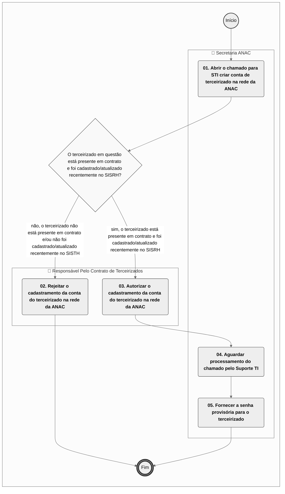

```mermaid
%%{init: {"theme": "neutral", "themeVariables": {"primaryColor": "#ffffff", "edgeLabelBackground": "#ffffff", "tertiaryColor": "#f4f4f4"}}}%%
flowchart TD
    classDef inicio stroke:#333,stroke-width:2px;
    classDef fim stroke:#333,stroke-width:4px;
    classDef tarefaBPMN stroke:#333,stroke-width:1px;
    classDef gatewayBPMN fill:#f9f9f9,stroke:#333,stroke-width:1px;
    classDef raia fill:none,stroke:#999,stroke-width:1px,stroke-dasharray: 5 5;
    subgraph Container_ID_MPR_SAR_108_R00_md_0 [ ]
        direction TB
        ID_MPR_SAR_108_R00_md_0_S((Início)):::inicio
        ID_MPR_SAR_108_R00_md_0_E(((Fim))):::fim
        subgraph Raia_ID_MPR_SAR_108_R00_md_0_1 [👤 Responsável Pelo Contrato de Terceirizados]
            ID_MPR_SAR_108_R00_md_0_01("<b>01. Preencher formulário com dados do terceirizado e envia-lo à GAPE – Registro Funcional com cópia para a área solicitante</b>"):::tarefaBPMN
            ID_MPR_SAR_108_R00_md_0_01("<b>01. Preencher formulário com dados do terceirizado e envia-lo por e-mail para a GAPE – Registro Funcional com cópia para as áreas envolvidas</b>"):::tarefaBPMN
            ID_MPR_SAR_108_R00_md_0_10("<b>10. Corrigir o formulário</b>"):::tarefaBPMN
            ID_MPR_SAR_108_R00_md_0_02("<b>02. Rejeitar o cadastramento da conta do terceirizado na rede da ANAC</b>"):::tarefaBPMN
            ID_MPR_SAR_108_R00_md_0_03("<b>03. Autorizar o cadastramento da conta do terceirizado na rede da ANAC</b>"):::tarefaBPMN
        end
        subgraph Raia_ID_MPR_SAR_108_R00_md_0_2 [👤 GAPE – Registro Funcional]
            ID_MPR_SAR_108_R00_md_0_02("<b>02. Cadastrar o terceirizado no SISRH, comunicar o Gestor do Contrato e orientar a área solicitante sobre a abertura de chamado à STI para a criação de conta na rede da ANAC</b>"):::tarefaBPMN
            ID_MPR_SAR_108_R00_md_0_02("<b>02. Validar o formulário e analisar a finalidade</b>"):::tarefaBPMN
            ID_MPR_SAR_108_R00_md_0_08("<b>08. Informar ao Gestor de Contrato, via e-mail, com cópia para as áreas envolvidas que a atualização foi realizada no SISRH</b>"):::tarefaBPMN
            ID_MPR_SAR_108_R00_md_0_09("<b>09. Inserir data de desligamento no SISRH</b>"):::tarefaBPMN
        end
        subgraph Raia_ID_MPR_SAR_108_R00_md_0_3 [👤 Gestor do Sistema Eletrônico de Registro de Frequência]
            ID_MPR_SAR_108_R00_md_0_03("<b>03. Abrir um chamado (SCD) para a STI atualizar o Terceirizado no sistema</b>"):::tarefaBPMN
            ID_MPR_SAR_108_R00_md_0_04("<b>04. Aguardar resposta da STI</b>"):::tarefaBPMN
            ID_MPR_SAR_108_R00_md_0_05("<b>05. Verificar o serviço realizado</b>"):::tarefaBPMN
            ID_MPR_SAR_108_R00_md_0_06("<b>06. Inserir justificativa</b>"):::tarefaBPMN
            ID_MPR_SAR_108_R00_md_0_07("<b>07. Homologar a demanda e informar à GAPE – Registro Funcional</b>"):::tarefaBPMN
        end
        subgraph Raia_ID_MPR_SAR_108_R00_md_0_4 [👤 Secretaria ANAC]
            ID_MPR_SAR_108_R00_md_0_01("<b>01. Abrir o chamado para STI criar conta de terceirizado na rede da ANAC</b>"):::tarefaBPMN
            ID_MPR_SAR_108_R00_md_0_04("<b>04. Aguardar processamento do chamado pelo Suporte TI</b>"):::tarefaBPMN
            ID_MPR_SAR_108_R00_md_0_05("<b>05. Fornecer a senha provisória para o terceirizado</b>"):::tarefaBPMN
        end
        ID_MPR_SAR_108_R00_md_0_S --> ID_MPR_SAR_108_R00_md_0_01
        ID_MPR_SAR_108_R00_md_0_01 --> ID_MPR_SAR_108_R00_md_0_02
        ID_MPR_SAR_108_R00_md_0_02 --> ID_MPR_SAR_108_R00_md_0_E
        ID_MPR_SAR_108_R00_md_0_01 --> ID_MPR_SAR_108_R00_md_0_02
        gw_ID_MPR_SAR_108_R00_md_0_02{"Formulário está correto?"}:::gatewayBPMN
        ID_MPR_SAR_108_R00_md_0_02 --> gw_ID_MPR_SAR_108_R00_md_0_02
        gw_ID_MPR_SAR_108_R00_md_0_02 -->|"não está correto"| ID_MPR_SAR_108_R00_md_0_10
        gw_ID_MPR_SAR_108_R00_md_0_02 -->|"sim e refere-se a desligamento"| ID_MPR_SAR_108_R00_md_0_09
        gw_ID_MPR_SAR_108_R00_md_0_02 -->|"sim e refere-se a atualização cadastral"| ID_MPR_SAR_108_R00_md_0_03
        ID_MPR_SAR_108_R00_md_0_03 --> ID_MPR_SAR_108_R00_md_0_04
        ID_MPR_SAR_108_R00_md_0_04 --> ID_MPR_SAR_108_R00_md_0_05
        gw_ID_MPR_SAR_108_R00_md_0_05{"O serviço foi prestado de acordo?"}:::gatewayBPMN
        ID_MPR_SAR_108_R00_md_0_05 --> gw_ID_MPR_SAR_108_R00_md_0_05
        gw_ID_MPR_SAR_108_R00_md_0_05 -->|"sim, o serviço foi prestado de acordo"| ID_MPR_SAR_108_R00_md_0_07
        gw_ID_MPR_SAR_108_R00_md_0_05 -->|"não, o serviço não foi prestado de acordo"| ID_MPR_SAR_108_R00_md_0_06
        ID_MPR_SAR_108_R00_md_0_06 --> ID_MPR_SAR_108_R00_md_0_04
        ID_MPR_SAR_108_R00_md_0_07 --> ID_MPR_SAR_108_R00_md_0_08
        ID_MPR_SAR_108_R00_md_0_08 --> ID_MPR_SAR_108_R00_md_0_E
        ID_MPR_SAR_108_R00_md_0_09 --> ID_MPR_SAR_108_R00_md_0_08
        ID_MPR_SAR_108_R00_md_0_10 --> ID_MPR_SAR_108_R00_md_0_02
        gw_ID_MPR_SAR_108_R00_md_0_01{"O terceirizado em questão está presente em contrato e foi cadastrado/atualizado recentemente no SISRH?"}:::gatewayBPMN
        ID_MPR_SAR_108_R00_md_0_01 --> gw_ID_MPR_SAR_108_R00_md_0_01
        gw_ID_MPR_SAR_108_R00_md_0_01 -->|"sim, o terceirizado está presente em contrato e foi cadastrado/atualizado recentemente no SISRH"| ID_MPR_SAR_108_R00_md_0_03
        gw_ID_MPR_SAR_108_R00_md_0_01 -->|"não, o terceirizado não está presente em contrato e/ou não foi cadastrado/atualizado recentemente no SISTH"| ID_MPR_SAR_108_R00_md_0_02
        ID_MPR_SAR_108_R00_md_0_02 --> ID_MPR_SAR_108_R00_md_0_E
        ID_MPR_SAR_108_R00_md_0_03 --> ID_MPR_SAR_108_R00_md_0_04
        ID_MPR_SAR_108_R00_md_0_04 --> ID_MPR_SAR_108_R00_md_0_05
        ID_MPR_SAR_108_R00_md_0_05 --> ID_MPR_SAR_108_R00_md_0_E
    end
    click ID_MPR_SAR_108_R00_md_0_01 "Preencher 'Formulário – Dados Necessários de Terceirizados no SISRH' com dados do terceirizado e envia-lo, por e-mail, à GAPE – Registro Funcional com cópia para a área solicitante."
    click ID_MPR_SAR_108_R00_md_0_02 "Analisar se as seguintes informações estão preenchidas corretamente:  -CPF:  -NOME  -Sexo (M/F)  -Data de Nascimento:  -Situação:  -Data de entrada na ANAC  -Tipo Telefone (Comercial)  -DDD  -Telefone (Prefixo + Ramal)  -Código do Setor da Lotação no SISRH  -Data de Entrada na Lotação  -UF (de lotaç"
    click ID_MPR_SAR_108_R00_md_0_01 "Preencher artefato 'Formulário – Dados Necessários de Terceirizados no SISRH' com dados do terceirizado e enviar o formulário por e-mail à GAPE – Registro Funcional com cópia para a área solicitante.  Em caso de reativação de conta do terceirizado, deve-se solicitar a remoção da data de exclusão no "
    click ID_MPR_SAR_108_R00_md_0_02 "Analisar se as seguintes informações estão preenchidas corretamente:  -CPF:  -NOME  -Sexo (M/F)  -Data de Nascimento:  -Situação:  -Data de entrada na ANAC  -Tipo Telefone (Comercial)  -DDD  -Telefone (Prefixo + Ramal)  -Código do Setor da Lotação no SISRH  -Data de Entrada na Lotação  -UF (de lotaç"
    click ID_MPR_SAR_108_R00_md_0_03 "Para abrir o chamado, deve-se realizar os seguintes procedimentos:  1) Abrir o link https://sistemas.anac.gov.br/saci/  2) Efetuar o login  3) No canto direito da tela clicar em Sistema TI > Solicitações > Registro  4) Preencher os campos solicitados:  a) Título: Atualização de Dados de Terceirizado"
    click ID_MPR_SAR_108_R00_md_0_04 "Deve-se aguardar a STI processar o chamado e responder o pedido."
    click ID_MPR_SAR_108_R00_md_0_05 "Deve-se verificar se o serviço foi realizado corretamente."
    click ID_MPR_SAR_108_R00_md_0_06 "Inserir justificativa explicando o porquê do serviço não ter sido prestado de acordo."
    click ID_MPR_SAR_108_R00_md_0_07 "Homologar a demanda e mandar e-mail para a GAPE – Registro Funcional informando sobre a homologação."
    click ID_MPR_SAR_108_R00_md_0_08 "Informar ao Gestor de Contrato, via e-mail, com cópia para as áreas envolvidas que a atualização foi realizada no SISRH."
    click ID_MPR_SAR_108_R00_md_0_09 "Acessar o SISRH e inserir a data de desligamento do terceirizado.  Após a data de desligamento ser inserida, o sistema automaticamente efetua o desligamento do terceirizado."
    click ID_MPR_SAR_108_R00_md_0_10 "Proceder às correções no 'Formulário - Dados Necessários de Terceirizados no SISRH', consoante apontamentos realizados pela GAPE – Registro Funcional."
    click ID_MPR_SAR_108_R00_md_0_01 "Abrir o chamado para STI criar conta de terceirizado na rede da ANAC pelo site: https://servicosti.anac.gov.br/ (formulários Intranet)."
    click ID_MPR_SAR_108_R00_md_0_02 "Abrir o link recebido por e-mail e rejeitar o pedido de cadastramento da conta do terceirizado na rede da ANAC."
    click ID_MPR_SAR_108_R00_md_0_03 "Abrir o link recebido por e-mail e autorizar o cadastramento da conta do terceirizado na rede da ANAC."
    click ID_MPR_SAR_108_R00_md_0_04 "Aguardar que o Suporte TI processe o chamado e mande o login e senha para o primeiro acesso do terceirizado."
    click ID_MPR_SAR_108_R00_md_0_05 "Fornecer a senha provisória para o terceirizado."
```

```mermaid
%%{init: {"theme": "neutral", "themeVariables": {"primaryColor": "#ffffff", "edgeLabelBackground": "#ffffff", "tertiaryColor": "#f4f4f4"}}}%%
flowchart TD
    classDef inicio stroke:#333,stroke-width:2px;
    classDef fim stroke:#333,stroke-width:4px;
    classDef tarefaBPMN stroke:#333,stroke-width:1px;
    classDef gatewayBPMN fill:#f9f9f9,stroke:#333,stroke-width:1px;
    classDef raia fill:none,stroke:#999,stroke-width:1px,stroke-dasharray: 5 5;
    subgraph Container_ID_MPR_SAR_108_R00_md_1 [ ]
        direction TB
        ID_MPR_SAR_108_R00_md_1_S((Início)):::inicio
        ID_MPR_SAR_108_R00_md_1_E(((Fim))):::fim
        subgraph Raia_ID_MPR_SAR_108_R00_md_1_1 [👤 Responsável Pelo Contrato de Terceirizados]
            ID_MPR_SAR_108_R00_md_1_01("<b>01. Preencher formulário com dados do terceirizado e envia-lo por e-mail para a GAPE – Registro Funcional com cópia para as áreas envolvidas</b>"):::tarefaBPMN
            ID_MPR_SAR_108_R00_md_1_10("<b>10. Corrigir o formulário</b>"):::tarefaBPMN
            ID_MPR_SAR_108_R00_md_1_02("<b>02. Rejeitar o cadastramento da conta do terceirizado na rede da ANAC</b>"):::tarefaBPMN
            ID_MPR_SAR_108_R00_md_1_03("<b>03. Autorizar o cadastramento da conta do terceirizado na rede da ANAC</b>"):::tarefaBPMN
        end
        subgraph Raia_ID_MPR_SAR_108_R00_md_1_2 [👤 GAPE – Registro Funcional]
            ID_MPR_SAR_108_R00_md_1_02("<b>02. Validar o formulário e analisar a finalidade</b>"):::tarefaBPMN
            ID_MPR_SAR_108_R00_md_1_08("<b>08. Informar ao Gestor de Contrato, via e-mail, com cópia para as áreas envolvidas que a atualização foi realizada no SISRH</b>"):::tarefaBPMN
            ID_MPR_SAR_108_R00_md_1_09("<b>09. Inserir data de desligamento no SISRH</b>"):::tarefaBPMN
        end
        subgraph Raia_ID_MPR_SAR_108_R00_md_1_3 [👤 Gestor do Sistema Eletrônico de Registro de Frequência]
            ID_MPR_SAR_108_R00_md_1_03("<b>03. Abrir um chamado (SCD) para a STI atualizar o Terceirizado no sistema</b>"):::tarefaBPMN
            ID_MPR_SAR_108_R00_md_1_04("<b>04. Aguardar resposta da STI</b>"):::tarefaBPMN
            ID_MPR_SAR_108_R00_md_1_05("<b>05. Verificar o serviço realizado</b>"):::tarefaBPMN
            ID_MPR_SAR_108_R00_md_1_06("<b>06. Inserir justificativa</b>"):::tarefaBPMN
            ID_MPR_SAR_108_R00_md_1_07("<b>07. Homologar a demanda e informar à GAPE – Registro Funcional</b>"):::tarefaBPMN
        end
        subgraph Raia_ID_MPR_SAR_108_R00_md_1_4 [👤 Secretaria ANAC]
            ID_MPR_SAR_108_R00_md_1_01("<b>01. Abrir o chamado para STI criar conta de terceirizado na rede da ANAC</b>"):::tarefaBPMN
            ID_MPR_SAR_108_R00_md_1_04("<b>04. Aguardar processamento do chamado pelo Suporte TI</b>"):::tarefaBPMN
            ID_MPR_SAR_108_R00_md_1_05("<b>05. Fornecer a senha provisória para o terceirizado</b>"):::tarefaBPMN
        end
        ID_MPR_SAR_108_R00_md_1_S --> ID_MPR_SAR_108_R00_md_1_01
        ID_MPR_SAR_108_R00_md_1_01 --> ID_MPR_SAR_108_R00_md_1_02
        gw_ID_MPR_SAR_108_R00_md_1_02{"Formulário está correto?"}:::gatewayBPMN
        ID_MPR_SAR_108_R00_md_1_02 --> gw_ID_MPR_SAR_108_R00_md_1_02
        gw_ID_MPR_SAR_108_R00_md_1_02 -->|"não está correto"| ID_MPR_SAR_108_R00_md_1_10
        gw_ID_MPR_SAR_108_R00_md_1_02 -->|"sim e refere-se a desligamento"| ID_MPR_SAR_108_R00_md_1_09
        gw_ID_MPR_SAR_108_R00_md_1_02 -->|"sim e refere-se a atualização cadastral"| ID_MPR_SAR_108_R00_md_1_03
        ID_MPR_SAR_108_R00_md_1_03 --> ID_MPR_SAR_108_R00_md_1_04
        ID_MPR_SAR_108_R00_md_1_04 --> ID_MPR_SAR_108_R00_md_1_05
        gw_ID_MPR_SAR_108_R00_md_1_05{"O serviço foi prestado de acordo?"}:::gatewayBPMN
        ID_MPR_SAR_108_R00_md_1_05 --> gw_ID_MPR_SAR_108_R00_md_1_05
        gw_ID_MPR_SAR_108_R00_md_1_05 -->|"sim, o serviço foi prestado de acordo"| ID_MPR_SAR_108_R00_md_1_07
        gw_ID_MPR_SAR_108_R00_md_1_05 -->|"não, o serviço não foi prestado de acordo"| ID_MPR_SAR_108_R00_md_1_06
        ID_MPR_SAR_108_R00_md_1_06 --> ID_MPR_SAR_108_R00_md_1_04
        ID_MPR_SAR_108_R00_md_1_07 --> ID_MPR_SAR_108_R00_md_1_08
        ID_MPR_SAR_108_R00_md_1_08 --> ID_MPR_SAR_108_R00_md_1_E
        ID_MPR_SAR_108_R00_md_1_09 --> ID_MPR_SAR_108_R00_md_1_08
        ID_MPR_SAR_108_R00_md_1_10 --> ID_MPR_SAR_108_R00_md_1_02
        gw_ID_MPR_SAR_108_R00_md_1_01{"O terceirizado em questão está presente em contrato e foi cadastrado/atualizado recentemente no SISRH?"}:::gatewayBPMN
        ID_MPR_SAR_108_R00_md_1_01 --> gw_ID_MPR_SAR_108_R00_md_1_01
        gw_ID_MPR_SAR_108_R00_md_1_01 -->|"sim, o terceirizado está presente em contrato e foi cadastrado/atualizado recentemente no SISRH"| ID_MPR_SAR_108_R00_md_1_03
        gw_ID_MPR_SAR_108_R00_md_1_01 -->|"não, o terceirizado não está presente em contrato e/ou não foi cadastrado/atualizado recentemente no SISTH"| ID_MPR_SAR_108_R00_md_1_02
        ID_MPR_SAR_108_R00_md_1_02 --> ID_MPR_SAR_108_R00_md_1_E
        ID_MPR_SAR_108_R00_md_1_03 --> ID_MPR_SAR_108_R00_md_1_04
        ID_MPR_SAR_108_R00_md_1_04 --> ID_MPR_SAR_108_R00_md_1_05
        ID_MPR_SAR_108_R00_md_1_05 --> ID_MPR_SAR_108_R00_md_1_E
    end
    click ID_MPR_SAR_108_R00_md_1_01 "Preencher artefato 'Formulário – Dados Necessários de Terceirizados no SISRH' com dados do terceirizado e enviar o formulário por e-mail à GAPE – Registro Funcional com cópia para a área solicitante.  Em caso de reativação de conta do terceirizado, deve-se solicitar a remoção da data de exclusão no "
    click ID_MPR_SAR_108_R00_md_1_02 "Analisar se as seguintes informações estão preenchidas corretamente:  -CPF:  -NOME  -Sexo (M/F)  -Data de Nascimento:  -Situação:  -Data de entrada na ANAC  -Tipo Telefone (Comercial)  -DDD  -Telefone (Prefixo + Ramal)  -Código do Setor da Lotação no SISRH  -Data de Entrada na Lotação  -UF (de lotaç"
    click ID_MPR_SAR_108_R00_md_1_03 "Para abrir o chamado, deve-se realizar os seguintes procedimentos:  1) Abrir o link https://sistemas.anac.gov.br/saci/  2) Efetuar o login  3) No canto direito da tela clicar em Sistema TI > Solicitações > Registro  4) Preencher os campos solicitados:  a) Título: Atualização de Dados de Terceirizado"
    click ID_MPR_SAR_108_R00_md_1_04 "Deve-se aguardar a STI processar o chamado e responder o pedido."
    click ID_MPR_SAR_108_R00_md_1_05 "Deve-se verificar se o serviço foi realizado corretamente."
    click ID_MPR_SAR_108_R00_md_1_06 "Inserir justificativa explicando o porquê do serviço não ter sido prestado de acordo."
    click ID_MPR_SAR_108_R00_md_1_07 "Homologar a demanda e mandar e-mail para a GAPE – Registro Funcional informando sobre a homologação."
    click ID_MPR_SAR_108_R00_md_1_08 "Informar ao Gestor de Contrato, via e-mail, com cópia para as áreas envolvidas que a atualização foi realizada no SISRH."
    click ID_MPR_SAR_108_R00_md_1_09 "Acessar o SISRH e inserir a data de desligamento do terceirizado.  Após a data de desligamento ser inserida, o sistema automaticamente efetua o desligamento do terceirizado."
    click ID_MPR_SAR_108_R00_md_1_10 "Proceder às correções no 'Formulário - Dados Necessários de Terceirizados no SISRH', consoante apontamentos realizados pela GAPE – Registro Funcional."
    click ID_MPR_SAR_108_R00_md_1_01 "Abrir o chamado para STI criar conta de terceirizado na rede da ANAC pelo site: https://servicosti.anac.gov.br/ (formulários Intranet)."
    click ID_MPR_SAR_108_R00_md_1_02 "Abrir o link recebido por e-mail e rejeitar o pedido de cadastramento da conta do terceirizado na rede da ANAC."
    click ID_MPR_SAR_108_R00_md_1_03 "Abrir o link recebido por e-mail e autorizar o cadastramento da conta do terceirizado na rede da ANAC."
    click ID_MPR_SAR_108_R00_md_1_04 "Aguardar que o Suporte TI processe o chamado e mande o login e senha para o primeiro acesso do terceirizado."
    click ID_MPR_SAR_108_R00_md_1_05 "Fornecer a senha provisória para o terceirizado."
```

# Manual de Procedimento

**MANUAL DE PROCEDIMENTO**

**MPR/ANAC-108-R00**

**MANUTENÇÃO DE DADOS DE TERCEIRIZADOS NO SISRH**

06/2016

**REVISÕES**

|  |  |  |  |  |
| --- | --- | --- | --- | --- |
| **Revisão** | **Aprovação** | **Publicação** | **Aprovado Por** | **Modificações da Última Versão** |
| R00 | Portaria Nº 1310, de 25 de Maio de 2016 | Não informado | ANAC | Versão Original |

**ÍNDICE**

1) Disposições Preliminares, pág. 5.

1.1) Introdução, pág. 5.

1.2) Revogação, pág. 5.

1.3) Fundamentação, pág. 5.

1.4) Executores dos Processos, pág. 6.

1.5) Elaboração e Revisão, pág. 6.

1.6) Organização do Documento, pág. 6.

2) Definições, pág. 8.

2.1) Sigla, pág. 8.

3) Artefatos, Competências, Sistemas e Documentos Administrativos, pág. 9.

3.1) Artefatos, pág. 9.

3.2) Competências, pág. 9.

3.3) Sistemas, pág. 10.

3.4) Documentos e Processos Administrativos, pág. 10.

4) Procedimentos Referenciados, pág. 11.

5) Procedimentos, pág. 12.

5.1) Cadastrar Terceirizado no SISRH, pág. 12.

5.2) Atualizar e Desligar Terceirizado no SISRH, pág. 16.

5.3) Solicitar Criação ou Reativação de Conta de Terceirizado na Rede da ANAC, pág. 21.

6) Disposições Finais, pág. 25.

**PARTICIPAÇÃO NA EXECUÇÃO DOS PROCESSOS**

**GRUPOS ORGANIZACIONAIS**

**a) GAPE – Registro Funcional**

1) Atualizar e Desligar Terceirizado no SISRH

2) Cadastrar Terceirizado no SISRH

**b) Gestor do Sistema Eletrônico de Registro de Frequência**

1) Atualizar e Desligar Terceirizado no SISRH

**c) Responsável Pelo Contrato de Terceirizados**

1) Atualizar e Desligar Terceirizado no SISRH

2) Cadastrar Terceirizado no SISRH

3) Solicitar Criação ou Reativação de Conta de Terceirizado na Rede da ANAC

**d) Secretaria ANAC**

1) Solicitar Criação ou Reativação de Conta de Terceirizado na Rede da ANAC

**1. DISPOSIÇÕES PRELIMINARES**

**1.1 INTRODUÇÃO**

O presente Manual tem como objetivo manter consistentes, íntegros e atualizados os dados cadastrais de Terceirizados que necessitam de acesso à rede de computadores da ANAC através da padronização de atividades.

No que tange às atividades da STI, SAF e GGAF quanto à manutenção dos dados cadastrais de Terceirizados no Sistema Integrado de Recursos Humanos – SISRH, o Gestor de Contrato de Terceirizado – ator encarregado por deter o controle dos Terceirizados em cada contrato – deverá informar à SGP a alocação, movimentação e desligamento de Terceirizado para que esta UORG proceda ao correspondente cadastramento, atualização ou desligamento.

Os processos se iniciam com o recebimento de dados necessários de Terceirizados dos Gestores de Contrato das Unidades Organizacionais STI, SAF e GGAF. Após recebimento, a SGP validará os dados e procederá o cadastramento ou atualização no SISRH. Se houver dado que necessite ser atualizado porém o SISRH não permite que a SGP altere, o Gestor do Sistema SISRH abrirá chamado junto à STI para que seja feita uma intervenção programada na base de dados do referido sistema.

No caso de novo Terceirizado, após a conclusão do cadastramento no SISRH pela SGP, um integrante do Grupo Secretaria da ANAC abrirá chamado junto à STI, afim de criar conta na rede de computadores da ANAC.

O MPR estabelece, no âmbito da Agência Nacional de Aviação Civil - ANAC, os seguintes processos de trabalho:

a) Cadastrar Terceirizado no SISRH.

b) Atualizar e Desligar Terceirizado no SISRH.

c) Solicitar Criação ou Reativação de Conta de Terceirizado na Rede da ANAC.

**1.2 REVOGAÇÃO**

Item não aplicável.

**1.3 FUNDAMENTAÇÃO**

Resolução nº 110, art. 38, de 15 de setembro de 2009 e alterações posteriores.

Portaria 2724/SAF/STI/SGP de 16 Outubro de 2014.

**1.4 EXECUTORES DOS PROCESSOS**

Os procedimentos contidos neste documento aplicam-se aos servidores integrantes das seguintes áreas organizacionais:

|  |  |
| --- | --- |
| **Grupo Organizacional** | **Descrição** |
| GAPE – Registro Funcional | Equipe responsável na Superintendência de Gestão de Pessoas (SGP) pelo Cadastro de Servidores, Estagiários e Terceirizados. |
| Gestor do Sistema Eletrônico de Registro de Frequência | Gestor Titular e Substituto do Sistema Integrado de Recursos Humanos – SISRH. |
| Responsável pelo Contrato de Terceirizados | Servidor(es) responsável(is) pela Gestão de Contrato(s) de Terceirizados na Superintendência de Administração e Finanças (SAF), Superintendência de Tecnologia da Informação (STI) e pela Fiscalização(ões) Técnica(a) de Contrato na Gerência-Geral de Ação Fiscal (GGAF). |
| Secretaria ANAC | Todos os(as) Secretários(as) da ANAC. |

**1.5 ELABORAÇÃO E REVISÃO**

O processo que resulta na aprovação ou alteração deste MPR é de responsabilidade da Agência Nacional de Aviação Civil - ANAC. Em caso de sugestões de revisão, deve-se procurá-la para que sejam iniciadas as providências cabíveis.

As revisões deste MPR serão aprovadas pelo(s) titular(es) da(s) unidade(s) responsável(is) pela execução do(s) processo(s) nele listado(s).

**1.6 ORGANIZAÇÃO DO DOCUMENTO**

O capítulo 2 apresenta as principais definições utilizadas no âmbito deste MPR, e deve ser visto integralmente antes da leitura de capítulos posteriores.

O capítulo 3 apresenta as competências, os artefatos e os sistemas envolvidos na execução dos processos deste manual, em ordem relativamente cronológica.

O capítulo 4 apresenta os processos de trabalho referenciados neste MPR. Estes processos são publicados em outros manuais que não este, mas cuja leitura é essencial para o entendimento dos processos publicados neste manual. O capítulo 4 expõe em quais manuais são localizados cada um dos processos de trabalho referenciados.

O capítulo 5 apresenta os processos de trabalho. Para encontrar um processo específico, deve-se procurar sua respectiva página no índice contido no início do documento. Os processos estão ordenados em etapas. Cada etapa é contida em uma tabela, que possui em si todas as informações necessárias para sua realização. São elas, respectivamente:

a) o título da etapa;

b) a descrição da forma de execução da etapa;

c) as competências necessárias para a execução da etapa;

d) os artefatos necessários para a execução da etapa;

e) os sistemas necessários para a execução da etapa (incluindo, bases de dados em forma de arquivo, se existente);

f) os documentos e processos administrativos que precisam ser elaborados durante a execução da etapa;

g) instruções para as próximas etapas; e

h) as áreas ou grupos organizacionais responsáveis por executar a etapa.

O capítulo 6 apresenta as disposições finais do documento, que trata das ações a serem realizadas em casos não previstos.

Por último, é importante comunicar que este documento foi gerado automaticamente. São recuperados dados sobre as etapas e sua sequência, as definições, os grupos, as áreas organizacionais, os artefatos, as competências, os sistemas, entre outros, para os processos de trabalho aqui apresentados, de forma que alguma mecanicidade na apresentação das informações pode ser percebida. O documento sempre apresenta as informações mais atualizadas de nomes e siglas de grupos, áreas, artefatos, termos, sistemas e suas definições, conforme informação disponível na base de dados, independente da data de assinatura do documento. Informações sobre etapas, seu detalhamento, a sequência entre etapas, responsáveis pelas etapas, artefatos, competências e sistemas associados a etapas, assim como seus nomes e os nomes de seus processos têm suas definições idênticas à da data de assinatura do documento.

**2. DEFINIÇÕES**

A tabela abaixo apresenta as definições necessárias para o entendimento deste Manual de Procedimento.

**2.1 Sigla**

|  |  |
| --- | --- |
| **Definição** | **Significado** |
| GGAF | Gerencia Geral de Ação Fiscal |
| SAF | Superintendência de Administração e Finanças |
| SGP | Superintendência de Gestão de Pessoas |
| SISRH | Sistema Integrado de Recursos Humanos |
| STI | Superintendência de Tecnologia da Informação |

**3. ARTEFATOS, COMPETÊNCIAS, SISTEMAS E DOCUMENTOS ADMINISTRATIVOS**

Abaixo se encontram as listas dos artefatos, competências, sistemas e documentos administrativos que o executor necessita consultar, preencher, analisar ou elaborar para executar os processos deste MPR. As etapas descritas no capítulo seguinte indicam onde usar cada um deles.

As competências devem ser adquiridas por meio de capacitação ou outros instrumentos e os artefatos se encontram no módulo "Artefatos" do sistema GFT - Gerenciador de Fluxos de Trabalho.

**3.1 ARTEFATOS**

|  |  |
| --- | --- |
| **Nome** | **Descrição** |
| Carga de Terceirizados | Lista com os dados dos Terceirizados que será utilizada em intervenção programada pela área técnica da STI para atualizar base de dados do SISRH. |
| Formulário – Dados Necessários de Terceirizados no SISRH | Formulário com os dados necessários para a inclusão, alteração e desligamento de terceirizados no SISRH. |
| Orientações Carga Terceirizados | As orientações presentes nesse artefato auxiliam o colaborador a preencher os dados dos terceirizados corretamente. |
| Procedimento para Cadastrar Alterar e Desligar Terceirizado | Procedimento para Cadastrar alterar e desligar Terceirizado da ANAC no SISRH. |

**3.2 COMPETÊNCIAS**

Para que os processos de trabalho contidos neste MPR possam ser realizados com qualidade e efetividade, é importante que as pessoas que venham a executá-los possuam um determinado conjunto de competências. No capítulo 5, as competências específicas que o executor de cada etapa de cada processo de trabalho deve possuir são apresentadas. A seguir, encontra-se uma lista geral das competências contidas em todos os processos de trabalho deste MPR e a indicação de qual área ou grupo organizacional as necessitam:

|  |  |
| --- | --- |
| **Competência** | **Áreas e Grupos** |
| Cadastra terceirizados da ANAC no SISRH. | GAPE – Registro Funcional |
| Controla as atividades relacionadas à inclusão, alteração ou desligamento dos prestadores de serviços. | Responsável pelo Contrato de Terceirizados |
| Garante operação, capacitação, acesso e suporte ao uso do sistema SISRH. | Gestor do Sistema Eletrônico de Registro de Frequência |
| Solicita criação de conta na rede para Terceirizado. | Secretaria ANAC |

**3.3 SISTEMAS**

|  |  |  |
| --- | --- | --- |
| **Nome** | **Descrição** | **Acesso** |
| Portal de Serviços da ANAC | Portal da STI para solicitação de serviços online ao suporteTI. | https://sistemas.anac.gov.br/portaldeservicos/login/login.load |
| SACI - SCD | Módulo do SACI para controle de demandas de sistemas. | https://sistemas.anac.gov.br/saci/scd/chamado/cadastrarchamado.asp?idmdl=567-4874 |
| SISRH | Sistema Integrado de Recursos Humanos. | https://sistemas.anac.gov.br/sisrh/login.jsf |

**3.4 DOCUMENTOS E PROCESSOS ADMINISTRATIVOS ELABORADOS NESTE MANUAL**

Não há documentos ou processos administrativos a serem elaborados neste MPR.

**4. PROCEDIMENTOS REFERENCIADOS**

Procedimentos referenciados são processos de trabalho publicados em outro MPR que têm relação com os processos de trabalho publicados por este manual. Este MPR não possui nenhum processo de trabalho referenciado.

**
## 5.1 Cadastrar Terceirizado no SISRH

## 5.1 Cadastrar Terceirizado no SISRH

## 5.1 Cadastrar Terceirizado no SISRH

