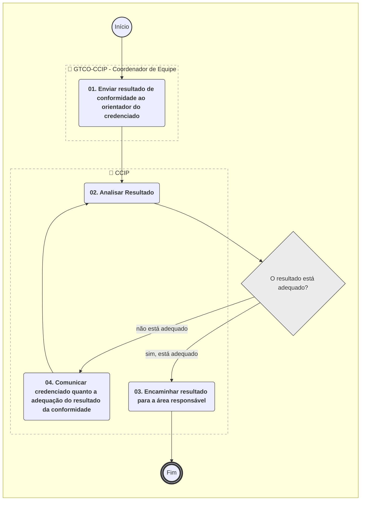
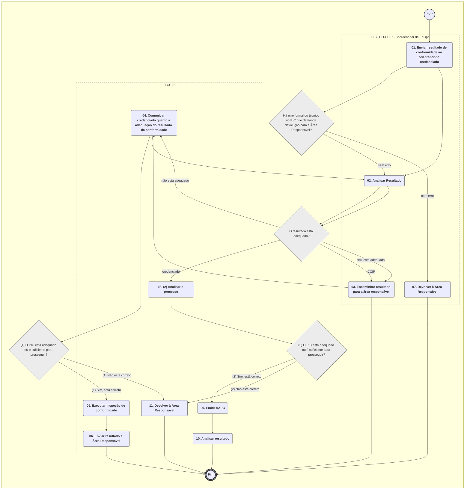

**MANUAL DE PROCEDIMENTO**

**MPR/SAR-111-R00**

**INSPEÇÃO DE CONFORMIDADE DE PRODUTOS AERONÁUTICOS**

09/2024

**REVISÕES**

|  |  |  |  |  |
| --- | --- | --- | --- | --- |
| **Revisão** | **Aprovação** | **Publicação** | **Aprovado Por** | **Modificações da Última Versão** |
| R00 | Portaria nº 15402, de 09 de setembro DE 2024. | 13/09/2024 | SAR | Versão Original |

**ÍNDICE**

1) Disposições Preliminares, pág. 6.

1.1) Introdução, pág. 6.

1.2) Revogação, pág. 7.

1.3) Fundamentação, pág. 8.

1.4) Executores dos Processos, pág. 8.

1.5) Elaboração e Revisão, pág. 8.

1.6) Organização do Documento, pág. 8.

2) Definições, pág. 10.

2.1) Sigla, pág. 10.

2.2) Tradução, pág. 10.

3) Artefatos, Competências, Sistemas e Documentos Administrativos, pág. 11.

3.1) Artefatos, pág. 11.

3.2) Competências, pág. 11.

3.3) Sistemas, pág. 12.

3.4) Documentos e Processos Administrativos, pág. 12.

4) Procedimentos Referenciados, pág. 13.

4.1) Supervisionar PCF e PCA no Âmbito da GTCO, pág.13.

4.2) Validar Certificado de Tipo, pág.13.

4.3) Transferir, Suspender ou Cassar Certificado de Tipo, pág.13.

4.4) Realizar Avaliação Técnica, pág.13.

4.5) Gerenciar Certificação de Projeto Aeronáutico, pág.13.

5) Procedimentos, pág. 15.

5.1) Gerenciar Pedido de Inspeção de Conformidade de Aeronave, Parte, Componente, Sistema e Corpo de Prova, Instalação de Ensaio, Sistema de Medida e de Aquisição de Dados / Setups, pág. 15.

5.2) Gerenciar Resultado de Pedido de Conformidade, pág. 20.

6) Disposições Finais, pág. 24.

**PARTICIPAÇÃO NA EXECUÇÃO DOS PROCESSOS**

**ÁREAS ORGANIZACIONAIS**

**1) Coordenadoria de Inspeção**

a) Gerenciar Pedido de Inspeção de Conformidade de Aeronave, Parte, Componente, Sistema e Corpo de Prova, Instalação de Ensaio, Sistema de Medida e de Aquisição de Dados / Setups

b) Gerenciar Resultado de Pedido de Conformidade

**GRUPOS ORGANIZACIONAIS**

**a) GTCO-CCIP - Coordenador de Equipe**

1) Gerenciar Pedido de Inspeção de Conformidade de Aeronave, Parte, Componente, Sistema e Corpo de Prova, Instalação de Ensaio, Sistema de Medida e de Aquisição de Dados / Setups

2) Gerenciar Resultado de Pedido de Conformidade

**1. DISPOSIÇÕES PRELIMINARES**

**1.1 INTRODUÇÃO**

Este MPR contém as informações de suporte à execução da Inspeção de Conformidade.

Esta versão foi criada e aprovada pelo processo SEI 00066.000759/2022-41.

A inspeção da conformidade executada pela autoridade aeronáutica é a validação da conformidade realizada pelo requerente.

As inspeções da conformidade são executadas diretamente pela GTCO/CCIP através de seus inspetores ou indiretamente pelos Profissionais Credenciados em Fabricação - PCF.

Nota: caso a inspeção de conformidade seja de menor complexidade, é possível que esta seja feita por um Especialista da engenharia, desde que devidamente treinado no processo pela GTCO/CCIP, conforme diretrizes estabelecidas (previsão também citada no MPR/SAR-101).

A inspeção de conformidade tem por objetivo verificar e registrar que aeronaves, partes, componentes, sistemas e corpos-de-prova, bem como instalações de ensaio, sistemas de medida e de aquisição de dados, estão em conformidade ou não com o projeto e com os desenhos e especificações, com as correspondentes propostas de ensaio e outros documentos referenciados. Os procedimentos estabelecidos neste MPR são aplicáveis também para realização de inspeção da conformidade requeridas à ANAC por autoridades aeronáuticas estrangeiras.

Além disso, devido à dificuldade de adoção de um sistema mundial unificado, é fundamental a harmonização das práticas padrão em inspeção da conformidade, levando-se em consideração as particularidades de cada sistemática nacional e internacional, pois esta harmonização possibilitará o estabelecimento dos denominados Acordos de Reconhecimento Mútuo como forma de minimizar os impactos das barreiras técnicas e incrementar o fluxo do comércio internacional.

Em um enfoque progressivo, as práticas de inspeção da conformidade devem ser tratadas prioritariamente como um mecanismo de melhora qualitativa e quantitativa do comércio interno do país, não como dificuldade ao comércio internacional a serem superadas, mas inserindo o país de forma eficiente e estruturado nas novas tecnologias econômicas mundial.

Para as empresas, a inspeção da conformidade induz à busca contínua da melhoria da qualidade.

Para o Estado Regulador, a adoção da inspeção da conformidade, no âmbito compulsório, é uma ferramenta que fortalece o poder regulatório das instituições públicas, sendo um instrumento eficiente de proteção e segurança do consumidor e ao meio ambiente.

A inspeção da conformidade instrumentaliza as atividades regulamentadoras e fiscalizadoras estabelecidas pelos órgãos reguladores.

Como forma de nortear quais manuais, requisitos ou documentos poderão ser aceitos pela ANAC e utilizados como apoio na inspeção da conformidade, a ANAC considera como aceitáveis, dentro do propósito a que foram desenvolvidas:

a) Manuais, boletins ou documentos de instalação de fabricantes não necessariamente aprovados pela autoridade de aviação civil;

b) Material orientativo ou interpretativo, tais como Instruções Suplementares – IS, Advisory Circulars – AC, entre outros, emitidos por autoridades de aviação civil;

c) Normas: Associação Brasileira de Normas Técnicas – ABNT, Military Specifications and Standards – MIL, American Society for Testing Materials – ASTM, Society of Automotive Engineers -– SAE, Radio Technical Commission for Aeronautics – RTCA (Requirements and Technical Concepts for Aviation), ou equivalentes;

d) Dados técnicos considerados aprovados no Brasil, dentre eles, desenho mestre e manuais de especificações aprovados pelo fabricante; ou

e) MPRs e ITDs da ANAC também podem nortear as utilizações de normas e documentos nas inspeções de conformidade.

Considerando todo conjunto de métodos e práticas da conformidade, entende-se também que, o maior risco decorre da falta de infraestrutura técnica, governamental ou privada, necessária para a implementação eficiente de um sistema de inspeção da conformidade. Se, por um lado, uma ágil e correta infraestrutura técnica governamental em conjunto com uma ampla infraestrutura técnica privada são forças propulsoras para a solidificação deste sistema, por outro lado a ausência de qualquer uma delas pode obstruir o desenvolvimento da atividade.

Havendo um Plano de Conformidade acordado entre as partes envolvidas, os prazos estabelecidos nesse plano devem ser respeitados.

O MPR estabelece, no âmbito da Superintendência de Aeronavegabilidade - SAR, os seguintes processos de trabalho:

a) Gerenciar Pedido de Inspeção de Conformidade de Aeronave, Parte, Componente, Sistema e Corpo de Prova, Instalação de Ensaio, Sistema de Medida e de Aquisição de Dados / Setups.

b) Gerenciar Resultado de Pedido de Conformidade.

**1.2 REVOGAÇÃO**

Item não aplicável.

**1.3 FUNDAMENTAÇÃO**

Resolução nº 381, de 14 de junho de 2016, art. 35 e alterações posteriores.

Portaria nº 11916/SAR, de 17 de julho de 2023.

**1.4 EXECUTORES DOS PROCESSOS**

Os procedimentos contidos neste documento aplicam-se aos servidores integrantes das seguintes áreas organizacionais:

|  |  |
| --- | --- |
| **Área Organizacional** | **Descrição** |
| Coordenadoria de Inspeção - CCIP | Coordenar a execução de inspeção de conformidade de processo, de produto, de espécime de ensaio e de instalação associada durante o processo de certificação de projeto ou modificações ao projeto de tipo aprovado. |

|  |  |
| --- | --- |
| **Grupo Organizacional** | **Descrição** |
| CCIP - Coordenador de Equipe | Servidor designado pelo GTCO para coordenar o grupo de inspeção na GTCO/SAR, entre outras atividades. |

**1.5 ELABORAÇÃO E REVISÃO**

O processo que resulta na aprovação ou alteração deste MPR é de responsabilidade da Superintendência de Aeronavegabilidade - SAR. Em caso de sugestões de revisão, deve-se procurá-la para que sejam iniciadas as providências cabíveis.

As revisões deste MPR serão aprovadas pelo(s) titular(es) da(s) unidade(s) responsável(is) pela execução do(s) processo(s) nele listado(s).

**1.6 ORGANIZAÇÃO DO DOCUMENTO**

O capítulo 2 apresenta as principais definições utilizadas no âmbito deste MPR, e deve ser visto integralmente antes da leitura de capítulos posteriores.

O capítulo 3 apresenta as competências, os artefatos e os sistemas envolvidos na execução dos processos deste manual, em ordem relativamente cronológica.

O capítulo 4 apresenta os processos de trabalho referenciados neste MPR. Estes processos são publicados em outros manuais que não este, mas cuja leitura é essencial para o entendimento dos processos publicados neste manual. O capítulo 4 expõe em quais manuais são localizados cada um dos processos de trabalho referenciados.

O capítulo 5 apresenta os processos de trabalho. Para encontrar um processo específico, deve-se procurar sua respectiva página no índice contido no início do documento. Os processos estão ordenados em etapas. Cada etapa é contida em uma tabela, que possui em si todas as informações necessárias para sua realização. São elas, respectivamente:

a) o título da etapa;

b) a descrição da forma de execução da etapa;

c) as competências necessárias para a execução da etapa;

d) os artefatos necessários para a execução da etapa;

e) os sistemas necessários para a execução da etapa (incluindo, bases de dados em forma de arquivo, se existente);

f) os documentos e processos administrativos que precisam ser elaborados durante a execução da etapa;

g) instruções para as próximas etapas; e

h) as áreas ou grupos organizacionais responsáveis por executar a etapa.

O capítulo 6 apresenta as disposições finais do documento, que trata das ações a serem realizadas em casos não previstos.

Por último, é importante comunicar que este documento foi gerado automaticamente. São recuperados dados sobre as etapas e sua sequência, as definições, os grupos, as áreas organizacionais, os artefatos, as competências, os sistemas, entre outros, para os processos de trabalho aqui apresentados, de forma que alguma mecanicidade na apresentação das informações pode ser percebida. O documento sempre apresenta as informações mais atualizadas de nomes e siglas de grupos, áreas, artefatos, termos, sistemas e suas definições, conforme informação disponível na base de dados, independente da data de assinatura do documento. Informações sobre etapas, seu detalhamento, a sequência entre etapas, responsáveis pelas etapas, artefatos, competências e sistemas associados a etapas, assim como seus nomes e os nomes de seus processos têm suas definições idênticas à da data de assinatura do documento.

**2. DEFINIÇÕES**

As tabelas abaixo apresentam as definições necessárias para o entendimento deste Manual de Procedimento, separadas pelo tipo.

**2.1 Sigla**

|  |  |
| --- | --- |
| **Definição** | **Significado** |
| AAPC | Autorização de Atividade de Profissional Credenciado |
| AC | Advisory Circular |
| BDPC | Banco de Dados de Profissionais Credenciados |
| CCIP | Coordenadoria de inspeção |
| CPCT | Coordenadoria de Programas de Certificação de Tipo |
| DC | Declaração de conformidade |
| GCPP | Gerência de Certificação de Projeto de Produto Aeronáutico |
| GTCO | Gerência Técnica de Certificação de Organizações e Inspeção |
| GTEN | Gerência Técnica de Engenharia de Produto |
| GTEV | Gerência Técnica Engenharia de Voo |
| ITD | Instrução de Trabalho Detalhada |
| PCF | Profissional Credenciado em Fabricação |
| PCP | Profissional Credenciado em Projeto |
| PIC - Requerimento | Pedido de Inspeção de Conformidade |
| RIC | Registro de Inspeção de Conformidade |
| SEI | Sistema Eletrônico de Informações |
| TFAC | Taxa de Fiscalização da Aviação Civil |

**2.2 Tradução**

|  |  |
| --- | --- |
| **Definição** | **Significado** |
| PN - Part Number | Em português, número de item. É um código (conjunto de caracteres, ex. números e letras) que identificam um produto, componente (ou peça), sub-conjunto e/ou conjunto de um sistema maior. |

**3. ARTEFATOS, COMPETÊNCIAS, SISTEMAS E DOCUMENTOS ADMINISTRATIVOS**

Abaixo se encontram as listas dos artefatos, competências, sistemas e documentos administrativos que o executor necessita consultar, preencher, analisar ou elaborar para executar os processos deste MPR. As etapas descritas no capítulo seguinte indicam onde usar cada um deles.

As competências devem ser adquiridas por meio de capacitação ou outros instrumentos e os artefatos se encontram no módulo "Artefatos" do sistema GFT - Gerenciador de Fluxos de Trabalho.

**3.1 ARTEFATOS**

|  |  |
| --- | --- |
| **Nome** | **Descrição** |
| F-100-01 | Certificado de Liberação Autorizada/Etiqueta de Aprovação de Aeronavegabilidade. |
| F-131-10 - Autorização de Atividade de Profissional Credenciado | F-131-10 - Solicitação de Trabalho de Profissional Credenciado. Substituiu o F-200-08 no processo SEI 00058.012228/2020-39 (somente alteração de nomenclatura). |
| F-200-14 - Pedido de Conformidade | Pedido de Conformidade. |
| F-300-18 - Declaração de Conformidade - Statement Of Conformity | Declaração de conformidade utilizada pelo requerente para evidenciar a inspeção executada por ele, antes da ANAC |
| F-300-19 - Registro de Inspeção de Conformidade | Registro de inspeção de conformidade (F-300-19) utilizado quando a inspeção de primeiro artigo é um CDP. |
| ITD-111-01 | ITD nominada INSPEÇÃO DE CONFORMIDADE DE PARTE/SETUP documento integrante do MPR/SAR-111. |

**3.2 COMPETÊNCIAS**

Para que os processos de trabalho contidos neste MPR possam ser realizados com qualidade e efetividade, é importante que as pessoas que venham a executá-los possuam um determinado conjunto de competências. No capítulo 5, as competências específicas que o executor de cada etapa de cada processo de trabalho deve possuir são apresentadas. A seguir, encontra-se uma lista geral das competências contidas em todos os processos de trabalho deste MPR e a indicação de qual área ou grupo organizacional as necessitam:

Não há competências descritas para a realização deste MPR.

**3.3 SISTEMAS**

|  |  |  |
| --- | --- | --- |
| **Nome** | **Descrição** | **Acesso** |
| BDPC | sistema que contém as informações dos Profissionais Credenciados. A informação separa se o PC é Empresa ou Autônomo e se o PC é PCA, PCP e PCF. Também contem as informações dos grupos/tecnologias que o PC foi “habilitado”, além da validade da credencial, etc. | https://sistemas.anac.gov.br/certificacao/reprcredenc/reprcredenc.asp |
| SEI | Sistema Eletrônico de Informação. | https://sei.anac.gov.br/sip/login.php?sigla\_orgao\_sistema=ANAC&sigla\_sistema=SEI |

**3.4 DOCUMENTOS E PROCESSOS ADMINISTRATIVOS ELABORADOS NESTE MANUAL**

Não há documentos ou processos administrativos a serem elaborados neste MPR.

**4. PROCEDIMENTOS REFERENCIADOS**

Procedimentos referenciados são processos de trabalho publicados em outro MPR que têm relação com os processos de trabalho publicados por este manual. Informações sobre a sua relação com o(s) processo(s) de trabalho publicados aqui devem ser procuradas na introdução deste documento. A sua íntegra deve ser consultada no MPR de origem. Caso o processo de trabalho referenciado venha a ser revogado no futuro, ele continuará aparecendo nesta seção, mas com a marca '[REVOGADO]. Este MPR possui 5 processos de trabalho referenciados, a ver:

**4.1) Supervisionar PCF e PCA no Âmbito da GTCO, publicado no MPR/SAR-442-R01:** Versão original.

**4.2) Validar Certificado de Tipo, publicado no MPR/SAR-101-R07:** Validar Certificado de Tipo

**4.3) Transferir, Suspender ou Cassar Certificado de Tipo, publicado no MPR/SAR-101-R07:** Esse processo descreve como a GCPP executa a transferência, suspensão ou cassação de certificado de tipo, bem como ela procede em caso de devolução de tal certificado por seu detentor.

**4.4) Realizar Avaliação Técnica, publicado no MPR/SAR-101-R07:** Para um dado processo de certificação (TC novo, STC, major change, etc), é muito comum que várias investigações técnicas sejam disparadas – normalmente uma por tecnologia.

**4.5) Gerenciar Certificação de Projeto Aeronáutico, publicado no MPR/SAR-101-R07:** Gerenciar Certificação de Projeto Aeronáutico é gerenciar o progresso das atividades de certificação de um dado projeto ou de aprovação de modificação a projeto certificado. Este gerenciamento é feito por servidor designado, nominado como Gerente de Programa de Certificação (GPC).

Cabe ao GPC promover a contínua atualização do planejamento e monitorar a execução desse planejamento por ambas as partes (ANAC e requerente). O GPC controla o andamento do processo de certificação, define a priorização das atividades, gerencia eventuais riscos identificados, dentre outras atividades, através de ferramentas de gerenciamento de projeto.

A situação que inicia o processo, chamada de evento de início, é "Requerimento formal recebido". O processo é considerado concluído quando alcança seu evento de fim. O evento de fim descrito para esse processo é: "Certificado Emitido”.

A área envolvida na execução deste processo é a GTPR.

**5. PROCEDIMENTOS**

Este capítulo apresenta todos os processos de trabalho deste MPR. Para encontrar um processo específico, utilize o índice nas páginas iniciais deste documento. Ao final de cada etapa encontram-se descritas as orientações necessárias à continuidade da execução do processo. O presente MPR também está disponível de forma mais conveniente em versão eletrônica, onde pode(m) ser obtido(s) o(s) artefato(s) e outras informações sobre o processo.

**5.1 Gerenciar Pedido de Inspeção de Conformidade de Aeronave, Parte, Componente, Sistema e Corpo de Prova, Instalação de Ensaio, Sistema de Medida e de Aquisição de Dados / Setups**

Este Processo de Trabalho implementa o procedimento de Inspeção de Conformidade no âmbito da GTCO.

O processo contém, ao todo, 11 etapas. A situação que inicia o processo, chamada de evento de início, foi descrita como: "PIC recebido", portanto, este processo deve ser executado sempre que este evento acontecer. Da mesma forma, o processo é considerado concluído quando alcança algum de seus eventos de fim. Os eventos de fim descritos para esse processo são:

a) Devolvido à área responsável.

b) RIC entregue.

A área envolvida na execução deste processo é a CCIP. Já o grupo envolvido na execução deste processo é: CCIP - Coordenador de Equipe.

Para que esse procedimento seja executado de forma apropriada, o executor irá necessitar dos seguintes artefatos: "F-131-10 - Autorização de Atividade de Profissional Credenciado", "F-200-14 - Pedido de Conformidade", "F-300-19 - Registro de Inspeção de Conformidade", "F-300-18 - Declaração de Conformidade - Statement Of Conformity", "ITD-111-01".

Abaixo se encontra(m) a(s) etapa(s) a ser(em) realizada(s) na execução deste processo e o diagrama do fluxo.

### 5.1 Gerenciar Pedido de Inspeção de Conformidade de Aeronave, Parte, Componente, Sistema e Corpo de Prova, Instalação de Ensaio, Sistema de Medida e de Aquisição de Dados / Setups

|  |
| --- |
| **01. Analisar pedido** |
| RESPONSÁVEL PELA EXECUÇÃO: GTCO-CCIP - Coordenador de Equipe. |
| DETALHAMENTO: Deve-se verificar se as instruções no PIC são suficientes para a execução da atividade. Exemplo: coerência, nível de detalhamento, também deve se verificar a cronologia das etapas de fabricação. |
| ARTEFATOS USADOS NESTA ATIVIDADE: F-300-18 - Declaração de Conformidade - Statement Of Conformity, F-200-14 - Pedido de Conformidade. |
| SISTEMAS USADOS NESTA ATIVIDADE: SEI. |
| CONTINUIDADE: caso a resposta para a pergunta "Há erro formal ou técnico no PIC que demanda devolução para a Área Responsável?" seja "sem erro", deve-se seguir para a etapa "02. Escolher o executor da inspeção". Caso a resposta seja "com erro", deve-se seguir para a etapa "07. Devolver à Área Responsável". |

|  |
| --- |
| **02. Escolher o executor da inspeção** |
| RESPONSÁVEL PELA EXECUÇÃO: GTCO-CCIP - Coordenador de Equipe. |
| DETALHAMENTO: Deve-se verificar qual aplicabilidade do caso. Havendo ou não interesse da GTCO na execução da conformidade, o coordenador deve registrar no andamento do processo (SEI) a ação que deverá ser executada.  Nesta etapa cabe ao Coordenador decidir quem executará a Inspeção dependendo da:  1. Disponibilidade do efetivo.  2. Da conveniência e oportunidade: A conveniência quanto ao domínio da tecnologia, da manutenção da proficiência da equipe CCIP e agenda da equipe.  Caso se opte pelo credenciado, a inspeção deve ser executada no próprio local, nas instalações (partes e/ou setup) determinadas pelo PIC. |
| SISTEMAS USADOS NESTA ATIVIDADE: SEI. |
| CONTINUIDADE: caso a resposta para a pergunta "Quem executará?" seja "CCIP", deve-se seguir para a etapa "03. Escalar equipe". Caso a resposta seja "credenciado", deve-se seguir para a etapa "08. (2) Analisar o processo". |

|  |
| --- |
| **03. Escalar equipe** |
| RESPONSÁVEL PELA EXECUÇÃO: GTCO-CCIP - Coordenador de Equipe. |
| DETALHAMENTO: O CCIP - Coordenador de Equipe deve verificar na planilha de escala utilizada pela equipe verificando a distribuição da carga de trabalho. |
| CONTINUIDADE: deve-se seguir para a etapa "04. (1) Analisar o processo". |

|  |
| --- |
| **04. (1) Analisar o processo** |
| RESPONSÁVEL PELA EXECUÇÃO: CCIP. |
| DETALHAMENTO: O servidor, após receber o pedido de conformidade, faz uma análise preliminar dos documentos, deve verificar:  1. F-300-18 - Declaração de Conformidade - Statement Of Conformity;  2. O PIC - Pedido de Inspeção de Conformidade quanto a suficiência e coerência de dados, instruções (campo 8);  3. Verificar desenhos;  4. Lista de peças;  5. Lista de referência;  6. Entre outros. |
| ARTEFATOS USADOS NESTA ATIVIDADE: F-300-18 - Declaração de Conformidade - Statement Of Conformity, F-200-14 - Pedido de Conformidade. |
| SISTEMAS USADOS NESTA ATIVIDADE: SEI. |
| CONTINUIDADE: caso a resposta para a pergunta "(1) O PIC está adequado ou é suficiente para prosseguir?" seja "(1) Sim, está correto", deve-se seguir para a etapa "05. Executar inspeção de conformidade". Caso a resposta seja "(1) Não está correto", deve-se seguir para a etapa "11. Devolver à Área Responsável". |

|  |
| --- |
| **05. Executar inspeção de conformidade** |
| RESPONSÁVEL PELA EXECUÇÃO: CCIP. |
| DETALHAMENTO: Após verificar a conveniência e oportunidade de inspetores da GTCO para a execução da inspeção de conformidade, o servidor processa a execução do pedido utilizando a ITD-111-01. |
| ARTEFATOS USADOS NESTA ATIVIDADE: ITD-111-01, F-300-19 - Registro de Inspeção de Conformidade. |
| CONTINUIDADE: deve-se seguir para a etapa "06. Enviar resultado à Área Responsável". |

|  |
| --- |
| **06. Enviar resultado à Área Responsável** |
| RESPONSÁVEL PELA EXECUÇÃO: CCIP. |
| DETALHAMENTO: Encaminha-se via SEI e deve se descrever no encaminhamento, caso haja, discrepâncias encontradas. |
| ARTEFATOS USADOS NESTA ATIVIDADE: F-300-19 - Registro de Inspeção de Conformidade. |
| SISTEMAS USADOS NESTA ATIVIDADE: SEI. |
| CONTINUIDADE: esta etapa finaliza o procedimento. |

|  |
| --- |
| **07. Devolver à Área Responsável** |
| RESPONSÁVEL PELA EXECUÇÃO: GTCO-CCIP - Coordenador de Equipe. |
| DETALHAMENTO: O coordenador deve devolver o processo fazendo a atualização do andamento do processo no SEI. |
| SISTEMAS USADOS NESTA ATIVIDADE: SEI. |
| CONTINUIDADE: esta etapa finaliza o procedimento. |

|  |
| --- |
| **08. (2) Analisar o processo** |
| RESPONSÁVEL PELA EXECUÇÃO: CCIP. |
| DETALHAMENTO: O servidor, após receber o pedido de conformidade, fará uma análise preliminar dos documentos, verificando os seguintes:  1. F-300-18 - Declaração de Conformidade - Statement Of Conformity;  2. PIC: quanto a suficiência e coerência de dados, e instruções (campo 8);  3. Desenhos;  4. Lista de peças;  5. Lista de referência;  6. Validade do Credenciamento;  7. Entre outros. |
| ARTEFATOS USADOS NESTA ATIVIDADE: F-200-14 - Pedido de Conformidade, F-300-18 - Declaração de Conformidade - Statement Of Conformity. |
| SISTEMAS USADOS NESTA ATIVIDADE: SEI. |
| CONTINUIDADE: caso a resposta para a pergunta "(2) O PIC está adequado ou é suficiente para prosseguir?" seja "(2) Sim, está correto", deve-se seguir para a etapa "09. Emitir AAPC". Caso a resposta seja "(2) Não está correto", deve-se seguir para a etapa "11. Devolver à Área Responsável". |

|  |
| --- |
| **09. Emitir AAPC** |
| RESPONSÁVEL PELA EXECUÇÃO: CCIP. |
| DETALHAMENTO: Após a emissão da AAPC, o servidor que emitiu AAPC deve concluir o processo com o seguinte comentário no andamento “Emitida AAPC para um profissional credenciado executar a conformidade solicitada. Tendo em vista que o resultado reabrirá o pedido, concluo este”.  Deve se encerrar o processo no SEI.  Aguarda-se o resultado. |
| ARTEFATOS USADOS NESTA ATIVIDADE: F-131-10 - Autorização de Atividade de Profissional Credenciado. |
| SISTEMAS USADOS NESTA ATIVIDADE: SEI. |
| CONTINUIDADE: deve-se seguir para a etapa "10. Analisar resultado". |

|  |
| --- |
| **10. Analisar resultado** |
| RESPONSÁVEL PELA EXECUÇÃO: CCIP. |
| DETALHAMENTO: Após receber o resultado faz-se checagem dos documentos segundo Processo de Trabalho Gerenciar Resultado de Pedido de Conformidade. |
| ARTEFATOS USADOS NESTA ATIVIDADE: F-300-19 - Registro de Inspeção de Conformidade. |
| SISTEMAS USADOS NESTA ATIVIDADE: SEI. |
| CONTINUIDADE: esta etapa finaliza o procedimento. |

|  |
| --- |
| **11. Devolver à Área Responsável** |
| RESPONSÁVEL PELA EXECUÇÃO: CCIP. |
| DETALHAMENTO: Encaminha-se via SEI e deve se descrever no encaminhamento a inconsistência encontrada. |
| SISTEMAS USADOS NESTA ATIVIDADE: SEI. |
| CONTINUIDADE: esta etapa finaliza o procedimento. |

**5.2 Gerenciar Resultado de Pedido de Conformidade**

Este é um subprocesso do Processo de Trabalho Gerenciar Pedido Inspeção de Conformidade de Aeronave, Parte, Componente, Sistema e Corpo de Prova, Instalação de Ensaio, Sistema de Medida e de Aquisição de Dados / Setups.

O processo contém, ao todo, 4 etapas. A situação que inicia o processo, chamada de evento de início, foi descrita como: "RIC recebido", portanto, este processo deve ser executado sempre que este evento acontecer. Da mesma forma, o processo é considerado concluído quando alcança seu evento de fim. O evento de fim descrito para esse processo é: "resultado encaminhado.

A área envolvida na execução deste processo é a CCIP. Já o grupo envolvido na execução deste processo é: CCIP - Coordenador de Equipe.

Para que esse procedimento seja executado de forma apropriada, o executor irá necessitar dos seguintes artefatos: "F-100-01", "F-200-14 - Pedido de Conformidade", "F-300-18 - Declaração de Conformidade - Statement Of Conformity", "F-300-19 - Registro de Inspeção de Conformidade".

Abaixo se encontra(m) a(s) etapa(s) a ser(em) realizada(s) na execução deste processo e o diagrama do fluxo.

### 5.1 Gerenciar Pedido de Inspeção de Conformidade de Aeronave, Parte, Componente, Sistema e Corpo de Prova, Instalação de Ensaio, Sistema de Medida e de Aquisição de Dados / Setups

|  |
| --- |
| **01. Enviar resultado de conformidade ao orientador do credenciado** |
| RESPONSÁVEL PELA EXECUÇÃO: GTCO-CCIP - Coordenador de Equipe. |
| DETALHAMENTO: O CCIP - Coordenador de Equipe faz uma análise preliminar do resultado que consiste em identificar quem é o orientador do PCF que executou a conformidade e verificar algum erro formal evidente. Também deve encaminhar para o orientador do credenciado que executou a conformidade ou algum outro servidor disponível que possa analisar o mesmo e enviá-lo a Área Responsável. |
| SISTEMAS USADOS NESTA ATIVIDADE: SEI. |
| CONTINUIDADE: deve-se seguir para a etapa "02. Analisar Resultado". |

|  |
| --- |
| **02. Analisar Resultado** |
| RESPONSÁVEL PELA EXECUÇÃO: CCIP. |
| DETALHAMENTO: O servidor fará uma análise detalhada do resultado verificando se todos os requisitos formais e técnicos foram cumpridos, conforme o pedido (F-200-14 - Pedido de Conformidade). Deve se analisar:  1. F-300-18 - Declaração de Conformidade - Statement Of Conformity: pode se verificar se houve algum desvio.  2. O F-300-19 - Registro de Inspeção de Conformidade.  3. Durante a execução da conformidade entre outros é importante verificar:  a. Checar PNs relevantes;  b. Desenhos de produção dos PNs relevantes;  c. Ordem de produção que produziram os PNs;  d. Checar lista de materiais dos PNs relevantes.  4. Cabe ao orientador alimentar BDPC segundo o MPR/SAR-442. |
| ARTEFATOS USADOS NESTA ATIVIDADE: F-100-01, F-300-18 - Declaração de Conformidade - Statement Of Conformity, F-200-14 - Pedido de Conformidade, F-300-19 - Registro de Inspeção de Conformidade. |
| SISTEMAS USADOS NESTA ATIVIDADE: SEI, BDPC. |
| CONTINUIDADE: caso a resposta para a pergunta "O resultado está adequado?" seja "não está adequado", deve-se seguir para a etapa "04. Comunicar credenciado quanto a adequação do resultado da conformidade". Caso a resposta seja "sim, está adequado", deve-se seguir para a etapa "03. Encaminhar resultado para a área responsável". |

|  |
| --- |
| **03. Encaminhar resultado para a área responsável** |
| RESPONSÁVEL PELA EXECUÇÃO: CCIP. |
| DETALHAMENTO: Após a análise do servidor encaminhar para a Área Responsável atualizando o andamento no SEI. |
| SISTEMAS USADOS NESTA ATIVIDADE: SEI. |
| CONTINUIDADE: esta etapa finaliza o procedimento. |

|  |
| --- |
| **04. Comunicar credenciado quanto a adequação do resultado da conformidade** |
| RESPONSÁVEL PELA EXECUÇÃO: CCIP. |
| DETALHAMENTO: o servidor (preferencialmente o orientador) envia uma comunicação ao profissional credenciado para que este corrija algum erro detectado no resultado da conformidade. |
| SISTEMAS USADOS NESTA ATIVIDADE: SEI. |
| CONTINUIDADE: deve-se seguir para a etapa "02. Analisar Resultado". |

**6. DISPOSIÇÕES FINAIS**

Em caso de identificação de erros e omissões neste manual pelo executor do processo, a SAR deve ser contatada. Cópias eletrônicas deste manual, do fluxo e dos artefatos usados podem ser encontradas em sistema.