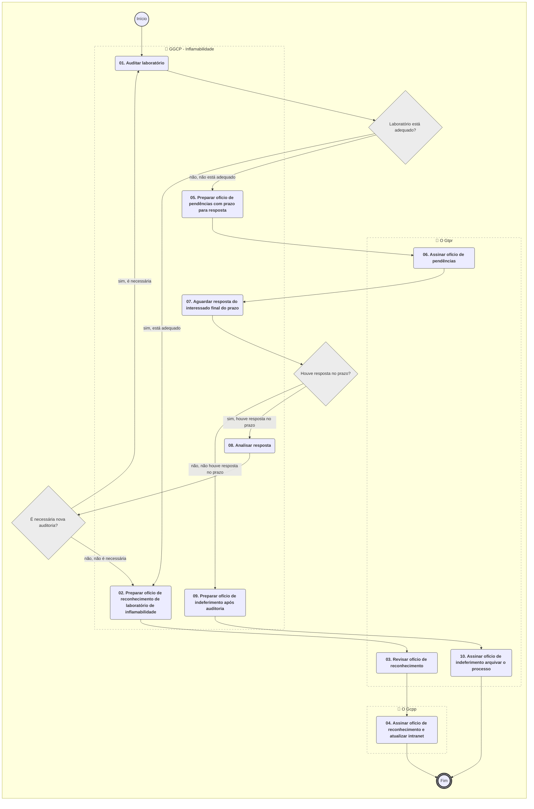

```mermaid
%%{init: {'theme': 'default'}}%%

flowchart TD
    classDef inicio stroke:#333,stroke-width:2px;
    classDef fim stroke:#333,stroke-width:4px;
    classDef tarefaBPMN stroke:#333,stroke-width:1px;
    classDef gatewayBPMN fill:#ececec,stroke:#333,stroke-width:1px;
    classDef raia fill:none,stroke:#999,stroke-width:1px,stroke-dasharray: 5 5;
    subgraph Container_ID_MPR_SAR_122_R01_0 [ ]
        direction TB
        ID_MPR_SAR_122_R01_0_Start((Início)):::inicio
        ID_MPR_SAR_122_R01_0_End(((Fim))):::fim
        subgraph Raia_ID_MPR_SAR_122_R01_0_1 [👤 O Gtpr]
            ID_MPR_SAR_122_R01_0_01("<b>01. Avaliar pertinência</b>"):::tarefaBPMN
            ID_MPR_SAR_122_R01_0_03("<b>03. Assinar ofício de indeferimento e arquivar o processo</b>"):::tarefaBPMN
            ID_MPR_SAR_122_R01_0_06("<b>06. Assinar ofício de pendências e sobrestar o processo</b>"):::tarefaBPMN
            ID_MPR_SAR_122_R01_0_03("<b>03. Revisar ofício de reconhecimento</b>"):::tarefaBPMN
            ID_MPR_SAR_122_R01_0_06("<b>06. Assinar ofício de pendências</b>"):::tarefaBPMN
            ID_MPR_SAR_122_R01_0_10("<b>10. Assinar ofício de indeferimento arquivar o processo</b>"):::tarefaBPMN
        end
        class Raia_ID_MPR_SAR_122_R01_0_1 raia;
        subgraph Raia_ID_MPR_SAR_122_R01_0_2 [👤 GGCP - Inflamabilidade]
            ID_MPR_SAR_122_R01_0_02("<b>02. Preparar ofício de indeferimento sem necessidade de auditoria</b>"):::tarefaBPMN
            ID_MPR_SAR_122_R01_0_04("<b>04. Analisar documentação</b>"):::tarefaBPMN
            ID_MPR_SAR_122_R01_0_05("<b>05. Preparar ofício de pendências com prazo para resposta</b>"):::tarefaBPMN
            ID_MPR_SAR_122_R01_0_01("<b>01. Auditar laboratório</b>"):::tarefaBPMN
            ID_MPR_SAR_122_R01_0_02("<b>02. Preparar ofício de reconhecimento de laboratório de inflamabilidade</b>"):::tarefaBPMN
            ID_MPR_SAR_122_R01_0_05("<b>05. Preparar ofício de pendências com prazo para resposta</b>"):::tarefaBPMN
            ID_MPR_SAR_122_R01_0_07("<b>07. Aguardar resposta do interessado final do prazo</b>"):::tarefaBPMN
            ID_MPR_SAR_122_R01_0_08("<b>08. Analisar resposta</b>"):::tarefaBPMN
            ID_MPR_SAR_122_R01_0_09("<b>09. Preparar ofício de indeferimento após auditoria</b>"):::tarefaBPMN
        end
        class Raia_ID_MPR_SAR_122_R01_0_2 raia;
        subgraph Raia_ID_MPR_SAR_122_R01_0_3 [👤 O Gcpp]
            ID_MPR_SAR_122_R01_0_04("<b>04. Assinar ofício de reconhecimento e atualizar intranet</b>"):::tarefaBPMN
        end
        class Raia_ID_MPR_SAR_122_R01_0_3 raia;
        ID_MPR_SAR_122_R01_0_Start --> ID_MPR_SAR_122_R01_0_01
        gw_ID_MPR_SAR_122_R01_0_01{"A solicitação é pertinente?"}:::gatewayBPMN
        ID_MPR_SAR_122_R01_0_01 --> gw_ID_MPR_SAR_122_R01_0_01
        gw_ID_MPR_SAR_122_R01_0_01 -->|"sim, é pertinente"| ID_MPR_SAR_122_R01_0_04
        gw_ID_MPR_SAR_122_R01_0_01 -->|"não, não é pertinente"| ID_MPR_SAR_122_R01_0_02
        ID_MPR_SAR_122_R01_0_02 --> ID_MPR_SAR_122_R01_0_03
        ID_MPR_SAR_122_R01_0_03 --> ID_MPR_SAR_122_R01_0_End
        gw_ID_MPR_SAR_122_R01_0_04{"Documentação está completa/adequada?"}:::gatewayBPMN
        ID_MPR_SAR_122_R01_0_04 --> gw_ID_MPR_SAR_122_R01_0_04
        gw_ID_MPR_SAR_122_R01_0_04 -->|"sim, está completa/adequada"| ID_MPR_SAR_122_R01_0_End
        gw_ID_MPR_SAR_122_R01_0_04 -->|"não, não está completa/adequada"| ID_MPR_SAR_122_R01_0_05
        ID_MPR_SAR_122_R01_0_05 --> ID_MPR_SAR_122_R01_0_06
        ID_MPR_SAR_122_R01_0_06 --> ID_MPR_SAR_122_R01_0_End
        gw_ID_MPR_SAR_122_R01_0_01{"Laboratório está adequado?"}:::gatewayBPMN
        ID_MPR_SAR_122_R01_0_01 --> gw_ID_MPR_SAR_122_R01_0_01
        gw_ID_MPR_SAR_122_R01_0_01 -->|"não, não está adequado"| ID_MPR_SAR_122_R01_0_05
        gw_ID_MPR_SAR_122_R01_0_01 -->|"sim, está adequado"| ID_MPR_SAR_122_R01_0_02
        ID_MPR_SAR_122_R01_0_02 --> ID_MPR_SAR_122_R01_0_03
        ID_MPR_SAR_122_R01_0_03 --> ID_MPR_SAR_122_R01_0_04
        ID_MPR_SAR_122_R01_0_04 --> ID_MPR_SAR_122_R01_0_End
        ID_MPR_SAR_122_R01_0_05 --> ID_MPR_SAR_122_R01_0_06
        ID_MPR_SAR_122_R01_0_06 --> ID_MPR_SAR_122_R01_0_07
        gw_ID_MPR_SAR_122_R01_0_07{"Houve resposta no prazo?"}:::gatewayBPMN
        ID_MPR_SAR_122_R01_0_07 --> gw_ID_MPR_SAR_122_R01_0_07
        gw_ID_MPR_SAR_122_R01_0_07 -->|"sim, houve resposta no prazo"| ID_MPR_SAR_122_R01_0_08
        gw_ID_MPR_SAR_122_R01_0_07 -->|"não, não houve resposta no prazo"| ID_MPR_SAR_122_R01_0_09
        gw_ID_MPR_SAR_122_R01_0_08{"É necessária nova auditoria?"}:::gatewayBPMN
        ID_MPR_SAR_122_R01_0_08 --> gw_ID_MPR_SAR_122_R01_0_08
        gw_ID_MPR_SAR_122_R01_0_08 -->|"sim, é necessária"| ID_MPR_SAR_122_R01_0_01
        gw_ID_MPR_SAR_122_R01_0_08 -->|"não, não é necessária"| ID_MPR_SAR_122_R01_0_02
        ID_MPR_SAR_122_R01_0_09 --> ID_MPR_SAR_122_R01_0_10
        ID_MPR_SAR_122_R01_0_10 --> ID_MPR_SAR_122_R01_0_End
    end
    click ID_MPR_SAR_122_R01_0_01 href "#" "A solicitação de reconhecimento de laboratório de inflamabilidade que foi recebida pode ser inicial, ou em resposta a um Ofício de Pendências.  Caso seja documento de envio inicial, deverá receber análise completa, podendo ser pertinente ou não pertinente. Se for considerada pertinente, verificar o pagamento de TFAC vigente e enviar para o corpo técnico, para sua análise. Se for considerada não pertinente, essa condição deverá ser informada à empresa ou organização solicitante, por meio de ofício individualizado, e o processo arquivado. DOCUMENTOS E PROCESSOS ADMINISTRATIVOS ELABORADOS NESTA ATIVIDADE:  1. Laboratório de Inflamabilidade  1.1. Laboratório de Inflamabilidade - Oficio de Pendências (Ofício)"
    click ID_MPR_SAR_122_R01_0_02 href "#" "Nesse caso o GTPR avaliou que a solicitação não é pertinente. Então deve-se preparar um oficio informando as razões para o indeferimento da solicitação de reconhecimento como laboratório de inflamabilidade. Caso a solicitação seja pertinente para outro tipo de certificação da ANAC deve-se informar ao requerente de como proceder. DOCUMENTOS E PROCESSOS ADMINISTRATIVOS ELABORADOS NESTA ATIVIDADE:  1. Laboratório de Inflamabilidade - Comunic ao Requerente  1.1. Oficio de Comunicação com o Requerente (Ofício)"
    click ID_MPR_SAR_122_R01_0_03 href "#" "Revisar oficio de indeferimento e assinar. Enviar oficio ao requerente, encerrar e arquivar o processo."
    click ID_MPR_SAR_122_R01_0_04 href "#" "Junto à carta de requerimento deve vir o Manual do Laboratório de Inflamabilidade da empresa, o qual deve demonstrar o cumprimento com os requisitos das instalações físicas e dos procedimentos de ensaio.  O Manual do Laboratório de Inflamabilidade da empresa deve conter no mínimo as seguintes Informações:  • Endereço do laboratório. (com detalhes do tipo, prédio nº, bloco nº, sala nº).  • Descrição dos ensaios que serão realizados pelo Laboratório. (Exemplo: Ensaio Horizontal, Ensaios Vertical 12 segundos, etc);  • Descrição dos equipamentos utilizados no laboratório, de preferência incluindo fotos; (Exemplo: Câmara de ensaio, queimador, suportes, Instrumentos de medição, etc.);  • Descrição do local de acondicionamento (de preferência incluindo fotos), contendo o sistema utilizado para garantir o controle e registro de temperatura e umidade do acondicionamento dos corpos de prova antes do ensaio;  • Descrição do tipo de combustível a ser utilizado nos ensaios, e como será feito o controle de vazão/Pressão;  • Procedimentos do Laboratório de Inflamabilidade. (Exemplo: procedimentos para realização dos ensaios, procedimento para controle e identificação dos corpos de prova; etc);  • Relação dos Recursos Humanos do Laboratório descrevendo função/responsabilidade.  • Documentos / Formulários utilizados para o registro intermediário e registro dos resultados dos ensaios de inflamabilidade.  • Modelo que será utilizado como Certificado de Análise para emissão dos resultados dos ensaios de inflamabilidade (laudo de inflamabilidade - ver item 6.2 da CI nº 21-019A).  • Se o laboratório for parte de uma organização, encaminhar um organograma identificando a posição do laboratório dentro da estrutura organizacional.  Os requisitos para as instalações físicas, procedimentos e certificado de análise (Laudo de Inflamabilidade) encontram-se nos documentos de referência abaixo:  - Circular de Informação CI nº 21-019A - Substituição de Tecidos, espumas e tapetes em interiores de aeronaves. (disponível em: http://www2.anac.gov.br/certificacao/CI/CI.asp );  - RBAC 23, requisitos 23.853, 23.855, 23.1359 e respectivo Apêndice F (disponível em: http://www2.anac.gov.br/biblioteca/rbha.asp );  - RBAC 25, requisitos 25.853, 25.855 e respectivo Apêndice F (disponível em: http://www2.anac.gov.br/biblioteca/rbha.asp );  - DOT/FAA/AR-00/12 - Aircraft Materials Fire test Handbook (disponível em: http://www.fire.tc.faa.gov/handbook.stm)  O resultado da análise deve ser documentado no formulário Relatório de Adequação da Documentação Técnica - F-300-31C, última revisão, denominado 'Relatório de Adequação da Documentação Técnica'."
    click ID_MPR_SAR_122_R01_0_05 href "#" "Colocar em oficio claramente as pendências observadas na análise documental e o prazo de resposta. Deixar claro que se não houver resposta dentro do prazo o processo será encerrado."
    click ID_MPR_SAR_122_R01_0_06 href "#" "Revisar oficio de pendências e assinar. Enviar oficio ao requerente e arquivar o processo."
    click ID_MPR_SAR_122_R01_0_01 href "#" "Após a análise do Manual do Laboratório, correção de pendências (se necessário), será agendada uma auditoria no laboratório e análise “in loco” dos procedimentos declarados."
    click ID_MPR_SAR_122_R01_0_02 href "#" "Elaborar oficio de reconhecimento do laboratório de inflamabilidade. Submeter ao GTPR para revisão/aprovação. DOCUMENTOS E PROCESSOS ADMINISTRATIVOS ELABORADOS NESTA ATIVIDADE:  1. Laboratório de Inflamabilidade - Oficio de Reconhecimento  1.1. Oficio de Reconhecimento de Laboratóerio de Inflamabilidade (Ofício)"
    click ID_MPR_SAR_122_R01_0_03 href "#" "Revisar o ofício de reconhecimento do laboratório de inflamabilidade, interagir com a área técnica se necessário até o documento estar pronto para submeter ao GCPP."
    click ID_MPR_SAR_122_R01_0_04 href "#" "Verificar as informações contidas no oficio; interagir com a área técnica se necessário. Assinar o documento e adicionar o laboratório na página da ANAC na seção de Laboratórios Reconhecidos, endereço eletrônico: (http://www2.anac.gov.br/certificacao/Organizacao/Empresas.asp?StatCodi=14)"
    click ID_MPR_SAR_122_R01_0_05 href "#" "Colocar em ofício claramente as pendências observadas na auditoria 'in loco' e o prazo de resposta. Deixar claro que se não houver resposta dentro do prazo o processo será encerrado. Submeter ao GTPR."
    click ID_MPR_SAR_122_R01_0_06 href "#" "Revisar o ofício de pendências, interagindo com a área técnica se necessário, e assinar."
    click ID_MPR_SAR_122_R01_0_07 href "#" "Monitorar prazo de resposta. Caso ela não chegue no prazo, então disparar preparação do ofício de indeferimento por falta de resposta no prazo."
    click ID_MPR_SAR_122_R01_0_08 href "#" "Verificar se as respostas às pendências apontadas estão adequadas. Avaliar se há necessidade de nova auditoria, ou seja, se há necessidade de verificar “in loco” os procedimentos declarados."
    click ID_MPR_SAR_122_R01_0_09 href "#" "Elaborar ofício de indeferimento devido à falta de resposta do requerente dentro prazo dado."
    click ID_MPR_SAR_122_R01_0_10 href "#" "Revisar ofício de indeferimento e assinar. Enviar ofício ao requerente, encerrar e arquivar o processo."
```

**MANUAL DE PROCEDIMENTO**

**MPR/SAR-122-R01**

**LABORATÓRIO DE INFLAMABILIDADE**

01/2020

**REVISÕES**

|  |  |  |  |  |
| --- | --- | --- | --- | --- |
| **Revisão** | **Aprovação** | **Publicação** | **Aprovado Por** | **Modificações da Última Versão** |
| R00 | Portaria Nº 518, de 14 de Fevereiro de 2017 | Não informado | SAR | Versão Original |
| R01 | PORTARIA Nº 238, DE 24 DE JANEIRO DE 2020. | Não informado | SAR | 1) Processo 'Analisar Solicitação de Reconhecimento de Laboratório de Inflamabilidade' modificado.  2) Processo 'Auditar Laboratório de Inflamabilidade' modificado. |

**ÍNDICE**

1) Disposições Preliminares, pág. 5.

1.1) Introdução, pág. 5.

1.2) Revogação, pág. 5.

1.3) Fundamentação, pág. 6.

1.4) Executores dos Processos, pág. 6.

1.5) Elaboração e Revisão, pág. 6.

1.6) Organização do Documento, pág. 6.

2) Definições, pág. 8.

2.1) Expressão, pág. 8.

2.2) Sigla, pág. 8.

3) Artefatos, Competências, Sistemas e Documentos Administrativos, pág. 9.

3.1) Artefatos, pág. 9.

3.2) Competências, pág. 9.

3.3) Sistemas, pág. 9.

3.4) Documentos e Processos Administrativos, pág. 10.

4) Procedimentos Referenciados, pág. 11.

5) Procedimentos, pág. 12.

5.1) Analisar Solicitação de Reconhecimento de Laboratório de Inflamabilidade, pág. 12.

5.2) Auditar Laboratório de Inflamabilidade, pág. 17.

6) Disposições Finais, pág. 22.

**PARTICIPAÇÃO NA EXECUÇÃO DOS PROCESSOS**

**GRUPOS ORGANIZACIONAIS**

**a) GGCP - Inflamabilidade**

1) Analisar Solicitação de Reconhecimento de Laboratório de Inflamabilidade

2) Auditar Laboratório de Inflamabilidade

**b) O Gcpp**

1) Auditar Laboratório de Inflamabilidade

**c) O Gtpr**

1) Analisar Solicitação de Reconhecimento de Laboratório de Inflamabilidade

2) Auditar Laboratório de Inflamabilidade

**1. DISPOSIÇÕES PRELIMINARES**

**1.1 INTRODUÇÃO**

Procedimentos para reconhecimento e auditoria de laboratórios de inflamabilidade.

1.1.1 Papéis e Responsabilidades

É competência da Superintendência de Aeronavegabilidade - SAR, definida no Regimento Interno da ANAC, emitir, suspender e extinguir outros atestados, aprovações e autorizações relativas às atividades em seu âmbito de atuação.

É competência delegada à GGCP, definida em portaria emitir, suspender e extinguir outros atestados, aprovações e autorizações relativas às atividades em seu âmbito de atuação.

Cabe ao GCPR avaliar a pertinência e emitir os documentos de comunicação a respeito do andamento do processo.

Cabe ao grupo GGCP - Inflamabilidade analisar as solicitações de reconhecimento de Laboratórios de testes de inflamabilidade e auditar os laboratórios reconhecidos quando aplicável.

1.1.2 Política e Diretrizes

Para a realização destes processos é importante conhecer as diretrizes definidas na Circular de Informação – CI 21-019, ou documento equivalente que venha a substituí-la, para a confecção do relatório de ensaio emitido para o laboratório.

Também será objeto da análise se o Laboratório de Teste de Inflamabilidade atende aos requisitos na forma descrita nas AC 23-2, 25-17 e 25.853-1 da FAA ou equivalente.

Estas medidas visam a simplificação do processo de aprovação de modificação para as substituições de materiais de forração de interiores. Qualquer alteração destas políticas pode comprometer a eficiência do processo.

1.1.3 Processo

O MPR estabelece, no âmbito da Superintendência de Aeronavegabilidade - SAR, os seguintes processos de trabalho:

a) Analisar Solicitação de Reconhecimento de Laboratório de Inflamabilidade.

b) Auditar Laboratório de Inflamabilidade.

**1.2 REVOGAÇÃO**

MPR/SAR-122-R00, aprovado na data de 14 de fevereiro de 2017.

**1.3 FUNDAMENTAÇÃO**

Resolução nº 381, art. 31, de 14 de junho de 2016.

**1.4 EXECUTORES DOS PROCESSOS**

Os procedimentos contidos neste documento aplicam-se aos servidores integrantes das seguintes áreas organizacionais:

|  |  |
| --- | --- |
| **Grupo Organizacional** | **Descrição** |
| GGCP - Inflamabilidade | Servidores que atuam de forma coordenada para a realização dos processos relacionados ao reconhecimento de Laboratórios de Inflamabilidade. |
| O GCPP | Gerente de Certificação de Projeto de Produto Aeronáutico |
| O GTPR | Gerente Técnico de Programas de Certificação |

**1.5 ELABORAÇÃO E REVISÃO**

O processo que resulta na aprovação ou alteração deste MPR é de responsabilidade da Superintendência de Aeronavegabilidade - SAR. Em caso de sugestões de revisão, deve-se procurá-la para que sejam iniciadas as providências cabíveis.

As revisões deste MPR serão aprovadas pelo(s) titular(es) da(s) unidade(s) responsável(is) pela execução do(s) processo(s) nele listado(s).

**1.6 ORGANIZAÇÃO DO DOCUMENTO**

O capítulo 2 apresenta as principais definições utilizadas no âmbito deste MPR, e deve ser visto integralmente antes da leitura de capítulos posteriores.

O capítulo 3 apresenta as competências, os artefatos e os sistemas envolvidos na execução dos processos deste manual, em ordem relativamente cronológica.

O capítulo 4 apresenta os processos de trabalho referenciados neste MPR. Estes processos são publicados em outros manuais que não este, mas cuja leitura é essencial para o entendimento dos processos publicados neste manual. O capítulo 4 expõe em quais manuais são localizados cada um dos processos de trabalho referenciados.

O capítulo 5 apresenta os processos de trabalho. Para encontrar um processo específico, deve-se procurar sua respectiva página no índice contido no início do documento. Os processos estão ordenados em etapas. Cada etapa é contida em uma tabela, que possui em si todas as informações necessárias para sua realização. São elas, respectivamente:

a) o título da etapa;

b) a descrição da forma de execução da etapa;

c) as competências necessárias para a execução da etapa;

d) os artefatos necessários para a execução da etapa;

e) os sistemas necessários para a execução da etapa (incluindo, bases de dados em forma de arquivo, se existente);

f) os documentos e processos administrativos que precisam ser elaborados durante a execução da etapa;

g) instruções para as próximas etapas; e

h) as áreas ou grupos organizacionais responsáveis por executar a etapa.

O capítulo 6 apresenta as disposições finais do documento, que trata das ações a serem realizadas em casos não previstos.

Por último, é importante comunicar que este documento foi gerado automaticamente. São recuperados dados sobre as etapas e sua sequência, as definições, os grupos, as áreas organizacionais, os artefatos, as competências, os sistemas, entre outros, para os processos de trabalho aqui apresentados, de forma que alguma mecanicidade na apresentação das informações pode ser percebida. O documento sempre apresenta as informações mais atualizadas de nomes e siglas de grupos, áreas, artefatos, termos, sistemas e suas definições, conforme informação disponível na base de dados, independente da data de assinatura do documento. Informações sobre etapas, seu detalhamento, a sequência entre etapas, responsáveis pelas etapas, artefatos, competências e sistemas associados a etapas, assim como seus nomes e os nomes de seus processos têm suas definições idênticas à da data de assinatura do documento.

**2. DEFINIÇÕES**

As tabelas abaixo apresentam as definições necessárias para o entendimento deste Manual de Procedimento, separadas pelo tipo.

**2.1 Expressão**

|  |  |
| --- | --- |
| **Definição** | **Significado** |
| CI/IS | Circular de Informação - Documento utilizado pelo FDH, órgão responsável pela certificação de produtos aeronáuticos antes da criação da ANAC, equivalente as AC - Advisory Circular da FAA. |

**2.2 Sigla**

|  |  |
| --- | --- |
| **Definição** | **Significado** |
| ANAC | Agência Nacional de Aviação Civil |
| FAA | Federal Aviation Administration |
| GFT | Sistema Gerenciador de Fluxos de Trabalho. |
| GGCP | Gerência-Geral de Certificação de Produto Aeronáutico |
| MPR | Manual de Procedimento – Documento de caráter disciplinador, de âmbito interno, assinado e aprovado por autoridade competente, que tem como objetivo documentar e padronizar os processos de trabalho realizados pelos agentes da ANAC. Possui informações sobre o fluxo de trabalho, detalhamento das etapas, competências necessárias, artefatos a serem utilizados, sistemas de apoio e áreas responsáveis pela execução. |
| RBAC | Regulamento Brasileiro da Aviação Civil |
| SAR | Superintendência de Aeronavegabilidade |
| TFAC | Taxa de Fiscalização da Aviação Civil |

**3. ARTEFATOS, COMPETÊNCIAS, SISTEMAS E DOCUMENTOS ADMINISTRATIVOS**

Abaixo se encontram as listas dos artefatos, competências, sistemas e documentos administrativos que o executor necessita consultar, preencher, analisar ou elaborar para executar os processos deste MPR. As etapas descritas no capítulo seguinte indicam onde usar cada um deles.

As competências devem ser adquiridas por meio de capacitação ou outros instrumentos e os artefatos se encontram no módulo "Artefatos" do sistema GFT - Gerenciador de Fluxos de Trabalho.

**3.1 ARTEFATOS**

|  |  |
| --- | --- |
| **Nome** | **Descrição** |
| Relatório de Adequação da Documentação Técnica - F-300-31C | Formulário para relatório de adequação da documentação técnica. |

**3.2 COMPETÊNCIAS**

Para que os processos de trabalho contidos neste MPR possam ser realizados com qualidade e efetividade, é importante que as pessoas que venham a executá-los possuam um determinado conjunto de competências. No capítulo 5, as competências específicas que o executor de cada etapa de cada processo de trabalho deve possuir são apresentadas. A seguir, encontra-se uma lista geral das competências contidas em todos os processos de trabalho deste MPR e a indicação de qual área ou grupo organizacional as necessitam:

|  |  |
| --- | --- |
| **Competência** | **Áreas e Grupos** |
| Analisa solicitação de reconhecimento de laboratório de inflamabilidade de acordo com os regulamentos pertinentes. | GGCP - Inflamabilidade |
| Examina "in loco", após a análise do manual do laboratório de inflamabilidade e eventual correção de pendências, utilizando as técnicas apropriadas de auditoria. | GGCP - Inflamabilidade |

**3.3 SISTEMAS**

Não há sistemas descritos para a realização deste MPR.

**3.4 DOCUMENTOS E PROCESSOS ADMINISTRATIVOS ELABORADOS NESTE MANUAL**

|  |  |  |  |
| --- | --- | --- | --- |
| **Nome do Documento** | **Tipo do Documento** | **Processo Administrativo** | **Tipo do Processo Administrativo** |
| Laboratório de Inflamabilidade - Oficio de Pendências | Ofício | Laboratório de Inflamabilidade | certificação de produto: organizações de produção - auditoria em fornecedor |
| Oficio de Comunicação com o Requerente | Ofício | Laboratório de Inflamabilidade - Comunic ao Requerente | certificação de produto: organizações de produção - certificação |
| Oficio de Reconhecimento de Laboratóerio de Inflamabilidade | Ofício | Laboratório de Inflamabilidade - Oficio de Reconhecimento | certificação de produto: organizações de produção - certificação |

**4. PROCEDIMENTOS REFERENCIADOS**

Procedimentos referenciados são processos de trabalho publicados em outro MPR que têm relação com os processos de trabalho publicados por este manual. Este MPR não possui nenhum processo de trabalho referenciado.

**5. PROCEDIMENTOS**

Este capítulo apresenta todos os processos de trabalho deste MPR. Para encontrar um processo específico, utilize o índice nas páginas iniciais deste documento. Ao final de cada etapa encontram-se descritas as orientações necessárias à continuidade da execução do processo. O presente MPR também está disponível de forma mais conveniente em versão eletrônica, onde pode(m) ser obtido(s) o(s) artefato(s) e outras informações sobre o processo.

**5.1 Analisar Solicitação de Reconhecimento de Laboratório de Inflamabilidade**

Processo de análise de solicitação para o Reconhecimento de Laboratório de Inflamabilidade realizado na GTAI/SAR.

O processo contém, ao todo, 6 etapas. A situação que inicia o processo, chamada de evento de início, foi descrita como: "Solicitação de reconhecimento de laboratório de inflamabilidade recebida", portanto, este processo deve ser executado sempre que este evento acontecer. O solicitante deve seguir a seguinte instrução: 'Laboratório ou organização solicita reconhecimento como laboratório de inflamabilidade'.

O processo é considerado concluído quando alcança algum de seus eventos de fim. Os eventos de fim descritos para esse processo são:

a) Ofício de indeferimento assinado e processo arquivado.

b) Necessidade de auditoria em laboratório de inflamabilidade identificada.

c) Ofício de pendências assinado e processo sobrestado.

Os grupos envolvidos na execução deste processo são: GGCP - Inflamabilidade, O GTPR.

Para que este processo seja executado de forma apropriada, é necessário que o(s) executor(es) possuam a seguinte competência: (1) Analisa solicitação de reconhecimento de laboratório de inflamabilidade de acordo com os regulamentos pertinentes.

Também será necessário o uso do seguinte artefato: "Relatório de Adequação da Documentação Técnica - F-300-31C".

Abaixo se encontra(m) a(s) etapa(s) a ser(em) realizada(s) na execução deste processo e o diagrama do fluxo.

### 5.1 Analisar Solicitação de Reconhecimento de Laboratório de Inflamabilidade

|  |
| --- |
| **01. Avaliar pertinência** |
| RESPONSÁVEL PELA EXECUÇÃO: O Gtpr. |
| DETALHAMENTO: A solicitação de reconhecimento de laboratório de inflamabilidade que foi recebida pode ser inicial, ou em resposta a um Ofício de Pendências.  Caso seja documento de envio inicial, deverá receber análise completa, podendo ser pertinente ou não pertinente. Se for considerada pertinente, verificar o pagamento de TFAC vigente e enviar para o corpo técnico, para sua análise. Se for considerada não pertinente, essa condição deverá ser informada à empresa ou organização solicitante, por meio de ofício individualizado, e o processo arquivado. |
| DOCUMENTOS E PROCESSOS ADMINISTRATIVOS ELABORADOS NESTA ATIVIDADE:  1. Laboratório de Inflamabilidade  1.1. Laboratório de Inflamabilidade - Oficio de Pendências (Ofício) |
| CONTINUIDADE: caso a resposta para a pergunta "A solicitação é pertinente?" seja "sim, é pertinente", deve-se seguir para a etapa "04. Analisar documentação". Caso a resposta seja "não, não é pertinente", deve-se seguir para a etapa "02. Preparar ofício de indeferimento sem necessidade de auditoria". |

|  |
| --- |
| **02. Preparar ofício de indeferimento sem necessidade de auditoria** |
| RESPONSÁVEL PELA EXECUÇÃO: GGCP - Inflamabilidade. |
| DETALHAMENTO: Nesse caso o GTPR avaliou que a solicitação não é pertinente. Então deve-se preparar um oficio informando as razões para o indeferimento da solicitação de reconhecimento como laboratório de inflamabilidade. Caso a solicitação seja pertinente para outro tipo de certificação da ANAC deve-se informar ao requerente de como proceder. |
| DOCUMENTOS E PROCESSOS ADMINISTRATIVOS ELABORADOS NESTA ATIVIDADE:  1. Laboratório de Inflamabilidade - Comunic ao Requerente  1.1. Oficio de Comunicação com o Requerente (Ofício) |
| CONTINUIDADE: deve-se seguir para a etapa "03. Assinar ofício de indeferimento e arquivar o processo". |

|  |
| --- |
| **03. Assinar ofício de indeferimento e arquivar o processo** |
| RESPONSÁVEL PELA EXECUÇÃO: O Gtpr. |
| DETALHAMENTO: Revisar oficio de indeferimento e assinar. Enviar oficio ao requerente, encerrar e arquivar o processo. |
| CONTINUIDADE: esta etapa finaliza o procedimento. |

|  |
| --- |
| **04. Analisar documentação** |
| RESPONSÁVEL PELA EXECUÇÃO: GGCP - Inflamabilidade. |
| DETALHAMENTO: Junto à carta de requerimento deve vir o Manual do Laboratório de Inflamabilidade da empresa, o qual deve demonstrar o cumprimento com os requisitos das instalações físicas e dos procedimentos de ensaio.  O Manual do Laboratório de Inflamabilidade da empresa deve conter no mínimo as seguintes Informações:  • Endereço do laboratório. (com detalhes do tipo, prédio nº, bloco nº, sala nº).  • Descrição dos ensaios que serão realizados pelo Laboratório. (Exemplo: Ensaio Horizontal, Ensaios Vertical 12 segundos, etc);  • Descrição dos equipamentos utilizados no laboratório, de preferência incluindo fotos; (Exemplo: Câmara de ensaio, queimador, suportes, Instrumentos de medição, etc.);  • Descrição do local de acondicionamento (de preferência incluindo fotos), contendo o sistema utilizado para garantir o controle e registro de temperatura e umidade do acondicionamento dos corpos de prova antes do ensaio;  • Descrição do tipo de combustível a ser utilizado nos ensaios, e como será feito o controle de vazão/Pressão;  • Procedimentos do Laboratório de Inflamabilidade. (Exemplo: procedimentos para realização dos ensaios, procedimento para controle e identificação dos corpos de prova; etc);  • Relação dos Recursos Humanos do Laboratório descrevendo função/responsabilidade.  • Documentos / Formulários utilizados para o registro intermediário e registro dos resultados dos ensaios de inflamabilidade.  • Modelo que será utilizado como Certificado de Análise para emissão dos resultados dos ensaios de inflamabilidade (laudo de inflamabilidade - ver item 6.2 da CI nº 21-019A).  • Se o laboratório for parte de uma organização, encaminhar um organograma identificando a posição do laboratório dentro da estrutura organizacional.  Os requisitos para as instalações físicas, procedimentos e certificado de análise (Laudo de Inflamabilidade) encontram-se nos documentos de referência abaixo:  - Circular de Informação CI nº 21-019A - Substituição de Tecidos, espumas e tapetes em interiores de aeronaves. (disponível em: http://www2.anac.gov.br/certificacao/CI/CI.asp );  - RBAC 23, requisitos 23.853, 23.855, 23.1359 e respectivo Apêndice F (disponível em: http://www2.anac.gov.br/biblioteca/rbha.asp );  - RBAC 25, requisitos 25.853, 25.855 e respectivo Apêndice F (disponível em: http://www2.anac.gov.br/biblioteca/rbha.asp );  - DOT/FAA/AR-00/12 - Aircraft Materials Fire test Handbook (disponível em: http://www.fire.tc.faa.gov/handbook.stm)  O resultado da análise deve ser documentado no formulário Relatório de Adequação da Documentação Técnica - F-300-31C, última revisão, denominado "Relatório de Adequação da Documentação Técnica". |
| COMPETÊNCIAS:  - Analisa solicitação de reconhecimento de laboratório de inflamabilidade de acordo com os regulamentos pertinentes. |
| ARTEFATOS USADOS NESTA ATIVIDADE: Relatório de Adequação da Documentação Técnica - F-300-31C. |
| CONTINUIDADE: caso a resposta para a pergunta "Documentação está completa/adequada?" seja "sim, está completa/adequada", esta etapa finaliza o procedimento. Caso a resposta seja "não, não está completa/adequada", deve-se seguir para a etapa "05. Preparar ofício de pendências com prazo para resposta". |

|  |
| --- |
| **05. Preparar ofício de pendências com prazo para resposta** |
| RESPONSÁVEL PELA EXECUÇÃO: GGCP - Inflamabilidade. |
| DETALHAMENTO: Colocar em oficio claramente as pendências observadas na análise documental e o prazo de resposta. Deixar claro que se não houver resposta dentro do prazo o processo será encerrado. |
| CONTINUIDADE: deve-se seguir para a etapa "06. Assinar ofício de pendências e sobrestar o processo". |

|  |
| --- |
| **06. Assinar ofício de pendências e sobrestar o processo** |
| RESPONSÁVEL PELA EXECUÇÃO: O Gtpr. |
| DETALHAMENTO: Revisar oficio de pendências e assinar. Enviar oficio ao requerente e arquivar o processo. |
| CONTINUIDADE: esta etapa finaliza o procedimento. |

**5.2 Auditar Laboratório de Inflamabilidade**

Após o reconhecimento de um laboratório de inflamabilidade, a manutenção das condições de reconhecimento é verificada através de auditoria no laboratório.

O processo contém, ao todo, 10 etapas. A situação que inicia o processo, chamada de evento de início, foi descrita como: "Necessidade de auditoria em laboratório de inflamabilidade identificada", portanto, este processo deve ser executado sempre que este evento acontecer. O solicitante deve seguir a seguinte instrução: 'A necessidade de auditoria em laboratório de inflamabilidade foi identificada num possível evento de fim do processo de trabalho Analisar Solicitação de Reconhecimento de Laboaratório de Inflamabilidade'.

O processo é considerado concluído quando alcança algum de seus eventos de fim. Os eventos de fim descritos para esse processo são:

a) Ofício de indeferimento assinado e processo arquivado.

b) Ofício de reconhecimento assinado e intranet atualizada.

Os grupos envolvidos na execução deste processo são: GGCP - Inflamabilidade, O GCPP, O GTPR.

Para que este processo seja executado de forma apropriada, é necessário que o(s) executor(es) possuam a seguinte competência: (1) Examina "in loco", após a análise do manual do laboratório de inflamabilidade e eventual correção de pendências, utilizando as técnicas apropriadas de auditoria.

Abaixo se encontra(m) a(s) etapa(s) a ser(em) realizada(s) na execução deste processo e o diagrama do fluxo.

### 5.1 Analisar Solicitação de Reconhecimento de Laboratório de Inflamabilidade

|  |
| --- |
| **01. Auditar laboratório** |
| RESPONSÁVEL PELA EXECUÇÃO: GGCP - Inflamabilidade. |
| DETALHAMENTO: Após a análise do Manual do Laboratório, correção de pendências (se necessário), será agendada uma auditoria no laboratório e análise “in loco” dos procedimentos declarados. |
| COMPETÊNCIAS:  - Examina "in loco", após a análise do manual do laboratório de inflamabilidade e eventual correção de pendências, utilizando as técnicas apropriadas de auditoria. |
| CONTINUIDADE: caso a resposta para a pergunta "Laboratório está adequado?" seja "não, não está adequado", deve-se seguir para a etapa "05. Preparar ofício de pendências com prazo para resposta". Caso a resposta seja "sim, está adequado", deve-se seguir para a etapa "02. Preparar ofício de reconhecimento de laboratório de inflamabilidade". |

|  |
| --- |
| **02. Preparar ofício de reconhecimento de laboratório de inflamabilidade** |
| RESPONSÁVEL PELA EXECUÇÃO: GGCP - Inflamabilidade. |
| DETALHAMENTO: Elaborar oficio de reconhecimento do laboratório de inflamabilidade. Submeter ao GTPR para revisão/aprovação. |
| DOCUMENTOS E PROCESSOS ADMINISTRATIVOS ELABORADOS NESTA ATIVIDADE:  1. Laboratório de Inflamabilidade - Oficio de Reconhecimento  1.1. Oficio de Reconhecimento de Laboratóerio de Inflamabilidade (Ofício) |
| CONTINUIDADE: deve-se seguir para a etapa "03. Revisar ofício de reconhecimento". |

|  |
| --- |
| **03. Revisar ofício de reconhecimento** |
| RESPONSÁVEL PELA EXECUÇÃO: O Gtpr. |
| DETALHAMENTO: Revisar o ofício de reconhecimento do laboratório de inflamabilidade, interagir com a área técnica se necessário até o documento estar pronto para submeter ao GCPP. |
| CONTINUIDADE: deve-se seguir para a etapa "04. Assinar ofício de reconhecimento e atualizar intranet". |

|  |
| --- |
| **04. Assinar ofício de reconhecimento e atualizar intranet** |
| RESPONSÁVEL PELA EXECUÇÃO: O Gcpp. |
| DETALHAMENTO: Verificar as informações contidas no oficio; interagir com a área técnica se necessário. Assinar o documento e adicionar o laboratório na página da ANAC na seção de Laboratórios Reconhecidos, endereço eletrônico: (http://www2.anac.gov.br/certificacao/Organizacao/Empresas.asp?StatCodi=14) |
| CONTINUIDADE: esta etapa finaliza o procedimento. |

|  |
| --- |
| **05. Preparar ofício de pendências com prazo para resposta** |
| RESPONSÁVEL PELA EXECUÇÃO: GGCP - Inflamabilidade. |
| DETALHAMENTO: Colocar em ofício claramente as pendências observadas na auditoria "in loco" e o prazo de resposta. Deixar claro que se não houver resposta dentro do prazo o processo será encerrado. Submeter ao GTPR. |
| CONTINUIDADE: deve-se seguir para a etapa "06. Assinar ofício de pendências". |

|  |
| --- |
| **06. Assinar ofício de pendências** |
| RESPONSÁVEL PELA EXECUÇÃO: O Gtpr. |
| DETALHAMENTO: Revisar o ofício de pendências, interagindo com a área técnica se necessário, e assinar. |
| CONTINUIDADE: deve-se seguir para a etapa "07. Aguardar resposta do interessado final do prazo". |

|  |
| --- |
| **07. Aguardar resposta do interessado final do prazo** |
| RESPONSÁVEL PELA EXECUÇÃO: GGCP - Inflamabilidade. |
| DETALHAMENTO: Monitorar prazo de resposta. Caso ela não chegue no prazo, então disparar preparação do ofício de indeferimento por falta de resposta no prazo. |
| CONTINUIDADE: caso a resposta para a pergunta "Houve resposta no prazo?" seja "sim, houve resposta no prazo", deve-se seguir para a etapa "08. Analisar resposta". Caso a resposta seja "não, não houve resposta no prazo", deve-se seguir para a etapa "09. Preparar ofício de indeferimento após auditoria". |

|  |
| --- |
| **08. Analisar resposta** |
| RESPONSÁVEL PELA EXECUÇÃO: GGCP - Inflamabilidade. |
| DETALHAMENTO: Verificar se as respostas às pendências apontadas estão adequadas. Avaliar se há necessidade de nova auditoria, ou seja, se há necessidade de verificar “in loco” os procedimentos declarados. |
| CONTINUIDADE: caso a resposta para a pergunta "É necessária nova auditoria?" seja "sim, é necessária", deve-se seguir para a etapa "01. Auditar laboratório". Caso a resposta seja "não, não é necessária", deve-se seguir para a etapa "02. Preparar ofício de reconhecimento de laboratório de inflamabilidade". |

|  |
| --- |
| **09. Preparar ofício de indeferimento após auditoria** |
| RESPONSÁVEL PELA EXECUÇÃO: GGCP - Inflamabilidade. |
| DETALHAMENTO: Elaborar ofício de indeferimento devido à falta de resposta do requerente dentro prazo dado. |
| CONTINUIDADE: deve-se seguir para a etapa "10. Assinar ofício de indeferimento arquivar o processo". |

|  |
| --- |
| **10. Assinar ofício de indeferimento arquivar o processo** |
| RESPONSÁVEL PELA EXECUÇÃO: O Gtpr. |
| DETALHAMENTO: Revisar ofício de indeferimento e assinar. Enviar ofício ao requerente, encerrar e arquivar o processo. |
| CONTINUIDADE: esta etapa finaliza o procedimento. |

**6. DISPOSIÇÕES FINAIS**

Em caso de identificação de erros e omissões neste manual pelo executor do processo, a SAR deve ser contatada. Cópias eletrônicas deste manual, do fluxo e dos artefatos usados podem ser encontradas em sistema.