```mermaid
%%{init: {"theme": "neutral", "themeVariables": {"primaryColor": "#ffffff", "edgeLabelBackground": "#ffffff", "tertiaryColor": "#f4f4f4"}}}%%
flowchart TD
    classDef inicio stroke:#333,stroke-width:2px;
    classDef fim stroke:#333,stroke-width:4px;
    classDef tarefaBPMN stroke:#333,stroke-width:1px;
    classDef gatewayBPMN fill:#f9f9f9,stroke:#333,stroke-width:1px;
    classDef raia fill:none,stroke:#999,stroke-width:1px,stroke-dasharray: 5 5;
    subgraph Container_ID_MPR_SAR_122_R01_md_0 [ ]
        direction TB
        ID_MPR_SAR_122_R01_md_0_S((Início)):::inicio
        ID_MPR_SAR_122_R01_md_0_E(((Fim))):::fim
        ID_MPR_SAR_122_R01_md_0_01("<b>01. Avaliar pertinência</b><hr>Responsável: O Gtpr"):::tarefaBPMN
        ID_MPR_SAR_122_R01_md_0_02("<b>02. Preparar ofício de indeferimento sem necessidade de auditoria</b><hr>Responsável: GGCP - Inflamabilidade"):::tarefaBPMN
        ID_MPR_SAR_122_R01_md_0_03("<b>03. Assinar ofício de indeferimento e arquivar o processo</b><hr>Responsável: O Gtpr"):::tarefaBPMN
        ID_MPR_SAR_122_R01_md_0_04("<b>04. Analisar documentação</b><hr>Responsável: GGCP - Inflamabilidade"):::tarefaBPMN
        ID_MPR_SAR_122_R01_md_0_05("<b>05. Preparar ofício de pendências com prazo para resposta</b><hr>Responsável: GGCP - Inflamabilidade"):::tarefaBPMN
        ID_MPR_SAR_122_R01_md_0_06("<b>06. Assinar ofício de pendências e sobrestar o processo</b><hr>Responsável: O Gtpr"):::tarefaBPMN
        ID_MPR_SAR_122_R01_md_0_01("<b>01. Auditar laboratório</b><hr>Responsável: GGCP - Inflamabilidade"):::tarefaBPMN
        ID_MPR_SAR_122_R01_md_0_02("<b>02. Preparar ofício de reconhecimento de laboratório de inflamabilidade</b><hr>Responsável: GGCP - Inflamabilidade"):::tarefaBPMN
        ID_MPR_SAR_122_R01_md_0_03("<b>03. Revisar ofício de reconhecimento</b><hr>Responsável: O Gtpr"):::tarefaBPMN
        ID_MPR_SAR_122_R01_md_0_04("<b>04. Assinar ofício de reconhecimento e atualizar intranet</b><hr>Responsável: O Gcpp"):::tarefaBPMN
        ID_MPR_SAR_122_R01_md_0_05("<b>05. Preparar ofício de pendências com prazo para resposta</b><hr>Responsável: GGCP - Inflamabilidade"):::tarefaBPMN
        ID_MPR_SAR_122_R01_md_0_06("<b>06. Assinar ofício de pendências</b><hr>Responsável: O Gtpr"):::tarefaBPMN
        ID_MPR_SAR_122_R01_md_0_07("<b>07. Aguardar resposta do interessado final do prazo</b><hr>Responsável: GGCP - Inflamabilidade"):::tarefaBPMN
        ID_MPR_SAR_122_R01_md_0_08("<b>08. Analisar resposta</b><hr>Responsável: GGCP - Inflamabilidade"):::tarefaBPMN
        ID_MPR_SAR_122_R01_md_0_09("<b>09. Preparar ofício de indeferimento após auditoria</b><hr>Responsável: GGCP - Inflamabilidade"):::tarefaBPMN
        ID_MPR_SAR_122_R01_md_0_10("<b>10. Assinar ofício de indeferimento arquivar o processo</b><hr>Responsável: O Gtpr"):::tarefaBPMN
        ID_MPR_SAR_122_R01_md_0_S --> ID_MPR_SAR_122_R01_md_0_01
        gw_ID_MPR_SAR_122_R01_md_0_01{"A solicitação é pertinente?"}:::gatewayBPMN
        ID_MPR_SAR_122_R01_md_0_01 --> gw_ID_MPR_SAR_122_R01_md_0_01
        gw_ID_MPR_SAR_122_R01_md_0_01 -->|"sim, é pertinente"| ID_MPR_SAR_122_R01_md_0_04
        gw_ID_MPR_SAR_122_R01_md_0_01 -->|"não, não é pertinente"| ID_MPR_SAR_122_R01_md_0_02
        ID_MPR_SAR_122_R01_md_0_02 --> ID_MPR_SAR_122_R01_md_0_03
        ID_MPR_SAR_122_R01_md_0_03 --> ID_MPR_SAR_122_R01_md_0_E
        gw_ID_MPR_SAR_122_R01_md_0_04{"Documentação está completa/adequada?"}:::gatewayBPMN
        ID_MPR_SAR_122_R01_md_0_04 --> gw_ID_MPR_SAR_122_R01_md_0_04
        gw_ID_MPR_SAR_122_R01_md_0_04 -->|"sim, está completa/adequada"| ID_MPR_SAR_122_R01_md_0_E
        gw_ID_MPR_SAR_122_R01_md_0_04 -->|"não, não está completa/adequada"| ID_MPR_SAR_122_R01_md_0_05
        ID_MPR_SAR_122_R01_md_0_05 --> ID_MPR_SAR_122_R01_md_0_06
        ID_MPR_SAR_122_R01_md_0_06 --> ID_MPR_SAR_122_R01_md_0_E
        gw_ID_MPR_SAR_122_R01_md_0_01{"Laboratório está adequado?"}:::gatewayBPMN
        ID_MPR_SAR_122_R01_md_0_01 --> gw_ID_MPR_SAR_122_R01_md_0_01
        gw_ID_MPR_SAR_122_R01_md_0_01 -->|"não, não está adequado"| ID_MPR_SAR_122_R01_md_0_05
        gw_ID_MPR_SAR_122_R01_md_0_01 -->|"sim, está adequado"| ID_MPR_SAR_122_R01_md_0_02
        ID_MPR_SAR_122_R01_md_0_02 --> ID_MPR_SAR_122_R01_md_0_03
        ID_MPR_SAR_122_R01_md_0_03 --> ID_MPR_SAR_122_R01_md_0_04
        ID_MPR_SAR_122_R01_md_0_04 --> ID_MPR_SAR_122_R01_md_0_E
        ID_MPR_SAR_122_R01_md_0_05 --> ID_MPR_SAR_122_R01_md_0_06
        ID_MPR_SAR_122_R01_md_0_06 --> ID_MPR_SAR_122_R01_md_0_07
        gw_ID_MPR_SAR_122_R01_md_0_07{"Houve resposta no prazo?"}:::gatewayBPMN
        ID_MPR_SAR_122_R01_md_0_07 --> gw_ID_MPR_SAR_122_R01_md_0_07
        gw_ID_MPR_SAR_122_R01_md_0_07 -->|"sim, houve resposta no prazo"| ID_MPR_SAR_122_R01_md_0_08
        gw_ID_MPR_SAR_122_R01_md_0_07 -->|"não, não houve resposta no prazo"| ID_MPR_SAR_122_R01_md_0_09
        gw_ID_MPR_SAR_122_R01_md_0_08{"É necessária nova auditoria?"}:::gatewayBPMN
        ID_MPR_SAR_122_R01_md_0_08 --> gw_ID_MPR_SAR_122_R01_md_0_08
        gw_ID_MPR_SAR_122_R01_md_0_08 -->|"sim, é necessária"| ID_MPR_SAR_122_R01_md_0_01
        gw_ID_MPR_SAR_122_R01_md_0_08 -->|"não, não é necessária"| ID_MPR_SAR_122_R01_md_0_02
        ID_MPR_SAR_122_R01_md_0_09 --> ID_MPR_SAR_122_R01_md_0_10
        ID_MPR_SAR_122_R01_md_0_10 --> ID_MPR_SAR_122_R01_md_0_E
    end
    click ID_MPR_SAR_122_R01_md_0_01 "A solicitação de reconhecimento de laboratório de inflamabilidade que foi recebida pode ser inicial, ou em resposta a um Ofício de Pendências.  Caso seja documento de envio inicial, deverá receber análise completa, podendo ser pertinente ou não pertinente. Se for considerada pertinente, verificar o "
    click ID_MPR_SAR_122_R01_md_0_02 "Nesse caso o GTPR avaliou que a solicitação não é pertinente. Então deve-se preparar um oficio informando as razões para o indeferimento da solicitação de reconhecimento como laboratório de inflamabilidade. Caso a solicitação seja pertinente para outro tipo de certificação da ANAC deve-se informar a"
    click ID_MPR_SAR_122_R01_md_0_03 "Revisar oficio de indeferimento e assinar. Enviar oficio ao requerente, encerrar e arquivar o processo."
    click ID_MPR_SAR_122_R01_md_0_04 "Junto à carta de requerimento deve vir o Manual do Laboratório de Inflamabilidade da empresa, o qual deve demonstrar o cumprimento com os requisitos das instalações físicas e dos procedimentos de ensaio.  O Manual do Laboratório de Inflamabilidade da empresa deve conter no mínimo as seguintes Inform"
    click ID_MPR_SAR_122_R01_md_0_05 "Colocar em oficio claramente as pendências observadas na análise documental e o prazo de resposta. Deixar claro que se não houver resposta dentro do prazo o processo será encerrado."
    click ID_MPR_SAR_122_R01_md_0_06 "Revisar oficio de pendências e assinar. Enviar oficio ao requerente e arquivar o processo."
    click ID_MPR_SAR_122_R01_md_0_01 "Após a análise do Manual do Laboratório, correção de pendências (se necessário), será agendada uma auditoria no laboratório e análise “in loco” dos procedimentos declarados."
    click ID_MPR_SAR_122_R01_md_0_02 "Elaborar oficio de reconhecimento do laboratório de inflamabilidade. Submeter ao GTPR para revisão/aprovação. DOCUMENTOS E PROCESSOS ADMINISTRATIVOS ELABORADOS NESTA ATIVIDADE:  1. Laboratório de Inflamabilidade - Oficio de Reconhecimento  1.1. Oficio de Reconhecimento de Laboratóerio de Inflamabili"
    click ID_MPR_SAR_122_R01_md_0_03 "Revisar o ofício de reconhecimento do laboratório de inflamabilidade, interagir com a área técnica se necessário até o documento estar pronto para submeter ao GCPP."
    click ID_MPR_SAR_122_R01_md_0_04 "Verificar as informações contidas no oficio; interagir com a área técnica se necessário. Assinar o documento e adicionar o laboratório na página da ANAC na seção de Laboratórios Reconhecidos, endereço eletrônico: (http://www2.anac.gov.br/certificacao/Organizacao/Empresas.asp?StatCodi=14)"
    click ID_MPR_SAR_122_R01_md_0_05 "Colocar em ofício claramente as pendências observadas na auditoria 'in loco' e o prazo de resposta. Deixar claro que se não houver resposta dentro do prazo o processo será encerrado. Submeter ao GTPR."
    click ID_MPR_SAR_122_R01_md_0_06 "Revisar o ofício de pendências, interagindo com a área técnica se necessário, e assinar."
    click ID_MPR_SAR_122_R01_md_0_07 "Monitorar prazo de resposta. Caso ela não chegue no prazo, então disparar preparação do ofício de indeferimento por falta de resposta no prazo."
    click ID_MPR_SAR_122_R01_md_0_08 "Verificar se as respostas às pendências apontadas estão adequadas. Avaliar se há necessidade de nova auditoria, ou seja, se há necessidade de verificar “in loco” os procedimentos declarados."
    click ID_MPR_SAR_122_R01_md_0_09 "Elaborar ofício de indeferimento devido à falta de resposta do requerente dentro prazo dado."
    click ID_MPR_SAR_122_R01_md_0_10 "Revisar ofício de indeferimento e assinar. Enviar ofício ao requerente, encerrar e arquivar o processo."
```

```mermaid
%%{init: {"theme": "neutral", "themeVariables": {"primaryColor": "#ffffff", "edgeLabelBackground": "#ffffff", "tertiaryColor": "#f4f4f4"}}}%%
flowchart TD
    classDef inicio stroke:#333,stroke-width:2px;
    classDef fim stroke:#333,stroke-width:4px;
    classDef tarefaBPMN stroke:#333,stroke-width:1px;
    classDef gatewayBPMN fill:#f9f9f9,stroke:#333,stroke-width:1px;
    classDef raia fill:none,stroke:#999,stroke-width:1px,stroke-dasharray: 5 5;
    subgraph Container_ID_MPR_SAR_122_R01_md_1 [ ]
        direction TB
        ID_MPR_SAR_122_R01_md_1_S((Início)):::inicio
        ID_MPR_SAR_122_R01_md_1_E(((Fim))):::fim
        ID_MPR_SAR_122_R01_md_1_01("<b>01. Auditar laboratório</b><hr>Responsável: GGCP - Inflamabilidade"):::tarefaBPMN
        ID_MPR_SAR_122_R01_md_1_02("<b>02. Preparar ofício de reconhecimento de laboratório de inflamabilidade</b><hr>Responsável: GGCP - Inflamabilidade"):::tarefaBPMN
        ID_MPR_SAR_122_R01_md_1_03("<b>03. Revisar ofício de reconhecimento</b><hr>Responsável: O Gtpr"):::tarefaBPMN
        ID_MPR_SAR_122_R01_md_1_04("<b>04. Assinar ofício de reconhecimento e atualizar intranet</b><hr>Responsável: O Gcpp"):::tarefaBPMN
        ID_MPR_SAR_122_R01_md_1_05("<b>05. Preparar ofício de pendências com prazo para resposta</b><hr>Responsável: GGCP - Inflamabilidade"):::tarefaBPMN
        ID_MPR_SAR_122_R01_md_1_06("<b>06. Assinar ofício de pendências</b><hr>Responsável: O Gtpr"):::tarefaBPMN
        ID_MPR_SAR_122_R01_md_1_07("<b>07. Aguardar resposta do interessado final do prazo</b><hr>Responsável: GGCP - Inflamabilidade"):::tarefaBPMN
        ID_MPR_SAR_122_R01_md_1_08("<b>08. Analisar resposta</b><hr>Responsável: GGCP - Inflamabilidade"):::tarefaBPMN
        ID_MPR_SAR_122_R01_md_1_09("<b>09. Preparar ofício de indeferimento após auditoria</b><hr>Responsável: GGCP - Inflamabilidade"):::tarefaBPMN
        ID_MPR_SAR_122_R01_md_1_10("<b>10. Assinar ofício de indeferimento arquivar o processo</b><hr>Responsável: O Gtpr"):::tarefaBPMN
        ID_MPR_SAR_122_R01_md_1_S --> ID_MPR_SAR_122_R01_md_1_01
        gw_ID_MPR_SAR_122_R01_md_1_01{"Laboratório está adequado?"}:::gatewayBPMN
        ID_MPR_SAR_122_R01_md_1_01 --> gw_ID_MPR_SAR_122_R01_md_1_01
        gw_ID_MPR_SAR_122_R01_md_1_01 -->|"não, não está adequado"| ID_MPR_SAR_122_R01_md_1_05
        gw_ID_MPR_SAR_122_R01_md_1_01 -->|"sim, está adequado"| ID_MPR_SAR_122_R01_md_1_02
        ID_MPR_SAR_122_R01_md_1_02 --> ID_MPR_SAR_122_R01_md_1_03
        ID_MPR_SAR_122_R01_md_1_03 --> ID_MPR_SAR_122_R01_md_1_04
        ID_MPR_SAR_122_R01_md_1_04 --> ID_MPR_SAR_122_R01_md_1_E
        ID_MPR_SAR_122_R01_md_1_05 --> ID_MPR_SAR_122_R01_md_1_06
        ID_MPR_SAR_122_R01_md_1_06 --> ID_MPR_SAR_122_R01_md_1_07
        gw_ID_MPR_SAR_122_R01_md_1_07{"Houve resposta no prazo?"}:::gatewayBPMN
        ID_MPR_SAR_122_R01_md_1_07 --> gw_ID_MPR_SAR_122_R01_md_1_07
        gw_ID_MPR_SAR_122_R01_md_1_07 -->|"sim, houve resposta no prazo"| ID_MPR_SAR_122_R01_md_1_08
        gw_ID_MPR_SAR_122_R01_md_1_07 -->|"não, não houve resposta no prazo"| ID_MPR_SAR_122_R01_md_1_09
        gw_ID_MPR_SAR_122_R01_md_1_08{"É necessária nova auditoria?"}:::gatewayBPMN
        ID_MPR_SAR_122_R01_md_1_08 --> gw_ID_MPR_SAR_122_R01_md_1_08
        gw_ID_MPR_SAR_122_R01_md_1_08 -->|"sim, é necessária"| ID_MPR_SAR_122_R01_md_1_01
        gw_ID_MPR_SAR_122_R01_md_1_08 -->|"não, não é necessária"| ID_MPR_SAR_122_R01_md_1_02
        ID_MPR_SAR_122_R01_md_1_09 --> ID_MPR_SAR_122_R01_md_1_10
        ID_MPR_SAR_122_R01_md_1_10 --> ID_MPR_SAR_122_R01_md_1_E
    end
    click ID_MPR_SAR_122_R01_md_1_01 "Após a análise do Manual do Laboratório, correção de pendências (se necessário), será agendada uma auditoria no laboratório e análise “in loco” dos procedimentos declarados."
    click ID_MPR_SAR_122_R01_md_1_02 "Elaborar oficio de reconhecimento do laboratório de inflamabilidade. Submeter ao GTPR para revisão/aprovação. DOCUMENTOS E PROCESSOS ADMINISTRATIVOS ELABORADOS NESTA ATIVIDADE:  1. Laboratório de Inflamabilidade - Oficio de Reconhecimento  1.1. Oficio de Reconhecimento de Laboratóerio de Inflamabili"
    click ID_MPR_SAR_122_R01_md_1_03 "Revisar o ofício de reconhecimento do laboratório de inflamabilidade, interagir com a área técnica se necessário até o documento estar pronto para submeter ao GCPP."
    click ID_MPR_SAR_122_R01_md_1_04 "Verificar as informações contidas no oficio; interagir com a área técnica se necessário. Assinar o documento e adicionar o laboratório na página da ANAC na seção de Laboratórios Reconhecidos, endereço eletrônico: (http://www2.anac.gov.br/certificacao/Organizacao/Empresas.asp?StatCodi=14)"
    click ID_MPR_SAR_122_R01_md_1_05 "Colocar em ofício claramente as pendências observadas na auditoria 'in loco' e o prazo de resposta. Deixar claro que se não houver resposta dentro do prazo o processo será encerrado. Submeter ao GTPR."
    click ID_MPR_SAR_122_R01_md_1_06 "Revisar o ofício de pendências, interagindo com a área técnica se necessário, e assinar."
    click ID_MPR_SAR_122_R01_md_1_07 "Monitorar prazo de resposta. Caso ela não chegue no prazo, então disparar preparação do ofício de indeferimento por falta de resposta no prazo."
    click ID_MPR_SAR_122_R01_md_1_08 "Verificar se as respostas às pendências apontadas estão adequadas. Avaliar se há necessidade de nova auditoria, ou seja, se há necessidade de verificar “in loco” os procedimentos declarados."
    click ID_MPR_SAR_122_R01_md_1_09 "Elaborar ofício de indeferimento devido à falta de resposta do requerente dentro prazo dado."
    click ID_MPR_SAR_122_R01_md_1_10 "Revisar ofício de indeferimento e assinar. Enviar ofício ao requerente, encerrar e arquivar o processo."
```

# MPR/SAR-122-R01 - LABORATÓRIO DE INFLAMABILIDADE

**MANUAL DE PROCEDIMENTO**

**MPR/SAR-122-R01**

**LABORATÓRIO DE INFLAMABILIDADE**

01/2020

**REVISÕES**

|  |  |  |  |  |
| --- | --- | --- | --- | --- |
| **Revisão** | **Aprovação** | **Publicação** | **Aprovado Por** | **Modificações da Última Versão** |
| R00 | Portaria Nº 518, de 14 de Fevereiro de 2017 | Não informado | SAR | Versão Original |
| R01 | PORTARIA Nº 238, DE 24 DE JANEIRO DE 2020. | Não informado | SAR | 1) Processo 'Analisar Solicitação de Reconhecimento de Laboratório de Inflamabilidade' modificado.  2) Processo 'Auditar Laboratório de Inflamabilidade' modificado. |

**ÍNDICE**

1) Disposições Preliminares, pág. 5.

1.1) Introdução, pág. 5.

1.2) Revogação, pág. 5.

1.3) Fundamentação, pág. 6.

1.4) Executores dos Processos, pág. 6.

1.5) Elaboração e Revisão, pág. 6.

1.6) Organização do Documento, pág. 6.

2) Definições, pág. 8.

2.1) Expressão, pág. 8.

2.2) Sigla, pág. 8.

3) Artefatos, Competências, Sistemas e Documentos Administrativos, pág. 9.

3.1) Artefatos, pág. 9.

3.2) Competências, pág. 9.

3.3) Sistemas, pág. 9.

3.4) Documentos e Processos Administrativos, pág. 10.

4) Procedimentos Referenciados, pág. 11.

5) Procedimentos, pág. 12.

5.1) Analisar Solicitação de Reconhecimento de Laboratório de Inflamabilidade, pág. 12.

5.2) Auditar Laboratório de Inflamabilidade, pág. 17.

6) Disposições Finais, pág. 22.

**PARTICIPAÇÃO NA EXECUÇÃO DOS PROCESSOS**

**GRUPOS ORGANIZACIONAIS**

**a) GGCP - Inflamabilidade**

1) Analisar Solicitação de Reconhecimento de Laboratório de Inflamabilidade

2) Auditar Laboratório de Inflamabilidade

**b) O Gcpp**

1) Auditar Laboratório de Inflamabilidade

**c) O Gtpr**

1) Analisar Solicitação de Reconhecimento de Laboratório de Inflamabilidade

2) Auditar Laboratório de Inflamabilidade

**1. DISPOSIÇÕES PRELIMINARES**

**1.1 INTRODUÇÃO**

Procedimentos para reconhecimento e auditoria de laboratórios de inflamabilidade.

1.1.1 Papéis e Responsabilidades

É competência da Superintendência de Aeronavegabilidade - SAR, definida no Regimento Interno da ANAC, emitir, suspender e extinguir outros atestados, aprovações e autorizações relativas às atividades em seu âmbito de atuação.

É competência delegada à GGCP, definida em portaria emitir, suspender e extinguir outros atestados, aprovações e autorizações relativas às atividades em seu âmbito de atuação.

Cabe ao GCPR avaliar a pertinência e emitir os documentos de comunicação a respeito do andamento do processo.

Cabe ao grupo GGCP - Inflamabilidade analisar as solicitações de reconhecimento de Laboratórios de testes de inflamabilidade e auditar os laboratórios reconhecidos quando aplicável.

1.1.2 Política e Diretrizes

Para a realização destes processos é importante conhecer as diretrizes definidas na Circular de Informação – CI 21-019, ou documento equivalente que venha a substituí-la, para a confecção do relatório de ensaio emitido para o laboratório.

Também será objeto da análise se o Laboratório de Teste de Inflamabilidade atende aos requisitos na forma descrita nas AC 23-2, 25-17 e 25.853-1 da FAA ou equivalente.

Estas medidas visam a simplificação do processo de aprovação de modificação para as substituições de materiais de forração de interiores. Qualquer alteração destas políticas pode comprometer a eficiência do processo.

1.1.3 Processo

O MPR estabelece, no âmbito da Superintendência de Aeronavegabilidade - SAR, os seguintes processos de trabalho:

a) Analisar Solicitação de Reconhecimento de Laboratório de Inflamabilidade.

b) Auditar Laboratório de Inflamabilidade.

**1.2 REVOGAÇÃO**

MPR/SAR-122-R00, aprovado na data de 14 de fevereiro de 2017.

**1.3 FUNDAMENTAÇÃO**

Resolução nº 381, art. 31, de 14 de junho de 2016.

**1.4 EXECUTORES DOS PROCESSOS**

Os procedimentos contidos neste documento aplicam-se aos servidores integrantes das seguintes áreas organizacionais:

|  |  |
| --- | --- |
| **Grupo Organizacional** | **Descrição** |
| GGCP - Inflamabilidade | Servidores que atuam de forma coordenada para a realização dos processos relacionados ao reconhecimento de Laboratórios de Inflamabilidade. |
| O GCPP | Gerente de Certificação de Projeto de Produto Aeronáutico |
| O GTPR | Gerente Técnico de Programas de Certificação |

**1.5 ELABORAÇÃO E REVISÃO**

O processo que resulta na aprovação ou alteração deste MPR é de responsabilidade da Superintendência de Aeronavegabilidade - SAR. Em caso de sugestões de revisão, deve-se procurá-la para que sejam iniciadas as providências cabíveis.

As revisões deste MPR serão aprovadas pelo(s) titular(es) da(s) unidade(s) responsável(is) pela execução do(s) processo(s) nele listado(s).

**1.6 ORGANIZAÇÃO DO DOCUMENTO**

O capítulo 2 apresenta as principais definições utilizadas no âmbito deste MPR, e deve ser visto integralmente antes da leitura de capítulos posteriores.

O capítulo 3 apresenta as competências, os artefatos e os sistemas envolvidos na execução dos processos deste manual, em ordem relativamente cronológica.

O capítulo 4 apresenta os processos de trabalho referenciados neste MPR. Estes processos são publicados em outros manuais que não este, mas cuja leitura é essencial para o entendimento dos processos publicados neste manual. O capítulo 4 expõe em quais manuais são localizados cada um dos processos de trabalho referenciados.

O capítulo 5 apresenta os processos de trabalho. Para encontrar um processo específico, deve-se procurar sua respectiva página no índice contido no início do documento. Os processos estão ordenados em etapas. Cada etapa é contida em uma tabela, que possui em si todas as informações necessárias para sua realização. São elas, respectivamente:

a) o título da etapa;

b) a descrição da forma de execução da etapa;

c) as competências necessárias para a execução da etapa;

d) os artefatos necessários para a execução da etapa;

e) os sistemas necessários para a execução da etapa (incluindo, bases de dados em forma de arquivo, se existente);

f) os documentos e processos administrativos que precisam ser elaborados durante a execução da etapa;

g) instruções para as próximas etapas; e

h) as áreas ou grupos organizacionais responsáveis por executar a etapa.

O capítulo 6 apresenta as disposições finais do documento, que trata das ações a serem realizadas em casos não previstos.

Por último, é importante comunicar que este documento foi gerado automaticamente. São recuperados dados sobre as etapas e sua sequência, as definições, os grupos, as áreas organizacionais, os artefatos, as competências, os sistemas, entre outros, para os processos de trabalho aqui apresentados, de forma que alguma mecanicidade na apresentação das informações pode ser percebida. O documento sempre apresenta as informações mais atualizadas de nomes e siglas de grupos, áreas, artefatos, termos, sistemas e suas definições, conforme informação disponível na base de dados, independente da data de assinatura do documento. Informações sobre etapas, seu detalhamento, a sequência entre etapas, responsáveis pelas etapas, artefatos, competências e sistemas associados a etapas, assim como seus nomes e os nomes de seus processos têm suas definições idênticas à da data de assinatura do documento.

**2. DEFINIÇÕES**

As tabelas abaixo apresentam as definições necessárias para o entendimento deste Manual de Procedimento, separadas pelo tipo.

**2.1 Expressão**

|  |  |
| --- | --- |
| **Definição** | **Significado** |
| CI/IS | Circular de Informação - Documento utilizado pelo FDH, órgão responsável pela certificação de produtos aeronáuticos antes da criação da ANAC, equivalente as AC - Advisory Circular da FAA. |

**2.2 Sigla**

|  |  |
| --- | --- |
| **Definição** | **Significado** |
| ANAC | Agência Nacional de Aviação Civil |
| FAA | Federal Aviation Administration |
| GFT | Sistema Gerenciador de Fluxos de Trabalho. |
| GGCP | Gerência-Geral de Certificação de Produto Aeronáutico |
| MPR | Manual de Procedimento – Documento de caráter disciplinador, de âmbito interno, assinado e aprovado por autoridade competente, que tem como objetivo documentar e padronizar os processos de trabalho realizados pelos agentes da ANAC. Possui informações sobre o fluxo de trabalho, detalhamento das etapas, competências necessárias, artefatos a serem utilizados, sistemas de apoio e áreas responsáveis pela execução. |
| RBAC | Regulamento Brasileiro da Aviação Civil |
| SAR | Superintendência de Aeronavegabilidade |
| TFAC | Taxa de Fiscalização da Aviação Civil |

**3. ARTEFATOS, COMPETÊNCIAS, SISTEMAS E DOCUMENTOS ADMINISTRATIVOS**

Abaixo se encontram as listas dos artefatos, competências, sistemas e documentos administrativos que o executor necessita consultar, preencher, analisar ou elaborar para executar os processos deste MPR. As etapas descritas no capítulo seguinte indicam onde usar cada um deles.

As competências devem ser adquiridas por meio de capacitação ou outros instrumentos e os artefatos se encontram no módulo "Artefatos" do sistema GFT - Gerenciador de Fluxos de Trabalho.

**3.1 ARTEFATOS**

|  |  |
| --- | --- |
| **Nome** | **Descrição** |
| Relatório de Adequação da Documentação Técnica - F-300-31C | Formulário para relatório de adequação da documentação técnica. |

**3.2 COMPETÊNCIAS**

Para que os processos de trabalho contidos neste MPR possam ser realizados com qualidade e efetividade, é importante que as pessoas que venham a executá-los possuam um determinado conjunto de competências. No capítulo 5, as competências específicas que o executor de cada etapa de cada processo de trabalho deve possuir são apresentadas. A seguir, encontra-se uma lista geral das competências contidas em todos os processos de trabalho deste MPR e a indicação de qual área ou grupo organizacional as necessitam:

|  |  |
| --- | --- |
| **Competência** | **Áreas e Grupos** |
| Analisa solicitação de reconhecimento de laboratório de inflamabilidade de acordo com os regulamentos pertinentes. | GGCP - Inflamabilidade |
| Examina "in loco", após a análise do manual do laboratório de inflamabilidade e eventual correção de pendências, utilizando as técnicas apropriadas de auditoria. | GGCP - Inflamabilidade |

**3.3 SISTEMAS**

Não há sistemas descritos para a realização deste MPR.

**3.4 DOCUMENTOS E PROCESSOS ADMINISTRATIVOS ELABORADOS NESTE MANUAL**

|  |  |  |  |
| --- | --- | --- | --- |
| **Nome do Documento** | **Tipo do Documento** | **Processo Administrativo** | **Tipo do Processo Administrativo** |
| Laboratório de Inflamabilidade - Oficio de Pendências | Ofício | Laboratório de Inflamabilidade | certificação de produto: organizações de produção - auditoria em fornecedor |
| Oficio de Comunicação com o Requerente | Ofício | Laboratório de Inflamabilidade - Comunic ao Requerente | certificação de produto: organizações de produção - certificação |
| Oficio de Reconhecimento de Laboratóerio de Inflamabilidade | Ofício | Laboratório de Inflamabilidade - Oficio de Reconhecimento | certificação de produto: organizações de produção - certificação |

**4. PROCEDIMENTOS REFERENCIADOS**

Procedimentos referenciados são processos de trabalho publicados em outro MPR que têm relação com os processos de trabalho publicados por este manual. Este MPR não possui nenhum processo de trabalho referenciado.

**
## 5.1 Analisar Solicitação de Reconhecimento de Laboratório de Inflamabilidade

## 5.1 Analisar Solicitação de Reconhecimento de Laboratório de Inflamabilidade

