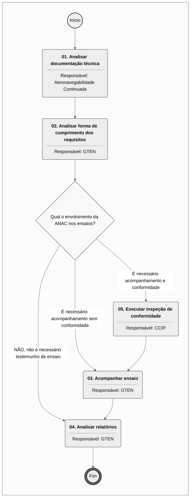

```mermaid
%%{init: {"theme": "neutral", "themeVariables": {"primaryColor": "#ffffff", "edgeLabelBackground": "#ffffff", "tertiaryColor": "#f4f4f4"}}}%%
flowchart TD
    classDef inicio stroke:#333,stroke-width:2px;
    classDef fim stroke:#333,stroke-width:4px;
    classDef tarefaBPMN stroke:#333,stroke-width:1px;
    classDef gatewayBPMN fill:#f9f9f9,stroke:#333,stroke-width:1px;
    classDef raia fill:none,stroke:#999,stroke-width:1px,stroke-dasharray: 5 5;
    subgraph Container_ID_MPR_SAR_125_R00_md_0 [ ]
        direction TB
        ID_MPR_SAR_125_R00_md_0_S((Início)):::inicio
        ID_MPR_SAR_125_R00_md_0_E(((Fim))):::fim
        ID_MPR_SAR_125_R00_md_0_01("<b>01. Realizar reunião inicial</b><hr>Responsável: GTPR-CDNT"):::tarefaBPMN
        ID_MPR_SAR_125_R00_md_0_02("<b>02. Analisar documentação inicial de projeto</b><hr>Responsável: GTPR-CDNT"):::tarefaBPMN
        ID_MPR_SAR_125_R00_md_0_03("<b>03. Analisar documentação técnica</b><hr>Responsável: GTPR-CDNT"):::tarefaBPMN
        ID_MPR_SAR_125_R00_md_0_04("<b>04. Analisar forma de cumprimento dos requisitos</b><hr>Responsável: GTPR-CDNT"):::tarefaBPMN
        ID_MPR_SAR_125_R00_md_0_05("<b>05. Acompanhar ensaio</b><hr>Responsável: GTPR-CDNT"):::tarefaBPMN
        ID_MPR_SAR_125_R00_md_0_06("<b>06. Analisar relatórios</b><hr>Responsável: GTPR-CDNT"):::tarefaBPMN
        ID_MPR_SAR_125_R00_md_0_07("<b>07. Verificar se existem pendências</b><hr>Responsável: GTPR-CDNT"):::tarefaBPMN
        ID_MPR_SAR_125_R00_md_0_08("<b>08. Analisar projeto de artigo aeronáutico (CPAA)</b><hr>Responsável: GTEN - Servidores"):::tarefaBPMN
        ID_MPR_SAR_125_R00_md_0_09("<b>09. Executar inspeção de conformidade</b><hr>Responsável: CCIP"):::tarefaBPMN
        ID_MPR_SAR_125_R00_md_0_10("<b>10. Concluir processo de COP</b><hr>Responsável: Coordenadoria de Certificação de Organizações de Produção"):::tarefaBPMN
        ID_MPR_SAR_125_R00_md_0_11("<b>11. Concluir processo de Certificação</b><hr>Responsável: GTPR - Serv. e GTCO - Serv"):::tarefaBPMN
        ID_MPR_SAR_125_R00_md_0_01("<b>01. Analisar documentação técnica</b><hr>Responsável: Aeronavegabilidade Continuada"):::tarefaBPMN
        ID_MPR_SAR_125_R00_md_0_02("<b>02. Analisar forma de cumprimento dos requisitos</b><hr>Responsável: GTEN"):::tarefaBPMN
        ID_MPR_SAR_125_R00_md_0_03("<b>03. Acompanhar ensaio</b><hr>Responsável: GTEN"):::tarefaBPMN
        ID_MPR_SAR_125_R00_md_0_04("<b>04. Analisar relatórios</b><hr>Responsável: GTEN"):::tarefaBPMN
        ID_MPR_SAR_125_R00_md_0_05("<b>05. Executar inspeção de conformidade</b><hr>Responsável: CCIP"):::tarefaBPMN
        ID_MPR_SAR_125_R00_md_0_S --> ID_MPR_SAR_125_R00_md_0_01
        ID_MPR_SAR_125_R00_md_0_01 --> ID_MPR_SAR_125_R00_md_0_02
        gw_ID_MPR_SAR_125_R00_md_0_02{"É necessário apoio da GTEN?"}:::gatewayBPMN
        ID_MPR_SAR_125_R00_md_0_02 --> gw_ID_MPR_SAR_125_R00_md_0_02
        gw_ID_MPR_SAR_125_R00_md_0_02 -->|"SIM, sim é necessário apoio técnico"| ID_MPR_SAR_125_R00_md_0_08
        gw_ID_MPR_SAR_125_R00_md_0_02 -->|"NÃO, não é necessário apoio técnico"| ID_MPR_SAR_125_R00_md_0_03
        ID_MPR_SAR_125_R00_md_0_03 --> ID_MPR_SAR_125_R00_md_0_04
        gw_ID_MPR_SAR_125_R00_md_0_04{"Qual o envolvimento da ANAC nos ensaios?"}:::gatewayBPMN
        ID_MPR_SAR_125_R00_md_0_04 --> gw_ID_MPR_SAR_125_R00_md_0_04
        gw_ID_MPR_SAR_125_R00_md_0_04 -->|"NÃO, não é necessário testemunho de ensaio"| ID_MPR_SAR_125_R00_md_0_06
        gw_ID_MPR_SAR_125_R00_md_0_04 -->|"É necessário acompanhamento sem conformidade"| ID_MPR_SAR_125_R00_md_0_05
        gw_ID_MPR_SAR_125_R00_md_0_04 -->|"É necessário acompanhamento e conformidade"| ID_MPR_SAR_125_R00_md_0_09
        ID_MPR_SAR_125_R00_md_0_05 --> ID_MPR_SAR_125_R00_md_0_06
        ID_MPR_SAR_125_R00_md_0_06 --> ID_MPR_SAR_125_R00_md_0_07
        gw_ID_MPR_SAR_125_R00_md_0_07{"Já foi concluído o processo de certificação da organização de produção?"}:::gatewayBPMN
        ID_MPR_SAR_125_R00_md_0_07 --> gw_ID_MPR_SAR_125_R00_md_0_07
        gw_ID_MPR_SAR_125_R00_md_0_07 -->|"NÃO, não foi concluído o COP"| ID_MPR_SAR_125_R00_md_0_10
        gw_ID_MPR_SAR_125_R00_md_0_07 -->|"SIM, foi concluído o COP"| ID_MPR_SAR_125_R00_md_0_11
        ID_MPR_SAR_125_R00_md_0_08 --> ID_MPR_SAR_125_R00_md_0_07
        ID_MPR_SAR_125_R00_md_0_09 --> ID_MPR_SAR_125_R00_md_0_05
        ID_MPR_SAR_125_R00_md_0_10 --> ID_MPR_SAR_125_R00_md_0_11
        ID_MPR_SAR_125_R00_md_0_11 --> ID_MPR_SAR_125_R00_md_0_E
        ID_MPR_SAR_125_R00_md_0_01 --> ID_MPR_SAR_125_R00_md_0_02
        gw_ID_MPR_SAR_125_R00_md_0_02{"Qual o envolvimento da ANAC nos ensaios?"}:::gatewayBPMN
        ID_MPR_SAR_125_R00_md_0_02 --> gw_ID_MPR_SAR_125_R00_md_0_02
        gw_ID_MPR_SAR_125_R00_md_0_02 -->|"NÃO, não é necessário testemunho de ensaio"| ID_MPR_SAR_125_R00_md_0_04
        gw_ID_MPR_SAR_125_R00_md_0_02 -->|"É necessário acompanhamento sem conformidade"| ID_MPR_SAR_125_R00_md_0_03
        gw_ID_MPR_SAR_125_R00_md_0_02 -->|"É necessário acompanhamento e conformidade"| ID_MPR_SAR_125_R00_md_0_05
        ID_MPR_SAR_125_R00_md_0_03 --> ID_MPR_SAR_125_R00_md_0_04
        ID_MPR_SAR_125_R00_md_0_04 --> ID_MPR_SAR_125_R00_md_0_E
        ID_MPR_SAR_125_R00_md_0_05 --> ID_MPR_SAR_125_R00_md_0_03
    end
    click ID_MPR_SAR_125_R00_md_0_01 "Esta atividade é obrigatória e deve ser realizada antes ou após o protocolo da documentação inicial. É extremamente recomendável que a reunião inicial seja realizada antes do envio formal da documentação inicial de projeto requerida, favorecendo assim uma maior assertividade no formato e no conteúdo"
    click ID_MPR_SAR_125_R00_md_0_02 "O líder da área designará um coordenador de projeto, que será o servidor responsável por gerenciar o fluxo do processo de certificação junto ao requerente e áreas de apoio da ANAC.  O coordenador ficará responsável por verificar a completude da documentação inicial requerida para iniciar o processo "
    click ID_MPR_SAR_125_R00_md_0_03 "A análise da documentação técnica deverá ser iniciada a partir do plano de certificação apresentado, verificando o correto endereçamento dos requisitos que compõe a base de certificação, de acordo com a elegibilidade da peça ao produto que será instalado para artigos sob a subparte k do RBAC 21. Já "
    click ID_MPR_SAR_125_R00_md_0_04 "Nesta etapa, o coordenador, junto com os especialistas encarregados pelas análises técnicas devem estabelecer o nível de envolvimento da ANAC e definir:  (1) quais requisitos devem ser demonstrados por meio de ensaios;  (2) quais requisitos precisam ser conformados e acompanhados pela ANAC, ensejand"
    click ID_MPR_SAR_125_R00_md_0_05 "A equipe que irá realizar o acompanhamento do ensaio, quando aplicável, deve assegurar:  (1) que os instrumentos foram devidamente calibrados e configurados;  (2) que o protótipo a ser testado é representativo e está configurado na condição mais crítica para o ensaio/operação, com maior probabilidad"
    click ID_MPR_SAR_125_R00_md_0_06 "O relatório de resultados do ensaio, enviado pelo requerente, deverá ser analisado com base no plano de ensaio aprovado, verificando se todas as informações pertinentes foram incluídas no documento, se todos os procedimentos previstos foram corretamente executados e seguidos, se todos os resultados "
    click ID_MPR_SAR_125_R00_md_0_07 "O coordenador do processo deverá verificar se existem pendências documentais, tais como relatórios, condições especiais, manuais, desenhos etc. Caso algum documento não esteja satisfatório ou faltante, o coordenador notificará o requerente sobre a condição do documento, indicando o status das pendên"
    click ID_MPR_SAR_125_R00_md_0_08 "Ver Processo de Trabalho ANALISAR PROJETO DE ARTIGO AERONÁUTICO."
    click ID_MPR_SAR_125_R00_md_0_09 "Emitido o pedido de conformidade pelo especialista, a GTCO irá conduzir a inspeção conforme procedimento definido.  O coordenador irá conduzir junto à GTCO e o requerente o estabelecimento do cronograma para realização das atividades.  Realizada a atividade, a GTCO emite o relatório próprio para a i"
    click ID_MPR_SAR_125_R00_md_0_10 "O coordenador deverá solicitar o parecer junto à GTCO sobre status ou conclusão do processo de Certificação da Organização da Produção.  Somente após a conclusão pela GTCO do previsto no MPR-221, item 5.2 é que poderá ser dado andamento no processo."
    click ID_MPR_SAR_125_R00_md_0_11 "Após todas as pendências de projeto e de organização de produção estiverem encerradas, a GTPR e a GTCO devem emitir os certificados para o artigo/peça.  As aprovações de fabricação de artigo se evidenciam com a emissão de um Certificado de Produto Aeronáutico Aprovado - CPAA e um Certificado de Orga"
    click ID_MPR_SAR_125_R00_md_0_01 "A análise da documentação técnica deverá ser iniciada a partir do plano de certificação apresentado, verificando o correto endereçamento dos requisitos que compõe a base de certificação, de acordo com a elegibilidade da peça ao produto que será instalado para artigos sob a subparte k do RBAC 21. Já "
    click ID_MPR_SAR_125_R00_md_0_02 "Nesta etapa, o coordenador da GTPR-CDNT, junto com os especialistas encarregados pelas análises técnicas devem estabelecer o nível de envolvimento da ANAC e definir:  (1) quais requisitos devem ser demonstrados por meio de ensaios;  (2) quais requisitos precisam ser conformados e acompanhados pela A"
    click ID_MPR_SAR_125_R00_md_0_03 "A equipe que irá realizar o acompanhamento do ensaio, quando aplicável, deve assegurar:  (1) que os instrumentos foram devidamente calibrados e configurados;  (2) que o protótipo a ser testado é representativo e está configurado na condição mais crítica para o ensaio/operação, com maior probabilidad"
    click ID_MPR_SAR_125_R00_md_0_04 "O relatório de resultados do ensaio, enviado pelo requerente, deverá ser analisado com base no plano de ensaio aprovado, verificando se todas as informações pertinentes foram incluídas no documento, se todos os procedimentos previstos foram corretamente executados e seguidos, se todos os resultados "
    click ID_MPR_SAR_125_R00_md_0_05 "Emitido o pedido de conformidade pelo especialista, a GTCO irá conduzir a inspeção conforme procedimento definido.  O coordenador irá conduzir junto à GTCO e o requerente o estabelecimento do cronograma para realização das atividades.  Realizada a atividade, a GTCO emite o relatório próprio para a i"
```

# MPR/SAR-125-R00 - MPR/SAR-125 - APROVAÇÃO DE PRODUTOS AERONÁUTICOS, EXCETO AERONAVES, MOTORES AERONÁUTICOS E HÉLICES

**MANUAL DE PROCEDIMENTO**

**MPR/SAR-125-R00**

**MPR/SAR-125 - APROVAÇÃO DE PRODUTOS AERONÁUTICOS, EXCETO AERONAVES, MOTORES AERONÁUTICOS E HÉLICES**

02/2023

**REVISÕES**

|  |  |  |  |  |
| --- | --- | --- | --- | --- |
| **Revisão** | **Aprovação** | **Publicação** | **Aprovado Por** | **Modificações da Última Versão** |
| R00 | Portaria 10453 publicada no BPS V.18, Nº 9, 27/02 A 03/03/2023 | 03/03/2023 | SAR | Versão Original |

**ÍNDICE**

1) Disposições Preliminares, pág. 5.

1.1) Introdução, pág. 5.

1.2) Revogação, pág. 5.

1.3) Fundamentação, pág. 5.

1.4) Executores dos Processos, pág. 9.

1.5) Elaboração e Revisão, pág. 9.

1.6) Organização do Documento, pág. 9.

2) Definições, pág. 12.

2.1) Sigla, pág. 12.

3) Artefatos, Competências, Sistemas e Documentos Administrativos, pág. 13.

3.1) Artefatos, pág. 13.

3.2) Competências, pág. 14.

3.3) Sistemas, pág. 14.

3.4) Documentos e Processos Administrativos, pág. 14.

4) Procedimentos Referenciados, pág. 15.

5) Procedimentos, pág. 16.

5.1) Conduzir Aprovação de Projeto de Artigo Aeronáutico, pág. 16.

5.2) Analisar Projeto de Artigo Aeronáutico, pág. 24.

6) Disposições Finais, pág. 30.

**PARTICIPAÇÃO NA EXECUÇÃO DOS PROCESSOS**

**ÁREAS ORGANIZACIONAIS**

**1) Coordenadoria de Inspeção**

a) Analisar Projeto de Artigo Aeronáutico

b) Conduzir Aprovação de Projeto de Artigo Aeronáutico

**2) Gerência Técnica de Engenharia de Produto**

a) Analisar Projeto de Artigo Aeronáutico

**GRUPOS ORGANIZACIONAIS**

**a) Aeronavegabilidade Continuada**

1) Analisar Projeto de Artigo Aeronáutico

**b) Coordenadoria de Certificação de Organizações de Produção**

1) Conduzir Aprovação de Projeto de Artigo Aeronáutico

**c) GTEN - Servidores**

1) Conduzir Aprovação de Projeto de Artigo Aeronáutico

**d) GTPR-CDNT**

1) Conduzir Aprovação de Projeto de Artigo Aeronáutico

**e) GTPR - Serv. e GTCO - Serv**

1) Conduzir Aprovação de Projeto de Artigo Aeronáutico

**1. DISPOSIÇÕES PRELIMINARES**

**1.1 INTRODUÇÃO**

Este MPR contém as informações de suporte para a realização da Certificação de Artigo Aeronáuticos. Esta versão foi criada e aprovada pelo processo SEI 00058.008262/2022-71.

O MPR estabelece, no âmbito da Superintendência de Aeronavegabilidade - SAR, os seguintes processos de trabalho:

a) Conduzir Aprovação de Projeto de Artigo Aeronáutico.

b) Analisar Projeto de Artigo Aeronáutico.

**1.2 REVOGAÇÃO**

Item não aplicável.

**1.3 FUNDAMENTAÇÃO**

Resolução nº 381, de 14 de junho de 2016, art. 31 e alterações posteriores.

A Portaria Nº 3.881 DE 29 DE DEZEMBRO DE 2020, delega as seguintes competências:

[...]

Art. 2º Delegar competências comuns a todas as gerências da Superintendência de Aeronavegabilidade para:

[...]

IV -Aprovar, revisar e revogar manual de procedimento e artefatos de sua área de atuação;

[...]

Art. 18. Delegar competência à GTCO para:

I -Propor a emissão, suspensão e extinção do certificado de organização de projeto e certificado de organização de produção.

II -Emitir, suspender e extinguir certificado de autorização de voo experimental.

III -Emitir, suspender e extinguir certificado de aeronavegabilidade especial para aeronaves categoria leve esportiva.

IV -Emitir, suspender e extinguir autorização especial de voo, com os propósitos de traslado, entrega ou exportação de aeronave a seu comprador, voo de produção, voo de demonstração para comprador, e voo com peso superior ao peso máximo de decolagem aprovado.

V -Emitir, suspender ou extinguir aprovação de aeronavegabilidade para exportação.

VI -Emitir, suspender e extinguir certificados de aeronavegabilidade para aeronaves recém-fabricadas.

VII -Emitir, suspender e extinguir outros atestados, aprovações e autorizações relativas às atividades em seu âmbito de atuação.

VIII -Emitir a aprovação de produção de embalagem para transporte de artigos perigosos.

IX -Decidir sobre credenciamento de Profissionais credenciados em fabricação (PCF) e Profissionais credenciados em aeronavegabilidade (PCA) nos grupos D e E.

X -Apreciar pedido de reconsideração, no âmbito dos processos de credenciamento de Profissionais credenciados em fabricação (PCF) e Profissionais credenciados em aeronavegabilidade (PCA) nos grupos D e E.

XI -Conceder meio alternativo de demonstração de cumprimento a requisito em sua área de atuação.

Art. 19. Delegar competência à CPROD para:

I -Coordenar a certificação e vigilância continuada de organizações de produção.

II -Emitir pareceres sobre cumprimento de requisitos de certificação de organização de produção.

III -Avaliar, orientar e monitorar seus respectivos profissionais credenciados.

Art. 20. Delegar competência à CCIP para:

I -Coordenar a execução de inspeção de conformidade de processo, de produto, de espécime de ensaio e de instalação associada durante o processo de certificação de projeto ou modificações ao projeto de tipo aprovado.

II -Coordenar a emissão de certificado de autorização de voo experimental.

III -Coordenar a emissão de certificado de aeronavegabilidade especial para aeronaves categoria leve esportiva.

IV -Coordenar a emissão de autorização especial de voo, com os propósitos de traslado, entrega ou exportação de aeronave a seu comprador, voo de produção, voo de demonstração para comprador, e voo com peso superior ao peso máximo de decolagem aprovado.

V -Coordenar a emissão de aprovação de aeronavegabilidade para exportação.VI -Coordenar a emissão de certificados de aeronavegabilidade para aeronaves recém-fabricadas.

VII -Avaliar, orientar e monitorar seus respectivos profissionais credenciados.

Art. 21. Delegar competência à GCPP para:

I -Propor a emissão, suspensão e extinção do certificado de tipo, incluindo suas revisões;

II -Propor a emissão, suspensão e extinção de autorização de projeto de sistema de aeronave remotamente pilotada (RPAS), incluindo suas revisões;

III -Emitir e revisar especificações técnicas de certificado de tipo e autorização de projeto de RPAS;

IV -Propor a emissão, suspensão e extinção de reconhecimento de aeronave leve esportiva, em coordenação com a GTCO;

V -Emitir, suspender e extinguir certificado suplementar de tipo e certificado de produto aeronáutico aprovado, incluindo as respectivas especificações técnicas e suas revisões, como aplicável;

VI -Emitir, suspender e extinguir outros atestados, aprovações e autorizações relativas às atividades em seu âmbito de atuação;

VII -Aprovar e/ou aceitar Lista Mestra de Equipamentos Mínimos;

VIII -Aprovar Relatório de Avaliação Operacional;

IX -Decidir sobre recursos apresentados no âmbito dos processos de credenciamento em sua área de atuação; e

X -Conceder meio alternativo de demonstração de cumprimento a requisito em sua área de atuação.

Art. 22. Delegar competência à GTEN para:

I - Emitir parecer especializado, relacionado com a certificação de projeto de produto aeronáutico, nas áreas de:

a) resistência estrutural em aeronaves;

b) sistemas de aeronaves (hidráulicos, pneumáticos, eletroeletrônicos, software embarcado, etc.);

c) propulsão de aeronaves;

d) fator humano relacionado a projeto de aeronave quanto à manutenção e à evacuação de emergência;

e) proteção do ocupante da aeronave;

f) proteção ambiental (ruído e emissões); e

g) outros aspectos técnicos considerados essenciais à segurança de voo.

II - Avaliar, orientar e monitorar seus respectivos profissionais credenciados.

[...]

Art. 26. Delegar competência à GTEV para:

I - Emitir parecer especializado, relacionado com a certificação de projeto de produto aeronáutico, nas áreas de:

a) aeronáutica, desempenho em voo e qualidade de voo;

b) fator humano relacionado a projeto de aeronave;

c) integração inter-sistemas em aeronaves; e

d) outros aspectos técnicos considerados essenciais à segurança de voo.

II - Realizar avaliação operacional de aeronaves certificadas ou validadas, ou em processo de certificação ou validação no Brasil, com vistas à determinação de licenças e habilitações e ao estabelecimento de padrões de treinamento de pilotos.

III - Coordenar as atividades relacionadas à Lista Mestra de Equipamentos Mínimos.

IV - Avaliar, orientar e monitorar seus respectivos profissionais credenciados.

[...]

Art. 29. Delegar competência à GTPR para:

I - Coordenar os processos de certificação de projeto de produto aeronáutico.

II - Coordenar os processos de certificação de modificação de projeto de produto aeronáutico.

III - Aprovar modificação de projeto de produto aeronáutico.

IV - Aprovar projeto de embalagem para transporte de artigos perigosos.

V - Avaliar, orientar e monitorar seus respectivos profissionais credenciados.

[...]

**1.4 EXECUTORES DOS PROCESSOS**

Os procedimentos contidos neste documento aplicam-se aos servidores integrantes das seguintes áreas organizacionais:

|  |  |
| --- | --- |
| **Área Organizacional** | **Descrição** |
| Coordenadoria de Inspeção - CCIP | Coordenar a execução de inspeção de conformidade de processo, de produto, de espécime de ensaio e de instalação associada durante o processo de certificação de projeto ou modificações ao projeto de tipo aprovado. |
| Gerência Técnica de Engenharia de Produto - GTEN | Responsável por prover pareceres especializados em engenharia aplicada aos requisitos de aeronavegabilidade e de proteção ambiental. |

|  |  |
| --- | --- |
| **Grupo Organizacional** | **Descrição** |
| SAR - PAC | Coordenar os trabalhos de análise de relatório de dificuldades em serviço recebido de fabricantes, operadores, outras autoridades aeronáuticas e demais pessoas |
| CPROD | Coordenadoria de Certificação de Organizações de Produção da GTCO |
| GTEN - Serv. | Compreende o conjunto dos servidores da GTEN. |
| GTPR-CDNT | Compreende os servidores do grupo CDNT. |
| GTPR e GTCO | Junção dos servidores das duas gerências, GTPR e GTCO. |

**1.5 ELABORAÇÃO E REVISÃO**

O processo que resulta na aprovação ou alteração deste MPR é de responsabilidade da Superintendência de Aeronavegabilidade - SAR. Em caso de sugestões de revisão, deve-se procurá-la para que sejam iniciadas as providências cabíveis.

As revisões deste MPR serão aprovadas pelo(s) titular(es) da(s) unidade(s) responsável(is) pela execução do(s) processo(s) nele listado(s).

**1.6 ORGANIZAÇÃO DO DOCUMENTO**

O capítulo 2 apresenta as principais definições utilizadas no âmbito deste MPR, e deve ser visto integralmente antes da leitura de capítulos posteriores.

O capítulo 3 apresenta as competências, os artefatos e os sistemas envolvidos na execução dos processos deste manual, em ordem relativamente cronológica.

O capítulo 4 apresenta os processos de trabalho referenciados neste MPR. Estes processos são publicados em outros manuais que não este, mas cuja leitura é essencial para o entendimento dos processos publicados neste manual. O capítulo 4 expõe em quais manuais são localizados cada um dos processos de trabalho referenciados.

O capítulo 5 apresenta os processos de trabalho. Para encontrar um processo específico, deve-se procurar sua respectiva página no índice contido no início do documento. Os processos estão ordenados em etapas. Cada etapa é contida em uma tabela, que possui em si todas as informações necessárias para sua realização. São elas, respectivamente:

a) o título da etapa;

b) a descrição da forma de execução da etapa;

c) as competências necessárias para a execução da etapa;

d) os artefatos necessários para a execução da etapa;

e) os sistemas necessários para a execução da etapa (incluindo, bases de dados em forma de arquivo, se existente);

f) os documentos e processos administrativos que precisam ser elaborados durante a execução da etapa;

g) instruções para as próximas etapas; e

h) as áreas ou grupos organizacionais responsáveis por executar a etapa.

O capítulo 6 apresenta as disposições finais do documento, que trata das ações a serem realizadas em casos não previstos.

Por último, é importante comunicar que este documento foi gerado automaticamente. São recuperados dados sobre as etapas e sua sequência, as definições, os grupos, as áreas organizacionais, os artefatos, as competências, os sistemas, entre outros, para os processos de trabalho aqui apresentados, de forma que alguma mecanicidade na apresentação das informações pode ser percebida. O documento sempre apresenta as informações mais atualizadas de nomes e siglas de grupos, áreas, artefatos, termos, sistemas e suas definições, conforme informação disponível na base de dados, independente da data de assinatura do documento. Informações sobre etapas, seu detalhamento, a sequência entre etapas, responsáveis pelas etapas, artefatos, competências e sistemas associados a etapas, assim como seus nomes e os nomes de seus processos têm suas definições idênticas à da data de assinatura do documento.

**2. DEFINIÇÕES**

A tabela abaixo apresenta as definições necessárias para o entendimento deste Manual de Procedimento.

**2.1 Sigla**

|  |  |
| --- | --- |
| **Definição** | **Significado** |
| CDNT | Coordenadoria de Drones e Novas Tecnologias |
| COP | Certificado de Organização de Produção |
| CPAA | Certificado de Produto Aeronáutico Aprovado |
| GTCO | Gerência Técnica de Certificação de Organizações e Inspeção |
| GTEN | Gerência Técnica de Engenharia de Produto |
| GTEV | Gerência Técnica Engenharia de Voo |
| GTPR | Gerência Técnica de Programas de Certificação |
| MPR | Manual de Procedimento – Documento de caráter disciplinador, de âmbito interno, assinado e aprovado por autoridade competente, que tem como objetivo documentar e padronizar os processos de trabalho realizados pelos agentes da ANAC. Possui informações sobre o fluxo de trabalho, detalhamento das etapas, competências necessárias, artefatos a serem utilizados, sistemas de apoio e áreas responsáveis pela execução. |
| OTP | Ordem Técnica Padrão |
| TFAC | Taxa de Fiscalização da Aviação Civil |
| TSO | Technical Standard Orders |

**3. ARTEFATOS, COMPETÊNCIAS, SISTEMAS E DOCUMENTOS ADMINISTRATIVOS**

Abaixo se encontram as listas dos artefatos, competências, sistemas e documentos administrativos que o executor necessita consultar, preencher, analisar ou elaborar para executar os processos deste MPR. As etapas descritas no capítulo seguinte indicam onde usar cada um deles.

As competências devem ser adquiridas por meio de capacitação ou outros instrumentos e os artefatos se encontram no módulo "Artefatos" do sistema GFT - Gerenciador de Fluxos de Trabalho.

**3.1 ARTEFATOS**

|  |  |
| --- | --- |
| **Nome** | **Descrição** |
| F-121-05 | Certificado de Organização de Produção |
| F-121-06 | Registro de Limitações de Produção |
| F-125-01 - Requerimento para CPAA | Formulário para dar entrada no processo de certificação de produto aeronáutico (exceto aeronaves, motores aeronáuticos e hélices). |
| F-125-02 - Requerimento para CPAA sob uma OTP/TSO | Formulário para dar entrada no processo de certificação de produto aeronáutico sob uma OTP/TSO. |
| F-125-11 - Certificado de Produto Aeronáutico Aprovado | Cerificado emitido para produto. |
| F-125-12 - Adendo ao CPAA | Modelo de Adendo ao Certificado de Produto Aeronáutico Aprovado. |
| F-200-14 - Pedido de Conformidade | Pedido de Conformidade. |
| F-300-03 - Requerimento para Serviço de Homologação | Application for certification works. |
| ITD-101-12 - Manual do Engenheiro de Certificação de Tipo | Melhores práticas de análise de engenharia na certificação de tipo. |

**3.2 COMPETÊNCIAS**

Para que os processos de trabalho contidos neste MPR possam ser realizados com qualidade e efetividade, é importante que as pessoas que venham a executá-los possuam um determinado conjunto de competências. No capítulo 5, as competências específicas que o executor de cada etapa de cada processo de trabalho deve possuir são apresentadas. A seguir, encontra-se uma lista geral das competências contidas em todos os processos de trabalho deste MPR e a indicação de qual área ou grupo organizacional as necessitam:

Não há competências descritas para a realização deste MPR.

**3.3 SISTEMAS**

Não há sistemas descritos para a realização deste MPR.

**3.4 DOCUMENTOS E PROCESSOS ADMINISTRATIVOS ELABORADOS NESTE MANUAL**

Não há documentos ou processos administrativos a serem elaborados neste MPR.

**4. PROCEDIMENTOS REFERENCIADOS**

Procedimentos referenciados são processos de trabalho publicados em outro MPR que têm relação com os processos de trabalho publicados por este manual. Este MPR não possui nenhum processo de trabalho referenciado.

**
## 5.1 Conduzir Aprovação de Projeto de Artigo Aeronáutico

## 5.1 Conduzir Aprovação de Projeto de Artigo Aeronáutico

