```mermaid
%%{init: {'theme': 'default'}}%%

flowchart TD
    classDef inicio stroke:#333,stroke-width:2px;
    classDef fim stroke:#333,stroke-width:4px;
    classDef tarefaBPMN stroke:#333,stroke-width:1px;
    classDef gatewayBPMN fill:#ececec,stroke:#333,stroke-width:1px;
    classDef raia fill:none,stroke:#999,stroke-width:1px,stroke-dasharray: 5 5;
    subgraph Container_ID_MPR_SAR_131_R01_4 [ ]
        direction TB
        ID_MPR_SAR_131_R01_4_Start((Início)):::inicio
        ID_MPR_SAR_131_R01_4_End(((Fim))):::fim
        ID_MPR_SAR_131_R01_4_01("<b>01. Realizar atividades pré-vistoria</b><hr>Responsável: GTCO-CCIP."):::tarefaBPMN
        ID_MPR_SAR_131_R01_4_02("<b>02. Realizar vistoria</b><hr>Responsável: GTCO-CCIP."):::tarefaBPMN
        ID_MPR_SAR_131_R01_4_03("<b>03. Consultar o FAA sobre a aceitação das NC</b><hr>Responsável: GTCO-CCIP."):::tarefaBPMN
        ID_MPR_SAR_131_R01_4_04("<b>04. Informar ao requerente e aguardar correção das NC</b><hr>Responsável: GTCO-CCIP."):::tarefaBPMN
        ID_MPR_SAR_131_R01_4_05("<b>05. Emitir o Certificate of Airworthiness</b><hr>Responsável: GTCO-CCIP."):::tarefaBPMN
        ID_MPR_SAR_131_R01_4_Start --> ID_MPR_SAR_131_R01_4_01
        ID_MPR_SAR_131_R01_4_01 --> ID_MPR_SAR_131_R01_4_02
        gw_ID_MPR_SAR_131_R01_4_02{"Houve não conformidade?"}:::gatewayBPMN
        ID_MPR_SAR_131_R01_4_02 --> gw_ID_MPR_SAR_131_R01_4_02
        gw_ID_MPR_SAR_131_R01_4_02 -->|"não houve NC"| ID_MPR_SAR_131_R01_4_05
        gw_ID_MPR_SAR_131_R01_4_02 -->|"sim, houve NC"| ID_MPR_SAR_131_R01_4_03
        gw_ID_MPR_SAR_131_R01_4_03{"Houve aceitação pelo FAA?"}:::gatewayBPMN
        ID_MPR_SAR_131_R01_4_03 --> gw_ID_MPR_SAR_131_R01_4_03
        gw_ID_MPR_SAR_131_R01_4_03 -->|"sim, houve aceitação"| ID_MPR_SAR_131_R01_4_05
        gw_ID_MPR_SAR_131_R01_4_03 -->|"não houve aceitação"| ID_MPR_SAR_131_R01_4_04
        ID_MPR_SAR_131_R01_4_04 --> ID_MPR_SAR_131_R01_4_05
        ID_MPR_SAR_131_R01_4_05 --> ID_MPR_SAR_131_R01_4_End
    end
    click ID_MPR_SAR_131_R01_4_01 href "#" "A equipe designada pelo Coordenador da GTCO - CCIP prepara a atividade de acordo com o previsto na ITD-131-01 (substituiu o MPRI-100-07) vigente ou documento que vier a substituí-lo.  A vistoria poderá ser realizada por PCF."
    click ID_MPR_SAR_131_R01_4_02 href "#" "A equipe designada pelo Coordenador da GTCO - CCIP realiza a vistoria de acordo com o previsto na ITD-131-01 (substituiu o MPRI-100-07) vigente ou documento que vier a substituí-lo.  Após a finalização, deve informar ao requerente se há NC encontrada na vistoria.  Caso existam, deve aguardar o requerente se manifestar sobre a resolução ou não das NC.  Se a empresa resolver as NC, o processo segue normalmente.  Caso negativo, deve-se seguir para o passo 3."
    click ID_MPR_SAR_131_R01_4_03 href "#" "As NC encontradas na vistoria devem ser relatadas à FAA através do artefato 'Flight Standards DEVIATIONS'.  A equipe designada deve aguardar resposta da FAA para saber se procede ou não com a emissão do CofA."
    click ID_MPR_SAR_131_R01_4_04 href "#" "A equipe designada pelo Coordenador da GTCO - CCIP deve informar ao requerente que a FAA não aceitou os desvios encontrados através do artefato 'Negativa da FAA para Aceitação de Desvios'.  Aguardar resposta da empresa se vai ou não solucionar as NC.  Caso as NC sejam resolvidas, informar à FAA a presente situação através do artefato 'Flight Standards DEVIATIONS CORRECTIONS'.  Em seguida seguir para a Etapa 05."
    click ID_MPR_SAR_131_R01_4_05 href "#" "A equipe designada pelo Coordenador da GTCO - CCIP emite o CA Padrão Norte-americano de acordo com o previsto na ITD-131-01 (substituiu o MPRI-100-07) vigente ou documento que vier a substituí-lo.  Todas as trocas de e-mails das etapas anteriores devem ser adicionadas ao processo SEI vigente."
```

```mermaid
%%{init: {'theme': 'default'}}%%

flowchart TD
    classDef inicio stroke:#333,stroke-width:2px;
    classDef fim stroke:#333,stroke-width:4px;
    classDef tarefaBPMN stroke:#333,stroke-width:1px;
    classDef gatewayBPMN fill:#ececec,stroke:#333,stroke-width:1px;
    classDef raia fill:none,stroke:#999,stroke-width:1px,stroke-dasharray: 5 5;
    subgraph Container_ID_MPR_SAR_131_R01_3 [ ]
        direction TB
        ID_MPR_SAR_131_R01_3_Start((Início)):::inicio
        ID_MPR_SAR_131_R01_3_End(((Fim))):::fim
        ID_MPR_SAR_131_R01_3_01("<b>01. Preparar a vistoria em sede</b><hr>Responsável: GTCO-CCIP."):::tarefaBPMN
        ID_MPR_SAR_131_R01_3_02("<b>02. Realizar a vistoria</b><hr>Responsável: GTCO-CCIP."):::tarefaBPMN
        ID_MPR_SAR_131_R01_3_03("<b>03. Informar a NC ao requerente</b><hr>Responsável: GTCO-CCIP."):::tarefaBPMN
        ID_MPR_SAR_131_R01_3_04("<b>04. Aguardar resposta do requerente</b><hr>Responsável: GTCO-CCIP."):::tarefaBPMN
        ID_MPR_SAR_131_R01_3_05("<b>05. Consultar a AAC do país importador sobre a aceitação de exceções</b><hr>Responsável: GTCO-CCIP."):::tarefaBPMN
        ID_MPR_SAR_131_R01_3_06("<b>06. Aguardar resposta da AAC quanto às exceções</b><hr>Responsável: GTCO-CCIP."):::tarefaBPMN
        ID_MPR_SAR_131_R01_3_07("<b>07. Informar ao requerente que a exceção não foi aceita</b><hr>Responsável: GTCO-CCIP."):::tarefaBPMN
        ID_MPR_SAR_131_R01_3_08("<b>08. Aguardar nova resposta do requerente</b><hr>Responsável: GTCO-CCIP."):::tarefaBPMN
        ID_MPR_SAR_131_R01_3_09("<b>09. Informar à AAC que a NC foi resolvida e o CAE será emitido</b><hr>Responsável: GTCO-CCIP."):::tarefaBPMN
        ID_MPR_SAR_131_R01_3_10("<b>10. Emitir CAE</b><hr>Responsável: GTCO-CCIP."):::tarefaBPMN
        ID_MPR_SAR_131_R01_3_11("<b>11. Informar à empresa que o CAE não será emitido</b><hr>Responsável: GTCO-CCIP."):::tarefaBPMN
        ID_MPR_SAR_131_R01_3_01("<b>01. Realizar atividades pré-vistoria</b><hr>Responsável: GTCO-CCIP."):::tarefaBPMN
        ID_MPR_SAR_131_R01_3_02("<b>02. Realizar vistoria</b><hr>Responsável: GTCO-CCIP."):::tarefaBPMN
        ID_MPR_SAR_131_R01_3_03("<b>03. Consultar o FAA sobre a aceitação das NC</b><hr>Responsável: GTCO-CCIP."):::tarefaBPMN
        ID_MPR_SAR_131_R01_3_04("<b>04. Informar ao requerente e aguardar correção das NC</b><hr>Responsável: GTCO-CCIP."):::tarefaBPMN
        ID_MPR_SAR_131_R01_3_05("<b>05. Emitir o Certificate of Airworthiness</b><hr>Responsável: GTCO-CCIP."):::tarefaBPMN
        ID_MPR_SAR_131_R01_3_Start --> ID_MPR_SAR_131_R01_3_01
        ID_MPR_SAR_131_R01_3_01 --> ID_MPR_SAR_131_R01_3_02
        gw_ID_MPR_SAR_131_R01_3_02{"Existe não conformidade?"}:::gatewayBPMN
        ID_MPR_SAR_131_R01_3_02 --> gw_ID_MPR_SAR_131_R01_3_02
        gw_ID_MPR_SAR_131_R01_3_02 -->|"sim, existe NC"| ID_MPR_SAR_131_R01_3_03
        gw_ID_MPR_SAR_131_R01_3_02 -->|"não existe NC"| ID_MPR_SAR_131_R01_3_10
        ID_MPR_SAR_131_R01_3_03 --> ID_MPR_SAR_131_R01_3_04
        gw_ID_MPR_SAR_131_R01_3_04{"Ainda existe NC?"}:::gatewayBPMN
        ID_MPR_SAR_131_R01_3_04 --> gw_ID_MPR_SAR_131_R01_3_04
        gw_ID_MPR_SAR_131_R01_3_04 -->|"não, as NC foram resolvidas"| ID_MPR_SAR_131_R01_3_10
        gw_ID_MPR_SAR_131_R01_3_04 -->|"sim, ainda existe NC"| ID_MPR_SAR_131_R01_3_05
        ID_MPR_SAR_131_R01_3_05 --> ID_MPR_SAR_131_R01_3_06
        gw_ID_MPR_SAR_131_R01_3_06{"A exceção foi aceita?"}:::gatewayBPMN
        ID_MPR_SAR_131_R01_3_06 --> gw_ID_MPR_SAR_131_R01_3_06
        gw_ID_MPR_SAR_131_R01_3_06 -->|"sim, foi aceita"| ID_MPR_SAR_131_R01_3_10
        gw_ID_MPR_SAR_131_R01_3_06 -->|"não foi aceita"| ID_MPR_SAR_131_R01_3_07
        ID_MPR_SAR_131_R01_3_07 --> ID_MPR_SAR_131_R01_3_08
        gw_ID_MPR_SAR_131_R01_3_08{"A empresa resolveu a NC?"}:::gatewayBPMN
        ID_MPR_SAR_131_R01_3_08 --> gw_ID_MPR_SAR_131_R01_3_08
        gw_ID_MPR_SAR_131_R01_3_08 -->|"não resolveu a NC"| ID_MPR_SAR_131_R01_3_11
        gw_ID_MPR_SAR_131_R01_3_08 -->|"sim, resolveu a NC"| ID_MPR_SAR_131_R01_3_09
        ID_MPR_SAR_131_R01_3_09 --> ID_MPR_SAR_131_R01_3_10
        ID_MPR_SAR_131_R01_3_10 --> ID_MPR_SAR_131_R01_3_End
        ID_MPR_SAR_131_R01_3_11 --> ID_MPR_SAR_131_R01_3_End
        ID_MPR_SAR_131_R01_3_01 --> ID_MPR_SAR_131_R01_3_02
        gw_ID_MPR_SAR_131_R01_3_02{"Houve não conformidade?"}:::gatewayBPMN
        ID_MPR_SAR_131_R01_3_02 --> gw_ID_MPR_SAR_131_R01_3_02
        gw_ID_MPR_SAR_131_R01_3_02 -->|"não houve NC"| ID_MPR_SAR_131_R01_3_05
        gw_ID_MPR_SAR_131_R01_3_02 -->|"sim, houve NC"| ID_MPR_SAR_131_R01_3_03
        gw_ID_MPR_SAR_131_R01_3_03{"Houve aceitação pelo FAA?"}:::gatewayBPMN
        ID_MPR_SAR_131_R01_3_03 --> gw_ID_MPR_SAR_131_R01_3_03
        gw_ID_MPR_SAR_131_R01_3_03 -->|"sim, houve aceitação"| ID_MPR_SAR_131_R01_3_05
        gw_ID_MPR_SAR_131_R01_3_03 -->|"não houve aceitação"| ID_MPR_SAR_131_R01_3_04
        ID_MPR_SAR_131_R01_3_04 --> ID_MPR_SAR_131_R01_3_05
        ID_MPR_SAR_131_R01_3_05 --> ID_MPR_SAR_131_R01_3_End
    end
    click ID_MPR_SAR_131_R01_3_01 href "#" "A equipe designada pelo Coordenador da GTCO - CCIP deve preparar a documentação que servirá de base para a vistoria.  Faz parte da preparação as seguintes atividades:  1- Conferir documentação do pedido de vistoria.  2- Verificar se foi aberta pasta de trabalho para o processo na rede ANAC, localizada em T:\GTCO\USO SECRETARIA\1 Secretaria Técnica\CERTIFICADOS.  a. Em caso negativo a equipe deve criar uma pasta de trabalho, verificando se já há pasta para o requerente em questão, inserindo nesta pasta uma nova para a aeronave pretendida.  3- Preparar Lista de diretrizes de aeronavegabilidade.  4- Coletar na intranet ANAC (sar.anac.gov.br) os formulários que serão utilizados na vistoria, a saber:  a. F-100-75 - LV para CAE- Lista de Verificações para Emissão de CAE  b. F-300-10 - Relatório de Inspeção  5- Coletar na rede mundial (www.anac.gov.br) o Regulamento Brasileiro de Aviação Civil Nº 21 observando os requisitos da Subparte L.  6- Observar as informações contidas na IS-21-008 ou documento que venha a substituí-la.  7- Coletar na rede mundial as especificações de produto que servirão de base para a vistoria, conforme estabelecido em acordos internacionais vigentes ou documento de aceitação da autoridade do país importador.  8- Verificar se foi solicitada conferência de algum requisito especial de importação adicional.  OBSERVAÇÃO: Quando a vistoria técnica for realizada por PCA-E, não deve ser cumprido o item 2 acima descrito, que fica a cargo do orientador ou emissor da Solicitação de Trabalho de Profissional Credenciado."
    click ID_MPR_SAR_131_R01_3_02 href "#" "A equipe designada pelo Coordenador da GTCO - CCIP deve realizar a vistoria conforme procedimento estabelecido no RBAC 21, IS-21-008 ou documento que venha a substituí-la, F-100-75 - LV para CAE, Acordos internacionais e Carta de aceitação, se aplicável."
    click ID_MPR_SAR_131_R01_3_03 href "#" "Após a finalização da vistoria, a equipe deve registrar todas as não conformidades encontradas no F-300-10 - Relatório de Inspeção. Este relatório deve ser impresso em duas vias, sendo um original para a ANAC e outro para o requerente. Deve ser observada a necessidade de identificação e assinatura do requerente no Campo 16 deste formulário, o que formaliza a comunicação oficial da ANAC ao requerente sobre o status das não conformidades encontradas."
    click ID_MPR_SAR_131_R01_3_04 href "#" "O requerente deve se manifestar formalmente em relação a quais não conformidades irão ser resolvidas antes da finalização da vistoria, bem como quais serão objeto de consulta à autoridade de aviação civil do país importador.  As que forem resolvidas pelo requerente deverão ter sua forma de apresentação das resoluções discutidas com a equipe. Normalmente são aceitas evidências como Ordem de Serviço de empresa certificada, fotos, mensagens de fabricantes, etc.  Em relação às não conformidades que serão resolvidas, a critério da ANAC, em função da quantidade, severidade e prazos para solucioná-las, pode ser solicitada uma Vistoria Complementar, momento em que a equipe pode retornar à aeronave para verificar a resolução das não conformidades apresentadas."
    click ID_MPR_SAR_131_R01_3_05 href "#" "Após consolidado o cenário de quais não conformidades não serão solucionadas pelo requerente e, formalmente solicitado por ele que sejam objeto de consulta, a equipe designada realiza esta consulta conforme o artefato 'Anacs Export Certificate Of Airworthiness Deviations Acceptance - AIRCRAFT MODEL - SERIAL NUMBER'."
    click ID_MPR_SAR_131_R01_3_06 href "#" "A equipe designada aguarda resposta da autoridade de aviação civil do país importador. Se a resposta indicar aceitação, prossegue-se com a emissão do CAE com desvios. Caso as exceções não sejam aceitas, a equipe deve informar ao requerente sobre a negativa da autoridade de aviação civil do país importador."
    click ID_MPR_SAR_131_R01_3_07 href "#" "Diante da negativa da autoridade de aviação civil do país importador em aceitar os desvios apresentados, a equipe designada deve informar ao requerente a situação conforme o artefato 'Negativa de AAC País Importador para Aceitação de Desvios'."
    click ID_MPR_SAR_131_R01_3_08 href "#" "A equipe designada aguarda resposta do requerente."
    click ID_MPR_SAR_131_R01_3_09 href "#" "Se houver indicação de que as não conformidades serão resolvidas, após apresentação das correções ou vistoria complementar da ANAC, a equipe informa à autoridade de aviação civil do país importador, conforme artefato 'Anacs Export Certificate Of Airworthiness Deviations Corrections - AIRCRAFT MODEL - SERIAL NUMBER' e prossegue com a emissão do CAE sem desvios."
    click ID_MPR_SAR_131_R01_3_10 href "#" "Com base em respostas positivas das etapas 6 ou 9, a equipe designada emite o CAE via formulário F-100-12, observando a listagem ou não de desvios.  Nessa etapa deve ser preenchido o 'SIGAI - Sistema de Gerenciamento de Atividades de Inspeção', localizado em \\Svcsp1502\sigai\SIGAI.ACCDR, onde será colhido o número do CAE, bem como preenchido os dados da vistoria.  A equipe designada deverá fechar a Parte IV do F-100-06, atestando a aeronavegabilidade do produto.  A equipe deverá adicionar no protocolo SEI todos os documentos da vistoria (F-100-06, F-100-75 - LV para CAE, F-300-10 - Relatório de Inspeção, comprovações de fechamento das não conformidades, e-mails trocados entre requerente, autoridade de aviação civil do país importador, fotos e o que mais achar necessário.  Após finalização, a equipe deverá gerar um arquivo formato \*.pdf no ambiente do SEI e salvar este arquivo na pasta do requerente criada em T:\GTCO\USO SECRETARIA\1 Secretaria Técnica\CERTIFICADOS."
    click ID_MPR_SAR_131_R01_3_11 href "#" "Caso as exceções não sejam resolvidas, a equipe deve informar ao requerente que o CAE não será emitido, conforme o artefato 'Encerramento do Processo de Exportação'."
    click ID_MPR_SAR_131_R01_3_01 href "#" "A equipe designada pelo Coordenador da GTCO - CCIP prepara a atividade de acordo com o previsto na ITD-131-01 (substituiu o MPRI-100-07) vigente ou documento que vier a substituí-lo.  A vistoria poderá ser realizada por PCF."
    click ID_MPR_SAR_131_R01_3_02 href "#" "A equipe designada pelo Coordenador da GTCO - CCIP realiza a vistoria de acordo com o previsto na ITD-131-01 (substituiu o MPRI-100-07) vigente ou documento que vier a substituí-lo.  Após a finalização, deve informar ao requerente se há NC encontrada na vistoria.  Caso existam, deve aguardar o requerente se manifestar sobre a resolução ou não das NC.  Se a empresa resolver as NC, o processo segue normalmente.  Caso negativo, deve-se seguir para o passo 3."
    click ID_MPR_SAR_131_R01_3_03 href "#" "As NC encontradas na vistoria devem ser relatadas à FAA através do artefato 'Flight Standards DEVIATIONS'.  A equipe designada deve aguardar resposta da FAA para saber se procede ou não com a emissão do CofA."
    click ID_MPR_SAR_131_R01_3_04 href "#" "A equipe designada pelo Coordenador da GTCO - CCIP deve informar ao requerente que a FAA não aceitou os desvios encontrados através do artefato 'Negativa da FAA para Aceitação de Desvios'.  Aguardar resposta da empresa se vai ou não solucionar as NC.  Caso as NC sejam resolvidas, informar à FAA a presente situação através do artefato 'Flight Standards DEVIATIONS CORRECTIONS'.  Em seguida seguir para a Etapa 05."
    click ID_MPR_SAR_131_R01_3_05 href "#" "A equipe designada pelo Coordenador da GTCO - CCIP emite o CA Padrão Norte-americano de acordo com o previsto na ITD-131-01 (substituiu o MPRI-100-07) vigente ou documento que vier a substituí-lo.  Todas as trocas de e-mails das etapas anteriores devem ser adicionadas ao processo SEI vigente."
```

**MANUAL DE PROCEDIMENTO**

**MPR/SAR-131-R01**

**CERTIFICAÇÃO DE AERONAVEGABILIDADE - CERTIFICADOS ESPECIAIS**

11/2020

**REVISÕES**

|  |  |  |  |  |
| --- | --- | --- | --- | --- |
| **Revisão** | **Aprovação** | **Publicação** | **Aprovado Por** | **Modificações da Última Versão** |
| R00 | Portaria Nº 2.742, 10 de Agosto de 2017 | Não informado | SAR | Versão Original |
| R01 | PORTARIA No 3.216, DE 10 DE NOVEMBRO DE 2020. | Não informado | SAR | 1) Processo 'Coordenar Emissão de CAARF' modificado.  2) Processo 'Emitir CAARF' modificado.  3) Processo 'Coordenar Emissão de CAE' modificado.  4) Processo 'Emitir Certificado de Aeronavegabilidade para Exportação' modificado.  5) Processo 'Realizar Vistoria para Entrega do Certificate Of Airworthiness FAA' modificado. |

**ÍNDICE**

1) Disposições Preliminares, pág. 5.

1.1) Introdução, pág. 5.

1.2) Revogação, pág. 5.

1.3) Fundamentação, pág. 5.

1.4) Executores dos Processos, pág. 5.

1.5) Elaboração e Revisão, pág. 6.

1.6) Organização do Documento, pág. 6.

2) Definições, pág. 8.

2.1) Expressão, pág. 8.

2.2) Sigla, pág. 8.

2.3) Tradução, pág. 8.

3) Artefatos, Competências, Sistemas e Documentos Administrativos, pág. 9.

3.1) Artefatos, pág. 9.

3.2) Competências, pág. 10.

3.3) Sistemas, pág. 11.

3.4) Documentos e Processos Administrativos, pág. 11.

4) Procedimentos Referenciados, pág. 12.

5) Procedimentos, pág. 13.

5.1) Coordenar Emissão de CAARF, pág. 13.

5.2) Emitir CAARF, pág. 17.

5.3) Coordenar Emissão de CAE, pág. 22.

5.4) Emitir Certificado de Aeronavegabilidade para Exportação, pág. 28.

5.5) Realizar Vistoria para Entrega do Certificate Of Airworthiness FAA, pág. 34.

6) Disposições Finais, pág. 38.

**PARTICIPAÇÃO NA EXECUÇÃO DOS PROCESSOS**

**GRUPOS ORGANIZACIONAIS**

**a) GTCO-CCIP**

1) Coordenar Emissão de CAARF

2) Coordenar Emissão de CAE

3) Emitir CAARF

4) Emitir Certificado de Aeronavegabilidade para Exportação

5) Realizar Vistoria para Entrega do Certificate Of Airworthiness FAA

**b) GTCO-CCIP - Coordenador de Equipe**

1) Coordenar Emissão de CAARF

2) Coordenar Emissão de CAE

**1. DISPOSIÇÕES PRELIMINARES**

**1.1 INTRODUÇÃO**

Processos SEI

nº 00058.039034/2019-47

nº 00058.011769/2020-40

nº 00058.003116/2020-97

Demanda 43808

Substituição das referências do MPRI-100-07 para ITD-131-01, e alteração nas Instruções de Trabalho.

O MPR estabelece, no âmbito da Superintendência de Aeronavegabilidade - SAR, os seguintes processos de trabalho:

a) Coordenar Emissão de CAARF.

b) Emitir CAARF.

c) Coordenar Emissão de CAE.

d) Emitir Certificado de Aeronavegabilidade para Exportação.

e) Realizar Vistoria para Entrega do Certificate Of Airworthiness FAA.

**1.2 REVOGAÇÃO**

MPR/SAR-131-R00, aprovado na data de 10 de agosto de 2017.

**1.3 FUNDAMENTAÇÃO**

A Resolução nº 381, de 14 de junho de 2016, art. 35 e alterações posteriores estabelece as responsabilidades da superintendência de aeronavegabilidade, dentre elas as de emissão de certificados de aeronavegabilidade.

**1.4 EXECUTORES DOS PROCESSOS**

Os procedimentos contidos neste documento aplicam-se aos servidores integrantes das seguintes áreas organizacionais:

|  |  |
| --- | --- |
| **Grupo Organizacional** | **Descrição** |
| GTCO - CCIP | Grupo de Inspeção de Produto da GTCO/SAR, responsável, entre outros, pela execução de vistorias e processamento de certificados de aeronavegabilidade de aeronaves experimentais protótipos. |
| CCIP - Coordenador de Equipe | Servidor designado pelo GTCO para coordenar o grupo de inspeção na GTCO/SAR, entre outras atividades. |

**1.5 ELABORAÇÃO E REVISÃO**

O processo que resulta na aprovação ou alteração deste MPR é de responsabilidade da Superintendência de Aeronavegabilidade - SAR. Em caso de sugestões de revisão, deve-se procurá-la para que sejam iniciadas as providências cabíveis.

As revisões deste MPR serão aprovadas pelo(s) titular(es) da(s) unidade(s) responsável(is) pela execução do(s) processo(s) nele listado(s).

**1.6 ORGANIZAÇÃO DO DOCUMENTO**

O capítulo 2 apresenta as principais definições utilizadas no âmbito deste MPR, e deve ser visto integralmente antes da leitura de capítulos posteriores.

O capítulo 3 apresenta as competências, os artefatos e os sistemas envolvidos na execução dos processos deste manual, em ordem relativamente cronológica.

O capítulo 4 apresenta os processos de trabalho referenciados neste MPR. Estes processos são publicados em outros manuais que não este, mas cuja leitura é essencial para o entendimento dos processos publicados neste manual. O capítulo 4 expõe em quais manuais são localizados cada um dos processos de trabalho referenciados.

O capítulo 5 apresenta os processos de trabalho. Para encontrar um processo específico, deve-se procurar sua respectiva página no índice contido no início do documento. Os processos estão ordenados em etapas. Cada etapa é contida em uma tabela, que possui em si todas as informações necessárias para sua realização. São elas, respectivamente:

a) o título da etapa;

b) a descrição da forma de execução da etapa;

c) as competências necessárias para a execução da etapa;

d) os artefatos necessários para a execução da etapa;

e) os sistemas necessários para a execução da etapa (incluindo, bases de dados em forma de arquivo, se existente);

f) os documentos e processos administrativos que precisam ser elaborados durante a execução da etapa;

g) instruções para as próximas etapas; e

h) as áreas ou grupos organizacionais responsáveis por executar a etapa.

O capítulo 6 apresenta as disposições finais do documento, que trata das ações a serem realizadas em casos não previstos.

Por último, é importante comunicar que este documento foi gerado automaticamente. São recuperados dados sobre as etapas e sua sequência, as definições, os grupos, as áreas organizacionais, os artefatos, as competências, os sistemas, entre outros, para os processos de trabalho aqui apresentados, de forma que alguma mecanicidade na apresentação das informações pode ser percebida. O documento sempre apresenta as informações mais atualizadas de nomes e siglas de grupos, áreas, artefatos, termos, sistemas e suas definições, conforme informação disponível na base de dados, independente da data de assinatura do documento. Informações sobre etapas, seu detalhamento, a sequência entre etapas, responsáveis pelas etapas, artefatos, competências e sistemas associados a etapas, assim como seus nomes e os nomes de seus processos têm suas definições idênticas à da data de assinatura do documento.

**2. DEFINIÇÕES**

As tabelas abaixo apresentam as definições necessárias para o entendimento deste Manual de Procedimento, separadas pelo tipo.

**2.1 Expressão**

|  |  |
| --- | --- |
| **Definição** | **Significado** |
| Autoridade de Aviação Civil – AAC | Significa qualquer agente público executando atividades atribuídas e de competência de uma AAC. |

**2.2 Sigla**

|  |  |
| --- | --- |
| **Definição** | **Significado** |
| CAARF | Certificado de Aeronavegabilidade de Aeronave Recém-fabricada |
| CAE | Certificado de Aeronavegabilidade para Exportação |
| COP | Certificado de Organização de Produção |
| FAA | Federal Aviation Administration |
| IS | Instrução Suplementar |
| ITD | Instrução de Trabalho Detalhada |
| NC | Não Conformidade |
| PCA | Profissional Credenciado em Aeronavegabilidade |
| PCF | Profissional Credenciado em Fabricação |
| SIGAI | Sistema de Gerenciamento de Atividades de Inspeção |
| STPC | Solicitação de Trabalho de Profissional Credenciado |
| TFAC | Taxa de Fiscalização da Aviação Civil |

**2.3 Tradução**

|  |  |
| --- | --- |
| **Definição** | **Significado** |
| Certificate Of Airworthiness | Certificado de Aeronavegabilidade |

**3. ARTEFATOS, COMPETÊNCIAS, SISTEMAS E DOCUMENTOS ADMINISTRATIVOS**

Abaixo se encontram as listas dos artefatos, competências, sistemas e documentos administrativos que o executor necessita consultar, preencher, analisar ou elaborar para executar os processos deste MPR. As etapas descritas no capítulo seguinte indicam onde usar cada um deles.

As competências devem ser adquiridas por meio de capacitação ou outros instrumentos e os artefatos se encontram no módulo "Artefatos" do sistema GFT - Gerenciador de Fluxos de Trabalho.

**3.1 ARTEFATOS**

|  |  |
| --- | --- |
| **Nome** | **Descrição** |
| Anacs Export Certificate Of Airworthiness Deviations Acceptance - AIRCRAFT MODEL - SERIAL NUMBER | E-mail padrão para consulta à AAC do país importador sobre a aceitação de exceções. |
| Anacs Export Certificate Of Airworthiness Deviations Corrections - AIRCRAFT MODEL - SERIAL NUMBER | E-mail padrão para informar à AAC do país importador que as NC foram resolvidas. |
| E-Mail Padrão de Informação de Negativa da AAC - CAE | E-mail padrão de informação ao requerente da negativa da AAC do país importador para processo de exportação pretendido. |
| Encerramento do Processo de Emissão de CAARF | E-mail padrão para informação quanto ao encerramento do processo de emissão de CAARF. |
| Encerramento do Processo de Exportação | E-mail padrão para informar ao requerente que o CAE não será emitido. |
| F-100-06 | Requerimento para Emissão de Certificado de Aeronavegabilidade. |
| F-100-12 | Modelo de Certificado de Aeronavegabilidade para Exportação |
| F-100-75 - LV para CAE | Lista de Verificação para Emissão de CAE. |
| F-131-05 - Caarf | Certificado de Aeronavegabilidade para Aeronaves Recém Fabricadas |
| F-131-09 - LV para CAARF | Lista de Verificações para CAARF. |
| F-131-10 - Autorização de Atividade de Profissional Credenciado | F-131-10 - Solicitação de Trabalho de Profissional Credenciado. Substituiu o F-200-08 no processo SEI 00058.012228/2020-39 (somente alteração de nomenclatura). |
| F-145-21 | Laudo de vistoria de aeronave.  Substitui o formulário F-100-39. |
| F-300-10 - Relatório de Inspeção | Relatório de inspeção (F-300-10I) utilizado quando a inspeção de primeiro artigo é uma aeronave. |
| Flight Standards DEVIATIONS | E-mail padrão para informar à FAA sobre NC encontradas e consultar sobre a aceitação das mesmas. |
| Flight Standards DEVIATIONS CORRECTIONS | E-mail padrão para informar à FAA que os desvios foram corrigidos. |
| Import Requirements And Acceptance Request | E-mail para consulta formal à AAC sobre aceitação de processo de exportação de aeronave. |
| ITD-131-01 | Processo SEI 00058.039034/2019-47  ITD-131-01 - Procedimento para a emissão do certificado de aeronavegabilidade padrão norte-americano para aeronaves novas fabricadas no Brasil. / Procedure for the issuance of U.S standard airworthiness certificate for new aircraft manufactured in Brazil.  (antigo MPRI-100-07) |
| Negativa da FAA para Aceitação de Desvios | E-mail padrão para informar ao requerente que a FAA não aceitou os desvios e questionar se os mesmos serão corrigidos. |
| Negativa de AAC País Importador para Aceitação de Desvios | E-mail padrão para informar ao requerente que a exceção não foi aceita pela AAC do país importador. |

**3.2 COMPETÊNCIAS**

Para que os processos de trabalho contidos neste MPR possam ser realizados com qualidade e efetividade, é importante que as pessoas que venham a executá-los possuam um determinado conjunto de competências. No capítulo 5, as competências específicas que o executor de cada etapa de cada processo de trabalho deve possuir são apresentadas. A seguir, encontra-se uma lista geral das competências contidas em todos os processos de trabalho deste MPR e a indicação de qual área ou grupo organizacional as necessitam:

|  |  |
| --- | --- |
| **Competência** | **Áreas e Grupos** |
| Analisa atentamente documentação enviada pelo fabricante de produto aeronáutico brasileiro visando a emissão de certificado de aeronavegabilidade, segundo os regulamentos vigentes. | CCIP - Coordenador de Equipe |

**3.3 SISTEMAS**

|  |  |  |
| --- | --- | --- |
| **Nome** | **Descrição** | **Acesso** |
| SACI | Sistema Integrado de Informações da Aviação Civil | https://sistemas.anac.gov.br/saci/ |
| SEI | Sistema Eletrônico de Informação. | https://sei.anac.gov.br/sip/login.php?sigla\_orgao\_sistema=ANAC&sigla\_sistema=SEI |
| SIGAI - Sistema de Gerenciamento de Atividades de Inspeção | Sistema utilizado para controlar registros de entradas e gerar número de certificados de aeronavegabilidade especiais (previstos pelo RBAC 21.175(b)), a saber: CAE – Certificado de Aeronavegabilidade para Exportação; AEV – Autorização Especial de Voo; CAVE – Certificado de Autorização de Voo Experimental; CAARF – Certificado de Aeronavegabilidade para Aeronaves Recém-Fabricadas. Este sistema também controla as atividades de Conformidades. | \\svcsp1502\SIGAI\SIGAI.ACCDR |

**3.4 DOCUMENTOS E PROCESSOS ADMINISTRATIVOS ELABORADOS NESTE MANUAL**

Não há documentos ou processos administrativos a serem elaborados neste MPR.

**4. PROCEDIMENTOS REFERENCIADOS**

Procedimentos referenciados são processos de trabalho publicados em outro MPR que têm relação com os processos de trabalho publicados por este manual. Este MPR não possui nenhum processo de trabalho referenciado.

**5. PROCEDIMENTOS**

Este capítulo apresenta todos os processos de trabalho deste MPR. Para encontrar um processo específico, utilize o índice nas páginas iniciais deste documento. Ao final de cada etapa encontram-se descritas as orientações necessárias à continuidade da execução do processo. O presente MPR também está disponível de forma mais conveniente em versão eletrônica, onde pode(m) ser obtido(s) o(s) artefato(s) e outras informações sobre o processo.

**5.1 Coordenar Emissão de CAARF**

Este processo descreve as etapas necessárias para a coordenação de emissão de CAARF desde o recebimento da solicitação de CAARF até a designação de equipe ANAC ou PCF para a vistoria.

O processo contém, ao todo, 5 etapas. A situação que inicia o processo, chamada de evento de início, foi descrita como: "Solicitação de CAARF recebida", portanto, este processo deve ser executado sempre que este evento acontecer. O solicitante deve seguir a seguinte instrução: 'Coloque aqui as instruções que devem ser seguidas pelo solicitante para pedir estar demanda'.

O processo é considerado concluído quando alcança algum de seus eventos de fim. Os eventos de fim descritos para esse processo são:

a) Equipe escalada para vistoria CAARF.

b) PCF designado para vistoria CAARF.

Os grupos envolvidos na execução deste processo são: CCIP - Coordenador de Equipe, GTCO - CCIP.

Para que este processo seja executado de forma apropriada, é necessário que o(s) executor(es) possuam a seguinte competência: (1) Analisa atentamente documentação enviada pelo fabricante de produto aeronáutico brasileiro visando a emissão de certificado de aeronavegabilidade, segundo os regulamentos vigentes.

Também será necessário o uso do seguinte artefato: "F-100-06".

Abaixo se encontra(m) a(s) etapa(s) a ser(em) realizada(s) na execução deste processo e o diagrama do fluxo.


### 5.1 Coordenar Emissão de CAARF




|  |
| --- |
| **01. Analisar a documentação recebida e atribuir a servidor da GTCO-CCIP** |
| RESPONSÁVEL PELA EXECUÇÃO: GTCO-CCIP - Coordenador de Equipe. |
| DETALHAMENTO: 1- Deve ser verificado se o Fabricante de Produto Aeronáutico Brasileiro efetuou o pedido contendo os seguintes documentos:  a. Carta de solicitação identificando o propósito do pedido, bem como disponibilidade da aeronave e local para a vistoria.  b. Requerimento F-100-06 devidamente preenchido, conforme orientação do formulário.  c. Cópia da TFAC de Vistoria.  d. Cópia do comprovante de pagamento da TFAC de Vistoria.  e. Cópia da TFAC do Certificado.  f. Cópia do comprovante de pagamento da TFAC do Certificado.  2- Deve ser verificado se a Secretaria da GTCO preencheu os campos pertinentes do pedido no SIGAI - Sistema de Gerenciamento de Atividades de Inspeção.  3- Deve ser verificado se foi feito a alocação das TFAC no SEI.  4- Verificar a disponibilidade de servidores em sede para dar andamento ao processo.  2- Atribuir processo, através do SEI, ao servidor selecionado. |
| COMPETÊNCIAS:  - Analisa atentamente documentação enviada pelo fabricante de produto aeronáutico brasileiro visando a emissão de certificado de aeronavegabilidade, segundo os regulamentos vigentes. |
| ARTEFATOS USADOS NESTA ATIVIDADE: F-100-06. |
| SISTEMAS USADOS NESTA ATIVIDADE: SIGAI - Sistema de Gerenciamento de Atividades de Inspeção, SEI. |
| CONTINUIDADE: deve-se seguir para a etapa "02. Avaliar se é aeronave nova Subparte F ou G". |

|  |
| --- |
| **02. Avaliar se é aeronave nova Subparte F ou G** |
| RESPONSÁVEL PELA EXECUÇÃO: GTCO-CCIP. |
| DETALHAMENTO: Deve ser verificado junto à Coordenadoria de Organizações de Produção se a linha de produção da aeronave é Subparte F ou G.  Caso seja F, somente a ANAC pode realizar a vistoria.  Caso seja G, a ANAC pode utilizar PCF devidamente credenciado da empresa para a realização da vistoria. |
| CONTINUIDADE: caso a resposta para a pergunta "A aeronave é nova Subparte F ou G?" seja "nova Subparte G", deve-se seguir para a etapa "03. Verificar se é possível vistoria por PCF". Caso a resposta seja "nova Subparte F", deve-se seguir para a etapa "04. Escalar equipe ANAC para vistoria". |

|  |
| --- |
| **03. Verificar se é possível vistoria por PCF** |
| RESPONSÁVEL PELA EXECUÇÃO: GTCO-CCIP. |
| DETALHAMENTO: 1- Caso a linha de produção da empresa seja Subparte G, a indicação de PCF para realizar a vistoria deve constar na carta referida no passo 1.  2- Caso a empresa não tenha disponibilidade de indicar PCF, a vistoria deve ser feita pela ANAC. |
| SISTEMAS USADOS NESTA ATIVIDADE: SEI. |
| CONTINUIDADE: caso a resposta para a pergunta "É possível vistoria por PCF?" seja "não é possível vistoria por PCF", deve-se seguir para a etapa "04. Escalar equipe ANAC para vistoria". Caso a resposta seja "sim, é possível PCF", deve-se seguir para a etapa "05. Emitir STPC". |

|  |
| --- |
| **04. Escalar equipe ANAC para vistoria** |
| RESPONSÁVEL PELA EXECUÇÃO: GTCO-CCIP - Coordenador de Equipe. |
| DETALHAMENTO: 1- Caso a vistoria seja designada para a ANAC, o Coordenador da GTCO - CCIP escala a equipe conforme disponibilidade de pessoal e ordem de atividades realizadas na escala de missões.  2- Preencher o arquivo Escala de Viagens e Atividades da GTCO-CCIP, localizado em T:\GTCO\USO SECRETARIA\1 Secretaria Técnica\Escala de Viagens e Atividades da GTCO-CCIP com os nomes dos escalados.  3- Preencher o SIGAI - Sistema de Gerenciamento de Atividades de Inspeção com os nomes dos escalados nos campos pertinentes a essa etapa. |
| SISTEMAS USADOS NESTA ATIVIDADE: SIGAI - Sistema de Gerenciamento de Atividades de Inspeção, SEI. |
| CONTINUIDADE: esta etapa finaliza o procedimento. |

|  |
| --- |
| **05. Emitir STPC** |
| RESPONSÁVEL PELA EXECUÇÃO: GTCO-CCIP. |
| DETALHAMENTO: 1- Emitir a Solicitação de Trabalho de Profissional Credenciado - STPC, conforme modelo estabelecido no SEI.  2- Preencher os campos pertinentes da etapa no SIGAI - Sistema de Gerenciamento de Atividades de Inspeção. |
| SISTEMAS USADOS NESTA ATIVIDADE: SIGAI - Sistema de Gerenciamento de Atividades de Inspeção, SEI. |
| CONTINUIDADE: esta etapa finaliza o procedimento. |

**5.2 Emitir CAARF**

Este processo descreve as etapas necessárias para a emissão de CAARF desde o momento em que a equipe é designada até a elaboração da minuta do certificado ou aviso da impossibilidade de sua emissão ao requerente.

O processo contém, ao todo, 6 etapas. A situação que inicia o processo, chamada de evento de início, foi descrita como: "Equipe ANAC designada para vistoria CAARF", portanto, este processo deve ser executado sempre que este evento acontecer. Da mesma forma, o processo é considerado concluído quando alcança algum de seus eventos de fim. Os eventos de fim descritos para esse processo são:

a) CAARF emitido.

b) CAARF não emitido.

O grupo envolvido na execução deste processo é: GTCO - CCIP.

Para que esse procedimento seja executado de forma apropriada, o executor irá necessitar dos seguintes artefatos: "F-300-10 - Relatório de Inspeção", "F-145-21", "Encerramento do Processo de Emissão de CAARF", "F-131-05 - Caarf", "F-100-06", "F-131-09 - LV para CAARF".

Abaixo se encontra(m) a(s) etapa(s) a ser(em) realizada(s) na execução deste processo e o diagrama do fluxo.


### 5.1 Coordenar Emissão de CAARF




|  |
| --- |
| **01. Preparar a vistoria em sede** |
| RESPONSÁVEL PELA EXECUÇÃO: GTCO-CCIP. |
| DETALHAMENTO: A equipe designada para realizar a vistoria deve preparar a documentação necessária, conforme Parte A do F-131-09 - LV para CAARF - Lista de Verificações para CAARF. |
| ARTEFATOS USADOS NESTA ATIVIDADE: F-131-09 - LV para CAARF. |
| SISTEMAS USADOS NESTA ATIVIDADE: SEI, SIGAI - Sistema de Gerenciamento de Atividades de Inspeção. |
| CONTINUIDADE: deve-se seguir para a etapa "02. Realizar a vistoria". |

|  |
| --- |
| **02. Realizar a vistoria** |
| RESPONSÁVEL PELA EXECUÇÃO: GTCO-CCIP. |
| DETALHAMENTO: A equipe designada deve realizar a vistoria conforme Partes B, C e D do F-131-09 - LV para CAARF- Lista de Verificações para CAARF, preenchendo seus campos pertinentes à medida que decorrem os eventos da vistoria.  Ao final a equipe deve:  1- Preencher o F-300-10 - Relatório de Inspeção, onde são registrados todos os dados de identificação da vistoria, bem como listadas as eventuais não conformidades encontradas durante o processo.  2- Preencher o F-145-21- Laudo de Vistoria. |
| ARTEFATOS USADOS NESTA ATIVIDADE: F-131-09 - LV para CAARF, F-300-10 - Relatório de Inspeção, F-145-21. |
| SISTEMAS USADOS NESTA ATIVIDADE: SEI, SIGAI - Sistema de Gerenciamento de Atividades de Inspeção, SACI. |
| CONTINUIDADE: caso a resposta para a pergunta "Existe não conformidade?" seja "sim, existe NC", deve-se seguir para a etapa "03. Informar a NC ao requerente". Caso a resposta seja "não existe NC", deve-se seguir para a etapa "05. Emitir CAARF". |

|  |
| --- |
| **03. Informar a NC ao requerente** |
| RESPONSÁVEL PELA EXECUÇÃO: GTCO-CCIP. |
| DETALHAMENTO: Ao final da vistoria, a equipe deve apresentar o F-300-10 - Relatório de Inspeção ao requerente, informando as não conformidades encontradas e colhendo sua identificação e assinatura, que comprovam o recebimento, no campo 16 do formulário.  Adicionalmente, o Coordenador de Produção da empresa deverá ser informado sobre as não conformidades encontradas. |
| ARTEFATOS USADOS NESTA ATIVIDADE: F-300-10 - Relatório de Inspeção. |
| CONTINUIDADE: deve-se seguir para a etapa "04. Aguardar resposta do requerente". |

|  |
| --- |
| **04. Aguardar resposta do requerente** |
| RESPONSÁVEL PELA EXECUÇÃO: GTCO-CCIP. |
| DETALHAMENTO: Após o recebimento do F-300-10 - Relatório de Inspeção, o requerente deve se manifestar quanto à correção ou não das não conformidades encontradas.  O CAARF só poderá ser emitida caso todas as não conformidades sejam solucionadas.  A tratativa de resolução das não conformidades devem ser registradas no Campo 11 do F-300-10 - Relatório de Inspeção. |
| ARTEFATOS USADOS NESTA ATIVIDADE: F-300-10 - Relatório de Inspeção. |
| SISTEMAS USADOS NESTA ATIVIDADE: SEI. |
| CONTINUIDADE: caso a resposta para a pergunta "Ainda existe NC?" seja "não, as NC foram resolvidas", deve-se seguir para a etapa "05. Emitir CAARF". Caso a resposta seja "sim, ainda existe NC", deve-se seguir para a etapa "06. Informar ao requerente que o CAARF não será emitido". |

|  |
| --- |
| **05. Emitir CAARF** |
| RESPONSÁVEL PELA EXECUÇÃO: GTCO-CCIP. |
| DETALHAMENTO: Após comprovadas as soluções para as não conformidades encontradas, a equipe designada deve:  1- Fechar a Parte IV do F-100-06- Requerimento para Emissão de Certificado de Aeronavegabilidade.  2- Preencher os dados da vistoria no SACI.  3- Atualizar os campos pertinentes do SIGAI - Sistema de Gerenciamento de Atividades de Inspeção.  4- Elaborar o draft do CAARF.  5- Encaminhar o draft para conferência.  6- Arquivar os documentos necessários para arquivo, a saber:  (a) Documentos originais:  (1) Requerimento para CAARF (F-100-06);  (2) F-300-10 - Relatório de Inspeção; e  (3) Laudo de Vistoria de Aeronave (F-145-21).  (b) Documentos em cópia:  (1) CAARF (F-131-05 - Caarf).  (2) Relatório Final de Inspeção, o qual deve conter:  (i) Liberação para voo de produção;  (ii) Teste em Voo (Flight Test) ou Voo de Produção;  (iii) Ficha de Peso e Balanceamento da aeronave;  (iv) Certificados de conformidade emitidos pelo setor de qualidade do fabricante;  (v) Certificados de exportação dos grandes componentes (motor, hélice, Auxiliary Power Unit - APU, etc.); e  (vi) Registro das medições e testes realizados durante o processo de produção.  7- Informar à secretaria da GTCO que o CAARF está pronto para impressão e assinatura. |
| ARTEFATOS USADOS NESTA ATIVIDADE: F-131-05 - Caarf, F-100-06, F-300-10 - Relatório de Inspeção, F-145-21. |
| SISTEMAS USADOS NESTA ATIVIDADE: SEI, SIGAI - Sistema de Gerenciamento de Atividades de Inspeção, SACI. |
| CONTINUIDADE: esta etapa finaliza o procedimento. |

|  |
| --- |
| **06. Informar ao requerente que o CAARF não será emitido** |
| RESPONSÁVEL PELA EXECUÇÃO: GTCO-CCIP. |
| DETALHAMENTO: Em virtude da manifestação do requerente quanto à impossibilidade de resolução das não conformidades, este deve ser notificado quanto à não emissão do CAARF, conforme e-mail padrão Encerramento do processo de emissão de CAARF.oft |
| ARTEFATOS USADOS NESTA ATIVIDADE: Encerramento do Processo de Emissão de CAARF. |
| SISTEMAS USADOS NESTA ATIVIDADE: SEI. |
| CONTINUIDADE: esta etapa finaliza o procedimento. |

**5.3 Coordenar Emissão de CAE**

Este processo descreve o procedimento para coordenar emissão de CAE, desde o recebimento da solicitação do requerente, avaliando a previsão de aceitação de CAE em acordo bilateral, verificando a possibilidade de emissão de CAE sem vistoria, com vistoria por PCA ou por equipe ANAC.

O processo contém, ao todo, 11 etapas. A situação que inicia o processo, chamada de evento de início, foi descrita como: "Solicitação de CAE recebida", portanto, este processo deve ser executado sempre que este evento acontecer. O solicitante deve seguir a seguinte instrução: 'Coloque aqui as instruções que devem ser seguidas pelo solicitante para pedir estar demanda'.

O processo é considerado concluído quando alcança algum de seus eventos de fim. Os eventos de fim descritos para esse processo são:

a) PCA designado para CAE.

b) Equipe ANAC designada para CAE.

c) CAE não emitido.

d) Minuta de CAE 
elaborada sem vistoria.

Os grupos envolvidos na execução deste processo são: CCIP - Coordenador de Equipe, GTCO - CCIP.

Para que esse procedimento seja executado de forma apropriada, o executor irá necessitar dos seguintes artefatos: "Import Requirements And Acceptance Request", "F-100-12", "F-131-10 - Autorização de Atividade de Profissional Credenciado", "F-100-06", "E-Mail Padrão de Informação de Negativa da AAC - CAE".

Abaixo se encontra(m) a(s) etapa(s) a ser(em) realizada(s) na execução deste processo e o diagrama do fluxo.


### 5.1 Coordenar Emissão de CAARF

```mermaid
%%{init: {'theme': 'default'}}%%

flowchart TD
    classDef inicio stroke:#333,stroke-width:2px;
    classDef fim stroke:#333,stroke-width:4px;
    classDef tarefaBPMN stroke:#333,stroke-width:1px;
    classDef gatewayBPMN fill:#ececec,stroke:#333,stroke-width:1px;
    classDef raia fill:none,stroke:#999,stroke-width:1px,stroke-dasharray: 5 5;
    subgraph Container_ID_MPR_SAR_131_R01_2 [ ]
        direction TB
        ID_MPR_SAR_131_R01_2_Start((Início)):::inicio
        ID_MPR_SAR_131_R01_2_End(((Fim))):::fim
        ID_MPR_SAR_131_R01_2_01("<b>01. Avaliar se é aeronave nova subparte G</b><hr>Responsável: GTCO-CCIP - Coordenador de Equipe."):::tarefaBPMN
        ID_MPR_SAR_131_R01_2_02("<b>02. Atribuir elaboração de minuta de CAE</b><hr>Responsável: GTCO-CCIP - Coordenador de Equipe."):::tarefaBPMN
        ID_MPR_SAR_131_R01_2_03("<b>03. Elaborar minuta de CAE</b><hr>Responsável: GTCO-CCIP."):::tarefaBPMN
        ID_MPR_SAR_131_R01_2_04("<b>04. Atribuir solicitação de CAE</b><hr>Responsável: GTCO-CCIP - Coordenador de Equipe."):::tarefaBPMN
        ID_MPR_SAR_131_R01_2_05("<b>05. Analisar documentação e verificar se existe previsão para aceitação de CAE em acordo bilateral</b><hr>Responsável: GTCO-CCIP."):::tarefaBPMN
        ID_MPR_SAR_131_R01_2_06("<b>06. Efetuar consulta formal à AAC sobre o processo de exportação</b><hr>Responsável: GTCO-CCIP."):::tarefaBPMN
        ID_MPR_SAR_131_R01_2_07("<b>07. Informar a não aceitação por parte da AAC ao requerente</b><hr>Responsável: GTCO-CCIP."):::tarefaBPMN
        ID_MPR_SAR_131_R01_2_08("<b>08. Avaliar se é aeronave nova ou usada</b><hr>Responsável: GTCO-CCIP."):::tarefaBPMN
        ID_MPR_SAR_131_R01_2_09("<b>09. Verificar se é possível vistoria por PCA</b><hr>Responsável: GTCO-CCIP."):::tarefaBPMN
        ID_MPR_SAR_131_R01_2_10("<b>10. Designar equipe ANAC para vistoria</b><hr>Responsável: GTCO-CCIP - Coordenador de Equipe."):::tarefaBPMN
        ID_MPR_SAR_131_R01_2_11("<b>11. Emitir STPC</b><hr>Responsável: GTCO-CCIP."):::tarefaBPMN
        ID_MPR_SAR_131_R01_2_01("<b>01. Preparar a vistoria em sede</b><hr>Responsável: GTCO-CCIP."):::tarefaBPMN
        ID_MPR_SAR_131_R01_2_02("<b>02. Realizar a vistoria</b><hr>Responsável: GTCO-CCIP."):::tarefaBPMN
        ID_MPR_SAR_131_R01_2_03("<b>03. Informar a NC ao requerente</b><hr>Responsável: GTCO-CCIP."):::tarefaBPMN
        ID_MPR_SAR_131_R01_2_04("<b>04. Aguardar resposta do requerente</b><hr>Responsável: GTCO-CCIP."):::tarefaBPMN
        ID_MPR_SAR_131_R01_2_05("<b>05. Consultar a AAC do país importador sobre a aceitação de exceções</b><hr>Responsável: GTCO-CCIP."):::tarefaBPMN
        ID_MPR_SAR_131_R01_2_06("<b>06. Aguardar resposta da AAC quanto às exceções</b><hr>Responsável: GTCO-CCIP."):::tarefaBPMN
        ID_MPR_SAR_131_R01_2_07("<b>07. Informar ao requerente que a exceção não foi aceita</b><hr>Responsável: GTCO-CCIP."):::tarefaBPMN
        ID_MPR_SAR_131_R01_2_08("<b>08. Aguardar nova resposta do requerente</b><hr>Responsável: GTCO-CCIP."):::tarefaBPMN
        ID_MPR_SAR_131_R01_2_09("<b>09. Informar à AAC que a NC foi resolvida e o CAE será emitido</b><hr>Responsável: GTCO-CCIP."):::tarefaBPMN
        ID_MPR_SAR_131_R01_2_10("<b>10. Emitir CAE</b><hr>Responsável: GTCO-CCIP."):::tarefaBPMN
        ID_MPR_SAR_131_R01_2_11("<b>11. Informar à empresa que o CAE não será emitido</b><hr>Responsável: GTCO-CCIP."):::tarefaBPMN
        ID_MPR_SAR_131_R01_2_01("<b>01. Realizar atividades pré-vistoria</b><hr>Responsável: GTCO-CCIP."):::tarefaBPMN
        ID_MPR_SAR_131_R01_2_02("<b>02. Realizar vistoria</b><hr>Responsável: GTCO-CCIP."):::tarefaBPMN
        ID_MPR_SAR_131_R01_2_03("<b>03. Consultar o FAA sobre a aceitação das NC</b><hr>Responsável: GTCO-CCIP."):::tarefaBPMN
        ID_MPR_SAR_131_R01_2_04("<b>04. Informar ao requerente e aguardar correção das NC</b><hr>Responsável: GTCO-CCIP."):::tarefaBPMN
        ID_MPR_SAR_131_R01_2_05("<b>05. Emitir o Certificate of Airworthiness</b><hr>Responsável: GTCO-CCIP."):::tarefaBPMN
        ID_MPR_SAR_131_R01_2_Start --> ID_MPR_SAR_131_R01_2_01
        gw_ID_MPR_SAR_131_R01_2_01{"A aeronave é nova subparte G?"}:::gatewayBPMN
        ID_MPR_SAR_131_R01_2_01 --> gw_ID_MPR_SAR_131_R01_2_01
        gw_ID_MPR_SAR_131_R01_2_01 -->|"não é nova subparte G"| ID_MPR_SAR_131_R01_2_04
        gw_ID_MPR_SAR_131_R01_2_01 -->|"sim, é nova subparte G"| ID_MPR_SAR_131_R01_2_02
        ID_MPR_SAR_131_R01_2_02 --> ID_MPR_SAR_131_R01_2_03
        ID_MPR_SAR_131_R01_2_03 --> ID_MPR_SAR_131_R01_2_End
        ID_MPR_SAR_131_R01_2_04 --> ID_MPR_SAR_131_R01_2_05
        gw_ID_MPR_SAR_131_R01_2_05{"Existe previsão em acordo bilateral?"}:::gatewayBPMN
        ID_MPR_SAR_131_R01_2_05 --> gw_ID_MPR_SAR_131_R01_2_05
        gw_ID_MPR_SAR_131_R01_2_05 -->|"não existe previsão em acordo"| ID_MPR_SAR_131_R01_2_06
        gw_ID_MPR_SAR_131_R01_2_05 -->|"sim, existe previsão em acordo"| ID_MPR_SAR_131_R01_2_08
        gw_ID_MPR_SAR_131_R01_2_06{"A AAC aceita a exportação da aeronave?"}:::gatewayBPMN
        ID_MPR_SAR_131_R01_2_06 --> gw_ID_MPR_SAR_131_R01_2_06
        gw_ID_MPR_SAR_131_R01_2_06 -->|"sim, AAC aceita exportação"| ID_MPR_SAR_131_R01_2_08
        gw_ID_MPR_SAR_131_R01_2_06 -->|"não aceita exportação"| ID_MPR_SAR_131_R01_2_07
        ID_MPR_SAR_131_R01_2_07 --> ID_MPR_SAR_131_R01_2_End
        gw_ID_MPR_SAR_131_R01_2_08{"A aeronave é nova ou usada?"}:::gatewayBPMN
        ID_MPR_SAR_131_R01_2_08 --> gw_ID_MPR_SAR_131_R01_2_08
        gw_ID_MPR_SAR_131_R01_2_08 -->|"nova Subparte F"| ID_MPR_SAR_131_R01_2_10
        gw_ID_MPR_SAR_131_R01_2_08 -->|"aeronave usada"| ID_MPR_SAR_131_R01_2_09
        gw_ID_MPR_SAR_131_R01_2_09{"É possível vistoria por PCA?"}:::gatewayBPMN
        ID_MPR_SAR_131_R01_2_09 --> gw_ID_MPR_SAR_131_R01_2_09
        gw_ID_MPR_SAR_131_R01_2_09 -->|"não, somente equipe ANAC"| ID_MPR_SAR_131_R01_2_10
        gw_ID_MPR_SAR_131_R01_2_09 -->|"sim, é possível PCA"| ID_MPR_SAR_131_R01_2_11
        ID_MPR_SAR_131_R01_2_10 --> ID_MPR_SAR_131_R01_2_End
        ID_MPR_SAR_131_R01_2_11 --> ID_MPR_SAR_131_R01_2_End
        ID_MPR_SAR_131_R01_2_01 --> ID_MPR_SAR_131_R01_2_02
        gw_ID_MPR_SAR_131_R01_2_02{"Existe não conformidade?"}:::gatewayBPMN
        ID_MPR_SAR_131_R01_2_02 --> gw_ID_MPR_SAR_131_R01_2_02
        gw_ID_MPR_SAR_131_R01_2_02 -->|"sim, existe NC"| ID_MPR_SAR_131_R01_2_03
        gw_ID_MPR_SAR_131_R01_2_02 -->|"não existe NC"| ID_MPR_SAR_131_R01_2_10
        ID_MPR_SAR_131_R01_2_03 --> ID_MPR_SAR_131_R01_2_04
        gw_ID_MPR_SAR_131_R01_2_04{"Ainda existe NC?"}:::gatewayBPMN
        ID_MPR_SAR_131_R01_2_04 --> gw_ID_MPR_SAR_131_R01_2_04
        gw_ID_MPR_SAR_131_R01_2_04 -->|"não, as NC foram resolvidas"| ID_MPR_SAR_131_R01_2_10
        gw_ID_MPR_SAR_131_R01_2_04 -->|"sim, ainda existe NC"| ID_MPR_SAR_131_R01_2_05
        ID_MPR_SAR_131_R01_2_05 --> ID_MPR_SAR_131_R01_2_06
        gw_ID_MPR_SAR_131_R01_2_06{"A exceção foi aceita?"}:::gatewayBPMN
        ID_MPR_SAR_131_R01_2_06 --> gw_ID_MPR_SAR_131_R01_2_06
        gw_ID_MPR_SAR_131_R01_2_06 -->|"sim, foi aceita"| ID_MPR_SAR_131_R01_2_10
        gw_ID_MPR_SAR_131_R01_2_06 -->|"não foi aceita"| ID_MPR_SAR_131_R01_2_07
        ID_MPR_SAR_131_R01_2_07 --> ID_MPR_SAR_131_R01_2_08
        gw_ID_MPR_SAR_131_R01_2_08{"A empresa resolveu a NC?"}:::gatewayBPMN
        ID_MPR_SAR_131_R01_2_08 --> gw_ID_MPR_SAR_131_R01_2_08
        gw_ID_MPR_SAR_131_R01_2_08 -->|"não resolveu a NC"| ID_MPR_SAR_131_R01_2_11
        gw_ID_MPR_SAR_131_R01_2_08 -->|"sim, resolveu a NC"| ID_MPR_SAR_131_R01_2_09
        ID_MPR_SAR_131_R01_2_09 --> ID_MPR_SAR_131_R01_2_10
        ID_MPR_SAR_131_R01_2_10 --> ID_MPR_SAR_131_R01_2_End
        ID_MPR_SAR_131_R01_2_11 --> ID_MPR_SAR_131_R01_2_End
        ID_MPR_SAR_131_R01_2_01 --> ID_MPR_SAR_131_R01_2_02
        gw_ID_MPR_SAR_131_R01_2_02{"Houve não conformidade?"}:::gatewayBPMN
        ID_MPR_SAR_131_R01_2_02 --> gw_ID_MPR_SAR_131_R01_2_02
        gw_ID_MPR_SAR_131_R01_2_02 -->|"não houve NC"| ID_MPR_SAR_131_R01_2_05
        gw_ID_MPR_SAR_131_R01_2_02 -->|"sim, houve NC"| ID_MPR_SAR_131_R01_2_03
        gw_ID_MPR_SAR_131_R01_2_03{"Houve aceitação pelo FAA?"}:::gatewayBPMN
        ID_MPR_SAR_131_R01_2_03 --> gw_ID_MPR_SAR_131_R01_2_03
        gw_ID_MPR_SAR_131_R01_2_03 -->|"sim, houve aceitação"| ID_MPR_SAR_131_R01_2_05
        gw_ID_MPR_SAR_131_R01_2_03 -->|"não houve aceitação"| ID_MPR_SAR_131_R01_2_04
        ID_MPR_SAR_131_R01_2_04 --> ID_MPR_SAR_131_R01_2_05
        ID_MPR_SAR_131_R01_2_05 --> ID_MPR_SAR_131_R01_2_End
    end
    click ID_MPR_SAR_131_R01_2_01 href "#" "Ao receber o pedido, o Coordenador da GTCO deve verificar no Requerimento F-100-06, Parte I, Campo I.1 a que tipo de produto se refere o pedido.  Caso seja Aeronave Nova, com base no Certificado de Organização de Produção - COP da empresa, deve identificar se o modelo de aeronave está contemplado no COP.  Caso positivo, deve seguir para a atividade “02”, se não, seguir para a atividade “04”.  Deve ser verificado se o Fabricante de Produto Aeronáutico Brasileiro efetuou o pedido contendo os seguintes documentos:  1- Carta de solicitação identificando o propósito do pedido.  2- Requerimento F-100-06 devidamente preenchido, conforme orientação do formulário.  3- Cópia da TFAC do Certificado  4- Cópia do comprovante de pagamento da TFAC do Certificado  Caso o modelo não esteja no COP, deve atribuir a algum servidor da GTCO - CCIP a continuidade do processo.  Observação: discricionariamente, o CCIP - Coordenador de Equipe poderá determinar que um processo de exportação siga a etapa 04, mesmo que a aeronave seja nova subparte G."
    click ID_MPR_SAR_131_R01_2_02 href "#" "O Coordenador da GTCO - CCIP deve atribuir o processo a servidor da equipe GTCO - CCIP , a fim de que seja feita a elaboração do CAE."
    click ID_MPR_SAR_131_R01_2_03 href "#" "Para Aeronaves novas produzidas na Subparte G do RBAC 21, deve ser elaborada a minuta de CAE através do artefato 'F-100-12'- Certificado de Aeronavegabilidade para Exportação, conforme dados constantes no requerimento F-100-06 e acordos internacionais vigentes.  Devem ser preenchidos os campos pertinentes do pedido no SIGAI - Sistema de Gerenciamento de Atividades de Inspeção.  Deve ser feita a alocação das TFAC no SEI."
    click ID_MPR_SAR_131_R01_2_04 href "#" "1- O Coordenador da GTCO - CCIP verifica a disponibilidade de servidores e a atividade é atribuída no SEI."
    click ID_MPR_SAR_131_R01_2_05 href "#" "O servidor designado deve analisar em http://www2.anac.gov.br/certificacao/Acordos/Acordos.asp se há acordo bilateral vigente com o país importador.  Em caso positivo, deve ser verificado se este acordo contempla a aceitação de exportação.  Caso não exista acordo, deve ser verificado se faz parte dos documentos apresentados no pedido a Carta de Aceitação emitida pela Autoridade de Aviação Civil do País Importador, que deve contemplar os requisitos de importação."
    click ID_MPR_SAR_131_R01_2_06 href "#" "Caso não exista acordo internacional vigente que contemple a atividade de aceitação de exportação de aeronaves novas e/ou usadas e não tenha sido apresentada no pedido inicial uma Carta de Aceitação emitida pela Autoridade de Aviação Civil do País Importador, esta Autoridade deve ser consultada para fins de se obter a aceitação formal do pedido de exportação.  Esta ação é feita utilizando-se o artefato 'Import Requirements And Acceptance Request'."
    click ID_MPR_SAR_131_R01_2_07 href "#" "Caso a autoridade de aviação civil do país importador não aceite a exportação da aeronave, o requerente deve ser avisado via artefato 'E-Mail Padrão de Informação de Negativa da AAC - CAE'."
    click ID_MPR_SAR_131_R01_2_08 href "#" "Parte da documentação apresentada para o pedido de exportação é o requerimento F-100-06, cujo campo I.1 declara que tipo de aeronave é apresentada (nova ou usada)."
    click ID_MPR_SAR_131_R01_2_09 href "#" "Em caso de vistoria de aeronave usada, caso a ANAC não tenha disponibilidade de atender a demanda, pode ser utilizado um Profissional Credenciado Autônomo habilitado no Grupo E.  É verificado então se há PCA-E apresentado pela empresa (não cabe à ANAC indicar PCA-E, apenas a fonte de consulta da listagem disponível de profissionais)."
    click ID_MPR_SAR_131_R01_2_10 href "#" "1. Caso seja possível a ANAC atender a demanda de exportação, o Coordenador da GTCO - CCIP deve designar uma dupla de servidores devidamente qualificados para realizar a atividade externa conforme disponibilidade de pessoal e ordem de atividades realizadas na escala de missões.  2. Preencher o arquivo Escala de Viagens e Atividades da GTCO-CCIP, localizado em T:\GTCO\USO SECRETARIA\1 Secretaria Técnica\Escala de Viagens e Atividades da GTCO-CCIP com os nomes dos escalados  3. Preencher o 'SIGAI - Sistema de Gerenciamento de Atividades de Inspeção' com os nomes dos escalados nos campos pertinentes a essa etapa."
    click ID_MPR_SAR_131_R01_2_11 href "#" "Nesta etapa, o Servidor que analisa o processo deve elaborar a F-131-10 - Autorização de Atividade de Profissional Credenciado, com base em modelo de documento consolidado padrão disponível no SEI.  IMPORTANTE: antes da emissão, o servidor deve consultar http://www2.anac.gov.br/certificacao/ReprCredenc/ReprCredenc.asp para verificar se o PCA-E é devidamente qualificado para a atividade.  O Servidor preenche os campos pertinentes da etapa no 'SIGAI - Sistema de Gerenciamento de Atividades de Inspeção'."
    click ID_MPR_SAR_131_R01_2_01 href "#" "A equipe designada pelo Coordenador da GTCO - CCIP deve preparar a documentação que servirá de base para a vistoria.  Faz parte da preparação as seguintes atividades:  1- Conferir documentação do pedido de vistoria.  2- Verificar se foi aberta pasta de trabalho para o processo na rede ANAC, localizada em T:\GTCO\USO SECRETARIA\1 Secretaria Técnica\CERTIFICADOS.  a. Em caso negativo a equipe deve criar uma pasta de trabalho, verificando se já há pasta para o requerente em questão, inserindo nesta pasta uma nova para a aeronave pretendida.  3- Preparar Lista de diretrizes de aeronavegabilidade.  4- Coletar na intranet ANAC (sar.anac.gov.br) os formulários que serão utilizados na vistoria, a saber:  a. F-100-75 - LV para CAE- Lista de Verificações para Emissão de CAE  b. F-300-10 - Relatório de Inspeção  5- Coletar na rede mundial (www.anac.gov.br) o Regulamento Brasileiro de Aviação Civil Nº 21 observando os requisitos da Subparte L.  6- Observar as informações contidas na IS-21-008 ou documento que venha a substituí-la.  7- Coletar na rede mundial as especificações de produto que servirão de base para a vistoria, conforme estabelecido em acordos internacionais vigentes ou documento de aceitação da autoridade do país importador.  8- Verificar se foi solicitada conferência de algum requisito especial de importação adicional.  OBSERVAÇÃO: Quando a vistoria técnica for realizada por PCA-E, não deve ser cumprido o item 2 acima descrito, que fica a cargo do orientador ou emissor da Solicitação de Trabalho de Profissional Credenciado."
    click ID_MPR_SAR_131_R01_2_02 href "#" "A equipe designada pelo Coordenador da GTCO - CCIP deve realizar a vistoria conforme procedimento estabelecido no RBAC 21, IS-21-008 ou documento que venha a substituí-la, F-100-75 - LV para CAE, Acordos internacionais e Carta de aceitação, se aplicável."
    click ID_MPR_SAR_131_R01_2_03 href "#" "Após a finalização da vistoria, a equipe deve registrar todas as não conformidades encontradas no F-300-10 - Relatório de Inspeção. Este relatório deve ser impresso em duas vias, sendo um original para a ANAC e outro para o requerente. Deve ser observada a necessidade de identificação e assinatura do requerente no Campo 16 deste formulário, o que formaliza a comunicação oficial da ANAC ao requerente sobre o status das não conformidades encontradas."
    click ID_MPR_SAR_131_R01_2_04 href "#" "O requerente deve se manifestar formalmente em relação a quais não conformidades irão ser resolvidas antes da finalização da vistoria, bem como quais serão objeto de consulta à autoridade de aviação civil do país importador.  As que forem resolvidas pelo requerente deverão ter sua forma de apresentação das resoluções discutidas com a equipe. Normalmente são aceitas evidências como Ordem de Serviço de empresa certificada, fotos, mensagens de fabricantes, etc.  Em relação às não conformidades que serão resolvidas, a critério da ANAC, em função da quantidade, severidade e prazos para solucioná-las, pode ser solicitada uma Vistoria Complementar, momento em que a equipe pode retornar à aeronave para verificar a resolução das não conformidades apresentadas."
    click ID_MPR_SAR_131_R01_2_05 href "#" "Após consolidado o cenário de quais não conformidades não serão solucionadas pelo requerente e, formalmente solicitado por ele que sejam objeto de consulta, a equipe designada realiza esta consulta conforme o artefato 'Anacs Export Certificate Of Airworthiness Deviations Acceptance - AIRCRAFT MODEL - SERIAL NUMBER'."
    click ID_MPR_SAR_131_R01_2_06 href "#" "A equipe designada aguarda resposta da autoridade de aviação civil do país importador. Se a resposta indicar aceitação, prossegue-se com a emissão do CAE com desvios. Caso as exceções não sejam aceitas, a equipe deve informar ao requerente sobre a negativa da autoridade de aviação civil do país importador."
    click ID_MPR_SAR_131_R01_2_07 href "#" "Diante da negativa da autoridade de aviação civil do país importador em aceitar os desvios apresentados, a equipe designada deve informar ao requerente a situação conforme o artefato 'Negativa de AAC País Importador para Aceitação de Desvios'."
    click ID_MPR_SAR_131_R01_2_08 href "#" "A equipe designada aguarda resposta do requerente."
    click ID_MPR_SAR_131_R01_2_09 href "#" "Se houver indicação de que as não conformidades serão resolvidas, após apresentação das correções ou vistoria complementar da ANAC, a equipe informa à autoridade de aviação civil do país importador, conforme artefato 'Anacs Export Certificate Of Airworthiness Deviations Corrections - AIRCRAFT MODEL - SERIAL NUMBER' e prossegue com a emissão do CAE sem desvios."
    click ID_MPR_SAR_131_R01_2_10 href "#" "Com base em respostas positivas das etapas 6 ou 9, a equipe designada emite o CAE via formulário F-100-12, observando a listagem ou não de desvios.  Nessa etapa deve ser preenchido o 'SIGAI - Sistema de Gerenciamento de Atividades de Inspeção', localizado em \\Svcsp1502\sigai\SIGAI.ACCDR, onde será colhido o número do CAE, bem como preenchido os dados da vistoria.  A equipe designada deverá fechar a Parte IV do F-100-06, atestando a aeronavegabilidade do produto.  A equipe deverá adicionar no protocolo SEI todos os documentos da vistoria (F-100-06, F-100-75 - LV para CAE, F-300-10 - Relatório de Inspeção, comprovações de fechamento das não conformidades, e-mails trocados entre requerente, autoridade de aviação civil do país importador, fotos e o que mais achar necessário.  Após finalização, a equipe deverá gerar um arquivo formato \*.pdf no ambiente do SEI e salvar este arquivo na pasta do requerente criada em T:\GTCO\USO SECRETARIA\1 Secretaria Técnica\CERTIFICADOS."
    click ID_MPR_SAR_131_R01_2_11 href "#" "Caso as exceções não sejam resolvidas, a equipe deve informar ao requerente que o CAE não será emitido, conforme o artefato 'Encerramento do Processo de Exportação'."
    click ID_MPR_SAR_131_R01_2_01 href "#" "A equipe designada pelo Coordenador da GTCO - CCIP prepara a atividade de acordo com o previsto na ITD-131-01 (substituiu o MPRI-100-07) vigente ou documento que vier a substituí-lo.  A vistoria poderá ser realizada por PCF."
    click ID_MPR_SAR_131_R01_2_02 href "#" "A equipe designada pelo Coordenador da GTCO - CCIP realiza a vistoria de acordo com o previsto na ITD-131-01 (substituiu o MPRI-100-07) vigente ou documento que vier a substituí-lo.  Após a finalização, deve informar ao requerente se há NC encontrada na vistoria.  Caso existam, deve aguardar o requerente se manifestar sobre a resolução ou não das NC.  Se a empresa resolver as NC, o processo segue normalmente.  Caso negativo, deve-se seguir para o passo 3."
    click ID_MPR_SAR_131_R01_2_03 href "#" "As NC encontradas na vistoria devem ser relatadas à FAA através do artefato 'Flight Standards DEVIATIONS'.  A equipe designada deve aguardar resposta da FAA para saber se procede ou não com a emissão do CofA."
    click ID_MPR_SAR_131_R01_2_04 href "#" "A equipe designada pelo Coordenador da GTCO - CCIP deve informar ao requerente que a FAA não aceitou os desvios encontrados através do artefato 'Negativa da FAA para Aceitação de Desvios'.  Aguardar resposta da empresa se vai ou não solucionar as NC.  Caso as NC sejam resolvidas, informar à FAA a presente situação através do artefato 'Flight Standards DEVIATIONS CORRECTIONS'.  Em seguida seguir para a Etapa 05."
    click ID_MPR_SAR_131_R01_2_05 href "#" "A equipe designada pelo Coordenador da GTCO - CCIP emite o CA Padrão Norte-americano de acordo com o previsto na ITD-131-01 (substituiu o MPRI-100-07) vigente ou documento que vier a substituí-lo.  Todas as trocas de e-mails das etapas anteriores devem ser adicionadas ao processo SEI vigente."
```


|  |
| --- |
| **01. Avaliar se é aeronave nova subparte G** |
| RESPONSÁVEL PELA EXECUÇÃO: GTCO-CCIP - Coordenador de Equipe. |
| DETALHAMENTO: Ao receber o pedido, o Coordenador da GTCO deve verificar no Requerimento F-100-06, Parte I, Campo I.1 a que tipo de produto se refere o pedido.  Caso seja Aeronave Nova, com base no Certificado de Organização de Produção - COP da empresa, deve identificar se o modelo de aeronave está contemplado no COP.  Caso positivo, deve seguir para a atividade “02”, se não, seguir para a atividade “04”.  Deve ser verificado se o Fabricante de Produto Aeronáutico Brasileiro efetuou o pedido contendo os seguintes documentos:  1- Carta de solicitação identificando o propósito do pedido.  2- Requerimento F-100-06 devidamente preenchido, conforme orientação do formulário.  3- Cópia da TFAC do Certificado  4- Cópia do comprovante de pagamento da TFAC do Certificado  Caso o modelo não esteja no COP, deve atribuir a algum servidor da GTCO - CCIP a continuidade do processo.  Observação: discricionariamente, o CCIP - Coordenador de Equipe poderá determinar que um processo de exportação siga a etapa 04, mesmo que a aeronave seja nova subparte G. |
| ARTEFATOS USADOS NESTA ATIVIDADE: F-100-06. |
| SISTEMAS USADOS NESTA ATIVIDADE: SEI. |
| CONTINUIDADE: caso a resposta para a pergunta "A aeronave é nova subparte G?" seja "não é nova subparte G", deve-se seguir para a etapa "04. Atribuir solicitação de CAE". Caso a resposta seja "sim, é nova subparte G", deve-se seguir para a etapa "02. Atribuir elaboração de minuta de CAE". |

|  |
| --- |
| **02. Atribuir elaboração de minuta de CAE** |
| RESPONSÁVEL PELA EXECUÇÃO: GTCO-CCIP - Coordenador de Equipe. |
| DETALHAMENTO: O Coordenador da GTCO - CCIP deve atribuir o processo a servidor da equipe GTCO - CCIP , a fim de que seja feita a elaboração do CAE. |
| SISTEMAS USADOS NESTA ATIVIDADE: SEI. |
| CONTINUIDADE: deve-se seguir para a etapa "03. Elaborar minuta de CAE". |

|  |
| --- |
| **03. Elaborar minuta de CAE** |
| RESPONSÁVEL PELA EXECUÇÃO: GTCO-CCIP. |
| DETALHAMENTO: Para Aeronaves novas produzidas na Subparte G do RBAC 21, deve ser elaborada a minuta de CAE através do artefato "F-100-12"- Certificado de Aeronavegabilidade para Exportação, conforme dados constantes no requerimento F-100-06 e acordos internacionais vigentes.  Devem ser preenchidos os campos pertinentes do pedido no SIGAI - Sistema de Gerenciamento de Atividades de Inspeção.  Deve ser feita a alocação das TFAC no SEI. |
| ARTEFATOS USADOS NESTA ATIVIDADE: F-100-06, F-100-12. |
| SISTEMAS USADOS NESTA ATIVIDADE: SEI, SIGAI - Sistema de Gerenciamento de Atividades de Inspeção. |
| CONTINUIDADE: esta etapa finaliza o procedimento. |

|  |
| --- |
| **04. Atribuir solicitação de CAE** |
| RESPONSÁVEL PELA EXECUÇÃO: GTCO-CCIP - Coordenador de Equipe. |
| DETALHAMENTO: 1- O Coordenador da GTCO - CCIP verifica a disponibilidade de servidores e a atividade é atribuída no SEI. |
| SISTEMAS USADOS NESTA ATIVIDADE: SEI. |
| CONTINUIDADE: deve-se seguir para a etapa "05. Analisar documentação e verificar se existe previsão para aceitação de CAE em acordo bilateral". |

|  |
| --- |
| **05. Analisar documentação e verificar se existe previsão para aceitação de CAE em acordo bilateral** |
| RESPONSÁVEL PELA EXECUÇÃO: GTCO-CCIP. |
| DETALHAMENTO: O servidor designado deve analisar em http://www2.anac.gov.br/certificacao/Acordos/Acordos.asp se há acordo bilateral vigente com o país importador.  Em caso positivo, deve ser verificado se este acordo contempla a aceitação de exportação.  Caso não exista acordo, deve ser verificado se faz parte dos documentos apresentados no pedido a Carta de Aceitação emitida pela Autoridade de Aviação Civil do País Importador, que deve contemplar os requisitos de importação. |
| SISTEMAS USADOS NESTA ATIVIDADE: SEI. |
| CONTINUIDADE: caso a resposta para a pergunta "Existe previsão em acordo bilateral?" seja "não existe previsão em acordo", deve-se seguir para a etapa "06. Efetuar consulta formal à AAC sobre o processo de exportação". Caso a resposta seja "sim, existe previsão em acordo", deve-se seguir para a etapa "08. Avaliar se é aeronave nova ou usada". |

|  |
| --- |
| **06. Efetuar consulta formal à AAC sobre o processo de exportação** |
| RESPONSÁVEL PELA EXECUÇÃO: GTCO-CCIP. |
| DETALHAMENTO: Caso não exista acordo internacional vigente que contemple a atividade de aceitação de exportação de aeronaves novas e/ou usadas e não tenha sido apresentada no pedido inicial uma Carta de Aceitação emitida pela Autoridade de Aviação Civil do País Importador, esta Autoridade deve ser consultada para fins de se obter a aceitação formal do pedido de exportação.  Esta ação é feita utilizando-se o artefato "Import Requirements And Acceptance Request". |
| ARTEFATOS USADOS NESTA ATIVIDADE: Import Requirements And Acceptance Request. |
| SISTEMAS USADOS NESTA ATIVIDADE: SEI. |
| CONTINUIDADE: caso a resposta para a pergunta "A AAC aceita a exportação da aeronave?" seja "sim, AAC aceita exportação", deve-se seguir para a etapa "08. Avaliar se é aeronave nova ou usada". Caso a resposta seja "não aceita exportação", deve-se seguir para a etapa "07. Informar a não aceitação por parte da AAC ao requerente". |

|  |
| --- |
| **07. Informar a não aceitação por parte da AAC ao requerente** |
| RESPONSÁVEL PELA EXECUÇÃO: GTCO-CCIP. |
| DETALHAMENTO: Caso a autoridade de aviação civil do país importador não aceite a exportação da aeronave, o requerente deve ser avisado via artefato "E-Mail Padrão de Informação de Negativa da AAC - CAE". |
| ARTEFATOS USADOS NESTA ATIVIDADE: E-Mail Padrão de Informação de Negativa da AAC - CAE. |
| SISTEMAS USADOS NESTA ATIVIDADE: SEI. |
| CONTINUIDADE: esta etapa finaliza o procedimento. |

|  |
| --- |
| **08. Avaliar se é aeronave nova ou usada** |
| RESPONSÁVEL PELA EXECUÇÃO: GTCO-CCIP. |
| DETALHAMENTO: Parte da documentação apresentada para o pedido de exportação é o requerimento F-100-06, cujo campo I.1 declara que tipo de aeronave é apresentada (nova ou usada). |
| ARTEFATOS USADOS NESTA ATIVIDADE: F-100-06. |
| SISTEMAS USADOS NESTA ATIVIDADE: SEI. |
| CONTINUIDADE: caso a resposta para a pergunta "A aeronave é nova ou usada?" seja "nova Subparte F", deve-se seguir para a etapa "10. Designar equipe ANAC para vistoria". Caso a resposta seja "aeronave usada", deve-se seguir para a etapa "09. Verificar se é possível vistoria por PCA". |

|  |
| --- |
| **09. Verificar se é possível vistoria por PCA** |
| RESPONSÁVEL PELA EXECUÇÃO: GTCO-CCIP. |
| DETALHAMENTO: Em caso de vistoria de aeronave usada, caso a ANAC não tenha disponibilidade de atender a demanda, pode ser utilizado um Profissional Credenciado Autônomo habilitado no Grupo E.  É verificado então se há PCA-E apresentado pela empresa (não cabe à ANAC indicar PCA-E, apenas a fonte de consulta da listagem disponível de profissionais). |
| SISTEMAS USADOS NESTA ATIVIDADE: SEI. |
| CONTINUIDADE: caso a resposta para a pergunta "É possível vistoria por PCA?" seja "não, somente equipe ANAC", deve-se seguir para a etapa "10. Designar equipe ANAC para vistoria". Caso a resposta seja "sim, é possível PCA", deve-se seguir para a etapa "11. Emitir STPC". |

|  |
| --- |
| **10. Designar equipe ANAC para vistoria** |
| RESPONSÁVEL PELA EXECUÇÃO: GTCO-CCIP - Coordenador de Equipe. |
| DETALHAMENTO: 1. Caso seja possível a ANAC atender a demanda de exportação, o Coordenador da GTCO - CCIP deve designar uma dupla de servidores devidamente qualificados para realizar a atividade externa conforme disponibilidade de pessoal e ordem de atividades realizadas na escala de missões.  2. Preencher o arquivo Escala de Viagens e Atividades da GTCO-CCIP, localizado em T:\GTCO\USO SECRETARIA\1 Secretaria Técnica\Escala de Viagens e Atividades da GTCO-CCIP com os nomes dos escalados  3. Preencher o "SIGAI - Sistema de Gerenciamento de Atividades de Inspeção" com os nomes dos escalados nos campos pertinentes a essa etapa. |
| SISTEMAS USADOS NESTA ATIVIDADE: SEI, SIGAI - Sistema de Gerenciamento de Atividades de Inspeção. |
| CONTINUIDADE: esta etapa finaliza o procedimento. |

|  |
| --- |
| **11. Emitir STPC** |
| RESPONSÁVEL PELA EXECUÇÃO: GTCO-CCIP. |
| DETALHAMENTO: Nesta etapa, o Servidor que analisa o processo deve elaborar a F-131-10 - Autorização de Atividade de Profissional Credenciado, com base em modelo de documento consolidado padrão disponível no SEI.  IMPORTANTE: antes da emissão, o servidor deve consultar http://www2.anac.gov.br/certificacao/ReprCredenc/ReprCredenc.asp para verificar se o PCA-E é devidamente qualificado para a atividade.  O Servidor preenche os campos pertinentes da etapa no "SIGAI - Sistema de Gerenciamento de Atividades de Inspeção". |
| ARTEFATOS USADOS NESTA ATIVIDADE: F-131-10 - Autorização de Atividade de Profissional Credenciado. |
| SISTEMAS USADOS NESTA ATIVIDADE: SEI, SIGAI - Sistema de Gerenciamento de Atividades de Inspeção. |
| CONTINUIDADE: esta etapa finaliza o procedimento. |

**5.4 Emitir Certificado de Aeronavegabilidade para Exportação**

Este processo descreve as etapas necessárias para emissão do Certificado de Aeronavegabilidade para Exportação desde a preparação da vistoria até a elaboração da minuta do certificado.

O processo contém, ao todo, 11 etapas. A situação que inicia o processo, chamada de evento de início, foi descrita como: "Equipe ANAC designada para CAE", portanto, este processo deve ser executado sempre que este evento acontecer. Da mesma forma, o processo é considerado concluído quando alcança algum de seus eventos de fim. Os eventos de fim descritos para esse processo são:

a) CAE não emitido.

b) CAE emitido.

O grupo envolvido na execução deste processo é: GTCO - CCIP.

Para que esse procedimento seja executado de forma apropriada, o executor irá necessitar dos seguintes artefatos: "F-100-75 - LV para CAE", "F-300-10 - Relatório de Inspeção", "Anacs Export Certificate Of Airworthiness Deviations Corrections - AIRCRAFT MODEL - SERIAL NUMBER", "F-100-12", "Anacs Export Certificate Of Airworthiness Deviations Acceptance - AIRCRAFT MODEL - SERIAL NUMBER", "F-100-06", "Encerramento do Processo de Exportação", "Negativa de AAC País Importador para Aceitação de Desvios".

Abaixo se encontra(m) a(s) etapa(s) a ser(em) realizada(s) na execução deste processo e o diagrama do fluxo.


### 5.1 Coordenar Emissão de CAARF

```mermaid
%%{init: {'theme': 'default'}}%%

flowchart TD
    classDef inicio stroke:#333,stroke-width:2px;
    classDef fim stroke:#333,stroke-width:4px;
    classDef tarefaBPMN stroke:#333,stroke-width:1px;
    classDef gatewayBPMN fill:#ececec,stroke:#333,stroke-width:1px;
    classDef raia fill:none,stroke:#999,stroke-width:1px,stroke-dasharray: 5 5;
    subgraph Container_ID_MPR_SAR_131_R01_1 [ ]
        direction TB
        ID_MPR_SAR_131_R01_1_Start((Início)):::inicio
        ID_MPR_SAR_131_R01_1_End(((Fim))):::fim
        ID_MPR_SAR_131_R01_1_01("<b>01. Preparar a vistoria em sede</b><hr>Responsável: GTCO-CCIP."):::tarefaBPMN
        ID_MPR_SAR_131_R01_1_02("<b>02. Realizar a vistoria</b><hr>Responsável: GTCO-CCIP."):::tarefaBPMN
        ID_MPR_SAR_131_R01_1_03("<b>03. Informar a NC ao requerente</b><hr>Responsável: GTCO-CCIP."):::tarefaBPMN
        ID_MPR_SAR_131_R01_1_04("<b>04. Aguardar resposta do requerente</b><hr>Responsável: GTCO-CCIP."):::tarefaBPMN
        ID_MPR_SAR_131_R01_1_05("<b>05. Emitir CAARF</b><hr>Responsável: GTCO-CCIP."):::tarefaBPMN
        ID_MPR_SAR_131_R01_1_06("<b>06. Informar ao requerente que o CAARF não será emitido</b><hr>Responsável: GTCO-CCIP."):::tarefaBPMN
        ID_MPR_SAR_131_R01_1_01("<b>01. Avaliar se é aeronave nova subparte G</b><hr>Responsável: GTCO-CCIP - Coordenador de Equipe."):::tarefaBPMN
        ID_MPR_SAR_131_R01_1_02("<b>02. Atribuir elaboração de minuta de CAE</b><hr>Responsável: GTCO-CCIP - Coordenador de Equipe."):::tarefaBPMN
        ID_MPR_SAR_131_R01_1_03("<b>03. Elaborar minuta de CAE</b><hr>Responsável: GTCO-CCIP."):::tarefaBPMN
        ID_MPR_SAR_131_R01_1_04("<b>04. Atribuir solicitação de CAE</b><hr>Responsável: GTCO-CCIP - Coordenador de Equipe."):::tarefaBPMN
        ID_MPR_SAR_131_R01_1_05("<b>05. Analisar documentação e verificar se existe previsão para aceitação de CAE em acordo bilateral</b><hr>Responsável: GTCO-CCIP."):::tarefaBPMN
        ID_MPR_SAR_131_R01_1_06("<b>06. Efetuar consulta formal à AAC sobre o processo de exportação</b><hr>Responsável: GTCO-CCIP."):::tarefaBPMN
        ID_MPR_SAR_131_R01_1_07("<b>07. Informar a não aceitação por parte da AAC ao requerente</b><hr>Responsável: GTCO-CCIP."):::tarefaBPMN
        ID_MPR_SAR_131_R01_1_08("<b>08. Avaliar se é aeronave nova ou usada</b><hr>Responsável: GTCO-CCIP."):::tarefaBPMN
        ID_MPR_SAR_131_R01_1_09("<b>09. Verificar se é possível vistoria por PCA</b><hr>Responsável: GTCO-CCIP."):::tarefaBPMN
        ID_MPR_SAR_131_R01_1_10("<b>10. Designar equipe ANAC para vistoria</b><hr>Responsável: GTCO-CCIP - Coordenador de Equipe."):::tarefaBPMN
        ID_MPR_SAR_131_R01_1_11("<b>11. Emitir STPC</b><hr>Responsável: GTCO-CCIP."):::tarefaBPMN
        ID_MPR_SAR_131_R01_1_01("<b>01. Preparar a vistoria em sede</b><hr>Responsável: GTCO-CCIP."):::tarefaBPMN
        ID_MPR_SAR_131_R01_1_02("<b>02. Realizar a vistoria</b><hr>Responsável: GTCO-CCIP."):::tarefaBPMN
        ID_MPR_SAR_131_R01_1_03("<b>03. Informar a NC ao requerente</b><hr>Responsável: GTCO-CCIP."):::tarefaBPMN
        ID_MPR_SAR_131_R01_1_04("<b>04. Aguardar resposta do requerente</b><hr>Responsável: GTCO-CCIP."):::tarefaBPMN
        ID_MPR_SAR_131_R01_1_05("<b>05. Consultar a AAC do país importador sobre a aceitação de exceções</b><hr>Responsável: GTCO-CCIP."):::tarefaBPMN
        ID_MPR_SAR_131_R01_1_06("<b>06. Aguardar resposta da AAC quanto às exceções</b><hr>Responsável: GTCO-CCIP."):::tarefaBPMN
        ID_MPR_SAR_131_R01_1_07("<b>07. Informar ao requerente que a exceção não foi aceita</b><hr>Responsável: GTCO-CCIP."):::tarefaBPMN
        ID_MPR_SAR_131_R01_1_08("<b>08. Aguardar nova resposta do requerente</b><hr>Responsável: GTCO-CCIP."):::tarefaBPMN
        ID_MPR_SAR_131_R01_1_09("<b>09. Informar à AAC que a NC foi resolvida e o CAE será emitido</b><hr>Responsável: GTCO-CCIP."):::tarefaBPMN
        ID_MPR_SAR_131_R01_1_10("<b>10. Emitir CAE</b><hr>Responsável: GTCO-CCIP."):::tarefaBPMN
        ID_MPR_SAR_131_R01_1_11("<b>11. Informar à empresa que o CAE não será emitido</b><hr>Responsável: GTCO-CCIP."):::tarefaBPMN
        ID_MPR_SAR_131_R01_1_01("<b>01. Realizar atividades pré-vistoria</b><hr>Responsável: GTCO-CCIP."):::tarefaBPMN
        ID_MPR_SAR_131_R01_1_02("<b>02. Realizar vistoria</b><hr>Responsável: GTCO-CCIP."):::tarefaBPMN
        ID_MPR_SAR_131_R01_1_03("<b>03. Consultar o FAA sobre a aceitação das NC</b><hr>Responsável: GTCO-CCIP."):::tarefaBPMN
        ID_MPR_SAR_131_R01_1_04("<b>04. Informar ao requerente e aguardar correção das NC</b><hr>Responsável: GTCO-CCIP."):::tarefaBPMN
        ID_MPR_SAR_131_R01_1_05("<b>05. Emitir o Certificate of Airworthiness</b><hr>Responsável: GTCO-CCIP."):::tarefaBPMN
        ID_MPR_SAR_131_R01_1_Start --> ID_MPR_SAR_131_R01_1_01
        ID_MPR_SAR_131_R01_1_01 --> ID_MPR_SAR_131_R01_1_02
        gw_ID_MPR_SAR_131_R01_1_02{"Existe não conformidade?"}:::gatewayBPMN
        ID_MPR_SAR_131_R01_1_02 --> gw_ID_MPR_SAR_131_R01_1_02
        gw_ID_MPR_SAR_131_R01_1_02 -->|"sim, existe NC"| ID_MPR_SAR_131_R01_1_03
        gw_ID_MPR_SAR_131_R01_1_02 -->|"não existe NC"| ID_MPR_SAR_131_R01_1_05
        ID_MPR_SAR_131_R01_1_03 --> ID_MPR_SAR_131_R01_1_04
        gw_ID_MPR_SAR_131_R01_1_04{"Ainda existe NC?"}:::gatewayBPMN
        ID_MPR_SAR_131_R01_1_04 --> gw_ID_MPR_SAR_131_R01_1_04
        gw_ID_MPR_SAR_131_R01_1_04 -->|"não, as NC foram resolvidas"| ID_MPR_SAR_131_R01_1_05
        gw_ID_MPR_SAR_131_R01_1_04 -->|"sim, ainda existe NC"| ID_MPR_SAR_131_R01_1_06
        ID_MPR_SAR_131_R01_1_05 --> ID_MPR_SAR_131_R01_1_End
        ID_MPR_SAR_131_R01_1_06 --> ID_MPR_SAR_131_R01_1_End
        gw_ID_MPR_SAR_131_R01_1_01{"A aeronave é nova subparte G?"}:::gatewayBPMN
        ID_MPR_SAR_131_R01_1_01 --> gw_ID_MPR_SAR_131_R01_1_01
        gw_ID_MPR_SAR_131_R01_1_01 -->|"não é nova subparte G"| ID_MPR_SAR_131_R01_1_04
        gw_ID_MPR_SAR_131_R01_1_01 -->|"sim, é nova subparte G"| ID_MPR_SAR_131_R01_1_02
        ID_MPR_SAR_131_R01_1_02 --> ID_MPR_SAR_131_R01_1_03
        ID_MPR_SAR_131_R01_1_03 --> ID_MPR_SAR_131_R01_1_End
        ID_MPR_SAR_131_R01_1_04 --> ID_MPR_SAR_131_R01_1_05
        gw_ID_MPR_SAR_131_R01_1_05{"Existe previsão em acordo bilateral?"}:::gatewayBPMN
        ID_MPR_SAR_131_R01_1_05 --> gw_ID_MPR_SAR_131_R01_1_05
        gw_ID_MPR_SAR_131_R01_1_05 -->|"não existe previsão em acordo"| ID_MPR_SAR_131_R01_1_06
        gw_ID_MPR_SAR_131_R01_1_05 -->|"sim, existe previsão em acordo"| ID_MPR_SAR_131_R01_1_08
        gw_ID_MPR_SAR_131_R01_1_06{"A AAC aceita a exportação da aeronave?"}:::gatewayBPMN
        ID_MPR_SAR_131_R01_1_06 --> gw_ID_MPR_SAR_131_R01_1_06
        gw_ID_MPR_SAR_131_R01_1_06 -->|"sim, AAC aceita exportação"| ID_MPR_SAR_131_R01_1_08
        gw_ID_MPR_SAR_131_R01_1_06 -->|"não aceita exportação"| ID_MPR_SAR_131_R01_1_07
        ID_MPR_SAR_131_R01_1_07 --> ID_MPR_SAR_131_R01_1_End
        gw_ID_MPR_SAR_131_R01_1_08{"A aeronave é nova ou usada?"}:::gatewayBPMN
        ID_MPR_SAR_131_R01_1_08 --> gw_ID_MPR_SAR_131_R01_1_08
        gw_ID_MPR_SAR_131_R01_1_08 -->|"nova Subparte F"| ID_MPR_SAR_131_R01_1_10
        gw_ID_MPR_SAR_131_R01_1_08 -->|"aeronave usada"| ID_MPR_SAR_131_R01_1_09
        gw_ID_MPR_SAR_131_R01_1_09{"É possível vistoria por PCA?"}:::gatewayBPMN
        ID_MPR_SAR_131_R01_1_09 --> gw_ID_MPR_SAR_131_R01_1_09
        gw_ID_MPR_SAR_131_R01_1_09 -->|"não, somente equipe ANAC"| ID_MPR_SAR_131_R01_1_10
        gw_ID_MPR_SAR_131_R01_1_09 -->|"sim, é possível PCA"| ID_MPR_SAR_131_R01_1_11
        ID_MPR_SAR_131_R01_1_10 --> ID_MPR_SAR_131_R01_1_End
        ID_MPR_SAR_131_R01_1_11 --> ID_MPR_SAR_131_R01_1_End
        ID_MPR_SAR_131_R01_1_01 --> ID_MPR_SAR_131_R01_1_02
        gw_ID_MPR_SAR_131_R01_1_02{"Existe não conformidade?"}:::gatewayBPMN
        ID_MPR_SAR_131_R01_1_02 --> gw_ID_MPR_SAR_131_R01_1_02
        gw_ID_MPR_SAR_131_R01_1_02 -->|"sim, existe NC"| ID_MPR_SAR_131_R01_1_03
        gw_ID_MPR_SAR_131_R01_1_02 -->|"não existe NC"| ID_MPR_SAR_131_R01_1_10
        ID_MPR_SAR_131_R01_1_03 --> ID_MPR_SAR_131_R01_1_04
        gw_ID_MPR_SAR_131_R01_1_04{"Ainda existe NC?"}:::gatewayBPMN
        ID_MPR_SAR_131_R01_1_04 --> gw_ID_MPR_SAR_131_R01_1_04
        gw_ID_MPR_SAR_131_R01_1_04 -->|"não, as NC foram resolvidas"| ID_MPR_SAR_131_R01_1_10
        gw_ID_MPR_SAR_131_R01_1_04 -->|"sim, ainda existe NC"| ID_MPR_SAR_131_R01_1_05
        ID_MPR_SAR_131_R01_1_05 --> ID_MPR_SAR_131_R01_1_06
        gw_ID_MPR_SAR_131_R01_1_06{"A exceção foi aceita?"}:::gatewayBPMN
        ID_MPR_SAR_131_R01_1_06 --> gw_ID_MPR_SAR_131_R01_1_06
        gw_ID_MPR_SAR_131_R01_1_06 -->|"sim, foi aceita"| ID_MPR_SAR_131_R01_1_10
        gw_ID_MPR_SAR_131_R01_1_06 -->|"não foi aceita"| ID_MPR_SAR_131_R01_1_07
        ID_MPR_SAR_131_R01_1_07 --> ID_MPR_SAR_131_R01_1_08
        gw_ID_MPR_SAR_131_R01_1_08{"A empresa resolveu a NC?"}:::gatewayBPMN
        ID_MPR_SAR_131_R01_1_08 --> gw_ID_MPR_SAR_131_R01_1_08
        gw_ID_MPR_SAR_131_R01_1_08 -->|"não resolveu a NC"| ID_MPR_SAR_131_R01_1_11
        gw_ID_MPR_SAR_131_R01_1_08 -->|"sim, resolveu a NC"| ID_MPR_SAR_131_R01_1_09
        ID_MPR_SAR_131_R01_1_09 --> ID_MPR_SAR_131_R01_1_10
        ID_MPR_SAR_131_R01_1_10 --> ID_MPR_SAR_131_R01_1_End
        ID_MPR_SAR_131_R01_1_11 --> ID_MPR_SAR_131_R01_1_End
        ID_MPR_SAR_131_R01_1_01 --> ID_MPR_SAR_131_R01_1_02
        gw_ID_MPR_SAR_131_R01_1_02{"Houve não conformidade?"}:::gatewayBPMN
        ID_MPR_SAR_131_R01_1_02 --> gw_ID_MPR_SAR_131_R01_1_02
        gw_ID_MPR_SAR_131_R01_1_02 -->|"não houve NC"| ID_MPR_SAR_131_R01_1_05
        gw_ID_MPR_SAR_131_R01_1_02 -->|"sim, houve NC"| ID_MPR_SAR_131_R01_1_03
        gw_ID_MPR_SAR_131_R01_1_03{"Houve aceitação pelo FAA?"}:::gatewayBPMN
        ID_MPR_SAR_131_R01_1_03 --> gw_ID_MPR_SAR_131_R01_1_03
        gw_ID_MPR_SAR_131_R01_1_03 -->|"sim, houve aceitação"| ID_MPR_SAR_131_R01_1_05
        gw_ID_MPR_SAR_131_R01_1_03 -->|"não houve aceitação"| ID_MPR_SAR_131_R01_1_04
        ID_MPR_SAR_131_R01_1_04 --> ID_MPR_SAR_131_R01_1_05
        ID_MPR_SAR_131_R01_1_05 --> ID_MPR_SAR_131_R01_1_End
    end
    click ID_MPR_SAR_131_R01_1_01 href "#" "A equipe designada para realizar a vistoria deve preparar a documentação necessária, conforme Parte A do F-131-09 - LV para CAARF - Lista de Verificações para CAARF."
    click ID_MPR_SAR_131_R01_1_02 href "#" "A equipe designada deve realizar a vistoria conforme Partes B, C e D do F-131-09 - LV para CAARF- Lista de Verificações para CAARF, preenchendo seus campos pertinentes à medida que decorrem os eventos da vistoria.  Ao final a equipe deve:  1- Preencher o F-300-10 - Relatório de Inspeção, onde são registrados todos os dados de identificação da vistoria, bem como listadas as eventuais não conformidades encontradas durante o processo.  2- Preencher o F-145-21- Laudo de Vistoria."
    click ID_MPR_SAR_131_R01_1_03 href "#" "Ao final da vistoria, a equipe deve apresentar o F-300-10 - Relatório de Inspeção ao requerente, informando as não conformidades encontradas e colhendo sua identificação e assinatura, que comprovam o recebimento, no campo 16 do formulário.  Adicionalmente, o Coordenador de Produção da empresa deverá ser informado sobre as não conformidades encontradas."
    click ID_MPR_SAR_131_R01_1_04 href "#" "Após o recebimento do F-300-10 - Relatório de Inspeção, o requerente deve se manifestar quanto à correção ou não das não conformidades encontradas.  O CAARF só poderá ser emitida caso todas as não conformidades sejam solucionadas.  A tratativa de resolução das não conformidades devem ser registradas no Campo 11 do F-300-10 - Relatório de Inspeção."
    click ID_MPR_SAR_131_R01_1_05 href "#" "Após comprovadas as soluções para as não conformidades encontradas, a equipe designada deve:  1- Fechar a Parte IV do F-100-06- Requerimento para Emissão de Certificado de Aeronavegabilidade.  2- Preencher os dados da vistoria no SACI.  3- Atualizar os campos pertinentes do SIGAI - Sistema de Gerenciamento de Atividades de Inspeção.  4- Elaborar o draft do CAARF.  5- Encaminhar o draft para conferência.  6- Arquivar os documentos necessários para arquivo, a saber:  (a) Documentos originais:  (1) Requerimento para CAARF (F-100-06);  (2) F-300-10 - Relatório de Inspeção; e  (3) Laudo de Vistoria de Aeronave (F-145-21).  (b) Documentos em cópia:  (1) CAARF (F-131-05 - Caarf).  (2) Relatório Final de Inspeção, o qual deve conter:  (i) Liberação para voo de produção;  (ii) Teste em Voo (Flight Test) ou Voo de Produção;  (iii) Ficha de Peso e Balanceamento da aeronave;  (iv) Certificados de conformidade emitidos pelo setor de qualidade do fabricante;  (v) Certificados de exportação dos grandes componentes (motor, hélice, Auxiliary Power Unit - APU, etc.); e  (vi) Registro das medições e testes realizados durante o processo de produção.  7- Informar à secretaria da GTCO que o CAARF está pronto para impressão e assinatura."
    click ID_MPR_SAR_131_R01_1_06 href "#" "Em virtude da manifestação do requerente quanto à impossibilidade de resolução das não conformidades, este deve ser notificado quanto à não emissão do CAARF, conforme e-mail padrão Encerramento do processo de emissão de CAARF.oft"
    click ID_MPR_SAR_131_R01_1_01 href "#" "Ao receber o pedido, o Coordenador da GTCO deve verificar no Requerimento F-100-06, Parte I, Campo I.1 a que tipo de produto se refere o pedido.  Caso seja Aeronave Nova, com base no Certificado de Organização de Produção - COP da empresa, deve identificar se o modelo de aeronave está contemplado no COP.  Caso positivo, deve seguir para a atividade “02”, se não, seguir para a atividade “04”.  Deve ser verificado se o Fabricante de Produto Aeronáutico Brasileiro efetuou o pedido contendo os seguintes documentos:  1- Carta de solicitação identificando o propósito do pedido.  2- Requerimento F-100-06 devidamente preenchido, conforme orientação do formulário.  3- Cópia da TFAC do Certificado  4- Cópia do comprovante de pagamento da TFAC do Certificado  Caso o modelo não esteja no COP, deve atribuir a algum servidor da GTCO - CCIP a continuidade do processo.  Observação: discricionariamente, o CCIP - Coordenador de Equipe poderá determinar que um processo de exportação siga a etapa 04, mesmo que a aeronave seja nova subparte G."
    click ID_MPR_SAR_131_R01_1_02 href "#" "O Coordenador da GTCO - CCIP deve atribuir o processo a servidor da equipe GTCO - CCIP , a fim de que seja feita a elaboração do CAE."
    click ID_MPR_SAR_131_R01_1_03 href "#" "Para Aeronaves novas produzidas na Subparte G do RBAC 21, deve ser elaborada a minuta de CAE através do artefato 'F-100-12'- Certificado de Aeronavegabilidade para Exportação, conforme dados constantes no requerimento F-100-06 e acordos internacionais vigentes.  Devem ser preenchidos os campos pertinentes do pedido no SIGAI - Sistema de Gerenciamento de Atividades de Inspeção.  Deve ser feita a alocação das TFAC no SEI."
    click ID_MPR_SAR_131_R01_1_04 href "#" "1- O Coordenador da GTCO - CCIP verifica a disponibilidade de servidores e a atividade é atribuída no SEI."
    click ID_MPR_SAR_131_R01_1_05 href "#" "O servidor designado deve analisar em http://www2.anac.gov.br/certificacao/Acordos/Acordos.asp se há acordo bilateral vigente com o país importador.  Em caso positivo, deve ser verificado se este acordo contempla a aceitação de exportação.  Caso não exista acordo, deve ser verificado se faz parte dos documentos apresentados no pedido a Carta de Aceitação emitida pela Autoridade de Aviação Civil do País Importador, que deve contemplar os requisitos de importação."
    click ID_MPR_SAR_131_R01_1_06 href "#" "Caso não exista acordo internacional vigente que contemple a atividade de aceitação de exportação de aeronaves novas e/ou usadas e não tenha sido apresentada no pedido inicial uma Carta de Aceitação emitida pela Autoridade de Aviação Civil do País Importador, esta Autoridade deve ser consultada para fins de se obter a aceitação formal do pedido de exportação.  Esta ação é feita utilizando-se o artefato 'Import Requirements And Acceptance Request'."
    click ID_MPR_SAR_131_R01_1_07 href "#" "Caso a autoridade de aviação civil do país importador não aceite a exportação da aeronave, o requerente deve ser avisado via artefato 'E-Mail Padrão de Informação de Negativa da AAC - CAE'."
    click ID_MPR_SAR_131_R01_1_08 href "#" "Parte da documentação apresentada para o pedido de exportação é o requerimento F-100-06, cujo campo I.1 declara que tipo de aeronave é apresentada (nova ou usada)."
    click ID_MPR_SAR_131_R01_1_09 href "#" "Em caso de vistoria de aeronave usada, caso a ANAC não tenha disponibilidade de atender a demanda, pode ser utilizado um Profissional Credenciado Autônomo habilitado no Grupo E.  É verificado então se há PCA-E apresentado pela empresa (não cabe à ANAC indicar PCA-E, apenas a fonte de consulta da listagem disponível de profissionais)."
    click ID_MPR_SAR_131_R01_1_10 href "#" "1. Caso seja possível a ANAC atender a demanda de exportação, o Coordenador da GTCO - CCIP deve designar uma dupla de servidores devidamente qualificados para realizar a atividade externa conforme disponibilidade de pessoal e ordem de atividades realizadas na escala de missões.  2. Preencher o arquivo Escala de Viagens e Atividades da GTCO-CCIP, localizado em T:\GTCO\USO SECRETARIA\1 Secretaria Técnica\Escala de Viagens e Atividades da GTCO-CCIP com os nomes dos escalados  3. Preencher o 'SIGAI - Sistema de Gerenciamento de Atividades de Inspeção' com os nomes dos escalados nos campos pertinentes a essa etapa."
    click ID_MPR_SAR_131_R01_1_11 href "#" "Nesta etapa, o Servidor que analisa o processo deve elaborar a F-131-10 - Autorização de Atividade de Profissional Credenciado, com base em modelo de documento consolidado padrão disponível no SEI.  IMPORTANTE: antes da emissão, o servidor deve consultar http://www2.anac.gov.br/certificacao/ReprCredenc/ReprCredenc.asp para verificar se o PCA-E é devidamente qualificado para a atividade.  O Servidor preenche os campos pertinentes da etapa no 'SIGAI - Sistema de Gerenciamento de Atividades de Inspeção'."
    click ID_MPR_SAR_131_R01_1_01 href "#" "A equipe designada pelo Coordenador da GTCO - CCIP deve preparar a documentação que servirá de base para a vistoria.  Faz parte da preparação as seguintes atividades:  1- Conferir documentação do pedido de vistoria.  2- Verificar se foi aberta pasta de trabalho para o processo na rede ANAC, localizada em T:\GTCO\USO SECRETARIA\1 Secretaria Técnica\CERTIFICADOS.  a. Em caso negativo a equipe deve criar uma pasta de trabalho, verificando se já há pasta para o requerente em questão, inserindo nesta pasta uma nova para a aeronave pretendida.  3- Preparar Lista de diretrizes de aeronavegabilidade.  4- Coletar na intranet ANAC (sar.anac.gov.br) os formulários que serão utilizados na vistoria, a saber:  a. F-100-75 - LV para CAE- Lista de Verificações para Emissão de CAE  b. F-300-10 - Relatório de Inspeção  5- Coletar na rede mundial (www.anac.gov.br) o Regulamento Brasileiro de Aviação Civil Nº 21 observando os requisitos da Subparte L.  6- Observar as informações contidas na IS-21-008 ou documento que venha a substituí-la.  7- Coletar na rede mundial as especificações de produto que servirão de base para a vistoria, conforme estabelecido em acordos internacionais vigentes ou documento de aceitação da autoridade do país importador.  8- Verificar se foi solicitada conferência de algum requisito especial de importação adicional.  OBSERVAÇÃO: Quando a vistoria técnica for realizada por PCA-E, não deve ser cumprido o item 2 acima descrito, que fica a cargo do orientador ou emissor da Solicitação de Trabalho de Profissional Credenciado."
    click ID_MPR_SAR_131_R01_1_02 href "#" "A equipe designada pelo Coordenador da GTCO - CCIP deve realizar a vistoria conforme procedimento estabelecido no RBAC 21, IS-21-008 ou documento que venha a substituí-la, F-100-75 - LV para CAE, Acordos internacionais e Carta de aceitação, se aplicável."
    click ID_MPR_SAR_131_R01_1_03 href "#" "Após a finalização da vistoria, a equipe deve registrar todas as não conformidades encontradas no F-300-10 - Relatório de Inspeção. Este relatório deve ser impresso em duas vias, sendo um original para a ANAC e outro para o requerente. Deve ser observada a necessidade de identificação e assinatura do requerente no Campo 16 deste formulário, o que formaliza a comunicação oficial da ANAC ao requerente sobre o status das não conformidades encontradas."
    click ID_MPR_SAR_131_R01_1_04 href "#" "O requerente deve se manifestar formalmente em relação a quais não conformidades irão ser resolvidas antes da finalização da vistoria, bem como quais serão objeto de consulta à autoridade de aviação civil do país importador.  As que forem resolvidas pelo requerente deverão ter sua forma de apresentação das resoluções discutidas com a equipe. Normalmente são aceitas evidências como Ordem de Serviço de empresa certificada, fotos, mensagens de fabricantes, etc.  Em relação às não conformidades que serão resolvidas, a critério da ANAC, em função da quantidade, severidade e prazos para solucioná-las, pode ser solicitada uma Vistoria Complementar, momento em que a equipe pode retornar à aeronave para verificar a resolução das não conformidades apresentadas."
    click ID_MPR_SAR_131_R01_1_05 href "#" "Após consolidado o cenário de quais não conformidades não serão solucionadas pelo requerente e, formalmente solicitado por ele que sejam objeto de consulta, a equipe designada realiza esta consulta conforme o artefato 'Anacs Export Certificate Of Airworthiness Deviations Acceptance - AIRCRAFT MODEL - SERIAL NUMBER'."
    click ID_MPR_SAR_131_R01_1_06 href "#" "A equipe designada aguarda resposta da autoridade de aviação civil do país importador. Se a resposta indicar aceitação, prossegue-se com a emissão do CAE com desvios. Caso as exceções não sejam aceitas, a equipe deve informar ao requerente sobre a negativa da autoridade de aviação civil do país importador."
    click ID_MPR_SAR_131_R01_1_07 href "#" "Diante da negativa da autoridade de aviação civil do país importador em aceitar os desvios apresentados, a equipe designada deve informar ao requerente a situação conforme o artefato 'Negativa de AAC País Importador para Aceitação de Desvios'."
    click ID_MPR_SAR_131_R01_1_08 href "#" "A equipe designada aguarda resposta do requerente."
    click ID_MPR_SAR_131_R01_1_09 href "#" "Se houver indicação de que as não conformidades serão resolvidas, após apresentação das correções ou vistoria complementar da ANAC, a equipe informa à autoridade de aviação civil do país importador, conforme artefato 'Anacs Export Certificate Of Airworthiness Deviations Corrections - AIRCRAFT MODEL - SERIAL NUMBER' e prossegue com a emissão do CAE sem desvios."
    click ID_MPR_SAR_131_R01_1_10 href "#" "Com base em respostas positivas das etapas 6 ou 9, a equipe designada emite o CAE via formulário F-100-12, observando a listagem ou não de desvios.  Nessa etapa deve ser preenchido o 'SIGAI - Sistema de Gerenciamento de Atividades de Inspeção', localizado em \\Svcsp1502\sigai\SIGAI.ACCDR, onde será colhido o número do CAE, bem como preenchido os dados da vistoria.  A equipe designada deverá fechar a Parte IV do F-100-06, atestando a aeronavegabilidade do produto.  A equipe deverá adicionar no protocolo SEI todos os documentos da vistoria (F-100-06, F-100-75 - LV para CAE, F-300-10 - Relatório de Inspeção, comprovações de fechamento das não conformidades, e-mails trocados entre requerente, autoridade de aviação civil do país importador, fotos e o que mais achar necessário.  Após finalização, a equipe deverá gerar um arquivo formato \*.pdf no ambiente do SEI e salvar este arquivo na pasta do requerente criada em T:\GTCO\USO SECRETARIA\1 Secretaria Técnica\CERTIFICADOS."
    click ID_MPR_SAR_131_R01_1_11 href "#" "Caso as exceções não sejam resolvidas, a equipe deve informar ao requerente que o CAE não será emitido, conforme o artefato 'Encerramento do Processo de Exportação'."
    click ID_MPR_SAR_131_R01_1_01 href "#" "A equipe designada pelo Coordenador da GTCO - CCIP prepara a atividade de acordo com o previsto na ITD-131-01 (substituiu o MPRI-100-07) vigente ou documento que vier a substituí-lo.  A vistoria poderá ser realizada por PCF."
    click ID_MPR_SAR_131_R01_1_02 href "#" "A equipe designada pelo Coordenador da GTCO - CCIP realiza a vistoria de acordo com o previsto na ITD-131-01 (substituiu o MPRI-100-07) vigente ou documento que vier a substituí-lo.  Após a finalização, deve informar ao requerente se há NC encontrada na vistoria.  Caso existam, deve aguardar o requerente se manifestar sobre a resolução ou não das NC.  Se a empresa resolver as NC, o processo segue normalmente.  Caso negativo, deve-se seguir para o passo 3."
    click ID_MPR_SAR_131_R01_1_03 href "#" "As NC encontradas na vistoria devem ser relatadas à FAA através do artefato 'Flight Standards DEVIATIONS'.  A equipe designada deve aguardar resposta da FAA para saber se procede ou não com a emissão do CofA."
    click ID_MPR_SAR_131_R01_1_04 href "#" "A equipe designada pelo Coordenador da GTCO - CCIP deve informar ao requerente que a FAA não aceitou os desvios encontrados através do artefato 'Negativa da FAA para Aceitação de Desvios'.  Aguardar resposta da empresa se vai ou não solucionar as NC.  Caso as NC sejam resolvidas, informar à FAA a presente situação através do artefato 'Flight Standards DEVIATIONS CORRECTIONS'.  Em seguida seguir para a Etapa 05."
    click ID_MPR_SAR_131_R01_1_05 href "#" "A equipe designada pelo Coordenador da GTCO - CCIP emite o CA Padrão Norte-americano de acordo com o previsto na ITD-131-01 (substituiu o MPRI-100-07) vigente ou documento que vier a substituí-lo.  Todas as trocas de e-mails das etapas anteriores devem ser adicionadas ao processo SEI vigente."
```


|  |
| --- |
| **01. Preparar a vistoria em sede** |
| RESPONSÁVEL PELA EXECUÇÃO: GTCO-CCIP. |
| DETALHAMENTO: A equipe designada pelo Coordenador da GTCO - CCIP deve preparar a documentação que servirá de base para a vistoria.  Faz parte da preparação as seguintes atividades:  1- Conferir documentação do pedido de vistoria.  2- Verificar se foi aberta pasta de trabalho para o processo na rede ANAC, localizada em T:\GTCO\USO SECRETARIA\1 Secretaria Técnica\CERTIFICADOS.  a. Em caso negativo a equipe deve criar uma pasta de trabalho, verificando se já há pasta para o requerente em questão, inserindo nesta pasta uma nova para a aeronave pretendida.  3- Preparar Lista de diretrizes de aeronavegabilidade.  4- Coletar na intranet ANAC (sar.anac.gov.br) os formulários que serão utilizados na vistoria, a saber:  a. F-100-75 - LV para CAE- Lista de Verificações para Emissão de CAE  b. F-300-10 - Relatório de Inspeção  5- Coletar na rede mundial (www.anac.gov.br) o Regulamento Brasileiro de Aviação Civil Nº 21 observando os requisitos da Subparte L.  6- Observar as informações contidas na IS-21-008 ou documento que venha a substituí-la.  7- Coletar na rede mundial as especificações de produto que servirão de base para a vistoria, conforme estabelecido em acordos internacionais vigentes ou documento de aceitação da autoridade do país importador.  8- Verificar se foi solicitada conferência de algum requisito especial de importação adicional.  OBSERVAÇÃO: Quando a vistoria técnica for realizada por PCA-E, não deve ser cumprido o item 2 acima descrito, que fica a cargo do orientador ou emissor da Solicitação de Trabalho de Profissional Credenciado. |
| ARTEFATOS USADOS NESTA ATIVIDADE: F-100-75 - LV para CAE, F-300-10 - Relatório de Inspeção. |
| SISTEMAS USADOS NESTA ATIVIDADE: SEI. |
| CONTINUIDADE: deve-se seguir para a etapa "02. Realizar a vistoria". |

|  |
| --- |
| **02. Realizar a vistoria** |
| RESPONSÁVEL PELA EXECUÇÃO: GTCO-CCIP. |
| DETALHAMENTO: A equipe designada pelo Coordenador da GTCO - CCIP deve realizar a vistoria conforme procedimento estabelecido no RBAC 21, IS-21-008 ou documento que venha a substituí-la, F-100-75 - LV para CAE, Acordos internacionais e Carta de aceitação, se aplicável. |
| ARTEFATOS USADOS NESTA ATIVIDADE: F-100-75 - LV para CAE, F-300-10 - Relatório de Inspeção. |
| SISTEMAS USADOS NESTA ATIVIDADE: SEI. |
| CONTINUIDADE: caso a resposta para a pergunta "Existe não conformidade?" seja "sim, existe NC", deve-se seguir para a etapa "03. Informar a NC ao requerente". Caso a resposta seja "não existe NC", deve-se seguir para a etapa "10. Emitir CAE". |

|  |
| --- |
| **03. Informar a NC ao requerente** |
| RESPONSÁVEL PELA EXECUÇÃO: GTCO-CCIP. |
| DETALHAMENTO: Após a finalização da vistoria, a equipe deve registrar todas as não conformidades encontradas no F-300-10 - Relatório de Inspeção. Este relatório deve ser impresso em duas vias, sendo um original para a ANAC e outro para o requerente. Deve ser observada a necessidade de identificação e assinatura do requerente no Campo 16 deste formulário, o que formaliza a comunicação oficial da ANAC ao requerente sobre o status das não conformidades encontradas. |
| ARTEFATOS USADOS NESTA ATIVIDADE: F-300-10 - Relatório de Inspeção. |
| SISTEMAS USADOS NESTA ATIVIDADE: SEI. |
| CONTINUIDADE: deve-se seguir para a etapa "04. Aguardar resposta do requerente". |

|  |
| --- |
| **04. Aguardar resposta do requerente** |
| RESPONSÁVEL PELA EXECUÇÃO: GTCO-CCIP. |
| DETALHAMENTO: O requerente deve se manifestar formalmente em relação a quais não conformidades irão ser resolvidas antes da finalização da vistoria, bem como quais serão objeto de consulta à autoridade de aviação civil do país importador.  As que forem resolvidas pelo requerente deverão ter sua forma de apresentação das resoluções discutidas com a equipe. Normalmente são aceitas evidências como Ordem de Serviço de empresa certificada, fotos, mensagens de fabricantes, etc.  Em relação às não conformidades que serão resolvidas, a critério da ANAC, em função da quantidade, severidade e prazos para solucioná-las, pode ser solicitada uma Vistoria Complementar, momento em que a equipe pode retornar à aeronave para verificar a resolução das não conformidades apresentadas. |
| SISTEMAS USADOS NESTA ATIVIDADE: SEI. |
| CONTINUIDADE: caso a resposta para a pergunta "Ainda existe NC?" seja "não, as NC foram resolvidas", deve-se seguir para a etapa "10. Emitir CAE". Caso a resposta seja "sim, ainda existe NC", deve-se seguir para a etapa "05. Consultar a AAC do país importador sobre a aceitação de exceções". |

|  |
| --- |
| **05. Consultar a AAC do país importador sobre a aceitação de exceções** |
| RESPONSÁVEL PELA EXECUÇÃO: GTCO-CCIP. |
| DETALHAMENTO: Após consolidado o cenário de quais não conformidades não serão solucionadas pelo requerente e, formalmente solicitado por ele que sejam objeto de consulta, a equipe designada realiza esta consulta conforme o artefato "Anacs Export Certificate Of Airworthiness Deviations Acceptance - AIRCRAFT MODEL - SERIAL NUMBER". |
| ARTEFATOS USADOS NESTA ATIVIDADE: Anacs Export Certificate Of Airworthiness Deviations Acceptance - AIRCRAFT MODEL - SERIAL NUMBER. |
| SISTEMAS USADOS NESTA ATIVIDADE: SEI. |
| CONTINUIDADE: deve-se seguir para a etapa "06. Aguardar resposta da AAC quanto às exceções". |

|  |
| --- |
| **06. Aguardar resposta da AAC quanto às exceções** |
| RESPONSÁVEL PELA EXECUÇÃO: GTCO-CCIP. |
| DETALHAMENTO: A equipe designada aguarda resposta da autoridade de aviação civil do país importador. Se a resposta indicar aceitação, prossegue-se com a emissão do CAE com desvios. Caso as exceções não sejam aceitas, a equipe deve informar ao requerente sobre a negativa da autoridade de aviação civil do país importador. |
| SISTEMAS USADOS NESTA ATIVIDADE: SEI. |
| CONTINUIDADE: caso a resposta para a pergunta "A exceção foi aceita?" seja "sim, foi aceita", deve-se seguir para a etapa "10. Emitir CAE". Caso a resposta seja "não foi aceita", deve-se seguir para a etapa "07. Informar ao requerente que a exceção não foi aceita". |

|  |
| --- |
| **07. Informar ao requerente que a exceção não foi aceita** |
| RESPONSÁVEL PELA EXECUÇÃO: GTCO-CCIP. |
| DETALHAMENTO: Diante da negativa da autoridade de aviação civil do país importador em aceitar os desvios apresentados, a equipe designada deve informar ao requerente a situação conforme o artefato "Negativa de AAC País Importador para Aceitação de Desvios". |
| ARTEFATOS USADOS NESTA ATIVIDADE: Negativa de AAC País Importador para Aceitação de Desvios. |
| SISTEMAS USADOS NESTA ATIVIDADE: SEI. |
| CONTINUIDADE: deve-se seguir para a etapa "08. Aguardar nova resposta do requerente". |

|  |
| --- |
| **08. Aguardar nova resposta do requerente** |
| RESPONSÁVEL PELA EXECUÇÃO: GTCO-CCIP. |
| DETALHAMENTO: A equipe designada aguarda resposta do requerente. |
| SISTEMAS USADOS NESTA ATIVIDADE: SEI. |
| CONTINUIDADE: caso a resposta para a pergunta "A empresa resolveu a NC?" seja "não resolveu a NC", deve-se seguir para a etapa "11. Informar à empresa que o CAE não será emitido". Caso a resposta seja "sim, resolveu a NC", deve-se seguir para a etapa "09. Informar à AAC que a NC foi resolvida e o CAE será emitido". |

|  |
| --- |
| **09. Informar à AAC que a NC foi resolvida e o CAE será emitido** |
| RESPONSÁVEL PELA EXECUÇÃO: GTCO-CCIP. |
| DETALHAMENTO: Se houver indicação de que as não conformidades serão resolvidas, após apresentação das correções ou vistoria complementar da ANAC, a equipe informa à autoridade de aviação civil do país importador, conforme artefato "Anacs Export Certificate Of Airworthiness Deviations Corrections - AIRCRAFT MODEL - SERIAL NUMBER" e prossegue com a emissão do CAE sem desvios. |
| ARTEFATOS USADOS NESTA ATIVIDADE: Anacs Export Certificate Of Airworthiness Deviations Corrections - AIRCRAFT MODEL - SERIAL NUMBER. |
| SISTEMAS USADOS NESTA ATIVIDADE: SEI. |
| CONTINUIDADE: deve-se seguir para a etapa "10. Emitir CAE". |

|  |
| --- |
| **10. Emitir CAE** |
| RESPONSÁVEL PELA EXECUÇÃO: GTCO-CCIP. |
| DETALHAMENTO: Com base em respostas positivas das etapas 6 ou 9, a equipe designada emite o CAE via formulário F-100-12, observando a listagem ou não de desvios.  Nessa etapa deve ser preenchido o "SIGAI - Sistema de Gerenciamento de Atividades de Inspeção", localizado em \\Svcsp1502\sigai\SIGAI.ACCDR, onde será colhido o número do CAE, bem como preenchido os dados da vistoria.  A equipe designada deverá fechar a Parte IV do F-100-06, atestando a aeronavegabilidade do produto.  A equipe deverá adicionar no protocolo SEI todos os documentos da vistoria (F-100-06, F-100-75 - LV para CAE, F-300-10 - Relatório de Inspeção, comprovações de fechamento das não conformidades, e-mails trocados entre requerente, autoridade de aviação civil do país importador, fotos e o que mais achar necessário.  Após finalização, a equipe deverá gerar um arquivo formato \*.pdf no ambiente do SEI e salvar este arquivo na pasta do requerente criada em T:\GTCO\USO SECRETARIA\1 Secretaria Técnica\CERTIFICADOS. |
| ARTEFATOS USADOS NESTA ATIVIDADE: F-100-12, F-100-06, F-100-75 - LV para CAE, F-300-10 - Relatório de Inspeção. |
| SISTEMAS USADOS NESTA ATIVIDADE: SEI, SIGAI - Sistema de Gerenciamento de Atividades de Inspeção. |
| CONTINUIDADE: esta etapa finaliza o procedimento. |

|  |
| --- |
| **11. Informar à empresa que o CAE não será emitido** |
| RESPONSÁVEL PELA EXECUÇÃO: GTCO-CCIP. |
| DETALHAMENTO: Caso as exceções não sejam resolvidas, a equipe deve informar ao requerente que o CAE não será emitido, conforme o artefato "Encerramento do Processo de Exportação". |
| ARTEFATOS USADOS NESTA ATIVIDADE: Encerramento do Processo de Exportação. |
| SISTEMAS USADOS NESTA ATIVIDADE: SEI. |
| CONTINUIDADE: esta etapa finaliza o procedimento. |

**5.5 Realizar Vistoria para Entrega do Certificate Of Airworthiness FAA**

Realizar Vistoria para Entrega do Certificate Of Airworthiness FAA desde as atividades pré-vistoria até a emissão do certificado.

O processo contém, ao todo, 5 etapas. A situação que inicia o processo, chamada de evento de início, foi descrita como: "Data da inspeção definida", portanto, este processo deve ser executado sempre que este evento acontecer. Da mesma forma, o processo é considerado concluído quando alcança seu evento de fim. O evento de fim descrito para esse processo é: "Certificate Of Airworthiness emitido.

O grupo envolvido na execução deste processo é: GTCO - CCIP.

Para que esse procedimento seja executado de forma apropriada, o executor irá necessitar dos seguintes artefatos: "ITD-131-01", "Negativa da FAA para Aceitação de Desvios", "Flight Standards DEVIATIONS", "Flight Standards DEVIATIONS CORRECTIONS".

Abaixo se encontra(m) a(s) etapa(s) a ser(em) realizada(s) na execução deste processo e o diagrama do fluxo.


### 5.1 Coordenar Emissão de CAARF

```mermaid
%%{init: {'theme': 'default'}}%%

flowchart TD
    classDef inicio stroke:#333,stroke-width:2px;
    classDef fim stroke:#333,stroke-width:4px;
    classDef tarefaBPMN stroke:#333,stroke-width:1px;
    classDef gatewayBPMN fill:#ececec,stroke:#333,stroke-width:1px;
    classDef raia fill:none,stroke:#999,stroke-width:1px,stroke-dasharray: 5 5;
    subgraph Container_ID_MPR_SAR_131_R01_0 [ ]
        direction TB
        ID_MPR_SAR_131_R01_0_Start((Início)):::inicio
        ID_MPR_SAR_131_R01_0_End(((Fim))):::fim
        ID_MPR_SAR_131_R01_0_01("<b>01. Analisar a documentação recebida e atribuir a servidor da GTCO-CCIP</b><hr>Responsável: GTCO-CCIP - Coordenador de Equipe."):::tarefaBPMN
        ID_MPR_SAR_131_R01_0_02("<b>02. Avaliar se é aeronave nova Subparte F ou G</b><hr>Responsável: GTCO-CCIP."):::tarefaBPMN
        ID_MPR_SAR_131_R01_0_03("<b>03. Verificar se é possível vistoria por PCF</b><hr>Responsável: GTCO-CCIP."):::tarefaBPMN
        ID_MPR_SAR_131_R01_0_04("<b>04. Escalar equipe ANAC para vistoria</b><hr>Responsável: GTCO-CCIP - Coordenador de Equipe."):::tarefaBPMN
        ID_MPR_SAR_131_R01_0_05("<b>05. Emitir STPC</b><hr>Responsável: GTCO-CCIP."):::tarefaBPMN
        ID_MPR_SAR_131_R01_0_01("<b>01. Preparar a vistoria em sede</b><hr>Responsável: GTCO-CCIP."):::tarefaBPMN
        ID_MPR_SAR_131_R01_0_02("<b>02. Realizar a vistoria</b><hr>Responsável: GTCO-CCIP."):::tarefaBPMN
        ID_MPR_SAR_131_R01_0_03("<b>03. Informar a NC ao requerente</b><hr>Responsável: GTCO-CCIP."):::tarefaBPMN
        ID_MPR_SAR_131_R01_0_04("<b>04. Aguardar resposta do requerente</b><hr>Responsável: GTCO-CCIP."):::tarefaBPMN
        ID_MPR_SAR_131_R01_0_05("<b>05. Emitir CAARF</b><hr>Responsável: GTCO-CCIP."):::tarefaBPMN
        ID_MPR_SAR_131_R01_0_06("<b>06. Informar ao requerente que o CAARF não será emitido</b><hr>Responsável: GTCO-CCIP."):::tarefaBPMN
        ID_MPR_SAR_131_R01_0_01("<b>01. Avaliar se é aeronave nova subparte G</b><hr>Responsável: GTCO-CCIP - Coordenador de Equipe."):::tarefaBPMN
        ID_MPR_SAR_131_R01_0_02("<b>02. Atribuir elaboração de minuta de CAE</b><hr>Responsável: GTCO-CCIP - Coordenador de Equipe."):::tarefaBPMN
        ID_MPR_SAR_131_R01_0_03("<b>03. Elaborar minuta de CAE</b><hr>Responsável: GTCO-CCIP."):::tarefaBPMN
        ID_MPR_SAR_131_R01_0_04("<b>04. Atribuir solicitação de CAE</b><hr>Responsável: GTCO-CCIP - Coordenador de Equipe."):::tarefaBPMN
        ID_MPR_SAR_131_R01_0_05("<b>05. Analisar documentação e verificar se existe previsão para aceitação de CAE em acordo bilateral</b><hr>Responsável: GTCO-CCIP."):::tarefaBPMN
        ID_MPR_SAR_131_R01_0_06("<b>06. Efetuar consulta formal à AAC sobre o processo de exportação</b><hr>Responsável: GTCO-CCIP."):::tarefaBPMN
        ID_MPR_SAR_131_R01_0_07("<b>07. Informar a não aceitação por parte da AAC ao requerente</b><hr>Responsável: GTCO-CCIP."):::tarefaBPMN
        ID_MPR_SAR_131_R01_0_08("<b>08. Avaliar se é aeronave nova ou usada</b><hr>Responsável: GTCO-CCIP."):::tarefaBPMN
        ID_MPR_SAR_131_R01_0_09("<b>09. Verificar se é possível vistoria por PCA</b><hr>Responsável: GTCO-CCIP."):::tarefaBPMN
        ID_MPR_SAR_131_R01_0_10("<b>10. Designar equipe ANAC para vistoria</b><hr>Responsável: GTCO-CCIP - Coordenador de Equipe."):::tarefaBPMN
        ID_MPR_SAR_131_R01_0_11("<b>11. Emitir STPC</b><hr>Responsável: GTCO-CCIP."):::tarefaBPMN
        ID_MPR_SAR_131_R01_0_01("<b>01. Preparar a vistoria em sede</b><hr>Responsável: GTCO-CCIP."):::tarefaBPMN
        ID_MPR_SAR_131_R01_0_02("<b>02. Realizar a vistoria</b><hr>Responsável: GTCO-CCIP."):::tarefaBPMN
        ID_MPR_SAR_131_R01_0_03("<b>03. Informar a NC ao requerente</b><hr>Responsável: GTCO-CCIP."):::tarefaBPMN
        ID_MPR_SAR_131_R01_0_04("<b>04. Aguardar resposta do requerente</b><hr>Responsável: GTCO-CCIP."):::tarefaBPMN
        ID_MPR_SAR_131_R01_0_05("<b>05. Consultar a AAC do país importador sobre a aceitação de exceções</b><hr>Responsável: GTCO-CCIP."):::tarefaBPMN
        ID_MPR_SAR_131_R01_0_06("<b>06. Aguardar resposta da AAC quanto às exceções</b><hr>Responsável: GTCO-CCIP."):::tarefaBPMN
        ID_MPR_SAR_131_R01_0_07("<b>07. Informar ao requerente que a exceção não foi aceita</b><hr>Responsável: GTCO-CCIP."):::tarefaBPMN
        ID_MPR_SAR_131_R01_0_08("<b>08. Aguardar nova resposta do requerente</b><hr>Responsável: GTCO-CCIP."):::tarefaBPMN
        ID_MPR_SAR_131_R01_0_09("<b>09. Informar à AAC que a NC foi resolvida e o CAE será emitido</b><hr>Responsável: GTCO-CCIP."):::tarefaBPMN
        ID_MPR_SAR_131_R01_0_10("<b>10. Emitir CAE</b><hr>Responsável: GTCO-CCIP."):::tarefaBPMN
        ID_MPR_SAR_131_R01_0_11("<b>11. Informar à empresa que o CAE não será emitido</b><hr>Responsável: GTCO-CCIP."):::tarefaBPMN
        ID_MPR_SAR_131_R01_0_01("<b>01. Realizar atividades pré-vistoria</b><hr>Responsável: GTCO-CCIP."):::tarefaBPMN
        ID_MPR_SAR_131_R01_0_02("<b>02. Realizar vistoria</b><hr>Responsável: GTCO-CCIP."):::tarefaBPMN
        ID_MPR_SAR_131_R01_0_03("<b>03. Consultar o FAA sobre a aceitação das NC</b><hr>Responsável: GTCO-CCIP."):::tarefaBPMN
        ID_MPR_SAR_131_R01_0_04("<b>04. Informar ao requerente e aguardar correção das NC</b><hr>Responsável: GTCO-CCIP."):::tarefaBPMN
        ID_MPR_SAR_131_R01_0_05("<b>05. Emitir o Certificate of Airworthiness</b><hr>Responsável: GTCO-CCIP."):::tarefaBPMN
        ID_MPR_SAR_131_R01_0_Start --> ID_MPR_SAR_131_R01_0_01
        ID_MPR_SAR_131_R01_0_01 --> ID_MPR_SAR_131_R01_0_02
        gw_ID_MPR_SAR_131_R01_0_02{"A aeronave é nova Subparte F ou G?"}:::gatewayBPMN
        ID_MPR_SAR_131_R01_0_02 --> gw_ID_MPR_SAR_131_R01_0_02
        gw_ID_MPR_SAR_131_R01_0_02 -->|"nova Subparte G"| ID_MPR_SAR_131_R01_0_03
        gw_ID_MPR_SAR_131_R01_0_02 -->|"nova Subparte F"| ID_MPR_SAR_131_R01_0_04
        gw_ID_MPR_SAR_131_R01_0_03{"É possível vistoria por PCF?"}:::gatewayBPMN
        ID_MPR_SAR_131_R01_0_03 --> gw_ID_MPR_SAR_131_R01_0_03
        gw_ID_MPR_SAR_131_R01_0_03 -->|"não é possível vistoria por PCF"| ID_MPR_SAR_131_R01_0_04
        gw_ID_MPR_SAR_131_R01_0_03 -->|"sim, é possível PCF"| ID_MPR_SAR_131_R01_0_05
        ID_MPR_SAR_131_R01_0_04 --> ID_MPR_SAR_131_R01_0_End
        ID_MPR_SAR_131_R01_0_05 --> ID_MPR_SAR_131_R01_0_End
        ID_MPR_SAR_131_R01_0_01 --> ID_MPR_SAR_131_R01_0_02
        gw_ID_MPR_SAR_131_R01_0_02{"Existe não conformidade?"}:::gatewayBPMN
        ID_MPR_SAR_131_R01_0_02 --> gw_ID_MPR_SAR_131_R01_0_02
        gw_ID_MPR_SAR_131_R01_0_02 -->|"sim, existe NC"| ID_MPR_SAR_131_R01_0_03
        gw_ID_MPR_SAR_131_R01_0_02 -->|"não existe NC"| ID_MPR_SAR_131_R01_0_05
        ID_MPR_SAR_131_R01_0_03 --> ID_MPR_SAR_131_R01_0_04
        gw_ID_MPR_SAR_131_R01_0_04{"Ainda existe NC?"}:::gatewayBPMN
        ID_MPR_SAR_131_R01_0_04 --> gw_ID_MPR_SAR_131_R01_0_04
        gw_ID_MPR_SAR_131_R01_0_04 -->|"não, as NC foram resolvidas"| ID_MPR_SAR_131_R01_0_05
        gw_ID_MPR_SAR_131_R01_0_04 -->|"sim, ainda existe NC"| ID_MPR_SAR_131_R01_0_06
        ID_MPR_SAR_131_R01_0_05 --> ID_MPR_SAR_131_R01_0_End
        ID_MPR_SAR_131_R01_0_06 --> ID_MPR_SAR_131_R01_0_End
        gw_ID_MPR_SAR_131_R01_0_01{"A aeronave é nova subparte G?"}:::gatewayBPMN
        ID_MPR_SAR_131_R01_0_01 --> gw_ID_MPR_SAR_131_R01_0_01
        gw_ID_MPR_SAR_131_R01_0_01 -->|"não é nova subparte G"| ID_MPR_SAR_131_R01_0_04
        gw_ID_MPR_SAR_131_R01_0_01 -->|"sim, é nova subparte G"| ID_MPR_SAR_131_R01_0_02
        ID_MPR_SAR_131_R01_0_02 --> ID_MPR_SAR_131_R01_0_03
        ID_MPR_SAR_131_R01_0_03 --> ID_MPR_SAR_131_R01_0_End
        ID_MPR_SAR_131_R01_0_04 --> ID_MPR_SAR_131_R01_0_05
        gw_ID_MPR_SAR_131_R01_0_05{"Existe previsão em acordo bilateral?"}:::gatewayBPMN
        ID_MPR_SAR_131_R01_0_05 --> gw_ID_MPR_SAR_131_R01_0_05
        gw_ID_MPR_SAR_131_R01_0_05 -->|"não existe previsão em acordo"| ID_MPR_SAR_131_R01_0_06
        gw_ID_MPR_SAR_131_R01_0_05 -->|"sim, existe previsão em acordo"| ID_MPR_SAR_131_R01_0_08
        gw_ID_MPR_SAR_131_R01_0_06{"A AAC aceita a exportação da aeronave?"}:::gatewayBPMN
        ID_MPR_SAR_131_R01_0_06 --> gw_ID_MPR_SAR_131_R01_0_06
        gw_ID_MPR_SAR_131_R01_0_06 -->|"sim, AAC aceita exportação"| ID_MPR_SAR_131_R01_0_08
        gw_ID_MPR_SAR_131_R01_0_06 -->|"não aceita exportação"| ID_MPR_SAR_131_R01_0_07
        ID_MPR_SAR_131_R01_0_07 --> ID_MPR_SAR_131_R01_0_End
        gw_ID_MPR_SAR_131_R01_0_08{"A aeronave é nova ou usada?"}:::gatewayBPMN
        ID_MPR_SAR_131_R01_0_08 --> gw_ID_MPR_SAR_131_R01_0_08
        gw_ID_MPR_SAR_131_R01_0_08 -->|"nova Subparte F"| ID_MPR_SAR_131_R01_0_10
        gw_ID_MPR_SAR_131_R01_0_08 -->|"aeronave usada"| ID_MPR_SAR_131_R01_0_09
        gw_ID_MPR_SAR_131_R01_0_09{"É possível vistoria por PCA?"}:::gatewayBPMN
        ID_MPR_SAR_131_R01_0_09 --> gw_ID_MPR_SAR_131_R01_0_09
        gw_ID_MPR_SAR_131_R01_0_09 -->|"não, somente equipe ANAC"| ID_MPR_SAR_131_R01_0_10
        gw_ID_MPR_SAR_131_R01_0_09 -->|"sim, é possível PCA"| ID_MPR_SAR_131_R01_0_11
        ID_MPR_SAR_131_R01_0_10 --> ID_MPR_SAR_131_R01_0_End
        ID_MPR_SAR_131_R01_0_11 --> ID_MPR_SAR_131_R01_0_End
        ID_MPR_SAR_131_R01_0_01 --> ID_MPR_SAR_131_R01_0_02
        gw_ID_MPR_SAR_131_R01_0_02{"Existe não conformidade?"}:::gatewayBPMN
        ID_MPR_SAR_131_R01_0_02 --> gw_ID_MPR_SAR_131_R01_0_02
        gw_ID_MPR_SAR_131_R01_0_02 -->|"sim, existe NC"| ID_MPR_SAR_131_R01_0_03
        gw_ID_MPR_SAR_131_R01_0_02 -->|"não existe NC"| ID_MPR_SAR_131_R01_0_10
        ID_MPR_SAR_131_R01_0_03 --> ID_MPR_SAR_131_R01_0_04
        gw_ID_MPR_SAR_131_R01_0_04{"Ainda existe NC?"}:::gatewayBPMN
        ID_MPR_SAR_131_R01_0_04 --> gw_ID_MPR_SAR_131_R01_0_04
        gw_ID_MPR_SAR_131_R01_0_04 -->|"não, as NC foram resolvidas"| ID_MPR_SAR_131_R01_0_10
        gw_ID_MPR_SAR_131_R01_0_04 -->|"sim, ainda existe NC"| ID_MPR_SAR_131_R01_0_05
        ID_MPR_SAR_131_R01_0_05 --> ID_MPR_SAR_131_R01_0_06
        gw_ID_MPR_SAR_131_R01_0_06{"A exceção foi aceita?"}:::gatewayBPMN
        ID_MPR_SAR_131_R01_0_06 --> gw_ID_MPR_SAR_131_R01_0_06
        gw_ID_MPR_SAR_131_R01_0_06 -->|"sim, foi aceita"| ID_MPR_SAR_131_R01_0_10
        gw_ID_MPR_SAR_131_R01_0_06 -->|"não foi aceita"| ID_MPR_SAR_131_R01_0_07
        ID_MPR_SAR_131_R01_0_07 --> ID_MPR_SAR_131_R01_0_08
        gw_ID_MPR_SAR_131_R01_0_08{"A empresa resolveu a NC?"}:::gatewayBPMN
        ID_MPR_SAR_131_R01_0_08 --> gw_ID_MPR_SAR_131_R01_0_08
        gw_ID_MPR_SAR_131_R01_0_08 -->|"não resolveu a NC"| ID_MPR_SAR_131_R01_0_11
        gw_ID_MPR_SAR_131_R01_0_08 -->|"sim, resolveu a NC"| ID_MPR_SAR_131_R01_0_09
        ID_MPR_SAR_131_R01_0_09 --> ID_MPR_SAR_131_R01_0_10
        ID_MPR_SAR_131_R01_0_10 --> ID_MPR_SAR_131_R01_0_End
        ID_MPR_SAR_131_R01_0_11 --> ID_MPR_SAR_131_R01_0_End
        ID_MPR_SAR_131_R01_0_01 --> ID_MPR_SAR_131_R01_0_02
        gw_ID_MPR_SAR_131_R01_0_02{"Houve não conformidade?"}:::gatewayBPMN
        ID_MPR_SAR_131_R01_0_02 --> gw_ID_MPR_SAR_131_R01_0_02
        gw_ID_MPR_SAR_131_R01_0_02 -->|"não houve NC"| ID_MPR_SAR_131_R01_0_05
        gw_ID_MPR_SAR_131_R01_0_02 -->|"sim, houve NC"| ID_MPR_SAR_131_R01_0_03
        gw_ID_MPR_SAR_131_R01_0_03{"Houve aceitação pelo FAA?"}:::gatewayBPMN
        ID_MPR_SAR_131_R01_0_03 --> gw_ID_MPR_SAR_131_R01_0_03
        gw_ID_MPR_SAR_131_R01_0_03 -->|"sim, houve aceitação"| ID_MPR_SAR_131_R01_0_05
        gw_ID_MPR_SAR_131_R01_0_03 -->|"não houve aceitação"| ID_MPR_SAR_131_R01_0_04
        ID_MPR_SAR_131_R01_0_04 --> ID_MPR_SAR_131_R01_0_05
        ID_MPR_SAR_131_R01_0_05 --> ID_MPR_SAR_131_R01_0_End
    end
    click ID_MPR_SAR_131_R01_0_01 href "#" "1- Deve ser verificado se o Fabricante de Produto Aeronáutico Brasileiro efetuou o pedido contendo os seguintes documentos:  a. Carta de solicitação identificando o propósito do pedido, bem como disponibilidade da aeronave e local para a vistoria.  b. Requerimento F-100-06 devidamente preenchido, conforme orientação do formulário.  c. Cópia da TFAC de Vistoria.  d. Cópia do comprovante de pagamento da TFAC de Vistoria.  e. Cópia da TFAC do Certificado.  f. Cópia do comprovante de pagamento da TFAC do Certificado.  2- Deve ser verificado se a Secretaria da GTCO preencheu os campos pertinentes do pedido no SIGAI - Sistema de Gerenciamento de Atividades de Inspeção.  3- Deve ser verificado se foi feito a alocação das TFAC no SEI.  4- Verificar a disponibilidade de servidores em sede para dar andamento ao processo.  2- Atribuir processo, através do SEI, ao servidor selecionado."
    click ID_MPR_SAR_131_R01_0_02 href "#" "Deve ser verificado junto à Coordenadoria de Organizações de Produção se a linha de produção da aeronave é Subparte F ou G.  Caso seja F, somente a ANAC pode realizar a vistoria.  Caso seja G, a ANAC pode utilizar PCF devidamente credenciado da empresa para a realização da vistoria."
    click ID_MPR_SAR_131_R01_0_03 href "#" "1- Caso a linha de produção da empresa seja Subparte G, a indicação de PCF para realizar a vistoria deve constar na carta referida no passo 1.  2- Caso a empresa não tenha disponibilidade de indicar PCF, a vistoria deve ser feita pela ANAC."
    click ID_MPR_SAR_131_R01_0_04 href "#" "1- Caso a vistoria seja designada para a ANAC, o Coordenador da GTCO - CCIP escala a equipe conforme disponibilidade de pessoal e ordem de atividades realizadas na escala de missões.  2- Preencher o arquivo Escala de Viagens e Atividades da GTCO-CCIP, localizado em T:\GTCO\USO SECRETARIA\1 Secretaria Técnica\Escala de Viagens e Atividades da GTCO-CCIP com os nomes dos escalados.  3- Preencher o SIGAI - Sistema de Gerenciamento de Atividades de Inspeção com os nomes dos escalados nos campos pertinentes a essa etapa."
    click ID_MPR_SAR_131_R01_0_05 href "#" "1- Emitir a Solicitação de Trabalho de Profissional Credenciado - STPC, conforme modelo estabelecido no SEI.  2- Preencher os campos pertinentes da etapa no SIGAI - Sistema de Gerenciamento de Atividades de Inspeção."
    click ID_MPR_SAR_131_R01_0_01 href "#" "A equipe designada para realizar a vistoria deve preparar a documentação necessária, conforme Parte A do F-131-09 - LV para CAARF - Lista de Verificações para CAARF."
    click ID_MPR_SAR_131_R01_0_02 href "#" "A equipe designada deve realizar a vistoria conforme Partes B, C e D do F-131-09 - LV para CAARF- Lista de Verificações para CAARF, preenchendo seus campos pertinentes à medida que decorrem os eventos da vistoria.  Ao final a equipe deve:  1- Preencher o F-300-10 - Relatório de Inspeção, onde são registrados todos os dados de identificação da vistoria, bem como listadas as eventuais não conformidades encontradas durante o processo.  2- Preencher o F-145-21- Laudo de Vistoria."
    click ID_MPR_SAR_131_R01_0_03 href "#" "Ao final da vistoria, a equipe deve apresentar o F-300-10 - Relatório de Inspeção ao requerente, informando as não conformidades encontradas e colhendo sua identificação e assinatura, que comprovam o recebimento, no campo 16 do formulário.  Adicionalmente, o Coordenador de Produção da empresa deverá ser informado sobre as não conformidades encontradas."
    click ID_MPR_SAR_131_R01_0_04 href "#" "Após o recebimento do F-300-10 - Relatório de Inspeção, o requerente deve se manifestar quanto à correção ou não das não conformidades encontradas.  O CAARF só poderá ser emitida caso todas as não conformidades sejam solucionadas.  A tratativa de resolução das não conformidades devem ser registradas no Campo 11 do F-300-10 - Relatório de Inspeção."
    click ID_MPR_SAR_131_R01_0_05 href "#" "Após comprovadas as soluções para as não conformidades encontradas, a equipe designada deve:  1- Fechar a Parte IV do F-100-06- Requerimento para Emissão de Certificado de Aeronavegabilidade.  2- Preencher os dados da vistoria no SACI.  3- Atualizar os campos pertinentes do SIGAI - Sistema de Gerenciamento de Atividades de Inspeção.  4- Elaborar o draft do CAARF.  5- Encaminhar o draft para conferência.  6- Arquivar os documentos necessários para arquivo, a saber:  (a) Documentos originais:  (1) Requerimento para CAARF (F-100-06);  (2) F-300-10 - Relatório de Inspeção; e  (3) Laudo de Vistoria de Aeronave (F-145-21).  (b) Documentos em cópia:  (1) CAARF (F-131-05 - Caarf).  (2) Relatório Final de Inspeção, o qual deve conter:  (i) Liberação para voo de produção;  (ii) Teste em Voo (Flight Test) ou Voo de Produção;  (iii) Ficha de Peso e Balanceamento da aeronave;  (iv) Certificados de conformidade emitidos pelo setor de qualidade do fabricante;  (v) Certificados de exportação dos grandes componentes (motor, hélice, Auxiliary Power Unit - APU, etc.); e  (vi) Registro das medições e testes realizados durante o processo de produção.  7- Informar à secretaria da GTCO que o CAARF está pronto para impressão e assinatura."
    click ID_MPR_SAR_131_R01_0_06 href "#" "Em virtude da manifestação do requerente quanto à impossibilidade de resolução das não conformidades, este deve ser notificado quanto à não emissão do CAARF, conforme e-mail padrão Encerramento do processo de emissão de CAARF.oft"
    click ID_MPR_SAR_131_R01_0_01 href "#" "Ao receber o pedido, o Coordenador da GTCO deve verificar no Requerimento F-100-06, Parte I, Campo I.1 a que tipo de produto se refere o pedido.  Caso seja Aeronave Nova, com base no Certificado de Organização de Produção - COP da empresa, deve identificar se o modelo de aeronave está contemplado no COP.  Caso positivo, deve seguir para a atividade “02”, se não, seguir para a atividade “04”.  Deve ser verificado se o Fabricante de Produto Aeronáutico Brasileiro efetuou o pedido contendo os seguintes documentos:  1- Carta de solicitação identificando o propósito do pedido.  2- Requerimento F-100-06 devidamente preenchido, conforme orientação do formulário.  3- Cópia da TFAC do Certificado  4- Cópia do comprovante de pagamento da TFAC do Certificado  Caso o modelo não esteja no COP, deve atribuir a algum servidor da GTCO - CCIP a continuidade do processo.  Observação: discricionariamente, o CCIP - Coordenador de Equipe poderá determinar que um processo de exportação siga a etapa 04, mesmo que a aeronave seja nova subparte G."
    click ID_MPR_SAR_131_R01_0_02 href "#" "O Coordenador da GTCO - CCIP deve atribuir o processo a servidor da equipe GTCO - CCIP , a fim de que seja feita a elaboração do CAE."
    click ID_MPR_SAR_131_R01_0_03 href "#" "Para Aeronaves novas produzidas na Subparte G do RBAC 21, deve ser elaborada a minuta de CAE através do artefato 'F-100-12'- Certificado de Aeronavegabilidade para Exportação, conforme dados constantes no requerimento F-100-06 e acordos internacionais vigentes.  Devem ser preenchidos os campos pertinentes do pedido no SIGAI - Sistema de Gerenciamento de Atividades de Inspeção.  Deve ser feita a alocação das TFAC no SEI."
    click ID_MPR_SAR_131_R01_0_04 href "#" "1- O Coordenador da GTCO - CCIP verifica a disponibilidade de servidores e a atividade é atribuída no SEI."
    click ID_MPR_SAR_131_R01_0_05 href "#" "O servidor designado deve analisar em http://www2.anac.gov.br/certificacao/Acordos/Acordos.asp se há acordo bilateral vigente com o país importador.  Em caso positivo, deve ser verificado se este acordo contempla a aceitação de exportação.  Caso não exista acordo, deve ser verificado se faz parte dos documentos apresentados no pedido a Carta de Aceitação emitida pela Autoridade de Aviação Civil do País Importador, que deve contemplar os requisitos de importação."
    click ID_MPR_SAR_131_R01_0_06 href "#" "Caso não exista acordo internacional vigente que contemple a atividade de aceitação de exportação de aeronaves novas e/ou usadas e não tenha sido apresentada no pedido inicial uma Carta de Aceitação emitida pela Autoridade de Aviação Civil do País Importador, esta Autoridade deve ser consultada para fins de se obter a aceitação formal do pedido de exportação.  Esta ação é feita utilizando-se o artefato 'Import Requirements And Acceptance Request'."
    click ID_MPR_SAR_131_R01_0_07 href "#" "Caso a autoridade de aviação civil do país importador não aceite a exportação da aeronave, o requerente deve ser avisado via artefato 'E-Mail Padrão de Informação de Negativa da AAC - CAE'."
    click ID_MPR_SAR_131_R01_0_08 href "#" "Parte da documentação apresentada para o pedido de exportação é o requerimento F-100-06, cujo campo I.1 declara que tipo de aeronave é apresentada (nova ou usada)."
    click ID_MPR_SAR_131_R01_0_09 href "#" "Em caso de vistoria de aeronave usada, caso a ANAC não tenha disponibilidade de atender a demanda, pode ser utilizado um Profissional Credenciado Autônomo habilitado no Grupo E.  É verificado então se há PCA-E apresentado pela empresa (não cabe à ANAC indicar PCA-E, apenas a fonte de consulta da listagem disponível de profissionais)."
    click ID_MPR_SAR_131_R01_0_10 href "#" "1. Caso seja possível a ANAC atender a demanda de exportação, o Coordenador da GTCO - CCIP deve designar uma dupla de servidores devidamente qualificados para realizar a atividade externa conforme disponibilidade de pessoal e ordem de atividades realizadas na escala de missões.  2. Preencher o arquivo Escala de Viagens e Atividades da GTCO-CCIP, localizado em T:\GTCO\USO SECRETARIA\1 Secretaria Técnica\Escala de Viagens e Atividades da GTCO-CCIP com os nomes dos escalados  3. Preencher o 'SIGAI - Sistema de Gerenciamento de Atividades de Inspeção' com os nomes dos escalados nos campos pertinentes a essa etapa."
    click ID_MPR_SAR_131_R01_0_11 href "#" "Nesta etapa, o Servidor que analisa o processo deve elaborar a F-131-10 - Autorização de Atividade de Profissional Credenciado, com base em modelo de documento consolidado padrão disponível no SEI.  IMPORTANTE: antes da emissão, o servidor deve consultar http://www2.anac.gov.br/certificacao/ReprCredenc/ReprCredenc.asp para verificar se o PCA-E é devidamente qualificado para a atividade.  O Servidor preenche os campos pertinentes da etapa no 'SIGAI - Sistema de Gerenciamento de Atividades de Inspeção'."
    click ID_MPR_SAR_131_R01_0_01 href "#" "A equipe designada pelo Coordenador da GTCO - CCIP deve preparar a documentação que servirá de base para a vistoria.  Faz parte da preparação as seguintes atividades:  1- Conferir documentação do pedido de vistoria.  2- Verificar se foi aberta pasta de trabalho para o processo na rede ANAC, localizada em T:\GTCO\USO SECRETARIA\1 Secretaria Técnica\CERTIFICADOS.  a. Em caso negativo a equipe deve criar uma pasta de trabalho, verificando se já há pasta para o requerente em questão, inserindo nesta pasta uma nova para a aeronave pretendida.  3- Preparar Lista de diretrizes de aeronavegabilidade.  4- Coletar na intranet ANAC (sar.anac.gov.br) os formulários que serão utilizados na vistoria, a saber:  a. F-100-75 - LV para CAE- Lista de Verificações para Emissão de CAE  b. F-300-10 - Relatório de Inspeção  5- Coletar na rede mundial (www.anac.gov.br) o Regulamento Brasileiro de Aviação Civil Nº 21 observando os requisitos da Subparte L.  6- Observar as informações contidas na IS-21-008 ou documento que venha a substituí-la.  7- Coletar na rede mundial as especificações de produto que servirão de base para a vistoria, conforme estabelecido em acordos internacionais vigentes ou documento de aceitação da autoridade do país importador.  8- Verificar se foi solicitada conferência de algum requisito especial de importação adicional.  OBSERVAÇÃO: Quando a vistoria técnica for realizada por PCA-E, não deve ser cumprido o item 2 acima descrito, que fica a cargo do orientador ou emissor da Solicitação de Trabalho de Profissional Credenciado."
    click ID_MPR_SAR_131_R01_0_02 href "#" "A equipe designada pelo Coordenador da GTCO - CCIP deve realizar a vistoria conforme procedimento estabelecido no RBAC 21, IS-21-008 ou documento que venha a substituí-la, F-100-75 - LV para CAE, Acordos internacionais e Carta de aceitação, se aplicável."
    click ID_MPR_SAR_131_R01_0_03 href "#" "Após a finalização da vistoria, a equipe deve registrar todas as não conformidades encontradas no F-300-10 - Relatório de Inspeção. Este relatório deve ser impresso em duas vias, sendo um original para a ANAC e outro para o requerente. Deve ser observada a necessidade de identificação e assinatura do requerente no Campo 16 deste formulário, o que formaliza a comunicação oficial da ANAC ao requerente sobre o status das não conformidades encontradas."
    click ID_MPR_SAR_131_R01_0_04 href "#" "O requerente deve se manifestar formalmente em relação a quais não conformidades irão ser resolvidas antes da finalização da vistoria, bem como quais serão objeto de consulta à autoridade de aviação civil do país importador.  As que forem resolvidas pelo requerente deverão ter sua forma de apresentação das resoluções discutidas com a equipe. Normalmente são aceitas evidências como Ordem de Serviço de empresa certificada, fotos, mensagens de fabricantes, etc.  Em relação às não conformidades que serão resolvidas, a critério da ANAC, em função da quantidade, severidade e prazos para solucioná-las, pode ser solicitada uma Vistoria Complementar, momento em que a equipe pode retornar à aeronave para verificar a resolução das não conformidades apresentadas."
    click ID_MPR_SAR_131_R01_0_05 href "#" "Após consolidado o cenário de quais não conformidades não serão solucionadas pelo requerente e, formalmente solicitado por ele que sejam objeto de consulta, a equipe designada realiza esta consulta conforme o artefato 'Anacs Export Certificate Of Airworthiness Deviations Acceptance - AIRCRAFT MODEL - SERIAL NUMBER'."
    click ID_MPR_SAR_131_R01_0_06 href "#" "A equipe designada aguarda resposta da autoridade de aviação civil do país importador. Se a resposta indicar aceitação, prossegue-se com a emissão do CAE com desvios. Caso as exceções não sejam aceitas, a equipe deve informar ao requerente sobre a negativa da autoridade de aviação civil do país importador."
    click ID_MPR_SAR_131_R01_0_07 href "#" "Diante da negativa da autoridade de aviação civil do país importador em aceitar os desvios apresentados, a equipe designada deve informar ao requerente a situação conforme o artefato 'Negativa de AAC País Importador para Aceitação de Desvios'."
    click ID_MPR_SAR_131_R01_0_08 href "#" "A equipe designada aguarda resposta do requerente."
    click ID_MPR_SAR_131_R01_0_09 href "#" "Se houver indicação de que as não conformidades serão resolvidas, após apresentação das correções ou vistoria complementar da ANAC, a equipe informa à autoridade de aviação civil do país importador, conforme artefato 'Anacs Export Certificate Of Airworthiness Deviations Corrections - AIRCRAFT MODEL - SERIAL NUMBER' e prossegue com a emissão do CAE sem desvios."
    click ID_MPR_SAR_131_R01_0_10 href "#" "Com base em respostas positivas das etapas 6 ou 9, a equipe designada emite o CAE via formulário F-100-12, observando a listagem ou não de desvios.  Nessa etapa deve ser preenchido o 'SIGAI - Sistema de Gerenciamento de Atividades de Inspeção', localizado em \\Svcsp1502\sigai\SIGAI.ACCDR, onde será colhido o número do CAE, bem como preenchido os dados da vistoria.  A equipe designada deverá fechar a Parte IV do F-100-06, atestando a aeronavegabilidade do produto.  A equipe deverá adicionar no protocolo SEI todos os documentos da vistoria (F-100-06, F-100-75 - LV para CAE, F-300-10 - Relatório de Inspeção, comprovações de fechamento das não conformidades, e-mails trocados entre requerente, autoridade de aviação civil do país importador, fotos e o que mais achar necessário.  Após finalização, a equipe deverá gerar um arquivo formato \*.pdf no ambiente do SEI e salvar este arquivo na pasta do requerente criada em T:\GTCO\USO SECRETARIA\1 Secretaria Técnica\CERTIFICADOS."
    click ID_MPR_SAR_131_R01_0_11 href "#" "Caso as exceções não sejam resolvidas, a equipe deve informar ao requerente que o CAE não será emitido, conforme o artefato 'Encerramento do Processo de Exportação'."
    click ID_MPR_SAR_131_R01_0_01 href "#" "A equipe designada pelo Coordenador da GTCO - CCIP prepara a atividade de acordo com o previsto na ITD-131-01 (substituiu o MPRI-100-07) vigente ou documento que vier a substituí-lo.  A vistoria poderá ser realizada por PCF."
    click ID_MPR_SAR_131_R01_0_02 href "#" "A equipe designada pelo Coordenador da GTCO - CCIP realiza a vistoria de acordo com o previsto na ITD-131-01 (substituiu o MPRI-100-07) vigente ou documento que vier a substituí-lo.  Após a finalização, deve informar ao requerente se há NC encontrada na vistoria.  Caso existam, deve aguardar o requerente se manifestar sobre a resolução ou não das NC.  Se a empresa resolver as NC, o processo segue normalmente.  Caso negativo, deve-se seguir para o passo 3."
    click ID_MPR_SAR_131_R01_0_03 href "#" "As NC encontradas na vistoria devem ser relatadas à FAA através do artefato 'Flight Standards DEVIATIONS'.  A equipe designada deve aguardar resposta da FAA para saber se procede ou não com a emissão do CofA."
    click ID_MPR_SAR_131_R01_0_04 href "#" "A equipe designada pelo Coordenador da GTCO - CCIP deve informar ao requerente que a FAA não aceitou os desvios encontrados através do artefato 'Negativa da FAA para Aceitação de Desvios'.  Aguardar resposta da empresa se vai ou não solucionar as NC.  Caso as NC sejam resolvidas, informar à FAA a presente situação através do artefato 'Flight Standards DEVIATIONS CORRECTIONS'.  Em seguida seguir para a Etapa 05."
    click ID_MPR_SAR_131_R01_0_05 href "#" "A equipe designada pelo Coordenador da GTCO - CCIP emite o CA Padrão Norte-americano de acordo com o previsto na ITD-131-01 (substituiu o MPRI-100-07) vigente ou documento que vier a substituí-lo.  Todas as trocas de e-mails das etapas anteriores devem ser adicionadas ao processo SEI vigente."
```


|  |
| --- |
| **01. Realizar atividades pré-vistoria** |
| RESPONSÁVEL PELA EXECUÇÃO: GTCO-CCIP. |
| DETALHAMENTO: A equipe designada pelo Coordenador da GTCO - CCIP prepara a atividade de acordo com o previsto na ITD-131-01 (substituiu o MPRI-100-07) vigente ou documento que vier a substituí-lo.  A vistoria poderá ser realizada por PCF. |
| ARTEFATOS USADOS NESTA ATIVIDADE: ITD-131-01. |
| SISTEMAS USADOS NESTA ATIVIDADE: SEI. |
| CONTINUIDADE: deve-se seguir para a etapa "02. Realizar vistoria". |

|  |
| --- |
| **02. Realizar vistoria** |
| RESPONSÁVEL PELA EXECUÇÃO: GTCO-CCIP. |
| DETALHAMENTO: A equipe designada pelo Coordenador da GTCO - CCIP realiza a vistoria de acordo com o previsto na ITD-131-01 (substituiu o MPRI-100-07) vigente ou documento que vier a substituí-lo.  Após a finalização, deve informar ao requerente se há NC encontrada na vistoria.  Caso existam, deve aguardar o requerente se manifestar sobre a resolução ou não das NC.  Se a empresa resolver as NC, o processo segue normalmente.  Caso negativo, deve-se seguir para o passo 3. |
| ARTEFATOS USADOS NESTA ATIVIDADE: ITD-131-01. |
| SISTEMAS USADOS NESTA ATIVIDADE: SEI. |
| CONTINUIDADE: caso a resposta para a pergunta "Houve não conformidade?" seja "não houve NC", deve-se seguir para a etapa "05. Emitir o Certificate of Airworthiness". Caso a resposta seja "sim, houve NC", deve-se seguir para a etapa "03. Consultar o FAA sobre a aceitação das NC". |

|  |
| --- |
| **03. Consultar o FAA sobre a aceitação das NC** |
| RESPONSÁVEL PELA EXECUÇÃO: GTCO-CCIP. |
| DETALHAMENTO: As NC encontradas na vistoria devem ser relatadas à FAA através do artefato "Flight Standards DEVIATIONS".  A equipe designada deve aguardar resposta da FAA para saber se procede ou não com a emissão do CofA. |
| ARTEFATOS USADOS NESTA ATIVIDADE: Flight Standards DEVIATIONS. |
| SISTEMAS USADOS NESTA ATIVIDADE: SEI. |
| CONTINUIDADE: caso a resposta para a pergunta "Houve aceitação pelo FAA?" seja "sim, houve aceitação", deve-se seguir para a etapa "05. Emitir o Certificate of Airworthiness". Caso a resposta seja "não houve aceitação", deve-se seguir para a etapa "04. Informar ao requerente e aguardar correção das NC". |

|  |
| --- |
| **04. Informar ao requerente e aguardar correção das NC** |
| RESPONSÁVEL PELA EXECUÇÃO: GTCO-CCIP. |
| DETALHAMENTO: A equipe designada pelo Coordenador da GTCO - CCIP deve informar ao requerente que a FAA não aceitou os desvios encontrados através do artefato "Negativa da FAA para Aceitação de Desvios".  Aguardar resposta da empresa se vai ou não solucionar as NC.  Caso as NC sejam resolvidas, informar à FAA a presente situação através do artefato "Flight Standards DEVIATIONS CORRECTIONS".  Em seguida seguir para a Etapa 05. |
| ARTEFATOS USADOS NESTA ATIVIDADE: Negativa da FAA para Aceitação de Desvios, Flight Standards DEVIATIONS CORRECTIONS. |
| SISTEMAS USADOS NESTA ATIVIDADE: SEI. |
| CONTINUIDADE: deve-se seguir para a etapa "05. Emitir o Certificate of Airworthiness". |

|  |
| --- |
| **05. Emitir o Certificate of Airworthiness** |
| RESPONSÁVEL PELA EXECUÇÃO: GTCO-CCIP. |
| DETALHAMENTO: A equipe designada pelo Coordenador da GTCO - CCIP emite o CA Padrão Norte-americano de acordo com o previsto na ITD-131-01 (substituiu o MPRI-100-07) vigente ou documento que vier a substituí-lo.  Todas as trocas de e-mails das etapas anteriores devem ser adicionadas ao processo SEI vigente. |
| ARTEFATOS USADOS NESTA ATIVIDADE: ITD-131-01. |
| SISTEMAS USADOS NESTA ATIVIDADE: SEI. |
| CONTINUIDADE: esta etapa finaliza o procedimento. |

**6. DISPOSIÇÕES FINAIS**

Em caso de identificação de erros e omissões neste manual pelo executor do processo, a SAR deve ser contatada. Cópias eletrônicas deste manual, do fluxo e dos artefatos usados podem ser encontradas em sistema.