```mermaid
%%{init: {"theme": "neutral", "themeVariables": {"primaryColor": "#ffffff", "edgeLabelBackground": "#ffffff", "tertiaryColor": "#f4f4f4"}}}%%
flowchart TD
    classDef inicio stroke:#333,stroke-width:2px;
    classDef fim stroke:#333,stroke-width:4px;
    classDef tarefaBPMN stroke:#333,stroke-width:1px;
    classDef gatewayBPMN fill:#f9f9f9,stroke:#333,stroke-width:1px;
    classDef raia fill:none,stroke:#999,stroke-width:1px,stroke-dasharray: 5 5;
    subgraph Container_ID_MPR_SAR_132_R00_md_2 [ ]
        direction TB
        ID_MPR_SAR_132_R00_md_2_S((Início)):::inicio
        ID_MPR_SAR_132_R00_md_2_E(((Fim))):::fim
        ID_MPR_SAR_132_R00_md_2_01("<b>01. Analisar a documentação recebida</b><hr>Responsável: GTAI-CEE"):::tarefaBPMN
        ID_MPR_SAR_132_R00_md_2_02("<b>02. Solicitar documentação com prazo de resposta</b><hr>Responsável: GTAI-CEE"):::tarefaBPMN
        ID_MPR_SAR_132_R00_md_2_03("<b>03. Aguardar resposta do requerente</b><hr>Responsável: GTAI-CEE"):::tarefaBPMN
        ID_MPR_SAR_132_R00_md_2_04("<b>04. Revisar novamente a documentação</b><hr>Responsável: GTAI-CEE"):::tarefaBPMN
        ID_MPR_SAR_132_R00_md_2_05("<b>05. Solicitar ao RAB a suspensão do CA</b><hr>Responsável: GTAI-CEE"):::tarefaBPMN
        ID_MPR_SAR_132_R00_md_2_06("<b>06. Analisar a documentação</b><hr>Responsável: GTAI-CEE"):::tarefaBPMN
        ID_MPR_SAR_132_R00_md_2_07("<b>07. Realizar vistoria</b><hr>Responsável: GTAI-CEE"):::tarefaBPMN
        ID_MPR_SAR_132_R00_md_2_08("<b>08. Tratar resultados da vistoria</b><hr>Responsável: GTAI-CEE"):::tarefaBPMN
        ID_MPR_SAR_132_R00_md_2_09("<b>09. Decidir sobre o recadastramento</b><hr>Responsável: GTAI-CEE"):::tarefaBPMN
        ID_MPR_SAR_132_R00_md_2_10("<b>10. Atualizar dados da aeronave e informar ao RAB</b><hr>Responsável: GTAI-CEE"):::tarefaBPMN
        ID_MPR_SAR_132_R00_md_2_11("<b>11. Encaminhar processo para GGAF</b><hr>Responsável: GTAI-CEE"):::tarefaBPMN
        ID_MPR_SAR_132_R00_md_2_01("<b>01. Analisar a documentação recebida</b><hr>Responsável: GTAI-CEE"):::tarefaBPMN
        ID_MPR_SAR_132_R00_md_2_02("<b>02. Informar pendência ao requerente com prazo para resposta</b><hr>Responsável: GTAI-CEE"):::tarefaBPMN
        ID_MPR_SAR_132_R00_md_2_03("<b>03. Aguardar resposta do requerente</b><hr>Responsável: GTAI-CEE"):::tarefaBPMN
        ID_MPR_SAR_132_R00_md_2_04("<b>04. Informar ao requerente que a autorização foi negada</b><hr>Responsável: GTAI-CEE"):::tarefaBPMN
        ID_MPR_SAR_132_R00_md_2_05("<b>05. Emitir minuta do adendo ao CAVE</b><hr>Responsável: GTAI-CEE"):::tarefaBPMN
        ID_MPR_SAR_132_R00_md_2_06("<b>06. Aguardar assinatura do adendo ao CAVE</b><hr>Responsável: GTAI-CEE"):::tarefaBPMN
        ID_MPR_SAR_132_R00_md_2_07("<b>07. Atualizar o SACI com a nova autorização da aeronave</b><hr>Responsável: GTAI-CEE"):::tarefaBPMN
        ID_MPR_SAR_132_R00_md_2_01("<b>01. Verificar a documentação recebida</b><hr>Responsável: GTAI-CEE"):::tarefaBPMN
        ID_MPR_SAR_132_R00_md_2_02("<b>02. Analisar tecnicamente a documentação</b><hr>Responsável: GTAI-CEE"):::tarefaBPMN
        ID_MPR_SAR_132_R00_md_2_03("<b>03. Elaborar minuta de ofício de não aceitação</b><hr>Responsável: GTAI-CEE"):::tarefaBPMN
        ID_MPR_SAR_132_R00_md_2_04("<b>04. Analisar e aprovar ofício de não aceitação</b><hr>Responsável: O GTAI"):::tarefaBPMN
        ID_MPR_SAR_132_R00_md_2_05("<b>05. Realizar vistoria</b><hr>Responsável: GTAI-CEE"):::tarefaBPMN
        ID_MPR_SAR_132_R00_md_2_06("<b>06. Tratar resultados da vistoria</b><hr>Responsável: GTAI-CEE"):::tarefaBPMN
        ID_MPR_SAR_132_R00_md_2_07("<b>07. Elaborar minuta de ofício de aceitação</b><hr>Responsável: GTAI-CEE"):::tarefaBPMN
        ID_MPR_SAR_132_R00_md_2_08("<b>08. Analisar e aprovar ofício de aceitação</b><hr>Responsável: O Gcpp"):::tarefaBPMN
        ID_MPR_SAR_132_R00_md_2_S --> ID_MPR_SAR_132_R00_md_2_01
        gw_ID_MPR_SAR_132_R00_md_2_01{"Documentação completa?"}:::gatewayBPMN
        ID_MPR_SAR_132_R00_md_2_01 --> gw_ID_MPR_SAR_132_R00_md_2_01
        gw_ID_MPR_SAR_132_R00_md_2_01 -->|"documentação completa"| ID_MPR_SAR_132_R00_md_2_06
        gw_ID_MPR_SAR_132_R00_md_2_01 -->|"documentação não completa"| ID_MPR_SAR_132_R00_md_2_02
        ID_MPR_SAR_132_R00_md_2_02 --> ID_MPR_SAR_132_R00_md_2_03
        gw_ID_MPR_SAR_132_R00_md_2_03{"O requerente respondeu no prazo?"}:::gatewayBPMN
        ID_MPR_SAR_132_R00_md_2_03 --> gw_ID_MPR_SAR_132_R00_md_2_03
        gw_ID_MPR_SAR_132_R00_md_2_03 -->|"sim, respondeu no prazo"| ID_MPR_SAR_132_R00_md_2_04
        gw_ID_MPR_SAR_132_R00_md_2_03 -->|"não respondeu no prazo"| ID_MPR_SAR_132_R00_md_2_05
        gw_ID_MPR_SAR_132_R00_md_2_04{"Documentação completa?"}:::gatewayBPMN
        ID_MPR_SAR_132_R00_md_2_04 --> gw_ID_MPR_SAR_132_R00_md_2_04
        gw_ID_MPR_SAR_132_R00_md_2_04 -->|"documentação completa"| ID_MPR_SAR_132_R00_md_2_06
        gw_ID_MPR_SAR_132_R00_md_2_04 -->|"documentação não completa"| ID_MPR_SAR_132_R00_md_2_02
        ID_MPR_SAR_132_R00_md_2_05 --> ID_MPR_SAR_132_R00_md_2_E
        gw_ID_MPR_SAR_132_R00_md_2_06{"Vistoria necessária?"}:::gatewayBPMN
        ID_MPR_SAR_132_R00_md_2_06 --> gw_ID_MPR_SAR_132_R00_md_2_06
        gw_ID_MPR_SAR_132_R00_md_2_06 -->|"vistoria é necessária"| ID_MPR_SAR_132_R00_md_2_07
        gw_ID_MPR_SAR_132_R00_md_2_06 -->|"vistoria não necessária"| ID_MPR_SAR_132_R00_md_2_09
        ID_MPR_SAR_132_R00_md_2_07 --> ID_MPR_SAR_132_R00_md_2_08
        ID_MPR_SAR_132_R00_md_2_08 --> ID_MPR_SAR_132_R00_md_2_09
        gw_ID_MPR_SAR_132_R00_md_2_09{"Qual a decisão?"}:::gatewayBPMN
        ID_MPR_SAR_132_R00_md_2_09 --> gw_ID_MPR_SAR_132_R00_md_2_09
        gw_ID_MPR_SAR_132_R00_md_2_09 -->|"recadastrar"| ID_MPR_SAR_132_R00_md_2_10
        gw_ID_MPR_SAR_132_R00_md_2_09 -->|"suspender"| ID_MPR_SAR_132_R00_md_2_05
        gw_ID_MPR_SAR_132_R00_md_2_09 -->|"investigar"| ID_MPR_SAR_132_R00_md_2_11
        ID_MPR_SAR_132_R00_md_2_10 --> ID_MPR_SAR_132_R00_md_2_E
        ID_MPR_SAR_132_R00_md_2_11 --> ID_MPR_SAR_132_R00_md_2_E
        gw_ID_MPR_SAR_132_R00_md_2_01{"Existe pendência?"}:::gatewayBPMN
        ID_MPR_SAR_132_R00_md_2_01 --> gw_ID_MPR_SAR_132_R00_md_2_01
        gw_ID_MPR_SAR_132_R00_md_2_01 -->|"sim, existe pendência"| ID_MPR_SAR_132_R00_md_2_02
        gw_ID_MPR_SAR_132_R00_md_2_01 -->|"não existe pendência"| ID_MPR_SAR_132_R00_md_2_05
        ID_MPR_SAR_132_R00_md_2_02 --> ID_MPR_SAR_132_R00_md_2_03
        gw_ID_MPR_SAR_132_R00_md_2_03{"O requerente respondeu no prazo?"}:::gatewayBPMN
        ID_MPR_SAR_132_R00_md_2_03 --> gw_ID_MPR_SAR_132_R00_md_2_03
        gw_ID_MPR_SAR_132_R00_md_2_03 -->|"não respondeu no prazo"| ID_MPR_SAR_132_R00_md_2_04
        gw_ID_MPR_SAR_132_R00_md_2_03 -->|"sim, respondeu no prazo"| ID_MPR_SAR_132_R00_md_2_01
        ID_MPR_SAR_132_R00_md_2_04 --> ID_MPR_SAR_132_R00_md_2_E
        ID_MPR_SAR_132_R00_md_2_05 --> ID_MPR_SAR_132_R00_md_2_06
        ID_MPR_SAR_132_R00_md_2_06 --> ID_MPR_SAR_132_R00_md_2_07
        ID_MPR_SAR_132_R00_md_2_07 --> ID_MPR_SAR_132_R00_md_2_E
        ID_MPR_SAR_132_R00_md_2_01 --> ID_MPR_SAR_132_R00_md_2_02
        gw_ID_MPR_SAR_132_R00_md_2_02{"Documentação aceita?"}:::gatewayBPMN
        ID_MPR_SAR_132_R00_md_2_02 --> gw_ID_MPR_SAR_132_R00_md_2_02
        gw_ID_MPR_SAR_132_R00_md_2_02 -->|"documentação aceita"| ID_MPR_SAR_132_R00_md_2_05
        gw_ID_MPR_SAR_132_R00_md_2_02 -->|"documentação não aceita"| ID_MPR_SAR_132_R00_md_2_03
        ID_MPR_SAR_132_R00_md_2_03 --> ID_MPR_SAR_132_R00_md_2_04
        ID_MPR_SAR_132_R00_md_2_04 --> ID_MPR_SAR_132_R00_md_2_E
        ID_MPR_SAR_132_R00_md_2_05 --> ID_MPR_SAR_132_R00_md_2_06
        ID_MPR_SAR_132_R00_md_2_06 --> ID_MPR_SAR_132_R00_md_2_07
        ID_MPR_SAR_132_R00_md_2_07 --> ID_MPR_SAR_132_R00_md_2_08
        ID_MPR_SAR_132_R00_md_2_08 --> ID_MPR_SAR_132_R00_md_2_E
    end
    click ID_MPR_SAR_132_R00_md_2_01 "1) Verificar se as partes envolvidas/interessadas têm pendência na dívida ativa.  2) Verificar a completude da documentação recebida de acordo com o requerido pelo formulário F-100-88."
    click ID_MPR_SAR_132_R00_md_2_02 "Se a documentação não está completa deve-se notificar o requerente para que este providencie e envie o que está faltando."
    click ID_MPR_SAR_132_R00_md_2_03 "esta etapa não possui detalhamento."
    click ID_MPR_SAR_132_R00_md_2_04 "Rever a documentação reenviada pelo requerente para verificar sua completude."
    click ID_MPR_SAR_132_R00_md_2_05 "Não havendo manifestação por parte do requerente por mais de 90 dias após sua notificação, solicita-se ao RAB que suspenda a aeronave pelo código 4 (Situação Irregular no RAB)."
    click ID_MPR_SAR_132_R00_md_2_06 "A documentação deve ser cuidadosamente avaliada novamente e ter suas informações cruzadas com eventual material antigo existente da época da abertura de processo de construção ou enquadramento da aeronave, bem como com informações obtidas nas mídias digitais na internet."
    click ID_MPR_SAR_132_R00_md_2_07 "A vistoria será requerida caso o analista suspeite, após a análise da documentação e investigações feitas, que a aeronave não corresponda àquela original."
    click ID_MPR_SAR_132_R00_md_2_08 "Analisar os documentos e laudo produzidos durante a vistoria e lançar nos sistemas H.03."
    click ID_MPR_SAR_132_R00_md_2_09 "Após a análise da documentação, evidências e da vistoria conjunta, caso aplicável, o analista deve concluir se há evidências suficientes para concluir que a aeronave é autêntica para o prosseguimento do recadastramento. Caso seja essa a conclusão, alimentar o sistema SACI com os dados técnicos falta"
    click ID_MPR_SAR_132_R00_md_2_10 "Completar os dados técnicos faltantes da aeronave no sistema SACI."
    click ID_MPR_SAR_132_R00_md_2_11 "Se o analista julgar após a análise de toda a documentação e informações de que há fraude no processo de recadastramento, ou seja, a aeronave não corresponde à original, o processo será encaminhado para investigação e providências por parte da Superintendência de Ação Fiscal."
    click ID_MPR_SAR_132_R00_md_2_01 "Observar as instruções contidas no artefato 'Formulário IFR'.  Com base na documentação recebida, realizar as seguintes etapas:  1) Verificar se as partes envolvidas têm pendência na dívida ativa;  2) Verificar a situação da aeronave junto ao SACI.  Caso os certificados, matrícula e CAVE estiverem s"
    click ID_MPR_SAR_132_R00_md_2_02 "O meio para notificar o requerente e o prazo para resposta deve ser o estabelecido no artefato 'Formulário IFR'."
    click ID_MPR_SAR_132_R00_md_2_03 "Analisar se a resposta atendeu ao prazo previamente informado. Seguir as orientações contidas no artefato 'Orientações para Análise IFR de Aeronaves Experimentais'."
    click ID_MPR_SAR_132_R00_md_2_04 "O meio para notificar o requerente deve ser o estabelecido no artefato 'Orientações para Análise IFR de Aeronaves Experimentais'."
    click ID_MPR_SAR_132_R00_md_2_05 "Emitir minuta de adendo ao CAVE conforme 'Orientações para Análise IFR de Aeronaves Experimentais'. Seguir as orientações do artefato 'Modelo de Minuta de Adendo ao CAVE'."
    click ID_MPR_SAR_132_R00_md_2_06 "Aguardar assinatura do adendo ao CAVE pelo GTAI. Seguir as orientações do artefato 'Orientações para Análise IFR de Aeronaves Experimentais'."
    click ID_MPR_SAR_132_R00_md_2_07 "Atualizar informações no SACI conforme orientações do artefato 'Orientações para Análise IFR de Aeronaves Experimentais' e notificar o requerente sobre o encerramento do processo."
    click ID_MPR_SAR_132_R00_md_2_01 "1) Verificar se as partes envolvidas/interessadas têm pendência na dívida ativa.  2) Verificar a completude da documentação recebida"
    click ID_MPR_SAR_132_R00_md_2_02 "Analisar e verificar a documentação técnica do novo modelo ALE de modo que esta substancie a declaração do requerente de cumprimento com as normas consensuais da ASTM."
    click ID_MPR_SAR_132_R00_md_2_03 "Elaborar Minuta do ofício de acordo com modelo existente no sistema SEI."
    click ID_MPR_SAR_132_R00_md_2_04 "Avaliar a minuta do ofício e assinar."
    click ID_MPR_SAR_132_R00_md_2_05 "Agendar, notificar e enviar instruções prévias de preparação da aeronave ao requerente."
    click ID_MPR_SAR_132_R00_md_2_06 "Avaliar a completude do material que deve compor o laudo de vistoria, inclusive as fotos."
    click ID_MPR_SAR_132_R00_md_2_07 "Elaborar Minuta do ofício de acordo com modelo existente no sistema SEI."
    click ID_MPR_SAR_132_R00_md_2_08 "Avaliar a minuta do ofício e assinar."
```

```mermaid
%%{init: {"theme": "neutral", "themeVariables": {"primaryColor": "#ffffff", "edgeLabelBackground": "#ffffff", "tertiaryColor": "#f4f4f4"}}}%%
flowchart TD
    classDef inicio stroke:#333,stroke-width:2px;
    classDef fim stroke:#333,stroke-width:4px;
    classDef tarefaBPMN stroke:#333,stroke-width:1px;
    classDef gatewayBPMN fill:#f9f9f9,stroke:#333,stroke-width:1px;
    classDef raia fill:none,stroke:#999,stroke-width:1px,stroke-dasharray: 5 5;
    subgraph Container_ID_MPR_SAR_132_R00_md_3 [ ]
        direction TB
        ID_MPR_SAR_132_R00_md_3_S((Início)):::inicio
        ID_MPR_SAR_132_R00_md_3_E(((Fim))):::fim
        ID_MPR_SAR_132_R00_md_3_01("<b>01. Analisar a documentação recebida</b><hr>Responsável: GTAI-CEE"):::tarefaBPMN
        ID_MPR_SAR_132_R00_md_3_02("<b>02. Informar pendência ao requerente com prazo para resposta</b><hr>Responsável: GTAI-CEE"):::tarefaBPMN
        ID_MPR_SAR_132_R00_md_3_03("<b>03. Aguardar resposta do requerente</b><hr>Responsável: GTAI-CEE"):::tarefaBPMN
        ID_MPR_SAR_132_R00_md_3_04("<b>04. Informar ao requerente que a autorização foi negada</b><hr>Responsável: GTAI-CEE"):::tarefaBPMN
        ID_MPR_SAR_132_R00_md_3_05("<b>05. Emitir minuta do adendo ao CAVE</b><hr>Responsável: GTAI-CEE"):::tarefaBPMN
        ID_MPR_SAR_132_R00_md_3_06("<b>06. Aguardar assinatura do adendo ao CAVE</b><hr>Responsável: GTAI-CEE"):::tarefaBPMN
        ID_MPR_SAR_132_R00_md_3_07("<b>07. Atualizar o SACI com a nova autorização da aeronave</b><hr>Responsável: GTAI-CEE"):::tarefaBPMN
        ID_MPR_SAR_132_R00_md_3_01("<b>01. Verificar a documentação recebida</b><hr>Responsável: GTAI-CEE"):::tarefaBPMN
        ID_MPR_SAR_132_R00_md_3_02("<b>02. Analisar tecnicamente a documentação</b><hr>Responsável: GTAI-CEE"):::tarefaBPMN
        ID_MPR_SAR_132_R00_md_3_03("<b>03. Elaborar minuta de ofício de não aceitação</b><hr>Responsável: GTAI-CEE"):::tarefaBPMN
        ID_MPR_SAR_132_R00_md_3_04("<b>04. Analisar e aprovar ofício de não aceitação</b><hr>Responsável: O GTAI"):::tarefaBPMN
        ID_MPR_SAR_132_R00_md_3_05("<b>05. Realizar vistoria</b><hr>Responsável: GTAI-CEE"):::tarefaBPMN
        ID_MPR_SAR_132_R00_md_3_06("<b>06. Tratar resultados da vistoria</b><hr>Responsável: GTAI-CEE"):::tarefaBPMN
        ID_MPR_SAR_132_R00_md_3_07("<b>07. Elaborar minuta de ofício de aceitação</b><hr>Responsável: GTAI-CEE"):::tarefaBPMN
        ID_MPR_SAR_132_R00_md_3_08("<b>08. Analisar e aprovar ofício de aceitação</b><hr>Responsável: O Gcpp"):::tarefaBPMN
        ID_MPR_SAR_132_R00_md_3_S --> ID_MPR_SAR_132_R00_md_3_01
        gw_ID_MPR_SAR_132_R00_md_3_01{"Existe pendência?"}:::gatewayBPMN
        ID_MPR_SAR_132_R00_md_3_01 --> gw_ID_MPR_SAR_132_R00_md_3_01
        gw_ID_MPR_SAR_132_R00_md_3_01 -->|"sim, existe pendência"| ID_MPR_SAR_132_R00_md_3_02
        gw_ID_MPR_SAR_132_R00_md_3_01 -->|"não existe pendência"| ID_MPR_SAR_132_R00_md_3_05
        ID_MPR_SAR_132_R00_md_3_02 --> ID_MPR_SAR_132_R00_md_3_03
        gw_ID_MPR_SAR_132_R00_md_3_03{"O requerente respondeu no prazo?"}:::gatewayBPMN
        ID_MPR_SAR_132_R00_md_3_03 --> gw_ID_MPR_SAR_132_R00_md_3_03
        gw_ID_MPR_SAR_132_R00_md_3_03 -->|"não respondeu no prazo"| ID_MPR_SAR_132_R00_md_3_04
        gw_ID_MPR_SAR_132_R00_md_3_03 -->|"sim, respondeu no prazo"| ID_MPR_SAR_132_R00_md_3_01
        ID_MPR_SAR_132_R00_md_3_04 --> ID_MPR_SAR_132_R00_md_3_E
        ID_MPR_SAR_132_R00_md_3_05 --> ID_MPR_SAR_132_R00_md_3_06
        ID_MPR_SAR_132_R00_md_3_06 --> ID_MPR_SAR_132_R00_md_3_07
        ID_MPR_SAR_132_R00_md_3_07 --> ID_MPR_SAR_132_R00_md_3_E
        ID_MPR_SAR_132_R00_md_3_01 --> ID_MPR_SAR_132_R00_md_3_02
        gw_ID_MPR_SAR_132_R00_md_3_02{"Documentação aceita?"}:::gatewayBPMN
        ID_MPR_SAR_132_R00_md_3_02 --> gw_ID_MPR_SAR_132_R00_md_3_02
        gw_ID_MPR_SAR_132_R00_md_3_02 -->|"documentação aceita"| ID_MPR_SAR_132_R00_md_3_05
        gw_ID_MPR_SAR_132_R00_md_3_02 -->|"documentação não aceita"| ID_MPR_SAR_132_R00_md_3_03
        ID_MPR_SAR_132_R00_md_3_03 --> ID_MPR_SAR_132_R00_md_3_04
        ID_MPR_SAR_132_R00_md_3_04 --> ID_MPR_SAR_132_R00_md_3_E
        ID_MPR_SAR_132_R00_md_3_05 --> ID_MPR_SAR_132_R00_md_3_06
        ID_MPR_SAR_132_R00_md_3_06 --> ID_MPR_SAR_132_R00_md_3_07
        ID_MPR_SAR_132_R00_md_3_07 --> ID_MPR_SAR_132_R00_md_3_08
        ID_MPR_SAR_132_R00_md_3_08 --> ID_MPR_SAR_132_R00_md_3_E
    end
    click ID_MPR_SAR_132_R00_md_3_01 "Observar as instruções contidas no artefato 'Formulário IFR'.  Com base na documentação recebida, realizar as seguintes etapas:  1) Verificar se as partes envolvidas têm pendência na dívida ativa;  2) Verificar a situação da aeronave junto ao SACI.  Caso os certificados, matrícula e CAVE estiverem s"
    click ID_MPR_SAR_132_R00_md_3_02 "O meio para notificar o requerente e o prazo para resposta deve ser o estabelecido no artefato 'Formulário IFR'."
    click ID_MPR_SAR_132_R00_md_3_03 "Analisar se a resposta atendeu ao prazo previamente informado. Seguir as orientações contidas no artefato 'Orientações para Análise IFR de Aeronaves Experimentais'."
    click ID_MPR_SAR_132_R00_md_3_04 "O meio para notificar o requerente deve ser o estabelecido no artefato 'Orientações para Análise IFR de Aeronaves Experimentais'."
    click ID_MPR_SAR_132_R00_md_3_05 "Emitir minuta de adendo ao CAVE conforme 'Orientações para Análise IFR de Aeronaves Experimentais'. Seguir as orientações do artefato 'Modelo de Minuta de Adendo ao CAVE'."
    click ID_MPR_SAR_132_R00_md_3_06 "Aguardar assinatura do adendo ao CAVE pelo GTAI. Seguir as orientações do artefato 'Orientações para Análise IFR de Aeronaves Experimentais'."
    click ID_MPR_SAR_132_R00_md_3_07 "Atualizar informações no SACI conforme orientações do artefato 'Orientações para Análise IFR de Aeronaves Experimentais' e notificar o requerente sobre o encerramento do processo."
    click ID_MPR_SAR_132_R00_md_3_01 "1) Verificar se as partes envolvidas/interessadas têm pendência na dívida ativa.  2) Verificar a completude da documentação recebida"
    click ID_MPR_SAR_132_R00_md_3_02 "Analisar e verificar a documentação técnica do novo modelo ALE de modo que esta substancie a declaração do requerente de cumprimento com as normas consensuais da ASTM."
    click ID_MPR_SAR_132_R00_md_3_03 "Elaborar Minuta do ofício de acordo com modelo existente no sistema SEI."
    click ID_MPR_SAR_132_R00_md_3_04 "Avaliar a minuta do ofício e assinar."
    click ID_MPR_SAR_132_R00_md_3_05 "Agendar, notificar e enviar instruções prévias de preparação da aeronave ao requerente."
    click ID_MPR_SAR_132_R00_md_3_06 "Avaliar a completude do material que deve compor o laudo de vistoria, inclusive as fotos."
    click ID_MPR_SAR_132_R00_md_3_07 "Elaborar Minuta do ofício de acordo com modelo existente no sistema SEI."
    click ID_MPR_SAR_132_R00_md_3_08 "Avaliar a minuta do ofício e assinar."
```

```mermaid
%%{init: {"theme": "neutral", "themeVariables": {"primaryColor": "#ffffff", "edgeLabelBackground": "#ffffff", "tertiaryColor": "#f4f4f4"}}}%%
flowchart TD
    classDef inicio stroke:#333,stroke-width:2px;
    classDef fim stroke:#333,stroke-width:4px;
    classDef tarefaBPMN stroke:#333,stroke-width:1px;
    classDef gatewayBPMN fill:#f9f9f9,stroke:#333,stroke-width:1px;
    classDef raia fill:none,stroke:#999,stroke-width:1px,stroke-dasharray: 5 5;
    subgraph Container_ID_MPR_SAR_132_R00_md_4 [ ]
        direction TB
        ID_MPR_SAR_132_R00_md_4_S((Início)):::inicio
        ID_MPR_SAR_132_R00_md_4_E(((Fim))):::fim
        ID_MPR_SAR_132_R00_md_4_01("<b>01. Verificar a documentação recebida</b><hr>Responsável: GTAI-CEE"):::tarefaBPMN
        ID_MPR_SAR_132_R00_md_4_02("<b>02. Analisar tecnicamente a documentação</b><hr>Responsável: GTAI-CEE"):::tarefaBPMN
        ID_MPR_SAR_132_R00_md_4_03("<b>03. Elaborar minuta de ofício de não aceitação</b><hr>Responsável: GTAI-CEE"):::tarefaBPMN
        ID_MPR_SAR_132_R00_md_4_04("<b>04. Analisar e aprovar ofício de não aceitação</b><hr>Responsável: O GTAI"):::tarefaBPMN
        ID_MPR_SAR_132_R00_md_4_05("<b>05. Realizar vistoria</b><hr>Responsável: GTAI-CEE"):::tarefaBPMN
        ID_MPR_SAR_132_R00_md_4_06("<b>06. Tratar resultados da vistoria</b><hr>Responsável: GTAI-CEE"):::tarefaBPMN
        ID_MPR_SAR_132_R00_md_4_07("<b>07. Elaborar minuta de ofício de aceitação</b><hr>Responsável: GTAI-CEE"):::tarefaBPMN
        ID_MPR_SAR_132_R00_md_4_08("<b>08. Analisar e aprovar ofício de aceitação</b><hr>Responsável: O Gcpp"):::tarefaBPMN
        ID_MPR_SAR_132_R00_md_4_S --> ID_MPR_SAR_132_R00_md_4_01
        ID_MPR_SAR_132_R00_md_4_01 --> ID_MPR_SAR_132_R00_md_4_02
        gw_ID_MPR_SAR_132_R00_md_4_02{"Documentação aceita?"}:::gatewayBPMN
        ID_MPR_SAR_132_R00_md_4_02 --> gw_ID_MPR_SAR_132_R00_md_4_02
        gw_ID_MPR_SAR_132_R00_md_4_02 -->|"documentação aceita"| ID_MPR_SAR_132_R00_md_4_05
        gw_ID_MPR_SAR_132_R00_md_4_02 -->|"documentação não aceita"| ID_MPR_SAR_132_R00_md_4_03
        ID_MPR_SAR_132_R00_md_4_03 --> ID_MPR_SAR_132_R00_md_4_04
        ID_MPR_SAR_132_R00_md_4_04 --> ID_MPR_SAR_132_R00_md_4_E
        ID_MPR_SAR_132_R00_md_4_05 --> ID_MPR_SAR_132_R00_md_4_06
        ID_MPR_SAR_132_R00_md_4_06 --> ID_MPR_SAR_132_R00_md_4_07
        ID_MPR_SAR_132_R00_md_4_07 --> ID_MPR_SAR_132_R00_md_4_08
        ID_MPR_SAR_132_R00_md_4_08 --> ID_MPR_SAR_132_R00_md_4_E
    end
    click ID_MPR_SAR_132_R00_md_4_01 "1) Verificar se as partes envolvidas/interessadas têm pendência na dívida ativa.  2) Verificar a completude da documentação recebida"
    click ID_MPR_SAR_132_R00_md_4_02 "Analisar e verificar a documentação técnica do novo modelo ALE de modo que esta substancie a declaração do requerente de cumprimento com as normas consensuais da ASTM."
    click ID_MPR_SAR_132_R00_md_4_03 "Elaborar Minuta do ofício de acordo com modelo existente no sistema SEI."
    click ID_MPR_SAR_132_R00_md_4_04 "Avaliar a minuta do ofício e assinar."
    click ID_MPR_SAR_132_R00_md_4_05 "Agendar, notificar e enviar instruções prévias de preparação da aeronave ao requerente."
    click ID_MPR_SAR_132_R00_md_4_06 "Avaliar a completude do material que deve compor o laudo de vistoria, inclusive as fotos."
    click ID_MPR_SAR_132_R00_md_4_07 "Elaborar Minuta do ofício de acordo com modelo existente no sistema SEI."
    click ID_MPR_SAR_132_R00_md_4_08 "Avaliar a minuta do ofício e assinar."
```

# MPR/SAR-132-R00 - AERONAVES EXPERIMENTAIS E CONGÊNERES

**MANUAL DE PROCEDIMENTO**

**MPR/SAR-132-R00**

**AERONAVES EXPERIMENTAIS E CONGÊNERES**

08/2017

**REVISÕES**

|  |  |  |  |  |
| --- | --- | --- | --- | --- |
| **Revisão** | **Aprovação** | **Publicação** | **Aprovado Por** | **Modificações da Última Versão** |
| R00 | Portaria Nº 2.742, 10 de Agosto de 2017 | Não informado | SAR | Versão Original |

**ÍNDICE**

1) Disposições Preliminares, pág. 5.

1.1) Introdução, pág. 5.

1.2) Revogação, pág. 6.

1.3) Fundamentação, pág. 6.

1.4) Executores dos Processos, pág. 6.

1.5) Elaboração e Revisão, pág. 7.

1.6) Organização do Documento, pág. 7.

2) Definições, pág. 9.

2.1) Expressão, pág. 9.

2.2) Sigla, pág. 9.

3) Artefatos, Competências, Sistemas e Documentos Administrativos, pág. 10.

3.1) Artefatos, pág. 10.

3.2) Competências, pág. 11.

3.3) Sistemas, pág. 11.

3.4) Documentos e Processos Administrativos, pág. 11.

4) Procedimentos Referenciados, pág. 12.

5) Procedimentos, pág. 13.

5.1) Emitir Certificado de Autorização de Voo Experimental para Protótipo, pág. 13.

5.2) Processar Solicitação de CAVE para Aeronave Experimental de Desporto, pág. 18.

5.3) Realizar Recadastramento de Aeronave Experimental de Desporto, pág. 24.

5.4) Autorizar Voo IFR para Aeronaves Experimentais de Desporto, pág. 29.

5.5) Analisar Novo Modelo de ALE, pág. 33.

6) Disposições Finais, pág. 37.

**PARTICIPAÇÃO NA EXECUÇÃO DOS PROCESSOS**

**ÁREAS ORGANIZACIONAIS**

**1) Gerência Técnica de Programas de Certificação**

a) Emitir Certificado de Autorização de Voo Experimental para Protótipo

**GRUPOS ORGANIZACIONAIS**

**a) GTAI-CEE**

1) Analisar Novo Modelo de ALE

2) Autorizar Voo IFR para Aeronaves Experimentais de Desporto

3) Processar Solicitação de CAVE para Aeronave Experimental de Desporto

4) Realizar Recadastramento de Aeronave Experimental de Desporto

**b) GTCO-CCIP**

1) Emitir Certificado de Autorização de Voo Experimental para Protótipo

**c) O Gcpp**

1) Analisar Novo Modelo de ALE

**d) O GTAI**

1) Analisar Novo Modelo de ALE

2) Processar Solicitação de CAVE para Aeronave Experimental de Desporto

**1. DISPOSIÇÕES PRELIMINARES**

**1.1 INTRODUÇÃO**

Este manual descreve os principais procedimentos e exigências mantidos pela Superintendência de Aeronavegabilidade em relação à emissão do Certificado de Autorização de Voo Experimental - CAVE.

1.1.1 Papeis e responsabilidades

Cabe à Gerencia Técnica de Auditoria e Inspeção - GTAI/SAR a avaliação de aeronaves experimentais e emissão do Certificado de Autorização de Voo Experimental - CAVE conforme propósitos previstos no Regulamento Brasileiro de Aviação Civil – RBAC 21, item 21.191. Os propósitos previstos para operação com CAVE são os seguintes: pesquisa e desenvolvimento, demonstração de cumprimento com requisitos, treinamento de tripulações, exibição, competição aérea, pesquisa de mercado, operação de aeronave de construção amadora, operação de aeronave categoria primária montada a partir de conjuntos e operação de aeronave leve esportiva.

Para os propósitos de pesquisa e desenvolvimento e demonstração de cumprimento com requisitos, a GTAI pode solicitar pareceres técnicos da Gerência de Programas de Certificação - GCPR em apoio à determinação das limitações operacionais e emissão do CAVE.

1.1.2. Políticas e Diretrizes

Os artigos 20 e 67 da Lei nº 7.565 de 19 de dezembro de 1986 (Código Brasileiro de Aeronáutica) determinam que compete à autoridade aeronáutica regulamentar as condições para o voo de aeronaves experimentais.

A Lei 11.182, de 27 de setembro de 2005, estabelece a competência da ANAC para expedir os certificados de aeronavegabilidade de acordo com o art. 8º, inciso XXXI.

O Regulamento Brasileiro da Aviação Civil nº 21 – RBAC 21 estabelece no parágrafo 21.175(b) que o Certificado de Autorização de Voo Experimental é um certificado de aeronavegabilidade especial. O RBAC 21 estabelece ainda nos parágrafos 21.191, 21.193 e 21.195 os requisitos quanto à emissão do Certificados de Autorização de Voo Experimental.

A Resolução nº 381, de 14 de junho de 2016, estabelece no art. 35 a competência da Superintendência de Aeronavegabilidade para a emissão de certificados de aeronavegabilidade.

1.1.3 Processos

O MPR estabelece, no âmbito da Superintendência de Aeronavegabilidade - SAR, os seguintes processos de trabalho:

a) Emitir Certificado de Autorização de Voo Experimental para Protótipo.

b) Processar Solicitação de CAVE para Aeronave Experimental de Desporto.

c) Realizar Recadastramento de Aeronave Experimental de Desporto.

d) Autorizar Voo IFR para Aeronaves Experimentais de Desporto.

e) Analisar Novo Modelo de ALE.

**1.2 REVOGAÇÃO**

Item não aplicável.

**1.3 FUNDAMENTAÇÃO**

Resolução nº 381, art. 35, de 14 de junho de 2016.

**1.4 EXECUTORES DOS PROCESSOS**

Os procedimentos contidos neste documento aplicam-se aos servidores integrantes das seguintes áreas organizacionais:

|  |  |
| --- | --- |
| **Área Organizacional** | **Descrição** |
| Gerência Técnica de Programas de Certificação - GTPR | Responsável, dentro da GCPP, pela coordenação dos programas de certificação de projeto de produtos aeronáuticos e de acompanhamento da aeronavegabilidade continuada. |

|  |  |
| --- | --- |
| **Grupo Organizacional** | **Descrição** |
| GTAI - CEE | Grupo de Aviação Experimental, Leve Esportiva e Embalagens para Artigos Perigosos da GTAI/SAR, responsável, entre outros, pela análise dos processos de aeronaves experimentais para desporto. |
| GTCO - CCIP | Grupo de Inspeção de Produto da GTCO/SAR, responsável, entre outros, pela execução de vistorias e processamento de certificados de aeronavegabilidade de aeronaves experimentais protótipos. |
| O GCPP | Gerente de Certificação de Projeto de Produto Aeronáutico |
| O GTAI | Gerente Técnico de Auditoria e Inspeção |

**1.5 ELABORAÇÃO E REVISÃO**

O processo que resulta na aprovação ou alteração deste MPR é de responsabilidade da Superintendência de Aeronavegabilidade - SAR. Em caso de sugestões de revisão, deve-se procurá-la para que sejam iniciadas as providências cabíveis.

As revisões deste MPR serão aprovadas pelo(s) titular(es) da(s) unidade(s) responsável(is) pela execução do(s) processo(s) nele listado(s).

**1.6 ORGANIZAÇÃO DO DOCUMENTO**

O capítulo 2 apresenta as principais definições utilizadas no âmbito deste MPR, e deve ser visto integralmente antes da leitura de capítulos posteriores.

O capítulo 3 apresenta as competências, os artefatos e os sistemas envolvidos na execução dos processos deste manual, em ordem relativamente cronológica.

O capítulo 4 apresenta os processos de trabalho referenciados neste MPR. Estes processos são publicados em outros manuais que não este, mas cuja leitura é essencial para o entendimento dos processos publicados neste manual. O capítulo 4 expõe em quais manuais são localizados cada um dos processos de trabalho referenciados.

O capítulo 5 apresenta os processos de trabalho. Para encontrar um processo específico, deve-se procurar sua respectiva página no índice contido no início do documento. Os processos estão ordenados em etapas. Cada etapa é contida em uma tabela, que possui em si todas as informações necessárias para sua realização. São elas, respectivamente:

a) o título da etapa;

b) a descrição da forma de execução da etapa;

c) as competências necessárias para a execução da etapa;

d) os artefatos necessários para a execução da etapa;

e) os sistemas necessários para a execução da etapa (incluindo, bases de dados em forma de arquivo, se existente);

f) os documentos e processos administrativos que precisam ser elaborados durante a execução da etapa;

g) instruções para as próximas etapas; e

h) as áreas ou grupos organizacionais responsáveis por executar a etapa.

O capítulo 6 apresenta as disposições finais do documento, que trata das ações a serem realizadas em casos não previstos.

Por último, é importante comunicar que este documento foi gerado automaticamente. São recuperados dados sobre as etapas e sua sequência, as definições, os grupos, as áreas organizacionais, os artefatos, as competências, os sistemas, entre outros, para os processos de trabalho aqui apresentados, de forma que alguma mecanicidade na apresentação das informações pode ser percebida. O documento sempre apresenta as informações mais atualizadas de nomes e siglas de grupos, áreas, artefatos, termos, sistemas e suas definições, conforme informação disponível na base de dados, independente da data de assinatura do documento. Informações sobre etapas, seu detalhamento, a sequência entre etapas, responsáveis pelas etapas, artefatos, competências e sistemas associados a etapas, assim como seus nomes e os nomes de seus processos têm suas definições idênticas à da data de assinatura do documento.

**2. DEFINIÇÕES**

As tabelas abaixo apresentam as definições necessárias para o entendimento deste Manual de Procedimento, separadas pelo tipo.

**2.1 Expressão**

|  |  |
| --- | --- |
| **Definição** | **Significado** |
| Aeronave Experimental | É toda aeronave que opera com o Certificado de Autorização de Voo Experimental. De maneira geral é uma aeronave não certificada, compreendendo as aeronaves em processo de certificação, incluindo as destinadas à pesquisa e desenvolvimento, as aeronaves de construção amadora, entre outras. |

**2.2 Sigla**

|  |  |
| --- | --- |
| **Definição** | **Significado** |
| ALE | Aeronave de Categoria Leve Esportiva |
| CA | Certificado de Aeronavegabilidade |
| CAVE | Certificado de Autorização de Voo Experimental |
| GCPR | Gerência de Programas de Certificação |
| GGAF | Gerencia Geral de Ação Fiscal |
| GTAI/SAR | Gerência Técnica de Auditoria e Inspeção |
| IFR – Instrument Flight Rules | Significa regras do voo por instrumentos. |
| RAB | Significa Registro Aeronáutico Brasileiro. |
| Superintendência de Inteligência e Ação Fiscal | Superintendência de Ação Fiscal |
| TFAC | Taxa de Fiscalização da Aviação Civil |

**3. ARTEFATOS, COMPETÊNCIAS, SISTEMAS E DOCUMENTOS ADMINISTRATIVOS**

Abaixo se encontram as listas dos artefatos, competências, sistemas e documentos administrativos que o executor necessita consultar, preencher, analisar ou elaborar para executar os processos deste MPR. As etapas descritas no capítulo seguinte indicam onde usar cada um deles.

As competências devem ser adquiridas por meio de capacitação ou outros instrumentos e os artefatos se encontram no módulo "Artefatos" do sistema GFT - Gerenciador de Fluxos de Trabalho.

**3.1 ARTEFATOS**

|  |  |
| --- | --- |
| **Nome** | **Descrição** |
| Aceitação de ALE | Modelo de ofício para aceitação de ALE. |
| E-Mail Enviado Pelo Sistema SEI - GTAI | E-mail enviado pelo sistema SEI - GTAI |
| F-100-50 | F-100-50 |
| F-100-79 | F-100-79 |
| F-100-80 | F-100-80 |
| F-100-85 | F-100-85 |
| F-100-88 | Formulário F-100-88 |
| F-100-94 | Formulário F-100-94 |
| Formulário IFR | Formulário para autorização de voo IFR para aeronaves experimentais de desporto pela GTAI/GGCP/SAR. |
| Instruções Gerais sobre Aviação Experimental e Leve Esportiva | Instruções Gerais sobre Aviação Experimental e Leve Esportiva |
| Modelo de CA | Modelo de CA |
| Modelo de Minuta de Adendo ao CAVE | Modelo de Minuta de Adendo ao CAVE. |
| Modelo de Ofício do SEI | Modelo de Ofício do SEI |
| Modelo de Parecer do SEI - GTAI | Modelo de Parecer do SEI - GTAI |
| Não Aceitação de ALE | Modelo de ofício para não aceitação de ALE. |
| Normas ASTM para Aviação Leve Esportiva | Normas ASTM para aviação Leve Esportiva |
| Orientações para Análise IFR de Aeronaves Experimentais | Orientações adicionais para autorização de voo IFR de Aeronaves Experimentais, pela GTAI/GGCP/SAR. |
| Sistemas H.03, AL.01 | Página ilustrativa dos Sistemas H.03, AL.01 |

**3.2 COMPETÊNCIAS**

Para que os processos de trabalho contidos neste MPR possam ser realizados com qualidade e efetividade, é importante que as pessoas que venham a executá-los possuam um determinado conjunto de competências. No capítulo 5, as competências específicas que o executor de cada etapa de cada processo de trabalho deve possuir são apresentadas. A seguir, encontra-se uma lista geral das competências contidas em todos os processos de trabalho deste MPR e a indicação de qual área ou grupo organizacional as necessitam:

|  |  |
| --- | --- |
| **Competência** | **Áreas e Grupos** |
| Avalia se o assunto da demanda, ou parte dele, é de competência da SAR. | GTAI - CEE |

**3.3 SISTEMAS**

|  |  |  |
| --- | --- | --- |
| **Nome** | **Descrição** | **Acesso** |
| Intranet da SAR | Sistema de controle de processos internos da SAR e disponibilização de informações de aeronavegabilidade e estatísticas. | http://sar.anac.gov.br |
| SACI | Sistema Integrado de Informações da Aviação Civil | https://sistemas.anac.gov.br/saci/ |
| SEI | Sistema Eletrônico de Informação. | https://sei.anac.gov.br/sip/login.php?sigla\_orgao\_sistema=ANAC&sigla\_sistema=SEI |

**3.4 DOCUMENTOS E PROCESSOS ADMINISTRATIVOS ELABORADOS NESTE MANUAL**

Não há documentos ou processos administrativos a serem elaborados neste MPR.

**4. PROCEDIMENTOS REFERENCIADOS**

Procedimentos referenciados são processos de trabalho publicados em outro MPR que têm relação com os processos de trabalho publicados por este manual. Este MPR não possui nenhum processo de trabalho referenciado.

**
## 5.1 Emitir Certificado de Autorização de Voo Experimental para Protótipo

```mermaid
%%{init: {"theme": "neutral", "themeVariables": {"primaryColor": "#ffffff", "edgeLabelBackground": "#ffffff", "tertiaryColor": "#f4f4f4"}}}%%
flowchart TD
    classDef inicio stroke:#333,stroke-width:2px;
    classDef fim stroke:#333,stroke-width:4px;
    classDef tarefaBPMN stroke:#333,stroke-width:1px;
    classDef gatewayBPMN fill:#f9f9f9,stroke:#333,stroke-width:1px;
    classDef raia fill:none,stroke:#999,stroke-width:1px,stroke-dasharray: 5 5;
    subgraph Container_ID_MPR_SAR_132_R00_md_0 [ ]
        direction TB
        ID_MPR_SAR_132_R00_md_0_S((Início)):::inicio
        ID_MPR_SAR_132_R00_md_0_E(((Fim))):::fim
        ID_MPR_SAR_132_R00_md_0_01("<b>01. Analisar a documentação recebida</b><hr>Responsável: GTCO-CCIP"):::tarefaBPMN
        ID_MPR_SAR_132_R00_md_0_02("<b>02. Realizar análise técnica do pedido</b><hr>Responsável: GTPR"):::tarefaBPMN
        ID_MPR_SAR_132_R00_md_0_03("<b>03. Analisar parecer</b><hr>Responsável: GTCO-CCIP"):::tarefaBPMN
        ID_MPR_SAR_132_R00_md_0_04("<b>04. Designar equipe de vistoria</b><hr>Responsável: GTCO-CCIP"):::tarefaBPMN
        ID_MPR_SAR_132_R00_md_0_05("<b>05. Aguardar resultado da vistoria</b><hr>Responsável: GTCO-CCIP"):::tarefaBPMN
        ID_MPR_SAR_132_R00_md_0_06("<b>06. Aguardar resolução das NC</b><hr>Responsável: GTCO-CCIP"):::tarefaBPMN
        ID_MPR_SAR_132_R00_md_0_07("<b>07. Definir e aprovar limitações de operação</b><hr>Responsável: GTPR"):::tarefaBPMN
        ID_MPR_SAR_132_R00_md_0_08("<b>08. Emitir o CAVE</b><hr>Responsável: GTCO-CCIP"):::tarefaBPMN
        ID_MPR_SAR_132_R00_md_0_09("<b>09. Comunicar o proprietário</b><hr>Responsável: GTPR"):::tarefaBPMN
        ID_MPR_SAR_132_R00_md_0_01("<b>01. Analisar a documentação recebida</b><hr>Responsável: GTAI-CEE"):::tarefaBPMN
        ID_MPR_SAR_132_R00_md_0_02("<b>02. Elaborar parecer e enviar ao GTAI</b><hr>Responsável: GTAI-CEE"):::tarefaBPMN
        ID_MPR_SAR_132_R00_md_0_03("<b>03. Analisar parecer e emitir decisão</b><hr>Responsável: O GTAI"):::tarefaBPMN
        ID_MPR_SAR_132_R00_md_0_04("<b>04. Analisar enquadramento</b><hr>Responsável: GTAI-CEE"):::tarefaBPMN
        ID_MPR_SAR_132_R00_md_0_05("<b>05. Comunicar o requerente da não aceitação</b><hr>Responsável: GTAI-CEE"):::tarefaBPMN
        ID_MPR_SAR_132_R00_md_0_06("<b>06. Aguardar o laudo de conclusão</b><hr>Responsável: GTAI-CEE"):::tarefaBPMN
        ID_MPR_SAR_132_R00_md_0_07("<b>07. Realizar vistoria</b><hr>Responsável: GTAI-CEE"):::tarefaBPMN
        ID_MPR_SAR_132_R00_md_0_08("<b>08. Tratar resultados da vistoria</b><hr>Responsável: GTAI-CEE"):::tarefaBPMN
        ID_MPR_SAR_132_R00_md_0_09("<b>09. Comunicar final do processo</b><hr>Responsável: GTAI-CEE"):::tarefaBPMN
        ID_MPR_SAR_132_R00_md_0_10("<b>10. Aprovar CA aplicável</b><hr>Responsável: O GTAI"):::tarefaBPMN
        ID_MPR_SAR_132_R00_md_0_01("<b>01. Analisar a documentação recebida</b><hr>Responsável: GTAI-CEE"):::tarefaBPMN
        ID_MPR_SAR_132_R00_md_0_02("<b>02. Solicitar documentação com prazo de resposta</b><hr>Responsável: GTAI-CEE"):::tarefaBPMN
        ID_MPR_SAR_132_R00_md_0_03("<b>03. Aguardar resposta do requerente</b><hr>Responsável: GTAI-CEE"):::tarefaBPMN
        ID_MPR_SAR_132_R00_md_0_04("<b>04. Revisar novamente a documentação</b><hr>Responsável: GTAI-CEE"):::tarefaBPMN
        ID_MPR_SAR_132_R00_md_0_05("<b>05. Solicitar ao RAB a suspensão do CA</b><hr>Responsável: GTAI-CEE"):::tarefaBPMN
        ID_MPR_SAR_132_R00_md_0_06("<b>06. Analisar a documentação</b><hr>Responsável: GTAI-CEE"):::tarefaBPMN
        ID_MPR_SAR_132_R00_md_0_07("<b>07. Realizar vistoria</b><hr>Responsável: GTAI-CEE"):::tarefaBPMN
        ID_MPR_SAR_132_R00_md_0_08("<b>08. Tratar resultados da vistoria</b><hr>Responsável: GTAI-CEE"):::tarefaBPMN
        ID_MPR_SAR_132_R00_md_0_09("<b>09. Decidir sobre o recadastramento</b><hr>Responsável: GTAI-CEE"):::tarefaBPMN
        ID_MPR_SAR_132_R00_md_0_10("<b>10. Atualizar dados da aeronave e informar ao RAB</b><hr>Responsável: GTAI-CEE"):::tarefaBPMN
        ID_MPR_SAR_132_R00_md_0_11("<b>11. Encaminhar processo para GGAF</b><hr>Responsável: GTAI-CEE"):::tarefaBPMN
        ID_MPR_SAR_132_R00_md_0_01("<b>01. Analisar a documentação recebida</b><hr>Responsável: GTAI-CEE"):::tarefaBPMN
        ID_MPR_SAR_132_R00_md_0_02("<b>02. Informar pendência ao requerente com prazo para resposta</b><hr>Responsável: GTAI-CEE"):::tarefaBPMN
        ID_MPR_SAR_132_R00_md_0_03("<b>03. Aguardar resposta do requerente</b><hr>Responsável: GTAI-CEE"):::tarefaBPMN
        ID_MPR_SAR_132_R00_md_0_04("<b>04. Informar ao requerente que a autorização foi negada</b><hr>Responsável: GTAI-CEE"):::tarefaBPMN
        ID_MPR_SAR_132_R00_md_0_05("<b>05. Emitir minuta do adendo ao CAVE</b><hr>Responsável: GTAI-CEE"):::tarefaBPMN
        ID_MPR_SAR_132_R00_md_0_06("<b>06. Aguardar assinatura do adendo ao CAVE</b><hr>Responsável: GTAI-CEE"):::tarefaBPMN
        ID_MPR_SAR_132_R00_md_0_07("<b>07. Atualizar o SACI com a nova autorização da aeronave</b><hr>Responsável: GTAI-CEE"):::tarefaBPMN
        ID_MPR_SAR_132_R00_md_0_01("<b>01. Verificar a documentação recebida</b><hr>Responsável: GTAI-CEE"):::tarefaBPMN
        ID_MPR_SAR_132_R00_md_0_02("<b>02. Analisar tecnicamente a documentação</b><hr>Responsável: GTAI-CEE"):::tarefaBPMN
        ID_MPR_SAR_132_R00_md_0_03("<b>03. Elaborar minuta de ofício de não aceitação</b><hr>Responsável: GTAI-CEE"):::tarefaBPMN
        ID_MPR_SAR_132_R00_md_0_04("<b>04. Analisar e aprovar ofício de não aceitação</b><hr>Responsável: O GTAI"):::tarefaBPMN
        ID_MPR_SAR_132_R00_md_0_05("<b>05. Realizar vistoria</b><hr>Responsável: GTAI-CEE"):::tarefaBPMN
        ID_MPR_SAR_132_R00_md_0_06("<b>06. Tratar resultados da vistoria</b><hr>Responsável: GTAI-CEE"):::tarefaBPMN
        ID_MPR_SAR_132_R00_md_0_07("<b>07. Elaborar minuta de ofício de aceitação</b><hr>Responsável: GTAI-CEE"):::tarefaBPMN
        ID_MPR_SAR_132_R00_md_0_08("<b>08. Analisar e aprovar ofício de aceitação</b><hr>Responsável: O Gcpp"):::tarefaBPMN
        ID_MPR_SAR_132_R00_md_0_S --> ID_MPR_SAR_132_R00_md_0_01
        ID_MPR_SAR_132_R00_md_0_01 --> ID_MPR_SAR_132_R00_md_0_02
        ID_MPR_SAR_132_R00_md_0_02 --> ID_MPR_SAR_132_R00_md_0_03
        gw_ID_MPR_SAR_132_R00_md_0_03{"Parecer favorável?"}:::gatewayBPMN
        ID_MPR_SAR_132_R00_md_0_03 --> gw_ID_MPR_SAR_132_R00_md_0_03
        gw_ID_MPR_SAR_132_R00_md_0_03 -->|"não favorável"| ID_MPR_SAR_132_R00_md_0_09
        gw_ID_MPR_SAR_132_R00_md_0_03 -->|"sim, sem vistoria"| ID_MPR_SAR_132_R00_md_0_07
        gw_ID_MPR_SAR_132_R00_md_0_03 -->|"sim, com vistoria"| ID_MPR_SAR_132_R00_md_0_04
        ID_MPR_SAR_132_R00_md_0_04 --> ID_MPR_SAR_132_R00_md_0_05
        gw_ID_MPR_SAR_132_R00_md_0_05{"Aeronave está aeronavegável?"}:::gatewayBPMN
        ID_MPR_SAR_132_R00_md_0_05 --> gw_ID_MPR_SAR_132_R00_md_0_05
        gw_ID_MPR_SAR_132_R00_md_0_05 -->|"não aeronavegável"| ID_MPR_SAR_132_R00_md_0_06
        gw_ID_MPR_SAR_132_R00_md_0_05 -->|"sim, aeronavegável"| ID_MPR_SAR_132_R00_md_0_07
        ID_MPR_SAR_132_R00_md_0_06 --> ID_MPR_SAR_132_R00_md_0_07
        ID_MPR_SAR_132_R00_md_0_07 --> ID_MPR_SAR_132_R00_md_0_08
        ID_MPR_SAR_132_R00_md_0_08 --> ID_MPR_SAR_132_R00_md_0_E
        ID_MPR_SAR_132_R00_md_0_09 --> ID_MPR_SAR_132_R00_md_0_E
        gw_ID_MPR_SAR_132_R00_md_0_01{"É exibição ou competição aérea?"}:::gatewayBPMN
        ID_MPR_SAR_132_R00_md_0_01 --> gw_ID_MPR_SAR_132_R00_md_0_01
        gw_ID_MPR_SAR_132_R00_md_0_01 -->|"sim, exibição ou competição"| ID_MPR_SAR_132_R00_md_0_02
        gw_ID_MPR_SAR_132_R00_md_0_01 -->|"não é exibição nem competição"| ID_MPR_SAR_132_R00_md_0_04
        ID_MPR_SAR_132_R00_md_0_02 --> ID_MPR_SAR_132_R00_md_0_03
        gw_ID_MPR_SAR_132_R00_md_0_03{"Enquadramento aceito?"}:::gatewayBPMN
        ID_MPR_SAR_132_R00_md_0_03 --> gw_ID_MPR_SAR_132_R00_md_0_03
        gw_ID_MPR_SAR_132_R00_md_0_03 -->|"enquadramento aceito"| ID_MPR_SAR_132_R00_md_0_06
        gw_ID_MPR_SAR_132_R00_md_0_03 -->|"enquadramento não aceito"| ID_MPR_SAR_132_R00_md_0_05
        gw_ID_MPR_SAR_132_R00_md_0_04{"Enquadramento aceito?"}:::gatewayBPMN
        ID_MPR_SAR_132_R00_md_0_04 --> gw_ID_MPR_SAR_132_R00_md_0_04
        gw_ID_MPR_SAR_132_R00_md_0_04 -->|"enquadramento aceito"| ID_MPR_SAR_132_R00_md_0_06
        gw_ID_MPR_SAR_132_R00_md_0_04 -->|"enquadramento não aceito"| ID_MPR_SAR_132_R00_md_0_05
        ID_MPR_SAR_132_R00_md_0_05 --> ID_MPR_SAR_132_R00_md_0_E
        ID_MPR_SAR_132_R00_md_0_06 --> ID_MPR_SAR_132_R00_md_0_07
        ID_MPR_SAR_132_R00_md_0_07 --> ID_MPR_SAR_132_R00_md_0_08
        ID_MPR_SAR_132_R00_md_0_08 --> ID_MPR_SAR_132_R00_md_0_09
        ID_MPR_SAR_132_R00_md_0_09 --> ID_MPR_SAR_132_R00_md_0_10
        ID_MPR_SAR_132_R00_md_0_10 --> ID_MPR_SAR_132_R00_md_0_E
        gw_ID_MPR_SAR_132_R00_md_0_01{"Documentação completa?"}:::gatewayBPMN
        ID_MPR_SAR_132_R00_md_0_01 --> gw_ID_MPR_SAR_132_R00_md_0_01
        gw_ID_MPR_SAR_132_R00_md_0_01 -->|"documentação completa"| ID_MPR_SAR_132_R00_md_0_06
        gw_ID_MPR_SAR_132_R00_md_0_01 -->|"documentação não completa"| ID_MPR_SAR_132_R00_md_0_02
        ID_MPR_SAR_132_R00_md_0_02 --> ID_MPR_SAR_132_R00_md_0_03
        gw_ID_MPR_SAR_132_R00_md_0_03{"O requerente respondeu no prazo?"}:::gatewayBPMN
        ID_MPR_SAR_132_R00_md_0_03 --> gw_ID_MPR_SAR_132_R00_md_0_03
        gw_ID_MPR_SAR_132_R00_md_0_03 -->|"sim, respondeu no prazo"| ID_MPR_SAR_132_R00_md_0_04
        gw_ID_MPR_SAR_132_R00_md_0_03 -->|"não respondeu no prazo"| ID_MPR_SAR_132_R00_md_0_05
        gw_ID_MPR_SAR_132_R00_md_0_04{"Documentação completa?"}:::gatewayBPMN
        ID_MPR_SAR_132_R00_md_0_04 --> gw_ID_MPR_SAR_132_R00_md_0_04
        gw_ID_MPR_SAR_132_R00_md_0_04 -->|"documentação completa"| ID_MPR_SAR_132_R00_md_0_06
        gw_ID_MPR_SAR_132_R00_md_0_04 -->|"documentação não completa"| ID_MPR_SAR_132_R00_md_0_02
        ID_MPR_SAR_132_R00_md_0_05 --> ID_MPR_SAR_132_R00_md_0_E
        gw_ID_MPR_SAR_132_R00_md_0_06{"Vistoria necessária?"}:::gatewayBPMN
        ID_MPR_SAR_132_R00_md_0_06 --> gw_ID_MPR_SAR_132_R00_md_0_06
        gw_ID_MPR_SAR_132_R00_md_0_06 -->|"vistoria é necessária"| ID_MPR_SAR_132_R00_md_0_07
        gw_ID_MPR_SAR_132_R00_md_0_06 -->|"vistoria não necessária"| ID_MPR_SAR_132_R00_md_0_09
        ID_MPR_SAR_132_R00_md_0_07 --> ID_MPR_SAR_132_R00_md_0_08
        ID_MPR_SAR_132_R00_md_0_08 --> ID_MPR_SAR_132_R00_md_0_09
        gw_ID_MPR_SAR_132_R00_md_0_09{"Qual a decisão?"}:::gatewayBPMN
        ID_MPR_SAR_132_R00_md_0_09 --> gw_ID_MPR_SAR_132_R00_md_0_09
        gw_ID_MPR_SAR_132_R00_md_0_09 -->|"recadastrar"| ID_MPR_SAR_132_R00_md_0_10
        gw_ID_MPR_SAR_132_R00_md_0_09 -->|"suspender"| ID_MPR_SAR_132_R00_md_0_05
        gw_ID_MPR_SAR_132_R00_md_0_09 -->|"investigar"| ID_MPR_SAR_132_R00_md_0_11
        ID_MPR_SAR_132_R00_md_0_10 --> ID_MPR_SAR_132_R00_md_0_E
        ID_MPR_SAR_132_R00_md_0_11 --> ID_MPR_SAR_132_R00_md_0_E
        gw_ID_MPR_SAR_132_R00_md_0_01{"Existe pendência?"}:::gatewayBPMN
        ID_MPR_SAR_132_R00_md_0_01 --> gw_ID_MPR_SAR_132_R00_md_0_01
        gw_ID_MPR_SAR_132_R00_md_0_01 -->|"sim, existe pendência"| ID_MPR_SAR_132_R00_md_0_02
        gw_ID_MPR_SAR_132_R00_md_0_01 -->|"não existe pendência"| ID_MPR_SAR_132_R00_md_0_05
        ID_MPR_SAR_132_R00_md_0_02 --> ID_MPR_SAR_132_R00_md_0_03
        gw_ID_MPR_SAR_132_R00_md_0_03{"O requerente respondeu no prazo?"}:::gatewayBPMN
        ID_MPR_SAR_132_R00_md_0_03 --> gw_ID_MPR_SAR_132_R00_md_0_03
        gw_ID_MPR_SAR_132_R00_md_0_03 -->|"não respondeu no prazo"| ID_MPR_SAR_132_R00_md_0_04
        gw_ID_MPR_SAR_132_R00_md_0_03 -->|"sim, respondeu no prazo"| ID_MPR_SAR_132_R00_md_0_01
        ID_MPR_SAR_132_R00_md_0_04 --> ID_MPR_SAR_132_R00_md_0_E
        ID_MPR_SAR_132_R00_md_0_05 --> ID_MPR_SAR_132_R00_md_0_06
        ID_MPR_SAR_132_R00_md_0_06 --> ID_MPR_SAR_132_R00_md_0_07
        ID_MPR_SAR_132_R00_md_0_07 --> ID_MPR_SAR_132_R00_md_0_E
        ID_MPR_SAR_132_R00_md_0_01 --> ID_MPR_SAR_132_R00_md_0_02
        gw_ID_MPR_SAR_132_R00_md_0_02{"Documentação aceita?"}:::gatewayBPMN
        ID_MPR_SAR_132_R00_md_0_02 --> gw_ID_MPR_SAR_132_R00_md_0_02
        gw_ID_MPR_SAR_132_R00_md_0_02 -->|"documentação aceita"| ID_MPR_SAR_132_R00_md_0_05
        gw_ID_MPR_SAR_132_R00_md_0_02 -->|"documentação não aceita"| ID_MPR_SAR_132_R00_md_0_03
        ID_MPR_SAR_132_R00_md_0_03 --> ID_MPR_SAR_132_R00_md_0_04
        ID_MPR_SAR_132_R00_md_0_04 --> ID_MPR_SAR_132_R00_md_0_E
        ID_MPR_SAR_132_R00_md_0_05 --> ID_MPR_SAR_132_R00_md_0_06
        ID_MPR_SAR_132_R00_md_0_06 --> ID_MPR_SAR_132_R00_md_0_07
        ID_MPR_SAR_132_R00_md_0_07 --> ID_MPR_SAR_132_R00_md_0_08
        ID_MPR_SAR_132_R00_md_0_08 --> ID_MPR_SAR_132_R00_md_0_E
    end
    click ID_MPR_SAR_132_R00_md_0_01 "O requerente deve aplicar uma carta atendendo aos requisitos determinados pelo RBAC 21.193, conforme propósitos pretendidos pelos requisitos do RBAC 21.191 e, caso aplicável, 21.195.  Deve ser anexo à carta a TFAC 5184 e seu respectivo comprovante de pagamento."
    click ID_MPR_SAR_132_R00_md_0_02 "Emitir parecer técnico com relação à emissão do CAVE, incluindo a necessidade ou não de realização de vistoria."
    click ID_MPR_SAR_132_R00_md_0_03 "Verificar se a GCPR emitiu parecer favorável ao CAVE e se é necessária a realização de uma vistoria na aeronave."
    click ID_MPR_SAR_132_R00_md_0_04 "O servidor que coordena o pedido deve designar uma equipe para realização da auditoria."
    click ID_MPR_SAR_132_R00_md_0_05 "Aguardar relatório da vistoria"
    click ID_MPR_SAR_132_R00_md_0_06 "Enquanto todas as não conformidades levantadas pela equipe de vistoria não forem sanadas este não pode seguir para a próxima atividade.  OBSERVAÇÃO: pode ocorrer eventualmente a situação em que existam não-conformidades que não serão corrigidas. Nesse caso, o Engenheiro da GCPR responsável pode auto"
    click ID_MPR_SAR_132_R00_md_0_07 "Definir qual tipo de limitações de operação de acordo com o RBAC 21.191 e os documentos MPH-820, MPR-400 e MPR-100 em comum acordo com a GTAI - CIP."
    click ID_MPR_SAR_132_R00_md_0_08 "Após todas as eventuais não conformidades solucionadas ou aceitas, o processo de emissão do CAVE contempla a elaboração do draft do certificado, numerador SIGAI (interno à GTAI), conferência pela equipe e lançamento no SACI/SIAC/Traslado."
    click ID_MPR_SAR_132_R00_md_0_09 "Proprietário deve ser comunicado de ofício sobre a não aceitação da solicitação de emissão do CAVE e dos motivos para esta rejeição."
    click ID_MPR_SAR_132_R00_md_0_01 "1) Verificar se as partes envolvidas/interessadas têm pendência na dívida ativa.  2) Checar se toda documentação está completa e de acordo com o requerido pelo formulário F-100-50 para o enquadramento solicitado"
    click ID_MPR_SAR_132_R00_md_0_02 "O analista da GTAI deverá subsidiar dados e informações para suportar o gerente na sua tomada de decisão."
    click ID_MPR_SAR_132_R00_md_0_03 "O gerente com base no levantamento de dados e história da aeronave deverá emitir decisão final sobre o pleito do requerente e liberar o processo no sistema H.03."
    click ID_MPR_SAR_132_R00_md_0_04 "O analista deverá verificar se o processo se trata de aeronave experimental de desporto e então abrir os processos respectivos (H.03 ou AL.01)."
    click ID_MPR_SAR_132_R00_md_0_05 "O processo deve ser aberto no sistema H.03 ou AL.01 mesmo que o enquadramento não seja aceito para que se tenha histórico da aeronave, permitindo que se possa pesquisar posteriormente caso haja a entrada de aeronave igual ou semelhante.  Depois de lançado o processo pode ser sistemicamente indeferid"
    click ID_MPR_SAR_132_R00_md_0_06 "Uma vez que o pedido de enquadramento é aceito, o processo fica aberto através dos sistemas H.03 e AL.01, aguardando a finalização da construção da aeronave ou adequação da mesma e emissão de um laudo de vistoria final ou declaração de cumprimento."
    click ID_MPR_SAR_132_R00_md_0_07 "Após concluída a construção ou fabricação da aeronave a ANAC deverá fazer uma vistoria da mesma utilizando um inspetor do próprio quadro ou um Profissional Credenciado."
    click ID_MPR_SAR_132_R00_md_0_08 "Analisar os documentos e laudo produzidos durante a vistoria e lançar nos sistemas H.03 e AL.01."
    click ID_MPR_SAR_132_R00_md_0_09 "Lançar os dados da aeronave no sistema SACI e notificar o requerente e o RAB sobre a finalização do processo."
    click ID_MPR_SAR_132_R00_md_0_10 "Emissão do Certificado de Aeronavegabilidade somente para os casos de exibição e competição aérea.  Os demais casos a emissão são pelo RAB."
    click ID_MPR_SAR_132_R00_md_0_01 "1) Verificar se as partes envolvidas/interessadas têm pendência na dívida ativa.  2) Verificar a completude da documentação recebida de acordo com o requerido pelo formulário F-100-88."
    click ID_MPR_SAR_132_R00_md_0_02 "Se a documentação não está completa deve-se notificar o requerente para que este providencie e envie o que está faltando."
    click ID_MPR_SAR_132_R00_md_0_03 "esta etapa não possui detalhamento."
    click ID_MPR_SAR_132_R00_md_0_04 "Rever a documentação reenviada pelo requerente para verificar sua completude."
    click ID_MPR_SAR_132_R00_md_0_05 "Não havendo manifestação por parte do requerente por mais de 90 dias após sua notificação, solicita-se ao RAB que suspenda a aeronave pelo código 4 (Situação Irregular no RAB)."
    click ID_MPR_SAR_132_R00_md_0_06 "A documentação deve ser cuidadosamente avaliada novamente e ter suas informações cruzadas com eventual material antigo existente da época da abertura de processo de construção ou enquadramento da aeronave, bem como com informações obtidas nas mídias digitais na internet."
    click ID_MPR_SAR_132_R00_md_0_07 "A vistoria será requerida caso o analista suspeite, após a análise da documentação e investigações feitas, que a aeronave não corresponda àquela original."
    click ID_MPR_SAR_132_R00_md_0_08 "Analisar os documentos e laudo produzidos durante a vistoria e lançar nos sistemas H.03."
    click ID_MPR_SAR_132_R00_md_0_09 "Após a análise da documentação, evidências e da vistoria conjunta, caso aplicável, o analista deve concluir se há evidências suficientes para concluir que a aeronave é autêntica para o prosseguimento do recadastramento. Caso seja essa a conclusão, alimentar o sistema SACI com os dados técnicos falta"
    click ID_MPR_SAR_132_R00_md_0_10 "Completar os dados técnicos faltantes da aeronave no sistema SACI."
    click ID_MPR_SAR_132_R00_md_0_11 "Se o analista julgar após a análise de toda a documentação e informações de que há fraude no processo de recadastramento, ou seja, a aeronave não corresponde à original, o processo será encaminhado para investigação e providências por parte da Superintendência de Ação Fiscal."
    click ID_MPR_SAR_132_R00_md_0_01 "Observar as instruções contidas no artefato 'Formulário IFR'.  Com base na documentação recebida, realizar as seguintes etapas:  1) Verificar se as partes envolvidas têm pendência na dívida ativa;  2) Verificar a situação da aeronave junto ao SACI.  Caso os certificados, matrícula e CAVE estiverem s"
    click ID_MPR_SAR_132_R00_md_0_02 "O meio para notificar o requerente e o prazo para resposta deve ser o estabelecido no artefato 'Formulário IFR'."
    click ID_MPR_SAR_132_R00_md_0_03 "Analisar se a resposta atendeu ao prazo previamente informado. Seguir as orientações contidas no artefato 'Orientações para Análise IFR de Aeronaves Experimentais'."
    click ID_MPR_SAR_132_R00_md_0_04 "O meio para notificar o requerente deve ser o estabelecido no artefato 'Orientações para Análise IFR de Aeronaves Experimentais'."
    click ID_MPR_SAR_132_R00_md_0_05 "Emitir minuta de adendo ao CAVE conforme 'Orientações para Análise IFR de Aeronaves Experimentais'. Seguir as orientações do artefato 'Modelo de Minuta de Adendo ao CAVE'."
    click ID_MPR_SAR_132_R00_md_0_06 "Aguardar assinatura do adendo ao CAVE pelo GTAI. Seguir as orientações do artefato 'Orientações para Análise IFR de Aeronaves Experimentais'."
    click ID_MPR_SAR_132_R00_md_0_07 "Atualizar informações no SACI conforme orientações do artefato 'Orientações para Análise IFR de Aeronaves Experimentais' e notificar o requerente sobre o encerramento do processo."
    click ID_MPR_SAR_132_R00_md_0_01 "1) Verificar se as partes envolvidas/interessadas têm pendência na dívida ativa.  2) Verificar a completude da documentação recebida"
    click ID_MPR_SAR_132_R00_md_0_02 "Analisar e verificar a documentação técnica do novo modelo ALE de modo que esta substancie a declaração do requerente de cumprimento com as normas consensuais da ASTM."
    click ID_MPR_SAR_132_R00_md_0_03 "Elaborar Minuta do ofício de acordo com modelo existente no sistema SEI."
    click ID_MPR_SAR_132_R00_md_0_04 "Avaliar a minuta do ofício e assinar."
    click ID_MPR_SAR_132_R00_md_0_05 "Agendar, notificar e enviar instruções prévias de preparação da aeronave ao requerente."
    click ID_MPR_SAR_132_R00_md_0_06 "Avaliar a completude do material que deve compor o laudo de vistoria, inclusive as fotos."
    click ID_MPR_SAR_132_R00_md_0_07 "Elaborar Minuta do ofício de acordo com modelo existente no sistema SEI."
    click ID_MPR_SAR_132_R00_md_0_08 "Avaliar a minuta do ofício e assinar."
```

## 5.1 Emitir Certificado de Autorização de Voo Experimental para Protótipo

```mermaid
%%{init: {"theme": "neutral", "themeVariables": {"primaryColor": "#ffffff", "edgeLabelBackground": "#ffffff", "tertiaryColor": "#f4f4f4"}}}%%
flowchart TD
    classDef inicio stroke:#333,stroke-width:2px;
    classDef fim stroke:#333,stroke-width:4px;
    classDef tarefaBPMN stroke:#333,stroke-width:1px;
    classDef gatewayBPMN fill:#f9f9f9,stroke:#333,stroke-width:1px;
    classDef raia fill:none,stroke:#999,stroke-width:1px,stroke-dasharray: 5 5;
    subgraph Container_ID_MPR_SAR_132_R00_md_1 [ ]
        direction TB
        ID_MPR_SAR_132_R00_md_1_S((Início)):::inicio
        ID_MPR_SAR_132_R00_md_1_E(((Fim))):::fim
        ID_MPR_SAR_132_R00_md_1_01("<b>01. Analisar a documentação recebida</b><hr>Responsável: GTAI-CEE"):::tarefaBPMN
        ID_MPR_SAR_132_R00_md_1_02("<b>02. Elaborar parecer e enviar ao GTAI</b><hr>Responsável: GTAI-CEE"):::tarefaBPMN
        ID_MPR_SAR_132_R00_md_1_03("<b>03. Analisar parecer e emitir decisão</b><hr>Responsável: O GTAI"):::tarefaBPMN
        ID_MPR_SAR_132_R00_md_1_04("<b>04. Analisar enquadramento</b><hr>Responsável: GTAI-CEE"):::tarefaBPMN
        ID_MPR_SAR_132_R00_md_1_05("<b>05. Comunicar o requerente da não aceitação</b><hr>Responsável: GTAI-CEE"):::tarefaBPMN
        ID_MPR_SAR_132_R00_md_1_06("<b>06. Aguardar o laudo de conclusão</b><hr>Responsável: GTAI-CEE"):::tarefaBPMN
        ID_MPR_SAR_132_R00_md_1_07("<b>07. Realizar vistoria</b><hr>Responsável: GTAI-CEE"):::tarefaBPMN
        ID_MPR_SAR_132_R00_md_1_08("<b>08. Tratar resultados da vistoria</b><hr>Responsável: GTAI-CEE"):::tarefaBPMN
        ID_MPR_SAR_132_R00_md_1_09("<b>09. Comunicar final do processo</b><hr>Responsável: GTAI-CEE"):::tarefaBPMN
        ID_MPR_SAR_132_R00_md_1_10("<b>10. Aprovar CA aplicável</b><hr>Responsável: O GTAI"):::tarefaBPMN
        ID_MPR_SAR_132_R00_md_1_01("<b>01. Analisar a documentação recebida</b><hr>Responsável: GTAI-CEE"):::tarefaBPMN
        ID_MPR_SAR_132_R00_md_1_02("<b>02. Solicitar documentação com prazo de resposta</b><hr>Responsável: GTAI-CEE"):::tarefaBPMN
        ID_MPR_SAR_132_R00_md_1_03("<b>03. Aguardar resposta do requerente</b><hr>Responsável: GTAI-CEE"):::tarefaBPMN
        ID_MPR_SAR_132_R00_md_1_04("<b>04. Revisar novamente a documentação</b><hr>Responsável: GTAI-CEE"):::tarefaBPMN
        ID_MPR_SAR_132_R00_md_1_05("<b>05. Solicitar ao RAB a suspensão do CA</b><hr>Responsável: GTAI-CEE"):::tarefaBPMN
        ID_MPR_SAR_132_R00_md_1_06("<b>06. Analisar a documentação</b><hr>Responsável: GTAI-CEE"):::tarefaBPMN
        ID_MPR_SAR_132_R00_md_1_07("<b>07. Realizar vistoria</b><hr>Responsável: GTAI-CEE"):::tarefaBPMN
        ID_MPR_SAR_132_R00_md_1_08("<b>08. Tratar resultados da vistoria</b><hr>Responsável: GTAI-CEE"):::tarefaBPMN
        ID_MPR_SAR_132_R00_md_1_09("<b>09. Decidir sobre o recadastramento</b><hr>Responsável: GTAI-CEE"):::tarefaBPMN
        ID_MPR_SAR_132_R00_md_1_10("<b>10. Atualizar dados da aeronave e informar ao RAB</b><hr>Responsável: GTAI-CEE"):::tarefaBPMN
        ID_MPR_SAR_132_R00_md_1_11("<b>11. Encaminhar processo para GGAF</b><hr>Responsável: GTAI-CEE"):::tarefaBPMN
        ID_MPR_SAR_132_R00_md_1_01("<b>01. Analisar a documentação recebida</b><hr>Responsável: GTAI-CEE"):::tarefaBPMN
        ID_MPR_SAR_132_R00_md_1_02("<b>02. Informar pendência ao requerente com prazo para resposta</b><hr>Responsável: GTAI-CEE"):::tarefaBPMN
        ID_MPR_SAR_132_R00_md_1_03("<b>03. Aguardar resposta do requerente</b><hr>Responsável: GTAI-CEE"):::tarefaBPMN
        ID_MPR_SAR_132_R00_md_1_04("<b>04. Informar ao requerente que a autorização foi negada</b><hr>Responsável: GTAI-CEE"):::tarefaBPMN
        ID_MPR_SAR_132_R00_md_1_05("<b>05. Emitir minuta do adendo ao CAVE</b><hr>Responsável: GTAI-CEE"):::tarefaBPMN
        ID_MPR_SAR_132_R00_md_1_06("<b>06. Aguardar assinatura do adendo ao CAVE</b><hr>Responsável: GTAI-CEE"):::tarefaBPMN
        ID_MPR_SAR_132_R00_md_1_07("<b>07. Atualizar o SACI com a nova autorização da aeronave</b><hr>Responsável: GTAI-CEE"):::tarefaBPMN
        ID_MPR_SAR_132_R00_md_1_01("<b>01. Verificar a documentação recebida</b><hr>Responsável: GTAI-CEE"):::tarefaBPMN
        ID_MPR_SAR_132_R00_md_1_02("<b>02. Analisar tecnicamente a documentação</b><hr>Responsável: GTAI-CEE"):::tarefaBPMN
        ID_MPR_SAR_132_R00_md_1_03("<b>03. Elaborar minuta de ofício de não aceitação</b><hr>Responsável: GTAI-CEE"):::tarefaBPMN
        ID_MPR_SAR_132_R00_md_1_04("<b>04. Analisar e aprovar ofício de não aceitação</b><hr>Responsável: O GTAI"):::tarefaBPMN
        ID_MPR_SAR_132_R00_md_1_05("<b>05. Realizar vistoria</b><hr>Responsável: GTAI-CEE"):::tarefaBPMN
        ID_MPR_SAR_132_R00_md_1_06("<b>06. Tratar resultados da vistoria</b><hr>Responsável: GTAI-CEE"):::tarefaBPMN
        ID_MPR_SAR_132_R00_md_1_07("<b>07. Elaborar minuta de ofício de aceitação</b><hr>Responsável: GTAI-CEE"):::tarefaBPMN
        ID_MPR_SAR_132_R00_md_1_08("<b>08. Analisar e aprovar ofício de aceitação</b><hr>Responsável: O Gcpp"):::tarefaBPMN
        ID_MPR_SAR_132_R00_md_1_S --> ID_MPR_SAR_132_R00_md_1_01
        gw_ID_MPR_SAR_132_R00_md_1_01{"É exibição ou competição aérea?"}:::gatewayBPMN
        ID_MPR_SAR_132_R00_md_1_01 --> gw_ID_MPR_SAR_132_R00_md_1_01
        gw_ID_MPR_SAR_132_R00_md_1_01 -->|"sim, exibição ou competição"| ID_MPR_SAR_132_R00_md_1_02
        gw_ID_MPR_SAR_132_R00_md_1_01 -->|"não é exibição nem competição"| ID_MPR_SAR_132_R00_md_1_04
        ID_MPR_SAR_132_R00_md_1_02 --> ID_MPR_SAR_132_R00_md_1_03
        gw_ID_MPR_SAR_132_R00_md_1_03{"Enquadramento aceito?"}:::gatewayBPMN
        ID_MPR_SAR_132_R00_md_1_03 --> gw_ID_MPR_SAR_132_R00_md_1_03
        gw_ID_MPR_SAR_132_R00_md_1_03 -->|"enquadramento aceito"| ID_MPR_SAR_132_R00_md_1_06
        gw_ID_MPR_SAR_132_R00_md_1_03 -->|"enquadramento não aceito"| ID_MPR_SAR_132_R00_md_1_05
        gw_ID_MPR_SAR_132_R00_md_1_04{"Enquadramento aceito?"}:::gatewayBPMN
        ID_MPR_SAR_132_R00_md_1_04 --> gw_ID_MPR_SAR_132_R00_md_1_04
        gw_ID_MPR_SAR_132_R00_md_1_04 -->|"enquadramento aceito"| ID_MPR_SAR_132_R00_md_1_06
        gw_ID_MPR_SAR_132_R00_md_1_04 -->|"enquadramento não aceito"| ID_MPR_SAR_132_R00_md_1_05
        ID_MPR_SAR_132_R00_md_1_05 --> ID_MPR_SAR_132_R00_md_1_E
        ID_MPR_SAR_132_R00_md_1_06 --> ID_MPR_SAR_132_R00_md_1_07
        ID_MPR_SAR_132_R00_md_1_07 --> ID_MPR_SAR_132_R00_md_1_08
        ID_MPR_SAR_132_R00_md_1_08 --> ID_MPR_SAR_132_R00_md_1_09
        ID_MPR_SAR_132_R00_md_1_09 --> ID_MPR_SAR_132_R00_md_1_10
        ID_MPR_SAR_132_R00_md_1_10 --> ID_MPR_SAR_132_R00_md_1_E
        gw_ID_MPR_SAR_132_R00_md_1_01{"Documentação completa?"}:::gatewayBPMN
        ID_MPR_SAR_132_R00_md_1_01 --> gw_ID_MPR_SAR_132_R00_md_1_01
        gw_ID_MPR_SAR_132_R00_md_1_01 -->|"documentação completa"| ID_MPR_SAR_132_R00_md_1_06
        gw_ID_MPR_SAR_132_R00_md_1_01 -->|"documentação não completa"| ID_MPR_SAR_132_R00_md_1_02
        ID_MPR_SAR_132_R00_md_1_02 --> ID_MPR_SAR_132_R00_md_1_03
        gw_ID_MPR_SAR_132_R00_md_1_03{"O requerente respondeu no prazo?"}:::gatewayBPMN
        ID_MPR_SAR_132_R00_md_1_03 --> gw_ID_MPR_SAR_132_R00_md_1_03
        gw_ID_MPR_SAR_132_R00_md_1_03 -->|"sim, respondeu no prazo"| ID_MPR_SAR_132_R00_md_1_04
        gw_ID_MPR_SAR_132_R00_md_1_03 -->|"não respondeu no prazo"| ID_MPR_SAR_132_R00_md_1_05
        gw_ID_MPR_SAR_132_R00_md_1_04{"Documentação completa?"}:::gatewayBPMN
        ID_MPR_SAR_132_R00_md_1_04 --> gw_ID_MPR_SAR_132_R00_md_1_04
        gw_ID_MPR_SAR_132_R00_md_1_04 -->|"documentação completa"| ID_MPR_SAR_132_R00_md_1_06
        gw_ID_MPR_SAR_132_R00_md_1_04 -->|"documentação não completa"| ID_MPR_SAR_132_R00_md_1_02
        ID_MPR_SAR_132_R00_md_1_05 --> ID_MPR_SAR_132_R00_md_1_E
        gw_ID_MPR_SAR_132_R00_md_1_06{"Vistoria necessária?"}:::gatewayBPMN
        ID_MPR_SAR_132_R00_md_1_06 --> gw_ID_MPR_SAR_132_R00_md_1_06
        gw_ID_MPR_SAR_132_R00_md_1_06 -->|"vistoria é necessária"| ID_MPR_SAR_132_R00_md_1_07
        gw_ID_MPR_SAR_132_R00_md_1_06 -->|"vistoria não necessária"| ID_MPR_SAR_132_R00_md_1_09
        ID_MPR_SAR_132_R00_md_1_07 --> ID_MPR_SAR_132_R00_md_1_08
        ID_MPR_SAR_132_R00_md_1_08 --> ID_MPR_SAR_132_R00_md_1_09
        gw_ID_MPR_SAR_132_R00_md_1_09{"Qual a decisão?"}:::gatewayBPMN
        ID_MPR_SAR_132_R00_md_1_09 --> gw_ID_MPR_SAR_132_R00_md_1_09
        gw_ID_MPR_SAR_132_R00_md_1_09 -->|"recadastrar"| ID_MPR_SAR_132_R00_md_1_10
        gw_ID_MPR_SAR_132_R00_md_1_09 -->|"suspender"| ID_MPR_SAR_132_R00_md_1_05
        gw_ID_MPR_SAR_132_R00_md_1_09 -->|"investigar"| ID_MPR_SAR_132_R00_md_1_11
        ID_MPR_SAR_132_R00_md_1_10 --> ID_MPR_SAR_132_R00_md_1_E
        ID_MPR_SAR_132_R00_md_1_11 --> ID_MPR_SAR_132_R00_md_1_E
        gw_ID_MPR_SAR_132_R00_md_1_01{"Existe pendência?"}:::gatewayBPMN
        ID_MPR_SAR_132_R00_md_1_01 --> gw_ID_MPR_SAR_132_R00_md_1_01
        gw_ID_MPR_SAR_132_R00_md_1_01 -->|"sim, existe pendência"| ID_MPR_SAR_132_R00_md_1_02
        gw_ID_MPR_SAR_132_R00_md_1_01 -->|"não existe pendência"| ID_MPR_SAR_132_R00_md_1_05
        ID_MPR_SAR_132_R00_md_1_02 --> ID_MPR_SAR_132_R00_md_1_03
        gw_ID_MPR_SAR_132_R00_md_1_03{"O requerente respondeu no prazo?"}:::gatewayBPMN
        ID_MPR_SAR_132_R00_md_1_03 --> gw_ID_MPR_SAR_132_R00_md_1_03
        gw_ID_MPR_SAR_132_R00_md_1_03 -->|"não respondeu no prazo"| ID_MPR_SAR_132_R00_md_1_04
        gw_ID_MPR_SAR_132_R00_md_1_03 -->|"sim, respondeu no prazo"| ID_MPR_SAR_132_R00_md_1_01
        ID_MPR_SAR_132_R00_md_1_04 --> ID_MPR_SAR_132_R00_md_1_E
        ID_MPR_SAR_132_R00_md_1_05 --> ID_MPR_SAR_132_R00_md_1_06
        ID_MPR_SAR_132_R00_md_1_06 --> ID_MPR_SAR_132_R00_md_1_07
        ID_MPR_SAR_132_R00_md_1_07 --> ID_MPR_SAR_132_R00_md_1_E
        ID_MPR_SAR_132_R00_md_1_01 --> ID_MPR_SAR_132_R00_md_1_02
        gw_ID_MPR_SAR_132_R00_md_1_02{"Documentação aceita?"}:::gatewayBPMN
        ID_MPR_SAR_132_R00_md_1_02 --> gw_ID_MPR_SAR_132_R00_md_1_02
        gw_ID_MPR_SAR_132_R00_md_1_02 -->|"documentação aceita"| ID_MPR_SAR_132_R00_md_1_05
        gw_ID_MPR_SAR_132_R00_md_1_02 -->|"documentação não aceita"| ID_MPR_SAR_132_R00_md_1_03
        ID_MPR_SAR_132_R00_md_1_03 --> ID_MPR_SAR_132_R00_md_1_04
        ID_MPR_SAR_132_R00_md_1_04 --> ID_MPR_SAR_132_R00_md_1_E
        ID_MPR_SAR_132_R00_md_1_05 --> ID_MPR_SAR_132_R00_md_1_06
        ID_MPR_SAR_132_R00_md_1_06 --> ID_MPR_SAR_132_R00_md_1_07
        ID_MPR_SAR_132_R00_md_1_07 --> ID_MPR_SAR_132_R00_md_1_08
        ID_MPR_SAR_132_R00_md_1_08 --> ID_MPR_SAR_132_R00_md_1_E
    end
    click ID_MPR_SAR_132_R00_md_1_01 "1) Verificar se as partes envolvidas/interessadas têm pendência na dívida ativa.  2) Checar se toda documentação está completa e de acordo com o requerido pelo formulário F-100-50 para o enquadramento solicitado"
    click ID_MPR_SAR_132_R00_md_1_02 "O analista da GTAI deverá subsidiar dados e informações para suportar o gerente na sua tomada de decisão."
    click ID_MPR_SAR_132_R00_md_1_03 "O gerente com base no levantamento de dados e história da aeronave deverá emitir decisão final sobre o pleito do requerente e liberar o processo no sistema H.03."
    click ID_MPR_SAR_132_R00_md_1_04 "O analista deverá verificar se o processo se trata de aeronave experimental de desporto e então abrir os processos respectivos (H.03 ou AL.01)."
    click ID_MPR_SAR_132_R00_md_1_05 "O processo deve ser aberto no sistema H.03 ou AL.01 mesmo que o enquadramento não seja aceito para que se tenha histórico da aeronave, permitindo que se possa pesquisar posteriormente caso haja a entrada de aeronave igual ou semelhante.  Depois de lançado o processo pode ser sistemicamente indeferid"
    click ID_MPR_SAR_132_R00_md_1_06 "Uma vez que o pedido de enquadramento é aceito, o processo fica aberto através dos sistemas H.03 e AL.01, aguardando a finalização da construção da aeronave ou adequação da mesma e emissão de um laudo de vistoria final ou declaração de cumprimento."
    click ID_MPR_SAR_132_R00_md_1_07 "Após concluída a construção ou fabricação da aeronave a ANAC deverá fazer uma vistoria da mesma utilizando um inspetor do próprio quadro ou um Profissional Credenciado."
    click ID_MPR_SAR_132_R00_md_1_08 "Analisar os documentos e laudo produzidos durante a vistoria e lançar nos sistemas H.03 e AL.01."
    click ID_MPR_SAR_132_R00_md_1_09 "Lançar os dados da aeronave no sistema SACI e notificar o requerente e o RAB sobre a finalização do processo."
    click ID_MPR_SAR_132_R00_md_1_10 "Emissão do Certificado de Aeronavegabilidade somente para os casos de exibição e competição aérea.  Os demais casos a emissão são pelo RAB."
    click ID_MPR_SAR_132_R00_md_1_01 "1) Verificar se as partes envolvidas/interessadas têm pendência na dívida ativa.  2) Verificar a completude da documentação recebida de acordo com o requerido pelo formulário F-100-88."
    click ID_MPR_SAR_132_R00_md_1_02 "Se a documentação não está completa deve-se notificar o requerente para que este providencie e envie o que está faltando."
    click ID_MPR_SAR_132_R00_md_1_03 "esta etapa não possui detalhamento."
    click ID_MPR_SAR_132_R00_md_1_04 "Rever a documentação reenviada pelo requerente para verificar sua completude."
    click ID_MPR_SAR_132_R00_md_1_05 "Não havendo manifestação por parte do requerente por mais de 90 dias após sua notificação, solicita-se ao RAB que suspenda a aeronave pelo código 4 (Situação Irregular no RAB)."
    click ID_MPR_SAR_132_R00_md_1_06 "A documentação deve ser cuidadosamente avaliada novamente e ter suas informações cruzadas com eventual material antigo existente da época da abertura de processo de construção ou enquadramento da aeronave, bem como com informações obtidas nas mídias digitais na internet."
    click ID_MPR_SAR_132_R00_md_1_07 "A vistoria será requerida caso o analista suspeite, após a análise da documentação e investigações feitas, que a aeronave não corresponda àquela original."
    click ID_MPR_SAR_132_R00_md_1_08 "Analisar os documentos e laudo produzidos durante a vistoria e lançar nos sistemas H.03."
    click ID_MPR_SAR_132_R00_md_1_09 "Após a análise da documentação, evidências e da vistoria conjunta, caso aplicável, o analista deve concluir se há evidências suficientes para concluir que a aeronave é autêntica para o prosseguimento do recadastramento. Caso seja essa a conclusão, alimentar o sistema SACI com os dados técnicos falta"
    click ID_MPR_SAR_132_R00_md_1_10 "Completar os dados técnicos faltantes da aeronave no sistema SACI."
    click ID_MPR_SAR_132_R00_md_1_11 "Se o analista julgar após a análise de toda a documentação e informações de que há fraude no processo de recadastramento, ou seja, a aeronave não corresponde à original, o processo será encaminhado para investigação e providências por parte da Superintendência de Ação Fiscal."
    click ID_MPR_SAR_132_R00_md_1_01 "Observar as instruções contidas no artefato 'Formulário IFR'.  Com base na documentação recebida, realizar as seguintes etapas:  1) Verificar se as partes envolvidas têm pendência na dívida ativa;  2) Verificar a situação da aeronave junto ao SACI.  Caso os certificados, matrícula e CAVE estiverem s"
    click ID_MPR_SAR_132_R00_md_1_02 "O meio para notificar o requerente e o prazo para resposta deve ser o estabelecido no artefato 'Formulário IFR'."
    click ID_MPR_SAR_132_R00_md_1_03 "Analisar se a resposta atendeu ao prazo previamente informado. Seguir as orientações contidas no artefato 'Orientações para Análise IFR de Aeronaves Experimentais'."
    click ID_MPR_SAR_132_R00_md_1_04 "O meio para notificar o requerente deve ser o estabelecido no artefato 'Orientações para Análise IFR de Aeronaves Experimentais'."
    click ID_MPR_SAR_132_R00_md_1_05 "Emitir minuta de adendo ao CAVE conforme 'Orientações para Análise IFR de Aeronaves Experimentais'. Seguir as orientações do artefato 'Modelo de Minuta de Adendo ao CAVE'."
    click ID_MPR_SAR_132_R00_md_1_06 "Aguardar assinatura do adendo ao CAVE pelo GTAI. Seguir as orientações do artefato 'Orientações para Análise IFR de Aeronaves Experimentais'."
    click ID_MPR_SAR_132_R00_md_1_07 "Atualizar informações no SACI conforme orientações do artefato 'Orientações para Análise IFR de Aeronaves Experimentais' e notificar o requerente sobre o encerramento do processo."
    click ID_MPR_SAR_132_R00_md_1_01 "1) Verificar se as partes envolvidas/interessadas têm pendência na dívida ativa.  2) Verificar a completude da documentação recebida"
    click ID_MPR_SAR_132_R00_md_1_02 "Analisar e verificar a documentação técnica do novo modelo ALE de modo que esta substancie a declaração do requerente de cumprimento com as normas consensuais da ASTM."
    click ID_MPR_SAR_132_R00_md_1_03 "Elaborar Minuta do ofício de acordo com modelo existente no sistema SEI."
    click ID_MPR_SAR_132_R00_md_1_04 "Avaliar a minuta do ofício e assinar."
    click ID_MPR_SAR_132_R00_md_1_05 "Agendar, notificar e enviar instruções prévias de preparação da aeronave ao requerente."
    click ID_MPR_SAR_132_R00_md_1_06 "Avaliar a completude do material que deve compor o laudo de vistoria, inclusive as fotos."
    click ID_MPR_SAR_132_R00_md_1_07 "Elaborar Minuta do ofício de acordo com modelo existente no sistema SEI."
    click ID_MPR_SAR_132_R00_md_1_08 "Avaliar a minuta do ofício e assinar."
```

## 5.1 Emitir Certificado de Autorização de Voo Experimental para Protótipo



## 5.1 Emitir Certificado de Autorização de Voo Experimental para Protótipo



## 5.1 Emitir Certificado de Autorização de Voo Experimental para Protótipo


