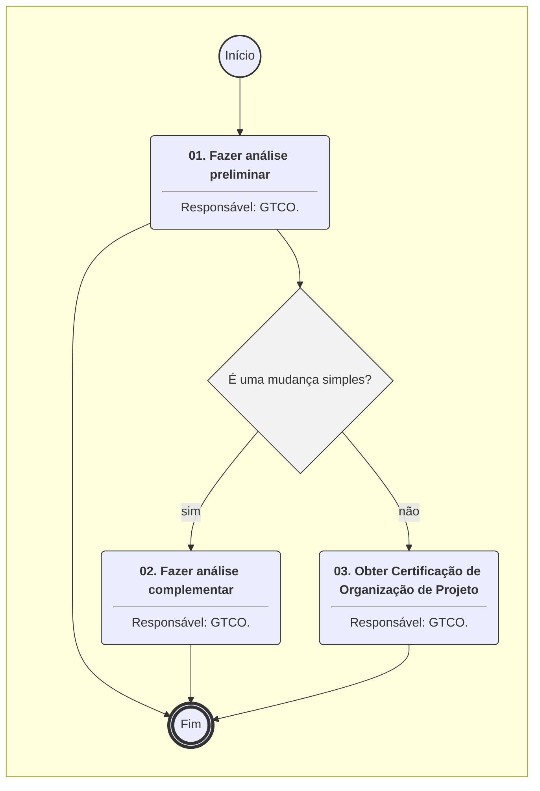
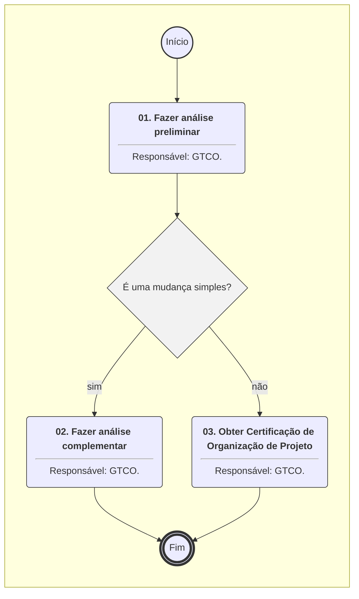

```mermaid
%%{init: {'theme': 'default'}}%%

flowchart TD
    classDef inicio stroke:#333,stroke-width:2px;
    classDef fim stroke:#333,stroke-width:4px;
    classDef tarefaBPMN stroke:#333,stroke-width:1px;
    classDef gatewayBPMN fill:#f2f2f2,stroke:#333,stroke-width:1px;
    classDef raia fill:none,stroke:#999,stroke-width:1px,stroke-dasharray: 5 5;
    subgraph Container_ID_MPR_SAR_160_R00_1 [ ]
        direction TB
        ID_MPR_SAR_160_R00_1_Start((Início)):::inicio
        ID_MPR_SAR_160_R00_1_End(((Fim))):::fim
        ID_MPR_SAR_160_R00_1_01("<b>01. Auditar as Organizações de Projeto Certificadas</b><hr>Responsável: GTCO."):::tarefaBPMN
        ID_MPR_SAR_160_R00_1_01("<b>01. Averiguar os documentos de demonstração de cumprimento com os requisitos da base de certificação</b><hr>Responsável: Engenharia - Investigação Técnica."):::tarefaBPMN
        ID_MPR_SAR_160_R00_1_01("<b>01. Fazer análise preliminar</b><hr>Responsável: GTCO."):::tarefaBPMN
        ID_MPR_SAR_160_R00_1_02("<b>02. Fazer análise complementar</b><hr>Responsável: GTCO."):::tarefaBPMN
        ID_MPR_SAR_160_R00_1_03("<b>03. Obter Certificação de Organização de Projeto</b><hr>Responsável: GTCO."):::tarefaBPMN
        ID_MPR_SAR_160_R00_1_Start --> ID_MPR_SAR_160_R00_1_01
        ID_MPR_SAR_160_R00_1_01 --> ID_MPR_SAR_160_R00_1_End
        ID_MPR_SAR_160_R00_1_01 --> ID_MPR_SAR_160_R00_1_End
        gw_ID_MPR_SAR_160_R00_1_01{"É uma mudança simples?"}:::gatewayBPMN
        ID_MPR_SAR_160_R00_1_01 --> gw_ID_MPR_SAR_160_R00_1_01
        gw_ID_MPR_SAR_160_R00_1_01 -->|"sim"| ID_MPR_SAR_160_R00_1_02
        gw_ID_MPR_SAR_160_R00_1_01 -->|"não"| ID_MPR_SAR_160_R00_1_03
        ID_MPR_SAR_160_R00_1_02 --> ID_MPR_SAR_160_R00_1_End
        ID_MPR_SAR_160_R00_1_03 --> ID_MPR_SAR_160_R00_1_End
    end
    click ID_MPR_SAR_160_R00_1_01 href "#" "Todas as ações executadas para supervisão de uma Organização de Projeto, considerando o Sistema de Garantia do Projeto fazem parte da vigilância continuada, incluindo as auditorias recorrentes. Conforme estabelecido na seção 21.257-I do RBAC nº 21.  As auditorias recorrentes devem garantir que a cada 3 anos todas as empresas certificadas como Organização de Projeto recebam ciclos de auditorias capazes de verificar todos os processos certificados da organização.  Cabe a GTCO estabelecer um planejamento de auditorias para garantir que todos os processos certificados de todas as empresas certificadas sejam supervisionados. Entretanto, caso alguma ação de urgência seja identificada, uma auditoria pode ser realizada a qualquer momento, durante o desenvolvimento de um novo projeto ou não.  Conforme estabelecido acima para a auditoria inicial, a GTCO é responsável por coordenar as auditorias e realizar auditorias nos processos gerais da empresa. Processos específicos para cada tecnologia ou áreas da empresa ou, ainda, grupo de produtos são auditados pelas áreas responsáveis na GCPP. Ademais, é esperado que as auditorias nos processos de cada uma das áreas sejam aprofundadas para incorporar uma amostragem adequada de registros dos processos, garantindo que os processos estão adequados e serão seguidos na organização.  Os processos não gerais (específicos) devem ser auditados pelas áreas específicas da GCPP, permitindo que especialista da ANAC estabeleça, por meio da amostragem adequada, que os requisitos de certificação do produto são atendidos.  Também conforme a auditoria inicial, a GTCO averiguará os processos relativos aos CVE, entretanto, é esperado que uma amostragem adequada de CVE seja entrevistada para que o processo de qualificação e nomeação do CVE seja reavaliado, principalmente com CVE nomeados recentemente. As entrevistas com os CVE devem ser realizadas pelas áreas da GCPP.  Durante uma certificação de tipo, ou qualquer análise requerida por um especialista da ANAC de documentos apresentados com o intuito de demonstrar o cumprimento com requisitos de certificação, qualquer discordância com o parecer apresentado pela organização, incluindo a verificação independente de cumprimento com os requisitos, deve ser tratada e discutida no nível adequado. Caso a discussão sobre a discordância seja exaurida no nível técnico e ambas as partes mantenham o dissenso, o processo de solução de conflitos na SAR deve ser iniciado.  Os casos de suspensão ou revogação do certificado de organização de projeto são geridos pela GTCO e podem requerer a criação de um comitê interno para a definição. Neste caso, o comitê deve, ao menos, ter a participação das seguintes gerências: GTCO, GTPR e GTEN ou GTEV, a depender da área que ensejou o pedido de suspensão ou revogação."
    click ID_MPR_SAR_160_R00_1_01 href "#" "Esta etapa acontece sempre que um especialista da ANAC indicar que haverá envolvimento da agência na análise da demonstração de cumprimento com os requisitos da base de certificação.  O objetivo desta etapa é garantir que o requisito foi devidamente demonstrado tecnicamente, ou seja, se está conforme o meio de cumprimento adequado e aceito pela ANAC. Os processos de averiguação a serem seguidos são os mesmos para uma organização que não é certificada como Organização de Projeto conforme descrito no MPR/SAR-101.  Para uma Organização de Projeto certificada, além da averiguação da adequação da demonstração, o especialista pode averiguar se a verificação independente foi realizada conforme os processos aceitos pela ANAC e se a verificação está tecnicamente adequada. Como exemplo de adequação técnica, pode-se citar um requisito que afeta mais de uma tecnologia, por exemplo, a tecnologia de trem de pouso e estruturas. Neste caso, esperar-se-ia que um CVE de estruturas e outro de sistemas trem de pouso tivessem analisado e aprovado a demonstração de cumprimento com os requisitos, e que ambas as aprovações são suficientes para cobrir todos os aspectos da demonstração (controle de interfaces), ou, ao menos, que um CVE com Q/A/F (Quadro/Área/Função) adequado para ambas as tecnologias tivesse realizado a tarefa.  Outro exemplo de falha da verificação é a identificação de falta da independência requerida por requisito.  Caso exista uma falha na verificação de cumprimento com o requisito, o especialista deve informar o GPC e o responsável na GTCO para que seja definida uma ação adicional.  Caso a demonstração esteja adequada, mas existam falhas técnicas ou processuais na verificação realizada pelo CVE, o especialista da ANAC deve informar a situação por meio de mensagem eletrônica, ou outro meio adequado, tanto ao GPC quanto ao responsável na GTCO e a demonstração realizada pela empresa pode, a depender da decisão do especialista, em conjunto com o GPC e o responsável da GTCO, ser aceita para fins de aprovação do projeto.  Obviamente, caso a própria demonstração de cumprimento com o requisito (show compliance ou compliance demonstration) esteja falha, o projeto não pode ser aprovado, conforme os procedimentos disponíveis para organizações que não são certificadas como Organizações de Projeto."
    click ID_MPR_SAR_160_R00_1_01 href "#" "O processo é iniciado a partir de uma solicitação de um detentor da certificação e analisado pela GTCO.  A análise preliminar tem o intuito de verificar a completude dos documentos encaminhados. Caso algum documento esteja faltando, a GTCO deve informar à Organização de Projeto.  O balizador para definir se a mudança é simples ou não tem a ver com o envolvimento de outras áreas da ANAC e uma análise subjetiva do responsável da GTCO. Caso a mudança possa ser analisada apenas pela GTCO e seja de fácil e rápida implementação, não requerendo auditorias prévias para verificação da possibilidade de implementação dos processos propostos, a mudança pode ser considerada simples.  Ressalta-se que customizações, a critério do analista da GTCO, podem ser realizadas no processo completo de obtenção da Certificação como Organização de Projeto para evitar etapas desnecessárias."
    click ID_MPR_SAR_160_R00_1_02 href "#" "A GTCO é a responsável por conduzir a análise complementar. Caso necessário, outras áreas poderão ser envolvidas na análise.  Em função da alteração proposta, é possível que auditorias sejam estabelecidas para garantir que os processos alterados serão cumpridos na organização.  As etapas para a análise podem envolver todas as atividades da certificação inicial como organização de projeto, com particularidades aplicáveis à alteração, por exemplo, ao invés da emissão do certificado o resultado final pode ser a emenda dos Termos da Certificação. Obviamente, o processo pode ser bastante resumido e encerrado com um Ofício emitido pela GTCO indicando que a mudança foi aprovada.  Toda a documentação atrelada ao processo de alteração deve ser incluída no SEI e o processo vinculado ao processo da certificação original."
    click ID_MPR_SAR_160_R00_1_03 href "#" "Esta atividade está substanciada no Processo de Trabalho Obter Certificação de Organização de Projeto o qual está contido neste Manual de Procedimento."
```

# MANUAL DE PROCEDIMENTO

**MANUAL DE PROCEDIMENTO**

**MPR/SAR-160-R00**

**CERTIFICAÇÃO DE ORGANIZAÇÃO DE PROJETO**

03/2024

**REVISÕES**

|  |  |  |  |  |
| --- | --- | --- | --- | --- |
| **Revisão** | **Aprovação** | **Publicação** | **Aprovado Por** | **Modificações da Última Versão** |
| R00 | Portaria 14174 de 23 de março de 2024. | 28/03/2024 | SAR | Versão Original |

**ÍNDICE**

1) Disposições Preliminares, pág. 5.

1.1) Introdução, pág. 5.

1.2) Revogação, pág. 5.

1.3) Fundamentação, pág. 5.

1.4) Executores dos Processos, pág. 5.

1.5) Elaboração e Revisão, pág. 6.

1.6) Organização do Documento, pág. 6.

2) Definições, pág. 8.

2.1) Sigla, pág. 8.

3) Artefatos, Competências, Sistemas e Documentos Administrativos, pág. 9.

3.1) Artefatos, pág. 9.

3.2) Competências, pág. 9.

3.3) Sistemas, pág. 9.

3.4) Documentos e Processos Administrativos, pág. 9.

4) Procedimentos Referenciados, pág. 10.

5) Procedimentos, pág. 11.

5.1) Obter Certificação de Organização de Projeto, pág. 11.

5.2) Implementar Vigilância Continuada - Auditoria, pág. 19.

5.3) Implementar Vigilância Continuada - Averiguação de Cumprimento com o Requisito, pág. 22.

5.4) Aprovar Mudanças no Sistema de Garantia do Projeto ou Emendas Aos Termos da Certificação, pág. 24.

6) Disposições Finais, pág. 27.

**PARTICIPAÇÃO NA EXECUÇÃO DOS PROCESSOS**

**ÁREAS ORGANIZACIONAIS**

**1) Gerência Técnica de Certificação de Organizações e Inspeção**

a) Aprovar Mudanças no Sistema de Garantia do Projeto ou Emendas Aos Termos da Certificação

b) Implementar Vigilância Continuada - Auditoria

c) Implementar Vigilância Continuada - Averiguação de Cumprimento com o Requisito

d) Obter Certificação de Organização de Projeto

**GRUPOS ORGANIZACIONAIS**

**a) Engenharia - Investigação Técnica**

1) Implementar Vigilância Continuada - Averiguação de Cumprimento com o Requisito

**b) Grupo de Trabalho - Análise Complementar**

1) Obter Certificação de Organização de Projeto

**c) O SAR**

1) Obter Certificação de Organização de Projeto

**1. DISPOSIÇÕES PRELIMINARES**

**1.1 INTRODUÇÃO**

Este Manual de Procedimento decorrente do processo 00066.004763/2023-60 visa orientar o especialista no processo de Certificação de Organização de Projeto.

O MPR estabelece, no âmbito da Superintendência de Aeronavegabilidade - SAR, os seguintes processos de trabalho:

a) Obter Certificação de Organização de Projeto.

b) Implementar Vigilância Continuada - Auditoria.

c) Implementar Vigilância Continuada - Averiguação de Cumprimento com o Requisito.

d) Aprovar Mudanças no Sistema de Garantia do Projeto ou Emendas Aos Termos da Certificação.

**1.2 REVOGAÇÃO**

Item não aplicável.

**1.3 FUNDAMENTAÇÃO**

Resolução nº 381, de 14 de junho de 2016, art. 31 e alterações posteriores

**1.4 EXECUTORES DOS PROCESSOS**

Os procedimentos contidos neste documento aplicam-se aos servidores integrantes das seguintes áreas organizacionais:

|  |  |
| --- | --- |
| **Área Organizacional** | **Descrição** |
| Gerência Técnica de Certificação de Organizações e Inspeção - GTCO | Gerência Técnica responsável por propor a emissão, suspensão e extinção de certificado de organização de projeto e de certificado de organização de produção, e por emitir, suspender e extinguir certificado de autorização de voo experimental e certificado de aeronavegabilidade especial para aeronaves categoria leve esportiva. |

|  |  |
| --- | --- |
| **Grupo Organizacional** | **Descrição** |
| Engenharia - Investigação Técnica | Grupo de engenheiros da SAR responsáveis pela investigação técnica visando a certificação de aeronaves. |
| Grupo de Trabalho - Análise Complementar | Grupo destinado a complementar a análise da GTCO quando houver processo de Certificação de Organização de Projeto – COPj. Será composto por membros da GTPR, GTEN, GTEV e GTAC, a depender do escopo da certificação requerida. |
| O SAR | O Superintendente da SAR |

**1.5 ELABORAÇÃO E REVISÃO**

O processo que resulta na aprovação ou alteração deste MPR é de responsabilidade da Superintendência de Aeronavegabilidade - SAR. Em caso de sugestões de revisão, deve-se procurá-la para que sejam iniciadas as providências cabíveis.

As revisões deste MPR serão aprovadas pelo(s) titular(es) da(s) unidade(s) responsável(is) pela execução do(s) processo(s) nele listado(s).

**1.6 ORGANIZAÇÃO DO DOCUMENTO**

O capítulo 2 apresenta as principais definições utilizadas no âmbito deste MPR, e deve ser visto integralmente antes da leitura de capítulos posteriores.

O capítulo 3 apresenta as competências, os artefatos e os sistemas envolvidos na execução dos processos deste manual, em ordem relativamente cronológica.

O capítulo 4 apresenta os processos de trabalho referenciados neste MPR. Estes processos são publicados em outros manuais que não este, mas cuja leitura é essencial para o entendimento dos processos publicados neste manual. O capítulo 4 expõe em quais manuais são localizados cada um dos processos de trabalho referenciados.

O capítulo 5 apresenta os processos de trabalho. Para encontrar um processo específico, deve-se procurar sua respectiva página no índice contido no início do documento. Os processos estão ordenados em etapas. Cada etapa é contida em uma tabela, que possui em si todas as informações necessárias para sua realização. São elas, respectivamente:

a) o título da etapa;

b) a descrição da forma de execução da etapa;

c) as competências necessárias para a execução da etapa;

d) os artefatos necessários para a execução da etapa;

e) os sistemas necessários para a execução da etapa (incluindo, bases de dados em forma de arquivo, se existente);

f) os documentos e processos administrativos que precisam ser elaborados durante a execução da etapa;

g) instruções para as próximas etapas; e

h) as áreas ou grupos organizacionais responsáveis por executar a etapa.

O capítulo 6 apresenta as disposições finais do documento, que trata das ações a serem realizadas em casos não previstos.

Por último, é importante comunicar que este documento foi gerado automaticamente. São recuperados dados sobre as etapas e sua sequência, as definições, os grupos, as áreas organizacionais, os artefatos, as competências, os sistemas, entre outros, para os processos de trabalho aqui apresentados, de forma que alguma mecanicidade na apresentação das informações pode ser percebida. O documento sempre apresenta as informações mais atualizadas de nomes e siglas de grupos, áreas, artefatos, termos, sistemas e suas definições, conforme informação disponível na base de dados, independente da data de assinatura do documento. Informações sobre etapas, seu detalhamento, a sequência entre etapas, responsáveis pelas etapas, artefatos, competências e sistemas associados a etapas, assim como seus nomes e os nomes de seus processos têm suas definições idênticas à da data de assinatura do documento.

**2. DEFINIÇÕES**

A tabela abaixo apresenta as definições necessárias para o entendimento deste Manual de Procedimento.

**2.1 Sigla**

|  |  |
| --- | --- |
| **Definição** | **Significado** |
| CCST | Coordenadoria de Certificação Suplementar de Tipo |
| COPJ | Certificado como Organização de  Projeto |
| CPCT | Coordenadoria de Programas de Certificação de Tipo |
| CST | Certificado Suplementar de Tipo |
| CT | Certificado de Tipo |
| CVE | Compliance Verification Expert |
| GCPP | Gerência de Certificação de Projeto de Produto Aeronáutico |
| GPC | Coordenador de Programa de Certificação |
| GTAC | Gerência Técnica de Aeronavegabilidade Continuada |
| GTEN | Gerência Técnica de Engenharia de Produto |
| GTEV | Gerência Técnica Engenharia de Voo |
| GTPR | Gerência Técnica de Programas de Certificação |
| NC | Não Conformidade |
| NT | Nota Técnica |

**3. ARTEFATOS, COMPETÊNCIAS, SISTEMAS E DOCUMENTOS ADMINISTRATIVOS**

Abaixo se encontram as listas dos artefatos, competências, sistemas e documentos administrativos que o executor necessita consultar, preencher, analisar ou elaborar para executar os processos deste MPR. As etapas descritas no capítulo seguinte indicam onde usar cada um deles.

As competências devem ser adquiridas por meio de capacitação ou outros instrumentos e os artefatos se encontram no módulo "Artefatos" do sistema GFT - Gerenciador de Fluxos de Trabalho.

**3.1 ARTEFATOS**

Não há artefatos descritos para a realização deste MPR.

**3.2 COMPETÊNCIAS**

Para que os processos de trabalho contidos neste MPR possam ser realizados com qualidade e efetividade, é importante que as pessoas que venham a executá-los possuam um determinado conjunto de competências. No capítulo 5, as competências específicas que o executor de cada etapa de cada processo de trabalho deve possuir são apresentadas. A seguir, encontra-se uma lista geral das competências contidas em todos os processos de trabalho deste MPR e a indicação de qual área ou grupo organizacional as necessitam:

Não há competências descritas para a realização deste MPR.

**3.3 SISTEMAS**

|  |  |  |
| --- | --- | --- |
| **Nome** | **Descrição** | **Acesso** |
| SEI | Sistema Eletrônico de Informação. | https://sei.anac.gov.br/sip/login.php?sigla\_orgao\_sistema=ANAC&sigla\_sistema=SEI |

**3.4 DOCUMENTOS E PROCESSOS ADMINISTRATIVOS ELABORADOS NESTE MANUAL**

Não há documentos ou processos administrativos a serem elaborados neste MPR.

**4. PROCEDIMENTOS REFERENCIADOS**

Procedimentos referenciados são processos de trabalho publicados em outro MPR que têm relação com os processos de trabalho publicados por este manual. Este MPR não possui nenhum processo de trabalho referenciado.

**

## 5.1 Obter Certificação de Organização de Projeto

```mermaid
%%{init: {'theme': 'default'}}%%

flowchart TD
    classDef inicio stroke:#333,stroke-width:2px;
    classDef fim stroke:#333,stroke-width:4px;
    classDef tarefaBPMN stroke:#333,stroke-width:1px;
    classDef gatewayBPMN fill:#f2f2f2,stroke:#333,stroke-width:1px;
    classDef raia fill:none,stroke:#999,stroke-width:1px,stroke-dasharray: 5 5;
    subgraph Container_ID_MPR_SAR_160_R00_0 [ ]
        direction TB
        ID_MPR_SAR_160_R00_0_Start((Início)):::inicio
        ID_MPR_SAR_160_R00_0_End(((Fim))):::fim
        ID_MPR_SAR_160_R00_0_01("<b>01. Realizar reunião de familiarização</b><hr>Responsável: GTCO."):::tarefaBPMN
        ID_MPR_SAR_160_R00_0_02("<b>02. Realizar reunião de solicitação prévia</b><hr>Responsável: GTCO."):::tarefaBPMN
        ID_MPR_SAR_160_R00_0_03("<b>03. Analisar escopo da solicitação da certificação e cronograma apresentado</b><hr>Responsável: GTCO."):::tarefaBPMN
        ID_MPR_SAR_160_R00_0_04("<b>04. Fazer reunião de solicitação formal</b><hr>Responsável: GTCO."):::tarefaBPMN
        ID_MPR_SAR_160_R00_0_05("<b>05. Fazer a primeira análise nos documentos da certificação</b><hr>Responsável: GTCO."):::tarefaBPMN
        ID_MPR_SAR_160_R00_0_06("<b>06. Fazer a análise complementar</b><hr>Responsável: Grupo de Trabalho - Análise Complementar."):::tarefaBPMN
        ID_MPR_SAR_160_R00_0_07("<b>07. Fazer Consolidação</b><hr>Responsável: GTCO."):::tarefaBPMN
        ID_MPR_SAR_160_R00_0_08("<b>08. Fazer auditorias</b><hr>Responsável: GTCO."):::tarefaBPMN
        ID_MPR_SAR_160_R00_0_09("<b>09. Certificar a Organização</b><hr>Responsável: O SAR."):::tarefaBPMN
        ID_MPR_SAR_160_R00_0_01("<b>01. Auditar as Organizações de Projeto Certificadas</b><hr>Responsável: GTCO."):::tarefaBPMN
        ID_MPR_SAR_160_R00_0_01("<b>01. Averiguar os documentos de demonstração de cumprimento com os requisitos da base de certificação</b><hr>Responsável: Engenharia - Investigação Técnica."):::tarefaBPMN
        ID_MPR_SAR_160_R00_0_01("<b>01. Fazer análise preliminar</b><hr>Responsável: GTCO."):::tarefaBPMN
        ID_MPR_SAR_160_R00_0_02("<b>02. Fazer análise complementar</b><hr>Responsável: GTCO."):::tarefaBPMN
        ID_MPR_SAR_160_R00_0_03("<b>03. Obter Certificação de Organização de Projeto</b><hr>Responsável: GTCO."):::tarefaBPMN
        ID_MPR_SAR_160_R00_0_Start --> ID_MPR_SAR_160_R00_0_01
        ID_MPR_SAR_160_R00_0_01 --> ID_MPR_SAR_160_R00_0_02
        ID_MPR_SAR_160_R00_0_02 --> ID_MPR_SAR_160_R00_0_03
        ID_MPR_SAR_160_R00_0_03 --> ID_MPR_SAR_160_R00_0_04
        ID_MPR_SAR_160_R00_0_04 --> ID_MPR_SAR_160_R00_0_05
        ID_MPR_SAR_160_R00_0_06 --> ID_MPR_SAR_160_R00_0_07
        gw_ID_MPR_SAR_160_R00_0_07{"NC em aberto?"}:::gatewayBPMN
        ID_MPR_SAR_160_R00_0_07 --> gw_ID_MPR_SAR_160_R00_0_07
        gw_ID_MPR_SAR_160_R00_0_07 -->|"não"| ID_MPR_SAR_160_R00_0_08
        gw_ID_MPR_SAR_160_R00_0_07 -->|"sim"| ID_MPR_SAR_160_R00_0_05
        ID_MPR_SAR_160_R00_0_08 --> ID_MPR_SAR_160_R00_0_09
        ID_MPR_SAR_160_R00_0_09 --> ID_MPR_SAR_160_R00_0_End
        ID_MPR_SAR_160_R00_0_01 --> ID_MPR_SAR_160_R00_0_End
        ID_MPR_SAR_160_R00_0_01 --> ID_MPR_SAR_160_R00_0_End
        gw_ID_MPR_SAR_160_R00_0_01{"É uma mudança simples?"}:::gatewayBPMN
        ID_MPR_SAR_160_R00_0_01 --> gw_ID_MPR_SAR_160_R00_0_01
        gw_ID_MPR_SAR_160_R00_0_01 -->|"sim"| ID_MPR_SAR_160_R00_0_02
        gw_ID_MPR_SAR_160_R00_0_01 -->|"não"| ID_MPR_SAR_160_R00_0_03
        ID_MPR_SAR_160_R00_0_02 --> ID_MPR_SAR_160_R00_0_End
        ID_MPR_SAR_160_R00_0_03 --> ID_MPR_SAR_160_R00_0_End
    end
    click ID_MPR_SAR_160_R00_0_01 href "#" "A reunião de familiarização tem por objetivo dirimir dúvidas em relação ao Sistema de Garantia do Projeto e outros elementos da certificação como Organização de Projeto e em relação ao processo de certificação da organização. Não é uma etapa obrigatória, visto que não consta da IS 21.231-001. Entretanto, pode ocorrer quando a organização entra em contato com a ANAC para entender melhor o objetivo e funcionamento da Certificação como Organização de Projeto e não está pronta para iniciar a solicitação prévia  Usualmente esta etapa é composta de várias reuniões antes da Solicitação Prévia até que o requerente tenha consciência de todos os elementos do sistema, benefícios e desvantagens da certificação como Organização de Projeto.  A GTCO conduz o processo, entretanto, outras gerências da SAR podem ser convidadas a participar da(s) reunião(ões) em função do nível de conhecimento da requerente e dúvidas apresentadas.  A organização requerente é a responsável por solicitar as reuniões. Caso entenda-se que várias reuniões de familiarização serão necessárias, a organização pode propor um cronograma de reuniões para a GTCO.  Esta atividade pode ser resumida a apenas uma reunião, caso o requerente entenda que possui conhecimento prévio adequado. Neste caso, a reunião de familiarização servirá para que a empresa seja melhor conhecida pela ANAC e, caso a requerente e a ANAC confirmem a inexistência de dúvidas sobre o Sistema de Garantia do Projeto, conforme estabelecido na IS 21.231-001, e demais pontos da Certificação da Organização de Projeto, a etapa é concluída.  Não há necessidade em manter os registros das reuniões no SEI, visto que ainda não há um processo em curso."
    click ID_MPR_SAR_160_R00_0_02 href "#" "A reunião de solicitação prévia tem o objetivo de:  1. Discutir o escopo da certificação;  2. Apresentar proposta de cronograma;  3. Apresentar as pessoas nomeadas para os cargos chave da organização com suas qualificações;  4. Discutir o funcionamento do sistema de Garantia do Projeto:  a. Apresentar os processos do sistema de garantia do projeto com ênfase nos processos chaves estabelecidas no meio de cumprimento aceitável.  5. Apresentar uma proposta de meio de cumprimento alternativo à IS 21.231-001, se aplicável.  Várias ou até mesmo uma única reunião podem ser suficientes nesta etapa.  A GTCO conduz o processo, entretanto, outras gerências da SAR podem ser convidadas a participar da(s) reunião(ões) em função do nível de conhecimento da requerente e dúvidas apresentadas.  A organização requerente é a responsável por solicitar as reuniões. Caso entenda-se que várias reuniões de solicitação prévia serão necessárias, a organização pode propor um cronograma de reuniões para a GTCO.  Registros da(s) reunião(ões) deve(m) ser mantidos no SEI e assinados pela organização requerente, além do responsável na GTCO."
    click ID_MPR_SAR_160_R00_0_03 href "#" "A etapa consiste em analisar o escopo da solicitação da certificação apresentada pela requerente na atividade 2 e o cronograma apresentado, verificar possíveis impactos internos à ANAC (carga de trabalho, possíveis responsáveis em cada área, estrutura necessária nas áreas para o atendimento a uma possível nova solicitação de certificação etc), impossibilidades no escopo apresentado e informar as coordenadorias da GTEN, GTEV e GTPR da existência da solicitação.  Esta atividade não necessariamente gera um entregável/parecer do responsável da GTCO (um documento de aceitação ou pedido de correção), visto que tem um prisma de verificação da capacidade interna da agência de atender a demanda. Alternativamente, a análise de escopo pode gerar um entregável/parecer do responsável da GTCO sobre o escopo do pedido, caso necessário.  A GTCO é a responsável pela etapa do processo. Além da comunicação às coordenadorias, caso existam dúvidas sobre o escopo da certificação apresentado, carga de trabalho para as áreas da ANAC, ou outros, que requeiram um alinhamento interno, a GTCO será responsável por agendar reuniões internas e convocar a participação de outras áreas da ANAC.  A análise encerra a fase 1 da Certificação da Organização de Projeto."
    click ID_MPR_SAR_160_R00_0_04 href "#" "Neste momento, todos os documentos requeridos para a certificação da empresa são discutidos e, após a reunião, submetidos à ANAC. Os documentos estão descritos na seção 21.234-I do RBAC nº 21.  Caso correções nos documentos requeridos para a certificação da organização sejam necessárias, a submissão pode ocorrer em tempo posterior à reunião. Após decorridos 60 dias da reunião, caso os documentos necessários à certificação não tenham sido protocolados na ANAC, a GTCO pode informar o requerente que o processo será encerrado por decurso de prazo.  A GTCO conduz o processo, entretanto, outras gerências da SAR são convidadas a participar da reunião, em função da análise da atividade 3, anterior.  Registro da reunião deve ser mantido no SEI e assinado pela organização requerente, além do responsável na GTCO e pelas áreas participantes.  A reunião e a submissão dos documentos encerram a fase 2 da Certificação da Organização de Projeto."
    click ID_MPR_SAR_160_R00_0_05 href "#" "A GTCO deverá realizar uma primeira análise em todos os documentos apresentados pela organização frente à Subparte J do RBAC 21. Esta primeira análise tem o objetivo de identificar documentos faltantes e falhas maiores (ou mais facilmente identificadas) na demonstração de requisitos de certificação da empresa. Caso alguma não conformidade que impeça a análise complementar dos documentos seja identificada, o processo é suspenso e a organização requerente é comunicada. Caso a GTCO não identifique nenhuma não conformidade que impeça o andamento do processo, as outras gerências afetadas são informadas e solicitadas à analisar os documentos conforme a atividade 06. Fazer a análise complementar, apresentada abaixo.  As não conformidades elencadas que não impedem o andamento do processo devem ser informadas às áreas responsáveis pela análise complementar.  A primeira análise deve ser registrada por meio de uma Nota Técnica no SEI processo de certificação da organização."
    click ID_MPR_SAR_160_R00_0_06 href "#" "Após a primeira análise, considerando que nenhuma não conformidade que impeça a continuidade da análise foi elencada pela GTCO, as áreas da GCPP (GTEN, GTEV, GTAC e CPCT, no caso de uma solicitação que inclua CT, ou CCST, no caso de uma solicitação que inclua CST ou aprovação de dados de alterações) são informadas para que iniciem a análise dos documentos apresentados para a certificação. O objetivo desta análise é verificar que todos os procedimentos específicos necessários ao cumprimento com os requisitos estão previstos no manual da empresa. Além das análises das outras áreas, a própria GTCO deve realizar uma análise aprofundada dos documentos apresentados nesta etapa, para garantir que os requisitos da subparte J do RBAC 21 estão devidamente cumpridos.  A forma de registro da análise das áreas deve ser acordada com a GTCO. Preferencialmente, a análise deve ser registrada em uma NT no processo de certificação da empresa no SEI. Formas alternativas de registro, que podem ser até mesmo um e-mail, podem ser aceitas."
    click ID_MPR_SAR_160_R00_0_07 href "#" "Receber todos os comentários das áreas envolvidas e consolidar em um  documento, preferencialmente uma NT, indicando possíveis correções necessárias aos  processos ou procedimentos da organização para que a certificação seja aceita ou, ainda,  possíveis melhorias a serem incorporadas ao texto dos processos ou procedimentos.  Informar a empresa sobre a resposta.  Esta etapa é de responsabilidade da GTCO.  Caso correções nos processos ou procedimentos da organização sejam indicadas, o  fluxograma de certificação da organização deve retornar à atividade 5.  Com a conclusão da etapa, quando todas as NC estiverem resolvidas, encerra-se a fase 3 da certificação como Organização de Projeto."
    click ID_MPR_SAR_160_R00_0_08 href "#" "Quando a ANAC considerar que os documentos apresentados são suficientes para indicar o atendimento à Subparte J do RBAC 21, a fase de Avaliação Documental é encerrada e inicia-se a fase de Auditorias.  Nesta fase, auditorias iniciais de certificação são realizadas na organização com o objetivo de garantir que os processos ou procedimentos apresentados nos documentos podem ser aplicados na organização.  Não é necessário que uma organização requerente à certificação inicial já esteja aplicando  os processos ou procedimentos internamente. A aplicação dos processos ou procedimentos na organização só é necessária após a certificação como Organização de Projeto. Entretanto, é necessário que os processos ou procedimentos possam ser aplicados. Ou seja, ferramentas, processos, ambientes, treinamentos, estrutura e demais questões necessárias para a implementação dos procedimentos devem estar concluídas e disponíveis para as pessoas na organização. Preferencialmente, todas as pessoas que têm alguma responsabilidade sobre a aeronavegabilidade, conforme item 5.2.8 da IS 21.231-001, devem estar qualificadas e nominadas. Caso  existam questões em aberto, uma análise sobre a possibilidade de conclusão da etapa de auditorias deve ser realizada e documentada.  A auditoria inicial normalmente é dividida em várias auditorias com escopo reduzido, para permitir a análise específica de cada processo.  A GTCO é responsável por coordenar as auditorias e realizar auditorias nos processos gerais  da empresa. Processos específicos para cada tecnologia ou áreas da empresa ou, ainda,  grupo de produtos são auditadas com o apoio das áreas responsáveis da GCPP. Ademais, é esperado que as auditorias nos processos de cada uma das áreas sejam aprofundadas para incorporar uma amostragem adequada de registros dos processos, quando disponíveis, permitindo que os processos sejam considerados adequados e que serão seguidos na organização.  Os processos relativos aos CVE são auditados pela GTCO, entretanto, é esperado que uma amostragem adequada de CVE seja entrevistada para que o processo de qualificação e nomeação do CVE seja validado. As entrevistas com os CVE devem ser realizadas pelas áreas da GCPP.  A preparação e liderança das auditorias é de responsabilidade da GTCO.  Qualquer pendência ou descumprimento com os requisitos de certificação da organização ou, ainda, verificação de descumprimento aos procedimentos estabelecidos pela organização, deve ser registrado sob a forma de uma não conformidade (NC). Quando todas as NC estabelecidas na auditoria forem concluídas e aceitas pela ANAC, a fase é concluída.  A IS 21.231-001 estabelece critérios para a classificação da NC."
    click ID_MPR_SAR_160_R00_0_09 href "#" "Após a conclusão da fase anterior, o certificado como Organização de Projeto é emitido, juntamente com os Termos da Certificação.  O escopo e as limitações da certificação são descritos nos Termos da Certificação, conforme seção 21.251-I do RBAC 21."
    click ID_MPR_SAR_160_R00_0_01 href "#" "Todas as ações executadas para supervisão de uma Organização de Projeto, considerando o Sistema de Garantia do Projeto fazem parte da vigilância continuada, incluindo as auditorias recorrentes. Conforme estabelecido na seção 21.257-I do RBAC nº 21.  As auditorias recorrentes devem garantir que a cada 3 anos todas as empresas certificadas como Organização de Projeto recebam ciclos de auditorias capazes de verificar todos os processos certificados da organização.  Cabe a GTCO estabelecer um planejamento de auditorias para garantir que todos os processos certificados de todas as empresas certificadas sejam supervisionados. Entretanto, caso alguma ação de urgência seja identificada, uma auditoria pode ser realizada a qualquer momento, durante o desenvolvimento de um novo projeto ou não.  Conforme estabelecido acima para a auditoria inicial, a GTCO é responsável por coordenar as auditorias e realizar auditorias nos processos gerais da empresa. Processos específicos para cada tecnologia ou áreas da empresa ou, ainda, grupo de produtos são auditados pelas áreas responsáveis na GCPP. Ademais, é esperado que as auditorias nos processos de cada uma das áreas sejam aprofundadas para incorporar uma amostragem adequada de registros dos processos, garantindo que os processos estão adequados e serão seguidos na organização.  Os processos não gerais (específicos) devem ser auditados pelas áreas específicas da GCPP, permitindo que especialista da ANAC estabeleça, por meio da amostragem adequada, que os requisitos de certificação do produto são atendidos.  Também conforme a auditoria inicial, a GTCO averiguará os processos relativos aos CVE, entretanto, é esperado que uma amostragem adequada de CVE seja entrevistada para que o processo de qualificação e nomeação do CVE seja reavaliado, principalmente com CVE nomeados recentemente. As entrevistas com os CVE devem ser realizadas pelas áreas da GCPP.  Durante uma certificação de tipo, ou qualquer análise requerida por um especialista da ANAC de documentos apresentados com o intuito de demonstrar o cumprimento com requisitos de certificação, qualquer discordância com o parecer apresentado pela organização, incluindo a verificação independente de cumprimento com os requisitos, deve ser tratada e discutida no nível adequado. Caso a discussão sobre a discordância seja exaurida no nível técnico e ambas as partes mantenham o dissenso, o processo de solução de conflitos na SAR deve ser iniciado.  Os casos de suspensão ou revogação do certificado de organização de projeto são geridos pela GTCO e podem requerer a criação de um comitê interno para a definição. Neste caso, o comitê deve, ao menos, ter a participação das seguintes gerências: GTCO, GTPR e GTEN ou GTEV, a depender da área que ensejou o pedido de suspensão ou revogação."
    click ID_MPR_SAR_160_R00_0_01 href "#" "Esta etapa acontece sempre que um especialista da ANAC indicar que haverá envolvimento da agência na análise da demonstração de cumprimento com os requisitos da base de certificação.  O objetivo desta etapa é garantir que o requisito foi devidamente demonstrado tecnicamente, ou seja, se está conforme o meio de cumprimento adequado e aceito pela ANAC. Os processos de averiguação a serem seguidos são os mesmos para uma organização que não é certificada como Organização de Projeto conforme descrito no MPR/SAR-101.  Para uma Organização de Projeto certificada, além da averiguação da adequação da demonstração, o especialista pode averiguar se a verificação independente foi realizada conforme os processos aceitos pela ANAC e se a verificação está tecnicamente adequada. Como exemplo de adequação técnica, pode-se citar um requisito que afeta mais de uma tecnologia, por exemplo, a tecnologia de trem de pouso e estruturas. Neste caso, esperar-se-ia que um CVE de estruturas e outro de sistemas trem de pouso tivessem analisado e aprovado a demonstração de cumprimento com os requisitos, e que ambas as aprovações são suficientes para cobrir todos os aspectos da demonstração (controle de interfaces), ou, ao menos, que um CVE com Q/A/F (Quadro/Área/Função) adequado para ambas as tecnologias tivesse realizado a tarefa.  Outro exemplo de falha da verificação é a identificação de falta da independência requerida por requisito.  Caso exista uma falha na verificação de cumprimento com o requisito, o especialista deve informar o GPC e o responsável na GTCO para que seja definida uma ação adicional.  Caso a demonstração esteja adequada, mas existam falhas técnicas ou processuais na verificação realizada pelo CVE, o especialista da ANAC deve informar a situação por meio de mensagem eletrônica, ou outro meio adequado, tanto ao GPC quanto ao responsável na GTCO e a demonstração realizada pela empresa pode, a depender da decisão do especialista, em conjunto com o GPC e o responsável da GTCO, ser aceita para fins de aprovação do projeto.  Obviamente, caso a própria demonstração de cumprimento com o requisito (show compliance ou compliance demonstration) esteja falha, o projeto não pode ser aprovado, conforme os procedimentos disponíveis para organizações que não são certificadas como Organizações de Projeto."
    click ID_MPR_SAR_160_R00_0_01 href "#" "O processo é iniciado a partir de uma solicitação de um detentor da certificação e analisado pela GTCO.  A análise preliminar tem o intuito de verificar a completude dos documentos encaminhados. Caso algum documento esteja faltando, a GTCO deve informar à Organização de Projeto.  O balizador para definir se a mudança é simples ou não tem a ver com o envolvimento de outras áreas da ANAC e uma análise subjetiva do responsável da GTCO. Caso a mudança possa ser analisada apenas pela GTCO e seja de fácil e rápida implementação, não requerendo auditorias prévias para verificação da possibilidade de implementação dos processos propostos, a mudança pode ser considerada simples.  Ressalta-se que customizações, a critério do analista da GTCO, podem ser realizadas no processo completo de obtenção da Certificação como Organização de Projeto para evitar etapas desnecessárias."
    click ID_MPR_SAR_160_R00_0_02 href "#" "A GTCO é a responsável por conduzir a análise complementar. Caso necessário, outras áreas poderão ser envolvidas na análise.  Em função da alteração proposta, é possível que auditorias sejam estabelecidas para garantir que os processos alterados serão cumpridos na organização.  As etapas para a análise podem envolver todas as atividades da certificação inicial como organização de projeto, com particularidades aplicáveis à alteração, por exemplo, ao invés da emissão do certificado o resultado final pode ser a emenda dos Termos da Certificação. Obviamente, o processo pode ser bastante resumido e encerrado com um Ofício emitido pela GTCO indicando que a mudança foi aprovada.  Toda a documentação atrelada ao processo de alteração deve ser incluída no SEI e o processo vinculado ao processo da certificação original."
    click ID_MPR_SAR_160_R00_0_03 href "#" "Esta atividade está substanciada no Processo de Trabalho Obter Certificação de Organização de Projeto o qual está contido neste Manual de Procedimento."
```


## 5.1 Obter Certificação de Organização de Projeto




## 5.1 Obter Certificação de Organização de Projeto




## 5.1 Obter Certificação de Organização de Projeto



6. DISPOSIÇÕES FINAIS**

Em caso de identificação de erros e omissões neste manual pelo executor do processo, a SAR deve ser contatada. Cópias eletrônicas deste manual, do fluxo e dos artefatos usados podem ser encontradas em sistema.