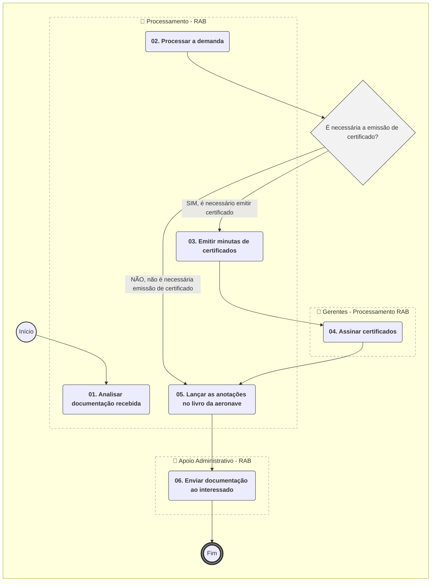

```mermaid
%%{init: {'theme': 'default'}}%%

flowchart TD
    classDef inicio stroke:#333,stroke-width:2px;
    classDef fim stroke:#333,stroke-width:4px;
    classDef tarefaBPMN stroke:#333,stroke-width:1px;
    classDef gatewayBPMN fill:#f2f2f2,stroke:#333,stroke-width:1px;
    classDef raia fill:none,stroke:#999,stroke-width:1px,stroke-dasharray: 5 5;
    subgraph Container_ID_MPR_SAR_181_R03_2 [ ]
        direction TB
        ID_MPR_SAR_181_R03_2_Start((Início)):::inicio
        ID_MPR_SAR_181_R03_2_End(((Fim))):::fim
        subgraph Raia_ID_MPR_SAR_181_R03_2_1 [👤 Analistas de Demanda Judicial do RAB]
            ID_MPR_SAR_181_R03_2_01("<b>01. Realizar pré-análise da solicitação</b>"):::tarefaBPMN
            ID_MPR_SAR_181_R03_2_02("<b>02. Solicitar abertura de processo</b>"):::tarefaBPMN
            ID_MPR_SAR_181_R03_2_05("<b>05. Emitir despacho e minuta de ofício</b>"):::tarefaBPMN
            ID_MPR_SAR_181_R03_2_07("<b>07. Revisar minuta de ofício e certidões</b>"):::tarefaBPMN
        end
        class Raia_ID_MPR_SAR_181_R03_2_1 raia;
        subgraph Raia_ID_MPR_SAR_181_R03_2_2 [👤 Apoio Administrativo - RAB]
            ID_MPR_SAR_181_R03_2_03("<b>03. Abrir processo</b>"):::tarefaBPMN
            ID_MPR_SAR_181_R03_2_06("<b>06. Enviar documentação ao interessado</b>"):::tarefaBPMN
        end
        class Raia_ID_MPR_SAR_181_R03_2_2 raia;
        subgraph Raia_ID_MPR_SAR_181_R03_2_3 [👤 Apoio de Análise Judicial - RAB]
            ID_MPR_SAR_181_R03_2_04("<b>04. Analisar e preparar minutas de despacho e ofício</b>"):::tarefaBPMN
            ID_MPR_SAR_181_R03_2_06("<b>06. Preparar minuta de ofício e emitir certidão negativa</b>"):::tarefaBPMN
        end
        class Raia_ID_MPR_SAR_181_R03_2_3 raia;
        subgraph Raia_ID_MPR_SAR_181_R03_2_4 [👤 Processamento - RAB]
            ID_MPR_SAR_181_R03_2_01("<b>01. Aplicar alteração de restrição</b>"):::tarefaBPMN
            ID_MPR_SAR_181_R03_2_02("<b>02. Analisar necessidade de emissão de ofício</b>"):::tarefaBPMN
            ID_MPR_SAR_181_R03_2_03("<b>03. Emitir minuta de ofício</b>"):::tarefaBPMN
            ID_MPR_SAR_181_R03_2_01("<b>01. Avaliar documentação recebida</b>"):::tarefaBPMN
            ID_MPR_SAR_181_R03_2_02("<b>02. Processar a demanda</b>"):::tarefaBPMN
            ID_MPR_SAR_181_R03_2_01("<b>01. Conferir a documentação recebida</b>"):::tarefaBPMN
            ID_MPR_SAR_181_R03_2_02("<b>02. Registrar a comunicação de venda</b>"):::tarefaBPMN
            ID_MPR_SAR_181_R03_2_03("<b>03. Preparar relatório de comunicação de venda</b>"):::tarefaBPMN
            ID_MPR_SAR_181_R03_2_04("<b>04. Preparar ofício de indeferimento</b>"):::tarefaBPMN
            ID_MPR_SAR_181_R03_2_01("<b>01. Analisar documentação recebida</b>"):::tarefaBPMN
            ID_MPR_SAR_181_R03_2_02("<b>02. Processar a demanda</b>"):::tarefaBPMN
            ID_MPR_SAR_181_R03_2_03("<b>03. Emitir minutas de certificados</b>"):::tarefaBPMN
            ID_MPR_SAR_181_R03_2_05("<b>05. Lançar as anotações no livro da aeronave</b>"):::tarefaBPMN
        end
        class Raia_ID_MPR_SAR_181_R03_2_4 raia;
        subgraph Raia_ID_MPR_SAR_181_R03_2_5 [👤 O GTRAB]
            ID_MPR_SAR_181_R03_2_04("<b>04. Assinar ofício</b>"):::tarefaBPMN
            ID_MPR_SAR_181_R03_2_05("<b>05. Assinar despacho de indeferimento</b>"):::tarefaBPMN
            ID_MPR_SAR_181_R03_2_06("<b>06. Realizar intimação do indeferimento</b>"):::tarefaBPMN
        end
        class Raia_ID_MPR_SAR_181_R03_2_5 raia;
        subgraph Raia_ID_MPR_SAR_181_R03_2_6 [👤 Gerentes - Processamento RAB]
            ID_MPR_SAR_181_R03_2_04("<b>04. Assinar certificados</b>"):::tarefaBPMN
        end
        class Raia_ID_MPR_SAR_181_R03_2_6 raia;
        ID_MPR_SAR_181_R03_2_Start --> ID_MPR_SAR_181_R03_2_01
        gw_ID_MPR_SAR_181_R03_2_01{"Possui registro de aeronave e necessidade de registro de ato?"}:::gatewayBPMN
        ID_MPR_SAR_181_R03_2_01 --> gw_ID_MPR_SAR_181_R03_2_01
        gw_ID_MPR_SAR_181_R03_2_01 -->|"não possui registro ou necessidade de registro"| ID_MPR_SAR_181_R03_2_06
        gw_ID_MPR_SAR_181_R03_2_01 -->|"sim, possui registro e necessidade de registro de ato"| ID_MPR_SAR_181_R03_2_02
        ID_MPR_SAR_181_R03_2_02 --> ID_MPR_SAR_181_R03_2_03
        ID_MPR_SAR_181_R03_2_03 --> ID_MPR_SAR_181_R03_2_04
        ID_MPR_SAR_181_R03_2_04 --> ID_MPR_SAR_181_R03_2_05
        ID_MPR_SAR_181_R03_2_05 --> ID_MPR_SAR_181_R03_2_End
        ID_MPR_SAR_181_R03_2_06 --> ID_MPR_SAR_181_R03_2_07
        ID_MPR_SAR_181_R03_2_07 --> ID_MPR_SAR_181_R03_2_End
        ID_MPR_SAR_181_R03_2_01 --> ID_MPR_SAR_181_R03_2_02
        gw_ID_MPR_SAR_181_R03_2_02{"Ofício é necessário?"}:::gatewayBPMN
        ID_MPR_SAR_181_R03_2_02 --> gw_ID_MPR_SAR_181_R03_2_02
        gw_ID_MPR_SAR_181_R03_2_02 -->|"não é necessário ofício"| ID_MPR_SAR_181_R03_2_End
        gw_ID_MPR_SAR_181_R03_2_02 -->|"sim, é necessário ofício"| ID_MPR_SAR_181_R03_2_03
        ID_MPR_SAR_181_R03_2_03 --> ID_MPR_SAR_181_R03_2_04
        ID_MPR_SAR_181_R03_2_04 --> ID_MPR_SAR_181_R03_2_End
        ID_MPR_SAR_181_R03_2_01 --> ID_MPR_SAR_181_R03_2_02
        ID_MPR_SAR_181_R03_2_02 --> ID_MPR_SAR_181_R03_2_End
        gw_ID_MPR_SAR_181_R03_2_01{"Documentação está conforme?"}:::gatewayBPMN
        ID_MPR_SAR_181_R03_2_01 --> gw_ID_MPR_SAR_181_R03_2_01
        gw_ID_MPR_SAR_181_R03_2_01 -->|"SIM, está conforme"| ID_MPR_SAR_181_R03_2_02
        gw_ID_MPR_SAR_181_R03_2_01 -->|"NÃO, não está conforme"| ID_MPR_SAR_181_R03_2_04
        ID_MPR_SAR_181_R03_2_02 --> ID_MPR_SAR_181_R03_2_03
        ID_MPR_SAR_181_R03_2_03 --> ID_MPR_SAR_181_R03_2_End
        ID_MPR_SAR_181_R03_2_04 --> ID_MPR_SAR_181_R03_2_05
        ID_MPR_SAR_181_R03_2_05 --> ID_MPR_SAR_181_R03_2_06
        ID_MPR_SAR_181_R03_2_06 --> ID_MPR_SAR_181_R03_2_End
        gw_ID_MPR_SAR_181_R03_2_02{"É necessária a emissão de certificado?"}:::gatewayBPMN
        ID_MPR_SAR_181_R03_2_02 --> gw_ID_MPR_SAR_181_R03_2_02
        gw_ID_MPR_SAR_181_R03_2_02 -->|"SIM, é necessário emitir certificado"| ID_MPR_SAR_181_R03_2_03
        gw_ID_MPR_SAR_181_R03_2_02 -->|"NÃO, não é necessária emissão de certificado"| ID_MPR_SAR_181_R03_2_05
        ID_MPR_SAR_181_R03_2_03 --> ID_MPR_SAR_181_R03_2_04
        ID_MPR_SAR_181_R03_2_04 --> ID_MPR_SAR_181_R03_2_05
        ID_MPR_SAR_181_R03_2_05 --> ID_MPR_SAR_181_R03_2_06
        ID_MPR_SAR_181_R03_2_06 --> ID_MPR_SAR_181_R03_2_End
    end
    click ID_MPR_SAR_181_R03_2_01 href "#" "Avaliar se:  a) a solicitação insere-se na competência do Registro Aeronáutico Brasileiro;  b) a natureza do objeto da demanda;  c) a necessidade de atendimento em prazo especial (inferior ao prazo padrão de 30 dias);  d) o grau de sigilo.  Caso a solicitação não seja da competência do RAB esta deve ser encaminhada a outro setor da ANAC ou devolvida ao remetente.  Realizar pesquisa no sistema SACI sobre a existência de aeronave em nome da pessoa indicada pelo juízo. Emitir certidão (negativa ou de inteiro teor).  Ao executar esta atividade, atentar para possíveis melhorias que podem ser implantadas visando o aumento da eficiência da análise. Identificada a oportunidade, desenvolver projeto ou ação de melhoria e apresentar ao gestor responsável."
    click ID_MPR_SAR_181_R03_2_02 href "#" "Solicitar ao grupo 'Apoio Administrativo - RAB' a abertura de processo indicando a natureza do registro e as marcas da aeronave.  Caso haja ordem de restrição de voo ou levantamento da restrição de voo solicitar ao grupo 'Apoio Administrativo - RAB' a inserção ou retirada do código “S3” do sistema SACI.  Encaminhar a demanda e a certidão de inteiro teor da aeronave para abertura de processo pelo grupo Apoio Administrativo - RAB."
    click ID_MPR_SAR_181_R03_2_03 href "#" "Abrir ( processo ou documento) no SEI com base no protocolo recebido no documento de entrada.  Cadastrar o processo na planilha de controle de demandas judiciais.  Montar os autos do processo, encapar e anexar arquivo digital no SEI.  Enviar processo para o grupo “Analistas de Demanda Judicial do RAB“ no SEI."
    click ID_MPR_SAR_181_R03_2_04 href "#" "Criar despacho no SEI.  Realizar a análise da demanda e decidir pela inscrição ou não da ordem no livro da aeronave. São exemplos de inscrições: indisponibilidade, penhora, arresto, sequestro, restrição de voo, fiel depositário, alteração de propriedade ou operador e matricula judicial.  Exemplo de não inscrição de ordem judicial: ordem contra bem de pessoa que não é parte na ação judicial. Neste caso comunica-se ao juízo a ilegitimidade e solicita-se a reiteração da ordem."
    click ID_MPR_SAR_181_R03_2_05 href "#" "Redigir e assinar o despacho.  Anexar o despacho aos autos do processo.  Preparar minuta de ofício de resposta ao demandante."
    click ID_MPR_SAR_181_R03_2_06 href "#" "Preparar a minuta de ofício de resposta ao demandante (acesse artefato 'GTRAB - Modelo de Ofício Negativo'.  Emitir certidão negativa de propriedade e ônus reais e anexar à minuta de ofício.  Encaminhar a minuta e certidões para 'Analistas de Demanda Judicial do RAB'."
    click ID_MPR_SAR_181_R03_2_07 href "#" "Revisar os termos da minuta do ofício e conferir anexos.  Encaminhar minuta do ofício para assinatura do GTRAB."
    click ID_MPR_SAR_181_R03_2_01 href "#" "Existem dois tipos de restrição de aeronavegabilidade aplicadas pelo RAB: a Judicial, de código'S3', e a Administrativa, 'S4'.  A alteração da restrição, tanto de aplicação de suspensão quanto de sua retirada, é realizada pelo sistema SACI.  Observar as informações do artefato 'Orientações para Controle de Restrições de Aeronavegabilidade Pelo RAB'."
    click ID_MPR_SAR_181_R03_2_02 href "#" "Quando houver a retirada da suspensão S4 por atualização do endereço, deve ser emitido novo ofício.  Observar as informações do artefato 'Orientações para Controle de Restrições de Aeronavegabilidade Pelo RAB'."
    click ID_MPR_SAR_181_R03_2_03 href "#" "Emitir minuta de ofício de envio de certificado com os dados do destinatário atualizados.  Observar as informações do artefato 'Orientações para Controle de Restrições de Aeronavegabilidade Pelo RAB'."
    click ID_MPR_SAR_181_R03_2_04 href "#" "Atividade sem necessidade de detalhamento."
    click ID_MPR_SAR_181_R03_2_01 href "#" "Identificar se solicitação é referente a atualização de endereço.  Verificar se os documentos apresentados são suficientes para a atualização do endereço."
    click ID_MPR_SAR_181_R03_2_02 href "#" "A atualização cadastral deve ser feita no sistema SACI. Observar as informações contidas no artefato 'Orientações para Alteração Cadastral Simples'."
    click ID_MPR_SAR_181_R03_2_01 href "#" "Os dados referentes a uma comunicação de venda que devem ser apresentados pelo interessado e conferidos pelo servidor são:  1 - Dados da aeronave: marcas e/ou número de série;  2 - Dados pessoais do comprador e do vendedor (nome, endereço, CNPJ/CPF e identidade);  3 - Valor em moeda nacional;  4 - Menção sobre o formato da negociação, explicitando a quitação ou não do bem (parcelamento, eventuais bens envolvidos no negócio, etc);  5 - Assinaturas das partes com reconhecimento de firma.  Consultar a ITD-181-02."
    click ID_MPR_SAR_181_R03_2_02 href "#" "Entrar no sistema SACI na função de comunicação de venda e registrar o GRAVAME 73 na aeronave (Comunicada a venda) – caso não haja outro gravame. Caso contrário, deverão ser mantidos os gravames anteriores e adicionar o gravame “Comunicada a venda”.  Inserir os dados do adquirente informados na documentação recebida.  Consultar a ITD-181-02."
    click ID_MPR_SAR_181_R03_2_03 href "#" "Registrar no livro da aeronave o relatório padrão de comunicação de venda e inserir o texto “Comunicação de venda processada e registrada em livro. Processo arquivado.” no andamento do SEI e concluir o processo no SEI."
    click ID_MPR_SAR_181_R03_2_04 href "#" "Criar o ofício de indeferimento usando como modelo o texto padrão no SEI (OFÍCIO DE INDEFERIMENTO DE COMUNICAÇÃO DE VENDA), informando os documentos faltantes, e incluir o ofício no bloco de assinaturas do SEI (3934 – INDEFERIMENTO)."
    click ID_MPR_SAR_181_R03_2_05 href "#" "O GTRAB assina o bloco de assinaturas no qual o ofício está inserido."
    click ID_MPR_SAR_181_R03_2_06 href "#" "Enviar o ofício de indeferimento ao requerente por meio do módulo de intimação do SEI (se o requerente já estiver cadastrado no SEI) ou por e-mail (caso não haja cadastro)."
    click ID_MPR_SAR_181_R03_2_01 href "#" "Revisar formalidades do instrumento a ser registrado e conferir documentos das partes.  Caso se trate de processo relacionado a matrícula de aeronave, consultar a ITD-181-01.  A não conformidade do processo é caracterizada pela inadequação de um ou mais documentos revisados.  Ao executar esta atividade, atentar para possíveis melhorias que podem ser implantadas visando o aumento da eficiência da análise. Identificada a oportunidade, desenvolver projeto ou ação de melhoria e apresentar ao gestor responsável."
    click ID_MPR_SAR_181_R03_2_02 href "#" "Atualizar, inserir ou excluir informações no sistema SACI de acordo com a demanda recebida e conforme o artefato 'Orientações para Processamento de Demandas no SACI'. Caso a demanda se relacione a matrículas de aeronaves consultar também o artefato 'ITD-181-01'.  Consultar o artefato 'Guia Geral para Processamento de Demandas ao RAB'.  Analisar se é necessária a emissão de certificado.  A regra geral é que os certificados são emitidos pelo requerente diretamente pelo RAB Digital. Excepcionalmente, caso haja falha no RAB digital, os certificados serão emitidos pelo Processamento - RAB."
    click ID_MPR_SAR_181_R03_2_03 href "#" "Caso seja necessária a emissão de certificado, inserir as informações necessárias no sistema SACI, revisar as informações inseridas e emitir a minuta do certificado.  Seguir as orientações do artefato 'Guia Geral para Processamento de Demandas ao RAB'. Caso a demanda se relacione a matrículas de aeronaves consultar também o artefato 'ITD-181-01'.  Para emissão de Certificado, utilizar, conforme a necessidade, os artefatos 'Modelo de Certificado de Matrícula', 'Modelo de Certificado de Aeronavegabilidade', 'Modelo de Certificado de Autorização de Voo' e 'Modelo de Certificado de Marca Experimental'"
    click ID_MPR_SAR_181_R03_2_04 href "#" "Analisar a minuta de certificado recebida. Não encontrada qualquer desconformidade, assinar o certificado."
    click ID_MPR_SAR_181_R03_2_05 href "#" "Caso algum certificado não tenha sido emitido, inserir no sistema SACI/SCPRAB informação da não emissão do certificado e a justificativa.  Informar ao usuário sobre o deferimento do processo e a possibilidade de emissão dos certificados no RAB digital.  Caso o certificado tenha sido emitido, inserir nos sistemas SACI/SCPRAB e SEI a informação da emissão e a forma como será enviado ao interessado.  Checar se as informações necessárias foram processadas no SACI, para então lançar no livro da aeronave.  Observar as informações no 'Guia Geral para Processamento de Demandas ao RAB'."
    click ID_MPR_SAR_181_R03_2_06 href "#" "Separar a documentação que deve ser enviada, avaliar quem deve receber a mesma, checar os dados do destinatário, como nome e endereço e enviar.  São possíveis destinatários:  - Proprietário;  - Operador;  - Procurador."
```

```mermaid
%%{init: {'theme': 'default'}}%%

flowchart TD
    classDef inicio stroke:#333,stroke-width:2px;
    classDef fim stroke:#333,stroke-width:4px;
    classDef tarefaBPMN stroke:#333,stroke-width:1px;
    classDef gatewayBPMN fill:#f2f2f2,stroke:#333,stroke-width:1px;
    classDef raia fill:none,stroke:#999,stroke-width:1px,stroke-dasharray: 5 5;
    subgraph Container_ID_MPR_SAR_181_R03_3 [ ]
        direction TB
        ID_MPR_SAR_181_R03_3_Start((Início)):::inicio
        ID_MPR_SAR_181_R03_3_End(((Fim))):::fim
        subgraph Raia_ID_MPR_SAR_181_R03_3_1 [👤 Processamento - RAB]
            ID_MPR_SAR_181_R03_3_01("<b>01. Aplicar alteração de restrição</b>"):::tarefaBPMN
            ID_MPR_SAR_181_R03_3_02("<b>02. Analisar necessidade de emissão de ofício</b>"):::tarefaBPMN
            ID_MPR_SAR_181_R03_3_03("<b>03. Emitir minuta de ofício</b>"):::tarefaBPMN
            ID_MPR_SAR_181_R03_3_01("<b>01. Avaliar documentação recebida</b>"):::tarefaBPMN
            ID_MPR_SAR_181_R03_3_02("<b>02. Processar a demanda</b>"):::tarefaBPMN
            ID_MPR_SAR_181_R03_3_01("<b>01. Conferir a documentação recebida</b>"):::tarefaBPMN
            ID_MPR_SAR_181_R03_3_02("<b>02. Registrar a comunicação de venda</b>"):::tarefaBPMN
            ID_MPR_SAR_181_R03_3_03("<b>03. Preparar relatório de comunicação de venda</b>"):::tarefaBPMN
            ID_MPR_SAR_181_R03_3_04("<b>04. Preparar ofício de indeferimento</b>"):::tarefaBPMN
            ID_MPR_SAR_181_R03_3_01("<b>01. Analisar documentação recebida</b>"):::tarefaBPMN
            ID_MPR_SAR_181_R03_3_02("<b>02. Processar a demanda</b>"):::tarefaBPMN
            ID_MPR_SAR_181_R03_3_03("<b>03. Emitir minutas de certificados</b>"):::tarefaBPMN
            ID_MPR_SAR_181_R03_3_05("<b>05. Lançar as anotações no livro da aeronave</b>"):::tarefaBPMN
        end
        class Raia_ID_MPR_SAR_181_R03_3_1 raia;
        subgraph Raia_ID_MPR_SAR_181_R03_3_2 [👤 O GTRAB]
            ID_MPR_SAR_181_R03_3_04("<b>04. Assinar ofício</b>"):::tarefaBPMN
            ID_MPR_SAR_181_R03_3_05("<b>05. Assinar despacho de indeferimento</b>"):::tarefaBPMN
            ID_MPR_SAR_181_R03_3_06("<b>06. Realizar intimação do indeferimento</b>"):::tarefaBPMN
        end
        class Raia_ID_MPR_SAR_181_R03_3_2 raia;
        subgraph Raia_ID_MPR_SAR_181_R03_3_3 [👤 Gerentes - Processamento RAB]
            ID_MPR_SAR_181_R03_3_04("<b>04. Assinar certificados</b>"):::tarefaBPMN
        end
        class Raia_ID_MPR_SAR_181_R03_3_3 raia;
        subgraph Raia_ID_MPR_SAR_181_R03_3_4 [👤 Apoio Administrativo - RAB]
            ID_MPR_SAR_181_R03_3_06("<b>06. Enviar documentação ao interessado</b>"):::tarefaBPMN
        end
        class Raia_ID_MPR_SAR_181_R03_3_4 raia;
        ID_MPR_SAR_181_R03_3_Start --> ID_MPR_SAR_181_R03_3_01
        ID_MPR_SAR_181_R03_3_01 --> ID_MPR_SAR_181_R03_3_02
        gw_ID_MPR_SAR_181_R03_3_02{"Ofício é necessário?"}:::gatewayBPMN
        ID_MPR_SAR_181_R03_3_02 --> gw_ID_MPR_SAR_181_R03_3_02
        gw_ID_MPR_SAR_181_R03_3_02 -->|"não é necessário ofício"| ID_MPR_SAR_181_R03_3_End
        gw_ID_MPR_SAR_181_R03_3_02 -->|"sim, é necessário ofício"| ID_MPR_SAR_181_R03_3_03
        ID_MPR_SAR_181_R03_3_03 --> ID_MPR_SAR_181_R03_3_04
        ID_MPR_SAR_181_R03_3_04 --> ID_MPR_SAR_181_R03_3_End
        ID_MPR_SAR_181_R03_3_01 --> ID_MPR_SAR_181_R03_3_02
        ID_MPR_SAR_181_R03_3_02 --> ID_MPR_SAR_181_R03_3_End
        gw_ID_MPR_SAR_181_R03_3_01{"Documentação está conforme?"}:::gatewayBPMN
        ID_MPR_SAR_181_R03_3_01 --> gw_ID_MPR_SAR_181_R03_3_01
        gw_ID_MPR_SAR_181_R03_3_01 -->|"SIM, está conforme"| ID_MPR_SAR_181_R03_3_02
        gw_ID_MPR_SAR_181_R03_3_01 -->|"NÃO, não está conforme"| ID_MPR_SAR_181_R03_3_04
        ID_MPR_SAR_181_R03_3_02 --> ID_MPR_SAR_181_R03_3_03
        ID_MPR_SAR_181_R03_3_03 --> ID_MPR_SAR_181_R03_3_End
        ID_MPR_SAR_181_R03_3_04 --> ID_MPR_SAR_181_R03_3_05
        ID_MPR_SAR_181_R03_3_05 --> ID_MPR_SAR_181_R03_3_06
        ID_MPR_SAR_181_R03_3_06 --> ID_MPR_SAR_181_R03_3_End
        gw_ID_MPR_SAR_181_R03_3_02{"É necessária a emissão de certificado?"}:::gatewayBPMN
        ID_MPR_SAR_181_R03_3_02 --> gw_ID_MPR_SAR_181_R03_3_02
        gw_ID_MPR_SAR_181_R03_3_02 -->|"SIM, é necessário emitir certificado"| ID_MPR_SAR_181_R03_3_03
        gw_ID_MPR_SAR_181_R03_3_02 -->|"NÃO, não é necessária emissão de certificado"| ID_MPR_SAR_181_R03_3_05
        ID_MPR_SAR_181_R03_3_03 --> ID_MPR_SAR_181_R03_3_04
        ID_MPR_SAR_181_R03_3_04 --> ID_MPR_SAR_181_R03_3_05
        ID_MPR_SAR_181_R03_3_05 --> ID_MPR_SAR_181_R03_3_06
        ID_MPR_SAR_181_R03_3_06 --> ID_MPR_SAR_181_R03_3_End
    end
    click ID_MPR_SAR_181_R03_3_01 href "#" "Existem dois tipos de restrição de aeronavegabilidade aplicadas pelo RAB: a Judicial, de código'S3', e a Administrativa, 'S4'.  A alteração da restrição, tanto de aplicação de suspensão quanto de sua retirada, é realizada pelo sistema SACI.  Observar as informações do artefato 'Orientações para Controle de Restrições de Aeronavegabilidade Pelo RAB'."
    click ID_MPR_SAR_181_R03_3_02 href "#" "Quando houver a retirada da suspensão S4 por atualização do endereço, deve ser emitido novo ofício.  Observar as informações do artefato 'Orientações para Controle de Restrições de Aeronavegabilidade Pelo RAB'."
    click ID_MPR_SAR_181_R03_3_03 href "#" "Emitir minuta de ofício de envio de certificado com os dados do destinatário atualizados.  Observar as informações do artefato 'Orientações para Controle de Restrições de Aeronavegabilidade Pelo RAB'."
    click ID_MPR_SAR_181_R03_3_04 href "#" "Atividade sem necessidade de detalhamento."
    click ID_MPR_SAR_181_R03_3_01 href "#" "Identificar se solicitação é referente a atualização de endereço.  Verificar se os documentos apresentados são suficientes para a atualização do endereço."
    click ID_MPR_SAR_181_R03_3_02 href "#" "A atualização cadastral deve ser feita no sistema SACI. Observar as informações contidas no artefato 'Orientações para Alteração Cadastral Simples'."
    click ID_MPR_SAR_181_R03_3_01 href "#" "Os dados referentes a uma comunicação de venda que devem ser apresentados pelo interessado e conferidos pelo servidor são:  1 - Dados da aeronave: marcas e/ou número de série;  2 - Dados pessoais do comprador e do vendedor (nome, endereço, CNPJ/CPF e identidade);  3 - Valor em moeda nacional;  4 - Menção sobre o formato da negociação, explicitando a quitação ou não do bem (parcelamento, eventuais bens envolvidos no negócio, etc);  5 - Assinaturas das partes com reconhecimento de firma.  Consultar a ITD-181-02."
    click ID_MPR_SAR_181_R03_3_02 href "#" "Entrar no sistema SACI na função de comunicação de venda e registrar o GRAVAME 73 na aeronave (Comunicada a venda) – caso não haja outro gravame. Caso contrário, deverão ser mantidos os gravames anteriores e adicionar o gravame “Comunicada a venda”.  Inserir os dados do adquirente informados na documentação recebida.  Consultar a ITD-181-02."
    click ID_MPR_SAR_181_R03_3_03 href "#" "Registrar no livro da aeronave o relatório padrão de comunicação de venda e inserir o texto “Comunicação de venda processada e registrada em livro. Processo arquivado.” no andamento do SEI e concluir o processo no SEI."
    click ID_MPR_SAR_181_R03_3_04 href "#" "Criar o ofício de indeferimento usando como modelo o texto padrão no SEI (OFÍCIO DE INDEFERIMENTO DE COMUNICAÇÃO DE VENDA), informando os documentos faltantes, e incluir o ofício no bloco de assinaturas do SEI (3934 – INDEFERIMENTO)."
    click ID_MPR_SAR_181_R03_3_05 href "#" "O GTRAB assina o bloco de assinaturas no qual o ofício está inserido."
    click ID_MPR_SAR_181_R03_3_06 href "#" "Enviar o ofício de indeferimento ao requerente por meio do módulo de intimação do SEI (se o requerente já estiver cadastrado no SEI) ou por e-mail (caso não haja cadastro)."
    click ID_MPR_SAR_181_R03_3_01 href "#" "Revisar formalidades do instrumento a ser registrado e conferir documentos das partes.  Caso se trate de processo relacionado a matrícula de aeronave, consultar a ITD-181-01.  A não conformidade do processo é caracterizada pela inadequação de um ou mais documentos revisados.  Ao executar esta atividade, atentar para possíveis melhorias que podem ser implantadas visando o aumento da eficiência da análise. Identificada a oportunidade, desenvolver projeto ou ação de melhoria e apresentar ao gestor responsável."
    click ID_MPR_SAR_181_R03_3_02 href "#" "Atualizar, inserir ou excluir informações no sistema SACI de acordo com a demanda recebida e conforme o artefato 'Orientações para Processamento de Demandas no SACI'. Caso a demanda se relacione a matrículas de aeronaves consultar também o artefato 'ITD-181-01'.  Consultar o artefato 'Guia Geral para Processamento de Demandas ao RAB'.  Analisar se é necessária a emissão de certificado.  A regra geral é que os certificados são emitidos pelo requerente diretamente pelo RAB Digital. Excepcionalmente, caso haja falha no RAB digital, os certificados serão emitidos pelo Processamento - RAB."
    click ID_MPR_SAR_181_R03_3_03 href "#" "Caso seja necessária a emissão de certificado, inserir as informações necessárias no sistema SACI, revisar as informações inseridas e emitir a minuta do certificado.  Seguir as orientações do artefato 'Guia Geral para Processamento de Demandas ao RAB'. Caso a demanda se relacione a matrículas de aeronaves consultar também o artefato 'ITD-181-01'.  Para emissão de Certificado, utilizar, conforme a necessidade, os artefatos 'Modelo de Certificado de Matrícula', 'Modelo de Certificado de Aeronavegabilidade', 'Modelo de Certificado de Autorização de Voo' e 'Modelo de Certificado de Marca Experimental'"
    click ID_MPR_SAR_181_R03_3_04 href "#" "Analisar a minuta de certificado recebida. Não encontrada qualquer desconformidade, assinar o certificado."
    click ID_MPR_SAR_181_R03_3_05 href "#" "Caso algum certificado não tenha sido emitido, inserir no sistema SACI/SCPRAB informação da não emissão do certificado e a justificativa.  Informar ao usuário sobre o deferimento do processo e a possibilidade de emissão dos certificados no RAB digital.  Caso o certificado tenha sido emitido, inserir nos sistemas SACI/SCPRAB e SEI a informação da emissão e a forma como será enviado ao interessado.  Checar se as informações necessárias foram processadas no SACI, para então lançar no livro da aeronave.  Observar as informações no 'Guia Geral para Processamento de Demandas ao RAB'."
    click ID_MPR_SAR_181_R03_3_06 href "#" "Separar a documentação que deve ser enviada, avaliar quem deve receber a mesma, checar os dados do destinatário, como nome e endereço e enviar.  São possíveis destinatários:  - Proprietário;  - Operador;  - Procurador."
```

```mermaid
%%{init: {'theme': 'default'}}%%

flowchart TD
    classDef inicio stroke:#333,stroke-width:2px;
    classDef fim stroke:#333,stroke-width:4px;
    classDef tarefaBPMN stroke:#333,stroke-width:1px;
    classDef gatewayBPMN fill:#f2f2f2,stroke:#333,stroke-width:1px;
    classDef raia fill:none,stroke:#999,stroke-width:1px,stroke-dasharray: 5 5;
    subgraph Container_ID_MPR_SAR_181_R03_4 [ ]
        direction TB
        ID_MPR_SAR_181_R03_4_Start((Início)):::inicio
        ID_MPR_SAR_181_R03_4_End(((Fim))):::fim
        subgraph Raia_ID_MPR_SAR_181_R03_4_1 [👤 Processamento - RAB]
            ID_MPR_SAR_181_R03_4_01("<b>01. Avaliar documentação recebida</b>"):::tarefaBPMN
            ID_MPR_SAR_181_R03_4_02("<b>02. Processar a demanda</b>"):::tarefaBPMN
            ID_MPR_SAR_181_R03_4_01("<b>01. Conferir a documentação recebida</b>"):::tarefaBPMN
            ID_MPR_SAR_181_R03_4_02("<b>02. Registrar a comunicação de venda</b>"):::tarefaBPMN
            ID_MPR_SAR_181_R03_4_03("<b>03. Preparar relatório de comunicação de venda</b>"):::tarefaBPMN
            ID_MPR_SAR_181_R03_4_04("<b>04. Preparar ofício de indeferimento</b>"):::tarefaBPMN
            ID_MPR_SAR_181_R03_4_01("<b>01. Analisar documentação recebida</b>"):::tarefaBPMN
            ID_MPR_SAR_181_R03_4_02("<b>02. Processar a demanda</b>"):::tarefaBPMN
            ID_MPR_SAR_181_R03_4_03("<b>03. Emitir minutas de certificados</b>"):::tarefaBPMN
            ID_MPR_SAR_181_R03_4_05("<b>05. Lançar as anotações no livro da aeronave</b>"):::tarefaBPMN
        end
        class Raia_ID_MPR_SAR_181_R03_4_1 raia;
        subgraph Raia_ID_MPR_SAR_181_R03_4_2 [👤 O GTRAB]
            ID_MPR_SAR_181_R03_4_05("<b>05. Assinar despacho de indeferimento</b>"):::tarefaBPMN
            ID_MPR_SAR_181_R03_4_06("<b>06. Realizar intimação do indeferimento</b>"):::tarefaBPMN
        end
        class Raia_ID_MPR_SAR_181_R03_4_2 raia;
        subgraph Raia_ID_MPR_SAR_181_R03_4_3 [👤 Gerentes - Processamento RAB]
            ID_MPR_SAR_181_R03_4_04("<b>04. Assinar certificados</b>"):::tarefaBPMN
        end
        class Raia_ID_MPR_SAR_181_R03_4_3 raia;
        subgraph Raia_ID_MPR_SAR_181_R03_4_4 [👤 Apoio Administrativo - RAB]
            ID_MPR_SAR_181_R03_4_06("<b>06. Enviar documentação ao interessado</b>"):::tarefaBPMN
        end
        class Raia_ID_MPR_SAR_181_R03_4_4 raia;
        ID_MPR_SAR_181_R03_4_Start --> ID_MPR_SAR_181_R03_4_01
        ID_MPR_SAR_181_R03_4_01 --> ID_MPR_SAR_181_R03_4_02
        ID_MPR_SAR_181_R03_4_02 --> ID_MPR_SAR_181_R03_4_End
        gw_ID_MPR_SAR_181_R03_4_01{"Documentação está conforme?"}:::gatewayBPMN
        ID_MPR_SAR_181_R03_4_01 --> gw_ID_MPR_SAR_181_R03_4_01
        gw_ID_MPR_SAR_181_R03_4_01 -->|"SIM, está conforme"| ID_MPR_SAR_181_R03_4_02
        gw_ID_MPR_SAR_181_R03_4_01 -->|"NÃO, não está conforme"| ID_MPR_SAR_181_R03_4_04
        ID_MPR_SAR_181_R03_4_02 --> ID_MPR_SAR_181_R03_4_03
        ID_MPR_SAR_181_R03_4_03 --> ID_MPR_SAR_181_R03_4_End
        ID_MPR_SAR_181_R03_4_04 --> ID_MPR_SAR_181_R03_4_05
        ID_MPR_SAR_181_R03_4_05 --> ID_MPR_SAR_181_R03_4_06
        ID_MPR_SAR_181_R03_4_06 --> ID_MPR_SAR_181_R03_4_End
        gw_ID_MPR_SAR_181_R03_4_02{"É necessária a emissão de certificado?"}:::gatewayBPMN
        ID_MPR_SAR_181_R03_4_02 --> gw_ID_MPR_SAR_181_R03_4_02
        gw_ID_MPR_SAR_181_R03_4_02 -->|"SIM, é necessário emitir certificado"| ID_MPR_SAR_181_R03_4_03
        gw_ID_MPR_SAR_181_R03_4_02 -->|"NÃO, não é necessária emissão de certificado"| ID_MPR_SAR_181_R03_4_05
        ID_MPR_SAR_181_R03_4_03 --> ID_MPR_SAR_181_R03_4_04
        ID_MPR_SAR_181_R03_4_04 --> ID_MPR_SAR_181_R03_4_05
        ID_MPR_SAR_181_R03_4_05 --> ID_MPR_SAR_181_R03_4_06
        ID_MPR_SAR_181_R03_4_06 --> ID_MPR_SAR_181_R03_4_End
    end
    click ID_MPR_SAR_181_R03_4_01 href "#" "Identificar se solicitação é referente a atualização de endereço.  Verificar se os documentos apresentados são suficientes para a atualização do endereço."
    click ID_MPR_SAR_181_R03_4_02 href "#" "A atualização cadastral deve ser feita no sistema SACI. Observar as informações contidas no artefato 'Orientações para Alteração Cadastral Simples'."
    click ID_MPR_SAR_181_R03_4_01 href "#" "Os dados referentes a uma comunicação de venda que devem ser apresentados pelo interessado e conferidos pelo servidor são:  1 - Dados da aeronave: marcas e/ou número de série;  2 - Dados pessoais do comprador e do vendedor (nome, endereço, CNPJ/CPF e identidade);  3 - Valor em moeda nacional;  4 - Menção sobre o formato da negociação, explicitando a quitação ou não do bem (parcelamento, eventuais bens envolvidos no negócio, etc);  5 - Assinaturas das partes com reconhecimento de firma.  Consultar a ITD-181-02."
    click ID_MPR_SAR_181_R03_4_02 href "#" "Entrar no sistema SACI na função de comunicação de venda e registrar o GRAVAME 73 na aeronave (Comunicada a venda) – caso não haja outro gravame. Caso contrário, deverão ser mantidos os gravames anteriores e adicionar o gravame “Comunicada a venda”.  Inserir os dados do adquirente informados na documentação recebida.  Consultar a ITD-181-02."
    click ID_MPR_SAR_181_R03_4_03 href "#" "Registrar no livro da aeronave o relatório padrão de comunicação de venda e inserir o texto “Comunicação de venda processada e registrada em livro. Processo arquivado.” no andamento do SEI e concluir o processo no SEI."
    click ID_MPR_SAR_181_R03_4_04 href "#" "Criar o ofício de indeferimento usando como modelo o texto padrão no SEI (OFÍCIO DE INDEFERIMENTO DE COMUNICAÇÃO DE VENDA), informando os documentos faltantes, e incluir o ofício no bloco de assinaturas do SEI (3934 – INDEFERIMENTO)."
    click ID_MPR_SAR_181_R03_4_05 href "#" "O GTRAB assina o bloco de assinaturas no qual o ofício está inserido."
    click ID_MPR_SAR_181_R03_4_06 href "#" "Enviar o ofício de indeferimento ao requerente por meio do módulo de intimação do SEI (se o requerente já estiver cadastrado no SEI) ou por e-mail (caso não haja cadastro)."
    click ID_MPR_SAR_181_R03_4_01 href "#" "Revisar formalidades do instrumento a ser registrado e conferir documentos das partes.  Caso se trate de processo relacionado a matrícula de aeronave, consultar a ITD-181-01.  A não conformidade do processo é caracterizada pela inadequação de um ou mais documentos revisados.  Ao executar esta atividade, atentar para possíveis melhorias que podem ser implantadas visando o aumento da eficiência da análise. Identificada a oportunidade, desenvolver projeto ou ação de melhoria e apresentar ao gestor responsável."
    click ID_MPR_SAR_181_R03_4_02 href "#" "Atualizar, inserir ou excluir informações no sistema SACI de acordo com a demanda recebida e conforme o artefato 'Orientações para Processamento de Demandas no SACI'. Caso a demanda se relacione a matrículas de aeronaves consultar também o artefato 'ITD-181-01'.  Consultar o artefato 'Guia Geral para Processamento de Demandas ao RAB'.  Analisar se é necessária a emissão de certificado.  A regra geral é que os certificados são emitidos pelo requerente diretamente pelo RAB Digital. Excepcionalmente, caso haja falha no RAB digital, os certificados serão emitidos pelo Processamento - RAB."
    click ID_MPR_SAR_181_R03_4_03 href "#" "Caso seja necessária a emissão de certificado, inserir as informações necessárias no sistema SACI, revisar as informações inseridas e emitir a minuta do certificado.  Seguir as orientações do artefato 'Guia Geral para Processamento de Demandas ao RAB'. Caso a demanda se relacione a matrículas de aeronaves consultar também o artefato 'ITD-181-01'.  Para emissão de Certificado, utilizar, conforme a necessidade, os artefatos 'Modelo de Certificado de Matrícula', 'Modelo de Certificado de Aeronavegabilidade', 'Modelo de Certificado de Autorização de Voo' e 'Modelo de Certificado de Marca Experimental'"
    click ID_MPR_SAR_181_R03_4_04 href "#" "Analisar a minuta de certificado recebida. Não encontrada qualquer desconformidade, assinar o certificado."
    click ID_MPR_SAR_181_R03_4_05 href "#" "Caso algum certificado não tenha sido emitido, inserir no sistema SACI/SCPRAB informação da não emissão do certificado e a justificativa.  Informar ao usuário sobre o deferimento do processo e a possibilidade de emissão dos certificados no RAB digital.  Caso o certificado tenha sido emitido, inserir nos sistemas SACI/SCPRAB e SEI a informação da emissão e a forma como será enviado ao interessado.  Checar se as informações necessárias foram processadas no SACI, para então lançar no livro da aeronave.  Observar as informações no 'Guia Geral para Processamento de Demandas ao RAB'."
    click ID_MPR_SAR_181_R03_4_06 href "#" "Separar a documentação que deve ser enviada, avaliar quem deve receber a mesma, checar os dados do destinatário, como nome e endereço e enviar.  São possíveis destinatários:  - Proprietário;  - Operador;  - Procurador."
```

```mermaid
%%{init: {'theme': 'default'}}%%

flowchart TD
    classDef inicio stroke:#333,stroke-width:2px;
    classDef fim stroke:#333,stroke-width:4px;
    classDef tarefaBPMN stroke:#333,stroke-width:1px;
    classDef gatewayBPMN fill:#f2f2f2,stroke:#333,stroke-width:1px;
    classDef raia fill:none,stroke:#999,stroke-width:1px,stroke-dasharray: 5 5;
    subgraph Container_ID_MPR_SAR_181_R03_5 [ ]
        direction TB
        ID_MPR_SAR_181_R03_5_Start((Início)):::inicio
        ID_MPR_SAR_181_R03_5_End(((Fim))):::fim
        subgraph Raia_ID_MPR_SAR_181_R03_5_1 [👤 Processamento - RAB]
            ID_MPR_SAR_181_R03_5_01("<b>01. Conferir a documentação recebida</b>"):::tarefaBPMN
            ID_MPR_SAR_181_R03_5_02("<b>02. Registrar a comunicação de venda</b>"):::tarefaBPMN
            ID_MPR_SAR_181_R03_5_03("<b>03. Preparar relatório de comunicação de venda</b>"):::tarefaBPMN
            ID_MPR_SAR_181_R03_5_04("<b>04. Preparar ofício de indeferimento</b>"):::tarefaBPMN
            ID_MPR_SAR_181_R03_5_01("<b>01. Analisar documentação recebida</b>"):::tarefaBPMN
            ID_MPR_SAR_181_R03_5_02("<b>02. Processar a demanda</b>"):::tarefaBPMN
            ID_MPR_SAR_181_R03_5_03("<b>03. Emitir minutas de certificados</b>"):::tarefaBPMN
            ID_MPR_SAR_181_R03_5_05("<b>05. Lançar as anotações no livro da aeronave</b>"):::tarefaBPMN
        end
        class Raia_ID_MPR_SAR_181_R03_5_1 raia;
        subgraph Raia_ID_MPR_SAR_181_R03_5_2 [👤 O GTRAB]
            ID_MPR_SAR_181_R03_5_05("<b>05. Assinar despacho de indeferimento</b>"):::tarefaBPMN
            ID_MPR_SAR_181_R03_5_06("<b>06. Realizar intimação do indeferimento</b>"):::tarefaBPMN
        end
        class Raia_ID_MPR_SAR_181_R03_5_2 raia;
        subgraph Raia_ID_MPR_SAR_181_R03_5_3 [👤 Gerentes - Processamento RAB]
            ID_MPR_SAR_181_R03_5_04("<b>04. Assinar certificados</b>"):::tarefaBPMN
        end
        class Raia_ID_MPR_SAR_181_R03_5_3 raia;
        subgraph Raia_ID_MPR_SAR_181_R03_5_4 [👤 Apoio Administrativo - RAB]
            ID_MPR_SAR_181_R03_5_06("<b>06. Enviar documentação ao interessado</b>"):::tarefaBPMN
        end
        class Raia_ID_MPR_SAR_181_R03_5_4 raia;
        ID_MPR_SAR_181_R03_5_Start --> ID_MPR_SAR_181_R03_5_01
        gw_ID_MPR_SAR_181_R03_5_01{"Documentação está conforme?"}:::gatewayBPMN
        ID_MPR_SAR_181_R03_5_01 --> gw_ID_MPR_SAR_181_R03_5_01
        gw_ID_MPR_SAR_181_R03_5_01 -->|"SIM, está conforme"| ID_MPR_SAR_181_R03_5_02
        gw_ID_MPR_SAR_181_R03_5_01 -->|"NÃO, não está conforme"| ID_MPR_SAR_181_R03_5_04
        ID_MPR_SAR_181_R03_5_02 --> ID_MPR_SAR_181_R03_5_03
        ID_MPR_SAR_181_R03_5_03 --> ID_MPR_SAR_181_R03_5_End
        ID_MPR_SAR_181_R03_5_04 --> ID_MPR_SAR_181_R03_5_05
        ID_MPR_SAR_181_R03_5_05 --> ID_MPR_SAR_181_R03_5_06
        ID_MPR_SAR_181_R03_5_06 --> ID_MPR_SAR_181_R03_5_End
        gw_ID_MPR_SAR_181_R03_5_02{"É necessária a emissão de certificado?"}:::gatewayBPMN
        ID_MPR_SAR_181_R03_5_02 --> gw_ID_MPR_SAR_181_R03_5_02
        gw_ID_MPR_SAR_181_R03_5_02 -->|"SIM, é necessário emitir certificado"| ID_MPR_SAR_181_R03_5_03
        gw_ID_MPR_SAR_181_R03_5_02 -->|"NÃO, não é necessária emissão de certificado"| ID_MPR_SAR_181_R03_5_05
        ID_MPR_SAR_181_R03_5_03 --> ID_MPR_SAR_181_R03_5_04
        ID_MPR_SAR_181_R03_5_04 --> ID_MPR_SAR_181_R03_5_05
        ID_MPR_SAR_181_R03_5_05 --> ID_MPR_SAR_181_R03_5_06
        ID_MPR_SAR_181_R03_5_06 --> ID_MPR_SAR_181_R03_5_End
    end
    click ID_MPR_SAR_181_R03_5_01 href "#" "Os dados referentes a uma comunicação de venda que devem ser apresentados pelo interessado e conferidos pelo servidor são:  1 - Dados da aeronave: marcas e/ou número de série;  2 - Dados pessoais do comprador e do vendedor (nome, endereço, CNPJ/CPF e identidade);  3 - Valor em moeda nacional;  4 - Menção sobre o formato da negociação, explicitando a quitação ou não do bem (parcelamento, eventuais bens envolvidos no negócio, etc);  5 - Assinaturas das partes com reconhecimento de firma.  Consultar a ITD-181-02."
    click ID_MPR_SAR_181_R03_5_02 href "#" "Entrar no sistema SACI na função de comunicação de venda e registrar o GRAVAME 73 na aeronave (Comunicada a venda) – caso não haja outro gravame. Caso contrário, deverão ser mantidos os gravames anteriores e adicionar o gravame “Comunicada a venda”.  Inserir os dados do adquirente informados na documentação recebida.  Consultar a ITD-181-02."
    click ID_MPR_SAR_181_R03_5_03 href "#" "Registrar no livro da aeronave o relatório padrão de comunicação de venda e inserir o texto “Comunicação de venda processada e registrada em livro. Processo arquivado.” no andamento do SEI e concluir o processo no SEI."
    click ID_MPR_SAR_181_R03_5_04 href "#" "Criar o ofício de indeferimento usando como modelo o texto padrão no SEI (OFÍCIO DE INDEFERIMENTO DE COMUNICAÇÃO DE VENDA), informando os documentos faltantes, e incluir o ofício no bloco de assinaturas do SEI (3934 – INDEFERIMENTO)."
    click ID_MPR_SAR_181_R03_5_05 href "#" "O GTRAB assina o bloco de assinaturas no qual o ofício está inserido."
    click ID_MPR_SAR_181_R03_5_06 href "#" "Enviar o ofício de indeferimento ao requerente por meio do módulo de intimação do SEI (se o requerente já estiver cadastrado no SEI) ou por e-mail (caso não haja cadastro)."
    click ID_MPR_SAR_181_R03_5_01 href "#" "Revisar formalidades do instrumento a ser registrado e conferir documentos das partes.  Caso se trate de processo relacionado a matrícula de aeronave, consultar a ITD-181-01.  A não conformidade do processo é caracterizada pela inadequação de um ou mais documentos revisados.  Ao executar esta atividade, atentar para possíveis melhorias que podem ser implantadas visando o aumento da eficiência da análise. Identificada a oportunidade, desenvolver projeto ou ação de melhoria e apresentar ao gestor responsável."
    click ID_MPR_SAR_181_R03_5_02 href "#" "Atualizar, inserir ou excluir informações no sistema SACI de acordo com a demanda recebida e conforme o artefato 'Orientações para Processamento de Demandas no SACI'. Caso a demanda se relacione a matrículas de aeronaves consultar também o artefato 'ITD-181-01'.  Consultar o artefato 'Guia Geral para Processamento de Demandas ao RAB'.  Analisar se é necessária a emissão de certificado.  A regra geral é que os certificados são emitidos pelo requerente diretamente pelo RAB Digital. Excepcionalmente, caso haja falha no RAB digital, os certificados serão emitidos pelo Processamento - RAB."
    click ID_MPR_SAR_181_R03_5_03 href "#" "Caso seja necessária a emissão de certificado, inserir as informações necessárias no sistema SACI, revisar as informações inseridas e emitir a minuta do certificado.  Seguir as orientações do artefato 'Guia Geral para Processamento de Demandas ao RAB'. Caso a demanda se relacione a matrículas de aeronaves consultar também o artefato 'ITD-181-01'.  Para emissão de Certificado, utilizar, conforme a necessidade, os artefatos 'Modelo de Certificado de Matrícula', 'Modelo de Certificado de Aeronavegabilidade', 'Modelo de Certificado de Autorização de Voo' e 'Modelo de Certificado de Marca Experimental'"
    click ID_MPR_SAR_181_R03_5_04 href "#" "Analisar a minuta de certificado recebida. Não encontrada qualquer desconformidade, assinar o certificado."
    click ID_MPR_SAR_181_R03_5_05 href "#" "Caso algum certificado não tenha sido emitido, inserir no sistema SACI/SCPRAB informação da não emissão do certificado e a justificativa.  Informar ao usuário sobre o deferimento do processo e a possibilidade de emissão dos certificados no RAB digital.  Caso o certificado tenha sido emitido, inserir nos sistemas SACI/SCPRAB e SEI a informação da emissão e a forma como será enviado ao interessado.  Checar se as informações necessárias foram processadas no SACI, para então lançar no livro da aeronave.  Observar as informações no 'Guia Geral para Processamento de Demandas ao RAB'."
    click ID_MPR_SAR_181_R03_5_06 href "#" "Separar a documentação que deve ser enviada, avaliar quem deve receber a mesma, checar os dados do destinatário, como nome e endereço e enviar.  São possíveis destinatários:  - Proprietário;  - Operador;  - Procurador."
```

# MANUAL DE PROCEDIMENTO

**MANUAL DE PROCEDIMENTO**

**MPR/SAR-181-R03**

**ANÁLISE E PROCESSAMENTO DE DEMANDAS AO REGISTRO AERONÁUTICO BRASILEIRO**

07/2020

**REVISÕES**

|  |  |  |  |  |
| --- | --- | --- | --- | --- |
| **Revisão** | **Aprovação** | **Publicação** | **Aprovado Por** | **Modificações da Última Versão** |
| R00 | Portaria nº 2.979, de 03 de novembro de 2016 | Não informado | SAR | Versão Original |
| R01 | PORTARIA Nº 190, DE 20 DE JANEIRO DE 2020 | Não informado | SAR | 1) Processo 'Receber e Distribuir Demandas ao RAB' modificado.  2) Processo 'Analisar Demandas Judiciais ao RAB' modificado.  3) Processo 'Analisar Demandas Administrativas ao RAB' modificado.  4) Processo 'Processar Demandas ao RAB' modificado.  5) Processo 'Processar Comunicação de Venda' modificado.  6) Processo 'Controlar Restrições de Aeronavegabilidade Pelo RAB' modificado.  7) Processo 'Processar Manualmente Reserva de Marcas ou Sua Renovação' modificado.  8) Processo 'Processar Alteração Cadastral Simples' modificado.  9) Processo 'Gerar Código de Registro Internacional' modificado. |
| R02 | PORTARIA Nº 1.871, DE 23 DE JULHO DE 2020. | Não informado | SAR |  |
| R03 | PORTARIA Nº 1.871, DE 23 DE JULHO DE 2020. | 09/10/2023 | SAR | 1) Processo 'Gerar Código de Registro Internacional' removido.  2) Processo 'Processar Manualmente Reserva de Marcas ou Sua Renovação' removido.  3) Processo 'Processar Renovação de CA' removido.  4) Processo 'Analisar Demandas Administrativas ao RAB' modificado.  5) Processo 'Processar Comunicação de Venda' modificado.  6) Processo 'Processar Demandas ao RAB' modificado. |

**ÍNDICE**

1) Disposições Preliminares, pág. 6.

1.1) Introdução, pág. 6.

1.2) Revogação, pág. 6.

1.3) Fundamentação, pág. 6.

1.4) Executores dos Processos, pág. 7.

1.5) Elaboração e Revisão, pág. 7.

1.6) Organização do Documento, pág. 8.

2) Definições, pág. 10.

2.1) Sigla, pág. 10.

3) Artefatos, Competências, Sistemas e Documentos Administrativos, pág. 11.

3.1) Artefatos, pág. 11.

3.2) Competências, pág. 12.

3.3) Sistemas, pág. 13.

3.4) Documentos e Processos Administrativos, pág. 13.

4) Procedimentos Referenciados, pág. 14.

5) Procedimentos, pág. 15.

5.1) Receber e Distribuir Demandas ao RAB, pág. 15.

5.2) Analisar Demandas Administrativas ao RAB, pág. 17.

5.3) Analisar Demandas Judiciais ao RAB, pág. 21.

5.4) Controlar Restrições de Aeronavegabilidade Pelo RAB, pág. 26.

5.5) Processar Alteração Cadastral Simples, pág. 30.

5.6) Processar Comunicação de Venda, pág. 32.

5.7) Processar Demandas ao RAB, pág. 36.

6) Disposições Finais, pág. 41.

**PARTICIPAÇÃO NA EXECUÇÃO DOS PROCESSOS**

**GRUPOS ORGANIZACIONAIS**

**a) Analistas de Demanda Administrativa do RAB**

1) Analisar Demandas Administrativas ao RAB

**b) Analistas de Demanda Judicial do RAB**

1) Analisar Demandas Judiciais ao RAB

**c) Apoio Administrativo - RAB**

1) Analisar Demandas Administrativas ao RAB

2) Analisar Demandas Judiciais ao RAB

3) Processar Demandas ao RAB

**d) Apoio de Análise Administrativa - RAB**

1) Analisar Demandas Administrativas ao RAB

**e) Apoio de Análise Judicial - RAB**

1) Analisar Demandas Judiciais ao RAB

**f) Distribuição - RAB**

1) Receber e Distribuir Demandas ao RAB

**g) Gerentes - Processamento RAB**

1) Processar Demandas ao RAB

**h) O GTRAB**

1) Controlar Restrições de Aeronavegabilidade Pelo RAB

2) Processar Comunicação de Venda

**i) Processamento - RAB**

1) Controlar Restrições de Aeronavegabilidade Pelo RAB

2) Processar Alteração Cadastral Simples

3) Processar Comunicação de Venda

4) Processar Demandas ao RAB

**1. DISPOSIÇÕES PRELIMINARES**

**1.1 INTRODUÇÃO**

Processo SEI: 00058.0288002023-24

Alteração textuais em 3 processos de trabalho:

"Analisar Demandas Administrativas ao RAB - Revisão 3.0"

"Processar Comunicação de Venda - Revisão 3.0"

"Processar Demandas ao RAB - Revisão 3.0"

Foi inserido o artefato "Checklist Lista Pedidos X Docum. Nec." no processo " Analisar Demandas Administrativas ao RAB".

O MPR estabelece, no âmbito da Superintendência de Aeronavegabilidade - SAR, os seguintes processos de trabalho:

a) Receber e Distribuir Demandas ao RAB.

b) Analisar Demandas Administrativas ao RAB.

c) Analisar Demandas Judiciais ao RAB.

d) Controlar Restrições de Aeronavegabilidade Pelo RAB.

e) Processar Alteração Cadastral Simples.

f) Processar Comunicação de Venda.

g) Processar Demandas ao RAB.

**1.2 REVOGAÇÃO**

MPR/SAR-181-R02, aprovado na data de 23 de julho de 2020.

**1.3 FUNDAMENTAÇÃO**

Resolução nº 381, art. 31, de 14 de junho de 2016.

**1.4 EXECUTORES DOS PROCESSOS**

Os procedimentos contidos neste documento aplicam-se aos servidores integrantes das seguintes áreas organizacionais:

|  |  |
| --- | --- |
| **Grupo Organizacional** | **Descrição** |
| Analistas de Demanda Adm. do RAB | Grupo responsável por analisar as demandas administrativas do RAB. |
| Analistas de Demanda Judicial do RAB | Grupo responsável por analisar as demandas judiciais ao RAB. |
| Apoio Administrativo - RAB | Grupo que apoia os analistas e demais colaboradores nas tarefas de apoio administrativo tanto em demandas administrativas como judiciais. |
| Apoio de Análise Adm. - RAB | Grupo responsável pelo apoio administrativo no tratamento de demandas administrativas ao RAB. |
| Apoio de Análise Judicial - RAB | Grupo responsável pelo apoio administrativo no tratamento de demandas judiciais ao RAB. |
| Distribuição - RAB | Grupo que recebe e distribui demandas do RAB. |
| Gerentes - Processamento RAB | Grupo de gerentes responsáveis por assinar Certificados de Matrícula e de Aeronavegabilidade. |
| O GTRAB | Gerente do Registro Aeronáutico Brasileiro |
| Processamento - RAB | Grupo da GTRAB responsável por processar as demandas administrativas e judiciais ao RAB após a sua análise. Este processamento inclui atualizar os dados nos sistemas e livros de aeronaves e emitir certidões e certificados. |

**1.5 ELABORAÇÃO E REVISÃO**

O processo que resulta na aprovação ou alteração deste MPR é de responsabilidade da Superintendência de Aeronavegabilidade - SAR. Em caso de sugestões de revisão, deve-se procurá-la para que sejam iniciadas as providências cabíveis.

As revisões deste MPR serão aprovadas pelo(s) titular(es) da(s) unidade(s) responsável(is) pela execução do(s) processo(s) nele listado(s).

**1.6 ORGANIZAÇÃO DO DOCUMENTO**

O capítulo 2 apresenta as principais definições utilizadas no âmbito deste MPR, e deve ser visto integralmente antes da leitura de capítulos posteriores.

O capítulo 3 apresenta as competências, os artefatos e os sistemas envolvidos na execução dos processos deste manual, em ordem relativamente cronológica.

O capítulo 4 apresenta os processos de trabalho referenciados neste MPR. Estes processos são publicados em outros manuais que não este, mas cuja leitura é essencial para o entendimento dos processos publicados neste manual. O capítulo 4 expõe em quais manuais são localizados cada um dos processos de trabalho referenciados.

O capítulo 5 apresenta os processos de trabalho. Para encontrar um processo específico, deve-se procurar sua respectiva página no índice contido no início do documento. Os processos estão ordenados em etapas. Cada etapa é contida em uma tabela, que possui em si todas as informações necessárias para sua realização. São elas, respectivamente:

a) o título da etapa;

b) a descrição da forma de execução da etapa;

c) as competências necessárias para a execução da etapa;

d) os artefatos necessários para a execução da etapa;

e) os sistemas necessários para a execução da etapa (incluindo, bases de dados em forma de arquivo, se existente);

f) os documentos e processos administrativos que precisam ser elaborados durante a execução da etapa;

g) instruções para as próximas etapas; e

h) as áreas ou grupos organizacionais responsáveis por executar a etapa.

O capítulo 6 apresenta as disposições finais do documento, que trata das ações a serem realizadas em casos não previstos.

Por último, é importante comunicar que este documento foi gerado automaticamente. São recuperados dados sobre as etapas e sua sequência, as definições, os grupos, as áreas organizacionais, os artefatos, as competências, os sistemas, entre outros, para os processos de trabalho aqui apresentados, de forma que alguma mecanicidade na apresentação das informações pode ser percebida. O documento sempre apresenta as informações mais atualizadas de nomes e siglas de grupos, áreas, artefatos, termos, sistemas e suas definições, conforme informação disponível na base de dados, independente da data de assinatura do documento. Informações sobre etapas, seu detalhamento, a sequência entre etapas, responsáveis pelas etapas, artefatos, competências e sistemas associados a etapas, assim como seus nomes e os nomes de seus processos têm suas definições idênticas à da data de assinatura do documento.

**2. DEFINIÇÕES**

A tabela abaixo apresenta as definições necessárias para o entendimento deste Manual de Procedimento.

**2.1 Sigla**

|  |  |
| --- | --- |
| **Definição** | **Significado** |
| ANAC | Agência Nacional de Aviação Civil |
| CA | Certificado de Aeronavegabilidade |
| CNPJ | Cadastro Nacional de Pessoa Jurídica |
| Código RI | Código gerado internamente para cadastro no Registro Internacional. |
| CPF | Cadastro de Pessoas Físicas |
| GTRAB | Gerência Técnica do Registro Aeronáutico Brasileiro |
| INSS | Instituto Nacional do Seguro Social |
| MPR | Manual de Procedimento – Documento de caráter disciplinador, de âmbito interno, assinado e aprovado por autoridade competente, que tem como objetivo documentar e padronizar os processos de trabalho realizados pelos agentes da ANAC. Possui informações sobre o fluxo de trabalho, detalhamento das etapas, competências necessárias, artefatos a serem utilizados, sistemas de apoio e áreas responsáveis pela execução. |
| RAB | Significa Registro Aeronáutico Brasileiro. |
| SACI | Sistema Integrado de Informações da Aviação Civil. Sistema da ANAC que recebe, processa, armazena e recupera dados sobre a aviação civil contidos na organização. |
| SAR | Superintendência de Aeronavegabilidade |
| SEI | Sistema Eletrônico de Informações |
| SIAC | Sistema Integrado de Aviação Civil |
| SIGEC | Sistema Integrado de Gestão de Crédito |
| SPO | Superintendência de Padrões Operacionais |
| TFAC | Taxa de Fiscalização da Aviação Civil |
| TPP | Categoria de Registro para Aeronave de Serviços Aéreos Privados |
| VTE | Vistoria Técnica Especial |

**3. ARTEFATOS, COMPETÊNCIAS, SISTEMAS E DOCUMENTOS ADMINISTRATIVOS**

Abaixo se encontram as listas dos artefatos, competências, sistemas e documentos administrativos que o executor necessita consultar, preencher, analisar ou elaborar para executar os processos deste MPR. As etapas descritas no capítulo seguinte indicam onde usar cada um deles.

As competências devem ser adquiridas por meio de capacitação ou outros instrumentos e os artefatos se encontram no módulo "Artefatos" do sistema GFT - Gerenciador de Fluxos de Trabalho.

**3.1 ARTEFATOS**

|  |  |
| --- | --- |
| **Nome** | **Descrição** |
| Checklist - Verificação de Documentos - Demandas Adm RAB | Checklist para verificação de documentos do processo de trabalho de Analisar Demandas Administrativas ao RAB. |
| F-181-01 | Requerimento ao RAB de mudança de categoria de registro de aeronave.  Uma versão "formulário do SEI" foi criada para esse documento com o intuito de viabilizar o peticionamento eletrônico no futuro. |
| F-181-02 | F-181-02 - Checklist Lista Pedidos X Documentos Necessários |
| GTRAB - Modelo de Ofício Negativo | Modelo de oficio para resposta de demanda judicial ao RAB, quando a ordem solicitada não pode ser inserida no livro da aeronave. |
| Guia Email do GTRAB | Este guia é um passo-a-passo rápido de como responder os tipos de e-mail mais frequentes ao RAB. |
| Guia Geral para Processamento de Demandas ao RAB | Informações mais detalhadas para o processamento de demandas do RAB. |
| ITD-181-01 | Análise de Processos de Matrícula junto ao Registro Aeronáutico Brasileiro. |
| ITD-181-02 | Análise de processo de transferência de propriedade junto ao Registro Aeronáutico Brasileiro |
| Modelo de Certificado de Aeronavegabilidade | Modelo de Certificado de Aeronavegabilidade. |
| Modelo de Certificado de Autorização de Voo | Modelo de Certificado de Autorização de Voo. |
| Modelo de Certificado de Marca Experimental | Modelo de Certificado de Marca Experimental. |
| Modelo de Certificado de Matrícula | Modelo para emissão de Certificado de Matrícula e Título de Transferência de Propriedade de Aeronave. |
| Orientações para Alteração Cadastral Simples | Orientações para alteração cadastral simples no RAB. |
| Orientações para Controle de Restrições de Aeronavegabilidade Pelo RAB | Orientações para controle aplicações ou retirada de suspensões realizadas pela GTRAB. |
| Orientações para Processamento de Demandas no SACI | Orientações detalhadas para processamento de demandas no sistema SACI/ALTE. |
| Relatório de Comunicação de Venda | Modelo de relatório emitido pelo servidor do RAB após a análise documental de uma comunicação de venda. Este é será depois assinado pelo gerente, digitalizado e inscrito no livro da aeronave. |
| Requerimento Padronizado | Requerimento padronizado de solicitações ao RAB. |

**3.2 COMPETÊNCIAS**

Para que os processos de trabalho contidos neste MPR possam ser realizados com qualidade e efetividade, é importante que as pessoas que venham a executá-los possuam um determinado conjunto de competências. No capítulo 5, as competências específicas que o executor de cada etapa de cada processo de trabalho deve possuir são apresentadas. A seguir, encontra-se uma lista geral das competências contidas em todos os processos de trabalho deste MPR e a indicação de qual área ou grupo organizacional as necessitam:

|  |  |
| --- | --- |
| **Competência** | **Áreas e Grupos** |
| Analisa contratos referentes a direitos de uso e a direitos reais de aeronaves segundo normativos vigentes. | Analistas de Demanda Adm. do RAB |
| Analisa ordens e requisições do Sistema Judiciário e incidentes sobre os bens e direitos dos proprietários e operadores de aeronaves enviados ao RAB, segundo normativos vigentes. | Analistas de Demanda Judicial do RAB |
| Analisa processos de matrícula e de transferência de propriedade de aeronaves segundo os normativos vigentes. | Analistas de Demanda Adm. do RAB |
| Atualiza informações no sistema SACI/ALTE corretamente de acordo com a demanda recebida e conforme o artefato "Orientações para Processamento de Demandas no SACI". | Processamento - RAB |
| Avalia a documentação apresentada para o registro no RAB quanto às demandas administrativas. | Analistas de Demanda Adm. do RAB |
| Avalia a documentação apresentada para o registro no RAB quanto às demandas judiciais. | Analistas de Demanda Judicial do RAB |
| Desenvolve projetos ou ações de melhoria relacionados aos processos de análise de demandas administrativas ao RAB. | Analistas de Demanda Adm. do RAB |
| Desenvolve projetos ou ações de melhoria relacionados aos processos de análise de demandas judiciais ao RAB. | Analistas de Demanda Judicial do RAB |
| Trata demandas judiciais de acordo com as boas práticas e fraseologia dos processos administrativos e judiciais demandados ao RAB. | Analistas de Demanda Judicial do RAB |

**3.3 SISTEMAS**

|  |  |  |
| --- | --- | --- |
| **Nome** | **Descrição** | **Acesso** |
| SACI | Sistema Integrado de Informações da Aviação Civil | https://sistemas.anac.gov.br/saci/ |
| SEI | Sistema Eletrônico de Informação. | https://sei.anac.gov.br/sip/login.php?sigla\_orgao\_sistema=ANAC&sigla\_sistema=SEI |
| SIGEC - Sistema Integrado de Gestão de Crédito | Sistema de gestão dos créditos da Agência, inclusive os referentes a penalidades de natureza pecuniária. | http://intranet.anac.gov.br/sigec/ |

**3.4 DOCUMENTOS E PROCESSOS ADMINISTRATIVOS ELABORADOS NESTE MANUAL**

Não há documentos ou processos administrativos a serem elaborados neste MPR.

**4. PROCEDIMENTOS REFERENCIADOS**

Procedimentos referenciados são processos de trabalho publicados em outro MPR que têm relação com os processos de trabalho publicados por este manual. Este MPR não possui nenhum processo de trabalho referenciado.

**

## 5.1 Receber e Distribuir Demandas ao RAB

```mermaid
%%{init: {'theme': 'default'}}%%

flowchart TD
    classDef inicio stroke:#333,stroke-width:2px;
    classDef fim stroke:#333,stroke-width:4px;
    classDef tarefaBPMN stroke:#333,stroke-width:1px;
    classDef gatewayBPMN fill:#f2f2f2,stroke:#333,stroke-width:1px;
    classDef raia fill:none,stroke:#999,stroke-width:1px,stroke-dasharray: 5 5;
    subgraph Container_ID_MPR_SAR_181_R03_0 [ ]
        direction TB
        ID_MPR_SAR_181_R03_0_Start((Início)):::inicio
        ID_MPR_SAR_181_R03_0_End(((Fim))):::fim
        subgraph Raia_ID_MPR_SAR_181_R03_0_1 [👤 Apoio de Análise Administrativa - RAB]
            ID_MPR_SAR_181_R03_0_01("<b>01. Complementar a instrução do processo e pré análise</b>"):::tarefaBPMN
            ID_MPR_SAR_181_R03_0_06("<b>06. Aguardar resposta do interessado</b>"):::tarefaBPMN
        end
        class Raia_ID_MPR_SAR_181_R03_0_1 raia;
        subgraph Raia_ID_MPR_SAR_181_R03_0_2 [👤 Analistas de Demanda Administrativa do RAB]
            ID_MPR_SAR_181_R03_0_02("<b>02. Analisar o processo</b>"):::tarefaBPMN
            ID_MPR_SAR_181_R03_0_03("<b>03. Emitir despacho de deferimento</b>"):::tarefaBPMN
            ID_MPR_SAR_181_R03_0_04("<b>04. Emitir despacho de indeferimento</b>"):::tarefaBPMN
            ID_MPR_SAR_181_R03_0_05("<b>05. Comunicar o interessado e preparar despacho</b>"):::tarefaBPMN
        end
        class Raia_ID_MPR_SAR_181_R03_0_2 raia;
        subgraph Raia_ID_MPR_SAR_181_R03_0_3 [👤 Apoio Administrativo - RAB]
            ID_MPR_SAR_181_R03_0_07("<b>07. Anexar a documentação recebida ao processo</b>"):::tarefaBPMN
            ID_MPR_SAR_181_R03_0_08("<b>08. Devolver documentos e concluir processo</b>"):::tarefaBPMN
            ID_MPR_SAR_181_R03_0_03("<b>03. Abrir processo</b>"):::tarefaBPMN
            ID_MPR_SAR_181_R03_0_06("<b>06. Enviar documentação ao interessado</b>"):::tarefaBPMN
        end
        class Raia_ID_MPR_SAR_181_R03_0_3 raia;
        subgraph Raia_ID_MPR_SAR_181_R03_0_4 [👤 Analistas de Demanda Judicial do RAB]
            ID_MPR_SAR_181_R03_0_01("<b>01. Realizar pré-análise da solicitação</b>"):::tarefaBPMN
            ID_MPR_SAR_181_R03_0_02("<b>02. Solicitar abertura de processo</b>"):::tarefaBPMN
            ID_MPR_SAR_181_R03_0_05("<b>05. Emitir despacho e minuta de ofício</b>"):::tarefaBPMN
            ID_MPR_SAR_181_R03_0_07("<b>07. Revisar minuta de ofício e certidões</b>"):::tarefaBPMN
        end
        class Raia_ID_MPR_SAR_181_R03_0_4 raia;
        subgraph Raia_ID_MPR_SAR_181_R03_0_5 [👤 Apoio de Análise Judicial - RAB]
            ID_MPR_SAR_181_R03_0_04("<b>04. Analisar e preparar minutas de despacho e ofício</b>"):::tarefaBPMN
            ID_MPR_SAR_181_R03_0_06("<b>06. Preparar minuta de ofício e emitir certidão negativa</b>"):::tarefaBPMN
        end
        class Raia_ID_MPR_SAR_181_R03_0_5 raia;
        subgraph Raia_ID_MPR_SAR_181_R03_0_6 [👤 Processamento - RAB]
            ID_MPR_SAR_181_R03_0_01("<b>01. Aplicar alteração de restrição</b>"):::tarefaBPMN
            ID_MPR_SAR_181_R03_0_02("<b>02. Analisar necessidade de emissão de ofício</b>"):::tarefaBPMN
            ID_MPR_SAR_181_R03_0_03("<b>03. Emitir minuta de ofício</b>"):::tarefaBPMN
            ID_MPR_SAR_181_R03_0_01("<b>01. Avaliar documentação recebida</b>"):::tarefaBPMN
            ID_MPR_SAR_181_R03_0_02("<b>02. Processar a demanda</b>"):::tarefaBPMN
            ID_MPR_SAR_181_R03_0_01("<b>01. Conferir a documentação recebida</b>"):::tarefaBPMN
            ID_MPR_SAR_181_R03_0_02("<b>02. Registrar a comunicação de venda</b>"):::tarefaBPMN
            ID_MPR_SAR_181_R03_0_03("<b>03. Preparar relatório de comunicação de venda</b>"):::tarefaBPMN
            ID_MPR_SAR_181_R03_0_04("<b>04. Preparar ofício de indeferimento</b>"):::tarefaBPMN
            ID_MPR_SAR_181_R03_0_01("<b>01. Analisar documentação recebida</b>"):::tarefaBPMN
            ID_MPR_SAR_181_R03_0_02("<b>02. Processar a demanda</b>"):::tarefaBPMN
            ID_MPR_SAR_181_R03_0_03("<b>03. Emitir minutas de certificados</b>"):::tarefaBPMN
            ID_MPR_SAR_181_R03_0_05("<b>05. Lançar as anotações no livro da aeronave</b>"):::tarefaBPMN
        end
        class Raia_ID_MPR_SAR_181_R03_0_6 raia;
        subgraph Raia_ID_MPR_SAR_181_R03_0_7 [👤 O GTRAB]
            ID_MPR_SAR_181_R03_0_04("<b>04. Assinar ofício</b>"):::tarefaBPMN
            ID_MPR_SAR_181_R03_0_05("<b>05. Assinar despacho de indeferimento</b>"):::tarefaBPMN
            ID_MPR_SAR_181_R03_0_06("<b>06. Realizar intimação do indeferimento</b>"):::tarefaBPMN
        end
        class Raia_ID_MPR_SAR_181_R03_0_7 raia;
        subgraph Raia_ID_MPR_SAR_181_R03_0_8 [👤 Gerentes - Processamento RAB]
            ID_MPR_SAR_181_R03_0_04("<b>04. Assinar certificados</b>"):::tarefaBPMN
        end
        class Raia_ID_MPR_SAR_181_R03_0_8 raia;
        ID_MPR_SAR_181_R03_0_Start --> ID_MPR_SAR_181_R03_0_01
        ID_MPR_SAR_181_R03_0_01 --> ID_MPR_SAR_181_R03_0_02
        gw_ID_MPR_SAR_181_R03_0_02{"A documentação está conforme?"}:::gatewayBPMN
        ID_MPR_SAR_181_R03_0_02 --> gw_ID_MPR_SAR_181_R03_0_02
        gw_ID_MPR_SAR_181_R03_0_02 -->|"não e a não conformidade é sanável"| ID_MPR_SAR_181_R03_0_05
        gw_ID_MPR_SAR_181_R03_0_02 -->|"não e a não conformidade é insanável"| ID_MPR_SAR_181_R03_0_04
        gw_ID_MPR_SAR_181_R03_0_02 -->|"sim, a documentação está conforme"| ID_MPR_SAR_181_R03_0_03
        ID_MPR_SAR_181_R03_0_03 --> ID_MPR_SAR_181_R03_0_End
        ID_MPR_SAR_181_R03_0_04 --> ID_MPR_SAR_181_R03_0_End
        ID_MPR_SAR_181_R03_0_05 --> ID_MPR_SAR_181_R03_0_06
        gw_ID_MPR_SAR_181_R03_0_06{"Enviou resposta em até 30 dias?"}:::gatewayBPMN
        ID_MPR_SAR_181_R03_0_06 --> gw_ID_MPR_SAR_181_R03_0_06
        gw_ID_MPR_SAR_181_R03_0_06 -->|"não, não enviou a resposta em até 30 dias"| ID_MPR_SAR_181_R03_0_08
        gw_ID_MPR_SAR_181_R03_0_06 -->|"sim, enviou resposta em até 30 dias"| ID_MPR_SAR_181_R03_0_07
        ID_MPR_SAR_181_R03_0_07 --> ID_MPR_SAR_181_R03_0_02
        ID_MPR_SAR_181_R03_0_08 --> ID_MPR_SAR_181_R03_0_End
        gw_ID_MPR_SAR_181_R03_0_01{"Possui registro de aeronave e necessidade de registro de ato?"}:::gatewayBPMN
        ID_MPR_SAR_181_R03_0_01 --> gw_ID_MPR_SAR_181_R03_0_01
        gw_ID_MPR_SAR_181_R03_0_01 -->|"não possui registro ou necessidade de registro"| ID_MPR_SAR_181_R03_0_06
        gw_ID_MPR_SAR_181_R03_0_01 -->|"sim, possui registro e necessidade de registro de ato"| ID_MPR_SAR_181_R03_0_02
        ID_MPR_SAR_181_R03_0_02 --> ID_MPR_SAR_181_R03_0_03
        ID_MPR_SAR_181_R03_0_03 --> ID_MPR_SAR_181_R03_0_04
        ID_MPR_SAR_181_R03_0_04 --> ID_MPR_SAR_181_R03_0_05
        ID_MPR_SAR_181_R03_0_05 --> ID_MPR_SAR_181_R03_0_End
        ID_MPR_SAR_181_R03_0_06 --> ID_MPR_SAR_181_R03_0_07
        ID_MPR_SAR_181_R03_0_07 --> ID_MPR_SAR_181_R03_0_End
        ID_MPR_SAR_181_R03_0_01 --> ID_MPR_SAR_181_R03_0_02
        gw_ID_MPR_SAR_181_R03_0_02{"Ofício é necessário?"}:::gatewayBPMN
        ID_MPR_SAR_181_R03_0_02 --> gw_ID_MPR_SAR_181_R03_0_02
        gw_ID_MPR_SAR_181_R03_0_02 -->|"não é necessário ofício"| ID_MPR_SAR_181_R03_0_End
        gw_ID_MPR_SAR_181_R03_0_02 -->|"sim, é necessário ofício"| ID_MPR_SAR_181_R03_0_03
        ID_MPR_SAR_181_R03_0_03 --> ID_MPR_SAR_181_R03_0_04
        ID_MPR_SAR_181_R03_0_04 --> ID_MPR_SAR_181_R03_0_End
        ID_MPR_SAR_181_R03_0_01 --> ID_MPR_SAR_181_R03_0_02
        ID_MPR_SAR_181_R03_0_02 --> ID_MPR_SAR_181_R03_0_End
        gw_ID_MPR_SAR_181_R03_0_01{"Documentação está conforme?"}:::gatewayBPMN
        ID_MPR_SAR_181_R03_0_01 --> gw_ID_MPR_SAR_181_R03_0_01
        gw_ID_MPR_SAR_181_R03_0_01 -->|"SIM, está conforme"| ID_MPR_SAR_181_R03_0_02
        gw_ID_MPR_SAR_181_R03_0_01 -->|"NÃO, não está conforme"| ID_MPR_SAR_181_R03_0_04
        ID_MPR_SAR_181_R03_0_02 --> ID_MPR_SAR_181_R03_0_03
        ID_MPR_SAR_181_R03_0_03 --> ID_MPR_SAR_181_R03_0_End
        ID_MPR_SAR_181_R03_0_04 --> ID_MPR_SAR_181_R03_0_05
        ID_MPR_SAR_181_R03_0_05 --> ID_MPR_SAR_181_R03_0_06
        ID_MPR_SAR_181_R03_0_06 --> ID_MPR_SAR_181_R03_0_End
        gw_ID_MPR_SAR_181_R03_0_02{"É necessária a emissão de certificado?"}:::gatewayBPMN
        ID_MPR_SAR_181_R03_0_02 --> gw_ID_MPR_SAR_181_R03_0_02
        gw_ID_MPR_SAR_181_R03_0_02 -->|"SIM, é necessário emitir certificado"| ID_MPR_SAR_181_R03_0_03
        gw_ID_MPR_SAR_181_R03_0_02 -->|"NÃO, não é necessária emissão de certificado"| ID_MPR_SAR_181_R03_0_05
        ID_MPR_SAR_181_R03_0_03 --> ID_MPR_SAR_181_R03_0_04
        ID_MPR_SAR_181_R03_0_04 --> ID_MPR_SAR_181_R03_0_05
        ID_MPR_SAR_181_R03_0_05 --> ID_MPR_SAR_181_R03_0_06
        ID_MPR_SAR_181_R03_0_06 --> ID_MPR_SAR_181_R03_0_End
    end
    click ID_MPR_SAR_181_R03_0_01 href "#" "Nesta atividade são realizadas as seguintes ações  a) Emitir o “checklist” de verificação de documentos do processo (acesse o artefato 'Checklist - Verificação de Documentos - Demandas Adm RAB');  b) Enumerar as páginas do processo;  c) Emitir Certidão de Propriedade e Ônus Reais da aeronave;  d) Acessar e imprimir a tela de situação de aeronavegabilidade (tela do sistema SACI;  e) Alocar TFAC através do sistema SIGEC - Sistema Integrado de Gestão de Crédito;  f) Consultar CPF / CNPJ no sítio eletrônico da Receita Federal;  g) Se não constar do processo, emitir a certidão negativa de débito com INSS (somente para pessoas Jurídicas e valor de transação superior ao estabelecido em normativo)."
    click ID_MPR_SAR_181_R03_0_02 href "#" "Avaliar cada item de documentação do F-181-02, observando a presença, legitimidade e a veracidade material e formal de cada documento.  A não conformidade do processo é caracterizada pela ausência ou inadequação de um ou mais documentos tomando-se como base o F-181-02.  Ao executar esta atividade, atentar para possíveis melhorias que podem ser implantadas visando o aumento da eficiência da análise. Identificada a oportunidade, desenvolver projeto ou ação de melhoria e apresentar ao gestor responsável."
    click ID_MPR_SAR_181_R03_0_03 href "#" "Emitir despacho de conclusão da análise por deferimento."
    click ID_MPR_SAR_181_R03_0_04 href "#" "Emitir despacho de conclusão da análise por indeferimento."
    click ID_MPR_SAR_181_R03_0_05 href "#" "Comunicar o interessado sobre as não conformidades que necessitam ser sanadas através do sistema SACI/SCPRAB e também por e-mail."
    click ID_MPR_SAR_181_R03_0_06 href "#" "Sobrestar o processo no SEI."
    click ID_MPR_SAR_181_R03_0_07 href "#" "Ao receber a documentação enviada pelo interessado, anexar ao respectivo processo."
    click ID_MPR_SAR_181_R03_0_08 href "#" "Após 30 dias da comunicação ao interessado sem sua resposta, o processo deve ter sua documentação devolvida ao interessado e ser concluído sem análise de mérito."
    click ID_MPR_SAR_181_R03_0_01 href "#" "Avaliar se:  a) a solicitação insere-se na competência do Registro Aeronáutico Brasileiro;  b) a natureza do objeto da demanda;  c) a necessidade de atendimento em prazo especial (inferior ao prazo padrão de 30 dias);  d) o grau de sigilo.  Caso a solicitação não seja da competência do RAB esta deve ser encaminhada a outro setor da ANAC ou devolvida ao remetente.  Realizar pesquisa no sistema SACI sobre a existência de aeronave em nome da pessoa indicada pelo juízo. Emitir certidão (negativa ou de inteiro teor).  Ao executar esta atividade, atentar para possíveis melhorias que podem ser implantadas visando o aumento da eficiência da análise. Identificada a oportunidade, desenvolver projeto ou ação de melhoria e apresentar ao gestor responsável."
    click ID_MPR_SAR_181_R03_0_02 href "#" "Solicitar ao grupo 'Apoio Administrativo - RAB' a abertura de processo indicando a natureza do registro e as marcas da aeronave.  Caso haja ordem de restrição de voo ou levantamento da restrição de voo solicitar ao grupo 'Apoio Administrativo - RAB' a inserção ou retirada do código “S3” do sistema SACI.  Encaminhar a demanda e a certidão de inteiro teor da aeronave para abertura de processo pelo grupo Apoio Administrativo - RAB."
    click ID_MPR_SAR_181_R03_0_03 href "#" "Abrir ( processo ou documento) no SEI com base no protocolo recebido no documento de entrada.  Cadastrar o processo na planilha de controle de demandas judiciais.  Montar os autos do processo, encapar e anexar arquivo digital no SEI.  Enviar processo para o grupo “Analistas de Demanda Judicial do RAB“ no SEI."
    click ID_MPR_SAR_181_R03_0_04 href "#" "Criar despacho no SEI.  Realizar a análise da demanda e decidir pela inscrição ou não da ordem no livro da aeronave. São exemplos de inscrições: indisponibilidade, penhora, arresto, sequestro, restrição de voo, fiel depositário, alteração de propriedade ou operador e matricula judicial.  Exemplo de não inscrição de ordem judicial: ordem contra bem de pessoa que não é parte na ação judicial. Neste caso comunica-se ao juízo a ilegitimidade e solicita-se a reiteração da ordem."
    click ID_MPR_SAR_181_R03_0_05 href "#" "Redigir e assinar o despacho.  Anexar o despacho aos autos do processo.  Preparar minuta de ofício de resposta ao demandante."
    click ID_MPR_SAR_181_R03_0_06 href "#" "Preparar a minuta de ofício de resposta ao demandante (acesse artefato 'GTRAB - Modelo de Ofício Negativo'.  Emitir certidão negativa de propriedade e ônus reais e anexar à minuta de ofício.  Encaminhar a minuta e certidões para 'Analistas de Demanda Judicial do RAB'."
    click ID_MPR_SAR_181_R03_0_07 href "#" "Revisar os termos da minuta do ofício e conferir anexos.  Encaminhar minuta do ofício para assinatura do GTRAB."
    click ID_MPR_SAR_181_R03_0_01 href "#" "Existem dois tipos de restrição de aeronavegabilidade aplicadas pelo RAB: a Judicial, de código'S3', e a Administrativa, 'S4'.  A alteração da restrição, tanto de aplicação de suspensão quanto de sua retirada, é realizada pelo sistema SACI.  Observar as informações do artefato 'Orientações para Controle de Restrições de Aeronavegabilidade Pelo RAB'."
    click ID_MPR_SAR_181_R03_0_02 href "#" "Quando houver a retirada da suspensão S4 por atualização do endereço, deve ser emitido novo ofício.  Observar as informações do artefato 'Orientações para Controle de Restrições de Aeronavegabilidade Pelo RAB'."
    click ID_MPR_SAR_181_R03_0_03 href "#" "Emitir minuta de ofício de envio de certificado com os dados do destinatário atualizados.  Observar as informações do artefato 'Orientações para Controle de Restrições de Aeronavegabilidade Pelo RAB'."
    click ID_MPR_SAR_181_R03_0_04 href "#" "Atividade sem necessidade de detalhamento."
    click ID_MPR_SAR_181_R03_0_01 href "#" "Identificar se solicitação é referente a atualização de endereço.  Verificar se os documentos apresentados são suficientes para a atualização do endereço."
    click ID_MPR_SAR_181_R03_0_02 href "#" "A atualização cadastral deve ser feita no sistema SACI. Observar as informações contidas no artefato 'Orientações para Alteração Cadastral Simples'."
    click ID_MPR_SAR_181_R03_0_01 href "#" "Os dados referentes a uma comunicação de venda que devem ser apresentados pelo interessado e conferidos pelo servidor são:  1 - Dados da aeronave: marcas e/ou número de série;  2 - Dados pessoais do comprador e do vendedor (nome, endereço, CNPJ/CPF e identidade);  3 - Valor em moeda nacional;  4 - Menção sobre o formato da negociação, explicitando a quitação ou não do bem (parcelamento, eventuais bens envolvidos no negócio, etc);  5 - Assinaturas das partes com reconhecimento de firma.  Consultar a ITD-181-02."
    click ID_MPR_SAR_181_R03_0_02 href "#" "Entrar no sistema SACI na função de comunicação de venda e registrar o GRAVAME 73 na aeronave (Comunicada a venda) – caso não haja outro gravame. Caso contrário, deverão ser mantidos os gravames anteriores e adicionar o gravame “Comunicada a venda”.  Inserir os dados do adquirente informados na documentação recebida.  Consultar a ITD-181-02."
    click ID_MPR_SAR_181_R03_0_03 href "#" "Registrar no livro da aeronave o relatório padrão de comunicação de venda e inserir o texto “Comunicação de venda processada e registrada em livro. Processo arquivado.” no andamento do SEI e concluir o processo no SEI."
    click ID_MPR_SAR_181_R03_0_04 href "#" "Criar o ofício de indeferimento usando como modelo o texto padrão no SEI (OFÍCIO DE INDEFERIMENTO DE COMUNICAÇÃO DE VENDA), informando os documentos faltantes, e incluir o ofício no bloco de assinaturas do SEI (3934 – INDEFERIMENTO)."
    click ID_MPR_SAR_181_R03_0_05 href "#" "O GTRAB assina o bloco de assinaturas no qual o ofício está inserido."
    click ID_MPR_SAR_181_R03_0_06 href "#" "Enviar o ofício de indeferimento ao requerente por meio do módulo de intimação do SEI (se o requerente já estiver cadastrado no SEI) ou por e-mail (caso não haja cadastro)."
    click ID_MPR_SAR_181_R03_0_01 href "#" "Revisar formalidades do instrumento a ser registrado e conferir documentos das partes.  Caso se trate de processo relacionado a matrícula de aeronave, consultar a ITD-181-01.  A não conformidade do processo é caracterizada pela inadequação de um ou mais documentos revisados.  Ao executar esta atividade, atentar para possíveis melhorias que podem ser implantadas visando o aumento da eficiência da análise. Identificada a oportunidade, desenvolver projeto ou ação de melhoria e apresentar ao gestor responsável."
    click ID_MPR_SAR_181_R03_0_02 href "#" "Atualizar, inserir ou excluir informações no sistema SACI de acordo com a demanda recebida e conforme o artefato 'Orientações para Processamento de Demandas no SACI'. Caso a demanda se relacione a matrículas de aeronaves consultar também o artefato 'ITD-181-01'.  Consultar o artefato 'Guia Geral para Processamento de Demandas ao RAB'.  Analisar se é necessária a emissão de certificado.  A regra geral é que os certificados são emitidos pelo requerente diretamente pelo RAB Digital. Excepcionalmente, caso haja falha no RAB digital, os certificados serão emitidos pelo Processamento - RAB."
    click ID_MPR_SAR_181_R03_0_03 href "#" "Caso seja necessária a emissão de certificado, inserir as informações necessárias no sistema SACI, revisar as informações inseridas e emitir a minuta do certificado.  Seguir as orientações do artefato 'Guia Geral para Processamento de Demandas ao RAB'. Caso a demanda se relacione a matrículas de aeronaves consultar também o artefato 'ITD-181-01'.  Para emissão de Certificado, utilizar, conforme a necessidade, os artefatos 'Modelo de Certificado de Matrícula', 'Modelo de Certificado de Aeronavegabilidade', 'Modelo de Certificado de Autorização de Voo' e 'Modelo de Certificado de Marca Experimental'"
    click ID_MPR_SAR_181_R03_0_04 href "#" "Analisar a minuta de certificado recebida. Não encontrada qualquer desconformidade, assinar o certificado."
    click ID_MPR_SAR_181_R03_0_05 href "#" "Caso algum certificado não tenha sido emitido, inserir no sistema SACI/SCPRAB informação da não emissão do certificado e a justificativa.  Informar ao usuário sobre o deferimento do processo e a possibilidade de emissão dos certificados no RAB digital.  Caso o certificado tenha sido emitido, inserir nos sistemas SACI/SCPRAB e SEI a informação da emissão e a forma como será enviado ao interessado.  Checar se as informações necessárias foram processadas no SACI, para então lançar no livro da aeronave.  Observar as informações no 'Guia Geral para Processamento de Demandas ao RAB'."
    click ID_MPR_SAR_181_R03_0_06 href "#" "Separar a documentação que deve ser enviada, avaliar quem deve receber a mesma, checar os dados do destinatário, como nome e endereço e enviar.  São possíveis destinatários:  - Proprietário;  - Operador;  - Procurador."
```


## 5.1 Receber e Distribuir Demandas ao RAB

```mermaid
%%{init: {'theme': 'default'}}%%

flowchart TD
    classDef inicio stroke:#333,stroke-width:2px;
    classDef fim stroke:#333,stroke-width:4px;
    classDef tarefaBPMN stroke:#333,stroke-width:1px;
    classDef gatewayBPMN fill:#f2f2f2,stroke:#333,stroke-width:1px;
    classDef raia fill:none,stroke:#999,stroke-width:1px,stroke-dasharray: 5 5;
    subgraph Container_ID_MPR_SAR_181_R03_1 [ ]
        direction TB
        ID_MPR_SAR_181_R03_1_Start((Início)):::inicio
        ID_MPR_SAR_181_R03_1_End(((Fim))):::fim
        subgraph Raia_ID_MPR_SAR_181_R03_1_1 [👤 Apoio de Análise Administrativa - RAB]
            ID_MPR_SAR_181_R03_1_01("<b>01. Complementar a instrução do processo e pré análise</b>"):::tarefaBPMN
            ID_MPR_SAR_181_R03_1_06("<b>06. Aguardar resposta do interessado</b>"):::tarefaBPMN
        end
        class Raia_ID_MPR_SAR_181_R03_1_1 raia;
        subgraph Raia_ID_MPR_SAR_181_R03_1_2 [👤 Analistas de Demanda Administrativa do RAB]
            ID_MPR_SAR_181_R03_1_02("<b>02. Analisar o processo</b>"):::tarefaBPMN
            ID_MPR_SAR_181_R03_1_03("<b>03. Emitir despacho de deferimento</b>"):::tarefaBPMN
            ID_MPR_SAR_181_R03_1_04("<b>04. Emitir despacho de indeferimento</b>"):::tarefaBPMN
            ID_MPR_SAR_181_R03_1_05("<b>05. Comunicar o interessado e preparar despacho</b>"):::tarefaBPMN
        end
        class Raia_ID_MPR_SAR_181_R03_1_2 raia;
        subgraph Raia_ID_MPR_SAR_181_R03_1_3 [👤 Apoio Administrativo - RAB]
            ID_MPR_SAR_181_R03_1_07("<b>07. Anexar a documentação recebida ao processo</b>"):::tarefaBPMN
            ID_MPR_SAR_181_R03_1_08("<b>08. Devolver documentos e concluir processo</b>"):::tarefaBPMN
            ID_MPR_SAR_181_R03_1_03("<b>03. Abrir processo</b>"):::tarefaBPMN
            ID_MPR_SAR_181_R03_1_06("<b>06. Enviar documentação ao interessado</b>"):::tarefaBPMN
        end
        class Raia_ID_MPR_SAR_181_R03_1_3 raia;
        subgraph Raia_ID_MPR_SAR_181_R03_1_4 [👤 Analistas de Demanda Judicial do RAB]
            ID_MPR_SAR_181_R03_1_01("<b>01. Realizar pré-análise da solicitação</b>"):::tarefaBPMN
            ID_MPR_SAR_181_R03_1_02("<b>02. Solicitar abertura de processo</b>"):::tarefaBPMN
            ID_MPR_SAR_181_R03_1_05("<b>05. Emitir despacho e minuta de ofício</b>"):::tarefaBPMN
            ID_MPR_SAR_181_R03_1_07("<b>07. Revisar minuta de ofício e certidões</b>"):::tarefaBPMN
        end
        class Raia_ID_MPR_SAR_181_R03_1_4 raia;
        subgraph Raia_ID_MPR_SAR_181_R03_1_5 [👤 Apoio de Análise Judicial - RAB]
            ID_MPR_SAR_181_R03_1_04("<b>04. Analisar e preparar minutas de despacho e ofício</b>"):::tarefaBPMN
            ID_MPR_SAR_181_R03_1_06("<b>06. Preparar minuta de ofício e emitir certidão negativa</b>"):::tarefaBPMN
        end
        class Raia_ID_MPR_SAR_181_R03_1_5 raia;
        subgraph Raia_ID_MPR_SAR_181_R03_1_6 [👤 Processamento - RAB]
            ID_MPR_SAR_181_R03_1_01("<b>01. Aplicar alteração de restrição</b>"):::tarefaBPMN
            ID_MPR_SAR_181_R03_1_02("<b>02. Analisar necessidade de emissão de ofício</b>"):::tarefaBPMN
            ID_MPR_SAR_181_R03_1_03("<b>03. Emitir minuta de ofício</b>"):::tarefaBPMN
            ID_MPR_SAR_181_R03_1_01("<b>01. Avaliar documentação recebida</b>"):::tarefaBPMN
            ID_MPR_SAR_181_R03_1_02("<b>02. Processar a demanda</b>"):::tarefaBPMN
            ID_MPR_SAR_181_R03_1_01("<b>01. Conferir a documentação recebida</b>"):::tarefaBPMN
            ID_MPR_SAR_181_R03_1_02("<b>02. Registrar a comunicação de venda</b>"):::tarefaBPMN
            ID_MPR_SAR_181_R03_1_03("<b>03. Preparar relatório de comunicação de venda</b>"):::tarefaBPMN
            ID_MPR_SAR_181_R03_1_04("<b>04. Preparar ofício de indeferimento</b>"):::tarefaBPMN
            ID_MPR_SAR_181_R03_1_01("<b>01. Analisar documentação recebida</b>"):::tarefaBPMN
            ID_MPR_SAR_181_R03_1_02("<b>02. Processar a demanda</b>"):::tarefaBPMN
            ID_MPR_SAR_181_R03_1_03("<b>03. Emitir minutas de certificados</b>"):::tarefaBPMN
            ID_MPR_SAR_181_R03_1_05("<b>05. Lançar as anotações no livro da aeronave</b>"):::tarefaBPMN
        end
        class Raia_ID_MPR_SAR_181_R03_1_6 raia;
        subgraph Raia_ID_MPR_SAR_181_R03_1_7 [👤 O GTRAB]
            ID_MPR_SAR_181_R03_1_04("<b>04. Assinar ofício</b>"):::tarefaBPMN
            ID_MPR_SAR_181_R03_1_05("<b>05. Assinar despacho de indeferimento</b>"):::tarefaBPMN
            ID_MPR_SAR_181_R03_1_06("<b>06. Realizar intimação do indeferimento</b>"):::tarefaBPMN
        end
        class Raia_ID_MPR_SAR_181_R03_1_7 raia;
        subgraph Raia_ID_MPR_SAR_181_R03_1_8 [👤 Gerentes - Processamento RAB]
            ID_MPR_SAR_181_R03_1_04("<b>04. Assinar certificados</b>"):::tarefaBPMN
        end
        class Raia_ID_MPR_SAR_181_R03_1_8 raia;
        ID_MPR_SAR_181_R03_1_Start --> ID_MPR_SAR_181_R03_1_01
        ID_MPR_SAR_181_R03_1_01 --> ID_MPR_SAR_181_R03_1_02
        gw_ID_MPR_SAR_181_R03_1_02{"A documentação está conforme?"}:::gatewayBPMN
        ID_MPR_SAR_181_R03_1_02 --> gw_ID_MPR_SAR_181_R03_1_02
        gw_ID_MPR_SAR_181_R03_1_02 -->|"não e a não conformidade é sanável"| ID_MPR_SAR_181_R03_1_05
        gw_ID_MPR_SAR_181_R03_1_02 -->|"não e a não conformidade é insanável"| ID_MPR_SAR_181_R03_1_04
        gw_ID_MPR_SAR_181_R03_1_02 -->|"sim, a documentação está conforme"| ID_MPR_SAR_181_R03_1_03
        ID_MPR_SAR_181_R03_1_03 --> ID_MPR_SAR_181_R03_1_End
        ID_MPR_SAR_181_R03_1_04 --> ID_MPR_SAR_181_R03_1_End
        ID_MPR_SAR_181_R03_1_05 --> ID_MPR_SAR_181_R03_1_06
        gw_ID_MPR_SAR_181_R03_1_06{"Enviou resposta em até 30 dias?"}:::gatewayBPMN
        ID_MPR_SAR_181_R03_1_06 --> gw_ID_MPR_SAR_181_R03_1_06
        gw_ID_MPR_SAR_181_R03_1_06 -->|"não, não enviou a resposta em até 30 dias"| ID_MPR_SAR_181_R03_1_08
        gw_ID_MPR_SAR_181_R03_1_06 -->|"sim, enviou resposta em até 30 dias"| ID_MPR_SAR_181_R03_1_07
        ID_MPR_SAR_181_R03_1_07 --> ID_MPR_SAR_181_R03_1_02
        ID_MPR_SAR_181_R03_1_08 --> ID_MPR_SAR_181_R03_1_End
        gw_ID_MPR_SAR_181_R03_1_01{"Possui registro de aeronave e necessidade de registro de ato?"}:::gatewayBPMN
        ID_MPR_SAR_181_R03_1_01 --> gw_ID_MPR_SAR_181_R03_1_01
        gw_ID_MPR_SAR_181_R03_1_01 -->|"não possui registro ou necessidade de registro"| ID_MPR_SAR_181_R03_1_06
        gw_ID_MPR_SAR_181_R03_1_01 -->|"sim, possui registro e necessidade de registro de ato"| ID_MPR_SAR_181_R03_1_02
        ID_MPR_SAR_181_R03_1_02 --> ID_MPR_SAR_181_R03_1_03
        ID_MPR_SAR_181_R03_1_03 --> ID_MPR_SAR_181_R03_1_04
        ID_MPR_SAR_181_R03_1_04 --> ID_MPR_SAR_181_R03_1_05
        ID_MPR_SAR_181_R03_1_05 --> ID_MPR_SAR_181_R03_1_End
        ID_MPR_SAR_181_R03_1_06 --> ID_MPR_SAR_181_R03_1_07
        ID_MPR_SAR_181_R03_1_07 --> ID_MPR_SAR_181_R03_1_End
        ID_MPR_SAR_181_R03_1_01 --> ID_MPR_SAR_181_R03_1_02
        gw_ID_MPR_SAR_181_R03_1_02{"Ofício é necessário?"}:::gatewayBPMN
        ID_MPR_SAR_181_R03_1_02 --> gw_ID_MPR_SAR_181_R03_1_02
        gw_ID_MPR_SAR_181_R03_1_02 -->|"não é necessário ofício"| ID_MPR_SAR_181_R03_1_End
        gw_ID_MPR_SAR_181_R03_1_02 -->|"sim, é necessário ofício"| ID_MPR_SAR_181_R03_1_03
        ID_MPR_SAR_181_R03_1_03 --> ID_MPR_SAR_181_R03_1_04
        ID_MPR_SAR_181_R03_1_04 --> ID_MPR_SAR_181_R03_1_End
        ID_MPR_SAR_181_R03_1_01 --> ID_MPR_SAR_181_R03_1_02
        ID_MPR_SAR_181_R03_1_02 --> ID_MPR_SAR_181_R03_1_End
        gw_ID_MPR_SAR_181_R03_1_01{"Documentação está conforme?"}:::gatewayBPMN
        ID_MPR_SAR_181_R03_1_01 --> gw_ID_MPR_SAR_181_R03_1_01
        gw_ID_MPR_SAR_181_R03_1_01 -->|"SIM, está conforme"| ID_MPR_SAR_181_R03_1_02
        gw_ID_MPR_SAR_181_R03_1_01 -->|"NÃO, não está conforme"| ID_MPR_SAR_181_R03_1_04
        ID_MPR_SAR_181_R03_1_02 --> ID_MPR_SAR_181_R03_1_03
        ID_MPR_SAR_181_R03_1_03 --> ID_MPR_SAR_181_R03_1_End
        ID_MPR_SAR_181_R03_1_04 --> ID_MPR_SAR_181_R03_1_05
        ID_MPR_SAR_181_R03_1_05 --> ID_MPR_SAR_181_R03_1_06
        ID_MPR_SAR_181_R03_1_06 --> ID_MPR_SAR_181_R03_1_End
        gw_ID_MPR_SAR_181_R03_1_02{"É necessária a emissão de certificado?"}:::gatewayBPMN
        ID_MPR_SAR_181_R03_1_02 --> gw_ID_MPR_SAR_181_R03_1_02
        gw_ID_MPR_SAR_181_R03_1_02 -->|"SIM, é necessário emitir certificado"| ID_MPR_SAR_181_R03_1_03
        gw_ID_MPR_SAR_181_R03_1_02 -->|"NÃO, não é necessária emissão de certificado"| ID_MPR_SAR_181_R03_1_05
        ID_MPR_SAR_181_R03_1_03 --> ID_MPR_SAR_181_R03_1_04
        ID_MPR_SAR_181_R03_1_04 --> ID_MPR_SAR_181_R03_1_05
        ID_MPR_SAR_181_R03_1_05 --> ID_MPR_SAR_181_R03_1_06
        ID_MPR_SAR_181_R03_1_06 --> ID_MPR_SAR_181_R03_1_End
    end
    click ID_MPR_SAR_181_R03_1_01 href "#" "Nesta atividade são realizadas as seguintes ações  a) Emitir o “checklist” de verificação de documentos do processo (acesse o artefato 'Checklist - Verificação de Documentos - Demandas Adm RAB');  b) Enumerar as páginas do processo;  c) Emitir Certidão de Propriedade e Ônus Reais da aeronave;  d) Acessar e imprimir a tela de situação de aeronavegabilidade (tela do sistema SACI;  e) Alocar TFAC através do sistema SIGEC - Sistema Integrado de Gestão de Crédito;  f) Consultar CPF / CNPJ no sítio eletrônico da Receita Federal;  g) Se não constar do processo, emitir a certidão negativa de débito com INSS (somente para pessoas Jurídicas e valor de transação superior ao estabelecido em normativo)."
    click ID_MPR_SAR_181_R03_1_02 href "#" "Avaliar cada item de documentação do F-181-02, observando a presença, legitimidade e a veracidade material e formal de cada documento.  A não conformidade do processo é caracterizada pela ausência ou inadequação de um ou mais documentos tomando-se como base o F-181-02.  Ao executar esta atividade, atentar para possíveis melhorias que podem ser implantadas visando o aumento da eficiência da análise. Identificada a oportunidade, desenvolver projeto ou ação de melhoria e apresentar ao gestor responsável."
    click ID_MPR_SAR_181_R03_1_03 href "#" "Emitir despacho de conclusão da análise por deferimento."
    click ID_MPR_SAR_181_R03_1_04 href "#" "Emitir despacho de conclusão da análise por indeferimento."
    click ID_MPR_SAR_181_R03_1_05 href "#" "Comunicar o interessado sobre as não conformidades que necessitam ser sanadas através do sistema SACI/SCPRAB e também por e-mail."
    click ID_MPR_SAR_181_R03_1_06 href "#" "Sobrestar o processo no SEI."
    click ID_MPR_SAR_181_R03_1_07 href "#" "Ao receber a documentação enviada pelo interessado, anexar ao respectivo processo."
    click ID_MPR_SAR_181_R03_1_08 href "#" "Após 30 dias da comunicação ao interessado sem sua resposta, o processo deve ter sua documentação devolvida ao interessado e ser concluído sem análise de mérito."
    click ID_MPR_SAR_181_R03_1_01 href "#" "Avaliar se:  a) a solicitação insere-se na competência do Registro Aeronáutico Brasileiro;  b) a natureza do objeto da demanda;  c) a necessidade de atendimento em prazo especial (inferior ao prazo padrão de 30 dias);  d) o grau de sigilo.  Caso a solicitação não seja da competência do RAB esta deve ser encaminhada a outro setor da ANAC ou devolvida ao remetente.  Realizar pesquisa no sistema SACI sobre a existência de aeronave em nome da pessoa indicada pelo juízo. Emitir certidão (negativa ou de inteiro teor).  Ao executar esta atividade, atentar para possíveis melhorias que podem ser implantadas visando o aumento da eficiência da análise. Identificada a oportunidade, desenvolver projeto ou ação de melhoria e apresentar ao gestor responsável."
    click ID_MPR_SAR_181_R03_1_02 href "#" "Solicitar ao grupo 'Apoio Administrativo - RAB' a abertura de processo indicando a natureza do registro e as marcas da aeronave.  Caso haja ordem de restrição de voo ou levantamento da restrição de voo solicitar ao grupo 'Apoio Administrativo - RAB' a inserção ou retirada do código “S3” do sistema SACI.  Encaminhar a demanda e a certidão de inteiro teor da aeronave para abertura de processo pelo grupo Apoio Administrativo - RAB."
    click ID_MPR_SAR_181_R03_1_03 href "#" "Abrir ( processo ou documento) no SEI com base no protocolo recebido no documento de entrada.  Cadastrar o processo na planilha de controle de demandas judiciais.  Montar os autos do processo, encapar e anexar arquivo digital no SEI.  Enviar processo para o grupo “Analistas de Demanda Judicial do RAB“ no SEI."
    click ID_MPR_SAR_181_R03_1_04 href "#" "Criar despacho no SEI.  Realizar a análise da demanda e decidir pela inscrição ou não da ordem no livro da aeronave. São exemplos de inscrições: indisponibilidade, penhora, arresto, sequestro, restrição de voo, fiel depositário, alteração de propriedade ou operador e matricula judicial.  Exemplo de não inscrição de ordem judicial: ordem contra bem de pessoa que não é parte na ação judicial. Neste caso comunica-se ao juízo a ilegitimidade e solicita-se a reiteração da ordem."
    click ID_MPR_SAR_181_R03_1_05 href "#" "Redigir e assinar o despacho.  Anexar o despacho aos autos do processo.  Preparar minuta de ofício de resposta ao demandante."
    click ID_MPR_SAR_181_R03_1_06 href "#" "Preparar a minuta de ofício de resposta ao demandante (acesse artefato 'GTRAB - Modelo de Ofício Negativo'.  Emitir certidão negativa de propriedade e ônus reais e anexar à minuta de ofício.  Encaminhar a minuta e certidões para 'Analistas de Demanda Judicial do RAB'."
    click ID_MPR_SAR_181_R03_1_07 href "#" "Revisar os termos da minuta do ofício e conferir anexos.  Encaminhar minuta do ofício para assinatura do GTRAB."
    click ID_MPR_SAR_181_R03_1_01 href "#" "Existem dois tipos de restrição de aeronavegabilidade aplicadas pelo RAB: a Judicial, de código'S3', e a Administrativa, 'S4'.  A alteração da restrição, tanto de aplicação de suspensão quanto de sua retirada, é realizada pelo sistema SACI.  Observar as informações do artefato 'Orientações para Controle de Restrições de Aeronavegabilidade Pelo RAB'."
    click ID_MPR_SAR_181_R03_1_02 href "#" "Quando houver a retirada da suspensão S4 por atualização do endereço, deve ser emitido novo ofício.  Observar as informações do artefato 'Orientações para Controle de Restrições de Aeronavegabilidade Pelo RAB'."
    click ID_MPR_SAR_181_R03_1_03 href "#" "Emitir minuta de ofício de envio de certificado com os dados do destinatário atualizados.  Observar as informações do artefato 'Orientações para Controle de Restrições de Aeronavegabilidade Pelo RAB'."
    click ID_MPR_SAR_181_R03_1_04 href "#" "Atividade sem necessidade de detalhamento."
    click ID_MPR_SAR_181_R03_1_01 href "#" "Identificar se solicitação é referente a atualização de endereço.  Verificar se os documentos apresentados são suficientes para a atualização do endereço."
    click ID_MPR_SAR_181_R03_1_02 href "#" "A atualização cadastral deve ser feita no sistema SACI. Observar as informações contidas no artefato 'Orientações para Alteração Cadastral Simples'."
    click ID_MPR_SAR_181_R03_1_01 href "#" "Os dados referentes a uma comunicação de venda que devem ser apresentados pelo interessado e conferidos pelo servidor são:  1 - Dados da aeronave: marcas e/ou número de série;  2 - Dados pessoais do comprador e do vendedor (nome, endereço, CNPJ/CPF e identidade);  3 - Valor em moeda nacional;  4 - Menção sobre o formato da negociação, explicitando a quitação ou não do bem (parcelamento, eventuais bens envolvidos no negócio, etc);  5 - Assinaturas das partes com reconhecimento de firma.  Consultar a ITD-181-02."
    click ID_MPR_SAR_181_R03_1_02 href "#" "Entrar no sistema SACI na função de comunicação de venda e registrar o GRAVAME 73 na aeronave (Comunicada a venda) – caso não haja outro gravame. Caso contrário, deverão ser mantidos os gravames anteriores e adicionar o gravame “Comunicada a venda”.  Inserir os dados do adquirente informados na documentação recebida.  Consultar a ITD-181-02."
    click ID_MPR_SAR_181_R03_1_03 href "#" "Registrar no livro da aeronave o relatório padrão de comunicação de venda e inserir o texto “Comunicação de venda processada e registrada em livro. Processo arquivado.” no andamento do SEI e concluir o processo no SEI."
    click ID_MPR_SAR_181_R03_1_04 href "#" "Criar o ofício de indeferimento usando como modelo o texto padrão no SEI (OFÍCIO DE INDEFERIMENTO DE COMUNICAÇÃO DE VENDA), informando os documentos faltantes, e incluir o ofício no bloco de assinaturas do SEI (3934 – INDEFERIMENTO)."
    click ID_MPR_SAR_181_R03_1_05 href "#" "O GTRAB assina o bloco de assinaturas no qual o ofício está inserido."
    click ID_MPR_SAR_181_R03_1_06 href "#" "Enviar o ofício de indeferimento ao requerente por meio do módulo de intimação do SEI (se o requerente já estiver cadastrado no SEI) ou por e-mail (caso não haja cadastro)."
    click ID_MPR_SAR_181_R03_1_01 href "#" "Revisar formalidades do instrumento a ser registrado e conferir documentos das partes.  Caso se trate de processo relacionado a matrícula de aeronave, consultar a ITD-181-01.  A não conformidade do processo é caracterizada pela inadequação de um ou mais documentos revisados.  Ao executar esta atividade, atentar para possíveis melhorias que podem ser implantadas visando o aumento da eficiência da análise. Identificada a oportunidade, desenvolver projeto ou ação de melhoria e apresentar ao gestor responsável."
    click ID_MPR_SAR_181_R03_1_02 href "#" "Atualizar, inserir ou excluir informações no sistema SACI de acordo com a demanda recebida e conforme o artefato 'Orientações para Processamento de Demandas no SACI'. Caso a demanda se relacione a matrículas de aeronaves consultar também o artefato 'ITD-181-01'.  Consultar o artefato 'Guia Geral para Processamento de Demandas ao RAB'.  Analisar se é necessária a emissão de certificado.  A regra geral é que os certificados são emitidos pelo requerente diretamente pelo RAB Digital. Excepcionalmente, caso haja falha no RAB digital, os certificados serão emitidos pelo Processamento - RAB."
    click ID_MPR_SAR_181_R03_1_03 href "#" "Caso seja necessária a emissão de certificado, inserir as informações necessárias no sistema SACI, revisar as informações inseridas e emitir a minuta do certificado.  Seguir as orientações do artefato 'Guia Geral para Processamento de Demandas ao RAB'. Caso a demanda se relacione a matrículas de aeronaves consultar também o artefato 'ITD-181-01'.  Para emissão de Certificado, utilizar, conforme a necessidade, os artefatos 'Modelo de Certificado de Matrícula', 'Modelo de Certificado de Aeronavegabilidade', 'Modelo de Certificado de Autorização de Voo' e 'Modelo de Certificado de Marca Experimental'"
    click ID_MPR_SAR_181_R03_1_04 href "#" "Analisar a minuta de certificado recebida. Não encontrada qualquer desconformidade, assinar o certificado."
    click ID_MPR_SAR_181_R03_1_05 href "#" "Caso algum certificado não tenha sido emitido, inserir no sistema SACI/SCPRAB informação da não emissão do certificado e a justificativa.  Informar ao usuário sobre o deferimento do processo e a possibilidade de emissão dos certificados no RAB digital.  Caso o certificado tenha sido emitido, inserir nos sistemas SACI/SCPRAB e SEI a informação da emissão e a forma como será enviado ao interessado.  Checar se as informações necessárias foram processadas no SACI, para então lançar no livro da aeronave.  Observar as informações no 'Guia Geral para Processamento de Demandas ao RAB'."
    click ID_MPR_SAR_181_R03_1_06 href "#" "Separar a documentação que deve ser enviada, avaliar quem deve receber a mesma, checar os dados do destinatário, como nome e endereço e enviar.  São possíveis destinatários:  - Proprietário;  - Operador;  - Procurador."
```


## 5.1 Receber e Distribuir Demandas ao RAB




## 5.1 Receber e Distribuir Demandas ao RAB




## 5.1 Receber e Distribuir Demandas ao RAB




## 5.1 Receber e Distribuir Demandas ao RAB




## 5.1 Receber e Distribuir Demandas ao RAB



6. DISPOSIÇÕES FINAIS**

Em caso de identificação de erros e omissões neste manual pelo executor do processo, a SAR deve ser contatada. Cópias eletrônicas deste manual, do fluxo e dos artefatos usados podem ser encontradas em sistema.