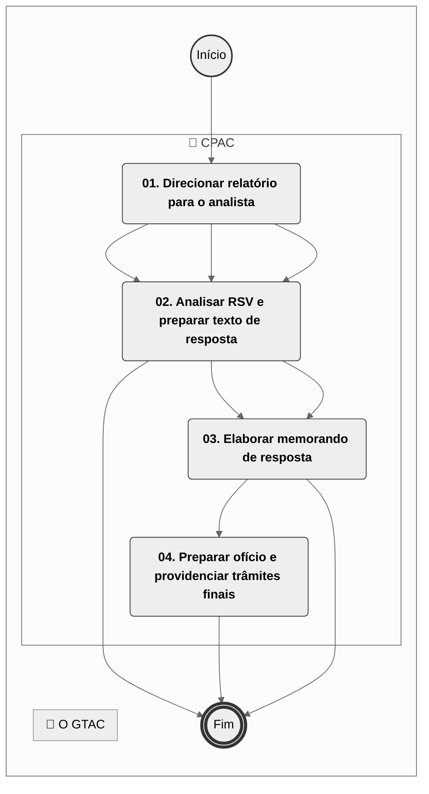
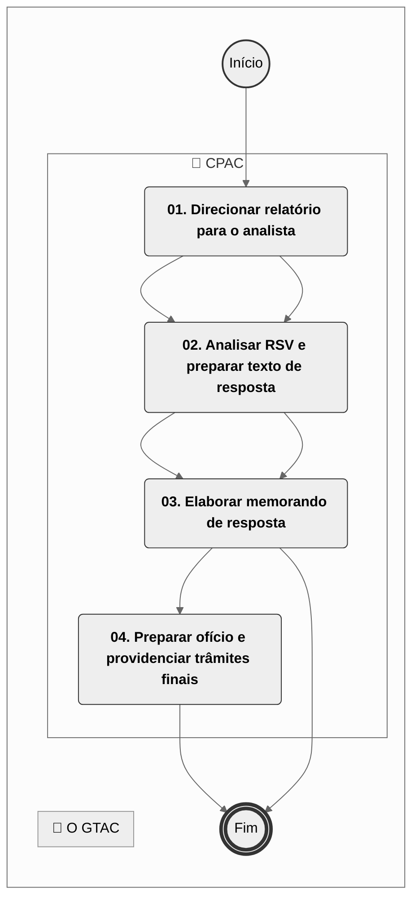
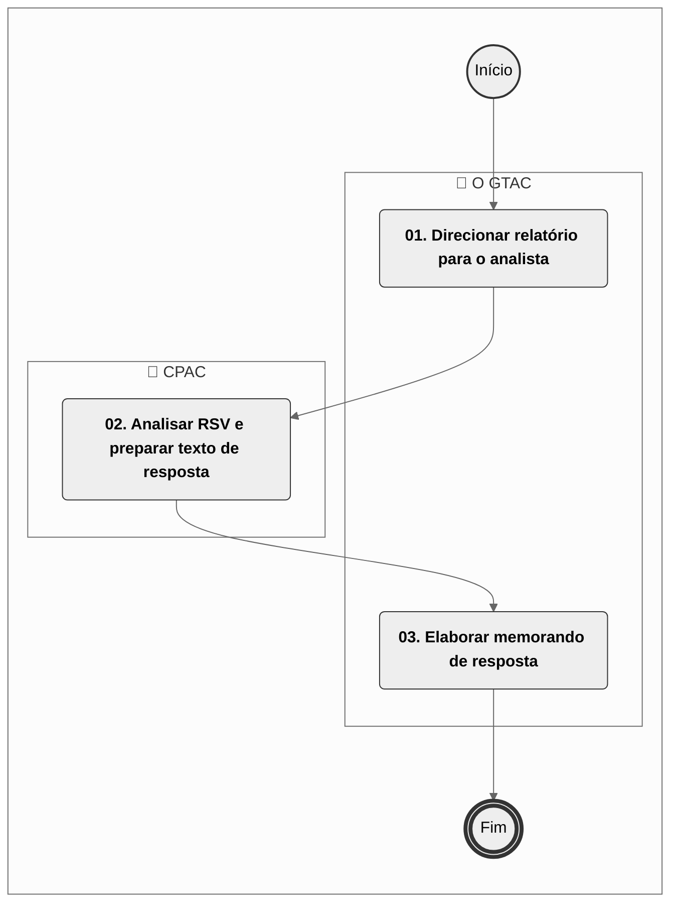

```mermaid
%%{init: {"theme": "neutral", "themeVariables": {"primaryColor": "#ffffff", "edgeLabelBackground": "#ffffff", "tertiaryColor": "#f4f4f4"}}}%%
flowchart TD
    classDef inicio stroke:#333,stroke-width:2px;
    classDef fim stroke:#333,stroke-width:4px;
    classDef tarefaBPMN stroke:#333,stroke-width:1px;
    classDef gatewayBPMN fill:#f9f9f9,stroke:#333,stroke-width:1px;
    classDef raia fill:none,stroke:#999,stroke-width:1px,stroke-dasharray: 5 5;
    subgraph Container_ID_MPR_SAR_201_R02_md_0 [ ]
        direction TB
        ID_MPR_SAR_201_R02_md_0_S((Início)):::inicio
        ID_MPR_SAR_201_R02_md_0_E(((Fim))):::fim
        subgraph Raia_ID_MPR_SAR_201_R02_md_0_1 [👤 CPAC]
            ID_MPR_SAR_201_R02_md_0_01("<b>01. Receber potencial COS Item, fazer avaliação inicial e atribuir analista</b>"):::tarefaBPMN
            ID_MPR_SAR_201_R02_md_0_02("<b>02. Conduzir a análise do COS Item e propor ações ou o arquivamento</b>"):::tarefaBPMN
            ID_MPR_SAR_201_R02_md_0_03("<b>03. Validar ações propostas</b>"):::tarefaBPMN
            ID_MPR_SAR_201_R02_md_0_04("<b>04. Executar as ações definidas</b>"):::tarefaBPMN
            ID_MPR_SAR_201_R02_md_0_05("<b>05. Arquivar o COS Item</b>"):::tarefaBPMN
            ID_MPR_SAR_201_R02_md_0_01("<b>01. Preparar minuta de documento</b>"):::tarefaBPMN
            ID_MPR_SAR_201_R02_md_0_02("<b>02. Submeter texto para aprovação e encaminhar para publicação e distribuição</b>"):::tarefaBPMN
            ID_MPR_SAR_201_R02_md_0_01("<b>01. Receber pedido de método alternativo e verificar pagamento de TFAC</b>"):::tarefaBPMN
            ID_MPR_SAR_201_R02_md_0_02("<b>02. Analisar a proposta de método alternativo</b>"):::tarefaBPMN
            ID_MPR_SAR_201_R02_md_0_03("<b>03. Validar a ação proposta</b>"):::tarefaBPMN
            ID_MPR_SAR_201_R02_md_0_04("<b>04. Preparar ofício e providenciar trâmites finais</b>"):::tarefaBPMN
            ID_MPR_SAR_201_R02_md_0_02("<b>02. Analisar RSV e preparar texto de resposta</b>"):::tarefaBPMN
        end
        subgraph Raia_ID_MPR_SAR_201_R02_md_0_2 [👤 O GTAC]
            ID_MPR_SAR_201_R02_md_0_01("<b>01. Direcionar relatório para o analista</b>"):::tarefaBPMN
            ID_MPR_SAR_201_R02_md_0_03("<b>03. Elaborar memorando de resposta</b>"):::tarefaBPMN
        end
        ID_MPR_SAR_201_R02_md_0_S --> ID_MPR_SAR_201_R02_md_0_01
        ID_MPR_SAR_201_R02_md_0_01 --> ID_MPR_SAR_201_R02_md_0_02
        ID_MPR_SAR_201_R02_md_0_02 --> ID_MPR_SAR_201_R02_md_0_03
        ID_MPR_SAR_201_R02_md_0_03 --> ID_MPR_SAR_201_R02_md_0_04
        ID_MPR_SAR_201_R02_md_0_04 --> ID_MPR_SAR_201_R02_md_0_05
        ID_MPR_SAR_201_R02_md_0_05 --> ID_MPR_SAR_201_R02_md_0_E
        ID_MPR_SAR_201_R02_md_0_01 --> ID_MPR_SAR_201_R02_md_0_02
        ID_MPR_SAR_201_R02_md_0_02 --> ID_MPR_SAR_201_R02_md_0_E
        ID_MPR_SAR_201_R02_md_0_01 --> ID_MPR_SAR_201_R02_md_0_02
        ID_MPR_SAR_201_R02_md_0_02 --> ID_MPR_SAR_201_R02_md_0_03
        ID_MPR_SAR_201_R02_md_0_03 --> ID_MPR_SAR_201_R02_md_0_04
        ID_MPR_SAR_201_R02_md_0_04 --> ID_MPR_SAR_201_R02_md_0_E
        ID_MPR_SAR_201_R02_md_0_01 --> ID_MPR_SAR_201_R02_md_0_02
        ID_MPR_SAR_201_R02_md_0_02 --> ID_MPR_SAR_201_R02_md_0_03
        ID_MPR_SAR_201_R02_md_0_03 --> ID_MPR_SAR_201_R02_md_0_E
    end
    click ID_MPR_SAR_201_R02_md_0_01 "Um COS Item pode ser recebido pela CPAC através de diversas formas (Processo no SEI, sistema de SDR/SACI, mensagem no Outlook Web, telefonema ou qualquer meio de contato ou informação).  Ao receber o potencial COS Item, o servidor da CPAC avalia se o item é considerado um COS Item conforme critério "
    click ID_MPR_SAR_201_R02_md_0_02 "Nesta etapa o responsável pela execução conduz uma análise com o objetivo de propor as ações subsequentes como, por exemplo, proposição de uma possível Diretriz de Aeronavegabilidade ou de Boletim Especial de Aeronavegabilidade, proposta de resposta a uma RSV ou mesmo o arquivamento do item.  Para a"
    click ID_MPR_SAR_201_R02_md_0_03 "O responsável pela execução valida ou não as ações propostas, retificando ou ajustando as alternativas conforme necessário.  OBS: esta atividade deverá ser realizada pelo Coordenador da CPAC ou seu substituto em exercício."
    click ID_MPR_SAR_201_R02_md_0_04 "O responsável pela execução implementa as ações definidas pelo Coordenador da CPAC. Considerando que o COS Item foi classificado como significante, o responsável pela execução deve abrir um processo formal nesta etapa, caso o item não tenha sido recebido por vias formais.  Caso alguma dessas ações e"
    click ID_MPR_SAR_201_R02_md_0_05 "Após a conclusão das ações propostas, o responsável pela execução encerra as tratativas e conclui o processo."
    click ID_MPR_SAR_201_R02_md_0_01 "Conforme as ações definidas pelo Coordenador da CPAC, o responsável pela execução prepara a minuta do documento correspondente (DA, NPR-DA ou BEA), de acordo com as orientações de elaboração previstas no Manual do Analista de Aeronavegabilidade Continuada.  Nesta etapa, cabe ao responsável pela exec"
    click ID_MPR_SAR_201_R02_md_0_02 "O responsável pela execução deve submeter a proposta de texto para aprovação do gestor regimentalmente designado.  Em casos considerados relevantes, o responsável pela execução convoca o Comitê de Aeronavegabilidade Continuada para que este Comitê faça uma deliberação sobre a proposta de documento. "
    click ID_MPR_SAR_201_R02_md_0_01 "O responsável pela execução recebe o pedido de método alternativo de cumprimento de Diretriz de Aeronavegabilidade (AMOC) e verifica o pagamento da TFAC.  Caso uma TFAC seja devida, o processo pode ser sobrestado enquanto o pagamento não ocorre."
    click ID_MPR_SAR_201_R02_md_0_02 "Após a confirmação do pagamento da TFAC, caso seja aplicável, o responsável pela execução procede a análise seguindo as boas práticas do Manual do Analista de Aeronavegabilidade Continuada.  O resultado da análise, preferencialmente acompanhado da proposta de ofício, deve ser validado com o Coordena"
    click ID_MPR_SAR_201_R02_md_0_03 "O responsável pela execução valida a ação proposta ou propõe novos direcionamentos.  OBS: esta atividade deverá ser realizada pelo Coordenador da CPAC ou seu substituto em exercício."
    click ID_MPR_SAR_201_R02_md_0_04 "O responsável pela execução prepara ofício, obtém assinatura do GTAC e encaminha para providências finais."
    click ID_MPR_SAR_201_R02_md_0_01 "Direcionar através do SEI o processo enviado pela ASSOP à CPAC."
    click ID_MPR_SAR_201_R02_md_0_02 "Toda RSV relativa à aeronavegabilidade, emitida pelo CENIPA e enviada à ANAC será analisada pela CPAC no que tange à sua pertinência, efetividade e coerência. O objetivo dessa análise é fazer uma verificação mais detalhada da aplicabilidade da recomendação.  Analisar as recomendações e executar as d"
    click ID_MPR_SAR_201_R02_md_0_03 "Com base na minuta proposta pelo analista, enviar despacho de resposta da(s) RSV à SAR."
```

# MPR/SAR-201-R02 - AERONAVEGABILIDADE CONTINUADA DE PRODUTO

**MANUAL DE PROCEDIMENTO**

**MPR/SAR-201-R02**

**AERONAVEGABILIDADE CONTINUADA DE PRODUTO**

11/2024

**REVISÕES**

|  |  |  |  |  |
| --- | --- | --- | --- | --- |
| **Revisão** | **Aprovação** | **Publicação** | **Aprovado Por** | **Modificações da Última Versão** |
| R00 | Portaria Nº 2.899, de 22 de Agosto de 2017 | Não informado | SAR | Versão Original |
| R01 | Portaria 8349/2022 | 24/06/2022 | SAR | 1) Processo 'Emitir Diretriz de Aeronavegabilidade de Emergência' removido.  2) Processo 'Emitir Boletim Especial de Aeronavegabilidade' removido.  3) Processo 'Manter Listas de Distribuição de DA, NPR e Boletins' removido.  4) Processo 'Analisar Método Alternativo de Cumprimento de DA' removido.  5) Processo 'Analisar Documento de Serviço Vinculado a Diretriz ou Boletim Especial de Aeronavegabilidade' removido.  6) Processo 'Processar COS Item' modificado.  7) Processo 'Publicar DA, NPR-DA ou BEA' modificado.  8) Processo 'Aprovar Método Alternativo de Cumprimento de Diretriz de Aeronavegabilidade [SE]' modificado. |
| R02 | Portaria nº 15851, de 21 de novembro de 2024. | 24/11/2024 | SAR | 1) Processo 'Controlar e Responder RSV' inserido. |

**ÍNDICE**

1) Disposições Preliminares, pág. 5.

1.1) Introdução, pág. 5.

1.2) Revogação, pág. 5.

1.3) Fundamentação, pág. 5.

1.4) Executores dos Processos, pág. 5.

1.5) Elaboração e Revisão, pág. 6.

1.6) Organização do Documento, pág. 6.

2) Definições, pág. 8.

2.1) Expressão, pág. 8.

2.2) Sigla, pág. 9.

3) Artefatos, Competências, Sistemas e Documentos Administrativos, pág. 10.

3.1) Artefatos, pág. 10.

3.2) Competências, pág. 11.

3.3) Sistemas, pág. 11.

3.4) Documentos e Processos Administrativos, pág. 12.

4) Procedimentos Referenciados, pág. 13.

5) Procedimentos, pág. 14.

5.1) Processar COS Item, pág. 14.

5.2) Publicar DA, NPR-DA ou BEA, pág. 19.

5.3) Aprovar Método Alternativo de Cumprimento de Diretriz de Aeronavegabilidade [SE], pág. 22.

5.4) Controlar e Responder RSV, pág. 26.

6) Disposições Finais, pág. 29.

**PARTICIPAÇÃO NA EXECUÇÃO DOS PROCESSOS**

**ÁREAS ORGANIZACIONAIS**

**1) Coordenadoria de Aeronavegabilidade Continuada**

a) Aprovar Método Alternativo de Cumprimento de Diretriz de Aeronavegabilidade [SE]

b) Controlar e Responder RSV

c) Processar COS Item

d) Publicar DA, NPR-DA ou BEA

**2) Superintendência de Aeronavegabilidade**

a) Controlar e Responder RSV

**GRUPOS ORGANIZACIONAIS**

**a) O GTAC**

1) Controlar e Responder RSV

**1. DISPOSIÇÕES PRELIMINARES**

**1.1 INTRODUÇÃO**

Este Manual descreve os procedimentos necessários para o tratamento adequado, pela SAR, das ocorrências em serviço em produtos aeronáuticos certificados ou validados pela ANAC. Pretende verificar se eventuais deficiências têm potencial de se repetir em outras unidades, com o objetivo de mitigar os riscos evidenciados por elas.

Na presente versão foi aditado o processo de trabalho CONTROLAR E RESPONDER RSV. Versão empreendida pelo processo SEI nº 00058.008540/2023-71.

O MPR estabelece, no âmbito da Superintendência de Aeronavegabilidade - SAR, os seguintes processos de trabalho:

a) Processar COS Item.

b) Publicar DA, NPR-DA ou BEA.

c) Aprovar Método Alternativo de Cumprimento de Diretriz de Aeronavegabilidade [SE].

d) Controlar e Responder RSV.

**1.2 REVOGAÇÃO**

MPR/SAR-201-R01, aprovado na data de 15 de junho de 2022.

**1.3 FUNDAMENTAÇÃO**

Resolução nº 381, de 14 de junho de 2016, art. 31 e revisões posteriores.

Portaria nº 11916/SAR, de 17 de julho de 2023.

**1.4 EXECUTORES DOS PROCESSOS**

Os procedimentos contidos neste documento aplicam-se aos servidores integrantes das seguintes áreas organizacionais:

|  |  |
| --- | --- |
| **Área Organizacional** | **Descrição** |
| Coordenadoria de Aeronavegabilidade Continuada - CPAC | Coordenadoria responsável pela proposição de diretrizes de aeronavegabilidade e manter sua publicidade. |
| Superintendência de Aeronavegabilidade - SAR | A Superintendência de Aeronavegabilidade é responsável pelas certificações de produtos aeronáuticos, emitir aprovações de aeronavegabilidade para exportação; aprovações de instruções suplementares da unidade; e emissão e revogação de diretrizes de Aeronavegabilidade. |

|  |  |
| --- | --- |
| **Grupo Organizacional** | **Descrição** |
| o GTAC | Gerente Técnico de Aeronavegabilidade Continuada |

**1.5 ELABORAÇÃO E REVISÃO**

O processo que resulta na aprovação ou alteração deste MPR é de responsabilidade da Superintendência de Aeronavegabilidade - SAR. Em caso de sugestões de revisão, deve-se procurá-la para que sejam iniciadas as providências cabíveis.

As revisões deste MPR serão aprovadas pelo(s) titular(es) da(s) unidade(s) responsável(is) pela execução do(s) processo(s) nele listado(s).

**1.6 ORGANIZAÇÃO DO DOCUMENTO**

O capítulo 2 apresenta as principais definições utilizadas no âmbito deste MPR, e deve ser visto integralmente antes da leitura de capítulos posteriores.

O capítulo 3 apresenta as competências, os artefatos e os sistemas envolvidos na execução dos processos deste manual, em ordem relativamente cronológica.

O capítulo 4 apresenta os processos de trabalho referenciados neste MPR. Estes processos são publicados em outros manuais que não este, mas cuja leitura é essencial para o entendimento dos processos publicados neste manual. O capítulo 4 expõe em quais manuais são localizados cada um dos processos de trabalho referenciados.

O capítulo 5 apresenta os processos de trabalho. Para encontrar um processo específico, deve-se procurar sua respectiva página no índice contido no início do documento. Os processos estão ordenados em etapas. Cada etapa é contida em uma tabela, que possui em si todas as informações necessárias para sua realização. São elas, respectivamente:

a) o título da etapa;

b) a descrição da forma de execução da etapa;

c) as competências necessárias para a execução da etapa;

d) os artefatos necessários para a execução da etapa;

e) os sistemas necessários para a execução da etapa (incluindo, bases de dados em forma de arquivo, se existente);

f) os documentos e processos administrativos que precisam ser elaborados durante a execução da etapa;

g) instruções para as próximas etapas; e

h) as áreas ou grupos organizacionais responsáveis por executar a etapa.

O capítulo 6 apresenta as disposições finais do documento, que trata das ações a serem realizadas em casos não previstos.

Por último, é importante comunicar que este documento foi gerado automaticamente. São recuperados dados sobre as etapas e sua sequência, as definições, os grupos, as áreas organizacionais, os artefatos, as competências, os sistemas, entre outros, para os processos de trabalho aqui apresentados, de forma que alguma mecanicidade na apresentação das informações pode ser percebida. O documento sempre apresenta as informações mais atualizadas de nomes e siglas de grupos, áreas, artefatos, termos, sistemas e suas definições, conforme informação disponível na base de dados, independente da data de assinatura do documento. Informações sobre etapas, seu detalhamento, a sequência entre etapas, responsáveis pelas etapas, artefatos, competências e sistemas associados a etapas, assim como seus nomes e os nomes de seus processos têm suas definições idênticas à da data de assinatura do documento.

**2. DEFINIÇÕES**

As tabelas abaixo apresentam as definições necessárias para o entendimento deste Manual de Procedimento, separadas pelo tipo.

**2.1 Expressão**

|  |  |
| --- | --- |
| **Definição** | **Significado** |
| Aeronavegabilidade Continuada | Condição na qual o nível de segurança de um produto aeronáutico é mantido equivalente ao nível exigido para a sua certificação original. |
| Competência | Conhecimentos, habilidades e atitudes necessárias para se realizar uma atividade dentro de um processo. |
| COS Item | Continued Operational Safety Item (COS Item) - Item de segurança operacional continuada.  Qualquer condição evidenciada por uma ocorrência em serviço ou por análise de engenharia que possua o potencial de degradar o nível de segurança da operação de um determinado produto aeronáutico certificado ou validado pela autoridade aeronáutica. |
| Diretriz de Aeronavegabilidade | Meio legal utilizado pela autoridade de aviação civil para impor correções a produtos aeronáuticos aprovados, nos quais tenha sido constatada uma condição que afete a segurança de voo e que possa se reproduzir em outros produtos do mesmo tipo em operação. |
| Item de Segurança Operacional Continuada Relacionado ao Produto | Qualquer condição evidenciada por uma Dificuldade em Serviço ou por análise de engenharia que possua o potencial de degradar o nível de segurança da operação de um determinado produto aeronáutico certificado ou validado pela autoridade aeronáutica. |
| Método Alternativo de Cumprimento | Método proposto por um interessado para manter o nível de segurança adequado para a operação, distinto do método definido em uma Diretriz de Aeronavegabilidade. |
| Processo de Trabalho | Conjunto de atividades com início, sequência e fim determinados que devem ser seguidos, obrigatoriamente, para o alcance de um resultado organizacional. |

**2.2 Sigla**

|  |  |
| --- | --- |
| **Definição** | **Significado** |
| [SE] | Serviço Externo - atividade relacionada à Carta de Serviços da ANAC. |
| AD | Airworthiness Directive |
| ASSOP | Assessoria de Segurança Operacional |
| BEA | Boletim Especial de Aeronavegabilidade. |
| CENIPA | Centro de Investigação e Prevenção de Acidentes Aeronáuticos |
| CPAC | Coordenadoria de Aeronavegabilidade Continuada |
| DA | Diretriz de Aeronavegabilidade |
| DAE | Diretriz de Aeronavegabilidade de Emergência |
| EAD | Emergency Airworthiness Directive |
| GTAC | Gerência Técnica de Aeronavegabilidade Continuada |
| ISOCRP | Item de segurança operacional continuada relacionado ao produto |
| MAC | Método Alternativo de Cumprimento |
| NPR | Notificação de Proposta de Regra / Notice Of Proposed Regulation |
| RSV | Recomendação de Segurança de Voo |
| SAB | Special Airworthiness Bulletin |
| SDR | Service Difficulty Report |
| SEI | Sistema Eletrônico de Informações |
| SIPAER | Sistema de Investigação e Prevenção de Acidentes Aeronáuticos |

**3. ARTEFATOS, COMPETÊNCIAS, SISTEMAS E DOCUMENTOS ADMINISTRATIVOS**

Abaixo se encontram as listas dos artefatos, competências, sistemas e documentos administrativos que o executor necessita consultar, preencher, analisar ou elaborar para executar os processos deste MPR. As etapas descritas no capítulo seguinte indicam onde usar cada um deles.

As competências devem ser adquiridas por meio de capacitação ou outros instrumentos e os artefatos se encontram no módulo "Artefatos" do sistema GFT - Gerenciador de Fluxos de Trabalho.

**3.1 ARTEFATOS**

|  |  |
| --- | --- |
| **Nome** | **Descrição** |
| F-900-10 Reunião para Aprovação de Texto de Diretriz de Aeronavegabilidade | Registro da deliberação do Comitê responsável por deliberar sobre os assuntos de Aeronavegabilidade Continuada relativos aos Produtos Aeronáuticos cuja Certificação/Validação está sob a responsabilidade da Autoridade de Aviação Civil Brasileira |
| F-900-11 Notificação de Proposta de Regra - Diretriz de Aeronavegabilidade | Formulário para a elaboração de NOTIFICAÇÃO DE PROPOSTA DE REGRA para DIRETRIZ DE AERONAVEGABILIDADE |
| F-900-12 Notice Of Proposed Regulation - Brazilian Airworthiness Directive | Formulário para a elaboração de NOTICE OF PROPOSED REGULATION - BRAZILIAN AIRWORTHINESS DIRECTIVES |
| Guia para Preenchimento da Planilha de Controle RSV | Guia com orientações para o preenchimento da planilha de controle de respostas a RSV. |
| Manual do Analista de Aeronavegabilidade Continuada | Manual do Analista de Aeronavegabilidade Continuada envolvido na avaliação de um COS Item (Continued Operational Safety Item), ou seja, Item de Segurança Operacional Continuada. |
| Procedimentos para Preparação de uma Diretriz de Aeronavegabilidade | Documento contendo orientações e procedimentos para a elaboração do texto de uma Diretriz de Aeronavegabilidade |

**3.2 COMPETÊNCIAS**

Para que os processos de trabalho contidos neste MPR possam ser realizados com qualidade e efetividade, é importante que as pessoas que venham a executá-los possuam um determinado conjunto de competências. No capítulo 5, as competências específicas que o executor de cada etapa de cada processo de trabalho deve possuir são apresentadas. A seguir, encontra-se uma lista geral das competências contidas em todos os processos de trabalho deste MPR e a indicação de qual área ou grupo organizacional as necessitam:

|  |  |
| --- | --- |
| **Competência** | **Áreas e Grupos** |
| Analisa item de segurança operacional continuada relacionado a produto utilizando os critérios de aeronavegabilidade continuada. | CPAC |
| Analisa minuciosamente registros relacionados a acidentes de modo a disparar ações mitigadoras e corretivas conforme os procedimentos da ANAC e do SIPAER. | CPAC |
| Fornece informações solicitadas por outras áreas da ANAC com comprometimento, clareza e confiabilidade. | CPAC |

**3.3 SISTEMAS**

|  |  |  |
| --- | --- | --- |
| **Nome** | **Descrição** | **Acesso** |
| Intranet da SAR | Sistema de controle de processos internos da SAR e disponibilização de informações de aeronavegabilidade e estatísticas. | http://sar.anac.gov.br |
| Outlook Web | Sistema de e-mails corporativo da ANAC, destinado ao recebimento e envio manual de e-mails, bem como à criação de regras automáticas de armazenamento em pastas e/ou envio de e-mails. | https://correio.anac.gov.br |
| SACI | Sistema Integrado de Informações da Aviação Civil | https://sistemas.anac.gov.br/saci/ |
| SEI | Sistema Eletrônico de Informação. | https://sei.anac.gov.br/sip/login.php?sigla\_orgao\_sistema=ANAC&sigla\_sistema=SEI |

**3.4 DOCUMENTOS E PROCESSOS ADMINISTRATIVOS ELABORADOS NESTE MANUAL**

Não há documentos ou processos administrativos a serem elaborados neste MPR.

**4. PROCEDIMENTOS REFERENCIADOS**

Procedimentos referenciados são processos de trabalho publicados em outro MPR que têm relação com os processos de trabalho publicados por este manual. Este MPR não possui nenhum processo de trabalho referenciado.

**
## 5.1 Processar COS Item

## 5.1 Processar COS Item

## 5.1 Processar COS Item

## 5.1 Processar COS Item

