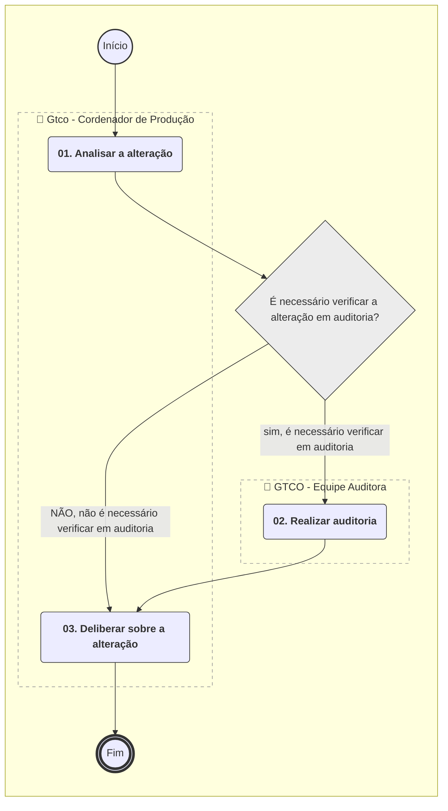
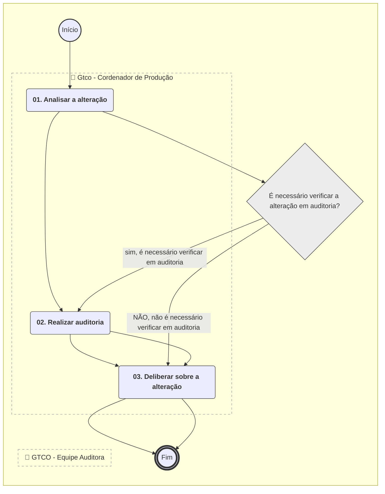
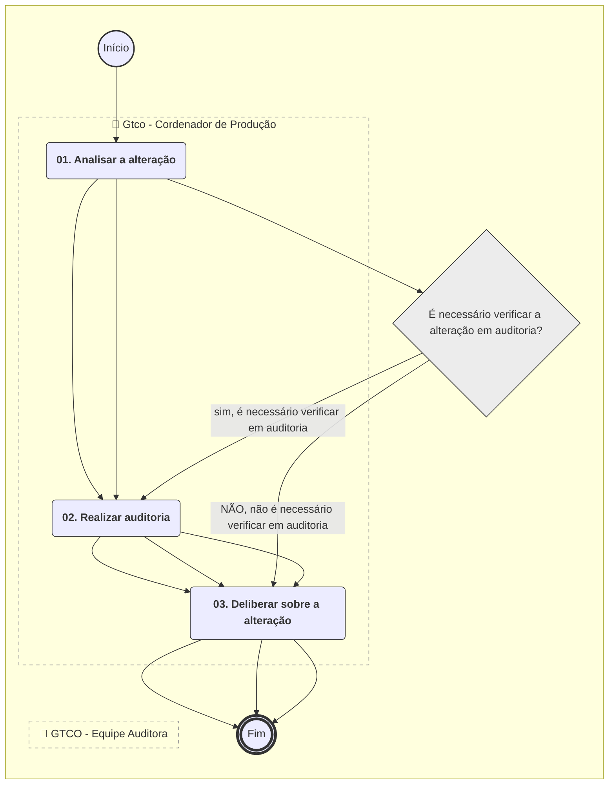

```mermaid
%%{init: {'theme': 'default'}}%%

flowchart TD
    classDef inicio stroke:#333,stroke-width:2px;
    classDef fim stroke:#333,stroke-width:4px;
    classDef tarefaBPMN stroke:#333,stroke-width:1px;
    classDef gatewayBPMN fill:#ececec,stroke:#333,stroke-width:1px;
    classDef raia fill:none,stroke:#999,stroke-width:1px,stroke-dasharray: 5 5;
    subgraph Container_ID_MPR_SAR_221_R02_4 [ ]
        direction TB
        ID_MPR_SAR_221_R02_4_Start((Início)):::inicio
        ID_MPR_SAR_221_R02_4_End(((Fim))):::fim
        subgraph Raia_ID_MPR_SAR_221_R02_4_1 [👤 CPROD]
            ID_MPR_SAR_221_R02_4_01("<b>01. Elaborar nota técnica</b>"):::tarefaBPMN
            ID_MPR_SAR_221_R02_4_02("<b>02. Elaborar ofício e portaria</b>"):::tarefaBPMN
            ID_MPR_SAR_221_R02_4_04("<b>04. Acompanhar a implementação das providências</b>"):::tarefaBPMN
            ID_MPR_SAR_221_R02_4_05("<b>05. Revogar o COP</b>"):::tarefaBPMN
            ID_MPR_SAR_221_R02_4_06("<b>06. Revogar a medida cautelar</b>"):::tarefaBPMN
        end
        class Raia_ID_MPR_SAR_221_R02_4_1 raia;
        subgraph Raia_ID_MPR_SAR_221_R02_4_2 [👤 O Gtco]
            ID_MPR_SAR_221_R02_4_03("<b>03. Assinar documentos de adoção de medida cautelar</b>"):::tarefaBPMN
            ID_MPR_SAR_221_R02_4_07("<b>07. Assinar documentos</b>"):::tarefaBPMN
        end
        class Raia_ID_MPR_SAR_221_R02_4_2 raia;
        subgraph Raia_ID_MPR_SAR_221_R02_4_3 [👤 Gtco - Cordenador de Produção]
            ID_MPR_SAR_221_R02_4_01("<b>01. Analisar requerimento</b>"):::tarefaBPMN
            ID_MPR_SAR_221_R02_4_02("<b>02. Analisar Manual da Qualidade</b>"):::tarefaBPMN
            ID_MPR_SAR_221_R02_4_03("<b>03. Elaborar Ofício</b>"):::tarefaBPMN
            ID_MPR_SAR_221_R02_4_01("<b>01. Analisar requerimento</b>"):::tarefaBPMN
            ID_MPR_SAR_221_R02_4_02("<b>02. Elaborar ofício</b>"):::tarefaBPMN
            ID_MPR_SAR_221_R02_4_03("<b>03. Elaborar Portaria para publicação no DOU</b>"):::tarefaBPMN
            ID_MPR_SAR_221_R02_4_01("<b>01. Analisar a alteração</b>"):::tarefaBPMN
            ID_MPR_SAR_221_R02_4_03("<b>03. Deliberar sobre a alteração</b>"):::tarefaBPMN
        end
        class Raia_ID_MPR_SAR_221_R02_4_3 raia;
        subgraph Raia_ID_MPR_SAR_221_R02_4_4 [👤 GTCO - Equipe Auditora]
            ID_MPR_SAR_221_R02_4_02("<b>02. Realizar auditoria</b>"):::tarefaBPMN
        end
        class Raia_ID_MPR_SAR_221_R02_4_4 raia;
        ID_MPR_SAR_221_R02_4_Start --> ID_MPR_SAR_221_R02_4_01
        ID_MPR_SAR_221_R02_4_01 --> ID_MPR_SAR_221_R02_4_02
        ID_MPR_SAR_221_R02_4_02 --> ID_MPR_SAR_221_R02_4_03
        ID_MPR_SAR_221_R02_4_03 --> ID_MPR_SAR_221_R02_4_04
        gw_ID_MPR_SAR_221_R02_4_04{"É necessário revogar o COP?"}:::gatewayBPMN
        ID_MPR_SAR_221_R02_4_04 --> gw_ID_MPR_SAR_221_R02_4_04
        gw_ID_MPR_SAR_221_R02_4_04 -->|"sim, o regulado não adotou as providências necessárias"| ID_MPR_SAR_221_R02_4_05
        gw_ID_MPR_SAR_221_R02_4_04 -->|"não, o regulado implementou as providências necessárias"| ID_MPR_SAR_221_R02_4_06
        ID_MPR_SAR_221_R02_4_05 --> ID_MPR_SAR_221_R02_4_07
        ID_MPR_SAR_221_R02_4_06 --> ID_MPR_SAR_221_R02_4_07
        ID_MPR_SAR_221_R02_4_07 --> ID_MPR_SAR_221_R02_4_End
        ID_MPR_SAR_221_R02_4_01 --> ID_MPR_SAR_221_R02_4_02
        ID_MPR_SAR_221_R02_4_02 --> ID_MPR_SAR_221_R02_4_03
        ID_MPR_SAR_221_R02_4_03 --> ID_MPR_SAR_221_R02_4_End
        ID_MPR_SAR_221_R02_4_01 --> ID_MPR_SAR_221_R02_4_02
        ID_MPR_SAR_221_R02_4_02 --> ID_MPR_SAR_221_R02_4_03
        ID_MPR_SAR_221_R02_4_03 --> ID_MPR_SAR_221_R02_4_End
        gw_ID_MPR_SAR_221_R02_4_01{"É necessário verificar a alteração em auditoria?"}:::gatewayBPMN
        ID_MPR_SAR_221_R02_4_01 --> gw_ID_MPR_SAR_221_R02_4_01
        gw_ID_MPR_SAR_221_R02_4_01 -->|"NÃO, não é necessário verificar em auditoria"| ID_MPR_SAR_221_R02_4_03
        gw_ID_MPR_SAR_221_R02_4_01 -->|"sim, é necessário verificar em auditoria"| ID_MPR_SAR_221_R02_4_02
        ID_MPR_SAR_221_R02_4_02 --> ID_MPR_SAR_221_R02_4_03
        ID_MPR_SAR_221_R02_4_03 --> ID_MPR_SAR_221_R02_4_End
    end
    click ID_MPR_SAR_221_R02_4_01 href "#" "Ao identificar situação ou conduta que gere risco iminente à segurança de voo, à integridade física de pessoas, à coletividade, à ordem pública, à continuidade dos serviços prestados ou ao interesse público, o agente da ANAC no exercício de atividade de fiscalização deverá atuar de acordo com os artigos 57 a 60 da resolução 472.  A motivação para a suspensão cautelar deve ser registrada em uma nota técnica em um novo processo no SEI relacionado ao processo de fiscalização em andamento. A nota técnica deve conter no mínimo:  • Resumo da atividade de fiscalização através da qual foi identificada a necessidade de adoção da medida cautelar;  • Razão pela qual a situação identificada pode gerar risco iminente à segurança de voo, à integridade física de pessoas, à coletividade, à ordem pública, à continuidade dos serviços prestados ou ao interesse público;  • Quais medidas, corretivas ou mitigatórias, são esperadas para a revogação da suspensão cautelar.  Dependendo da situação encontrada durante atividade de fiscalização externa, a suspensão cautelar pode ser adotada imediatamente e notificada ao acautelado. A notificação deve ser assinada pelo acautelado e deve possuir o conteúdo estabelecido no Art. 58 da resolução 472.  Em caso de recusa do acautelado em assinar a notificação da medida acautelatória, a assinatura do servidor, acompanhada de uma anotação sobre o fato, suprirá a ciência do acautelado, conforme parágrafo 1º do Art. 58 da resolução 472/2018.  Neste caso, o auditor líder deve dar ciência à chefia imediata por telefone e a nota técnica deve ser elaborada após o retorno à sede, para documentar a ocorrência.  Quando for possível, é preferível que a medida seja adotada após o retorno do agente à sede, para que a documentação da situação e a ciência à chefia imediata ocorram antes da notificação ao acautelado.  A nota técnica deve ser assinada pelo(s) agente(s) que identificou(aram) a situação de risco e encaminhada, por e-mail dentro do processo SEI, para ciência do GTCO e do SAR."
    click ID_MPR_SAR_221_R02_4_02 href "#" "O agente que identificou a situação de risco deve elaborar um ofício para notificar o acautelado. De acordo com o artigo 58 da resolução 472/2018, o ofício deve conter no mínimo:  • A infração identificada, com a sua fundamentação;  • Documentos e providências necessárias para revogação da medida acautelatória;  • Identificação do acautelado e unidade responsável pela medida.  O agente deve, ainda, elaborar portaria para publicação da suspensão cautelar no diário oficial e um despacho para envio da portaria para a ASCOM.  O ofício deve ser encaminhado para assinatura do GTCO e envio ao acautelado (com AR).  A portaria e o despacho devem ser encaminhados para assinatura do GTCO e envio para a ASCOM para publicação no DOU."
    click ID_MPR_SAR_221_R02_4_03 href "#" "O GTCO deve assinar o ofício de notificação da medida cautelar, a portaria para publicação no DOU e o despacho de encaminhamento da portaria para a ASCOM."
    click ID_MPR_SAR_221_R02_4_04 href "#" "O agente que identificou a situação de risco deve acompanhar a implementação das providências necessárias para revogação da medida cautelar, conforme informado na notificação ao acautelado.  O acompanhamento deve ser registrado na Intranet da SAR, em um relatório de acompanhamento.  Caso o acautelado não se manifeste no prazo de 90 dias, o agente deve encaminhar novo ofício, com AR, solicitando a adoção das providências necessárias no prazo de 90 dias adicionais.  Caso o acautelado não se manifeste, decorridos os 180 dias, o agente deve encaminhar ofício informando que o COP será revogado caso não haja manifestação em 20 dias."
    click ID_MPR_SAR_221_R02_4_05 href "#" "Caso o acautelado não atenda aos prazos para manifestação e adoção das providências necessárias para revogação da medida cautelar, o COP deve ser revogado.  O agente que identificou a situação de risco deve elaborar um ofício para notificar o acautelado sobre a revogação do COP.  O agente deve, ainda, elaborar portaria para publicação da revogação do COP no diário oficial, e um despacho para envio da portaria para a ASCOM.  O ofício deve ser encaminhado para assinatura do GTCO e envio ao acautelado.  A portaria e o despacho devem ser encaminhados para assinatura do GTCO e envio para a ASCOM para publicação no DOU."
    click ID_MPR_SAR_221_R02_4_06 href "#" "Caso o acautelado adote as providências necessárias, a medida cautelar deve ser revogada.  O agente que identificou a situação de risco deve elaborar um ofício para notificar o acautelado sobre a revogação da medida cautelar.  O agente deve, ainda, elaborar portaria para publicação da revogação da medida cautelar no diário oficial, e um despacho para envio da portaria para a ASCOM.  O ofício deve ser encaminhado para assinatura do GTCO e envio ao acautelado.  A portaria e o despacho devem ser encaminhados para assinatura do GTCO e envio para a ASCOM para publicação no DOU."
    click ID_MPR_SAR_221_R02_4_07 href "#" "O GTCO deve assinar o ofício de notificação da revogação do COP ou da medida cautelar, a portaria para publicação no DOU e o despacho de encaminhamento da portaria para a ASCOM."
    click ID_MPR_SAR_221_R02_4_01 href "#" "O GTCO - CP deve analisar se o requerente enviou o comprovante de pagamento da TFAC relacionada à revisão do manual da qualidade, conforme ITD 121-03."
    click ID_MPR_SAR_221_R02_4_02 href "#" "As seções 21.138, 21.308 e 21.608 requerem que a ANAC aprove o manual da qualidade do requerente ou detentor de um COP. Revisões do manual da qualidade também devem ser aprovadas.  Ao receber uma proposta de alteração do manual da qualidade, o coordenador de produção deve verificar se os requisitos do RBAC 21 continuam sendo atendidos, utilizando o formulário F-300-28 – Questionário de avaliação de sistemas da qualidade, como referência.  O GTCO - CP deve inserir no processo um parecer contendo o resultado da análise."
    click ID_MPR_SAR_221_R02_4_03 href "#" "O GTCO - CP deve elaborar um ofício contendo o resultado da análise, aprovando ou não o manual da qualidade e encaminhar o ofício para assinatura do GTCO."
    click ID_MPR_SAR_221_R02_4_01 href "#" "O GTCO - CP deve analisar se a pessoa que assinou o requerimento para cancelamento do COP tem autorização para representar a empresa. Se for necessário, o GTCO - CP deve solicitar cópia do contrato social e procuração."
    click ID_MPR_SAR_221_R02_4_02 href "#" "O GTCO - CP deve elaborar ofício informando à empresa sobre o cancelamento do COP, como foi solicitado, e encaminhar o ofício para assinatura.  O GTCO - CP deve atualizar o status do COP na Intranet da SAR."
    click ID_MPR_SAR_221_R02_4_03 href "#" "O GTCO - CP deve elaborar uma portaria para dar publicidade ao cancelamento do COP. Esta atividade possui como artefato um modelo de portaria que pode ser utilizado."
    click ID_MPR_SAR_221_R02_4_01 href "#" "O detentor de um COP deve comunicar à ANAC, por escrito, qualquer alteração em seu sistema da qualidade ou na localização das instalações de fabricação que possam afetar inspeção, conformidade ou aeronavegabilidade.  Ao receber a notificação, o coordenador de produção deve verificar se os requisitos do RBAC 21 continuam sendo atendidos, utilizando o formulário F-300-28 – Questionário de avaliação de sistemas da qualidade, como referência.  Caso o GTCO - CP conclua que após a alteração o detentor do COP deixou de atender aos requisitos do RBAC 21, deve proceder diretamente para a etapa 3, de registro da análise.  Caso o GTCO - CP conclua que os requisitos continuam sendo atendidos, deve decidir se é necessária a realização de uma auditoria específica para avaliar a alteração, ou se a avaliação pode ser realizada na próxima auditoria agendada na empresa. Essa decisão é subjetiva e depende do conhecimento do GTCO - CP sobre o sistema da qualidade da empresa, considerando:  1. Se há alguma auditoria agendada para a empresa  2. Se o sistema da qualidade da empresa possui meios para gerir a alteração (ex. qualificação de processo, FAI, Try-Out, etc)  3. Se a localização de localização de algum processo especial ou crítico foi realizada.  O GTCO - CP deve elaborar um parecer para registrar a avaliação da necessidade de auditoria.  Caso a auditoria imediata seja necessária, o GTCO - CP deve encaminhar o processo com o parecer para o coordenador do grupo de produção para preparação de auditoria não programada.  Caso a verificação sobre a alteração possa ser realizada na próxima auditoria programada, o GTCO - CP deve manter registro da alteração para informar ao auditor líder no momento de elaboração do programa de auditoria."
    click ID_MPR_SAR_221_R02_4_02 href "#" "O GTCOCPROD definirá equipe e data para a realização da auditoria não programada para verificação da alteração no sistema da qualidade proposta.  Será gerado um novo processo no SEI, associado ao processo da comunicação da alteração, para a realização da auditoria. O processo de comunicação da modificação será devolvido para o GTCO - CP para acompanhamento.  Não é necessário o envio do programa de auditoria nem recolhimento de TFAC. O GTCO - CP explicará ao Auditor Líder o que é necessário verificar na auditoria não programada. As demais atividades da ITD-121-01 devem ser seguidas.  Caso sejam identificadas não conformidades, o Auditor Líder deve elaborar um relatório de auditoria e adotar as providências administrativas apropriadas.  Após a realização da auditoria, o Auditor Líder deve inserir no processo um parecer sobre o atendimento aos requisitos em relação às verificações solicitadas pelo GTCO - CP."
    click ID_MPR_SAR_221_R02_4_03 href "#" "O GTCO - CP deve elaborar um parecer contendo o resultado da análise (se o detentor do COP continua cumprindo com os requisitos do RBAC 21 ou se deixou de cumprir com algum requisito).  Caso o GTCO - CP conclua que após a alteração o detentor do COP deixou de atender aos requisitos do RBAC 21, deve elaborar um ofício solicitando que a empresa desfaça a alteração, retornando o sistema da qualidade à condição da certificação. O GTCO - CP deve, então, encaminhar o ofício para assinatura do GTCO."
```

```mermaid
%%{init: {'theme': 'default'}}%%

flowchart TD
    classDef inicio stroke:#333,stroke-width:2px;
    classDef fim stroke:#333,stroke-width:4px;
    classDef tarefaBPMN stroke:#333,stroke-width:1px;
    classDef gatewayBPMN fill:#ececec,stroke:#333,stroke-width:1px;
    classDef raia fill:none,stroke:#999,stroke-width:1px,stroke-dasharray: 5 5;
    subgraph Container_ID_MPR_SAR_221_R02_3 [ ]
        direction TB
        ID_MPR_SAR_221_R02_3_Start((Início)):::inicio
        ID_MPR_SAR_221_R02_3_End(((Fim))):::fim
        subgraph Raia_ID_MPR_SAR_221_R02_3_1 [👤 Coordenadoria de Aeronáutica, Ensaios em Voo e Integração de Sistemas]
            ID_MPR_SAR_221_R02_3_01("<b>01. Realizar o voo de produção</b>"):::tarefaBPMN
        end
        class Raia_ID_MPR_SAR_221_R02_3_1 raia;
        subgraph Raia_ID_MPR_SAR_221_R02_3_2 [👤 Gtco - Cordenador de Produção]
            ID_MPR_SAR_221_R02_3_02("<b>02. Analisar relatório de voo de produção</b>"):::tarefaBPMN
            ID_MPR_SAR_221_R02_3_01("<b>01. Analisar requerimento</b>"):::tarefaBPMN
            ID_MPR_SAR_221_R02_3_02("<b>02. Analisar Manual da Qualidade</b>"):::tarefaBPMN
            ID_MPR_SAR_221_R02_3_03("<b>03. Elaborar Ofício</b>"):::tarefaBPMN
            ID_MPR_SAR_221_R02_3_01("<b>01. Analisar requerimento</b>"):::tarefaBPMN
            ID_MPR_SAR_221_R02_3_02("<b>02. Elaborar ofício</b>"):::tarefaBPMN
            ID_MPR_SAR_221_R02_3_03("<b>03. Elaborar Portaria para publicação no DOU</b>"):::tarefaBPMN
            ID_MPR_SAR_221_R02_3_01("<b>01. Analisar a alteração</b>"):::tarefaBPMN
            ID_MPR_SAR_221_R02_3_03("<b>03. Deliberar sobre a alteração</b>"):::tarefaBPMN
        end
        class Raia_ID_MPR_SAR_221_R02_3_2 raia;
        subgraph Raia_ID_MPR_SAR_221_R02_3_3 [👤 CPROD]
            ID_MPR_SAR_221_R02_3_01("<b>01. Elaborar nota técnica</b>"):::tarefaBPMN
            ID_MPR_SAR_221_R02_3_02("<b>02. Elaborar ofício e portaria</b>"):::tarefaBPMN
            ID_MPR_SAR_221_R02_3_04("<b>04. Acompanhar a implementação das providências</b>"):::tarefaBPMN
            ID_MPR_SAR_221_R02_3_05("<b>05. Revogar o COP</b>"):::tarefaBPMN
            ID_MPR_SAR_221_R02_3_06("<b>06. Revogar a medida cautelar</b>"):::tarefaBPMN
        end
        class Raia_ID_MPR_SAR_221_R02_3_3 raia;
        subgraph Raia_ID_MPR_SAR_221_R02_3_4 [👤 O Gtco]
            ID_MPR_SAR_221_R02_3_03("<b>03. Assinar documentos de adoção de medida cautelar</b>"):::tarefaBPMN
            ID_MPR_SAR_221_R02_3_07("<b>07. Assinar documentos</b>"):::tarefaBPMN
        end
        class Raia_ID_MPR_SAR_221_R02_3_4 raia;
        subgraph Raia_ID_MPR_SAR_221_R02_3_5 [👤 GTCO - Equipe Auditora]
            ID_MPR_SAR_221_R02_3_02("<b>02. Realizar auditoria</b>"):::tarefaBPMN
        end
        class Raia_ID_MPR_SAR_221_R02_3_5 raia;
        ID_MPR_SAR_221_R02_3_Start --> ID_MPR_SAR_221_R02_3_01
        ID_MPR_SAR_221_R02_3_01 --> ID_MPR_SAR_221_R02_3_02
        ID_MPR_SAR_221_R02_3_02 --> ID_MPR_SAR_221_R02_3_End
        ID_MPR_SAR_221_R02_3_01 --> ID_MPR_SAR_221_R02_3_02
        ID_MPR_SAR_221_R02_3_02 --> ID_MPR_SAR_221_R02_3_03
        ID_MPR_SAR_221_R02_3_03 --> ID_MPR_SAR_221_R02_3_04
        gw_ID_MPR_SAR_221_R02_3_04{"É necessário revogar o COP?"}:::gatewayBPMN
        ID_MPR_SAR_221_R02_3_04 --> gw_ID_MPR_SAR_221_R02_3_04
        gw_ID_MPR_SAR_221_R02_3_04 -->|"sim, o regulado não adotou as providências necessárias"| ID_MPR_SAR_221_R02_3_05
        gw_ID_MPR_SAR_221_R02_3_04 -->|"não, o regulado implementou as providências necessárias"| ID_MPR_SAR_221_R02_3_06
        ID_MPR_SAR_221_R02_3_05 --> ID_MPR_SAR_221_R02_3_07
        ID_MPR_SAR_221_R02_3_06 --> ID_MPR_SAR_221_R02_3_07
        ID_MPR_SAR_221_R02_3_07 --> ID_MPR_SAR_221_R02_3_End
        ID_MPR_SAR_221_R02_3_01 --> ID_MPR_SAR_221_R02_3_02
        ID_MPR_SAR_221_R02_3_02 --> ID_MPR_SAR_221_R02_3_03
        ID_MPR_SAR_221_R02_3_03 --> ID_MPR_SAR_221_R02_3_End
        ID_MPR_SAR_221_R02_3_01 --> ID_MPR_SAR_221_R02_3_02
        ID_MPR_SAR_221_R02_3_02 --> ID_MPR_SAR_221_R02_3_03
        ID_MPR_SAR_221_R02_3_03 --> ID_MPR_SAR_221_R02_3_End
        gw_ID_MPR_SAR_221_R02_3_01{"É necessário verificar a alteração em auditoria?"}:::gatewayBPMN
        ID_MPR_SAR_221_R02_3_01 --> gw_ID_MPR_SAR_221_R02_3_01
        gw_ID_MPR_SAR_221_R02_3_01 -->|"NÃO, não é necessário verificar em auditoria"| ID_MPR_SAR_221_R02_3_03
        gw_ID_MPR_SAR_221_R02_3_01 -->|"sim, é necessário verificar em auditoria"| ID_MPR_SAR_221_R02_3_02
        ID_MPR_SAR_221_R02_3_02 --> ID_MPR_SAR_221_R02_3_03
        ID_MPR_SAR_221_R02_3_03 --> ID_MPR_SAR_221_R02_3_End
    end
    click ID_MPR_SAR_221_R02_3_01 href "#" "A programação para acompanhamento de voo de produção pela ANAC na frequência estabelecida pelo Policy File - 21.140 é realizada pela GTEV/CEVIS.  Após a realização do voo, a CEVIS envia um relatório para a GTCO/CPROD."
    click ID_MPR_SAR_221_R02_3_02 href "#" "A análise do relatório do voo de produção deve procurar identificar:  1. Se o voo foi realizado utilizando o procedimento aprovado;  2. Se as eventuais discrepâncias apontadas indicam alguma tendência adversa que necessite de ação corretiva por parte do fabricante."
    click ID_MPR_SAR_221_R02_3_01 href "#" "Ao identificar situação ou conduta que gere risco iminente à segurança de voo, à integridade física de pessoas, à coletividade, à ordem pública, à continuidade dos serviços prestados ou ao interesse público, o agente da ANAC no exercício de atividade de fiscalização deverá atuar de acordo com os artigos 57 a 60 da resolução 472.  A motivação para a suspensão cautelar deve ser registrada em uma nota técnica em um novo processo no SEI relacionado ao processo de fiscalização em andamento. A nota técnica deve conter no mínimo:  • Resumo da atividade de fiscalização através da qual foi identificada a necessidade de adoção da medida cautelar;  • Razão pela qual a situação identificada pode gerar risco iminente à segurança de voo, à integridade física de pessoas, à coletividade, à ordem pública, à continuidade dos serviços prestados ou ao interesse público;  • Quais medidas, corretivas ou mitigatórias, são esperadas para a revogação da suspensão cautelar.  Dependendo da situação encontrada durante atividade de fiscalização externa, a suspensão cautelar pode ser adotada imediatamente e notificada ao acautelado. A notificação deve ser assinada pelo acautelado e deve possuir o conteúdo estabelecido no Art. 58 da resolução 472.  Em caso de recusa do acautelado em assinar a notificação da medida acautelatória, a assinatura do servidor, acompanhada de uma anotação sobre o fato, suprirá a ciência do acautelado, conforme parágrafo 1º do Art. 58 da resolução 472/2018.  Neste caso, o auditor líder deve dar ciência à chefia imediata por telefone e a nota técnica deve ser elaborada após o retorno à sede, para documentar a ocorrência.  Quando for possível, é preferível que a medida seja adotada após o retorno do agente à sede, para que a documentação da situação e a ciência à chefia imediata ocorram antes da notificação ao acautelado.  A nota técnica deve ser assinada pelo(s) agente(s) que identificou(aram) a situação de risco e encaminhada, por e-mail dentro do processo SEI, para ciência do GTCO e do SAR."
    click ID_MPR_SAR_221_R02_3_02 href "#" "O agente que identificou a situação de risco deve elaborar um ofício para notificar o acautelado. De acordo com o artigo 58 da resolução 472/2018, o ofício deve conter no mínimo:  • A infração identificada, com a sua fundamentação;  • Documentos e providências necessárias para revogação da medida acautelatória;  • Identificação do acautelado e unidade responsável pela medida.  O agente deve, ainda, elaborar portaria para publicação da suspensão cautelar no diário oficial e um despacho para envio da portaria para a ASCOM.  O ofício deve ser encaminhado para assinatura do GTCO e envio ao acautelado (com AR).  A portaria e o despacho devem ser encaminhados para assinatura do GTCO e envio para a ASCOM para publicação no DOU."
    click ID_MPR_SAR_221_R02_3_03 href "#" "O GTCO deve assinar o ofício de notificação da medida cautelar, a portaria para publicação no DOU e o despacho de encaminhamento da portaria para a ASCOM."
    click ID_MPR_SAR_221_R02_3_04 href "#" "O agente que identificou a situação de risco deve acompanhar a implementação das providências necessárias para revogação da medida cautelar, conforme informado na notificação ao acautelado.  O acompanhamento deve ser registrado na Intranet da SAR, em um relatório de acompanhamento.  Caso o acautelado não se manifeste no prazo de 90 dias, o agente deve encaminhar novo ofício, com AR, solicitando a adoção das providências necessárias no prazo de 90 dias adicionais.  Caso o acautelado não se manifeste, decorridos os 180 dias, o agente deve encaminhar ofício informando que o COP será revogado caso não haja manifestação em 20 dias."
    click ID_MPR_SAR_221_R02_3_05 href "#" "Caso o acautelado não atenda aos prazos para manifestação e adoção das providências necessárias para revogação da medida cautelar, o COP deve ser revogado.  O agente que identificou a situação de risco deve elaborar um ofício para notificar o acautelado sobre a revogação do COP.  O agente deve, ainda, elaborar portaria para publicação da revogação do COP no diário oficial, e um despacho para envio da portaria para a ASCOM.  O ofício deve ser encaminhado para assinatura do GTCO e envio ao acautelado.  A portaria e o despacho devem ser encaminhados para assinatura do GTCO e envio para a ASCOM para publicação no DOU."
    click ID_MPR_SAR_221_R02_3_06 href "#" "Caso o acautelado adote as providências necessárias, a medida cautelar deve ser revogada.  O agente que identificou a situação de risco deve elaborar um ofício para notificar o acautelado sobre a revogação da medida cautelar.  O agente deve, ainda, elaborar portaria para publicação da revogação da medida cautelar no diário oficial, e um despacho para envio da portaria para a ASCOM.  O ofício deve ser encaminhado para assinatura do GTCO e envio ao acautelado.  A portaria e o despacho devem ser encaminhados para assinatura do GTCO e envio para a ASCOM para publicação no DOU."
    click ID_MPR_SAR_221_R02_3_07 href "#" "O GTCO deve assinar o ofício de notificação da revogação do COP ou da medida cautelar, a portaria para publicação no DOU e o despacho de encaminhamento da portaria para a ASCOM."
    click ID_MPR_SAR_221_R02_3_01 href "#" "O GTCO - CP deve analisar se o requerente enviou o comprovante de pagamento da TFAC relacionada à revisão do manual da qualidade, conforme ITD 121-03."
    click ID_MPR_SAR_221_R02_3_02 href "#" "As seções 21.138, 21.308 e 21.608 requerem que a ANAC aprove o manual da qualidade do requerente ou detentor de um COP. Revisões do manual da qualidade também devem ser aprovadas.  Ao receber uma proposta de alteração do manual da qualidade, o coordenador de produção deve verificar se os requisitos do RBAC 21 continuam sendo atendidos, utilizando o formulário F-300-28 – Questionário de avaliação de sistemas da qualidade, como referência.  O GTCO - CP deve inserir no processo um parecer contendo o resultado da análise."
    click ID_MPR_SAR_221_R02_3_03 href "#" "O GTCO - CP deve elaborar um ofício contendo o resultado da análise, aprovando ou não o manual da qualidade e encaminhar o ofício para assinatura do GTCO."
    click ID_MPR_SAR_221_R02_3_01 href "#" "O GTCO - CP deve analisar se a pessoa que assinou o requerimento para cancelamento do COP tem autorização para representar a empresa. Se for necessário, o GTCO - CP deve solicitar cópia do contrato social e procuração."
    click ID_MPR_SAR_221_R02_3_02 href "#" "O GTCO - CP deve elaborar ofício informando à empresa sobre o cancelamento do COP, como foi solicitado, e encaminhar o ofício para assinatura.  O GTCO - CP deve atualizar o status do COP na Intranet da SAR."
    click ID_MPR_SAR_221_R02_3_03 href "#" "O GTCO - CP deve elaborar uma portaria para dar publicidade ao cancelamento do COP. Esta atividade possui como artefato um modelo de portaria que pode ser utilizado."
    click ID_MPR_SAR_221_R02_3_01 href "#" "O detentor de um COP deve comunicar à ANAC, por escrito, qualquer alteração em seu sistema da qualidade ou na localização das instalações de fabricação que possam afetar inspeção, conformidade ou aeronavegabilidade.  Ao receber a notificação, o coordenador de produção deve verificar se os requisitos do RBAC 21 continuam sendo atendidos, utilizando o formulário F-300-28 – Questionário de avaliação de sistemas da qualidade, como referência.  Caso o GTCO - CP conclua que após a alteração o detentor do COP deixou de atender aos requisitos do RBAC 21, deve proceder diretamente para a etapa 3, de registro da análise.  Caso o GTCO - CP conclua que os requisitos continuam sendo atendidos, deve decidir se é necessária a realização de uma auditoria específica para avaliar a alteração, ou se a avaliação pode ser realizada na próxima auditoria agendada na empresa. Essa decisão é subjetiva e depende do conhecimento do GTCO - CP sobre o sistema da qualidade da empresa, considerando:  1. Se há alguma auditoria agendada para a empresa  2. Se o sistema da qualidade da empresa possui meios para gerir a alteração (ex. qualificação de processo, FAI, Try-Out, etc)  3. Se a localização de localização de algum processo especial ou crítico foi realizada.  O GTCO - CP deve elaborar um parecer para registrar a avaliação da necessidade de auditoria.  Caso a auditoria imediata seja necessária, o GTCO - CP deve encaminhar o processo com o parecer para o coordenador do grupo de produção para preparação de auditoria não programada.  Caso a verificação sobre a alteração possa ser realizada na próxima auditoria programada, o GTCO - CP deve manter registro da alteração para informar ao auditor líder no momento de elaboração do programa de auditoria."
    click ID_MPR_SAR_221_R02_3_02 href "#" "O GTCOCPROD definirá equipe e data para a realização da auditoria não programada para verificação da alteração no sistema da qualidade proposta.  Será gerado um novo processo no SEI, associado ao processo da comunicação da alteração, para a realização da auditoria. O processo de comunicação da modificação será devolvido para o GTCO - CP para acompanhamento.  Não é necessário o envio do programa de auditoria nem recolhimento de TFAC. O GTCO - CP explicará ao Auditor Líder o que é necessário verificar na auditoria não programada. As demais atividades da ITD-121-01 devem ser seguidas.  Caso sejam identificadas não conformidades, o Auditor Líder deve elaborar um relatório de auditoria e adotar as providências administrativas apropriadas.  Após a realização da auditoria, o Auditor Líder deve inserir no processo um parecer sobre o atendimento aos requisitos em relação às verificações solicitadas pelo GTCO - CP."
    click ID_MPR_SAR_221_R02_3_03 href "#" "O GTCO - CP deve elaborar um parecer contendo o resultado da análise (se o detentor do COP continua cumprindo com os requisitos do RBAC 21 ou se deixou de cumprir com algum requisito).  Caso o GTCO - CP conclua que após a alteração o detentor do COP deixou de atender aos requisitos do RBAC 21, deve elaborar um ofício solicitando que a empresa desfaça a alteração, retornando o sistema da qualidade à condição da certificação. O GTCO - CP deve, então, encaminhar o ofício para assinatura do GTCO."
```

**MANUAL DE PROCEDIMENTO**

**MPR/SAR-221-R02**

**VIGILÂNCIA CONTINUADA DE ORGANIZAÇÃO DE PRODUÇÃO**

12/2025

**REVISÕES**

|  |  |  |  |  |
| --- | --- | --- | --- | --- |
| **Revisão** | **Aprovação** | **Publicação** | **Aprovado Por** | **Modificações da Última Versão** |
| R00 | Portaria Nº 2.155, de 27 de Junho de 2017 | Não informado | SAR | Versão Original |
| R01 | Portaria Nº 6025, DE 28 DE SETEMBRO DE 2021 | Não informado | SAR | 1) Processo 'Selecionar Fornecedores para Vigilância Continuada' removido.  2) Processo 'Elaborar Programa de Auditorias de Organizações de Produção' removido.  3) Processo 'Acompanhar o Tratamento de Não Conformidades' removido.  4) Processo 'Gerir Alterações no Sistema de Gestão da Qualidade de Detentores de COP' inserido.  5) Processo 'Cancelar COP a Pedido' inserido.  6) Processo 'Revisar Manual da Qualidade' inserido.  7) Processo 'Suspender Cautelarmente um COP' inserido.  8) Processo 'Planejar Vigilância Continuada de Organizações de Produção' inserido.  9) Processo 'Realizar Auditoria em Organização de Produção' modificado.  10) Processo 'Acompanhar o Tratamento de Quality Escape Junto ao Fabricante' modificado.  11) Processo 'Acompanhar Voo de Produção' modificado. |
| R02 | PORTARIA Nº 18442, DE 15 DE DEZEMBRO DE 2025 | 18/12/2025 | SAR | 1) Processo 'Realizar Auditoria em Organização de Produção' modificado. |

**ÍNDICE**

1) Disposições Preliminares, pág. 7.

1.1) Introdução, pág. 7.

1.2) Revogação, pág. 8.

1.3) Fundamentação, pág. 8.

1.4) Executores dos Processos, pág. 8.

1.5) Elaboração e Revisão, pág. 9.

1.6) Organização do Documento, pág. 9.

2) Definições, pág. 11.

2.1) Sigla, pág. 11.

2.2) Tradução, pág. 11.

3) Artefatos, Competências, Sistemas e Documentos Administrativos, pág. 13.

3.1) Artefatos, pág. 13.

3.2) Competências, pág. 14.

3.3) Sistemas, pág. 14.

3.4) Documentos e Processos Administrativos, pág. 15.

4) Procedimentos Referenciados, pág. 16.

5) Procedimentos, pág. 17.

5.1) Planejar Vigilância Continuada de Organizações de Produção, pág. 17.

5.2) Realizar Auditoria em Organização de Produção, pág. 20.

5.3) Acompanhar o Tratamento de Quality Escape Junto ao Fabricante, pág. 26.

5.4) Acompanhar Voo de Produção, pág. 28.

5.5) Suspender Cautelarmente um COP, pág. 30.

5.6) Revisar Manual da Qualidade, pág. 35.

5.7) Cancelar COP a Pedido, pág. 37.

5.8) Gerir Alterações no Sistema de Gestão da Qualidade de Detentores de COP, pág. 39.

6) Disposições Finais, pág. 43.

**PARTICIPAÇÃO NA EXECUÇÃO DOS PROCESSOS**

**ÁREAS ORGANIZACIONAIS**

**1) Coordenadoria de Certificação de Organizações de Produção**

a) Suspender Cautelarmente um COP

**GRUPOS ORGANIZACIONAIS**

**a) Coordenadoria de Aeronáutica, Ensaios em Voo e Integração de Sistemas**

1) Acompanhar Voo de Produção

**b) GTCO - Auditor Líder**

1) Realizar Auditoria em Organização de Produção

**c) Gtco - Coordenador CPROD**

1) Planejar Vigilância Continuada de Organizações de Produção

2) Realizar Auditoria em Organização de Produção

**d) Gtco - Cordenador de Produção**

1) Acompanhar o Tratamento de Quality Escape Junto ao Fabricante

2) Acompanhar Voo de Produção

3) Cancelar COP a Pedido

4) Gerir Alterações no Sistema de Gestão da Qualidade de Detentores de COP

5) Planejar Vigilância Continuada de Organizações de Produção

6) Realizar Auditoria em Organização de Produção

7) Revisar Manual da Qualidade

**e) GTCO - Equipe Auditora**

1) Gerir Alterações no Sistema de Gestão da Qualidade de Detentores de COP

2) Realizar Auditoria em Organização de Produção

**f) O Gtco**

1) Suspender Cautelarmente um COP

**1. DISPOSIÇÕES PRELIMINARES**

**1.1 INTRODUÇÃO**

Este MPR contém informação que possibilita ao servidor realizar de maneira adequada as diversas atividades envolvidas na vigilância continuada de organização de produção, indicando os formulários que devem constar do processo e as informações que devem ser analisadas pelo servidor.

Esta revisão do MPR decorreu do processo SEI 00058.047676/2025-68, com a finalidade de implementar a Portaria sobre Regulação Responsiva (Portaria SAR 16.725, 04 de abril de 2025, publicada em 15/04/2025).

1.1.1 Papéis e Responsabilidades

É competência da SAR, definida no Regimento Interno, emitir, suspender e extinguir certificado de organização de produção, incluindo adendos.

É competência da GTCO, definida por portaria de delegação, emitir, suspender e extinguir certificado de organização de produção, incluindo adendos. Assim como emitir, suspender e extinguir autorização especial de voo, com o propósito de voo de produção.

É atribuição da GTCO atuar nas atividades de certificação de produção e vigilância continuada de organizações de produção.

Cabe aos servidores, quando atuando sob a Coordenadoria de Certificação de Organizações de Produção - CPROD, atuar na certificação e vigilância continuada de organização de produção de produto aeronáutico.

1.1.2 Política e Diretrizes

São parâmetros de controle deste processo:

a) a harmonização das atividades com as de outras autoridades para proporcionar reconhecimento mútuo de atividades através de procedimentos de implementação vinculados a acordos bilaterais;

b) a agilidade de avaliação e entrega das aprovações e certificações relacionadas; e

c) a correta avaliação do desempenho dos fabricantes nas avaliações de supervisão.

1.1.3 Processo

O MPR estabelece, no âmbito da Superintendência de Aeronavegabilidade - SAR, os seguintes processos de trabalho:

a) Planejar Vigilância Continuada de Organizações de Produção.

b) Realizar Auditoria em Organização de Produção.

c) Acompanhar o Tratamento de Quality Escape Junto ao Fabricante.

d) Acompanhar Voo de Produção.

e) Suspender Cautelarmente um COP.

f) Revisar Manual da Qualidade.

g) Cancelar COP a Pedido.

h) Gerir Alterações no Sistema de Gestão da Qualidade de Detentores de COP.

**1.2 REVOGAÇÃO**

MPR/SAR-221-R01, aprovado na data de 28 de setembro de 2021.

**1.3 FUNDAMENTAÇÃO**

Resolução nº 381, de 14 de junho de 2016, art. 31.

**1.4 EXECUTORES DOS PROCESSOS**

Os procedimentos contidos neste documento aplicam-se aos servidores integrantes das seguintes áreas organizacionais:

|  |  |
| --- | --- |
| **Área Organizacional** | **Descrição** |
| Coordenadoria de Certificação de Organizações de Produção - CPROD | Coordenar a certificação e vigilância continuada de organizações de produção. |

|  |  |
| --- | --- |
| **Grupo Organizacional** | **Descrição** |
| CEVIS | Coordenadoria da GTEV com competências para:  I - emitir parecer especializado, relacionado com a certificação de projeto de produto aeronáutico, com foco em aspectos de aeronáutica, desempenho em voo, qualidade de voo, manual de voo, integração de sistemas e fator humano relacionado com a pilotagem;  II - prover suporte especializado, tanto para o público interno quanto para as demandas externas à ANAC, nas matérias que competem à unidade;  III - emitir parecer sobre credenciamento de Profissionais Credenciados em Projeto(PCP) nas áreas de atuação da unidade; e  IV - avaliar, orientar e supervisionar seus respectivos profissionais credenciados. |
| Auditor Líder | Auditor responsável pelo planejamento e execução de auditorias na GTCO/ SAR. |
| GTCO - Coordenador CPROD | Coordenador da Coordenadoria de Organizações de Produção, que planeja as ações de vigilância em organizações de produção. |
| GTCO - CP | Servidor da GTCO/SAR designado pelo Coordenador da CPROD para coordenar os processos relacionados ao detentor ou requerente de aprovação de produção. |
| GTCO - Equipe Auditora | Equipe responsável, juntamente com o Auditor Líder, pela realização de auditorias na GTCO/SAR. |
| O GTCO | Gerente Técnico de Certificação de Organizações e Inspeção |

**1.5 ELABORAÇÃO E REVISÃO**

O processo que resulta na aprovação ou alteração deste MPR é de responsabilidade da Superintendência de Aeronavegabilidade - SAR. Em caso de sugestões de revisão, deve-se procurá-la para que sejam iniciadas as providências cabíveis.

As revisões deste MPR serão aprovadas pelo(s) titular(es) da(s) unidade(s) responsável(is) pela execução do(s) processo(s) nele listado(s).

**1.6 ORGANIZAÇÃO DO DOCUMENTO**

O capítulo 2 apresenta as principais definições utilizadas no âmbito deste MPR, e deve ser visto integralmente antes da leitura de capítulos posteriores.

O capítulo 3 apresenta as competências, os artefatos e os sistemas envolvidos na execução dos processos deste manual, em ordem relativamente cronológica.

O capítulo 4 apresenta os processos de trabalho referenciados neste MPR. Estes processos são publicados em outros manuais que não este, mas cuja leitura é essencial para o entendimento dos processos publicados neste manual. O capítulo 4 expõe em quais manuais são localizados cada um dos processos de trabalho referenciados.

O capítulo 5 apresenta os processos de trabalho. Para encontrar um processo específico, deve-se procurar sua respectiva página no índice contido no início do documento. Os processos estão ordenados em etapas. Cada etapa é contida em uma tabela, que possui em si todas as informações necessárias para sua realização. São elas, respectivamente:

a) o título da etapa;

b) a descrição da forma de execução da etapa;

c) as competências necessárias para a execução da etapa;

d) os artefatos necessários para a execução da etapa;

e) os sistemas necessários para a execução da etapa (incluindo, bases de dados em forma de arquivo, se existente);

f) os documentos e processos administrativos que precisam ser elaborados durante a execução da etapa;

g) instruções para as próximas etapas; e

h) as áreas ou grupos organizacionais responsáveis por executar a etapa.

O capítulo 6 apresenta as disposições finais do documento, que trata das ações a serem realizadas em casos não previstos.

Por último, é importante comunicar que este documento foi gerado automaticamente. São recuperados dados sobre as etapas e sua sequência, as definições, os grupos, as áreas organizacionais, os artefatos, as competências, os sistemas, entre outros, para os processos de trabalho aqui apresentados, de forma que alguma mecanicidade na apresentação das informações pode ser percebida. O documento sempre apresenta as informações mais atualizadas de nomes e siglas de grupos, áreas, artefatos, termos, sistemas e suas definições, conforme informação disponível na base de dados, independente da data de assinatura do documento. Informações sobre etapas, seu detalhamento, a sequência entre etapas, responsáveis pelas etapas, artefatos, competências e sistemas associados a etapas, assim como seus nomes e os nomes de seus processos têm suas definições idênticas à da data de assinatura do documento.

**2. DEFINIÇÕES**

As tabelas abaixo apresentam as definições necessárias para o entendimento deste Manual de Procedimento, separadas pelo tipo.

**2.1 Sigla**

|  |  |
| --- | --- |
| **Definição** | **Significado** |
| ANAC | Agência Nacional de Aviação Civil |
| BS | Boletim de Serviço |
| CEVIS | Coordenadoria de Aeronáutica, Ensaios em Voo e Integração de Sistemas |
| CP | Coordenação de Produção |
| CPROD | Coordenadoria de Certificação de Organizações de Produção |
| DAP | Detentor de Aprovação de Produção |
| GCPP | Gerência de Certificação de Projeto de Produto Aeronáutico |
| GFT | Sistema Gerenciador de Fluxos de Trabalho. |
| GTCO/SAR | Gerência Técnica de Organizações e Inspeção. |
| GTEV | Gerência Técnica Engenharia de Voo |
| MPR | Manual de Procedimento – Documento de caráter disciplinador, de âmbito interno, assinado e aprovado por autoridade competente, que tem como objetivo documentar e padronizar os processos de trabalho realizados pelos agentes da ANAC. Possui informações sobre o fluxo de trabalho, detalhamento das etapas, competências necessárias, artefatos a serem utilizados, sistemas de apoio e áreas responsáveis pela execução. |
| RA | Relatório de Acompanhamento |
| RBAC | Regulamento Brasileiro da Aviação Civil |
| SAR | Superintendência de Aeronavegabilidade |
| SEI | Sistema Eletrônico de Informações |
| TFAC | Taxa de Fiscalização da Aviação Civil |

**2.2 Tradução**

|  |  |
| --- | --- |
| **Definição** | **Significado** |
| Quality Escape | Artigo ou produto fabricado em desacordo com o projeto aprovado. |

**3. ARTEFATOS, COMPETÊNCIAS, SISTEMAS E DOCUMENTOS ADMINISTRATIVOS**

Abaixo se encontram as listas dos artefatos, competências, sistemas e documentos administrativos que o executor necessita consultar, preencher, analisar ou elaborar para executar os processos deste MPR. As etapas descritas no capítulo seguinte indicam onde usar cada um deles.

As competências devem ser adquiridas por meio de capacitação ou outros instrumentos e os artefatos se encontram no módulo "Artefatos" do sistema GFT - Gerenciador de Fluxos de Trabalho.

**3.1 ARTEFATOS**

|  |  |
| --- | --- |
| **Nome** | **Descrição** |
| F-121-01 | Formulário padrão para elaboração de plano de auditoria em organização de produção de produto aeronáutico. |
| F-121-02 | Registro de presença. |
| F-121-03 | Registro de pessoas contatadas. |
| F-121-04 | Relatório de Auditoria. |
| F-121-06 | Registro de Limitações de Produção |
| F-221-01 | Formulário de avaliação de periodicidade de auditorias. |
| F-300-28 | Questionário de Avaliação de Sistemas de Organização de Produção. |
| F-300-40 - Avaliação do Perfil de Regulados Segundo os Critérios da Regulação Responsiva | A avaliação do perfil de regulados segundo os critérios da regulação responsiva visa implementar as providências administrativas derivadas da Portaria sobre Regulação Responsiva (Portaria SAR 16.725, 04 de abril de 2025, publicada em 15/04/2025), |
| GTCO - Checklist para Realização de Auditorias | Check list padrão para realização de auditorias em organizações de produção. |
| ITD-121-01 | Auditoria no Sistema de Organização de Produção. |
| ITD-221-01 - Quality Escape | Quality Escape - GTCO |
| Modelo de Nota Técnica (SEI 3090274) | Nota técnica de suspensão cautelar - GTCO (SEI 3090274) |
| Modelo de Ofício (SEI 3091589) | Ofício de suspensão cautelar - GTCO (SEI 3091589) |
| Modelo de Oficio de Revogação do COP (SEI 4636114) | Oficio de revogação do COP - GTCO (SEI 4636114) |
| Modelo de Portaria (4635636) | Portaria de revogação do COP - GTCO (SEI 4635636) |
| Policy File - 21.140 | Policy File do RBAC 21.140 “Inspeções e Ensaios aplicáveis aos voos de produção de aeronaves fabricadas em série" |
| Portaria de Publicação de Cancelamento | Portaria de publicação de cancelamento - GTCO |
| Portaria de Publicação de Suspensão Cautelar | Portaria de publicação de suspensão cautelar - GTCO |
| Portaria de Revogação de Suspensão Cautelar | Portaria de revogação de suspensão cautelar - GTCO |

**3.2 COMPETÊNCIAS**

Para que os processos de trabalho contidos neste MPR possam ser realizados com qualidade e efetividade, é importante que as pessoas que venham a executá-los possuam um determinado conjunto de competências. No capítulo 5, as competências específicas que o executor de cada etapa de cada processo de trabalho deve possuir são apresentadas. A seguir, encontra-se uma lista geral das competências contidas em todos os processos de trabalho deste MPR e a indicação de qual área ou grupo organizacional as necessitam:

|  |  |
| --- | --- |
| **Competência** | **Áreas e Grupos** |
| Elabora Relatório de Auditoria da Qualidade, de forma organizada e objetiva, utilizando as regras das ISOs 19011, 9001 e 10015 e dos manuais da Qualidade-MQ- e de Instruções e Procedimentos-MIP. | Auditor Líder |

**3.3 SISTEMAS**

|  |  |  |
| --- | --- | --- |
| **Nome** | **Descrição** | **Acesso** |
| Escala de Auditorias de Organizações de Produção | Tabela de registro e controle da escala de auditorias de organizações de produção | \\spcdf1003\File Server 1\TrabGGCP\GTCO\CP\Planejamento\_de\_Auditorias |
| GRC-ANAC | Sistema de Governança, Risco e Conformidade. Este sistema centraliza os procedimentos de planejamento, execução e registro das informações em uma única plataforma e possibilita a gestão integrada da fiscalização. | https://grc.anac.gov.br/openpages/logon.jsp |
| Intranet da SAR | Sistema de controle de processos internos da SAR e disponibilização de informações de aeronavegabilidade e estatísticas. | http://sar.anac.gov.br |
| SEI | Sistema Eletrônico de Informação. | https://sei.anac.gov.br/sip/login.php?sigla\_orgao\_sistema=ANAC&sigla\_sistema=SEI |

**3.4 DOCUMENTOS E PROCESSOS ADMINISTRATIVOS ELABORADOS NESTE MANUAL**

Não há documentos ou processos administrativos a serem elaborados neste MPR.

**4. PROCEDIMENTOS REFERENCIADOS**

Procedimentos referenciados são processos de trabalho publicados em outro MPR que têm relação com os processos de trabalho publicados por este manual. Este MPR não possui nenhum processo de trabalho referenciado.

**5. PROCEDIMENTOS**

Este capítulo apresenta todos os processos de trabalho deste MPR. Para encontrar um processo específico, utilize o índice nas páginas iniciais deste documento. Ao final de cada etapa encontram-se descritas as orientações necessárias à continuidade da execução do processo. O presente MPR também está disponível de forma mais conveniente em versão eletrônica, onde pode(m) ser obtido(s) o(s) artefato(s) e outras informações sobre o processo.

**5.1 Planejar Vigilância Continuada de Organizações de Produção**

Este processo descreve as etapas necessárias para o planejamento da vigilância continuada de organizações de produção. Resumidamente, consiste na seleção de fornecedores de organizações de produção para inspeções, de acordo com critérios associados à segurança operacional.

O processo contém, ao todo, 2 etapas. A situação que inicia o processo, chamada de evento de início, foi descrita como: "Primeiro dia útil de agosto", portanto, este processo deve ser executado sempre que este evento acontecer. Da mesma forma, o processo é considerado concluído quando alcança seu evento de fim. O evento de fim descrito para esse processo é: "Escala de Auditorias Elaborada.

Os grupos envolvidos na execução deste processo são: GTCO - Coordenador CPROD, GTCO - CP.

Para que este processo seja executado de forma apropriada, o executor irá necessitar do seguinte artefato: "F-221-01".

Abaixo se encontra(m) a(s) etapa(s) a ser(em) realizada(s) na execução deste processo e o diagrama do fluxo.


### 5.1 Planejar Vigilância Continuada de Organizações de Produção




|  |
| --- |
| **01. Analisar a necessidade de auditorias em fornecedores de cada empresa** |
| RESPONSÁVEL PELA EXECUÇÃO: Gtco - Cordenador de Produção. |
| DETALHAMENTO: O GTCO - CP deve analisar a necessidade de vigilância da ANAC nos fornecedores do fabricante com base na criticidade do fornecedor. Os seguintes critérios são considerados nesta análise:  • Se o fornecedor produz parte classificada como CPL 1 ou 2;  • Se o fabricante delega autoridade para o fornecedor fazer embarque direto, realizar inspeções, aprovações de material, etc.;  • Se o fabricante mantém um representante no fornecedor;  • Se o fornecedor realiza inspeção durante o processo de fabricação que não pode ser verificada na inspeção final;  • Se existem diferenças significativas entre o resultado da inspeção final realizada pelo fornecedor e o resultado da inspeção de recebimento do fabricante;  • Histórico de qualidade dos itens entregues pelo fornecedor;  • Indícios de fabricação de partes não aprovadas;  • Variação do volume de produção do fornecedor;  • Recorrência de problemas de qualidade que recomende uma verificação.  Recomenda-se que a seleção seja iniciada em agosto para que as informações necessárias possam ser levantadas e a relação de fornecedores seja elaborada e fornecida para o CPROD até o início de outubro. |
| SISTEMAS USADOS NESTA ATIVIDADE: SEI. |
| CONTINUIDADE: deve-se seguir para a etapa "02. Elaborar Escala de Auditorias". |

|  |
| --- |
| **02. Elaborar Escala de Auditorias** |
| RESPONSÁVEL PELA EXECUÇÃO: Gtco - Coordenador CPROD. |
| DETALHAMENTO: Antes de elaborar a escala de auditorias, o CPROD deve identificar todas as auditorias necessárias para o ano seguinte, incluindo auditorias em fornecedores, auditorias de manutenção e de revalidação, e auditorias em empresas fabricantes de embalagens.  A relação de fornecedores críticos selecionados é proveniente da etapa anterior, fornecida pelo coordenador de produção de cada empresa.  A necessidade de auditorias de manutenção e de revalidação é obtida através do questionário de avaliação de periodicidade, F-221-01, preenchido após cada auditoria de revalidação.  As auditorias em empresas fabricantes de embalagens não são regidas por este MPR, mas é necessário saber quantas auditorias são necessárias para poder distribuir adequadamente o trabalho anual para a equipe de auditores da coordenadoria CPROD.  O CPROD define, também, quantos auditores são necessários para a realização de cada auditoria, dependendo do tamanho da empresa, do tipo de auditoria, disponibilidade da equipe e da complexidade do produto.  Para definir os membros da equipe de cada auditoria, o CPROD considera os seguintes critérios, que são atendidos sempre que for possível:  • Rotatividade dos auditores em relação às auditorias anteriores realizadas em cada empresa;  • Distribuição igualitária do número de lideranças ao longo do ano para cada auditor;  Servidores da coordenadoria de produção que possuem atribuições que demandam mais tempo no escritório, como coordenação de produção ou análise de documentos para certificação de requerentes grandes, podem receber número menor de auditorias.  As escalas de auditorias encontram-se no sistema (link de rede): Escala de Auditorias de Organizações de Produção.  Após distribuir as auditorias ao longo do ano, o CPROD comunica as datas propostas para os detentores de COP para confirmar as datas e fazer as modificações necessárias até ter a versão final da escala de auditorias para o ano seguinte.  O CPROD deve enviar a programação anual de auditorias pelo SEI para aprovação pelo SAR. |
| ARTEFATOS USADOS NESTA ATIVIDADE: F-221-01. |
| SISTEMAS USADOS NESTA ATIVIDADE: Escala de Auditorias de Organizações de Produção, SEI. |
| CONTINUIDADE: esta etapa finaliza o procedimento. |

**5.2 Realizar Auditoria em Organização de Produção**

Este processo descreve as etapas para a realização de auditoria de revalidação, de manutenção, ou em fornecedor de detentor de certificado de fabricação de produto aeronáutico.

O processo contém, ao todo, 8 etapas. A situação que inicia o processo, chamada de evento de início, foi descrita como: "Escala de auditoria", portanto, este processo deve ser executado sempre que este evento acontecer. Da mesma forma, o processo é considerado concluído quando alcança seu evento de fim. O evento de fim descrito para esse processo é: "Auditoria encerrada.

Os grupos envolvidos na execução deste processo são: Auditor Líder, GTCO - Coordenador CPROD, GTCO - CP, GTCO - Equipe Auditora.

Para que este processo seja executado de forma apropriada, é necessário que o(s) executor(es) possuam a seguinte competência: (1) Elabora Relatório de Auditoria da Qualidade, de forma organizada e objetiva, utilizando as regras das ISOs 19011, 9001 e 10015 e dos manuais da Qualidade-MQ- e de Instruções e Procedimentos-MIP.

Também será necessário o uso dos seguintes artefatos: "F-300-28", "F-121-02", "F-121-01", "F-121-04", "ITD-121-01", "F-300-40 - Avaliação do Perfil de Regulados Segundo os Critérios da Regulação Responsiva", "F-121-03", "F-121-06", "F-221-01".

Abaixo se encontra(m) a(s) etapa(s) a ser(em) realizada(s) na execução deste processo e o diagrama do fluxo.


### 5.1 Planejar Vigilância Continuada de Organizações de Produção




|  |
| --- |
| **01. Iniciar processo** |
| RESPONSÁVEL PELA EXECUÇÃO: Gtco - Coordenador CPROD. |
| DETALHAMENTO: O processo no SEI para a realização de uma auditoria inicia-se com a carta de confirmação enviada pelo requerente.  O CPROD deve:  1. conferir se as datas e o tipo da auditoria estão corretos conforme a escala de auditorias;  2. cadastrar a auditoria nos sistemas departamentais (Intranet da SAR e GRC-ANAC);  3. atribuir o processo no SEI para o Auditor Líder. |
| SISTEMAS USADOS NESTA ATIVIDADE: GRC-ANAC, SEI, Intranet da SAR. |
| CONTINUIDADE: deve-se seguir para a etapa "02. Planejar a auditoria". |

|  |
| --- |
| **02. Planejar a auditoria** |
| RESPONSÁVEL PELA EXECUÇÃO: GTCO - Auditor Líder. |
| DETALHAMENTO: O planejamento da auditoria envolve:  1. Elaborar o programa de auditoria (F-121-01) e enviar para o requerente;  2. Definir a logística necessária (transporte, hospedagem, vestimenta);  3. Elaborar formulário de solicitação de afastamento do país (se aplicável), PCDP ou OS com a antecedência necessária.  A ITD-121-01 detalha a elaboração do programa e definição da logística para realização de uma auditoria. |
| ARTEFATOS USADOS NESTA ATIVIDADE: F-121-01, ITD-121-01. |
| SISTEMAS USADOS NESTA ATIVIDADE: SEI. |
| CONTINUIDADE: deve-se seguir para a etapa "03. Realizar auditoria". |

|  |
| --- |
| **03. Realizar auditoria** |
| RESPONSÁVEL PELA EXECUÇÃO: GTCO - Equipe Auditora. |
| DETALHAMENTO: O Auditor Líder deve conduzir as reuniões de abertura e de encerramento da auditoria. Deve-se buscar seguir o programa de auditoria, havendo flexibilidade caso alguma trilha demande mais tempo do que o programado.  Deve-se utilizar o questionário de avaliação de Sistemas de Organização de Produção (F-300-28) como referência para as verificações e para obter os documentos aplicáveis a cada elemento do sistema da qualidade.  Caso não haja consenso entre a equipe, o Auditor Líder é o responsável pelas decisões durante a execução da auditoria.  A ITD-121-01 detalha cada etapa da execução de uma auditoria. |
| ARTEFATOS USADOS NESTA ATIVIDADE: F-121-03, F-121-02, F-121-01, ITD-121-01, F-300-28. |
| CONTINUIDADE: deve-se seguir para a etapa "04. Emitir o relatório de auditoria". |

|  |
| --- |
| **04. Emitir o relatório de auditoria** |
| RESPONSÁVEL PELA EXECUÇÃO: GTCO - Auditor Líder. |
| DETALHAMENTO: O relatório de auditoria (F-121-04) deve ser concluído, impresso e assinado no último dia da auditoria. O relatório contém as áreas que foram auditadas e as não conformidades e observações identificadas.  Cada não conformidade deve ser enquadrada apropriadamente no regulamento e/ou em procedimento interno da empresa.  O relatório deve especificar o código do elemento de fiscalização que não foi atendido. Uma providência administrativa deve ser emitida para cada não conformidade identificada. A ITD-121-01 detalha a elaboração do relatório de auditoria e a emissão das providências administrativas. |
| COMPETÊNCIAS:  - Elabora Relatório de Auditoria da Qualidade, de forma organizada e objetiva, utilizando as regras das ISOs 19011, 9001 e 10015 e dos manuais da Qualidade-MQ- e de Instruções e Procedimentos-MIP. |
| ARTEFATOS USADOS NESTA ATIVIDADE: F-121-04, ITD-121-01. |
| SISTEMAS USADOS NESTA ATIVIDADE: SEI. |
| CONTINUIDADE: deve-se seguir para a etapa "05. Emitir parecer sobre o relatório". |

|  |
| --- |
| **05. Emitir parecer sobre o relatório** |
| RESPONSÁVEL PELA EXECUÇÃO: Gtco - Coordenador CPROD. |
| DETALHAMENTO: O CPROD emite, por escrito no relatório de auditoria, um parecer que visa orientar o auditor líder sobre o acompanhamento das não conformidades.  O CPROD pode direcionar o acompanhamento de alguma das não conformidades identificadas para o GTCO - CP, se entender que afeta o sistema da qualidade aprovado, ou para a GTPR, caso entenda que o problema identificado esteja relacionado a requisito de projeto não aplicável diretamente ao detentor de um COP |
| ARTEFATOS USADOS NESTA ATIVIDADE: F-121-04. |
| SISTEMAS USADOS NESTA ATIVIDADE: SEI. |
| CONTINUIDADE: deve-se seguir para a etapa "06. Realizar análise de risco". |

|  |
| --- |
| **06. Realizar análise de risco** |
| RESPONSÁVEL PELA EXECUÇÃO: GTCO - Auditor Líder. |
| DETALHAMENTO: Após a realização de uma auditoria de revalidação, o Auditor Líder deve preencher o formulário F-221-01, com o auxílio do GTCO - CP caso necessite.  O formulário contém algumas perguntas e atribui uma nota para o detentor do COP. Com base nesta nota, o formulário orienta sobre a validade do COP e o número de auditorias de manutenção que serão realizadas.  No caso de requerente que possua mais do que uma unidade de produção, um formulário deve ser preenchido para cada unidade.  O formulário possui um campo para registro de observações. Neste campo qualquer decisão diferente sobre a periodicidade indicada no formulário (decisão de realizar número diferente de auditorias, por exemplo) deve ser registrada e justificada. |
| ARTEFATOS USADOS NESTA ATIVIDADE: F-221-01. |
| SISTEMAS USADOS NESTA ATIVIDADE: SEI. |
| CONTINUIDADE: deve-se seguir para a etapa "07.Acompanhar as não conformidades". |

|  |
| --- |
| **07.Acompanhar as não conformidades** |
| RESPONSÁVEL PELA EXECUÇÃO: GTCO - Auditor Líder. |
| DETALHAMENTO: Para emissão de providências administrativas devem ser consideradas nesta análise a Portaria sobre Regulação Responsiva (Portaria SAR 16.725, 04 de abril de 2025, publicada em 15/04/2025) e os critérios presentes no artefato F-300-40 - Avaliação do Perfil de Regulados Segundo os Critérios da Regulação Responsiva.  Excepcionalmente, poderão ser tomadas decisões diferentes da definida na tabela do artefato F-300-40 - Avaliação do Perfil de Regulados Segundo os Critérios da Regulação Responsiva, em prol da garantia da segurança e da qualidade da aviação civil, sendo obrigatório que a fundamentação técnica que levou à decisão seja registrada em documento SEI (nota técnica ou parecer) assinado pelo servidor responsável pela fiscalização e pelo superior imediato.  Providências administrativas preventivas do tipo Solicitação de Reparação de Condição Irregular requerem o envio pelo regulado de um plano de ações e de evidências de implementação das ações.  Observações ou providências administrativas preventivas do tipo Aviso de Condição Irregular não requerem acompanhamento.  Um plano de ação deve conter: ação imediata, causa raiz, ações corretivas e análise de abrangência.  A ITD-121-01 detalha a avaliação que deve ser realizada pelo Auditor Líder para cada informação do plano de ação. A ITD-121-01 também detalha a forma de avaliação das evidências de implementação de ações corretivas e a forma de registrar o resultado da análise, mantendo o relatório de acompanhamento atualizado.  O prazo para análise dos planos de ação pelo Auditor Líder é de 7 dias para não conformidades maiores e 15 dias para não conformidades menores. Se, por qualquer razão, este prazo não for atendido, o Auditor Líder deve prorrogar automaticamente o prazo para implementação das ações corretivas pelo número de dias que excederam o prazo de análise.  O Auditor Líder deve emitir o auto de infração caso o requerente não atenda os prazos para envio do plano de ações e das evidências de implementação das ações corretivas para uma solicitação de reparação de condição irregular.  Após a conclusão do acompanhamento das não conformidades em auditorias de manutenção ou em fornecedores, o Auditor Líder deve encerrar o processo no SEI e entregar os documentos físicos para o CPROD para conferência e arquivo.  No caso de auditoria de revalidação, após o acompanhamento das não conformidades, o Auditor Líder deve atribuir o processo SEI para o GTCO - CP para a emissão do RLP com a nova validade. Caso o Auditor Líder decida pela revalidação antes do encerramento de alguma das não conformidades, o Auditor Líder deve inserir um parecer no processo informando por que a não conformidade não impacta a fabricação. Esta exceção se aplica quando alguma ação corretiva demandar prazo extenso, como construir um prédio ou importar algum equipamento, por exemplo. Nestes casos, as ações de contenção devem ter sido implementadas e evidenciadas, para assegurar que a não conformidade não causará impacto na fabricação. |
| ARTEFATOS USADOS NESTA ATIVIDADE: F-300-40 - Avaliação do Perfil de Regulados Segundo os Critérios da Regulação Responsiva, ITD-121-01. |
| SISTEMAS USADOS NESTA ATIVIDADE: SEI, Intranet da SAR. |
| CONTINUIDADE: deve-se seguir para a etapa "08. Revalidar o COP". |

|  |
| --- |
| **08. Revalidar o COP** |
| RESPONSÁVEL PELA EXECUÇÃO: Gtco - Cordenador de Produção. |
| DETALHAMENTO: No caso de auditoria de revalidação, o GTCO - CP preenche o Registro de Limitação de Produção (F-121-06) com a validade estabelecida no formulário de avaliação de periodicidade e encaminha para assinatura.  O GTCO - CP deve elaborar um ofício de envio do RLP e encaminhar para assinatura e envio ao requerente. |
| ARTEFATOS USADOS NESTA ATIVIDADE: F-121-06. |
| CONTINUIDADE: esta etapa finaliza o procedimento. |

**5.3 Acompanhar o Tratamento de Quality Escape Junto ao Fabricante**

O fabricante, ao identificar o quality escape relacionado a uma das situações do RBAC 21.3, informa a GTCO, que aciona a GTAC/SAR quando a frota é impactada e acompanha as ações que o fabricante está tomando quanto ao caso. Se perceber ocorrência de infração, a área pode tomar as medidas administrativas apropriadas de acordo com o Compêndio de Elementos de Fiscalização vigente.

O processo contém uma etapa. A situação que inicia o processo, chamada de evento de início, foi descrita como: "Quality escape identificado", portanto, este processo deve ser executado sempre que este evento acontecer. Da mesma forma, o processo é considerado concluído quando alcança seu evento de fim. O evento de fim descrito para esse processo é: "Quality escape encerrado.

O grupo envolvido na execução deste processo é: GTCO - CP.

Para que este processo seja executado de forma apropriada, o executor irá necessitar do seguinte artefato: "ITD-221-01 - Quality Escape".

Abaixo se encontra(m) a(s) etapa(s) a ser(em) realizada(s) na execução deste processo e o diagrama do fluxo.


### 5.1 Planejar Vigilância Continuada de Organizações de Produção




|  |
| --- |
| **01. Acompanhar o quality escape** |
| RESPONSÁVEL PELA EXECUÇÃO: Gtco - Cordenador de Produção. |
| DETALHAMENTO: Ao identificar um quality escape que possa ocasionar alguma das ocorrências descritas no parágrafo 21.3(c) do RBAC 21, o fabricante envia comunicação à GTCO através de uma carta protocolada no SEI.  O GTCO - CP deve encaminhar um e-mail dentro do processo informando o quality escape para a GTAC, que avaliará a existência de condição insegura para a frota.  A ITD-221-01 - Quality Escape detalha como o coordenador de produção deve:  1. solicitar informações sobre as ações corretivas tomadas pelo fabricante;  2. avaliar a verificar se as ações tomadas são adequadas e suficientes;  3. registrar o acompanhamento no SEI.  A GTAC deve ser imediatamente envolvida no acompanhamento das ações quando o coordenador de produção identificar a possibilidade de existência de condição insegura na frota.  Quando o fabricante indicar a necessidade de emissão de Boletim de Serviço para a frota, o acompanhamento do item só deve ser encerrado após a identificação do número do BS. Este número deve ser registrado no acompanhamento e informado para a GTAC.  Se, durante o acompanhamento, o Coordenador de Produção identificar qualquer infração, deve emitir a providência administrativa apropriada de acordo com o Compêndio de Elementos de Fiscalização vigente. |
| ARTEFATOS USADOS NESTA ATIVIDADE: ITD-221-01 - Quality Escape. |
| SISTEMAS USADOS NESTA ATIVIDADE: SEI, Intranet da SAR. |
| CONTINUIDADE: esta etapa finaliza o procedimento. |

**5.4 Acompanhar Voo de Produção**

Este processo descreve as etapas para o acompanhamento de voo de produção pela GTAI.

O processo contém, ao todo, 2 etapas. A situação que inicia o processo, chamada de evento de início, foi descrita como: "Necessidade de acompanhamento de voo de produção identificada", portanto, este processo deve ser executado sempre que este evento acontecer. Da mesma forma, o processo é considerado concluído quando alcança seu evento de fim. O evento de fim descrito para esse processo é: "Acompanhamento de voo de produção realizado.

Os grupos envolvidos na execução deste processo são: CEVIS, GTCO - CP.

Para que este processo seja executado de forma apropriada, o executor irá necessitar do seguinte artefato: "Policy File - 21.140".

Abaixo se encontra(m) a(s) etapa(s) a ser(em) realizada(s) na execução deste processo e o diagrama do fluxo.


### 5.1 Planejar Vigilância Continuada de Organizações de Produção




|  |
| --- |
| **01. Realizar o voo de produção** |
| RESPONSÁVEL PELA EXECUÇÃO: Coordenadoria de Aeronáutica, Ensaios em Voo e Integração de Sistemas. |
| DETALHAMENTO: A programação para acompanhamento de voo de produção pela ANAC na frequência estabelecida pelo Policy File - 21.140 é realizada pela GTEV/CEVIS.  Após a realização do voo, a CEVIS envia um relatório para a GTCO/CPROD. |
| ARTEFATOS USADOS NESTA ATIVIDADE: Policy File - 21.140. |
| CONTINUIDADE: deve-se seguir para a etapa "02. Analisar relatório de voo de produção". |

|  |
| --- |
| **02. Analisar relatório de voo de produção** |
| RESPONSÁVEL PELA EXECUÇÃO: Gtco - Cordenador de Produção. |
| DETALHAMENTO: A análise do relatório do voo de produção deve procurar identificar:  1. Se o voo foi realizado utilizando o procedimento aprovado;  2. Se as eventuais discrepâncias apontadas indicam alguma tendência adversa que necessite de ação corretiva por parte do fabricante. |
| CONTINUIDADE: esta etapa finaliza o procedimento. |

**5.5 Suspender Cautelarmente um COP**

Durante qualquer atividade de vigilância, programada ou não, pode ser identificada a necessidade de suspender cautelarmente um COP de acordo com a resolução 472.

O processo contém, ao todo, 7 etapas. A situação que inicia o processo, chamada de evento de início, foi descrita como: "Necessidade de suspensão cautelar do COP identificada", portanto, este processo deve ser executado sempre que este evento acontecer. Da mesma forma, o processo é considerado concluído quando alcança seu evento de fim. O evento de fim descrito para esse processo é: "Suspensão cautelar revogada ou COP revogado.

A área envolvida na execução deste processo é a CPROD. Já o grupo envolvido na execução deste processo é: O GTCO.

Para que esse procedimento seja executado de forma apropriada, o executor irá necessitar dos seguintes artefatos: "Portaria de Revogação de Suspensão Cautelar", "Modelo de Ofício (SEI 3091589)", "Modelo de Nota Técnica (SEI 3090274)", "Modelo de Oficio de Revogação do COP (SEI 4636114)", "Modelo de Portaria (4635636)", "Portaria de Publicação de Suspensão Cautelar".

Abaixo se encontra(m) a(s) etapa(s) a ser(em) realizada(s) na execução deste processo e o diagrama do fluxo.


### 5.1 Planejar Vigilância Continuada de Organizações de Produção




|  |
| --- |
| **01. Elaborar nota técnica** |
| RESPONSÁVEL PELA EXECUÇÃO: CPROD. |
| DETALHAMENTO: Ao identificar situação ou conduta que gere risco iminente à segurança de voo, à integridade física de pessoas, à coletividade, à ordem pública, à continuidade dos serviços prestados ou ao interesse público, o agente da ANAC no exercício de atividade de fiscalização deverá atuar de acordo com os artigos 57 a 60 da resolução 472.  A motivação para a suspensão cautelar deve ser registrada em uma nota técnica em um novo processo no SEI relacionado ao processo de fiscalização em andamento. A nota técnica deve conter no mínimo:  • Resumo da atividade de fiscalização através da qual foi identificada a necessidade de adoção da medida cautelar;  • Razão pela qual a situação identificada pode gerar risco iminente à segurança de voo, à integridade física de pessoas, à coletividade, à ordem pública, à continuidade dos serviços prestados ou ao interesse público;  • Quais medidas, corretivas ou mitigatórias, são esperadas para a revogação da suspensão cautelar.  Dependendo da situação encontrada durante atividade de fiscalização externa, a suspensão cautelar pode ser adotada imediatamente e notificada ao acautelado. A notificação deve ser assinada pelo acautelado e deve possuir o conteúdo estabelecido no Art. 58 da resolução 472.  Em caso de recusa do acautelado em assinar a notificação da medida acautelatória, a assinatura do servidor, acompanhada de uma anotação sobre o fato, suprirá a ciência do acautelado, conforme parágrafo 1º do Art. 58 da resolução 472/2018.  Neste caso, o auditor líder deve dar ciência à chefia imediata por telefone e a nota técnica deve ser elaborada após o retorno à sede, para documentar a ocorrência.  Quando for possível, é preferível que a medida seja adotada após o retorno do agente à sede, para que a documentação da situação e a ciência à chefia imediata ocorram antes da notificação ao acautelado.  A nota técnica deve ser assinada pelo(s) agente(s) que identificou(aram) a situação de risco e encaminhada, por e-mail dentro do processo SEI, para ciência do GTCO e do SAR. |
| ARTEFATOS USADOS NESTA ATIVIDADE: Modelo de Nota Técnica (SEI 3090274). |
| SISTEMAS USADOS NESTA ATIVIDADE: SEI. |
| CONTINUIDADE: deve-se seguir para a etapa "02. Elaborar ofício e portaria". |

|  |
| --- |
| **02. Elaborar ofício e portaria** |
| RESPONSÁVEL PELA EXECUÇÃO: CPROD. |
| DETALHAMENTO: O agente que identificou a situação de risco deve elaborar um ofício para notificar o acautelado. De acordo com o artigo 58 da resolução 472/2018, o ofício deve conter no mínimo:  • A infração identificada, com a sua fundamentação;  • Documentos e providências necessárias para revogação da medida acautelatória;  • Identificação do acautelado e unidade responsável pela medida.  O agente deve, ainda, elaborar portaria para publicação da suspensão cautelar no diário oficial e um despacho para envio da portaria para a ASCOM.  O ofício deve ser encaminhado para assinatura do GTCO e envio ao acautelado (com AR).  A portaria e o despacho devem ser encaminhados para assinatura do GTCO e envio para a ASCOM para publicação no DOU. |
| ARTEFATOS USADOS NESTA ATIVIDADE: Modelo de Ofício (SEI 3091589), Portaria de Publicação de Suspensão Cautelar. |
| CONTINUIDADE: deve-se seguir para a etapa "03. Assinar documentos de adoção de medida cautelar". |

|  |
| --- |
| **03. Assinar documentos de adoção de medida cautelar** |
| RESPONSÁVEL PELA EXECUÇÃO: O Gtco. |
| DETALHAMENTO: O GTCO deve assinar o ofício de notificação da medida cautelar, a portaria para publicação no DOU e o despacho de encaminhamento da portaria para a ASCOM. |
| CONTINUIDADE: deve-se seguir para a etapa "04. Acompanhar a implementação das providências". |

|  |
| --- |
| **04. Acompanhar a implementação das providências** |
| RESPONSÁVEL PELA EXECUÇÃO: CPROD. |
| DETALHAMENTO: O agente que identificou a situação de risco deve acompanhar a implementação das providências necessárias para revogação da medida cautelar, conforme informado na notificação ao acautelado.  O acompanhamento deve ser registrado na Intranet da SAR, em um relatório de acompanhamento.  Caso o acautelado não se manifeste no prazo de 90 dias, o agente deve encaminhar novo ofício, com AR, solicitando a adoção das providências necessárias no prazo de 90 dias adicionais.  Caso o acautelado não se manifeste, decorridos os 180 dias, o agente deve encaminhar ofício informando que o COP será revogado caso não haja manifestação em 20 dias. |
| SISTEMAS USADOS NESTA ATIVIDADE: Intranet da SAR. |
| CONTINUIDADE: caso a resposta para a pergunta "É necessário revogar o COP?" seja "sim, o regulado não adotou as providências necessárias", deve-se seguir para a etapa "05. Revogar o COP". Caso a resposta seja "não, o regulado implementou as providências necessárias", deve-se seguir para a etapa "06. Revogar a medida cautelar". |

|  |
| --- |
| **05. Revogar o COP** |
| RESPONSÁVEL PELA EXECUÇÃO: CPROD. |
| DETALHAMENTO: Caso o acautelado não atenda aos prazos para manifestação e adoção das providências necessárias para revogação da medida cautelar, o COP deve ser revogado.  O agente que identificou a situação de risco deve elaborar um ofício para notificar o acautelado sobre a revogação do COP.  O agente deve, ainda, elaborar portaria para publicação da revogação do COP no diário oficial, e um despacho para envio da portaria para a ASCOM.  O ofício deve ser encaminhado para assinatura do GTCO e envio ao acautelado.  A portaria e o despacho devem ser encaminhados para assinatura do GTCO e envio para a ASCOM para publicação no DOU. |
| ARTEFATOS USADOS NESTA ATIVIDADE: Modelo de Portaria (4635636), Modelo de Oficio de Revogação do COP (SEI 4636114). |
| CONTINUIDADE: deve-se seguir para a etapa "07. Assinar documentos". |

|  |
| --- |
| **06. Revogar a medida cautelar** |
| RESPONSÁVEL PELA EXECUÇÃO: CPROD. |
| DETALHAMENTO: Caso o acautelado adote as providências necessárias, a medida cautelar deve ser revogada.  O agente que identificou a situação de risco deve elaborar um ofício para notificar o acautelado sobre a revogação da medida cautelar.  O agente deve, ainda, elaborar portaria para publicação da revogação da medida cautelar no diário oficial, e um despacho para envio da portaria para a ASCOM.  O ofício deve ser encaminhado para assinatura do GTCO e envio ao acautelado.  A portaria e o despacho devem ser encaminhados para assinatura do GTCO e envio para a ASCOM para publicação no DOU. |
| ARTEFATOS USADOS NESTA ATIVIDADE: Portaria de Revogação de Suspensão Cautelar. |
| CONTINUIDADE: deve-se seguir para a etapa "07. Assinar documentos". |

|  |
| --- |
| **07. Assinar documentos** |
| RESPONSÁVEL PELA EXECUÇÃO: O Gtco. |
| DETALHAMENTO: O GTCO deve assinar o ofício de notificação da revogação do COP ou da medida cautelar, a portaria para publicação no DOU e o despacho de encaminhamento da portaria para a ASCOM. |
| CONTINUIDADE: esta etapa finaliza o procedimento. |

**5.6 Revisar Manual da Qualidade**

Revisar manual da qualidade das organizações de produção.

O processo contém, ao todo, 3 etapas. A situação que inicia o processo, chamada de evento de início, foi descrita como: "Proposta de alteração do Manual da Qualidade recebida", portanto, este processo deve ser executado sempre que este evento acontecer. Da mesma forma, o processo é considerado concluído quando alcança seu evento de fim. O evento de fim descrito para esse processo é: "Proposta de alteração do Manual da Qualidade analisada.

O grupo envolvido na execução deste processo é: GTCO - CP.

Para que este processo seja executado de forma apropriada, o executor irá necessitar do seguinte artefato: "F-300-28".

Abaixo se encontra(m) a(s) etapa(s) a ser(em) realizada(s) na execução deste processo e o diagrama do fluxo.


### 5.1 Planejar Vigilância Continuada de Organizações de Produção

```mermaid
%%{init: {'theme': 'default'}}%%

flowchart TD
    classDef inicio stroke:#333,stroke-width:2px;
    classDef fim stroke:#333,stroke-width:4px;
    classDef tarefaBPMN stroke:#333,stroke-width:1px;
    classDef gatewayBPMN fill:#ececec,stroke:#333,stroke-width:1px;
    classDef raia fill:none,stroke:#999,stroke-width:1px,stroke-dasharray: 5 5;
    subgraph Container_ID_MPR_SAR_221_R02_2 [ ]
        direction TB
        ID_MPR_SAR_221_R02_2_Start((Início)):::inicio
        ID_MPR_SAR_221_R02_2_End(((Fim))):::fim
        subgraph Raia_ID_MPR_SAR_221_R02_2_1 [👤 Gtco - Cordenador de Produção]
            ID_MPR_SAR_221_R02_2_01("<b>01. Acompanhar o quality escape</b>"):::tarefaBPMN
            ID_MPR_SAR_221_R02_2_02("<b>02. Analisar relatório de voo de produção</b>"):::tarefaBPMN
            ID_MPR_SAR_221_R02_2_01("<b>01. Analisar requerimento</b>"):::tarefaBPMN
            ID_MPR_SAR_221_R02_2_02("<b>02. Analisar Manual da Qualidade</b>"):::tarefaBPMN
            ID_MPR_SAR_221_R02_2_03("<b>03. Elaborar Ofício</b>"):::tarefaBPMN
            ID_MPR_SAR_221_R02_2_01("<b>01. Analisar requerimento</b>"):::tarefaBPMN
            ID_MPR_SAR_221_R02_2_02("<b>02. Elaborar ofício</b>"):::tarefaBPMN
            ID_MPR_SAR_221_R02_2_03("<b>03. Elaborar Portaria para publicação no DOU</b>"):::tarefaBPMN
            ID_MPR_SAR_221_R02_2_01("<b>01. Analisar a alteração</b>"):::tarefaBPMN
            ID_MPR_SAR_221_R02_2_03("<b>03. Deliberar sobre a alteração</b>"):::tarefaBPMN
        end
        class Raia_ID_MPR_SAR_221_R02_2_1 raia;
        subgraph Raia_ID_MPR_SAR_221_R02_2_2 [👤 Coordenadoria de Aeronáutica, Ensaios em Voo e Integração de Sistemas]
            ID_MPR_SAR_221_R02_2_01("<b>01. Realizar o voo de produção</b>"):::tarefaBPMN
        end
        class Raia_ID_MPR_SAR_221_R02_2_2 raia;
        subgraph Raia_ID_MPR_SAR_221_R02_2_3 [👤 CPROD]
            ID_MPR_SAR_221_R02_2_01("<b>01. Elaborar nota técnica</b>"):::tarefaBPMN
            ID_MPR_SAR_221_R02_2_02("<b>02. Elaborar ofício e portaria</b>"):::tarefaBPMN
            ID_MPR_SAR_221_R02_2_04("<b>04. Acompanhar a implementação das providências</b>"):::tarefaBPMN
            ID_MPR_SAR_221_R02_2_05("<b>05. Revogar o COP</b>"):::tarefaBPMN
            ID_MPR_SAR_221_R02_2_06("<b>06. Revogar a medida cautelar</b>"):::tarefaBPMN
        end
        class Raia_ID_MPR_SAR_221_R02_2_3 raia;
        subgraph Raia_ID_MPR_SAR_221_R02_2_4 [👤 O Gtco]
            ID_MPR_SAR_221_R02_2_03("<b>03. Assinar documentos de adoção de medida cautelar</b>"):::tarefaBPMN
            ID_MPR_SAR_221_R02_2_07("<b>07. Assinar documentos</b>"):::tarefaBPMN
        end
        class Raia_ID_MPR_SAR_221_R02_2_4 raia;
        subgraph Raia_ID_MPR_SAR_221_R02_2_5 [👤 GTCO - Equipe Auditora]
            ID_MPR_SAR_221_R02_2_02("<b>02. Realizar auditoria</b>"):::tarefaBPMN
        end
        class Raia_ID_MPR_SAR_221_R02_2_5 raia;
        ID_MPR_SAR_221_R02_2_Start --> ID_MPR_SAR_221_R02_2_01
        ID_MPR_SAR_221_R02_2_01 --> ID_MPR_SAR_221_R02_2_End
        ID_MPR_SAR_221_R02_2_01 --> ID_MPR_SAR_221_R02_2_02
        ID_MPR_SAR_221_R02_2_02 --> ID_MPR_SAR_221_R02_2_End
        ID_MPR_SAR_221_R02_2_01 --> ID_MPR_SAR_221_R02_2_02
        ID_MPR_SAR_221_R02_2_02 --> ID_MPR_SAR_221_R02_2_03
        ID_MPR_SAR_221_R02_2_03 --> ID_MPR_SAR_221_R02_2_04
        gw_ID_MPR_SAR_221_R02_2_04{"É necessário revogar o COP?"}:::gatewayBPMN
        ID_MPR_SAR_221_R02_2_04 --> gw_ID_MPR_SAR_221_R02_2_04
        gw_ID_MPR_SAR_221_R02_2_04 -->|"sim, o regulado não adotou as providências necessárias"| ID_MPR_SAR_221_R02_2_05
        gw_ID_MPR_SAR_221_R02_2_04 -->|"não, o regulado implementou as providências necessárias"| ID_MPR_SAR_221_R02_2_06
        ID_MPR_SAR_221_R02_2_05 --> ID_MPR_SAR_221_R02_2_07
        ID_MPR_SAR_221_R02_2_06 --> ID_MPR_SAR_221_R02_2_07
        ID_MPR_SAR_221_R02_2_07 --> ID_MPR_SAR_221_R02_2_End
        ID_MPR_SAR_221_R02_2_01 --> ID_MPR_SAR_221_R02_2_02
        ID_MPR_SAR_221_R02_2_02 --> ID_MPR_SAR_221_R02_2_03
        ID_MPR_SAR_221_R02_2_03 --> ID_MPR_SAR_221_R02_2_End
        ID_MPR_SAR_221_R02_2_01 --> ID_MPR_SAR_221_R02_2_02
        ID_MPR_SAR_221_R02_2_02 --> ID_MPR_SAR_221_R02_2_03
        ID_MPR_SAR_221_R02_2_03 --> ID_MPR_SAR_221_R02_2_End
        gw_ID_MPR_SAR_221_R02_2_01{"É necessário verificar a alteração em auditoria?"}:::gatewayBPMN
        ID_MPR_SAR_221_R02_2_01 --> gw_ID_MPR_SAR_221_R02_2_01
        gw_ID_MPR_SAR_221_R02_2_01 -->|"NÃO, não é necessário verificar em auditoria"| ID_MPR_SAR_221_R02_2_03
        gw_ID_MPR_SAR_221_R02_2_01 -->|"sim, é necessário verificar em auditoria"| ID_MPR_SAR_221_R02_2_02
        ID_MPR_SAR_221_R02_2_02 --> ID_MPR_SAR_221_R02_2_03
        ID_MPR_SAR_221_R02_2_03 --> ID_MPR_SAR_221_R02_2_End
    end
    click ID_MPR_SAR_221_R02_2_01 href "#" "Ao identificar um quality escape que possa ocasionar alguma das ocorrências descritas no parágrafo 21.3(c) do RBAC 21, o fabricante envia comunicação à GTCO através de uma carta protocolada no SEI.  O GTCO - CP deve encaminhar um e-mail dentro do processo informando o quality escape para a GTAC, que avaliará a existência de condição insegura para a frota.  A ITD-221-01 - Quality Escape detalha como o coordenador de produção deve:  1. solicitar informações sobre as ações corretivas tomadas pelo fabricante;  2. avaliar a verificar se as ações tomadas são adequadas e suficientes;  3. registrar o acompanhamento no SEI.  A GTAC deve ser imediatamente envolvida no acompanhamento das ações quando o coordenador de produção identificar a possibilidade de existência de condição insegura na frota.  Quando o fabricante indicar a necessidade de emissão de Boletim de Serviço para a frota, o acompanhamento do item só deve ser encerrado após a identificação do número do BS. Este número deve ser registrado no acompanhamento e informado para a GTAC.  Se, durante o acompanhamento, o Coordenador de Produção identificar qualquer infração, deve emitir a providência administrativa apropriada de acordo com o Compêndio de Elementos de Fiscalização vigente."
    click ID_MPR_SAR_221_R02_2_01 href "#" "A programação para acompanhamento de voo de produção pela ANAC na frequência estabelecida pelo Policy File - 21.140 é realizada pela GTEV/CEVIS.  Após a realização do voo, a CEVIS envia um relatório para a GTCO/CPROD."
    click ID_MPR_SAR_221_R02_2_02 href "#" "A análise do relatório do voo de produção deve procurar identificar:  1. Se o voo foi realizado utilizando o procedimento aprovado;  2. Se as eventuais discrepâncias apontadas indicam alguma tendência adversa que necessite de ação corretiva por parte do fabricante."
    click ID_MPR_SAR_221_R02_2_01 href "#" "Ao identificar situação ou conduta que gere risco iminente à segurança de voo, à integridade física de pessoas, à coletividade, à ordem pública, à continuidade dos serviços prestados ou ao interesse público, o agente da ANAC no exercício de atividade de fiscalização deverá atuar de acordo com os artigos 57 a 60 da resolução 472.  A motivação para a suspensão cautelar deve ser registrada em uma nota técnica em um novo processo no SEI relacionado ao processo de fiscalização em andamento. A nota técnica deve conter no mínimo:  • Resumo da atividade de fiscalização através da qual foi identificada a necessidade de adoção da medida cautelar;  • Razão pela qual a situação identificada pode gerar risco iminente à segurança de voo, à integridade física de pessoas, à coletividade, à ordem pública, à continuidade dos serviços prestados ou ao interesse público;  • Quais medidas, corretivas ou mitigatórias, são esperadas para a revogação da suspensão cautelar.  Dependendo da situação encontrada durante atividade de fiscalização externa, a suspensão cautelar pode ser adotada imediatamente e notificada ao acautelado. A notificação deve ser assinada pelo acautelado e deve possuir o conteúdo estabelecido no Art. 58 da resolução 472.  Em caso de recusa do acautelado em assinar a notificação da medida acautelatória, a assinatura do servidor, acompanhada de uma anotação sobre o fato, suprirá a ciência do acautelado, conforme parágrafo 1º do Art. 58 da resolução 472/2018.  Neste caso, o auditor líder deve dar ciência à chefia imediata por telefone e a nota técnica deve ser elaborada após o retorno à sede, para documentar a ocorrência.  Quando for possível, é preferível que a medida seja adotada após o retorno do agente à sede, para que a documentação da situação e a ciência à chefia imediata ocorram antes da notificação ao acautelado.  A nota técnica deve ser assinada pelo(s) agente(s) que identificou(aram) a situação de risco e encaminhada, por e-mail dentro do processo SEI, para ciência do GTCO e do SAR."
    click ID_MPR_SAR_221_R02_2_02 href "#" "O agente que identificou a situação de risco deve elaborar um ofício para notificar o acautelado. De acordo com o artigo 58 da resolução 472/2018, o ofício deve conter no mínimo:  • A infração identificada, com a sua fundamentação;  • Documentos e providências necessárias para revogação da medida acautelatória;  • Identificação do acautelado e unidade responsável pela medida.  O agente deve, ainda, elaborar portaria para publicação da suspensão cautelar no diário oficial e um despacho para envio da portaria para a ASCOM.  O ofício deve ser encaminhado para assinatura do GTCO e envio ao acautelado (com AR).  A portaria e o despacho devem ser encaminhados para assinatura do GTCO e envio para a ASCOM para publicação no DOU."
    click ID_MPR_SAR_221_R02_2_03 href "#" "O GTCO deve assinar o ofício de notificação da medida cautelar, a portaria para publicação no DOU e o despacho de encaminhamento da portaria para a ASCOM."
    click ID_MPR_SAR_221_R02_2_04 href "#" "O agente que identificou a situação de risco deve acompanhar a implementação das providências necessárias para revogação da medida cautelar, conforme informado na notificação ao acautelado.  O acompanhamento deve ser registrado na Intranet da SAR, em um relatório de acompanhamento.  Caso o acautelado não se manifeste no prazo de 90 dias, o agente deve encaminhar novo ofício, com AR, solicitando a adoção das providências necessárias no prazo de 90 dias adicionais.  Caso o acautelado não se manifeste, decorridos os 180 dias, o agente deve encaminhar ofício informando que o COP será revogado caso não haja manifestação em 20 dias."
    click ID_MPR_SAR_221_R02_2_05 href "#" "Caso o acautelado não atenda aos prazos para manifestação e adoção das providências necessárias para revogação da medida cautelar, o COP deve ser revogado.  O agente que identificou a situação de risco deve elaborar um ofício para notificar o acautelado sobre a revogação do COP.  O agente deve, ainda, elaborar portaria para publicação da revogação do COP no diário oficial, e um despacho para envio da portaria para a ASCOM.  O ofício deve ser encaminhado para assinatura do GTCO e envio ao acautelado.  A portaria e o despacho devem ser encaminhados para assinatura do GTCO e envio para a ASCOM para publicação no DOU."
    click ID_MPR_SAR_221_R02_2_06 href "#" "Caso o acautelado adote as providências necessárias, a medida cautelar deve ser revogada.  O agente que identificou a situação de risco deve elaborar um ofício para notificar o acautelado sobre a revogação da medida cautelar.  O agente deve, ainda, elaborar portaria para publicação da revogação da medida cautelar no diário oficial, e um despacho para envio da portaria para a ASCOM.  O ofício deve ser encaminhado para assinatura do GTCO e envio ao acautelado.  A portaria e o despacho devem ser encaminhados para assinatura do GTCO e envio para a ASCOM para publicação no DOU."
    click ID_MPR_SAR_221_R02_2_07 href "#" "O GTCO deve assinar o ofício de notificação da revogação do COP ou da medida cautelar, a portaria para publicação no DOU e o despacho de encaminhamento da portaria para a ASCOM."
    click ID_MPR_SAR_221_R02_2_01 href "#" "O GTCO - CP deve analisar se o requerente enviou o comprovante de pagamento da TFAC relacionada à revisão do manual da qualidade, conforme ITD 121-03."
    click ID_MPR_SAR_221_R02_2_02 href "#" "As seções 21.138, 21.308 e 21.608 requerem que a ANAC aprove o manual da qualidade do requerente ou detentor de um COP. Revisões do manual da qualidade também devem ser aprovadas.  Ao receber uma proposta de alteração do manual da qualidade, o coordenador de produção deve verificar se os requisitos do RBAC 21 continuam sendo atendidos, utilizando o formulário F-300-28 – Questionário de avaliação de sistemas da qualidade, como referência.  O GTCO - CP deve inserir no processo um parecer contendo o resultado da análise."
    click ID_MPR_SAR_221_R02_2_03 href "#" "O GTCO - CP deve elaborar um ofício contendo o resultado da análise, aprovando ou não o manual da qualidade e encaminhar o ofício para assinatura do GTCO."
    click ID_MPR_SAR_221_R02_2_01 href "#" "O GTCO - CP deve analisar se a pessoa que assinou o requerimento para cancelamento do COP tem autorização para representar a empresa. Se for necessário, o GTCO - CP deve solicitar cópia do contrato social e procuração."
    click ID_MPR_SAR_221_R02_2_02 href "#" "O GTCO - CP deve elaborar ofício informando à empresa sobre o cancelamento do COP, como foi solicitado, e encaminhar o ofício para assinatura.  O GTCO - CP deve atualizar o status do COP na Intranet da SAR."
    click ID_MPR_SAR_221_R02_2_03 href "#" "O GTCO - CP deve elaborar uma portaria para dar publicidade ao cancelamento do COP. Esta atividade possui como artefato um modelo de portaria que pode ser utilizado."
    click ID_MPR_SAR_221_R02_2_01 href "#" "O detentor de um COP deve comunicar à ANAC, por escrito, qualquer alteração em seu sistema da qualidade ou na localização das instalações de fabricação que possam afetar inspeção, conformidade ou aeronavegabilidade.  Ao receber a notificação, o coordenador de produção deve verificar se os requisitos do RBAC 21 continuam sendo atendidos, utilizando o formulário F-300-28 – Questionário de avaliação de sistemas da qualidade, como referência.  Caso o GTCO - CP conclua que após a alteração o detentor do COP deixou de atender aos requisitos do RBAC 21, deve proceder diretamente para a etapa 3, de registro da análise.  Caso o GTCO - CP conclua que os requisitos continuam sendo atendidos, deve decidir se é necessária a realização de uma auditoria específica para avaliar a alteração, ou se a avaliação pode ser realizada na próxima auditoria agendada na empresa. Essa decisão é subjetiva e depende do conhecimento do GTCO - CP sobre o sistema da qualidade da empresa, considerando:  1. Se há alguma auditoria agendada para a empresa  2. Se o sistema da qualidade da empresa possui meios para gerir a alteração (ex. qualificação de processo, FAI, Try-Out, etc)  3. Se a localização de localização de algum processo especial ou crítico foi realizada.  O GTCO - CP deve elaborar um parecer para registrar a avaliação da necessidade de auditoria.  Caso a auditoria imediata seja necessária, o GTCO - CP deve encaminhar o processo com o parecer para o coordenador do grupo de produção para preparação de auditoria não programada.  Caso a verificação sobre a alteração possa ser realizada na próxima auditoria programada, o GTCO - CP deve manter registro da alteração para informar ao auditor líder no momento de elaboração do programa de auditoria."
    click ID_MPR_SAR_221_R02_2_02 href "#" "O GTCOCPROD definirá equipe e data para a realização da auditoria não programada para verificação da alteração no sistema da qualidade proposta.  Será gerado um novo processo no SEI, associado ao processo da comunicação da alteração, para a realização da auditoria. O processo de comunicação da modificação será devolvido para o GTCO - CP para acompanhamento.  Não é necessário o envio do programa de auditoria nem recolhimento de TFAC. O GTCO - CP explicará ao Auditor Líder o que é necessário verificar na auditoria não programada. As demais atividades da ITD-121-01 devem ser seguidas.  Caso sejam identificadas não conformidades, o Auditor Líder deve elaborar um relatório de auditoria e adotar as providências administrativas apropriadas.  Após a realização da auditoria, o Auditor Líder deve inserir no processo um parecer sobre o atendimento aos requisitos em relação às verificações solicitadas pelo GTCO - CP."
    click ID_MPR_SAR_221_R02_2_03 href "#" "O GTCO - CP deve elaborar um parecer contendo o resultado da análise (se o detentor do COP continua cumprindo com os requisitos do RBAC 21 ou se deixou de cumprir com algum requisito).  Caso o GTCO - CP conclua que após a alteração o detentor do COP deixou de atender aos requisitos do RBAC 21, deve elaborar um ofício solicitando que a empresa desfaça a alteração, retornando o sistema da qualidade à condição da certificação. O GTCO - CP deve, então, encaminhar o ofício para assinatura do GTCO."
```


|  |
| --- |
| **01. Analisar requerimento** |
| RESPONSÁVEL PELA EXECUÇÃO: Gtco - Cordenador de Produção. |
| DETALHAMENTO: O GTCO - CP deve analisar se o requerente enviou o comprovante de pagamento da TFAC relacionada à revisão do manual da qualidade, conforme ITD 121-03. |
| CONTINUIDADE: deve-se seguir para a etapa "02. Analisar Manual da Qualidade". |

|  |
| --- |
| **02. Analisar Manual da Qualidade** |
| RESPONSÁVEL PELA EXECUÇÃO: Gtco - Cordenador de Produção. |
| DETALHAMENTO: As seções 21.138, 21.308 e 21.608 requerem que a ANAC aprove o manual da qualidade do requerente ou detentor de um COP. Revisões do manual da qualidade também devem ser aprovadas.  Ao receber uma proposta de alteração do manual da qualidade, o coordenador de produção deve verificar se os requisitos do RBAC 21 continuam sendo atendidos, utilizando o formulário F-300-28 – Questionário de avaliação de sistemas da qualidade, como referência.  O GTCO - CP deve inserir no processo um parecer contendo o resultado da análise. |
| ARTEFATOS USADOS NESTA ATIVIDADE: F-300-28. |
| CONTINUIDADE: deve-se seguir para a etapa "03. Elaborar Ofício". |

|  |
| --- |
| **03. Elaborar Ofício** |
| RESPONSÁVEL PELA EXECUÇÃO: Gtco - Cordenador de Produção. |
| DETALHAMENTO: O GTCO - CP deve elaborar um ofício contendo o resultado da análise, aprovando ou não o manual da qualidade e encaminhar o ofício para assinatura do GTCO. |
| CONTINUIDADE: esta etapa finaliza o procedimento. |

**5.7 Cancelar COP a Pedido**

Atender solicitação de cancelamento de Certificado de Organização de Produção

O processo contém, ao todo, 3 etapas. A situação que inicia o processo, chamada de evento de início, foi descrita como: "Pedido de cancelamento do COP recebido", portanto, este processo deve ser executado sempre que este evento acontecer. Da mesma forma, o processo é considerado concluído quando alcança seu evento de fim. O evento de fim descrito para esse processo é: "Cancelamento do COP processado.

O grupo envolvido na execução deste processo é: GTCO - CP.

Para que este processo seja executado de forma apropriada, o executor irá necessitar do seguinte artefato: "Portaria de Publicação de Cancelamento".

Abaixo se encontra(m) a(s) etapa(s) a ser(em) realizada(s) na execução deste processo e o diagrama do fluxo.


### 5.1 Planejar Vigilância Continuada de Organizações de Produção

```mermaid
%%{init: {'theme': 'default'}}%%

flowchart TD
    classDef inicio stroke:#333,stroke-width:2px;
    classDef fim stroke:#333,stroke-width:4px;
    classDef tarefaBPMN stroke:#333,stroke-width:1px;
    classDef gatewayBPMN fill:#ececec,stroke:#333,stroke-width:1px;
    classDef raia fill:none,stroke:#999,stroke-width:1px,stroke-dasharray: 5 5;
    subgraph Container_ID_MPR_SAR_221_R02_1 [ ]
        direction TB
        ID_MPR_SAR_221_R02_1_Start((Início)):::inicio
        ID_MPR_SAR_221_R02_1_End(((Fim))):::fim
        subgraph Raia_ID_MPR_SAR_221_R02_1_1 [👤 Gtco - Coordenador CPROD]
            ID_MPR_SAR_221_R02_1_01("<b>01. Iniciar processo</b>"):::tarefaBPMN
            ID_MPR_SAR_221_R02_1_05("<b>05. Emitir parecer sobre o relatório</b>"):::tarefaBPMN
        end
        class Raia_ID_MPR_SAR_221_R02_1_1 raia;
        subgraph Raia_ID_MPR_SAR_221_R02_1_2 [👤 GTCO - Auditor Líder]
            ID_MPR_SAR_221_R02_1_02("<b>02. Planejar a auditoria</b>"):::tarefaBPMN
            ID_MPR_SAR_221_R02_1_04("<b>04. Emitir o relatório de auditoria</b>"):::tarefaBPMN
            ID_MPR_SAR_221_R02_1_06("<b>06. Realizar análise de risco</b>"):::tarefaBPMN
        end
        class Raia_ID_MPR_SAR_221_R02_1_2 raia;
        subgraph Raia_ID_MPR_SAR_221_R02_1_3 [👤 GTCO - Equipe Auditora]
            ID_MPR_SAR_221_R02_1_03("<b>03. Realizar auditoria</b>"):::tarefaBPMN
            ID_MPR_SAR_221_R02_1_02("<b>02. Realizar auditoria</b>"):::tarefaBPMN
        end
        class Raia_ID_MPR_SAR_221_R02_1_3 raia;
        subgraph Raia_ID_MPR_SAR_221_R02_1_4 [👤 Gtco - Cordenador de Produção]
            ID_MPR_SAR_221_R02_1_08("<b>08. Revalidar o COP</b>"):::tarefaBPMN
            ID_MPR_SAR_221_R02_1_01("<b>01. Acompanhar o quality escape</b>"):::tarefaBPMN
            ID_MPR_SAR_221_R02_1_02("<b>02. Analisar relatório de voo de produção</b>"):::tarefaBPMN
            ID_MPR_SAR_221_R02_1_01("<b>01. Analisar requerimento</b>"):::tarefaBPMN
            ID_MPR_SAR_221_R02_1_02("<b>02. Analisar Manual da Qualidade</b>"):::tarefaBPMN
            ID_MPR_SAR_221_R02_1_03("<b>03. Elaborar Ofício</b>"):::tarefaBPMN
            ID_MPR_SAR_221_R02_1_01("<b>01. Analisar requerimento</b>"):::tarefaBPMN
            ID_MPR_SAR_221_R02_1_02("<b>02. Elaborar ofício</b>"):::tarefaBPMN
            ID_MPR_SAR_221_R02_1_03("<b>03. Elaborar Portaria para publicação no DOU</b>"):::tarefaBPMN
            ID_MPR_SAR_221_R02_1_01("<b>01. Analisar a alteração</b>"):::tarefaBPMN
            ID_MPR_SAR_221_R02_1_03("<b>03. Deliberar sobre a alteração</b>"):::tarefaBPMN
        end
        class Raia_ID_MPR_SAR_221_R02_1_4 raia;
        subgraph Raia_ID_MPR_SAR_221_R02_1_5 [👤 Coordenadoria de Aeronáutica, Ensaios em Voo e Integração de Sistemas]
            ID_MPR_SAR_221_R02_1_01("<b>01. Realizar o voo de produção</b>"):::tarefaBPMN
        end
        class Raia_ID_MPR_SAR_221_R02_1_5 raia;
        subgraph Raia_ID_MPR_SAR_221_R02_1_6 [👤 CPROD]
            ID_MPR_SAR_221_R02_1_01("<b>01. Elaborar nota técnica</b>"):::tarefaBPMN
            ID_MPR_SAR_221_R02_1_02("<b>02. Elaborar ofício e portaria</b>"):::tarefaBPMN
            ID_MPR_SAR_221_R02_1_04("<b>04. Acompanhar a implementação das providências</b>"):::tarefaBPMN
            ID_MPR_SAR_221_R02_1_05("<b>05. Revogar o COP</b>"):::tarefaBPMN
            ID_MPR_SAR_221_R02_1_06("<b>06. Revogar a medida cautelar</b>"):::tarefaBPMN
        end
        class Raia_ID_MPR_SAR_221_R02_1_6 raia;
        subgraph Raia_ID_MPR_SAR_221_R02_1_7 [👤 O Gtco]
            ID_MPR_SAR_221_R02_1_03("<b>03. Assinar documentos de adoção de medida cautelar</b>"):::tarefaBPMN
            ID_MPR_SAR_221_R02_1_07("<b>07. Assinar documentos</b>"):::tarefaBPMN
        end
        class Raia_ID_MPR_SAR_221_R02_1_7 raia;
        ID_MPR_SAR_221_R02_1_Start --> ID_MPR_SAR_221_R02_1_01
        ID_MPR_SAR_221_R02_1_01 --> ID_MPR_SAR_221_R02_1_02
        ID_MPR_SAR_221_R02_1_02 --> ID_MPR_SAR_221_R02_1_03
        ID_MPR_SAR_221_R02_1_03 --> ID_MPR_SAR_221_R02_1_04
        ID_MPR_SAR_221_R02_1_04 --> ID_MPR_SAR_221_R02_1_05
        ID_MPR_SAR_221_R02_1_05 --> ID_MPR_SAR_221_R02_1_06
        ID_MPR_SAR_221_R02_1_06 --> ID_MPR_SAR_221_R02_1_08
        ID_MPR_SAR_221_R02_1_08 --> ID_MPR_SAR_221_R02_1_End
        ID_MPR_SAR_221_R02_1_01 --> ID_MPR_SAR_221_R02_1_End
        ID_MPR_SAR_221_R02_1_01 --> ID_MPR_SAR_221_R02_1_02
        ID_MPR_SAR_221_R02_1_02 --> ID_MPR_SAR_221_R02_1_End
        ID_MPR_SAR_221_R02_1_01 --> ID_MPR_SAR_221_R02_1_02
        ID_MPR_SAR_221_R02_1_02 --> ID_MPR_SAR_221_R02_1_03
        ID_MPR_SAR_221_R02_1_03 --> ID_MPR_SAR_221_R02_1_04
        gw_ID_MPR_SAR_221_R02_1_04{"É necessário revogar o COP?"}:::gatewayBPMN
        ID_MPR_SAR_221_R02_1_04 --> gw_ID_MPR_SAR_221_R02_1_04
        gw_ID_MPR_SAR_221_R02_1_04 -->|"sim, o regulado não adotou as providências necessárias"| ID_MPR_SAR_221_R02_1_05
        gw_ID_MPR_SAR_221_R02_1_04 -->|"não, o regulado implementou as providências necessárias"| ID_MPR_SAR_221_R02_1_06
        ID_MPR_SAR_221_R02_1_05 --> ID_MPR_SAR_221_R02_1_07
        ID_MPR_SAR_221_R02_1_06 --> ID_MPR_SAR_221_R02_1_07
        ID_MPR_SAR_221_R02_1_07 --> ID_MPR_SAR_221_R02_1_End
        ID_MPR_SAR_221_R02_1_01 --> ID_MPR_SAR_221_R02_1_02
        ID_MPR_SAR_221_R02_1_02 --> ID_MPR_SAR_221_R02_1_03
        ID_MPR_SAR_221_R02_1_03 --> ID_MPR_SAR_221_R02_1_End
        ID_MPR_SAR_221_R02_1_01 --> ID_MPR_SAR_221_R02_1_02
        ID_MPR_SAR_221_R02_1_02 --> ID_MPR_SAR_221_R02_1_03
        ID_MPR_SAR_221_R02_1_03 --> ID_MPR_SAR_221_R02_1_End
        gw_ID_MPR_SAR_221_R02_1_01{"É necessário verificar a alteração em auditoria?"}:::gatewayBPMN
        ID_MPR_SAR_221_R02_1_01 --> gw_ID_MPR_SAR_221_R02_1_01
        gw_ID_MPR_SAR_221_R02_1_01 -->|"NÃO, não é necessário verificar em auditoria"| ID_MPR_SAR_221_R02_1_03
        gw_ID_MPR_SAR_221_R02_1_01 -->|"sim, é necessário verificar em auditoria"| ID_MPR_SAR_221_R02_1_02
        ID_MPR_SAR_221_R02_1_02 --> ID_MPR_SAR_221_R02_1_03
        ID_MPR_SAR_221_R02_1_03 --> ID_MPR_SAR_221_R02_1_End
    end
    click ID_MPR_SAR_221_R02_1_01 href "#" "O processo no SEI para a realização de uma auditoria inicia-se com a carta de confirmação enviada pelo requerente.  O CPROD deve:  1. conferir se as datas e o tipo da auditoria estão corretos conforme a escala de auditorias;  2. cadastrar a auditoria nos sistemas departamentais (Intranet da SAR e GRC-ANAC);  3. atribuir o processo no SEI para o Auditor Líder."
    click ID_MPR_SAR_221_R02_1_02 href "#" "O planejamento da auditoria envolve:  1. Elaborar o programa de auditoria (F-121-01) e enviar para o requerente;  2. Definir a logística necessária (transporte, hospedagem, vestimenta);  3. Elaborar formulário de solicitação de afastamento do país (se aplicável), PCDP ou OS com a antecedência necessária.  A ITD-121-01 detalha a elaboração do programa e definição da logística para realização de uma auditoria."
    click ID_MPR_SAR_221_R02_1_03 href "#" "O Auditor Líder deve conduzir as reuniões de abertura e de encerramento da auditoria. Deve-se buscar seguir o programa de auditoria, havendo flexibilidade caso alguma trilha demande mais tempo do que o programado.  Deve-se utilizar o questionário de avaliação de Sistemas de Organização de Produção (F-300-28) como referência para as verificações e para obter os documentos aplicáveis a cada elemento do sistema da qualidade.  Caso não haja consenso entre a equipe, o Auditor Líder é o responsável pelas decisões durante a execução da auditoria.  A ITD-121-01 detalha cada etapa da execução de uma auditoria."
    click ID_MPR_SAR_221_R02_1_04 href "#" "O relatório de auditoria (F-121-04) deve ser concluído, impresso e assinado no último dia da auditoria. O relatório contém as áreas que foram auditadas e as não conformidades e observações identificadas.  Cada não conformidade deve ser enquadrada apropriadamente no regulamento e/ou em procedimento interno da empresa.  O relatório deve especificar o código do elemento de fiscalização que não foi atendido. Uma providência administrativa deve ser emitida para cada não conformidade identificada. A ITD-121-01 detalha a elaboração do relatório de auditoria e a emissão das providências administrativas."
    click ID_MPR_SAR_221_R02_1_05 href "#" "O CPROD emite, por escrito no relatório de auditoria, um parecer que visa orientar o auditor líder sobre o acompanhamento das não conformidades.  O CPROD pode direcionar o acompanhamento de alguma das não conformidades identificadas para o GTCO - CP, se entender que afeta o sistema da qualidade aprovado, ou para a GTPR, caso entenda que o problema identificado esteja relacionado a requisito de projeto não aplicável diretamente ao detentor de um COP"
    click ID_MPR_SAR_221_R02_1_06 href "#" "Para emissão de providências administrativas devem ser consideradas nesta análise a Portaria sobre Regulação Responsiva (Portaria SAR 16.725, 04 de abril de 2025, publicada em 15/04/2025) e os critérios presentes no artefato F-300-40 - Avaliação do Perfil de Regulados Segundo os Critérios da Regulação Responsiva.  Excepcionalmente, poderão ser tomadas decisões diferentes da definida na tabela do artefato F-300-40 - Avaliação do Perfil de Regulados Segundo os Critérios da Regulação Responsiva, em prol da garantia da segurança e da qualidade da aviação civil, sendo obrigatório que a fundamentação técnica que levou à decisão seja registrada em documento SEI (nota técnica ou parecer) assinado pelo servidor responsável pela fiscalização e pelo superior imediato.  Providências administrativas preventivas do tipo Solicitação de Reparação de Condição Irregular requerem o envio pelo regulado de um plano de ações e de evidências de implementação das ações.  Observações ou providências administrativas preventivas do tipo Aviso de Condição Irregular não requerem acompanhamento.  Um plano de ação deve conter: ação imediata, causa raiz, ações corretivas e análise de abrangência.  A ITD-121-01 detalha a avaliação que deve ser realizada pelo Auditor Líder para cada informação do plano de ação. A ITD-121-01 também detalha a forma de avaliação das evidências de implementação de ações corretivas e a forma de registrar o resultado da análise, mantendo o relatório de acompanhamento atualizado.  O prazo para análise dos planos de ação pelo Auditor Líder é de 7 dias para não conformidades maiores e 15 dias para não conformidades menores. Se, por qualquer razão, este prazo não for atendido, o Auditor Líder deve prorrogar automaticamente o prazo para implementação das ações corretivas pelo número de dias que excederam o prazo de análise.  O Auditor Líder deve emitir o auto de infração caso o requerente não atenda os prazos para envio do plano de ações e das evidências de implementação das ações corretivas para uma solicitação de reparação de condição irregular.  Após a conclusão do acompanhamento das não conformidades em auditorias de manutenção ou em fornecedores, o Auditor Líder deve encerrar o processo no SEI e entregar os documentos físicos para o CPROD para conferência e arquivo.  No caso de auditoria de revalidação, após o acompanhamento das não conformidades, o Auditor Líder deve atribuir o processo SEI para o GTCO - CP para a emissão do RLP com a nova validade. Caso o Auditor Líder decida pela revalidação antes do encerramento de alguma das não conformidades, o Auditor Líder deve inserir um parecer no processo informando por que a não conformidade não impacta a fabricação. Esta exceção se aplica quando alguma ação corretiva demandar prazo extenso, como construir um prédio ou importar algum equipamento, por exemplo. Nestes casos, as ações de contenção devem ter sido implementadas e evidenciadas, para assegurar que a não conformidade não causará impacto na fabricação."
    click ID_MPR_SAR_221_R02_1_08 href "#" "No caso de auditoria de revalidação, o GTCO - CP preenche o Registro de Limitação de Produção (F-121-06) com a validade estabelecida no formulário de avaliação de periodicidade e encaminha para assinatura.  O GTCO - CP deve elaborar um ofício de envio do RLP e encaminhar para assinatura e envio ao requerente."
    click ID_MPR_SAR_221_R02_1_01 href "#" "Ao identificar um quality escape que possa ocasionar alguma das ocorrências descritas no parágrafo 21.3(c) do RBAC 21, o fabricante envia comunicação à GTCO através de uma carta protocolada no SEI.  O GTCO - CP deve encaminhar um e-mail dentro do processo informando o quality escape para a GTAC, que avaliará a existência de condição insegura para a frota.  A ITD-221-01 - Quality Escape detalha como o coordenador de produção deve:  1. solicitar informações sobre as ações corretivas tomadas pelo fabricante;  2. avaliar a verificar se as ações tomadas são adequadas e suficientes;  3. registrar o acompanhamento no SEI.  A GTAC deve ser imediatamente envolvida no acompanhamento das ações quando o coordenador de produção identificar a possibilidade de existência de condição insegura na frota.  Quando o fabricante indicar a necessidade de emissão de Boletim de Serviço para a frota, o acompanhamento do item só deve ser encerrado após a identificação do número do BS. Este número deve ser registrado no acompanhamento e informado para a GTAC.  Se, durante o acompanhamento, o Coordenador de Produção identificar qualquer infração, deve emitir a providência administrativa apropriada de acordo com o Compêndio de Elementos de Fiscalização vigente."
    click ID_MPR_SAR_221_R02_1_01 href "#" "A programação para acompanhamento de voo de produção pela ANAC na frequência estabelecida pelo Policy File - 21.140 é realizada pela GTEV/CEVIS.  Após a realização do voo, a CEVIS envia um relatório para a GTCO/CPROD."
    click ID_MPR_SAR_221_R02_1_02 href "#" "A análise do relatório do voo de produção deve procurar identificar:  1. Se o voo foi realizado utilizando o procedimento aprovado;  2. Se as eventuais discrepâncias apontadas indicam alguma tendência adversa que necessite de ação corretiva por parte do fabricante."
    click ID_MPR_SAR_221_R02_1_01 href "#" "Ao identificar situação ou conduta que gere risco iminente à segurança de voo, à integridade física de pessoas, à coletividade, à ordem pública, à continuidade dos serviços prestados ou ao interesse público, o agente da ANAC no exercício de atividade de fiscalização deverá atuar de acordo com os artigos 57 a 60 da resolução 472.  A motivação para a suspensão cautelar deve ser registrada em uma nota técnica em um novo processo no SEI relacionado ao processo de fiscalização em andamento. A nota técnica deve conter no mínimo:  • Resumo da atividade de fiscalização através da qual foi identificada a necessidade de adoção da medida cautelar;  • Razão pela qual a situação identificada pode gerar risco iminente à segurança de voo, à integridade física de pessoas, à coletividade, à ordem pública, à continuidade dos serviços prestados ou ao interesse público;  • Quais medidas, corretivas ou mitigatórias, são esperadas para a revogação da suspensão cautelar.  Dependendo da situação encontrada durante atividade de fiscalização externa, a suspensão cautelar pode ser adotada imediatamente e notificada ao acautelado. A notificação deve ser assinada pelo acautelado e deve possuir o conteúdo estabelecido no Art. 58 da resolução 472.  Em caso de recusa do acautelado em assinar a notificação da medida acautelatória, a assinatura do servidor, acompanhada de uma anotação sobre o fato, suprirá a ciência do acautelado, conforme parágrafo 1º do Art. 58 da resolução 472/2018.  Neste caso, o auditor líder deve dar ciência à chefia imediata por telefone e a nota técnica deve ser elaborada após o retorno à sede, para documentar a ocorrência.  Quando for possível, é preferível que a medida seja adotada após o retorno do agente à sede, para que a documentação da situação e a ciência à chefia imediata ocorram antes da notificação ao acautelado.  A nota técnica deve ser assinada pelo(s) agente(s) que identificou(aram) a situação de risco e encaminhada, por e-mail dentro do processo SEI, para ciência do GTCO e do SAR."
    click ID_MPR_SAR_221_R02_1_02 href "#" "O agente que identificou a situação de risco deve elaborar um ofício para notificar o acautelado. De acordo com o artigo 58 da resolução 472/2018, o ofício deve conter no mínimo:  • A infração identificada, com a sua fundamentação;  • Documentos e providências necessárias para revogação da medida acautelatória;  • Identificação do acautelado e unidade responsável pela medida.  O agente deve, ainda, elaborar portaria para publicação da suspensão cautelar no diário oficial e um despacho para envio da portaria para a ASCOM.  O ofício deve ser encaminhado para assinatura do GTCO e envio ao acautelado (com AR).  A portaria e o despacho devem ser encaminhados para assinatura do GTCO e envio para a ASCOM para publicação no DOU."
    click ID_MPR_SAR_221_R02_1_03 href "#" "O GTCO deve assinar o ofício de notificação da medida cautelar, a portaria para publicação no DOU e o despacho de encaminhamento da portaria para a ASCOM."
    click ID_MPR_SAR_221_R02_1_04 href "#" "O agente que identificou a situação de risco deve acompanhar a implementação das providências necessárias para revogação da medida cautelar, conforme informado na notificação ao acautelado.  O acompanhamento deve ser registrado na Intranet da SAR, em um relatório de acompanhamento.  Caso o acautelado não se manifeste no prazo de 90 dias, o agente deve encaminhar novo ofício, com AR, solicitando a adoção das providências necessárias no prazo de 90 dias adicionais.  Caso o acautelado não se manifeste, decorridos os 180 dias, o agente deve encaminhar ofício informando que o COP será revogado caso não haja manifestação em 20 dias."
    click ID_MPR_SAR_221_R02_1_05 href "#" "Caso o acautelado não atenda aos prazos para manifestação e adoção das providências necessárias para revogação da medida cautelar, o COP deve ser revogado.  O agente que identificou a situação de risco deve elaborar um ofício para notificar o acautelado sobre a revogação do COP.  O agente deve, ainda, elaborar portaria para publicação da revogação do COP no diário oficial, e um despacho para envio da portaria para a ASCOM.  O ofício deve ser encaminhado para assinatura do GTCO e envio ao acautelado.  A portaria e o despacho devem ser encaminhados para assinatura do GTCO e envio para a ASCOM para publicação no DOU."
    click ID_MPR_SAR_221_R02_1_06 href "#" "Caso o acautelado adote as providências necessárias, a medida cautelar deve ser revogada.  O agente que identificou a situação de risco deve elaborar um ofício para notificar o acautelado sobre a revogação da medida cautelar.  O agente deve, ainda, elaborar portaria para publicação da revogação da medida cautelar no diário oficial, e um despacho para envio da portaria para a ASCOM.  O ofício deve ser encaminhado para assinatura do GTCO e envio ao acautelado.  A portaria e o despacho devem ser encaminhados para assinatura do GTCO e envio para a ASCOM para publicação no DOU."
    click ID_MPR_SAR_221_R02_1_07 href "#" "O GTCO deve assinar o ofício de notificação da revogação do COP ou da medida cautelar, a portaria para publicação no DOU e o despacho de encaminhamento da portaria para a ASCOM."
    click ID_MPR_SAR_221_R02_1_01 href "#" "O GTCO - CP deve analisar se o requerente enviou o comprovante de pagamento da TFAC relacionada à revisão do manual da qualidade, conforme ITD 121-03."
    click ID_MPR_SAR_221_R02_1_02 href "#" "As seções 21.138, 21.308 e 21.608 requerem que a ANAC aprove o manual da qualidade do requerente ou detentor de um COP. Revisões do manual da qualidade também devem ser aprovadas.  Ao receber uma proposta de alteração do manual da qualidade, o coordenador de produção deve verificar se os requisitos do RBAC 21 continuam sendo atendidos, utilizando o formulário F-300-28 – Questionário de avaliação de sistemas da qualidade, como referência.  O GTCO - CP deve inserir no processo um parecer contendo o resultado da análise."
    click ID_MPR_SAR_221_R02_1_03 href "#" "O GTCO - CP deve elaborar um ofício contendo o resultado da análise, aprovando ou não o manual da qualidade e encaminhar o ofício para assinatura do GTCO."
    click ID_MPR_SAR_221_R02_1_01 href "#" "O GTCO - CP deve analisar se a pessoa que assinou o requerimento para cancelamento do COP tem autorização para representar a empresa. Se for necessário, o GTCO - CP deve solicitar cópia do contrato social e procuração."
    click ID_MPR_SAR_221_R02_1_02 href "#" "O GTCO - CP deve elaborar ofício informando à empresa sobre o cancelamento do COP, como foi solicitado, e encaminhar o ofício para assinatura.  O GTCO - CP deve atualizar o status do COP na Intranet da SAR."
    click ID_MPR_SAR_221_R02_1_03 href "#" "O GTCO - CP deve elaborar uma portaria para dar publicidade ao cancelamento do COP. Esta atividade possui como artefato um modelo de portaria que pode ser utilizado."
    click ID_MPR_SAR_221_R02_1_01 href "#" "O detentor de um COP deve comunicar à ANAC, por escrito, qualquer alteração em seu sistema da qualidade ou na localização das instalações de fabricação que possam afetar inspeção, conformidade ou aeronavegabilidade.  Ao receber a notificação, o coordenador de produção deve verificar se os requisitos do RBAC 21 continuam sendo atendidos, utilizando o formulário F-300-28 – Questionário de avaliação de sistemas da qualidade, como referência.  Caso o GTCO - CP conclua que após a alteração o detentor do COP deixou de atender aos requisitos do RBAC 21, deve proceder diretamente para a etapa 3, de registro da análise.  Caso o GTCO - CP conclua que os requisitos continuam sendo atendidos, deve decidir se é necessária a realização de uma auditoria específica para avaliar a alteração, ou se a avaliação pode ser realizada na próxima auditoria agendada na empresa. Essa decisão é subjetiva e depende do conhecimento do GTCO - CP sobre o sistema da qualidade da empresa, considerando:  1. Se há alguma auditoria agendada para a empresa  2. Se o sistema da qualidade da empresa possui meios para gerir a alteração (ex. qualificação de processo, FAI, Try-Out, etc)  3. Se a localização de localização de algum processo especial ou crítico foi realizada.  O GTCO - CP deve elaborar um parecer para registrar a avaliação da necessidade de auditoria.  Caso a auditoria imediata seja necessária, o GTCO - CP deve encaminhar o processo com o parecer para o coordenador do grupo de produção para preparação de auditoria não programada.  Caso a verificação sobre a alteração possa ser realizada na próxima auditoria programada, o GTCO - CP deve manter registro da alteração para informar ao auditor líder no momento de elaboração do programa de auditoria."
    click ID_MPR_SAR_221_R02_1_02 href "#" "O GTCOCPROD definirá equipe e data para a realização da auditoria não programada para verificação da alteração no sistema da qualidade proposta.  Será gerado um novo processo no SEI, associado ao processo da comunicação da alteração, para a realização da auditoria. O processo de comunicação da modificação será devolvido para o GTCO - CP para acompanhamento.  Não é necessário o envio do programa de auditoria nem recolhimento de TFAC. O GTCO - CP explicará ao Auditor Líder o que é necessário verificar na auditoria não programada. As demais atividades da ITD-121-01 devem ser seguidas.  Caso sejam identificadas não conformidades, o Auditor Líder deve elaborar um relatório de auditoria e adotar as providências administrativas apropriadas.  Após a realização da auditoria, o Auditor Líder deve inserir no processo um parecer sobre o atendimento aos requisitos em relação às verificações solicitadas pelo GTCO - CP."
    click ID_MPR_SAR_221_R02_1_03 href "#" "O GTCO - CP deve elaborar um parecer contendo o resultado da análise (se o detentor do COP continua cumprindo com os requisitos do RBAC 21 ou se deixou de cumprir com algum requisito).  Caso o GTCO - CP conclua que após a alteração o detentor do COP deixou de atender aos requisitos do RBAC 21, deve elaborar um ofício solicitando que a empresa desfaça a alteração, retornando o sistema da qualidade à condição da certificação. O GTCO - CP deve, então, encaminhar o ofício para assinatura do GTCO."
```


|  |
| --- |
| **01. Analisar requerimento** |
| RESPONSÁVEL PELA EXECUÇÃO: Gtco - Cordenador de Produção. |
| DETALHAMENTO: O GTCO - CP deve analisar se a pessoa que assinou o requerimento para cancelamento do COP tem autorização para representar a empresa. Se for necessário, o GTCO - CP deve solicitar cópia do contrato social e procuração. |
| CONTINUIDADE: deve-se seguir para a etapa "02. Elaborar ofício". |

|  |
| --- |
| **02. Elaborar ofício** |
| RESPONSÁVEL PELA EXECUÇÃO: Gtco - Cordenador de Produção. |
| DETALHAMENTO: O GTCO - CP deve elaborar ofício informando à empresa sobre o cancelamento do COP, como foi solicitado, e encaminhar o ofício para assinatura.  O GTCO - CP deve atualizar o status do COP na Intranet da SAR. |
| SISTEMAS USADOS NESTA ATIVIDADE: Intranet da SAR. |
| CONTINUIDADE: deve-se seguir para a etapa "03. Elaborar Portaria para publicação no DOU". |

|  |
| --- |
| **03. Elaborar Portaria para publicação no DOU** |
| RESPONSÁVEL PELA EXECUÇÃO: Gtco - Cordenador de Produção. |
| DETALHAMENTO: O GTCO - CP deve elaborar uma portaria para dar publicidade ao cancelamento do COP. Esta atividade possui como artefato um modelo de portaria que pode ser utilizado. |
| ARTEFATOS USADOS NESTA ATIVIDADE: Portaria de Publicação de Cancelamento. |
| CONTINUIDADE: esta etapa finaliza o procedimento. |

**5.8 Gerir Alterações no Sistema de Gestão da Qualidade de Detentores de COP**

Este processo visa a gestão de alterações de sistema de gestão da qualidade dos detentores de aprovações de produção.

O processo contém, ao todo, 3 etapas. A situação que inicia o processo, chamada de evento de início, foi descrita como: "Notificação de alteração do sistema da qualidade recebida", portanto, este processo deve ser executado sempre que este evento acontecer. Da mesma forma, o processo é considerado concluído quando alcança seu evento de fim. O evento de fim descrito para esse processo é: "Alteração analisada.

Os grupos envolvidos na execução deste processo são: GTCO - CP, GTCO - Equipe Auditora.

Para que esse procedimento seja executado de forma apropriada, o executor irá necessitar dos seguintes artefatos: "F-300-28", "GTCO - Checklist para Realização de Auditorias", "ITD-121-01", "F-121-02", "F-121-03".

Abaixo se encontra(m) a(s) etapa(s) a ser(em) realizada(s) na execução deste processo e o diagrama do fluxo.


### 5.1 Planejar Vigilância Continuada de Organizações de Produção

```mermaid
%%{init: {'theme': 'default'}}%%

flowchart TD
    classDef inicio stroke:#333,stroke-width:2px;
    classDef fim stroke:#333,stroke-width:4px;
    classDef tarefaBPMN stroke:#333,stroke-width:1px;
    classDef gatewayBPMN fill:#ececec,stroke:#333,stroke-width:1px;
    classDef raia fill:none,stroke:#999,stroke-width:1px,stroke-dasharray: 5 5;
    subgraph Container_ID_MPR_SAR_221_R02_0 [ ]
        direction TB
        ID_MPR_SAR_221_R02_0_Start((Início)):::inicio
        ID_MPR_SAR_221_R02_0_End(((Fim))):::fim
        subgraph Raia_ID_MPR_SAR_221_R02_0_1 [👤 Gtco - Cordenador de Produção]
            ID_MPR_SAR_221_R02_0_01("<b>01. Analisar a necessidade de auditorias em fornecedores de cada empresa</b>"):::tarefaBPMN
            ID_MPR_SAR_221_R02_0_08("<b>08. Revalidar o COP</b>"):::tarefaBPMN
            ID_MPR_SAR_221_R02_0_01("<b>01. Acompanhar o quality escape</b>"):::tarefaBPMN
            ID_MPR_SAR_221_R02_0_02("<b>02. Analisar relatório de voo de produção</b>"):::tarefaBPMN
            ID_MPR_SAR_221_R02_0_01("<b>01. Analisar requerimento</b>"):::tarefaBPMN
            ID_MPR_SAR_221_R02_0_02("<b>02. Analisar Manual da Qualidade</b>"):::tarefaBPMN
            ID_MPR_SAR_221_R02_0_03("<b>03. Elaborar Ofício</b>"):::tarefaBPMN
            ID_MPR_SAR_221_R02_0_01("<b>01. Analisar requerimento</b>"):::tarefaBPMN
            ID_MPR_SAR_221_R02_0_02("<b>02. Elaborar ofício</b>"):::tarefaBPMN
            ID_MPR_SAR_221_R02_0_03("<b>03. Elaborar Portaria para publicação no DOU</b>"):::tarefaBPMN
            ID_MPR_SAR_221_R02_0_01("<b>01. Analisar a alteração</b>"):::tarefaBPMN
            ID_MPR_SAR_221_R02_0_03("<b>03. Deliberar sobre a alteração</b>"):::tarefaBPMN
        end
        class Raia_ID_MPR_SAR_221_R02_0_1 raia;
        subgraph Raia_ID_MPR_SAR_221_R02_0_2 [👤 Gtco - Coordenador CPROD]
            ID_MPR_SAR_221_R02_0_02("<b>02. Elaborar Escala de Auditorias</b>"):::tarefaBPMN
            ID_MPR_SAR_221_R02_0_01("<b>01. Iniciar processo</b>"):::tarefaBPMN
            ID_MPR_SAR_221_R02_0_05("<b>05. Emitir parecer sobre o relatório</b>"):::tarefaBPMN
        end
        class Raia_ID_MPR_SAR_221_R02_0_2 raia;
        subgraph Raia_ID_MPR_SAR_221_R02_0_3 [👤 GTCO - Auditor Líder]
            ID_MPR_SAR_221_R02_0_02("<b>02. Planejar a auditoria</b>"):::tarefaBPMN
            ID_MPR_SAR_221_R02_0_04("<b>04. Emitir o relatório de auditoria</b>"):::tarefaBPMN
            ID_MPR_SAR_221_R02_0_06("<b>06. Realizar análise de risco</b>"):::tarefaBPMN
        end
        class Raia_ID_MPR_SAR_221_R02_0_3 raia;
        subgraph Raia_ID_MPR_SAR_221_R02_0_4 [👤 GTCO - Equipe Auditora]
            ID_MPR_SAR_221_R02_0_03("<b>03. Realizar auditoria</b>"):::tarefaBPMN
            ID_MPR_SAR_221_R02_0_02("<b>02. Realizar auditoria</b>"):::tarefaBPMN
        end
        class Raia_ID_MPR_SAR_221_R02_0_4 raia;
        subgraph Raia_ID_MPR_SAR_221_R02_0_5 [👤 Coordenadoria de Aeronáutica, Ensaios em Voo e Integração de Sistemas]
            ID_MPR_SAR_221_R02_0_01("<b>01. Realizar o voo de produção</b>"):::tarefaBPMN
        end
        class Raia_ID_MPR_SAR_221_R02_0_5 raia;
        subgraph Raia_ID_MPR_SAR_221_R02_0_6 [👤 CPROD]
            ID_MPR_SAR_221_R02_0_01("<b>01. Elaborar nota técnica</b>"):::tarefaBPMN
            ID_MPR_SAR_221_R02_0_02("<b>02. Elaborar ofício e portaria</b>"):::tarefaBPMN
            ID_MPR_SAR_221_R02_0_04("<b>04. Acompanhar a implementação das providências</b>"):::tarefaBPMN
            ID_MPR_SAR_221_R02_0_05("<b>05. Revogar o COP</b>"):::tarefaBPMN
            ID_MPR_SAR_221_R02_0_06("<b>06. Revogar a medida cautelar</b>"):::tarefaBPMN
        end
        class Raia_ID_MPR_SAR_221_R02_0_6 raia;
        subgraph Raia_ID_MPR_SAR_221_R02_0_7 [👤 O Gtco]
            ID_MPR_SAR_221_R02_0_03("<b>03. Assinar documentos de adoção de medida cautelar</b>"):::tarefaBPMN
            ID_MPR_SAR_221_R02_0_07("<b>07. Assinar documentos</b>"):::tarefaBPMN
        end
        class Raia_ID_MPR_SAR_221_R02_0_7 raia;
        ID_MPR_SAR_221_R02_0_Start --> ID_MPR_SAR_221_R02_0_01
        ID_MPR_SAR_221_R02_0_01 --> ID_MPR_SAR_221_R02_0_02
        ID_MPR_SAR_221_R02_0_02 --> ID_MPR_SAR_221_R02_0_End
        ID_MPR_SAR_221_R02_0_01 --> ID_MPR_SAR_221_R02_0_02
        ID_MPR_SAR_221_R02_0_02 --> ID_MPR_SAR_221_R02_0_03
        ID_MPR_SAR_221_R02_0_03 --> ID_MPR_SAR_221_R02_0_04
        ID_MPR_SAR_221_R02_0_04 --> ID_MPR_SAR_221_R02_0_05
        ID_MPR_SAR_221_R02_0_05 --> ID_MPR_SAR_221_R02_0_06
        ID_MPR_SAR_221_R02_0_06 --> ID_MPR_SAR_221_R02_0_08
        ID_MPR_SAR_221_R02_0_08 --> ID_MPR_SAR_221_R02_0_End
        ID_MPR_SAR_221_R02_0_01 --> ID_MPR_SAR_221_R02_0_End
        ID_MPR_SAR_221_R02_0_01 --> ID_MPR_SAR_221_R02_0_02
        ID_MPR_SAR_221_R02_0_02 --> ID_MPR_SAR_221_R02_0_End
        ID_MPR_SAR_221_R02_0_01 --> ID_MPR_SAR_221_R02_0_02
        ID_MPR_SAR_221_R02_0_02 --> ID_MPR_SAR_221_R02_0_03
        ID_MPR_SAR_221_R02_0_03 --> ID_MPR_SAR_221_R02_0_04
        gw_ID_MPR_SAR_221_R02_0_04{"É necessário revogar o COP?"}:::gatewayBPMN
        ID_MPR_SAR_221_R02_0_04 --> gw_ID_MPR_SAR_221_R02_0_04
        gw_ID_MPR_SAR_221_R02_0_04 -->|"sim, o regulado não adotou as providências necessárias"| ID_MPR_SAR_221_R02_0_05
        gw_ID_MPR_SAR_221_R02_0_04 -->|"não, o regulado implementou as providências necessárias"| ID_MPR_SAR_221_R02_0_06
        ID_MPR_SAR_221_R02_0_05 --> ID_MPR_SAR_221_R02_0_07
        ID_MPR_SAR_221_R02_0_06 --> ID_MPR_SAR_221_R02_0_07
        ID_MPR_SAR_221_R02_0_07 --> ID_MPR_SAR_221_R02_0_End
        ID_MPR_SAR_221_R02_0_01 --> ID_MPR_SAR_221_R02_0_02
        ID_MPR_SAR_221_R02_0_02 --> ID_MPR_SAR_221_R02_0_03
        ID_MPR_SAR_221_R02_0_03 --> ID_MPR_SAR_221_R02_0_End
        ID_MPR_SAR_221_R02_0_01 --> ID_MPR_SAR_221_R02_0_02
        ID_MPR_SAR_221_R02_0_02 --> ID_MPR_SAR_221_R02_0_03
        ID_MPR_SAR_221_R02_0_03 --> ID_MPR_SAR_221_R02_0_End
        gw_ID_MPR_SAR_221_R02_0_01{"É necessário verificar a alteração em auditoria?"}:::gatewayBPMN
        ID_MPR_SAR_221_R02_0_01 --> gw_ID_MPR_SAR_221_R02_0_01
        gw_ID_MPR_SAR_221_R02_0_01 -->|"NÃO, não é necessário verificar em auditoria"| ID_MPR_SAR_221_R02_0_03
        gw_ID_MPR_SAR_221_R02_0_01 -->|"sim, é necessário verificar em auditoria"| ID_MPR_SAR_221_R02_0_02
        ID_MPR_SAR_221_R02_0_02 --> ID_MPR_SAR_221_R02_0_03
        ID_MPR_SAR_221_R02_0_03 --> ID_MPR_SAR_221_R02_0_End
    end
    click ID_MPR_SAR_221_R02_0_01 href "#" "O GTCO - CP deve analisar a necessidade de vigilância da ANAC nos fornecedores do fabricante com base na criticidade do fornecedor. Os seguintes critérios são considerados nesta análise:  • Se o fornecedor produz parte classificada como CPL 1 ou 2;  • Se o fabricante delega autoridade para o fornecedor fazer embarque direto, realizar inspeções, aprovações de material, etc.;  • Se o fabricante mantém um representante no fornecedor;  • Se o fornecedor realiza inspeção durante o processo de fabricação que não pode ser verificada na inspeção final;  • Se existem diferenças significativas entre o resultado da inspeção final realizada pelo fornecedor e o resultado da inspeção de recebimento do fabricante;  • Histórico de qualidade dos itens entregues pelo fornecedor;  • Indícios de fabricação de partes não aprovadas;  • Variação do volume de produção do fornecedor;  • Recorrência de problemas de qualidade que recomende uma verificação.  Recomenda-se que a seleção seja iniciada em agosto para que as informações necessárias possam ser levantadas e a relação de fornecedores seja elaborada e fornecida para o CPROD até o início de outubro."
    click ID_MPR_SAR_221_R02_0_02 href "#" "Antes de elaborar a escala de auditorias, o CPROD deve identificar todas as auditorias necessárias para o ano seguinte, incluindo auditorias em fornecedores, auditorias de manutenção e de revalidação, e auditorias em empresas fabricantes de embalagens.  A relação de fornecedores críticos selecionados é proveniente da etapa anterior, fornecida pelo coordenador de produção de cada empresa.  A necessidade de auditorias de manutenção e de revalidação é obtida através do questionário de avaliação de periodicidade, F-221-01, preenchido após cada auditoria de revalidação.  As auditorias em empresas fabricantes de embalagens não são regidas por este MPR, mas é necessário saber quantas auditorias são necessárias para poder distribuir adequadamente o trabalho anual para a equipe de auditores da coordenadoria CPROD.  O CPROD define, também, quantos auditores são necessários para a realização de cada auditoria, dependendo do tamanho da empresa, do tipo de auditoria, disponibilidade da equipe e da complexidade do produto.  Para definir os membros da equipe de cada auditoria, o CPROD considera os seguintes critérios, que são atendidos sempre que for possível:  • Rotatividade dos auditores em relação às auditorias anteriores realizadas em cada empresa;  • Distribuição igualitária do número de lideranças ao longo do ano para cada auditor;  Servidores da coordenadoria de produção que possuem atribuições que demandam mais tempo no escritório, como coordenação de produção ou análise de documentos para certificação de requerentes grandes, podem receber número menor de auditorias.  As escalas de auditorias encontram-se no sistema (link de rede): Escala de Auditorias de Organizações de Produção.  Após distribuir as auditorias ao longo do ano, o CPROD comunica as datas propostas para os detentores de COP para confirmar as datas e fazer as modificações necessárias até ter a versão final da escala de auditorias para o ano seguinte.  O CPROD deve enviar a programação anual de auditorias pelo SEI para aprovação pelo SAR."
    click ID_MPR_SAR_221_R02_0_01 href "#" "O processo no SEI para a realização de uma auditoria inicia-se com a carta de confirmação enviada pelo requerente.  O CPROD deve:  1. conferir se as datas e o tipo da auditoria estão corretos conforme a escala de auditorias;  2. cadastrar a auditoria nos sistemas departamentais (Intranet da SAR e GRC-ANAC);  3. atribuir o processo no SEI para o Auditor Líder."
    click ID_MPR_SAR_221_R02_0_02 href "#" "O planejamento da auditoria envolve:  1. Elaborar o programa de auditoria (F-121-01) e enviar para o requerente;  2. Definir a logística necessária (transporte, hospedagem, vestimenta);  3. Elaborar formulário de solicitação de afastamento do país (se aplicável), PCDP ou OS com a antecedência necessária.  A ITD-121-01 detalha a elaboração do programa e definição da logística para realização de uma auditoria."
    click ID_MPR_SAR_221_R02_0_03 href "#" "O Auditor Líder deve conduzir as reuniões de abertura e de encerramento da auditoria. Deve-se buscar seguir o programa de auditoria, havendo flexibilidade caso alguma trilha demande mais tempo do que o programado.  Deve-se utilizar o questionário de avaliação de Sistemas de Organização de Produção (F-300-28) como referência para as verificações e para obter os documentos aplicáveis a cada elemento do sistema da qualidade.  Caso não haja consenso entre a equipe, o Auditor Líder é o responsável pelas decisões durante a execução da auditoria.  A ITD-121-01 detalha cada etapa da execução de uma auditoria."
    click ID_MPR_SAR_221_R02_0_04 href "#" "O relatório de auditoria (F-121-04) deve ser concluído, impresso e assinado no último dia da auditoria. O relatório contém as áreas que foram auditadas e as não conformidades e observações identificadas.  Cada não conformidade deve ser enquadrada apropriadamente no regulamento e/ou em procedimento interno da empresa.  O relatório deve especificar o código do elemento de fiscalização que não foi atendido. Uma providência administrativa deve ser emitida para cada não conformidade identificada. A ITD-121-01 detalha a elaboração do relatório de auditoria e a emissão das providências administrativas."
    click ID_MPR_SAR_221_R02_0_05 href "#" "O CPROD emite, por escrito no relatório de auditoria, um parecer que visa orientar o auditor líder sobre o acompanhamento das não conformidades.  O CPROD pode direcionar o acompanhamento de alguma das não conformidades identificadas para o GTCO - CP, se entender que afeta o sistema da qualidade aprovado, ou para a GTPR, caso entenda que o problema identificado esteja relacionado a requisito de projeto não aplicável diretamente ao detentor de um COP"
    click ID_MPR_SAR_221_R02_0_06 href "#" "Para emissão de providências administrativas devem ser consideradas nesta análise a Portaria sobre Regulação Responsiva (Portaria SAR 16.725, 04 de abril de 2025, publicada em 15/04/2025) e os critérios presentes no artefato F-300-40 - Avaliação do Perfil de Regulados Segundo os Critérios da Regulação Responsiva.  Excepcionalmente, poderão ser tomadas decisões diferentes da definida na tabela do artefato F-300-40 - Avaliação do Perfil de Regulados Segundo os Critérios da Regulação Responsiva, em prol da garantia da segurança e da qualidade da aviação civil, sendo obrigatório que a fundamentação técnica que levou à decisão seja registrada em documento SEI (nota técnica ou parecer) assinado pelo servidor responsável pela fiscalização e pelo superior imediato.  Providências administrativas preventivas do tipo Solicitação de Reparação de Condição Irregular requerem o envio pelo regulado de um plano de ações e de evidências de implementação das ações.  Observações ou providências administrativas preventivas do tipo Aviso de Condição Irregular não requerem acompanhamento.  Um plano de ação deve conter: ação imediata, causa raiz, ações corretivas e análise de abrangência.  A ITD-121-01 detalha a avaliação que deve ser realizada pelo Auditor Líder para cada informação do plano de ação. A ITD-121-01 também detalha a forma de avaliação das evidências de implementação de ações corretivas e a forma de registrar o resultado da análise, mantendo o relatório de acompanhamento atualizado.  O prazo para análise dos planos de ação pelo Auditor Líder é de 7 dias para não conformidades maiores e 15 dias para não conformidades menores. Se, por qualquer razão, este prazo não for atendido, o Auditor Líder deve prorrogar automaticamente o prazo para implementação das ações corretivas pelo número de dias que excederam o prazo de análise.  O Auditor Líder deve emitir o auto de infração caso o requerente não atenda os prazos para envio do plano de ações e das evidências de implementação das ações corretivas para uma solicitação de reparação de condição irregular.  Após a conclusão do acompanhamento das não conformidades em auditorias de manutenção ou em fornecedores, o Auditor Líder deve encerrar o processo no SEI e entregar os documentos físicos para o CPROD para conferência e arquivo.  No caso de auditoria de revalidação, após o acompanhamento das não conformidades, o Auditor Líder deve atribuir o processo SEI para o GTCO - CP para a emissão do RLP com a nova validade. Caso o Auditor Líder decida pela revalidação antes do encerramento de alguma das não conformidades, o Auditor Líder deve inserir um parecer no processo informando por que a não conformidade não impacta a fabricação. Esta exceção se aplica quando alguma ação corretiva demandar prazo extenso, como construir um prédio ou importar algum equipamento, por exemplo. Nestes casos, as ações de contenção devem ter sido implementadas e evidenciadas, para assegurar que a não conformidade não causará impacto na fabricação."
    click ID_MPR_SAR_221_R02_0_08 href "#" "No caso de auditoria de revalidação, o GTCO - CP preenche o Registro de Limitação de Produção (F-121-06) com a validade estabelecida no formulário de avaliação de periodicidade e encaminha para assinatura.  O GTCO - CP deve elaborar um ofício de envio do RLP e encaminhar para assinatura e envio ao requerente."
    click ID_MPR_SAR_221_R02_0_01 href "#" "Ao identificar um quality escape que possa ocasionar alguma das ocorrências descritas no parágrafo 21.3(c) do RBAC 21, o fabricante envia comunicação à GTCO através de uma carta protocolada no SEI.  O GTCO - CP deve encaminhar um e-mail dentro do processo informando o quality escape para a GTAC, que avaliará a existência de condição insegura para a frota.  A ITD-221-01 - Quality Escape detalha como o coordenador de produção deve:  1. solicitar informações sobre as ações corretivas tomadas pelo fabricante;  2. avaliar a verificar se as ações tomadas são adequadas e suficientes;  3. registrar o acompanhamento no SEI.  A GTAC deve ser imediatamente envolvida no acompanhamento das ações quando o coordenador de produção identificar a possibilidade de existência de condição insegura na frota.  Quando o fabricante indicar a necessidade de emissão de Boletim de Serviço para a frota, o acompanhamento do item só deve ser encerrado após a identificação do número do BS. Este número deve ser registrado no acompanhamento e informado para a GTAC.  Se, durante o acompanhamento, o Coordenador de Produção identificar qualquer infração, deve emitir a providência administrativa apropriada de acordo com o Compêndio de Elementos de Fiscalização vigente."
    click ID_MPR_SAR_221_R02_0_01 href "#" "A programação para acompanhamento de voo de produção pela ANAC na frequência estabelecida pelo Policy File - 21.140 é realizada pela GTEV/CEVIS.  Após a realização do voo, a CEVIS envia um relatório para a GTCO/CPROD."
    click ID_MPR_SAR_221_R02_0_02 href "#" "A análise do relatório do voo de produção deve procurar identificar:  1. Se o voo foi realizado utilizando o procedimento aprovado;  2. Se as eventuais discrepâncias apontadas indicam alguma tendência adversa que necessite de ação corretiva por parte do fabricante."
    click ID_MPR_SAR_221_R02_0_01 href "#" "Ao identificar situação ou conduta que gere risco iminente à segurança de voo, à integridade física de pessoas, à coletividade, à ordem pública, à continuidade dos serviços prestados ou ao interesse público, o agente da ANAC no exercício de atividade de fiscalização deverá atuar de acordo com os artigos 57 a 60 da resolução 472.  A motivação para a suspensão cautelar deve ser registrada em uma nota técnica em um novo processo no SEI relacionado ao processo de fiscalização em andamento. A nota técnica deve conter no mínimo:  • Resumo da atividade de fiscalização através da qual foi identificada a necessidade de adoção da medida cautelar;  • Razão pela qual a situação identificada pode gerar risco iminente à segurança de voo, à integridade física de pessoas, à coletividade, à ordem pública, à continuidade dos serviços prestados ou ao interesse público;  • Quais medidas, corretivas ou mitigatórias, são esperadas para a revogação da suspensão cautelar.  Dependendo da situação encontrada durante atividade de fiscalização externa, a suspensão cautelar pode ser adotada imediatamente e notificada ao acautelado. A notificação deve ser assinada pelo acautelado e deve possuir o conteúdo estabelecido no Art. 58 da resolução 472.  Em caso de recusa do acautelado em assinar a notificação da medida acautelatória, a assinatura do servidor, acompanhada de uma anotação sobre o fato, suprirá a ciência do acautelado, conforme parágrafo 1º do Art. 58 da resolução 472/2018.  Neste caso, o auditor líder deve dar ciência à chefia imediata por telefone e a nota técnica deve ser elaborada após o retorno à sede, para documentar a ocorrência.  Quando for possível, é preferível que a medida seja adotada após o retorno do agente à sede, para que a documentação da situação e a ciência à chefia imediata ocorram antes da notificação ao acautelado.  A nota técnica deve ser assinada pelo(s) agente(s) que identificou(aram) a situação de risco e encaminhada, por e-mail dentro do processo SEI, para ciência do GTCO e do SAR."
    click ID_MPR_SAR_221_R02_0_02 href "#" "O agente que identificou a situação de risco deve elaborar um ofício para notificar o acautelado. De acordo com o artigo 58 da resolução 472/2018, o ofício deve conter no mínimo:  • A infração identificada, com a sua fundamentação;  • Documentos e providências necessárias para revogação da medida acautelatória;  • Identificação do acautelado e unidade responsável pela medida.  O agente deve, ainda, elaborar portaria para publicação da suspensão cautelar no diário oficial e um despacho para envio da portaria para a ASCOM.  O ofício deve ser encaminhado para assinatura do GTCO e envio ao acautelado (com AR).  A portaria e o despacho devem ser encaminhados para assinatura do GTCO e envio para a ASCOM para publicação no DOU."
    click ID_MPR_SAR_221_R02_0_03 href "#" "O GTCO deve assinar o ofício de notificação da medida cautelar, a portaria para publicação no DOU e o despacho de encaminhamento da portaria para a ASCOM."
    click ID_MPR_SAR_221_R02_0_04 href "#" "O agente que identificou a situação de risco deve acompanhar a implementação das providências necessárias para revogação da medida cautelar, conforme informado na notificação ao acautelado.  O acompanhamento deve ser registrado na Intranet da SAR, em um relatório de acompanhamento.  Caso o acautelado não se manifeste no prazo de 90 dias, o agente deve encaminhar novo ofício, com AR, solicitando a adoção das providências necessárias no prazo de 90 dias adicionais.  Caso o acautelado não se manifeste, decorridos os 180 dias, o agente deve encaminhar ofício informando que o COP será revogado caso não haja manifestação em 20 dias."
    click ID_MPR_SAR_221_R02_0_05 href "#" "Caso o acautelado não atenda aos prazos para manifestação e adoção das providências necessárias para revogação da medida cautelar, o COP deve ser revogado.  O agente que identificou a situação de risco deve elaborar um ofício para notificar o acautelado sobre a revogação do COP.  O agente deve, ainda, elaborar portaria para publicação da revogação do COP no diário oficial, e um despacho para envio da portaria para a ASCOM.  O ofício deve ser encaminhado para assinatura do GTCO e envio ao acautelado.  A portaria e o despacho devem ser encaminhados para assinatura do GTCO e envio para a ASCOM para publicação no DOU."
    click ID_MPR_SAR_221_R02_0_06 href "#" "Caso o acautelado adote as providências necessárias, a medida cautelar deve ser revogada.  O agente que identificou a situação de risco deve elaborar um ofício para notificar o acautelado sobre a revogação da medida cautelar.  O agente deve, ainda, elaborar portaria para publicação da revogação da medida cautelar no diário oficial, e um despacho para envio da portaria para a ASCOM.  O ofício deve ser encaminhado para assinatura do GTCO e envio ao acautelado.  A portaria e o despacho devem ser encaminhados para assinatura do GTCO e envio para a ASCOM para publicação no DOU."
    click ID_MPR_SAR_221_R02_0_07 href "#" "O GTCO deve assinar o ofício de notificação da revogação do COP ou da medida cautelar, a portaria para publicação no DOU e o despacho de encaminhamento da portaria para a ASCOM."
    click ID_MPR_SAR_221_R02_0_01 href "#" "O GTCO - CP deve analisar se o requerente enviou o comprovante de pagamento da TFAC relacionada à revisão do manual da qualidade, conforme ITD 121-03."
    click ID_MPR_SAR_221_R02_0_02 href "#" "As seções 21.138, 21.308 e 21.608 requerem que a ANAC aprove o manual da qualidade do requerente ou detentor de um COP. Revisões do manual da qualidade também devem ser aprovadas.  Ao receber uma proposta de alteração do manual da qualidade, o coordenador de produção deve verificar se os requisitos do RBAC 21 continuam sendo atendidos, utilizando o formulário F-300-28 – Questionário de avaliação de sistemas da qualidade, como referência.  O GTCO - CP deve inserir no processo um parecer contendo o resultado da análise."
    click ID_MPR_SAR_221_R02_0_03 href "#" "O GTCO - CP deve elaborar um ofício contendo o resultado da análise, aprovando ou não o manual da qualidade e encaminhar o ofício para assinatura do GTCO."
    click ID_MPR_SAR_221_R02_0_01 href "#" "O GTCO - CP deve analisar se a pessoa que assinou o requerimento para cancelamento do COP tem autorização para representar a empresa. Se for necessário, o GTCO - CP deve solicitar cópia do contrato social e procuração."
    click ID_MPR_SAR_221_R02_0_02 href "#" "O GTCO - CP deve elaborar ofício informando à empresa sobre o cancelamento do COP, como foi solicitado, e encaminhar o ofício para assinatura.  O GTCO - CP deve atualizar o status do COP na Intranet da SAR."
    click ID_MPR_SAR_221_R02_0_03 href "#" "O GTCO - CP deve elaborar uma portaria para dar publicidade ao cancelamento do COP. Esta atividade possui como artefato um modelo de portaria que pode ser utilizado."
    click ID_MPR_SAR_221_R02_0_01 href "#" "O detentor de um COP deve comunicar à ANAC, por escrito, qualquer alteração em seu sistema da qualidade ou na localização das instalações de fabricação que possam afetar inspeção, conformidade ou aeronavegabilidade.  Ao receber a notificação, o coordenador de produção deve verificar se os requisitos do RBAC 21 continuam sendo atendidos, utilizando o formulário F-300-28 – Questionário de avaliação de sistemas da qualidade, como referência.  Caso o GTCO - CP conclua que após a alteração o detentor do COP deixou de atender aos requisitos do RBAC 21, deve proceder diretamente para a etapa 3, de registro da análise.  Caso o GTCO - CP conclua que os requisitos continuam sendo atendidos, deve decidir se é necessária a realização de uma auditoria específica para avaliar a alteração, ou se a avaliação pode ser realizada na próxima auditoria agendada na empresa. Essa decisão é subjetiva e depende do conhecimento do GTCO - CP sobre o sistema da qualidade da empresa, considerando:  1. Se há alguma auditoria agendada para a empresa  2. Se o sistema da qualidade da empresa possui meios para gerir a alteração (ex. qualificação de processo, FAI, Try-Out, etc)  3. Se a localização de localização de algum processo especial ou crítico foi realizada.  O GTCO - CP deve elaborar um parecer para registrar a avaliação da necessidade de auditoria.  Caso a auditoria imediata seja necessária, o GTCO - CP deve encaminhar o processo com o parecer para o coordenador do grupo de produção para preparação de auditoria não programada.  Caso a verificação sobre a alteração possa ser realizada na próxima auditoria programada, o GTCO - CP deve manter registro da alteração para informar ao auditor líder no momento de elaboração do programa de auditoria."
    click ID_MPR_SAR_221_R02_0_02 href "#" "O GTCOCPROD definirá equipe e data para a realização da auditoria não programada para verificação da alteração no sistema da qualidade proposta.  Será gerado um novo processo no SEI, associado ao processo da comunicação da alteração, para a realização da auditoria. O processo de comunicação da modificação será devolvido para o GTCO - CP para acompanhamento.  Não é necessário o envio do programa de auditoria nem recolhimento de TFAC. O GTCO - CP explicará ao Auditor Líder o que é necessário verificar na auditoria não programada. As demais atividades da ITD-121-01 devem ser seguidas.  Caso sejam identificadas não conformidades, o Auditor Líder deve elaborar um relatório de auditoria e adotar as providências administrativas apropriadas.  Após a realização da auditoria, o Auditor Líder deve inserir no processo um parecer sobre o atendimento aos requisitos em relação às verificações solicitadas pelo GTCO - CP."
    click ID_MPR_SAR_221_R02_0_03 href "#" "O GTCO - CP deve elaborar um parecer contendo o resultado da análise (se o detentor do COP continua cumprindo com os requisitos do RBAC 21 ou se deixou de cumprir com algum requisito).  Caso o GTCO - CP conclua que após a alteração o detentor do COP deixou de atender aos requisitos do RBAC 21, deve elaborar um ofício solicitando que a empresa desfaça a alteração, retornando o sistema da qualidade à condição da certificação. O GTCO - CP deve, então, encaminhar o ofício para assinatura do GTCO."
```


|  |
| --- |
| **01. Analisar a alteração** |
| RESPONSÁVEL PELA EXECUÇÃO: Gtco - Cordenador de Produção. |
| DETALHAMENTO: O detentor de um COP deve comunicar à ANAC, por escrito, qualquer alteração em seu sistema da qualidade ou na localização das instalações de fabricação que possam afetar inspeção, conformidade ou aeronavegabilidade.  Ao receber a notificação, o coordenador de produção deve verificar se os requisitos do RBAC 21 continuam sendo atendidos, utilizando o formulário F-300-28 – Questionário de avaliação de sistemas da qualidade, como referência.  Caso o GTCO - CP conclua que após a alteração o detentor do COP deixou de atender aos requisitos do RBAC 21, deve proceder diretamente para a etapa 3, de registro da análise.  Caso o GTCO - CP conclua que os requisitos continuam sendo atendidos, deve decidir se é necessária a realização de uma auditoria específica para avaliar a alteração, ou se a avaliação pode ser realizada na próxima auditoria agendada na empresa. Essa decisão é subjetiva e depende do conhecimento do GTCO - CP sobre o sistema da qualidade da empresa, considerando:  1. Se há alguma auditoria agendada para a empresa  2. Se o sistema da qualidade da empresa possui meios para gerir a alteração (ex. qualificação de processo, FAI, Try-Out, etc)  3. Se a localização de localização de algum processo especial ou crítico foi realizada.  O GTCO - CP deve elaborar um parecer para registrar a avaliação da necessidade de auditoria.  Caso a auditoria imediata seja necessária, o GTCO - CP deve encaminhar o processo com o parecer para o coordenador do grupo de produção para preparação de auditoria não programada.  Caso a verificação sobre a alteração possa ser realizada na próxima auditoria programada, o GTCO - CP deve manter registro da alteração para informar ao auditor líder no momento de elaboração do programa de auditoria. |
| ARTEFATOS USADOS NESTA ATIVIDADE: F-300-28, GTCO - Checklist para Realização de Auditorias. |
| CONTINUIDADE: caso a resposta para a pergunta "É necessário verificar a alteração em auditoria?" seja "NÃO, não é necessário verificar em auditoria", deve-se seguir para a etapa "03. Deliberar sobre a alteração". Caso a resposta seja "sim, é necessário verificar em auditoria", deve-se seguir para a etapa "02. Realizar auditoria". |

|  |
| --- |
| **02. Realizar auditoria** |
| RESPONSÁVEL PELA EXECUÇÃO: GTCO - Equipe Auditora. |
| DETALHAMENTO: O GTCOCPROD definirá equipe e data para a realização da auditoria não programada para verificação da alteração no sistema da qualidade proposta.  Será gerado um novo processo no SEI, associado ao processo da comunicação da alteração, para a realização da auditoria. O processo de comunicação da modificação será devolvido para o GTCO - CP para acompanhamento.  Não é necessário o envio do programa de auditoria nem recolhimento de TFAC. O GTCO - CP explicará ao Auditor Líder o que é necessário verificar na auditoria não programada. As demais atividades da ITD-121-01 devem ser seguidas.  Caso sejam identificadas não conformidades, o Auditor Líder deve elaborar um relatório de auditoria e adotar as providências administrativas apropriadas.  Após a realização da auditoria, o Auditor Líder deve inserir no processo um parecer sobre o atendimento aos requisitos em relação às verificações solicitadas pelo GTCO - CP. |
| ARTEFATOS USADOS NESTA ATIVIDADE: F-300-28, ITD-121-01, F-121-02, F-121-03. |
| SISTEMAS USADOS NESTA ATIVIDADE: SEI. |
| CONTINUIDADE: deve-se seguir para a etapa "03. Deliberar sobre a alteração". |

|  |
| --- |
| **03. Deliberar sobre a alteração** |
| RESPONSÁVEL PELA EXECUÇÃO: Gtco - Cordenador de Produção. |
| DETALHAMENTO: O GTCO - CP deve elaborar um parecer contendo o resultado da análise (se o detentor do COP continua cumprindo com os requisitos do RBAC 21 ou se deixou de cumprir com algum requisito).  Caso o GTCO - CP conclua que após a alteração o detentor do COP deixou de atender aos requisitos do RBAC 21, deve elaborar um ofício solicitando que a empresa desfaça a alteração, retornando o sistema da qualidade à condição da certificação. O GTCO - CP deve, então, encaminhar o ofício para assinatura do GTCO. |
| CONTINUIDADE: esta etapa finaliza o procedimento. |

**6. DISPOSIÇÕES FINAIS**

Em caso de identificação de erros e omissões neste manual pelo executor do processo, a SAR deve ser contatada. Cópias eletrônicas deste manual, do fluxo e dos artefatos usados podem ser encontradas em sistema.