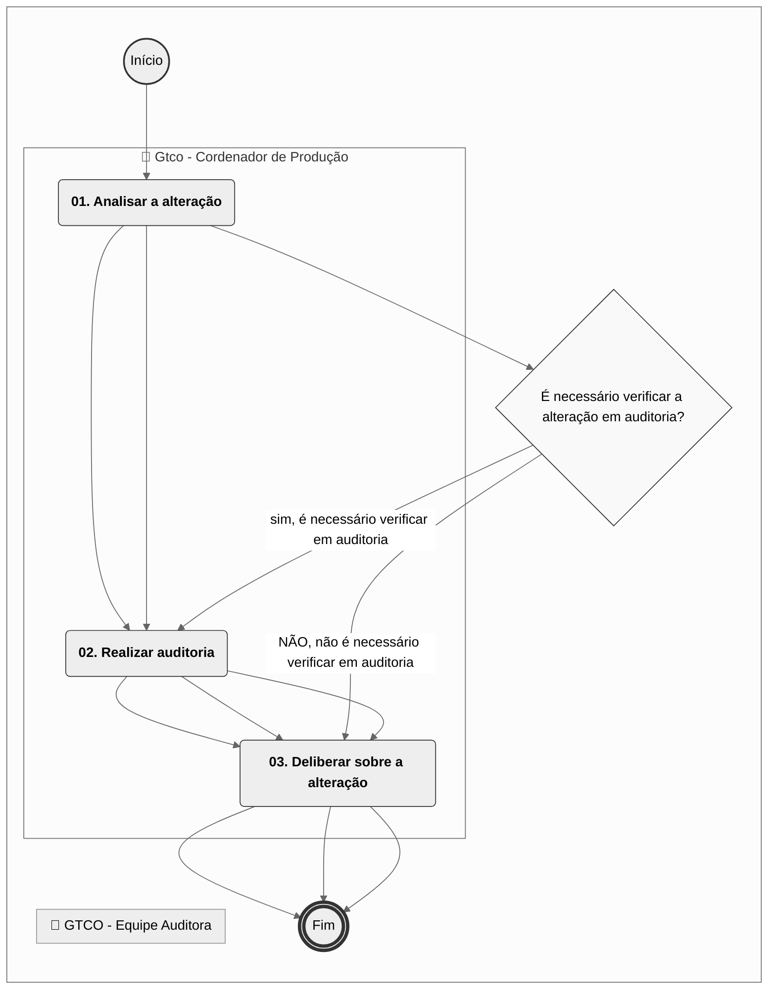
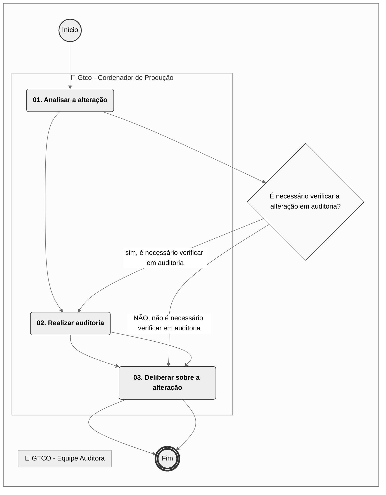
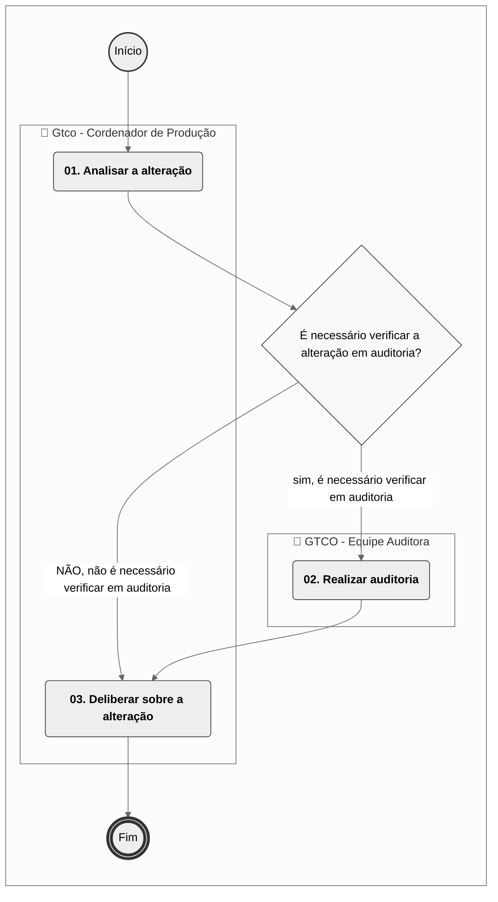

```mermaid
%%{init: {"theme": "neutral", "themeVariables": {"primaryColor": "#ffffff", "edgeLabelBackground": "#ffffff", "tertiaryColor": "#f4f4f4"}}}%%
flowchart TD
    classDef inicio stroke:#333,stroke-width:2px;
    classDef fim stroke:#333,stroke-width:4px;
    classDef tarefaBPMN stroke:#333,stroke-width:1px;
    classDef gatewayBPMN fill:#f9f9f9,stroke:#333,stroke-width:1px;
    classDef raia fill:none,stroke:#999,stroke-width:1px,stroke-dasharray: 5 5;
    subgraph Container_ID_MPR_SAR_221_R02_md_0 [ ]
        direction TB
        ID_MPR_SAR_221_R02_md_0_S((Início)):::inicio
        ID_MPR_SAR_221_R02_md_0_E(((Fim))):::fim
        subgraph Raia_ID_MPR_SAR_221_R02_md_0_1 [👤 Gtco - Cordenador de Produção]
            ID_MPR_SAR_221_R02_md_0_01("<b>01. Analisar a necessidade de auditorias em fornecedores de cada empresa</b>"):::tarefaBPMN
            ID_MPR_SAR_221_R02_md_0_08("<b>08. Revalidar o COP</b>"):::tarefaBPMN
            ID_MPR_SAR_221_R02_md_0_01("<b>01. Acompanhar o quality escape</b>"):::tarefaBPMN
            ID_MPR_SAR_221_R02_md_0_02("<b>02. Analisar relatório de voo de produção</b>"):::tarefaBPMN
            ID_MPR_SAR_221_R02_md_0_01("<b>01. Analisar requerimento</b>"):::tarefaBPMN
            ID_MPR_SAR_221_R02_md_0_02("<b>02. Analisar Manual da Qualidade</b>"):::tarefaBPMN
            ID_MPR_SAR_221_R02_md_0_03("<b>03. Elaborar Ofício</b>"):::tarefaBPMN
            ID_MPR_SAR_221_R02_md_0_01("<b>01. Analisar requerimento</b>"):::tarefaBPMN
            ID_MPR_SAR_221_R02_md_0_02("<b>02. Elaborar ofício</b>"):::tarefaBPMN
            ID_MPR_SAR_221_R02_md_0_03("<b>03. Elaborar Portaria para publicação no DOU</b>"):::tarefaBPMN
            ID_MPR_SAR_221_R02_md_0_01("<b>01. Analisar a alteração</b>"):::tarefaBPMN
            ID_MPR_SAR_221_R02_md_0_03("<b>03. Deliberar sobre a alteração</b>"):::tarefaBPMN
        end
        subgraph Raia_ID_MPR_SAR_221_R02_md_0_2 [👤 Gtco - Coordenador CPROD]
            ID_MPR_SAR_221_R02_md_0_02("<b>02. Elaborar Escala de Auditorias</b>"):::tarefaBPMN
            ID_MPR_SAR_221_R02_md_0_01("<b>01. Iniciar processo</b>"):::tarefaBPMN
            ID_MPR_SAR_221_R02_md_0_05("<b>05. Emitir parecer sobre o relatório</b>"):::tarefaBPMN
        end
        subgraph Raia_ID_MPR_SAR_221_R02_md_0_3 [👤 GTCO - Auditor Líder]
            ID_MPR_SAR_221_R02_md_0_02("<b>02. Planejar a auditoria</b>"):::tarefaBPMN
            ID_MPR_SAR_221_R02_md_0_04("<b>04. Emitir o relatório de auditoria</b>"):::tarefaBPMN
            ID_MPR_SAR_221_R02_md_0_06("<b>06. Realizar análise de risco</b>"):::tarefaBPMN
        end
        subgraph Raia_ID_MPR_SAR_221_R02_md_0_4 [👤 GTCO - Equipe Auditora]
            ID_MPR_SAR_221_R02_md_0_03("<b>03. Realizar auditoria</b>"):::tarefaBPMN
            ID_MPR_SAR_221_R02_md_0_02("<b>02. Realizar auditoria</b>"):::tarefaBPMN
        end
        subgraph Raia_ID_MPR_SAR_221_R02_md_0_5 [👤 Coordenadoria de Aeronáutica, Ensaios em Voo e Integração de Sistemas]
            ID_MPR_SAR_221_R02_md_0_01("<b>01. Realizar o voo de produção</b>"):::tarefaBPMN
        end
        subgraph Raia_ID_MPR_SAR_221_R02_md_0_6 [👤 CPROD]
            ID_MPR_SAR_221_R02_md_0_01("<b>01. Elaborar nota técnica</b>"):::tarefaBPMN
            ID_MPR_SAR_221_R02_md_0_02("<b>02. Elaborar ofício e portaria</b>"):::tarefaBPMN
            ID_MPR_SAR_221_R02_md_0_04("<b>04. Acompanhar a implementação das providências</b>"):::tarefaBPMN
            ID_MPR_SAR_221_R02_md_0_05("<b>05. Revogar o COP</b>"):::tarefaBPMN
            ID_MPR_SAR_221_R02_md_0_06("<b>06. Revogar a medida cautelar</b>"):::tarefaBPMN
        end
        subgraph Raia_ID_MPR_SAR_221_R02_md_0_7 [👤 O Gtco]
            ID_MPR_SAR_221_R02_md_0_03("<b>03. Assinar documentos de adoção de medida cautelar</b>"):::tarefaBPMN
            ID_MPR_SAR_221_R02_md_0_07("<b>07. Assinar documentos</b>"):::tarefaBPMN
        end
        ID_MPR_SAR_221_R02_md_0_S --> ID_MPR_SAR_221_R02_md_0_01
        ID_MPR_SAR_221_R02_md_0_01 --> ID_MPR_SAR_221_R02_md_0_02
        ID_MPR_SAR_221_R02_md_0_02 --> ID_MPR_SAR_221_R02_md_0_E
        ID_MPR_SAR_221_R02_md_0_01 --> ID_MPR_SAR_221_R02_md_0_02
        ID_MPR_SAR_221_R02_md_0_02 --> ID_MPR_SAR_221_R02_md_0_03
        ID_MPR_SAR_221_R02_md_0_03 --> ID_MPR_SAR_221_R02_md_0_04
        ID_MPR_SAR_221_R02_md_0_04 --> ID_MPR_SAR_221_R02_md_0_05
        ID_MPR_SAR_221_R02_md_0_05 --> ID_MPR_SAR_221_R02_md_0_06
        ID_MPR_SAR_221_R02_md_0_06 --> ID_MPR_SAR_221_R02_md_0_08
        ID_MPR_SAR_221_R02_md_0_08 --> ID_MPR_SAR_221_R02_md_0_E
        ID_MPR_SAR_221_R02_md_0_01 --> ID_MPR_SAR_221_R02_md_0_E
        ID_MPR_SAR_221_R02_md_0_01 --> ID_MPR_SAR_221_R02_md_0_02
        ID_MPR_SAR_221_R02_md_0_02 --> ID_MPR_SAR_221_R02_md_0_E
        ID_MPR_SAR_221_R02_md_0_01 --> ID_MPR_SAR_221_R02_md_0_02
        ID_MPR_SAR_221_R02_md_0_02 --> ID_MPR_SAR_221_R02_md_0_03
        ID_MPR_SAR_221_R02_md_0_03 --> ID_MPR_SAR_221_R02_md_0_04
        gw_ID_MPR_SAR_221_R02_md_0_04{"É necessário revogar o COP?"}:::gatewayBPMN
        ID_MPR_SAR_221_R02_md_0_04 --> gw_ID_MPR_SAR_221_R02_md_0_04
        gw_ID_MPR_SAR_221_R02_md_0_04 -->|"sim, o regulado não adotou as providências necessárias"| ID_MPR_SAR_221_R02_md_0_05
        gw_ID_MPR_SAR_221_R02_md_0_04 -->|"não, o regulado implementou as providências necessárias"| ID_MPR_SAR_221_R02_md_0_06
        ID_MPR_SAR_221_R02_md_0_05 --> ID_MPR_SAR_221_R02_md_0_07
        ID_MPR_SAR_221_R02_md_0_06 --> ID_MPR_SAR_221_R02_md_0_07
        ID_MPR_SAR_221_R02_md_0_07 --> ID_MPR_SAR_221_R02_md_0_E
        ID_MPR_SAR_221_R02_md_0_01 --> ID_MPR_SAR_221_R02_md_0_02
        ID_MPR_SAR_221_R02_md_0_02 --> ID_MPR_SAR_221_R02_md_0_03
        ID_MPR_SAR_221_R02_md_0_03 --> ID_MPR_SAR_221_R02_md_0_E
        ID_MPR_SAR_221_R02_md_0_01 --> ID_MPR_SAR_221_R02_md_0_02
        ID_MPR_SAR_221_R02_md_0_02 --> ID_MPR_SAR_221_R02_md_0_03
        ID_MPR_SAR_221_R02_md_0_03 --> ID_MPR_SAR_221_R02_md_0_E
        gw_ID_MPR_SAR_221_R02_md_0_01{"É necessário verificar a alteração em auditoria?"}:::gatewayBPMN
        ID_MPR_SAR_221_R02_md_0_01 --> gw_ID_MPR_SAR_221_R02_md_0_01
        gw_ID_MPR_SAR_221_R02_md_0_01 -->|"NÃO, não é necessário verificar em auditoria"| ID_MPR_SAR_221_R02_md_0_03
        gw_ID_MPR_SAR_221_R02_md_0_01 -->|"sim, é necessário verificar em auditoria"| ID_MPR_SAR_221_R02_md_0_02
        ID_MPR_SAR_221_R02_md_0_02 --> ID_MPR_SAR_221_R02_md_0_03
        ID_MPR_SAR_221_R02_md_0_03 --> ID_MPR_SAR_221_R02_md_0_E
    end
    click ID_MPR_SAR_221_R02_md_0_01 "O GTCO - CP deve analisar a necessidade de vigilância da ANAC nos fornecedores do fabricante com base na criticidade do fornecedor. Os seguintes critérios são considerados nesta análise:  • Se o fornecedor produz parte classificada como CPL 1 ou 2;  • Se o fabricante delega autoridade para o fornece"
    click ID_MPR_SAR_221_R02_md_0_02 "Antes de elaborar a escala de auditorias, o CPROD deve identificar todas as auditorias necessárias para o ano seguinte, incluindo auditorias em fornecedores, auditorias de manutenção e de revalidação, e auditorias em empresas fabricantes de embalagens.  A relação de fornecedores críticos selecionado"
    click ID_MPR_SAR_221_R02_md_0_01 "O processo no SEI para a realização de uma auditoria inicia-se com a carta de confirmação enviada pelo requerente.  O CPROD deve:  1. conferir se as datas e o tipo da auditoria estão corretos conforme a escala de auditorias;  2. cadastrar a auditoria nos sistemas departamentais (Intranet da SAR e GR"
    click ID_MPR_SAR_221_R02_md_0_02 "O planejamento da auditoria envolve:  1. Elaborar o programa de auditoria (F-121-01) e enviar para o requerente;  2. Definir a logística necessária (transporte, hospedagem, vestimenta);  3. Elaborar formulário de solicitação de afastamento do país (se aplicável), PCDP ou OS com a antecedência necess"
    click ID_MPR_SAR_221_R02_md_0_03 "O Auditor Líder deve conduzir as reuniões de abertura e de encerramento da auditoria. Deve-se buscar seguir o programa de auditoria, havendo flexibilidade caso alguma trilha demande mais tempo do que o programado.  Deve-se utilizar o questionário de avaliação de Sistemas de Organização de Produção ("
    click ID_MPR_SAR_221_R02_md_0_04 "O relatório de auditoria (F-121-04) deve ser concluído, impresso e assinado no último dia da auditoria. O relatório contém as áreas que foram auditadas e as não conformidades e observações identificadas.  Cada não conformidade deve ser enquadrada apropriadamente no regulamento e/ou em procedimento i"
    click ID_MPR_SAR_221_R02_md_0_05 "O CPROD emite, por escrito no relatório de auditoria, um parecer que visa orientar o auditor líder sobre o acompanhamento das não conformidades.  O CPROD pode direcionar o acompanhamento de alguma das não conformidades identificadas para o GTCO - CP, se entender que afeta o sistema da qualidade apro"
    click ID_MPR_SAR_221_R02_md_0_06 "Para emissão de providências administrativas devem ser consideradas nesta análise a Portaria sobre Regulação Responsiva (Portaria SAR 16.725, 04 de abril de 2025, publicada em 15/04/2025) e os critérios presentes no artefato F-300-40 - Avaliação do Perfil de Regulados Segundo os Critérios da Regulaç"
    click ID_MPR_SAR_221_R02_md_0_08 "No caso de auditoria de revalidação, o GTCO - CP preenche o Registro de Limitação de Produção (F-121-06) com a validade estabelecida no formulário de avaliação de periodicidade e encaminha para assinatura.  O GTCO - CP deve elaborar um ofício de envio do RLP e encaminhar para assinatura e envio ao r"
    click ID_MPR_SAR_221_R02_md_0_01 "Ao identificar um quality escape que possa ocasionar alguma das ocorrências descritas no parágrafo 21.3(c) do RBAC 21, o fabricante envia comunicação à GTCO através de uma carta protocolada no SEI.  O GTCO - CP deve encaminhar um e-mail dentro do processo informando o quality escape para a GTAC, que"
    click ID_MPR_SAR_221_R02_md_0_01 "A programação para acompanhamento de voo de produção pela ANAC na frequência estabelecida pelo Policy File - 21.140 é realizada pela GTEV/CEVIS.  Após a realização do voo, a CEVIS envia um relatório para a GTCO/CPROD."
    click ID_MPR_SAR_221_R02_md_0_02 "A análise do relatório do voo de produção deve procurar identificar:  1. Se o voo foi realizado utilizando o procedimento aprovado;  2. Se as eventuais discrepâncias apontadas indicam alguma tendência adversa que necessite de ação corretiva por parte do fabricante."
    click ID_MPR_SAR_221_R02_md_0_01 "Ao identificar situação ou conduta que gere risco iminente à segurança de voo, à integridade física de pessoas, à coletividade, à ordem pública, à continuidade dos serviços prestados ou ao interesse público, o agente da ANAC no exercício de atividade de fiscalização deverá atuar de acordo com os art"
    click ID_MPR_SAR_221_R02_md_0_02 "O agente que identificou a situação de risco deve elaborar um ofício para notificar o acautelado. De acordo com o artigo 58 da resolução 472/2018, o ofício deve conter no mínimo:  • A infração identificada, com a sua fundamentação;  • Documentos e providências necessárias para revogação da medida ac"
    click ID_MPR_SAR_221_R02_md_0_03 "O GTCO deve assinar o ofício de notificação da medida cautelar, a portaria para publicação no DOU e o despacho de encaminhamento da portaria para a ASCOM."
    click ID_MPR_SAR_221_R02_md_0_04 "O agente que identificou a situação de risco deve acompanhar a implementação das providências necessárias para revogação da medida cautelar, conforme informado na notificação ao acautelado.  O acompanhamento deve ser registrado na Intranet da SAR, em um relatório de acompanhamento.  Caso o acautelad"
    click ID_MPR_SAR_221_R02_md_0_05 "Caso o acautelado não atenda aos prazos para manifestação e adoção das providências necessárias para revogação da medida cautelar, o COP deve ser revogado.  O agente que identificou a situação de risco deve elaborar um ofício para notificar o acautelado sobre a revogação do COP.  O agente deve, aind"
    click ID_MPR_SAR_221_R02_md_0_06 "Caso o acautelado adote as providências necessárias, a medida cautelar deve ser revogada.  O agente que identificou a situação de risco deve elaborar um ofício para notificar o acautelado sobre a revogação da medida cautelar.  O agente deve, ainda, elaborar portaria para publicação da revogação da m"
    click ID_MPR_SAR_221_R02_md_0_07 "O GTCO deve assinar o ofício de notificação da revogação do COP ou da medida cautelar, a portaria para publicação no DOU e o despacho de encaminhamento da portaria para a ASCOM."
    click ID_MPR_SAR_221_R02_md_0_01 "O GTCO - CP deve analisar se o requerente enviou o comprovante de pagamento da TFAC relacionada à revisão do manual da qualidade, conforme ITD 121-03."
    click ID_MPR_SAR_221_R02_md_0_02 "As seções 21.138, 21.308 e 21.608 requerem que a ANAC aprove o manual da qualidade do requerente ou detentor de um COP. Revisões do manual da qualidade também devem ser aprovadas.  Ao receber uma proposta de alteração do manual da qualidade, o coordenador de produção deve verificar se os requisitos "
    click ID_MPR_SAR_221_R02_md_0_03 "O GTCO - CP deve elaborar um ofício contendo o resultado da análise, aprovando ou não o manual da qualidade e encaminhar o ofício para assinatura do GTCO."
    click ID_MPR_SAR_221_R02_md_0_01 "O GTCO - CP deve analisar se a pessoa que assinou o requerimento para cancelamento do COP tem autorização para representar a empresa. Se for necessário, o GTCO - CP deve solicitar cópia do contrato social e procuração."
    click ID_MPR_SAR_221_R02_md_0_02 "O GTCO - CP deve elaborar ofício informando à empresa sobre o cancelamento do COP, como foi solicitado, e encaminhar o ofício para assinatura.  O GTCO - CP deve atualizar o status do COP na Intranet da SAR."
    click ID_MPR_SAR_221_R02_md_0_03 "O GTCO - CP deve elaborar uma portaria para dar publicidade ao cancelamento do COP. Esta atividade possui como artefato um modelo de portaria que pode ser utilizado."
    click ID_MPR_SAR_221_R02_md_0_01 "O detentor de um COP deve comunicar à ANAC, por escrito, qualquer alteração em seu sistema da qualidade ou na localização das instalações de fabricação que possam afetar inspeção, conformidade ou aeronavegabilidade.  Ao receber a notificação, o coordenador de produção deve verificar se os requisitos"
    click ID_MPR_SAR_221_R02_md_0_02 "O GTCOCPROD definirá equipe e data para a realização da auditoria não programada para verificação da alteração no sistema da qualidade proposta.  Será gerado um novo processo no SEI, associado ao processo da comunicação da alteração, para a realização da auditoria. O processo de comunicação da modif"
    click ID_MPR_SAR_221_R02_md_0_03 "O GTCO - CP deve elaborar um parecer contendo o resultado da análise (se o detentor do COP continua cumprindo com os requisitos do RBAC 21 ou se deixou de cumprir com algum requisito).  Caso o GTCO - CP conclua que após a alteração o detentor do COP deixou de atender aos requisitos do RBAC 21, deve "
```

```mermaid
%%{init: {"theme": "neutral", "themeVariables": {"primaryColor": "#ffffff", "edgeLabelBackground": "#ffffff", "tertiaryColor": "#f4f4f4"}}}%%
flowchart TD
    classDef inicio stroke:#333,stroke-width:2px;
    classDef fim stroke:#333,stroke-width:4px;
    classDef tarefaBPMN stroke:#333,stroke-width:1px;
    classDef gatewayBPMN fill:#f9f9f9,stroke:#333,stroke-width:1px;
    classDef raia fill:none,stroke:#999,stroke-width:1px,stroke-dasharray: 5 5;
    subgraph Container_ID_MPR_SAR_221_R02_md_1 [ ]
        direction TB
        ID_MPR_SAR_221_R02_md_1_S((Início)):::inicio
        ID_MPR_SAR_221_R02_md_1_E(((Fim))):::fim
        subgraph Raia_ID_MPR_SAR_221_R02_md_1_1 [👤 Gtco - Coordenador CPROD]
            ID_MPR_SAR_221_R02_md_1_01("<b>01. Iniciar processo</b>"):::tarefaBPMN
            ID_MPR_SAR_221_R02_md_1_05("<b>05. Emitir parecer sobre o relatório</b>"):::tarefaBPMN
        end
        subgraph Raia_ID_MPR_SAR_221_R02_md_1_2 [👤 GTCO - Auditor Líder]
            ID_MPR_SAR_221_R02_md_1_02("<b>02. Planejar a auditoria</b>"):::tarefaBPMN
            ID_MPR_SAR_221_R02_md_1_04("<b>04. Emitir o relatório de auditoria</b>"):::tarefaBPMN
            ID_MPR_SAR_221_R02_md_1_06("<b>06. Realizar análise de risco</b>"):::tarefaBPMN
        end
        subgraph Raia_ID_MPR_SAR_221_R02_md_1_3 [👤 GTCO - Equipe Auditora]
            ID_MPR_SAR_221_R02_md_1_03("<b>03. Realizar auditoria</b>"):::tarefaBPMN
            ID_MPR_SAR_221_R02_md_1_02("<b>02. Realizar auditoria</b>"):::tarefaBPMN
        end
        subgraph Raia_ID_MPR_SAR_221_R02_md_1_4 [👤 Gtco - Cordenador de Produção]
            ID_MPR_SAR_221_R02_md_1_08("<b>08. Revalidar o COP</b>"):::tarefaBPMN
            ID_MPR_SAR_221_R02_md_1_01("<b>01. Acompanhar o quality escape</b>"):::tarefaBPMN
            ID_MPR_SAR_221_R02_md_1_02("<b>02. Analisar relatório de voo de produção</b>"):::tarefaBPMN
            ID_MPR_SAR_221_R02_md_1_01("<b>01. Analisar requerimento</b>"):::tarefaBPMN
            ID_MPR_SAR_221_R02_md_1_02("<b>02. Analisar Manual da Qualidade</b>"):::tarefaBPMN
            ID_MPR_SAR_221_R02_md_1_03("<b>03. Elaborar Ofício</b>"):::tarefaBPMN
            ID_MPR_SAR_221_R02_md_1_01("<b>01. Analisar requerimento</b>"):::tarefaBPMN
            ID_MPR_SAR_221_R02_md_1_02("<b>02. Elaborar ofício</b>"):::tarefaBPMN
            ID_MPR_SAR_221_R02_md_1_03("<b>03. Elaborar Portaria para publicação no DOU</b>"):::tarefaBPMN
            ID_MPR_SAR_221_R02_md_1_01("<b>01. Analisar a alteração</b>"):::tarefaBPMN
            ID_MPR_SAR_221_R02_md_1_03("<b>03. Deliberar sobre a alteração</b>"):::tarefaBPMN
        end
        subgraph Raia_ID_MPR_SAR_221_R02_md_1_5 [👤 Coordenadoria de Aeronáutica, Ensaios em Voo e Integração de Sistemas]
            ID_MPR_SAR_221_R02_md_1_01("<b>01. Realizar o voo de produção</b>"):::tarefaBPMN
        end
        subgraph Raia_ID_MPR_SAR_221_R02_md_1_6 [👤 CPROD]
            ID_MPR_SAR_221_R02_md_1_01("<b>01. Elaborar nota técnica</b>"):::tarefaBPMN
            ID_MPR_SAR_221_R02_md_1_02("<b>02. Elaborar ofício e portaria</b>"):::tarefaBPMN
            ID_MPR_SAR_221_R02_md_1_04("<b>04. Acompanhar a implementação das providências</b>"):::tarefaBPMN
            ID_MPR_SAR_221_R02_md_1_05("<b>05. Revogar o COP</b>"):::tarefaBPMN
            ID_MPR_SAR_221_R02_md_1_06("<b>06. Revogar a medida cautelar</b>"):::tarefaBPMN
        end
        subgraph Raia_ID_MPR_SAR_221_R02_md_1_7 [👤 O Gtco]
            ID_MPR_SAR_221_R02_md_1_03("<b>03. Assinar documentos de adoção de medida cautelar</b>"):::tarefaBPMN
            ID_MPR_SAR_221_R02_md_1_07("<b>07. Assinar documentos</b>"):::tarefaBPMN
        end
        ID_MPR_SAR_221_R02_md_1_S --> ID_MPR_SAR_221_R02_md_1_01
        ID_MPR_SAR_221_R02_md_1_01 --> ID_MPR_SAR_221_R02_md_1_02
        ID_MPR_SAR_221_R02_md_1_02 --> ID_MPR_SAR_221_R02_md_1_03
        ID_MPR_SAR_221_R02_md_1_03 --> ID_MPR_SAR_221_R02_md_1_04
        ID_MPR_SAR_221_R02_md_1_04 --> ID_MPR_SAR_221_R02_md_1_05
        ID_MPR_SAR_221_R02_md_1_05 --> ID_MPR_SAR_221_R02_md_1_06
        ID_MPR_SAR_221_R02_md_1_06 --> ID_MPR_SAR_221_R02_md_1_08
        ID_MPR_SAR_221_R02_md_1_08 --> ID_MPR_SAR_221_R02_md_1_E
        ID_MPR_SAR_221_R02_md_1_01 --> ID_MPR_SAR_221_R02_md_1_E
        ID_MPR_SAR_221_R02_md_1_01 --> ID_MPR_SAR_221_R02_md_1_02
        ID_MPR_SAR_221_R02_md_1_02 --> ID_MPR_SAR_221_R02_md_1_E
        ID_MPR_SAR_221_R02_md_1_01 --> ID_MPR_SAR_221_R02_md_1_02
        ID_MPR_SAR_221_R02_md_1_02 --> ID_MPR_SAR_221_R02_md_1_03
        ID_MPR_SAR_221_R02_md_1_03 --> ID_MPR_SAR_221_R02_md_1_04
        gw_ID_MPR_SAR_221_R02_md_1_04{"É necessário revogar o COP?"}:::gatewayBPMN
        ID_MPR_SAR_221_R02_md_1_04 --> gw_ID_MPR_SAR_221_R02_md_1_04
        gw_ID_MPR_SAR_221_R02_md_1_04 -->|"sim, o regulado não adotou as providências necessárias"| ID_MPR_SAR_221_R02_md_1_05
        gw_ID_MPR_SAR_221_R02_md_1_04 -->|"não, o regulado implementou as providências necessárias"| ID_MPR_SAR_221_R02_md_1_06
        ID_MPR_SAR_221_R02_md_1_05 --> ID_MPR_SAR_221_R02_md_1_07
        ID_MPR_SAR_221_R02_md_1_06 --> ID_MPR_SAR_221_R02_md_1_07
        ID_MPR_SAR_221_R02_md_1_07 --> ID_MPR_SAR_221_R02_md_1_E
        ID_MPR_SAR_221_R02_md_1_01 --> ID_MPR_SAR_221_R02_md_1_02
        ID_MPR_SAR_221_R02_md_1_02 --> ID_MPR_SAR_221_R02_md_1_03
        ID_MPR_SAR_221_R02_md_1_03 --> ID_MPR_SAR_221_R02_md_1_E
        ID_MPR_SAR_221_R02_md_1_01 --> ID_MPR_SAR_221_R02_md_1_02
        ID_MPR_SAR_221_R02_md_1_02 --> ID_MPR_SAR_221_R02_md_1_03
        ID_MPR_SAR_221_R02_md_1_03 --> ID_MPR_SAR_221_R02_md_1_E
        gw_ID_MPR_SAR_221_R02_md_1_01{"É necessário verificar a alteração em auditoria?"}:::gatewayBPMN
        ID_MPR_SAR_221_R02_md_1_01 --> gw_ID_MPR_SAR_221_R02_md_1_01
        gw_ID_MPR_SAR_221_R02_md_1_01 -->|"NÃO, não é necessário verificar em auditoria"| ID_MPR_SAR_221_R02_md_1_03
        gw_ID_MPR_SAR_221_R02_md_1_01 -->|"sim, é necessário verificar em auditoria"| ID_MPR_SAR_221_R02_md_1_02
        ID_MPR_SAR_221_R02_md_1_02 --> ID_MPR_SAR_221_R02_md_1_03
        ID_MPR_SAR_221_R02_md_1_03 --> ID_MPR_SAR_221_R02_md_1_E
    end
    click ID_MPR_SAR_221_R02_md_1_01 "O processo no SEI para a realização de uma auditoria inicia-se com a carta de confirmação enviada pelo requerente.  O CPROD deve:  1. conferir se as datas e o tipo da auditoria estão corretos conforme a escala de auditorias;  2. cadastrar a auditoria nos sistemas departamentais (Intranet da SAR e GR"
    click ID_MPR_SAR_221_R02_md_1_02 "O planejamento da auditoria envolve:  1. Elaborar o programa de auditoria (F-121-01) e enviar para o requerente;  2. Definir a logística necessária (transporte, hospedagem, vestimenta);  3. Elaborar formulário de solicitação de afastamento do país (se aplicável), PCDP ou OS com a antecedência necess"
    click ID_MPR_SAR_221_R02_md_1_03 "O Auditor Líder deve conduzir as reuniões de abertura e de encerramento da auditoria. Deve-se buscar seguir o programa de auditoria, havendo flexibilidade caso alguma trilha demande mais tempo do que o programado.  Deve-se utilizar o questionário de avaliação de Sistemas de Organização de Produção ("
    click ID_MPR_SAR_221_R02_md_1_04 "O relatório de auditoria (F-121-04) deve ser concluído, impresso e assinado no último dia da auditoria. O relatório contém as áreas que foram auditadas e as não conformidades e observações identificadas.  Cada não conformidade deve ser enquadrada apropriadamente no regulamento e/ou em procedimento i"
    click ID_MPR_SAR_221_R02_md_1_05 "O CPROD emite, por escrito no relatório de auditoria, um parecer que visa orientar o auditor líder sobre o acompanhamento das não conformidades.  O CPROD pode direcionar o acompanhamento de alguma das não conformidades identificadas para o GTCO - CP, se entender que afeta o sistema da qualidade apro"
    click ID_MPR_SAR_221_R02_md_1_06 "Para emissão de providências administrativas devem ser consideradas nesta análise a Portaria sobre Regulação Responsiva (Portaria SAR 16.725, 04 de abril de 2025, publicada em 15/04/2025) e os critérios presentes no artefato F-300-40 - Avaliação do Perfil de Regulados Segundo os Critérios da Regulaç"
    click ID_MPR_SAR_221_R02_md_1_08 "No caso de auditoria de revalidação, o GTCO - CP preenche o Registro de Limitação de Produção (F-121-06) com a validade estabelecida no formulário de avaliação de periodicidade e encaminha para assinatura.  O GTCO - CP deve elaborar um ofício de envio do RLP e encaminhar para assinatura e envio ao r"
    click ID_MPR_SAR_221_R02_md_1_01 "Ao identificar um quality escape que possa ocasionar alguma das ocorrências descritas no parágrafo 21.3(c) do RBAC 21, o fabricante envia comunicação à GTCO através de uma carta protocolada no SEI.  O GTCO - CP deve encaminhar um e-mail dentro do processo informando o quality escape para a GTAC, que"
    click ID_MPR_SAR_221_R02_md_1_01 "A programação para acompanhamento de voo de produção pela ANAC na frequência estabelecida pelo Policy File - 21.140 é realizada pela GTEV/CEVIS.  Após a realização do voo, a CEVIS envia um relatório para a GTCO/CPROD."
    click ID_MPR_SAR_221_R02_md_1_02 "A análise do relatório do voo de produção deve procurar identificar:  1. Se o voo foi realizado utilizando o procedimento aprovado;  2. Se as eventuais discrepâncias apontadas indicam alguma tendência adversa que necessite de ação corretiva por parte do fabricante."
    click ID_MPR_SAR_221_R02_md_1_01 "Ao identificar situação ou conduta que gere risco iminente à segurança de voo, à integridade física de pessoas, à coletividade, à ordem pública, à continuidade dos serviços prestados ou ao interesse público, o agente da ANAC no exercício de atividade de fiscalização deverá atuar de acordo com os art"
    click ID_MPR_SAR_221_R02_md_1_02 "O agente que identificou a situação de risco deve elaborar um ofício para notificar o acautelado. De acordo com o artigo 58 da resolução 472/2018, o ofício deve conter no mínimo:  • A infração identificada, com a sua fundamentação;  • Documentos e providências necessárias para revogação da medida ac"
    click ID_MPR_SAR_221_R02_md_1_03 "O GTCO deve assinar o ofício de notificação da medida cautelar, a portaria para publicação no DOU e o despacho de encaminhamento da portaria para a ASCOM."
    click ID_MPR_SAR_221_R02_md_1_04 "O agente que identificou a situação de risco deve acompanhar a implementação das providências necessárias para revogação da medida cautelar, conforme informado na notificação ao acautelado.  O acompanhamento deve ser registrado na Intranet da SAR, em um relatório de acompanhamento.  Caso o acautelad"
    click ID_MPR_SAR_221_R02_md_1_05 "Caso o acautelado não atenda aos prazos para manifestação e adoção das providências necessárias para revogação da medida cautelar, o COP deve ser revogado.  O agente que identificou a situação de risco deve elaborar um ofício para notificar o acautelado sobre a revogação do COP.  O agente deve, aind"
    click ID_MPR_SAR_221_R02_md_1_06 "Caso o acautelado adote as providências necessárias, a medida cautelar deve ser revogada.  O agente que identificou a situação de risco deve elaborar um ofício para notificar o acautelado sobre a revogação da medida cautelar.  O agente deve, ainda, elaborar portaria para publicação da revogação da m"
    click ID_MPR_SAR_221_R02_md_1_07 "O GTCO deve assinar o ofício de notificação da revogação do COP ou da medida cautelar, a portaria para publicação no DOU e o despacho de encaminhamento da portaria para a ASCOM."
    click ID_MPR_SAR_221_R02_md_1_01 "O GTCO - CP deve analisar se o requerente enviou o comprovante de pagamento da TFAC relacionada à revisão do manual da qualidade, conforme ITD 121-03."
    click ID_MPR_SAR_221_R02_md_1_02 "As seções 21.138, 21.308 e 21.608 requerem que a ANAC aprove o manual da qualidade do requerente ou detentor de um COP. Revisões do manual da qualidade também devem ser aprovadas.  Ao receber uma proposta de alteração do manual da qualidade, o coordenador de produção deve verificar se os requisitos "
    click ID_MPR_SAR_221_R02_md_1_03 "O GTCO - CP deve elaborar um ofício contendo o resultado da análise, aprovando ou não o manual da qualidade e encaminhar o ofício para assinatura do GTCO."
    click ID_MPR_SAR_221_R02_md_1_01 "O GTCO - CP deve analisar se a pessoa que assinou o requerimento para cancelamento do COP tem autorização para representar a empresa. Se for necessário, o GTCO - CP deve solicitar cópia do contrato social e procuração."
    click ID_MPR_SAR_221_R02_md_1_02 "O GTCO - CP deve elaborar ofício informando à empresa sobre o cancelamento do COP, como foi solicitado, e encaminhar o ofício para assinatura.  O GTCO - CP deve atualizar o status do COP na Intranet da SAR."
    click ID_MPR_SAR_221_R02_md_1_03 "O GTCO - CP deve elaborar uma portaria para dar publicidade ao cancelamento do COP. Esta atividade possui como artefato um modelo de portaria que pode ser utilizado."
    click ID_MPR_SAR_221_R02_md_1_01 "O detentor de um COP deve comunicar à ANAC, por escrito, qualquer alteração em seu sistema da qualidade ou na localização das instalações de fabricação que possam afetar inspeção, conformidade ou aeronavegabilidade.  Ao receber a notificação, o coordenador de produção deve verificar se os requisitos"
    click ID_MPR_SAR_221_R02_md_1_02 "O GTCOCPROD definirá equipe e data para a realização da auditoria não programada para verificação da alteração no sistema da qualidade proposta.  Será gerado um novo processo no SEI, associado ao processo da comunicação da alteração, para a realização da auditoria. O processo de comunicação da modif"
    click ID_MPR_SAR_221_R02_md_1_03 "O GTCO - CP deve elaborar um parecer contendo o resultado da análise (se o detentor do COP continua cumprindo com os requisitos do RBAC 21 ou se deixou de cumprir com algum requisito).  Caso o GTCO - CP conclua que após a alteração o detentor do COP deixou de atender aos requisitos do RBAC 21, deve "
```

```mermaid
%%{init: {"theme": "neutral", "themeVariables": {"primaryColor": "#ffffff", "edgeLabelBackground": "#ffffff", "tertiaryColor": "#f4f4f4"}}}%%
flowchart TD
    classDef inicio stroke:#333,stroke-width:2px;
    classDef fim stroke:#333,stroke-width:4px;
    classDef tarefaBPMN stroke:#333,stroke-width:1px;
    classDef gatewayBPMN fill:#f9f9f9,stroke:#333,stroke-width:1px;
    classDef raia fill:none,stroke:#999,stroke-width:1px,stroke-dasharray: 5 5;
    subgraph Container_ID_MPR_SAR_221_R02_md_2 [ ]
        direction TB
        ID_MPR_SAR_221_R02_md_2_S((Início)):::inicio
        ID_MPR_SAR_221_R02_md_2_E(((Fim))):::fim
        subgraph Raia_ID_MPR_SAR_221_R02_md_2_1 [👤 Gtco - Cordenador de Produção]
            ID_MPR_SAR_221_R02_md_2_01("<b>01. Acompanhar o quality escape</b>"):::tarefaBPMN
            ID_MPR_SAR_221_R02_md_2_02("<b>02. Analisar relatório de voo de produção</b>"):::tarefaBPMN
            ID_MPR_SAR_221_R02_md_2_01("<b>01. Analisar requerimento</b>"):::tarefaBPMN
            ID_MPR_SAR_221_R02_md_2_02("<b>02. Analisar Manual da Qualidade</b>"):::tarefaBPMN
            ID_MPR_SAR_221_R02_md_2_03("<b>03. Elaborar Ofício</b>"):::tarefaBPMN
            ID_MPR_SAR_221_R02_md_2_01("<b>01. Analisar requerimento</b>"):::tarefaBPMN
            ID_MPR_SAR_221_R02_md_2_02("<b>02. Elaborar ofício</b>"):::tarefaBPMN
            ID_MPR_SAR_221_R02_md_2_03("<b>03. Elaborar Portaria para publicação no DOU</b>"):::tarefaBPMN
            ID_MPR_SAR_221_R02_md_2_01("<b>01. Analisar a alteração</b>"):::tarefaBPMN
            ID_MPR_SAR_221_R02_md_2_03("<b>03. Deliberar sobre a alteração</b>"):::tarefaBPMN
        end
        subgraph Raia_ID_MPR_SAR_221_R02_md_2_2 [👤 Coordenadoria de Aeronáutica, Ensaios em Voo e Integração de Sistemas]
            ID_MPR_SAR_221_R02_md_2_01("<b>01. Realizar o voo de produção</b>"):::tarefaBPMN
        end
        subgraph Raia_ID_MPR_SAR_221_R02_md_2_3 [👤 CPROD]
            ID_MPR_SAR_221_R02_md_2_01("<b>01. Elaborar nota técnica</b>"):::tarefaBPMN
            ID_MPR_SAR_221_R02_md_2_02("<b>02. Elaborar ofício e portaria</b>"):::tarefaBPMN
            ID_MPR_SAR_221_R02_md_2_04("<b>04. Acompanhar a implementação das providências</b>"):::tarefaBPMN
            ID_MPR_SAR_221_R02_md_2_05("<b>05. Revogar o COP</b>"):::tarefaBPMN
            ID_MPR_SAR_221_R02_md_2_06("<b>06. Revogar a medida cautelar</b>"):::tarefaBPMN
        end
        subgraph Raia_ID_MPR_SAR_221_R02_md_2_4 [👤 O Gtco]
            ID_MPR_SAR_221_R02_md_2_03("<b>03. Assinar documentos de adoção de medida cautelar</b>"):::tarefaBPMN
            ID_MPR_SAR_221_R02_md_2_07("<b>07. Assinar documentos</b>"):::tarefaBPMN
        end
        subgraph Raia_ID_MPR_SAR_221_R02_md_2_5 [👤 GTCO - Equipe Auditora]
            ID_MPR_SAR_221_R02_md_2_02("<b>02. Realizar auditoria</b>"):::tarefaBPMN
        end
        ID_MPR_SAR_221_R02_md_2_S --> ID_MPR_SAR_221_R02_md_2_01
        ID_MPR_SAR_221_R02_md_2_01 --> ID_MPR_SAR_221_R02_md_2_E
        ID_MPR_SAR_221_R02_md_2_01 --> ID_MPR_SAR_221_R02_md_2_02
        ID_MPR_SAR_221_R02_md_2_02 --> ID_MPR_SAR_221_R02_md_2_E
        ID_MPR_SAR_221_R02_md_2_01 --> ID_MPR_SAR_221_R02_md_2_02
        ID_MPR_SAR_221_R02_md_2_02 --> ID_MPR_SAR_221_R02_md_2_03
        ID_MPR_SAR_221_R02_md_2_03 --> ID_MPR_SAR_221_R02_md_2_04
        gw_ID_MPR_SAR_221_R02_md_2_04{"É necessário revogar o COP?"}:::gatewayBPMN
        ID_MPR_SAR_221_R02_md_2_04 --> gw_ID_MPR_SAR_221_R02_md_2_04
        gw_ID_MPR_SAR_221_R02_md_2_04 -->|"sim, o regulado não adotou as providências necessárias"| ID_MPR_SAR_221_R02_md_2_05
        gw_ID_MPR_SAR_221_R02_md_2_04 -->|"não, o regulado implementou as providências necessárias"| ID_MPR_SAR_221_R02_md_2_06
        ID_MPR_SAR_221_R02_md_2_05 --> ID_MPR_SAR_221_R02_md_2_07
        ID_MPR_SAR_221_R02_md_2_06 --> ID_MPR_SAR_221_R02_md_2_07
        ID_MPR_SAR_221_R02_md_2_07 --> ID_MPR_SAR_221_R02_md_2_E
        ID_MPR_SAR_221_R02_md_2_01 --> ID_MPR_SAR_221_R02_md_2_02
        ID_MPR_SAR_221_R02_md_2_02 --> ID_MPR_SAR_221_R02_md_2_03
        ID_MPR_SAR_221_R02_md_2_03 --> ID_MPR_SAR_221_R02_md_2_E
        ID_MPR_SAR_221_R02_md_2_01 --> ID_MPR_SAR_221_R02_md_2_02
        ID_MPR_SAR_221_R02_md_2_02 --> ID_MPR_SAR_221_R02_md_2_03
        ID_MPR_SAR_221_R02_md_2_03 --> ID_MPR_SAR_221_R02_md_2_E
        gw_ID_MPR_SAR_221_R02_md_2_01{"É necessário verificar a alteração em auditoria?"}:::gatewayBPMN
        ID_MPR_SAR_221_R02_md_2_01 --> gw_ID_MPR_SAR_221_R02_md_2_01
        gw_ID_MPR_SAR_221_R02_md_2_01 -->|"NÃO, não é necessário verificar em auditoria"| ID_MPR_SAR_221_R02_md_2_03
        gw_ID_MPR_SAR_221_R02_md_2_01 -->|"sim, é necessário verificar em auditoria"| ID_MPR_SAR_221_R02_md_2_02
        ID_MPR_SAR_221_R02_md_2_02 --> ID_MPR_SAR_221_R02_md_2_03
        ID_MPR_SAR_221_R02_md_2_03 --> ID_MPR_SAR_221_R02_md_2_E
    end
    click ID_MPR_SAR_221_R02_md_2_01 "Ao identificar um quality escape que possa ocasionar alguma das ocorrências descritas no parágrafo 21.3(c) do RBAC 21, o fabricante envia comunicação à GTCO através de uma carta protocolada no SEI.  O GTCO - CP deve encaminhar um e-mail dentro do processo informando o quality escape para a GTAC, que"
    click ID_MPR_SAR_221_R02_md_2_01 "A programação para acompanhamento de voo de produção pela ANAC na frequência estabelecida pelo Policy File - 21.140 é realizada pela GTEV/CEVIS.  Após a realização do voo, a CEVIS envia um relatório para a GTCO/CPROD."
    click ID_MPR_SAR_221_R02_md_2_02 "A análise do relatório do voo de produção deve procurar identificar:  1. Se o voo foi realizado utilizando o procedimento aprovado;  2. Se as eventuais discrepâncias apontadas indicam alguma tendência adversa que necessite de ação corretiva por parte do fabricante."
    click ID_MPR_SAR_221_R02_md_2_01 "Ao identificar situação ou conduta que gere risco iminente à segurança de voo, à integridade física de pessoas, à coletividade, à ordem pública, à continuidade dos serviços prestados ou ao interesse público, o agente da ANAC no exercício de atividade de fiscalização deverá atuar de acordo com os art"
    click ID_MPR_SAR_221_R02_md_2_02 "O agente que identificou a situação de risco deve elaborar um ofício para notificar o acautelado. De acordo com o artigo 58 da resolução 472/2018, o ofício deve conter no mínimo:  • A infração identificada, com a sua fundamentação;  • Documentos e providências necessárias para revogação da medida ac"
    click ID_MPR_SAR_221_R02_md_2_03 "O GTCO deve assinar o ofício de notificação da medida cautelar, a portaria para publicação no DOU e o despacho de encaminhamento da portaria para a ASCOM."
    click ID_MPR_SAR_221_R02_md_2_04 "O agente que identificou a situação de risco deve acompanhar a implementação das providências necessárias para revogação da medida cautelar, conforme informado na notificação ao acautelado.  O acompanhamento deve ser registrado na Intranet da SAR, em um relatório de acompanhamento.  Caso o acautelad"
    click ID_MPR_SAR_221_R02_md_2_05 "Caso o acautelado não atenda aos prazos para manifestação e adoção das providências necessárias para revogação da medida cautelar, o COP deve ser revogado.  O agente que identificou a situação de risco deve elaborar um ofício para notificar o acautelado sobre a revogação do COP.  O agente deve, aind"
    click ID_MPR_SAR_221_R02_md_2_06 "Caso o acautelado adote as providências necessárias, a medida cautelar deve ser revogada.  O agente que identificou a situação de risco deve elaborar um ofício para notificar o acautelado sobre a revogação da medida cautelar.  O agente deve, ainda, elaborar portaria para publicação da revogação da m"
    click ID_MPR_SAR_221_R02_md_2_07 "O GTCO deve assinar o ofício de notificação da revogação do COP ou da medida cautelar, a portaria para publicação no DOU e o despacho de encaminhamento da portaria para a ASCOM."
    click ID_MPR_SAR_221_R02_md_2_01 "O GTCO - CP deve analisar se o requerente enviou o comprovante de pagamento da TFAC relacionada à revisão do manual da qualidade, conforme ITD 121-03."
    click ID_MPR_SAR_221_R02_md_2_02 "As seções 21.138, 21.308 e 21.608 requerem que a ANAC aprove o manual da qualidade do requerente ou detentor de um COP. Revisões do manual da qualidade também devem ser aprovadas.  Ao receber uma proposta de alteração do manual da qualidade, o coordenador de produção deve verificar se os requisitos "
    click ID_MPR_SAR_221_R02_md_2_03 "O GTCO - CP deve elaborar um ofício contendo o resultado da análise, aprovando ou não o manual da qualidade e encaminhar o ofício para assinatura do GTCO."
    click ID_MPR_SAR_221_R02_md_2_01 "O GTCO - CP deve analisar se a pessoa que assinou o requerimento para cancelamento do COP tem autorização para representar a empresa. Se for necessário, o GTCO - CP deve solicitar cópia do contrato social e procuração."
    click ID_MPR_SAR_221_R02_md_2_02 "O GTCO - CP deve elaborar ofício informando à empresa sobre o cancelamento do COP, como foi solicitado, e encaminhar o ofício para assinatura.  O GTCO - CP deve atualizar o status do COP na Intranet da SAR."
    click ID_MPR_SAR_221_R02_md_2_03 "O GTCO - CP deve elaborar uma portaria para dar publicidade ao cancelamento do COP. Esta atividade possui como artefato um modelo de portaria que pode ser utilizado."
    click ID_MPR_SAR_221_R02_md_2_01 "O detentor de um COP deve comunicar à ANAC, por escrito, qualquer alteração em seu sistema da qualidade ou na localização das instalações de fabricação que possam afetar inspeção, conformidade ou aeronavegabilidade.  Ao receber a notificação, o coordenador de produção deve verificar se os requisitos"
    click ID_MPR_SAR_221_R02_md_2_02 "O GTCOCPROD definirá equipe e data para a realização da auditoria não programada para verificação da alteração no sistema da qualidade proposta.  Será gerado um novo processo no SEI, associado ao processo da comunicação da alteração, para a realização da auditoria. O processo de comunicação da modif"
    click ID_MPR_SAR_221_R02_md_2_03 "O GTCO - CP deve elaborar um parecer contendo o resultado da análise (se o detentor do COP continua cumprindo com os requisitos do RBAC 21 ou se deixou de cumprir com algum requisito).  Caso o GTCO - CP conclua que após a alteração o detentor do COP deixou de atender aos requisitos do RBAC 21, deve "
```

```mermaid
%%{init: {"theme": "neutral", "themeVariables": {"primaryColor": "#ffffff", "edgeLabelBackground": "#ffffff", "tertiaryColor": "#f4f4f4"}}}%%
flowchart TD
    classDef inicio stroke:#333,stroke-width:2px;
    classDef fim stroke:#333,stroke-width:4px;
    classDef tarefaBPMN stroke:#333,stroke-width:1px;
    classDef gatewayBPMN fill:#f9f9f9,stroke:#333,stroke-width:1px;
    classDef raia fill:none,stroke:#999,stroke-width:1px,stroke-dasharray: 5 5;
    subgraph Container_ID_MPR_SAR_221_R02_md_3 [ ]
        direction TB
        ID_MPR_SAR_221_R02_md_3_S((Início)):::inicio
        ID_MPR_SAR_221_R02_md_3_E(((Fim))):::fim
        subgraph Raia_ID_MPR_SAR_221_R02_md_3_1 [👤 Coordenadoria de Aeronáutica, Ensaios em Voo e Integração de Sistemas]
            ID_MPR_SAR_221_R02_md_3_01("<b>01. Realizar o voo de produção</b>"):::tarefaBPMN
        end
        subgraph Raia_ID_MPR_SAR_221_R02_md_3_2 [👤 Gtco - Cordenador de Produção]
            ID_MPR_SAR_221_R02_md_3_02("<b>02. Analisar relatório de voo de produção</b>"):::tarefaBPMN
            ID_MPR_SAR_221_R02_md_3_01("<b>01. Analisar requerimento</b>"):::tarefaBPMN
            ID_MPR_SAR_221_R02_md_3_02("<b>02. Analisar Manual da Qualidade</b>"):::tarefaBPMN
            ID_MPR_SAR_221_R02_md_3_03("<b>03. Elaborar Ofício</b>"):::tarefaBPMN
            ID_MPR_SAR_221_R02_md_3_01("<b>01. Analisar requerimento</b>"):::tarefaBPMN
            ID_MPR_SAR_221_R02_md_3_02("<b>02. Elaborar ofício</b>"):::tarefaBPMN
            ID_MPR_SAR_221_R02_md_3_03("<b>03. Elaborar Portaria para publicação no DOU</b>"):::tarefaBPMN
            ID_MPR_SAR_221_R02_md_3_01("<b>01. Analisar a alteração</b>"):::tarefaBPMN
            ID_MPR_SAR_221_R02_md_3_03("<b>03. Deliberar sobre a alteração</b>"):::tarefaBPMN
        end
        subgraph Raia_ID_MPR_SAR_221_R02_md_3_3 [👤 CPROD]
            ID_MPR_SAR_221_R02_md_3_01("<b>01. Elaborar nota técnica</b>"):::tarefaBPMN
            ID_MPR_SAR_221_R02_md_3_02("<b>02. Elaborar ofício e portaria</b>"):::tarefaBPMN
            ID_MPR_SAR_221_R02_md_3_04("<b>04. Acompanhar a implementação das providências</b>"):::tarefaBPMN
            ID_MPR_SAR_221_R02_md_3_05("<b>05. Revogar o COP</b>"):::tarefaBPMN
            ID_MPR_SAR_221_R02_md_3_06("<b>06. Revogar a medida cautelar</b>"):::tarefaBPMN
        end
        subgraph Raia_ID_MPR_SAR_221_R02_md_3_4 [👤 O Gtco]
            ID_MPR_SAR_221_R02_md_3_03("<b>03. Assinar documentos de adoção de medida cautelar</b>"):::tarefaBPMN
            ID_MPR_SAR_221_R02_md_3_07("<b>07. Assinar documentos</b>"):::tarefaBPMN
        end
        subgraph Raia_ID_MPR_SAR_221_R02_md_3_5 [👤 GTCO - Equipe Auditora]
            ID_MPR_SAR_221_R02_md_3_02("<b>02. Realizar auditoria</b>"):::tarefaBPMN
        end
        ID_MPR_SAR_221_R02_md_3_S --> ID_MPR_SAR_221_R02_md_3_01
        ID_MPR_SAR_221_R02_md_3_01 --> ID_MPR_SAR_221_R02_md_3_02
        ID_MPR_SAR_221_R02_md_3_02 --> ID_MPR_SAR_221_R02_md_3_E
        ID_MPR_SAR_221_R02_md_3_01 --> ID_MPR_SAR_221_R02_md_3_02
        ID_MPR_SAR_221_R02_md_3_02 --> ID_MPR_SAR_221_R02_md_3_03
        ID_MPR_SAR_221_R02_md_3_03 --> ID_MPR_SAR_221_R02_md_3_04
        gw_ID_MPR_SAR_221_R02_md_3_04{"É necessário revogar o COP?"}:::gatewayBPMN
        ID_MPR_SAR_221_R02_md_3_04 --> gw_ID_MPR_SAR_221_R02_md_3_04
        gw_ID_MPR_SAR_221_R02_md_3_04 -->|"sim, o regulado não adotou as providências necessárias"| ID_MPR_SAR_221_R02_md_3_05
        gw_ID_MPR_SAR_221_R02_md_3_04 -->|"não, o regulado implementou as providências necessárias"| ID_MPR_SAR_221_R02_md_3_06
        ID_MPR_SAR_221_R02_md_3_05 --> ID_MPR_SAR_221_R02_md_3_07
        ID_MPR_SAR_221_R02_md_3_06 --> ID_MPR_SAR_221_R02_md_3_07
        ID_MPR_SAR_221_R02_md_3_07 --> ID_MPR_SAR_221_R02_md_3_E
        ID_MPR_SAR_221_R02_md_3_01 --> ID_MPR_SAR_221_R02_md_3_02
        ID_MPR_SAR_221_R02_md_3_02 --> ID_MPR_SAR_221_R02_md_3_03
        ID_MPR_SAR_221_R02_md_3_03 --> ID_MPR_SAR_221_R02_md_3_E
        ID_MPR_SAR_221_R02_md_3_01 --> ID_MPR_SAR_221_R02_md_3_02
        ID_MPR_SAR_221_R02_md_3_02 --> ID_MPR_SAR_221_R02_md_3_03
        ID_MPR_SAR_221_R02_md_3_03 --> ID_MPR_SAR_221_R02_md_3_E
        gw_ID_MPR_SAR_221_R02_md_3_01{"É necessário verificar a alteração em auditoria?"}:::gatewayBPMN
        ID_MPR_SAR_221_R02_md_3_01 --> gw_ID_MPR_SAR_221_R02_md_3_01
        gw_ID_MPR_SAR_221_R02_md_3_01 -->|"NÃO, não é necessário verificar em auditoria"| ID_MPR_SAR_221_R02_md_3_03
        gw_ID_MPR_SAR_221_R02_md_3_01 -->|"sim, é necessário verificar em auditoria"| ID_MPR_SAR_221_R02_md_3_02
        ID_MPR_SAR_221_R02_md_3_02 --> ID_MPR_SAR_221_R02_md_3_03
        ID_MPR_SAR_221_R02_md_3_03 --> ID_MPR_SAR_221_R02_md_3_E
    end
    click ID_MPR_SAR_221_R02_md_3_01 "A programação para acompanhamento de voo de produção pela ANAC na frequência estabelecida pelo Policy File - 21.140 é realizada pela GTEV/CEVIS.  Após a realização do voo, a CEVIS envia um relatório para a GTCO/CPROD."
    click ID_MPR_SAR_221_R02_md_3_02 "A análise do relatório do voo de produção deve procurar identificar:  1. Se o voo foi realizado utilizando o procedimento aprovado;  2. Se as eventuais discrepâncias apontadas indicam alguma tendência adversa que necessite de ação corretiva por parte do fabricante."
    click ID_MPR_SAR_221_R02_md_3_01 "Ao identificar situação ou conduta que gere risco iminente à segurança de voo, à integridade física de pessoas, à coletividade, à ordem pública, à continuidade dos serviços prestados ou ao interesse público, o agente da ANAC no exercício de atividade de fiscalização deverá atuar de acordo com os art"
    click ID_MPR_SAR_221_R02_md_3_02 "O agente que identificou a situação de risco deve elaborar um ofício para notificar o acautelado. De acordo com o artigo 58 da resolução 472/2018, o ofício deve conter no mínimo:  • A infração identificada, com a sua fundamentação;  • Documentos e providências necessárias para revogação da medida ac"
    click ID_MPR_SAR_221_R02_md_3_03 "O GTCO deve assinar o ofício de notificação da medida cautelar, a portaria para publicação no DOU e o despacho de encaminhamento da portaria para a ASCOM."
    click ID_MPR_SAR_221_R02_md_3_04 "O agente que identificou a situação de risco deve acompanhar a implementação das providências necessárias para revogação da medida cautelar, conforme informado na notificação ao acautelado.  O acompanhamento deve ser registrado na Intranet da SAR, em um relatório de acompanhamento.  Caso o acautelad"
    click ID_MPR_SAR_221_R02_md_3_05 "Caso o acautelado não atenda aos prazos para manifestação e adoção das providências necessárias para revogação da medida cautelar, o COP deve ser revogado.  O agente que identificou a situação de risco deve elaborar um ofício para notificar o acautelado sobre a revogação do COP.  O agente deve, aind"
    click ID_MPR_SAR_221_R02_md_3_06 "Caso o acautelado adote as providências necessárias, a medida cautelar deve ser revogada.  O agente que identificou a situação de risco deve elaborar um ofício para notificar o acautelado sobre a revogação da medida cautelar.  O agente deve, ainda, elaborar portaria para publicação da revogação da m"
    click ID_MPR_SAR_221_R02_md_3_07 "O GTCO deve assinar o ofício de notificação da revogação do COP ou da medida cautelar, a portaria para publicação no DOU e o despacho de encaminhamento da portaria para a ASCOM."
    click ID_MPR_SAR_221_R02_md_3_01 "O GTCO - CP deve analisar se o requerente enviou o comprovante de pagamento da TFAC relacionada à revisão do manual da qualidade, conforme ITD 121-03."
    click ID_MPR_SAR_221_R02_md_3_02 "As seções 21.138, 21.308 e 21.608 requerem que a ANAC aprove o manual da qualidade do requerente ou detentor de um COP. Revisões do manual da qualidade também devem ser aprovadas.  Ao receber uma proposta de alteração do manual da qualidade, o coordenador de produção deve verificar se os requisitos "
    click ID_MPR_SAR_221_R02_md_3_03 "O GTCO - CP deve elaborar um ofício contendo o resultado da análise, aprovando ou não o manual da qualidade e encaminhar o ofício para assinatura do GTCO."
    click ID_MPR_SAR_221_R02_md_3_01 "O GTCO - CP deve analisar se a pessoa que assinou o requerimento para cancelamento do COP tem autorização para representar a empresa. Se for necessário, o GTCO - CP deve solicitar cópia do contrato social e procuração."
    click ID_MPR_SAR_221_R02_md_3_02 "O GTCO - CP deve elaborar ofício informando à empresa sobre o cancelamento do COP, como foi solicitado, e encaminhar o ofício para assinatura.  O GTCO - CP deve atualizar o status do COP na Intranet da SAR."
    click ID_MPR_SAR_221_R02_md_3_03 "O GTCO - CP deve elaborar uma portaria para dar publicidade ao cancelamento do COP. Esta atividade possui como artefato um modelo de portaria que pode ser utilizado."
    click ID_MPR_SAR_221_R02_md_3_01 "O detentor de um COP deve comunicar à ANAC, por escrito, qualquer alteração em seu sistema da qualidade ou na localização das instalações de fabricação que possam afetar inspeção, conformidade ou aeronavegabilidade.  Ao receber a notificação, o coordenador de produção deve verificar se os requisitos"
    click ID_MPR_SAR_221_R02_md_3_02 "O GTCOCPROD definirá equipe e data para a realização da auditoria não programada para verificação da alteração no sistema da qualidade proposta.  Será gerado um novo processo no SEI, associado ao processo da comunicação da alteração, para a realização da auditoria. O processo de comunicação da modif"
    click ID_MPR_SAR_221_R02_md_3_03 "O GTCO - CP deve elaborar um parecer contendo o resultado da análise (se o detentor do COP continua cumprindo com os requisitos do RBAC 21 ou se deixou de cumprir com algum requisito).  Caso o GTCO - CP conclua que após a alteração o detentor do COP deixou de atender aos requisitos do RBAC 21, deve "
```

```mermaid
%%{init: {"theme": "neutral", "themeVariables": {"primaryColor": "#ffffff", "edgeLabelBackground": "#ffffff", "tertiaryColor": "#f4f4f4"}}}%%
flowchart TD
    classDef inicio stroke:#333,stroke-width:2px;
    classDef fim stroke:#333,stroke-width:4px;
    classDef tarefaBPMN stroke:#333,stroke-width:1px;
    classDef gatewayBPMN fill:#f9f9f9,stroke:#333,stroke-width:1px;
    classDef raia fill:none,stroke:#999,stroke-width:1px,stroke-dasharray: 5 5;
    subgraph Container_ID_MPR_SAR_221_R02_md_4 [ ]
        direction TB
        ID_MPR_SAR_221_R02_md_4_S((Início)):::inicio
        ID_MPR_SAR_221_R02_md_4_E(((Fim))):::fim
        subgraph Raia_ID_MPR_SAR_221_R02_md_4_1 [👤 CPROD]
            ID_MPR_SAR_221_R02_md_4_01("<b>01. Elaborar nota técnica</b>"):::tarefaBPMN
            ID_MPR_SAR_221_R02_md_4_02("<b>02. Elaborar ofício e portaria</b>"):::tarefaBPMN
            ID_MPR_SAR_221_R02_md_4_04("<b>04. Acompanhar a implementação das providências</b>"):::tarefaBPMN
            ID_MPR_SAR_221_R02_md_4_05("<b>05. Revogar o COP</b>"):::tarefaBPMN
            ID_MPR_SAR_221_R02_md_4_06("<b>06. Revogar a medida cautelar</b>"):::tarefaBPMN
        end
        subgraph Raia_ID_MPR_SAR_221_R02_md_4_2 [👤 O Gtco]
            ID_MPR_SAR_221_R02_md_4_03("<b>03. Assinar documentos de adoção de medida cautelar</b>"):::tarefaBPMN
            ID_MPR_SAR_221_R02_md_4_07("<b>07. Assinar documentos</b>"):::tarefaBPMN
        end
        subgraph Raia_ID_MPR_SAR_221_R02_md_4_3 [👤 Gtco - Cordenador de Produção]
            ID_MPR_SAR_221_R02_md_4_01("<b>01. Analisar requerimento</b>"):::tarefaBPMN
            ID_MPR_SAR_221_R02_md_4_02("<b>02. Analisar Manual da Qualidade</b>"):::tarefaBPMN
            ID_MPR_SAR_221_R02_md_4_03("<b>03. Elaborar Ofício</b>"):::tarefaBPMN
            ID_MPR_SAR_221_R02_md_4_01("<b>01. Analisar requerimento</b>"):::tarefaBPMN
            ID_MPR_SAR_221_R02_md_4_02("<b>02. Elaborar ofício</b>"):::tarefaBPMN
            ID_MPR_SAR_221_R02_md_4_03("<b>03. Elaborar Portaria para publicação no DOU</b>"):::tarefaBPMN
            ID_MPR_SAR_221_R02_md_4_01("<b>01. Analisar a alteração</b>"):::tarefaBPMN
            ID_MPR_SAR_221_R02_md_4_03("<b>03. Deliberar sobre a alteração</b>"):::tarefaBPMN
        end
        subgraph Raia_ID_MPR_SAR_221_R02_md_4_4 [👤 GTCO - Equipe Auditora]
            ID_MPR_SAR_221_R02_md_4_02("<b>02. Realizar auditoria</b>"):::tarefaBPMN
        end
        ID_MPR_SAR_221_R02_md_4_S --> ID_MPR_SAR_221_R02_md_4_01
        ID_MPR_SAR_221_R02_md_4_01 --> ID_MPR_SAR_221_R02_md_4_02
        ID_MPR_SAR_221_R02_md_4_02 --> ID_MPR_SAR_221_R02_md_4_03
        ID_MPR_SAR_221_R02_md_4_03 --> ID_MPR_SAR_221_R02_md_4_04
        gw_ID_MPR_SAR_221_R02_md_4_04{"É necessário revogar o COP?"}:::gatewayBPMN
        ID_MPR_SAR_221_R02_md_4_04 --> gw_ID_MPR_SAR_221_R02_md_4_04
        gw_ID_MPR_SAR_221_R02_md_4_04 -->|"sim, o regulado não adotou as providências necessárias"| ID_MPR_SAR_221_R02_md_4_05
        gw_ID_MPR_SAR_221_R02_md_4_04 -->|"não, o regulado implementou as providências necessárias"| ID_MPR_SAR_221_R02_md_4_06
        ID_MPR_SAR_221_R02_md_4_05 --> ID_MPR_SAR_221_R02_md_4_07
        ID_MPR_SAR_221_R02_md_4_06 --> ID_MPR_SAR_221_R02_md_4_07
        ID_MPR_SAR_221_R02_md_4_07 --> ID_MPR_SAR_221_R02_md_4_E
        ID_MPR_SAR_221_R02_md_4_01 --> ID_MPR_SAR_221_R02_md_4_02
        ID_MPR_SAR_221_R02_md_4_02 --> ID_MPR_SAR_221_R02_md_4_03
        ID_MPR_SAR_221_R02_md_4_03 --> ID_MPR_SAR_221_R02_md_4_E
        ID_MPR_SAR_221_R02_md_4_01 --> ID_MPR_SAR_221_R02_md_4_02
        ID_MPR_SAR_221_R02_md_4_02 --> ID_MPR_SAR_221_R02_md_4_03
        ID_MPR_SAR_221_R02_md_4_03 --> ID_MPR_SAR_221_R02_md_4_E
        gw_ID_MPR_SAR_221_R02_md_4_01{"É necessário verificar a alteração em auditoria?"}:::gatewayBPMN
        ID_MPR_SAR_221_R02_md_4_01 --> gw_ID_MPR_SAR_221_R02_md_4_01
        gw_ID_MPR_SAR_221_R02_md_4_01 -->|"NÃO, não é necessário verificar em auditoria"| ID_MPR_SAR_221_R02_md_4_03
        gw_ID_MPR_SAR_221_R02_md_4_01 -->|"sim, é necessário verificar em auditoria"| ID_MPR_SAR_221_R02_md_4_02
        ID_MPR_SAR_221_R02_md_4_02 --> ID_MPR_SAR_221_R02_md_4_03
        ID_MPR_SAR_221_R02_md_4_03 --> ID_MPR_SAR_221_R02_md_4_E
    end
    click ID_MPR_SAR_221_R02_md_4_01 "Ao identificar situação ou conduta que gere risco iminente à segurança de voo, à integridade física de pessoas, à coletividade, à ordem pública, à continuidade dos serviços prestados ou ao interesse público, o agente da ANAC no exercício de atividade de fiscalização deverá atuar de acordo com os art"
    click ID_MPR_SAR_221_R02_md_4_02 "O agente que identificou a situação de risco deve elaborar um ofício para notificar o acautelado. De acordo com o artigo 58 da resolução 472/2018, o ofício deve conter no mínimo:  • A infração identificada, com a sua fundamentação;  • Documentos e providências necessárias para revogação da medida ac"
    click ID_MPR_SAR_221_R02_md_4_03 "O GTCO deve assinar o ofício de notificação da medida cautelar, a portaria para publicação no DOU e o despacho de encaminhamento da portaria para a ASCOM."
    click ID_MPR_SAR_221_R02_md_4_04 "O agente que identificou a situação de risco deve acompanhar a implementação das providências necessárias para revogação da medida cautelar, conforme informado na notificação ao acautelado.  O acompanhamento deve ser registrado na Intranet da SAR, em um relatório de acompanhamento.  Caso o acautelad"
    click ID_MPR_SAR_221_R02_md_4_05 "Caso o acautelado não atenda aos prazos para manifestação e adoção das providências necessárias para revogação da medida cautelar, o COP deve ser revogado.  O agente que identificou a situação de risco deve elaborar um ofício para notificar o acautelado sobre a revogação do COP.  O agente deve, aind"
    click ID_MPR_SAR_221_R02_md_4_06 "Caso o acautelado adote as providências necessárias, a medida cautelar deve ser revogada.  O agente que identificou a situação de risco deve elaborar um ofício para notificar o acautelado sobre a revogação da medida cautelar.  O agente deve, ainda, elaborar portaria para publicação da revogação da m"
    click ID_MPR_SAR_221_R02_md_4_07 "O GTCO deve assinar o ofício de notificação da revogação do COP ou da medida cautelar, a portaria para publicação no DOU e o despacho de encaminhamento da portaria para a ASCOM."
    click ID_MPR_SAR_221_R02_md_4_01 "O GTCO - CP deve analisar se o requerente enviou o comprovante de pagamento da TFAC relacionada à revisão do manual da qualidade, conforme ITD 121-03."
    click ID_MPR_SAR_221_R02_md_4_02 "As seções 21.138, 21.308 e 21.608 requerem que a ANAC aprove o manual da qualidade do requerente ou detentor de um COP. Revisões do manual da qualidade também devem ser aprovadas.  Ao receber uma proposta de alteração do manual da qualidade, o coordenador de produção deve verificar se os requisitos "
    click ID_MPR_SAR_221_R02_md_4_03 "O GTCO - CP deve elaborar um ofício contendo o resultado da análise, aprovando ou não o manual da qualidade e encaminhar o ofício para assinatura do GTCO."
    click ID_MPR_SAR_221_R02_md_4_01 "O GTCO - CP deve analisar se a pessoa que assinou o requerimento para cancelamento do COP tem autorização para representar a empresa. Se for necessário, o GTCO - CP deve solicitar cópia do contrato social e procuração."
    click ID_MPR_SAR_221_R02_md_4_02 "O GTCO - CP deve elaborar ofício informando à empresa sobre o cancelamento do COP, como foi solicitado, e encaminhar o ofício para assinatura.  O GTCO - CP deve atualizar o status do COP na Intranet da SAR."
    click ID_MPR_SAR_221_R02_md_4_03 "O GTCO - CP deve elaborar uma portaria para dar publicidade ao cancelamento do COP. Esta atividade possui como artefato um modelo de portaria que pode ser utilizado."
    click ID_MPR_SAR_221_R02_md_4_01 "O detentor de um COP deve comunicar à ANAC, por escrito, qualquer alteração em seu sistema da qualidade ou na localização das instalações de fabricação que possam afetar inspeção, conformidade ou aeronavegabilidade.  Ao receber a notificação, o coordenador de produção deve verificar se os requisitos"
    click ID_MPR_SAR_221_R02_md_4_02 "O GTCOCPROD definirá equipe e data para a realização da auditoria não programada para verificação da alteração no sistema da qualidade proposta.  Será gerado um novo processo no SEI, associado ao processo da comunicação da alteração, para a realização da auditoria. O processo de comunicação da modif"
    click ID_MPR_SAR_221_R02_md_4_03 "O GTCO - CP deve elaborar um parecer contendo o resultado da análise (se o detentor do COP continua cumprindo com os requisitos do RBAC 21 ou se deixou de cumprir com algum requisito).  Caso o GTCO - CP conclua que após a alteração o detentor do COP deixou de atender aos requisitos do RBAC 21, deve "
```

# MPR/SAR-221-R02 - VIGILÂNCIA CONTINUADA DE ORGANIZAÇÃO DE PRODUÇÃO

**MANUAL DE PROCEDIMENTO**

**MPR/SAR-221-R02**

**VIGILÂNCIA CONTINUADA DE ORGANIZAÇÃO DE PRODUÇÃO**

12/2025

**REVISÕES**

|  |  |  |  |  |
| --- | --- | --- | --- | --- |
| **Revisão** | **Aprovação** | **Publicação** | **Aprovado Por** | **Modificações da Última Versão** |
| R00 | Portaria Nº 2.155, de 27 de Junho de 2017 | Não informado | SAR | Versão Original |
| R01 | Portaria Nº 6025, DE 28 DE SETEMBRO DE 2021 | Não informado | SAR | 1) Processo 'Selecionar Fornecedores para Vigilância Continuada' removido.  2) Processo 'Elaborar Programa de Auditorias de Organizações de Produção' removido.  3) Processo 'Acompanhar o Tratamento de Não Conformidades' removido.  4) Processo 'Gerir Alterações no Sistema de Gestão da Qualidade de Detentores de COP' inserido.  5) Processo 'Cancelar COP a Pedido' inserido.  6) Processo 'Revisar Manual da Qualidade' inserido.  7) Processo 'Suspender Cautelarmente um COP' inserido.  8) Processo 'Planejar Vigilância Continuada de Organizações de Produção' inserido.  9) Processo 'Realizar Auditoria em Organização de Produção' modificado.  10) Processo 'Acompanhar o Tratamento de Quality Escape Junto ao Fabricante' modificado.  11) Processo 'Acompanhar Voo de Produção' modificado. |
| R02 | PORTARIA Nº 18442, DE 15 DE DEZEMBRO DE 2025 | 18/12/2025 | SAR | 1) Processo 'Realizar Auditoria em Organização de Produção' modificado. |

**ÍNDICE**

1) Disposições Preliminares, pág. 7.

1.1) Introdução, pág. 7.

1.2) Revogação, pág. 8.

1.3) Fundamentação, pág. 8.

1.4) Executores dos Processos, pág. 8.

1.5) Elaboração e Revisão, pág. 9.

1.6) Organização do Documento, pág. 9.

2) Definições, pág. 11.

2.1) Sigla, pág. 11.

2.2) Tradução, pág. 11.

3) Artefatos, Competências, Sistemas e Documentos Administrativos, pág. 13.

3.1) Artefatos, pág. 13.

3.2) Competências, pág. 14.

3.3) Sistemas, pág. 14.

3.4) Documentos e Processos Administrativos, pág. 15.

4) Procedimentos Referenciados, pág. 16.

5) Procedimentos, pág. 17.

5.1) Planejar Vigilância Continuada de Organizações de Produção, pág. 17.

5.2) Realizar Auditoria em Organização de Produção, pág. 20.

5.3) Acompanhar o Tratamento de Quality Escape Junto ao Fabricante, pág. 26.

5.4) Acompanhar Voo de Produção, pág. 28.

5.5) Suspender Cautelarmente um COP, pág. 30.

5.6) Revisar Manual da Qualidade, pág. 35.

5.7) Cancelar COP a Pedido, pág. 37.

5.8) Gerir Alterações no Sistema de Gestão da Qualidade de Detentores de COP, pág. 39.

6) Disposições Finais, pág. 43.

**PARTICIPAÇÃO NA EXECUÇÃO DOS PROCESSOS**

**ÁREAS ORGANIZACIONAIS**

**1) Coordenadoria de Certificação de Organizações de Produção**

a) Suspender Cautelarmente um COP

**GRUPOS ORGANIZACIONAIS**

**a) Coordenadoria de Aeronáutica, Ensaios em Voo e Integração de Sistemas**

1) Acompanhar Voo de Produção

**b) GTCO - Auditor Líder**

1) Realizar Auditoria em Organização de Produção

**c) Gtco - Coordenador CPROD**

1) Planejar Vigilância Continuada de Organizações de Produção

2) Realizar Auditoria em Organização de Produção

**d) Gtco - Cordenador de Produção**

1) Acompanhar o Tratamento de Quality Escape Junto ao Fabricante

2) Acompanhar Voo de Produção

3) Cancelar COP a Pedido

4) Gerir Alterações no Sistema de Gestão da Qualidade de Detentores de COP

5) Planejar Vigilância Continuada de Organizações de Produção

6) Realizar Auditoria em Organização de Produção

7) Revisar Manual da Qualidade

**e) GTCO - Equipe Auditora**

1) Gerir Alterações no Sistema de Gestão da Qualidade de Detentores de COP

2) Realizar Auditoria em Organização de Produção

**f) O Gtco**

1) Suspender Cautelarmente um COP

**1. DISPOSIÇÕES PRELIMINARES**

**1.1 INTRODUÇÃO**

Este MPR contém informação que possibilita ao servidor realizar de maneira adequada as diversas atividades envolvidas na vigilância continuada de organização de produção, indicando os formulários que devem constar do processo e as informações que devem ser analisadas pelo servidor.

Esta revisão do MPR decorreu do processo SEI 00058.047676/2025-68, com a finalidade de implementar a Portaria sobre Regulação Responsiva (Portaria SAR 16.725, 04 de abril de 2025, publicada em 15/04/2025).

1.1.1 Papéis e Responsabilidades

É competência da SAR, definida no Regimento Interno, emitir, suspender e extinguir certificado de organização de produção, incluindo adendos.

É competência da GTCO, definida por portaria de delegação, emitir, suspender e extinguir certificado de organização de produção, incluindo adendos. Assim como emitir, suspender e extinguir autorização especial de voo, com o propósito de voo de produção.

É atribuição da GTCO atuar nas atividades de certificação de produção e vigilância continuada de organizações de produção.

Cabe aos servidores, quando atuando sob a Coordenadoria de Certificação de Organizações de Produção - CPROD, atuar na certificação e vigilância continuada de organização de produção de produto aeronáutico.

1.1.2 Política e Diretrizes

São parâmetros de controle deste processo:

a) a harmonização das atividades com as de outras autoridades para proporcionar reconhecimento mútuo de atividades através de procedimentos de implementação vinculados a acordos bilaterais;

b) a agilidade de avaliação e entrega das aprovações e certificações relacionadas; e

c) a correta avaliação do desempenho dos fabricantes nas avaliações de supervisão.

1.1.3 Processo

O MPR estabelece, no âmbito da Superintendência de Aeronavegabilidade - SAR, os seguintes processos de trabalho:

a) Planejar Vigilância Continuada de Organizações de Produção.

b) Realizar Auditoria em Organização de Produção.

c) Acompanhar o Tratamento de Quality Escape Junto ao Fabricante.

d) Acompanhar Voo de Produção.

e) Suspender Cautelarmente um COP.

f) Revisar Manual da Qualidade.

g) Cancelar COP a Pedido.

h) Gerir Alterações no Sistema de Gestão da Qualidade de Detentores de COP.

**1.2 REVOGAÇÃO**

MPR/SAR-221-R01, aprovado na data de 28 de setembro de 2021.

**1.3 FUNDAMENTAÇÃO**

Resolução nº 381, de 14 de junho de 2016, art. 31.

**1.4 EXECUTORES DOS PROCESSOS**

Os procedimentos contidos neste documento aplicam-se aos servidores integrantes das seguintes áreas organizacionais:

|  |  |
| --- | --- |
| **Área Organizacional** | **Descrição** |
| Coordenadoria de Certificação de Organizações de Produção - CPROD | Coordenar a certificação e vigilância continuada de organizações de produção. |

|  |  |
| --- | --- |
| **Grupo Organizacional** | **Descrição** |
| CEVIS | Coordenadoria da GTEV com competências para:  I - emitir parecer especializado, relacionado com a certificação de projeto de produto aeronáutico, com foco em aspectos de aeronáutica, desempenho em voo, qualidade de voo, manual de voo, integração de sistemas e fator humano relacionado com a pilotagem;  II - prover suporte especializado, tanto para o público interno quanto para as demandas externas à ANAC, nas matérias que competem à unidade;  III - emitir parecer sobre credenciamento de Profissionais Credenciados em Projeto(PCP) nas áreas de atuação da unidade; e  IV - avaliar, orientar e supervisionar seus respectivos profissionais credenciados. |
| Auditor Líder | Auditor responsável pelo planejamento e execução de auditorias na GTCO/ SAR. |
| GTCO - Coordenador CPROD | Coordenador da Coordenadoria de Organizações de Produção, que planeja as ações de vigilância em organizações de produção. |
| GTCO - CP | Servidor da GTCO/SAR designado pelo Coordenador da CPROD para coordenar os processos relacionados ao detentor ou requerente de aprovação de produção. |
| GTCO - Equipe Auditora | Equipe responsável, juntamente com o Auditor Líder, pela realização de auditorias na GTCO/SAR. |
| O GTCO | Gerente Técnico de Certificação de Organizações e Inspeção |

**1.5 ELABORAÇÃO E REVISÃO**

O processo que resulta na aprovação ou alteração deste MPR é de responsabilidade da Superintendência de Aeronavegabilidade - SAR. Em caso de sugestões de revisão, deve-se procurá-la para que sejam iniciadas as providências cabíveis.

As revisões deste MPR serão aprovadas pelo(s) titular(es) da(s) unidade(s) responsável(is) pela execução do(s) processo(s) nele listado(s).

**1.6 ORGANIZAÇÃO DO DOCUMENTO**

O capítulo 2 apresenta as principais definições utilizadas no âmbito deste MPR, e deve ser visto integralmente antes da leitura de capítulos posteriores.

O capítulo 3 apresenta as competências, os artefatos e os sistemas envolvidos na execução dos processos deste manual, em ordem relativamente cronológica.

O capítulo 4 apresenta os processos de trabalho referenciados neste MPR. Estes processos são publicados em outros manuais que não este, mas cuja leitura é essencial para o entendimento dos processos publicados neste manual. O capítulo 4 expõe em quais manuais são localizados cada um dos processos de trabalho referenciados.

O capítulo 5 apresenta os processos de trabalho. Para encontrar um processo específico, deve-se procurar sua respectiva página no índice contido no início do documento. Os processos estão ordenados em etapas. Cada etapa é contida em uma tabela, que possui em si todas as informações necessárias para sua realização. São elas, respectivamente:

a) o título da etapa;

b) a descrição da forma de execução da etapa;

c) as competências necessárias para a execução da etapa;

d) os artefatos necessários para a execução da etapa;

e) os sistemas necessários para a execução da etapa (incluindo, bases de dados em forma de arquivo, se existente);

f) os documentos e processos administrativos que precisam ser elaborados durante a execução da etapa;

g) instruções para as próximas etapas; e

h) as áreas ou grupos organizacionais responsáveis por executar a etapa.

O capítulo 6 apresenta as disposições finais do documento, que trata das ações a serem realizadas em casos não previstos.

Por último, é importante comunicar que este documento foi gerado automaticamente. São recuperados dados sobre as etapas e sua sequência, as definições, os grupos, as áreas organizacionais, os artefatos, as competências, os sistemas, entre outros, para os processos de trabalho aqui apresentados, de forma que alguma mecanicidade na apresentação das informações pode ser percebida. O documento sempre apresenta as informações mais atualizadas de nomes e siglas de grupos, áreas, artefatos, termos, sistemas e suas definições, conforme informação disponível na base de dados, independente da data de assinatura do documento. Informações sobre etapas, seu detalhamento, a sequência entre etapas, responsáveis pelas etapas, artefatos, competências e sistemas associados a etapas, assim como seus nomes e os nomes de seus processos têm suas definições idênticas à da data de assinatura do documento.

**2. DEFINIÇÕES**

As tabelas abaixo apresentam as definições necessárias para o entendimento deste Manual de Procedimento, separadas pelo tipo.

**2.1 Sigla**

|  |  |
| --- | --- |
| **Definição** | **Significado** |
| ANAC | Agência Nacional de Aviação Civil |
| BS | Boletim de Serviço |
| CEVIS | Coordenadoria de Aeronáutica, Ensaios em Voo e Integração de Sistemas |
| CP | Coordenação de Produção |
| CPROD | Coordenadoria de Certificação de Organizações de Produção |
| DAP | Detentor de Aprovação de Produção |
| GCPP | Gerência de Certificação de Projeto de Produto Aeronáutico |
| GFT | Sistema Gerenciador de Fluxos de Trabalho. |
| GTCO/SAR | Gerência Técnica de Organizações e Inspeção. |
| GTEV | Gerência Técnica Engenharia de Voo |
| MPR | Manual de Procedimento – Documento de caráter disciplinador, de âmbito interno, assinado e aprovado por autoridade competente, que tem como objetivo documentar e padronizar os processos de trabalho realizados pelos agentes da ANAC. Possui informações sobre o fluxo de trabalho, detalhamento das etapas, competências necessárias, artefatos a serem utilizados, sistemas de apoio e áreas responsáveis pela execução. |
| RA | Relatório de Acompanhamento |
| RBAC | Regulamento Brasileiro da Aviação Civil |
| SAR | Superintendência de Aeronavegabilidade |
| SEI | Sistema Eletrônico de Informações |
| TFAC | Taxa de Fiscalização da Aviação Civil |

**2.2 Tradução**

|  |  |
| --- | --- |
| **Definição** | **Significado** |
| Quality Escape | Artigo ou produto fabricado em desacordo com o projeto aprovado. |

**3. ARTEFATOS, COMPETÊNCIAS, SISTEMAS E DOCUMENTOS ADMINISTRATIVOS**

Abaixo se encontram as listas dos artefatos, competências, sistemas e documentos administrativos que o executor necessita consultar, preencher, analisar ou elaborar para executar os processos deste MPR. As etapas descritas no capítulo seguinte indicam onde usar cada um deles.

As competências devem ser adquiridas por meio de capacitação ou outros instrumentos e os artefatos se encontram no módulo "Artefatos" do sistema GFT - Gerenciador de Fluxos de Trabalho.

**3.1 ARTEFATOS**

|  |  |
| --- | --- |
| **Nome** | **Descrição** |
| F-121-01 | Formulário padrão para elaboração de plano de auditoria em organização de produção de produto aeronáutico. |
| F-121-02 | Registro de presença. |
| F-121-03 | Registro de pessoas contatadas. |
| F-121-04 | Relatório de Auditoria. |
| F-121-06 | Registro de Limitações de Produção |
| F-221-01 | Formulário de avaliação de periodicidade de auditorias. |
| F-300-28 | Questionário de Avaliação de Sistemas de Organização de Produção. |
| F-300-40 - Avaliação do Perfil de Regulados Segundo os Critérios da Regulação Responsiva | A avaliação do perfil de regulados segundo os critérios da regulação responsiva visa implementar as providências administrativas derivadas da Portaria sobre Regulação Responsiva (Portaria SAR 16.725, 04 de abril de 2025, publicada em 15/04/2025), |
| GTCO - Checklist para Realização de Auditorias | Check list padrão para realização de auditorias em organizações de produção. |
| ITD-121-01 | Auditoria no Sistema de Organização de Produção. |
| ITD-221-01 - Quality Escape | Quality Escape - GTCO |
| Modelo de Nota Técnica (SEI 3090274) | Nota técnica de suspensão cautelar - GTCO (SEI 3090274) |
| Modelo de Ofício (SEI 3091589) | Ofício de suspensão cautelar - GTCO (SEI 3091589) |
| Modelo de Oficio de Revogação do COP (SEI 4636114) | Oficio de revogação do COP - GTCO (SEI 4636114) |
| Modelo de Portaria (4635636) | Portaria de revogação do COP - GTCO (SEI 4635636) |
| Policy File - 21.140 | Policy File do RBAC 21.140 “Inspeções e Ensaios aplicáveis aos voos de produção de aeronaves fabricadas em série" |
| Portaria de Publicação de Cancelamento | Portaria de publicação de cancelamento - GTCO |
| Portaria de Publicação de Suspensão Cautelar | Portaria de publicação de suspensão cautelar - GTCO |
| Portaria de Revogação de Suspensão Cautelar | Portaria de revogação de suspensão cautelar - GTCO |

**3.2 COMPETÊNCIAS**

Para que os processos de trabalho contidos neste MPR possam ser realizados com qualidade e efetividade, é importante que as pessoas que venham a executá-los possuam um determinado conjunto de competências. No capítulo 5, as competências específicas que o executor de cada etapa de cada processo de trabalho deve possuir são apresentadas. A seguir, encontra-se uma lista geral das competências contidas em todos os processos de trabalho deste MPR e a indicação de qual área ou grupo organizacional as necessitam:

|  |  |
| --- | --- |
| **Competência** | **Áreas e Grupos** |
| Elabora Relatório de Auditoria da Qualidade, de forma organizada e objetiva, utilizando as regras das ISOs 19011, 9001 e 10015 e dos manuais da Qualidade-MQ- e de Instruções e Procedimentos-MIP. | Auditor Líder |

**3.3 SISTEMAS**

|  |  |  |
| --- | --- | --- |
| **Nome** | **Descrição** | **Acesso** |
| Escala de Auditorias de Organizações de Produção | Tabela de registro e controle da escala de auditorias de organizações de produção | \\spcdf1003\File Server 1\TrabGGCP\GTCO\CP\Planejamento\_de\_Auditorias |
| GRC-ANAC | Sistema de Governança, Risco e Conformidade. Este sistema centraliza os procedimentos de planejamento, execução e registro das informações em uma única plataforma e possibilita a gestão integrada da fiscalização. | https://grc.anac.gov.br/openpages/logon.jsp |
| Intranet da SAR | Sistema de controle de processos internos da SAR e disponibilização de informações de aeronavegabilidade e estatísticas. | http://sar.anac.gov.br |
| SEI | Sistema Eletrônico de Informação. | https://sei.anac.gov.br/sip/login.php?sigla\_orgao\_sistema=ANAC&sigla\_sistema=SEI |

**3.4 DOCUMENTOS E PROCESSOS ADMINISTRATIVOS ELABORADOS NESTE MANUAL**

Não há documentos ou processos administrativos a serem elaborados neste MPR.

**4. PROCEDIMENTOS REFERENCIADOS**

Procedimentos referenciados são processos de trabalho publicados em outro MPR que têm relação com os processos de trabalho publicados por este manual. Este MPR não possui nenhum processo de trabalho referenciado.

**
## 5.1 Planejar Vigilância Continuada de Organizações de Produção

## 5.1 Planejar Vigilância Continuada de Organizações de Produção

## 5.1 Planejar Vigilância Continuada de Organizações de Produção

## 5.1 Planejar Vigilância Continuada de Organizações de Produção

## 5.1 Planejar Vigilância Continuada de Organizações de Produção

## 5.1 Planejar Vigilância Continuada de Organizações de Produção

## 5.1 Planejar Vigilância Continuada de Organizações de Produção

## 5.1 Planejar Vigilância Continuada de Organizações de Produção

