```mermaid
%%{init: {'theme': 'default'}}%%

flowchart TD
    classDef inicio stroke:#333,stroke-width:2px;
    classDef fim stroke:#333,stroke-width:4px;
    classDef tarefaBPMN stroke:#333,stroke-width:1px;
    classDef gatewayBPMN fill:#ececec,stroke:#333,stroke-width:1px;
    classDef raia fill:none,stroke:#999,stroke-width:1px,stroke-dasharray: 5 5;
    subgraph Container_ID_MPR_SAR_301_R06_4 [ ]
        direction TB
        ID_MPR_SAR_301_R06_4_Start((Início)):::inicio
        ID_MPR_SAR_301_R06_4_End(((Fim))):::fim
        subgraph Raia_ID_MPR_SAR_301_R06_4_1 [👤 CINTERA]
            ID_MPR_SAR_301_R06_4_01("<b>01. Avaliar origem do pedido de ELOS</b>"):::tarefaBPMN
            ID_MPR_SAR_301_R06_4_02("<b>02. Avaliar proposta de ELOS e emitir parecer da GTNI</b>"):::tarefaBPMN
            ID_MPR_SAR_301_R06_4_06("<b>06. Comunicar área técnica sobre publicação no DOU e arquivar</b>"):::tarefaBPMN
            ID_MPR_SAR_301_R06_4_07("<b>07. Encaminhar pedido de ELOS para área técnica responsável</b>"):::tarefaBPMN
        end
        class Raia_ID_MPR_SAR_301_R06_4_1 raia;
        subgraph Raia_ID_MPR_SAR_301_R06_4_2 [👤 O Gtni]
            ID_MPR_SAR_301_R06_4_03("<b>03. Analisar proposta, aprovar e propor ao Superintendente</b>"):::tarefaBPMN
        end
        class Raia_ID_MPR_SAR_301_R06_4_2 raia;
        subgraph Raia_ID_MPR_SAR_301_R06_4_3 [👤 Gabinete do SAR]
            ID_MPR_SAR_301_R06_4_04("<b>04. Gerar documentos para aprovação do SAR</b>"):::tarefaBPMN
        end
        class Raia_ID_MPR_SAR_301_R06_4_3 raia;
        subgraph Raia_ID_MPR_SAR_301_R06_4_4 [👤 SAR]
            ID_MPR_SAR_301_R06_4_05("<b>05. Assinar proposta e encaminhar para publicação</b>"):::tarefaBPMN
        end
        class Raia_ID_MPR_SAR_301_R06_4_4 raia;
        subgraph Raia_ID_MPR_SAR_301_R06_4_5 [👤 Gerentes da SAR]
            ID_MPR_SAR_301_R06_4_08("<b>08. Analisar processo e distribuir à área técnica correspondente</b>"):::tarefaBPMN
        end
        class Raia_ID_MPR_SAR_301_R06_4_5 raia;
        subgraph Raia_ID_MPR_SAR_301_R06_4_6 [👤 SAR - Área Técnica]
            ID_MPR_SAR_301_R06_4_09("<b>09. Avaliar tecnicamente e emitir parecer</b>"):::tarefaBPMN
        end
        class Raia_ID_MPR_SAR_301_R06_4_6 raia;
        subgraph Raia_ID_MPR_SAR_301_R06_4_7 [👤 Gerências da SAR]
            ID_MPR_SAR_301_R06_4_10("<b>10. Analisar pedido e emitir parecer</b>"):::tarefaBPMN
        end
        class Raia_ID_MPR_SAR_301_R06_4_7 raia;
        ID_MPR_SAR_301_R06_4_Start --> ID_MPR_SAR_301_R06_4_01
        gw_ID_MPR_SAR_301_R06_4_01{"O pedido de ELOS é originado do processo de certificação?"}:::gatewayBPMN
        ID_MPR_SAR_301_R06_4_01 --> gw_ID_MPR_SAR_301_R06_4_01
        gw_ID_MPR_SAR_301_R06_4_01 -->|"não, o pedido de ELOS tem outra origem"| ID_MPR_SAR_301_R06_4_07
        gw_ID_MPR_SAR_301_R06_4_01 -->|"sim, o pedido de ELOS é originado do processo de certificação"| ID_MPR_SAR_301_R06_4_02
        ID_MPR_SAR_301_R06_4_02 --> ID_MPR_SAR_301_R06_4_03
        ID_MPR_SAR_301_R06_4_03 --> ID_MPR_SAR_301_R06_4_04
        ID_MPR_SAR_301_R06_4_04 --> ID_MPR_SAR_301_R06_4_05
        ID_MPR_SAR_301_R06_4_05 --> ID_MPR_SAR_301_R06_4_06
        ID_MPR_SAR_301_R06_4_06 --> ID_MPR_SAR_301_R06_4_End
        ID_MPR_SAR_301_R06_4_07 --> ID_MPR_SAR_301_R06_4_08
        ID_MPR_SAR_301_R06_4_08 --> ID_MPR_SAR_301_R06_4_09
        ID_MPR_SAR_301_R06_4_09 --> ID_MPR_SAR_301_R06_4_10
        ID_MPR_SAR_301_R06_4_10 --> ID_MPR_SAR_301_R06_4_02
    end
    click ID_MPR_SAR_301_R06_4_01 href "#" "O processo é iniciado com a avaliação da origem da solicitação de nível equivalente de segurança (ELOS).  Todos os processos de ELOS, independente da origem do pedido, devem ser registrados em planilha de controle intitulada “CINTERA – Suporte a Certificação” na rede da CINTERA/GTNI, com as informações disponíveis de cada processo.  Cabe ressaltar que todos os documentos inseridos nos processos de pedidos de ELOS devem passar por uma avaliação de necessidade de sigilo, conforme previsto na lei Geral de Proteção de Dados Pessoais - LGPD, lei nº 13.709, de 14 de agosto de 2018; e na Lei de Acesso à Informação – LAI, lei nº 12.527, de 18 de novembro de 2011.  O responsável por essa etapa deverá avaliar a origem do pedido de ELOS conforme as considerações abaixo.  O processo pode ser iniciado:  a) Pelo recebimento na GTNI de um despacho (ou memorando) da área técnica (sistema SEI), acompanhado de uma Nota Técnica e demais documentos pertinentes da área técnica responsável, contendo a análise e embasamento utilizados que justificam a publicação do ELOS. Nesse caso, trata-se de um pedido de ELOS relacionado a um processo de certificação já em andamento dentro da SAR e, portanto, já avaliado pela Área Técnica competente; ou  b) Pelo recebimento de uma demanda gerada diretamente pelo requerente com protocolo no SEI. Nesse caso, trata-se de um pedido de ELOS que ainda não foi avaliado pela área técnica competente da SAR."
    click ID_MPR_SAR_301_R06_4_02 href "#" "O analista da CINTERA – ELOS deve elaborar e incluir no processo:  A) Uma Nota Técnica GTNI contendo:  (1) explicação de como o processamento de ELOS está inserido no contexto, incluindo as justificativas de dispensa, ou não, de consulta jurídica pela PF-ANAC, de consulta pública e da análise de impacto regulatório (AIR), conforme as previsões da IN 154/2020;  (2) verificação se a solicitação contém todas as informações requeridas nos requisitos 11.41(b) do RBAC 11;  (3) explicação do contexto específico (requisito, produto afetado, etc);  (4) avaliação se a emissão de uma ELOS é o instrumento mais adequado para o caso;  (5) lista da fundamentação técnica; e  (6) o parecer técnico da GTNI.  OBSERVAÇÃO: O analista da CINTERA – ELOS e o CINTERA devem assinar a Nota Técnica GTNI.  (B) Proposta de Ato (Normativo, Decisão, etc.) com o texto proposto (Portaria) de publicação do ELOS; e  (C) Minuta de Despacho GTNI para envio ao SAR, para avaliação e posterior encaminhamento à ASTEC, para publicação.  A proposta de texto da publicação do ELOS deve ser submetida por e-mail à área técnica para comentários, caso existam, para eventuais ajustes antes do prosseguimento do processo. Assim, evitam-se futuras publicações de erratas após a publicação da Portaria de ELOS no DOU.  Por fim, o processo normativo no SEI deve ser atribuído ao CINTERA para avaliação e concordância da análise realizada. Após, o processo deverá ser enviado ao GTNI para ratificação da Nota Técnica e seus anexos, assinatura da Proposta de Ato, Despacho e posterior encaminhamento ao SAR.  Deve-se:  1) manter o processo aberto na GTNI para acompanhar o seu andamento até a publicação, e;  2) colocar alertas de prazo para revisitá-lo constantemente.  OBSERVAÇÃO:  É possível que a SAR - Área Técnica seja consultada para esclarecer alguns critérios da sua análise, de forma a minimizar diligências futuras."
    click ID_MPR_SAR_301_R06_4_03 href "#" "O GTNI deve avaliar a documentação produzida e o histórico do processo, solicitar as alterações que se fizerem necessárias e dar ciência na Nota Técnica, assim como assinar a proposta de Ato Normativo (Portaria) e o Despacho de encaminhamento ao SAR."
    click ID_MPR_SAR_301_R06_4_04 href "#" "Ao receber o processo normativo, deve incluir um memorando de encaminhamento da proposta à ASTEC para publicação e atribuir o processo ao SAR para coleta de sua assinatura nos documentos:  1) Despacho à ASTEC de encaminhamento da proposta para publicação; e  2) Proposta de Ato (Normativo, Decisão, etc.) com a minuta da Portaria de publicação do ELOS."
    click ID_MPR_SAR_301_R06_4_05 href "#" "O SAR deve analisar a proposta de publicação e seus anexos, ratificando a proposta através da assinatura nos documentos:  1) Despacho à ASTEC de encaminhamento da proposta para publicação; e  2) Proposta de Ato (Normativo, Decisão, etc.) com o texto da Portaria de publicação do ELOS.  Uma vez assinados, o processo normativo no SEI deve ser enviado à ASTEC para publicação no DOU."
    click ID_MPR_SAR_301_R06_4_06 href "#" "Após a publicação da Portaria do ELOS no DOU, o analista da CINTERA - ELOS deve comunicar por e-mail a área técnica responsável da SAR sobre a publicação, para que a mesma informe ao requerente.  Após, o processo deve ser concluído no SEI da GTNI e arquivado."
    click ID_MPR_SAR_301_R06_4_07 href "#" "No SEI, após o recebimento do processo “Pedido de ELOS recebido” na GTNI, este será atribuído ao CINTERA, que o encaminhará ao analista da CINTERA – ELOS  responsável. Este avaliará se a solicitação de ELOS contém todas as informações contidas no requisito 11.41(b) do RBAC 11.  Caso a solicitação não atenda aos requisitos do RBAC 11, o Processo deve ser devolvido ao requerente para que este complemente com as informações faltantes dentro do prazo de 30 dias corridos.  Quando o analista CINTERA-ELOS constatar o atendimento da solicitação aos requisitos do RBAC 11.41(b), este deve avaliar qual área técnica será responsável por analisar o pedido de ELOS.  A demanda deverá ser distribuída para à área técnica responsável (conforme o teor) e o Gerentes da SAR dará o andamento necessário.  OBSERVAÇÃO:  Cabe ressaltar que durante a análise do pedido pode haver necessidade de coordenação com outras áreas internas ou externas à SAR, para discussão da demanda."
    click ID_MPR_SAR_301_R06_4_08 href "#" "o Gerente da SAR responsável deverá encaminhar o processo à unidade a ele subordinada para avaliação da demanda. O mesmo procedimento deverá ser realizado caso o processo com o pedido de ELOS do requerente tenha iniciado em alguma outra área técnica da SAR."
    click ID_MPR_SAR_301_R06_4_09 href "#" "A SAR – Área Técnica deve elaborar Nota Técnica contendo todos os aspectos julgados relevantes e observados pela unidade a fim de subsidiar a decisão do Superintendente. Adicionalmente, deve incluir quaisquer outros documentos julgados pertinentes para a substanciação da análise (ex: FCAR, etc). Pode ser necessário contatar o requerente, consultar outras Superintendências da ANAC, consultar processos semelhantes já realizados na ANAC, regulamentos, etc. Cada processo ensejará um tipo de análise que vai variar conforme o assunto e o pedido.  Caso a área técnica proponha condições para o ELOS diferentes das que constam no pedido inicial do requerente, é importante que no processo sejam apresentadas evidências de que o requerente concorda que tais condições poderão ser atendidas. Isso visa a garantir que o ELOS será realmente do interesse do requerente.  Ao final, a Nota Técnica com o parecer da área técnica deverá ser assinada e encaminhada ao Gerentes da SAR.  OBSERVAÇÃO:  Durante a análise pela SAR – Área Técnica pode haver necessidade de reuniões para discussão da demanda com a GTNI assim como com outras áreas técnicas internas ou externas à SAR."
    click ID_MPR_SAR_301_R06_4_10 href "#" "O Gerente da SAR da área técnica responsável avaliará o processo e caso concorde com o parecer da SAR – Área Técnica, encaminhará o processo por meio de Despacho ou Memorando à GTNI para posterior análise e demais providências.  OBSERVAÇÃO:  Recomenda-se que o processo seja encaminhado à GTNI para processamento com pelo menos 15 dias corridos de antecedência da data pretendida de publicação no DOU."
```

**MANUAL DE PROCEDIMENTO**

**MPR/SAR-301-R06**

**PROCESSO NORMATIVO NA SAR**

03/2023

**REVISÕES**

|  |  |  |  |  |
| --- | --- | --- | --- | --- |
| **Revisão** | **Aprovação** | **Publicação** | **Aprovado Por** | **Modificações da Última Versão** |
| R00 | Portaria Nº 2.187, de 28 de Junho de 2017 | Não informado | SAR | Versão Original |
| R01 | PORTARIA Nº 2.652, DE 28 DE AGOSTO DE 2019 | Não informado | SAR |  |
| R02 | PORTARIA No 2.016, DE 11 DE AGOSTO DE 2020. | Não informado | SAR | 1) Processo 'Avaliar Pedido de Isenção de Requisito na SAR' modificado. |
| R03 | PORTARIA Nº 4.627, DE 24 DE MARÇO DE 2021 | Não informado | SAR | 1) Processo 'Elaborar ou Alterar IS na SAR' modificado. |
| R04 | PORTARIA Nº 5.222, DE 17 DE JUNHO DE 2021 | Não informado | SAR | 1) Processo 'Realizar Análise Preliminar de Ato Normativo na SAR' modificado.  2) Processo 'Elaborar ou Revisar Regulamento na SAR' modificado. |
| R05 | Portaria nº 7.890/SAR, DE 28 de abril de 2022 | 23/05/2022 | SAR | 1) Processo 'Avaliar Pedido de ELOS na SAR' modificado.  2) Processo 'Avaliar Pedido de Isenção de Requisito na SAR' modificado. |
| R06 | PORTARIA Nº 10812, DE 22 DE MARÇO DE 2023 | 24/03/2023 | SAR | 1) Processo 'Elaborar ou Revisar Regulamento na SAR' modificado.  2) Processo 'Realizar Análise Preliminar de Ato Normativo na SAR' modificado. |

**ÍNDICE**

1) Disposições Preliminares, pág. 6.

1.1) Introdução, pág. 6.

1.2) Revogação, pág. 7.

1.3) Fundamentação, pág. 7.

1.4) Executores dos Processos, pág. 7.

1.5) Elaboração e Revisão, pág. 8.

1.6) Organização do Documento, pág. 8.

2) Definições, pág. 10.

2.1) Expressão, pág. 10.

2.2) Sigla, pág. 10.

3) Artefatos, Competências, Sistemas e Documentos Administrativos, pág. 11.

3.1) Artefatos, pág. 11.

3.2) Competências, pág. 12.

3.3) Sistemas, pág. 13.

3.4) Documentos e Processos Administrativos, pág. 13.

4) Procedimentos Referenciados, pág. 15.

5) Procedimentos, pág. 16.

5.1) Realizar Análise Preliminar de Ato Normativo na SAR, pág. 16.

5.2) Elaborar ou Revisar Regulamento na SAR, pág. 21.

5.3) Elaborar ou Alterar IS na SAR, pág. 36.

5.4) Avaliar Pedido de Isenção de Requisito na SAR, pág. 65.

5.5) Avaliar Pedido de ELOS na SAR, pág. 73.

6) Disposições Finais, pág. 80.

**PARTICIPAÇÃO NA EXECUÇÃO DOS PROCESSOS**

**ÁREAS ORGANIZACIONAIS**

**1) Coordenadoria de Negociação de Acordos e Atuação Internacional de Aeronavegabilidade**

a) Avaliar Pedido de ELOS na SAR

b) Avaliar Pedido de Isenção de Requisito na SAR

**2) Coordenadoria de Normas de Aeronavegabilidade**

a) Elaborar ou Revisar Regulamento na SAR

**3) Superintendência de Aeronavegabilidade**

a) Avaliar Pedido de ELOS na SAR

**GRUPOS ORGANIZACIONAIS**

**a) Gabinete do SAR**

1) Avaliar Pedido de ELOS na SAR

2) Avaliar Pedido de Isenção de Requisito na SAR

**b) Gerências da SAR**

1) Avaliar Pedido de ELOS na SAR

**c) Gerentes da SAR**

1) Avaliar Pedido de ELOS na SAR

2) Avaliar Pedido de Isenção de Requisito na SAR

**d) GTNI - Coordenador IS**

1) Elaborar ou Alterar IS na SAR

**e) GTNI - Instruções Suplementares**

1) Elaborar ou Alterar IS na SAR

**f) O Gtni**

1) Avaliar Pedido de ELOS na SAR

2) Avaliar Pedido de Isenção de Requisito na SAR

3) Elaborar ou Alterar IS na SAR

4) Realizar Análise Preliminar de Ato Normativo na SAR

**g) O SAR**

1) Avaliar Pedido de Isenção de Requisito na SAR

2) Elaborar ou Alterar IS na SAR

**h) SAR - Área Técnica**

1) Avaliar Pedido de ELOS na SAR

2) Avaliar Pedido de Isenção de Requisito na SAR

3) Elaborar ou Alterar IS na SAR

4) Elaborar ou Revisar Regulamento na SAR

5) Realizar Análise Preliminar de Ato Normativo na SAR

**i) SAR - Secretaria**

1) Elaborar ou Revisar Regulamento na SAR

**1. DISPOSIÇÕES PRELIMINARES**

**1.1 INTRODUÇÃO**

Última alteração conforme Processo SEI nº: 00058.015957/2023-90

Este MPR contém:

(1) Informações que possibilitam à superintendência compreender o processo de elaboração de regulamentos no âmbito da SAR;

(2) Informações que possibilitam aos servidores envolvidos executar as atividades relacionadas à elaboração e revisão de regulamentos, processamento de isenção, meio alternativo e ELOS; e

(3) Informações que possibilitam aos servidores envolvidos executar os passos necessários à elaboração e revisão de Instruções Suplementares.

1.1.1 Papéis e Responsabilidades

Dentre as atribuições da ANAC, constantes da Lei 11.182/2005, está a de regular as atividades de aviação civil. Nesse sentido, a edição de regulamentos, instruções suplementares e mesmo o processamento de condições diferenciadas ao requerente são parte desse papel.

1.1.2 Política e Diretrizes

Esse MPR define os processos necessários para a priorização de demandas na GTNI, elaboração e revisão de Regulamentos, Instruções Suplementares e processamento de Isenção.

1.1.3. Processos

O MPR estabelece, no âmbito da Superintendência de Aeronavegabilidade - SAR, os seguintes processos de trabalho:

a) Realizar Análise Preliminar de Ato Normativo na SAR.

b) Elaborar ou Revisar Regulamento na SAR.

c) Elaborar ou Alterar IS na SAR.

d) Avaliar Pedido de Isenção de Requisito na SAR.

e) Avaliar Pedido de ELOS na SAR.

**1.2 REVOGAÇÃO**

MPR/SAR-301-R05, aprovado na data de 28 de abril de 2022.

**1.3 FUNDAMENTAÇÃO**

Resolução nº 381, de 14 de junho de 2016, art. 31 e alterações posteriores

**1.4 EXECUTORES DOS PROCESSOS**

Os procedimentos contidos neste documento aplicam-se aos servidores integrantes das seguintes áreas organizacionais:

|  |  |
| --- | --- |
| **Área Organizacional** | **Descrição** |
| Coordenadoria de Negociação de Acordos e Atuação Internacional de Aeronavegabilidade - CINTERA | Coordenadoria responsável pela articulação com outras entidades, nacionais ou estrangeiras, visando à melhoria das relações institucionais. |
| Coordenadoria de Normas de Aeronavegabilidade - CNORMA | Coordenadoria responsável pelo desenvolvimento de atos normativos pela SAR |
| Superintendência de Aeronavegabilidade - SAR | A Superintendência de Aeronavegabilidade é responsável pelas certificações de produtos aeronáuticos, emitir aprovações de aeronavegabilidade para exportação; aprovações de instruções suplementares da unidade; e emissão e revogação de diretrizes de Aeronavegabilidade. |

|  |  |
| --- | --- |
| **Grupo Organizacional** | **Descrição** |
| SAR - GAB | Colaborador responsável por gerir as demandas direcionadas ao SAR. |
| Gerências da SAR | Gerências da SAR |
| Gerentes SAR | Grupo formado por todos os gerentes da Superintendência de Aeronavegabilidade. |
| GTNI - Coordenador IS | Servidor da GTNI responsável pela coordenação e gestão dos processos normativos relacionados a Instruções Suplementares no âmbito de Aeronavegabilidade. |
| GTNI - Instruções Suplementares | Grupo relacional da GTNI contendo servidores que podem ser designados como "Analista Responsável" pelo processo normativo de uma IS. |
| O GTNI | Gerente Técnico de Normas e Inovação |
| O SAR | O Superintendente da SAR |
| SAR - Área Técnica | Grupo formado por servidores de todas as áreas técnicas da SAR que podem participar em processos relacionados a aeronavegabilidade. |
| SAR - Secretaria | Secretaria que dá suporte às atividades do Superintendente de Aeronavegabilidade. |

**1.5 ELABORAÇÃO E REVISÃO**

O processo que resulta na aprovação ou alteração deste MPR é de responsabilidade da Superintendência de Aeronavegabilidade - SAR. Em caso de sugestões de revisão, deve-se procurá-la para que sejam iniciadas as providências cabíveis.

As revisões deste MPR serão aprovadas pelo(s) titular(es) da(s) unidade(s) responsável(is) pela execução do(s) processo(s) nele listado(s).

**1.6 ORGANIZAÇÃO DO DOCUMENTO**

O capítulo 2 apresenta as principais definições utilizadas no âmbito deste MPR, e deve ser visto integralmente antes da leitura de capítulos posteriores.

O capítulo 3 apresenta as competências, os artefatos e os sistemas envolvidos na execução dos processos deste manual, em ordem relativamente cronológica.

O capítulo 4 apresenta os processos de trabalho referenciados neste MPR. Estes processos são publicados em outros manuais que não este, mas cuja leitura é essencial para o entendimento dos processos publicados neste manual. O capítulo 4 expõe em quais manuais são localizados cada um dos processos de trabalho referenciados.

O capítulo 5 apresenta os processos de trabalho. Para encontrar um processo específico, deve-se procurar sua respectiva página no índice contido no início do documento. Os processos estão ordenados em etapas. Cada etapa é contida em uma tabela, que possui em si todas as informações necessárias para sua realização. São elas, respectivamente:

a) o título da etapa;

b) a descrição da forma de execução da etapa;

c) as competências necessárias para a execução da etapa;

d) os artefatos necessários para a execução da etapa;

e) os sistemas necessários para a execução da etapa (incluindo, bases de dados em forma de arquivo, se existente);

f) os documentos e processos administrativos que precisam ser elaborados durante a execução da etapa;

g) instruções para as próximas etapas; e

h) as áreas ou grupos organizacionais responsáveis por executar a etapa.

O capítulo 6 apresenta as disposições finais do documento, que trata das ações a serem realizadas em casos não previstos.

Por último, é importante comunicar que este documento foi gerado automaticamente. São recuperados dados sobre as etapas e sua sequência, as definições, os grupos, as áreas organizacionais, os artefatos, as competências, os sistemas, entre outros, para os processos de trabalho aqui apresentados, de forma que alguma mecanicidade na apresentação das informações pode ser percebida. O documento sempre apresenta as informações mais atualizadas de nomes e siglas de grupos, áreas, artefatos, termos, sistemas e suas definições, conforme informação disponível na base de dados, independente da data de assinatura do documento. Informações sobre etapas, seu detalhamento, a sequência entre etapas, responsáveis pelas etapas, artefatos, competências e sistemas associados a etapas, assim como seus nomes e os nomes de seus processos têm suas definições idênticas à da data de assinatura do documento.

**2. DEFINIÇÕES**

As tabelas abaixo apresentam as definições necessárias para o entendimento deste Manual de Procedimento, separadas pelo tipo.

**2.1 Expressão**

|  |  |
| --- | --- |
| **Definição** | **Significado** |
| Equivalent Level Of Safety - ELOS | Nível Equivalente de Segurança |

**2.2 Sigla**

|  |  |
| --- | --- |
| **Definição** | **Significado** |
| IS | Instrução Suplementar |
| RBAC | Regulamento Brasileiro da Aviação Civil |

**3. ARTEFATOS, COMPETÊNCIAS, SISTEMAS E DOCUMENTOS ADMINISTRATIVOS**

Abaixo se encontram as listas dos artefatos, competências, sistemas e documentos administrativos que o executor necessita consultar, preencher, analisar ou elaborar para executar os processos deste MPR. As etapas descritas no capítulo seguinte indicam onde usar cada um deles.

As competências devem ser adquiridas por meio de capacitação ou outros instrumentos e os artefatos se encontram no módulo "Artefatos" do sistema GFT - Gerenciador de Fluxos de Trabalho.

**3.1 ARTEFATOS**

|  |  |
| --- | --- |
| **Nome** | **Descrição** |
| Abertura de Processo Normativo | Modelo de documento do SEI para abertura de processo normativo. |
| Anexo Opção por Processo Expedito (Área Tec) | Modelo de documento do SEI para opção por processo expedito (Área Tec). |
| Anexo Opção por Processo Expedito (GTNI) | Modelo de documento do SEI para opção por processo expedito (GTNI). |
| Critérios para Revisão de Texto de IS | Os critérios para realizaer a revisão de texto de IS. |
| Cronograma Modelo para IS | Modelo de cronograma para IS em arquivo do SW GanttProject. |
| Despacho de Envio do RAC da CI ou CS à Área Técnica | Modelo de despacho do SEI para envio do RAC da CI ou CS à área técnica. |
| Despacho Encaminhando IS para o SAR para Publicação | Modelo do SEI para despacho encaminhando IS para o SAR para publicação. |
| Despacho Encerramento GTNI e Envio à Área Técnica | Modelo do SE para despacho de encerramento GTNI e envio à Área Técnica. |
| Despacho GTNI ao SAR para Consulta Setorial | Modelo do SEI para despacho do GTNI ao SAR para aprovação de realização de Consulta Setorial para revisão de IS. |
| F-301-01 - Lista de Atividades de Implementação de IS | Lista de Atividades de Implementação de Normativo. |
| Modelo de Divulgação de Consulta Interna | Modelo de Divulgação de Consulta Interna |
| Modelo de Quadro de Controle de Alterações | Quadro de Controle de Alterações. |
| Modelo de RAC (Relatório de Análise de Contribuições) | Modelo de Relatório de Análise de Contribuições - RAC para IS. |
| Modelo de Roteiro para Reunião Inicial | Roteiro para condução de reuniões iniciais dos processos normativos de IS. |
| Modelo Despacho ASTEC Consulta Setorial | Modelo do SEI para despacho do SAR a ASTEC para Consulta Setorial de IS. |
| Modelo Despacho Envio após Reunião Inicial | Modelo de despacho do SEI para envio à área técnica após a reunião inicial. |
| Modelo Email IS XXXXX Publicada | Modelo de e-mail para comunicação de IS Publicada. |
| Modelo Padrão de IS | Modelo padrão de IS |
| NT Embasamento Consulta Setorial | Modelo de nota técnica para embasamento de Consulta Setorial. |
| NT Revisão Final de IS para Publicação | Modelo do SEI para nota técnica de revisão final de IS para publicação. |
| Processo Expedito - Despacho GTNI à Área Técnica para Aprovação | Modelo de despacho do SEI para aprovação da área técnica para opção de processo expedito de revisão de IS. |
| Processo Expedito - NT Final para Publicação | Modelo do SEI para nota técnica final em Processo Expedito para publicação. |
| Proposta de Ato Aviso Consulta Setorial | Modelo de documento do SEI para Proposta de Ato Aviso Consulta Setorial. |
| Proposta de Ato Portaria Publicação IS | Modelo do SEI para proposta de portaria para aprovação de IS. |
| Registro de Reunião de Abertura | Trata-se de documento para registro das informações tratadas na reunião de abertura dos trabalhos de Auditoria. |
| Tutorial de Publicação de IS na Intranet SAR | Procedimentos para utilização do sistema de Consulta Interna da Intranet SAR para registro de publicação de nova revisão de uma Instrução Suplementar |
| Tutorial para Consulta Interna de IS na Intranet SAR | Tutorial para Consulta Interna de Instruções Suplementares na Intranet SAR |

**3.2 COMPETÊNCIAS**

Para que os processos de trabalho contidos neste MPR possam ser realizados com qualidade e efetividade, é importante que as pessoas que venham a executá-los possuam um determinado conjunto de competências. No capítulo 5, as competências específicas que o executor de cada etapa de cada processo de trabalho deve possuir são apresentadas. A seguir, encontra-se uma lista geral das competências contidas em todos os processos de trabalho deste MPR e a indicação de qual área ou grupo organizacional as necessitam:

|  |  |
| --- | --- |
| **Competência** | **Áreas e Grupos** |
| Conduz a reunião de forma adequada, mantendo o foco da discussão nos problemas. | GTNI - Instruções Suplementares |
| Discute problema ou proposta de melhoria com as áreas técnicas da SAR, identificando a necessidade de abertura de processo normativo e instrumento normativo adequado à demanda. | SAR - Área Técnica |
| Elabora minuta de IS, de forma clara e precisa. | SAR - Área Técnica |
| Elabora nota técnica de proposta de IS contendo justificativa e embasamento para o conteúdo da IS. | SAR - Área Técnica |
| Elabora Nota Técnica justificando propostas de Instrução Suplementar observada a legislação aplicável e os argumentos necessários para aprovação da proposta. | SAR - Área Técnica |
| Participa de estudos para proposição de regulamentos considerando todos os aspectos apresentados no Formulário de Análise para Proposição de Atos Normativos. | CNORMA |

**3.3 SISTEMAS**

|  |  |  |
| --- | --- | --- |
| **Nome** | **Descrição** | **Acesso** |
| AUDPUB | Sistema de Audiência Pública. | https://sistemas.anac.gov.br/NovoAudPub/LogOn |
| Intranet da ANAC | Intranet principal da ANAC onde todos os colaboradores possuem acesso de dentro da organização. | http://intranet.anac.gov.br/ |
| Intranet da SAR | Sistema de controle de processos internos da SAR e disponibilização de informações de aeronavegabilidade e estatísticas. | http://sar.anac.gov.br |
| SEI | Sistema Eletrônico de Informação. | https://sei.anac.gov.br/sip/login.php?sigla\_orgao\_sistema=ANAC&sigla\_sistema=SEI |
| Trello - GTNI | Quadro utilizado na GTNI. | https://trello.com/b/5122dfr8/cnorma |

**3.4 DOCUMENTOS E PROCESSOS ADMINISTRATIVOS ELABORADOS NESTE MANUAL**

Não há documentos ou processos administrativos a serem elaborados neste MPR.

**4. PROCEDIMENTOS REFERENCIADOS**

Procedimentos referenciados são processos de trabalho publicados em outro MPR que têm relação com os processos de trabalho publicados por este manual. Este MPR não possui nenhum processo de trabalho referenciado.

**5. PROCEDIMENTOS**

Este capítulo apresenta todos os processos de trabalho deste MPR. Para encontrar um processo específico, utilize o índice nas páginas iniciais deste documento. Ao final de cada etapa encontram-se descritas as orientações necessárias à continuidade da execução do processo. O presente MPR também está disponível de forma mais conveniente em versão eletrônica, onde pode(m) ser obtido(s) o(s) artefato(s) e outras informações sobre o processo.

**5.1 Realizar Análise Preliminar de Ato Normativo na SAR**

Processo referente a análise de demandas de normatização no âmbito da Superintendência de Aeronavegabilidade com o intuito de definir o direcionamento adequado – seja ele a elaboração de um normativo ou não.

O processo contém, ao todo, 7 etapas. A situação que inicia o processo, chamada de evento de início, foi descrita como: "Tema normativo identificado", portanto, este processo deve ser executado sempre que este evento acontecer. Da mesma forma, o processo é considerado concluído quando alcança algum de seus eventos de fim. Os eventos de fim descritos para esse processo são:

a) Solicitação de MPR disparada.

b) Solicitação de interpretação disparada.

c) Interessado comunicado da necessidade de abertura de processo de isenção.

d) Nenhuma ação necessária em relação a atos normativos.

e) Solicitação de regulamento priorizada.

f) Solicitação de IS disparada.

Os grupos envolvidos na execução deste processo são: O GTNI, SAR - Área Técnica.

Para que este processo seja executado de forma apropriada, é necessário que o(s) executor(es) possuam a seguinte competência: (1) Discute problema ou proposta de melhoria com as áreas técnicas da SAR, identificando a necessidade de abertura de processo normativo e instrumento normativo adequado à demanda.

Abaixo se encontra(m) a(s) etapa(s) a ser(em) realizada(s) na execução deste processo e o diagrama do fluxo.


### 5.1 Realizar Análise Preliminar de Ato Normativo na SAR




|  |
| --- |
| **01. Discutir tema entre áreas da SAR** |
| RESPONSÁVEL PELA EXECUÇÃO: SAR - Área Técnica. |
| DETALHAMENTO: Dentre as possíveis entradas para o processo de discussão de tema entre as áreas da SAR incluem-se: Problema apontado pelos regulados/ sociedade/ servidores da ANAC, mudança de cenário, atualização ou criação de regras (leis, decretos, resoluções, portarias etc.), emenda a disposições da ICAO, as quais o Estado brasileiro entenda como aplicável sua internalização (conforme notificado por meio de resposta a State Letter da ICAO), entre outros.  Uma vez identificado um tema normativo, a área técnica responsável deve identificar as demais áreas técnicas da SAR que podem ser impactadas por mudanças nos normativos e agendar uma reunião com tais áreas, incluindo a GTNI, para discussão e alinhamento do assunto.  Nesta reunião os participantes irão discutir sobre a necessidade de regulamentação ou não do assunto, bem como obter os insumos necessários para subsidiar o trabalho, tais como regulamentos anteriores, materiais de orientação técnica emitidos, dificuldades na utilização (ou com lacunas) de regulamentos vigentes nas atividades da superintendência, etc.  Deverão ser esclarecidas pelos participantes, pelo menos, as seguintes questões:  - Qual o problema que se pretende resolver? Ou melhoria que se deseja realizar?  - Quais as causas mais prováveis do problema ou oportunidade de melhoria?  - Qual a urgência em se tratar o assunto?  - Há prazo ICAO?  - Qual é o prazo informado pela CINTERA para confirmação de possibilidade de atendimento de prazo ICAO?  - Quais as perdas atuais e os possíveis ganhos da ação proposta?  - Qual o objeto da demanda? (Tema ou normativo envolvido (Regulamento, IS ou MPR)  - Quais ações ou estudos precisam ser realizados?  - Quem são os regulados afetados pelo normativo?  - Qual o meio mais adequado para tratar o assunto?  Após a discussão, deve estar claro aos participantes qual o melhor instrumento para tratar do assunto em questão:  • Tema normativo (regulamento ou instrução suplementar);  • Isenção de requisitos;  • Interpretação técnica (Policy);  • Procedimento interno (MPR); ou  • Outros (Material de orientação, Guias, etc.).  Deve-se ainda verificar se é necessário realizar qualquer tipo de intervenção normativa. |
| COMPETÊNCIAS:  - Discute problema ou proposta de melhoria com as áreas técnicas da SAR, identificando a necessidade de abertura de processo normativo e instrumento normativo adequado à demanda. |
| CONTINUIDADE: caso a resposta para a pergunta "Qual o direcionamento adequado?" seja "isenção", deve-se seguir para a etapa "03. Comunicar interessado da necessidade de abertura de processo de isenção". Caso a resposta seja "regulamento", deve-se seguir para a etapa "06. Realizar abertura de processo normativo de regulamento". Caso a resposta seja "não é tema normativo", esta etapa finaliza o procedimento. Caso a resposta seja "interpretação", deve-se seguir para a etapa "02. Realizar abertura de processo de Interpretação com a área técnica". Caso a resposta seja "manual de Procedimento", deve-se seguir para a etapa "04. Realizar abertura de processo de mapeamento com a ALGP". Caso a resposta seja "instrução Suplementar", deve-se seguir para a etapa "05. Realizar abertura de processo normativo de IS". |

|  |
| --- |
| **02. Realizar abertura de processo de Interpretação com a área técnica** |
| RESPONSÁVEL PELA EXECUÇÃO: SAR - Área Técnica. |
| DETALHAMENTO: Caso, após a análise do tema, a orientação definida seja pela análise como uma Interpretação do requisito, através da publicação de uma Policy, deve ser aberto um processo de análise junto a gerência responsável pela supervisão do regulado objeto da interpretação sendo proposta, para emissão de parecer. |
| CONTINUIDADE: esta etapa finaliza o procedimento. |

|  |
| --- |
| **03. Comunicar interessado da necessidade de abertura de processo de isenção** |
| RESPONSÁVEL PELA EXECUÇÃO: SAR - Área Técnica. |
| DETALHAMENTO: Caso, após a análise do tema, a orientação definida seja pela Isenção de Requisitos, deve-se orientar o interessado a abrir, junto à ANAC, um processo de Isenção de acordo com o RBAC 11, que será avaliado em processo de trabalho específico para esse fim. |
| CONTINUIDADE: esta etapa finaliza o procedimento. |

|  |
| --- |
| **04. Realizar abertura de processo de mapeamento com a ALGP** |
| RESPONSÁVEL PELA EXECUÇÃO: SAR - Área Técnica. |
| DETALHAMENTO: Caso, após a análise do tema, a orientação definida seja pela emissão ou revisão de um Manual de Procedimentos, deve ser aberto um processo de mapeamento junto a Área Local de Gestão de Processos (ALGP) da SAR, que será avaliado em processo de trabalho específico para esse fim. |
| CONTINUIDADE: esta etapa finaliza o procedimento. |

|  |
| --- |
| **05. Realizar abertura de processo normativo de IS** |
| RESPONSÁVEL PELA EXECUÇÃO: SAR - Área Técnica. |
| DETALHAMENTO: Caso, após a análise do tema, a orientação definida seja pela emissão ou revisão de uma Instrução Suplementar, deve ser aberto um processo normativo de IS no SEI, que será avaliado pela GTNI em processo de trabalho específico para esse fim.  A abertura de processo normativo de IS no SEI deve utilizar o tipo de processo: “Regulamentos e Normas: Elaboração e Revisão de Instruções Suplementares de Aeronavegabilidade” e o tipo de documento “Abertura de Processo Normativo”, que já contém os campos com as informações necessárias à abertura do processo. |
| CONTINUIDADE: esta etapa finaliza o procedimento. |

|  |
| --- |
| **06. Realizar abertura de processo normativo de regulamento** |
| RESPONSÁVEL PELA EXECUÇÃO: SAR - Área Técnica. |
| DETALHAMENTO: Caso, após a análise do tema, a orientação definida seja pela emissão ou revisão de um regulamento ou resolução, deve ser aberto um processo normativo de regulamento no SEI, que será avaliado pela GTNI em processo de trabalho específico para esse fim.  A abertura de processo normativo de IS no SEI deve utilizar o tipo de processo: “Regulamentos e Normas: Elaboração e Revisão de Regulamentos de Aeronavegabilidade” e o tipo de documento “Abertura de Processo Normativo”, que já contém os campos com as informações necessárias à abertura do processo. |
| CONTINUIDADE: deve-se seguir para a etapa "07. Priorizar processo normativo de regulamento". |

|  |
| --- |
| **07. Priorizar processo normativo de regulamento** |
| RESPONSÁVEL PELA EXECUÇÃO: O Gtni. |
| DETALHAMENTO: Os gerentes da GTNI e outras áreas técnicas com demandas de processos normativos de regulamento em aberto, definem a priorização dos processos considerando o impacto para a sociedade, capacidade de trabalho da GTNI por período, prioridade de cada tema com relação ao planejamento estratégico da SAR, agenda regulatória, ordem de recebimento dos processos, equilíbrio entre as áreas da SAR, prazos ICAO, entre outros critérios.  O processo deve permanecer sobrestado, no SEI, enquanto não atingir a prioridade suficiente para ser conduzido pela GTNI.  OBSERVAÇÃO:  Com base na decisão de priorização, nos casos que envolvam atendimento de prazo ICAO, informar à CINTERA o resultado da decisão. A comunicação com a CINTERA ocorre preferencialmente dentro do prazo de notificação, apontado no processo que apresentou a demanda à CNORMA. |
| CONTINUIDADE: esta etapa finaliza o procedimento. |

**5.2 Elaborar ou Revisar Regulamento na SAR**

Processo referente à realização de estudos para a elaboração de atos normativos no âmbito da SAR, compreendendo, entre outros aspectos, os passos necessários à comunicação à Diretoria Colegiada, elaboração de análise de impacto regulatório e consultas públicas previstas.

O ponto focal de regulamentos da GTNI irá acompanhar o andamento de todas as atividades e dará suporte para o cumprimento dos prazos estabelecidos e na busca de soluções que tenham o consenso das áreas técnicas envolvidas.

O integrante da GTNI no grupo de trabalho deve a cada etapa atualizar o Cartão no Planner da CNORMA.

O processo contém, ao todo, 15 etapas. A situação que inicia o processo, chamada de evento de início, foi descrita como: "Solicitação de regulamento priorizada", portanto, este processo deve ser executado sempre que este evento acontecer. Da mesma forma, o processo é considerado concluído quando alcança seu evento de fim. O evento de fim descrito para esse processo é: "Regulamento elaborado ou revisado.

A área envolvida na execução deste processo é a CNORMA. Já os grupos envolvidos na execução deste processo são: O SAR, SAR - Área Técnica, SAR - Secretaria.

Para que este processo seja executado de forma apropriada, é necessário que o(s) executor(es) possuam a seguinte competência: (1) Participa de estudos para proposição de regulamentos considerando todos os aspectos apresentados no Formulário de Análise para Proposição de Atos Normativos.

Também será necessário o uso dos seguintes artefatos: "Registro de Reunião de Abertura", "Abertura de Processo Normativo", "Modelo de Roteiro para Reunião Inicial".

Abaixo se encontra(m) a(s) etapa(s) a ser(em) realizada(s) na execução deste processo e o diagrama do fluxo.


### 5.1 Realizar Análise Preliminar de Ato Normativo na SAR

```mermaid
%%{init: {'theme': 'default'}}%%

flowchart TD
    classDef inicio stroke:#333,stroke-width:2px;
    classDef fim stroke:#333,stroke-width:4px;
    classDef tarefaBPMN stroke:#333,stroke-width:1px;
    classDef gatewayBPMN fill:#ececec,stroke:#333,stroke-width:1px;
    classDef raia fill:none,stroke:#999,stroke-width:1px,stroke-dasharray: 5 5;
    subgraph Container_ID_MPR_SAR_301_R06_3 [ ]
        direction TB
        ID_MPR_SAR_301_R06_3_Start((Início)):::inicio
        ID_MPR_SAR_301_R06_3_End(((Fim))):::fim
        subgraph Raia_ID_MPR_SAR_301_R06_3_1 [👤 CINTERA]
            ID_MPR_SAR_301_R06_3_01("<b>01. Avaliar o pedido de isenção de requisito</b>"):::tarefaBPMN
            ID_MPR_SAR_301_R06_3_03("<b>03. Analisar proposta, elaborar parecer e encaminhar ao GTNI para análise</b>"):::tarefaBPMN
            ID_MPR_SAR_301_R06_3_08("<b>08. Comunicar ao interessado e sobrestar o processo</b>"):::tarefaBPMN
            ID_MPR_SAR_301_R06_3_10("<b>10. Concluir o processo</b>"):::tarefaBPMN
            ID_MPR_SAR_301_R06_3_01("<b>01. Avaliar origem do pedido de ELOS</b>"):::tarefaBPMN
            ID_MPR_SAR_301_R06_3_02("<b>02. Avaliar proposta de ELOS e emitir parecer da GTNI</b>"):::tarefaBPMN
            ID_MPR_SAR_301_R06_3_06("<b>06. Comunicar área técnica sobre publicação no DOU e arquivar</b>"):::tarefaBPMN
            ID_MPR_SAR_301_R06_3_07("<b>07. Encaminhar pedido de ELOS para área técnica responsável</b>"):::tarefaBPMN
        end
        class Raia_ID_MPR_SAR_301_R06_3_1 raia;
        subgraph Raia_ID_MPR_SAR_301_R06_3_2 [👤 Gabinete do SAR]
            ID_MPR_SAR_301_R06_3_02("<b>02. Conferir processo, dar encaminhamento e aguardar decisão da diretoria</b>"):::tarefaBPMN
            ID_MPR_SAR_301_R06_3_04("<b>04. Gerar documentos para aprovação do SAR</b>"):::tarefaBPMN
        end
        class Raia_ID_MPR_SAR_301_R06_3_2 raia;
        subgraph Raia_ID_MPR_SAR_301_R06_3_3 [👤 O Gtni]
            ID_MPR_SAR_301_R06_3_04("<b>04. Avaliar proposta e submeter ao SAR</b>"):::tarefaBPMN
            ID_MPR_SAR_301_R06_3_03("<b>03. Analisar proposta, aprovar e propor ao Superintendente</b>"):::tarefaBPMN
        end
        class Raia_ID_MPR_SAR_301_R06_3_3 raia;
        subgraph Raia_ID_MPR_SAR_301_R06_3_4 [👤 O SAR]
            ID_MPR_SAR_301_R06_3_05("<b>05. Avaliar pedido e elaborar o parecer</b>"):::tarefaBPMN
        end
        class Raia_ID_MPR_SAR_301_R06_3_4 raia;
        subgraph Raia_ID_MPR_SAR_301_R06_3_5 [👤 Gerentes da SAR]
            ID_MPR_SAR_301_R06_3_06("<b>06. Analisar processo e distribuir à área técnica</b>"):::tarefaBPMN
            ID_MPR_SAR_301_R06_3_09("<b>09. Analisar o pedido e assinar o parecer</b>"):::tarefaBPMN
            ID_MPR_SAR_301_R06_3_08("<b>08. Analisar processo e distribuir à área técnica correspondente</b>"):::tarefaBPMN
        end
        class Raia_ID_MPR_SAR_301_R06_3_5 raia;
        subgraph Raia_ID_MPR_SAR_301_R06_3_6 [👤 SAR - Área Técnica]
            ID_MPR_SAR_301_R06_3_07("<b>07. Avaliar tecnicamente e emitir parecer</b>"):::tarefaBPMN
            ID_MPR_SAR_301_R06_3_09("<b>09. Avaliar tecnicamente e emitir parecer</b>"):::tarefaBPMN
        end
        class Raia_ID_MPR_SAR_301_R06_3_6 raia;
        subgraph Raia_ID_MPR_SAR_301_R06_3_7 [👤 SAR]
            ID_MPR_SAR_301_R06_3_05("<b>05. Assinar proposta e encaminhar para publicação</b>"):::tarefaBPMN
        end
        class Raia_ID_MPR_SAR_301_R06_3_7 raia;
        subgraph Raia_ID_MPR_SAR_301_R06_3_8 [👤 Gerências da SAR]
            ID_MPR_SAR_301_R06_3_10("<b>10. Analisar pedido e emitir parecer</b>"):::tarefaBPMN
        end
        class Raia_ID_MPR_SAR_301_R06_3_8 raia;
        ID_MPR_SAR_301_R06_3_Start --> ID_MPR_SAR_301_R06_3_01
        gw_ID_MPR_SAR_301_R06_3_01{"Qual o tratamento adequado ao pedido?"}:::gatewayBPMN
        ID_MPR_SAR_301_R06_3_01 --> gw_ID_MPR_SAR_301_R06_3_01
        gw_ID_MPR_SAR_301_R06_3_01 -->|"pedido gerado na área técnica"| ID_MPR_SAR_301_R06_3_03
        gw_ID_MPR_SAR_301_R06_3_01 -->|"pedido aderente ao RBAC 11 ou Pedido de reconsideração com fatos novos"| ID_MPR_SAR_301_R06_3_06
        gw_ID_MPR_SAR_301_R06_3_01 -->|"pedido não aderente ao RBAC 11"| ID_MPR_SAR_301_R06_3_08
        gw_ID_MPR_SAR_301_R06_3_01 -->|"pedido de reconsideração sem fatos novos"| ID_MPR_SAR_301_R06_3_02
        gw_ID_MPR_SAR_301_R06_3_02{"Há diligência da diretoria?"}:::gatewayBPMN
        ID_MPR_SAR_301_R06_3_02 --> gw_ID_MPR_SAR_301_R06_3_02
        gw_ID_MPR_SAR_301_R06_3_02 -->|"sim, há diligência"| ID_MPR_SAR_301_R06_3_06
        gw_ID_MPR_SAR_301_R06_3_02 -->|"não, não há diligência"| ID_MPR_SAR_301_R06_3_10
        ID_MPR_SAR_301_R06_3_03 --> ID_MPR_SAR_301_R06_3_04
        ID_MPR_SAR_301_R06_3_04 --> ID_MPR_SAR_301_R06_3_05
        ID_MPR_SAR_301_R06_3_05 --> ID_MPR_SAR_301_R06_3_02
        ID_MPR_SAR_301_R06_3_06 --> ID_MPR_SAR_301_R06_3_07
        gw_ID_MPR_SAR_301_R06_3_07{"Informações estão completas?"}:::gatewayBPMN
        ID_MPR_SAR_301_R06_3_07 --> gw_ID_MPR_SAR_301_R06_3_07
        gw_ID_MPR_SAR_301_R06_3_07 -->|"não, as informações estão incompletas"| ID_MPR_SAR_301_R06_3_08
        gw_ID_MPR_SAR_301_R06_3_07 -->|"sim, as informações estão completas"| ID_MPR_SAR_301_R06_3_09
        gw_ID_MPR_SAR_301_R06_3_08{"Requerente complementou as informações exigidas pelo RBAC 11 dentro do prazo de 30 dias?"}:::gatewayBPMN
        ID_MPR_SAR_301_R06_3_08 --> gw_ID_MPR_SAR_301_R06_3_08
        gw_ID_MPR_SAR_301_R06_3_08 -->|"sim. O requerente completou as informações exigidas pelo RBAC 11 dentro do prazo"| ID_MPR_SAR_301_R06_3_06
        gw_ID_MPR_SAR_301_R06_3_08 -->|"não. O requerente não complementou as informações pelo RBAC 11 dentro do prazo"| ID_MPR_SAR_301_R06_3_10
        ID_MPR_SAR_301_R06_3_09 --> ID_MPR_SAR_301_R06_3_03
        ID_MPR_SAR_301_R06_3_10 --> ID_MPR_SAR_301_R06_3_End
        gw_ID_MPR_SAR_301_R06_3_01{"O pedido de ELOS é originado do processo de certificação?"}:::gatewayBPMN
        ID_MPR_SAR_301_R06_3_01 --> gw_ID_MPR_SAR_301_R06_3_01
        gw_ID_MPR_SAR_301_R06_3_01 -->|"não, o pedido de ELOS tem outra origem"| ID_MPR_SAR_301_R06_3_07
        gw_ID_MPR_SAR_301_R06_3_01 -->|"sim, o pedido de ELOS é originado do processo de certificação"| ID_MPR_SAR_301_R06_3_02
        ID_MPR_SAR_301_R06_3_02 --> ID_MPR_SAR_301_R06_3_03
        ID_MPR_SAR_301_R06_3_03 --> ID_MPR_SAR_301_R06_3_04
        ID_MPR_SAR_301_R06_3_04 --> ID_MPR_SAR_301_R06_3_05
        ID_MPR_SAR_301_R06_3_05 --> ID_MPR_SAR_301_R06_3_06
        ID_MPR_SAR_301_R06_3_06 --> ID_MPR_SAR_301_R06_3_End
        ID_MPR_SAR_301_R06_3_07 --> ID_MPR_SAR_301_R06_3_08
        ID_MPR_SAR_301_R06_3_08 --> ID_MPR_SAR_301_R06_3_09
        ID_MPR_SAR_301_R06_3_09 --> ID_MPR_SAR_301_R06_3_10
        ID_MPR_SAR_301_R06_3_10 --> ID_MPR_SAR_301_R06_3_02
    end
    click ID_MPR_SAR_301_R06_3_01 href "#" "Quando da chegada do processo na GTNI, o analista da CINTERA - Isenções deverá avaliar a origem do pedido de isenção e o tipo de solicitação, para definir qual andamento será adotado.  Todos os processos de Isenções, independente da origem do pedido, devem ser registrados em planilha de controle intitulada “CINTERA – Suporte a Certificação” na rede da CINTERA/GTNI, com as informações disponíveis de cada processo.  Cabe ressaltar que todos os documentos inseridos nos processos de pedidos de Isenções devem passar por uma avaliação de necessidade de sigilo, conforme previsto na lei Geral de Proteção de Dados Pessoais - LGPD, lei nº 13.709, de 14 de agosto de 2018; e na Lei de Acesso à Informação – LAI, lei nº 12.527, de 18 de novembro de 2011.  a) Pedido de Isenção de Requisito, aderente ao RBAC 11:  O analista CINTERA – Isenções faz uma avaliação inicial se a solicitação do requerente contém todas as informações requeridas nos requisitos 11.31(b), (c)(1), (c)(2), (c)(3) e (c)(4) do RBAC 11. Constatando a aderência do pedido ao regulamento, o analista CINTERA – Isenções deverá avaliar qual área técnica será responsável por dar continuidade à análise da demanda de isenção.  Cabe ressaltar que durante a análise do pedido, pode haver necessidade de coordenação com outras áreas internas ou externas à SAR, para discussão da demanda. A demanda deverá ser distribuída para a área técnica responsável (conforme o teor) e os Gerentes - SAR darão o andamento necessário.  b) Pedido de Isenção de Requisito, não aderente ao RBAC 11:  O analista CINTERA – Isenções faz uma avaliação inicial se a solicitação do requerente contém todas as informações requeridas nos requisitos 11.31(b), (c)(1),(c)(2), (c)(3) e (c)(4) do RBAC 11. Constatando a necessidade de informações adicionais e, portanto, a não aderência do pedido ao regulamento, o analista CINTERA-Isenções deverá solicitar informações complementares ao requerente, para prosseguimento da análise do pedido de isenção.  c) Pedido de Isenção de Requisito originado na Área Técnica SAR:  O pedido de isenção está relacionado a um processo de certificação, sendo encaminhado à GTNI via SEI por uma área técnica da SAR, contendo toda a substanciação técnica e parecer da gerência responsável favorável ao pedido. Assim, o analista CINTERA – Isenções deverá elaborar uma análise técnica completa para apresentação de subsídios para avaliação da Diretoria.  d) Pedido de Reconsideração:  Caso seja um pedido de reconsideração, o analista CINTERA – Isenções deverá avaliar a admissibilidade do pedido (conforme RBAC 11) e atentar-se para o prazo de 5 dias corridos do artigo 56 parágrafo 1º da Lei 9.784/99 para envio da resposta ao requerente.  I – Para pedidos de reconsideração que apresentem fatos novos relevantes para avaliação pela área técnica, o processo será enviado para a Área técnica – SAR para nova avaliação.  II – Para pedidos de reconsideração que não apresentem fatos novos relevantes para avaliação técnica, o processo deverá ser encaminhado ao SAR - GAB para posterior envio à Diretoria para Deliberação.  OBSERVAÇÃO:  Conforme RBAC 11, a solicitação de isenção deve ser apresentada com antecedência mínima de 120 dias corridos em relação à data proposta para sua efetivação, ressalvados os casos em que seja comprovada a inviabilidade de atendimento a este prazo, conforme o RBAC 11.31(b). O processo inteiro – do seu início na GTNI até a publicação após deliberação da Diretoria - deverá ter duração máxima observado o prazo acima."
    click ID_MPR_SAR_301_R06_3_02 href "#" "O responsável pela execução deve conferir o processo, e em caso de:  1) Proposta de aprovação do pedido de isenção: encaminhar processo à ASTEC para Deliberação da Diretoria. Após Deliberação da Diretoria, devolver o processo à GTNI para conclusão.  2) Proposta de rejeição do pedido de isenção: encaminhar o Ofício SAR ao requerente e devolver o processo para a GTNI para conclusão.  3) Pedido de reconsideração sem fatos novos: mantendo-se a decisão por rejeitar o pedido de isenção, encaminhar processo à ASTEC. Após Deliberação da Diretoria, devolver o processo à GTNI para conclusão.  4) Diligência da Diretoria, encaminhar processo à GTNI para o devido andamento junto às áreas técnicas responsáveis."
    click ID_MPR_SAR_301_R06_3_03 href "#" "Caso o parecer da SAR - Área Técnica recomende a aprovação do pedido, o analista CINTERA – Isenções deve conferir e avaliar todo o processo para entender o contexto e emitir uma Nota Técnica com um parecer sobre o caso, uma Proposta de Ato (Normativo, Decisão etc.) e um Despacho de encaminhamento ao SAR.  Caso o parecer da SAR - Área Técnica recomende a rejeição do pedido, preparar o Despacho Decisório do SAR e proposta de Ofício a ser encaminhada ao requerente informando da rejeição do pleito.  Para viabilizar a análise do CINTERA - Isenções, é importante procurar processos correlatos, ler os regulamentos relacionados, avaliar o histórico do tratamento do assunto na ANAC, se houveram diligências da Diretoria para processos semelhantes e em que sentido costumam ser as Decisões emitidas pela Diretoria Colegiada.  É possível que a SAR - Área Técnica seja consultada para esclarecer alguns critérios da análise, de forma a minimizar diligências futuras.  Deve-se elaborar uma Nota Técnica ao SAR e, no seu conteúdo, preocupar-se em explicar a linguagem técnica utilizada ao longo do processo de maneira mais acessível aos decisores (Superintendente e Diretores). A Nota Técnica também deve conter as justificativas de dispensa, ou não, de consulta jurídica pela PF-ANAC, de consulta pública e da análise de impacto regulatório (AIR), conforme previstos da IN 154/2020.  Além disso, elaborar Proposta de Ato (Decisão) e preparar o Despacho do GTNI ao SAR caso o processo sinalize para a sugestão de aprovação ou pela manutenção da rejeição, em caso de pedido de reconsideração.  Antes do envio do processo para avaliação do CINTERA, a proposta de texto da publicação da Isenção (Decisão) deve ser submetida por e-mail à área técnica para comentários, caso existam, para eventuais ajustes em tempo antes do prosseguimento do processo. Assim, evitam-se futuras publicações de erratas, após a publicação da Decisão no DOU.  O analista da CINTERA – Isenções e o CINTERA devem assinar a Nota Técnica GTNI.  Por fim, o processo no SEI deve ser atribuído ao CINTERA para avaliação e concordância da análise realizada. Após, o processo deverá ser enviado ao GTNI para ratificação da Nota Técnica e seus anexos e assinatura da Proposta de Ato e o Despacho GTNI, para posterior encaminhamento ao SAR.  Caso se trate de pedido de reconsideração elaborar Despacho ou Nota Técnica seguindo as orientações já descritas nessa etapa. Caso a área técnica continue a não concordar com a emissão da isenção, avaliar se consta no processo os motivos da área técnica para não aceitação das informações apresentadas pelo requerente. Pode ser necessário consultar a área técnica para mais esclarecimentos. Elaborar proposta de Despacho do GTNI ao SAR expondo as razões de se manter a rejeição ao pedido de isenção.  Deve-se manter o processo SEI aberto na GTNI para acompanhar o seu andamento até a deliberação final da Diretoria e colocar alertas de prazo para revisitá-lo constantemente."
    click ID_MPR_SAR_301_R06_3_04 href "#" "O GTNI deve avaliar a documentação produzida e o histórico do processo, solicitar as alterações que se fizerem necessárias e dar ciência na Nota Técnica, assim como assinar a proposta de Ato Normativo (Decisão) e o Despacho de encaminhamento ao SAR."
    click ID_MPR_SAR_301_R06_3_05 href "#" "Caso a opção do SAR seja por rejeitar a solicitação, assinar o Despacho Decisório (do SAR) e o Ofício ao requerente.  Caso a opção seja por aprovar a solicitação, assinar o Despacho à ASTEC solicitando Deliberação pela Diretoria."
    click ID_MPR_SAR_301_R06_3_06 href "#" "O Gerente - SAR responsável deverá encaminhar o processo à unidade a ele subordinada para uma análise técnica do pedido de isenção.  OBSERVAÇÃO:  Recomenda-se que o Gerente da SAR retorne o processo à GTNI no prazo de 20 dias corridos da entrada do mesmo na área técnica ou, caso necessário, informe a necessidade de aumentar o prazo para análise."
    click ID_MPR_SAR_301_R06_3_07 href "#" "A SAR – Área Técnica deve elaborar Nota Técnica contendo todos os aspectos julgados relevantes e observados pela unidade a fim de subsidiar a decisão do Superintendente. Adicionalmente, deve incluir quaisquer outros documentos julgados pertinentes para a substanciação da análise (ex: FCAR, etc). Pode ser necessário contatar o requerente, consultar outras Superintendências da ANAC, consultar processos semelhantes já realizados na ANAC, consultar o regulamento sobre o qual se pede isenção, etc. Cada processo ensejará um tipo de análise, que vai variar conforme o assunto e o pedido. A Nota técnica deverá avaliar se o requerente forneceu as informações requeridas no parágrafo 11.31(c) do RBAC 11 e conter a análise:  I - Dos impactos da concessão da isenção para a segurança das operações ou para a proteção ambiental, conforme aplicável;  II - Do alinhamento da isenção com o interesse público; e  III - do eventual enquadramento de outros agentes regulados na mesma condição.  Se na avaliação for constatada a extensão da aplicabilidade a outros agentes regulados, deve-se avaliar a necessidade de abertura de um processo normativo para eventual incorporação do objeto da isenção às normas.  Durante a análise pela SAR – Área Técnica, pode haver necessidade de reuniões para discussão da demanda com a GTNI assim como com outras áreas técnicas internas ou externas à SAR.  Caso a área técnica proponha condições para a isenção diferentes das que constam no pedido inicial do requerente (isenção parcial ou temporária, alteração de prazo, etc.), é importante que no processo sejam apresentadas evidências de que o requerente concorda que tais condições poderão ser atendidas. Isso visa a garantir que a isenção será realmente de interesse e aproveitada pelo requerente.  Caso as informações apresentadas pelo requerente sejam insuficientes para a análise técnica, a SAR – Área Técnica deve coordenar com a GTNI a necessidade de solicitar mais informações ao requerente, realizar reuniões, emitir comunicados e sobrestar o processo.  Caso o processo sinalize para a rejeição do pedido, informar a motivação na Nota Técnica, para posterior encaminhamento à GTNI para providências.  Caso esta etapa esteja sendo realizada após o envio de informações corretas e/ou complementares do requerente – após devolutiva da ANAC – o prazo total do processo poderá ser ampliado ou reiniciado, a depender da quantidade de trabalho a ser refeito. Para isso, a GTNI deve comunicar-se com o Gerente – SAR correspondente (quando for o caso) e estabelecer novas datas de retorno do processo atendendo a essa nova contagem."
    click ID_MPR_SAR_301_R06_3_08 href "#" "Caso a documentação encaminhada pelo requerente esteja incompleta ou a área técnica tenha solicitado informações adicionais para análise, o requerente deverá ser informado preferencialmente por meio de Ofício, comunicando-o sobre o sobrestamento do processo. Caso nova documentação ou informações adicionais não sejam encaminhadas no prazo de 30 dias corridos o processo será encerrado."
    click ID_MPR_SAR_301_R06_3_09 href "#" "O Gerente - SAR da área técnica responsável avaliará o processo e caso concorde com o parecer da SAR – Área Técnica, encaminhará o processo por meio de Despacho ou Memorando à GTNI para posterior análise e demais providências.  Caso se trate de pedido de reconsideração cujas informações apresentadas pelo requerente não motivam mudança da análise anterior, avaliar se as justificativas do Despacho proposto estão adequadas, assinar o documento e encaminhar o processo para a GTNI para providências."
    click ID_MPR_SAR_301_R06_3_10 href "#" "Em caso de:  1) Processo devolvido após Deliberação da Diretoria: assinar Despacho encaminhando o processo à área técnica e concluir o processo no SEI. Coletar a assinatura do GTNI no Ofício informando da Deliberação da Diretoria e encaminhar ao requerente.  2) Processo devolvido após rejeição do pedido pelo SAR: concluir o processo no SEI após 30 dias corridos caso não haja pedido de reconsideração.  3) Não terem sido fornecidas pelo requerente as informações necessárias solicitadas pela SAR dentro do prazo de 30 dias corridos: deve-se concluir o processo no SEI."
    click ID_MPR_SAR_301_R06_3_01 href "#" "O processo é iniciado com a avaliação da origem da solicitação de nível equivalente de segurança (ELOS).  Todos os processos de ELOS, independente da origem do pedido, devem ser registrados em planilha de controle intitulada “CINTERA – Suporte a Certificação” na rede da CINTERA/GTNI, com as informações disponíveis de cada processo.  Cabe ressaltar que todos os documentos inseridos nos processos de pedidos de ELOS devem passar por uma avaliação de necessidade de sigilo, conforme previsto na lei Geral de Proteção de Dados Pessoais - LGPD, lei nº 13.709, de 14 de agosto de 2018; e na Lei de Acesso à Informação – LAI, lei nº 12.527, de 18 de novembro de 2011.  O responsável por essa etapa deverá avaliar a origem do pedido de ELOS conforme as considerações abaixo.  O processo pode ser iniciado:  a) Pelo recebimento na GTNI de um despacho (ou memorando) da área técnica (sistema SEI), acompanhado de uma Nota Técnica e demais documentos pertinentes da área técnica responsável, contendo a análise e embasamento utilizados que justificam a publicação do ELOS. Nesse caso, trata-se de um pedido de ELOS relacionado a um processo de certificação já em andamento dentro da SAR e, portanto, já avaliado pela Área Técnica competente; ou  b) Pelo recebimento de uma demanda gerada diretamente pelo requerente com protocolo no SEI. Nesse caso, trata-se de um pedido de ELOS que ainda não foi avaliado pela área técnica competente da SAR."
    click ID_MPR_SAR_301_R06_3_02 href "#" "O analista da CINTERA – ELOS deve elaborar e incluir no processo:  A) Uma Nota Técnica GTNI contendo:  (1) explicação de como o processamento de ELOS está inserido no contexto, incluindo as justificativas de dispensa, ou não, de consulta jurídica pela PF-ANAC, de consulta pública e da análise de impacto regulatório (AIR), conforme as previsões da IN 154/2020;  (2) verificação se a solicitação contém todas as informações requeridas nos requisitos 11.41(b) do RBAC 11;  (3) explicação do contexto específico (requisito, produto afetado, etc);  (4) avaliação se a emissão de uma ELOS é o instrumento mais adequado para o caso;  (5) lista da fundamentação técnica; e  (6) o parecer técnico da GTNI.  OBSERVAÇÃO: O analista da CINTERA – ELOS e o CINTERA devem assinar a Nota Técnica GTNI.  (B) Proposta de Ato (Normativo, Decisão, etc.) com o texto proposto (Portaria) de publicação do ELOS; e  (C) Minuta de Despacho GTNI para envio ao SAR, para avaliação e posterior encaminhamento à ASTEC, para publicação.  A proposta de texto da publicação do ELOS deve ser submetida por e-mail à área técnica para comentários, caso existam, para eventuais ajustes antes do prosseguimento do processo. Assim, evitam-se futuras publicações de erratas após a publicação da Portaria de ELOS no DOU.  Por fim, o processo normativo no SEI deve ser atribuído ao CINTERA para avaliação e concordância da análise realizada. Após, o processo deverá ser enviado ao GTNI para ratificação da Nota Técnica e seus anexos, assinatura da Proposta de Ato, Despacho e posterior encaminhamento ao SAR.  Deve-se:  1) manter o processo aberto na GTNI para acompanhar o seu andamento até a publicação, e;  2) colocar alertas de prazo para revisitá-lo constantemente.  OBSERVAÇÃO:  É possível que a SAR - Área Técnica seja consultada para esclarecer alguns critérios da sua análise, de forma a minimizar diligências futuras."
    click ID_MPR_SAR_301_R06_3_03 href "#" "O GTNI deve avaliar a documentação produzida e o histórico do processo, solicitar as alterações que se fizerem necessárias e dar ciência na Nota Técnica, assim como assinar a proposta de Ato Normativo (Portaria) e o Despacho de encaminhamento ao SAR."
    click ID_MPR_SAR_301_R06_3_04 href "#" "Ao receber o processo normativo, deve incluir um memorando de encaminhamento da proposta à ASTEC para publicação e atribuir o processo ao SAR para coleta de sua assinatura nos documentos:  1) Despacho à ASTEC de encaminhamento da proposta para publicação; e  2) Proposta de Ato (Normativo, Decisão, etc.) com a minuta da Portaria de publicação do ELOS."
    click ID_MPR_SAR_301_R06_3_05 href "#" "O SAR deve analisar a proposta de publicação e seus anexos, ratificando a proposta através da assinatura nos documentos:  1) Despacho à ASTEC de encaminhamento da proposta para publicação; e  2) Proposta de Ato (Normativo, Decisão, etc.) com o texto da Portaria de publicação do ELOS.  Uma vez assinados, o processo normativo no SEI deve ser enviado à ASTEC para publicação no DOU."
    click ID_MPR_SAR_301_R06_3_06 href "#" "Após a publicação da Portaria do ELOS no DOU, o analista da CINTERA - ELOS deve comunicar por e-mail a área técnica responsável da SAR sobre a publicação, para que a mesma informe ao requerente.  Após, o processo deve ser concluído no SEI da GTNI e arquivado."
    click ID_MPR_SAR_301_R06_3_07 href "#" "No SEI, após o recebimento do processo “Pedido de ELOS recebido” na GTNI, este será atribuído ao CINTERA, que o encaminhará ao analista da CINTERA – ELOS  responsável. Este avaliará se a solicitação de ELOS contém todas as informações contidas no requisito 11.41(b) do RBAC 11.  Caso a solicitação não atenda aos requisitos do RBAC 11, o Processo deve ser devolvido ao requerente para que este complemente com as informações faltantes dentro do prazo de 30 dias corridos.  Quando o analista CINTERA-ELOS constatar o atendimento da solicitação aos requisitos do RBAC 11.41(b), este deve avaliar qual área técnica será responsável por analisar o pedido de ELOS.  A demanda deverá ser distribuída para à área técnica responsável (conforme o teor) e o Gerentes da SAR dará o andamento necessário.  OBSERVAÇÃO:  Cabe ressaltar que durante a análise do pedido pode haver necessidade de coordenação com outras áreas internas ou externas à SAR, para discussão da demanda."
    click ID_MPR_SAR_301_R06_3_08 href "#" "o Gerente da SAR responsável deverá encaminhar o processo à unidade a ele subordinada para avaliação da demanda. O mesmo procedimento deverá ser realizado caso o processo com o pedido de ELOS do requerente tenha iniciado em alguma outra área técnica da SAR."
    click ID_MPR_SAR_301_R06_3_09 href "#" "A SAR – Área Técnica deve elaborar Nota Técnica contendo todos os aspectos julgados relevantes e observados pela unidade a fim de subsidiar a decisão do Superintendente. Adicionalmente, deve incluir quaisquer outros documentos julgados pertinentes para a substanciação da análise (ex: FCAR, etc). Pode ser necessário contatar o requerente, consultar outras Superintendências da ANAC, consultar processos semelhantes já realizados na ANAC, regulamentos, etc. Cada processo ensejará um tipo de análise que vai variar conforme o assunto e o pedido.  Caso a área técnica proponha condições para o ELOS diferentes das que constam no pedido inicial do requerente, é importante que no processo sejam apresentadas evidências de que o requerente concorda que tais condições poderão ser atendidas. Isso visa a garantir que o ELOS será realmente do interesse do requerente.  Ao final, a Nota Técnica com o parecer da área técnica deverá ser assinada e encaminhada ao Gerentes da SAR.  OBSERVAÇÃO:  Durante a análise pela SAR – Área Técnica pode haver necessidade de reuniões para discussão da demanda com a GTNI assim como com outras áreas técnicas internas ou externas à SAR."
    click ID_MPR_SAR_301_R06_3_10 href "#" "O Gerente da SAR da área técnica responsável avaliará o processo e caso concorde com o parecer da SAR – Área Técnica, encaminhará o processo por meio de Despacho ou Memorando à GTNI para posterior análise e demais providências.  OBSERVAÇÃO:  Recomenda-se que o processo seja encaminhado à GTNI para processamento com pelo menos 15 dias corridos de antecedência da data pretendida de publicação no DOU."
```


|  |
| --- |
| **01. Criar demanda de Regulamento** |
| RESPONSÁVEL PELA EXECUÇÃO: SAR - Área Técnica. |
| DETALHAMENTO: Uma vez identificada por alguma Área Técnica a necessidade de alteração ou de elaboração de um regulamento, o Gerente designa um servidor para preparar a demanda.  Obs.: excepcionalmente, a GTNI também pode ser uma demandante, por exemplo, quando a alteração for de competência da GTNI, ou a GTNI tiver a competência técnica no assunto (mesmo que seja alteração pontual).  Utilizar também as informações do levantamento inicial realizado no processo “Realizar análise preliminar de ato normativo na SAR” sobre o assunto.  O servidor designado cria um processo no SEI, do tipo “Regulamentos e Normas: Elaboração e Revisão de Normas Finalísticas de Aeronavegabilidade”, inclui e preenche o documento (SEI) “Abertura de Processo Normativo”, que já contém os campos com as informações necessárias à abertura do processo.  O termo de Abertura de Processo deve ser assinado pelo Gerente da área demandante e o processo SEI deve ser encaminhado à GTNI. |
| ARTEFATOS USADOS NESTA ATIVIDADE: Abertura de Processo Normativo. |
| CONTINUIDADE: deve-se seguir para a etapa "02. Tratar demanda recebida". |

|  |
| --- |
| **02. Tratar demanda recebida** |
| RESPONSÁVEL PELA EXECUÇÃO: CNORMA. |
| DETALHAMENTO: 1. Incluir o processo em Acompanhamento Especial no SEI, no grupo “Regulamentos”.  2.Registrar demanda no Portal de Regulamentos (Planner, incluindo as informações necessárias. O registro no Planner permite que seja feita a divulgação dos processos regulatórios instaurados na SAR, atendendo à IN 154/20.  3.De acordo com o Termo de Abertura do processo, se a demanda “não necessita ser iniciada imediatamente”, colocar Status “Prioridade 2”.  4.Se “necessita ser iniciada imediatamente”:  4.1 Confirmar com o gerente da área técnica e o GTNI se o Líder vai ser a pessoa indicada na Abertura do Processos – registrar isso no Planner;  4.2. Obter do GTNI a designação de servidor da GTNI para este processo e registrar no Planner;  4.3 Orientar Líder e servidor da GTNI sobre a iniciação do projeto (por e-mail, ou outro meio), falando da reunião inicial e cronograma;  4.4 Mudar Status no Planner para “Em andamento na SAR”;  4.5 Atribuir o processo SEI ao servidor da GTNI. |
| SISTEMAS USADOS NESTA ATIVIDADE: SEI. |
| CONTINUIDADE: deve-se seguir para a etapa "03. Preparar reunião inicial e compor grupo de trabalho". |

|  |
| --- |
| **03. Preparar reunião inicial e compor grupo de trabalho** |
| RESPONSÁVEL PELA EXECUÇÃO: CNORMA. |
| DETALHAMENTO: 1. Juntamente com o Líder, identificar áreas para participarem da reunião, atendendo ao seguinte:  1.1. Devem ser áreas técnicas da SAR e de outras superintendências que podem ser impactadas pela demanda de regulamento em questão;  1.2. A participação, mesmo como observadoras, de áreas que possam ser indiretamente afetadas no processo normativo é recomendada, pois permite a identificação, logo no início do processo, de impactos que só seriam percebidos nas etapas de consulta interna ou consulta pública;  1.3. Cabe ao servidor da GTNI, zelando pela qualidade normativa, ressaltar esses aspectos para o Líder.  2. Obter dos Gerentes os participantes indicados.  2.1. Na ocasião do agendamento da reunião, deve ser esclarecido aos gerentes e participantes indicados que estes deverão, além de participarem como especialistas, trazer seus posicionamentos como representantes de sua Gerência.  2.2. Portanto, recomenda-se que os participantes representantes e seus respectivos gerentes dialoguem previamente à reunião inicial. Eventuais discordâncias entre gerente e servidor representante devem buscar consenso anteriormente à reunião. Caso não haja convergência nesse sentido, as diferentes posições e argumentos devem ser levadas à reunião de forma que fiquem registradas as múltiplas posições ao debate.  2.3. Além dos representantes, pode haver participantes adicionais apenas como especialistas.  3. Agendar a reunião com os indicados.  3.1No caso de tema da Agenda Regulatória, juntamente à convocação da reunião, deve-se encaminhar ao grupo a proposta aprovada pela Diretoria contendo escopo, oportunidades de melhorias e problemas identificados, bem como o prazo definido para a conclusão dos estudos.  3.2 No caso de temas fora da Agenda Regulatória, juntamente à convocação da reunião, deve-se encaminhar para consulta do grupo o número do SEI do documento “Abertura de Processo Normativo” referente a este processo normativo.  4. Caso necessário, fazer um estudo preliminar do assunto do regulamento antes da reunião.  5. Levantar na Intranet SAR as sugestões registradas para o regulamento para tratar na reunião inicial. Verificar nas versões anteriores se há sugestões não tratadas ainda.  6. Preparar um documento SEI de Roteiro de Reunião:  6.1. A partir do modelo SEI “Modelo de Roteiro para Reunião Inicial” e planejar a reunião, preparando o roteiro a partir do modelo, editando-o para ajustar ao caso desta reunião;  6.2. Incluir os problemas indicados no termo de abertura como problemas iniciais a serem discutidos bem como melhorias porventura indicadas;  6.3. Incluir no roteiro as sugestões que tiverem sido coletadas da Intranet SAR. |
| COMPETÊNCIAS:  - Participa de estudos para proposição de regulamentos considerando todos os aspectos apresentados no Formulário de Análise para Proposição de Atos Normativos. |
| ARTEFATOS USADOS NESTA ATIVIDADE: Modelo de Roteiro para Reunião Inicial. |
| CONTINUIDADE: deve-se seguir para a etapa "04. Realizar reunião inicial". |

|  |
| --- |
| **04. Realizar reunião inicial** |
| RESPONSÁVEL PELA EXECUÇÃO: CNORMA. |
| DETALHAMENTO: Na reunião inicial com o grupo de trabalho, o servidor da GTNI deve, primeiramente, esclarecer as etapas do processo normativo de regulamentos conforme IN 154/20 (elaboração de AIR, elaboração da proposta, consulta/audiência pública e deliberação final) e as entregas esperadas em cada uma delas. Também deve ser esclarecida a necessidade de o grupo estimar a quantidade de diárias e passagens para reuniões presenciais entre o grupo ou em eventos de participação social.  No caso de tema da Agenda Regulatória, o servidor da GTNI também deve esclarecer a necessidade de reportes mensais à SPI do andamento dos trabalhos e da importância do cumprimento do cronograma pactuado com a Diretoria e seus reflexos no cumprimento das metas institucionais. É recomendável que os participantes do grupo de trabalho prevejam em suas metas individuais o cumprimento com os prazos da Agenda Regulatória, acordada com seu gerente.  Utilizar também as informações do levantamento inicial realizado no processo “Realizar análise preliminar de ato normativo na SAR” sobre o assunto.  Após os esclarecimentos iniciais sobre o processo normativo e de posse das informações da análise preliminar, o grupo de trabalho deve discutir, alinhar e divulgar os principais pontos da demanda de regulamento, incluindo:  - Quais problemas se busca resolver?  - Por que o problema existe? Quais as causas raízes?  - Quais as consequências do problema?  - Quais melhorias se deseja realizar?  - Quais são as sugestões pendentes ou de consultas internas anteriores, para este regulamento? Há sugestões relacionadas ao tema registradas na Intranet da SAR, no módulo “RBAC? Serão incluídas no escopo dos estudos?  - O regulamento é realmente o meio adequado para tratar o problema? (poderia ser interpretação, IS, material orientativo etc?)  - Existe outro regulamento que pode ser afetado?  - Quais são os regulados afetados pelo normativo?  - Quais ações ou estudos precisam ser realizados para desenvolver a solução?  - Como outras autoridades estrangeiras tratam o assunto (FAA, EASA, CAA, CASA, SRVSOP etc)?  - Há normativo da ICAO para o assunto (Anexo, DOC, State letter etc)?  - Caso a demanda esteja relacionada com publicação de SARPs ICAO, o referido prazo é factível?  - Qual metodologia de AIR mais adequada para o problema?  - Há necessidade de participação social para tomada de subsídios (enquetes, reuniões participativas, reuniões com regulados)?  - Há necessidade de Consulta Interna?  - Há necessidade de Consulta Pública ou Audiência Pública? (ver os casos em que não se aplicam conforme IN 154/20)  - Considerando a urgência e dedicação do grupo de trabalho, qual o cronograma para conclusão do projeto normativo? No caso de tema da Agenda Regulatória, a dedicação informada pelos integrantes do grupo será suficiente para cumprir com o cronograma pactuado com a Diretoria?    Recomenda-se utilizar o documento “Roteiro para Reunião Inicial” durante a reunião, preenchendo-o com as anotações, visando a responder a todas as perguntas, evitando-se divergir muito do assunto. Os participantes devem se concentrar em definir bem o problema ao invés de discutir soluções.  Se ficarem itens indefinidos, é indicação de que os participantes não amadureceram a ideia ou não houve consenso. Isso deve ser registrado e agendada nova reunião para fechar esses itens, complementando a reunião inicial; o que não impede de se começar os trabalhos, caso possível com as definições já feitas.  Deve-se verificar se o tratamento do assunto dispensa a realização de AIR, conforme previsto na IN 154/2020.  O servidor da GTNI deve documentar os pontos relevantes da reunião no documento “Registro de Reunião”, com modelo no SEI;  O servidor da GTNI e o coordenador do grupo de trabalho devem elaborar um cronograma do projeto normativo que contemple a realização de todas as atividades definidas pelo grupo de trabalho, contendo os seguintes aspectos:  - Dividido em etapas (Mapeamento dos problemas, análise das alternativas, participação social etc);  - Pontos de controle junto com os gerentes, sendo possível a participação do SAR;  - Apresentação aos assessores da Diretoria (recomendável);  - No caso de tema da Agenda Regulatória, considerar margem de segurança (buffer) de pelo menos 1 mês ou outro prazo maior dependendo da complexidade do estudo.  Recomenda-se, para todos os casos, usar como modelo de cronograma o mesmo formato utilizado para Temas de Agenda Regulatórias, conforme exemplificado na página de controle da SPI, na intranet ANAC, http://projetoscorporativos.anac.gov.br/PWA/Projects.aspx.  Como considerações finais, após a validação do cronograma com o GTNI, informar à CINTERA quanto à viabilidade de atendimento do prazo ICAO, nos casos aplicáveis.  OBSERVAÇÕES:  01 - Deve-se destacar para o grupo de trabalho, que durante o andamento do projeto, havendo atraso que possa impactar prazo ICAO, nos casos aplicáveis, há a necessidade de informar à CINTERA, tempestivamente, para que providenciem ação de notificação de diferença.  02 - A comunicação com a CINTERA ocorre preferencialmente dentro do prazo de notificação, apontado no processo que apresentou a demanda à CNORMA. |
| ARTEFATOS USADOS NESTA ATIVIDADE: Registro de Reunião de Abertura, Modelo de Roteiro para Reunião Inicial. |
| SISTEMAS USADOS NESTA ATIVIDADE: Intranet da ANAC, SEI. |
| CONTINUIDADE: deve-se seguir para as etapas: "05. Realizar a Análise de Impacto Regulatório (AIR)", "03. Preparar reunião inicial e compor grupo de trabalho". |

|  |
| --- |
| **05. Realizar a Análise de Impacto Regulatório (AIR)** |
| RESPONSÁVEL PELA EXECUÇÃO: CNORMA. |
| DETALHAMENTO: Nesta fase, com base nas discussões e definições realizadas na Etapa 01, o grupo de trabalho deve aprofundar a análise do assunto de forma estruturada, utilizando-se da IN 154/2020 e do “Guia Orientativo para a Elaboração de Análise de Impacto Regulatório”, disponível na página de Qualidade Normativa da SPI, na Intranet ANAC, ou no Guia de AIR <https://extranet.anac.gov.br/planejamento\_institucional/qualidade\_normativa/arquivos/guia\_air\_v00.pdf>, como referências na etapa, tendo em vista as orientações sobre análise de impacto regulatório presentes nestes documentos.  O grupo de trabalho deve decidir qual ferramenta para análise do problema (Cinco Porquês, 5W2H, Ishikawa, Árvore de Problemas etc.) e metodologia de AIR (Multicritério, Custo -efetividade, Custo-benefício, Modelo de custo padrão-SCM etc.) que melhor se adaptam ao tema em estudo.  Deve-se avaliar quais Diretrizes de Qualidade Regulatória da ANAC poderão ser implementadas para as ações regulatórias que serão propostas.  Deve-se considerar as sugestões relacionadas ao tema registradas na Intranet da SAR, no módulo “RBAC”.  Deve-se analisar a regulamentação da matéria por outras autoridades estrangeiras de aviação civil (ex: FAA, EASA, CASA, TCCA, SRVSOP, etc.) e pela ICAO, além disso, fazer um comparativo com a regulamentação atual ou proposta da ANAC. Embora seja importante verificar se há ou não uma regra vigente em determinada autoridade para o assunto estudado, mais importante é entender se há previsão de mudança desta regra e quais as ações que estão sendo tomadas pela autoridade neste sentido.  No que se refere aos normativos da ICAO, importante avaliar se as ações regulatórias que estão sendo analisadas irão demandar notificação de diferença por parte da ANAC.  Caso haja necessidade de interação com outra(s) superintendência(s) que possuam competência sobre a matéria, reuniões ou outros meios de consulta deverão ser adotados. O coordenador/líder do grupo de trabalho deve avaliar se as atividades que estão sendo desempenhadas estão de acordo com o escopo e cronograma do projeto normativo aprovado e fazer as correções necessárias.  Deverão ainda ser avaliadas as estratégias de implementação, fiscalização e monitoramento das ações regulatórias propostas como ações de capacitação, adequação de normativos não finalísticos (IS, MPR, guias etc.), prazos de transição, ajustes organizacionais necessários, ações de comunicação, coordenação com órgãos e instituições etc. Necessário preencher o artefato “Lista de Atividades de Implementação de Regulamento”.  Com base nas informações disponíveis, o grupo de trabalho deverá analisar a necessidade de participação social ou consulta interna, conforme “Guia de participação Social no Processo Normativo da ANAC” <https://extranet.anac.gov.br/planejamento\_institucional/qualidade\_normativa/arquivos/manual\_participacao\_social.pdf>, disponível na página de Qualidade Normativa da SPI, na Intranet ANAC, identificando os aspectos em que tal participação poderá contribuir dentro do escopo e cronograma aprovados.  Recomenda-se que as informações levantadas nessa etapa sejam consolidadas em uma Nota Técnica. |
| SISTEMAS USADOS NESTA ATIVIDADE: SEI, Intranet da SAR. |
| CONTINUIDADE: caso a resposta para a pergunta "É necessária a participação social?" seja "não é necessária a participação social", deve-se seguir para a etapa "06. Consolidar a documentação e submeter à aprovação dos gerentes e SAR". Caso a resposta seja "sim, é necessária a participação social", deve-se seguir para a etapa "12. Solicitar participação social e aguardar resultados". |

|  |
| --- |
| **06. Consolidar a documentação e submeter à aprovação dos gerentes e SAR** |
| RESPONSÁVEL PELA EXECUÇÃO: CNORMA. |
| DETALHAMENTO: Nesta etapa, com base nas discussões anteriores, na IN 154/2020 e no Guia de AIR (da ANAC ou Casa Civil)<https://extranet.anac.gov.br/planejamento\_institucional/qualidade\_normativa/arquivos/guia\_air\_v00.pdf>, será feita, para os casos aplicáveis, a Análise de Impacto Regulatório para posterior apreciação do conteúdo pelo GTNI e Superintendente. Serão elaborados pelo grupo de trabalho, dentro do ambiente da GTNI no SEI, os seguintes documentos: Nota Técnica e Relatório/Sumário Executivo.  A Nota Técnica deverá descrever as atividades, análises e AIR realizadas (com dados e argumentação pertinentes). Caso tenha havido participação social, os documentos deverão mencionar o impacto da participação no estudo e ter uma análise das contribuições recebidas.  O Relatório/Sumário Executivo deverá conter um resumo objetivo dos principais problemas, das alternativas avaliadas, da participação social (caso tenha ocorrido) e das recomendações do estudo.  O grupo de trabalho sempre deve se atentar como está sendo tratada a regulamentação da matéria por outras autoridades estrangeiras de aviação civil (ex: FAA, EASA, etc.) e fazer um comparativo com a regulamentação atual e com as alternativas em estudo pela ANAC. Embora seja importante verificar se há ou não uma regra vigente em determinada autoridade para o assunto estudado, mais importante é entender se há previsão de mudança desta regra e quais as ações que estão sendo tomadas pela autoridade neste sentido.  A Nota Técnica deverá possuir uma seção exclusiva sobre alinhamento das propostas aos normativos da ICAO (Normas e práticas recomendadas) e deve-se avaliar se as ações regulatórias que estão sendo analisadas irão demandar notificação de diferença por parte da ANAC. Havendo tal necessidade a Coordenadoria de Negociação de Acordos e Atuação Internacional de Aeronavegabilidade – CINTERA poderá ser consultada nesta etapa, se necessário.  A Nota técnica também deverá possuir uma seção sobre quais Diretrizes de Qualidade Regulatória da ANAC estão sendo atendidas para as ações regulatórias que serão propostas.  Para a conclusão dessa etapa, é necessário disponibilizar, em bloco de assinatura do SEI, a Nota Técnica e o Relatório/Sumário Executivo e obter as assinaturas dos participantes do grupo de trabalho, gerentes envolvidos e do GTNI.  Após as assinaturas, encaminhar o processo para o SAR no SEI. |
| SISTEMAS USADOS NESTA ATIVIDADE: SEI. |
| CONTINUIDADE: deve-se seguir para a etapa "07. Encaminhar AIR para manifestação da Diretoria". |

|  |
| --- |
| **07. Encaminhar AIR para manifestação da Diretoria** |
| RESPONSÁVEL PELA EXECUÇÃO: SAR - Secretaria. |
| DETALHAMENTO: Preparar Despacho do SAR para a ASTEC solicitando manifestação da Diretoria sobre a AIR realizada.  Após a assinatura do SAR, enviar processo à ASTEC e aguardar retorno. |
| SISTEMAS USADOS NESTA ATIVIDADE: SEI. |
| CONTINUIDADE: caso a resposta para a pergunta "Manifestação da Diretoria é favorável à AIR?" seja "não, manifestação é desfavorável", deve-se seguir para a etapa "06. Consolidar a documentação e submeter à aprovação dos gerentes e SAR". Caso a resposta seja "sim, manifestação é favorável", deve-se seguir para a etapa "08. Elaborar proposta de ato normativo". |

|  |
| --- |
| **08. Elaborar proposta de ato normativo** |
| RESPONSÁVEL PELA EXECUÇÃO: CNORMA. |
| DETALHAMENTO: Deve-se elaborar a proposta do ato normativo em questão, instruindo o processo no SEI com os documentos listados no “Catálogo de documentos obrigatórios para processos submetidos à apreciação da diretoria”, para o assunto “Proposição / Alteração de Ato Normativo Finalístico”, elaborado pela ASTEC, disponível na Intranet ANAC, no endereço  http://intranet.anac.gov.br/setoriais/arquivos/ASTEC/Checklist.pdf.  Caso seja emenda a RBAC, deve-se solicitar por e-mail à ASTEC a versão mais recente em formato editável. Para os demais documentos utilizar os modelos disponíveis no SEI. Deve ser analisada a necessidade de atualização da análise de impacto regulatório elaborada.  O grupo de trabalho poderá avaliar a necessidade de consulta externa (a outros órgãos, entidades etc) , consulta interna ou participação social, caso esta não tenha ocorrido na fase de estudos ou caso existam elementos que justifiquem o envolvimento social (estratégias de implementação, melhoria da proposta regulatória, busca de maiores dados do setor etc).  O coordenador/líder do grupo de trabalho deve discutir tal necessidade com os gerentes envolvidos e o SAR e verificar o impacto no cronograma definido. Caso seja definida a realização dessas atividades, o grupo de trabalho deverá elaborar a documentação e promover as ações necessárias para tanto, registrando detalhadamente as atividades realizadas, as contribuições então recebidas e os impactos de tais contribuições na proposta.  Caso se enquadre nas hipóteses da IN 81/2014, a área técnica deverá desenvolver, proposta de Compêndio de Elementos de Fiscalização (CEF) ou de alteração de CEF já existente. A proposta de CEF deve estar fundamentada em Nota Técnica específica ou em seção da Nota Técnica que fundamenta a minuta do ato normativo. A Nota Técnica deverá conter a justificativa para os dispositivos do ato normativo que não forem objeto de elemento de fiscalização.  Caso o grupo de trabalho entenda não ser necessária a realização de Consulta/Audiência Pública, o coordenador/líder deve se reunir com os gerentes envolvidos, podendo ter a participação do SAR, para deliberar sobre o assunto e o resultado desta reunião deverá ser registrado na Nota Técnica.  Caso seja necessário consultar outra superintendência, deve ser preparado um despacho do GTNI para a gerência de normas da outra superintendência. Após retorno, a resposta dessa superintendência deve ser considerada no processo.  Deve ser definido nesta reunião se o processo será encaminhado para parecer da Procuradoria, seguirá para a ASTEC, para sorteio e encaminhamento para deliberação pela Diretoria, ou diretamente para a Diretoria relatora, caso o processo já tenha sido sorteado.  Caso seja necessário realizar consulta/audiência pública, recomenda-se utilizar o sistema AUDPUB para a coleta das contribuições, disponível em https://sistemas.anac.gov.br/novoaudpub  Com base no texto dos requisitos propostos, o grupo de trabalho deve confirmar se a análise realizada na Nota Técnica dos Estudos ainda permanece válida quanto ao alinhamento das propostas a disposições da ICAO (Normas e práticas recomendadas) e a necessidade de notificação de diferença pela ANAC. Em caso de tal necessidade deve ser envolvida a CINTERA.  Recomenda-se a inclusão no processo de outros documentos que se fizerem necessários para a adequada fundamentação da proposta, como estudos utilizados como referência, documentos de outras autoridades correlatos à proposta, dados existentes nos sistemas da ANAC, entre outras informações relevantes para a tomada de decisão.  Antes da conclusão desta etapa, é recomendável que o coordenador/líder do grupo de trabalho apresente a proposta final aos gerentes envolvidos e ao SAR. Para a conclusão dessa etapa, é necessário disponibilizar em bloco de assinatura a análise de impacto regulatório e a Nota Técnica e obter as assinaturas do grupo de trabalho, gerentes envolvidos e do GTNI. Após as assinaturas, encaminhar o processo para a SAR no SEI. |
| SISTEMAS USADOS NESTA ATIVIDADE: SEI. |
| CONTINUIDADE: deve-se seguir para a etapa "09. Dar encaminhamento". |

|  |
| --- |
| **09. Dar encaminhamento** |
| RESPONSÁVEL PELA EXECUÇÃO: SAR - Secretaria. |
| DETALHAMENTO: Conferir processo e, em caso de:  1) Caso a decisão seja por realizar consulta pública, deve-se elaborar a minuta de despacho à ASTEC para deliberação pela Diretoria. Após a assinatura do SAR, enviar processo à ASTEC e aguardar retorno.  2) Caso a decisão seja por não ser realizada a consulta pública, verificar no Despacho GTNI para qual unidade se recomenda encaminhar o processo. Elaborar a minuta de despacho. Após a assinatura do SAR, enviar processo à unidade e aguardar retorno.  Nota: Na opção 2 há duas possibilidades:  - abortar processo e manter status quo, seguindo para a etapa de encerramento do processo ou  - seguir com a proposta para a análise da procuradoria; |
| CONTINUIDADE: caso a resposta para a pergunta "É necessária a consulta pública?" seja "não é necessária a consulta pública", deve-se seguir para as etapas: "15. Realizar atividades de encerramento na GTNI", "13. Avaliar parecer da Procuradoria". Caso a resposta seja "sim, é necessária a consulta pública", deve-se seguir para a etapa "10. Processar resultados da consulta pública". |

|  |
| --- |
| **10. Processar resultados da consulta pública** |
| RESPONSÁVEL PELA EXECUÇÃO: CNORMA. |
| DETALHAMENTO: Após o recebimento das contribuições de consulta pública, o grupo de trabalho deve, primeiramente, gerar o “Relatório de Contribuições”, utilizando modelo disponível no SEI. Este relatório deve incluir todas as contribuições recebidas.  O servidor da GTNI deverá preparar o Despacho do GTNI à ASTEC, conforme modelo disponível no SEI. Após a assinatura do GTNI, o Despacho e o “Relatório de contribuições” deverão ser enviados à ASTEC em até 05 dias úteis após o término do prazo da Consulta Pública, para publicação no site da ANAC.  O grupo de trabalho também deve gerar o “Relatório de Análise de Contribuições” utilizando-se do modelo disponível em < https://extranet.anac.gov.br/planejamento\_institucional/qualidade\_normativa/guias-artefatos-padronizados-e-referencias>, no grupo “Participação social”. Neste documento, deve-se incluir todas as contribuições com as respectivas análises do grupo de trabalho, sendo que cada contribuição poderá ser “aproveitada”, “não aproveitada” ou “parcialmente aproveitada”, com a devida justificativa sobre o aproveitamento da contribuição.  Deve-se também ser elaborada uma nota técnica destacando os principais impactos na proposta submetida à consulta pública e, caso ocorram alterações, deve ser analisada a necessidade de atualização dos documentos relacionados no “Catálogo de documentos obrigatórios para processos submetidos à apreciação da diretoria”, para o assunto “Proposição / Alteração de Ato Normativo Finalístico”, elaborado pela ASTEC, disponível na Intranet ANAC, no endereço  http://intranet.anac.gov.br/setoriais/arquivos/ASTEC/Checklist.pdf.  Antes da conclusão desta etapa, é recomendável que o coordenador/líder do grupo de trabalho apresente a proposta final aos gerentes envolvidos e ao SAR. Para a conclusão dessa etapa, os documentos gerados nesta etapa precisam ser assinados pelo grupo de trabalho, gerentes envolvidos e o GTNI. Após as assinaturas, encaminhar o processo para a SAR no SEI. |
| SISTEMAS USADOS NESTA ATIVIDADE: SEI. |
| CONTINUIDADE: deve-se seguir para a etapa "11. Aprovar proposta após Consulta Pública e encaminhar à Procuradoria". |

|  |
| --- |
| **11. Aprovar proposta após Consulta Pública e encaminhar à Procuradoria** |
| RESPONSÁVEL PELA EXECUÇÃO: SAR - Secretaria. |
| DETALHAMENTO: Deve-se elaborar a minuta de despacho, comunicar ao Superintendente que o processo está pronto para assinatura. Após a assinatura do SAR, encaminhar o processo à Procuradoria e aguardar retorno. |
| SISTEMAS USADOS NESTA ATIVIDADE: SEI. |
| CONTINUIDADE: deve-se seguir para a etapa "13. Avaliar parecer da Procuradoria". |

|  |
| --- |
| **12. Solicitar participação social e aguardar resultados** |
| RESPONSÁVEL PELA EXECUÇÃO: CNORMA. |
| DETALHAMENTO: Após o recebimento das contribuições de consulta pública, o grupo de trabalho deve, primeiramente, gerar o “Relatório de Contribuições”, utilizando modelo disponível no SEI. Este relatório deve incluir todas as contribuições recebidas.  O servidor da GTNI deverá preparar o Despacho do GTNI à ASTEC, conforme modelo disponível no SEI. Após a assinatura do GTNI, o Despacho e o “Relatório de contribuições” deverão ser enviados à ASTEC em até 05 dias úteis após o término do prazo da Consulta Pública, para publicação no site da ANAC.  O grupo de trabalho também deve gerar o “Relatório de Análise de Contribuições” utilizando-se do modelo disponível em < https://extranet.anac.gov.br/planejamento\_institucional/qualidade\_normativa/guias-artefatos-padronizados-e-referencias>, no grupo “Participação social”. Neste documento, deve-se incluir todas as contribuições com as respectivas análises do grupo de trabalho, sendo que cada contribuição poderá ser “aproveitada”, “não aproveitada” ou “parcialmente aproveitada”, com a devida justificativa sobre o aproveitamento da contribuição.  Deve-se também ser elaborada uma nota técnica destacando os principais impactos na proposta submetida à consulta pública e, caso ocorram alterações, deve ser analisada a necessidade de atualização dos documentos relacionados no “Catálogo de documentos obrigatórios para processos submetidos à apreciação da diretoria”, para o assunto “Proposição / Alteração de Ato Normativo Finalístico”, elaborado pela ASTEC, disponível na Intranet ANAC, no endereço  http://intranet.anac.gov.br/setoriais/arquivos/ASTEC/Checklist.pdf.  Antes da conclusão desta etapa, é recomendável que o coordenador/líder do grupo de trabalho apresente a proposta final aos gerentes envolvidos e ao SAR. Para a conclusão dessa etapa, os documentos gerados nesta etapa precisam ser assinados pelo grupo de trabalho, gerentes envolvidos e o GTNI. Após as assinaturas, encaminhar o processo para a SAR no SEI. |
| SISTEMAS USADOS NESTA ATIVIDADE: SEI. |
| CONTINUIDADE: deve-se seguir para a etapa "06. Consolidar a documentação e submeter à aprovação dos gerentes e SAR". |

|  |
| --- |
| **13. Avaliar parecer da Procuradoria** |
| RESPONSÁVEL PELA EXECUÇÃO: CNORMA. |
| DETALHAMENTO: Após recebimento de parecer da Procuradoria, o grupo de trabalho deverá realizar os eventuais ajustes necessários ou fornecer os esclarecimentos necessários.  A depender do volume de informações necessárias, tais esclarecimentos poderão ser registrados em um Despacho do GTNI ou em uma nota técnica específica. Havendo necessidade de ajustes na proposta, deve-se elaborar novos quadros comparativos e novas minutas de resolução e de regulamentos e se inserir no processo SEI. Os novos documentos deverão ser relacionados no Despacho do GTNI. Após a assinatura do GTNI, encaminhar processo ao SAR |
| SISTEMAS USADOS NESTA ATIVIDADE: SEI. |
| CONTINUIDADE: deve-se seguir para a etapa "14. Aprovar proposta e encaminhar ao Diretor Relator". |

|  |
| --- |
| **14. Aprovar proposta e encaminhar ao Diretor Relator** |
| RESPONSÁVEL PELA EXECUÇÃO: SAR - Secretaria. |
| DETALHAMENTO: Deve-se elaborar a minuta de despacho, comunicar ao Superintendente que o processo está pronto para assinatura. Após a assinatura do SAR, encaminhar o processo ao Diretor Relator. |
| SISTEMAS USADOS NESTA ATIVIDADE: SEI. |
| CONTINUIDADE: deve-se seguir para a etapa "15. Realizar atividades de encerramento na GTNI". |

|  |
| --- |
| **15. Realizar atividades de encerramento na GTNI** |
| RESPONSÁVEL PELA EXECUÇÃO: CNORMA. |
| DETALHAMENTO: Após a aprovação da proposta em Reunião Deliberativa da Diretoria, o servidor da GTNI deve monitorar a página de regulamentos no site da ANAC e verificar se houve a publicação dos regulamentos envolvidos, observando se o texto final está de acordo com as alterações propostas. Também deve ser verificado se na página de Consultas/Audiências Públicas Encerradas foi publicado o relatório de análise das contribuições para a Consulta/Audiência pública realizada.  O servidor da GTNI deve ainda executar as seguintes tarefas:  1- Na Intranet SAR, registrar todas as respostas às contribuições da Consulta Interna, se houver ocorrido, bem como as de sugestões espontâneas(\*). As contribuições não tratadas nesse processo deverão ser respondidas como “assunto não tratado nesta revisão. Será registrada para a próxima revisão”. O servidor da GTNI deverá repetir a mesma sugestão, quando o novo RBAC for carregado na Intranet, no próximo passo;  2- Seguir os passos do “Tutorial de publicação de RBAC na Intranet SAR”, para atualizar a página de RBAC da Intranet SAR com o arquivo publicado do RBAC.  3- Copiar para a página da nova emenda do RBAC as sugestões espontâneas e contribuições a consulta interna não tratadas neste processo;  4- Divulgar a publicação do RBAC a toda a SAR, por e-mail, fazendo menção ao processo administrativo. Recomenda-se usar o artefato “Modelo e-mail RBAC XXXXX Publicado”;  5- No sistema SEI, reclassificar como “público” todos os documentos classificados como “restrito” (documento preparatório) referentes a esta revisão de RBAC, também alterar o Acompanhamento Especial de “Regulamentos” para “Regulamentos - Concluídos”;  6- No Portal de Regulamentos, no Planner da CNORMA, o status do processo para “Concluído” e ser relacionado na sessão “Concluídos” do ano corrente, indicando no campo “O que é o Tema?” o seguinte texto: “Publicado(s) RBAC XXX EMD XX. Resolução XXX, de XX/XX/XX”, em letras itálicas na cor vermelha.  7- Preparar uma minuta de despacho para a Área Técnica demandante, concluindo o processo na GTNI, e alertando para que prossiga com as ações de implementação documentadas na “Lista de Atividades de Implementação de RBAC” constante no processo SEI.  8- Caso na etapa “Elaborar proposta de ato normativo” tenha apontado a necessidade de notificação de diferenças à ICAO, deve-se envolver a CINTERA.  (\*)  - Para Consulta Interna, ir para Manutenção> Processos Normativos> Consulta Interna> RBAC.  - Para as sugestões, ir para Manutenção> Processos Normativos> Sugestões de Correção> RBAC. |
| SISTEMAS USADOS NESTA ATIVIDADE: Intranet da SAR, SEI. |
| CONTINUIDADE: esta etapa finaliza o procedimento. |

**5.3 Elaborar ou Alterar IS na SAR**

Conjunto de atividades necessárias à elaboração ou revisão de Instruções Suplementares no âmbito da Superintendência de Aeronavegabilidade.

Introdução

Este processo de trabalho (PT) foi elaborado com a qualidade normativa em mente. A IS é produto de um processo de desenvolvimento. É sabido que a qualidade de um produto não é obtida por um controle de qualidade ao final do processo (necessário, mas apenas verifica o resultado). A qualidade do produto é incorporada ao longo do processo, pela qualidade das ações.

Também foi pensada a produtividade. Todas as ações repetitivas foram facilitadas para se ganhar tempo, liberando horas úteis para o trabalho pensante ou criativo.

O fluxo geral deste PT é composto das seguintes fases:

1. Iniciação

2. Participação Social (opcional)

3. Elaborar Proposta de IS

4. Consulta Interna (opcional, mas fortemente recomendada)

5. Consulta Setorial (opcional)

6. Revisão Final

7. Aprovação e publicação

Este é um fluxo simplificado, apresentando apenas as grandes etapas e destacando aquelas opcionais, em amarelo. Cada etapa pode possuir mais de uma atividade.

A consulta interna, embora opcional, é fortemente recomendada para se colher pontos de vista de todos os servidores interessados no tema, que podem trazer nova luz ao assunto, ou pontos não considerados pelo grupo de trabalho.

Este processo de trabalho tem várias características que incorporam qualidade ao produto (IS) ou que proporcionam produtividade. A lista abaixo apresenta a motivação ou a razão para cada uma delas.

1. O termo de abertura

Faz com que a área que é a demandante caracterize bem o problema percebido a ser resolvido, além de indicar possíveis vínculos com outros normativos e a prioridade desejada.

Proporciona: Qualidade

2. A reunião inicial

Atividade crucial ao processo. Nela se define as causas dos problemas a serem sanadas, as atividades optativas, e o escopo de trabalho da revisão (ou elaboração) da IS.

Por isso é essencial que participem todas as áreas potencialmente afetadas; caso contrário, aspectos relevantes podem ser omitidos, só identificados se houver consulta interna ou até após a publicação.

Proporciona: Qualidade e Produtividade

3. O roteiro para a reunião inicial (Novo)

Por ser tão importante a reunião inicial, existe um roteiro, para que todos os pontos sejam tratados, além de facilitar o trabalho do condutor da reunião. O roteiro é depois transformado no registro da reunião.

Proporciona: Qualidade e Produtividade

4. A Lista de Atividades de Implementação

É uma lista que identifica quais atividades serão necessárias para que a IS tenha o efeito desejado, ou seja, seja implementada. Feita a partir de uma lista de verificação com todas as ações possíveis, facilitando a marcação daquelas que serão feitas. Para maior qualidade do trabalho, é feita na reunião inicial, logo após a discussão dos problemas as serem resolvidos.

Proporciona: Qualidade e Produtividade

5. A participação social

Etapa optativa em que se coleta subsídios do setor regulado quando se necessita de informações para ajudar os estudos necessários.

Proporciona: Qualidade

6. As revisões das minutas

Cada minuta gerada ao longo do processo é revisada segundo diversos critérios, tanto de qualidade quanto normativos.

Proporciona: Qualidade

7. Os critérios para as revisões

Lista de critérios a serem seguidos nas revisões das minutas. Incluem revisão de texto, formatação, e conflitos com leis e outros normativos.

Proporciona: Qualidade e Produtividade

8. A Consulta Interna

Consulta a todos da SAR (podendo incluir outras superintendências, se aplicável) para obter contribuições de servidores conhecedores do assunto, visando a suprir eventuais falhas ou omissões dos participantes do processo.

Proporciona: Qualidade

9. A Consulta Setorial

Consulta ao público externo para obter contribuições de interessados e conhecedores do assunto, visando a suprir eventuais falhas, bem como dar transparência e participação social na minuta final.

Proporciona: Qualidade

10. Os modelos de Notas Técnicas (Novo)

As NTs feitas pela GTNI são em geral repetitivas quanto ao conteúdo básico, mas importantes para verificar e embasar o trabalho sendo desenvolvido, de modo a subsidiar o SAR para publicação de Consulta Setorial e publicação da IS.

Esses modelos visam a garantir que todos os aspectos importantes sejam cobertos, e ao mesmo tempo permitir que os aspectos variáveis sejam colocados.

Garantem a qualidade e dão produtividade ao analista.

Proporciona: Qualidade e Produtividade

11. Aprovações gerenciais para as minutas (Novo)

Reduzidas ao mínimo para evitar burocracia, são as aprovações essenciais para que a GTNI tenha nos autos do processo administrativo a comprovação de que os gerentes das áreas afetadas estão de acordo com a proposta de IS enviada à GTNI, seja para consulta, seja para publicação. Procura-se evitar retrabalhos futuros.

Proporciona: Produtividade

12. Modelos de todos os documentos repetitivos no SEI (Novo)

Foram criados no SEI modelos genéricos de todos os documentos repetitivos (despachos, NTs, propostas de ato), de modo que contenham o que é necessário ao processo, e ao mesmo tempo, poupem trabalho ao analista.

Proporciona: Qualidade e Produtividade

13. O processo expedito (Novo)

Criado para alterações pontuais nas ISs, de modo a se ter um processo rápido, e ao mesmo tempo devidamente documentado, inclusive ficando registrada a opção pelo processo expedito.

Já foram feitos processos expeditos em 3-4 dias, da solicitação ao envio para publicação.

Proporciona: Qualidade e Produtividade

14. O modelo padrão de IS

Modelo Word do formato padrão da IS, conforme definido na IN 15/2008.

Proporciona: Qualidade e Produtividade

15. Os tutoriais para Consulta Interna e publicação da IS

Tutoriais com instruções passo a passo a passo para se colocar uma IS em Consulta Interna e para publicá-la, na Intranet SAR.

Proporciona: Produtividade

Controle de Status

O controle de status do andamento do processo de trabalho de IS é realizado pelo Coordenador de IS por meio da ferramenta Trello, no painel intitulado Instruções Suplementares, associado ao processo administrativo no SEI. O Status do processo de IS é indicado no cartão Trello e corresponde às atividades deste Processo de Trabalho.

Na lista Demandas Abertas desse painel Trello, há um modelo de cartão (template card) que deve ser usado pelo Coordenador para a criação de novos cartões. Na descrição de processo que se segue, sempre que o coordenador de IS altera o Status, ele o faz marcando no cartão Trello a etapa concluída, de modo que o Status presente é sempre o da primeira etapa não marcada. O nome da etapa atual deve ser copiado para o campo de descrição, para fácil visualização quando visto no SEI.

Definições

Definição: “Alteração Pontual” significa uma alteração ou correção de texto pequena, simples de realizar, circunscrita a um parágrafo (ou, se envolver mais de um parágrafo, é circunscrita a um aspecto claramente distinguível do texto), de modo que esta alteração não afeta outras partes do texto da IS. Notar que uma Alteração Pontual pode sim ter efeitos importantes. O que caracteriza o fato de ser pontual é a facilidade de alteração do texto e a simplicidade de entendimento dessa alteração.

Definição: “Processo Expedito” significa o processamento de uma alteração pontual em que a modificação do texto é feita pelo Coordenador de IS ou pelo Líder indicado pelo gerente demandante, sem a realização de reunião inicial, participação social, consulta interna nem consulta setorial. Feita a alteração, o processo segue diretamente para a etapa de revisão final.

Definição: “Líder” significa servidor da Área Técnica (membro do grupo SAR - Área Técnica) demandante, responsável pela condução técnica do processo de IS, incluindo a realização dos estudos e discussões necessárias, documentar a proposta de IS em Nota Técnica e propor o texto do normativo, podendo formar grupo de trabalho para tanto.

Definição: “Analista” significa o servidor da GTNI (membro do grupo GTNI-Instruções Suplementares) responsável pela qualidade normativa, tanto do processo quanto do texto da IS, que coordena o processo e orienta as ações necessárias (estudos técnicos, consultas internas e setoriais, construção do texto e formação do processo administrativo) junto às áreas envolvidas, dando continuidade ao processo até a publicação da IS.

Responsabilidades das áreas envolvidas

No roteiro de reunião inicial existe uma tabela que serve para elucidar as responsabilidades durante o processo, conforme estabelecido na SAR. Deve ser sempre mostrado para que todos os envolvidos entendam de início os papéis de cada área. Basicamente, a GTNI é responsável pela qualidade normativa (envolvendo o devido processo em si, revisões quanto às regras de IS e conflitos com outras normas) e a área técnica é responsável pelo conteúdo técnico e a elaboração do texto da IS.

O Evento de Início deste processo de trabalho é “Identificada necessidade de elaborar ou alterar IS”. Ao final deste processo temos a seguinte situação:

- IS publicada no DOU

- IS publicada no BPS

- processo normativo encerrado na GTNI e enviado à Área Técnica para prosseguimento com as ações de implementação cabíveis.

A seguir se encontram as etapas a serem realizadas na execução deste processo e o diagrama do fluxo.

O processo contém, ao todo, 22 etapas. A situação que inicia o processo, chamada de evento de início, foi descrita como: "Identificada necessidade de elaborar ou alterar IS", portanto, este processo deve ser executado sempre que este evento acontecer. Da mesma forma, o processo é considerado concluído quando alcança seu evento de fim. O evento de fim descrito para esse processo é: "IS publicada e processo concluído.

Os grupos envolvidos na execução deste processo são: GTNI - Coordenador IS, GTNI - Instruções Suplementares, O GTNI, O SAR, SAR - Área Técnica.

Para que este processo seja executado de forma apropriada, é necessário que o(s) executor(es) possua(m) as seguintes competências: (1) Conduz a reunião de forma adequada, mantendo o foco da discussão nos problemas; (2) Elabora minuta de IS, de forma clara e precisa; (3) Elabora nota técnica de proposta de IS contendo justificativa e embasamento para o conteúdo da IS; (4) Elabora Nota Técnica justificando propostas de Instrução Suplementar observada a legislação aplicável e os argumentos necessários para aprovação da proposta.

Também será necessário o uso dos seguintes artefatos: "Despacho Encerramento GTNI e Envio à Área Técnica", "Modelo Despacho ASTEC Consulta Setorial", "Modelo Padrão de IS", "Modelo de Quadro de Controle de Alterações", "NT Revisão Final de IS para Publicação", "Cronograma Modelo para IS", "F-301-01 - Lista de Atividades de Implementação de IS", "Despacho GTNI ao SAR para Consulta Setorial", "Anexo Opção por Processo Expedito (Área Tec)", "Anexo Opção por Processo Expedito (GTNI)", "Tutorial para Consulta Interna de IS na Intranet SAR", "Tutorial de Publicação de IS na Intranet SAR", "Critérios para Revisão de Texto de IS", "Modelo Despacho Envio após Reunião Inicial", "Despacho de Envio do RAC da CI ou CS à Área Técnica", "Despacho Encaminhando IS para o SAR para Publicação", "Modelo de Divulgação de Consulta Interna", "NT Embasamento Consulta Setorial", "Modelo Email IS XXXXX Publicada", "Abertura de Processo Normativo", "Modelo de Roteiro para Reunião Inicial", "Proposta de Ato Portaria Publicação IS", "Proposta de Ato Aviso Consulta Setorial", "Modelo de RAC (Relatório de Análise de Contribuições)", "Processo Expedito - NT Final para Publicação", "Processo Expedito - Despacho GTNI à Área Técnica para Aprovação".

Abaixo se encontra(m) a(s) etapa(s) a ser(em) realizada(s) na execução deste processo e o diagrama do fluxo.


### 5.1 Realizar Análise Preliminar de Ato Normativo na SAR

```mermaid
%%{init: {'theme': 'default'}}%%

flowchart TD
    classDef inicio stroke:#333,stroke-width:2px;
    classDef fim stroke:#333,stroke-width:4px;
    classDef tarefaBPMN stroke:#333,stroke-width:1px;
    classDef gatewayBPMN fill:#ececec,stroke:#333,stroke-width:1px;
    classDef raia fill:none,stroke:#999,stroke-width:1px,stroke-dasharray: 5 5;
    subgraph Container_ID_MPR_SAR_301_R06_2 [ ]
        direction TB
        ID_MPR_SAR_301_R06_2_Start((Início)):::inicio
        ID_MPR_SAR_301_R06_2_End(((Fim))):::fim
        subgraph Raia_ID_MPR_SAR_301_R06_2_1 [👤 SAR - Área Técnica]
            ID_MPR_SAR_301_R06_2_01("<b>01. Criar demanda de IS</b>"):::tarefaBPMN
            ID_MPR_SAR_301_R06_2_03("<b>03. Fazer processo expedito</b>"):::tarefaBPMN
            ID_MPR_SAR_301_R06_2_06("<b>06. Realizar participação social</b>"):::tarefaBPMN
            ID_MPR_SAR_301_R06_2_07("<b>07. Consolidar contribuições da participação social</b>"):::tarefaBPMN
            ID_MPR_SAR_301_R06_2_08("<b>08. Elaborar proposta de IS</b>"):::tarefaBPMN
            ID_MPR_SAR_301_R06_2_12("<b>12. Incorporar contribuições da Consulta Interna</b>"):::tarefaBPMN
            ID_MPR_SAR_301_R06_2_18("<b>18. Incorporar contribuições da Consulta Setorial</b>"):::tarefaBPMN
            ID_MPR_SAR_301_R06_2_07("<b>07. Avaliar tecnicamente e emitir parecer</b>"):::tarefaBPMN
            ID_MPR_SAR_301_R06_2_09("<b>09. Avaliar tecnicamente e emitir parecer</b>"):::tarefaBPMN
        end
        class Raia_ID_MPR_SAR_301_R06_2_1 raia;
        subgraph Raia_ID_MPR_SAR_301_R06_2_2 [👤 GTNI - Coordenador IS]
            ID_MPR_SAR_301_R06_2_02("<b>02. Tratar demanda recebida</b>"):::tarefaBPMN
            ID_MPR_SAR_301_R06_2_22("<b>22. Realizar atividades de encerramento na GTNI</b>"):::tarefaBPMN
        end
        class Raia_ID_MPR_SAR_301_R06_2_2 raia;
        subgraph Raia_ID_MPR_SAR_301_R06_2_3 [👤 GTNI - Instruções Suplementares]
            ID_MPR_SAR_301_R06_2_04("<b>04. Preparar reunião inicial</b>"):::tarefaBPMN
            ID_MPR_SAR_301_R06_2_05("<b>05. Realizar reunião inicial</b>"):::tarefaBPMN
            ID_MPR_SAR_301_R06_2_09("<b>09. Realizar revisão para Consulta Interna</b>"):::tarefaBPMN
            ID_MPR_SAR_301_R06_2_10("<b>10. Preparar consulta interna</b>"):::tarefaBPMN
            ID_MPR_SAR_301_R06_2_11("<b>11. Consolidar contribuições da Consulta Interna</b>"):::tarefaBPMN
            ID_MPR_SAR_301_R06_2_13("<b>13. Avaliar necessidade de Consulta Setorial</b>"):::tarefaBPMN
            ID_MPR_SAR_301_R06_2_14("<b>14. Preparar Consulta Setorial</b>"):::tarefaBPMN
            ID_MPR_SAR_301_R06_2_17("<b>17. Consolidar contribuições da Consulta Setorial</b>"):::tarefaBPMN
            ID_MPR_SAR_301_R06_2_19("<b>19. Realizar Revisão Final</b>"):::tarefaBPMN
        end
        class Raia_ID_MPR_SAR_301_R06_2_3 raia;
        subgraph Raia_ID_MPR_SAR_301_R06_2_4 [👤 O Gtni]
            ID_MPR_SAR_301_R06_2_15("<b>15. Analisar proposta de Consulta Setorial</b>"):::tarefaBPMN
            ID_MPR_SAR_301_R06_2_20("<b>20. Aprovar proposta de IS</b>"):::tarefaBPMN
            ID_MPR_SAR_301_R06_2_04("<b>04. Avaliar proposta e submeter ao SAR</b>"):::tarefaBPMN
            ID_MPR_SAR_301_R06_2_03("<b>03. Analisar proposta, aprovar e propor ao Superintendente</b>"):::tarefaBPMN
        end
        class Raia_ID_MPR_SAR_301_R06_2_4 raia;
        subgraph Raia_ID_MPR_SAR_301_R06_2_5 [👤 O SAR]
            ID_MPR_SAR_301_R06_2_16("<b>16. Aprovar Consulta Setorial</b>"):::tarefaBPMN
            ID_MPR_SAR_301_R06_2_21("<b>21. Aprovar publicação da IS</b>"):::tarefaBPMN
            ID_MPR_SAR_301_R06_2_05("<b>05. Avaliar pedido e elaborar o parecer</b>"):::tarefaBPMN
        end
        class Raia_ID_MPR_SAR_301_R06_2_5 raia;
        subgraph Raia_ID_MPR_SAR_301_R06_2_6 [👤 CINTERA]
            ID_MPR_SAR_301_R06_2_01("<b>01. Avaliar o pedido de isenção de requisito</b>"):::tarefaBPMN
            ID_MPR_SAR_301_R06_2_03("<b>03. Analisar proposta, elaborar parecer e encaminhar ao GTNI para análise</b>"):::tarefaBPMN
            ID_MPR_SAR_301_R06_2_08("<b>08. Comunicar ao interessado e sobrestar o processo</b>"):::tarefaBPMN
            ID_MPR_SAR_301_R06_2_10("<b>10. Concluir o processo</b>"):::tarefaBPMN
            ID_MPR_SAR_301_R06_2_01("<b>01. Avaliar origem do pedido de ELOS</b>"):::tarefaBPMN
            ID_MPR_SAR_301_R06_2_02("<b>02. Avaliar proposta de ELOS e emitir parecer da GTNI</b>"):::tarefaBPMN
            ID_MPR_SAR_301_R06_2_06("<b>06. Comunicar área técnica sobre publicação no DOU e arquivar</b>"):::tarefaBPMN
            ID_MPR_SAR_301_R06_2_07("<b>07. Encaminhar pedido de ELOS para área técnica responsável</b>"):::tarefaBPMN
        end
        class Raia_ID_MPR_SAR_301_R06_2_6 raia;
        subgraph Raia_ID_MPR_SAR_301_R06_2_7 [👤 Gabinete do SAR]
            ID_MPR_SAR_301_R06_2_02("<b>02. Conferir processo, dar encaminhamento e aguardar decisão da diretoria</b>"):::tarefaBPMN
            ID_MPR_SAR_301_R06_2_04("<b>04. Gerar documentos para aprovação do SAR</b>"):::tarefaBPMN
        end
        class Raia_ID_MPR_SAR_301_R06_2_7 raia;
        subgraph Raia_ID_MPR_SAR_301_R06_2_8 [👤 Gerentes da SAR]
            ID_MPR_SAR_301_R06_2_06("<b>06. Analisar processo e distribuir à área técnica</b>"):::tarefaBPMN
            ID_MPR_SAR_301_R06_2_09("<b>09. Analisar o pedido e assinar o parecer</b>"):::tarefaBPMN
            ID_MPR_SAR_301_R06_2_08("<b>08. Analisar processo e distribuir à área técnica correspondente</b>"):::tarefaBPMN
        end
        class Raia_ID_MPR_SAR_301_R06_2_8 raia;
        subgraph Raia_ID_MPR_SAR_301_R06_2_9 [👤 SAR]
            ID_MPR_SAR_301_R06_2_05("<b>05. Assinar proposta e encaminhar para publicação</b>"):::tarefaBPMN
        end
        class Raia_ID_MPR_SAR_301_R06_2_9 raia;
        subgraph Raia_ID_MPR_SAR_301_R06_2_10 [👤 Gerências da SAR]
            ID_MPR_SAR_301_R06_2_10("<b>10. Analisar pedido e emitir parecer</b>"):::tarefaBPMN
        end
        class Raia_ID_MPR_SAR_301_R06_2_10 raia;
        ID_MPR_SAR_301_R06_2_Start --> ID_MPR_SAR_301_R06_2_01
        ID_MPR_SAR_301_R06_2_01 --> ID_MPR_SAR_301_R06_2_02
        gw_ID_MPR_SAR_301_R06_2_02{"É processo expedito?"}:::gatewayBPMN
        ID_MPR_SAR_301_R06_2_02 --> gw_ID_MPR_SAR_301_R06_2_02
        gw_ID_MPR_SAR_301_R06_2_02 -->|"sim, é processo expedito"| ID_MPR_SAR_301_R06_2_03
        gw_ID_MPR_SAR_301_R06_2_02 -->|"não é processo expedito"| ID_MPR_SAR_301_R06_2_04
        ID_MPR_SAR_301_R06_2_03 --> ID_MPR_SAR_301_R06_2_19
        ID_MPR_SAR_301_R06_2_04 --> ID_MPR_SAR_301_R06_2_05
        gw_ID_MPR_SAR_301_R06_2_05{"É necessária participação social?"}:::gatewayBPMN
        ID_MPR_SAR_301_R06_2_05 --> gw_ID_MPR_SAR_301_R06_2_05
        gw_ID_MPR_SAR_301_R06_2_05 -->|"não necessita participação social"| ID_MPR_SAR_301_R06_2_08
        gw_ID_MPR_SAR_301_R06_2_05 -->|"sim, necessita participação social"| ID_MPR_SAR_301_R06_2_06
        ID_MPR_SAR_301_R06_2_06 --> ID_MPR_SAR_301_R06_2_07
        ID_MPR_SAR_301_R06_2_07 --> ID_MPR_SAR_301_R06_2_08
        gw_ID_MPR_SAR_301_R06_2_08{"É necessário realizar Consulta Interna?"}:::gatewayBPMN
        ID_MPR_SAR_301_R06_2_08 --> gw_ID_MPR_SAR_301_R06_2_08
        gw_ID_MPR_SAR_301_R06_2_08 -->|"não necessita Consulta Interna"| ID_MPR_SAR_301_R06_2_13
        gw_ID_MPR_SAR_301_R06_2_08 -->|"sim, necessita Consulta Interna"| ID_MPR_SAR_301_R06_2_09
        ID_MPR_SAR_301_R06_2_09 --> ID_MPR_SAR_301_R06_2_10
        ID_MPR_SAR_301_R06_2_10 --> ID_MPR_SAR_301_R06_2_11
        ID_MPR_SAR_301_R06_2_11 --> ID_MPR_SAR_301_R06_2_12
        ID_MPR_SAR_301_R06_2_12 --> ID_MPR_SAR_301_R06_2_13
        gw_ID_MPR_SAR_301_R06_2_13{"É necessária Consulta Setorial?"}:::gatewayBPMN
        ID_MPR_SAR_301_R06_2_13 --> gw_ID_MPR_SAR_301_R06_2_13
        gw_ID_MPR_SAR_301_R06_2_13 -->|"não necessita Consulta Setorial"| ID_MPR_SAR_301_R06_2_19
        gw_ID_MPR_SAR_301_R06_2_13 -->|"sim, necessita Consulta Setorial"| ID_MPR_SAR_301_R06_2_14
        ID_MPR_SAR_301_R06_2_14 --> ID_MPR_SAR_301_R06_2_15
        ID_MPR_SAR_301_R06_2_15 --> ID_MPR_SAR_301_R06_2_16
        ID_MPR_SAR_301_R06_2_16 --> ID_MPR_SAR_301_R06_2_17
        ID_MPR_SAR_301_R06_2_17 --> ID_MPR_SAR_301_R06_2_18
        ID_MPR_SAR_301_R06_2_18 --> ID_MPR_SAR_301_R06_2_19
        ID_MPR_SAR_301_R06_2_19 --> ID_MPR_SAR_301_R06_2_20
        ID_MPR_SAR_301_R06_2_20 --> ID_MPR_SAR_301_R06_2_21
        ID_MPR_SAR_301_R06_2_21 --> ID_MPR_SAR_301_R06_2_22
        ID_MPR_SAR_301_R06_2_22 --> ID_MPR_SAR_301_R06_2_End
        gw_ID_MPR_SAR_301_R06_2_01{"Qual o tratamento adequado ao pedido?"}:::gatewayBPMN
        ID_MPR_SAR_301_R06_2_01 --> gw_ID_MPR_SAR_301_R06_2_01
        gw_ID_MPR_SAR_301_R06_2_01 -->|"pedido gerado na área técnica"| ID_MPR_SAR_301_R06_2_03
        gw_ID_MPR_SAR_301_R06_2_01 -->|"pedido aderente ao RBAC 11 ou Pedido de reconsideração com fatos novos"| ID_MPR_SAR_301_R06_2_06
        gw_ID_MPR_SAR_301_R06_2_01 -->|"pedido não aderente ao RBAC 11"| ID_MPR_SAR_301_R06_2_08
        gw_ID_MPR_SAR_301_R06_2_01 -->|"pedido de reconsideração sem fatos novos"| ID_MPR_SAR_301_R06_2_02
        gw_ID_MPR_SAR_301_R06_2_02{"Há diligência da diretoria?"}:::gatewayBPMN
        ID_MPR_SAR_301_R06_2_02 --> gw_ID_MPR_SAR_301_R06_2_02
        gw_ID_MPR_SAR_301_R06_2_02 -->|"sim, há diligência"| ID_MPR_SAR_301_R06_2_06
        gw_ID_MPR_SAR_301_R06_2_02 -->|"não, não há diligência"| ID_MPR_SAR_301_R06_2_10
        ID_MPR_SAR_301_R06_2_03 --> ID_MPR_SAR_301_R06_2_04
        ID_MPR_SAR_301_R06_2_04 --> ID_MPR_SAR_301_R06_2_05
        ID_MPR_SAR_301_R06_2_05 --> ID_MPR_SAR_301_R06_2_02
        ID_MPR_SAR_301_R06_2_06 --> ID_MPR_SAR_301_R06_2_07
        gw_ID_MPR_SAR_301_R06_2_07{"Informações estão completas?"}:::gatewayBPMN
        ID_MPR_SAR_301_R06_2_07 --> gw_ID_MPR_SAR_301_R06_2_07
        gw_ID_MPR_SAR_301_R06_2_07 -->|"não, as informações estão incompletas"| ID_MPR_SAR_301_R06_2_08
        gw_ID_MPR_SAR_301_R06_2_07 -->|"sim, as informações estão completas"| ID_MPR_SAR_301_R06_2_09
        gw_ID_MPR_SAR_301_R06_2_08{"Requerente complementou as informações exigidas pelo RBAC 11 dentro do prazo de 30 dias?"}:::gatewayBPMN
        ID_MPR_SAR_301_R06_2_08 --> gw_ID_MPR_SAR_301_R06_2_08
        gw_ID_MPR_SAR_301_R06_2_08 -->|"sim. O requerente completou as informações exigidas pelo RBAC 11 dentro do prazo"| ID_MPR_SAR_301_R06_2_06
        gw_ID_MPR_SAR_301_R06_2_08 -->|"não. O requerente não complementou as informações pelo RBAC 11 dentro do prazo"| ID_MPR_SAR_301_R06_2_10
        ID_MPR_SAR_301_R06_2_09 --> ID_MPR_SAR_301_R06_2_03
        ID_MPR_SAR_301_R06_2_10 --> ID_MPR_SAR_301_R06_2_End
        gw_ID_MPR_SAR_301_R06_2_01{"O pedido de ELOS é originado do processo de certificação?"}:::gatewayBPMN
        ID_MPR_SAR_301_R06_2_01 --> gw_ID_MPR_SAR_301_R06_2_01
        gw_ID_MPR_SAR_301_R06_2_01 -->|"não, o pedido de ELOS tem outra origem"| ID_MPR_SAR_301_R06_2_07
        gw_ID_MPR_SAR_301_R06_2_01 -->|"sim, o pedido de ELOS é originado do processo de certificação"| ID_MPR_SAR_301_R06_2_02
        ID_MPR_SAR_301_R06_2_02 --> ID_MPR_SAR_301_R06_2_03
        ID_MPR_SAR_301_R06_2_03 --> ID_MPR_SAR_301_R06_2_04
        ID_MPR_SAR_301_R06_2_04 --> ID_MPR_SAR_301_R06_2_05
        ID_MPR_SAR_301_R06_2_05 --> ID_MPR_SAR_301_R06_2_06
        ID_MPR_SAR_301_R06_2_06 --> ID_MPR_SAR_301_R06_2_End
        ID_MPR_SAR_301_R06_2_07 --> ID_MPR_SAR_301_R06_2_08
        ID_MPR_SAR_301_R06_2_08 --> ID_MPR_SAR_301_R06_2_09
        ID_MPR_SAR_301_R06_2_09 --> ID_MPR_SAR_301_R06_2_10
        ID_MPR_SAR_301_R06_2_10 --> ID_MPR_SAR_301_R06_2_02
    end
    click ID_MPR_SAR_301_R06_2_01 href "#" "Entradas:  - n/a  Saídas:  - Processo SEI com termo de Abertura preenchido e assinado pelo Gerente  1. Uma vez identificada por alguma Área Técnica a necessidade de alteração ou de elaboração de uma IS, o Gerente designa um servidor para preparar a demanda.  Obs.: excepcionalmente, a GTNI também pode ser uma demandante, por exemplo, quando a alteração for de competência da GTNI, ou a GTNI tiver a competência técnica no assunto (mesmo que seja alteração pontual).  2. O servidor designado cria um novo processo no SEI, do tipo “Regulamentos e Normas: Elaboração e Revisão de Instruções Suplementares de Aeronavegabilidade”, inclui e preenche o documento (SEI) “Abertura de Processo Normativo”, que já contém os campos com as informações necessárias à abertura do processo.  3. O termo de Abertura de Processo deve ser assinado pelo Gerente da área demandante e o processo SEI deve ser encaminhado à GTNI."
    click ID_MPR_SAR_301_R06_2_02 href "#" "Entradas:  - Processo SEI com Termo de Abertura preenchido e assinado pelo Gerente  Saídas:  - Cartão Trello criado para o processo conforme modelo existente, e com o Status apropriado  - Processo SEI em Acompanhamento Especial  - Designação de Líder e Analista  - E-mail de orientação ao Analista e Líder para início do processo  - Registro no processo SEI, de processo expedito (se aplicável)  1. Incluir o processo em Acompanhamento Especial no SEI, no grupo “Instruções Suplementares”.  2. Registrar a demanda no Trello, na lista Demandas Abertas, conforme modelo de cartão (Template Card).  3. De acordo com o Termo de Abertura do processo, se a demanda “não necessita ser iniciada imediatamente”:  3.1. Colocar Status “Aguardando Priorização”.  4. Se “necessita ser iniciada imediatamente”, caso não se trate de “alteração pontual”:  4.1. Confirmar com o gerente se o Líder vai ser a pessoa indicada na Abertura do Processos – registrar isso no cartão Trello, no local indicado no modelo;  4.2. Obter do GTNI a designação de Analista para este processo e registrar no cartão Trello como “membro”;  4.3. Orientar Líder e Analista sobre a iniciação do projeto (por e-mail, ou outro meio), falando da reunião inicial e cronograma;  4.4. Mudar Status no cartão Trello para “Iniciação”;  4.5. Atribuir o processo SEI ao Analista.  5. Caso se trate de “alteração pontual”, a ser avaliado pelo Coordenador juntamente com o GTNI (ver definição de alteração pontual):  5.1. decidir se a alteração será feita pela própria GTNI ou pelo Líder da Área Técnica;  5.2. confirmar com o gerente da área demandante e registrar isso no processo SEI, por meio do “Anexo Opção por processo Expedito” apropriado\*;  5.2.1. É essencial que o gerente demandante dê ciência no SEI para este “Anexo Opção por processo Expedito”, porque não serão executadas as atividades que proporcionam qualidade normativa à IS. Ao dar ciência, ele se responsabiliza por verificar a concordância de outras áreas que possam ser afetadas, e confirma que a alteração é pontual.  5.3. Mudar Status para “Elaboração”.  (\*) Ver modelo no Favoritos do SEI. Há um modelo para cada caso."
    click ID_MPR_SAR_301_R06_2_03 href "#" "Entradas:  - Registro, no processo SEI, de que será feito processo expedito  Saídas:  - Minuta de alteração da IS aprovada pelos gerentes  - NT breve embasando a alteração  - Despacho do gerente à GTNI  No processo expedito, a alteração pontual é normalmente feita pelo Líder (podendo também ser feita por um Analista GTNI (conforme decisão do GTNI)).  1. Se feito pelo Líder:  1.1. A alteração deve ser embasada por uma Nota Técnica simples, ou um despacho, explicando as alterações de texto. Ou ainda, embasada no termo de abertura, caso o Coordenador de IS considere que ele explica suficientemente a alteração realizada;  1.2. A Área Técnica envia à GTNI um despacho com a minuta e o embasamento acima.  2. Se feito pela GTNI:  2.1. O embasamento é feito na nota técnica da revisão final, dado ser pontual a alteração;  2.2. Preparar Despacho\* para solicitar aprovação da área técnica para a alteração da IS;  2.3. A Área Técnica envia à GTNI um despacho com a aprovação da alteração.  3. A minuta de IS deve ser inserida no SEI como documento “Externo”, tipo “Minuta”, com o Nome na Árvore “IS XXXX”.  (\*) modelo Favorito no SEI"
    click ID_MPR_SAR_301_R06_2_04 href "#" "Entradas:  - E-mail de Orientações recebido do Coordenador de IS  - Termo de Abertura do processo  - Sugestões da Intranet SAR (se houver)  Saídas:  - Reunião Inicial agendada com os participantes indicados  - Roteiro de Reunião Inicial preparado  1. Juntamente com o Líder, identificar áreas para participarem da reunião, atendendo ao seguinte:  1.1. Devem ser áreas técnicas da SAR e de outras superintendências que podem ser impactadas por mudanças realizadas na IS em questão;  1.2. A participação, mesmo como observadoras, de áreas que possam ser indiretamente afetadas no processo normativo é recomendada, pois permite a identificação, logo no início do processo, de impactos que só seriam percebidos nas etapas de consulta interna (ou setorial) ou até após a publicação da IS;  1.3. Cabe ao Analista, zelando pela qualidade normativa, ressaltar esses aspectos para o Líder, visto que a tendência usual é envolver somente áreas diretamente afetadas e pertencentes à SAR.  2. Obter dos Gerentes os participantes indicados.  2.1. Na ocasião do agendamento da reunião, deve ser esclarecido aos gerentes e participantes indicados que estes deverão, além de participarem como especialistas, trazer seus posicionamentos como representantes de sua Gerência.  2.2. Portanto, recomenda-se que os participantes representantes e seus respectivos gerentes dialoguem previamente à reunião inicial. Eventuais discordâncias entre gerente e servidor representante devem buscar consenso anteriormente à reunião. Caso não haja convergência nesse sentido, as diferentes posições e argumentos devem ser levadas à reunião de forma que fiquem registradas as múltiplas posições ao debate.  2.3. Além dos representantes, podem haver participantes adicionais apenas como especialistas.  Obs.: Embora seja comum, os participantes não necessariamente precisam formar um grupo de trabalho para esta IS – isto é decisão do Líder, mais tarde.  3. Agendar a reunião com os indicados.  4. Caso necessário, fazer um estudo preliminar do assunto da IS antes da reunião.  5. Levantar na Intranet SAR as sugestões registradas para a IS para tratar na reunião inicial. Verificar nas versões anteriores se há sugestões não tratadas ainda.  6. Preparar um documento SEI de Roteiro de Reunião:  6.1. A partir do modelo SEI “Modelo de Roteiro para Reunião Inicial” e planejar a reunião, preparando o roteiro a partir do modelo, editando-o para ajustar ao caso desta reunião;  6.2. Incluir os problemas indicados no termo de abertura como problemas iniciais a serem discutidos bem como melhorias porventura indicadas;  6.3. Incluir no roteiro as sugestões que houverem sido coletadas da Intranet SAR."
    click ID_MPR_SAR_301_R06_2_05 href "#" "Entradas:  - Roteiro de Reunião Inicial preparado  Saídas:  - Registro da Reunião Inicial assinado pelos participantes  - Lista de Atividades de Implementação de IS  - Cronograma acordado com o líder  - Despacho da GTNI encaminhando o processo ao Líder  A reunião inicial com as áreas técnicas envolvidas tem o objetivo de discutir e alinhar, entre as áreas interessadas, os problemas normativos a resolver para a demanda de IS, bem como as atividades opcionais que serão feitas ao longo do processo. Ou seja, define como será todo o processo normativo para esta IS, criando uma referência para o Líder e o Analista ao longo de todo o processo.  1. Conduzir a reunião conforme o Roteiro para Reunião Inicial preparado.  1.1. Esclarecer que, embora uma das funções de uma IS seja a de orientar quanto à aplicação de requisitos de RBAC, material orientativo mais extenso não deveria constar de IS, nem de seu apêndice, cabendo criar um Guia ou Manual complementar à IS. O papel principal de uma IS é prover um meio de cumprimento aceitável para requisitos de RBAC. O motivo para isso é que o material orientativo é alterado com mais frequência do que a IS, e não precisa de aprovação do SAR; já a IS, sim.  1.2. Preencher o Registro da Reunião Inicial:  1.2.1. Recomenda-se preencher preliminarmente durante a reunião, anotando livremente, e revisar o texto posteriormente.  1.3. Importante preencher também o artefato “Lista de Atividades de Implementação de IS”\*.  1.4. Caso não se termine todo o roteiro em uma só sessão, agendar uma outra sessão para continuar a reunião inicial.  1.5. Orientações  1.5.1. A consulta interna é sempre recomendável, para coletar contribuições de pessoas conhecedoras, que podem ter outra visão sobre o problema.  1.5.2. Já a consulta setorial é pouco aplicável a uma IS. Apenas recomendável quando o assunto é polêmico ou se a nova IS imporá maiores custos de cumprimento aos regulados.  2. Ações complementares à reunião:  2.1. Revisar e assinar o texto do Registro de Reunião, transformando-o em um documento de registro propriamente;  2.2. Obter a assinatura dos participantes;  2.3. Fazer minuta de Despacho\*\* para o GTNI encaminhar o processo à Área Técnica;  2.3.1. Encaminhado, o Coordenador altera o Status para “Elaboração”.  2.4. Fazer cronograma alinhado com o Líder e juntar ao processo.  2.4.1. Recomenda-se usar o programa de software padrão da ANAC, GanttProject. Para tanto, existe o artefato no GFT “Cronograma Modelo para IS”, apropriado a esse software. Juntar ao processo uma imagem em PDF do cronograma.  2.4.2. Também é recomendável obter do Líder uma ideia do volume de texto a ser alterado, para melhor estimar os tempos de revisão da GTNI.  2.4.3. Cabe ao Líder promover o alinhamento com os gerentes das áreas envolvidas em relação ao cronograma, inclusive de outras superintendências quando for o caso.  2.5. Enviar o arquivo Word da IS para o Líder:  2.5.1. em caso de revisão, obter da ASTEC o arquivo Word original da IS, e enviá-lo ao Líder;  2.5.2. em caso de IS nova, ou de revisão geral, enviar o artefato “Modelo padrão de IS” (que é um arquivo MS Word), informando-o da formatação de estilos presente no modelo, que obedece à Resolução 30, de 2008.  (\*) Formulário existente no SEI  (\*\*) Conforme modelo Favorito no SEI"
    click ID_MPR_SAR_301_R06_2_06 href "#" "Entradas:  - Registro da Reunião Inicial  - Guia de Participação Social da Anac  Saídas:  - Instrumento(s) de participação social  - Participação social realizada e contribuições coletadas  A participação social tem o objetivo de colher informações dos regulados para melhor avaliar os impactos e subsidiar as alterações normativas pretendidas. Ela pode ser feita logo no início da fase de elaboração da minuta ou durante a elaboração, após algumas discussões iniciais dos problemas a solucionar.  1. O Coordenador altera o Status para “Participação Social”.  2. Escolher um ou mais instrumentos de participação social:  2.1. Conforme o objetivo da participação social, definido na reunião inicial (que pode ser alterado, a depender das discussões durante a fase de elaboração);  2.2. Adotando os procedimentos no Guia de Participação Social da ANAC.  2.2.1. O quadro 3 (pg. 18) do Guia apresenta um leque de instrumentos possíveis, agrupados conforme o objetivo da participação social. Os únicos não aplicáveis são a Audiência Pública e a consulta setorial (que é a denominação de consulta pública para IS), por se aplicarem somente a minutas finais. Os instrumentos mais comumente usados são tomada de subsídios ou reuniões participativas, mas qualquer dos instrumentos aplicáveis pode ser usado.  3. Planejar as atividades de participação social.  4. Elaborar os instrumentos escolhidos e enviar ou divulgar a participação social orientando-se pelas regras que estão no Guia.  4.1. Alguns dos meios possíveis de serem utilizados são:  - Enquetes eletrônicas;  - Solicitação de informações por e-mail;  - Workshops presenciais;  - Reuniões com entidades, associações ou com especialistas;  - Visitas direcionadas, entre outras.  Mas é sempre necessário adequar esses meios aos instrumentos, conforme o Guia, bem como a forma de divulgação, convites, etc.  5. Coletar e organizar as contribuições recebidas."
    click ID_MPR_SAR_301_R06_2_07 href "#" "Entradas:  - Contribuições coletadas da Participação Social  Saídas:  - Resultados da Participação Social  1. O Coordenador altera o Status para “Elaboração”.  2. Consolidar as contribuições em uma Nota Técnica, elaborando os Resultados da Participação Social:  2.2. A NT deve conter, além da consolidação das contribuições, uma lista de resultados obtidos e uma avaliação de quanto esses resultados atingiram os objetivos da Participação Social;  2.2. Utilizar meios auxiliares adequados, como planilhas, gráficos, anexos de áudio ou vídeo, etc.;  2.3. o Guia de Participação Social também contém orientações para a avaliação e divulgação de resultados."
    click ID_MPR_SAR_301_R06_2_08 href "#" "Entradas:  - Registro da Reunião Inicial  - Resultados da Participação Social (se houver)  - Modelo Padrão de IS (para IS nova) ou Arquivo Word da IS a revisar  - Modelo de Quadro de Controle de Alterações (artefato)  Saídas:  - Minuta de IS  - Nota Técnica de embasamento  A proposta de IS é composta de uma minuta da IS – nova ou revisada, e de uma Nota Técnica embasando essa minuta.  1. Formar Grupo de Trabalho (se decidido pelo Líder), ou o Líder pode fazer esta atividade consultando pontualmente outros colegas.  2. Desenvolver uma Nota Técnica, no SEI, contendo toda a motivação, histórico, justificativa e embasamento para a IS (ou revisão) sendo proposta:  2.1. O Líder deve cobrir o escopo definido no Registro da Reunião Inicial, mas pode alterar esse escopo, justificando na Nota Técnica;  2.2. Deve também considerar os Resultados da Participação Social (se houver sido feita);  2.3. A Nota Técnica deve ser assinada pelo Líder e pelos participantes.  3. Desenvolver a minuta da IS em conformidade com as justificativas e propostas discriminadas na Nota Técnica, conforme abaixo:  3.1. Utilizar o arquivo original recebido da GTNI;  3.2. No caso de revisão, é importante utilizar o modo de revisão do Word (botão “Controlar Alterações”), para registrar devidamente as alterações  3.3. No caso de nova IS ou de revisão geral do texto da IS, o documento “Modelo Padrão de IS” deve ser usado, que utiliza a ferramenta de “Estilos” do Word, e já contém os estilos previstos para uma IS, em conformidade com a IN 15/2008;  3.4. Inserir como último apêndice da IS o Quadro de Controle de Alterações (exceto para o caso de rev. A), conforme artefato, caso esta ainda não o possua. Se possuir, revisá-lo para conter apenas as alterações feitas nesta revisão.  OBS.: no caso de alterações feitas em todo o texto da IS, por exemplo, uma alteração de referência a RBHA para RBAC, não é preciso indicar cada item, pode-se colocar “Em todo o texto” consulta interna no lugar do item.  3.5. A minuta de IS é tratada como um anexo à Nota Técnica, e deve ser inserida no SEI como documento “Externo”, tipo “Anexo”, com o Nome na Árvore “Minuta IS XXXX”.  4. Recomenda-se ao Analista se manter a par do andamento da elaboração, com o objetivo de:  4.1. auxiliar no desenvolvimento da proposta no que se refere às atribuições da GTNI;  4.2. alertar, caso algum dos pontos do escopo de trabalho acordado na reunião inicial não seja incorporado na IS;  4.3. ter um conhecimento mínimo do conteúdo da IS de modo a possibilitar uma revisão mais adequada posteriormente.  5. Para evitar retrabalho, é recomendado que antes da assinatura da Nota Técnica, as áreas técnicas envolvidas no processo sejam consultadas sobre a proposta, visando a obtenção de um consenso e reduzindo o número de alterações posteriores no processo.  6. Obter aprovação gerencial e encaminhar o processo à GTNI:  6.1. O Gerente da área demandante deve ratificar a proposta com sua assinatura na Nota Técnica;  6.2. Caso não vá haver consulta interna nem consulta setorial nesse processo, esta minuta já é a final. Neste caso:  6.2.1. a área demandante deve consultar os gerentes das áreas afetadas (pelo menos das que participaram na reunião inicial) e considerar as sugestões desses gerentes. Recomenda-se usar um despacho para que fique documentado no processo; e  6.2.2. o processo deve ser enviado à GTNI com a assinatura dos gerentes das áreas afetadas e diretamente subordinadas ao SAR, na Nota Técnica ou em um despacho específico.  6.3. Estas formalizações são importantes para a devida instrução e qualidade do processo normativo; sem elas, este será ainda considerado “em elaboração pela Área Técnica”."
    click ID_MPR_SAR_301_R06_2_09 href "#" "Entradas:  - Minuta de IS  - Nota Técnica de embasamento  - Registro da Reunião Inicial  - artefato “Critérios para Revisão de Texto de IS”  Saídas:  - Minuta de IS revisada (pronta para a próxima fase)  Esta revisão visa a identificar, já na primeira minuta, questões que podem levar ao impedimento do processo nas etapas posteriores, mediante o uso dos critérios de revisão.  IMPORTANTE: Esta revisão é exclusiva para a Consulta Interna. Caso não haja Consulta Interna nem setorial, a revisão a ser feita não é esta, é a Revisão Final. E a revisão para a consulta setorial está descrita em “Preparar consulta setorial”.  1. O Coordenador altera o Status para “Revisão Inicial”  2. Conferir se todos os problemas a serem resolvidos, conforme definido na Reunião Inicial, foram tratados na Nota Técnica e refletidos na IS – a menos que justificado na Nota Técnica. Caso contrário, retornar o processo à Área Técnica para complementação ou correção.  3. Revisar o texto alterado (ou todo, se for IS nova ou revisão geral) conforme os critérios no artefato “Critérios para Revisão de Texto de IS” e usando a função de marcação de revisões do Word:  3.1. Alterações que porventura afetem aspectos técnicos devem ser acordadas com o Líder e registradas em comentários do Word (às vezes, até uma correção de pontuação pode alterar o significado do texto);  3.2. Caso não conste, colocar o Quadro de Controle de Alterações, conforme o artefato modelo, como último apêndice da IS e pedir ao Líder para preenchê-lo, em paralelo com esta revisão;  3.3. Antes de finalizar, recomenda-se aceitar todas as revisões de ortografia e gramática que não alterem o sentidos das frases, para despoluir a marcação de texto, de modo que a minuta tenha apenas marcações de alterações de mérito.  4. Inserir a minuta revisada no SEI, em formato Word, gerado com as marcações da revisão, com o tipo “Minuta” e nome de “IS XXX para Consulta Interna”."
    click ID_MPR_SAR_301_R06_2_10 href "#" "Entradas:  - Minuta para Consulta Interna  - artefato “Tutorial para Consulta Interna de IS na Intranet SAR”  Saídas:  - E-mail de Divulgação enviado  - Minuta em PDF, na Intranet SAR, para consulta interna  1. O Coordenador altera o Status para “Consulta Interna”.  2. Preparar a Consulta Interna na intranet SAR:  2.1. Seguir os procedimentos do “Tutorial para Consulta Interna de IS na Intranet SAR', de modo a disponibilizar a IS para consulta interna.  3. Juntar ao processo SEI o arquivo PDF, gerado com as marcações da revisão, com o tipo “Minuta” e nome de “IS XXX Consulta Interna”.  4. Divulgar a consulta interna:  4.1. Utilizar o artefato Modelo de Divulgação de Consulta Interna para criar um e-mail com as informações da consulta;  4.2. Enviar esse e-mail para a lista de e-mails da SAR.  4.3. Recomenda-se juntar cópia desse e-mail ao processo SEI para marcar o início da consulta interna.  5. Aguardar o tempo de consulta interna.  6. Recomendações:  6.1. O período de consulta interna deve ser acordado entre o Líder e a GTNI. Recomenda-se que a consulta interna seja disponibilizada por aproximadamente 30 dias corridos para permitir que mesmo servidores em viagens tenham tempo de participar.  6.2. A divulgação da consulta deve conter informações suficientes, tais como o tema, o período em que a consulta estará em aberto, a forma de contribuir (canal na intranet SAR) e como se dará a divulgação dos resultados da consulta (caso aplicável)."
    click ID_MPR_SAR_301_R06_2_11 href "#" "Entradas:  - Contribuições da Consulta Interna na Intranet SAR  - Modelo de despacho (artefato)  Saídas:  - Relatório de Análise de Contribuições - RAC (com análise da GTNI)  - Despacho de envio à AT após consulta interna  1 O Analista consolida as contribuições:  1.1 Exportar contribuições da Intranet SAR para o arquivo Excel do Modelo de RAC (artefato no GFT), conforme instruções no “Tutorial para Consulta Interna de IS na Intranet SAR”.  OBS.: É necessário copiar o conteúdo do arquivo excel gerado para o artefato “Modelo de RAC”.  2 No RAC, para aquelas contribuições que forem de competência da GTNI, responder na coluna “Análise e resposta GTNI”, informando se aceita ou aceita parcialmente e qual a alteração do texto da IS que deveria ser feita.  3. Envio:  3.1. O Analista prepara despacho\* de envio do RAC à Área Técnica;  3.2. O GTNI assina o despacho;  3.3. O processo é encaminhado à Área Técnica.  4. O Coordenador altera o Status para “Elaboração pós Consulta Interna”.  (\*) Modelo Favoritos no SEI"
    click ID_MPR_SAR_301_R06_2_12 href "#" "Entradas:  - RAC  - Minuta da IS  Saídas:  - RAC da Consulta Interna preenchido  - NT de embasamento da alteração da minuta  - Minuta revisada, formato Word  - Despacho do gerente à GTNI  1. No RAC, o Líder analisa as contribuições, preenchendo:  1.1. Na coluna situação: “aceita”, “parcialmente aceita” ou “recusada”;  1.2. Na coluna análise e resposta: justificativa para aceitação ou não, em termos de resposta (dirigindo-se ao contribuinte) no RAC, e o teor do novo texto para a IS.  2. Elaborar no SEI uma Nota Técnica de embasamento das alterações na minuta:  2.1. Dado o preenchimento do RAC, a Nota Técnica pode apenas sumarizar as alterações, referenciando o RAC e, onde necessário, indicando, ou elaborando melhor, as alterações a fazer no texto da IS;  2.2. IMPORTANTE: outras alterações, não oriundas da consulta, não deveriam ser feitas na IS nesse ponto. Caso surjam, é preciso é preciso discuti-las com as áreas afetadas e com a GTNI, e serem bem justificadas na Nota Técnica.  3. Atualizar a minuta da IS incorporando as contribuições aceitas:  3.1. Deve usar o controle de alterações do Word para que fiquem registradas também as alterações decorrentes da consulta interna;  3.2. Atualizar o Quadro de Controle de Alterações (exceto, naturalmente para rev. A);  3.3. Pode ainda incorporar as eventuais análises da GTNI constantes no RAC ou deixar para o Analista GTNI incorporá-las posteriormente.  4. Juntar a minuta (em formato “Word”) ao processo SEI com o Tipo “Anexo” e nome “Minuta pós Consulta Interna”. A minuta de IS é sempre tratada como um anexo à Nota Técnica.  5. O Líder e os demais membros do grupo de trabalho assinam a Nota Técnica.  6. O Gerente da Área Técnica oficializa a minuta assinando a Nota Técnica e envia despacho à GTNI.  6.1. No entanto, caso não vá haver consulta setorial nesse processo, esta será a minuta final, e portanto o processo deve ser enviado à GTNI com a assinatura dos gerentes das áreas afetadas e diretamente subordinadas ao SAR, na Nota Técnica ou em um despacho específico.  6.2. Estas formalizações são importantes para a devida instrução e qualidade do processo normativo; sem elas, este será ainda considerado “em elaboração pela Área Técnica”."
    click ID_MPR_SAR_301_R06_2_13 href "#" "Avaliar a necessidade de consulta setorial, considerando a definição inicialmente feita na Reunião Inicial. Caso se considere diferentemente do que foi lá decidido, falar com o Líder.  Orientação: Normalmente, a consulta setorial é pouco aplicável a Instruções Suplementares; apenas recomendável quando o assunto é polêmico ou se a nova IS poderá impor maiores custos de cumprimento aos regulados."
    click ID_MPR_SAR_301_R06_2_14 href "#" "Entradas:  - Minuta pós Consulta Interna  - RAC da Consulta Interna  - Artefato “Critérios para Revisão de Texto de IS”  Saídas:  - Minuta revisada GTNI (.docx)  - Minuta em PDF para Consulta Setorial  - NT de embasamento de consulta setorial para o SAR  - Proposta de Ato (Aviso de Consulta Setorial)  - Justificativa da Consulta Setorial  - Consulta setorial criada no sistema AudPub  - Minuta de Despacho do GTNI para o SAR  - Minuta de Despacho do SAR para a ASTEC  Esta preparação consiste de uma minuta revisada e de uma Nota Técnica de embasamento à decisão do SAR de submeter a minuta da IS a consulta setorial.  A revisão objetiva levar à Consulta Setorial uma proposta já revisada e avaliada através de um processo normativo mais completo, apresentando à sociedade um documento no formato padronizado da ANAC e bem próximo ao que a ANAC pretende publicar.  1. O Coordenador altera o Status do processo para “Preparação Consulta Setorial”.  2. Revisar o texto completo da minuta de IS:  2.1. Conforme os critérios contidos no artefato “Critérios para Revisão de Texto de IS”, usando a função de marcação de revisões do Word (não limpar as marcações existentes);  2.2. Alterações que porventura afetem aspectos técnicos devem ser acordadas com o Líder e registradas em comentários do Word (às vezes, até uma correção de pontuação pode alterar o significado do texto);  2.3. Incorporar as eventuais alterações constantes no RAC que forem de competência da GTNI;  2.4. Atualizar o Quadro de Alterações da IS;  2.5. Antes de finalizar, recomenda-se aceitar todas as revisões de ortografia e gramática que não alterem o sentidos das frases, para despoluir a marcação do texto, deixando apenas as de mérito.  3. Gerar uma minuta da IS em formato PDF (sem exibição de marcações de revisão ou comentários), para a consulta setorial:  3.1. Juntar ao processo com o tipo “Minuta” e nome “IS XXX PARA CONSULTA SETORIAL”, tanto o arquivo Word quanto o PDF.  4. Criar no sistema AudPub uma consulta setorial nova para esta IS e solicitar à ASTEC um número para a consulta, a ser indicado no Aviso de Consulta Setorial.  5. Preparar Nota Técnica\*, visando aprovação do SAR, justificando a necessidade da consulta setorial com os anexos:  5.1. Proposta de Ato Aviso Consulta Setorial\*, já com o número atribuído pela ASTEC;  5.2. Minuta da IS em formato PDF;  5.3. Justificativa, a ser publicada, para a consulta setorial:  5.3.1. A justificativa para a consulta setorial é um texto que explica os motivos da consulta e informa as principais alterações propostas. Sugere-se fazer análoga às justificativas da SAR, existentes no sítio da ANAC, mesmo que para RBAC.  6. Preparar minuta de despacho\* do SAR para a ASTEC :  6.1. Solicitar à secretaria da SAR a inclusão de um despacho SAR no processo e compartilhá-lo com a GTNI em bloco de assinatura;  6.2. Editar o despacho colocando as informações pertinentes (ver modelo Favorito no SEI. É preciso copiar o texto e colar no despacho da SAR).  6.3. Esse despacho deve indicar os materiais que eventualmente devam ser disponibilizados: a minuta em PDF, a Justificativa, e outros, se houverem.  7. Preparar despacho\* do GTNI para o SAR.  8. Atribuir o processo ao GTNI para assinatura da Nota Técnica e do Despacho.  (\*) Conforme modelo Favorito no SEI"
    click ID_MPR_SAR_301_R06_2_15 href "#" "Entradas:  - Minuta revisada GTNI (.docx)  - Minuta em PDF para Consulta Setorial  - NT de justificativa de consulta setorial para o SAR  - Proposta de Ato (Aviso de Consulta Setorial)  - Justificativa da Consulta Setorial  - Minuta de Despacho do GTNI para o SAR  - Minuta de Despacho do SAR para a ASTEC  Saídas:  - Assinatura na NT de justificativa  - Assinatura no Despacho ao SAR  1. O GTNI analisa a proposta e seus anexos, assina a Nota Técnica e o Despacho.  2. O processo é enviado ao SAR."
    click ID_MPR_SAR_301_R06_2_16 href "#" "Entradas:  - Proposta de Ato (Aviso de Consulta Setorial)  - Minuta em PDF para Consulta Setorial  - NT de justificativa de consulta setorial para o SAR  - Justificativa da Consulta Setorial  - Minuta de Despacho do SAR para a ASTEC  Saídas:  - Aviso de Consulta Setorial assinado  - Despacho do SAR para a ASTEC  1. A secretaria SAR gera o Aviso de consulta setorial conforme a proposta de Ato.  2. O SAR analisa a proposta, e seus anexos, e a aprova, assinando:  2.1. O Aviso de consulta setorial;  2.2. O despacho para a ASTEC.  3. O processo é enviado à ASTEC.  4. O Coordenador altera o Status para “Consulta Setorial”."
    click ID_MPR_SAR_301_R06_2_17 href "#" "Entradas:  - Contribuições da consulta setorial (no AudPub)  Saídas:  - RAC com análise GTNI  - Despacho do GTNI para a Área Técnica  1. Terminado o período da Consulta Setorial, o Analista transporta as contribuições do sistema AudPub para o RAC – usando o artefato Modelo de RAC, e faz análise daquelas pertinentes à GTNI, preenchendo no RAC:  1.1. Na coluna situação: “aceita”, “parcialmente aceita” ou “recusada”;  1.2. Na coluna “Análise e resposta GTNI”: justificativa para aceitação ou não, em termos de resposta (dirigindo-se ao contribuinte), e o teor do novo texto para a IS.  2. Preparar minuta de despacho\* para a área técnica, enviando o RAC.  3. O GTNI assina o despacho e o envia.  4. O Coordenador altera Status para “Elaboração pós Consulta Setorial”.  (\*) Conforme modelo Favorito no SEI"
    click ID_MPR_SAR_301_R06_2_18 href "#" "Entradas:  - RAC com análise GTNI  Saídas:  - RAC preenchido  - NT de embasamento das contribuições aceitas  - Minuta final de IS  - Despacho à GTNI  1. O Líder analisa as contribuições no RAC, preenchendo:  1.1. Na coluna situação: “aceita”, “aceita parcialmente” ou “recusada”;  1.2. Na coluna “Análise e Resposta”: justificativa para aceitação ou não, e resposta (dirigindo-se ao contribuinte) no RAC.  1.3. Por ser esta a última etapa de revisão, caso surjam questões polêmicas, o Líder deve buscar entendimento e solucioná-las com as demais áreas envolvidas de modo a evitar retrabalhos após a emissão da IS.  2. Elaborar uma NT de embasamento das alterações a serem incorporadas na minuta da IS:  2.1. Como as justificativas já são colocadas no RAC, é suficiente sumarizar as alterações, referenciando o RAC e, onde necessário, indicando, ou elaborando melhor, as alterações a fazer no texto da IS;  2.2. IMPORTANTE: outras alterações, não oriundas da consulta, não deveriam ser feitas na IS nesse ponto. Caso surjam, é preciso discuti-las com as áreas afetadas e com a GTNI, e serem bem justificadas na Nota Técnica.  3. Atualizar a minuta da IS incorporando as contribuições aceitas:  3.1. Usar o controle de alterações do Word para que fiquem registradas somente as alterações decorrentes da consulta setorial. Para isso, deve partir da “Minuta IS XXX CONSULTA SETORIAL”, limpar das marcações, aceitando todas as alterações existentes;  3.2. Atualizar o Quadro de Alterações (exceto, naturalmente para rev. A);  3.3. Pode ainda incorporar as eventuais análises da GTNI ou deixar para o Analista GTNI incorporá-las posteriormente.  4. Juntar a minuta (em formato “Word”) ao processo SEI com o Tipo “Anexo” e nome “Minuta pós Consulta Setorial”. A minuta de IS é sempre tratada como um anexo à Nota Técnica.  4.1 Juntar também o RAC como anexo da Nota Técnica.  5. O Líder e os demais membros do grupo de trabalho assinam a Nota Técnica.  6. Sendo esta a minuta final da Área Técnica, o processo deve ser enviado à GTNI com a assinatura dos gerentes das áreas afetadas e diretamente subordinadas ao SAR, na Nota Técnica ou em um despacho específico."
    click ID_MPR_SAR_301_R06_2_19 href "#" "Entradas:  - RAC preenchido  - NT de embasamento da minuta  - Minuta final de IS (varia dependendo das etapas opcionais)  - Artefato “Critérios para Revisão de Texto de IS”  Saídas:  - Lista de Atividades de Implementação de IS, atualizada  - Minuta de IS para publicação  - NT Revisão Final de IS para publicação  - Proposta de Ato Portaria Publicação IS  - Minuta de Despacho do GTNI para o SAR  O objetivo desta revisão final é subsidiar a decisão do SAR de publicar a IS, demonstrando que a IS possui “qualidade normativa”. Visto que qualidade é incorporada no produto ao longo do processo de desenvolvimento, esta revisão verifica se o processo foi devidamente realizado e também verifica a qualidade do texto da IS segundo critérios predefinidos; e documenta isso numa Nota Técnica, apontando e explicando eventuais desvios.  1. O Coordenador altera Status para “Revisão Final”.  2. O Analista faz uma revisão final do texto da IS:  2.1. revisar conforme os critérios do artefato “Critérios para Revisão de Texto de IS”, gerando a minuta final da IS para publicação;  2.1.1. normalmente, basta se concentrar nas alterações feitas no texto pela Área Técnica. No entanto, será preciso revisar o texto todo no caso de IS nova ou de revisão geral da IS, se não tiver havido consulta interna nem setorial (e não sendo processo expedito);  2.2. usar o controle de modificações do Word;  2.3. incorporar as eventuais alterações constantes no RAC que forem de competência da GTNI;  2.4. ao final, salvar, gerar uma cópia e, na cópia, aceitar todas as alterações do Word, deixando o texto limpo. Teremos duas cópias: uma com as marcações e outra sem.  3. Elaborar uma Nota Técnica\* sobre a qualidade do processo normativo realizado, para subsidiar a aprovação do SAR (obs.: há modelos específicos de Nota Técnica, nos Favoritos do SEI, tanto para processo expedito quanto para o processo normal).  4. No SEI, inserir como anexos da Nota Técnica:  4.1. a Minuta de IS em formato Word, que CONTÉM as marcações, como documento externo Tipo “Minuta” e nome “Final IS XXX”. Esta minuta é para fins de registro no processo;  4.2. a Minuta de IS em formato Word, que NÃO CONTÉM as marcações, como documento externo Tipo “Minuta” e nome “IS XXX PARA PUBLICAÇÃO”. Isso é importante para ficar claro para a ASTEC qual é o arquivo correto a publicar;  4.3. uma Proposta de Ato para a Portaria de Publicação da IS\*.  5. Repassar com o Líder a “Lista de Atividades de Implementação de IS”, ajustando-a, se for o caso, à luz das deliberações feitas ao longo do processo, atualizando-a no processo SEI:  5.1. Atentar principalmente para formulários afetados e treinamentos de atualização necessários, que são os mais comuns.  5.2. No caso de este ser um processo expedito, verificar no modelo da lista se há ações aplicáveis. Caso haja, criar a lista.  6. Criar Proposta de Ato de Portaria de Publicação da IS\*.  6.1. A portaria revoga a portaria que publicou a revisão anterior. Por segurança, verificar se a portaria que publicou a penúltima revisão também se encontra revogada.  7. Criar minuta de Despacho de encaminhamento do GTNI para o SAR\*.  (obs.: há modelos específicos nos Favoritos do SEI, tanto para processo expedito quanto para o processo normal).  8. Atribuir o processo ao GTNI.  9. O Coordenador altera o Status para “Aprovação”.  (\*) Usar modelo Favorito no SEI"
    click ID_MPR_SAR_301_R06_2_20 href "#" "Entradas:  - Minuta para publicação  - NT Revisão Final de IS para publicação  - Proposta de Ato de Publicação da IS  - Minuta de Despacho do GTNI para o SAR  Saídas:  - Assinatura na NT de justificativa  - Assinatura no Despacho ao SAR  1. O GTNI analisa a proposta, assina a Nota Técnica e o Despacho para o SAR.  2. O processo é enviado ao SAR."
    click ID_MPR_SAR_301_R06_2_21 href "#" "Entradas:  - Minuta para publicação  - NT de embasamento GTNI  - Proposta de Ato de Portaria de Publicação da IS  Saídas:  - Despacho à ASTEC assinado  - Portaria de publicação da IS assinada  1. A secretaria da SAR prepara portaria de publicação conforme proposta de Ato e Despacho de envio à ASTEC.  2. O SAR analisa a proposta de publicação e ratifica a proposta através da sua assinatura nos documentos:  2.1. Despacho à ASTEC de encaminhamento de IS para publicação;  2.2. Portaria de publicação da IS.  3. O processo deve ser enviado à ASTEC.  4. O Coordenador altera o Status para “Aguardando BPS”."
    click ID_MPR_SAR_301_R06_2_22 href "#" "Entradas:  - IS publicada no BPS  - artefato “Tutorial de publicação de IS na Intranet SAR”  Saídas:  - IS atualizada na Intranet SAR  - Contribuições à Consulta Interna respondidas  - E-mail de divulgação da IS para todos da SAR  - Todos os documentos do processo classificados como Públicos  - Acompanhamento especial do processo SEI alterado para “Instruções Suplementares - Encerrados”  - Arquivado o cartão Trello para o processo  - Despacho Encerramento GTNI e envio à Área Técnica  - Processo normativo encerrado na GTNI  1. Após o envio do processo à ASTEC, o Coordenador de IS deve monitorar o BPS quanto à publicação da IS. Uma vez publicada, o coordenador altera o Status para “Encerramento”.  2. Deve ainda executar as seguintes atividades, na seguinte ordem:  2.1. Verificar se o RAC está atualizado. Caso contrário, atualizá-lo para ficar coerente com a IS publicada e inserir esta nova versão do RAC no processo;  2.2. Na Intranet SAR, registrar todas as respostas às contribuições da Consulta Interna, bem como as de sugestões espontâneas\* que foram tratadas nesta revisão de IS:  2.2.1. para as contribuições tratadas neste processo, pode-se utilizar uma resposta padrão, agradecendo a contribuição e referenciando a versão apropriada do RAC;  2.2.2. as contribuições e sugestões a serem tratadas em outras revisões de IS deverão ser respondidas como “assunto não tratado nesta revisão. Será registrada para a próxima revisão”.  2.3. Seguir os passos do “Tutorial de publicação de IS na Intranet SAR”, para atualizar a página de Instruções Suplementares da Intranet SAR com um arquivo PDF apenas com o link para a IS publicada no site da ANAC.  2.4. Copiar para a página da nova revisão da IS as sugestões espontâneas e contribuições de consulta interna não tratadas neste processo.  2.5. No sistema SEI:  2.5.1. reclassificar como “público” todos os documentos classificados como “restrito (documento preparatório)” referentes a esta revisão de IS;  2.5.2. alterar o Acompanhamento Especial de “Instruções Suplementares” para “Instruções Suplementares – Encerrados”.  2.6. Preparar uma minuta de despacho\*\* para a Área Técnica demandante, concluindo o processo na GTNI, e propondo para que prossiga com as ações de implementação documentadas na “Lista de Atividades de Implementação de IS” constante no processo SEI.  2.7. Divulgar a publicação da IS a toda a SAR, por e-mail, conforme artefato modelo no GFT, fazendo menção ao processo administrativo.  2.8. No cartão Trello:  2.8.1. marcar como realizada a etapa “Encerramento”;  2.8.2. anotar no campo descrição o Status “Publicada”;  2.8.3. remover a data de prazo, se houver;  2.8.4. remover comentários que se tornaram obsoletos, se houverem;  2.8.5. mover o cartão para a coluna “Publicada” e  2.8.6. arquivar o cartão.  (\*)  - Para Consulta Interna, ir para Manutenção> Processo Normativo> Consulta Interna> IS.  - Para as sugestões, ir para Manutenção> Processo Normativo> Sugestões de Correção> IS.  (\*\*) Modelo Favorito no SEI"
    click ID_MPR_SAR_301_R06_2_01 href "#" "Quando da chegada do processo na GTNI, o analista da CINTERA - Isenções deverá avaliar a origem do pedido de isenção e o tipo de solicitação, para definir qual andamento será adotado.  Todos os processos de Isenções, independente da origem do pedido, devem ser registrados em planilha de controle intitulada “CINTERA – Suporte a Certificação” na rede da CINTERA/GTNI, com as informações disponíveis de cada processo.  Cabe ressaltar que todos os documentos inseridos nos processos de pedidos de Isenções devem passar por uma avaliação de necessidade de sigilo, conforme previsto na lei Geral de Proteção de Dados Pessoais - LGPD, lei nº 13.709, de 14 de agosto de 2018; e na Lei de Acesso à Informação – LAI, lei nº 12.527, de 18 de novembro de 2011.  a) Pedido de Isenção de Requisito, aderente ao RBAC 11:  O analista CINTERA – Isenções faz uma avaliação inicial se a solicitação do requerente contém todas as informações requeridas nos requisitos 11.31(b), (c)(1), (c)(2), (c)(3) e (c)(4) do RBAC 11. Constatando a aderência do pedido ao regulamento, o analista CINTERA – Isenções deverá avaliar qual área técnica será responsável por dar continuidade à análise da demanda de isenção.  Cabe ressaltar que durante a análise do pedido, pode haver necessidade de coordenação com outras áreas internas ou externas à SAR, para discussão da demanda. A demanda deverá ser distribuída para a área técnica responsável (conforme o teor) e os Gerentes - SAR darão o andamento necessário.  b) Pedido de Isenção de Requisito, não aderente ao RBAC 11:  O analista CINTERA – Isenções faz uma avaliação inicial se a solicitação do requerente contém todas as informações requeridas nos requisitos 11.31(b), (c)(1),(c)(2), (c)(3) e (c)(4) do RBAC 11. Constatando a necessidade de informações adicionais e, portanto, a não aderência do pedido ao regulamento, o analista CINTERA-Isenções deverá solicitar informações complementares ao requerente, para prosseguimento da análise do pedido de isenção.  c) Pedido de Isenção de Requisito originado na Área Técnica SAR:  O pedido de isenção está relacionado a um processo de certificação, sendo encaminhado à GTNI via SEI por uma área técnica da SAR, contendo toda a substanciação técnica e parecer da gerência responsável favorável ao pedido. Assim, o analista CINTERA – Isenções deverá elaborar uma análise técnica completa para apresentação de subsídios para avaliação da Diretoria.  d) Pedido de Reconsideração:  Caso seja um pedido de reconsideração, o analista CINTERA – Isenções deverá avaliar a admissibilidade do pedido (conforme RBAC 11) e atentar-se para o prazo de 5 dias corridos do artigo 56 parágrafo 1º da Lei 9.784/99 para envio da resposta ao requerente.  I – Para pedidos de reconsideração que apresentem fatos novos relevantes para avaliação pela área técnica, o processo será enviado para a Área técnica – SAR para nova avaliação.  II – Para pedidos de reconsideração que não apresentem fatos novos relevantes para avaliação técnica, o processo deverá ser encaminhado ao SAR - GAB para posterior envio à Diretoria para Deliberação.  OBSERVAÇÃO:  Conforme RBAC 11, a solicitação de isenção deve ser apresentada com antecedência mínima de 120 dias corridos em relação à data proposta para sua efetivação, ressalvados os casos em que seja comprovada a inviabilidade de atendimento a este prazo, conforme o RBAC 11.31(b). O processo inteiro – do seu início na GTNI até a publicação após deliberação da Diretoria - deverá ter duração máxima observado o prazo acima."
    click ID_MPR_SAR_301_R06_2_02 href "#" "O responsável pela execução deve conferir o processo, e em caso de:  1) Proposta de aprovação do pedido de isenção: encaminhar processo à ASTEC para Deliberação da Diretoria. Após Deliberação da Diretoria, devolver o processo à GTNI para conclusão.  2) Proposta de rejeição do pedido de isenção: encaminhar o Ofício SAR ao requerente e devolver o processo para a GTNI para conclusão.  3) Pedido de reconsideração sem fatos novos: mantendo-se a decisão por rejeitar o pedido de isenção, encaminhar processo à ASTEC. Após Deliberação da Diretoria, devolver o processo à GTNI para conclusão.  4) Diligência da Diretoria, encaminhar processo à GTNI para o devido andamento junto às áreas técnicas responsáveis."
    click ID_MPR_SAR_301_R06_2_03 href "#" "Caso o parecer da SAR - Área Técnica recomende a aprovação do pedido, o analista CINTERA – Isenções deve conferir e avaliar todo o processo para entender o contexto e emitir uma Nota Técnica com um parecer sobre o caso, uma Proposta de Ato (Normativo, Decisão etc.) e um Despacho de encaminhamento ao SAR.  Caso o parecer da SAR - Área Técnica recomende a rejeição do pedido, preparar o Despacho Decisório do SAR e proposta de Ofício a ser encaminhada ao requerente informando da rejeição do pleito.  Para viabilizar a análise do CINTERA - Isenções, é importante procurar processos correlatos, ler os regulamentos relacionados, avaliar o histórico do tratamento do assunto na ANAC, se houveram diligências da Diretoria para processos semelhantes e em que sentido costumam ser as Decisões emitidas pela Diretoria Colegiada.  É possível que a SAR - Área Técnica seja consultada para esclarecer alguns critérios da análise, de forma a minimizar diligências futuras.  Deve-se elaborar uma Nota Técnica ao SAR e, no seu conteúdo, preocupar-se em explicar a linguagem técnica utilizada ao longo do processo de maneira mais acessível aos decisores (Superintendente e Diretores). A Nota Técnica também deve conter as justificativas de dispensa, ou não, de consulta jurídica pela PF-ANAC, de consulta pública e da análise de impacto regulatório (AIR), conforme previstos da IN 154/2020.  Além disso, elaborar Proposta de Ato (Decisão) e preparar o Despacho do GTNI ao SAR caso o processo sinalize para a sugestão de aprovação ou pela manutenção da rejeição, em caso de pedido de reconsideração.  Antes do envio do processo para avaliação do CINTERA, a proposta de texto da publicação da Isenção (Decisão) deve ser submetida por e-mail à área técnica para comentários, caso existam, para eventuais ajustes em tempo antes do prosseguimento do processo. Assim, evitam-se futuras publicações de erratas, após a publicação da Decisão no DOU.  O analista da CINTERA – Isenções e o CINTERA devem assinar a Nota Técnica GTNI.  Por fim, o processo no SEI deve ser atribuído ao CINTERA para avaliação e concordância da análise realizada. Após, o processo deverá ser enviado ao GTNI para ratificação da Nota Técnica e seus anexos e assinatura da Proposta de Ato e o Despacho GTNI, para posterior encaminhamento ao SAR.  Caso se trate de pedido de reconsideração elaborar Despacho ou Nota Técnica seguindo as orientações já descritas nessa etapa. Caso a área técnica continue a não concordar com a emissão da isenção, avaliar se consta no processo os motivos da área técnica para não aceitação das informações apresentadas pelo requerente. Pode ser necessário consultar a área técnica para mais esclarecimentos. Elaborar proposta de Despacho do GTNI ao SAR expondo as razões de se manter a rejeição ao pedido de isenção.  Deve-se manter o processo SEI aberto na GTNI para acompanhar o seu andamento até a deliberação final da Diretoria e colocar alertas de prazo para revisitá-lo constantemente."
    click ID_MPR_SAR_301_R06_2_04 href "#" "O GTNI deve avaliar a documentação produzida e o histórico do processo, solicitar as alterações que se fizerem necessárias e dar ciência na Nota Técnica, assim como assinar a proposta de Ato Normativo (Decisão) e o Despacho de encaminhamento ao SAR."
    click ID_MPR_SAR_301_R06_2_05 href "#" "Caso a opção do SAR seja por rejeitar a solicitação, assinar o Despacho Decisório (do SAR) e o Ofício ao requerente.  Caso a opção seja por aprovar a solicitação, assinar o Despacho à ASTEC solicitando Deliberação pela Diretoria."
    click ID_MPR_SAR_301_R06_2_06 href "#" "O Gerente - SAR responsável deverá encaminhar o processo à unidade a ele subordinada para uma análise técnica do pedido de isenção.  OBSERVAÇÃO:  Recomenda-se que o Gerente da SAR retorne o processo à GTNI no prazo de 20 dias corridos da entrada do mesmo na área técnica ou, caso necessário, informe a necessidade de aumentar o prazo para análise."
    click ID_MPR_SAR_301_R06_2_07 href "#" "A SAR – Área Técnica deve elaborar Nota Técnica contendo todos os aspectos julgados relevantes e observados pela unidade a fim de subsidiar a decisão do Superintendente. Adicionalmente, deve incluir quaisquer outros documentos julgados pertinentes para a substanciação da análise (ex: FCAR, etc). Pode ser necessário contatar o requerente, consultar outras Superintendências da ANAC, consultar processos semelhantes já realizados na ANAC, consultar o regulamento sobre o qual se pede isenção, etc. Cada processo ensejará um tipo de análise, que vai variar conforme o assunto e o pedido. A Nota técnica deverá avaliar se o requerente forneceu as informações requeridas no parágrafo 11.31(c) do RBAC 11 e conter a análise:  I - Dos impactos da concessão da isenção para a segurança das operações ou para a proteção ambiental, conforme aplicável;  II - Do alinhamento da isenção com o interesse público; e  III - do eventual enquadramento de outros agentes regulados na mesma condição.  Se na avaliação for constatada a extensão da aplicabilidade a outros agentes regulados, deve-se avaliar a necessidade de abertura de um processo normativo para eventual incorporação do objeto da isenção às normas.  Durante a análise pela SAR – Área Técnica, pode haver necessidade de reuniões para discussão da demanda com a GTNI assim como com outras áreas técnicas internas ou externas à SAR.  Caso a área técnica proponha condições para a isenção diferentes das que constam no pedido inicial do requerente (isenção parcial ou temporária, alteração de prazo, etc.), é importante que no processo sejam apresentadas evidências de que o requerente concorda que tais condições poderão ser atendidas. Isso visa a garantir que a isenção será realmente de interesse e aproveitada pelo requerente.  Caso as informações apresentadas pelo requerente sejam insuficientes para a análise técnica, a SAR – Área Técnica deve coordenar com a GTNI a necessidade de solicitar mais informações ao requerente, realizar reuniões, emitir comunicados e sobrestar o processo.  Caso o processo sinalize para a rejeição do pedido, informar a motivação na Nota Técnica, para posterior encaminhamento à GTNI para providências.  Caso esta etapa esteja sendo realizada após o envio de informações corretas e/ou complementares do requerente – após devolutiva da ANAC – o prazo total do processo poderá ser ampliado ou reiniciado, a depender da quantidade de trabalho a ser refeito. Para isso, a GTNI deve comunicar-se com o Gerente – SAR correspondente (quando for o caso) e estabelecer novas datas de retorno do processo atendendo a essa nova contagem."
    click ID_MPR_SAR_301_R06_2_08 href "#" "Caso a documentação encaminhada pelo requerente esteja incompleta ou a área técnica tenha solicitado informações adicionais para análise, o requerente deverá ser informado preferencialmente por meio de Ofício, comunicando-o sobre o sobrestamento do processo. Caso nova documentação ou informações adicionais não sejam encaminhadas no prazo de 30 dias corridos o processo será encerrado."
    click ID_MPR_SAR_301_R06_2_09 href "#" "O Gerente - SAR da área técnica responsável avaliará o processo e caso concorde com o parecer da SAR – Área Técnica, encaminhará o processo por meio de Despacho ou Memorando à GTNI para posterior análise e demais providências.  Caso se trate de pedido de reconsideração cujas informações apresentadas pelo requerente não motivam mudança da análise anterior, avaliar se as justificativas do Despacho proposto estão adequadas, assinar o documento e encaminhar o processo para a GTNI para providências."
    click ID_MPR_SAR_301_R06_2_10 href "#" "Em caso de:  1) Processo devolvido após Deliberação da Diretoria: assinar Despacho encaminhando o processo à área técnica e concluir o processo no SEI. Coletar a assinatura do GTNI no Ofício informando da Deliberação da Diretoria e encaminhar ao requerente.  2) Processo devolvido após rejeição do pedido pelo SAR: concluir o processo no SEI após 30 dias corridos caso não haja pedido de reconsideração.  3) Não terem sido fornecidas pelo requerente as informações necessárias solicitadas pela SAR dentro do prazo de 30 dias corridos: deve-se concluir o processo no SEI."
    click ID_MPR_SAR_301_R06_2_01 href "#" "O processo é iniciado com a avaliação da origem da solicitação de nível equivalente de segurança (ELOS).  Todos os processos de ELOS, independente da origem do pedido, devem ser registrados em planilha de controle intitulada “CINTERA – Suporte a Certificação” na rede da CINTERA/GTNI, com as informações disponíveis de cada processo.  Cabe ressaltar que todos os documentos inseridos nos processos de pedidos de ELOS devem passar por uma avaliação de necessidade de sigilo, conforme previsto na lei Geral de Proteção de Dados Pessoais - LGPD, lei nº 13.709, de 14 de agosto de 2018; e na Lei de Acesso à Informação – LAI, lei nº 12.527, de 18 de novembro de 2011.  O responsável por essa etapa deverá avaliar a origem do pedido de ELOS conforme as considerações abaixo.  O processo pode ser iniciado:  a) Pelo recebimento na GTNI de um despacho (ou memorando) da área técnica (sistema SEI), acompanhado de uma Nota Técnica e demais documentos pertinentes da área técnica responsável, contendo a análise e embasamento utilizados que justificam a publicação do ELOS. Nesse caso, trata-se de um pedido de ELOS relacionado a um processo de certificação já em andamento dentro da SAR e, portanto, já avaliado pela Área Técnica competente; ou  b) Pelo recebimento de uma demanda gerada diretamente pelo requerente com protocolo no SEI. Nesse caso, trata-se de um pedido de ELOS que ainda não foi avaliado pela área técnica competente da SAR."
    click ID_MPR_SAR_301_R06_2_02 href "#" "O analista da CINTERA – ELOS deve elaborar e incluir no processo:  A) Uma Nota Técnica GTNI contendo:  (1) explicação de como o processamento de ELOS está inserido no contexto, incluindo as justificativas de dispensa, ou não, de consulta jurídica pela PF-ANAC, de consulta pública e da análise de impacto regulatório (AIR), conforme as previsões da IN 154/2020;  (2) verificação se a solicitação contém todas as informações requeridas nos requisitos 11.41(b) do RBAC 11;  (3) explicação do contexto específico (requisito, produto afetado, etc);  (4) avaliação se a emissão de uma ELOS é o instrumento mais adequado para o caso;  (5) lista da fundamentação técnica; e  (6) o parecer técnico da GTNI.  OBSERVAÇÃO: O analista da CINTERA – ELOS e o CINTERA devem assinar a Nota Técnica GTNI.  (B) Proposta de Ato (Normativo, Decisão, etc.) com o texto proposto (Portaria) de publicação do ELOS; e  (C) Minuta de Despacho GTNI para envio ao SAR, para avaliação e posterior encaminhamento à ASTEC, para publicação.  A proposta de texto da publicação do ELOS deve ser submetida por e-mail à área técnica para comentários, caso existam, para eventuais ajustes antes do prosseguimento do processo. Assim, evitam-se futuras publicações de erratas após a publicação da Portaria de ELOS no DOU.  Por fim, o processo normativo no SEI deve ser atribuído ao CINTERA para avaliação e concordância da análise realizada. Após, o processo deverá ser enviado ao GTNI para ratificação da Nota Técnica e seus anexos, assinatura da Proposta de Ato, Despacho e posterior encaminhamento ao SAR.  Deve-se:  1) manter o processo aberto na GTNI para acompanhar o seu andamento até a publicação, e;  2) colocar alertas de prazo para revisitá-lo constantemente.  OBSERVAÇÃO:  É possível que a SAR - Área Técnica seja consultada para esclarecer alguns critérios da sua análise, de forma a minimizar diligências futuras."
    click ID_MPR_SAR_301_R06_2_03 href "#" "O GTNI deve avaliar a documentação produzida e o histórico do processo, solicitar as alterações que se fizerem necessárias e dar ciência na Nota Técnica, assim como assinar a proposta de Ato Normativo (Portaria) e o Despacho de encaminhamento ao SAR."
    click ID_MPR_SAR_301_R06_2_04 href "#" "Ao receber o processo normativo, deve incluir um memorando de encaminhamento da proposta à ASTEC para publicação e atribuir o processo ao SAR para coleta de sua assinatura nos documentos:  1) Despacho à ASTEC de encaminhamento da proposta para publicação; e  2) Proposta de Ato (Normativo, Decisão, etc.) com a minuta da Portaria de publicação do ELOS."
    click ID_MPR_SAR_301_R06_2_05 href "#" "O SAR deve analisar a proposta de publicação e seus anexos, ratificando a proposta através da assinatura nos documentos:  1) Despacho à ASTEC de encaminhamento da proposta para publicação; e  2) Proposta de Ato (Normativo, Decisão, etc.) com o texto da Portaria de publicação do ELOS.  Uma vez assinados, o processo normativo no SEI deve ser enviado à ASTEC para publicação no DOU."
    click ID_MPR_SAR_301_R06_2_06 href "#" "Após a publicação da Portaria do ELOS no DOU, o analista da CINTERA - ELOS deve comunicar por e-mail a área técnica responsável da SAR sobre a publicação, para que a mesma informe ao requerente.  Após, o processo deve ser concluído no SEI da GTNI e arquivado."
    click ID_MPR_SAR_301_R06_2_07 href "#" "No SEI, após o recebimento do processo “Pedido de ELOS recebido” na GTNI, este será atribuído ao CINTERA, que o encaminhará ao analista da CINTERA – ELOS  responsável. Este avaliará se a solicitação de ELOS contém todas as informações contidas no requisito 11.41(b) do RBAC 11.  Caso a solicitação não atenda aos requisitos do RBAC 11, o Processo deve ser devolvido ao requerente para que este complemente com as informações faltantes dentro do prazo de 30 dias corridos.  Quando o analista CINTERA-ELOS constatar o atendimento da solicitação aos requisitos do RBAC 11.41(b), este deve avaliar qual área técnica será responsável por analisar o pedido de ELOS.  A demanda deverá ser distribuída para à área técnica responsável (conforme o teor) e o Gerentes da SAR dará o andamento necessário.  OBSERVAÇÃO:  Cabe ressaltar que durante a análise do pedido pode haver necessidade de coordenação com outras áreas internas ou externas à SAR, para discussão da demanda."
    click ID_MPR_SAR_301_R06_2_08 href "#" "o Gerente da SAR responsável deverá encaminhar o processo à unidade a ele subordinada para avaliação da demanda. O mesmo procedimento deverá ser realizado caso o processo com o pedido de ELOS do requerente tenha iniciado em alguma outra área técnica da SAR."
    click ID_MPR_SAR_301_R06_2_09 href "#" "A SAR – Área Técnica deve elaborar Nota Técnica contendo todos os aspectos julgados relevantes e observados pela unidade a fim de subsidiar a decisão do Superintendente. Adicionalmente, deve incluir quaisquer outros documentos julgados pertinentes para a substanciação da análise (ex: FCAR, etc). Pode ser necessário contatar o requerente, consultar outras Superintendências da ANAC, consultar processos semelhantes já realizados na ANAC, regulamentos, etc. Cada processo ensejará um tipo de análise que vai variar conforme o assunto e o pedido.  Caso a área técnica proponha condições para o ELOS diferentes das que constam no pedido inicial do requerente, é importante que no processo sejam apresentadas evidências de que o requerente concorda que tais condições poderão ser atendidas. Isso visa a garantir que o ELOS será realmente do interesse do requerente.  Ao final, a Nota Técnica com o parecer da área técnica deverá ser assinada e encaminhada ao Gerentes da SAR.  OBSERVAÇÃO:  Durante a análise pela SAR – Área Técnica pode haver necessidade de reuniões para discussão da demanda com a GTNI assim como com outras áreas técnicas internas ou externas à SAR."
    click ID_MPR_SAR_301_R06_2_10 href "#" "O Gerente da SAR da área técnica responsável avaliará o processo e caso concorde com o parecer da SAR – Área Técnica, encaminhará o processo por meio de Despacho ou Memorando à GTNI para posterior análise e demais providências.  OBSERVAÇÃO:  Recomenda-se que o processo seja encaminhado à GTNI para processamento com pelo menos 15 dias corridos de antecedência da data pretendida de publicação no DOU."
```


|  |
| --- |
| **01. Criar demanda de IS** |
| RESPONSÁVEL PELA EXECUÇÃO: SAR - Área Técnica. |
| DETALHAMENTO: Entradas:  - n/a  Saídas:  - Processo SEI com termo de Abertura preenchido e assinado pelo Gerente  1. Uma vez identificada por alguma Área Técnica a necessidade de alteração ou de elaboração de uma IS, o Gerente designa um servidor para preparar a demanda.  Obs.: excepcionalmente, a GTNI também pode ser uma demandante, por exemplo, quando a alteração for de competência da GTNI, ou a GTNI tiver a competência técnica no assunto (mesmo que seja alteração pontual).  2. O servidor designado cria um novo processo no SEI, do tipo “Regulamentos e Normas: Elaboração e Revisão de Instruções Suplementares de Aeronavegabilidade”, inclui e preenche o documento (SEI) “Abertura de Processo Normativo”, que já contém os campos com as informações necessárias à abertura do processo.  3. O termo de Abertura de Processo deve ser assinado pelo Gerente da área demandante e o processo SEI deve ser encaminhado à GTNI. |
| ARTEFATOS USADOS NESTA ATIVIDADE: Abertura de Processo Normativo. |
| SISTEMAS USADOS NESTA ATIVIDADE: SEI. |
| CONTINUIDADE: deve-se seguir para a etapa "02. Tratar demanda recebida". |

|  |
| --- |
| **02. Tratar demanda recebida** |
| RESPONSÁVEL PELA EXECUÇÃO: GTNI - Coordenador IS. |
| DETALHAMENTO: Entradas:  - Processo SEI com Termo de Abertura preenchido e assinado pelo Gerente  Saídas:  - Cartão Trello criado para o processo conforme modelo existente, e com o Status apropriado  - Processo SEI em Acompanhamento Especial  - Designação de Líder e Analista  - E-mail de orientação ao Analista e Líder para início do processo  - Registro no processo SEI, de processo expedito (se aplicável)  1. Incluir o processo em Acompanhamento Especial no SEI, no grupo “Instruções Suplementares”.  2. Registrar a demanda no Trello, na lista Demandas Abertas, conforme modelo de cartão (Template Card).  3. De acordo com o Termo de Abertura do processo, se a demanda “não necessita ser iniciada imediatamente”:  3.1. Colocar Status “Aguardando Priorização”.  4. Se “necessita ser iniciada imediatamente”, caso não se trate de “alteração pontual”:  4.1. Confirmar com o gerente se o Líder vai ser a pessoa indicada na Abertura do Processos – registrar isso no cartão Trello, no local indicado no modelo;  4.2. Obter do GTNI a designação de Analista para este processo e registrar no cartão Trello como “membro”;  4.3. Orientar Líder e Analista sobre a iniciação do projeto (por e-mail, ou outro meio), falando da reunião inicial e cronograma;  4.4. Mudar Status no cartão Trello para “Iniciação”;  4.5. Atribuir o processo SEI ao Analista.  5. Caso se trate de “alteração pontual”, a ser avaliado pelo Coordenador juntamente com o GTNI (ver definição de alteração pontual):  5.1. decidir se a alteração será feita pela própria GTNI ou pelo Líder da Área Técnica;  5.2. confirmar com o gerente da área demandante e registrar isso no processo SEI, por meio do “Anexo Opção por processo Expedito” apropriado\*;  5.2.1. É essencial que o gerente demandante dê ciência no SEI para este “Anexo Opção por processo Expedito”, porque não serão executadas as atividades que proporcionam qualidade normativa à IS. Ao dar ciência, ele se responsabiliza por verificar a concordância de outras áreas que possam ser afetadas, e confirma que a alteração é pontual.  5.3. Mudar Status para “Elaboração”.  (\*) Ver modelo no Favoritos do SEI. Há um modelo para cada caso. |
| ARTEFATOS USADOS NESTA ATIVIDADE: Anexo Opção por Processo Expedito (Área Tec), Anexo Opção por Processo Expedito (GTNI). |
| SISTEMAS USADOS NESTA ATIVIDADE: SEI, Trello - GTNI. |
| CONTINUIDADE: caso a resposta para a pergunta "É processo expedito?" seja "sim, é processo expedito", deve-se seguir para a etapa "03. Fazer processo expedito". Caso a resposta seja "não é processo expedito", deve-se seguir para a etapa "04. Preparar reunião inicial". |

|  |
| --- |
| **03. Fazer processo expedito** |
| RESPONSÁVEL PELA EXECUÇÃO: SAR - Área Técnica. |
| DETALHAMENTO: Entradas:  - Registro, no processo SEI, de que será feito processo expedito  Saídas:  - Minuta de alteração da IS aprovada pelos gerentes  - NT breve embasando a alteração  - Despacho do gerente à GTNI  No processo expedito, a alteração pontual é normalmente feita pelo Líder (podendo também ser feita por um Analista GTNI (conforme decisão do GTNI)).  1. Se feito pelo Líder:  1.1. A alteração deve ser embasada por uma Nota Técnica simples, ou um despacho, explicando as alterações de texto. Ou ainda, embasada no termo de abertura, caso o Coordenador de IS considere que ele explica suficientemente a alteração realizada;  1.2. A Área Técnica envia à GTNI um despacho com a minuta e o embasamento acima.  2. Se feito pela GTNI:  2.1. O embasamento é feito na nota técnica da revisão final, dado ser pontual a alteração;  2.2. Preparar Despacho\* para solicitar aprovação da área técnica para a alteração da IS;  2.3. A Área Técnica envia à GTNI um despacho com a aprovação da alteração.  3. A minuta de IS deve ser inserida no SEI como documento “Externo”, tipo “Minuta”, com o Nome na Árvore “IS XXXX”.  (\*) modelo Favorito no SEI |
| ARTEFATOS USADOS NESTA ATIVIDADE: Processo Expedito - Despacho GTNI à Área Técnica para Aprovação. |
| CONTINUIDADE: deve-se seguir para a etapa "19. Realizar Revisão Final". |

|  |
| --- |
| **04. Preparar reunião inicial** |
| RESPONSÁVEL PELA EXECUÇÃO: GTNI - Instruções Suplementares. |
| DETALHAMENTO: Entradas:  - E-mail de Orientações recebido do Coordenador de IS  - Termo de Abertura do processo  - Sugestões da Intranet SAR (se houver)  Saídas:  - Reunião Inicial agendada com os participantes indicados  - Roteiro de Reunião Inicial preparado  1. Juntamente com o Líder, identificar áreas para participarem da reunião, atendendo ao seguinte:  1.1. Devem ser áreas técnicas da SAR e de outras superintendências que podem ser impactadas por mudanças realizadas na IS em questão;  1.2. A participação, mesmo como observadoras, de áreas que possam ser indiretamente afetadas no processo normativo é recomendada, pois permite a identificação, logo no início do processo, de impactos que só seriam percebidos nas etapas de consulta interna (ou setorial) ou até após a publicação da IS;  1.3. Cabe ao Analista, zelando pela qualidade normativa, ressaltar esses aspectos para o Líder, visto que a tendência usual é envolver somente áreas diretamente afetadas e pertencentes à SAR.  2. Obter dos Gerentes os participantes indicados.  2.1. Na ocasião do agendamento da reunião, deve ser esclarecido aos gerentes e participantes indicados que estes deverão, além de participarem como especialistas, trazer seus posicionamentos como representantes de sua Gerência.  2.2. Portanto, recomenda-se que os participantes representantes e seus respectivos gerentes dialoguem previamente à reunião inicial. Eventuais discordâncias entre gerente e servidor representante devem buscar consenso anteriormente à reunião. Caso não haja convergência nesse sentido, as diferentes posições e argumentos devem ser levadas à reunião de forma que fiquem registradas as múltiplas posições ao debate.  2.3. Além dos representantes, podem haver participantes adicionais apenas como especialistas.  Obs.: Embora seja comum, os participantes não necessariamente precisam formar um grupo de trabalho para esta IS – isto é decisão do Líder, mais tarde.  3. Agendar a reunião com os indicados.  4. Caso necessário, fazer um estudo preliminar do assunto da IS antes da reunião.  5. Levantar na Intranet SAR as sugestões registradas para a IS para tratar na reunião inicial. Verificar nas versões anteriores se há sugestões não tratadas ainda.  6. Preparar um documento SEI de Roteiro de Reunião:  6.1. A partir do modelo SEI “Modelo de Roteiro para Reunião Inicial” e planejar a reunião, preparando o roteiro a partir do modelo, editando-o para ajustar ao caso desta reunião;  6.2. Incluir os problemas indicados no termo de abertura como problemas iniciais a serem discutidos bem como melhorias porventura indicadas;  6.3. Incluir no roteiro as sugestões que houverem sido coletadas da Intranet SAR. |
| ARTEFATOS USADOS NESTA ATIVIDADE: Modelo de Roteiro para Reunião Inicial. |
| CONTINUIDADE: deve-se seguir para a etapa "05. Realizar reunião inicial". |

|  |
| --- |
| **05. Realizar reunião inicial** |
| RESPONSÁVEL PELA EXECUÇÃO: GTNI - Instruções Suplementares. |
| DETALHAMENTO: Entradas:  - Roteiro de Reunião Inicial preparado  Saídas:  - Registro da Reunião Inicial assinado pelos participantes  - Lista de Atividades de Implementação de IS  - Cronograma acordado com o líder  - Despacho da GTNI encaminhando o processo ao Líder  A reunião inicial com as áreas técnicas envolvidas tem o objetivo de discutir e alinhar, entre as áreas interessadas, os problemas normativos a resolver para a demanda de IS, bem como as atividades opcionais que serão feitas ao longo do processo. Ou seja, define como será todo o processo normativo para esta IS, criando uma referência para o Líder e o Analista ao longo de todo o processo.  1. Conduzir a reunião conforme o Roteiro para Reunião Inicial preparado.  1.1. Esclarecer que, embora uma das funções de uma IS seja a de orientar quanto à aplicação de requisitos de RBAC, material orientativo mais extenso não deveria constar de IS, nem de seu apêndice, cabendo criar um Guia ou Manual complementar à IS. O papel principal de uma IS é prover um meio de cumprimento aceitável para requisitos de RBAC. O motivo para isso é que o material orientativo é alterado com mais frequência do que a IS, e não precisa de aprovação do SAR; já a IS, sim.  1.2. Preencher o Registro da Reunião Inicial:  1.2.1. Recomenda-se preencher preliminarmente durante a reunião, anotando livremente, e revisar o texto posteriormente.  1.3. Importante preencher também o artefato “Lista de Atividades de Implementação de IS”\*.  1.4. Caso não se termine todo o roteiro em uma só sessão, agendar uma outra sessão para continuar a reunião inicial.  1.5. Orientações  1.5.1. A consulta interna é sempre recomendável, para coletar contribuições de pessoas conhecedoras, que podem ter outra visão sobre o problema.  1.5.2. Já a consulta setorial é pouco aplicável a uma IS. Apenas recomendável quando o assunto é polêmico ou se a nova IS imporá maiores custos de cumprimento aos regulados.  2. Ações complementares à reunião:  2.1. Revisar e assinar o texto do Registro de Reunião, transformando-o em um documento de registro propriamente;  2.2. Obter a assinatura dos participantes;  2.3. Fazer minuta de Despacho\*\* para o GTNI encaminhar o processo à Área Técnica;  2.3.1. Encaminhado, o Coordenador altera o Status para “Elaboração”.  2.4. Fazer cronograma alinhado com o Líder e juntar ao processo.  2.4.1. Recomenda-se usar o programa de software padrão da ANAC, GanttProject. Para tanto, existe o artefato no GFT “Cronograma Modelo para IS”, apropriado a esse software. Juntar ao processo uma imagem em PDF do cronograma.  2.4.2. Também é recomendável obter do Líder uma ideia do volume de texto a ser alterado, para melhor estimar os tempos de revisão da GTNI.  2.4.3. Cabe ao Líder promover o alinhamento com os gerentes das áreas envolvidas em relação ao cronograma, inclusive de outras superintendências quando for o caso.  2.5. Enviar o arquivo Word da IS para o Líder:  2.5.1. em caso de revisão, obter da ASTEC o arquivo Word original da IS, e enviá-lo ao Líder;  2.5.2. em caso de IS nova, ou de revisão geral, enviar o artefato “Modelo padrão de IS” (que é um arquivo MS Word), informando-o da formatação de estilos presente no modelo, que obedece à Resolução 30, de 2008.  (\*) Formulário existente no SEI  (\*\*) Conforme modelo Favorito no SEI |
| COMPETÊNCIAS:  - Conduz a reunião de forma adequada, mantendo o foco da discussão nos problemas. |
| ARTEFATOS USADOS NESTA ATIVIDADE: F-301-01 - Lista de Atividades de Implementação de IS, Modelo Padrão de IS, Cronograma Modelo para IS, Modelo Despacho Envio após Reunião Inicial. |
| SISTEMAS USADOS NESTA ATIVIDADE: SEI. |
| CONTINUIDADE: caso a resposta para a pergunta "É necessária participação social?" seja "não necessita participação social", deve-se seguir para a etapa "08. Elaborar proposta de IS". Caso a resposta seja "sim, necessita participação social", deve-se seguir para a etapa "06. Realizar participação social". |

|  |
| --- |
| **06. Realizar participação social** |
| RESPONSÁVEL PELA EXECUÇÃO: SAR - Área Técnica. |
| DETALHAMENTO: Entradas:  - Registro da Reunião Inicial  - Guia de Participação Social da Anac  Saídas:  - Instrumento(s) de participação social  - Participação social realizada e contribuições coletadas  A participação social tem o objetivo de colher informações dos regulados para melhor avaliar os impactos e subsidiar as alterações normativas pretendidas. Ela pode ser feita logo no início da fase de elaboração da minuta ou durante a elaboração, após algumas discussões iniciais dos problemas a solucionar.  1. O Coordenador altera o Status para “Participação Social”.  2. Escolher um ou mais instrumentos de participação social:  2.1. Conforme o objetivo da participação social, definido na reunião inicial (que pode ser alterado, a depender das discussões durante a fase de elaboração);  2.2. Adotando os procedimentos no Guia de Participação Social da ANAC.  2.2.1. O quadro 3 (pg. 18) do Guia apresenta um leque de instrumentos possíveis, agrupados conforme o objetivo da participação social. Os únicos não aplicáveis são a Audiência Pública e a consulta setorial (que é a denominação de consulta pública para IS), por se aplicarem somente a minutas finais. Os instrumentos mais comumente usados são tomada de subsídios ou reuniões participativas, mas qualquer dos instrumentos aplicáveis pode ser usado.  3. Planejar as atividades de participação social.  4. Elaborar os instrumentos escolhidos e enviar ou divulgar a participação social orientando-se pelas regras que estão no Guia.  4.1. Alguns dos meios possíveis de serem utilizados são:  - Enquetes eletrônicas;  - Solicitação de informações por e-mail;  - Workshops presenciais;  - Reuniões com entidades, associações ou com especialistas;  - Visitas direcionadas, entre outras.  Mas é sempre necessário adequar esses meios aos instrumentos, conforme o Guia, bem como a forma de divulgação, convites, etc.  5. Coletar e organizar as contribuições recebidas. |
| CONTINUIDADE: deve-se seguir para a etapa "07. Consolidar contribuições da participação social". |

|  |
| --- |
| **07. Consolidar contribuições da participação social** |
| RESPONSÁVEL PELA EXECUÇÃO: SAR - Área Técnica. |
| DETALHAMENTO: Entradas:  - Contribuições coletadas da Participação Social  Saídas:  - Resultados da Participação Social  1. O Coordenador altera o Status para “Elaboração”.  2. Consolidar as contribuições em uma Nota Técnica, elaborando os Resultados da Participação Social:  2.2. A NT deve conter, além da consolidação das contribuições, uma lista de resultados obtidos e uma avaliação de quanto esses resultados atingiram os objetivos da Participação Social;  2.2. Utilizar meios auxiliares adequados, como planilhas, gráficos, anexos de áudio ou vídeo, etc.;  2.3. o Guia de Participação Social também contém orientações para a avaliação e divulgação de resultados. |
| CONTINUIDADE: deve-se seguir para a etapa "08. Elaborar proposta de IS". |

|  |
| --- |
| **08. Elaborar proposta de IS** |
| RESPONSÁVEL PELA EXECUÇÃO: SAR - Área Técnica. |
| DETALHAMENTO: Entradas:  - Registro da Reunião Inicial  - Resultados da Participação Social (se houver)  - Modelo Padrão de IS (para IS nova) ou Arquivo Word da IS a revisar  - Modelo de Quadro de Controle de Alterações (artefato)  Saídas:  - Minuta de IS  - Nota Técnica de embasamento  A proposta de IS é composta de uma minuta da IS – nova ou revisada, e de uma Nota Técnica embasando essa minuta.  1. Formar Grupo de Trabalho (se decidido pelo Líder), ou o Líder pode fazer esta atividade consultando pontualmente outros colegas.  2. Desenvolver uma Nota Técnica, no SEI, contendo toda a motivação, histórico, justificativa e embasamento para a IS (ou revisão) sendo proposta:  2.1. O Líder deve cobrir o escopo definido no Registro da Reunião Inicial, mas pode alterar esse escopo, justificando na Nota Técnica;  2.2. Deve também considerar os Resultados da Participação Social (se houver sido feita);  2.3. A Nota Técnica deve ser assinada pelo Líder e pelos participantes.  3. Desenvolver a minuta da IS em conformidade com as justificativas e propostas discriminadas na Nota Técnica, conforme abaixo:  3.1. Utilizar o arquivo original recebido da GTNI;  3.2. No caso de revisão, é importante utilizar o modo de revisão do Word (botão “Controlar Alterações”), para registrar devidamente as alterações  3.3. No caso de nova IS ou de revisão geral do texto da IS, o documento “Modelo Padrão de IS” deve ser usado, que utiliza a ferramenta de “Estilos” do Word, e já contém os estilos previstos para uma IS, em conformidade com a IN 15/2008;  3.4. Inserir como último apêndice da IS o Quadro de Controle de Alterações (exceto para o caso de rev. A), conforme artefato, caso esta ainda não o possua. Se possuir, revisá-lo para conter apenas as alterações feitas nesta revisão.  OBS.: no caso de alterações feitas em todo o texto da IS, por exemplo, uma alteração de referência a RBHA para RBAC, não é preciso indicar cada item, pode-se colocar “Em todo o texto” consulta interna no lugar do item.  3.5. A minuta de IS é tratada como um anexo à Nota Técnica, e deve ser inserida no SEI como documento “Externo”, tipo “Anexo”, com o Nome na Árvore “Minuta IS XXXX”.  4. Recomenda-se ao Analista se manter a par do andamento da elaboração, com o objetivo de:  4.1. auxiliar no desenvolvimento da proposta no que se refere às atribuições da GTNI;  4.2. alertar, caso algum dos pontos do escopo de trabalho acordado na reunião inicial não seja incorporado na IS;  4.3. ter um conhecimento mínimo do conteúdo da IS de modo a possibilitar uma revisão mais adequada posteriormente.  5. Para evitar retrabalho, é recomendado que antes da assinatura da Nota Técnica, as áreas técnicas envolvidas no processo sejam consultadas sobre a proposta, visando a obtenção de um consenso e reduzindo o número de alterações posteriores no processo.  6. Obter aprovação gerencial e encaminhar o processo à GTNI:  6.1. O Gerente da área demandante deve ratificar a proposta com sua assinatura na Nota Técnica;  6.2. Caso não vá haver consulta interna nem consulta setorial nesse processo, esta minuta já é a final. Neste caso:  6.2.1. a área demandante deve consultar os gerentes das áreas afetadas (pelo menos das que participaram na reunião inicial) e considerar as sugestões desses gerentes. Recomenda-se usar um despacho para que fique documentado no processo; e  6.2.2. o processo deve ser enviado à GTNI com a assinatura dos gerentes das áreas afetadas e diretamente subordinadas ao SAR, na Nota Técnica ou em um despacho específico.  6.3. Estas formalizações são importantes para a devida instrução e qualidade do processo normativo; sem elas, este será ainda considerado “em elaboração pela Área Técnica”. |
| COMPETÊNCIAS:  - Elabora Nota Técnica justificando propostas de Instrução Suplementar observada a legislação aplicável e os argumentos necessários para aprovação da proposta.  - Elabora minuta de IS, de forma clara e precisa. |
| ARTEFATOS USADOS NESTA ATIVIDADE: Modelo Padrão de IS, Modelo de Quadro de Controle de Alterações. |
| SISTEMAS USADOS NESTA ATIVIDADE: SEI. |
| CONTINUIDADE: caso a resposta para a pergunta "É necessário realizar Consulta Interna?" seja "não necessita Consulta Interna", deve-se seguir para a etapa "13. Avaliar necessidade de Consulta Setorial". Caso a resposta seja "sim, necessita Consulta Interna", deve-se seguir para a etapa "09. Realizar revisão para Consulta Interna". |

|  |
| --- |
| **09. Realizar revisão para Consulta Interna** |
| RESPONSÁVEL PELA EXECUÇÃO: GTNI - Instruções Suplementares. |
| DETALHAMENTO: Entradas:  - Minuta de IS  - Nota Técnica de embasamento  - Registro da Reunião Inicial  - artefato “Critérios para Revisão de Texto de IS”  Saídas:  - Minuta de IS revisada (pronta para a próxima fase)  Esta revisão visa a identificar, já na primeira minuta, questões que podem levar ao impedimento do processo nas etapas posteriores, mediante o uso dos critérios de revisão.  IMPORTANTE: Esta revisão é exclusiva para a Consulta Interna. Caso não haja Consulta Interna nem setorial, a revisão a ser feita não é esta, é a Revisão Final. E a revisão para a consulta setorial está descrita em “Preparar consulta setorial”.  1. O Coordenador altera o Status para “Revisão Inicial”  2. Conferir se todos os problemas a serem resolvidos, conforme definido na Reunião Inicial, foram tratados na Nota Técnica e refletidos na IS – a menos que justificado na Nota Técnica. Caso contrário, retornar o processo à Área Técnica para complementação ou correção.  3. Revisar o texto alterado (ou todo, se for IS nova ou revisão geral) conforme os critérios no artefato “Critérios para Revisão de Texto de IS” e usando a função de marcação de revisões do Word:  3.1. Alterações que porventura afetem aspectos técnicos devem ser acordadas com o Líder e registradas em comentários do Word (às vezes, até uma correção de pontuação pode alterar o significado do texto);  3.2. Caso não conste, colocar o Quadro de Controle de Alterações, conforme o artefato modelo, como último apêndice da IS e pedir ao Líder para preenchê-lo, em paralelo com esta revisão;  3.3. Antes de finalizar, recomenda-se aceitar todas as revisões de ortografia e gramática que não alterem o sentidos das frases, para despoluir a marcação de texto, de modo que a minuta tenha apenas marcações de alterações de mérito.  4. Inserir a minuta revisada no SEI, em formato Word, gerado com as marcações da revisão, com o tipo “Minuta” e nome de “IS XXX para Consulta Interna”. |
| ARTEFATOS USADOS NESTA ATIVIDADE: Critérios para Revisão de Texto de IS, Modelo de Quadro de Controle de Alterações. |
| CONTINUIDADE: deve-se seguir para a etapa "10. Preparar consulta interna". |

|  |
| --- |
| **10. Preparar consulta interna** |
| RESPONSÁVEL PELA EXECUÇÃO: GTNI - Instruções Suplementares. |
| DETALHAMENTO: Entradas:  - Minuta para Consulta Interna  - artefato “Tutorial para Consulta Interna de IS na Intranet SAR”  Saídas:  - E-mail de Divulgação enviado  - Minuta em PDF, na Intranet SAR, para consulta interna  1. O Coordenador altera o Status para “Consulta Interna”.  2. Preparar a Consulta Interna na intranet SAR:  2.1. Seguir os procedimentos do “Tutorial para Consulta Interna de IS na Intranet SAR", de modo a disponibilizar a IS para consulta interna.  3. Juntar ao processo SEI o arquivo PDF, gerado com as marcações da revisão, com o tipo “Minuta” e nome de “IS XXX Consulta Interna”.  4. Divulgar a consulta interna:  4.1. Utilizar o artefato Modelo de Divulgação de Consulta Interna para criar um e-mail com as informações da consulta;  4.2. Enviar esse e-mail para a lista de e-mails da SAR.  4.3. Recomenda-se juntar cópia desse e-mail ao processo SEI para marcar o início da consulta interna.  5. Aguardar o tempo de consulta interna.  6. Recomendações:  6.1. O período de consulta interna deve ser acordado entre o Líder e a GTNI. Recomenda-se que a consulta interna seja disponibilizada por aproximadamente 30 dias corridos para permitir que mesmo servidores em viagens tenham tempo de participar.  6.2. A divulgação da consulta deve conter informações suficientes, tais como o tema, o período em que a consulta estará em aberto, a forma de contribuir (canal na intranet SAR) e como se dará a divulgação dos resultados da consulta (caso aplicável). |
| ARTEFATOS USADOS NESTA ATIVIDADE: Modelo de Divulgação de Consulta Interna, Tutorial para Consulta Interna de IS na Intranet SAR. |
| CONTINUIDADE: deve-se seguir para a etapa "11. Consolidar contribuições da Consulta Interna". |

|  |
| --- |
| **11. Consolidar contribuições da Consulta Interna** |
| RESPONSÁVEL PELA EXECUÇÃO: GTNI - Instruções Suplementares. |
| DETALHAMENTO: Entradas:  - Contribuições da Consulta Interna na Intranet SAR  - Modelo de despacho (artefato)  Saídas:  - Relatório de Análise de Contribuições - RAC (com análise da GTNI)  - Despacho de envio à AT após consulta interna  1 O Analista consolida as contribuições:  1.1 Exportar contribuições da Intranet SAR para o arquivo Excel do Modelo de RAC (artefato no GFT), conforme instruções no “Tutorial para Consulta Interna de IS na Intranet SAR”.  OBS.: É necessário copiar o conteúdo do arquivo excel gerado para o artefato “Modelo de RAC”.  2 No RAC, para aquelas contribuições que forem de competência da GTNI, responder na coluna “Análise e resposta GTNI”, informando se aceita ou aceita parcialmente e qual a alteração do texto da IS que deveria ser feita.  3. Envio:  3.1. O Analista prepara despacho\* de envio do RAC à Área Técnica;  3.2. O GTNI assina o despacho;  3.3. O processo é encaminhado à Área Técnica.  4. O Coordenador altera o Status para “Elaboração pós Consulta Interna”.  (\*) Modelo Favoritos no SEI |
| ARTEFATOS USADOS NESTA ATIVIDADE: Tutorial para Consulta Interna de IS na Intranet SAR, Despacho de Envio do RAC da CI ou CS à Área Técnica, Modelo de RAC (Relatório de Análise de Contribuições). |
| SISTEMAS USADOS NESTA ATIVIDADE: SEI. |
| CONTINUIDADE: deve-se seguir para a etapa "12. Incorporar contribuições da Consulta Interna". |

|  |
| --- |
| **12. Incorporar contribuições da Consulta Interna** |
| RESPONSÁVEL PELA EXECUÇÃO: SAR - Área Técnica. |
| DETALHAMENTO: Entradas:  - RAC  - Minuta da IS  Saídas:  - RAC da Consulta Interna preenchido  - NT de embasamento da alteração da minuta  - Minuta revisada, formato Word  - Despacho do gerente à GTNI  1. No RAC, o Líder analisa as contribuições, preenchendo:  1.1. Na coluna situação: “aceita”, “parcialmente aceita” ou “recusada”;  1.2. Na coluna análise e resposta: justificativa para aceitação ou não, em termos de resposta (dirigindo-se ao contribuinte) no RAC, e o teor do novo texto para a IS.  2. Elaborar no SEI uma Nota Técnica de embasamento das alterações na minuta:  2.1. Dado o preenchimento do RAC, a Nota Técnica pode apenas sumarizar as alterações, referenciando o RAC e, onde necessário, indicando, ou elaborando melhor, as alterações a fazer no texto da IS;  2.2. IMPORTANTE: outras alterações, não oriundas da consulta, não deveriam ser feitas na IS nesse ponto. Caso surjam, é preciso é preciso discuti-las com as áreas afetadas e com a GTNI, e serem bem justificadas na Nota Técnica.  3. Atualizar a minuta da IS incorporando as contribuições aceitas:  3.1. Deve usar o controle de alterações do Word para que fiquem registradas também as alterações decorrentes da consulta interna;  3.2. Atualizar o Quadro de Controle de Alterações (exceto, naturalmente para rev. A);  3.3. Pode ainda incorporar as eventuais análises da GTNI constantes no RAC ou deixar para o Analista GTNI incorporá-las posteriormente.  4. Juntar a minuta (em formato “Word”) ao processo SEI com o Tipo “Anexo” e nome “Minuta pós Consulta Interna”. A minuta de IS é sempre tratada como um anexo à Nota Técnica.  5. O Líder e os demais membros do grupo de trabalho assinam a Nota Técnica.  6. O Gerente da Área Técnica oficializa a minuta assinando a Nota Técnica e envia despacho à GTNI.  6.1. No entanto, caso não vá haver consulta setorial nesse processo, esta será a minuta final, e portanto o processo deve ser enviado à GTNI com a assinatura dos gerentes das áreas afetadas e diretamente subordinadas ao SAR, na Nota Técnica ou em um despacho específico.  6.2. Estas formalizações são importantes para a devida instrução e qualidade do processo normativo; sem elas, este será ainda considerado “em elaboração pela Área Técnica”. |
| COMPETÊNCIAS:  - Elabora nota técnica de proposta de IS contendo justificativa e embasamento para o conteúdo da IS.  - Elabora minuta de IS, de forma clara e precisa. |
| ARTEFATOS USADOS NESTA ATIVIDADE: Modelo de Quadro de Controle de Alterações. |
| SISTEMAS USADOS NESTA ATIVIDADE: SEI. |
| CONTINUIDADE: deve-se seguir para a etapa "13. Avaliar necessidade de Consulta Setorial". |

|  |
| --- |
| **13. Avaliar necessidade de Consulta Setorial** |
| RESPONSÁVEL PELA EXECUÇÃO: GTNI - Instruções Suplementares. |
| DETALHAMENTO: Avaliar a necessidade de consulta setorial, considerando a definição inicialmente feita na Reunião Inicial. Caso se considere diferentemente do que foi lá decidido, falar com o Líder.  Orientação: Normalmente, a consulta setorial é pouco aplicável a Instruções Suplementares; apenas recomendável quando o assunto é polêmico ou se a nova IS poderá impor maiores custos de cumprimento aos regulados. |
| CONTINUIDADE: caso a resposta para a pergunta "É necessária Consulta Setorial?" seja "não necessita Consulta Setorial", deve-se seguir para a etapa "19. Realizar Revisão Final". Caso a resposta seja "sim, necessita Consulta Setorial", deve-se seguir para a etapa "14. Preparar Consulta Setorial". |

|  |
| --- |
| **14. Preparar Consulta Setorial** |
| RESPONSÁVEL PELA EXECUÇÃO: GTNI - Instruções Suplementares. |
| DETALHAMENTO: Entradas:  - Minuta pós Consulta Interna  - RAC da Consulta Interna  - Artefato “Critérios para Revisão de Texto de IS”  Saídas:  - Minuta revisada GTNI (.docx)  - Minuta em PDF para Consulta Setorial  - NT de embasamento de consulta setorial para o SAR  - Proposta de Ato (Aviso de Consulta Setorial)  - Justificativa da Consulta Setorial  - Consulta setorial criada no sistema AudPub  - Minuta de Despacho do GTNI para o SAR  - Minuta de Despacho do SAR para a ASTEC  Esta preparação consiste de uma minuta revisada e de uma Nota Técnica de embasamento à decisão do SAR de submeter a minuta da IS a consulta setorial.  A revisão objetiva levar à Consulta Setorial uma proposta já revisada e avaliada através de um processo normativo mais completo, apresentando à sociedade um documento no formato padronizado da ANAC e bem próximo ao que a ANAC pretende publicar.  1. O Coordenador altera o Status do processo para “Preparação Consulta Setorial”.  2. Revisar o texto completo da minuta de IS:  2.1. Conforme os critérios contidos no artefato “Critérios para Revisão de Texto de IS”, usando a função de marcação de revisões do Word (não limpar as marcações existentes);  2.2. Alterações que porventura afetem aspectos técnicos devem ser acordadas com o Líder e registradas em comentários do Word (às vezes, até uma correção de pontuação pode alterar o significado do texto);  2.3. Incorporar as eventuais alterações constantes no RAC que forem de competência da GTNI;  2.4. Atualizar o Quadro de Alterações da IS;  2.5. Antes de finalizar, recomenda-se aceitar todas as revisões de ortografia e gramática que não alterem o sentidos das frases, para despoluir a marcação do texto, deixando apenas as de mérito.  3. Gerar uma minuta da IS em formato PDF (sem exibição de marcações de revisão ou comentários), para a consulta setorial:  3.1. Juntar ao processo com o tipo “Minuta” e nome “IS XXX PARA CONSULTA SETORIAL”, tanto o arquivo Word quanto o PDF.  4. Criar no sistema AudPub uma consulta setorial nova para esta IS e solicitar à ASTEC um número para a consulta, a ser indicado no Aviso de Consulta Setorial.  5. Preparar Nota Técnica\*, visando aprovação do SAR, justificando a necessidade da consulta setorial com os anexos:  5.1. Proposta de Ato Aviso Consulta Setorial\*, já com o número atribuído pela ASTEC;  5.2. Minuta da IS em formato PDF;  5.3. Justificativa, a ser publicada, para a consulta setorial:  5.3.1. A justificativa para a consulta setorial é um texto que explica os motivos da consulta e informa as principais alterações propostas. Sugere-se fazer análoga às justificativas da SAR, existentes no sítio da ANAC, mesmo que para RBAC.  6. Preparar minuta de despacho\* do SAR para a ASTEC :  6.1. Solicitar à secretaria da SAR a inclusão de um despacho SAR no processo e compartilhá-lo com a GTNI em bloco de assinatura;  6.2. Editar o despacho colocando as informações pertinentes (ver modelo Favorito no SEI. É preciso copiar o texto e colar no despacho da SAR).  6.3. Esse despacho deve indicar os materiais que eventualmente devam ser disponibilizados: a minuta em PDF, a Justificativa, e outros, se houverem.  7. Preparar despacho\* do GTNI para o SAR.  8. Atribuir o processo ao GTNI para assinatura da Nota Técnica e do Despacho.  (\*) Conforme modelo Favorito no SEI |
| ARTEFATOS USADOS NESTA ATIVIDADE: Critérios para Revisão de Texto de IS, NT Embasamento Consulta Setorial, Proposta de Ato Aviso Consulta Setorial, Modelo Despacho ASTEC Consulta Setorial, Despacho GTNI ao SAR para Consulta Setorial. |
| SISTEMAS USADOS NESTA ATIVIDADE: SEI, AUDPUB. |
| CONTINUIDADE: deve-se seguir para a etapa "15. Analisar proposta de Consulta Setorial". |

|  |
| --- |
| **15. Analisar proposta de Consulta Setorial** |
| RESPONSÁVEL PELA EXECUÇÃO: O Gtni. |
| DETALHAMENTO: Entradas:  - Minuta revisada GTNI (.docx)  - Minuta em PDF para Consulta Setorial  - NT de justificativa de consulta setorial para o SAR  - Proposta de Ato (Aviso de Consulta Setorial)  - Justificativa da Consulta Setorial  - Minuta de Despacho do GTNI para o SAR  - Minuta de Despacho do SAR para a ASTEC  Saídas:  - Assinatura na NT de justificativa  - Assinatura no Despacho ao SAR  1. O GTNI analisa a proposta e seus anexos, assina a Nota Técnica e o Despacho.  2. O processo é enviado ao SAR. |
| CONTINUIDADE: deve-se seguir para a etapa "16. Aprovar Consulta Setorial". |

|  |
| --- |
| **16. Aprovar Consulta Setorial** |
| RESPONSÁVEL PELA EXECUÇÃO: O SAR. |
| DETALHAMENTO: Entradas:  - Proposta de Ato (Aviso de Consulta Setorial)  - Minuta em PDF para Consulta Setorial  - NT de justificativa de consulta setorial para o SAR  - Justificativa da Consulta Setorial  - Minuta de Despacho do SAR para a ASTEC  Saídas:  - Aviso de Consulta Setorial assinado  - Despacho do SAR para a ASTEC  1. A secretaria SAR gera o Aviso de consulta setorial conforme a proposta de Ato.  2. O SAR analisa a proposta, e seus anexos, e a aprova, assinando:  2.1. O Aviso de consulta setorial;  2.2. O despacho para a ASTEC.  3. O processo é enviado à ASTEC.  4. O Coordenador altera o Status para “Consulta Setorial”. |
| CONTINUIDADE: deve-se seguir para a etapa "17. Consolidar contribuições da Consulta Setorial". |

|  |
| --- |
| **17. Consolidar contribuições da Consulta Setorial** |
| RESPONSÁVEL PELA EXECUÇÃO: GTNI - Instruções Suplementares. |
| DETALHAMENTO: Entradas:  - Contribuições da consulta setorial (no AudPub)  Saídas:  - RAC com análise GTNI  - Despacho do GTNI para a Área Técnica  1. Terminado o período da Consulta Setorial, o Analista transporta as contribuições do sistema AudPub para o RAC – usando o artefato Modelo de RAC, e faz análise daquelas pertinentes à GTNI, preenchendo no RAC:  1.1. Na coluna situação: “aceita”, “parcialmente aceita” ou “recusada”;  1.2. Na coluna “Análise e resposta GTNI”: justificativa para aceitação ou não, em termos de resposta (dirigindo-se ao contribuinte), e o teor do novo texto para a IS.  2. Preparar minuta de despacho\* para a área técnica, enviando o RAC.  3. O GTNI assina o despacho e o envia.  4. O Coordenador altera Status para “Elaboração pós Consulta Setorial”.  (\*) Conforme modelo Favorito no SEI |
| ARTEFATOS USADOS NESTA ATIVIDADE: Despacho de Envio do RAC da CI ou CS à Área Técnica, Modelo de RAC (Relatório de Análise de Contribuições). |
| SISTEMAS USADOS NESTA ATIVIDADE: SEI, AUDPUB. |
| CONTINUIDADE: deve-se seguir para a etapa "18. Incorporar contribuições da Consulta Setorial". |

|  |
| --- |
| **18. Incorporar contribuições da Consulta Setorial** |
| RESPONSÁVEL PELA EXECUÇÃO: SAR - Área Técnica. |
| DETALHAMENTO: Entradas:  - RAC com análise GTNI  Saídas:  - RAC preenchido  - NT de embasamento das contribuições aceitas  - Minuta final de IS  - Despacho à GTNI  1. O Líder analisa as contribuições no RAC, preenchendo:  1.1. Na coluna situação: “aceita”, “aceita parcialmente” ou “recusada”;  1.2. Na coluna “Análise e Resposta”: justificativa para aceitação ou não, e resposta (dirigindo-se ao contribuinte) no RAC.  1.3. Por ser esta a última etapa de revisão, caso surjam questões polêmicas, o Líder deve buscar entendimento e solucioná-las com as demais áreas envolvidas de modo a evitar retrabalhos após a emissão da IS.  2. Elaborar uma NT de embasamento das alterações a serem incorporadas na minuta da IS:  2.1. Como as justificativas já são colocadas no RAC, é suficiente sumarizar as alterações, referenciando o RAC e, onde necessário, indicando, ou elaborando melhor, as alterações a fazer no texto da IS;  2.2. IMPORTANTE: outras alterações, não oriundas da consulta, não deveriam ser feitas na IS nesse ponto. Caso surjam, é preciso discuti-las com as áreas afetadas e com a GTNI, e serem bem justificadas na Nota Técnica.  3. Atualizar a minuta da IS incorporando as contribuições aceitas:  3.1. Usar o controle de alterações do Word para que fiquem registradas somente as alterações decorrentes da consulta setorial. Para isso, deve partir da “Minuta IS XXX CONSULTA SETORIAL”, limpar das marcações, aceitando todas as alterações existentes;  3.2. Atualizar o Quadro de Alterações (exceto, naturalmente para rev. A);  3.3. Pode ainda incorporar as eventuais análises da GTNI ou deixar para o Analista GTNI incorporá-las posteriormente.  4. Juntar a minuta (em formato “Word”) ao processo SEI com o Tipo “Anexo” e nome “Minuta pós Consulta Setorial”. A minuta de IS é sempre tratada como um anexo à Nota Técnica.  4.1 Juntar também o RAC como anexo da Nota Técnica.  5. O Líder e os demais membros do grupo de trabalho assinam a Nota Técnica.  6. Sendo esta a minuta final da Área Técnica, o processo deve ser enviado à GTNI com a assinatura dos gerentes das áreas afetadas e diretamente subordinadas ao SAR, na Nota Técnica ou em um despacho específico. |
| COMPETÊNCIAS:  - Elabora minuta de IS, de forma clara e precisa.  - Elabora nota técnica de proposta de IS contendo justificativa e embasamento para o conteúdo da IS. |
| SISTEMAS USADOS NESTA ATIVIDADE: SEI. |
| CONTINUIDADE: deve-se seguir para a etapa "19. Realizar Revisão Final". |

|  |
| --- |
| **19. Realizar Revisão Final** |
| RESPONSÁVEL PELA EXECUÇÃO: GTNI - Instruções Suplementares. |
| DETALHAMENTO: Entradas:  - RAC preenchido  - NT de embasamento da minuta  - Minuta final de IS (varia dependendo das etapas opcionais)  - Artefato “Critérios para Revisão de Texto de IS”  Saídas:  - Lista de Atividades de Implementação de IS, atualizada  - Minuta de IS para publicação  - NT Revisão Final de IS para publicação  - Proposta de Ato Portaria Publicação IS  - Minuta de Despacho do GTNI para o SAR  O objetivo desta revisão final é subsidiar a decisão do SAR de publicar a IS, demonstrando que a IS possui “qualidade normativa”. Visto que qualidade é incorporada no produto ao longo do processo de desenvolvimento, esta revisão verifica se o processo foi devidamente realizado e também verifica a qualidade do texto da IS segundo critérios predefinidos; e documenta isso numa Nota Técnica, apontando e explicando eventuais desvios.  1. O Coordenador altera Status para “Revisão Final”.  2. O Analista faz uma revisão final do texto da IS:  2.1. revisar conforme os critérios do artefato “Critérios para Revisão de Texto de IS”, gerando a minuta final da IS para publicação;  2.1.1. normalmente, basta se concentrar nas alterações feitas no texto pela Área Técnica. No entanto, será preciso revisar o texto todo no caso de IS nova ou de revisão geral da IS, se não tiver havido consulta interna nem setorial (e não sendo processo expedito);  2.2. usar o controle de modificações do Word;  2.3. incorporar as eventuais alterações constantes no RAC que forem de competência da GTNI;  2.4. ao final, salvar, gerar uma cópia e, na cópia, aceitar todas as alterações do Word, deixando o texto limpo. Teremos duas cópias: uma com as marcações e outra sem.  3. Elaborar uma Nota Técnica\* sobre a qualidade do processo normativo realizado, para subsidiar a aprovação do SAR (obs.: há modelos específicos de Nota Técnica, nos Favoritos do SEI, tanto para processo expedito quanto para o processo normal).  4. No SEI, inserir como anexos da Nota Técnica:  4.1. a Minuta de IS em formato Word, que CONTÉM as marcações, como documento externo Tipo “Minuta” e nome “Final IS XXX”. Esta minuta é para fins de registro no processo;  4.2. a Minuta de IS em formato Word, que NÃO CONTÉM as marcações, como documento externo Tipo “Minuta” e nome “IS XXX PARA PUBLICAÇÃO”. Isso é importante para ficar claro para a ASTEC qual é o arquivo correto a publicar;  4.3. uma Proposta de Ato para a Portaria de Publicação da IS\*.  5. Repassar com o Líder a “Lista de Atividades de Implementação de IS”, ajustando-a, se for o caso, à luz das deliberações feitas ao longo do processo, atualizando-a no processo SEI:  5.1. Atentar principalmente para formulários afetados e treinamentos de atualização necessários, que são os mais comuns.  5.2. No caso de este ser um processo expedito, verificar no modelo da lista se há ações aplicáveis. Caso haja, criar a lista.  6. Criar Proposta de Ato de Portaria de Publicação da IS\*.  6.1. A portaria revoga a portaria que publicou a revisão anterior. Por segurança, verificar se a portaria que publicou a penúltima revisão também se encontra revogada.  7. Criar minuta de Despacho de encaminhamento do GTNI para o SAR\*.  (obs.: há modelos específicos nos Favoritos do SEI, tanto para processo expedito quanto para o processo normal).  8. Atribuir o processo ao GTNI.  9. O Coordenador altera o Status para “Aprovação”.  (\*) Usar modelo Favorito no SEI |
| ARTEFATOS USADOS NESTA ATIVIDADE: Critérios para Revisão de Texto de IS, F-301-01 - Lista de Atividades de Implementação de IS, NT Revisão Final de IS para Publicação, Processo Expedito - NT Final para Publicação, Proposta de Ato Portaria Publicação IS, Despacho Encaminhando IS para o SAR para Publicação, Processo Expedito - Despacho GTNI à Área Técnica para Aprovação. |
| SISTEMAS USADOS NESTA ATIVIDADE: SEI. |
| CONTINUIDADE: deve-se seguir para a etapa "20. Aprovar proposta de IS". |

|  |
| --- |
| **20. Aprovar proposta de IS** |
| RESPONSÁVEL PELA EXECUÇÃO: O Gtni. |
| DETALHAMENTO: Entradas:  - Minuta para publicação  - NT Revisão Final de IS para publicação  - Proposta de Ato de Publicação da IS  - Minuta de Despacho do GTNI para o SAR  Saídas:  - Assinatura na NT de justificativa  - Assinatura no Despacho ao SAR  1. O GTNI analisa a proposta, assina a Nota Técnica e o Despacho para o SAR.  2. O processo é enviado ao SAR. |
| CONTINUIDADE: deve-se seguir para a etapa "21. Aprovar publicação da IS". |

|  |
| --- |
| **21. Aprovar publicação da IS** |
| RESPONSÁVEL PELA EXECUÇÃO: O SAR. |
| DETALHAMENTO: Entradas:  - Minuta para publicação  - NT de embasamento GTNI  - Proposta de Ato de Portaria de Publicação da IS  Saídas:  - Despacho à ASTEC assinado  - Portaria de publicação da IS assinada  1. A secretaria da SAR prepara portaria de publicação conforme proposta de Ato e Despacho de envio à ASTEC.  2. O SAR analisa a proposta de publicação e ratifica a proposta através da sua assinatura nos documentos:  2.1. Despacho à ASTEC de encaminhamento de IS para publicação;  2.2. Portaria de publicação da IS.  3. O processo deve ser enviado à ASTEC.  4. O Coordenador altera o Status para “Aguardando BPS”. |
| SISTEMAS USADOS NESTA ATIVIDADE: SEI. |
| CONTINUIDADE: deve-se seguir para a etapa "22. Realizar atividades de encerramento na GTNI". |

|  |
| --- |
| **22. Realizar atividades de encerramento na GTNI** |
| RESPONSÁVEL PELA EXECUÇÃO: GTNI - Coordenador IS. |
| DETALHAMENTO: Entradas:  - IS publicada no BPS  - artefato “Tutorial de publicação de IS na Intranet SAR”  Saídas:  - IS atualizada na Intranet SAR  - Contribuições à Consulta Interna respondidas  - E-mail de divulgação da IS para todos da SAR  - Todos os documentos do processo classificados como Públicos  - Acompanhamento especial do processo SEI alterado para “Instruções Suplementares - Encerrados”  - Arquivado o cartão Trello para o processo  - Despacho Encerramento GTNI e envio à Área Técnica  - Processo normativo encerrado na GTNI  1. Após o envio do processo à ASTEC, o Coordenador de IS deve monitorar o BPS quanto à publicação da IS. Uma vez publicada, o coordenador altera o Status para “Encerramento”.  2. Deve ainda executar as seguintes atividades, na seguinte ordem:  2.1. Verificar se o RAC está atualizado. Caso contrário, atualizá-lo para ficar coerente com a IS publicada e inserir esta nova versão do RAC no processo;  2.2. Na Intranet SAR, registrar todas as respostas às contribuições da Consulta Interna, bem como as de sugestões espontâneas\* que foram tratadas nesta revisão de IS:  2.2.1. para as contribuições tratadas neste processo, pode-se utilizar uma resposta padrão, agradecendo a contribuição e referenciando a versão apropriada do RAC;  2.2.2. as contribuições e sugestões a serem tratadas em outras revisões de IS deverão ser respondidas como “assunto não tratado nesta revisão. Será registrada para a próxima revisão”.  2.3. Seguir os passos do “Tutorial de publicação de IS na Intranet SAR”, para atualizar a página de Instruções Suplementares da Intranet SAR com um arquivo PDF apenas com o link para a IS publicada no site da ANAC.  2.4. Copiar para a página da nova revisão da IS as sugestões espontâneas e contribuições de consulta interna não tratadas neste processo.  2.5. No sistema SEI:  2.5.1. reclassificar como “público” todos os documentos classificados como “restrito (documento preparatório)” referentes a esta revisão de IS;  2.5.2. alterar o Acompanhamento Especial de “Instruções Suplementares” para “Instruções Suplementares – Encerrados”.  2.6. Preparar uma minuta de despacho\*\* para a Área Técnica demandante, concluindo o processo na GTNI, e propondo para que prossiga com as ações de implementação documentadas na “Lista de Atividades de Implementação de IS” constante no processo SEI.  2.7. Divulgar a publicação da IS a toda a SAR, por e-mail, conforme artefato modelo no GFT, fazendo menção ao processo administrativo.  2.8. No cartão Trello:  2.8.1. marcar como realizada a etapa “Encerramento”;  2.8.2. anotar no campo descrição o Status “Publicada”;  2.8.3. remover a data de prazo, se houver;  2.8.4. remover comentários que se tornaram obsoletos, se houverem;  2.8.5. mover o cartão para a coluna “Publicada” e  2.8.6. arquivar o cartão.  (\*)  - Para Consulta Interna, ir para Manutenção> Processo Normativo> Consulta Interna> IS.  - Para as sugestões, ir para Manutenção> Processo Normativo> Sugestões de Correção> IS.  (\*\*) Modelo Favorito no SEI |
| ARTEFATOS USADOS NESTA ATIVIDADE: Tutorial de Publicação de IS na Intranet SAR, Modelo Email IS XXXXX Publicada, Despacho Encerramento GTNI e Envio à Área Técnica. |
| SISTEMAS USADOS NESTA ATIVIDADE: Trello - GTNI, SEI. |
| CONTINUIDADE: esta etapa finaliza o procedimento. |

**5.4 Avaliar Pedido de Isenção de Requisito na SAR**

Processo referente ao conjunto de etapas necessárias para a avaliação de pedidos de Isenção no âmbito da SAR - do momento da entrada do pedido pelo requerente até o parecer final do Superintendente.

O processo contém, ao todo, 10 etapas. A situação que inicia o processo, chamada de evento de início, foi descrita como: "Pedido de isenção de requisito", portanto, este processo deve ser executado sempre que este evento acontecer. Da mesma forma, o processo é considerado concluído quando alcança seu evento de fim. O evento de fim descrito para esse processo é: "Fim do processo de Isenção de Requisito.

A área envolvida na execução deste processo é a CINTERA. Já os grupos envolvidos na execução deste processo são: Gerentes SAR, O GTNI, O SAR, SAR - Área Técnica, SAR - GAB.

Abaixo se encontra(m) a(s) etapa(s) a ser(em) realizada(s) na execução deste processo e o diagrama do fluxo.


### 5.1 Realizar Análise Preliminar de Ato Normativo na SAR

```mermaid
%%{init: {'theme': 'default'}}%%

flowchart TD
    classDef inicio stroke:#333,stroke-width:2px;
    classDef fim stroke:#333,stroke-width:4px;
    classDef tarefaBPMN stroke:#333,stroke-width:1px;
    classDef gatewayBPMN fill:#ececec,stroke:#333,stroke-width:1px;
    classDef raia fill:none,stroke:#999,stroke-width:1px,stroke-dasharray: 5 5;
    subgraph Container_ID_MPR_SAR_301_R06_1 [ ]
        direction TB
        ID_MPR_SAR_301_R06_1_Start((Início)):::inicio
        ID_MPR_SAR_301_R06_1_End(((Fim))):::fim
        subgraph Raia_ID_MPR_SAR_301_R06_1_1 [👤 SAR - Área Técnica]
            ID_MPR_SAR_301_R06_1_01("<b>01. Criar demanda de Regulamento</b>"):::tarefaBPMN
            ID_MPR_SAR_301_R06_1_01("<b>01. Criar demanda de IS</b>"):::tarefaBPMN
            ID_MPR_SAR_301_R06_1_03("<b>03. Fazer processo expedito</b>"):::tarefaBPMN
            ID_MPR_SAR_301_R06_1_06("<b>06. Realizar participação social</b>"):::tarefaBPMN
            ID_MPR_SAR_301_R06_1_07("<b>07. Consolidar contribuições da participação social</b>"):::tarefaBPMN
            ID_MPR_SAR_301_R06_1_08("<b>08. Elaborar proposta de IS</b>"):::tarefaBPMN
            ID_MPR_SAR_301_R06_1_12("<b>12. Incorporar contribuições da Consulta Interna</b>"):::tarefaBPMN
            ID_MPR_SAR_301_R06_1_18("<b>18. Incorporar contribuições da Consulta Setorial</b>"):::tarefaBPMN
            ID_MPR_SAR_301_R06_1_07("<b>07. Avaliar tecnicamente e emitir parecer</b>"):::tarefaBPMN
            ID_MPR_SAR_301_R06_1_09("<b>09. Avaliar tecnicamente e emitir parecer</b>"):::tarefaBPMN
        end
        class Raia_ID_MPR_SAR_301_R06_1_1 raia;
        subgraph Raia_ID_MPR_SAR_301_R06_1_2 [👤 CNORMA]
            ID_MPR_SAR_301_R06_1_02("<b>02. Tratar demanda recebida</b>"):::tarefaBPMN
            ID_MPR_SAR_301_R06_1_03("<b>03. Preparar reunião inicial e compor grupo de trabalho</b>"):::tarefaBPMN
            ID_MPR_SAR_301_R06_1_04("<b>04. Realizar reunião inicial</b>"):::tarefaBPMN
            ID_MPR_SAR_301_R06_1_05("<b>05. Realizar a Análise de Impacto Regulatório (AIR)</b>"):::tarefaBPMN
            ID_MPR_SAR_301_R06_1_06("<b>06. Consolidar a documentação e submeter à aprovação dos gerentes e SAR</b>"):::tarefaBPMN
            ID_MPR_SAR_301_R06_1_08("<b>08. Elaborar proposta de ato normativo</b>"):::tarefaBPMN
            ID_MPR_SAR_301_R06_1_10("<b>10. Processar resultados da consulta pública</b>"):::tarefaBPMN
            ID_MPR_SAR_301_R06_1_12("<b>12. Solicitar participação social e aguardar resultados</b>"):::tarefaBPMN
            ID_MPR_SAR_301_R06_1_13("<b>13. Avaliar parecer da Procuradoria</b>"):::tarefaBPMN
            ID_MPR_SAR_301_R06_1_15("<b>15. Realizar atividades de encerramento na GTNI</b>"):::tarefaBPMN
        end
        class Raia_ID_MPR_SAR_301_R06_1_2 raia;
        subgraph Raia_ID_MPR_SAR_301_R06_1_3 [👤 SAR - Secretaria]
            ID_MPR_SAR_301_R06_1_07("<b>07. Encaminhar AIR para manifestação da Diretoria</b>"):::tarefaBPMN
            ID_MPR_SAR_301_R06_1_09("<b>09. Dar encaminhamento</b>"):::tarefaBPMN
            ID_MPR_SAR_301_R06_1_11("<b>11. Aprovar proposta após Consulta Pública e encaminhar à Procuradoria</b>"):::tarefaBPMN
            ID_MPR_SAR_301_R06_1_14("<b>14. Aprovar proposta e encaminhar ao Diretor Relator</b>"):::tarefaBPMN
        end
        class Raia_ID_MPR_SAR_301_R06_1_3 raia;
        subgraph Raia_ID_MPR_SAR_301_R06_1_4 [👤 GTNI - Coordenador IS]
            ID_MPR_SAR_301_R06_1_02("<b>02. Tratar demanda recebida</b>"):::tarefaBPMN
            ID_MPR_SAR_301_R06_1_22("<b>22. Realizar atividades de encerramento na GTNI</b>"):::tarefaBPMN
        end
        class Raia_ID_MPR_SAR_301_R06_1_4 raia;
        subgraph Raia_ID_MPR_SAR_301_R06_1_5 [👤 GTNI - Instruções Suplementares]
            ID_MPR_SAR_301_R06_1_04("<b>04. Preparar reunião inicial</b>"):::tarefaBPMN
            ID_MPR_SAR_301_R06_1_05("<b>05. Realizar reunião inicial</b>"):::tarefaBPMN
            ID_MPR_SAR_301_R06_1_09("<b>09. Realizar revisão para Consulta Interna</b>"):::tarefaBPMN
            ID_MPR_SAR_301_R06_1_10("<b>10. Preparar consulta interna</b>"):::tarefaBPMN
            ID_MPR_SAR_301_R06_1_11("<b>11. Consolidar contribuições da Consulta Interna</b>"):::tarefaBPMN
            ID_MPR_SAR_301_R06_1_13("<b>13. Avaliar necessidade de Consulta Setorial</b>"):::tarefaBPMN
            ID_MPR_SAR_301_R06_1_14("<b>14. Preparar Consulta Setorial</b>"):::tarefaBPMN
            ID_MPR_SAR_301_R06_1_17("<b>17. Consolidar contribuições da Consulta Setorial</b>"):::tarefaBPMN
            ID_MPR_SAR_301_R06_1_19("<b>19. Realizar Revisão Final</b>"):::tarefaBPMN
        end
        class Raia_ID_MPR_SAR_301_R06_1_5 raia;
        subgraph Raia_ID_MPR_SAR_301_R06_1_6 [👤 O Gtni]
            ID_MPR_SAR_301_R06_1_15("<b>15. Analisar proposta de Consulta Setorial</b>"):::tarefaBPMN
            ID_MPR_SAR_301_R06_1_20("<b>20. Aprovar proposta de IS</b>"):::tarefaBPMN
            ID_MPR_SAR_301_R06_1_04("<b>04. Avaliar proposta e submeter ao SAR</b>"):::tarefaBPMN
            ID_MPR_SAR_301_R06_1_03("<b>03. Analisar proposta, aprovar e propor ao Superintendente</b>"):::tarefaBPMN
        end
        class Raia_ID_MPR_SAR_301_R06_1_6 raia;
        subgraph Raia_ID_MPR_SAR_301_R06_1_7 [👤 O SAR]
            ID_MPR_SAR_301_R06_1_16("<b>16. Aprovar Consulta Setorial</b>"):::tarefaBPMN
            ID_MPR_SAR_301_R06_1_21("<b>21. Aprovar publicação da IS</b>"):::tarefaBPMN
            ID_MPR_SAR_301_R06_1_05("<b>05. Avaliar pedido e elaborar o parecer</b>"):::tarefaBPMN
        end
        class Raia_ID_MPR_SAR_301_R06_1_7 raia;
        subgraph Raia_ID_MPR_SAR_301_R06_1_8 [👤 CINTERA]
            ID_MPR_SAR_301_R06_1_01("<b>01. Avaliar o pedido de isenção de requisito</b>"):::tarefaBPMN
            ID_MPR_SAR_301_R06_1_03("<b>03. Analisar proposta, elaborar parecer e encaminhar ao GTNI para análise</b>"):::tarefaBPMN
            ID_MPR_SAR_301_R06_1_08("<b>08. Comunicar ao interessado e sobrestar o processo</b>"):::tarefaBPMN
            ID_MPR_SAR_301_R06_1_10("<b>10. Concluir o processo</b>"):::tarefaBPMN
            ID_MPR_SAR_301_R06_1_01("<b>01. Avaliar origem do pedido de ELOS</b>"):::tarefaBPMN
            ID_MPR_SAR_301_R06_1_02("<b>02. Avaliar proposta de ELOS e emitir parecer da GTNI</b>"):::tarefaBPMN
            ID_MPR_SAR_301_R06_1_06("<b>06. Comunicar área técnica sobre publicação no DOU e arquivar</b>"):::tarefaBPMN
            ID_MPR_SAR_301_R06_1_07("<b>07. Encaminhar pedido de ELOS para área técnica responsável</b>"):::tarefaBPMN
        end
        class Raia_ID_MPR_SAR_301_R06_1_8 raia;
        subgraph Raia_ID_MPR_SAR_301_R06_1_9 [👤 Gabinete do SAR]
            ID_MPR_SAR_301_R06_1_02("<b>02. Conferir processo, dar encaminhamento e aguardar decisão da diretoria</b>"):::tarefaBPMN
            ID_MPR_SAR_301_R06_1_04("<b>04. Gerar documentos para aprovação do SAR</b>"):::tarefaBPMN
        end
        class Raia_ID_MPR_SAR_301_R06_1_9 raia;
        subgraph Raia_ID_MPR_SAR_301_R06_1_10 [👤 Gerentes da SAR]
            ID_MPR_SAR_301_R06_1_06("<b>06. Analisar processo e distribuir à área técnica</b>"):::tarefaBPMN
            ID_MPR_SAR_301_R06_1_09("<b>09. Analisar o pedido e assinar o parecer</b>"):::tarefaBPMN
            ID_MPR_SAR_301_R06_1_08("<b>08. Analisar processo e distribuir à área técnica correspondente</b>"):::tarefaBPMN
        end
        class Raia_ID_MPR_SAR_301_R06_1_10 raia;
        subgraph Raia_ID_MPR_SAR_301_R06_1_11 [👤 SAR]
            ID_MPR_SAR_301_R06_1_05("<b>05. Assinar proposta e encaminhar para publicação</b>"):::tarefaBPMN
        end
        class Raia_ID_MPR_SAR_301_R06_1_11 raia;
        subgraph Raia_ID_MPR_SAR_301_R06_1_12 [👤 Gerências da SAR]
            ID_MPR_SAR_301_R06_1_10("<b>10. Analisar pedido e emitir parecer</b>"):::tarefaBPMN
        end
        class Raia_ID_MPR_SAR_301_R06_1_12 raia;
        ID_MPR_SAR_301_R06_1_Start --> ID_MPR_SAR_301_R06_1_01
        ID_MPR_SAR_301_R06_1_01 --> ID_MPR_SAR_301_R06_1_02
        ID_MPR_SAR_301_R06_1_02 --> ID_MPR_SAR_301_R06_1_03
        ID_MPR_SAR_301_R06_1_03 --> ID_MPR_SAR_301_R06_1_04
        gw_ID_MPR_SAR_301_R06_1_05{"É necessária a participação social?"}:::gatewayBPMN
        ID_MPR_SAR_301_R06_1_05 --> gw_ID_MPR_SAR_301_R06_1_05
        gw_ID_MPR_SAR_301_R06_1_05 -->|"não é necessária a participação social"| ID_MPR_SAR_301_R06_1_06
        gw_ID_MPR_SAR_301_R06_1_05 -->|"sim, é necessária a participação social"| ID_MPR_SAR_301_R06_1_12
        ID_MPR_SAR_301_R06_1_06 --> ID_MPR_SAR_301_R06_1_07
        gw_ID_MPR_SAR_301_R06_1_07{"Manifestação da Diretoria é favorável à AIR?"}:::gatewayBPMN
        ID_MPR_SAR_301_R06_1_07 --> gw_ID_MPR_SAR_301_R06_1_07
        gw_ID_MPR_SAR_301_R06_1_07 -->|"não, manifestação é desfavorável"| ID_MPR_SAR_301_R06_1_06
        gw_ID_MPR_SAR_301_R06_1_07 -->|"sim, manifestação é favorável"| ID_MPR_SAR_301_R06_1_08
        ID_MPR_SAR_301_R06_1_08 --> ID_MPR_SAR_301_R06_1_09
        gw_ID_MPR_SAR_301_R06_1_09{"É necessária a consulta pública?"}:::gatewayBPMN
        ID_MPR_SAR_301_R06_1_09 --> gw_ID_MPR_SAR_301_R06_1_09
        gw_ID_MPR_SAR_301_R06_1_09 -->|"sim, é necessária a consulta pública"| ID_MPR_SAR_301_R06_1_10
        ID_MPR_SAR_301_R06_1_10 --> ID_MPR_SAR_301_R06_1_11
        ID_MPR_SAR_301_R06_1_11 --> ID_MPR_SAR_301_R06_1_13
        ID_MPR_SAR_301_R06_1_12 --> ID_MPR_SAR_301_R06_1_06
        ID_MPR_SAR_301_R06_1_13 --> ID_MPR_SAR_301_R06_1_14
        ID_MPR_SAR_301_R06_1_14 --> ID_MPR_SAR_301_R06_1_15
        ID_MPR_SAR_301_R06_1_15 --> ID_MPR_SAR_301_R06_1_End
        ID_MPR_SAR_301_R06_1_01 --> ID_MPR_SAR_301_R06_1_02
        gw_ID_MPR_SAR_301_R06_1_02{"É processo expedito?"}:::gatewayBPMN
        ID_MPR_SAR_301_R06_1_02 --> gw_ID_MPR_SAR_301_R06_1_02
        gw_ID_MPR_SAR_301_R06_1_02 -->|"sim, é processo expedito"| ID_MPR_SAR_301_R06_1_03
        gw_ID_MPR_SAR_301_R06_1_02 -->|"não é processo expedito"| ID_MPR_SAR_301_R06_1_04
        ID_MPR_SAR_301_R06_1_03 --> ID_MPR_SAR_301_R06_1_19
        ID_MPR_SAR_301_R06_1_04 --> ID_MPR_SAR_301_R06_1_05
        gw_ID_MPR_SAR_301_R06_1_05{"É necessária participação social?"}:::gatewayBPMN
        ID_MPR_SAR_301_R06_1_05 --> gw_ID_MPR_SAR_301_R06_1_05
        gw_ID_MPR_SAR_301_R06_1_05 -->|"não necessita participação social"| ID_MPR_SAR_301_R06_1_08
        gw_ID_MPR_SAR_301_R06_1_05 -->|"sim, necessita participação social"| ID_MPR_SAR_301_R06_1_06
        ID_MPR_SAR_301_R06_1_06 --> ID_MPR_SAR_301_R06_1_07
        ID_MPR_SAR_301_R06_1_07 --> ID_MPR_SAR_301_R06_1_08
        gw_ID_MPR_SAR_301_R06_1_08{"É necessário realizar Consulta Interna?"}:::gatewayBPMN
        ID_MPR_SAR_301_R06_1_08 --> gw_ID_MPR_SAR_301_R06_1_08
        gw_ID_MPR_SAR_301_R06_1_08 -->|"não necessita Consulta Interna"| ID_MPR_SAR_301_R06_1_13
        gw_ID_MPR_SAR_301_R06_1_08 -->|"sim, necessita Consulta Interna"| ID_MPR_SAR_301_R06_1_09
        ID_MPR_SAR_301_R06_1_09 --> ID_MPR_SAR_301_R06_1_10
        ID_MPR_SAR_301_R06_1_10 --> ID_MPR_SAR_301_R06_1_11
        ID_MPR_SAR_301_R06_1_11 --> ID_MPR_SAR_301_R06_1_12
        ID_MPR_SAR_301_R06_1_12 --> ID_MPR_SAR_301_R06_1_13
        gw_ID_MPR_SAR_301_R06_1_13{"É necessária Consulta Setorial?"}:::gatewayBPMN
        ID_MPR_SAR_301_R06_1_13 --> gw_ID_MPR_SAR_301_R06_1_13
        gw_ID_MPR_SAR_301_R06_1_13 -->|"não necessita Consulta Setorial"| ID_MPR_SAR_301_R06_1_19
        gw_ID_MPR_SAR_301_R06_1_13 -->|"sim, necessita Consulta Setorial"| ID_MPR_SAR_301_R06_1_14
        ID_MPR_SAR_301_R06_1_14 --> ID_MPR_SAR_301_R06_1_15
        ID_MPR_SAR_301_R06_1_15 --> ID_MPR_SAR_301_R06_1_16
        ID_MPR_SAR_301_R06_1_16 --> ID_MPR_SAR_301_R06_1_17
        ID_MPR_SAR_301_R06_1_17 --> ID_MPR_SAR_301_R06_1_18
        ID_MPR_SAR_301_R06_1_18 --> ID_MPR_SAR_301_R06_1_19
        ID_MPR_SAR_301_R06_1_19 --> ID_MPR_SAR_301_R06_1_20
        ID_MPR_SAR_301_R06_1_20 --> ID_MPR_SAR_301_R06_1_21
        ID_MPR_SAR_301_R06_1_21 --> ID_MPR_SAR_301_R06_1_22
        ID_MPR_SAR_301_R06_1_22 --> ID_MPR_SAR_301_R06_1_End
        gw_ID_MPR_SAR_301_R06_1_01{"Qual o tratamento adequado ao pedido?"}:::gatewayBPMN
        ID_MPR_SAR_301_R06_1_01 --> gw_ID_MPR_SAR_301_R06_1_01
        gw_ID_MPR_SAR_301_R06_1_01 -->|"pedido gerado na área técnica"| ID_MPR_SAR_301_R06_1_03
        gw_ID_MPR_SAR_301_R06_1_01 -->|"pedido aderente ao RBAC 11 ou Pedido de reconsideração com fatos novos"| ID_MPR_SAR_301_R06_1_06
        gw_ID_MPR_SAR_301_R06_1_01 -->|"pedido não aderente ao RBAC 11"| ID_MPR_SAR_301_R06_1_08
        gw_ID_MPR_SAR_301_R06_1_01 -->|"pedido de reconsideração sem fatos novos"| ID_MPR_SAR_301_R06_1_02
        gw_ID_MPR_SAR_301_R06_1_02{"Há diligência da diretoria?"}:::gatewayBPMN
        ID_MPR_SAR_301_R06_1_02 --> gw_ID_MPR_SAR_301_R06_1_02
        gw_ID_MPR_SAR_301_R06_1_02 -->|"sim, há diligência"| ID_MPR_SAR_301_R06_1_06
        gw_ID_MPR_SAR_301_R06_1_02 -->|"não, não há diligência"| ID_MPR_SAR_301_R06_1_10
        ID_MPR_SAR_301_R06_1_03 --> ID_MPR_SAR_301_R06_1_04
        ID_MPR_SAR_301_R06_1_04 --> ID_MPR_SAR_301_R06_1_05
        ID_MPR_SAR_301_R06_1_05 --> ID_MPR_SAR_301_R06_1_02
        ID_MPR_SAR_301_R06_1_06 --> ID_MPR_SAR_301_R06_1_07
        gw_ID_MPR_SAR_301_R06_1_07{"Informações estão completas?"}:::gatewayBPMN
        ID_MPR_SAR_301_R06_1_07 --> gw_ID_MPR_SAR_301_R06_1_07
        gw_ID_MPR_SAR_301_R06_1_07 -->|"não, as informações estão incompletas"| ID_MPR_SAR_301_R06_1_08
        gw_ID_MPR_SAR_301_R06_1_07 -->|"sim, as informações estão completas"| ID_MPR_SAR_301_R06_1_09
        gw_ID_MPR_SAR_301_R06_1_08{"Requerente complementou as informações exigidas pelo RBAC 11 dentro do prazo de 30 dias?"}:::gatewayBPMN
        ID_MPR_SAR_301_R06_1_08 --> gw_ID_MPR_SAR_301_R06_1_08
        gw_ID_MPR_SAR_301_R06_1_08 -->|"sim. O requerente completou as informações exigidas pelo RBAC 11 dentro do prazo"| ID_MPR_SAR_301_R06_1_06
        gw_ID_MPR_SAR_301_R06_1_08 -->|"não. O requerente não complementou as informações pelo RBAC 11 dentro do prazo"| ID_MPR_SAR_301_R06_1_10
        ID_MPR_SAR_301_R06_1_09 --> ID_MPR_SAR_301_R06_1_03
        ID_MPR_SAR_301_R06_1_10 --> ID_MPR_SAR_301_R06_1_End
        gw_ID_MPR_SAR_301_R06_1_01{"O pedido de ELOS é originado do processo de certificação?"}:::gatewayBPMN
        ID_MPR_SAR_301_R06_1_01 --> gw_ID_MPR_SAR_301_R06_1_01
        gw_ID_MPR_SAR_301_R06_1_01 -->|"não, o pedido de ELOS tem outra origem"| ID_MPR_SAR_301_R06_1_07
        gw_ID_MPR_SAR_301_R06_1_01 -->|"sim, o pedido de ELOS é originado do processo de certificação"| ID_MPR_SAR_301_R06_1_02
        ID_MPR_SAR_301_R06_1_02 --> ID_MPR_SAR_301_R06_1_03
        ID_MPR_SAR_301_R06_1_03 --> ID_MPR_SAR_301_R06_1_04
        ID_MPR_SAR_301_R06_1_04 --> ID_MPR_SAR_301_R06_1_05
        ID_MPR_SAR_301_R06_1_05 --> ID_MPR_SAR_301_R06_1_06
        ID_MPR_SAR_301_R06_1_06 --> ID_MPR_SAR_301_R06_1_End
        ID_MPR_SAR_301_R06_1_07 --> ID_MPR_SAR_301_R06_1_08
        ID_MPR_SAR_301_R06_1_08 --> ID_MPR_SAR_301_R06_1_09
        ID_MPR_SAR_301_R06_1_09 --> ID_MPR_SAR_301_R06_1_10
        ID_MPR_SAR_301_R06_1_10 --> ID_MPR_SAR_301_R06_1_02
    end
    click ID_MPR_SAR_301_R06_1_01 href "#" "Uma vez identificada por alguma Área Técnica a necessidade de alteração ou de elaboração de um regulamento, o Gerente designa um servidor para preparar a demanda.  Obs.: excepcionalmente, a GTNI também pode ser uma demandante, por exemplo, quando a alteração for de competência da GTNI, ou a GTNI tiver a competência técnica no assunto (mesmo que seja alteração pontual).  Utilizar também as informações do levantamento inicial realizado no processo “Realizar análise preliminar de ato normativo na SAR” sobre o assunto.  O servidor designado cria um processo no SEI, do tipo “Regulamentos e Normas: Elaboração e Revisão de Normas Finalísticas de Aeronavegabilidade”, inclui e preenche o documento (SEI) “Abertura de Processo Normativo”, que já contém os campos com as informações necessárias à abertura do processo.  O termo de Abertura de Processo deve ser assinado pelo Gerente da área demandante e o processo SEI deve ser encaminhado à GTNI."
    click ID_MPR_SAR_301_R06_1_02 href "#" "1. Incluir o processo em Acompanhamento Especial no SEI, no grupo “Regulamentos”.  2.Registrar demanda no Portal de Regulamentos (Planner, incluindo as informações necessárias. O registro no Planner permite que seja feita a divulgação dos processos regulatórios instaurados na SAR, atendendo à IN 154/20.  3.De acordo com o Termo de Abertura do processo, se a demanda “não necessita ser iniciada imediatamente”, colocar Status “Prioridade 2”.  4.Se “necessita ser iniciada imediatamente”:  4.1 Confirmar com o gerente da área técnica e o GTNI se o Líder vai ser a pessoa indicada na Abertura do Processos – registrar isso no Planner;  4.2. Obter do GTNI a designação de servidor da GTNI para este processo e registrar no Planner;  4.3 Orientar Líder e servidor da GTNI sobre a iniciação do projeto (por e-mail, ou outro meio), falando da reunião inicial e cronograma;  4.4 Mudar Status no Planner para “Em andamento na SAR”;  4.5 Atribuir o processo SEI ao servidor da GTNI."
    click ID_MPR_SAR_301_R06_1_03 href "#" "1. Juntamente com o Líder, identificar áreas para participarem da reunião, atendendo ao seguinte:  1.1. Devem ser áreas técnicas da SAR e de outras superintendências que podem ser impactadas pela demanda de regulamento em questão;  1.2. A participação, mesmo como observadoras, de áreas que possam ser indiretamente afetadas no processo normativo é recomendada, pois permite a identificação, logo no início do processo, de impactos que só seriam percebidos nas etapas de consulta interna ou consulta pública;  1.3. Cabe ao servidor da GTNI, zelando pela qualidade normativa, ressaltar esses aspectos para o Líder.  2. Obter dos Gerentes os participantes indicados.  2.1. Na ocasião do agendamento da reunião, deve ser esclarecido aos gerentes e participantes indicados que estes deverão, além de participarem como especialistas, trazer seus posicionamentos como representantes de sua Gerência.  2.2. Portanto, recomenda-se que os participantes representantes e seus respectivos gerentes dialoguem previamente à reunião inicial. Eventuais discordâncias entre gerente e servidor representante devem buscar consenso anteriormente à reunião. Caso não haja convergência nesse sentido, as diferentes posições e argumentos devem ser levadas à reunião de forma que fiquem registradas as múltiplas posições ao debate.  2.3. Além dos representantes, pode haver participantes adicionais apenas como especialistas.  3. Agendar a reunião com os indicados.  3.1No caso de tema da Agenda Regulatória, juntamente à convocação da reunião, deve-se encaminhar ao grupo a proposta aprovada pela Diretoria contendo escopo, oportunidades de melhorias e problemas identificados, bem como o prazo definido para a conclusão dos estudos.  3.2 No caso de temas fora da Agenda Regulatória, juntamente à convocação da reunião, deve-se encaminhar para consulta do grupo o número do SEI do documento “Abertura de Processo Normativo” referente a este processo normativo.  4. Caso necessário, fazer um estudo preliminar do assunto do regulamento antes da reunião.  5. Levantar na Intranet SAR as sugestões registradas para o regulamento para tratar na reunião inicial. Verificar nas versões anteriores se há sugestões não tratadas ainda.  6. Preparar um documento SEI de Roteiro de Reunião:  6.1. A partir do modelo SEI “Modelo de Roteiro para Reunião Inicial” e planejar a reunião, preparando o roteiro a partir do modelo, editando-o para ajustar ao caso desta reunião;  6.2. Incluir os problemas indicados no termo de abertura como problemas iniciais a serem discutidos bem como melhorias porventura indicadas;  6.3. Incluir no roteiro as sugestões que tiverem sido coletadas da Intranet SAR."
    click ID_MPR_SAR_301_R06_1_04 href "#" "Na reunião inicial com o grupo de trabalho, o servidor da GTNI deve, primeiramente, esclarecer as etapas do processo normativo de regulamentos conforme IN 154/20 (elaboração de AIR, elaboração da proposta, consulta/audiência pública e deliberação final) e as entregas esperadas em cada uma delas. Também deve ser esclarecida a necessidade de o grupo estimar a quantidade de diárias e passagens para reuniões presenciais entre o grupo ou em eventos de participação social.  No caso de tema da Agenda Regulatória, o servidor da GTNI também deve esclarecer a necessidade de reportes mensais à SPI do andamento dos trabalhos e da importância do cumprimento do cronograma pactuado com a Diretoria e seus reflexos no cumprimento das metas institucionais. É recomendável que os participantes do grupo de trabalho prevejam em suas metas individuais o cumprimento com os prazos da Agenda Regulatória, acordada com seu gerente.  Utilizar também as informações do levantamento inicial realizado no processo “Realizar análise preliminar de ato normativo na SAR” sobre o assunto.  Após os esclarecimentos iniciais sobre o processo normativo e de posse das informações da análise preliminar, o grupo de trabalho deve discutir, alinhar e divulgar os principais pontos da demanda de regulamento, incluindo:  - Quais problemas se busca resolver?  - Por que o problema existe? Quais as causas raízes?  - Quais as consequências do problema?  - Quais melhorias se deseja realizar?  - Quais são as sugestões pendentes ou de consultas internas anteriores, para este regulamento? Há sugestões relacionadas ao tema registradas na Intranet da SAR, no módulo “RBAC? Serão incluídas no escopo dos estudos?  - O regulamento é realmente o meio adequado para tratar o problema? (poderia ser interpretação, IS, material orientativo etc?)  - Existe outro regulamento que pode ser afetado?  - Quais são os regulados afetados pelo normativo?  - Quais ações ou estudos precisam ser realizados para desenvolver a solução?  - Como outras autoridades estrangeiras tratam o assunto (FAA, EASA, CAA, CASA, SRVSOP etc)?  - Há normativo da ICAO para o assunto (Anexo, DOC, State letter etc)?  - Caso a demanda esteja relacionada com publicação de SARPs ICAO, o referido prazo é factível?  - Qual metodologia de AIR mais adequada para o problema?  - Há necessidade de participação social para tomada de subsídios (enquetes, reuniões participativas, reuniões com regulados)?  - Há necessidade de Consulta Interna?  - Há necessidade de Consulta Pública ou Audiência Pública? (ver os casos em que não se aplicam conforme IN 154/20)  - Considerando a urgência e dedicação do grupo de trabalho, qual o cronograma para conclusão do projeto normativo? No caso de tema da Agenda Regulatória, a dedicação informada pelos integrantes do grupo será suficiente para cumprir com o cronograma pactuado com a Diretoria?    Recomenda-se utilizar o documento “Roteiro para Reunião Inicial” durante a reunião, preenchendo-o com as anotações, visando a responder a todas as perguntas, evitando-se divergir muito do assunto. Os participantes devem se concentrar em definir bem o problema ao invés de discutir soluções.  Se ficarem itens indefinidos, é indicação de que os participantes não amadureceram a ideia ou não houve consenso. Isso deve ser registrado e agendada nova reunião para fechar esses itens, complementando a reunião inicial; o que não impede de se começar os trabalhos, caso possível com as definições já feitas.  Deve-se verificar se o tratamento do assunto dispensa a realização de AIR, conforme previsto na IN 154/2020.  O servidor da GTNI deve documentar os pontos relevantes da reunião no documento “Registro de Reunião”, com modelo no SEI;  O servidor da GTNI e o coordenador do grupo de trabalho devem elaborar um cronograma do projeto normativo que contemple a realização de todas as atividades definidas pelo grupo de trabalho, contendo os seguintes aspectos:  - Dividido em etapas (Mapeamento dos problemas, análise das alternativas, participação social etc);  - Pontos de controle junto com os gerentes, sendo possível a participação do SAR;  - Apresentação aos assessores da Diretoria (recomendável);  - No caso de tema da Agenda Regulatória, considerar margem de segurança (buffer) de pelo menos 1 mês ou outro prazo maior dependendo da complexidade do estudo.  Recomenda-se, para todos os casos, usar como modelo de cronograma o mesmo formato utilizado para Temas de Agenda Regulatórias, conforme exemplificado na página de controle da SPI, na intranet ANAC, http://projetoscorporativos.anac.gov.br/PWA/Projects.aspx.  Como considerações finais, após a validação do cronograma com o GTNI, informar à CINTERA quanto à viabilidade de atendimento do prazo ICAO, nos casos aplicáveis.  OBSERVAÇÕES:  01 - Deve-se destacar para o grupo de trabalho, que durante o andamento do projeto, havendo atraso que possa impactar prazo ICAO, nos casos aplicáveis, há a necessidade de informar à CINTERA, tempestivamente, para que providenciem ação de notificação de diferença.  02 - A comunicação com a CINTERA ocorre preferencialmente dentro do prazo de notificação, apontado no processo que apresentou a demanda à CNORMA."
    click ID_MPR_SAR_301_R06_1_05 href "#" "Nesta fase, com base nas discussões e definições realizadas na Etapa 01, o grupo de trabalho deve aprofundar a análise do assunto de forma estruturada, utilizando-se da IN 154/2020 e do “Guia Orientativo para a Elaboração de Análise de Impacto Regulatório”, disponível na página de Qualidade Normativa da SPI, na Intranet ANAC, ou no Guia de AIR <https://extranet.anac.gov.br/planejamento\_institucional/qualidade\_normativa/arquivos/guia\_air\_v00.pdf>, como referências na etapa, tendo em vista as orientações sobre análise de impacto regulatório presentes nestes documentos.  O grupo de trabalho deve decidir qual ferramenta para análise do problema (Cinco Porquês, 5W2H, Ishikawa, Árvore de Problemas etc.) e metodologia de AIR (Multicritério, Custo -efetividade, Custo-benefício, Modelo de custo padrão-SCM etc.) que melhor se adaptam ao tema em estudo.  Deve-se avaliar quais Diretrizes de Qualidade Regulatória da ANAC poderão ser implementadas para as ações regulatórias que serão propostas.  Deve-se considerar as sugestões relacionadas ao tema registradas na Intranet da SAR, no módulo “RBAC”.  Deve-se analisar a regulamentação da matéria por outras autoridades estrangeiras de aviação civil (ex: FAA, EASA, CASA, TCCA, SRVSOP, etc.) e pela ICAO, além disso, fazer um comparativo com a regulamentação atual ou proposta da ANAC. Embora seja importante verificar se há ou não uma regra vigente em determinada autoridade para o assunto estudado, mais importante é entender se há previsão de mudança desta regra e quais as ações que estão sendo tomadas pela autoridade neste sentido.  No que se refere aos normativos da ICAO, importante avaliar se as ações regulatórias que estão sendo analisadas irão demandar notificação de diferença por parte da ANAC.  Caso haja necessidade de interação com outra(s) superintendência(s) que possuam competência sobre a matéria, reuniões ou outros meios de consulta deverão ser adotados. O coordenador/líder do grupo de trabalho deve avaliar se as atividades que estão sendo desempenhadas estão de acordo com o escopo e cronograma do projeto normativo aprovado e fazer as correções necessárias.  Deverão ainda ser avaliadas as estratégias de implementação, fiscalização e monitoramento das ações regulatórias propostas como ações de capacitação, adequação de normativos não finalísticos (IS, MPR, guias etc.), prazos de transição, ajustes organizacionais necessários, ações de comunicação, coordenação com órgãos e instituições etc. Necessário preencher o artefato “Lista de Atividades de Implementação de Regulamento”.  Com base nas informações disponíveis, o grupo de trabalho deverá analisar a necessidade de participação social ou consulta interna, conforme “Guia de participação Social no Processo Normativo da ANAC” <https://extranet.anac.gov.br/planejamento\_institucional/qualidade\_normativa/arquivos/manual\_participacao\_social.pdf>, disponível na página de Qualidade Normativa da SPI, na Intranet ANAC, identificando os aspectos em que tal participação poderá contribuir dentro do escopo e cronograma aprovados.  Recomenda-se que as informações levantadas nessa etapa sejam consolidadas em uma Nota Técnica."
    click ID_MPR_SAR_301_R06_1_06 href "#" "Nesta etapa, com base nas discussões anteriores, na IN 154/2020 e no Guia de AIR (da ANAC ou Casa Civil)<https://extranet.anac.gov.br/planejamento\_institucional/qualidade\_normativa/arquivos/guia\_air\_v00.pdf>, será feita, para os casos aplicáveis, a Análise de Impacto Regulatório para posterior apreciação do conteúdo pelo GTNI e Superintendente. Serão elaborados pelo grupo de trabalho, dentro do ambiente da GTNI no SEI, os seguintes documentos: Nota Técnica e Relatório/Sumário Executivo.  A Nota Técnica deverá descrever as atividades, análises e AIR realizadas (com dados e argumentação pertinentes). Caso tenha havido participação social, os documentos deverão mencionar o impacto da participação no estudo e ter uma análise das contribuições recebidas.  O Relatório/Sumário Executivo deverá conter um resumo objetivo dos principais problemas, das alternativas avaliadas, da participação social (caso tenha ocorrido) e das recomendações do estudo.  O grupo de trabalho sempre deve se atentar como está sendo tratada a regulamentação da matéria por outras autoridades estrangeiras de aviação civil (ex: FAA, EASA, etc.) e fazer um comparativo com a regulamentação atual e com as alternativas em estudo pela ANAC. Embora seja importante verificar se há ou não uma regra vigente em determinada autoridade para o assunto estudado, mais importante é entender se há previsão de mudança desta regra e quais as ações que estão sendo tomadas pela autoridade neste sentido.  A Nota Técnica deverá possuir uma seção exclusiva sobre alinhamento das propostas aos normativos da ICAO (Normas e práticas recomendadas) e deve-se avaliar se as ações regulatórias que estão sendo analisadas irão demandar notificação de diferença por parte da ANAC. Havendo tal necessidade a Coordenadoria de Negociação de Acordos e Atuação Internacional de Aeronavegabilidade – CINTERA poderá ser consultada nesta etapa, se necessário.  A Nota técnica também deverá possuir uma seção sobre quais Diretrizes de Qualidade Regulatória da ANAC estão sendo atendidas para as ações regulatórias que serão propostas.  Para a conclusão dessa etapa, é necessário disponibilizar, em bloco de assinatura do SEI, a Nota Técnica e o Relatório/Sumário Executivo e obter as assinaturas dos participantes do grupo de trabalho, gerentes envolvidos e do GTNI.  Após as assinaturas, encaminhar o processo para o SAR no SEI."
    click ID_MPR_SAR_301_R06_1_07 href "#" "Preparar Despacho do SAR para a ASTEC solicitando manifestação da Diretoria sobre a AIR realizada.  Após a assinatura do SAR, enviar processo à ASTEC e aguardar retorno."
    click ID_MPR_SAR_301_R06_1_08 href "#" "Deve-se elaborar a proposta do ato normativo em questão, instruindo o processo no SEI com os documentos listados no “Catálogo de documentos obrigatórios para processos submetidos à apreciação da diretoria”, para o assunto “Proposição / Alteração de Ato Normativo Finalístico”, elaborado pela ASTEC, disponível na Intranet ANAC, no endereço  http://intranet.anac.gov.br/setoriais/arquivos/ASTEC/Checklist.pdf.  Caso seja emenda a RBAC, deve-se solicitar por e-mail à ASTEC a versão mais recente em formato editável. Para os demais documentos utilizar os modelos disponíveis no SEI. Deve ser analisada a necessidade de atualização da análise de impacto regulatório elaborada.  O grupo de trabalho poderá avaliar a necessidade de consulta externa (a outros órgãos, entidades etc) , consulta interna ou participação social, caso esta não tenha ocorrido na fase de estudos ou caso existam elementos que justifiquem o envolvimento social (estratégias de implementação, melhoria da proposta regulatória, busca de maiores dados do setor etc).  O coordenador/líder do grupo de trabalho deve discutir tal necessidade com os gerentes envolvidos e o SAR e verificar o impacto no cronograma definido. Caso seja definida a realização dessas atividades, o grupo de trabalho deverá elaborar a documentação e promover as ações necessárias para tanto, registrando detalhadamente as atividades realizadas, as contribuições então recebidas e os impactos de tais contribuições na proposta.  Caso se enquadre nas hipóteses da IN 81/2014, a área técnica deverá desenvolver, proposta de Compêndio de Elementos de Fiscalização (CEF) ou de alteração de CEF já existente. A proposta de CEF deve estar fundamentada em Nota Técnica específica ou em seção da Nota Técnica que fundamenta a minuta do ato normativo. A Nota Técnica deverá conter a justificativa para os dispositivos do ato normativo que não forem objeto de elemento de fiscalização.  Caso o grupo de trabalho entenda não ser necessária a realização de Consulta/Audiência Pública, o coordenador/líder deve se reunir com os gerentes envolvidos, podendo ter a participação do SAR, para deliberar sobre o assunto e o resultado desta reunião deverá ser registrado na Nota Técnica.  Caso seja necessário consultar outra superintendência, deve ser preparado um despacho do GTNI para a gerência de normas da outra superintendência. Após retorno, a resposta dessa superintendência deve ser considerada no processo.  Deve ser definido nesta reunião se o processo será encaminhado para parecer da Procuradoria, seguirá para a ASTEC, para sorteio e encaminhamento para deliberação pela Diretoria, ou diretamente para a Diretoria relatora, caso o processo já tenha sido sorteado.  Caso seja necessário realizar consulta/audiência pública, recomenda-se utilizar o sistema AUDPUB para a coleta das contribuições, disponível em https://sistemas.anac.gov.br/novoaudpub  Com base no texto dos requisitos propostos, o grupo de trabalho deve confirmar se a análise realizada na Nota Técnica dos Estudos ainda permanece válida quanto ao alinhamento das propostas a disposições da ICAO (Normas e práticas recomendadas) e a necessidade de notificação de diferença pela ANAC. Em caso de tal necessidade deve ser envolvida a CINTERA.  Recomenda-se a inclusão no processo de outros documentos que se fizerem necessários para a adequada fundamentação da proposta, como estudos utilizados como referência, documentos de outras autoridades correlatos à proposta, dados existentes nos sistemas da ANAC, entre outras informações relevantes para a tomada de decisão.  Antes da conclusão desta etapa, é recomendável que o coordenador/líder do grupo de trabalho apresente a proposta final aos gerentes envolvidos e ao SAR. Para a conclusão dessa etapa, é necessário disponibilizar em bloco de assinatura a análise de impacto regulatório e a Nota Técnica e obter as assinaturas do grupo de trabalho, gerentes envolvidos e do GTNI. Após as assinaturas, encaminhar o processo para a SAR no SEI."
    click ID_MPR_SAR_301_R06_1_09 href "#" "Conferir processo e, em caso de:  1) Caso a decisão seja por realizar consulta pública, deve-se elaborar a minuta de despacho à ASTEC para deliberação pela Diretoria. Após a assinatura do SAR, enviar processo à ASTEC e aguardar retorno.  2) Caso a decisão seja por não ser realizada a consulta pública, verificar no Despacho GTNI para qual unidade se recomenda encaminhar o processo. Elaborar a minuta de despacho. Após a assinatura do SAR, enviar processo à unidade e aguardar retorno.  Nota: Na opção 2 há duas possibilidades:  - abortar processo e manter status quo, seguindo para a etapa de encerramento do processo ou  - seguir com a proposta para a análise da procuradoria;"
    click ID_MPR_SAR_301_R06_1_10 href "#" "Após o recebimento das contribuições de consulta pública, o grupo de trabalho deve, primeiramente, gerar o “Relatório de Contribuições”, utilizando modelo disponível no SEI. Este relatório deve incluir todas as contribuições recebidas.  O servidor da GTNI deverá preparar o Despacho do GTNI à ASTEC, conforme modelo disponível no SEI. Após a assinatura do GTNI, o Despacho e o “Relatório de contribuições” deverão ser enviados à ASTEC em até 05 dias úteis após o término do prazo da Consulta Pública, para publicação no site da ANAC.  O grupo de trabalho também deve gerar o “Relatório de Análise de Contribuições” utilizando-se do modelo disponível em < https://extranet.anac.gov.br/planejamento\_institucional/qualidade\_normativa/guias-artefatos-padronizados-e-referencias>, no grupo “Participação social”. Neste documento, deve-se incluir todas as contribuições com as respectivas análises do grupo de trabalho, sendo que cada contribuição poderá ser “aproveitada”, “não aproveitada” ou “parcialmente aproveitada”, com a devida justificativa sobre o aproveitamento da contribuição.  Deve-se também ser elaborada uma nota técnica destacando os principais impactos na proposta submetida à consulta pública e, caso ocorram alterações, deve ser analisada a necessidade de atualização dos documentos relacionados no “Catálogo de documentos obrigatórios para processos submetidos à apreciação da diretoria”, para o assunto “Proposição / Alteração de Ato Normativo Finalístico”, elaborado pela ASTEC, disponível na Intranet ANAC, no endereço  http://intranet.anac.gov.br/setoriais/arquivos/ASTEC/Checklist.pdf.  Antes da conclusão desta etapa, é recomendável que o coordenador/líder do grupo de trabalho apresente a proposta final aos gerentes envolvidos e ao SAR. Para a conclusão dessa etapa, os documentos gerados nesta etapa precisam ser assinados pelo grupo de trabalho, gerentes envolvidos e o GTNI. Após as assinaturas, encaminhar o processo para a SAR no SEI."
    click ID_MPR_SAR_301_R06_1_11 href "#" "Deve-se elaborar a minuta de despacho, comunicar ao Superintendente que o processo está pronto para assinatura. Após a assinatura do SAR, encaminhar o processo à Procuradoria e aguardar retorno."
    click ID_MPR_SAR_301_R06_1_12 href "#" "Após o recebimento das contribuições de consulta pública, o grupo de trabalho deve, primeiramente, gerar o “Relatório de Contribuições”, utilizando modelo disponível no SEI. Este relatório deve incluir todas as contribuições recebidas.  O servidor da GTNI deverá preparar o Despacho do GTNI à ASTEC, conforme modelo disponível no SEI. Após a assinatura do GTNI, o Despacho e o “Relatório de contribuições” deverão ser enviados à ASTEC em até 05 dias úteis após o término do prazo da Consulta Pública, para publicação no site da ANAC.  O grupo de trabalho também deve gerar o “Relatório de Análise de Contribuições” utilizando-se do modelo disponível em < https://extranet.anac.gov.br/planejamento\_institucional/qualidade\_normativa/guias-artefatos-padronizados-e-referencias>, no grupo “Participação social”. Neste documento, deve-se incluir todas as contribuições com as respectivas análises do grupo de trabalho, sendo que cada contribuição poderá ser “aproveitada”, “não aproveitada” ou “parcialmente aproveitada”, com a devida justificativa sobre o aproveitamento da contribuição.  Deve-se também ser elaborada uma nota técnica destacando os principais impactos na proposta submetida à consulta pública e, caso ocorram alterações, deve ser analisada a necessidade de atualização dos documentos relacionados no “Catálogo de documentos obrigatórios para processos submetidos à apreciação da diretoria”, para o assunto “Proposição / Alteração de Ato Normativo Finalístico”, elaborado pela ASTEC, disponível na Intranet ANAC, no endereço  http://intranet.anac.gov.br/setoriais/arquivos/ASTEC/Checklist.pdf.  Antes da conclusão desta etapa, é recomendável que o coordenador/líder do grupo de trabalho apresente a proposta final aos gerentes envolvidos e ao SAR. Para a conclusão dessa etapa, os documentos gerados nesta etapa precisam ser assinados pelo grupo de trabalho, gerentes envolvidos e o GTNI. Após as assinaturas, encaminhar o processo para a SAR no SEI."
    click ID_MPR_SAR_301_R06_1_13 href "#" "Após recebimento de parecer da Procuradoria, o grupo de trabalho deverá realizar os eventuais ajustes necessários ou fornecer os esclarecimentos necessários.  A depender do volume de informações necessárias, tais esclarecimentos poderão ser registrados em um Despacho do GTNI ou em uma nota técnica específica. Havendo necessidade de ajustes na proposta, deve-se elaborar novos quadros comparativos e novas minutas de resolução e de regulamentos e se inserir no processo SEI. Os novos documentos deverão ser relacionados no Despacho do GTNI. Após a assinatura do GTNI, encaminhar processo ao SAR"
    click ID_MPR_SAR_301_R06_1_14 href "#" "Deve-se elaborar a minuta de despacho, comunicar ao Superintendente que o processo está pronto para assinatura. Após a assinatura do SAR, encaminhar o processo ao Diretor Relator."
    click ID_MPR_SAR_301_R06_1_15 href "#" "Após a aprovação da proposta em Reunião Deliberativa da Diretoria, o servidor da GTNI deve monitorar a página de regulamentos no site da ANAC e verificar se houve a publicação dos regulamentos envolvidos, observando se o texto final está de acordo com as alterações propostas. Também deve ser verificado se na página de Consultas/Audiências Públicas Encerradas foi publicado o relatório de análise das contribuições para a Consulta/Audiência pública realizada.  O servidor da GTNI deve ainda executar as seguintes tarefas:  1- Na Intranet SAR, registrar todas as respostas às contribuições da Consulta Interna, se houver ocorrido, bem como as de sugestões espontâneas(\*). As contribuições não tratadas nesse processo deverão ser respondidas como “assunto não tratado nesta revisão. Será registrada para a próxima revisão”. O servidor da GTNI deverá repetir a mesma sugestão, quando o novo RBAC for carregado na Intranet, no próximo passo;  2- Seguir os passos do “Tutorial de publicação de RBAC na Intranet SAR”, para atualizar a página de RBAC da Intranet SAR com o arquivo publicado do RBAC.  3- Copiar para a página da nova emenda do RBAC as sugestões espontâneas e contribuições a consulta interna não tratadas neste processo;  4- Divulgar a publicação do RBAC a toda a SAR, por e-mail, fazendo menção ao processo administrativo. Recomenda-se usar o artefato “Modelo e-mail RBAC XXXXX Publicado”;  5- No sistema SEI, reclassificar como “público” todos os documentos classificados como “restrito” (documento preparatório) referentes a esta revisão de RBAC, também alterar o Acompanhamento Especial de “Regulamentos” para “Regulamentos - Concluídos”;  6- No Portal de Regulamentos, no Planner da CNORMA, o status do processo para “Concluído” e ser relacionado na sessão “Concluídos” do ano corrente, indicando no campo “O que é o Tema?” o seguinte texto: “Publicado(s) RBAC XXX EMD XX. Resolução XXX, de XX/XX/XX”, em letras itálicas na cor vermelha.  7- Preparar uma minuta de despacho para a Área Técnica demandante, concluindo o processo na GTNI, e alertando para que prossiga com as ações de implementação documentadas na “Lista de Atividades de Implementação de RBAC” constante no processo SEI.  8- Caso na etapa “Elaborar proposta de ato normativo” tenha apontado a necessidade de notificação de diferenças à ICAO, deve-se envolver a CINTERA.  (\*)  - Para Consulta Interna, ir para Manutenção> Processos Normativos> Consulta Interna> RBAC.  - Para as sugestões, ir para Manutenção> Processos Normativos> Sugestões de Correção> RBAC."
    click ID_MPR_SAR_301_R06_1_01 href "#" "Entradas:  - n/a  Saídas:  - Processo SEI com termo de Abertura preenchido e assinado pelo Gerente  1. Uma vez identificada por alguma Área Técnica a necessidade de alteração ou de elaboração de uma IS, o Gerente designa um servidor para preparar a demanda.  Obs.: excepcionalmente, a GTNI também pode ser uma demandante, por exemplo, quando a alteração for de competência da GTNI, ou a GTNI tiver a competência técnica no assunto (mesmo que seja alteração pontual).  2. O servidor designado cria um novo processo no SEI, do tipo “Regulamentos e Normas: Elaboração e Revisão de Instruções Suplementares de Aeronavegabilidade”, inclui e preenche o documento (SEI) “Abertura de Processo Normativo”, que já contém os campos com as informações necessárias à abertura do processo.  3. O termo de Abertura de Processo deve ser assinado pelo Gerente da área demandante e o processo SEI deve ser encaminhado à GTNI."
    click ID_MPR_SAR_301_R06_1_02 href "#" "Entradas:  - Processo SEI com Termo de Abertura preenchido e assinado pelo Gerente  Saídas:  - Cartão Trello criado para o processo conforme modelo existente, e com o Status apropriado  - Processo SEI em Acompanhamento Especial  - Designação de Líder e Analista  - E-mail de orientação ao Analista e Líder para início do processo  - Registro no processo SEI, de processo expedito (se aplicável)  1. Incluir o processo em Acompanhamento Especial no SEI, no grupo “Instruções Suplementares”.  2. Registrar a demanda no Trello, na lista Demandas Abertas, conforme modelo de cartão (Template Card).  3. De acordo com o Termo de Abertura do processo, se a demanda “não necessita ser iniciada imediatamente”:  3.1. Colocar Status “Aguardando Priorização”.  4. Se “necessita ser iniciada imediatamente”, caso não se trate de “alteração pontual”:  4.1. Confirmar com o gerente se o Líder vai ser a pessoa indicada na Abertura do Processos – registrar isso no cartão Trello, no local indicado no modelo;  4.2. Obter do GTNI a designação de Analista para este processo e registrar no cartão Trello como “membro”;  4.3. Orientar Líder e Analista sobre a iniciação do projeto (por e-mail, ou outro meio), falando da reunião inicial e cronograma;  4.4. Mudar Status no cartão Trello para “Iniciação”;  4.5. Atribuir o processo SEI ao Analista.  5. Caso se trate de “alteração pontual”, a ser avaliado pelo Coordenador juntamente com o GTNI (ver definição de alteração pontual):  5.1. decidir se a alteração será feita pela própria GTNI ou pelo Líder da Área Técnica;  5.2. confirmar com o gerente da área demandante e registrar isso no processo SEI, por meio do “Anexo Opção por processo Expedito” apropriado\*;  5.2.1. É essencial que o gerente demandante dê ciência no SEI para este “Anexo Opção por processo Expedito”, porque não serão executadas as atividades que proporcionam qualidade normativa à IS. Ao dar ciência, ele se responsabiliza por verificar a concordância de outras áreas que possam ser afetadas, e confirma que a alteração é pontual.  5.3. Mudar Status para “Elaboração”.  (\*) Ver modelo no Favoritos do SEI. Há um modelo para cada caso."
    click ID_MPR_SAR_301_R06_1_03 href "#" "Entradas:  - Registro, no processo SEI, de que será feito processo expedito  Saídas:  - Minuta de alteração da IS aprovada pelos gerentes  - NT breve embasando a alteração  - Despacho do gerente à GTNI  No processo expedito, a alteração pontual é normalmente feita pelo Líder (podendo também ser feita por um Analista GTNI (conforme decisão do GTNI)).  1. Se feito pelo Líder:  1.1. A alteração deve ser embasada por uma Nota Técnica simples, ou um despacho, explicando as alterações de texto. Ou ainda, embasada no termo de abertura, caso o Coordenador de IS considere que ele explica suficientemente a alteração realizada;  1.2. A Área Técnica envia à GTNI um despacho com a minuta e o embasamento acima.  2. Se feito pela GTNI:  2.1. O embasamento é feito na nota técnica da revisão final, dado ser pontual a alteração;  2.2. Preparar Despacho\* para solicitar aprovação da área técnica para a alteração da IS;  2.3. A Área Técnica envia à GTNI um despacho com a aprovação da alteração.  3. A minuta de IS deve ser inserida no SEI como documento “Externo”, tipo “Minuta”, com o Nome na Árvore “IS XXXX”.  (\*) modelo Favorito no SEI"
    click ID_MPR_SAR_301_R06_1_04 href "#" "Entradas:  - E-mail de Orientações recebido do Coordenador de IS  - Termo de Abertura do processo  - Sugestões da Intranet SAR (se houver)  Saídas:  - Reunião Inicial agendada com os participantes indicados  - Roteiro de Reunião Inicial preparado  1. Juntamente com o Líder, identificar áreas para participarem da reunião, atendendo ao seguinte:  1.1. Devem ser áreas técnicas da SAR e de outras superintendências que podem ser impactadas por mudanças realizadas na IS em questão;  1.2. A participação, mesmo como observadoras, de áreas que possam ser indiretamente afetadas no processo normativo é recomendada, pois permite a identificação, logo no início do processo, de impactos que só seriam percebidos nas etapas de consulta interna (ou setorial) ou até após a publicação da IS;  1.3. Cabe ao Analista, zelando pela qualidade normativa, ressaltar esses aspectos para o Líder, visto que a tendência usual é envolver somente áreas diretamente afetadas e pertencentes à SAR.  2. Obter dos Gerentes os participantes indicados.  2.1. Na ocasião do agendamento da reunião, deve ser esclarecido aos gerentes e participantes indicados que estes deverão, além de participarem como especialistas, trazer seus posicionamentos como representantes de sua Gerência.  2.2. Portanto, recomenda-se que os participantes representantes e seus respectivos gerentes dialoguem previamente à reunião inicial. Eventuais discordâncias entre gerente e servidor representante devem buscar consenso anteriormente à reunião. Caso não haja convergência nesse sentido, as diferentes posições e argumentos devem ser levadas à reunião de forma que fiquem registradas as múltiplas posições ao debate.  2.3. Além dos representantes, podem haver participantes adicionais apenas como especialistas.  Obs.: Embora seja comum, os participantes não necessariamente precisam formar um grupo de trabalho para esta IS – isto é decisão do Líder, mais tarde.  3. Agendar a reunião com os indicados.  4. Caso necessário, fazer um estudo preliminar do assunto da IS antes da reunião.  5. Levantar na Intranet SAR as sugestões registradas para a IS para tratar na reunião inicial. Verificar nas versões anteriores se há sugestões não tratadas ainda.  6. Preparar um documento SEI de Roteiro de Reunião:  6.1. A partir do modelo SEI “Modelo de Roteiro para Reunião Inicial” e planejar a reunião, preparando o roteiro a partir do modelo, editando-o para ajustar ao caso desta reunião;  6.2. Incluir os problemas indicados no termo de abertura como problemas iniciais a serem discutidos bem como melhorias porventura indicadas;  6.3. Incluir no roteiro as sugestões que houverem sido coletadas da Intranet SAR."
    click ID_MPR_SAR_301_R06_1_05 href "#" "Entradas:  - Roteiro de Reunião Inicial preparado  Saídas:  - Registro da Reunião Inicial assinado pelos participantes  - Lista de Atividades de Implementação de IS  - Cronograma acordado com o líder  - Despacho da GTNI encaminhando o processo ao Líder  A reunião inicial com as áreas técnicas envolvidas tem o objetivo de discutir e alinhar, entre as áreas interessadas, os problemas normativos a resolver para a demanda de IS, bem como as atividades opcionais que serão feitas ao longo do processo. Ou seja, define como será todo o processo normativo para esta IS, criando uma referência para o Líder e o Analista ao longo de todo o processo.  1. Conduzir a reunião conforme o Roteiro para Reunião Inicial preparado.  1.1. Esclarecer que, embora uma das funções de uma IS seja a de orientar quanto à aplicação de requisitos de RBAC, material orientativo mais extenso não deveria constar de IS, nem de seu apêndice, cabendo criar um Guia ou Manual complementar à IS. O papel principal de uma IS é prover um meio de cumprimento aceitável para requisitos de RBAC. O motivo para isso é que o material orientativo é alterado com mais frequência do que a IS, e não precisa de aprovação do SAR; já a IS, sim.  1.2. Preencher o Registro da Reunião Inicial:  1.2.1. Recomenda-se preencher preliminarmente durante a reunião, anotando livremente, e revisar o texto posteriormente.  1.3. Importante preencher também o artefato “Lista de Atividades de Implementação de IS”\*.  1.4. Caso não se termine todo o roteiro em uma só sessão, agendar uma outra sessão para continuar a reunião inicial.  1.5. Orientações  1.5.1. A consulta interna é sempre recomendável, para coletar contribuições de pessoas conhecedoras, que podem ter outra visão sobre o problema.  1.5.2. Já a consulta setorial é pouco aplicável a uma IS. Apenas recomendável quando o assunto é polêmico ou se a nova IS imporá maiores custos de cumprimento aos regulados.  2. Ações complementares à reunião:  2.1. Revisar e assinar o texto do Registro de Reunião, transformando-o em um documento de registro propriamente;  2.2. Obter a assinatura dos participantes;  2.3. Fazer minuta de Despacho\*\* para o GTNI encaminhar o processo à Área Técnica;  2.3.1. Encaminhado, o Coordenador altera o Status para “Elaboração”.  2.4. Fazer cronograma alinhado com o Líder e juntar ao processo.  2.4.1. Recomenda-se usar o programa de software padrão da ANAC, GanttProject. Para tanto, existe o artefato no GFT “Cronograma Modelo para IS”, apropriado a esse software. Juntar ao processo uma imagem em PDF do cronograma.  2.4.2. Também é recomendável obter do Líder uma ideia do volume de texto a ser alterado, para melhor estimar os tempos de revisão da GTNI.  2.4.3. Cabe ao Líder promover o alinhamento com os gerentes das áreas envolvidas em relação ao cronograma, inclusive de outras superintendências quando for o caso.  2.5. Enviar o arquivo Word da IS para o Líder:  2.5.1. em caso de revisão, obter da ASTEC o arquivo Word original da IS, e enviá-lo ao Líder;  2.5.2. em caso de IS nova, ou de revisão geral, enviar o artefato “Modelo padrão de IS” (que é um arquivo MS Word), informando-o da formatação de estilos presente no modelo, que obedece à Resolução 30, de 2008.  (\*) Formulário existente no SEI  (\*\*) Conforme modelo Favorito no SEI"
    click ID_MPR_SAR_301_R06_1_06 href "#" "Entradas:  - Registro da Reunião Inicial  - Guia de Participação Social da Anac  Saídas:  - Instrumento(s) de participação social  - Participação social realizada e contribuições coletadas  A participação social tem o objetivo de colher informações dos regulados para melhor avaliar os impactos e subsidiar as alterações normativas pretendidas. Ela pode ser feita logo no início da fase de elaboração da minuta ou durante a elaboração, após algumas discussões iniciais dos problemas a solucionar.  1. O Coordenador altera o Status para “Participação Social”.  2. Escolher um ou mais instrumentos de participação social:  2.1. Conforme o objetivo da participação social, definido na reunião inicial (que pode ser alterado, a depender das discussões durante a fase de elaboração);  2.2. Adotando os procedimentos no Guia de Participação Social da ANAC.  2.2.1. O quadro 3 (pg. 18) do Guia apresenta um leque de instrumentos possíveis, agrupados conforme o objetivo da participação social. Os únicos não aplicáveis são a Audiência Pública e a consulta setorial (que é a denominação de consulta pública para IS), por se aplicarem somente a minutas finais. Os instrumentos mais comumente usados são tomada de subsídios ou reuniões participativas, mas qualquer dos instrumentos aplicáveis pode ser usado.  3. Planejar as atividades de participação social.  4. Elaborar os instrumentos escolhidos e enviar ou divulgar a participação social orientando-se pelas regras que estão no Guia.  4.1. Alguns dos meios possíveis de serem utilizados são:  - Enquetes eletrônicas;  - Solicitação de informações por e-mail;  - Workshops presenciais;  - Reuniões com entidades, associações ou com especialistas;  - Visitas direcionadas, entre outras.  Mas é sempre necessário adequar esses meios aos instrumentos, conforme o Guia, bem como a forma de divulgação, convites, etc.  5. Coletar e organizar as contribuições recebidas."
    click ID_MPR_SAR_301_R06_1_07 href "#" "Entradas:  - Contribuições coletadas da Participação Social  Saídas:  - Resultados da Participação Social  1. O Coordenador altera o Status para “Elaboração”.  2. Consolidar as contribuições em uma Nota Técnica, elaborando os Resultados da Participação Social:  2.2. A NT deve conter, além da consolidação das contribuições, uma lista de resultados obtidos e uma avaliação de quanto esses resultados atingiram os objetivos da Participação Social;  2.2. Utilizar meios auxiliares adequados, como planilhas, gráficos, anexos de áudio ou vídeo, etc.;  2.3. o Guia de Participação Social também contém orientações para a avaliação e divulgação de resultados."
    click ID_MPR_SAR_301_R06_1_08 href "#" "Entradas:  - Registro da Reunião Inicial  - Resultados da Participação Social (se houver)  - Modelo Padrão de IS (para IS nova) ou Arquivo Word da IS a revisar  - Modelo de Quadro de Controle de Alterações (artefato)  Saídas:  - Minuta de IS  - Nota Técnica de embasamento  A proposta de IS é composta de uma minuta da IS – nova ou revisada, e de uma Nota Técnica embasando essa minuta.  1. Formar Grupo de Trabalho (se decidido pelo Líder), ou o Líder pode fazer esta atividade consultando pontualmente outros colegas.  2. Desenvolver uma Nota Técnica, no SEI, contendo toda a motivação, histórico, justificativa e embasamento para a IS (ou revisão) sendo proposta:  2.1. O Líder deve cobrir o escopo definido no Registro da Reunião Inicial, mas pode alterar esse escopo, justificando na Nota Técnica;  2.2. Deve também considerar os Resultados da Participação Social (se houver sido feita);  2.3. A Nota Técnica deve ser assinada pelo Líder e pelos participantes.  3. Desenvolver a minuta da IS em conformidade com as justificativas e propostas discriminadas na Nota Técnica, conforme abaixo:  3.1. Utilizar o arquivo original recebido da GTNI;  3.2. No caso de revisão, é importante utilizar o modo de revisão do Word (botão “Controlar Alterações”), para registrar devidamente as alterações  3.3. No caso de nova IS ou de revisão geral do texto da IS, o documento “Modelo Padrão de IS” deve ser usado, que utiliza a ferramenta de “Estilos” do Word, e já contém os estilos previstos para uma IS, em conformidade com a IN 15/2008;  3.4. Inserir como último apêndice da IS o Quadro de Controle de Alterações (exceto para o caso de rev. A), conforme artefato, caso esta ainda não o possua. Se possuir, revisá-lo para conter apenas as alterações feitas nesta revisão.  OBS.: no caso de alterações feitas em todo o texto da IS, por exemplo, uma alteração de referência a RBHA para RBAC, não é preciso indicar cada item, pode-se colocar “Em todo o texto” consulta interna no lugar do item.  3.5. A minuta de IS é tratada como um anexo à Nota Técnica, e deve ser inserida no SEI como documento “Externo”, tipo “Anexo”, com o Nome na Árvore “Minuta IS XXXX”.  4. Recomenda-se ao Analista se manter a par do andamento da elaboração, com o objetivo de:  4.1. auxiliar no desenvolvimento da proposta no que se refere às atribuições da GTNI;  4.2. alertar, caso algum dos pontos do escopo de trabalho acordado na reunião inicial não seja incorporado na IS;  4.3. ter um conhecimento mínimo do conteúdo da IS de modo a possibilitar uma revisão mais adequada posteriormente.  5. Para evitar retrabalho, é recomendado que antes da assinatura da Nota Técnica, as áreas técnicas envolvidas no processo sejam consultadas sobre a proposta, visando a obtenção de um consenso e reduzindo o número de alterações posteriores no processo.  6. Obter aprovação gerencial e encaminhar o processo à GTNI:  6.1. O Gerente da área demandante deve ratificar a proposta com sua assinatura na Nota Técnica;  6.2. Caso não vá haver consulta interna nem consulta setorial nesse processo, esta minuta já é a final. Neste caso:  6.2.1. a área demandante deve consultar os gerentes das áreas afetadas (pelo menos das que participaram na reunião inicial) e considerar as sugestões desses gerentes. Recomenda-se usar um despacho para que fique documentado no processo; e  6.2.2. o processo deve ser enviado à GTNI com a assinatura dos gerentes das áreas afetadas e diretamente subordinadas ao SAR, na Nota Técnica ou em um despacho específico.  6.3. Estas formalizações são importantes para a devida instrução e qualidade do processo normativo; sem elas, este será ainda considerado “em elaboração pela Área Técnica”."
    click ID_MPR_SAR_301_R06_1_09 href "#" "Entradas:  - Minuta de IS  - Nota Técnica de embasamento  - Registro da Reunião Inicial  - artefato “Critérios para Revisão de Texto de IS”  Saídas:  - Minuta de IS revisada (pronta para a próxima fase)  Esta revisão visa a identificar, já na primeira minuta, questões que podem levar ao impedimento do processo nas etapas posteriores, mediante o uso dos critérios de revisão.  IMPORTANTE: Esta revisão é exclusiva para a Consulta Interna. Caso não haja Consulta Interna nem setorial, a revisão a ser feita não é esta, é a Revisão Final. E a revisão para a consulta setorial está descrita em “Preparar consulta setorial”.  1. O Coordenador altera o Status para “Revisão Inicial”  2. Conferir se todos os problemas a serem resolvidos, conforme definido na Reunião Inicial, foram tratados na Nota Técnica e refletidos na IS – a menos que justificado na Nota Técnica. Caso contrário, retornar o processo à Área Técnica para complementação ou correção.  3. Revisar o texto alterado (ou todo, se for IS nova ou revisão geral) conforme os critérios no artefato “Critérios para Revisão de Texto de IS” e usando a função de marcação de revisões do Word:  3.1. Alterações que porventura afetem aspectos técnicos devem ser acordadas com o Líder e registradas em comentários do Word (às vezes, até uma correção de pontuação pode alterar o significado do texto);  3.2. Caso não conste, colocar o Quadro de Controle de Alterações, conforme o artefato modelo, como último apêndice da IS e pedir ao Líder para preenchê-lo, em paralelo com esta revisão;  3.3. Antes de finalizar, recomenda-se aceitar todas as revisões de ortografia e gramática que não alterem o sentidos das frases, para despoluir a marcação de texto, de modo que a minuta tenha apenas marcações de alterações de mérito.  4. Inserir a minuta revisada no SEI, em formato Word, gerado com as marcações da revisão, com o tipo “Minuta” e nome de “IS XXX para Consulta Interna”."
    click ID_MPR_SAR_301_R06_1_10 href "#" "Entradas:  - Minuta para Consulta Interna  - artefato “Tutorial para Consulta Interna de IS na Intranet SAR”  Saídas:  - E-mail de Divulgação enviado  - Minuta em PDF, na Intranet SAR, para consulta interna  1. O Coordenador altera o Status para “Consulta Interna”.  2. Preparar a Consulta Interna na intranet SAR:  2.1. Seguir os procedimentos do “Tutorial para Consulta Interna de IS na Intranet SAR', de modo a disponibilizar a IS para consulta interna.  3. Juntar ao processo SEI o arquivo PDF, gerado com as marcações da revisão, com o tipo “Minuta” e nome de “IS XXX Consulta Interna”.  4. Divulgar a consulta interna:  4.1. Utilizar o artefato Modelo de Divulgação de Consulta Interna para criar um e-mail com as informações da consulta;  4.2. Enviar esse e-mail para a lista de e-mails da SAR.  4.3. Recomenda-se juntar cópia desse e-mail ao processo SEI para marcar o início da consulta interna.  5. Aguardar o tempo de consulta interna.  6. Recomendações:  6.1. O período de consulta interna deve ser acordado entre o Líder e a GTNI. Recomenda-se que a consulta interna seja disponibilizada por aproximadamente 30 dias corridos para permitir que mesmo servidores em viagens tenham tempo de participar.  6.2. A divulgação da consulta deve conter informações suficientes, tais como o tema, o período em que a consulta estará em aberto, a forma de contribuir (canal na intranet SAR) e como se dará a divulgação dos resultados da consulta (caso aplicável)."
    click ID_MPR_SAR_301_R06_1_11 href "#" "Entradas:  - Contribuições da Consulta Interna na Intranet SAR  - Modelo de despacho (artefato)  Saídas:  - Relatório de Análise de Contribuições - RAC (com análise da GTNI)  - Despacho de envio à AT após consulta interna  1 O Analista consolida as contribuições:  1.1 Exportar contribuições da Intranet SAR para o arquivo Excel do Modelo de RAC (artefato no GFT), conforme instruções no “Tutorial para Consulta Interna de IS na Intranet SAR”.  OBS.: É necessário copiar o conteúdo do arquivo excel gerado para o artefato “Modelo de RAC”.  2 No RAC, para aquelas contribuições que forem de competência da GTNI, responder na coluna “Análise e resposta GTNI”, informando se aceita ou aceita parcialmente e qual a alteração do texto da IS que deveria ser feita.  3. Envio:  3.1. O Analista prepara despacho\* de envio do RAC à Área Técnica;  3.2. O GTNI assina o despacho;  3.3. O processo é encaminhado à Área Técnica.  4. O Coordenador altera o Status para “Elaboração pós Consulta Interna”.  (\*) Modelo Favoritos no SEI"
    click ID_MPR_SAR_301_R06_1_12 href "#" "Entradas:  - RAC  - Minuta da IS  Saídas:  - RAC da Consulta Interna preenchido  - NT de embasamento da alteração da minuta  - Minuta revisada, formato Word  - Despacho do gerente à GTNI  1. No RAC, o Líder analisa as contribuições, preenchendo:  1.1. Na coluna situação: “aceita”, “parcialmente aceita” ou “recusada”;  1.2. Na coluna análise e resposta: justificativa para aceitação ou não, em termos de resposta (dirigindo-se ao contribuinte) no RAC, e o teor do novo texto para a IS.  2. Elaborar no SEI uma Nota Técnica de embasamento das alterações na minuta:  2.1. Dado o preenchimento do RAC, a Nota Técnica pode apenas sumarizar as alterações, referenciando o RAC e, onde necessário, indicando, ou elaborando melhor, as alterações a fazer no texto da IS;  2.2. IMPORTANTE: outras alterações, não oriundas da consulta, não deveriam ser feitas na IS nesse ponto. Caso surjam, é preciso é preciso discuti-las com as áreas afetadas e com a GTNI, e serem bem justificadas na Nota Técnica.  3. Atualizar a minuta da IS incorporando as contribuições aceitas:  3.1. Deve usar o controle de alterações do Word para que fiquem registradas também as alterações decorrentes da consulta interna;  3.2. Atualizar o Quadro de Controle de Alterações (exceto, naturalmente para rev. A);  3.3. Pode ainda incorporar as eventuais análises da GTNI constantes no RAC ou deixar para o Analista GTNI incorporá-las posteriormente.  4. Juntar a minuta (em formato “Word”) ao processo SEI com o Tipo “Anexo” e nome “Minuta pós Consulta Interna”. A minuta de IS é sempre tratada como um anexo à Nota Técnica.  5. O Líder e os demais membros do grupo de trabalho assinam a Nota Técnica.  6. O Gerente da Área Técnica oficializa a minuta assinando a Nota Técnica e envia despacho à GTNI.  6.1. No entanto, caso não vá haver consulta setorial nesse processo, esta será a minuta final, e portanto o processo deve ser enviado à GTNI com a assinatura dos gerentes das áreas afetadas e diretamente subordinadas ao SAR, na Nota Técnica ou em um despacho específico.  6.2. Estas formalizações são importantes para a devida instrução e qualidade do processo normativo; sem elas, este será ainda considerado “em elaboração pela Área Técnica”."
    click ID_MPR_SAR_301_R06_1_13 href "#" "Avaliar a necessidade de consulta setorial, considerando a definição inicialmente feita na Reunião Inicial. Caso se considere diferentemente do que foi lá decidido, falar com o Líder.  Orientação: Normalmente, a consulta setorial é pouco aplicável a Instruções Suplementares; apenas recomendável quando o assunto é polêmico ou se a nova IS poderá impor maiores custos de cumprimento aos regulados."
    click ID_MPR_SAR_301_R06_1_14 href "#" "Entradas:  - Minuta pós Consulta Interna  - RAC da Consulta Interna  - Artefato “Critérios para Revisão de Texto de IS”  Saídas:  - Minuta revisada GTNI (.docx)  - Minuta em PDF para Consulta Setorial  - NT de embasamento de consulta setorial para o SAR  - Proposta de Ato (Aviso de Consulta Setorial)  - Justificativa da Consulta Setorial  - Consulta setorial criada no sistema AudPub  - Minuta de Despacho do GTNI para o SAR  - Minuta de Despacho do SAR para a ASTEC  Esta preparação consiste de uma minuta revisada e de uma Nota Técnica de embasamento à decisão do SAR de submeter a minuta da IS a consulta setorial.  A revisão objetiva levar à Consulta Setorial uma proposta já revisada e avaliada através de um processo normativo mais completo, apresentando à sociedade um documento no formato padronizado da ANAC e bem próximo ao que a ANAC pretende publicar.  1. O Coordenador altera o Status do processo para “Preparação Consulta Setorial”.  2. Revisar o texto completo da minuta de IS:  2.1. Conforme os critérios contidos no artefato “Critérios para Revisão de Texto de IS”, usando a função de marcação de revisões do Word (não limpar as marcações existentes);  2.2. Alterações que porventura afetem aspectos técnicos devem ser acordadas com o Líder e registradas em comentários do Word (às vezes, até uma correção de pontuação pode alterar o significado do texto);  2.3. Incorporar as eventuais alterações constantes no RAC que forem de competência da GTNI;  2.4. Atualizar o Quadro de Alterações da IS;  2.5. Antes de finalizar, recomenda-se aceitar todas as revisões de ortografia e gramática que não alterem o sentidos das frases, para despoluir a marcação do texto, deixando apenas as de mérito.  3. Gerar uma minuta da IS em formato PDF (sem exibição de marcações de revisão ou comentários), para a consulta setorial:  3.1. Juntar ao processo com o tipo “Minuta” e nome “IS XXX PARA CONSULTA SETORIAL”, tanto o arquivo Word quanto o PDF.  4. Criar no sistema AudPub uma consulta setorial nova para esta IS e solicitar à ASTEC um número para a consulta, a ser indicado no Aviso de Consulta Setorial.  5. Preparar Nota Técnica\*, visando aprovação do SAR, justificando a necessidade da consulta setorial com os anexos:  5.1. Proposta de Ato Aviso Consulta Setorial\*, já com o número atribuído pela ASTEC;  5.2. Minuta da IS em formato PDF;  5.3. Justificativa, a ser publicada, para a consulta setorial:  5.3.1. A justificativa para a consulta setorial é um texto que explica os motivos da consulta e informa as principais alterações propostas. Sugere-se fazer análoga às justificativas da SAR, existentes no sítio da ANAC, mesmo que para RBAC.  6. Preparar minuta de despacho\* do SAR para a ASTEC :  6.1. Solicitar à secretaria da SAR a inclusão de um despacho SAR no processo e compartilhá-lo com a GTNI em bloco de assinatura;  6.2. Editar o despacho colocando as informações pertinentes (ver modelo Favorito no SEI. É preciso copiar o texto e colar no despacho da SAR).  6.3. Esse despacho deve indicar os materiais que eventualmente devam ser disponibilizados: a minuta em PDF, a Justificativa, e outros, se houverem.  7. Preparar despacho\* do GTNI para o SAR.  8. Atribuir o processo ao GTNI para assinatura da Nota Técnica e do Despacho.  (\*) Conforme modelo Favorito no SEI"
    click ID_MPR_SAR_301_R06_1_15 href "#" "Entradas:  - Minuta revisada GTNI (.docx)  - Minuta em PDF para Consulta Setorial  - NT de justificativa de consulta setorial para o SAR  - Proposta de Ato (Aviso de Consulta Setorial)  - Justificativa da Consulta Setorial  - Minuta de Despacho do GTNI para o SAR  - Minuta de Despacho do SAR para a ASTEC  Saídas:  - Assinatura na NT de justificativa  - Assinatura no Despacho ao SAR  1. O GTNI analisa a proposta e seus anexos, assina a Nota Técnica e o Despacho.  2. O processo é enviado ao SAR."
    click ID_MPR_SAR_301_R06_1_16 href "#" "Entradas:  - Proposta de Ato (Aviso de Consulta Setorial)  - Minuta em PDF para Consulta Setorial  - NT de justificativa de consulta setorial para o SAR  - Justificativa da Consulta Setorial  - Minuta de Despacho do SAR para a ASTEC  Saídas:  - Aviso de Consulta Setorial assinado  - Despacho do SAR para a ASTEC  1. A secretaria SAR gera o Aviso de consulta setorial conforme a proposta de Ato.  2. O SAR analisa a proposta, e seus anexos, e a aprova, assinando:  2.1. O Aviso de consulta setorial;  2.2. O despacho para a ASTEC.  3. O processo é enviado à ASTEC.  4. O Coordenador altera o Status para “Consulta Setorial”."
    click ID_MPR_SAR_301_R06_1_17 href "#" "Entradas:  - Contribuições da consulta setorial (no AudPub)  Saídas:  - RAC com análise GTNI  - Despacho do GTNI para a Área Técnica  1. Terminado o período da Consulta Setorial, o Analista transporta as contribuições do sistema AudPub para o RAC – usando o artefato Modelo de RAC, e faz análise daquelas pertinentes à GTNI, preenchendo no RAC:  1.1. Na coluna situação: “aceita”, “parcialmente aceita” ou “recusada”;  1.2. Na coluna “Análise e resposta GTNI”: justificativa para aceitação ou não, em termos de resposta (dirigindo-se ao contribuinte), e o teor do novo texto para a IS.  2. Preparar minuta de despacho\* para a área técnica, enviando o RAC.  3. O GTNI assina o despacho e o envia.  4. O Coordenador altera Status para “Elaboração pós Consulta Setorial”.  (\*) Conforme modelo Favorito no SEI"
    click ID_MPR_SAR_301_R06_1_18 href "#" "Entradas:  - RAC com análise GTNI  Saídas:  - RAC preenchido  - NT de embasamento das contribuições aceitas  - Minuta final de IS  - Despacho à GTNI  1. O Líder analisa as contribuições no RAC, preenchendo:  1.1. Na coluna situação: “aceita”, “aceita parcialmente” ou “recusada”;  1.2. Na coluna “Análise e Resposta”: justificativa para aceitação ou não, e resposta (dirigindo-se ao contribuinte) no RAC.  1.3. Por ser esta a última etapa de revisão, caso surjam questões polêmicas, o Líder deve buscar entendimento e solucioná-las com as demais áreas envolvidas de modo a evitar retrabalhos após a emissão da IS.  2. Elaborar uma NT de embasamento das alterações a serem incorporadas na minuta da IS:  2.1. Como as justificativas já são colocadas no RAC, é suficiente sumarizar as alterações, referenciando o RAC e, onde necessário, indicando, ou elaborando melhor, as alterações a fazer no texto da IS;  2.2. IMPORTANTE: outras alterações, não oriundas da consulta, não deveriam ser feitas na IS nesse ponto. Caso surjam, é preciso discuti-las com as áreas afetadas e com a GTNI, e serem bem justificadas na Nota Técnica.  3. Atualizar a minuta da IS incorporando as contribuições aceitas:  3.1. Usar o controle de alterações do Word para que fiquem registradas somente as alterações decorrentes da consulta setorial. Para isso, deve partir da “Minuta IS XXX CONSULTA SETORIAL”, limpar das marcações, aceitando todas as alterações existentes;  3.2. Atualizar o Quadro de Alterações (exceto, naturalmente para rev. A);  3.3. Pode ainda incorporar as eventuais análises da GTNI ou deixar para o Analista GTNI incorporá-las posteriormente.  4. Juntar a minuta (em formato “Word”) ao processo SEI com o Tipo “Anexo” e nome “Minuta pós Consulta Setorial”. A minuta de IS é sempre tratada como um anexo à Nota Técnica.  4.1 Juntar também o RAC como anexo da Nota Técnica.  5. O Líder e os demais membros do grupo de trabalho assinam a Nota Técnica.  6. Sendo esta a minuta final da Área Técnica, o processo deve ser enviado à GTNI com a assinatura dos gerentes das áreas afetadas e diretamente subordinadas ao SAR, na Nota Técnica ou em um despacho específico."
    click ID_MPR_SAR_301_R06_1_19 href "#" "Entradas:  - RAC preenchido  - NT de embasamento da minuta  - Minuta final de IS (varia dependendo das etapas opcionais)  - Artefato “Critérios para Revisão de Texto de IS”  Saídas:  - Lista de Atividades de Implementação de IS, atualizada  - Minuta de IS para publicação  - NT Revisão Final de IS para publicação  - Proposta de Ato Portaria Publicação IS  - Minuta de Despacho do GTNI para o SAR  O objetivo desta revisão final é subsidiar a decisão do SAR de publicar a IS, demonstrando que a IS possui “qualidade normativa”. Visto que qualidade é incorporada no produto ao longo do processo de desenvolvimento, esta revisão verifica se o processo foi devidamente realizado e também verifica a qualidade do texto da IS segundo critérios predefinidos; e documenta isso numa Nota Técnica, apontando e explicando eventuais desvios.  1. O Coordenador altera Status para “Revisão Final”.  2. O Analista faz uma revisão final do texto da IS:  2.1. revisar conforme os critérios do artefato “Critérios para Revisão de Texto de IS”, gerando a minuta final da IS para publicação;  2.1.1. normalmente, basta se concentrar nas alterações feitas no texto pela Área Técnica. No entanto, será preciso revisar o texto todo no caso de IS nova ou de revisão geral da IS, se não tiver havido consulta interna nem setorial (e não sendo processo expedito);  2.2. usar o controle de modificações do Word;  2.3. incorporar as eventuais alterações constantes no RAC que forem de competência da GTNI;  2.4. ao final, salvar, gerar uma cópia e, na cópia, aceitar todas as alterações do Word, deixando o texto limpo. Teremos duas cópias: uma com as marcações e outra sem.  3. Elaborar uma Nota Técnica\* sobre a qualidade do processo normativo realizado, para subsidiar a aprovação do SAR (obs.: há modelos específicos de Nota Técnica, nos Favoritos do SEI, tanto para processo expedito quanto para o processo normal).  4. No SEI, inserir como anexos da Nota Técnica:  4.1. a Minuta de IS em formato Word, que CONTÉM as marcações, como documento externo Tipo “Minuta” e nome “Final IS XXX”. Esta minuta é para fins de registro no processo;  4.2. a Minuta de IS em formato Word, que NÃO CONTÉM as marcações, como documento externo Tipo “Minuta” e nome “IS XXX PARA PUBLICAÇÃO”. Isso é importante para ficar claro para a ASTEC qual é o arquivo correto a publicar;  4.3. uma Proposta de Ato para a Portaria de Publicação da IS\*.  5. Repassar com o Líder a “Lista de Atividades de Implementação de IS”, ajustando-a, se for o caso, à luz das deliberações feitas ao longo do processo, atualizando-a no processo SEI:  5.1. Atentar principalmente para formulários afetados e treinamentos de atualização necessários, que são os mais comuns.  5.2. No caso de este ser um processo expedito, verificar no modelo da lista se há ações aplicáveis. Caso haja, criar a lista.  6. Criar Proposta de Ato de Portaria de Publicação da IS\*.  6.1. A portaria revoga a portaria que publicou a revisão anterior. Por segurança, verificar se a portaria que publicou a penúltima revisão também se encontra revogada.  7. Criar minuta de Despacho de encaminhamento do GTNI para o SAR\*.  (obs.: há modelos específicos nos Favoritos do SEI, tanto para processo expedito quanto para o processo normal).  8. Atribuir o processo ao GTNI.  9. O Coordenador altera o Status para “Aprovação”.  (\*) Usar modelo Favorito no SEI"
    click ID_MPR_SAR_301_R06_1_20 href "#" "Entradas:  - Minuta para publicação  - NT Revisão Final de IS para publicação  - Proposta de Ato de Publicação da IS  - Minuta de Despacho do GTNI para o SAR  Saídas:  - Assinatura na NT de justificativa  - Assinatura no Despacho ao SAR  1. O GTNI analisa a proposta, assina a Nota Técnica e o Despacho para o SAR.  2. O processo é enviado ao SAR."
    click ID_MPR_SAR_301_R06_1_21 href "#" "Entradas:  - Minuta para publicação  - NT de embasamento GTNI  - Proposta de Ato de Portaria de Publicação da IS  Saídas:  - Despacho à ASTEC assinado  - Portaria de publicação da IS assinada  1. A secretaria da SAR prepara portaria de publicação conforme proposta de Ato e Despacho de envio à ASTEC.  2. O SAR analisa a proposta de publicação e ratifica a proposta através da sua assinatura nos documentos:  2.1. Despacho à ASTEC de encaminhamento de IS para publicação;  2.2. Portaria de publicação da IS.  3. O processo deve ser enviado à ASTEC.  4. O Coordenador altera o Status para “Aguardando BPS”."
    click ID_MPR_SAR_301_R06_1_22 href "#" "Entradas:  - IS publicada no BPS  - artefato “Tutorial de publicação de IS na Intranet SAR”  Saídas:  - IS atualizada na Intranet SAR  - Contribuições à Consulta Interna respondidas  - E-mail de divulgação da IS para todos da SAR  - Todos os documentos do processo classificados como Públicos  - Acompanhamento especial do processo SEI alterado para “Instruções Suplementares - Encerrados”  - Arquivado o cartão Trello para o processo  - Despacho Encerramento GTNI e envio à Área Técnica  - Processo normativo encerrado na GTNI  1. Após o envio do processo à ASTEC, o Coordenador de IS deve monitorar o BPS quanto à publicação da IS. Uma vez publicada, o coordenador altera o Status para “Encerramento”.  2. Deve ainda executar as seguintes atividades, na seguinte ordem:  2.1. Verificar se o RAC está atualizado. Caso contrário, atualizá-lo para ficar coerente com a IS publicada e inserir esta nova versão do RAC no processo;  2.2. Na Intranet SAR, registrar todas as respostas às contribuições da Consulta Interna, bem como as de sugestões espontâneas\* que foram tratadas nesta revisão de IS:  2.2.1. para as contribuições tratadas neste processo, pode-se utilizar uma resposta padrão, agradecendo a contribuição e referenciando a versão apropriada do RAC;  2.2.2. as contribuições e sugestões a serem tratadas em outras revisões de IS deverão ser respondidas como “assunto não tratado nesta revisão. Será registrada para a próxima revisão”.  2.3. Seguir os passos do “Tutorial de publicação de IS na Intranet SAR”, para atualizar a página de Instruções Suplementares da Intranet SAR com um arquivo PDF apenas com o link para a IS publicada no site da ANAC.  2.4. Copiar para a página da nova revisão da IS as sugestões espontâneas e contribuições de consulta interna não tratadas neste processo.  2.5. No sistema SEI:  2.5.1. reclassificar como “público” todos os documentos classificados como “restrito (documento preparatório)” referentes a esta revisão de IS;  2.5.2. alterar o Acompanhamento Especial de “Instruções Suplementares” para “Instruções Suplementares – Encerrados”.  2.6. Preparar uma minuta de despacho\*\* para a Área Técnica demandante, concluindo o processo na GTNI, e propondo para que prossiga com as ações de implementação documentadas na “Lista de Atividades de Implementação de IS” constante no processo SEI.  2.7. Divulgar a publicação da IS a toda a SAR, por e-mail, conforme artefato modelo no GFT, fazendo menção ao processo administrativo.  2.8. No cartão Trello:  2.8.1. marcar como realizada a etapa “Encerramento”;  2.8.2. anotar no campo descrição o Status “Publicada”;  2.8.3. remover a data de prazo, se houver;  2.8.4. remover comentários que se tornaram obsoletos, se houverem;  2.8.5. mover o cartão para a coluna “Publicada” e  2.8.6. arquivar o cartão.  (\*)  - Para Consulta Interna, ir para Manutenção> Processo Normativo> Consulta Interna> IS.  - Para as sugestões, ir para Manutenção> Processo Normativo> Sugestões de Correção> IS.  (\*\*) Modelo Favorito no SEI"
    click ID_MPR_SAR_301_R06_1_01 href "#" "Quando da chegada do processo na GTNI, o analista da CINTERA - Isenções deverá avaliar a origem do pedido de isenção e o tipo de solicitação, para definir qual andamento será adotado.  Todos os processos de Isenções, independente da origem do pedido, devem ser registrados em planilha de controle intitulada “CINTERA – Suporte a Certificação” na rede da CINTERA/GTNI, com as informações disponíveis de cada processo.  Cabe ressaltar que todos os documentos inseridos nos processos de pedidos de Isenções devem passar por uma avaliação de necessidade de sigilo, conforme previsto na lei Geral de Proteção de Dados Pessoais - LGPD, lei nº 13.709, de 14 de agosto de 2018; e na Lei de Acesso à Informação – LAI, lei nº 12.527, de 18 de novembro de 2011.  a) Pedido de Isenção de Requisito, aderente ao RBAC 11:  O analista CINTERA – Isenções faz uma avaliação inicial se a solicitação do requerente contém todas as informações requeridas nos requisitos 11.31(b), (c)(1), (c)(2), (c)(3) e (c)(4) do RBAC 11. Constatando a aderência do pedido ao regulamento, o analista CINTERA – Isenções deverá avaliar qual área técnica será responsável por dar continuidade à análise da demanda de isenção.  Cabe ressaltar que durante a análise do pedido, pode haver necessidade de coordenação com outras áreas internas ou externas à SAR, para discussão da demanda. A demanda deverá ser distribuída para a área técnica responsável (conforme o teor) e os Gerentes - SAR darão o andamento necessário.  b) Pedido de Isenção de Requisito, não aderente ao RBAC 11:  O analista CINTERA – Isenções faz uma avaliação inicial se a solicitação do requerente contém todas as informações requeridas nos requisitos 11.31(b), (c)(1),(c)(2), (c)(3) e (c)(4) do RBAC 11. Constatando a necessidade de informações adicionais e, portanto, a não aderência do pedido ao regulamento, o analista CINTERA-Isenções deverá solicitar informações complementares ao requerente, para prosseguimento da análise do pedido de isenção.  c) Pedido de Isenção de Requisito originado na Área Técnica SAR:  O pedido de isenção está relacionado a um processo de certificação, sendo encaminhado à GTNI via SEI por uma área técnica da SAR, contendo toda a substanciação técnica e parecer da gerência responsável favorável ao pedido. Assim, o analista CINTERA – Isenções deverá elaborar uma análise técnica completa para apresentação de subsídios para avaliação da Diretoria.  d) Pedido de Reconsideração:  Caso seja um pedido de reconsideração, o analista CINTERA – Isenções deverá avaliar a admissibilidade do pedido (conforme RBAC 11) e atentar-se para o prazo de 5 dias corridos do artigo 56 parágrafo 1º da Lei 9.784/99 para envio da resposta ao requerente.  I – Para pedidos de reconsideração que apresentem fatos novos relevantes para avaliação pela área técnica, o processo será enviado para a Área técnica – SAR para nova avaliação.  II – Para pedidos de reconsideração que não apresentem fatos novos relevantes para avaliação técnica, o processo deverá ser encaminhado ao SAR - GAB para posterior envio à Diretoria para Deliberação.  OBSERVAÇÃO:  Conforme RBAC 11, a solicitação de isenção deve ser apresentada com antecedência mínima de 120 dias corridos em relação à data proposta para sua efetivação, ressalvados os casos em que seja comprovada a inviabilidade de atendimento a este prazo, conforme o RBAC 11.31(b). O processo inteiro – do seu início na GTNI até a publicação após deliberação da Diretoria - deverá ter duração máxima observado o prazo acima."
    click ID_MPR_SAR_301_R06_1_02 href "#" "O responsável pela execução deve conferir o processo, e em caso de:  1) Proposta de aprovação do pedido de isenção: encaminhar processo à ASTEC para Deliberação da Diretoria. Após Deliberação da Diretoria, devolver o processo à GTNI para conclusão.  2) Proposta de rejeição do pedido de isenção: encaminhar o Ofício SAR ao requerente e devolver o processo para a GTNI para conclusão.  3) Pedido de reconsideração sem fatos novos: mantendo-se a decisão por rejeitar o pedido de isenção, encaminhar processo à ASTEC. Após Deliberação da Diretoria, devolver o processo à GTNI para conclusão.  4) Diligência da Diretoria, encaminhar processo à GTNI para o devido andamento junto às áreas técnicas responsáveis."
    click ID_MPR_SAR_301_R06_1_03 href "#" "Caso o parecer da SAR - Área Técnica recomende a aprovação do pedido, o analista CINTERA – Isenções deve conferir e avaliar todo o processo para entender o contexto e emitir uma Nota Técnica com um parecer sobre o caso, uma Proposta de Ato (Normativo, Decisão etc.) e um Despacho de encaminhamento ao SAR.  Caso o parecer da SAR - Área Técnica recomende a rejeição do pedido, preparar o Despacho Decisório do SAR e proposta de Ofício a ser encaminhada ao requerente informando da rejeição do pleito.  Para viabilizar a análise do CINTERA - Isenções, é importante procurar processos correlatos, ler os regulamentos relacionados, avaliar o histórico do tratamento do assunto na ANAC, se houveram diligências da Diretoria para processos semelhantes e em que sentido costumam ser as Decisões emitidas pela Diretoria Colegiada.  É possível que a SAR - Área Técnica seja consultada para esclarecer alguns critérios da análise, de forma a minimizar diligências futuras.  Deve-se elaborar uma Nota Técnica ao SAR e, no seu conteúdo, preocupar-se em explicar a linguagem técnica utilizada ao longo do processo de maneira mais acessível aos decisores (Superintendente e Diretores). A Nota Técnica também deve conter as justificativas de dispensa, ou não, de consulta jurídica pela PF-ANAC, de consulta pública e da análise de impacto regulatório (AIR), conforme previstos da IN 154/2020.  Além disso, elaborar Proposta de Ato (Decisão) e preparar o Despacho do GTNI ao SAR caso o processo sinalize para a sugestão de aprovação ou pela manutenção da rejeição, em caso de pedido de reconsideração.  Antes do envio do processo para avaliação do CINTERA, a proposta de texto da publicação da Isenção (Decisão) deve ser submetida por e-mail à área técnica para comentários, caso existam, para eventuais ajustes em tempo antes do prosseguimento do processo. Assim, evitam-se futuras publicações de erratas, após a publicação da Decisão no DOU.  O analista da CINTERA – Isenções e o CINTERA devem assinar a Nota Técnica GTNI.  Por fim, o processo no SEI deve ser atribuído ao CINTERA para avaliação e concordância da análise realizada. Após, o processo deverá ser enviado ao GTNI para ratificação da Nota Técnica e seus anexos e assinatura da Proposta de Ato e o Despacho GTNI, para posterior encaminhamento ao SAR.  Caso se trate de pedido de reconsideração elaborar Despacho ou Nota Técnica seguindo as orientações já descritas nessa etapa. Caso a área técnica continue a não concordar com a emissão da isenção, avaliar se consta no processo os motivos da área técnica para não aceitação das informações apresentadas pelo requerente. Pode ser necessário consultar a área técnica para mais esclarecimentos. Elaborar proposta de Despacho do GTNI ao SAR expondo as razões de se manter a rejeição ao pedido de isenção.  Deve-se manter o processo SEI aberto na GTNI para acompanhar o seu andamento até a deliberação final da Diretoria e colocar alertas de prazo para revisitá-lo constantemente."
    click ID_MPR_SAR_301_R06_1_04 href "#" "O GTNI deve avaliar a documentação produzida e o histórico do processo, solicitar as alterações que se fizerem necessárias e dar ciência na Nota Técnica, assim como assinar a proposta de Ato Normativo (Decisão) e o Despacho de encaminhamento ao SAR."
    click ID_MPR_SAR_301_R06_1_05 href "#" "Caso a opção do SAR seja por rejeitar a solicitação, assinar o Despacho Decisório (do SAR) e o Ofício ao requerente.  Caso a opção seja por aprovar a solicitação, assinar o Despacho à ASTEC solicitando Deliberação pela Diretoria."
    click ID_MPR_SAR_301_R06_1_06 href "#" "O Gerente - SAR responsável deverá encaminhar o processo à unidade a ele subordinada para uma análise técnica do pedido de isenção.  OBSERVAÇÃO:  Recomenda-se que o Gerente da SAR retorne o processo à GTNI no prazo de 20 dias corridos da entrada do mesmo na área técnica ou, caso necessário, informe a necessidade de aumentar o prazo para análise."
    click ID_MPR_SAR_301_R06_1_07 href "#" "A SAR – Área Técnica deve elaborar Nota Técnica contendo todos os aspectos julgados relevantes e observados pela unidade a fim de subsidiar a decisão do Superintendente. Adicionalmente, deve incluir quaisquer outros documentos julgados pertinentes para a substanciação da análise (ex: FCAR, etc). Pode ser necessário contatar o requerente, consultar outras Superintendências da ANAC, consultar processos semelhantes já realizados na ANAC, consultar o regulamento sobre o qual se pede isenção, etc. Cada processo ensejará um tipo de análise, que vai variar conforme o assunto e o pedido. A Nota técnica deverá avaliar se o requerente forneceu as informações requeridas no parágrafo 11.31(c) do RBAC 11 e conter a análise:  I - Dos impactos da concessão da isenção para a segurança das operações ou para a proteção ambiental, conforme aplicável;  II - Do alinhamento da isenção com o interesse público; e  III - do eventual enquadramento de outros agentes regulados na mesma condição.  Se na avaliação for constatada a extensão da aplicabilidade a outros agentes regulados, deve-se avaliar a necessidade de abertura de um processo normativo para eventual incorporação do objeto da isenção às normas.  Durante a análise pela SAR – Área Técnica, pode haver necessidade de reuniões para discussão da demanda com a GTNI assim como com outras áreas técnicas internas ou externas à SAR.  Caso a área técnica proponha condições para a isenção diferentes das que constam no pedido inicial do requerente (isenção parcial ou temporária, alteração de prazo, etc.), é importante que no processo sejam apresentadas evidências de que o requerente concorda que tais condições poderão ser atendidas. Isso visa a garantir que a isenção será realmente de interesse e aproveitada pelo requerente.  Caso as informações apresentadas pelo requerente sejam insuficientes para a análise técnica, a SAR – Área Técnica deve coordenar com a GTNI a necessidade de solicitar mais informações ao requerente, realizar reuniões, emitir comunicados e sobrestar o processo.  Caso o processo sinalize para a rejeição do pedido, informar a motivação na Nota Técnica, para posterior encaminhamento à GTNI para providências.  Caso esta etapa esteja sendo realizada após o envio de informações corretas e/ou complementares do requerente – após devolutiva da ANAC – o prazo total do processo poderá ser ampliado ou reiniciado, a depender da quantidade de trabalho a ser refeito. Para isso, a GTNI deve comunicar-se com o Gerente – SAR correspondente (quando for o caso) e estabelecer novas datas de retorno do processo atendendo a essa nova contagem."
    click ID_MPR_SAR_301_R06_1_08 href "#" "Caso a documentação encaminhada pelo requerente esteja incompleta ou a área técnica tenha solicitado informações adicionais para análise, o requerente deverá ser informado preferencialmente por meio de Ofício, comunicando-o sobre o sobrestamento do processo. Caso nova documentação ou informações adicionais não sejam encaminhadas no prazo de 30 dias corridos o processo será encerrado."
    click ID_MPR_SAR_301_R06_1_09 href "#" "O Gerente - SAR da área técnica responsável avaliará o processo e caso concorde com o parecer da SAR – Área Técnica, encaminhará o processo por meio de Despacho ou Memorando à GTNI para posterior análise e demais providências.  Caso se trate de pedido de reconsideração cujas informações apresentadas pelo requerente não motivam mudança da análise anterior, avaliar se as justificativas do Despacho proposto estão adequadas, assinar o documento e encaminhar o processo para a GTNI para providências."
    click ID_MPR_SAR_301_R06_1_10 href "#" "Em caso de:  1) Processo devolvido após Deliberação da Diretoria: assinar Despacho encaminhando o processo à área técnica e concluir o processo no SEI. Coletar a assinatura do GTNI no Ofício informando da Deliberação da Diretoria e encaminhar ao requerente.  2) Processo devolvido após rejeição do pedido pelo SAR: concluir o processo no SEI após 30 dias corridos caso não haja pedido de reconsideração.  3) Não terem sido fornecidas pelo requerente as informações necessárias solicitadas pela SAR dentro do prazo de 30 dias corridos: deve-se concluir o processo no SEI."
    click ID_MPR_SAR_301_R06_1_01 href "#" "O processo é iniciado com a avaliação da origem da solicitação de nível equivalente de segurança (ELOS).  Todos os processos de ELOS, independente da origem do pedido, devem ser registrados em planilha de controle intitulada “CINTERA – Suporte a Certificação” na rede da CINTERA/GTNI, com as informações disponíveis de cada processo.  Cabe ressaltar que todos os documentos inseridos nos processos de pedidos de ELOS devem passar por uma avaliação de necessidade de sigilo, conforme previsto na lei Geral de Proteção de Dados Pessoais - LGPD, lei nº 13.709, de 14 de agosto de 2018; e na Lei de Acesso à Informação – LAI, lei nº 12.527, de 18 de novembro de 2011.  O responsável por essa etapa deverá avaliar a origem do pedido de ELOS conforme as considerações abaixo.  O processo pode ser iniciado:  a) Pelo recebimento na GTNI de um despacho (ou memorando) da área técnica (sistema SEI), acompanhado de uma Nota Técnica e demais documentos pertinentes da área técnica responsável, contendo a análise e embasamento utilizados que justificam a publicação do ELOS. Nesse caso, trata-se de um pedido de ELOS relacionado a um processo de certificação já em andamento dentro da SAR e, portanto, já avaliado pela Área Técnica competente; ou  b) Pelo recebimento de uma demanda gerada diretamente pelo requerente com protocolo no SEI. Nesse caso, trata-se de um pedido de ELOS que ainda não foi avaliado pela área técnica competente da SAR."
    click ID_MPR_SAR_301_R06_1_02 href "#" "O analista da CINTERA – ELOS deve elaborar e incluir no processo:  A) Uma Nota Técnica GTNI contendo:  (1) explicação de como o processamento de ELOS está inserido no contexto, incluindo as justificativas de dispensa, ou não, de consulta jurídica pela PF-ANAC, de consulta pública e da análise de impacto regulatório (AIR), conforme as previsões da IN 154/2020;  (2) verificação se a solicitação contém todas as informações requeridas nos requisitos 11.41(b) do RBAC 11;  (3) explicação do contexto específico (requisito, produto afetado, etc);  (4) avaliação se a emissão de uma ELOS é o instrumento mais adequado para o caso;  (5) lista da fundamentação técnica; e  (6) o parecer técnico da GTNI.  OBSERVAÇÃO: O analista da CINTERA – ELOS e o CINTERA devem assinar a Nota Técnica GTNI.  (B) Proposta de Ato (Normativo, Decisão, etc.) com o texto proposto (Portaria) de publicação do ELOS; e  (C) Minuta de Despacho GTNI para envio ao SAR, para avaliação e posterior encaminhamento à ASTEC, para publicação.  A proposta de texto da publicação do ELOS deve ser submetida por e-mail à área técnica para comentários, caso existam, para eventuais ajustes antes do prosseguimento do processo. Assim, evitam-se futuras publicações de erratas após a publicação da Portaria de ELOS no DOU.  Por fim, o processo normativo no SEI deve ser atribuído ao CINTERA para avaliação e concordância da análise realizada. Após, o processo deverá ser enviado ao GTNI para ratificação da Nota Técnica e seus anexos, assinatura da Proposta de Ato, Despacho e posterior encaminhamento ao SAR.  Deve-se:  1) manter o processo aberto na GTNI para acompanhar o seu andamento até a publicação, e;  2) colocar alertas de prazo para revisitá-lo constantemente.  OBSERVAÇÃO:  É possível que a SAR - Área Técnica seja consultada para esclarecer alguns critérios da sua análise, de forma a minimizar diligências futuras."
    click ID_MPR_SAR_301_R06_1_03 href "#" "O GTNI deve avaliar a documentação produzida e o histórico do processo, solicitar as alterações que se fizerem necessárias e dar ciência na Nota Técnica, assim como assinar a proposta de Ato Normativo (Portaria) e o Despacho de encaminhamento ao SAR."
    click ID_MPR_SAR_301_R06_1_04 href "#" "Ao receber o processo normativo, deve incluir um memorando de encaminhamento da proposta à ASTEC para publicação e atribuir o processo ao SAR para coleta de sua assinatura nos documentos:  1) Despacho à ASTEC de encaminhamento da proposta para publicação; e  2) Proposta de Ato (Normativo, Decisão, etc.) com a minuta da Portaria de publicação do ELOS."
    click ID_MPR_SAR_301_R06_1_05 href "#" "O SAR deve analisar a proposta de publicação e seus anexos, ratificando a proposta através da assinatura nos documentos:  1) Despacho à ASTEC de encaminhamento da proposta para publicação; e  2) Proposta de Ato (Normativo, Decisão, etc.) com o texto da Portaria de publicação do ELOS.  Uma vez assinados, o processo normativo no SEI deve ser enviado à ASTEC para publicação no DOU."
    click ID_MPR_SAR_301_R06_1_06 href "#" "Após a publicação da Portaria do ELOS no DOU, o analista da CINTERA - ELOS deve comunicar por e-mail a área técnica responsável da SAR sobre a publicação, para que a mesma informe ao requerente.  Após, o processo deve ser concluído no SEI da GTNI e arquivado."
    click ID_MPR_SAR_301_R06_1_07 href "#" "No SEI, após o recebimento do processo “Pedido de ELOS recebido” na GTNI, este será atribuído ao CINTERA, que o encaminhará ao analista da CINTERA – ELOS  responsável. Este avaliará se a solicitação de ELOS contém todas as informações contidas no requisito 11.41(b) do RBAC 11.  Caso a solicitação não atenda aos requisitos do RBAC 11, o Processo deve ser devolvido ao requerente para que este complemente com as informações faltantes dentro do prazo de 30 dias corridos.  Quando o analista CINTERA-ELOS constatar o atendimento da solicitação aos requisitos do RBAC 11.41(b), este deve avaliar qual área técnica será responsável por analisar o pedido de ELOS.  A demanda deverá ser distribuída para à área técnica responsável (conforme o teor) e o Gerentes da SAR dará o andamento necessário.  OBSERVAÇÃO:  Cabe ressaltar que durante a análise do pedido pode haver necessidade de coordenação com outras áreas internas ou externas à SAR, para discussão da demanda."
    click ID_MPR_SAR_301_R06_1_08 href "#" "o Gerente da SAR responsável deverá encaminhar o processo à unidade a ele subordinada para avaliação da demanda. O mesmo procedimento deverá ser realizado caso o processo com o pedido de ELOS do requerente tenha iniciado em alguma outra área técnica da SAR."
    click ID_MPR_SAR_301_R06_1_09 href "#" "A SAR – Área Técnica deve elaborar Nota Técnica contendo todos os aspectos julgados relevantes e observados pela unidade a fim de subsidiar a decisão do Superintendente. Adicionalmente, deve incluir quaisquer outros documentos julgados pertinentes para a substanciação da análise (ex: FCAR, etc). Pode ser necessário contatar o requerente, consultar outras Superintendências da ANAC, consultar processos semelhantes já realizados na ANAC, regulamentos, etc. Cada processo ensejará um tipo de análise que vai variar conforme o assunto e o pedido.  Caso a área técnica proponha condições para o ELOS diferentes das que constam no pedido inicial do requerente, é importante que no processo sejam apresentadas evidências de que o requerente concorda que tais condições poderão ser atendidas. Isso visa a garantir que o ELOS será realmente do interesse do requerente.  Ao final, a Nota Técnica com o parecer da área técnica deverá ser assinada e encaminhada ao Gerentes da SAR.  OBSERVAÇÃO:  Durante a análise pela SAR – Área Técnica pode haver necessidade de reuniões para discussão da demanda com a GTNI assim como com outras áreas técnicas internas ou externas à SAR."
    click ID_MPR_SAR_301_R06_1_10 href "#" "O Gerente da SAR da área técnica responsável avaliará o processo e caso concorde com o parecer da SAR – Área Técnica, encaminhará o processo por meio de Despacho ou Memorando à GTNI para posterior análise e demais providências.  OBSERVAÇÃO:  Recomenda-se que o processo seja encaminhado à GTNI para processamento com pelo menos 15 dias corridos de antecedência da data pretendida de publicação no DOU."
```


|  |
| --- |
| **01. Avaliar o pedido de isenção de requisito** |
| RESPONSÁVEL PELA EXECUÇÃO: CINTERA. |
| DETALHAMENTO: Quando da chegada do processo na GTNI, o analista da CINTERA - Isenções deverá avaliar a origem do pedido de isenção e o tipo de solicitação, para definir qual andamento será adotado.  Todos os processos de Isenções, independente da origem do pedido, devem ser registrados em planilha de controle intitulada “CINTERA – Suporte a Certificação” na rede da CINTERA/GTNI, com as informações disponíveis de cada processo.  Cabe ressaltar que todos os documentos inseridos nos processos de pedidos de Isenções devem passar por uma avaliação de necessidade de sigilo, conforme previsto na lei Geral de Proteção de Dados Pessoais - LGPD, lei nº 13.709, de 14 de agosto de 2018; e na Lei de Acesso à Informação – LAI, lei nº 12.527, de 18 de novembro de 2011.  a) Pedido de Isenção de Requisito, aderente ao RBAC 11:  O analista CINTERA – Isenções faz uma avaliação inicial se a solicitação do requerente contém todas as informações requeridas nos requisitos 11.31(b), (c)(1), (c)(2), (c)(3) e (c)(4) do RBAC 11. Constatando a aderência do pedido ao regulamento, o analista CINTERA – Isenções deverá avaliar qual área técnica será responsável por dar continuidade à análise da demanda de isenção.  Cabe ressaltar que durante a análise do pedido, pode haver necessidade de coordenação com outras áreas internas ou externas à SAR, para discussão da demanda. A demanda deverá ser distribuída para a área técnica responsável (conforme o teor) e os Gerentes - SAR darão o andamento necessário.  b) Pedido de Isenção de Requisito, não aderente ao RBAC 11:  O analista CINTERA – Isenções faz uma avaliação inicial se a solicitação do requerente contém todas as informações requeridas nos requisitos 11.31(b), (c)(1),(c)(2), (c)(3) e (c)(4) do RBAC 11. Constatando a necessidade de informações adicionais e, portanto, a não aderência do pedido ao regulamento, o analista CINTERA-Isenções deverá solicitar informações complementares ao requerente, para prosseguimento da análise do pedido de isenção.  c) Pedido de Isenção de Requisito originado na Área Técnica SAR:  O pedido de isenção está relacionado a um processo de certificação, sendo encaminhado à GTNI via SEI por uma área técnica da SAR, contendo toda a substanciação técnica e parecer da gerência responsável favorável ao pedido. Assim, o analista CINTERA – Isenções deverá elaborar uma análise técnica completa para apresentação de subsídios para avaliação da Diretoria.  d) Pedido de Reconsideração:  Caso seja um pedido de reconsideração, o analista CINTERA – Isenções deverá avaliar a admissibilidade do pedido (conforme RBAC 11) e atentar-se para o prazo de 5 dias corridos do artigo 56 parágrafo 1º da Lei 9.784/99 para envio da resposta ao requerente.  I – Para pedidos de reconsideração que apresentem fatos novos relevantes para avaliação pela área técnica, o processo será enviado para a Área técnica – SAR para nova avaliação.  II – Para pedidos de reconsideração que não apresentem fatos novos relevantes para avaliação técnica, o processo deverá ser encaminhado ao SAR - GAB para posterior envio à Diretoria para Deliberação.  OBSERVAÇÃO:  Conforme RBAC 11, a solicitação de isenção deve ser apresentada com antecedência mínima de 120 dias corridos em relação à data proposta para sua efetivação, ressalvados os casos em que seja comprovada a inviabilidade de atendimento a este prazo, conforme o RBAC 11.31(b). O processo inteiro – do seu início na GTNI até a publicação após deliberação da Diretoria - deverá ter duração máxima observado o prazo acima. |
| SISTEMAS USADOS NESTA ATIVIDADE: SEI. |
| CONTINUIDADE: caso a resposta para a pergunta "Qual o tratamento adequado ao pedido?" seja "pedido gerado na área técnica", deve-se seguir para a etapa "03. Analisar proposta, elaborar parecer e encaminhar ao GTNI para análise". Caso a resposta seja "pedido aderente ao RBAC 11 ou Pedido de reconsideração com fatos novos", deve-se seguir para a etapa "06. Analisar processo e distribuir à área técnica". Caso a resposta seja "pedido não aderente ao RBAC 11", deve-se seguir para a etapa "08. Comunicar ao interessado e sobrestar o processo". Caso a resposta seja "pedido de reconsideração sem fatos novos", deve-se seguir para a etapa "02. Conferir processo, dar encaminhamento e aguardar decisão da diretoria". |

|  |
| --- |
| **02. Conferir processo, dar encaminhamento e aguardar decisão da diretoria** |
| RESPONSÁVEL PELA EXECUÇÃO: Gabinete do SAR. |
| DETALHAMENTO: O responsável pela execução deve conferir o processo, e em caso de:  1) Proposta de aprovação do pedido de isenção: encaminhar processo à ASTEC para Deliberação da Diretoria. Após Deliberação da Diretoria, devolver o processo à GTNI para conclusão.  2) Proposta de rejeição do pedido de isenção: encaminhar o Ofício SAR ao requerente e devolver o processo para a GTNI para conclusão.  3) Pedido de reconsideração sem fatos novos: mantendo-se a decisão por rejeitar o pedido de isenção, encaminhar processo à ASTEC. Após Deliberação da Diretoria, devolver o processo à GTNI para conclusão.  4) Diligência da Diretoria, encaminhar processo à GTNI para o devido andamento junto às áreas técnicas responsáveis. |
| CONTINUIDADE: caso a resposta para a pergunta "Há diligência da diretoria?" seja "sim, há diligência", deve-se seguir para a etapa "06. Analisar processo e distribuir à área técnica". Caso a resposta seja "não, não há diligência", deve-se seguir para a etapa "10. Concluir o processo". |

|  |
| --- |
| **03. Analisar proposta, elaborar parecer e encaminhar ao GTNI para análise** |
| RESPONSÁVEL PELA EXECUÇÃO: CINTERA. |
| DETALHAMENTO: Caso o parecer da SAR - Área Técnica recomende a aprovação do pedido, o analista CINTERA – Isenções deve conferir e avaliar todo o processo para entender o contexto e emitir uma Nota Técnica com um parecer sobre o caso, uma Proposta de Ato (Normativo, Decisão etc.) e um Despacho de encaminhamento ao SAR.  Caso o parecer da SAR - Área Técnica recomende a rejeição do pedido, preparar o Despacho Decisório do SAR e proposta de Ofício a ser encaminhada ao requerente informando da rejeição do pleito.  Para viabilizar a análise do CINTERA - Isenções, é importante procurar processos correlatos, ler os regulamentos relacionados, avaliar o histórico do tratamento do assunto na ANAC, se houveram diligências da Diretoria para processos semelhantes e em que sentido costumam ser as Decisões emitidas pela Diretoria Colegiada.  É possível que a SAR - Área Técnica seja consultada para esclarecer alguns critérios da análise, de forma a minimizar diligências futuras.  Deve-se elaborar uma Nota Técnica ao SAR e, no seu conteúdo, preocupar-se em explicar a linguagem técnica utilizada ao longo do processo de maneira mais acessível aos decisores (Superintendente e Diretores). A Nota Técnica também deve conter as justificativas de dispensa, ou não, de consulta jurídica pela PF-ANAC, de consulta pública e da análise de impacto regulatório (AIR), conforme previstos da IN 154/2020.  Além disso, elaborar Proposta de Ato (Decisão) e preparar o Despacho do GTNI ao SAR caso o processo sinalize para a sugestão de aprovação ou pela manutenção da rejeição, em caso de pedido de reconsideração.  Antes do envio do processo para avaliação do CINTERA, a proposta de texto da publicação da Isenção (Decisão) deve ser submetida por e-mail à área técnica para comentários, caso existam, para eventuais ajustes em tempo antes do prosseguimento do processo. Assim, evitam-se futuras publicações de erratas, após a publicação da Decisão no DOU.  O analista da CINTERA – Isenções e o CINTERA devem assinar a Nota Técnica GTNI.  Por fim, o processo no SEI deve ser atribuído ao CINTERA para avaliação e concordância da análise realizada. Após, o processo deverá ser enviado ao GTNI para ratificação da Nota Técnica e seus anexos e assinatura da Proposta de Ato e o Despacho GTNI, para posterior encaminhamento ao SAR.  Caso se trate de pedido de reconsideração elaborar Despacho ou Nota Técnica seguindo as orientações já descritas nessa etapa. Caso a área técnica continue a não concordar com a emissão da isenção, avaliar se consta no processo os motivos da área técnica para não aceitação das informações apresentadas pelo requerente. Pode ser necessário consultar a área técnica para mais esclarecimentos. Elaborar proposta de Despacho do GTNI ao SAR expondo as razões de se manter a rejeição ao pedido de isenção.  Deve-se manter o processo SEI aberto na GTNI para acompanhar o seu andamento até a deliberação final da Diretoria e colocar alertas de prazo para revisitá-lo constantemente. |
| SISTEMAS USADOS NESTA ATIVIDADE: SEI. |
| CONTINUIDADE: deve-se seguir para a etapa "04. Avaliar proposta e submeter ao SAR". |

|  |
| --- |
| **04. Avaliar proposta e submeter ao SAR** |
| RESPONSÁVEL PELA EXECUÇÃO: O Gtni. |
| DETALHAMENTO: O GTNI deve avaliar a documentação produzida e o histórico do processo, solicitar as alterações que se fizerem necessárias e dar ciência na Nota Técnica, assim como assinar a proposta de Ato Normativo (Decisão) e o Despacho de encaminhamento ao SAR. |
| CONTINUIDADE: deve-se seguir para a etapa "05. Avaliar pedido e elaborar o parecer". |

|  |
| --- |
| **05. Avaliar pedido e elaborar o parecer** |
| RESPONSÁVEL PELA EXECUÇÃO: O SAR. |
| DETALHAMENTO: Caso a opção do SAR seja por rejeitar a solicitação, assinar o Despacho Decisório (do SAR) e o Ofício ao requerente.  Caso a opção seja por aprovar a solicitação, assinar o Despacho à ASTEC solicitando Deliberação pela Diretoria. |
| CONTINUIDADE: deve-se seguir para a etapa "02. Conferir processo, dar encaminhamento e aguardar decisão da diretoria". |

|  |
| --- |
| **06. Analisar processo e distribuir à área técnica** |
| RESPONSÁVEL PELA EXECUÇÃO: Gerentes da SAR. |
| DETALHAMENTO: O Gerente - SAR responsável deverá encaminhar o processo à unidade a ele subordinada para uma análise técnica do pedido de isenção.  OBSERVAÇÃO:  Recomenda-se que o Gerente da SAR retorne o processo à GTNI no prazo de 20 dias corridos da entrada do mesmo na área técnica ou, caso necessário, informe a necessidade de aumentar o prazo para análise. |
| CONTINUIDADE: deve-se seguir para a etapa "07. Avaliar tecnicamente e emitir parecer". |

|  |
| --- |
| **07. Avaliar tecnicamente e emitir parecer** |
| RESPONSÁVEL PELA EXECUÇÃO: SAR - Área Técnica. |
| DETALHAMENTO: A SAR – Área Técnica deve elaborar Nota Técnica contendo todos os aspectos julgados relevantes e observados pela unidade a fim de subsidiar a decisão do Superintendente. Adicionalmente, deve incluir quaisquer outros documentos julgados pertinentes para a substanciação da análise (ex: FCAR, etc). Pode ser necessário contatar o requerente, consultar outras Superintendências da ANAC, consultar processos semelhantes já realizados na ANAC, consultar o regulamento sobre o qual se pede isenção, etc. Cada processo ensejará um tipo de análise, que vai variar conforme o assunto e o pedido. A Nota técnica deverá avaliar se o requerente forneceu as informações requeridas no parágrafo 11.31(c) do RBAC 11 e conter a análise:  I - Dos impactos da concessão da isenção para a segurança das operações ou para a proteção ambiental, conforme aplicável;  II - Do alinhamento da isenção com o interesse público; e  III - do eventual enquadramento de outros agentes regulados na mesma condição.  Se na avaliação for constatada a extensão da aplicabilidade a outros agentes regulados, deve-se avaliar a necessidade de abertura de um processo normativo para eventual incorporação do objeto da isenção às normas.  Durante a análise pela SAR – Área Técnica, pode haver necessidade de reuniões para discussão da demanda com a GTNI assim como com outras áreas técnicas internas ou externas à SAR.  Caso a área técnica proponha condições para a isenção diferentes das que constam no pedido inicial do requerente (isenção parcial ou temporária, alteração de prazo, etc.), é importante que no processo sejam apresentadas evidências de que o requerente concorda que tais condições poderão ser atendidas. Isso visa a garantir que a isenção será realmente de interesse e aproveitada pelo requerente.  Caso as informações apresentadas pelo requerente sejam insuficientes para a análise técnica, a SAR – Área Técnica deve coordenar com a GTNI a necessidade de solicitar mais informações ao requerente, realizar reuniões, emitir comunicados e sobrestar o processo.  Caso o processo sinalize para a rejeição do pedido, informar a motivação na Nota Técnica, para posterior encaminhamento à GTNI para providências.  Caso esta etapa esteja sendo realizada após o envio de informações corretas e/ou complementares do requerente – após devolutiva da ANAC – o prazo total do processo poderá ser ampliado ou reiniciado, a depender da quantidade de trabalho a ser refeito. Para isso, a GTNI deve comunicar-se com o Gerente – SAR correspondente (quando for o caso) e estabelecer novas datas de retorno do processo atendendo a essa nova contagem. |
| CONTINUIDADE: caso a resposta para a pergunta "Informações estão completas?" seja "não, as informações estão incompletas", deve-se seguir para a etapa "08. Comunicar ao interessado e sobrestar o processo". Caso a resposta seja "sim, as informações estão completas", deve-se seguir para a etapa "09. Analisar o pedido e assinar o parecer". |

|  |
| --- |
| **08. Comunicar ao interessado e sobrestar o processo** |
| RESPONSÁVEL PELA EXECUÇÃO: CINTERA. |
| DETALHAMENTO: Caso a documentação encaminhada pelo requerente esteja incompleta ou a área técnica tenha solicitado informações adicionais para análise, o requerente deverá ser informado preferencialmente por meio de Ofício, comunicando-o sobre o sobrestamento do processo. Caso nova documentação ou informações adicionais não sejam encaminhadas no prazo de 30 dias corridos o processo será encerrado. |
| CONTINUIDADE: caso a resposta para a pergunta "Requerente complementou as informações exigidas pelo RBAC 11 dentro do prazo de 30 dias?" seja "sim. O requerente completou as informações exigidas pelo RBAC 11 dentro do prazo", deve-se seguir para a etapa "06. Analisar processo e distribuir à área técnica". Caso a resposta seja "não. O requerente não complementou as informações pelo RBAC 11 dentro do prazo", deve-se seguir para a etapa "10. Concluir o processo". |

|  |
| --- |
| **09. Analisar o pedido e assinar o parecer** |
| RESPONSÁVEL PELA EXECUÇÃO: Gerentes da SAR. |
| DETALHAMENTO: O Gerente - SAR da área técnica responsável avaliará o processo e caso concorde com o parecer da SAR – Área Técnica, encaminhará o processo por meio de Despacho ou Memorando à GTNI para posterior análise e demais providências.  Caso se trate de pedido de reconsideração cujas informações apresentadas pelo requerente não motivam mudança da análise anterior, avaliar se as justificativas do Despacho proposto estão adequadas, assinar o documento e encaminhar o processo para a GTNI para providências. |
| CONTINUIDADE: deve-se seguir para a etapa "03. Analisar proposta, elaborar parecer e encaminhar ao GTNI para análise". |

|  |
| --- |
| **10. Concluir o processo** |
| RESPONSÁVEL PELA EXECUÇÃO: CINTERA. |
| DETALHAMENTO: Em caso de:  1) Processo devolvido após Deliberação da Diretoria: assinar Despacho encaminhando o processo à área técnica e concluir o processo no SEI. Coletar a assinatura do GTNI no Ofício informando da Deliberação da Diretoria e encaminhar ao requerente.  2) Processo devolvido após rejeição do pedido pelo SAR: concluir o processo no SEI após 30 dias corridos caso não haja pedido de reconsideração.  3) Não terem sido fornecidas pelo requerente as informações necessárias solicitadas pela SAR dentro do prazo de 30 dias corridos: deve-se concluir o processo no SEI. |
| SISTEMAS USADOS NESTA ATIVIDADE: SEI. |
| CONTINUIDADE: esta etapa finaliza o procedimento. |

**5.5 Avaliar Pedido de ELOS na SAR**

Conjunto de atividades necessárias à análise, aprovação e publicação de Nível Equivalente de Segurança – ELOS (equivalent level of safety) no âmbito da Superintendência de Aeronavegabilidade (SAR) do momento da entrada do pedido pelo requerente até o parecer final do Superintendente.

O processo de avaliação de pedido de ELOS pode diferir em algumas etapas em função da origem do pedido, podendo ser relacionado a um processo de certificação de produto ou ser gerado diretamente por um requerente. Assim, quando da chegada do processo na GTNI, a CINTERA deverá avaliar a origem do pedido de ELOS e o tipo de solicitação.

O processo contém, ao todo, 10 etapas. A situação que inicia o processo, chamada de evento de início, foi descrita como: "Pedido de ELOS", portanto, este processo deve ser executado sempre que este evento acontecer. Da mesma forma, o processo é considerado concluído quando alcança seu evento de fim. O evento de fim descrito para esse processo é: "ELOS publicada no DOU, divulgada e arquivada.

As áreas envolvidas na execução deste processo são: CINTERA, SAR. Já os grupos envolvidos na execução deste processo são: Gerências da SAR, Gerentes SAR, O GTNI, SAR - Área Técnica, SAR - GAB.

Abaixo se encontra(m) a(s) etapa(s) a ser(em) realizada(s) na execução deste processo e o diagrama do fluxo.


### 5.1 Realizar Análise Preliminar de Ato Normativo na SAR

```mermaid
%%{init: {'theme': 'default'}}%%

flowchart TD
    classDef inicio stroke:#333,stroke-width:2px;
    classDef fim stroke:#333,stroke-width:4px;
    classDef tarefaBPMN stroke:#333,stroke-width:1px;
    classDef gatewayBPMN fill:#ececec,stroke:#333,stroke-width:1px;
    classDef raia fill:none,stroke:#999,stroke-width:1px,stroke-dasharray: 5 5;
    subgraph Container_ID_MPR_SAR_301_R06_0 [ ]
        direction TB
        ID_MPR_SAR_301_R06_0_Start((Início)):::inicio
        ID_MPR_SAR_301_R06_0_End(((Fim))):::fim
        subgraph Raia_ID_MPR_SAR_301_R06_0_1 [👤 SAR - Área Técnica]
            ID_MPR_SAR_301_R06_0_01("<b>01. Discutir tema entre áreas da SAR</b>"):::tarefaBPMN
            ID_MPR_SAR_301_R06_0_02("<b>02. Realizar abertura de processo de Interpretação com a área técnica</b>"):::tarefaBPMN
            ID_MPR_SAR_301_R06_0_03("<b>03. Comunicar interessado da necessidade de abertura de processo de isenção</b>"):::tarefaBPMN
            ID_MPR_SAR_301_R06_0_04("<b>04. Realizar abertura de processo de mapeamento com a ALGP</b>"):::tarefaBPMN
            ID_MPR_SAR_301_R06_0_05("<b>05. Realizar abertura de processo normativo de IS</b>"):::tarefaBPMN
            ID_MPR_SAR_301_R06_0_06("<b>06. Realizar abertura de processo normativo de regulamento</b>"):::tarefaBPMN
            ID_MPR_SAR_301_R06_0_01("<b>01. Criar demanda de Regulamento</b>"):::tarefaBPMN
            ID_MPR_SAR_301_R06_0_01("<b>01. Criar demanda de IS</b>"):::tarefaBPMN
            ID_MPR_SAR_301_R06_0_03("<b>03. Fazer processo expedito</b>"):::tarefaBPMN
            ID_MPR_SAR_301_R06_0_06("<b>06. Realizar participação social</b>"):::tarefaBPMN
            ID_MPR_SAR_301_R06_0_07("<b>07. Consolidar contribuições da participação social</b>"):::tarefaBPMN
            ID_MPR_SAR_301_R06_0_08("<b>08. Elaborar proposta de IS</b>"):::tarefaBPMN
            ID_MPR_SAR_301_R06_0_12("<b>12. Incorporar contribuições da Consulta Interna</b>"):::tarefaBPMN
            ID_MPR_SAR_301_R06_0_18("<b>18. Incorporar contribuições da Consulta Setorial</b>"):::tarefaBPMN
            ID_MPR_SAR_301_R06_0_07("<b>07. Avaliar tecnicamente e emitir parecer</b>"):::tarefaBPMN
            ID_MPR_SAR_301_R06_0_09("<b>09. Avaliar tecnicamente e emitir parecer</b>"):::tarefaBPMN
        end
        class Raia_ID_MPR_SAR_301_R06_0_1 raia;
        subgraph Raia_ID_MPR_SAR_301_R06_0_2 [👤 O Gtni]
            ID_MPR_SAR_301_R06_0_07("<b>07. Priorizar processo normativo de regulamento</b>"):::tarefaBPMN
            ID_MPR_SAR_301_R06_0_15("<b>15. Analisar proposta de Consulta Setorial</b>"):::tarefaBPMN
            ID_MPR_SAR_301_R06_0_20("<b>20. Aprovar proposta de IS</b>"):::tarefaBPMN
            ID_MPR_SAR_301_R06_0_04("<b>04. Avaliar proposta e submeter ao SAR</b>"):::tarefaBPMN
            ID_MPR_SAR_301_R06_0_03("<b>03. Analisar proposta, aprovar e propor ao Superintendente</b>"):::tarefaBPMN
        end
        class Raia_ID_MPR_SAR_301_R06_0_2 raia;
        subgraph Raia_ID_MPR_SAR_301_R06_0_3 [👤 CNORMA]
            ID_MPR_SAR_301_R06_0_02("<b>02. Tratar demanda recebida</b>"):::tarefaBPMN
            ID_MPR_SAR_301_R06_0_03("<b>03. Preparar reunião inicial e compor grupo de trabalho</b>"):::tarefaBPMN
            ID_MPR_SAR_301_R06_0_04("<b>04. Realizar reunião inicial</b>"):::tarefaBPMN
            ID_MPR_SAR_301_R06_0_05("<b>05. Realizar a Análise de Impacto Regulatório (AIR)</b>"):::tarefaBPMN
            ID_MPR_SAR_301_R06_0_06("<b>06. Consolidar a documentação e submeter à aprovação dos gerentes e SAR</b>"):::tarefaBPMN
            ID_MPR_SAR_301_R06_0_08("<b>08. Elaborar proposta de ato normativo</b>"):::tarefaBPMN
            ID_MPR_SAR_301_R06_0_10("<b>10. Processar resultados da consulta pública</b>"):::tarefaBPMN
            ID_MPR_SAR_301_R06_0_12("<b>12. Solicitar participação social e aguardar resultados</b>"):::tarefaBPMN
            ID_MPR_SAR_301_R06_0_13("<b>13. Avaliar parecer da Procuradoria</b>"):::tarefaBPMN
            ID_MPR_SAR_301_R06_0_15("<b>15. Realizar atividades de encerramento na GTNI</b>"):::tarefaBPMN
        end
        class Raia_ID_MPR_SAR_301_R06_0_3 raia;
        subgraph Raia_ID_MPR_SAR_301_R06_0_4 [👤 SAR - Secretaria]
            ID_MPR_SAR_301_R06_0_07("<b>07. Encaminhar AIR para manifestação da Diretoria</b>"):::tarefaBPMN
            ID_MPR_SAR_301_R06_0_09("<b>09. Dar encaminhamento</b>"):::tarefaBPMN
            ID_MPR_SAR_301_R06_0_11("<b>11. Aprovar proposta após Consulta Pública e encaminhar à Procuradoria</b>"):::tarefaBPMN
            ID_MPR_SAR_301_R06_0_14("<b>14. Aprovar proposta e encaminhar ao Diretor Relator</b>"):::tarefaBPMN
        end
        class Raia_ID_MPR_SAR_301_R06_0_4 raia;
        subgraph Raia_ID_MPR_SAR_301_R06_0_5 [👤 GTNI - Coordenador IS]
            ID_MPR_SAR_301_R06_0_02("<b>02. Tratar demanda recebida</b>"):::tarefaBPMN
            ID_MPR_SAR_301_R06_0_22("<b>22. Realizar atividades de encerramento na GTNI</b>"):::tarefaBPMN
        end
        class Raia_ID_MPR_SAR_301_R06_0_5 raia;
        subgraph Raia_ID_MPR_SAR_301_R06_0_6 [👤 GTNI - Instruções Suplementares]
            ID_MPR_SAR_301_R06_0_04("<b>04. Preparar reunião inicial</b>"):::tarefaBPMN
            ID_MPR_SAR_301_R06_0_05("<b>05. Realizar reunião inicial</b>"):::tarefaBPMN
            ID_MPR_SAR_301_R06_0_09("<b>09. Realizar revisão para Consulta Interna</b>"):::tarefaBPMN
            ID_MPR_SAR_301_R06_0_10("<b>10. Preparar consulta interna</b>"):::tarefaBPMN
            ID_MPR_SAR_301_R06_0_11("<b>11. Consolidar contribuições da Consulta Interna</b>"):::tarefaBPMN
            ID_MPR_SAR_301_R06_0_13("<b>13. Avaliar necessidade de Consulta Setorial</b>"):::tarefaBPMN
            ID_MPR_SAR_301_R06_0_14("<b>14. Preparar Consulta Setorial</b>"):::tarefaBPMN
            ID_MPR_SAR_301_R06_0_17("<b>17. Consolidar contribuições da Consulta Setorial</b>"):::tarefaBPMN
            ID_MPR_SAR_301_R06_0_19("<b>19. Realizar Revisão Final</b>"):::tarefaBPMN
        end
        class Raia_ID_MPR_SAR_301_R06_0_6 raia;
        subgraph Raia_ID_MPR_SAR_301_R06_0_7 [👤 O SAR]
            ID_MPR_SAR_301_R06_0_16("<b>16. Aprovar Consulta Setorial</b>"):::tarefaBPMN
            ID_MPR_SAR_301_R06_0_21("<b>21. Aprovar publicação da IS</b>"):::tarefaBPMN
            ID_MPR_SAR_301_R06_0_05("<b>05. Avaliar pedido e elaborar o parecer</b>"):::tarefaBPMN
        end
        class Raia_ID_MPR_SAR_301_R06_0_7 raia;
        subgraph Raia_ID_MPR_SAR_301_R06_0_8 [👤 CINTERA]
            ID_MPR_SAR_301_R06_0_01("<b>01. Avaliar o pedido de isenção de requisito</b>"):::tarefaBPMN
            ID_MPR_SAR_301_R06_0_03("<b>03. Analisar proposta, elaborar parecer e encaminhar ao GTNI para análise</b>"):::tarefaBPMN
            ID_MPR_SAR_301_R06_0_08("<b>08. Comunicar ao interessado e sobrestar o processo</b>"):::tarefaBPMN
            ID_MPR_SAR_301_R06_0_10("<b>10. Concluir o processo</b>"):::tarefaBPMN
            ID_MPR_SAR_301_R06_0_01("<b>01. Avaliar origem do pedido de ELOS</b>"):::tarefaBPMN
            ID_MPR_SAR_301_R06_0_02("<b>02. Avaliar proposta de ELOS e emitir parecer da GTNI</b>"):::tarefaBPMN
            ID_MPR_SAR_301_R06_0_06("<b>06. Comunicar área técnica sobre publicação no DOU e arquivar</b>"):::tarefaBPMN
            ID_MPR_SAR_301_R06_0_07("<b>07. Encaminhar pedido de ELOS para área técnica responsável</b>"):::tarefaBPMN
        end
        class Raia_ID_MPR_SAR_301_R06_0_8 raia;
        subgraph Raia_ID_MPR_SAR_301_R06_0_9 [👤 Gabinete do SAR]
            ID_MPR_SAR_301_R06_0_02("<b>02. Conferir processo, dar encaminhamento e aguardar decisão da diretoria</b>"):::tarefaBPMN
            ID_MPR_SAR_301_R06_0_04("<b>04. Gerar documentos para aprovação do SAR</b>"):::tarefaBPMN
        end
        class Raia_ID_MPR_SAR_301_R06_0_9 raia;
        subgraph Raia_ID_MPR_SAR_301_R06_0_10 [👤 Gerentes da SAR]
            ID_MPR_SAR_301_R06_0_06("<b>06. Analisar processo e distribuir à área técnica</b>"):::tarefaBPMN
            ID_MPR_SAR_301_R06_0_09("<b>09. Analisar o pedido e assinar o parecer</b>"):::tarefaBPMN
            ID_MPR_SAR_301_R06_0_08("<b>08. Analisar processo e distribuir à área técnica correspondente</b>"):::tarefaBPMN
        end
        class Raia_ID_MPR_SAR_301_R06_0_10 raia;
        subgraph Raia_ID_MPR_SAR_301_R06_0_11 [👤 SAR]
            ID_MPR_SAR_301_R06_0_05("<b>05. Assinar proposta e encaminhar para publicação</b>"):::tarefaBPMN
        end
        class Raia_ID_MPR_SAR_301_R06_0_11 raia;
        subgraph Raia_ID_MPR_SAR_301_R06_0_12 [👤 Gerências da SAR]
            ID_MPR_SAR_301_R06_0_10("<b>10. Analisar pedido e emitir parecer</b>"):::tarefaBPMN
        end
        class Raia_ID_MPR_SAR_301_R06_0_12 raia;
        ID_MPR_SAR_301_R06_0_Start --> ID_MPR_SAR_301_R06_0_01
        gw_ID_MPR_SAR_301_R06_0_01{"Qual o direcionamento adequado?"}:::gatewayBPMN
        ID_MPR_SAR_301_R06_0_01 --> gw_ID_MPR_SAR_301_R06_0_01
        gw_ID_MPR_SAR_301_R06_0_01 -->|"isenção"| ID_MPR_SAR_301_R06_0_03
        gw_ID_MPR_SAR_301_R06_0_01 -->|"regulamento"| ID_MPR_SAR_301_R06_0_06
        gw_ID_MPR_SAR_301_R06_0_01 -->|"não é tema normativo"| ID_MPR_SAR_301_R06_0_End
        gw_ID_MPR_SAR_301_R06_0_01 -->|"interpretação"| ID_MPR_SAR_301_R06_0_02
        gw_ID_MPR_SAR_301_R06_0_01 -->|"manual de Procedimento"| ID_MPR_SAR_301_R06_0_04
        gw_ID_MPR_SAR_301_R06_0_01 -->|"instrução Suplementar"| ID_MPR_SAR_301_R06_0_05
        ID_MPR_SAR_301_R06_0_02 --> ID_MPR_SAR_301_R06_0_End
        ID_MPR_SAR_301_R06_0_03 --> ID_MPR_SAR_301_R06_0_End
        ID_MPR_SAR_301_R06_0_04 --> ID_MPR_SAR_301_R06_0_End
        ID_MPR_SAR_301_R06_0_05 --> ID_MPR_SAR_301_R06_0_End
        ID_MPR_SAR_301_R06_0_06 --> ID_MPR_SAR_301_R06_0_07
        ID_MPR_SAR_301_R06_0_07 --> ID_MPR_SAR_301_R06_0_End
        ID_MPR_SAR_301_R06_0_01 --> ID_MPR_SAR_301_R06_0_02
        ID_MPR_SAR_301_R06_0_02 --> ID_MPR_SAR_301_R06_0_03
        ID_MPR_SAR_301_R06_0_03 --> ID_MPR_SAR_301_R06_0_04
        gw_ID_MPR_SAR_301_R06_0_05{"É necessária a participação social?"}:::gatewayBPMN
        ID_MPR_SAR_301_R06_0_05 --> gw_ID_MPR_SAR_301_R06_0_05
        gw_ID_MPR_SAR_301_R06_0_05 -->|"não é necessária a participação social"| ID_MPR_SAR_301_R06_0_06
        gw_ID_MPR_SAR_301_R06_0_05 -->|"sim, é necessária a participação social"| ID_MPR_SAR_301_R06_0_12
        ID_MPR_SAR_301_R06_0_06 --> ID_MPR_SAR_301_R06_0_07
        gw_ID_MPR_SAR_301_R06_0_07{"Manifestação da Diretoria é favorável à AIR?"}:::gatewayBPMN
        ID_MPR_SAR_301_R06_0_07 --> gw_ID_MPR_SAR_301_R06_0_07
        gw_ID_MPR_SAR_301_R06_0_07 -->|"não, manifestação é desfavorável"| ID_MPR_SAR_301_R06_0_06
        gw_ID_MPR_SAR_301_R06_0_07 -->|"sim, manifestação é favorável"| ID_MPR_SAR_301_R06_0_08
        ID_MPR_SAR_301_R06_0_08 --> ID_MPR_SAR_301_R06_0_09
        gw_ID_MPR_SAR_301_R06_0_09{"É necessária a consulta pública?"}:::gatewayBPMN
        ID_MPR_SAR_301_R06_0_09 --> gw_ID_MPR_SAR_301_R06_0_09
        gw_ID_MPR_SAR_301_R06_0_09 -->|"sim, é necessária a consulta pública"| ID_MPR_SAR_301_R06_0_10
        ID_MPR_SAR_301_R06_0_10 --> ID_MPR_SAR_301_R06_0_11
        ID_MPR_SAR_301_R06_0_11 --> ID_MPR_SAR_301_R06_0_13
        ID_MPR_SAR_301_R06_0_12 --> ID_MPR_SAR_301_R06_0_06
        ID_MPR_SAR_301_R06_0_13 --> ID_MPR_SAR_301_R06_0_14
        ID_MPR_SAR_301_R06_0_14 --> ID_MPR_SAR_301_R06_0_15
        ID_MPR_SAR_301_R06_0_15 --> ID_MPR_SAR_301_R06_0_End
        ID_MPR_SAR_301_R06_0_01 --> ID_MPR_SAR_301_R06_0_02
        gw_ID_MPR_SAR_301_R06_0_02{"É processo expedito?"}:::gatewayBPMN
        ID_MPR_SAR_301_R06_0_02 --> gw_ID_MPR_SAR_301_R06_0_02
        gw_ID_MPR_SAR_301_R06_0_02 -->|"sim, é processo expedito"| ID_MPR_SAR_301_R06_0_03
        gw_ID_MPR_SAR_301_R06_0_02 -->|"não é processo expedito"| ID_MPR_SAR_301_R06_0_04
        ID_MPR_SAR_301_R06_0_03 --> ID_MPR_SAR_301_R06_0_19
        ID_MPR_SAR_301_R06_0_04 --> ID_MPR_SAR_301_R06_0_05
        gw_ID_MPR_SAR_301_R06_0_05{"É necessária participação social?"}:::gatewayBPMN
        ID_MPR_SAR_301_R06_0_05 --> gw_ID_MPR_SAR_301_R06_0_05
        gw_ID_MPR_SAR_301_R06_0_05 -->|"não necessita participação social"| ID_MPR_SAR_301_R06_0_08
        gw_ID_MPR_SAR_301_R06_0_05 -->|"sim, necessita participação social"| ID_MPR_SAR_301_R06_0_06
        ID_MPR_SAR_301_R06_0_06 --> ID_MPR_SAR_301_R06_0_07
        ID_MPR_SAR_301_R06_0_07 --> ID_MPR_SAR_301_R06_0_08
        gw_ID_MPR_SAR_301_R06_0_08{"É necessário realizar Consulta Interna?"}:::gatewayBPMN
        ID_MPR_SAR_301_R06_0_08 --> gw_ID_MPR_SAR_301_R06_0_08
        gw_ID_MPR_SAR_301_R06_0_08 -->|"não necessita Consulta Interna"| ID_MPR_SAR_301_R06_0_13
        gw_ID_MPR_SAR_301_R06_0_08 -->|"sim, necessita Consulta Interna"| ID_MPR_SAR_301_R06_0_09
        ID_MPR_SAR_301_R06_0_09 --> ID_MPR_SAR_301_R06_0_10
        ID_MPR_SAR_301_R06_0_10 --> ID_MPR_SAR_301_R06_0_11
        ID_MPR_SAR_301_R06_0_11 --> ID_MPR_SAR_301_R06_0_12
        ID_MPR_SAR_301_R06_0_12 --> ID_MPR_SAR_301_R06_0_13
        gw_ID_MPR_SAR_301_R06_0_13{"É necessária Consulta Setorial?"}:::gatewayBPMN
        ID_MPR_SAR_301_R06_0_13 --> gw_ID_MPR_SAR_301_R06_0_13
        gw_ID_MPR_SAR_301_R06_0_13 -->|"não necessita Consulta Setorial"| ID_MPR_SAR_301_R06_0_19
        gw_ID_MPR_SAR_301_R06_0_13 -->|"sim, necessita Consulta Setorial"| ID_MPR_SAR_301_R06_0_14
        ID_MPR_SAR_301_R06_0_14 --> ID_MPR_SAR_301_R06_0_15
        ID_MPR_SAR_301_R06_0_15 --> ID_MPR_SAR_301_R06_0_16
        ID_MPR_SAR_301_R06_0_16 --> ID_MPR_SAR_301_R06_0_17
        ID_MPR_SAR_301_R06_0_17 --> ID_MPR_SAR_301_R06_0_18
        ID_MPR_SAR_301_R06_0_18 --> ID_MPR_SAR_301_R06_0_19
        ID_MPR_SAR_301_R06_0_19 --> ID_MPR_SAR_301_R06_0_20
        ID_MPR_SAR_301_R06_0_20 --> ID_MPR_SAR_301_R06_0_21
        ID_MPR_SAR_301_R06_0_21 --> ID_MPR_SAR_301_R06_0_22
        ID_MPR_SAR_301_R06_0_22 --> ID_MPR_SAR_301_R06_0_End
        gw_ID_MPR_SAR_301_R06_0_01{"Qual o tratamento adequado ao pedido?"}:::gatewayBPMN
        ID_MPR_SAR_301_R06_0_01 --> gw_ID_MPR_SAR_301_R06_0_01
        gw_ID_MPR_SAR_301_R06_0_01 -->|"pedido gerado na área técnica"| ID_MPR_SAR_301_R06_0_03
        gw_ID_MPR_SAR_301_R06_0_01 -->|"pedido aderente ao RBAC 11 ou Pedido de reconsideração com fatos novos"| ID_MPR_SAR_301_R06_0_06
        gw_ID_MPR_SAR_301_R06_0_01 -->|"pedido não aderente ao RBAC 11"| ID_MPR_SAR_301_R06_0_08
        gw_ID_MPR_SAR_301_R06_0_01 -->|"pedido de reconsideração sem fatos novos"| ID_MPR_SAR_301_R06_0_02
        gw_ID_MPR_SAR_301_R06_0_02{"Há diligência da diretoria?"}:::gatewayBPMN
        ID_MPR_SAR_301_R06_0_02 --> gw_ID_MPR_SAR_301_R06_0_02
        gw_ID_MPR_SAR_301_R06_0_02 -->|"sim, há diligência"| ID_MPR_SAR_301_R06_0_06
        gw_ID_MPR_SAR_301_R06_0_02 -->|"não, não há diligência"| ID_MPR_SAR_301_R06_0_10
        ID_MPR_SAR_301_R06_0_03 --> ID_MPR_SAR_301_R06_0_04
        ID_MPR_SAR_301_R06_0_04 --> ID_MPR_SAR_301_R06_0_05
        ID_MPR_SAR_301_R06_0_05 --> ID_MPR_SAR_301_R06_0_02
        ID_MPR_SAR_301_R06_0_06 --> ID_MPR_SAR_301_R06_0_07
        gw_ID_MPR_SAR_301_R06_0_07{"Informações estão completas?"}:::gatewayBPMN
        ID_MPR_SAR_301_R06_0_07 --> gw_ID_MPR_SAR_301_R06_0_07
        gw_ID_MPR_SAR_301_R06_0_07 -->|"não, as informações estão incompletas"| ID_MPR_SAR_301_R06_0_08
        gw_ID_MPR_SAR_301_R06_0_07 -->|"sim, as informações estão completas"| ID_MPR_SAR_301_R06_0_09
        gw_ID_MPR_SAR_301_R06_0_08{"Requerente complementou as informações exigidas pelo RBAC 11 dentro do prazo de 30 dias?"}:::gatewayBPMN
        ID_MPR_SAR_301_R06_0_08 --> gw_ID_MPR_SAR_301_R06_0_08
        gw_ID_MPR_SAR_301_R06_0_08 -->|"sim. O requerente completou as informações exigidas pelo RBAC 11 dentro do prazo"| ID_MPR_SAR_301_R06_0_06
        gw_ID_MPR_SAR_301_R06_0_08 -->|"não. O requerente não complementou as informações pelo RBAC 11 dentro do prazo"| ID_MPR_SAR_301_R06_0_10
        ID_MPR_SAR_301_R06_0_09 --> ID_MPR_SAR_301_R06_0_03
        ID_MPR_SAR_301_R06_0_10 --> ID_MPR_SAR_301_R06_0_End
        gw_ID_MPR_SAR_301_R06_0_01{"O pedido de ELOS é originado do processo de certificação?"}:::gatewayBPMN
        ID_MPR_SAR_301_R06_0_01 --> gw_ID_MPR_SAR_301_R06_0_01
        gw_ID_MPR_SAR_301_R06_0_01 -->|"não, o pedido de ELOS tem outra origem"| ID_MPR_SAR_301_R06_0_07
        gw_ID_MPR_SAR_301_R06_0_01 -->|"sim, o pedido de ELOS é originado do processo de certificação"| ID_MPR_SAR_301_R06_0_02
        ID_MPR_SAR_301_R06_0_02 --> ID_MPR_SAR_301_R06_0_03
        ID_MPR_SAR_301_R06_0_03 --> ID_MPR_SAR_301_R06_0_04
        ID_MPR_SAR_301_R06_0_04 --> ID_MPR_SAR_301_R06_0_05
        ID_MPR_SAR_301_R06_0_05 --> ID_MPR_SAR_301_R06_0_06
        ID_MPR_SAR_301_R06_0_06 --> ID_MPR_SAR_301_R06_0_End
        ID_MPR_SAR_301_R06_0_07 --> ID_MPR_SAR_301_R06_0_08
        ID_MPR_SAR_301_R06_0_08 --> ID_MPR_SAR_301_R06_0_09
        ID_MPR_SAR_301_R06_0_09 --> ID_MPR_SAR_301_R06_0_10
        ID_MPR_SAR_301_R06_0_10 --> ID_MPR_SAR_301_R06_0_02
    end
    click ID_MPR_SAR_301_R06_0_01 href "#" "Dentre as possíveis entradas para o processo de discussão de tema entre as áreas da SAR incluem-se: Problema apontado pelos regulados/ sociedade/ servidores da ANAC, mudança de cenário, atualização ou criação de regras (leis, decretos, resoluções, portarias etc.), emenda a disposições da ICAO, as quais o Estado brasileiro entenda como aplicável sua internalização (conforme notificado por meio de resposta a State Letter da ICAO), entre outros.  Uma vez identificado um tema normativo, a área técnica responsável deve identificar as demais áreas técnicas da SAR que podem ser impactadas por mudanças nos normativos e agendar uma reunião com tais áreas, incluindo a GTNI, para discussão e alinhamento do assunto.  Nesta reunião os participantes irão discutir sobre a necessidade de regulamentação ou não do assunto, bem como obter os insumos necessários para subsidiar o trabalho, tais como regulamentos anteriores, materiais de orientação técnica emitidos, dificuldades na utilização (ou com lacunas) de regulamentos vigentes nas atividades da superintendência, etc.  Deverão ser esclarecidas pelos participantes, pelo menos, as seguintes questões:  - Qual o problema que se pretende resolver? Ou melhoria que se deseja realizar?  - Quais as causas mais prováveis do problema ou oportunidade de melhoria?  - Qual a urgência em se tratar o assunto?  - Há prazo ICAO?  - Qual é o prazo informado pela CINTERA para confirmação de possibilidade de atendimento de prazo ICAO?  - Quais as perdas atuais e os possíveis ganhos da ação proposta?  - Qual o objeto da demanda? (Tema ou normativo envolvido (Regulamento, IS ou MPR)  - Quais ações ou estudos precisam ser realizados?  - Quem são os regulados afetados pelo normativo?  - Qual o meio mais adequado para tratar o assunto?  Após a discussão, deve estar claro aos participantes qual o melhor instrumento para tratar do assunto em questão:  • Tema normativo (regulamento ou instrução suplementar);  • Isenção de requisitos;  • Interpretação técnica (Policy);  • Procedimento interno (MPR); ou  • Outros (Material de orientação, Guias, etc.).  Deve-se ainda verificar se é necessário realizar qualquer tipo de intervenção normativa."
    click ID_MPR_SAR_301_R06_0_02 href "#" "Caso, após a análise do tema, a orientação definida seja pela análise como uma Interpretação do requisito, através da publicação de uma Policy, deve ser aberto um processo de análise junto a gerência responsável pela supervisão do regulado objeto da interpretação sendo proposta, para emissão de parecer."
    click ID_MPR_SAR_301_R06_0_03 href "#" "Caso, após a análise do tema, a orientação definida seja pela Isenção de Requisitos, deve-se orientar o interessado a abrir, junto à ANAC, um processo de Isenção de acordo com o RBAC 11, que será avaliado em processo de trabalho específico para esse fim."
    click ID_MPR_SAR_301_R06_0_04 href "#" "Caso, após a análise do tema, a orientação definida seja pela emissão ou revisão de um Manual de Procedimentos, deve ser aberto um processo de mapeamento junto a Área Local de Gestão de Processos (ALGP) da SAR, que será avaliado em processo de trabalho específico para esse fim."
    click ID_MPR_SAR_301_R06_0_05 href "#" "Caso, após a análise do tema, a orientação definida seja pela emissão ou revisão de uma Instrução Suplementar, deve ser aberto um processo normativo de IS no SEI, que será avaliado pela GTNI em processo de trabalho específico para esse fim.  A abertura de processo normativo de IS no SEI deve utilizar o tipo de processo: “Regulamentos e Normas: Elaboração e Revisão de Instruções Suplementares de Aeronavegabilidade” e o tipo de documento “Abertura de Processo Normativo”, que já contém os campos com as informações necessárias à abertura do processo."
    click ID_MPR_SAR_301_R06_0_06 href "#" "Caso, após a análise do tema, a orientação definida seja pela emissão ou revisão de um regulamento ou resolução, deve ser aberto um processo normativo de regulamento no SEI, que será avaliado pela GTNI em processo de trabalho específico para esse fim.  A abertura de processo normativo de IS no SEI deve utilizar o tipo de processo: “Regulamentos e Normas: Elaboração e Revisão de Regulamentos de Aeronavegabilidade” e o tipo de documento “Abertura de Processo Normativo”, que já contém os campos com as informações necessárias à abertura do processo."
    click ID_MPR_SAR_301_R06_0_07 href "#" "Os gerentes da GTNI e outras áreas técnicas com demandas de processos normativos de regulamento em aberto, definem a priorização dos processos considerando o impacto para a sociedade, capacidade de trabalho da GTNI por período, prioridade de cada tema com relação ao planejamento estratégico da SAR, agenda regulatória, ordem de recebimento dos processos, equilíbrio entre as áreas da SAR, prazos ICAO, entre outros critérios.  O processo deve permanecer sobrestado, no SEI, enquanto não atingir a prioridade suficiente para ser conduzido pela GTNI.  OBSERVAÇÃO:  Com base na decisão de priorização, nos casos que envolvam atendimento de prazo ICAO, informar à CINTERA o resultado da decisão. A comunicação com a CINTERA ocorre preferencialmente dentro do prazo de notificação, apontado no processo que apresentou a demanda à CNORMA."
    click ID_MPR_SAR_301_R06_0_01 href "#" "Uma vez identificada por alguma Área Técnica a necessidade de alteração ou de elaboração de um regulamento, o Gerente designa um servidor para preparar a demanda.  Obs.: excepcionalmente, a GTNI também pode ser uma demandante, por exemplo, quando a alteração for de competência da GTNI, ou a GTNI tiver a competência técnica no assunto (mesmo que seja alteração pontual).  Utilizar também as informações do levantamento inicial realizado no processo “Realizar análise preliminar de ato normativo na SAR” sobre o assunto.  O servidor designado cria um processo no SEI, do tipo “Regulamentos e Normas: Elaboração e Revisão de Normas Finalísticas de Aeronavegabilidade”, inclui e preenche o documento (SEI) “Abertura de Processo Normativo”, que já contém os campos com as informações necessárias à abertura do processo.  O termo de Abertura de Processo deve ser assinado pelo Gerente da área demandante e o processo SEI deve ser encaminhado à GTNI."
    click ID_MPR_SAR_301_R06_0_02 href "#" "1. Incluir o processo em Acompanhamento Especial no SEI, no grupo “Regulamentos”.  2.Registrar demanda no Portal de Regulamentos (Planner, incluindo as informações necessárias. O registro no Planner permite que seja feita a divulgação dos processos regulatórios instaurados na SAR, atendendo à IN 154/20.  3.De acordo com o Termo de Abertura do processo, se a demanda “não necessita ser iniciada imediatamente”, colocar Status “Prioridade 2”.  4.Se “necessita ser iniciada imediatamente”:  4.1 Confirmar com o gerente da área técnica e o GTNI se o Líder vai ser a pessoa indicada na Abertura do Processos – registrar isso no Planner;  4.2. Obter do GTNI a designação de servidor da GTNI para este processo e registrar no Planner;  4.3 Orientar Líder e servidor da GTNI sobre a iniciação do projeto (por e-mail, ou outro meio), falando da reunião inicial e cronograma;  4.4 Mudar Status no Planner para “Em andamento na SAR”;  4.5 Atribuir o processo SEI ao servidor da GTNI."
    click ID_MPR_SAR_301_R06_0_03 href "#" "1. Juntamente com o Líder, identificar áreas para participarem da reunião, atendendo ao seguinte:  1.1. Devem ser áreas técnicas da SAR e de outras superintendências que podem ser impactadas pela demanda de regulamento em questão;  1.2. A participação, mesmo como observadoras, de áreas que possam ser indiretamente afetadas no processo normativo é recomendada, pois permite a identificação, logo no início do processo, de impactos que só seriam percebidos nas etapas de consulta interna ou consulta pública;  1.3. Cabe ao servidor da GTNI, zelando pela qualidade normativa, ressaltar esses aspectos para o Líder.  2. Obter dos Gerentes os participantes indicados.  2.1. Na ocasião do agendamento da reunião, deve ser esclarecido aos gerentes e participantes indicados que estes deverão, além de participarem como especialistas, trazer seus posicionamentos como representantes de sua Gerência.  2.2. Portanto, recomenda-se que os participantes representantes e seus respectivos gerentes dialoguem previamente à reunião inicial. Eventuais discordâncias entre gerente e servidor representante devem buscar consenso anteriormente à reunião. Caso não haja convergência nesse sentido, as diferentes posições e argumentos devem ser levadas à reunião de forma que fiquem registradas as múltiplas posições ao debate.  2.3. Além dos representantes, pode haver participantes adicionais apenas como especialistas.  3. Agendar a reunião com os indicados.  3.1No caso de tema da Agenda Regulatória, juntamente à convocação da reunião, deve-se encaminhar ao grupo a proposta aprovada pela Diretoria contendo escopo, oportunidades de melhorias e problemas identificados, bem como o prazo definido para a conclusão dos estudos.  3.2 No caso de temas fora da Agenda Regulatória, juntamente à convocação da reunião, deve-se encaminhar para consulta do grupo o número do SEI do documento “Abertura de Processo Normativo” referente a este processo normativo.  4. Caso necessário, fazer um estudo preliminar do assunto do regulamento antes da reunião.  5. Levantar na Intranet SAR as sugestões registradas para o regulamento para tratar na reunião inicial. Verificar nas versões anteriores se há sugestões não tratadas ainda.  6. Preparar um documento SEI de Roteiro de Reunião:  6.1. A partir do modelo SEI “Modelo de Roteiro para Reunião Inicial” e planejar a reunião, preparando o roteiro a partir do modelo, editando-o para ajustar ao caso desta reunião;  6.2. Incluir os problemas indicados no termo de abertura como problemas iniciais a serem discutidos bem como melhorias porventura indicadas;  6.3. Incluir no roteiro as sugestões que tiverem sido coletadas da Intranet SAR."
    click ID_MPR_SAR_301_R06_0_04 href "#" "Na reunião inicial com o grupo de trabalho, o servidor da GTNI deve, primeiramente, esclarecer as etapas do processo normativo de regulamentos conforme IN 154/20 (elaboração de AIR, elaboração da proposta, consulta/audiência pública e deliberação final) e as entregas esperadas em cada uma delas. Também deve ser esclarecida a necessidade de o grupo estimar a quantidade de diárias e passagens para reuniões presenciais entre o grupo ou em eventos de participação social.  No caso de tema da Agenda Regulatória, o servidor da GTNI também deve esclarecer a necessidade de reportes mensais à SPI do andamento dos trabalhos e da importância do cumprimento do cronograma pactuado com a Diretoria e seus reflexos no cumprimento das metas institucionais. É recomendável que os participantes do grupo de trabalho prevejam em suas metas individuais o cumprimento com os prazos da Agenda Regulatória, acordada com seu gerente.  Utilizar também as informações do levantamento inicial realizado no processo “Realizar análise preliminar de ato normativo na SAR” sobre o assunto.  Após os esclarecimentos iniciais sobre o processo normativo e de posse das informações da análise preliminar, o grupo de trabalho deve discutir, alinhar e divulgar os principais pontos da demanda de regulamento, incluindo:  - Quais problemas se busca resolver?  - Por que o problema existe? Quais as causas raízes?  - Quais as consequências do problema?  - Quais melhorias se deseja realizar?  - Quais são as sugestões pendentes ou de consultas internas anteriores, para este regulamento? Há sugestões relacionadas ao tema registradas na Intranet da SAR, no módulo “RBAC? Serão incluídas no escopo dos estudos?  - O regulamento é realmente o meio adequado para tratar o problema? (poderia ser interpretação, IS, material orientativo etc?)  - Existe outro regulamento que pode ser afetado?  - Quais são os regulados afetados pelo normativo?  - Quais ações ou estudos precisam ser realizados para desenvolver a solução?  - Como outras autoridades estrangeiras tratam o assunto (FAA, EASA, CAA, CASA, SRVSOP etc)?  - Há normativo da ICAO para o assunto (Anexo, DOC, State letter etc)?  - Caso a demanda esteja relacionada com publicação de SARPs ICAO, o referido prazo é factível?  - Qual metodologia de AIR mais adequada para o problema?  - Há necessidade de participação social para tomada de subsídios (enquetes, reuniões participativas, reuniões com regulados)?  - Há necessidade de Consulta Interna?  - Há necessidade de Consulta Pública ou Audiência Pública? (ver os casos em que não se aplicam conforme IN 154/20)  - Considerando a urgência e dedicação do grupo de trabalho, qual o cronograma para conclusão do projeto normativo? No caso de tema da Agenda Regulatória, a dedicação informada pelos integrantes do grupo será suficiente para cumprir com o cronograma pactuado com a Diretoria?    Recomenda-se utilizar o documento “Roteiro para Reunião Inicial” durante a reunião, preenchendo-o com as anotações, visando a responder a todas as perguntas, evitando-se divergir muito do assunto. Os participantes devem se concentrar em definir bem o problema ao invés de discutir soluções.  Se ficarem itens indefinidos, é indicação de que os participantes não amadureceram a ideia ou não houve consenso. Isso deve ser registrado e agendada nova reunião para fechar esses itens, complementando a reunião inicial; o que não impede de se começar os trabalhos, caso possível com as definições já feitas.  Deve-se verificar se o tratamento do assunto dispensa a realização de AIR, conforme previsto na IN 154/2020.  O servidor da GTNI deve documentar os pontos relevantes da reunião no documento “Registro de Reunião”, com modelo no SEI;  O servidor da GTNI e o coordenador do grupo de trabalho devem elaborar um cronograma do projeto normativo que contemple a realização de todas as atividades definidas pelo grupo de trabalho, contendo os seguintes aspectos:  - Dividido em etapas (Mapeamento dos problemas, análise das alternativas, participação social etc);  - Pontos de controle junto com os gerentes, sendo possível a participação do SAR;  - Apresentação aos assessores da Diretoria (recomendável);  - No caso de tema da Agenda Regulatória, considerar margem de segurança (buffer) de pelo menos 1 mês ou outro prazo maior dependendo da complexidade do estudo.  Recomenda-se, para todos os casos, usar como modelo de cronograma o mesmo formato utilizado para Temas de Agenda Regulatórias, conforme exemplificado na página de controle da SPI, na intranet ANAC, http://projetoscorporativos.anac.gov.br/PWA/Projects.aspx.  Como considerações finais, após a validação do cronograma com o GTNI, informar à CINTERA quanto à viabilidade de atendimento do prazo ICAO, nos casos aplicáveis.  OBSERVAÇÕES:  01 - Deve-se destacar para o grupo de trabalho, que durante o andamento do projeto, havendo atraso que possa impactar prazo ICAO, nos casos aplicáveis, há a necessidade de informar à CINTERA, tempestivamente, para que providenciem ação de notificação de diferença.  02 - A comunicação com a CINTERA ocorre preferencialmente dentro do prazo de notificação, apontado no processo que apresentou a demanda à CNORMA."
    click ID_MPR_SAR_301_R06_0_05 href "#" "Nesta fase, com base nas discussões e definições realizadas na Etapa 01, o grupo de trabalho deve aprofundar a análise do assunto de forma estruturada, utilizando-se da IN 154/2020 e do “Guia Orientativo para a Elaboração de Análise de Impacto Regulatório”, disponível na página de Qualidade Normativa da SPI, na Intranet ANAC, ou no Guia de AIR <https://extranet.anac.gov.br/planejamento\_institucional/qualidade\_normativa/arquivos/guia\_air\_v00.pdf>, como referências na etapa, tendo em vista as orientações sobre análise de impacto regulatório presentes nestes documentos.  O grupo de trabalho deve decidir qual ferramenta para análise do problema (Cinco Porquês, 5W2H, Ishikawa, Árvore de Problemas etc.) e metodologia de AIR (Multicritério, Custo -efetividade, Custo-benefício, Modelo de custo padrão-SCM etc.) que melhor se adaptam ao tema em estudo.  Deve-se avaliar quais Diretrizes de Qualidade Regulatória da ANAC poderão ser implementadas para as ações regulatórias que serão propostas.  Deve-se considerar as sugestões relacionadas ao tema registradas na Intranet da SAR, no módulo “RBAC”.  Deve-se analisar a regulamentação da matéria por outras autoridades estrangeiras de aviação civil (ex: FAA, EASA, CASA, TCCA, SRVSOP, etc.) e pela ICAO, além disso, fazer um comparativo com a regulamentação atual ou proposta da ANAC. Embora seja importante verificar se há ou não uma regra vigente em determinada autoridade para o assunto estudado, mais importante é entender se há previsão de mudança desta regra e quais as ações que estão sendo tomadas pela autoridade neste sentido.  No que se refere aos normativos da ICAO, importante avaliar se as ações regulatórias que estão sendo analisadas irão demandar notificação de diferença por parte da ANAC.  Caso haja necessidade de interação com outra(s) superintendência(s) que possuam competência sobre a matéria, reuniões ou outros meios de consulta deverão ser adotados. O coordenador/líder do grupo de trabalho deve avaliar se as atividades que estão sendo desempenhadas estão de acordo com o escopo e cronograma do projeto normativo aprovado e fazer as correções necessárias.  Deverão ainda ser avaliadas as estratégias de implementação, fiscalização e monitoramento das ações regulatórias propostas como ações de capacitação, adequação de normativos não finalísticos (IS, MPR, guias etc.), prazos de transição, ajustes organizacionais necessários, ações de comunicação, coordenação com órgãos e instituições etc. Necessário preencher o artefato “Lista de Atividades de Implementação de Regulamento”.  Com base nas informações disponíveis, o grupo de trabalho deverá analisar a necessidade de participação social ou consulta interna, conforme “Guia de participação Social no Processo Normativo da ANAC” <https://extranet.anac.gov.br/planejamento\_institucional/qualidade\_normativa/arquivos/manual\_participacao\_social.pdf>, disponível na página de Qualidade Normativa da SPI, na Intranet ANAC, identificando os aspectos em que tal participação poderá contribuir dentro do escopo e cronograma aprovados.  Recomenda-se que as informações levantadas nessa etapa sejam consolidadas em uma Nota Técnica."
    click ID_MPR_SAR_301_R06_0_06 href "#" "Nesta etapa, com base nas discussões anteriores, na IN 154/2020 e no Guia de AIR (da ANAC ou Casa Civil)<https://extranet.anac.gov.br/planejamento\_institucional/qualidade\_normativa/arquivos/guia\_air\_v00.pdf>, será feita, para os casos aplicáveis, a Análise de Impacto Regulatório para posterior apreciação do conteúdo pelo GTNI e Superintendente. Serão elaborados pelo grupo de trabalho, dentro do ambiente da GTNI no SEI, os seguintes documentos: Nota Técnica e Relatório/Sumário Executivo.  A Nota Técnica deverá descrever as atividades, análises e AIR realizadas (com dados e argumentação pertinentes). Caso tenha havido participação social, os documentos deverão mencionar o impacto da participação no estudo e ter uma análise das contribuições recebidas.  O Relatório/Sumário Executivo deverá conter um resumo objetivo dos principais problemas, das alternativas avaliadas, da participação social (caso tenha ocorrido) e das recomendações do estudo.  O grupo de trabalho sempre deve se atentar como está sendo tratada a regulamentação da matéria por outras autoridades estrangeiras de aviação civil (ex: FAA, EASA, etc.) e fazer um comparativo com a regulamentação atual e com as alternativas em estudo pela ANAC. Embora seja importante verificar se há ou não uma regra vigente em determinada autoridade para o assunto estudado, mais importante é entender se há previsão de mudança desta regra e quais as ações que estão sendo tomadas pela autoridade neste sentido.  A Nota Técnica deverá possuir uma seção exclusiva sobre alinhamento das propostas aos normativos da ICAO (Normas e práticas recomendadas) e deve-se avaliar se as ações regulatórias que estão sendo analisadas irão demandar notificação de diferença por parte da ANAC. Havendo tal necessidade a Coordenadoria de Negociação de Acordos e Atuação Internacional de Aeronavegabilidade – CINTERA poderá ser consultada nesta etapa, se necessário.  A Nota técnica também deverá possuir uma seção sobre quais Diretrizes de Qualidade Regulatória da ANAC estão sendo atendidas para as ações regulatórias que serão propostas.  Para a conclusão dessa etapa, é necessário disponibilizar, em bloco de assinatura do SEI, a Nota Técnica e o Relatório/Sumário Executivo e obter as assinaturas dos participantes do grupo de trabalho, gerentes envolvidos e do GTNI.  Após as assinaturas, encaminhar o processo para o SAR no SEI."
    click ID_MPR_SAR_301_R06_0_07 href "#" "Preparar Despacho do SAR para a ASTEC solicitando manifestação da Diretoria sobre a AIR realizada.  Após a assinatura do SAR, enviar processo à ASTEC e aguardar retorno."
    click ID_MPR_SAR_301_R06_0_08 href "#" "Deve-se elaborar a proposta do ato normativo em questão, instruindo o processo no SEI com os documentos listados no “Catálogo de documentos obrigatórios para processos submetidos à apreciação da diretoria”, para o assunto “Proposição / Alteração de Ato Normativo Finalístico”, elaborado pela ASTEC, disponível na Intranet ANAC, no endereço  http://intranet.anac.gov.br/setoriais/arquivos/ASTEC/Checklist.pdf.  Caso seja emenda a RBAC, deve-se solicitar por e-mail à ASTEC a versão mais recente em formato editável. Para os demais documentos utilizar os modelos disponíveis no SEI. Deve ser analisada a necessidade de atualização da análise de impacto regulatório elaborada.  O grupo de trabalho poderá avaliar a necessidade de consulta externa (a outros órgãos, entidades etc) , consulta interna ou participação social, caso esta não tenha ocorrido na fase de estudos ou caso existam elementos que justifiquem o envolvimento social (estratégias de implementação, melhoria da proposta regulatória, busca de maiores dados do setor etc).  O coordenador/líder do grupo de trabalho deve discutir tal necessidade com os gerentes envolvidos e o SAR e verificar o impacto no cronograma definido. Caso seja definida a realização dessas atividades, o grupo de trabalho deverá elaborar a documentação e promover as ações necessárias para tanto, registrando detalhadamente as atividades realizadas, as contribuições então recebidas e os impactos de tais contribuições na proposta.  Caso se enquadre nas hipóteses da IN 81/2014, a área técnica deverá desenvolver, proposta de Compêndio de Elementos de Fiscalização (CEF) ou de alteração de CEF já existente. A proposta de CEF deve estar fundamentada em Nota Técnica específica ou em seção da Nota Técnica que fundamenta a minuta do ato normativo. A Nota Técnica deverá conter a justificativa para os dispositivos do ato normativo que não forem objeto de elemento de fiscalização.  Caso o grupo de trabalho entenda não ser necessária a realização de Consulta/Audiência Pública, o coordenador/líder deve se reunir com os gerentes envolvidos, podendo ter a participação do SAR, para deliberar sobre o assunto e o resultado desta reunião deverá ser registrado na Nota Técnica.  Caso seja necessário consultar outra superintendência, deve ser preparado um despacho do GTNI para a gerência de normas da outra superintendência. Após retorno, a resposta dessa superintendência deve ser considerada no processo.  Deve ser definido nesta reunião se o processo será encaminhado para parecer da Procuradoria, seguirá para a ASTEC, para sorteio e encaminhamento para deliberação pela Diretoria, ou diretamente para a Diretoria relatora, caso o processo já tenha sido sorteado.  Caso seja necessário realizar consulta/audiência pública, recomenda-se utilizar o sistema AUDPUB para a coleta das contribuições, disponível em https://sistemas.anac.gov.br/novoaudpub  Com base no texto dos requisitos propostos, o grupo de trabalho deve confirmar se a análise realizada na Nota Técnica dos Estudos ainda permanece válida quanto ao alinhamento das propostas a disposições da ICAO (Normas e práticas recomendadas) e a necessidade de notificação de diferença pela ANAC. Em caso de tal necessidade deve ser envolvida a CINTERA.  Recomenda-se a inclusão no processo de outros documentos que se fizerem necessários para a adequada fundamentação da proposta, como estudos utilizados como referência, documentos de outras autoridades correlatos à proposta, dados existentes nos sistemas da ANAC, entre outras informações relevantes para a tomada de decisão.  Antes da conclusão desta etapa, é recomendável que o coordenador/líder do grupo de trabalho apresente a proposta final aos gerentes envolvidos e ao SAR. Para a conclusão dessa etapa, é necessário disponibilizar em bloco de assinatura a análise de impacto regulatório e a Nota Técnica e obter as assinaturas do grupo de trabalho, gerentes envolvidos e do GTNI. Após as assinaturas, encaminhar o processo para a SAR no SEI."
    click ID_MPR_SAR_301_R06_0_09 href "#" "Conferir processo e, em caso de:  1) Caso a decisão seja por realizar consulta pública, deve-se elaborar a minuta de despacho à ASTEC para deliberação pela Diretoria. Após a assinatura do SAR, enviar processo à ASTEC e aguardar retorno.  2) Caso a decisão seja por não ser realizada a consulta pública, verificar no Despacho GTNI para qual unidade se recomenda encaminhar o processo. Elaborar a minuta de despacho. Após a assinatura do SAR, enviar processo à unidade e aguardar retorno.  Nota: Na opção 2 há duas possibilidades:  - abortar processo e manter status quo, seguindo para a etapa de encerramento do processo ou  - seguir com a proposta para a análise da procuradoria;"
    click ID_MPR_SAR_301_R06_0_10 href "#" "Após o recebimento das contribuições de consulta pública, o grupo de trabalho deve, primeiramente, gerar o “Relatório de Contribuições”, utilizando modelo disponível no SEI. Este relatório deve incluir todas as contribuições recebidas.  O servidor da GTNI deverá preparar o Despacho do GTNI à ASTEC, conforme modelo disponível no SEI. Após a assinatura do GTNI, o Despacho e o “Relatório de contribuições” deverão ser enviados à ASTEC em até 05 dias úteis após o término do prazo da Consulta Pública, para publicação no site da ANAC.  O grupo de trabalho também deve gerar o “Relatório de Análise de Contribuições” utilizando-se do modelo disponível em < https://extranet.anac.gov.br/planejamento\_institucional/qualidade\_normativa/guias-artefatos-padronizados-e-referencias>, no grupo “Participação social”. Neste documento, deve-se incluir todas as contribuições com as respectivas análises do grupo de trabalho, sendo que cada contribuição poderá ser “aproveitada”, “não aproveitada” ou “parcialmente aproveitada”, com a devida justificativa sobre o aproveitamento da contribuição.  Deve-se também ser elaborada uma nota técnica destacando os principais impactos na proposta submetida à consulta pública e, caso ocorram alterações, deve ser analisada a necessidade de atualização dos documentos relacionados no “Catálogo de documentos obrigatórios para processos submetidos à apreciação da diretoria”, para o assunto “Proposição / Alteração de Ato Normativo Finalístico”, elaborado pela ASTEC, disponível na Intranet ANAC, no endereço  http://intranet.anac.gov.br/setoriais/arquivos/ASTEC/Checklist.pdf.  Antes da conclusão desta etapa, é recomendável que o coordenador/líder do grupo de trabalho apresente a proposta final aos gerentes envolvidos e ao SAR. Para a conclusão dessa etapa, os documentos gerados nesta etapa precisam ser assinados pelo grupo de trabalho, gerentes envolvidos e o GTNI. Após as assinaturas, encaminhar o processo para a SAR no SEI."
    click ID_MPR_SAR_301_R06_0_11 href "#" "Deve-se elaborar a minuta de despacho, comunicar ao Superintendente que o processo está pronto para assinatura. Após a assinatura do SAR, encaminhar o processo à Procuradoria e aguardar retorno."
    click ID_MPR_SAR_301_R06_0_12 href "#" "Após o recebimento das contribuições de consulta pública, o grupo de trabalho deve, primeiramente, gerar o “Relatório de Contribuições”, utilizando modelo disponível no SEI. Este relatório deve incluir todas as contribuições recebidas.  O servidor da GTNI deverá preparar o Despacho do GTNI à ASTEC, conforme modelo disponível no SEI. Após a assinatura do GTNI, o Despacho e o “Relatório de contribuições” deverão ser enviados à ASTEC em até 05 dias úteis após o término do prazo da Consulta Pública, para publicação no site da ANAC.  O grupo de trabalho também deve gerar o “Relatório de Análise de Contribuições” utilizando-se do modelo disponível em < https://extranet.anac.gov.br/planejamento\_institucional/qualidade\_normativa/guias-artefatos-padronizados-e-referencias>, no grupo “Participação social”. Neste documento, deve-se incluir todas as contribuições com as respectivas análises do grupo de trabalho, sendo que cada contribuição poderá ser “aproveitada”, “não aproveitada” ou “parcialmente aproveitada”, com a devida justificativa sobre o aproveitamento da contribuição.  Deve-se também ser elaborada uma nota técnica destacando os principais impactos na proposta submetida à consulta pública e, caso ocorram alterações, deve ser analisada a necessidade de atualização dos documentos relacionados no “Catálogo de documentos obrigatórios para processos submetidos à apreciação da diretoria”, para o assunto “Proposição / Alteração de Ato Normativo Finalístico”, elaborado pela ASTEC, disponível na Intranet ANAC, no endereço  http://intranet.anac.gov.br/setoriais/arquivos/ASTEC/Checklist.pdf.  Antes da conclusão desta etapa, é recomendável que o coordenador/líder do grupo de trabalho apresente a proposta final aos gerentes envolvidos e ao SAR. Para a conclusão dessa etapa, os documentos gerados nesta etapa precisam ser assinados pelo grupo de trabalho, gerentes envolvidos e o GTNI. Após as assinaturas, encaminhar o processo para a SAR no SEI."
    click ID_MPR_SAR_301_R06_0_13 href "#" "Após recebimento de parecer da Procuradoria, o grupo de trabalho deverá realizar os eventuais ajustes necessários ou fornecer os esclarecimentos necessários.  A depender do volume de informações necessárias, tais esclarecimentos poderão ser registrados em um Despacho do GTNI ou em uma nota técnica específica. Havendo necessidade de ajustes na proposta, deve-se elaborar novos quadros comparativos e novas minutas de resolução e de regulamentos e se inserir no processo SEI. Os novos documentos deverão ser relacionados no Despacho do GTNI. Após a assinatura do GTNI, encaminhar processo ao SAR"
    click ID_MPR_SAR_301_R06_0_14 href "#" "Deve-se elaborar a minuta de despacho, comunicar ao Superintendente que o processo está pronto para assinatura. Após a assinatura do SAR, encaminhar o processo ao Diretor Relator."
    click ID_MPR_SAR_301_R06_0_15 href "#" "Após a aprovação da proposta em Reunião Deliberativa da Diretoria, o servidor da GTNI deve monitorar a página de regulamentos no site da ANAC e verificar se houve a publicação dos regulamentos envolvidos, observando se o texto final está de acordo com as alterações propostas. Também deve ser verificado se na página de Consultas/Audiências Públicas Encerradas foi publicado o relatório de análise das contribuições para a Consulta/Audiência pública realizada.  O servidor da GTNI deve ainda executar as seguintes tarefas:  1- Na Intranet SAR, registrar todas as respostas às contribuições da Consulta Interna, se houver ocorrido, bem como as de sugestões espontâneas(\*). As contribuições não tratadas nesse processo deverão ser respondidas como “assunto não tratado nesta revisão. Será registrada para a próxima revisão”. O servidor da GTNI deverá repetir a mesma sugestão, quando o novo RBAC for carregado na Intranet, no próximo passo;  2- Seguir os passos do “Tutorial de publicação de RBAC na Intranet SAR”, para atualizar a página de RBAC da Intranet SAR com o arquivo publicado do RBAC.  3- Copiar para a página da nova emenda do RBAC as sugestões espontâneas e contribuições a consulta interna não tratadas neste processo;  4- Divulgar a publicação do RBAC a toda a SAR, por e-mail, fazendo menção ao processo administrativo. Recomenda-se usar o artefato “Modelo e-mail RBAC XXXXX Publicado”;  5- No sistema SEI, reclassificar como “público” todos os documentos classificados como “restrito” (documento preparatório) referentes a esta revisão de RBAC, também alterar o Acompanhamento Especial de “Regulamentos” para “Regulamentos - Concluídos”;  6- No Portal de Regulamentos, no Planner da CNORMA, o status do processo para “Concluído” e ser relacionado na sessão “Concluídos” do ano corrente, indicando no campo “O que é o Tema?” o seguinte texto: “Publicado(s) RBAC XXX EMD XX. Resolução XXX, de XX/XX/XX”, em letras itálicas na cor vermelha.  7- Preparar uma minuta de despacho para a Área Técnica demandante, concluindo o processo na GTNI, e alertando para que prossiga com as ações de implementação documentadas na “Lista de Atividades de Implementação de RBAC” constante no processo SEI.  8- Caso na etapa “Elaborar proposta de ato normativo” tenha apontado a necessidade de notificação de diferenças à ICAO, deve-se envolver a CINTERA.  (\*)  - Para Consulta Interna, ir para Manutenção> Processos Normativos> Consulta Interna> RBAC.  - Para as sugestões, ir para Manutenção> Processos Normativos> Sugestões de Correção> RBAC."
    click ID_MPR_SAR_301_R06_0_01 href "#" "Entradas:  - n/a  Saídas:  - Processo SEI com termo de Abertura preenchido e assinado pelo Gerente  1. Uma vez identificada por alguma Área Técnica a necessidade de alteração ou de elaboração de uma IS, o Gerente designa um servidor para preparar a demanda.  Obs.: excepcionalmente, a GTNI também pode ser uma demandante, por exemplo, quando a alteração for de competência da GTNI, ou a GTNI tiver a competência técnica no assunto (mesmo que seja alteração pontual).  2. O servidor designado cria um novo processo no SEI, do tipo “Regulamentos e Normas: Elaboração e Revisão de Instruções Suplementares de Aeronavegabilidade”, inclui e preenche o documento (SEI) “Abertura de Processo Normativo”, que já contém os campos com as informações necessárias à abertura do processo.  3. O termo de Abertura de Processo deve ser assinado pelo Gerente da área demandante e o processo SEI deve ser encaminhado à GTNI."
    click ID_MPR_SAR_301_R06_0_02 href "#" "Entradas:  - Processo SEI com Termo de Abertura preenchido e assinado pelo Gerente  Saídas:  - Cartão Trello criado para o processo conforme modelo existente, e com o Status apropriado  - Processo SEI em Acompanhamento Especial  - Designação de Líder e Analista  - E-mail de orientação ao Analista e Líder para início do processo  - Registro no processo SEI, de processo expedito (se aplicável)  1. Incluir o processo em Acompanhamento Especial no SEI, no grupo “Instruções Suplementares”.  2. Registrar a demanda no Trello, na lista Demandas Abertas, conforme modelo de cartão (Template Card).  3. De acordo com o Termo de Abertura do processo, se a demanda “não necessita ser iniciada imediatamente”:  3.1. Colocar Status “Aguardando Priorização”.  4. Se “necessita ser iniciada imediatamente”, caso não se trate de “alteração pontual”:  4.1. Confirmar com o gerente se o Líder vai ser a pessoa indicada na Abertura do Processos – registrar isso no cartão Trello, no local indicado no modelo;  4.2. Obter do GTNI a designação de Analista para este processo e registrar no cartão Trello como “membro”;  4.3. Orientar Líder e Analista sobre a iniciação do projeto (por e-mail, ou outro meio), falando da reunião inicial e cronograma;  4.4. Mudar Status no cartão Trello para “Iniciação”;  4.5. Atribuir o processo SEI ao Analista.  5. Caso se trate de “alteração pontual”, a ser avaliado pelo Coordenador juntamente com o GTNI (ver definição de alteração pontual):  5.1. decidir se a alteração será feita pela própria GTNI ou pelo Líder da Área Técnica;  5.2. confirmar com o gerente da área demandante e registrar isso no processo SEI, por meio do “Anexo Opção por processo Expedito” apropriado\*;  5.2.1. É essencial que o gerente demandante dê ciência no SEI para este “Anexo Opção por processo Expedito”, porque não serão executadas as atividades que proporcionam qualidade normativa à IS. Ao dar ciência, ele se responsabiliza por verificar a concordância de outras áreas que possam ser afetadas, e confirma que a alteração é pontual.  5.3. Mudar Status para “Elaboração”.  (\*) Ver modelo no Favoritos do SEI. Há um modelo para cada caso."
    click ID_MPR_SAR_301_R06_0_03 href "#" "Entradas:  - Registro, no processo SEI, de que será feito processo expedito  Saídas:  - Minuta de alteração da IS aprovada pelos gerentes  - NT breve embasando a alteração  - Despacho do gerente à GTNI  No processo expedito, a alteração pontual é normalmente feita pelo Líder (podendo também ser feita por um Analista GTNI (conforme decisão do GTNI)).  1. Se feito pelo Líder:  1.1. A alteração deve ser embasada por uma Nota Técnica simples, ou um despacho, explicando as alterações de texto. Ou ainda, embasada no termo de abertura, caso o Coordenador de IS considere que ele explica suficientemente a alteração realizada;  1.2. A Área Técnica envia à GTNI um despacho com a minuta e o embasamento acima.  2. Se feito pela GTNI:  2.1. O embasamento é feito na nota técnica da revisão final, dado ser pontual a alteração;  2.2. Preparar Despacho\* para solicitar aprovação da área técnica para a alteração da IS;  2.3. A Área Técnica envia à GTNI um despacho com a aprovação da alteração.  3. A minuta de IS deve ser inserida no SEI como documento “Externo”, tipo “Minuta”, com o Nome na Árvore “IS XXXX”.  (\*) modelo Favorito no SEI"
    click ID_MPR_SAR_301_R06_0_04 href "#" "Entradas:  - E-mail de Orientações recebido do Coordenador de IS  - Termo de Abertura do processo  - Sugestões da Intranet SAR (se houver)  Saídas:  - Reunião Inicial agendada com os participantes indicados  - Roteiro de Reunião Inicial preparado  1. Juntamente com o Líder, identificar áreas para participarem da reunião, atendendo ao seguinte:  1.1. Devem ser áreas técnicas da SAR e de outras superintendências que podem ser impactadas por mudanças realizadas na IS em questão;  1.2. A participação, mesmo como observadoras, de áreas que possam ser indiretamente afetadas no processo normativo é recomendada, pois permite a identificação, logo no início do processo, de impactos que só seriam percebidos nas etapas de consulta interna (ou setorial) ou até após a publicação da IS;  1.3. Cabe ao Analista, zelando pela qualidade normativa, ressaltar esses aspectos para o Líder, visto que a tendência usual é envolver somente áreas diretamente afetadas e pertencentes à SAR.  2. Obter dos Gerentes os participantes indicados.  2.1. Na ocasião do agendamento da reunião, deve ser esclarecido aos gerentes e participantes indicados que estes deverão, além de participarem como especialistas, trazer seus posicionamentos como representantes de sua Gerência.  2.2. Portanto, recomenda-se que os participantes representantes e seus respectivos gerentes dialoguem previamente à reunião inicial. Eventuais discordâncias entre gerente e servidor representante devem buscar consenso anteriormente à reunião. Caso não haja convergência nesse sentido, as diferentes posições e argumentos devem ser levadas à reunião de forma que fiquem registradas as múltiplas posições ao debate.  2.3. Além dos representantes, podem haver participantes adicionais apenas como especialistas.  Obs.: Embora seja comum, os participantes não necessariamente precisam formar um grupo de trabalho para esta IS – isto é decisão do Líder, mais tarde.  3. Agendar a reunião com os indicados.  4. Caso necessário, fazer um estudo preliminar do assunto da IS antes da reunião.  5. Levantar na Intranet SAR as sugestões registradas para a IS para tratar na reunião inicial. Verificar nas versões anteriores se há sugestões não tratadas ainda.  6. Preparar um documento SEI de Roteiro de Reunião:  6.1. A partir do modelo SEI “Modelo de Roteiro para Reunião Inicial” e planejar a reunião, preparando o roteiro a partir do modelo, editando-o para ajustar ao caso desta reunião;  6.2. Incluir os problemas indicados no termo de abertura como problemas iniciais a serem discutidos bem como melhorias porventura indicadas;  6.3. Incluir no roteiro as sugestões que houverem sido coletadas da Intranet SAR."
    click ID_MPR_SAR_301_R06_0_05 href "#" "Entradas:  - Roteiro de Reunião Inicial preparado  Saídas:  - Registro da Reunião Inicial assinado pelos participantes  - Lista de Atividades de Implementação de IS  - Cronograma acordado com o líder  - Despacho da GTNI encaminhando o processo ao Líder  A reunião inicial com as áreas técnicas envolvidas tem o objetivo de discutir e alinhar, entre as áreas interessadas, os problemas normativos a resolver para a demanda de IS, bem como as atividades opcionais que serão feitas ao longo do processo. Ou seja, define como será todo o processo normativo para esta IS, criando uma referência para o Líder e o Analista ao longo de todo o processo.  1. Conduzir a reunião conforme o Roteiro para Reunião Inicial preparado.  1.1. Esclarecer que, embora uma das funções de uma IS seja a de orientar quanto à aplicação de requisitos de RBAC, material orientativo mais extenso não deveria constar de IS, nem de seu apêndice, cabendo criar um Guia ou Manual complementar à IS. O papel principal de uma IS é prover um meio de cumprimento aceitável para requisitos de RBAC. O motivo para isso é que o material orientativo é alterado com mais frequência do que a IS, e não precisa de aprovação do SAR; já a IS, sim.  1.2. Preencher o Registro da Reunião Inicial:  1.2.1. Recomenda-se preencher preliminarmente durante a reunião, anotando livremente, e revisar o texto posteriormente.  1.3. Importante preencher também o artefato “Lista de Atividades de Implementação de IS”\*.  1.4. Caso não se termine todo o roteiro em uma só sessão, agendar uma outra sessão para continuar a reunião inicial.  1.5. Orientações  1.5.1. A consulta interna é sempre recomendável, para coletar contribuições de pessoas conhecedoras, que podem ter outra visão sobre o problema.  1.5.2. Já a consulta setorial é pouco aplicável a uma IS. Apenas recomendável quando o assunto é polêmico ou se a nova IS imporá maiores custos de cumprimento aos regulados.  2. Ações complementares à reunião:  2.1. Revisar e assinar o texto do Registro de Reunião, transformando-o em um documento de registro propriamente;  2.2. Obter a assinatura dos participantes;  2.3. Fazer minuta de Despacho\*\* para o GTNI encaminhar o processo à Área Técnica;  2.3.1. Encaminhado, o Coordenador altera o Status para “Elaboração”.  2.4. Fazer cronograma alinhado com o Líder e juntar ao processo.  2.4.1. Recomenda-se usar o programa de software padrão da ANAC, GanttProject. Para tanto, existe o artefato no GFT “Cronograma Modelo para IS”, apropriado a esse software. Juntar ao processo uma imagem em PDF do cronograma.  2.4.2. Também é recomendável obter do Líder uma ideia do volume de texto a ser alterado, para melhor estimar os tempos de revisão da GTNI.  2.4.3. Cabe ao Líder promover o alinhamento com os gerentes das áreas envolvidas em relação ao cronograma, inclusive de outras superintendências quando for o caso.  2.5. Enviar o arquivo Word da IS para o Líder:  2.5.1. em caso de revisão, obter da ASTEC o arquivo Word original da IS, e enviá-lo ao Líder;  2.5.2. em caso de IS nova, ou de revisão geral, enviar o artefato “Modelo padrão de IS” (que é um arquivo MS Word), informando-o da formatação de estilos presente no modelo, que obedece à Resolução 30, de 2008.  (\*) Formulário existente no SEI  (\*\*) Conforme modelo Favorito no SEI"
    click ID_MPR_SAR_301_R06_0_06 href "#" "Entradas:  - Registro da Reunião Inicial  - Guia de Participação Social da Anac  Saídas:  - Instrumento(s) de participação social  - Participação social realizada e contribuições coletadas  A participação social tem o objetivo de colher informações dos regulados para melhor avaliar os impactos e subsidiar as alterações normativas pretendidas. Ela pode ser feita logo no início da fase de elaboração da minuta ou durante a elaboração, após algumas discussões iniciais dos problemas a solucionar.  1. O Coordenador altera o Status para “Participação Social”.  2. Escolher um ou mais instrumentos de participação social:  2.1. Conforme o objetivo da participação social, definido na reunião inicial (que pode ser alterado, a depender das discussões durante a fase de elaboração);  2.2. Adotando os procedimentos no Guia de Participação Social da ANAC.  2.2.1. O quadro 3 (pg. 18) do Guia apresenta um leque de instrumentos possíveis, agrupados conforme o objetivo da participação social. Os únicos não aplicáveis são a Audiência Pública e a consulta setorial (que é a denominação de consulta pública para IS), por se aplicarem somente a minutas finais. Os instrumentos mais comumente usados são tomada de subsídios ou reuniões participativas, mas qualquer dos instrumentos aplicáveis pode ser usado.  3. Planejar as atividades de participação social.  4. Elaborar os instrumentos escolhidos e enviar ou divulgar a participação social orientando-se pelas regras que estão no Guia.  4.1. Alguns dos meios possíveis de serem utilizados são:  - Enquetes eletrônicas;  - Solicitação de informações por e-mail;  - Workshops presenciais;  - Reuniões com entidades, associações ou com especialistas;  - Visitas direcionadas, entre outras.  Mas é sempre necessário adequar esses meios aos instrumentos, conforme o Guia, bem como a forma de divulgação, convites, etc.  5. Coletar e organizar as contribuições recebidas."
    click ID_MPR_SAR_301_R06_0_07 href "#" "Entradas:  - Contribuições coletadas da Participação Social  Saídas:  - Resultados da Participação Social  1. O Coordenador altera o Status para “Elaboração”.  2. Consolidar as contribuições em uma Nota Técnica, elaborando os Resultados da Participação Social:  2.2. A NT deve conter, além da consolidação das contribuições, uma lista de resultados obtidos e uma avaliação de quanto esses resultados atingiram os objetivos da Participação Social;  2.2. Utilizar meios auxiliares adequados, como planilhas, gráficos, anexos de áudio ou vídeo, etc.;  2.3. o Guia de Participação Social também contém orientações para a avaliação e divulgação de resultados."
    click ID_MPR_SAR_301_R06_0_08 href "#" "Entradas:  - Registro da Reunião Inicial  - Resultados da Participação Social (se houver)  - Modelo Padrão de IS (para IS nova) ou Arquivo Word da IS a revisar  - Modelo de Quadro de Controle de Alterações (artefato)  Saídas:  - Minuta de IS  - Nota Técnica de embasamento  A proposta de IS é composta de uma minuta da IS – nova ou revisada, e de uma Nota Técnica embasando essa minuta.  1. Formar Grupo de Trabalho (se decidido pelo Líder), ou o Líder pode fazer esta atividade consultando pontualmente outros colegas.  2. Desenvolver uma Nota Técnica, no SEI, contendo toda a motivação, histórico, justificativa e embasamento para a IS (ou revisão) sendo proposta:  2.1. O Líder deve cobrir o escopo definido no Registro da Reunião Inicial, mas pode alterar esse escopo, justificando na Nota Técnica;  2.2. Deve também considerar os Resultados da Participação Social (se houver sido feita);  2.3. A Nota Técnica deve ser assinada pelo Líder e pelos participantes.  3. Desenvolver a minuta da IS em conformidade com as justificativas e propostas discriminadas na Nota Técnica, conforme abaixo:  3.1. Utilizar o arquivo original recebido da GTNI;  3.2. No caso de revisão, é importante utilizar o modo de revisão do Word (botão “Controlar Alterações”), para registrar devidamente as alterações  3.3. No caso de nova IS ou de revisão geral do texto da IS, o documento “Modelo Padrão de IS” deve ser usado, que utiliza a ferramenta de “Estilos” do Word, e já contém os estilos previstos para uma IS, em conformidade com a IN 15/2008;  3.4. Inserir como último apêndice da IS o Quadro de Controle de Alterações (exceto para o caso de rev. A), conforme artefato, caso esta ainda não o possua. Se possuir, revisá-lo para conter apenas as alterações feitas nesta revisão.  OBS.: no caso de alterações feitas em todo o texto da IS, por exemplo, uma alteração de referência a RBHA para RBAC, não é preciso indicar cada item, pode-se colocar “Em todo o texto” consulta interna no lugar do item.  3.5. A minuta de IS é tratada como um anexo à Nota Técnica, e deve ser inserida no SEI como documento “Externo”, tipo “Anexo”, com o Nome na Árvore “Minuta IS XXXX”.  4. Recomenda-se ao Analista se manter a par do andamento da elaboração, com o objetivo de:  4.1. auxiliar no desenvolvimento da proposta no que se refere às atribuições da GTNI;  4.2. alertar, caso algum dos pontos do escopo de trabalho acordado na reunião inicial não seja incorporado na IS;  4.3. ter um conhecimento mínimo do conteúdo da IS de modo a possibilitar uma revisão mais adequada posteriormente.  5. Para evitar retrabalho, é recomendado que antes da assinatura da Nota Técnica, as áreas técnicas envolvidas no processo sejam consultadas sobre a proposta, visando a obtenção de um consenso e reduzindo o número de alterações posteriores no processo.  6. Obter aprovação gerencial e encaminhar o processo à GTNI:  6.1. O Gerente da área demandante deve ratificar a proposta com sua assinatura na Nota Técnica;  6.2. Caso não vá haver consulta interna nem consulta setorial nesse processo, esta minuta já é a final. Neste caso:  6.2.1. a área demandante deve consultar os gerentes das áreas afetadas (pelo menos das que participaram na reunião inicial) e considerar as sugestões desses gerentes. Recomenda-se usar um despacho para que fique documentado no processo; e  6.2.2. o processo deve ser enviado à GTNI com a assinatura dos gerentes das áreas afetadas e diretamente subordinadas ao SAR, na Nota Técnica ou em um despacho específico.  6.3. Estas formalizações são importantes para a devida instrução e qualidade do processo normativo; sem elas, este será ainda considerado “em elaboração pela Área Técnica”."
    click ID_MPR_SAR_301_R06_0_09 href "#" "Entradas:  - Minuta de IS  - Nota Técnica de embasamento  - Registro da Reunião Inicial  - artefato “Critérios para Revisão de Texto de IS”  Saídas:  - Minuta de IS revisada (pronta para a próxima fase)  Esta revisão visa a identificar, já na primeira minuta, questões que podem levar ao impedimento do processo nas etapas posteriores, mediante o uso dos critérios de revisão.  IMPORTANTE: Esta revisão é exclusiva para a Consulta Interna. Caso não haja Consulta Interna nem setorial, a revisão a ser feita não é esta, é a Revisão Final. E a revisão para a consulta setorial está descrita em “Preparar consulta setorial”.  1. O Coordenador altera o Status para “Revisão Inicial”  2. Conferir se todos os problemas a serem resolvidos, conforme definido na Reunião Inicial, foram tratados na Nota Técnica e refletidos na IS – a menos que justificado na Nota Técnica. Caso contrário, retornar o processo à Área Técnica para complementação ou correção.  3. Revisar o texto alterado (ou todo, se for IS nova ou revisão geral) conforme os critérios no artefato “Critérios para Revisão de Texto de IS” e usando a função de marcação de revisões do Word:  3.1. Alterações que porventura afetem aspectos técnicos devem ser acordadas com o Líder e registradas em comentários do Word (às vezes, até uma correção de pontuação pode alterar o significado do texto);  3.2. Caso não conste, colocar o Quadro de Controle de Alterações, conforme o artefato modelo, como último apêndice da IS e pedir ao Líder para preenchê-lo, em paralelo com esta revisão;  3.3. Antes de finalizar, recomenda-se aceitar todas as revisões de ortografia e gramática que não alterem o sentidos das frases, para despoluir a marcação de texto, de modo que a minuta tenha apenas marcações de alterações de mérito.  4. Inserir a minuta revisada no SEI, em formato Word, gerado com as marcações da revisão, com o tipo “Minuta” e nome de “IS XXX para Consulta Interna”."
    click ID_MPR_SAR_301_R06_0_10 href "#" "Entradas:  - Minuta para Consulta Interna  - artefato “Tutorial para Consulta Interna de IS na Intranet SAR”  Saídas:  - E-mail de Divulgação enviado  - Minuta em PDF, na Intranet SAR, para consulta interna  1. O Coordenador altera o Status para “Consulta Interna”.  2. Preparar a Consulta Interna na intranet SAR:  2.1. Seguir os procedimentos do “Tutorial para Consulta Interna de IS na Intranet SAR', de modo a disponibilizar a IS para consulta interna.  3. Juntar ao processo SEI o arquivo PDF, gerado com as marcações da revisão, com o tipo “Minuta” e nome de “IS XXX Consulta Interna”.  4. Divulgar a consulta interna:  4.1. Utilizar o artefato Modelo de Divulgação de Consulta Interna para criar um e-mail com as informações da consulta;  4.2. Enviar esse e-mail para a lista de e-mails da SAR.  4.3. Recomenda-se juntar cópia desse e-mail ao processo SEI para marcar o início da consulta interna.  5. Aguardar o tempo de consulta interna.  6. Recomendações:  6.1. O período de consulta interna deve ser acordado entre o Líder e a GTNI. Recomenda-se que a consulta interna seja disponibilizada por aproximadamente 30 dias corridos para permitir que mesmo servidores em viagens tenham tempo de participar.  6.2. A divulgação da consulta deve conter informações suficientes, tais como o tema, o período em que a consulta estará em aberto, a forma de contribuir (canal na intranet SAR) e como se dará a divulgação dos resultados da consulta (caso aplicável)."
    click ID_MPR_SAR_301_R06_0_11 href "#" "Entradas:  - Contribuições da Consulta Interna na Intranet SAR  - Modelo de despacho (artefato)  Saídas:  - Relatório de Análise de Contribuições - RAC (com análise da GTNI)  - Despacho de envio à AT após consulta interna  1 O Analista consolida as contribuições:  1.1 Exportar contribuições da Intranet SAR para o arquivo Excel do Modelo de RAC (artefato no GFT), conforme instruções no “Tutorial para Consulta Interna de IS na Intranet SAR”.  OBS.: É necessário copiar o conteúdo do arquivo excel gerado para o artefato “Modelo de RAC”.  2 No RAC, para aquelas contribuições que forem de competência da GTNI, responder na coluna “Análise e resposta GTNI”, informando se aceita ou aceita parcialmente e qual a alteração do texto da IS que deveria ser feita.  3. Envio:  3.1. O Analista prepara despacho\* de envio do RAC à Área Técnica;  3.2. O GTNI assina o despacho;  3.3. O processo é encaminhado à Área Técnica.  4. O Coordenador altera o Status para “Elaboração pós Consulta Interna”.  (\*) Modelo Favoritos no SEI"
    click ID_MPR_SAR_301_R06_0_12 href "#" "Entradas:  - RAC  - Minuta da IS  Saídas:  - RAC da Consulta Interna preenchido  - NT de embasamento da alteração da minuta  - Minuta revisada, formato Word  - Despacho do gerente à GTNI  1. No RAC, o Líder analisa as contribuições, preenchendo:  1.1. Na coluna situação: “aceita”, “parcialmente aceita” ou “recusada”;  1.2. Na coluna análise e resposta: justificativa para aceitação ou não, em termos de resposta (dirigindo-se ao contribuinte) no RAC, e o teor do novo texto para a IS.  2. Elaborar no SEI uma Nota Técnica de embasamento das alterações na minuta:  2.1. Dado o preenchimento do RAC, a Nota Técnica pode apenas sumarizar as alterações, referenciando o RAC e, onde necessário, indicando, ou elaborando melhor, as alterações a fazer no texto da IS;  2.2. IMPORTANTE: outras alterações, não oriundas da consulta, não deveriam ser feitas na IS nesse ponto. Caso surjam, é preciso é preciso discuti-las com as áreas afetadas e com a GTNI, e serem bem justificadas na Nota Técnica.  3. Atualizar a minuta da IS incorporando as contribuições aceitas:  3.1. Deve usar o controle de alterações do Word para que fiquem registradas também as alterações decorrentes da consulta interna;  3.2. Atualizar o Quadro de Controle de Alterações (exceto, naturalmente para rev. A);  3.3. Pode ainda incorporar as eventuais análises da GTNI constantes no RAC ou deixar para o Analista GTNI incorporá-las posteriormente.  4. Juntar a minuta (em formato “Word”) ao processo SEI com o Tipo “Anexo” e nome “Minuta pós Consulta Interna”. A minuta de IS é sempre tratada como um anexo à Nota Técnica.  5. O Líder e os demais membros do grupo de trabalho assinam a Nota Técnica.  6. O Gerente da Área Técnica oficializa a minuta assinando a Nota Técnica e envia despacho à GTNI.  6.1. No entanto, caso não vá haver consulta setorial nesse processo, esta será a minuta final, e portanto o processo deve ser enviado à GTNI com a assinatura dos gerentes das áreas afetadas e diretamente subordinadas ao SAR, na Nota Técnica ou em um despacho específico.  6.2. Estas formalizações são importantes para a devida instrução e qualidade do processo normativo; sem elas, este será ainda considerado “em elaboração pela Área Técnica”."
    click ID_MPR_SAR_301_R06_0_13 href "#" "Avaliar a necessidade de consulta setorial, considerando a definição inicialmente feita na Reunião Inicial. Caso se considere diferentemente do que foi lá decidido, falar com o Líder.  Orientação: Normalmente, a consulta setorial é pouco aplicável a Instruções Suplementares; apenas recomendável quando o assunto é polêmico ou se a nova IS poderá impor maiores custos de cumprimento aos regulados."
    click ID_MPR_SAR_301_R06_0_14 href "#" "Entradas:  - Minuta pós Consulta Interna  - RAC da Consulta Interna  - Artefato “Critérios para Revisão de Texto de IS”  Saídas:  - Minuta revisada GTNI (.docx)  - Minuta em PDF para Consulta Setorial  - NT de embasamento de consulta setorial para o SAR  - Proposta de Ato (Aviso de Consulta Setorial)  - Justificativa da Consulta Setorial  - Consulta setorial criada no sistema AudPub  - Minuta de Despacho do GTNI para o SAR  - Minuta de Despacho do SAR para a ASTEC  Esta preparação consiste de uma minuta revisada e de uma Nota Técnica de embasamento à decisão do SAR de submeter a minuta da IS a consulta setorial.  A revisão objetiva levar à Consulta Setorial uma proposta já revisada e avaliada através de um processo normativo mais completo, apresentando à sociedade um documento no formato padronizado da ANAC e bem próximo ao que a ANAC pretende publicar.  1. O Coordenador altera o Status do processo para “Preparação Consulta Setorial”.  2. Revisar o texto completo da minuta de IS:  2.1. Conforme os critérios contidos no artefato “Critérios para Revisão de Texto de IS”, usando a função de marcação de revisões do Word (não limpar as marcações existentes);  2.2. Alterações que porventura afetem aspectos técnicos devem ser acordadas com o Líder e registradas em comentários do Word (às vezes, até uma correção de pontuação pode alterar o significado do texto);  2.3. Incorporar as eventuais alterações constantes no RAC que forem de competência da GTNI;  2.4. Atualizar o Quadro de Alterações da IS;  2.5. Antes de finalizar, recomenda-se aceitar todas as revisões de ortografia e gramática que não alterem o sentidos das frases, para despoluir a marcação do texto, deixando apenas as de mérito.  3. Gerar uma minuta da IS em formato PDF (sem exibição de marcações de revisão ou comentários), para a consulta setorial:  3.1. Juntar ao processo com o tipo “Minuta” e nome “IS XXX PARA CONSULTA SETORIAL”, tanto o arquivo Word quanto o PDF.  4. Criar no sistema AudPub uma consulta setorial nova para esta IS e solicitar à ASTEC um número para a consulta, a ser indicado no Aviso de Consulta Setorial.  5. Preparar Nota Técnica\*, visando aprovação do SAR, justificando a necessidade da consulta setorial com os anexos:  5.1. Proposta de Ato Aviso Consulta Setorial\*, já com o número atribuído pela ASTEC;  5.2. Minuta da IS em formato PDF;  5.3. Justificativa, a ser publicada, para a consulta setorial:  5.3.1. A justificativa para a consulta setorial é um texto que explica os motivos da consulta e informa as principais alterações propostas. Sugere-se fazer análoga às justificativas da SAR, existentes no sítio da ANAC, mesmo que para RBAC.  6. Preparar minuta de despacho\* do SAR para a ASTEC :  6.1. Solicitar à secretaria da SAR a inclusão de um despacho SAR no processo e compartilhá-lo com a GTNI em bloco de assinatura;  6.2. Editar o despacho colocando as informações pertinentes (ver modelo Favorito no SEI. É preciso copiar o texto e colar no despacho da SAR).  6.3. Esse despacho deve indicar os materiais que eventualmente devam ser disponibilizados: a minuta em PDF, a Justificativa, e outros, se houverem.  7. Preparar despacho\* do GTNI para o SAR.  8. Atribuir o processo ao GTNI para assinatura da Nota Técnica e do Despacho.  (\*) Conforme modelo Favorito no SEI"
    click ID_MPR_SAR_301_R06_0_15 href "#" "Entradas:  - Minuta revisada GTNI (.docx)  - Minuta em PDF para Consulta Setorial  - NT de justificativa de consulta setorial para o SAR  - Proposta de Ato (Aviso de Consulta Setorial)  - Justificativa da Consulta Setorial  - Minuta de Despacho do GTNI para o SAR  - Minuta de Despacho do SAR para a ASTEC  Saídas:  - Assinatura na NT de justificativa  - Assinatura no Despacho ao SAR  1. O GTNI analisa a proposta e seus anexos, assina a Nota Técnica e o Despacho.  2. O processo é enviado ao SAR."
    click ID_MPR_SAR_301_R06_0_16 href "#" "Entradas:  - Proposta de Ato (Aviso de Consulta Setorial)  - Minuta em PDF para Consulta Setorial  - NT de justificativa de consulta setorial para o SAR  - Justificativa da Consulta Setorial  - Minuta de Despacho do SAR para a ASTEC  Saídas:  - Aviso de Consulta Setorial assinado  - Despacho do SAR para a ASTEC  1. A secretaria SAR gera o Aviso de consulta setorial conforme a proposta de Ato.  2. O SAR analisa a proposta, e seus anexos, e a aprova, assinando:  2.1. O Aviso de consulta setorial;  2.2. O despacho para a ASTEC.  3. O processo é enviado à ASTEC.  4. O Coordenador altera o Status para “Consulta Setorial”."
    click ID_MPR_SAR_301_R06_0_17 href "#" "Entradas:  - Contribuições da consulta setorial (no AudPub)  Saídas:  - RAC com análise GTNI  - Despacho do GTNI para a Área Técnica  1. Terminado o período da Consulta Setorial, o Analista transporta as contribuições do sistema AudPub para o RAC – usando o artefato Modelo de RAC, e faz análise daquelas pertinentes à GTNI, preenchendo no RAC:  1.1. Na coluna situação: “aceita”, “parcialmente aceita” ou “recusada”;  1.2. Na coluna “Análise e resposta GTNI”: justificativa para aceitação ou não, em termos de resposta (dirigindo-se ao contribuinte), e o teor do novo texto para a IS.  2. Preparar minuta de despacho\* para a área técnica, enviando o RAC.  3. O GTNI assina o despacho e o envia.  4. O Coordenador altera Status para “Elaboração pós Consulta Setorial”.  (\*) Conforme modelo Favorito no SEI"
    click ID_MPR_SAR_301_R06_0_18 href "#" "Entradas:  - RAC com análise GTNI  Saídas:  - RAC preenchido  - NT de embasamento das contribuições aceitas  - Minuta final de IS  - Despacho à GTNI  1. O Líder analisa as contribuições no RAC, preenchendo:  1.1. Na coluna situação: “aceita”, “aceita parcialmente” ou “recusada”;  1.2. Na coluna “Análise e Resposta”: justificativa para aceitação ou não, e resposta (dirigindo-se ao contribuinte) no RAC.  1.3. Por ser esta a última etapa de revisão, caso surjam questões polêmicas, o Líder deve buscar entendimento e solucioná-las com as demais áreas envolvidas de modo a evitar retrabalhos após a emissão da IS.  2. Elaborar uma NT de embasamento das alterações a serem incorporadas na minuta da IS:  2.1. Como as justificativas já são colocadas no RAC, é suficiente sumarizar as alterações, referenciando o RAC e, onde necessário, indicando, ou elaborando melhor, as alterações a fazer no texto da IS;  2.2. IMPORTANTE: outras alterações, não oriundas da consulta, não deveriam ser feitas na IS nesse ponto. Caso surjam, é preciso discuti-las com as áreas afetadas e com a GTNI, e serem bem justificadas na Nota Técnica.  3. Atualizar a minuta da IS incorporando as contribuições aceitas:  3.1. Usar o controle de alterações do Word para que fiquem registradas somente as alterações decorrentes da consulta setorial. Para isso, deve partir da “Minuta IS XXX CONSULTA SETORIAL”, limpar das marcações, aceitando todas as alterações existentes;  3.2. Atualizar o Quadro de Alterações (exceto, naturalmente para rev. A);  3.3. Pode ainda incorporar as eventuais análises da GTNI ou deixar para o Analista GTNI incorporá-las posteriormente.  4. Juntar a minuta (em formato “Word”) ao processo SEI com o Tipo “Anexo” e nome “Minuta pós Consulta Setorial”. A minuta de IS é sempre tratada como um anexo à Nota Técnica.  4.1 Juntar também o RAC como anexo da Nota Técnica.  5. O Líder e os demais membros do grupo de trabalho assinam a Nota Técnica.  6. Sendo esta a minuta final da Área Técnica, o processo deve ser enviado à GTNI com a assinatura dos gerentes das áreas afetadas e diretamente subordinadas ao SAR, na Nota Técnica ou em um despacho específico."
    click ID_MPR_SAR_301_R06_0_19 href "#" "Entradas:  - RAC preenchido  - NT de embasamento da minuta  - Minuta final de IS (varia dependendo das etapas opcionais)  - Artefato “Critérios para Revisão de Texto de IS”  Saídas:  - Lista de Atividades de Implementação de IS, atualizada  - Minuta de IS para publicação  - NT Revisão Final de IS para publicação  - Proposta de Ato Portaria Publicação IS  - Minuta de Despacho do GTNI para o SAR  O objetivo desta revisão final é subsidiar a decisão do SAR de publicar a IS, demonstrando que a IS possui “qualidade normativa”. Visto que qualidade é incorporada no produto ao longo do processo de desenvolvimento, esta revisão verifica se o processo foi devidamente realizado e também verifica a qualidade do texto da IS segundo critérios predefinidos; e documenta isso numa Nota Técnica, apontando e explicando eventuais desvios.  1. O Coordenador altera Status para “Revisão Final”.  2. O Analista faz uma revisão final do texto da IS:  2.1. revisar conforme os critérios do artefato “Critérios para Revisão de Texto de IS”, gerando a minuta final da IS para publicação;  2.1.1. normalmente, basta se concentrar nas alterações feitas no texto pela Área Técnica. No entanto, será preciso revisar o texto todo no caso de IS nova ou de revisão geral da IS, se não tiver havido consulta interna nem setorial (e não sendo processo expedito);  2.2. usar o controle de modificações do Word;  2.3. incorporar as eventuais alterações constantes no RAC que forem de competência da GTNI;  2.4. ao final, salvar, gerar uma cópia e, na cópia, aceitar todas as alterações do Word, deixando o texto limpo. Teremos duas cópias: uma com as marcações e outra sem.  3. Elaborar uma Nota Técnica\* sobre a qualidade do processo normativo realizado, para subsidiar a aprovação do SAR (obs.: há modelos específicos de Nota Técnica, nos Favoritos do SEI, tanto para processo expedito quanto para o processo normal).  4. No SEI, inserir como anexos da Nota Técnica:  4.1. a Minuta de IS em formato Word, que CONTÉM as marcações, como documento externo Tipo “Minuta” e nome “Final IS XXX”. Esta minuta é para fins de registro no processo;  4.2. a Minuta de IS em formato Word, que NÃO CONTÉM as marcações, como documento externo Tipo “Minuta” e nome “IS XXX PARA PUBLICAÇÃO”. Isso é importante para ficar claro para a ASTEC qual é o arquivo correto a publicar;  4.3. uma Proposta de Ato para a Portaria de Publicação da IS\*.  5. Repassar com o Líder a “Lista de Atividades de Implementação de IS”, ajustando-a, se for o caso, à luz das deliberações feitas ao longo do processo, atualizando-a no processo SEI:  5.1. Atentar principalmente para formulários afetados e treinamentos de atualização necessários, que são os mais comuns.  5.2. No caso de este ser um processo expedito, verificar no modelo da lista se há ações aplicáveis. Caso haja, criar a lista.  6. Criar Proposta de Ato de Portaria de Publicação da IS\*.  6.1. A portaria revoga a portaria que publicou a revisão anterior. Por segurança, verificar se a portaria que publicou a penúltima revisão também se encontra revogada.  7. Criar minuta de Despacho de encaminhamento do GTNI para o SAR\*.  (obs.: há modelos específicos nos Favoritos do SEI, tanto para processo expedito quanto para o processo normal).  8. Atribuir o processo ao GTNI.  9. O Coordenador altera o Status para “Aprovação”.  (\*) Usar modelo Favorito no SEI"
    click ID_MPR_SAR_301_R06_0_20 href "#" "Entradas:  - Minuta para publicação  - NT Revisão Final de IS para publicação  - Proposta de Ato de Publicação da IS  - Minuta de Despacho do GTNI para o SAR  Saídas:  - Assinatura na NT de justificativa  - Assinatura no Despacho ao SAR  1. O GTNI analisa a proposta, assina a Nota Técnica e o Despacho para o SAR.  2. O processo é enviado ao SAR."
    click ID_MPR_SAR_301_R06_0_21 href "#" "Entradas:  - Minuta para publicação  - NT de embasamento GTNI  - Proposta de Ato de Portaria de Publicação da IS  Saídas:  - Despacho à ASTEC assinado  - Portaria de publicação da IS assinada  1. A secretaria da SAR prepara portaria de publicação conforme proposta de Ato e Despacho de envio à ASTEC.  2. O SAR analisa a proposta de publicação e ratifica a proposta através da sua assinatura nos documentos:  2.1. Despacho à ASTEC de encaminhamento de IS para publicação;  2.2. Portaria de publicação da IS.  3. O processo deve ser enviado à ASTEC.  4. O Coordenador altera o Status para “Aguardando BPS”."
    click ID_MPR_SAR_301_R06_0_22 href "#" "Entradas:  - IS publicada no BPS  - artefato “Tutorial de publicação de IS na Intranet SAR”  Saídas:  - IS atualizada na Intranet SAR  - Contribuições à Consulta Interna respondidas  - E-mail de divulgação da IS para todos da SAR  - Todos os documentos do processo classificados como Públicos  - Acompanhamento especial do processo SEI alterado para “Instruções Suplementares - Encerrados”  - Arquivado o cartão Trello para o processo  - Despacho Encerramento GTNI e envio à Área Técnica  - Processo normativo encerrado na GTNI  1. Após o envio do processo à ASTEC, o Coordenador de IS deve monitorar o BPS quanto à publicação da IS. Uma vez publicada, o coordenador altera o Status para “Encerramento”.  2. Deve ainda executar as seguintes atividades, na seguinte ordem:  2.1. Verificar se o RAC está atualizado. Caso contrário, atualizá-lo para ficar coerente com a IS publicada e inserir esta nova versão do RAC no processo;  2.2. Na Intranet SAR, registrar todas as respostas às contribuições da Consulta Interna, bem como as de sugestões espontâneas\* que foram tratadas nesta revisão de IS:  2.2.1. para as contribuições tratadas neste processo, pode-se utilizar uma resposta padrão, agradecendo a contribuição e referenciando a versão apropriada do RAC;  2.2.2. as contribuições e sugestões a serem tratadas em outras revisões de IS deverão ser respondidas como “assunto não tratado nesta revisão. Será registrada para a próxima revisão”.  2.3. Seguir os passos do “Tutorial de publicação de IS na Intranet SAR”, para atualizar a página de Instruções Suplementares da Intranet SAR com um arquivo PDF apenas com o link para a IS publicada no site da ANAC.  2.4. Copiar para a página da nova revisão da IS as sugestões espontâneas e contribuições de consulta interna não tratadas neste processo.  2.5. No sistema SEI:  2.5.1. reclassificar como “público” todos os documentos classificados como “restrito (documento preparatório)” referentes a esta revisão de IS;  2.5.2. alterar o Acompanhamento Especial de “Instruções Suplementares” para “Instruções Suplementares – Encerrados”.  2.6. Preparar uma minuta de despacho\*\* para a Área Técnica demandante, concluindo o processo na GTNI, e propondo para que prossiga com as ações de implementação documentadas na “Lista de Atividades de Implementação de IS” constante no processo SEI.  2.7. Divulgar a publicação da IS a toda a SAR, por e-mail, conforme artefato modelo no GFT, fazendo menção ao processo administrativo.  2.8. No cartão Trello:  2.8.1. marcar como realizada a etapa “Encerramento”;  2.8.2. anotar no campo descrição o Status “Publicada”;  2.8.3. remover a data de prazo, se houver;  2.8.4. remover comentários que se tornaram obsoletos, se houverem;  2.8.5. mover o cartão para a coluna “Publicada” e  2.8.6. arquivar o cartão.  (\*)  - Para Consulta Interna, ir para Manutenção> Processo Normativo> Consulta Interna> IS.  - Para as sugestões, ir para Manutenção> Processo Normativo> Sugestões de Correção> IS.  (\*\*) Modelo Favorito no SEI"
    click ID_MPR_SAR_301_R06_0_01 href "#" "Quando da chegada do processo na GTNI, o analista da CINTERA - Isenções deverá avaliar a origem do pedido de isenção e o tipo de solicitação, para definir qual andamento será adotado.  Todos os processos de Isenções, independente da origem do pedido, devem ser registrados em planilha de controle intitulada “CINTERA – Suporte a Certificação” na rede da CINTERA/GTNI, com as informações disponíveis de cada processo.  Cabe ressaltar que todos os documentos inseridos nos processos de pedidos de Isenções devem passar por uma avaliação de necessidade de sigilo, conforme previsto na lei Geral de Proteção de Dados Pessoais - LGPD, lei nº 13.709, de 14 de agosto de 2018; e na Lei de Acesso à Informação – LAI, lei nº 12.527, de 18 de novembro de 2011.  a) Pedido de Isenção de Requisito, aderente ao RBAC 11:  O analista CINTERA – Isenções faz uma avaliação inicial se a solicitação do requerente contém todas as informações requeridas nos requisitos 11.31(b), (c)(1), (c)(2), (c)(3) e (c)(4) do RBAC 11. Constatando a aderência do pedido ao regulamento, o analista CINTERA – Isenções deverá avaliar qual área técnica será responsável por dar continuidade à análise da demanda de isenção.  Cabe ressaltar que durante a análise do pedido, pode haver necessidade de coordenação com outras áreas internas ou externas à SAR, para discussão da demanda. A demanda deverá ser distribuída para a área técnica responsável (conforme o teor) e os Gerentes - SAR darão o andamento necessário.  b) Pedido de Isenção de Requisito, não aderente ao RBAC 11:  O analista CINTERA – Isenções faz uma avaliação inicial se a solicitação do requerente contém todas as informações requeridas nos requisitos 11.31(b), (c)(1),(c)(2), (c)(3) e (c)(4) do RBAC 11. Constatando a necessidade de informações adicionais e, portanto, a não aderência do pedido ao regulamento, o analista CINTERA-Isenções deverá solicitar informações complementares ao requerente, para prosseguimento da análise do pedido de isenção.  c) Pedido de Isenção de Requisito originado na Área Técnica SAR:  O pedido de isenção está relacionado a um processo de certificação, sendo encaminhado à GTNI via SEI por uma área técnica da SAR, contendo toda a substanciação técnica e parecer da gerência responsável favorável ao pedido. Assim, o analista CINTERA – Isenções deverá elaborar uma análise técnica completa para apresentação de subsídios para avaliação da Diretoria.  d) Pedido de Reconsideração:  Caso seja um pedido de reconsideração, o analista CINTERA – Isenções deverá avaliar a admissibilidade do pedido (conforme RBAC 11) e atentar-se para o prazo de 5 dias corridos do artigo 56 parágrafo 1º da Lei 9.784/99 para envio da resposta ao requerente.  I – Para pedidos de reconsideração que apresentem fatos novos relevantes para avaliação pela área técnica, o processo será enviado para a Área técnica – SAR para nova avaliação.  II – Para pedidos de reconsideração que não apresentem fatos novos relevantes para avaliação técnica, o processo deverá ser encaminhado ao SAR - GAB para posterior envio à Diretoria para Deliberação.  OBSERVAÇÃO:  Conforme RBAC 11, a solicitação de isenção deve ser apresentada com antecedência mínima de 120 dias corridos em relação à data proposta para sua efetivação, ressalvados os casos em que seja comprovada a inviabilidade de atendimento a este prazo, conforme o RBAC 11.31(b). O processo inteiro – do seu início na GTNI até a publicação após deliberação da Diretoria - deverá ter duração máxima observado o prazo acima."
    click ID_MPR_SAR_301_R06_0_02 href "#" "O responsável pela execução deve conferir o processo, e em caso de:  1) Proposta de aprovação do pedido de isenção: encaminhar processo à ASTEC para Deliberação da Diretoria. Após Deliberação da Diretoria, devolver o processo à GTNI para conclusão.  2) Proposta de rejeição do pedido de isenção: encaminhar o Ofício SAR ao requerente e devolver o processo para a GTNI para conclusão.  3) Pedido de reconsideração sem fatos novos: mantendo-se a decisão por rejeitar o pedido de isenção, encaminhar processo à ASTEC. Após Deliberação da Diretoria, devolver o processo à GTNI para conclusão.  4) Diligência da Diretoria, encaminhar processo à GTNI para o devido andamento junto às áreas técnicas responsáveis."
    click ID_MPR_SAR_301_R06_0_03 href "#" "Caso o parecer da SAR - Área Técnica recomende a aprovação do pedido, o analista CINTERA – Isenções deve conferir e avaliar todo o processo para entender o contexto e emitir uma Nota Técnica com um parecer sobre o caso, uma Proposta de Ato (Normativo, Decisão etc.) e um Despacho de encaminhamento ao SAR.  Caso o parecer da SAR - Área Técnica recomende a rejeição do pedido, preparar o Despacho Decisório do SAR e proposta de Ofício a ser encaminhada ao requerente informando da rejeição do pleito.  Para viabilizar a análise do CINTERA - Isenções, é importante procurar processos correlatos, ler os regulamentos relacionados, avaliar o histórico do tratamento do assunto na ANAC, se houveram diligências da Diretoria para processos semelhantes e em que sentido costumam ser as Decisões emitidas pela Diretoria Colegiada.  É possível que a SAR - Área Técnica seja consultada para esclarecer alguns critérios da análise, de forma a minimizar diligências futuras.  Deve-se elaborar uma Nota Técnica ao SAR e, no seu conteúdo, preocupar-se em explicar a linguagem técnica utilizada ao longo do processo de maneira mais acessível aos decisores (Superintendente e Diretores). A Nota Técnica também deve conter as justificativas de dispensa, ou não, de consulta jurídica pela PF-ANAC, de consulta pública e da análise de impacto regulatório (AIR), conforme previstos da IN 154/2020.  Além disso, elaborar Proposta de Ato (Decisão) e preparar o Despacho do GTNI ao SAR caso o processo sinalize para a sugestão de aprovação ou pela manutenção da rejeição, em caso de pedido de reconsideração.  Antes do envio do processo para avaliação do CINTERA, a proposta de texto da publicação da Isenção (Decisão) deve ser submetida por e-mail à área técnica para comentários, caso existam, para eventuais ajustes em tempo antes do prosseguimento do processo. Assim, evitam-se futuras publicações de erratas, após a publicação da Decisão no DOU.  O analista da CINTERA – Isenções e o CINTERA devem assinar a Nota Técnica GTNI.  Por fim, o processo no SEI deve ser atribuído ao CINTERA para avaliação e concordância da análise realizada. Após, o processo deverá ser enviado ao GTNI para ratificação da Nota Técnica e seus anexos e assinatura da Proposta de Ato e o Despacho GTNI, para posterior encaminhamento ao SAR.  Caso se trate de pedido de reconsideração elaborar Despacho ou Nota Técnica seguindo as orientações já descritas nessa etapa. Caso a área técnica continue a não concordar com a emissão da isenção, avaliar se consta no processo os motivos da área técnica para não aceitação das informações apresentadas pelo requerente. Pode ser necessário consultar a área técnica para mais esclarecimentos. Elaborar proposta de Despacho do GTNI ao SAR expondo as razões de se manter a rejeição ao pedido de isenção.  Deve-se manter o processo SEI aberto na GTNI para acompanhar o seu andamento até a deliberação final da Diretoria e colocar alertas de prazo para revisitá-lo constantemente."
    click ID_MPR_SAR_301_R06_0_04 href "#" "O GTNI deve avaliar a documentação produzida e o histórico do processo, solicitar as alterações que se fizerem necessárias e dar ciência na Nota Técnica, assim como assinar a proposta de Ato Normativo (Decisão) e o Despacho de encaminhamento ao SAR."
    click ID_MPR_SAR_301_R06_0_05 href "#" "Caso a opção do SAR seja por rejeitar a solicitação, assinar o Despacho Decisório (do SAR) e o Ofício ao requerente.  Caso a opção seja por aprovar a solicitação, assinar o Despacho à ASTEC solicitando Deliberação pela Diretoria."
    click ID_MPR_SAR_301_R06_0_06 href "#" "O Gerente - SAR responsável deverá encaminhar o processo à unidade a ele subordinada para uma análise técnica do pedido de isenção.  OBSERVAÇÃO:  Recomenda-se que o Gerente da SAR retorne o processo à GTNI no prazo de 20 dias corridos da entrada do mesmo na área técnica ou, caso necessário, informe a necessidade de aumentar o prazo para análise."
    click ID_MPR_SAR_301_R06_0_07 href "#" "A SAR – Área Técnica deve elaborar Nota Técnica contendo todos os aspectos julgados relevantes e observados pela unidade a fim de subsidiar a decisão do Superintendente. Adicionalmente, deve incluir quaisquer outros documentos julgados pertinentes para a substanciação da análise (ex: FCAR, etc). Pode ser necessário contatar o requerente, consultar outras Superintendências da ANAC, consultar processos semelhantes já realizados na ANAC, consultar o regulamento sobre o qual se pede isenção, etc. Cada processo ensejará um tipo de análise, que vai variar conforme o assunto e o pedido. A Nota técnica deverá avaliar se o requerente forneceu as informações requeridas no parágrafo 11.31(c) do RBAC 11 e conter a análise:  I - Dos impactos da concessão da isenção para a segurança das operações ou para a proteção ambiental, conforme aplicável;  II - Do alinhamento da isenção com o interesse público; e  III - do eventual enquadramento de outros agentes regulados na mesma condição.  Se na avaliação for constatada a extensão da aplicabilidade a outros agentes regulados, deve-se avaliar a necessidade de abertura de um processo normativo para eventual incorporação do objeto da isenção às normas.  Durante a análise pela SAR – Área Técnica, pode haver necessidade de reuniões para discussão da demanda com a GTNI assim como com outras áreas técnicas internas ou externas à SAR.  Caso a área técnica proponha condições para a isenção diferentes das que constam no pedido inicial do requerente (isenção parcial ou temporária, alteração de prazo, etc.), é importante que no processo sejam apresentadas evidências de que o requerente concorda que tais condições poderão ser atendidas. Isso visa a garantir que a isenção será realmente de interesse e aproveitada pelo requerente.  Caso as informações apresentadas pelo requerente sejam insuficientes para a análise técnica, a SAR – Área Técnica deve coordenar com a GTNI a necessidade de solicitar mais informações ao requerente, realizar reuniões, emitir comunicados e sobrestar o processo.  Caso o processo sinalize para a rejeição do pedido, informar a motivação na Nota Técnica, para posterior encaminhamento à GTNI para providências.  Caso esta etapa esteja sendo realizada após o envio de informações corretas e/ou complementares do requerente – após devolutiva da ANAC – o prazo total do processo poderá ser ampliado ou reiniciado, a depender da quantidade de trabalho a ser refeito. Para isso, a GTNI deve comunicar-se com o Gerente – SAR correspondente (quando for o caso) e estabelecer novas datas de retorno do processo atendendo a essa nova contagem."
    click ID_MPR_SAR_301_R06_0_08 href "#" "Caso a documentação encaminhada pelo requerente esteja incompleta ou a área técnica tenha solicitado informações adicionais para análise, o requerente deverá ser informado preferencialmente por meio de Ofício, comunicando-o sobre o sobrestamento do processo. Caso nova documentação ou informações adicionais não sejam encaminhadas no prazo de 30 dias corridos o processo será encerrado."
    click ID_MPR_SAR_301_R06_0_09 href "#" "O Gerente - SAR da área técnica responsável avaliará o processo e caso concorde com o parecer da SAR – Área Técnica, encaminhará o processo por meio de Despacho ou Memorando à GTNI para posterior análise e demais providências.  Caso se trate de pedido de reconsideração cujas informações apresentadas pelo requerente não motivam mudança da análise anterior, avaliar se as justificativas do Despacho proposto estão adequadas, assinar o documento e encaminhar o processo para a GTNI para providências."
    click ID_MPR_SAR_301_R06_0_10 href "#" "Em caso de:  1) Processo devolvido após Deliberação da Diretoria: assinar Despacho encaminhando o processo à área técnica e concluir o processo no SEI. Coletar a assinatura do GTNI no Ofício informando da Deliberação da Diretoria e encaminhar ao requerente.  2) Processo devolvido após rejeição do pedido pelo SAR: concluir o processo no SEI após 30 dias corridos caso não haja pedido de reconsideração.  3) Não terem sido fornecidas pelo requerente as informações necessárias solicitadas pela SAR dentro do prazo de 30 dias corridos: deve-se concluir o processo no SEI."
    click ID_MPR_SAR_301_R06_0_01 href "#" "O processo é iniciado com a avaliação da origem da solicitação de nível equivalente de segurança (ELOS).  Todos os processos de ELOS, independente da origem do pedido, devem ser registrados em planilha de controle intitulada “CINTERA – Suporte a Certificação” na rede da CINTERA/GTNI, com as informações disponíveis de cada processo.  Cabe ressaltar que todos os documentos inseridos nos processos de pedidos de ELOS devem passar por uma avaliação de necessidade de sigilo, conforme previsto na lei Geral de Proteção de Dados Pessoais - LGPD, lei nº 13.709, de 14 de agosto de 2018; e na Lei de Acesso à Informação – LAI, lei nº 12.527, de 18 de novembro de 2011.  O responsável por essa etapa deverá avaliar a origem do pedido de ELOS conforme as considerações abaixo.  O processo pode ser iniciado:  a) Pelo recebimento na GTNI de um despacho (ou memorando) da área técnica (sistema SEI), acompanhado de uma Nota Técnica e demais documentos pertinentes da área técnica responsável, contendo a análise e embasamento utilizados que justificam a publicação do ELOS. Nesse caso, trata-se de um pedido de ELOS relacionado a um processo de certificação já em andamento dentro da SAR e, portanto, já avaliado pela Área Técnica competente; ou  b) Pelo recebimento de uma demanda gerada diretamente pelo requerente com protocolo no SEI. Nesse caso, trata-se de um pedido de ELOS que ainda não foi avaliado pela área técnica competente da SAR."
    click ID_MPR_SAR_301_R06_0_02 href "#" "O analista da CINTERA – ELOS deve elaborar e incluir no processo:  A) Uma Nota Técnica GTNI contendo:  (1) explicação de como o processamento de ELOS está inserido no contexto, incluindo as justificativas de dispensa, ou não, de consulta jurídica pela PF-ANAC, de consulta pública e da análise de impacto regulatório (AIR), conforme as previsões da IN 154/2020;  (2) verificação se a solicitação contém todas as informações requeridas nos requisitos 11.41(b) do RBAC 11;  (3) explicação do contexto específico (requisito, produto afetado, etc);  (4) avaliação se a emissão de uma ELOS é o instrumento mais adequado para o caso;  (5) lista da fundamentação técnica; e  (6) o parecer técnico da GTNI.  OBSERVAÇÃO: O analista da CINTERA – ELOS e o CINTERA devem assinar a Nota Técnica GTNI.  (B) Proposta de Ato (Normativo, Decisão, etc.) com o texto proposto (Portaria) de publicação do ELOS; e  (C) Minuta de Despacho GTNI para envio ao SAR, para avaliação e posterior encaminhamento à ASTEC, para publicação.  A proposta de texto da publicação do ELOS deve ser submetida por e-mail à área técnica para comentários, caso existam, para eventuais ajustes antes do prosseguimento do processo. Assim, evitam-se futuras publicações de erratas após a publicação da Portaria de ELOS no DOU.  Por fim, o processo normativo no SEI deve ser atribuído ao CINTERA para avaliação e concordância da análise realizada. Após, o processo deverá ser enviado ao GTNI para ratificação da Nota Técnica e seus anexos, assinatura da Proposta de Ato, Despacho e posterior encaminhamento ao SAR.  Deve-se:  1) manter o processo aberto na GTNI para acompanhar o seu andamento até a publicação, e;  2) colocar alertas de prazo para revisitá-lo constantemente.  OBSERVAÇÃO:  É possível que a SAR - Área Técnica seja consultada para esclarecer alguns critérios da sua análise, de forma a minimizar diligências futuras."
    click ID_MPR_SAR_301_R06_0_03 href "#" "O GTNI deve avaliar a documentação produzida e o histórico do processo, solicitar as alterações que se fizerem necessárias e dar ciência na Nota Técnica, assim como assinar a proposta de Ato Normativo (Portaria) e o Despacho de encaminhamento ao SAR."
    click ID_MPR_SAR_301_R06_0_04 href "#" "Ao receber o processo normativo, deve incluir um memorando de encaminhamento da proposta à ASTEC para publicação e atribuir o processo ao SAR para coleta de sua assinatura nos documentos:  1) Despacho à ASTEC de encaminhamento da proposta para publicação; e  2) Proposta de Ato (Normativo, Decisão, etc.) com a minuta da Portaria de publicação do ELOS."
    click ID_MPR_SAR_301_R06_0_05 href "#" "O SAR deve analisar a proposta de publicação e seus anexos, ratificando a proposta através da assinatura nos documentos:  1) Despacho à ASTEC de encaminhamento da proposta para publicação; e  2) Proposta de Ato (Normativo, Decisão, etc.) com o texto da Portaria de publicação do ELOS.  Uma vez assinados, o processo normativo no SEI deve ser enviado à ASTEC para publicação no DOU."
    click ID_MPR_SAR_301_R06_0_06 href "#" "Após a publicação da Portaria do ELOS no DOU, o analista da CINTERA - ELOS deve comunicar por e-mail a área técnica responsável da SAR sobre a publicação, para que a mesma informe ao requerente.  Após, o processo deve ser concluído no SEI da GTNI e arquivado."
    click ID_MPR_SAR_301_R06_0_07 href "#" "No SEI, após o recebimento do processo “Pedido de ELOS recebido” na GTNI, este será atribuído ao CINTERA, que o encaminhará ao analista da CINTERA – ELOS  responsável. Este avaliará se a solicitação de ELOS contém todas as informações contidas no requisito 11.41(b) do RBAC 11.  Caso a solicitação não atenda aos requisitos do RBAC 11, o Processo deve ser devolvido ao requerente para que este complemente com as informações faltantes dentro do prazo de 30 dias corridos.  Quando o analista CINTERA-ELOS constatar o atendimento da solicitação aos requisitos do RBAC 11.41(b), este deve avaliar qual área técnica será responsável por analisar o pedido de ELOS.  A demanda deverá ser distribuída para à área técnica responsável (conforme o teor) e o Gerentes da SAR dará o andamento necessário.  OBSERVAÇÃO:  Cabe ressaltar que durante a análise do pedido pode haver necessidade de coordenação com outras áreas internas ou externas à SAR, para discussão da demanda."
    click ID_MPR_SAR_301_R06_0_08 href "#" "o Gerente da SAR responsável deverá encaminhar o processo à unidade a ele subordinada para avaliação da demanda. O mesmo procedimento deverá ser realizado caso o processo com o pedido de ELOS do requerente tenha iniciado em alguma outra área técnica da SAR."
    click ID_MPR_SAR_301_R06_0_09 href "#" "A SAR – Área Técnica deve elaborar Nota Técnica contendo todos os aspectos julgados relevantes e observados pela unidade a fim de subsidiar a decisão do Superintendente. Adicionalmente, deve incluir quaisquer outros documentos julgados pertinentes para a substanciação da análise (ex: FCAR, etc). Pode ser necessário contatar o requerente, consultar outras Superintendências da ANAC, consultar processos semelhantes já realizados na ANAC, regulamentos, etc. Cada processo ensejará um tipo de análise que vai variar conforme o assunto e o pedido.  Caso a área técnica proponha condições para o ELOS diferentes das que constam no pedido inicial do requerente, é importante que no processo sejam apresentadas evidências de que o requerente concorda que tais condições poderão ser atendidas. Isso visa a garantir que o ELOS será realmente do interesse do requerente.  Ao final, a Nota Técnica com o parecer da área técnica deverá ser assinada e encaminhada ao Gerentes da SAR.  OBSERVAÇÃO:  Durante a análise pela SAR – Área Técnica pode haver necessidade de reuniões para discussão da demanda com a GTNI assim como com outras áreas técnicas internas ou externas à SAR."
    click ID_MPR_SAR_301_R06_0_10 href "#" "O Gerente da SAR da área técnica responsável avaliará o processo e caso concorde com o parecer da SAR – Área Técnica, encaminhará o processo por meio de Despacho ou Memorando à GTNI para posterior análise e demais providências.  OBSERVAÇÃO:  Recomenda-se que o processo seja encaminhado à GTNI para processamento com pelo menos 15 dias corridos de antecedência da data pretendida de publicação no DOU."
```


|  |
| --- |
| **01. Avaliar origem do pedido de ELOS** |
| RESPONSÁVEL PELA EXECUÇÃO: CINTERA. |
| DETALHAMENTO: O processo é iniciado com a avaliação da origem da solicitação de nível equivalente de segurança (ELOS).  Todos os processos de ELOS, independente da origem do pedido, devem ser registrados em planilha de controle intitulada “CINTERA – Suporte a Certificação” na rede da CINTERA/GTNI, com as informações disponíveis de cada processo.  Cabe ressaltar que todos os documentos inseridos nos processos de pedidos de ELOS devem passar por uma avaliação de necessidade de sigilo, conforme previsto na lei Geral de Proteção de Dados Pessoais - LGPD, lei nº 13.709, de 14 de agosto de 2018; e na Lei de Acesso à Informação – LAI, lei nº 12.527, de 18 de novembro de 2011.  O responsável por essa etapa deverá avaliar a origem do pedido de ELOS conforme as considerações abaixo.  O processo pode ser iniciado:  a) Pelo recebimento na GTNI de um despacho (ou memorando) da área técnica (sistema SEI), acompanhado de uma Nota Técnica e demais documentos pertinentes da área técnica responsável, contendo a análise e embasamento utilizados que justificam a publicação do ELOS. Nesse caso, trata-se de um pedido de ELOS relacionado a um processo de certificação já em andamento dentro da SAR e, portanto, já avaliado pela Área Técnica competente; ou  b) Pelo recebimento de uma demanda gerada diretamente pelo requerente com protocolo no SEI. Nesse caso, trata-se de um pedido de ELOS que ainda não foi avaliado pela área técnica competente da SAR. |
| SISTEMAS USADOS NESTA ATIVIDADE: SEI. |
| CONTINUIDADE: caso a resposta para a pergunta "O pedido de ELOS é originado do processo de certificação?" seja "não, o pedido de ELOS tem outra origem", deve-se seguir para a etapa "07. Encaminhar pedido de ELOS para área técnica responsável". Caso a resposta seja "sim, o pedido de ELOS é originado do processo de certificação", deve-se seguir para a etapa "02. Avaliar proposta de ELOS e emitir parecer da GTNI". |

|  |
| --- |
| **02. Avaliar proposta de ELOS e emitir parecer da GTNI** |
| RESPONSÁVEL PELA EXECUÇÃO: CINTERA. |
| DETALHAMENTO: O analista da CINTERA – ELOS deve elaborar e incluir no processo:  A) Uma Nota Técnica GTNI contendo:  (1) explicação de como o processamento de ELOS está inserido no contexto, incluindo as justificativas de dispensa, ou não, de consulta jurídica pela PF-ANAC, de consulta pública e da análise de impacto regulatório (AIR), conforme as previsões da IN 154/2020;  (2) verificação se a solicitação contém todas as informações requeridas nos requisitos 11.41(b) do RBAC 11;  (3) explicação do contexto específico (requisito, produto afetado, etc);  (4) avaliação se a emissão de uma ELOS é o instrumento mais adequado para o caso;  (5) lista da fundamentação técnica; e  (6) o parecer técnico da GTNI.  OBSERVAÇÃO: O analista da CINTERA – ELOS e o CINTERA devem assinar a Nota Técnica GTNI.  (B) Proposta de Ato (Normativo, Decisão, etc.) com o texto proposto (Portaria) de publicação do ELOS; e  (C) Minuta de Despacho GTNI para envio ao SAR, para avaliação e posterior encaminhamento à ASTEC, para publicação.  A proposta de texto da publicação do ELOS deve ser submetida por e-mail à área técnica para comentários, caso existam, para eventuais ajustes antes do prosseguimento do processo. Assim, evitam-se futuras publicações de erratas após a publicação da Portaria de ELOS no DOU.  Por fim, o processo normativo no SEI deve ser atribuído ao CINTERA para avaliação e concordância da análise realizada. Após, o processo deverá ser enviado ao GTNI para ratificação da Nota Técnica e seus anexos, assinatura da Proposta de Ato, Despacho e posterior encaminhamento ao SAR.  Deve-se:  1) manter o processo aberto na GTNI para acompanhar o seu andamento até a publicação, e;  2) colocar alertas de prazo para revisitá-lo constantemente.  OBSERVAÇÃO:  É possível que a SAR - Área Técnica seja consultada para esclarecer alguns critérios da sua análise, de forma a minimizar diligências futuras. |
| SISTEMAS USADOS NESTA ATIVIDADE: SEI. |
| CONTINUIDADE: deve-se seguir para a etapa "03. Analisar proposta, aprovar e propor ao Superintendente". |

|  |
| --- |
| **03. Analisar proposta, aprovar e propor ao Superintendente** |
| RESPONSÁVEL PELA EXECUÇÃO: O Gtni. |
| DETALHAMENTO: O GTNI deve avaliar a documentação produzida e o histórico do processo, solicitar as alterações que se fizerem necessárias e dar ciência na Nota Técnica, assim como assinar a proposta de Ato Normativo (Portaria) e o Despacho de encaminhamento ao SAR. |
| SISTEMAS USADOS NESTA ATIVIDADE: SEI. |
| CONTINUIDADE: deve-se seguir para a etapa "04. Gerar documentos para aprovação do SAR". |

|  |
| --- |
| **04. Gerar documentos para aprovação do SAR** |
| RESPONSÁVEL PELA EXECUÇÃO: Gabinete do SAR. |
| DETALHAMENTO: Ao receber o processo normativo, deve incluir um memorando de encaminhamento da proposta à ASTEC para publicação e atribuir o processo ao SAR para coleta de sua assinatura nos documentos:  1) Despacho à ASTEC de encaminhamento da proposta para publicação; e  2) Proposta de Ato (Normativo, Decisão, etc.) com a minuta da Portaria de publicação do ELOS. |
| CONTINUIDADE: deve-se seguir para a etapa "05. Assinar proposta e encaminhar para publicação". |

|  |
| --- |
| **05. Assinar proposta e encaminhar para publicação** |
| RESPONSÁVEL PELA EXECUÇÃO: SAR. |
| DETALHAMENTO: O SAR deve analisar a proposta de publicação e seus anexos, ratificando a proposta através da assinatura nos documentos:  1) Despacho à ASTEC de encaminhamento da proposta para publicação; e  2) Proposta de Ato (Normativo, Decisão, etc.) com o texto da Portaria de publicação do ELOS.  Uma vez assinados, o processo normativo no SEI deve ser enviado à ASTEC para publicação no DOU. |
| SISTEMAS USADOS NESTA ATIVIDADE: SEI. |
| CONTINUIDADE: deve-se seguir para a etapa "06. Comunicar área técnica sobre publicação no DOU e arquivar". |

|  |
| --- |
| **06. Comunicar área técnica sobre publicação no DOU e arquivar** |
| RESPONSÁVEL PELA EXECUÇÃO: CINTERA. |
| DETALHAMENTO: Após a publicação da Portaria do ELOS no DOU, o analista da CINTERA - ELOS deve comunicar por e-mail a área técnica responsável da SAR sobre a publicação, para que a mesma informe ao requerente.  Após, o processo deve ser concluído no SEI da GTNI e arquivado. |
| CONTINUIDADE: esta etapa finaliza o procedimento. |

|  |
| --- |
| **07. Encaminhar pedido de ELOS para área técnica responsável** |
| RESPONSÁVEL PELA EXECUÇÃO: CINTERA. |
| DETALHAMENTO: No SEI, após o recebimento do processo “Pedido de ELOS recebido” na GTNI, este será atribuído ao CINTERA, que o encaminhará ao analista da CINTERA – ELOS  responsável. Este avaliará se a solicitação de ELOS contém todas as informações contidas no requisito 11.41(b) do RBAC 11.  Caso a solicitação não atenda aos requisitos do RBAC 11, o Processo deve ser devolvido ao requerente para que este complemente com as informações faltantes dentro do prazo de 30 dias corridos.  Quando o analista CINTERA-ELOS constatar o atendimento da solicitação aos requisitos do RBAC 11.41(b), este deve avaliar qual área técnica será responsável por analisar o pedido de ELOS.  A demanda deverá ser distribuída para à área técnica responsável (conforme o teor) e o Gerentes da SAR dará o andamento necessário.  OBSERVAÇÃO:  Cabe ressaltar que durante a análise do pedido pode haver necessidade de coordenação com outras áreas internas ou externas à SAR, para discussão da demanda. |
| SISTEMAS USADOS NESTA ATIVIDADE: SEI. |
| CONTINUIDADE: deve-se seguir para a etapa "08. Analisar processo e distribuir à área técnica correspondente". |

|  |
| --- |
| **08. Analisar processo e distribuir à área técnica correspondente** |
| RESPONSÁVEL PELA EXECUÇÃO: Gerentes da SAR. |
| DETALHAMENTO: o Gerente da SAR responsável deverá encaminhar o processo à unidade a ele subordinada para avaliação da demanda. O mesmo procedimento deverá ser realizado caso o processo com o pedido de ELOS do requerente tenha iniciado em alguma outra área técnica da SAR. |
| CONTINUIDADE: deve-se seguir para a etapa "09. Avaliar tecnicamente e emitir parecer". |

|  |
| --- |
| **09. Avaliar tecnicamente e emitir parecer** |
| RESPONSÁVEL PELA EXECUÇÃO: SAR - Área Técnica. |
| DETALHAMENTO: A SAR – Área Técnica deve elaborar Nota Técnica contendo todos os aspectos julgados relevantes e observados pela unidade a fim de subsidiar a decisão do Superintendente. Adicionalmente, deve incluir quaisquer outros documentos julgados pertinentes para a substanciação da análise (ex: FCAR, etc). Pode ser necessário contatar o requerente, consultar outras Superintendências da ANAC, consultar processos semelhantes já realizados na ANAC, regulamentos, etc. Cada processo ensejará um tipo de análise que vai variar conforme o assunto e o pedido.  Caso a área técnica proponha condições para o ELOS diferentes das que constam no pedido inicial do requerente, é importante que no processo sejam apresentadas evidências de que o requerente concorda que tais condições poderão ser atendidas. Isso visa a garantir que o ELOS será realmente do interesse do requerente.  Ao final, a Nota Técnica com o parecer da área técnica deverá ser assinada e encaminhada ao Gerentes da SAR.  OBSERVAÇÃO:  Durante a análise pela SAR – Área Técnica pode haver necessidade de reuniões para discussão da demanda com a GTNI assim como com outras áreas técnicas internas ou externas à SAR. |
| CONTINUIDADE: deve-se seguir para a etapa "10. Analisar pedido e emitir parecer". |

|  |
| --- |
| **10. Analisar pedido e emitir parecer** |
| RESPONSÁVEL PELA EXECUÇÃO: Gerências da SAR. |
| DETALHAMENTO: O Gerente da SAR da área técnica responsável avaliará o processo e caso concorde com o parecer da SAR – Área Técnica, encaminhará o processo por meio de Despacho ou Memorando à GTNI para posterior análise e demais providências.  OBSERVAÇÃO:  Recomenda-se que o processo seja encaminhado à GTNI para processamento com pelo menos 15 dias corridos de antecedência da data pretendida de publicação no DOU. |
| CONTINUIDADE: deve-se seguir para a etapa "02. Avaliar proposta de ELOS e emitir parecer da GTNI". |

**6. DISPOSIÇÕES FINAIS**

Em caso de identificação de erros e omissões neste manual pelo executor do processo, a SAR deve ser contatada. Cópias eletrônicas deste manual, do fluxo e dos artefatos usados podem ser encontradas em sistema.