```mermaid
%%{init: {"theme": "neutral", "themeVariables": {"primaryColor": "#ffffff", "edgeLabelBackground": "#ffffff", "tertiaryColor": "#f4f4f4"}}}%%
flowchart TD
    classDef inicio stroke:#333,stroke-width:2px;
    classDef fim stroke:#333,stroke-width:4px;
    classDef tarefaBPMN stroke:#333,stroke-width:1px;
    classDef gatewayBPMN fill:#f9f9f9,stroke:#333,stroke-width:1px;
    classDef raia fill:none,stroke:#999,stroke-width:1px,stroke-dasharray: 5 5;
    subgraph Container_ID_MPR_SAR_301_R06_md_3 [ ]
        direction TB
        ID_MPR_SAR_301_R06_md_3_S((Início)):::inicio
        ID_MPR_SAR_301_R06_md_3_E(((Fim))):::fim
        ID_MPR_SAR_301_R06_md_3_01("<b>01. Avaliar o pedido de isenção de requisito</b><hr>Responsável: CINTERA"):::tarefaBPMN
        ID_MPR_SAR_301_R06_md_3_02("<b>02. Conferir processo, dar encaminhamento e aguardar decisão da diretoria</b><hr>Responsável: Gabinete do SAR"):::tarefaBPMN
        ID_MPR_SAR_301_R06_md_3_03("<b>03. Analisar proposta, elaborar parecer e encaminhar ao GTNI para análise</b><hr>Responsável: CINTERA"):::tarefaBPMN
        ID_MPR_SAR_301_R06_md_3_04("<b>04. Avaliar proposta e submeter ao SAR</b><hr>Responsável: O Gtni"):::tarefaBPMN
        ID_MPR_SAR_301_R06_md_3_05("<b>05. Avaliar pedido e elaborar o parecer</b><hr>Responsável: O SAR"):::tarefaBPMN
        ID_MPR_SAR_301_R06_md_3_06("<b>06. Analisar processo e distribuir à área técnica</b><hr>Responsável: Gerentes da SAR"):::tarefaBPMN
        ID_MPR_SAR_301_R06_md_3_07("<b>07. Avaliar tecnicamente e emitir parecer</b><hr>Responsável: SAR - Área Técnica"):::tarefaBPMN
        ID_MPR_SAR_301_R06_md_3_08("<b>08. Comunicar ao interessado e sobrestar o processo</b><hr>Responsável: CINTERA"):::tarefaBPMN
        ID_MPR_SAR_301_R06_md_3_09("<b>09. Analisar o pedido e assinar o parecer</b><hr>Responsável: Gerentes da SAR"):::tarefaBPMN
        ID_MPR_SAR_301_R06_md_3_10("<b>10. Concluir o processo</b><hr>Responsável: CINTERA"):::tarefaBPMN
        ID_MPR_SAR_301_R06_md_3_01("<b>01. Avaliar origem do pedido de ELOS</b><hr>Responsável: CINTERA"):::tarefaBPMN
        ID_MPR_SAR_301_R06_md_3_02("<b>02. Avaliar proposta de ELOS e emitir parecer da GTNI</b><hr>Responsável: CINTERA"):::tarefaBPMN
        ID_MPR_SAR_301_R06_md_3_03("<b>03. Analisar proposta, aprovar e propor ao Superintendente</b><hr>Responsável: O Gtni"):::tarefaBPMN
        ID_MPR_SAR_301_R06_md_3_04("<b>04. Gerar documentos para aprovação do SAR</b><hr>Responsável: Gabinete do SAR"):::tarefaBPMN
        ID_MPR_SAR_301_R06_md_3_05("<b>05. Assinar proposta e encaminhar para publicação</b><hr>Responsável: SAR"):::tarefaBPMN
        ID_MPR_SAR_301_R06_md_3_06("<b>06. Comunicar área técnica sobre publicação no DOU e arquivar</b><hr>Responsável: CINTERA"):::tarefaBPMN
        ID_MPR_SAR_301_R06_md_3_07("<b>07. Encaminhar pedido de ELOS para área técnica responsável</b><hr>Responsável: CINTERA"):::tarefaBPMN
        ID_MPR_SAR_301_R06_md_3_08("<b>08. Analisar processo e distribuir à área técnica correspondente</b><hr>Responsável: Gerentes da SAR"):::tarefaBPMN
        ID_MPR_SAR_301_R06_md_3_09("<b>09. Avaliar tecnicamente e emitir parecer</b><hr>Responsável: SAR - Área Técnica"):::tarefaBPMN
        ID_MPR_SAR_301_R06_md_3_10("<b>10. Analisar pedido e emitir parecer</b><hr>Responsável: Gerências da SAR"):::tarefaBPMN
        ID_MPR_SAR_301_R06_md_3_S --> ID_MPR_SAR_301_R06_md_3_01
        gw_ID_MPR_SAR_301_R06_md_3_01{"Qual o tratamento adequado ao pedido?"}:::gatewayBPMN
        ID_MPR_SAR_301_R06_md_3_01 --> gw_ID_MPR_SAR_301_R06_md_3_01
        gw_ID_MPR_SAR_301_R06_md_3_01 -->|"pedido gerado na área técnica"| ID_MPR_SAR_301_R06_md_3_03
        gw_ID_MPR_SAR_301_R06_md_3_01 -->|"pedido aderente ao RBAC 11 ou Pedido de reconsideração com fatos novos"| ID_MPR_SAR_301_R06_md_3_06
        gw_ID_MPR_SAR_301_R06_md_3_01 -->|"pedido não aderente ao RBAC 11"| ID_MPR_SAR_301_R06_md_3_08
        gw_ID_MPR_SAR_301_R06_md_3_01 -->|"pedido de reconsideração sem fatos novos"| ID_MPR_SAR_301_R06_md_3_02
        gw_ID_MPR_SAR_301_R06_md_3_02{"Há diligência da diretoria?"}:::gatewayBPMN
        ID_MPR_SAR_301_R06_md_3_02 --> gw_ID_MPR_SAR_301_R06_md_3_02
        gw_ID_MPR_SAR_301_R06_md_3_02 -->|"sim, há diligência"| ID_MPR_SAR_301_R06_md_3_06
        gw_ID_MPR_SAR_301_R06_md_3_02 -->|"não, não há diligência"| ID_MPR_SAR_301_R06_md_3_10
        ID_MPR_SAR_301_R06_md_3_03 --> ID_MPR_SAR_301_R06_md_3_04
        ID_MPR_SAR_301_R06_md_3_04 --> ID_MPR_SAR_301_R06_md_3_05
        ID_MPR_SAR_301_R06_md_3_05 --> ID_MPR_SAR_301_R06_md_3_02
        ID_MPR_SAR_301_R06_md_3_06 --> ID_MPR_SAR_301_R06_md_3_07
        gw_ID_MPR_SAR_301_R06_md_3_07{"Informações estão completas?"}:::gatewayBPMN
        ID_MPR_SAR_301_R06_md_3_07 --> gw_ID_MPR_SAR_301_R06_md_3_07
        gw_ID_MPR_SAR_301_R06_md_3_07 -->|"não, as informações estão incompletas"| ID_MPR_SAR_301_R06_md_3_08
        gw_ID_MPR_SAR_301_R06_md_3_07 -->|"sim, as informações estão completas"| ID_MPR_SAR_301_R06_md_3_09
        gw_ID_MPR_SAR_301_R06_md_3_08{"Requerente complementou as informações exigidas pelo RBAC 11 dentro do prazo de 30 dias?"}:::gatewayBPMN
        ID_MPR_SAR_301_R06_md_3_08 --> gw_ID_MPR_SAR_301_R06_md_3_08
        gw_ID_MPR_SAR_301_R06_md_3_08 -->|"sim. O requerente completou as informações exigidas pelo RBAC 11 dentro do prazo"| ID_MPR_SAR_301_R06_md_3_06
        gw_ID_MPR_SAR_301_R06_md_3_08 -->|"não. O requerente não complementou as informações pelo RBAC 11 dentro do prazo"| ID_MPR_SAR_301_R06_md_3_10
        ID_MPR_SAR_301_R06_md_3_09 --> ID_MPR_SAR_301_R06_md_3_03
        ID_MPR_SAR_301_R06_md_3_10 --> ID_MPR_SAR_301_R06_md_3_E
        gw_ID_MPR_SAR_301_R06_md_3_01{"O pedido de ELOS é originado do processo de certificação?"}:::gatewayBPMN
        ID_MPR_SAR_301_R06_md_3_01 --> gw_ID_MPR_SAR_301_R06_md_3_01
        gw_ID_MPR_SAR_301_R06_md_3_01 -->|"não, o pedido de ELOS tem outra origem"| ID_MPR_SAR_301_R06_md_3_07
        gw_ID_MPR_SAR_301_R06_md_3_01 -->|"sim, o pedido de ELOS é originado do processo de certificação"| ID_MPR_SAR_301_R06_md_3_02
        ID_MPR_SAR_301_R06_md_3_02 --> ID_MPR_SAR_301_R06_md_3_03
        ID_MPR_SAR_301_R06_md_3_03 --> ID_MPR_SAR_301_R06_md_3_04
        ID_MPR_SAR_301_R06_md_3_04 --> ID_MPR_SAR_301_R06_md_3_05
        ID_MPR_SAR_301_R06_md_3_05 --> ID_MPR_SAR_301_R06_md_3_06
        ID_MPR_SAR_301_R06_md_3_06 --> ID_MPR_SAR_301_R06_md_3_E
        ID_MPR_SAR_301_R06_md_3_07 --> ID_MPR_SAR_301_R06_md_3_08
        ID_MPR_SAR_301_R06_md_3_08 --> ID_MPR_SAR_301_R06_md_3_09
        ID_MPR_SAR_301_R06_md_3_09 --> ID_MPR_SAR_301_R06_md_3_10
        ID_MPR_SAR_301_R06_md_3_10 --> ID_MPR_SAR_301_R06_md_3_02
    end
    click ID_MPR_SAR_301_R06_md_3_01 "Quando da chegada do processo na GTNI, o analista da CINTERA - Isenções deverá avaliar a origem do pedido de isenção e o tipo de solicitação, para definir qual andamento será adotado.  Todos os processos de Isenções, independente da origem do pedido, devem ser registrados em planilha de controle int"
    click ID_MPR_SAR_301_R06_md_3_02 "O responsável pela execução deve conferir o processo, e em caso de:  1) Proposta de aprovação do pedido de isenção: encaminhar processo à ASTEC para Deliberação da Diretoria. Após Deliberação da Diretoria, devolver o processo à GTNI para conclusão.  2) Proposta de rejeição do pedido de isenção: enca"
    click ID_MPR_SAR_301_R06_md_3_03 "Caso o parecer da SAR - Área Técnica recomende a aprovação do pedido, o analista CINTERA – Isenções deve conferir e avaliar todo o processo para entender o contexto e emitir uma Nota Técnica com um parecer sobre o caso, uma Proposta de Ato (Normativo, Decisão etc.) e um Despacho de encaminhamento ao"
    click ID_MPR_SAR_301_R06_md_3_04 "O GTNI deve avaliar a documentação produzida e o histórico do processo, solicitar as alterações que se fizerem necessárias e dar ciência na Nota Técnica, assim como assinar a proposta de Ato Normativo (Decisão) e o Despacho de encaminhamento ao SAR."
    click ID_MPR_SAR_301_R06_md_3_05 "Caso a opção do SAR seja por rejeitar a solicitação, assinar o Despacho Decisório (do SAR) e o Ofício ao requerente.  Caso a opção seja por aprovar a solicitação, assinar o Despacho à ASTEC solicitando Deliberação pela Diretoria."
    click ID_MPR_SAR_301_R06_md_3_06 "O Gerente - SAR responsável deverá encaminhar o processo à unidade a ele subordinada para uma análise técnica do pedido de isenção.  OBSERVAÇÃO:  Recomenda-se que o Gerente da SAR retorne o processo à GTNI no prazo de 20 dias corridos da entrada do mesmo na área técnica ou, caso necessário, informe "
    click ID_MPR_SAR_301_R06_md_3_07 "A SAR – Área Técnica deve elaborar Nota Técnica contendo todos os aspectos julgados relevantes e observados pela unidade a fim de subsidiar a decisão do Superintendente. Adicionalmente, deve incluir quaisquer outros documentos julgados pertinentes para a substanciação da análise (ex: FCAR, etc). Pod"
    click ID_MPR_SAR_301_R06_md_3_08 "Caso a documentação encaminhada pelo requerente esteja incompleta ou a área técnica tenha solicitado informações adicionais para análise, o requerente deverá ser informado preferencialmente por meio de Ofício, comunicando-o sobre o sobrestamento do processo. Caso nova documentação ou informações adi"
    click ID_MPR_SAR_301_R06_md_3_09 "O Gerente - SAR da área técnica responsável avaliará o processo e caso concorde com o parecer da SAR – Área Técnica, encaminhará o processo por meio de Despacho ou Memorando à GTNI para posterior análise e demais providências.  Caso se trate de pedido de reconsideração cujas informações apresentadas"
    click ID_MPR_SAR_301_R06_md_3_10 "Em caso de:  1) Processo devolvido após Deliberação da Diretoria: assinar Despacho encaminhando o processo à área técnica e concluir o processo no SEI. Coletar a assinatura do GTNI no Ofício informando da Deliberação da Diretoria e encaminhar ao requerente.  2) Processo devolvido após rejeição do pe"
    click ID_MPR_SAR_301_R06_md_3_01 "O processo é iniciado com a avaliação da origem da solicitação de nível equivalente de segurança (ELOS).  Todos os processos de ELOS, independente da origem do pedido, devem ser registrados em planilha de controle intitulada “CINTERA – Suporte a Certificação” na rede da CINTERA/GTNI, com as informaç"
    click ID_MPR_SAR_301_R06_md_3_02 "O analista da CINTERA – ELOS deve elaborar e incluir no processo:  A) Uma Nota Técnica GTNI contendo:  (1) explicação de como o processamento de ELOS está inserido no contexto, incluindo as justificativas de dispensa, ou não, de consulta jurídica pela PF-ANAC, de consulta pública e da análise de imp"
    click ID_MPR_SAR_301_R06_md_3_03 "O GTNI deve avaliar a documentação produzida e o histórico do processo, solicitar as alterações que se fizerem necessárias e dar ciência na Nota Técnica, assim como assinar a proposta de Ato Normativo (Portaria) e o Despacho de encaminhamento ao SAR."
    click ID_MPR_SAR_301_R06_md_3_04 "Ao receber o processo normativo, deve incluir um memorando de encaminhamento da proposta à ASTEC para publicação e atribuir o processo ao SAR para coleta de sua assinatura nos documentos:  1) Despacho à ASTEC de encaminhamento da proposta para publicação; e  2) Proposta de Ato (Normativo, Decisão, e"
    click ID_MPR_SAR_301_R06_md_3_05 "O SAR deve analisar a proposta de publicação e seus anexos, ratificando a proposta através da assinatura nos documentos:  1) Despacho à ASTEC de encaminhamento da proposta para publicação; e  2) Proposta de Ato (Normativo, Decisão, etc.) com o texto da Portaria de publicação do ELOS.  Uma vez assina"
    click ID_MPR_SAR_301_R06_md_3_06 "Após a publicação da Portaria do ELOS no DOU, o analista da CINTERA - ELOS deve comunicar por e-mail a área técnica responsável da SAR sobre a publicação, para que a mesma informe ao requerente.  Após, o processo deve ser concluído no SEI da GTNI e arquivado."
    click ID_MPR_SAR_301_R06_md_3_07 "No SEI, após o recebimento do processo “Pedido de ELOS recebido” na GTNI, este será atribuído ao CINTERA, que o encaminhará ao analista da CINTERA – ELOS  responsável. Este avaliará se a solicitação de ELOS contém todas as informações contidas no requisito 11.41(b) do RBAC 11.  Caso a solicitação nã"
    click ID_MPR_SAR_301_R06_md_3_08 "o Gerente da SAR responsável deverá encaminhar o processo à unidade a ele subordinada para avaliação da demanda. O mesmo procedimento deverá ser realizado caso o processo com o pedido de ELOS do requerente tenha iniciado em alguma outra área técnica da SAR."
    click ID_MPR_SAR_301_R06_md_3_09 "A SAR – Área Técnica deve elaborar Nota Técnica contendo todos os aspectos julgados relevantes e observados pela unidade a fim de subsidiar a decisão do Superintendente. Adicionalmente, deve incluir quaisquer outros documentos julgados pertinentes para a substanciação da análise (ex: FCAR, etc). Pod"
    click ID_MPR_SAR_301_R06_md_3_10 "O Gerente da SAR da área técnica responsável avaliará o processo e caso concorde com o parecer da SAR – Área Técnica, encaminhará o processo por meio de Despacho ou Memorando à GTNI para posterior análise e demais providências.  OBSERVAÇÃO:  Recomenda-se que o processo seja encaminhado à GTNI para p"
```

```mermaid
%%{init: {"theme": "neutral", "themeVariables": {"primaryColor": "#ffffff", "edgeLabelBackground": "#ffffff", "tertiaryColor": "#f4f4f4"}}}%%
flowchart TD
    classDef inicio stroke:#333,stroke-width:2px;
    classDef fim stroke:#333,stroke-width:4px;
    classDef tarefaBPMN stroke:#333,stroke-width:1px;
    classDef gatewayBPMN fill:#f9f9f9,stroke:#333,stroke-width:1px;
    classDef raia fill:none,stroke:#999,stroke-width:1px,stroke-dasharray: 5 5;
    subgraph Container_ID_MPR_SAR_301_R06_md_4 [ ]
        direction TB
        ID_MPR_SAR_301_R06_md_4_S((Início)):::inicio
        ID_MPR_SAR_301_R06_md_4_E(((Fim))):::fim
        ID_MPR_SAR_301_R06_md_4_01("<b>01. Avaliar origem do pedido de ELOS</b><hr>Responsável: CINTERA"):::tarefaBPMN
        ID_MPR_SAR_301_R06_md_4_02("<b>02. Avaliar proposta de ELOS e emitir parecer da GTNI</b><hr>Responsável: CINTERA"):::tarefaBPMN
        ID_MPR_SAR_301_R06_md_4_03("<b>03. Analisar proposta, aprovar e propor ao Superintendente</b><hr>Responsável: O Gtni"):::tarefaBPMN
        ID_MPR_SAR_301_R06_md_4_04("<b>04. Gerar documentos para aprovação do SAR</b><hr>Responsável: Gabinete do SAR"):::tarefaBPMN
        ID_MPR_SAR_301_R06_md_4_05("<b>05. Assinar proposta e encaminhar para publicação</b><hr>Responsável: SAR"):::tarefaBPMN
        ID_MPR_SAR_301_R06_md_4_06("<b>06. Comunicar área técnica sobre publicação no DOU e arquivar</b><hr>Responsável: CINTERA"):::tarefaBPMN
        ID_MPR_SAR_301_R06_md_4_07("<b>07. Encaminhar pedido de ELOS para área técnica responsável</b><hr>Responsável: CINTERA"):::tarefaBPMN
        ID_MPR_SAR_301_R06_md_4_08("<b>08. Analisar processo e distribuir à área técnica correspondente</b><hr>Responsável: Gerentes da SAR"):::tarefaBPMN
        ID_MPR_SAR_301_R06_md_4_09("<b>09. Avaliar tecnicamente e emitir parecer</b><hr>Responsável: SAR - Área Técnica"):::tarefaBPMN
        ID_MPR_SAR_301_R06_md_4_10("<b>10. Analisar pedido e emitir parecer</b><hr>Responsável: Gerências da SAR"):::tarefaBPMN
        ID_MPR_SAR_301_R06_md_4_S --> ID_MPR_SAR_301_R06_md_4_01
        gw_ID_MPR_SAR_301_R06_md_4_01{"O pedido de ELOS é originado do processo de certificação?"}:::gatewayBPMN
        ID_MPR_SAR_301_R06_md_4_01 --> gw_ID_MPR_SAR_301_R06_md_4_01
        gw_ID_MPR_SAR_301_R06_md_4_01 -->|"não, o pedido de ELOS tem outra origem"| ID_MPR_SAR_301_R06_md_4_07
        gw_ID_MPR_SAR_301_R06_md_4_01 -->|"sim, o pedido de ELOS é originado do processo de certificação"| ID_MPR_SAR_301_R06_md_4_02
        ID_MPR_SAR_301_R06_md_4_02 --> ID_MPR_SAR_301_R06_md_4_03
        ID_MPR_SAR_301_R06_md_4_03 --> ID_MPR_SAR_301_R06_md_4_04
        ID_MPR_SAR_301_R06_md_4_04 --> ID_MPR_SAR_301_R06_md_4_05
        ID_MPR_SAR_301_R06_md_4_05 --> ID_MPR_SAR_301_R06_md_4_06
        ID_MPR_SAR_301_R06_md_4_06 --> ID_MPR_SAR_301_R06_md_4_E
        ID_MPR_SAR_301_R06_md_4_07 --> ID_MPR_SAR_301_R06_md_4_08
        ID_MPR_SAR_301_R06_md_4_08 --> ID_MPR_SAR_301_R06_md_4_09
        ID_MPR_SAR_301_R06_md_4_09 --> ID_MPR_SAR_301_R06_md_4_10
        ID_MPR_SAR_301_R06_md_4_10 --> ID_MPR_SAR_301_R06_md_4_02
    end
    click ID_MPR_SAR_301_R06_md_4_01 "O processo é iniciado com a avaliação da origem da solicitação de nível equivalente de segurança (ELOS).  Todos os processos de ELOS, independente da origem do pedido, devem ser registrados em planilha de controle intitulada “CINTERA – Suporte a Certificação” na rede da CINTERA/GTNI, com as informaç"
    click ID_MPR_SAR_301_R06_md_4_02 "O analista da CINTERA – ELOS deve elaborar e incluir no processo:  A) Uma Nota Técnica GTNI contendo:  (1) explicação de como o processamento de ELOS está inserido no contexto, incluindo as justificativas de dispensa, ou não, de consulta jurídica pela PF-ANAC, de consulta pública e da análise de imp"
    click ID_MPR_SAR_301_R06_md_4_03 "O GTNI deve avaliar a documentação produzida e o histórico do processo, solicitar as alterações que se fizerem necessárias e dar ciência na Nota Técnica, assim como assinar a proposta de Ato Normativo (Portaria) e o Despacho de encaminhamento ao SAR."
    click ID_MPR_SAR_301_R06_md_4_04 "Ao receber o processo normativo, deve incluir um memorando de encaminhamento da proposta à ASTEC para publicação e atribuir o processo ao SAR para coleta de sua assinatura nos documentos:  1) Despacho à ASTEC de encaminhamento da proposta para publicação; e  2) Proposta de Ato (Normativo, Decisão, e"
    click ID_MPR_SAR_301_R06_md_4_05 "O SAR deve analisar a proposta de publicação e seus anexos, ratificando a proposta através da assinatura nos documentos:  1) Despacho à ASTEC de encaminhamento da proposta para publicação; e  2) Proposta de Ato (Normativo, Decisão, etc.) com o texto da Portaria de publicação do ELOS.  Uma vez assina"
    click ID_MPR_SAR_301_R06_md_4_06 "Após a publicação da Portaria do ELOS no DOU, o analista da CINTERA - ELOS deve comunicar por e-mail a área técnica responsável da SAR sobre a publicação, para que a mesma informe ao requerente.  Após, o processo deve ser concluído no SEI da GTNI e arquivado."
    click ID_MPR_SAR_301_R06_md_4_07 "No SEI, após o recebimento do processo “Pedido de ELOS recebido” na GTNI, este será atribuído ao CINTERA, que o encaminhará ao analista da CINTERA – ELOS  responsável. Este avaliará se a solicitação de ELOS contém todas as informações contidas no requisito 11.41(b) do RBAC 11.  Caso a solicitação nã"
    click ID_MPR_SAR_301_R06_md_4_08 "o Gerente da SAR responsável deverá encaminhar o processo à unidade a ele subordinada para avaliação da demanda. O mesmo procedimento deverá ser realizado caso o processo com o pedido de ELOS do requerente tenha iniciado em alguma outra área técnica da SAR."
    click ID_MPR_SAR_301_R06_md_4_09 "A SAR – Área Técnica deve elaborar Nota Técnica contendo todos os aspectos julgados relevantes e observados pela unidade a fim de subsidiar a decisão do Superintendente. Adicionalmente, deve incluir quaisquer outros documentos julgados pertinentes para a substanciação da análise (ex: FCAR, etc). Pod"
    click ID_MPR_SAR_301_R06_md_4_10 "O Gerente da SAR da área técnica responsável avaliará o processo e caso concorde com o parecer da SAR – Área Técnica, encaminhará o processo por meio de Despacho ou Memorando à GTNI para posterior análise e demais providências.  OBSERVAÇÃO:  Recomenda-se que o processo seja encaminhado à GTNI para p"
```

# MPR/SAR-301-R06 - PROCESSO NORMATIVO NA SAR

**MANUAL DE PROCEDIMENTO**

**MPR/SAR-301-R06**

**PROCESSO NORMATIVO NA SAR**

03/2023

**REVISÕES**

|  |  |  |  |  |
| --- | --- | --- | --- | --- |
| **Revisão** | **Aprovação** | **Publicação** | **Aprovado Por** | **Modificações da Última Versão** |
| R00 | Portaria Nº 2.187, de 28 de Junho de 2017 | Não informado | SAR | Versão Original |
| R01 | PORTARIA Nº 2.652, DE 28 DE AGOSTO DE 2019 | Não informado | SAR |  |
| R02 | PORTARIA No 2.016, DE 11 DE AGOSTO DE 2020. | Não informado | SAR | 1) Processo 'Avaliar Pedido de Isenção de Requisito na SAR' modificado. |
| R03 | PORTARIA Nº 4.627, DE 24 DE MARÇO DE 2021 | Não informado | SAR | 1) Processo 'Elaborar ou Alterar IS na SAR' modificado. |
| R04 | PORTARIA Nº 5.222, DE 17 DE JUNHO DE 2021 | Não informado | SAR | 1) Processo 'Realizar Análise Preliminar de Ato Normativo na SAR' modificado.  2) Processo 'Elaborar ou Revisar Regulamento na SAR' modificado. |
| R05 | Portaria nº 7.890/SAR, DE 28 de abril de 2022 | 23/05/2022 | SAR | 1) Processo 'Avaliar Pedido de ELOS na SAR' modificado.  2) Processo 'Avaliar Pedido de Isenção de Requisito na SAR' modificado. |
| R06 | PORTARIA Nº 10812, DE 22 DE MARÇO DE 2023 | 24/03/2023 | SAR | 1) Processo 'Elaborar ou Revisar Regulamento na SAR' modificado.  2) Processo 'Realizar Análise Preliminar de Ato Normativo na SAR' modificado. |

**ÍNDICE**

1) Disposições Preliminares, pág. 6.

1.1) Introdução, pág. 6.

1.2) Revogação, pág. 7.

1.3) Fundamentação, pág. 7.

1.4) Executores dos Processos, pág. 7.

1.5) Elaboração e Revisão, pág. 8.

1.6) Organização do Documento, pág. 8.

2) Definições, pág. 10.

2.1) Expressão, pág. 10.

2.2) Sigla, pág. 10.

3) Artefatos, Competências, Sistemas e Documentos Administrativos, pág. 11.

3.1) Artefatos, pág. 11.

3.2) Competências, pág. 12.

3.3) Sistemas, pág. 13.

3.4) Documentos e Processos Administrativos, pág. 13.

4) Procedimentos Referenciados, pág. 15.

5) Procedimentos, pág. 16.

5.1) Realizar Análise Preliminar de Ato Normativo na SAR, pág. 16.

5.2) Elaborar ou Revisar Regulamento na SAR, pág. 21.

5.3) Elaborar ou Alterar IS na SAR, pág. 36.

5.4) Avaliar Pedido de Isenção de Requisito na SAR, pág. 65.

5.5) Avaliar Pedido de ELOS na SAR, pág. 73.

6) Disposições Finais, pág. 80.

**PARTICIPAÇÃO NA EXECUÇÃO DOS PROCESSOS**

**ÁREAS ORGANIZACIONAIS**

**1) Coordenadoria de Negociação de Acordos e Atuação Internacional de Aeronavegabilidade**

a) Avaliar Pedido de ELOS na SAR

b) Avaliar Pedido de Isenção de Requisito na SAR

**2) Coordenadoria de Normas de Aeronavegabilidade**

a) Elaborar ou Revisar Regulamento na SAR

**3) Superintendência de Aeronavegabilidade**

a) Avaliar Pedido de ELOS na SAR

**GRUPOS ORGANIZACIONAIS**

**a) Gabinete do SAR**

1) Avaliar Pedido de ELOS na SAR

2) Avaliar Pedido de Isenção de Requisito na SAR

**b) Gerências da SAR**

1) Avaliar Pedido de ELOS na SAR

**c) Gerentes da SAR**

1) Avaliar Pedido de ELOS na SAR

2) Avaliar Pedido de Isenção de Requisito na SAR

**d) GTNI - Coordenador IS**

1) Elaborar ou Alterar IS na SAR

**e) GTNI - Instruções Suplementares**

1) Elaborar ou Alterar IS na SAR

**f) O Gtni**

1) Avaliar Pedido de ELOS na SAR

2) Avaliar Pedido de Isenção de Requisito na SAR

3) Elaborar ou Alterar IS na SAR

4) Realizar Análise Preliminar de Ato Normativo na SAR

**g) O SAR**

1) Avaliar Pedido de Isenção de Requisito na SAR

2) Elaborar ou Alterar IS na SAR

**h) SAR - Área Técnica**

1) Avaliar Pedido de ELOS na SAR

2) Avaliar Pedido de Isenção de Requisito na SAR

3) Elaborar ou Alterar IS na SAR

4) Elaborar ou Revisar Regulamento na SAR

5) Realizar Análise Preliminar de Ato Normativo na SAR

**i) SAR - Secretaria**

1) Elaborar ou Revisar Regulamento na SAR

**1. DISPOSIÇÕES PRELIMINARES**

**1.1 INTRODUÇÃO**

Última alteração conforme Processo SEI nº: 00058.015957/2023-90

Este MPR contém:

(1) Informações que possibilitam à superintendência compreender o processo de elaboração de regulamentos no âmbito da SAR;

(2) Informações que possibilitam aos servidores envolvidos executar as atividades relacionadas à elaboração e revisão de regulamentos, processamento de isenção, meio alternativo e ELOS; e

(3) Informações que possibilitam aos servidores envolvidos executar os passos necessários à elaboração e revisão de Instruções Suplementares.

1.1.1 Papéis e Responsabilidades

Dentre as atribuições da ANAC, constantes da Lei 11.182/2005, está a de regular as atividades de aviação civil. Nesse sentido, a edição de regulamentos, instruções suplementares e mesmo o processamento de condições diferenciadas ao requerente são parte desse papel.

1.1.2 Política e Diretrizes

Esse MPR define os processos necessários para a priorização de demandas na GTNI, elaboração e revisão de Regulamentos, Instruções Suplementares e processamento de Isenção.

1.1.3. Processos

O MPR estabelece, no âmbito da Superintendência de Aeronavegabilidade - SAR, os seguintes processos de trabalho:

a) Realizar Análise Preliminar de Ato Normativo na SAR.

b) Elaborar ou Revisar Regulamento na SAR.

c) Elaborar ou Alterar IS na SAR.

d) Avaliar Pedido de Isenção de Requisito na SAR.

e) Avaliar Pedido de ELOS na SAR.

**1.2 REVOGAÇÃO**

MPR/SAR-301-R05, aprovado na data de 28 de abril de 2022.

**1.3 FUNDAMENTAÇÃO**

Resolução nº 381, de 14 de junho de 2016, art. 31 e alterações posteriores

**1.4 EXECUTORES DOS PROCESSOS**

Os procedimentos contidos neste documento aplicam-se aos servidores integrantes das seguintes áreas organizacionais:

|  |  |
| --- | --- |
| **Área Organizacional** | **Descrição** |
| Coordenadoria de Negociação de Acordos e Atuação Internacional de Aeronavegabilidade - CINTERA | Coordenadoria responsável pela articulação com outras entidades, nacionais ou estrangeiras, visando à melhoria das relações institucionais. |
| Coordenadoria de Normas de Aeronavegabilidade - CNORMA | Coordenadoria responsável pelo desenvolvimento de atos normativos pela SAR |
| Superintendência de Aeronavegabilidade - SAR | A Superintendência de Aeronavegabilidade é responsável pelas certificações de produtos aeronáuticos, emitir aprovações de aeronavegabilidade para exportação; aprovações de instruções suplementares da unidade; e emissão e revogação de diretrizes de Aeronavegabilidade. |

|  |  |
| --- | --- |
| **Grupo Organizacional** | **Descrição** |
| SAR - GAB | Colaborador responsável por gerir as demandas direcionadas ao SAR. |
| Gerências da SAR | Gerências da SAR |
| Gerentes SAR | Grupo formado por todos os gerentes da Superintendência de Aeronavegabilidade. |
| GTNI - Coordenador IS | Servidor da GTNI responsável pela coordenação e gestão dos processos normativos relacionados a Instruções Suplementares no âmbito de Aeronavegabilidade. |
| GTNI - Instruções Suplementares | Grupo relacional da GTNI contendo servidores que podem ser designados como "Analista Responsável" pelo processo normativo de uma IS. |
| O GTNI | Gerente Técnico de Normas e Inovação |
| O SAR | O Superintendente da SAR |
| SAR - Área Técnica | Grupo formado por servidores de todas as áreas técnicas da SAR que podem participar em processos relacionados a aeronavegabilidade. |
| SAR - Secretaria | Secretaria que dá suporte às atividades do Superintendente de Aeronavegabilidade. |

**1.5 ELABORAÇÃO E REVISÃO**

O processo que resulta na aprovação ou alteração deste MPR é de responsabilidade da Superintendência de Aeronavegabilidade - SAR. Em caso de sugestões de revisão, deve-se procurá-la para que sejam iniciadas as providências cabíveis.

As revisões deste MPR serão aprovadas pelo(s) titular(es) da(s) unidade(s) responsável(is) pela execução do(s) processo(s) nele listado(s).

**1.6 ORGANIZAÇÃO DO DOCUMENTO**

O capítulo 2 apresenta as principais definições utilizadas no âmbito deste MPR, e deve ser visto integralmente antes da leitura de capítulos posteriores.

O capítulo 3 apresenta as competências, os artefatos e os sistemas envolvidos na execução dos processos deste manual, em ordem relativamente cronológica.

O capítulo 4 apresenta os processos de trabalho referenciados neste MPR. Estes processos são publicados em outros manuais que não este, mas cuja leitura é essencial para o entendimento dos processos publicados neste manual. O capítulo 4 expõe em quais manuais são localizados cada um dos processos de trabalho referenciados.

O capítulo 5 apresenta os processos de trabalho. Para encontrar um processo específico, deve-se procurar sua respectiva página no índice contido no início do documento. Os processos estão ordenados em etapas. Cada etapa é contida em uma tabela, que possui em si todas as informações necessárias para sua realização. São elas, respectivamente:

a) o título da etapa;

b) a descrição da forma de execução da etapa;

c) as competências necessárias para a execução da etapa;

d) os artefatos necessários para a execução da etapa;

e) os sistemas necessários para a execução da etapa (incluindo, bases de dados em forma de arquivo, se existente);

f) os documentos e processos administrativos que precisam ser elaborados durante a execução da etapa;

g) instruções para as próximas etapas; e

h) as áreas ou grupos organizacionais responsáveis por executar a etapa.

O capítulo 6 apresenta as disposições finais do documento, que trata das ações a serem realizadas em casos não previstos.

Por último, é importante comunicar que este documento foi gerado automaticamente. São recuperados dados sobre as etapas e sua sequência, as definições, os grupos, as áreas organizacionais, os artefatos, as competências, os sistemas, entre outros, para os processos de trabalho aqui apresentados, de forma que alguma mecanicidade na apresentação das informações pode ser percebida. O documento sempre apresenta as informações mais atualizadas de nomes e siglas de grupos, áreas, artefatos, termos, sistemas e suas definições, conforme informação disponível na base de dados, independente da data de assinatura do documento. Informações sobre etapas, seu detalhamento, a sequência entre etapas, responsáveis pelas etapas, artefatos, competências e sistemas associados a etapas, assim como seus nomes e os nomes de seus processos têm suas definições idênticas à da data de assinatura do documento.

**2. DEFINIÇÕES**

As tabelas abaixo apresentam as definições necessárias para o entendimento deste Manual de Procedimento, separadas pelo tipo.

**2.1 Expressão**

|  |  |
| --- | --- |
| **Definição** | **Significado** |
| Equivalent Level Of Safety - ELOS | Nível Equivalente de Segurança |

**2.2 Sigla**

|  |  |
| --- | --- |
| **Definição** | **Significado** |
| IS | Instrução Suplementar |
| RBAC | Regulamento Brasileiro da Aviação Civil |

**3. ARTEFATOS, COMPETÊNCIAS, SISTEMAS E DOCUMENTOS ADMINISTRATIVOS**

Abaixo se encontram as listas dos artefatos, competências, sistemas e documentos administrativos que o executor necessita consultar, preencher, analisar ou elaborar para executar os processos deste MPR. As etapas descritas no capítulo seguinte indicam onde usar cada um deles.

As competências devem ser adquiridas por meio de capacitação ou outros instrumentos e os artefatos se encontram no módulo "Artefatos" do sistema GFT - Gerenciador de Fluxos de Trabalho.

**3.1 ARTEFATOS**

|  |  |
| --- | --- |
| **Nome** | **Descrição** |
| Abertura de Processo Normativo | Modelo de documento do SEI para abertura de processo normativo. |
| Anexo Opção por Processo Expedito (Área Tec) | Modelo de documento do SEI para opção por processo expedito (Área Tec). |
| Anexo Opção por Processo Expedito (GTNI) | Modelo de documento do SEI para opção por processo expedito (GTNI). |
| Critérios para Revisão de Texto de IS | Os critérios para realizaer a revisão de texto de IS. |
| Cronograma Modelo para IS | Modelo de cronograma para IS em arquivo do SW GanttProject. |
| Despacho de Envio do RAC da CI ou CS à Área Técnica | Modelo de despacho do SEI para envio do RAC da CI ou CS à área técnica. |
| Despacho Encaminhando IS para o SAR para Publicação | Modelo do SEI para despacho encaminhando IS para o SAR para publicação. |
| Despacho Encerramento GTNI e Envio à Área Técnica | Modelo do SE para despacho de encerramento GTNI e envio à Área Técnica. |
| Despacho GTNI ao SAR para Consulta Setorial | Modelo do SEI para despacho do GTNI ao SAR para aprovação de realização de Consulta Setorial para revisão de IS. |
| F-301-01 - Lista de Atividades de Implementação de IS | Lista de Atividades de Implementação de Normativo. |
| Modelo de Divulgação de Consulta Interna | Modelo de Divulgação de Consulta Interna |
| Modelo de Quadro de Controle de Alterações | Quadro de Controle de Alterações. |
| Modelo de RAC (Relatório de Análise de Contribuições) | Modelo de Relatório de Análise de Contribuições - RAC para IS. |
| Modelo de Roteiro para Reunião Inicial | Roteiro para condução de reuniões iniciais dos processos normativos de IS. |
| Modelo Despacho ASTEC Consulta Setorial | Modelo do SEI para despacho do SAR a ASTEC para Consulta Setorial de IS. |
| Modelo Despacho Envio após Reunião Inicial | Modelo de despacho do SEI para envio à área técnica após a reunião inicial. |
| Modelo Email IS XXXXX Publicada | Modelo de e-mail para comunicação de IS Publicada. |
| Modelo Padrão de IS | Modelo padrão de IS |
| NT Embasamento Consulta Setorial | Modelo de nota técnica para embasamento de Consulta Setorial. |
| NT Revisão Final de IS para Publicação | Modelo do SEI para nota técnica de revisão final de IS para publicação. |
| Processo Expedito - Despacho GTNI à Área Técnica para Aprovação | Modelo de despacho do SEI para aprovação da área técnica para opção de processo expedito de revisão de IS. |
| Processo Expedito - NT Final para Publicação | Modelo do SEI para nota técnica final em Processo Expedito para publicação. |
| Proposta de Ato Aviso Consulta Setorial | Modelo de documento do SEI para Proposta de Ato Aviso Consulta Setorial. |
| Proposta de Ato Portaria Publicação IS | Modelo do SEI para proposta de portaria para aprovação de IS. |
| Registro de Reunião de Abertura | Trata-se de documento para registro das informações tratadas na reunião de abertura dos trabalhos de Auditoria. |
| Tutorial de Publicação de IS na Intranet SAR | Procedimentos para utilização do sistema de Consulta Interna da Intranet SAR para registro de publicação de nova revisão de uma Instrução Suplementar |
| Tutorial para Consulta Interna de IS na Intranet SAR | Tutorial para Consulta Interna de Instruções Suplementares na Intranet SAR |

**3.2 COMPETÊNCIAS**

Para que os processos de trabalho contidos neste MPR possam ser realizados com qualidade e efetividade, é importante que as pessoas que venham a executá-los possuam um determinado conjunto de competências. No capítulo 5, as competências específicas que o executor de cada etapa de cada processo de trabalho deve possuir são apresentadas. A seguir, encontra-se uma lista geral das competências contidas em todos os processos de trabalho deste MPR e a indicação de qual área ou grupo organizacional as necessitam:

|  |  |
| --- | --- |
| **Competência** | **Áreas e Grupos** |
| Conduz a reunião de forma adequada, mantendo o foco da discussão nos problemas. | GTNI - Instruções Suplementares |
| Discute problema ou proposta de melhoria com as áreas técnicas da SAR, identificando a necessidade de abertura de processo normativo e instrumento normativo adequado à demanda. | SAR - Área Técnica |
| Elabora minuta de IS, de forma clara e precisa. | SAR - Área Técnica |
| Elabora nota técnica de proposta de IS contendo justificativa e embasamento para o conteúdo da IS. | SAR - Área Técnica |
| Elabora Nota Técnica justificando propostas de Instrução Suplementar observada a legislação aplicável e os argumentos necessários para aprovação da proposta. | SAR - Área Técnica |
| Participa de estudos para proposição de regulamentos considerando todos os aspectos apresentados no Formulário de Análise para Proposição de Atos Normativos. | CNORMA |

**3.3 SISTEMAS**

|  |  |  |
| --- | --- | --- |
| **Nome** | **Descrição** | **Acesso** |
| AUDPUB | Sistema de Audiência Pública. | https://sistemas.anac.gov.br/NovoAudPub/LogOn |
| Intranet da ANAC | Intranet principal da ANAC onde todos os colaboradores possuem acesso de dentro da organização. | http://intranet.anac.gov.br/ |
| Intranet da SAR | Sistema de controle de processos internos da SAR e disponibilização de informações de aeronavegabilidade e estatísticas. | http://sar.anac.gov.br |
| SEI | Sistema Eletrônico de Informação. | https://sei.anac.gov.br/sip/login.php?sigla\_orgao\_sistema=ANAC&sigla\_sistema=SEI |
| Trello - GTNI | Quadro utilizado na GTNI. | https://trello.com/b/5122dfr8/cnorma |

**3.4 DOCUMENTOS E PROCESSOS ADMINISTRATIVOS ELABORADOS NESTE MANUAL**

Não há documentos ou processos administrativos a serem elaborados neste MPR.

**4. PROCEDIMENTOS REFERENCIADOS**

Procedimentos referenciados são processos de trabalho publicados em outro MPR que têm relação com os processos de trabalho publicados por este manual. Este MPR não possui nenhum processo de trabalho referenciado.

**
## 5.1 Realizar Análise Preliminar de Ato Normativo na SAR

```mermaid
%%{init: {"theme": "neutral", "themeVariables": {"primaryColor": "#ffffff", "edgeLabelBackground": "#ffffff", "tertiaryColor": "#f4f4f4"}}}%%
flowchart TD
    classDef inicio stroke:#333,stroke-width:2px;
    classDef fim stroke:#333,stroke-width:4px;
    classDef tarefaBPMN stroke:#333,stroke-width:1px;
    classDef gatewayBPMN fill:#f9f9f9,stroke:#333,stroke-width:1px;
    classDef raia fill:none,stroke:#999,stroke-width:1px,stroke-dasharray: 5 5;
    subgraph Container_ID_MPR_SAR_301_R06_md_0 [ ]
        direction TB
        ID_MPR_SAR_301_R06_md_0_S((Início)):::inicio
        ID_MPR_SAR_301_R06_md_0_E(((Fim))):::fim
        ID_MPR_SAR_301_R06_md_0_01("<b>01. Discutir tema entre áreas da SAR</b><hr>Responsável: SAR - Área Técnica"):::tarefaBPMN
        ID_MPR_SAR_301_R06_md_0_02("<b>02. Realizar abertura de processo de Interpretação com a área técnica</b><hr>Responsável: SAR - Área Técnica"):::tarefaBPMN
        ID_MPR_SAR_301_R06_md_0_03("<b>03. Comunicar interessado da necessidade de abertura de processo de isenção</b><hr>Responsável: SAR - Área Técnica"):::tarefaBPMN
        ID_MPR_SAR_301_R06_md_0_04("<b>04. Realizar abertura de processo de mapeamento com a ALGP</b><hr>Responsável: SAR - Área Técnica"):::tarefaBPMN
        ID_MPR_SAR_301_R06_md_0_05("<b>05. Realizar abertura de processo normativo de IS</b><hr>Responsável: SAR - Área Técnica"):::tarefaBPMN
        ID_MPR_SAR_301_R06_md_0_06("<b>06. Realizar abertura de processo normativo de regulamento</b><hr>Responsável: SAR - Área Técnica"):::tarefaBPMN
        ID_MPR_SAR_301_R06_md_0_07("<b>07. Priorizar processo normativo de regulamento</b><hr>Responsável: O Gtni"):::tarefaBPMN
        ID_MPR_SAR_301_R06_md_0_01("<b>01. Criar demanda de Regulamento</b><hr>Responsável: SAR - Área Técnica"):::tarefaBPMN
        ID_MPR_SAR_301_R06_md_0_02("<b>02. Tratar demanda recebida</b><hr>Responsável: CNORMA"):::tarefaBPMN
        ID_MPR_SAR_301_R06_md_0_03("<b>03. Preparar reunião inicial e compor grupo de trabalho</b><hr>Responsável: CNORMA"):::tarefaBPMN
        ID_MPR_SAR_301_R06_md_0_04("<b>04. Realizar reunião inicial</b><hr>Responsável: CNORMA"):::tarefaBPMN
        ID_MPR_SAR_301_R06_md_0_05("<b>05. Realizar a Análise de Impacto Regulatório (AIR)</b><hr>Responsável: CNORMA"):::tarefaBPMN
        ID_MPR_SAR_301_R06_md_0_06("<b>06. Consolidar a documentação e submeter à aprovação dos gerentes e SAR</b><hr>Responsável: CNORMA"):::tarefaBPMN
        ID_MPR_SAR_301_R06_md_0_07("<b>07. Encaminhar AIR para manifestação da Diretoria</b><hr>Responsável: SAR - Secretaria"):::tarefaBPMN
        ID_MPR_SAR_301_R06_md_0_08("<b>08. Elaborar proposta de ato normativo</b><hr>Responsável: CNORMA"):::tarefaBPMN
        ID_MPR_SAR_301_R06_md_0_09("<b>09. Dar encaminhamento</b><hr>Responsável: SAR - Secretaria"):::tarefaBPMN
        ID_MPR_SAR_301_R06_md_0_10("<b>10. Processar resultados da consulta pública</b><hr>Responsável: CNORMA"):::tarefaBPMN
        ID_MPR_SAR_301_R06_md_0_11("<b>11. Aprovar proposta após Consulta Pública e encaminhar à Procuradoria</b><hr>Responsável: SAR - Secretaria"):::tarefaBPMN
        ID_MPR_SAR_301_R06_md_0_12("<b>12. Solicitar participação social e aguardar resultados</b><hr>Responsável: CNORMA"):::tarefaBPMN
        ID_MPR_SAR_301_R06_md_0_13("<b>13. Avaliar parecer da Procuradoria</b><hr>Responsável: CNORMA"):::tarefaBPMN
        ID_MPR_SAR_301_R06_md_0_14("<b>14. Aprovar proposta e encaminhar ao Diretor Relator</b><hr>Responsável: SAR - Secretaria"):::tarefaBPMN
        ID_MPR_SAR_301_R06_md_0_15("<b>15. Realizar atividades de encerramento na GTNI</b><hr>Responsável: CNORMA"):::tarefaBPMN
        ID_MPR_SAR_301_R06_md_0_01("<b>01. Criar demanda de IS</b><hr>Responsável: SAR - Área Técnica"):::tarefaBPMN
        ID_MPR_SAR_301_R06_md_0_02("<b>02. Tratar demanda recebida</b><hr>Responsável: GTNI - Coordenador IS"):::tarefaBPMN
        ID_MPR_SAR_301_R06_md_0_03("<b>03. Fazer processo expedito</b><hr>Responsável: SAR - Área Técnica"):::tarefaBPMN
        ID_MPR_SAR_301_R06_md_0_04("<b>04. Preparar reunião inicial</b><hr>Responsável: GTNI - Instruções Suplementares"):::tarefaBPMN
        ID_MPR_SAR_301_R06_md_0_05("<b>05. Realizar reunião inicial</b><hr>Responsável: GTNI - Instruções Suplementares"):::tarefaBPMN
        ID_MPR_SAR_301_R06_md_0_06("<b>06. Realizar participação social</b><hr>Responsável: SAR - Área Técnica"):::tarefaBPMN
        ID_MPR_SAR_301_R06_md_0_07("<b>07. Consolidar contribuições da participação social</b><hr>Responsável: SAR - Área Técnica"):::tarefaBPMN
        ID_MPR_SAR_301_R06_md_0_08("<b>08. Elaborar proposta de IS</b><hr>Responsável: SAR - Área Técnica"):::tarefaBPMN
        ID_MPR_SAR_301_R06_md_0_09("<b>09. Realizar revisão para Consulta Interna</b><hr>Responsável: GTNI - Instruções Suplementares"):::tarefaBPMN
        ID_MPR_SAR_301_R06_md_0_10("<b>10. Preparar consulta interna</b><hr>Responsável: GTNI - Instruções Suplementares"):::tarefaBPMN
        ID_MPR_SAR_301_R06_md_0_11("<b>11. Consolidar contribuições da Consulta Interna</b><hr>Responsável: GTNI - Instruções Suplementares"):::tarefaBPMN
        ID_MPR_SAR_301_R06_md_0_12("<b>12. Incorporar contribuições da Consulta Interna</b><hr>Responsável: SAR - Área Técnica"):::tarefaBPMN
        ID_MPR_SAR_301_R06_md_0_13("<b>13. Avaliar necessidade de Consulta Setorial</b><hr>Responsável: GTNI - Instruções Suplementares"):::tarefaBPMN
        ID_MPR_SAR_301_R06_md_0_14("<b>14. Preparar Consulta Setorial</b><hr>Responsável: GTNI - Instruções Suplementares"):::tarefaBPMN
        ID_MPR_SAR_301_R06_md_0_15("<b>15. Analisar proposta de Consulta Setorial</b><hr>Responsável: O Gtni"):::tarefaBPMN
        ID_MPR_SAR_301_R06_md_0_16("<b>16. Aprovar Consulta Setorial</b><hr>Responsável: O SAR"):::tarefaBPMN
        ID_MPR_SAR_301_R06_md_0_17("<b>17. Consolidar contribuições da Consulta Setorial</b><hr>Responsável: GTNI - Instruções Suplementares"):::tarefaBPMN
        ID_MPR_SAR_301_R06_md_0_18("<b>18. Incorporar contribuições da Consulta Setorial</b><hr>Responsável: SAR - Área Técnica"):::tarefaBPMN
        ID_MPR_SAR_301_R06_md_0_19("<b>19. Realizar Revisão Final</b><hr>Responsável: GTNI - Instruções Suplementares"):::tarefaBPMN
        ID_MPR_SAR_301_R06_md_0_20("<b>20. Aprovar proposta de IS</b><hr>Responsável: O Gtni"):::tarefaBPMN
        ID_MPR_SAR_301_R06_md_0_21("<b>21. Aprovar publicação da IS</b><hr>Responsável: O SAR"):::tarefaBPMN
        ID_MPR_SAR_301_R06_md_0_22("<b>22. Realizar atividades de encerramento na GTNI</b><hr>Responsável: GTNI - Coordenador IS"):::tarefaBPMN
        ID_MPR_SAR_301_R06_md_0_01("<b>01. Avaliar o pedido de isenção de requisito</b><hr>Responsável: CINTERA"):::tarefaBPMN
        ID_MPR_SAR_301_R06_md_0_02("<b>02. Conferir processo, dar encaminhamento e aguardar decisão da diretoria</b><hr>Responsável: Gabinete do SAR"):::tarefaBPMN
        ID_MPR_SAR_301_R06_md_0_03("<b>03. Analisar proposta, elaborar parecer e encaminhar ao GTNI para análise</b><hr>Responsável: CINTERA"):::tarefaBPMN
        ID_MPR_SAR_301_R06_md_0_04("<b>04. Avaliar proposta e submeter ao SAR</b><hr>Responsável: O Gtni"):::tarefaBPMN
        ID_MPR_SAR_301_R06_md_0_05("<b>05. Avaliar pedido e elaborar o parecer</b><hr>Responsável: O SAR"):::tarefaBPMN
        ID_MPR_SAR_301_R06_md_0_06("<b>06. Analisar processo e distribuir à área técnica</b><hr>Responsável: Gerentes da SAR"):::tarefaBPMN
        ID_MPR_SAR_301_R06_md_0_07("<b>07. Avaliar tecnicamente e emitir parecer</b><hr>Responsável: SAR - Área Técnica"):::tarefaBPMN
        ID_MPR_SAR_301_R06_md_0_08("<b>08. Comunicar ao interessado e sobrestar o processo</b><hr>Responsável: CINTERA"):::tarefaBPMN
        ID_MPR_SAR_301_R06_md_0_09("<b>09. Analisar o pedido e assinar o parecer</b><hr>Responsável: Gerentes da SAR"):::tarefaBPMN
        ID_MPR_SAR_301_R06_md_0_10("<b>10. Concluir o processo</b><hr>Responsável: CINTERA"):::tarefaBPMN
        ID_MPR_SAR_301_R06_md_0_01("<b>01. Avaliar origem do pedido de ELOS</b><hr>Responsável: CINTERA"):::tarefaBPMN
        ID_MPR_SAR_301_R06_md_0_02("<b>02. Avaliar proposta de ELOS e emitir parecer da GTNI</b><hr>Responsável: CINTERA"):::tarefaBPMN
        ID_MPR_SAR_301_R06_md_0_03("<b>03. Analisar proposta, aprovar e propor ao Superintendente</b><hr>Responsável: O Gtni"):::tarefaBPMN
        ID_MPR_SAR_301_R06_md_0_04("<b>04. Gerar documentos para aprovação do SAR</b><hr>Responsável: Gabinete do SAR"):::tarefaBPMN
        ID_MPR_SAR_301_R06_md_0_05("<b>05. Assinar proposta e encaminhar para publicação</b><hr>Responsável: SAR"):::tarefaBPMN
        ID_MPR_SAR_301_R06_md_0_06("<b>06. Comunicar área técnica sobre publicação no DOU e arquivar</b><hr>Responsável: CINTERA"):::tarefaBPMN
        ID_MPR_SAR_301_R06_md_0_07("<b>07. Encaminhar pedido de ELOS para área técnica responsável</b><hr>Responsável: CINTERA"):::tarefaBPMN
        ID_MPR_SAR_301_R06_md_0_08("<b>08. Analisar processo e distribuir à área técnica correspondente</b><hr>Responsável: Gerentes da SAR"):::tarefaBPMN
        ID_MPR_SAR_301_R06_md_0_09("<b>09. Avaliar tecnicamente e emitir parecer</b><hr>Responsável: SAR - Área Técnica"):::tarefaBPMN
        ID_MPR_SAR_301_R06_md_0_10("<b>10. Analisar pedido e emitir parecer</b><hr>Responsável: Gerências da SAR"):::tarefaBPMN
        ID_MPR_SAR_301_R06_md_0_S --> ID_MPR_SAR_301_R06_md_0_01
        gw_ID_MPR_SAR_301_R06_md_0_01{"Qual o direcionamento adequado?"}:::gatewayBPMN
        ID_MPR_SAR_301_R06_md_0_01 --> gw_ID_MPR_SAR_301_R06_md_0_01
        gw_ID_MPR_SAR_301_R06_md_0_01 -->|"isenção"| ID_MPR_SAR_301_R06_md_0_03
        gw_ID_MPR_SAR_301_R06_md_0_01 -->|"regulamento"| ID_MPR_SAR_301_R06_md_0_06
        gw_ID_MPR_SAR_301_R06_md_0_01 -->|"não é tema normativo"| ID_MPR_SAR_301_R06_md_0_E
        gw_ID_MPR_SAR_301_R06_md_0_01 -->|"interpretação"| ID_MPR_SAR_301_R06_md_0_02
        gw_ID_MPR_SAR_301_R06_md_0_01 -->|"manual de Procedimento"| ID_MPR_SAR_301_R06_md_0_04
        gw_ID_MPR_SAR_301_R06_md_0_01 -->|"instrução Suplementar"| ID_MPR_SAR_301_R06_md_0_05
        ID_MPR_SAR_301_R06_md_0_02 --> ID_MPR_SAR_301_R06_md_0_E
        ID_MPR_SAR_301_R06_md_0_03 --> ID_MPR_SAR_301_R06_md_0_E
        ID_MPR_SAR_301_R06_md_0_04 --> ID_MPR_SAR_301_R06_md_0_E
        ID_MPR_SAR_301_R06_md_0_05 --> ID_MPR_SAR_301_R06_md_0_E
        ID_MPR_SAR_301_R06_md_0_06 --> ID_MPR_SAR_301_R06_md_0_07
        ID_MPR_SAR_301_R06_md_0_07 --> ID_MPR_SAR_301_R06_md_0_E
        ID_MPR_SAR_301_R06_md_0_01 --> ID_MPR_SAR_301_R06_md_0_02
        ID_MPR_SAR_301_R06_md_0_02 --> ID_MPR_SAR_301_R06_md_0_03
        ID_MPR_SAR_301_R06_md_0_03 --> ID_MPR_SAR_301_R06_md_0_04
        gw_ID_MPR_SAR_301_R06_md_0_05{"É necessária a participação social?"}:::gatewayBPMN
        ID_MPR_SAR_301_R06_md_0_05 --> gw_ID_MPR_SAR_301_R06_md_0_05
        gw_ID_MPR_SAR_301_R06_md_0_05 -->|"não é necessária a participação social"| ID_MPR_SAR_301_R06_md_0_06
        gw_ID_MPR_SAR_301_R06_md_0_05 -->|"sim, é necessária a participação social"| ID_MPR_SAR_301_R06_md_0_12
        ID_MPR_SAR_301_R06_md_0_06 --> ID_MPR_SAR_301_R06_md_0_07
        gw_ID_MPR_SAR_301_R06_md_0_07{"Manifestação da Diretoria é favorável à AIR?"}:::gatewayBPMN
        ID_MPR_SAR_301_R06_md_0_07 --> gw_ID_MPR_SAR_301_R06_md_0_07
        gw_ID_MPR_SAR_301_R06_md_0_07 -->|"não, manifestação é desfavorável"| ID_MPR_SAR_301_R06_md_0_06
        gw_ID_MPR_SAR_301_R06_md_0_07 -->|"sim, manifestação é favorável"| ID_MPR_SAR_301_R06_md_0_08
        ID_MPR_SAR_301_R06_md_0_08 --> ID_MPR_SAR_301_R06_md_0_09
        gw_ID_MPR_SAR_301_R06_md_0_09{"É necessária a consulta pública?"}:::gatewayBPMN
        ID_MPR_SAR_301_R06_md_0_09 --> gw_ID_MPR_SAR_301_R06_md_0_09
        gw_ID_MPR_SAR_301_R06_md_0_09 -->|"não é necessária a consulta pública"| ID_MPR_SAR_301_R06_md_0_E
        gw_ID_MPR_SAR_301_R06_md_0_09 -->|"sim, é necessária a consulta pública"| ID_MPR_SAR_301_R06_md_0_10
        ID_MPR_SAR_301_R06_md_0_10 --> ID_MPR_SAR_301_R06_md_0_11
        ID_MPR_SAR_301_R06_md_0_11 --> ID_MPR_SAR_301_R06_md_0_13
        ID_MPR_SAR_301_R06_md_0_12 --> ID_MPR_SAR_301_R06_md_0_06
        ID_MPR_SAR_301_R06_md_0_13 --> ID_MPR_SAR_301_R06_md_0_14
        ID_MPR_SAR_301_R06_md_0_14 --> ID_MPR_SAR_301_R06_md_0_15
        ID_MPR_SAR_301_R06_md_0_15 --> ID_MPR_SAR_301_R06_md_0_E
        ID_MPR_SAR_301_R06_md_0_01 --> ID_MPR_SAR_301_R06_md_0_02
        gw_ID_MPR_SAR_301_R06_md_0_02{"É processo expedito?"}:::gatewayBPMN
        ID_MPR_SAR_301_R06_md_0_02 --> gw_ID_MPR_SAR_301_R06_md_0_02
        gw_ID_MPR_SAR_301_R06_md_0_02 -->|"sim, é processo expedito"| ID_MPR_SAR_301_R06_md_0_03
        gw_ID_MPR_SAR_301_R06_md_0_02 -->|"não é processo expedito"| ID_MPR_SAR_301_R06_md_0_04
        ID_MPR_SAR_301_R06_md_0_03 --> ID_MPR_SAR_301_R06_md_0_19
        ID_MPR_SAR_301_R06_md_0_04 --> ID_MPR_SAR_301_R06_md_0_05
        gw_ID_MPR_SAR_301_R06_md_0_05{"É necessária participação social?"}:::gatewayBPMN
        ID_MPR_SAR_301_R06_md_0_05 --> gw_ID_MPR_SAR_301_R06_md_0_05
        gw_ID_MPR_SAR_301_R06_md_0_05 -->|"não necessita participação social"| ID_MPR_SAR_301_R06_md_0_08
        gw_ID_MPR_SAR_301_R06_md_0_05 -->|"sim, necessita participação social"| ID_MPR_SAR_301_R06_md_0_06
        ID_MPR_SAR_301_R06_md_0_06 --> ID_MPR_SAR_301_R06_md_0_07
        ID_MPR_SAR_301_R06_md_0_07 --> ID_MPR_SAR_301_R06_md_0_08
        gw_ID_MPR_SAR_301_R06_md_0_08{"É necessário realizar Consulta Interna?"}:::gatewayBPMN
        ID_MPR_SAR_301_R06_md_0_08 --> gw_ID_MPR_SAR_301_R06_md_0_08
        gw_ID_MPR_SAR_301_R06_md_0_08 -->|"não necessita Consulta Interna"| ID_MPR_SAR_301_R06_md_0_13
        gw_ID_MPR_SAR_301_R06_md_0_08 -->|"sim, necessita Consulta Interna"| ID_MPR_SAR_301_R06_md_0_09
        ID_MPR_SAR_301_R06_md_0_09 --> ID_MPR_SAR_301_R06_md_0_10
        ID_MPR_SAR_301_R06_md_0_10 --> ID_MPR_SAR_301_R06_md_0_11
        ID_MPR_SAR_301_R06_md_0_11 --> ID_MPR_SAR_301_R06_md_0_12
        ID_MPR_SAR_301_R06_md_0_12 --> ID_MPR_SAR_301_R06_md_0_13
        gw_ID_MPR_SAR_301_R06_md_0_13{"É necessária Consulta Setorial?"}:::gatewayBPMN
        ID_MPR_SAR_301_R06_md_0_13 --> gw_ID_MPR_SAR_301_R06_md_0_13
        gw_ID_MPR_SAR_301_R06_md_0_13 -->|"não necessita Consulta Setorial"| ID_MPR_SAR_301_R06_md_0_19
        gw_ID_MPR_SAR_301_R06_md_0_13 -->|"sim, necessita Consulta Setorial"| ID_MPR_SAR_301_R06_md_0_14
        ID_MPR_SAR_301_R06_md_0_14 --> ID_MPR_SAR_301_R06_md_0_15
        ID_MPR_SAR_301_R06_md_0_15 --> ID_MPR_SAR_301_R06_md_0_16
        ID_MPR_SAR_301_R06_md_0_16 --> ID_MPR_SAR_301_R06_md_0_17
        ID_MPR_SAR_301_R06_md_0_17 --> ID_MPR_SAR_301_R06_md_0_18
        ID_MPR_SAR_301_R06_md_0_18 --> ID_MPR_SAR_301_R06_md_0_19
        ID_MPR_SAR_301_R06_md_0_19 --> ID_MPR_SAR_301_R06_md_0_20
        ID_MPR_SAR_301_R06_md_0_20 --> ID_MPR_SAR_301_R06_md_0_21
        ID_MPR_SAR_301_R06_md_0_21 --> ID_MPR_SAR_301_R06_md_0_22
        ID_MPR_SAR_301_R06_md_0_22 --> ID_MPR_SAR_301_R06_md_0_E
        gw_ID_MPR_SAR_301_R06_md_0_01{"Qual o tratamento adequado ao pedido?"}:::gatewayBPMN
        ID_MPR_SAR_301_R06_md_0_01 --> gw_ID_MPR_SAR_301_R06_md_0_01
        gw_ID_MPR_SAR_301_R06_md_0_01 -->|"pedido gerado na área técnica"| ID_MPR_SAR_301_R06_md_0_03
        gw_ID_MPR_SAR_301_R06_md_0_01 -->|"pedido aderente ao RBAC 11 ou Pedido de reconsideração com fatos novos"| ID_MPR_SAR_301_R06_md_0_06
        gw_ID_MPR_SAR_301_R06_md_0_01 -->|"pedido não aderente ao RBAC 11"| ID_MPR_SAR_301_R06_md_0_08
        gw_ID_MPR_SAR_301_R06_md_0_01 -->|"pedido de reconsideração sem fatos novos"| ID_MPR_SAR_301_R06_md_0_02
        gw_ID_MPR_SAR_301_R06_md_0_02{"Há diligência da diretoria?"}:::gatewayBPMN
        ID_MPR_SAR_301_R06_md_0_02 --> gw_ID_MPR_SAR_301_R06_md_0_02
        gw_ID_MPR_SAR_301_R06_md_0_02 -->|"sim, há diligência"| ID_MPR_SAR_301_R06_md_0_06
        gw_ID_MPR_SAR_301_R06_md_0_02 -->|"não, não há diligência"| ID_MPR_SAR_301_R06_md_0_10
        ID_MPR_SAR_301_R06_md_0_03 --> ID_MPR_SAR_301_R06_md_0_04
        ID_MPR_SAR_301_R06_md_0_04 --> ID_MPR_SAR_301_R06_md_0_05
        ID_MPR_SAR_301_R06_md_0_05 --> ID_MPR_SAR_301_R06_md_0_02
        ID_MPR_SAR_301_R06_md_0_06 --> ID_MPR_SAR_301_R06_md_0_07
        gw_ID_MPR_SAR_301_R06_md_0_07{"Informações estão completas?"}:::gatewayBPMN
        ID_MPR_SAR_301_R06_md_0_07 --> gw_ID_MPR_SAR_301_R06_md_0_07
        gw_ID_MPR_SAR_301_R06_md_0_07 -->|"não, as informações estão incompletas"| ID_MPR_SAR_301_R06_md_0_08
        gw_ID_MPR_SAR_301_R06_md_0_07 -->|"sim, as informações estão completas"| ID_MPR_SAR_301_R06_md_0_09
        gw_ID_MPR_SAR_301_R06_md_0_08{"Requerente complementou as informações exigidas pelo RBAC 11 dentro do prazo de 30 dias?"}:::gatewayBPMN
        ID_MPR_SAR_301_R06_md_0_08 --> gw_ID_MPR_SAR_301_R06_md_0_08
        gw_ID_MPR_SAR_301_R06_md_0_08 -->|"sim. O requerente completou as informações exigidas pelo RBAC 11 dentro do prazo"| ID_MPR_SAR_301_R06_md_0_06
        gw_ID_MPR_SAR_301_R06_md_0_08 -->|"não. O requerente não complementou as informações pelo RBAC 11 dentro do prazo"| ID_MPR_SAR_301_R06_md_0_10
        ID_MPR_SAR_301_R06_md_0_09 --> ID_MPR_SAR_301_R06_md_0_03
        ID_MPR_SAR_301_R06_md_0_10 --> ID_MPR_SAR_301_R06_md_0_E
        gw_ID_MPR_SAR_301_R06_md_0_01{"O pedido de ELOS é originado do processo de certificação?"}:::gatewayBPMN
        ID_MPR_SAR_301_R06_md_0_01 --> gw_ID_MPR_SAR_301_R06_md_0_01
        gw_ID_MPR_SAR_301_R06_md_0_01 -->|"não, o pedido de ELOS tem outra origem"| ID_MPR_SAR_301_R06_md_0_07
        gw_ID_MPR_SAR_301_R06_md_0_01 -->|"sim, o pedido de ELOS é originado do processo de certificação"| ID_MPR_SAR_301_R06_md_0_02
        ID_MPR_SAR_301_R06_md_0_02 --> ID_MPR_SAR_301_R06_md_0_03
        ID_MPR_SAR_301_R06_md_0_03 --> ID_MPR_SAR_301_R06_md_0_04
        ID_MPR_SAR_301_R06_md_0_04 --> ID_MPR_SAR_301_R06_md_0_05
        ID_MPR_SAR_301_R06_md_0_05 --> ID_MPR_SAR_301_R06_md_0_06
        ID_MPR_SAR_301_R06_md_0_06 --> ID_MPR_SAR_301_R06_md_0_E
        ID_MPR_SAR_301_R06_md_0_07 --> ID_MPR_SAR_301_R06_md_0_08
        ID_MPR_SAR_301_R06_md_0_08 --> ID_MPR_SAR_301_R06_md_0_09
        ID_MPR_SAR_301_R06_md_0_09 --> ID_MPR_SAR_301_R06_md_0_10
        ID_MPR_SAR_301_R06_md_0_10 --> ID_MPR_SAR_301_R06_md_0_02
    end
    click ID_MPR_SAR_301_R06_md_0_01 "Dentre as possíveis entradas para o processo de discussão de tema entre as áreas da SAR incluem-se: Problema apontado pelos regulados/ sociedade/ servidores da ANAC, mudança de cenário, atualização ou criação de regras (leis, decretos, resoluções, portarias etc.), emenda a disposições da ICAO, as qu"
    click ID_MPR_SAR_301_R06_md_0_02 "Caso, após a análise do tema, a orientação definida seja pela análise como uma Interpretação do requisito, através da publicação de uma Policy, deve ser aberto um processo de análise junto a gerência responsável pela supervisão do regulado objeto da interpretação sendo proposta, para emissão de pare"
    click ID_MPR_SAR_301_R06_md_0_03 "Caso, após a análise do tema, a orientação definida seja pela Isenção de Requisitos, deve-se orientar o interessado a abrir, junto à ANAC, um processo de Isenção de acordo com o RBAC 11, que será avaliado em processo de trabalho específico para esse fim."
    click ID_MPR_SAR_301_R06_md_0_04 "Caso, após a análise do tema, a orientação definida seja pela emissão ou revisão de um Manual de Procedimentos, deve ser aberto um processo de mapeamento junto a Área Local de Gestão de Processos (ALGP) da SAR, que será avaliado em processo de trabalho específico para esse fim."
    click ID_MPR_SAR_301_R06_md_0_05 "Caso, após a análise do tema, a orientação definida seja pela emissão ou revisão de uma Instrução Suplementar, deve ser aberto um processo normativo de IS no SEI, que será avaliado pela GTNI em processo de trabalho específico para esse fim.  A abertura de processo normativo de IS no SEI deve utiliza"
    click ID_MPR_SAR_301_R06_md_0_06 "Caso, após a análise do tema, a orientação definida seja pela emissão ou revisão de um regulamento ou resolução, deve ser aberto um processo normativo de regulamento no SEI, que será avaliado pela GTNI em processo de trabalho específico para esse fim.  A abertura de processo normativo de IS no SEI d"
    click ID_MPR_SAR_301_R06_md_0_07 "Os gerentes da GTNI e outras áreas técnicas com demandas de processos normativos de regulamento em aberto, definem a priorização dos processos considerando o impacto para a sociedade, capacidade de trabalho da GTNI por período, prioridade de cada tema com relação ao planejamento estratégico da SAR, "
    click ID_MPR_SAR_301_R06_md_0_01 "Uma vez identificada por alguma Área Técnica a necessidade de alteração ou de elaboração de um regulamento, o Gerente designa um servidor para preparar a demanda.  Obs.: excepcionalmente, a GTNI também pode ser uma demandante, por exemplo, quando a alteração for de competência da GTNI, ou a GTNI tiv"
    click ID_MPR_SAR_301_R06_md_0_02 "1. Incluir o processo em Acompanhamento Especial no SEI, no grupo “Regulamentos”.  2.Registrar demanda no Portal de Regulamentos (Planner, incluindo as informações necessárias. O registro no Planner permite que seja feita a divulgação dos processos regulatórios instaurados na SAR, atendendo à IN 154"
    click ID_MPR_SAR_301_R06_md_0_03 "1. Juntamente com o Líder, identificar áreas para participarem da reunião, atendendo ao seguinte:  1.1. Devem ser áreas técnicas da SAR e de outras superintendências que podem ser impactadas pela demanda de regulamento em questão;  1.2. A participação, mesmo como observadoras, de áreas que possam se"
    click ID_MPR_SAR_301_R06_md_0_04 "Na reunião inicial com o grupo de trabalho, o servidor da GTNI deve, primeiramente, esclarecer as etapas do processo normativo de regulamentos conforme IN 154/20 (elaboração de AIR, elaboração da proposta, consulta/audiência pública e deliberação final) e as entregas esperadas em cada uma delas. Tam"
    click ID_MPR_SAR_301_R06_md_0_05 "Nesta fase, com base nas discussões e definições realizadas na Etapa 01, o grupo de trabalho deve aprofundar a análise do assunto de forma estruturada, utilizando-se da IN 154/2020 e do “Guia Orientativo para a Elaboração de Análise de Impacto Regulatório”, disponível na página de Qualidade Normativ"
    click ID_MPR_SAR_301_R06_md_0_06 "Nesta etapa, com base nas discussões anteriores, na IN 154/2020 e no Guia de AIR (da ANAC ou Casa Civil)<https://extranet.anac.gov.br/planejamento\_institucional/qualidade\_normativa/arquivos/guia\_air\_v00.pdf>, será feita, para os casos aplicáveis, a Análise de Impacto Regulatório para posterior a"
    click ID_MPR_SAR_301_R06_md_0_07 "Preparar Despacho do SAR para a ASTEC solicitando manifestação da Diretoria sobre a AIR realizada.  Após a assinatura do SAR, enviar processo à ASTEC e aguardar retorno."
    click ID_MPR_SAR_301_R06_md_0_08 "Deve-se elaborar a proposta do ato normativo em questão, instruindo o processo no SEI com os documentos listados no “Catálogo de documentos obrigatórios para processos submetidos à apreciação da diretoria”, para o assunto “Proposição / Alteração de Ato Normativo Finalístico”, elaborado pela ASTEC, d"
    click ID_MPR_SAR_301_R06_md_0_09 "Conferir processo e, em caso de:  1) Caso a decisão seja por realizar consulta pública, deve-se elaborar a minuta de despacho à ASTEC para deliberação pela Diretoria. Após a assinatura do SAR, enviar processo à ASTEC e aguardar retorno.  2) Caso a decisão seja por não ser realizada a consulta públic"
    click ID_MPR_SAR_301_R06_md_0_10 "Após o recebimento das contribuições de consulta pública, o grupo de trabalho deve, primeiramente, gerar o “Relatório de Contribuições”, utilizando modelo disponível no SEI. Este relatório deve incluir todas as contribuições recebidas.  O servidor da GTNI deverá preparar o Despacho do GTNI à ASTEC, "
    click ID_MPR_SAR_301_R06_md_0_11 "Deve-se elaborar a minuta de despacho, comunicar ao Superintendente que o processo está pronto para assinatura. Após a assinatura do SAR, encaminhar o processo à Procuradoria e aguardar retorno."
    click ID_MPR_SAR_301_R06_md_0_12 "Após o recebimento das contribuições de consulta pública, o grupo de trabalho deve, primeiramente, gerar o “Relatório de Contribuições”, utilizando modelo disponível no SEI. Este relatório deve incluir todas as contribuições recebidas.  O servidor da GTNI deverá preparar o Despacho do GTNI à ASTEC, "
    click ID_MPR_SAR_301_R06_md_0_13 "Após recebimento de parecer da Procuradoria, o grupo de trabalho deverá realizar os eventuais ajustes necessários ou fornecer os esclarecimentos necessários.  A depender do volume de informações necessárias, tais esclarecimentos poderão ser registrados em um Despacho do GTNI ou em uma nota técnica e"
    click ID_MPR_SAR_301_R06_md_0_14 "Deve-se elaborar a minuta de despacho, comunicar ao Superintendente que o processo está pronto para assinatura. Após a assinatura do SAR, encaminhar o processo ao Diretor Relator."
    click ID_MPR_SAR_301_R06_md_0_15 "Após a aprovação da proposta em Reunião Deliberativa da Diretoria, o servidor da GTNI deve monitorar a página de regulamentos no site da ANAC e verificar se houve a publicação dos regulamentos envolvidos, observando se o texto final está de acordo com as alterações propostas. Também deve ser verific"
    click ID_MPR_SAR_301_R06_md_0_01 "Entradas:  - n/a  Saídas:  - Processo SEI com termo de Abertura preenchido e assinado pelo Gerente  1. Uma vez identificada por alguma Área Técnica a necessidade de alteração ou de elaboração de uma IS, o Gerente designa um servidor para preparar a demanda.  Obs.: excepcionalmente, a GTNI também pod"
    click ID_MPR_SAR_301_R06_md_0_02 "Entradas:  - Processo SEI com Termo de Abertura preenchido e assinado pelo Gerente  Saídas:  - Cartão Trello criado para o processo conforme modelo existente, e com o Status apropriado  - Processo SEI em Acompanhamento Especial  - Designação de Líder e Analista  - E-mail de orientação ao Analista e "
    click ID_MPR_SAR_301_R06_md_0_03 "Entradas:  - Registro, no processo SEI, de que será feito processo expedito  Saídas:  - Minuta de alteração da IS aprovada pelos gerentes  - NT breve embasando a alteração  - Despacho do gerente à GTNI  No processo expedito, a alteração pontual é normalmente feita pelo Líder (podendo também ser feit"
    click ID_MPR_SAR_301_R06_md_0_04 "Entradas:  - E-mail de Orientações recebido do Coordenador de IS  - Termo de Abertura do processo  - Sugestões da Intranet SAR (se houver)  Saídas:  - Reunião Inicial agendada com os participantes indicados  - Roteiro de Reunião Inicial preparado  1. Juntamente com o Líder, identificar áreas para pa"
    click ID_MPR_SAR_301_R06_md_0_05 "Entradas:  - Roteiro de Reunião Inicial preparado  Saídas:  - Registro da Reunião Inicial assinado pelos participantes  - Lista de Atividades de Implementação de IS  - Cronograma acordado com o líder  - Despacho da GTNI encaminhando o processo ao Líder  A reunião inicial com as áreas técnicas envolv"
    click ID_MPR_SAR_301_R06_md_0_06 "Entradas:  - Registro da Reunião Inicial  - Guia de Participação Social da Anac  Saídas:  - Instrumento(s) de participação social  - Participação social realizada e contribuições coletadas  A participação social tem o objetivo de colher informações dos regulados para melhor avaliar os impactos e sub"
    click ID_MPR_SAR_301_R06_md_0_07 "Entradas:  - Contribuições coletadas da Participação Social  Saídas:  - Resultados da Participação Social  1. O Coordenador altera o Status para “Elaboração”.  2. Consolidar as contribuições em uma Nota Técnica, elaborando os Resultados da Participação Social:  2.2. A NT deve conter, além da consoli"
    click ID_MPR_SAR_301_R06_md_0_08 "Entradas:  - Registro da Reunião Inicial  - Resultados da Participação Social (se houver)  - Modelo Padrão de IS (para IS nova) ou Arquivo Word da IS a revisar  - Modelo de Quadro de Controle de Alterações (artefato)  Saídas:  - Minuta de IS  - Nota Técnica de embasamento  A proposta de IS é compost"
    click ID_MPR_SAR_301_R06_md_0_09 "Entradas:  - Minuta de IS  - Nota Técnica de embasamento  - Registro da Reunião Inicial  - artefato “Critérios para Revisão de Texto de IS”  Saídas:  - Minuta de IS revisada (pronta para a próxima fase)  Esta revisão visa a identificar, já na primeira minuta, questões que podem levar ao impedimento "
    click ID_MPR_SAR_301_R06_md_0_10 "Entradas:  - Minuta para Consulta Interna  - artefato “Tutorial para Consulta Interna de IS na Intranet SAR”  Saídas:  - E-mail de Divulgação enviado  - Minuta em PDF, na Intranet SAR, para consulta interna  1. O Coordenador altera o Status para “Consulta Interna”.  2. Preparar a Consulta Interna na"
    click ID_MPR_SAR_301_R06_md_0_11 "Entradas:  - Contribuições da Consulta Interna na Intranet SAR  - Modelo de despacho (artefato)  Saídas:  - Relatório de Análise de Contribuições - RAC (com análise da GTNI)  - Despacho de envio à AT após consulta interna  1 O Analista consolida as contribuições:  1.1 Exportar contribuições da Intra"
    click ID_MPR_SAR_301_R06_md_0_12 "Entradas:  - RAC  - Minuta da IS  Saídas:  - RAC da Consulta Interna preenchido  - NT de embasamento da alteração da minuta  - Minuta revisada, formato Word  - Despacho do gerente à GTNI  1. No RAC, o Líder analisa as contribuições, preenchendo:  1.1. Na coluna situação: “aceita”, “parcialmente acei"
    click ID_MPR_SAR_301_R06_md_0_13 "Avaliar a necessidade de consulta setorial, considerando a definição inicialmente feita na Reunião Inicial. Caso se considere diferentemente do que foi lá decidido, falar com o Líder.  Orientação: Normalmente, a consulta setorial é pouco aplicável a Instruções Suplementares; apenas recomendável quan"
    click ID_MPR_SAR_301_R06_md_0_14 "Entradas:  - Minuta pós Consulta Interna  - RAC da Consulta Interna  - Artefato “Critérios para Revisão de Texto de IS”  Saídas:  - Minuta revisada GTNI (.docx)  - Minuta em PDF para Consulta Setorial  - NT de embasamento de consulta setorial para o SAR  - Proposta de Ato (Aviso de Consulta Setorial"
    click ID_MPR_SAR_301_R06_md_0_15 "Entradas:  - Minuta revisada GTNI (.docx)  - Minuta em PDF para Consulta Setorial  - NT de justificativa de consulta setorial para o SAR  - Proposta de Ato (Aviso de Consulta Setorial)  - Justificativa da Consulta Setorial  - Minuta de Despacho do GTNI para o SAR  - Minuta de Despacho do SAR para a "
    click ID_MPR_SAR_301_R06_md_0_16 "Entradas:  - Proposta de Ato (Aviso de Consulta Setorial)  - Minuta em PDF para Consulta Setorial  - NT de justificativa de consulta setorial para o SAR  - Justificativa da Consulta Setorial  - Minuta de Despacho do SAR para a ASTEC  Saídas:  - Aviso de Consulta Setorial assinado  - Despacho do SAR "
    click ID_MPR_SAR_301_R06_md_0_17 "Entradas:  - Contribuições da consulta setorial (no AudPub)  Saídas:  - RAC com análise GTNI  - Despacho do GTNI para a Área Técnica  1. Terminado o período da Consulta Setorial, o Analista transporta as contribuições do sistema AudPub para o RAC – usando o artefato Modelo de RAC, e faz análise daqu"
    click ID_MPR_SAR_301_R06_md_0_18 "Entradas:  - RAC com análise GTNI  Saídas:  - RAC preenchido  - NT de embasamento das contribuições aceitas  - Minuta final de IS  - Despacho à GTNI  1. O Líder analisa as contribuições no RAC, preenchendo:  1.1. Na coluna situação: “aceita”, “aceita parcialmente” ou “recusada”;  1.2. Na coluna “Aná"
    click ID_MPR_SAR_301_R06_md_0_19 "Entradas:  - RAC preenchido  - NT de embasamento da minuta  - Minuta final de IS (varia dependendo das etapas opcionais)  - Artefato “Critérios para Revisão de Texto de IS”  Saídas:  - Lista de Atividades de Implementação de IS, atualizada  - Minuta de IS para publicação  - NT Revisão Final de IS pa"
    click ID_MPR_SAR_301_R06_md_0_20 "Entradas:  - Minuta para publicação  - NT Revisão Final de IS para publicação  - Proposta de Ato de Publicação da IS  - Minuta de Despacho do GTNI para o SAR  Saídas:  - Assinatura na NT de justificativa  - Assinatura no Despacho ao SAR  1. O GTNI analisa a proposta, assina a Nota Técnica e o Despac"
    click ID_MPR_SAR_301_R06_md_0_21 "Entradas:  - Minuta para publicação  - NT de embasamento GTNI  - Proposta de Ato de Portaria de Publicação da IS  Saídas:  - Despacho à ASTEC assinado  - Portaria de publicação da IS assinada  1. A secretaria da SAR prepara portaria de publicação conforme proposta de Ato e Despacho de envio à ASTEC."
    click ID_MPR_SAR_301_R06_md_0_22 "Entradas:  - IS publicada no BPS  - artefato “Tutorial de publicação de IS na Intranet SAR”  Saídas:  - IS atualizada na Intranet SAR  - Contribuições à Consulta Interna respondidas  - E-mail de divulgação da IS para todos da SAR  - Todos os documentos do processo classificados como Públicos  - Acom"
    click ID_MPR_SAR_301_R06_md_0_01 "Quando da chegada do processo na GTNI, o analista da CINTERA - Isenções deverá avaliar a origem do pedido de isenção e o tipo de solicitação, para definir qual andamento será adotado.  Todos os processos de Isenções, independente da origem do pedido, devem ser registrados em planilha de controle int"
    click ID_MPR_SAR_301_R06_md_0_02 "O responsável pela execução deve conferir o processo, e em caso de:  1) Proposta de aprovação do pedido de isenção: encaminhar processo à ASTEC para Deliberação da Diretoria. Após Deliberação da Diretoria, devolver o processo à GTNI para conclusão.  2) Proposta de rejeição do pedido de isenção: enca"
    click ID_MPR_SAR_301_R06_md_0_03 "Caso o parecer da SAR - Área Técnica recomende a aprovação do pedido, o analista CINTERA – Isenções deve conferir e avaliar todo o processo para entender o contexto e emitir uma Nota Técnica com um parecer sobre o caso, uma Proposta de Ato (Normativo, Decisão etc.) e um Despacho de encaminhamento ao"
    click ID_MPR_SAR_301_R06_md_0_04 "O GTNI deve avaliar a documentação produzida e o histórico do processo, solicitar as alterações que se fizerem necessárias e dar ciência na Nota Técnica, assim como assinar a proposta de Ato Normativo (Decisão) e o Despacho de encaminhamento ao SAR."
    click ID_MPR_SAR_301_R06_md_0_05 "Caso a opção do SAR seja por rejeitar a solicitação, assinar o Despacho Decisório (do SAR) e o Ofício ao requerente.  Caso a opção seja por aprovar a solicitação, assinar o Despacho à ASTEC solicitando Deliberação pela Diretoria."
    click ID_MPR_SAR_301_R06_md_0_06 "O Gerente - SAR responsável deverá encaminhar o processo à unidade a ele subordinada para uma análise técnica do pedido de isenção.  OBSERVAÇÃO:  Recomenda-se que o Gerente da SAR retorne o processo à GTNI no prazo de 20 dias corridos da entrada do mesmo na área técnica ou, caso necessário, informe "
    click ID_MPR_SAR_301_R06_md_0_07 "A SAR – Área Técnica deve elaborar Nota Técnica contendo todos os aspectos julgados relevantes e observados pela unidade a fim de subsidiar a decisão do Superintendente. Adicionalmente, deve incluir quaisquer outros documentos julgados pertinentes para a substanciação da análise (ex: FCAR, etc). Pod"
    click ID_MPR_SAR_301_R06_md_0_08 "Caso a documentação encaminhada pelo requerente esteja incompleta ou a área técnica tenha solicitado informações adicionais para análise, o requerente deverá ser informado preferencialmente por meio de Ofício, comunicando-o sobre o sobrestamento do processo. Caso nova documentação ou informações adi"
    click ID_MPR_SAR_301_R06_md_0_09 "O Gerente - SAR da área técnica responsável avaliará o processo e caso concorde com o parecer da SAR – Área Técnica, encaminhará o processo por meio de Despacho ou Memorando à GTNI para posterior análise e demais providências.  Caso se trate de pedido de reconsideração cujas informações apresentadas"
    click ID_MPR_SAR_301_R06_md_0_10 "Em caso de:  1) Processo devolvido após Deliberação da Diretoria: assinar Despacho encaminhando o processo à área técnica e concluir o processo no SEI. Coletar a assinatura do GTNI no Ofício informando da Deliberação da Diretoria e encaminhar ao requerente.  2) Processo devolvido após rejeição do pe"
    click ID_MPR_SAR_301_R06_md_0_01 "O processo é iniciado com a avaliação da origem da solicitação de nível equivalente de segurança (ELOS).  Todos os processos de ELOS, independente da origem do pedido, devem ser registrados em planilha de controle intitulada “CINTERA – Suporte a Certificação” na rede da CINTERA/GTNI, com as informaç"
    click ID_MPR_SAR_301_R06_md_0_02 "O analista da CINTERA – ELOS deve elaborar e incluir no processo:  A) Uma Nota Técnica GTNI contendo:  (1) explicação de como o processamento de ELOS está inserido no contexto, incluindo as justificativas de dispensa, ou não, de consulta jurídica pela PF-ANAC, de consulta pública e da análise de imp"
    click ID_MPR_SAR_301_R06_md_0_03 "O GTNI deve avaliar a documentação produzida e o histórico do processo, solicitar as alterações que se fizerem necessárias e dar ciência na Nota Técnica, assim como assinar a proposta de Ato Normativo (Portaria) e o Despacho de encaminhamento ao SAR."
    click ID_MPR_SAR_301_R06_md_0_04 "Ao receber o processo normativo, deve incluir um memorando de encaminhamento da proposta à ASTEC para publicação e atribuir o processo ao SAR para coleta de sua assinatura nos documentos:  1) Despacho à ASTEC de encaminhamento da proposta para publicação; e  2) Proposta de Ato (Normativo, Decisão, e"
    click ID_MPR_SAR_301_R06_md_0_05 "O SAR deve analisar a proposta de publicação e seus anexos, ratificando a proposta através da assinatura nos documentos:  1) Despacho à ASTEC de encaminhamento da proposta para publicação; e  2) Proposta de Ato (Normativo, Decisão, etc.) com o texto da Portaria de publicação do ELOS.  Uma vez assina"
    click ID_MPR_SAR_301_R06_md_0_06 "Após a publicação da Portaria do ELOS no DOU, o analista da CINTERA - ELOS deve comunicar por e-mail a área técnica responsável da SAR sobre a publicação, para que a mesma informe ao requerente.  Após, o processo deve ser concluído no SEI da GTNI e arquivado."
    click ID_MPR_SAR_301_R06_md_0_07 "No SEI, após o recebimento do processo “Pedido de ELOS recebido” na GTNI, este será atribuído ao CINTERA, que o encaminhará ao analista da CINTERA – ELOS  responsável. Este avaliará se a solicitação de ELOS contém todas as informações contidas no requisito 11.41(b) do RBAC 11.  Caso a solicitação nã"
    click ID_MPR_SAR_301_R06_md_0_08 "o Gerente da SAR responsável deverá encaminhar o processo à unidade a ele subordinada para avaliação da demanda. O mesmo procedimento deverá ser realizado caso o processo com o pedido de ELOS do requerente tenha iniciado em alguma outra área técnica da SAR."
    click ID_MPR_SAR_301_R06_md_0_09 "A SAR – Área Técnica deve elaborar Nota Técnica contendo todos os aspectos julgados relevantes e observados pela unidade a fim de subsidiar a decisão do Superintendente. Adicionalmente, deve incluir quaisquer outros documentos julgados pertinentes para a substanciação da análise (ex: FCAR, etc). Pod"
    click ID_MPR_SAR_301_R06_md_0_10 "O Gerente da SAR da área técnica responsável avaliará o processo e caso concorde com o parecer da SAR – Área Técnica, encaminhará o processo por meio de Despacho ou Memorando à GTNI para posterior análise e demais providências.  OBSERVAÇÃO:  Recomenda-se que o processo seja encaminhado à GTNI para p"
```

## 5.1 Realizar Análise Preliminar de Ato Normativo na SAR

```mermaid
%%{init: {"theme": "neutral", "themeVariables": {"primaryColor": "#ffffff", "edgeLabelBackground": "#ffffff", "tertiaryColor": "#f4f4f4"}}}%%
flowchart TD
    classDef inicio stroke:#333,stroke-width:2px;
    classDef fim stroke:#333,stroke-width:4px;
    classDef tarefaBPMN stroke:#333,stroke-width:1px;
    classDef gatewayBPMN fill:#f9f9f9,stroke:#333,stroke-width:1px;
    classDef raia fill:none,stroke:#999,stroke-width:1px,stroke-dasharray: 5 5;
    subgraph Container_ID_MPR_SAR_301_R06_md_1 [ ]
        direction TB
        ID_MPR_SAR_301_R06_md_1_S((Início)):::inicio
        ID_MPR_SAR_301_R06_md_1_E(((Fim))):::fim
        ID_MPR_SAR_301_R06_md_1_01("<b>01. Criar demanda de Regulamento</b><hr>Responsável: SAR - Área Técnica"):::tarefaBPMN
        ID_MPR_SAR_301_R06_md_1_02("<b>02. Tratar demanda recebida</b><hr>Responsável: CNORMA"):::tarefaBPMN
        ID_MPR_SAR_301_R06_md_1_03("<b>03. Preparar reunião inicial e compor grupo de trabalho</b><hr>Responsável: CNORMA"):::tarefaBPMN
        ID_MPR_SAR_301_R06_md_1_04("<b>04. Realizar reunião inicial</b><hr>Responsável: CNORMA"):::tarefaBPMN
        ID_MPR_SAR_301_R06_md_1_05("<b>05. Realizar a Análise de Impacto Regulatório (AIR)</b><hr>Responsável: CNORMA"):::tarefaBPMN
        ID_MPR_SAR_301_R06_md_1_06("<b>06. Consolidar a documentação e submeter à aprovação dos gerentes e SAR</b><hr>Responsável: CNORMA"):::tarefaBPMN
        ID_MPR_SAR_301_R06_md_1_07("<b>07. Encaminhar AIR para manifestação da Diretoria</b><hr>Responsável: SAR - Secretaria"):::tarefaBPMN
        ID_MPR_SAR_301_R06_md_1_08("<b>08. Elaborar proposta de ato normativo</b><hr>Responsável: CNORMA"):::tarefaBPMN
        ID_MPR_SAR_301_R06_md_1_09("<b>09. Dar encaminhamento</b><hr>Responsável: SAR - Secretaria"):::tarefaBPMN
        ID_MPR_SAR_301_R06_md_1_10("<b>10. Processar resultados da consulta pública</b><hr>Responsável: CNORMA"):::tarefaBPMN
        ID_MPR_SAR_301_R06_md_1_11("<b>11. Aprovar proposta após Consulta Pública e encaminhar à Procuradoria</b><hr>Responsável: SAR - Secretaria"):::tarefaBPMN
        ID_MPR_SAR_301_R06_md_1_12("<b>12. Solicitar participação social e aguardar resultados</b><hr>Responsável: CNORMA"):::tarefaBPMN
        ID_MPR_SAR_301_R06_md_1_13("<b>13. Avaliar parecer da Procuradoria</b><hr>Responsável: CNORMA"):::tarefaBPMN
        ID_MPR_SAR_301_R06_md_1_14("<b>14. Aprovar proposta e encaminhar ao Diretor Relator</b><hr>Responsável: SAR - Secretaria"):::tarefaBPMN
        ID_MPR_SAR_301_R06_md_1_15("<b>15. Realizar atividades de encerramento na GTNI</b><hr>Responsável: CNORMA"):::tarefaBPMN
        ID_MPR_SAR_301_R06_md_1_01("<b>01. Criar demanda de IS</b><hr>Responsável: SAR - Área Técnica"):::tarefaBPMN
        ID_MPR_SAR_301_R06_md_1_02("<b>02. Tratar demanda recebida</b><hr>Responsável: GTNI - Coordenador IS"):::tarefaBPMN
        ID_MPR_SAR_301_R06_md_1_03("<b>03. Fazer processo expedito</b><hr>Responsável: SAR - Área Técnica"):::tarefaBPMN
        ID_MPR_SAR_301_R06_md_1_04("<b>04. Preparar reunião inicial</b><hr>Responsável: GTNI - Instruções Suplementares"):::tarefaBPMN
        ID_MPR_SAR_301_R06_md_1_05("<b>05. Realizar reunião inicial</b><hr>Responsável: GTNI - Instruções Suplementares"):::tarefaBPMN
        ID_MPR_SAR_301_R06_md_1_06("<b>06. Realizar participação social</b><hr>Responsável: SAR - Área Técnica"):::tarefaBPMN
        ID_MPR_SAR_301_R06_md_1_07("<b>07. Consolidar contribuições da participação social</b><hr>Responsável: SAR - Área Técnica"):::tarefaBPMN
        ID_MPR_SAR_301_R06_md_1_08("<b>08. Elaborar proposta de IS</b><hr>Responsável: SAR - Área Técnica"):::tarefaBPMN
        ID_MPR_SAR_301_R06_md_1_09("<b>09. Realizar revisão para Consulta Interna</b><hr>Responsável: GTNI - Instruções Suplementares"):::tarefaBPMN
        ID_MPR_SAR_301_R06_md_1_10("<b>10. Preparar consulta interna</b><hr>Responsável: GTNI - Instruções Suplementares"):::tarefaBPMN
        ID_MPR_SAR_301_R06_md_1_11("<b>11. Consolidar contribuições da Consulta Interna</b><hr>Responsável: GTNI - Instruções Suplementares"):::tarefaBPMN
        ID_MPR_SAR_301_R06_md_1_12("<b>12. Incorporar contribuições da Consulta Interna</b><hr>Responsável: SAR - Área Técnica"):::tarefaBPMN
        ID_MPR_SAR_301_R06_md_1_13("<b>13. Avaliar necessidade de Consulta Setorial</b><hr>Responsável: GTNI - Instruções Suplementares"):::tarefaBPMN
        ID_MPR_SAR_301_R06_md_1_14("<b>14. Preparar Consulta Setorial</b><hr>Responsável: GTNI - Instruções Suplementares"):::tarefaBPMN
        ID_MPR_SAR_301_R06_md_1_15("<b>15. Analisar proposta de Consulta Setorial</b><hr>Responsável: O Gtni"):::tarefaBPMN
        ID_MPR_SAR_301_R06_md_1_16("<b>16. Aprovar Consulta Setorial</b><hr>Responsável: O SAR"):::tarefaBPMN
        ID_MPR_SAR_301_R06_md_1_17("<b>17. Consolidar contribuições da Consulta Setorial</b><hr>Responsável: GTNI - Instruções Suplementares"):::tarefaBPMN
        ID_MPR_SAR_301_R06_md_1_18("<b>18. Incorporar contribuições da Consulta Setorial</b><hr>Responsável: SAR - Área Técnica"):::tarefaBPMN
        ID_MPR_SAR_301_R06_md_1_19("<b>19. Realizar Revisão Final</b><hr>Responsável: GTNI - Instruções Suplementares"):::tarefaBPMN
        ID_MPR_SAR_301_R06_md_1_20("<b>20. Aprovar proposta de IS</b><hr>Responsável: O Gtni"):::tarefaBPMN
        ID_MPR_SAR_301_R06_md_1_21("<b>21. Aprovar publicação da IS</b><hr>Responsável: O SAR"):::tarefaBPMN
        ID_MPR_SAR_301_R06_md_1_22("<b>22. Realizar atividades de encerramento na GTNI</b><hr>Responsável: GTNI - Coordenador IS"):::tarefaBPMN
        ID_MPR_SAR_301_R06_md_1_01("<b>01. Avaliar o pedido de isenção de requisito</b><hr>Responsável: CINTERA"):::tarefaBPMN
        ID_MPR_SAR_301_R06_md_1_02("<b>02. Conferir processo, dar encaminhamento e aguardar decisão da diretoria</b><hr>Responsável: Gabinete do SAR"):::tarefaBPMN
        ID_MPR_SAR_301_R06_md_1_03("<b>03. Analisar proposta, elaborar parecer e encaminhar ao GTNI para análise</b><hr>Responsável: CINTERA"):::tarefaBPMN
        ID_MPR_SAR_301_R06_md_1_04("<b>04. Avaliar proposta e submeter ao SAR</b><hr>Responsável: O Gtni"):::tarefaBPMN
        ID_MPR_SAR_301_R06_md_1_05("<b>05. Avaliar pedido e elaborar o parecer</b><hr>Responsável: O SAR"):::tarefaBPMN
        ID_MPR_SAR_301_R06_md_1_06("<b>06. Analisar processo e distribuir à área técnica</b><hr>Responsável: Gerentes da SAR"):::tarefaBPMN
        ID_MPR_SAR_301_R06_md_1_07("<b>07. Avaliar tecnicamente e emitir parecer</b><hr>Responsável: SAR - Área Técnica"):::tarefaBPMN
        ID_MPR_SAR_301_R06_md_1_08("<b>08. Comunicar ao interessado e sobrestar o processo</b><hr>Responsável: CINTERA"):::tarefaBPMN
        ID_MPR_SAR_301_R06_md_1_09("<b>09. Analisar o pedido e assinar o parecer</b><hr>Responsável: Gerentes da SAR"):::tarefaBPMN
        ID_MPR_SAR_301_R06_md_1_10("<b>10. Concluir o processo</b><hr>Responsável: CINTERA"):::tarefaBPMN
        ID_MPR_SAR_301_R06_md_1_01("<b>01. Avaliar origem do pedido de ELOS</b><hr>Responsável: CINTERA"):::tarefaBPMN
        ID_MPR_SAR_301_R06_md_1_02("<b>02. Avaliar proposta de ELOS e emitir parecer da GTNI</b><hr>Responsável: CINTERA"):::tarefaBPMN
        ID_MPR_SAR_301_R06_md_1_03("<b>03. Analisar proposta, aprovar e propor ao Superintendente</b><hr>Responsável: O Gtni"):::tarefaBPMN
        ID_MPR_SAR_301_R06_md_1_04("<b>04. Gerar documentos para aprovação do SAR</b><hr>Responsável: Gabinete do SAR"):::tarefaBPMN
        ID_MPR_SAR_301_R06_md_1_05("<b>05. Assinar proposta e encaminhar para publicação</b><hr>Responsável: SAR"):::tarefaBPMN
        ID_MPR_SAR_301_R06_md_1_06("<b>06. Comunicar área técnica sobre publicação no DOU e arquivar</b><hr>Responsável: CINTERA"):::tarefaBPMN
        ID_MPR_SAR_301_R06_md_1_07("<b>07. Encaminhar pedido de ELOS para área técnica responsável</b><hr>Responsável: CINTERA"):::tarefaBPMN
        ID_MPR_SAR_301_R06_md_1_08("<b>08. Analisar processo e distribuir à área técnica correspondente</b><hr>Responsável: Gerentes da SAR"):::tarefaBPMN
        ID_MPR_SAR_301_R06_md_1_09("<b>09. Avaliar tecnicamente e emitir parecer</b><hr>Responsável: SAR - Área Técnica"):::tarefaBPMN
        ID_MPR_SAR_301_R06_md_1_10("<b>10. Analisar pedido e emitir parecer</b><hr>Responsável: Gerências da SAR"):::tarefaBPMN
        ID_MPR_SAR_301_R06_md_1_S --> ID_MPR_SAR_301_R06_md_1_01
        ID_MPR_SAR_301_R06_md_1_01 --> ID_MPR_SAR_301_R06_md_1_02
        ID_MPR_SAR_301_R06_md_1_02 --> ID_MPR_SAR_301_R06_md_1_03
        ID_MPR_SAR_301_R06_md_1_03 --> ID_MPR_SAR_301_R06_md_1_04
        gw_ID_MPR_SAR_301_R06_md_1_05{"É necessária a participação social?"}:::gatewayBPMN
        ID_MPR_SAR_301_R06_md_1_05 --> gw_ID_MPR_SAR_301_R06_md_1_05
        gw_ID_MPR_SAR_301_R06_md_1_05 -->|"não é necessária a participação social"| ID_MPR_SAR_301_R06_md_1_06
        gw_ID_MPR_SAR_301_R06_md_1_05 -->|"sim, é necessária a participação social"| ID_MPR_SAR_301_R06_md_1_12
        ID_MPR_SAR_301_R06_md_1_06 --> ID_MPR_SAR_301_R06_md_1_07
        gw_ID_MPR_SAR_301_R06_md_1_07{"Manifestação da Diretoria é favorável à AIR?"}:::gatewayBPMN
        ID_MPR_SAR_301_R06_md_1_07 --> gw_ID_MPR_SAR_301_R06_md_1_07
        gw_ID_MPR_SAR_301_R06_md_1_07 -->|"não, manifestação é desfavorável"| ID_MPR_SAR_301_R06_md_1_06
        gw_ID_MPR_SAR_301_R06_md_1_07 -->|"sim, manifestação é favorável"| ID_MPR_SAR_301_R06_md_1_08
        ID_MPR_SAR_301_R06_md_1_08 --> ID_MPR_SAR_301_R06_md_1_09
        gw_ID_MPR_SAR_301_R06_md_1_09{"É necessária a consulta pública?"}:::gatewayBPMN
        ID_MPR_SAR_301_R06_md_1_09 --> gw_ID_MPR_SAR_301_R06_md_1_09
        gw_ID_MPR_SAR_301_R06_md_1_09 -->|"não é necessária a consulta pública"| ID_MPR_SAR_301_R06_md_1_E
        gw_ID_MPR_SAR_301_R06_md_1_09 -->|"sim, é necessária a consulta pública"| ID_MPR_SAR_301_R06_md_1_10
        ID_MPR_SAR_301_R06_md_1_10 --> ID_MPR_SAR_301_R06_md_1_11
        ID_MPR_SAR_301_R06_md_1_11 --> ID_MPR_SAR_301_R06_md_1_13
        ID_MPR_SAR_301_R06_md_1_12 --> ID_MPR_SAR_301_R06_md_1_06
        ID_MPR_SAR_301_R06_md_1_13 --> ID_MPR_SAR_301_R06_md_1_14
        ID_MPR_SAR_301_R06_md_1_14 --> ID_MPR_SAR_301_R06_md_1_15
        ID_MPR_SAR_301_R06_md_1_15 --> ID_MPR_SAR_301_R06_md_1_E
        ID_MPR_SAR_301_R06_md_1_01 --> ID_MPR_SAR_301_R06_md_1_02
        gw_ID_MPR_SAR_301_R06_md_1_02{"É processo expedito?"}:::gatewayBPMN
        ID_MPR_SAR_301_R06_md_1_02 --> gw_ID_MPR_SAR_301_R06_md_1_02
        gw_ID_MPR_SAR_301_R06_md_1_02 -->|"sim, é processo expedito"| ID_MPR_SAR_301_R06_md_1_03
        gw_ID_MPR_SAR_301_R06_md_1_02 -->|"não é processo expedito"| ID_MPR_SAR_301_R06_md_1_04
        ID_MPR_SAR_301_R06_md_1_03 --> ID_MPR_SAR_301_R06_md_1_19
        ID_MPR_SAR_301_R06_md_1_04 --> ID_MPR_SAR_301_R06_md_1_05
        gw_ID_MPR_SAR_301_R06_md_1_05{"É necessária participação social?"}:::gatewayBPMN
        ID_MPR_SAR_301_R06_md_1_05 --> gw_ID_MPR_SAR_301_R06_md_1_05
        gw_ID_MPR_SAR_301_R06_md_1_05 -->|"não necessita participação social"| ID_MPR_SAR_301_R06_md_1_08
        gw_ID_MPR_SAR_301_R06_md_1_05 -->|"sim, necessita participação social"| ID_MPR_SAR_301_R06_md_1_06
        ID_MPR_SAR_301_R06_md_1_06 --> ID_MPR_SAR_301_R06_md_1_07
        ID_MPR_SAR_301_R06_md_1_07 --> ID_MPR_SAR_301_R06_md_1_08
        gw_ID_MPR_SAR_301_R06_md_1_08{"É necessário realizar Consulta Interna?"}:::gatewayBPMN
        ID_MPR_SAR_301_R06_md_1_08 --> gw_ID_MPR_SAR_301_R06_md_1_08
        gw_ID_MPR_SAR_301_R06_md_1_08 -->|"não necessita Consulta Interna"| ID_MPR_SAR_301_R06_md_1_13
        gw_ID_MPR_SAR_301_R06_md_1_08 -->|"sim, necessita Consulta Interna"| ID_MPR_SAR_301_R06_md_1_09
        ID_MPR_SAR_301_R06_md_1_09 --> ID_MPR_SAR_301_R06_md_1_10
        ID_MPR_SAR_301_R06_md_1_10 --> ID_MPR_SAR_301_R06_md_1_11
        ID_MPR_SAR_301_R06_md_1_11 --> ID_MPR_SAR_301_R06_md_1_12
        ID_MPR_SAR_301_R06_md_1_12 --> ID_MPR_SAR_301_R06_md_1_13
        gw_ID_MPR_SAR_301_R06_md_1_13{"É necessária Consulta Setorial?"}:::gatewayBPMN
        ID_MPR_SAR_301_R06_md_1_13 --> gw_ID_MPR_SAR_301_R06_md_1_13
        gw_ID_MPR_SAR_301_R06_md_1_13 -->|"não necessita Consulta Setorial"| ID_MPR_SAR_301_R06_md_1_19
        gw_ID_MPR_SAR_301_R06_md_1_13 -->|"sim, necessita Consulta Setorial"| ID_MPR_SAR_301_R06_md_1_14
        ID_MPR_SAR_301_R06_md_1_14 --> ID_MPR_SAR_301_R06_md_1_15
        ID_MPR_SAR_301_R06_md_1_15 --> ID_MPR_SAR_301_R06_md_1_16
        ID_MPR_SAR_301_R06_md_1_16 --> ID_MPR_SAR_301_R06_md_1_17
        ID_MPR_SAR_301_R06_md_1_17 --> ID_MPR_SAR_301_R06_md_1_18
        ID_MPR_SAR_301_R06_md_1_18 --> ID_MPR_SAR_301_R06_md_1_19
        ID_MPR_SAR_301_R06_md_1_19 --> ID_MPR_SAR_301_R06_md_1_20
        ID_MPR_SAR_301_R06_md_1_20 --> ID_MPR_SAR_301_R06_md_1_21
        ID_MPR_SAR_301_R06_md_1_21 --> ID_MPR_SAR_301_R06_md_1_22
        ID_MPR_SAR_301_R06_md_1_22 --> ID_MPR_SAR_301_R06_md_1_E
        gw_ID_MPR_SAR_301_R06_md_1_01{"Qual o tratamento adequado ao pedido?"}:::gatewayBPMN
        ID_MPR_SAR_301_R06_md_1_01 --> gw_ID_MPR_SAR_301_R06_md_1_01
        gw_ID_MPR_SAR_301_R06_md_1_01 -->|"pedido gerado na área técnica"| ID_MPR_SAR_301_R06_md_1_03
        gw_ID_MPR_SAR_301_R06_md_1_01 -->|"pedido aderente ao RBAC 11 ou Pedido de reconsideração com fatos novos"| ID_MPR_SAR_301_R06_md_1_06
        gw_ID_MPR_SAR_301_R06_md_1_01 -->|"pedido não aderente ao RBAC 11"| ID_MPR_SAR_301_R06_md_1_08
        gw_ID_MPR_SAR_301_R06_md_1_01 -->|"pedido de reconsideração sem fatos novos"| ID_MPR_SAR_301_R06_md_1_02
        gw_ID_MPR_SAR_301_R06_md_1_02{"Há diligência da diretoria?"}:::gatewayBPMN
        ID_MPR_SAR_301_R06_md_1_02 --> gw_ID_MPR_SAR_301_R06_md_1_02
        gw_ID_MPR_SAR_301_R06_md_1_02 -->|"sim, há diligência"| ID_MPR_SAR_301_R06_md_1_06
        gw_ID_MPR_SAR_301_R06_md_1_02 -->|"não, não há diligência"| ID_MPR_SAR_301_R06_md_1_10
        ID_MPR_SAR_301_R06_md_1_03 --> ID_MPR_SAR_301_R06_md_1_04
        ID_MPR_SAR_301_R06_md_1_04 --> ID_MPR_SAR_301_R06_md_1_05
        ID_MPR_SAR_301_R06_md_1_05 --> ID_MPR_SAR_301_R06_md_1_02
        ID_MPR_SAR_301_R06_md_1_06 --> ID_MPR_SAR_301_R06_md_1_07
        gw_ID_MPR_SAR_301_R06_md_1_07{"Informações estão completas?"}:::gatewayBPMN
        ID_MPR_SAR_301_R06_md_1_07 --> gw_ID_MPR_SAR_301_R06_md_1_07
        gw_ID_MPR_SAR_301_R06_md_1_07 -->|"não, as informações estão incompletas"| ID_MPR_SAR_301_R06_md_1_08
        gw_ID_MPR_SAR_301_R06_md_1_07 -->|"sim, as informações estão completas"| ID_MPR_SAR_301_R06_md_1_09
        gw_ID_MPR_SAR_301_R06_md_1_08{"Requerente complementou as informações exigidas pelo RBAC 11 dentro do prazo de 30 dias?"}:::gatewayBPMN
        ID_MPR_SAR_301_R06_md_1_08 --> gw_ID_MPR_SAR_301_R06_md_1_08
        gw_ID_MPR_SAR_301_R06_md_1_08 -->|"sim. O requerente completou as informações exigidas pelo RBAC 11 dentro do prazo"| ID_MPR_SAR_301_R06_md_1_06
        gw_ID_MPR_SAR_301_R06_md_1_08 -->|"não. O requerente não complementou as informações pelo RBAC 11 dentro do prazo"| ID_MPR_SAR_301_R06_md_1_10
        ID_MPR_SAR_301_R06_md_1_09 --> ID_MPR_SAR_301_R06_md_1_03
        ID_MPR_SAR_301_R06_md_1_10 --> ID_MPR_SAR_301_R06_md_1_E
        gw_ID_MPR_SAR_301_R06_md_1_01{"O pedido de ELOS é originado do processo de certificação?"}:::gatewayBPMN
        ID_MPR_SAR_301_R06_md_1_01 --> gw_ID_MPR_SAR_301_R06_md_1_01
        gw_ID_MPR_SAR_301_R06_md_1_01 -->|"não, o pedido de ELOS tem outra origem"| ID_MPR_SAR_301_R06_md_1_07
        gw_ID_MPR_SAR_301_R06_md_1_01 -->|"sim, o pedido de ELOS é originado do processo de certificação"| ID_MPR_SAR_301_R06_md_1_02
        ID_MPR_SAR_301_R06_md_1_02 --> ID_MPR_SAR_301_R06_md_1_03
        ID_MPR_SAR_301_R06_md_1_03 --> ID_MPR_SAR_301_R06_md_1_04
        ID_MPR_SAR_301_R06_md_1_04 --> ID_MPR_SAR_301_R06_md_1_05
        ID_MPR_SAR_301_R06_md_1_05 --> ID_MPR_SAR_301_R06_md_1_06
        ID_MPR_SAR_301_R06_md_1_06 --> ID_MPR_SAR_301_R06_md_1_E
        ID_MPR_SAR_301_R06_md_1_07 --> ID_MPR_SAR_301_R06_md_1_08
        ID_MPR_SAR_301_R06_md_1_08 --> ID_MPR_SAR_301_R06_md_1_09
        ID_MPR_SAR_301_R06_md_1_09 --> ID_MPR_SAR_301_R06_md_1_10
        ID_MPR_SAR_301_R06_md_1_10 --> ID_MPR_SAR_301_R06_md_1_02
    end
    click ID_MPR_SAR_301_R06_md_1_01 "Uma vez identificada por alguma Área Técnica a necessidade de alteração ou de elaboração de um regulamento, o Gerente designa um servidor para preparar a demanda.  Obs.: excepcionalmente, a GTNI também pode ser uma demandante, por exemplo, quando a alteração for de competência da GTNI, ou a GTNI tiv"
    click ID_MPR_SAR_301_R06_md_1_02 "1. Incluir o processo em Acompanhamento Especial no SEI, no grupo “Regulamentos”.  2.Registrar demanda no Portal de Regulamentos (Planner, incluindo as informações necessárias. O registro no Planner permite que seja feita a divulgação dos processos regulatórios instaurados na SAR, atendendo à IN 154"
    click ID_MPR_SAR_301_R06_md_1_03 "1. Juntamente com o Líder, identificar áreas para participarem da reunião, atendendo ao seguinte:  1.1. Devem ser áreas técnicas da SAR e de outras superintendências que podem ser impactadas pela demanda de regulamento em questão;  1.2. A participação, mesmo como observadoras, de áreas que possam se"
    click ID_MPR_SAR_301_R06_md_1_04 "Na reunião inicial com o grupo de trabalho, o servidor da GTNI deve, primeiramente, esclarecer as etapas do processo normativo de regulamentos conforme IN 154/20 (elaboração de AIR, elaboração da proposta, consulta/audiência pública e deliberação final) e as entregas esperadas em cada uma delas. Tam"
    click ID_MPR_SAR_301_R06_md_1_05 "Nesta fase, com base nas discussões e definições realizadas na Etapa 01, o grupo de trabalho deve aprofundar a análise do assunto de forma estruturada, utilizando-se da IN 154/2020 e do “Guia Orientativo para a Elaboração de Análise de Impacto Regulatório”, disponível na página de Qualidade Normativ"
    click ID_MPR_SAR_301_R06_md_1_06 "Nesta etapa, com base nas discussões anteriores, na IN 154/2020 e no Guia de AIR (da ANAC ou Casa Civil)<https://extranet.anac.gov.br/planejamento\_institucional/qualidade\_normativa/arquivos/guia\_air\_v00.pdf>, será feita, para os casos aplicáveis, a Análise de Impacto Regulatório para posterior a"
    click ID_MPR_SAR_301_R06_md_1_07 "Preparar Despacho do SAR para a ASTEC solicitando manifestação da Diretoria sobre a AIR realizada.  Após a assinatura do SAR, enviar processo à ASTEC e aguardar retorno."
    click ID_MPR_SAR_301_R06_md_1_08 "Deve-se elaborar a proposta do ato normativo em questão, instruindo o processo no SEI com os documentos listados no “Catálogo de documentos obrigatórios para processos submetidos à apreciação da diretoria”, para o assunto “Proposição / Alteração de Ato Normativo Finalístico”, elaborado pela ASTEC, d"
    click ID_MPR_SAR_301_R06_md_1_09 "Conferir processo e, em caso de:  1) Caso a decisão seja por realizar consulta pública, deve-se elaborar a minuta de despacho à ASTEC para deliberação pela Diretoria. Após a assinatura do SAR, enviar processo à ASTEC e aguardar retorno.  2) Caso a decisão seja por não ser realizada a consulta públic"
    click ID_MPR_SAR_301_R06_md_1_10 "Após o recebimento das contribuições de consulta pública, o grupo de trabalho deve, primeiramente, gerar o “Relatório de Contribuições”, utilizando modelo disponível no SEI. Este relatório deve incluir todas as contribuições recebidas.  O servidor da GTNI deverá preparar o Despacho do GTNI à ASTEC, "
    click ID_MPR_SAR_301_R06_md_1_11 "Deve-se elaborar a minuta de despacho, comunicar ao Superintendente que o processo está pronto para assinatura. Após a assinatura do SAR, encaminhar o processo à Procuradoria e aguardar retorno."
    click ID_MPR_SAR_301_R06_md_1_12 "Após o recebimento das contribuições de consulta pública, o grupo de trabalho deve, primeiramente, gerar o “Relatório de Contribuições”, utilizando modelo disponível no SEI. Este relatório deve incluir todas as contribuições recebidas.  O servidor da GTNI deverá preparar o Despacho do GTNI à ASTEC, "
    click ID_MPR_SAR_301_R06_md_1_13 "Após recebimento de parecer da Procuradoria, o grupo de trabalho deverá realizar os eventuais ajustes necessários ou fornecer os esclarecimentos necessários.  A depender do volume de informações necessárias, tais esclarecimentos poderão ser registrados em um Despacho do GTNI ou em uma nota técnica e"
    click ID_MPR_SAR_301_R06_md_1_14 "Deve-se elaborar a minuta de despacho, comunicar ao Superintendente que o processo está pronto para assinatura. Após a assinatura do SAR, encaminhar o processo ao Diretor Relator."
    click ID_MPR_SAR_301_R06_md_1_15 "Após a aprovação da proposta em Reunião Deliberativa da Diretoria, o servidor da GTNI deve monitorar a página de regulamentos no site da ANAC e verificar se houve a publicação dos regulamentos envolvidos, observando se o texto final está de acordo com as alterações propostas. Também deve ser verific"
    click ID_MPR_SAR_301_R06_md_1_01 "Entradas:  - n/a  Saídas:  - Processo SEI com termo de Abertura preenchido e assinado pelo Gerente  1. Uma vez identificada por alguma Área Técnica a necessidade de alteração ou de elaboração de uma IS, o Gerente designa um servidor para preparar a demanda.  Obs.: excepcionalmente, a GTNI também pod"
    click ID_MPR_SAR_301_R06_md_1_02 "Entradas:  - Processo SEI com Termo de Abertura preenchido e assinado pelo Gerente  Saídas:  - Cartão Trello criado para o processo conforme modelo existente, e com o Status apropriado  - Processo SEI em Acompanhamento Especial  - Designação de Líder e Analista  - E-mail de orientação ao Analista e "
    click ID_MPR_SAR_301_R06_md_1_03 "Entradas:  - Registro, no processo SEI, de que será feito processo expedito  Saídas:  - Minuta de alteração da IS aprovada pelos gerentes  - NT breve embasando a alteração  - Despacho do gerente à GTNI  No processo expedito, a alteração pontual é normalmente feita pelo Líder (podendo também ser feit"
    click ID_MPR_SAR_301_R06_md_1_04 "Entradas:  - E-mail de Orientações recebido do Coordenador de IS  - Termo de Abertura do processo  - Sugestões da Intranet SAR (se houver)  Saídas:  - Reunião Inicial agendada com os participantes indicados  - Roteiro de Reunião Inicial preparado  1. Juntamente com o Líder, identificar áreas para pa"
    click ID_MPR_SAR_301_R06_md_1_05 "Entradas:  - Roteiro de Reunião Inicial preparado  Saídas:  - Registro da Reunião Inicial assinado pelos participantes  - Lista de Atividades de Implementação de IS  - Cronograma acordado com o líder  - Despacho da GTNI encaminhando o processo ao Líder  A reunião inicial com as áreas técnicas envolv"
    click ID_MPR_SAR_301_R06_md_1_06 "Entradas:  - Registro da Reunião Inicial  - Guia de Participação Social da Anac  Saídas:  - Instrumento(s) de participação social  - Participação social realizada e contribuições coletadas  A participação social tem o objetivo de colher informações dos regulados para melhor avaliar os impactos e sub"
    click ID_MPR_SAR_301_R06_md_1_07 "Entradas:  - Contribuições coletadas da Participação Social  Saídas:  - Resultados da Participação Social  1. O Coordenador altera o Status para “Elaboração”.  2. Consolidar as contribuições em uma Nota Técnica, elaborando os Resultados da Participação Social:  2.2. A NT deve conter, além da consoli"
    click ID_MPR_SAR_301_R06_md_1_08 "Entradas:  - Registro da Reunião Inicial  - Resultados da Participação Social (se houver)  - Modelo Padrão de IS (para IS nova) ou Arquivo Word da IS a revisar  - Modelo de Quadro de Controle de Alterações (artefato)  Saídas:  - Minuta de IS  - Nota Técnica de embasamento  A proposta de IS é compost"
    click ID_MPR_SAR_301_R06_md_1_09 "Entradas:  - Minuta de IS  - Nota Técnica de embasamento  - Registro da Reunião Inicial  - artefato “Critérios para Revisão de Texto de IS”  Saídas:  - Minuta de IS revisada (pronta para a próxima fase)  Esta revisão visa a identificar, já na primeira minuta, questões que podem levar ao impedimento "
    click ID_MPR_SAR_301_R06_md_1_10 "Entradas:  - Minuta para Consulta Interna  - artefato “Tutorial para Consulta Interna de IS na Intranet SAR”  Saídas:  - E-mail de Divulgação enviado  - Minuta em PDF, na Intranet SAR, para consulta interna  1. O Coordenador altera o Status para “Consulta Interna”.  2. Preparar a Consulta Interna na"
    click ID_MPR_SAR_301_R06_md_1_11 "Entradas:  - Contribuições da Consulta Interna na Intranet SAR  - Modelo de despacho (artefato)  Saídas:  - Relatório de Análise de Contribuições - RAC (com análise da GTNI)  - Despacho de envio à AT após consulta interna  1 O Analista consolida as contribuições:  1.1 Exportar contribuições da Intra"
    click ID_MPR_SAR_301_R06_md_1_12 "Entradas:  - RAC  - Minuta da IS  Saídas:  - RAC da Consulta Interna preenchido  - NT de embasamento da alteração da minuta  - Minuta revisada, formato Word  - Despacho do gerente à GTNI  1. No RAC, o Líder analisa as contribuições, preenchendo:  1.1. Na coluna situação: “aceita”, “parcialmente acei"
    click ID_MPR_SAR_301_R06_md_1_13 "Avaliar a necessidade de consulta setorial, considerando a definição inicialmente feita na Reunião Inicial. Caso se considere diferentemente do que foi lá decidido, falar com o Líder.  Orientação: Normalmente, a consulta setorial é pouco aplicável a Instruções Suplementares; apenas recomendável quan"
    click ID_MPR_SAR_301_R06_md_1_14 "Entradas:  - Minuta pós Consulta Interna  - RAC da Consulta Interna  - Artefato “Critérios para Revisão de Texto de IS”  Saídas:  - Minuta revisada GTNI (.docx)  - Minuta em PDF para Consulta Setorial  - NT de embasamento de consulta setorial para o SAR  - Proposta de Ato (Aviso de Consulta Setorial"
    click ID_MPR_SAR_301_R06_md_1_15 "Entradas:  - Minuta revisada GTNI (.docx)  - Minuta em PDF para Consulta Setorial  - NT de justificativa de consulta setorial para o SAR  - Proposta de Ato (Aviso de Consulta Setorial)  - Justificativa da Consulta Setorial  - Minuta de Despacho do GTNI para o SAR  - Minuta de Despacho do SAR para a "
    click ID_MPR_SAR_301_R06_md_1_16 "Entradas:  - Proposta de Ato (Aviso de Consulta Setorial)  - Minuta em PDF para Consulta Setorial  - NT de justificativa de consulta setorial para o SAR  - Justificativa da Consulta Setorial  - Minuta de Despacho do SAR para a ASTEC  Saídas:  - Aviso de Consulta Setorial assinado  - Despacho do SAR "
    click ID_MPR_SAR_301_R06_md_1_17 "Entradas:  - Contribuições da consulta setorial (no AudPub)  Saídas:  - RAC com análise GTNI  - Despacho do GTNI para a Área Técnica  1. Terminado o período da Consulta Setorial, o Analista transporta as contribuições do sistema AudPub para o RAC – usando o artefato Modelo de RAC, e faz análise daqu"
    click ID_MPR_SAR_301_R06_md_1_18 "Entradas:  - RAC com análise GTNI  Saídas:  - RAC preenchido  - NT de embasamento das contribuições aceitas  - Minuta final de IS  - Despacho à GTNI  1. O Líder analisa as contribuições no RAC, preenchendo:  1.1. Na coluna situação: “aceita”, “aceita parcialmente” ou “recusada”;  1.2. Na coluna “Aná"
    click ID_MPR_SAR_301_R06_md_1_19 "Entradas:  - RAC preenchido  - NT de embasamento da minuta  - Minuta final de IS (varia dependendo das etapas opcionais)  - Artefato “Critérios para Revisão de Texto de IS”  Saídas:  - Lista de Atividades de Implementação de IS, atualizada  - Minuta de IS para publicação  - NT Revisão Final de IS pa"
    click ID_MPR_SAR_301_R06_md_1_20 "Entradas:  - Minuta para publicação  - NT Revisão Final de IS para publicação  - Proposta de Ato de Publicação da IS  - Minuta de Despacho do GTNI para o SAR  Saídas:  - Assinatura na NT de justificativa  - Assinatura no Despacho ao SAR  1. O GTNI analisa a proposta, assina a Nota Técnica e o Despac"
    click ID_MPR_SAR_301_R06_md_1_21 "Entradas:  - Minuta para publicação  - NT de embasamento GTNI  - Proposta de Ato de Portaria de Publicação da IS  Saídas:  - Despacho à ASTEC assinado  - Portaria de publicação da IS assinada  1. A secretaria da SAR prepara portaria de publicação conforme proposta de Ato e Despacho de envio à ASTEC."
    click ID_MPR_SAR_301_R06_md_1_22 "Entradas:  - IS publicada no BPS  - artefato “Tutorial de publicação de IS na Intranet SAR”  Saídas:  - IS atualizada na Intranet SAR  - Contribuições à Consulta Interna respondidas  - E-mail de divulgação da IS para todos da SAR  - Todos os documentos do processo classificados como Públicos  - Acom"
    click ID_MPR_SAR_301_R06_md_1_01 "Quando da chegada do processo na GTNI, o analista da CINTERA - Isenções deverá avaliar a origem do pedido de isenção e o tipo de solicitação, para definir qual andamento será adotado.  Todos os processos de Isenções, independente da origem do pedido, devem ser registrados em planilha de controle int"
    click ID_MPR_SAR_301_R06_md_1_02 "O responsável pela execução deve conferir o processo, e em caso de:  1) Proposta de aprovação do pedido de isenção: encaminhar processo à ASTEC para Deliberação da Diretoria. Após Deliberação da Diretoria, devolver o processo à GTNI para conclusão.  2) Proposta de rejeição do pedido de isenção: enca"
    click ID_MPR_SAR_301_R06_md_1_03 "Caso o parecer da SAR - Área Técnica recomende a aprovação do pedido, o analista CINTERA – Isenções deve conferir e avaliar todo o processo para entender o contexto e emitir uma Nota Técnica com um parecer sobre o caso, uma Proposta de Ato (Normativo, Decisão etc.) e um Despacho de encaminhamento ao"
    click ID_MPR_SAR_301_R06_md_1_04 "O GTNI deve avaliar a documentação produzida e o histórico do processo, solicitar as alterações que se fizerem necessárias e dar ciência na Nota Técnica, assim como assinar a proposta de Ato Normativo (Decisão) e o Despacho de encaminhamento ao SAR."
    click ID_MPR_SAR_301_R06_md_1_05 "Caso a opção do SAR seja por rejeitar a solicitação, assinar o Despacho Decisório (do SAR) e o Ofício ao requerente.  Caso a opção seja por aprovar a solicitação, assinar o Despacho à ASTEC solicitando Deliberação pela Diretoria."
    click ID_MPR_SAR_301_R06_md_1_06 "O Gerente - SAR responsável deverá encaminhar o processo à unidade a ele subordinada para uma análise técnica do pedido de isenção.  OBSERVAÇÃO:  Recomenda-se que o Gerente da SAR retorne o processo à GTNI no prazo de 20 dias corridos da entrada do mesmo na área técnica ou, caso necessário, informe "
    click ID_MPR_SAR_301_R06_md_1_07 "A SAR – Área Técnica deve elaborar Nota Técnica contendo todos os aspectos julgados relevantes e observados pela unidade a fim de subsidiar a decisão do Superintendente. Adicionalmente, deve incluir quaisquer outros documentos julgados pertinentes para a substanciação da análise (ex: FCAR, etc). Pod"
    click ID_MPR_SAR_301_R06_md_1_08 "Caso a documentação encaminhada pelo requerente esteja incompleta ou a área técnica tenha solicitado informações adicionais para análise, o requerente deverá ser informado preferencialmente por meio de Ofício, comunicando-o sobre o sobrestamento do processo. Caso nova documentação ou informações adi"
    click ID_MPR_SAR_301_R06_md_1_09 "O Gerente - SAR da área técnica responsável avaliará o processo e caso concorde com o parecer da SAR – Área Técnica, encaminhará o processo por meio de Despacho ou Memorando à GTNI para posterior análise e demais providências.  Caso se trate de pedido de reconsideração cujas informações apresentadas"
    click ID_MPR_SAR_301_R06_md_1_10 "Em caso de:  1) Processo devolvido após Deliberação da Diretoria: assinar Despacho encaminhando o processo à área técnica e concluir o processo no SEI. Coletar a assinatura do GTNI no Ofício informando da Deliberação da Diretoria e encaminhar ao requerente.  2) Processo devolvido após rejeição do pe"
    click ID_MPR_SAR_301_R06_md_1_01 "O processo é iniciado com a avaliação da origem da solicitação de nível equivalente de segurança (ELOS).  Todos os processos de ELOS, independente da origem do pedido, devem ser registrados em planilha de controle intitulada “CINTERA – Suporte a Certificação” na rede da CINTERA/GTNI, com as informaç"
    click ID_MPR_SAR_301_R06_md_1_02 "O analista da CINTERA – ELOS deve elaborar e incluir no processo:  A) Uma Nota Técnica GTNI contendo:  (1) explicação de como o processamento de ELOS está inserido no contexto, incluindo as justificativas de dispensa, ou não, de consulta jurídica pela PF-ANAC, de consulta pública e da análise de imp"
    click ID_MPR_SAR_301_R06_md_1_03 "O GTNI deve avaliar a documentação produzida e o histórico do processo, solicitar as alterações que se fizerem necessárias e dar ciência na Nota Técnica, assim como assinar a proposta de Ato Normativo (Portaria) e o Despacho de encaminhamento ao SAR."
    click ID_MPR_SAR_301_R06_md_1_04 "Ao receber o processo normativo, deve incluir um memorando de encaminhamento da proposta à ASTEC para publicação e atribuir o processo ao SAR para coleta de sua assinatura nos documentos:  1) Despacho à ASTEC de encaminhamento da proposta para publicação; e  2) Proposta de Ato (Normativo, Decisão, e"
    click ID_MPR_SAR_301_R06_md_1_05 "O SAR deve analisar a proposta de publicação e seus anexos, ratificando a proposta através da assinatura nos documentos:  1) Despacho à ASTEC de encaminhamento da proposta para publicação; e  2) Proposta de Ato (Normativo, Decisão, etc.) com o texto da Portaria de publicação do ELOS.  Uma vez assina"
    click ID_MPR_SAR_301_R06_md_1_06 "Após a publicação da Portaria do ELOS no DOU, o analista da CINTERA - ELOS deve comunicar por e-mail a área técnica responsável da SAR sobre a publicação, para que a mesma informe ao requerente.  Após, o processo deve ser concluído no SEI da GTNI e arquivado."
    click ID_MPR_SAR_301_R06_md_1_07 "No SEI, após o recebimento do processo “Pedido de ELOS recebido” na GTNI, este será atribuído ao CINTERA, que o encaminhará ao analista da CINTERA – ELOS  responsável. Este avaliará se a solicitação de ELOS contém todas as informações contidas no requisito 11.41(b) do RBAC 11.  Caso a solicitação nã"
    click ID_MPR_SAR_301_R06_md_1_08 "o Gerente da SAR responsável deverá encaminhar o processo à unidade a ele subordinada para avaliação da demanda. O mesmo procedimento deverá ser realizado caso o processo com o pedido de ELOS do requerente tenha iniciado em alguma outra área técnica da SAR."
    click ID_MPR_SAR_301_R06_md_1_09 "A SAR – Área Técnica deve elaborar Nota Técnica contendo todos os aspectos julgados relevantes e observados pela unidade a fim de subsidiar a decisão do Superintendente. Adicionalmente, deve incluir quaisquer outros documentos julgados pertinentes para a substanciação da análise (ex: FCAR, etc). Pod"
    click ID_MPR_SAR_301_R06_md_1_10 "O Gerente da SAR da área técnica responsável avaliará o processo e caso concorde com o parecer da SAR – Área Técnica, encaminhará o processo por meio de Despacho ou Memorando à GTNI para posterior análise e demais providências.  OBSERVAÇÃO:  Recomenda-se que o processo seja encaminhado à GTNI para p"
```

## 5.1 Realizar Análise Preliminar de Ato Normativo na SAR

```mermaid
%%{init: {"theme": "neutral", "themeVariables": {"primaryColor": "#ffffff", "edgeLabelBackground": "#ffffff", "tertiaryColor": "#f4f4f4"}}}%%
flowchart TD
    classDef inicio stroke:#333,stroke-width:2px;
    classDef fim stroke:#333,stroke-width:4px;
    classDef tarefaBPMN stroke:#333,stroke-width:1px;
    classDef gatewayBPMN fill:#f9f9f9,stroke:#333,stroke-width:1px;
    classDef raia fill:none,stroke:#999,stroke-width:1px,stroke-dasharray: 5 5;
    subgraph Container_ID_MPR_SAR_301_R06_md_2 [ ]
        direction TB
        ID_MPR_SAR_301_R06_md_2_S((Início)):::inicio
        ID_MPR_SAR_301_R06_md_2_E(((Fim))):::fim
        ID_MPR_SAR_301_R06_md_2_01("<b>01. Criar demanda de IS</b><hr>Responsável: SAR - Área Técnica"):::tarefaBPMN
        ID_MPR_SAR_301_R06_md_2_02("<b>02. Tratar demanda recebida</b><hr>Responsável: GTNI - Coordenador IS"):::tarefaBPMN
        ID_MPR_SAR_301_R06_md_2_03("<b>03. Fazer processo expedito</b><hr>Responsável: SAR - Área Técnica"):::tarefaBPMN
        ID_MPR_SAR_301_R06_md_2_04("<b>04. Preparar reunião inicial</b><hr>Responsável: GTNI - Instruções Suplementares"):::tarefaBPMN
        ID_MPR_SAR_301_R06_md_2_05("<b>05. Realizar reunião inicial</b><hr>Responsável: GTNI - Instruções Suplementares"):::tarefaBPMN
        ID_MPR_SAR_301_R06_md_2_06("<b>06. Realizar participação social</b><hr>Responsável: SAR - Área Técnica"):::tarefaBPMN
        ID_MPR_SAR_301_R06_md_2_07("<b>07. Consolidar contribuições da participação social</b><hr>Responsável: SAR - Área Técnica"):::tarefaBPMN
        ID_MPR_SAR_301_R06_md_2_08("<b>08. Elaborar proposta de IS</b><hr>Responsável: SAR - Área Técnica"):::tarefaBPMN
        ID_MPR_SAR_301_R06_md_2_09("<b>09. Realizar revisão para Consulta Interna</b><hr>Responsável: GTNI - Instruções Suplementares"):::tarefaBPMN
        ID_MPR_SAR_301_R06_md_2_10("<b>10. Preparar consulta interna</b><hr>Responsável: GTNI - Instruções Suplementares"):::tarefaBPMN
        ID_MPR_SAR_301_R06_md_2_11("<b>11. Consolidar contribuições da Consulta Interna</b><hr>Responsável: GTNI - Instruções Suplementares"):::tarefaBPMN
        ID_MPR_SAR_301_R06_md_2_12("<b>12. Incorporar contribuições da Consulta Interna</b><hr>Responsável: SAR - Área Técnica"):::tarefaBPMN
        ID_MPR_SAR_301_R06_md_2_13("<b>13. Avaliar necessidade de Consulta Setorial</b><hr>Responsável: GTNI - Instruções Suplementares"):::tarefaBPMN
        ID_MPR_SAR_301_R06_md_2_14("<b>14. Preparar Consulta Setorial</b><hr>Responsável: GTNI - Instruções Suplementares"):::tarefaBPMN
        ID_MPR_SAR_301_R06_md_2_15("<b>15. Analisar proposta de Consulta Setorial</b><hr>Responsável: O Gtni"):::tarefaBPMN
        ID_MPR_SAR_301_R06_md_2_16("<b>16. Aprovar Consulta Setorial</b><hr>Responsável: O SAR"):::tarefaBPMN
        ID_MPR_SAR_301_R06_md_2_17("<b>17. Consolidar contribuições da Consulta Setorial</b><hr>Responsável: GTNI - Instruções Suplementares"):::tarefaBPMN
        ID_MPR_SAR_301_R06_md_2_18("<b>18. Incorporar contribuições da Consulta Setorial</b><hr>Responsável: SAR - Área Técnica"):::tarefaBPMN
        ID_MPR_SAR_301_R06_md_2_19("<b>19. Realizar Revisão Final</b><hr>Responsável: GTNI - Instruções Suplementares"):::tarefaBPMN
        ID_MPR_SAR_301_R06_md_2_20("<b>20. Aprovar proposta de IS</b><hr>Responsável: O Gtni"):::tarefaBPMN
        ID_MPR_SAR_301_R06_md_2_21("<b>21. Aprovar publicação da IS</b><hr>Responsável: O SAR"):::tarefaBPMN
        ID_MPR_SAR_301_R06_md_2_22("<b>22. Realizar atividades de encerramento na GTNI</b><hr>Responsável: GTNI - Coordenador IS"):::tarefaBPMN
        ID_MPR_SAR_301_R06_md_2_01("<b>01. Avaliar o pedido de isenção de requisito</b><hr>Responsável: CINTERA"):::tarefaBPMN
        ID_MPR_SAR_301_R06_md_2_02("<b>02. Conferir processo, dar encaminhamento e aguardar decisão da diretoria</b><hr>Responsável: Gabinete do SAR"):::tarefaBPMN
        ID_MPR_SAR_301_R06_md_2_03("<b>03. Analisar proposta, elaborar parecer e encaminhar ao GTNI para análise</b><hr>Responsável: CINTERA"):::tarefaBPMN
        ID_MPR_SAR_301_R06_md_2_04("<b>04. Avaliar proposta e submeter ao SAR</b><hr>Responsável: O Gtni"):::tarefaBPMN
        ID_MPR_SAR_301_R06_md_2_05("<b>05. Avaliar pedido e elaborar o parecer</b><hr>Responsável: O SAR"):::tarefaBPMN
        ID_MPR_SAR_301_R06_md_2_06("<b>06. Analisar processo e distribuir à área técnica</b><hr>Responsável: Gerentes da SAR"):::tarefaBPMN
        ID_MPR_SAR_301_R06_md_2_07("<b>07. Avaliar tecnicamente e emitir parecer</b><hr>Responsável: SAR - Área Técnica"):::tarefaBPMN
        ID_MPR_SAR_301_R06_md_2_08("<b>08. Comunicar ao interessado e sobrestar o processo</b><hr>Responsável: CINTERA"):::tarefaBPMN
        ID_MPR_SAR_301_R06_md_2_09("<b>09. Analisar o pedido e assinar o parecer</b><hr>Responsável: Gerentes da SAR"):::tarefaBPMN
        ID_MPR_SAR_301_R06_md_2_10("<b>10. Concluir o processo</b><hr>Responsável: CINTERA"):::tarefaBPMN
        ID_MPR_SAR_301_R06_md_2_01("<b>01. Avaliar origem do pedido de ELOS</b><hr>Responsável: CINTERA"):::tarefaBPMN
        ID_MPR_SAR_301_R06_md_2_02("<b>02. Avaliar proposta de ELOS e emitir parecer da GTNI</b><hr>Responsável: CINTERA"):::tarefaBPMN
        ID_MPR_SAR_301_R06_md_2_03("<b>03. Analisar proposta, aprovar e propor ao Superintendente</b><hr>Responsável: O Gtni"):::tarefaBPMN
        ID_MPR_SAR_301_R06_md_2_04("<b>04. Gerar documentos para aprovação do SAR</b><hr>Responsável: Gabinete do SAR"):::tarefaBPMN
        ID_MPR_SAR_301_R06_md_2_05("<b>05. Assinar proposta e encaminhar para publicação</b><hr>Responsável: SAR"):::tarefaBPMN
        ID_MPR_SAR_301_R06_md_2_06("<b>06. Comunicar área técnica sobre publicação no DOU e arquivar</b><hr>Responsável: CINTERA"):::tarefaBPMN
        ID_MPR_SAR_301_R06_md_2_07("<b>07. Encaminhar pedido de ELOS para área técnica responsável</b><hr>Responsável: CINTERA"):::tarefaBPMN
        ID_MPR_SAR_301_R06_md_2_08("<b>08. Analisar processo e distribuir à área técnica correspondente</b><hr>Responsável: Gerentes da SAR"):::tarefaBPMN
        ID_MPR_SAR_301_R06_md_2_09("<b>09. Avaliar tecnicamente e emitir parecer</b><hr>Responsável: SAR - Área Técnica"):::tarefaBPMN
        ID_MPR_SAR_301_R06_md_2_10("<b>10. Analisar pedido e emitir parecer</b><hr>Responsável: Gerências da SAR"):::tarefaBPMN
        ID_MPR_SAR_301_R06_md_2_S --> ID_MPR_SAR_301_R06_md_2_01
        ID_MPR_SAR_301_R06_md_2_01 --> ID_MPR_SAR_301_R06_md_2_02
        gw_ID_MPR_SAR_301_R06_md_2_02{"É processo expedito?"}:::gatewayBPMN
        ID_MPR_SAR_301_R06_md_2_02 --> gw_ID_MPR_SAR_301_R06_md_2_02
        gw_ID_MPR_SAR_301_R06_md_2_02 -->|"sim, é processo expedito"| ID_MPR_SAR_301_R06_md_2_03
        gw_ID_MPR_SAR_301_R06_md_2_02 -->|"não é processo expedito"| ID_MPR_SAR_301_R06_md_2_04
        ID_MPR_SAR_301_R06_md_2_03 --> ID_MPR_SAR_301_R06_md_2_19
        ID_MPR_SAR_301_R06_md_2_04 --> ID_MPR_SAR_301_R06_md_2_05
        gw_ID_MPR_SAR_301_R06_md_2_05{"É necessária participação social?"}:::gatewayBPMN
        ID_MPR_SAR_301_R06_md_2_05 --> gw_ID_MPR_SAR_301_R06_md_2_05
        gw_ID_MPR_SAR_301_R06_md_2_05 -->|"não necessita participação social"| ID_MPR_SAR_301_R06_md_2_08
        gw_ID_MPR_SAR_301_R06_md_2_05 -->|"sim, necessita participação social"| ID_MPR_SAR_301_R06_md_2_06
        ID_MPR_SAR_301_R06_md_2_06 --> ID_MPR_SAR_301_R06_md_2_07
        ID_MPR_SAR_301_R06_md_2_07 --> ID_MPR_SAR_301_R06_md_2_08
        gw_ID_MPR_SAR_301_R06_md_2_08{"É necessário realizar Consulta Interna?"}:::gatewayBPMN
        ID_MPR_SAR_301_R06_md_2_08 --> gw_ID_MPR_SAR_301_R06_md_2_08
        gw_ID_MPR_SAR_301_R06_md_2_08 -->|"não necessita Consulta Interna"| ID_MPR_SAR_301_R06_md_2_13
        gw_ID_MPR_SAR_301_R06_md_2_08 -->|"sim, necessita Consulta Interna"| ID_MPR_SAR_301_R06_md_2_09
        ID_MPR_SAR_301_R06_md_2_09 --> ID_MPR_SAR_301_R06_md_2_10
        ID_MPR_SAR_301_R06_md_2_10 --> ID_MPR_SAR_301_R06_md_2_11
        ID_MPR_SAR_301_R06_md_2_11 --> ID_MPR_SAR_301_R06_md_2_12
        ID_MPR_SAR_301_R06_md_2_12 --> ID_MPR_SAR_301_R06_md_2_13
        gw_ID_MPR_SAR_301_R06_md_2_13{"É necessária Consulta Setorial?"}:::gatewayBPMN
        ID_MPR_SAR_301_R06_md_2_13 --> gw_ID_MPR_SAR_301_R06_md_2_13
        gw_ID_MPR_SAR_301_R06_md_2_13 -->|"não necessita Consulta Setorial"| ID_MPR_SAR_301_R06_md_2_19
        gw_ID_MPR_SAR_301_R06_md_2_13 -->|"sim, necessita Consulta Setorial"| ID_MPR_SAR_301_R06_md_2_14
        ID_MPR_SAR_301_R06_md_2_14 --> ID_MPR_SAR_301_R06_md_2_15
        ID_MPR_SAR_301_R06_md_2_15 --> ID_MPR_SAR_301_R06_md_2_16
        ID_MPR_SAR_301_R06_md_2_16 --> ID_MPR_SAR_301_R06_md_2_17
        ID_MPR_SAR_301_R06_md_2_17 --> ID_MPR_SAR_301_R06_md_2_18
        ID_MPR_SAR_301_R06_md_2_18 --> ID_MPR_SAR_301_R06_md_2_19
        ID_MPR_SAR_301_R06_md_2_19 --> ID_MPR_SAR_301_R06_md_2_20
        ID_MPR_SAR_301_R06_md_2_20 --> ID_MPR_SAR_301_R06_md_2_21
        ID_MPR_SAR_301_R06_md_2_21 --> ID_MPR_SAR_301_R06_md_2_22
        ID_MPR_SAR_301_R06_md_2_22 --> ID_MPR_SAR_301_R06_md_2_E
        gw_ID_MPR_SAR_301_R06_md_2_01{"Qual o tratamento adequado ao pedido?"}:::gatewayBPMN
        ID_MPR_SAR_301_R06_md_2_01 --> gw_ID_MPR_SAR_301_R06_md_2_01
        gw_ID_MPR_SAR_301_R06_md_2_01 -->|"pedido gerado na área técnica"| ID_MPR_SAR_301_R06_md_2_03
        gw_ID_MPR_SAR_301_R06_md_2_01 -->|"pedido aderente ao RBAC 11 ou Pedido de reconsideração com fatos novos"| ID_MPR_SAR_301_R06_md_2_06
        gw_ID_MPR_SAR_301_R06_md_2_01 -->|"pedido não aderente ao RBAC 11"| ID_MPR_SAR_301_R06_md_2_08
        gw_ID_MPR_SAR_301_R06_md_2_01 -->|"pedido de reconsideração sem fatos novos"| ID_MPR_SAR_301_R06_md_2_02
        gw_ID_MPR_SAR_301_R06_md_2_02{"Há diligência da diretoria?"}:::gatewayBPMN
        ID_MPR_SAR_301_R06_md_2_02 --> gw_ID_MPR_SAR_301_R06_md_2_02
        gw_ID_MPR_SAR_301_R06_md_2_02 -->|"sim, há diligência"| ID_MPR_SAR_301_R06_md_2_06
        gw_ID_MPR_SAR_301_R06_md_2_02 -->|"não, não há diligência"| ID_MPR_SAR_301_R06_md_2_10
        ID_MPR_SAR_301_R06_md_2_03 --> ID_MPR_SAR_301_R06_md_2_04
        ID_MPR_SAR_301_R06_md_2_04 --> ID_MPR_SAR_301_R06_md_2_05
        ID_MPR_SAR_301_R06_md_2_05 --> ID_MPR_SAR_301_R06_md_2_02
        ID_MPR_SAR_301_R06_md_2_06 --> ID_MPR_SAR_301_R06_md_2_07
        gw_ID_MPR_SAR_301_R06_md_2_07{"Informações estão completas?"}:::gatewayBPMN
        ID_MPR_SAR_301_R06_md_2_07 --> gw_ID_MPR_SAR_301_R06_md_2_07
        gw_ID_MPR_SAR_301_R06_md_2_07 -->|"não, as informações estão incompletas"| ID_MPR_SAR_301_R06_md_2_08
        gw_ID_MPR_SAR_301_R06_md_2_07 -->|"sim, as informações estão completas"| ID_MPR_SAR_301_R06_md_2_09
        gw_ID_MPR_SAR_301_R06_md_2_08{"Requerente complementou as informações exigidas pelo RBAC 11 dentro do prazo de 30 dias?"}:::gatewayBPMN
        ID_MPR_SAR_301_R06_md_2_08 --> gw_ID_MPR_SAR_301_R06_md_2_08
        gw_ID_MPR_SAR_301_R06_md_2_08 -->|"sim. O requerente completou as informações exigidas pelo RBAC 11 dentro do prazo"| ID_MPR_SAR_301_R06_md_2_06
        gw_ID_MPR_SAR_301_R06_md_2_08 -->|"não. O requerente não complementou as informações pelo RBAC 11 dentro do prazo"| ID_MPR_SAR_301_R06_md_2_10
        ID_MPR_SAR_301_R06_md_2_09 --> ID_MPR_SAR_301_R06_md_2_03
        ID_MPR_SAR_301_R06_md_2_10 --> ID_MPR_SAR_301_R06_md_2_E
        gw_ID_MPR_SAR_301_R06_md_2_01{"O pedido de ELOS é originado do processo de certificação?"}:::gatewayBPMN
        ID_MPR_SAR_301_R06_md_2_01 --> gw_ID_MPR_SAR_301_R06_md_2_01
        gw_ID_MPR_SAR_301_R06_md_2_01 -->|"não, o pedido de ELOS tem outra origem"| ID_MPR_SAR_301_R06_md_2_07
        gw_ID_MPR_SAR_301_R06_md_2_01 -->|"sim, o pedido de ELOS é originado do processo de certificação"| ID_MPR_SAR_301_R06_md_2_02
        ID_MPR_SAR_301_R06_md_2_02 --> ID_MPR_SAR_301_R06_md_2_03
        ID_MPR_SAR_301_R06_md_2_03 --> ID_MPR_SAR_301_R06_md_2_04
        ID_MPR_SAR_301_R06_md_2_04 --> ID_MPR_SAR_301_R06_md_2_05
        ID_MPR_SAR_301_R06_md_2_05 --> ID_MPR_SAR_301_R06_md_2_06
        ID_MPR_SAR_301_R06_md_2_06 --> ID_MPR_SAR_301_R06_md_2_E
        ID_MPR_SAR_301_R06_md_2_07 --> ID_MPR_SAR_301_R06_md_2_08
        ID_MPR_SAR_301_R06_md_2_08 --> ID_MPR_SAR_301_R06_md_2_09
        ID_MPR_SAR_301_R06_md_2_09 --> ID_MPR_SAR_301_R06_md_2_10
        ID_MPR_SAR_301_R06_md_2_10 --> ID_MPR_SAR_301_R06_md_2_02
    end
    click ID_MPR_SAR_301_R06_md_2_01 "Entradas:  - n/a  Saídas:  - Processo SEI com termo de Abertura preenchido e assinado pelo Gerente  1. Uma vez identificada por alguma Área Técnica a necessidade de alteração ou de elaboração de uma IS, o Gerente designa um servidor para preparar a demanda.  Obs.: excepcionalmente, a GTNI também pod"
    click ID_MPR_SAR_301_R06_md_2_02 "Entradas:  - Processo SEI com Termo de Abertura preenchido e assinado pelo Gerente  Saídas:  - Cartão Trello criado para o processo conforme modelo existente, e com o Status apropriado  - Processo SEI em Acompanhamento Especial  - Designação de Líder e Analista  - E-mail de orientação ao Analista e "
    click ID_MPR_SAR_301_R06_md_2_03 "Entradas:  - Registro, no processo SEI, de que será feito processo expedito  Saídas:  - Minuta de alteração da IS aprovada pelos gerentes  - NT breve embasando a alteração  - Despacho do gerente à GTNI  No processo expedito, a alteração pontual é normalmente feita pelo Líder (podendo também ser feit"
    click ID_MPR_SAR_301_R06_md_2_04 "Entradas:  - E-mail de Orientações recebido do Coordenador de IS  - Termo de Abertura do processo  - Sugestões da Intranet SAR (se houver)  Saídas:  - Reunião Inicial agendada com os participantes indicados  - Roteiro de Reunião Inicial preparado  1. Juntamente com o Líder, identificar áreas para pa"
    click ID_MPR_SAR_301_R06_md_2_05 "Entradas:  - Roteiro de Reunião Inicial preparado  Saídas:  - Registro da Reunião Inicial assinado pelos participantes  - Lista de Atividades de Implementação de IS  - Cronograma acordado com o líder  - Despacho da GTNI encaminhando o processo ao Líder  A reunião inicial com as áreas técnicas envolv"
    click ID_MPR_SAR_301_R06_md_2_06 "Entradas:  - Registro da Reunião Inicial  - Guia de Participação Social da Anac  Saídas:  - Instrumento(s) de participação social  - Participação social realizada e contribuições coletadas  A participação social tem o objetivo de colher informações dos regulados para melhor avaliar os impactos e sub"
    click ID_MPR_SAR_301_R06_md_2_07 "Entradas:  - Contribuições coletadas da Participação Social  Saídas:  - Resultados da Participação Social  1. O Coordenador altera o Status para “Elaboração”.  2. Consolidar as contribuições em uma Nota Técnica, elaborando os Resultados da Participação Social:  2.2. A NT deve conter, além da consoli"
    click ID_MPR_SAR_301_R06_md_2_08 "Entradas:  - Registro da Reunião Inicial  - Resultados da Participação Social (se houver)  - Modelo Padrão de IS (para IS nova) ou Arquivo Word da IS a revisar  - Modelo de Quadro de Controle de Alterações (artefato)  Saídas:  - Minuta de IS  - Nota Técnica de embasamento  A proposta de IS é compost"
    click ID_MPR_SAR_301_R06_md_2_09 "Entradas:  - Minuta de IS  - Nota Técnica de embasamento  - Registro da Reunião Inicial  - artefato “Critérios para Revisão de Texto de IS”  Saídas:  - Minuta de IS revisada (pronta para a próxima fase)  Esta revisão visa a identificar, já na primeira minuta, questões que podem levar ao impedimento "
    click ID_MPR_SAR_301_R06_md_2_10 "Entradas:  - Minuta para Consulta Interna  - artefato “Tutorial para Consulta Interna de IS na Intranet SAR”  Saídas:  - E-mail de Divulgação enviado  - Minuta em PDF, na Intranet SAR, para consulta interna  1. O Coordenador altera o Status para “Consulta Interna”.  2. Preparar a Consulta Interna na"
    click ID_MPR_SAR_301_R06_md_2_11 "Entradas:  - Contribuições da Consulta Interna na Intranet SAR  - Modelo de despacho (artefato)  Saídas:  - Relatório de Análise de Contribuições - RAC (com análise da GTNI)  - Despacho de envio à AT após consulta interna  1 O Analista consolida as contribuições:  1.1 Exportar contribuições da Intra"
    click ID_MPR_SAR_301_R06_md_2_12 "Entradas:  - RAC  - Minuta da IS  Saídas:  - RAC da Consulta Interna preenchido  - NT de embasamento da alteração da minuta  - Minuta revisada, formato Word  - Despacho do gerente à GTNI  1. No RAC, o Líder analisa as contribuições, preenchendo:  1.1. Na coluna situação: “aceita”, “parcialmente acei"
    click ID_MPR_SAR_301_R06_md_2_13 "Avaliar a necessidade de consulta setorial, considerando a definição inicialmente feita na Reunião Inicial. Caso se considere diferentemente do que foi lá decidido, falar com o Líder.  Orientação: Normalmente, a consulta setorial é pouco aplicável a Instruções Suplementares; apenas recomendável quan"
    click ID_MPR_SAR_301_R06_md_2_14 "Entradas:  - Minuta pós Consulta Interna  - RAC da Consulta Interna  - Artefato “Critérios para Revisão de Texto de IS”  Saídas:  - Minuta revisada GTNI (.docx)  - Minuta em PDF para Consulta Setorial  - NT de embasamento de consulta setorial para o SAR  - Proposta de Ato (Aviso de Consulta Setorial"
    click ID_MPR_SAR_301_R06_md_2_15 "Entradas:  - Minuta revisada GTNI (.docx)  - Minuta em PDF para Consulta Setorial  - NT de justificativa de consulta setorial para o SAR  - Proposta de Ato (Aviso de Consulta Setorial)  - Justificativa da Consulta Setorial  - Minuta de Despacho do GTNI para o SAR  - Minuta de Despacho do SAR para a "
    click ID_MPR_SAR_301_R06_md_2_16 "Entradas:  - Proposta de Ato (Aviso de Consulta Setorial)  - Minuta em PDF para Consulta Setorial  - NT de justificativa de consulta setorial para o SAR  - Justificativa da Consulta Setorial  - Minuta de Despacho do SAR para a ASTEC  Saídas:  - Aviso de Consulta Setorial assinado  - Despacho do SAR "
    click ID_MPR_SAR_301_R06_md_2_17 "Entradas:  - Contribuições da consulta setorial (no AudPub)  Saídas:  - RAC com análise GTNI  - Despacho do GTNI para a Área Técnica  1. Terminado o período da Consulta Setorial, o Analista transporta as contribuições do sistema AudPub para o RAC – usando o artefato Modelo de RAC, e faz análise daqu"
    click ID_MPR_SAR_301_R06_md_2_18 "Entradas:  - RAC com análise GTNI  Saídas:  - RAC preenchido  - NT de embasamento das contribuições aceitas  - Minuta final de IS  - Despacho à GTNI  1. O Líder analisa as contribuições no RAC, preenchendo:  1.1. Na coluna situação: “aceita”, “aceita parcialmente” ou “recusada”;  1.2. Na coluna “Aná"
    click ID_MPR_SAR_301_R06_md_2_19 "Entradas:  - RAC preenchido  - NT de embasamento da minuta  - Minuta final de IS (varia dependendo das etapas opcionais)  - Artefato “Critérios para Revisão de Texto de IS”  Saídas:  - Lista de Atividades de Implementação de IS, atualizada  - Minuta de IS para publicação  - NT Revisão Final de IS pa"
    click ID_MPR_SAR_301_R06_md_2_20 "Entradas:  - Minuta para publicação  - NT Revisão Final de IS para publicação  - Proposta de Ato de Publicação da IS  - Minuta de Despacho do GTNI para o SAR  Saídas:  - Assinatura na NT de justificativa  - Assinatura no Despacho ao SAR  1. O GTNI analisa a proposta, assina a Nota Técnica e o Despac"
    click ID_MPR_SAR_301_R06_md_2_21 "Entradas:  - Minuta para publicação  - NT de embasamento GTNI  - Proposta de Ato de Portaria de Publicação da IS  Saídas:  - Despacho à ASTEC assinado  - Portaria de publicação da IS assinada  1. A secretaria da SAR prepara portaria de publicação conforme proposta de Ato e Despacho de envio à ASTEC."
    click ID_MPR_SAR_301_R06_md_2_22 "Entradas:  - IS publicada no BPS  - artefato “Tutorial de publicação de IS na Intranet SAR”  Saídas:  - IS atualizada na Intranet SAR  - Contribuições à Consulta Interna respondidas  - E-mail de divulgação da IS para todos da SAR  - Todos os documentos do processo classificados como Públicos  - Acom"
    click ID_MPR_SAR_301_R06_md_2_01 "Quando da chegada do processo na GTNI, o analista da CINTERA - Isenções deverá avaliar a origem do pedido de isenção e o tipo de solicitação, para definir qual andamento será adotado.  Todos os processos de Isenções, independente da origem do pedido, devem ser registrados em planilha de controle int"
    click ID_MPR_SAR_301_R06_md_2_02 "O responsável pela execução deve conferir o processo, e em caso de:  1) Proposta de aprovação do pedido de isenção: encaminhar processo à ASTEC para Deliberação da Diretoria. Após Deliberação da Diretoria, devolver o processo à GTNI para conclusão.  2) Proposta de rejeição do pedido de isenção: enca"
    click ID_MPR_SAR_301_R06_md_2_03 "Caso o parecer da SAR - Área Técnica recomende a aprovação do pedido, o analista CINTERA – Isenções deve conferir e avaliar todo o processo para entender o contexto e emitir uma Nota Técnica com um parecer sobre o caso, uma Proposta de Ato (Normativo, Decisão etc.) e um Despacho de encaminhamento ao"
    click ID_MPR_SAR_301_R06_md_2_04 "O GTNI deve avaliar a documentação produzida e o histórico do processo, solicitar as alterações que se fizerem necessárias e dar ciência na Nota Técnica, assim como assinar a proposta de Ato Normativo (Decisão) e o Despacho de encaminhamento ao SAR."
    click ID_MPR_SAR_301_R06_md_2_05 "Caso a opção do SAR seja por rejeitar a solicitação, assinar o Despacho Decisório (do SAR) e o Ofício ao requerente.  Caso a opção seja por aprovar a solicitação, assinar o Despacho à ASTEC solicitando Deliberação pela Diretoria."
    click ID_MPR_SAR_301_R06_md_2_06 "O Gerente - SAR responsável deverá encaminhar o processo à unidade a ele subordinada para uma análise técnica do pedido de isenção.  OBSERVAÇÃO:  Recomenda-se que o Gerente da SAR retorne o processo à GTNI no prazo de 20 dias corridos da entrada do mesmo na área técnica ou, caso necessário, informe "
    click ID_MPR_SAR_301_R06_md_2_07 "A SAR – Área Técnica deve elaborar Nota Técnica contendo todos os aspectos julgados relevantes e observados pela unidade a fim de subsidiar a decisão do Superintendente. Adicionalmente, deve incluir quaisquer outros documentos julgados pertinentes para a substanciação da análise (ex: FCAR, etc). Pod"
    click ID_MPR_SAR_301_R06_md_2_08 "Caso a documentação encaminhada pelo requerente esteja incompleta ou a área técnica tenha solicitado informações adicionais para análise, o requerente deverá ser informado preferencialmente por meio de Ofício, comunicando-o sobre o sobrestamento do processo. Caso nova documentação ou informações adi"
    click ID_MPR_SAR_301_R06_md_2_09 "O Gerente - SAR da área técnica responsável avaliará o processo e caso concorde com o parecer da SAR – Área Técnica, encaminhará o processo por meio de Despacho ou Memorando à GTNI para posterior análise e demais providências.  Caso se trate de pedido de reconsideração cujas informações apresentadas"
    click ID_MPR_SAR_301_R06_md_2_10 "Em caso de:  1) Processo devolvido após Deliberação da Diretoria: assinar Despacho encaminhando o processo à área técnica e concluir o processo no SEI. Coletar a assinatura do GTNI no Ofício informando da Deliberação da Diretoria e encaminhar ao requerente.  2) Processo devolvido após rejeição do pe"
    click ID_MPR_SAR_301_R06_md_2_01 "O processo é iniciado com a avaliação da origem da solicitação de nível equivalente de segurança (ELOS).  Todos os processos de ELOS, independente da origem do pedido, devem ser registrados em planilha de controle intitulada “CINTERA – Suporte a Certificação” na rede da CINTERA/GTNI, com as informaç"
    click ID_MPR_SAR_301_R06_md_2_02 "O analista da CINTERA – ELOS deve elaborar e incluir no processo:  A) Uma Nota Técnica GTNI contendo:  (1) explicação de como o processamento de ELOS está inserido no contexto, incluindo as justificativas de dispensa, ou não, de consulta jurídica pela PF-ANAC, de consulta pública e da análise de imp"
    click ID_MPR_SAR_301_R06_md_2_03 "O GTNI deve avaliar a documentação produzida e o histórico do processo, solicitar as alterações que se fizerem necessárias e dar ciência na Nota Técnica, assim como assinar a proposta de Ato Normativo (Portaria) e o Despacho de encaminhamento ao SAR."
    click ID_MPR_SAR_301_R06_md_2_04 "Ao receber o processo normativo, deve incluir um memorando de encaminhamento da proposta à ASTEC para publicação e atribuir o processo ao SAR para coleta de sua assinatura nos documentos:  1) Despacho à ASTEC de encaminhamento da proposta para publicação; e  2) Proposta de Ato (Normativo, Decisão, e"
    click ID_MPR_SAR_301_R06_md_2_05 "O SAR deve analisar a proposta de publicação e seus anexos, ratificando a proposta através da assinatura nos documentos:  1) Despacho à ASTEC de encaminhamento da proposta para publicação; e  2) Proposta de Ato (Normativo, Decisão, etc.) com o texto da Portaria de publicação do ELOS.  Uma vez assina"
    click ID_MPR_SAR_301_R06_md_2_06 "Após a publicação da Portaria do ELOS no DOU, o analista da CINTERA - ELOS deve comunicar por e-mail a área técnica responsável da SAR sobre a publicação, para que a mesma informe ao requerente.  Após, o processo deve ser concluído no SEI da GTNI e arquivado."
    click ID_MPR_SAR_301_R06_md_2_07 "No SEI, após o recebimento do processo “Pedido de ELOS recebido” na GTNI, este será atribuído ao CINTERA, que o encaminhará ao analista da CINTERA – ELOS  responsável. Este avaliará se a solicitação de ELOS contém todas as informações contidas no requisito 11.41(b) do RBAC 11.  Caso a solicitação nã"
    click ID_MPR_SAR_301_R06_md_2_08 "o Gerente da SAR responsável deverá encaminhar o processo à unidade a ele subordinada para avaliação da demanda. O mesmo procedimento deverá ser realizado caso o processo com o pedido de ELOS do requerente tenha iniciado em alguma outra área técnica da SAR."
    click ID_MPR_SAR_301_R06_md_2_09 "A SAR – Área Técnica deve elaborar Nota Técnica contendo todos os aspectos julgados relevantes e observados pela unidade a fim de subsidiar a decisão do Superintendente. Adicionalmente, deve incluir quaisquer outros documentos julgados pertinentes para a substanciação da análise (ex: FCAR, etc). Pod"
    click ID_MPR_SAR_301_R06_md_2_10 "O Gerente da SAR da área técnica responsável avaliará o processo e caso concorde com o parecer da SAR – Área Técnica, encaminhará o processo por meio de Despacho ou Memorando à GTNI para posterior análise e demais providências.  OBSERVAÇÃO:  Recomenda-se que o processo seja encaminhado à GTNI para p"
```

## 5.1 Realizar Análise Preliminar de Ato Normativo na SAR



## 5.1 Realizar Análise Preliminar de Ato Normativo na SAR


