# MPR/SAR-405-R00 - INTEGRAÇÃO E ATUALIZAÇÃO DE PROCEDIMENTOS DAS ÁREAS DE CERTIFICAÇÃO DA SAR

**MANUAL DE PROCEDIMENTO**

**MPR/SAR-405-R00**

**INTEGRAÇÃO E ATUALIZAÇÃO DE PROCEDIMENTOS DAS ÁREAS DE CERTIFICAÇÃO DA SAR**

02/2024

**REVISÕES**

|  |  |  |  |  |
| --- | --- | --- | --- | --- |
| **Revisão** | **Aprovação** | **Publicação** | **Aprovado Por** | **Modificações da Última Versão** |
| R00 | Portaria nº 13887 | 23/02/2024 | SAR | Versão Original |

**ÍNDICE**

1) Disposições Preliminares, pág. 5.

1.1) Introdução, pág. 5.

1.2) Revogação, pág. 6.

1.3) Fundamentação, pág. 6.

1.4) Executores dos Processos, pág. 6.

1.5) Elaboração e Revisão, pág. 7.

1.6) Organização do Documento, pág. 7.

2) Definições, pág. 9.

2.1) Expressão, pág. 9.

2.2) Sigla, pág. 9.

3) Artefatos, Competências, Sistemas e Documentos Administrativos, pág. 10.

3.1) Artefatos, pág. 10.

3.2) Competências, pág. 10.

3.3) Sistemas, pág. 10.

3.4) Documentos e Processos Administrativos, pág. 11.

4) Procedimentos Referenciados, pág. 12.

5) Procedimentos, pág. 13.

5.1) Coordenar Desenvolvimento e Execução de Temas Integração do Conhecimento nas Áreas de Certificação da SAR, pág. 13.

6) Disposições Finais, pág. 18.

**PARTICIPAÇÃO NA EXECUÇÃO DOS PROCESSOS**

**ÁREAS ORGANIZACIONAIS**

**1) Gerência de Certificação de Projeto de Produto Aeronáutico**

a) Coordenar Desenvolvimento e Execução de Temas Integração do Conhecimento nas Áreas de Certificação da SAR

**GRUPOS ORGANIZACIONAIS**

**a) Agente Integrador de Conhecimento**

1) Coordenar Desenvolvimento e Execução de Temas Integração do Conhecimento nas Áreas de Certificação da SAR

**1. DISPOSIÇÕES PRELIMINARES**

**1.1 INTRODUÇÃO**

Com a diversidade de atividades desempenhadas pelas gerências internas da SAR, bem como a gama de regulamentos e procedimentos internos que são revisitados e atualizados com certa frequência, foi criado um procedimento para promover treinamentos periódicos para os servidores da SAR. Os treinamentos visam familiarizar os servidores sobre as atualizações de procedimentos internos, novas regulamentações ou acordos internos/externos que impactam no trabalho das gerências. Pretende-se promover harmonização de conhecimento entre as coordenadorias e gerências que atuam na área de certificação sempre que novos procedimentos entrarem em vigor, ou os existentes se tornem obsoletos. Idealmente, os processos fluem melhor quando todos estão cientes dos procedimentos inerentes a suas atividades.

Assim, este manual estabelece procedimentos para se identificar, incentivar e promover disseminação de conhecimento voltada a processos. É proposta uma sistemática de treinamento recorrente para harmonização de procedimentos de trabalho. Dentre os benefícios esperados estão:

- Execução de procedimentos internos de maneira uniforme e alinhada entre os servidores,

- Maior integração entre as coordenadorias,

- Redução dos problemas de comunicação internos.

A premissa básica deste manual consiste em estabelecer uma sistemática que identifique periodicamente, ou sob demanda, a necessidade de promover eventos que façam a informação fluir com agilidade e no tempo correto entre todos os interessados, ou seja, melhorar a integração das equipes. Originalmente, e por força dos processos de certificação de projeto de produto aeronáutico, a GCPP liderou o projeto setorial de Integração das Áreas da Certificação que resultou na sistemática de treinamento descrita neste MPR. Portanto, ficou atribuído à GCPP conduzir os processos deste MPR. Porém, os treinamentos não ficam restritos a esta gerência, podem ser estendidos à outras áreas interessadas tal como a GTCO, GTAC, etc.

O Integrador designado pelo GCPP fica responsável pela condução de todas as etapas deste processo. A sua atuação será aquela de um agente integrador, necessário para o bom andamento do processo. Um servidor – agente integrador – escolhido pelo GCPP deve ser nomeado através de memorando ou outro meio para a realização das atividades.

Os treinamentos, realizados para o público-alvo definido, terão a frequência de atendimento monitorada e registrada. O objetivo é manter registro para fins de auditoria e também facilitar a averiguação de sua eficácia por meio de enquetes individuais.

Processo SEI pertinente: 00058.079648/2023-48.

O MPR estabelece, no âmbito da Superintendência de Aeronavegabilidade - SAR, o seguinte processo de trabalho:

a) Coordenar Desenvolvimento e Execução de Temas Integração do Conhecimento nas Áreas de Certificação da SAR.

**1.2 REVOGAÇÃO**

Item não aplicável.

**1.3 FUNDAMENTAÇÃO**

Resolução nº 381, de 14 de junho de 2016, art. 31 e alterações posteriores

**1.4 EXECUTORES DOS PROCESSOS**

Os procedimentos contidos neste documento aplicam-se aos servidores integrantes das seguintes áreas organizacionais:

|  |  |
| --- | --- |
| **Área Organizacional** | **Descrição** |
| Gerência de Certificação de Projeto de Produto Aeronáutico - GCPP | Tem como atribuições certificar projeto e produção de produtos aeronáuticos e executar atividades relacionadas a aeronavegabilidade continuada desses produtos. |

|  |  |
| --- | --- |
| **Grupo Organizacional** | **Descrição** |
| Agente Integrador | Consiste no(a) servidor(a) designado pelo SAR ou pelo GCPP responsável pro prover andamento aos processos de trabalho descritos no MPR/SAR-405. |

**1.5 ELABORAÇÃO E REVISÃO**

O processo que resulta na aprovação ou alteração deste MPR é de responsabilidade da Superintendência de Aeronavegabilidade - SAR. Em caso de sugestões de revisão, deve-se procurá-la para que sejam iniciadas as providências cabíveis.

As revisões deste MPR serão aprovadas pelo(s) titular(es) da(s) unidade(s) responsável(is) pela execução do(s) processo(s) nele listado(s).

**1.6 ORGANIZAÇÃO DO DOCUMENTO**

O capítulo 2 apresenta as principais definições utilizadas no âmbito deste MPR, e deve ser visto integralmente antes da leitura de capítulos posteriores.

O capítulo 3 apresenta as competências, os artefatos e os sistemas envolvidos na execução dos processos deste manual, em ordem relativamente cronológica.

O capítulo 4 apresenta os processos de trabalho referenciados neste MPR. Estes processos são publicados em outros manuais que não este, mas cuja leitura é essencial para o entendimento dos processos publicados neste manual. O capítulo 4 expõe em quais manuais são localizados cada um dos processos de trabalho referenciados.

O capítulo 5 apresenta os processos de trabalho. Para encontrar um processo específico, deve-se procurar sua respectiva página no índice contido no início do documento. Os processos estão ordenados em etapas. Cada etapa é contida em uma tabela, que possui em si todas as informações necessárias para sua realização. São elas, respectivamente:

a) o título da etapa;

b) a descrição da forma de execução da etapa;

c) as competências necessárias para a execução da etapa;

d) os artefatos necessários para a execução da etapa;

e) os sistemas necessários para a execução da etapa (incluindo, bases de dados em forma de arquivo, se existente);

f) os documentos e processos administrativos que precisam ser elaborados durante a execução da etapa;

g) instruções para as próximas etapas; e

h) as áreas ou grupos organizacionais responsáveis por executar a etapa.

O capítulo 6 apresenta as disposições finais do documento, que trata das ações a serem realizadas em casos não previstos.

Por último, é importante comunicar que este documento foi gerado automaticamente. São recuperados dados sobre as etapas e sua sequência, as definições, os grupos, as áreas organizacionais, os artefatos, as competências, os sistemas, entre outros, para os processos de trabalho aqui apresentados, de forma que alguma mecanicidade na apresentação das informações pode ser percebida. O documento sempre apresenta as informações mais atualizadas de nomes e siglas de grupos, áreas, artefatos, termos, sistemas e suas definições, conforme informação disponível na base de dados, independente da data de assinatura do documento. Informações sobre etapas, seu detalhamento, a sequência entre etapas, responsáveis pelas etapas, artefatos, competências e sistemas associados a etapas, assim como seus nomes e os nomes de seus processos têm suas definições idênticas à da data de assinatura do documento.

**2. DEFINIÇÕES**

As tabelas abaixo apresentam as definições necessárias para o entendimento deste Manual de Procedimento, separadas pelo tipo.

**2.1 Expressão**

|  |  |
| --- | --- |
| **Definição** | **Significado** |
| Apresentador | Servidor escolhido para ministrar o evento de capacitação com tema relacionado a processos. O apresentador e o integrador deverão acordar previamente detalhes sobre o tema, pauta, horário, modalidade de apresentação, etc. |

**2.2 Sigla**

|  |  |
| --- | --- |
| **Definição** | **Significado** |
| ASCOM | Assessoria de Comunicação Social |
| GDPE | Gerência de Desenvolvimento de Pessoas. |
| GFT | Sistema Gerenciador de Fluxos de Trabalho. |
| GTNI | Gerência Técnica de Normas e Inovação |
| IN | Instrução Normativa |
| IS | Instrução Suplementar |
| ITD | Instrução de Trabalho Detalhada |
| SGP | Superintendência de Gestão de Pessoas |

**3. ARTEFATOS, COMPETÊNCIAS, SISTEMAS E DOCUMENTOS ADMINISTRATIVOS**

Abaixo se encontram as listas dos artefatos, competências, sistemas e documentos administrativos que o executor necessita consultar, preencher, analisar ou elaborar para executar os processos deste MPR. As etapas descritas no capítulo seguinte indicam onde usar cada um deles.

As competências devem ser adquiridas por meio de capacitação ou outros instrumentos e os artefatos se encontram no módulo "Artefatos" do sistema GFT - Gerenciador de Fluxos de Trabalho.

**3.1 ARTEFATOS**

Não há artefatos descritos para a realização deste MPR.

**3.2 COMPETÊNCIAS**

Para que os processos de trabalho contidos neste MPR possam ser realizados com qualidade e efetividade, é importante que as pessoas que venham a executá-los possuam um determinado conjunto de competências. No capítulo 5, as competências específicas que o executor de cada etapa de cada processo de trabalho deve possuir são apresentadas. A seguir, encontra-se uma lista geral das competências contidas em todos os processos de trabalho deste MPR e a indicação de qual área ou grupo organizacional as necessitam:

Não há competências descritas para a realização deste MPR.

**3.3 SISTEMAS**

|  |  |  |
| --- | --- | --- |
| **Nome** | **Descrição** | **Acesso** |
| Portal de Capacitação | Portal que agrega oportunidades de capacitação tanto para o público interno quanto  externo da ANAC. | https://capacitacao.anac.gov.br |
| SEI | Sistema Eletrônico de Informação. | https://sei.anac.gov.br/sip/login.php?sigla\_orgao\_sistema=ANAC&sigla\_sistema=SEI |

**3.4 DOCUMENTOS E PROCESSOS ADMINISTRATIVOS ELABORADOS NESTE MANUAL**

Não há documentos ou processos administrativos a serem elaborados neste MPR.

**4. PROCEDIMENTOS REFERENCIADOS**

Procedimentos referenciados são processos de trabalho publicados em outro MPR que têm relação com os processos de trabalho publicados por este manual. Este MPR não possui nenhum processo de trabalho referenciado.

**
## 5.1 Coordenar Desenvolvimento e Execução de Temas Integração do Conhecimento nas Áreas de Certificação da SAR

```mermaid
%%{init: {"theme": "neutral", "themeVariables": {"primaryColor": "#ffffff", "edgeLabelBackground": "#ffffff", "tertiaryColor": "#f4f4f4"}}}%%
flowchart TD
    classDef inicio stroke:#333,stroke-width:2px;
    classDef fim stroke:#333,stroke-width:4px;
    classDef tarefaBPMN stroke:#333,stroke-width:1px;
    classDef gatewayBPMN fill:#f9f9f9,stroke:#333,stroke-width:1px;
    classDef raia fill:none,stroke:#999,stroke-width:1px,stroke-dasharray: 5 5;
    subgraph Container_ID_MPR_SAR_405_R00_md_0 [ ]
        direction TB
        ID_MPR_SAR_405_R00_md_0_S((Início)):::inicio
        ID_MPR_SAR_405_R00_md_0_E(((Fim))):::fim
        ID_MPR_SAR_405_R00_md_0_01("<b>01. Coletar temas</b><hr>Responsável: Agente Integrador de Conhecimento"):::tarefaBPMN
        ID_MPR_SAR_405_R00_md_0_02("<b>02. Registrar tema</b><hr>Responsável: Agente Integrador de Conhecimento"):::tarefaBPMN
        ID_MPR_SAR_405_R00_md_0_03("<b>03. Validar temas com a gerência</b><hr>Responsável: GCPP"):::tarefaBPMN
        ID_MPR_SAR_405_R00_md_0_04("<b>04. Coordenar a execução de material de divulgação</b><hr>Responsável: GCPP"):::tarefaBPMN
        ID_MPR_SAR_405_R00_md_0_05("<b>05. Realizar a comunicação ao público-alvo</b><hr>Responsável: Agente Integrador de Conhecimento"):::tarefaBPMN
        ID_MPR_SAR_405_R00_md_0_06("<b>06. Realizar evento e monitoramento</b><hr>Responsável: GCPP"):::tarefaBPMN
        ID_MPR_SAR_405_R00_md_0_07("<b>07. Registrar dados após o evento</b><hr>Responsável: GCPP"):::tarefaBPMN
        ID_MPR_SAR_405_R00_md_0_S --> ID_MPR_SAR_405_R00_md_0_01
        ID_MPR_SAR_405_R00_md_0_01 --> ID_MPR_SAR_405_R00_md_0_02
        ID_MPR_SAR_405_R00_md_0_02 --> ID_MPR_SAR_405_R00_md_0_03
        ID_MPR_SAR_405_R00_md_0_03 --> ID_MPR_SAR_405_R00_md_0_04
        ID_MPR_SAR_405_R00_md_0_04 --> ID_MPR_SAR_405_R00_md_0_05
        ID_MPR_SAR_405_R00_md_0_05 --> ID_MPR_SAR_405_R00_md_0_06
        ID_MPR_SAR_405_R00_md_0_06 --> ID_MPR_SAR_405_R00_md_0_07
        ID_MPR_SAR_405_R00_md_0_07 --> ID_MPR_SAR_405_R00_md_0_E
    end
    click ID_MPR_SAR_405_R00_md_0_01 "O Agente Integrador deve estabelecer uma rotina para captar as necessidades de treinamento das diversas coordenadorias/gerências da SAR. Basicamente podem ser utilizados 3 canais para captação de temas:  1) Estabelecer contato periódico com todos os coordenadores de cada gerência. Normalmente dentro"
    click ID_MPR_SAR_405_R00_md_0_02 "Os temas captados na etapa anterior devem ser registrados no banco de dados de prováveis candidatos para treinamento num horizonte próximo. O banco de dados com temas é disponibilizado em planilha Excel, disponível em \\anac.gov.br\public\sar\Apresentações Integração da GCPP."
    click ID_MPR_SAR_405_R00_md_0_03 "Ao possuir uma lista com potenciais temas para treinamento, o Agente Integrador deverá priorizá-los segundo critérios de interesse, tais como: abrangência de áreas impactadas, novidade, se faz parte de projeto setorial ou grupos de trabalho interno, risco da não harmonização do conhecimento do proce"
    click ID_MPR_SAR_405_R00_md_0_04 "Com o(s) tema(s) da etapa anterior aceito(s) e priorizado(s), o Agente Integrador deverá contatar um ou mais colegas que sejam ligados à área responsável por elaborar/revisar o procedimento/tema escolhido e comunicar sobre a necessidade de treinamento. O Agente Integrador deverá coordenar com os col"
    click ID_MPR_SAR_405_R00_md_0_05 "Os treinamentos do Projeto de Integração são considerados eventos internos de capacitação. Assim, o Agente Integrador deve elaborar um Projeto Básico junto a SGP/GDPE no SEI para evento de capacitação e assim cadastrar o evento no Portal de Capacitação da ANAC. Uma vez que o evento seja disponibiliz"
    click ID_MPR_SAR_405_R00_md_0_06 "O Agente Integrador deve auxiliar o colega que ministrará o treinamento provendo suporte técnico. Por exemplo, em caso de reunião presencial ou mista cabe ao Agente Integrador providenciar a reserva de sala/auditório e o equipamento de mídia de apoio. Também deverá fazer circular uma lista de presen"
    click ID_MPR_SAR_405_R00_md_0_07 "Uma vez concluído o evento, o Agente Integrador receberá da SGP/GDPE que administra o Portal de Capacitação (GTPL) um relatório que consta nominalmente o público que se inscreveu e o que atendeu ao evento. A avaliação de reação preenchida pelos participantes será enviada ao Agente Integrador. Este p"
```

