```mermaid
%%{init: {'theme': 'default'}}%%

flowchart TD
    classDef inicio stroke:#333,stroke-width:2px;
    classDef fim stroke:#333,stroke-width:4px;
    classDef tarefaBPMN stroke:#333,stroke-width:1px;
    classDef gatewayBPMN fill:#f2f2f2,stroke:#333,stroke-width:1px;
    classDef raia fill:none,stroke:#999,stroke-width:1px,stroke-dasharray: 5 5;
    subgraph Container_ID_MPR_SAR_421_R05_1 [ ]
        direction TB
        ID_MPR_SAR_421_R05_1_Start((Início)):::inicio
        ID_MPR_SAR_421_R05_1_End(((Fim))):::fim
        ID_MPR_SAR_421_R05_1_01("<b>01. Avaliar necessidade do demandante</b><hr>Responsável: CSIS - Desenvolvedores."):::tarefaBPMN
        ID_MPR_SAR_421_R05_1_02("<b>02. Avaliar se atividade é de competência da CSIS</b><hr>Responsável: CSIS - Desenvolvedores."):::tarefaBPMN
        ID_MPR_SAR_421_R05_1_03("<b>03. Restituir ao Demandante</b><hr>Responsável: CSIS - Desenvolvedores."):::tarefaBPMN
        ID_MPR_SAR_421_R05_1_04("<b>04. Encaminhar demanda para avaliação da coordenação da CSIS</b><hr>Responsável: CSIS - Desenvolvedores."):::tarefaBPMN
        ID_MPR_SAR_421_R05_1_05("<b>05. Considerar o item na fila da STI</b><hr>Responsável: CSIS - Coordenação."):::tarefaBPMN
        ID_MPR_SAR_421_R05_1_06("<b>06. Autorizar/Priorizar a execução das ações</b><hr>Responsável: CSIS - Coordenação."):::tarefaBPMN
        ID_MPR_SAR_421_R05_1_07("<b>07. Planejar e analisar requisitos</b><hr>Responsável: CSIS - Desenvolvedores."):::tarefaBPMN
        ID_MPR_SAR_421_R05_1_08("<b>08. Desenvolver solução</b><hr>Responsável: CSIS - Desenvolvedores."):::tarefaBPMN
        ID_MPR_SAR_421_R05_1_09("<b>09. Validar com o usuário</b><hr>Responsável: CSIS - Desenvolvedores."):::tarefaBPMN
        ID_MPR_SAR_421_R05_1_10("<b>10. Testar solução</b><hr>Responsável: Solicitante."):::tarefaBPMN
        ID_MPR_SAR_421_R05_1_11("<b>11. Publicar sistema em produção (Publicar direto ou envolver STI)</b><hr>Responsável: CSIS - Desenvolvedores."):::tarefaBPMN
        ID_MPR_SAR_421_R05_1_Start --> ID_MPR_SAR_421_R05_1_01
        gw_ID_MPR_SAR_421_R05_1_01{"A demanda exige solução de TI?"}:::gatewayBPMN
        ID_MPR_SAR_421_R05_1_01 --> gw_ID_MPR_SAR_421_R05_1_01
        gw_ID_MPR_SAR_421_R05_1_01 -->|"sim, a demanda exige solução de TI"| ID_MPR_SAR_421_R05_1_02
        gw_ID_MPR_SAR_421_R05_1_01 -->|"não, a demanda não exige solução de TI"| ID_MPR_SAR_421_R05_1_03
        gw_ID_MPR_SAR_421_R05_1_02{"A demanda é de competência da CSIS?"}:::gatewayBPMN
        ID_MPR_SAR_421_R05_1_02 --> gw_ID_MPR_SAR_421_R05_1_02
        gw_ID_MPR_SAR_421_R05_1_02 -->|"sim, é de competência da CSIS"| ID_MPR_SAR_421_R05_1_06
        gw_ID_MPR_SAR_421_R05_1_02 -->|"não, a demanda não é de competência da CSIS"| ID_MPR_SAR_421_R05_1_04
        ID_MPR_SAR_421_R05_1_03 --> ID_MPR_SAR_421_R05_1_End
        ID_MPR_SAR_421_R05_1_04 --> ID_MPR_SAR_421_R05_1_05
        ID_MPR_SAR_421_R05_1_05 --> ID_MPR_SAR_421_R05_1_End
        ID_MPR_SAR_421_R05_1_06 --> ID_MPR_SAR_421_R05_1_07
        ID_MPR_SAR_421_R05_1_07 --> ID_MPR_SAR_421_R05_1_08
        ID_MPR_SAR_421_R05_1_08 --> ID_MPR_SAR_421_R05_1_09
        ID_MPR_SAR_421_R05_1_09 --> ID_MPR_SAR_421_R05_1_10
        gw_ID_MPR_SAR_421_R05_1_10{"A solução atende ao demandante?"}:::gatewayBPMN
        ID_MPR_SAR_421_R05_1_10 --> gw_ID_MPR_SAR_421_R05_1_10
        gw_ID_MPR_SAR_421_R05_1_10 -->|"sim, a solução atende ao demandante"| ID_MPR_SAR_421_R05_1_11
        gw_ID_MPR_SAR_421_R05_1_10 -->|"não, a solução não atende ao demandante"| ID_MPR_SAR_421_R05_1_06
        ID_MPR_SAR_421_R05_1_11 --> ID_MPR_SAR_421_R05_1_End
    end
    click ID_MPR_SAR_421_R05_1_01 href "#" "A demanda por solução de tecnologia será iniciada por meio do artefato 'F-421-07 Formulário TI SAR - Solicitação Inicial' preenchido pelo solicitante ou por um integrante da CSIS, conforme solicitação encaminhada ao e-mail sistemas.sar@anac.gov.br.  • Desenvolvimento de novo sistema  • Manutenção de sistema existente:  -- Verificar se gestor do sistema tem conhecimento da solicitação.  o Correção de erro  o Intervenção em dados  o Solicitação de mudança  o Solicitação de nova funcionalidade  o Solicitação de relatório  • Apuração especial (para casos que não se encaixam nos itens anteriores)  Para todas as solicitações que se fizer necessário, o servidor da CSIS responsável por essa atividade deverá contatar a CDPP/GTPL quanto à atualização de processos de trabalho que envolverem a demanda pretendida pelo solicitante. Tal ação visa evitar o desenvolvimento de sistemas sem prévia atualização ou melhoria dos processos de trabalho relacionados."
    click ID_MPR_SAR_421_R05_1_02 href "#" "a) Para demandas do tipo “Desenvolvimento de novo sistema”:  - realização de reuniões adicionais com o solicitante para detalhamento de requisitos que se façam necessários;  - análise do catálogo de soluções disponíveis;  - estudo preliminar de alternativas de tecnologia para atendimento à solicitação;  - desenvolvimento de sistema ou solução de tecnologia;  - infraestrutura necessária;  - estimativa de tempo necessário.  b) Para demandas do tipo “Manutenção de sistema existente”:  - em caso de necessidade, reunião com o solicitante para esclarecimento da solicitação  - obtenção da anuência do gestor do sistema para implementação da demanda.  O Desenvolvedor CSIS tem a responsabilidade de avaliar a demanda de tecnologia e decidir sobre a continuidade do atendimento junto à Coordenação CSIS e ao gestor do sistema associado à demanda. É importante que o solicitante tenha clareza perfeita do que ele quer que seja desenvolvido. Eventuais reuniões para refinamento de requisitos podem ser necessárias caso o nível de detalhes informados pelo solicitante não possibilite a implementação da demanda.  Após a avaliação, a proposta de continuidade é levada para reunião com a coordenação CSIS e com o gestor do sistema associado à demanda."
    click ID_MPR_SAR_421_R05_1_03 href "#" "O responsável pela execução desta etapa deverá preencher o artefato 'F-421-09 Formulário TI SAR - Encerramento e LA'."
    click ID_MPR_SAR_421_R05_1_04 href "#" "O responsável pela execução desta etapa deverá orientar o solicitante sobre o preenchimento e envio do artefato Formulário de captação de ideias (STI) disponível no SEI, caso a demanda esteja associada à implementação de um novo sistema.  Em se tratando de manutenção de sistema corporativo existente, o solicitante deverá ser orientado a contatar o gestor do sistema para que este registre item de backlog no TFS para que a STI/GESI atue na solução."
    click ID_MPR_SAR_421_R05_1_05 href "#" "O responsável pela execução desta etapa deverá relacionar a demanda para inclusão no PDTI (para casos de implementação de novo sistema corporativo) ou solicitação de manutenção via TFS (para casos de manutenção de sistemas corporativos já existentes). O responsável pela execução desta etapa deverá preencher o “F-421-09 Formulário TI SAR - Encerramento e LA', termo de encerramento contendo Lições Aprendidas.  Observação: GESI (STI) ver lista dos gestores dos sistemas da SAR."
    click ID_MPR_SAR_421_R05_1_06 href "#" "O responsável pela execução desta etapa autorizará as ações para o desenvolvimento."
    click ID_MPR_SAR_421_R05_1_07 href "#" "Nesta etapa, o responsável executará as seguintes ações.  Para as demandas do tipo “Desenvolvimento de novo sistema”:  1 - Reunião com o solicitante;  2 - Elaboração de lista de requisitos;  3 – Estudo aprofundado de soluções alternativas que não envolvam desenvolvimento ou que possam encurtar o tempo de entrega.  Para as demandas do tipo “Manutenção de sistema existente”:  1 – Em caso de necessidade, reunião com o solicitante para reprodução do problema descrito, ou para detalhamento mais aprofundado da ação solicitada."
    click ID_MPR_SAR_421_R05_1_08 href "#" "Para demandas do tipo “Desenvolvimento de novo sistema”:  1 - Planejamento de funcionalidades;  2 - Planejamento de telas;  3 - Interlocução com STI;  4 - Geração de lógica do negócio.  Para demandas do tipo “Manutenção de sistema existente”:  1 - Identificação da causa-raiz do problema relatado;  2 - Solução da causa-raiz;  3 - Correção de eventuais consequências (por exemplo, higienização da base de dados)."
    click ID_MPR_SAR_421_R05_1_09 href "#" "O responsável pela execução desta etapa deverá apresentar a solução desenvolvida para validação com o usuário.  Quando houver necessidade de capacitar o usuário ou grupo de usuários, o responsável pela execução desta etapa deverá desenvolver orientação ou documento técnico sobre o uso da solução desenvolvida."
    click ID_MPR_SAR_421_R05_1_10 href "#" "O responsável pela execução desta etapa produzirá uma avaliação (feedback) sobre a utilização do sistema desenvolvido, para que seja possível identificar erros (críticos e não críticos) antes da publicação do sistema em produção, preenchendo o F-421-08 Formulário TI SAR - Avaliação da Entrega."
    click ID_MPR_SAR_421_R05_1_11 href "#" "O responsável pela execução desta etapa deverá seguir o 'Tutorial para desenvolvimento ou manutenção de solução de TI na SAR', disponível em: https://sistemas.anac.gov.br/wiki/index.php/Tutorial\_para\_desenvolvimento\_ou\_manuten%C3%A7%C3%A3o\_de\_solu%C3%A7%C3%A3o\_de\_TI\_na\_SAR  Observação: esta etapa finaliza o procedimento. Evento: “Demanda desenvolvida”. Por “desenvolvida”, entenda-se que a ação solicitada foi executada e aceita. Pode-se tratar tanto da implementação de um novo sistema departamental, quanto de manutenção de um sistema departamental já existente.  Ao final da execução deve ser preenchido o 'F-421-09 Formulário TI SAR - Encerramento e LA', contendo o termo de encerramento e Lições Aprendidas."
```

# MANUAL DE PROCEDIMENTO

**MANUAL DE PROCEDIMENTO**

**MPR/SAR-421-R05**

**GESTÃO DE PROCESSOS E DE SISTEMAS NA SAR**

08/2021

**REVISÕES**

|  |  |  |  |  |
| --- | --- | --- | --- | --- |
| **Revisão** | **Aprovação** | **Publicação** | **Aprovado Por** | **Modificações da Última Versão** |
| R00 | Portaria Nº 1907, de 28 de julho de 2016. | Não informado | SAR | Versão Original |
| R01 | Portaria nº 3.446, de 17 de outubro de 2017 | Não informado | SAR | 1) Processo 'Alterar Processos da SAR' inserido.  2) Processo 'Mapear Processo de Trabalho na SAR' modificado.  3) Processo 'Elaborar MPR da SAR' modificado. |
| R02 | PORTARIA Nº 2.753/SAR, DE 4 DE SETEMBRO DE 2019 | Não informado | SAR | 1) Processo 'Alterar Processos da SAR' removido.  2) Processo 'Mapear Processo de Trabalho na SAR' removido.  3) Processo 'Elaborar MPR da SAR' removido.  4) Processo 'Realizar Mapeamento ou Melhoria de Processo na SAR' inserido. |
| R03 | PORTARIA Nº 1.948, DE 31 DE JULHO DE 2020. | Não informado | SAR | 1) Processo 'Atualizar Tutorial de Mapeamento de Processos da SAR no GFT' inserido.  2) Processo 'Realizar Mapeamento ou Melhoria de Processo na SAR' modificado. |
| R04 | PORTARIA Nº 4101, DE 26 DE JANEIRO DE 2021 | Não informado | SAR | 1) Processo 'Realizar Mapeamento ou Melhoria de Processo na SAR' modificado. |
| R05 | PORTARIA Nº 5.787, DE 27 DE AGOSTO DE 2021 | Não informado | SAR | 1) Processo 'Desenvolver ou Manter Sistemas de TI na SAR' inserido.  2) Processo 'Realizar Mapeamento ou Melhoria de Processo na SAR' modificado. |

**ÍNDICE**

1) Disposições Preliminares, pág. 5.

1.1) Introdução, pág. 5.

1.2) Revogação, pág. 6.

1.3) Fundamentação, pág. 6.

1.4) Executores dos Processos, pág. 7.

1.5) Elaboração e Revisão, pág. 7.

1.6) Organização do Documento, pág. 7.

2) Definições, pág. 9.

2.1) Expressão, pág. 9.

2.2) Sigla, pág. 9.

3) Artefatos, Competências, Sistemas e Documentos Administrativos, pág. 11.

3.1) Artefatos, pág. 11.

3.2) Competências, pág. 12.

3.3) Sistemas, pág. 12.

3.4) Documentos e Processos Administrativos, pág. 13.

4) Procedimentos Referenciados, pág. 14.

5) Procedimentos, pág. 15.

5.1) Realizar Mapeamento ou Melhoria de Processo na SAR, pág. 15.

5.2) Atualizar Tutorial de Mapeamento de Processos da SAR no GFT, pág. 23.

5.3) Desenvolver ou Manter Sistemas de TI na SAR, pág. 25.

6) Disposições Finais, pág. 31.

**PARTICIPAÇÃO NA EXECUÇÃO DOS PROCESSOS**

**GRUPOS ORGANIZACIONAIS**

**a) ALGP/SAR**

1) Atualizar Tutorial de Mapeamento de Processos da SAR no GFT

2) Realizar Mapeamento ou Melhoria de Processo na SAR

**b) ALGP/SAR - Coordenador**

1) Realizar Mapeamento ou Melhoria de Processo na SAR

**c) CSIS - Coordenação**

1) Desenvolver ou Manter Sistemas de TI na SAR

**d) CSIS - Desenvolvedores**

1) Desenvolver ou Manter Sistemas de TI na SAR

**e) GTPL - Gerente**

1) Realizar Mapeamento ou Melhoria de Processo na SAR

**f) GTPL - Secretaria**

1) Realizar Mapeamento ou Melhoria de Processo na SAR

**g) Solicitante**

1) Desenvolver ou Manter Sistemas de TI na SAR

**1. DISPOSIÇÕES PRELIMINARES**

**1.1 INTRODUÇÃO**

Este Manual visa fornecer informações no âmbito da Superintendência de Aeronavegabilidade para as atividades de:

1) mapeamento e alterações em processos de trabalho;

2) elaboração e publicação de Manuais de Procedimentos;

3) desenvolvimento e manutenção de sistemas.

Esta versão foi trabalhada no processo SEI 00058.036275/2020-78. Atualizada em conjunto versão 3.1 do PT "Realizar Mapeamento ou Melhoria de Processo na SAR".

1.1.1 Papéis e Responsabilidades

São competências comuns aos gerentes, gerentes gerais e gerentes técnicos definidas em portaria emitir parecer sobre procedimento e detalhar funções e atividades em procedimento interno.

Cabe à GTPL, através das suas coordenações, a responsabilidade por viabilizar, executar e documentar procedimentos relativos à área de atuação da SAR e também dar suporte ao Superintendente no que diz respeito ao desenvolvimento organizacional através da proposição de melhorias de processo e procedimentos interno, bem como a coordenação sobre a manutenção e o desenvolvimento de sistemas. Adicionalmente, cabe à GTPL obter consenso no desenvolvimento de procedimento e formulário junto às gerências da SAR.

Cabe aos gerentes da SAR estabelecer diretrizes para os processos afetos a sua área de competência, buscando o apoio da GTPL quando necessário.

Cabe a todos os servidores indistintamente colaborar para a melhoria dos processos e das tecnologias utilizadas.

1.1.2 Política e Diretrizes

Para a realização destes processos é importante atentar para os princípios da Administração Pública descrito na Constituição Federal e os princípios descritos na Lei que regula o Processo Administrativo (Lei 9.784 de 29 de janeiro de 1999), no que diz respeito a:

a) Adequação entre meios e fins, vedada a imposição de obrigações, restrições e sanções em medida superior àquelas estritamente necessárias ao atendimento do interesse público (Legalidade);

b) Atuação segundo padrões éticos de probidade, decoro e boa-fé (Moralidade);

c) Adoção de formas simples, suficientes para propiciar adequado grau de certeza, segurança e respeito aos direitos dos administrados (Eficiência); e

d) Objetividade no atendimento ao interesse público, vedada a promoção pessoal de agentes ou autoridades (Impessoalidade).

Também são diretrizes as definidas na Instrução Normativa nº 66, de 13 de novembro de 2012 com alterações posteriores, que trata do Programa de Fortalecimento Institucional.

1.1.3 Processos

O MPR estabelece, no âmbito da Superintendência de Aeronavegabilidade - SAR, os seguintes processos de trabalho:

a) Realizar Mapeamento ou Melhoria de Processo na SAR.

b) Atualizar Tutorial de Mapeamento de Processos da SAR no GFT.

c) Desenvolver ou Manter Sistemas de TI na SAR.

**1.2 REVOGAÇÃO**

MPR/SAR-421-R04, aprovado na data de 26 de janeiro de 2021.

**1.3 FUNDAMENTAÇÃO**

Resolução nº 381, art. 35, de 14 de junho de 2016 e alterações posteriores.

**1.4 EXECUTORES DOS PROCESSOS**

Os procedimentos contidos neste documento aplicam-se aos servidores integrantes das seguintes áreas organizacionais:

|  |  |
| --- | --- |
| **Grupo Organizacional** | **Descrição** |
| ALGP/SAR | Área Local de Gestão de Processos (ALGP) da SAR |
| ALGP/SAR - Coordenador | Pessoa responsável pela coordenação da Gestão de Processos da SAR. |
| CSIS - Coordenação | Coordenadores da CSIS na SAR |
| CSIS - Desenvolvedores | Desenvolvedores de sistemas internos da SAR no âmbito da GTPL/CSIS. |
| A(O) GTPL | Atividade da competência da(o) Gerente Técnica de  Planejamento |
| GTPL - Secretaria | Atividade da competência da secretaria. |
| Solicitante | Este grupo representa o solicitante do processo de trabalho em questão. |

**1.5 ELABORAÇÃO E REVISÃO**

O processo que resulta na aprovação ou alteração deste MPR é de responsabilidade da Superintendência de Aeronavegabilidade - SAR. Em caso de sugestões de revisão, deve-se procurá-la para que sejam iniciadas as providências cabíveis.

As revisões deste MPR serão aprovadas pelo(s) titular(es) da(s) unidade(s) responsável(is) pela execução do(s) processo(s) nele listado(s).

**1.6 ORGANIZAÇÃO DO DOCUMENTO**

O capítulo 2 apresenta as principais definições utilizadas no âmbito deste MPR, e deve ser visto integralmente antes da leitura de capítulos posteriores.

O capítulo 3 apresenta as competências, os artefatos e os sistemas envolvidos na execução dos processos deste manual, em ordem relativamente cronológica.

O capítulo 4 apresenta os processos de trabalho referenciados neste MPR. Estes processos são publicados em outros manuais que não este, mas cuja leitura é essencial para o entendimento dos processos publicados neste manual. O capítulo 4 expõe em quais manuais são localizados cada um dos processos de trabalho referenciados.

O capítulo 5 apresenta os processos de trabalho. Para encontrar um processo específico, deve-se procurar sua respectiva página no índice contido no início do documento. Os processos estão ordenados em etapas. Cada etapa é contida em uma tabela, que possui em si todas as informações necessárias para sua realização. São elas, respectivamente:

a) o título da etapa;

b) a descrição da forma de execução da etapa;

c) as competências necessárias para a execução da etapa;

d) os artefatos necessários para a execução da etapa;

e) os sistemas necessários para a execução da etapa (incluindo, bases de dados em forma de arquivo, se existente);

f) os documentos e processos administrativos que precisam ser elaborados durante a execução da etapa;

g) instruções para as próximas etapas; e

h) as áreas ou grupos organizacionais responsáveis por executar a etapa.

O capítulo 6 apresenta as disposições finais do documento, que trata das ações a serem realizadas em casos não previstos.

Por último, é importante comunicar que este documento foi gerado automaticamente. São recuperados dados sobre as etapas e sua sequência, as definições, os grupos, as áreas organizacionais, os artefatos, as competências, os sistemas, entre outros, para os processos de trabalho aqui apresentados, de forma que alguma mecanicidade na apresentação das informações pode ser percebida. O documento sempre apresenta as informações mais atualizadas de nomes e siglas de grupos, áreas, artefatos, termos, sistemas e suas definições, conforme informação disponível na base de dados, independente da data de assinatura do documento. Informações sobre etapas, seu detalhamento, a sequência entre etapas, responsáveis pelas etapas, artefatos, competências e sistemas associados a etapas, assim como seus nomes e os nomes de seus processos têm suas definições idênticas à da data de assinatura do documento.

**2. DEFINIÇÕES**

As tabelas abaixo apresentam as definições necessárias para o entendimento deste Manual de Procedimento, separadas pelo tipo.

**2.1 Expressão**

|  |  |
| --- | --- |
| **Definição** | **Significado** |
| Artefato | Formulário, modelo, método, material de instrução, orientativo ou informativo que necessita ser consultado, atualizado ou preenchido para a realização de atividades dentro de um procedimento. |
| Competência | Conhecimentos, habilidades e atitudes necessárias para se realizar uma atividade dentro de um processo. |
| Processo de Trabalho | Conjunto de atividades com início, sequência e fim determinados que devem ser seguidos, obrigatoriamente, para o alcance de um resultado organizacional. |

**2.2 Sigla**

|  |  |
| --- | --- |
| **Definição** | **Significado** |
| ALGP | Área Local de Gestão de Processos - equipe permanente interna a cada UDVD com a responsabilidade de mapear, identificar e padronizar processos em manuais dentro de sua UDVD. |
| ESPROC | Escritório de Processos da ANAC |
| GFT | Sistema Gerenciador de Fluxos de Trabalho. |
| ITD | Instrução de Trabalho Detalhada |
| MPR | Manual de Procedimento – Documento de caráter disciplinador, de âmbito interno, assinado e aprovado por autoridade competente, que tem como objetivo documentar e padronizar os processos de trabalho realizados pelos agentes da ANAC. Possui informações sobre o fluxo de trabalho, detalhamento das etapas, competências necessárias, artefatos a serem utilizados, sistemas de apoio e áreas responsáveis pela execução. |
| PN | Processo de Negócio |
| PT | Processo de Trabalho |
| SEI | Sistema Eletrônico de Informações |

**3. ARTEFATOS, COMPETÊNCIAS, SISTEMAS E DOCUMENTOS ADMINISTRATIVOS**

Abaixo se encontram as listas dos artefatos, competências, sistemas e documentos administrativos que o executor necessita consultar, preencher, analisar ou elaborar para executar os processos deste MPR. As etapas descritas no capítulo seguinte indicam onde usar cada um deles.

As competências devem ser adquiridas por meio de capacitação ou outros instrumentos e os artefatos se encontram no módulo "Artefatos" do sistema GFT - Gerenciador de Fluxos de Trabalho.

**3.1 ARTEFATOS**

|  |  |
| --- | --- |
| **Nome** | **Descrição** |
| ALGP/SAR - Checklist de Alteração de Artefatos | Checklist utilizado para a verificação de alteração de artefatos de processos de trabalho da SAR. |
| F-421-01 - Solicitação de Mapeamento ou Revisão de Processos na SAR | Solicitação de Mapeamento ou Revisão de Processos na SAR.  Solicitação a ser usada como anexo a um email dirigido ao endereço: processos.sar@anac.gov.br . |
| F-421-02 Checklist - Alterações em PT e MPR | Lista de verificação de alterações de PT ee de MPR. |
| F-421-03 Checklist - Alteração de ITD e Outros Artefatos | Checklist utilizado para verificar as alterações em Instruções Detalhadas de Trabalho na SAR. |
| F-421-04 Checklist - Alteração de Formulários | Documento utilizado para a checagem pós alteração de formulários nos processos de trabalho da SAR. |
| F-421-05 Checklist - Revisão Final | Checklist utilizado pelo analista da ALGP e Coordenador ALGP na SAR para verificação das alterações realizadas em procedimentos internos antes da publicação. |
| F-421-06 Checklist - Encerramento | Lista de verificação final, após alterações em processos e/ou MPR da SAR. |
| F-421-07 Formulário TI SAR - Solicitação Inicial | F-421-07 Formulário TI SAR - Solicitação Inicial |
| F-421-08 Formulário TI SAR - Avaliação da Entrega | F-421-08 Formulário TI SAR - Avaliação da Entrega |
| F-421-09 Formulário TI SAR - Encerramento e LA | F-421-09 Formulário TI SAR - Encerramento e LA |
| F-421-10 Checklist - Atualização de Bases de Dados | Check utilizado pela ALGP/SAR na execução da atualização de bases de dados relacionadas a serviços ou processos da SAR. |
| Guia Prático de Mapeamento de Processos de Trabalho no GFT | Guia Prático de Mapeamento de Processos de Trabalho no GFT |
| Manual de Referência de Mapeamento de Competências | O presente manual formaliza a linguagem de mapeamento de competências a ser utilizada na ANAC explicita a metodologia a ser implementada, constituindo uma importante referência na implantação da Gestão por Competências na ANAC. As regras e convenções deste manual devem ser seguidas por qualquer colaborador envolvido com mapeamento de competências dentro da Agência. |
| Manual de Referência de Mapeamento de Processos | Manual de Referência de Mapeamento de Processos editado pelo Escritório de Processos - ESPROC |
| Tabela de Atividades da SAR/GTPL | Tabela contendo o esforço padrão para a execução das atividades da SAR/GTPL. |
| TUTORIAL - Realizar Mapeamento ou Melhoria de Processo na SAR | Tutorial sobre a utilização do módulo Demandas do GFT para o processo "Realizar Mapeamento ou Melhoria de Processo na SAR". |
| Tutorial para Consulta Interna de MPR e ITD | Tutorial para Consulta Interna de Manuais de Procedimentos e Instruções Detalhadas de Trabalho na SAR. |

**3.2 COMPETÊNCIAS**

Para que os processos de trabalho contidos neste MPR possam ser realizados com qualidade e efetividade, é importante que as pessoas que venham a executá-los possuam um determinado conjunto de competências. No capítulo 5, as competências específicas que o executor de cada etapa de cada processo de trabalho deve possuir são apresentadas. A seguir, encontra-se uma lista geral das competências contidas em todos os processos de trabalho deste MPR e a indicação de qual área ou grupo organizacional as necessitam:

Não há competências descritas para a realização deste MPR.

**3.3 SISTEMAS**

|  |  |  |
| --- | --- | --- |
| **Nome** | **Descrição** | **Acesso** |
| GFT - Áreas e Grupos | Módulo de Áreas e Grupos do GFT | \\sperj1208\gft\aplicacao\files\4.exe |
| GFT - Artefatos | Módulo de cadastro de artefatos do sistema GFT | \\sperj1208\gft\aplicacao\files\8.exe |
| GFT - Manual de Procedimento | Sistema de Cadastro de MPR do GFT. | \\sperj1208\gft\aplicacao\files\9.exe |
| GFT - Processos de Trabalho | Módulo de Processos de Trabalho do GFT | \\sperj1208\gft\aplicacao\files\6.exe |
| GFT - Termos | Módulo de Termos do GFT | \\sperj1208\gft\aplicacao\files\10.exe |
| Intranet da SAR | Sistema de controle de processos internos da SAR e disponibilização de informações de aeronavegabilidade e estatísticas. | http://sar.anac.gov.br |
| SEI | Sistema Eletrônico de Informação. | https://sei.anac.gov.br/sip/login.php?sigla\_orgao\_sistema=ANAC&sigla\_sistema=SEI |

**3.4 DOCUMENTOS E PROCESSOS ADMINISTRATIVOS ELABORADOS NESTE MANUAL**

Não há documentos ou processos administrativos a serem elaborados neste MPR.

**4. PROCEDIMENTOS REFERENCIADOS**

Procedimentos referenciados são processos de trabalho publicados em outro MPR que têm relação com os processos de trabalho publicados por este manual. Este MPR não possui nenhum processo de trabalho referenciado.

**

## 5.1 Realizar Mapeamento ou Melhoria de Processo na SAR

```mermaid
%%{init: {'theme': 'default'}}%%

flowchart TD
    classDef inicio stroke:#333,stroke-width:2px;
    classDef fim stroke:#333,stroke-width:4px;
    classDef tarefaBPMN stroke:#333,stroke-width:1px;
    classDef gatewayBPMN fill:#f2f2f2,stroke:#333,stroke-width:1px;
    classDef raia fill:none,stroke:#999,stroke-width:1px,stroke-dasharray: 5 5;
    subgraph Container_ID_MPR_SAR_421_R05_0 [ ]
        direction TB
        ID_MPR_SAR_421_R05_0_Start((Início)):::inicio
        ID_MPR_SAR_421_R05_0_End(((Fim))):::fim
        ID_MPR_SAR_421_R05_0_01("<b>01. Receber e conferir solicitação</b><hr>Responsável: GTPL - Secretaria."):::tarefaBPMN
        ID_MPR_SAR_421_R05_0_02("<b>02. Preparar demanda para execução</b><hr>Responsável: ALGP/SAR - Coordenador."):::tarefaBPMN
        ID_MPR_SAR_421_R05_0_03("<b>03. Realizar Alterações</b><hr>Responsável: ALGP/SAR."):::tarefaBPMN
        ID_MPR_SAR_421_R05_0_04("<b>04. Abrir consulta interna</b><hr>Responsável: ALGP/SAR."):::tarefaBPMN
        ID_MPR_SAR_421_R05_0_05("<b>05. Fechar Consulta Interna</b><hr>Responsável: ALGP/SAR."):::tarefaBPMN
        ID_MPR_SAR_421_R05_0_06("<b>06. Completar processo para aprovação</b><hr>Responsável: ALGP/SAR."):::tarefaBPMN
        ID_MPR_SAR_421_R05_0_07("<b>07. Revisar execução e passar para aprovação</b><hr>Responsável: ALGP/SAR."):::tarefaBPMN
        ID_MPR_SAR_421_R05_0_08("<b>08. Aprovar as alterações</b><hr>Responsável: ALGP/SAR."):::tarefaBPMN
        ID_MPR_SAR_421_R05_0_09("<b>09. Enviar para publicação (quando couber)</b><hr>Responsável: GTPL - Gerente."):::tarefaBPMN
        ID_MPR_SAR_421_R05_0_10("<b>10. Atualizar as bases de informação</b><hr>Responsável: ALGP/SAR."):::tarefaBPMN
        ID_MPR_SAR_421_R05_0_11("<b>11. Realizar verificação final e concluir processo</b><hr>Responsável: ALGP/SAR."):::tarefaBPMN
        ID_MPR_SAR_421_R05_0_01("<b>01. Avaliar necessidade do demandante</b><hr>Responsável: CSIS - Desenvolvedores."):::tarefaBPMN
        ID_MPR_SAR_421_R05_0_02("<b>02. Avaliar se atividade é de competência da CSIS</b><hr>Responsável: CSIS - Desenvolvedores."):::tarefaBPMN
        ID_MPR_SAR_421_R05_0_03("<b>03. Restituir ao Demandante</b><hr>Responsável: CSIS - Desenvolvedores."):::tarefaBPMN
        ID_MPR_SAR_421_R05_0_04("<b>04. Encaminhar demanda para avaliação da coordenação da CSIS</b><hr>Responsável: CSIS - Desenvolvedores."):::tarefaBPMN
        ID_MPR_SAR_421_R05_0_05("<b>05. Considerar o item na fila da STI</b><hr>Responsável: CSIS - Coordenação."):::tarefaBPMN
        ID_MPR_SAR_421_R05_0_06("<b>06. Autorizar/Priorizar a execução das ações</b><hr>Responsável: CSIS - Coordenação."):::tarefaBPMN
        ID_MPR_SAR_421_R05_0_07("<b>07. Planejar e analisar requisitos</b><hr>Responsável: CSIS - Desenvolvedores."):::tarefaBPMN
        ID_MPR_SAR_421_R05_0_08("<b>08. Desenvolver solução</b><hr>Responsável: CSIS - Desenvolvedores."):::tarefaBPMN
        ID_MPR_SAR_421_R05_0_09("<b>09. Validar com o usuário</b><hr>Responsável: CSIS - Desenvolvedores."):::tarefaBPMN
        ID_MPR_SAR_421_R05_0_10("<b>10. Testar solução</b><hr>Responsável: Solicitante."):::tarefaBPMN
        ID_MPR_SAR_421_R05_0_11("<b>11. Publicar sistema em produção (Publicar direto ou envolver STI)</b><hr>Responsável: CSIS - Desenvolvedores."):::tarefaBPMN
        ID_MPR_SAR_421_R05_0_Start --> ID_MPR_SAR_421_R05_0_01
        ID_MPR_SAR_421_R05_0_01 --> ID_MPR_SAR_421_R05_0_02
        ID_MPR_SAR_421_R05_0_02 --> ID_MPR_SAR_421_R05_0_03
        gw_ID_MPR_SAR_421_R05_0_03{"Qual o tipo de aprovação?"}:::gatewayBPMN
        ID_MPR_SAR_421_R05_0_03 --> gw_ID_MPR_SAR_421_R05_0_03
        gw_ID_MPR_SAR_421_R05_0_03 -->|"previamente aprovada de alteração simples"| ID_MPR_SAR_421_R05_0_10
        gw_ID_MPR_SAR_421_R05_0_03 -->|"posterior sem consulta interna"| ID_MPR_SAR_421_R05_0_06
        gw_ID_MPR_SAR_421_R05_0_03 -->|"posterior com consulta interna"| ID_MPR_SAR_421_R05_0_04
        ID_MPR_SAR_421_R05_0_04 --> ID_MPR_SAR_421_R05_0_05
        ID_MPR_SAR_421_R05_0_05 --> ID_MPR_SAR_421_R05_0_06
        ID_MPR_SAR_421_R05_0_06 --> ID_MPR_SAR_421_R05_0_07
        ID_MPR_SAR_421_R05_0_07 --> ID_MPR_SAR_421_R05_0_08
        ID_MPR_SAR_421_R05_0_08 --> ID_MPR_SAR_421_R05_0_09
        ID_MPR_SAR_421_R05_0_09 --> ID_MPR_SAR_421_R05_0_10
        ID_MPR_SAR_421_R05_0_10 --> ID_MPR_SAR_421_R05_0_11
        ID_MPR_SAR_421_R05_0_11 --> ID_MPR_SAR_421_R05_0_End
        gw_ID_MPR_SAR_421_R05_0_01{"A demanda exige solução de TI?"}:::gatewayBPMN
        ID_MPR_SAR_421_R05_0_01 --> gw_ID_MPR_SAR_421_R05_0_01
        gw_ID_MPR_SAR_421_R05_0_01 -->|"sim, a demanda exige solução de TI"| ID_MPR_SAR_421_R05_0_02
        gw_ID_MPR_SAR_421_R05_0_01 -->|"não, a demanda não exige solução de TI"| ID_MPR_SAR_421_R05_0_03
        gw_ID_MPR_SAR_421_R05_0_02{"A demanda é de competência da CSIS?"}:::gatewayBPMN
        ID_MPR_SAR_421_R05_0_02 --> gw_ID_MPR_SAR_421_R05_0_02
        gw_ID_MPR_SAR_421_R05_0_02 -->|"sim, é de competência da CSIS"| ID_MPR_SAR_421_R05_0_06
        gw_ID_MPR_SAR_421_R05_0_02 -->|"não, a demanda não é de competência da CSIS"| ID_MPR_SAR_421_R05_0_04
        ID_MPR_SAR_421_R05_0_03 --> ID_MPR_SAR_421_R05_0_End
        ID_MPR_SAR_421_R05_0_04 --> ID_MPR_SAR_421_R05_0_05
        ID_MPR_SAR_421_R05_0_05 --> ID_MPR_SAR_421_R05_0_End
        ID_MPR_SAR_421_R05_0_06 --> ID_MPR_SAR_421_R05_0_07
        ID_MPR_SAR_421_R05_0_07 --> ID_MPR_SAR_421_R05_0_08
        ID_MPR_SAR_421_R05_0_08 --> ID_MPR_SAR_421_R05_0_09
        ID_MPR_SAR_421_R05_0_09 --> ID_MPR_SAR_421_R05_0_10
        gw_ID_MPR_SAR_421_R05_0_10{"A solução atende ao demandante?"}:::gatewayBPMN
        ID_MPR_SAR_421_R05_0_10 --> gw_ID_MPR_SAR_421_R05_0_10
        gw_ID_MPR_SAR_421_R05_0_10 -->|"sim, a solução atende ao demandante"| ID_MPR_SAR_421_R05_0_11
        gw_ID_MPR_SAR_421_R05_0_10 -->|"não, a solução não atende ao demandante"| ID_MPR_SAR_421_R05_0_06
        ID_MPR_SAR_421_R05_0_11 --> ID_MPR_SAR_421_R05_0_End
    end
    click ID_MPR_SAR_421_R05_0_01 href "#" "A solicitação pode chegar por email (processos.sar@anac.gov.br) ou pelo SEI. Em ambas as fontes verificar:  a) Se a F-421-01 - Solicitação de Mapeamento ou Revisão de Processos na SAR está preenchido e se houve ciência do gestor responsável, sendo este copiado no email ou pela sua assinatura no formulário SEI.  b) Se foram anexados os modelos que orientam as alterações.  Caso quaisquer destes itens não seja observado, devolver a informação orientando o solicitante para a devida correção.  OBS: Maiores esclarecimentos em TUTORIAL - Realizar Mapeamento ou Melhoria de Processo na SAR."
    click ID_MPR_SAR_421_R05_0_02 href "#" "O ALGP/SAR - Coordenador executa as seguintes tarefas:  a) Analisa a demanda e caso necessário interage com o solicitante;  b) Insere nos instrumentos de comunicação e controle utilizados, informações para sua execução;  c) Insere nos instrumentos de controle a pontuação associada a esta demanda, utilizando o Tabela de Atividades da SAR/GTPL;  d) Insere os artefatos checklist a serem usados na execução da demanda; e  e) Aloca a demanda a um executor,  OBS: maiores informações em TUTORIAL - Realizar Mapeamento ou Melhoria de Processo na SAR."
    click ID_MPR_SAR_421_R05_0_03 href "#" "O executor deverá realizar as alterações em processos e registrá-las no sistema de gestão de processos de trabalho vigente. Dependendo de como chegue a demanda, esta atividade poderá exigir reuniões com os solicitantes e donos destes processos a serem alterados. Os artefatos Manual de Referência de Mapeamento de Processos e Guia Prático de Mapeamento de Processos de Trabalho no GFT trazem importantes conceitos e boas práticas de mapeamento e de registro das informações. Além disto o TUTORIAL - Realizar Mapeamento ou Melhoria de Processo na SAR detalha mais especificamente esta atividade.  O ALGP/SAR - Coordenador já terá trazido para os sistemas de comunicação e controle de atividades, informações sobre a tarefa e os direcionamentos de aprovação posterior, que deverão ser seguidos pelo executor, podendo ser do tipo:  a. Previamente aprovada  b. Posterior sem consulta interna  c. Posterior com consulta interna  Além disto o executor deverá consultar, preencher e anexar os sistemas de registros de execução, os checklists necessários, que nesta etapa podem ser:  - F-421-02 Checklist - Alterações em PT e MPR  - F-421-03 Checklist - Alteração de ITD e Outros Artefatos  - F-421-04 Checklist - Alteração de Formulários"
    click ID_MPR_SAR_421_R05_0_04 href "#" "O executor cria a consulta interna, dispondo aos servidores da SAR a oportunidade de contribuir para a melhoria ou criação de procedimento.  Instruções mais detalhadas para execução desta atividade estão descritas no Tutorial para Consulta Interna de MPR e ITD e TUTORIAL - Realizar Mapeamento ou Melhoria de Processo na SAR."
    click ID_MPR_SAR_421_R05_0_05 href "#" "O executor recebe, registra e administra com a área responsável pelo procedimento, a inserção das contribuições oriundas da consulta interna.  Instruções mais detalhadas para execução desta atividade estão descritas no TUTORIAL - Realizar Mapeamento ou Melhoria de Processo na SAR e Tutorial para Consulta Interna de MPR e ITD."
    click ID_MPR_SAR_421_R05_0_06 href "#" "O executor deverá anexar no SEI os documentos alterados pela demanda e inserir o despacho adequado para a aprovação do gestor responsável. Para auxílio na execução usar o TUTORIAL - Realizar Mapeamento ou Melhoria de Processo na SAR e F-421-05 Checklist - Revisão Final."
    click ID_MPR_SAR_421_R05_0_07 href "#" "O ALGP/SAR - Coordenador deve revisar o processo, antes de enviá-lo para a aprovação do gestor responsável."
    click ID_MPR_SAR_421_R05_0_08 href "#" "O gestor responsável da área demandante deve acessar o processo no SEI e aprovar as alterações.  Devolver o processo para a GTPL."
    click ID_MPR_SAR_421_R05_0_09 href "#" "Quando necessário o processo deve ser encaminhado para a SAR solicitando o encaminhamento para publicação de MPR. Caso contrário seguir para a próxima atividade."
    click ID_MPR_SAR_421_R05_0_10 href "#" "Atualizar as plataformas que disponibilizam o documento.  Siga o TUTORIAL - Realizar Mapeamento ou Melhoria de Processo na SAR.  Preencha e anexe ao sistema de registro e controle utilizado na execução, o F-421-10 Checklist - Atualização de Bases de Dados."
    click ID_MPR_SAR_421_R05_0_11 href "#" "Deve-se acessar, à esquerda do Microsoft Teams, o item 'Equipes'. Dentro dele, clicar em 'Time ALGP' > 'Geral'.  Dentro do diretório, selecionar (na parte superior) a opção 'Wiki'. Após aberto, selecionar o 'Tutorial de Mapeamento de Processos na SAR'. Exportá-lo para o MS Word (utilizando as ferramentas de copiar e colar).  Já no Word, incluir Sumário Automático e Capa.  Salvar como 'Tutorial de Mapeamento de Processos na SAR\_DD\_MM\_AA', onde DD, MM e AA são respetivamente dia, mês e ano.  Em seguida, acessar o módulo Artefatos do GFT. Procurar o Artefato do Tutorial (pelo nome completo, sem data) e clicar em nova versão. Na caixa de diálogo aberta escrever 'atualizações referentes ao mês MM de AA', e enviar o arquivo atualizado."
    click ID_MPR_SAR_421_R05_0_01 href "#" "A demanda por solução de tecnologia será iniciada por meio do artefato 'F-421-07 Formulário TI SAR - Solicitação Inicial' preenchido pelo solicitante ou por um integrante da CSIS, conforme solicitação encaminhada ao e-mail sistemas.sar@anac.gov.br.  • Desenvolvimento de novo sistema  • Manutenção de sistema existente:  -- Verificar se gestor do sistema tem conhecimento da solicitação.  o Correção de erro  o Intervenção em dados  o Solicitação de mudança  o Solicitação de nova funcionalidade  o Solicitação de relatório  • Apuração especial (para casos que não se encaixam nos itens anteriores)  Para todas as solicitações que se fizer necessário, o servidor da CSIS responsável por essa atividade deverá contatar a CDPP/GTPL quanto à atualização de processos de trabalho que envolverem a demanda pretendida pelo solicitante. Tal ação visa evitar o desenvolvimento de sistemas sem prévia atualização ou melhoria dos processos de trabalho relacionados."
    click ID_MPR_SAR_421_R05_0_02 href "#" "a) Para demandas do tipo “Desenvolvimento de novo sistema”:  - realização de reuniões adicionais com o solicitante para detalhamento de requisitos que se façam necessários;  - análise do catálogo de soluções disponíveis;  - estudo preliminar de alternativas de tecnologia para atendimento à solicitação;  - desenvolvimento de sistema ou solução de tecnologia;  - infraestrutura necessária;  - estimativa de tempo necessário.  b) Para demandas do tipo “Manutenção de sistema existente”:  - em caso de necessidade, reunião com o solicitante para esclarecimento da solicitação  - obtenção da anuência do gestor do sistema para implementação da demanda.  O Desenvolvedor CSIS tem a responsabilidade de avaliar a demanda de tecnologia e decidir sobre a continuidade do atendimento junto à Coordenação CSIS e ao gestor do sistema associado à demanda. É importante que o solicitante tenha clareza perfeita do que ele quer que seja desenvolvido. Eventuais reuniões para refinamento de requisitos podem ser necessárias caso o nível de detalhes informados pelo solicitante não possibilite a implementação da demanda.  Após a avaliação, a proposta de continuidade é levada para reunião com a coordenação CSIS e com o gestor do sistema associado à demanda."
    click ID_MPR_SAR_421_R05_0_03 href "#" "O responsável pela execução desta etapa deverá preencher o artefato 'F-421-09 Formulário TI SAR - Encerramento e LA'."
    click ID_MPR_SAR_421_R05_0_04 href "#" "O responsável pela execução desta etapa deverá orientar o solicitante sobre o preenchimento e envio do artefato Formulário de captação de ideias (STI) disponível no SEI, caso a demanda esteja associada à implementação de um novo sistema.  Em se tratando de manutenção de sistema corporativo existente, o solicitante deverá ser orientado a contatar o gestor do sistema para que este registre item de backlog no TFS para que a STI/GESI atue na solução."
    click ID_MPR_SAR_421_R05_0_05 href "#" "O responsável pela execução desta etapa deverá relacionar a demanda para inclusão no PDTI (para casos de implementação de novo sistema corporativo) ou solicitação de manutenção via TFS (para casos de manutenção de sistemas corporativos já existentes). O responsável pela execução desta etapa deverá preencher o “F-421-09 Formulário TI SAR - Encerramento e LA', termo de encerramento contendo Lições Aprendidas.  Observação: GESI (STI) ver lista dos gestores dos sistemas da SAR."
    click ID_MPR_SAR_421_R05_0_06 href "#" "O responsável pela execução desta etapa autorizará as ações para o desenvolvimento."
    click ID_MPR_SAR_421_R05_0_07 href "#" "Nesta etapa, o responsável executará as seguintes ações.  Para as demandas do tipo “Desenvolvimento de novo sistema”:  1 - Reunião com o solicitante;  2 - Elaboração de lista de requisitos;  3 – Estudo aprofundado de soluções alternativas que não envolvam desenvolvimento ou que possam encurtar o tempo de entrega.  Para as demandas do tipo “Manutenção de sistema existente”:  1 – Em caso de necessidade, reunião com o solicitante para reprodução do problema descrito, ou para detalhamento mais aprofundado da ação solicitada."
    click ID_MPR_SAR_421_R05_0_08 href "#" "Para demandas do tipo “Desenvolvimento de novo sistema”:  1 - Planejamento de funcionalidades;  2 - Planejamento de telas;  3 - Interlocução com STI;  4 - Geração de lógica do negócio.  Para demandas do tipo “Manutenção de sistema existente”:  1 - Identificação da causa-raiz do problema relatado;  2 - Solução da causa-raiz;  3 - Correção de eventuais consequências (por exemplo, higienização da base de dados)."
    click ID_MPR_SAR_421_R05_0_09 href "#" "O responsável pela execução desta etapa deverá apresentar a solução desenvolvida para validação com o usuário.  Quando houver necessidade de capacitar o usuário ou grupo de usuários, o responsável pela execução desta etapa deverá desenvolver orientação ou documento técnico sobre o uso da solução desenvolvida."
    click ID_MPR_SAR_421_R05_0_10 href "#" "O responsável pela execução desta etapa produzirá uma avaliação (feedback) sobre a utilização do sistema desenvolvido, para que seja possível identificar erros (críticos e não críticos) antes da publicação do sistema em produção, preenchendo o F-421-08 Formulário TI SAR - Avaliação da Entrega."
    click ID_MPR_SAR_421_R05_0_11 href "#" "O responsável pela execução desta etapa deverá seguir o 'Tutorial para desenvolvimento ou manutenção de solução de TI na SAR', disponível em: https://sistemas.anac.gov.br/wiki/index.php/Tutorial\_para\_desenvolvimento\_ou\_manuten%C3%A7%C3%A3o\_de\_solu%C3%A7%C3%A3o\_de\_TI\_na\_SAR  Observação: esta etapa finaliza o procedimento. Evento: “Demanda desenvolvida”. Por “desenvolvida”, entenda-se que a ação solicitada foi executada e aceita. Pode-se tratar tanto da implementação de um novo sistema departamental, quanto de manutenção de um sistema departamental já existente.  Ao final da execução deve ser preenchido o 'F-421-09 Formulário TI SAR - Encerramento e LA', contendo o termo de encerramento e Lições Aprendidas."
```


## 5.1 Realizar Mapeamento ou Melhoria de Processo na SAR




## 5.1 Realizar Mapeamento ou Melhoria de Processo na SAR


6. DISPOSIÇÕES FINAIS**

Em caso de identificação de erros e omissões neste manual pelo executor do processo, a SAR deve ser contatada. Cópias eletrônicas deste manual, do fluxo e dos artefatos usados podem ser encontradas em sistema.