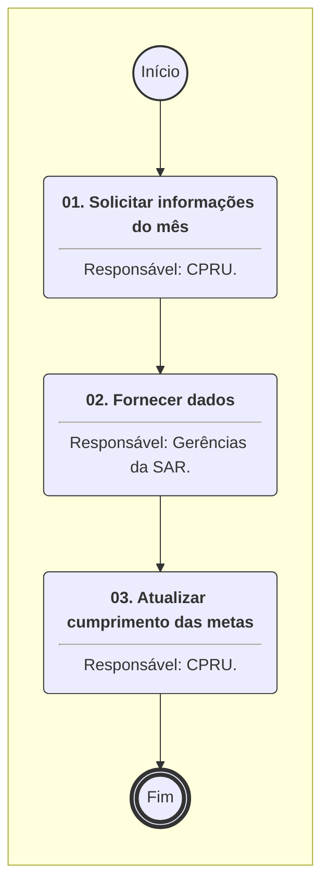

```mermaid
%%{init: {'theme': 'default'}}%%

flowchart TD
    classDef inicio stroke:#333,stroke-width:2px;
    classDef fim stroke:#333,stroke-width:4px;
    classDef tarefaBPMN stroke:#333,stroke-width:1px;
    classDef gatewayBPMN fill:#f2f2f2,stroke:#333,stroke-width:1px;
    classDef raia fill:none,stroke:#999,stroke-width:1px,stroke-dasharray: 5 5;
    subgraph Container_ID_MPR_SAR_422_R02_0 [ ]
        direction TB
        ID_MPR_SAR_422_R02_0_Start((Início)):::inicio
        ID_MPR_SAR_422_R02_0_End(((Fim))):::fim
        ID_MPR_SAR_422_R02_0_01("<b>01. Elaborar proposta em conjunto com o SAR</b><hr>Responsável: O Gtpl."):::tarefaBPMN
        ID_MPR_SAR_422_R02_0_02("<b>02. Consolidar proposta</b><hr>Responsável: O Gtpl."):::tarefaBPMN
        ID_MPR_SAR_422_R02_0_03("<b>03. Validar proposta de metas</b><hr>Responsável: O Gtpl."):::tarefaBPMN
        ID_MPR_SAR_422_R02_0_04("<b>04. Aprovar proposta</b><hr>Responsável: O SAR."):::tarefaBPMN
        ID_MPR_SAR_422_R02_0_01("<b>01. Buscar orientações com o SAR</b><hr>Responsável: O Gtpl."):::tarefaBPMN
        ID_MPR_SAR_422_R02_0_02("<b>02. Orientar o CPRU para elaborar comunicado</b><hr>Responsável: O Gtpl."):::tarefaBPMN
        ID_MPR_SAR_422_R02_0_03("<b>03. Elaborar comunicado para as gerências</b><hr>Responsável: CPRU."):::tarefaBPMN
        ID_MPR_SAR_422_R02_0_04("<b>04. Elaborar metas</b><hr>Responsável: Gerências da SAR."):::tarefaBPMN
        ID_MPR_SAR_422_R02_0_05("<b>05. Consolidar proposta</b><hr>Responsável: CPRU."):::tarefaBPMN
        ID_MPR_SAR_422_R02_0_06("<b>06. Validar proposta</b><hr>Responsável: O Gtpl."):::tarefaBPMN
        ID_MPR_SAR_422_R02_0_07("<b>07. Aprovar proposta</b><hr>Responsável: O SAR."):::tarefaBPMN
        ID_MPR_SAR_422_R02_0_01("<b>01. Solicitar informações do mês</b><hr>Responsável: CPRU."):::tarefaBPMN
        ID_MPR_SAR_422_R02_0_02("<b>02. Fornecer dados</b><hr>Responsável: Gerências da SAR."):::tarefaBPMN
        ID_MPR_SAR_422_R02_0_03("<b>03. Atualizar cumprimento das metas</b><hr>Responsável: CPRU."):::tarefaBPMN
        ID_MPR_SAR_422_R02_0_Start --> ID_MPR_SAR_422_R02_0_01
        ID_MPR_SAR_422_R02_0_01 --> ID_MPR_SAR_422_R02_0_02
        ID_MPR_SAR_422_R02_0_02 --> ID_MPR_SAR_422_R02_0_03
        ID_MPR_SAR_422_R02_0_03 --> ID_MPR_SAR_422_R02_0_04
        ID_MPR_SAR_422_R02_0_04 --> ID_MPR_SAR_422_R02_0_End
        ID_MPR_SAR_422_R02_0_01 --> ID_MPR_SAR_422_R02_0_02
        ID_MPR_SAR_422_R02_0_02 --> ID_MPR_SAR_422_R02_0_03
        ID_MPR_SAR_422_R02_0_03 --> ID_MPR_SAR_422_R02_0_04
        ID_MPR_SAR_422_R02_0_04 --> ID_MPR_SAR_422_R02_0_05
        ID_MPR_SAR_422_R02_0_05 --> ID_MPR_SAR_422_R02_0_06
        ID_MPR_SAR_422_R02_0_06 --> ID_MPR_SAR_422_R02_0_07
        ID_MPR_SAR_422_R02_0_07 --> ID_MPR_SAR_422_R02_0_End
        ID_MPR_SAR_422_R02_0_01 --> ID_MPR_SAR_422_R02_0_02
        ID_MPR_SAR_422_R02_0_02 --> ID_MPR_SAR_422_R02_0_03
        ID_MPR_SAR_422_R02_0_03 --> ID_MPR_SAR_422_R02_0_End
    end
    click ID_MPR_SAR_422_R02_0_01 href "#" "Receber o processo via SEI e atribuir para CPRU.  Informar o SAR sobre as diretrizes estabelecidas pela SGM e discutir com ele:  1. Temas que precisam ser alcançados pelas metas;  2. Planejamento Estratégico e PGA atentando se todos os pontos relevantes foram contemplados.  3. A visão do SAR para o presente ciclo."
    click ID_MPR_SAR_422_R02_0_02 href "#" "Cabe ao coordenador analisar as propostas recebidas atentando para:  1. Aprimorar redação;  2. Consolidar a proposta em um documento, por exemplo: planilha Excel."
    click ID_MPR_SAR_422_R02_0_03 href "#" "Apresentar o documento consolidado para apreciação do SAR e realizar eventuais alterações."
    click ID_MPR_SAR_422_R02_0_04 href "#" "Solicitar alterações necessárias e encaminhar para SGM no formato solicitado."
    click ID_MPR_SAR_422_R02_0_01 href "#" "Receber o processo via SEI e atribuir para CPRU.  Informar o SAR sobre as diretrizes estabelecidas pela SGM e discutir com ele:  1. Correspondência entre metas setoriais e gerenciais;  2. Temas que precisam ser alcançados pelas metas;  3. Planejamento Estratégico e PGA atentando se todos os pontos relevantes foram contemplados;  4. A visão do SAR para o presente ciclo, que servirá de orientação para que o GTPL valide as metas propostas pelos gerentes."
    click ID_MPR_SAR_422_R02_0_02 href "#" "Em reunião passar ao CPRU as informações levantadas com o SAR e elaborar esboço da proposta para encaminhamento às gerências. O esboço deve conter:  1. Ao menos uma META GERENCIAL para cada meta setorial;  2. Para cada meta gerencial a designação da gerência responsável.    Adicionalmente deve ser reforçado o prazo de resposta a SGM e o prazo dado aos gerentes."
    click ID_MPR_SAR_422_R02_0_03 href "#" "Preparar despacho às gerências seguindo as premissas das etapas anteriores. O despacho deve informar:  1. Prazo de resposta (ele deve ser tal que permita ajustes antes do envio ao SGM);  2. Que as metas devem ser mensuráveis;  3. As principais diretrizes (Diretoria, SGM e SAR);  4. Que cada meta gerencial deve estar associada a uma meta setorial.    O despacho deve solicitar:  1. As metas de cada gerência;  2. Formas de cálculo."
    click ID_MPR_SAR_422_R02_0_04 href "#" "Com base nas diretrizes do despacho da atividade anterior, elaborar proposta de metas e encaminhar a proposta de metas no prazo indicado."
    click ID_MPR_SAR_422_R02_0_05 href "#" "Cabe ao coordenador analisar as propostas recebidas atentando para:  1. Eliminar duplicidade;  2. Dirimir dúvidas;  3. Aprimorar redação;  4.Consolidar todas as propostas das gerências em um mesmo documento, por exemplo: planilha Excel."
    click ID_MPR_SAR_422_R02_0_06 href "#" "Avaliar conteúdo das metas propostas buscando eliminar incompatibilidades com a visão do SAR para as metas do presente ciclo."
    click ID_MPR_SAR_422_R02_0_07 href "#" "Solicitar alterações necessárias e encaminhar para SGM no formato solicitado."
    click ID_MPR_SAR_422_R02_0_01 href "#" "Acessar a planilha de acompanhamento de metas referente ao ano atual e verificar para cada meta qual a forma para obtenção da informação (e-mail, despacho, consulta BI, etc) e quem é o responsável pelo fornecimento da informação. Para todas as metas cujas informações são de obtenção imediata, acessar as fontes correspondentes, extrair as informações e inseri-las na planilha de acompanhamento de metas. Para as demais, elaborar os documentos de solicitação de informações e encaminhá-los aos responsáveis pelo fornecimento das informações (gerentes ou coordenadores). Os documentos de solicitação de informações devem informar prazo de sete dias corridos para o fornecimento dos dados, enfatizando a data de encerramento do prazo.  Planilha disponível na pasta de rede: \\spcdf1003\File Server 1\TrabGGCP\GTPA\Acesso Restrito\METAS SETORIAIS. Procurar na pasta do ano corrente."
    click ID_MPR_SAR_422_R02_0_02 href "#" "O responsável pelo fornecimento de dados deve informar a situação atual de cumprimento das metas, preservando em sua resposta a forma do documento recebido (e-mail, despacho, etc).  Caso algum dos dados solicitados esteja disponível em uma fonte atualizada mensalmente e consultável pelo solicitante das informações, a resposta deve incluir o caminho para obtenção do dado."
    click ID_MPR_SAR_422_R02_0_03 href "#" "Vencido o prazo:  1. Acessar os canais apropriados (email ou SEI) e inserir na planilha de acompanhamento as informações recebidas dos responsáveis pelas metas;  2. Abrir o arquivo do BI de metas e atualizar os dados;  3. Acessar a página de relatórios da GTPL e fazer o upload do arquivo do BI de metas na página do relatório do corrente ano, substituindo o arquivo anterior.  O arquivo do BI de metas está disponível no mesmo diretório da planilha de acompanhamento: \\spcdf1003\File Server 1\TrabGGCP\GTPA\Acesso Restrito\METAS SETORIAIS. Procurar na pasta do ano corrente."
```

```mermaid
%%{init: {'theme': 'default'}}%%

flowchart TD
    classDef inicio stroke:#333,stroke-width:2px;
    classDef fim stroke:#333,stroke-width:4px;
    classDef tarefaBPMN stroke:#333,stroke-width:1px;
    classDef gatewayBPMN fill:#f2f2f2,stroke:#333,stroke-width:1px;
    classDef raia fill:none,stroke:#999,stroke-width:1px,stroke-dasharray: 5 5;
    subgraph Container_ID_MPR_SAR_422_R02_1 [ ]
        direction TB
        ID_MPR_SAR_422_R02_1_Start((Início)):::inicio
        ID_MPR_SAR_422_R02_1_End(((Fim))):::fim
        ID_MPR_SAR_422_R02_1_01("<b>01. Buscar orientações com o SAR</b><hr>Responsável: O Gtpl."):::tarefaBPMN
        ID_MPR_SAR_422_R02_1_02("<b>02. Orientar o CPRU para elaborar comunicado</b><hr>Responsável: O Gtpl."):::tarefaBPMN
        ID_MPR_SAR_422_R02_1_03("<b>03. Elaborar comunicado para as gerências</b><hr>Responsável: CPRU."):::tarefaBPMN
        ID_MPR_SAR_422_R02_1_04("<b>04. Elaborar metas</b><hr>Responsável: Gerências da SAR."):::tarefaBPMN
        ID_MPR_SAR_422_R02_1_05("<b>05. Consolidar proposta</b><hr>Responsável: CPRU."):::tarefaBPMN
        ID_MPR_SAR_422_R02_1_06("<b>06. Validar proposta</b><hr>Responsável: O Gtpl."):::tarefaBPMN
        ID_MPR_SAR_422_R02_1_07("<b>07. Aprovar proposta</b><hr>Responsável: O SAR."):::tarefaBPMN
        ID_MPR_SAR_422_R02_1_01("<b>01. Solicitar informações do mês</b><hr>Responsável: CPRU."):::tarefaBPMN
        ID_MPR_SAR_422_R02_1_02("<b>02. Fornecer dados</b><hr>Responsável: Gerências da SAR."):::tarefaBPMN
        ID_MPR_SAR_422_R02_1_03("<b>03. Atualizar cumprimento das metas</b><hr>Responsável: CPRU."):::tarefaBPMN
        ID_MPR_SAR_422_R02_1_Start --> ID_MPR_SAR_422_R02_1_01
        ID_MPR_SAR_422_R02_1_01 --> ID_MPR_SAR_422_R02_1_02
        ID_MPR_SAR_422_R02_1_02 --> ID_MPR_SAR_422_R02_1_03
        ID_MPR_SAR_422_R02_1_03 --> ID_MPR_SAR_422_R02_1_04
        ID_MPR_SAR_422_R02_1_04 --> ID_MPR_SAR_422_R02_1_05
        ID_MPR_SAR_422_R02_1_05 --> ID_MPR_SAR_422_R02_1_06
        ID_MPR_SAR_422_R02_1_06 --> ID_MPR_SAR_422_R02_1_07
        ID_MPR_SAR_422_R02_1_07 --> ID_MPR_SAR_422_R02_1_End
        ID_MPR_SAR_422_R02_1_01 --> ID_MPR_SAR_422_R02_1_02
        ID_MPR_SAR_422_R02_1_02 --> ID_MPR_SAR_422_R02_1_03
        ID_MPR_SAR_422_R02_1_03 --> ID_MPR_SAR_422_R02_1_End
    end
    click ID_MPR_SAR_422_R02_1_01 href "#" "Receber o processo via SEI e atribuir para CPRU.  Informar o SAR sobre as diretrizes estabelecidas pela SGM e discutir com ele:  1. Correspondência entre metas setoriais e gerenciais;  2. Temas que precisam ser alcançados pelas metas;  3. Planejamento Estratégico e PGA atentando se todos os pontos relevantes foram contemplados;  4. A visão do SAR para o presente ciclo, que servirá de orientação para que o GTPL valide as metas propostas pelos gerentes."
    click ID_MPR_SAR_422_R02_1_02 href "#" "Em reunião passar ao CPRU as informações levantadas com o SAR e elaborar esboço da proposta para encaminhamento às gerências. O esboço deve conter:  1. Ao menos uma META GERENCIAL para cada meta setorial;  2. Para cada meta gerencial a designação da gerência responsável.    Adicionalmente deve ser reforçado o prazo de resposta a SGM e o prazo dado aos gerentes."
    click ID_MPR_SAR_422_R02_1_03 href "#" "Preparar despacho às gerências seguindo as premissas das etapas anteriores. O despacho deve informar:  1. Prazo de resposta (ele deve ser tal que permita ajustes antes do envio ao SGM);  2. Que as metas devem ser mensuráveis;  3. As principais diretrizes (Diretoria, SGM e SAR);  4. Que cada meta gerencial deve estar associada a uma meta setorial.    O despacho deve solicitar:  1. As metas de cada gerência;  2. Formas de cálculo."
    click ID_MPR_SAR_422_R02_1_04 href "#" "Com base nas diretrizes do despacho da atividade anterior, elaborar proposta de metas e encaminhar a proposta de metas no prazo indicado."
    click ID_MPR_SAR_422_R02_1_05 href "#" "Cabe ao coordenador analisar as propostas recebidas atentando para:  1. Eliminar duplicidade;  2. Dirimir dúvidas;  3. Aprimorar redação;  4.Consolidar todas as propostas das gerências em um mesmo documento, por exemplo: planilha Excel."
    click ID_MPR_SAR_422_R02_1_06 href "#" "Avaliar conteúdo das metas propostas buscando eliminar incompatibilidades com a visão do SAR para as metas do presente ciclo."
    click ID_MPR_SAR_422_R02_1_07 href "#" "Solicitar alterações necessárias e encaminhar para SGM no formato solicitado."
    click ID_MPR_SAR_422_R02_1_01 href "#" "Acessar a planilha de acompanhamento de metas referente ao ano atual e verificar para cada meta qual a forma para obtenção da informação (e-mail, despacho, consulta BI, etc) e quem é o responsável pelo fornecimento da informação. Para todas as metas cujas informações são de obtenção imediata, acessar as fontes correspondentes, extrair as informações e inseri-las na planilha de acompanhamento de metas. Para as demais, elaborar os documentos de solicitação de informações e encaminhá-los aos responsáveis pelo fornecimento das informações (gerentes ou coordenadores). Os documentos de solicitação de informações devem informar prazo de sete dias corridos para o fornecimento dos dados, enfatizando a data de encerramento do prazo.  Planilha disponível na pasta de rede: \\spcdf1003\File Server 1\TrabGGCP\GTPA\Acesso Restrito\METAS SETORIAIS. Procurar na pasta do ano corrente."
    click ID_MPR_SAR_422_R02_1_02 href "#" "O responsável pelo fornecimento de dados deve informar a situação atual de cumprimento das metas, preservando em sua resposta a forma do documento recebido (e-mail, despacho, etc).  Caso algum dos dados solicitados esteja disponível em uma fonte atualizada mensalmente e consultável pelo solicitante das informações, a resposta deve incluir o caminho para obtenção do dado."
    click ID_MPR_SAR_422_R02_1_03 href "#" "Vencido o prazo:  1. Acessar os canais apropriados (email ou SEI) e inserir na planilha de acompanhamento as informações recebidas dos responsáveis pelas metas;  2. Abrir o arquivo do BI de metas e atualizar os dados;  3. Acessar a página de relatórios da GTPL e fazer o upload do arquivo do BI de metas na página do relatório do corrente ano, substituindo o arquivo anterior.  O arquivo do BI de metas está disponível no mesmo diretório da planilha de acompanhamento: \\spcdf1003\File Server 1\TrabGGCP\GTPA\Acesso Restrito\METAS SETORIAIS. Procurar na pasta do ano corrente."
```

# MANUAL DE PROCEDIMENTO

**MANUAL DE PROCEDIMENTO**

**MPR/SAR-422-R02**

**PLANEJAMENTO E ACOMPANHAMENTO DE ATIVIDADES DA SAR**

06/2023

**REVISÕES**

|  |  |  |  |  |
| --- | --- | --- | --- | --- |
| **Revisão** | **Aprovação** | **Publicação** | **Aprovado Por** | **Modificações da Última Versão** |
| R00 | Portaria Nº 1.290, de 11 de Abril de 2017 | Não informado | SAR | Versão Original |
| R01 | PORTARIA Nº 2.653, DE 27 DE AGOSTO DE 2018. | Não informado | SAR | 1) Processo 'Acompanhar Metas da SAR' modificado.  2) Processo 'Registrar Apontamento em Programas de Certificação da SAR' modificado. |
| R02 | PORTARIA Nº 11.731, DE 23 DE JUNHO DE 2023. | 30/06/2023 | SAR | 1) Processo 'Atualizar PVC da SAR' removido.  2) Processo 'Elaborar Plano de Trabalho Anual da SAR' removido.  3) Processo 'Encerrar o Plano de Trabalho Anual da SAR' removido.  4) Processo 'Registrar Apontamento em Programas de Certificação da SAR' removido.  5) Processo 'Elaborar Metas Gerenciais da SAR' inserido.  6) Processo 'Elaborar Metas Setoriais da SAR' inserido.  7) Processo 'Acompanhar Metas da SAR' modificado. |

**ÍNDICE**

1) Disposições Preliminares, pág. 5.

1.1) Introdução, pág. 5.

1.2) Revogação, pág. 5.

1.3) Fundamentação, pág. 5.

1.4) Executores dos Processos, pág. 5.

1.5) Elaboração e Revisão, pág. 6.

1.6) Organização do Documento, pág. 6.

2) Definições, pág. 8.

2.1) Sigla, pág. 8.

3) Artefatos, Competências, Sistemas e Documentos Administrativos, pág. 9.

3.1) Artefatos, pág. 9.

3.2) Competências, pág. 9.

3.3) Sistemas, pág. 9.

3.4) Documentos e Processos Administrativos, pág. 10.

4) Procedimentos Referenciados, pág. 11.

5) Procedimentos, pág. 12.

5.1) Elaborar Metas Setoriais da SAR, pág. 12.

5.2) Elaborar Metas Gerenciais da SAR, pág. 15.

5.3) Acompanhar Metas da SAR, pág. 20.

6) Disposições Finais, pág. 23.

**PARTICIPAÇÃO NA EXECUÇÃO DOS PROCESSOS**

**ÁREAS ORGANIZACIONAIS**

**1) Coordenadoria de Planejamento e Relacionamento com Usuários**

a) Acompanhar Metas da SAR

b) Elaborar Metas Gerenciais da SAR

**GRUPOS ORGANIZACIONAIS**

**a) Gerências da SAR**

1) Acompanhar Metas da SAR

2) Elaborar Metas Gerenciais da SAR

**b) O Gtpl**

1) Elaborar Metas Gerenciais da SAR

2) Elaborar Metas Setoriais da SAR

**c) O SAR**

1) Elaborar Metas Gerenciais da SAR

2) Elaborar Metas Setoriais da SAR

**1. DISPOSIÇÕES PRELIMINARES**

**1.1 INTRODUÇÃO**

Com a extinção da GTPA e criação da GTPL, bem como a saída de parte do escopo deste manual para a SPO, se fez necessário redesenhar todos os processos. Este MPR descreve os processos de planejamento anual no que concerne a elaboração das metas e acompanhamento destas.

Processo pertinente 00058.045700/2020-10.

O MPR estabelece, no âmbito da Superintendência de Aeronavegabilidade - SAR, os seguintes processos de trabalho:

a) Elaborar Metas Setoriais da SAR.

b) Elaborar Metas Gerenciais da SAR.

c) Acompanhar Metas da SAR.

**1.2 REVOGAÇÃO**

MPR/SAR-422-R01, aprovado na data de 27 de agosto de 2018.

**1.3 FUNDAMENTAÇÃO**

Resolução nº 381, art. 31, de 14 de junho de 2016.

**1.4 EXECUTORES DOS PROCESSOS**

Os procedimentos contidos neste documento aplicam-se aos servidores integrantes das seguintes áreas organizacionais:

|  |  |
| --- | --- |
| **Área Organizacional** | **Descrição** |
| Coordenadoria de Planejamento e Relacionamento com Usuários - CPRU | Coordenadoria responsável pelas atividades de planejamento pela atuação como Serviço Especializado em Atendimento de Manifestações (SEAM). |

|  |  |
| --- | --- |
| **Grupo Organizacional** | **Descrição** |
| Gerências da SAR | Gerências da SAR |
| O GTPL | O Gerente Técnico de Planejamento da SAR e seu substituto. |
| O SAR | O Superintendente da SAR |

**1.5 ELABORAÇÃO E REVISÃO**

O processo que resulta na aprovação ou alteração deste MPR é de responsabilidade da Superintendência de Aeronavegabilidade - SAR. Em caso de sugestões de revisão, deve-se procurá-la para que sejam iniciadas as providências cabíveis.

As revisões deste MPR serão aprovadas pelo(s) titular(es) da(s) unidade(s) responsável(is) pela execução do(s) processo(s) nele listado(s).

**1.6 ORGANIZAÇÃO DO DOCUMENTO**

O capítulo 2 apresenta as principais definições utilizadas no âmbito deste MPR, e deve ser visto integralmente antes da leitura de capítulos posteriores.

O capítulo 3 apresenta as competências, os artefatos e os sistemas envolvidos na execução dos processos deste manual, em ordem relativamente cronológica.

O capítulo 4 apresenta os processos de trabalho referenciados neste MPR. Estes processos são publicados em outros manuais que não este, mas cuja leitura é essencial para o entendimento dos processos publicados neste manual. O capítulo 4 expõe em quais manuais são localizados cada um dos processos de trabalho referenciados.

O capítulo 5 apresenta os processos de trabalho. Para encontrar um processo específico, deve-se procurar sua respectiva página no índice contido no início do documento. Os processos estão ordenados em etapas. Cada etapa é contida em uma tabela, que possui em si todas as informações necessárias para sua realização. São elas, respectivamente:

a) o título da etapa;

b) a descrição da forma de execução da etapa;

c) as competências necessárias para a execução da etapa;

d) os artefatos necessários para a execução da etapa;

e) os sistemas necessários para a execução da etapa (incluindo, bases de dados em forma de arquivo, se existente);

f) os documentos e processos administrativos que precisam ser elaborados durante a execução da etapa;

g) instruções para as próximas etapas; e

h) as áreas ou grupos organizacionais responsáveis por executar a etapa.

O capítulo 6 apresenta as disposições finais do documento, que trata das ações a serem realizadas em casos não previstos.

Por último, é importante comunicar que este documento foi gerado automaticamente. São recuperados dados sobre as etapas e sua sequência, as definições, os grupos, as áreas organizacionais, os artefatos, as competências, os sistemas, entre outros, para os processos de trabalho aqui apresentados, de forma que alguma mecanicidade na apresentação das informações pode ser percebida. O documento sempre apresenta as informações mais atualizadas de nomes e siglas de grupos, áreas, artefatos, termos, sistemas e suas definições, conforme informação disponível na base de dados, independente da data de assinatura do documento. Informações sobre etapas, seu detalhamento, a sequência entre etapas, responsáveis pelas etapas, artefatos, competências e sistemas associados a etapas, assim como seus nomes e os nomes de seus processos têm suas definições idênticas à da data de assinatura do documento.

**2. DEFINIÇÕES**

A tabela abaixo apresenta as definições necessárias para o entendimento deste Manual de Procedimento.

**2.1 Sigla**

|  |  |
| --- | --- |
| **Definição** | **Significado** |
| CPRU | Coordenadoria de Planejamento e Relacionamento com Usuários |
| GTF | Gerenciador de Fluxos de Trabalho |
| GTPA | Gerência Técnica de Planejamento e Acompanhamento |
| GTPL | Gerência Técnica de Planejamento (SAR) |
| MPR | Manual de Procedimento – Documento de caráter disciplinador, de âmbito interno, assinado e aprovado por autoridade competente, que tem como objetivo documentar e padronizar os processos de trabalho realizados pelos agentes da ANAC. Possui informações sobre o fluxo de trabalho, detalhamento das etapas, competências necessárias, artefatos a serem utilizados, sistemas de apoio e áreas responsáveis pela execução. |
| PGA | Plano de Gestão Anual |
| SAR | Superintendência de Aeronavegabilidade |
| SEI | Sistema Eletrônico de Informações |
| SPI | Superintendência de Planejamento Institucional. |
| SPO | Superintendência de Padrões Operacionais |

**3. ARTEFATOS, COMPETÊNCIAS, SISTEMAS E DOCUMENTOS ADMINISTRATIVOS**

Abaixo se encontram as listas dos artefatos, competências, sistemas e documentos administrativos que o executor necessita consultar, preencher, analisar ou elaborar para executar os processos deste MPR. As etapas descritas no capítulo seguinte indicam onde usar cada um deles.

As competências devem ser adquiridas por meio de capacitação ou outros instrumentos e os artefatos se encontram no módulo "Artefatos" do sistema GFT - Gerenciador de Fluxos de Trabalho.

**3.1 ARTEFATOS**

Não há artefatos descritos para a realização deste MPR.

**3.2 COMPETÊNCIAS**

Para que os processos de trabalho contidos neste MPR possam ser realizados com qualidade e efetividade, é importante que as pessoas que venham a executá-los possuam um determinado conjunto de competências. No capítulo 5, as competências específicas que o executor de cada etapa de cada processo de trabalho deve possuir são apresentadas. A seguir, encontra-se uma lista geral das competências contidas em todos os processos de trabalho deste MPR e a indicação de qual área ou grupo organizacional as necessitam:

Não há competências descritas para a realização deste MPR.

**3.3 SISTEMAS**

|  |  |  |
| --- | --- | --- |
| **Nome** | **Descrição** | **Acesso** |
| ANAC+ | Sistema do Programa de Gestão por Desempenho ANAC+ | https://santosdumont.anac.gov.br/menu/f?p=103 |
| SEI | Sistema Eletrônico de Informação. | https://sei.anac.gov.br/sip/login.php?sigla\_orgao\_sistema=ANAC&sigla\_sistema=SEI |

**3.4 DOCUMENTOS E PROCESSOS ADMINISTRATIVOS ELABORADOS NESTE MANUAL**

Não há documentos ou processos administrativos a serem elaborados neste MPR.

**4. PROCEDIMENTOS REFERENCIADOS**

Procedimentos referenciados são processos de trabalho publicados em outro MPR que têm relação com os processos de trabalho publicados por este manual. Este MPR não possui nenhum processo de trabalho referenciado.

**

## 5.1 Elaborar Metas Setoriais da SAR

## 5.1 Elaborar Metas Setoriais da SAR

## 5.1 Elaborar Metas Setoriais da SAR

6. DISPOSIÇÕES FINAIS**

Em caso de identificação de erros e omissões neste manual pelo executor do processo, a SAR deve ser contatada. Cópias eletrônicas deste manual, do fluxo e dos artefatos usados podem ser encontradas em sistema.