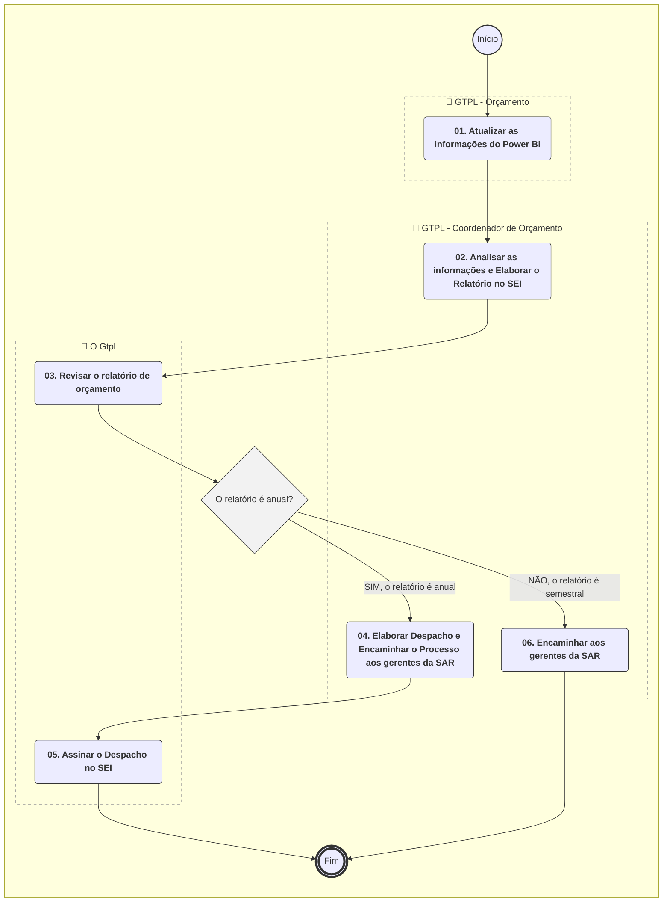

```mermaid
%%{init: {'theme': 'default'}}%%

flowchart TD
    classDef inicio stroke:#333,stroke-width:2px;
    classDef fim stroke:#333,stroke-width:4px;
    classDef tarefaBPMN stroke:#333,stroke-width:1px;
    classDef gatewayBPMN fill:#f2f2f2,stroke:#333,stroke-width:1px;
    classDef raia fill:none,stroke:#999,stroke-width:1px,stroke-dasharray: 5 5;
    subgraph Container_ID_MPR_SAR_423_R01_3 [ ]
        direction TB
        ID_MPR_SAR_423_R01_3_Start((Início)):::inicio
        ID_MPR_SAR_423_R01_3_End(((Fim))):::fim
        subgraph Raia_ID_MPR_SAR_423_R01_3_1 [👤 GTPL - Coordenador de Orçamento]
            ID_MPR_SAR_423_R01_3_01("<b>01. Elaborar questionamento de planejamento bimestral aos gerentes</b>"):::tarefaBPMN
            ID_MPR_SAR_423_R01_3_02("<b>02. Analisar as informações e Elaborar o Relatório no SEI</b>"):::tarefaBPMN
            ID_MPR_SAR_423_R01_3_04("<b>04. Elaborar Despacho e Encaminhar o Processo aos gerentes da SAR</b>"):::tarefaBPMN
            ID_MPR_SAR_423_R01_3_06("<b>06. Encaminhar aos gerentes da SAR</b>"):::tarefaBPMN
        end
        class Raia_ID_MPR_SAR_423_R01_3_1 raia;
        subgraph Raia_ID_MPR_SAR_423_R01_3_2 [👤 O Gtpl]
            ID_MPR_SAR_423_R01_3_02("<b>02. Coletar os dados e elaborar proposta na GTPL</b>"):::tarefaBPMN
            ID_MPR_SAR_423_R01_3_03("<b>03. Revisar o relatório de orçamento</b>"):::tarefaBPMN
            ID_MPR_SAR_423_R01_3_05("<b>05. Assinar o Despacho no SEI</b>"):::tarefaBPMN
        end
        class Raia_ID_MPR_SAR_423_R01_3_2 raia;
        subgraph Raia_ID_MPR_SAR_423_R01_3_3 [👤 GTPL]
            ID_MPR_SAR_423_R01_3_03("<b>03. Consolidar os Pedidos de orçamento</b>"):::tarefaBPMN
        end
        class Raia_ID_MPR_SAR_423_R01_3_3 raia;
        subgraph Raia_ID_MPR_SAR_423_R01_3_4 [👤 O Gten]
            ID_MPR_SAR_423_R01_3_04("<b>04. Coletar os dados e elaborar proposta na GTEN</b>"):::tarefaBPMN
        end
        class Raia_ID_MPR_SAR_423_R01_3_4 raia;
        subgraph Raia_ID_MPR_SAR_423_R01_3_5 [👤 O Gtev]
            ID_MPR_SAR_423_R01_3_05("<b>05. Coletar os dados e elaborar proposta na GTEV</b>"):::tarefaBPMN
        end
        class Raia_ID_MPR_SAR_423_R01_3_5 raia;
        subgraph Raia_ID_MPR_SAR_423_R01_3_6 [👤 O Gtpr]
            ID_MPR_SAR_423_R01_3_06("<b>06. Coletar os dados e elaborar proposta na GTPR</b>"):::tarefaBPMN
        end
        class Raia_ID_MPR_SAR_423_R01_3_6 raia;
        subgraph Raia_ID_MPR_SAR_423_R01_3_7 [👤 O Gtco]
            ID_MPR_SAR_423_R01_3_07("<b>07. Coletar os dados e elaborar proposta na GTCO</b>"):::tarefaBPMN
        end
        class Raia_ID_MPR_SAR_423_R01_3_7 raia;
        subgraph Raia_ID_MPR_SAR_423_R01_3_8 [👤 O Gtni]
            ID_MPR_SAR_423_R01_3_08("<b>08. Coletar os dados e elaborar proposta na GTNI</b>"):::tarefaBPMN
        end
        class Raia_ID_MPR_SAR_423_R01_3_8 raia;
        subgraph Raia_ID_MPR_SAR_423_R01_3_9 [👤 O Gcpp]
            ID_MPR_SAR_423_R01_3_09("<b>09. Coletar os dados e elaborar proposta na GCPP</b>"):::tarefaBPMN
        end
        class Raia_ID_MPR_SAR_423_R01_3_9 raia;
        subgraph Raia_ID_MPR_SAR_423_R01_3_10 [👤 O GTRAB]
            ID_MPR_SAR_423_R01_3_10("<b>10. Coletar os dados e elaborar proposta na GTRAB</b>"):::tarefaBPMN
        end
        class Raia_ID_MPR_SAR_423_R01_3_10 raia;
        subgraph Raia_ID_MPR_SAR_423_R01_3_11 [👤 GTPL - Orçamento]
            ID_MPR_SAR_423_R01_3_01("<b>01. Atualizar as informações do Power Bi</b>"):::tarefaBPMN
        end
        class Raia_ID_MPR_SAR_423_R01_3_11 raia;
        ID_MPR_SAR_423_R01_3_Start --> ID_MPR_SAR_423_R01_3_01
        ID_MPR_SAR_423_R01_3_02 --> ID_MPR_SAR_423_R01_3_03
        ID_MPR_SAR_423_R01_3_03 --> ID_MPR_SAR_423_R01_3_End
        ID_MPR_SAR_423_R01_3_04 --> ID_MPR_SAR_423_R01_3_03
        ID_MPR_SAR_423_R01_3_05 --> ID_MPR_SAR_423_R01_3_03
        ID_MPR_SAR_423_R01_3_06 --> ID_MPR_SAR_423_R01_3_03
        ID_MPR_SAR_423_R01_3_07 --> ID_MPR_SAR_423_R01_3_03
        ID_MPR_SAR_423_R01_3_08 --> ID_MPR_SAR_423_R01_3_03
        ID_MPR_SAR_423_R01_3_09 --> ID_MPR_SAR_423_R01_3_03
        ID_MPR_SAR_423_R01_3_10 --> ID_MPR_SAR_423_R01_3_03
        ID_MPR_SAR_423_R01_3_01 --> ID_MPR_SAR_423_R01_3_02
        ID_MPR_SAR_423_R01_3_02 --> ID_MPR_SAR_423_R01_3_03
        gw_ID_MPR_SAR_423_R01_3_03{"O relatório é anual?"}:::gatewayBPMN
        ID_MPR_SAR_423_R01_3_03 --> gw_ID_MPR_SAR_423_R01_3_03
        gw_ID_MPR_SAR_423_R01_3_03 -->|"SIM, o relatório é anual"| ID_MPR_SAR_423_R01_3_04
        gw_ID_MPR_SAR_423_R01_3_03 -->|"NÃO, o relatório é semestral"| ID_MPR_SAR_423_R01_3_06
        ID_MPR_SAR_423_R01_3_04 --> ID_MPR_SAR_423_R01_3_05
        ID_MPR_SAR_423_R01_3_05 --> ID_MPR_SAR_423_R01_3_End
        ID_MPR_SAR_423_R01_3_06 --> ID_MPR_SAR_423_R01_3_End
    end
    click ID_MPR_SAR_423_R01_3_01 href "#" "Utilizando a última proposta constante do processo SEI de orçamento do ano corrente, elaborar um e-mail aos gerentes (conforme artefato) questionando se há alterações para o planejamento do próximo bimestre. Incluir o e-mail como PDF também no processo SEI.  A numeração do processo SEI pode ser encontrada na pasta de rede de GESTÃO ORÇAMENTÁRIA da GTPL, sob o assunto Previsão Orçamentária, no título do arquivo correspondente.  Encaminhar a todas as gerências da SAR com data de retorno programada (até o último dia útil desse mês) e manter aberto na unidade atual (GTPL)."
    click ID_MPR_SAR_423_R01_3_02 href "#" "No SEI acessar o arquivo em Excel contendo a planilha a ser preenchida. Atentar-se para os valores médios definidos na planilha.  Iniciar a coleta junto aos colaboradores responsáveis na unidade e, ao final, inserir no processo SEI a planilha preenchida (em formato Excel e em PDF).  Caso não tenha alterações, encerrar o processo na unidade."
    click ID_MPR_SAR_423_R01_3_03 href "#" "Nessa etapa, é necessário fazer download de todos os arquivos encaminhados pelos gerentes em Excel (do próprio SEI) e consolidar as propostas no formato da SAR e transportar os dados para o modelo SAF/SPI (que costuma ser mais conciso, porém não permite o acompanhamento adequado).  Nesta etapa, provavelmente, será necessário agendar reuniões, conversar com os gestores, negociar a melhor maneira de proceder, etc. Isso porque a proposta consolidada deverá servir a toda a superintendência, e isso costuma significar tirar recursos de uma área e passar para outra, tirar de um processo e passar para outro, etc."
    click ID_MPR_SAR_423_R01_3_04 href "#" "No SEI acessar o arquivo em Excel contendo a planilha a ser preenchida. Atentar-se para os valores médios definidos na planilha.  Iniciar a coleta junto aos colaboradores responsáveis na unidade e, ao final, inserir no processo SEI a planilha preenchida (em formato Excel e em PDF).  Caso não tenha alterações, encerrar o processo na unidade."
    click ID_MPR_SAR_423_R01_3_05 href "#" "No SEI acessar o arquivo em Excel contendo a planilha a ser preenchida. Atentar-se para os valores médios definidos na planilha.  Iniciar a coleta junto aos colaboradores responsáveis na unidade e, ao final, inserir no processo SEI a planilha preenchida (em formato Excel e em PDF).  Caso não tenha alterações, encerrar o processo na unidade."
    click ID_MPR_SAR_423_R01_3_06 href "#" "No SEI acessar o arquivo em Excel contendo a planilha a ser preenchida. Atentar-se para os valores médios definidos na planilha.  Iniciar a coleta junto aos colaboradores responsáveis na unidade e, ao final, inserir no processo SEI a planilha preenchida (em formato Excel e em PDF).  Caso não tenha alterações, encerrar o processo na unidade."
    click ID_MPR_SAR_423_R01_3_07 href "#" "No SEI acessar o arquivo em Excel contendo a planilha a ser preenchida. Atentar-se para os valores médios definidos na planilha.  Iniciar a coleta junto aos colaboradores responsáveis na unidade e, ao final, inserir no processo SEI a planilha preenchida (em formato Excel e em PDF).  Caso não tenha alterações, encerrar o processo na unidade."
    click ID_MPR_SAR_423_R01_3_08 href "#" "No SEI acessar o arquivo em Excel contendo a planilha a ser preenchida. Atentar-se para os valores médios definidos na planilha.  Iniciar a coleta junto aos colaboradores responsáveis na unidade e, ao final, inserir no processo SEI a planilha preenchida (em formato Excel e em PDF).  Caso não tenha alterações, encerrar o processo na unidade."
    click ID_MPR_SAR_423_R01_3_09 href "#" "No SEI acessar o arquivo em Excel contendo a planilha a ser preenchida. Atentar-se para os valores médios definidos na planilha.  Iniciar a coleta junto aos colaboradores responsáveis na unidade e, ao final, inserir no processo SEI a planilha preenchida (em formato Excel e em PDF).  Caso não tenha alterações, encerrar o processo na unidade."
    click ID_MPR_SAR_423_R01_3_10 href "#" "No SEI acessar o arquivo em Excel contendo a planilha a ser preenchida. Atentar-se para os valores médios definidos na planilha.  Iniciar a coleta junto aos colaboradores responsáveis na unidade e, ao final, inserir no processo SEI a planilha preenchida (em formato Excel e em PDF).  Caso não tenha alterações, encerrar o processo na unidade."
    click ID_MPR_SAR_423_R01_3_01 href "#" "Utilizando o artefato Procedimentos de Atualização do BI de Orçamento atualizar as informações do relatório de Orçamento em Power Bi."
    click ID_MPR_SAR_423_R01_3_02 href "#" "O relatório consiste em, além de apresentar as informações do orçamento (que os gestores já têm contato semanalmente), apontar lições aprendidas no planejamento em comparação com a execução, variações significativas nos valores médios aplicados pela GTPL - e os motivos de terem ocorrido - , o perfil de gasto da SAR, pontos que merecem destaque, total planejado inicialmente e total gasto ao final (e o percentual gasto), e tudo mais que o coordenador julgar relevante.  O relatório semestral não carece de tantos detalhes e informações. Trata-se de uma análise geral destacando o que merece ser comentado.  Já o relatório anual deve conter todas as análises que auxiliem os gestores no conhecimento do seu perfil de gasto e no planejamento dos anos seguintes.  Sugere-se sempre consultar o relatório do ano anterior para verificar medidas que ficaram em aberto bem como permitir a comparação com o histórico da superintendência.  O relatório deve ser elaborado no SEI, em processo próprio, no formato 'NOTA TÉCNICA', contendo imagens consideradas relevantes do Power Bi.  Ao final, atribuir o processo ao GTPL para análise."
    click ID_MPR_SAR_423_R01_3_03 href "#" "Nessa etapa deve-se verificar se o relatório apresenta dados coerentes - sobretudo com relação ao histórico da SAR e acompanhamentos semanais. Além disso, é importante sinalizar se há algum outro ponto que merece ser abordado, se há alguma diretriz específica do SAR ou da Diretoria que merece destaque, etc.  Os pontos que necessitarem de revisão devem ser comunicados por e-mail ao coordenador de orçamento da SAR.  Caso esteja concluído, solicitar ao Coordenador do Orçamento que assine a Nota Técnica e, se desejar, assinar conjuntamente."
    click ID_MPR_SAR_423_R01_3_04 href "#" "Concluídas as alterações no relatório, deve-se iniciar um processo SEI específico para que o relatório seja divulgado aos gestores.  Para isso, abrir o processo com o relatório salvo em PDF e em seguida elaborar um despacho conforme o artefato Despacho do Relatório de Execução Orçamentária Anual da SAR.  Ao final, assinar e atribuir ao GTPL passa assinatura."
    click ID_MPR_SAR_423_R01_3_05 href "#" "Nessa etapa, assinar o Despacho de encaminhamento ao SAR constante do processo SEI criado pelo coordenador na etapa anterior.  Enviar à SAR após assinatura."
    click ID_MPR_SAR_423_R01_3_06 href "#" "Elaborar despacho encaminhando o relatório aos gerentes da SAR, solicitar ao GTPL que o assine e enviar o processo a todas as gerências, conforme a lista do artefato Lista de Gerências da SAR."
```

# MANUAL DE PROCEDIMENTO

**MANUAL DE PROCEDIMENTO**

**MPR/SAR-423-R02**

**GESTÃO ORÇAMENTÁRIA NA SAR**

05/2021

**REVISÕES**

|  |  |  |  |  |
| --- | --- | --- | --- | --- |
| **Revisão** | **Aprovação** | **Publicação** | **Aprovado Por** | **Modificações da Última Versão** |
| R00 | Portaria Nº 1.323, de 13 de Abril de 2017 | Não informado | SAR | Versão Original |
| R01 | PORTARIA Nº 1.209, DE 4 DE MAIO DE 2020. | Não informado | SAR | 1) Processo 'Controlar Proporção de Gastos da SAR' removido.  2) Processo 'Realizar o Planejamento Bimestral do Orçamento da SAR' inserido.  3) Processo 'Elaborar Relatórios Semestral e Anual do Orçamento da SAR' inserido.  4) Processo 'Programar o Orçamento da SAR' modificado.  5) Processo 'Controlar o Orçamento da SAR' modificado.  6) Processo 'Reprogramar o Orçamento da SAR' modificado. |
| R02 | PORTARIA Nº 5.066, DE 20 DE MAIO DE 2021 | Não informado | SAR | 1) Processo 'Planejar Orçamento - SAR' modificado.  2) Processo 'Replanejar Orçamento - SAR' modificado.  3) Processo 'Realizar Controle Semanal do Orçamento - SAR' modificado.  4) Processo 'Realizar Planejamento Bimestral do Orçamento - SAR' modificado.  5) Processo 'Elaborar Relatórios Semestral e Anual do Orçamento - SAR' modificado. |

**ÍNDICE**

1) Disposições Preliminares, pág. 7.

1.1) Introdução, pág. 7.

1.2) Revogação, pág. 8.

1.3) Fundamentação, pág. 8.

1.4) Executores dos Processos, pág. 8.

1.5) Elaboração e Revisão, pág. 9.

1.6) Organização do Documento, pág. 9.

2) Definições, pág. 11.

2.1) Sigla, pág. 11.

3) Artefatos, Competências, Sistemas e Documentos Administrativos, pág. 12.

3.1) Artefatos, pág. 12.

3.2) Competências, pág. 13.

3.3) Sistemas, pág. 13.

3.4) Documentos e Processos Administrativos, pág. 14.

4) Procedimentos Referenciados, pág. 15.

5) Procedimentos, pág. 16.

5.1) Planejar Orçamento - SAR, pág. 16.

5.2) Replanejar Orçamento - SAR, pág. 26.

5.3) Realizar Controle Semanal do Orçamento - SAR, pág. 34.

5.4) Realizar Planejamento Bimestral do Orçamento - SAR, pág. 41.

5.5) Elaborar Relatórios Semestral e Anual do Orçamento - SAR, pág. 46.

6) Disposições Finais, pág. 51.

**PARTICIPAÇÃO NA EXECUÇÃO DOS PROCESSOS**

**ÁREAS ORGANIZACIONAIS**

**1) Gerência Técnica de Planejamento**

a) Planejar Orçamento - SAR

b) Realizar Planejamento Bimestral do Orçamento - SAR

c) Replanejar Orçamento - SAR

**GRUPOS ORGANIZACIONAIS**

**a) GTPL - Coordenador de Orçamento**

1) Elaborar Relatórios Semestral e Anual do Orçamento - SAR

2) Planejar Orçamento - SAR

3) Realizar Controle Semanal do Orçamento - SAR

4) Realizar Planejamento Bimestral do Orçamento - SAR

5) Replanejar Orçamento - SAR

**b) GTPL - Orçamento**

1) Elaborar Relatórios Semestral e Anual do Orçamento - SAR

2) Planejar Orçamento - SAR

3) Realizar Controle Semanal do Orçamento - SAR

4) Replanejar Orçamento - SAR

**c) O Gcpp**

1) Planejar Orçamento - SAR

2) Realizar Planejamento Bimestral do Orçamento - SAR

3) Replanejar Orçamento - SAR

**d) O Gtco**

1) Planejar Orçamento - SAR

2) Realizar Planejamento Bimestral do Orçamento - SAR

3) Replanejar Orçamento - SAR

**e) O Gten**

1) Planejar Orçamento - SAR

2) Realizar Planejamento Bimestral do Orçamento - SAR

3) Replanejar Orçamento - SAR

**f) O Gtev**

1) Planejar Orçamento - SAR

2) Realizar Planejamento Bimestral do Orçamento - SAR

3) Replanejar Orçamento - SAR

**g) O Gtni**

1) Planejar Orçamento - SAR

2) Realizar Planejamento Bimestral do Orçamento - SAR

3) Replanejar Orçamento - SAR

**h) O Gtpl**

1) Elaborar Relatórios Semestral e Anual do Orçamento - SAR

2) Planejar Orçamento - SAR

3) Realizar Planejamento Bimestral do Orçamento - SAR

4) Replanejar Orçamento - SAR

**i) O Gtpr**

1) Planejar Orçamento - SAR

2) Realizar Planejamento Bimestral do Orçamento - SAR

3) Replanejar Orçamento - SAR

**j) O GTRAB**

1) Planejar Orçamento - SAR

2) Realizar Planejamento Bimestral do Orçamento - SAR

3) Replanejar Orçamento - SAR

**k) O SAR**

1) Planejar Orçamento - SAR

2) Realizar Controle Semanal do Orçamento - SAR

**1. DISPOSIÇÕES PRELIMINARES**

**1.1 INTRODUÇÃO**

Este MPR descreve o processo que visa prever Orçamento do Ano Subsequente da SAR. Além disso, também explica o processo de controle de diárias e passagens tanto em valores absolutos como proporcionais. Por último, esclarece como ocorre a reprogramação orçamentária do ano corrente tendo em vista a disponibilidade e a execução orçamentária.

Esta versão do documento contempla alterações referentes a necessida do MPR precisar ser atualizado para refletir as novas unidades da SAR e também para o teletrabalho, conforme processo SEI número 00058.046179/2020-38.

1.1.1 Papéis e Responsabilidades

É competência da Diretoria, definida no Regimento interno, aprovar o orçamento da ANAC, a ser encaminhado ao Ministério dos Transportes, Portos e Aviação Civil.

É competência da SAR, definida no Regimento Interno, planejar, dirigir, coordenar e orientar a execução das atividades das respectivas unidades.

É atribuição da GTPA, definida por portaria de delegação, o desenvolvimento e a coordenação de atividades de planejamento.

É atribuição da GTPA, definida por portaria de delegação, o acompanhamento e fiscalização, junto às demais unidades da Superintendência, do cumprimento do planejamento e dos planos de trabalho estabelecidos.

1.1.2 Política e Diretrizes

Este MPR define processos necessários para efetuar o planejamento do orçamento anual da SAR, conforme estabelecido no inciso terceiro do artigo 165 da Constituição da República Federativa do Brasil de 1988. As diretrizes para esses processos são definidas nas leis (PPA, LDO, LOA) atualmente em vigor e a legislação complementar.

1.1.3 Processo

O MPR estabelece, no âmbito da Superintendência de Aeronavegabilidade - SAR, os seguintes processos de trabalho:

a) Planejar Orçamento - SAR.

b) Replanejar Orçamento - SAR.

c) Realizar Controle Semanal do Orçamento - SAR.

d) Realizar Planejamento Bimestral do Orçamento - SAR.

e) Elaborar Relatórios Semestral e Anual do Orçamento - SAR.

**1.2 REVOGAÇÃO**

MPR/SAR-423-R01, aprovado na data de 04 de maio de 2020.

**1.3 FUNDAMENTAÇÃO**

Resolução nº 381, de 14 de junho de 2016, art. 31.

**1.4 EXECUTORES DOS PROCESSOS**

Os procedimentos contidos neste documento aplicam-se aos servidores integrantes das seguintes áreas organizacionais:

|  |  |
| --- | --- |
| **Área Organizacional** | **Descrição** |
| Gerência Técnica de Planejamento - GTPL | A Gerência Técnica de Planejamento é a unidade da SAR responsável pela consolidação do planejamento de atividades da SAR, pela execução de ações vinculadas à gestão do orçamento, à gestão de processos e à gestão de riscos dos processos organizacionais da superintendência. |

|  |  |
| --- | --- |
| **Grupo Organizacional** | **Descrição** |
| GTPL - Coordenador de Orçamento | Colaborador responsável por coordenar o planejamento, reprogramação e acompanhamento do orçamento na Superintendência de Aeronavegabilidade. |
| GTPL - Orçamento | Grupo de servidores da GTPL responsável pelo planejamento, execução e controle orçamentário da SAR. |
| O GCPP | Gerente de Certificação de Projeto de Produto Aeronáutico |
| O GTCO | Gerente Técnico de Certificação de Organizações e Inspeção |
| O GTEN | O Gerente Técnico de Engenharia de Produto da SAR e seu substituto. |
| O GTEV | O Gerente Técnico de Engenharia de Voo da SAR e seu substituto. |
| O GTNI | Gerente Técnico de Normas e Inovação |
| O GTPL | O Gerente Técnico de Planejamento da SAR e seu substituto. |
| O GTPR | Gerente Técnico de Programas de Certificação |
| O GTRAB | Gerente do Registro Aeronáutico Brasileiro |
| O SAR | O Superintendente da SAR |

**1.5 ELABORAÇÃO E REVISÃO**

O processo que resulta na aprovação ou alteração deste MPR é de responsabilidade da Superintendência de Aeronavegabilidade - SAR. Em caso de sugestões de revisão, deve-se procurá-la para que sejam iniciadas as providências cabíveis.

As revisões deste MPR serão aprovadas pelo(s) titular(es) da(s) unidade(s) responsável(is) pela execução do(s) processo(s) nele listado(s).

**1.6 ORGANIZAÇÃO DO DOCUMENTO**

O capítulo 2 apresenta as principais definições utilizadas no âmbito deste MPR, e deve ser visto integralmente antes da leitura de capítulos posteriores.

O capítulo 3 apresenta as competências, os artefatos e os sistemas envolvidos na execução dos processos deste manual, em ordem relativamente cronológica.

O capítulo 4 apresenta os processos de trabalho referenciados neste MPR. Estes processos são publicados em outros manuais que não este, mas cuja leitura é essencial para o entendimento dos processos publicados neste manual. O capítulo 4 expõe em quais manuais são localizados cada um dos processos de trabalho referenciados.

O capítulo 5 apresenta os processos de trabalho. Para encontrar um processo específico, deve-se procurar sua respectiva página no índice contido no início do documento. Os processos estão ordenados em etapas. Cada etapa é contida em uma tabela, que possui em si todas as informações necessárias para sua realização. São elas, respectivamente:

a) o título da etapa;

b) a descrição da forma de execução da etapa;

c) as competências necessárias para a execução da etapa;

d) os artefatos necessários para a execução da etapa;

e) os sistemas necessários para a execução da etapa (incluindo, bases de dados em forma de arquivo, se existente);

f) os documentos e processos administrativos que precisam ser elaborados durante a execução da etapa;

g) instruções para as próximas etapas; e

h) as áreas ou grupos organizacionais responsáveis por executar a etapa.

O capítulo 6 apresenta as disposições finais do documento, que trata das ações a serem realizadas em casos não previstos.

Por último, é importante comunicar que este documento foi gerado automaticamente. São recuperados dados sobre as etapas e sua sequência, as definições, os grupos, as áreas organizacionais, os artefatos, as competências, os sistemas, entre outros, para os processos de trabalho aqui apresentados, de forma que alguma mecanicidade na apresentação das informações pode ser percebida. O documento sempre apresenta as informações mais atualizadas de nomes e siglas de grupos, áreas, artefatos, termos, sistemas e suas definições, conforme informação disponível na base de dados, independente da data de assinatura do documento. Informações sobre etapas, seu detalhamento, a sequência entre etapas, responsáveis pelas etapas, artefatos, competências e sistemas associados a etapas, assim como seus nomes e os nomes de seus processos têm suas definições idênticas à da data de assinatura do documento.

**2. DEFINIÇÕES**

A tabela abaixo apresenta as definições necessárias para o entendimento deste Manual de Procedimento.

**2.1 Sigla**

|  |  |
| --- | --- |
| **Definição** | **Significado** |
| GTPL | Gerência Técnica de Planejamento (SAR) |
| GTPO | Gerência Técnica de Planejamento e Orçamento |
| LD | Lista de Distribuição |
| LDO | Lei de Diretriz Orçamentária |
| LOA | Lei Orçamentária Anual |
| MPR | Manual de Procedimento – Documento de caráter disciplinador, de âmbito interno, assinado e aprovado por autoridade competente, que tem como objetivo documentar e padronizar os processos de trabalho realizados pelos agentes da ANAC. Possui informações sobre o fluxo de trabalho, detalhamento das etapas, competências necessárias, artefatos a serem utilizados, sistemas de apoio e áreas responsáveis pela execução. |
| PPA | Plano Plurianual do Governo Federal |
| PTA | Plano de Trabalho Anual |
| SAF | Superintendência de Administração e Finanças |
| SAR | Superintendência de Aeronavegabilidade |
| SCDP | Sistema de Concessão de Diárias e Passagens |

**3. ARTEFATOS, COMPETÊNCIAS, SISTEMAS E DOCUMENTOS ADMINISTRATIVOS**

Abaixo se encontram as listas dos artefatos, competências, sistemas e documentos administrativos que o executor necessita consultar, preencher, analisar ou elaborar para executar os processos deste MPR. As etapas descritas no capítulo seguinte indicam onde usar cada um deles.

As competências devem ser adquiridas por meio de capacitação ou outros instrumentos e os artefatos se encontram no módulo "Artefatos" do sistema GFT - Gerenciador de Fluxos de Trabalho.

**3.1 ARTEFATOS**

|  |  |
| --- | --- |
| **Nome** | **Descrição** |
| Checklist de Controle do Orçamento da SAR | Lista com as principais situações que merecem ser observadas no controle semanal do orçamento na SAR. |
| Despacho ao SAR para Programação Orçamentária | Despacho encaminhado ao SAR para acompanhar a proposta orçamentária consolidada da superintendência no processo SEI. |
| Despacho Aos Gerentes da SAR para Programação Orçamentária | Despacho a ser enviado aos gerentes da SAR e gabinete do Superintendente para programação orçamentária da superintendência. |
| Despacho Aos Gerentes da SAR para Reprogramação Orçamentária | Despacho elaborado aos gerentes da SAR para solicitação de reprogramação orçamentária em virtude de recebimento de recursos ou contingenciamento/corte. |
| Despacho do Relatório de Execução Orçamentária Anual da SAR | Modelo de despacho que deve ser inserido no processo do Relatório de Execução Orçamentária da SAR. |
| E-Mail Aos Gerentes para Reprogramação Bimestral | E-mail enviado bimestralmente aos gerentes da SAR para solicitar a reprogramação bimestral e consequente reprogramação orçamentária de suas atividades. |
| Exemplo de Relatório Semanal de Orçamento da SAR | Exemplo de informações que podem constar do relatório semanal de orçamento encaminhado aos gerentes da SAR. |
| Lista de Gerências da SAR | Lista atualizada contendo todas as gerências da SAR. |
| Planilha de Orçamento da SAR | Arquivo utilizado para coletar os dados referentes à programação e reprogramação orçamentária na SAR. |
| Procedimentos de Atualização do BI de Orçamento | Etapas necessárias para a atualização do BI de orçamento da Superintendência de Aeronavegabilidade. |

**3.2 COMPETÊNCIAS**

Para que os processos de trabalho contidos neste MPR possam ser realizados com qualidade e efetividade, é importante que as pessoas que venham a executá-los possuam um determinado conjunto de competências. No capítulo 5, as competências específicas que o executor de cada etapa de cada processo de trabalho deve possuir são apresentadas. A seguir, encontra-se uma lista geral das competências contidas em todos os processos de trabalho deste MPR e a indicação de qual área ou grupo organizacional as necessitam:

|  |  |
| --- | --- |
| **Competência** | **Áreas e Grupos** |
| Administra a programação orçamentária, por meio do monitoramento das informações relativas à execução do orçamento ao longo do exercício. | GTPL - Coordenador de Orçamento, GTPL - Orçamento |
| Consolida, com eficiência e organização, as planilhas recebidas para elaboração de proposta de orçamento. | GTPL - Orçamento |
| Elabora e alimenta tabela/planilha ou base de dados no Sharepoint com eficiência, conforme características específicas de cada campo. | O GCPP, O GTCO, O GTEN, O GTEV, O GTNI, O GTPL, O GTPR, O GTRAB |
| Elabora planejamento anual da Superintendência de acordo com o orçamento disponibilizado pela SAF. | GTPL - Orçamento, O GCPP, O GTCO, O GTEN, O GTEV, O GTNI, O GTPL, O GTPR, O GTRAB |
| Interpreta séries de dados, gráficos e estatísticas relativos ao consumo de recursos da SAR através de planilha eletrônica para controle orçamentário. | GTPL - Orçamento |

**3.3 SISTEMAS**

|  |  |  |
| --- | --- | --- |
| **Nome** | **Descrição** | **Acesso** |
| Portal de Relatórios da ANAC | Diretório que reúne os relatórios e visualizações em Power BI da ANAC, disponíveis para consulta. | https://sistemas.anac.gov.br/relatorios/browse/ |
| SEI | Sistema Eletrônico de Informação. | https://sei.anac.gov.br/sip/login.php?sigla\_orgao\_sistema=ANAC&sigla\_sistema=SEI |
| Sistema de Concessão de Diárias e Passagens - SCDP | É um sistema eletrônico, acessado pelo sítio da SCDP, que integra as atividades de concessão, registro, acompanhamento, gestão e controle das diárias e passagens, decorrentes de viagens realizadas no interesse da administração, em território nacional ou estrangeiro. | https://www2.scdp.gov.br/novoscdp/home.xhtml |

**3.4 DOCUMENTOS E PROCESSOS ADMINISTRATIVOS ELABORADOS NESTE MANUAL**

Não há documentos ou processos administrativos a serem elaborados neste MPR.

**4. PROCEDIMENTOS REFERENCIADOS**

Procedimentos referenciados são processos de trabalho publicados em outro MPR que têm relação com os processos de trabalho publicados por este manual. Este MPR não possui nenhum processo de trabalho referenciado.

**

## 5.1 Planejar Orçamento - SAR

```mermaid
%%{init: {'theme': 'default'}}%%

flowchart TD
    classDef inicio stroke:#333,stroke-width:2px;
    classDef fim stroke:#333,stroke-width:4px;
    classDef tarefaBPMN stroke:#333,stroke-width:1px;
    classDef gatewayBPMN fill:#f2f2f2,stroke:#333,stroke-width:1px;
    classDef raia fill:none,stroke:#999,stroke-width:1px,stroke-dasharray: 5 5;
    subgraph Container_ID_MPR_SAR_423_R01_0 [ ]
        direction TB
        ID_MPR_SAR_423_R01_0_Start((Início)):::inicio
        ID_MPR_SAR_423_R01_0_End(((Fim))):::fim
        subgraph Raia_ID_MPR_SAR_423_R01_0_1 [👤 GTPL - Coordenador de Orçamento]
            ID_MPR_SAR_423_R01_0_01("<b>01. Verificar termos da orientação da SAF/SPI e iniciar a coleta dos dados junto às gerências</b>"):::tarefaBPMN
            ID_MPR_SAR_423_R01_0_06("<b>06. Agendar reunião com o SAR para apresentar a proposta</b>"):::tarefaBPMN
            ID_MPR_SAR_423_R01_0_07("<b>07. Realizar reunião com o SAR para apresentar a proposta</b>"):::tarefaBPMN
            ID_MPR_SAR_423_R01_0_09("<b>09. Conferir a documentação e assinar o Despacho de encaminhamento ao SAR</b>"):::tarefaBPMN
            ID_MPR_SAR_423_R01_0_01("<b>01. Verificar termos da orientação da SAF/SPI e iniciar o ajuste dos dados junto às gerências</b>"):::tarefaBPMN
            ID_MPR_SAR_423_R01_0_04("<b>04. Agendar reunião com o SAR para apresentar a proposta</b>"):::tarefaBPMN
            ID_MPR_SAR_423_R01_0_05("<b>05. Realizar reunião com o SAR para apresentar a proposta</b>"):::tarefaBPMN
            ID_MPR_SAR_423_R01_0_03("<b>03. Agendar reunião com o SAR</b>"):::tarefaBPMN
            ID_MPR_SAR_423_R01_0_04("<b>04. Realizar reunião com o SAR</b>"):::tarefaBPMN
            ID_MPR_SAR_423_R01_0_05("<b>05. Decidir a melhor estratégia e enviar comunicado aos gerentes da SAR</b>"):::tarefaBPMN
            ID_MPR_SAR_423_R01_0_06("<b>06. Atualizar as informações do orçamento da SAR com base na redistribuição ou novo aporte de recurs</b>"):::tarefaBPMN
            ID_MPR_SAR_423_R01_0_07("<b>07. Atualizar o processo SEI do Orçamento</b>"):::tarefaBPMN
            ID_MPR_SAR_423_R01_0_01("<b>01. Elaborar questionamento de planejamento bimestral aos gerentes</b>"):::tarefaBPMN
            ID_MPR_SAR_423_R01_0_02("<b>02. Analisar as informações e Elaborar o Relatório no SEI</b>"):::tarefaBPMN
            ID_MPR_SAR_423_R01_0_04("<b>04. Elaborar Despacho e Encaminhar o Processo aos gerentes da SAR</b>"):::tarefaBPMN
            ID_MPR_SAR_423_R01_0_06("<b>06. Encaminhar aos gerentes da SAR</b>"):::tarefaBPMN
        end
        class Raia_ID_MPR_SAR_423_R01_0_1 raia;
        subgraph Raia_ID_MPR_SAR_423_R01_0_2 [👤 O Gtpl]
            ID_MPR_SAR_423_R01_0_02("<b>02. Coletar os dados e elaborar proposta na GTPL</b>"):::tarefaBPMN
            ID_MPR_SAR_423_R01_0_02("<b>02. Coletar os dados e elaborar proposta na GTPL</b>"):::tarefaBPMN
            ID_MPR_SAR_423_R01_0_02("<b>02. Coletar os dados e elaborar proposta na GTPL</b>"):::tarefaBPMN
            ID_MPR_SAR_423_R01_0_03("<b>03. Revisar o relatório de orçamento</b>"):::tarefaBPMN
            ID_MPR_SAR_423_R01_0_05("<b>05. Assinar o Despacho no SEI</b>"):::tarefaBPMN
        end
        class Raia_ID_MPR_SAR_423_R01_0_2 raia;
        subgraph Raia_ID_MPR_SAR_423_R01_0_3 [👤 GTPL - Orçamento]
            ID_MPR_SAR_423_R01_0_03("<b>03. Consolidar os pedidos de orçamento</b>"):::tarefaBPMN
            ID_MPR_SAR_423_R01_0_04("<b>04. Encaminhar proposta aos gestores e aguardar respostas</b>"):::tarefaBPMN
            ID_MPR_SAR_423_R01_0_05("<b>05. Ajustar proposta conforme respostas das gerências</b>"):::tarefaBPMN
            ID_MPR_SAR_423_R01_0_08("<b>08. Realizar alterações propostas pelo SAR e atualizar o processo SEI</b>"):::tarefaBPMN
            ID_MPR_SAR_423_R01_0_11("<b>11. Arquivar a proposta encaminhada na rede</b>"):::tarefaBPMN
            ID_MPR_SAR_423_R01_0_03("<b>03. Consolidar os Pedidos de orçamento</b>"):::tarefaBPMN
            ID_MPR_SAR_423_R01_0_06("<b>06. Realizar alterações propostas pelo SAR e atualizar o processo SEI</b>"):::tarefaBPMN
            ID_MPR_SAR_423_R01_0_07("<b>07. Arquivar a proposta encaminhada na rede</b>"):::tarefaBPMN
            ID_MPR_SAR_423_R01_0_01("<b>01. Atualizar o BI de orçamento</b>"):::tarefaBPMN
            ID_MPR_SAR_423_R01_0_02("<b>02. Avaliar o Power Bi, elaborar resumo com as principais informações e enviar aos gerentes</b>"):::tarefaBPMN
            ID_MPR_SAR_423_R01_0_01("<b>01. Atualizar as informações do Power Bi</b>"):::tarefaBPMN
        end
        class Raia_ID_MPR_SAR_423_R01_0_3 raia;
        subgraph Raia_ID_MPR_SAR_423_R01_0_4 [👤 O SAR]
            ID_MPR_SAR_423_R01_0_10("<b>10. Assinar o Despacho de encaminhamento à SAF e à SPI</b>"):::tarefaBPMN
            ID_MPR_SAR_423_R01_0_08("<b>08. Emitir pedido de transferência à SAF/GTPO</b>"):::tarefaBPMN
        end
        class Raia_ID_MPR_SAR_423_R01_0_4 raia;
        subgraph Raia_ID_MPR_SAR_423_R01_0_5 [👤 O Gten]
            ID_MPR_SAR_423_R01_0_12("<b>12. Coletar os dados e elaborar proposta na GTEN</b>"):::tarefaBPMN
            ID_MPR_SAR_423_R01_0_08("<b>08. Coletar os dados e elaborar proposta na GTEN</b>"):::tarefaBPMN
            ID_MPR_SAR_423_R01_0_04("<b>04. Coletar os dados e elaborar proposta na GTEN</b>"):::tarefaBPMN
        end
        class Raia_ID_MPR_SAR_423_R01_0_5 raia;
        subgraph Raia_ID_MPR_SAR_423_R01_0_6 [👤 O Gtev]
            ID_MPR_SAR_423_R01_0_13("<b>13. Coletar os dados e elaborar proposta na GTEV</b>"):::tarefaBPMN
            ID_MPR_SAR_423_R01_0_09("<b>09. Coletar os dados e elaborar proposta na GTEV</b>"):::tarefaBPMN
            ID_MPR_SAR_423_R01_0_05("<b>05. Coletar os dados e elaborar proposta na GTEV</b>"):::tarefaBPMN
        end
        class Raia_ID_MPR_SAR_423_R01_0_6 raia;
        subgraph Raia_ID_MPR_SAR_423_R01_0_7 [👤 O Gtpr]
            ID_MPR_SAR_423_R01_0_14("<b>14. Coletar os dados e elaborar proposta na GTPR</b>"):::tarefaBPMN
            ID_MPR_SAR_423_R01_0_10("<b>10. Coletar os dados e elaborar proposta na GTPR</b>"):::tarefaBPMN
            ID_MPR_SAR_423_R01_0_06("<b>06. Coletar os dados e elaborar proposta na GTPR</b>"):::tarefaBPMN
        end
        class Raia_ID_MPR_SAR_423_R01_0_7 raia;
        subgraph Raia_ID_MPR_SAR_423_R01_0_8 [👤 O Gtco]
            ID_MPR_SAR_423_R01_0_15("<b>15. Coletar os dados e elaborar proposta na GTCO</b>"):::tarefaBPMN
            ID_MPR_SAR_423_R01_0_11("<b>11. Coletar os dados e elaborar proposta na GTCO</b>"):::tarefaBPMN
            ID_MPR_SAR_423_R01_0_07("<b>07. Coletar os dados e elaborar proposta na GTCO</b>"):::tarefaBPMN
        end
        class Raia_ID_MPR_SAR_423_R01_0_8 raia;
        subgraph Raia_ID_MPR_SAR_423_R01_0_9 [👤 O Gtni]
            ID_MPR_SAR_423_R01_0_16("<b>16. Coletar os dados e elaborar proposta na GTNI</b>"):::tarefaBPMN
            ID_MPR_SAR_423_R01_0_12("<b>12. Coletar os dados e elaborar proposta na GTNI</b>"):::tarefaBPMN
            ID_MPR_SAR_423_R01_0_08("<b>08. Coletar os dados e elaborar proposta na GTNI</b>"):::tarefaBPMN
        end
        class Raia_ID_MPR_SAR_423_R01_0_9 raia;
        subgraph Raia_ID_MPR_SAR_423_R01_0_10 [👤 O Gcpp]
            ID_MPR_SAR_423_R01_0_17("<b>17. Coletar os dados e elaborar proposta na GCPP</b>"):::tarefaBPMN
            ID_MPR_SAR_423_R01_0_13("<b>13. Coletar os dados e elaborar proposta na GCPP</b>"):::tarefaBPMN
            ID_MPR_SAR_423_R01_0_09("<b>09. Coletar os dados e elaborar proposta na GCPP</b>"):::tarefaBPMN
        end
        class Raia_ID_MPR_SAR_423_R01_0_10 raia;
        subgraph Raia_ID_MPR_SAR_423_R01_0_11 [👤 O GTRAB]
            ID_MPR_SAR_423_R01_0_18("<b>18. Coletar os dados e elaborar proposta na GTRAB</b>"):::tarefaBPMN
            ID_MPR_SAR_423_R01_0_14("<b>14. Coletar os dados e elaborar proposta na GTRAB</b>"):::tarefaBPMN
            ID_MPR_SAR_423_R01_0_10("<b>10. Coletar os dados e elaborar proposta na GTRAB</b>"):::tarefaBPMN
        end
        class Raia_ID_MPR_SAR_423_R01_0_11 raia;
        subgraph Raia_ID_MPR_SAR_423_R01_0_12 [👤 GTPL]
            ID_MPR_SAR_423_R01_0_03("<b>03. Consolidar os Pedidos de orçamento</b>"):::tarefaBPMN
        end
        class Raia_ID_MPR_SAR_423_R01_0_12 raia;
        ID_MPR_SAR_423_R01_0_Start --> ID_MPR_SAR_423_R01_0_01
        ID_MPR_SAR_423_R01_0_02 --> ID_MPR_SAR_423_R01_0_03
        ID_MPR_SAR_423_R01_0_03 --> ID_MPR_SAR_423_R01_0_04
        ID_MPR_SAR_423_R01_0_04 --> ID_MPR_SAR_423_R01_0_05
        ID_MPR_SAR_423_R01_0_05 --> ID_MPR_SAR_423_R01_0_06
        ID_MPR_SAR_423_R01_0_06 --> ID_MPR_SAR_423_R01_0_07
        gw_ID_MPR_SAR_423_R01_0_07{"O SAR solicitou alterações?"}:::gatewayBPMN
        ID_MPR_SAR_423_R01_0_07 --> gw_ID_MPR_SAR_423_R01_0_07
        gw_ID_MPR_SAR_423_R01_0_07 -->|"NÃO, não foram solicitadas alterações"| ID_MPR_SAR_423_R01_0_09
        gw_ID_MPR_SAR_423_R01_0_07 -->|"SIM, foram solicitadas alterações"| ID_MPR_SAR_423_R01_0_08
        ID_MPR_SAR_423_R01_0_08 --> ID_MPR_SAR_423_R01_0_09
        ID_MPR_SAR_423_R01_0_09 --> ID_MPR_SAR_423_R01_0_10
        ID_MPR_SAR_423_R01_0_10 --> ID_MPR_SAR_423_R01_0_11
        ID_MPR_SAR_423_R01_0_11 --> ID_MPR_SAR_423_R01_0_End
        ID_MPR_SAR_423_R01_0_12 --> ID_MPR_SAR_423_R01_0_03
        ID_MPR_SAR_423_R01_0_13 --> ID_MPR_SAR_423_R01_0_03
        ID_MPR_SAR_423_R01_0_14 --> ID_MPR_SAR_423_R01_0_03
        ID_MPR_SAR_423_R01_0_15 --> ID_MPR_SAR_423_R01_0_03
        ID_MPR_SAR_423_R01_0_16 --> ID_MPR_SAR_423_R01_0_03
        ID_MPR_SAR_423_R01_0_18 --> ID_MPR_SAR_423_R01_0_03
        ID_MPR_SAR_423_R01_0_02 --> ID_MPR_SAR_423_R01_0_03
        ID_MPR_SAR_423_R01_0_03 --> ID_MPR_SAR_423_R01_0_04
        ID_MPR_SAR_423_R01_0_04 --> ID_MPR_SAR_423_R01_0_05
        gw_ID_MPR_SAR_423_R01_0_05{"O SAR solicitou alterações?"}:::gatewayBPMN
        ID_MPR_SAR_423_R01_0_05 --> gw_ID_MPR_SAR_423_R01_0_05
        gw_ID_MPR_SAR_423_R01_0_05 -->|"SIM, foram solicitadas alterações"| ID_MPR_SAR_423_R01_0_06
        gw_ID_MPR_SAR_423_R01_0_05 -->|"NÃO, não foram solicitadas alterações"| ID_MPR_SAR_423_R01_0_07
        ID_MPR_SAR_423_R01_0_06 --> ID_MPR_SAR_423_R01_0_07
        ID_MPR_SAR_423_R01_0_07 --> ID_MPR_SAR_423_R01_0_End
        ID_MPR_SAR_423_R01_0_08 --> ID_MPR_SAR_423_R01_0_03
        ID_MPR_SAR_423_R01_0_09 --> ID_MPR_SAR_423_R01_0_03
        ID_MPR_SAR_423_R01_0_10 --> ID_MPR_SAR_423_R01_0_03
        ID_MPR_SAR_423_R01_0_11 --> ID_MPR_SAR_423_R01_0_03
        ID_MPR_SAR_423_R01_0_12 --> ID_MPR_SAR_423_R01_0_03
        ID_MPR_SAR_423_R01_0_13 --> ID_MPR_SAR_423_R01_0_03
        ID_MPR_SAR_423_R01_0_14 --> ID_MPR_SAR_423_R01_0_03
        ID_MPR_SAR_423_R01_0_01 --> ID_MPR_SAR_423_R01_0_02
        gw_ID_MPR_SAR_423_R01_0_02{"É necessário reunir-se com o SAR?"}:::gatewayBPMN
        ID_MPR_SAR_423_R01_0_02 --> gw_ID_MPR_SAR_423_R01_0_02
        gw_ID_MPR_SAR_423_R01_0_02 -->|"SIM, é necessário reunir-se com o SAR"| ID_MPR_SAR_423_R01_0_03
        gw_ID_MPR_SAR_423_R01_0_02 -->|"NÃO, não é necessário reunir-se com o SAR"| ID_MPR_SAR_423_R01_0_End
        ID_MPR_SAR_423_R01_0_03 --> ID_MPR_SAR_423_R01_0_04
        gw_ID_MPR_SAR_423_R01_0_04{"Há risco de esgotamento prematuro de recursos na SAR?"}:::gatewayBPMN
        ID_MPR_SAR_423_R01_0_04 --> gw_ID_MPR_SAR_423_R01_0_04
        gw_ID_MPR_SAR_423_R01_0_04 -->|"NÃO, não há risco de esgotamento prematuro de recursos na SAR"| ID_MPR_SAR_423_R01_0_End
        gw_ID_MPR_SAR_423_R01_0_04 -->|"SIM, mas é possível resolver internamente"| ID_MPR_SAR_423_R01_0_05
        gw_ID_MPR_SAR_423_R01_0_04 -->|"SIM, e é necessário solicitar aporte à SAF"| ID_MPR_SAR_423_R01_0_08
        ID_MPR_SAR_423_R01_0_05 --> ID_MPR_SAR_423_R01_0_06
        ID_MPR_SAR_423_R01_0_06 --> ID_MPR_SAR_423_R01_0_07
        ID_MPR_SAR_423_R01_0_07 --> ID_MPR_SAR_423_R01_0_End
        gw_ID_MPR_SAR_423_R01_0_08{"A SAR receberá mais recursos?"}:::gatewayBPMN
        ID_MPR_SAR_423_R01_0_08 --> gw_ID_MPR_SAR_423_R01_0_08
        gw_ID_MPR_SAR_423_R01_0_08 -->|"SIM, a SAR receberá mais recursos"| ID_MPR_SAR_423_R01_0_07
        gw_ID_MPR_SAR_423_R01_0_08 -->|"NÃO, a SAR não receberá mais recursos"| ID_MPR_SAR_423_R01_0_05
        ID_MPR_SAR_423_R01_0_02 --> ID_MPR_SAR_423_R01_0_03
        ID_MPR_SAR_423_R01_0_03 --> ID_MPR_SAR_423_R01_0_End
        ID_MPR_SAR_423_R01_0_04 --> ID_MPR_SAR_423_R01_0_03
        ID_MPR_SAR_423_R01_0_05 --> ID_MPR_SAR_423_R01_0_03
        ID_MPR_SAR_423_R01_0_06 --> ID_MPR_SAR_423_R01_0_03
        ID_MPR_SAR_423_R01_0_07 --> ID_MPR_SAR_423_R01_0_03
        ID_MPR_SAR_423_R01_0_08 --> ID_MPR_SAR_423_R01_0_03
        ID_MPR_SAR_423_R01_0_09 --> ID_MPR_SAR_423_R01_0_03
        ID_MPR_SAR_423_R01_0_10 --> ID_MPR_SAR_423_R01_0_03
        ID_MPR_SAR_423_R01_0_01 --> ID_MPR_SAR_423_R01_0_02
        ID_MPR_SAR_423_R01_0_02 --> ID_MPR_SAR_423_R01_0_03
        gw_ID_MPR_SAR_423_R01_0_03{"O relatório é anual?"}:::gatewayBPMN
        ID_MPR_SAR_423_R01_0_03 --> gw_ID_MPR_SAR_423_R01_0_03
        gw_ID_MPR_SAR_423_R01_0_03 -->|"SIM, o relatório é anual"| ID_MPR_SAR_423_R01_0_04
        gw_ID_MPR_SAR_423_R01_0_03 -->|"NÃO, o relatório é semestral"| ID_MPR_SAR_423_R01_0_06
        ID_MPR_SAR_423_R01_0_04 --> ID_MPR_SAR_423_R01_0_05
        ID_MPR_SAR_423_R01_0_05 --> ID_MPR_SAR_423_R01_0_End
        ID_MPR_SAR_423_R01_0_06 --> ID_MPR_SAR_423_R01_0_End
    end
    click ID_MPR_SAR_423_R01_0_01 href "#" "Usualmente, em maio de cada ano, a SAF/SPI encaminha às demais unidades um memorando para previsões iniciais de orçamento para o ano subsequente. Em geral, trata-se do preenchimento de informações resumidas e sem limites orçamentários.  A presente etapa consiste em avaliar o pedido da SAF/SPI, prazos e se há alguma informação diferente do usual. Caso haja informações que não costumam ser solicitadas, informar o GTPL e/ou o SAR, conforme o caso.    De posse das informações da SAF/SPI, utilizar a planilha Excel disponível como artefato nesta etapa para a coleta dos dados junto às demais unidades da SAR. Provavelmente o modelo utilizado pela SAF/SPI será diferente do artefato, entretanto, para a SAR é IMPRESCINDÍVEL que o modelo do artefato seja utilizado – para viabilizar o acompanhamento do orçamento posteriormente. Nesse sentido, baixar a Planilha Excel do GFT e distribuí-la aos gerentes (pelo SEI, como será explicado a seguir).  Antes de encaminhar a planilha aos gestores da SAR, deve-se estabelecer um valor médio de diárias e de passagens para que eles possam responder de maneira uniforme à demanda. Para tanto, acessar o relatório do orçamento do ano anterior, disponível no Portal de Relatórios da ANAC (na página da GTPL) e utilizar como parâmetros:  - de passagem: o valor médio de passagem do ano anterior + 10%  - de diária nacional: valor médio de diária nacional do ano anterior  - de diária internacional: valor médio de diária internacional do ano anterior +10%.  Inserir esses valores médios na planilha conforme explicado nas instruções de preenchimento dela (constantes do próprio artefato).  No SEI, abrir um processo do tipo “Orçamento: Programação Orçamentária” relacionado ao processo da SAF/SPI. Incluir documento nesse processo no formato Anexo (nato-digital). Inserir a planilha Excel recém criada.  Em seguida, elaborar um Despacho conforme o modelo disponível nesta etapa, dirigido a todos os gerentes da SAR.  Em seguida, clicar no ícone “Enviar” e escrever (uma por uma) as siglas de todas as gerências da SAR (lista disponível em artefato), manter o processo aberto na unidade atual e confirmar o envio no SEI.  Sugere-se um e-mail adicional aos gerentes informando que a demanda em questão está aberta e colocando a GTPL – Orçamento à disposição para esclarecimentos adicionais.  Altamente recomendável conversar, em reunião ou pessoalmente ou utilizando as soluções de comunicação disponíveis, com todos os gestores para informar que a demanda está aberta e orientá-los na execução do trabalho na planilha.  Obs 1: normalmente esse planejamento não se refere às viagens relativas ao Plano de Atuação Internacional, que é elaborado em momento posterior com o auxílio da ASINT. Caso a SAF/SPI optem por incluir também esses dados, deve-se comunicar os gerentes.  Obs 2: Se a SAF/SPI não definirem teto orçamentário na coleta dos dados, ou seja, um limite para a SAR, utilizar o orçamento do ano anterior como teto – uma vez que o Ministério da Economia e a ANAC também utilizam essa referência para distribuir os recursos. Esse teto deve ser distribuído entre áreas utilizando-se a proporção de execução de cada gerência no ano anterior."
    click ID_MPR_SAR_423_R01_0_02 href "#" "No SEI acessar o arquivo em Excel contendo a planilha a ser preenchida. Atentar-se para os valores médios definidos na planilha.    Iniciar a coleta junto aos colaboradores responsáveis na unidade e, ao final, inserir no processo SEI a planilha preenchida (em formato Excel e em PDF)."
    click ID_MPR_SAR_423_R01_0_03 href "#" "Nessa etapa, é necessário fazer download de todos os arquivos encaminhados pelos gerentes em Excel (do próprio SEI) e consolidar as propostas no formato da SAR e transportar os dados para o modelo SAF/SPI (que costuma ser mais conciso, porém não permite o acompanhamento adequado).  Nesta etapa, provavelmente, será necessário agendar reuniões, conversar com os gestores, negociar a melhor maneira de proceder, etc. Isso porque a proposta consolidada deverá servir a toda a superintendência, e isso costuma significar tirar recursos de uma área e passar para outra, tirar de um processo e passar para outro, etc."
    click ID_MPR_SAR_423_R01_0_04 href "#" "Após a consolidação das propostas encaminhadas pelos gestores, organizando as demandas para ajustá-las ao limite orçamentário dedicado à SAR, a proposta deve ser encaminhada, por e-mail, aos gestores. Tal ação almeja a confirmação de que a readequação feita atende às necessidades das gerências."
    click ID_MPR_SAR_423_R01_0_05 href "#" "À medida que as gerências respondam ao encaminhamento da proposta preliminar, deve-se proceder aos ajustes solicitados, na medida do possível, atentando-se para não retirar recursos de outra gerência sem o prévio consentimento. Se necessário, deve-se contatar as gerências para confirmar a real necessidade do recurso solicitado."
    click ID_MPR_SAR_423_R01_0_06 href "#" "Contatar a secretaria do Superintendente para agendar uma reunião de apresentação da proposta orçamentária.  Conferir detalhadamente a proposta de orçamento e verificar se precisa de ajustes.  Enviar ao Superintendente as propostas consolidadas (nos dois formatos) por e-mail, para viabilizar o encontro. Além disso, no mesmo e-mail enviar o link do acesso ao relatório do orçamento do ano anterior (utilizado na primeira etapa desse processo) para subsidiá-lo na decisão (no Portal de Relatórios da ANAC)."
    click ID_MPR_SAR_423_R01_0_07 href "#" "Apresentar ao Superintendente o arquivo consolidado detalhado (modelo da SAR) e o arquivo final que será encaminhado à SAF/SPI.  O objetivo é trazer os principais pontos de conflito na elaboração, as dificuldades no planejamento, os montantes de cara unidade da SAR e os montantes por Motivo de Viagem.  Anotar todas as solicitações de alteração propostas pelo SAR para, posteriormente, realizar a consolidação destas em uma nova proposta."
    click ID_MPR_SAR_423_R01_0_08 href "#" "Após a reunião com o SAR, consolidar a proposta (nos dois formatos – SAR e SAF/SPI). No processo administrativo aberto na SAR inserir a proposta no formato SAR. No processo vindo da SAF/SPI, inserir a proposta no formato por elas estabelecido.  Para envio à SAF/SPI não é preciso (e nem recomendado) indicar qual gerência executará qual PCDP. Desse modo, deve-se consolidar somente por motivo de viagem a proposta ou no formato que elas indicarem.  Após inseridos os arquivos nos respectivos processos, inserir no processo SAF/SPI despacho conforme o modelo disponível em artefato nessa etapa."
    click ID_MPR_SAR_423_R01_0_09 href "#" "Avaliar se os arquivos foram inseridos corretamente nos processos (formato SAR no processo SAR e formato SAF/SPI no processo SAF/SPI), conferir novamente as propostas de orçamento, assinar e enviar à SAR pelo SEI o processo SAF/SPI. O outro processo deve permanecer aberto na GTPL para acompanhamento futuro.  Elaborar despacho no SEI, conforme o modelo do artefato, encaminhamento da proposta do SAR à SAF/SPI. Colocar o documento no bloco de assinaturas para o Superintendente."
    click ID_MPR_SAR_423_R01_0_10 href "#" "Acessar o SEI, o bloco de notas correspondente e assinar o Despacho à SAF/SPI encaminhando a proposta orçamentária da SAR."
    click ID_MPR_SAR_423_R01_0_11 href "#" "Deve-se arquivar todos os arquivos enviados pelas gerências, o consolidado no formato SAR e o consolidado no formato SAF/SPI na pasta \Acesso Restrito\GESTÃO ORÇAMENTÁRIA\Previsão Orçamentária\Previsão 20XX, onde 20XX é o ano subsequente e concluir essa etapa. O nome do arquivo deverá conter o número do processo SEI (Previsão20XX\_00058.xxxxxxxxx)."
    click ID_MPR_SAR_423_R01_0_12 href "#" "No SEI acessar o arquivo em Excel contendo a planilha a ser preenchida. Atentar-se para os valores médios definidos na planilha.    Iniciar a coleta junto aos colaboradores responsáveis na unidade e, ao final, inserir no processo SEI a planilha preenchida (em formato Excel e em PDF)."
    click ID_MPR_SAR_423_R01_0_13 href "#" "No SEI acessar o arquivo em Excel contendo a planilha a ser preenchida. Atentar-se para os valores médios definidos na planilha.    Iniciar a coleta junto aos colaboradores responsáveis na unidade e, ao final, inserir no processo SEI a planilha preenchida (em formato Excel e em PDF)."
    click ID_MPR_SAR_423_R01_0_14 href "#" "No SEI acessar o arquivo em Excel contendo a planilha a ser preenchida. Atentar-se para os valores médios definidos na planilha.    Iniciar a coleta junto aos colaboradores responsáveis na unidade e, ao final, inserir no processo SEI a planilha preenchida (em formato Excel e em PDF)."
    click ID_MPR_SAR_423_R01_0_15 href "#" "No SEI acessar o arquivo em Excel contendo a planilha a ser preenchida. Atentar-se para os valores médios definidos na planilha.    Iniciar a coleta junto aos colaboradores responsáveis na unidade e, ao final, inserir no processo SEI a planilha preenchida (em formato Excel e em PDF)."
    click ID_MPR_SAR_423_R01_0_16 href "#" "No SEI acessar o arquivo em Excel contendo a planilha a ser preenchida. Atentar-se para os valores médios definidos na planilha.    Iniciar a coleta junto aos colaboradores responsáveis na unidade e, ao final, inserir no processo SEI a planilha preenchida (em formato Excel e em PDF)."
    click ID_MPR_SAR_423_R01_0_17 href "#" "No SEI acessar o arquivo em Excel contendo a planilha a ser preenchida. Atentar-se para os valores médios definidos na planilha.    Iniciar a coleta junto aos colaboradores responsáveis na unidade e, ao final, inserir no processo SEI a planilha preenchida (em formato Excel e em PDF)."
    click ID_MPR_SAR_423_R01_0_18 href "#" "No SEI acessar o arquivo em Excel contendo a planilha a ser preenchida. Atentar-se para os valores médios definidos na planilha.    Iniciar a coleta junto aos colaboradores responsáveis na unidade e, ao final, inserir no processo SEI a planilha preenchida (em formato Excel e em PDF)."
    click ID_MPR_SAR_423_R01_0_01 href "#" "Utilizando a proposta de orçamento encaminhada a SAF/SPI em maio do ano anterior ou a proposta final de orçamento (caso estejamos diante de uma reprogramação por contingenciamento de recursos), deve-se avaliar as orientações recebidas (em memorando ou e-mail) para iniciar o ajuste dos dados junto às gerências.  Nesta data, normalmente, já há teto orçamentário definido para cada Superintendência.  Na pasta \Acesso Restrito\GESTÃO ORÇAMENTÁRIA\Previsão Orçamentária\Previsão 20XX, onde XX é o ano corrente, há a proposta orçamentária encaminhada à SAF/SPI e também o arquivo detalhado no formato SAR. Com base no teto orçamentário estabelecido, os valores do planejamento deverão ser ajustados – utilizando a mesma proporção de distribuição entre áreas. (ex: GTEN detinha 20% do orçamento na proposta inicial, continuará detendo 20% nessa proposta ajustada).  No processo SEI aberto para a programação orçamentária na SAR, elaborar despacho para os gerentes (conforme artefato) informando da reprogramação e dos novos limites orçamentários por área.  Em seguida, clicar no ícone “Enviar” e escrever (uma por uma) as siglas de todas as gerências da SAR (lista disponível em artefato), manter o processo aberto na unidade atual e confirmar o envio no SEI.  Nesse sentido, também preparar um e-mail para os gerentes informando-os dos novos limites por área, inserindo a planilha separada por área como anexo, e solicitando que adequem suas propostas orçamentárias.  Nesse ponto do processo, normalmente a SAF/SPI enviam memorando e e-mail às demais unidades da ANAC informando o novo teto orçamentário, mas, em geral, não é necessário resposta a essas unidades – uma vez que se trata de reprogramação interna em virtude dos novos limites estabelecidos. Entretanto, caso seja necessário manifestar-se formalmente sobre o planejamento interno da SAR, deve-se seguir os passos disponíveis no Processo de trabalho de Programação Orçamentária – também objeto do presente MPR."
    click ID_MPR_SAR_423_R01_0_02 href "#" "No SEI acessar o arquivo em Excel contendo a planilha a ser preenchida. Atentar-se para os valores médios definidos na planilha.    Iniciar a coleta junto aos colaboradores responsáveis na unidade e, ao final, inserir no processo SEI a planilha preenchida (em formato Excel e em PDF)."
    click ID_MPR_SAR_423_R01_0_03 href "#" "Nessa etapa, é necessário fazer download de todos os arquivos encaminhados pelos gerentes (do próprio SEI) e consolidar as propostas.  Nesta etapa, provavelmente, será necessário agendar reuniões, conversar com os gestores, negociar a melhor maneira de proceder, etc. Isso porque a proposta consolidada deverá servir a toda a superintendência, e isso costuma significar tirar recursos de uma área e passar para outra, tirar de um processo e passar para outro, etc."
    click ID_MPR_SAR_423_R01_0_04 href "#" "Contatar o gabinete do Superintendente para agendar uma reunião de apresentação da proposta orçamentária."
    click ID_MPR_SAR_423_R01_0_05 href "#" "Apresentar ao Superintendente o arquivo consolidado detalhado (modelo da SAR) e o arquivo final que será encaminhado à SAF/SPI.  O objetivo é trazer os principais pontos de conflito na elaboração, as dificuldades no planejamento, os montantes de cara unidade da SAR e os montantes por Motivo de Viagem.  Anotar todas as solicitações de alteração propostas pelo SAR para, posteriormente, realizar a consolidação destas em uma nova proposta."
    click ID_MPR_SAR_423_R01_0_06 href "#" "Após a reunião com o SAR, consolidar a proposta (nos dois formatos – SAR e SAF/SPI) e inserir, juntamente com o despacho da etapa atual, no processo SEI.  Em seguida, elaborar despacho (conforme artefato) comunicando os gestores da SAR do novo orçamento da SAR.  Assinar o despacho e enviar a todas as gerências da SAR.  Manter o processo aberto para futuras reprogramações. Ao final do ano, concluir o processo SEI."
    click ID_MPR_SAR_423_R01_0_07 href "#" "Deve-se arquivar todos os arquivos enviados pelas gerências, o consolidado no formato SAR e o consolidado no formato SAF/SPI na pasta GESTÃO ORÇAMENTÁRIA>Previsão>20XX, onde 20XX é o ano subsequente e concluir essa etapa. Utilizar o nome da última versão e salvar o arquivo atual como v2, v3 e assim sucessivamente."
    click ID_MPR_SAR_423_R01_0_08 href "#" "No SEI acessar o arquivo em Excel contendo a planilha a ser preenchida. Atentar-se para os valores médios definidos na planilha.    Iniciar a coleta junto aos colaboradores responsáveis na unidade e, ao final, inserir no processo SEI a planilha preenchida (em formato Excel e em PDF)."
    click ID_MPR_SAR_423_R01_0_09 href "#" "No SEI acessar o arquivo em Excel contendo a planilha a ser preenchida. Atentar-se para os valores médios definidos na planilha.    Iniciar a coleta junto aos colaboradores responsáveis na unidade e, ao final, inserir no processo SEI a planilha preenchida (em formato Excel e em PDF)."
    click ID_MPR_SAR_423_R01_0_10 href "#" "No SEI acessar o arquivo em Excel contendo a planilha a ser preenchida. Atentar-se para os valores médios definidos na planilha.    Iniciar a coleta junto aos colaboradores responsáveis na unidade e, ao final, inserir no processo SEI a planilha preenchida (em formato Excel e em PDF)."
    click ID_MPR_SAR_423_R01_0_11 href "#" "No SEI acessar o arquivo em Excel contendo a planilha a ser preenchida. Atentar-se para os valores médios definidos na planilha.    Iniciar a coleta junto aos colaboradores responsáveis na unidade e, ao final, inserir no processo SEI a planilha preenchida (em formato Excel e em PDF)."
    click ID_MPR_SAR_423_R01_0_12 href "#" "No SEI acessar o arquivo em Excel contendo a planilha a ser preenchida. Atentar-se para os valores médios definidos na planilha.    Iniciar a coleta junto aos colaboradores responsáveis na unidade e, ao final, inserir no processo SEI a planilha preenchida (em formato Excel e em PDF)."
    click ID_MPR_SAR_423_R01_0_13 href "#" "No SEI acessar o arquivo em Excel contendo a planilha a ser preenchida. Atentar-se para os valores médios definidos na planilha.    Iniciar a coleta junto aos colaboradores responsáveis na unidade e, ao final, inserir no processo SEI a planilha preenchida (em formato Excel e em PDF)."
    click ID_MPR_SAR_423_R01_0_14 href "#" "No SEI acessar o arquivo em Excel contendo a planilha a ser preenchida. Atentar-se para os valores médios definidos na planilha.    Iniciar a coleta junto aos colaboradores responsáveis na unidade e, ao final, inserir no processo SEI a planilha preenchida (em formato Excel e em PDF)."
    click ID_MPR_SAR_423_R01_0_01 href "#" "Utilizando os passos descritos no artefato Procedimentos de Atualização do BI de Orçamento, fazer a atualização do BI do orçamento."
    click ID_MPR_SAR_423_R01_0_02 href "#" "Avaliar todas as informações disponíveis no Power BI de Orçamento (disponível no Portal de Relatórios da ANAC) principalmente os aspectos abaixo descritos.  1)Gasto no tempo: a superintendência e suas gerências devem executar o seu orçamento de maneira proporcional ao que foi planejado para o período. Gastos muito abaixo ou muito acima do esperado para aquela data merecem ser reportados para possibilitar o rebalanceamento no tempo.  2) Gasto por motivo de viagem: no planejamento, as unidades da SAR definem quanto será gasto com cada motivo de viagem do SCDP. No acompanhamento, deve-se observar se a tendência do que foi planejado se mantém, ou seja, se o recurso destinado a um motivo de viagem específico está sendo utilizado com ele ou com outro. É importante reportar execução por motivo muito abaixo ou acima do planejado para possibilitar o rebalanceamento entre motivos.  3) Preço médio da passagem aérea: os valores médios de passagem e diária são revistos anualmente em função do comportamento do mercado no ano anterior. Porém, valores médios acima do previsto devem ser reportados porque prejudicam o planejamento como um todo e pode ser necessário diminuir o quantitativo de PCDPs, priorizar viagens em meios de transporte alternativos, priorizar missões locais, otimizar a escala, entre outros.  4) Preço médio do dólar: o valor do dólar pode variar bastante em relação ao início do ano, quando o orçamento é planejado. Desse modo, as viagens internacionais são bastante impactadas por essa variação. Variações relevantes em relação ao planejado devem ser reportadas para que as missões sejam replanejadas, uma vez que as diárias são pagas em dólar.  Outros aspectos que causam impacto na relação planejamento X execução ou informações relevantes que chamem a atenção do executor desta etapa devem ser objeto de destaque também.  Uma checklist com as principais situações que merecem atenção na avaliação do PowerBi está disponível como artefato dessa etapa.  A partir dessas informações, deve-se elaborar o relatório semanal de orçamento (como o artefato desta etapa 'Exemplo de Relatório Semanal de Orçamento da SAR') contendo os principais aspectos observados. Esse relatório deve ser conciso, apresentar poucas telas do PowerBi (uma vez que todos os gestores têm acesso a essas informações), o link do relatório completo e as ações sugeridas (também de forma breve).  As ações que serão tomadas após o levantamento dessas informações dependem, sobretudo, das diretrizes adotadas na superintendência com relação a orçamento no ano corrente. Entretanto, as mais comuns são:  - Quando uma gerência está com gastos bem acima ou abaixo do esperado para o período sugerir que realize a reprogramação, a fim de encurtar e/ou cortar PCDPs ou ceder recursos às demais unidades, respectivamente;  - Quando um motivo de viagem está consumindo mais ou menos que o previsto, sugerir que os envolvidos reprogramem suas atividades;  - Quando o preço médio da passagem ou dólar estiver acima ou abaixo do previsto sugerir que, com cautela, seja realizada uma nova programação.  É importante deixar claro que, uma vez que o reporte é realizado semanalmente, somente sejam enviadas recomendações no sentido de reprogramação com frequência mensal a bimestral, para que não seja excessivamente oneroso aos executores do orçamento reavaliar suas missões para o futuro.  O relatório deve ser colocado no corpo do e-mail (e não como anexo) e encaminhado para LD.GESTORES.SAR@ANAC.GOV.BR.  Por fim, caso seja observado que o orçamento da superintendência ou de uma área específica não será suficiente, é necessário agendar reunião com o superintendente para decidir qual posição tomar."
    click ID_MPR_SAR_423_R01_0_03 href "#" "Contatar a secretária da SAR e agendar uma reunião de aproximadamente duas horas com o Superintendente."
    click ID_MPR_SAR_423_R01_0_04 href "#" "Apresentar ao Superintendente a execução orçamentária, os motivos de preocupação, a necessidade de redistribuição entre áreas e avaliar se é necessário pedir aporte adicional de recursos à SAF."
    click ID_MPR_SAR_423_R01_0_05 href "#" "Juntamente com o Superintendente, traçar a melhor estratégia de redistribuição interna de recursos.  Para a realização dessa negociação é provável que seja necessário agendar reuniões com os gerentes da SAR.  Algumas alternativas possíveis nesse ponto são:  - solicitar às gerências com baixa execução orçamentária até o período que reavaliem suas atividades e verifiquem se podem ceder recursos para as demais;  - solicitar às gerências com recursos próximos do fim que reorganizem suas atividades, priorizando missões locais, por exemplo ou atividades sob demanda;  - suspender missões internacionais daquelas unidades cujo orçamento já extrapolou ou está perto do fim;  - diminuir a quantidade de servidores por missão - sobretudo internacionais.  Importante destacar que no planejamento realizado no início do ano foram definidos valores médios de diárias e passagens. Desse modo, a menos que esses valores tenham sejam revistos com o Superintendente nessa altura do acompanhamento, NÃO se deve alterar as colunas referentes aos valores - porque elas contêm fórmulas. O que será alterado será o quantitativo de passagens e diárias.  Definido o que será feito, elaborar e-mail aos gerentes comunicando-os e dando prazo de resposta. Reforçar o e-mail por telefone a cada gerente individualmente. Dependendo do que for conversado com o SAR, ele enviará o e-mail com cópia para o GTPL - Coordenador de orçamento."
    click ID_MPR_SAR_423_R01_0_06 href "#" "Recebida a nova proposta dos gerentes ou recebido mais recurso pela SAF, é necessário ajustar as informações do orçamento da SAR. Os arquivos de orçamento sempre estão disponíveis na pasta \Acesso Restrito\GESTÃO ORÇAMENTÁRIA\BI do Orçamento SAR\20XX.  A planilha de orçamento da SAR disponível nessa pasta, como já foi dito nas primeiras etapas, é o arquivo referência para o Power Bi. Nesse sentido, é necessária muita atenção no seu preenchimento.  Importante destacar que no planejamento realizado no início do ano foram definidos valores médios de diárias e passagens. Desse modo, a menos que esses valores tenham sido revistos com o Superintendente nessa altura do acompanhamento, NÃO se deve alterar as colunas referentes aos valores - porque elas contêm fórmulas. O que será alterado será o quantitativo de passagens e diárias."
    click ID_MPR_SAR_423_R01_0_07 href "#" "No processo SEI do orçamento da SAR, cuja numeração está na pasta Z:\Acesso Restrito\GESTÃO ORÇAMENTÁRIA\Previsão Orçamentária\Previsão 20XX (no título do arquivo da previsão orçamentária do ano corrente), inserir todos os e-mails de renegociação do orçamento (com as gerências, SAF, Superintendente, etc) em formato PDF. Ao final, incluir a planilha de orçamento atualizada, também no formato PDF."
    click ID_MPR_SAR_423_R01_0_08 href "#" "Caso exista risco de esgotamento de um dos componentes (diárias ou passagens), e exista saldo suficiente no outro, deve-se solicitar a transferência de recursos, de forma que ele não se esgote. É preciso informar o valor que a superintendência necessita para prosseguir com suas atividades e a motivação do pedido.  Essa solicitação é feita via e-mail para a SAF/GTPO."
    click ID_MPR_SAR_423_R01_0_01 href "#" "Utilizando a última proposta constante do processo SEI de orçamento do ano corrente, elaborar um e-mail aos gerentes (conforme artefato) questionando se há alterações para o planejamento do próximo bimestre. Incluir o e-mail como PDF também no processo SEI.  A numeração do processo SEI pode ser encontrada na pasta de rede de GESTÃO ORÇAMENTÁRIA da GTPL, sob o assunto Previsão Orçamentária, no título do arquivo correspondente.  Encaminhar a todas as gerências da SAR com data de retorno programada (até o último dia útil desse mês) e manter aberto na unidade atual (GTPL)."
    click ID_MPR_SAR_423_R01_0_02 href "#" "No SEI acessar o arquivo em Excel contendo a planilha a ser preenchida. Atentar-se para os valores médios definidos na planilha.  Iniciar a coleta junto aos colaboradores responsáveis na unidade e, ao final, inserir no processo SEI a planilha preenchida (em formato Excel e em PDF).  Caso não tenha alterações, encerrar o processo na unidade."
    click ID_MPR_SAR_423_R01_0_03 href "#" "Nessa etapa, é necessário fazer download de todos os arquivos encaminhados pelos gerentes em Excel (do próprio SEI) e consolidar as propostas no formato da SAR e transportar os dados para o modelo SAF/SPI (que costuma ser mais conciso, porém não permite o acompanhamento adequado).  Nesta etapa, provavelmente, será necessário agendar reuniões, conversar com os gestores, negociar a melhor maneira de proceder, etc. Isso porque a proposta consolidada deverá servir a toda a superintendência, e isso costuma significar tirar recursos de uma área e passar para outra, tirar de um processo e passar para outro, etc."
    click ID_MPR_SAR_423_R01_0_04 href "#" "No SEI acessar o arquivo em Excel contendo a planilha a ser preenchida. Atentar-se para os valores médios definidos na planilha.  Iniciar a coleta junto aos colaboradores responsáveis na unidade e, ao final, inserir no processo SEI a planilha preenchida (em formato Excel e em PDF).  Caso não tenha alterações, encerrar o processo na unidade."
    click ID_MPR_SAR_423_R01_0_05 href "#" "No SEI acessar o arquivo em Excel contendo a planilha a ser preenchida. Atentar-se para os valores médios definidos na planilha.  Iniciar a coleta junto aos colaboradores responsáveis na unidade e, ao final, inserir no processo SEI a planilha preenchida (em formato Excel e em PDF).  Caso não tenha alterações, encerrar o processo na unidade."
    click ID_MPR_SAR_423_R01_0_06 href "#" "No SEI acessar o arquivo em Excel contendo a planilha a ser preenchida. Atentar-se para os valores médios definidos na planilha.  Iniciar a coleta junto aos colaboradores responsáveis na unidade e, ao final, inserir no processo SEI a planilha preenchida (em formato Excel e em PDF).  Caso não tenha alterações, encerrar o processo na unidade."
    click ID_MPR_SAR_423_R01_0_07 href "#" "No SEI acessar o arquivo em Excel contendo a planilha a ser preenchida. Atentar-se para os valores médios definidos na planilha.  Iniciar a coleta junto aos colaboradores responsáveis na unidade e, ao final, inserir no processo SEI a planilha preenchida (em formato Excel e em PDF).  Caso não tenha alterações, encerrar o processo na unidade."
    click ID_MPR_SAR_423_R01_0_08 href "#" "No SEI acessar o arquivo em Excel contendo a planilha a ser preenchida. Atentar-se para os valores médios definidos na planilha.  Iniciar a coleta junto aos colaboradores responsáveis na unidade e, ao final, inserir no processo SEI a planilha preenchida (em formato Excel e em PDF).  Caso não tenha alterações, encerrar o processo na unidade."
    click ID_MPR_SAR_423_R01_0_09 href "#" "No SEI acessar o arquivo em Excel contendo a planilha a ser preenchida. Atentar-se para os valores médios definidos na planilha.  Iniciar a coleta junto aos colaboradores responsáveis na unidade e, ao final, inserir no processo SEI a planilha preenchida (em formato Excel e em PDF).  Caso não tenha alterações, encerrar o processo na unidade."
    click ID_MPR_SAR_423_R01_0_10 href "#" "No SEI acessar o arquivo em Excel contendo a planilha a ser preenchida. Atentar-se para os valores médios definidos na planilha.  Iniciar a coleta junto aos colaboradores responsáveis na unidade e, ao final, inserir no processo SEI a planilha preenchida (em formato Excel e em PDF).  Caso não tenha alterações, encerrar o processo na unidade."
    click ID_MPR_SAR_423_R01_0_01 href "#" "Utilizando o artefato Procedimentos de Atualização do BI de Orçamento atualizar as informações do relatório de Orçamento em Power Bi."
    click ID_MPR_SAR_423_R01_0_02 href "#" "O relatório consiste em, além de apresentar as informações do orçamento (que os gestores já têm contato semanalmente), apontar lições aprendidas no planejamento em comparação com a execução, variações significativas nos valores médios aplicados pela GTPL - e os motivos de terem ocorrido - , o perfil de gasto da SAR, pontos que merecem destaque, total planejado inicialmente e total gasto ao final (e o percentual gasto), e tudo mais que o coordenador julgar relevante.  O relatório semestral não carece de tantos detalhes e informações. Trata-se de uma análise geral destacando o que merece ser comentado.  Já o relatório anual deve conter todas as análises que auxiliem os gestores no conhecimento do seu perfil de gasto e no planejamento dos anos seguintes.  Sugere-se sempre consultar o relatório do ano anterior para verificar medidas que ficaram em aberto bem como permitir a comparação com o histórico da superintendência.  O relatório deve ser elaborado no SEI, em processo próprio, no formato 'NOTA TÉCNICA', contendo imagens consideradas relevantes do Power Bi.  Ao final, atribuir o processo ao GTPL para análise."
    click ID_MPR_SAR_423_R01_0_03 href "#" "Nessa etapa deve-se verificar se o relatório apresenta dados coerentes - sobretudo com relação ao histórico da SAR e acompanhamentos semanais. Além disso, é importante sinalizar se há algum outro ponto que merece ser abordado, se há alguma diretriz específica do SAR ou da Diretoria que merece destaque, etc.  Os pontos que necessitarem de revisão devem ser comunicados por e-mail ao coordenador de orçamento da SAR.  Caso esteja concluído, solicitar ao Coordenador do Orçamento que assine a Nota Técnica e, se desejar, assinar conjuntamente."
    click ID_MPR_SAR_423_R01_0_04 href "#" "Concluídas as alterações no relatório, deve-se iniciar um processo SEI específico para que o relatório seja divulgado aos gestores.  Para isso, abrir o processo com o relatório salvo em PDF e em seguida elaborar um despacho conforme o artefato Despacho do Relatório de Execução Orçamentária Anual da SAR.  Ao final, assinar e atribuir ao GTPL passa assinatura."
    click ID_MPR_SAR_423_R01_0_05 href "#" "Nessa etapa, assinar o Despacho de encaminhamento ao SAR constante do processo SEI criado pelo coordenador na etapa anterior.  Enviar à SAR após assinatura."
    click ID_MPR_SAR_423_R01_0_06 href "#" "Elaborar despacho encaminhando o relatório aos gerentes da SAR, solicitar ao GTPL que o assine e enviar o processo a todas as gerências, conforme a lista do artefato Lista de Gerências da SAR."
```


## 5.1 Planejar Orçamento - SAR

```mermaid
%%{init: {'theme': 'default'}}%%

flowchart TD
    classDef inicio stroke:#333,stroke-width:2px;
    classDef fim stroke:#333,stroke-width:4px;
    classDef tarefaBPMN stroke:#333,stroke-width:1px;
    classDef gatewayBPMN fill:#f2f2f2,stroke:#333,stroke-width:1px;
    classDef raia fill:none,stroke:#999,stroke-width:1px,stroke-dasharray: 5 5;
    subgraph Container_ID_MPR_SAR_423_R01_1 [ ]
        direction TB
        ID_MPR_SAR_423_R01_1_Start((Início)):::inicio
        ID_MPR_SAR_423_R01_1_End(((Fim))):::fim
        subgraph Raia_ID_MPR_SAR_423_R01_1_1 [👤 GTPL - Coordenador de Orçamento]
            ID_MPR_SAR_423_R01_1_01("<b>01. Verificar termos da orientação da SAF/SPI e iniciar o ajuste dos dados junto às gerências</b>"):::tarefaBPMN
            ID_MPR_SAR_423_R01_1_04("<b>04. Agendar reunião com o SAR para apresentar a proposta</b>"):::tarefaBPMN
            ID_MPR_SAR_423_R01_1_05("<b>05. Realizar reunião com o SAR para apresentar a proposta</b>"):::tarefaBPMN
            ID_MPR_SAR_423_R01_1_03("<b>03. Agendar reunião com o SAR</b>"):::tarefaBPMN
            ID_MPR_SAR_423_R01_1_04("<b>04. Realizar reunião com o SAR</b>"):::tarefaBPMN
            ID_MPR_SAR_423_R01_1_05("<b>05. Decidir a melhor estratégia e enviar comunicado aos gerentes da SAR</b>"):::tarefaBPMN
            ID_MPR_SAR_423_R01_1_06("<b>06. Atualizar as informações do orçamento da SAR com base na redistribuição ou novo aporte de recurs</b>"):::tarefaBPMN
            ID_MPR_SAR_423_R01_1_07("<b>07. Atualizar o processo SEI do Orçamento</b>"):::tarefaBPMN
            ID_MPR_SAR_423_R01_1_01("<b>01. Elaborar questionamento de planejamento bimestral aos gerentes</b>"):::tarefaBPMN
            ID_MPR_SAR_423_R01_1_02("<b>02. Analisar as informações e Elaborar o Relatório no SEI</b>"):::tarefaBPMN
            ID_MPR_SAR_423_R01_1_04("<b>04. Elaborar Despacho e Encaminhar o Processo aos gerentes da SAR</b>"):::tarefaBPMN
            ID_MPR_SAR_423_R01_1_06("<b>06. Encaminhar aos gerentes da SAR</b>"):::tarefaBPMN
        end
        class Raia_ID_MPR_SAR_423_R01_1_1 raia;
        subgraph Raia_ID_MPR_SAR_423_R01_1_2 [👤 O Gtpl]
            ID_MPR_SAR_423_R01_1_02("<b>02. Coletar os dados e elaborar proposta na GTPL</b>"):::tarefaBPMN
            ID_MPR_SAR_423_R01_1_02("<b>02. Coletar os dados e elaborar proposta na GTPL</b>"):::tarefaBPMN
            ID_MPR_SAR_423_R01_1_03("<b>03. Revisar o relatório de orçamento</b>"):::tarefaBPMN
            ID_MPR_SAR_423_R01_1_05("<b>05. Assinar o Despacho no SEI</b>"):::tarefaBPMN
        end
        class Raia_ID_MPR_SAR_423_R01_1_2 raia;
        subgraph Raia_ID_MPR_SAR_423_R01_1_3 [👤 GTPL - Orçamento]
            ID_MPR_SAR_423_R01_1_03("<b>03. Consolidar os Pedidos de orçamento</b>"):::tarefaBPMN
            ID_MPR_SAR_423_R01_1_06("<b>06. Realizar alterações propostas pelo SAR e atualizar o processo SEI</b>"):::tarefaBPMN
            ID_MPR_SAR_423_R01_1_07("<b>07. Arquivar a proposta encaminhada na rede</b>"):::tarefaBPMN
            ID_MPR_SAR_423_R01_1_01("<b>01. Atualizar o BI de orçamento</b>"):::tarefaBPMN
            ID_MPR_SAR_423_R01_1_02("<b>02. Avaliar o Power Bi, elaborar resumo com as principais informações e enviar aos gerentes</b>"):::tarefaBPMN
            ID_MPR_SAR_423_R01_1_01("<b>01. Atualizar as informações do Power Bi</b>"):::tarefaBPMN
        end
        class Raia_ID_MPR_SAR_423_R01_1_3 raia;
        subgraph Raia_ID_MPR_SAR_423_R01_1_4 [👤 O Gten]
            ID_MPR_SAR_423_R01_1_08("<b>08. Coletar os dados e elaborar proposta na GTEN</b>"):::tarefaBPMN
            ID_MPR_SAR_423_R01_1_04("<b>04. Coletar os dados e elaborar proposta na GTEN</b>"):::tarefaBPMN
        end
        class Raia_ID_MPR_SAR_423_R01_1_4 raia;
        subgraph Raia_ID_MPR_SAR_423_R01_1_5 [👤 O Gtev]
            ID_MPR_SAR_423_R01_1_09("<b>09. Coletar os dados e elaborar proposta na GTEV</b>"):::tarefaBPMN
            ID_MPR_SAR_423_R01_1_05("<b>05. Coletar os dados e elaborar proposta na GTEV</b>"):::tarefaBPMN
        end
        class Raia_ID_MPR_SAR_423_R01_1_5 raia;
        subgraph Raia_ID_MPR_SAR_423_R01_1_6 [👤 O Gtpr]
            ID_MPR_SAR_423_R01_1_10("<b>10. Coletar os dados e elaborar proposta na GTPR</b>"):::tarefaBPMN
            ID_MPR_SAR_423_R01_1_06("<b>06. Coletar os dados e elaborar proposta na GTPR</b>"):::tarefaBPMN
        end
        class Raia_ID_MPR_SAR_423_R01_1_6 raia;
        subgraph Raia_ID_MPR_SAR_423_R01_1_7 [👤 O Gtco]
            ID_MPR_SAR_423_R01_1_11("<b>11. Coletar os dados e elaborar proposta na GTCO</b>"):::tarefaBPMN
            ID_MPR_SAR_423_R01_1_07("<b>07. Coletar os dados e elaborar proposta na GTCO</b>"):::tarefaBPMN
        end
        class Raia_ID_MPR_SAR_423_R01_1_7 raia;
        subgraph Raia_ID_MPR_SAR_423_R01_1_8 [👤 O Gtni]
            ID_MPR_SAR_423_R01_1_12("<b>12. Coletar os dados e elaborar proposta na GTNI</b>"):::tarefaBPMN
            ID_MPR_SAR_423_R01_1_08("<b>08. Coletar os dados e elaborar proposta na GTNI</b>"):::tarefaBPMN
        end
        class Raia_ID_MPR_SAR_423_R01_1_8 raia;
        subgraph Raia_ID_MPR_SAR_423_R01_1_9 [👤 O Gcpp]
            ID_MPR_SAR_423_R01_1_13("<b>13. Coletar os dados e elaborar proposta na GCPP</b>"):::tarefaBPMN
            ID_MPR_SAR_423_R01_1_09("<b>09. Coletar os dados e elaborar proposta na GCPP</b>"):::tarefaBPMN
        end
        class Raia_ID_MPR_SAR_423_R01_1_9 raia;
        subgraph Raia_ID_MPR_SAR_423_R01_1_10 [👤 O GTRAB]
            ID_MPR_SAR_423_R01_1_14("<b>14. Coletar os dados e elaborar proposta na GTRAB</b>"):::tarefaBPMN
            ID_MPR_SAR_423_R01_1_10("<b>10. Coletar os dados e elaborar proposta na GTRAB</b>"):::tarefaBPMN
        end
        class Raia_ID_MPR_SAR_423_R01_1_10 raia;
        subgraph Raia_ID_MPR_SAR_423_R01_1_11 [👤 O SAR]
            ID_MPR_SAR_423_R01_1_08("<b>08. Emitir pedido de transferência à SAF/GTPO</b>"):::tarefaBPMN
        end
        class Raia_ID_MPR_SAR_423_R01_1_11 raia;
        subgraph Raia_ID_MPR_SAR_423_R01_1_12 [👤 GTPL]
            ID_MPR_SAR_423_R01_1_03("<b>03. Consolidar os Pedidos de orçamento</b>"):::tarefaBPMN
        end
        class Raia_ID_MPR_SAR_423_R01_1_12 raia;
        ID_MPR_SAR_423_R01_1_Start --> ID_MPR_SAR_423_R01_1_01
        ID_MPR_SAR_423_R01_1_02 --> ID_MPR_SAR_423_R01_1_03
        ID_MPR_SAR_423_R01_1_03 --> ID_MPR_SAR_423_R01_1_04
        ID_MPR_SAR_423_R01_1_04 --> ID_MPR_SAR_423_R01_1_05
        gw_ID_MPR_SAR_423_R01_1_05{"O SAR solicitou alterações?"}:::gatewayBPMN
        ID_MPR_SAR_423_R01_1_05 --> gw_ID_MPR_SAR_423_R01_1_05
        gw_ID_MPR_SAR_423_R01_1_05 -->|"SIM, foram solicitadas alterações"| ID_MPR_SAR_423_R01_1_06
        gw_ID_MPR_SAR_423_R01_1_05 -->|"NÃO, não foram solicitadas alterações"| ID_MPR_SAR_423_R01_1_07
        ID_MPR_SAR_423_R01_1_06 --> ID_MPR_SAR_423_R01_1_07
        ID_MPR_SAR_423_R01_1_07 --> ID_MPR_SAR_423_R01_1_End
        ID_MPR_SAR_423_R01_1_08 --> ID_MPR_SAR_423_R01_1_03
        ID_MPR_SAR_423_R01_1_09 --> ID_MPR_SAR_423_R01_1_03
        ID_MPR_SAR_423_R01_1_10 --> ID_MPR_SAR_423_R01_1_03
        ID_MPR_SAR_423_R01_1_11 --> ID_MPR_SAR_423_R01_1_03
        ID_MPR_SAR_423_R01_1_12 --> ID_MPR_SAR_423_R01_1_03
        ID_MPR_SAR_423_R01_1_13 --> ID_MPR_SAR_423_R01_1_03
        ID_MPR_SAR_423_R01_1_14 --> ID_MPR_SAR_423_R01_1_03
        ID_MPR_SAR_423_R01_1_01 --> ID_MPR_SAR_423_R01_1_02
        gw_ID_MPR_SAR_423_R01_1_02{"É necessário reunir-se com o SAR?"}:::gatewayBPMN
        ID_MPR_SAR_423_R01_1_02 --> gw_ID_MPR_SAR_423_R01_1_02
        gw_ID_MPR_SAR_423_R01_1_02 -->|"SIM, é necessário reunir-se com o SAR"| ID_MPR_SAR_423_R01_1_03
        gw_ID_MPR_SAR_423_R01_1_02 -->|"NÃO, não é necessário reunir-se com o SAR"| ID_MPR_SAR_423_R01_1_End
        ID_MPR_SAR_423_R01_1_03 --> ID_MPR_SAR_423_R01_1_04
        gw_ID_MPR_SAR_423_R01_1_04{"Há risco de esgotamento prematuro de recursos na SAR?"}:::gatewayBPMN
        ID_MPR_SAR_423_R01_1_04 --> gw_ID_MPR_SAR_423_R01_1_04
        gw_ID_MPR_SAR_423_R01_1_04 -->|"NÃO, não há risco de esgotamento prematuro de recursos na SAR"| ID_MPR_SAR_423_R01_1_End
        gw_ID_MPR_SAR_423_R01_1_04 -->|"SIM, mas é possível resolver internamente"| ID_MPR_SAR_423_R01_1_05
        gw_ID_MPR_SAR_423_R01_1_04 -->|"SIM, e é necessário solicitar aporte à SAF"| ID_MPR_SAR_423_R01_1_08
        ID_MPR_SAR_423_R01_1_05 --> ID_MPR_SAR_423_R01_1_06
        ID_MPR_SAR_423_R01_1_06 --> ID_MPR_SAR_423_R01_1_07
        ID_MPR_SAR_423_R01_1_07 --> ID_MPR_SAR_423_R01_1_End
        gw_ID_MPR_SAR_423_R01_1_08{"A SAR receberá mais recursos?"}:::gatewayBPMN
        ID_MPR_SAR_423_R01_1_08 --> gw_ID_MPR_SAR_423_R01_1_08
        gw_ID_MPR_SAR_423_R01_1_08 -->|"SIM, a SAR receberá mais recursos"| ID_MPR_SAR_423_R01_1_07
        gw_ID_MPR_SAR_423_R01_1_08 -->|"NÃO, a SAR não receberá mais recursos"| ID_MPR_SAR_423_R01_1_05
        ID_MPR_SAR_423_R01_1_02 --> ID_MPR_SAR_423_R01_1_03
        ID_MPR_SAR_423_R01_1_03 --> ID_MPR_SAR_423_R01_1_End
        ID_MPR_SAR_423_R01_1_04 --> ID_MPR_SAR_423_R01_1_03
        ID_MPR_SAR_423_R01_1_05 --> ID_MPR_SAR_423_R01_1_03
        ID_MPR_SAR_423_R01_1_06 --> ID_MPR_SAR_423_R01_1_03
        ID_MPR_SAR_423_R01_1_07 --> ID_MPR_SAR_423_R01_1_03
        ID_MPR_SAR_423_R01_1_08 --> ID_MPR_SAR_423_R01_1_03
        ID_MPR_SAR_423_R01_1_09 --> ID_MPR_SAR_423_R01_1_03
        ID_MPR_SAR_423_R01_1_10 --> ID_MPR_SAR_423_R01_1_03
        ID_MPR_SAR_423_R01_1_01 --> ID_MPR_SAR_423_R01_1_02
        ID_MPR_SAR_423_R01_1_02 --> ID_MPR_SAR_423_R01_1_03
        gw_ID_MPR_SAR_423_R01_1_03{"O relatório é anual?"}:::gatewayBPMN
        ID_MPR_SAR_423_R01_1_03 --> gw_ID_MPR_SAR_423_R01_1_03
        gw_ID_MPR_SAR_423_R01_1_03 -->|"SIM, o relatório é anual"| ID_MPR_SAR_423_R01_1_04
        gw_ID_MPR_SAR_423_R01_1_03 -->|"NÃO, o relatório é semestral"| ID_MPR_SAR_423_R01_1_06
        ID_MPR_SAR_423_R01_1_04 --> ID_MPR_SAR_423_R01_1_05
        ID_MPR_SAR_423_R01_1_05 --> ID_MPR_SAR_423_R01_1_End
        ID_MPR_SAR_423_R01_1_06 --> ID_MPR_SAR_423_R01_1_End
    end
    click ID_MPR_SAR_423_R01_1_01 href "#" "Utilizando a proposta de orçamento encaminhada a SAF/SPI em maio do ano anterior ou a proposta final de orçamento (caso estejamos diante de uma reprogramação por contingenciamento de recursos), deve-se avaliar as orientações recebidas (em memorando ou e-mail) para iniciar o ajuste dos dados junto às gerências.  Nesta data, normalmente, já há teto orçamentário definido para cada Superintendência.  Na pasta \Acesso Restrito\GESTÃO ORÇAMENTÁRIA\Previsão Orçamentária\Previsão 20XX, onde XX é o ano corrente, há a proposta orçamentária encaminhada à SAF/SPI e também o arquivo detalhado no formato SAR. Com base no teto orçamentário estabelecido, os valores do planejamento deverão ser ajustados – utilizando a mesma proporção de distribuição entre áreas. (ex: GTEN detinha 20% do orçamento na proposta inicial, continuará detendo 20% nessa proposta ajustada).  No processo SEI aberto para a programação orçamentária na SAR, elaborar despacho para os gerentes (conforme artefato) informando da reprogramação e dos novos limites orçamentários por área.  Em seguida, clicar no ícone “Enviar” e escrever (uma por uma) as siglas de todas as gerências da SAR (lista disponível em artefato), manter o processo aberto na unidade atual e confirmar o envio no SEI.  Nesse sentido, também preparar um e-mail para os gerentes informando-os dos novos limites por área, inserindo a planilha separada por área como anexo, e solicitando que adequem suas propostas orçamentárias.  Nesse ponto do processo, normalmente a SAF/SPI enviam memorando e e-mail às demais unidades da ANAC informando o novo teto orçamentário, mas, em geral, não é necessário resposta a essas unidades – uma vez que se trata de reprogramação interna em virtude dos novos limites estabelecidos. Entretanto, caso seja necessário manifestar-se formalmente sobre o planejamento interno da SAR, deve-se seguir os passos disponíveis no Processo de trabalho de Programação Orçamentária – também objeto do presente MPR."
    click ID_MPR_SAR_423_R01_1_02 href "#" "No SEI acessar o arquivo em Excel contendo a planilha a ser preenchida. Atentar-se para os valores médios definidos na planilha.    Iniciar a coleta junto aos colaboradores responsáveis na unidade e, ao final, inserir no processo SEI a planilha preenchida (em formato Excel e em PDF)."
    click ID_MPR_SAR_423_R01_1_03 href "#" "Nessa etapa, é necessário fazer download de todos os arquivos encaminhados pelos gerentes (do próprio SEI) e consolidar as propostas.  Nesta etapa, provavelmente, será necessário agendar reuniões, conversar com os gestores, negociar a melhor maneira de proceder, etc. Isso porque a proposta consolidada deverá servir a toda a superintendência, e isso costuma significar tirar recursos de uma área e passar para outra, tirar de um processo e passar para outro, etc."
    click ID_MPR_SAR_423_R01_1_04 href "#" "Contatar o gabinete do Superintendente para agendar uma reunião de apresentação da proposta orçamentária."
    click ID_MPR_SAR_423_R01_1_05 href "#" "Apresentar ao Superintendente o arquivo consolidado detalhado (modelo da SAR) e o arquivo final que será encaminhado à SAF/SPI.  O objetivo é trazer os principais pontos de conflito na elaboração, as dificuldades no planejamento, os montantes de cara unidade da SAR e os montantes por Motivo de Viagem.  Anotar todas as solicitações de alteração propostas pelo SAR para, posteriormente, realizar a consolidação destas em uma nova proposta."
    click ID_MPR_SAR_423_R01_1_06 href "#" "Após a reunião com o SAR, consolidar a proposta (nos dois formatos – SAR e SAF/SPI) e inserir, juntamente com o despacho da etapa atual, no processo SEI.  Em seguida, elaborar despacho (conforme artefato) comunicando os gestores da SAR do novo orçamento da SAR.  Assinar o despacho e enviar a todas as gerências da SAR.  Manter o processo aberto para futuras reprogramações. Ao final do ano, concluir o processo SEI."
    click ID_MPR_SAR_423_R01_1_07 href "#" "Deve-se arquivar todos os arquivos enviados pelas gerências, o consolidado no formato SAR e o consolidado no formato SAF/SPI na pasta GESTÃO ORÇAMENTÁRIA>Previsão>20XX, onde 20XX é o ano subsequente e concluir essa etapa. Utilizar o nome da última versão e salvar o arquivo atual como v2, v3 e assim sucessivamente."
    click ID_MPR_SAR_423_R01_1_08 href "#" "No SEI acessar o arquivo em Excel contendo a planilha a ser preenchida. Atentar-se para os valores médios definidos na planilha.    Iniciar a coleta junto aos colaboradores responsáveis na unidade e, ao final, inserir no processo SEI a planilha preenchida (em formato Excel e em PDF)."
    click ID_MPR_SAR_423_R01_1_09 href "#" "No SEI acessar o arquivo em Excel contendo a planilha a ser preenchida. Atentar-se para os valores médios definidos na planilha.    Iniciar a coleta junto aos colaboradores responsáveis na unidade e, ao final, inserir no processo SEI a planilha preenchida (em formato Excel e em PDF)."
    click ID_MPR_SAR_423_R01_1_10 href "#" "No SEI acessar o arquivo em Excel contendo a planilha a ser preenchida. Atentar-se para os valores médios definidos na planilha.    Iniciar a coleta junto aos colaboradores responsáveis na unidade e, ao final, inserir no processo SEI a planilha preenchida (em formato Excel e em PDF)."
    click ID_MPR_SAR_423_R01_1_11 href "#" "No SEI acessar o arquivo em Excel contendo a planilha a ser preenchida. Atentar-se para os valores médios definidos na planilha.    Iniciar a coleta junto aos colaboradores responsáveis na unidade e, ao final, inserir no processo SEI a planilha preenchida (em formato Excel e em PDF)."
    click ID_MPR_SAR_423_R01_1_12 href "#" "No SEI acessar o arquivo em Excel contendo a planilha a ser preenchida. Atentar-se para os valores médios definidos na planilha.    Iniciar a coleta junto aos colaboradores responsáveis na unidade e, ao final, inserir no processo SEI a planilha preenchida (em formato Excel e em PDF)."
    click ID_MPR_SAR_423_R01_1_13 href "#" "No SEI acessar o arquivo em Excel contendo a planilha a ser preenchida. Atentar-se para os valores médios definidos na planilha.    Iniciar a coleta junto aos colaboradores responsáveis na unidade e, ao final, inserir no processo SEI a planilha preenchida (em formato Excel e em PDF)."
    click ID_MPR_SAR_423_R01_1_14 href "#" "No SEI acessar o arquivo em Excel contendo a planilha a ser preenchida. Atentar-se para os valores médios definidos na planilha.    Iniciar a coleta junto aos colaboradores responsáveis na unidade e, ao final, inserir no processo SEI a planilha preenchida (em formato Excel e em PDF)."
    click ID_MPR_SAR_423_R01_1_01 href "#" "Utilizando os passos descritos no artefato Procedimentos de Atualização do BI de Orçamento, fazer a atualização do BI do orçamento."
    click ID_MPR_SAR_423_R01_1_02 href "#" "Avaliar todas as informações disponíveis no Power BI de Orçamento (disponível no Portal de Relatórios da ANAC) principalmente os aspectos abaixo descritos.  1)Gasto no tempo: a superintendência e suas gerências devem executar o seu orçamento de maneira proporcional ao que foi planejado para o período. Gastos muito abaixo ou muito acima do esperado para aquela data merecem ser reportados para possibilitar o rebalanceamento no tempo.  2) Gasto por motivo de viagem: no planejamento, as unidades da SAR definem quanto será gasto com cada motivo de viagem do SCDP. No acompanhamento, deve-se observar se a tendência do que foi planejado se mantém, ou seja, se o recurso destinado a um motivo de viagem específico está sendo utilizado com ele ou com outro. É importante reportar execução por motivo muito abaixo ou acima do planejado para possibilitar o rebalanceamento entre motivos.  3) Preço médio da passagem aérea: os valores médios de passagem e diária são revistos anualmente em função do comportamento do mercado no ano anterior. Porém, valores médios acima do previsto devem ser reportados porque prejudicam o planejamento como um todo e pode ser necessário diminuir o quantitativo de PCDPs, priorizar viagens em meios de transporte alternativos, priorizar missões locais, otimizar a escala, entre outros.  4) Preço médio do dólar: o valor do dólar pode variar bastante em relação ao início do ano, quando o orçamento é planejado. Desse modo, as viagens internacionais são bastante impactadas por essa variação. Variações relevantes em relação ao planejado devem ser reportadas para que as missões sejam replanejadas, uma vez que as diárias são pagas em dólar.  Outros aspectos que causam impacto na relação planejamento X execução ou informações relevantes que chamem a atenção do executor desta etapa devem ser objeto de destaque também.  Uma checklist com as principais situações que merecem atenção na avaliação do PowerBi está disponível como artefato dessa etapa.  A partir dessas informações, deve-se elaborar o relatório semanal de orçamento (como o artefato desta etapa 'Exemplo de Relatório Semanal de Orçamento da SAR') contendo os principais aspectos observados. Esse relatório deve ser conciso, apresentar poucas telas do PowerBi (uma vez que todos os gestores têm acesso a essas informações), o link do relatório completo e as ações sugeridas (também de forma breve).  As ações que serão tomadas após o levantamento dessas informações dependem, sobretudo, das diretrizes adotadas na superintendência com relação a orçamento no ano corrente. Entretanto, as mais comuns são:  - Quando uma gerência está com gastos bem acima ou abaixo do esperado para o período sugerir que realize a reprogramação, a fim de encurtar e/ou cortar PCDPs ou ceder recursos às demais unidades, respectivamente;  - Quando um motivo de viagem está consumindo mais ou menos que o previsto, sugerir que os envolvidos reprogramem suas atividades;  - Quando o preço médio da passagem ou dólar estiver acima ou abaixo do previsto sugerir que, com cautela, seja realizada uma nova programação.  É importante deixar claro que, uma vez que o reporte é realizado semanalmente, somente sejam enviadas recomendações no sentido de reprogramação com frequência mensal a bimestral, para que não seja excessivamente oneroso aos executores do orçamento reavaliar suas missões para o futuro.  O relatório deve ser colocado no corpo do e-mail (e não como anexo) e encaminhado para LD.GESTORES.SAR@ANAC.GOV.BR.  Por fim, caso seja observado que o orçamento da superintendência ou de uma área específica não será suficiente, é necessário agendar reunião com o superintendente para decidir qual posição tomar."
    click ID_MPR_SAR_423_R01_1_03 href "#" "Contatar a secretária da SAR e agendar uma reunião de aproximadamente duas horas com o Superintendente."
    click ID_MPR_SAR_423_R01_1_04 href "#" "Apresentar ao Superintendente a execução orçamentária, os motivos de preocupação, a necessidade de redistribuição entre áreas e avaliar se é necessário pedir aporte adicional de recursos à SAF."
    click ID_MPR_SAR_423_R01_1_05 href "#" "Juntamente com o Superintendente, traçar a melhor estratégia de redistribuição interna de recursos.  Para a realização dessa negociação é provável que seja necessário agendar reuniões com os gerentes da SAR.  Algumas alternativas possíveis nesse ponto são:  - solicitar às gerências com baixa execução orçamentária até o período que reavaliem suas atividades e verifiquem se podem ceder recursos para as demais;  - solicitar às gerências com recursos próximos do fim que reorganizem suas atividades, priorizando missões locais, por exemplo ou atividades sob demanda;  - suspender missões internacionais daquelas unidades cujo orçamento já extrapolou ou está perto do fim;  - diminuir a quantidade de servidores por missão - sobretudo internacionais.  Importante destacar que no planejamento realizado no início do ano foram definidos valores médios de diárias e passagens. Desse modo, a menos que esses valores tenham sejam revistos com o Superintendente nessa altura do acompanhamento, NÃO se deve alterar as colunas referentes aos valores - porque elas contêm fórmulas. O que será alterado será o quantitativo de passagens e diárias.  Definido o que será feito, elaborar e-mail aos gerentes comunicando-os e dando prazo de resposta. Reforçar o e-mail por telefone a cada gerente individualmente. Dependendo do que for conversado com o SAR, ele enviará o e-mail com cópia para o GTPL - Coordenador de orçamento."
    click ID_MPR_SAR_423_R01_1_06 href "#" "Recebida a nova proposta dos gerentes ou recebido mais recurso pela SAF, é necessário ajustar as informações do orçamento da SAR. Os arquivos de orçamento sempre estão disponíveis na pasta \Acesso Restrito\GESTÃO ORÇAMENTÁRIA\BI do Orçamento SAR\20XX.  A planilha de orçamento da SAR disponível nessa pasta, como já foi dito nas primeiras etapas, é o arquivo referência para o Power Bi. Nesse sentido, é necessária muita atenção no seu preenchimento.  Importante destacar que no planejamento realizado no início do ano foram definidos valores médios de diárias e passagens. Desse modo, a menos que esses valores tenham sido revistos com o Superintendente nessa altura do acompanhamento, NÃO se deve alterar as colunas referentes aos valores - porque elas contêm fórmulas. O que será alterado será o quantitativo de passagens e diárias."
    click ID_MPR_SAR_423_R01_1_07 href "#" "No processo SEI do orçamento da SAR, cuja numeração está na pasta Z:\Acesso Restrito\GESTÃO ORÇAMENTÁRIA\Previsão Orçamentária\Previsão 20XX (no título do arquivo da previsão orçamentária do ano corrente), inserir todos os e-mails de renegociação do orçamento (com as gerências, SAF, Superintendente, etc) em formato PDF. Ao final, incluir a planilha de orçamento atualizada, também no formato PDF."
    click ID_MPR_SAR_423_R01_1_08 href "#" "Caso exista risco de esgotamento de um dos componentes (diárias ou passagens), e exista saldo suficiente no outro, deve-se solicitar a transferência de recursos, de forma que ele não se esgote. É preciso informar o valor que a superintendência necessita para prosseguir com suas atividades e a motivação do pedido.  Essa solicitação é feita via e-mail para a SAF/GTPO."
    click ID_MPR_SAR_423_R01_1_01 href "#" "Utilizando a última proposta constante do processo SEI de orçamento do ano corrente, elaborar um e-mail aos gerentes (conforme artefato) questionando se há alterações para o planejamento do próximo bimestre. Incluir o e-mail como PDF também no processo SEI.  A numeração do processo SEI pode ser encontrada na pasta de rede de GESTÃO ORÇAMENTÁRIA da GTPL, sob o assunto Previsão Orçamentária, no título do arquivo correspondente.  Encaminhar a todas as gerências da SAR com data de retorno programada (até o último dia útil desse mês) e manter aberto na unidade atual (GTPL)."
    click ID_MPR_SAR_423_R01_1_02 href "#" "No SEI acessar o arquivo em Excel contendo a planilha a ser preenchida. Atentar-se para os valores médios definidos na planilha.  Iniciar a coleta junto aos colaboradores responsáveis na unidade e, ao final, inserir no processo SEI a planilha preenchida (em formato Excel e em PDF).  Caso não tenha alterações, encerrar o processo na unidade."
    click ID_MPR_SAR_423_R01_1_03 href "#" "Nessa etapa, é necessário fazer download de todos os arquivos encaminhados pelos gerentes em Excel (do próprio SEI) e consolidar as propostas no formato da SAR e transportar os dados para o modelo SAF/SPI (que costuma ser mais conciso, porém não permite o acompanhamento adequado).  Nesta etapa, provavelmente, será necessário agendar reuniões, conversar com os gestores, negociar a melhor maneira de proceder, etc. Isso porque a proposta consolidada deverá servir a toda a superintendência, e isso costuma significar tirar recursos de uma área e passar para outra, tirar de um processo e passar para outro, etc."
    click ID_MPR_SAR_423_R01_1_04 href "#" "No SEI acessar o arquivo em Excel contendo a planilha a ser preenchida. Atentar-se para os valores médios definidos na planilha.  Iniciar a coleta junto aos colaboradores responsáveis na unidade e, ao final, inserir no processo SEI a planilha preenchida (em formato Excel e em PDF).  Caso não tenha alterações, encerrar o processo na unidade."
    click ID_MPR_SAR_423_R01_1_05 href "#" "No SEI acessar o arquivo em Excel contendo a planilha a ser preenchida. Atentar-se para os valores médios definidos na planilha.  Iniciar a coleta junto aos colaboradores responsáveis na unidade e, ao final, inserir no processo SEI a planilha preenchida (em formato Excel e em PDF).  Caso não tenha alterações, encerrar o processo na unidade."
    click ID_MPR_SAR_423_R01_1_06 href "#" "No SEI acessar o arquivo em Excel contendo a planilha a ser preenchida. Atentar-se para os valores médios definidos na planilha.  Iniciar a coleta junto aos colaboradores responsáveis na unidade e, ao final, inserir no processo SEI a planilha preenchida (em formato Excel e em PDF).  Caso não tenha alterações, encerrar o processo na unidade."
    click ID_MPR_SAR_423_R01_1_07 href "#" "No SEI acessar o arquivo em Excel contendo a planilha a ser preenchida. Atentar-se para os valores médios definidos na planilha.  Iniciar a coleta junto aos colaboradores responsáveis na unidade e, ao final, inserir no processo SEI a planilha preenchida (em formato Excel e em PDF).  Caso não tenha alterações, encerrar o processo na unidade."
    click ID_MPR_SAR_423_R01_1_08 href "#" "No SEI acessar o arquivo em Excel contendo a planilha a ser preenchida. Atentar-se para os valores médios definidos na planilha.  Iniciar a coleta junto aos colaboradores responsáveis na unidade e, ao final, inserir no processo SEI a planilha preenchida (em formato Excel e em PDF).  Caso não tenha alterações, encerrar o processo na unidade."
    click ID_MPR_SAR_423_R01_1_09 href "#" "No SEI acessar o arquivo em Excel contendo a planilha a ser preenchida. Atentar-se para os valores médios definidos na planilha.  Iniciar a coleta junto aos colaboradores responsáveis na unidade e, ao final, inserir no processo SEI a planilha preenchida (em formato Excel e em PDF).  Caso não tenha alterações, encerrar o processo na unidade."
    click ID_MPR_SAR_423_R01_1_10 href "#" "No SEI acessar o arquivo em Excel contendo a planilha a ser preenchida. Atentar-se para os valores médios definidos na planilha.  Iniciar a coleta junto aos colaboradores responsáveis na unidade e, ao final, inserir no processo SEI a planilha preenchida (em formato Excel e em PDF).  Caso não tenha alterações, encerrar o processo na unidade."
    click ID_MPR_SAR_423_R01_1_01 href "#" "Utilizando o artefato Procedimentos de Atualização do BI de Orçamento atualizar as informações do relatório de Orçamento em Power Bi."
    click ID_MPR_SAR_423_R01_1_02 href "#" "O relatório consiste em, além de apresentar as informações do orçamento (que os gestores já têm contato semanalmente), apontar lições aprendidas no planejamento em comparação com a execução, variações significativas nos valores médios aplicados pela GTPL - e os motivos de terem ocorrido - , o perfil de gasto da SAR, pontos que merecem destaque, total planejado inicialmente e total gasto ao final (e o percentual gasto), e tudo mais que o coordenador julgar relevante.  O relatório semestral não carece de tantos detalhes e informações. Trata-se de uma análise geral destacando o que merece ser comentado.  Já o relatório anual deve conter todas as análises que auxiliem os gestores no conhecimento do seu perfil de gasto e no planejamento dos anos seguintes.  Sugere-se sempre consultar o relatório do ano anterior para verificar medidas que ficaram em aberto bem como permitir a comparação com o histórico da superintendência.  O relatório deve ser elaborado no SEI, em processo próprio, no formato 'NOTA TÉCNICA', contendo imagens consideradas relevantes do Power Bi.  Ao final, atribuir o processo ao GTPL para análise."
    click ID_MPR_SAR_423_R01_1_03 href "#" "Nessa etapa deve-se verificar se o relatório apresenta dados coerentes - sobretudo com relação ao histórico da SAR e acompanhamentos semanais. Além disso, é importante sinalizar se há algum outro ponto que merece ser abordado, se há alguma diretriz específica do SAR ou da Diretoria que merece destaque, etc.  Os pontos que necessitarem de revisão devem ser comunicados por e-mail ao coordenador de orçamento da SAR.  Caso esteja concluído, solicitar ao Coordenador do Orçamento que assine a Nota Técnica e, se desejar, assinar conjuntamente."
    click ID_MPR_SAR_423_R01_1_04 href "#" "Concluídas as alterações no relatório, deve-se iniciar um processo SEI específico para que o relatório seja divulgado aos gestores.  Para isso, abrir o processo com o relatório salvo em PDF e em seguida elaborar um despacho conforme o artefato Despacho do Relatório de Execução Orçamentária Anual da SAR.  Ao final, assinar e atribuir ao GTPL passa assinatura."
    click ID_MPR_SAR_423_R01_1_05 href "#" "Nessa etapa, assinar o Despacho de encaminhamento ao SAR constante do processo SEI criado pelo coordenador na etapa anterior.  Enviar à SAR após assinatura."
    click ID_MPR_SAR_423_R01_1_06 href "#" "Elaborar despacho encaminhando o relatório aos gerentes da SAR, solicitar ao GTPL que o assine e enviar o processo a todas as gerências, conforme a lista do artefato Lista de Gerências da SAR."
```


## 5.1 Planejar Orçamento - SAR

```mermaid
%%{init: {'theme': 'default'}}%%

flowchart TD
    classDef inicio stroke:#333,stroke-width:2px;
    classDef fim stroke:#333,stroke-width:4px;
    classDef tarefaBPMN stroke:#333,stroke-width:1px;
    classDef gatewayBPMN fill:#f2f2f2,stroke:#333,stroke-width:1px;
    classDef raia fill:none,stroke:#999,stroke-width:1px,stroke-dasharray: 5 5;
    subgraph Container_ID_MPR_SAR_423_R01_2 [ ]
        direction TB
        ID_MPR_SAR_423_R01_2_Start((Início)):::inicio
        ID_MPR_SAR_423_R01_2_End(((Fim))):::fim
        subgraph Raia_ID_MPR_SAR_423_R01_2_1 [👤 GTPL - Orçamento]
            ID_MPR_SAR_423_R01_2_01("<b>01. Atualizar o BI de orçamento</b>"):::tarefaBPMN
            ID_MPR_SAR_423_R01_2_02("<b>02. Avaliar o Power Bi, elaborar resumo com as principais informações e enviar aos gerentes</b>"):::tarefaBPMN
            ID_MPR_SAR_423_R01_2_01("<b>01. Atualizar as informações do Power Bi</b>"):::tarefaBPMN
        end
        class Raia_ID_MPR_SAR_423_R01_2_1 raia;
        subgraph Raia_ID_MPR_SAR_423_R01_2_2 [👤 GTPL - Coordenador de Orçamento]
            ID_MPR_SAR_423_R01_2_03("<b>03. Agendar reunião com o SAR</b>"):::tarefaBPMN
            ID_MPR_SAR_423_R01_2_04("<b>04. Realizar reunião com o SAR</b>"):::tarefaBPMN
            ID_MPR_SAR_423_R01_2_05("<b>05. Decidir a melhor estratégia e enviar comunicado aos gerentes da SAR</b>"):::tarefaBPMN
            ID_MPR_SAR_423_R01_2_06("<b>06. Atualizar as informações do orçamento da SAR com base na redistribuição ou novo aporte de recurs</b>"):::tarefaBPMN
            ID_MPR_SAR_423_R01_2_07("<b>07. Atualizar o processo SEI do Orçamento</b>"):::tarefaBPMN
            ID_MPR_SAR_423_R01_2_01("<b>01. Elaborar questionamento de planejamento bimestral aos gerentes</b>"):::tarefaBPMN
            ID_MPR_SAR_423_R01_2_02("<b>02. Analisar as informações e Elaborar o Relatório no SEI</b>"):::tarefaBPMN
            ID_MPR_SAR_423_R01_2_04("<b>04. Elaborar Despacho e Encaminhar o Processo aos gerentes da SAR</b>"):::tarefaBPMN
            ID_MPR_SAR_423_R01_2_06("<b>06. Encaminhar aos gerentes da SAR</b>"):::tarefaBPMN
        end
        class Raia_ID_MPR_SAR_423_R01_2_2 raia;
        subgraph Raia_ID_MPR_SAR_423_R01_2_3 [👤 O SAR]
            ID_MPR_SAR_423_R01_2_08("<b>08. Emitir pedido de transferência à SAF/GTPO</b>"):::tarefaBPMN
        end
        class Raia_ID_MPR_SAR_423_R01_2_3 raia;
        subgraph Raia_ID_MPR_SAR_423_R01_2_4 [👤 O Gtpl]
            ID_MPR_SAR_423_R01_2_02("<b>02. Coletar os dados e elaborar proposta na GTPL</b>"):::tarefaBPMN
            ID_MPR_SAR_423_R01_2_03("<b>03. Revisar o relatório de orçamento</b>"):::tarefaBPMN
            ID_MPR_SAR_423_R01_2_05("<b>05. Assinar o Despacho no SEI</b>"):::tarefaBPMN
        end
        class Raia_ID_MPR_SAR_423_R01_2_4 raia;
        subgraph Raia_ID_MPR_SAR_423_R01_2_5 [👤 GTPL]
            ID_MPR_SAR_423_R01_2_03("<b>03. Consolidar os Pedidos de orçamento</b>"):::tarefaBPMN
        end
        class Raia_ID_MPR_SAR_423_R01_2_5 raia;
        subgraph Raia_ID_MPR_SAR_423_R01_2_6 [👤 O Gten]
            ID_MPR_SAR_423_R01_2_04("<b>04. Coletar os dados e elaborar proposta na GTEN</b>"):::tarefaBPMN
        end
        class Raia_ID_MPR_SAR_423_R01_2_6 raia;
        subgraph Raia_ID_MPR_SAR_423_R01_2_7 [👤 O Gtev]
            ID_MPR_SAR_423_R01_2_05("<b>05. Coletar os dados e elaborar proposta na GTEV</b>"):::tarefaBPMN
        end
        class Raia_ID_MPR_SAR_423_R01_2_7 raia;
        subgraph Raia_ID_MPR_SAR_423_R01_2_8 [👤 O Gtpr]
            ID_MPR_SAR_423_R01_2_06("<b>06. Coletar os dados e elaborar proposta na GTPR</b>"):::tarefaBPMN
        end
        class Raia_ID_MPR_SAR_423_R01_2_8 raia;
        subgraph Raia_ID_MPR_SAR_423_R01_2_9 [👤 O Gtco]
            ID_MPR_SAR_423_R01_2_07("<b>07. Coletar os dados e elaborar proposta na GTCO</b>"):::tarefaBPMN
        end
        class Raia_ID_MPR_SAR_423_R01_2_9 raia;
        subgraph Raia_ID_MPR_SAR_423_R01_2_10 [👤 O Gtni]
            ID_MPR_SAR_423_R01_2_08("<b>08. Coletar os dados e elaborar proposta na GTNI</b>"):::tarefaBPMN
        end
        class Raia_ID_MPR_SAR_423_R01_2_10 raia;
        subgraph Raia_ID_MPR_SAR_423_R01_2_11 [👤 O Gcpp]
            ID_MPR_SAR_423_R01_2_09("<b>09. Coletar os dados e elaborar proposta na GCPP</b>"):::tarefaBPMN
        end
        class Raia_ID_MPR_SAR_423_R01_2_11 raia;
        subgraph Raia_ID_MPR_SAR_423_R01_2_12 [👤 O GTRAB]
            ID_MPR_SAR_423_R01_2_10("<b>10. Coletar os dados e elaborar proposta na GTRAB</b>"):::tarefaBPMN
        end
        class Raia_ID_MPR_SAR_423_R01_2_12 raia;
        ID_MPR_SAR_423_R01_2_Start --> ID_MPR_SAR_423_R01_2_01
        ID_MPR_SAR_423_R01_2_01 --> ID_MPR_SAR_423_R01_2_02
        gw_ID_MPR_SAR_423_R01_2_02{"É necessário reunir-se com o SAR?"}:::gatewayBPMN
        ID_MPR_SAR_423_R01_2_02 --> gw_ID_MPR_SAR_423_R01_2_02
        gw_ID_MPR_SAR_423_R01_2_02 -->|"SIM, é necessário reunir-se com o SAR"| ID_MPR_SAR_423_R01_2_03
        gw_ID_MPR_SAR_423_R01_2_02 -->|"NÃO, não é necessário reunir-se com o SAR"| ID_MPR_SAR_423_R01_2_End
        ID_MPR_SAR_423_R01_2_03 --> ID_MPR_SAR_423_R01_2_04
        gw_ID_MPR_SAR_423_R01_2_04{"Há risco de esgotamento prematuro de recursos na SAR?"}:::gatewayBPMN
        ID_MPR_SAR_423_R01_2_04 --> gw_ID_MPR_SAR_423_R01_2_04
        gw_ID_MPR_SAR_423_R01_2_04 -->|"NÃO, não há risco de esgotamento prematuro de recursos na SAR"| ID_MPR_SAR_423_R01_2_End
        gw_ID_MPR_SAR_423_R01_2_04 -->|"SIM, mas é possível resolver internamente"| ID_MPR_SAR_423_R01_2_05
        gw_ID_MPR_SAR_423_R01_2_04 -->|"SIM, e é necessário solicitar aporte à SAF"| ID_MPR_SAR_423_R01_2_08
        ID_MPR_SAR_423_R01_2_05 --> ID_MPR_SAR_423_R01_2_06
        ID_MPR_SAR_423_R01_2_06 --> ID_MPR_SAR_423_R01_2_07
        ID_MPR_SAR_423_R01_2_07 --> ID_MPR_SAR_423_R01_2_End
        gw_ID_MPR_SAR_423_R01_2_08{"A SAR receberá mais recursos?"}:::gatewayBPMN
        ID_MPR_SAR_423_R01_2_08 --> gw_ID_MPR_SAR_423_R01_2_08
        gw_ID_MPR_SAR_423_R01_2_08 -->|"SIM, a SAR receberá mais recursos"| ID_MPR_SAR_423_R01_2_07
        gw_ID_MPR_SAR_423_R01_2_08 -->|"NÃO, a SAR não receberá mais recursos"| ID_MPR_SAR_423_R01_2_05
        ID_MPR_SAR_423_R01_2_02 --> ID_MPR_SAR_423_R01_2_03
        ID_MPR_SAR_423_R01_2_03 --> ID_MPR_SAR_423_R01_2_End
        ID_MPR_SAR_423_R01_2_04 --> ID_MPR_SAR_423_R01_2_03
        ID_MPR_SAR_423_R01_2_05 --> ID_MPR_SAR_423_R01_2_03
        ID_MPR_SAR_423_R01_2_06 --> ID_MPR_SAR_423_R01_2_03
        ID_MPR_SAR_423_R01_2_07 --> ID_MPR_SAR_423_R01_2_03
        ID_MPR_SAR_423_R01_2_08 --> ID_MPR_SAR_423_R01_2_03
        ID_MPR_SAR_423_R01_2_09 --> ID_MPR_SAR_423_R01_2_03
        ID_MPR_SAR_423_R01_2_10 --> ID_MPR_SAR_423_R01_2_03
        ID_MPR_SAR_423_R01_2_01 --> ID_MPR_SAR_423_R01_2_02
        ID_MPR_SAR_423_R01_2_02 --> ID_MPR_SAR_423_R01_2_03
        gw_ID_MPR_SAR_423_R01_2_03{"O relatório é anual?"}:::gatewayBPMN
        ID_MPR_SAR_423_R01_2_03 --> gw_ID_MPR_SAR_423_R01_2_03
        gw_ID_MPR_SAR_423_R01_2_03 -->|"SIM, o relatório é anual"| ID_MPR_SAR_423_R01_2_04
        gw_ID_MPR_SAR_423_R01_2_03 -->|"NÃO, o relatório é semestral"| ID_MPR_SAR_423_R01_2_06
        ID_MPR_SAR_423_R01_2_04 --> ID_MPR_SAR_423_R01_2_05
        ID_MPR_SAR_423_R01_2_05 --> ID_MPR_SAR_423_R01_2_End
        ID_MPR_SAR_423_R01_2_06 --> ID_MPR_SAR_423_R01_2_End
    end
    click ID_MPR_SAR_423_R01_2_01 href "#" "Utilizando os passos descritos no artefato Procedimentos de Atualização do BI de Orçamento, fazer a atualização do BI do orçamento."
    click ID_MPR_SAR_423_R01_2_02 href "#" "Avaliar todas as informações disponíveis no Power BI de Orçamento (disponível no Portal de Relatórios da ANAC) principalmente os aspectos abaixo descritos.  1)Gasto no tempo: a superintendência e suas gerências devem executar o seu orçamento de maneira proporcional ao que foi planejado para o período. Gastos muito abaixo ou muito acima do esperado para aquela data merecem ser reportados para possibilitar o rebalanceamento no tempo.  2) Gasto por motivo de viagem: no planejamento, as unidades da SAR definem quanto será gasto com cada motivo de viagem do SCDP. No acompanhamento, deve-se observar se a tendência do que foi planejado se mantém, ou seja, se o recurso destinado a um motivo de viagem específico está sendo utilizado com ele ou com outro. É importante reportar execução por motivo muito abaixo ou acima do planejado para possibilitar o rebalanceamento entre motivos.  3) Preço médio da passagem aérea: os valores médios de passagem e diária são revistos anualmente em função do comportamento do mercado no ano anterior. Porém, valores médios acima do previsto devem ser reportados porque prejudicam o planejamento como um todo e pode ser necessário diminuir o quantitativo de PCDPs, priorizar viagens em meios de transporte alternativos, priorizar missões locais, otimizar a escala, entre outros.  4) Preço médio do dólar: o valor do dólar pode variar bastante em relação ao início do ano, quando o orçamento é planejado. Desse modo, as viagens internacionais são bastante impactadas por essa variação. Variações relevantes em relação ao planejado devem ser reportadas para que as missões sejam replanejadas, uma vez que as diárias são pagas em dólar.  Outros aspectos que causam impacto na relação planejamento X execução ou informações relevantes que chamem a atenção do executor desta etapa devem ser objeto de destaque também.  Uma checklist com as principais situações que merecem atenção na avaliação do PowerBi está disponível como artefato dessa etapa.  A partir dessas informações, deve-se elaborar o relatório semanal de orçamento (como o artefato desta etapa 'Exemplo de Relatório Semanal de Orçamento da SAR') contendo os principais aspectos observados. Esse relatório deve ser conciso, apresentar poucas telas do PowerBi (uma vez que todos os gestores têm acesso a essas informações), o link do relatório completo e as ações sugeridas (também de forma breve).  As ações que serão tomadas após o levantamento dessas informações dependem, sobretudo, das diretrizes adotadas na superintendência com relação a orçamento no ano corrente. Entretanto, as mais comuns são:  - Quando uma gerência está com gastos bem acima ou abaixo do esperado para o período sugerir que realize a reprogramação, a fim de encurtar e/ou cortar PCDPs ou ceder recursos às demais unidades, respectivamente;  - Quando um motivo de viagem está consumindo mais ou menos que o previsto, sugerir que os envolvidos reprogramem suas atividades;  - Quando o preço médio da passagem ou dólar estiver acima ou abaixo do previsto sugerir que, com cautela, seja realizada uma nova programação.  É importante deixar claro que, uma vez que o reporte é realizado semanalmente, somente sejam enviadas recomendações no sentido de reprogramação com frequência mensal a bimestral, para que não seja excessivamente oneroso aos executores do orçamento reavaliar suas missões para o futuro.  O relatório deve ser colocado no corpo do e-mail (e não como anexo) e encaminhado para LD.GESTORES.SAR@ANAC.GOV.BR.  Por fim, caso seja observado que o orçamento da superintendência ou de uma área específica não será suficiente, é necessário agendar reunião com o superintendente para decidir qual posição tomar."
    click ID_MPR_SAR_423_R01_2_03 href "#" "Contatar a secretária da SAR e agendar uma reunião de aproximadamente duas horas com o Superintendente."
    click ID_MPR_SAR_423_R01_2_04 href "#" "Apresentar ao Superintendente a execução orçamentária, os motivos de preocupação, a necessidade de redistribuição entre áreas e avaliar se é necessário pedir aporte adicional de recursos à SAF."
    click ID_MPR_SAR_423_R01_2_05 href "#" "Juntamente com o Superintendente, traçar a melhor estratégia de redistribuição interna de recursos.  Para a realização dessa negociação é provável que seja necessário agendar reuniões com os gerentes da SAR.  Algumas alternativas possíveis nesse ponto são:  - solicitar às gerências com baixa execução orçamentária até o período que reavaliem suas atividades e verifiquem se podem ceder recursos para as demais;  - solicitar às gerências com recursos próximos do fim que reorganizem suas atividades, priorizando missões locais, por exemplo ou atividades sob demanda;  - suspender missões internacionais daquelas unidades cujo orçamento já extrapolou ou está perto do fim;  - diminuir a quantidade de servidores por missão - sobretudo internacionais.  Importante destacar que no planejamento realizado no início do ano foram definidos valores médios de diárias e passagens. Desse modo, a menos que esses valores tenham sejam revistos com o Superintendente nessa altura do acompanhamento, NÃO se deve alterar as colunas referentes aos valores - porque elas contêm fórmulas. O que será alterado será o quantitativo de passagens e diárias.  Definido o que será feito, elaborar e-mail aos gerentes comunicando-os e dando prazo de resposta. Reforçar o e-mail por telefone a cada gerente individualmente. Dependendo do que for conversado com o SAR, ele enviará o e-mail com cópia para o GTPL - Coordenador de orçamento."
    click ID_MPR_SAR_423_R01_2_06 href "#" "Recebida a nova proposta dos gerentes ou recebido mais recurso pela SAF, é necessário ajustar as informações do orçamento da SAR. Os arquivos de orçamento sempre estão disponíveis na pasta \Acesso Restrito\GESTÃO ORÇAMENTÁRIA\BI do Orçamento SAR\20XX.  A planilha de orçamento da SAR disponível nessa pasta, como já foi dito nas primeiras etapas, é o arquivo referência para o Power Bi. Nesse sentido, é necessária muita atenção no seu preenchimento.  Importante destacar que no planejamento realizado no início do ano foram definidos valores médios de diárias e passagens. Desse modo, a menos que esses valores tenham sido revistos com o Superintendente nessa altura do acompanhamento, NÃO se deve alterar as colunas referentes aos valores - porque elas contêm fórmulas. O que será alterado será o quantitativo de passagens e diárias."
    click ID_MPR_SAR_423_R01_2_07 href "#" "No processo SEI do orçamento da SAR, cuja numeração está na pasta Z:\Acesso Restrito\GESTÃO ORÇAMENTÁRIA\Previsão Orçamentária\Previsão 20XX (no título do arquivo da previsão orçamentária do ano corrente), inserir todos os e-mails de renegociação do orçamento (com as gerências, SAF, Superintendente, etc) em formato PDF. Ao final, incluir a planilha de orçamento atualizada, também no formato PDF."
    click ID_MPR_SAR_423_R01_2_08 href "#" "Caso exista risco de esgotamento de um dos componentes (diárias ou passagens), e exista saldo suficiente no outro, deve-se solicitar a transferência de recursos, de forma que ele não se esgote. É preciso informar o valor que a superintendência necessita para prosseguir com suas atividades e a motivação do pedido.  Essa solicitação é feita via e-mail para a SAF/GTPO."
    click ID_MPR_SAR_423_R01_2_01 href "#" "Utilizando a última proposta constante do processo SEI de orçamento do ano corrente, elaborar um e-mail aos gerentes (conforme artefato) questionando se há alterações para o planejamento do próximo bimestre. Incluir o e-mail como PDF também no processo SEI.  A numeração do processo SEI pode ser encontrada na pasta de rede de GESTÃO ORÇAMENTÁRIA da GTPL, sob o assunto Previsão Orçamentária, no título do arquivo correspondente.  Encaminhar a todas as gerências da SAR com data de retorno programada (até o último dia útil desse mês) e manter aberto na unidade atual (GTPL)."
    click ID_MPR_SAR_423_R01_2_02 href "#" "No SEI acessar o arquivo em Excel contendo a planilha a ser preenchida. Atentar-se para os valores médios definidos na planilha.  Iniciar a coleta junto aos colaboradores responsáveis na unidade e, ao final, inserir no processo SEI a planilha preenchida (em formato Excel e em PDF).  Caso não tenha alterações, encerrar o processo na unidade."
    click ID_MPR_SAR_423_R01_2_03 href "#" "Nessa etapa, é necessário fazer download de todos os arquivos encaminhados pelos gerentes em Excel (do próprio SEI) e consolidar as propostas no formato da SAR e transportar os dados para o modelo SAF/SPI (que costuma ser mais conciso, porém não permite o acompanhamento adequado).  Nesta etapa, provavelmente, será necessário agendar reuniões, conversar com os gestores, negociar a melhor maneira de proceder, etc. Isso porque a proposta consolidada deverá servir a toda a superintendência, e isso costuma significar tirar recursos de uma área e passar para outra, tirar de um processo e passar para outro, etc."
    click ID_MPR_SAR_423_R01_2_04 href "#" "No SEI acessar o arquivo em Excel contendo a planilha a ser preenchida. Atentar-se para os valores médios definidos na planilha.  Iniciar a coleta junto aos colaboradores responsáveis na unidade e, ao final, inserir no processo SEI a planilha preenchida (em formato Excel e em PDF).  Caso não tenha alterações, encerrar o processo na unidade."
    click ID_MPR_SAR_423_R01_2_05 href "#" "No SEI acessar o arquivo em Excel contendo a planilha a ser preenchida. Atentar-se para os valores médios definidos na planilha.  Iniciar a coleta junto aos colaboradores responsáveis na unidade e, ao final, inserir no processo SEI a planilha preenchida (em formato Excel e em PDF).  Caso não tenha alterações, encerrar o processo na unidade."
    click ID_MPR_SAR_423_R01_2_06 href "#" "No SEI acessar o arquivo em Excel contendo a planilha a ser preenchida. Atentar-se para os valores médios definidos na planilha.  Iniciar a coleta junto aos colaboradores responsáveis na unidade e, ao final, inserir no processo SEI a planilha preenchida (em formato Excel e em PDF).  Caso não tenha alterações, encerrar o processo na unidade."
    click ID_MPR_SAR_423_R01_2_07 href "#" "No SEI acessar o arquivo em Excel contendo a planilha a ser preenchida. Atentar-se para os valores médios definidos na planilha.  Iniciar a coleta junto aos colaboradores responsáveis na unidade e, ao final, inserir no processo SEI a planilha preenchida (em formato Excel e em PDF).  Caso não tenha alterações, encerrar o processo na unidade."
    click ID_MPR_SAR_423_R01_2_08 href "#" "No SEI acessar o arquivo em Excel contendo a planilha a ser preenchida. Atentar-se para os valores médios definidos na planilha.  Iniciar a coleta junto aos colaboradores responsáveis na unidade e, ao final, inserir no processo SEI a planilha preenchida (em formato Excel e em PDF).  Caso não tenha alterações, encerrar o processo na unidade."
    click ID_MPR_SAR_423_R01_2_09 href "#" "No SEI acessar o arquivo em Excel contendo a planilha a ser preenchida. Atentar-se para os valores médios definidos na planilha.  Iniciar a coleta junto aos colaboradores responsáveis na unidade e, ao final, inserir no processo SEI a planilha preenchida (em formato Excel e em PDF).  Caso não tenha alterações, encerrar o processo na unidade."
    click ID_MPR_SAR_423_R01_2_10 href "#" "No SEI acessar o arquivo em Excel contendo a planilha a ser preenchida. Atentar-se para os valores médios definidos na planilha.  Iniciar a coleta junto aos colaboradores responsáveis na unidade e, ao final, inserir no processo SEI a planilha preenchida (em formato Excel e em PDF).  Caso não tenha alterações, encerrar o processo na unidade."
    click ID_MPR_SAR_423_R01_2_01 href "#" "Utilizando o artefato Procedimentos de Atualização do BI de Orçamento atualizar as informações do relatório de Orçamento em Power Bi."
    click ID_MPR_SAR_423_R01_2_02 href "#" "O relatório consiste em, além de apresentar as informações do orçamento (que os gestores já têm contato semanalmente), apontar lições aprendidas no planejamento em comparação com a execução, variações significativas nos valores médios aplicados pela GTPL - e os motivos de terem ocorrido - , o perfil de gasto da SAR, pontos que merecem destaque, total planejado inicialmente e total gasto ao final (e o percentual gasto), e tudo mais que o coordenador julgar relevante.  O relatório semestral não carece de tantos detalhes e informações. Trata-se de uma análise geral destacando o que merece ser comentado.  Já o relatório anual deve conter todas as análises que auxiliem os gestores no conhecimento do seu perfil de gasto e no planejamento dos anos seguintes.  Sugere-se sempre consultar o relatório do ano anterior para verificar medidas que ficaram em aberto bem como permitir a comparação com o histórico da superintendência.  O relatório deve ser elaborado no SEI, em processo próprio, no formato 'NOTA TÉCNICA', contendo imagens consideradas relevantes do Power Bi.  Ao final, atribuir o processo ao GTPL para análise."
    click ID_MPR_SAR_423_R01_2_03 href "#" "Nessa etapa deve-se verificar se o relatório apresenta dados coerentes - sobretudo com relação ao histórico da SAR e acompanhamentos semanais. Além disso, é importante sinalizar se há algum outro ponto que merece ser abordado, se há alguma diretriz específica do SAR ou da Diretoria que merece destaque, etc.  Os pontos que necessitarem de revisão devem ser comunicados por e-mail ao coordenador de orçamento da SAR.  Caso esteja concluído, solicitar ao Coordenador do Orçamento que assine a Nota Técnica e, se desejar, assinar conjuntamente."
    click ID_MPR_SAR_423_R01_2_04 href "#" "Concluídas as alterações no relatório, deve-se iniciar um processo SEI específico para que o relatório seja divulgado aos gestores.  Para isso, abrir o processo com o relatório salvo em PDF e em seguida elaborar um despacho conforme o artefato Despacho do Relatório de Execução Orçamentária Anual da SAR.  Ao final, assinar e atribuir ao GTPL passa assinatura."
    click ID_MPR_SAR_423_R01_2_05 href "#" "Nessa etapa, assinar o Despacho de encaminhamento ao SAR constante do processo SEI criado pelo coordenador na etapa anterior.  Enviar à SAR após assinatura."
    click ID_MPR_SAR_423_R01_2_06 href "#" "Elaborar despacho encaminhando o relatório aos gerentes da SAR, solicitar ao GTPL que o assine e enviar o processo a todas as gerências, conforme a lista do artefato Lista de Gerências da SAR."
```


## 5.1 Planejar Orçamento - SAR




## 5.1 Planejar Orçamento - SAR



6. DISPOSIÇÕES FINAIS**

Em caso de identificação de erros e omissões neste manual pelo executor do processo, a SAR deve ser contatada. Cópias eletrônicas deste manual, do fluxo e dos artefatos usados podem ser encontradas em sistema.