```mermaid
%%{init: {"theme": "neutral", "themeVariables": {"primaryColor": "#ffffff", "edgeLabelBackground": "#ffffff", "tertiaryColor": "#f4f4f4"}}}%%
flowchart TD
    classDef inicio stroke:#333,stroke-width:2px;
    classDef fim stroke:#333,stroke-width:4px;
    classDef tarefaBPMN stroke:#333,stroke-width:1px;
    classDef gatewayBPMN fill:#f9f9f9,stroke:#333,stroke-width:1px;
    classDef raia fill:none,stroke:#999,stroke-width:1px,stroke-dasharray: 5 5;
    subgraph Container_ID_MPR_SAR_423_R01_md_2 [ ]
        direction TB
        ID_MPR_SAR_423_R01_md_2_S((Início)):::inicio
        ID_MPR_SAR_423_R01_md_2_E(((Fim))):::fim
        ID_MPR_SAR_423_R01_md_2_01("<b>01. Atualizar o BI de orçamento</b><hr>Responsável: GTPL - Orçamento"):::tarefaBPMN
        ID_MPR_SAR_423_R01_md_2_02("<b>02. Avaliar o Power Bi, elaborar resumo com as principais informações e enviar aos gerentes</b><hr>Responsável: GTPL - Orçamento"):::tarefaBPMN
        ID_MPR_SAR_423_R01_md_2_03("<b>03. Agendar reunião com o SAR</b><hr>Responsável: GTPL - Coordenador de Orçamento"):::tarefaBPMN
        ID_MPR_SAR_423_R01_md_2_04("<b>04. Realizar reunião com o SAR</b><hr>Responsável: GTPL - Coordenador de Orçamento"):::tarefaBPMN
        ID_MPR_SAR_423_R01_md_2_05("<b>05. Decidir a melhor estratégia e enviar comunicado aos gerentes da SAR</b><hr>Responsável: GTPL - Coordenador de Orçamento"):::tarefaBPMN
        ID_MPR_SAR_423_R01_md_2_06("<b>06. Atualizar as informações do orçamento da SAR com base na redistribuição ou novo aporte de recurs</b><hr>Responsável: GTPL - Coordenador de Orçamento"):::tarefaBPMN
        ID_MPR_SAR_423_R01_md_2_07("<b>07. Atualizar o processo SEI do Orçamento</b><hr>Responsável: GTPL - Coordenador de Orçamento"):::tarefaBPMN
        ID_MPR_SAR_423_R01_md_2_08("<b>08. Emitir pedido de transferência à SAF/GTPO</b><hr>Responsável: O SAR"):::tarefaBPMN
        ID_MPR_SAR_423_R01_md_2_01("<b>01. Elaborar questionamento de planejamento bimestral aos gerentes</b><hr>Responsável: GTPL - Coordenador de Orçamento"):::tarefaBPMN
        ID_MPR_SAR_423_R01_md_2_02("<b>02. Coletar os dados e elaborar proposta na GTPL</b><hr>Responsável: O Gtpl"):::tarefaBPMN
        ID_MPR_SAR_423_R01_md_2_03("<b>03. Consolidar os Pedidos de orçamento</b><hr>Responsável: GTPL"):::tarefaBPMN
        ID_MPR_SAR_423_R01_md_2_04("<b>04. Coletar os dados e elaborar proposta na GTEN</b><hr>Responsável: O Gten"):::tarefaBPMN
        ID_MPR_SAR_423_R01_md_2_05("<b>05. Coletar os dados e elaborar proposta na GTEV</b><hr>Responsável: O Gtev"):::tarefaBPMN
        ID_MPR_SAR_423_R01_md_2_06("<b>06. Coletar os dados e elaborar proposta na GTPR</b><hr>Responsável: O Gtpr"):::tarefaBPMN
        ID_MPR_SAR_423_R01_md_2_07("<b>07. Coletar os dados e elaborar proposta na GTCO</b><hr>Responsável: O Gtco"):::tarefaBPMN
        ID_MPR_SAR_423_R01_md_2_08("<b>08. Coletar os dados e elaborar proposta na GTNI</b><hr>Responsável: O Gtni"):::tarefaBPMN
        ID_MPR_SAR_423_R01_md_2_09("<b>09. Coletar os dados e elaborar proposta na GCPP</b><hr>Responsável: O Gcpp"):::tarefaBPMN
        ID_MPR_SAR_423_R01_md_2_10("<b>10. Coletar os dados e elaborar proposta na GTRAB</b><hr>Responsável: O GTRAB"):::tarefaBPMN
        ID_MPR_SAR_423_R01_md_2_01("<b>01. Atualizar as informações do Power Bi</b><hr>Responsável: GTPL - Orçamento"):::tarefaBPMN
        ID_MPR_SAR_423_R01_md_2_02("<b>02. Analisar as informações e Elaborar o Relatório no SEI</b><hr>Responsável: GTPL - Coordenador de Orçamento"):::tarefaBPMN
        ID_MPR_SAR_423_R01_md_2_03("<b>03. Revisar o relatório de orçamento</b><hr>Responsável: O Gtpl"):::tarefaBPMN
        ID_MPR_SAR_423_R01_md_2_04("<b>04. Elaborar Despacho e Encaminhar o Processo aos gerentes da SAR</b><hr>Responsável: GTPL - Coordenador de Orçamento"):::tarefaBPMN
        ID_MPR_SAR_423_R01_md_2_05("<b>05. Assinar o Despacho no SEI</b><hr>Responsável: O Gtpl"):::tarefaBPMN
        ID_MPR_SAR_423_R01_md_2_06("<b>06. Encaminhar aos gerentes da SAR</b><hr>Responsável: GTPL - Coordenador de Orçamento"):::tarefaBPMN
        ID_MPR_SAR_423_R01_md_2_S --> ID_MPR_SAR_423_R01_md_2_01
        ID_MPR_SAR_423_R01_md_2_01 --> ID_MPR_SAR_423_R01_md_2_02
        gw_ID_MPR_SAR_423_R01_md_2_02{"É necessário reunir-se com o SAR?"}:::gatewayBPMN
        ID_MPR_SAR_423_R01_md_2_02 --> gw_ID_MPR_SAR_423_R01_md_2_02
        gw_ID_MPR_SAR_423_R01_md_2_02 -->|"SIM, é necessário reunir-se com o SAR"| ID_MPR_SAR_423_R01_md_2_03
        gw_ID_MPR_SAR_423_R01_md_2_02 -->|"NÃO, não é necessário reunir-se com o SAR"| ID_MPR_SAR_423_R01_md_2_E
        ID_MPR_SAR_423_R01_md_2_03 --> ID_MPR_SAR_423_R01_md_2_04
        gw_ID_MPR_SAR_423_R01_md_2_04{"Há risco de esgotamento prematuro de recursos na SAR?"}:::gatewayBPMN
        ID_MPR_SAR_423_R01_md_2_04 --> gw_ID_MPR_SAR_423_R01_md_2_04
        gw_ID_MPR_SAR_423_R01_md_2_04 -->|"NÃO, não há risco de esgotamento prematuro de recursos na SAR"| ID_MPR_SAR_423_R01_md_2_E
        gw_ID_MPR_SAR_423_R01_md_2_04 -->|"SIM, mas é possível resolver internamente"| ID_MPR_SAR_423_R01_md_2_05
        gw_ID_MPR_SAR_423_R01_md_2_04 -->|"SIM, e é necessário solicitar aporte à SAF"| ID_MPR_SAR_423_R01_md_2_08
        ID_MPR_SAR_423_R01_md_2_05 --> ID_MPR_SAR_423_R01_md_2_06
        ID_MPR_SAR_423_R01_md_2_06 --> ID_MPR_SAR_423_R01_md_2_07
        ID_MPR_SAR_423_R01_md_2_07 --> ID_MPR_SAR_423_R01_md_2_E
        gw_ID_MPR_SAR_423_R01_md_2_08{"A SAR receberá mais recursos?"}:::gatewayBPMN
        ID_MPR_SAR_423_R01_md_2_08 --> gw_ID_MPR_SAR_423_R01_md_2_08
        gw_ID_MPR_SAR_423_R01_md_2_08 -->|"SIM, a SAR receberá mais recursos"| ID_MPR_SAR_423_R01_md_2_07
        gw_ID_MPR_SAR_423_R01_md_2_08 -->|"NÃO, a SAR não receberá mais recursos"| ID_MPR_SAR_423_R01_md_2_05
        ID_MPR_SAR_423_R01_md_2_02 --> ID_MPR_SAR_423_R01_md_2_03
        ID_MPR_SAR_423_R01_md_2_03 --> ID_MPR_SAR_423_R01_md_2_E
        ID_MPR_SAR_423_R01_md_2_04 --> ID_MPR_SAR_423_R01_md_2_03
        ID_MPR_SAR_423_R01_md_2_05 --> ID_MPR_SAR_423_R01_md_2_03
        ID_MPR_SAR_423_R01_md_2_06 --> ID_MPR_SAR_423_R01_md_2_03
        ID_MPR_SAR_423_R01_md_2_07 --> ID_MPR_SAR_423_R01_md_2_03
        ID_MPR_SAR_423_R01_md_2_08 --> ID_MPR_SAR_423_R01_md_2_03
        ID_MPR_SAR_423_R01_md_2_09 --> ID_MPR_SAR_423_R01_md_2_03
        ID_MPR_SAR_423_R01_md_2_10 --> ID_MPR_SAR_423_R01_md_2_03
        ID_MPR_SAR_423_R01_md_2_01 --> ID_MPR_SAR_423_R01_md_2_02
        ID_MPR_SAR_423_R01_md_2_02 --> ID_MPR_SAR_423_R01_md_2_03
        gw_ID_MPR_SAR_423_R01_md_2_03{"O relatório é anual?"}:::gatewayBPMN
        ID_MPR_SAR_423_R01_md_2_03 --> gw_ID_MPR_SAR_423_R01_md_2_03
        gw_ID_MPR_SAR_423_R01_md_2_03 -->|"SIM, o relatório é anual"| ID_MPR_SAR_423_R01_md_2_04
        gw_ID_MPR_SAR_423_R01_md_2_03 -->|"NÃO, o relatório é semestral"| ID_MPR_SAR_423_R01_md_2_06
        ID_MPR_SAR_423_R01_md_2_04 --> ID_MPR_SAR_423_R01_md_2_05
        ID_MPR_SAR_423_R01_md_2_05 --> ID_MPR_SAR_423_R01_md_2_E
        ID_MPR_SAR_423_R01_md_2_06 --> ID_MPR_SAR_423_R01_md_2_E
    end
    click ID_MPR_SAR_423_R01_md_2_01 "Utilizando os passos descritos no artefato Procedimentos de Atualização do BI de Orçamento, fazer a atualização do BI do orçamento."
    click ID_MPR_SAR_423_R01_md_2_02 "Avaliar todas as informações disponíveis no Power BI de Orçamento (disponível no Portal de Relatórios da ANAC) principalmente os aspectos abaixo descritos.  1)Gasto no tempo: a superintendência e suas gerências devem executar o seu orçamento de maneira proporcional ao que foi planejado para o períod"
    click ID_MPR_SAR_423_R01_md_2_03 "Contatar a secretária da SAR e agendar uma reunião de aproximadamente duas horas com o Superintendente."
    click ID_MPR_SAR_423_R01_md_2_04 "Apresentar ao Superintendente a execução orçamentária, os motivos de preocupação, a necessidade de redistribuição entre áreas e avaliar se é necessário pedir aporte adicional de recursos à SAF."
    click ID_MPR_SAR_423_R01_md_2_05 "Juntamente com o Superintendente, traçar a melhor estratégia de redistribuição interna de recursos.  Para a realização dessa negociação é provável que seja necessário agendar reuniões com os gerentes da SAR.  Algumas alternativas possíveis nesse ponto são:  - solicitar às gerências com baixa execuçã"
    click ID_MPR_SAR_423_R01_md_2_06 "Recebida a nova proposta dos gerentes ou recebido mais recurso pela SAF, é necessário ajustar as informações do orçamento da SAR. Os arquivos de orçamento sempre estão disponíveis na pasta \Acesso Restrito\GESTÃO ORÇAMENTÁRIA\BI do Orçamento SAR\20XX.  A planilha de orçamento da SAR disponível nessa"
    click ID_MPR_SAR_423_R01_md_2_07 "No processo SEI do orçamento da SAR, cuja numeração está na pasta Z:\Acesso Restrito\GESTÃO ORÇAMENTÁRIA\Previsão Orçamentária\Previsão 20XX (no título do arquivo da previsão orçamentária do ano corrente), inserir todos os e-mails de renegociação do orçamento (com as gerências, SAF, Superintendente,"
    click ID_MPR_SAR_423_R01_md_2_08 "Caso exista risco de esgotamento de um dos componentes (diárias ou passagens), e exista saldo suficiente no outro, deve-se solicitar a transferência de recursos, de forma que ele não se esgote. É preciso informar o valor que a superintendência necessita para prosseguir com suas atividades e a motiva"
    click ID_MPR_SAR_423_R01_md_2_01 "Utilizando a última proposta constante do processo SEI de orçamento do ano corrente, elaborar um e-mail aos gerentes (conforme artefato) questionando se há alterações para o planejamento do próximo bimestre. Incluir o e-mail como PDF também no processo SEI.  A numeração do processo SEI pode ser enco"
    click ID_MPR_SAR_423_R01_md_2_02 "No SEI acessar o arquivo em Excel contendo a planilha a ser preenchida. Atentar-se para os valores médios definidos na planilha.  Iniciar a coleta junto aos colaboradores responsáveis na unidade e, ao final, inserir no processo SEI a planilha preenchida (em formato Excel e em PDF).  Caso não tenha a"
    click ID_MPR_SAR_423_R01_md_2_03 "Nessa etapa, é necessário fazer download de todos os arquivos encaminhados pelos gerentes em Excel (do próprio SEI) e consolidar as propostas no formato da SAR e transportar os dados para o modelo SAF/SPI (que costuma ser mais conciso, porém não permite o acompanhamento adequado).  Nesta etapa, prov"
    click ID_MPR_SAR_423_R01_md_2_04 "No SEI acessar o arquivo em Excel contendo a planilha a ser preenchida. Atentar-se para os valores médios definidos na planilha.  Iniciar a coleta junto aos colaboradores responsáveis na unidade e, ao final, inserir no processo SEI a planilha preenchida (em formato Excel e em PDF).  Caso não tenha a"
    click ID_MPR_SAR_423_R01_md_2_05 "No SEI acessar o arquivo em Excel contendo a planilha a ser preenchida. Atentar-se para os valores médios definidos na planilha.  Iniciar a coleta junto aos colaboradores responsáveis na unidade e, ao final, inserir no processo SEI a planilha preenchida (em formato Excel e em PDF).  Caso não tenha a"
    click ID_MPR_SAR_423_R01_md_2_06 "No SEI acessar o arquivo em Excel contendo a planilha a ser preenchida. Atentar-se para os valores médios definidos na planilha.  Iniciar a coleta junto aos colaboradores responsáveis na unidade e, ao final, inserir no processo SEI a planilha preenchida (em formato Excel e em PDF).  Caso não tenha a"
    click ID_MPR_SAR_423_R01_md_2_07 "No SEI acessar o arquivo em Excel contendo a planilha a ser preenchida. Atentar-se para os valores médios definidos na planilha.  Iniciar a coleta junto aos colaboradores responsáveis na unidade e, ao final, inserir no processo SEI a planilha preenchida (em formato Excel e em PDF).  Caso não tenha a"
    click ID_MPR_SAR_423_R01_md_2_08 "No SEI acessar o arquivo em Excel contendo a planilha a ser preenchida. Atentar-se para os valores médios definidos na planilha.  Iniciar a coleta junto aos colaboradores responsáveis na unidade e, ao final, inserir no processo SEI a planilha preenchida (em formato Excel e em PDF).  Caso não tenha a"
    click ID_MPR_SAR_423_R01_md_2_09 "No SEI acessar o arquivo em Excel contendo a planilha a ser preenchida. Atentar-se para os valores médios definidos na planilha.  Iniciar a coleta junto aos colaboradores responsáveis na unidade e, ao final, inserir no processo SEI a planilha preenchida (em formato Excel e em PDF).  Caso não tenha a"
    click ID_MPR_SAR_423_R01_md_2_10 "No SEI acessar o arquivo em Excel contendo a planilha a ser preenchida. Atentar-se para os valores médios definidos na planilha.  Iniciar a coleta junto aos colaboradores responsáveis na unidade e, ao final, inserir no processo SEI a planilha preenchida (em formato Excel e em PDF).  Caso não tenha a"
    click ID_MPR_SAR_423_R01_md_2_01 "Utilizando o artefato Procedimentos de Atualização do BI de Orçamento atualizar as informações do relatório de Orçamento em Power Bi."
    click ID_MPR_SAR_423_R01_md_2_02 "O relatório consiste em, além de apresentar as informações do orçamento (que os gestores já têm contato semanalmente), apontar lições aprendidas no planejamento em comparação com a execução, variações significativas nos valores médios aplicados pela GTPL - e os motivos de terem ocorrido - , o perfil"
    click ID_MPR_SAR_423_R01_md_2_03 "Nessa etapa deve-se verificar se o relatório apresenta dados coerentes - sobretudo com relação ao histórico da SAR e acompanhamentos semanais. Além disso, é importante sinalizar se há algum outro ponto que merece ser abordado, se há alguma diretriz específica do SAR ou da Diretoria que merece destaq"
    click ID_MPR_SAR_423_R01_md_2_04 "Concluídas as alterações no relatório, deve-se iniciar um processo SEI específico para que o relatório seja divulgado aos gestores.  Para isso, abrir o processo com o relatório salvo em PDF e em seguida elaborar um despacho conforme o artefato Despacho do Relatório de Execução Orçamentária Anual da "
    click ID_MPR_SAR_423_R01_md_2_05 "Nessa etapa, assinar o Despacho de encaminhamento ao SAR constante do processo SEI criado pelo coordenador na etapa anterior.  Enviar à SAR após assinatura."
    click ID_MPR_SAR_423_R01_md_2_06 "Elaborar despacho encaminhando o relatório aos gerentes da SAR, solicitar ao GTPL que o assine e enviar o processo a todas as gerências, conforme a lista do artefato Lista de Gerências da SAR."
```

```mermaid
%%{init: {"theme": "neutral", "themeVariables": {"primaryColor": "#ffffff", "edgeLabelBackground": "#ffffff", "tertiaryColor": "#f4f4f4"}}}%%
flowchart TD
    classDef inicio stroke:#333,stroke-width:2px;
    classDef fim stroke:#333,stroke-width:4px;
    classDef tarefaBPMN stroke:#333,stroke-width:1px;
    classDef gatewayBPMN fill:#f9f9f9,stroke:#333,stroke-width:1px;
    classDef raia fill:none,stroke:#999,stroke-width:1px,stroke-dasharray: 5 5;
    subgraph Container_ID_MPR_SAR_423_R01_md_3 [ ]
        direction TB
        ID_MPR_SAR_423_R01_md_3_S((Início)):::inicio
        ID_MPR_SAR_423_R01_md_3_E(((Fim))):::fim
        ID_MPR_SAR_423_R01_md_3_01("<b>01. Elaborar questionamento de planejamento bimestral aos gerentes</b><hr>Responsável: GTPL - Coordenador de Orçamento"):::tarefaBPMN
        ID_MPR_SAR_423_R01_md_3_02("<b>02. Coletar os dados e elaborar proposta na GTPL</b><hr>Responsável: O Gtpl"):::tarefaBPMN
        ID_MPR_SAR_423_R01_md_3_03("<b>03. Consolidar os Pedidos de orçamento</b><hr>Responsável: GTPL"):::tarefaBPMN
        ID_MPR_SAR_423_R01_md_3_04("<b>04. Coletar os dados e elaborar proposta na GTEN</b><hr>Responsável: O Gten"):::tarefaBPMN
        ID_MPR_SAR_423_R01_md_3_05("<b>05. Coletar os dados e elaborar proposta na GTEV</b><hr>Responsável: O Gtev"):::tarefaBPMN
        ID_MPR_SAR_423_R01_md_3_06("<b>06. Coletar os dados e elaborar proposta na GTPR</b><hr>Responsável: O Gtpr"):::tarefaBPMN
        ID_MPR_SAR_423_R01_md_3_07("<b>07. Coletar os dados e elaborar proposta na GTCO</b><hr>Responsável: O Gtco"):::tarefaBPMN
        ID_MPR_SAR_423_R01_md_3_08("<b>08. Coletar os dados e elaborar proposta na GTNI</b><hr>Responsável: O Gtni"):::tarefaBPMN
        ID_MPR_SAR_423_R01_md_3_09("<b>09. Coletar os dados e elaborar proposta na GCPP</b><hr>Responsável: O Gcpp"):::tarefaBPMN
        ID_MPR_SAR_423_R01_md_3_10("<b>10. Coletar os dados e elaborar proposta na GTRAB</b><hr>Responsável: O GTRAB"):::tarefaBPMN
        ID_MPR_SAR_423_R01_md_3_01("<b>01. Atualizar as informações do Power Bi</b><hr>Responsável: GTPL - Orçamento"):::tarefaBPMN
        ID_MPR_SAR_423_R01_md_3_02("<b>02. Analisar as informações e Elaborar o Relatório no SEI</b><hr>Responsável: GTPL - Coordenador de Orçamento"):::tarefaBPMN
        ID_MPR_SAR_423_R01_md_3_03("<b>03. Revisar o relatório de orçamento</b><hr>Responsável: O Gtpl"):::tarefaBPMN
        ID_MPR_SAR_423_R01_md_3_04("<b>04. Elaborar Despacho e Encaminhar o Processo aos gerentes da SAR</b><hr>Responsável: GTPL - Coordenador de Orçamento"):::tarefaBPMN
        ID_MPR_SAR_423_R01_md_3_05("<b>05. Assinar o Despacho no SEI</b><hr>Responsável: O Gtpl"):::tarefaBPMN
        ID_MPR_SAR_423_R01_md_3_06("<b>06. Encaminhar aos gerentes da SAR</b><hr>Responsável: GTPL - Coordenador de Orçamento"):::tarefaBPMN
        ID_MPR_SAR_423_R01_md_3_S --> ID_MPR_SAR_423_R01_md_3_01
        ID_MPR_SAR_423_R01_md_3_02 --> ID_MPR_SAR_423_R01_md_3_03
        ID_MPR_SAR_423_R01_md_3_03 --> ID_MPR_SAR_423_R01_md_3_E
        ID_MPR_SAR_423_R01_md_3_04 --> ID_MPR_SAR_423_R01_md_3_03
        ID_MPR_SAR_423_R01_md_3_05 --> ID_MPR_SAR_423_R01_md_3_03
        ID_MPR_SAR_423_R01_md_3_06 --> ID_MPR_SAR_423_R01_md_3_03
        ID_MPR_SAR_423_R01_md_3_07 --> ID_MPR_SAR_423_R01_md_3_03
        ID_MPR_SAR_423_R01_md_3_08 --> ID_MPR_SAR_423_R01_md_3_03
        ID_MPR_SAR_423_R01_md_3_09 --> ID_MPR_SAR_423_R01_md_3_03
        ID_MPR_SAR_423_R01_md_3_10 --> ID_MPR_SAR_423_R01_md_3_03
        ID_MPR_SAR_423_R01_md_3_01 --> ID_MPR_SAR_423_R01_md_3_02
        ID_MPR_SAR_423_R01_md_3_02 --> ID_MPR_SAR_423_R01_md_3_03
        gw_ID_MPR_SAR_423_R01_md_3_03{"O relatório é anual?"}:::gatewayBPMN
        ID_MPR_SAR_423_R01_md_3_03 --> gw_ID_MPR_SAR_423_R01_md_3_03
        gw_ID_MPR_SAR_423_R01_md_3_03 -->|"SIM, o relatório é anual"| ID_MPR_SAR_423_R01_md_3_04
        gw_ID_MPR_SAR_423_R01_md_3_03 -->|"NÃO, o relatório é semestral"| ID_MPR_SAR_423_R01_md_3_06
        ID_MPR_SAR_423_R01_md_3_04 --> ID_MPR_SAR_423_R01_md_3_05
        ID_MPR_SAR_423_R01_md_3_05 --> ID_MPR_SAR_423_R01_md_3_E
        ID_MPR_SAR_423_R01_md_3_06 --> ID_MPR_SAR_423_R01_md_3_E
    end
    click ID_MPR_SAR_423_R01_md_3_01 "Utilizando a última proposta constante do processo SEI de orçamento do ano corrente, elaborar um e-mail aos gerentes (conforme artefato) questionando se há alterações para o planejamento do próximo bimestre. Incluir o e-mail como PDF também no processo SEI.  A numeração do processo SEI pode ser enco"
    click ID_MPR_SAR_423_R01_md_3_02 "No SEI acessar o arquivo em Excel contendo a planilha a ser preenchida. Atentar-se para os valores médios definidos na planilha.  Iniciar a coleta junto aos colaboradores responsáveis na unidade e, ao final, inserir no processo SEI a planilha preenchida (em formato Excel e em PDF).  Caso não tenha a"
    click ID_MPR_SAR_423_R01_md_3_03 "Nessa etapa, é necessário fazer download de todos os arquivos encaminhados pelos gerentes em Excel (do próprio SEI) e consolidar as propostas no formato da SAR e transportar os dados para o modelo SAF/SPI (que costuma ser mais conciso, porém não permite o acompanhamento adequado).  Nesta etapa, prov"
    click ID_MPR_SAR_423_R01_md_3_04 "No SEI acessar o arquivo em Excel contendo a planilha a ser preenchida. Atentar-se para os valores médios definidos na planilha.  Iniciar a coleta junto aos colaboradores responsáveis na unidade e, ao final, inserir no processo SEI a planilha preenchida (em formato Excel e em PDF).  Caso não tenha a"
    click ID_MPR_SAR_423_R01_md_3_05 "No SEI acessar o arquivo em Excel contendo a planilha a ser preenchida. Atentar-se para os valores médios definidos na planilha.  Iniciar a coleta junto aos colaboradores responsáveis na unidade e, ao final, inserir no processo SEI a planilha preenchida (em formato Excel e em PDF).  Caso não tenha a"
    click ID_MPR_SAR_423_R01_md_3_06 "No SEI acessar o arquivo em Excel contendo a planilha a ser preenchida. Atentar-se para os valores médios definidos na planilha.  Iniciar a coleta junto aos colaboradores responsáveis na unidade e, ao final, inserir no processo SEI a planilha preenchida (em formato Excel e em PDF).  Caso não tenha a"
    click ID_MPR_SAR_423_R01_md_3_07 "No SEI acessar o arquivo em Excel contendo a planilha a ser preenchida. Atentar-se para os valores médios definidos na planilha.  Iniciar a coleta junto aos colaboradores responsáveis na unidade e, ao final, inserir no processo SEI a planilha preenchida (em formato Excel e em PDF).  Caso não tenha a"
    click ID_MPR_SAR_423_R01_md_3_08 "No SEI acessar o arquivo em Excel contendo a planilha a ser preenchida. Atentar-se para os valores médios definidos na planilha.  Iniciar a coleta junto aos colaboradores responsáveis na unidade e, ao final, inserir no processo SEI a planilha preenchida (em formato Excel e em PDF).  Caso não tenha a"
    click ID_MPR_SAR_423_R01_md_3_09 "No SEI acessar o arquivo em Excel contendo a planilha a ser preenchida. Atentar-se para os valores médios definidos na planilha.  Iniciar a coleta junto aos colaboradores responsáveis na unidade e, ao final, inserir no processo SEI a planilha preenchida (em formato Excel e em PDF).  Caso não tenha a"
    click ID_MPR_SAR_423_R01_md_3_10 "No SEI acessar o arquivo em Excel contendo a planilha a ser preenchida. Atentar-se para os valores médios definidos na planilha.  Iniciar a coleta junto aos colaboradores responsáveis na unidade e, ao final, inserir no processo SEI a planilha preenchida (em formato Excel e em PDF).  Caso não tenha a"
    click ID_MPR_SAR_423_R01_md_3_01 "Utilizando o artefato Procedimentos de Atualização do BI de Orçamento atualizar as informações do relatório de Orçamento em Power Bi."
    click ID_MPR_SAR_423_R01_md_3_02 "O relatório consiste em, além de apresentar as informações do orçamento (que os gestores já têm contato semanalmente), apontar lições aprendidas no planejamento em comparação com a execução, variações significativas nos valores médios aplicados pela GTPL - e os motivos de terem ocorrido - , o perfil"
    click ID_MPR_SAR_423_R01_md_3_03 "Nessa etapa deve-se verificar se o relatório apresenta dados coerentes - sobretudo com relação ao histórico da SAR e acompanhamentos semanais. Além disso, é importante sinalizar se há algum outro ponto que merece ser abordado, se há alguma diretriz específica do SAR ou da Diretoria que merece destaq"
    click ID_MPR_SAR_423_R01_md_3_04 "Concluídas as alterações no relatório, deve-se iniciar um processo SEI específico para que o relatório seja divulgado aos gestores.  Para isso, abrir o processo com o relatório salvo em PDF e em seguida elaborar um despacho conforme o artefato Despacho do Relatório de Execução Orçamentária Anual da "
    click ID_MPR_SAR_423_R01_md_3_05 "Nessa etapa, assinar o Despacho de encaminhamento ao SAR constante do processo SEI criado pelo coordenador na etapa anterior.  Enviar à SAR após assinatura."
    click ID_MPR_SAR_423_R01_md_3_06 "Elaborar despacho encaminhando o relatório aos gerentes da SAR, solicitar ao GTPL que o assine e enviar o processo a todas as gerências, conforme a lista do artefato Lista de Gerências da SAR."
```

```mermaid
%%{init: {"theme": "neutral", "themeVariables": {"primaryColor": "#ffffff", "edgeLabelBackground": "#ffffff", "tertiaryColor": "#f4f4f4"}}}%%
flowchart TD
    classDef inicio stroke:#333,stroke-width:2px;
    classDef fim stroke:#333,stroke-width:4px;
    classDef tarefaBPMN stroke:#333,stroke-width:1px;
    classDef gatewayBPMN fill:#f9f9f9,stroke:#333,stroke-width:1px;
    classDef raia fill:none,stroke:#999,stroke-width:1px,stroke-dasharray: 5 5;
    subgraph Container_ID_MPR_SAR_423_R01_md_4 [ ]
        direction TB
        ID_MPR_SAR_423_R01_md_4_S((Início)):::inicio
        ID_MPR_SAR_423_R01_md_4_E(((Fim))):::fim
        ID_MPR_SAR_423_R01_md_4_01("<b>01. Atualizar as informações do Power Bi</b><hr>Responsável: GTPL - Orçamento"):::tarefaBPMN
        ID_MPR_SAR_423_R01_md_4_02("<b>02. Analisar as informações e Elaborar o Relatório no SEI</b><hr>Responsável: GTPL - Coordenador de Orçamento"):::tarefaBPMN
        ID_MPR_SAR_423_R01_md_4_03("<b>03. Revisar o relatório de orçamento</b><hr>Responsável: O Gtpl"):::tarefaBPMN
        ID_MPR_SAR_423_R01_md_4_04("<b>04. Elaborar Despacho e Encaminhar o Processo aos gerentes da SAR</b><hr>Responsável: GTPL - Coordenador de Orçamento"):::tarefaBPMN
        ID_MPR_SAR_423_R01_md_4_05("<b>05. Assinar o Despacho no SEI</b><hr>Responsável: O Gtpl"):::tarefaBPMN
        ID_MPR_SAR_423_R01_md_4_06("<b>06. Encaminhar aos gerentes da SAR</b><hr>Responsável: GTPL - Coordenador de Orçamento"):::tarefaBPMN
        ID_MPR_SAR_423_R01_md_4_S --> ID_MPR_SAR_423_R01_md_4_01
        ID_MPR_SAR_423_R01_md_4_01 --> ID_MPR_SAR_423_R01_md_4_02
        ID_MPR_SAR_423_R01_md_4_02 --> ID_MPR_SAR_423_R01_md_4_03
        gw_ID_MPR_SAR_423_R01_md_4_03{"O relatório é anual?"}:::gatewayBPMN
        ID_MPR_SAR_423_R01_md_4_03 --> gw_ID_MPR_SAR_423_R01_md_4_03
        gw_ID_MPR_SAR_423_R01_md_4_03 -->|"SIM, o relatório é anual"| ID_MPR_SAR_423_R01_md_4_04
        gw_ID_MPR_SAR_423_R01_md_4_03 -->|"NÃO, o relatório é semestral"| ID_MPR_SAR_423_R01_md_4_06
        ID_MPR_SAR_423_R01_md_4_04 --> ID_MPR_SAR_423_R01_md_4_05
        ID_MPR_SAR_423_R01_md_4_05 --> ID_MPR_SAR_423_R01_md_4_E
        ID_MPR_SAR_423_R01_md_4_06 --> ID_MPR_SAR_423_R01_md_4_E
    end
    click ID_MPR_SAR_423_R01_md_4_01 "Utilizando o artefato Procedimentos de Atualização do BI de Orçamento atualizar as informações do relatório de Orçamento em Power Bi."
    click ID_MPR_SAR_423_R01_md_4_02 "O relatório consiste em, além de apresentar as informações do orçamento (que os gestores já têm contato semanalmente), apontar lições aprendidas no planejamento em comparação com a execução, variações significativas nos valores médios aplicados pela GTPL - e os motivos de terem ocorrido - , o perfil"
    click ID_MPR_SAR_423_R01_md_4_03 "Nessa etapa deve-se verificar se o relatório apresenta dados coerentes - sobretudo com relação ao histórico da SAR e acompanhamentos semanais. Além disso, é importante sinalizar se há algum outro ponto que merece ser abordado, se há alguma diretriz específica do SAR ou da Diretoria que merece destaq"
    click ID_MPR_SAR_423_R01_md_4_04 "Concluídas as alterações no relatório, deve-se iniciar um processo SEI específico para que o relatório seja divulgado aos gestores.  Para isso, abrir o processo com o relatório salvo em PDF e em seguida elaborar um despacho conforme o artefato Despacho do Relatório de Execução Orçamentária Anual da "
    click ID_MPR_SAR_423_R01_md_4_05 "Nessa etapa, assinar o Despacho de encaminhamento ao SAR constante do processo SEI criado pelo coordenador na etapa anterior.  Enviar à SAR após assinatura."
    click ID_MPR_SAR_423_R01_md_4_06 "Elaborar despacho encaminhando o relatório aos gerentes da SAR, solicitar ao GTPL que o assine e enviar o processo a todas as gerências, conforme a lista do artefato Lista de Gerências da SAR."
```

# MPR/SAR-423-R02 - GESTÃO ORÇAMENTÁRIA NA SAR

**MANUAL DE PROCEDIMENTO**

**MPR/SAR-423-R02**

**GESTÃO ORÇAMENTÁRIA NA SAR**

05/2021

**REVISÕES**

|  |  |  |  |  |
| --- | --- | --- | --- | --- |
| **Revisão** | **Aprovação** | **Publicação** | **Aprovado Por** | **Modificações da Última Versão** |
| R00 | Portaria Nº 1.323, de 13 de Abril de 2017 | Não informado | SAR | Versão Original |
| R01 | PORTARIA Nº 1.209, DE 4 DE MAIO DE 2020. | Não informado | SAR | 1) Processo 'Controlar Proporção de Gastos da SAR' removido.  2) Processo 'Realizar o Planejamento Bimestral do Orçamento da SAR' inserido.  3) Processo 'Elaborar Relatórios Semestral e Anual do Orçamento da SAR' inserido.  4) Processo 'Programar o Orçamento da SAR' modificado.  5) Processo 'Controlar o Orçamento da SAR' modificado.  6) Processo 'Reprogramar o Orçamento da SAR' modificado. |
| R02 | PORTARIA Nº 5.066, DE 20 DE MAIO DE 2021 | Não informado | SAR | 1) Processo 'Planejar Orçamento - SAR' modificado.  2) Processo 'Replanejar Orçamento - SAR' modificado.  3) Processo 'Realizar Controle Semanal do Orçamento - SAR' modificado.  4) Processo 'Realizar Planejamento Bimestral do Orçamento - SAR' modificado.  5) Processo 'Elaborar Relatórios Semestral e Anual do Orçamento - SAR' modificado. |

**ÍNDICE**

1) Disposições Preliminares, pág. 7.

1.1) Introdução, pág. 7.

1.2) Revogação, pág. 8.

1.3) Fundamentação, pág. 8.

1.4) Executores dos Processos, pág. 8.

1.5) Elaboração e Revisão, pág. 9.

1.6) Organização do Documento, pág. 9.

2) Definições, pág. 11.

2.1) Sigla, pág. 11.

3) Artefatos, Competências, Sistemas e Documentos Administrativos, pág. 12.

3.1) Artefatos, pág. 12.

3.2) Competências, pág. 13.

3.3) Sistemas, pág. 13.

3.4) Documentos e Processos Administrativos, pág. 14.

4) Procedimentos Referenciados, pág. 15.

5) Procedimentos, pág. 16.

5.1) Planejar Orçamento - SAR, pág. 16.

5.2) Replanejar Orçamento - SAR, pág. 26.

5.3) Realizar Controle Semanal do Orçamento - SAR, pág. 34.

5.4) Realizar Planejamento Bimestral do Orçamento - SAR, pág. 41.

5.5) Elaborar Relatórios Semestral e Anual do Orçamento - SAR, pág. 46.

6) Disposições Finais, pág. 51.

**PARTICIPAÇÃO NA EXECUÇÃO DOS PROCESSOS**

**ÁREAS ORGANIZACIONAIS**

**1) Gerência Técnica de Planejamento**

a) Planejar Orçamento - SAR

b) Realizar Planejamento Bimestral do Orçamento - SAR

c) Replanejar Orçamento - SAR

**GRUPOS ORGANIZACIONAIS**

**a) GTPL - Coordenador de Orçamento**

1) Elaborar Relatórios Semestral e Anual do Orçamento - SAR

2) Planejar Orçamento - SAR

3) Realizar Controle Semanal do Orçamento - SAR

4) Realizar Planejamento Bimestral do Orçamento - SAR

5) Replanejar Orçamento - SAR

**b) GTPL - Orçamento**

1) Elaborar Relatórios Semestral e Anual do Orçamento - SAR

2) Planejar Orçamento - SAR

3) Realizar Controle Semanal do Orçamento - SAR

4) Replanejar Orçamento - SAR

**c) O Gcpp**

1) Planejar Orçamento - SAR

2) Realizar Planejamento Bimestral do Orçamento - SAR

3) Replanejar Orçamento - SAR

**d) O Gtco**

1) Planejar Orçamento - SAR

2) Realizar Planejamento Bimestral do Orçamento - SAR

3) Replanejar Orçamento - SAR

**e) O Gten**

1) Planejar Orçamento - SAR

2) Realizar Planejamento Bimestral do Orçamento - SAR

3) Replanejar Orçamento - SAR

**f) O Gtev**

1) Planejar Orçamento - SAR

2) Realizar Planejamento Bimestral do Orçamento - SAR

3) Replanejar Orçamento - SAR

**g) O Gtni**

1) Planejar Orçamento - SAR

2) Realizar Planejamento Bimestral do Orçamento - SAR

3) Replanejar Orçamento - SAR

**h) O Gtpl**

1) Elaborar Relatórios Semestral e Anual do Orçamento - SAR

2) Planejar Orçamento - SAR

3) Realizar Planejamento Bimestral do Orçamento - SAR

4) Replanejar Orçamento - SAR

**i) O Gtpr**

1) Planejar Orçamento - SAR

2) Realizar Planejamento Bimestral do Orçamento - SAR

3) Replanejar Orçamento - SAR

**j) O GTRAB**

1) Planejar Orçamento - SAR

2) Realizar Planejamento Bimestral do Orçamento - SAR

3) Replanejar Orçamento - SAR

**k) O SAR**

1) Planejar Orçamento - SAR

2) Realizar Controle Semanal do Orçamento - SAR

**1. DISPOSIÇÕES PRELIMINARES**

**1.1 INTRODUÇÃO**

Este MPR descreve o processo que visa prever Orçamento do Ano Subsequente da SAR. Além disso, também explica o processo de controle de diárias e passagens tanto em valores absolutos como proporcionais. Por último, esclarece como ocorre a reprogramação orçamentária do ano corrente tendo em vista a disponibilidade e a execução orçamentária.

Esta versão do documento contempla alterações referentes a necessida do MPR precisar ser atualizado para refletir as novas unidades da SAR e também para o teletrabalho, conforme processo SEI número 00058.046179/2020-38.

1.1.1 Papéis e Responsabilidades

É competência da Diretoria, definida no Regimento interno, aprovar o orçamento da ANAC, a ser encaminhado ao Ministério dos Transportes, Portos e Aviação Civil.

É competência da SAR, definida no Regimento Interno, planejar, dirigir, coordenar e orientar a execução das atividades das respectivas unidades.

É atribuição da GTPA, definida por portaria de delegação, o desenvolvimento e a coordenação de atividades de planejamento.

É atribuição da GTPA, definida por portaria de delegação, o acompanhamento e fiscalização, junto às demais unidades da Superintendência, do cumprimento do planejamento e dos planos de trabalho estabelecidos.

1.1.2 Política e Diretrizes

Este MPR define processos necessários para efetuar o planejamento do orçamento anual da SAR, conforme estabelecido no inciso terceiro do artigo 165 da Constituição da República Federativa do Brasil de 1988. As diretrizes para esses processos são definidas nas leis (PPA, LDO, LOA) atualmente em vigor e a legislação complementar.

1.1.3 Processo

O MPR estabelece, no âmbito da Superintendência de Aeronavegabilidade - SAR, os seguintes processos de trabalho:

a) Planejar Orçamento - SAR.

b) Replanejar Orçamento - SAR.

c) Realizar Controle Semanal do Orçamento - SAR.

d) Realizar Planejamento Bimestral do Orçamento - SAR.

e) Elaborar Relatórios Semestral e Anual do Orçamento - SAR.

**1.2 REVOGAÇÃO**

MPR/SAR-423-R01, aprovado na data de 04 de maio de 2020.

**1.3 FUNDAMENTAÇÃO**

Resolução nº 381, de 14 de junho de 2016, art. 31.

**1.4 EXECUTORES DOS PROCESSOS**

Os procedimentos contidos neste documento aplicam-se aos servidores integrantes das seguintes áreas organizacionais:

|  |  |
| --- | --- |
| **Área Organizacional** | **Descrição** |
| Gerência Técnica de Planejamento - GTPL | A Gerência Técnica de Planejamento é a unidade da SAR responsável pela consolidação do planejamento de atividades da SAR, pela execução de ações vinculadas à gestão do orçamento, à gestão de processos e à gestão de riscos dos processos organizacionais da superintendência. |

|  |  |
| --- | --- |
| **Grupo Organizacional** | **Descrição** |
| GTPL - Coordenador de Orçamento | Colaborador responsável por coordenar o planejamento, reprogramação e acompanhamento do orçamento na Superintendência de Aeronavegabilidade. |
| GTPL - Orçamento | Grupo de servidores da GTPL responsável pelo planejamento, execução e controle orçamentário da SAR. |
| O GCPP | Gerente de Certificação de Projeto de Produto Aeronáutico |
| O GTCO | Gerente Técnico de Certificação de Organizações e Inspeção |
| O GTEN | O Gerente Técnico de Engenharia de Produto da SAR e seu substituto. |
| O GTEV | O Gerente Técnico de Engenharia de Voo da SAR e seu substituto. |
| O GTNI | Gerente Técnico de Normas e Inovação |
| O GTPL | O Gerente Técnico de Planejamento da SAR e seu substituto. |
| O GTPR | Gerente Técnico de Programas de Certificação |
| O GTRAB | Gerente do Registro Aeronáutico Brasileiro |
| O SAR | O Superintendente da SAR |

**1.5 ELABORAÇÃO E REVISÃO**

O processo que resulta na aprovação ou alteração deste MPR é de responsabilidade da Superintendência de Aeronavegabilidade - SAR. Em caso de sugestões de revisão, deve-se procurá-la para que sejam iniciadas as providências cabíveis.

As revisões deste MPR serão aprovadas pelo(s) titular(es) da(s) unidade(s) responsável(is) pela execução do(s) processo(s) nele listado(s).

**1.6 ORGANIZAÇÃO DO DOCUMENTO**

O capítulo 2 apresenta as principais definições utilizadas no âmbito deste MPR, e deve ser visto integralmente antes da leitura de capítulos posteriores.

O capítulo 3 apresenta as competências, os artefatos e os sistemas envolvidos na execução dos processos deste manual, em ordem relativamente cronológica.

O capítulo 4 apresenta os processos de trabalho referenciados neste MPR. Estes processos são publicados em outros manuais que não este, mas cuja leitura é essencial para o entendimento dos processos publicados neste manual. O capítulo 4 expõe em quais manuais são localizados cada um dos processos de trabalho referenciados.

O capítulo 5 apresenta os processos de trabalho. Para encontrar um processo específico, deve-se procurar sua respectiva página no índice contido no início do documento. Os processos estão ordenados em etapas. Cada etapa é contida em uma tabela, que possui em si todas as informações necessárias para sua realização. São elas, respectivamente:

a) o título da etapa;

b) a descrição da forma de execução da etapa;

c) as competências necessárias para a execução da etapa;

d) os artefatos necessários para a execução da etapa;

e) os sistemas necessários para a execução da etapa (incluindo, bases de dados em forma de arquivo, se existente);

f) os documentos e processos administrativos que precisam ser elaborados durante a execução da etapa;

g) instruções para as próximas etapas; e

h) as áreas ou grupos organizacionais responsáveis por executar a etapa.

O capítulo 6 apresenta as disposições finais do documento, que trata das ações a serem realizadas em casos não previstos.

Por último, é importante comunicar que este documento foi gerado automaticamente. São recuperados dados sobre as etapas e sua sequência, as definições, os grupos, as áreas organizacionais, os artefatos, as competências, os sistemas, entre outros, para os processos de trabalho aqui apresentados, de forma que alguma mecanicidade na apresentação das informações pode ser percebida. O documento sempre apresenta as informações mais atualizadas de nomes e siglas de grupos, áreas, artefatos, termos, sistemas e suas definições, conforme informação disponível na base de dados, independente da data de assinatura do documento. Informações sobre etapas, seu detalhamento, a sequência entre etapas, responsáveis pelas etapas, artefatos, competências e sistemas associados a etapas, assim como seus nomes e os nomes de seus processos têm suas definições idênticas à da data de assinatura do documento.

**2. DEFINIÇÕES**

A tabela abaixo apresenta as definições necessárias para o entendimento deste Manual de Procedimento.

**2.1 Sigla**

|  |  |
| --- | --- |
| **Definição** | **Significado** |
| GTPL | Gerência Técnica de Planejamento (SAR) |
| GTPO | Gerência Técnica de Planejamento e Orçamento |
| LD | Lista de Distribuição |
| LDO | Lei de Diretriz Orçamentária |
| LOA | Lei Orçamentária Anual |
| MPR | Manual de Procedimento – Documento de caráter disciplinador, de âmbito interno, assinado e aprovado por autoridade competente, que tem como objetivo documentar e padronizar os processos de trabalho realizados pelos agentes da ANAC. Possui informações sobre o fluxo de trabalho, detalhamento das etapas, competências necessárias, artefatos a serem utilizados, sistemas de apoio e áreas responsáveis pela execução. |
| PPA | Plano Plurianual do Governo Federal |
| PTA | Plano de Trabalho Anual |
| SAF | Superintendência de Administração e Finanças |
| SAR | Superintendência de Aeronavegabilidade |
| SCDP | Sistema de Concessão de Diárias e Passagens |

**3. ARTEFATOS, COMPETÊNCIAS, SISTEMAS E DOCUMENTOS ADMINISTRATIVOS**

Abaixo se encontram as listas dos artefatos, competências, sistemas e documentos administrativos que o executor necessita consultar, preencher, analisar ou elaborar para executar os processos deste MPR. As etapas descritas no capítulo seguinte indicam onde usar cada um deles.

As competências devem ser adquiridas por meio de capacitação ou outros instrumentos e os artefatos se encontram no módulo "Artefatos" do sistema GFT - Gerenciador de Fluxos de Trabalho.

**3.1 ARTEFATOS**

|  |  |
| --- | --- |
| **Nome** | **Descrição** |
| Checklist de Controle do Orçamento da SAR | Lista com as principais situações que merecem ser observadas no controle semanal do orçamento na SAR. |
| Despacho ao SAR para Programação Orçamentária | Despacho encaminhado ao SAR para acompanhar a proposta orçamentária consolidada da superintendência no processo SEI. |
| Despacho Aos Gerentes da SAR para Programação Orçamentária | Despacho a ser enviado aos gerentes da SAR e gabinete do Superintendente para programação orçamentária da superintendência. |
| Despacho Aos Gerentes da SAR para Reprogramação Orçamentária | Despacho elaborado aos gerentes da SAR para solicitação de reprogramação orçamentária em virtude de recebimento de recursos ou contingenciamento/corte. |
| Despacho do Relatório de Execução Orçamentária Anual da SAR | Modelo de despacho que deve ser inserido no processo do Relatório de Execução Orçamentária da SAR. |
| E-Mail Aos Gerentes para Reprogramação Bimestral | E-mail enviado bimestralmente aos gerentes da SAR para solicitar a reprogramação bimestral e consequente reprogramação orçamentária de suas atividades. |
| Exemplo de Relatório Semanal de Orçamento da SAR | Exemplo de informações que podem constar do relatório semanal de orçamento encaminhado aos gerentes da SAR. |
| Lista de Gerências da SAR | Lista atualizada contendo todas as gerências da SAR. |
| Planilha de Orçamento da SAR | Arquivo utilizado para coletar os dados referentes à programação e reprogramação orçamentária na SAR. |
| Procedimentos de Atualização do BI de Orçamento | Etapas necessárias para a atualização do BI de orçamento da Superintendência de Aeronavegabilidade. |

**3.2 COMPETÊNCIAS**

Para que os processos de trabalho contidos neste MPR possam ser realizados com qualidade e efetividade, é importante que as pessoas que venham a executá-los possuam um determinado conjunto de competências. No capítulo 5, as competências específicas que o executor de cada etapa de cada processo de trabalho deve possuir são apresentadas. A seguir, encontra-se uma lista geral das competências contidas em todos os processos de trabalho deste MPR e a indicação de qual área ou grupo organizacional as necessitam:

|  |  |
| --- | --- |
| **Competência** | **Áreas e Grupos** |
| Administra a programação orçamentária, por meio do monitoramento das informações relativas à execução do orçamento ao longo do exercício. | GTPL - Coordenador de Orçamento, GTPL - Orçamento |
| Consolida, com eficiência e organização, as planilhas recebidas para elaboração de proposta de orçamento. | GTPL - Orçamento |
| Elabora e alimenta tabela/planilha ou base de dados no Sharepoint com eficiência, conforme características específicas de cada campo. | O GCPP, O GTCO, O GTEN, O GTEV, O GTNI, O GTPL, O GTPR, O GTRAB |
| Elabora planejamento anual da Superintendência de acordo com o orçamento disponibilizado pela SAF. | GTPL - Orçamento, O GCPP, O GTCO, O GTEN, O GTEV, O GTNI, O GTPL, O GTPR, O GTRAB |
| Interpreta séries de dados, gráficos e estatísticas relativos ao consumo de recursos da SAR através de planilha eletrônica para controle orçamentário. | GTPL - Orçamento |

**3.3 SISTEMAS**

|  |  |  |
| --- | --- | --- |
| **Nome** | **Descrição** | **Acesso** |
| Portal de Relatórios da ANAC | Diretório que reúne os relatórios e visualizações em Power BI da ANAC, disponíveis para consulta. | https://sistemas.anac.gov.br/relatorios/browse/ |
| SEI | Sistema Eletrônico de Informação. | https://sei.anac.gov.br/sip/login.php?sigla\_orgao\_sistema=ANAC&sigla\_sistema=SEI |
| Sistema de Concessão de Diárias e Passagens - SCDP | É um sistema eletrônico, acessado pelo sítio da SCDP, que integra as atividades de concessão, registro, acompanhamento, gestão e controle das diárias e passagens, decorrentes de viagens realizadas no interesse da administração, em território nacional ou estrangeiro. | https://www2.scdp.gov.br/novoscdp/home.xhtml |

**3.4 DOCUMENTOS E PROCESSOS ADMINISTRATIVOS ELABORADOS NESTE MANUAL**

Não há documentos ou processos administrativos a serem elaborados neste MPR.

**4. PROCEDIMENTOS REFERENCIADOS**

Procedimentos referenciados são processos de trabalho publicados em outro MPR que têm relação com os processos de trabalho publicados por este manual. Este MPR não possui nenhum processo de trabalho referenciado.

**
## 5.1 Planejar Orçamento - SAR

```mermaid
%%{init: {"theme": "neutral", "themeVariables": {"primaryColor": "#ffffff", "edgeLabelBackground": "#ffffff", "tertiaryColor": "#f4f4f4"}}}%%
flowchart TD
    classDef inicio stroke:#333,stroke-width:2px;
    classDef fim stroke:#333,stroke-width:4px;
    classDef tarefaBPMN stroke:#333,stroke-width:1px;
    classDef gatewayBPMN fill:#f9f9f9,stroke:#333,stroke-width:1px;
    classDef raia fill:none,stroke:#999,stroke-width:1px,stroke-dasharray: 5 5;
    subgraph Container_ID_MPR_SAR_423_R01_md_0 [ ]
        direction TB
        ID_MPR_SAR_423_R01_md_0_S((Início)):::inicio
        ID_MPR_SAR_423_R01_md_0_E(((Fim))):::fim
        ID_MPR_SAR_423_R01_md_0_01("<b>01. Verificar termos da orientação da SAF/SPI e iniciar a coleta dos dados junto às gerências</b><hr>Responsável: GTPL - Coordenador de Orçamento"):::tarefaBPMN
        ID_MPR_SAR_423_R01_md_0_02("<b>02. Coletar os dados e elaborar proposta na GTPL</b><hr>Responsável: O Gtpl"):::tarefaBPMN
        ID_MPR_SAR_423_R01_md_0_03("<b>03. Consolidar os pedidos de orçamento</b><hr>Responsável: GTPL - Orçamento"):::tarefaBPMN
        ID_MPR_SAR_423_R01_md_0_04("<b>04. Encaminhar proposta aos gestores e aguardar respostas</b><hr>Responsável: GTPL - Orçamento"):::tarefaBPMN
        ID_MPR_SAR_423_R01_md_0_05("<b>05. Ajustar proposta conforme respostas das gerências</b><hr>Responsável: GTPL - Orçamento"):::tarefaBPMN
        ID_MPR_SAR_423_R01_md_0_06("<b>06. Agendar reunião com o SAR para apresentar a proposta</b><hr>Responsável: GTPL - Coordenador de Orçamento"):::tarefaBPMN
        ID_MPR_SAR_423_R01_md_0_07("<b>07. Realizar reunião com o SAR para apresentar a proposta</b><hr>Responsável: GTPL - Coordenador de Orçamento"):::tarefaBPMN
        ID_MPR_SAR_423_R01_md_0_08("<b>08. Realizar alterações propostas pelo SAR e atualizar o processo SEI</b><hr>Responsável: GTPL - Orçamento"):::tarefaBPMN
        ID_MPR_SAR_423_R01_md_0_09("<b>09. Conferir a documentação e assinar o Despacho de encaminhamento ao SAR</b><hr>Responsável: GTPL - Coordenador de Orçamento"):::tarefaBPMN
        ID_MPR_SAR_423_R01_md_0_10("<b>10. Assinar o Despacho de encaminhamento à SAF e à SPI</b><hr>Responsável: O SAR"):::tarefaBPMN
        ID_MPR_SAR_423_R01_md_0_11("<b>11. Arquivar a proposta encaminhada na rede</b><hr>Responsável: GTPL - Orçamento"):::tarefaBPMN
        ID_MPR_SAR_423_R01_md_0_12("<b>12. Coletar os dados e elaborar proposta na GTEN</b><hr>Responsável: O Gten"):::tarefaBPMN
        ID_MPR_SAR_423_R01_md_0_13("<b>13. Coletar os dados e elaborar proposta na GTEV</b><hr>Responsável: O Gtev"):::tarefaBPMN
        ID_MPR_SAR_423_R01_md_0_14("<b>14. Coletar os dados e elaborar proposta na GTPR</b><hr>Responsável: O Gtpr"):::tarefaBPMN
        ID_MPR_SAR_423_R01_md_0_15("<b>15. Coletar os dados e elaborar proposta na GTCO</b><hr>Responsável: O Gtco"):::tarefaBPMN
        ID_MPR_SAR_423_R01_md_0_16("<b>16. Coletar os dados e elaborar proposta na GTNI</b><hr>Responsável: O Gtni"):::tarefaBPMN
        ID_MPR_SAR_423_R01_md_0_17("<b>17. Coletar os dados e elaborar proposta na GCPP</b><hr>Responsável: O Gcpp"):::tarefaBPMN
        ID_MPR_SAR_423_R01_md_0_18("<b>18. Coletar os dados e elaborar proposta na GTRAB</b><hr>Responsável: O GTRAB"):::tarefaBPMN
        ID_MPR_SAR_423_R01_md_0_01("<b>01. Verificar termos da orientação da SAF/SPI e iniciar o ajuste dos dados junto às gerências</b><hr>Responsável: GTPL - Coordenador de Orçamento"):::tarefaBPMN
        ID_MPR_SAR_423_R01_md_0_02("<b>02. Coletar os dados e elaborar proposta na GTPL</b><hr>Responsável: O Gtpl"):::tarefaBPMN
        ID_MPR_SAR_423_R01_md_0_03("<b>03. Consolidar os Pedidos de orçamento</b><hr>Responsável: GTPL - Orçamento"):::tarefaBPMN
        ID_MPR_SAR_423_R01_md_0_04("<b>04. Agendar reunião com o SAR para apresentar a proposta</b><hr>Responsável: GTPL - Coordenador de Orçamento"):::tarefaBPMN
        ID_MPR_SAR_423_R01_md_0_05("<b>05. Realizar reunião com o SAR para apresentar a proposta</b><hr>Responsável: GTPL - Coordenador de Orçamento"):::tarefaBPMN
        ID_MPR_SAR_423_R01_md_0_06("<b>06. Realizar alterações propostas pelo SAR e atualizar o processo SEI</b><hr>Responsável: GTPL - Orçamento"):::tarefaBPMN
        ID_MPR_SAR_423_R01_md_0_07("<b>07. Arquivar a proposta encaminhada na rede</b><hr>Responsável: GTPL - Orçamento"):::tarefaBPMN
        ID_MPR_SAR_423_R01_md_0_08("<b>08. Coletar os dados e elaborar proposta na GTEN</b><hr>Responsável: O Gten"):::tarefaBPMN
        ID_MPR_SAR_423_R01_md_0_09("<b>09. Coletar os dados e elaborar proposta na GTEV</b><hr>Responsável: O Gtev"):::tarefaBPMN
        ID_MPR_SAR_423_R01_md_0_10("<b>10. Coletar os dados e elaborar proposta na GTPR</b><hr>Responsável: O Gtpr"):::tarefaBPMN
        ID_MPR_SAR_423_R01_md_0_11("<b>11. Coletar os dados e elaborar proposta na GTCO</b><hr>Responsável: O Gtco"):::tarefaBPMN
        ID_MPR_SAR_423_R01_md_0_12("<b>12. Coletar os dados e elaborar proposta na GTNI</b><hr>Responsável: O Gtni"):::tarefaBPMN
        ID_MPR_SAR_423_R01_md_0_13("<b>13. Coletar os dados e elaborar proposta na GCPP</b><hr>Responsável: O Gcpp"):::tarefaBPMN
        ID_MPR_SAR_423_R01_md_0_14("<b>14. Coletar os dados e elaborar proposta na GTRAB</b><hr>Responsável: O GTRAB"):::tarefaBPMN
        ID_MPR_SAR_423_R01_md_0_01("<b>01. Atualizar o BI de orçamento</b><hr>Responsável: GTPL - Orçamento"):::tarefaBPMN
        ID_MPR_SAR_423_R01_md_0_02("<b>02. Avaliar o Power Bi, elaborar resumo com as principais informações e enviar aos gerentes</b><hr>Responsável: GTPL - Orçamento"):::tarefaBPMN
        ID_MPR_SAR_423_R01_md_0_03("<b>03. Agendar reunião com o SAR</b><hr>Responsável: GTPL - Coordenador de Orçamento"):::tarefaBPMN
        ID_MPR_SAR_423_R01_md_0_04("<b>04. Realizar reunião com o SAR</b><hr>Responsável: GTPL - Coordenador de Orçamento"):::tarefaBPMN
        ID_MPR_SAR_423_R01_md_0_05("<b>05. Decidir a melhor estratégia e enviar comunicado aos gerentes da SAR</b><hr>Responsável: GTPL - Coordenador de Orçamento"):::tarefaBPMN
        ID_MPR_SAR_423_R01_md_0_06("<b>06. Atualizar as informações do orçamento da SAR com base na redistribuição ou novo aporte de recurs</b><hr>Responsável: GTPL - Coordenador de Orçamento"):::tarefaBPMN
        ID_MPR_SAR_423_R01_md_0_07("<b>07. Atualizar o processo SEI do Orçamento</b><hr>Responsável: GTPL - Coordenador de Orçamento"):::tarefaBPMN
        ID_MPR_SAR_423_R01_md_0_08("<b>08. Emitir pedido de transferência à SAF/GTPO</b><hr>Responsável: O SAR"):::tarefaBPMN
        ID_MPR_SAR_423_R01_md_0_01("<b>01. Elaborar questionamento de planejamento bimestral aos gerentes</b><hr>Responsável: GTPL - Coordenador de Orçamento"):::tarefaBPMN
        ID_MPR_SAR_423_R01_md_0_02("<b>02. Coletar os dados e elaborar proposta na GTPL</b><hr>Responsável: O Gtpl"):::tarefaBPMN
        ID_MPR_SAR_423_R01_md_0_03("<b>03. Consolidar os Pedidos de orçamento</b><hr>Responsável: GTPL"):::tarefaBPMN
        ID_MPR_SAR_423_R01_md_0_04("<b>04. Coletar os dados e elaborar proposta na GTEN</b><hr>Responsável: O Gten"):::tarefaBPMN
        ID_MPR_SAR_423_R01_md_0_05("<b>05. Coletar os dados e elaborar proposta na GTEV</b><hr>Responsável: O Gtev"):::tarefaBPMN
        ID_MPR_SAR_423_R01_md_0_06("<b>06. Coletar os dados e elaborar proposta na GTPR</b><hr>Responsável: O Gtpr"):::tarefaBPMN
        ID_MPR_SAR_423_R01_md_0_07("<b>07. Coletar os dados e elaborar proposta na GTCO</b><hr>Responsável: O Gtco"):::tarefaBPMN
        ID_MPR_SAR_423_R01_md_0_08("<b>08. Coletar os dados e elaborar proposta na GTNI</b><hr>Responsável: O Gtni"):::tarefaBPMN
        ID_MPR_SAR_423_R01_md_0_09("<b>09. Coletar os dados e elaborar proposta na GCPP</b><hr>Responsável: O Gcpp"):::tarefaBPMN
        ID_MPR_SAR_423_R01_md_0_10("<b>10. Coletar os dados e elaborar proposta na GTRAB</b><hr>Responsável: O GTRAB"):::tarefaBPMN
        ID_MPR_SAR_423_R01_md_0_01("<b>01. Atualizar as informações do Power Bi</b><hr>Responsável: GTPL - Orçamento"):::tarefaBPMN
        ID_MPR_SAR_423_R01_md_0_02("<b>02. Analisar as informações e Elaborar o Relatório no SEI</b><hr>Responsável: GTPL - Coordenador de Orçamento"):::tarefaBPMN
        ID_MPR_SAR_423_R01_md_0_03("<b>03. Revisar o relatório de orçamento</b><hr>Responsável: O Gtpl"):::tarefaBPMN
        ID_MPR_SAR_423_R01_md_0_04("<b>04. Elaborar Despacho e Encaminhar o Processo aos gerentes da SAR</b><hr>Responsável: GTPL - Coordenador de Orçamento"):::tarefaBPMN
        ID_MPR_SAR_423_R01_md_0_05("<b>05. Assinar o Despacho no SEI</b><hr>Responsável: O Gtpl"):::tarefaBPMN
        ID_MPR_SAR_423_R01_md_0_06("<b>06. Encaminhar aos gerentes da SAR</b><hr>Responsável: GTPL - Coordenador de Orçamento"):::tarefaBPMN
        ID_MPR_SAR_423_R01_md_0_S --> ID_MPR_SAR_423_R01_md_0_01
        ID_MPR_SAR_423_R01_md_0_02 --> ID_MPR_SAR_423_R01_md_0_03
        ID_MPR_SAR_423_R01_md_0_03 --> ID_MPR_SAR_423_R01_md_0_04
        ID_MPR_SAR_423_R01_md_0_04 --> ID_MPR_SAR_423_R01_md_0_05
        ID_MPR_SAR_423_R01_md_0_05 --> ID_MPR_SAR_423_R01_md_0_06
        ID_MPR_SAR_423_R01_md_0_06 --> ID_MPR_SAR_423_R01_md_0_07
        gw_ID_MPR_SAR_423_R01_md_0_07{"O SAR solicitou alterações?"}:::gatewayBPMN
        ID_MPR_SAR_423_R01_md_0_07 --> gw_ID_MPR_SAR_423_R01_md_0_07
        gw_ID_MPR_SAR_423_R01_md_0_07 -->|"NÃO, não foram solicitadas alterações"| ID_MPR_SAR_423_R01_md_0_09
        gw_ID_MPR_SAR_423_R01_md_0_07 -->|"SIM, foram solicitadas alterações"| ID_MPR_SAR_423_R01_md_0_08
        ID_MPR_SAR_423_R01_md_0_08 --> ID_MPR_SAR_423_R01_md_0_09
        ID_MPR_SAR_423_R01_md_0_09 --> ID_MPR_SAR_423_R01_md_0_10
        ID_MPR_SAR_423_R01_md_0_10 --> ID_MPR_SAR_423_R01_md_0_11
        ID_MPR_SAR_423_R01_md_0_11 --> ID_MPR_SAR_423_R01_md_0_E
        ID_MPR_SAR_423_R01_md_0_12 --> ID_MPR_SAR_423_R01_md_0_03
        ID_MPR_SAR_423_R01_md_0_13 --> ID_MPR_SAR_423_R01_md_0_03
        ID_MPR_SAR_423_R01_md_0_14 --> ID_MPR_SAR_423_R01_md_0_03
        ID_MPR_SAR_423_R01_md_0_15 --> ID_MPR_SAR_423_R01_md_0_03
        ID_MPR_SAR_423_R01_md_0_16 --> ID_MPR_SAR_423_R01_md_0_03
        ID_MPR_SAR_423_R01_md_0_18 --> ID_MPR_SAR_423_R01_md_0_03
        ID_MPR_SAR_423_R01_md_0_02 --> ID_MPR_SAR_423_R01_md_0_03
        ID_MPR_SAR_423_R01_md_0_03 --> ID_MPR_SAR_423_R01_md_0_04
        ID_MPR_SAR_423_R01_md_0_04 --> ID_MPR_SAR_423_R01_md_0_05
        gw_ID_MPR_SAR_423_R01_md_0_05{"O SAR solicitou alterações?"}:::gatewayBPMN
        ID_MPR_SAR_423_R01_md_0_05 --> gw_ID_MPR_SAR_423_R01_md_0_05
        gw_ID_MPR_SAR_423_R01_md_0_05 -->|"SIM, foram solicitadas alterações"| ID_MPR_SAR_423_R01_md_0_06
        gw_ID_MPR_SAR_423_R01_md_0_05 -->|"NÃO, não foram solicitadas alterações"| ID_MPR_SAR_423_R01_md_0_07
        ID_MPR_SAR_423_R01_md_0_06 --> ID_MPR_SAR_423_R01_md_0_07
        ID_MPR_SAR_423_R01_md_0_07 --> ID_MPR_SAR_423_R01_md_0_E
        ID_MPR_SAR_423_R01_md_0_08 --> ID_MPR_SAR_423_R01_md_0_03
        ID_MPR_SAR_423_R01_md_0_09 --> ID_MPR_SAR_423_R01_md_0_03
        ID_MPR_SAR_423_R01_md_0_10 --> ID_MPR_SAR_423_R01_md_0_03
        ID_MPR_SAR_423_R01_md_0_11 --> ID_MPR_SAR_423_R01_md_0_03
        ID_MPR_SAR_423_R01_md_0_12 --> ID_MPR_SAR_423_R01_md_0_03
        ID_MPR_SAR_423_R01_md_0_13 --> ID_MPR_SAR_423_R01_md_0_03
        ID_MPR_SAR_423_R01_md_0_14 --> ID_MPR_SAR_423_R01_md_0_03
        ID_MPR_SAR_423_R01_md_0_01 --> ID_MPR_SAR_423_R01_md_0_02
        gw_ID_MPR_SAR_423_R01_md_0_02{"É necessário reunir-se com o SAR?"}:::gatewayBPMN
        ID_MPR_SAR_423_R01_md_0_02 --> gw_ID_MPR_SAR_423_R01_md_0_02
        gw_ID_MPR_SAR_423_R01_md_0_02 -->|"SIM, é necessário reunir-se com o SAR"| ID_MPR_SAR_423_R01_md_0_03
        gw_ID_MPR_SAR_423_R01_md_0_02 -->|"NÃO, não é necessário reunir-se com o SAR"| ID_MPR_SAR_423_R01_md_0_E
        ID_MPR_SAR_423_R01_md_0_03 --> ID_MPR_SAR_423_R01_md_0_04
        gw_ID_MPR_SAR_423_R01_md_0_04{"Há risco de esgotamento prematuro de recursos na SAR?"}:::gatewayBPMN
        ID_MPR_SAR_423_R01_md_0_04 --> gw_ID_MPR_SAR_423_R01_md_0_04
        gw_ID_MPR_SAR_423_R01_md_0_04 -->|"NÃO, não há risco de esgotamento prematuro de recursos na SAR"| ID_MPR_SAR_423_R01_md_0_E
        gw_ID_MPR_SAR_423_R01_md_0_04 -->|"SIM, mas é possível resolver internamente"| ID_MPR_SAR_423_R01_md_0_05
        gw_ID_MPR_SAR_423_R01_md_0_04 -->|"SIM, e é necessário solicitar aporte à SAF"| ID_MPR_SAR_423_R01_md_0_08
        ID_MPR_SAR_423_R01_md_0_05 --> ID_MPR_SAR_423_R01_md_0_06
        ID_MPR_SAR_423_R01_md_0_06 --> ID_MPR_SAR_423_R01_md_0_07
        ID_MPR_SAR_423_R01_md_0_07 --> ID_MPR_SAR_423_R01_md_0_E
        gw_ID_MPR_SAR_423_R01_md_0_08{"A SAR receberá mais recursos?"}:::gatewayBPMN
        ID_MPR_SAR_423_R01_md_0_08 --> gw_ID_MPR_SAR_423_R01_md_0_08
        gw_ID_MPR_SAR_423_R01_md_0_08 -->|"SIM, a SAR receberá mais recursos"| ID_MPR_SAR_423_R01_md_0_07
        gw_ID_MPR_SAR_423_R01_md_0_08 -->|"NÃO, a SAR não receberá mais recursos"| ID_MPR_SAR_423_R01_md_0_05
        ID_MPR_SAR_423_R01_md_0_02 --> ID_MPR_SAR_423_R01_md_0_03
        ID_MPR_SAR_423_R01_md_0_03 --> ID_MPR_SAR_423_R01_md_0_E
        ID_MPR_SAR_423_R01_md_0_04 --> ID_MPR_SAR_423_R01_md_0_03
        ID_MPR_SAR_423_R01_md_0_05 --> ID_MPR_SAR_423_R01_md_0_03
        ID_MPR_SAR_423_R01_md_0_06 --> ID_MPR_SAR_423_R01_md_0_03
        ID_MPR_SAR_423_R01_md_0_07 --> ID_MPR_SAR_423_R01_md_0_03
        ID_MPR_SAR_423_R01_md_0_08 --> ID_MPR_SAR_423_R01_md_0_03
        ID_MPR_SAR_423_R01_md_0_09 --> ID_MPR_SAR_423_R01_md_0_03
        ID_MPR_SAR_423_R01_md_0_10 --> ID_MPR_SAR_423_R01_md_0_03
        ID_MPR_SAR_423_R01_md_0_01 --> ID_MPR_SAR_423_R01_md_0_02
        ID_MPR_SAR_423_R01_md_0_02 --> ID_MPR_SAR_423_R01_md_0_03
        gw_ID_MPR_SAR_423_R01_md_0_03{"O relatório é anual?"}:::gatewayBPMN
        ID_MPR_SAR_423_R01_md_0_03 --> gw_ID_MPR_SAR_423_R01_md_0_03
        gw_ID_MPR_SAR_423_R01_md_0_03 -->|"SIM, o relatório é anual"| ID_MPR_SAR_423_R01_md_0_04
        gw_ID_MPR_SAR_423_R01_md_0_03 -->|"NÃO, o relatório é semestral"| ID_MPR_SAR_423_R01_md_0_06
        ID_MPR_SAR_423_R01_md_0_04 --> ID_MPR_SAR_423_R01_md_0_05
        ID_MPR_SAR_423_R01_md_0_05 --> ID_MPR_SAR_423_R01_md_0_E
        ID_MPR_SAR_423_R01_md_0_06 --> ID_MPR_SAR_423_R01_md_0_E
    end
    click ID_MPR_SAR_423_R01_md_0_01 "Usualmente, em maio de cada ano, a SAF/SPI encaminha às demais unidades um memorando para previsões iniciais de orçamento para o ano subsequente. Em geral, trata-se do preenchimento de informações resumidas e sem limites orçamentários.  A presente etapa consiste em avaliar o pedido da SAF/SPI, prazo"
    click ID_MPR_SAR_423_R01_md_0_02 "No SEI acessar o arquivo em Excel contendo a planilha a ser preenchida. Atentar-se para os valores médios definidos na planilha.    Iniciar a coleta junto aos colaboradores responsáveis na unidade e, ao final, inserir no processo SEI a planilha preenchida (em formato Excel e em PDF)."
    click ID_MPR_SAR_423_R01_md_0_03 "Nessa etapa, é necessário fazer download de todos os arquivos encaminhados pelos gerentes em Excel (do próprio SEI) e consolidar as propostas no formato da SAR e transportar os dados para o modelo SAF/SPI (que costuma ser mais conciso, porém não permite o acompanhamento adequado).  Nesta etapa, prov"
    click ID_MPR_SAR_423_R01_md_0_04 "Após a consolidação das propostas encaminhadas pelos gestores, organizando as demandas para ajustá-las ao limite orçamentário dedicado à SAR, a proposta deve ser encaminhada, por e-mail, aos gestores. Tal ação almeja a confirmação de que a readequação feita atende às necessidades das gerências."
    click ID_MPR_SAR_423_R01_md_0_05 "À medida que as gerências respondam ao encaminhamento da proposta preliminar, deve-se proceder aos ajustes solicitados, na medida do possível, atentando-se para não retirar recursos de outra gerência sem o prévio consentimento. Se necessário, deve-se contatar as gerências para confirmar a real neces"
    click ID_MPR_SAR_423_R01_md_0_06 "Contatar a secretaria do Superintendente para agendar uma reunião de apresentação da proposta orçamentária.  Conferir detalhadamente a proposta de orçamento e verificar se precisa de ajustes.  Enviar ao Superintendente as propostas consolidadas (nos dois formatos) por e-mail, para viabilizar o encon"
    click ID_MPR_SAR_423_R01_md_0_07 "Apresentar ao Superintendente o arquivo consolidado detalhado (modelo da SAR) e o arquivo final que será encaminhado à SAF/SPI.  O objetivo é trazer os principais pontos de conflito na elaboração, as dificuldades no planejamento, os montantes de cara unidade da SAR e os montantes por Motivo de Viage"
    click ID_MPR_SAR_423_R01_md_0_08 "Após a reunião com o SAR, consolidar a proposta (nos dois formatos – SAR e SAF/SPI). No processo administrativo aberto na SAR inserir a proposta no formato SAR. No processo vindo da SAF/SPI, inserir a proposta no formato por elas estabelecido.  Para envio à SAF/SPI não é preciso (e nem recomendado) "
    click ID_MPR_SAR_423_R01_md_0_09 "Avaliar se os arquivos foram inseridos corretamente nos processos (formato SAR no processo SAR e formato SAF/SPI no processo SAF/SPI), conferir novamente as propostas de orçamento, assinar e enviar à SAR pelo SEI o processo SAF/SPI. O outro processo deve permanecer aberto na GTPL para acompanhamento"
    click ID_MPR_SAR_423_R01_md_0_10 "Acessar o SEI, o bloco de notas correspondente e assinar o Despacho à SAF/SPI encaminhando a proposta orçamentária da SAR."
    click ID_MPR_SAR_423_R01_md_0_11 "Deve-se arquivar todos os arquivos enviados pelas gerências, o consolidado no formato SAR e o consolidado no formato SAF/SPI na pasta \Acesso Restrito\GESTÃO ORÇAMENTÁRIA\Previsão Orçamentária\Previsão 20XX, onde 20XX é o ano subsequente e concluir essa etapa. O nome do arquivo deverá conter o númer"
    click ID_MPR_SAR_423_R01_md_0_12 "No SEI acessar o arquivo em Excel contendo a planilha a ser preenchida. Atentar-se para os valores médios definidos na planilha.    Iniciar a coleta junto aos colaboradores responsáveis na unidade e, ao final, inserir no processo SEI a planilha preenchida (em formato Excel e em PDF)."
    click ID_MPR_SAR_423_R01_md_0_13 "No SEI acessar o arquivo em Excel contendo a planilha a ser preenchida. Atentar-se para os valores médios definidos na planilha.    Iniciar a coleta junto aos colaboradores responsáveis na unidade e, ao final, inserir no processo SEI a planilha preenchida (em formato Excel e em PDF)."
    click ID_MPR_SAR_423_R01_md_0_14 "No SEI acessar o arquivo em Excel contendo a planilha a ser preenchida. Atentar-se para os valores médios definidos na planilha.    Iniciar a coleta junto aos colaboradores responsáveis na unidade e, ao final, inserir no processo SEI a planilha preenchida (em formato Excel e em PDF)."
    click ID_MPR_SAR_423_R01_md_0_15 "No SEI acessar o arquivo em Excel contendo a planilha a ser preenchida. Atentar-se para os valores médios definidos na planilha.    Iniciar a coleta junto aos colaboradores responsáveis na unidade e, ao final, inserir no processo SEI a planilha preenchida (em formato Excel e em PDF)."
    click ID_MPR_SAR_423_R01_md_0_16 "No SEI acessar o arquivo em Excel contendo a planilha a ser preenchida. Atentar-se para os valores médios definidos na planilha.    Iniciar a coleta junto aos colaboradores responsáveis na unidade e, ao final, inserir no processo SEI a planilha preenchida (em formato Excel e em PDF)."
    click ID_MPR_SAR_423_R01_md_0_17 "No SEI acessar o arquivo em Excel contendo a planilha a ser preenchida. Atentar-se para os valores médios definidos na planilha.    Iniciar a coleta junto aos colaboradores responsáveis na unidade e, ao final, inserir no processo SEI a planilha preenchida (em formato Excel e em PDF)."
    click ID_MPR_SAR_423_R01_md_0_18 "No SEI acessar o arquivo em Excel contendo a planilha a ser preenchida. Atentar-se para os valores médios definidos na planilha.    Iniciar a coleta junto aos colaboradores responsáveis na unidade e, ao final, inserir no processo SEI a planilha preenchida (em formato Excel e em PDF)."
    click ID_MPR_SAR_423_R01_md_0_01 "Utilizando a proposta de orçamento encaminhada a SAF/SPI em maio do ano anterior ou a proposta final de orçamento (caso estejamos diante de uma reprogramação por contingenciamento de recursos), deve-se avaliar as orientações recebidas (em memorando ou e-mail) para iniciar o ajuste dos dados junto às"
    click ID_MPR_SAR_423_R01_md_0_02 "No SEI acessar o arquivo em Excel contendo a planilha a ser preenchida. Atentar-se para os valores médios definidos na planilha.    Iniciar a coleta junto aos colaboradores responsáveis na unidade e, ao final, inserir no processo SEI a planilha preenchida (em formato Excel e em PDF)."
    click ID_MPR_SAR_423_R01_md_0_03 "Nessa etapa, é necessário fazer download de todos os arquivos encaminhados pelos gerentes (do próprio SEI) e consolidar as propostas.  Nesta etapa, provavelmente, será necessário agendar reuniões, conversar com os gestores, negociar a melhor maneira de proceder, etc. Isso porque a proposta consolida"
    click ID_MPR_SAR_423_R01_md_0_04 "Contatar o gabinete do Superintendente para agendar uma reunião de apresentação da proposta orçamentária."
    click ID_MPR_SAR_423_R01_md_0_05 "Apresentar ao Superintendente o arquivo consolidado detalhado (modelo da SAR) e o arquivo final que será encaminhado à SAF/SPI.  O objetivo é trazer os principais pontos de conflito na elaboração, as dificuldades no planejamento, os montantes de cara unidade da SAR e os montantes por Motivo de Viage"
    click ID_MPR_SAR_423_R01_md_0_06 "Após a reunião com o SAR, consolidar a proposta (nos dois formatos – SAR e SAF/SPI) e inserir, juntamente com o despacho da etapa atual, no processo SEI.  Em seguida, elaborar despacho (conforme artefato) comunicando os gestores da SAR do novo orçamento da SAR.  Assinar o despacho e enviar a todas a"
    click ID_MPR_SAR_423_R01_md_0_07 "Deve-se arquivar todos os arquivos enviados pelas gerências, o consolidado no formato SAR e o consolidado no formato SAF/SPI na pasta GESTÃO ORÇAMENTÁRIA>Previsão>20XX, onde 20XX é o ano subsequente e concluir essa etapa. Utilizar o nome da última versão e salvar o arquivo atual como v2, v3 e assim "
    click ID_MPR_SAR_423_R01_md_0_08 "No SEI acessar o arquivo em Excel contendo a planilha a ser preenchida. Atentar-se para os valores médios definidos na planilha.    Iniciar a coleta junto aos colaboradores responsáveis na unidade e, ao final, inserir no processo SEI a planilha preenchida (em formato Excel e em PDF)."
    click ID_MPR_SAR_423_R01_md_0_09 "No SEI acessar o arquivo em Excel contendo a planilha a ser preenchida. Atentar-se para os valores médios definidos na planilha.    Iniciar a coleta junto aos colaboradores responsáveis na unidade e, ao final, inserir no processo SEI a planilha preenchida (em formato Excel e em PDF)."
    click ID_MPR_SAR_423_R01_md_0_10 "No SEI acessar o arquivo em Excel contendo a planilha a ser preenchida. Atentar-se para os valores médios definidos na planilha.    Iniciar a coleta junto aos colaboradores responsáveis na unidade e, ao final, inserir no processo SEI a planilha preenchida (em formato Excel e em PDF)."
    click ID_MPR_SAR_423_R01_md_0_11 "No SEI acessar o arquivo em Excel contendo a planilha a ser preenchida. Atentar-se para os valores médios definidos na planilha.    Iniciar a coleta junto aos colaboradores responsáveis na unidade e, ao final, inserir no processo SEI a planilha preenchida (em formato Excel e em PDF)."
    click ID_MPR_SAR_423_R01_md_0_12 "No SEI acessar o arquivo em Excel contendo a planilha a ser preenchida. Atentar-se para os valores médios definidos na planilha.    Iniciar a coleta junto aos colaboradores responsáveis na unidade e, ao final, inserir no processo SEI a planilha preenchida (em formato Excel e em PDF)."
    click ID_MPR_SAR_423_R01_md_0_13 "No SEI acessar o arquivo em Excel contendo a planilha a ser preenchida. Atentar-se para os valores médios definidos na planilha.    Iniciar a coleta junto aos colaboradores responsáveis na unidade e, ao final, inserir no processo SEI a planilha preenchida (em formato Excel e em PDF)."
    click ID_MPR_SAR_423_R01_md_0_14 "No SEI acessar o arquivo em Excel contendo a planilha a ser preenchida. Atentar-se para os valores médios definidos na planilha.    Iniciar a coleta junto aos colaboradores responsáveis na unidade e, ao final, inserir no processo SEI a planilha preenchida (em formato Excel e em PDF)."
    click ID_MPR_SAR_423_R01_md_0_01 "Utilizando os passos descritos no artefato Procedimentos de Atualização do BI de Orçamento, fazer a atualização do BI do orçamento."
    click ID_MPR_SAR_423_R01_md_0_02 "Avaliar todas as informações disponíveis no Power BI de Orçamento (disponível no Portal de Relatórios da ANAC) principalmente os aspectos abaixo descritos.  1)Gasto no tempo: a superintendência e suas gerências devem executar o seu orçamento de maneira proporcional ao que foi planejado para o períod"
    click ID_MPR_SAR_423_R01_md_0_03 "Contatar a secretária da SAR e agendar uma reunião de aproximadamente duas horas com o Superintendente."
    click ID_MPR_SAR_423_R01_md_0_04 "Apresentar ao Superintendente a execução orçamentária, os motivos de preocupação, a necessidade de redistribuição entre áreas e avaliar se é necessário pedir aporte adicional de recursos à SAF."
    click ID_MPR_SAR_423_R01_md_0_05 "Juntamente com o Superintendente, traçar a melhor estratégia de redistribuição interna de recursos.  Para a realização dessa negociação é provável que seja necessário agendar reuniões com os gerentes da SAR.  Algumas alternativas possíveis nesse ponto são:  - solicitar às gerências com baixa execuçã"
    click ID_MPR_SAR_423_R01_md_0_06 "Recebida a nova proposta dos gerentes ou recebido mais recurso pela SAF, é necessário ajustar as informações do orçamento da SAR. Os arquivos de orçamento sempre estão disponíveis na pasta \Acesso Restrito\GESTÃO ORÇAMENTÁRIA\BI do Orçamento SAR\20XX.  A planilha de orçamento da SAR disponível nessa"
    click ID_MPR_SAR_423_R01_md_0_07 "No processo SEI do orçamento da SAR, cuja numeração está na pasta Z:\Acesso Restrito\GESTÃO ORÇAMENTÁRIA\Previsão Orçamentária\Previsão 20XX (no título do arquivo da previsão orçamentária do ano corrente), inserir todos os e-mails de renegociação do orçamento (com as gerências, SAF, Superintendente,"
    click ID_MPR_SAR_423_R01_md_0_08 "Caso exista risco de esgotamento de um dos componentes (diárias ou passagens), e exista saldo suficiente no outro, deve-se solicitar a transferência de recursos, de forma que ele não se esgote. É preciso informar o valor que a superintendência necessita para prosseguir com suas atividades e a motiva"
    click ID_MPR_SAR_423_R01_md_0_01 "Utilizando a última proposta constante do processo SEI de orçamento do ano corrente, elaborar um e-mail aos gerentes (conforme artefato) questionando se há alterações para o planejamento do próximo bimestre. Incluir o e-mail como PDF também no processo SEI.  A numeração do processo SEI pode ser enco"
    click ID_MPR_SAR_423_R01_md_0_02 "No SEI acessar o arquivo em Excel contendo a planilha a ser preenchida. Atentar-se para os valores médios definidos na planilha.  Iniciar a coleta junto aos colaboradores responsáveis na unidade e, ao final, inserir no processo SEI a planilha preenchida (em formato Excel e em PDF).  Caso não tenha a"
    click ID_MPR_SAR_423_R01_md_0_03 "Nessa etapa, é necessário fazer download de todos os arquivos encaminhados pelos gerentes em Excel (do próprio SEI) e consolidar as propostas no formato da SAR e transportar os dados para o modelo SAF/SPI (que costuma ser mais conciso, porém não permite o acompanhamento adequado).  Nesta etapa, prov"
    click ID_MPR_SAR_423_R01_md_0_04 "No SEI acessar o arquivo em Excel contendo a planilha a ser preenchida. Atentar-se para os valores médios definidos na planilha.  Iniciar a coleta junto aos colaboradores responsáveis na unidade e, ao final, inserir no processo SEI a planilha preenchida (em formato Excel e em PDF).  Caso não tenha a"
    click ID_MPR_SAR_423_R01_md_0_05 "No SEI acessar o arquivo em Excel contendo a planilha a ser preenchida. Atentar-se para os valores médios definidos na planilha.  Iniciar a coleta junto aos colaboradores responsáveis na unidade e, ao final, inserir no processo SEI a planilha preenchida (em formato Excel e em PDF).  Caso não tenha a"
    click ID_MPR_SAR_423_R01_md_0_06 "No SEI acessar o arquivo em Excel contendo a planilha a ser preenchida. Atentar-se para os valores médios definidos na planilha.  Iniciar a coleta junto aos colaboradores responsáveis na unidade e, ao final, inserir no processo SEI a planilha preenchida (em formato Excel e em PDF).  Caso não tenha a"
    click ID_MPR_SAR_423_R01_md_0_07 "No SEI acessar o arquivo em Excel contendo a planilha a ser preenchida. Atentar-se para os valores médios definidos na planilha.  Iniciar a coleta junto aos colaboradores responsáveis na unidade e, ao final, inserir no processo SEI a planilha preenchida (em formato Excel e em PDF).  Caso não tenha a"
    click ID_MPR_SAR_423_R01_md_0_08 "No SEI acessar o arquivo em Excel contendo a planilha a ser preenchida. Atentar-se para os valores médios definidos na planilha.  Iniciar a coleta junto aos colaboradores responsáveis na unidade e, ao final, inserir no processo SEI a planilha preenchida (em formato Excel e em PDF).  Caso não tenha a"
    click ID_MPR_SAR_423_R01_md_0_09 "No SEI acessar o arquivo em Excel contendo a planilha a ser preenchida. Atentar-se para os valores médios definidos na planilha.  Iniciar a coleta junto aos colaboradores responsáveis na unidade e, ao final, inserir no processo SEI a planilha preenchida (em formato Excel e em PDF).  Caso não tenha a"
    click ID_MPR_SAR_423_R01_md_0_10 "No SEI acessar o arquivo em Excel contendo a planilha a ser preenchida. Atentar-se para os valores médios definidos na planilha.  Iniciar a coleta junto aos colaboradores responsáveis na unidade e, ao final, inserir no processo SEI a planilha preenchida (em formato Excel e em PDF).  Caso não tenha a"
    click ID_MPR_SAR_423_R01_md_0_01 "Utilizando o artefato Procedimentos de Atualização do BI de Orçamento atualizar as informações do relatório de Orçamento em Power Bi."
    click ID_MPR_SAR_423_R01_md_0_02 "O relatório consiste em, além de apresentar as informações do orçamento (que os gestores já têm contato semanalmente), apontar lições aprendidas no planejamento em comparação com a execução, variações significativas nos valores médios aplicados pela GTPL - e os motivos de terem ocorrido - , o perfil"
    click ID_MPR_SAR_423_R01_md_0_03 "Nessa etapa deve-se verificar se o relatório apresenta dados coerentes - sobretudo com relação ao histórico da SAR e acompanhamentos semanais. Além disso, é importante sinalizar se há algum outro ponto que merece ser abordado, se há alguma diretriz específica do SAR ou da Diretoria que merece destaq"
    click ID_MPR_SAR_423_R01_md_0_04 "Concluídas as alterações no relatório, deve-se iniciar um processo SEI específico para que o relatório seja divulgado aos gestores.  Para isso, abrir o processo com o relatório salvo em PDF e em seguida elaborar um despacho conforme o artefato Despacho do Relatório de Execução Orçamentária Anual da "
    click ID_MPR_SAR_423_R01_md_0_05 "Nessa etapa, assinar o Despacho de encaminhamento ao SAR constante do processo SEI criado pelo coordenador na etapa anterior.  Enviar à SAR após assinatura."
    click ID_MPR_SAR_423_R01_md_0_06 "Elaborar despacho encaminhando o relatório aos gerentes da SAR, solicitar ao GTPL que o assine e enviar o processo a todas as gerências, conforme a lista do artefato Lista de Gerências da SAR."
```

## 5.1 Planejar Orçamento - SAR

```mermaid
%%{init: {"theme": "neutral", "themeVariables": {"primaryColor": "#ffffff", "edgeLabelBackground": "#ffffff", "tertiaryColor": "#f4f4f4"}}}%%
flowchart TD
    classDef inicio stroke:#333,stroke-width:2px;
    classDef fim stroke:#333,stroke-width:4px;
    classDef tarefaBPMN stroke:#333,stroke-width:1px;
    classDef gatewayBPMN fill:#f9f9f9,stroke:#333,stroke-width:1px;
    classDef raia fill:none,stroke:#999,stroke-width:1px,stroke-dasharray: 5 5;
    subgraph Container_ID_MPR_SAR_423_R01_md_1 [ ]
        direction TB
        ID_MPR_SAR_423_R01_md_1_S((Início)):::inicio
        ID_MPR_SAR_423_R01_md_1_E(((Fim))):::fim
        ID_MPR_SAR_423_R01_md_1_01("<b>01. Verificar termos da orientação da SAF/SPI e iniciar o ajuste dos dados junto às gerências</b><hr>Responsável: GTPL - Coordenador de Orçamento"):::tarefaBPMN
        ID_MPR_SAR_423_R01_md_1_02("<b>02. Coletar os dados e elaborar proposta na GTPL</b><hr>Responsável: O Gtpl"):::tarefaBPMN
        ID_MPR_SAR_423_R01_md_1_03("<b>03. Consolidar os Pedidos de orçamento</b><hr>Responsável: GTPL - Orçamento"):::tarefaBPMN
        ID_MPR_SAR_423_R01_md_1_04("<b>04. Agendar reunião com o SAR para apresentar a proposta</b><hr>Responsável: GTPL - Coordenador de Orçamento"):::tarefaBPMN
        ID_MPR_SAR_423_R01_md_1_05("<b>05. Realizar reunião com o SAR para apresentar a proposta</b><hr>Responsável: GTPL - Coordenador de Orçamento"):::tarefaBPMN
        ID_MPR_SAR_423_R01_md_1_06("<b>06. Realizar alterações propostas pelo SAR e atualizar o processo SEI</b><hr>Responsável: GTPL - Orçamento"):::tarefaBPMN
        ID_MPR_SAR_423_R01_md_1_07("<b>07. Arquivar a proposta encaminhada na rede</b><hr>Responsável: GTPL - Orçamento"):::tarefaBPMN
        ID_MPR_SAR_423_R01_md_1_08("<b>08. Coletar os dados e elaborar proposta na GTEN</b><hr>Responsável: O Gten"):::tarefaBPMN
        ID_MPR_SAR_423_R01_md_1_09("<b>09. Coletar os dados e elaborar proposta na GTEV</b><hr>Responsável: O Gtev"):::tarefaBPMN
        ID_MPR_SAR_423_R01_md_1_10("<b>10. Coletar os dados e elaborar proposta na GTPR</b><hr>Responsável: O Gtpr"):::tarefaBPMN
        ID_MPR_SAR_423_R01_md_1_11("<b>11. Coletar os dados e elaborar proposta na GTCO</b><hr>Responsável: O Gtco"):::tarefaBPMN
        ID_MPR_SAR_423_R01_md_1_12("<b>12. Coletar os dados e elaborar proposta na GTNI</b><hr>Responsável: O Gtni"):::tarefaBPMN
        ID_MPR_SAR_423_R01_md_1_13("<b>13. Coletar os dados e elaborar proposta na GCPP</b><hr>Responsável: O Gcpp"):::tarefaBPMN
        ID_MPR_SAR_423_R01_md_1_14("<b>14. Coletar os dados e elaborar proposta na GTRAB</b><hr>Responsável: O GTRAB"):::tarefaBPMN
        ID_MPR_SAR_423_R01_md_1_01("<b>01. Atualizar o BI de orçamento</b><hr>Responsável: GTPL - Orçamento"):::tarefaBPMN
        ID_MPR_SAR_423_R01_md_1_02("<b>02. Avaliar o Power Bi, elaborar resumo com as principais informações e enviar aos gerentes</b><hr>Responsável: GTPL - Orçamento"):::tarefaBPMN
        ID_MPR_SAR_423_R01_md_1_03("<b>03. Agendar reunião com o SAR</b><hr>Responsável: GTPL - Coordenador de Orçamento"):::tarefaBPMN
        ID_MPR_SAR_423_R01_md_1_04("<b>04. Realizar reunião com o SAR</b><hr>Responsável: GTPL - Coordenador de Orçamento"):::tarefaBPMN
        ID_MPR_SAR_423_R01_md_1_05("<b>05. Decidir a melhor estratégia e enviar comunicado aos gerentes da SAR</b><hr>Responsável: GTPL - Coordenador de Orçamento"):::tarefaBPMN
        ID_MPR_SAR_423_R01_md_1_06("<b>06. Atualizar as informações do orçamento da SAR com base na redistribuição ou novo aporte de recurs</b><hr>Responsável: GTPL - Coordenador de Orçamento"):::tarefaBPMN
        ID_MPR_SAR_423_R01_md_1_07("<b>07. Atualizar o processo SEI do Orçamento</b><hr>Responsável: GTPL - Coordenador de Orçamento"):::tarefaBPMN
        ID_MPR_SAR_423_R01_md_1_08("<b>08. Emitir pedido de transferência à SAF/GTPO</b><hr>Responsável: O SAR"):::tarefaBPMN
        ID_MPR_SAR_423_R01_md_1_01("<b>01. Elaborar questionamento de planejamento bimestral aos gerentes</b><hr>Responsável: GTPL - Coordenador de Orçamento"):::tarefaBPMN
        ID_MPR_SAR_423_R01_md_1_02("<b>02. Coletar os dados e elaborar proposta na GTPL</b><hr>Responsável: O Gtpl"):::tarefaBPMN
        ID_MPR_SAR_423_R01_md_1_03("<b>03. Consolidar os Pedidos de orçamento</b><hr>Responsável: GTPL"):::tarefaBPMN
        ID_MPR_SAR_423_R01_md_1_04("<b>04. Coletar os dados e elaborar proposta na GTEN</b><hr>Responsável: O Gten"):::tarefaBPMN
        ID_MPR_SAR_423_R01_md_1_05("<b>05. Coletar os dados e elaborar proposta na GTEV</b><hr>Responsável: O Gtev"):::tarefaBPMN
        ID_MPR_SAR_423_R01_md_1_06("<b>06. Coletar os dados e elaborar proposta na GTPR</b><hr>Responsável: O Gtpr"):::tarefaBPMN
        ID_MPR_SAR_423_R01_md_1_07("<b>07. Coletar os dados e elaborar proposta na GTCO</b><hr>Responsável: O Gtco"):::tarefaBPMN
        ID_MPR_SAR_423_R01_md_1_08("<b>08. Coletar os dados e elaborar proposta na GTNI</b><hr>Responsável: O Gtni"):::tarefaBPMN
        ID_MPR_SAR_423_R01_md_1_09("<b>09. Coletar os dados e elaborar proposta na GCPP</b><hr>Responsável: O Gcpp"):::tarefaBPMN
        ID_MPR_SAR_423_R01_md_1_10("<b>10. Coletar os dados e elaborar proposta na GTRAB</b><hr>Responsável: O GTRAB"):::tarefaBPMN
        ID_MPR_SAR_423_R01_md_1_01("<b>01. Atualizar as informações do Power Bi</b><hr>Responsável: GTPL - Orçamento"):::tarefaBPMN
        ID_MPR_SAR_423_R01_md_1_02("<b>02. Analisar as informações e Elaborar o Relatório no SEI</b><hr>Responsável: GTPL - Coordenador de Orçamento"):::tarefaBPMN
        ID_MPR_SAR_423_R01_md_1_03("<b>03. Revisar o relatório de orçamento</b><hr>Responsável: O Gtpl"):::tarefaBPMN
        ID_MPR_SAR_423_R01_md_1_04("<b>04. Elaborar Despacho e Encaminhar o Processo aos gerentes da SAR</b><hr>Responsável: GTPL - Coordenador de Orçamento"):::tarefaBPMN
        ID_MPR_SAR_423_R01_md_1_05("<b>05. Assinar o Despacho no SEI</b><hr>Responsável: O Gtpl"):::tarefaBPMN
        ID_MPR_SAR_423_R01_md_1_06("<b>06. Encaminhar aos gerentes da SAR</b><hr>Responsável: GTPL - Coordenador de Orçamento"):::tarefaBPMN
        ID_MPR_SAR_423_R01_md_1_S --> ID_MPR_SAR_423_R01_md_1_01
        ID_MPR_SAR_423_R01_md_1_02 --> ID_MPR_SAR_423_R01_md_1_03
        ID_MPR_SAR_423_R01_md_1_03 --> ID_MPR_SAR_423_R01_md_1_04
        ID_MPR_SAR_423_R01_md_1_04 --> ID_MPR_SAR_423_R01_md_1_05
        gw_ID_MPR_SAR_423_R01_md_1_05{"O SAR solicitou alterações?"}:::gatewayBPMN
        ID_MPR_SAR_423_R01_md_1_05 --> gw_ID_MPR_SAR_423_R01_md_1_05
        gw_ID_MPR_SAR_423_R01_md_1_05 -->|"SIM, foram solicitadas alterações"| ID_MPR_SAR_423_R01_md_1_06
        gw_ID_MPR_SAR_423_R01_md_1_05 -->|"NÃO, não foram solicitadas alterações"| ID_MPR_SAR_423_R01_md_1_07
        ID_MPR_SAR_423_R01_md_1_06 --> ID_MPR_SAR_423_R01_md_1_07
        ID_MPR_SAR_423_R01_md_1_07 --> ID_MPR_SAR_423_R01_md_1_E
        ID_MPR_SAR_423_R01_md_1_08 --> ID_MPR_SAR_423_R01_md_1_03
        ID_MPR_SAR_423_R01_md_1_09 --> ID_MPR_SAR_423_R01_md_1_03
        ID_MPR_SAR_423_R01_md_1_10 --> ID_MPR_SAR_423_R01_md_1_03
        ID_MPR_SAR_423_R01_md_1_11 --> ID_MPR_SAR_423_R01_md_1_03
        ID_MPR_SAR_423_R01_md_1_12 --> ID_MPR_SAR_423_R01_md_1_03
        ID_MPR_SAR_423_R01_md_1_13 --> ID_MPR_SAR_423_R01_md_1_03
        ID_MPR_SAR_423_R01_md_1_14 --> ID_MPR_SAR_423_R01_md_1_03
        ID_MPR_SAR_423_R01_md_1_01 --> ID_MPR_SAR_423_R01_md_1_02
        gw_ID_MPR_SAR_423_R01_md_1_02{"É necessário reunir-se com o SAR?"}:::gatewayBPMN
        ID_MPR_SAR_423_R01_md_1_02 --> gw_ID_MPR_SAR_423_R01_md_1_02
        gw_ID_MPR_SAR_423_R01_md_1_02 -->|"SIM, é necessário reunir-se com o SAR"| ID_MPR_SAR_423_R01_md_1_03
        gw_ID_MPR_SAR_423_R01_md_1_02 -->|"NÃO, não é necessário reunir-se com o SAR"| ID_MPR_SAR_423_R01_md_1_E
        ID_MPR_SAR_423_R01_md_1_03 --> ID_MPR_SAR_423_R01_md_1_04
        gw_ID_MPR_SAR_423_R01_md_1_04{"Há risco de esgotamento prematuro de recursos na SAR?"}:::gatewayBPMN
        ID_MPR_SAR_423_R01_md_1_04 --> gw_ID_MPR_SAR_423_R01_md_1_04
        gw_ID_MPR_SAR_423_R01_md_1_04 -->|"NÃO, não há risco de esgotamento prematuro de recursos na SAR"| ID_MPR_SAR_423_R01_md_1_E
        gw_ID_MPR_SAR_423_R01_md_1_04 -->|"SIM, mas é possível resolver internamente"| ID_MPR_SAR_423_R01_md_1_05
        gw_ID_MPR_SAR_423_R01_md_1_04 -->|"SIM, e é necessário solicitar aporte à SAF"| ID_MPR_SAR_423_R01_md_1_08
        ID_MPR_SAR_423_R01_md_1_05 --> ID_MPR_SAR_423_R01_md_1_06
        ID_MPR_SAR_423_R01_md_1_06 --> ID_MPR_SAR_423_R01_md_1_07
        ID_MPR_SAR_423_R01_md_1_07 --> ID_MPR_SAR_423_R01_md_1_E
        gw_ID_MPR_SAR_423_R01_md_1_08{"A SAR receberá mais recursos?"}:::gatewayBPMN
        ID_MPR_SAR_423_R01_md_1_08 --> gw_ID_MPR_SAR_423_R01_md_1_08
        gw_ID_MPR_SAR_423_R01_md_1_08 -->|"SIM, a SAR receberá mais recursos"| ID_MPR_SAR_423_R01_md_1_07
        gw_ID_MPR_SAR_423_R01_md_1_08 -->|"NÃO, a SAR não receberá mais recursos"| ID_MPR_SAR_423_R01_md_1_05
        ID_MPR_SAR_423_R01_md_1_02 --> ID_MPR_SAR_423_R01_md_1_03
        ID_MPR_SAR_423_R01_md_1_03 --> ID_MPR_SAR_423_R01_md_1_E
        ID_MPR_SAR_423_R01_md_1_04 --> ID_MPR_SAR_423_R01_md_1_03
        ID_MPR_SAR_423_R01_md_1_05 --> ID_MPR_SAR_423_R01_md_1_03
        ID_MPR_SAR_423_R01_md_1_06 --> ID_MPR_SAR_423_R01_md_1_03
        ID_MPR_SAR_423_R01_md_1_07 --> ID_MPR_SAR_423_R01_md_1_03
        ID_MPR_SAR_423_R01_md_1_08 --> ID_MPR_SAR_423_R01_md_1_03
        ID_MPR_SAR_423_R01_md_1_09 --> ID_MPR_SAR_423_R01_md_1_03
        ID_MPR_SAR_423_R01_md_1_10 --> ID_MPR_SAR_423_R01_md_1_03
        ID_MPR_SAR_423_R01_md_1_01 --> ID_MPR_SAR_423_R01_md_1_02
        ID_MPR_SAR_423_R01_md_1_02 --> ID_MPR_SAR_423_R01_md_1_03
        gw_ID_MPR_SAR_423_R01_md_1_03{"O relatório é anual?"}:::gatewayBPMN
        ID_MPR_SAR_423_R01_md_1_03 --> gw_ID_MPR_SAR_423_R01_md_1_03
        gw_ID_MPR_SAR_423_R01_md_1_03 -->|"SIM, o relatório é anual"| ID_MPR_SAR_423_R01_md_1_04
        gw_ID_MPR_SAR_423_R01_md_1_03 -->|"NÃO, o relatório é semestral"| ID_MPR_SAR_423_R01_md_1_06
        ID_MPR_SAR_423_R01_md_1_04 --> ID_MPR_SAR_423_R01_md_1_05
        ID_MPR_SAR_423_R01_md_1_05 --> ID_MPR_SAR_423_R01_md_1_E
        ID_MPR_SAR_423_R01_md_1_06 --> ID_MPR_SAR_423_R01_md_1_E
    end
    click ID_MPR_SAR_423_R01_md_1_01 "Utilizando a proposta de orçamento encaminhada a SAF/SPI em maio do ano anterior ou a proposta final de orçamento (caso estejamos diante de uma reprogramação por contingenciamento de recursos), deve-se avaliar as orientações recebidas (em memorando ou e-mail) para iniciar o ajuste dos dados junto às"
    click ID_MPR_SAR_423_R01_md_1_02 "No SEI acessar o arquivo em Excel contendo a planilha a ser preenchida. Atentar-se para os valores médios definidos na planilha.    Iniciar a coleta junto aos colaboradores responsáveis na unidade e, ao final, inserir no processo SEI a planilha preenchida (em formato Excel e em PDF)."
    click ID_MPR_SAR_423_R01_md_1_03 "Nessa etapa, é necessário fazer download de todos os arquivos encaminhados pelos gerentes (do próprio SEI) e consolidar as propostas.  Nesta etapa, provavelmente, será necessário agendar reuniões, conversar com os gestores, negociar a melhor maneira de proceder, etc. Isso porque a proposta consolida"
    click ID_MPR_SAR_423_R01_md_1_04 "Contatar o gabinete do Superintendente para agendar uma reunião de apresentação da proposta orçamentária."
    click ID_MPR_SAR_423_R01_md_1_05 "Apresentar ao Superintendente o arquivo consolidado detalhado (modelo da SAR) e o arquivo final que será encaminhado à SAF/SPI.  O objetivo é trazer os principais pontos de conflito na elaboração, as dificuldades no planejamento, os montantes de cara unidade da SAR e os montantes por Motivo de Viage"
    click ID_MPR_SAR_423_R01_md_1_06 "Após a reunião com o SAR, consolidar a proposta (nos dois formatos – SAR e SAF/SPI) e inserir, juntamente com o despacho da etapa atual, no processo SEI.  Em seguida, elaborar despacho (conforme artefato) comunicando os gestores da SAR do novo orçamento da SAR.  Assinar o despacho e enviar a todas a"
    click ID_MPR_SAR_423_R01_md_1_07 "Deve-se arquivar todos os arquivos enviados pelas gerências, o consolidado no formato SAR e o consolidado no formato SAF/SPI na pasta GESTÃO ORÇAMENTÁRIA>Previsão>20XX, onde 20XX é o ano subsequente e concluir essa etapa. Utilizar o nome da última versão e salvar o arquivo atual como v2, v3 e assim "
    click ID_MPR_SAR_423_R01_md_1_08 "No SEI acessar o arquivo em Excel contendo a planilha a ser preenchida. Atentar-se para os valores médios definidos na planilha.    Iniciar a coleta junto aos colaboradores responsáveis na unidade e, ao final, inserir no processo SEI a planilha preenchida (em formato Excel e em PDF)."
    click ID_MPR_SAR_423_R01_md_1_09 "No SEI acessar o arquivo em Excel contendo a planilha a ser preenchida. Atentar-se para os valores médios definidos na planilha.    Iniciar a coleta junto aos colaboradores responsáveis na unidade e, ao final, inserir no processo SEI a planilha preenchida (em formato Excel e em PDF)."
    click ID_MPR_SAR_423_R01_md_1_10 "No SEI acessar o arquivo em Excel contendo a planilha a ser preenchida. Atentar-se para os valores médios definidos na planilha.    Iniciar a coleta junto aos colaboradores responsáveis na unidade e, ao final, inserir no processo SEI a planilha preenchida (em formato Excel e em PDF)."
    click ID_MPR_SAR_423_R01_md_1_11 "No SEI acessar o arquivo em Excel contendo a planilha a ser preenchida. Atentar-se para os valores médios definidos na planilha.    Iniciar a coleta junto aos colaboradores responsáveis na unidade e, ao final, inserir no processo SEI a planilha preenchida (em formato Excel e em PDF)."
    click ID_MPR_SAR_423_R01_md_1_12 "No SEI acessar o arquivo em Excel contendo a planilha a ser preenchida. Atentar-se para os valores médios definidos na planilha.    Iniciar a coleta junto aos colaboradores responsáveis na unidade e, ao final, inserir no processo SEI a planilha preenchida (em formato Excel e em PDF)."
    click ID_MPR_SAR_423_R01_md_1_13 "No SEI acessar o arquivo em Excel contendo a planilha a ser preenchida. Atentar-se para os valores médios definidos na planilha.    Iniciar a coleta junto aos colaboradores responsáveis na unidade e, ao final, inserir no processo SEI a planilha preenchida (em formato Excel e em PDF)."
    click ID_MPR_SAR_423_R01_md_1_14 "No SEI acessar o arquivo em Excel contendo a planilha a ser preenchida. Atentar-se para os valores médios definidos na planilha.    Iniciar a coleta junto aos colaboradores responsáveis na unidade e, ao final, inserir no processo SEI a planilha preenchida (em formato Excel e em PDF)."
    click ID_MPR_SAR_423_R01_md_1_01 "Utilizando os passos descritos no artefato Procedimentos de Atualização do BI de Orçamento, fazer a atualização do BI do orçamento."
    click ID_MPR_SAR_423_R01_md_1_02 "Avaliar todas as informações disponíveis no Power BI de Orçamento (disponível no Portal de Relatórios da ANAC) principalmente os aspectos abaixo descritos.  1)Gasto no tempo: a superintendência e suas gerências devem executar o seu orçamento de maneira proporcional ao que foi planejado para o períod"
    click ID_MPR_SAR_423_R01_md_1_03 "Contatar a secretária da SAR e agendar uma reunião de aproximadamente duas horas com o Superintendente."
    click ID_MPR_SAR_423_R01_md_1_04 "Apresentar ao Superintendente a execução orçamentária, os motivos de preocupação, a necessidade de redistribuição entre áreas e avaliar se é necessário pedir aporte adicional de recursos à SAF."
    click ID_MPR_SAR_423_R01_md_1_05 "Juntamente com o Superintendente, traçar a melhor estratégia de redistribuição interna de recursos.  Para a realização dessa negociação é provável que seja necessário agendar reuniões com os gerentes da SAR.  Algumas alternativas possíveis nesse ponto são:  - solicitar às gerências com baixa execuçã"
    click ID_MPR_SAR_423_R01_md_1_06 "Recebida a nova proposta dos gerentes ou recebido mais recurso pela SAF, é necessário ajustar as informações do orçamento da SAR. Os arquivos de orçamento sempre estão disponíveis na pasta \Acesso Restrito\GESTÃO ORÇAMENTÁRIA\BI do Orçamento SAR\20XX.  A planilha de orçamento da SAR disponível nessa"
    click ID_MPR_SAR_423_R01_md_1_07 "No processo SEI do orçamento da SAR, cuja numeração está na pasta Z:\Acesso Restrito\GESTÃO ORÇAMENTÁRIA\Previsão Orçamentária\Previsão 20XX (no título do arquivo da previsão orçamentária do ano corrente), inserir todos os e-mails de renegociação do orçamento (com as gerências, SAF, Superintendente,"
    click ID_MPR_SAR_423_R01_md_1_08 "Caso exista risco de esgotamento de um dos componentes (diárias ou passagens), e exista saldo suficiente no outro, deve-se solicitar a transferência de recursos, de forma que ele não se esgote. É preciso informar o valor que a superintendência necessita para prosseguir com suas atividades e a motiva"
    click ID_MPR_SAR_423_R01_md_1_01 "Utilizando a última proposta constante do processo SEI de orçamento do ano corrente, elaborar um e-mail aos gerentes (conforme artefato) questionando se há alterações para o planejamento do próximo bimestre. Incluir o e-mail como PDF também no processo SEI.  A numeração do processo SEI pode ser enco"
    click ID_MPR_SAR_423_R01_md_1_02 "No SEI acessar o arquivo em Excel contendo a planilha a ser preenchida. Atentar-se para os valores médios definidos na planilha.  Iniciar a coleta junto aos colaboradores responsáveis na unidade e, ao final, inserir no processo SEI a planilha preenchida (em formato Excel e em PDF).  Caso não tenha a"
    click ID_MPR_SAR_423_R01_md_1_03 "Nessa etapa, é necessário fazer download de todos os arquivos encaminhados pelos gerentes em Excel (do próprio SEI) e consolidar as propostas no formato da SAR e transportar os dados para o modelo SAF/SPI (que costuma ser mais conciso, porém não permite o acompanhamento adequado).  Nesta etapa, prov"
    click ID_MPR_SAR_423_R01_md_1_04 "No SEI acessar o arquivo em Excel contendo a planilha a ser preenchida. Atentar-se para os valores médios definidos na planilha.  Iniciar a coleta junto aos colaboradores responsáveis na unidade e, ao final, inserir no processo SEI a planilha preenchida (em formato Excel e em PDF).  Caso não tenha a"
    click ID_MPR_SAR_423_R01_md_1_05 "No SEI acessar o arquivo em Excel contendo a planilha a ser preenchida. Atentar-se para os valores médios definidos na planilha.  Iniciar a coleta junto aos colaboradores responsáveis na unidade e, ao final, inserir no processo SEI a planilha preenchida (em formato Excel e em PDF).  Caso não tenha a"
    click ID_MPR_SAR_423_R01_md_1_06 "No SEI acessar o arquivo em Excel contendo a planilha a ser preenchida. Atentar-se para os valores médios definidos na planilha.  Iniciar a coleta junto aos colaboradores responsáveis na unidade e, ao final, inserir no processo SEI a planilha preenchida (em formato Excel e em PDF).  Caso não tenha a"
    click ID_MPR_SAR_423_R01_md_1_07 "No SEI acessar o arquivo em Excel contendo a planilha a ser preenchida. Atentar-se para os valores médios definidos na planilha.  Iniciar a coleta junto aos colaboradores responsáveis na unidade e, ao final, inserir no processo SEI a planilha preenchida (em formato Excel e em PDF).  Caso não tenha a"
    click ID_MPR_SAR_423_R01_md_1_08 "No SEI acessar o arquivo em Excel contendo a planilha a ser preenchida. Atentar-se para os valores médios definidos na planilha.  Iniciar a coleta junto aos colaboradores responsáveis na unidade e, ao final, inserir no processo SEI a planilha preenchida (em formato Excel e em PDF).  Caso não tenha a"
    click ID_MPR_SAR_423_R01_md_1_09 "No SEI acessar o arquivo em Excel contendo a planilha a ser preenchida. Atentar-se para os valores médios definidos na planilha.  Iniciar a coleta junto aos colaboradores responsáveis na unidade e, ao final, inserir no processo SEI a planilha preenchida (em formato Excel e em PDF).  Caso não tenha a"
    click ID_MPR_SAR_423_R01_md_1_10 "No SEI acessar o arquivo em Excel contendo a planilha a ser preenchida. Atentar-se para os valores médios definidos na planilha.  Iniciar a coleta junto aos colaboradores responsáveis na unidade e, ao final, inserir no processo SEI a planilha preenchida (em formato Excel e em PDF).  Caso não tenha a"
    click ID_MPR_SAR_423_R01_md_1_01 "Utilizando o artefato Procedimentos de Atualização do BI de Orçamento atualizar as informações do relatório de Orçamento em Power Bi."
    click ID_MPR_SAR_423_R01_md_1_02 "O relatório consiste em, além de apresentar as informações do orçamento (que os gestores já têm contato semanalmente), apontar lições aprendidas no planejamento em comparação com a execução, variações significativas nos valores médios aplicados pela GTPL - e os motivos de terem ocorrido - , o perfil"
    click ID_MPR_SAR_423_R01_md_1_03 "Nessa etapa deve-se verificar se o relatório apresenta dados coerentes - sobretudo com relação ao histórico da SAR e acompanhamentos semanais. Além disso, é importante sinalizar se há algum outro ponto que merece ser abordado, se há alguma diretriz específica do SAR ou da Diretoria que merece destaq"
    click ID_MPR_SAR_423_R01_md_1_04 "Concluídas as alterações no relatório, deve-se iniciar um processo SEI específico para que o relatório seja divulgado aos gestores.  Para isso, abrir o processo com o relatório salvo em PDF e em seguida elaborar um despacho conforme o artefato Despacho do Relatório de Execução Orçamentária Anual da "
    click ID_MPR_SAR_423_R01_md_1_05 "Nessa etapa, assinar o Despacho de encaminhamento ao SAR constante do processo SEI criado pelo coordenador na etapa anterior.  Enviar à SAR após assinatura."
    click ID_MPR_SAR_423_R01_md_1_06 "Elaborar despacho encaminhando o relatório aos gerentes da SAR, solicitar ao GTPL que o assine e enviar o processo a todas as gerências, conforme a lista do artefato Lista de Gerências da SAR."
```

## 5.1 Planejar Orçamento - SAR



## 5.1 Planejar Orçamento - SAR



## 5.1 Planejar Orçamento - SAR


