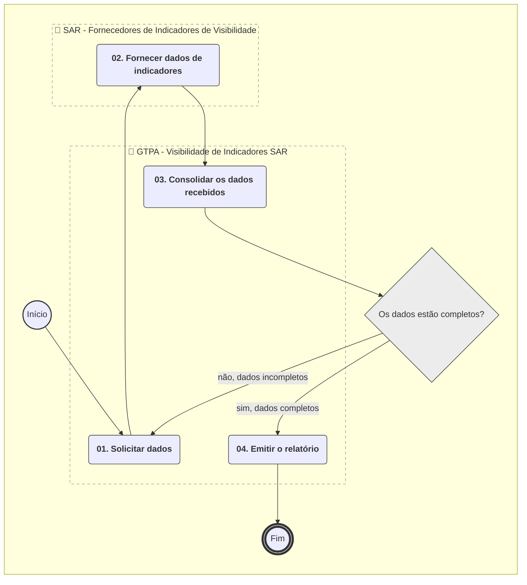
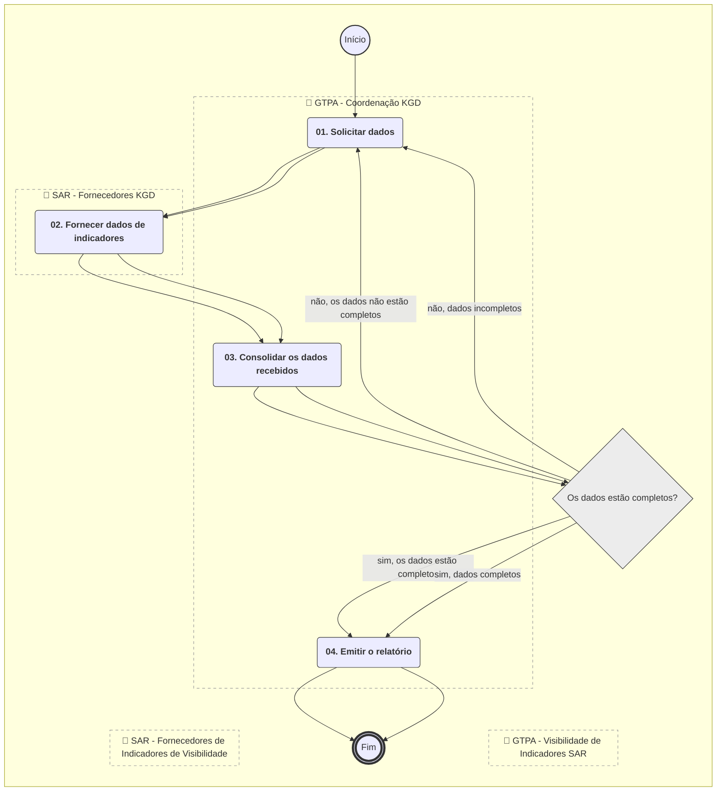

**MANUAL DE PROCEDIMENTO**

**MPR/SAR-424-R00**

**DISPONIBILIZAÇÃO DE INFORMAÇÕES DA SAR**

04/2017

**REVISÕES**

|  |  |  |  |  |
| --- | --- | --- | --- | --- |
| **Revisão** | **Aprovação** | **Publicação** | **Aprovado Por** | **Modificações da Última Versão** |
| R00 | Portaria Nº 1.355, de 19 de Abril de 2017 | Não informado | SAR | Versão Original |

**ÍNDICE**

1) Disposições Preliminares, pág. 5.

1.1) Introdução, pág. 5.

1.2) Revogação, pág. 5.

1.3) Fundamentação, pág. 6.

1.4) Executores dos Processos, pág. 6.

1.5) Elaboração e Revisão, pág. 6.

1.6) Organização do Documento, pág. 6.

2) Definições, pág. 8.

2.1) Sigla, pág. 8.

3) Artefatos, Competências, Sistemas e Documentos Administrativos, pág. 9.

3.1) Artefatos, pág. 9.

3.2) Competências, pág. 9.

3.3) Sistemas, pág. 10.

3.4) Documentos e Processos Administrativos, pág. 10.

4) Procedimentos Referenciados, pág. 11.

5) Procedimentos, pág. 12.

5.1) Disponibilizar Informações da SAR para o Kit Gerencial de Dados, pág. 12.

5.2) Elaborar Visibilidade de Indicadores SAR, pág. 16.

6) Disposições Finais, pág. 20.

**PARTICIPAÇÃO NA EXECUÇÃO DOS PROCESSOS**

**GRUPOS ORGANIZACIONAIS**

**a) GTPA - Coordenação KGD**

1) Disponibilizar Informações da SAR para o Kit Gerencial de Dados

**b) GTPA - Visibilidade de Indicadores SAR**

1) Elaborar Visibilidade de Indicadores SAR

**c) SAR - Fornecedores de Indicadores de Visibilidade**

1) Elaborar Visibilidade de Indicadores SAR

**d) SAR - Fornecedores KGD**

1) Disponibilizar Informações da SAR para o Kit Gerencial de Dados

**1. DISPOSIÇÕES PRELIMINARES**

**1.1 INTRODUÇÃO**

Este MPR descreve os processos de disponibilização de dados da SAR em suas atividades finalísticas ligadas à certificação e vigilância continuada em aeronavegabilidade e os procedimentos de acompanhamento e divulgação desses dados e indicadores desta superintendência.

1.1.1 Papéis e Responsabilidades

É competência das Superintendências, definida no Regimento Interno, planejar, organizar, executar, controlar, coordenar e avaliar os processos organizacionais e operacionais da ANAC no âmbito de suas competências.

É competência da SAR, definida no Regimento Interno, planejar, dirigir, coordenar e orientar a execução das atividades das respectivas unidades.

É atribuição da GTPA, definida por portaria de delegação, o desenvolvimento e a coordenação de atividades de planejamento.

1.1.2 Política e Diretrizes

Este MPR descreve os processos de disponibilização e divulgação de dados e indicadores da SAR conforme solicitado pelo capítulo “Objetivos, Estratégias e Iniciativas”, do Plano Estratégico 2015, aprovado pela portaria no 45 de 9 de janeiro de 2015

1.1.3 Processo

O MPR estabelece, no âmbito da Superintendência de Aeronavegabilidade - SAR, os seguintes processos de trabalho:

a) Disponibilizar Informações da SAR para o Kit Gerencial de Dados.

b) Elaborar Visibilidade de Indicadores SAR.

**1.2 REVOGAÇÃO**

Item não aplicável.

**1.3 FUNDAMENTAÇÃO**

Resolução nº 381, de 14 de junho de 2016, art. 31.

**1.4 EXECUTORES DOS PROCESSOS**

Os procedimentos contidos neste documento aplicam-se aos servidores integrantes das seguintes áreas organizacionais:

|  |  |
| --- | --- |
| **Grupo Organizacional** | **Descrição** |
| GTPA - COORD KGD | Responsáveis por solicitar, coletar e disponibilizar as informações da SAR para o KGD - Kit Gerencial de Dados. |
| GTPA - VIS. INDIC. SAR | Visibilidade de Indicadores SAR |
| SAR - FORNC. INDIC. VISIB. | Agentes que fornecem as informações de suas atividades para compor o relatório de Visibilidade |
| SAR - FORNEC KGD | Responsáveis por fornecer as informações pertinentes de suas áreas ao KGD - Kit Gerencial de Dados. |

**1.5 ELABORAÇÃO E REVISÃO**

O processo que resulta na aprovação ou alteração deste MPR é de responsabilidade da Superintendência de Aeronavegabilidade - SAR. Em caso de sugestões de revisão, deve-se procurá-la para que sejam iniciadas as providências cabíveis.

As revisões deste MPR serão aprovadas pelo(s) titular(es) da(s) unidade(s) responsável(is) pela execução do(s) processo(s) nele listado(s).

**1.6 ORGANIZAÇÃO DO DOCUMENTO**

O capítulo 2 apresenta as principais definições utilizadas no âmbito deste MPR, e deve ser visto integralmente antes da leitura de capítulos posteriores.

O capítulo 3 apresenta as competências, os artefatos e os sistemas envolvidos na execução dos processos deste manual, em ordem relativamente cronológica.

O capítulo 4 apresenta os processos de trabalho referenciados neste MPR. Estes processos são publicados em outros manuais que não este, mas cuja leitura é essencial para o entendimento dos processos publicados neste manual. O capítulo 4 expõe em quais manuais são localizados cada um dos processos de trabalho referenciados.

O capítulo 5 apresenta os processos de trabalho. Para encontrar um processo específico, deve-se procurar sua respectiva página no índice contido no início do documento. Os processos estão ordenados em etapas. Cada etapa é contida em uma tabela, que possui em si todas as informações necessárias para sua realização. São elas, respectivamente:

a) o título da etapa;

b) a descrição da forma de execução da etapa;

c) as competências necessárias para a execução da etapa;

d) os artefatos necessários para a execução da etapa;

e) os sistemas necessários para a execução da etapa (incluindo, bases de dados em forma de arquivo, se existente);

f) os documentos e processos administrativos que precisam ser elaborados durante a execução da etapa;

g) instruções para as próximas etapas; e

h) as áreas ou grupos organizacionais responsáveis por executar a etapa.

O capítulo 6 apresenta as disposições finais do documento, que trata das ações a serem realizadas em casos não previstos.

Por último, é importante comunicar que este documento foi gerado automaticamente. São recuperados dados sobre as etapas e sua sequência, as definições, os grupos, as áreas organizacionais, os artefatos, as competências, os sistemas, entre outros, para os processos de trabalho aqui apresentados, de forma que alguma mecanicidade na apresentação das informações pode ser percebida. O documento sempre apresenta as informações mais atualizadas de nomes e siglas de grupos, áreas, artefatos, termos, sistemas e suas definições, conforme informação disponível na base de dados, independente da data de assinatura do documento. Informações sobre etapas, seu detalhamento, a sequência entre etapas, responsáveis pelas etapas, artefatos, competências e sistemas associados a etapas, assim como seus nomes e os nomes de seus processos têm suas definições idênticas à da data de assinatura do documento.

**2. DEFINIÇÕES**

A tabela abaixo apresenta as definições necessárias para o entendimento deste Manual de Procedimento.

**2.1 Sigla**

|  |  |
| --- | --- |
| **Definição** | **Significado** |
| GFT | Sistema Gerenciador de Fluxos de Trabalho. |
| GTPA | Gerência Técnica de Planejamento e Acompanhamento |
| KGD | Kit Gerencial de Dados |
| MPR | Manual de Procedimento – Documento de caráter disciplinador, de âmbito interno, assinado e aprovado por autoridade competente, que tem como objetivo documentar e padronizar os processos de trabalho realizados pelos agentes da ANAC. Possui informações sobre o fluxo de trabalho, detalhamento das etapas, competências necessárias, artefatos a serem utilizados, sistemas de apoio e áreas responsáveis pela execução. |
| SAR | Superintendência de Aeronavegabilidade |
| SPI | Superintendência de Planejamento Institucional. |

**3. ARTEFATOS, COMPETÊNCIAS, SISTEMAS E DOCUMENTOS ADMINISTRATIVOS**

Abaixo se encontram as listas dos artefatos, competências, sistemas e documentos administrativos que o executor necessita consultar, preencher, analisar ou elaborar para executar os processos deste MPR. As etapas descritas no capítulo seguinte indicam onde usar cada um deles.

As competências devem ser adquiridas por meio de capacitação ou outros instrumentos e os artefatos se encontram no módulo "Artefatos" do sistema GFT - Gerenciador de Fluxos de Trabalho.

**3.1 ARTEFATOS**

|  |  |
| --- | --- |
| **Nome** | **Descrição** |
| Coleta de Dados | Coleta de dados |
| E-Mail de Solicitação de Dados para a Visibilidade Mensal de Indicadores da SAR | Texto do e-mail mensal padrão solicitando dados das gerencias da SAR para a elaboração do relatório de visibilidade dos indicadores da superintendência. |
| E-Mail de Solicitação Mensal de Dados para o KGD | E-mail padrão da SAR para solicitação de dados mensais para compor o KGD - Kit Gerencial de Dados da SPI. |
| E-Mail de Solicitação Trimestral de Dados para o KGD | E-mail padrão da SAR para solicitação de dados trimestrais que irão compor o KGD - Kit Gerencial de Dados. |
| E-Mail Informando que os Dados do KGD Foram Disponibilizados | E-mail informando ao solicitante da SPI que os dados da SAR para o KGD - Kit Gerencial de Dados foram disponibilizados. |
| Roteiro para Extração Base de Dados da Frota de Aeronaves | Orientações para a coleta e arquivamento de dados da Frota de Aeronaves registradas. |

**3.2 COMPETÊNCIAS**

Para que os processos de trabalho contidos neste MPR possam ser realizados com qualidade e efetividade, é importante que as pessoas que venham a executá-los possuam um determinado conjunto de competências. No capítulo 5, as competências específicas que o executor de cada etapa de cada processo de trabalho deve possuir são apresentadas. A seguir, encontra-se uma lista geral das competências contidas em todos os processos de trabalho deste MPR e a indicação de qual área ou grupo organizacional as necessitam:

|  |  |
| --- | --- |
| **Competência** | **Áreas e Grupos** |
| Organiza os dados recebidos para a elaboração de relatório mensal. | GTPA - VIS. INDIC. SAR |

**3.3 SISTEMAS**

Não há sistemas descritos para a realização deste MPR.

**3.4 DOCUMENTOS E PROCESSOS ADMINISTRATIVOS ELABORADOS NESTE MANUAL**

Não há documentos ou processos administrativos a serem elaborados neste MPR.

**4. PROCEDIMENTOS REFERENCIADOS**

Procedimentos referenciados são processos de trabalho publicados em outro MPR que têm relação com os processos de trabalho publicados por este manual. Este MPR não possui nenhum processo de trabalho referenciado.

**5. PROCEDIMENTOS**

Este capítulo apresenta todos os processos de trabalho deste MPR. Para encontrar um processo específico, utilize o índice nas páginas iniciais deste documento. Ao final de cada etapa encontram-se descritas as orientações necessárias à continuidade da execução do processo. O presente MPR também está disponível de forma mais conveniente em versão eletrônica, onde pode(m) ser obtido(s) o(s) artefato(s) e outras informações sobre o processo.

**5.1 Disponibilizar Informações da SAR para o Kit Gerencial de Dados**

Informação dos Dados Gerenciais Solicitados Pela SPI

O processo contém, ao todo, 4 etapas. A situação que inicia o processo, chamada de evento de início, foi descrita como: "Demanda da SPI recebida", portanto, este processo deve ser executado sempre que este evento acontecer. O solicitante deve seguir a seguinte instrução: 'A demanda é recebida por e-mail da SPI, solicitando os dados e informando o prazo para atendimento'.

O processo é considerado concluído quando alcança seu evento de fim. O evento de fim descrito para esse processo é: "Dados da SAR disponibilizados.

Os grupos envolvidos na execução deste processo são: GTPA - COORD KGD, SAR - FORNEC KGD.

Para que esse procedimento seja executado de forma apropriada, o executor irá necessitar dos seguintes artefatos: "Coleta de Dados", "Roteiro para Extração Base de Dados da Frota de Aeronaves", "E-Mail Informando que os Dados do KGD Foram Disponibilizados", "E-Mail de Solicitação Trimestral de Dados para o KGD", "E-Mail de Solicitação Mensal de Dados para o KGD".

Abaixo se encontra(m) a(s) etapa(s) a ser(em) realizada(s) na execução deste processo e o diagrama do fluxo.

### 5.1 Disponibilizar Informações da SAR para o Kit Gerencial de Dados

|  |
| --- |
| **01. Solicitar informações para o KGD** |
| RESPONSÁVEL PELA EXECUÇÃO: GTPA - Coordenação KGD. |
| DETALHAMENTO: Após o recebimento da demanda da SPI, que informa o prazo para o atendimento, inserir lembrete de acompanhamento para um dia útil antes do prazo estipulado.  Analisar se o mês atual exige relato mensal ou trimestral. Para os meses de março, junho, setembro e dezembro, o relato é trimestral.  Caso os dados sejam mensais, enviar E-Mail de Solicitação Mensal de Dados para o KGD, inserindo o lembrete de acompanhamento para dois dias úteis antes do prazo final.  Caso os dados sejam trimestrais, enviar E-Mail de Solicitação Trimestral de Dados para o KGD, inserindo o lembrete de acompanhamento para dois dias úteis antes do prazo final.  Para os casos de complementação de informações já solicitadas, enviar e-mail solicitando especificamente os dados incompletos. |
| ARTEFATOS USADOS NESTA ATIVIDADE: E-Mail de Solicitação Mensal de Dados para o KGD, E-Mail de Solicitação Trimestral de Dados para o KGD. |
| CONTINUIDADE: deve-se seguir para a etapa "02. Fornecer dados para o KGD". |

|  |
| --- |
| **02. Fornecer dados para o KGD** |
| RESPONSÁVEL PELA EXECUÇÃO: SAR - Fornecedores KGD. |
| DETALHAMENTO: Fornecer os dados atualizados com as informações do mês, dentro do prazo estipulado. |
| CONTINUIDADE: deve-se seguir para a etapa "03. Coletar Informações". |

|  |
| --- |
| **03. Coletar Informações** |
| RESPONSÁVEL PELA EXECUÇÃO: GTPA - Coordenação KGD. |
| DETALHAMENTO: Criar pasta referente ao mês na rede da ANAC.  Copiar os arquivos com os dados recebidos e coletados na pasta criada.  Analisar se os dados estão completos. |
| ARTEFATOS USADOS NESTA ATIVIDADE: Roteiro para Extração Base de Dados da Frota de Aeronaves, Coleta de Dados. |
| CONTINUIDADE: caso a resposta para a pergunta "Dados estão completos?" seja "sim, os dados estão completos", deve-se seguir para a etapa "04. Disponibilizar informações da SAR no KGD". Caso a resposta seja "não, os dados não estão completos", deve-se seguir para a etapa "01. Solicitar informações para o KGD". |

|  |
| --- |
| **04. Disponibilizar informações da SAR no KGD** |
| RESPONSÁVEL PELA EXECUÇÃO: GTPA - Coordenação KGD. |
| DETALHAMENTO: Disponibilizar os arquivos referentes ao mês conforme solicitado pela SPI, informando o que está sendo atualizado e a fonte de dados.  Enviar ao solicitante da SPI o E-Mail Informando que os Dados do KGD Foram Disponibilizados. |
| ARTEFATOS USADOS NESTA ATIVIDADE: E-Mail Informando que os Dados do KGD Foram Disponibilizados. |
| CONTINUIDADE: esta etapa finaliza o procedimento. |

**5.2 Elaborar Visibilidade de Indicadores SAR**

Elaborar um relatório indicador de visibilidade do que está sendo trabalhado na SAR, a partir de dados recebidos de seus executores.

O processo contém, ao todo, 4 etapas. A situação que inicia o processo, chamada de evento de início, foi descrita como: "1º dia útil do mês", portanto, este processo deve ser executado sempre que este evento acontecer. Da mesma forma, o processo é considerado concluído quando alcança seu evento de fim. O evento de fim descrito para esse processo é: "Relatório emitido.

Os grupos envolvidos na execução deste processo são: GTPA - VIS. INDIC. SAR, SAR - FORNC. INDIC. VISIB.

Para que este processo seja executado de forma apropriada, é necessário que o(s) executor(es) possuam a seguinte competência: (1) Organiza os dados recebidos para a elaboração de relatório mensal.

Também será necessário o uso do seguinte artefato: "E-Mail de Solicitação de Dados para a Visibilidade Mensal de Indicadores da SAR".

Abaixo se encontra(m) a(s) etapa(s) a ser(em) realizada(s) na execução deste processo e o diagrama do fluxo.

### 5.1 Disponibilizar Informações da SAR para o Kit Gerencial de Dados

|  |
| --- |
| **01. Solicitar dados** |
| RESPONSÁVEL PELA EXECUÇÃO: GTPA - Visibilidade de Indicadores SAR. |
| DETALHAMENTO: No 1º dia útil do mês, enviar o E-Mail de Solicitação de Dados para a Visibilidade Mensal de Indicadores da SAR, aos fornecedores de indicadores de visibilidade, informando o prazo para o atendimento.  Para reenvio de solicitação, utilizada para casos de informações faltantes após o primeiro pedido, enviar e-mail ao fornecedor responsável, apontando o que deve ser acrescentado, corrigido ou alterado, solicitando o envio correto dos dados e informando um novo prazo para atendimento. |
| ARTEFATOS USADOS NESTA ATIVIDADE: E-Mail de Solicitação de Dados para a Visibilidade Mensal de Indicadores da SAR. |
| CONTINUIDADE: deve-se seguir para a etapa "02. Fornecer dados de indicadores". |

|  |
| --- |
| **02. Fornecer dados de indicadores** |
| RESPONSÁVEL PELA EXECUÇÃO: SAR - Fornecedores de Indicadores de Visibilidade. |
| DETALHAMENTO: Enviar, via e-mail, os dados pré acordados do mês anterior observando o prazo informado. |
| CONTINUIDADE: deve-se seguir para a etapa "03. Consolidar os dados recebidos". |

|  |
| --- |
| **03. Consolidar os dados recebidos** |
| RESPONSÁVEL PELA EXECUÇÃO: GTPA - Visibilidade de Indicadores SAR. |
| DETALHAMENTO: Receber os dados, verificando se estão completos, e dispô-los no relatório, com os tratamentos necessários.  Avaliar se os dados do relatório estão completos. |
| COMPETÊNCIAS:  - Organiza os dados recebidos para a elaboração de relatório mensal. |
| CONTINUIDADE: caso a resposta para a pergunta "Os dados estão completos?" seja "sim, dados completos", deve-se seguir para a etapa "04. Emitir o relatório". Caso a resposta seja "não, dados incompletos", deve-se seguir para a etapa "01. Solicitar dados". |

|  |
| --- |
| **04. Emitir o relatório** |
| RESPONSÁVEL PELA EXECUÇÃO: GTPA - Visibilidade de Indicadores SAR. |
| DETALHAMENTO: Atualizar o cabeçalho, rodapé e painel de controle.  Revisar a formatação final.  Salvar o arquivo na rede da ANAC.  Enviar o relatório ao GTPA para aprovação final e distribuição. |
| CONTINUIDADE: esta etapa finaliza o procedimento. |

**6. DISPOSIÇÕES FINAIS**

Em caso de identificação de erros e omissões neste manual pelo executor do processo, a SAR deve ser contatada. Cópias eletrônicas deste manual, do fluxo e dos artefatos usados podem ser encontradas em sistema.