# MANUAL DE PROCEDIMENTO

**MANUAL DE PROCEDIMENTO**

**MPR/SAR-441-R02**

**CREDENCIAMENTO DE PESSOAS FÍSICAS NA SAR**

04/2021

**REVISÕES**

|  |  |  |  |  |
| --- | --- | --- | --- | --- |
| **Revisão** | **Aprovação** | **Publicação** | **Aprovado Por** | **Modificações da Última Versão** |
| R00 | Portaria Nº 2.733, de 9 de Agosto de 2017 | Não informado | SAR | Versão Original |
| R01 | PORTARIA Nº 493, DE 9 DE FEVEREIRO DE 2018. | Não informado | SAR | 1) Processo 'Conduzir Credenciamento de Pessoa Física na SAR' modificado.  2) Processo 'Conduzir Renovação do Credenciamento de Pessoa Física na SAR' modificado.  3) Processo 'Conduzir Cancelamento ou Suspensão de Credenciamento de Pessoa Física na SAR' modificado. |
| R02 | PORTARIA Nº 4.789, DE 14 DE ABRIL DE 2021 | Não informado | SAR | 1) Processo 'Atestar Capacidade Avaliada para Candidato a Credenciamento na SAR' modificado.  2) Processo 'Conduzir Credenciamento de Pessoa Física na SAR' modificado.  3) Processo 'Conduzir Renovação e Extensão do Credenciamento de Pessoa Física na SAR' modificado.  4) Processo 'Conduzir Cancelamento de Credenciamento de Pessoa Física na SAR' modificado. |

**ÍNDICE**

1) Disposições Preliminares, pág. 5.

1.1) Introdução, pág. 5.

1.2) Revogação, pág. 5.

1.3) Fundamentação, pág. 5.

1.4) Executores dos Processos, pág. 5.

1.5) Elaboração e Revisão, pág. 6.

1.6) Organização do Documento, pág. 6.

2) Definições, pág. 8.

2.1) Sigla, pág. 8.

3) Artefatos, Competências, Sistemas e Documentos Administrativos, pág. 9.

3.1) Artefatos, pág. 9.

3.2) Competências, pág. 11.

3.3) Sistemas, pág. 12.

3.4) Documentos e Processos Administrativos, pág. 12.

4) Procedimentos Referenciados, pág. 13.

5) Procedimentos, pág. 14.

5.1) Atestar Capacidade Avaliada para Candidato a Credenciamento na SAR, pág. 14.

5.2) Conduzir Credenciamento de Pessoa Física na SAR, pág. 20.

5.3) Conduzir Renovação e Extensão do Credenciamento de Pessoa Física na SAR, pág. 29.

5.4) Conduzir Cancelamento de Credenciamento de Pessoa Física na SAR, pág. 38.

6) Disposições Finais, pág. 45.

**PARTICIPAÇÃO NA EXECUÇÃO DOS PROCESSOS**

**GRUPOS ORGANIZACIONAIS**

**a) ACP-SAR - Credenciamento de Pessoas**

1) Atestar Capacidade Avaliada para Candidato a Credenciamento na SAR

2) Conduzir Cancelamento de Credenciamento de Pessoa Física na SAR

3) Conduzir Credenciamento de Pessoa Física na SAR

4) Conduzir Renovação e Extensão do Credenciamento de Pessoa Física na SAR

**b) Comissão de Apelação**

1) Conduzir Cancelamento de Credenciamento de Pessoa Física na SAR

2) Conduzir Renovação e Extensão do Credenciamento de Pessoa Física na SAR

**c) O SAR**

1) Conduzir Credenciamento de Pessoa Física na SAR

**d) SAR - Área Técnica**

1) Conduzir Cancelamento de Credenciamento de Pessoa Física na SAR

2) Conduzir Credenciamento de Pessoa Física na SAR

3) Conduzir Renovação e Extensão do Credenciamento de Pessoa Física na SAR

**1. DISPOSIÇÕES PRELIMINARES**

**1.1 INTRODUÇÃO**

Este MPR contém:

(1) Informações que possibilitam aos servidores da ACP/SAR conduzir o credenciamento de pessoas físicas na SAR, atestando a capacidade dos candidatos;

(2) realizar renovações, cancelamentos e suspensões de credenciamentos já realizados.

1.1.1 Papéis e Responsabilidades

A competências de emitir, suspender e cancelar credenciamentos de pessoas, tanto físicas quanto jurídicas, nas áreas de competência da Superintendência, é do Superintendente de Aeronavegabilidade, sendo passível de delegação à ACP/SAR em portaria.

1.1.2 Política e Diretrizes

Trata o presente MPR de definir as atividades que serão executadas pela ACP/SAR com a finalidade de cumprir o disposto na portaria supracitada.

1.1.3. Processos

O MPR estabelece, no âmbito da Superintendência de Aeronavegabilidade - SAR, os seguintes processos de trabalho:

a) Atestar Capacidade Avaliada para Candidato a Credenciamento na SAR.

b) Conduzir Credenciamento de Pessoa Física na SAR.

c) Conduzir Renovação e Extensão do Credenciamento de Pessoa Física na SAR.

d) Conduzir Cancelamento de Credenciamento de Pessoa Física na SAR.

**1.2 REVOGAÇÃO**

MPR/SAR-441-R01, aprovado na data de 09 de fevereiro de 2018.

**1.3 FUNDAMENTAÇÃO**

Resolução nº 110, art. 38, de 15 de setembro de 2009 e alterações posteriores.

**1.4 EXECUTORES DOS PROCESSOS**

Os procedimentos contidos neste documento aplicam-se aos servidores integrantes das seguintes áreas organizacionais:

|  |  |
| --- | --- |
| **Grupo Organizacional** | **Descrição** |
| ACP-SAR | Grupo pertencente a SAR responsável pela coordenação do credenciamento de pessoas físicas na SAR. |
| Comissão de Apelação | A Comissão emitirá parecer sobre recurso não reconsiderado. A formação da Comissão é discricionária, podendo ser instaurada se solicitada pelo responsável pelo credenciamento. |
| O SAR | O Superintendente da SAR |
| SAR - Área Técnica | Grupo formado por servidores de todas as áreas técnicas da SAR que podem participar em processos relacionados a aeronavegabilidade. |

**1.5 ELABORAÇÃO E REVISÃO**

O processo que resulta na aprovação ou alteração deste MPR é de responsabilidade da Superintendência de Aeronavegabilidade - SAR. Em caso de sugestões de revisão, deve-se procurá-la para que sejam iniciadas as providências cabíveis.

As revisões deste MPR serão aprovadas pelo(s) titular(es) da(s) unidade(s) responsável(is) pela execução do(s) processo(s) nele listado(s).

**1.6 ORGANIZAÇÃO DO DOCUMENTO**

O capítulo 2 apresenta as principais definições utilizadas no âmbito deste MPR, e deve ser visto integralmente antes da leitura de capítulos posteriores.

O capítulo 3 apresenta as competências, os artefatos e os sistemas envolvidos na execução dos processos deste manual, em ordem relativamente cronológica.

O capítulo 4 apresenta os processos de trabalho referenciados neste MPR. Estes processos são publicados em outros manuais que não este, mas cuja leitura é essencial para o entendimento dos processos publicados neste manual. O capítulo 4 expõe em quais manuais são localizados cada um dos processos de trabalho referenciados.

O capítulo 5 apresenta os processos de trabalho. Para encontrar um processo específico, deve-se procurar sua respectiva página no índice contido no início do documento. Os processos estão ordenados em etapas. Cada etapa é contida em uma tabela, que possui em si todas as informações necessárias para sua realização. São elas, respectivamente:

a) o título da etapa;

b) a descrição da forma de execução da etapa;

c) as competências necessárias para a execução da etapa;

d) os artefatos necessários para a execução da etapa;

e) os sistemas necessários para a execução da etapa (incluindo, bases de dados em forma de arquivo, se existente);

f) os documentos e processos administrativos que precisam ser elaborados durante a execução da etapa;

g) instruções para as próximas etapas; e

h) as áreas ou grupos organizacionais responsáveis por executar a etapa.

O capítulo 6 apresenta as disposições finais do documento, que trata das ações a serem realizadas em casos não previstos.

Por último, é importante comunicar que este documento foi gerado automaticamente. São recuperados dados sobre as etapas e sua sequência, as definições, os grupos, as áreas organizacionais, os artefatos, as competências, os sistemas, entre outros, para os processos de trabalho aqui apresentados, de forma que alguma mecanicidade na apresentação das informações pode ser percebida. O documento sempre apresenta as informações mais atualizadas de nomes e siglas de grupos, áreas, artefatos, termos, sistemas e suas definições, conforme informação disponível na base de dados, independente da data de assinatura do documento. Informações sobre etapas, seu detalhamento, a sequência entre etapas, responsáveis pelas etapas, artefatos, competências e sistemas associados a etapas, assim como seus nomes e os nomes de seus processos têm suas definições idênticas à da data de assinatura do documento.

**2. DEFINIÇÕES**

A tabela abaixo apresenta as definições necessárias para o entendimento deste Manual de Procedimento.

**2.1 Sigla**

|  |  |
| --- | --- |
| **Definição** | **Significado** |
| ACP/SAR | Assessoria de Credenciamento de Pessoas da SAR |
| BDPC | Banco de Dados de Profissionais Credenciados |
| GRU | Guia de Recolhimento da União |
| ITD | Instrução de Trabalho Detalhada |
| PCA | Profissional Credenciado em Aeronavegabilidade |
| PCF | Profissional Credenciado em Fabricação |
| PCP | Profissional Credenciado em Projeto |
| SAR | Superintendência de Aeronavegabilidade |
| SEI | Sistema Eletrônico de Informações |

**3. ARTEFATOS, COMPETÊNCIAS, SISTEMAS E DOCUMENTOS ADMINISTRATIVOS**

Abaixo se encontram as listas dos artefatos, competências, sistemas e documentos administrativos que o executor necessita consultar, preencher, analisar ou elaborar para executar os processos deste MPR. As etapas descritas no capítulo seguinte indicam onde usar cada um deles.

As competências devem ser adquiridas por meio de capacitação ou outros instrumentos e os artefatos se encontram no módulo "Artefatos" do sistema GFT - Gerenciador de Fluxos de Trabalho.

**3.1 ARTEFATOS**

|  |  |
| --- | --- |
| **Nome** | **Descrição** |
| Análise de Reconsideração | Formulário para registro da reconsideração do orientador e ateste da gerência tecnicamente responsável |
| F-183-08 | Declaração de Qualificações - Profissionais Credenciados - Formulário a ser preenchido pelo candidato ao credenciamento com informações pessoais e profissionais. |
| F-441-05 | Relatório de Atividades do PCA (credenciado) |
| F-441-09 | Relatório de atividades do PCF. Relatório a ser preenchido pelo credenciado de Atividades do Profissional Credenciado em Fabricação |
| Formulário Interação PCP/ANAC (Credenciado) | Formulário a ser preenchido pelo credenciado de Interação Profissional Credenciado em Projeto/ANAC |
| ITD-441-01 | Este documento detalha atividades do processo “Atestar Capacidade Avaliada para Candidato a Credenciamento na SAR” e do processo “Conduzir Renovação do Credenciamento de Pessoa Física na SAR” contido no MPR/SAR-441 intitulado “Credenciamento de Pessoas Físicas na SAR”.  Tem como objetivo definir procedimentos de registro das atividades de supervisão e dos profissionais credenciados em projeto. |
| ITD-441-03 | Este documento detalha atividades do processo “Atestar Capacidade Avaliada para Candidato a Credenciamento na SAR” e do processo “Conduzir Renovação do Credenciamento de Pessoa Física na SAR” contido no MPR/SAR-441 intitulado “Credenciamento de Pessoas Físicas na SAR”.  Esta ITD pretende relacionar as particularidades e critérios a serem adotados pelos analistas da GTAI, em relação ao credenciamento, renovação e descredenciamento de profissionais credenciados em aeronavegabilidade do grupo D. |
| ITD-441-04 | Este documento detalha atividades do processo “Atestar Capacidade Avaliada para Candidato a Credenciamento na SAR” e do processo “Conduzir Renovação de Credenciamento de Pessoa Física na SAR” contidos no MPR/SAR-441 intitulado “Credenciamento de Pessoas Físicas na SAR”.  Esta ITD pretende relacionar as particularidades e critérios a serem adotados pelos analistas da GTAI, em relação ao credenciamento, renovação e descredenciamento de profissionais credenciados em aeronavegabilidade do grupo E. |
| Orientações de Treinamento e Ordem de Avaliação | Lista para orientação na coordenação de treinamentos e aplicabilidade de Ordens de Avaliação (OAs) |
| Parecer da Comissão de Apelação | Formulário para registro do parecer da Comissão de Apelação de Profissionais Credenciados (PCP,PCF,PCA) |
| Parecer da Comissão de Avaliação | Formulário para registro do parecer da Comissão de Avaliação, dentro do processo de credenciamento de pessoas físicas na SAR |
| Registro de Credenciamento | Formulário a ser preenchido pelo orientador de Registro no Processo de Credenciamento |

**3.2 COMPETÊNCIAS**

Para que os processos de trabalho contidos neste MPR possam ser realizados com qualidade e efetividade, é importante que as pessoas que venham a executá-los possuam um determinado conjunto de competências. No capítulo 5, as competências específicas que o executor de cada etapa de cada processo de trabalho deve possuir são apresentadas. A seguir, encontra-se uma lista geral das competências contidas em todos os processos de trabalho deste MPR e a indicação de qual área ou grupo organizacional as necessitam:

|  |  |
| --- | --- |
| **Competência** | **Áreas e Grupos** |
| Analisa, com atenção, documentação constante no pedido de credenciamento/extensão, conforme normativo específico e dentro do prazo estabelecido. | ACP-SAR, SAR - Área Técnica |
| Analisa, com atenção, documentação constante no pedido de renovação, conforme normativo específico e dentro do prazo estabelecido. | ACP-SAR |
| Avalia, através da análise de documentação, se o candidato tem treinamento aplicável válido, conforme normativo específico. | ACP-SAR |
| Avalia, com atenção, pedido de renovação, conforme normativo específico e dentro do prazo estabelecido. | SAR - Área Técnica |
| Comunica interessado, por meio de ofício, com relação à decisão final do processo de renovação do credenciamento solicitado, informando o escopo aceito e/ou escopo não aceito. | ACP-SAR |
| Efetiva o cancelamento, redução do escopo ou suspensão, de forma definitiva, emitindo ofício ao interessado ou empresa com a qual está vinculado. | ACP-SAR |
| Formula ofício comunicando a manutenção do credenciamento, com atenção, com base em parecer da área técnica. | ACP-SAR |
| Formula ofício comunicando o cancelamento/redução/suspensão do credenciamento, de forma precisa, com base em parecer da área técnica. | ACP-SAR |
| Formula ofício comunicando o parecer desfavorável ao pedido de credenciamento, com precisão, com base em parecer da área técnica. | ACP-SAR |
| Formula ofício comunicando o parecer desfavorável ao pedido de renovação, com precisão, com base em parecer da área técnica. | ACP-SAR |
| Formula ofício comunicando o processo de cancelamento/redução/suspensão e possibilidade de reconsideração, com base em normativo específico. | ACP-SAR |
| Formula ofício de indeferimento ao pedido de credenciamento/extensão, com precisão, com base em parecer da área técnica. | ACP-SAR |
| Formula ofício de indeferimento ao pedido de renovação, com precisão, com base em parecer da área técnica. | ACP-SAR |
| Formula, com precisão, e quando aplicável, despacho de encaminhamento à área técnica, com base no normativo específico. | ACP-SAR |
| Formula, de forma precisa, parecer quanto ao pedido de reconsideração, conforme normativo específico e dentro do prazo estabelecido. | SAR - Área Técnica |
| Planeja eventos de nivelamento para os profissionais credenciados, com base nas demandas apresentadas, de forma racional. | ACP-SAR |

**3.3 SISTEMAS**

|  |  |  |
| --- | --- | --- |
| **Nome** | **Descrição** | **Acesso** |
| Intranet da SAR | Sistema de controle de processos internos da SAR e disponibilização de informações de aeronavegabilidade e estatísticas. | http://sar.anac.gov.br |
| SEI | Sistema Eletrônico de Informação. | https://sei.anac.gov.br/sip/login.php?sigla\_orgao\_sistema=ANAC&sigla\_sistema=SEI |

**3.4 DOCUMENTOS E PROCESSOS ADMINISTRATIVOS ELABORADOS NESTE MANUAL**

Não há documentos ou processos administrativos a serem elaborados neste MPR.

**4. PROCEDIMENTOS REFERENCIADOS**

Procedimentos referenciados são processos de trabalho publicados em outro MPR que têm relação com os processos de trabalho publicados por este manual. Este MPR não possui nenhum processo de trabalho referenciado.

**

## 5.1 Atestar Capacidade Avaliada para Candidato a Credenciamento na SAR

```mermaid
%%{init: {'theme': 'default'}}%%

flowchart TD
    classDef inicio stroke:#333,stroke-width:2px;
    classDef fim stroke:#333,stroke-width:4px;
    classDef tarefaBPMN stroke:#333,stroke-width:1px;
    classDef gatewayBPMN fill:#f2f2f2,stroke:#333,stroke-width:1px;
    classDef raia fill:none,stroke:#999,stroke-width:1px,stroke-dasharray: 5 5;
    subgraph Container_ID_MPR_SAR_441_R02_0 [ ]
        direction TB
        ID_MPR_SAR_441_R02_0_Start((Início)):::inicio
        ID_MPR_SAR_441_R02_0_End(((Fim))):::fim
        ID_MPR_SAR_441_R02_0_01("<b>01. Organizar evento(s) de nivelamento e/ou avaliação</b><hr>Responsável: ACP-SAR - Credenciamento de Pessoas."):::tarefaBPMN
        ID_MPR_SAR_441_R02_0_02("<b>02. Realizar evento(s) de nivelamento e/ou avaliação</b><hr>Responsável: ACP-SAR - Credenciamento de Pessoas."):::tarefaBPMN
        ID_MPR_SAR_441_R02_0_03("<b>03. Notificar o candidato sobre sua aprovação no credenciamento e atualizar BDPC</b><hr>Responsável: ACP-SAR - Credenciamento de Pessoas."):::tarefaBPMN
        ID_MPR_SAR_441_R02_0_04("<b>04. Notificar o candidato sobre a reprovação na avaliação</b><hr>Responsável: ACP-SAR - Credenciamento de Pessoas."):::tarefaBPMN
        ID_MPR_SAR_441_R02_0_01("<b>01. Analisar documentação</b><hr>Responsável: ACP-SAR - Credenciamento de Pessoas."):::tarefaBPMN
        ID_MPR_SAR_441_R02_0_02("<b>02. Emitir parecer e decidir quanto ao credenciamento</b><hr>Responsável: SAR - Área Técnica."):::tarefaBPMN
        ID_MPR_SAR_441_R02_0_03("<b>03. Comunicar o indeferimento</b><hr>Responsável: ACP-SAR - Credenciamento de Pessoas."):::tarefaBPMN
        ID_MPR_SAR_441_R02_0_04("<b>04. Apreciar a reconsideração</b><hr>Responsável: SAR - Área Técnica."):::tarefaBPMN
        ID_MPR_SAR_441_R02_0_05("<b>05. Decidir em instância superior</b><hr>Responsável: O SAR."):::tarefaBPMN
        ID_MPR_SAR_441_R02_0_06("<b>06. Avaliar necessidade de capacitação</b><hr>Responsável: ACP-SAR - Credenciamento de Pessoas."):::tarefaBPMN
        ID_MPR_SAR_441_R02_0_07("<b>07. Comunicar o indeferimento e arquivar o processo</b><hr>Responsável: ACP-SAR - Credenciamento de Pessoas."):::tarefaBPMN
        ID_MPR_SAR_441_R02_0_01("<b>01. Analisar documentação</b><hr>Responsável: ACP-SAR - Credenciamento de Pessoas."):::tarefaBPMN
        ID_MPR_SAR_441_R02_0_02("<b>02. Emitir parecer quanto à renovação do credenciamento</b><hr>Responsável: SAR - Área Técnica."):::tarefaBPMN
        ID_MPR_SAR_441_R02_0_03("<b>03. Avaliar se o parecer da Área Técnica é favorável</b><hr>Responsável: ACP-SAR - Credenciamento de Pessoas."):::tarefaBPMN
        ID_MPR_SAR_441_R02_0_04("<b>04. Comunicar o parecer ao interessado e informar sobre a possibilidade de reconsideração</b><hr>Responsável: ACP-SAR - Credenciamento de Pessoas."):::tarefaBPMN
        ID_MPR_SAR_441_R02_0_05("<b>05. Emitir parecer quanto à reconsideração</b><hr>Responsável: SAR - Área Técnica."):::tarefaBPMN
        ID_MPR_SAR_441_R02_0_06("<b>06. Emitir parecer final quanto à reconsideração</b><hr>Responsável: Comissão de Apelação."):::tarefaBPMN
        ID_MPR_SAR_441_R02_0_07("<b>07. Avaliar parecer da Comissão de Apelação</b><hr>Responsável: ACP-SAR - Credenciamento de Pessoas."):::tarefaBPMN
        ID_MPR_SAR_441_R02_0_08("<b>08. Comunicar o indeferimento da renovação ao interessado e arquivar o processo</b><hr>Responsável: ACP-SAR - Credenciamento de Pessoas."):::tarefaBPMN
        ID_MPR_SAR_441_R02_0_09("<b>09. Comunicar o deferimento da renovação ao interessado e arquivar o processo</b><hr>Responsável: ACP-SAR - Credenciamento de Pessoas."):::tarefaBPMN
        ID_MPR_SAR_441_R02_0_01("<b>01. Avaliar origem da solicitação de cancelamento</b><hr>Responsável: ACP-SAR - Credenciamento de Pessoas."):::tarefaBPMN
        ID_MPR_SAR_441_R02_0_02("<b>02. Avaliar motivo da solicitação</b><hr>Responsável: ACP-SAR - Credenciamento de Pessoas."):::tarefaBPMN
        ID_MPR_SAR_441_R02_0_03("<b>03. Comunicar a existência de processo de cancelamento, redução ou suspensão ao credenciado e informar sobre a possibilidade de reconsideração</b><hr>Responsável: ACP-SAR - Credenciamento de Pessoas."):::tarefaBPMN
        ID_MPR_SAR_441_R02_0_04("<b>04. Emitir parecer quanto à reconsideração</b><hr>Responsável: SAR - Área Técnica."):::tarefaBPMN
        ID_MPR_SAR_441_R02_0_05("<b>05. Emitir parecer final quanto à reconsideração</b><hr>Responsável: Comissão de Apelação."):::tarefaBPMN
        ID_MPR_SAR_441_R02_0_06("<b>06. Avaliar parecer da Comissão de Apelação</b><hr>Responsável: ACP-SAR - Credenciamento de Pessoas."):::tarefaBPMN
        ID_MPR_SAR_441_R02_0_07("<b>07. Comunicar manutenção do credenciamento ao credenciado</b><hr>Responsável: ACP-SAR - Credenciamento de Pessoas."):::tarefaBPMN
        ID_MPR_SAR_441_R02_0_08("<b>08. Realizar cancelamento, redução ou suspensão e comunicar ao interessado</b><hr>Responsável: ACP-SAR - Credenciamento de Pessoas."):::tarefaBPMN
        ID_MPR_SAR_441_R02_0_Start --> ID_MPR_SAR_441_R02_0_01
        ID_MPR_SAR_441_R02_0_01 --> ID_MPR_SAR_441_R02_0_02
        gw_ID_MPR_SAR_441_R02_0_02{"Candidato aprovado?"}:::gatewayBPMN
        ID_MPR_SAR_441_R02_0_02 --> gw_ID_MPR_SAR_441_R02_0_02
        gw_ID_MPR_SAR_441_R02_0_02 -->|"sim, candidato aprovado"| ID_MPR_SAR_441_R02_0_03
        gw_ID_MPR_SAR_441_R02_0_02 -->|"não, candidato não aprovado"| ID_MPR_SAR_441_R02_0_04
        ID_MPR_SAR_441_R02_0_03 --> ID_MPR_SAR_441_R02_0_End
        ID_MPR_SAR_441_R02_0_04 --> ID_MPR_SAR_441_R02_0_End
        gw_ID_MPR_SAR_441_R02_0_01{"Requerimento é admissível?"}:::gatewayBPMN
        ID_MPR_SAR_441_R02_0_01 --> gw_ID_MPR_SAR_441_R02_0_01
        gw_ID_MPR_SAR_441_R02_0_01 -->|"sim, é admissível"| ID_MPR_SAR_441_R02_0_02
        gw_ID_MPR_SAR_441_R02_0_01 -->|"não, não é admissível"| ID_MPR_SAR_441_R02_0_07
        gw_ID_MPR_SAR_441_R02_0_02{"Decisão é favorável?"}:::gatewayBPMN
        ID_MPR_SAR_441_R02_0_02 --> gw_ID_MPR_SAR_441_R02_0_02
        gw_ID_MPR_SAR_441_R02_0_02 -->|"não, decisão desfavorável e cabe pedido de reconsideração"| ID_MPR_SAR_441_R02_0_03
        gw_ID_MPR_SAR_441_R02_0_02 -->|"não, decisão desfavorável e não cabe pedido de reconsideração"| ID_MPR_SAR_441_R02_0_07
        gw_ID_MPR_SAR_441_R02_0_02 -->|"sim, a decisão é favorável"| ID_MPR_SAR_441_R02_0_06
        gw_ID_MPR_SAR_441_R02_0_03{"Houve pedido de reconsideração dentro do prazo?"}:::gatewayBPMN
        ID_MPR_SAR_441_R02_0_03 --> gw_ID_MPR_SAR_441_R02_0_03
        gw_ID_MPR_SAR_441_R02_0_03 -->|"sim, houve pedido dentro do prazo"| ID_MPR_SAR_441_R02_0_04
        gw_ID_MPR_SAR_441_R02_0_03 -->|"não, não houve pedido dentro do prazo"| ID_MPR_SAR_441_R02_0_07
        gw_ID_MPR_SAR_441_R02_0_04{"Reconsideração aceita?"}:::gatewayBPMN
        ID_MPR_SAR_441_R02_0_04 --> gw_ID_MPR_SAR_441_R02_0_04
        gw_ID_MPR_SAR_441_R02_0_04 -->|"não reconsiderado"| ID_MPR_SAR_441_R02_0_05
        gw_ID_MPR_SAR_441_R02_0_04 -->|"sim, reconsideração aceita"| ID_MPR_SAR_441_R02_0_06
        gw_ID_MPR_SAR_441_R02_0_05{"A decisão é favorável?"}:::gatewayBPMN
        ID_MPR_SAR_441_R02_0_05 --> gw_ID_MPR_SAR_441_R02_0_05
        gw_ID_MPR_SAR_441_R02_0_05 -->|"não, decisão não é favorável"| ID_MPR_SAR_441_R02_0_07
        gw_ID_MPR_SAR_441_R02_0_05 -->|"sim, decisão é favorável"| ID_MPR_SAR_441_R02_0_06
        gw_ID_MPR_SAR_441_R02_0_06{"Interessado necessita de capacitação?"}:::gatewayBPMN
        ID_MPR_SAR_441_R02_0_06 --> gw_ID_MPR_SAR_441_R02_0_06
        gw_ID_MPR_SAR_441_R02_0_06 -->|"sim, necessita capacitação"| ID_MPR_SAR_441_R02_0_End
        gw_ID_MPR_SAR_441_R02_0_06 -->|"não, não necessita de capacitação"| ID_MPR_SAR_441_R02_0_End
        ID_MPR_SAR_441_R02_0_07 --> ID_MPR_SAR_441_R02_0_End
        gw_ID_MPR_SAR_441_R02_0_01{"Requerimento é admissível?"}:::gatewayBPMN
        ID_MPR_SAR_441_R02_0_01 --> gw_ID_MPR_SAR_441_R02_0_01
        gw_ID_MPR_SAR_441_R02_0_01 -->|"não, não é admissível"| ID_MPR_SAR_441_R02_0_08
        gw_ID_MPR_SAR_441_R02_0_01 -->|"sim, é admissível"| ID_MPR_SAR_441_R02_0_02
        ID_MPR_SAR_441_R02_0_02 --> ID_MPR_SAR_441_R02_0_03
        gw_ID_MPR_SAR_441_R02_0_03{"Parecer é favorável à renovação?"}:::gatewayBPMN
        ID_MPR_SAR_441_R02_0_03 --> gw_ID_MPR_SAR_441_R02_0_03
        gw_ID_MPR_SAR_441_R02_0_03 -->|"não, parecer desfavorável e cabe reconsideração"| ID_MPR_SAR_441_R02_0_04
        gw_ID_MPR_SAR_441_R02_0_03 -->|"sim, é favorável"| ID_MPR_SAR_441_R02_0_09
        gw_ID_MPR_SAR_441_R02_0_03 -->|"não, parecer desfavorável e não cabe reconsideração"| ID_MPR_SAR_441_R02_0_08
        gw_ID_MPR_SAR_441_R02_0_04{"Houve pedido de reconsideração dentro do prazo?"}:::gatewayBPMN
        ID_MPR_SAR_441_R02_0_04 --> gw_ID_MPR_SAR_441_R02_0_04
        gw_ID_MPR_SAR_441_R02_0_04 -->|"não, não houve pedido no prazo"| ID_MPR_SAR_441_R02_0_08
        gw_ID_MPR_SAR_441_R02_0_04 -->|"sim, houve pedido no prazo"| ID_MPR_SAR_441_R02_0_05
        gw_ID_MPR_SAR_441_R02_0_05{"Houve reconsideração?"}:::gatewayBPMN
        ID_MPR_SAR_441_R02_0_05 --> gw_ID_MPR_SAR_441_R02_0_05
        gw_ID_MPR_SAR_441_R02_0_05 -->|"sim, houve reconsideração"| ID_MPR_SAR_441_R02_0_09
        gw_ID_MPR_SAR_441_R02_0_05 -->|"não, não houve reconsideração"| ID_MPR_SAR_441_R02_0_06
        ID_MPR_SAR_441_R02_0_06 --> ID_MPR_SAR_441_R02_0_07
        gw_ID_MPR_SAR_441_R02_0_07{"Parecer da Comissão de Apelação foi favorável?"}:::gatewayBPMN
        ID_MPR_SAR_441_R02_0_07 --> gw_ID_MPR_SAR_441_R02_0_07
        gw_ID_MPR_SAR_441_R02_0_07 -->|"sim, haverá renovação do credenciamento"| ID_MPR_SAR_441_R02_0_09
        gw_ID_MPR_SAR_441_R02_0_07 -->|"não, não haverá renovação do credenciamento"| ID_MPR_SAR_441_R02_0_08
        ID_MPR_SAR_441_R02_0_08 --> ID_MPR_SAR_441_R02_0_End
        ID_MPR_SAR_441_R02_0_09 --> ID_MPR_SAR_441_R02_0_End
        gw_ID_MPR_SAR_441_R02_0_01{"Solicitação feita pelo credenciado?"}:::gatewayBPMN
        ID_MPR_SAR_441_R02_0_01 --> gw_ID_MPR_SAR_441_R02_0_01
        gw_ID_MPR_SAR_441_R02_0_01 -->|"não, solicitação feita pela área técnica"| ID_MPR_SAR_441_R02_0_02
        gw_ID_MPR_SAR_441_R02_0_01 -->|"sim, solicitação feita pelo credenciado"| ID_MPR_SAR_441_R02_0_08
        gw_ID_MPR_SAR_441_R02_0_02{"Passível de reconsideração?"}:::gatewayBPMN
        ID_MPR_SAR_441_R02_0_02 --> gw_ID_MPR_SAR_441_R02_0_02
        gw_ID_MPR_SAR_441_R02_0_02 -->|"não, não é passível de reconsideração"| ID_MPR_SAR_441_R02_0_08
        gw_ID_MPR_SAR_441_R02_0_02 -->|"sim, é passível de reconsideração"| ID_MPR_SAR_441_R02_0_03
        gw_ID_MPR_SAR_441_R02_0_03{"Houve pedido de reconsideração dentro do prazo?"}:::gatewayBPMN
        ID_MPR_SAR_441_R02_0_03 --> gw_ID_MPR_SAR_441_R02_0_03
        gw_ID_MPR_SAR_441_R02_0_03 -->|"sim, houve pedido no prazo"| ID_MPR_SAR_441_R02_0_04
        gw_ID_MPR_SAR_441_R02_0_03 -->|"não, não houve pedido no prazo"| ID_MPR_SAR_441_R02_0_08
        gw_ID_MPR_SAR_441_R02_0_04{"Houve reconsideração?"}:::gatewayBPMN
        ID_MPR_SAR_441_R02_0_04 --> gw_ID_MPR_SAR_441_R02_0_04
        gw_ID_MPR_SAR_441_R02_0_04 -->|"sim, houve reconsideração"| ID_MPR_SAR_441_R02_0_07
        gw_ID_MPR_SAR_441_R02_0_04 -->|"não, não houve reconsideração"| ID_MPR_SAR_441_R02_0_05
        ID_MPR_SAR_441_R02_0_05 --> ID_MPR_SAR_441_R02_0_06
        gw_ID_MPR_SAR_441_R02_0_06{"Parecer da Comissão de Apelação foi favorável?"}:::gatewayBPMN
        ID_MPR_SAR_441_R02_0_06 --> gw_ID_MPR_SAR_441_R02_0_06
        gw_ID_MPR_SAR_441_R02_0_06 -->|"não, desfavorável à reconsideração"| ID_MPR_SAR_441_R02_0_08
        gw_ID_MPR_SAR_441_R02_0_06 -->|"sim, favorável à reconsideração"| ID_MPR_SAR_441_R02_0_07
        ID_MPR_SAR_441_R02_0_07 --> ID_MPR_SAR_441_R02_0_End
        ID_MPR_SAR_441_R02_0_08 --> ID_MPR_SAR_441_R02_0_End
    end
    click ID_MPR_SAR_441_R02_0_01 href "#" "A ACP-SAR verificará qual a necessidade de treinamento e comunicará o candidato.  a) Quando identificado que há necessidade de treinamento, a ACP-SAR notificará o interessado sobre a aprovação documental. Na comunicação realizada e caso seja aplicável, deve ser especificado ao candidato qual(ais) o(s) treinamento(s) deve(m) ser cumprido(s), para obtenção do credenciamento. Ao candidato deve ser informado que aguarde comunicação futura da ANAC a respeito da data de realização do(s) evento(s) requerido. O processo permanecerá sobrestado até que o candidato possa concluí-lo. Caso a SAR - Área Técnica tenha definido que o candidato precisa cumprir OIs (ordens de instrução), o ofício deve informar a quantidade de OIs a ser realizada, bem como instruções aplicáveis. Espera-se que o candidato cumpra o treinamento requerido na primeira ou segunda oportunidade oferecida pela ANAC. Caso não seja cumprido, o processo poderá ser cancelado e arquivado;  b) Quando identificado que não há necessidade de treinamento, a ACP-SAR poderá providenciar o credenciamento. A ACP-SAR formalizará o credenciamento por meio de ofício, onde deve constar o nome do profissional credenciado, número do credenciamento, representação (autônomo ou empresa com a qual o profissional está vinculado), escopo de atuação autorizado bem como limitações aplicáveis, e validade do credenciamento. A ACP-SAR comunicará o interessado, por meio de ofício, com relação à decisão final do processo de credenciamento solicitado, informando o escopo aceito, número de credenciamento e validade do credenciamento. Se houver decisão negativa de parte do escopo solicitado, informar também o escopo não aceito. A ACP-SAR alimentará um banco de dados de profissionais credenciados (BDPC) e, por consequência, manterá página específica da ANAC na internet atualizada, onde devem constar no mínimo mesmos dados do ofício de credenciamento para cada credenciamento ativo. O BDPC é acessado via Menu de Manutenção da Intranet da SAR, mediante login e senha específica.  O número da credencial é atribuído da seguinte forma:  No caso de PCP, PCF e PCA:  KKK XXXXCYY-ZZ ou KKK XXXXCYY-ZZA onde:  (1) KKK = PCP, PCF ou PCA;  (2) XXXX = ano de emissão;  (3) C = letra designativa de Profissional Credenciado;  (4) YY = mês do credenciamento;  (5) ZZ = sequência de emissão específica para PCP, PCF ou PCA;  (6) A = quando usado, significa Profissional Autônomo.  Para fins de controle de sequência de emissão, o numerador é registrado em planilha específica.  NOTA 1: No caso de emissão de credenciamento com necessidade de Ordem de Instrução OI(s), esta deve ser cumprida na primeira vistoria solicitada, atuarão credenciamento não se concretizará até que a(s) OI(s) sejam realizadas com aproveitamento. No caso de 2 OIs, nas primeiras 2 solicitações..  NOTA 2: Caso o PC não tenha alcançado desempenho satisfatório em 2 OIs consecutivas, o credenciamento não será concluído e o processo encerrado e arquivado.  NOTA 3: Quando da emissão do credenciamento, nos casos em que o credenciado estiver ocupando cargo ou emprego público no âmbito do poder executivo federal, a ANAC comunicará o órgão público empregador do credenciado, para que possa ser avaliada eventual situação de impedimento legal e/ou conflito de interesses."
    click ID_MPR_SAR_441_R02_0_02 href "#" "A ACP-SAR acompanhará execução do evento na data definida conforme planejamento.  Deve-se providenciar evidências de atendimento dos critérios de aprovação dos candidatos, bem como evidências de participação dos instrutores.  Nesta atividade os instrutores devem ter em mente os critérios de supervisão dos credenciados, de modo a também abordarem as questões relevantes associados a esta supervisão. Para isto devem ser consultadas as ITD-441-nn relativas à supervisão de profissionais credenciados"
    click ID_MPR_SAR_441_R02_0_03 href "#" "Após a confirmação da aprovação no treinamento, a ACP-SAR formalizará o credenciamento por meio de ofício, onde deve constar o nome do profissional credenciado, número do credenciamento, representação (autônomo ou empresa com a qual o profissional está vinculado), escopo de atuação autorizado bem como limitações aplicáveis, e validade do credenciamento. A ACP-SAR comunicará o interessado, por meio de ofício, com relação à decisão final do processo de credenciamento solicitado, informando o escopo aceito, número de credenciamento e validade do credenciamento. Se houver decisão negativa de parte do escopo solicitado, informar também o escopo não aceito. A ACP-SAR alimentará um banco de dados de profissionais credenciados (BDPC) e, por consequência, manterá página específica da ANAC na internet atualizada, onde devem constar no mínimo mesmos dados do ofício de credenciamento para cada credenciamento ativo. O BDPC é acessado via Menu de Manutenção da Intranet da SAR, mediante login e senha específica.  O número da credencial é atribuído da seguinte forma:  No caso de PCP, PCF e PCA:  KKK XXXXCYY-ZZ ou KKK XXXXCYY-ZZA onde:  (1) KKK = PCP, PCF ou PCA;  (2) XXXX = ano de emissão;  (3) C = letra designativa de Profissional Credenciado;  (4) YY = mês do credenciamento;  (5) ZZ = sequência de emissão específica para PCP, PCF ou PCA;  (6) A = quando usado, significa Profissional Autônomo.  Para fins de controle de sequência de emissão, o numerador é registrado em planilha específica."
    click ID_MPR_SAR_441_R02_0_04 href "#" "A ACP-SAR deverá avaliar o desempenho do candidato reprovado e, caso o desempenho esteja próximo ao limiar de aprovação, pode ser concedido ao candidato o direito de refazer a avaliação em um próximo evento de nivelamento e/ou avaliação. Esta concessão para nova avaliação pode ser concedida uma única vez.  Nos casos de reprovação no treinamento inicial com aproveitamento na avaliação entre 50% e 70%, o candidato poderá realizar somente um novo treinamento, no qual deverá obter aproveitamento mínimo de 70% em avaliação objetiva. Nos casos de reprovação no treinamento recorrente com aproveitamento na avaliação entre 50% e 70%, o candidato poderá realizar somente um novo treinamento, no qual deverá obter aproveitamento mínimo de 70% em avaliação objetiva. Neste caso, o credenciamento é suspenso até que seja constatada aprovação no treinamento recorrente.  Nos casos de reprovação no treinamento inicial com aproveitamento na avaliação abaixo de 50%, ou em segundo treinamento abaixo de 70%, o credenciamento é automaticamente negado. Nos casos de reprovação no treinamento recorrente com aproveitamento na avaliação abaixo de 50%, ou em segundo treinamento abaixo de 70%, o credenciamento é automaticamente cancelado.  Nos casos de reprovação devido à frequência insuficiente, a ANAC pode autorizar a participação do profissional em novo treinamento uma única vez.  Em caso de desempenho insatisfatório, ACP-SAR enviará um oficio ao candidato informando sobre sua reprovação e oportunidade para segunda prova, se aplicável.  Arquivar o processo."
    click ID_MPR_SAR_441_R02_0_01 href "#" "Após receber a documentação do interessado (candidato ou empresa), na forma de um processo administrativo protocolado junto à ANAC, a ACP-SAR fará a devida classificação do processo no SEI e analisará o pedido de acordo com o checklist (IS 183-002, 5.1.4.3 ), verificando os seguintes documentos:  1. Formulário de Credenciamento/extensão F-183-08 (Declaração de Qualificações)  2. Curriculum Vitae completo  3. Declaração de regularidade com órgão de classe profissional, incluindo o No. de Registro, o Estado Federativo de registro e competências  4. Comprovação de recolhimento de TFAC;  5. Termo de Adesão ao Código de Ética;  6. Carta de recomendação da empresa, quando se tratar de PC empregado;  A ACP-SAR verificará se a documentação está completa, corretamente preenchida e alocará a TFAC para o credenciamento solicitado. Aloca-se a TFAC da seguinte forma:  1 - Acessar o sistema:  http://intranet.anac.gov.br/sigec//lancamento/AlocaTFAC/AlocaTFAC.asp?SISQSmodulo=105  2 - Selecionar: GRU simples  3 - Preencher os campos de acordo com as informações do comprovante de pagamento (data do pagamento, NRO de Referência, Valor Total e Seis últimos dígitos da autenticação bancária  4 - No campo observação: “Em dados Complementares”, preencher com o seguinte texto: “Pedido de credenciamento inicial do profissional: Nome do candidato - Número do processo SEI  5 - Para o credenciamento inicial, preencher com os 4 primeiros dígitos do NRO de Referência do comprovante de pagamento - 5306 ou 4306 (antigo)  Para a renovação, preencher com os 4 primeiros dígitos do NRO de Referência do comprovante de pagamento - 5307 ou 4307 (antigo)  Após todos os campos preenchidos, clicar em PESQUISA no fim da página.  OBS: Aguardar 02 dias úteis após o pagamento, para que este conste no sistema. Para múltiplos pagamentos o preenchimento deverá ser detalhado no campo “OBSERVAÇÃO”  Caso haja pendências, a ACP-SAR comunicará o interessado via e-mail até sanar todas as pendências. A ACP-SAR poderá emitir ofício comunicando as pendências e estabelecendo prazo para o interessado solucioná-las, sob pena de cancelamento e arquivamento do processo. A ACP-SAR poderá manter o processo sobrestado, enquanto não sanadas as pendências.  Se não houver pendências, a ACP-SAR organizará o processo e elaborará um despacho para tramitação à SAR - Área Técnica. No despacho, será determinado o prazo para o retorno da análise e decisão.  OBS: As informações necessárias para o candidato solicitar o credenciamento junto à ANAC estão disponíveis no portal da ANAC. Este caminho é acessado diretamente em: https://www.gov.br/pt-br/servicos/credenciar-se-como-profissional-de-aeronavegabilidade-fabricacao-ou-projeto  A extensão de credenciamento de Profissional Credenciado - PC é baseada em uma solicitação proveniente do empregador, do próprio PC (se Autônomo) ou por necessidade da ANAC. A extensão de qualquer credenciamento é decisão tomada soberanamente pela ANAC e depende do desempenho satisfatório do PC, além de suas qualificações.  A extensão de credenciamento será comunicada por ofício. A validade da extensão do credenciamento é aquela já definida para o credenciamento, exceto no caso de solicitação de extensão para outro grupo. Neste caso, o credenciamento terá validade de 2 anos após a emissão da extensão."
    click ID_MPR_SAR_441_R02_0_02 href "#" "A SAR - Área Técnica receberá o processo e atribuirá para análise de um Técnico ou Especialista em Regulação lotado naquele setor (orientador). É recomendado que o orientador seja um servidor que tenha: (1) qualificação e área de atuação técnica próxima à do Profissional Credenciado; e (2) disponibilidade suficiente para realizar adequadamente as atividades de orientação, supervisão e monitoramento de todos os seus orientados. O Orientador é responsável por conduzir uma análise preliminar do dossiê de credenciamento, e solicitar (ou não), caso julgue necessário para fundamentar sua decisão, a formação de Comissão de Avaliação (a Comissão de Avaliação não é obrigatória, somente se formará por decisão e ação da área técnica). No caso de formação da Comissão de Avaliação, esta deverá dar seu parecer com o uso do Formulário Parecer da Comissão de Avaliação (disponível no SEI). O orientador deverá avaliar as qualificações do candidato quanto ao escopo de atividade pretendida, avaliar suas competências (conhecimentos, habilidades e atitudes) o que fortalecem a relação de confiança e credibilidade do candidato com a ANAC, se a SAR - Área Técnica possui condições de gerir o novo profissional credenciado e se há interesse para o credenciamento solicitado. A necessidade e a capacidade de gestão são baseadas em uma variedade de fatores tais como a carga de trabalho prevista, o número de servidores da ANAC, e a proporção entre Profissionais Credenciados e Orientadores.  O orientador deverá preencher o formulário Registro de Credenciamento (disponível no SEI) com o parecer positivo ou negativo, incluindo os casos em que houver redução do escopo de atuação solicitado. No caso de parecer negativo, deverá constar no mínimo todos os motivos levados em conta durante a análise que contribuíram para o parecer desfavorável.  Em seguida, o gestor responsável pela decisão na SAR - Área Técnica deverá emitir a decisão, que pode acolher ou não o parecer emitido pelo orientador. A motivação da decisão deve ser expressa. Sendo assim, caso a decisão seja alinhada ao parecer, a justificativa pode referenciar o próprio parecer ou reproduzir os argumentos do parecer. Caso seja contrária, ela deve fornecer a argumentação necessária que esclareça a posição.  A SAR - Área Técnica poderá contatar o candidato para uma entrevista a qualquer momento durante o processo de avaliação e poderá pedir informações e/ou documentações adicionais. Poderá também entrar em contato com qualquer pessoa para colher informações sobre sua vida profissional pregressa.  Nesses casos, é recomendável que os registros dessas interações sejam inseridos no processo SEI.  No caso de PCA, PCF a SAR - Área Técnica também definirá se o candidato está dispensado de Ordens de Instrução (OI), ou a quantidade de OIs que deverá cumprir para que possa exercer suas atividades sem restrição.  Após análise, a SAR - Área Técnica deverá restituir o processo à ACP-SAR com o formulário (parecer) devidamente preenchido e assinado, bem como decisão devidamente assinada.  Na ACP-SAR, será verificado se a decisão sobre o credenciamento é favorável ou desfavorável. A decisão pode ser desfavorável, com possibilidade de reconsideração; ou desfavorável, sem possibilidade de reconsideração.  NOTA: É recomendável que cada orientador oriente, no máximo 10 (dez) Profissionais Credenciados em Projeto, 13 (treze) Profissionais Credenciados em Fabricação, 13 (treze) Profissionais Credenciados em Aeronavegabilidade. No entanto, cabe à SAR - Área Técnica alocar profissionais credenciados de acordo com a disponibilidade conhecida de cada orientador."
    click ID_MPR_SAR_441_R02_0_03 href "#" "Uma vez emitida a decisão desfavorável pela SAR - Área Técnica, o candidato será informado do indeferimento do pleito por ofício pela ACP-SAR. No ofício informando sobre a decisão desfavorável, deverá constar os motivos expostos da decisão, além de texto informando ao candidato sobre o direito e forma de apresentar pedido de reconsideração contra o indeferimento no prazo de 10 (dez) dias corridos, a partir do recebimento do ofício, excluindo-se do prazo a data do dia de recebimento do ofício e incluindo-se o último dia do prazo. A ACP-SAR informará que a reconsideração deve necessariamente conter evidências e comprovações dos argumentos utilizados para rebater cada motivo apontado pela ANAC para o indeferimento. A ACP-SAR poderá manter o processo sobrestado, enquanto não sanadas as pendências. Caso não haja pedido de reconsideração dentro do prazo, a coordenação do credenciamento cancelará e arquivará o processo.  A ANAC reserva-se no direito de atribuir o escopo que julgar necessário ao atendimento de suas atividades, consistindo o pedido de reconsideração em uma maneira de propiciar ao candidato uma oportunidade de formalmente apresentar sua contra argumentação ou documentação comprobatória adicional, resguardando o seu direito ao contraditório e ampla defesa.  NOTA 1: O candidato não possui direito de pedir reconsideração quando a ANAC decidir não credenciá-lo devido à falta de necessidade, falta de capacidade de gestão do credenciamento, ou quando a ANAC não reconhecer a existência de relação de confiança e credibilidade com o candidato e/ou com a empresa com quem o candidato mantém vínculo empregatício.  NOTA 2: Quando o candidato tiver seu pedido de credenciamento indeferido, somente poderá solicitar novo credenciamento no mesmo escopo de atuação após decorrido 1 ano da data de recebimento da notificação oficial.  NOTA 3: Caso o interessado não cumpra os prazos estabelecidos pela ANAC para prestar informações ou solucionar pendências, o processo poderá ser cancelado e arquivado."
    click ID_MPR_SAR_441_R02_0_04 href "#" "A ACP-SAR receberá o pedido de reconsideração e, se estiver dentro do prazo definido no item anterior, deverá encaminhá-lo à autoridade (SAR - Área Técnica) que proferiu a decisão, a qual terá o prazo de 5 (cinco) dias, a partir do recebimento do pedido pela ANAC, para reconsiderar ou não a decisão inicial.  Se houver reconsideração pelo gerente responsável pela decisão na SAR - Área Técnica, dentro do prazo de 5 (cinco) dias, esta deverá ser formalizada no processo (por despacho decisório ou despacho) e haverá resposta ao requerente, por ofício encaminhado pela ACP-SAR, informando sobre a reconsideração.  Se a reconsideração for rejeitada ou o prazo de 5 dias expirar sem decisão, o processo deverá ser submetido à decisão do Superintendente, que poderá convocar a Comissão de Apelação."
    click ID_MPR_SAR_441_R02_0_05 href "#" "O SAR decidirá sobre o pedido de reconsideração, no prazo de 30 (trinta) dias, contado a partir do recebimento do pedido de reconsideração, podendo ser estendido por mais 30 (trinta) dias, mediante justificativa.  Caso julgue necessário para fundamentar sua decisão final, o SAR poderá convocar a Comissão de Apelação, a qual deve ser constituída formalmente, nos termos da IS 183-002. É sugerido, no caso de formação de Comissão de Apelação, que esta seja composta por número ímpar de membros ou na forma que o SAR considere mais adequada  A Comissão de Apelação deverá emitir parecer sobre o caso de credenciamento num prazo estipulado pelo SAR, após a publicação de sua composição em BPS. A Comissão de Apelação deverá preencher o formulário Parecer da Comissão de Apelação com o parecer positivo ou negativo.  O SAR receberá o processo da Comissão de Apelação e avaliará o parecer para dar seguimento ao processo. Neste momento, o processo poderá seguir para uma das seguintes situações:  a) Parecer favorável;  b) Parecer desfavorável.  A decisão do SAR para o pedido de reconsideração interposto pode acatar ou não a manifestação da Comissão de Apelação.  Qualquer que seja sua decisão, entretanto, esta deve ser motivada e formalizada por Despacho Decisório, contemplando a motivação para acolhimento ou indeferimento do recurso. Em seguida, o processo deverá seguir à ACP-SAR, para comunicação da decisão sobre o pedido de reconsideração ao interessado"
    click ID_MPR_SAR_441_R02_0_06 href "#" "Nos casos de decisão pela continuidade do credenciamento, a ACP-SAR verificará qual a necessidade de treinamento, a partir da manifestação da área técnica, e comunicará o candidato.  a) Quando identificado que há necessidade de treinamento, a ACP-SAR notificará o interessado sobre a aprovação documental e informará ao candidato qual(ais) o(s) treinamento(s) deve(m) ser cumprido(s) para obtenção do credenciamento. Ao candidato deve ser informado que aguarde comunicação futura da ANAC a respeito da data de realização do(s) evento(s) requerido(s). O processo permanecerá sobrestado até que o candidato possa concluí-lo. Caso a SAR - Área Técnica tenha definido que o candidato também precisa cumprir OIs (ordens de Instrução), o ofício deve informar a quantidade de OIs a ser realizada, bem como instruções aplicáveis. Espera-se que o candidato cumpra o treinamento requerido na primeira ou segunda oportunidade oferecida pela ANAC. Caso não seja cumprido, o processo poderá ser cancelado e arquivado;  b) Quando identificado que não há necessidade de treinamento, a ACP-SAR comunicará o credenciamento por meio de ofício, em que deve constar o nome do profissional credenciado, número do credenciamento, representação (autônomo ou empresa com a qual o profissional está vinculado), escopo de atuação autorizado bem como limitações aplicáveis, e validade do credenciamento. Se houver decisão negativa de parte do escopo solicitado, informará também o escopo não aceito. A [g404g]] alimentará um banco de dados de profissionais credenciados (BDPC) e manterá página específica da ANAC na internet atualizada, onde devem constar os dados de credenciamento para cada credenciado ativo. O BDPC é acessado via Menu de Manutenção da “intranet SAR”, mediante login e senha específica.  O número da credencial é atribuído da seguinte forma:  No caso de PCP, PCF e PCA:  KKK XXXXCYY-ZZ ou KKK XXXXCYY-ZZA onde:  (1) KKK = PCP, PCF ou PCA;  (2) XXXX = ano de emissão;  (3) C = letra designativa de Profissional Credenciado;  (4) YY = mês do credenciamento;  (5) ZZ = sequência de emissão específica para PCP, PCF ou PCA;  (6) A = quando usado, significa Profissional Autônomo.  Para fins de controle de sequência de emissão, o numerador é registrado em planilha específica.  NOTA 1: No caso de necessidade de OI(s), esta(s) deve(m) ser cumprida(s) para conclusão do credenciamento. Caso o PC não consiga agendar as necessárias OIs com a ANAC no prazo de 1 (um) ano, o processo de credenciamento será arquivado e encerrado..  NOTA 2: Caso o PC não tenha alcançado desempenho satisfatório em 2 OIs consecutivas, o processo de credenciamento é automaticamente arquivado e cancelado.  NOTA 3: Quando da emissão do credenciamento, nos casos em que o credenciado estiver ocupando cargo ou emprego público no âmbito do poder executivo federal, a ANAC comunicará o órgão público empregador do credenciado, para que possa ser avaliada eventual situação de impedimento legal e/ou conflito de interesses."
    click ID_MPR_SAR_441_R02_0_07 href "#" "Considerando a impossibilidade de credenciamento, a ACP-SAR comunicará o interessado, por meio de ofício, sobre a negativa a sua solicitação, informando que a totalidade do escopo solicitado não foi aceito, em caráter definitivo."
    click ID_MPR_SAR_441_R02_0_01 href "#" "Após receber a documentação do interessado (profissional credenciado ou empresa), na forma de um processo administrativo protocolado junto à ANAC, a ACP-SAR classificará no SEI e fará a juntada do processo ao dossiê do profissional e analisará o pedido de acordo com os documentos:  1. Formulário Interação PCP/ANAC (Credenciado); Relatório de atividades do PCA (F-441-05) (Credenciado); Relatório de atividades do PCA (F-441-09) (Credenciado).  2. Curriculum Vitae completo  3. Declaração de regularidade com órgão de classe profissional, incluindo o No. de Registro, o Estado Federativo de registro e competências  4. Comprovação de recolhimento de TFAC.  A ACP-SAR verificará se a documentação está completa, corretamente preenchida e alocará a TFAC para o credenciamento solicitado. Aloca-se a TFAC da seguinte forma:  1 - Acessar o sistema:  http://intranet.anac.gov.br/sigec//lancamento/AlocaTFAC/AlocaTFAC.asp?SISQSmodulo=105  2 - Selecionar: GRU simples  3 - Preencher os campos de acordo com as informações do comprovante de pagamento (data do pagamento, NRO de Referência, Valor Total e Seis últimos dígitos da autenticação bancária  4 - No campo observação: “Em dados Complementares”, preencher com o seguinte texto: “Pedido de credenciamento inicial do profissional: Nome do candidato - Número do processo SEI  5 - Para o credenciamento inicial, preencher com os 4 primeiros dígitos do NRO de Referência do comprovante de pagamento - 5306 ou 4306 (antigo)  Para a renovação, preencher com os 4 primeiros dígitos do NRO de Referência do comprovante de pagamento - 5307 ou 4307 (antigo)  Após todos os campos preenchidos, clicar em PESQUISA no fim da página.  OBS: Aguardar 02 dias úteis após o pagamento, para que o mesmo conste no sistema. Para múltiplos pagamentos o preenchimento deverá ser detalhado no campo “OBSERVAÇÃO”  Caso haja pendências, a ACP-SAR comunicará o interessado via e-mail até sanar todas as pendências. A ACP-SAR poderá emitir ofício comunicando as pendências e estabelecendo prazo para o interessado solucioná-las, sob pena de cancelamento e arquivamento do processo. A ACP-SAR poderá manter o processo sobrestado, enquanto não sanadas as pendências.  A ACP-SAR analisará os registros do BDPC quanto ao comparecimento do Profissional Credenciado em treinamentos.  Se não houver pendências, a ACP-SAR organizará o processo e elaborará um despacho para tramitação à SAR - Área Técnica. No despacho, será determinado o prazo para o retorno da análise.  OBS: As informações necessárias para o candidato solicitar o credenciamento junto à ANAC estão disponíveis no portal da ANAC (http://www.anac.gov.br/), no caminho: Regulação / Diretrizes de Aeronavegabilidade Brasileiras (DA) / Certificação / Profissionais Credenciados. Este caminho é acessado diretamente em: http://www2.anac.gov.br/certificacao/ReprCredenc/ReprCredenc.asp  NOTAS: Para solicitações recebidas pela ANAC até 12 meses após a data de expiração do credenciamento, o profissional deve ser apresentado comprovação de pagamento da TFAC, através da Guia de Recolhimento da União, sob código 4306, ao invés do código 4307. Após 12 (doze) meses da data de expiração, o credenciamento é considerado automaticamente cancelado, sem possibilidade de renovação.  Caso o requerente tenha interesse no credenciamento, deve solicitar novo credenciamento inicial."
    click ID_MPR_SAR_441_R02_0_02 href "#" "A SAR - Área Técnica receberá o processo e atribuirá para análise do orientador. Durante o processo de renovação do credenciamento, o Orientador é responsável por conduzir a avaliação do Profissional Credenciado. O orientador deverá avaliar o desempenho do profissional credenciado o seu nível de atividades, avaliar relação de confiança e credibilidade do candidato com a ANAC, se a SAR - Área Técnica possui condições de continuar gerindo o profissional credenciado e se há interesse para o credenciamento solicitado. O orientador deverá preencher o documento F-441-06 Aval. de Desempenho de Prof. Credenciado (disponível no SEI) com o parecer positivo ou negativo, assinar e submeter à aprovação do gerente. Nos motivos de indeferimento, deverá constar no mínimo todos os motivos levados em conta durante a análise que contribuíram para o parecer desfavorável. Antes de expedir o ofício, o superior hierárquico deverá expedir despacho com suas considerações sobre o credenciamento em voga, vetada a anulação da decisão do orientador.  A SAR - Área Técnica poderá contatar o profissional para uma entrevista a qualquer momento durante o processo de avaliação e poderá pedir informações e/ou documentações adicionais. Poderá também entrar em contato com qualquer pessoa para colher informações sobre sua vida profissional pregressa.  Dentro do escopo reconhecido, a SAR - Área Técnica deverá observar o nível de atividades desempenhadas, principalmente quanto à sobrecarga ou ociosidade, de modo a adequá-las às reais necessidades.  Na conclusão da análise, a SAR - Área Técnica emitirá um parecer favorável ou desfavorável à renovação do credenciamento, justificando quando o parecer for desfavorável, ou quando houver redução do escopo de atuação solicitado.  Após análise, a SAR - Área Técnica deverá restituir o processo com o formulário devidamente preenchido e assinado para a ACP-SAR."
    click ID_MPR_SAR_441_R02_0_03 href "#" "A ACP-SAR receberá o processo da SAR - Área Técnica e avaliará o parecer. Neste momento, o processo poderá seguir para uma das seguintes situações:  a) Parecer favorável;  b) Parecer desfavorável com possibilidade de reconsideração; ou  c) Parecer desfavorável sem possibilidade de reconsideração."
    click ID_MPR_SAR_441_R02_0_04 href "#" "Uma vez emitido parecer desfavorável pelo orientador então o candidato será informado do indeferimento do pleito por oficio pela ACP-SAR. No texto do ofício informando sobre o parecer desfavorável deverá constar os motivos expostos pelo orientador além de texto informando ao candidato sobre o direito e forma de apresentar recurso contra o indeferimento no prazo de 10 (dez) dias corridos, a partir do recebimento do ofício, excluindo-se do prazo a data do dia de recebimento do ofício e incluindo-se o último dia do prazo. Ainda há possibilidade de decurso de prazo após 15 (quinze) dias corridos do encaminhamento do oficio, caso o regulado não receba o documento e, a partir disso, o prazo de 10 (dez) dias começa a correr. A ACP-SAR informará que a reconsideração deve necessariamente conter evidências e comprovações dos argumentos utilizados para rebater cada motivo apontado pela ANAC para o indeferimento. A ACP-SAR poderá manter o processo sobrestado, enquanto não sanadas as pendências. Caso não haja pedido de reconsideração dentro do prazo, a coordenação do credenciamento poderá cancelar e arquivar o processo.  Com base no parecer negativo da SAR - Área Técnica, a ACP-SAR informará o requerente via ofício relatando a negativa para todos os itens solicitados, abrindo a possibilidade para uma reconsideração da decisão.  A ANAC reserva-se no direito de atribuir o escopo que julgar necessário ao atendimento de suas atividades, consistindo a apelação uma maneira de propiciar ao candidato uma oportunidade de formalmente apresentar sua contra argumentação ou documentação comprobatória adicional, resguardando o seu direito ao contraditório e ampla defesa.  Se o candidato for indeferido ou o escopo de credenciamento for menor que o pretendido, a Coordenação de Credenciamento comunicará o candidato. O ofício de comunicação informará claramente a justificativa específica para cada indeferimento ou redução do escopo pretendido. O ofício também informará o candidato do direito de pedir reconsideração contra a decisão da ANAC dentro de 10 (dez) dias a partir da data de recebimento da comunicação oficial.  NOTA 1: O candidato não possui direito de pedir reconsideração quando a ANAC decidir não credenciá-lo devido à falta de necessidade, falta de capacidade de gestão do credenciamento, ou quando a ANAC não reconhecer a existência de relação de confiança e credibilidade com o candidato e/ou com a empresa com quem o candidato mantém vínculo empregatício.  NOTA 2: Quando o candidato tiver seu pedido de credenciamento indeferido, somente poderá solicitar novo credenciamento no mesmo escopo de atuação após decorrido 1 ano da data de recebimento da notificação oficial.  NOTA 3: Caso o interessado não cumpra os prazos estabelecidos pela ANAC para prestar informações ou solucionar pendências, o processo poderá ser cancelado e arquivado."
    click ID_MPR_SAR_441_R02_0_05 href "#" "A ACP-SAR receberá o pedido de reconsideração e, se dentro do prazo, o encaminhará à autoridade que proferiu a decisão (orientador), a qual, se não a reconsiderar no prazo de cinco dias, o encaminhará à autoridade superior, a qual incluirá no processo as suas considerações (favoráveis ou não à decisão do servidor) e o disponibilizará para Comissão de Apelação formada por três servidores (exclusivamente Especialistas e Técnicos em Regulação de Aviação Civil). Deve-se utilizar o formulário do SEI - Análise de Reconsideração.  Se houver reconsideração, dentro do prazo de 5 dias, o processo será restituído para a ACP-SAR.  Se não houver reconsideração, o processo deverá ser submetido à decisão da Comissão de Apelação."
    click ID_MPR_SAR_441_R02_0_06 href "#" "Decorridos 5 (cinco) dias do recebimento do pedido de Reconsideração, caso o mesmo não seja acatado, o processo será encaminhado à Autoridade Superior – SAR para sua decisão. Caso julgue necessário para fundamentar sua decisão final, a SAR poderá pedir a formação de Comissão de Apelação. É sugerido que no caso de formação de Comissão de Apelação, que a mesma seja composta por número impar de membros ou na forma que a Autoridade Superior (SAR) considere mais adequada.  A Comissão de Apelação deverá emitir parecer sobre o caso de credenciamento num prazo estipulado pela Autoridade Superior, após a publicação de sua composição em BPS. A Comissão de Apelação deverá preencher o formulário Parecer da Parecer da Comissão de Apelação. com o parecer positivo ou negativo."
    click ID_MPR_SAR_441_R02_0_07 href "#" "A SAR receberá o processo da Comissão de Apelação e avaliará o parecer para dar seguimento ao processo. Neste momento, o processo poderá seguir para uma das seguintes situações:  a) Parecer favorável;  b) Parecer desfavorável"
    click ID_MPR_SAR_441_R02_0_08 href "#" "A SAR receberá o parecer da Comissão de Apelação e comunicará sua decisão referente ao recurso à Coordenação de Credenciamento de Pessoas que comunicará o interessado, por meio de ofício, com relação à decisão final do processo de credenciamento solicitado, informando que a totalidade do escopo solicitado não foi aceito, em caráter definitivo. Quando o Candidato tiver seu pedido de Renovação indeferido, somente poderá solicitar novo Credenciamento na mesma Área de Atuação após decorrido 1 (um) ano da data de recebimento da notificação oficial.  A ACP-SAR atualizará um banco de dados de profissionais credenciados (BDPC) com a data de efetivo descredenciamento e, por consequência, manterá página específica da ANAC na internet atualizada. O BDPC é acessado via Menu de Manutenção da “intranet SAR”, mediante login e senha específica."
    click ID_MPR_SAR_441_R02_0_09 href "#" "O resultado do Parecer da Comissão de Apelação é comunicado à SAR. A SAR decidirá pela continuidade do Credenciamento ou não. No caso de decisão pela continuidade, a Coordenação de Credenciamento de Pessoas verificará qual a necessidade de treinamento recorrente e comunicará o candidato.  Após a confirmação do deferimento do pedido, a ACP-SAR formalizará a renovação do credenciamento por meio de ofício, onde deve constar o nome do profissional credenciado, número do credenciamento, representação (autônomo ou empresa com a qual o profissional está vinculado), escopo de atuação autorizado bem como limitações aplicáveis, e validade do credenciamento. A ACP-SAR comunicará o interessado, por meio de ofício, com relação à decisão final do processo de credenciamento solicitado, informando o escopo aceito, número de credenciamento e validade do credenciamento. Se houver decisão negativa de parte do escopo solicitado, informar também o escopo não aceito. A ACP-SAR alimentará um banco de dados de profissionais credenciados (BDPC) e, por consequência, manterá página específica da ANAC na internet atualizada, onde devem constar no mínimo mesmos dados do ofício de credenciamento para cada credenciamento ativo. O BDPC é acessado via Menu de Manutenção da “intranet SAR”, mediante login e senha específica."
    click ID_MPR_SAR_441_R02_0_01 href "#" "Após receber a documentação do interessado (Profissional Credenciado, Empresa ou SAR - Área Técnica), na forma de um processo administrativo protocolado junto à ANAC, a ACP-SAR classificará no SEI e fará a juntada do processo ao dossiê do profissional. Após, verificará se a solicitação foi feita pela própria pessoa credenciada ou empresa responsável pela pessoa credenciada ou, ainda, pela área técnica da ANAC."
    click ID_MPR_SAR_441_R02_0_02 href "#" "Quando o pedido de cancelamento ou suspensão teve origem da SAR - Área Técnica, a ACP-SAR verificará o motivo da solicitação apresentada. Em caso de deficiência de informações, a ACP-SAR deverá solicitar à SAR - Área Técnica que complemente as informações. Esta comunicação poderá ser realizada por e-mail ou por despacho. O candidato não possui direito de apelação quando a ANAC decidir não credenciá-lo devido à falta de necessidade ou de capacidade de gestão do credenciamento."
    click ID_MPR_SAR_441_R02_0_03 href "#" "Uma vez emitido parecer desfavorável pelo orientador então o candidato será informado do indeferimento do pleito por oficio pela ACP-SAR. No texto do ofício informando sobre o parecer desfavorável deverá constar os motivos expostos pelo orientador além de texto informando ao candidato sobre o direito e forma de apresentar recurso contra o indeferimento no prazo de 10 (dez) dias corridos, a partir do recebimento do ofício, excluindo-se do prazo a data do dia de recebimento do ofício e incluindo-se o último dia do prazo. A ACP-SAR informará que a reconsideração deve necessariamente conter evidências e comprovações dos argumentos utilizados para rebater cada motivo apontado pela ANAC para o indeferimento. A ACP-SAR poderá manter o processo sobrestado, enquanto não sanadas as pendências. Caso não haja pedido de reconsideração dentro do prazo, a coordenação do credenciamento poderá cancelar e arquivar o processo.  Com base no parecer negativo da SAR - Área Técnica, a ACP-SAR informará o requerente via ofício relatando a negativa para todos os itens solicitados, abrindo a possibilidade para uma reconsideração da decisão.  A ANAC reserva-se no direito de atribuir o escopo que julgar necessário ao atendimento de suas atividades, consistindo a apelação uma maneira de propiciar ao candidato uma oportunidade de formalmente apresentar sua contra argumentação ou documentação comprobatória adicional.  Se o candidato for indeferido ou o escopo de credenciamento for menor que o pretendido, a Coordenação de Credenciamento comunicará o candidato. O ofício de comunicação informará claramente a justificativa específica para cada indeferimento ou redução do escopo pretendido. O ofício também informará o candidato do direito de pedir reconsideração contra a decisão da ANAC dentro de 10 (dez) dias a partir da data de recebimento da comunicação oficial.  NOTA 1: O candidato não possui direito de pedir reconsideração quando a ANAC decidir não credenciá-lo devido à falta de necessidade, falta de capacidade de gestão do credenciamento, ou quando a ANAC não reconhecer a existência de relação de confiança e credibilidade com o candidato e/ou com a empresa com quem o candidato mantém vínculo empregatício.  NOTA 2: Quando o candidato tiver seu pedido de credenciamento indeferido, somente poderá solicitar novo credenciamento no mesmo escopo de atuação após decorrido 1 ano da data de recebimento da notificação oficial.  NOTA 3: Caso o interessado não cumpra os prazos estabelecidos pela ANAC para prestar informações ou solucionar pendências, o processo poderá ser cancelado e arquivado."
    click ID_MPR_SAR_441_R02_0_04 href "#" "A ACP-SAR receberá o pedido de reconsideração e, se dentro do prazo, o encaminhará à autoridade que proferiu a decisão (orientador). Se esta área em questão, não a reconsiderar no prazo de 5 (cinco) dias, haverá o encaminhamento à autoridade superior, a qual incluirá no processo as suas considerações (favoráveis ou não à decisão do servidor). A autoridade Superior, caso julgue necessário poderá formar uma Comissão de Apelação, para apoio e fundamentação à sua decisão final.  Se houver reconsideração, dentro do prazo de 5 dias, haverá resposta ao requerente, por oficio encaminhado pela Autoridade responsável pelo credenciamento, sem necessidade de encaminhamento à autoridade superior.  Se não houver reconsideração, o processo deverá ser submetido à decisão final da Autoridade Superior que para fundamentar sua decisão, caso considere necessário, poderá decidir pela formação ou não da Comissão de Apelação"
    click ID_MPR_SAR_441_R02_0_05 href "#" "Decorridos 5 (cinco) dias do recebimento do pedido de Reconsideração, caso o mesmo não seja acatado, o processo será encaminhado à Autoridade Superior – SR para sua decisão. Caso julgue necessário para fundamentar sua decisão final, a SAR poderá pedir a formação de Comissão de Apelação. É sugerido que no caso de formação de Comissão de Apelação, que a mesma seja composta por número impar de membros ou na forma que a Autoridade Superior (SAR) considere mais adequada. :  A Comissão de Apelação deverá emitir parecer sobre o caso de credenciamento num prazo estipulado pela Autoridade Superior, após a publicação de sua composição em BPS. A Comissão de Apelação deverá preencher o formulário Parecer da Comissão de Apelação. com o parecer positivo ou negativo."
    click ID_MPR_SAR_441_R02_0_06 href "#" "A ACP-SAR receberá o processo da Comissão de Apelação e avaliará o parecer. Neste momento, o processo poderá seguir para uma das seguintes situações:  a) Parecer favorável;  b) Parecer desfavorável"
    click ID_MPR_SAR_441_R02_0_07 href "#" "O resultado do Parecer da Comissão de Apelação é comunicado à Autoridade Superior, que decidirá pela continuidade do Credenciamento ou não. No caso de decisão pela continuidade, a Coordenação de Credenciamento de Pessoas comunicará o interessado ou a empresa ao qual ele está vinculado, por meio de ofício, a manutenção do credenciamento.  Caso necessário, a ACP-SAR atualizará um banco de dados de profissionais credenciados (BDPC) e, por consequência, manterá página específica da ANAC na internet atualizada. O BDPC é acessado via Menu de Manutenção da Intranet da SAR, mediante login e senha específica."
    click ID_MPR_SAR_441_R02_0_08 href "#" "A SAR receberá o parecer da Comissão de Apelação e comunicará sua decisão referente ao recurso à Coordenação de Credenciamento de Pessoas que comunicará o interessado ou a empresa ao qual ele está vinculado, por meio de ofício, com relação à decisão final do processo de cancelamento, redução de escopo ou suspensão do credenciamento.  A ACP-SAR atualizará um banco de dados de profissionais credenciados (BDPC) com a data de efetivo descredenciamento e, por consequência, manterá página específica da ANAC na internet atualizada. O BDPC é acessado via Menu de Manutenção da Intranet da SAR, mediante login e senha específica"
```


## 5.1 Atestar Capacidade Avaliada para Candidato a Credenciamento na SAR

```mermaid
%%{init: {'theme': 'default'}}%%

flowchart TD
    classDef inicio stroke:#333,stroke-width:2px;
    classDef fim stroke:#333,stroke-width:4px;
    classDef tarefaBPMN stroke:#333,stroke-width:1px;
    classDef gatewayBPMN fill:#f2f2f2,stroke:#333,stroke-width:1px;
    classDef raia fill:none,stroke:#999,stroke-width:1px,stroke-dasharray: 5 5;
    subgraph Container_ID_MPR_SAR_441_R02_1 [ ]
        direction TB
        ID_MPR_SAR_441_R02_1_Start((Início)):::inicio
        ID_MPR_SAR_441_R02_1_End(((Fim))):::fim
        ID_MPR_SAR_441_R02_1_01("<b>01. Analisar documentação</b><hr>Responsável: ACP-SAR - Credenciamento de Pessoas."):::tarefaBPMN
        ID_MPR_SAR_441_R02_1_02("<b>02. Emitir parecer e decidir quanto ao credenciamento</b><hr>Responsável: SAR - Área Técnica."):::tarefaBPMN
        ID_MPR_SAR_441_R02_1_03("<b>03. Comunicar o indeferimento</b><hr>Responsável: ACP-SAR - Credenciamento de Pessoas."):::tarefaBPMN
        ID_MPR_SAR_441_R02_1_04("<b>04. Apreciar a reconsideração</b><hr>Responsável: SAR - Área Técnica."):::tarefaBPMN
        ID_MPR_SAR_441_R02_1_05("<b>05. Decidir em instância superior</b><hr>Responsável: O SAR."):::tarefaBPMN
        ID_MPR_SAR_441_R02_1_06("<b>06. Avaliar necessidade de capacitação</b><hr>Responsável: ACP-SAR - Credenciamento de Pessoas."):::tarefaBPMN
        ID_MPR_SAR_441_R02_1_07("<b>07. Comunicar o indeferimento e arquivar o processo</b><hr>Responsável: ACP-SAR - Credenciamento de Pessoas."):::tarefaBPMN
        ID_MPR_SAR_441_R02_1_01("<b>01. Analisar documentação</b><hr>Responsável: ACP-SAR - Credenciamento de Pessoas."):::tarefaBPMN
        ID_MPR_SAR_441_R02_1_02("<b>02. Emitir parecer quanto à renovação do credenciamento</b><hr>Responsável: SAR - Área Técnica."):::tarefaBPMN
        ID_MPR_SAR_441_R02_1_03("<b>03. Avaliar se o parecer da Área Técnica é favorável</b><hr>Responsável: ACP-SAR - Credenciamento de Pessoas."):::tarefaBPMN
        ID_MPR_SAR_441_R02_1_04("<b>04. Comunicar o parecer ao interessado e informar sobre a possibilidade de reconsideração</b><hr>Responsável: ACP-SAR - Credenciamento de Pessoas."):::tarefaBPMN
        ID_MPR_SAR_441_R02_1_05("<b>05. Emitir parecer quanto à reconsideração</b><hr>Responsável: SAR - Área Técnica."):::tarefaBPMN
        ID_MPR_SAR_441_R02_1_06("<b>06. Emitir parecer final quanto à reconsideração</b><hr>Responsável: Comissão de Apelação."):::tarefaBPMN
        ID_MPR_SAR_441_R02_1_07("<b>07. Avaliar parecer da Comissão de Apelação</b><hr>Responsável: ACP-SAR - Credenciamento de Pessoas."):::tarefaBPMN
        ID_MPR_SAR_441_R02_1_08("<b>08. Comunicar o indeferimento da renovação ao interessado e arquivar o processo</b><hr>Responsável: ACP-SAR - Credenciamento de Pessoas."):::tarefaBPMN
        ID_MPR_SAR_441_R02_1_09("<b>09. Comunicar o deferimento da renovação ao interessado e arquivar o processo</b><hr>Responsável: ACP-SAR - Credenciamento de Pessoas."):::tarefaBPMN
        ID_MPR_SAR_441_R02_1_01("<b>01. Avaliar origem da solicitação de cancelamento</b><hr>Responsável: ACP-SAR - Credenciamento de Pessoas."):::tarefaBPMN
        ID_MPR_SAR_441_R02_1_02("<b>02. Avaliar motivo da solicitação</b><hr>Responsável: ACP-SAR - Credenciamento de Pessoas."):::tarefaBPMN
        ID_MPR_SAR_441_R02_1_03("<b>03. Comunicar a existência de processo de cancelamento, redução ou suspensão ao credenciado e informar sobre a possibilidade de reconsideração</b><hr>Responsável: ACP-SAR - Credenciamento de Pessoas."):::tarefaBPMN
        ID_MPR_SAR_441_R02_1_04("<b>04. Emitir parecer quanto à reconsideração</b><hr>Responsável: SAR - Área Técnica."):::tarefaBPMN
        ID_MPR_SAR_441_R02_1_05("<b>05. Emitir parecer final quanto à reconsideração</b><hr>Responsável: Comissão de Apelação."):::tarefaBPMN
        ID_MPR_SAR_441_R02_1_06("<b>06. Avaliar parecer da Comissão de Apelação</b><hr>Responsável: ACP-SAR - Credenciamento de Pessoas."):::tarefaBPMN
        ID_MPR_SAR_441_R02_1_07("<b>07. Comunicar manutenção do credenciamento ao credenciado</b><hr>Responsável: ACP-SAR - Credenciamento de Pessoas."):::tarefaBPMN
        ID_MPR_SAR_441_R02_1_08("<b>08. Realizar cancelamento, redução ou suspensão e comunicar ao interessado</b><hr>Responsável: ACP-SAR - Credenciamento de Pessoas."):::tarefaBPMN
        ID_MPR_SAR_441_R02_1_Start --> ID_MPR_SAR_441_R02_1_01
        gw_ID_MPR_SAR_441_R02_1_01{"Requerimento é admissível?"}:::gatewayBPMN
        ID_MPR_SAR_441_R02_1_01 --> gw_ID_MPR_SAR_441_R02_1_01
        gw_ID_MPR_SAR_441_R02_1_01 -->|"sim, é admissível"| ID_MPR_SAR_441_R02_1_02
        gw_ID_MPR_SAR_441_R02_1_01 -->|"não, não é admissível"| ID_MPR_SAR_441_R02_1_07
        gw_ID_MPR_SAR_441_R02_1_02{"Decisão é favorável?"}:::gatewayBPMN
        ID_MPR_SAR_441_R02_1_02 --> gw_ID_MPR_SAR_441_R02_1_02
        gw_ID_MPR_SAR_441_R02_1_02 -->|"não, decisão desfavorável e cabe pedido de reconsideração"| ID_MPR_SAR_441_R02_1_03
        gw_ID_MPR_SAR_441_R02_1_02 -->|"não, decisão desfavorável e não cabe pedido de reconsideração"| ID_MPR_SAR_441_R02_1_07
        gw_ID_MPR_SAR_441_R02_1_02 -->|"sim, a decisão é favorável"| ID_MPR_SAR_441_R02_1_06
        gw_ID_MPR_SAR_441_R02_1_03{"Houve pedido de reconsideração dentro do prazo?"}:::gatewayBPMN
        ID_MPR_SAR_441_R02_1_03 --> gw_ID_MPR_SAR_441_R02_1_03
        gw_ID_MPR_SAR_441_R02_1_03 -->|"sim, houve pedido dentro do prazo"| ID_MPR_SAR_441_R02_1_04
        gw_ID_MPR_SAR_441_R02_1_03 -->|"não, não houve pedido dentro do prazo"| ID_MPR_SAR_441_R02_1_07
        gw_ID_MPR_SAR_441_R02_1_04{"Reconsideração aceita?"}:::gatewayBPMN
        ID_MPR_SAR_441_R02_1_04 --> gw_ID_MPR_SAR_441_R02_1_04
        gw_ID_MPR_SAR_441_R02_1_04 -->|"não reconsiderado"| ID_MPR_SAR_441_R02_1_05
        gw_ID_MPR_SAR_441_R02_1_04 -->|"sim, reconsideração aceita"| ID_MPR_SAR_441_R02_1_06
        gw_ID_MPR_SAR_441_R02_1_05{"A decisão é favorável?"}:::gatewayBPMN
        ID_MPR_SAR_441_R02_1_05 --> gw_ID_MPR_SAR_441_R02_1_05
        gw_ID_MPR_SAR_441_R02_1_05 -->|"não, decisão não é favorável"| ID_MPR_SAR_441_R02_1_07
        gw_ID_MPR_SAR_441_R02_1_05 -->|"sim, decisão é favorável"| ID_MPR_SAR_441_R02_1_06
        gw_ID_MPR_SAR_441_R02_1_06{"Interessado necessita de capacitação?"}:::gatewayBPMN
        ID_MPR_SAR_441_R02_1_06 --> gw_ID_MPR_SAR_441_R02_1_06
        gw_ID_MPR_SAR_441_R02_1_06 -->|"sim, necessita capacitação"| ID_MPR_SAR_441_R02_1_End
        gw_ID_MPR_SAR_441_R02_1_06 -->|"não, não necessita de capacitação"| ID_MPR_SAR_441_R02_1_End
        ID_MPR_SAR_441_R02_1_07 --> ID_MPR_SAR_441_R02_1_End
        gw_ID_MPR_SAR_441_R02_1_01{"Requerimento é admissível?"}:::gatewayBPMN
        ID_MPR_SAR_441_R02_1_01 --> gw_ID_MPR_SAR_441_R02_1_01
        gw_ID_MPR_SAR_441_R02_1_01 -->|"não, não é admissível"| ID_MPR_SAR_441_R02_1_08
        gw_ID_MPR_SAR_441_R02_1_01 -->|"sim, é admissível"| ID_MPR_SAR_441_R02_1_02
        ID_MPR_SAR_441_R02_1_02 --> ID_MPR_SAR_441_R02_1_03
        gw_ID_MPR_SAR_441_R02_1_03{"Parecer é favorável à renovação?"}:::gatewayBPMN
        ID_MPR_SAR_441_R02_1_03 --> gw_ID_MPR_SAR_441_R02_1_03
        gw_ID_MPR_SAR_441_R02_1_03 -->|"não, parecer desfavorável e cabe reconsideração"| ID_MPR_SAR_441_R02_1_04
        gw_ID_MPR_SAR_441_R02_1_03 -->|"sim, é favorável"| ID_MPR_SAR_441_R02_1_09
        gw_ID_MPR_SAR_441_R02_1_03 -->|"não, parecer desfavorável e não cabe reconsideração"| ID_MPR_SAR_441_R02_1_08
        gw_ID_MPR_SAR_441_R02_1_04{"Houve pedido de reconsideração dentro do prazo?"}:::gatewayBPMN
        ID_MPR_SAR_441_R02_1_04 --> gw_ID_MPR_SAR_441_R02_1_04
        gw_ID_MPR_SAR_441_R02_1_04 -->|"não, não houve pedido no prazo"| ID_MPR_SAR_441_R02_1_08
        gw_ID_MPR_SAR_441_R02_1_04 -->|"sim, houve pedido no prazo"| ID_MPR_SAR_441_R02_1_05
        gw_ID_MPR_SAR_441_R02_1_05{"Houve reconsideração?"}:::gatewayBPMN
        ID_MPR_SAR_441_R02_1_05 --> gw_ID_MPR_SAR_441_R02_1_05
        gw_ID_MPR_SAR_441_R02_1_05 -->|"sim, houve reconsideração"| ID_MPR_SAR_441_R02_1_09
        gw_ID_MPR_SAR_441_R02_1_05 -->|"não, não houve reconsideração"| ID_MPR_SAR_441_R02_1_06
        ID_MPR_SAR_441_R02_1_06 --> ID_MPR_SAR_441_R02_1_07
        gw_ID_MPR_SAR_441_R02_1_07{"Parecer da Comissão de Apelação foi favorável?"}:::gatewayBPMN
        ID_MPR_SAR_441_R02_1_07 --> gw_ID_MPR_SAR_441_R02_1_07
        gw_ID_MPR_SAR_441_R02_1_07 -->|"sim, haverá renovação do credenciamento"| ID_MPR_SAR_441_R02_1_09
        gw_ID_MPR_SAR_441_R02_1_07 -->|"não, não haverá renovação do credenciamento"| ID_MPR_SAR_441_R02_1_08
        ID_MPR_SAR_441_R02_1_08 --> ID_MPR_SAR_441_R02_1_End
        ID_MPR_SAR_441_R02_1_09 --> ID_MPR_SAR_441_R02_1_End
        gw_ID_MPR_SAR_441_R02_1_01{"Solicitação feita pelo credenciado?"}:::gatewayBPMN
        ID_MPR_SAR_441_R02_1_01 --> gw_ID_MPR_SAR_441_R02_1_01
        gw_ID_MPR_SAR_441_R02_1_01 -->|"não, solicitação feita pela área técnica"| ID_MPR_SAR_441_R02_1_02
        gw_ID_MPR_SAR_441_R02_1_01 -->|"sim, solicitação feita pelo credenciado"| ID_MPR_SAR_441_R02_1_08
        gw_ID_MPR_SAR_441_R02_1_02{"Passível de reconsideração?"}:::gatewayBPMN
        ID_MPR_SAR_441_R02_1_02 --> gw_ID_MPR_SAR_441_R02_1_02
        gw_ID_MPR_SAR_441_R02_1_02 -->|"não, não é passível de reconsideração"| ID_MPR_SAR_441_R02_1_08
        gw_ID_MPR_SAR_441_R02_1_02 -->|"sim, é passível de reconsideração"| ID_MPR_SAR_441_R02_1_03
        gw_ID_MPR_SAR_441_R02_1_03{"Houve pedido de reconsideração dentro do prazo?"}:::gatewayBPMN
        ID_MPR_SAR_441_R02_1_03 --> gw_ID_MPR_SAR_441_R02_1_03
        gw_ID_MPR_SAR_441_R02_1_03 -->|"sim, houve pedido no prazo"| ID_MPR_SAR_441_R02_1_04
        gw_ID_MPR_SAR_441_R02_1_03 -->|"não, não houve pedido no prazo"| ID_MPR_SAR_441_R02_1_08
        gw_ID_MPR_SAR_441_R02_1_04{"Houve reconsideração?"}:::gatewayBPMN
        ID_MPR_SAR_441_R02_1_04 --> gw_ID_MPR_SAR_441_R02_1_04
        gw_ID_MPR_SAR_441_R02_1_04 -->|"sim, houve reconsideração"| ID_MPR_SAR_441_R02_1_07
        gw_ID_MPR_SAR_441_R02_1_04 -->|"não, não houve reconsideração"| ID_MPR_SAR_441_R02_1_05
        ID_MPR_SAR_441_R02_1_05 --> ID_MPR_SAR_441_R02_1_06
        gw_ID_MPR_SAR_441_R02_1_06{"Parecer da Comissão de Apelação foi favorável?"}:::gatewayBPMN
        ID_MPR_SAR_441_R02_1_06 --> gw_ID_MPR_SAR_441_R02_1_06
        gw_ID_MPR_SAR_441_R02_1_06 -->|"não, desfavorável à reconsideração"| ID_MPR_SAR_441_R02_1_08
        gw_ID_MPR_SAR_441_R02_1_06 -->|"sim, favorável à reconsideração"| ID_MPR_SAR_441_R02_1_07
        ID_MPR_SAR_441_R02_1_07 --> ID_MPR_SAR_441_R02_1_End
        ID_MPR_SAR_441_R02_1_08 --> ID_MPR_SAR_441_R02_1_End
    end
    click ID_MPR_SAR_441_R02_1_01 href "#" "Após receber a documentação do interessado (candidato ou empresa), na forma de um processo administrativo protocolado junto à ANAC, a ACP-SAR fará a devida classificação do processo no SEI e analisará o pedido de acordo com o checklist (IS 183-002, 5.1.4.3 ), verificando os seguintes documentos:  1. Formulário de Credenciamento/extensão F-183-08 (Declaração de Qualificações)  2. Curriculum Vitae completo  3. Declaração de regularidade com órgão de classe profissional, incluindo o No. de Registro, o Estado Federativo de registro e competências  4. Comprovação de recolhimento de TFAC;  5. Termo de Adesão ao Código de Ética;  6. Carta de recomendação da empresa, quando se tratar de PC empregado;  A ACP-SAR verificará se a documentação está completa, corretamente preenchida e alocará a TFAC para o credenciamento solicitado. Aloca-se a TFAC da seguinte forma:  1 - Acessar o sistema:  http://intranet.anac.gov.br/sigec//lancamento/AlocaTFAC/AlocaTFAC.asp?SISQSmodulo=105  2 - Selecionar: GRU simples  3 - Preencher os campos de acordo com as informações do comprovante de pagamento (data do pagamento, NRO de Referência, Valor Total e Seis últimos dígitos da autenticação bancária  4 - No campo observação: “Em dados Complementares”, preencher com o seguinte texto: “Pedido de credenciamento inicial do profissional: Nome do candidato - Número do processo SEI  5 - Para o credenciamento inicial, preencher com os 4 primeiros dígitos do NRO de Referência do comprovante de pagamento - 5306 ou 4306 (antigo)  Para a renovação, preencher com os 4 primeiros dígitos do NRO de Referência do comprovante de pagamento - 5307 ou 4307 (antigo)  Após todos os campos preenchidos, clicar em PESQUISA no fim da página.  OBS: Aguardar 02 dias úteis após o pagamento, para que este conste no sistema. Para múltiplos pagamentos o preenchimento deverá ser detalhado no campo “OBSERVAÇÃO”  Caso haja pendências, a ACP-SAR comunicará o interessado via e-mail até sanar todas as pendências. A ACP-SAR poderá emitir ofício comunicando as pendências e estabelecendo prazo para o interessado solucioná-las, sob pena de cancelamento e arquivamento do processo. A ACP-SAR poderá manter o processo sobrestado, enquanto não sanadas as pendências.  Se não houver pendências, a ACP-SAR organizará o processo e elaborará um despacho para tramitação à SAR - Área Técnica. No despacho, será determinado o prazo para o retorno da análise e decisão.  OBS: As informações necessárias para o candidato solicitar o credenciamento junto à ANAC estão disponíveis no portal da ANAC. Este caminho é acessado diretamente em: https://www.gov.br/pt-br/servicos/credenciar-se-como-profissional-de-aeronavegabilidade-fabricacao-ou-projeto  A extensão de credenciamento de Profissional Credenciado - PC é baseada em uma solicitação proveniente do empregador, do próprio PC (se Autônomo) ou por necessidade da ANAC. A extensão de qualquer credenciamento é decisão tomada soberanamente pela ANAC e depende do desempenho satisfatório do PC, além de suas qualificações.  A extensão de credenciamento será comunicada por ofício. A validade da extensão do credenciamento é aquela já definida para o credenciamento, exceto no caso de solicitação de extensão para outro grupo. Neste caso, o credenciamento terá validade de 2 anos após a emissão da extensão."
    click ID_MPR_SAR_441_R02_1_02 href "#" "A SAR - Área Técnica receberá o processo e atribuirá para análise de um Técnico ou Especialista em Regulação lotado naquele setor (orientador). É recomendado que o orientador seja um servidor que tenha: (1) qualificação e área de atuação técnica próxima à do Profissional Credenciado; e (2) disponibilidade suficiente para realizar adequadamente as atividades de orientação, supervisão e monitoramento de todos os seus orientados. O Orientador é responsável por conduzir uma análise preliminar do dossiê de credenciamento, e solicitar (ou não), caso julgue necessário para fundamentar sua decisão, a formação de Comissão de Avaliação (a Comissão de Avaliação não é obrigatória, somente se formará por decisão e ação da área técnica). No caso de formação da Comissão de Avaliação, esta deverá dar seu parecer com o uso do Formulário Parecer da Comissão de Avaliação (disponível no SEI). O orientador deverá avaliar as qualificações do candidato quanto ao escopo de atividade pretendida, avaliar suas competências (conhecimentos, habilidades e atitudes) o que fortalecem a relação de confiança e credibilidade do candidato com a ANAC, se a SAR - Área Técnica possui condições de gerir o novo profissional credenciado e se há interesse para o credenciamento solicitado. A necessidade e a capacidade de gestão são baseadas em uma variedade de fatores tais como a carga de trabalho prevista, o número de servidores da ANAC, e a proporção entre Profissionais Credenciados e Orientadores.  O orientador deverá preencher o formulário Registro de Credenciamento (disponível no SEI) com o parecer positivo ou negativo, incluindo os casos em que houver redução do escopo de atuação solicitado. No caso de parecer negativo, deverá constar no mínimo todos os motivos levados em conta durante a análise que contribuíram para o parecer desfavorável.  Em seguida, o gestor responsável pela decisão na SAR - Área Técnica deverá emitir a decisão, que pode acolher ou não o parecer emitido pelo orientador. A motivação da decisão deve ser expressa. Sendo assim, caso a decisão seja alinhada ao parecer, a justificativa pode referenciar o próprio parecer ou reproduzir os argumentos do parecer. Caso seja contrária, ela deve fornecer a argumentação necessária que esclareça a posição.  A SAR - Área Técnica poderá contatar o candidato para uma entrevista a qualquer momento durante o processo de avaliação e poderá pedir informações e/ou documentações adicionais. Poderá também entrar em contato com qualquer pessoa para colher informações sobre sua vida profissional pregressa.  Nesses casos, é recomendável que os registros dessas interações sejam inseridos no processo SEI.  No caso de PCA, PCF a SAR - Área Técnica também definirá se o candidato está dispensado de Ordens de Instrução (OI), ou a quantidade de OIs que deverá cumprir para que possa exercer suas atividades sem restrição.  Após análise, a SAR - Área Técnica deverá restituir o processo à ACP-SAR com o formulário (parecer) devidamente preenchido e assinado, bem como decisão devidamente assinada.  Na ACP-SAR, será verificado se a decisão sobre o credenciamento é favorável ou desfavorável. A decisão pode ser desfavorável, com possibilidade de reconsideração; ou desfavorável, sem possibilidade de reconsideração.  NOTA: É recomendável que cada orientador oriente, no máximo 10 (dez) Profissionais Credenciados em Projeto, 13 (treze) Profissionais Credenciados em Fabricação, 13 (treze) Profissionais Credenciados em Aeronavegabilidade. No entanto, cabe à SAR - Área Técnica alocar profissionais credenciados de acordo com a disponibilidade conhecida de cada orientador."
    click ID_MPR_SAR_441_R02_1_03 href "#" "Uma vez emitida a decisão desfavorável pela SAR - Área Técnica, o candidato será informado do indeferimento do pleito por ofício pela ACP-SAR. No ofício informando sobre a decisão desfavorável, deverá constar os motivos expostos da decisão, além de texto informando ao candidato sobre o direito e forma de apresentar pedido de reconsideração contra o indeferimento no prazo de 10 (dez) dias corridos, a partir do recebimento do ofício, excluindo-se do prazo a data do dia de recebimento do ofício e incluindo-se o último dia do prazo. A ACP-SAR informará que a reconsideração deve necessariamente conter evidências e comprovações dos argumentos utilizados para rebater cada motivo apontado pela ANAC para o indeferimento. A ACP-SAR poderá manter o processo sobrestado, enquanto não sanadas as pendências. Caso não haja pedido de reconsideração dentro do prazo, a coordenação do credenciamento cancelará e arquivará o processo.  A ANAC reserva-se no direito de atribuir o escopo que julgar necessário ao atendimento de suas atividades, consistindo o pedido de reconsideração em uma maneira de propiciar ao candidato uma oportunidade de formalmente apresentar sua contra argumentação ou documentação comprobatória adicional, resguardando o seu direito ao contraditório e ampla defesa.  NOTA 1: O candidato não possui direito de pedir reconsideração quando a ANAC decidir não credenciá-lo devido à falta de necessidade, falta de capacidade de gestão do credenciamento, ou quando a ANAC não reconhecer a existência de relação de confiança e credibilidade com o candidato e/ou com a empresa com quem o candidato mantém vínculo empregatício.  NOTA 2: Quando o candidato tiver seu pedido de credenciamento indeferido, somente poderá solicitar novo credenciamento no mesmo escopo de atuação após decorrido 1 ano da data de recebimento da notificação oficial.  NOTA 3: Caso o interessado não cumpra os prazos estabelecidos pela ANAC para prestar informações ou solucionar pendências, o processo poderá ser cancelado e arquivado."
    click ID_MPR_SAR_441_R02_1_04 href "#" "A ACP-SAR receberá o pedido de reconsideração e, se estiver dentro do prazo definido no item anterior, deverá encaminhá-lo à autoridade (SAR - Área Técnica) que proferiu a decisão, a qual terá o prazo de 5 (cinco) dias, a partir do recebimento do pedido pela ANAC, para reconsiderar ou não a decisão inicial.  Se houver reconsideração pelo gerente responsável pela decisão na SAR - Área Técnica, dentro do prazo de 5 (cinco) dias, esta deverá ser formalizada no processo (por despacho decisório ou despacho) e haverá resposta ao requerente, por ofício encaminhado pela ACP-SAR, informando sobre a reconsideração.  Se a reconsideração for rejeitada ou o prazo de 5 dias expirar sem decisão, o processo deverá ser submetido à decisão do Superintendente, que poderá convocar a Comissão de Apelação."
    click ID_MPR_SAR_441_R02_1_05 href "#" "O SAR decidirá sobre o pedido de reconsideração, no prazo de 30 (trinta) dias, contado a partir do recebimento do pedido de reconsideração, podendo ser estendido por mais 30 (trinta) dias, mediante justificativa.  Caso julgue necessário para fundamentar sua decisão final, o SAR poderá convocar a Comissão de Apelação, a qual deve ser constituída formalmente, nos termos da IS 183-002. É sugerido, no caso de formação de Comissão de Apelação, que esta seja composta por número ímpar de membros ou na forma que o SAR considere mais adequada  A Comissão de Apelação deverá emitir parecer sobre o caso de credenciamento num prazo estipulado pelo SAR, após a publicação de sua composição em BPS. A Comissão de Apelação deverá preencher o formulário Parecer da Comissão de Apelação com o parecer positivo ou negativo.  O SAR receberá o processo da Comissão de Apelação e avaliará o parecer para dar seguimento ao processo. Neste momento, o processo poderá seguir para uma das seguintes situações:  a) Parecer favorável;  b) Parecer desfavorável.  A decisão do SAR para o pedido de reconsideração interposto pode acatar ou não a manifestação da Comissão de Apelação.  Qualquer que seja sua decisão, entretanto, esta deve ser motivada e formalizada por Despacho Decisório, contemplando a motivação para acolhimento ou indeferimento do recurso. Em seguida, o processo deverá seguir à ACP-SAR, para comunicação da decisão sobre o pedido de reconsideração ao interessado"
    click ID_MPR_SAR_441_R02_1_06 href "#" "Nos casos de decisão pela continuidade do credenciamento, a ACP-SAR verificará qual a necessidade de treinamento, a partir da manifestação da área técnica, e comunicará o candidato.  a) Quando identificado que há necessidade de treinamento, a ACP-SAR notificará o interessado sobre a aprovação documental e informará ao candidato qual(ais) o(s) treinamento(s) deve(m) ser cumprido(s) para obtenção do credenciamento. Ao candidato deve ser informado que aguarde comunicação futura da ANAC a respeito da data de realização do(s) evento(s) requerido(s). O processo permanecerá sobrestado até que o candidato possa concluí-lo. Caso a SAR - Área Técnica tenha definido que o candidato também precisa cumprir OIs (ordens de Instrução), o ofício deve informar a quantidade de OIs a ser realizada, bem como instruções aplicáveis. Espera-se que o candidato cumpra o treinamento requerido na primeira ou segunda oportunidade oferecida pela ANAC. Caso não seja cumprido, o processo poderá ser cancelado e arquivado;  b) Quando identificado que não há necessidade de treinamento, a ACP-SAR comunicará o credenciamento por meio de ofício, em que deve constar o nome do profissional credenciado, número do credenciamento, representação (autônomo ou empresa com a qual o profissional está vinculado), escopo de atuação autorizado bem como limitações aplicáveis, e validade do credenciamento. Se houver decisão negativa de parte do escopo solicitado, informará também o escopo não aceito. A [g404g]] alimentará um banco de dados de profissionais credenciados (BDPC) e manterá página específica da ANAC na internet atualizada, onde devem constar os dados de credenciamento para cada credenciado ativo. O BDPC é acessado via Menu de Manutenção da “intranet SAR”, mediante login e senha específica.  O número da credencial é atribuído da seguinte forma:  No caso de PCP, PCF e PCA:  KKK XXXXCYY-ZZ ou KKK XXXXCYY-ZZA onde:  (1) KKK = PCP, PCF ou PCA;  (2) XXXX = ano de emissão;  (3) C = letra designativa de Profissional Credenciado;  (4) YY = mês do credenciamento;  (5) ZZ = sequência de emissão específica para PCP, PCF ou PCA;  (6) A = quando usado, significa Profissional Autônomo.  Para fins de controle de sequência de emissão, o numerador é registrado em planilha específica.  NOTA 1: No caso de necessidade de OI(s), esta(s) deve(m) ser cumprida(s) para conclusão do credenciamento. Caso o PC não consiga agendar as necessárias OIs com a ANAC no prazo de 1 (um) ano, o processo de credenciamento será arquivado e encerrado..  NOTA 2: Caso o PC não tenha alcançado desempenho satisfatório em 2 OIs consecutivas, o processo de credenciamento é automaticamente arquivado e cancelado.  NOTA 3: Quando da emissão do credenciamento, nos casos em que o credenciado estiver ocupando cargo ou emprego público no âmbito do poder executivo federal, a ANAC comunicará o órgão público empregador do credenciado, para que possa ser avaliada eventual situação de impedimento legal e/ou conflito de interesses."
    click ID_MPR_SAR_441_R02_1_07 href "#" "Considerando a impossibilidade de credenciamento, a ACP-SAR comunicará o interessado, por meio de ofício, sobre a negativa a sua solicitação, informando que a totalidade do escopo solicitado não foi aceito, em caráter definitivo."
    click ID_MPR_SAR_441_R02_1_01 href "#" "Após receber a documentação do interessado (profissional credenciado ou empresa), na forma de um processo administrativo protocolado junto à ANAC, a ACP-SAR classificará no SEI e fará a juntada do processo ao dossiê do profissional e analisará o pedido de acordo com os documentos:  1. Formulário Interação PCP/ANAC (Credenciado); Relatório de atividades do PCA (F-441-05) (Credenciado); Relatório de atividades do PCA (F-441-09) (Credenciado).  2. Curriculum Vitae completo  3. Declaração de regularidade com órgão de classe profissional, incluindo o No. de Registro, o Estado Federativo de registro e competências  4. Comprovação de recolhimento de TFAC.  A ACP-SAR verificará se a documentação está completa, corretamente preenchida e alocará a TFAC para o credenciamento solicitado. Aloca-se a TFAC da seguinte forma:  1 - Acessar o sistema:  http://intranet.anac.gov.br/sigec//lancamento/AlocaTFAC/AlocaTFAC.asp?SISQSmodulo=105  2 - Selecionar: GRU simples  3 - Preencher os campos de acordo com as informações do comprovante de pagamento (data do pagamento, NRO de Referência, Valor Total e Seis últimos dígitos da autenticação bancária  4 - No campo observação: “Em dados Complementares”, preencher com o seguinte texto: “Pedido de credenciamento inicial do profissional: Nome do candidato - Número do processo SEI  5 - Para o credenciamento inicial, preencher com os 4 primeiros dígitos do NRO de Referência do comprovante de pagamento - 5306 ou 4306 (antigo)  Para a renovação, preencher com os 4 primeiros dígitos do NRO de Referência do comprovante de pagamento - 5307 ou 4307 (antigo)  Após todos os campos preenchidos, clicar em PESQUISA no fim da página.  OBS: Aguardar 02 dias úteis após o pagamento, para que o mesmo conste no sistema. Para múltiplos pagamentos o preenchimento deverá ser detalhado no campo “OBSERVAÇÃO”  Caso haja pendências, a ACP-SAR comunicará o interessado via e-mail até sanar todas as pendências. A ACP-SAR poderá emitir ofício comunicando as pendências e estabelecendo prazo para o interessado solucioná-las, sob pena de cancelamento e arquivamento do processo. A ACP-SAR poderá manter o processo sobrestado, enquanto não sanadas as pendências.  A ACP-SAR analisará os registros do BDPC quanto ao comparecimento do Profissional Credenciado em treinamentos.  Se não houver pendências, a ACP-SAR organizará o processo e elaborará um despacho para tramitação à SAR - Área Técnica. No despacho, será determinado o prazo para o retorno da análise.  OBS: As informações necessárias para o candidato solicitar o credenciamento junto à ANAC estão disponíveis no portal da ANAC (http://www.anac.gov.br/), no caminho: Regulação / Diretrizes de Aeronavegabilidade Brasileiras (DA) / Certificação / Profissionais Credenciados. Este caminho é acessado diretamente em: http://www2.anac.gov.br/certificacao/ReprCredenc/ReprCredenc.asp  NOTAS: Para solicitações recebidas pela ANAC até 12 meses após a data de expiração do credenciamento, o profissional deve ser apresentado comprovação de pagamento da TFAC, através da Guia de Recolhimento da União, sob código 4306, ao invés do código 4307. Após 12 (doze) meses da data de expiração, o credenciamento é considerado automaticamente cancelado, sem possibilidade de renovação.  Caso o requerente tenha interesse no credenciamento, deve solicitar novo credenciamento inicial."
    click ID_MPR_SAR_441_R02_1_02 href "#" "A SAR - Área Técnica receberá o processo e atribuirá para análise do orientador. Durante o processo de renovação do credenciamento, o Orientador é responsável por conduzir a avaliação do Profissional Credenciado. O orientador deverá avaliar o desempenho do profissional credenciado o seu nível de atividades, avaliar relação de confiança e credibilidade do candidato com a ANAC, se a SAR - Área Técnica possui condições de continuar gerindo o profissional credenciado e se há interesse para o credenciamento solicitado. O orientador deverá preencher o documento F-441-06 Aval. de Desempenho de Prof. Credenciado (disponível no SEI) com o parecer positivo ou negativo, assinar e submeter à aprovação do gerente. Nos motivos de indeferimento, deverá constar no mínimo todos os motivos levados em conta durante a análise que contribuíram para o parecer desfavorável. Antes de expedir o ofício, o superior hierárquico deverá expedir despacho com suas considerações sobre o credenciamento em voga, vetada a anulação da decisão do orientador.  A SAR - Área Técnica poderá contatar o profissional para uma entrevista a qualquer momento durante o processo de avaliação e poderá pedir informações e/ou documentações adicionais. Poderá também entrar em contato com qualquer pessoa para colher informações sobre sua vida profissional pregressa.  Dentro do escopo reconhecido, a SAR - Área Técnica deverá observar o nível de atividades desempenhadas, principalmente quanto à sobrecarga ou ociosidade, de modo a adequá-las às reais necessidades.  Na conclusão da análise, a SAR - Área Técnica emitirá um parecer favorável ou desfavorável à renovação do credenciamento, justificando quando o parecer for desfavorável, ou quando houver redução do escopo de atuação solicitado.  Após análise, a SAR - Área Técnica deverá restituir o processo com o formulário devidamente preenchido e assinado para a ACP-SAR."
    click ID_MPR_SAR_441_R02_1_03 href "#" "A ACP-SAR receberá o processo da SAR - Área Técnica e avaliará o parecer. Neste momento, o processo poderá seguir para uma das seguintes situações:  a) Parecer favorável;  b) Parecer desfavorável com possibilidade de reconsideração; ou  c) Parecer desfavorável sem possibilidade de reconsideração."
    click ID_MPR_SAR_441_R02_1_04 href "#" "Uma vez emitido parecer desfavorável pelo orientador então o candidato será informado do indeferimento do pleito por oficio pela ACP-SAR. No texto do ofício informando sobre o parecer desfavorável deverá constar os motivos expostos pelo orientador além de texto informando ao candidato sobre o direito e forma de apresentar recurso contra o indeferimento no prazo de 10 (dez) dias corridos, a partir do recebimento do ofício, excluindo-se do prazo a data do dia de recebimento do ofício e incluindo-se o último dia do prazo. Ainda há possibilidade de decurso de prazo após 15 (quinze) dias corridos do encaminhamento do oficio, caso o regulado não receba o documento e, a partir disso, o prazo de 10 (dez) dias começa a correr. A ACP-SAR informará que a reconsideração deve necessariamente conter evidências e comprovações dos argumentos utilizados para rebater cada motivo apontado pela ANAC para o indeferimento. A ACP-SAR poderá manter o processo sobrestado, enquanto não sanadas as pendências. Caso não haja pedido de reconsideração dentro do prazo, a coordenação do credenciamento poderá cancelar e arquivar o processo.  Com base no parecer negativo da SAR - Área Técnica, a ACP-SAR informará o requerente via ofício relatando a negativa para todos os itens solicitados, abrindo a possibilidade para uma reconsideração da decisão.  A ANAC reserva-se no direito de atribuir o escopo que julgar necessário ao atendimento de suas atividades, consistindo a apelação uma maneira de propiciar ao candidato uma oportunidade de formalmente apresentar sua contra argumentação ou documentação comprobatória adicional, resguardando o seu direito ao contraditório e ampla defesa.  Se o candidato for indeferido ou o escopo de credenciamento for menor que o pretendido, a Coordenação de Credenciamento comunicará o candidato. O ofício de comunicação informará claramente a justificativa específica para cada indeferimento ou redução do escopo pretendido. O ofício também informará o candidato do direito de pedir reconsideração contra a decisão da ANAC dentro de 10 (dez) dias a partir da data de recebimento da comunicação oficial.  NOTA 1: O candidato não possui direito de pedir reconsideração quando a ANAC decidir não credenciá-lo devido à falta de necessidade, falta de capacidade de gestão do credenciamento, ou quando a ANAC não reconhecer a existência de relação de confiança e credibilidade com o candidato e/ou com a empresa com quem o candidato mantém vínculo empregatício.  NOTA 2: Quando o candidato tiver seu pedido de credenciamento indeferido, somente poderá solicitar novo credenciamento no mesmo escopo de atuação após decorrido 1 ano da data de recebimento da notificação oficial.  NOTA 3: Caso o interessado não cumpra os prazos estabelecidos pela ANAC para prestar informações ou solucionar pendências, o processo poderá ser cancelado e arquivado."
    click ID_MPR_SAR_441_R02_1_05 href "#" "A ACP-SAR receberá o pedido de reconsideração e, se dentro do prazo, o encaminhará à autoridade que proferiu a decisão (orientador), a qual, se não a reconsiderar no prazo de cinco dias, o encaminhará à autoridade superior, a qual incluirá no processo as suas considerações (favoráveis ou não à decisão do servidor) e o disponibilizará para Comissão de Apelação formada por três servidores (exclusivamente Especialistas e Técnicos em Regulação de Aviação Civil). Deve-se utilizar o formulário do SEI - Análise de Reconsideração.  Se houver reconsideração, dentro do prazo de 5 dias, o processo será restituído para a ACP-SAR.  Se não houver reconsideração, o processo deverá ser submetido à decisão da Comissão de Apelação."
    click ID_MPR_SAR_441_R02_1_06 href "#" "Decorridos 5 (cinco) dias do recebimento do pedido de Reconsideração, caso o mesmo não seja acatado, o processo será encaminhado à Autoridade Superior – SAR para sua decisão. Caso julgue necessário para fundamentar sua decisão final, a SAR poderá pedir a formação de Comissão de Apelação. É sugerido que no caso de formação de Comissão de Apelação, que a mesma seja composta por número impar de membros ou na forma que a Autoridade Superior (SAR) considere mais adequada.  A Comissão de Apelação deverá emitir parecer sobre o caso de credenciamento num prazo estipulado pela Autoridade Superior, após a publicação de sua composição em BPS. A Comissão de Apelação deverá preencher o formulário Parecer da Parecer da Comissão de Apelação. com o parecer positivo ou negativo."
    click ID_MPR_SAR_441_R02_1_07 href "#" "A SAR receberá o processo da Comissão de Apelação e avaliará o parecer para dar seguimento ao processo. Neste momento, o processo poderá seguir para uma das seguintes situações:  a) Parecer favorável;  b) Parecer desfavorável"
    click ID_MPR_SAR_441_R02_1_08 href "#" "A SAR receberá o parecer da Comissão de Apelação e comunicará sua decisão referente ao recurso à Coordenação de Credenciamento de Pessoas que comunicará o interessado, por meio de ofício, com relação à decisão final do processo de credenciamento solicitado, informando que a totalidade do escopo solicitado não foi aceito, em caráter definitivo. Quando o Candidato tiver seu pedido de Renovação indeferido, somente poderá solicitar novo Credenciamento na mesma Área de Atuação após decorrido 1 (um) ano da data de recebimento da notificação oficial.  A ACP-SAR atualizará um banco de dados de profissionais credenciados (BDPC) com a data de efetivo descredenciamento e, por consequência, manterá página específica da ANAC na internet atualizada. O BDPC é acessado via Menu de Manutenção da “intranet SAR”, mediante login e senha específica."
    click ID_MPR_SAR_441_R02_1_09 href "#" "O resultado do Parecer da Comissão de Apelação é comunicado à SAR. A SAR decidirá pela continuidade do Credenciamento ou não. No caso de decisão pela continuidade, a Coordenação de Credenciamento de Pessoas verificará qual a necessidade de treinamento recorrente e comunicará o candidato.  Após a confirmação do deferimento do pedido, a ACP-SAR formalizará a renovação do credenciamento por meio de ofício, onde deve constar o nome do profissional credenciado, número do credenciamento, representação (autônomo ou empresa com a qual o profissional está vinculado), escopo de atuação autorizado bem como limitações aplicáveis, e validade do credenciamento. A ACP-SAR comunicará o interessado, por meio de ofício, com relação à decisão final do processo de credenciamento solicitado, informando o escopo aceito, número de credenciamento e validade do credenciamento. Se houver decisão negativa de parte do escopo solicitado, informar também o escopo não aceito. A ACP-SAR alimentará um banco de dados de profissionais credenciados (BDPC) e, por consequência, manterá página específica da ANAC na internet atualizada, onde devem constar no mínimo mesmos dados do ofício de credenciamento para cada credenciamento ativo. O BDPC é acessado via Menu de Manutenção da “intranet SAR”, mediante login e senha específica."
    click ID_MPR_SAR_441_R02_1_01 href "#" "Após receber a documentação do interessado (Profissional Credenciado, Empresa ou SAR - Área Técnica), na forma de um processo administrativo protocolado junto à ANAC, a ACP-SAR classificará no SEI e fará a juntada do processo ao dossiê do profissional. Após, verificará se a solicitação foi feita pela própria pessoa credenciada ou empresa responsável pela pessoa credenciada ou, ainda, pela área técnica da ANAC."
    click ID_MPR_SAR_441_R02_1_02 href "#" "Quando o pedido de cancelamento ou suspensão teve origem da SAR - Área Técnica, a ACP-SAR verificará o motivo da solicitação apresentada. Em caso de deficiência de informações, a ACP-SAR deverá solicitar à SAR - Área Técnica que complemente as informações. Esta comunicação poderá ser realizada por e-mail ou por despacho. O candidato não possui direito de apelação quando a ANAC decidir não credenciá-lo devido à falta de necessidade ou de capacidade de gestão do credenciamento."
    click ID_MPR_SAR_441_R02_1_03 href "#" "Uma vez emitido parecer desfavorável pelo orientador então o candidato será informado do indeferimento do pleito por oficio pela ACP-SAR. No texto do ofício informando sobre o parecer desfavorável deverá constar os motivos expostos pelo orientador além de texto informando ao candidato sobre o direito e forma de apresentar recurso contra o indeferimento no prazo de 10 (dez) dias corridos, a partir do recebimento do ofício, excluindo-se do prazo a data do dia de recebimento do ofício e incluindo-se o último dia do prazo. A ACP-SAR informará que a reconsideração deve necessariamente conter evidências e comprovações dos argumentos utilizados para rebater cada motivo apontado pela ANAC para o indeferimento. A ACP-SAR poderá manter o processo sobrestado, enquanto não sanadas as pendências. Caso não haja pedido de reconsideração dentro do prazo, a coordenação do credenciamento poderá cancelar e arquivar o processo.  Com base no parecer negativo da SAR - Área Técnica, a ACP-SAR informará o requerente via ofício relatando a negativa para todos os itens solicitados, abrindo a possibilidade para uma reconsideração da decisão.  A ANAC reserva-se no direito de atribuir o escopo que julgar necessário ao atendimento de suas atividades, consistindo a apelação uma maneira de propiciar ao candidato uma oportunidade de formalmente apresentar sua contra argumentação ou documentação comprobatória adicional.  Se o candidato for indeferido ou o escopo de credenciamento for menor que o pretendido, a Coordenação de Credenciamento comunicará o candidato. O ofício de comunicação informará claramente a justificativa específica para cada indeferimento ou redução do escopo pretendido. O ofício também informará o candidato do direito de pedir reconsideração contra a decisão da ANAC dentro de 10 (dez) dias a partir da data de recebimento da comunicação oficial.  NOTA 1: O candidato não possui direito de pedir reconsideração quando a ANAC decidir não credenciá-lo devido à falta de necessidade, falta de capacidade de gestão do credenciamento, ou quando a ANAC não reconhecer a existência de relação de confiança e credibilidade com o candidato e/ou com a empresa com quem o candidato mantém vínculo empregatício.  NOTA 2: Quando o candidato tiver seu pedido de credenciamento indeferido, somente poderá solicitar novo credenciamento no mesmo escopo de atuação após decorrido 1 ano da data de recebimento da notificação oficial.  NOTA 3: Caso o interessado não cumpra os prazos estabelecidos pela ANAC para prestar informações ou solucionar pendências, o processo poderá ser cancelado e arquivado."
    click ID_MPR_SAR_441_R02_1_04 href "#" "A ACP-SAR receberá o pedido de reconsideração e, se dentro do prazo, o encaminhará à autoridade que proferiu a decisão (orientador). Se esta área em questão, não a reconsiderar no prazo de 5 (cinco) dias, haverá o encaminhamento à autoridade superior, a qual incluirá no processo as suas considerações (favoráveis ou não à decisão do servidor). A autoridade Superior, caso julgue necessário poderá formar uma Comissão de Apelação, para apoio e fundamentação à sua decisão final.  Se houver reconsideração, dentro do prazo de 5 dias, haverá resposta ao requerente, por oficio encaminhado pela Autoridade responsável pelo credenciamento, sem necessidade de encaminhamento à autoridade superior.  Se não houver reconsideração, o processo deverá ser submetido à decisão final da Autoridade Superior que para fundamentar sua decisão, caso considere necessário, poderá decidir pela formação ou não da Comissão de Apelação"
    click ID_MPR_SAR_441_R02_1_05 href "#" "Decorridos 5 (cinco) dias do recebimento do pedido de Reconsideração, caso o mesmo não seja acatado, o processo será encaminhado à Autoridade Superior – SR para sua decisão. Caso julgue necessário para fundamentar sua decisão final, a SAR poderá pedir a formação de Comissão de Apelação. É sugerido que no caso de formação de Comissão de Apelação, que a mesma seja composta por número impar de membros ou na forma que a Autoridade Superior (SAR) considere mais adequada. :  A Comissão de Apelação deverá emitir parecer sobre o caso de credenciamento num prazo estipulado pela Autoridade Superior, após a publicação de sua composição em BPS. A Comissão de Apelação deverá preencher o formulário Parecer da Comissão de Apelação. com o parecer positivo ou negativo."
    click ID_MPR_SAR_441_R02_1_06 href "#" "A ACP-SAR receberá o processo da Comissão de Apelação e avaliará o parecer. Neste momento, o processo poderá seguir para uma das seguintes situações:  a) Parecer favorável;  b) Parecer desfavorável"
    click ID_MPR_SAR_441_R02_1_07 href "#" "O resultado do Parecer da Comissão de Apelação é comunicado à Autoridade Superior, que decidirá pela continuidade do Credenciamento ou não. No caso de decisão pela continuidade, a Coordenação de Credenciamento de Pessoas comunicará o interessado ou a empresa ao qual ele está vinculado, por meio de ofício, a manutenção do credenciamento.  Caso necessário, a ACP-SAR atualizará um banco de dados de profissionais credenciados (BDPC) e, por consequência, manterá página específica da ANAC na internet atualizada. O BDPC é acessado via Menu de Manutenção da Intranet da SAR, mediante login e senha específica."
    click ID_MPR_SAR_441_R02_1_08 href "#" "A SAR receberá o parecer da Comissão de Apelação e comunicará sua decisão referente ao recurso à Coordenação de Credenciamento de Pessoas que comunicará o interessado ou a empresa ao qual ele está vinculado, por meio de ofício, com relação à decisão final do processo de cancelamento, redução de escopo ou suspensão do credenciamento.  A ACP-SAR atualizará um banco de dados de profissionais credenciados (BDPC) com a data de efetivo descredenciamento e, por consequência, manterá página específica da ANAC na internet atualizada. O BDPC é acessado via Menu de Manutenção da Intranet da SAR, mediante login e senha específica"
```


## 5.1 Atestar Capacidade Avaliada para Candidato a Credenciamento na SAR

```mermaid
%%{init: {'theme': 'default'}}%%

flowchart TD
    classDef inicio stroke:#333,stroke-width:2px;
    classDef fim stroke:#333,stroke-width:4px;
    classDef tarefaBPMN stroke:#333,stroke-width:1px;
    classDef gatewayBPMN fill:#f2f2f2,stroke:#333,stroke-width:1px;
    classDef raia fill:none,stroke:#999,stroke-width:1px,stroke-dasharray: 5 5;
    subgraph Container_ID_MPR_SAR_441_R02_2 [ ]
        direction TB
        ID_MPR_SAR_441_R02_2_Start((Início)):::inicio
        ID_MPR_SAR_441_R02_2_End(((Fim))):::fim
        ID_MPR_SAR_441_R02_2_01("<b>01. Analisar documentação</b><hr>Responsável: ACP-SAR - Credenciamento de Pessoas."):::tarefaBPMN
        ID_MPR_SAR_441_R02_2_02("<b>02. Emitir parecer quanto à renovação do credenciamento</b><hr>Responsável: SAR - Área Técnica."):::tarefaBPMN
        ID_MPR_SAR_441_R02_2_03("<b>03. Avaliar se o parecer da Área Técnica é favorável</b><hr>Responsável: ACP-SAR - Credenciamento de Pessoas."):::tarefaBPMN
        ID_MPR_SAR_441_R02_2_04("<b>04. Comunicar o parecer ao interessado e informar sobre a possibilidade de reconsideração</b><hr>Responsável: ACP-SAR - Credenciamento de Pessoas."):::tarefaBPMN
        ID_MPR_SAR_441_R02_2_05("<b>05. Emitir parecer quanto à reconsideração</b><hr>Responsável: SAR - Área Técnica."):::tarefaBPMN
        ID_MPR_SAR_441_R02_2_06("<b>06. Emitir parecer final quanto à reconsideração</b><hr>Responsável: Comissão de Apelação."):::tarefaBPMN
        ID_MPR_SAR_441_R02_2_07("<b>07. Avaliar parecer da Comissão de Apelação</b><hr>Responsável: ACP-SAR - Credenciamento de Pessoas."):::tarefaBPMN
        ID_MPR_SAR_441_R02_2_08("<b>08. Comunicar o indeferimento da renovação ao interessado e arquivar o processo</b><hr>Responsável: ACP-SAR - Credenciamento de Pessoas."):::tarefaBPMN
        ID_MPR_SAR_441_R02_2_09("<b>09. Comunicar o deferimento da renovação ao interessado e arquivar o processo</b><hr>Responsável: ACP-SAR - Credenciamento de Pessoas."):::tarefaBPMN
        ID_MPR_SAR_441_R02_2_01("<b>01. Avaliar origem da solicitação de cancelamento</b><hr>Responsável: ACP-SAR - Credenciamento de Pessoas."):::tarefaBPMN
        ID_MPR_SAR_441_R02_2_02("<b>02. Avaliar motivo da solicitação</b><hr>Responsável: ACP-SAR - Credenciamento de Pessoas."):::tarefaBPMN
        ID_MPR_SAR_441_R02_2_03("<b>03. Comunicar a existência de processo de cancelamento, redução ou suspensão ao credenciado e informar sobre a possibilidade de reconsideração</b><hr>Responsável: ACP-SAR - Credenciamento de Pessoas."):::tarefaBPMN
        ID_MPR_SAR_441_R02_2_04("<b>04. Emitir parecer quanto à reconsideração</b><hr>Responsável: SAR - Área Técnica."):::tarefaBPMN
        ID_MPR_SAR_441_R02_2_05("<b>05. Emitir parecer final quanto à reconsideração</b><hr>Responsável: Comissão de Apelação."):::tarefaBPMN
        ID_MPR_SAR_441_R02_2_06("<b>06. Avaliar parecer da Comissão de Apelação</b><hr>Responsável: ACP-SAR - Credenciamento de Pessoas."):::tarefaBPMN
        ID_MPR_SAR_441_R02_2_07("<b>07. Comunicar manutenção do credenciamento ao credenciado</b><hr>Responsável: ACP-SAR - Credenciamento de Pessoas."):::tarefaBPMN
        ID_MPR_SAR_441_R02_2_08("<b>08. Realizar cancelamento, redução ou suspensão e comunicar ao interessado</b><hr>Responsável: ACP-SAR - Credenciamento de Pessoas."):::tarefaBPMN
        ID_MPR_SAR_441_R02_2_Start --> ID_MPR_SAR_441_R02_2_01
        gw_ID_MPR_SAR_441_R02_2_01{"Requerimento é admissível?"}:::gatewayBPMN
        ID_MPR_SAR_441_R02_2_01 --> gw_ID_MPR_SAR_441_R02_2_01
        gw_ID_MPR_SAR_441_R02_2_01 -->|"não, não é admissível"| ID_MPR_SAR_441_R02_2_08
        gw_ID_MPR_SAR_441_R02_2_01 -->|"sim, é admissível"| ID_MPR_SAR_441_R02_2_02
        ID_MPR_SAR_441_R02_2_02 --> ID_MPR_SAR_441_R02_2_03
        gw_ID_MPR_SAR_441_R02_2_03{"Parecer é favorável à renovação?"}:::gatewayBPMN
        ID_MPR_SAR_441_R02_2_03 --> gw_ID_MPR_SAR_441_R02_2_03
        gw_ID_MPR_SAR_441_R02_2_03 -->|"não, parecer desfavorável e cabe reconsideração"| ID_MPR_SAR_441_R02_2_04
        gw_ID_MPR_SAR_441_R02_2_03 -->|"sim, é favorável"| ID_MPR_SAR_441_R02_2_09
        gw_ID_MPR_SAR_441_R02_2_03 -->|"não, parecer desfavorável e não cabe reconsideração"| ID_MPR_SAR_441_R02_2_08
        gw_ID_MPR_SAR_441_R02_2_04{"Houve pedido de reconsideração dentro do prazo?"}:::gatewayBPMN
        ID_MPR_SAR_441_R02_2_04 --> gw_ID_MPR_SAR_441_R02_2_04
        gw_ID_MPR_SAR_441_R02_2_04 -->|"não, não houve pedido no prazo"| ID_MPR_SAR_441_R02_2_08
        gw_ID_MPR_SAR_441_R02_2_04 -->|"sim, houve pedido no prazo"| ID_MPR_SAR_441_R02_2_05
        gw_ID_MPR_SAR_441_R02_2_05{"Houve reconsideração?"}:::gatewayBPMN
        ID_MPR_SAR_441_R02_2_05 --> gw_ID_MPR_SAR_441_R02_2_05
        gw_ID_MPR_SAR_441_R02_2_05 -->|"sim, houve reconsideração"| ID_MPR_SAR_441_R02_2_09
        gw_ID_MPR_SAR_441_R02_2_05 -->|"não, não houve reconsideração"| ID_MPR_SAR_441_R02_2_06
        ID_MPR_SAR_441_R02_2_06 --> ID_MPR_SAR_441_R02_2_07
        gw_ID_MPR_SAR_441_R02_2_07{"Parecer da Comissão de Apelação foi favorável?"}:::gatewayBPMN
        ID_MPR_SAR_441_R02_2_07 --> gw_ID_MPR_SAR_441_R02_2_07
        gw_ID_MPR_SAR_441_R02_2_07 -->|"sim, haverá renovação do credenciamento"| ID_MPR_SAR_441_R02_2_09
        gw_ID_MPR_SAR_441_R02_2_07 -->|"não, não haverá renovação do credenciamento"| ID_MPR_SAR_441_R02_2_08
        ID_MPR_SAR_441_R02_2_08 --> ID_MPR_SAR_441_R02_2_End
        ID_MPR_SAR_441_R02_2_09 --> ID_MPR_SAR_441_R02_2_End
        gw_ID_MPR_SAR_441_R02_2_01{"Solicitação feita pelo credenciado?"}:::gatewayBPMN
        ID_MPR_SAR_441_R02_2_01 --> gw_ID_MPR_SAR_441_R02_2_01
        gw_ID_MPR_SAR_441_R02_2_01 -->|"não, solicitação feita pela área técnica"| ID_MPR_SAR_441_R02_2_02
        gw_ID_MPR_SAR_441_R02_2_01 -->|"sim, solicitação feita pelo credenciado"| ID_MPR_SAR_441_R02_2_08
        gw_ID_MPR_SAR_441_R02_2_02{"Passível de reconsideração?"}:::gatewayBPMN
        ID_MPR_SAR_441_R02_2_02 --> gw_ID_MPR_SAR_441_R02_2_02
        gw_ID_MPR_SAR_441_R02_2_02 -->|"não, não é passível de reconsideração"| ID_MPR_SAR_441_R02_2_08
        gw_ID_MPR_SAR_441_R02_2_02 -->|"sim, é passível de reconsideração"| ID_MPR_SAR_441_R02_2_03
        gw_ID_MPR_SAR_441_R02_2_03{"Houve pedido de reconsideração dentro do prazo?"}:::gatewayBPMN
        ID_MPR_SAR_441_R02_2_03 --> gw_ID_MPR_SAR_441_R02_2_03
        gw_ID_MPR_SAR_441_R02_2_03 -->|"sim, houve pedido no prazo"| ID_MPR_SAR_441_R02_2_04
        gw_ID_MPR_SAR_441_R02_2_03 -->|"não, não houve pedido no prazo"| ID_MPR_SAR_441_R02_2_08
        gw_ID_MPR_SAR_441_R02_2_04{"Houve reconsideração?"}:::gatewayBPMN
        ID_MPR_SAR_441_R02_2_04 --> gw_ID_MPR_SAR_441_R02_2_04
        gw_ID_MPR_SAR_441_R02_2_04 -->|"sim, houve reconsideração"| ID_MPR_SAR_441_R02_2_07
        gw_ID_MPR_SAR_441_R02_2_04 -->|"não, não houve reconsideração"| ID_MPR_SAR_441_R02_2_05
        ID_MPR_SAR_441_R02_2_05 --> ID_MPR_SAR_441_R02_2_06
        gw_ID_MPR_SAR_441_R02_2_06{"Parecer da Comissão de Apelação foi favorável?"}:::gatewayBPMN
        ID_MPR_SAR_441_R02_2_06 --> gw_ID_MPR_SAR_441_R02_2_06
        gw_ID_MPR_SAR_441_R02_2_06 -->|"não, desfavorável à reconsideração"| ID_MPR_SAR_441_R02_2_08
        gw_ID_MPR_SAR_441_R02_2_06 -->|"sim, favorável à reconsideração"| ID_MPR_SAR_441_R02_2_07
        ID_MPR_SAR_441_R02_2_07 --> ID_MPR_SAR_441_R02_2_End
        ID_MPR_SAR_441_R02_2_08 --> ID_MPR_SAR_441_R02_2_End
    end
    click ID_MPR_SAR_441_R02_2_01 href "#" "Após receber a documentação do interessado (profissional credenciado ou empresa), na forma de um processo administrativo protocolado junto à ANAC, a ACP-SAR classificará no SEI e fará a juntada do processo ao dossiê do profissional e analisará o pedido de acordo com os documentos:  1. Formulário Interação PCP/ANAC (Credenciado); Relatório de atividades do PCA (F-441-05) (Credenciado); Relatório de atividades do PCA (F-441-09) (Credenciado).  2. Curriculum Vitae completo  3. Declaração de regularidade com órgão de classe profissional, incluindo o No. de Registro, o Estado Federativo de registro e competências  4. Comprovação de recolhimento de TFAC.  A ACP-SAR verificará se a documentação está completa, corretamente preenchida e alocará a TFAC para o credenciamento solicitado. Aloca-se a TFAC da seguinte forma:  1 - Acessar o sistema:  http://intranet.anac.gov.br/sigec//lancamento/AlocaTFAC/AlocaTFAC.asp?SISQSmodulo=105  2 - Selecionar: GRU simples  3 - Preencher os campos de acordo com as informações do comprovante de pagamento (data do pagamento, NRO de Referência, Valor Total e Seis últimos dígitos da autenticação bancária  4 - No campo observação: “Em dados Complementares”, preencher com o seguinte texto: “Pedido de credenciamento inicial do profissional: Nome do candidato - Número do processo SEI  5 - Para o credenciamento inicial, preencher com os 4 primeiros dígitos do NRO de Referência do comprovante de pagamento - 5306 ou 4306 (antigo)  Para a renovação, preencher com os 4 primeiros dígitos do NRO de Referência do comprovante de pagamento - 5307 ou 4307 (antigo)  Após todos os campos preenchidos, clicar em PESQUISA no fim da página.  OBS: Aguardar 02 dias úteis após o pagamento, para que o mesmo conste no sistema. Para múltiplos pagamentos o preenchimento deverá ser detalhado no campo “OBSERVAÇÃO”  Caso haja pendências, a ACP-SAR comunicará o interessado via e-mail até sanar todas as pendências. A ACP-SAR poderá emitir ofício comunicando as pendências e estabelecendo prazo para o interessado solucioná-las, sob pena de cancelamento e arquivamento do processo. A ACP-SAR poderá manter o processo sobrestado, enquanto não sanadas as pendências.  A ACP-SAR analisará os registros do BDPC quanto ao comparecimento do Profissional Credenciado em treinamentos.  Se não houver pendências, a ACP-SAR organizará o processo e elaborará um despacho para tramitação à SAR - Área Técnica. No despacho, será determinado o prazo para o retorno da análise.  OBS: As informações necessárias para o candidato solicitar o credenciamento junto à ANAC estão disponíveis no portal da ANAC (http://www.anac.gov.br/), no caminho: Regulação / Diretrizes de Aeronavegabilidade Brasileiras (DA) / Certificação / Profissionais Credenciados. Este caminho é acessado diretamente em: http://www2.anac.gov.br/certificacao/ReprCredenc/ReprCredenc.asp  NOTAS: Para solicitações recebidas pela ANAC até 12 meses após a data de expiração do credenciamento, o profissional deve ser apresentado comprovação de pagamento da TFAC, através da Guia de Recolhimento da União, sob código 4306, ao invés do código 4307. Após 12 (doze) meses da data de expiração, o credenciamento é considerado automaticamente cancelado, sem possibilidade de renovação.  Caso o requerente tenha interesse no credenciamento, deve solicitar novo credenciamento inicial."
    click ID_MPR_SAR_441_R02_2_02 href "#" "A SAR - Área Técnica receberá o processo e atribuirá para análise do orientador. Durante o processo de renovação do credenciamento, o Orientador é responsável por conduzir a avaliação do Profissional Credenciado. O orientador deverá avaliar o desempenho do profissional credenciado o seu nível de atividades, avaliar relação de confiança e credibilidade do candidato com a ANAC, se a SAR - Área Técnica possui condições de continuar gerindo o profissional credenciado e se há interesse para o credenciamento solicitado. O orientador deverá preencher o documento F-441-06 Aval. de Desempenho de Prof. Credenciado (disponível no SEI) com o parecer positivo ou negativo, assinar e submeter à aprovação do gerente. Nos motivos de indeferimento, deverá constar no mínimo todos os motivos levados em conta durante a análise que contribuíram para o parecer desfavorável. Antes de expedir o ofício, o superior hierárquico deverá expedir despacho com suas considerações sobre o credenciamento em voga, vetada a anulação da decisão do orientador.  A SAR - Área Técnica poderá contatar o profissional para uma entrevista a qualquer momento durante o processo de avaliação e poderá pedir informações e/ou documentações adicionais. Poderá também entrar em contato com qualquer pessoa para colher informações sobre sua vida profissional pregressa.  Dentro do escopo reconhecido, a SAR - Área Técnica deverá observar o nível de atividades desempenhadas, principalmente quanto à sobrecarga ou ociosidade, de modo a adequá-las às reais necessidades.  Na conclusão da análise, a SAR - Área Técnica emitirá um parecer favorável ou desfavorável à renovação do credenciamento, justificando quando o parecer for desfavorável, ou quando houver redução do escopo de atuação solicitado.  Após análise, a SAR - Área Técnica deverá restituir o processo com o formulário devidamente preenchido e assinado para a ACP-SAR."
    click ID_MPR_SAR_441_R02_2_03 href "#" "A ACP-SAR receberá o processo da SAR - Área Técnica e avaliará o parecer. Neste momento, o processo poderá seguir para uma das seguintes situações:  a) Parecer favorável;  b) Parecer desfavorável com possibilidade de reconsideração; ou  c) Parecer desfavorável sem possibilidade de reconsideração."
    click ID_MPR_SAR_441_R02_2_04 href "#" "Uma vez emitido parecer desfavorável pelo orientador então o candidato será informado do indeferimento do pleito por oficio pela ACP-SAR. No texto do ofício informando sobre o parecer desfavorável deverá constar os motivos expostos pelo orientador além de texto informando ao candidato sobre o direito e forma de apresentar recurso contra o indeferimento no prazo de 10 (dez) dias corridos, a partir do recebimento do ofício, excluindo-se do prazo a data do dia de recebimento do ofício e incluindo-se o último dia do prazo. Ainda há possibilidade de decurso de prazo após 15 (quinze) dias corridos do encaminhamento do oficio, caso o regulado não receba o documento e, a partir disso, o prazo de 10 (dez) dias começa a correr. A ACP-SAR informará que a reconsideração deve necessariamente conter evidências e comprovações dos argumentos utilizados para rebater cada motivo apontado pela ANAC para o indeferimento. A ACP-SAR poderá manter o processo sobrestado, enquanto não sanadas as pendências. Caso não haja pedido de reconsideração dentro do prazo, a coordenação do credenciamento poderá cancelar e arquivar o processo.  Com base no parecer negativo da SAR - Área Técnica, a ACP-SAR informará o requerente via ofício relatando a negativa para todos os itens solicitados, abrindo a possibilidade para uma reconsideração da decisão.  A ANAC reserva-se no direito de atribuir o escopo que julgar necessário ao atendimento de suas atividades, consistindo a apelação uma maneira de propiciar ao candidato uma oportunidade de formalmente apresentar sua contra argumentação ou documentação comprobatória adicional, resguardando o seu direito ao contraditório e ampla defesa.  Se o candidato for indeferido ou o escopo de credenciamento for menor que o pretendido, a Coordenação de Credenciamento comunicará o candidato. O ofício de comunicação informará claramente a justificativa específica para cada indeferimento ou redução do escopo pretendido. O ofício também informará o candidato do direito de pedir reconsideração contra a decisão da ANAC dentro de 10 (dez) dias a partir da data de recebimento da comunicação oficial.  NOTA 1: O candidato não possui direito de pedir reconsideração quando a ANAC decidir não credenciá-lo devido à falta de necessidade, falta de capacidade de gestão do credenciamento, ou quando a ANAC não reconhecer a existência de relação de confiança e credibilidade com o candidato e/ou com a empresa com quem o candidato mantém vínculo empregatício.  NOTA 2: Quando o candidato tiver seu pedido de credenciamento indeferido, somente poderá solicitar novo credenciamento no mesmo escopo de atuação após decorrido 1 ano da data de recebimento da notificação oficial.  NOTA 3: Caso o interessado não cumpra os prazos estabelecidos pela ANAC para prestar informações ou solucionar pendências, o processo poderá ser cancelado e arquivado."
    click ID_MPR_SAR_441_R02_2_05 href "#" "A ACP-SAR receberá o pedido de reconsideração e, se dentro do prazo, o encaminhará à autoridade que proferiu a decisão (orientador), a qual, se não a reconsiderar no prazo de cinco dias, o encaminhará à autoridade superior, a qual incluirá no processo as suas considerações (favoráveis ou não à decisão do servidor) e o disponibilizará para Comissão de Apelação formada por três servidores (exclusivamente Especialistas e Técnicos em Regulação de Aviação Civil). Deve-se utilizar o formulário do SEI - Análise de Reconsideração.  Se houver reconsideração, dentro do prazo de 5 dias, o processo será restituído para a ACP-SAR.  Se não houver reconsideração, o processo deverá ser submetido à decisão da Comissão de Apelação."
    click ID_MPR_SAR_441_R02_2_06 href "#" "Decorridos 5 (cinco) dias do recebimento do pedido de Reconsideração, caso o mesmo não seja acatado, o processo será encaminhado à Autoridade Superior – SAR para sua decisão. Caso julgue necessário para fundamentar sua decisão final, a SAR poderá pedir a formação de Comissão de Apelação. É sugerido que no caso de formação de Comissão de Apelação, que a mesma seja composta por número impar de membros ou na forma que a Autoridade Superior (SAR) considere mais adequada.  A Comissão de Apelação deverá emitir parecer sobre o caso de credenciamento num prazo estipulado pela Autoridade Superior, após a publicação de sua composição em BPS. A Comissão de Apelação deverá preencher o formulário Parecer da Parecer da Comissão de Apelação. com o parecer positivo ou negativo."
    click ID_MPR_SAR_441_R02_2_07 href "#" "A SAR receberá o processo da Comissão de Apelação e avaliará o parecer para dar seguimento ao processo. Neste momento, o processo poderá seguir para uma das seguintes situações:  a) Parecer favorável;  b) Parecer desfavorável"
    click ID_MPR_SAR_441_R02_2_08 href "#" "A SAR receberá o parecer da Comissão de Apelação e comunicará sua decisão referente ao recurso à Coordenação de Credenciamento de Pessoas que comunicará o interessado, por meio de ofício, com relação à decisão final do processo de credenciamento solicitado, informando que a totalidade do escopo solicitado não foi aceito, em caráter definitivo. Quando o Candidato tiver seu pedido de Renovação indeferido, somente poderá solicitar novo Credenciamento na mesma Área de Atuação após decorrido 1 (um) ano da data de recebimento da notificação oficial.  A ACP-SAR atualizará um banco de dados de profissionais credenciados (BDPC) com a data de efetivo descredenciamento e, por consequência, manterá página específica da ANAC na internet atualizada. O BDPC é acessado via Menu de Manutenção da “intranet SAR”, mediante login e senha específica."
    click ID_MPR_SAR_441_R02_2_09 href "#" "O resultado do Parecer da Comissão de Apelação é comunicado à SAR. A SAR decidirá pela continuidade do Credenciamento ou não. No caso de decisão pela continuidade, a Coordenação de Credenciamento de Pessoas verificará qual a necessidade de treinamento recorrente e comunicará o candidato.  Após a confirmação do deferimento do pedido, a ACP-SAR formalizará a renovação do credenciamento por meio de ofício, onde deve constar o nome do profissional credenciado, número do credenciamento, representação (autônomo ou empresa com a qual o profissional está vinculado), escopo de atuação autorizado bem como limitações aplicáveis, e validade do credenciamento. A ACP-SAR comunicará o interessado, por meio de ofício, com relação à decisão final do processo de credenciamento solicitado, informando o escopo aceito, número de credenciamento e validade do credenciamento. Se houver decisão negativa de parte do escopo solicitado, informar também o escopo não aceito. A ACP-SAR alimentará um banco de dados de profissionais credenciados (BDPC) e, por consequência, manterá página específica da ANAC na internet atualizada, onde devem constar no mínimo mesmos dados do ofício de credenciamento para cada credenciamento ativo. O BDPC é acessado via Menu de Manutenção da “intranet SAR”, mediante login e senha específica."
    click ID_MPR_SAR_441_R02_2_01 href "#" "Após receber a documentação do interessado (Profissional Credenciado, Empresa ou SAR - Área Técnica), na forma de um processo administrativo protocolado junto à ANAC, a ACP-SAR classificará no SEI e fará a juntada do processo ao dossiê do profissional. Após, verificará se a solicitação foi feita pela própria pessoa credenciada ou empresa responsável pela pessoa credenciada ou, ainda, pela área técnica da ANAC."
    click ID_MPR_SAR_441_R02_2_02 href "#" "Quando o pedido de cancelamento ou suspensão teve origem da SAR - Área Técnica, a ACP-SAR verificará o motivo da solicitação apresentada. Em caso de deficiência de informações, a ACP-SAR deverá solicitar à SAR - Área Técnica que complemente as informações. Esta comunicação poderá ser realizada por e-mail ou por despacho. O candidato não possui direito de apelação quando a ANAC decidir não credenciá-lo devido à falta de necessidade ou de capacidade de gestão do credenciamento."
    click ID_MPR_SAR_441_R02_2_03 href "#" "Uma vez emitido parecer desfavorável pelo orientador então o candidato será informado do indeferimento do pleito por oficio pela ACP-SAR. No texto do ofício informando sobre o parecer desfavorável deverá constar os motivos expostos pelo orientador além de texto informando ao candidato sobre o direito e forma de apresentar recurso contra o indeferimento no prazo de 10 (dez) dias corridos, a partir do recebimento do ofício, excluindo-se do prazo a data do dia de recebimento do ofício e incluindo-se o último dia do prazo. A ACP-SAR informará que a reconsideração deve necessariamente conter evidências e comprovações dos argumentos utilizados para rebater cada motivo apontado pela ANAC para o indeferimento. A ACP-SAR poderá manter o processo sobrestado, enquanto não sanadas as pendências. Caso não haja pedido de reconsideração dentro do prazo, a coordenação do credenciamento poderá cancelar e arquivar o processo.  Com base no parecer negativo da SAR - Área Técnica, a ACP-SAR informará o requerente via ofício relatando a negativa para todos os itens solicitados, abrindo a possibilidade para uma reconsideração da decisão.  A ANAC reserva-se no direito de atribuir o escopo que julgar necessário ao atendimento de suas atividades, consistindo a apelação uma maneira de propiciar ao candidato uma oportunidade de formalmente apresentar sua contra argumentação ou documentação comprobatória adicional.  Se o candidato for indeferido ou o escopo de credenciamento for menor que o pretendido, a Coordenação de Credenciamento comunicará o candidato. O ofício de comunicação informará claramente a justificativa específica para cada indeferimento ou redução do escopo pretendido. O ofício também informará o candidato do direito de pedir reconsideração contra a decisão da ANAC dentro de 10 (dez) dias a partir da data de recebimento da comunicação oficial.  NOTA 1: O candidato não possui direito de pedir reconsideração quando a ANAC decidir não credenciá-lo devido à falta de necessidade, falta de capacidade de gestão do credenciamento, ou quando a ANAC não reconhecer a existência de relação de confiança e credibilidade com o candidato e/ou com a empresa com quem o candidato mantém vínculo empregatício.  NOTA 2: Quando o candidato tiver seu pedido de credenciamento indeferido, somente poderá solicitar novo credenciamento no mesmo escopo de atuação após decorrido 1 ano da data de recebimento da notificação oficial.  NOTA 3: Caso o interessado não cumpra os prazos estabelecidos pela ANAC para prestar informações ou solucionar pendências, o processo poderá ser cancelado e arquivado."
    click ID_MPR_SAR_441_R02_2_04 href "#" "A ACP-SAR receberá o pedido de reconsideração e, se dentro do prazo, o encaminhará à autoridade que proferiu a decisão (orientador). Se esta área em questão, não a reconsiderar no prazo de 5 (cinco) dias, haverá o encaminhamento à autoridade superior, a qual incluirá no processo as suas considerações (favoráveis ou não à decisão do servidor). A autoridade Superior, caso julgue necessário poderá formar uma Comissão de Apelação, para apoio e fundamentação à sua decisão final.  Se houver reconsideração, dentro do prazo de 5 dias, haverá resposta ao requerente, por oficio encaminhado pela Autoridade responsável pelo credenciamento, sem necessidade de encaminhamento à autoridade superior.  Se não houver reconsideração, o processo deverá ser submetido à decisão final da Autoridade Superior que para fundamentar sua decisão, caso considere necessário, poderá decidir pela formação ou não da Comissão de Apelação"
    click ID_MPR_SAR_441_R02_2_05 href "#" "Decorridos 5 (cinco) dias do recebimento do pedido de Reconsideração, caso o mesmo não seja acatado, o processo será encaminhado à Autoridade Superior – SR para sua decisão. Caso julgue necessário para fundamentar sua decisão final, a SAR poderá pedir a formação de Comissão de Apelação. É sugerido que no caso de formação de Comissão de Apelação, que a mesma seja composta por número impar de membros ou na forma que a Autoridade Superior (SAR) considere mais adequada. :  A Comissão de Apelação deverá emitir parecer sobre o caso de credenciamento num prazo estipulado pela Autoridade Superior, após a publicação de sua composição em BPS. A Comissão de Apelação deverá preencher o formulário Parecer da Comissão de Apelação. com o parecer positivo ou negativo."
    click ID_MPR_SAR_441_R02_2_06 href "#" "A ACP-SAR receberá o processo da Comissão de Apelação e avaliará o parecer. Neste momento, o processo poderá seguir para uma das seguintes situações:  a) Parecer favorável;  b) Parecer desfavorável"
    click ID_MPR_SAR_441_R02_2_07 href "#" "O resultado do Parecer da Comissão de Apelação é comunicado à Autoridade Superior, que decidirá pela continuidade do Credenciamento ou não. No caso de decisão pela continuidade, a Coordenação de Credenciamento de Pessoas comunicará o interessado ou a empresa ao qual ele está vinculado, por meio de ofício, a manutenção do credenciamento.  Caso necessário, a ACP-SAR atualizará um banco de dados de profissionais credenciados (BDPC) e, por consequência, manterá página específica da ANAC na internet atualizada. O BDPC é acessado via Menu de Manutenção da Intranet da SAR, mediante login e senha específica."
    click ID_MPR_SAR_441_R02_2_08 href "#" "A SAR receberá o parecer da Comissão de Apelação e comunicará sua decisão referente ao recurso à Coordenação de Credenciamento de Pessoas que comunicará o interessado ou a empresa ao qual ele está vinculado, por meio de ofício, com relação à decisão final do processo de cancelamento, redução de escopo ou suspensão do credenciamento.  A ACP-SAR atualizará um banco de dados de profissionais credenciados (BDPC) com a data de efetivo descredenciamento e, por consequência, manterá página específica da ANAC na internet atualizada. O BDPC é acessado via Menu de Manutenção da Intranet da SAR, mediante login e senha específica"
```


## 5.1 Atestar Capacidade Avaliada para Candidato a Credenciamento na SAR



```mermaid
%%{init: {'theme': 'default'}}%%

flowchart TD
    classDef inicio stroke:#333,stroke-width:2px;
    classDef fim stroke:#333,stroke-width:4px;
    classDef tarefaBPMN stroke:#333,stroke-width:1px;
    classDef gatewayBPMN fill:#f2f2f2,stroke:#333,stroke-width:1px;
    classDef raia fill:none,stroke:#999,stroke-width:1px,stroke-dasharray: 5 5;
    subgraph Container_ID_MPR_SAR_441_R02_3 [ ]
        direction TB
        ID_MPR_SAR_441_R02_3_Start((Início)):::inicio
        ID_MPR_SAR_441_R02_3_End(((Fim))):::fim
        ID_MPR_SAR_441_R02_3_01("<b>01. Avaliar origem da solicitação de cancelamento</b><hr>Responsável: ACP-SAR - Credenciamento de Pessoas."):::tarefaBPMN
        ID_MPR_SAR_441_R02_3_02("<b>02. Avaliar motivo da solicitação</b><hr>Responsável: ACP-SAR - Credenciamento de Pessoas."):::tarefaBPMN
        ID_MPR_SAR_441_R02_3_03("<b>03. Comunicar a existência de processo de cancelamento, redução ou suspensão ao credenciado e informar sobre a possibilidade de reconsideração</b><hr>Responsável: ACP-SAR - Credenciamento de Pessoas."):::tarefaBPMN
        ID_MPR_SAR_441_R02_3_04("<b>04. Emitir parecer quanto à reconsideração</b><hr>Responsável: SAR - Área Técnica."):::tarefaBPMN
        ID_MPR_SAR_441_R02_3_05("<b>05. Emitir parecer final quanto à reconsideração</b><hr>Responsável: Comissão de Apelação."):::tarefaBPMN
        ID_MPR_SAR_441_R02_3_06("<b>06. Avaliar parecer da Comissão de Apelação</b><hr>Responsável: ACP-SAR - Credenciamento de Pessoas."):::tarefaBPMN
        ID_MPR_SAR_441_R02_3_07("<b>07. Comunicar manutenção do credenciamento ao credenciado</b><hr>Responsável: ACP-SAR - Credenciamento de Pessoas."):::tarefaBPMN
        ID_MPR_SAR_441_R02_3_08("<b>08. Realizar cancelamento, redução ou suspensão e comunicar ao interessado</b><hr>Responsável: ACP-SAR - Credenciamento de Pessoas."):::tarefaBPMN
        ID_MPR_SAR_441_R02_3_Start --> ID_MPR_SAR_441_R02_3_01
        gw_ID_MPR_SAR_441_R02_3_01{"Solicitação feita pelo credenciado?"}:::gatewayBPMN
        ID_MPR_SAR_441_R02_3_01 --> gw_ID_MPR_SAR_441_R02_3_01
        gw_ID_MPR_SAR_441_R02_3_01 -->|"não, solicitação feita pela área técnica"| ID_MPR_SAR_441_R02_3_02
        gw_ID_MPR_SAR_441_R02_3_01 -->|"sim, solicitação feita pelo credenciado"| ID_MPR_SAR_441_R02_3_08
        gw_ID_MPR_SAR_441_R02_3_02{"Passível de reconsideração?"}:::gatewayBPMN
        ID_MPR_SAR_441_R02_3_02 --> gw_ID_MPR_SAR_441_R02_3_02
        gw_ID_MPR_SAR_441_R02_3_02 -->|"não, não é passível de reconsideração"| ID_MPR_SAR_441_R02_3_08
        gw_ID_MPR_SAR_441_R02_3_02 -->|"sim, é passível de reconsideração"| ID_MPR_SAR_441_R02_3_03
        gw_ID_MPR_SAR_441_R02_3_03{"Houve pedido de reconsideração dentro do prazo?"}:::gatewayBPMN
        ID_MPR_SAR_441_R02_3_03 --> gw_ID_MPR_SAR_441_R02_3_03
        gw_ID_MPR_SAR_441_R02_3_03 -->|"sim, houve pedido no prazo"| ID_MPR_SAR_441_R02_3_04
        gw_ID_MPR_SAR_441_R02_3_03 -->|"não, não houve pedido no prazo"| ID_MPR_SAR_441_R02_3_08
        gw_ID_MPR_SAR_441_R02_3_04{"Houve reconsideração?"}:::gatewayBPMN
        ID_MPR_SAR_441_R02_3_04 --> gw_ID_MPR_SAR_441_R02_3_04
        gw_ID_MPR_SAR_441_R02_3_04 -->|"sim, houve reconsideração"| ID_MPR_SAR_441_R02_3_07
        gw_ID_MPR_SAR_441_R02_3_04 -->|"não, não houve reconsideração"| ID_MPR_SAR_441_R02_3_05
        ID_MPR_SAR_441_R02_3_05 --> ID_MPR_SAR_441_R02_3_06
        gw_ID_MPR_SAR_441_R02_3_06{"Parecer da Comissão de Apelação foi favorável?"}:::gatewayBPMN
        ID_MPR_SAR_441_R02_3_06 --> gw_ID_MPR_SAR_441_R02_3_06
        gw_ID_MPR_SAR_441_R02_3_06 -->|"não, desfavorável à reconsideração"| ID_MPR_SAR_441_R02_3_08
        gw_ID_MPR_SAR_441_R02_3_06 -->|"sim, favorável à reconsideração"| ID_MPR_SAR_441_R02_3_07
        ID_MPR_SAR_441_R02_3_07 --> ID_MPR_SAR_441_R02_3_End
        ID_MPR_SAR_441_R02_3_08 --> ID_MPR_SAR_441_R02_3_End
    end
    click ID_MPR_SAR_441_R02_3_01 href "#" "Após receber a documentação do interessado (Profissional Credenciado, Empresa ou SAR - Área Técnica), na forma de um processo administrativo protocolado junto à ANAC, a ACP-SAR classificará no SEI e fará a juntada do processo ao dossiê do profissional. Após, verificará se a solicitação foi feita pela própria pessoa credenciada ou empresa responsável pela pessoa credenciada ou, ainda, pela área técnica da ANAC."
    click ID_MPR_SAR_441_R02_3_02 href "#" "Quando o pedido de cancelamento ou suspensão teve origem da SAR - Área Técnica, a ACP-SAR verificará o motivo da solicitação apresentada. Em caso de deficiência de informações, a ACP-SAR deverá solicitar à SAR - Área Técnica que complemente as informações. Esta comunicação poderá ser realizada por e-mail ou por despacho. O candidato não possui direito de apelação quando a ANAC decidir não credenciá-lo devido à falta de necessidade ou de capacidade de gestão do credenciamento."
    click ID_MPR_SAR_441_R02_3_03 href "#" "Uma vez emitido parecer desfavorável pelo orientador então o candidato será informado do indeferimento do pleito por oficio pela ACP-SAR. No texto do ofício informando sobre o parecer desfavorável deverá constar os motivos expostos pelo orientador além de texto informando ao candidato sobre o direito e forma de apresentar recurso contra o indeferimento no prazo de 10 (dez) dias corridos, a partir do recebimento do ofício, excluindo-se do prazo a data do dia de recebimento do ofício e incluindo-se o último dia do prazo. A ACP-SAR informará que a reconsideração deve necessariamente conter evidências e comprovações dos argumentos utilizados para rebater cada motivo apontado pela ANAC para o indeferimento. A ACP-SAR poderá manter o processo sobrestado, enquanto não sanadas as pendências. Caso não haja pedido de reconsideração dentro do prazo, a coordenação do credenciamento poderá cancelar e arquivar o processo.  Com base no parecer negativo da SAR - Área Técnica, a ACP-SAR informará o requerente via ofício relatando a negativa para todos os itens solicitados, abrindo a possibilidade para uma reconsideração da decisão.  A ANAC reserva-se no direito de atribuir o escopo que julgar necessário ao atendimento de suas atividades, consistindo a apelação uma maneira de propiciar ao candidato uma oportunidade de formalmente apresentar sua contra argumentação ou documentação comprobatória adicional.  Se o candidato for indeferido ou o escopo de credenciamento for menor que o pretendido, a Coordenação de Credenciamento comunicará o candidato. O ofício de comunicação informará claramente a justificativa específica para cada indeferimento ou redução do escopo pretendido. O ofício também informará o candidato do direito de pedir reconsideração contra a decisão da ANAC dentro de 10 (dez) dias a partir da data de recebimento da comunicação oficial.  NOTA 1: O candidato não possui direito de pedir reconsideração quando a ANAC decidir não credenciá-lo devido à falta de necessidade, falta de capacidade de gestão do credenciamento, ou quando a ANAC não reconhecer a existência de relação de confiança e credibilidade com o candidato e/ou com a empresa com quem o candidato mantém vínculo empregatício.  NOTA 2: Quando o candidato tiver seu pedido de credenciamento indeferido, somente poderá solicitar novo credenciamento no mesmo escopo de atuação após decorrido 1 ano da data de recebimento da notificação oficial.  NOTA 3: Caso o interessado não cumpra os prazos estabelecidos pela ANAC para prestar informações ou solucionar pendências, o processo poderá ser cancelado e arquivado."
    click ID_MPR_SAR_441_R02_3_04 href "#" "A ACP-SAR receberá o pedido de reconsideração e, se dentro do prazo, o encaminhará à autoridade que proferiu a decisão (orientador). Se esta área em questão, não a reconsiderar no prazo de 5 (cinco) dias, haverá o encaminhamento à autoridade superior, a qual incluirá no processo as suas considerações (favoráveis ou não à decisão do servidor). A autoridade Superior, caso julgue necessário poderá formar uma Comissão de Apelação, para apoio e fundamentação à sua decisão final.  Se houver reconsideração, dentro do prazo de 5 dias, haverá resposta ao requerente, por oficio encaminhado pela Autoridade responsável pelo credenciamento, sem necessidade de encaminhamento à autoridade superior.  Se não houver reconsideração, o processo deverá ser submetido à decisão final da Autoridade Superior que para fundamentar sua decisão, caso considere necessário, poderá decidir pela formação ou não da Comissão de Apelação"
    click ID_MPR_SAR_441_R02_3_05 href "#" "Decorridos 5 (cinco) dias do recebimento do pedido de Reconsideração, caso o mesmo não seja acatado, o processo será encaminhado à Autoridade Superior – SR para sua decisão. Caso julgue necessário para fundamentar sua decisão final, a SAR poderá pedir a formação de Comissão de Apelação. É sugerido que no caso de formação de Comissão de Apelação, que a mesma seja composta por número impar de membros ou na forma que a Autoridade Superior (SAR) considere mais adequada. :  A Comissão de Apelação deverá emitir parecer sobre o caso de credenciamento num prazo estipulado pela Autoridade Superior, após a publicação de sua composição em BPS. A Comissão de Apelação deverá preencher o formulário Parecer da Comissão de Apelação. com o parecer positivo ou negativo."
    click ID_MPR_SAR_441_R02_3_06 href "#" "A ACP-SAR receberá o processo da Comissão de Apelação e avaliará o parecer. Neste momento, o processo poderá seguir para uma das seguintes situações:  a) Parecer favorável;  b) Parecer desfavorável"
    click ID_MPR_SAR_441_R02_3_07 href "#" "O resultado do Parecer da Comissão de Apelação é comunicado à Autoridade Superior, que decidirá pela continuidade do Credenciamento ou não. No caso de decisão pela continuidade, a Coordenação de Credenciamento de Pessoas comunicará o interessado ou a empresa ao qual ele está vinculado, por meio de ofício, a manutenção do credenciamento.  Caso necessário, a ACP-SAR atualizará um banco de dados de profissionais credenciados (BDPC) e, por consequência, manterá página específica da ANAC na internet atualizada. O BDPC é acessado via Menu de Manutenção da Intranet da SAR, mediante login e senha específica."
    click ID_MPR_SAR_441_R02_3_08 href "#" "A SAR receberá o parecer da Comissão de Apelação e comunicará sua decisão referente ao recurso à Coordenação de Credenciamento de Pessoas que comunicará o interessado ou a empresa ao qual ele está vinculado, por meio de ofício, com relação à decisão final do processo de cancelamento, redução de escopo ou suspensão do credenciamento.  A ACP-SAR atualizará um banco de dados de profissionais credenciados (BDPC) com a data de efetivo descredenciamento e, por consequência, manterá página específica da ANAC na internet atualizada. O BDPC é acessado via Menu de Manutenção da Intranet da SAR, mediante login e senha específica"
```

6. DISPOSIÇÕES FINAIS**

Em caso de identificação de erros e omissões neste manual pelo executor do processo, a SAR deve ser contatada. Cópias eletrônicas deste manual, do fluxo e dos artefatos usados podem ser encontradas em sistema.