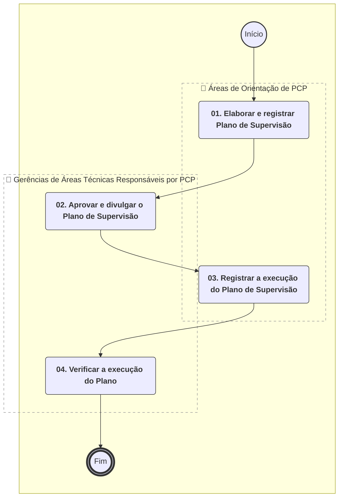

```mermaid
%%{init: {'theme': 'default'}}%%

flowchart TD
    classDef inicio stroke:#333,stroke-width:2px;
    classDef fim stroke:#333,stroke-width:4px;
    classDef tarefaBPMN stroke:#333,stroke-width:1px;
    classDef gatewayBPMN fill:#ececec,stroke:#333,stroke-width:1px;
    classDef raia fill:none,stroke:#999,stroke-width:1px,stroke-dasharray: 5 5;
    subgraph Container_ID_MPR_SAR_442_R01_2 [ ]
        direction TB
        ID_MPR_SAR_442_R01_2_Start((Início)):::inicio
        ID_MPR_SAR_442_R01_2_End(((Fim))):::fim
        subgraph Raia_ID_MPR_SAR_442_R01_2_1 [👤 Áreas de Orientação de PCP]
            ID_MPR_SAR_442_R01_2_01("<b>01. Preparar Treinamento de PCP</b>"):::tarefaBPMN
            ID_MPR_SAR_442_R01_2_02("<b>02. Conduzir Treinamento de PCP</b>"):::tarefaBPMN
            ID_MPR_SAR_442_R01_2_03("<b>03. Registrar atividade de treinamento de PCP</b>"):::tarefaBPMN
            ID_MPR_SAR_442_R01_2_01("<b>01. Elaborar e registrar Plano de Supervisão</b>"):::tarefaBPMN
            ID_MPR_SAR_442_R01_2_03("<b>03. Registrar a execução do Plano de Supervisão</b>"):::tarefaBPMN
        end
        class Raia_ID_MPR_SAR_442_R01_2_1 raia;
        subgraph Raia_ID_MPR_SAR_442_R01_2_2 [👤 Gerências de Áreas Técnicas Responsáveis por PCP]
            ID_MPR_SAR_442_R01_2_02("<b>02. Aprovar e divulgar o Plano de Supervisão</b>"):::tarefaBPMN
            ID_MPR_SAR_442_R01_2_04("<b>04. Verificar a execução do Plano</b>"):::tarefaBPMN
        end
        class Raia_ID_MPR_SAR_442_R01_2_2 raia;
        ID_MPR_SAR_442_R01_2_Start --> ID_MPR_SAR_442_R01_2_01
        ID_MPR_SAR_442_R01_2_01 --> ID_MPR_SAR_442_R01_2_02
        ID_MPR_SAR_442_R01_2_02 --> ID_MPR_SAR_442_R01_2_03
        ID_MPR_SAR_442_R01_2_03 --> ID_MPR_SAR_442_R01_2_End
        ID_MPR_SAR_442_R01_2_01 --> ID_MPR_SAR_442_R01_2_02
        ID_MPR_SAR_442_R01_2_02 --> ID_MPR_SAR_442_R01_2_03
        ID_MPR_SAR_442_R01_2_03 --> ID_MPR_SAR_442_R01_2_04
        ID_MPR_SAR_442_R01_2_04 --> ID_MPR_SAR_442_R01_2_End
    end
    click ID_MPR_SAR_442_R01_2_01 href "#" "A área técnica responsável deve designar um especialista como Coordenador Técnico do evento de capacitação, que ficará responsável por esta atividade.  A preparação do treinamento de PCP envolve as seguintes etapas:  1. Levantamento junto aos envolvidos (PCP, orientadores, especialistas etc.) de tópicos a serem discutidos: comunicar com as partes interessadas com antecedência suficiente para selecionar os tópicos a serem abordados.  2. Definição dos facilitadores e tempo estimado para cada tópico: uma vez definidos os tópicos, definir os facilitadores, bem como o tempo estimado.  3. Definição de data(s), período(s) e duração do treinamento: organizar uma agenda definindo detalhes como datas, sequência de tópicos, intervalos etc.  4. Definição dos participantes, meios, recursos e formato: definir lista de participantes, os recursos necessários para viabilizar o treinamento e formato (remoto, híbrido ou presencial, para os dois últimos é necessário definir também um local).  5. Elaboração de projeto básico e divulgação do evento (preferencialmente com coordenação das áreas de treinamento da ANAC): com as informações acima, o coordenador pode abrir um processo de execução de evento de capacitação e formalizar um Projeto Básico - Evento de Capacitação para realização do treinamento registrado no Portal de Capacitação da ANAC. Alternativamente, o coordenador pode abrir um processo no SEI! para incluir estas informações."
    click ID_MPR_SAR_442_R01_2_02 href "#" "A condução dos treinamentos fica a cargo da área técnica responsável por meio dos orientadores de PCP envolvidos, sendo que no caso de haver mais de um orientador de PCP para um mesmo treinamento, deve-se definir um Coordenador ANAC responsável pelo treinamento.  Envolve a organização durante o evento, realizar a abertura/encerramento, controlar a frequência dos participantes, mediar discussões quando necessário, controlar o tempo, registrar questionamentos ou temas a serem discutidos em treinamentos futuros etc."
    click ID_MPR_SAR_442_R01_2_03 href "#" "Caso o treinamento seja registrado no portal de capacitação da ANAC, o que é fortemente recomendável, os registros de frequência, os registros de feedback de participantes, certificados de participação etc. serão registrados, emitidos e armazenados pela área de capacitação da ANAC, possibilitando a consulta futura.  Caso não, todos os registros devem ser digitalizados e salvos em processo específico criado para o evento no SEI, com controle feito pelo coordenador responsável de modo a permitir a rastreabilidade.  A atividade deve ser registrada conforme orientações do Guia de Supervisão de PCP (ITD-442-02).  O Coordenador Técnico do Treinamento deve registrar também as ações definidas no evento, temas para eventos futuros e outros pontos relevantes levantados durante o evento."
    click ID_MPR_SAR_442_R01_2_01 href "#" "Na elaboração e definição do plano os seguintes dados devem ser coletados e organizados para a seleção da quantidade mínima de atividades de supervisão de PCP e seus critérios de priorização, além dos treinamentos recomendados para cada área:  - Os resultados da supervisão dos PCP do ciclo anterior ao da execução do plano;  - Treinamentos executados nos anos anteriores (workshops ou treinamento inicial, por exemplo);  - Indicadores de qualidade do trabalho produzidos pelos PCP;  - Outros, conforme aplicável.  Os responsáveis pela execução deverão confeccionar e registrar o plano de acordo com o Guia para Supervisão de PCP (ITD-442-02). Os dados coletados deverão servir de base para a elaboração do Plano de Supervisão de PCP (ITD-442-02).  O registro do plano elaborado deve ser feito por processo no SEI, aplicando os critérios estabelecidos no Guia para Supervisão de PCP.  NOTA 1: As atividades de condução de renovação do Credenciamento de PCP prevista para o ciclo, embora possam ser usadas para supervisão de PCP, não são listadas no Plano de Supervisão.  NOTA 2: A atividade é realizada por todos os orientadores de PCP, dentro das Coordenadorias da SAR com atribuição para orientar PCP, e organizada pelo coordenador."
    click ID_MPR_SAR_442_R01_2_02 href "#" "O plano registrado deve ser emitido de acordo com o Guia para Supervisão de PCP.  O plano deve ser assinado pelos respectivo(s) Coordenador(es) e Gerente Técnico.  Cada gerência responsável pelo plano deverá divulgar o referido plano, conforme orientação prevista no Guia para Supervisão de PCP (ITD-442-02)."
    click ID_MPR_SAR_442_R01_2_03 href "#" "As áreas responsáveis pela orientação de PCP devem registrar as atividades de supervisão executadas ao longo do ciclo definido no Plano de Supervisão.  Devem ser registrados os treinamentos realizados, monitoramentos realizados, eventuais desvios ao Plano, dentre outras informações conforme detalhadas na ITD-442-02."
    click ID_MPR_SAR_442_R01_2_04 href "#" "O processo do Plano de Supervisão referente a determinado ciclo se encerra com a verificação do Registro da Execução do Plano, preferencialmente em documento denominado “Sumário (ou algo equivalente) de Execução do Plano de Supervisão de PCP - <SIGLA DA GERÊNCIA TÉCNICA> - <CICLO>”, criado nas Gerências Técnicas, a ser salvo no SEI, no processo do Plano de Supervisão correspondente.  Cada registro deve conter informações sobre os treinamentos realizados, os monitoramentos e seus respectivos Índices de Qualidade do Trabalho dos PCP, além de eventuais desvios ao Plano devidamente justificados.  Para registro da conclusão satisfatória do ciclo de supervisão, os registros devem ser assinados pelos respectivos Coordenadores e Gerentes.  NOTA: Detalhes sobre a realização da atividade podem ser encontrados no Guia para Supervisão de PCP (ITD-442-02)."
```

```mermaid
%%{init: {'theme': 'default'}}%%

flowchart TD
    classDef inicio stroke:#333,stroke-width:2px;
    classDef fim stroke:#333,stroke-width:4px;
    classDef tarefaBPMN stroke:#333,stroke-width:1px;
    classDef gatewayBPMN fill:#ececec,stroke:#333,stroke-width:1px;
    classDef raia fill:none,stroke:#999,stroke-width:1px,stroke-dasharray: 5 5;
    subgraph Container_ID_MPR_SAR_442_R01_1 [ ]
        direction TB
        ID_MPR_SAR_442_R01_1_Start((Início)):::inicio
        ID_MPR_SAR_442_R01_1_End(((Fim))):::fim
        subgraph Raia_ID_MPR_SAR_442_R01_1_1 [👤 Áreas de Orientação de PCP]
            ID_MPR_SAR_442_R01_1_01("<b>01. Conduzir e registrar monitoramento das atividades desempenhadas por PCP</b>"):::tarefaBPMN
            ID_MPR_SAR_442_R01_1_02("<b>02. Elaborar e registrar PAC</b>"):::tarefaBPMN
            ID_MPR_SAR_442_R01_1_03("<b>03. Registrar e o avaliar o resultado do PAC</b>"):::tarefaBPMN
            ID_MPR_SAR_442_R01_1_01("<b>01. Preparar Treinamento de PCP</b>"):::tarefaBPMN
            ID_MPR_SAR_442_R01_1_02("<b>02. Conduzir Treinamento de PCP</b>"):::tarefaBPMN
            ID_MPR_SAR_442_R01_1_03("<b>03. Registrar atividade de treinamento de PCP</b>"):::tarefaBPMN
            ID_MPR_SAR_442_R01_1_01("<b>01. Elaborar e registrar Plano de Supervisão</b>"):::tarefaBPMN
            ID_MPR_SAR_442_R01_1_03("<b>03. Registrar a execução do Plano de Supervisão</b>"):::tarefaBPMN
        end
        class Raia_ID_MPR_SAR_442_R01_1_1 raia;
        subgraph Raia_ID_MPR_SAR_442_R01_1_2 [👤 Gerências de Áreas Técnicas Responsáveis por PCP]
            ID_MPR_SAR_442_R01_1_04("<b>04. Iniciar processo para cancelar o credenciamento</b>"):::tarefaBPMN
            ID_MPR_SAR_442_R01_1_02("<b>02. Aprovar e divulgar o Plano de Supervisão</b>"):::tarefaBPMN
            ID_MPR_SAR_442_R01_1_04("<b>04. Verificar a execução do Plano</b>"):::tarefaBPMN
        end
        class Raia_ID_MPR_SAR_442_R01_1_2 raia;
        ID_MPR_SAR_442_R01_1_Start --> ID_MPR_SAR_442_R01_1_01
        gw_ID_MPR_SAR_442_R01_1_01{"O Índice de Qualidade do Trabalho do PCP foi Insatisfatório?"}:::gatewayBPMN
        ID_MPR_SAR_442_R01_1_01 --> gw_ID_MPR_SAR_442_R01_1_01
        gw_ID_MPR_SAR_442_R01_1_01 -->|"não, não foi insatisfatório"| ID_MPR_SAR_442_R01_1_End
        gw_ID_MPR_SAR_442_R01_1_01 -->|"sim, foi insatisfatório"| ID_MPR_SAR_442_R01_1_02
        ID_MPR_SAR_442_R01_1_02 --> ID_MPR_SAR_442_R01_1_03
        gw_ID_MPR_SAR_442_R01_1_03{"O PCP cumpriu com o PAC?"}:::gatewayBPMN
        ID_MPR_SAR_442_R01_1_03 --> gw_ID_MPR_SAR_442_R01_1_03
        gw_ID_MPR_SAR_442_R01_1_03 -->|"sim"| ID_MPR_SAR_442_R01_1_End
        gw_ID_MPR_SAR_442_R01_1_03 -->|"não"| ID_MPR_SAR_442_R01_1_04
        ID_MPR_SAR_442_R01_1_04 --> ID_MPR_SAR_442_R01_1_End
        ID_MPR_SAR_442_R01_1_01 --> ID_MPR_SAR_442_R01_1_02
        ID_MPR_SAR_442_R01_1_02 --> ID_MPR_SAR_442_R01_1_03
        ID_MPR_SAR_442_R01_1_03 --> ID_MPR_SAR_442_R01_1_End
        ID_MPR_SAR_442_R01_1_01 --> ID_MPR_SAR_442_R01_1_02
        ID_MPR_SAR_442_R01_1_02 --> ID_MPR_SAR_442_R01_1_03
        ID_MPR_SAR_442_R01_1_03 --> ID_MPR_SAR_442_R01_1_04
        ID_MPR_SAR_442_R01_1_04 --> ID_MPR_SAR_442_R01_1_End
    end
    click ID_MPR_SAR_442_R01_1_01 href "#" "CONDUZIR MONITORAMENTO:  O orientador é responsável por avaliar laudos, pareceres ou relatórios emitidos por PCP sob sua orientação, conforme os critérios de priorização de monitoramento definidos no Plano de Supervisão de PCP vigente. O objetivo é avaliar o desempenho do PCP no atendimento aos Padrões Estabelecidos pela ANAC.  O orientador deverá seguir as instruções detalhadas no Guia para Supervisão de PCP (ITD-442-02) ao conduzir o monitoramento das atividades de PCP.  A interpretação de requisitos e a definição dos meios de cumprimento aceitáveis são atividades exclusivas da ANAC. Espera-se que o PCP que possuir dúvidas nesses pontos procure a orientação da ANAC.  O orientador pode, a seu critério, analisar os artefatos de demonstração de cumprimento com requisitos referenciados no parecer do PCP, para obter informações complementares, com a finalidade de atestar que o parecer foi adequado.  Caso o orientador encontre um não cumprimento ou potencial não cumprimento de requisito deverá informar ao responsável pelo programa de certificação para as devidas providências.  REGISTRAR MONITORAMENTO:  O orientador deverá registrar o resultado de sua avaliação de laudos, pareceres ou relatórios, conforme o Formulário de Registro da Atividade de Monitoramento do PCP, identificando se o trabalho executado pelo PCP foi satisfatório ou não.  Esta atividade de registro também deverá resultar na atualização do indicador de qualidade dos trabalhos realizados pelo PCP.  O orientador deverá utilizar as instruções do Guia para Supervisão de PCP (ITD-442-02) para execução desta etapa."
    click ID_MPR_SAR_442_R01_1_02 href "#" "Quando o orientador identificar, em seu registro de avaliação de laudos, pareceres ou relatórios emitidos por PCP via Formulário de Registro da Atividade de Monitoramento do PCP (ITD-442-02), que o Índice de Qualidade do Trabalho do PCP é Insatisfatório, um Plano de Ações Corretivas (PAC) deverá ser elaborado, utilizando o Formulário do Plano de Ações Corretivas (PAC) para Monitoramento do Profissional Credenciamento em Projeto (PCP). O objetivo é corrigir os desvios de qualidade e desempenho do PCP encontrados.  O PAC deve incluir a identificação dos itens da Lista de Verificação (ITD-442-02) que não foram atendidos, o prazo para conclusão das ações corretivas e, quando possível, a identificação da causa raiz.  O orientador é responsável por definir a ação mais adequada ao desvio encontrado no trabalho do PCP. As ações corretivas visando atender o objetivo pretendido estão descritas na Guia para Supervisão de PCP (ITD-442-02).  O plano de ações corretivas deverá ser registrado no SEI dentro do processo que contém o dossiê de credenciamento do PCP e disponibilizado ao PCP. O PCP terá ciência das deficiências identificadas e as ações corretivas requeridas para que um índice satisfatório de qualidade nas atividades desempenhadas pelo PCP seja alcançado.  NOTA: após o período definido no plano, se o orientador ainda identificar deficiências, ficará a seu critério estender os prazos desse plano, informando o PCP adequadamente sobre o não atendimento ao plano."
    click ID_MPR_SAR_442_R01_1_03 href "#" "O orientador deverá registrar o atendimento ao plano de ações corretivas (PAC) através do Formulário do Plano de Ações Corretivas (PAC) para Monitoramento do PCP (ITD-442-02), incluindo no campo “comentários” todas as informações relevantes sobre as atividades realizadas pelo PCP para cumprimento com o plano. Com base nesta avaliação, o orientador deve determinar se o atendimento ao PAC foi satisfatório ou não.  O registro deve ser realizado no SEI dentro do processo que contém o dossiê de credenciamento do PCP e disponibilizado ao PCP. O orientador deverá utilizar as instruções do Guia para Supervisão de PCP (ITD-442-02) para execução desta etapa."
    click ID_MPR_SAR_442_R01_1_04 href "#" "Quando houver deficiência no desempenho do PCP, o plano de ações corretivas não for cumprido pelo PCP e a avaliação do orientador concluir que não é adequado estender os prazos definidos no plano, deve-se iniciar o processo para cancelamento do credenciamento, fundamentado nos Formulários de Registros da Atividade de Monitoramento do PCP (ITD-442-02).  Deve ser considerado o parecer do Orientador do PCP, localizado no Formulário do Plano de Ações Corretivas (PAC) para Monitoramento do Profissional Credenciamento em Projeto (PCP) (ITD-442-02), como subsídio para a tomada de decisão do Gerente, a depender de qual escopo de credenciamento é afetado pelos desvios ou causas-raiz não sanadas e do motivo verificado para não cumprimento do PAC.  NOTA 1: essa etapa é considerada como parte do evento de início “Necessidade de descredenciar' contido no Processo de Trabalho “Conduzir Cancelamento de Credenciamento de Pessoa Física na SAR” do MPR-441 “CREDENCIAMENTO DE PESSOAS FÍSICAS NA SAR”.  NOTA 2: essa etapa também representa um procedimento, não necessariamente o único, para o cancelamento do credenciamento pelas causas previstas para cancelamento de credenciamentos da IS 183-002."
    click ID_MPR_SAR_442_R01_1_01 href "#" "A área técnica responsável deve designar um especialista como Coordenador Técnico do evento de capacitação, que ficará responsável por esta atividade.  A preparação do treinamento de PCP envolve as seguintes etapas:  1. Levantamento junto aos envolvidos (PCP, orientadores, especialistas etc.) de tópicos a serem discutidos: comunicar com as partes interessadas com antecedência suficiente para selecionar os tópicos a serem abordados.  2. Definição dos facilitadores e tempo estimado para cada tópico: uma vez definidos os tópicos, definir os facilitadores, bem como o tempo estimado.  3. Definição de data(s), período(s) e duração do treinamento: organizar uma agenda definindo detalhes como datas, sequência de tópicos, intervalos etc.  4. Definição dos participantes, meios, recursos e formato: definir lista de participantes, os recursos necessários para viabilizar o treinamento e formato (remoto, híbrido ou presencial, para os dois últimos é necessário definir também um local).  5. Elaboração de projeto básico e divulgação do evento (preferencialmente com coordenação das áreas de treinamento da ANAC): com as informações acima, o coordenador pode abrir um processo de execução de evento de capacitação e formalizar um Projeto Básico - Evento de Capacitação para realização do treinamento registrado no Portal de Capacitação da ANAC. Alternativamente, o coordenador pode abrir um processo no SEI! para incluir estas informações."
    click ID_MPR_SAR_442_R01_1_02 href "#" "A condução dos treinamentos fica a cargo da área técnica responsável por meio dos orientadores de PCP envolvidos, sendo que no caso de haver mais de um orientador de PCP para um mesmo treinamento, deve-se definir um Coordenador ANAC responsável pelo treinamento.  Envolve a organização durante o evento, realizar a abertura/encerramento, controlar a frequência dos participantes, mediar discussões quando necessário, controlar o tempo, registrar questionamentos ou temas a serem discutidos em treinamentos futuros etc."
    click ID_MPR_SAR_442_R01_1_03 href "#" "Caso o treinamento seja registrado no portal de capacitação da ANAC, o que é fortemente recomendável, os registros de frequência, os registros de feedback de participantes, certificados de participação etc. serão registrados, emitidos e armazenados pela área de capacitação da ANAC, possibilitando a consulta futura.  Caso não, todos os registros devem ser digitalizados e salvos em processo específico criado para o evento no SEI, com controle feito pelo coordenador responsável de modo a permitir a rastreabilidade.  A atividade deve ser registrada conforme orientações do Guia de Supervisão de PCP (ITD-442-02).  O Coordenador Técnico do Treinamento deve registrar também as ações definidas no evento, temas para eventos futuros e outros pontos relevantes levantados durante o evento."
    click ID_MPR_SAR_442_R01_1_01 href "#" "Na elaboração e definição do plano os seguintes dados devem ser coletados e organizados para a seleção da quantidade mínima de atividades de supervisão de PCP e seus critérios de priorização, além dos treinamentos recomendados para cada área:  - Os resultados da supervisão dos PCP do ciclo anterior ao da execução do plano;  - Treinamentos executados nos anos anteriores (workshops ou treinamento inicial, por exemplo);  - Indicadores de qualidade do trabalho produzidos pelos PCP;  - Outros, conforme aplicável.  Os responsáveis pela execução deverão confeccionar e registrar o plano de acordo com o Guia para Supervisão de PCP (ITD-442-02). Os dados coletados deverão servir de base para a elaboração do Plano de Supervisão de PCP (ITD-442-02).  O registro do plano elaborado deve ser feito por processo no SEI, aplicando os critérios estabelecidos no Guia para Supervisão de PCP.  NOTA 1: As atividades de condução de renovação do Credenciamento de PCP prevista para o ciclo, embora possam ser usadas para supervisão de PCP, não são listadas no Plano de Supervisão.  NOTA 2: A atividade é realizada por todos os orientadores de PCP, dentro das Coordenadorias da SAR com atribuição para orientar PCP, e organizada pelo coordenador."
    click ID_MPR_SAR_442_R01_1_02 href "#" "O plano registrado deve ser emitido de acordo com o Guia para Supervisão de PCP.  O plano deve ser assinado pelos respectivo(s) Coordenador(es) e Gerente Técnico.  Cada gerência responsável pelo plano deverá divulgar o referido plano, conforme orientação prevista no Guia para Supervisão de PCP (ITD-442-02)."
    click ID_MPR_SAR_442_R01_1_03 href "#" "As áreas responsáveis pela orientação de PCP devem registrar as atividades de supervisão executadas ao longo do ciclo definido no Plano de Supervisão.  Devem ser registrados os treinamentos realizados, monitoramentos realizados, eventuais desvios ao Plano, dentre outras informações conforme detalhadas na ITD-442-02."
    click ID_MPR_SAR_442_R01_1_04 href "#" "O processo do Plano de Supervisão referente a determinado ciclo se encerra com a verificação do Registro da Execução do Plano, preferencialmente em documento denominado “Sumário (ou algo equivalente) de Execução do Plano de Supervisão de PCP - <SIGLA DA GERÊNCIA TÉCNICA> - <CICLO>”, criado nas Gerências Técnicas, a ser salvo no SEI, no processo do Plano de Supervisão correspondente.  Cada registro deve conter informações sobre os treinamentos realizados, os monitoramentos e seus respectivos Índices de Qualidade do Trabalho dos PCP, além de eventuais desvios ao Plano devidamente justificados.  Para registro da conclusão satisfatória do ciclo de supervisão, os registros devem ser assinados pelos respectivos Coordenadores e Gerentes.  NOTA: Detalhes sobre a realização da atividade podem ser encontrados no Guia para Supervisão de PCP (ITD-442-02)."
```

**MANUAL DE PROCEDIMENTO**

**MPR/SAR-442-R01**

**SUPERVISÃO DE PROFISSIONAL CREDENCIADO - PCP, PCF E PCA**

07/2024

**REVISÕES**

|  |  |  |  |  |
| --- | --- | --- | --- | --- |
| **Revisão** | **Aprovação** | **Publicação** | **Aprovado Por** | **Modificações da Última Versão** |
| R00 | Portaria 9556/2022 | 21/10/2022 | SAR | Versão Original |
| R01 | Portaria 14903/2024 | 05/07/2024 | SAR | 1) Processo 'Gerir Plano de Supervisão de PCP' inserido.  2) Processo 'Realizar Treinamento de PCP' inserido.  3) Processo 'Conduzir Monitoramento de Atividades Desempenhadas por PCP' inserido. |

**ÍNDICE**

1) Disposições Preliminares, pág. 5.

1.1) Introdução, pág. 5.

1.2) Revogação, pág. 5.

1.3) Fundamentação, pág. 5.

1.4) Executores dos Processos, pág. 5.

1.5) Elaboração e Revisão, pág. 6.

1.6) Organização do Documento, pág. 6.

2) Definições, pág. 8.

2.1) Sigla, pág. 8.

3) Artefatos, Competências, Sistemas e Documentos Administrativos, pág. 9.

3.1) Artefatos, pág. 9.

3.2) Competências, pág. 10.

3.3) Sistemas, pág. 10.

3.4) Documentos e Processos Administrativos, pág. 10.

4) Procedimentos Referenciados, pág. 11.

5) Procedimentos, pág. 12.

5.1) Supervisionar PCF e PCA no Âmbito da GTCO, pág. 12.

5.2) Conduzir Monitoramento de Atividades Desempenhadas por PCP, pág. 17.

5.3) Realizar Treinamento de PCP, pág. 22.

5.4) Gerir Plano de Supervisão de PCP, pág. 26.

6) Disposições Finais, pág. 30.

**PARTICIPAÇÃO NA EXECUÇÃO DOS PROCESSOS**

**ÁREAS ORGANIZACIONAIS**

**1) Coordenadoria de Inspeção**

a) Supervisionar PCF e PCA no Âmbito da GTCO

**GRUPOS ORGANIZACIONAIS**

**a) Áreas de Orientação de PCP**

1) Conduzir Monitoramento de Atividades Desempenhadas por PCP

2) Gerir Plano de Supervisão de PCP

3) Realizar Treinamento de PCP

**b) Gerências de Áreas Técnicas Responsáveis por PCP**

1) Conduzir Monitoramento de Atividades Desempenhadas por PCP

2) Gerir Plano de Supervisão de PCP

**1. DISPOSIÇÕES PRELIMINARES**

**1.1 INTRODUÇÃO**

Orienta sobre a supervisão de Profissionais Credenciados na Superintendência de Aeronavegabilidade, incluindo Profissional Credenciado em Projeto (PCP), Profissional Credenciado em Fabricação (PCF) e Profissional Credenciado em Aeronavegabilidade para Exportação (PCA). Processos 00066.002561/2022-01 e 00058.033198/2022-66.

O MPR estabelece, no âmbito da Superintendência de Aeronavegabilidade - SAR, os seguintes processos de trabalho:

a) Supervisionar PCF e PCA no Âmbito da GTCO.

b) Conduzir Monitoramento de Atividades Desempenhadas por PCP.

c) Realizar Treinamento de PCP.

d) Gerir Plano de Supervisão de PCP.

**1.2 REVOGAÇÃO**

MPR/SAR-442-R00, aprovado na data de 20 de outubro de 2022.

**1.3 FUNDAMENTAÇÃO**

Resolução nº 381, de 14 de junho de 2016, art. 31 e alterações posteriores.

**1.4 EXECUTORES DOS PROCESSOS**

Os procedimentos contidos neste documento aplicam-se aos servidores integrantes das seguintes áreas organizacionais:

|  |  |
| --- | --- |
| **Área Organizacional** | **Descrição** |
| Coordenadoria de Inspeção - CCIP | Coordenar a execução de inspeção de conformidade de processo, de produto, de espécime de ensaio e de instalação associada durante o processo de certificação de projeto ou modificações ao projeto de tipo aprovado. |

|  |  |
| --- | --- |
| **Grupo Organizacional** | **Descrição** |
| SAR - PCP - Orientadores | Coordenadorias da SAR que realizam orientação de PCP (CCST/GTPR; CEMP/GTEN; CESS/GTEN; CEEI/GTEN; CEVIS/GTEV). |
| SAR - PCP - Gerentes das Áreas Técnicas | Gerentes da Áreas Técnicas da SAR (GTPR; GTEN; GTEV) que realizam atividades com a utilização de PCP. |

**1.5 ELABORAÇÃO E REVISÃO**

O processo que resulta na aprovação ou alteração deste MPR é de responsabilidade da Superintendência de Aeronavegabilidade - SAR. Em caso de sugestões de revisão, deve-se procurá-la para que sejam iniciadas as providências cabíveis.

As revisões deste MPR serão aprovadas pelo(s) titular(es) da(s) unidade(s) responsável(is) pela execução do(s) processo(s) nele listado(s).

**1.6 ORGANIZAÇÃO DO DOCUMENTO**

O capítulo 2 apresenta as principais definições utilizadas no âmbito deste MPR, e deve ser visto integralmente antes da leitura de capítulos posteriores.

O capítulo 3 apresenta as competências, os artefatos e os sistemas envolvidos na execução dos processos deste manual, em ordem relativamente cronológica.

O capítulo 4 apresenta os processos de trabalho referenciados neste MPR. Estes processos são publicados em outros manuais que não este, mas cuja leitura é essencial para o entendimento dos processos publicados neste manual. O capítulo 4 expõe em quais manuais são localizados cada um dos processos de trabalho referenciados.

O capítulo 5 apresenta os processos de trabalho. Para encontrar um processo específico, deve-se procurar sua respectiva página no índice contido no início do documento. Os processos estão ordenados em etapas. Cada etapa é contida em uma tabela, que possui em si todas as informações necessárias para sua realização. São elas, respectivamente:

a) o título da etapa;

b) a descrição da forma de execução da etapa;

c) as competências necessárias para a execução da etapa;

d) os artefatos necessários para a execução da etapa;

e) os sistemas necessários para a execução da etapa (incluindo, bases de dados em forma de arquivo, se existente);

f) os documentos e processos administrativos que precisam ser elaborados durante a execução da etapa;

g) instruções para as próximas etapas; e

h) as áreas ou grupos organizacionais responsáveis por executar a etapa.

O capítulo 6 apresenta as disposições finais do documento, que trata das ações a serem realizadas em casos não previstos.

Por último, é importante comunicar que este documento foi gerado automaticamente. São recuperados dados sobre as etapas e sua sequência, as definições, os grupos, as áreas organizacionais, os artefatos, as competências, os sistemas, entre outros, para os processos de trabalho aqui apresentados, de forma que alguma mecanicidade na apresentação das informações pode ser percebida. O documento sempre apresenta as informações mais atualizadas de nomes e siglas de grupos, áreas, artefatos, termos, sistemas e suas definições, conforme informação disponível na base de dados, independente da data de assinatura do documento. Informações sobre etapas, seu detalhamento, a sequência entre etapas, responsáveis pelas etapas, artefatos, competências e sistemas associados a etapas, assim como seus nomes e os nomes de seus processos têm suas definições idênticas à da data de assinatura do documento.

**2. DEFINIÇÕES**

A tabela abaixo apresenta as definições necessárias para o entendimento deste Manual de Procedimento.

**2.1 Sigla**

|  |  |
| --- | --- |
| **Definição** | **Significado** |
| CCIP | Coordenadoria de inspeção |
| GTCO | Gerência Técnica de Certificação de Organizações e Inspeção |
| IS | Instrução Suplementar |
| ITD | Instrução de Trabalho Detalhada |
| PAC | Plano de Ações Corretivas - é o plano de ações do regulado, com seus respectivos prazos de implementação, visando sanar as não conformidades registradas em auditorias ou inspeções. |
| PCA | Profissional Credenciado em Aeronavegabilidade |
| PCF | Profissional Credenciado em Fabricação |
| PCP | Profissional Credenciado em Projeto |

**3. ARTEFATOS, COMPETÊNCIAS, SISTEMAS E DOCUMENTOS ADMINISTRATIVOS**

Abaixo se encontram as listas dos artefatos, competências, sistemas e documentos administrativos que o executor necessita consultar, preencher, analisar ou elaborar para executar os processos deste MPR. As etapas descritas no capítulo seguinte indicam onde usar cada um deles.

As competências devem ser adquiridas por meio de capacitação ou outros instrumentos e os artefatos se encontram no módulo "Artefatos" do sistema GFT - Gerenciador de Fluxos de Trabalho.

**3.1 ARTEFATOS**

|  |  |
| --- | --- |
| **Nome** | **Descrição** |
| F-442-01 - Check List para Monitoramento da Atividade de PCF e PCA | Formulário utilizado pelo servidor locado na GTCO na atividade de monitoramento do Profissional Credenciado. |
| ITD-441-03 | Este documento detalha atividades do processo “Atestar Capacidade Avaliada para Candidato a Credenciamento na SAR” e do processo “Conduzir Renovação do Credenciamento de Pessoa Física na SAR” contido no MPR/SAR-441 intitulado “Credenciamento de Pessoas Físicas na SAR”.  Esta ITD pretende relacionar as particularidades e critérios a serem adotados pelos analistas da GTAI, em relação ao credenciamento, renovação e descredenciamento de profissionais credenciados em aeronavegabilidade do grupo D. |
| ITD-442-01 - Supervisão de Profissionais Credenciados no Âmbito da GTCO | Instrução de Trabalho Detalhada, em complemento ao Processo de Trabalho, para monitorar PCF e PCA-E.  SEI 00066.002561/2022-01. |
| ITD-442-02 | O Guia para Supervisão de Profissional Credenciado em Projeto (PCP) fornece informações para gerir o Plano de Supervisão a ser adotado e detalha as atividades associadas aos seguintes processos contidos no MPR/SAR-442, intitulado “SUPERVISÃO DE PROFISSIONAL CREDENCIADO EM PROJETO (PCP)”. |
| Projeto Básico - Evento de Capacitação | Formulário de Projeto Básico para Eventos de Capacitação a serem realizados com público externo. |

**3.2 COMPETÊNCIAS**

Para que os processos de trabalho contidos neste MPR possam ser realizados com qualidade e efetividade, é importante que as pessoas que venham a executá-los possuam um determinado conjunto de competências. No capítulo 5, as competências específicas que o executor de cada etapa de cada processo de trabalho deve possuir são apresentadas. A seguir, encontra-se uma lista geral das competências contidas em todos os processos de trabalho deste MPR e a indicação de qual área ou grupo organizacional as necessitam:

Não há competências descritas para a realização deste MPR.

**3.3 SISTEMAS**

|  |  |  |
| --- | --- | --- |
| **Nome** | **Descrição** | **Acesso** |
| Moodle | Plataforma educacional da ANAC | https://sistemas.anac.gov.br/capacitacao |
| SEI | Sistema Eletrônico de Informação. | https://sei.anac.gov.br/sip/login.php?sigla\_orgao\_sistema=ANAC&sigla\_sistema=SEI |

**3.4 DOCUMENTOS E PROCESSOS ADMINISTRATIVOS ELABORADOS NESTE MANUAL**

Não há documentos ou processos administrativos a serem elaborados neste MPR.

**4. PROCEDIMENTOS REFERENCIADOS**

Procedimentos referenciados são processos de trabalho publicados em outro MPR que têm relação com os processos de trabalho publicados por este manual. Este MPR não possui nenhum processo de trabalho referenciado.

**5. PROCEDIMENTOS**

Este capítulo apresenta todos os processos de trabalho deste MPR. Para encontrar um processo específico, utilize o índice nas páginas iniciais deste documento. Ao final de cada etapa encontram-se descritas as orientações necessárias à continuidade da execução do processo. O presente MPR também está disponível de forma mais conveniente em versão eletrônica, onde pode(m) ser obtido(s) o(s) artefato(s) e outras informações sobre o processo.

**5.1 Supervisionar PCF e PCA no Âmbito da GTCO**

Versão original.

O processo contém, ao todo, 6 etapas. A situação que inicia o processo, chamada de evento de início, foi descrita como: "Necessidade de serviço de PC identificada", portanto, este processo deve ser executado sempre que este evento acontecer. Da mesma forma, o processo é considerado concluído quando alcança seu evento de fim. O evento de fim descrito para esse processo é: "PC supervisionado.

A área envolvida na execução deste processo é a CCIP.

Para que esse procedimento seja executado de forma apropriada, o executor irá necessitar dos seguintes artefatos: "ITD-442-01 - Supervisão de Profissionais Credenciados no Âmbito da GTCO", "ITD-441-03", "F-442-01 - Check List para Monitoramento da Atividade de PCF e PCA".

Abaixo se encontra(m) a(s) etapa(s) a ser(em) realizada(s) na execução deste processo e o diagrama do fluxo.


### 5.1 Supervisionar PCF e PCA no Âmbito da GTCO




|  |
| --- |
| **01. Analisar e autorizar a atividade do PC** |
| RESPONSÁVEL PELA EXECUÇÃO: CCIP. |
| DETALHAMENTO: Verificar se atividade solicitada é compatível com o escopo reconhecido do credenciamento do PC e se seu credenciamento está válido. A atribuição do PC para cada atividade solicitada segue conforme sugerido no andamento de cada processo, porém a sugestão pode não ser seguida caso o haja algum impedimento. A necessidade de monitoramento ocorre no período entre as renovações de seu credenciamento ou a cada dez inspeções por ele realizadas.  Nota 1: O escopo e a validade do credenciamento de cada PC podem ser consultados no sítio eletrônico da SAR (https://sistemas.anac.gov.br/certificacao/).  Nota 2: A definição de cada escopo de credenciamento encontra-se na IS 183-002.  Nota 3: Para as atividades de inspeção de conformidade a análise do escopo será feita na etapa 04 devido a característica da atividade de inspeção de conformidade. |
| CONTINUIDADE: caso a resposta para a pergunta "É necessário monitoramento?" seja "sim, monitoramento é necessário", deve-se seguir para a etapa "02. Monitorar a atividade do PC". Caso a resposta seja "não é necessário monitoramento", deve-se seguir para a etapa "03. Registrar resultado da atividade do PC". |

|  |
| --- |
| **02. Monitorar a atividade do PC** |
| RESPONSÁVEL PELA EXECUÇÃO: CCIP. |
| DETALHAMENTO: Analisar os trabalhos executados pelos Profissionais Credenciados quanto à sua precisão, quanto ao atendimento aos procedimentos, regulamentos, orientações e requisitos adotados pela ANAC e quanto ao uso de técnicas e métodos aceitáveis. Esta atividade e critério de frequência são descritas pela ITD-442-01 - Supervisão de Profissionais Credenciados no Âmbito da GTCO (item 8.1.1). Registrar o monitoramento no artefato específico F-442-01 - Check List para Monitoramento da Atividade de PCF e PCA.  Referência: IS 183-002 item 4.14. |
| ARTEFATOS USADOS NESTA ATIVIDADE: ITD-442-01 - Supervisão de Profissionais Credenciados no Âmbito da GTCO, F-442-01 - Check List para Monitoramento da Atividade de PCF e PCA. |
| CONTINUIDADE: deve-se seguir para a etapa "03. Registrar resultado da atividade do PC". |

|  |
| --- |
| **03. Registrar resultado da atividade do PC** |
| RESPONSÁVEL PELA EXECUÇÃO: CCIP. |
| DETALHAMENTO: Devem ser registrados arquivos relativos a resultado de vistorias que não cumpram com as exigências estabelecidas pela agência.  São exemplos de documentos que devem ser registrados:  - e-mails entre orientador e PC;  - Formulário F-442-01 - Check List para Monitoramento da Atividade de PCF e PCA.  Nota: O local de arquivamento está descrito na ITD-442-01 - Supervisão de Profissionais Credenciados no Âmbito da GTCO (item 8.1.3).  Referência: (IS 183-002 item 4.14). |
| ARTEFATOS USADOS NESTA ATIVIDADE: ITD-442-01 - Supervisão de Profissionais Credenciados no Âmbito da GTCO, F-442-01 - Check List para Monitoramento da Atividade de PCF e PCA. |
| CONTINUIDADE: deve-se seguir para a etapa "04. Avaliar o PC". |

|  |
| --- |
| **04. Avaliar o PC** |
| RESPONSÁVEL PELA EXECUÇÃO: CCIP. |
| DETALHAMENTO: Avaliar conforme critério descrito na ITD-442-01 - Supervisão de Profissionais Credenciados no Âmbito da GTCO (item 8.3).  Nota: Para as atividades de conformidade, nesta etapa é realizada a verificação do escopo da credencial do PC diante da atividade solicitada. |
| ARTEFATOS USADOS NESTA ATIVIDADE: ITD-441-03, ITD-442-01 - Supervisão de Profissionais Credenciados no Âmbito da GTCO. |
| CONTINUIDADE: caso a resposta para a pergunta "É necessária retroalimentação?" seja "não é necessária retroalimentação", esta etapa finaliza o procedimento. Caso a resposta seja "É necessário feedback", deve-se seguir para a etapa "06. Realizar feedback". Caso a resposta seja "É necessária ação corretiva", deve-se seguir para a etapa "05. Realizar ação corretiva". |

|  |
| --- |
| **05. Realizar ação corretiva** |
| RESPONSÁVEL PELA EXECUÇÃO: CCIP. |
| DETALHAMENTO: No caso de desempenho insatisfatório, a CCIP inicia uma ação corretiva apropriada. Se o desempenho do PC permanecer insatisfatório após concluída a ação corretiva, ou no caso de constatar ação do PC que resulte em risco inaceitável à segurança operacional, a ANAC poderá cancelar o Credenciamento.  Nota: A definição de ação corretiva está na ITD-442-01 - Supervisão de Profissionais Credenciados no Âmbito da GTCO (item 8.3).  Referência: (IS 183-002 item 5.3.6.2 (c) e 5.4.7.3 (c)). |
| ARTEFATOS USADOS NESTA ATIVIDADE: ITD-442-01 - Supervisão de Profissionais Credenciados no Âmbito da GTCO. |
| CONTINUIDADE: esta etapa finaliza o procedimento. |

|  |
| --- |
| **06. Realizar feedback** |
| RESPONSÁVEL PELA EXECUÇÃO: CCIP. |
| DETALHAMENTO: Informar o PC quanto ao resultado da avaliação do seu desempenho nos casos de monitoramento ou não atendimento aos procedimentos, regulamentos, orientações e requisitos adotados pela ANAC e quanto ao uso de técnicas e métodos aceitáveis.  Nota: O modo de registro do feedback está descrito na ITD-442-01 - Supervisão de Profissionais Credenciados no Âmbito da GTCO (item 6.2 e 8.2).  Referência: (IS 183-002 item 5.3.6.2 (b) e 5.4.7.3 (b)). |
| ARTEFATOS USADOS NESTA ATIVIDADE: ITD-442-01 - Supervisão de Profissionais Credenciados no Âmbito da GTCO. |
| CONTINUIDADE: esta etapa finaliza o procedimento. |

**5.2 Conduzir Monitoramento de Atividades Desempenhadas por PCP**

O PCP deve desempenhar suas atividades conforme os Padrões Estabelecidos pela ANAC, que consistem no conjunto de referências que devem ser seguidas pelos Profissionais Credenciados, tais como políticas, diretrizes, práticas, requisitos, especificações, processos, procedimentos e interpretações, aplicáveis às suas atividades. O PCP deve também manter-se constantemente atualizado em relação a eventuais alterações nesses padrões.

O orientador é o servidor da ANAC que atua como responsável primário pela orientação e Supervisão do Profissional Credenciado. O monitoramento é a porção das atividades de Supervisão que abrange a análise de trabalhos executados por Profissionais Credenciados como a emissão de laudos, pareceres ou relatórios, verificando clareza e precisão do parecer e se o trabalho foi executado conforme os Padrões Estabelecidos pela ANAC, alertando o Profissional Credenciado quanto ao não atendimento a estes padrões. Eventualmente, o monitoramento pode envolver o acompanhamento pelo orientador de atividades realizadas em campo pelo PCP (ex.: testemunhos de ensaio e inspeções). O resultado do monitoramento deverá refletir no indicador de qualidade do trabalho do PCP.

O plano de supervisão estabelece a quantidade de pareceres que cada orientador deve avaliar no período, assim como sua priorização. Portanto, o evento que inicia o processo de monitoramento é a execução deste plano.

O processo contém, ao todo, 4 etapas. A situação que inicia o processo, chamada de evento de início, foi descrita como: "Monitoramento Definido no Plano de Supervisão de PCP", portanto, este processo deve ser executado sempre que este evento acontecer. Da mesma forma, o processo é considerado concluído quando alcança seu evento de fim. O evento de fim descrito para esse processo é: "Fim do Monitoramento Definido no Plano de Supervisão de PCP.

Os grupos envolvidos na execução deste processo são: SAR - PCP - Gerentes das Áreas Técnicas, SAR - PCP - Orientadores.

Para que este processo seja executado de forma apropriada, o executor irá necessitar do seguinte artefato: "ITD-442-02".

Abaixo se encontra(m) a(s) etapa(s) a ser(em) realizada(s) na execução deste processo e o diagrama do fluxo.


### 5.1 Supervisionar PCF e PCA no Âmbito da GTCO




|  |
| --- |
| **01. Conduzir e registrar monitoramento das atividades desempenhadas por PCP** |
| RESPONSÁVEL PELA EXECUÇÃO: Áreas de Orientação de PCP. |
| DETALHAMENTO: CONDUZIR MONITORAMENTO:  O orientador é responsável por avaliar laudos, pareceres ou relatórios emitidos por PCP sob sua orientação, conforme os critérios de priorização de monitoramento definidos no Plano de Supervisão de PCP vigente. O objetivo é avaliar o desempenho do PCP no atendimento aos Padrões Estabelecidos pela ANAC.  O orientador deverá seguir as instruções detalhadas no Guia para Supervisão de PCP (ITD-442-02) ao conduzir o monitoramento das atividades de PCP.  A interpretação de requisitos e a definição dos meios de cumprimento aceitáveis são atividades exclusivas da ANAC. Espera-se que o PCP que possuir dúvidas nesses pontos procure a orientação da ANAC.  O orientador pode, a seu critério, analisar os artefatos de demonstração de cumprimento com requisitos referenciados no parecer do PCP, para obter informações complementares, com a finalidade de atestar que o parecer foi adequado.  Caso o orientador encontre um não cumprimento ou potencial não cumprimento de requisito deverá informar ao responsável pelo programa de certificação para as devidas providências.  REGISTRAR MONITORAMENTO:  O orientador deverá registrar o resultado de sua avaliação de laudos, pareceres ou relatórios, conforme o Formulário de Registro da Atividade de Monitoramento do PCP, identificando se o trabalho executado pelo PCP foi satisfatório ou não.  Esta atividade de registro também deverá resultar na atualização do indicador de qualidade dos trabalhos realizados pelo PCP.  O orientador deverá utilizar as instruções do Guia para Supervisão de PCP (ITD-442-02) para execução desta etapa. |
| ARTEFATOS USADOS NESTA ATIVIDADE: ITD-442-02. |
| SISTEMAS USADOS NESTA ATIVIDADE: SEI. |
| CONTINUIDADE: caso a resposta para a pergunta "O Índice de Qualidade do Trabalho do PCP foi Insatisfatório?" seja "não, não foi insatisfatório", esta etapa finaliza o procedimento. Caso a resposta seja "sim, foi insatisfatório", deve-se seguir para a etapa "02. Elaborar e registrar PAC". |

|  |
| --- |
| **02. Elaborar e registrar PAC** |
| RESPONSÁVEL PELA EXECUÇÃO: Áreas de Orientação de PCP. |
| DETALHAMENTO: Quando o orientador identificar, em seu registro de avaliação de laudos, pareceres ou relatórios emitidos por PCP via Formulário de Registro da Atividade de Monitoramento do PCP (ITD-442-02), que o Índice de Qualidade do Trabalho do PCP é Insatisfatório, um Plano de Ações Corretivas (PAC) deverá ser elaborado, utilizando o Formulário do Plano de Ações Corretivas (PAC) para Monitoramento do Profissional Credenciamento em Projeto (PCP). O objetivo é corrigir os desvios de qualidade e desempenho do PCP encontrados.  O PAC deve incluir a identificação dos itens da Lista de Verificação (ITD-442-02) que não foram atendidos, o prazo para conclusão das ações corretivas e, quando possível, a identificação da causa raiz.  O orientador é responsável por definir a ação mais adequada ao desvio encontrado no trabalho do PCP. As ações corretivas visando atender o objetivo pretendido estão descritas na Guia para Supervisão de PCP (ITD-442-02).  O plano de ações corretivas deverá ser registrado no SEI dentro do processo que contém o dossiê de credenciamento do PCP e disponibilizado ao PCP. O PCP terá ciência das deficiências identificadas e as ações corretivas requeridas para que um índice satisfatório de qualidade nas atividades desempenhadas pelo PCP seja alcançado.  NOTA: após o período definido no plano, se o orientador ainda identificar deficiências, ficará a seu critério estender os prazos desse plano, informando o PCP adequadamente sobre o não atendimento ao plano. |
| ARTEFATOS USADOS NESTA ATIVIDADE: ITD-442-02. |
| SISTEMAS USADOS NESTA ATIVIDADE: SEI. |
| CONTINUIDADE: deve-se seguir para a etapa "03. Registrar e o avaliar o resultado do PAC". |

|  |
| --- |
| **03. Registrar e o avaliar o resultado do PAC** |
| RESPONSÁVEL PELA EXECUÇÃO: Áreas de Orientação de PCP. |
| DETALHAMENTO: O orientador deverá registrar o atendimento ao plano de ações corretivas (PAC) através do Formulário do Plano de Ações Corretivas (PAC) para Monitoramento do PCP (ITD-442-02), incluindo no campo “comentários” todas as informações relevantes sobre as atividades realizadas pelo PCP para cumprimento com o plano. Com base nesta avaliação, o orientador deve determinar se o atendimento ao PAC foi satisfatório ou não.  O registro deve ser realizado no SEI dentro do processo que contém o dossiê de credenciamento do PCP e disponibilizado ao PCP. O orientador deverá utilizar as instruções do Guia para Supervisão de PCP (ITD-442-02) para execução desta etapa. |
| ARTEFATOS USADOS NESTA ATIVIDADE: ITD-442-02. |
| SISTEMAS USADOS NESTA ATIVIDADE: SEI. |
| CONTINUIDADE: caso a resposta para a pergunta "O PCP cumpriu com o PAC?" seja "sim", esta etapa finaliza o procedimento. Caso a resposta seja "não", deve-se seguir para a etapa "04. Iniciar processo para cancelar o credenciamento". |

|  |
| --- |
| **04. Iniciar processo para cancelar o credenciamento** |
| RESPONSÁVEL PELA EXECUÇÃO: Gerências de Áreas Técnicas Responsáveis por PCP. |
| DETALHAMENTO: Quando houver deficiência no desempenho do PCP, o plano de ações corretivas não for cumprido pelo PCP e a avaliação do orientador concluir que não é adequado estender os prazos definidos no plano, deve-se iniciar o processo para cancelamento do credenciamento, fundamentado nos Formulários de Registros da Atividade de Monitoramento do PCP (ITD-442-02).  Deve ser considerado o parecer do Orientador do PCP, localizado no Formulário do Plano de Ações Corretivas (PAC) para Monitoramento do Profissional Credenciamento em Projeto (PCP) (ITD-442-02), como subsídio para a tomada de decisão do Gerente, a depender de qual escopo de credenciamento é afetado pelos desvios ou causas-raiz não sanadas e do motivo verificado para não cumprimento do PAC.  NOTA 1: essa etapa é considerada como parte do evento de início “Necessidade de descredenciar" contido no Processo de Trabalho “Conduzir Cancelamento de Credenciamento de Pessoa Física na SAR” do MPR-441 “CREDENCIAMENTO DE PESSOAS FÍSICAS NA SAR”.  NOTA 2: essa etapa também representa um procedimento, não necessariamente o único, para o cancelamento do credenciamento pelas causas previstas para cancelamento de credenciamentos da IS 183-002. |
| ARTEFATOS USADOS NESTA ATIVIDADE: ITD-442-02. |
| SISTEMAS USADOS NESTA ATIVIDADE: SEI. |
| CONTINUIDADE: esta etapa finaliza o procedimento. |

**5.3 Realizar Treinamento de PCP**

O processo tem o objetivo fornecer treinamento específico aos PCP, em relação à atualização de requisitos, meios de cumprimento, normas e padrões estabelecidos pela ANAC. Pode também incluir treinamento sobre padrões já estabelecidos, mas em que existe identificação de que não estão sendo seguidos pelos PCP.

A necessidade de treinamento é identificada e registrada no Plano de Supervisão de acordo com resultados do monitoramento dos PCP. O treinamento pode ser feito também por solicitação dos próprios PCP, ou de acordo com uma necessidade identificada pela Área Técnica Responsável ou orientador de PCP.

O orientador é o servidor da ANAC que atua como responsável primário pela organização e treinamento de PCP de um Quadro e Área conforme descritos na IS 183-002. O escopo e abrangência para cada treinamento pode ser definido de acordo com a necessidade e conveniência de cada área técnica responsável. Assim, cada treinamento pode ser dividido de acordo com uma tecnologia específica, uma área de conhecimento específico, Q/A/F, ou outra divisão que for mais adequada. No caso de haver mais de um orientador de PCP para um mesmo treinamento, deve-se definir um Coordenador ANAC responsável pelo Treinamento. A modalidade do treinamento pode ser definida na base do caso a caso.

Caso o treinamento seja registrado no portal de capacitação da ANAC, o que é fortemente recomendável, os registros de frequência, os registros de feedback de participantes, certificados de participação etc. serão registrados, emitidos e armazenados pela área de capacitação da ANAC, possibilitando a consulta futura, inclusive por auditorias internas. Caso não, todos os registros devem ser digitalizados e salvos em processo específico criado para o evento no SEI, com controle feito pelo coordenador responsável de modo a permitir a rastreabilidade, inclusive para auditorias.

O processo contém, ao todo, 3 etapas. A situação que inicia o processo, chamada de evento de início, foi descrita como: "Necessidade de treinamento de PCP identificada", portanto, este processo deve ser executado sempre que este evento acontecer. Da mesma forma, o processo é considerado concluído quando alcança seu evento de fim. O evento de fim descrito para esse processo é: "Necessidade de treinamento de PCP finalizada.

O grupo envolvido na execução deste processo é: SAR - PCP - Orientadores.

Para que esse procedimento seja executado de forma apropriada, o executor irá necessitar dos seguintes artefatos: "Projeto Básico - Evento de Capacitação", "ITD-442-02".

Abaixo se encontra(m) a(s) etapa(s) a ser(em) realizada(s) na execução deste processo e o diagrama do fluxo.


### 5.1 Supervisionar PCF e PCA no Âmbito da GTCO




|  |
| --- |
| **01. Preparar Treinamento de PCP** |
| RESPONSÁVEL PELA EXECUÇÃO: Áreas de Orientação de PCP. |
| DETALHAMENTO: A área técnica responsável deve designar um especialista como Coordenador Técnico do evento de capacitação, que ficará responsável por esta atividade.  A preparação do treinamento de PCP envolve as seguintes etapas:  1. Levantamento junto aos envolvidos (PCP, orientadores, especialistas etc.) de tópicos a serem discutidos: comunicar com as partes interessadas com antecedência suficiente para selecionar os tópicos a serem abordados.  2. Definição dos facilitadores e tempo estimado para cada tópico: uma vez definidos os tópicos, definir os facilitadores, bem como o tempo estimado.  3. Definição de data(s), período(s) e duração do treinamento: organizar uma agenda definindo detalhes como datas, sequência de tópicos, intervalos etc.  4. Definição dos participantes, meios, recursos e formato: definir lista de participantes, os recursos necessários para viabilizar o treinamento e formato (remoto, híbrido ou presencial, para os dois últimos é necessário definir também um local).  5. Elaboração de projeto básico e divulgação do evento (preferencialmente com coordenação das áreas de treinamento da ANAC): com as informações acima, o coordenador pode abrir um processo de execução de evento de capacitação e formalizar um Projeto Básico - Evento de Capacitação para realização do treinamento registrado no Portal de Capacitação da ANAC. Alternativamente, o coordenador pode abrir um processo no SEI! para incluir estas informações. |
| ARTEFATOS USADOS NESTA ATIVIDADE: Projeto Básico - Evento de Capacitação. |
| SISTEMAS USADOS NESTA ATIVIDADE: Moodle, SEI. |
| CONTINUIDADE: deve-se seguir para a etapa "02. Conduzir Treinamento de PCP". |

|  |
| --- |
| **02. Conduzir Treinamento de PCP** |
| RESPONSÁVEL PELA EXECUÇÃO: Áreas de Orientação de PCP. |
| DETALHAMENTO: A condução dos treinamentos fica a cargo da área técnica responsável por meio dos orientadores de PCP envolvidos, sendo que no caso de haver mais de um orientador de PCP para um mesmo treinamento, deve-se definir um Coordenador ANAC responsável pelo treinamento.  Envolve a organização durante o evento, realizar a abertura/encerramento, controlar a frequência dos participantes, mediar discussões quando necessário, controlar o tempo, registrar questionamentos ou temas a serem discutidos em treinamentos futuros etc. |
| SISTEMAS USADOS NESTA ATIVIDADE: SEI, Moodle. |
| CONTINUIDADE: deve-se seguir para a etapa "03. Registrar atividade de treinamento de PCP". |

|  |
| --- |
| **03. Registrar atividade de treinamento de PCP** |
| RESPONSÁVEL PELA EXECUÇÃO: Áreas de Orientação de PCP. |
| DETALHAMENTO: Caso o treinamento seja registrado no portal de capacitação da ANAC, o que é fortemente recomendável, os registros de frequência, os registros de feedback de participantes, certificados de participação etc. serão registrados, emitidos e armazenados pela área de capacitação da ANAC, possibilitando a consulta futura.  Caso não, todos os registros devem ser digitalizados e salvos em processo específico criado para o evento no SEI, com controle feito pelo coordenador responsável de modo a permitir a rastreabilidade.  A atividade deve ser registrada conforme orientações do Guia de Supervisão de PCP (ITD-442-02).  O Coordenador Técnico do Treinamento deve registrar também as ações definidas no evento, temas para eventos futuros e outros pontos relevantes levantados durante o evento. |
| ARTEFATOS USADOS NESTA ATIVIDADE: ITD-442-02. |
| SISTEMAS USADOS NESTA ATIVIDADE: SEI, Moodle. |
| CONTINUIDADE: esta etapa finaliza o procedimento. |

**5.4 Gerir Plano de Supervisão de PCP**

Para que os orientadores de PCP não tenham que supervisionar a totalidade dos trabalhos executados por PCP orientados, mas ainda assim visando a garantir uma atividade de supervisão de PCP efetiva, faz-se necessário estabelecer um plano que estabeleça a quantidade mínima de atividades que devem ser conduzidas pelos orientadores no monitoramento das atividades de PCP no período de um ano, priorizando o monitoramento dos PCP de acordo com critérios definidos no Guia para Supervisão de PCP.

Trata-se de processo de responsabilidade conjunta entre os orientadores de PCP de uma determinada gerência, que propõem o plano, bem como do Gerente Técnico da área, que o aprova e o divulga.

Ao concluir o ciclo anual, o Gerente da GCPP deverá verificar a execução dos planos e emitir um Despacho Decisório endossando as atividades realizadas.

O processo contém, ao todo, 4 etapas. A situação que inicia o processo, chamada de evento de início, foi descrita como: "Início do ciclo de Supervisão de PCP", portanto, este processo deve ser executado sempre que este evento acontecer. Da mesma forma, o processo é considerado concluído quando alcança seu evento de fim. O evento de fim descrito para esse processo é: "Fim do ciclo de Supervisão de PCP.

Os grupos envolvidos na execução deste processo são: SAR - PCP - Gerentes das Áreas Técnicas, SAR - PCP - Orientadores.

Para que este processo seja executado de forma apropriada, o executor irá necessitar do seguinte artefato: "ITD-442-02".

Abaixo se encontra(m) a(s) etapa(s) a ser(em) realizada(s) na execução deste processo e o diagrama do fluxo.


### 5.1 Supervisionar PCF e PCA no Âmbito da GTCO

```mermaid
%%{init: {'theme': 'default'}}%%

flowchart TD
    classDef inicio stroke:#333,stroke-width:2px;
    classDef fim stroke:#333,stroke-width:4px;
    classDef tarefaBPMN stroke:#333,stroke-width:1px;
    classDef gatewayBPMN fill:#ececec,stroke:#333,stroke-width:1px;
    classDef raia fill:none,stroke:#999,stroke-width:1px,stroke-dasharray: 5 5;
    subgraph Container_ID_MPR_SAR_442_R01_0 [ ]
        direction TB
        ID_MPR_SAR_442_R01_0_Start((Início)):::inicio
        ID_MPR_SAR_442_R01_0_End(((Fim))):::fim
        subgraph Raia_ID_MPR_SAR_442_R01_0_1 [👤 CCIP]
            ID_MPR_SAR_442_R01_0_01("<b>01. Analisar e autorizar a atividade do PC</b>"):::tarefaBPMN
            ID_MPR_SAR_442_R01_0_02("<b>02. Monitorar a atividade do PC</b>"):::tarefaBPMN
            ID_MPR_SAR_442_R01_0_03("<b>03. Registrar resultado da atividade do PC</b>"):::tarefaBPMN
            ID_MPR_SAR_442_R01_0_04("<b>04. Avaliar o PC</b>"):::tarefaBPMN
            ID_MPR_SAR_442_R01_0_05("<b>05. Realizar ação corretiva</b>"):::tarefaBPMN
            ID_MPR_SAR_442_R01_0_06("<b>06. Realizar feedback</b>"):::tarefaBPMN
        end
        class Raia_ID_MPR_SAR_442_R01_0_1 raia;
        subgraph Raia_ID_MPR_SAR_442_R01_0_2 [👤 Áreas de Orientação de PCP]
            ID_MPR_SAR_442_R01_0_01("<b>01. Conduzir e registrar monitoramento das atividades desempenhadas por PCP</b>"):::tarefaBPMN
            ID_MPR_SAR_442_R01_0_02("<b>02. Elaborar e registrar PAC</b>"):::tarefaBPMN
            ID_MPR_SAR_442_R01_0_03("<b>03. Registrar e o avaliar o resultado do PAC</b>"):::tarefaBPMN
            ID_MPR_SAR_442_R01_0_01("<b>01. Preparar Treinamento de PCP</b>"):::tarefaBPMN
            ID_MPR_SAR_442_R01_0_02("<b>02. Conduzir Treinamento de PCP</b>"):::tarefaBPMN
            ID_MPR_SAR_442_R01_0_03("<b>03. Registrar atividade de treinamento de PCP</b>"):::tarefaBPMN
            ID_MPR_SAR_442_R01_0_01("<b>01. Elaborar e registrar Plano de Supervisão</b>"):::tarefaBPMN
            ID_MPR_SAR_442_R01_0_03("<b>03. Registrar a execução do Plano de Supervisão</b>"):::tarefaBPMN
        end
        class Raia_ID_MPR_SAR_442_R01_0_2 raia;
        subgraph Raia_ID_MPR_SAR_442_R01_0_3 [👤 Gerências de Áreas Técnicas Responsáveis por PCP]
            ID_MPR_SAR_442_R01_0_04("<b>04. Iniciar processo para cancelar o credenciamento</b>"):::tarefaBPMN
            ID_MPR_SAR_442_R01_0_02("<b>02. Aprovar e divulgar o Plano de Supervisão</b>"):::tarefaBPMN
            ID_MPR_SAR_442_R01_0_04("<b>04. Verificar a execução do Plano</b>"):::tarefaBPMN
        end
        class Raia_ID_MPR_SAR_442_R01_0_3 raia;
        ID_MPR_SAR_442_R01_0_Start --> ID_MPR_SAR_442_R01_0_01
        gw_ID_MPR_SAR_442_R01_0_01{"É necessário monitoramento?"}:::gatewayBPMN
        ID_MPR_SAR_442_R01_0_01 --> gw_ID_MPR_SAR_442_R01_0_01
        gw_ID_MPR_SAR_442_R01_0_01 -->|"sim, monitoramento é necessário"| ID_MPR_SAR_442_R01_0_02
        gw_ID_MPR_SAR_442_R01_0_01 -->|"não é necessário monitoramento"| ID_MPR_SAR_442_R01_0_03
        ID_MPR_SAR_442_R01_0_02 --> ID_MPR_SAR_442_R01_0_03
        ID_MPR_SAR_442_R01_0_03 --> ID_MPR_SAR_442_R01_0_04
        gw_ID_MPR_SAR_442_R01_0_04{"É necessária retroalimentação?"}:::gatewayBPMN
        ID_MPR_SAR_442_R01_0_04 --> gw_ID_MPR_SAR_442_R01_0_04
        gw_ID_MPR_SAR_442_R01_0_04 -->|"não é necessária retroalimentação"| ID_MPR_SAR_442_R01_0_End
        gw_ID_MPR_SAR_442_R01_0_04 -->|"É necessário feedback"| ID_MPR_SAR_442_R01_0_06
        gw_ID_MPR_SAR_442_R01_0_04 -->|"É necessária ação corretiva"| ID_MPR_SAR_442_R01_0_05
        ID_MPR_SAR_442_R01_0_05 --> ID_MPR_SAR_442_R01_0_End
        ID_MPR_SAR_442_R01_0_06 --> ID_MPR_SAR_442_R01_0_End
        gw_ID_MPR_SAR_442_R01_0_01{"O Índice de Qualidade do Trabalho do PCP foi Insatisfatório?"}:::gatewayBPMN
        ID_MPR_SAR_442_R01_0_01 --> gw_ID_MPR_SAR_442_R01_0_01
        gw_ID_MPR_SAR_442_R01_0_01 -->|"não, não foi insatisfatório"| ID_MPR_SAR_442_R01_0_End
        gw_ID_MPR_SAR_442_R01_0_01 -->|"sim, foi insatisfatório"| ID_MPR_SAR_442_R01_0_02
        ID_MPR_SAR_442_R01_0_02 --> ID_MPR_SAR_442_R01_0_03
        gw_ID_MPR_SAR_442_R01_0_03{"O PCP cumpriu com o PAC?"}:::gatewayBPMN
        ID_MPR_SAR_442_R01_0_03 --> gw_ID_MPR_SAR_442_R01_0_03
        gw_ID_MPR_SAR_442_R01_0_03 -->|"sim"| ID_MPR_SAR_442_R01_0_End
        gw_ID_MPR_SAR_442_R01_0_03 -->|"não"| ID_MPR_SAR_442_R01_0_04
        ID_MPR_SAR_442_R01_0_04 --> ID_MPR_SAR_442_R01_0_End
        ID_MPR_SAR_442_R01_0_01 --> ID_MPR_SAR_442_R01_0_02
        ID_MPR_SAR_442_R01_0_02 --> ID_MPR_SAR_442_R01_0_03
        ID_MPR_SAR_442_R01_0_03 --> ID_MPR_SAR_442_R01_0_End
        ID_MPR_SAR_442_R01_0_01 --> ID_MPR_SAR_442_R01_0_02
        ID_MPR_SAR_442_R01_0_02 --> ID_MPR_SAR_442_R01_0_03
        ID_MPR_SAR_442_R01_0_03 --> ID_MPR_SAR_442_R01_0_04
        ID_MPR_SAR_442_R01_0_04 --> ID_MPR_SAR_442_R01_0_End
    end
    click ID_MPR_SAR_442_R01_0_01 href "#" "Verificar se atividade solicitada é compatível com o escopo reconhecido do credenciamento do PC e se seu credenciamento está válido. A atribuição do PC para cada atividade solicitada segue conforme sugerido no andamento de cada processo, porém a sugestão pode não ser seguida caso o haja algum impedimento. A necessidade de monitoramento ocorre no período entre as renovações de seu credenciamento ou a cada dez inspeções por ele realizadas.  Nota 1: O escopo e a validade do credenciamento de cada PC podem ser consultados no sítio eletrônico da SAR (https://sistemas.anac.gov.br/certificacao/).  Nota 2: A definição de cada escopo de credenciamento encontra-se na IS 183-002.  Nota 3: Para as atividades de inspeção de conformidade a análise do escopo será feita na etapa 04 devido a característica da atividade de inspeção de conformidade."
    click ID_MPR_SAR_442_R01_0_02 href "#" "Analisar os trabalhos executados pelos Profissionais Credenciados quanto à sua precisão, quanto ao atendimento aos procedimentos, regulamentos, orientações e requisitos adotados pela ANAC e quanto ao uso de técnicas e métodos aceitáveis. Esta atividade e critério de frequência são descritas pela ITD-442-01 - Supervisão de Profissionais Credenciados no Âmbito da GTCO (item 8.1.1). Registrar o monitoramento no artefato específico F-442-01 - Check List para Monitoramento da Atividade de PCF e PCA.  Referência: IS 183-002 item 4.14."
    click ID_MPR_SAR_442_R01_0_03 href "#" "Devem ser registrados arquivos relativos a resultado de vistorias que não cumpram com as exigências estabelecidas pela agência.  São exemplos de documentos que devem ser registrados:  - e-mails entre orientador e PC;  - Formulário F-442-01 - Check List para Monitoramento da Atividade de PCF e PCA.  Nota: O local de arquivamento está descrito na ITD-442-01 - Supervisão de Profissionais Credenciados no Âmbito da GTCO (item 8.1.3).  Referência: (IS 183-002 item 4.14)."
    click ID_MPR_SAR_442_R01_0_04 href "#" "Avaliar conforme critério descrito na ITD-442-01 - Supervisão de Profissionais Credenciados no Âmbito da GTCO (item 8.3).  Nota: Para as atividades de conformidade, nesta etapa é realizada a verificação do escopo da credencial do PC diante da atividade solicitada."
    click ID_MPR_SAR_442_R01_0_05 href "#" "No caso de desempenho insatisfatório, a CCIP inicia uma ação corretiva apropriada. Se o desempenho do PC permanecer insatisfatório após concluída a ação corretiva, ou no caso de constatar ação do PC que resulte em risco inaceitável à segurança operacional, a ANAC poderá cancelar o Credenciamento.  Nota: A definição de ação corretiva está na ITD-442-01 - Supervisão de Profissionais Credenciados no Âmbito da GTCO (item 8.3).  Referência: (IS 183-002 item 5.3.6.2 (c) e 5.4.7.3 (c))."
    click ID_MPR_SAR_442_R01_0_06 href "#" "Informar o PC quanto ao resultado da avaliação do seu desempenho nos casos de monitoramento ou não atendimento aos procedimentos, regulamentos, orientações e requisitos adotados pela ANAC e quanto ao uso de técnicas e métodos aceitáveis.  Nota: O modo de registro do feedback está descrito na ITD-442-01 - Supervisão de Profissionais Credenciados no Âmbito da GTCO (item 6.2 e 8.2).  Referência: (IS 183-002 item 5.3.6.2 (b) e 5.4.7.3 (b))."
    click ID_MPR_SAR_442_R01_0_01 href "#" "CONDUZIR MONITORAMENTO:  O orientador é responsável por avaliar laudos, pareceres ou relatórios emitidos por PCP sob sua orientação, conforme os critérios de priorização de monitoramento definidos no Plano de Supervisão de PCP vigente. O objetivo é avaliar o desempenho do PCP no atendimento aos Padrões Estabelecidos pela ANAC.  O orientador deverá seguir as instruções detalhadas no Guia para Supervisão de PCP (ITD-442-02) ao conduzir o monitoramento das atividades de PCP.  A interpretação de requisitos e a definição dos meios de cumprimento aceitáveis são atividades exclusivas da ANAC. Espera-se que o PCP que possuir dúvidas nesses pontos procure a orientação da ANAC.  O orientador pode, a seu critério, analisar os artefatos de demonstração de cumprimento com requisitos referenciados no parecer do PCP, para obter informações complementares, com a finalidade de atestar que o parecer foi adequado.  Caso o orientador encontre um não cumprimento ou potencial não cumprimento de requisito deverá informar ao responsável pelo programa de certificação para as devidas providências.  REGISTRAR MONITORAMENTO:  O orientador deverá registrar o resultado de sua avaliação de laudos, pareceres ou relatórios, conforme o Formulário de Registro da Atividade de Monitoramento do PCP, identificando se o trabalho executado pelo PCP foi satisfatório ou não.  Esta atividade de registro também deverá resultar na atualização do indicador de qualidade dos trabalhos realizados pelo PCP.  O orientador deverá utilizar as instruções do Guia para Supervisão de PCP (ITD-442-02) para execução desta etapa."
    click ID_MPR_SAR_442_R01_0_02 href "#" "Quando o orientador identificar, em seu registro de avaliação de laudos, pareceres ou relatórios emitidos por PCP via Formulário de Registro da Atividade de Monitoramento do PCP (ITD-442-02), que o Índice de Qualidade do Trabalho do PCP é Insatisfatório, um Plano de Ações Corretivas (PAC) deverá ser elaborado, utilizando o Formulário do Plano de Ações Corretivas (PAC) para Monitoramento do Profissional Credenciamento em Projeto (PCP). O objetivo é corrigir os desvios de qualidade e desempenho do PCP encontrados.  O PAC deve incluir a identificação dos itens da Lista de Verificação (ITD-442-02) que não foram atendidos, o prazo para conclusão das ações corretivas e, quando possível, a identificação da causa raiz.  O orientador é responsável por definir a ação mais adequada ao desvio encontrado no trabalho do PCP. As ações corretivas visando atender o objetivo pretendido estão descritas na Guia para Supervisão de PCP (ITD-442-02).  O plano de ações corretivas deverá ser registrado no SEI dentro do processo que contém o dossiê de credenciamento do PCP e disponibilizado ao PCP. O PCP terá ciência das deficiências identificadas e as ações corretivas requeridas para que um índice satisfatório de qualidade nas atividades desempenhadas pelo PCP seja alcançado.  NOTA: após o período definido no plano, se o orientador ainda identificar deficiências, ficará a seu critério estender os prazos desse plano, informando o PCP adequadamente sobre o não atendimento ao plano."
    click ID_MPR_SAR_442_R01_0_03 href "#" "O orientador deverá registrar o atendimento ao plano de ações corretivas (PAC) através do Formulário do Plano de Ações Corretivas (PAC) para Monitoramento do PCP (ITD-442-02), incluindo no campo “comentários” todas as informações relevantes sobre as atividades realizadas pelo PCP para cumprimento com o plano. Com base nesta avaliação, o orientador deve determinar se o atendimento ao PAC foi satisfatório ou não.  O registro deve ser realizado no SEI dentro do processo que contém o dossiê de credenciamento do PCP e disponibilizado ao PCP. O orientador deverá utilizar as instruções do Guia para Supervisão de PCP (ITD-442-02) para execução desta etapa."
    click ID_MPR_SAR_442_R01_0_04 href "#" "Quando houver deficiência no desempenho do PCP, o plano de ações corretivas não for cumprido pelo PCP e a avaliação do orientador concluir que não é adequado estender os prazos definidos no plano, deve-se iniciar o processo para cancelamento do credenciamento, fundamentado nos Formulários de Registros da Atividade de Monitoramento do PCP (ITD-442-02).  Deve ser considerado o parecer do Orientador do PCP, localizado no Formulário do Plano de Ações Corretivas (PAC) para Monitoramento do Profissional Credenciamento em Projeto (PCP) (ITD-442-02), como subsídio para a tomada de decisão do Gerente, a depender de qual escopo de credenciamento é afetado pelos desvios ou causas-raiz não sanadas e do motivo verificado para não cumprimento do PAC.  NOTA 1: essa etapa é considerada como parte do evento de início “Necessidade de descredenciar' contido no Processo de Trabalho “Conduzir Cancelamento de Credenciamento de Pessoa Física na SAR” do MPR-441 “CREDENCIAMENTO DE PESSOAS FÍSICAS NA SAR”.  NOTA 2: essa etapa também representa um procedimento, não necessariamente o único, para o cancelamento do credenciamento pelas causas previstas para cancelamento de credenciamentos da IS 183-002."
    click ID_MPR_SAR_442_R01_0_01 href "#" "A área técnica responsável deve designar um especialista como Coordenador Técnico do evento de capacitação, que ficará responsável por esta atividade.  A preparação do treinamento de PCP envolve as seguintes etapas:  1. Levantamento junto aos envolvidos (PCP, orientadores, especialistas etc.) de tópicos a serem discutidos: comunicar com as partes interessadas com antecedência suficiente para selecionar os tópicos a serem abordados.  2. Definição dos facilitadores e tempo estimado para cada tópico: uma vez definidos os tópicos, definir os facilitadores, bem como o tempo estimado.  3. Definição de data(s), período(s) e duração do treinamento: organizar uma agenda definindo detalhes como datas, sequência de tópicos, intervalos etc.  4. Definição dos participantes, meios, recursos e formato: definir lista de participantes, os recursos necessários para viabilizar o treinamento e formato (remoto, híbrido ou presencial, para os dois últimos é necessário definir também um local).  5. Elaboração de projeto básico e divulgação do evento (preferencialmente com coordenação das áreas de treinamento da ANAC): com as informações acima, o coordenador pode abrir um processo de execução de evento de capacitação e formalizar um Projeto Básico - Evento de Capacitação para realização do treinamento registrado no Portal de Capacitação da ANAC. Alternativamente, o coordenador pode abrir um processo no SEI! para incluir estas informações."
    click ID_MPR_SAR_442_R01_0_02 href "#" "A condução dos treinamentos fica a cargo da área técnica responsável por meio dos orientadores de PCP envolvidos, sendo que no caso de haver mais de um orientador de PCP para um mesmo treinamento, deve-se definir um Coordenador ANAC responsável pelo treinamento.  Envolve a organização durante o evento, realizar a abertura/encerramento, controlar a frequência dos participantes, mediar discussões quando necessário, controlar o tempo, registrar questionamentos ou temas a serem discutidos em treinamentos futuros etc."
    click ID_MPR_SAR_442_R01_0_03 href "#" "Caso o treinamento seja registrado no portal de capacitação da ANAC, o que é fortemente recomendável, os registros de frequência, os registros de feedback de participantes, certificados de participação etc. serão registrados, emitidos e armazenados pela área de capacitação da ANAC, possibilitando a consulta futura.  Caso não, todos os registros devem ser digitalizados e salvos em processo específico criado para o evento no SEI, com controle feito pelo coordenador responsável de modo a permitir a rastreabilidade.  A atividade deve ser registrada conforme orientações do Guia de Supervisão de PCP (ITD-442-02).  O Coordenador Técnico do Treinamento deve registrar também as ações definidas no evento, temas para eventos futuros e outros pontos relevantes levantados durante o evento."
    click ID_MPR_SAR_442_R01_0_01 href "#" "Na elaboração e definição do plano os seguintes dados devem ser coletados e organizados para a seleção da quantidade mínima de atividades de supervisão de PCP e seus critérios de priorização, além dos treinamentos recomendados para cada área:  - Os resultados da supervisão dos PCP do ciclo anterior ao da execução do plano;  - Treinamentos executados nos anos anteriores (workshops ou treinamento inicial, por exemplo);  - Indicadores de qualidade do trabalho produzidos pelos PCP;  - Outros, conforme aplicável.  Os responsáveis pela execução deverão confeccionar e registrar o plano de acordo com o Guia para Supervisão de PCP (ITD-442-02). Os dados coletados deverão servir de base para a elaboração do Plano de Supervisão de PCP (ITD-442-02).  O registro do plano elaborado deve ser feito por processo no SEI, aplicando os critérios estabelecidos no Guia para Supervisão de PCP.  NOTA 1: As atividades de condução de renovação do Credenciamento de PCP prevista para o ciclo, embora possam ser usadas para supervisão de PCP, não são listadas no Plano de Supervisão.  NOTA 2: A atividade é realizada por todos os orientadores de PCP, dentro das Coordenadorias da SAR com atribuição para orientar PCP, e organizada pelo coordenador."
    click ID_MPR_SAR_442_R01_0_02 href "#" "O plano registrado deve ser emitido de acordo com o Guia para Supervisão de PCP.  O plano deve ser assinado pelos respectivo(s) Coordenador(es) e Gerente Técnico.  Cada gerência responsável pelo plano deverá divulgar o referido plano, conforme orientação prevista no Guia para Supervisão de PCP (ITD-442-02)."
    click ID_MPR_SAR_442_R01_0_03 href "#" "As áreas responsáveis pela orientação de PCP devem registrar as atividades de supervisão executadas ao longo do ciclo definido no Plano de Supervisão.  Devem ser registrados os treinamentos realizados, monitoramentos realizados, eventuais desvios ao Plano, dentre outras informações conforme detalhadas na ITD-442-02."
    click ID_MPR_SAR_442_R01_0_04 href "#" "O processo do Plano de Supervisão referente a determinado ciclo se encerra com a verificação do Registro da Execução do Plano, preferencialmente em documento denominado “Sumário (ou algo equivalente) de Execução do Plano de Supervisão de PCP - <SIGLA DA GERÊNCIA TÉCNICA> - <CICLO>”, criado nas Gerências Técnicas, a ser salvo no SEI, no processo do Plano de Supervisão correspondente.  Cada registro deve conter informações sobre os treinamentos realizados, os monitoramentos e seus respectivos Índices de Qualidade do Trabalho dos PCP, além de eventuais desvios ao Plano devidamente justificados.  Para registro da conclusão satisfatória do ciclo de supervisão, os registros devem ser assinados pelos respectivos Coordenadores e Gerentes.  NOTA: Detalhes sobre a realização da atividade podem ser encontrados no Guia para Supervisão de PCP (ITD-442-02)."
```


|  |
| --- |
| **01. Elaborar e registrar Plano de Supervisão** |
| RESPONSÁVEL PELA EXECUÇÃO: Áreas de Orientação de PCP. |
| DETALHAMENTO: Na elaboração e definição do plano os seguintes dados devem ser coletados e organizados para a seleção da quantidade mínima de atividades de supervisão de PCP e seus critérios de priorização, além dos treinamentos recomendados para cada área:  - Os resultados da supervisão dos PCP do ciclo anterior ao da execução do plano;  - Treinamentos executados nos anos anteriores (workshops ou treinamento inicial, por exemplo);  - Indicadores de qualidade do trabalho produzidos pelos PCP;  - Outros, conforme aplicável.  Os responsáveis pela execução deverão confeccionar e registrar o plano de acordo com o Guia para Supervisão de PCP (ITD-442-02). Os dados coletados deverão servir de base para a elaboração do Plano de Supervisão de PCP (ITD-442-02).  O registro do plano elaborado deve ser feito por processo no SEI, aplicando os critérios estabelecidos no Guia para Supervisão de PCP.  NOTA 1: As atividades de condução de renovação do Credenciamento de PCP prevista para o ciclo, embora possam ser usadas para supervisão de PCP, não são listadas no Plano de Supervisão.  NOTA 2: A atividade é realizada por todos os orientadores de PCP, dentro das Coordenadorias da SAR com atribuição para orientar PCP, e organizada pelo coordenador. |
| ARTEFATOS USADOS NESTA ATIVIDADE: ITD-442-02. |
| SISTEMAS USADOS NESTA ATIVIDADE: SEI. |
| CONTINUIDADE: deve-se seguir para a etapa "02. Aprovar e divulgar o Plano de Supervisão". |

|  |
| --- |
| **02. Aprovar e divulgar o Plano de Supervisão** |
| RESPONSÁVEL PELA EXECUÇÃO: Gerências de Áreas Técnicas Responsáveis por PCP. |
| DETALHAMENTO: O plano registrado deve ser emitido de acordo com o Guia para Supervisão de PCP.  O plano deve ser assinado pelos respectivo(s) Coordenador(es) e Gerente Técnico.  Cada gerência responsável pelo plano deverá divulgar o referido plano, conforme orientação prevista no Guia para Supervisão de PCP (ITD-442-02). |
| ARTEFATOS USADOS NESTA ATIVIDADE: ITD-442-02. |
| SISTEMAS USADOS NESTA ATIVIDADE: SEI. |
| CONTINUIDADE: deve-se seguir para a etapa "03. Registrar a execução do Plano de Supervisão". |

|  |
| --- |
| **03. Registrar a execução do Plano de Supervisão** |
| RESPONSÁVEL PELA EXECUÇÃO: Áreas de Orientação de PCP. |
| DETALHAMENTO: As áreas responsáveis pela orientação de PCP devem registrar as atividades de supervisão executadas ao longo do ciclo definido no Plano de Supervisão.  Devem ser registrados os treinamentos realizados, monitoramentos realizados, eventuais desvios ao Plano, dentre outras informações conforme detalhadas na ITD-442-02. |
| ARTEFATOS USADOS NESTA ATIVIDADE: ITD-442-02. |
| SISTEMAS USADOS NESTA ATIVIDADE: SEI. |
| CONTINUIDADE: deve-se seguir para a etapa "04. Verificar a execução do Plano". |

|  |
| --- |
| **04. Verificar a execução do Plano** |
| RESPONSÁVEL PELA EXECUÇÃO: Gerências de Áreas Técnicas Responsáveis por PCP. |
| DETALHAMENTO: O processo do Plano de Supervisão referente a determinado ciclo se encerra com a verificação do Registro da Execução do Plano, preferencialmente em documento denominado “Sumário (ou algo equivalente) de Execução do Plano de Supervisão de PCP - <SIGLA DA GERÊNCIA TÉCNICA> - <CICLO>”, criado nas Gerências Técnicas, a ser salvo no SEI, no processo do Plano de Supervisão correspondente.  Cada registro deve conter informações sobre os treinamentos realizados, os monitoramentos e seus respectivos Índices de Qualidade do Trabalho dos PCP, além de eventuais desvios ao Plano devidamente justificados.  Para registro da conclusão satisfatória do ciclo de supervisão, os registros devem ser assinados pelos respectivos Coordenadores e Gerentes.  NOTA: Detalhes sobre a realização da atividade podem ser encontrados no Guia para Supervisão de PCP (ITD-442-02). |
| ARTEFATOS USADOS NESTA ATIVIDADE: ITD-442-02. |
| SISTEMAS USADOS NESTA ATIVIDADE: SEI. |
| CONTINUIDADE: esta etapa finaliza o procedimento. |

**6. DISPOSIÇÕES FINAIS**

Em caso de identificação de erros e omissões neste manual pelo executor do processo, a SAR deve ser contatada. Cópias eletrônicas deste manual, do fluxo e dos artefatos usados podem ser encontradas em sistema.