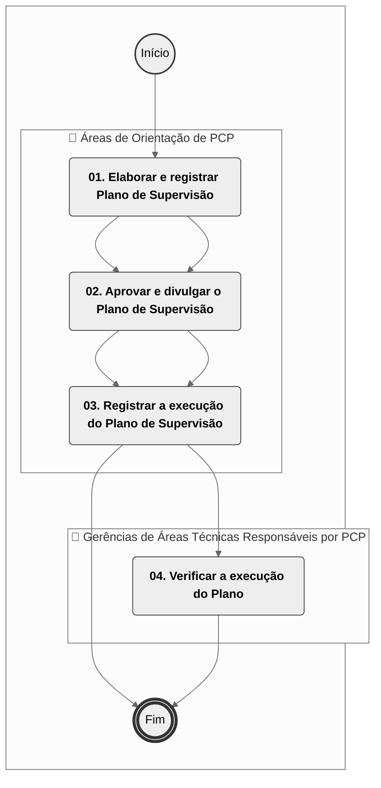
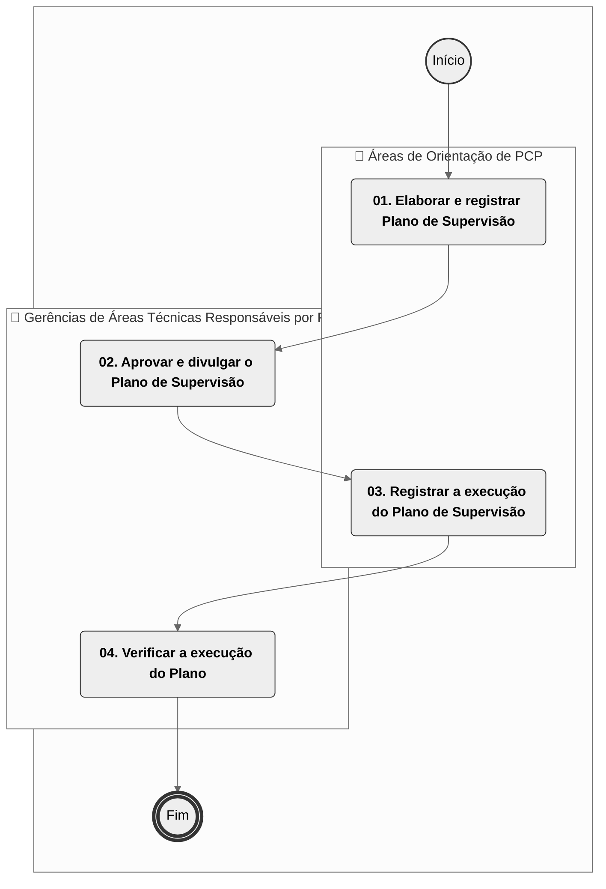

```mermaid
%%{init: {"theme": "neutral", "themeVariables": {"primaryColor": "#ffffff", "edgeLabelBackground": "#ffffff", "tertiaryColor": "#f4f4f4"}}}%%
flowchart TD
    classDef inicio stroke:#333,stroke-width:2px;
    classDef fim stroke:#333,stroke-width:4px;
    classDef tarefaBPMN stroke:#333,stroke-width:1px;
    classDef gatewayBPMN fill:#f9f9f9,stroke:#333,stroke-width:1px;
    classDef raia fill:none,stroke:#999,stroke-width:1px,stroke-dasharray: 5 5;
    subgraph Container_ID_MPR_SAR_442_R01_md_0 [ ]
        direction TB
        ID_MPR_SAR_442_R01_md_0_S((Início)):::inicio
        ID_MPR_SAR_442_R01_md_0_E(((Fim))):::fim
        subgraph Raia_ID_MPR_SAR_442_R01_md_0_1 [👤 CCIP]
            ID_MPR_SAR_442_R01_md_0_01("<b>01. Analisar e autorizar a atividade do PC</b>"):::tarefaBPMN
            ID_MPR_SAR_442_R01_md_0_02("<b>02. Monitorar a atividade do PC</b>"):::tarefaBPMN
            ID_MPR_SAR_442_R01_md_0_03("<b>03. Registrar resultado da atividade do PC</b>"):::tarefaBPMN
            ID_MPR_SAR_442_R01_md_0_04("<b>04. Avaliar o PC</b>"):::tarefaBPMN
            ID_MPR_SAR_442_R01_md_0_05("<b>05. Realizar ação corretiva</b>"):::tarefaBPMN
            ID_MPR_SAR_442_R01_md_0_06("<b>06. Realizar feedback</b>"):::tarefaBPMN
        end
        subgraph Raia_ID_MPR_SAR_442_R01_md_0_2 [👤 Áreas de Orientação de PCP]
            ID_MPR_SAR_442_R01_md_0_01("<b>01. Conduzir e registrar monitoramento das atividades desempenhadas por PCP</b>"):::tarefaBPMN
            ID_MPR_SAR_442_R01_md_0_02("<b>02. Elaborar e registrar PAC</b>"):::tarefaBPMN
            ID_MPR_SAR_442_R01_md_0_03("<b>03. Registrar e o avaliar o resultado do PAC</b>"):::tarefaBPMN
            ID_MPR_SAR_442_R01_md_0_01("<b>01. Preparar Treinamento de PCP</b>"):::tarefaBPMN
            ID_MPR_SAR_442_R01_md_0_02("<b>02. Conduzir Treinamento de PCP</b>"):::tarefaBPMN
            ID_MPR_SAR_442_R01_md_0_03("<b>03. Registrar atividade de treinamento de PCP</b>"):::tarefaBPMN
            ID_MPR_SAR_442_R01_md_0_01("<b>01. Elaborar e registrar Plano de Supervisão</b>"):::tarefaBPMN
            ID_MPR_SAR_442_R01_md_0_03("<b>03. Registrar a execução do Plano de Supervisão</b>"):::tarefaBPMN
        end
        subgraph Raia_ID_MPR_SAR_442_R01_md_0_3 [👤 Gerências de Áreas Técnicas Responsáveis por PCP]
            ID_MPR_SAR_442_R01_md_0_04("<b>04. Iniciar processo para cancelar o credenciamento</b>"):::tarefaBPMN
            ID_MPR_SAR_442_R01_md_0_02("<b>02. Aprovar e divulgar o Plano de Supervisão</b>"):::tarefaBPMN
            ID_MPR_SAR_442_R01_md_0_04("<b>04. Verificar a execução do Plano</b>"):::tarefaBPMN
        end
        ID_MPR_SAR_442_R01_md_0_S --> ID_MPR_SAR_442_R01_md_0_01
        gw_ID_MPR_SAR_442_R01_md_0_01{"É necessário monitoramento?"}:::gatewayBPMN
        ID_MPR_SAR_442_R01_md_0_01 --> gw_ID_MPR_SAR_442_R01_md_0_01
        gw_ID_MPR_SAR_442_R01_md_0_01 -->|"sim, monitoramento é necessário"| ID_MPR_SAR_442_R01_md_0_02
        gw_ID_MPR_SAR_442_R01_md_0_01 -->|"não é necessário monitoramento"| ID_MPR_SAR_442_R01_md_0_03
        ID_MPR_SAR_442_R01_md_0_02 --> ID_MPR_SAR_442_R01_md_0_03
        ID_MPR_SAR_442_R01_md_0_03 --> ID_MPR_SAR_442_R01_md_0_04
        gw_ID_MPR_SAR_442_R01_md_0_04{"É necessária retroalimentação?"}:::gatewayBPMN
        ID_MPR_SAR_442_R01_md_0_04 --> gw_ID_MPR_SAR_442_R01_md_0_04
        gw_ID_MPR_SAR_442_R01_md_0_04 -->|"não é necessária retroalimentação"| ID_MPR_SAR_442_R01_md_0_E
        gw_ID_MPR_SAR_442_R01_md_0_04 -->|"É necessário feedback"| ID_MPR_SAR_442_R01_md_0_06
        gw_ID_MPR_SAR_442_R01_md_0_04 -->|"É necessária ação corretiva"| ID_MPR_SAR_442_R01_md_0_05
        ID_MPR_SAR_442_R01_md_0_05 --> ID_MPR_SAR_442_R01_md_0_E
        ID_MPR_SAR_442_R01_md_0_06 --> ID_MPR_SAR_442_R01_md_0_E
        gw_ID_MPR_SAR_442_R01_md_0_01{"O Índice de Qualidade do Trabalho do PCP foi Insatisfatório?"}:::gatewayBPMN
        ID_MPR_SAR_442_R01_md_0_01 --> gw_ID_MPR_SAR_442_R01_md_0_01
        gw_ID_MPR_SAR_442_R01_md_0_01 -->|"não, não foi insatisfatório"| ID_MPR_SAR_442_R01_md_0_E
        gw_ID_MPR_SAR_442_R01_md_0_01 -->|"sim, foi insatisfatório"| ID_MPR_SAR_442_R01_md_0_02
        ID_MPR_SAR_442_R01_md_0_02 --> ID_MPR_SAR_442_R01_md_0_03
        gw_ID_MPR_SAR_442_R01_md_0_03{"O PCP cumpriu com o PAC?"}:::gatewayBPMN
        ID_MPR_SAR_442_R01_md_0_03 --> gw_ID_MPR_SAR_442_R01_md_0_03
        gw_ID_MPR_SAR_442_R01_md_0_03 -->|"sim"| ID_MPR_SAR_442_R01_md_0_E
        gw_ID_MPR_SAR_442_R01_md_0_03 -->|"não"| ID_MPR_SAR_442_R01_md_0_04
        ID_MPR_SAR_442_R01_md_0_04 --> ID_MPR_SAR_442_R01_md_0_E
        ID_MPR_SAR_442_R01_md_0_01 --> ID_MPR_SAR_442_R01_md_0_02
        ID_MPR_SAR_442_R01_md_0_02 --> ID_MPR_SAR_442_R01_md_0_03
        ID_MPR_SAR_442_R01_md_0_03 --> ID_MPR_SAR_442_R01_md_0_E
        ID_MPR_SAR_442_R01_md_0_01 --> ID_MPR_SAR_442_R01_md_0_02
        ID_MPR_SAR_442_R01_md_0_02 --> ID_MPR_SAR_442_R01_md_0_03
        ID_MPR_SAR_442_R01_md_0_03 --> ID_MPR_SAR_442_R01_md_0_04
        ID_MPR_SAR_442_R01_md_0_04 --> ID_MPR_SAR_442_R01_md_0_E
    end
    click ID_MPR_SAR_442_R01_md_0_01 "Verificar se atividade solicitada é compatível com o escopo reconhecido do credenciamento do PC e se seu credenciamento está válido. A atribuição do PC para cada atividade solicitada segue conforme sugerido no andamento de cada processo, porém a sugestão pode não ser seguida caso o haja algum impedi"
    click ID_MPR_SAR_442_R01_md_0_02 "Analisar os trabalhos executados pelos Profissionais Credenciados quanto à sua precisão, quanto ao atendimento aos procedimentos, regulamentos, orientações e requisitos adotados pela ANAC e quanto ao uso de técnicas e métodos aceitáveis. Esta atividade e critério de frequência são descritas pela ITD"
    click ID_MPR_SAR_442_R01_md_0_03 "Devem ser registrados arquivos relativos a resultado de vistorias que não cumpram com as exigências estabelecidas pela agência.  São exemplos de documentos que devem ser registrados:  - e-mails entre orientador e PC;  - Formulário F-442-01 - Check List para Monitoramento da Atividade de PCF e PCA.  "
    click ID_MPR_SAR_442_R01_md_0_04 "Avaliar conforme critério descrito na ITD-442-01 - Supervisão de Profissionais Credenciados no Âmbito da GTCO (item 8.3).  Nota: Para as atividades de conformidade, nesta etapa é realizada a verificação do escopo da credencial do PC diante da atividade solicitada."
    click ID_MPR_SAR_442_R01_md_0_05 "No caso de desempenho insatisfatório, a CCIP inicia uma ação corretiva apropriada. Se o desempenho do PC permanecer insatisfatório após concluída a ação corretiva, ou no caso de constatar ação do PC que resulte em risco inaceitável à segurança operacional, a ANAC poderá cancelar o Credenciamento.  N"
    click ID_MPR_SAR_442_R01_md_0_06 "Informar o PC quanto ao resultado da avaliação do seu desempenho nos casos de monitoramento ou não atendimento aos procedimentos, regulamentos, orientações e requisitos adotados pela ANAC e quanto ao uso de técnicas e métodos aceitáveis.  Nota: O modo de registro do feedback está descrito na ITD-442"
    click ID_MPR_SAR_442_R01_md_0_01 "CONDUZIR MONITORAMENTO:  O orientador é responsável por avaliar laudos, pareceres ou relatórios emitidos por PCP sob sua orientação, conforme os critérios de priorização de monitoramento definidos no Plano de Supervisão de PCP vigente. O objetivo é avaliar o desempenho do PCP no atendimento aos Padr"
    click ID_MPR_SAR_442_R01_md_0_02 "Quando o orientador identificar, em seu registro de avaliação de laudos, pareceres ou relatórios emitidos por PCP via Formulário de Registro da Atividade de Monitoramento do PCP (ITD-442-02), que o Índice de Qualidade do Trabalho do PCP é Insatisfatório, um Plano de Ações Corretivas (PAC) deverá ser"
    click ID_MPR_SAR_442_R01_md_0_03 "O orientador deverá registrar o atendimento ao plano de ações corretivas (PAC) através do Formulário do Plano de Ações Corretivas (PAC) para Monitoramento do PCP (ITD-442-02), incluindo no campo “comentários” todas as informações relevantes sobre as atividades realizadas pelo PCP para cumprimento co"
    click ID_MPR_SAR_442_R01_md_0_04 "Quando houver deficiência no desempenho do PCP, o plano de ações corretivas não for cumprido pelo PCP e a avaliação do orientador concluir que não é adequado estender os prazos definidos no plano, deve-se iniciar o processo para cancelamento do credenciamento, fundamentado nos Formulários de Registr"
    click ID_MPR_SAR_442_R01_md_0_01 "A área técnica responsável deve designar um especialista como Coordenador Técnico do evento de capacitação, que ficará responsável por esta atividade.  A preparação do treinamento de PCP envolve as seguintes etapas:  1. Levantamento junto aos envolvidos (PCP, orientadores, especialistas etc.) de tóp"
    click ID_MPR_SAR_442_R01_md_0_02 "A condução dos treinamentos fica a cargo da área técnica responsável por meio dos orientadores de PCP envolvidos, sendo que no caso de haver mais de um orientador de PCP para um mesmo treinamento, deve-se definir um Coordenador ANAC responsável pelo treinamento.  Envolve a organização durante o even"
    click ID_MPR_SAR_442_R01_md_0_03 "Caso o treinamento seja registrado no portal de capacitação da ANAC, o que é fortemente recomendável, os registros de frequência, os registros de feedback de participantes, certificados de participação etc. serão registrados, emitidos e armazenados pela área de capacitação da ANAC, possibilitando a "
    click ID_MPR_SAR_442_R01_md_0_01 "Na elaboração e definição do plano os seguintes dados devem ser coletados e organizados para a seleção da quantidade mínima de atividades de supervisão de PCP e seus critérios de priorização, além dos treinamentos recomendados para cada área:  - Os resultados da supervisão dos PCP do ciclo anterior "
    click ID_MPR_SAR_442_R01_md_0_02 "O plano registrado deve ser emitido de acordo com o Guia para Supervisão de PCP.  O plano deve ser assinado pelos respectivo(s) Coordenador(es) e Gerente Técnico.  Cada gerência responsável pelo plano deverá divulgar o referido plano, conforme orientação prevista no Guia para Supervisão de PCP (ITD-"
    click ID_MPR_SAR_442_R01_md_0_03 "As áreas responsáveis pela orientação de PCP devem registrar as atividades de supervisão executadas ao longo do ciclo definido no Plano de Supervisão.  Devem ser registrados os treinamentos realizados, monitoramentos realizados, eventuais desvios ao Plano, dentre outras informações conforme detalhad"
    click ID_MPR_SAR_442_R01_md_0_04 "O processo do Plano de Supervisão referente a determinado ciclo se encerra com a verificação do Registro da Execução do Plano, preferencialmente em documento denominado “Sumário (ou algo equivalente) de Execução do Plano de Supervisão de PCP - <SIGLA DA GERÊNCIA TÉCNICA> - <CICLO>”, criado nas Gerên"
```

```mermaid
%%{init: {"theme": "neutral", "themeVariables": {"primaryColor": "#ffffff", "edgeLabelBackground": "#ffffff", "tertiaryColor": "#f4f4f4"}}}%%
flowchart TD
    classDef inicio stroke:#333,stroke-width:2px;
    classDef fim stroke:#333,stroke-width:4px;
    classDef tarefaBPMN stroke:#333,stroke-width:1px;
    classDef gatewayBPMN fill:#f9f9f9,stroke:#333,stroke-width:1px;
    classDef raia fill:none,stroke:#999,stroke-width:1px,stroke-dasharray: 5 5;
    subgraph Container_ID_MPR_SAR_442_R01_md_1 [ ]
        direction TB
        ID_MPR_SAR_442_R01_md_1_S((Início)):::inicio
        ID_MPR_SAR_442_R01_md_1_E(((Fim))):::fim
        subgraph Raia_ID_MPR_SAR_442_R01_md_1_1 [👤 Áreas de Orientação de PCP]
            ID_MPR_SAR_442_R01_md_1_01("<b>01. Conduzir e registrar monitoramento das atividades desempenhadas por PCP</b>"):::tarefaBPMN
            ID_MPR_SAR_442_R01_md_1_02("<b>02. Elaborar e registrar PAC</b>"):::tarefaBPMN
            ID_MPR_SAR_442_R01_md_1_03("<b>03. Registrar e o avaliar o resultado do PAC</b>"):::tarefaBPMN
            ID_MPR_SAR_442_R01_md_1_01("<b>01. Preparar Treinamento de PCP</b>"):::tarefaBPMN
            ID_MPR_SAR_442_R01_md_1_02("<b>02. Conduzir Treinamento de PCP</b>"):::tarefaBPMN
            ID_MPR_SAR_442_R01_md_1_03("<b>03. Registrar atividade de treinamento de PCP</b>"):::tarefaBPMN
            ID_MPR_SAR_442_R01_md_1_01("<b>01. Elaborar e registrar Plano de Supervisão</b>"):::tarefaBPMN
            ID_MPR_SAR_442_R01_md_1_03("<b>03. Registrar a execução do Plano de Supervisão</b>"):::tarefaBPMN
        end
        subgraph Raia_ID_MPR_SAR_442_R01_md_1_2 [👤 Gerências de Áreas Técnicas Responsáveis por PCP]
            ID_MPR_SAR_442_R01_md_1_04("<b>04. Iniciar processo para cancelar o credenciamento</b>"):::tarefaBPMN
            ID_MPR_SAR_442_R01_md_1_02("<b>02. Aprovar e divulgar o Plano de Supervisão</b>"):::tarefaBPMN
            ID_MPR_SAR_442_R01_md_1_04("<b>04. Verificar a execução do Plano</b>"):::tarefaBPMN
        end
        ID_MPR_SAR_442_R01_md_1_S --> ID_MPR_SAR_442_R01_md_1_01
        gw_ID_MPR_SAR_442_R01_md_1_01{"O Índice de Qualidade do Trabalho do PCP foi Insatisfatório?"}:::gatewayBPMN
        ID_MPR_SAR_442_R01_md_1_01 --> gw_ID_MPR_SAR_442_R01_md_1_01
        gw_ID_MPR_SAR_442_R01_md_1_01 -->|"não, não foi insatisfatório"| ID_MPR_SAR_442_R01_md_1_E
        gw_ID_MPR_SAR_442_R01_md_1_01 -->|"sim, foi insatisfatório"| ID_MPR_SAR_442_R01_md_1_02
        ID_MPR_SAR_442_R01_md_1_02 --> ID_MPR_SAR_442_R01_md_1_03
        gw_ID_MPR_SAR_442_R01_md_1_03{"O PCP cumpriu com o PAC?"}:::gatewayBPMN
        ID_MPR_SAR_442_R01_md_1_03 --> gw_ID_MPR_SAR_442_R01_md_1_03
        gw_ID_MPR_SAR_442_R01_md_1_03 -->|"sim"| ID_MPR_SAR_442_R01_md_1_E
        gw_ID_MPR_SAR_442_R01_md_1_03 -->|"não"| ID_MPR_SAR_442_R01_md_1_04
        ID_MPR_SAR_442_R01_md_1_04 --> ID_MPR_SAR_442_R01_md_1_E
        ID_MPR_SAR_442_R01_md_1_01 --> ID_MPR_SAR_442_R01_md_1_02
        ID_MPR_SAR_442_R01_md_1_02 --> ID_MPR_SAR_442_R01_md_1_03
        ID_MPR_SAR_442_R01_md_1_03 --> ID_MPR_SAR_442_R01_md_1_E
        ID_MPR_SAR_442_R01_md_1_01 --> ID_MPR_SAR_442_R01_md_1_02
        ID_MPR_SAR_442_R01_md_1_02 --> ID_MPR_SAR_442_R01_md_1_03
        ID_MPR_SAR_442_R01_md_1_03 --> ID_MPR_SAR_442_R01_md_1_04
        ID_MPR_SAR_442_R01_md_1_04 --> ID_MPR_SAR_442_R01_md_1_E
    end
    click ID_MPR_SAR_442_R01_md_1_01 "CONDUZIR MONITORAMENTO:  O orientador é responsável por avaliar laudos, pareceres ou relatórios emitidos por PCP sob sua orientação, conforme os critérios de priorização de monitoramento definidos no Plano de Supervisão de PCP vigente. O objetivo é avaliar o desempenho do PCP no atendimento aos Padr"
    click ID_MPR_SAR_442_R01_md_1_02 "Quando o orientador identificar, em seu registro de avaliação de laudos, pareceres ou relatórios emitidos por PCP via Formulário de Registro da Atividade de Monitoramento do PCP (ITD-442-02), que o Índice de Qualidade do Trabalho do PCP é Insatisfatório, um Plano de Ações Corretivas (PAC) deverá ser"
    click ID_MPR_SAR_442_R01_md_1_03 "O orientador deverá registrar o atendimento ao plano de ações corretivas (PAC) através do Formulário do Plano de Ações Corretivas (PAC) para Monitoramento do PCP (ITD-442-02), incluindo no campo “comentários” todas as informações relevantes sobre as atividades realizadas pelo PCP para cumprimento co"
    click ID_MPR_SAR_442_R01_md_1_04 "Quando houver deficiência no desempenho do PCP, o plano de ações corretivas não for cumprido pelo PCP e a avaliação do orientador concluir que não é adequado estender os prazos definidos no plano, deve-se iniciar o processo para cancelamento do credenciamento, fundamentado nos Formulários de Registr"
    click ID_MPR_SAR_442_R01_md_1_01 "A área técnica responsável deve designar um especialista como Coordenador Técnico do evento de capacitação, que ficará responsável por esta atividade.  A preparação do treinamento de PCP envolve as seguintes etapas:  1. Levantamento junto aos envolvidos (PCP, orientadores, especialistas etc.) de tóp"
    click ID_MPR_SAR_442_R01_md_1_02 "A condução dos treinamentos fica a cargo da área técnica responsável por meio dos orientadores de PCP envolvidos, sendo que no caso de haver mais de um orientador de PCP para um mesmo treinamento, deve-se definir um Coordenador ANAC responsável pelo treinamento.  Envolve a organização durante o even"
    click ID_MPR_SAR_442_R01_md_1_03 "Caso o treinamento seja registrado no portal de capacitação da ANAC, o que é fortemente recomendável, os registros de frequência, os registros de feedback de participantes, certificados de participação etc. serão registrados, emitidos e armazenados pela área de capacitação da ANAC, possibilitando a "
    click ID_MPR_SAR_442_R01_md_1_01 "Na elaboração e definição do plano os seguintes dados devem ser coletados e organizados para a seleção da quantidade mínima de atividades de supervisão de PCP e seus critérios de priorização, além dos treinamentos recomendados para cada área:  - Os resultados da supervisão dos PCP do ciclo anterior "
    click ID_MPR_SAR_442_R01_md_1_02 "O plano registrado deve ser emitido de acordo com o Guia para Supervisão de PCP.  O plano deve ser assinado pelos respectivo(s) Coordenador(es) e Gerente Técnico.  Cada gerência responsável pelo plano deverá divulgar o referido plano, conforme orientação prevista no Guia para Supervisão de PCP (ITD-"
    click ID_MPR_SAR_442_R01_md_1_03 "As áreas responsáveis pela orientação de PCP devem registrar as atividades de supervisão executadas ao longo do ciclo definido no Plano de Supervisão.  Devem ser registrados os treinamentos realizados, monitoramentos realizados, eventuais desvios ao Plano, dentre outras informações conforme detalhad"
    click ID_MPR_SAR_442_R01_md_1_04 "O processo do Plano de Supervisão referente a determinado ciclo se encerra com a verificação do Registro da Execução do Plano, preferencialmente em documento denominado “Sumário (ou algo equivalente) de Execução do Plano de Supervisão de PCP - <SIGLA DA GERÊNCIA TÉCNICA> - <CICLO>”, criado nas Gerên"
```

# MPR/SAR-442-R01 - SUPERVISÃO DE PROFISSIONAL CREDENCIADO - PCP, PCF E PCA

**MANUAL DE PROCEDIMENTO**

**MPR/SAR-442-R01**

**SUPERVISÃO DE PROFISSIONAL CREDENCIADO - PCP, PCF E PCA**

07/2024

**REVISÕES**

|  |  |  |  |  |
| --- | --- | --- | --- | --- |
| **Revisão** | **Aprovação** | **Publicação** | **Aprovado Por** | **Modificações da Última Versão** |
| R00 | Portaria 9556/2022 | 21/10/2022 | SAR | Versão Original |
| R01 | Portaria 14903/2024 | 05/07/2024 | SAR | 1) Processo 'Gerir Plano de Supervisão de PCP' inserido.  2) Processo 'Realizar Treinamento de PCP' inserido.  3) Processo 'Conduzir Monitoramento de Atividades Desempenhadas por PCP' inserido. |

**ÍNDICE**

1) Disposições Preliminares, pág. 5.

1.1) Introdução, pág. 5.

1.2) Revogação, pág. 5.

1.3) Fundamentação, pág. 5.

1.4) Executores dos Processos, pág. 5.

1.5) Elaboração e Revisão, pág. 6.

1.6) Organização do Documento, pág. 6.

2) Definições, pág. 8.

2.1) Sigla, pág. 8.

3) Artefatos, Competências, Sistemas e Documentos Administrativos, pág. 9.

3.1) Artefatos, pág. 9.

3.2) Competências, pág. 10.

3.3) Sistemas, pág. 10.

3.4) Documentos e Processos Administrativos, pág. 10.

4) Procedimentos Referenciados, pág. 11.

5) Procedimentos, pág. 12.

5.1) Supervisionar PCF e PCA no Âmbito da GTCO, pág. 12.

5.2) Conduzir Monitoramento de Atividades Desempenhadas por PCP, pág. 17.

5.3) Realizar Treinamento de PCP, pág. 22.

5.4) Gerir Plano de Supervisão de PCP, pág. 26.

6) Disposições Finais, pág. 30.

**PARTICIPAÇÃO NA EXECUÇÃO DOS PROCESSOS**

**ÁREAS ORGANIZACIONAIS**

**1) Coordenadoria de Inspeção**

a) Supervisionar PCF e PCA no Âmbito da GTCO

**GRUPOS ORGANIZACIONAIS**

**a) Áreas de Orientação de PCP**

1) Conduzir Monitoramento de Atividades Desempenhadas por PCP

2) Gerir Plano de Supervisão de PCP

3) Realizar Treinamento de PCP

**b) Gerências de Áreas Técnicas Responsáveis por PCP**

1) Conduzir Monitoramento de Atividades Desempenhadas por PCP

2) Gerir Plano de Supervisão de PCP

**1. DISPOSIÇÕES PRELIMINARES**

**1.1 INTRODUÇÃO**

Orienta sobre a supervisão de Profissionais Credenciados na Superintendência de Aeronavegabilidade, incluindo Profissional Credenciado em Projeto (PCP), Profissional Credenciado em Fabricação (PCF) e Profissional Credenciado em Aeronavegabilidade para Exportação (PCA). Processos 00066.002561/2022-01 e 00058.033198/2022-66.

O MPR estabelece, no âmbito da Superintendência de Aeronavegabilidade - SAR, os seguintes processos de trabalho:

a) Supervisionar PCF e PCA no Âmbito da GTCO.

b) Conduzir Monitoramento de Atividades Desempenhadas por PCP.

c) Realizar Treinamento de PCP.

d) Gerir Plano de Supervisão de PCP.

**1.2 REVOGAÇÃO**

MPR/SAR-442-R00, aprovado na data de 20 de outubro de 2022.

**1.3 FUNDAMENTAÇÃO**

Resolução nº 381, de 14 de junho de 2016, art. 31 e alterações posteriores.

**1.4 EXECUTORES DOS PROCESSOS**

Os procedimentos contidos neste documento aplicam-se aos servidores integrantes das seguintes áreas organizacionais:

|  |  |
| --- | --- |
| **Área Organizacional** | **Descrição** |
| Coordenadoria de Inspeção - CCIP | Coordenar a execução de inspeção de conformidade de processo, de produto, de espécime de ensaio e de instalação associada durante o processo de certificação de projeto ou modificações ao projeto de tipo aprovado. |

|  |  |
| --- | --- |
| **Grupo Organizacional** | **Descrição** |
| SAR - PCP - Orientadores | Coordenadorias da SAR que realizam orientação de PCP (CCST/GTPR; CEMP/GTEN; CESS/GTEN; CEEI/GTEN; CEVIS/GTEV). |
| SAR - PCP - Gerentes das Áreas Técnicas | Gerentes da Áreas Técnicas da SAR (GTPR; GTEN; GTEV) que realizam atividades com a utilização de PCP. |

**1.5 ELABORAÇÃO E REVISÃO**

O processo que resulta na aprovação ou alteração deste MPR é de responsabilidade da Superintendência de Aeronavegabilidade - SAR. Em caso de sugestões de revisão, deve-se procurá-la para que sejam iniciadas as providências cabíveis.

As revisões deste MPR serão aprovadas pelo(s) titular(es) da(s) unidade(s) responsável(is) pela execução do(s) processo(s) nele listado(s).

**1.6 ORGANIZAÇÃO DO DOCUMENTO**

O capítulo 2 apresenta as principais definições utilizadas no âmbito deste MPR, e deve ser visto integralmente antes da leitura de capítulos posteriores.

O capítulo 3 apresenta as competências, os artefatos e os sistemas envolvidos na execução dos processos deste manual, em ordem relativamente cronológica.

O capítulo 4 apresenta os processos de trabalho referenciados neste MPR. Estes processos são publicados em outros manuais que não este, mas cuja leitura é essencial para o entendimento dos processos publicados neste manual. O capítulo 4 expõe em quais manuais são localizados cada um dos processos de trabalho referenciados.

O capítulo 5 apresenta os processos de trabalho. Para encontrar um processo específico, deve-se procurar sua respectiva página no índice contido no início do documento. Os processos estão ordenados em etapas. Cada etapa é contida em uma tabela, que possui em si todas as informações necessárias para sua realização. São elas, respectivamente:

a) o título da etapa;

b) a descrição da forma de execução da etapa;

c) as competências necessárias para a execução da etapa;

d) os artefatos necessários para a execução da etapa;

e) os sistemas necessários para a execução da etapa (incluindo, bases de dados em forma de arquivo, se existente);

f) os documentos e processos administrativos que precisam ser elaborados durante a execução da etapa;

g) instruções para as próximas etapas; e

h) as áreas ou grupos organizacionais responsáveis por executar a etapa.

O capítulo 6 apresenta as disposições finais do documento, que trata das ações a serem realizadas em casos não previstos.

Por último, é importante comunicar que este documento foi gerado automaticamente. São recuperados dados sobre as etapas e sua sequência, as definições, os grupos, as áreas organizacionais, os artefatos, as competências, os sistemas, entre outros, para os processos de trabalho aqui apresentados, de forma que alguma mecanicidade na apresentação das informações pode ser percebida. O documento sempre apresenta as informações mais atualizadas de nomes e siglas de grupos, áreas, artefatos, termos, sistemas e suas definições, conforme informação disponível na base de dados, independente da data de assinatura do documento. Informações sobre etapas, seu detalhamento, a sequência entre etapas, responsáveis pelas etapas, artefatos, competências e sistemas associados a etapas, assim como seus nomes e os nomes de seus processos têm suas definições idênticas à da data de assinatura do documento.

**2. DEFINIÇÕES**

A tabela abaixo apresenta as definições necessárias para o entendimento deste Manual de Procedimento.

**2.1 Sigla**

|  |  |
| --- | --- |
| **Definição** | **Significado** |
| CCIP | Coordenadoria de inspeção |
| GTCO | Gerência Técnica de Certificação de Organizações e Inspeção |
| IS | Instrução Suplementar |
| ITD | Instrução de Trabalho Detalhada |
| PAC | Plano de Ações Corretivas - é o plano de ações do regulado, com seus respectivos prazos de implementação, visando sanar as não conformidades registradas em auditorias ou inspeções. |
| PCA | Profissional Credenciado em Aeronavegabilidade |
| PCF | Profissional Credenciado em Fabricação |
| PCP | Profissional Credenciado em Projeto |

**3. ARTEFATOS, COMPETÊNCIAS, SISTEMAS E DOCUMENTOS ADMINISTRATIVOS**

Abaixo se encontram as listas dos artefatos, competências, sistemas e documentos administrativos que o executor necessita consultar, preencher, analisar ou elaborar para executar os processos deste MPR. As etapas descritas no capítulo seguinte indicam onde usar cada um deles.

As competências devem ser adquiridas por meio de capacitação ou outros instrumentos e os artefatos se encontram no módulo "Artefatos" do sistema GFT - Gerenciador de Fluxos de Trabalho.

**3.1 ARTEFATOS**

|  |  |
| --- | --- |
| **Nome** | **Descrição** |
| F-442-01 - Check List para Monitoramento da Atividade de PCF e PCA | Formulário utilizado pelo servidor locado na GTCO na atividade de monitoramento do Profissional Credenciado. |
| ITD-441-03 | Este documento detalha atividades do processo “Atestar Capacidade Avaliada para Candidato a Credenciamento na SAR” e do processo “Conduzir Renovação do Credenciamento de Pessoa Física na SAR” contido no MPR/SAR-441 intitulado “Credenciamento de Pessoas Físicas na SAR”.  Esta ITD pretende relacionar as particularidades e critérios a serem adotados pelos analistas da GTAI, em relação ao credenciamento, renovação e descredenciamento de profissionais credenciados em aeronavegabilidade do grupo D. |
| ITD-442-01 - Supervisão de Profissionais Credenciados no Âmbito da GTCO | Instrução de Trabalho Detalhada, em complemento ao Processo de Trabalho, para monitorar PCF e PCA-E.  SEI 00066.002561/2022-01. |
| ITD-442-02 | O Guia para Supervisão de Profissional Credenciado em Projeto (PCP) fornece informações para gerir o Plano de Supervisão a ser adotado e detalha as atividades associadas aos seguintes processos contidos no MPR/SAR-442, intitulado “SUPERVISÃO DE PROFISSIONAL CREDENCIADO EM PROJETO (PCP)”. |
| Projeto Básico - Evento de Capacitação | Formulário de Projeto Básico para Eventos de Capacitação a serem realizados com público externo. |

**3.2 COMPETÊNCIAS**

Para que os processos de trabalho contidos neste MPR possam ser realizados com qualidade e efetividade, é importante que as pessoas que venham a executá-los possuam um determinado conjunto de competências. No capítulo 5, as competências específicas que o executor de cada etapa de cada processo de trabalho deve possuir são apresentadas. A seguir, encontra-se uma lista geral das competências contidas em todos os processos de trabalho deste MPR e a indicação de qual área ou grupo organizacional as necessitam:

Não há competências descritas para a realização deste MPR.

**3.3 SISTEMAS**

|  |  |  |
| --- | --- | --- |
| **Nome** | **Descrição** | **Acesso** |
| Moodle | Plataforma educacional da ANAC | https://sistemas.anac.gov.br/capacitacao |
| SEI | Sistema Eletrônico de Informação. | https://sei.anac.gov.br/sip/login.php?sigla\_orgao\_sistema=ANAC&sigla\_sistema=SEI |

**3.4 DOCUMENTOS E PROCESSOS ADMINISTRATIVOS ELABORADOS NESTE MANUAL**

Não há documentos ou processos administrativos a serem elaborados neste MPR.

**4. PROCEDIMENTOS REFERENCIADOS**

Procedimentos referenciados são processos de trabalho publicados em outro MPR que têm relação com os processos de trabalho publicados por este manual. Este MPR não possui nenhum processo de trabalho referenciado.

**
## 5.1 Supervisionar PCF e PCA no Âmbito da GTCO

## 5.1 Supervisionar PCF e PCA no Âmbito da GTCO

## 5.1 Supervisionar PCF e PCA no Âmbito da GTCO

## 5.1 Supervisionar PCF e PCA no Âmbito da GTCO

