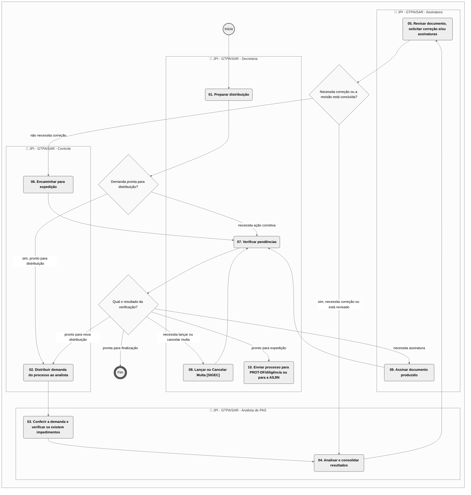

# MPR/SAR-451-R01 - PROCESSO ADMINISTRATIVO SANCIONADOR NA SAR

**MANUAL DE PROCEDIMENTO**

**MPR/SAR-451-R01**

**PROCESSO ADMINISTRATIVO SANCIONADOR NA SAR**

09/2017

**REVISÕES**

|  |  |  |  |  |
| --- | --- | --- | --- | --- |
| **Revisão** | **Aprovação** | **Publicação** | **Aprovado Por** | **Modificações da Última Versão** |
| R00 | Portaria nº 2.755, de 13 de outubro de 2016. | Não informado | SAR | Versão Original |
| R01 | Portaria nº 3160, de 14 de setembro de 2017 | Não informado | SAR | 1) Processo 'Receber Processo Administrativo Sancionador na GTAS/SAR' removido.  2) Processo 'Realizar Intimação Inequívoca do Autuado' removido.  3) Processo 'Decidir PAS em Primeira Instância na SAR' removido.  4) Processo 'Realizar Atividades Pós-Emissão de Decisão da SAR' removido.  5) Processo 'Realizar Trâmites para Sanção de Multa Integral' removido.  6) Processo 'Realizar Trâmites para Sanção de Multa com Desconto' removido.  7) Processo 'Realizar Trâmites para Arquivamento do PAS' removido.  8) Processo 'Analisar Processo Sancionador em 1ª Instância - SAR' inserido. |

**ÍNDICE**

1) Disposições Preliminares, pág. 5.

1.1) Introdução, pág. 5.

1.2) Revogação, pág. 6.

1.3) Fundamentação, pág. 6.

1.4) Executores dos Processos, pág. 7.

1.5) Elaboração e Revisão, pág. 7.

1.6) Organização do Documento, pág. 8.

2) Definições, pág. 10.

2.1) Sigla, pág. 10.

3) Artefatos, Competências, Sistemas e Documentos Administrativos, pág. 12.

3.1) Artefatos, pág. 12.

3.2) Competências, pág. 13.

3.3) Sistemas, pág. 13.

3.4) Documentos e Processos Administrativos, pág. 13.

4) Procedimentos Referenciados, pág. 21.

5) Procedimentos, pág. 22.

5.1) Analisar Processo Sancionador em 1ª Instância - SAR, pág. 22.

6) Disposições Finais, pág. 43.

**PARTICIPAÇÃO NA EXECUÇÃO DOS PROCESSOS**

**GRUPOS ORGANIZACIONAIS**

**a) JPI - GTPA/SAR - Analista de PAS**

1) Analisar Processo Sancionador em 1ª Instância - SAR

**b) JPI - GTPA/SAR - Assinatura**

1) Analisar Processo Sancionador em 1ª Instância - SAR

**c) JPI - GTPA/SAR - Controle**

1) Analisar Processo Sancionador em 1ª Instância - SAR

**d) JPI - GTPA/SAR - Secretaria**

1) Analisar Processo Sancionador em 1ª Instância - SAR

**1. DISPOSIÇÕES PRELIMINARES**

**1.1 INTRODUÇÃO**

Este procedimento descreve o julgamento de primeira instância dos processos administrativos sancionadores de competência da Superintendência de Aeronavegabilidade.

1.1.1 Papéis e Responsabilidades

São competências comuns às Superintendências, definidas no Regimento Interno da ANAC, apurar, autuar e decidir em primeira instância os processos administrativos relativos a apuração e aplicação de penalidades no âmbito da ANAC.

É competência delegada à GTPA/SAR, definida em portaria, emitir decisão em primeira instância em processos administrativos de apuração de infrações, bem como convalidar ou ratificar autos de infração relativos à área de competência da Superintendência de Aeronavegabilidade.

Cabe ao grupo "JPI - GTPA - Analista de PAS" realizar as pesquisas necessárias, avaliar os autos do processo e propor decisão referente aos processos recebidos.

Cabe ao grupo "JPI - GTPA - Secretaria" apoiar os demais grupos no recebimento e encaminhamento dos processos distribuídos, bem como o armazenamento das informações pertinentes de forma adequada.

Cabe ao grupo "JPI - GTPA - Assinatura" receber demandas para a coordenação do processo de julgamento em primeira instância na GTPA/SAR, efetuar a revisão dos documentos produzidos e assiná-los.

Cabe ao grupo "JPI - GTPA - Controle" receber demandas para a distribuição processos para análise e revisão de dados pós análise, com vistas à correta comunicação entre as atividades do "JPI - GTPA - Secretaria" com as entradas e saídas de demandas no "JPI - GTPA - Analista de PAS".

Cabe aos servidores, quando designados para executar atividade de fiscalização, emitir o respectivo relatório de fiscalização e o auto de infração, quando aplicável.

Cabe aos servidores da SAR, independente da área de lotação, propor, a seu superior, a aplicação de sanção necessária a detentor de certificado que tenha infringido os requisitos aplicáveis.

Cabe a todas as gerências-gerais, gerências e gerências técnicas da SAR encaminhar processo administrativo de auto de infração para a GTPA/SAR.

1.1.2 Política e Diretrizes

Para a realização destes processos é importante atentar para os dispositivos legais de infrações e penalidades descritos no Código Brasileiro de Aeronáutica - CBAer, Lei nº 7.565, de 19 de dezembro de 1986, artigos 288 a 302.

O Processo Administrativo Sancionador está sujeito aos prazos estabelecidos pela Lei nº 9.873, de 23 de novembro de 1999.

Também são diretrizes para o desempenho destes processos os princípios definidos na Resolução nº 25, de 25 de abril de 2008 com alterações posteriores, ou ato que venha a substituí-la:

a) legalidade;

b) publicidade;

c) finalidade;

d) motivação;

e) razoabilidade;

f) proporcionalidade;

g) moralidade;

h) ampla defesa;

i) contraditório;

j) segurança jurídica;

k) interesse público; e

l) eficiência.

1.1.3 Processo

O MPR estabelece, no âmbito da Superintendência de Aeronavegabilidade - SAR, o seguinte processo de trabalho:

a) Analisar Processo Sancionador em 1ª Instância - SAR.

**1.2 REVOGAÇÃO**

MPR/SAR-451-R00, aprovado na data de 13 de outubro de 2016.

**1.3 FUNDAMENTAÇÃO**

Resolução nº 381, de 14 de junho de 2016, art. 31.

Instrução Normativa nº 08, de 6 de junho de 2008.

Resolução nº 25, de 25 de abril de 2008.

**1.4 EXECUTORES DOS PROCESSOS**

Os procedimentos contidos neste documento aplicam-se aos servidores integrantes das seguintes áreas organizacionais:

|  |  |
| --- | --- |
| **Grupo Organizacional** | **Descrição** |
| JPI - GTPA/SAR - Analistas de PAS | Colaborador da GTPA, com regime de dedicação integral ou parcial às atividades de julgamento de PAS, que tem como atribuição a análise de processos administrativos de apuração de infração com vistas a propor à autoridade competente decisão administrativa em primeira instância sob a forma de documento do tipo "minuta de decisão". |
| JPI - GTPA/SAR - Assinatura | Grupo de servidores autorizados a assinar decisões em primeira instância |
| JPI - GTPA/SAR - Controle | Servidores responsáveis pelo controle de qualidade dos Processos Administrativos Sancionadores |
| JPI - GTPA/SAR - Secretaria | Grupo de colaboradores da GTPA/SAR que têm como atribuições: o recebimento, a acomodação, o encaminhamento e a expedição de processos e documentos do setor; a produção de determinados documentos, inserção no GFT e autuação de processos; a manutenção do repositório de documentos digitalizados do setor; a concessão de vistas a autos de processos; entre outras atividades de suporte administrativo definidas pelo GTPA/SAR. |

**1.5 ELABORAÇÃO E REVISÃO**

O processo que resulta na aprovação ou alteração deste MPR é de responsabilidade da Superintendência de Aeronavegabilidade - SAR. Em caso de sugestões de revisão, deve-se procurá-la para que sejam iniciadas as providências cabíveis.

As revisões deste MPR serão aprovadas pelo(s) titular(es) da(s) unidade(s) responsável(is) pela execução do(s) processo(s) nele listado(s).

**1.6 ORGANIZAÇÃO DO DOCUMENTO**

O capítulo 2 apresenta as principais definições utilizadas no âmbito deste MPR, e deve ser visto integralmente antes da leitura de capítulos posteriores.

O capítulo 3 apresenta as competências, os artefatos e os sistemas envolvidos na execução dos processos deste manual, em ordem relativamente cronológica.

O capítulo 4 apresenta os processos de trabalho referenciados neste MPR. Estes processos são publicados em outros manuais que não este, mas cuja leitura é essencial para o entendimento dos processos publicados neste manual. O capítulo 4 expõe em quais manuais são localizados cada um dos processos de trabalho referenciados.

O capítulo 5 apresenta os processos de trabalho. Para encontrar um processo específico, deve-se procurar sua respectiva página no índice contido no início do documento. Os processos estão ordenados em etapas. Cada etapa é contida em uma tabela, que possui em si todas as informações necessárias para sua realização. São elas, respectivamente:

a) o título da etapa;

b) a descrição da forma de execução da etapa;

c) as competências necessárias para a execução da etapa;

d) os artefatos necessários para a execução da etapa;

e) os sistemas necessários para a execução da etapa (incluindo, bases de dados em forma de arquivo, se existente);

f) os documentos e processos administrativos que precisam ser elaborados durante a execução da etapa;

g) instruções para as próximas etapas; e

h) as áreas ou grupos organizacionais responsáveis por executar a etapa.

O capítulo 6 apresenta as disposições finais do documento, que trata das ações a serem realizadas em casos não previstos.

Por último, é importante comunicar que este documento foi gerado automaticamente. São recuperados dados sobre as etapas e sua sequência, as definições, os grupos, as áreas organizacionais, os artefatos, as competências, os sistemas, entre outros, para os processos de trabalho aqui apresentados, de forma que alguma mecanicidade na apresentação das informações pode ser percebida. O documento sempre apresenta as informações mais atualizadas de nomes e siglas de grupos, áreas, artefatos, termos, sistemas e suas definições, conforme informação disponível na base de dados, independente da data de assinatura do documento. Informações sobre etapas, seu detalhamento, a sequência entre etapas, responsáveis pelas etapas, artefatos, competências e sistemas associados a etapas, assim como seus nomes e os nomes de seus processos têm suas definições idênticas à da data de assinatura do documento.

**2. DEFINIÇÕES**

A tabela abaixo apresenta as definições necessárias para o entendimento deste Manual de Procedimento.

**2.1 Sigla**

|  |  |
| --- | --- |
| **Definição** | **Significado** |
| AI | Auto de Infração – Ato administrativo que visa à instauração de processo de apuração de infração, mediante a delimitação dos fatos apurados, a cientificação do autuado acerca dos mesmos, e a concessão de prazo ao autuado para, querendo, apresentar defesa. |
| ANAC | Agência Nacional de Aviação Civil |
| AR | Aviso de Recebimento |
| DOU | Diário Oficial da União |
| GFT | Sistema Gerenciador de Fluxos de Trabalho. |
| GTPA | Gerência Técnica de Planejamento e Acompanhamento |
| IN | Instrução Normativa |
| MPR | Manual de Procedimento – Documento de caráter disciplinador, de âmbito interno, assinado e aprovado por autoridade competente, que tem como objetivo documentar e padronizar os processos de trabalho realizados pelos agentes da ANAC. Possui informações sobre o fluxo de trabalho, detalhamento das etapas, competências necessárias, artefatos a serem utilizados, sistemas de apoio e áreas responsáveis pela execução. |
| PAS | Processo Administrativo Sancionador. Processo administrativo que tem por finalidade a apuração, a repressão e a prevenção de infrações à legislação aeronáutica ou contrato de concessão, assegurando ao interessado o exercício do direito à ampla defesa e ao contraditório. |
| RFB | Receita Federal do Brasil |
| SAR | Superintendência de Aeronavegabilidade |
| SIGEC | Sistema Integrado de Gestão de Crédito |
| SMI | Sistema de Multas e Infrações para cadastramento e controle das multas e infrações cometidas pelos regulados. |

**3. ARTEFATOS, COMPETÊNCIAS, SISTEMAS E DOCUMENTOS ADMINISTRATIVOS**

Abaixo se encontram as listas dos artefatos, competências, sistemas e documentos administrativos que o executor necessita consultar, preencher, analisar ou elaborar para executar os processos deste MPR. As etapas descritas no capítulo seguinte indicam onde usar cada um deles.

As competências devem ser adquiridas por meio de capacitação ou outros instrumentos e os artefatos se encontram no módulo "Artefatos" do sistema GFT - Gerenciador de Fluxos de Trabalho.

**3.1 ARTEFATOS**

|  |  |
| --- | --- |
| **Nome** | **Descrição** |
| Lançamento de Multas no SIGEC - Passo a Passo | Sequência detalhada de atividades para lançamento de multas no SIGEC |
| Manual Orientativo de Marcos Prescricionais | Manual Orientativo de Marcos Prescricionais |
| NT Nº 17/2014/GFIS/SIA - Circunstâncias Agravantes e Atenuantes no Processo Administrativo Sancionador | Nota Técnica elaborada com o objetivo de uniformizar a atuação administrativa do setor que analisa os processos de apuração de infração, assegurando a aplicação da dosimetria. |
| Orientações Gerais para Análise de Processos Administrativos Sancionadores em 1ª Instância | Orientações Gerais para 1ª Instância SFI |
| Tutorial de Cadastro de Processo Administrativo Sancionador da SAR no GFT | Tutorial utilizado para apoiar o setor administrativo na tarefa de cadastramento de Processos Administrativos Sancionadores da SAR no GFT. |
| Tutorial de Triagem de Processo Administrativo Sancionador da SAR no GFT | Tutorial utilizado para apoiar o setor administrativo no processo de Triagem inicial dos Processos Administrativos Sancionadores da SAR no GFT |

**3.2 COMPETÊNCIAS**

Para que os processos de trabalho contidos neste MPR possam ser realizados com qualidade e efetividade, é importante que as pessoas que venham a executá-los possuam um determinado conjunto de competências. No capítulo 5, as competências específicas que o executor de cada etapa de cada processo de trabalho deve possuir são apresentadas. A seguir, encontra-se uma lista geral das competências contidas em todos os processos de trabalho deste MPR e a indicação de qual área ou grupo organizacional as necessitam:

|  |  |
| --- | --- |
| **Competência** | **Áreas e Grupos** |
| Analisa processo administrativo sancionador em 1ª instância examinando se os atos praticados no processo atenderam às formalidades essenciais ao cumprimento de sua finalidade e à garantia dos direitos do administrado, propondo a correção de falhas eventualmente existentes. | JPI - GTPA/SAR - Analistas de PAS |
| Assina documentos presentes no Módulo Demandas no GFT, caso não exista pendência relacionada ao mesmo, desde que tenha delegação e competência para tal. | JPI - GTPA/SAR - Assinatura |
| Avalia minuta, documento e/ou parecer, presentes no Módulo Demandas no GFT, indicando correção caso necessário. | JPI - GTPA/SAR - Assinatura |
| Realiza procedimento de lançamentos ou cancelamentos de multas no SIGEC. | JPI - GTPA/SAR - Secretaria |
| Realiza verificação de impedimento em demandas recebidas, seguindo as etapas descritas no Processo de Trabalho. | JPI - GTPA/SAR - Analistas de PAS |
| Verifica pendências para expedição de documentos ou, conclusão da demanda ou, cancelamento de multa e/ou nova distribuição, no Módulo Demandas do GFT, emitindo o documento pertinente e dando prosseguimento ao processo. | JPI - GTPA/SAR - Secretaria |

**3.3 SISTEMAS**

|  |  |  |
| --- | --- | --- |
| **Nome** | **Descrição** | **Acesso** |
| SEI | Sistema Eletrônico de Informação. | https://sei.anac.gov.br/sip/login.php?sigla\_orgao\_sistema=ANAC&sigla\_sistema=SEI |
| SIGEC - Sistema Integrado de Gestão de Crédito | Sistema de gestão dos créditos da Agência, inclusive os referentes a penalidades de natureza pecuniária. | http://intranet.anac.gov.br/sigec/ |

**3.4 DOCUMENTOS E PROCESSOS ADMINISTRATIVOS ELABORADOS NESTE MANUAL**

|  |  |  |  |
| --- | --- | --- | --- |
| **Nome do Documento** | **Tipo do Documento** | **Processo Administrativo** | **Tipo do Processo Administrativo** |
| 1ª NOTIFICAÇÃO DECISÃO- Multa 50% - Multipla - DC0 - M1 | Notificação de Decisão - Pas | Processo Administrativo Sancionador | fiscalização e vigilância continuada: autos de infrações e multas |
| 1ª NOTIFICAÇÃO DECISÃO- Multa 50% - Singular - DC0 - S1 | Notificação de Decisão - Pas | Processo Administrativo Sancionador | fiscalização e vigilância continuada: autos de infrações e multas |
| 1ª NOTIFICAÇÃO DECISÃO- Multa Integral - Multipla (DC1-M1) | Notificação de Decisão - Pas | Processo Administrativo Sancionador | fiscalização e vigilância continuada: autos de infrações e multas |
| 1ª NOTIFICAÇÃO DECISÃO- Multa Integral - Singular (DC1-S1) | Notificação de Decisão - Pas | Processo Administrativo Sancionador | fiscalização e vigilância continuada: autos de infrações e multas |
| 1ª NOTIFICAÇÃO DO AUTO DE INFRAÇÃO ( Ai - 1) | Ofício | Processo Administrativo Sancionador | fiscalização e vigilância continuada: autos de infrações e multas |
| 2ª NOTIFICAÇÃO DECISÃO- Multa 50% - Multipla - DC0 – M2 | Notificação de Decisão - Pas | Processo Administrativo Sancionador | fiscalização e vigilância continuada: autos de infrações e multas |
| 2ª NOTIFICAÇÃO DECISÃO- Multa Integral - Múltipla (DC1-M2) | Notificação de Decisão - Pas | Processo Administrativo Sancionador | fiscalização e vigilância continuada: autos de infrações e multas |
| 2ª NOTIFICAÇÃO DECISÃO- Multa Integral - Singular (DC1-S2) | Notificação de Decisão - Pas | Processo Administrativo Sancionador | fiscalização e vigilância continuada: autos de infrações e multas |
| 2ª NOTIFICAÇÃO DO AUTO DE INFRAÇÃO ( Ai - 2) | Ofício | Processo Administrativo Sancionador | fiscalização e vigilância continuada: autos de infrações e multas |
| 3ª NOTIFICAÇÃO DO AUTO DE INFRAÇÃO ( Ai - 3) | Ofício | Processo Administrativo Sancionador | fiscalização e vigilância continuada: autos de infrações e multas |
| Auto de Infração | Auto de Infração | Processo Administrativo Sancionador | fiscalização e vigilância continuada: autos de infrações e multas |
| Auto de Infração como Anexo | Anexo | Processo Administrativo Sancionador | fiscalização e vigilância continuada: autos de infrações e multas |
| Comunicado de Multa - DC0 - M2 | Notificação de Decisão - Pas | Processo Administrativo Sancionador | fiscalização e vigilância continuada: autos de infrações e multas |
| Decisão GTPA | Decisão Primeira Instância - Pas | Processo Administrativo Sancionador | fiscalização e vigilância continuada: autos de infrações e multas |
| Decisão GTPA - Arquivamento | Decisão Primeira Instância - Pas | Processo Administrativo Sancionador | fiscalização e vigilância continuada: autos de infrações e multas |
| Decisão GTPA - Concessão 50% (Simples) | Decisão Primeira Instância - Pas | Processo Administrativo Sancionador | fiscalização e vigilância continuada: autos de infrações e multas |
| Decisão GTPA - Concessão de 50% (Múltiplas Infrações) | Sis\_despacho | Processo Administrativo Sancionador | fiscalização e vigilância continuada: autos de infrações e multas |
| Decisão GTPA - Concessão de 50% (Multiplos PAX) | Sis\_despacho | Processo Administrativo Sancionador | fiscalização e vigilância continuada: autos de infrações e multas |
| Decisão GTPA - Multa 50% (Simples) - CORRETIVA | Sis\_despacho | Processo Administrativo Sancionador | fiscalização e vigilância continuada: autos de infrações e multas |
| Decisão GTPA - Multa Integral (Com Defesa) | Decisão Primeira Instância - Pas | Processo Administrativo Sancionador | fiscalização e vigilância continuada: autos de infrações e multas |
| Decisão GTPA - Multa Integral (Com Defesa) - Corretiva | Notificação de Decisão - Pas | Processo Administrativo Sancionador | fiscalização e vigilância continuada: autos de infrações e multas |
| Decisão GTPA - Multa Integral (Sem Defesa) | Decisão Primeira Instância - Pas | Processo Administrativo Sancionador | fiscalização e vigilância continuada: autos de infrações e multas |
| Decisão GTPA 2 | Decisão Primeira Instância - Pas | Processo Administrativo Sancionador | fiscalização e vigilância continuada: autos de infrações e multas |
| Decisão GTPA 3 | Decisão Primeira Instância - Pas | Processo Administrativo Sancionador | fiscalização e vigilância continuada: autos de infrações e multas |
| Decisão GTPA Anulação | Decisão Primeira Instância - Pas | Processo Administrativo Sancionador | fiscalização e vigilância continuada: autos de infrações e multas |
| Despacho-Encerramento na Gtpa e Envio a Outras Áreas | Sis\_despacho | Processo Administrativo Sancionador | fiscalização e vigilância continuada: autos de infrações e multas |
| DESPACHO - ARQUIVAMENTO- Multa de 50% Paga | Despacho | Processo Administrativo Sancionador | fiscalização e vigilância continuada: autos de infrações e multas |
| DESPACHO - CANCELADO CRÉDITO e Emissão de Novo CM- Devido Retorno de AR - Não Recebido | Despacho | Processo Administrativo Sancionador | fiscalização e vigilância continuada: autos de infrações e multas |
| DESPACHO - CANCELAMENTO SIGEC - MULTA 50% Não Paga | Despacho | Processo Administrativo Sancionador | fiscalização e vigilância continuada: autos de infrações e multas |
| DESPACHO - EMITIR NOVO CREDITO - SIGEC Cancelou Anterior com Desconto 50% | Despacho | Processo Administrativo Sancionador | fiscalização e vigilância continuada: autos de infrações e multas |
| Despacho - Saneamento/convalidação (Genérico) | Despacho | Processo Administrativo Sancionador | fiscalização e vigilância continuada: autos de infrações e multas |
| Despacho Gtpa - Encaminha Pas a Asjin | Despacho | Processo Administrativo Sancionador | fiscalização e vigilância continuada: autos de infrações e multas |
| Despacho de Convalidação | Despacho | Processo Administrativo Sancionador | fiscalização e vigilância continuada: autos de infrações e multas |
| Despacho Decisório - Declaração de Prescrição | Despacho Decisório | Processo Administrativo Sancionador | fiscalização e vigilância continuada: autos de infrações e multas |
| Despacho Especial 1 | Sis\_despacho | Processo Administrativo Sancionador | fiscalização e vigilância continuada: autos de infrações e multas |
| Despacho GTPA - Cumprimento de Diligência Solicitada a GTPA | Despacho | Processo Administrativo Sancionador | fiscalização e vigilância continuada: autos de infrações e multas |
| Despacho GTPA - Diligência | Sis\_despacho | Processo Administrativo Sancionador | fiscalização e vigilância continuada: autos de infrações e multas |
| Despacho GTPA - Diligência 2 | Sis\_despacho | Processo Administrativo Sancionador | fiscalização e vigilância continuada: autos de infrações e multas |
| Despacho GTPA - Nulidade de Autuação por Fato Ulterior | Despacho | Processo Administrativo Sancionador | fiscalização e vigilância continuada: autos de infrações e multas |
| Despacho GTPA - Penalidade por Edital | Despacho | Processo Administrativo Sancionador | fiscalização e vigilância continuada: autos de infrações e multas |
| Edital GTPA - Anexo ao Memorando GTPA - Edital de Intimação | Anexo | Processo Administrativo Sancionador | fiscalização e vigilância continuada: autos de infrações e multas |
| Memorando Encaminha Edital Publicação em DOU | Memorando | Processo Administrativo Sancionador | fiscalização e vigilância continuada: autos de infrações e multas |
| Nota Técnica | Nota Técnica | Processo Administrativo Sancionador | fiscalização e vigilância continuada: autos de infrações e multas |
| Notificação Cancelamento Credito Multa 50% Sigec | Ofício | Notificação de Cancelamento da Multa de 50% | fiscalização e vigilância continuada: autos de infrações e multas |
| NOTIFICAÇÃO DE ARQUIVAMENTO do PAS - 1ª Tentativa | Ofício | Processo Administrativo Sancionador | fiscalização e vigilância continuada: autos de infrações e multas |
| OFICIO DE NOTIFICAÇÃO CONVALIDAÇÃO AI - Recapitulação - | Ofício | Processo Administrativo Sancionador | fiscalização e vigilância continuada: autos de infrações e multas |
| Ofício GTPA - Arquivamento de PAS - 2 | Ofício | Processo Administrativo Sancionador | fiscalização e vigilância continuada: autos de infrações e multas |
| Ofício GTPA - Arquivamento de PAS - 3 | Ofício | Processo Administrativo Sancionador | fiscalização e vigilância continuada: autos de infrações e multas |
| Ofício GTPA - Convalidação AI - Cargo - 1 | Ofício | Processo Administrativo Sancionador | fiscalização e vigilância continuada: autos de infrações e multas |
| Ofício GTPA - Convalidação AI - Cargo - 2 | Ofício | Processo Administrativo Sancionador | fiscalização e vigilância continuada: autos de infrações e multas |
| Ofício GTPA - Convalidação AI - Cargo - 3 | Ofício | Processo Administrativo Sancionador | fiscalização e vigilância continuada: autos de infrações e multas |
| Ofício GTPA - Convalidação AI - Recapitulação - 1 | Ofício | Processo Administrativo Sancionador | fiscalização e vigilância continuada: autos de infrações e multas |
| Ofício GTPA - Convalidação AI - Recapitulação - 3 | Ofício | Processo Administrativo Sancionador | fiscalização e vigilância continuada: autos de infrações e multas |
| Ofício GTPA - Notificação para Apresentação de Documentos - 1 | Ofício | Processo Administrativo Sancionador | fiscalização e vigilância continuada: autos de infrações e multas |
| Ofício GTPA - Notificação para Apresentação de Documentos - 2 | Ofício | Processo Administrativo Sancionador | fiscalização e vigilância continuada: autos de infrações e multas |
| Ofício GTPA - Notificação para Apresentação de Documentos - 3 | Ofício | Processo Administrativo Sancionador | fiscalização e vigilância continuada: autos de infrações e multas |
| Parecer GTPA - Alteração de Competência | Sis\_parecer | Processo Administrativo Sancionador | fiscalização e vigilância continuada: autos de infrações e multas |
| Parecer GTPA - Arquivamento Solicitado | Sis\_parecer | Processo Administrativo Sancionador | fiscalização e vigilância continuada: autos de infrações e multas |
| Parecer GTPA - Convalidação com Abertura de Prazo | Sis\_parecer | Processo Administrativo Sancionador | fiscalização e vigilância continuada: autos de infrações e multas |
| Parecer GTPA - Correção de Decisão | Notificação de Decisão - Pas | Processo Administrativo Sancionador | fiscalização e vigilância continuada: autos de infrações e multas |
| Parecer GTPA - Recapitulação | Sis\_parecer | Processo Administrativo Sancionador | fiscalização e vigilância continuada: autos de infrações e multas |
| Parecer GTPA - Recapitulação 2 | Sis\_parecer | Processo Administrativo Sancionador | fiscalização e vigilância continuada: autos de infrações e multas |
| Relatório de Fiscalização | Relatório de Fiscalização | Processo Administrativo Sancionador | fiscalização e vigilância continuada: autos de infrações e multas |
| Volume de Processo | Volume de Processo | Processo Administrativo Sancionador | fiscalização e vigilância continuada: autos de infrações e multas |

**4. PROCEDIMENTOS REFERENCIADOS**

Procedimentos referenciados são processos de trabalho publicados em outro MPR que têm relação com os processos de trabalho publicados por este manual. Este MPR não possui nenhum processo de trabalho referenciado.

**
## 5.1 Analisar Processo Sancionador em 1ª Instância - SAR

