```mermaid
%%{init: {'theme': 'default'}}%%

flowchart TD
    classDef inicio stroke:#333,stroke-width:2px;
    classDef fim stroke:#333,stroke-width:4px;
    classDef tarefaBPMN stroke:#333,stroke-width:1px;
    classDef gatewayBPMN fill:#ececec,stroke:#333,stroke-width:1px;
    classDef raia fill:none,stroke:#999,stroke-width:1px,stroke-dasharray: 5 5;
    subgraph Container_ID_MPR_SAR_461_R01_2 [ ]
        direction TB
        ID_MPR_SAR_461_R01_2_Start((Início)):::inicio
        ID_MPR_SAR_461_R01_2_End(((Fim))):::fim
        ID_MPR_SAR_461_R01_2_01("<b>01. Solicitar Autorização para Missão com Afastamento do</b><hr>Responsável: SAR - Servidores."):::tarefaBPMN
        ID_MPR_SAR_461_R01_2_02("<b>02. Assinar Formulário de Solicitação de Afastamento do País</b><hr>Responsável: SAR - Gestores - Relacional."):::tarefaBPMN
        ID_MPR_SAR_461_R01_2_03("<b>03. Anexar cotação de passagens e estimativa de gastos com diárias e elaborar Minuta de Despacho</b><hr>Responsável: SCDP/SAR."):::tarefaBPMN
        ID_MPR_SAR_461_R01_2_04("<b>04. Avaliar a Viabilidade Orçamentária da Proposta</b><hr>Responsável: GTPL - Coordenador de Orçamento."):::tarefaBPMN
        ID_MPR_SAR_461_R01_2_05("<b>05. Avaliar processo de afastamento</b><hr>Responsável: SCDP/SAR."):::tarefaBPMN
        ID_MPR_SAR_461_R01_2_06("<b>06. Assinar Despacho de encaminhamento de Solicitação de Afastamento do País</b><hr>Responsável: O SAR."):::tarefaBPMN
        ID_MPR_SAR_461_R01_2_07("<b>07. Aguardar publicação de afastamento no DOU</b><hr>Responsável: SCDP/SAR."):::tarefaBPMN
        ID_MPR_SAR_461_R01_2_08("<b>08. Cadastrar PCDP</b><hr>Responsável: SCDP/SAR."):::tarefaBPMN
        ID_MPR_SAR_461_R01_2_09("<b>09. Concordar com PCDP no sistema</b><hr>Responsável: O SAR."):::tarefaBPMN
        ID_MPR_SAR_461_R01_2_Start --> ID_MPR_SAR_461_R01_2_01
        ID_MPR_SAR_461_R01_2_01 --> ID_MPR_SAR_461_R01_2_02
        ID_MPR_SAR_461_R01_2_02 --> ID_MPR_SAR_461_R01_2_03
        ID_MPR_SAR_461_R01_2_03 --> ID_MPR_SAR_461_R01_2_04
        ID_MPR_SAR_461_R01_2_04 --> ID_MPR_SAR_461_R01_2_05
        gw_ID_MPR_SAR_461_R01_2_05{"O processo foi aprovado pela GTPA?"}:::gatewayBPMN
        ID_MPR_SAR_461_R01_2_05 --> gw_ID_MPR_SAR_461_R01_2_05
        gw_ID_MPR_SAR_461_R01_2_05 -->|"não, o processo não foi aprovado pela GTPA"| ID_MPR_SAR_461_R01_2_End
        gw_ID_MPR_SAR_461_R01_2_05 -->|"sim, o processo foi aprovado pela GTPA"| ID_MPR_SAR_461_R01_2_06
        ID_MPR_SAR_461_R01_2_06 --> ID_MPR_SAR_461_R01_2_07
        ID_MPR_SAR_461_R01_2_07 --> ID_MPR_SAR_461_R01_2_08
        ID_MPR_SAR_461_R01_2_08 --> ID_MPR_SAR_461_R01_2_09
        ID_MPR_SAR_461_R01_2_09 --> ID_MPR_SAR_461_R01_2_End
    end
    click ID_MPR_SAR_461_R01_2_01 href "#" "Após verificar a necessidade da missão, a área demandante deverá iniciar o processo “Viagem: Exterior – Afastamento do País” no Sistema SEI e instruí-lo com o 'Formulário de Solicitação de Afastamento do País', acompanhado de documento  comprobatório da missão, em que conste o período e o objeto/motivo do afastamento do país.  Após o devido preenchimento do Formulário de Solicitação de Autorização para Afastamento do País, inclusive com a assinatura do servidor que realizará a missão, acompanhado do devido anexo supracitado, o mesmo deverá ser encaminhado à chefia imediata para análise de mérito e assinatura, em caso de concordância.  Paralelamente, deve ser preenchido o formulário de PCDP (disponível no artefato Modelo de Ordem de Serviço e PCDP na SAR), e encaminhado por e-mail ao gestor aprovador"
    click ID_MPR_SAR_461_R01_2_02 href "#" "Recebido o processo de Solicitação de Autorização para Afastamento do País devidamente instruído, cabe ao superior imediato avaliar o mérito da missão e adequação do pedido do servidor.  Havendo concordância, o deve assinar o formulário SEI e encaminhar o processo ao grupo SAR SCDP.  Também deve ser encaminhado, por e-mail, o formulário de PCDP recebido do servidor, à SCDP SAR (ld.sar.scdp@anac.gov.br), informando que está de acordo."
    click ID_MPR_SAR_461_R01_2_03 href "#" "Os responsáveis da unidade por solicitar Diárias e Passagens no Sistema SCDP, ao receberem o processo no SEI, deverão verificar a consistência nas informações apresentadas pelo Solicitante no Formulário de Solicitação de Autorização para Afastamento do País e a assinatura da chefia imediata.  De posse das informações recebidas no Formulário de Solicitação de Autorização para Afastamento do País no que tange ao período da Missão, os Solicitantes de Viagem deverão fazer uma cotação de passagens e alinhar a melhor opção com o Solicitante, sempre observando a orientação do art. 22 da IN ANAC 113/2017: “A emissão do bilhete aéreo será feita atendendo ao princípio da ECONOMICIDADE, observando-se os critérios de percursos de menor duração e, sempre que possível, evitando-se escalas, conexões e demais parâmetros estabelecidos pela legislação em vigor”. Sempre que possível, sugere-se que sejam mostradas 3 opções de voos diferentes. A demonstração da cotação deve ser anexada ao processo SEI.  Observação: A Superintendência de Administração e Finanças orienta que a cotação seja feita pelos sites das próprias empresas aéreas ou nos sites www.skyscanner.com ou www.googleflights.com, de forma a evitar a busca em sites com preços discrepantes daqueles a serem contratados com a empresa de turismo com a qual a Agência possui contrato.  Ainda com base nas informações recebidas no Formulário de Solicitação de Autorização para Afastamento do País e agora com a definição do período completo da Missão, incluindo o deslocamento, a Missão deve ser inserida no Sistema SCDP. Cadastrados os dados no Sistema, será possível gera um extrato com o Gasto de Diárias (em formato pdf) para a respectiva Missão e anexá-lo ao Processo de Solicitação de Afastamento do País no SEI.  Em seguida, deverá ser inserido o Despacho de Encaminhamento de Solicitação de Autorização de Afastamento do País e o mesmo preenchido com as informações consolidadas sobre o evento, em especial a estimativa de custo, amparada pelos anexos acima citados.  Feito isso, o processo deve ser encaminhado ao chefe máximo da unidade vinculada diretamente à Diretoria para assinatura."
    click ID_MPR_SAR_461_R01_2_04 href "#" "Nessa etapa, a GTPA - Coordenador de Orçamento deve verificar se o pedido realizado está dentro do planejamento da gerência correspondente, se há orçamento para a realização da viagem, e, em casos de Plano de Atuação Internacional, se a missão é prioridade A.  Para fazer essa análise, deve consultar o BI de Orçamento da SAR, disponível no Portal de Relatórios da ANAC e avaliar o planejamento e execução da gerência solicitante em comparação ao preíodo transcorrido do ano.  Com relação ao PAI, verificar no SharePoint da SAR se a missão está prevista com prioridade A. Caso não esteja, o pedido deve ser indeferido. Caso esteja e a prioridade seja B ou C, contatar o gerente responsável para que seja cancelada alguma missão prioridade A de valor aproximado para que sua realização seja possível.  Em todos os casos, deverá ser incluído no processo SEI em questão o Formulário 'Avaliação Orçamentária de Missão Internacional' e preenchido conforme o resultado da análise.  Ao final, assinar o formulário e encaminhar à SAR no SEI."
    click ID_MPR_SAR_461_R01_2_05 href "#" "Avaliar se o processo foi aprovado pela GTPA. Se sim, seguir para aprovação do Superintendente. Se não, concluir o processo no SEI"
    click ID_MPR_SAR_461_R01_2_06 href "#" "Recebido o processo de Solicitação de Autorização para Afastamento do País devidamente instruído, cabe ao chefe máximo da unidade diretamente vinculada à Diretoria avaliar o mérito da missão e a adequação do pedido do servidor, além da viabilidade financeira em arcar com a Missão. Havendo concordância, o processo deve ser encaminhado ao Gabinete da Presidência para análise e providências cabíveis."
    click ID_MPR_SAR_461_R01_2_07 href "#" "esta etapa não possui detalhamento."
    click ID_MPR_SAR_461_R01_2_08 href "#" "Cadastrar PCDP no 'Sistema de Concessão de Diárias e Passagens - SCDP'.  Para realizar o cadastro, seguir o disposto no artefato 'Passo a Passo SCDP'"
    click ID_MPR_SAR_461_R01_2_09 href "#" "A aprovação deverá ocorrer no próprio SCDP. Para isso, entrar no Sistema de Concessão de Diárias e Passagens - SCDP  (https://www2.scdp.gov.br/novoscdp/home.xhtml) , clicar no menu 'Aprovação', clicar em cada PCDP e, em seguida, selecionar a opção 'Concordar.'  Alterações nas PCDPs já existentes também devem ser apreciadas pelo SAR no SCDP.  Cabe ressaltar que, na prática, o superintendente é o Assessor Proponente e a aprovação é  exclusividade do Diretor Presidente."
```

```mermaid
%%{init: {'theme': 'default'}}%%

flowchart TD
    classDef inicio stroke:#333,stroke-width:2px;
    classDef fim stroke:#333,stroke-width:4px;
    classDef tarefaBPMN stroke:#333,stroke-width:1px;
    classDef gatewayBPMN fill:#ececec,stroke:#333,stroke-width:1px;
    classDef raia fill:none,stroke:#999,stroke-width:1px,stroke-dasharray: 5 5;
    subgraph Container_ID_MPR_SAR_461_R01_1 [ ]
        direction TB
        ID_MPR_SAR_461_R01_1_Start((Início)):::inicio
        ID_MPR_SAR_461_R01_1_End(((Fim))):::fim
        ID_MPR_SAR_461_R01_1_01("<b>01. Elaborar relatório de serviço</b><hr>Responsável: SAR."):::tarefaBPMN
        ID_MPR_SAR_461_R01_1_02("<b>02. Aprovar relatório de serviço</b><hr>Responsável: SAR - Gestores - Relacional."):::tarefaBPMN
        ID_MPR_SAR_461_R01_1_03("<b>03. Complementar Informações e/ou Encerrar PCDP</b><hr>Responsável: SCDP/SAR."):::tarefaBPMN
        ID_MPR_SAR_461_R01_1_04("<b>04. Concordar com a prestação de contas PCDP no sistema</b><hr>Responsável: O SAR."):::tarefaBPMN
        ID_MPR_SAR_461_R01_1_01("<b>01. Solicitar Autorização para Missão com Afastamento do</b><hr>Responsável: SAR - Servidores."):::tarefaBPMN
        ID_MPR_SAR_461_R01_1_02("<b>02. Assinar Formulário de Solicitação de Afastamento do País</b><hr>Responsável: SAR - Gestores - Relacional."):::tarefaBPMN
        ID_MPR_SAR_461_R01_1_03("<b>03. Anexar cotação de passagens e estimativa de gastos com diárias e elaborar Minuta de Despacho</b><hr>Responsável: SCDP/SAR."):::tarefaBPMN
        ID_MPR_SAR_461_R01_1_04("<b>04. Avaliar a Viabilidade Orçamentária da Proposta</b><hr>Responsável: GTPL - Coordenador de Orçamento."):::tarefaBPMN
        ID_MPR_SAR_461_R01_1_05("<b>05. Avaliar processo de afastamento</b><hr>Responsável: SCDP/SAR."):::tarefaBPMN
        ID_MPR_SAR_461_R01_1_06("<b>06. Assinar Despacho de encaminhamento de Solicitação de Afastamento do País</b><hr>Responsável: O SAR."):::tarefaBPMN
        ID_MPR_SAR_461_R01_1_07("<b>07. Aguardar publicação de afastamento no DOU</b><hr>Responsável: SCDP/SAR."):::tarefaBPMN
        ID_MPR_SAR_461_R01_1_08("<b>08. Cadastrar PCDP</b><hr>Responsável: SCDP/SAR."):::tarefaBPMN
        ID_MPR_SAR_461_R01_1_09("<b>09. Concordar com PCDP no sistema</b><hr>Responsável: O SAR."):::tarefaBPMN
        ID_MPR_SAR_461_R01_1_Start --> ID_MPR_SAR_461_R01_1_01
        ID_MPR_SAR_461_R01_1_01 --> ID_MPR_SAR_461_R01_1_02
        gw_ID_MPR_SAR_461_R01_1_02{"Serviço utilizou PCDP?"}:::gatewayBPMN
        ID_MPR_SAR_461_R01_1_02 --> gw_ID_MPR_SAR_461_R01_1_02
        gw_ID_MPR_SAR_461_R01_1_02 -->|"sim, serviço utilizou PCDP"| ID_MPR_SAR_461_R01_1_03
        gw_ID_MPR_SAR_461_R01_1_02 -->|"não, serviço utilizou apenas OS"| ID_MPR_SAR_461_R01_1_End
        ID_MPR_SAR_461_R01_1_03 --> ID_MPR_SAR_461_R01_1_04
        gw_ID_MPR_SAR_461_R01_1_04{"Há necessidade de complementação da prestação de contas?"}:::gatewayBPMN
        ID_MPR_SAR_461_R01_1_04 --> gw_ID_MPR_SAR_461_R01_1_04
        gw_ID_MPR_SAR_461_R01_1_04 -->|"não há necessidade de complementação da prestação de contas"| ID_MPR_SAR_461_R01_1_End
        gw_ID_MPR_SAR_461_R01_1_04 -->|"há necessidade de complementação da prestação de contas"| ID_MPR_SAR_461_R01_1_03
        ID_MPR_SAR_461_R01_1_01 --> ID_MPR_SAR_461_R01_1_02
        ID_MPR_SAR_461_R01_1_02 --> ID_MPR_SAR_461_R01_1_03
        ID_MPR_SAR_461_R01_1_03 --> ID_MPR_SAR_461_R01_1_04
        ID_MPR_SAR_461_R01_1_04 --> ID_MPR_SAR_461_R01_1_05
        gw_ID_MPR_SAR_461_R01_1_05{"O processo foi aprovado pela GTPA?"}:::gatewayBPMN
        ID_MPR_SAR_461_R01_1_05 --> gw_ID_MPR_SAR_461_R01_1_05
        gw_ID_MPR_SAR_461_R01_1_05 -->|"não, o processo não foi aprovado pela GTPA"| ID_MPR_SAR_461_R01_1_End
        gw_ID_MPR_SAR_461_R01_1_05 -->|"sim, o processo foi aprovado pela GTPA"| ID_MPR_SAR_461_R01_1_06
        ID_MPR_SAR_461_R01_1_06 --> ID_MPR_SAR_461_R01_1_07
        ID_MPR_SAR_461_R01_1_07 --> ID_MPR_SAR_461_R01_1_08
        ID_MPR_SAR_461_R01_1_08 --> ID_MPR_SAR_461_R01_1_09
        ID_MPR_SAR_461_R01_1_09 --> ID_MPR_SAR_461_R01_1_End
    end
    click ID_MPR_SAR_461_R01_1_01 href "#" "A forma como o relatório de serviço deve ser elaborado depende da existência ou não de PCDP na OS correspondente:  1- Para OS com PCDP, o relatório de serviço deve:  1.1- Informar número da PCDP;  1.2- Informar data de saída e data de chegada;  1.3- Informar percurso realizado;  1.4- Apresentar descrição sucinta da viagem;  1.5- Conter bilhetes rodoviários e informar o valor a ser ressarcido, quando for o caso;  1.6- Conter bilhetes aéreos, informar alteração nos voos e se houve ônus para a ANAC, quando for o caso.  2- Para OS sem PCDP, o relatório de serviço seguirá o estabelecido pela área que demandou o serviço externo."
    click ID_MPR_SAR_461_R01_1_02 href "#" "Analisar o relatório e aprovar, se for o caso.  Se a OS correspondente teve PCDP, encaminhar o relatório de serviço aprovado ao grupo 'SCDP/SAR'.  Se a OS correspondente não teve PCDP, aprovar o relatório de serviço e concluir o processo no SEI."
    click ID_MPR_SAR_461_R01_1_03 href "#" "Encerrar a PCDP no 'Sistema de Concessão de Diárias e Passagens - SCDP'.  Enviar e-mail informando o encerramento ao aprovador e ao servidor que realizou a missão.  Havendo necessidade de complementar as informações da prestação de contas, contatar o servidor envolvido e solucionar o problema."
    click ID_MPR_SAR_461_R01_1_04 href "#" "A aprovação deverá ocorrer no próprio SCDP. Para isso, entrar no sistema (https://www2.scdp.gov.br/novoscdp/home.xhtml) , clicar no menu 'Aprovação', clicar em cada PCDP e, em seguida, selecionar a opção 'Concordar.'  Caso o Superintendente não esteja de acordo, deve devolver ao SCDP/SAR para complementação dos dados."
    click ID_MPR_SAR_461_R01_1_01 href "#" "Após verificar a necessidade da missão, a área demandante deverá iniciar o processo “Viagem: Exterior – Afastamento do País” no Sistema SEI e instruí-lo com o 'Formulário de Solicitação de Afastamento do País', acompanhado de documento  comprobatório da missão, em que conste o período e o objeto/motivo do afastamento do país.  Após o devido preenchimento do Formulário de Solicitação de Autorização para Afastamento do País, inclusive com a assinatura do servidor que realizará a missão, acompanhado do devido anexo supracitado, o mesmo deverá ser encaminhado à chefia imediata para análise de mérito e assinatura, em caso de concordância.  Paralelamente, deve ser preenchido o formulário de PCDP (disponível no artefato Modelo de Ordem de Serviço e PCDP na SAR), e encaminhado por e-mail ao gestor aprovador"
    click ID_MPR_SAR_461_R01_1_02 href "#" "Recebido o processo de Solicitação de Autorização para Afastamento do País devidamente instruído, cabe ao superior imediato avaliar o mérito da missão e adequação do pedido do servidor.  Havendo concordância, o deve assinar o formulário SEI e encaminhar o processo ao grupo SAR SCDP.  Também deve ser encaminhado, por e-mail, o formulário de PCDP recebido do servidor, à SCDP SAR (ld.sar.scdp@anac.gov.br), informando que está de acordo."
    click ID_MPR_SAR_461_R01_1_03 href "#" "Os responsáveis da unidade por solicitar Diárias e Passagens no Sistema SCDP, ao receberem o processo no SEI, deverão verificar a consistência nas informações apresentadas pelo Solicitante no Formulário de Solicitação de Autorização para Afastamento do País e a assinatura da chefia imediata.  De posse das informações recebidas no Formulário de Solicitação de Autorização para Afastamento do País no que tange ao período da Missão, os Solicitantes de Viagem deverão fazer uma cotação de passagens e alinhar a melhor opção com o Solicitante, sempre observando a orientação do art. 22 da IN ANAC 113/2017: “A emissão do bilhete aéreo será feita atendendo ao princípio da ECONOMICIDADE, observando-se os critérios de percursos de menor duração e, sempre que possível, evitando-se escalas, conexões e demais parâmetros estabelecidos pela legislação em vigor”. Sempre que possível, sugere-se que sejam mostradas 3 opções de voos diferentes. A demonstração da cotação deve ser anexada ao processo SEI.  Observação: A Superintendência de Administração e Finanças orienta que a cotação seja feita pelos sites das próprias empresas aéreas ou nos sites www.skyscanner.com ou www.googleflights.com, de forma a evitar a busca em sites com preços discrepantes daqueles a serem contratados com a empresa de turismo com a qual a Agência possui contrato.  Ainda com base nas informações recebidas no Formulário de Solicitação de Autorização para Afastamento do País e agora com a definição do período completo da Missão, incluindo o deslocamento, a Missão deve ser inserida no Sistema SCDP. Cadastrados os dados no Sistema, será possível gera um extrato com o Gasto de Diárias (em formato pdf) para a respectiva Missão e anexá-lo ao Processo de Solicitação de Afastamento do País no SEI.  Em seguida, deverá ser inserido o Despacho de Encaminhamento de Solicitação de Autorização de Afastamento do País e o mesmo preenchido com as informações consolidadas sobre o evento, em especial a estimativa de custo, amparada pelos anexos acima citados.  Feito isso, o processo deve ser encaminhado ao chefe máximo da unidade vinculada diretamente à Diretoria para assinatura."
    click ID_MPR_SAR_461_R01_1_04 href "#" "Nessa etapa, a GTPA - Coordenador de Orçamento deve verificar se o pedido realizado está dentro do planejamento da gerência correspondente, se há orçamento para a realização da viagem, e, em casos de Plano de Atuação Internacional, se a missão é prioridade A.  Para fazer essa análise, deve consultar o BI de Orçamento da SAR, disponível no Portal de Relatórios da ANAC e avaliar o planejamento e execução da gerência solicitante em comparação ao preíodo transcorrido do ano.  Com relação ao PAI, verificar no SharePoint da SAR se a missão está prevista com prioridade A. Caso não esteja, o pedido deve ser indeferido. Caso esteja e a prioridade seja B ou C, contatar o gerente responsável para que seja cancelada alguma missão prioridade A de valor aproximado para que sua realização seja possível.  Em todos os casos, deverá ser incluído no processo SEI em questão o Formulário 'Avaliação Orçamentária de Missão Internacional' e preenchido conforme o resultado da análise.  Ao final, assinar o formulário e encaminhar à SAR no SEI."
    click ID_MPR_SAR_461_R01_1_05 href "#" "Avaliar se o processo foi aprovado pela GTPA. Se sim, seguir para aprovação do Superintendente. Se não, concluir o processo no SEI"
    click ID_MPR_SAR_461_R01_1_06 href "#" "Recebido o processo de Solicitação de Autorização para Afastamento do País devidamente instruído, cabe ao chefe máximo da unidade diretamente vinculada à Diretoria avaliar o mérito da missão e a adequação do pedido do servidor, além da viabilidade financeira em arcar com a Missão. Havendo concordância, o processo deve ser encaminhado ao Gabinete da Presidência para análise e providências cabíveis."
    click ID_MPR_SAR_461_R01_1_07 href "#" "esta etapa não possui detalhamento."
    click ID_MPR_SAR_461_R01_1_08 href "#" "Cadastrar PCDP no 'Sistema de Concessão de Diárias e Passagens - SCDP'.  Para realizar o cadastro, seguir o disposto no artefato 'Passo a Passo SCDP'"
    click ID_MPR_SAR_461_R01_1_09 href "#" "A aprovação deverá ocorrer no próprio SCDP. Para isso, entrar no Sistema de Concessão de Diárias e Passagens - SCDP  (https://www2.scdp.gov.br/novoscdp/home.xhtml) , clicar no menu 'Aprovação', clicar em cada PCDP e, em seguida, selecionar a opção 'Concordar.'  Alterações nas PCDPs já existentes também devem ser apreciadas pelo SAR no SCDP.  Cabe ressaltar que, na prática, o superintendente é o Assessor Proponente e a aprovação é  exclusividade do Diretor Presidente."
```

**MANUAL DE PROCEDIMENTO**

**MPR/SAR-461-R01**

**SERVIÇO EXTERNO DA SAR**

05/2020

**REVISÕES**

|  |  |  |  |  |
| --- | --- | --- | --- | --- |
| **Revisão** | **Aprovação** | **Publicação** | **Aprovado Por** | **Modificações da Última Versão** |
| R00 | Portaria nº 3.688, de 14 de dezembro de 2016. | Não informado | SAR | Versão Original |
| R01 | PORTARIA Nº 1.210, DE 4 DE MAIO DE 2020. | Não informado | SAR | 1) Processo 'Autorizar Viagem Internacional na SAR' inserido.  2) Processo 'Ordenar Serviço Externo Nacional da SAR' modificado.  3) Processo 'Encerrar Serviço Externo da SAR' modificado. |

**ÍNDICE**

1) Disposições Preliminares, pág. 5.

1.1) Introdução, pág. 5.

1.2) Revogação, pág. 6.

1.3) Fundamentação, pág. 6.

1.4) Executores dos Processos, pág. 6.

1.5) Elaboração e Revisão, pág. 7.

1.6) Organização do Documento, pág. 7.

2) Definições, pág. 9.

2.1) Expressão, pág. 9.

2.2) Sigla, pág. 9.

3) Artefatos, Competências, Sistemas e Documentos Administrativos, pág. 10.

3.1) Artefatos, pág. 10.

3.2) Competências, pág. 10.

3.3) Sistemas, pág. 11.

3.4) Documentos e Processos Administrativos, pág. 11.

4) Procedimentos Referenciados, pág. 12.

5) Procedimentos, pág. 13.

5.1) Ordenar Serviço Externo Nacional da SAR, pág. 13.

5.2) Encerrar Serviço Externo da SAR, pág. 17.

5.3) Autorizar Viagem Internacional na SAR, pág. 21.

6) Disposições Finais, pág. 27.

**PARTICIPAÇÃO NA EXECUÇÃO DOS PROCESSOS**

**ÁREAS ORGANIZACIONAIS**

**1) Superintendência de Aeronavegabilidade**

a) Encerrar Serviço Externo da SAR

**GRUPOS ORGANIZACIONAIS**

**a) GTPL - Coordenador de Orçamento**

1) Autorizar Viagem Internacional na SAR

**b) O SAR**

1) Autorizar Viagem Internacional na SAR

2) Encerrar Serviço Externo da SAR

3) Ordenar Serviço Externo Nacional da SAR

**c) SAR - Área Técnica**

1) Ordenar Serviço Externo Nacional da SAR

**d) SAR - Coordenadores de Serviços**

1) Ordenar Serviço Externo Nacional da SAR

**e) SAR - Gestores - Relacional**

1) Autorizar Viagem Internacional na SAR

2) Encerrar Serviço Externo da SAR

**f) SAR - Servidores**

1) Autorizar Viagem Internacional na SAR

**g) SCDP/SAR**

1) Autorizar Viagem Internacional na SAR

2) Encerrar Serviço Externo da SAR

3) Ordenar Serviço Externo Nacional da SAR

**1. DISPOSIÇÕES PRELIMINARES**

**1.1 INTRODUÇÃO**

Este Manual visa fornecer informações para as atividades de abertura e encerramento de serviço externo solicitado pela SAR para cumprir as suas atribuições.

Esta versão do documento consolida os procedimentos de solicitação de diárias e passagens com os procedimentos de Ordem de Serviço, bem como cria na atividade da SAR os passos necessários ao afastamento internacional em consonância com o discplinado pela ANAC, conforme processo SEI número 00058.011561/2020-21.

1.1.1 Papéis e Responsabilidades

São competências comuns aos superintendentes, definidas no Regimento Interno, coordenar e administrar as respectivas atividades finalísticas na Sede e nas Unidades Administrativas Regionais que não estejam sob a coordenação da SFI; executar as ações de fiscalização no que concerne à vigilância continuada, que envolve acompanhamento permanente das atividades dos regulados para orientá-los, manter o risco das operações dentro de um nível aceitável de segurança da aviação civil e aprimorar a prestação de serviços ao passageiro; e executar as ações de certificação para atestar que os regulados, dentro de sua área de atuação, possuem a capacidade adequada para atuar na aviação civil.

São atribuições comuns, definidas em Regimento Interno, planejar, dirigir, coordenar e orientar a execução das atividades das respectivas unidades.

Cabe aos gestores da SAR cobrar o planejamento das etapas e suas atividades que permita a priorização e a alocação dos recursos de sua gerência.

Cabe aos líderes gerir as atividades alocadas para seu grupo técnico.

Cabe aos servidores, quando ordenados, realizar o serviço externo. Também cabe aos servidores propor ordem de serviço e elaborar o relatório de serviço.

Cabe aos servidores alocados na função de SCDP/SAR cadastrar e encerrar PCDP.

Cabe aos gestores da SAR ou aos coordenadores de serviços, quando aplicável, aprovar a ordem de serviço e o relatório de serviço.

1.1.2 Política e Diretrizes

Para a realização destes processos é importante atentar para as disposições da Instrução Normativa nº 101, de 14 de junho de 2016, no que diz respeito a:

a) Adequada verificação da qualificação necessária para a realização da atividade externa de fiscalização de acordo com o Programa Específico de Capacitação - AIR;

b) Os prazos estabelecidos para a emissão da OS e o encerramento com o respectivo relatório de serviço;

c) Autorização necessária para a realização das atividades; e

d) Os modelos de documentos utilizados de acordo com a proposta de padronização.

1.1.3 Processos

O MPR estabelece, no âmbito da Superintendência de Aeronavegabilidade - SAR, os seguintes processos de trabalho:

a) Ordenar Serviço Externo Nacional da SAR.

b) Encerrar Serviço Externo da SAR.

c) Autorizar Viagem Internacional na SAR.

**1.2 REVOGAÇÃO**

MPR/SAR-461-R00, aprovado na data de 14 de dezembro de 2016.

**1.3 FUNDAMENTAÇÃO**

Resolução nº 381, de 14 de junho de 2016, art. 31.

**1.4 EXECUTORES DOS PROCESSOS**

Os procedimentos contidos neste documento aplicam-se aos servidores integrantes das seguintes áreas organizacionais:

|  |  |
| --- | --- |
| **Área Organizacional** | **Descrição** |
| Superintendência de Aeronavegabilidade - SAR | A Superintendência de Aeronavegabilidade é responsável pelas certificações de produtos aeronáuticos, emitir aprovações de aeronavegabilidade para exportação; aprovações de instruções suplementares da unidade; e emissão e revogação de diretrizes de Aeronavegabilidade. |

|  |  |
| --- | --- |
| **Grupo Organizacional** | **Descrição** |
| GTPL - Coordenador de Orçamento | Colaborador responsável por coordenar o planejamento, reprogramação e acompanhamento do orçamento na Superintendência de Aeronavegabilidade. |
| O SAR | O Superintendente da SAR |
| SAR - Área Técnica | Grupo formado por servidores de todas as áreas técnicas da SAR que podem participar em processos relacionados a aeronavegabilidade. |
| SAR - Coordenadores de serviços | SAR - Coordenadores de Serviços |
| SAR - Gestores - Relacional | Gestores nomeados da SAR. |
| SAR - Servidores | Servidores da SAR |
| SCDP/SAR | SCDP/SAR |

**1.5 ELABORAÇÃO E REVISÃO**

O processo que resulta na aprovação ou alteração deste MPR é de responsabilidade da Superintendência de Aeronavegabilidade - SAR. Em caso de sugestões de revisão, deve-se procurá-la para que sejam iniciadas as providências cabíveis.

As revisões deste MPR serão aprovadas pelo(s) titular(es) da(s) unidade(s) responsável(is) pela execução do(s) processo(s) nele listado(s).

**1.6 ORGANIZAÇÃO DO DOCUMENTO**

O capítulo 2 apresenta as principais definições utilizadas no âmbito deste MPR, e deve ser visto integralmente antes da leitura de capítulos posteriores.

O capítulo 3 apresenta as competências, os artefatos e os sistemas envolvidos na execução dos processos deste manual, em ordem relativamente cronológica.

O capítulo 4 apresenta os processos de trabalho referenciados neste MPR. Estes processos são publicados em outros manuais que não este, mas cuja leitura é essencial para o entendimento dos processos publicados neste manual. O capítulo 4 expõe em quais manuais são localizados cada um dos processos de trabalho referenciados.

O capítulo 5 apresenta os processos de trabalho. Para encontrar um processo específico, deve-se procurar sua respectiva página no índice contido no início do documento. Os processos estão ordenados em etapas. Cada etapa é contida em uma tabela, que possui em si todas as informações necessárias para sua realização. São elas, respectivamente:

a) o título da etapa;

b) a descrição da forma de execução da etapa;

c) as competências necessárias para a execução da etapa;

d) os artefatos necessários para a execução da etapa;

e) os sistemas necessários para a execução da etapa (incluindo, bases de dados em forma de arquivo, se existente);

f) os documentos e processos administrativos que precisam ser elaborados durante a execução da etapa;

g) instruções para as próximas etapas; e

h) as áreas ou grupos organizacionais responsáveis por executar a etapa.

O capítulo 6 apresenta as disposições finais do documento, que trata das ações a serem realizadas em casos não previstos.

Por último, é importante comunicar que este documento foi gerado automaticamente. São recuperados dados sobre as etapas e sua sequência, as definições, os grupos, as áreas organizacionais, os artefatos, as competências, os sistemas, entre outros, para os processos de trabalho aqui apresentados, de forma que alguma mecanicidade na apresentação das informações pode ser percebida. O documento sempre apresenta as informações mais atualizadas de nomes e siglas de grupos, áreas, artefatos, termos, sistemas e suas definições, conforme informação disponível na base de dados, independente da data de assinatura do documento. Informações sobre etapas, seu detalhamento, a sequência entre etapas, responsáveis pelas etapas, artefatos, competências e sistemas associados a etapas, assim como seus nomes e os nomes de seus processos têm suas definições idênticas à da data de assinatura do documento.

**2. DEFINIÇÕES**

As tabelas abaixo apresentam as definições necessárias para o entendimento deste Manual de Procedimento, separadas pelo tipo.

**2.1 Expressão**

|  |  |
| --- | --- |
| **Definição** | **Significado** |
| SCDP/SAR | Equipe da SAR dedicada ao cadastro e encerramento de dados no sistema SCDP. |

**2.2 Sigla**

|  |  |
| --- | --- |
| **Definição** | **Significado** |
| AIR | Airworthiness - Aeronavegabilidade |
| ANAC | Agência Nacional de Aviação Civil |
| GFT | Sistema Gerenciador de Fluxos de Trabalho. |
| MP | Ministério do Planejamento, Desenvolvimento e Gestão |
| MPR | Manual de Procedimento – Documento de caráter disciplinador, de âmbito interno, assinado e aprovado por autoridade competente, que tem como objetivo documentar e padronizar os processos de trabalho realizados pelos agentes da ANAC. Possui informações sobre o fluxo de trabalho, detalhamento das etapas, competências necessárias, artefatos a serem utilizados, sistemas de apoio e áreas responsáveis pela execução. |
| OS | Ordem de Serviço |
| PCDP | Proposta de Concessão de Diárias e Passagens |
| SAR | Superintendência de Aeronavegabilidade |
| SCDP | Sistema de Concessão de Diárias e Passagens |
| SEI | Sistema Eletrônico de Informações |
| SLTI | Secretaria de Logística e Tecnologia da Informação |
| Superintendência de Inteligência e Ação Fiscal | Superintendência de Ação Fiscal |

**3. ARTEFATOS, COMPETÊNCIAS, SISTEMAS E DOCUMENTOS ADMINISTRATIVOS**

Abaixo se encontram as listas dos artefatos, competências, sistemas e documentos administrativos que o executor necessita consultar, preencher, analisar ou elaborar para executar os processos deste MPR. As etapas descritas no capítulo seguinte indicam onde usar cada um deles.

As competências devem ser adquiridas por meio de capacitação ou outros instrumentos e os artefatos se encontram no módulo "Artefatos" do sistema GFT - Gerenciador de Fluxos de Trabalho.

**3.1 ARTEFATOS**

|  |  |
| --- | --- |
| **Nome** | **Descrição** |
| Despacho de Solicitação de Afastamento do País | Despacho em que o chefe máximo da unidade vinculada diretamente à Diretoria afirma estar de acordo com o afastamento solicitado e ter disponibilidade orçamentária para executar a Missão. |
| Email RS | Modelo de e-mail para envio de Relatório de Serviço por e-mail. |
| Formulário de Solicitação de Afastamento do País | Formulário em que o servidor que realizará Missão no exterior utiliza para a Solicitação de Autorização para Afastamento do País |
| Modelo de Ordem de Serviço e PCDP na SAR | E-mail envio de PCDP para aprovação do gestor. |
| Passo a Passo SCDP | Sequência de atividades necessárias para cadastro de passagens e diárias no sistema SCDP. |

**3.2 COMPETÊNCIAS**

Para que os processos de trabalho contidos neste MPR possam ser realizados com qualidade e efetividade, é importante que as pessoas que venham a executá-los possuam um determinado conjunto de competências. No capítulo 5, as competências específicas que o executor de cada etapa de cada processo de trabalho deve possuir são apresentadas. A seguir, encontra-se uma lista geral das competências contidas em todos os processos de trabalho deste MPR e a indicação de qual área ou grupo organizacional as necessitam:

|  |  |
| --- | --- |
| **Competência** | **Áreas e Grupos** |
| Administra a programação orçamentária, por meio do monitoramento das informações relativas à execução do orçamento ao longo do exercício. | GTPL - Coordenador de Orçamento |
| Cadastra, de forma criteriosa e atenta, o Pedido de Concessão de Diárias e Passagens (PCDP) no Sistema de Concessão de Diárias e Passagens (SCDP). | SCDP/SAR |
| Efetua o registro de informações no Sistema de Concessão de Diárias e Passagens - SCDP com atenção, observando as orientações da Secretaria de Logística e Tecnologia da Informação - SLTI/MPOG. | SCDP/SAR |

**3.3 SISTEMAS**

|  |  |  |
| --- | --- | --- |
| **Nome** | **Descrição** | **Acesso** |
| SEI | Sistema Eletrônico de Informação. | https://sei.anac.gov.br/sip/login.php?sigla\_orgao\_sistema=ANAC&sigla\_sistema=SEI |
| Sistema de Concessão de Diárias e Passagens - SCDP | É um sistema eletrônico, acessado pelo sítio da SCDP, que integra as atividades de concessão, registro, acompanhamento, gestão e controle das diárias e passagens, decorrentes de viagens realizadas no interesse da administração, em território nacional ou estrangeiro. | https://www2.scdp.gov.br/novoscdp/home.xhtml |

**3.4 DOCUMENTOS E PROCESSOS ADMINISTRATIVOS ELABORADOS NESTE MANUAL**

Não há documentos ou processos administrativos a serem elaborados neste MPR.

**4. PROCEDIMENTOS REFERENCIADOS**

Procedimentos referenciados são processos de trabalho publicados em outro MPR que têm relação com os processos de trabalho publicados por este manual. Este MPR não possui nenhum processo de trabalho referenciado.

**5. PROCEDIMENTOS**

Este capítulo apresenta todos os processos de trabalho deste MPR. Para encontrar um processo específico, utilize o índice nas páginas iniciais deste documento. Ao final de cada etapa encontram-se descritas as orientações necessárias à continuidade da execução do processo. O presente MPR também está disponível de forma mais conveniente em versão eletrônica, onde pode(m) ser obtido(s) o(s) artefato(s) e outras informações sobre o processo.

**5.1 Ordenar Serviço Externo Nacional da SAR**

Este processo de trabalho contém as etapas para a abertura de Ordem de Serviço na SAR.

O processo contém, ao todo, 6 etapas. A situação que inicia o processo, chamada de evento de início, foi descrita como: "Necessidade de missão identificada", portanto, este processo deve ser executado sempre que este evento acontecer. Da mesma forma, o processo é considerado concluído quando alcança algum de seus eventos de fim. Os eventos de fim descritos para esse processo são:

a) Missão não autorizada.

b) OS aprovada.

c) Missão autorizada pelo SAR e encaminhada para providências na Diretoria e SAF.

Os grupos envolvidos na execução deste processo são: O SAR, SAR - Área Técnica, SAR - Coordenadores de serviços, SCDP/SAR.

Para que este processo seja executado de forma apropriada, é necessário que o(s) executor(es) possuam a seguinte competência: (1) Efetua o registro de informações no Sistema de Concessão de Diárias e Passagens - SCDP com atenção, observando as orientações da Secretaria de Logística e Tecnologia da Informação - SLTI/MPOG.

Também será necessário o uso dos seguintes artefatos: "Passo a Passo SCDP", "Modelo de Ordem de Serviço e PCDP na SAR".

Abaixo se encontra(m) a(s) etapa(s) a ser(em) realizada(s) na execução deste processo e o diagrama do fluxo.


### 5.1 Ordenar Serviço Externo Nacional da SAR




|  |
| --- |
| **01. Indicar equipe** |
| RESPONSÁVEL PELA EXECUÇÃO: SAR - Coordenadores de Serviços. |
| DETALHAMENTO: Indicar a equipe que realizará o serviço externo. Os integrantes da equipe devem ser elegíveis para as atividades a serem realizadas (verificar a qualificação). Enviar e-mail aos servidores designados informando detalhes do serviço a ser realizado. |
| CONTINUIDADE: deve-se seguir para a etapa "02. Propor Ordem de Serviço". |

|  |
| --- |
| **02. Propor Ordem de Serviço** |
| RESPONSÁVEL PELA EXECUÇÃO: SAR - Área Técnica. |
| DETALHAMENTO: Recebido o e-mail de designação, o servidor deverá propor a Ordem de Serviço, para isso, seguir o modelo Modelo de Ordem de Serviço e PCDP na SAR.  Após preenchidos todos os campos, encaminhar ao aprovador correspondente (Coordenador ou Gerente, conforme a situação).  Se a Ordem de Serviço envolver PCDP com pernoite e/ou se tratar de cidade distinta da que o colaborador reside, os dados da viagem devem ser preenchidos, enviados por e-mail ao gerente e encaminhado ao aprovador (etapa seguinte a esta).  Caso a Ordem de Serviço tenha um deslocamento apenas para a própria cidade sede ou região metropolitana, a Ordem de Serviço deve ser encaminhada ao gerente pelo SEI. |
| ARTEFATOS USADOS NESTA ATIVIDADE: Modelo de Ordem de Serviço e PCDP na SAR. |
| SISTEMAS USADOS NESTA ATIVIDADE: SEI. |
| CONTINUIDADE: deve-se seguir para a etapa "03. Aprovar Ordem de Serviço". |

|  |
| --- |
| **03. Aprovar Ordem de Serviço** |
| RESPONSÁVEL PELA EXECUÇÃO: SAR - Coordenadores de Serviços. |
| DETALHAMENTO: Analisar a ordem de serviço e, caso esteja de acordo, aprová-la.  Se houver PCDP e o intervalo entre a solicitação e a viagem for inferior a 17 dias, a demanda deve ser encaminhada ao SAR por e-mail antes do cadastro no SCDP.  Se o intervalo entre a solicitação e a viagem for superior a 17 dias, o executor atual deve encaminhar a solicitação para o grupo SCDP SAR por e-mail (ld.sar.scdp@anac.gov.br) confirmando que está de acordo. |
| CONTINUIDADE: caso a resposta para a pergunta "Há necessidade de PCDP?" seja "não há necessidade de PCDP e foi autorizada", esta etapa finaliza o procedimento. Caso a resposta seja "sim, e o prazo entre a solicitação e a viagem é superior a 17 dias", deve-se seguir para a etapa "05. Cadastrar PCDP". Caso a resposta seja "sim, e o prazo entre solicitação e viagem é inferior a 17 dias", deve-se seguir para a etapa "04. Avaliar PCDP Urgente". |

|  |
| --- |
| **04. Avaliar PCDP Urgente** |
| RESPONSÁVEL PELA EXECUÇÃO: O SAR. |
| DETALHAMENTO: PCDPs com prazo de solicitação e realização inferior a 17 dias devem ser apreciadas pelo superintendente antes do cadastro no sistema SCDP. Essa etapa consiste em realizar a avaliação e, caso esteja de acordo, encaminhar por e-mail à equipe SCDP SAR (ld.sar.scdp@anac.gov.br). |
| CONTINUIDADE: caso a resposta para a pergunta "A OS foi autorizada?" seja "sim, a OS foi autorizada", deve-se seguir para a etapa "05. Cadastrar PCDP". Caso a resposta seja "OS não foi autorizada", esta etapa finaliza o procedimento. |

|  |
| --- |
| **05. Cadastrar PCDP** |
| RESPONSÁVEL PELA EXECUÇÃO: SCDP/SAR. |
| DETALHAMENTO: Cadastrar PCDP no "Sistema de Concessão de Diárias e Passagens - SCDP".  Para realizar o cadastro, seguir o disposto no artefato "Passo a Passo SCDP". |
| COMPETÊNCIAS:  - Efetua o registro de informações no Sistema de Concessão de Diárias e Passagens - SCDP com atenção, observando as orientações da Secretaria de Logística e Tecnologia da Informação - SLTI/MPOG. |
| ARTEFATOS USADOS NESTA ATIVIDADE: Passo a Passo SCDP. |
| SISTEMAS USADOS NESTA ATIVIDADE: Sistema de Concessão de Diárias e Passagens - SCDP. |
| CONTINUIDADE: deve-se seguir para a etapa "06. Concordar com a PCDP no sistema". |

|  |
| --- |
| **06. Concordar com a PCDP no sistema** |
| RESPONSÁVEL PELA EXECUÇÃO: O SAR. |
| DETALHAMENTO: A aprovação deverá ocorrer no próprio SCDP. Para isso, entrar no sistema (https://www2.scdp.gov.br/novoscdp/home.xhtml) , clicar no menu "Aprovação", clicar em cada PCDP e, em seguida, selecionar a opção "Concordar."  Alterações nas PCDPs já existentes também devem ser apreciadas pelo SAR no SCDP.  Caso o Superintendente não esteja de acordo, deve devolver ao SCDP/SAR para complementação dos dados.  Cabe ressaltar que, na prática, o superintendente é o Assessor Proponente e a aprovação é exclusividade do Diretor Presidente. |
| CONTINUIDADE: caso a resposta para a pergunta "Há necessidade de completação da PCDP?" seja "sim, há necessidade de complementação da PCDP", deve-se seguir para a etapa "05. Cadastrar PCDP". Caso a resposta seja "não há necessidade de complementação da PCDP", esta etapa finaliza o procedimento. |

**5.2 Encerrar Serviço Externo da SAR**

Este processo de trabalho contém as etapas para o encerramento de serviço externo na SAR.

O processo contém, ao todo, 4 etapas. A situação que inicia o processo, chamada de evento de início, foi descrita como: "Missão realizada ou cancelada", portanto, este processo deve ser executado sempre que este evento acontecer. Da mesma forma, o processo é considerado concluído quando alcança algum de seus eventos de fim. Os eventos de fim descritos para esse processo são:

a) Missão encerrada.

b) OS encerrada.

A área envolvida na execução deste processo é a SAR. Já os grupos envolvidos na execução deste processo são: O SAR, SAR - Gestores - Relacional, SCDP/SAR.

Para que este processo seja executado de forma apropriada, é necessário que o(s) executor(es) possuam a seguinte competência: (1) Efetua o registro de informações no Sistema de Concessão de Diárias e Passagens - SCDP com atenção, observando as orientações da Secretaria de Logística e Tecnologia da Informação - SLTI/MPOG.

Também será necessário o uso do seguinte artefato: "Email RS".

Abaixo se encontra(m) a(s) etapa(s) a ser(em) realizada(s) na execução deste processo e o diagrama do fluxo.


### 5.1 Ordenar Serviço Externo Nacional da SAR




|  |
| --- |
| **01. Elaborar relatório de serviço** |
| RESPONSÁVEL PELA EXECUÇÃO: SAR. |
| DETALHAMENTO: A forma como o relatório de serviço deve ser elaborado depende da existência ou não de PCDP na OS correspondente:  1- Para OS com PCDP, o relatório de serviço deve:  1.1- Informar número da PCDP;  1.2- Informar data de saída e data de chegada;  1.3- Informar percurso realizado;  1.4- Apresentar descrição sucinta da viagem;  1.5- Conter bilhetes rodoviários e informar o valor a ser ressarcido, quando for o caso;  1.6- Conter bilhetes aéreos, informar alteração nos voos e se houve ônus para a ANAC, quando for o caso.  2- Para OS sem PCDP, o relatório de serviço seguirá o estabelecido pela área que demandou o serviço externo. |
| ARTEFATOS USADOS NESTA ATIVIDADE: Email RS. |
| CONTINUIDADE: deve-se seguir para a etapa "02. Aprovar relatório de serviço". |

|  |
| --- |
| **02. Aprovar relatório de serviço** |
| RESPONSÁVEL PELA EXECUÇÃO: SAR - Gestores - Relacional. |
| DETALHAMENTO: Analisar o relatório e aprovar, se for o caso.  Se a OS correspondente teve PCDP, encaminhar o relatório de serviço aprovado ao grupo "SCDP/SAR".  Se a OS correspondente não teve PCDP, aprovar o relatório de serviço e concluir o processo no SEI. |
| SISTEMAS USADOS NESTA ATIVIDADE: SEI. |
| CONTINUIDADE: caso a resposta para a pergunta "Serviço utilizou PCDP?" seja "sim, serviço utilizou PCDP", deve-se seguir para a etapa "03. Complementar Informações e/ou Encerrar PCDP". Caso a resposta seja "não, serviço utilizou apenas OS", esta etapa finaliza o procedimento. |

|  |
| --- |
| **03. Complementar Informações e/ou Encerrar PCDP** |
| RESPONSÁVEL PELA EXECUÇÃO: SCDP/SAR. |
| DETALHAMENTO: Encerrar a PCDP no "Sistema de Concessão de Diárias e Passagens - SCDP".  Enviar e-mail informando o encerramento ao aprovador e ao servidor que realizou a missão.  Havendo necessidade de complementar as informações da prestação de contas, contatar o servidor envolvido e solucionar o problema. |
| COMPETÊNCIAS:  - Efetua o registro de informações no Sistema de Concessão de Diárias e Passagens - SCDP com atenção, observando as orientações da Secretaria de Logística e Tecnologia da Informação - SLTI/MPOG. |
| SISTEMAS USADOS NESTA ATIVIDADE: Sistema de Concessão de Diárias e Passagens - SCDP. |
| CONTINUIDADE: deve-se seguir para a etapa "04. Concordar com a prestação de contas PCDP no sistema". |

|  |
| --- |
| **04. Concordar com a prestação de contas PCDP no sistema** |
| RESPONSÁVEL PELA EXECUÇÃO: O SAR. |
| DETALHAMENTO: A aprovação deverá ocorrer no próprio SCDP. Para isso, entrar no sistema (https://www2.scdp.gov.br/novoscdp/home.xhtml) , clicar no menu "Aprovação", clicar em cada PCDP e, em seguida, selecionar a opção "Concordar."  Caso o Superintendente não esteja de acordo, deve devolver ao SCDP/SAR para complementação dos dados. |
| CONTINUIDADE: caso a resposta para a pergunta "Há necessidade de complementação da prestação de contas?" seja "não há necessidade de complementação da prestação de contas", esta etapa finaliza o procedimento. Caso a resposta seja "há necessidade de complementação da prestação de contas", deve-se seguir para a etapa "03. Complementar Informações e/ou Encerrar PCDP". |

**5.3 Autorizar Viagem Internacional na SAR**

Conjunto de etapas necessárias ao afastamento do país dos servidores da Superintêndencia de Aeronavegabilidade para a realização de suas atividades (exceto Capacitação, que segue ritoespecífico).

O processo contém, ao todo, 9 etapas. A situação que inicia o processo, chamada de evento de início, foi descrita como: "Necessidade de realizar Missão com Afastamento do País verificada", portanto, este processo deve ser executado sempre que este evento acontecer. Da mesma forma, o processo é considerado concluído quando alcança algum de seus eventos de fim. Os eventos de fim descritos para esse processo são:

a) Processo Concluído no SEI.

b) Missão autorizada pelo SAR e encaminhada para providências na Diretoria e SAF.

Os grupos envolvidos na execução deste processo são: GTPL - Coordenador de Orçamento, O SAR, SAR - Gestores - Relacional, SAR - Servidores, SCDP/SAR.

Para que este processo seja executado de forma apropriada, é necessário que o(s) executor(es) possua(m) as seguintes competências: (1) Administra a programação orçamentária, por meio do monitoramento das informações relativas à execução do orçamento ao longo do exercício; (2) Cadastra, de forma criteriosa e atenta, o Pedido de Concessão de Diárias e Passagens (PCDP) no Sistema de Concessão de Diárias e Passagens (SCDP).

Também será necessário o uso dos seguintes artefatos: "Passo a Passo SCDP", "Despacho de Solicitação de Afastamento do País", "Modelo de Ordem de Serviço e PCDP na SAR", "Formulário de Solicitação de Afastamento do País".

Abaixo se encontra(m) a(s) etapa(s) a ser(em) realizada(s) na execução deste processo e o diagrama do fluxo.


### 5.1 Ordenar Serviço Externo Nacional da SAR

```mermaid
%%{init: {'theme': 'default'}}%%

flowchart TD
    classDef inicio stroke:#333,stroke-width:2px;
    classDef fim stroke:#333,stroke-width:4px;
    classDef tarefaBPMN stroke:#333,stroke-width:1px;
    classDef gatewayBPMN fill:#ececec,stroke:#333,stroke-width:1px;
    classDef raia fill:none,stroke:#999,stroke-width:1px,stroke-dasharray: 5 5;
    subgraph Container_ID_MPR_SAR_461_R01_0 [ ]
        direction TB
        ID_MPR_SAR_461_R01_0_Start((Início)):::inicio
        ID_MPR_SAR_461_R01_0_End(((Fim))):::fim
        ID_MPR_SAR_461_R01_0_01("<b>01. Indicar equipe</b><hr>Responsável: SAR - Coordenadores de Serviços."):::tarefaBPMN
        ID_MPR_SAR_461_R01_0_02("<b>02. Propor Ordem de Serviço</b><hr>Responsável: SAR - Área Técnica."):::tarefaBPMN
        ID_MPR_SAR_461_R01_0_03("<b>03. Aprovar Ordem de Serviço</b><hr>Responsável: SAR - Coordenadores de Serviços."):::tarefaBPMN
        ID_MPR_SAR_461_R01_0_04("<b>04. Avaliar PCDP Urgente</b><hr>Responsável: O SAR."):::tarefaBPMN
        ID_MPR_SAR_461_R01_0_05("<b>05. Cadastrar PCDP</b><hr>Responsável: SCDP/SAR."):::tarefaBPMN
        ID_MPR_SAR_461_R01_0_06("<b>06. Concordar com a PCDP no sistema</b><hr>Responsável: O SAR."):::tarefaBPMN
        ID_MPR_SAR_461_R01_0_01("<b>01. Elaborar relatório de serviço</b><hr>Responsável: SAR."):::tarefaBPMN
        ID_MPR_SAR_461_R01_0_02("<b>02. Aprovar relatório de serviço</b><hr>Responsável: SAR - Gestores - Relacional."):::tarefaBPMN
        ID_MPR_SAR_461_R01_0_03("<b>03. Complementar Informações e/ou Encerrar PCDP</b><hr>Responsável: SCDP/SAR."):::tarefaBPMN
        ID_MPR_SAR_461_R01_0_04("<b>04. Concordar com a prestação de contas PCDP no sistema</b><hr>Responsável: O SAR."):::tarefaBPMN
        ID_MPR_SAR_461_R01_0_01("<b>01. Solicitar Autorização para Missão com Afastamento do</b><hr>Responsável: SAR - Servidores."):::tarefaBPMN
        ID_MPR_SAR_461_R01_0_02("<b>02. Assinar Formulário de Solicitação de Afastamento do País</b><hr>Responsável: SAR - Gestores - Relacional."):::tarefaBPMN
        ID_MPR_SAR_461_R01_0_03("<b>03. Anexar cotação de passagens e estimativa de gastos com diárias e elaborar Minuta de Despacho</b><hr>Responsável: SCDP/SAR."):::tarefaBPMN
        ID_MPR_SAR_461_R01_0_04("<b>04. Avaliar a Viabilidade Orçamentária da Proposta</b><hr>Responsável: GTPL - Coordenador de Orçamento."):::tarefaBPMN
        ID_MPR_SAR_461_R01_0_05("<b>05. Avaliar processo de afastamento</b><hr>Responsável: SCDP/SAR."):::tarefaBPMN
        ID_MPR_SAR_461_R01_0_06("<b>06. Assinar Despacho de encaminhamento de Solicitação de Afastamento do País</b><hr>Responsável: O SAR."):::tarefaBPMN
        ID_MPR_SAR_461_R01_0_07("<b>07. Aguardar publicação de afastamento no DOU</b><hr>Responsável: SCDP/SAR."):::tarefaBPMN
        ID_MPR_SAR_461_R01_0_08("<b>08. Cadastrar PCDP</b><hr>Responsável: SCDP/SAR."):::tarefaBPMN
        ID_MPR_SAR_461_R01_0_09("<b>09. Concordar com PCDP no sistema</b><hr>Responsável: O SAR."):::tarefaBPMN
        ID_MPR_SAR_461_R01_0_Start --> ID_MPR_SAR_461_R01_0_01
        ID_MPR_SAR_461_R01_0_01 --> ID_MPR_SAR_461_R01_0_02
        ID_MPR_SAR_461_R01_0_02 --> ID_MPR_SAR_461_R01_0_03
        gw_ID_MPR_SAR_461_R01_0_03{"Há necessidade de PCDP?"}:::gatewayBPMN
        ID_MPR_SAR_461_R01_0_03 --> gw_ID_MPR_SAR_461_R01_0_03
        gw_ID_MPR_SAR_461_R01_0_03 -->|"não há necessidade de PCDP e foi autorizada"| ID_MPR_SAR_461_R01_0_End
        gw_ID_MPR_SAR_461_R01_0_03 -->|"sim, e o prazo entre a solicitação e a viagem é superior a 17 dias"| ID_MPR_SAR_461_R01_0_05
        gw_ID_MPR_SAR_461_R01_0_03 -->|"sim, e o prazo entre solicitação e viagem é inferior a 17 dias"| ID_MPR_SAR_461_R01_0_04
        gw_ID_MPR_SAR_461_R01_0_04{"A OS foi autorizada?"}:::gatewayBPMN
        ID_MPR_SAR_461_R01_0_04 --> gw_ID_MPR_SAR_461_R01_0_04
        gw_ID_MPR_SAR_461_R01_0_04 -->|"sim, a OS foi autorizada"| ID_MPR_SAR_461_R01_0_05
        gw_ID_MPR_SAR_461_R01_0_04 -->|"OS não foi autorizada"| ID_MPR_SAR_461_R01_0_End
        ID_MPR_SAR_461_R01_0_05 --> ID_MPR_SAR_461_R01_0_06
        gw_ID_MPR_SAR_461_R01_0_06{"Há necessidade de completação da PCDP?"}:::gatewayBPMN
        ID_MPR_SAR_461_R01_0_06 --> gw_ID_MPR_SAR_461_R01_0_06
        gw_ID_MPR_SAR_461_R01_0_06 -->|"sim, há necessidade de complementação da PCDP"| ID_MPR_SAR_461_R01_0_05
        gw_ID_MPR_SAR_461_R01_0_06 -->|"não há necessidade de complementação da PCDP"| ID_MPR_SAR_461_R01_0_End
        ID_MPR_SAR_461_R01_0_01 --> ID_MPR_SAR_461_R01_0_02
        gw_ID_MPR_SAR_461_R01_0_02{"Serviço utilizou PCDP?"}:::gatewayBPMN
        ID_MPR_SAR_461_R01_0_02 --> gw_ID_MPR_SAR_461_R01_0_02
        gw_ID_MPR_SAR_461_R01_0_02 -->|"sim, serviço utilizou PCDP"| ID_MPR_SAR_461_R01_0_03
        gw_ID_MPR_SAR_461_R01_0_02 -->|"não, serviço utilizou apenas OS"| ID_MPR_SAR_461_R01_0_End
        ID_MPR_SAR_461_R01_0_03 --> ID_MPR_SAR_461_R01_0_04
        gw_ID_MPR_SAR_461_R01_0_04{"Há necessidade de complementação da prestação de contas?"}:::gatewayBPMN
        ID_MPR_SAR_461_R01_0_04 --> gw_ID_MPR_SAR_461_R01_0_04
        gw_ID_MPR_SAR_461_R01_0_04 -->|"não há necessidade de complementação da prestação de contas"| ID_MPR_SAR_461_R01_0_End
        gw_ID_MPR_SAR_461_R01_0_04 -->|"há necessidade de complementação da prestação de contas"| ID_MPR_SAR_461_R01_0_03
        ID_MPR_SAR_461_R01_0_01 --> ID_MPR_SAR_461_R01_0_02
        ID_MPR_SAR_461_R01_0_02 --> ID_MPR_SAR_461_R01_0_03
        ID_MPR_SAR_461_R01_0_03 --> ID_MPR_SAR_461_R01_0_04
        ID_MPR_SAR_461_R01_0_04 --> ID_MPR_SAR_461_R01_0_05
        gw_ID_MPR_SAR_461_R01_0_05{"O processo foi aprovado pela GTPA?"}:::gatewayBPMN
        ID_MPR_SAR_461_R01_0_05 --> gw_ID_MPR_SAR_461_R01_0_05
        gw_ID_MPR_SAR_461_R01_0_05 -->|"não, o processo não foi aprovado pela GTPA"| ID_MPR_SAR_461_R01_0_End
        gw_ID_MPR_SAR_461_R01_0_05 -->|"sim, o processo foi aprovado pela GTPA"| ID_MPR_SAR_461_R01_0_06
        ID_MPR_SAR_461_R01_0_06 --> ID_MPR_SAR_461_R01_0_07
        ID_MPR_SAR_461_R01_0_07 --> ID_MPR_SAR_461_R01_0_08
        ID_MPR_SAR_461_R01_0_08 --> ID_MPR_SAR_461_R01_0_09
        ID_MPR_SAR_461_R01_0_09 --> ID_MPR_SAR_461_R01_0_End
    end
    click ID_MPR_SAR_461_R01_0_01 href "#" "Indicar a equipe que realizará o serviço externo. Os integrantes da equipe devem ser elegíveis para as atividades a serem realizadas (verificar a qualificação). Enviar e-mail aos servidores designados informando detalhes do serviço a ser realizado."
    click ID_MPR_SAR_461_R01_0_02 href "#" "Recebido o e-mail de designação, o servidor deverá propor a Ordem de Serviço, para isso, seguir o modelo Modelo de Ordem de Serviço e PCDP na SAR.  Após preenchidos todos os campos, encaminhar ao aprovador correspondente (Coordenador ou Gerente, conforme a situação).  Se a Ordem de Serviço envolver PCDP com pernoite e/ou se tratar de cidade distinta da que o colaborador reside, os dados da viagem devem ser preenchidos, enviados por e-mail ao gerente e encaminhado ao aprovador (etapa seguinte a esta).  Caso a Ordem de Serviço tenha um deslocamento apenas para a própria cidade sede ou região metropolitana, a Ordem de Serviço deve ser encaminhada ao gerente pelo SEI."
    click ID_MPR_SAR_461_R01_0_03 href "#" "Analisar a ordem de serviço e, caso esteja de acordo, aprová-la.  Se houver PCDP e o intervalo entre a solicitação e a viagem for inferior a 17 dias, a demanda deve ser encaminhada ao SAR por e-mail antes do cadastro no SCDP.  Se o intervalo entre a solicitação e a viagem for superior a 17 dias, o executor atual deve encaminhar a solicitação para o grupo SCDP SAR por e-mail (ld.sar.scdp@anac.gov.br) confirmando que está de acordo."
    click ID_MPR_SAR_461_R01_0_04 href "#" "PCDPs com prazo de solicitação e realização inferior a 17 dias devem ser apreciadas pelo superintendente antes do cadastro no sistema SCDP. Essa etapa consiste em realizar a avaliação e, caso esteja de acordo, encaminhar por e-mail à equipe SCDP SAR (ld.sar.scdp@anac.gov.br)."
    click ID_MPR_SAR_461_R01_0_05 href "#" "Cadastrar PCDP no 'Sistema de Concessão de Diárias e Passagens - SCDP'.  Para realizar o cadastro, seguir o disposto no artefato 'Passo a Passo SCDP'."
    click ID_MPR_SAR_461_R01_0_06 href "#" "A aprovação deverá ocorrer no próprio SCDP. Para isso, entrar no sistema (https://www2.scdp.gov.br/novoscdp/home.xhtml) , clicar no menu 'Aprovação', clicar em cada PCDP e, em seguida, selecionar a opção 'Concordar.'  Alterações nas PCDPs já existentes também devem ser apreciadas pelo SAR no SCDP.  Caso o Superintendente não esteja de acordo, deve devolver ao SCDP/SAR para complementação dos dados.  Cabe ressaltar que, na prática, o superintendente é o Assessor Proponente e a aprovação é exclusividade do Diretor Presidente."
    click ID_MPR_SAR_461_R01_0_01 href "#" "A forma como o relatório de serviço deve ser elaborado depende da existência ou não de PCDP na OS correspondente:  1- Para OS com PCDP, o relatório de serviço deve:  1.1- Informar número da PCDP;  1.2- Informar data de saída e data de chegada;  1.3- Informar percurso realizado;  1.4- Apresentar descrição sucinta da viagem;  1.5- Conter bilhetes rodoviários e informar o valor a ser ressarcido, quando for o caso;  1.6- Conter bilhetes aéreos, informar alteração nos voos e se houve ônus para a ANAC, quando for o caso.  2- Para OS sem PCDP, o relatório de serviço seguirá o estabelecido pela área que demandou o serviço externo."
    click ID_MPR_SAR_461_R01_0_02 href "#" "Analisar o relatório e aprovar, se for o caso.  Se a OS correspondente teve PCDP, encaminhar o relatório de serviço aprovado ao grupo 'SCDP/SAR'.  Se a OS correspondente não teve PCDP, aprovar o relatório de serviço e concluir o processo no SEI."
    click ID_MPR_SAR_461_R01_0_03 href "#" "Encerrar a PCDP no 'Sistema de Concessão de Diárias e Passagens - SCDP'.  Enviar e-mail informando o encerramento ao aprovador e ao servidor que realizou a missão.  Havendo necessidade de complementar as informações da prestação de contas, contatar o servidor envolvido e solucionar o problema."
    click ID_MPR_SAR_461_R01_0_04 href "#" "A aprovação deverá ocorrer no próprio SCDP. Para isso, entrar no sistema (https://www2.scdp.gov.br/novoscdp/home.xhtml) , clicar no menu 'Aprovação', clicar em cada PCDP e, em seguida, selecionar a opção 'Concordar.'  Caso o Superintendente não esteja de acordo, deve devolver ao SCDP/SAR para complementação dos dados."
    click ID_MPR_SAR_461_R01_0_01 href "#" "Após verificar a necessidade da missão, a área demandante deverá iniciar o processo “Viagem: Exterior – Afastamento do País” no Sistema SEI e instruí-lo com o 'Formulário de Solicitação de Afastamento do País', acompanhado de documento  comprobatório da missão, em que conste o período e o objeto/motivo do afastamento do país.  Após o devido preenchimento do Formulário de Solicitação de Autorização para Afastamento do País, inclusive com a assinatura do servidor que realizará a missão, acompanhado do devido anexo supracitado, o mesmo deverá ser encaminhado à chefia imediata para análise de mérito e assinatura, em caso de concordância.  Paralelamente, deve ser preenchido o formulário de PCDP (disponível no artefato Modelo de Ordem de Serviço e PCDP na SAR), e encaminhado por e-mail ao gestor aprovador"
    click ID_MPR_SAR_461_R01_0_02 href "#" "Recebido o processo de Solicitação de Autorização para Afastamento do País devidamente instruído, cabe ao superior imediato avaliar o mérito da missão e adequação do pedido do servidor.  Havendo concordância, o deve assinar o formulário SEI e encaminhar o processo ao grupo SAR SCDP.  Também deve ser encaminhado, por e-mail, o formulário de PCDP recebido do servidor, à SCDP SAR (ld.sar.scdp@anac.gov.br), informando que está de acordo."
    click ID_MPR_SAR_461_R01_0_03 href "#" "Os responsáveis da unidade por solicitar Diárias e Passagens no Sistema SCDP, ao receberem o processo no SEI, deverão verificar a consistência nas informações apresentadas pelo Solicitante no Formulário de Solicitação de Autorização para Afastamento do País e a assinatura da chefia imediata.  De posse das informações recebidas no Formulário de Solicitação de Autorização para Afastamento do País no que tange ao período da Missão, os Solicitantes de Viagem deverão fazer uma cotação de passagens e alinhar a melhor opção com o Solicitante, sempre observando a orientação do art. 22 da IN ANAC 113/2017: “A emissão do bilhete aéreo será feita atendendo ao princípio da ECONOMICIDADE, observando-se os critérios de percursos de menor duração e, sempre que possível, evitando-se escalas, conexões e demais parâmetros estabelecidos pela legislação em vigor”. Sempre que possível, sugere-se que sejam mostradas 3 opções de voos diferentes. A demonstração da cotação deve ser anexada ao processo SEI.  Observação: A Superintendência de Administração e Finanças orienta que a cotação seja feita pelos sites das próprias empresas aéreas ou nos sites www.skyscanner.com ou www.googleflights.com, de forma a evitar a busca em sites com preços discrepantes daqueles a serem contratados com a empresa de turismo com a qual a Agência possui contrato.  Ainda com base nas informações recebidas no Formulário de Solicitação de Autorização para Afastamento do País e agora com a definição do período completo da Missão, incluindo o deslocamento, a Missão deve ser inserida no Sistema SCDP. Cadastrados os dados no Sistema, será possível gera um extrato com o Gasto de Diárias (em formato pdf) para a respectiva Missão e anexá-lo ao Processo de Solicitação de Afastamento do País no SEI.  Em seguida, deverá ser inserido o Despacho de Encaminhamento de Solicitação de Autorização de Afastamento do País e o mesmo preenchido com as informações consolidadas sobre o evento, em especial a estimativa de custo, amparada pelos anexos acima citados.  Feito isso, o processo deve ser encaminhado ao chefe máximo da unidade vinculada diretamente à Diretoria para assinatura."
    click ID_MPR_SAR_461_R01_0_04 href "#" "Nessa etapa, a GTPA - Coordenador de Orçamento deve verificar se o pedido realizado está dentro do planejamento da gerência correspondente, se há orçamento para a realização da viagem, e, em casos de Plano de Atuação Internacional, se a missão é prioridade A.  Para fazer essa análise, deve consultar o BI de Orçamento da SAR, disponível no Portal de Relatórios da ANAC e avaliar o planejamento e execução da gerência solicitante em comparação ao preíodo transcorrido do ano.  Com relação ao PAI, verificar no SharePoint da SAR se a missão está prevista com prioridade A. Caso não esteja, o pedido deve ser indeferido. Caso esteja e a prioridade seja B ou C, contatar o gerente responsável para que seja cancelada alguma missão prioridade A de valor aproximado para que sua realização seja possível.  Em todos os casos, deverá ser incluído no processo SEI em questão o Formulário 'Avaliação Orçamentária de Missão Internacional' e preenchido conforme o resultado da análise.  Ao final, assinar o formulário e encaminhar à SAR no SEI."
    click ID_MPR_SAR_461_R01_0_05 href "#" "Avaliar se o processo foi aprovado pela GTPA. Se sim, seguir para aprovação do Superintendente. Se não, concluir o processo no SEI"
    click ID_MPR_SAR_461_R01_0_06 href "#" "Recebido o processo de Solicitação de Autorização para Afastamento do País devidamente instruído, cabe ao chefe máximo da unidade diretamente vinculada à Diretoria avaliar o mérito da missão e a adequação do pedido do servidor, além da viabilidade financeira em arcar com a Missão. Havendo concordância, o processo deve ser encaminhado ao Gabinete da Presidência para análise e providências cabíveis."
    click ID_MPR_SAR_461_R01_0_07 href "#" "esta etapa não possui detalhamento."
    click ID_MPR_SAR_461_R01_0_08 href "#" "Cadastrar PCDP no 'Sistema de Concessão de Diárias e Passagens - SCDP'.  Para realizar o cadastro, seguir o disposto no artefato 'Passo a Passo SCDP'"
    click ID_MPR_SAR_461_R01_0_09 href "#" "A aprovação deverá ocorrer no próprio SCDP. Para isso, entrar no Sistema de Concessão de Diárias e Passagens - SCDP  (https://www2.scdp.gov.br/novoscdp/home.xhtml) , clicar no menu 'Aprovação', clicar em cada PCDP e, em seguida, selecionar a opção 'Concordar.'  Alterações nas PCDPs já existentes também devem ser apreciadas pelo SAR no SCDP.  Cabe ressaltar que, na prática, o superintendente é o Assessor Proponente e a aprovação é  exclusividade do Diretor Presidente."
```


|  |
| --- |
| **01. Solicitar Autorização para Missão com Afastamento do** |
| RESPONSÁVEL PELA EXECUÇÃO: SAR - Servidores. |
| DETALHAMENTO: Após verificar a necessidade da missão, a área demandante deverá iniciar o processo “Viagem: Exterior – Afastamento do País” no Sistema SEI e instruí-lo com o "Formulário de Solicitação de Afastamento do País", acompanhado de documento  comprobatório da missão, em que conste o período e o objeto/motivo do afastamento do país.  Após o devido preenchimento do Formulário de Solicitação de Autorização para Afastamento do País, inclusive com a assinatura do servidor que realizará a missão, acompanhado do devido anexo supracitado, o mesmo deverá ser encaminhado à chefia imediata para análise de mérito e assinatura, em caso de concordância.  Paralelamente, deve ser preenchido o formulário de PCDP (disponível no artefato Modelo de Ordem de Serviço e PCDP na SAR), e encaminhado por e-mail ao gestor aprovador |
| ARTEFATOS USADOS NESTA ATIVIDADE: Modelo de Ordem de Serviço e PCDP na SAR, Formulário de Solicitação de Afastamento do País. |
| SISTEMAS USADOS NESTA ATIVIDADE: SEI. |
| CONTINUIDADE: deve-se seguir para a etapa "02. Assinar Formulário de Solicitação de Afastamento do País". |

|  |
| --- |
| **02. Assinar Formulário de Solicitação de Afastamento do País** |
| RESPONSÁVEL PELA EXECUÇÃO: SAR - Gestores - Relacional. |
| DETALHAMENTO: Recebido o processo de Solicitação de Autorização para Afastamento do País devidamente instruído, cabe ao superior imediato avaliar o mérito da missão e adequação do pedido do servidor.  Havendo concordância, o deve assinar o formulário SEI e encaminhar o processo ao grupo SAR SCDP.  Também deve ser encaminhado, por e-mail, o formulário de PCDP recebido do servidor, à SCDP SAR (ld.sar.scdp@anac.gov.br), informando que está de acordo. |
| CONTINUIDADE: deve-se seguir para a etapa "03. Anexar cotação de passagens e estimativa de gastos com diárias e elaborar Minuta de Despacho". |

|  |
| --- |
| **03. Anexar cotação de passagens e estimativa de gastos com diárias e elaborar Minuta de Despacho** |
| RESPONSÁVEL PELA EXECUÇÃO: SCDP/SAR. |
| DETALHAMENTO: Os responsáveis da unidade por solicitar Diárias e Passagens no Sistema SCDP, ao receberem o processo no SEI, deverão verificar a consistência nas informações apresentadas pelo Solicitante no Formulário de Solicitação de Autorização para Afastamento do País e a assinatura da chefia imediata.  De posse das informações recebidas no Formulário de Solicitação de Autorização para Afastamento do País no que tange ao período da Missão, os Solicitantes de Viagem deverão fazer uma cotação de passagens e alinhar a melhor opção com o Solicitante, sempre observando a orientação do art. 22 da IN ANAC 113/2017: “A emissão do bilhete aéreo será feita atendendo ao princípio da ECONOMICIDADE, observando-se os critérios de percursos de menor duração e, sempre que possível, evitando-se escalas, conexões e demais parâmetros estabelecidos pela legislação em vigor”. Sempre que possível, sugere-se que sejam mostradas 3 opções de voos diferentes. A demonstração da cotação deve ser anexada ao processo SEI.  Observação: A Superintendência de Administração e Finanças orienta que a cotação seja feita pelos sites das próprias empresas aéreas ou nos sites www.skyscanner.com ou www.googleflights.com, de forma a evitar a busca em sites com preços discrepantes daqueles a serem contratados com a empresa de turismo com a qual a Agência possui contrato.  Ainda com base nas informações recebidas no Formulário de Solicitação de Autorização para Afastamento do País e agora com a definição do período completo da Missão, incluindo o deslocamento, a Missão deve ser inserida no Sistema SCDP. Cadastrados os dados no Sistema, será possível gera um extrato com o Gasto de Diárias (em formato pdf) para a respectiva Missão e anexá-lo ao Processo de Solicitação de Afastamento do País no SEI.  Em seguida, deverá ser inserido o Despacho de Encaminhamento de Solicitação de Autorização de Afastamento do País e o mesmo preenchido com as informações consolidadas sobre o evento, em especial a estimativa de custo, amparada pelos anexos acima citados.  Feito isso, o processo deve ser encaminhado ao chefe máximo da unidade vinculada diretamente à Diretoria para assinatura. |
| ARTEFATOS USADOS NESTA ATIVIDADE: Despacho de Solicitação de Afastamento do País. |
| CONTINUIDADE: deve-se seguir para a etapa "04. Avaliar a Viabilidade Orçamentária da Proposta". |

|  |
| --- |
| **04. Avaliar a Viabilidade Orçamentária da Proposta** |
| RESPONSÁVEL PELA EXECUÇÃO: GTPL - Coordenador de Orçamento. |
| DETALHAMENTO: Nessa etapa, a GTPA - Coordenador de Orçamento deve verificar se o pedido realizado está dentro do planejamento da gerência correspondente, se há orçamento para a realização da viagem, e, em casos de Plano de Atuação Internacional, se a missão é prioridade A.  Para fazer essa análise, deve consultar o BI de Orçamento da SAR, disponível no Portal de Relatórios da ANAC e avaliar o planejamento e execução da gerência solicitante em comparação ao preíodo transcorrido do ano.  Com relação ao PAI, verificar no SharePoint da SAR se a missão está prevista com prioridade A. Caso não esteja, o pedido deve ser indeferido. Caso esteja e a prioridade seja B ou C, contatar o gerente responsável para que seja cancelada alguma missão prioridade A de valor aproximado para que sua realização seja possível.  Em todos os casos, deverá ser incluído no processo SEI em questão o Formulário "Avaliação Orçamentária de Missão Internacional" e preenchido conforme o resultado da análise.  Ao final, assinar o formulário e encaminhar à SAR no SEI. |
| COMPETÊNCIAS:  - Administra a programação orçamentária, por meio do monitoramento das informações relativas à execução do orçamento ao longo do exercício. |
| CONTINUIDADE: deve-se seguir para a etapa "05. Avaliar processo de afastamento". |

|  |
| --- |
| **05. Avaliar processo de afastamento** |
| RESPONSÁVEL PELA EXECUÇÃO: SCDP/SAR. |
| DETALHAMENTO: Avaliar se o processo foi aprovado pela GTPA. Se sim, seguir para aprovação do Superintendente. Se não, concluir o processo no SEI |
| CONTINUIDADE: caso a resposta para a pergunta "O processo foi aprovado pela GTPA?" seja "não, o processo não foi aprovado pela GTPA", esta etapa finaliza o procedimento. Caso a resposta seja "sim, o processo foi aprovado pela GTPA", deve-se seguir para a etapa "06. Assinar Despacho de encaminhamento de Solicitação de Afastamento do País". |

|  |
| --- |
| **06. Assinar Despacho de encaminhamento de Solicitação de Afastamento do País** |
| RESPONSÁVEL PELA EXECUÇÃO: O SAR. |
| DETALHAMENTO: Recebido o processo de Solicitação de Autorização para Afastamento do País devidamente instruído, cabe ao chefe máximo da unidade diretamente vinculada à Diretoria avaliar o mérito da missão e a adequação do pedido do servidor, além da viabilidade financeira em arcar com a Missão. Havendo concordância, o processo deve ser encaminhado ao Gabinete da Presidência para análise e providências cabíveis. |
| CONTINUIDADE: deve-se seguir para a etapa "07. Aguardar publicação de afastamento no DOU". |

|  |
| --- |
| **07. Aguardar publicação de afastamento no DOU** |
| RESPONSÁVEL PELA EXECUÇÃO: SCDP/SAR. |
| DETALHAMENTO: esta etapa não possui detalhamento. |
| CONTINUIDADE: deve-se seguir para a etapa "08. Cadastrar PCDP". |

|  |
| --- |
| **08. Cadastrar PCDP** |
| RESPONSÁVEL PELA EXECUÇÃO: SCDP/SAR. |
| DETALHAMENTO: Cadastrar PCDP no "Sistema de Concessão de Diárias e Passagens - SCDP".  Para realizar o cadastro, seguir o disposto no artefato "Passo a Passo SCDP" |
| COMPETÊNCIAS:  - Cadastra, de forma criteriosa e atenta, o Pedido de Concessão de Diárias e Passagens (PCDP) no Sistema de Concessão de Diárias e Passagens (SCDP). |
| ARTEFATOS USADOS NESTA ATIVIDADE: Passo a Passo SCDP. |
| CONTINUIDADE: deve-se seguir para a etapa "09. Concordar com PCDP no sistema". |

|  |
| --- |
| **09. Concordar com PCDP no sistema** |
| RESPONSÁVEL PELA EXECUÇÃO: O SAR. |
| DETALHAMENTO: A aprovação deverá ocorrer no próprio SCDP. Para isso, entrar no Sistema de Concessão de Diárias e Passagens - SCDP  (https://www2.scdp.gov.br/novoscdp/home.xhtml) , clicar no menu "Aprovação", clicar em cada PCDP e, em seguida, selecionar a opção "Concordar."  Alterações nas PCDPs já existentes também devem ser apreciadas pelo SAR no SCDP.  Cabe ressaltar que, na prática, o superintendente é o Assessor Proponente e a aprovação é  exclusividade do Diretor Presidente. |
| CONTINUIDADE: esta etapa finaliza o procedimento. |

**6. DISPOSIÇÕES FINAIS**

Em caso de identificação de erros e omissões neste manual pelo executor do processo, a SAR deve ser contatada. Cópias eletrônicas deste manual, do fluxo e dos artefatos usados podem ser encontradas em sistema.