```mermaid
%%{init: {"theme": "neutral", "themeVariables": {"primaryColor": "#ffffff", "edgeLabelBackground": "#ffffff", "tertiaryColor": "#f4f4f4"}}}%%
flowchart TD
    classDef inicio stroke:#333,stroke-width:2px;
    classDef fim stroke:#333,stroke-width:4px;
    classDef tarefaBPMN stroke:#333,stroke-width:1px;
    classDef gatewayBPMN fill:#f9f9f9,stroke:#333,stroke-width:1px;
    classDef raia fill:none,stroke:#999,stroke-width:1px,stroke-dasharray: 5 5;
    subgraph Container_ID_MPR_SAR_501_R03_md_1 [ ]
        direction TB
        ID_MPR_SAR_501_R03_md_1_S((Início)):::inicio
        ID_MPR_SAR_501_R03_md_1_E(((Fim))):::fim
        ID_MPR_SAR_501_R03_md_1_01("<b>01. Fase A - Recepcionar demanda</b><hr>Responsável: CINTERA"):::tarefaBPMN
        ID_MPR_SAR_501_R03_md_1_02("<b>02. Fase A - Consultar áreas técnicas</b><hr>Responsável: CINTERA"):::tarefaBPMN
        ID_MPR_SAR_501_R03_md_1_03("<b>03. Fase A - Analisar viabilidade</b><hr>Responsável: CINTERA"):::tarefaBPMN
        ID_MPR_SAR_501_R03_md_1_04("<b>04. Fase A - Obter decisão SAR</b><hr>Responsável: O SAR"):::tarefaBPMN
        ID_MPR_SAR_501_R03_md_1_05("<b>05. Fase A - Informar os interessados</b><hr>Responsável: CINTERA"):::tarefaBPMN
        ID_MPR_SAR_501_R03_md_1_06("<b>06. Fase B - Alinhar intenção de Acordo com AAC contraparte</b><hr>Responsável: CINTERA"):::tarefaBPMN
        ID_MPR_SAR_501_R03_md_1_07("<b>07. Fase B -Formalizar equipe técnica</b><hr>Responsável: CINTERA"):::tarefaBPMN
        ID_MPR_SAR_501_R03_md_1_08("<b>08. Fase B - Estabelecer cronograma de projeto</b><hr>Responsável: CINTERA"):::tarefaBPMN
        ID_MPR_SAR_501_R03_md_1_09("<b>09. Fase C - Coletar e prestar informações</b><hr>Responsável: CINTERA"):::tarefaBPMN
        ID_MPR_SAR_501_R03_md_1_10("<b>10. Fase C - Avaliar equivalências e diferenças potenciais</b><hr>Responsável: CINTERA"):::tarefaBPMN
        ID_MPR_SAR_501_R03_md_1_11("<b>11. Fase C - Realizar visitas técnicas</b><hr>Responsável: CINTERA"):::tarefaBPMN
        ID_MPR_SAR_501_R03_md_1_12("<b>12. Fase C - Elaborar conclusão da familiarização</b><hr>Responsável: CINTERA"):::tarefaBPMN
        ID_MPR_SAR_501_R03_md_1_13("<b>13. Fase C - Informar AAC dos impeditivos identificados</b><hr>Responsável: CINTERA"):::tarefaBPMN
        ID_MPR_SAR_501_R03_md_1_14("<b>14. Fase D - Elaborar proposta de acordo</b><hr>Responsável: CINTERA"):::tarefaBPMN
        ID_MPR_SAR_501_R03_md_1_15("<b>15. Fase D - Coordenar com equipe ANAC</b><hr>Responsável: CINTERA"):::tarefaBPMN
        ID_MPR_SAR_501_R03_md_1_16("<b>16. Fase D - Coordenar com AAC</b><hr>Responsável: CINTERA"):::tarefaBPMN
        ID_MPR_SAR_501_R03_md_1_17("<b>17. Fase E - Elaborar plano de implementação do Acordo</b><hr>Responsável: CINTERA"):::tarefaBPMN
        ID_MPR_SAR_501_R03_md_1_18("<b>18. Fase E - Coletar assinaturas</b><hr>Responsável: CINTERA"):::tarefaBPMN
        ID_MPR_SAR_501_R03_md_1_19("<b>19. Fase E - Publicar o Acordo</b><hr>Responsável: CINTERA"):::tarefaBPMN
        ID_MPR_SAR_501_R03_md_1_20("<b>20. Fase E - Divulgar o Acordo</b><hr>Responsável: CINTERA"):::tarefaBPMN
        ID_MPR_SAR_501_R03_md_1_S --> ID_MPR_SAR_501_R03_md_1_01
        ID_MPR_SAR_501_R03_md_1_01 --> ID_MPR_SAR_501_R03_md_1_02
        ID_MPR_SAR_501_R03_md_1_02 --> ID_MPR_SAR_501_R03_md_1_03
        ID_MPR_SAR_501_R03_md_1_03 --> ID_MPR_SAR_501_R03_md_1_04
        gw_ID_MPR_SAR_501_R03_md_1_04{"Aprovado pelo SAR?"}:::gatewayBPMN
        ID_MPR_SAR_501_R03_md_1_04 --> gw_ID_MPR_SAR_501_R03_md_1_04
        gw_ID_MPR_SAR_501_R03_md_1_04 -->|"sim, aprovado pelo SAR"| ID_MPR_SAR_501_R03_md_1_06
        gw_ID_MPR_SAR_501_R03_md_1_04 -->|"não, não aprovado pelo SAR"| ID_MPR_SAR_501_R03_md_1_05
        ID_MPR_SAR_501_R03_md_1_05 --> ID_MPR_SAR_501_R03_md_1_E
        gw_ID_MPR_SAR_501_R03_md_1_06{"Concordância da AAC?"}:::gatewayBPMN
        ID_MPR_SAR_501_R03_md_1_06 --> gw_ID_MPR_SAR_501_R03_md_1_06
        gw_ID_MPR_SAR_501_R03_md_1_06 -->|"não, sem concordância"| ID_MPR_SAR_501_R03_md_1_05
        gw_ID_MPR_SAR_501_R03_md_1_06 -->|"sim, concordância"| ID_MPR_SAR_501_R03_md_1_07
        ID_MPR_SAR_501_R03_md_1_07 --> ID_MPR_SAR_501_R03_md_1_08
        gw_ID_MPR_SAR_501_R03_md_1_08{"Requer familiarização?"}:::gatewayBPMN
        ID_MPR_SAR_501_R03_md_1_08 --> gw_ID_MPR_SAR_501_R03_md_1_08
        gw_ID_MPR_SAR_501_R03_md_1_08 -->|"não, não requer"| ID_MPR_SAR_501_R03_md_1_14
        gw_ID_MPR_SAR_501_R03_md_1_08 -->|"sim, requer"| ID_MPR_SAR_501_R03_md_1_09
        ID_MPR_SAR_501_R03_md_1_09 --> ID_MPR_SAR_501_R03_md_1_10
        ID_MPR_SAR_501_R03_md_1_10 --> ID_MPR_SAR_501_R03_md_1_11
        ID_MPR_SAR_501_R03_md_1_11 --> ID_MPR_SAR_501_R03_md_1_12
        gw_ID_MPR_SAR_501_R03_md_1_12{"Viabilidade técnica confirmada?"}:::gatewayBPMN
        ID_MPR_SAR_501_R03_md_1_12 --> gw_ID_MPR_SAR_501_R03_md_1_12
        gw_ID_MPR_SAR_501_R03_md_1_12 -->|"não, tecnicamente inviável"| ID_MPR_SAR_501_R03_md_1_13
        gw_ID_MPR_SAR_501_R03_md_1_12 -->|"sim, tecnicamente viável"| ID_MPR_SAR_501_R03_md_1_14
        ID_MPR_SAR_501_R03_md_1_13 --> ID_MPR_SAR_501_R03_md_1_05
        ID_MPR_SAR_501_R03_md_1_14 --> ID_MPR_SAR_501_R03_md_1_15
        ID_MPR_SAR_501_R03_md_1_15 --> ID_MPR_SAR_501_R03_md_1_16
        gw_ID_MPR_SAR_501_R03_md_1_16{"Versão final obtida?"}:::gatewayBPMN
        ID_MPR_SAR_501_R03_md_1_16 --> gw_ID_MPR_SAR_501_R03_md_1_16
        gw_ID_MPR_SAR_501_R03_md_1_16 -->|"sim, obteve-se a versão final"| ID_MPR_SAR_501_R03_md_1_17
        gw_ID_MPR_SAR_501_R03_md_1_16 -->|"não, sem versão final"| ID_MPR_SAR_501_R03_md_1_15
        ID_MPR_SAR_501_R03_md_1_17 --> ID_MPR_SAR_501_R03_md_1_18
        ID_MPR_SAR_501_R03_md_1_18 --> ID_MPR_SAR_501_R03_md_1_19
        ID_MPR_SAR_501_R03_md_1_19 --> ID_MPR_SAR_501_R03_md_1_20
        ID_MPR_SAR_501_R03_md_1_20 --> ID_MPR_SAR_501_R03_md_1_E
    end
    click ID_MPR_SAR_501_R03_md_1_01 "A Fase A (Análise de viabilidade do Acordo pretendido) é composta pelas etapas de 01 a 05, e tem como objetivos: capturar a demanda pela necessidade do Acordo; avaliar a pertinência e viabilidade de implementação; e emitir recomendação da CINTERA/GTNI à SAR.  Objetivo desta atividade: Coletar as inf"
    click ID_MPR_SAR_501_R03_md_1_02 "Objetivo desta atividade: Obter as opiniões técnicas das pessoas competentes pelas atividades/assuntos envolvidos no escopo do Acordo proposto.  A partir das informações coletadas na etapa “Fase A - Recepção da demanda” o analista CINTERA/GTNI deve consultar as áreas técnicas da ANAC potencialmente "
    click ID_MPR_SAR_501_R03_md_1_03 "Objetivo desta atividade: Elaborar uma recomendação para a SAR sobre o Acordo proposto, através de uma análise técnica sob o ponto de vista de agente regulador com base nas informações coletadas junto aos demandantes e áreas técnicas envolvidas. Propor o formato adequado de Acordo para a situação (M"
    click ID_MPR_SAR_501_R03_md_1_04 "Objetivo desta atividade: Obter a decisão da Superintendência de Aeronavegabilidade sobre a continuidade ou não do desenvolvimento do Acordo proposto.  Tendo recebido a análise realizada pela CINTERA/GTNI, cabe ao Superintendente de Aeronavegabilidade tomar uma decisão sobre a continuidade ou não do"
    click ID_MPR_SAR_501_R03_md_1_05 "Objetivo desta atividade: Dar resposta aos interessados e a todos os setores envolvidos no Acordo quanto à viabilidade, ou não, da proposta.  Após emitida a decisão da SAR quanto ao desenvolvimento, ou não, do Acordo pretendido, o analista CINTERA/GTNI deverá informar o demandante e demais envolvido"
    click ID_MPR_SAR_501_R03_md_1_06 "A Fase B (Formalização e planejamento) é composta pelas etapas de 06 a 08, e tem por objetivos: obter posicionamento da AAC contraparte no Acordo pretendido; definir as responsabilidades de cada área competente da ANAC envolvida no processo e as pessoas designadas; estabelecer um planejamento para o"
    click ID_MPR_SAR_501_R03_md_1_07 "Objetivo desta atividade: Compor equipe técnica interna ANAC a atuar no desenvolvimento do Acordo pretendido.  O analista CINTERA/GTNI deverá contatar os gestores dos setores potencialmente impactados pelo Acordo pretendido, conforme identificados/mapeados na Atividade 03 solicitando representantes "
    click ID_MPR_SAR_501_R03_md_1_08 "Objetivo desta atividade: Estabelecer um cronograma de projeto, em conjunto com a AAC contraparte do Acordo.  O analista CINTERA/GTNI deverá elaborar uma proposta de cronograma para o projeto, levando em consideração (mas não limitado à) as etapas abaixo:  a. Definição do escopo e objetivos do Acord"
    click ID_MPR_SAR_501_R03_md_1_09 "A Fase C (Familiarização com sistemas AAC) é composta pelas etapas de 09 a 13, e tem o objetivo de possibilitar à ANAC identificar as similaridades e diferenças relevantes entre a ANAC e a AAC Contraparte do Acordo pretendido. Essa familiarização é importante para delimitar as possibilidades de reco"
    click ID_MPR_SAR_501_R03_md_1_10 "Objetivo desta atividade: Identificar as similaridades e diferenças relevantes entre os sistemas ANAC x AAC, necessárias para a construção dos procedimentos de cooperação técnica objeto do Acordo pretendido.  A partir das respostas da AAC, o analista CINTERA/GTNI deve coordenar com os integrantes do"
    click ID_MPR_SAR_501_R03_md_1_11 "Objetivo desta atividade: Possibilitar o aprofundamento da familiarização com os sistemas da AAC e exploração de questões de maior relevância/criticidade para o Acordo in situ.  Após a conclusão da avaliação de equivalências e diferenças, é desejável a realização de uma visita técnica às instalações"
    click ID_MPR_SAR_501_R03_md_1_12 "Objetivo desta atividade: Construir parecer técnico da equipe ANAC sobre a equivalência entre os sistemas ANAC x AAC.  A partir das informações obtidas nas etapas 09, 10 e 11, a equipe ANAC deve emitir um parecer quanto ao nível de equivalência observado entre os sistemas ANAC x AAC, concluindo pela"
    click ID_MPR_SAR_501_R03_md_1_13 "Objetivo desta atividade: Alinhar expectativas junto à AAC quanto às possibilidades de escopo do Acordo e impeditivos que possam limitá-lo.  Caso o parecer da equipe técnica ANAC (etapa 12) aponte algum impeditivo/incompatibilidade entre os sistemas ANAC-CAA que resulte em limitações ao escopo inici"
    click ID_MPR_SAR_501_R03_md_1_14 "A Fase D (Desenvolvimento do Acordo) é composta pelas etapas 14 a 16, e tem por objetivos: desenvolver o conteúdo do Acordo; negociar termos com AAC; obter uma versão do Acordo satisfatória para ambas as partes.  Para que a versão final do Acordo seja satisfatória para a ANAC, deve-se realizar uma v"
    click ID_MPR_SAR_501_R03_md_1_15 "Objetivo desta atividade: Alinhar a proposta de Acordo conforme as necessidades/opiniões dos setores técnicos afetados.  O analista CINTERA/GTNI deve coordenar com a equipe ANAC a avaliação da proposta inicial para o Acordo, seja ela elaborada pela ANAC ou pela AAC. É desejável que essa coordenação "
    click ID_MPR_SAR_501_R03_md_1_16 "Objetivo desta atividade: Alinhar a proposta de Acordo com a AAC para obter uma proposta final aceitável para ANAC e AAC.  Uma vez que o analista CINTERA/GTNI tenha coordenado internamento junto à equipe ANAC uma proposta de Acordo, deve-se submeter o documento para avaliação e comentários da AAC.  "
    click ID_MPR_SAR_501_R03_md_1_17 "A Fase E (Processamento final e implementação) é composta pelas etapas 17 a 20, e tem por objetivo a finalização do Acordo e preparação para entrada em vigor e implementação.  Para que o Acordo seja efetivamente implementado deve-se garantir que, após assinado, o documento seja publicado e divulgado"
    click ID_MPR_SAR_501_R03_md_1_18 "Objetivo desta atividade: Obter as assinaturas das pessoas competentes pelo Acordo na ANAC e na AAC.  Uma vez definidas as ações necessárias para a efetiva implementação do Acordo dentro da ANAC, é possível definir uma data desejada para a entrada em vigor do mesmo. O analista CINTERA/GTNI deve coor"
    click ID_MPR_SAR_501_R03_md_1_19 "Objetivo desta atividade: Publicar o Acordo de Cooperação Técnica assinado no site da ANAC para acesso do público geral.  O analista CINTERA/GTNI deve publicar o Acordo assinado na página da ANAC através da intranet SAR, módulo da GTNI, Acordos Internacionais. Após publicado, deve-se confirmar o ace"
    click ID_MPR_SAR_501_R03_md_1_20 "Objetivo desta atividade: Divulgar para o público interno ANAC e externo a celebração do novo Acordo de Cooperação Técnica.  Após a publicação do Acordo, o analista CINTERA/GTNI deve elaborar um despacho às áreas técnicas afetadas da ANAC, anexando o “Planejamento de ações preparatórias” elaborado n"
```

# MPR/SAR-501-R03 - ACORDOS E RELACIONAMENTO COM A ICAO

**MANUAL DE PROCEDIMENTO**

**MPR/SAR-501-R03**

**ACORDOS E RELACIONAMENTO COM A ICAO**

06/2023

**REVISÕES**

|  |  |  |  |  |
| --- | --- | --- | --- | --- |
| **Revisão** | **Aprovação** | **Publicação** | **Aprovado Por** | **Modificações da Última Versão** |
| R00 | Portaria Nº 2.187, de 28 de Junho de 2017 | Não informado | SAR | Versão Original |
| R01 | PORTARIA Nº 5.500, DE 19 DE JULHO DE 2021 | Não informado | SAR | 1) Processo 'Conduzir Trâmite de Documentos Técnicos da ICAO na SAR' modificado.  2) Processo 'Desenvolver Acordo de Cooperação Técnica' modificado. |
| R02 | PORTARIA Nº 10.914, DE 04 DE ABRIL DE 2023 | 11/04/2023 | SAR | 1) Processo 'Conduzir Trâmite de Documentos Técnicos da ICAO na SAR' modificado. |
| R03 | Portaria 11683 de 20 de junho de 2023 | 20/06/2023 | SAR | 1) Processo 'Processar Ações de Resposta à State Letters ICAO para Atendimento a SARP' modificado. |

**ÍNDICE**

1) Disposições Preliminares, pág. 5.

1.1) Introdução, pág. 5.

1.2) Revogação, pág. 5.

1.3) Fundamentação, pág. 5.

1.4) Executores dos Processos, pág. 5.

1.5) Elaboração e Revisão, pág. 6.

1.6) Organização do Documento, pág. 6.

2) Definições, pág. 8.

2.1) Expressão, pág. 8.

2.2) Sigla, pág. 8.

2.3) Tradução, pág. 8.

3) Artefatos, Competências, Sistemas e Documentos Administrativos, pág. 10.

3.1) Artefatos, pág. 10.

3.2) Competências, pág. 10.

3.3) Sistemas, pág. 10.

3.4) Documentos e Processos Administrativos, pág. 11.

4) Procedimentos Referenciados, pág. 12.

5) Procedimentos, pág. 13.

5.1) Processar Ações de Resposta à State Letters ICAO para Atendimento a SARP, pág. 13.

5.2) Desenvolver Acordo de Cooperação Técnica, pág. 21.

6) Disposições Finais, pág. 42.

**PARTICIPAÇÃO NA EXECUÇÃO DOS PROCESSOS**

**ÁREAS ORGANIZACIONAIS**

**1) Coordenadoria de Negociação de Acordos e Atuação Internacional de Aeronavegabilidade**

a) Desenvolver Acordo de Cooperação Técnica

b) Processar Ações de Resposta à State Letters ICAO para Atendimento a SARP

**GRUPOS ORGANIZACIONAIS**

**a) O Gtni**

1) Processar Ações de Resposta à State Letters ICAO para Atendimento a SARP

**b) O SAR**

1) Desenvolver Acordo de Cooperação Técnica

**1. DISPOSIÇÕES PRELIMINARES**

**1.1 INTRODUÇÃO**

Este MPR descreve como deve ocorrer a condução de documentos técnicos da ICAO até a emissão de uma posição da SAR à ASINT. Além disso, também explica o processo de desenvolvimento de acordos de cooperação técnica. Esta versão alterou o Processo de Trabalho Conduzir Trâmite de Documentos Técnicos da ICAO na SAR, ele teve seu nome alterado para Processar Ações de Resposta à State Letters ICAO para Atendimento a SARPs. A alteração visa cobrir aspectos de procedimentos relacionados ao reporte de diferenças significativas à SARPs no AIP que na versão anterior era inexistente. Outro aspecto procedimental abordado nesta versão e que não existia anteriormente está relacionado à interface CINTERA-CNORMA para SARPs que demandam processos normativos.

A presente versão é decorrente do processo SEI 00058.016157/2023-96.

O MPR estabelece, no âmbito da Superintendência de Aeronavegabilidade - SAR, os seguintes processos de trabalho:

a) Processar Ações de Resposta à State Letters ICAO para Atendimento a SARP.

b) Desenvolver Acordo de Cooperação Técnica.

**1.2 REVOGAÇÃO**

MPR/SAR-501-R02, aprovado na data de 05 de abril de 2023.

**1.3 FUNDAMENTAÇÃO**

Resolução nº 381, de 14 de junho de 2016, art. 31 e alterações posteriores

**1.4 EXECUTORES DOS PROCESSOS**

Os procedimentos contidos neste documento aplicam-se aos servidores integrantes das seguintes áreas organizacionais:

|  |  |
| --- | --- |
| **Área Organizacional** | **Descrição** |
| Coordenadoria de Negociação de Acordos e Atuação Internacional de Aeronavegabilidade - CINTERA | Coordenadoria responsável pela articulação com outras entidades, nacionais ou estrangeiras, visando à melhoria das relações institucionais. |

|  |  |
| --- | --- |
| **Grupo Organizacional** | **Descrição** |
| O GTNI | Gerente Técnico de Normas e Inovação |
| O SAR | O Superintendente da SAR |

**1.5 ELABORAÇÃO E REVISÃO**

O processo que resulta na aprovação ou alteração deste MPR é de responsabilidade da Superintendência de Aeronavegabilidade - SAR. Em caso de sugestões de revisão, deve-se procurá-la para que sejam iniciadas as providências cabíveis.

As revisões deste MPR serão aprovadas pelo(s) titular(es) da(s) unidade(s) responsável(is) pela execução do(s) processo(s) nele listado(s).

**1.6 ORGANIZAÇÃO DO DOCUMENTO**

O capítulo 2 apresenta as principais definições utilizadas no âmbito deste MPR, e deve ser visto integralmente antes da leitura de capítulos posteriores.

O capítulo 3 apresenta as competências, os artefatos e os sistemas envolvidos na execução dos processos deste manual, em ordem relativamente cronológica.

O capítulo 4 apresenta os processos de trabalho referenciados neste MPR. Estes processos são publicados em outros manuais que não este, mas cuja leitura é essencial para o entendimento dos processos publicados neste manual. O capítulo 4 expõe em quais manuais são localizados cada um dos processos de trabalho referenciados.

O capítulo 5 apresenta os processos de trabalho. Para encontrar um processo específico, deve-se procurar sua respectiva página no índice contido no início do documento. Os processos estão ordenados em etapas. Cada etapa é contida em uma tabela, que possui em si todas as informações necessárias para sua realização. São elas, respectivamente:

a) o título da etapa;

b) a descrição da forma de execução da etapa;

c) as competências necessárias para a execução da etapa;

d) os artefatos necessários para a execução da etapa;

e) os sistemas necessários para a execução da etapa (incluindo, bases de dados em forma de arquivo, se existente);

f) os documentos e processos administrativos que precisam ser elaborados durante a execução da etapa;

g) instruções para as próximas etapas; e

h) as áreas ou grupos organizacionais responsáveis por executar a etapa.

O capítulo 6 apresenta as disposições finais do documento, que trata das ações a serem realizadas em casos não previstos.

Por último, é importante comunicar que este documento foi gerado automaticamente. São recuperados dados sobre as etapas e sua sequência, as definições, os grupos, as áreas organizacionais, os artefatos, as competências, os sistemas, entre outros, para os processos de trabalho aqui apresentados, de forma que alguma mecanicidade na apresentação das informações pode ser percebida. O documento sempre apresenta as informações mais atualizadas de nomes e siglas de grupos, áreas, artefatos, termos, sistemas e suas definições, conforme informação disponível na base de dados, independente da data de assinatura do documento. Informações sobre etapas, seu detalhamento, a sequência entre etapas, responsáveis pelas etapas, artefatos, competências e sistemas associados a etapas, assim como seus nomes e os nomes de seus processos têm suas definições idênticas à da data de assinatura do documento.

**2. DEFINIÇÕES**

As tabelas abaixo apresentam as definições necessárias para o entendimento deste Manual de Procedimento, separadas pelo tipo.

**2.1 Expressão**

|  |  |
| --- | --- |
| **Definição** | **Significado** |
| Bilateral Aviation Safety Agreement - BASA | Acordo de certificação de aviação civil entre dois países. |

**2.2 Sigla**

|  |  |
| --- | --- |
| **Definição** | **Significado** |
| AIP - Aeronautical Information Publication | Publicação de Informação Aeronáutica |
| ASCOM | Assessoria de Comunicação Social |
| ASINT | Assessoria Internacional |
| ASSOP | Assessoria de Segurança Operacional |
| CENIPA | Centro de Investigação e Prevenção de Acidentes Aeronáuticos |
| CINTERA | Coordenadoria de Negociação de Acordos e Atuação Internacional de Aeronavegabilidade |
| CNORMA | Coordenadoria de Normas de Aeronavegabilidade |
| CST | Certificado Suplementar de Tipo |
| CT | Certificado de Tipo |
| DECEA | Departamento de Controle do Espaço Aéreo |
| GTNI | Gerência Técnica de Normas e Inovação |
| ICAO | International Civil Aviation Organization |
| IP | Implementation Procedures |
| MOU | Memorando de Entendimento |
| OLF | Online Framework (Sistema ICAO) |
| SARP | “Standard or Recommended Practice” — item de caráter normativo dos anexos da OACI, podendo ser um padrão (standard) ou recomendação (recommended practice). |
| SEI | Sistema Eletrônico de Informações |
| UDVD | Unidade Diretamente Vinculada à Diretoria |

**2.3 Tradução**

|  |  |
| --- | --- |
| **Definição** | **Significado** |
| State Letter | Correspondência oficial da OACI |
| Working Arrangement - WA | Acordo de Trabalho |

**3. ARTEFATOS, COMPETÊNCIAS, SISTEMAS E DOCUMENTOS ADMINISTRATIVOS**

Abaixo se encontram as listas dos artefatos, competências, sistemas e documentos administrativos que o executor necessita consultar, preencher, analisar ou elaborar para executar os processos deste MPR. As etapas descritas no capítulo seguinte indicam onde usar cada um deles.

As competências devem ser adquiridas por meio de capacitação ou outros instrumentos e os artefatos se encontram no módulo "Artefatos" do sistema GFT - Gerenciador de Fluxos de Trabalho.

**3.1 ARTEFATOS**

Não há artefatos descritos para a realização deste MPR.

**3.2 COMPETÊNCIAS**

Para que os processos de trabalho contidos neste MPR possam ser realizados com qualidade e efetividade, é importante que as pessoas que venham a executá-los possuam um determinado conjunto de competências. No capítulo 5, as competências específicas que o executor de cada etapa de cada processo de trabalho deve possuir são apresentadas. A seguir, encontra-se uma lista geral das competências contidas em todos os processos de trabalho deste MPR e a indicação de qual área ou grupo organizacional as necessitam:

|  |  |
| --- | --- |
| **Competência** | **Áreas e Grupos** |
| Registra, corretamente, os documentos no SEI, observando a IN nº 98/2016-ANAC e a rotina de despachos. | CINTERA |

**3.3 SISTEMAS**

|  |  |  |
| --- | --- | --- |
| **Nome** | **Descrição** | **Acesso** |
| OLF | USOAP CMA Online Framework (OLF). | https://soa.icao.int/cmaunifylogin/index.aspx?returnurl=%2fusoap |
| SEI | Sistema Eletrônico de Informação. | https://sei.anac.gov.br/sip/login.php?sigla\_orgao\_sistema=ANAC&sigla\_sistema=SEI |

**3.4 DOCUMENTOS E PROCESSOS ADMINISTRATIVOS ELABORADOS NESTE MANUAL**

Não há documentos ou processos administrativos a serem elaborados neste MPR.

**4. PROCEDIMENTOS REFERENCIADOS**

Procedimentos referenciados são processos de trabalho publicados em outro MPR que têm relação com os processos de trabalho publicados por este manual. Este MPR não possui nenhum processo de trabalho referenciado.

**
## 5.1 Processar Ações de Resposta à State Letters ICAO para Atendimento a SARP

```mermaid
%%{init: {"theme": "neutral", "themeVariables": {"primaryColor": "#ffffff", "edgeLabelBackground": "#ffffff", "tertiaryColor": "#f4f4f4"}}}%%
flowchart TD
    classDef inicio stroke:#333,stroke-width:2px;
    classDef fim stroke:#333,stroke-width:4px;
    classDef tarefaBPMN stroke:#333,stroke-width:1px;
    classDef gatewayBPMN fill:#f9f9f9,stroke:#333,stroke-width:1px;
    classDef raia fill:none,stroke:#999,stroke-width:1px,stroke-dasharray: 5 5;
    subgraph Container_ID_MPR_SAR_501_R03_md_0 [ ]
        direction TB
        ID_MPR_SAR_501_R03_md_0_S((Início)):::inicio
        ID_MPR_SAR_501_R03_md_0_E(((Fim))):::fim
        ID_MPR_SAR_501_R03_md_0_01("<b>01. Avaliar tipo de demanda da State Letter ICAO</b><hr>Responsável: CINTERA"):::tarefaBPMN
        ID_MPR_SAR_501_R03_md_0_02("<b>02. Obter parecer das Gerências SAR quanto a proposta de Emenda/Anexo da ICAO</b><hr>Responsável: CINTERA"):::tarefaBPMN
        ID_MPR_SAR_501_R03_md_0_03("<b>03. Obter parecer das Gerências SAR quanto ao cumprimento ou notificação de diferenças às SARPs</b><hr>Responsável: CINTERA"):::tarefaBPMN
        ID_MPR_SAR_501_R03_md_0_04("<b>04. Elaborar resposta SAR à proposta ou adoção de Emenda/Anexo ICAO</b><hr>Responsável: CINTERA"):::tarefaBPMN
        ID_MPR_SAR_501_R03_md_0_05("<b>05. Notificar cumprimento/diferenças às SARPs</b><hr>Responsável: CINTERA"):::tarefaBPMN
        ID_MPR_SAR_501_R03_md_0_06("<b>06. Tramitar proposta de resposta para a SAR</b><hr>Responsável: O Gtni"):::tarefaBPMN
        ID_MPR_SAR_501_R03_md_0_01("<b>01. Fase A - Recepcionar demanda</b><hr>Responsável: CINTERA"):::tarefaBPMN
        ID_MPR_SAR_501_R03_md_0_02("<b>02. Fase A - Consultar áreas técnicas</b><hr>Responsável: CINTERA"):::tarefaBPMN
        ID_MPR_SAR_501_R03_md_0_03("<b>03. Fase A - Analisar viabilidade</b><hr>Responsável: CINTERA"):::tarefaBPMN
        ID_MPR_SAR_501_R03_md_0_04("<b>04. Fase A - Obter decisão SAR</b><hr>Responsável: O SAR"):::tarefaBPMN
        ID_MPR_SAR_501_R03_md_0_05("<b>05. Fase A - Informar os interessados</b><hr>Responsável: CINTERA"):::tarefaBPMN
        ID_MPR_SAR_501_R03_md_0_06("<b>06. Fase B - Alinhar intenção de Acordo com AAC contraparte</b><hr>Responsável: CINTERA"):::tarefaBPMN
        ID_MPR_SAR_501_R03_md_0_07("<b>07. Fase B -Formalizar equipe técnica</b><hr>Responsável: CINTERA"):::tarefaBPMN
        ID_MPR_SAR_501_R03_md_0_08("<b>08. Fase B - Estabelecer cronograma de projeto</b><hr>Responsável: CINTERA"):::tarefaBPMN
        ID_MPR_SAR_501_R03_md_0_09("<b>09. Fase C - Coletar e prestar informações</b><hr>Responsável: CINTERA"):::tarefaBPMN
        ID_MPR_SAR_501_R03_md_0_10("<b>10. Fase C - Avaliar equivalências e diferenças potenciais</b><hr>Responsável: CINTERA"):::tarefaBPMN
        ID_MPR_SAR_501_R03_md_0_11("<b>11. Fase C - Realizar visitas técnicas</b><hr>Responsável: CINTERA"):::tarefaBPMN
        ID_MPR_SAR_501_R03_md_0_12("<b>12. Fase C - Elaborar conclusão da familiarização</b><hr>Responsável: CINTERA"):::tarefaBPMN
        ID_MPR_SAR_501_R03_md_0_13("<b>13. Fase C - Informar AAC dos impeditivos identificados</b><hr>Responsável: CINTERA"):::tarefaBPMN
        ID_MPR_SAR_501_R03_md_0_14("<b>14. Fase D - Elaborar proposta de acordo</b><hr>Responsável: CINTERA"):::tarefaBPMN
        ID_MPR_SAR_501_R03_md_0_15("<b>15. Fase D - Coordenar com equipe ANAC</b><hr>Responsável: CINTERA"):::tarefaBPMN
        ID_MPR_SAR_501_R03_md_0_16("<b>16. Fase D - Coordenar com AAC</b><hr>Responsável: CINTERA"):::tarefaBPMN
        ID_MPR_SAR_501_R03_md_0_17("<b>17. Fase E - Elaborar plano de implementação do Acordo</b><hr>Responsável: CINTERA"):::tarefaBPMN
        ID_MPR_SAR_501_R03_md_0_18("<b>18. Fase E - Coletar assinaturas</b><hr>Responsável: CINTERA"):::tarefaBPMN
        ID_MPR_SAR_501_R03_md_0_19("<b>19. Fase E - Publicar o Acordo</b><hr>Responsável: CINTERA"):::tarefaBPMN
        ID_MPR_SAR_501_R03_md_0_20("<b>20. Fase E - Divulgar o Acordo</b><hr>Responsável: CINTERA"):::tarefaBPMN
        ID_MPR_SAR_501_R03_md_0_S --> ID_MPR_SAR_501_R03_md_0_01
        gw_ID_MPR_SAR_501_R03_md_0_01{"É PROPOSTA, ADOÇÃO ou NÃO COMPETE A SAR?"}:::gatewayBPMN
        ID_MPR_SAR_501_R03_md_0_01 --> gw_ID_MPR_SAR_501_R03_md_0_01
        gw_ID_MPR_SAR_501_R03_md_0_01 -->|"NÃO COMPETE A SAR"| ID_MPR_SAR_501_R03_md_0_E
        gw_ID_MPR_SAR_501_R03_md_0_01 -->|"PROPOSTA"| ID_MPR_SAR_501_R03_md_0_02
        gw_ID_MPR_SAR_501_R03_md_0_01 -->|"ADOÇÃO"| ID_MPR_SAR_501_R03_md_0_03
        ID_MPR_SAR_501_R03_md_0_02 --> ID_MPR_SAR_501_R03_md_0_04
        gw_ID_MPR_SAR_501_R03_md_0_03{"Manifestação de DESAPROVAÇÃO ou NOTIFICAÇÃO DE DIFERENÇA?"}:::gatewayBPMN
        ID_MPR_SAR_501_R03_md_0_03 --> gw_ID_MPR_SAR_501_R03_md_0_03
        gw_ID_MPR_SAR_501_R03_md_0_03 -->|"DIFERENÇA"| ID_MPR_SAR_501_R03_md_0_05
        gw_ID_MPR_SAR_501_R03_md_0_03 -->|"DESAPROVAÇÃO"| ID_MPR_SAR_501_R03_md_0_04
        gw_ID_MPR_SAR_501_R03_md_0_04{"É proposta ou adoção?"}:::gatewayBPMN
        ID_MPR_SAR_501_R03_md_0_04 --> gw_ID_MPR_SAR_501_R03_md_0_04
        gw_ID_MPR_SAR_501_R03_md_0_04 -->|"proposta"| ID_MPR_SAR_501_R03_md_0_06
        gw_ID_MPR_SAR_501_R03_md_0_04 -->|"adoção"| ID_MPR_SAR_501_R03_md_0_03
        ID_MPR_SAR_501_R03_md_0_05 --> ID_MPR_SAR_501_R03_md_0_06
        ID_MPR_SAR_501_R03_md_0_06 --> ID_MPR_SAR_501_R03_md_0_E
        ID_MPR_SAR_501_R03_md_0_01 --> ID_MPR_SAR_501_R03_md_0_02
        ID_MPR_SAR_501_R03_md_0_02 --> ID_MPR_SAR_501_R03_md_0_03
        ID_MPR_SAR_501_R03_md_0_03 --> ID_MPR_SAR_501_R03_md_0_04
        gw_ID_MPR_SAR_501_R03_md_0_04{"Aprovado pelo SAR?"}:::gatewayBPMN
        ID_MPR_SAR_501_R03_md_0_04 --> gw_ID_MPR_SAR_501_R03_md_0_04
        gw_ID_MPR_SAR_501_R03_md_0_04 -->|"sim, aprovado pelo SAR"| ID_MPR_SAR_501_R03_md_0_06
        gw_ID_MPR_SAR_501_R03_md_0_04 -->|"não, não aprovado pelo SAR"| ID_MPR_SAR_501_R03_md_0_05
        ID_MPR_SAR_501_R03_md_0_05 --> ID_MPR_SAR_501_R03_md_0_E
        gw_ID_MPR_SAR_501_R03_md_0_06{"Concordância da AAC?"}:::gatewayBPMN
        ID_MPR_SAR_501_R03_md_0_06 --> gw_ID_MPR_SAR_501_R03_md_0_06
        gw_ID_MPR_SAR_501_R03_md_0_06 -->|"não, sem concordância"| ID_MPR_SAR_501_R03_md_0_05
        gw_ID_MPR_SAR_501_R03_md_0_06 -->|"sim, concordância"| ID_MPR_SAR_501_R03_md_0_07
        ID_MPR_SAR_501_R03_md_0_07 --> ID_MPR_SAR_501_R03_md_0_08
        gw_ID_MPR_SAR_501_R03_md_0_08{"Requer familiarização?"}:::gatewayBPMN
        ID_MPR_SAR_501_R03_md_0_08 --> gw_ID_MPR_SAR_501_R03_md_0_08
        gw_ID_MPR_SAR_501_R03_md_0_08 -->|"não, não requer"| ID_MPR_SAR_501_R03_md_0_14
        gw_ID_MPR_SAR_501_R03_md_0_08 -->|"sim, requer"| ID_MPR_SAR_501_R03_md_0_09
        ID_MPR_SAR_501_R03_md_0_09 --> ID_MPR_SAR_501_R03_md_0_10
        ID_MPR_SAR_501_R03_md_0_10 --> ID_MPR_SAR_501_R03_md_0_11
        ID_MPR_SAR_501_R03_md_0_11 --> ID_MPR_SAR_501_R03_md_0_12
        gw_ID_MPR_SAR_501_R03_md_0_12{"Viabilidade técnica confirmada?"}:::gatewayBPMN
        ID_MPR_SAR_501_R03_md_0_12 --> gw_ID_MPR_SAR_501_R03_md_0_12
        gw_ID_MPR_SAR_501_R03_md_0_12 -->|"não, tecnicamente inviável"| ID_MPR_SAR_501_R03_md_0_13
        gw_ID_MPR_SAR_501_R03_md_0_12 -->|"sim, tecnicamente viável"| ID_MPR_SAR_501_R03_md_0_14
        ID_MPR_SAR_501_R03_md_0_13 --> ID_MPR_SAR_501_R03_md_0_05
        ID_MPR_SAR_501_R03_md_0_14 --> ID_MPR_SAR_501_R03_md_0_15
        ID_MPR_SAR_501_R03_md_0_15 --> ID_MPR_SAR_501_R03_md_0_16
        gw_ID_MPR_SAR_501_R03_md_0_16{"Versão final obtida?"}:::gatewayBPMN
        ID_MPR_SAR_501_R03_md_0_16 --> gw_ID_MPR_SAR_501_R03_md_0_16
        gw_ID_MPR_SAR_501_R03_md_0_16 -->|"sim, obteve-se a versão final"| ID_MPR_SAR_501_R03_md_0_17
        gw_ID_MPR_SAR_501_R03_md_0_16 -->|"não, sem versão final"| ID_MPR_SAR_501_R03_md_0_15
        ID_MPR_SAR_501_R03_md_0_17 --> ID_MPR_SAR_501_R03_md_0_18
        ID_MPR_SAR_501_R03_md_0_18 --> ID_MPR_SAR_501_R03_md_0_19
        ID_MPR_SAR_501_R03_md_0_19 --> ID_MPR_SAR_501_R03_md_0_20
        ID_MPR_SAR_501_R03_md_0_20 --> ID_MPR_SAR_501_R03_md_0_E
    end
    click ID_MPR_SAR_501_R03_md_0_01 "Durante o processo de elaboração ou emenda aos Anexos a ICAO emite State Letters aos Estados em dois momentos distintos:  Proposição de Emenda/Anexo; e  Adoção de Emenda/Anexo.  A CINTERA, quando receber o processo da SAR contendo State Letter, deve:  a. Avaliar se o conteúdo da State Letter impacta"
    click ID_MPR_SAR_501_R03_md_0_02 "Em um primeiro momento no processo de adoção de novas/revisadas SARPs, a ICAO emite uma State Letter para a proposição das alterações às SARPs (ou novo Anexo). Nesse momento a ICAO abre oportunidade aos Estados manifestarem-se sobre a proposta, com objetivo de obter comentários e/ou ressalvas às pro"
    click ID_MPR_SAR_501_R03_md_0_03 "Passado o prazo de comentários à proposta de Emenda/Anexo, a ICAO emite State Letter informando sobre a adoção da Emenda/Anexo pelo Conselho, sua data de efetividade (quando a emenda, ou Anexo, torna-se válido), e a data de aplicabilidade das novas SARPs. Nesse momento a ICAO solicita aos Estados du"
    click ID_MPR_SAR_501_R03_md_0_04 "Após receber o retorno das Gerências SAR afetadas pela proposta ou adoção de Emenda/Anexo ICAO, conforme demandadas sob a atividade 02 ou primeira etapa da atividade 03 deste procedimento de trabalho, a CINTERA deve consolidar os pareceres em uma única resposta a ser apresentada para a SAR. Durante "
    click ID_MPR_SAR_501_R03_md_0_05 "Após receber retorno da Gerência Técnica com o preenchimento da tabela de cumprimento/diferenças às SARPs, a CINTERA deve:  1) Validar junto a GTNI a situação de cumprimento/diferenças às SARPs mapeada junto às Gerências SAR;  2) Notificar a CNORMA das SARPs que demandarão processos normativos para "
    click ID_MPR_SAR_501_R03_md_0_06 "Após elaborar uma recomendação de resposta SAR para a proposta ou adoção de Emenda/Anexo da ICAO, deve-se tramitar o processo para a SAR e fechá-lo na GTNI.  Aqui se conclui o procedimento de trabalho."
    click ID_MPR_SAR_501_R03_md_0_01 "A Fase A (Análise de viabilidade do Acordo pretendido) é composta pelas etapas de 01 a 05, e tem como objetivos: capturar a demanda pela necessidade do Acordo; avaliar a pertinência e viabilidade de implementação; e emitir recomendação da CINTERA/GTNI à SAR.  Objetivo desta atividade: Coletar as inf"
    click ID_MPR_SAR_501_R03_md_0_02 "Objetivo desta atividade: Obter as opiniões técnicas das pessoas competentes pelas atividades/assuntos envolvidos no escopo do Acordo proposto.  A partir das informações coletadas na etapa “Fase A - Recepção da demanda” o analista CINTERA/GTNI deve consultar as áreas técnicas da ANAC potencialmente "
    click ID_MPR_SAR_501_R03_md_0_03 "Objetivo desta atividade: Elaborar uma recomendação para a SAR sobre o Acordo proposto, através de uma análise técnica sob o ponto de vista de agente regulador com base nas informações coletadas junto aos demandantes e áreas técnicas envolvidas. Propor o formato adequado de Acordo para a situação (M"
    click ID_MPR_SAR_501_R03_md_0_04 "Objetivo desta atividade: Obter a decisão da Superintendência de Aeronavegabilidade sobre a continuidade ou não do desenvolvimento do Acordo proposto.  Tendo recebido a análise realizada pela CINTERA/GTNI, cabe ao Superintendente de Aeronavegabilidade tomar uma decisão sobre a continuidade ou não do"
    click ID_MPR_SAR_501_R03_md_0_05 "Objetivo desta atividade: Dar resposta aos interessados e a todos os setores envolvidos no Acordo quanto à viabilidade, ou não, da proposta.  Após emitida a decisão da SAR quanto ao desenvolvimento, ou não, do Acordo pretendido, o analista CINTERA/GTNI deverá informar o demandante e demais envolvido"
    click ID_MPR_SAR_501_R03_md_0_06 "A Fase B (Formalização e planejamento) é composta pelas etapas de 06 a 08, e tem por objetivos: obter posicionamento da AAC contraparte no Acordo pretendido; definir as responsabilidades de cada área competente da ANAC envolvida no processo e as pessoas designadas; estabelecer um planejamento para o"
    click ID_MPR_SAR_501_R03_md_0_07 "Objetivo desta atividade: Compor equipe técnica interna ANAC a atuar no desenvolvimento do Acordo pretendido.  O analista CINTERA/GTNI deverá contatar os gestores dos setores potencialmente impactados pelo Acordo pretendido, conforme identificados/mapeados na Atividade 03 solicitando representantes "
    click ID_MPR_SAR_501_R03_md_0_08 "Objetivo desta atividade: Estabelecer um cronograma de projeto, em conjunto com a AAC contraparte do Acordo.  O analista CINTERA/GTNI deverá elaborar uma proposta de cronograma para o projeto, levando em consideração (mas não limitado à) as etapas abaixo:  a. Definição do escopo e objetivos do Acord"
    click ID_MPR_SAR_501_R03_md_0_09 "A Fase C (Familiarização com sistemas AAC) é composta pelas etapas de 09 a 13, e tem o objetivo de possibilitar à ANAC identificar as similaridades e diferenças relevantes entre a ANAC e a AAC Contraparte do Acordo pretendido. Essa familiarização é importante para delimitar as possibilidades de reco"
    click ID_MPR_SAR_501_R03_md_0_10 "Objetivo desta atividade: Identificar as similaridades e diferenças relevantes entre os sistemas ANAC x AAC, necessárias para a construção dos procedimentos de cooperação técnica objeto do Acordo pretendido.  A partir das respostas da AAC, o analista CINTERA/GTNI deve coordenar com os integrantes do"
    click ID_MPR_SAR_501_R03_md_0_11 "Objetivo desta atividade: Possibilitar o aprofundamento da familiarização com os sistemas da AAC e exploração de questões de maior relevância/criticidade para o Acordo in situ.  Após a conclusão da avaliação de equivalências e diferenças, é desejável a realização de uma visita técnica às instalações"
    click ID_MPR_SAR_501_R03_md_0_12 "Objetivo desta atividade: Construir parecer técnico da equipe ANAC sobre a equivalência entre os sistemas ANAC x AAC.  A partir das informações obtidas nas etapas 09, 10 e 11, a equipe ANAC deve emitir um parecer quanto ao nível de equivalência observado entre os sistemas ANAC x AAC, concluindo pela"
    click ID_MPR_SAR_501_R03_md_0_13 "Objetivo desta atividade: Alinhar expectativas junto à AAC quanto às possibilidades de escopo do Acordo e impeditivos que possam limitá-lo.  Caso o parecer da equipe técnica ANAC (etapa 12) aponte algum impeditivo/incompatibilidade entre os sistemas ANAC-CAA que resulte em limitações ao escopo inici"
    click ID_MPR_SAR_501_R03_md_0_14 "A Fase D (Desenvolvimento do Acordo) é composta pelas etapas 14 a 16, e tem por objetivos: desenvolver o conteúdo do Acordo; negociar termos com AAC; obter uma versão do Acordo satisfatória para ambas as partes.  Para que a versão final do Acordo seja satisfatória para a ANAC, deve-se realizar uma v"
    click ID_MPR_SAR_501_R03_md_0_15 "Objetivo desta atividade: Alinhar a proposta de Acordo conforme as necessidades/opiniões dos setores técnicos afetados.  O analista CINTERA/GTNI deve coordenar com a equipe ANAC a avaliação da proposta inicial para o Acordo, seja ela elaborada pela ANAC ou pela AAC. É desejável que essa coordenação "
    click ID_MPR_SAR_501_R03_md_0_16 "Objetivo desta atividade: Alinhar a proposta de Acordo com a AAC para obter uma proposta final aceitável para ANAC e AAC.  Uma vez que o analista CINTERA/GTNI tenha coordenado internamento junto à equipe ANAC uma proposta de Acordo, deve-se submeter o documento para avaliação e comentários da AAC.  "
    click ID_MPR_SAR_501_R03_md_0_17 "A Fase E (Processamento final e implementação) é composta pelas etapas 17 a 20, e tem por objetivo a finalização do Acordo e preparação para entrada em vigor e implementação.  Para que o Acordo seja efetivamente implementado deve-se garantir que, após assinado, o documento seja publicado e divulgado"
    click ID_MPR_SAR_501_R03_md_0_18 "Objetivo desta atividade: Obter as assinaturas das pessoas competentes pelo Acordo na ANAC e na AAC.  Uma vez definidas as ações necessárias para a efetiva implementação do Acordo dentro da ANAC, é possível definir uma data desejada para a entrada em vigor do mesmo. O analista CINTERA/GTNI deve coor"
    click ID_MPR_SAR_501_R03_md_0_19 "Objetivo desta atividade: Publicar o Acordo de Cooperação Técnica assinado no site da ANAC para acesso do público geral.  O analista CINTERA/GTNI deve publicar o Acordo assinado na página da ANAC através da intranet SAR, módulo da GTNI, Acordos Internacionais. Após publicado, deve-se confirmar o ace"
    click ID_MPR_SAR_501_R03_md_0_20 "Objetivo desta atividade: Divulgar para o público interno ANAC e externo a celebração do novo Acordo de Cooperação Técnica.  Após a publicação do Acordo, o analista CINTERA/GTNI deve elaborar um despacho às áreas técnicas afetadas da ANAC, anexando o “Planejamento de ações preparatórias” elaborado n"
```

## 5.1 Processar Ações de Resposta à State Letters ICAO para Atendimento a SARP


