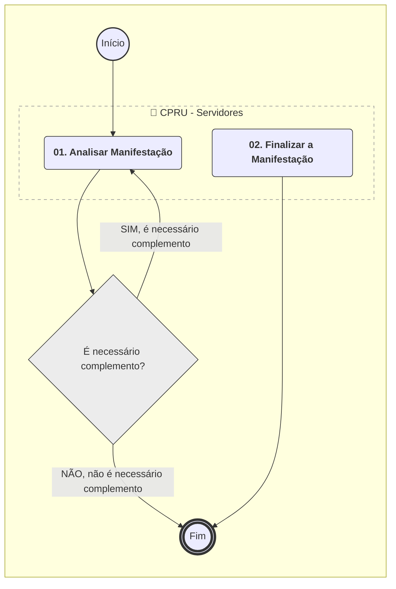

```mermaid
%%{init: {'theme': 'default'}}%%

flowchart TD
    classDef inicio stroke:#333,stroke-width:2px;
    classDef fim stroke:#333,stroke-width:4px;
    classDef tarefaBPMN stroke:#333,stroke-width:1px;
    classDef gatewayBPMN fill:#ececec,stroke:#333,stroke-width:1px;
    classDef raia fill:none,stroke:#999,stroke-width:1px,stroke-dasharray: 5 5;
    subgraph Container_ID_MPR_SAR_502_R04_2 [ ]
        direction TB
        ID_MPR_SAR_502_R04_2_Start((Início)):::inicio
        ID_MPR_SAR_502_R04_2_End(((Fim))):::fim
        subgraph Raia_ID_MPR_SAR_502_R04_2_1 [👤 CPRU - Servidores]
            ID_MPR_SAR_502_R04_2_01("<b>01. Receber a Manifestação</b>"):::tarefaBPMN
            ID_MPR_SAR_502_R04_2_02("<b>02. Analisar e Direcionar a Manifestação</b>"):::tarefaBPMN
            ID_MPR_SAR_502_R04_2_03("<b>03. Monitorar a Manifestação</b>"):::tarefaBPMN
            ID_MPR_SAR_502_R04_2_04("<b>04. Analisar a Resposta da Manifestação</b>"):::tarefaBPMN
            ID_MPR_SAR_502_R04_2_05("<b>05. Enviar Resposta ao Usuário</b>"):::tarefaBPMN
            ID_MPR_SAR_502_R04_2_01("<b>01. Analisar Manifestação</b>"):::tarefaBPMN
            ID_MPR_SAR_502_R04_2_02("<b>02. Finalizar a Manifestação</b>"):::tarefaBPMN
        end
        class Raia_ID_MPR_SAR_502_R04_2_1 raia;
        ID_MPR_SAR_502_R04_2_Start --> ID_MPR_SAR_502_R04_2_01
        ID_MPR_SAR_502_R04_2_01 --> ID_MPR_SAR_502_R04_2_02
        ID_MPR_SAR_502_R04_2_02 --> ID_MPR_SAR_502_R04_2_03
        ID_MPR_SAR_502_R04_2_03 --> ID_MPR_SAR_502_R04_2_04
        ID_MPR_SAR_502_R04_2_04 --> ID_MPR_SAR_502_R04_2_05
        ID_MPR_SAR_502_R04_2_05 --> ID_MPR_SAR_502_R04_2_End
        gw_ID_MPR_SAR_502_R04_2_01{"É necessário complemento?"}:::gatewayBPMN
        ID_MPR_SAR_502_R04_2_01 --> gw_ID_MPR_SAR_502_R04_2_01
        gw_ID_MPR_SAR_502_R04_2_01 -->|"SIM, é necessário complemento"| ID_MPR_SAR_502_R04_2_01
        gw_ID_MPR_SAR_502_R04_2_01 -->|"NÃO, não é necessário complemento"| ID_MPR_SAR_502_R04_2_End
        ID_MPR_SAR_502_R04_2_02 --> ID_MPR_SAR_502_R04_2_End
    end
    click ID_MPR_SAR_502_R04_2_01 href "#" "1 – Após a Ouvidoria atribuir as manifestações cadastradas pelos usuários no canal fala.br (CitSmart) às Superintendências, conforme assunto específico, a CPRU (representando a GTPL), verifica diariamente o fluxo do CitSmart (https://portaldeservicos.anac.gov.br/citsmart/pages/experienceCenter/experienceCenter.load#/workplace?idExperienceCenter=1&idWorkplace=203) através de um relatório gerado e atualizado várias vezes ao dia;  2 – Primeiramente faz-se necessário entrar no campo “manifestações em tratamento (com informação de prazo)” e filtra os campos: Grupo (todos); Limite (100); e por fim “Gerar relatório”;  3 – Após o preenchimento desses campos é gerado um relatório de todas as manifestações que estão em andamento na caixa da SAR, entre elas: solicitação; reclamação; denúncia; e elogio;  4 – Todas as manifestações constantes nesse relatório são cadastradas através de abertura de processo no SEI;  5 – O processo SEI é criado, sob o tema “Aeronavegabilidade: Tratamento de manifestações externas na SAR”;  6 – Dentro do processo deve-se criar e preencher o formulário “Solicitação de Resposta à Manifestação Externa”;  7 – O formulário possui alguns campos que devem ser preenchidos, como: Gerência; Data; Número de manifestação (NUP do CITSmart); Prazo de resposta; Teor da manifestação; e se possui anexo ou não;  8 – Caso possua anexo, faz-se necessário incluir dentro do processo SEI;  9 – O próximo passo após o processo ser criado no SEI é cadastrá-lo também no Planner Teams para controle interno, é através dele que é feito o controle do prazo de resposta da área técnica, e mostra também em qual fase o processo se encontra;  10 – No Planner possui as caixas das fases dos processos: Para assinatura; Aguardando resposta; Aguardando resposta GCPP; Aguardando Gisele/João; Responder no CITSmart; Manifestação respondida; Manifestação respondida drone; e Atualizar BC-SAR;  11 – Faz-se necessário preencher o nome da Gerência responsável, Número do NUP/manifestação, no campo anotações informar o número do processo SEI, colocar a etiqueta conforme designação, informar data de início e prazo da manifestação; e  12 – Após o processo ser incluído no Planner e o formulário no SEI preenchido, a pessoa que cadastra atribui o processo para a pessoa que irá analisar, assinar e enviar para a área técnica.  • Quando há Denúncia o procedimento é o mesmo, a manifestação chega pelo CITsmart, cadastra no SEI e no Planner. A única diferença é o tipo de processo que é “Apuração/Denúncia: Manifestação”.  • Quando há LAI, ela é aberta diretamente pela Ouvidoria no SEI e tramitado para a GTPL. Quando o processo chega na GTPL ele fica na caixa de entrada no SEI e outro processo é aberto para enviar à área técnica responsável. O mesmo trâmite é feito: Abertura de processo, cadastro no planner para controle, análise, assinatura, envio para a área técnica responder. Assim que o processo retorna da área técnica com a resposta ele é imediatamente concluído no SEI e dado baixa no Planner. A resposta para o usuário é incluída no processo LAI que chegou da Ouvidoria, assinado e enviado para o SIC – Serviço de Informação ao Cidadão. Caso a LAI seja de Segunda ou Terceira instância, é enviado para a assinatura do SAR."
    click ID_MPR_SAR_502_R04_2_02 href "#" "1 - A análise é feita para verificar se o assunto está de acordo com a área técnica (a qual o processo será enviado), se falta alguma informação, se é necessário solicitar complementação ao usuário;  2 – Verificar se foi preenchido o formulário no processo SEI “Solicitação de resposta à manifestação externa”, nos campos: Gerência; Data; Número de manifestação; Prazo de resposta; Teor da manifestação; e anexo, há uma conferência no teor do assunto:  3 – Verificar se o assunto é realmente de competência da Gerência que está no formulário;  4 – Certificar-se de que a manifestação está clara, que não falta nenhuma informação por parte do usuário;  5 – Conferir se não falta nenhum documento;  6 – Caso a manifestação tenha todas as informações necessárias para que a área técnica consiga responder o usuário, ela é assinada e o processo é tramitado para a Gerência responsável;  7 – Caso a manifestação esteja incompleta, faz-se necessário solicitar complementação ao usuário no CITSmart no campo “Solicitar complementação”."
    click ID_MPR_SAR_502_R04_2_03 href "#" "A CPRU deve monitorar os prazos de respostas às manifestações.  1 – Todas as manifestações possuem prazos e é indispensável monitorar para não os perder: Prazo de resposta ao usuário; prazo para prorrogação; e prazo de rejeição;  2 – Prazo de resposta ao usuário: A monitoração é feita através do Planner Teams, ao cadastrar os processos no Planner é imprescindível informar o prazo de resposta para o usuário (data limite da tarefa), sempre um (1) dia antes do prazo do CITSmart.  Ex: Data limite no CITSmart – dia 10  Data limite no Planner – dia 09  Solicitação de resposta – dia 08  A solicitação de resposta é feita por e-mail dois (2) dias antes do vencimento no CITSmart.  Informar que o prazo para responder o usuário se encerra em um dia, se será possível responder ou será necessário prorrogar o prazo; e caso necessário, falar diretamente com o servidor que está responsável pelo processo;  3 – Prazo para prorrogação: A solicitação para prorrogação do prazo de resposta para o usuário é feita no CITSmart, nos passos: Motivo de prorrogação – Justificativa – Enviar pedido de prorrogação. Caso a área técnica não consiga responder a manifestação dentro do prazo, ela irá solicitar para prorrogar. A prorrogação pode ser feita até um (1) antes do vencimento no CITSmart, não é possível prorrogar o prazo na data de vencimento;  Ex: Data limite no CITSmart – dia 10  Data limite para prorrogar – dia 09  Solicitada a prorrogação de prazo a Ouvidoria pode aprovar ou não o pedido, faz-se necessário monitorar para que não se perca o prazo total da manifestação;  4 – Prazo de rejeição: O prazo de rejeição à Ouvidoria é de dois (2) dias, em que a manifestação é atribuída à SAR pela OUV no CitSmart."
    click ID_MPR_SAR_502_R04_2_04 href "#" "1 – Após o processo SEI retornar para o NEA/SAR com a resposta para o usuário, a primeira coisa a ser analisada pela CPRU é se todas as perguntas feitas pelo usuário foram sanadas, se a resposta está de acordo e coerente;  2 – Caso falte alguma informação é necessário solicitar ao servidor que elabore uma resposta com todas as informações;  3 – A Gerência Técnica terá preenchido o formulário de “Proposta de resposta à manifestação externa”, onde é incluída a resposta;  4 – Além da resposta, há também a informação se a manifestação precisa ser incluída no Banco de Conhecimento da SAR e se precisa de complementação por parte de outra área técnica;  5 – Caso precise de complementação de outra área dentro da SAR, é somente enviar o processo para a outra Gerência solicitando complemento da resposta e atualizar o processo no Planner;  6 – Caso a complementação seja de outra Superintendência, faz-se necessário acrescentar a resposta da SAR no CITSmart e solicitar a complementação;  7 – Para solicitar complementação à outra Superintendência: Incluir a resposta em “Ocorrência” e informar para qual Superintendência deve ser complementada a resposta; Após incluir a resposta SAR e solicitar a complementação, ir em “solicitar composição à GTGI”  8 – A GTGI enviará para a outra Superintendência que irá complementar a resposta e a  manifestação ficará em posse dela;  9 – Por fim, a resposta será complementada e posteriormente respondida ao usuário."
    click ID_MPR_SAR_502_R04_2_05 href "#" "1 – Entrar no CITSmart e ir na opção “responder ao usuário”;  2 – Incluir a resposta ao usuário, sempre iniciar:  Prezado(a) Senhor(a),  Resposta.  Texto que fica na base de dados do CITsmat.  3 – Informar se a demanda foi resolvida: Sim ou não;  4 – Informar qual o motivo da demanda: Solicitação atendida; Solicitação parcialmente atendida; Solicitação não atendida; Perda de objeto; Ausência de competência; Outros;  5 – Conclusão do setor: SAR;  6 – Informar qual o assunto e sub assunto da manifestação;  7 – Por fim, informar o tipo de resposta: Resposta conclusiva;  8 – Após informar todos esses campos, é necessário gravar e enviar a manifestação;  9 - Feito isso a resposta vai direto para o usuário, o qual poderá responder a Pesquisa de Satisfação;  10 – Caso a resposta seja de segunda instancia a resposta irá primeiramente para a Ouvidoria, a qual também fará a análise se foi respondido tudo conforme solicitado, se a resposta está clara e coerente, e se estiver tudo certo a resposta irá para o usuário; e  11 - O processo SEI é arquivado, o Planner é atualizado e a manifestação tem seu destino final."
    click ID_MPR_SAR_502_R04_2_01 href "#" "• Acessar o TEAMS > Planner > CPRU – MANIFESTAÇÕES > Para assinatura.  • Na coluna Para assinatura, iremos analisar um por vez, apenas os cartões com as etiquetas SISANT, abra o cartão, copie o n. do processo SEI, e acesse o sistema SEI https://sei.anac.gov.br/sip/login.php?sigla\_orgao\_sistema=ANAC&sigla\_sistema=SEI, cole o número do processo no sistema SEI para encontra-lo, após encontrar o processo, click na Solicitação de Resposta à Manifestação, para visualizar a manifestação feita pelo usuário.  • No campo da descrição da Manifestação, podemos verificar o relato do usuário e identificar qual tratamento que precisamos dar para a manifestação. Vou citar dois tipos de assuntos mais frequentes, são eles a seguir:  1. Problema no sistema SISANT, relacionado a drones:  Quando os usuários relatarem os assuntos relacionados abaixo:  \*O Drone sumiu da relação de cadastro;  \*Que está tentando cadastrar o drone, mas não está localizando o CNPJ da empresa;  \*Consigo acessar, mas não consigo ver algumas certidões;  \*Cadastrei peso da aeronave errado;  \*Cadastrei o peso correto do equipamento, mas consta errado no SARPAS;  \*Problemas de cadastro relacionado ao SARPAS; e  \*Quando o usuário vincula equivocadamente um drone em outra empresa CNPJ.  Tratamos esses tipos de assuntos com os Suportes de TI da SAR - João Carlos Hertel Santiago, Gabriela Porto Louzada e Leandro Costa Pereira Crispim de Sousa.  2. Atualização de dados básicos:  Quando o usuário relatar:  \* Que está bloqueado e não está recebendo o e-mail de desbloqueio/ou e-mail de validação. Provavelmente, o e-mail constante em seu cadastro está desatualizado, por isso, ele foi bloqueado e também não está recebendo o e-mail de validação, impedindo seu acesso ao sistema GOV.BR.  \*Quando o usuário solicita troca de e-mail;  \*Quando o usuário solicita atualização do nome; e  \*Quando o usuário solicita troca de e-mail e esse e-mail já está sendo utilizado em outro cadastro. Fazemos a redefinição para o mesmo e-mail que está no cadastro e solicitamos que ele nos informe outro e-mail.  Todos os assuntos relacionados acima, são de competência nossa “GTPL”, com o problema resolvido, precisamos preparar a resposta para o usuário, colocando essa resposta no Atualizar andamento, no processo SEI, concluir o processo SEI, colar a mesma resposta no cartão do planner, e enviar o cartão para Responder no CITSmart, para finalizar o cartão.  Quando a manifestação tem complementação: Vale ressaltar, que recebemos algumas manifestações faltando informações essenciais tais como: nome, cpf, nota fiscal, número de cadastro e serie do equipamento, quando faltam essas informações, precisamos enviar uma mensagem para o usuário, solicitando as informações desejadas através da complementação de manifestação, depois no planner mudamos o cartão do planner tirando Para assinatura e enviando para Aguardando Resposta SISANT, quando o usuário responde, resolvemos o problema com a área técnica, prepararmos a resposta para o usuário, colocando essa resposta no Atualizar andamento, no processo SEI, concluir o processo SEI, colar a mesma resposta no cartão do planner, e enviar o cartão para Responder no CITSmart, para finalizar o cartão.  Quando a manifestação não tem complementação: Resolvemos o problema com a área técnica, preparamos a resposta para o usuário, colocando essa resposta no Atualizar andamento, no processo SEI, concluir o processo SEI, colar a mesma resposta no cartão do planner, e enviar o cartão para Responder no CITSmart, para finalizar o cartão."
    click ID_MPR_SAR_502_R04_2_02 href "#" "Todos os assuntos relacionados acima, são de competência nossa “GTPL”, com o problema resolvido, precisamos preparar a resposta para o usuário, colocando essa resposta no Atualizar andamento, no processo SEI, concluir o processo SEI, colar a mesma resposta no cartão do planner, e enviar o cartão para Responder no CITSmart, para finalizar o cartão.  Quando a manifestação tem complementação: Vale ressaltar, que recebemos algumas manifestações faltando informações essenciais tais como: nome, cpf, nota fiscal, número de cadastro e serie do equipamento, quando faltam essas informações, precisamos enviar uma mensagem para o usuário, solicitando as informações desejadas através da complementação de manifestação, depois no planner mudamos o cartão do planner tirando Para assinatura e enviando para Aguardando Resposta SISANT, quando o usuário responde, resolvemos o problema com a área técnica, prepararmos a resposta para o usuário, colocando essa resposta no Atualizar andamento, no processo SEI, concluir o processo SEI, colar a mesma resposta no cartão do planner, e enviar o cartão para Responder no CITSmart, para finalizar o cartão.  Quando a manifestação não tem complementação: Resolvemos o problema com a área técnica, preparamos a resposta para o usuário, colocando essa resposta no Atualizar andamento, no processo SEI, concluir o processo SEI, colar a mesma resposta no cartão do planner, e enviar o cartão para Responder no CITSmart, para finalizar o cartão."
```

**MANUAL DE PROCEDIMENTO**

**MPR/SAR-502-R04**

**TRATAMENTO DE MANIFESTAÇÕES EXTERNAS NA SAR**

12/2025

**REVISÕES**

|  |  |  |  |  |
| --- | --- | --- | --- | --- |
| **Revisão** | **Aprovação** | **Publicação** | **Aprovado Por** | **Modificações da Última Versão** |
| R00 | Portaria Nº 1.764, de 23 de Maio de 2017 | Não informado | SAR | Versão Original |
| R01 | Portaria Nº 1198, de 11 de Abril de 2018 | Não informado | SAR | 1) Processo 'Controlar Respostas a Demandas da Ouvidoria no STELLA para a SAR' removido.  2) Processo 'Controlar Respostas a Manifestações da GTGI no STELLA para a SAR' removido.  3) Processo 'Consultar Manifestações Externas de Competência da SAR' inserido.  4) Processo 'Responder Manifestações Externas na SAR' inserido. |
| R02 | Portaria Nº 3349, de 29 de Outubro de 2019 | Não informado | SAR | 1) Processo 'Atualizar Banco de Conhecimentos da SAR' inserido.  2) Processo 'Consultar Manifestações Externas de Competência da SAR' modificado.  3) Processo 'Responder Manifestações Externas na SAR' modificado. |
| R03 | PORTARIA No 2.200, DE 27 DE AGOSTO DE 2020. | Não informado | SAR | 1) Processo 'Consultar Manifestações Externas de Competência da SAR' modificado.  2) Processo 'Responder Manifestações Externas na SAR' modificado.  3) Processo 'Atualizar Banco de Conhecimentos da SAR' modificado. |
| R04 | PORTARIA No 18.374, DE 11 DE DEZEMBRO DE 2025. | 12/12/2025 | SAR | 1) Processo 'Consultar Manifestações Externas de Competência da SAR' removido.  2) Processo 'Responder Manifestações Externas na SAR' removido.  3) Processo 'Tratar Manifestações Relacionadas a Drones' inserido.  4) Processo 'Tratar Manifestações na SAR' inserido.  5) Processo 'Analisar a Pesquisa de Satisfação das Manifestações Direcionadas à SAR' inserido.  6) Processo 'Atualizar Banco de Conhecimentos da SAR' modificado. |

**ÍNDICE**

1) Disposições Preliminares, pág. 6.

1.1) Introdução, pág. 6.

1.2) Revogação, pág. 7.

1.3) Fundamentação, pág. 7.

1.4) Executores dos Processos, pág. 7.

1.5) Elaboração e Revisão, pág. 7.

1.6) Organização do Documento, pág. 8.

2) Definições, pág. 10.

2.1) Sigla, pág. 10.

3) Artefatos, Competências, Sistemas e Documentos Administrativos, pág. 11.

3.1) Artefatos, pág. 11.

3.2) Competências, pág. 11.

3.3) Sistemas, pág. 11.

3.4) Documentos e Processos Administrativos, pág. 11.

4) Procedimentos Referenciados, pág. 12.

5) Procedimentos, pág. 13.

5.1) Analisar a Pesquisa de Satisfação das Manifestações Direcionadas à SAR, pág. 13.

5.2) Atualizar Banco de Conhecimentos da SAR, pág. 16.

5.3) Tratar Manifestações na SAR, pág. 20.

5.4) Tratar Manifestações Relacionadas a Drones, pág. 26.

6) Disposições Finais, pág. 30.

**PARTICIPAÇÃO NA EXECUÇÃO DOS PROCESSOS**

**ÁREAS ORGANIZACIONAIS**

**1) Coordenadoria de Planejamento e Relacionamento com Usuários**

a) Analisar a Pesquisa de Satisfação das Manifestações Direcionadas à SAR

**2) Coordenadoria de Projetos e Processos**

a) Analisar a Pesquisa de Satisfação das Manifestações Direcionadas à SAR

**GRUPOS ORGANIZACIONAIS**

**a) CPRU - Servidores**

1) Atualizar Banco de Conhecimentos da SAR

2) Tratar Manifestações na SAR

3) Tratar Manifestações Relacionadas a Drones

**1. DISPOSIÇÕES PRELIMINARES**

**1.1 INTRODUÇÃO**

Este MPR descreve os processos que possibilitam aos servidores envolvidos analisar e responder demandas recebidas pelos sistemas padrão de comunicação com o usuário (CITSmart).

Esta versão foi executada e aprovada pelo processo SEI 00058.089587/2024-16. Consultar o processo para maior detalhamento.

1.1.1 Papéis e Responsabilidades

É competência das Superintendências, definida no Regimento Interno, planejar, organizar, executar, controlar, coordenar e avaliar os processos organizacionais e operacionais da ANAC no âmbito de suas competências.

Cada Superintendência, em conformidade com os preceitos descritos pela Lei de Acesso à Informação (LAI) – nº 12.527 – e em compatibilidade com a exigência de canais de comunicação acessível ao cidadão/usuário, atribuiu internamente a uma unidade organizacional o papel de gestão e acompanhamento dessas demandas, sendo a Gerência Técnica de Planejamento e Acompanhamento a responsável por esse papel no âmbito da SAR.

1.1.2 Política e Diretrizes

Este MPR define os processos necessários para o recebimento, análise e distribuição de demandas recebidas pelo canal CITSmart no âmbito da SAR.

A Lei de Acesso à Informação (LAI) – nº 12.527 – dispõe sobre os procedimentos a serem observados pela União, Estados e Municípios com a finalidade de garantir acesso à informação por parte dos cidadãos. Nesse sentido, em observância ao disposto nessa lei, os sistemas tratados nesse MPR são o principal meio utilizado para a obtenção dessas informações.

Além da Lei de Acesso à Informação, o princípio da Transparência, ao qual à Agência (bem como as demais instituições públicas) está submetida, pressupõe – resguardados casos específicos de sigilo – a divulgação das ações do governo, disponibilizando dados de forma clara e acessível.

1.1.3 Processo

O MPR estabelece, no âmbito da Superintendência de Aeronavegabilidade - SAR, os seguintes processos de trabalho:

a) Analisar a Pesquisa de Satisfação das Manifestações Direcionadas à SAR.

b) Atualizar Banco de Conhecimentos da SAR.

c) Tratar Manifestações na SAR.

d) Tratar Manifestações Relacionadas a Drones.

**1.2 REVOGAÇÃO**

MPR/SAR-502-R03, aprovado na data de 27 de agosto de 2020.

**1.3 FUNDAMENTAÇÃO**

Resolução nº 381, de 14 de junho de 2016, art. 31.

**1.4 EXECUTORES DOS PROCESSOS**

Os procedimentos contidos neste documento aplicam-se aos servidores integrantes das seguintes áreas organizacionais:

|  |  |
| --- | --- |
| **Área Organizacional** | **Descrição** |
| Coordenadoria de Planejamento e Relacionamento com Usuários - CPRU | Coordenadoria responsável pelas atividades de planejamento pela atuação como Serviço Especializado em Atendimento de Manifestações (SEAM). |
| Coordenadoria de Projetos e Processos - CDPP | Coordenadoria responsável pela gestão de projetos e de processos da SAR. |

|  |  |
| --- | --- |
| **Grupo Organizacional** | **Descrição** |
| CPRU - Servidores | Grupo dos Servidores da Coordenadoria de Planejamento e Relacionamento com Usuários |

**1.5 ELABORAÇÃO E REVISÃO**

O processo que resulta na aprovação ou alteração deste MPR é de responsabilidade da Superintendência de Aeronavegabilidade - SAR. Em caso de sugestões de revisão, deve-se procurá-la para que sejam iniciadas as providências cabíveis.

As revisões deste MPR serão aprovadas pelo(s) titular(es) da(s) unidade(s) responsável(is) pela execução do(s) processo(s) nele listado(s).

**1.6 ORGANIZAÇÃO DO DOCUMENTO**

O capítulo 2 apresenta as principais definições utilizadas no âmbito deste MPR, e deve ser visto integralmente antes da leitura de capítulos posteriores.

O capítulo 3 apresenta as competências, os artefatos e os sistemas envolvidos na execução dos processos deste manual, em ordem relativamente cronológica.

O capítulo 4 apresenta os processos de trabalho referenciados neste MPR. Estes processos são publicados em outros manuais que não este, mas cuja leitura é essencial para o entendimento dos processos publicados neste manual. O capítulo 4 expõe em quais manuais são localizados cada um dos processos de trabalho referenciados.

O capítulo 5 apresenta os processos de trabalho. Para encontrar um processo específico, deve-se procurar sua respectiva página no índice contido no início do documento. Os processos estão ordenados em etapas. Cada etapa é contida em uma tabela, que possui em si todas as informações necessárias para sua realização. São elas, respectivamente:

a) o título da etapa;

b) a descrição da forma de execução da etapa;

c) as competências necessárias para a execução da etapa;

d) os artefatos necessários para a execução da etapa;

e) os sistemas necessários para a execução da etapa (incluindo, bases de dados em forma de arquivo, se existente);

f) os documentos e processos administrativos que precisam ser elaborados durante a execução da etapa;

g) instruções para as próximas etapas; e

h) as áreas ou grupos organizacionais responsáveis por executar a etapa.

O capítulo 6 apresenta as disposições finais do documento, que trata das ações a serem realizadas em casos não previstos.

Por último, é importante comunicar que este documento foi gerado automaticamente. São recuperados dados sobre as etapas e sua sequência, as definições, os grupos, as áreas organizacionais, os artefatos, as competências, os sistemas, entre outros, para os processos de trabalho aqui apresentados, de forma que alguma mecanicidade na apresentação das informações pode ser percebida. O documento sempre apresenta as informações mais atualizadas de nomes e siglas de grupos, áreas, artefatos, termos, sistemas e suas definições, conforme informação disponível na base de dados, independente da data de assinatura do documento. Informações sobre etapas, seu detalhamento, a sequência entre etapas, responsáveis pelas etapas, artefatos, competências e sistemas associados a etapas, assim como seus nomes e os nomes de seus processos têm suas definições idênticas à da data de assinatura do documento.

**2. DEFINIÇÕES**

A tabela abaixo apresenta as definições necessárias para o entendimento deste Manual de Procedimento.

**2.1 Sigla**

|  |  |
| --- | --- |
| **Definição** | **Significado** |
| GTGI | Gerência Técnica de Gestão da Informação |
| LAI | Lei de Acesso à Informação |
| MPR | Manual de Procedimento – Documento de caráter disciplinador, de âmbito interno, assinado e aprovado por autoridade competente, que tem como objetivo documentar e padronizar os processos de trabalho realizados pelos agentes da ANAC. Possui informações sobre o fluxo de trabalho, detalhamento das etapas, competências necessárias, artefatos a serem utilizados, sistemas de apoio e áreas responsáveis pela execução. |
| SAR | Superintendência de Aeronavegabilidade |

**3. ARTEFATOS, COMPETÊNCIAS, SISTEMAS E DOCUMENTOS ADMINISTRATIVOS**

Abaixo se encontram as listas dos artefatos, competências, sistemas e documentos administrativos que o executor necessita consultar, preencher, analisar ou elaborar para executar os processos deste MPR. As etapas descritas no capítulo seguinte indicam onde usar cada um deles.

As competências devem ser adquiridas por meio de capacitação ou outros instrumentos e os artefatos se encontram no módulo "Artefatos" do sistema GFT - Gerenciador de Fluxos de Trabalho.

**3.1 ARTEFATOS**

Não há artefatos descritos para a realização deste MPR.

**3.2 COMPETÊNCIAS**

Para que os processos de trabalho contidos neste MPR possam ser realizados com qualidade e efetividade, é importante que as pessoas que venham a executá-los possuam um determinado conjunto de competências. No capítulo 5, as competências específicas que o executor de cada etapa de cada processo de trabalho deve possuir são apresentadas. A seguir, encontra-se uma lista geral das competências contidas em todos os processos de trabalho deste MPR e a indicação de qual área ou grupo organizacional as necessitam:

Não há competências descritas para a realização deste MPR.

**3.3 SISTEMAS**

|  |  |  |
| --- | --- | --- |
| **Nome** | **Descrição** | **Acesso** |
| SEI | Sistema Eletrônico de Informação. | https://sei.anac.gov.br/sip/login.php?sigla\_orgao\_sistema=ANAC&sigla\_sistema=SEI |

**3.4 DOCUMENTOS E PROCESSOS ADMINISTRATIVOS ELABORADOS NESTE MANUAL**

Não há documentos ou processos administrativos a serem elaborados neste MPR.

**4. PROCEDIMENTOS REFERENCIADOS**

Procedimentos referenciados são processos de trabalho publicados em outro MPR que têm relação com os processos de trabalho publicados por este manual. Este MPR não possui nenhum processo de trabalho referenciado.

**5. PROCEDIMENTOS**

Este capítulo apresenta todos os processos de trabalho deste MPR. Para encontrar um processo específico, utilize o índice nas páginas iniciais deste documento. Ao final de cada etapa encontram-se descritas as orientações necessárias à continuidade da execução do processo. O presente MPR também está disponível de forma mais conveniente em versão eletrônica, onde pode(m) ser obtido(s) o(s) artefato(s) e outras informações sobre o processo.

**5.1 Analisar a Pesquisa de Satisfação das Manifestações Direcionadas à SAR**

Este processo descreve a análise de melhorias, realizado a cada três meses, visando obter um relatório do tipo de melhorias que mais tem sido solicitadas nas manifestações.

O processo contém, ao todo, 3 etapas. A situação que inicia o processo, chamada de evento de início, foi descrita como: "Trimestralmente", portanto, este processo deve ser executado sempre que este evento acontecer. O solicitante deve seguir a seguinte instrução: '{\rtf1\ansi\deff0{\fonttbl{\f0\fnil\fcharset0 Microsoft Sans Serif;}}\viewkind4\uc1\pard\lang1046\f0\fs17 Esse evento deve ser editado para representar a situação que inicia o processo Cada processo possui somente um evento de inícioColoque aqui as instruções que devem ser seguidas pelo solicitante para pedir estar demanda\par}'.

O processo é considerado concluído quando alcança seu evento de fim. O evento de fim descrito para esse processo é: "Registro de oportunidade de melhoria finalizado.

As áreas envolvidas na execução deste processo são: CDPP, CPRU.

Abaixo se encontra(m) a(s) etapa(s) a ser(em) realizada(s) na execução deste processo e o diagrama do fluxo.


### 5.1 Analisar a Pesquisa de Satisfação das Manifestações Direcionadas à SAR




|  |
| --- |
| **01. Extrair o relatório de manifestações do período** |
| RESPONSÁVEL PELA EXECUÇÃO: CPRU. |
| DETALHAMENTO: A CPRU deve entrar em contato com a Ouvidoria e solicitar um extrato das respostas às pesquisas de satisfação de atendimento às manifestações.  A frequência para realização dessa tarefa é trimestral. |
| CONTINUIDADE: deve-se seguir para a etapa "02. Agrupar registros por assunto". |

|  |
| --- |
| **02. Agrupar registros por assunto** |
| RESPONSÁVEL PELA EXECUÇÃO: CPRU. |
| DETALHAMENTO: De posse do extrato fornecido pela Ouvidoria, a CPRU deve analisar a tabela com foco nas perguntas:  a) “A sua demanda foi atendida?”  b) “A resposta fornecida foi fácil de compreender?”  c) “Você está satisfeito(a) com o atendimento prestado?”  Para essas perguntas, a equipe de análise deve separar aquelas cujas respostas atribuídas foram, respectivamente:  a) “Não” ou “Parcialmente atendida”  b) “Regular” ou “Difícil de compreender” ou “Muito difícil de compreender”  c) “Regular” ou “Insatisfeito” ou “Muito insatisfeito” |
| CONTINUIDADE: deve-se seguir para a etapa "03. Identificar e registrar oportunidades de melhoria". |

|  |
| --- |
| **03. Identificar e registrar oportunidades de melhoria** |
| RESPONSÁVEL PELA EXECUÇÃO: CPRU. |
| DETALHAMENTO: Todas as respostas agrupadas na etapa acima devem ser avaliadas, fazendo-se a leitura do teor da manifestação e da resposta enviada ao solicitante, bem como de seu comentário, caso haja.  A CPRU deve buscar entender o porquê da insatisfação e fazer uma separação dos resultados por área responsável pela resposta ou pela solução do problema apontado. Posteriormente, deve se reunir com a área responsável e apresentar todas as respostas pertinentes a ela.  A CPRU deve, na reunião com a área, identificar oportunidades de tornar melhores as respostas/soluções e registrá-las para que possa monitorar o efeito das ações de melhorias propostas em avaliações futuras. |
| CONTINUIDADE: esta etapa finaliza o procedimento. |

**5.2 Atualizar Banco de Conhecimentos da SAR**

Este procedimento detalha as etapas necessárias para a inclusão ou atualização das informações constantes no banco de conhecimentos da SAR.

O processo contém, ao todo, 5 etapas. A situação que inicia o processo, chamada de evento de início, foi descrita como: "Manifestação Recebida", portanto, este processo deve ser executado sempre que este evento acontecer. Da mesma forma, o processo é considerado concluído quando alcança seu evento de fim. O evento de fim descrito para esse processo é: "Processo concluído.

O grupo envolvido na execução deste processo é: CPRU - Servidores.

Abaixo se encontra(m) a(s) etapa(s) a ser(em) realizada(s) na execução deste processo e o diagrama do fluxo.


### 5.1 Analisar a Pesquisa de Satisfação das Manifestações Direcionadas à SAR




|  |
| --- |
| **01. Criar processo** |
| RESPONSÁVEL PELA EXECUÇÃO: CPRU - Servidores. |
| DETALHAMENTO: 1 – Primeiramente as manifestações chegam através do canal FALA.br pelo CITSmart https://portaldeservicos.anac.gov.br/citsmart/pages/smartPortal/smartPortal.load  2 – A GTPL/CPRU dá entrada na manifestação através da criação de processo no SEI https://sei.anac.gov.br/sip/login.php?sigla\_orgao\_sistema=ANAC&sigla\_sistema=SEI  2.1 – Iniciar processo  2.2 – Escolha do Tipo do Processo: “Aeronavegabilidade: Tratamento de manifestações externas na SAR”  2.3 – Incluir o interessado que é a Gerência Técnica responsável pela resposta  2.4 – Incluir Nível de Acesso “Público” e salvar  2.5 – Com essas etapas vai gerar um número de processo, o próximo passo é incluir documento  2.6 – Escolha o tipo de documento: “Solicitação de resposta à manifestação – SEAM/SAR  2.7 – Incluir Nível de Acesso “Público” e salvar  2.8 – Inserir todos os dados necessários nesse formulário: Número de manifestação; Prazo de resposta; Descrição da manifestação; Se há anexo ou não; Informar a área a qual o processo será enviado  2.9 – Salvar e assinar  3 – Incluir o processo no planner para controle da CPRU |
| CONTINUIDADE: deve-se seguir para a etapa "02. Eviar processo para área técnica". |

|  |
| --- |
| **02. Eviar processo para área técnica** |
| RESPONSÁVEL PELA EXECUÇÃO: CPRU - Servidores. |
| DETALHAMENTO: Com o processo criado no SEI e assinado é somente enviar para a área responsável pela resposta. |
| CONTINUIDADE: deve-se seguir para a etapa "03. Coletar resposta da área técnica". |

|  |
| --- |
| **03. Coletar resposta da área técnica** |
| RESPONSÁVEL PELA EXECUÇÃO: CPRU - Servidores. |
| DETALHAMENTO: Assim que o processo retorna com a resposta para a GTPL/CPRU, tem um campo em que a Gerência tem a opção de informar se a manifestação é para ser incluída no Banco de conhecimento da SAR ou não |
| CONTINUIDADE: caso a resposta para a pergunta "A manifestação vai para o BC?" seja "SIM, vai para o BC", deve-se seguir para a etapa "04. Incluir nos bancos de dados". Caso a resposta seja "NÃO, não vai para o BC", deve-se seguir para a etapa "05. Concluir Manifestação". |

|  |
| --- |
| **04. Incluir nos bancos de dados** |
| RESPONSÁVEL PELA EXECUÇÃO: CPRU - Servidores. |
| DETALHAMENTO: 1 - Caso a resposta para a pergunta “A manifestação vai para o BC?” seja “SIM, vai para o BC” ela precisa ser inserida no BC, o processo é alocado dentro do planner na caixa BC da SAR: Teams/Planner/CPRU – Manifestações/Atualizar BC-SAR  2 - A atualização é feita primeiramente no grupo da CPRU no TEAMS: Teams/Equipes e Canais/CPRU/Manifestações/Arquivos/BC da SAR  3 - Após atualizar a planilha dentro do TEAMS é feita a atualização no banco Wiki ANAC em que é disponível para toda a SAR: https://wiki.anac.gov.br/wiki/index.php/Perguntas\_Frequentes/Servi%C3%A7os/SAR#Temas  4 - A Dinâmica do BC da SAR é que todos possam navegar livremente por ele, e caso alguém sinta a necessidade de inclusão, exclusão, quaisquer que forem as alteações, que entrem em contato com a CPRU para a edição do mesmo. |
| CONTINUIDADE: esta etapa finaliza o procedimento. |

|  |
| --- |
| **05. Concluir Manifestação** |
| RESPONSÁVEL PELA EXECUÇÃO: CPRU - Servidores. |
| DETALHAMENTO: 1 - Feita as duas atualizações, o processo é concluído no SEI e no Planner  2 - O BC é atualizado semanalmente e estamos no período de edição dentro da Wiki da ANAC. |
| CONTINUIDADE: esta etapa finaliza o procedimento. |

**5.3 Tratar Manifestações na SAR**

Descreve como é realizado o tratamento de manifestações na SAR.

O processo contém, ao todo, 5 etapas. A situação que inicia o processo, chamada de evento de início, foi descrita como: "Manifestação cadastrada", portanto, este processo deve ser executado sempre que este evento acontecer. O solicitante deve seguir a seguinte instrução: '{\rtf1\ansi\deff0{\fonttbl{\f0\fnil\fcharset0 Microsoft Sans Serif;}}\viewkind4\uc1\pard\lang1046\f0\fs17 Esse evento deve ser editado para representar a situação que inicia o processo Cada processo possui somente um evento de inícioColoque aqui as instruções que devem ser seguidas pelo solicitante para pedir estar demanda\par}'.

O processo é considerado concluído quando alcança seu evento de fim. O evento de fim descrito para esse processo é: "Resposta Enviada.

O grupo envolvido na execução deste processo é: CPRU - Servidores.

Abaixo se encontra(m) a(s) etapa(s) a ser(em) realizada(s) na execução deste processo e o diagrama do fluxo.


### 5.1 Analisar a Pesquisa de Satisfação das Manifestações Direcionadas à SAR

```mermaid
%%{init: {'theme': 'default'}}%%

flowchart TD
    classDef inicio stroke:#333,stroke-width:2px;
    classDef fim stroke:#333,stroke-width:4px;
    classDef tarefaBPMN stroke:#333,stroke-width:1px;
    classDef gatewayBPMN fill:#ececec,stroke:#333,stroke-width:1px;
    classDef raia fill:none,stroke:#999,stroke-width:1px,stroke-dasharray: 5 5;
    subgraph Container_ID_MPR_SAR_502_R04_1 [ ]
        direction TB
        ID_MPR_SAR_502_R04_1_Start((Início)):::inicio
        ID_MPR_SAR_502_R04_1_End(((Fim))):::fim
        subgraph Raia_ID_MPR_SAR_502_R04_1_1 [👤 CPRU - Servidores]
            ID_MPR_SAR_502_R04_1_01("<b>01. Criar processo</b>"):::tarefaBPMN
            ID_MPR_SAR_502_R04_1_02("<b>02. Eviar processo para área técnica</b>"):::tarefaBPMN
            ID_MPR_SAR_502_R04_1_03("<b>03. Coletar resposta da área técnica</b>"):::tarefaBPMN
            ID_MPR_SAR_502_R04_1_04("<b>04. Incluir nos bancos de dados</b>"):::tarefaBPMN
            ID_MPR_SAR_502_R04_1_05("<b>05. Concluir Manifestação</b>"):::tarefaBPMN
            ID_MPR_SAR_502_R04_1_01("<b>01. Receber a Manifestação</b>"):::tarefaBPMN
            ID_MPR_SAR_502_R04_1_02("<b>02. Analisar e Direcionar a Manifestação</b>"):::tarefaBPMN
            ID_MPR_SAR_502_R04_1_03("<b>03. Monitorar a Manifestação</b>"):::tarefaBPMN
            ID_MPR_SAR_502_R04_1_04("<b>04. Analisar a Resposta da Manifestação</b>"):::tarefaBPMN
            ID_MPR_SAR_502_R04_1_05("<b>05. Enviar Resposta ao Usuário</b>"):::tarefaBPMN
            ID_MPR_SAR_502_R04_1_01("<b>01. Analisar Manifestação</b>"):::tarefaBPMN
            ID_MPR_SAR_502_R04_1_02("<b>02. Finalizar a Manifestação</b>"):::tarefaBPMN
        end
        class Raia_ID_MPR_SAR_502_R04_1_1 raia;
        ID_MPR_SAR_502_R04_1_Start --> ID_MPR_SAR_502_R04_1_01
        ID_MPR_SAR_502_R04_1_01 --> ID_MPR_SAR_502_R04_1_02
        ID_MPR_SAR_502_R04_1_02 --> ID_MPR_SAR_502_R04_1_03
        gw_ID_MPR_SAR_502_R04_1_03{"A manifestação vai para o BC?"}:::gatewayBPMN
        ID_MPR_SAR_502_R04_1_03 --> gw_ID_MPR_SAR_502_R04_1_03
        gw_ID_MPR_SAR_502_R04_1_03 -->|"SIM, vai para o BC"| ID_MPR_SAR_502_R04_1_04
        gw_ID_MPR_SAR_502_R04_1_03 -->|"NÃO, não vai para o BC"| ID_MPR_SAR_502_R04_1_05
        ID_MPR_SAR_502_R04_1_04 --> ID_MPR_SAR_502_R04_1_End
        ID_MPR_SAR_502_R04_1_05 --> ID_MPR_SAR_502_R04_1_End
        ID_MPR_SAR_502_R04_1_01 --> ID_MPR_SAR_502_R04_1_02
        ID_MPR_SAR_502_R04_1_02 --> ID_MPR_SAR_502_R04_1_03
        ID_MPR_SAR_502_R04_1_03 --> ID_MPR_SAR_502_R04_1_04
        ID_MPR_SAR_502_R04_1_04 --> ID_MPR_SAR_502_R04_1_05
        ID_MPR_SAR_502_R04_1_05 --> ID_MPR_SAR_502_R04_1_End
        gw_ID_MPR_SAR_502_R04_1_01{"É necessário complemento?"}:::gatewayBPMN
        ID_MPR_SAR_502_R04_1_01 --> gw_ID_MPR_SAR_502_R04_1_01
        gw_ID_MPR_SAR_502_R04_1_01 -->|"SIM, é necessário complemento"| ID_MPR_SAR_502_R04_1_01
        gw_ID_MPR_SAR_502_R04_1_01 -->|"NÃO, não é necessário complemento"| ID_MPR_SAR_502_R04_1_End
        ID_MPR_SAR_502_R04_1_02 --> ID_MPR_SAR_502_R04_1_End
    end
    click ID_MPR_SAR_502_R04_1_01 href "#" "1 – Primeiramente as manifestações chegam através do canal FALA.br pelo CITSmart https://portaldeservicos.anac.gov.br/citsmart/pages/smartPortal/smartPortal.load  2 – A GTPL/CPRU dá entrada na manifestação através da criação de processo no SEI https://sei.anac.gov.br/sip/login.php?sigla\_orgao\_sistema=ANAC&sigla\_sistema=SEI  2.1 – Iniciar processo  2.2 – Escolha do Tipo do Processo: “Aeronavegabilidade: Tratamento de manifestações externas na SAR”  2.3 – Incluir o interessado que é a Gerência Técnica responsável pela resposta  2.4 – Incluir Nível de Acesso “Público” e salvar  2.5 – Com essas etapas vai gerar um número de processo, o próximo passo é incluir documento  2.6 – Escolha o tipo de documento: “Solicitação de resposta à manifestação – SEAM/SAR  2.7 – Incluir Nível de Acesso “Público” e salvar  2.8 – Inserir todos os dados necessários nesse formulário: Número de manifestação; Prazo de resposta; Descrição da manifestação; Se há anexo ou não; Informar a área a qual o processo será enviado  2.9 – Salvar e assinar  3 – Incluir o processo no planner para controle da CPRU"
    click ID_MPR_SAR_502_R04_1_02 href "#" "Com o processo criado no SEI e assinado é somente enviar para a área responsável pela resposta."
    click ID_MPR_SAR_502_R04_1_03 href "#" "Assim que o processo retorna com a resposta para a GTPL/CPRU, tem um campo em que a Gerência tem a opção de informar se a manifestação é para ser incluída no Banco de conhecimento da SAR ou não"
    click ID_MPR_SAR_502_R04_1_04 href "#" "1 - Caso a resposta para a pergunta “A manifestação vai para o BC?” seja “SIM, vai para o BC” ela precisa ser inserida no BC, o processo é alocado dentro do planner na caixa BC da SAR: Teams/Planner/CPRU – Manifestações/Atualizar BC-SAR  2 - A atualização é feita primeiramente no grupo da CPRU no TEAMS: Teams/Equipes e Canais/CPRU/Manifestações/Arquivos/BC da SAR  3 - Após atualizar a planilha dentro do TEAMS é feita a atualização no banco Wiki ANAC em que é disponível para toda a SAR: https://wiki.anac.gov.br/wiki/index.php/Perguntas\_Frequentes/Servi%C3%A7os/SAR#Temas  4 - A Dinâmica do BC da SAR é que todos possam navegar livremente por ele, e caso alguém sinta a necessidade de inclusão, exclusão, quaisquer que forem as alteações, que entrem em contato com a CPRU para a edição do mesmo."
    click ID_MPR_SAR_502_R04_1_05 href "#" "1 - Feita as duas atualizações, o processo é concluído no SEI e no Planner  2 - O BC é atualizado semanalmente e estamos no período de edição dentro da Wiki da ANAC."
    click ID_MPR_SAR_502_R04_1_01 href "#" "1 – Após a Ouvidoria atribuir as manifestações cadastradas pelos usuários no canal fala.br (CitSmart) às Superintendências, conforme assunto específico, a CPRU (representando a GTPL), verifica diariamente o fluxo do CitSmart (https://portaldeservicos.anac.gov.br/citsmart/pages/experienceCenter/experienceCenter.load#/workplace?idExperienceCenter=1&idWorkplace=203) através de um relatório gerado e atualizado várias vezes ao dia;  2 – Primeiramente faz-se necessário entrar no campo “manifestações em tratamento (com informação de prazo)” e filtra os campos: Grupo (todos); Limite (100); e por fim “Gerar relatório”;  3 – Após o preenchimento desses campos é gerado um relatório de todas as manifestações que estão em andamento na caixa da SAR, entre elas: solicitação; reclamação; denúncia; e elogio;  4 – Todas as manifestações constantes nesse relatório são cadastradas através de abertura de processo no SEI;  5 – O processo SEI é criado, sob o tema “Aeronavegabilidade: Tratamento de manifestações externas na SAR”;  6 – Dentro do processo deve-se criar e preencher o formulário “Solicitação de Resposta à Manifestação Externa”;  7 – O formulário possui alguns campos que devem ser preenchidos, como: Gerência; Data; Número de manifestação (NUP do CITSmart); Prazo de resposta; Teor da manifestação; e se possui anexo ou não;  8 – Caso possua anexo, faz-se necessário incluir dentro do processo SEI;  9 – O próximo passo após o processo ser criado no SEI é cadastrá-lo também no Planner Teams para controle interno, é através dele que é feito o controle do prazo de resposta da área técnica, e mostra também em qual fase o processo se encontra;  10 – No Planner possui as caixas das fases dos processos: Para assinatura; Aguardando resposta; Aguardando resposta GCPP; Aguardando Gisele/João; Responder no CITSmart; Manifestação respondida; Manifestação respondida drone; e Atualizar BC-SAR;  11 – Faz-se necessário preencher o nome da Gerência responsável, Número do NUP/manifestação, no campo anotações informar o número do processo SEI, colocar a etiqueta conforme designação, informar data de início e prazo da manifestação; e  12 – Após o processo ser incluído no Planner e o formulário no SEI preenchido, a pessoa que cadastra atribui o processo para a pessoa que irá analisar, assinar e enviar para a área técnica.  • Quando há Denúncia o procedimento é o mesmo, a manifestação chega pelo CITsmart, cadastra no SEI e no Planner. A única diferença é o tipo de processo que é “Apuração/Denúncia: Manifestação”.  • Quando há LAI, ela é aberta diretamente pela Ouvidoria no SEI e tramitado para a GTPL. Quando o processo chega na GTPL ele fica na caixa de entrada no SEI e outro processo é aberto para enviar à área técnica responsável. O mesmo trâmite é feito: Abertura de processo, cadastro no planner para controle, análise, assinatura, envio para a área técnica responder. Assim que o processo retorna da área técnica com a resposta ele é imediatamente concluído no SEI e dado baixa no Planner. A resposta para o usuário é incluída no processo LAI que chegou da Ouvidoria, assinado e enviado para o SIC – Serviço de Informação ao Cidadão. Caso a LAI seja de Segunda ou Terceira instância, é enviado para a assinatura do SAR."
    click ID_MPR_SAR_502_R04_1_02 href "#" "1 - A análise é feita para verificar se o assunto está de acordo com a área técnica (a qual o processo será enviado), se falta alguma informação, se é necessário solicitar complementação ao usuário;  2 – Verificar se foi preenchido o formulário no processo SEI “Solicitação de resposta à manifestação externa”, nos campos: Gerência; Data; Número de manifestação; Prazo de resposta; Teor da manifestação; e anexo, há uma conferência no teor do assunto:  3 – Verificar se o assunto é realmente de competência da Gerência que está no formulário;  4 – Certificar-se de que a manifestação está clara, que não falta nenhuma informação por parte do usuário;  5 – Conferir se não falta nenhum documento;  6 – Caso a manifestação tenha todas as informações necessárias para que a área técnica consiga responder o usuário, ela é assinada e o processo é tramitado para a Gerência responsável;  7 – Caso a manifestação esteja incompleta, faz-se necessário solicitar complementação ao usuário no CITSmart no campo “Solicitar complementação”."
    click ID_MPR_SAR_502_R04_1_03 href "#" "A CPRU deve monitorar os prazos de respostas às manifestações.  1 – Todas as manifestações possuem prazos e é indispensável monitorar para não os perder: Prazo de resposta ao usuário; prazo para prorrogação; e prazo de rejeição;  2 – Prazo de resposta ao usuário: A monitoração é feita através do Planner Teams, ao cadastrar os processos no Planner é imprescindível informar o prazo de resposta para o usuário (data limite da tarefa), sempre um (1) dia antes do prazo do CITSmart.  Ex: Data limite no CITSmart – dia 10  Data limite no Planner – dia 09  Solicitação de resposta – dia 08  A solicitação de resposta é feita por e-mail dois (2) dias antes do vencimento no CITSmart.  Informar que o prazo para responder o usuário se encerra em um dia, se será possível responder ou será necessário prorrogar o prazo; e caso necessário, falar diretamente com o servidor que está responsável pelo processo;  3 – Prazo para prorrogação: A solicitação para prorrogação do prazo de resposta para o usuário é feita no CITSmart, nos passos: Motivo de prorrogação – Justificativa – Enviar pedido de prorrogação. Caso a área técnica não consiga responder a manifestação dentro do prazo, ela irá solicitar para prorrogar. A prorrogação pode ser feita até um (1) antes do vencimento no CITSmart, não é possível prorrogar o prazo na data de vencimento;  Ex: Data limite no CITSmart – dia 10  Data limite para prorrogar – dia 09  Solicitada a prorrogação de prazo a Ouvidoria pode aprovar ou não o pedido, faz-se necessário monitorar para que não se perca o prazo total da manifestação;  4 – Prazo de rejeição: O prazo de rejeição à Ouvidoria é de dois (2) dias, em que a manifestação é atribuída à SAR pela OUV no CitSmart."
    click ID_MPR_SAR_502_R04_1_04 href "#" "1 – Após o processo SEI retornar para o NEA/SAR com a resposta para o usuário, a primeira coisa a ser analisada pela CPRU é se todas as perguntas feitas pelo usuário foram sanadas, se a resposta está de acordo e coerente;  2 – Caso falte alguma informação é necessário solicitar ao servidor que elabore uma resposta com todas as informações;  3 – A Gerência Técnica terá preenchido o formulário de “Proposta de resposta à manifestação externa”, onde é incluída a resposta;  4 – Além da resposta, há também a informação se a manifestação precisa ser incluída no Banco de Conhecimento da SAR e se precisa de complementação por parte de outra área técnica;  5 – Caso precise de complementação de outra área dentro da SAR, é somente enviar o processo para a outra Gerência solicitando complemento da resposta e atualizar o processo no Planner;  6 – Caso a complementação seja de outra Superintendência, faz-se necessário acrescentar a resposta da SAR no CITSmart e solicitar a complementação;  7 – Para solicitar complementação à outra Superintendência: Incluir a resposta em “Ocorrência” e informar para qual Superintendência deve ser complementada a resposta; Após incluir a resposta SAR e solicitar a complementação, ir em “solicitar composição à GTGI”  8 – A GTGI enviará para a outra Superintendência que irá complementar a resposta e a  manifestação ficará em posse dela;  9 – Por fim, a resposta será complementada e posteriormente respondida ao usuário."
    click ID_MPR_SAR_502_R04_1_05 href "#" "1 – Entrar no CITSmart e ir na opção “responder ao usuário”;  2 – Incluir a resposta ao usuário, sempre iniciar:  Prezado(a) Senhor(a),  Resposta.  Texto que fica na base de dados do CITsmat.  3 – Informar se a demanda foi resolvida: Sim ou não;  4 – Informar qual o motivo da demanda: Solicitação atendida; Solicitação parcialmente atendida; Solicitação não atendida; Perda de objeto; Ausência de competência; Outros;  5 – Conclusão do setor: SAR;  6 – Informar qual o assunto e sub assunto da manifestação;  7 – Por fim, informar o tipo de resposta: Resposta conclusiva;  8 – Após informar todos esses campos, é necessário gravar e enviar a manifestação;  9 - Feito isso a resposta vai direto para o usuário, o qual poderá responder a Pesquisa de Satisfação;  10 – Caso a resposta seja de segunda instancia a resposta irá primeiramente para a Ouvidoria, a qual também fará a análise se foi respondido tudo conforme solicitado, se a resposta está clara e coerente, e se estiver tudo certo a resposta irá para o usuário; e  11 - O processo SEI é arquivado, o Planner é atualizado e a manifestação tem seu destino final."
    click ID_MPR_SAR_502_R04_1_01 href "#" "• Acessar o TEAMS > Planner > CPRU – MANIFESTAÇÕES > Para assinatura.  • Na coluna Para assinatura, iremos analisar um por vez, apenas os cartões com as etiquetas SISANT, abra o cartão, copie o n. do processo SEI, e acesse o sistema SEI https://sei.anac.gov.br/sip/login.php?sigla\_orgao\_sistema=ANAC&sigla\_sistema=SEI, cole o número do processo no sistema SEI para encontra-lo, após encontrar o processo, click na Solicitação de Resposta à Manifestação, para visualizar a manifestação feita pelo usuário.  • No campo da descrição da Manifestação, podemos verificar o relato do usuário e identificar qual tratamento que precisamos dar para a manifestação. Vou citar dois tipos de assuntos mais frequentes, são eles a seguir:  1. Problema no sistema SISANT, relacionado a drones:  Quando os usuários relatarem os assuntos relacionados abaixo:  \*O Drone sumiu da relação de cadastro;  \*Que está tentando cadastrar o drone, mas não está localizando o CNPJ da empresa;  \*Consigo acessar, mas não consigo ver algumas certidões;  \*Cadastrei peso da aeronave errado;  \*Cadastrei o peso correto do equipamento, mas consta errado no SARPAS;  \*Problemas de cadastro relacionado ao SARPAS; e  \*Quando o usuário vincula equivocadamente um drone em outra empresa CNPJ.  Tratamos esses tipos de assuntos com os Suportes de TI da SAR - João Carlos Hertel Santiago, Gabriela Porto Louzada e Leandro Costa Pereira Crispim de Sousa.  2. Atualização de dados básicos:  Quando o usuário relatar:  \* Que está bloqueado e não está recebendo o e-mail de desbloqueio/ou e-mail de validação. Provavelmente, o e-mail constante em seu cadastro está desatualizado, por isso, ele foi bloqueado e também não está recebendo o e-mail de validação, impedindo seu acesso ao sistema GOV.BR.  \*Quando o usuário solicita troca de e-mail;  \*Quando o usuário solicita atualização do nome; e  \*Quando o usuário solicita troca de e-mail e esse e-mail já está sendo utilizado em outro cadastro. Fazemos a redefinição para o mesmo e-mail que está no cadastro e solicitamos que ele nos informe outro e-mail.  Todos os assuntos relacionados acima, são de competência nossa “GTPL”, com o problema resolvido, precisamos preparar a resposta para o usuário, colocando essa resposta no Atualizar andamento, no processo SEI, concluir o processo SEI, colar a mesma resposta no cartão do planner, e enviar o cartão para Responder no CITSmart, para finalizar o cartão.  Quando a manifestação tem complementação: Vale ressaltar, que recebemos algumas manifestações faltando informações essenciais tais como: nome, cpf, nota fiscal, número de cadastro e serie do equipamento, quando faltam essas informações, precisamos enviar uma mensagem para o usuário, solicitando as informações desejadas através da complementação de manifestação, depois no planner mudamos o cartão do planner tirando Para assinatura e enviando para Aguardando Resposta SISANT, quando o usuário responde, resolvemos o problema com a área técnica, prepararmos a resposta para o usuário, colocando essa resposta no Atualizar andamento, no processo SEI, concluir o processo SEI, colar a mesma resposta no cartão do planner, e enviar o cartão para Responder no CITSmart, para finalizar o cartão.  Quando a manifestação não tem complementação: Resolvemos o problema com a área técnica, preparamos a resposta para o usuário, colocando essa resposta no Atualizar andamento, no processo SEI, concluir o processo SEI, colar a mesma resposta no cartão do planner, e enviar o cartão para Responder no CITSmart, para finalizar o cartão."
    click ID_MPR_SAR_502_R04_1_02 href "#" "Todos os assuntos relacionados acima, são de competência nossa “GTPL”, com o problema resolvido, precisamos preparar a resposta para o usuário, colocando essa resposta no Atualizar andamento, no processo SEI, concluir o processo SEI, colar a mesma resposta no cartão do planner, e enviar o cartão para Responder no CITSmart, para finalizar o cartão.  Quando a manifestação tem complementação: Vale ressaltar, que recebemos algumas manifestações faltando informações essenciais tais como: nome, cpf, nota fiscal, número de cadastro e serie do equipamento, quando faltam essas informações, precisamos enviar uma mensagem para o usuário, solicitando as informações desejadas através da complementação de manifestação, depois no planner mudamos o cartão do planner tirando Para assinatura e enviando para Aguardando Resposta SISANT, quando o usuário responde, resolvemos o problema com a área técnica, prepararmos a resposta para o usuário, colocando essa resposta no Atualizar andamento, no processo SEI, concluir o processo SEI, colar a mesma resposta no cartão do planner, e enviar o cartão para Responder no CITSmart, para finalizar o cartão.  Quando a manifestação não tem complementação: Resolvemos o problema com a área técnica, preparamos a resposta para o usuário, colocando essa resposta no Atualizar andamento, no processo SEI, concluir o processo SEI, colar a mesma resposta no cartão do planner, e enviar o cartão para Responder no CITSmart, para finalizar o cartão."
```


|  |
| --- |
| **01. Receber a Manifestação** |
| RESPONSÁVEL PELA EXECUÇÃO: CPRU - Servidores. |
| DETALHAMENTO: 1 – Após a Ouvidoria atribuir as manifestações cadastradas pelos usuários no canal fala.br (CitSmart) às Superintendências, conforme assunto específico, a CPRU (representando a GTPL), verifica diariamente o fluxo do CitSmart (https://portaldeservicos.anac.gov.br/citsmart/pages/experienceCenter/experienceCenter.load#/workplace?idExperienceCenter=1&idWorkplace=203) através de um relatório gerado e atualizado várias vezes ao dia;  2 – Primeiramente faz-se necessário entrar no campo “manifestações em tratamento (com informação de prazo)” e filtra os campos: Grupo (todos); Limite (100); e por fim “Gerar relatório”;  3 – Após o preenchimento desses campos é gerado um relatório de todas as manifestações que estão em andamento na caixa da SAR, entre elas: solicitação; reclamação; denúncia; e elogio;  4 – Todas as manifestações constantes nesse relatório são cadastradas através de abertura de processo no SEI;  5 – O processo SEI é criado, sob o tema “Aeronavegabilidade: Tratamento de manifestações externas na SAR”;  6 – Dentro do processo deve-se criar e preencher o formulário “Solicitação de Resposta à Manifestação Externa”;  7 – O formulário possui alguns campos que devem ser preenchidos, como: Gerência; Data; Número de manifestação (NUP do CITSmart); Prazo de resposta; Teor da manifestação; e se possui anexo ou não;  8 – Caso possua anexo, faz-se necessário incluir dentro do processo SEI;  9 – O próximo passo após o processo ser criado no SEI é cadastrá-lo também no Planner Teams para controle interno, é através dele que é feito o controle do prazo de resposta da área técnica, e mostra também em qual fase o processo se encontra;  10 – No Planner possui as caixas das fases dos processos: Para assinatura; Aguardando resposta; Aguardando resposta GCPP; Aguardando Gisele/João; Responder no CITSmart; Manifestação respondida; Manifestação respondida drone; e Atualizar BC-SAR;  11 – Faz-se necessário preencher o nome da Gerência responsável, Número do NUP/manifestação, no campo anotações informar o número do processo SEI, colocar a etiqueta conforme designação, informar data de início e prazo da manifestação; e  12 – Após o processo ser incluído no Planner e o formulário no SEI preenchido, a pessoa que cadastra atribui o processo para a pessoa que irá analisar, assinar e enviar para a área técnica.  • Quando há Denúncia o procedimento é o mesmo, a manifestação chega pelo CITsmart, cadastra no SEI e no Planner. A única diferença é o tipo de processo que é “Apuração/Denúncia: Manifestação”.  • Quando há LAI, ela é aberta diretamente pela Ouvidoria no SEI e tramitado para a GTPL. Quando o processo chega na GTPL ele fica na caixa de entrada no SEI e outro processo é aberto para enviar à área técnica responsável. O mesmo trâmite é feito: Abertura de processo, cadastro no planner para controle, análise, assinatura, envio para a área técnica responder. Assim que o processo retorna da área técnica com a resposta ele é imediatamente concluído no SEI e dado baixa no Planner. A resposta para o usuário é incluída no processo LAI que chegou da Ouvidoria, assinado e enviado para o SIC – Serviço de Informação ao Cidadão. Caso a LAI seja de Segunda ou Terceira instância, é enviado para a assinatura do SAR. |
| SISTEMAS USADOS NESTA ATIVIDADE: SEI. |
| CONTINUIDADE: deve-se seguir para a etapa "02. Analisar e Direcionar a Manifestação". |

|  |
| --- |
| **02. Analisar e Direcionar a Manifestação** |
| RESPONSÁVEL PELA EXECUÇÃO: CPRU - Servidores. |
| DETALHAMENTO: 1 - A análise é feita para verificar se o assunto está de acordo com a área técnica (a qual o processo será enviado), se falta alguma informação, se é necessário solicitar complementação ao usuário;  2 – Verificar se foi preenchido o formulário no processo SEI “Solicitação de resposta à manifestação externa”, nos campos: Gerência; Data; Número de manifestação; Prazo de resposta; Teor da manifestação; e anexo, há uma conferência no teor do assunto:  3 – Verificar se o assunto é realmente de competência da Gerência que está no formulário;  4 – Certificar-se de que a manifestação está clara, que não falta nenhuma informação por parte do usuário;  5 – Conferir se não falta nenhum documento;  6 – Caso a manifestação tenha todas as informações necessárias para que a área técnica consiga responder o usuário, ela é assinada e o processo é tramitado para a Gerência responsável;  7 – Caso a manifestação esteja incompleta, faz-se necessário solicitar complementação ao usuário no CITSmart no campo “Solicitar complementação”. |
| SISTEMAS USADOS NESTA ATIVIDADE: SEI. |
| CONTINUIDADE: deve-se seguir para a etapa "03. Monitorar a Manifestação". |

|  |
| --- |
| **03. Monitorar a Manifestação** |
| RESPONSÁVEL PELA EXECUÇÃO: CPRU - Servidores. |
| DETALHAMENTO: A CPRU deve monitorar os prazos de respostas às manifestações.  1 – Todas as manifestações possuem prazos e é indispensável monitorar para não os perder: Prazo de resposta ao usuário; prazo para prorrogação; e prazo de rejeição;  2 – Prazo de resposta ao usuário: A monitoração é feita através do Planner Teams, ao cadastrar os processos no Planner é imprescindível informar o prazo de resposta para o usuário (data limite da tarefa), sempre um (1) dia antes do prazo do CITSmart.  Ex: Data limite no CITSmart – dia 10  Data limite no Planner – dia 09  Solicitação de resposta – dia 08  A solicitação de resposta é feita por e-mail dois (2) dias antes do vencimento no CITSmart.  Informar que o prazo para responder o usuário se encerra em um dia, se será possível responder ou será necessário prorrogar o prazo; e caso necessário, falar diretamente com o servidor que está responsável pelo processo;  3 – Prazo para prorrogação: A solicitação para prorrogação do prazo de resposta para o usuário é feita no CITSmart, nos passos: Motivo de prorrogação – Justificativa – Enviar pedido de prorrogação. Caso a área técnica não consiga responder a manifestação dentro do prazo, ela irá solicitar para prorrogar. A prorrogação pode ser feita até um (1) antes do vencimento no CITSmart, não é possível prorrogar o prazo na data de vencimento;  Ex: Data limite no CITSmart – dia 10  Data limite para prorrogar – dia 09  Solicitada a prorrogação de prazo a Ouvidoria pode aprovar ou não o pedido, faz-se necessário monitorar para que não se perca o prazo total da manifestação;  4 – Prazo de rejeição: O prazo de rejeição à Ouvidoria é de dois (2) dias, em que a manifestação é atribuída à SAR pela OUV no CitSmart. |
| CONTINUIDADE: deve-se seguir para a etapa "04. Analisar a Resposta da Manifestação". |

|  |
| --- |
| **04. Analisar a Resposta da Manifestação** |
| RESPONSÁVEL PELA EXECUÇÃO: CPRU - Servidores. |
| DETALHAMENTO: 1 – Após o processo SEI retornar para o NEA/SAR com a resposta para o usuário, a primeira coisa a ser analisada pela CPRU é se todas as perguntas feitas pelo usuário foram sanadas, se a resposta está de acordo e coerente;  2 – Caso falte alguma informação é necessário solicitar ao servidor que elabore uma resposta com todas as informações;  3 – A Gerência Técnica terá preenchido o formulário de “Proposta de resposta à manifestação externa”, onde é incluída a resposta;  4 – Além da resposta, há também a informação se a manifestação precisa ser incluída no Banco de Conhecimento da SAR e se precisa de complementação por parte de outra área técnica;  5 – Caso precise de complementação de outra área dentro da SAR, é somente enviar o processo para a outra Gerência solicitando complemento da resposta e atualizar o processo no Planner;  6 – Caso a complementação seja de outra Superintendência, faz-se necessário acrescentar a resposta da SAR no CITSmart e solicitar a complementação;  7 – Para solicitar complementação à outra Superintendência: Incluir a resposta em “Ocorrência” e informar para qual Superintendência deve ser complementada a resposta; Após incluir a resposta SAR e solicitar a complementação, ir em “solicitar composição à GTGI”  8 – A GTGI enviará para a outra Superintendência que irá complementar a resposta e a  manifestação ficará em posse dela;  9 – Por fim, a resposta será complementada e posteriormente respondida ao usuário. |
| SISTEMAS USADOS NESTA ATIVIDADE: SEI. |
| CONTINUIDADE: deve-se seguir para a etapa "05. Enviar Resposta ao Usuário". |

|  |
| --- |
| **05. Enviar Resposta ao Usuário** |
| RESPONSÁVEL PELA EXECUÇÃO: CPRU - Servidores. |
| DETALHAMENTO: 1 – Entrar no CITSmart e ir na opção “responder ao usuário”;  2 – Incluir a resposta ao usuário, sempre iniciar:  Prezado(a) Senhor(a),  Resposta.  Texto que fica na base de dados do CITsmat.  3 – Informar se a demanda foi resolvida: Sim ou não;  4 – Informar qual o motivo da demanda: Solicitação atendida; Solicitação parcialmente atendida; Solicitação não atendida; Perda de objeto; Ausência de competência; Outros;  5 – Conclusão do setor: SAR;  6 – Informar qual o assunto e sub assunto da manifestação;  7 – Por fim, informar o tipo de resposta: Resposta conclusiva;  8 – Após informar todos esses campos, é necessário gravar e enviar a manifestação;  9 - Feito isso a resposta vai direto para o usuário, o qual poderá responder a Pesquisa de Satisfação;  10 – Caso a resposta seja de segunda instancia a resposta irá primeiramente para a Ouvidoria, a qual também fará a análise se foi respondido tudo conforme solicitado, se a resposta está clara e coerente, e se estiver tudo certo a resposta irá para o usuário; e  11 - O processo SEI é arquivado, o Planner é atualizado e a manifestação tem seu destino final. |
| SISTEMAS USADOS NESTA ATIVIDADE: SEI. |
| CONTINUIDADE: esta etapa finaliza o procedimento. |

**5.4 Tratar Manifestações Relacionadas a Drones**

Esse Processo de Trabalho descreve as atividades executadas no tratamento de manifestações relacionadas à Drones.

O processo contém, ao todo, 2 etapas. A situação que inicia o processo, chamada de evento de início, foi descrita como: "Manifestação recebida", portanto, este processo deve ser executado sempre que este evento acontecer. O solicitante deve seguir a seguinte instrução: '{\rtf1\ansi\deff0{\fonttbl{\f0\fnil\fcharset0 Microsoft Sans Serif;}}\viewkind4\uc1\pard\lang1046\f0\fs17 Esse evento deve ser editado para representar a situação que inicia o processo Cada processo possui somente um evento de inícioColoque aqui as instruções que devem ser seguidas pelo solicitante para pedir estar demanda\par}'.

O processo é considerado concluído quando alcança seu evento de fim. O evento de fim descrito para esse processo é: "Manifestação respondida.

O grupo envolvido na execução deste processo é: CPRU - Servidores.

Abaixo se encontra(m) a(s) etapa(s) a ser(em) realizada(s) na execução deste processo e o diagrama do fluxo.


### 5.1 Analisar a Pesquisa de Satisfação das Manifestações Direcionadas à SAR

```mermaid
%%{init: {'theme': 'default'}}%%

flowchart TD
    classDef inicio stroke:#333,stroke-width:2px;
    classDef fim stroke:#333,stroke-width:4px;
    classDef tarefaBPMN stroke:#333,stroke-width:1px;
    classDef gatewayBPMN fill:#ececec,stroke:#333,stroke-width:1px;
    classDef raia fill:none,stroke:#999,stroke-width:1px,stroke-dasharray: 5 5;
    subgraph Container_ID_MPR_SAR_502_R04_0 [ ]
        direction TB
        ID_MPR_SAR_502_R04_0_Start((Início)):::inicio
        ID_MPR_SAR_502_R04_0_End(((Fim))):::fim
        subgraph Raia_ID_MPR_SAR_502_R04_0_1 [👤 CPRU]
            ID_MPR_SAR_502_R04_0_01("<b>01. Extrair o relatório de manifestações do período</b>"):::tarefaBPMN
            ID_MPR_SAR_502_R04_0_02("<b>02. Agrupar registros por assunto</b>"):::tarefaBPMN
            ID_MPR_SAR_502_R04_0_03("<b>03. Identificar e registrar oportunidades de melhoria</b>"):::tarefaBPMN
        end
        class Raia_ID_MPR_SAR_502_R04_0_1 raia;
        subgraph Raia_ID_MPR_SAR_502_R04_0_2 [👤 CPRU - Servidores]
            ID_MPR_SAR_502_R04_0_01("<b>01. Criar processo</b>"):::tarefaBPMN
            ID_MPR_SAR_502_R04_0_02("<b>02. Eviar processo para área técnica</b>"):::tarefaBPMN
            ID_MPR_SAR_502_R04_0_03("<b>03. Coletar resposta da área técnica</b>"):::tarefaBPMN
            ID_MPR_SAR_502_R04_0_04("<b>04. Incluir nos bancos de dados</b>"):::tarefaBPMN
            ID_MPR_SAR_502_R04_0_05("<b>05. Concluir Manifestação</b>"):::tarefaBPMN
            ID_MPR_SAR_502_R04_0_01("<b>01. Receber a Manifestação</b>"):::tarefaBPMN
            ID_MPR_SAR_502_R04_0_02("<b>02. Analisar e Direcionar a Manifestação</b>"):::tarefaBPMN
            ID_MPR_SAR_502_R04_0_03("<b>03. Monitorar a Manifestação</b>"):::tarefaBPMN
            ID_MPR_SAR_502_R04_0_04("<b>04. Analisar a Resposta da Manifestação</b>"):::tarefaBPMN
            ID_MPR_SAR_502_R04_0_05("<b>05. Enviar Resposta ao Usuário</b>"):::tarefaBPMN
            ID_MPR_SAR_502_R04_0_01("<b>01. Analisar Manifestação</b>"):::tarefaBPMN
            ID_MPR_SAR_502_R04_0_02("<b>02. Finalizar a Manifestação</b>"):::tarefaBPMN
        end
        class Raia_ID_MPR_SAR_502_R04_0_2 raia;
        ID_MPR_SAR_502_R04_0_Start --> ID_MPR_SAR_502_R04_0_01
        ID_MPR_SAR_502_R04_0_01 --> ID_MPR_SAR_502_R04_0_02
        ID_MPR_SAR_502_R04_0_02 --> ID_MPR_SAR_502_R04_0_03
        ID_MPR_SAR_502_R04_0_03 --> ID_MPR_SAR_502_R04_0_End
        ID_MPR_SAR_502_R04_0_01 --> ID_MPR_SAR_502_R04_0_02
        ID_MPR_SAR_502_R04_0_02 --> ID_MPR_SAR_502_R04_0_03
        gw_ID_MPR_SAR_502_R04_0_03{"A manifestação vai para o BC?"}:::gatewayBPMN
        ID_MPR_SAR_502_R04_0_03 --> gw_ID_MPR_SAR_502_R04_0_03
        gw_ID_MPR_SAR_502_R04_0_03 -->|"SIM, vai para o BC"| ID_MPR_SAR_502_R04_0_04
        gw_ID_MPR_SAR_502_R04_0_03 -->|"NÃO, não vai para o BC"| ID_MPR_SAR_502_R04_0_05
        ID_MPR_SAR_502_R04_0_04 --> ID_MPR_SAR_502_R04_0_End
        ID_MPR_SAR_502_R04_0_05 --> ID_MPR_SAR_502_R04_0_End
        ID_MPR_SAR_502_R04_0_01 --> ID_MPR_SAR_502_R04_0_02
        ID_MPR_SAR_502_R04_0_02 --> ID_MPR_SAR_502_R04_0_03
        ID_MPR_SAR_502_R04_0_03 --> ID_MPR_SAR_502_R04_0_04
        ID_MPR_SAR_502_R04_0_04 --> ID_MPR_SAR_502_R04_0_05
        ID_MPR_SAR_502_R04_0_05 --> ID_MPR_SAR_502_R04_0_End
        gw_ID_MPR_SAR_502_R04_0_01{"É necessário complemento?"}:::gatewayBPMN
        ID_MPR_SAR_502_R04_0_01 --> gw_ID_MPR_SAR_502_R04_0_01
        gw_ID_MPR_SAR_502_R04_0_01 -->|"SIM, é necessário complemento"| ID_MPR_SAR_502_R04_0_01
        gw_ID_MPR_SAR_502_R04_0_01 -->|"NÃO, não é necessário complemento"| ID_MPR_SAR_502_R04_0_End
        ID_MPR_SAR_502_R04_0_02 --> ID_MPR_SAR_502_R04_0_End
    end
    click ID_MPR_SAR_502_R04_0_01 href "#" "A CPRU deve entrar em contato com a Ouvidoria e solicitar um extrato das respostas às pesquisas de satisfação de atendimento às manifestações.  A frequência para realização dessa tarefa é trimestral."
    click ID_MPR_SAR_502_R04_0_02 href "#" "De posse do extrato fornecido pela Ouvidoria, a CPRU deve analisar a tabela com foco nas perguntas:  a) “A sua demanda foi atendida?”  b) “A resposta fornecida foi fácil de compreender?”  c) “Você está satisfeito(a) com o atendimento prestado?”  Para essas perguntas, a equipe de análise deve separar aquelas cujas respostas atribuídas foram, respectivamente:  a) “Não” ou “Parcialmente atendida”  b) “Regular” ou “Difícil de compreender” ou “Muito difícil de compreender”  c) “Regular” ou “Insatisfeito” ou “Muito insatisfeito”"
    click ID_MPR_SAR_502_R04_0_03 href "#" "Todas as respostas agrupadas na etapa acima devem ser avaliadas, fazendo-se a leitura do teor da manifestação e da resposta enviada ao solicitante, bem como de seu comentário, caso haja.  A CPRU deve buscar entender o porquê da insatisfação e fazer uma separação dos resultados por área responsável pela resposta ou pela solução do problema apontado. Posteriormente, deve se reunir com a área responsável e apresentar todas as respostas pertinentes a ela.  A CPRU deve, na reunião com a área, identificar oportunidades de tornar melhores as respostas/soluções e registrá-las para que possa monitorar o efeito das ações de melhorias propostas em avaliações futuras."
    click ID_MPR_SAR_502_R04_0_01 href "#" "1 – Primeiramente as manifestações chegam através do canal FALA.br pelo CITSmart https://portaldeservicos.anac.gov.br/citsmart/pages/smartPortal/smartPortal.load  2 – A GTPL/CPRU dá entrada na manifestação através da criação de processo no SEI https://sei.anac.gov.br/sip/login.php?sigla\_orgao\_sistema=ANAC&sigla\_sistema=SEI  2.1 – Iniciar processo  2.2 – Escolha do Tipo do Processo: “Aeronavegabilidade: Tratamento de manifestações externas na SAR”  2.3 – Incluir o interessado que é a Gerência Técnica responsável pela resposta  2.4 – Incluir Nível de Acesso “Público” e salvar  2.5 – Com essas etapas vai gerar um número de processo, o próximo passo é incluir documento  2.6 – Escolha o tipo de documento: “Solicitação de resposta à manifestação – SEAM/SAR  2.7 – Incluir Nível de Acesso “Público” e salvar  2.8 – Inserir todos os dados necessários nesse formulário: Número de manifestação; Prazo de resposta; Descrição da manifestação; Se há anexo ou não; Informar a área a qual o processo será enviado  2.9 – Salvar e assinar  3 – Incluir o processo no planner para controle da CPRU"
    click ID_MPR_SAR_502_R04_0_02 href "#" "Com o processo criado no SEI e assinado é somente enviar para a área responsável pela resposta."
    click ID_MPR_SAR_502_R04_0_03 href "#" "Assim que o processo retorna com a resposta para a GTPL/CPRU, tem um campo em que a Gerência tem a opção de informar se a manifestação é para ser incluída no Banco de conhecimento da SAR ou não"
    click ID_MPR_SAR_502_R04_0_04 href "#" "1 - Caso a resposta para a pergunta “A manifestação vai para o BC?” seja “SIM, vai para o BC” ela precisa ser inserida no BC, o processo é alocado dentro do planner na caixa BC da SAR: Teams/Planner/CPRU – Manifestações/Atualizar BC-SAR  2 - A atualização é feita primeiramente no grupo da CPRU no TEAMS: Teams/Equipes e Canais/CPRU/Manifestações/Arquivos/BC da SAR  3 - Após atualizar a planilha dentro do TEAMS é feita a atualização no banco Wiki ANAC em que é disponível para toda a SAR: https://wiki.anac.gov.br/wiki/index.php/Perguntas\_Frequentes/Servi%C3%A7os/SAR#Temas  4 - A Dinâmica do BC da SAR é que todos possam navegar livremente por ele, e caso alguém sinta a necessidade de inclusão, exclusão, quaisquer que forem as alteações, que entrem em contato com a CPRU para a edição do mesmo."
    click ID_MPR_SAR_502_R04_0_05 href "#" "1 - Feita as duas atualizações, o processo é concluído no SEI e no Planner  2 - O BC é atualizado semanalmente e estamos no período de edição dentro da Wiki da ANAC."
    click ID_MPR_SAR_502_R04_0_01 href "#" "1 – Após a Ouvidoria atribuir as manifestações cadastradas pelos usuários no canal fala.br (CitSmart) às Superintendências, conforme assunto específico, a CPRU (representando a GTPL), verifica diariamente o fluxo do CitSmart (https://portaldeservicos.anac.gov.br/citsmart/pages/experienceCenter/experienceCenter.load#/workplace?idExperienceCenter=1&idWorkplace=203) através de um relatório gerado e atualizado várias vezes ao dia;  2 – Primeiramente faz-se necessário entrar no campo “manifestações em tratamento (com informação de prazo)” e filtra os campos: Grupo (todos); Limite (100); e por fim “Gerar relatório”;  3 – Após o preenchimento desses campos é gerado um relatório de todas as manifestações que estão em andamento na caixa da SAR, entre elas: solicitação; reclamação; denúncia; e elogio;  4 – Todas as manifestações constantes nesse relatório são cadastradas através de abertura de processo no SEI;  5 – O processo SEI é criado, sob o tema “Aeronavegabilidade: Tratamento de manifestações externas na SAR”;  6 – Dentro do processo deve-se criar e preencher o formulário “Solicitação de Resposta à Manifestação Externa”;  7 – O formulário possui alguns campos que devem ser preenchidos, como: Gerência; Data; Número de manifestação (NUP do CITSmart); Prazo de resposta; Teor da manifestação; e se possui anexo ou não;  8 – Caso possua anexo, faz-se necessário incluir dentro do processo SEI;  9 – O próximo passo após o processo ser criado no SEI é cadastrá-lo também no Planner Teams para controle interno, é através dele que é feito o controle do prazo de resposta da área técnica, e mostra também em qual fase o processo se encontra;  10 – No Planner possui as caixas das fases dos processos: Para assinatura; Aguardando resposta; Aguardando resposta GCPP; Aguardando Gisele/João; Responder no CITSmart; Manifestação respondida; Manifestação respondida drone; e Atualizar BC-SAR;  11 – Faz-se necessário preencher o nome da Gerência responsável, Número do NUP/manifestação, no campo anotações informar o número do processo SEI, colocar a etiqueta conforme designação, informar data de início e prazo da manifestação; e  12 – Após o processo ser incluído no Planner e o formulário no SEI preenchido, a pessoa que cadastra atribui o processo para a pessoa que irá analisar, assinar e enviar para a área técnica.  • Quando há Denúncia o procedimento é o mesmo, a manifestação chega pelo CITsmart, cadastra no SEI e no Planner. A única diferença é o tipo de processo que é “Apuração/Denúncia: Manifestação”.  • Quando há LAI, ela é aberta diretamente pela Ouvidoria no SEI e tramitado para a GTPL. Quando o processo chega na GTPL ele fica na caixa de entrada no SEI e outro processo é aberto para enviar à área técnica responsável. O mesmo trâmite é feito: Abertura de processo, cadastro no planner para controle, análise, assinatura, envio para a área técnica responder. Assim que o processo retorna da área técnica com a resposta ele é imediatamente concluído no SEI e dado baixa no Planner. A resposta para o usuário é incluída no processo LAI que chegou da Ouvidoria, assinado e enviado para o SIC – Serviço de Informação ao Cidadão. Caso a LAI seja de Segunda ou Terceira instância, é enviado para a assinatura do SAR."
    click ID_MPR_SAR_502_R04_0_02 href "#" "1 - A análise é feita para verificar se o assunto está de acordo com a área técnica (a qual o processo será enviado), se falta alguma informação, se é necessário solicitar complementação ao usuário;  2 – Verificar se foi preenchido o formulário no processo SEI “Solicitação de resposta à manifestação externa”, nos campos: Gerência; Data; Número de manifestação; Prazo de resposta; Teor da manifestação; e anexo, há uma conferência no teor do assunto:  3 – Verificar se o assunto é realmente de competência da Gerência que está no formulário;  4 – Certificar-se de que a manifestação está clara, que não falta nenhuma informação por parte do usuário;  5 – Conferir se não falta nenhum documento;  6 – Caso a manifestação tenha todas as informações necessárias para que a área técnica consiga responder o usuário, ela é assinada e o processo é tramitado para a Gerência responsável;  7 – Caso a manifestação esteja incompleta, faz-se necessário solicitar complementação ao usuário no CITSmart no campo “Solicitar complementação”."
    click ID_MPR_SAR_502_R04_0_03 href "#" "A CPRU deve monitorar os prazos de respostas às manifestações.  1 – Todas as manifestações possuem prazos e é indispensável monitorar para não os perder: Prazo de resposta ao usuário; prazo para prorrogação; e prazo de rejeição;  2 – Prazo de resposta ao usuário: A monitoração é feita através do Planner Teams, ao cadastrar os processos no Planner é imprescindível informar o prazo de resposta para o usuário (data limite da tarefa), sempre um (1) dia antes do prazo do CITSmart.  Ex: Data limite no CITSmart – dia 10  Data limite no Planner – dia 09  Solicitação de resposta – dia 08  A solicitação de resposta é feita por e-mail dois (2) dias antes do vencimento no CITSmart.  Informar que o prazo para responder o usuário se encerra em um dia, se será possível responder ou será necessário prorrogar o prazo; e caso necessário, falar diretamente com o servidor que está responsável pelo processo;  3 – Prazo para prorrogação: A solicitação para prorrogação do prazo de resposta para o usuário é feita no CITSmart, nos passos: Motivo de prorrogação – Justificativa – Enviar pedido de prorrogação. Caso a área técnica não consiga responder a manifestação dentro do prazo, ela irá solicitar para prorrogar. A prorrogação pode ser feita até um (1) antes do vencimento no CITSmart, não é possível prorrogar o prazo na data de vencimento;  Ex: Data limite no CITSmart – dia 10  Data limite para prorrogar – dia 09  Solicitada a prorrogação de prazo a Ouvidoria pode aprovar ou não o pedido, faz-se necessário monitorar para que não se perca o prazo total da manifestação;  4 – Prazo de rejeição: O prazo de rejeição à Ouvidoria é de dois (2) dias, em que a manifestação é atribuída à SAR pela OUV no CitSmart."
    click ID_MPR_SAR_502_R04_0_04 href "#" "1 – Após o processo SEI retornar para o NEA/SAR com a resposta para o usuário, a primeira coisa a ser analisada pela CPRU é se todas as perguntas feitas pelo usuário foram sanadas, se a resposta está de acordo e coerente;  2 – Caso falte alguma informação é necessário solicitar ao servidor que elabore uma resposta com todas as informações;  3 – A Gerência Técnica terá preenchido o formulário de “Proposta de resposta à manifestação externa”, onde é incluída a resposta;  4 – Além da resposta, há também a informação se a manifestação precisa ser incluída no Banco de Conhecimento da SAR e se precisa de complementação por parte de outra área técnica;  5 – Caso precise de complementação de outra área dentro da SAR, é somente enviar o processo para a outra Gerência solicitando complemento da resposta e atualizar o processo no Planner;  6 – Caso a complementação seja de outra Superintendência, faz-se necessário acrescentar a resposta da SAR no CITSmart e solicitar a complementação;  7 – Para solicitar complementação à outra Superintendência: Incluir a resposta em “Ocorrência” e informar para qual Superintendência deve ser complementada a resposta; Após incluir a resposta SAR e solicitar a complementação, ir em “solicitar composição à GTGI”  8 – A GTGI enviará para a outra Superintendência que irá complementar a resposta e a  manifestação ficará em posse dela;  9 – Por fim, a resposta será complementada e posteriormente respondida ao usuário."
    click ID_MPR_SAR_502_R04_0_05 href "#" "1 – Entrar no CITSmart e ir na opção “responder ao usuário”;  2 – Incluir a resposta ao usuário, sempre iniciar:  Prezado(a) Senhor(a),  Resposta.  Texto que fica na base de dados do CITsmat.  3 – Informar se a demanda foi resolvida: Sim ou não;  4 – Informar qual o motivo da demanda: Solicitação atendida; Solicitação parcialmente atendida; Solicitação não atendida; Perda de objeto; Ausência de competência; Outros;  5 – Conclusão do setor: SAR;  6 – Informar qual o assunto e sub assunto da manifestação;  7 – Por fim, informar o tipo de resposta: Resposta conclusiva;  8 – Após informar todos esses campos, é necessário gravar e enviar a manifestação;  9 - Feito isso a resposta vai direto para o usuário, o qual poderá responder a Pesquisa de Satisfação;  10 – Caso a resposta seja de segunda instancia a resposta irá primeiramente para a Ouvidoria, a qual também fará a análise se foi respondido tudo conforme solicitado, se a resposta está clara e coerente, e se estiver tudo certo a resposta irá para o usuário; e  11 - O processo SEI é arquivado, o Planner é atualizado e a manifestação tem seu destino final."
    click ID_MPR_SAR_502_R04_0_01 href "#" "• Acessar o TEAMS > Planner > CPRU – MANIFESTAÇÕES > Para assinatura.  • Na coluna Para assinatura, iremos analisar um por vez, apenas os cartões com as etiquetas SISANT, abra o cartão, copie o n. do processo SEI, e acesse o sistema SEI https://sei.anac.gov.br/sip/login.php?sigla\_orgao\_sistema=ANAC&sigla\_sistema=SEI, cole o número do processo no sistema SEI para encontra-lo, após encontrar o processo, click na Solicitação de Resposta à Manifestação, para visualizar a manifestação feita pelo usuário.  • No campo da descrição da Manifestação, podemos verificar o relato do usuário e identificar qual tratamento que precisamos dar para a manifestação. Vou citar dois tipos de assuntos mais frequentes, são eles a seguir:  1. Problema no sistema SISANT, relacionado a drones:  Quando os usuários relatarem os assuntos relacionados abaixo:  \*O Drone sumiu da relação de cadastro;  \*Que está tentando cadastrar o drone, mas não está localizando o CNPJ da empresa;  \*Consigo acessar, mas não consigo ver algumas certidões;  \*Cadastrei peso da aeronave errado;  \*Cadastrei o peso correto do equipamento, mas consta errado no SARPAS;  \*Problemas de cadastro relacionado ao SARPAS; e  \*Quando o usuário vincula equivocadamente um drone em outra empresa CNPJ.  Tratamos esses tipos de assuntos com os Suportes de TI da SAR - João Carlos Hertel Santiago, Gabriela Porto Louzada e Leandro Costa Pereira Crispim de Sousa.  2. Atualização de dados básicos:  Quando o usuário relatar:  \* Que está bloqueado e não está recebendo o e-mail de desbloqueio/ou e-mail de validação. Provavelmente, o e-mail constante em seu cadastro está desatualizado, por isso, ele foi bloqueado e também não está recebendo o e-mail de validação, impedindo seu acesso ao sistema GOV.BR.  \*Quando o usuário solicita troca de e-mail;  \*Quando o usuário solicita atualização do nome; e  \*Quando o usuário solicita troca de e-mail e esse e-mail já está sendo utilizado em outro cadastro. Fazemos a redefinição para o mesmo e-mail que está no cadastro e solicitamos que ele nos informe outro e-mail.  Todos os assuntos relacionados acima, são de competência nossa “GTPL”, com o problema resolvido, precisamos preparar a resposta para o usuário, colocando essa resposta no Atualizar andamento, no processo SEI, concluir o processo SEI, colar a mesma resposta no cartão do planner, e enviar o cartão para Responder no CITSmart, para finalizar o cartão.  Quando a manifestação tem complementação: Vale ressaltar, que recebemos algumas manifestações faltando informações essenciais tais como: nome, cpf, nota fiscal, número de cadastro e serie do equipamento, quando faltam essas informações, precisamos enviar uma mensagem para o usuário, solicitando as informações desejadas através da complementação de manifestação, depois no planner mudamos o cartão do planner tirando Para assinatura e enviando para Aguardando Resposta SISANT, quando o usuário responde, resolvemos o problema com a área técnica, prepararmos a resposta para o usuário, colocando essa resposta no Atualizar andamento, no processo SEI, concluir o processo SEI, colar a mesma resposta no cartão do planner, e enviar o cartão para Responder no CITSmart, para finalizar o cartão.  Quando a manifestação não tem complementação: Resolvemos o problema com a área técnica, preparamos a resposta para o usuário, colocando essa resposta no Atualizar andamento, no processo SEI, concluir o processo SEI, colar a mesma resposta no cartão do planner, e enviar o cartão para Responder no CITSmart, para finalizar o cartão."
    click ID_MPR_SAR_502_R04_0_02 href "#" "Todos os assuntos relacionados acima, são de competência nossa “GTPL”, com o problema resolvido, precisamos preparar a resposta para o usuário, colocando essa resposta no Atualizar andamento, no processo SEI, concluir o processo SEI, colar a mesma resposta no cartão do planner, e enviar o cartão para Responder no CITSmart, para finalizar o cartão.  Quando a manifestação tem complementação: Vale ressaltar, que recebemos algumas manifestações faltando informações essenciais tais como: nome, cpf, nota fiscal, número de cadastro e serie do equipamento, quando faltam essas informações, precisamos enviar uma mensagem para o usuário, solicitando as informações desejadas através da complementação de manifestação, depois no planner mudamos o cartão do planner tirando Para assinatura e enviando para Aguardando Resposta SISANT, quando o usuário responde, resolvemos o problema com a área técnica, prepararmos a resposta para o usuário, colocando essa resposta no Atualizar andamento, no processo SEI, concluir o processo SEI, colar a mesma resposta no cartão do planner, e enviar o cartão para Responder no CITSmart, para finalizar o cartão.  Quando a manifestação não tem complementação: Resolvemos o problema com a área técnica, preparamos a resposta para o usuário, colocando essa resposta no Atualizar andamento, no processo SEI, concluir o processo SEI, colar a mesma resposta no cartão do planner, e enviar o cartão para Responder no CITSmart, para finalizar o cartão."
```


|  |
| --- |
| **01. Analisar Manifestação** |
| RESPONSÁVEL PELA EXECUÇÃO: CPRU - Servidores. |
| DETALHAMENTO: • Acessar o TEAMS > Planner > CPRU – MANIFESTAÇÕES > Para assinatura.  • Na coluna Para assinatura, iremos analisar um por vez, apenas os cartões com as etiquetas SISANT, abra o cartão, copie o n. do processo SEI, e acesse o sistema SEI https://sei.anac.gov.br/sip/login.php?sigla\_orgao\_sistema=ANAC&sigla\_sistema=SEI, cole o número do processo no sistema SEI para encontra-lo, após encontrar o processo, click na Solicitação de Resposta à Manifestação, para visualizar a manifestação feita pelo usuário.  • No campo da descrição da Manifestação, podemos verificar o relato do usuário e identificar qual tratamento que precisamos dar para a manifestação. Vou citar dois tipos de assuntos mais frequentes, são eles a seguir:  1. Problema no sistema SISANT, relacionado a drones:  Quando os usuários relatarem os assuntos relacionados abaixo:  \*O Drone sumiu da relação de cadastro;  \*Que está tentando cadastrar o drone, mas não está localizando o CNPJ da empresa;  \*Consigo acessar, mas não consigo ver algumas certidões;  \*Cadastrei peso da aeronave errado;  \*Cadastrei o peso correto do equipamento, mas consta errado no SARPAS;  \*Problemas de cadastro relacionado ao SARPAS; e  \*Quando o usuário vincula equivocadamente um drone em outra empresa CNPJ.  Tratamos esses tipos de assuntos com os Suportes de TI da SAR - João Carlos Hertel Santiago, Gabriela Porto Louzada e Leandro Costa Pereira Crispim de Sousa.  2. Atualização de dados básicos:  Quando o usuário relatar:  \* Que está bloqueado e não está recebendo o e-mail de desbloqueio/ou e-mail de validação. Provavelmente, o e-mail constante em seu cadastro está desatualizado, por isso, ele foi bloqueado e também não está recebendo o e-mail de validação, impedindo seu acesso ao sistema GOV.BR.  \*Quando o usuário solicita troca de e-mail;  \*Quando o usuário solicita atualização do nome; e  \*Quando o usuário solicita troca de e-mail e esse e-mail já está sendo utilizado em outro cadastro. Fazemos a redefinição para o mesmo e-mail que está no cadastro e solicitamos que ele nos informe outro e-mail.  Todos os assuntos relacionados acima, são de competência nossa “GTPL”, com o problema resolvido, precisamos preparar a resposta para o usuário, colocando essa resposta no Atualizar andamento, no processo SEI, concluir o processo SEI, colar a mesma resposta no cartão do planner, e enviar o cartão para Responder no CITSmart, para finalizar o cartão.  Quando a manifestação tem complementação: Vale ressaltar, que recebemos algumas manifestações faltando informações essenciais tais como: nome, cpf, nota fiscal, número de cadastro e serie do equipamento, quando faltam essas informações, precisamos enviar uma mensagem para o usuário, solicitando as informações desejadas através da complementação de manifestação, depois no planner mudamos o cartão do planner tirando Para assinatura e enviando para Aguardando Resposta SISANT, quando o usuário responde, resolvemos o problema com a área técnica, prepararmos a resposta para o usuário, colocando essa resposta no Atualizar andamento, no processo SEI, concluir o processo SEI, colar a mesma resposta no cartão do planner, e enviar o cartão para Responder no CITSmart, para finalizar o cartão.  Quando a manifestação não tem complementação: Resolvemos o problema com a área técnica, preparamos a resposta para o usuário, colocando essa resposta no Atualizar andamento, no processo SEI, concluir o processo SEI, colar a mesma resposta no cartão do planner, e enviar o cartão para Responder no CITSmart, para finalizar o cartão. |
| CONTINUIDADE: caso a resposta para a pergunta "É necessário complemento?" seja "SIM, é necessário complemento", deve-se seguir para a etapa "01. Analisar Manifestação". Caso a resposta seja "NÃO, não é necessário complemento", deve-se seguir para a etapa "02. Finalizar a Manifestação". |

|  |
| --- |
| **02. Finalizar a Manifestação** |
| RESPONSÁVEL PELA EXECUÇÃO: CPRU - Servidores. |
| DETALHAMENTO: Todos os assuntos relacionados acima, são de competência nossa “GTPL”, com o problema resolvido, precisamos preparar a resposta para o usuário, colocando essa resposta no Atualizar andamento, no processo SEI, concluir o processo SEI, colar a mesma resposta no cartão do planner, e enviar o cartão para Responder no CITSmart, para finalizar o cartão.  Quando a manifestação tem complementação: Vale ressaltar, que recebemos algumas manifestações faltando informações essenciais tais como: nome, cpf, nota fiscal, número de cadastro e serie do equipamento, quando faltam essas informações, precisamos enviar uma mensagem para o usuário, solicitando as informações desejadas através da complementação de manifestação, depois no planner mudamos o cartão do planner tirando Para assinatura e enviando para Aguardando Resposta SISANT, quando o usuário responde, resolvemos o problema com a área técnica, prepararmos a resposta para o usuário, colocando essa resposta no Atualizar andamento, no processo SEI, concluir o processo SEI, colar a mesma resposta no cartão do planner, e enviar o cartão para Responder no CITSmart, para finalizar o cartão.  Quando a manifestação não tem complementação: Resolvemos o problema com a área técnica, preparamos a resposta para o usuário, colocando essa resposta no Atualizar andamento, no processo SEI, concluir o processo SEI, colar a mesma resposta no cartão do planner, e enviar o cartão para Responder no CITSmart, para finalizar o cartão. |
| CONTINUIDADE: esta etapa finaliza o procedimento. |

**6. DISPOSIÇÕES FINAIS**

Em caso de identificação de erros e omissões neste manual pelo executor do processo, a SAR deve ser contatada. Cópias eletrônicas deste manual, do fluxo e dos artefatos usados podem ser encontradas em sistema.