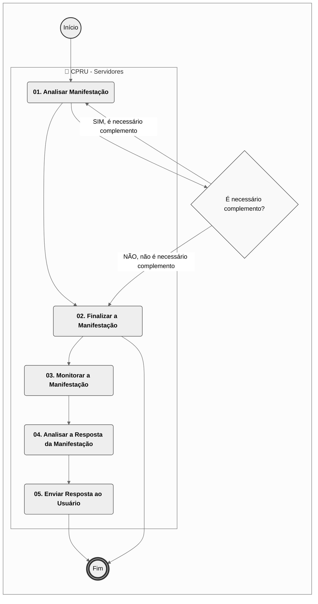
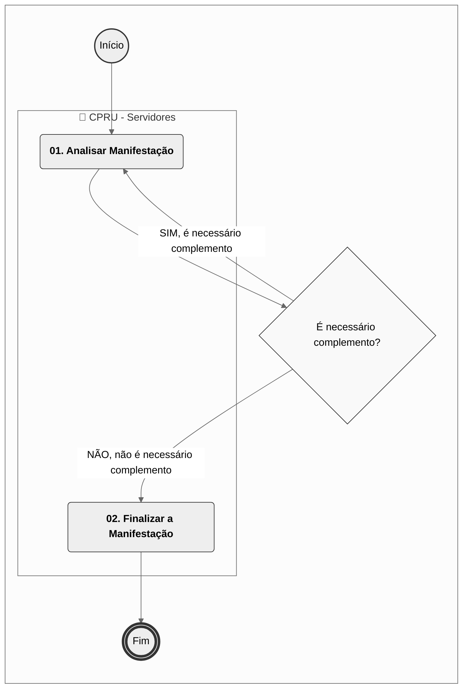

```mermaid
%%{init: {"theme": "neutral", "themeVariables": {"primaryColor": "#ffffff", "edgeLabelBackground": "#ffffff", "tertiaryColor": "#f4f4f4"}}}%%
flowchart TD
    classDef inicio stroke:#333,stroke-width:2px;
    classDef fim stroke:#333,stroke-width:4px;
    classDef tarefaBPMN stroke:#333,stroke-width:1px;
    classDef gatewayBPMN fill:#f9f9f9,stroke:#333,stroke-width:1px;
    classDef raia fill:none,stroke:#999,stroke-width:1px,stroke-dasharray: 5 5;
    subgraph Container_ID_MPR_SAR_502_R04_md_0 [ ]
        direction TB
        ID_MPR_SAR_502_R04_md_0_S((Início)):::inicio
        ID_MPR_SAR_502_R04_md_0_E(((Fim))):::fim
        subgraph Raia_ID_MPR_SAR_502_R04_md_0_1 [👤 CPRU]
            ID_MPR_SAR_502_R04_md_0_01("<b>01. Extrair o relatório de manifestações do período</b>"):::tarefaBPMN
            ID_MPR_SAR_502_R04_md_0_02("<b>02. Agrupar registros por assunto</b>"):::tarefaBPMN
            ID_MPR_SAR_502_R04_md_0_03("<b>03. Identificar e registrar oportunidades de melhoria</b>"):::tarefaBPMN
        end
        subgraph Raia_ID_MPR_SAR_502_R04_md_0_2 [👤 CPRU - Servidores]
            ID_MPR_SAR_502_R04_md_0_01("<b>01. Criar processo</b>"):::tarefaBPMN
            ID_MPR_SAR_502_R04_md_0_02("<b>02. Eviar processo para área técnica</b>"):::tarefaBPMN
            ID_MPR_SAR_502_R04_md_0_03("<b>03. Coletar resposta da área técnica</b>"):::tarefaBPMN
            ID_MPR_SAR_502_R04_md_0_04("<b>04. Incluir nos bancos de dados</b>"):::tarefaBPMN
            ID_MPR_SAR_502_R04_md_0_05("<b>05. Concluir Manifestação</b>"):::tarefaBPMN
            ID_MPR_SAR_502_R04_md_0_01("<b>01. Receber a Manifestação</b>"):::tarefaBPMN
            ID_MPR_SAR_502_R04_md_0_02("<b>02. Analisar e Direcionar a Manifestação</b>"):::tarefaBPMN
            ID_MPR_SAR_502_R04_md_0_03("<b>03. Monitorar a Manifestação</b>"):::tarefaBPMN
            ID_MPR_SAR_502_R04_md_0_04("<b>04. Analisar a Resposta da Manifestação</b>"):::tarefaBPMN
            ID_MPR_SAR_502_R04_md_0_05("<b>05. Enviar Resposta ao Usuário</b>"):::tarefaBPMN
            ID_MPR_SAR_502_R04_md_0_01("<b>01. Analisar Manifestação</b>"):::tarefaBPMN
            ID_MPR_SAR_502_R04_md_0_02("<b>02. Finalizar a Manifestação</b>"):::tarefaBPMN
        end
        ID_MPR_SAR_502_R04_md_0_S --> ID_MPR_SAR_502_R04_md_0_01
        ID_MPR_SAR_502_R04_md_0_01 --> ID_MPR_SAR_502_R04_md_0_02
        ID_MPR_SAR_502_R04_md_0_02 --> ID_MPR_SAR_502_R04_md_0_03
        ID_MPR_SAR_502_R04_md_0_03 --> ID_MPR_SAR_502_R04_md_0_E
        ID_MPR_SAR_502_R04_md_0_01 --> ID_MPR_SAR_502_R04_md_0_02
        ID_MPR_SAR_502_R04_md_0_02 --> ID_MPR_SAR_502_R04_md_0_03
        gw_ID_MPR_SAR_502_R04_md_0_03{"A manifestação vai para o BC?"}:::gatewayBPMN
        ID_MPR_SAR_502_R04_md_0_03 --> gw_ID_MPR_SAR_502_R04_md_0_03
        gw_ID_MPR_SAR_502_R04_md_0_03 -->|"SIM, vai para o BC"| ID_MPR_SAR_502_R04_md_0_04
        gw_ID_MPR_SAR_502_R04_md_0_03 -->|"NÃO, não vai para o BC"| ID_MPR_SAR_502_R04_md_0_05
        ID_MPR_SAR_502_R04_md_0_04 --> ID_MPR_SAR_502_R04_md_0_E
        ID_MPR_SAR_502_R04_md_0_05 --> ID_MPR_SAR_502_R04_md_0_E
        ID_MPR_SAR_502_R04_md_0_01 --> ID_MPR_SAR_502_R04_md_0_02
        ID_MPR_SAR_502_R04_md_0_02 --> ID_MPR_SAR_502_R04_md_0_03
        ID_MPR_SAR_502_R04_md_0_03 --> ID_MPR_SAR_502_R04_md_0_04
        ID_MPR_SAR_502_R04_md_0_04 --> ID_MPR_SAR_502_R04_md_0_05
        ID_MPR_SAR_502_R04_md_0_05 --> ID_MPR_SAR_502_R04_md_0_E
        gw_ID_MPR_SAR_502_R04_md_0_01{"É necessário complemento?"}:::gatewayBPMN
        ID_MPR_SAR_502_R04_md_0_01 --> gw_ID_MPR_SAR_502_R04_md_0_01
        gw_ID_MPR_SAR_502_R04_md_0_01 -->|"SIM, é necessário complemento"| ID_MPR_SAR_502_R04_md_0_01
        gw_ID_MPR_SAR_502_R04_md_0_01 -->|"NÃO, não é necessário complemento"| ID_MPR_SAR_502_R04_md_0_02
        ID_MPR_SAR_502_R04_md_0_02 --> ID_MPR_SAR_502_R04_md_0_E
    end
    click ID_MPR_SAR_502_R04_md_0_01 "A CPRU deve entrar em contato com a Ouvidoria e solicitar um extrato das respostas às pesquisas de satisfação de atendimento às manifestações.  A frequência para realização dessa tarefa é trimestral."
    click ID_MPR_SAR_502_R04_md_0_02 "De posse do extrato fornecido pela Ouvidoria, a CPRU deve analisar a tabela com foco nas perguntas:  a) “A sua demanda foi atendida?”  b) “A resposta fornecida foi fácil de compreender?”  c) “Você está satisfeito(a) com o atendimento prestado?”  Para essas perguntas, a equipe de análise deve separar"
    click ID_MPR_SAR_502_R04_md_0_03 "Todas as respostas agrupadas na etapa acima devem ser avaliadas, fazendo-se a leitura do teor da manifestação e da resposta enviada ao solicitante, bem como de seu comentário, caso haja.  A CPRU deve buscar entender o porquê da insatisfação e fazer uma separação dos resultados por área responsável p"
    click ID_MPR_SAR_502_R04_md_0_01 "1 – Primeiramente as manifestações chegam através do canal FALA.br pelo CITSmart https://portaldeservicos.anac.gov.br/citsmart/pages/smartPortal/smartPortal.load  2 – A GTPL/CPRU dá entrada na manifestação através da criação de processo no SEI https://sei.anac.gov.br/sip/login.php?sigla\_orgao\_sist"
    click ID_MPR_SAR_502_R04_md_0_02 "Com o processo criado no SEI e assinado é somente enviar para a área responsável pela resposta."
    click ID_MPR_SAR_502_R04_md_0_03 "Assim que o processo retorna com a resposta para a GTPL/CPRU, tem um campo em que a Gerência tem a opção de informar se a manifestação é para ser incluída no Banco de conhecimento da SAR ou não"
    click ID_MPR_SAR_502_R04_md_0_04 "1 - Caso a resposta para a pergunta “A manifestação vai para o BC?” seja “SIM, vai para o BC” ela precisa ser inserida no BC, o processo é alocado dentro do planner na caixa BC da SAR: Teams/Planner/CPRU – Manifestações/Atualizar BC-SAR  2 - A atualização é feita primeiramente no grupo da CPRU no TE"
    click ID_MPR_SAR_502_R04_md_0_05 "1 - Feita as duas atualizações, o processo é concluído no SEI e no Planner  2 - O BC é atualizado semanalmente e estamos no período de edição dentro da Wiki da ANAC."
    click ID_MPR_SAR_502_R04_md_0_01 "1 – Após a Ouvidoria atribuir as manifestações cadastradas pelos usuários no canal fala.br (CitSmart) às Superintendências, conforme assunto específico, a CPRU (representando a GTPL), verifica diariamente o fluxo do CitSmart (https://portaldeservicos.anac.gov.br/citsmart/pages/experienceCenter/exper"
    click ID_MPR_SAR_502_R04_md_0_02 "1 - A análise é feita para verificar se o assunto está de acordo com a área técnica (a qual o processo será enviado), se falta alguma informação, se é necessário solicitar complementação ao usuário;  2 – Verificar se foi preenchido o formulário no processo SEI “Solicitação de resposta à manifestação"
    click ID_MPR_SAR_502_R04_md_0_03 "A CPRU deve monitorar os prazos de respostas às manifestações.  1 – Todas as manifestações possuem prazos e é indispensável monitorar para não os perder: Prazo de resposta ao usuário; prazo para prorrogação; e prazo de rejeição;  2 – Prazo de resposta ao usuário: A monitoração é feita através do Pla"
    click ID_MPR_SAR_502_R04_md_0_04 "1 – Após o processo SEI retornar para o NEA/SAR com a resposta para o usuário, a primeira coisa a ser analisada pela CPRU é se todas as perguntas feitas pelo usuário foram sanadas, se a resposta está de acordo e coerente;  2 – Caso falte alguma informação é necessário solicitar ao servidor que elabo"
    click ID_MPR_SAR_502_R04_md_0_05 "1 – Entrar no CITSmart e ir na opção “responder ao usuário”;  2 – Incluir a resposta ao usuário, sempre iniciar:  Prezado(a) Senhor(a),  Resposta.  Texto que fica na base de dados do CITsmat.  3 – Informar se a demanda foi resolvida: Sim ou não;  4 – Informar qual o motivo da demanda: Solicitação at"
    click ID_MPR_SAR_502_R04_md_0_01 "• Acessar o TEAMS > Planner > CPRU – MANIFESTAÇÕES > Para assinatura.  • Na coluna Para assinatura, iremos analisar um por vez, apenas os cartões com as etiquetas SISANT, abra o cartão, copie o n. do processo SEI, e acesse o sistema SEI https://sei.anac.gov.br/sip/login.php?sigla\_orgao\_sistema=ANA"
    click ID_MPR_SAR_502_R04_md_0_02 "Todos os assuntos relacionados acima, são de competência nossa “GTPL”, com o problema resolvido, precisamos preparar a resposta para o usuário, colocando essa resposta no Atualizar andamento, no processo SEI, concluir o processo SEI, colar a mesma resposta no cartão do planner, e enviar o cartão par"
```

```mermaid
%%{init: {"theme": "neutral", "themeVariables": {"primaryColor": "#ffffff", "edgeLabelBackground": "#ffffff", "tertiaryColor": "#f4f4f4"}}}%%
flowchart TD
    classDef inicio stroke:#333,stroke-width:2px;
    classDef fim stroke:#333,stroke-width:4px;
    classDef tarefaBPMN stroke:#333,stroke-width:1px;
    classDef gatewayBPMN fill:#f9f9f9,stroke:#333,stroke-width:1px;
    classDef raia fill:none,stroke:#999,stroke-width:1px,stroke-dasharray: 5 5;
    subgraph Container_ID_MPR_SAR_502_R04_md_1 [ ]
        direction TB
        ID_MPR_SAR_502_R04_md_1_S((Início)):::inicio
        ID_MPR_SAR_502_R04_md_1_E(((Fim))):::fim
        subgraph Raia_ID_MPR_SAR_502_R04_md_1_1 [👤 CPRU - Servidores]
            ID_MPR_SAR_502_R04_md_1_01("<b>01. Criar processo</b>"):::tarefaBPMN
            ID_MPR_SAR_502_R04_md_1_02("<b>02. Eviar processo para área técnica</b>"):::tarefaBPMN
            ID_MPR_SAR_502_R04_md_1_03("<b>03. Coletar resposta da área técnica</b>"):::tarefaBPMN
            ID_MPR_SAR_502_R04_md_1_04("<b>04. Incluir nos bancos de dados</b>"):::tarefaBPMN
            ID_MPR_SAR_502_R04_md_1_05("<b>05. Concluir Manifestação</b>"):::tarefaBPMN
            ID_MPR_SAR_502_R04_md_1_01("<b>01. Receber a Manifestação</b>"):::tarefaBPMN
            ID_MPR_SAR_502_R04_md_1_02("<b>02. Analisar e Direcionar a Manifestação</b>"):::tarefaBPMN
            ID_MPR_SAR_502_R04_md_1_03("<b>03. Monitorar a Manifestação</b>"):::tarefaBPMN
            ID_MPR_SAR_502_R04_md_1_04("<b>04. Analisar a Resposta da Manifestação</b>"):::tarefaBPMN
            ID_MPR_SAR_502_R04_md_1_05("<b>05. Enviar Resposta ao Usuário</b>"):::tarefaBPMN
            ID_MPR_SAR_502_R04_md_1_01("<b>01. Analisar Manifestação</b>"):::tarefaBPMN
            ID_MPR_SAR_502_R04_md_1_02("<b>02. Finalizar a Manifestação</b>"):::tarefaBPMN
        end
        ID_MPR_SAR_502_R04_md_1_S --> ID_MPR_SAR_502_R04_md_1_01
        ID_MPR_SAR_502_R04_md_1_01 --> ID_MPR_SAR_502_R04_md_1_02
        ID_MPR_SAR_502_R04_md_1_02 --> ID_MPR_SAR_502_R04_md_1_03
        gw_ID_MPR_SAR_502_R04_md_1_03{"A manifestação vai para o BC?"}:::gatewayBPMN
        ID_MPR_SAR_502_R04_md_1_03 --> gw_ID_MPR_SAR_502_R04_md_1_03
        gw_ID_MPR_SAR_502_R04_md_1_03 -->|"SIM, vai para o BC"| ID_MPR_SAR_502_R04_md_1_04
        gw_ID_MPR_SAR_502_R04_md_1_03 -->|"NÃO, não vai para o BC"| ID_MPR_SAR_502_R04_md_1_05
        ID_MPR_SAR_502_R04_md_1_04 --> ID_MPR_SAR_502_R04_md_1_E
        ID_MPR_SAR_502_R04_md_1_05 --> ID_MPR_SAR_502_R04_md_1_E
        ID_MPR_SAR_502_R04_md_1_01 --> ID_MPR_SAR_502_R04_md_1_02
        ID_MPR_SAR_502_R04_md_1_02 --> ID_MPR_SAR_502_R04_md_1_03
        ID_MPR_SAR_502_R04_md_1_03 --> ID_MPR_SAR_502_R04_md_1_04
        ID_MPR_SAR_502_R04_md_1_04 --> ID_MPR_SAR_502_R04_md_1_05
        ID_MPR_SAR_502_R04_md_1_05 --> ID_MPR_SAR_502_R04_md_1_E
        gw_ID_MPR_SAR_502_R04_md_1_01{"É necessário complemento?"}:::gatewayBPMN
        ID_MPR_SAR_502_R04_md_1_01 --> gw_ID_MPR_SAR_502_R04_md_1_01
        gw_ID_MPR_SAR_502_R04_md_1_01 -->|"SIM, é necessário complemento"| ID_MPR_SAR_502_R04_md_1_01
        gw_ID_MPR_SAR_502_R04_md_1_01 -->|"NÃO, não é necessário complemento"| ID_MPR_SAR_502_R04_md_1_02
        ID_MPR_SAR_502_R04_md_1_02 --> ID_MPR_SAR_502_R04_md_1_E
    end
    click ID_MPR_SAR_502_R04_md_1_01 "1 – Primeiramente as manifestações chegam através do canal FALA.br pelo CITSmart https://portaldeservicos.anac.gov.br/citsmart/pages/smartPortal/smartPortal.load  2 – A GTPL/CPRU dá entrada na manifestação através da criação de processo no SEI https://sei.anac.gov.br/sip/login.php?sigla\_orgao\_sist"
    click ID_MPR_SAR_502_R04_md_1_02 "Com o processo criado no SEI e assinado é somente enviar para a área responsável pela resposta."
    click ID_MPR_SAR_502_R04_md_1_03 "Assim que o processo retorna com a resposta para a GTPL/CPRU, tem um campo em que a Gerência tem a opção de informar se a manifestação é para ser incluída no Banco de conhecimento da SAR ou não"
    click ID_MPR_SAR_502_R04_md_1_04 "1 - Caso a resposta para a pergunta “A manifestação vai para o BC?” seja “SIM, vai para o BC” ela precisa ser inserida no BC, o processo é alocado dentro do planner na caixa BC da SAR: Teams/Planner/CPRU – Manifestações/Atualizar BC-SAR  2 - A atualização é feita primeiramente no grupo da CPRU no TE"
    click ID_MPR_SAR_502_R04_md_1_05 "1 - Feita as duas atualizações, o processo é concluído no SEI e no Planner  2 - O BC é atualizado semanalmente e estamos no período de edição dentro da Wiki da ANAC."
    click ID_MPR_SAR_502_R04_md_1_01 "1 – Após a Ouvidoria atribuir as manifestações cadastradas pelos usuários no canal fala.br (CitSmart) às Superintendências, conforme assunto específico, a CPRU (representando a GTPL), verifica diariamente o fluxo do CitSmart (https://portaldeservicos.anac.gov.br/citsmart/pages/experienceCenter/exper"
    click ID_MPR_SAR_502_R04_md_1_02 "1 - A análise é feita para verificar se o assunto está de acordo com a área técnica (a qual o processo será enviado), se falta alguma informação, se é necessário solicitar complementação ao usuário;  2 – Verificar se foi preenchido o formulário no processo SEI “Solicitação de resposta à manifestação"
    click ID_MPR_SAR_502_R04_md_1_03 "A CPRU deve monitorar os prazos de respostas às manifestações.  1 – Todas as manifestações possuem prazos e é indispensável monitorar para não os perder: Prazo de resposta ao usuário; prazo para prorrogação; e prazo de rejeição;  2 – Prazo de resposta ao usuário: A monitoração é feita através do Pla"
    click ID_MPR_SAR_502_R04_md_1_04 "1 – Após o processo SEI retornar para o NEA/SAR com a resposta para o usuário, a primeira coisa a ser analisada pela CPRU é se todas as perguntas feitas pelo usuário foram sanadas, se a resposta está de acordo e coerente;  2 – Caso falte alguma informação é necessário solicitar ao servidor que elabo"
    click ID_MPR_SAR_502_R04_md_1_05 "1 – Entrar no CITSmart e ir na opção “responder ao usuário”;  2 – Incluir a resposta ao usuário, sempre iniciar:  Prezado(a) Senhor(a),  Resposta.  Texto que fica na base de dados do CITsmat.  3 – Informar se a demanda foi resolvida: Sim ou não;  4 – Informar qual o motivo da demanda: Solicitação at"
    click ID_MPR_SAR_502_R04_md_1_01 "• Acessar o TEAMS > Planner > CPRU – MANIFESTAÇÕES > Para assinatura.  • Na coluna Para assinatura, iremos analisar um por vez, apenas os cartões com as etiquetas SISANT, abra o cartão, copie o n. do processo SEI, e acesse o sistema SEI https://sei.anac.gov.br/sip/login.php?sigla\_orgao\_sistema=ANA"
    click ID_MPR_SAR_502_R04_md_1_02 "Todos os assuntos relacionados acima, são de competência nossa “GTPL”, com o problema resolvido, precisamos preparar a resposta para o usuário, colocando essa resposta no Atualizar andamento, no processo SEI, concluir o processo SEI, colar a mesma resposta no cartão do planner, e enviar o cartão par"
```

# MPR/SAR-502-R04 - TRATAMENTO DE MANIFESTAÇÕES EXTERNAS NA SAR

**MANUAL DE PROCEDIMENTO**

**MPR/SAR-502-R04**

**TRATAMENTO DE MANIFESTAÇÕES EXTERNAS NA SAR**

12/2025

**REVISÕES**

|  |  |  |  |  |
| --- | --- | --- | --- | --- |
| **Revisão** | **Aprovação** | **Publicação** | **Aprovado Por** | **Modificações da Última Versão** |
| R00 | Portaria Nº 1.764, de 23 de Maio de 2017 | Não informado | SAR | Versão Original |
| R01 | Portaria Nº 1198, de 11 de Abril de 2018 | Não informado | SAR | 1) Processo 'Controlar Respostas a Demandas da Ouvidoria no STELLA para a SAR' removido.  2) Processo 'Controlar Respostas a Manifestações da GTGI no STELLA para a SAR' removido.  3) Processo 'Consultar Manifestações Externas de Competência da SAR' inserido.  4) Processo 'Responder Manifestações Externas na SAR' inserido. |
| R02 | Portaria Nº 3349, de 29 de Outubro de 2019 | Não informado | SAR | 1) Processo 'Atualizar Banco de Conhecimentos da SAR' inserido.  2) Processo 'Consultar Manifestações Externas de Competência da SAR' modificado.  3) Processo 'Responder Manifestações Externas na SAR' modificado. |
| R03 | PORTARIA No 2.200, DE 27 DE AGOSTO DE 2020. | Não informado | SAR | 1) Processo 'Consultar Manifestações Externas de Competência da SAR' modificado.  2) Processo 'Responder Manifestações Externas na SAR' modificado.  3) Processo 'Atualizar Banco de Conhecimentos da SAR' modificado. |
| R04 | PORTARIA No 18.374, DE 11 DE DEZEMBRO DE 2025. | 12/12/2025 | SAR | 1) Processo 'Consultar Manifestações Externas de Competência da SAR' removido.  2) Processo 'Responder Manifestações Externas na SAR' removido.  3) Processo 'Tratar Manifestações Relacionadas a Drones' inserido.  4) Processo 'Tratar Manifestações na SAR' inserido.  5) Processo 'Analisar a Pesquisa de Satisfação das Manifestações Direcionadas à SAR' inserido.  6) Processo 'Atualizar Banco de Conhecimentos da SAR' modificado. |

**ÍNDICE**

1) Disposições Preliminares, pág. 6.

1.1) Introdução, pág. 6.

1.2) Revogação, pág. 7.

1.3) Fundamentação, pág. 7.

1.4) Executores dos Processos, pág. 7.

1.5) Elaboração e Revisão, pág. 7.

1.6) Organização do Documento, pág. 8.

2) Definições, pág. 10.

2.1) Sigla, pág. 10.

3) Artefatos, Competências, Sistemas e Documentos Administrativos, pág. 11.

3.1) Artefatos, pág. 11.

3.2) Competências, pág. 11.

3.3) Sistemas, pág. 11.

3.4) Documentos e Processos Administrativos, pág. 11.

4) Procedimentos Referenciados, pág. 12.

5) Procedimentos, pág. 13.

5.1) Analisar a Pesquisa de Satisfação das Manifestações Direcionadas à SAR, pág. 13.

5.2) Atualizar Banco de Conhecimentos da SAR, pág. 16.

5.3) Tratar Manifestações na SAR, pág. 20.

5.4) Tratar Manifestações Relacionadas a Drones, pág. 26.

6) Disposições Finais, pág. 30.

**PARTICIPAÇÃO NA EXECUÇÃO DOS PROCESSOS**

**ÁREAS ORGANIZACIONAIS**

**1) Coordenadoria de Planejamento e Relacionamento com Usuários**

a) Analisar a Pesquisa de Satisfação das Manifestações Direcionadas à SAR

**2) Coordenadoria de Projetos e Processos**

a) Analisar a Pesquisa de Satisfação das Manifestações Direcionadas à SAR

**GRUPOS ORGANIZACIONAIS**

**a) CPRU - Servidores**

1) Atualizar Banco de Conhecimentos da SAR

2) Tratar Manifestações na SAR

3) Tratar Manifestações Relacionadas a Drones

**1. DISPOSIÇÕES PRELIMINARES**

**1.1 INTRODUÇÃO**

Este MPR descreve os processos que possibilitam aos servidores envolvidos analisar e responder demandas recebidas pelos sistemas padrão de comunicação com o usuário (CITSmart).

Esta versão foi executada e aprovada pelo processo SEI 00058.089587/2024-16. Consultar o processo para maior detalhamento.

1.1.1 Papéis e Responsabilidades

É competência das Superintendências, definida no Regimento Interno, planejar, organizar, executar, controlar, coordenar e avaliar os processos organizacionais e operacionais da ANAC no âmbito de suas competências.

Cada Superintendência, em conformidade com os preceitos descritos pela Lei de Acesso à Informação (LAI) – nº 12.527 – e em compatibilidade com a exigência de canais de comunicação acessível ao cidadão/usuário, atribuiu internamente a uma unidade organizacional o papel de gestão e acompanhamento dessas demandas, sendo a Gerência Técnica de Planejamento e Acompanhamento a responsável por esse papel no âmbito da SAR.

1.1.2 Política e Diretrizes

Este MPR define os processos necessários para o recebimento, análise e distribuição de demandas recebidas pelo canal CITSmart no âmbito da SAR.

A Lei de Acesso à Informação (LAI) – nº 12.527 – dispõe sobre os procedimentos a serem observados pela União, Estados e Municípios com a finalidade de garantir acesso à informação por parte dos cidadãos. Nesse sentido, em observância ao disposto nessa lei, os sistemas tratados nesse MPR são o principal meio utilizado para a obtenção dessas informações.

Além da Lei de Acesso à Informação, o princípio da Transparência, ao qual à Agência (bem como as demais instituições públicas) está submetida, pressupõe – resguardados casos específicos de sigilo – a divulgação das ações do governo, disponibilizando dados de forma clara e acessível.

1.1.3 Processo

O MPR estabelece, no âmbito da Superintendência de Aeronavegabilidade - SAR, os seguintes processos de trabalho:

a) Analisar a Pesquisa de Satisfação das Manifestações Direcionadas à SAR.

b) Atualizar Banco de Conhecimentos da SAR.

c) Tratar Manifestações na SAR.

d) Tratar Manifestações Relacionadas a Drones.

**1.2 REVOGAÇÃO**

MPR/SAR-502-R03, aprovado na data de 27 de agosto de 2020.

**1.3 FUNDAMENTAÇÃO**

Resolução nº 381, de 14 de junho de 2016, art. 31.

**1.4 EXECUTORES DOS PROCESSOS**

Os procedimentos contidos neste documento aplicam-se aos servidores integrantes das seguintes áreas organizacionais:

|  |  |
| --- | --- |
| **Área Organizacional** | **Descrição** |
| Coordenadoria de Planejamento e Relacionamento com Usuários - CPRU | Coordenadoria responsável pelas atividades de planejamento pela atuação como Serviço Especializado em Atendimento de Manifestações (SEAM). |
| Coordenadoria de Projetos e Processos - CDPP | Coordenadoria responsável pela gestão de projetos e de processos da SAR. |

|  |  |
| --- | --- |
| **Grupo Organizacional** | **Descrição** |
| CPRU - Servidores | Grupo dos Servidores da Coordenadoria de Planejamento e Relacionamento com Usuários |

**1.5 ELABORAÇÃO E REVISÃO**

O processo que resulta na aprovação ou alteração deste MPR é de responsabilidade da Superintendência de Aeronavegabilidade - SAR. Em caso de sugestões de revisão, deve-se procurá-la para que sejam iniciadas as providências cabíveis.

As revisões deste MPR serão aprovadas pelo(s) titular(es) da(s) unidade(s) responsável(is) pela execução do(s) processo(s) nele listado(s).

**1.6 ORGANIZAÇÃO DO DOCUMENTO**

O capítulo 2 apresenta as principais definições utilizadas no âmbito deste MPR, e deve ser visto integralmente antes da leitura de capítulos posteriores.

O capítulo 3 apresenta as competências, os artefatos e os sistemas envolvidos na execução dos processos deste manual, em ordem relativamente cronológica.

O capítulo 4 apresenta os processos de trabalho referenciados neste MPR. Estes processos são publicados em outros manuais que não este, mas cuja leitura é essencial para o entendimento dos processos publicados neste manual. O capítulo 4 expõe em quais manuais são localizados cada um dos processos de trabalho referenciados.

O capítulo 5 apresenta os processos de trabalho. Para encontrar um processo específico, deve-se procurar sua respectiva página no índice contido no início do documento. Os processos estão ordenados em etapas. Cada etapa é contida em uma tabela, que possui em si todas as informações necessárias para sua realização. São elas, respectivamente:

a) o título da etapa;

b) a descrição da forma de execução da etapa;

c) as competências necessárias para a execução da etapa;

d) os artefatos necessários para a execução da etapa;

e) os sistemas necessários para a execução da etapa (incluindo, bases de dados em forma de arquivo, se existente);

f) os documentos e processos administrativos que precisam ser elaborados durante a execução da etapa;

g) instruções para as próximas etapas; e

h) as áreas ou grupos organizacionais responsáveis por executar a etapa.

O capítulo 6 apresenta as disposições finais do documento, que trata das ações a serem realizadas em casos não previstos.

Por último, é importante comunicar que este documento foi gerado automaticamente. São recuperados dados sobre as etapas e sua sequência, as definições, os grupos, as áreas organizacionais, os artefatos, as competências, os sistemas, entre outros, para os processos de trabalho aqui apresentados, de forma que alguma mecanicidade na apresentação das informações pode ser percebida. O documento sempre apresenta as informações mais atualizadas de nomes e siglas de grupos, áreas, artefatos, termos, sistemas e suas definições, conforme informação disponível na base de dados, independente da data de assinatura do documento. Informações sobre etapas, seu detalhamento, a sequência entre etapas, responsáveis pelas etapas, artefatos, competências e sistemas associados a etapas, assim como seus nomes e os nomes de seus processos têm suas definições idênticas à da data de assinatura do documento.

**2. DEFINIÇÕES**

A tabela abaixo apresenta as definições necessárias para o entendimento deste Manual de Procedimento.

**2.1 Sigla**

|  |  |
| --- | --- |
| **Definição** | **Significado** |
| GTGI | Gerência Técnica de Gestão da Informação |
| LAI | Lei de Acesso à Informação |
| MPR | Manual de Procedimento – Documento de caráter disciplinador, de âmbito interno, assinado e aprovado por autoridade competente, que tem como objetivo documentar e padronizar os processos de trabalho realizados pelos agentes da ANAC. Possui informações sobre o fluxo de trabalho, detalhamento das etapas, competências necessárias, artefatos a serem utilizados, sistemas de apoio e áreas responsáveis pela execução. |
| SAR | Superintendência de Aeronavegabilidade |

**3. ARTEFATOS, COMPETÊNCIAS, SISTEMAS E DOCUMENTOS ADMINISTRATIVOS**

Abaixo se encontram as listas dos artefatos, competências, sistemas e documentos administrativos que o executor necessita consultar, preencher, analisar ou elaborar para executar os processos deste MPR. As etapas descritas no capítulo seguinte indicam onde usar cada um deles.

As competências devem ser adquiridas por meio de capacitação ou outros instrumentos e os artefatos se encontram no módulo "Artefatos" do sistema GFT - Gerenciador de Fluxos de Trabalho.

**3.1 ARTEFATOS**

Não há artefatos descritos para a realização deste MPR.

**3.2 COMPETÊNCIAS**

Para que os processos de trabalho contidos neste MPR possam ser realizados com qualidade e efetividade, é importante que as pessoas que venham a executá-los possuam um determinado conjunto de competências. No capítulo 5, as competências específicas que o executor de cada etapa de cada processo de trabalho deve possuir são apresentadas. A seguir, encontra-se uma lista geral das competências contidas em todos os processos de trabalho deste MPR e a indicação de qual área ou grupo organizacional as necessitam:

Não há competências descritas para a realização deste MPR.

**3.3 SISTEMAS**

|  |  |  |
| --- | --- | --- |
| **Nome** | **Descrição** | **Acesso** |
| SEI | Sistema Eletrônico de Informação. | https://sei.anac.gov.br/sip/login.php?sigla\_orgao\_sistema=ANAC&sigla\_sistema=SEI |

**3.4 DOCUMENTOS E PROCESSOS ADMINISTRATIVOS ELABORADOS NESTE MANUAL**

Não há documentos ou processos administrativos a serem elaborados neste MPR.

**4. PROCEDIMENTOS REFERENCIADOS**

Procedimentos referenciados são processos de trabalho publicados em outro MPR que têm relação com os processos de trabalho publicados por este manual. Este MPR não possui nenhum processo de trabalho referenciado.

**
## 5.1 Analisar a Pesquisa de Satisfação das Manifestações Direcionadas à SAR

## 5.1 Analisar a Pesquisa de Satisfação das Manifestações Direcionadas à SAR

## 5.1 Analisar a Pesquisa de Satisfação das Manifestações Direcionadas à SAR

## 5.1 Analisar a Pesquisa de Satisfação das Manifestações Direcionadas à SAR

