**MANUAL DE PROCEDIMENTO**

**MPR/SAR-504-R00**

**TRATAMENTO DE DEMANDAS ESPECIAIS NA SAR**

04/2017

**REVISÕES**

|  |  |  |  |  |
| --- | --- | --- | --- | --- |
| **Revisão** | **Aprovação** | **Publicação** | **Aprovado Por** | **Modificações da Última Versão** |
| R00 | Portaria Nº 1.394, de 24 de Abril de 2017 | Não informado | SAR | Versão Original |

**ÍNDICE**

1) Disposições Preliminares, pág. 5.

1.1) Introdução, pág. 5.

1.2) Revogação, pág. 5.

1.3) Fundamentação, pág. 5.

1.4) Executores dos Processos, pág. 5.

1.5) Elaboração e Revisão, pág. 6.

1.6) Organização do Documento, pág. 6.

2) Definições, pág. 8.

3) Artefatos, Competências, Sistemas e Documentos Administrativos, pág. 9.

3.1) Artefatos, pág. 9.

3.2) Competências, pág. 9.

3.3) Sistemas, pág. 9.

3.4) Documentos e Processos Administrativos, pág. 10.

4) Procedimentos Referenciados, pág. 11.

5) Procedimentos, pág. 12.

5.1) Avaliar e Responder Demanda Especial na SAR, pág. 12.

6) Disposições Finais, pág. 18.

**PARTICIPAÇÃO NA EXECUÇÃO DOS PROCESSOS**

**GRUPOS ORGANIZACIONAIS**

**a) GTNI - Demandas Especiais**

1) Avaliar e Responder Demanda Especial na SAR

**b) O SAR**

1) Avaliar e Responder Demanda Especial na SAR

**1. DISPOSIÇÕES PRELIMINARES**

**1.1 INTRODUÇÃO**

Este Manual visa explicitar os procedimentos a serem executados para o cadastro, controle e acompanhamento das “Demandas Especiais” no âmbito da Superintendência de Aeronavegabilidade.

1.1.1 Papéis e Responsabilidades

Cabe à GTPN a gestão das demandas especiais, ou seja, é a gerência responsável, na SAR, por recepcionar esse tipo de solicitação, direcionar às áreas competentes para elaboração da resposta, revisá-las para que o SAR encaminhe ao demandante.

1.1.2 Política e Diretrizes

Entende-se por “Demandas Especiais” aquelas originadas de órgãos externos à ANAC, sobretudo dos Ministérios Públicos Federal e Estaduais, Poder Judiciário, Defensoria Pública, dentre outros que o SAR determine. Possuem, em geral, caráter de controle.

1.1.3 Processos

O MPR estabelece, no âmbito da Superintendência de Aeronavegabilidade - SAR, o seguinte processo de trabalho:

a) Avaliar e Responder Demanda Especial na SAR.

**1.2 REVOGAÇÃO**

Item não aplicável.

**1.3 FUNDAMENTAÇÃO**

Resolução nº 381, de 14 de junho de 2016, art. 31 e alterações posteriores

**1.4 EXECUTORES DOS PROCESSOS**

Os procedimentos contidos neste documento aplicam-se aos servidores integrantes das seguintes áreas organizacionais:

|  |  |
| --- | --- |
| **Grupo Organizacional** | **Descrição** |
| GTNI - Demandas Especiais | GTNI - Demandas Especiais |
| O SAR | O Superintendente da SAR |

**1.5 ELABORAÇÃO E REVISÃO**

O processo que resulta na aprovação ou alteração deste MPR é de responsabilidade da Superintendência de Aeronavegabilidade - SAR. Em caso de sugestões de revisão, deve-se procurá-la para que sejam iniciadas as providências cabíveis.

As revisões deste MPR serão aprovadas pelo(s) titular(es) da(s) unidade(s) responsável(is) pela execução do(s) processo(s) nele listado(s).

**1.6 ORGANIZAÇÃO DO DOCUMENTO**

O capítulo 2 apresenta as principais definições utilizadas no âmbito deste MPR, e deve ser visto integralmente antes da leitura de capítulos posteriores.

O capítulo 3 apresenta as competências, os artefatos e os sistemas envolvidos na execução dos processos deste manual, em ordem relativamente cronológica.

O capítulo 4 apresenta os processos de trabalho referenciados neste MPR. Estes processos são publicados em outros manuais que não este, mas cuja leitura é essencial para o entendimento dos processos publicados neste manual. O capítulo 4 expõe em quais manuais são localizados cada um dos processos de trabalho referenciados.

O capítulo 5 apresenta os processos de trabalho. Para encontrar um processo específico, deve-se procurar sua respectiva página no índice contido no início do documento. Os processos estão ordenados em etapas. Cada etapa é contida em uma tabela, que possui em si todas as informações necessárias para sua realização. São elas, respectivamente:

a) o título da etapa;

b) a descrição da forma de execução da etapa;

c) as competências necessárias para a execução da etapa;

d) os artefatos necessários para a execução da etapa;

e) os sistemas necessários para a execução da etapa (incluindo, bases de dados em forma de arquivo, se existente);

f) os documentos e processos administrativos que precisam ser elaborados durante a execução da etapa;

g) instruções para as próximas etapas; e

h) as áreas ou grupos organizacionais responsáveis por executar a etapa.

O capítulo 6 apresenta as disposições finais do documento, que trata das ações a serem realizadas em casos não previstos.

Por último, é importante comunicar que este documento foi gerado automaticamente. São recuperados dados sobre as etapas e sua sequência, as definições, os grupos, as áreas organizacionais, os artefatos, as competências, os sistemas, entre outros, para os processos de trabalho aqui apresentados, de forma que alguma mecanicidade na apresentação das informações pode ser percebida. O documento sempre apresenta as informações mais atualizadas de nomes e siglas de grupos, áreas, artefatos, termos, sistemas e suas definições, conforme informação disponível na base de dados, independente da data de assinatura do documento. Informações sobre etapas, seu detalhamento, a sequência entre etapas, responsáveis pelas etapas, artefatos, competências e sistemas associados a etapas, assim como seus nomes e os nomes de seus processos têm suas definições idênticas à da data de assinatura do documento.

**2. DEFINIÇÕES**

Este MPR não possui definições.

**3. ARTEFATOS, COMPETÊNCIAS, SISTEMAS E DOCUMENTOS ADMINISTRATIVOS**

Abaixo se encontram as listas dos artefatos, competências, sistemas e documentos administrativos que o executor necessita consultar, preencher, analisar ou elaborar para executar os processos deste MPR. As etapas descritas no capítulo seguinte indicam onde usar cada um deles.

As competências devem ser adquiridas por meio de capacitação ou outros instrumentos e os artefatos se encontram no módulo "Artefatos" do sistema GFT - Gerenciador de Fluxos de Trabalho.

**3.1 ARTEFATOS**

Não há artefatos descritos para a realização deste MPR.

**3.2 COMPETÊNCIAS**

Para que os processos de trabalho contidos neste MPR possam ser realizados com qualidade e efetividade, é importante que as pessoas que venham a executá-los possuam um determinado conjunto de competências. No capítulo 5, as competências específicas que o executor de cada etapa de cada processo de trabalho deve possuir são apresentadas. A seguir, encontra-se uma lista geral das competências contidas em todos os processos de trabalho deste MPR e a indicação de qual área ou grupo organizacional as necessitam:

|  |  |
| --- | --- |
| **Competência** | **Áreas e Grupos** |
| Avalia tecnicamente demandas especiais recebidas na superintendência para distribuí-las adequadamente entre as unidades. | GTNI - Demandas Especiais |

**3.3 SISTEMAS**

|  |  |  |
| --- | --- | --- |
| **Nome** | **Descrição** | **Acesso** |
| SEI | Sistema Eletrônico de Informação. | https://sei.anac.gov.br/sip/login.php?sigla\_orgao\_sistema=ANAC&sigla\_sistema=SEI |

**3.4 DOCUMENTOS E PROCESSOS ADMINISTRATIVOS ELABORADOS NESTE MANUAL**

Não há documentos ou processos administrativos a serem elaborados neste MPR.

**4. PROCEDIMENTOS REFERENCIADOS**

Procedimentos referenciados são processos de trabalho publicados em outro MPR que têm relação com os processos de trabalho publicados por este manual. Este MPR não possui nenhum processo de trabalho referenciado.

**5. PROCEDIMENTOS**

Este capítulo apresenta o processo de trabalho deste MPR. Ao final de cada etapa, encontram-se descritas as orientações necessárias à continuidade da execução do processo. A versão do presente MPR está disponível de forma mais conveniente em versão eletrônica, onde pode(m) ser obtido(s) o(s) artefato(s) e outras informações sobre o processo.

**5.1 Avaliar e Responder Demanda Especial na SAR**

O processo trata da coordenação, formulação e emissão de respostas a demandas especiais feitas à SAR.

O processo contém, ao todo, 10 etapas. A situação que inicia o processo, chamada de evento de início, foi descrita como: "Demanda especial recebida", portanto, este processo deve ser executado sempre que este evento acontecer. O solicitante deve seguir a seguinte instrução: 'Demanda especial recebida'.

O processo é considerado concluído quando alcança algum de seus eventos de fim. Os eventos de fim descritos para esse processo são:

a) Demanda especial redirecionada com subsídios da SAR.

b) Demanda especial respondida.

c) Demanda Especial redirecionada.

Os grupos envolvidos na execução deste processo são: GTNI - Demandas Especiais, O SAR.

Para que este processo seja executado de forma apropriada, é necessário que o(s) executor(es) possuam a seguinte competência: (1) Avalia tecnicamente demandas especiais recebidas na superintendência para distribuí-las adequadamente entre as unidades.

Abaixo se encontra(m) a(s) etapa(s) a ser(em) realizada(s) na execução deste processo e o diagrama do fluxo.

### 5.1 Avaliar e Responder Demanda Especial na SAR

```mermaid
%%{init: {'theme': 'default'}}%%

flowchart TD
    classDef inicio stroke:#333,stroke-width:2px;
    classDef fim stroke:#333,stroke-width:4px;
    classDef tarefaBPMN stroke:#333,stroke-width:1px;
    classDef gatewayBPMN fill:#ececec,stroke:#333,stroke-width:1px;
    classDef raia fill:none,stroke:#999,stroke-width:1px,stroke-dasharray: 5 5;
    subgraph Container_ID_MPR_SAR_504_R00_0 [ ]
        direction TB
        ID_MPR_SAR_504_R00_0_Start((Início)):::inicio
        ID_MPR_SAR_504_R00_0_End(((Fim))):::fim
        ID_MPR_SAR_504_R00_0_01("<b>01. Verificar a pertinência temática da demanda</b><hr>Responsável: GTNI - Demandas Especiais."):::tarefaBPMN
        ID_MPR_SAR_504_R00_0_02("<b>02. Encaminhar matéria da SAR</b><hr>Responsável: GTNI - Demandas Especiais."):::tarefaBPMN
        ID_MPR_SAR_504_R00_0_03("<b>03. Avaliar composição da matéria</b><hr>Responsável: GTNI - Demandas Especiais."):::tarefaBPMN
        ID_MPR_SAR_504_R00_0_04("<b>04. Informar área responsável pela resposta</b><hr>Responsável: GTNI - Demandas Especiais."):::tarefaBPMN
        ID_MPR_SAR_504_R00_0_05("<b>05. Solicitar subsídios para áreas da SAR envolvidas</b><hr>Responsável: GTNI - Demandas Especiais."):::tarefaBPMN
        ID_MPR_SAR_504_R00_0_06("<b>06. Receber subsídios da SAR, compilar e enviar para área responsável pela resposta</b><hr>Responsável: GTNI - Demandas Especiais."):::tarefaBPMN
        ID_MPR_SAR_504_R00_0_07("<b>07. Solicitar subsídios para áreas envolvidas</b><hr>Responsável: GTNI - Demandas Especiais."):::tarefaBPMN
        ID_MPR_SAR_504_R00_0_08("<b>08. Compilar informações se preparar resposta à Procuradoria</b><hr>Responsável: GTNI - Demandas Especiais."):::tarefaBPMN
        ID_MPR_SAR_504_R00_0_09("<b>09. Compilar informações e preparar minuta de resposta externa à ANAC</b><hr>Responsável: GTNI - Demandas Especiais."):::tarefaBPMN
        ID_MPR_SAR_504_R00_0_10("<b>10. Assinar a resposta</b><hr>Responsável: O SAR."):::tarefaBPMN
        ID_MPR_SAR_504_R00_0_Start --> ID_MPR_SAR_504_R00_0_01
        gw_ID_MPR_SAR_504_R00_0_01{"Há matéria de atribuição da SAR?"}:::gatewayBPMN
        ID_MPR_SAR_504_R00_0_01 --> gw_ID_MPR_SAR_504_R00_0_01
        gw_ID_MPR_SAR_504_R00_0_01 -->|"sim, há matéria de atribuição da SAR"| ID_MPR_SAR_504_R00_0_03
        gw_ID_MPR_SAR_504_R00_0_01 -->|"não, não há matéria de atribuição da SAR"| ID_MPR_SAR_504_R00_0_02
        ID_MPR_SAR_504_R00_0_02 --> ID_MPR_SAR_504_R00_0_End
        gw_ID_MPR_SAR_504_R00_0_03{"A SAR deve responder à demanda?"}:::gatewayBPMN
        ID_MPR_SAR_504_R00_0_03 --> gw_ID_MPR_SAR_504_R00_0_03
        gw_ID_MPR_SAR_504_R00_0_03 -->|"não, outra área deve responder"| ID_MPR_SAR_504_R00_0_04
        gw_ID_MPR_SAR_504_R00_0_03 -->|"sim, a SAR deve responder"| ID_MPR_SAR_504_R00_0_07
        ID_MPR_SAR_504_R00_0_04 --> ID_MPR_SAR_504_R00_0_05
        ID_MPR_SAR_504_R00_0_05 --> ID_MPR_SAR_504_R00_0_06
        ID_MPR_SAR_504_R00_0_06 --> ID_MPR_SAR_504_R00_0_End
        gw_ID_MPR_SAR_504_R00_0_07{"Demanda oriunda da Procuradoria?"}:::gatewayBPMN
        ID_MPR_SAR_504_R00_0_07 --> gw_ID_MPR_SAR_504_R00_0_07
        gw_ID_MPR_SAR_504_R00_0_07 -->|"sim, demanda oriunda da Procuradoria"| ID_MPR_SAR_504_R00_0_08
        gw_ID_MPR_SAR_504_R00_0_07 -->|"não, demanda oriunda de orgãos externos à ANAC"| ID_MPR_SAR_504_R00_0_09
        ID_MPR_SAR_504_R00_0_08 --> ID_MPR_SAR_504_R00_0_10
        ID_MPR_SAR_504_R00_0_09 --> ID_MPR_SAR_504_R00_0_10
        ID_MPR_SAR_504_R00_0_10 --> ID_MPR_SAR_504_R00_0_End
    end
    click ID_MPR_SAR_504_R00_0_01 href "#" "Demandas Especiais podem envolver assuntos atinentes às atribuições de mais de uma superintendência. Assim sendo, assim que uma demanda é recebida, é necessário verificar as superintendências envolvidas.  Caso não haja matéria atinente às atribuições da SAR, o processo tem de ser direcionado às superintendências responsáveis pela resposta (02) e encerra-se a atuação da SAR."
    click ID_MPR_SAR_504_R00_0_02 href "#" "Caso não haja matéria atinente às atribuições da SAR, o processo tem de ser direcionado às superintendências responsáveis pela resposta e encerra-se a atuação da SAR.  A ação tomada é mero encaminhamento às superintendências responsáveis."
    click ID_MPR_SAR_504_R00_0_03 href "#" "Neste momento, sabe-se que a SAR é responsável ao menos por parte da resposta, ocorre que Demandas Especiais podem envolver assuntos atinentes às atribuições de mais de uma superintendência.  Assim sendo, é necessário verificar se há mais superintendências envolvidas.  Caso não haja matéria atinente às atribuições de outras superintendências, o processo é respondido unicamente pela SAR.  Caso haja matéria atinente às atribuições de outras superintendências, o processo deve ser respondido pela superintendência responsável pela maior parte das respostas."
    click ID_MPR_SAR_504_R00_0_04 href "#" "Caso haja matéria atinente às atribuições de outras superintendências, o processo tem de ser direcionado à superintendência responsável pela resposta.  A ação tomada é mero encaminhamento à superintendência responsável."
    click ID_MPR_SAR_504_R00_0_05 href "#" "Uma vez que se sabe que na demanda há matéria da SAR, a mesma é encaminhada às áreas técnicas da SAR pertinentes para que prestem seus subsídios.  Um prazo para a resposta é informado às áreas."
    click ID_MPR_SAR_504_R00_0_06 href "#" "Após recebimento dos subsídios das áreas, é verificado se as informações são pertinentes e se respondem devidamente à demanda.  Em caso afirmativo, é elaborado um documento do mesmo tipo do que contem a demanda original (se a demanda vem num ofício, um ofício é criado, caso venha num memorando, um memorando é criado) e a resposta é criada.  Antes de ser encaminhada ao superintendente, a proposta de resposta é submetida à aprovação do GTPN."
    click ID_MPR_SAR_504_R00_0_07 href "#" "ao demandante, as perguntas relativas a matérias da SAR são encaminhadas às áreas técnicas da SAR pertinentes para que prestem seus subsídios.  Além disso, é verificado se há matérias atinentes a outras superintendências. Em caso afirmativo, as perguntas que não devem ser respondidas pela SAR são encaminhadas as superintendências pertinentes. Estas devem prestar os subsídios de suas áreas de atuação.  Um prazo para a resposta é informado às áreas."
    click ID_MPR_SAR_504_R00_0_08 href "#" "Após recebimento dos subsídios das áreas técnicas da SAR, é verificado se as informações são pertinentes e se respondem devidamente à demanda.  Em caso afirmativo, é elaborado um memorando (pois as demandas da Procuradoria sempre vêm em forma de memorando) e a resposta é criada.  Antes de ser encaminhada ao superintendente, a proposta de resposta é submetida à aprovação do GTPN."
    click ID_MPR_SAR_504_R00_0_09 href "#" "Após recebimento dos subsídios das áreas técnicas da SAR e das demais superintendências envolvidas, é verificado se as informações são pertinentes e se respondem devidamente à demanda.  Em caso afirmativo, é elaborado um documento do mesmo tipo do que contem a demanda original (se a demanda vem num ofício, um ofício é criado, caso venha num memorando, um memorando é criado) e a resposta é criada.  Antes de ser encaminhada ao superintendente, a proposta de resposta é submetida à aprovação do GTPN."
    click ID_MPR_SAR_504_R00_0_10 href "#" "Após aprovação do GTPN, o documento contendo a resposta é encaminhado ao Superintendente para assinatura e posterior encaminhamento ao demandante."
```

|  |
| --- |
| **01. Verificar a pertinência temática da demanda** |
| RESPONSÁVEL PELA EXECUÇÃO: GTNI - Demandas Especiais. |
| DETALHAMENTO: Demandas Especiais podem envolver assuntos atinentes às atribuições de mais de uma superintendência. Assim sendo, assim que uma demanda é recebida, é necessário verificar as superintendências envolvidas.  Caso não haja matéria atinente às atribuições da SAR, o processo tem de ser direcionado às superintendências responsáveis pela resposta (02) e encerra-se a atuação da SAR. |
| CONTINUIDADE: caso a resposta para a pergunta "Há matéria de atribuição da SAR?" seja "sim, há matéria de atribuição da SAR", deve-se seguir para a etapa "03. Avaliar composição da matéria". Caso a resposta seja "não, não há matéria de atribuição da SAR", deve-se seguir para a etapa "02. Encaminhar matéria da SAR". |

|  |
| --- |
| **02. Encaminhar matéria da SAR** |
| RESPONSÁVEL PELA EXECUÇÃO: GTNI - Demandas Especiais. |
| DETALHAMENTO: Caso não haja matéria atinente às atribuições da SAR, o processo tem de ser direcionado às superintendências responsáveis pela resposta e encerra-se a atuação da SAR.  A ação tomada é mero encaminhamento às superintendências responsáveis. |
| SISTEMAS USADOS NESTA ATIVIDADE: SEI. |
| CONTINUIDADE: esta etapa finaliza o procedimento. |

|  |
| --- |
| **03. Avaliar composição da matéria** |
| RESPONSÁVEL PELA EXECUÇÃO: GTNI - Demandas Especiais. |
| DETALHAMENTO: Neste momento, sabe-se que a SAR é responsável ao menos por parte da resposta, ocorre que Demandas Especiais podem envolver assuntos atinentes às atribuições de mais de uma superintendência.  Assim sendo, é necessário verificar se há mais superintendências envolvidas.  Caso não haja matéria atinente às atribuições de outras superintendências, o processo é respondido unicamente pela SAR.  Caso haja matéria atinente às atribuições de outras superintendências, o processo deve ser respondido pela superintendência responsável pela maior parte das respostas. |
| COMPETÊNCIAS:  - Avalia tecnicamente demandas especiais recebidas na superintendência para distribuí-las adequadamente entre as unidades. |
| CONTINUIDADE: caso a resposta para a pergunta "A SAR deve responder à demanda?" seja "não, outra área deve responder", deve-se seguir para a etapa "04. Informar área responsável pela resposta". Caso a resposta seja "sim, a SAR deve responder", deve-se seguir para a etapa "07. Solicitar subsídios para áreas envolvidas". |

|  |
| --- |
| **04. Informar área responsável pela resposta** |
| RESPONSÁVEL PELA EXECUÇÃO: GTNI - Demandas Especiais. |
| DETALHAMENTO: Caso haja matéria atinente às atribuições de outras superintendências, o processo tem de ser direcionado à superintendência responsável pela resposta.  A ação tomada é mero encaminhamento à superintendência responsável. |
| SISTEMAS USADOS NESTA ATIVIDADE: SEI. |
| CONTINUIDADE: deve-se seguir para a etapa "05. Solicitar subsídios para áreas da SAR envolvidas". |

|  |
| --- |
| **05. Solicitar subsídios para áreas da SAR envolvidas** |
| RESPONSÁVEL PELA EXECUÇÃO: GTNI - Demandas Especiais. |
| DETALHAMENTO: Uma vez que se sabe que na demanda há matéria da SAR, a mesma é encaminhada às áreas técnicas da SAR pertinentes para que prestem seus subsídios.  Um prazo para a resposta é informado às áreas. |
| CONTINUIDADE: deve-se seguir para a etapa "06. Receber subsídios da SAR, compilar e enviar para área responsável pela resposta". |

|  |
| --- |
| **06. Receber subsídios da SAR, compilar e enviar para área responsável pela resposta** |
| RESPONSÁVEL PELA EXECUÇÃO: GTNI - Demandas Especiais. |
| DETALHAMENTO: Após recebimento dos subsídios das áreas, é verificado se as informações são pertinentes e se respondem devidamente à demanda.  Em caso afirmativo, é elaborado um documento do mesmo tipo do que contem a demanda original (se a demanda vem num ofício, um ofício é criado, caso venha num memorando, um memorando é criado) e a resposta é criada.  Antes de ser encaminhada ao superintendente, a proposta de resposta é submetida à aprovação do GTPN. |
| CONTINUIDADE: esta etapa finaliza o procedimento. |

|  |
| --- |
| **07. Solicitar subsídios para áreas envolvidas** |
| RESPONSÁVEL PELA EXECUÇÃO: GTNI - Demandas Especiais. |
| DETALHAMENTO: DETALHAMENTO: ao demandante, as perguntas relativas a matérias da SAR são encaminhadas às áreas técnicas da SAR pertinentes para que prestem seus subsídios.  Além disso, é verificado se há matérias atinentes a outras superintendências. Em caso afirmativo, as perguntas que não devem ser respondidas pela SAR são encaminhadas as superintendências pertinentes. Estas devem prestar os subsídios de suas áreas de atuação.  Um prazo para a resposta é informado às áreas. |
| CONTINUIDADE: caso a resposta para a pergunta "Demanda oriunda da Procuradoria?" seja "sim, demanda oriunda da Procuradoria", deve-se seguir para a etapa "08. Compilar informações se preparar resposta à Procuradoria". Caso a resposta seja "não, demanda oriunda de orgãos externos à ANAC", deve-se seguir para a etapa "09. Compilar informações e preparar minuta de resposta externa à ANAC". |

|  |
| --- |
| **08. Compilar informações se preparar resposta à Procuradoria** |
| RESPONSÁVEL PELA EXECUÇÃO: GTNI - Demandas Especiais. |
| DETALHAMENTO: Após recebimento dos subsídios das áreas técnicas da SAR, é verificado se as informações são pertinentes e se respondem devidamente à demanda.  Em caso afirmativo, é elaborado um memorando (pois as demandas da Procuradoria sempre vêm em forma de memorando) e a resposta é criada.  Antes de ser encaminhada ao superintendente, a proposta de resposta é submetida à aprovação do GTPN. |
| SISTEMAS USADOS NESTA ATIVIDADE: SEI. |
| CONTINUIDADE: deve-se seguir para a etapa "10. Assinar a resposta". |

|  |
| --- |
| **09. Compilar informações e preparar minuta de resposta externa à ANAC** |
| RESPONSÁVEL PELA EXECUÇÃO: GTNI - Demandas Especiais. |
| DETALHAMENTO: Após recebimento dos subsídios das áreas técnicas da SAR e das demais superintendências envolvidas, é verificado se as informações são pertinentes e se respondem devidamente à demanda.  Em caso afirmativo, é elaborado um documento do mesmo tipo do que contem a demanda original (se a demanda vem num ofício, um ofício é criado, caso venha num memorando, um memorando é criado) e a resposta é criada.  Antes de ser encaminhada ao superintendente, a proposta de resposta é submetida à aprovação do GTPN. |
| SISTEMAS USADOS NESTA ATIVIDADE: SEI. |
| CONTINUIDADE: deve-se seguir para a etapa "10. Assinar a resposta". |

|  |
| --- |
| **10. Assinar a resposta** |
| RESPONSÁVEL PELA EXECUÇÃO: O SAR. |
| DETALHAMENTO: Após aprovação do GTPN, o documento contendo a resposta é encaminhado ao Superintendente para assinatura e posterior encaminhamento ao demandante. |
| CONTINUIDADE: esta etapa finaliza o procedimento. |

**6. DISPOSIÇÕES FINAIS**

Em caso de identificação de erros e omissões neste manual pelo executor do processo, a SAR deve ser contatada. Cópias eletrônicas deste manual, do fluxo e dos artefatos usados podem ser encontradas em sistema.