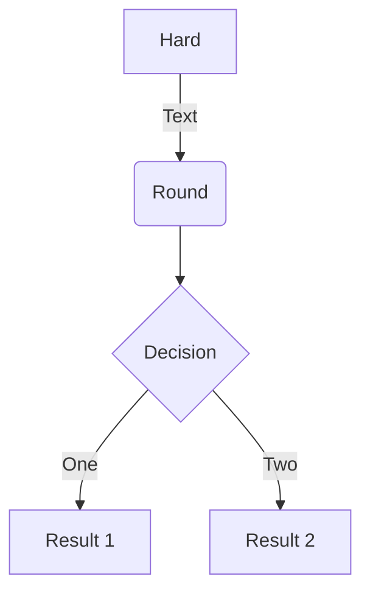

## Tabela com filtro instantâneo dinâmico e paginação

- https://bossanova.uk/jspreadsheet/v4/examples/datatables

<script src="https://bossanova.uk/jspreadsheet/v4/jexcel.js"></script>
<script src="https://jsuites.net/v4/jsuites.js"></script>
<link rel="stylesheet" href="https://jsuites.net/v4/jsuites.css" type="text/css" />
<link rel="stylesheet" href="https://bossanova.uk/jspreadsheet/v4/jexcel.css" type="text/css" />

<div id="spreadsheet"></div>

<script>
var data = [
    ['Jazz', 'Honda', '2019-02-12', '', true, '$ 2.000,00', '#777700'],
    ['Civic', 'Honda', '2018-07-11', '', true, '$ 4.000,01', '#007777'],
];

jspreadsheet(document.getElementById('spreadsheet'), {
    data:data,
    columns: [
        { type: 'text', title:'Car', width:120 },
        { type: 'dropdown', title:'Make', width:200, source:[ "Alfa Romeo", "Audi", "Bmw" ] },
        { type: 'calendar', title:'Available', width:200 },
        { type: 'image', title:'Photo', width:120 },
        { type: 'checkbox', title:'Stock', width:80 },
        { type: 'numeric', title:'Price', width:100, mask:'$ #.##,00', decimal:',' },
        { type: 'color', width:100, render:'square', }
     ]
});
</script>

## Tabela com botão de exportação para download

<script src="https://bossanova.uk/jspreadsheet/v4/jexcel.js"></script>
<link rel="stylesheet" href="https://bossanova.uk/jspreadsheet/v4/jexcel.css" type="text/css" />
<script src="https://jsuites.net/v4/jsuites.js"></script>
<link rel="stylesheet" href="https://jsuites.net/v4/jsuites.css" type="text/css" />
 
<div id="spreadsheet1"></div>
 
<p><button id='download'>Export my spreadsheet as CSV</button></p>
 
<script>
var mySpreadsheet = jspreadsheet(document.getElementById('spreadsheet1'), {
    csv:'https://people.sc.fsu.edu/~jburkardt/data/csv/addresses.csv',
    csvHeaders:true,
    tableOverflow:true,
    columns: [
        { type:'text', width:300 },
        { type:'text', width:80 },
        { type:'dropdown', width:120, source:['England','Wales','Northern Ireland','Scotland'] },
        { type:'text', width:120 },
        { type:'text', width:120 },
     ]
});
 
document.getElementById('download').onclick = function () {
    mySpreadsheet.download();
}
</script>

**Germano esteve aqui!!** *De novo!*

# Início

Para a documentação completa visite [mkdocs.org](https://www.mkdocs.org).

- [Portaria de organização interna da ANAC](https://www.anac.gov.br/assuntos/legislacao/legislacao-1/boletim-de-pessoal/2020/53/bps-no-53-de-31-de-dezembro-de-2020.pdf)

## Comandos

* `mkdocs new [dir-name]` - Cria um novo projeto.
* `mkdocs serve` - Inicia o _live-reloading_ servidor de documentos.
* `mkdocs build` - Produz a *build* do site.
* `mkdocs -h` - Imprime a mensagem de ajuda e saída.

## Layout do projeto

    mkdocs.yml    # O arquivo de configuração.
    docs/
        index.md  # A página inicial de documentação.
        ...       # Outras páginas, imagens e arquivos.


## Teste [Kumu.io](https://kumu.io/anac/anac)

* Acesse em tela cheia em: https://kumu.io/anac/anac
<iframe title="Knowledge Graph ANAC - Kumu.io" src="https://embed.kumu.io/afa1fffb10177f3cf7eb39d236802fdf" width="940" height="600" frameborder="1"></iframe>


## Tabelas aninhadas

### Modelo 1

```markdown
=== "Tab 1"
    Markdown **content**.

    Multiple paragraphs.

=== "Tab 2"
    More Markdown **content**.

    - list item a
    - list item b
```

=== "Tab 1"
    Markdown **content**.

    Multiple paragraphs.

=== "Tab 2"
    More Markdown **content**.

    - list item a
    - list item b

### Modelo 2

???+ note "Open styled details"

    ??? danger "Nested details!"
        And more content again.

### Modelo 3

=== "Tab 1"
    Markdown **content**.

    Multiple paragraphs.

=== "Tab 2"
    More Markdown **content**.

    - list item a
    - list item b

===! "Tab A"
    Different tab set.

=== "Tab B"
    ```
    More content.
    ```

## Incorporação de outros recursos

### Mermaid



```
mermaid
graph TB
    c1-->a2
    subgraph one
    a1-->a2
    end
    subgraph two
    b1-->b2
    end
    subgraph three
    c1-->c2
    end
```

## Modelos de conteúdos em blocos

!!! Note "Nota"
    Teste de \!\!\! nota

!!! Abstract "Resumo"
    Abstract

!!! Info "Informação"
    Informação
    
!!! tip "Dica"
    Dica

!!! Success "Sucesso"
    Sucesso

!!! Question "Pergunta"
    Pergunta

!!! Warning "Atenção"
    Atenção: serviço indisponível para essa aeronave. Entre em contato com a ANAC ou selecione o serviço de Certidão da Aeronave para obter mais informações.

!!! Failure "Falha"
    Falha

!!! Danger "Perigo"
    Perigo

!!! Bug "Bug"
    Bug

!!! Quote "Comentário"
    Comentário

!!! Example "Exemplo"
    Exemplo

## Exemplos de barra de progresso

Barra de progresso

[=0% "0%"]
[=5% "5%"]
[=25% "25%"]
[=45% "45%"]
[=65% "65%"]
[=85% "85%"]
[=100% "100%"]

[== 80%]

!!! example "Progress Bar Example"

=== "Output"
  [=0% "0%"]
  [=5% "5%"]
  [=25% "25%"]
  [=100% "100%"]

=== "Markdown"
```
    [=0% "0%"]
    [=5% "5%"]
    [=25% "25%"]
    [=100% "100%"]
```

Though progress bars are rendered as block items, it accepts attr_list's inline format. markdown.extensions.attr_list must be enabled for the following to work.

!!! example "Progress Bar with Attributes"

=== "Output"
    [=85% "85%"]{: .candystripe}
    [=100% "100%"]{: .candystripe .candystripe-animate}

    [=0%]{: .thin}
    [=5%]{: .thin}
    [=100%]{: .thin}

=== "Markdown"
```
    [=85% "85%"]{: .candystripe}
    [=100% "100%"]{: .candystripe .candystripe-animate}

    [=0%]{: .thin}
    [=5%]{: .thin}
    [=100%]{: .thin}
```

## Lista de tarefas

- [x] marcada 1
- [ ] não marcada 1
- [x] Comunicação de Venda
- [ ] Comunicação de Venda

## Botões

1. [Assine a nossa lista de e-mail](#){ .md-button }
1. [Responda ao nosso formulário](#){ .md-button .md-button--primary }
```
1. [Envie :smile:](#smile){ .md-button .md-button--primary }
```

## Teste de Jinja2 com varíaveis

Exibição da variável marcada no arquivo YAML no topo da página: 

* Variável do YAML da página: {{ page.meta.variable }}

```
\\* Navigation: \{\{ \navigation.* \}\}
\\* GIT: \{\{ git.* \}\}
\\* INFO: \{\{ macros_info() \}\}
\\{\{ macros_info() \}\}
```
