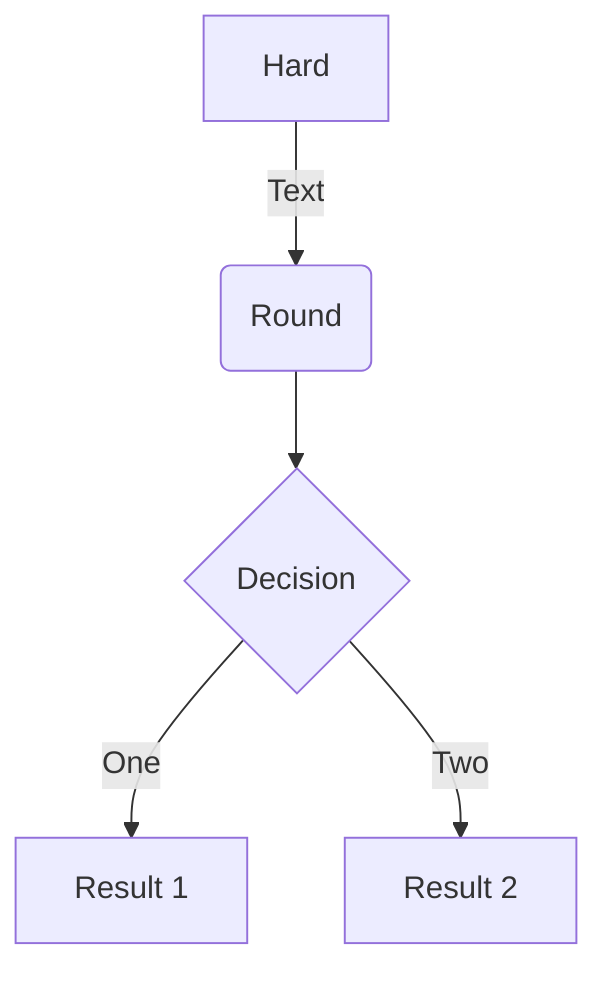
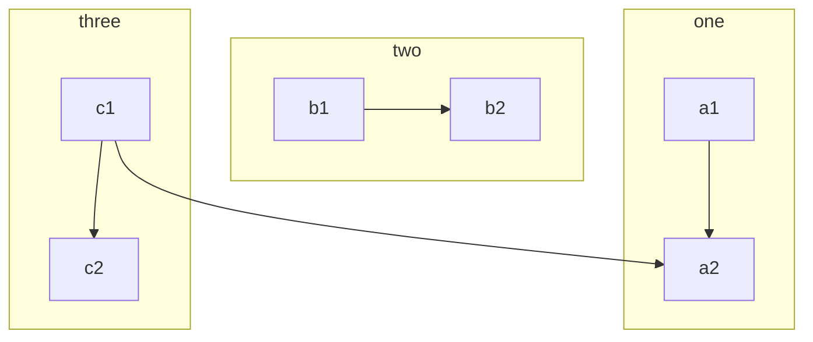

# Início

Para a documentação completa visite [mkdocs.org](https://www.mkdocs.org).

## Comandos

* `mkdocs new [dir-name]` - Cria um novo projeto.
* `mkdocs serve` - Inicia o _live-reloading_ servidor de documentos.
* `mkdocs build` - Produz a *build* do site.
* `mkdocs -h` - Imprime a mensagem de ajuda e saída.

## Layout do projeto

    mkdocs.yml    # O arquivo de configuração.
    docs/
        index.md  # A página inicial de documentação.
        ...       # Outras páginas, imagens e arquivos.

## Teste [Kumu.io](https://kumu.io/anac/anac)

Acesse em tela cheia em: https://kumu.io/anac/anac
<iframe src="https://embed.kumu.io/afa1fffb10177f3cf7eb39d236802fdf" width="940" height="600" frameborder="0"></iframe>


## Tabelas aninhadas

### Modelo 1

```markdown
=== "Tab 1"
    Markdown **content**.

    Multiple paragraphs.

=== "Tab 2"
    More Markdown **content**.

    - list item a
    - list item b
```

=== "Tab 1"
    Markdown **content**.

    Multiple paragraphs.

=== "Tab 2"
    More Markdown **content**.

    - list item a
    - list item b

### Modelo 2

???+ note "Open styled details"

    ??? danger "Nested details!"
        And more content again.

### Modelo 3

=== "Tab 1"
    Markdown **content**.

    Multiple paragraphs.

=== "Tab 2"
    More Markdown **content**.

    - list item a
    - list item b

===! "Tab A"
    Different tab set.

=== "Tab B"
    ```
    More content.
    ```

## Incorporação de outros recursos

### Mermaid




